
# arxiv digest (quant-ph + cond-mat) — 2026-07-03

*119 papers · 48 relevant · 0 highlighted*

## 🔥 Most relevant (48)

*Every paper with at least one nonzero topic score, sorted by best-matching score. 🔥 marks scores ≥4/5. Click the title to jump to the full entry below; click [arXiv] to open the paper page. `(secondary)` marks papers from de-prioritized cond-mat archives.*

Show 48 relevant papers

- [Configuration-based understanding of superradiant phase transitions in Dicke lattices](#paper-2607.00557) [[arXiv]](http://arxiv.org/abs/2607.00557v1) — 🔥 `Dicke superradiance` **5/5** · 🔥 `analog quantum simulation` **4/5** · 🔥 `correlated / nonlocal dissipation` **4/5** · 🔥 `driven-dissipative phase transition` **4/5** · 🔥 `methods for driven-dissipative` **4/5** · `Tavis-Cummings & cavity-many-emitter` **3/5** · `correlated cavity matter` **3/5** · `non-equilibrium universality` **3/5** · `non-equilibrium dynamics` **2/5** · `superradiant laser` **2/5** · `Keldysh / 2PI / non-Gaussian methods` **1/5** · `entanglement & information structure` **1/5** · `exotic spin models in light-matter` **1/5**
- [Real-time dynamics of triplet-resonant tunneling driven by nonequilibrium phonons](#paper-2607.00520) [[arXiv]](http://arxiv.org/abs/2607.00520v1) `(secondary)` — 🔥 `non-equilibrium dynamics` **5/5** · 🔥 `driven-dissipative phase transition` **4/5** · 🔥 `methods for driven-dissipative` **4/5** · `exotic spin models in light-matter` **3/5** · `non-equilibrium universality` **3/5** · `spintronics-quantum-optics interface` **3/5** · `Kondo & dissipative impurity` **2/5** · `quantum measurements` **2/5** · `Keldysh / 2PI / non-Gaussian methods` **1/5** · `analog quantum simulation` **1/5** · `correlated / nonlocal dissipation` **1/5** · `measurement-induced transitions` **1/5**
- [Work Statistics Under Quantum-Jump and Quench Dynamics in Monitored Ising Chains](#paper-2607.00131) [[arXiv]](http://arxiv.org/abs/2607.00131v1) — 🔥 `measurement-induced transitions` **5/5** · 🔥 `non-equilibrium dynamics` **4/5** · 🔥 `quantum measurements` **4/5** · `methods for driven-dissipative` **3/5** · `non-equilibrium universality` **3/5** · `Keldysh / 2PI / non-Gaussian methods` **1/5** · `correlated / nonlocal dissipation` **1/5** · `driven-dissipative phase transition` **1/5**
- [Coupling effect of nearest-neighbor interacting qubit chains to a single qubit system](#paper-2607.00307) [[arXiv]](http://arxiv.org/abs/2607.00307v1) — 🔥 `entanglement & information structure` **4/5** · `analog quantum simulation` **3/5** · `correlated / nonlocal dissipation` **3/5** · `methods for driven-dissipative` **3/5** · `non-equilibrium dynamics` **3/5** · `Keldysh / 2PI / non-Gaussian methods` **2/5** · `Tavis-Cummings & cavity-many-emitter` **2/5** · `driven-dissipative phase transition` **2/5** · `exotic spin models in light-matter` **2/5** · `non-equilibrium universality` **2/5** · `Kondo & dissipative impurity` **1/5** · `Rydberg arrays` **1/5** · `correlated cavity matter` **1/5** · `measurement-induced transitions` **1/5** · `spintronics-quantum-optics interface` **1/5**
- [Exceptional points in dissipative coupling polaron-polaritons](#paper-2607.00994) [[arXiv]](http://arxiv.org/abs/2607.00994v1) — 🔥 `Keldysh / 2PI / non-Gaussian methods` **4/5** · 🔥 `driven-dissipative phase transition` **4/5** · `analog quantum simulation` **3/5** · `correlated / nonlocal dissipation` **3/5** · `correlated cavity matter` **3/5** · `methods for driven-dissipative` **3/5** · `non-equilibrium dynamics` **3/5** · `Tavis-Cummings & cavity-many-emitter` **2/5** · `non-equilibrium universality` **2/5** · `Kondo & dissipative impurity` **1/5** · `entanglement & information structure` **1/5** · `interference shaping light` **1/5**
- [Simulating generic single-qubit open-dynamics via polarization-frequency coupling in a photonic interferometer](#paper-2607.00835) [[arXiv]](http://arxiv.org/abs/2607.00835v1) — 🔥 `analog quantum simulation` **4/5** · 🔥 `correlated / nonlocal dissipation` **4/5** · 🔥 `interference shaping light` **4/5** · `methods for driven-dissipative` **3/5** · `non-equilibrium dynamics` **3/5** · `quantum optics experiment` **3/5** · `QC/QI experiment` **2/5** · `driven-dissipative phase transition` **2/5** · `Keldysh / 2PI / non-Gaussian methods` **1/5** · `entanglement & information structure` **1/5** · `non-equilibrium universality` **1/5** · `quantum measurements` **1/5**
- [Dissipation splits the Mott transition in one dimension](#paper-2607.00086) [[arXiv]](http://arxiv.org/abs/2607.00086v1) — 🔥 `analog quantum simulation` **4/5** · 🔥 `driven-dissipative phase transition` **4/5** · `Frenkel-Kontorova` **3/5** · `correlated / nonlocal dissipation` **3/5** · `methods for driven-dissipative` **3/5** · `non-equilibrium universality` **3/5** · `Kondo & dissipative impurity` **2/5** · `non-equilibrium dynamics` **2/5** · `Keldysh / 2PI / non-Gaussian methods` **1/5** · `entanglement & information structure` **1/5**
- [Robustness of Quantum Discord in Nonequilibrium Electronic Transport through Tunnel-Coupled Quantum Dots](#paper-2607.00602) [[arXiv]](http://arxiv.org/abs/2607.00602v1) — 🔥 `entanglement & information structure` **4/5** · 🔥 `methods for driven-dissipative` **4/5** · 🔥 `non-equilibrium dynamics` **4/5** · `Keldysh / 2PI / non-Gaussian methods` **3/5** · `driven-dissipative phase transition` **3/5** · `correlated / nonlocal dissipation` **2/5** · `non-equilibrium universality` **2/5** · `Kondo & dissipative impurity` **1/5** · `analog quantum simulation` **1/5** · `scars & prethermalization` **1/5**
- [Learning Low-Energy Subspace Overlaps in Many-Body Systems with Measurement-Based and Coherent Quantum Strategies](#paper-2607.00235) [[arXiv]](http://arxiv.org/abs/2607.00235v1) — 🔥 `non-equilibrium dynamics` **4/5** · `entanglement & information structure` **3/5** · `methods for driven-dissipative` **3/5** · `non-equilibrium universality` **3/5** · `quantum measurements` **3/5** · `measurement-induced transitions` **2/5** · `scars & prethermalization` **2/5** · `analog quantum simulation` **1/5** · `driven-dissipative phase transition` **1/5** · `exotic spin models in light-matter` **1/5**
- [Strange Luttinger liquids in a cavity-embedded one-dimensional electronic chain](#paper-2607.01146) [[arXiv]](http://arxiv.org/abs/2607.01146v1) — 🔥 `analog quantum simulation` **4/5** · 🔥 `correlated cavity matter` **4/5** · `Tavis-Cummings & cavity-many-emitter` **2/5** · `driven-dissipative phase transition` **2/5** · `methods for driven-dissipative` **2/5** · `Frenkel-Kontorova` **1/5** · `Keldysh / 2PI / non-Gaussian methods` **1/5** · `Kondo & dissipative impurity` **1/5** · `correlated / nonlocal dissipation` **1/5** · `entanglement & information structure` **1/5** · `exotic spin models in light-matter` **1/5** · `non-equilibrium dynamics` **1/5** · `non-equilibrium universality` **1/5**
- [Subsystem Thermalization and Work Statistical Characterizations of Floquet Dynamics](#paper-2607.00381) [[arXiv]](http://arxiv.org/abs/2607.00381v1) — 🔥 `non-equilibrium dynamics` **4/5** · 🔥 `scars & prethermalization` **4/5** · `driven-dissipative phase transition` **3/5** · `methods for driven-dissipative` **3/5** · `entanglement & information structure` **2/5** · `non-equilibrium universality` **2/5** · `Frenkel-Kontorova` **1/5** · `Keldysh / 2PI / non-Gaussian methods` **1/5** · `analog quantum simulation` **1/5** · `correlated / nonlocal dissipation` **1/5**
- [Surface charges in a Rydberg atom-nanowaveguide hybrid quantum system](#paper-2607.00513) [[arXiv]](http://arxiv.org/abs/2607.00513v1) — 🔥 `Rydberg arrays` **4/5** · `methods for driven-dissipative` **3/5** · `quantum optics experiment` **3/5** · `QC/QI experiment` **2/5** · `quantum measurements` **2/5** · `Keldysh / 2PI / non-Gaussian methods` **1/5** · `Tavis-Cummings & cavity-many-emitter` **1/5** · `analog quantum simulation` **1/5** · `correlated / nonlocal dissipation` **1/5** · `correlated cavity matter` **1/5** · `driven-dissipative phase transition` **1/5** · `non-equilibrium dynamics` **1/5**
- [Brownian ratchets and pumps universally simulate many-body active dynamics](#paper-2607.01231) [[arXiv]](http://arxiv.org/abs/2607.01231v1) — 🔥 `non-equilibrium dynamics` **4/5** · 🔥 `non-equilibrium universality` **4/5** · `driven-dissipative phase transition` **3/5** · `methods for driven-dissipative` **3/5** · `analog quantum simulation` **2/5** · `Keldysh / 2PI / non-Gaussian methods` **1/5** · `correlated / nonlocal dissipation` **1/5** · `entanglement & information structure` **1/5** · `exotic spin models in light-matter` **1/5**
- [Optimizing Symmetry Informed Probabilistic Error Cancellation](#paper-2607.01072) [[arXiv]](http://arxiv.org/abs/2607.01072v1) — 🔥 `analog quantum simulation` **4/5** · `measurement-induced transitions` **3/5** · `methods for driven-dissipative` **3/5** · `quantum measurements` **3/5** · `non-equilibrium dynamics` **2/5** · `Keldysh / 2PI / non-Gaussian methods` **1/5** · `correlated / nonlocal dissipation` **1/5** · `driven-dissipative phase transition` **1/5** · `entanglement & information structure` **1/5** · `exotic spin models in light-matter` **1/5**
- [Universal Scaling of the Spin Hall Effect](#paper-2607.00343) [[arXiv]](http://arxiv.org/abs/2607.00343v1) `(secondary)` — 🔥 `Keldysh / 2PI / non-Gaussian methods` **4/5** · `methods for driven-dissipative` **3/5** · `non-equilibrium universality` **3/5** · `spintronics-quantum-optics interface` **3/5** · `Kondo & dissipative impurity` **2/5** · `non-equilibrium dynamics` **2/5** · `correlated / nonlocal dissipation` **1/5** · `driven-dissipative phase transition` **1/5** · `exotic spin models in light-matter` **1/5**
- [Asymmetric Light Scattering from an Atomic System with Gain: A Quantum Analysis](#paper-2607.00779) [[arXiv]](http://arxiv.org/abs/2607.00779v1) — 🔥 `interference shaping light` **4/5** · `Keldysh / 2PI / non-Gaussian methods` **3/5** · `methods for driven-dissipative` **3/5** · `correlated / nonlocal dissipation` **2/5** · `driven-dissipative phase transition` **2/5** · `non-equilibrium dynamics` **2/5** · `Tavis-Cummings & cavity-many-emitter` **1/5** · `correlated cavity matter` **1/5** · `non-equilibrium universality` **1/5**
- [Far-field spatial coherence driven by lossy objects: first-principles approach unifying scattering of quantum light and thermal emission](#paper-2607.00653) [[arXiv]](http://arxiv.org/abs/2607.00653v1) — 🔥 `interference shaping light` **4/5** · `Keldysh / 2PI / non-Gaussian methods` **3/5** · `correlated / nonlocal dissipation` **3/5** · `methods for driven-dissipative` **3/5** · `driven-dissipative phase transition` **2/5** · `correlated cavity matter` **1/5** · `non-equilibrium dynamics` **1/5** · `non-equilibrium universality` **1/5**
- [Spinterface-like mechanism of the chirality-induced spin selectivity in donor chiral-bridge acceptor complexes](#paper-2607.00668) [[arXiv]](http://arxiv.org/abs/2607.00668v1) — 🔥 `methods for driven-dissipative` **4/5** · `Keldysh / 2PI / non-Gaussian methods` **3/5** · `spintronics-quantum-optics interface` **3/5** · `Kondo & dissipative impurity` **2/5** · `non-equilibrium dynamics` **2/5** · `correlated / nonlocal dissipation` **1/5** · `driven-dissipative phase transition` **1/5** · `exotic spin models in light-matter` **1/5** · `non-equilibrium universality` **1/5**
- [Weak-coupling tensor cross interpolation impurity solver for nonequilibrium dynamical mean-field theory](#paper-2607.00702) [[arXiv]](http://arxiv.org/abs/2607.00702v1) — 🔥 `Keldysh / 2PI / non-Gaussian methods` **4/5** · 🔥 `non-equilibrium dynamics` **4/5** · `Kondo & dissipative impurity` **3/5** · `methods for driven-dissipative` **3/5** · `driven-dissipative phase transition` **2/5** · `analog quantum simulation` **1/5** · `non-equilibrium universality` **1/5**
- [Optically Active Single Hole Spin in ZnSe](#paper-2607.00110) [[arXiv]](http://arxiv.org/abs/2607.00110v1) — 🔥 `QC/QI experiment` **4/5** · 🔥 `spintronics-quantum-optics interface` **4/5** · `exotic spin models in light-matter` **3/5** · `quantum optics experiment` **3/5** · `Kondo & dissipative impurity` **1/5** · `analog quantum simulation` **1/5** · `quantum measurements` **1/5**
- [Closed-loop control for two-qubit gates with trapped ions](#paper-2607.00462) [[arXiv]](http://arxiv.org/abs/2607.00462v1) — 🔥 `QC/QI experiment` **4/5** · 🔥 `quantum measurements` **4/5** · `measurement-induced transitions` **3/5** · `methods for driven-dissipative` **3/5** · `non-equilibrium dynamics` **1/5** · `quantum optics experiment` **1/5**
- [Extreme volume monogamy via bound-state engineering](#paper-2607.00346) [[arXiv]](http://arxiv.org/abs/2607.00346v1) — 🔥 `entanglement & information structure` **4/5** · `correlated / nonlocal dissipation` **3/5** · `methods for driven-dissipative` **3/5** · `driven-dissipative phase transition` **2/5** · `non-equilibrium dynamics` **2/5** · `Keldysh / 2PI / non-Gaussian methods` **1/5** · `non-equilibrium universality` **1/5**
- [Open Quantum Systems Driven by Chirped Pulses: Quantized versus Semiclassical Fields and the Validity of the Rotating-Wave Approximation](#paper-2607.00583) [[arXiv]](http://arxiv.org/abs/2607.00583v1) — 🔥 `methods for driven-dissipative` **4/5** · `Keldysh / 2PI / non-Gaussian methods` **3/5** · `Tavis-Cummings & cavity-many-emitter` **2/5** · `non-equilibrium dynamics` **2/5** · `analog quantum simulation` **1/5** · `correlated / nonlocal dissipation` **1/5** · `correlated cavity matter` **1/5** · `driven-dissipative phase transition` **1/5** · `interference shaping light` **1/5**
- [Bandwidth-Limited Critical Currents in Electrically Tunable Moiré Bands](#paper-2607.01056) [[arXiv]](http://arxiv.org/abs/2607.01056v1) — 🔥 `non-equilibrium dynamics` **4/5** · `non-equilibrium universality` **3/5** · `driven-dissipative phase transition` **2/5** · `methods for driven-dissipative` **2/5** · `Frenkel-Kontorova` **1/5** · `Keldysh / 2PI / non-Gaussian methods` **1/5** · `analog quantum simulation` **1/5** · `correlated / nonlocal dissipation` **1/5**
- [TCL4 Asymptotic Redundancy and Canonically Consistent Master Equations](#paper-2607.00193) [[arXiv]](http://arxiv.org/abs/2607.00193v1) — 🔥 `methods for driven-dissipative` **4/5** · `Keldysh / 2PI / non-Gaussian methods` **3/5** · `non-equilibrium dynamics` **3/5** · `correlated / nonlocal dissipation` **2/5** · `driven-dissipative phase transition` **2/5** · `non-equilibrium universality` **1/5**
- [Entanglement fingerprint of a non-invertible symmetry: exact Fibonacci cut charges on the lattice](#paper-2607.01151) [[arXiv]](http://arxiv.org/abs/2607.01151v1) — 🔥 `entanglement & information structure` **4/5** · `driven-dissipative phase transition` **2/5** · `non-equilibrium universality` **2/5** · `Frenkel-Kontorova` **1/5** · `analog quantum simulation` **1/5** · `correlated cavity matter` **1/5** · `methods for driven-dissipative` **1/5** · `non-equilibrium dynamics` **1/5**
- [Slow heat-driven flow in a gas of hard disks](#paper-2607.00449) [[arXiv]](http://arxiv.org/abs/2607.00449v1) — 🔥 `non-equilibrium dynamics` **4/5** · `methods for driven-dissipative` **3/5** · `non-equilibrium universality` **3/5** · `driven-dissipative phase transition` **2/5** · `Keldysh / 2PI / non-Gaussian methods` **1/5**
- [Active Learning for Calibrating Entangling Gates via Surrogate-Based Optimization](#paper-2607.00284) [[arXiv]](http://arxiv.org/abs/2607.00284v1) — 🔥 `QC/QI experiment` **4/5** · `quantum measurements` **3/5** · `measurement-induced transitions` **2/5** · `analog quantum simulation` **1/5** · `methods for driven-dissipative` **1/5** · `non-equilibrium dynamics` **1/5**
- [Experimental Quantification of Layered Error Suppression in Fiber-Interconnected Quantum Data Centers](#paper-2607.00735) [[arXiv]](http://arxiv.org/abs/2607.00735v1) — 🔥 `QC/QI experiment` **4/5** · `correlated / nonlocal dissipation` **2/5** · `quantum measurements` **2/5** · `entanglement & information structure` **1/5** · `methods for driven-dissipative` **1/5** · `non-equilibrium dynamics` **1/5** · `quantum optics experiment` **1/5**
- [Synthesizing Compound Pulse Gadgets for Hamiltonian Simulation on Trapped-Ion Platforms](#paper-2607.00826) [[arXiv]](http://arxiv.org/abs/2607.00826v1) — 🔥 `analog quantum simulation` **4/5** · `QC/QI experiment` **2/5** · `non-equilibrium dynamics` **2/5** · `correlated / nonlocal dissipation` **1/5** · `driven-dissipative phase transition` **1/5** · `entanglement & information structure` **1/5** · `methods for driven-dissipative` **1/5**
- [Entanglement-spectrum fingerprint of a non-invertible symmetry: the Kramers--Wannier duality defect on the lattice](#paper-2607.01137) [[arXiv]](http://arxiv.org/abs/2607.01137v1) — 🔥 `entanglement & information structure` **4/5** · `analog quantum simulation` **2/5** · `correlated / nonlocal dissipation` **1/5** · `driven-dissipative phase transition` **1/5** · `methods for driven-dissipative` **1/5** · `non-equilibrium dynamics` **1/5** · `non-equilibrium universality` **1/5**
- [Strongly frustrated 2D magnetism in a 3D hexagonal perovskite](#paper-2607.00532) [[arXiv]](http://arxiv.org/abs/2607.00532v1) — 🔥 `analog quantum simulation` **4/5** · `exotic spin models in light-matter` **3/5** · `Keldysh / 2PI / non-Gaussian methods` **1/5** · `entanglement & information structure` **1/5** · `methods for driven-dissipative` **1/5** · `spintronics-quantum-optics interface` **1/5**
- [Holographic Quantum Transformer: A Generalist Neuro-Symbolic Architecture for Solving Frustrated Systems via Generative Attention](#paper-2607.00398) [[arXiv]](http://arxiv.org/abs/2607.00398v1) — 🔥 `analog quantum simulation` **4/5** · `exotic spin models in light-matter` **3/5** · `entanglement & information structure` **1/5** · `methods for driven-dissipative` **1/5** · `non-equilibrium dynamics` **1/5**
- [Quantum-Informed Portfolio Selection: An End-to-End Pipeline Validated on Trapped-Ion Hardware with Real Market Data](#paper-2607.01037) [[arXiv]](http://arxiv.org/abs/2607.01037v1) — 🔥 `QC/QI experiment` **4/5** · `quantum measurements` **3/5** · `analog quantum simulation` **1/5** · `exotic spin models in light-matter` **1/5** · `measurement-induced transitions` **1/5**
- [Chiral enhancement of two-magnon bound states in an $S=1/2$ triangular-lattice magnet](#paper-2607.01062) [[arXiv]](http://arxiv.org/abs/2607.01062v1) — 🔥 `analog quantum simulation` **4/5** · 🔥 `exotic spin models in light-matter` **4/5** · `spintronics-quantum-optics interface` **1/5**
- [Toward Hamiltonian simulations of Maxwell-Chern-Simons theory: constant modes and gauge field truncation](#paper-2607.00082) [[arXiv]](http://arxiv.org/abs/2607.00082v1) — 🔥 `analog quantum simulation` **4/5** · `Frenkel-Kontorova` **1/5** · `Keldysh / 2PI / non-Gaussian methods` **1/5** · `entanglement & information structure` **1/5** · `exotic spin models in light-matter` **1/5** · `methods for driven-dissipative` **1/5**
- [Vanadium superconducting microwave resonators on silicon wafers](#paper-2607.00809) [[arXiv]](http://arxiv.org/abs/2607.00809v1) — 🔥 `QC/QI experiment` **4/5** · `correlated / nonlocal dissipation` **2/5** · `correlated cavity matter` **1/5** · `driven-dissipative phase transition` **1/5** · `quantum optics experiment` **1/5**
- [Production of Magic States via $Z$ Bosons and Dark Photons](#paper-2607.00229) [[arXiv]](http://arxiv.org/abs/2607.00229v1) — 🔥 `entanglement & information structure` **4/5** · `Keldysh / 2PI / non-Gaussian methods` **1/5** · `correlated / nonlocal dissipation` **1/5** · `driven-dissipative phase transition` **1/5** · `methods for driven-dissipative` **1/5**
- [Polynomial equivalence of the global transverse-field Ising model and the gate model of quantum computation](#paper-2607.01227) [[arXiv]](http://arxiv.org/abs/2607.01227v1) — 🔥 `analog quantum simulation` **4/5** · `entanglement & information structure` **1/5** · `exotic spin models in light-matter` **1/5** · `non-equilibrium dynamics` **1/5**
- [Wavefunctions localization, and the Wigner's Friend Paradox in a Framework of Discrete-Space Hypothesis](#paper-2607.00198) [[arXiv]](http://arxiv.org/abs/2607.00198v1) — 🔥 `measurement-induced transitions` **4/5** · `quantum measurements` **3/5**
- [Exact interlayer triplet-pairing eigenstates in the extended Hubbard model](#paper-2607.01038) [[arXiv]](http://arxiv.org/abs/2607.01038v1) — 🔥 `analog quantum simulation` **4/5** · `entanglement & information structure` **1/5** · `non-equilibrium dynamics` **1/5**
- [Overcoming the Speed-Fidelity Trade-off in Fast CZ Gates via Cyclic Control](#paper-2607.00660) [[arXiv]](http://arxiv.org/abs/2607.00660v1) — 🔥 `QC/QI experiment` **4/5** · `methods for driven-dissipative` **1/5** · `non-equilibrium dynamics` **1/5**
- [A Versatile Analytical Model for Fast and Accurate Determination of Feedline-Coupled Resonators for Superconducting Qubit Readout](#paper-2607.00490) [[arXiv]](http://arxiv.org/abs/2607.00490v1) — 🔥 `QC/QI experiment` **4/5** · `methods for driven-dissipative` **1/5**
- [Non-Clifford Benchmarking via Ensemble Feature Selection](#paper-2607.01180) [[arXiv]](http://arxiv.org/abs/2607.01180v1) — 🔥 `QC/QI experiment` **4/5** · `quantum measurements` **1/5**
- [Surface Platinum Alloying for Passivation of Oxide Interfaces on Superconducting Niobium Films](#paper-2607.00429) [[arXiv]](http://arxiv.org/abs/2607.00429v1) `(secondary)` — 🔥 `QC/QI experiment` **4/5** · `Kondo & dissipative impurity` **1/5**
- [Characterization of Hydroxyls in Surface Oxide of Superconducting Tantalum and Their Mitigation in Quantum Circuits](#paper-2607.00903) [[arXiv]](http://arxiv.org/abs/2607.00903v1) `(secondary)` — 🔥 `QC/QI experiment` **4/5**
- [Superconducting Spiral Inductors for RF Reflectometry: Operation at Elevated Temperatures and Magnetic Fields](#paper-2607.00172) [[arXiv]](http://arxiv.org/abs/2607.00172v1) — 🔥 `QC/QI experiment` **4/5**
- [Universal logic circuit for gate-controlled superconductor-based switches operating at liquid-helium temperatures](#paper-2607.00769) [[arXiv]](http://arxiv.org/abs/2607.00769v1) `(secondary)` — 🔥 `QC/QI experiment` **4/5**

## All papers (93, sorted by relevance)

*Papers from quant-ph and your primary cond-mat archives (quant-gas, stat-mech, str-el, dis-nn). Highlighted papers (⭐) come first, then everything else sorted by topic-relevance score, highest first.*

### [Configuration-based understanding of superradiant phase transitions in Dicke lattices](http://arxiv.org/abs/2607.00557v1)

**Authors:** Peng-Fei Wei, Zhihai Wang  
**Type:** theory · **Category:** other · **PDF:** <https://arxiv.org/pdf/2607.00557v1>  
**Analysis basis:** full PDF text, analyzed in chunks
**Topic relevance:** 🔥 `Dicke superradiance` **5/5** · 🔥 `analog quantum simulation` **4/5** · 🔥 `correlated / nonlocal dissipation` **4/5** · 🔥 `driven-dissipative phase transition` **4/5** · 🔥 `methods for driven-dissipative` **4/5** · `Tavis-Cummings & cavity-many-emitter` **3/5** · `correlated cavity matter` **3/5** · `non-equilibrium universality` **3/5** · `non-equilibrium dynamics` **2/5** · `superradiant laser` **2/5** · `Keldysh / 2PI / non-Gaussian methods` **1/5** · `entanglement & information structure` **1/5** · `exotic spin models in light-matter` **1/5**

↔ Scroll figures horizontally

<figure class="paper-figure-card">

<figcaption class="paper-figure-caption"><b>Fig 1.</b> Figure 1. (a) Phase diagram for the open Dicke lattice model with N = 4. (b) The real part of order parameter Rj about each site with ξ = 0.1ω and g = 0.8ω. (c) Plot of the order parameter |⟨cj⟩|/√Na = p</figcaption>
</figure>
<figure class="paper-figure-card">
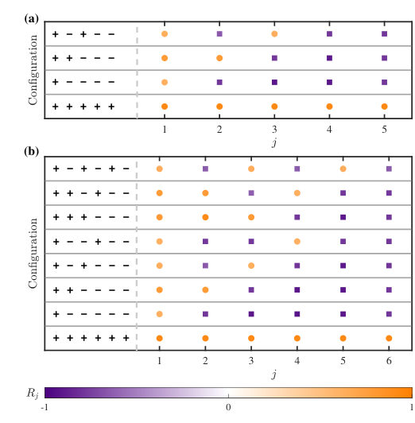
<figcaption class="paper-figure-caption"><b>Fig 2.</b> Figure 2. The representative configuration for (a) N = 5 and (b) N = 6. The parameters are set to ωa = ωc = ω, κ = 0.4ω, g = 0.8ω and ξ = 0.1ω.</figcaption>
</figure>
<figure class="paper-figure-card">
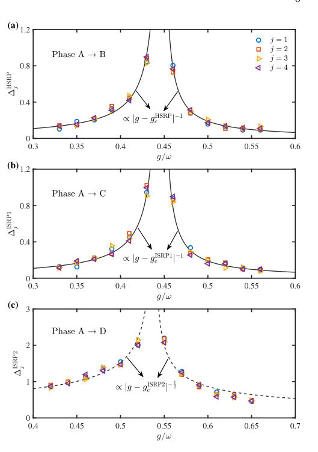
<figcaption class="paper-figure-caption"><b>Fig 3.</b> Figure 3. On-site fluctuations ∆j in the vicinity of the critical coupling for (a) Phase A-B (ξ = 0.3ω), (b) Phase A-C (ξ = −0.3ω), and (c) Phase A-D (ξ = 0.48ω). Other parameters are set to ωa = ωc = ω and κ = 0.4ω.</figcaption>
</figure>
<figure class="paper-figure-card">
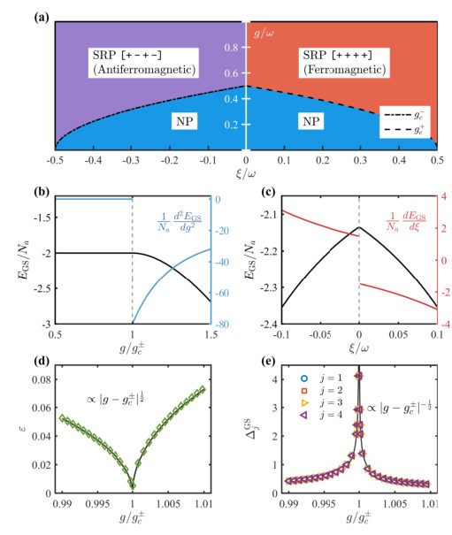
<figcaption class="paper-figure-caption"><b>Fig 4.</b> Figure 4. (a) Phase diagram for the Dicke lattice model with N = 4. (b) The ground-state energy and its second-order derivative as a function of g/g± c . (c) The ground-state energy and its first-order derivative (red line) as a function of ξ with g = 0.6ω. (d) The lowest excitation energies ε as a function of the coupling strength g/g± c . (e) The on-site fluctuations of the ground state as a function of g/g± c . Other parameters are set to ωa = ωc = ω and ξ = ±0.3ω.</figcaption>
</figure>

**Summary.** The paper introduces a configuration-based framework to unify the understanding of superradiant phase transitions in Dicke lattices. By classifying stable configurations based on lattice symmetry, it maps out complex, multi-stable phase diagrams for both open (dissipative) and closed quantum systems. This provides a comprehensive picture connecting local atomic/photonic arrangements to global thermodynamic behavior.

**Why it may be interesting.** This work provides a powerful structural tool (configuration-based understanding) to organize complex many-body dynamics in open quantum systems like cavity QED arrays, unifying disparate findings on multistability and phase transitions.

Detailed structure

**Main problem.** The primary goal is to develop a unified, configuration-based understanding of how multistability arises and relates different superradiant phases in Dicke lattices.

**Main result.** The authors classify superradiant phases based on lattice symmetry configurations, demonstrating that the system can exhibit up to four stable phases for $N=4$ sites. They also contrast the behavior between dissipative (nonequilibrium) and closed (equilibrium) systems regarding universality classes.

**Method.** The analysis employs a mean-field approach derived from the Lindblad master equation for the open system, supplemented by stability analysis via linearization around steady states. For equilibrium, ground state energy minimization is used.

**Model / system.** The model is the Dicke lattice, consisting of coupled atom-resonator units on a 1D lattice ($N$ sites). The dynamics are governed by a Hamiltonian and dissipation (Lindblad equation), incorporating photon hopping ($\xi$).

**Key observables.** Superradiant phases (NP vs. SRP), local order parameters ($R_j, I_j$), coexistence of stable steady states, and critical exponents ($\gamma_{open}, \gamma_{closed}$).

**Important parameters / regimes.** Photon hopping strength ($\xi$), dissipation rate ($\kappa$), coupling strengths ($g$), and lattice size ($N=4, 5, 6$).

**Assumptions / limitations.** The analysis relies on the mean-field approximation for correlations ($\langle AB 
angle \simeq \langle A 
angle \langle B 
angle$) and sometimes uses the Discrete Truncated Wigner Approximation (DTWA).

**Figures summary.** Figures illustrate representative superradiant configurations for $N=5$ and $N=6$, and show scaling behavior of on-site fluctuations ($\Delta_j$) near critical couplings.

**Paper structure.** The paper first establishes the physical model and then develops a configuration classification scheme. It analyzes the dissipative case to map out the phase diagram, followed by an extension to the closed lattice to compare equilibrium vs. nonequilibrium universality classes.

Abstract

The emergence of multiple superradiant phases in Dicke lattice models has attracted considerable attention in the quantum optics community. However, a unified understanding of the origin of multistability and its relation to different superradiant phases is still lacking. Here, we develop a configuration-based understanding to classify the superradiant phases in Dicke lattices. We show that photon hopping naturally organizes the possible superradiant configurations according to the lattice symmetry, providing a unified interpretation of the nonequilibrium phase diagram and the emergence of multistability. For the dissipative four-site Dicke lattice, we obtain the complete phase diagram and identify the coexistence of up to four stable superradiant phases. The proposed classification is further extended to five- and six-site lattices. Moreover, we demonstrate that the same configuration-based understanding also applies to the closed Dicke lattice, where the ground state uniquely selects one of the allowed configurations. Finally, we show that different configurations may belong to either same or distinct nonequilibrium universality classes in the dissipative Dicke lattice, while they share the same equilibrium universality class in the closed Dicke lattice. Our results provide a unified picture for understanding equilibrium and nonequilibrium superradiant phase transitions in Dicke lattices.

[↑ back to top](#top)

### [Work Statistics Under Quantum-Jump and Quench Dynamics in Monitored Ising Chains](http://arxiv.org/abs/2607.00131v1)

**Authors:** Manali Malakar, Alessandro Silva  
**Type:** theory · **Category:** statistical mechanics · **PDF:** <https://arxiv.org/pdf/2607.00131v1>  
**Analysis basis:** full PDF text, analyzed in chunks
**Topic relevance:** 🔥 `measurement-induced transitions` **5/5** · 🔥 `non-equilibrium dynamics` **4/5** · 🔥 `quantum measurements` **4/5** · `methods for driven-dissipative` **3/5** · `non-equilibrium universality` **3/5** · `Keldysh / 2PI / non-Gaussian methods` **1/5** · `correlated / nonlocal dissipation` **1/5** · `driven-dissipative phase transition` **1/5**

↔ Scroll figures horizontally

<figure class="paper-figure-card">
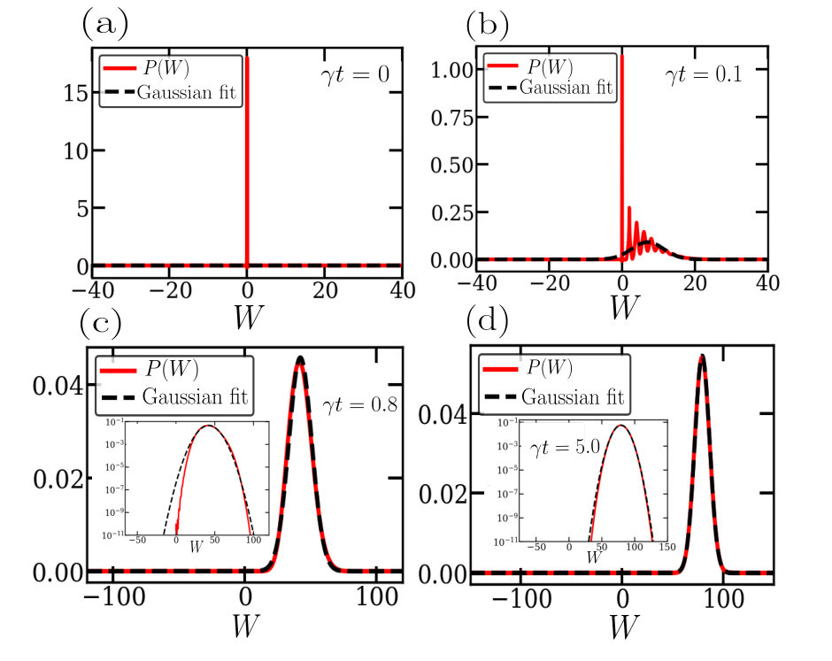
<figcaption class="paper-figure-caption"><b>Fig 1.</b> FIG. 1. Work distribution P(W) under stochastic quantum-jump dynamics in a monitored transverse-field Ising chain without quench (Hi = Hf), for system size L = 80, transverse field h = 0.4, averaged over 200 stochastic realizations. Solid red lines show the numerically constructed P(W) and black dashed curves are Gaussian fits with the same mean and variance. (a) No monitoring (γt = 0): the characteristic function reduces to G(u) = 1 and the work distribution collapses to a single delta peak P(W) = δ(W) at W = 0. (b) Weak monitoring (γt = 0.1): rare jumps create a comb of narrow side peaks at W &gt; 0 on top of the dominant W = 0 peak, reflecting discrete excitation pathways and residual...</figcaption>
</figure>
<figure class="paper-figure-card">

<figcaption class="paper-figure-caption"><b>Fig 2.</b> FIG. 2. Variation of the tail deviation D(2σ) tail with the cumulative monitoring strength γt at transverse field h = 0.6. The decrease of D(2σ) tail indicates that the work distribution P(W) approaches its Gaussian reference PG(W) as monitoring becomes stronger, con- sistent with the behavior shown in Fig. 1. Parameters: L = 60, averaged over 500 stochastic realizations.</figcaption>
</figure>
<figure class="paper-figure-card">
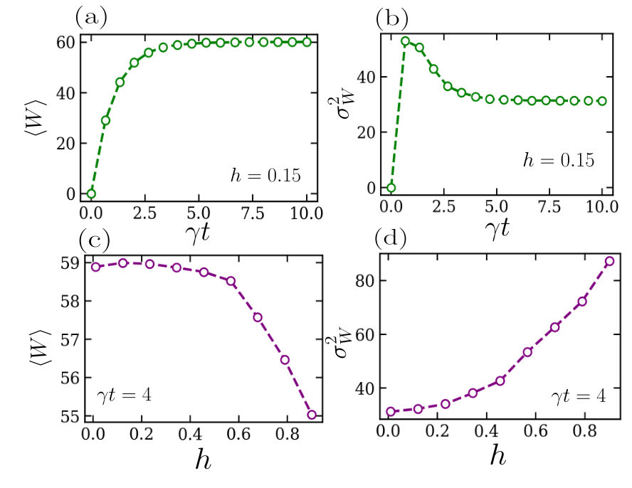
<figcaption class="paper-figure-caption"><b>Fig 3.</b> FIG. 3. Work cumulants under stochastic jump dynamics with no quench, Hi = Hf, for a system size L = 60, averaged over 500 stochastic realizations. (a) Mean work ⟨W⟩as a function of the cumulative monitoring strength γt at fixed transverse field h = 0.15. (b) Corresponding work variance σ2 W . The mean work increases rapidly and then saturates, whereas the variance shows a pronounced maximum before relaxing to a plateau. (c) Mean work as a function of the transverse field h at fixed γt = 4. The mean work varies only weakly at small and intermediate h, and decreases at larger h. (d) Corresponding work variance, showing that increasing h broadens the distribution of final-energy outcomes even...</figcaption>
</figure>
<figure class="paper-figure-card">

<figcaption class="paper-figure-caption"><b>Fig 4.</b> FIG. 4. Per-jump energy increment ∆Ej as a function of jump in- dex j for system size L = 1024. (a) In the gapped ferromagnetic phase at h = 0.5, ∆Eout j remains strictly constant with respect to j, while ∆Ein j drops at early j and then saturates. Inset: zoomed view of ∆Eout j confirming its j-independence. (b) At the critical point h = 1.0, algebraic correlations render even the outside-cone ∆Eout j weakly j-dependent, as revealed in the inset, whereas the inside-cone ∆Ein j still decays and saturates but more slowly.</figcaption>
</figure>
<figure class="paper-figure-card">
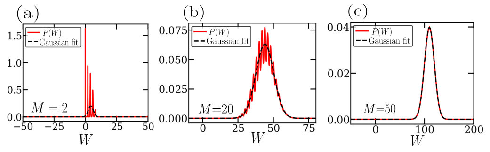
<figcaption class="paper-figure-caption"><b>Fig 5.</b> FIG. 5. Work distribution P(W) in the controlled jump protocol with equally spaced jumps in space and time, illustrating the progression toward Gaussianity with increasing number of jumps M for system size L = 300, h = 0.2, and total time t = 1. (a) For M = 2, P(W) displays a dominant central peak at W = 0 indicative of minimal energy injection, accompanied by multiple discrete peaks at W &gt; 0, reflecting a small set of coherent excitations and preserved coherences. (b) For M = 20, the distribution develops a bell-shaped core but retains residual spikes from incomplete dephasing. (c) For M = 50, P(W) achieves a fully smooth profile that closely overlaps with the Gaussian fit with the same...</figcaption>
</figure>

**Summary.** This paper analyzes the statistics of work done on monitored Ising chains under quantum quenches and stochastic measurements. It demonstrates that frequent monitoring drives the system's work distribution towards Gaussian behavior, while controlled jumps reveal distinct linear versus sublinear growth rates based on causal correlations. This offers deep insights into how measurement backaction shapes non-equilibrium thermodynamics.

**Why it may be interesting.** It provides a quantitative framework for understanding how measurement backaction fundamentally alters non-equilibrium thermodynamics, moving beyond simple average energy calculations to characterize fluctuations in work.

Detailed structure

**Main problem.** The study investigates how work statistics evolve in monitored quantum systems subjected to both quantum quenches and continuous measurement processes.

**Main result.** Frequent monitoring drives the work distribution towards an essentially Gaussian form, while controlled measurements reveal distinct growth regimes depending on whether energy increments are causally disconnected or correlated within a light cone.

**Method.** The analysis employs deriving trajectory-resolved generating functions for work statistics and evaluating them using fermionic Gaussian-state formalisms.

**Model / system.** The system is the transverse-field Ising chain, whose dynamics are governed by stochastic quantum jumps (unraveling of a Lindblad master equation) or controlled deterministic projections.

**Key observables.** Work distribution P(W), work generating function G(u), mean work <W>, and variance σ²_W.

**Important parameters / regimes.** Measurement rate (γ), number of detection events, transverse field strength (h), and the causal separation between measurement jumps (inside/outside light cone).

**Assumptions / limitations.** The analysis relies on the Central Limit Theorem to explain the approach to Gaussianity for large numbers of weakly correlated increments.

**Figures summary.** Figures illustrate the transition of P(W) from discrete peaks to Gaussian shapes as monitoring strength increases, and compare work statistics under isolated quenches versus monitored dynamics.

**Paper structure.** The paper systematically analyzes work statistics across different measurement protocols: stochastic jumps (showing crossover), controlled deterministic jumps (highlighting causality effects), and the combined effect of quenching with continuous observation.

Abstract

We investigate work statistics in monitored transverse-field Ising chains subject to both a quantum quench of the transverse field and either stochastic quantum jumps or controlled measurement sequences. For generalized measurements, we derive a trajectory-resolved generating function for work statistics in the two-point energy measurement scheme. Evaluating it using a fermionic Gaussian-state formalism, we show that, under stochastic jump dynamics, the work distribution crosses over from a comb-like structure to an essentially Gaussian form with shrinking sub-Gaussian tails, as the number of detection events grows. For controlled jump protocols, the energy added by each jump is constant when successive jumps are causally disconnected but decreases and then saturates when they lie within each other's light cone, yielding linear and sublinear growth of the average work, respectively. For monitored quenches, continuous observation washes out the fine structure of the isolated-quench distribution and again drives the statistics toward Gaussian behavior.

[↑ back to top](#top)

### [Coupling effect of nearest-neighbor interacting qubit chains to a single qubit system](http://arxiv.org/abs/2607.00307v1)

**Authors:** Manuel Allan L. Orongan, Lemuel John F. Sese, Rayda P. Gammag  
**Type:** theory · **Category:** statistical mechanics · **PDF:** <https://arxiv.org/pdf/2607.00307v1>  
**Analysis basis:** full PDF text, analyzed in chunks
**Topic relevance:** 🔥 `entanglement & information structure` **4/5** · `analog quantum simulation` **3/5** · `correlated / nonlocal dissipation` **3/5** · `methods for driven-dissipative` **3/5** · `non-equilibrium dynamics` **3/5** · `Keldysh / 2PI / non-Gaussian methods` **2/5** · `Tavis-Cummings & cavity-many-emitter` **2/5** · `driven-dissipative phase transition` **2/5** · `exotic spin models in light-matter` **2/5** · `non-equilibrium universality` **2/5** · `Kondo & dissipative impurity` **1/5** · `Rydberg arrays` **1/5** · `correlated cavity matter` **1/5** · `measurement-induced transitions` **1/5** · `spintronics-quantum-optics interface` **1/5**

↔ Scroll figures horizontally

<figure class="paper-figure-card">

<figcaption class="paper-figure-caption"><b>Fig 1.</b> FIG. 1: An open quantum system with the local system S and environment E.</figcaption>
</figure>
<figure class="paper-figure-card">
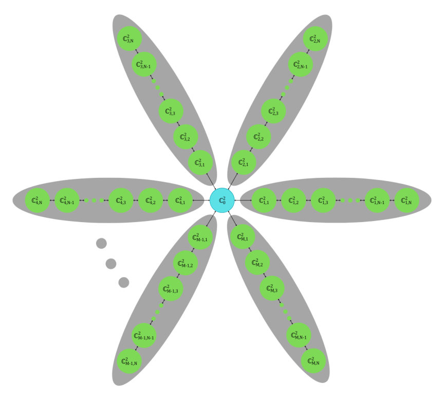
<figcaption class="paper-figure-caption"><b>Fig 2.</b> FIG. 2: A central qubit (blue) interacting with M Ising chains (gray), each consisting of N</figcaption>
</figure>
<figure class="paper-figure-card">

<figcaption class="paper-figure-caption"><b>Fig 3.</b> FIG. 3: A central qubit (blue) interacting with the first qubit of an N qubit Ising chain</figcaption>
</figure>
<figure class="paper-figure-card">
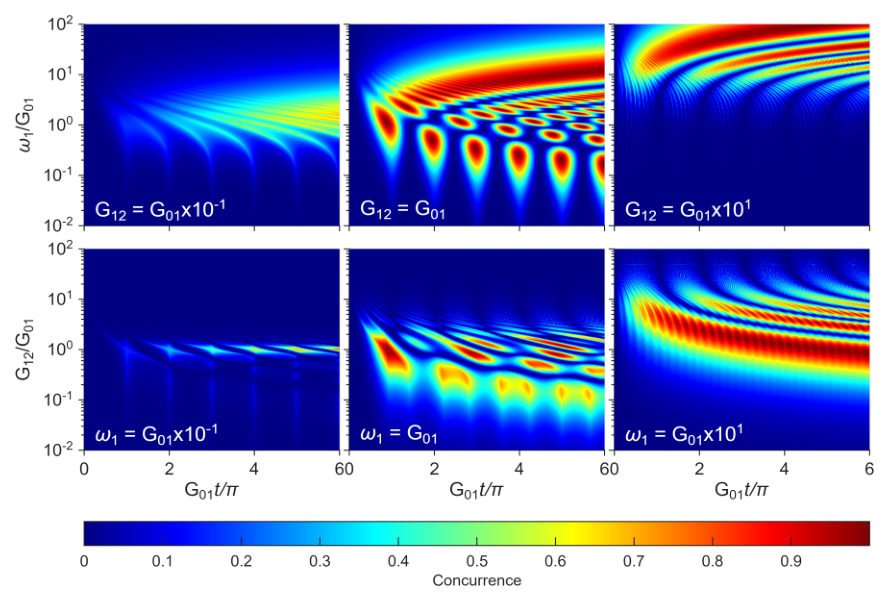
<figcaption class="paper-figure-caption"><b>Fig 4.</b> FIG. 4: Time-evolution of concurrence under varying strength of transverse magnetic field</figcaption>
</figure>

**Summary.** The paper develops a theorem to filter out Hamiltonian terms that do not affect local system dynamics. By testing this theorem on various qubit chain models, the authors demonstrate its predictive power. Crucially, they show that when the underlying commutation relations break down, 'emergent couplings' can generate entanglement between subsystems that never directly interact.

**Why it may be interesting.** This work provides powerful theoretical tools for simplifying complex open quantum systems by identifying irrelevant couplings, while simultaneously revealing how non-trivial dynamics (like entanglement) can arise from seemingly 'irrelevant' or non-commuting interactions.

Detailed structure

**Main problem.** To establish a rigorous theorem identifying Hamiltonian terms that do not affect local dynamics or observables, and to analyze when this theorem breaks down.

**Main result.** The study shows that while certain interactions can be ignored for local dynamics based on commutation relations, non-commuting intermediate interactions can generate entanglement between non-directly coupled subsystems via an emergent coupling mechanism.

**Method.** The analysis uses partial tracing over environment degrees of freedom applied to the von Neumann equation, and employs the interaction picture formalism for time evolution calculations.

**Model / system.** The models involve qubit chains interacting with a central local system, incorporating Ising interactions, Dzyaloshinskii-Moriya (DM) coupling, and transverse magnetic fields on environment qubits.

**Key observables.** Reduced density matrix ($\hat{
ho}_0(t)$), Concurrence ($C(\hat{
ho}_{02})$), and the presence/absence of specific Hamiltonian terms in $\hat{
ho}_0(t)$.

**Important parameters / regimes.** Interaction strengths (e.g., $G_{12}$ vs $G_{01}$) and external field strengths ($\omega_1$).

**Assumptions / limitations.** The theorem relies on specific commutation relations $[\hat{H}, \hat{H}_{E2}] = 0$; the entanglement analysis assumes initial unbiased probability amplitudes.

**Figures summary.** Figure 4 analysis shows that concurrence generation is maximized when the transverse field strength ($\omega_1$) is comparable to the coupling strengths, and vanishes if interactions are too weak or non-commuting terms are absent.

**Paper structure.** The paper first introduces a theorem for identifying irrelevant Hamiltonian terms. It then applies this theorem to simple qubit chain models (Ising/DM) where it holds true. Finally, it examines a third system where the commutation relation fails, demonstrating emergent coupling and calculating entanglement using Concurrence.

Abstract

This study establishes a theorem that provides sufficient criteria for identifying terms in any time-independent Hamiltonian that have no influence on local dynamics, local observables, or any local phenomena, without any approximation. The usefulness of this theorem is demonstrated by predicting the behavior of three systems. The first system consists of multiple qubit chains with Ising interactions. The second system is formed by a single qubit chain, differentiated by the substitution of Dzyalonshinskii-Moriya (DM) interaction for the last Ising interaction. The predictions were verified by analytically deriving the reduced dynamics of both systems. A third system was also considered, namely, a short qubit chain with a transverse magnetic field on the intermediary environment qubit. This transverse magnetic field signals that the commutation relation required by our theorem no longer holds. The third system's local dynamics were also derived analytically, demonstrating that all Hamiltonian constituents contributed to the reduced dynamics. The physical consequences of our theorem's inapplicability were also explored using this third system by analyzing the entanglement dynamics between the qubits that do not directly interact. The results showed that the entanglement is caused by an \textit{emergent coupling} between the two non-directly interacting subsystems. This \textit{emergent coupling} arises from the non-commutativity of the intermediate interactions connecting the two subsystems. When searching for these \textit{emergent couplings}, our theorem can eliminate intermediate interactions that will not produce them.

[↑ back to top](#top)

### [Exceptional points in dissipative coupling polaron-polaritons](http://arxiv.org/abs/2607.00994v1)

**Authors:** A. J. Vega-Carmona, D. A. Mendoza, A. Camacho-Guardian, M. A. Bastarrachea-Magnani  
**Type:** theory · **Category:** other · **PDF:** <https://arxiv.org/pdf/2607.00994v1>  
**Analysis basis:** full PDF text, analyzed in chunks
**Topic relevance:** 🔥 `Keldysh / 2PI / non-Gaussian methods` **4/5** · 🔥 `driven-dissipative phase transition` **4/5** · `analog quantum simulation` **3/5** · `correlated / nonlocal dissipation` **3/5** · `correlated cavity matter` **3/5** · `methods for driven-dissipative` **3/5** · `non-equilibrium dynamics` **3/5** · `Tavis-Cummings & cavity-many-emitter` **2/5** · `non-equilibrium universality` **2/5** · `Kondo & dissipative impurity` **1/5** · `entanglement & information structure` **1/5** · `interference shaping light` **1/5**

↔ Scroll figures horizontally

<figure class="paper-figure-card">
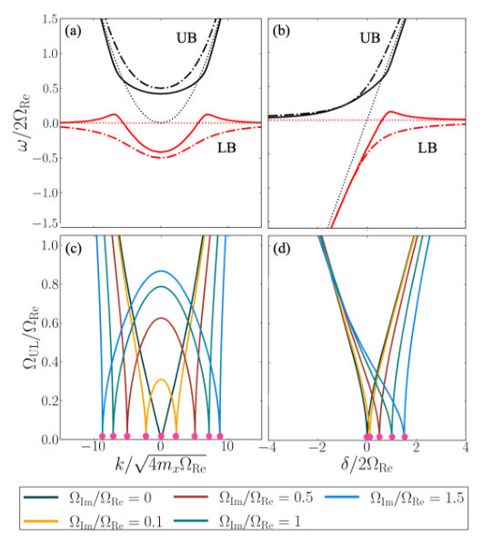
<figcaption class="paper-figure-caption"><b>Fig 1.</b> FIG. 1. Dissipative coupling polariton branches. As a function of (a) momentum at zero detuning and (b) zero- momentum light-matter detuning. The upper branch (UB) and lower branch (UB) are indicated by black and red curves, respectively. Here, ΩIm/ΩRe = 0.9. Below, the condition for the emergence of EPs is shown as a function of dissipative coupling and (c) momentum and (d) detuning for several val- ues of ΩIm/ΩRe whose colors are indicated in the figure. The EPs are indicated with pink dots. We employ γc/2ΩRe = 0.1 and γx/2ΩRe = 0.9.</figcaption>
</figure>
<figure class="paper-figure-card">
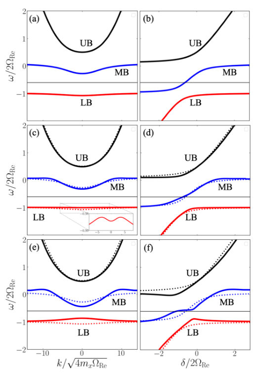
<figcaption class="paper-figure-caption"><b>Fig 2.</b> FIG. 2. Polaron-polaritons as a function of momentum (left) and detuning (right) for increasing values of the dissipative coupling: (a)-(b) ΩIm/ΩRe = 0.1, (c)-(d) ΩIm/ΩRe = 1.0, and (e)-(f) ΩIm/ΩRe = 1.5. In all cases we consider γc/2ΩRe = 0.1, γx/2ΩRe = 0.2, and a BEC density of 4πn↓/mx = 0.5. The dissipative coupling UB, MB, and LB are indicated by black, blue, and red solid lines, respectively. The dotted curves cor- respond to the results in (a) and (b). A black dashed line depicts the biexciton binding energy.</figcaption>
</figure>
<figure class="paper-figure-card">
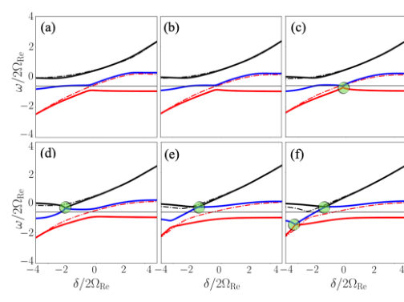
<figcaption class="paper-figure-caption"><b>Fig 3.</b> FIG. 3. Onset of EPs in polaron-polaritons as a function of detuning for zero momentum. The values taken for ∆γ are (a) −0.4, (b) −0.2, (c) 0, (d) 0.3, (e) 0.7, and (f) 0.9. We set ΩIm/ΩRe = 1.6. The color coding is the same as in Fig. 2. EPs are emphasized with green circles.</figcaption>
</figure>
<figure class="paper-figure-card">
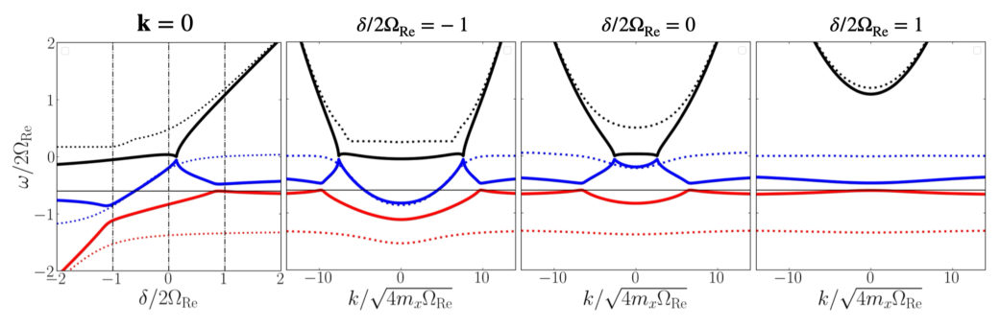
<figcaption class="paper-figure-caption"><b>Fig 4.</b> FIG. 4. Polaron polaritons as a function of detuning for a BEC density of 4πn↓/mx = 1.0. We employ γc/2ΩRe = 0.1, γx/2ΩRe = 1.7 and ΩIm/ΩRe = 0.1. The color coding is the same as in Fig. 2.</figcaption>
</figure>

**Summary.** This theoretical study examines polaron-polaritons formed by interacting excitons coupled to light within a semiconductor microcavity. By incorporating dissipative coupling, the authors show that many-body correlations lead to the emergence of exceptional points (EPs) in the energy spectrum. This identifies dissipative polariton systems as a versatile platform for exploring non-Hermitian physics.

**Why it may be interesting.** This work is highly relevant as it merges concepts from open quantum systems (dissipation/non-Hermiticity) with many-body physics (exciton interactions), providing a tunable platform for studying non-Hermitian dynamics in AMO and quantum optics contexts.

Detailed structure

**Main problem.** The study investigates how combining strong quantum correlations with dissipation shapes collective excitations, specifically focusing on polaron-polaritons.

**Main result.** The interplay between many-body correlations and non-Hermitian coupling generates anomalous dispersion relations and the emergence of exceptional points (EPs) in the polaron-polariton spectrum.

**Method.** The analysis employs finite-temperature Green's function formalism, solving for the polariton spectrum by finding the zeros of the determinant of the inverse propagator matrix.

**Model / system.** The system models exciton-polaritons in a microcavity semiconductor exhibiting strong coupling and biexciton resonance. It involves coupled light-matter interactions ($\hat{H}_{lm}$) and inter-species correlations ($\hat{H}_{int}$).

**Key observables.** Exceptional Points (EPs), anomalous dispersion relations, polaron-polariton energy branches (Lower, Middle, Upper), and level attraction.

**Important parameters / regimes.** Dissipative coupling strength ($\Omega_{Im}$), relative decay rates ($\gamma_x, \gamma_c$), and the biexciton resonance detuning.

**Assumptions / limitations.** The analysis is performed under the Rotating-Wave Approximation (RWA) and assumes a strong coupling regime.

**Figures summary.** Figures illustrate dissipative coupling polariton branches showing curvature changes and EPs; other figures map polaron-polaritons vs. momentum/detuning for varying dissipative coupling strength, demonstrating level attraction leading to EP coalescence.

**Paper structure.** The paper systematically develops the Hamiltonian, uses Green's functions to incorporate interactions via a self-energy ($\Sigma$), solves the resulting determinant equation to find the spectrum, and analyzes how non-Hermitian terms generate EPs across different polaron-polariton branches.

Abstract

Understanding how strong correlations and dissipation combine to shape collective quantum excitations is a central challenge in many-body physics. We investigate the effect of dissipative light-matter coupling on strongly interacting exciton-polaritons in the presence of a biexciton resonance, which gives rise to polaron-polariton quasiparticles. We show that the interplay between many-body correlations and non-Hermitian coupling generates anomalous dispersion relations and exceptional points in the polaron-polariton spectrum. The location and coexistence of exceptional points are controlled by the dissipative coupling and the relative decay rates of the excitonic and photonic constituents, allowing them to emerge across different polaron-polariton branches. These results identify dissipative polaron-polaritons as a versatile platform for exploring non-Hermitian many-body physics with tunable light-matter quasiparticles.

[↑ back to top](#top)

### [Simulating generic single-qubit open-dynamics via polarization-frequency coupling in a photonic interferometer](http://arxiv.org/abs/2607.00835v1)

**Authors:** Kalle Raikisto, Alberto Ferrara, Tom Kuusela, Rosario Lo Franco, Jyrki Piilo  
**Type:** theory · **Category:** quantum information and computing · **PDF:** <https://arxiv.org/pdf/2607.00835v1>  
**Analysis basis:** full PDF text, analyzed in chunks
**Topic relevance:** 🔥 `analog quantum simulation` **4/5** · 🔥 `correlated / nonlocal dissipation` **4/5** · 🔥 `interference shaping light` **4/5** · `methods for driven-dissipative` **3/5** · `non-equilibrium dynamics` **3/5** · `quantum optics experiment` **3/5** · `QC/QI experiment` **2/5** · `driven-dissipative phase transition` **2/5** · `Keldysh / 2PI / non-Gaussian methods` **1/5** · `entanglement & information structure` **1/5** · `non-equilibrium universality` **1/5** · `quantum measurements` **1/5**

↔ Scroll figures horizontally

<figure class="paper-figure-card">
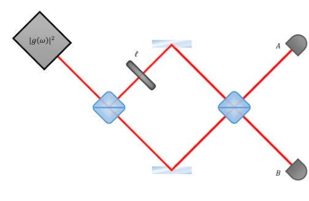
<figcaption class="paper-figure-caption"><b>Fig 1.</b> FIG. 1. Diagram of the setup. The system is a Mach-Zehnder interferometer consisting of 2 beam splitters (blue), where the photon goes through quartz plate (grey). The initial state is determined by the choice of frequency distribution |g(ω)|2</figcaption>
</figure>
<figure class="paper-figure-card">

<figcaption class="paper-figure-caption"><b>Fig 2.</b> FIG. 2. The diagonal and off-diagonal values of the polarization state for one of the output branch of the interferometer, as a function of the controllable parameters µ, σ, ℓ. The other parameters are set to CH = 0.5, nH = 1.553 and nV = 1.544. Panels (a, b, c): ρ00 as function of µ, σ and ℓrespectively. Panels (d, e, f): |ρ01| as function of µ, σ and ℓrespectively.</figcaption>
</figure>
<figure class="paper-figure-card">
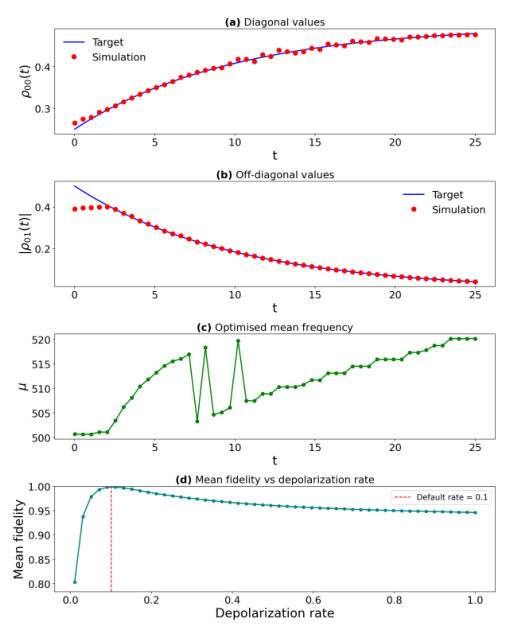
<figcaption class="paper-figure-caption"><b>Fig 3.</b> FIG. 3. Results of the single qubit simulation for the depo- larizing channel, as described in Eq. (13) (a): Comparison of the diagonal element ρ00 (b): Comparison of the off-diagonal coherence (c): Values of the mean frequency µ in the unit of THz. (d): Mean fidelity of the simulation shown as function of the depolarization rate γ. For (a)-(c) the parameters are ℓ= 8.688229·10−12 s, σ = 0.1 THz, nH = 1.553, nV = 1.544, |CH| = 0.527694, γ = 0.1. For (d) parameters ℓ, CH and σ are kept while a new set of µ values is separately optimized each γ.</figcaption>
</figure>
<figure class="paper-figure-card">

<figcaption class="paper-figure-caption"><b>Fig 4.</b> FIG. 4. Results of the single qubit simulation for a non- Markovian dynamics, as described in Eq. (16) (a): Com- parison of the diagonal element ρ00 (b): Comparison of the off-diagonal coherence (c): Values of the mean frequency µ in the unit of THz. (d): Colormap of the mean fidelity as a function of γ and λ. For (a)-(c) the parameters are ℓ= 0.101579 · 10−12 s, σ = 0.637 THz, nH = 1.553, nV = 1.544, |CH| = 0.3, γ = 4, λ = 0.05. For (d) pa- rameters ℓ, CH and σ are kept while a new set of µ values is separately optimized each γ, λ.</figcaption>
</figure>
<figure class="paper-figure-card">
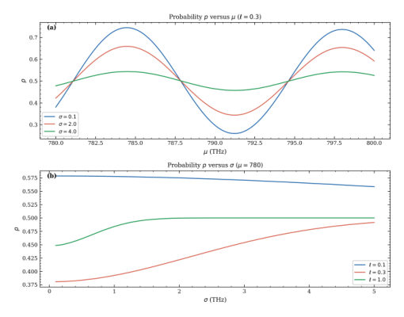
<figcaption class="paper-figure-caption"><b>Fig 5.</b> FIG. 5. Probability of finding the photon in the output branch A as (a): function of µ and (b): a function of σ.</figcaption>
</figure>

**Summary.** The authors propose using a photonic interferometer with birefringent quartz to simulate arbitrary single-qubit open dynamics. By treating the photon's frequency as an effective environment, they derive a controllable mechanism that allows simulating non-Markovian and general decoherence processes. This establishes polarization-frequency engineered interferometers as a versatile tool for quantum simulation.

**Why it may be interesting.** This work provides a concrete, experimentally accessible optical protocol—'optical reservoir engineering'—to simulate complex quantum dissipation channels beyond simple Markovian decay.

Detailed structure

**Main problem.** The goal is to simulate arbitrary single-qubit open-system dynamics using a controllable photonic platform.

**Main result.** The setup successfully simulates general qubit decoherence, including non-Markovian effects like coherence revivals, by engineering the coupling between polarization and frequency degrees of freedom.

**Method.** The simulation involves analyzing the partial trace over the continuous frequency environment degree of freedom after a photon passes through a birefringent quartz plate within an interferometer.

**Model / system.** The physical system is a single photon in an open Mach-Zehnder interferometer containing a birefringent quartz plate. The qubit dynamics are governed by coupling polarization (the system) to the frequency spectrum (the environment).

**Key observables.** Reduced density matrix elements ($
ho_{00}, 
ho_{01}$), mean fidelity, and output photon probabilities ($p_j$).

**Important parameters / regimes.** Frequency distribution parameters ($\mu, \sigma$), quartz plate thickness ($\ell$), initial populations, and relative phase ($\phi$).

**Assumptions / limitations.** The frequency environment is modeled using a Gaussian distribution, and the analysis relies on partial tracing over this continuous spectrum.

**Figures summary.** Figures illustrate the setup (MZI with quartz), show probability distributions vs. $\mu$ or $\sigma$, and compare simulated qubit evolution (e.g., amplitude damping) against theoretical benchmarks like depolarization channels.

**Paper structure.** The paper details the derivation of the output state by tracing out frequency, derives measurable quantities ($\eta_\lambda, \kappa_A$), and then applies this formalism to benchmark simulations for various open dynamics regimes (depolarizing, non-Markovian).

Abstract

We propose a photonic platform for simulating arbitrary single-qubit open-system dynamics using a single photon in an open Mach-Zehnder interferometer. A birefringent quartz plate induces a coupling between the polarization and frequency degrees of freedom. By treating the latter as an effective environment, we analytically derive the reduced polarization dynamics. We show that the resulting evolution is characterized by a controllable interplay between populations and coherence, instead of the usual dephasing caused by quartz plates. By adjusting the photon frequency distribution and interferometric parameters, we demonstrate that target single-qubit states can be efficiently reproduced through a tunable optical protocol expected to work under accessible experimental conditions. The simulator is benchmarked against paradigmatic open-system evolutions, including depolarization and non-Markovian dynamics, achieving high accuracy. Our results establish polarization-frequency engineered photonic interferometers as a versatile protocol for simulation of open quantum systems.

[↑ back to top](#top)

### [Dissipation splits the Mott transition in one dimension](http://arxiv.org/abs/2607.00086v1)

**Authors:** Oscar Bouverot-Dupuis, Alberto Rosso, Laura Foini  
**Type:** theory · **Category:** strongly correlated electrons · **PDF:** <https://arxiv.org/pdf/2607.00086v1>  
**Analysis basis:** full PDF text, analyzed in chunks
**Topic relevance:** 🔥 `analog quantum simulation` **4/5** · 🔥 `driven-dissipative phase transition` **4/5** · `Frenkel-Kontorova` **3/5** · `correlated / nonlocal dissipation` **3/5** · `methods for driven-dissipative` **3/5** · `non-equilibrium universality` **3/5** · `Kondo & dissipative impurity` **2/5** · `non-equilibrium dynamics` **2/5** · `Keldysh / 2PI / non-Gaussian methods` **1/5** · `entanglement & information structure` **1/5**

↔ Scroll figures horizontally

<figure class="paper-figure-card">
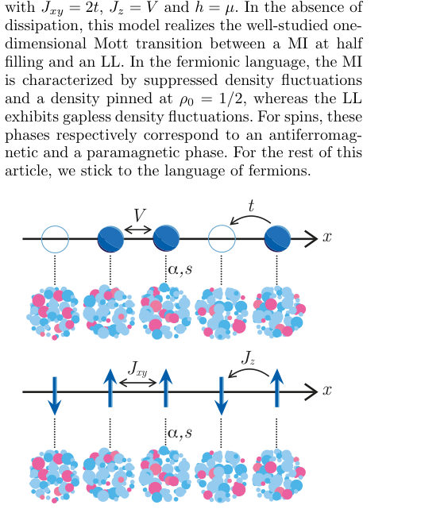
<figcaption class="paper-figure-caption"><b>Fig 1.</b> Figure 1. Schematic representation of the dissipative sys- tem. A one-dimensional fermionic chain (top), or equiv- alently an XXZ spin chain (bottom), is coupled to inde- pendent local baths characterized by the low-frequency spectral function J(ω) ≃α|ω|s.</figcaption>
</figure>
<figure class="paper-figure-card">

<figcaption class="paper-figure-caption"><b>Fig 2.</b> Figure 2. Bosonized representation of density excita- tions. A particle added on top of the half-filled state ρ0 = 1/2 corresponds to a kink of amplitude −π in the bosonic field (top). The half-filled background also sup- ports elementary domain walls carrying half the particle charge, represented by kinks of amplitude ±π/2 (bot- tom).</figcaption>
</figure>
<figure class="paper-figure-card">
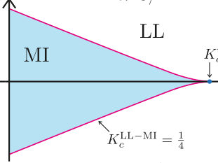
<figcaption class="paper-figure-caption"><b>Fig 3.</b> Figure 3. Phase diagrams for s &lt; 1 (top), 1 &lt; s &lt; 3/2 (middle) and s &gt; 3/2 (bottom). The blue transition lines and the tip of the lobe belong to the BKT universality class. The magenta lines are second order commensurate- incommensurate transitions with exponents depending on the bath exponent s.</figcaption>
</figure>
<figure class="paper-figure-card">
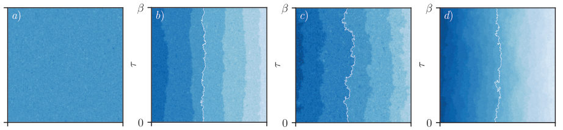
<figcaption class="paper-figure-caption"><b>Fig 4.</b> Figure 4. Typical field configurations ϕ(x, τ) on a lattice of size 256 × 256. The colourmap encodes the value of the field ϕ with darker blue signifying higher values of ϕ. Each kink has an amplitude π/2. We have highlighted one kink for each of the three rightmost plots. From left to right : a) is the MI with no kinks, b) is the DP for s = 1.25 with 6 kinks, c) is the LL with 6 kinks, d) is the LL with 20 kinks. The parameters are K = 0.35, u = 1, g = 0, α = 0.5 and s = 1.25 for a), b) and s = 1.75 for c), d). The data were obtained by working in the canonical ensemble (fixed number of kinks), so the chemical potential µ is not specified.</figcaption>
</figure>
<figure class="paper-figure-card">

<figcaption class="paper-figure-caption"><b>Fig 5.</b> Figure 5. C/IC transitions at s = 1.25 (top) and s = 1.75 (bottom) for increasing L = β. Top: MI to DP transition. The MI is at µ &lt; µc ≃0.8, while the DP is at µ &gt; µc. Bottom: MI to LL transition. The MI is at µ &lt; µc ≃0.5, while the LL is at µ &gt; µc. From left to right: doping δρ, superfluid stiffness ρs, compressibility κ and renormalised Luttinger parameter KR. In all plots, only µ is varied and K = 0.35, u = 1, g = 0, α = 0.5. The black dashed lines correspond to the values δρLL, ρsLL, κLL, K of a pure LL (K = 0.35, u = 1, g = α = 0). The red dashed line in the lower right plot is at KLL−MI c = 1/4. Error bars are shown and often smaller than the marker size.</figcaption>
</figure>

**Summary.** The paper analyzes the Mott transition in 1D fermionic chains coupled to dissipative baths. It demonstrates that dissipation fundamentally alters the phase diagram, splitting the single transition into two distinct critical points: an LL-to-Dissipative Phase (DP) BKT transition, followed by a DP-to-MI transition. This shows that environmental coupling can generate novel critical behavior in strongly correlated matter.

**Why it may be interesting.** This work provides a detailed theoretical framework for understanding how environmental coupling (dissipation) can qualitatively change fundamental quantum phase transitions in low-dimensional strongly correlated systems, which is highly relevant to experimental realizations in cold atoms or superconducting circuits.

Detailed structure

**Main problem.** The study investigates how coupling a one-dimensional Mott transition system to local dissipative baths fundamentally alters the nature of the quantum phase transition.

**Main result.** Dissipation splits the conventional Mott transition into two distinct critical phenomena: an LL $	o$ DP BKT transition, followed by a new DP $	o$ MI commensurate-incommensurate transition for bath exponents $s < 3/2$.

**Method.** The analysis combines bosonization techniques with exact integration of bath degrees of freedom to derive an effective field theory and analyze the resulting critical behavior using Renormalization Group (RG) methods.

**Model / system.** The system is a one-dimensional interacting fermionic model exhibiting a Mott transition between a Luttinger liquid (LL) and a Mott insulator (MI), with dissipation introduced via coupling to local harmonic oscillator baths.

**Key observables.** Compressibility ($\kappa$), superfluid stiffness ($
ho_s$), critical exponents ($eta, 
u, z$), and the DC conductivity $\sigma(\omega)$.

**Important parameters / regimes.** The bath exponent $s$ (characterizing the bath spectrum $J(\omega) \sim |\omega|^s$) is crucial, with thresholds at $s=1$ and $s=3/2$.

**Assumptions / limitations.** The analysis relies on bosonization, exact integration of the bath degrees of freedom, and perturbative RG techniques applied to the effective action.

**Figures summary.** Figures schematically illustrate the phase diagram showing LL $	o$ DP $	o$ MI for $s < 3/2$, contrasting with direct LL $	o$ MI for $s > 3/2$.

**Paper structure.** The paper proceeds by establishing the effective action via bosonization and bath integration, then analyzing the resulting critical points using RG flow equations to determine how the transition splits into two distinct universality classes.

Abstract

Understanding how dissipation modifies quantum phase transitions is a central challenge in many-body physics. A paradigmatic example is the one-dimensional Mott transition, which in isolated systems separates a conducting Luttinger liquid (LL) from a Mott insulator (MI). Here, we study the fate of this transition in the presence of dissipative baths locally coupled to the density. Using bosonisation and an exact integration of the bath degrees of freedom, we show that dissipation fundamentally reshapes the phase diagram for bath exponents $s<3/2$, where $s$ characterises the low-energy bath spectrum. Rather than undergoing a direct LL-MI transition, the system develops an intermediate dissipative phase (DP) that is compressible and gapless, yet has zero superfluid stiffness. As a result, the conventional Mott transition splits into two distinct critical phenomena: a Berezinskii-Kosterlitz-Thouless transition from the LL to the DP, followed by a new commensurate-incommensurate transition from the DP to the MI. We derive an effective field theory for the latter transition and characterize its universality. For $1<s<3/2$, the critical exponents vary continuously with the bath exponent as $β=ν=1/z=s-1$, while for $s<1$ the transition is governed by $β=ν=1/z=0$ and the doping vanishes sharper than any power law. State-of-the-art Monte Carlo simulations quantitatively support our predictions. These results demonstrate that dissipation can qualitatively alter the nature of the Mott transition and generate novel critical behaviour in strongly correlated one-dimensional systems.

[↑ back to top](#top)

### [Robustness of Quantum Discord in Nonequilibrium Electronic Transport through Tunnel-Coupled Quantum Dots](http://arxiv.org/abs/2607.00602v1)

**Authors:** Thingujam Yaiphalemba Meitei, Saikumar Krithivasan, Md. Manirul Ali, Arijit Sen  
**Type:** theory · **Category:** statistical mechanics · **PDF:** <https://arxiv.org/pdf/2607.00602v1>  
**Analysis basis:** full PDF text, analyzed in chunks
**Topic relevance:** 🔥 `entanglement & information structure` **4/5** · 🔥 `methods for driven-dissipative` **4/5** · 🔥 `non-equilibrium dynamics` **4/5** · `Keldysh / 2PI / non-Gaussian methods` **3/5** · `driven-dissipative phase transition` **3/5** · `correlated / nonlocal dissipation` **2/5** · `non-equilibrium universality` **2/5** · `Kondo & dissipative impurity` **1/5** · `analog quantum simulation` **1/5** · `scars & prethermalization` **1/5**

↔ Scroll figures horizontally

<figure class="paper-figure-card">

<figcaption class="paper-figure-caption"><b>Fig 1.</b> Figure 1: Time evolution of quantum discord D(ρAB) and classical correlation C(ρAB) for the full non-Markovian dynamics (red and black dotted, Γ = γ, W = γ) and the wideband limit (WBL, green solid, Γ = γ, W = 50γ) for four initial states: (a) |01⟩⟨01|, (b) 1</figcaption>
</figure>
<figure class="paper-figure-card">
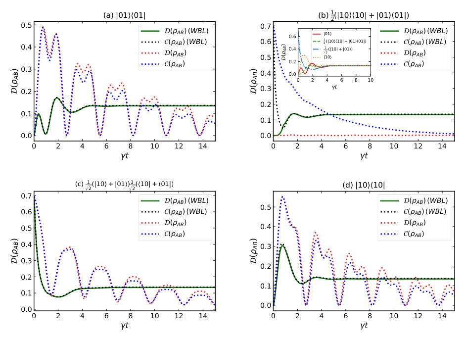
<figcaption class="paper-figure-caption"><b>Fig 2.</b> Fig. 1 compares the time evolution of quantum discord D(ρAB) and classical correlation C(ρAB) in the full non- Markovian dynamics (Γ = γ, W = γ) and the wideband limit (WBL, Γ = γ, W = 50γ) across four initial states: the product states |01⟩⟨01| and |10⟩⟨10|, the superposition state 1 √</figcaption>
</figure>
<figure class="paper-figure-card">
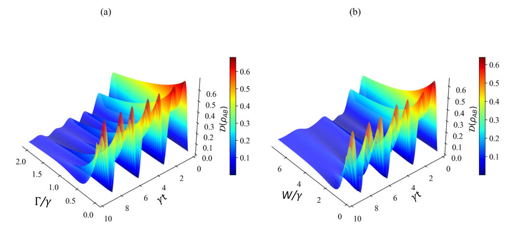
<figcaption class="paper-figure-caption"><b>Fig 3.</b> Figure 2: Time evolution of quantum discord D(ρAB) in a tunnel-coupled DQD system connected to fermionic reservoirs: (a) variation with system–reservoir coupling strength ΓL = ΓR for fixed spectral bandwidth WL = WR = W = γ, and (b) variation with spectral bandwidth WL = WR for fixed coupling strength ΓL = ΓR = Γ = 0.5γ.</figcaption>
</figure>
<figure class="paper-figure-card">

<figcaption class="paper-figure-caption"><b>Fig 4.</b> Figure 3: Steady-state: (a) quantum discord D(ρAB), (b) classical correlation C(ρAB) and (c) Steady-state ratio D(ρAB)/C(ρAB) as functions of coupling strength Γ and spectral bandwidth W for symmetric coupling ΓL = ΓR ≡Γ and WL = WR ≡W.</figcaption>
</figure>
<figure class="paper-figure-card">

<figcaption class="paper-figure-caption"><b>Fig 5.</b> Fig. 3(c) shows the ratio D(ρAB)/C(ρAB) across the same parameter space. As far as the |01⟩initial state is concerned, the ratio exceeds unity everywhere, confirming that quantum discord always equals or exceeds classical correlation regardless of coupling strength or bandwidth. In the weak-coupling, narrow-bandwidth corner, the ratio approaches ∼1.0, indicating that both types of correlations are of comparable magnitude. As Γ and W increase, the ratio rises monotonically toward ∼1.4–1.5, reflecting the faster decay of classical correlations relative to discord established in Fig. 3(a) and (b), and upon further increase in both parameters, the ratio begins to decrease. This monotonic...</figcaption>
</figure>

**Summary.** The paper analyzes the robustness of quantum correlations, specifically Quantum Discord, in a double quantum dot system driven by external biases. Using advanced theoretical techniques like the Quantum Langevin equation, the authors show that discord persists robustly in the non-equilibrium steady state. This establishes that environmental coupling and asymmetry can be engineered to control and maintain nonclassical quantum features in solid-state devices.

**Why it may be interesting.** This work directly addresses open quantum systems and non-equilibrium thermodynamics, which are central to modern AMO physics and mesoscopic quantum transport studies, providing quantitative tools (Discord) beyond simple entanglement measures.

Detailed structure

**Main problem.** The study investigates how quantum correlations, specifically Quantum Discord, behave during non-equilibrium electronic transport processes.

**Main result.** Quantum discord remains finite in the steady state over a broad parameter range, demonstrating that nonequilibrium transport provides an effective means of controlling nonclassical correlations.

**Method.** The analysis employs the Quantum Langevin Equation formalism to derive the exact reduced density matrix, allowing for the calculation of time-dependent and steady-state quantum and classical correlations.

**Model / system.** The system is a Double Quantum Dot (DQD) coupled to fermionic reservoirs (Left and Right), modeled by a total Hamiltonian including system, bath, and interaction terms. The analysis covers transient dynamics under thermal bias.

**Key observables.** Quantum Discord ($D(
ho_{AB})$), Classical Correlation ($C(
ho_{AB})$), Total Mutual Information ($I(
ho_{AB})$), and their ratio $D/C$.

**Important parameters / regimes.** System-reservoir coupling strength ($\Gamma$), spectral bandwidth ($W_\alpha$), thermal bias ($\Delta T$), and reservoir asymmetry.

**Assumptions / limitations.** The formalism uses the quantum Langevin equation to retain non-Markovian memory effects, avoiding Markovian approximations. The calculation of classical correlation relies on projective measurements on one subsystem.

**Figures summary.** Figures illustrate time evolution (transient dynamics) showing convergence to a steady state, and steady-state dependence on coupling strength, bandwidth, and thermal bias, highlighting the role of asymmetry.

**Paper structure.** The paper systematically analyzes the non-equilibrium dynamics by first establishing the theoretical framework using Langevin equations. It then examines how initial states affect transient behavior before focusing on the robust, parameter-dependent steady-state values for quantum discord versus classical correlation.

Abstract

Quantum discord captures quantum correlations beyond entanglement and can remain finite even when the entanglement vanishes. We investigate the transient nonequilibrium dynamics and steady-state behavior of quantum discord and classical correlations in a double quantum dot (DQD) system coupled to fermionic reservoirs. By employing a quantum Langevin equation formalism, we obtain the exact reduced density matrix of the system, enabling a comprehensive analysis of its quantum and classical correlations under nonequilibrium conditions. The influence of system-reservoir coupling strength, spectral bandwidth, thermal bias, and varying initial state on both the transient dynamics and steady-state correlations is systematically analyzed. Quantum discord remains finite in the nonequilibrium steady state over a broad parameter range. Although thermal gradients reduce the overall magnitude of correlations, quantum discord persists and exhibits greater resilience. These results demonstrate that nonequilibrium electronic transport, together with the environmental spectral properties and reservoir asymmetry, provides an effective means of controlling nonclassical correlations in mesoscopic systems and establishes quantum discord as a robust hallmark of open fermionic quantum devices.

[↑ back to top](#top)

### [Learning Low-Energy Subspace Overlaps in Many-Body Systems with Measurement-Based and Coherent Quantum Strategies](http://arxiv.org/abs/2607.00235v1)

**Authors:** Shamminuj Aktar, Rishabh Bhardwaj, Tanmoy Bhattacharya, Stephan Eidenbenz  
**Type:** both · **Category:** other · **PDF:** <https://arxiv.org/pdf/2607.00235v1>  
**Analysis basis:** full PDF text, analyzed in chunks
**Topic relevance:** 🔥 `non-equilibrium dynamics` **4/5** · `entanglement & information structure` **3/5** · `methods for driven-dissipative` **3/5** · `non-equilibrium universality` **3/5** · `quantum measurements` **3/5** · `measurement-induced transitions` **2/5** · `scars & prethermalization` **2/5** · `analog quantum simulation` **1/5** · `driven-dissipative phase transition` **1/5** · `exotic spin models in light-matter` **1/5**

↔ Scroll figures horizontally

<figure class="paper-figure-card">
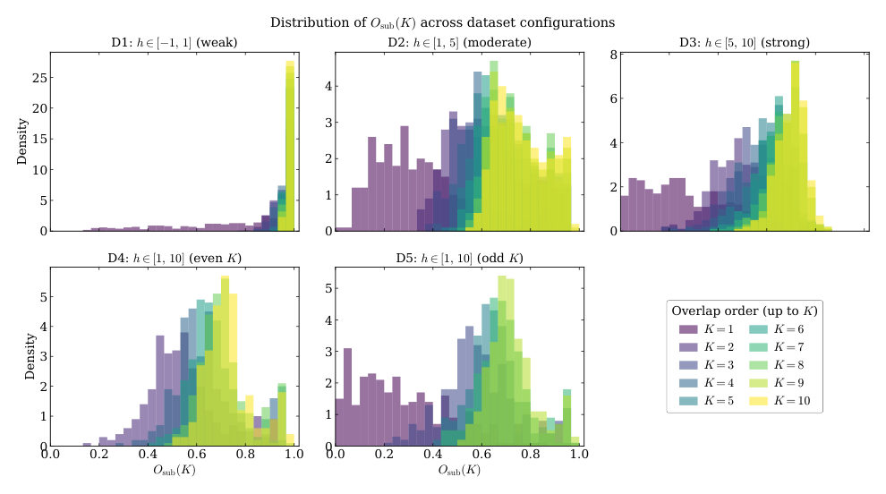
<figcaption class="paper-figure-caption"><b>Fig 1.</b> FIG. 1: Distributions of OK across the five dataset configurations. Overlaps concentrate near unity in the weak- quench regime (D1) and spread toward lower values as the quench strength increases (D2, D3). Datasets D4 and D5 share the same quench range as D2–D3 but restrict the target overlap orders to even and odd values of K, respectively.</figcaption>
</figure>
<figure class="paper-figure-card">
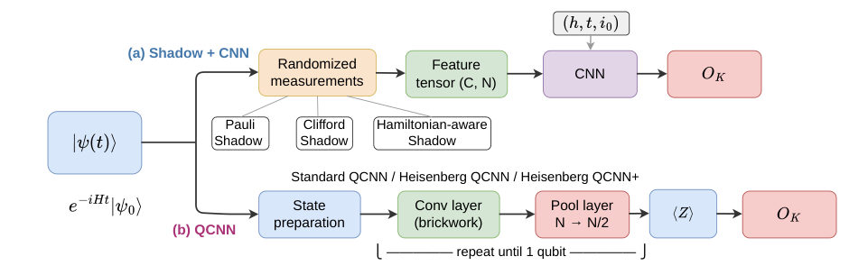
<figcaption class="paper-figure-caption"><b>Fig 2.</b> FIG. 2: High-level comparison of the two quantum information extraction strategies. The input state |ψ(t)⟩= e−iHt |ψ0⟩is the time-evolved ground state of H0 under the post-quench Hamiltonian H. (a) Measurement-based pipeline: one of three randomized measurement protocols (Pauli, Clifford, or Pauli on Hamiltonian-aware pre-rotation H0-rot) produces a feature tensor of shape (C, N), which is processed by a 1D CNN together with normalized scalar inputs (h, t, i0). (b) Coherent pipeline: the statevector is loaded via arbitrary state preparation, processed through alternating brickwork convolutional and pooling layers that halve the active qubits at each stage, and the final ⟨Z⟩is mapped to the...</figcaption>
</figure>
<figure class="paper-figure-card">

<figcaption class="paper-figure-caption"><b>Fig 3.</b> FIG. 3: Shadow measurement protocols. (a) Pauli shadow: random single-qubit Pauli rotations yield 3N local expecta- tion features via median-of-means (8 groups, 500 shots). (b) Two-qubit Clifford shadow: random 2Q Clifford circuits in alternating brickwork pairing yield 6N features including nearest-neighbor correlators (8 groups, 1,000 shots). (c) Hamiltonian-aware shadow: e−iτH0 pre-rotation consisting of nearest-neighbor Ising exchange gates (XX, Y Y , ZZ) and single-qubit Z rotations representing the longitudinal field hz P</figcaption>
</figure>
<figure class="paper-figure-card">

<figcaption class="paper-figure-caption"><b>Fig 4.</b> FIG. 4: Convolutional and pooling gate structures for the four QCNN variants. (a) Standard Simple: Rot + CNOT (6 params) with CRZ+CRY+CRX pooling (3 params). (b) Standard Deep: same gate applied twice per block. (c) Heisenberg QCNN: local rotations (RZ, RX) followed by Ising exchange (XX, Y Y , ZZ) mirroring H0 (7 params), with exchange-based pooling and RY (4 params). (d) Heisenberg QCNN+: adds post-rotation for enhanced express- ibility (11 params); same pooling as (c).</figcaption>
</figure>
<figure class="paper-figure-card">

<figcaption class="paper-figure-caption"><b>Fig 5.</b> FIG. 5: Test-set R2 as a function of cumulative overlap order K for all seven models across the five dataset configura- tions at the measurement budgets listed in Table II. Each panel shows one dataset: D1 (weak quench), D2 (moderate quench), D3 (strong quench), D4 (full range, even K), and D5 (full range, odd K). Values show mean R2 averaged over three independent runs. Both measurement-based and coherent strategies successfully learn subspace overlaps, but relative performance depends strongly on the quench regime. Supplementary Table IV gives the corresponding R2 values averaged over all K.</figcaption>
</figure>

**Summary.** The paper investigates predicting how much a time-evolved quantum state remains in its low-energy manifold after a quench in a Heisenberg spin chain. It compares measurement-based shadow learning against coherent Quantum CNNs, finding that no single method is universally superior; the best approach depends critically on whether the system dynamics are weakly, moderately, or strongly perturbed.

**Why it may be interesting.** This work directly addresses how to extract complex, non-local many-body information (like subspace purity) from quantum measurements using machine learning techniques, providing crucial insights into the limitations of current quantum characterization methods for dynamics.

Detailed structure

**Main problem.** The core problem is the supervised prediction of subspace overlaps ($\mathcal{O}_K$) between time-evolved quantum states and specified low-energy eigenspaces following a local quench.

**Main result.** The optimal learning strategy for predicting these overlaps is highly dependent on the quench regime: physics-informed QCNNs are robust, while measurement-based shadow methods excel in moderate quench regimes but fail in weak/strong quenches.

**Method.** The study compares two quantum information extraction strategies—measurement-based (using classical CNNs on randomized measurements) and coherent quantum learning (using Quantum Convolutional Neural Networks)—to learn the overlap observable.

**Model / system.** The system is a 10-qubit one-dimensional Heisenberg spin chain, whose dynamics are studied after being subjected to a local perturbation (quench). The Hamiltonian governs the time evolution $|\psi(t)
angle = e^{-iHt} |\psi_0
angle$.

**Key observables.** The primary observable is the subspace overlap $\mathcal{O}_K$, quantified by the coefficient of determination ($R^2$) when predicting it from quantum measurements.

**Important parameters / regimes.** Quench strength ($h$), which defines five dataset configurations (D1-D5) spanning weak, moderate, and strong quench regimes; measurement shot budgets ($	ext{Shots}$).

**Assumptions / limitations.** The dominant limitation observed during hardware validation is the resource cost and noise associated with arbitrary state preparation circuits.

**Figures summary.** Figures illustrate distributions of $\mathcal{O}_K$ across different quench strengths, compare $R^2$ scores between shadow CNNs and QCNNs across regimes, and show predicted vs. true overlaps for various models.

**Paper structure.** The paper introduces the problem setup (Heisenberg chain, subspace overlap), details two competing learning paradigms (Shadow vs. QCNN), presents results showing regime-dependent performance trade-offs, validates findings on noisy hardware, and concludes with a comparison of resource costs.

Abstract

Predicting the overlap of quantum states with specified low-energy subspaces is a key diagnostic for quantum many-body dynamics, with direct applications in state preparation, subspace-based algorithms, and the study of thermalization. We study the supervised prediction of subspace overlaps O_K between time-evolved states and K-dimensional low-energy eigenspaces of a 10-qubit Heisenberg spin chain following a local perturbation. We compare two quantum information extraction strategies: measurement-based learning, in which classical shadow features are processed by convolutional neural networks, and coherent quantum learning, in which quantum convolutional neural networks process the state directly. We further introduce physics-informed variants for both approaches, including Hamiltonian-aware shadows and QCNN gates aligned with the Heisenberg exchange structure. Across five dataset configurations spanning weak, moderate, and strong quench regimes, physics-informed QCNNs achieve stable performance, with mean test-set coefficients of determination R^2 = 0.753-0.846. Shadow-based methods show stronger regime dependence: they outperform QCNNs in the moderate-quench regime, reaching R^2 = 0.886, but underperform in weak and strong quenches at default shot budgets, where the best shadow results are R^2 = 0.615 and 0.672, respectively. Hardware validation on Quantinuum and IBM noise models shows that arbitrary state preparation is the dominant limitation, requiring approximately 2,044 two-qubit gates and causing near-complete depolarization before inference. These results identify a regime-dependent tradeoff between measurement-based and coherent quantum learning, with shadow methods excelling when the target remains locally accessible and physics-informed QCNNs providing more robust performance across dynamical regimes.

[↑ back to top](#top)

### [Strange Luttinger liquids in a cavity-embedded one-dimensional electronic chain](http://arxiv.org/abs/2607.01146v1)

**Authors:** Danh-Phuong Nguyen, Christophe Mora, Cristiano Ciuti  
**Type:** theory · **Category:** strongly correlated electrons · **PDF:** <https://arxiv.org/pdf/2607.01146v1>  
**Analysis basis:** full PDF text, analyzed in chunks
**Topic relevance:** 🔥 `analog quantum simulation` **4/5** · 🔥 `correlated cavity matter` **4/5** · `Tavis-Cummings & cavity-many-emitter` **2/5** · `driven-dissipative phase transition` **2/5** · `methods for driven-dissipative` **2/5** · `Frenkel-Kontorova` **1/5** · `Keldysh / 2PI / non-Gaussian methods` **1/5** · `Kondo & dissipative impurity` **1/5** · `correlated / nonlocal dissipation` **1/5** · `entanglement & information structure` **1/5** · `exotic spin models in light-matter` **1/5** · `non-equilibrium dynamics` **1/5** · `non-equilibrium universality` **1/5**

↔ Scroll figures horizontally

<figure class="paper-figure-card">

<figcaption class="paper-figure-caption"><b>Fig 1.</b> FIG. 1. Characteristic velocities of the strange Luttinger liq- uid, normalized by the Fermi velocity, as functions of the cavity coupling g. Solid lines indicate values obtained from Eq. (13), while open symbols correspond to exact velocities calculated directly from the tight-binding model given by Eq. (5). The sound velocity of the collective excitations is given by ¯v(0) S , while ¯v(0) N and ¯v(0) J characterize the propagation ve- locities of density and current fluctuations, respectively. The parameter λ(0) 1 quantifies the cavity-induced band squeezing. Other parameters: N = 500, Ne/N = 1/4, ωc/t = 10.</figcaption>
</figure>
<figure class="paper-figure-card">

<figcaption class="paper-figure-caption"><b>Fig 2.</b> FIG. 2. Top panel: Real part of the correlation function G(0, τ). Bottom panel: Real part of G(x, 0). G(x, τ) mea- sures the propagation of a fermionic excitation between the spacetime points (0, 0) and (x, τ). Both functions are calcu- lated without (g = 0) and with (g = 2.0) light-matter in- teraction. Inset in both panels display the maxima of the correlation functions on a logarithmic scale, with slope α(g). Other parameters: N = 500, Ne/N = 1/2, ωc/t = 10.</figcaption>
</figure>
<figure class="paper-figure-card">
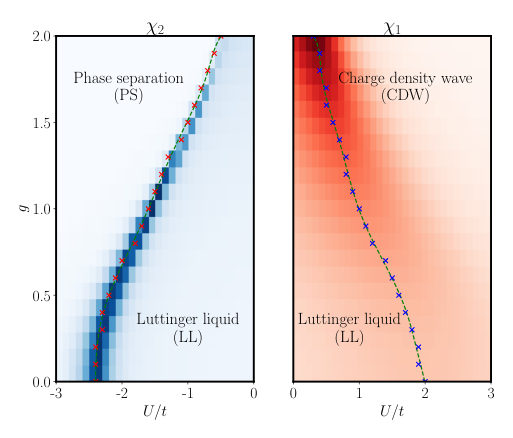
<figcaption class="paper-figure-caption"><b>Fig 3.</b> FIG. 3. Electronic phase diagram at half-filling, plotted as a function of U/t and g for N = 12, ωc/t = 10. Left panel shows χ2 for LL-PS transition, while right panel shows χ1 for LL-CDW transition. In both panels, the cross markers indicate the numerical maxima, while the green dashed lines represent extrapolated results.</figcaption>
</figure>
<figure class="paper-figure-card">
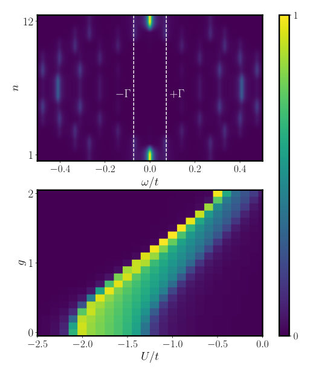
<figcaption class="paper-figure-caption"><b>Fig 4.</b> FIG. 4. Top: Local density of states An(ω) at half-filling for U/t = −2 in the absence of light-matter coupling. Bottom: Edge spectral weight W(U, g) at half-filling as a function of U/t and g. Other parameters: N = 12, ωc/t = 10, Γ = 0.3× level spacing πt/N. The spectral functions are shown in arbi- trary units, and are normalized to their respective maxima.</figcaption>
</figure>

**Summary.** This paper theoretically analyzes a one-dimensional electronic chain coupled to an optical cavity field and subject to electron interactions. It establishes that the light-matter coupling fundamentally alters the low-energy physics, leading to a 'strange Luttinger liquid' description. The authors map out phase diagrams showing how this cavity interaction modifies known quantum phases, including those hosting Majorana-like zero modes.

**Why it may be interesting.** This work is highly relevant as it merges concepts from quantum optics (cavity QED) with strongly correlated electron physics (Luttinger liquids), providing a mechanism to engineer unconventional quantum states in 1D systems.

Detailed structure

**Main problem.** The study investigates the low-energy physics of a one-dimensional electronic chain coupled to a quantized vacuum field, aiming to characterize deviations from standard Luttinger liquid theory.

**Main result.** The coupling to the cavity field creates a 'strange Luttinger liquid' in the non-interacting limit, breaking conventional velocity relations; furthermore, electron-electron interactions lead to a phase diagram featuring Majorana-like zero modes whose boundaries are shifted by the cavity field.

**Method.** The analysis employs bosonization techniques for low-energy effective descriptions and utilizes exact diagonalization (ED) for finite interaction strengths to map out quantum phase diagrams.

**Model / system.** The system is a tight-binding electronic chain embedded in an optical cavity, described by a Hamiltonian incorporating light-matter coupling via the Peierls substitution and electron-electron interactions ($U$).

**Key observables.** Low-energy excitation spectrum, local density of states (LDOS), charge susceptibilities ($\chi$), and dressed bosonic velocities ($	ilde{v}_S, 	ilde{v}_N, 	ilde{v}_J$).

**Important parameters / regimes.** Interaction strength ($U$), light-matter coupling strength ($g$), cavity frequency ($\omega_c$), and filling level (half-filling).

**Assumptions / limitations.** The analysis relies on deriving low-energy effective Hamiltonians via perturbation theory in the coupling $g$ and assuming a large but finite chain length.

**Figures summary.** Figures illustrate electronic phase diagrams showing transitions between Luttinger liquid, Charge Density Wave (CDW), and Phase Separation (PS) phases as functions of interaction strength and cavity coupling.

**Paper structure.** The paper progresses by first analyzing the non-interacting case ($U=0$) to establish the 'strange' nature of the LL. It then extends this analysis using ED for finite $U$, mapping out phase diagrams, and finally investigating how interactions modify the low-energy description derived from cavity coupling.

Abstract

We study a one-dimensional electronic chain coupled to a homogeneous quantized vacuum field and electron-electron interactions. In the absence of the latter, we derive a low-energy effective description in the presence of light-matter coupling, which we identify as a strange Luttinger liquid. Although it retains a formal resemblance to conventional Luttinger liquid theory, the coupling to the quantum field qualitatively modifies the low-energy sector and breaks the standard velocity relation underlying Luttinger universality. For finite electron-electron interactions, we recover a phase diagram featuring several phases as a function of interaction strength and hopping amplitude, including a phase hosting Majorana-like zero modes. Using exact diagonalization, we compute observables that characterize the phase boundaries and show that the cavity field significantly shifts them. We also study the fate of Majorana-like states under the influence of the cavity field, highlighting their modification by light-matter coupling. Finally, we investigate whether the strange Luttinger liquid description identified in the noninteracting regime continues to hold when electron-electron interactions are introduced.

[↑ back to top](#top)

### [Subsystem Thermalization and Work Statistical Characterizations of Floquet Dynamics](http://arxiv.org/abs/2607.00381v1)

**Authors:** Feng-Li Lin, Ching-Yu Huang  
**Type:** theory · **Category:** statistical mechanics · **PDF:** <https://arxiv.org/pdf/2607.00381v1>  
**Analysis basis:** full PDF text, analyzed in chunks
**Topic relevance:** 🔥 `non-equilibrium dynamics` **4/5** · 🔥 `scars & prethermalization` **4/5** · `driven-dissipative phase transition` **3/5** · `methods for driven-dissipative` **3/5** · `entanglement & information structure` **2/5** · `non-equilibrium universality` **2/5** · `Frenkel-Kontorova` **1/5** · `Keldysh / 2PI / non-Gaussian methods` **1/5** · `analog quantum simulation` **1/5** · `correlated / nonlocal dissipation` **1/5**

↔ Scroll figures horizontally

<figure class="paper-figure-card">
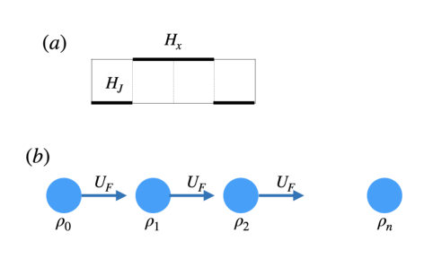
<figcaption class="paper-figure-caption"><b>Fig 1.</b> FIG. 1. (a) Schematic illustration of the periodically driven Hamilto- nian. Within one driving period T, the system alternates between two non-commuting parts, HJ and Hx, in a piecewise-constant (bang–bang) manner. (b) Stroboscopic evolution of the quantum state under the Floquet operator UF . Starting from the initial state ρ0, the state after n driving cycles is given by ρn, where each appli- cation of UF corresponds to one full driving period 2π/ω.</figcaption>
</figure>
<figure class="paper-figure-card">

<figcaption class="paper-figure-caption"><b>Fig 2.</b> FIG. 2. Stroboscopic evolution of the coherence-related quantities CW n (solid lines) and Cχ n (dashed lines) for characterizing the quantum coherence of Floquet dynamics by work statistics from the initial state ρ0 which is either a thermal state ρβ=1 (red) or a N´eel state (green). for three driving frequencies, ω = 3.0, 10.0, 20.0. The inset figure in the subfigure (a) shows the zoom-in pattern in the regime 80 ≤n ≤100. For this figure and the ones presented later, the initial states are always prepared with respect to the spin chain Hamiltonian HJ + Hx of N = 10 sites with fixed parameters J = 1, hx = 0.7, and hz = 1.0.</figcaption>
</figure>
<figure class="paper-figure-card">
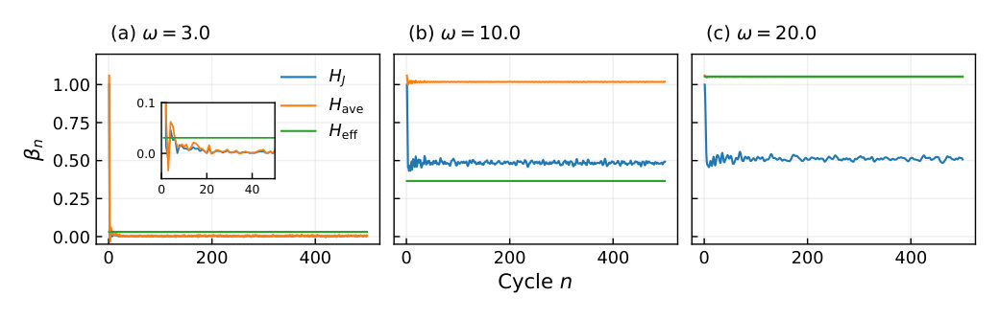
<figcaption class="paper-figure-caption"><b>Fig 3.</b> FIG. 3. Stroboscopic evolution of the effective inverse temperature βn defined by (7) by choosing H0 = HJ (blue), Have (orange) and Heff (green) with three driving frequencies ω = 3.0, 10.0, 20.0 as shown in the respective subfigures (a), (b), (c) from an initial thermal state of unit inverse temperature, ρ0 = ρβ=1. The result is briefly summarized as follows. In the subfigure (a), βn≫1 approaches zero for HJ and Have, but not for Heff as shown in the zoomed inset figure. In the subfigure (b), the βn≫1’s for the three Hamiltonians are different. In the subfigure (c), Have and Heff yield the same βn≫1, which is slightly larger than β0 = 1 but is larger than the βn≫1 from HJ.</figcaption>
</figure>
<figure class="paper-figure-card">
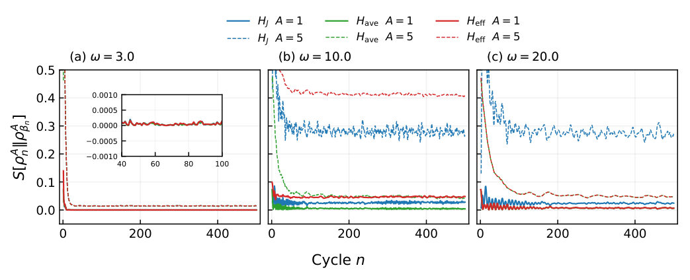
<figcaption class="paper-figure-caption"><b>Fig 4.</b> FIG. 4. Comparison of stroboscopic behaviors of relative entropy S  ρA n ρA βn  in characterizing subsystem Floquet thermalization for the βn given in Fig. 3 for H0 = HJ (blue), Have (green) and Heff (red) from a initial thermal state ρ0 = ρβ=1. We again consider three driving frequencies (a) (ω = 3.0), (b) (ω = 10.0), and (c) (ω = 20.0) with two different subsystem sizes A = 1 (solid lines) and A = 5 (dashed lines). At low frequency (ω = 3.0), the relative entropy approaches almost vanishing values for both A = 1 and A = 5 for all three choices of H0. It implies that the subsystem Floquet thermalization works well up to A = 5. At the intermediate and high frequencies (ω = 10.0, 20.0),...</figcaption>
</figure>
<figure class="paper-figure-card">
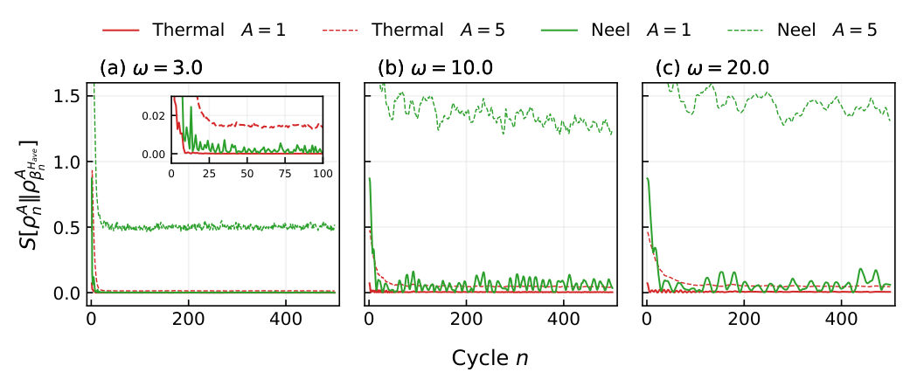
<figcaption class="paper-figure-caption"><b>Fig 5.</b> FIG. 5. Stroboscopic evolution of relative entropy S  ρA n ρA βn  for characterizing the subsystem thermalization of Floquet dynamics for three driving frequencies ω = 3.0, 10.0, 20.0 from an initial state which is either a thermal state ρβ=1 (red) or a N´eel state (green) for two different subsystem sizes A = 1 (solid lines) and A = 5 (dashed lines). Here, we choose H0 = Have to determine βn by (7). The inset figure in the subfigure (a) shows the zoom-in pattern in the regime 0 ≤n ≤100. The relative entropies approach nearly-vanishing values steadily in all cases when the initial state is ρβ=1, implying almost-global thermalization rather than just subsystem thermalization. On the other...</figcaption>
</figure>

**Summary.** The paper develops a comprehensive diagnostic toolkit to study how periodically driven quantum systems approach thermal equilibrium. By comparing local subsystem equilibration (via relative entropy) with global energy absorption statistics (via work theorems), the authors show that these two distinct measures reveal the same underlying dynamical crossover, providing a unified picture of non-equilibrium physics.

**Why it may be interesting.** This work provides a powerful, quantitative methodology for analyzing non-equilibrium steady states in driven quantum matter, directly relevant to understanding energy flow and thermalization processes beyond standard equilibrium assumptions.

Detailed structure

**Main problem.** The study aims to characterize Floquet thermalization in periodically driven quantum systems by combining two complementary diagnostics: local subsystem equilibration and global work statistics.

**Main result.** The authors demonstrate that both local (subsystem) and global (work statistics) indicators track the same dynamical crossover—from prethermal plateaus towards eventual heating—establishing a unified framework for characterizing non-equilibrium dynamics.

**Method.** The analysis employs theoretical tools including calculating relative entropy for subsystem thermalization and analyzing work distributions via characteristic functions and fluctuation theorems for global energy absorption.

**Model / system.** The system modeled is an N-site open Ising spin chain subjected to periodic driving (Floquet dynamics). The Hamiltonian involves interaction ($H_J$) and a time-dependent driving term ($H_x$).

**Key observables.** Subsystem relative entropy $S(
ho_A || 
ho_A^eta)$, Work Distribution Function $P_{	ext{TPM}}^n(W)$, Fluctuation Theorem deviation $	ext{CFT}_n$, and the effective inverse temperature $eta_n$.

**Important parameters / regimes.** Driving frequency ($\omega$), subsystem size ($A$), and the choice of reference Hamiltonian ($H_J, H_{	ext{eff}}, H_{	ext{ave}}$).

**Assumptions / limitations.** The comparison relies on identifying a consistent ansatz thermal state $
ho_{eta n}$ using one of the derived effective Hamiltonians, which is shown to be most robustly provided by $H_{ave}$.

**Figures summary.** Figures illustrate the stroboscopic evolution of coherence quantities and relative entropy across different driving frequencies ($\omega=3.0, 10.0, 20.0$), comparing results for initial thermal vs. pure states.

**Paper structure.** The paper systematically introduces the physical model and diagnostics (subsystem/work statistics), compares their behavior across varying driving frequencies to map out dynamical regimes (prethermalization, heating), and concludes by establishing a unified theoretical framework connecting local and global equilibration measures.

Abstract

We study Floquet thermalization in a periodically driven quantum non-integrable Ising chain by combining two operational diagnostics: subsystem thermalization and work statistics. For generic interacting Floquet systems, stroboscopic dynamics lead to heating toward an infinite-temperature state at low driving frequencies, to a prethermal state during the crossover regime, and then to a finite-temperature state at high driving frequencies. We show that reduced density matrices of small subsystems provide a precise measure of local equilibration and clearly resolve prethermal plateaus. In parallel, we analyze the statistics of work performed over a Floquet cycle using both the characteristic function of work with and without the two-point measurements, and the related fluctuation theorem, which captures coherent contributions and deviations from thermal equilibrium. By comparing these two diagnostics within the same Floquet setting, we demonstrate that work statistics encode the same dynamical crossover that governs subsystem thermalization. Our results establish a unified and experimentally accessible framework for characterizing Floquet thermalization, prethermal regimes, and coherent energy absorption in interacting quantum systems.

[↑ back to top](#top)

### [Surface charges in a Rydberg atom-nanowaveguide hybrid quantum system](http://arxiv.org/abs/2607.00513v1)

**Authors:** Aswathy Raj, Anna Kortel, Krishna Jadeja, Dylan J. Brown, Alexey Vylegzhanin, Robert Löw, Síle Nic Chormaic  
**Type:** experiment · **Category:** other · **PDF:** <https://arxiv.org/pdf/2607.00513v1>  
**Analysis basis:** full PDF text, analyzed in chunks
**Topic relevance:** 🔥 `Rydberg arrays` **4/5** · `methods for driven-dissipative` **3/5** · `quantum optics experiment` **3/5** · `QC/QI experiment` **2/5** · `quantum measurements` **2/5** · `Keldysh / 2PI / non-Gaussian methods` **1/5** · `Tavis-Cummings & cavity-many-emitter` **1/5** · `analog quantum simulation` **1/5** · `correlated / nonlocal dissipation` **1/5** · `correlated cavity matter` **1/5** · `driven-dissipative phase transition` **1/5** · `non-equilibrium dynamics` **1/5**

↔ Scroll figures horizontally

<figure class="paper-figure-card">
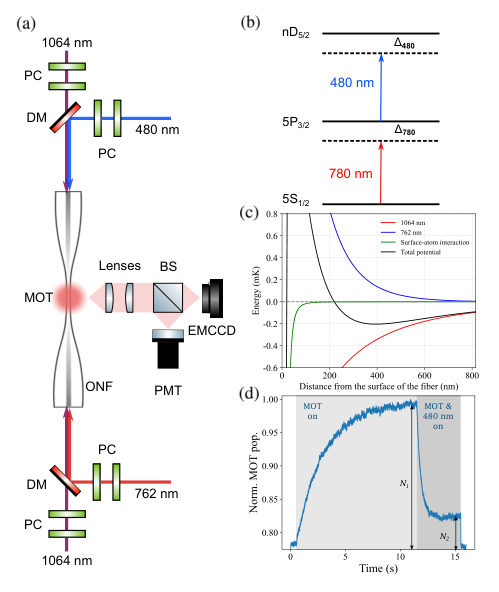
<figcaption class="paper-figure-caption"><b>Fig 1.</b> FIG. 1. (a) Schematic of the experimental setup. The polariza- tion control (PC) consists of two quarter-wave plates. The beams are combined using dichroic mirrors (DM). The cloud of atoms is aligned with the waist of the ONF and its fluorescence is monitored by a PMT and an EMCCD. (b) Diagram of the Rydberg excitation scheme, with detunings ∆780 and ∆480. (c) Numerical simulation of the ONF-based dipole trap potential, showing attractive (red) and repulsive (blue) potentials, and the total potential (black) includ- ing atom-surface interactions (van der Waals and Casimir-Polder) (green). The trap position is 406 nm away from the fiber surface and the trap depth is 0.17 mK. (d) Sample MOT...</figcaption>
</figure>
<figure class="paper-figure-card">
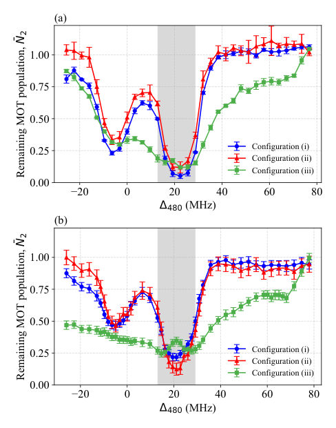
<figcaption class="paper-figure-caption"><b>Fig 2.</b> FIG. 2. Rydberg excitation spectra for 35D5/2 for three trapping beam configurations in the ONF: (i) a unidirectional 762 nm beam (blue curve), (ii) counterpropagating beams of 1064 nm (red curve), and (iii) the combination of both wavelengths (green curve). For each configuration, the corresponding beams were left on during the measurement. (a) Initial spectrum for each beam configuration. (b) Spectra after the system was exposed to continuous 480 nm light, tuned to ∆480 = +20 MHz for 30 minutes with the MOT on. In both (a) and (b) each data point corresponds to 4 seconds of 480 nm exposure, averaged over 4 measurements .</figcaption>
</figure>
<figure class="paper-figure-card">

<figcaption class="paper-figure-caption"><b>Fig 3.</b> FIG. 3. Time evolution of the Rydberg excitation spectrum for 35D5/2 for config. (iii) with 480 nm light continuously on. The legend gives the cumulative 480 nm exposure time, beginning from when the 480 nm light was initially switched on. Each data point corresponds to 5 seconds of 480 nm exposure and averaged over the 5 second PMT signal.</figcaption>
</figure>
<figure class="paper-figure-card">

<figcaption class="paper-figure-caption"><b>Fig 4.</b> FIG. 4. Rydberg excitation spectrum for 40D5/2 for config. (iii). Ini- tial spectrum (dark green) and spectrum after 15 minutes of 480 nm exposure (light green) (a) with and (b) without the applied AC field. Each data point corresponds to 4 seconds of 480 nm exposure, aver- aged over 4 measurements</figcaption>
</figure>
<figure class="paper-figure-card">

<figcaption class="paper-figure-caption"><b>Fig 5.</b> FIG. 6. Electric field as a function of the distance from the ONF sur- face, with an estimate of 5 × 105 dipoles (dashed) plus 65 electrons (solid) stuck on the fiber. Inset: Schematic illustrating the radial DC electric field originating from dipoles (transparent circles) of Rb atoms adsorbed on the fiber surface. Red circles depict the random distribution of electrons on the ONF surface.</figcaption>
</figure>

**Summary.** The authors experimentally investigate how surface charge accumulation on an optical nanofiber degrades the excitation of Rydberg atoms in a hybrid quantum system. They demonstrate that spectral splitting is caused by DC electric fields from these charges, which are generated via enhanced collisional ionization. The results provide crucial guidelines for designing and operating robust fiber-integrated quantum devices.

**Why it may be interesting.** This work is highly relevant as it addresses a critical practical limitation—surface noise—in scaling up integrated quantum technologies utilizing Rydberg atoms near solid-state waveguides. It provides quantitative methods to characterize and mitigate environmental decoherence sources.

Detailed structure

**Main problem.** The study investigates how uncontrolled surface electric fields, arising from charge accumulation on dielectric nanostructures, degrade Rydberg excitation processes in hybrid quantum systems.

**Main result.** Spectral deformations and splitting observed in the Rydberg excitation spectrum are strongly attributed to DC energy level shifts caused by accumulated surface charges. Applying an external oscillating electric field can suppress these spectral features.

**Method.** The research combines experimental measurements of time-dependent Rydberg spectra with theoretical modeling using master equations incorporating static electric field shifts.

**Model / system.** The system involves laser-cooled $^{87}	ext{Rb}$ atoms excited to high-lying Rydberg states near an optical nanofiber (ONF). The model incorporates DC energy level shifts ($\delta_{DC}$) derived from surface charges, which are generated primarily through enhanced Rydberg-ground state collisional ionization.

**Key observables.** Time evolution of the Rydberg excitation spectrum; spectral splitting/deformation magnitude; remaining MOT population ($N_2$).

**Important parameters / regimes.** Rydberg states (e.g., $35D_{5/2}, 40D_{5/2}$); electric field strengths ($\sim 1-2.5 	ext{ V/cm}$); collisional ionization rate ($\Gamma_{	ext{coll}}$).

**Assumptions / limitations.** The primary assumption is that the observed spectral changes are due to static DC shifts from surface charges, which can be mitigated by external AC fields.

**Figures summary.** Figures illustrate schematic setups, time evolution of spectra showing deformation (Figs. 2, 3), comparison with model predictions based on field strength (Fig. 5), and the dependence of spectral features on laser polarization alignment (Figs. 11, 12).

**Paper structure.** The paper progresses from establishing the physical platform and observing time-dependent spectral changes to modeling these shifts using DC electric fields derived from charge generation mechanisms like collisional ionization, culminating in guidelines for mitigation.

Abstract

Hybrid quantum platforms based on highly excited Rydberg atoms coupled to nanophotonics devices offer a promising route toward scalable quantum networks and integrated quantum technologies. However, the close proximity of Rydberg atoms to dielectric nanostructures makes these systems particularly susceptible to uncontrolled surface electric fields that can lead to a degradation of the excitation process. Here, we experimentally investigate Rydberg excitation of laser-cooled $^{87}$Rb atoms via the evanescent field of an optical nanofiber in the presence of fiber-guided red- and blue-detuned light fields as used to trap ground state atoms in fiber-based dipole traps. We observe a time evolution of the Rydberg excitation spectrum when both the dipole trapping fields are on and the additional spectral features that appear can be suppressed by applying an external oscillating electric field to the system, strongly indicating that surface charge accumulation is responsible for the observed spectral feature. The experimental results are reproduced qualitatively by a model that incorporates DC energy level shifts arising from electric fields generated by charges deposited on the nanofiber surface. We identify Rydberg-ground state collisional ionization, which is enhanced by the dipole trapping fields, as the dominant mechanism for charge generation. These results provide new insight into charge dynamics at dielectric nanophotonic interfaces and establish practical guidelines for mitigating surface charge-induced electric fields in fiber-integrated Rydberg quantum systems.

[↑ back to top](#top)

### [Brownian ratchets and pumps universally simulate many-body active dynamics](http://arxiv.org/abs/2607.01231v1)

**Authors:** Charles Stahl, Ethan Lake, Vedika Khemani  
**Type:** theory · **Category:** statistical mechanics · **PDF:** <https://arxiv.org/pdf/2607.01231v1>  
**Analysis basis:** full PDF text, analyzed in chunks
**Topic relevance:** 🔥 `non-equilibrium dynamics` **4/5** · 🔥 `non-equilibrium universality` **4/5** · `driven-dissipative phase transition` **3/5** · `methods for driven-dissipative` **3/5** · `analog quantum simulation` **2/5** · `Keldysh / 2PI / non-Gaussian methods` **1/5** · `correlated / nonlocal dissipation` **1/5** · `entanglement & information structure` **1/5** · `exotic spin models in light-matter` **1/5**

↔ Scroll figures horizontally

<figure class="paper-figure-card">

<figcaption class="paper-figure-caption"><b>Fig 1.</b> FIG. 1. We prove that (a) time-dependent systems with dis- sipation (pumps) and (b) systems coupled to baths at different temperatures (ratchets) can simulate (c) cellular automaton dynamics, in continuous and discrete time, respectively.</figcaption>
</figure>
<figure class="paper-figure-card">

<figcaption class="paper-figure-caption"><b>Fig 2.</b> FIG. 2. (a) A Brownian ratchet. If the gear is hotter than the pawl, then Brownian motion will apply random forces clockwise and counterclockwise, but the pawl will preferen- tially allow the gear to rotate clockwise. The result will is clockwise motion. (b) A Brownian ratchet on a lattice. In the limit Tf ≪ϵ ≪Tℓthe leader spin (bottom) can either be on the same site or one ahead of the follower spin (top), but the follower spin always wants to be on the same site as the leader.</figcaption>
</figure>
<figure class="paper-figure-card">
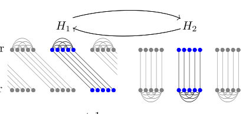
<figcaption class="paper-figure-caption"><b>Fig 3.</b> FIG. 3. Arrangement and coupling of leader and follower spins in the Brownian pump for biased diffusion. Blue disks represent the positions of the particles in an instantaneous ground state. In H1, the follower spins are all coupled to each other, and the leader spins are coupled individually such that xℓ= xf + 1. In H2, the leader spins are all coupled to each other, and the follower spins are coupled individually such that the ground state is xf = xℓ.</figcaption>
</figure>
<figure class="paper-figure-card">
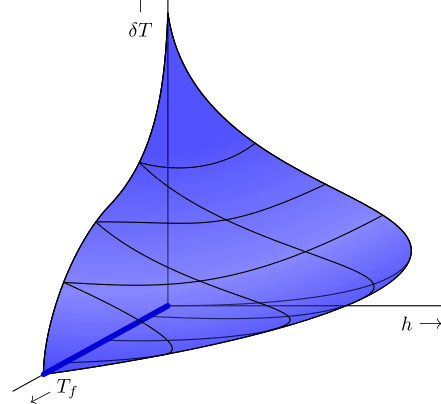
<figcaption class="paper-figure-caption"><b>Fig 4.</b> FIG. 4. Sketch of the phase diagram of the ferromagnetic Toom ratchet as a function of the strength h of a symmetry- breaking field, the temperature difference δT between layers, and the follower temperature Tf. An equilibrium Ising model is not stable to any symmetry-breaking field, leading to a paramagnetic phase at all nonzero values of h when δT = 0 as shown by the blue line. However, when we raise δT, the ferromagnetic phase (shaded in blue) extends to nonzero h. The upper limit to the ferromagnetic phase in the Tf, δT plane are set by the energy scales in the Hamiltonian.</figcaption>
</figure>
<figure class="paper-figure-card">

<figcaption class="paper-figure-caption"><b>Fig 5.</b> FIG. 5. Three different representations of the Toom ratchet. Leader spins are red (for hot) and follower spins are blue (for cold). (a) Two square lattices stacked on top of each other, with heat flowing between the layers. (b) The couplings of a single leader spin, with solid lines for strength J and dashed lines for strength K. Dotted lines are only a guide to the eye. (c) An overhead view emphasizes that the two layers can be reinterpreted as two sublattices at different temperatures.</figcaption>
</figure>

**Summary.** The paper establishes that any local active dynamics can be simulated using either a time-periodic Hamiltonian (Brownian pump) or a static Hamiltonian coupled to two baths at different temperatures (Brownian ratchet). This demonstrates that steady heat currents are sufficient resources to generate and stabilize complex, non-equilibrium collective behaviors in many-body spin systems.

**Why it may be interesting.** This work provides a powerful theoretical framework showing how non-equilibrium thermodynamics—specifically steady heat currents—can serve as the fundamental physical resource to power complex computation or collective behavior, bridging statistical mechanics with information processing.

Detailed structure

**Main problem.** To demonstrate that two simple, physically realizable driving mechanisms—the Brownian pump (time-periodic) and the Brownian ratchet (static)—can universally simulate any local active dynamics found in spin systems.

**Main result.** The authors prove rigorous theorems showing that both pumps and ratchets can approximate arbitrary probabilistic cellular automata (PCA) dynamics, translating abstract rule-based updates into concrete thermodynamic driving protocols.

**Method.** The work involves constructing specific Hamiltonians for the pump and ratchet mechanisms and analyzing their time evolution in various parameter limits to show equivalence with PCA update rules.

**Model / system.** The models are based on many-body spin systems, specifically using probabilistic cellular automata (PCAs) as the target dynamics. The physical realization involves coupling spins to thermal baths at different temperatures or applying time-periodic driving fields.

**Key observables.** Magnetization ($\langle m 
angle$), steady heat current, apparent critical field ($h_c$), and simulation closeness ($\delta$).

**Important parameters / regimes.** Temperature difference ($\delta T = T_\ell - T_f$), coupling strengths ($J, K$), time-period $	au$, and bath temperatures ($T_\ell, T_f$).

**Assumptions / limitations.** The constructions are robust up to noise that can be made arbitrarily weak by tuning energy scales; the analysis often relies on specific limits of parameters (e.g., $\Gamma_f \gg \Gamma_\ell$ or $1 \ll 	au \ll e^{eta J}$).

**Figures summary.** Figures illustrate comparisons between time-dependent pumping, static ratcheting, and cellular automaton dynamics; phase diagrams show ferromagnetic stability regions dependent on temperature differences and external fields.

**Paper structure.** The paper builds from analyzing simple biased diffusion to constructing the full many-body ratchet/pump Hamiltonian. It then proves theorems for simulating continuous-time (ratchet) and discrete-time (pump) PCAs, culminating in tests of memory retention using symmetry-breaking fields.

Abstract

Active systems can exhibit a broad range of phenomena forbidden in equilibrium. Their dynamics are often specified by abstract local update rules, and it is generally unclear when the same behavior can arise from physically natural driving. Here we show that two simple driving mechanisms can universally simulate any local active dynamics in spin systems. The first is the familiar setting of a time-periodic Hamiltonian coupled to a cold bath, which we call a "many-body Brownian pump." As a second mechanism, we promote the Brownian ratchet, traditionally a mechanism for transport, to a "many-body Brownian ratchet": a static Hamiltonian coupled to a hot bath and a cold bath, where the resulting steady heat current can be harnessed not only to drive transport but also to generate local active dynamics. Using probabilistic cellular automata as an explicit model, we prove that for any continuous-time (or discrete-time) local active dynamics, there is always a many-body Brownian ratchet (or pump) that approximates the dynamics, up to noise that can be made arbitrarily weak by tuning energy scales and other parameters. As a concrete demonstration, we construct a simple ferromagnetic Ising ratchet on a bilayer lattice. When the two layers are coupled to baths at different temperatures, this model serves as a robust classical memory even under a symmetry-breaking field, something impossible in equilibrium. More broadly, our work shows that ratchets can use steady heat currents to autonomously generate and stabilize novel collective behavior, realizing a new static setting for nonequilibrium many-body dynamics.

[↑ back to top](#top)

### [Optimizing Symmetry Informed Probabilistic Error Cancellation](http://arxiv.org/abs/2607.01072v1)

**Authors:** Tom O'Leary, Daniel J. Egger, Dieter Jaksch  
**Type:** theory · **Category:** strongly correlated electrons · **PDF:** <https://arxiv.org/pdf/2607.01072v1>  
**Analysis basis:** full PDF text, analyzed in chunks
**Topic relevance:** 🔥 `analog quantum simulation` **4/5** · `measurement-induced transitions` **3/5** · `methods for driven-dissipative` **3/5** · `quantum measurements` **3/5** · `non-equilibrium dynamics` **2/5** · `Keldysh / 2PI / non-Gaussian methods` **1/5** · `correlated / nonlocal dissipation` **1/5** · `driven-dissipative phase transition` **1/5** · `entanglement & information structure` **1/5** · `exotic spin models in light-matter` **1/5**

↔ Scroll figures horizontally

<figure class="paper-figure-card">
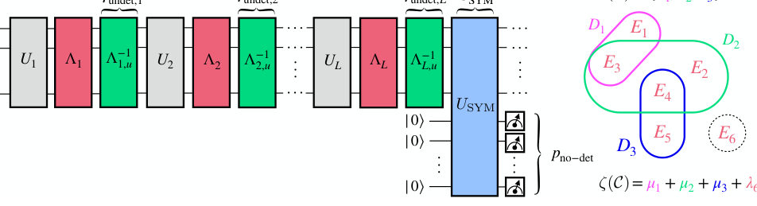
<figcaption class="paper-figure-caption"><b>Fig 1.</b> FIG. 1. Overview of PEC+QED. (a) In a circuit with L-layers of noisy gates, detectable errors are mitigated by measuring symmetries using circuit USYM and post-selecting, retaining circuits with probability pno-det. Remaining errors are mitigated by applying PEC to cancel undetectable noise Λ−1 l,u at each layer l, incurring a sampling cost γ2 undet,l which multiplies per layer. Mitigating noise in USYM introduces a sampling cost CSYM. (b) Given a set of possible symmetries to measure S = {Si}4 i=1, we seek a configuration C ⊂S with minimal cost. Each symmetry Si ∈C has a detectable error set Di and incurs cost µi, while each undetected error Ej incurs cost λj.</figcaption>
</figure>
<figure class="paper-figure-card">
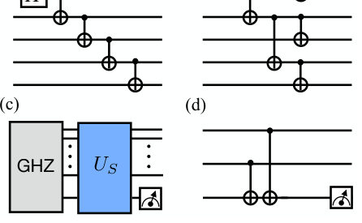
<figcaption class="paper-figure-caption"><b>Fig 2.</b> FIG. 2. (a) GHZ state preparation on n = 8 qubits with centre-out CNOT fan from qubit 3. (b) GHZ state prepara- tion on n = 8 qubits with logarithmic depth [63]. (c) GHZ state preparation and stabilizer measurement circuit. (d) Ex- ample circuit for measuring a ZZ stabilizer.</figcaption>
</figure>
<figure class="paper-figure-card">
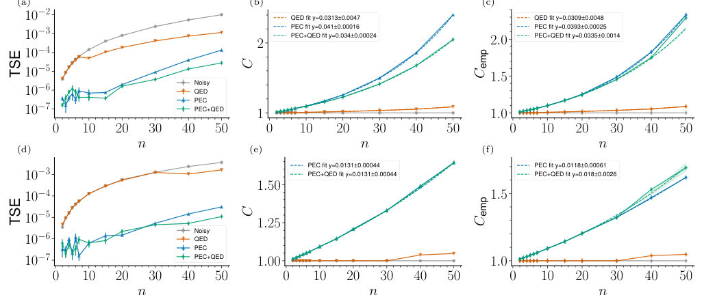
<figcaption class="paper-figure-caption"><b>Fig 3.</b> FIG. 3. GHZ state preparation mitigation for linear and logarithmic depth circuit. The total square error (TSE) and mitigation costs between the output of a noise-free and noisy GHZ state preparation circuit with increasing GHZ state size n. Results obtained using stabilizer circuit simulations with: no mitigation “Noisy” (grey), QED (orange), PEC (blue) and PEC+QED (green), all simulations use 106 shots. Results are shown for linear (a), (b), (c) and logarithmic depth (d), (e), (f) circuits. Mitigation costs are fit to an exponential C(n) = xeyn + z with x + z ∼1. C is the predicted sampling cost using PEC theory and empirical QED discard rate. Cemp is the empirical sampling cost obtained...</figcaption>
</figure>
<figure class="paper-figure-card">
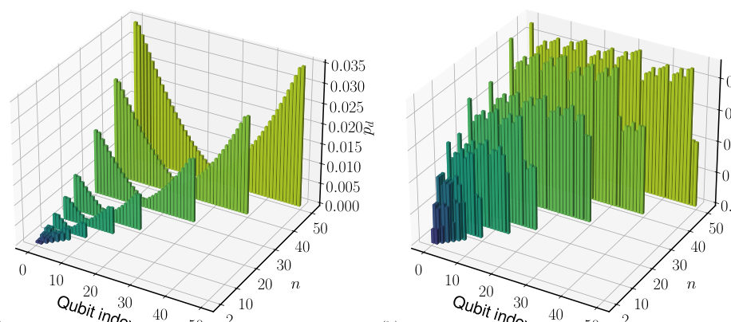
<figcaption class="paper-figure-caption"><b>Fig 4.</b> FIG. 4. Distribution of detectable error probability pd across qubits after propagation and composition of noise channels through n-qubit GHZ state preparation circuits with (a) linear and (b) logarithmic depth. Propagated errors are classified as detectable if they anticommute with at least 1 Z-type GHZ state stabilizer generator. Colours correspond to different values of n.</figcaption>
</figure>
<figure class="paper-figure-card">
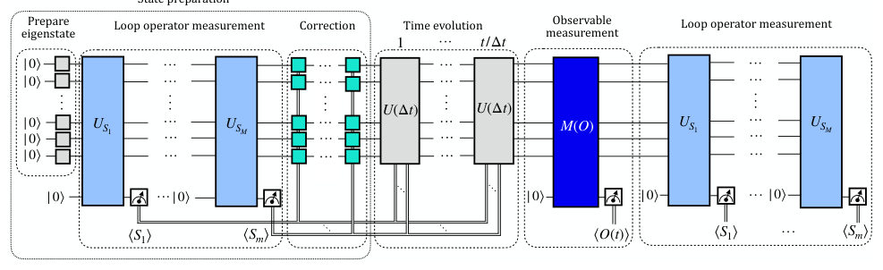
<figcaption class="paper-figure-caption"><b>Fig 5.</b> FIG. 5. Circuits used to study time evolution under the Fermi-Hubbard model with a generalized superfast fermion-to-qubit encoding. State preparation: prepare an eigenstate of both vertex operators and stabilizing loop operators by applying single- qubit Clifford gates, measuring all loop operator expected values {⟨Si⟩}m i=1 and applying corrective operations based on the measurement outcomes, see App. F for more detail. Time evolution: implement approximate evolution to time t by applying t/∆t repeats of a Trotter step U(∆t) evolved to time ∆t, see Eq. (56). Due to vertex operator sign redefinition during state preparation, each Trotter step is classically controlled on loop-operator...</figcaption>
</figure>

**Summary.** The paper presents a method combining Quantum Error Detection (QED) and Probabilistic Error Cancellation (PEC) to estimate expectation values from noisy quantum circuits. By optimizing which symmetries are measured, the technique systematically reduces estimation variance compared to using PEC or QED in isolation. This is demonstrated successfully when simulating dynamics for models like the Fermi-Hubbard model.

**Why it may be interesting.** This work directly addresses resource estimation for simulating strongly correlated electron models (like the FH model) under realistic noise conditions, providing tailored error mitigation techniques crucial for near-term quantum simulation hardware.

Detailed structure

**Main problem.** The primary goal is to improve quantum estimation accuracy and reduce variance when estimating expectation values of noisy quantum circuits, surpassing standard Probabilistic Error Cancellation (PEC) by integrating Quantum Error Detection (QED). This is achieved through optimizing the selection of symmetry measurements.

**Main result.** Combining QED with PEC provides more accurate and lower-variance estimates than either method alone, especially when symmetries are optimized. The approach successfully mitigates errors in simulating complex models like the Fermi-Hubbard model on a lattice.

**Method.** The authors combine PEC (using inverse channels $\Lambda^{-1}$) with QED (by post-selecting on error-free measurements) and treat the selection of symmetry measurement configurations as a classical optimization problem to suppress noise impact.

**Model / system.** The work applies to general noisy quantum circuits, specifically demonstrating utility for GHZ-state output distributions and simulating the time-dynamics of a generalized superfast encoded Fermi-Hubbard model on lattices.

**Key observables.** Total Square Error (TSE), expectation values $\langle O_{	ext{ideal}} 
angle$ vs. $\langle O_{	ext{noisy}} 
angle$, sampling cost ($C_{	ext{PEC+QED}}$).

**Important parameters / regimes.** Noise strength ($\lambda$), lattice size ($2 	imes 2$ up to larger systems), and the set of chosen symmetry generators $C$.

**Assumptions / limitations.** The optimization framework assumes that carefully selecting symmetries can systematically suppress noise, although noisy measurements themselves introduce limitations.

**Figures summary.** Figures illustrate the combination of QED (detecting errors via symmetries) and PEC (handling undetectable noise), showing performance comparisons for GHZ states and lattice models.

**Paper structure.** The paper develops the theoretical framework by defining the combined estimator, deriving cost functions based on error detection probabilities ($p_{	ext{no-det}}$), and then applies this optimization procedure to benchmark systems like GHZ state preparation and the Fermi-Hubbard model dynamics.

Abstract

We show that combining quantum error detection (QED) with probabilistic error cancellation (PEC) gives more accurate and lower-variance estimates than PEC alone, provided that the symmetry measurements required for QED are carefully chosen. Because noisy symmetry measurements can negate the benefits of the PEC+QED approach, we cast the selection of measurement configurations as a classical optimization problem that systematically suppresses the impact of noise. Applying optimized PEC+QED to GHZ-state output distributions and to simulating the time-dynamics of a generalized superfast encoded Fermi-Hubbard model, we find consistent improvements over PEC. For GHZ states, the optimization over symmetry measurement configurations is essential for achieving an advantage. For the Fermi-Hubbard model, PEC+QED improves observable estimation on a $2 \times 2$ lattice and for larger systems the mitigation overheads can be reduced by measuring only subsets of stabilizers. Our results demonstrate the importance of circuit-specific tailoring of QEM techniques and that fault-tolerant design principles may already provide value for near-term devices.

[↑ back to top](#top)

### [Asymmetric Light Scattering from an Atomic System with Gain: A Quantum Analysis](http://arxiv.org/abs/2607.00779v1)

**Authors:** Lorena Acevedo, Manuel Donaire  
**Type:** theory · **Category:** other · **PDF:** <https://arxiv.org/pdf/2607.00779v1>  
**Analysis basis:** full PDF text, analyzed in chunks
**Topic relevance:** 🔥 `interference shaping light` **4/5** · `Keldysh / 2PI / non-Gaussian methods` **3/5** · `methods for driven-dissipative` **3/5** · `correlated / nonlocal dissipation` **2/5** · `driven-dissipative phase transition` **2/5** · `non-equilibrium dynamics` **2/5** · `Tavis-Cummings & cavity-many-emitter` **1/5** · `correlated cavity matter` **1/5** · `non-equilibrium universality` **1/5**

↔ Scroll figures horizontally

<figure class="paper-figure-card">
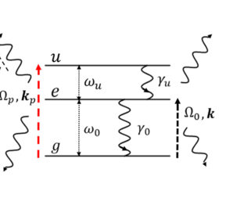
<figcaption class="paper-figure-caption"><b>Fig 1.</b> Figure 1. Schematics of the system under study, consisting of two identical three- level atoms and two external fields. A pump field of strength Ωp causes the transient excitation of atom A from its ground state g to its upper level u, from which it decays, rapidly and incoherently, to the intermediate level e at a rate γu, causing an effective pump rate P = Ω2 p/γu. Energy intervals and dissipative channels are depicted. Atom B is in its ground state. The two atoms are illuminated by a weak probe field of strength Ω0, polarization transverse to the interatomic axis and momentum k, quasi- resonant with the g ⇄e transition. Incidence is either transverse or alongside the interatomic axis....</figcaption>
</figure>
<figure class="paper-figure-card">
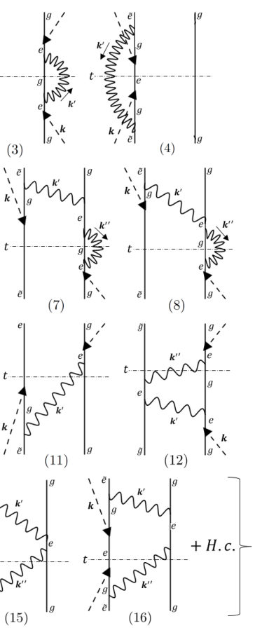
<figcaption class="paper-figure-caption"><b>Fig 2.</b> Figure 2. Diagrammatic representation of scattering processes at leading order. Time runs along the vertical axis from 0 up to the observation time t, both from the top and from the bottom. From the top, the evolution is given by U†(t); from the bottom, it is given by U(t). Solid straight lines represent atomic states, g and e. ’Tilded’ states, ˜g and ˜e, at the initial time stand for the pure states of the mixed state of atom A. Wavy lines stand for virtual photons created and annihilated at the interaction vertices attached to either atom. Dashed arrows represent photons of the external field which are annihilated at interaction vertices attached to either atom. Each vertex represents an...</figcaption>
</figure>
<figure class="paper-figure-card">
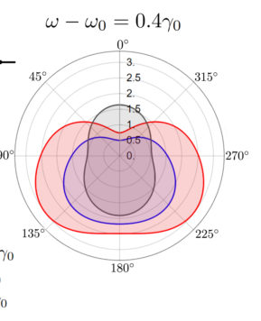
<figcaption class="paper-figure-caption"><b>Fig 3.</b> Figure 3. Angular distribution of the scattered power for frontal incidence W⊥(θ) and different pump rates, P = (0.5, 2, 20)γ0. The interatomic distance is taken at kR = 2, the non-radiative linewidth is γnr = 0.2γ0, and the detuning is fixed at values ω −ω0 = −0.4γ0 (left panel) and ω −ω0 = 0.4γ0 (right panel).</figcaption>
</figure>
<figure class="paper-figure-card">

<figcaption class="paper-figure-caption"><b>Fig 4.</b> Figure 4. Graphical representation of the log of the ratio of the scattered power towards the active atom and towards the passive one for frontal incidence, log10 [W⊥(0)/W⊥(π)], for fixed interatomic distance kR = 2, and non-radiative linewidth γnr = 0.2γ0. Left panel: In terms of the detuning ω −ω0, with several pump rates, P = (0.5, 2, 4, 8)γ0. Right panel: In terms of the pump rate P, with detuning ω −ω0 = 0.4γ0 (black line) and ω −ω0 = −0.4γ0 (red line).</figcaption>
</figure>
<figure class="paper-figure-card">

<figcaption class="paper-figure-caption"><b>Fig 5.</b> Figure 5. Angular distribution of the scattered power for side lighting, G in red, L in grey, and two different pump rates, P = 2γ0 (left panel), P = 8γ0 (right panel). The interatomic distance is taken at kR = 2, the non-radiative linewidth is γnr = 0.2γ0, and the detuning is fixed at the negative value ω −ω0 = −0.4γ0.</figcaption>
</figure>

**Summary.** This theoretical paper analyzes asymmetric light scattering from a two-atom system incorporating optical gain. Using advanced quantum diagrammatic techniques, the authors demonstrate that the resulting optical response is fundamentally non-reciprocal—a feature absent in classical models. This highlights how quantum interference effects dictate directional properties when gain and loss are present.

**Why it may be interesting.** This work is highly relevant as it pushes beyond standard semiclassical treatments in quantum optics by rigorously demonstrating fundamental non-reciprocal effects arising purely from quantum interference and gain/loss mechanisms in open systems.

Detailed structure

**Main problem.** The study investigates the directionality and asymmetry of light scattering from a two-atom system containing gain, focusing on how this response deviates from classical predictions.

**Main result.** The fully quantum analysis reveals non-reciprocity in the optical response (forward power depending on the side of incidence), which contradicts classical linear response theory. This asymmetry is linked to interference effects involving phase differences and inter-atom emission.

**Method.** The authors employ a full quantum mechanical, diagrammatic perturbation theory approach using time-ordered Green's functions to calculate vacuum expectation values of quadratic field fluctuations.

**Model / system.** The system consists of two identical three-level atoms forming a dimer, where one atom is incoherently pumped (gain). The interaction is analyzed under weak probe fields ($\Omega_0$) and involves considering both single-atom and collective scattering processes.

**Key observables.** Differential scattered power $W(	heta)$, the ratio of forward/backward scattered powers ($W^G/W^L$), and the dependence on illumination geometry (frontal vs. side lighting).

**Important parameters / regimes.** Pump rate ($P$), interatomic distance ($k_R$), probe detuning ($\Delta = \omega - \omega_0$), and the relative phase factors associated with side incidence.

**Assumptions / limitations.** The analysis relies on perturbative expansions in the interaction Hamiltonian, integrating out fast dynamics of auxiliary states, and assuming specific limits for time evolution (e.g., $\gamma t \gg 1$).

**Figures summary.** Figures illustrate angular distributions ($W(	heta)$) for both frontal and side illumination geometries, comparing quantum predictions against classical models using log-ratio plots.

**Paper structure.** The paper builds from defining the physical model and Hamiltonian to calculating scattering power via diagrammatic expansion. It systematically compares results for different illumination geometries (frontal vs. side) and contrasts the fully quantum findings with those derived from classical linear response theory, highlighting points of divergence.

Abstract

We study the the scattering of light by a binary system of identical atoms in which one of them is incoherently pumped. This system belongs to the kind of non-parity symmetric optical systems in which gains and losses are partially compensated. We carry out a fully quantum analysis of the directionality of the radiation scattered from the atoms when the incident light strikes the system either perpendicular or alongside the interatomic axis. We find that, generally, while the degree of asymmetry depends on the pump rate, the preferred direction for emission depends on the interatomic distance and the detuning of the probe field with respect to the resonant frequency. On physical grounds, for the case of frontal illumination, the asymmetry is the result of the interference of the photons emitted from different atoms. On the contrary, for side lighting, the asymmetry with respect to the side of incidence is caused by both the phase difference between the probe field photons that strike each atom and the interference between the photons emitted from different atoms. Further, for side lighting too, our quantum approach demonstrates that the forward scattered power depends on the side of incidence, which reveals the lack of reciprocity in the quantum optical response of the system. This result conflicts with what is obtained within a classical approach.

[↑ back to top](#top)

### [Far-field spatial coherence driven by lossy objects: first-principles approach unifying scattering of quantum light and thermal emission](http://arxiv.org/abs/2607.00653v1)

**Authors:** Alessandro Ciattoni  
**Type:** theory · **Category:** other · **PDF:** <https://arxiv.org/pdf/2607.00653v1>  
**Analysis basis:** full PDF text, analyzed in chunks
**Topic relevance:** 🔥 `interference shaping light` **4/5** · `Keldysh / 2PI / non-Gaussian methods` **3/5** · `correlated / nonlocal dissipation` **3/5** · `methods for driven-dissipative` **3/5** · `driven-dissipative phase transition` **2/5** · `correlated cavity matter` **1/5** · `non-equilibrium dynamics` **1/5** · `non-equilibrium universality` **1/5**

↔ Scroll figures horizontally

<figure class="paper-figure-card">

<figcaption class="paper-figure-caption"><b>Fig 1.</b> Figure 1. Schematic illustration of far-field spatial coherence generation under fundamental thermodynamic limits. Wavy lines represent incoherent thermal illumination converging from the surrounding isotropic bath, while linked phase-fronts denote emergent transverse spatial correlations between distinct far-field observation directions (n and n′). (a) Ideally transparent limit: A lossless scatterer merely redirects incoming thermal photons, preserving the completely uncorrelated nature of the ra- diation (µ2 = 0 for distinct directions). (b) Thermal cloaking: At global thermodynamic equilibrium (Ts = Tem), deterministic scattering and intrinsic emission perfectly balance, rendering the...</figcaption>
</figure>
<figure class="paper-figure-card">

<figcaption class="paper-figure-caption"><b>Fig 2.</b> Figure 2. Degradation of far-field spatial coherence under coherent illumination. (a) Schematic representation of the physical interplay: a deterministic incident laser field (red plane waves) is elastically scattered by an arbitrary dissipative object (blue dashed spherical phase fronts), simultaneously competing with the stochastic intrinsic thermal emission (orange wavy arrows). (b) Thermodynamic phase diagram illustrating the normalized temperature threshold Tth/Tmacro (from Eq. (30)) at which spatial coherence breaks down, as a function of the size parameter a/¯λ for a fixed incident illumination (constant Iinc and ¯ω). The normalizing factor Tmacro represents the asymptotic plateau...</figcaption>
</figure>
<figure class="paper-figure-card">

<figcaption class="paper-figure-caption"><b>Fig 3.</b> Figure 3. Geometric purification of spatially entangled light by a dissipative macroscopic scatterer. (Left) The incident continuous-variable state is highly multimode (Schmidt rank K ≫1). The severely reduced macroscopic spatial coherence (µ2 in ≪1) physically manifests as the exact local counterpart of the non-local spatial entanglement. (Center) Operating in a regime where the thermal population at the carrier frequency is sufficiently small to neglect thermal emission, the dissipative object introduces no relevant thermal noise, instead acting as a passive, non-unitary spatial filter (cyan wavy arrows represent the incoming quantum field, while dark blue wavy arrows denote the...</figcaption>
</figure>

**Summary.** The paper presents a first-principles quantum framework unifying how far-field spatial coherence is determined by both incident quantum light scattering and intrinsic thermal emission from dissipative objects. By using the Modified Langevin Noise Formalism, it shows that the outgoing coherence results from an algebraic sum of filtering (scattering) and projection (thermal emission) mechanisms. This has profound implications for designing lossy quantum optical components.

**Why it may be interesting.** This work provides a unified quantum electrodynamic treatment of light propagation through realistic, lossy media, connecting fundamental principles like unitarity directly to macroscopic phenomena like the van Cittert-Zernike theorem and thermal cloaking.

Detailed structure

**Main problem.** To develop a first-principles framework that unifies the scattering of quantum light and intrinsic thermal emission from finite, dissipative objects to describe far-field spatial coherence.

**Main result.** The outgoing far-field spatial coherence separates into an algebraic superposition of two geometry-driven mechanisms: elastic scattering (a non-unitary filter) and thermal emission (deriving van Cittert-Zernike theorem).

**Method.** The analysis employs the Modified Langevin Noise Formalism (MLNF) to calculate outgoing correlation dyadics, analyzing asymptotic limits for far-field correlations.

**Model / system.** The system involves an arbitrary dispersive and absorbing magnetodielectric object interacting with incident quantum light fields. The theoretical foundation is built upon coupled radiation-matter operators within the MLNF framework.

**Key observables.** Far-field spatial coherence ($\mu^2_{	ext{out}}$), outgoing correlation dyadic ($	ext{C}_{	ext{out}}$), and thermal shadow structure.

**Important parameters / regimes.** Temperature ($T_{em}$), scattering cross-sections ($\sigma_{	ext{sca}}, \sigma_{	ext{abs}}$), and the dimensionless parameter $\Gamma$.

**Assumptions / limitations.** The framework assumes rigorous description of material dissipation (Kirchhoff's law) and relies on statistical independence between incident radiation and object excitations in some derivations.

**Figures summary.** Figures schematically illustrate coherence generation across four thermodynamic limits: transparent, global equilibrium, cold vacuum, and cold scatterer, demonstrating the structured nature of the outgoing correlation dyadic.

**Paper structure.** The paper builds by first establishing the general input-output relationship using MLNF, then decomposing the resulting far-field correlation into scattering and thermal components, and finally analyzing specific physical limits (thermal/coherent illumination) to derive quantitative coherence bounds.

Abstract

Far-field spatial coherence dictates the interference properties of scattered light and thermal emission. Traditionally, these phenomena are treated through disjointed paradigms: classical scattering descriptions assume cold objects lacking quantum fluctuations, idealized quantum scattering schemes ignore dissipation, and semiclassical fluctuational electrodynamics relies on phenomenological noise currents, precluding the consistent treatment of incident quantum states. Here, we develop a first-principles framework based on the modified Langevin noise formalism to unify the scattering of quantum light and the intrinsic thermal emission of finite dissipative objects. We demonstrate that the outgoing far-field spatial coherence separates into an algebraic superposition of two geometry-driven mechanisms, coupled by the global unitarity of the radiation-matter dynamics. The first mechanism, elastic scattering, acts as a non-unitary spatial filter, mode-selectively attenuating and reshaping incident quantum correlations. The second mechanism, thermal emission, originates from localized material dissipation and projects the object's absorption profile into the far field, providing a quantum-vectorial derivation of the macroscopic van Cittert-Zernike theorem. Applying this framework across optical regimes, we determine operational bounds for lossy quantum photonics. Under chaotic thermal illumination, we analytically demonstrate thermal cloaking at equilibrium and show that a passive sink casts a structured thermal shadow geometrically identical to a primary emitter. Under coherent illumination, we derive a thermodynamic phase diagram bounding macroscopic phase correlations, demonstrating that subwavelength nanostructures undergo substantial coherence degradation compared to bulk objects. Finally, under spatially entangled illumination...

[↑ back to top](#top)

### [Spinterface-like mechanism of the chirality-induced spin selectivity in donor chiral-bridge acceptor complexes](http://arxiv.org/abs/2607.00668v1)

**Authors:** Subhajit Sarkar, Oliver L. A. Monti, Yonatan Dubi  
**Type:** theory · **Category:** other · **PDF:** <https://arxiv.org/pdf/2607.00668v1>  
**Analysis basis:** full PDF text, analyzed in chunks
**Topic relevance:** 🔥 `methods for driven-dissipative` **4/5** · `Keldysh / 2PI / non-Gaussian methods` **3/5** · `spintronics-quantum-optics interface` **3/5** · `Kondo & dissipative impurity` **2/5** · `non-equilibrium dynamics` **2/5** · `correlated / nonlocal dissipation` **1/5** · `driven-dissipative phase transition` **1/5** · `exotic spin models in light-matter` **1/5** · `non-equilibrium universality` **1/5**

↔ Scroll figures horizontally

<figure class="paper-figure-card">
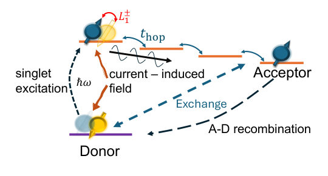
<figcaption class="paper-figure-caption"><b>Fig 1.</b> Figure 1: Schematic depiction for the Donor-chiral-bridge-acceptor (D–χB–A) system within the Hubbard picture. Photoexcitation of the donor (D) injects an elec- tron into the chiral bridge χB (with N = 4), which propagates toward the acceptor-sink (A) with hopping amplitude thop and can recombine back to D. Injection and recombination are described by the Lindblad operators Linj and Lrec, while local spin mixing at the donor-bridge interface is captured by L± 1 (highlighted by the faded yellow spin to denote the spin-flip oper- ator, rather than double occupancy of the donor excited state). The through-bridge current generates an effective interfacial field gµBBeff = α0J (a...</figcaption>
</figure>
<figure class="paper-figure-card">

<figcaption class="paper-figure-caption"><b>Fig 2.</b> Fig. 1, the closest scenario to that of Ref. 12. The donor (D) hosts two electronic orbitals</figcaption>
</figure>
<figure class="paper-figure-card">
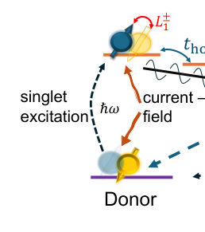
<figcaption class="paper-figure-caption"><b>Fig 3.</b> Fig. 1. The effective Hamiltonian for the donor is therefore Hdonor = X</figcaption>
</figure>
<figure class="paper-figure-card">

<figcaption class="paper-figure-caption"><b>Fig 4.</b> Figure 2: (a) Schematic of D–χB–A complex in terms of its singlet-triplet state manifold. The bare singlet-triplet gap in the donor is governed by the exchange coupling JD. The same exchange coupling in the donor-bridge manifold is distance-dependent, with Jj being smaller for transfer to a more distant bridge site. (b) Thermalization mechanism at the interface. The current-induced field produces a Zeeman splitting ∆1 = gµBBeff of the single-electron levels on the first bridge site, enabling local spin-flip jumps Lj=1 and L† j=1 between |ασ, 1 ↑⟩and |ασ, 1 ↓⟩. The donor spin couples to bridge spins via exchange Jj SD ·Sj, and donor singlet-triplet interconversion is modeled by the...</figcaption>
</figure>
<figure class="paper-figure-card">

<figcaption class="paper-figure-caption"><b>Fig 5.</b> Figure 3: Spin–polarization vs. effective strength of the solenoid field at different temperatures: Plot of the steady-state spin–polarization P versus the solenoidal-coupling magnitude α0 on a log scale at a fixed mixing rate γm = 0.014thop; curves correspond to four temperatures (see legend).</figcaption>
</figure>

**Summary.** The paper introduces an intramolecular spinterface mechanism to explain the chirality-induced spin selectivity (CISS) effect in isolated donor-chiral-bridge-acceptor complexes. Using a Lindblad master equation, the authors show that photoexcited current generates an effective magnetic field at the donor interface. This internal field breaks symmetry and allows for robust, measurable spin polarization signatures compatible with experimental EPR data.

**Why it may be interesting.** This work provides a quantum mechanical framework for understanding spin selectivity in molecular electronics using open quantum system techniques (Lindblad dynamics) to model non-equilibrium charge transport phenomena.

Detailed structure

**Main problem.** To explain the chirality-induced spin selectivity (CISS) effect observed in donor-chiral-bridge-acceptor complexes without relying on an external metal interface.

**Main result.** The authors propose and model an intramolecular spinterface-like mechanism where a current-induced solenoidal field breaks symmetry, enabling robust CISS-like spin filtering in isolated molecular systems.

**Method.** The study employs a two-electron Lindblad master equation approach to simulate the time evolution of the system's density matrix under photoexcitation and charge transfer.

**Model / system.** The physical system is a D–$\chi$B–A complex. The model incorporates Hamiltonian terms for donor, bridge (tight-binding chain), Zeeman splitting, and exchange interactions, all evolving via the Lindblad master equation to capture dissipation.

**Key observables.** Spin polarization ($P$), measured in time-resolved EPR studies, which is compared against theoretical predictions.

**Important parameters / regimes.** Solenoidal coupling strength ($\alpha_0$), temperature ($T$), and spin-mixing rates ($\gamma_m$).

**Assumptions / limitations.** The mechanism relies on the charge current generating an effective solenoidal field at the donor–bridge interface, breaking symmetry without intrinsic SOC on the bridge.

**Figures summary.** Figures illustrate the system schematic, the singlet-triplet state manifold, and show how polarization depends nonmonotonically on spin-mixing rates ($\gamma_m$) and saturates with increasing solenoidal coupling strength ($\alpha_0$).

**Paper structure.** The paper introduces the problem of CISS in isolated complexes, develops a detailed Lindblad model incorporating current-induced fields (the spinterface), calculates steady-state polarization by solving the master equation, and analyzes the dependence on key physical parameters like temperature and coupling strength.

Abstract

The chirality-induced spin selectivity (CISS) effect has been invoked to explain recent reports of differences in the time-resolved EPR signals between chiral and achiral molecules. However, the microscopic origin of these differences and their connection to CISS remains contested, particularly since these systems lack a metal interface. Here we introduce an intramolecular spinterface-like mechanism that naturally arises within donor-chiral bridge-acceptor (D--$χ$B--A) complexes and quantitatively reproduces experimentally reported observed spin polarization in time-resolved EPR studies. In our two-electron Lindblad model, the photoexcited charge-transfer electron traversing the chiral bridge exchanges with the residual donor electron, which acts as a localized magnetic moment analogous to an induced magnetic moment on an electrode surface. The resulting through-bridge charge current produces an effective solenoidal field at the donor--bridge interface, breaking spin degeneracy and directional symmetry, thus enabling spin-selective transport without invoking intrinsic spin-orbit coupling on the bridge. We show that the interplay between this current-induced field, donor thermalization (which breaks time-reversal symmetry), and bridge spin mixing yields tens-of-percent polarization over realistic experimental conditions and charge-transfer time scales, matching reported CISS signatures in triads and DNA hairpins. By explicitly resolving the dependence on solenoidal coupling strength, temperature, and spin-mixing rates, the model identifies the regime in which internal spinterfaces can generate robust CISS-like spin filtering. These findings demonstrate that CISS-like signals in isolated D--$χ$B--A complexes are fully compatible with a spinterface mechanism, providing a unified conceptual framework for interpreting both device-based and molecule-internal CISS platforms.

[↑ back to top](#top)

### [Weak-coupling tensor cross interpolation impurity solver for nonequilibrium dynamical mean-field theory](http://arxiv.org/abs/2607.00702v1)

**Authors:** Shuta Matsuura, Hiroshi Shinaoka, Philipp Werner, Naoto Tsuji  
**Type:** theory · **Category:** strongly correlated electrons · **PDF:** <https://arxiv.org/pdf/2607.00702v1>  
**Analysis basis:** full PDF text, analyzed in chunks
**Topic relevance:** 🔥 `Keldysh / 2PI / non-Gaussian methods` **4/5** · 🔥 `non-equilibrium dynamics` **4/5** · `Kondo & dissipative impurity` **3/5** · `methods for driven-dissipative` **3/5** · `driven-dissipative phase transition` **2/5** · `analog quantum simulation` **1/5** · `non-equilibrium universality` **1/5**

↔ Scroll figures horizontally

<figure class="paper-figure-card">

<figcaption class="paper-figure-caption"><b>Fig 1.</b> FIG. 1. L-shaped contour C that consists of three branches: the forward real-time branch C0, the backward real-time branch C1, and the imaginary-time branch C2.</figcaption>
</figure>
<figure class="paper-figure-card">

<figcaption class="paper-figure-caption"><b>Fig 2.</b> FIG. 2. The definition of the variables u1, · · · , un+1. In this illustration, we take n = 4 and k = 2 with (s1, s2, s3, s4) = (0, 1, 1, 0).</figcaption>
</figure>
<figure class="paper-figure-card">

<figcaption class="paper-figure-caption"><b>Fig 3.</b> FIG. 3. Results obtained with the weak-coupling nonequilib- rium TCI impurity solver for the impurity model (7) with ∆↓(z, z′) = 0 and ∆R ↑(t, t′), ∆⌉ ↑(t, τ ′), ∆&lt; ↑(t, t′) given by Eq. (61). We set δµ = 0 (particle-hole symmetric system). The one-dimensional cuts of (a) Im G&lt; ↑(t, t′) at t = tmax and</figcaption>
</figure>
<figure class="paper-figure-card">

<figcaption class="paper-figure-caption"><b>Fig 4.</b> FIG. 4. Convergence of the error of the lesser Green’s function with respect to (a) the maximum order nmax and (b) the bond dimension χ for the exactly solvable impurity model (Eq. (7) with ∆↓(z, z′) = 0) with particle-hole symmetry (δµ = 0). The parameters are β = 5/v, U = 3v, tmax = 3/v and α = 0.5. In panel (a), the maximum bond dimension is fixed to χ = 80, and in panel (b), the maximum order is fixed to nmax = 14.</figcaption>
</figure>
<figure class="paper-figure-card">
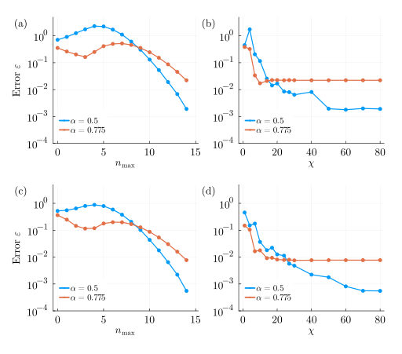
<figcaption class="paper-figure-caption"><b>Fig 5.</b> FIG. 6. Convergence of the error of (a,b) the lesser Green’s function and (c,d) the greater Green’s function for the exactly solvable impurity model (Eq. (7) with ∆↓(z, z′) = 0) without particle-hole symmetry (δµ = 0.825v). In panels (a,c), the error is plotted as a function of the maximum order nmax, and in panels (b,d), the error is plotted as a function of the maximum bond dimension χ. The parameters are β = 5/v, U = 3v, and tmax = 3/v. In panels (a,c), the bond dimension is fixed to χ = 80, and in panels (b,d), the maximum order is fixed to nmax = 14.</figcaption>
</figure>

**Summary.** The paper introduces an advanced impurity solver for nonequilibrium Dynamical Mean-Field Theory (DMFT) by combining weak-coupling expansion with Tensor Cross Interpolation (TCI). This technique efficiently calculates complex high-dimensional integrals, allowing accurate simulation of time evolution in strongly correlated electron systems like the Hubbard model. It is particularly valuable because it remains numerically controlled away from half-filling where other methods fail.

**Why it may be interesting.** This work provides a powerful numerical tool that extends DMFT calculations into non-equilibrium regimes where standard Monte Carlo methods fail due to the sign problem, offering insights into real-time quantum dynamics.

Detailed structure

**Main problem.** Simulating nonequilibrium quantum many-body systems where computational complexity grows exponentially with real time.

**Main result.** The developed solver accurately reproduces known quench dynamics, showing that the dynamical transition at half-filling evolves into a smooth crossover when doping occurs.

**Method.** It implements an impurity solver for Nonequilibrium Dynamical Mean-Field Theory (DMFT) using a weak-coupling expansion combined with the Tensor Cross Interpolation (TCI) algorithm to handle high-dimensional integrals efficiently.

**Model / system.** The method is applied to lattice models, specifically the Hubbard model, analyzed via its mapping onto an impurity problem solved on the Keldysh contour in the complex time plane. The Hamiltonian involves interaction terms U(t).

**Key observables.** Two-time Green's functions (lesser/greater), spectral functions ($	ext{Im} G^R_\sigma(\omega)$), and quench dynamics.

**Important parameters / regimes.** Interaction strength U, filling fraction (e.g., half-filled vs 3/4-filled), maximum real time $t_{	ext{max}}$, and expansion order $n_{	ext{max}}$.

**Assumptions / limitations.** The method relies on the weak-coupling expansion and assumes that the integrands possess a low-rank structure amenable to tensor decomposition via TCI.

**Figures summary.** Figures illustrate convergence checks showing error reduction with increasing expansion order ($n_{	ext{max}}$) or bond dimension ($\chi$), and compare TCI results against exact solutions for Green's functions in both time and frequency domains.

**Paper structure.** The paper systematically develops the mathematical framework by defining the Kadanoff-Baym contour, detailing iterative procedures for transient vs. steady states, and finally presenting the weak-coupling expansion solved via TCI to evaluate high-dimensional integrals.

Abstract

Simulating nonequilibrium quantum many-body systems remains a major challenge due to the exponential growth of the computational complexity with real time. Here we implement a nonequilibrium impurity solver based on the weak-coupling expansion and the tensor cross interpolation (TCI), and apply it to nonequilibrium dynamical mean-field theory (DMFT). The method approximates the integrands of the high-dimensional integrals arising in the weak-coupling expansion in a tensor-train form, enabling efficient evaluations without stochastic sampling and thereby mitigating the sign problem affecting continuous-time quantum Monte Carlo (CT-QMC) methods. Benchmark calculations for an exactly solvable nonequilibrium impurity model agree well with the exact results and reveal a low-rank structure of the integrands. When applied to interaction-quench problems in the half-filled Hubbard model, the method reproduces fast thermalization at a critical interaction strength with accuracy comparable to CT-QMC. Away from half filling, where the sign problem becomes even more severe, the present approach remains well controlled, revealing a crossover instead of a sharply defined fast thermalization point in the 3/4-filled case. The solver can also be applied to steady-state DMFT problems, yielding accurate spectral functions in the metallic regime without analytic continuation.

[↑ back to top](#top)

### [Optically Active Single Hole Spin in ZnSe](http://arxiv.org/abs/2607.00110v1)

**Authors:** Amirehsan Alizadehherfati, Yuxi Jiang, Kelsey J. Mirrielees, Nils von den Driesch, Christine Falter, Yurii Kutovyi, Amirehsan Boreiri, Douglas L. Irving, Alexander Pawlis, Edo Waks  
**Type:** both · **Category:** quantum information and computing · **PDF:** <https://arxiv.org/pdf/2607.00110v1>  
**Analysis basis:** full PDF text, analyzed in chunks
**Topic relevance:** 🔥 `QC/QI experiment` **4/5** · 🔥 `spintronics-quantum-optics interface` **4/5** · `exotic spin models in light-matter` **3/5** · `quantum optics experiment` **3/5** · `Kondo & dissipative impurity` **1/5** · `analog quantum simulation` **1/5** · `quantum measurements` **1/5**

↔ Scroll figures horizontally

<figure class="paper-figure-card">
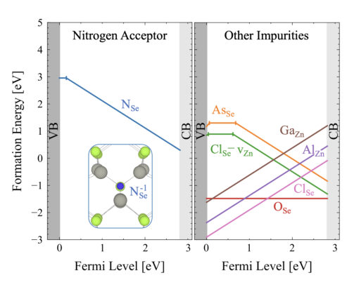
<figcaption class="paper-figure-caption"><b>Fig 1.</b> Figure 1: Formation energy diagrams. Left panel: calculated formation energies of the nitrogen substitutional in ZnSe. Right panel: calculated formation energies of other impurities in ZnSe.</figcaption>
</figure>
<figure class="paper-figure-card">
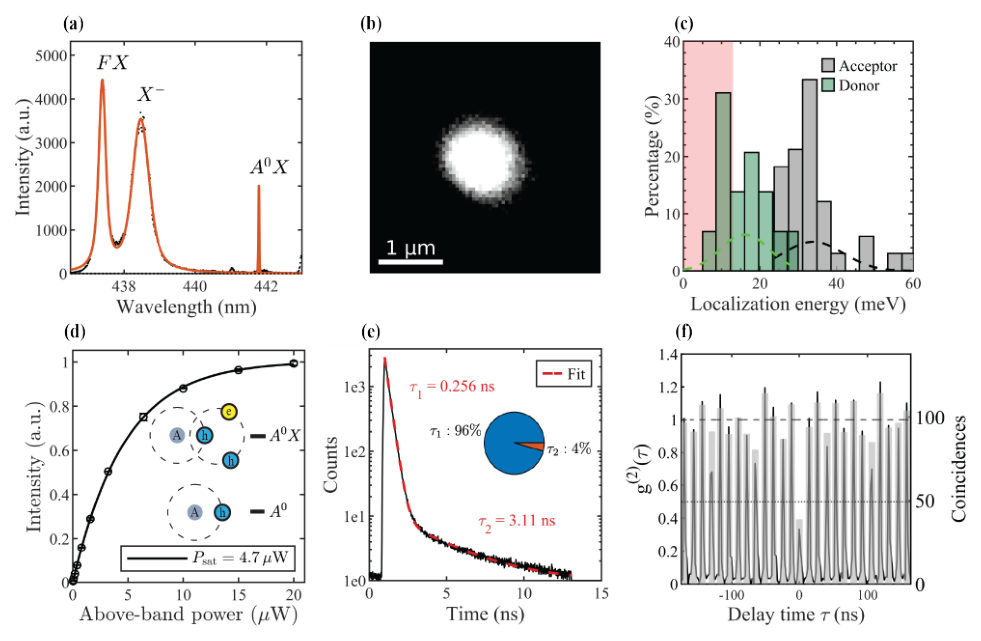
<figcaption class="paper-figure-caption"><b>Fig 2.</b> Figure 2: Photoluminescence characterization. (a) Sample spectrum containing three main components, free exciton (labeled as FX), negatively charged trion (labeled as X−) and bound exciton line (labeled as A0X) (b) Photoluminescence spatial image of the bound exciton line, achieved by selective filtering the sharp peak. (c) Histogram of bound excitons localization energies, indicating two distributions of peaks for acceptors (gray) and donors (green). We collected the data from 30 different acceptor sites and verified them through magnetospectroscopy. The shaded region indicates the region masked by the strong trion envelope in our sample. (d) Power-dependent photoluminescence excitation...</figcaption>
</figure>
<figure class="paper-figure-card">
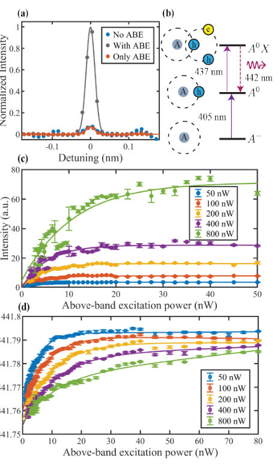
<figcaption class="paper-figure-caption"><b>Fig 3.</b> Figure 3: Photoluminescence excitation measurement of a single acceptor-bound exciton. (a) Spectrum of emission in the absence and presence of above-band excitation (labeled as ABE). (b) Level structure and charge states of the acceptor system. The arrows show the simplified dominant contribution of each laser. (c) Intensity of emission as a function of above-band excitation for different powers of resonant excitation (see legend). (d) Central wavelength of emission as a function of above-band power for different powers of resonant excitation. The trend shows a saturating shift toward higher wavelengths.</figcaption>
</figure>
<figure class="paper-figure-card">

<figcaption class="paper-figure-caption"><b>Fig 4.</b> Figure 4: Magnetic and Raman spectroscopy. (a) Photoluminescence spectrum as a function of magnetic field. (b) Energy splitting of the spectral peaks as a function of magnetic field. The blue and red data points correspond to horizontal (H) and vertical (V) polarizations, respectively. Solid lines represent linear fits extracting the Zeeman splitting rate for each polarization state. (c) Level structure of the acceptor ground and excited state based on extracted g-values. (d-e) Raman sideband (cross-polarized) appears at the partner transition energy when pumping the opposite polarization. For this measurement, we fix the external magnetic field to 6 T. (f) Integrated intensity of Raman...</figcaption>
</figure>

**Summary.** This paper reports on the successful realization and characterization of optically active single hole spins in ZnSe quantum wells by utilizing acceptor impurities instead of traditional p-doping. By combining DFT calculations, time-resolved spectroscopy, and photon correlation measurements, the authors confirm nitrogen as a promising host impurity for developing solid-state spin qubits and single-photon sources.

**Why it may be interesting.** This work directly addresses solid-state quantum emitters for qubits. The combination of theoretical defect engineering (DFT) with precise optical characterization of spin states makes it highly relevant to quantum information research in semiconductors.

Detailed structure

**Main problem.** The goal is to create a promising platform for optically active spin qubits and single-photon sources in ZnSe by overcoming historical p-doping limitations.

**Main result.** The authors successfully isolated and characterized a single-hole spin bound to an acceptor impurity, identifying nitrogen as the most likely candidate based on spectroscopic and theoretical evidence.

**Method.** A combination of first-principles DFT calculations (to predict defect levels) and advanced optical spectroscopy techniques (PL, time-resolved measurements, magnetospectroscopy) was employed.

**Model / system.** The system is a single-hole spin localized at an acceptor impurity within a ZnSe quantum well. The physics involves charge state transitions ($|A^-
angle \leftrightarrow |A^0
angle$) and the formation of an exciton complex ($|A^0X
angle$).

**Key observables.** Antibunching ($g^{(2)}(0)$), effective hole g-factor (0.7), optical resonance linewidth ($\approx 26.7 	ext{ GHz}$), and localization energy ($\sim 34 	ext{ meV}$).

**Important parameters / regimes.** Fast radiative recombination lifetime ($\sim 244 	ext{ ps}$); the dependence of emission intensity on above-band vs. resonant pump power.

**Assumptions / limitations.** The analysis assumes that the observed acceptor state originates from residual nitrogen background rather than intentionally introduced dopants, and that the system can be modeled using steady-state rate equations.

**Figures summary.** Figures illustrate formation energy comparisons for various impurities; PL spectra show distinct exciton components; time decay fits confirm fast emission lifetimes; and $g^{(2)}(	au)$ measurements demonstrate antibunching.

**Paper structure.** The paper progresses from identifying the physical challenge (p-doping limitations) to proposing an optical activation method. It then uses DFT calculations to identify the impurity, followed by detailed spectroscopic characterization of the bound exciton and spin properties using time-resolved and magnetic measurements.

Abstract

Semiconductor hole spins offer a pathway to extended coherence times by decoupling from nuclear magnetic noise, while their spin-orbit coupling enables fast all-electrical control. In ZnSe, however, realizing this potential has been limited by p-doping challenges. Here, we circumvent this limit by optically activating acceptors within the ZnSe quantum well. We isolate a single-hole spin bound to a shallow acceptor, confirmed by antibunching and accessed via the fast (244 ps) radiative recombination of a bound exciton. Magnetic and Raman spectroscopy of the ground state reveal an effective hole g-factor of 0.7 and an optical resonance linewidth of 26.7 GHz. Complementary first-principles simulations, together with the experimental results, provide evidence that points toward nitrogen as the most likely acceptor impurity. These results introduce a promising new platform for optically active spin qubits and single-photon sources in ZnSe.

[↑ back to top](#top)

### [Closed-loop control for two-qubit gates with trapped ions](http://arxiv.org/abs/2607.00462v1)

**Authors:** Eduardo J. Páez, Seyed Shakib Vedaie, Barry C. Sanders  
**Type:** theory · **Category:** other · **PDF:** <https://arxiv.org/pdf/2607.00462v1>  
**Analysis basis:** full PDF text, analyzed in chunks
**Topic relevance:** 🔥 `QC/QI experiment` **4/5** · 🔥 `quantum measurements` **4/5** · `measurement-induced transitions` **3/5** · `methods for driven-dissipative` **3/5** · `non-equilibrium dynamics` **1/5** · `quantum optics experiment` **1/5**

↔ Scroll figures horizontally

<figure class="paper-figure-card">

<figcaption class="paper-figure-caption"><b>Fig 1.</b> Figure 1. (a) Pulse sequence designed by employing the SotA method and the corresponding phase-space trajectories. The colours are arbitrary and intended to guide the eye over each piecewise constant segment. The horizontal dashed line rep- resents the root mean square (RMS) value of the pulse se- quence. (b) Ideal phase-space trajectories. The quadrature components of position X and momentum P are given in ar- bitrary units (a.u.). ‘Mode 0’ is the CoM, ‘Mode 1’ is the tilt mode, and ‘Mode 2’ the ‘plucky’ mode. The colour of the trajectory is associated with the piecewise-constant segment of the pulse sequence shown in (a). The blue ‘X’ markers in (b) indicate the starting and ending points...</figcaption>
</figure>
<figure class="paper-figure-card">

<figcaption class="paper-figure-caption"><b>Fig 2.</b> Figure 2. Diagram of the CLPM-scheme. A three-ion chain is illustrated, where the orange dots represent gate ions and the green dot represents the spectator ion. The spectator ion is illuminated with an external coherent laser coupled to the 2S1/2 – 2P1/2 transition, illustrated as a diagonal blue cone-like shape. An array of lenses and a back mirror collect and su- perpose the fluorescence light to undergo a two-channel time- correlated single-photon counting (TCSPC) setup. The out- put signal is sent to a FPGA for post-processing. The global and bichromatic Raman beams are not shown for simplicity.</figcaption>
</figure>
<figure class="paper-figure-card">
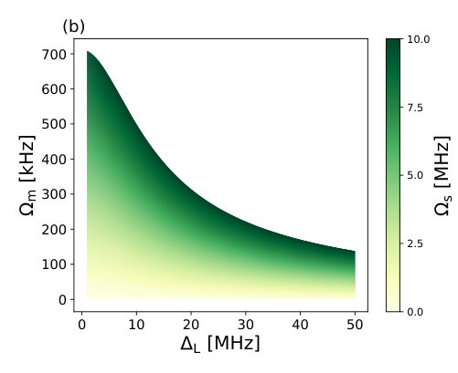
<figcaption class="paper-figure-caption"><b>Fig 3.</b> Figure 3. (a) Emission rates of the spectator Γm ion, and (b) Rabi strength in the mirror mode Ωm versus external laser detuning ∆L. The colour map reflects the Rabi strength of the spectator ion Ωs. The parameters used are NA = 0.4, w0 = 2 µm, Ωs = 3 MHz.</figcaption>
</figure>
<figure class="paper-figure-card">

<figcaption class="paper-figure-caption"><b>Fig 4.</b> Figure 5. Error in two-qubit gate due to motion-driven en- tanglement in a chain of three ions. ∆L: laser detuning of the spectator ion. Ωs: Rabi strength on the spectator. The peak coincides with the motional mode frequencies (not including the remaining two modes for clarity).</figcaption>
</figure>
<figure class="paper-figure-card">
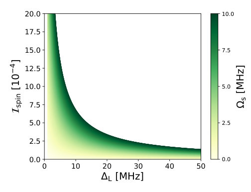
<figcaption class="paper-figure-caption"><b>Fig 5.</b> Figure 4. Error in 2QG implementation due to spin coupling in a chain of three ions. ∆L: laser detuning of the spectator ion. Ωs: Rabi strength on the spectator</figcaption>
</figure>

**Summary.** This paper proposes a novel closed-loop control scheme for two-qubit gates in trapped ion quantum processors. By introducing and continuously monitoring an ancillary 'spectator' ion, the system can actively correct for environmental disturbances like motional drift in real time. This approach, implemented using reinforcement learning, promises substantially higher gate fidelity with reduced calibration overhead compared to existing open-loop techniques.

**Why it may be interesting.** This work represents a significant step toward fault-tolerant quantum computation in trapped ions by moving beyond idealized Hamiltonian descriptions to incorporate real-world noise sources via active feedback control. The combination of advanced quantum optics modeling with machine learning for control is highly relevant.

Detailed structure

**Main problem.** The primary goal is to enhance the fidelity of two-qubit gates (2QG) in trapped ions by implementing a closed-loop control mechanism that actively corrects for real-time system disturbances.

**Main result.** A closed-loop, reinforcement learning approach utilizing continuous monitoring of a spectator ion can significantly reduce 2QG gate infidelity by an order of magnitude compared to current open-loop methods.

**Method.** The authors employ quantum trajectory theory (QTT) and Reinforcement Learning (RL), specifically using Proximal Policy Optimization (PPO), to train a control policy that adjusts laser pulses on the fly based on measured ion position.

**Model / system.** The system is trapped ions in a linear Paul trap, where gate operations are mediated by collective motional modes. The dynamics are modeled via a stochastic quantum master equation incorporating various noise sources like thermal effects and motional drift.

**Key observables.** Two-qubit gate Bell-state preparation infidelity, spectator ion position (monitored via fluorescence), and the geometric phase accumulated during the gate.

**Important parameters / regimes.** The fidelity improvement is quantified relative to current state-of-the-art methods; key parameters include Rabi frequencies ($\Omega$), detunings ($\mu$), and motional frequencies ($
u$).

**Assumptions / limitations.** The analysis assumes that continuous position monitoring is feasible and its impact on infidelity is negligible compared to inherent thermal effects. The control scheme relies on mapping measured positions to optimal laser intensities.

**Figures summary.** Figures illustrate pulse sequences, corresponding phase-space trajectories for multiple motional modes (CoM, tilt mode), and the overall architecture of the closed-loop monitoring system involving electronics like FPGAs.

**Paper structure.** The paper builds from establishing the limitations of open-loop control to introducing the spectator ion mechanism. It details the mathematical modeling using stochastic master equations, presents the RL framework for policy generation, and concludes by demonstrating the feasibility and performance gains of the closed-loop scheme.

Abstract

State-of-the-art two-qubit gates with trapped ions employ open-loop control that rely on simplified models to precompute control sequences. Our aim is to introduce closed-loop control for two-qubit gates to correct disturbances as they occur during the gate implementation. We introduce a spectator ion into the ion chain used for quantum logic processing, where it couples with the other ions through collective motional modes. The spectator ion's position is continuously monitored by driving dipole transitions and detecting the resultant fluorescence. We show that incorporating a spectator ion is feasible for linear Paul trap implementations and is expected to reduce the two-qubit gate Bell-state preparation infidelity by an order of magnitude with the deleterious effects of position monitoring being negligible compared to the thermal effects that exist in the system, even in the absence of the spectator ions. Mathematically, we describe driven ion-trap dynamics, including the spectator ion, by a stochastic quantum master equation involving the amplitude-modulation multimode-motional coupling gate, motional drift, thermal effects, recoil from photon scattering, spontaneous decay, and light shift. Our on-the-fly control method employs reinforcement learning with the reward function based on the actual geometric phase of the spectator ion. A key advantage of our approach is that we introduce a control method that involves `learning' and correcting disturbances happening in the trap on-the-fly, thus achieving high-fidelity gates. Our approach will lead to a significantly higher two-qubit gate fidelity at a reduced calibration overhead owing to the small parameter drift in the control system.

[↑ back to top](#top)

### [Extreme volume monogamy via bound-state engineering](http://arxiv.org/abs/2607.00346v1)

**Authors:** Wen-Jie Zhang, Jun-Hong An  
**Type:** theory · **Category:** quantum information and computing · **PDF:** <https://arxiv.org/pdf/2607.00346v1>  
**Analysis basis:** full PDF text, analyzed in chunks
**Topic relevance:** 🔥 `entanglement & information structure` **4/5** · `correlated / nonlocal dissipation` **3/5** · `methods for driven-dissipative` **3/5** · `driven-dissipative phase transition` **2/5** · `non-equilibrium dynamics` **2/5** · `Keldysh / 2PI / non-Gaussian methods` **1/5** · `non-equilibrium universality` **1/5**

↔ Scroll figures horizontally

<figure class="paper-figure-card">
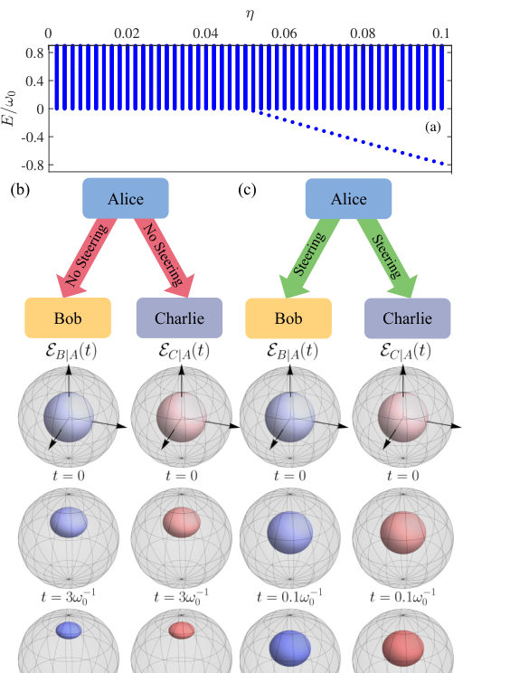
<figcaption class="paper-figure-caption"><b>Fig 1.</b> FIG. 1. (a) Energy spectrum of each qubit-environment sub- system. (b) Steering diagram with Alice as the measurer, showing the steering from Alice to Bob and Charlie, together with the evolution of EB|A and EC|A from top to bottom for no bound states ηA = ηB = ηC = 0.03. (c) Same as (b), but for bound states on all sides with ηA = ηB = ηC = 0.06. The solid surfaces show the numerical evolution, while the golden wireframes on the final QSEs represent the analytical steady-state solutions. The green tetrahedron represents any tetrahedron inscribed in the Bloch sphere. In all plots, we use ωc = 20ω0 and q = 3/4.</figcaption>
</figure>
<figure class="paper-figure-card">

<figcaption class="paper-figure-caption"><b>Fig 2.</b> FIG. 2. (a) Steering diagram with Alice as the measurer, showing the steering from Alice to Bob and Charlie, together with the evolution of EB|A and EC|A from top to bottom for bound states on Alice and Bob but absent on Charlie, i.e., ηA = ηB = 0.06 and ηC = 0.03. (b) Same as (a), but with Bob as the measurer, showing the steering from Bob to Alice and Charlie. The solid surfaces are numerical results, and the golden wireframes are analytical solutions. The green tetrahe- dron cannot enclose the steady QSE, indicating entanglement. In all plots, we use ωc = 20ω0 and q = 3/4.</figcaption>
</figure>
<figure class="paper-figure-card">
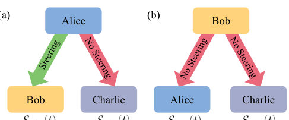
<figcaption class="paper-figure-caption"><b>Fig 3.</b> FIG. 3. (a) Steering diagram with Alice as the measurer, showing the steering from Alice to Bob and Charlie, together with the evolution of EB|A and EC|A from top to bottom for a bound state only on Bob, i.e., ηB = 0.06 and ηA = ηC = 0.03. (b) Same as (a), but with Bob as the measurer, showing the steering from Bob to Alice and Charlie. The solid surfaces are numerical results, and the golden wireframes are analytical solutions. The green tetrahedron can enclose the steady QSE, indicating separability. In all plots, we use ωc = 20ω0 and q = 3/4.</figcaption>
</figure>

**Summary.** The paper introduces 'extreme volume monogamy' by showing that selective engineering of bound states between qubits and their environments can control quantum steering. By ensuring these bound states exist only for trusted parties, the authors demonstrate a method to completely eliminate information leakage from an untrusted third party while maintaining useful correlations among the trusted pair.

**Why it may be interesting.** This work provides a concrete physical mechanism—selective environmental coupling—to enforce information theoretic constraints (monogamy relations) in open quantum systems, which is highly relevant for secure quantum communication protocols.

Detailed structure

**Main problem.** The goal is to achieve 'extreme volume monogamy' by selectively suppressing quantum information leakage from an untrusted third party while preserving essential correlations between trusted parties in open quantum systems.

**Main result.** Selective engineering of bound states within local qubit-environment subsystems can completely suppress the untrusted party's Quantum Steering Ellipsoid (QSE) volume to zero, without affecting the finite QSE volumes between the trusted parties.

**Method.** The analysis uses the Quantum Steering Ellipsoid (QSE) framework applied to a tripartite open quantum system evolving under non-Markovian dynamics derived from tracing out environmental degrees of freedom.

**Model / system.** A tripartite open quantum system involving three qubits (Alice, Bob, Charlie), each coupled independently to its own zero-temperature bosonic environment. The evolution is governed by a master equation analyzed in the non-Markovian regime.

**Key observables.** Quantum Steering Ellipsoid (QSE) Volume ($v$), which quantifies steerability; the existence and energy of environmental bound states ($E_b$).

**Important parameters / regimes.** The degree of coupling to the environment ($\eta$ parameters), which determines whether a bound state is formed.

**Assumptions / limitations.** Independent coupling of qubits to their environments (Ohmic-family spectral density); analysis relies on comparing Markovian vs. non-Markovian dynamics.

**Figures summary.** Figures illustrate QSE evolution, showing that when bound states are selectively engineered onto the trusted parties but absent for the untrusted party, the latter's QSE volume collapses to zero while the former remain finite.

**Paper structure.** The paper systematically analyzes four scenarios (three-sided, two-sided, one-sided, none) of bound state engineering, demonstrating how the presence or absence of these states dictates whether volume monogamy is trivial (collapse) or protected (finite volume).

Abstract

Quantum steering ellipsoid (QSE) provides a faithful representation of a two-qubit state. When extended to tripartite systems, the steerability from a trusted party to different receivers is subject to volume monogamy relations, which only constrain the total steerability but cannot individually eliminate the steerability of an untrusted third party, leaving a potential channel for information leakage via steering. Here, we show that this residual steerability can be completely suppressed by selectively engineering bound states in local qubit-environment subsystems, without compromising the steerability between trusted parties. Specifically, when bound states are formed in the subsystems formed by the trusted parties and their environments but absent in the untrusted one, the untrusted party's QSE volume decays to zero, while the trusted party's QSE volume remains finite. Our results establish selective bound-state engineering as a mechanism for extreme volume monogamy, with potential applications in secure quantum communication with an untrusted third party.

[↑ back to top](#top)

### [Open Quantum Systems Driven by Chirped Pulses: Quantized versus Semiclassical Fields and the Validity of the Rotating-Wave Approximation](http://arxiv.org/abs/2607.00583v1)

**Authors:** Justin Zhengjie Tan, Frank Großmann, Yiying Yan, Maxim Gelin, Yang Zhao  
**Type:** theory · **Category:** other · **PDF:** <https://arxiv.org/pdf/2607.00583v1>  
**Analysis basis:** full PDF text, analyzed in chunks
**Topic relevance:** 🔥 `methods for driven-dissipative` **4/5** · `Keldysh / 2PI / non-Gaussian methods` **3/5** · `Tavis-Cummings & cavity-many-emitter` **2/5** · `non-equilibrium dynamics` **2/5** · `analog quantum simulation` **1/5** · `correlated / nonlocal dissipation` **1/5** · `correlated cavity matter` **1/5** · `driven-dissipative phase transition` **1/5** · `interference shaping light` **1/5**

↔ Scroll figures horizontally

<figure class="paper-figure-card">

<figcaption class="paper-figure-caption"><b>Fig 1.</b> Figure 1. Time evolution of population transfer P1(t) of the quantum JC model (blue), quantum Rabi model (orange), semiclassical Rabi model (yellow) and semiclassical JC model (purple) with different initial mean photon number |α|2 for various pulse area: (a) |α|2 = 104, Θ = π; (b) |α|2 = 104, Θ = 2π; (c) |α|2 = 104, Θ = 3π; (d) |α|2 = 104, Θ = 4π; (e) |α|2 = 1, Θ = π; (f) |α|2 = 1, Θ = 2π; (g) |α|2 = 1, Θ = 3π; and (h) |α|2 = 1, Θ = 4π. The spin-phonon coupling A is set to be 0.22 ω−2 c , the spectral chirp ϕ′′ = −7 ω2 c and the energy gap at resonant excitation (ε = ω0) is set at 10 ωc.</figcaption>
</figure>
<figure class="paper-figure-card">

<figcaption class="paper-figure-caption"><b>Fig 2.</b> Figure 2. Two-dimensional heatmaps of the final transition probability Pf as a function of pulse area Θ and spin-phonon coupling A. The top row depicts the heatmaps for the spectral chirp ϕ′′ = −7 ω2 c for (a) QJC and (b) QRM. The bottom row shows the heatmaps for the spectral chirp ϕ′′ = −40 ω2 c for (c) QJC and (d) QRM. The following parameters are set at: |α|2 = 1 and ε = ω0 = 10 ωc.</figcaption>
</figure>
<figure class="paper-figure-card">

<figcaption class="paper-figure-caption"><b>Fig 3.</b> Figure 3. Two-dimensional heatmaps of the final transition probability Pf as a function of the laser and energy gap res- onance ε = ω0 and spectral chirp ϕ′′. The x-axis is plotted in log-scale in units of ωc. This figure is generated with the following parameters: Θ = 10π and A = 0.22 ω−2 c for the (a) QJC (|α|2 = 1), (b) QRM (|α|2 = 1), (c) SCJC and (d) SCRM.</figcaption>
</figure>

**Summary.** This paper investigates population transfer dynamics in open quantum systems using chirped pulses, comparing full quantum models against semiclassical and Rotating-Wave Approximation (RWA) treatments. The study demonstrates that while semiclassical methods work well for high photon numbers, they fail dramatically at low photon numbers where quantum fluctuations are crucial. The fully quantized Rabi Model provides the most accurate description of robust population transfer.

**Why it may be interesting.** This work is highly relevant as it rigorously tests the limits of standard approximations (like RWA) in complex, open quantum systems driven by tailored fields, which is central to quantum control theory in AMO physics.

Detailed structure

**Main problem.** The study compares open quantum and semiclassical models for population transfer driven by chirped pulses, focusing on when the Rotating-Wave Approximation (RWA) remains valid.

**Main result.** Robust population transfer can be achieved over a wide parameter regime using the full quantum Rabi Model (QRM), which is superior to RWA-based descriptions in capturing necessary quantum fluctuation effects.

**Method.** The authors employ a time-dependent variational approach based on the multiple-Davydov D2 trial state to simulate the open quantum dynamics, comparing results against semiclassical approximations.

**Model / system.** The system is an open quantum two-level spin coupled to a bosonic bath (phononic bath) and driven by chirped laser pulses. Models compared include Quantum Rabi Model (QRM), Jaynes-Cummings variants, and their respective semiclassical counterparts.

**Key observables.** Population transfer $P_1(t)$ and final state population fidelity ($P_f$).

**Important parameters / regimes.** Laser spectral chirp ($eta$), pulse area ($\Theta$), mean photon number regime (high vs. low $|\alpha|^2$), and spin-phonon coupling strength.

**Assumptions / limitations.** Initially, the analysis assumes a zero-temperature phonon bath to isolate field quantization effects; finite temperature requires advanced representations like P-function.

**Figures summary.** Figure 1 illustrates population transfer $P_1(t)$ across four models for varying pulse areas and regimes (high vs. low $|\alpha|^2$). Figure 3 compares the dynamics of the four theoretical models under different parameter settings.

**Paper structure.** The paper systematically compares QJC, QRM, SCJC, and SCRM models by analyzing their predictions for population transfer ($P_1(t)$) and final fidelity ($P_f$) across varying field quantization regimes (low vs. high mean photon number). The core argument revolves around identifying the breakdown points of the RWA and semiclassical assumptions.

Abstract

Population transfer via chirped rapid adiabatic passage is studied using open quantum and semiclassical models, with and without the rotating-wave approximation. A time-dependent variational approach based on the multiple-Davydov D$_2$ trial state is employed to simulate the quantum models with an arbitrary finite mean photon number. We examine the accuracy of both the semiclassical field description and the rotating-wave approximation. Robust population transfer is identified over a wide parameter regime controlled by the laser spectral chirp and is found to be insensitive to the spin--phonon coupling strength, Gaussian pulse area, and energy gap of the two-level system.

[↑ back to top](#top)

### [Bandwidth-Limited Critical Currents in Electrically Tunable Moiré Bands](http://arxiv.org/abs/2607.01056v1)

**Authors:** Riccardo Bertini, Xueqiao Wang, Sergey Slizovskiy, Zhiren Zheng, Julien Barrier, Chiara Pizzo, Robin Smeyers, Krystian Nowakowski, Hitesh Agarwal, Alvaro Moreno, Bert Jorissen, Kenji Watanabe, Takashi Taniguchi, Milorad V. Milošević, Lucian Covaci, Vladimir Fal'ko, Pablo Jarillo-Herrero, Roshan Krishna Kumar, Frank H. L. Koppens  
**Type:** both · **Category:** strongly correlated electrons · **PDF:** <https://arxiv.org/pdf/2607.01056v1>  
**Analysis basis:** full PDF text, analyzed in chunks
**Topic relevance:** 🔥 `non-equilibrium dynamics` **4/5** · `non-equilibrium universality` **3/5** · `driven-dissipative phase transition` **2/5** · `methods for driven-dissipative` **2/5** · `Frenkel-Kontorova` **1/5** · `Keldysh / 2PI / non-Gaussian methods` **1/5** · `analog quantum simulation` **1/5** · `correlated / nonlocal dissipation` **1/5**

↔ Scroll figures horizontally

<figure class="paper-figure-card">
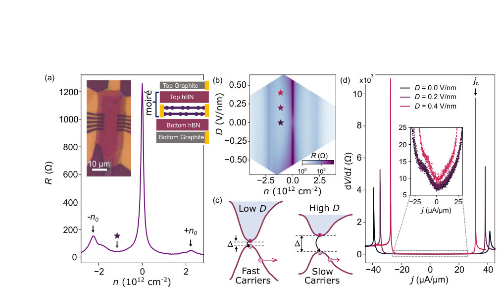
<figcaption class="paper-figure-caption"><b>Fig 1.</b> Figure 1: Low- and high-current transport regimes in BLG/hBN superlattices. (a) Four-probe resistance for device X3 at D = 0 V/nm using 5 nA/µm current bias. Black arrows indicate the position of the secondary neutrality points (NPs) on the hole and electron side. Left inset: Optical image of the device. Right inset: Schematic of the dual-gated geometry. The estimate of twist angle from full filling peaks at secondary NPs gives θ ≈0.13◦. (b) Carrier density–displacement field map of the resistance in the low-current regime. The central indigo streak corresponds to the main NP feature and sidebands correspond to secondary NPs. Stars mark the configurations at which high-current measurements...</figcaption>
</figure>
<figure class="paper-figure-card">

<figcaption class="paper-figure-caption"><b>Fig 2.</b> Figure 2: Tuning the critical regime with carrier density and displacement field. (a) Differential resistance as a function of bias current density and band filling at D = 0 V/nm. Arc-like structures evidencing the evolution of peaks in dV/dI emanate from the main NP and seemingly close at the secondary NPs. A strong asymmetry in the sharpness of the criticality is present between hole and electron filling. Additional features are also visible in the remote bands beyond |n/n0| &gt; 1. (b) Zoom of dV/dI maps in the first valence band for D = 0, 0.4 V/nm (bottom to top). The criticality arcs are visible starting from the main NP and disappearing after n/n0 ≈−0.5, shrinking progressively as |D|...</figcaption>
</figure>
<figure class="paper-figure-card">
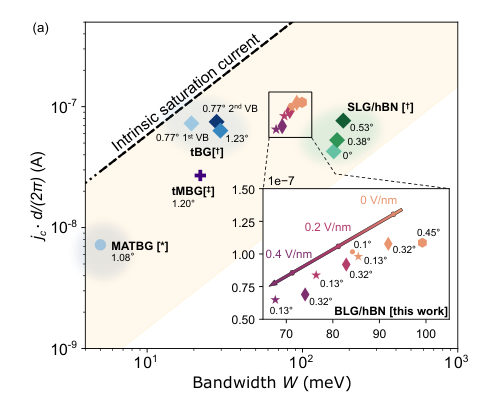
<figcaption class="paper-figure-caption"><b>Fig 3.</b> Figure 3: (a) Critical current vs bandwidth for different moiré superlattices. The experimental critical currents are extracted from jc at n/n0 = −0.5 for the available data in the literature: † from Berdyugin et al. [13], ‡ Barrier [29], ∗Tian et al. [14]. The currents are normalized by BZ size 2π/d to isolate the bandwidth dependence according to Eq. 4. Bandwidths for all the samples are calculated using the continuum model. The dashed black line represents the maximum current limit according to Eq. 4. Inset: Same as main panel, but for the different BLG/hBN superlattices measured in this work, different colors correspond to the same device measured at different displacement fields...</figcaption>
</figure>
<figure class="paper-figure-card">
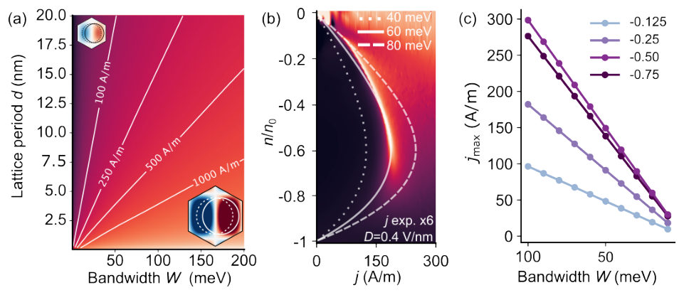
<figcaption class="paper-figure-caption"><b>Fig 4.</b> Figure 4: (a) Schematic illustration of the maximum current in a miniband, which grows with bandwidth W and decreases with d. The insets show the BZ corresponding to small and large moiré period, colored with the band velocity vkx and the shifted fermi surface along the field direction. (b) The different lines represent the density dependence of the maximum current obtained from the model, displaying arc-like structures similar to the experimental dV/dI peaks. The colormap shows the same data as in the lower panel in Figure 2b, with the experimental current multiplied by a factor 6 to show the qualitative agreement with the model for W = 60 meV. (c) Bandwidth dependence of the critical...</figcaption>
</figure>

**Summary.** The paper investigates high-current transport in moiré superlattices, showing that the limiting critical current ($j_c$) is dictated by the available miniband bandwidth ($W$). By tuning this bandwidth using an electric field, the authors establish a universal scaling law ($j_c \propto W$), proving that non-linear electrical measurements serve as a fast and accessible probe for mapping out electronic band structure evolution.

**Why it may be interesting.** This work provides an electrical diagnostic tool to probe fundamental electronic structure properties (miniband bandwidth) in strongly correlated 2D materials, linking macroscopic transport measurements directly to microscopic band dispersion limits.

Detailed structure

**Main problem.** The study aims to establish a direct, universal link between the electronic miniband bandwidth ($W$) and the critical current ($j_c$) observed during high-current, out-of-equilibrium transport in moiré superlattices.

**Main result.** The research demonstrates that the critical current is fundamentally limited by the available bandwidth of the minibands, showing a direct proportionality ($j_c \propto W$).

**Method.** The work combines experimental measurements (differential resistance $	ext{dV/dI}$ vs. bias current $j$) with theoretical modeling using a minimal analytical model derived from the Boltzmann transport equation.

**Model / system.** The physical system is bilayer graphene on hBN forming moiré superlattices, which are electrically tuned via out-of-plane displacement fields ($D$). The analysis focuses on the high-current regime where transport becomes non-linear and out-of-equilibrium.

**Key observables.** Critical current density ($j_c$), differential resistance ($	ext{dV/dI}$), and electronic miniband bandwidth ($W$).

**Important parameters / regimes.** Out-of-plane displacement field ($D$), carrier density ($n/n_0$), and the ratio of $j_c$ to $W$.

**Assumptions / limitations.** The high-current transport is assumed to be governed by a bandwidth-limited saturation mechanism, allowing for a universal scaling law between $j_c$ and $W$.

**Figures summary.** Figures show $	ext{dV/dI}$ maps revealing arc-like structures whose critical points ($j_c$) decrease as the displacement field $|D|$ increases. These experimental trends are mapped against calculated bandwidth evolution ($	ext{BW}(D)$) to confirm proportionality.

**Paper structure.** The paper progresses by first characterizing low-current transport, then investigating the high-current $	ext{dV/dI}$ response, establishing the empirical scaling $j_c \propto W$, and finally validating this relationship using a minimal analytical model derived from non-equilibrium transport theory.

Abstract

Moiré superlattices host narrow minibands whose bandwidth governs correlated and topological phases. Here, we demonstrate that the bandwidth also sets the critical current for the onset of out-of-equilibrium transport. In bilayer graphene aligned to hexagonal boron nitride, we explore the high-current transport regime as we continuously flatten the valence miniband using an out-of-plane displacement field. We observe a significant reduction in the critical current, which is captured by a minimal analytical model and corresponds to the calculated narrowing of the miniband. Moreover, by comparing distinct moiré platforms, we show that the scaling between critical current and bandwidth is a universal feature of graphene superlattices. Our results reveal a direct link between miniband dispersion and high-current transport, and establish this regime as a fast and accessible electrical probe of bandwidth evolution.

[↑ back to top](#top)

### [TCL4 Asymptotic Redundancy and Canonically Consistent Master Equations](http://arxiv.org/abs/2607.00193v1)

**Authors:** Dragomir Davidovic  
**Type:** theory · **Category:** statistical mechanics · **PDF:** <https://arxiv.org/pdf/2607.00193v1>  
**Analysis basis:** full PDF text, analyzed in chunks
**Topic relevance:** 🔥 `methods for driven-dissipative` **4/5** · `Keldysh / 2PI / non-Gaussian methods` **3/5** · `non-equilibrium dynamics` **3/5** · `correlated / nonlocal dissipation` **2/5** · `driven-dissipative phase transition` **2/5** · `non-equilibrium universality` **1/5**

↔ Scroll figures horizontally

<figure class="paper-figure-card">

<figcaption class="paper-figure-caption"><b>Fig 1.</b> FIG. 1. Three canonically consistent closures of the Redfield equation. Time evolution of the trace distance between the TCL4 solution and the solutions of four mas- ter equations for a four-level system. The black, red, blue, and brown curves correspond to the Redfield equation, the latent-resonance closure, the virtual-coherence closure, and the expanded virtual-coherence closure, respectively. The de- phasing parameter ξ = 0, 1, 2, 3 in panels (a)–(d), respectively. λ2 = 1.25×10−3, kBT = 0.26. The remaining parameters are given in Appendix A, Sample 1.</figcaption>
</figure>
<figure class="paper-figure-card">

<figcaption class="paper-figure-caption"><b>Fig 2.</b> FIG. 2. Schematic representation of the cancellations ap- pearing in the induction step N →N + 1. Each rectangle represents a contribution to the latent-resonance interaction shell generated by the addition of the level M = N + 1. The upper block (“action”) contains the terms induced in the pre- existing N-level generator and represents the ten terms in Eq. (B39). The lower block (“reaction”) contains the contri- butions from the new matrix element Lnn,MM and represents the ten terms in Eq. (B40). Double boxes denote terms carry- ing an additional prefactor of 2. Colored connections indicate direct and KMS-induced cancellations. After these cancella- tions, only the newly generated...</figcaption>
</figure>

**Summary.** The paper analyzes the complexity of time-convolutionless (TCL4) generators describing open quantum system relaxation. It demonstrates that much of this high-order structure is asymptotically redundant. By applying stationary-state-preserving transformations, the generator can be drastically simplified into a 'virtual coherence pathway' that accurately predicts equilibrium corrections.

**Why it may be interesting.** This work provides a deep structural insight into how higher-order approximations in open quantum dynamics simplify dramatically when constrained by physical requirements like reaching equilibrium, offering powerful simplification techniques for complex master equations.

Detailed structure

**Main problem.** The core problem is understanding the opaque dynamics of open quantum systems relaxing toward a Kubo–Martin–Schwinger (KMS) equilibrium state, specifically reconciling complex high-order master equation generators with simple stationary-state corrections.

**Main result.** The apparent complexity of the fourth-order time-convolutionless (TCL4) generator is shown to be asymptotically redundant, simplifying down to a 'virtual coherence pathway' that correctly captures the second-order stationary state corrections.

**Method.** The authors employ successive stationary-state-preserving transformations and utilize perturbative expansions in weak coupling ($\lambda$) to simplify the TCL generator structure.

**Model / system.** The system is an open quantum system weakly coupled to a thermal bath, described by a reduced density matrix $
ho_S(t)$ governed by time-local master equations derived from the total Hamiltonian $H = H_S + H_B + \lambda H_I$.

**Key observables.** KMS equilibrium state populations ($p_\infty$), second-order stationary state corrections (e.g., mean-force Gibbs correction), and the TCL4 population generator coefficients.

**Important parameters / regimes.** Weak coupling parameter ($\lambda^2 \ll 1$), inverse temperature ($eta$), and spectral density functions defining bath correlations.

**Assumptions / limitations.** The analysis relies on perturbative expansions in $\lambda$ and assumes non-degenerate Hamiltonians ($H_{nd}$) for the initial derivations, though extensions are discussed.

**Figures summary.** Figures illustrate the time evolution of the trace distance between solutions derived from different master equation closures (Redfield vs. virtual coherence) for a four-level GUE system.

**Paper structure.** The paper progresses by first identifying the discrepancy between TCL4 and known stationary results, then developing mathematical tools like selection rules and auxiliary representations to prove that transformations can eliminate redundant components, culminating in the final compressed closure form.

Abstract

Left alone, open quantum systems relax toward a Kubo--Martin--Schwinger (KMS) equilibrium state, yet the inner workings of this process remain opaque. It remains unclear why the intricate fourth-order time-convolutionless (TCL4) population generator reproduces the comparatively simple second-order stationary state corrections. Even more surprisingly, stationary-state corrections of such precision can be compressed into a simple virtual coherence pathway: an open quantum systems analogue of virtual transitions, in which populations communicate through coherences that are never occupied.   Here we show that this simplification arises through a sequence of stationary-state-preserving transformations that progressively eliminate asymptotically redundant components while preserving the stationary state, ultimately yielding the virtual coherence pathway. This resolves the longstanding stationary-state problem of the Redfield equation and reveals that much of the apparent complexity of the TCL4 generator is asymptotically redundant.

[↑ back to top](#top)

### [Entanglement fingerprint of a non-invertible symmetry: exact Fibonacci cut charges on the lattice](http://arxiv.org/abs/2607.01151v1)

**Authors:** Yi Liang  
**Type:** theory · **Category:** statistical mechanics · **PDF:** <https://arxiv.org/pdf/2607.01151v1>  
**Analysis basis:** full PDF text, analyzed in chunks
**Topic relevance:** 🔥 `entanglement & information structure` **4/5** · `driven-dissipative phase transition` **2/5** · `non-equilibrium universality` **2/5** · `Frenkel-Kontorova` **1/5** · `analog quantum simulation` **1/5** · `correlated cavity matter` **1/5** · `methods for driven-dissipative` **1/5** · `non-equilibrium dynamics` **1/5**

↔ Scroll figures horizontally

<figure class="paper-figure-card">

<figcaption class="paper-figure-caption"><b>Fig 1.</b> FIG. 1. Exact finite-size cut-charge fingerprint. (a) The two Fibonacci charge sectors carry fixed weights 𝑃1 = 1/𝐷2 ≈ 0.2764 and 𝑃𝜏 = 𝜙2/𝐷2 ≈0.7236, obtained from the sandwiched-projector identity rather than from a large-𝐿ex- trapolation. (b) The ratio 𝑃𝜏/𝑃1 equals 𝜙2 for every even 𝐿; numerical verification on 𝐿= 8, 10, 12, 14 confirms the iden- tity to machine precision (residual &lt; 5.3 × 10−15).</figcaption>
</figure>

**Summary.** The paper establishes a novel method to find the boundary entropy associated with a non-invertible symmetry defect using only finite lattice measurements. By proving an exact operator identity on the Fibonacci golden chain, the authors derive that the ratio of cut charges is fixed by the golden ratio $\phi$, providing a sharp fingerprint independent of continuum limits.

**Why it may be interesting.** This work provides an exact, non-perturbative result for topological properties (boundary entropy) in 1D quantum systems, which is highly relevant for understanding entanglement structure in critical many-body models.

Detailed structure

**Main problem.** To determine if a non-invertible defect leaves an exact, finite-size entanglement fingerprint on the lattice, bypassing the need for thermodynamic extrapolation.

**Main result.** The cut-charge weights for the Fibonacci golden chain are shown to have an exact ratio $P_{	au}/P_1 = \phi^2$ at finite length, yielding a sharp lattice-level boundary entropy $\ln g = \ln \phi$.

**Method.** The proof combines a finite-dimensional operator identity for sandwiched cut projectors with the Perron–Frobenius sector theorem applied to the even-length ground state.

**Model / system.** The study focuses on the Fibonacci golden chain, which models a system exhibiting a non-invertible duality defect $Y_{	au}$. The analysis uses Temperley–Lieb generators and analyzes projections onto specific sectors defined by this defect.

**Key observables.** Cut-charge weights ($P_a$), boundary entropy ($\ln g$), and the ratio of these charges ($P_{	au}/P_1$).

**Important parameters / regimes.** The golden ratio $\phi$, finite lattice size $L$ (specifically even $L$), and the two Fibonacci charges $\{1, 	au\}$.

**Assumptions / limitations.** The result is explicitly restricted to the two-charge sector $\{1, 	au\}$ and is separate from the continuum scaling limit analysis involving Virasoro branching.

**Figures summary.** Numerical verification (Fig. 1) shows that the ratio of cut-charge weights $P_{	au}/P_1$ remains exactly $\phi^2$ for various even chain lengths $L$.

**Paper structure.** The paper establishes the problem by noting existing methods, then develops the core proof using operator identities and Perron-Frobenius theory to derive the exact finite-size relationship between cut charges, concluding with a statement of this lattice-level fingerprint.

Abstract

Non-invertible defects are usually diagnosed through scaling spectra or infrared CFT data. We show that the Fibonacci duality defect of the critical golden chain already carries an exact categorical fingerprint at finite lattice size. The even-length antiferromagnetic ground state has fixed cut-charge weights, giving P_tau/P_1=phi^2 and log g=log phi without finite-size extrapolation. The proof is a finite-dimensional operator identity for the sandwiched cut projectors, combined with a Perron-Frobenius sector theorem for the even-length ground state. This gives a sharp lattice-level boundary entropy for a non-Abelian duality defect. We also separate this exact two-charge result from the finer six-primary tricritical-Ising resolution: the latter is located by the standard scaling-limit Virasoro branching of A_4 affine-TL packets, and is not an assumption in the finite-size theorem.

[↑ back to top](#top)

### [Slow heat-driven flow in a gas of hard disks](http://arxiv.org/abs/2607.00449v1)

**Authors:** Amit Kumar, Abhishek Dhar, Baruch Meerson  
**Type:** both · **Category:** statistical mechanics · **PDF:** <https://arxiv.org/pdf/2607.00449v1>  
**Analysis basis:** full PDF text, analyzed in chunks
**Topic relevance:** 🔥 `non-equilibrium dynamics` **4/5** · `methods for driven-dissipative` **3/5** · `non-equilibrium universality` **3/5** · `driven-dissipative phase transition` **2/5** · `Keldysh / 2PI / non-Gaussian methods` **1/5**

↔ Scroll figures horizontally

<figure class="paper-figure-card">
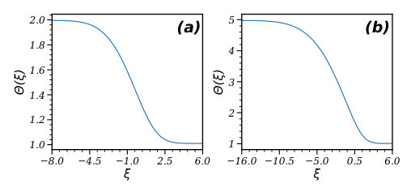
<figcaption class="paper-figure-caption"><b>Fig 1.</b> FIG. 1. Scaling function Θ(ξ) for TL/TR = 2 (left panel) and 5 (right panel).</figcaption>
</figure>
<figure class="paper-figure-card">

<figcaption class="paper-figure-caption"><b>Fig 2.</b> FIG. 2. Dependence of the NSE solution on the initial pressure p0: Rescaled density R (a), velocity V (b), and temperature Θ (c) as functions of the rescaled coordinate ξ, obtained from numerical solution of Eqs. (18) and (19) for pressures p0 = 5, 10, and 20. As the pressure increases, the transition region broadens, and the magnitude of the negative velocity peak increases. The parameters are ρL = 0.075, ρR = 0.15, TR = p0/[ρRZ(ρR)], and TL = p0/[ρLZ(ρL)].</figcaption>
</figure>
<figure class="paper-figure-card">

<figcaption class="paper-figure-caption"><b>Fig 3.</b> FIG. 3. Dependence of the finite-density solution on the density ratio ρR/ρL: Shown are the rescaled density R (a), velocity V (b), and temperature Θ (c) as functions of the rescaled coordinate ξ, obtained from the numerical solution of Eqs. (18) and (19) for ρR = 3ρL/2, 2ρL, and 5ρL/2, with ρL = 0.075. As ρR increases, the density and temperature profiles become steeper, while the magnitude of the negative velocity peak increases, and its position shifts to the left. The parameters are: p0 = 10, TR = p0/[ρRZ(ρR)], and TL = p0/[ρLZ(ρL)].</figcaption>
</figure>
<figure class="paper-figure-card">

<figcaption class="paper-figure-caption"><b>Fig 4.</b> FIG. 4. Finite-density hard disk gas vs. ideal gas. Shown are the rescaled density R, velocity V , and temperature Θ as functions of the rescaled coordinate ξ, obtained from the numerical solution of Eqs. (18) and (19). Panels (a–c) correspond to the initial densities ρL = 0.075 and ρR = 0.15, while panels (d–f) correspond to ρL = 0.005 and ρR = 0.01. The ideal-gas results are obtained by setting the compressibility factor Z(ρ) = 1. It is evident from the plots that, as the initial densities become very small, the finite-density solution and the ideal-gas solutions converge. The parameters are: p0 = 10, TR = p0/[ρRZ(ρR)], and TL = p0/[ρLZ(ρL)].</figcaption>
</figure>
<figure class="paper-figure-card">
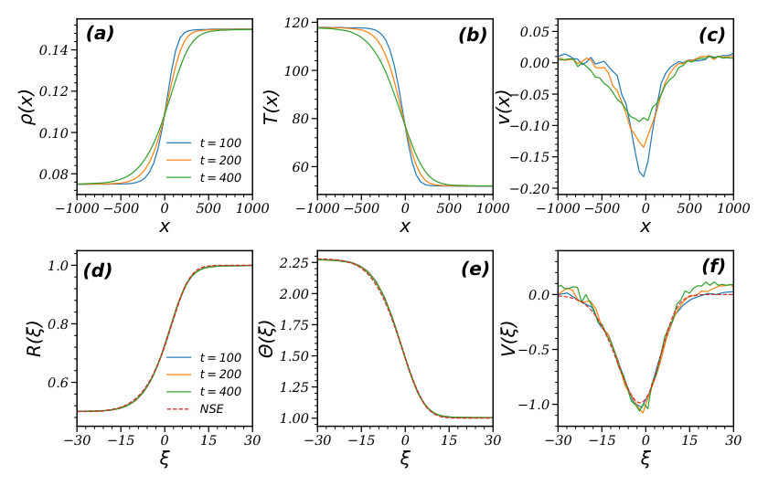
<figcaption class="paper-figure-caption"><b>Fig 5.</b> FIG. 5. Spatio-temporal behavior of (a–c) density, temperature, and velocity as functions of x at different times t = 100, 200, 400, and (d–f) the scaled functions and comparison with the hydrodynamic predictions. The solid lines in Figs. (a–f) represent the EDMD data, and the dashed lines in Figs. (e–f) represent the solution of Eqs. (18) and (19). We see that the MD data shows good scaling collapse in accordance with the scaling ansatz Eq. (17). The results are shown for the parameters: p0 = ρTZ(ρ) = 10, ρR = 0.15, ρL = 0.075, TR = p0/[ρRZ(ρR)], and TL = p0/[ρLZ(ρL)]. The typical simulation box for these parameters was L = 104 and W = 10 with the total of N = 11, 250 hard disks. The data...</figcaption>
</figure>

**Summary.** This paper analyzes slow heat flow in a gas of hard disks using an isobaric hydrodynamic model, extending the theory beyond the dilute ideal gas limit by including finite-density effects. The key achievement is demonstrating excellent quantitative agreement between the derived continuum equations and detailed molecular dynamics simulations, validating the theoretical framework for strongly inhomogeneous cooling flows.

**Why it may be interesting.** While focused on classical hard disks, the rigorous development of a low-Mach number hydrodynamic description that bridges microscopic simulation data (MD) to continuum theory is highly relevant for understanding non-equilibrium transport in complex quantum systems where such limits might apply.

Detailed structure

**Main problem.** The study investigates slow heat-driven flow in a gas of hard disks under nearly isobaric conditions, aiming to provide a particle-level test of such non-equilibrium dynamics.

**Main result.** The theoretical predictions derived from the low-Mach number, isobaric hydrodynamic equations show very good agreement with event-driven molecular dynamics simulations across both dilute and finite-density regimes.

**Method.** The authors developed an extended hydrodynamic theory incorporating a hard-disk equation of state and solved the resulting coupled nonlinear ODEs, comparing these solutions against detailed MD simulations.

**Model / system.** The system is a two-dimensional gas of elastically colliding hard disks confined to a long channel. The flow is driven by initial temperature and density contrasts while maintaining nearly constant pressure (isobaric evolution).

**Key observables.** Temperature (T), density (rho), velocity (v), and pressure (p) profiles across the transition region.

**Important parameters / regimes.** Low-Mach number regime, near-isobaric condition ($p \approx 	ext{const}$), and finite-density corrections relative to the ideal gas limit.

**Assumptions / limitations.** The flow is assumed to be at low Mach numbers, allowing for an isobaric hydrodynamic description; the theory is extended by incorporating a non-ideal equation of state for hard disks.

**Figures summary.** Figures illustrate the scaling collapse of density, velocity, and temperature profiles over time (t=100, 200, 400) when comparing MD data to hydrodynamic solutions, confirming near-isobaric pressure behavior.

**Paper structure.** The paper first establishes the low-Mach number isobaric hydrodynamic framework, extending it from ideal gas theory to finite densities. It then solves the resulting coupled ODEs and validates these theoretical results by direct comparison with event-driven molecular dynamics simulations across various time scales.

Abstract

We study a slow heat-driven flow in a gas of elastically colliding hard disks confined to a long channel. The initial state consists of two regions with large temperature and density contrasts but nearly equal pressures, leading to a low-Mach-number, nearly isobaric evolution. In the dilute limit, the corresponding isobaric hydrodynamic theory reduces to a previously known ideal-gas description. We extend this theory to finite densities by incorporating a non-ideal equation of state of a hard-disk fluid, and solve the resulting one-dimensional equations numerically. Finite-density effects produce appreciable deviations from the ideal-gas prediction. We then test the theory directly against event-driven molecular dynamics simulations of hard disks and find very good agreement in both the dilute and finite-density regimes. The results provide, to our knowledge, the first particle-level test of isobaric gas dynamics of a strongly inhomogeneous cooling flow.

[↑ back to top](#top)

### [Active Learning for Calibrating Entangling Gates via Surrogate-Based Optimization](http://arxiv.org/abs/2607.00284v1)

**Authors:** Caleb Walton, Patricia García-Caspueñas, Filippo Zacchei, Ana Larrañaga, Steven L. Brunton, Sara Mouradian  
**Type:** both · **Category:** other · **PDF:** <https://arxiv.org/pdf/2607.00284v1>  
**Analysis basis:** full PDF text, analyzed in chunks
**Topic relevance:** 🔥 `QC/QI experiment` **4/5** · `quantum measurements` **3/5** · `measurement-induced transitions` **2/5** · `analog quantum simulation` **1/5** · `methods for driven-dissipative` **1/5** · `non-equilibrium dynamics` **1/5**

↔ Scroll figures horizontally

<figure class="paper-figure-card">
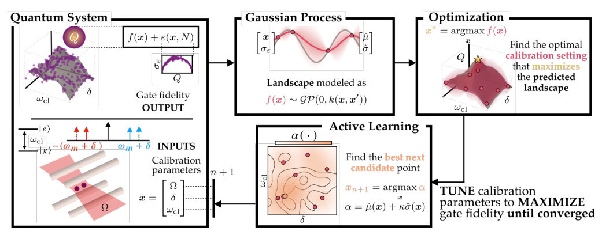
<figcaption class="paper-figure-caption"><b>Fig 1.</b> FIG. 1. Schematic of the optimization pipeline. The goal is to maximize the gate fidelity score Q as a function of the calibration parameters: Rabi frequency Ω, sideband detuning δ and center-line detuning ωcl. First, the score is queried from the Quantum System, represented by an unknown noise-free landscape f(x) and a modeled noise term ε dependent on the inputs and the number of measurements shots N. Next, a Gaussian Process acts as a probabilistic surrogate that models f(x) from the available system scores to predict the mean and variance of unexplored calibration settings. This surrogate is exploited for fast Optimization of the predicted mean landscape. Finally, an Active Learning...</figcaption>
</figure>
<figure class="paper-figure-card">

<figcaption class="paper-figure-caption"><b>Fig 2.</b> FIG. 2. Two-parameter calibration landscapes for the two-MSπ/2 sequence. Each panel plots the infinite-shot gate score (Q∞) while two controls are varied and the remaining controls are fixed at their optimized values. Brighter regions correspond to higher, more optimal scores. The panels depict variations in: (a) sideband detuning and center-line detuning, (b) Rabi frequency and sideband detuning, and (c) Rabi frequency and center-line detuning.</figcaption>
</figure>
<figure class="paper-figure-card">

<figcaption class="paper-figure-caption"><b>Fig 3.</b> FIG. 3. Root Mean Square Error distributions of the GP predictions relative to the true landscape. The surrogate’s performance is evaluated across different numbers of measurement shots N (grouped on the x-axis) and varying numbers of training points m. The errors are displayed as violin plots. The dashed gray lines correspond to the mean binomial noise σε for each N and provide a reference of the expected uncertainty.</figcaption>
</figure>
<figure class="paper-figure-card">

<figcaption class="paper-figure-caption"><b>Fig 4.</b> FIG. 4. Results of BO with active learning. (a) Deter- ministic optimization trajectories for: r = 1.0, dashed black, spans ±2π × 10 kHz in ωcl and δ, and ±20% in laser amplitude. The half-scale (r = 0.5, solid dark blue) and one-tenth-scale (r = 0.1, dotted blue) cases reduce these bounds by factors of two and ten, respectively. The vertical axis shows the op- timization loss, 1 −Q∞. The bold curves show the median trajectory and shaded trajectories span the 5th to 95th per- centile. The gray dashed-dotted line represents the simulation fidelity limit. (b) Optimization trajectories with finite-shot sampling evaluated at the half-scale parameter range (r = 0.5). Trajectories are shown for N...</figcaption>
</figure>
<figure class="paper-figure-card">
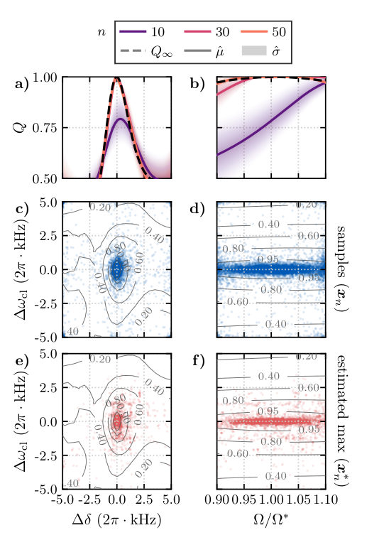
<figcaption class="paper-figure-caption"><b>Fig 5.</b> FIG. 5. Gaussian Process fitting and active learning distributions for the N = 100 scenario. (a,b) 1D slices of the predicted score Q along ∆δ and Ω/Ω∗, respectively. The calibration parameters not shown in a given slice are fixed at their optimal values. Solid colored lines and shaded regions correspond to the surrogate’s predicted mean ˆµ and uncertainty ˆσ at different iterations n of the active learning loop. The dashed black line represents the target infinite-shot noiseless landscape Q∞. (c,d) Distribution of candidate points xn sampled during the active learning step across all iterations (from 1 to nmax) and 100 independent runs, where denser blue regions indicate parameters sampled...</figcaption>
</figure>

**Summary.** The paper presents an active learning framework using Bayesian Optimization and Gaussian Processes to calibrate entangling gates on trapped ions. By treating the unknown gate fidelity landscape as a function to be learned from limited, noisy measurements, the method efficiently converges toward optimal control parameters. This establishes a robust protocol for quantum system calibration that minimizes experimental overhead.

**Why it may be interesting.** This work provides a powerful, model-free toolset for experimental quantum control, showing how advanced machine learning can overcome the practical limitations imposed by noisy measurements in complex physical systems like trapped ions.

Detailed structure

**Main problem.** The central problem is calibrating quantum gates, specifically entangling gates on trapped ions, whose fidelity degrades due to unknown variations in physical control parameters.

**Main result.** An active learning framework utilizing Gaussian Process surrogate models successfully accelerates the discovery of optimal gate parameters, achieving convergence limited only by the inherent quantum projection noise floor.

**Method.** The authors employ Bayesian Optimization (BO) guided by a Gaussian Process (GP) to model the unknown relationship between control inputs and gate fidelity. This iterative process minimizes costly physical measurements while maximizing information gain.

**Model / system.** The system studied is trapped-ion qubits implementing Mølmer-Sørensen gates, whose Hamiltonian dynamics are parameterized by laser amplitudes ($\Omega$), sideband detuning ($\delta$), and center-line detuning ($\omega_{cl}$).

**Key observables.** Gate fidelity score ($Q$) derived from state probabilities ($P_{ee}$), Root Mean Squared Error (RMSE) of GP predictions, and the final optimal control parameters.

**Important parameters / regimes.** Rabi frequency ($\Omega$), sideband detuning ($\delta$), center-line detuning ($\omega_{cl}$), measurement shot number ($N$), and initial parameter uncertainty range ($r$).

**Assumptions / limitations.** The noise in measurements is modeled as heteroskedastic quantum projection noise, and the GP surrogate model assumes a probabilistic mapping of parameters to fidelity.

**Figures summary.** Figures illustrate optimization pipelines (Query $
ightarrow$ GP Prediction $
ightarrow$ Selection), show how GP predictions track the true landscape ($Q_\infty$), and demonstrate that final fidelity saturates according to $N^{-1/2}$ scaling due to measurement noise.

**Paper structure.** The paper introduces the problem of noisy calibration, details the BO/GP framework for active learning, validates the method using trapped-ion gate simulations (IonSim.jl), analyzes convergence rates based on shot number ($N$), and concludes by demonstrating the robustness of the protocol.

Abstract

The fidelity of a quantum gate is sensitive to small deviations in the physical control parameters. Unfortunately, it is generally difficult to exactly model the implemented Hamiltonian for a set of user-defined parameters, necessitating on-device calibration. Here, we present an active learning framework based on Bayesian optimization with a Gaussian Process surrogate to find the optimal parameter set. We validate the technique through numerical calibration of the laser amplitude and frequencies that implement the trapped-ion Mølmer Sørensen gate. We show that a Gaussian process can model the Hamiltonian dynamics. The addition of active learning accelerates the discovery of the optimal parameter set with speed and final fidelity dependent on the quantum projection noise of the data. These results establish the utility of active learning and surrogate models for quantum calibration and control.

[↑ back to top](#top)

### [Experimental Quantification of Layered Error Suppression in Fiber-Interconnected Quantum Data Centers](http://arxiv.org/abs/2607.00735v1)

**Authors:** Seyed Navid Elyasi, Sima Bahrani, Rui Wang, Dimitra Simeonidou, Paolo Monti, Rui Lin  
**Type:** experiment · **Category:** quantum information and computing · **PDF:** <https://arxiv.org/pdf/2607.00735v1>  
**Analysis basis:** full PDF text, analyzed in chunks
**Topic relevance:** 🔥 `QC/QI experiment` **4/5** · `correlated / nonlocal dissipation` **2/5** · `quantum measurements` **2/5** · `entanglement & information structure` **1/5** · `methods for driven-dissipative` **1/5** · `non-equilibrium dynamics` **1/5** · `quantum optics experiment` **1/5**

↔ Scroll figures horizontally

<figure class="paper-figure-card">

<figcaption class="paper-figure-caption"><b>Fig 1.</b> Fig. 1: (a) Fiber-interconnected superconducting QPUs with a transduction interface, where communication noise is emulated via a quantum collisional model. (b) Protocol layers including entanglement generation, noisy transmission, purification, Pauli-twirled two-qubit gates, and readout mitigation. Colors indicate qubit roles and system components.</figcaption>
</figure>
<figure class="paper-figure-card">
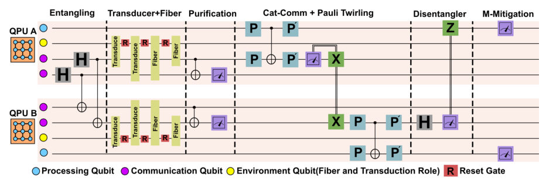
<figcaption class="paper-figure-caption"><b>Fig 2.</b> Fig. 2: Circuit-level implementation of the proposed error suppression framework. A Bell pair is distributed through a collisional communication channel modeling transduction and fiber noise. Entanglement purification is applied to improve resource fidelity, followed by remote gate execution using a cat-state protocol with Pauli-twirled two-qubit gates. Final measurement outcomes are corrected using readout mitigation.</figcaption>
</figure>
<figure class="paper-figure-card">
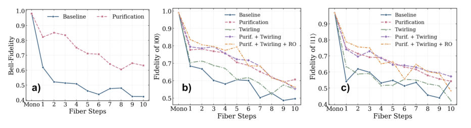
<figcaption class="paper-figure-caption"><b>Fig 3.</b> Fig. 3: Remote gate performance across increasing collisional-model fiber steps, with the monolithic noiseless case shown as Mono. (a) Quality of the distributed entanglement, quantified by the Bell-state fidelity. (b) Fidelity of |00⟩for a remote CNOT with the control qubit prepared in |0⟩. (c) Fidelity of |11⟩for control prepared in |1⟩.</figcaption>
</figure>

**Summary.** This paper experimentally quantifies error suppression techniques for superconducting QPUs connected via optical fibers, simulating realistic communication noise. By implementing a layered protocol combining entanglement purification, Pauli twirling, and readout mitigation, the researchers achieved over 20% fidelity improvement in remote quantum gate operations. This work provides crucial benchmarks for building scalable, distributed quantum data centers.

**Why it may be interesting.** This work is highly relevant as it tackles the practical engineering challenge of scaling quantum computation beyond a single chip by quantifying and mitigating decoherence sources inherent in quantum networking links (fiber/transduction interfaces).

Detailed structure

**Main problem.** The primary challenge addressed is overcoming scalability limits in quantum computation by enabling distributed processing across interconnected Quantum Data Centers (QDCs) linked via optical fibers, which introduces significant communication-induced noise.

**Main result.** The authors demonstrate that implementing a layered error suppression strategy—combining entanglement purification, Pauli twirling, and readout mitigation—yields over 20% improvement in operational fidelity for remote quantum gates compared to baseline performance under realistic noise conditions.

**Method.** The methodology involves applying three sequential error mitigation techniques: purifying entangled pairs (BBPSSW-type), transforming coherent gate errors into stochastic Pauli noise via twirling, and correcting measurement biases using an assignment matrix.

**Model / system.** The experiment uses fiber-interconnected superconducting QPUs, emulating communication noise using the quantum collisional model. The system involves two QPUs linked by a transduction interface and an optical fiber link, tested on an IBM `ibm_kingston` backend.

**Key observables.** Bell-state fidelity (for distributed entanglement quality) and the fidelity of remote CNOT gates ($|00
angle$ and $|11
angle$).

**Important parameters / regimes.** The performance is tracked as a function of increasing collisional steps ($n=1$ to $10$), quantifying error accumulation over distance/time.

**Assumptions / limitations.** The noise emulation relies on the Markovian assumption after environment qubit resetting; performance is evaluated under realistic hardware constraints.

**Figures summary.** Figures illustrate the schematic of the interconnected QPUs and the layered protocol. Figure 3 quantifies fidelity decay versus collisional steps, comparing baseline, purification-only, and full combined protocol results for entanglement and CNOT fidelity.

**Paper structure.** The paper first introduces the problem of noise in distributed QDCs. It then details the physical setup and the three-part layered error suppression strategy (Purification $
ightarrow$ Twirling $
ightarrow$ Readout Mitigation). Finally, it presents quantitative experimental results showing performance gains across increasing levels of simulated communication noise.

Abstract

We perform experiments to quantify error suppression in fiber-connected superconducting QPUs using combined error mitigation techniques, demonstrating over 20\% improvement in operational fidelity across interconnected quantum processing units under realistic noise conditions.

[↑ back to top](#top)

### [Synthesizing Compound Pulse Gadgets for Hamiltonian Simulation on Trapped-Ion Platforms](http://arxiv.org/abs/2607.00826v1)

**Authors:** Ria Patel, Masoud Hakimi Heris, Yuan Liu, Frank Mueller  
**Type:** theory · **Category:** other · **PDF:** <https://arxiv.org/pdf/2607.00826v1>  
**Analysis basis:** full PDF text, analyzed in chunks
**Topic relevance:** 🔥 `analog quantum simulation` **4/5** · `QC/QI experiment` **2/5** · `non-equilibrium dynamics` **2/5** · `correlated / nonlocal dissipation` **1/5** · `driven-dissipative phase transition` **1/5** · `entanglement & information structure` **1/5** · `methods for driven-dissipative` **1/5**

↔ Scroll figures horizontally

<figure class="paper-figure-card">

<figcaption class="paper-figure-caption"><b>Fig 1.</b> Fig. 1: The pulse-level compilation pipeline. Phase 1 maps the H2 Hamiltonian to a 3-ion QSVT specification. Phase 2 contrasts standard modular transpilation (sequential pulse assembly via LUT memory lookups) against the proposed holistic gadget synthesis. Phase 3 evaluates strategy execution performance, benchmarking the temporal compression of the generated schedules against static hardware noise using open-system Lindblad simulations.</figcaption>
</figure>
<figure class="paper-figure-card">
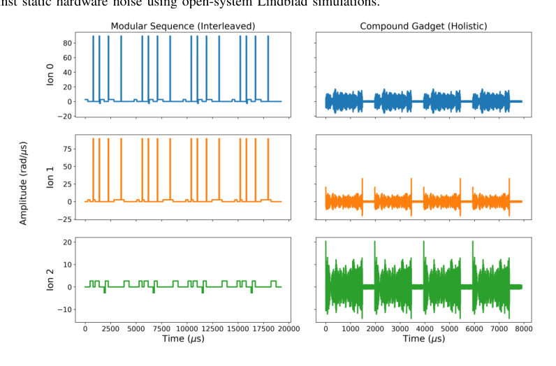
<figcaption class="paper-figure-caption"><b>Fig 2.</b> Fig. 2: Comparison of physical control schedules constructed by the modular baseline and the proposed compound gadget synthesis strategy for QSVT-based Hamiltonian simulation.</figcaption>
</figure>
<figure class="paper-figure-card">
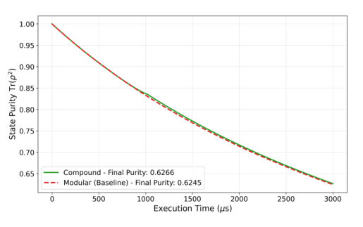
<figcaption class="paper-figure-caption"><b>Fig 3.</b> Fig. 3: Hardware resilience evaluated via open-system purity decay (Tr(ρ2)) over a 3 ms execution window, comparing the baseline modular stitching against the proposed compound compilation.</figcaption>
</figure>

**Summary.** The paper proposes a novel, holistic method to compile complex quantum algorithms into continuous pulse gadgets directly suitable for trapped-ion hardware. By bypassing standard discrete gate stitching, this approach significantly compresses the required physical time and eliminates classical control overhead. This advancement promises to increase the computational depth achievable before decoherence limits are reached.

**Why it may be interesting.** This work directly addresses the gap between abstract quantum algorithms (like QSVT) and the physical constraints of near-term hardware (trapped ions), offering a concrete pulse-level optimization technique crucial for realizing deep quantum computations in AMO systems.

Detailed structure

**Main problem.** Standard gate-level transpilation introduces significant physical noise and overhead for high-precision quantum algorithms on trapped-ion hardware by treating operations as discrete units.

**Main result.** The proposed holistic pulse synthesis strategy achieves significant temporal compression and eliminates control-layer latency compared to standard compilers, enabling deeper circuits within decoherence limits.

**Method.** The authors use Gradient Ascent Pulse Engineering (GRAPE) to compile entire algorithmic blocks directly into continuous compound pulse gadgets, bypassing discrete gate stitching.

**Model / system.** The work targets Hamiltonian simulation of the H2 molecule using a Quantum Singular Value Transformation (QSVT) circuit on a trapped-ion platform with 3 computational ions. The system dynamics are evaluated using noisy Lindblad master equation simulations.

**Key observables.** Temporal compression of the pulse schedule duration, reduction in control-layer latency overhead, and state purity decay ($	ext{Tr}(
ho_2)$) under noise.

**Important parameters / regimes.** The simulation is constrained by fundamental $T_2$ decoherence limits; the process involves block-encoding the problem into a QSVT circuit.

**Assumptions / limitations.** Initial synthesis using GRAPE operates in a noiseless physical model, with robustness verified later via noisy Lindblad master equation simulations.

**Figures summary.** Figure 1 illustrates the pulse-level compilation pipeline comparing modular vs. holistic methods; Figure 2 compares physical control schedules for QSVT simulation; Figure 3 shows hardware resilience by comparing purity decay over time.

**Paper structure.** The paper first identifies the noise/overhead issue with discrete transpilation, then introduces the holistic pulse synthesis strategy using GRAPE to create compound gadgets. It applies this to H2 Hamiltonian simulation via QSVT and evaluates performance against noisy Lindblad simulations, demonstrating temporal compression and latency reduction.

Abstract

Standard gate-level transpilation introduces significant physical noise and overhead for high-precision quantum algorithms, such as the Quantum Singular Value Transformation (QSVT), on near-term trapped-ion hardware. Current compilers treat quantum operations as discrete units, forcing the physical control layer to execute highly fragmented laser pulses. To address this hardware-software disconnect, this work introduces a holistic pulse synthesis strategy that bypasses discrete gate-stitching to compile algorithms directly into continuous compound pulse gadgets. As a proof-of-concept, we target Hamiltonian simulation of the $H_2$ molecule, block-encoding the problem into a QSVT circuit to approximate the time-evolution operator $U = e^{-i H t}$ across 3 computational ions (2 system, 1 ancilla). We utilize the Gradient Ascent Pulse Engineering (GRAPE) algorithm to generate these compound gadgets and evaluate our methodology using noisy Lindblad master equation simulations. Preliminary observations indicate that the proposed strategy achieves significant temporal compression, reducing the total pulse schedule duration compared to standard compilers. Furthermore, synthesizing operations holistically eliminates the control-layer latency associated with discrete pulse lookup overhead. By streamlining the physical control schedule, this methodology offers a promising pathway to execute operations faster, highlighting the potential for compound gadgets to increase the computational depth achievable within fundamental $T_2$ decoherence limits.

[↑ back to top](#top)

### [Entanglement-spectrum fingerprint of a non-invertible symmetry: the Kramers--Wannier duality defect on the lattice](http://arxiv.org/abs/2607.01137v1)

**Authors:** Yi Liang  
**Type:** theory · **Category:** statistical mechanics · **PDF:** <https://arxiv.org/pdf/2607.01137v1>  
**Analysis basis:** full PDF text, analyzed in chunks
**Topic relevance:** 🔥 `entanglement & information structure` **4/5** · `analog quantum simulation` **2/5** · `correlated / nonlocal dissipation` **1/5** · `driven-dissipative phase transition` **1/5** · `methods for driven-dissipative` **1/5** · `non-equilibrium dynamics` **1/5** · `non-equilibrium universality` **1/5**

↔ Scroll figures horizontally

<figure class="paper-figure-card">

<figcaption class="paper-figure-caption"><b>Fig 1.</b> FIG. 1. Lattice reconstruction of the Ising KW duality-defect categorical data from a single duality-twisted ground state. (a) Boundary entropy: double extrapolation log g →1</figcaption>
</figure>

**Summary.** The paper develops a novel diagnostic tool to probe non-invertible symmetries by analyzing the single-particle entanglement spectrum of a quantum many-body system. Using the critical Ising chain with a KW defect as an example, the authors show that key topological invariants like the quantum dimension are encoded in specific spectral features, such as a maximally mixed zero mode ($\xi=0$). This establishes a powerful, level-resolved method for characterizing exotic phases.

**Why it may be interesting.** This work provides a rigorous, quantitative method for diagnosing abstract topological properties (non-invertibility) directly from measurable quantum information quantities like entanglement spectra, which is highly relevant for characterizing exotic phases in condensed matter systems.

Detailed structure

**Main problem.** To determine how the categorical data of a non-invertible symmetry, characterized by an irrational quantum dimension, manifests microscopically in the entanglement structure of a quantum many-body state.

**Main result.** The full categorical data ($d_\sigma$, $h_\sigma$, and the twisted tower structure) is recovered from the single-particle entanglement spectrum ($\xi_k$) of the duality-twisted ground state, establishing a level-resolved spectral fingerprint superior to integrated entropy measures.

**Method.** Analysis involves calculating the single-particle entanglement spectrum using free-fermion techniques on the critical Ising chain and comparing results derived from boundary entropy extrapolation and Casimir curvature calculations.

**Model / system.** The study focuses on the critical Ising chain subjected to a Kramers–Wannier (KW) duality defect. The system is analyzed using its free-fermion representation, allowing for exact solvability benchmarks.

**Key observables.** Single-particle entanglement spectrum ($\xi_k$), Boundary Entropy ($\log g$), Quantum Dimension ($d_\sigma = \sqrt{2}$), and Twist-Field Weight ($h_\sigma = 1/16$).

**Important parameters / regimes.** The defect strength, the system size $L$, and the specific values derived from the Ising model's free-fermion structure.

**Assumptions / limitations.** All exact results rely on the free-fermion solvability of the critical Ising model; numerical calculations use standard double-precision linear algebra techniques.

**Figures summary.** Figures illustrate the reconstruction process: (a) Boundary entropy extrapolation yielding $1/2 \ln 2$; (b) Entanglement spectrum showing a zero mode ($\xi=0$) for the defect vs. homogeneous chain; and (c) Casimir fit confirming $h_{	ext{dual}} = 1/16$.

**Paper structure.** The paper establishes the problem by noting that non-invertible symmetries require spectral analysis beyond integrated quantities. It then applies this to the KW defect on the Ising chain, using multiple independent diagnostic tools (spectrum, entropy, curvature) to confirm the categorical data.

Abstract

Non-invertible symmetries are characterized by topological defects of irrational quantum dimension, but their imprint on the entanglement of a quantum many-body state has not been resolved at the level of the spectrum. We show that the categorical data of the canonical example -- the Kramers--Wannier (KW) duality defect of the critical Ising chain, with quantum dimension d_sigma=sqrt(2) -- is encoded in the single-particle entanglement spectrum of its ground state: a maximally mixed Majorana zero mode is the spectral origin of the boundary entropy log g=(1/2)log 2, hence of d_sigma itself. Reading the same duality-twisted ground state along two independent routes -- the transfer-matrix momentum shift and the Casimir curvature of the energy -- pins the twist-field weight h_sigma=1/16 twice over, and the defect Hilbert space organizes into a half-integer sigma-twisted conformal tower. This promotes the boundary entropy from an integrated number to a level-resolved spectral signature of non-invertibility, and supplies an exactly solvable calibration target for tensor-network studies of duality defects that lack a free-fermion shortcut.

[↑ back to top](#top)

### [Strongly frustrated 2D magnetism in a 3D hexagonal perovskite](http://arxiv.org/abs/2607.00532v1)

**Authors:** Bocheng Yu, Otkur Omar, Songtai Lv, Long Ma, Zhengcai Xia, Jing Meng, Yanran Yang, Jie Ma, Yang Xu, Qingfeng Zhan, Vladimir Yu. Pomjakushin, Haiyuan Zou, Shang Gao, Toni Shiroka, Tian Shang  
**Type:** both · **Category:** strongly correlated electrons · **PDF:** <https://arxiv.org/pdf/2607.00532v1>  
**Analysis basis:** full PDF text, analyzed in chunks
**Topic relevance:** 🔥 `analog quantum simulation` **4/5** · `exotic spin models in light-matter` **3/5** · `Keldysh / 2PI / non-Gaussian methods` **1/5** · `entanglement & information structure` **1/5** · `methods for driven-dissipative` **1/5** · `spintronics-quantum-optics interface` **1/5**

↔ Scroll figures horizontally

<figure class="paper-figure-card">

<figcaption class="paper-figure-caption"><b>Fig 1.</b> FIG. 1. (a) Crystal structure of Ba2La2BB′ 2O12 (B = Co, Ni, Mn; B′ = W, Te, Re). (b) Triangular sublattice of the magnetic B ions. (c) Pathways of the B-O-B′-O-B (black solid lines) and B-O-O-B (black dashed lines) superexchange interactions. (d) Temperature-dependent magnetic susceptibility χ(T) for BLMTO collected in a field of 50 mT. The inset shows the inverse susceptibility 1/χ(T). The red solid line represents a fit to the Curie-Weiss law. (e) Temperature-dependent specific heat C(T)/T (left-axis) and magnetic entropy Sm(T) (right-axis) of BLMTO. The magnetic specific heat was obtained by subtracting the specific heat of the nonmagnetic Ba2La2ZnTe2O12 (BLZTO) (empty circles and...</figcaption>
</figure>
<figure class="paper-figure-card">

<figcaption class="paper-figure-caption"><b>Fig 2.</b> FIG. 4. LF-µSR spectra collected in a magnetic field of 0.78 T at selected temperatures, covering both the AFM and PM states of BLMTO. Solid lines are fits to Eq. (2). The applied magnetic field is parallel to the muon-spin direction. The LF-µSR spectra collected at T = 60 K in different magnetic fields are shown in Fig. S10 [32].</figcaption>
</figure>
<figure class="paper-figure-card">

<figcaption class="paper-figure-caption"><b>Fig 3.</b> FIG. 5. (a) NPD patterns collected at T = 1.5, 10, and 300 K reveal asymmetric magnetic Bragg peaks with q = (1/3, 1/3, 0), (2/3, 2/3, 0), and (1/3, 4/3, 0) (marked by arrows). (b) Comparison of experimental- and simulated NPD spectra. Upper panel: experimental data at 10 K is fitted using the J1-J2-Jc model through the SCGA method. Lower panel: experimental data at 1.5 K and the simulated pattern calculated using the fitted J1-J2-Jc model through classical Monte Carlo simulations. (c) Simulated diffuse neutron scattering patterns in the (h, k, 0) and (h, h, l) planes using the fitted J1-J2-Jc calculated from the SCGA method at 10 K. (d) Temperature dependence of the reduced magnetic...</figcaption>
</figure>
<figure class="paper-figure-card">

<figcaption class="paper-figure-caption"><b>Fig 4.</b> FIG. 6. Field-dependent magnetization M(H) collected at T = 1.8 K in magnetic fields up to 32 T (data up to 49 T are presented in Fig. S12 [32]). Red solid and black dash-dotted lines represent the calculated magnetization using spherical (Msphere) and weighted- biaxial averages (Mbiax), respectively. The dashed horizontal line denotes the Ms/3 magnetization plateau.</figcaption>
</figure>
<figure class="paper-figure-card">

<figcaption class="paper-figure-caption"><b>Fig 5.</b> Fig. 6, the magnetization is almost linear in field, confirming the absence of magnetization plateaus and UUD phases in BLMTO. Since both J2 and Jc are much weaker than J1, we employ the nearest-neighbor (NN) TL-X X Z model to calcu- late the magnetization of BLMTO. This model is described by the Hamiltonian:</figcaption>
</figure>

**Summary.** This work reports on Ba2La2MnTe2O12, demonstrating it hosts an exotic state of strongly frustrated 2D magnetism within its 3D perovskite host. By combining advanced measurements like $\mu$SR and neutron scattering with theoretical modeling, the authors confirm a $120^\circ$ AFM order confined to the ab-plane, providing new insight into dimensionality effects on quantum magnetic states.

**Why it may be interesting.** The interplay between dimensionality, geometric frustration, and emergent low-dimensional quantum magnetism in a solid-state material is highly relevant for understanding strongly correlated electron systems where simple mean-field theories fail.

Detailed structure

**Main problem.** The study investigates the exotic magnetic ground state of a specific hexagonal perovskite, aiming to understand how strong geometric frustration leads to quasi-two-dimensional magnetism within a three-dimensional crystal structure.

**Main result.** The material exhibits an antiferromagnetic transition characterized by ideal 2D magnetism in the ab-plane while remaining disordered along the c-axis. This state is associated with significant magnetic frustration, challenging simple interpretations of 3D magnetic order.

**Method.** A combination of experimental techniques (NMR, neutron scattering, muon-spin spectroscopy) and theoretical modeling (tensor network approach, SCGA) was employed to characterize the spin correlations and magnetic structure.

**Model / system.** The physical system is Ba2La2MnTe2O12, a triangular-lattice magnet belonging to the hexagonal perovskite family. The magnetism arises from Mn2+ moments interacting via superexchange paths, leading to strong frustration on the triangular lattice.

**Key observables.** Magnetic susceptibility (chi(T)), specific heat (C(T)/T), muon asymmetry (ANM), and magnetic Bragg peaks in NPD patterns.

**Important parameters / regimes.** The system exhibits a transition temperature near 3-4.4 K, and the frustration ratio was calculated to be high (f=14.2).

**Assumptions / limitations.** The analysis assumes that the observed magnetism is dominated by ideal 2D behavior despite the 3D crystal structure, and theoretical modeling uses effective Hamiltonian approximations.

**Figures summary.** Figures illustrate crystal structures, magnetic transitions via susceptibility/specific heat, spin dynamics using muon-spin relaxation rates (ZF and LF), and diffraction patterns confirming magnetic ordering vectors.

**Paper structure.** The paper systematically presents evidence from multiple techniques: structural characterization, bulk measurements ($\chi(T)$, $C(T)$), local probes ($	ext{NMR}$, $\mu	ext{SR}$), and advanced modeling (SCGA/Tensor Networks) to build a comprehensive picture of the 2D magnetic order within the 3D lattice.

Abstract

Exotic quantum phenomena are often found to occur in spin systems that exhibit low-dimensional magnetism. By combining nuclear magnetic resonance, neutron scattering, and muon-spin spectroscopy ($μ$SR) techniques, we report a rare instance of strongly frustrated two-dimensional (2D) magnetism in a three-dimensional (3D) hexagonal perovskite. Here, Ba$_2$La$_2$MnTe$_2$O$_{12}$, a triangular-lattice magnet, is shown to undergo a magnetic transition at $T_\mathrm{N} \approx$ 4.4 K, below which the manganese moments form a 120$^{\circ}$ AFM order within the $ab$-plane, while staying disordered along the $c$-axis. This exotic ground state, which exhibits ideal 2D magnetism, is highly consistent with the persistently strong spin fluctuations and the large internal field distributions revealed by zero-field $μ$SR. Further, the 2D magnetism also leads to a significant frustration, much larger than that of most known magnetically-ordered frustrated systems. Our work on Ba$_2$La$_2$MnTe$_2$O$_{12}$ not only challenges the interpretations of magnetic order in other 3D hexagonal perovskites, but it also provides insight into how the dimensionality affects the exotic magnetic states.

[↑ back to top](#top)

### [Holographic Quantum Transformer: A Generalist Neuro-Symbolic Architecture for Solving Frustrated Systems via Generative Attention](http://arxiv.org/abs/2607.00398v1)

**Authors:** Xingran Guo, Tiaojie Xiao, Jie Liu, Keqin Li  
**Type:** both · **Category:** strongly correlated electrons · **PDF:** <https://arxiv.org/pdf/2607.00398v1>  
**Analysis basis:** full PDF text, analyzed in chunks
**Topic relevance:** 🔥 `analog quantum simulation` **4/5** · `exotic spin models in light-matter` **3/5** · `entanglement & information structure` **1/5** · `methods for driven-dissipative` **1/5** · `non-equilibrium dynamics` **1/5**

↔ Scroll figures horizontally

<figure class="paper-figure-card">

<figcaption class="paper-figure-caption"><b>Fig 1.</b> Figure 1: Overview of HQT. (A) Holographic Embedding injects geometry. (B) Quantum Encoder uses global attention to resolve frustration (𝐽2). (C) Autoregressive Head generates the wavefunction Ψ(x).</figcaption>
</figure>
<figure class="paper-figure-card">

<figcaption class="paper-figure-caption"><b>Fig 2.</b> Figure 2: Detecting Quantum Phase Transitions on the 8 × 8 Lattice. (a) The energy per site (𝐸/𝑁) reaches its least negative value and the variance 𝜎2 𝐸/𝑁shows a relative spike at the critical point 𝐽2 = 0.5, signaling maximal frustration and optimization landscape ruggedness. (b) The crossing of the Néel structure factor 𝑆(𝜋, 𝜋) and the Stripe structure factor 𝑆(𝜋, 0) physically confirms the transition from the Néel phase to a highly frustrated critical phase.</figcaption>
</figure>
<figure class="paper-figure-card">
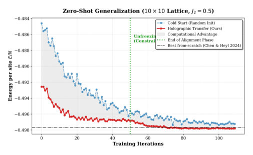
<figcaption class="paper-figure-caption"><b>Fig 3.</b> Figure 3: Zero-Shot Size Extrapolation via Holographic Trans- fer (8 × 8 →10 × 10). The red curve (Holographic Transfer) shows rapid alignment and improved stability relative to the Cold Start baseline (blue). After unfreezing the backbone (Iter 50), the transfer model converges to 𝐸/𝑁≈−0.49782, improving over the Cold Start baseline (−0.4974) and reach- ing a value statistically consistent with the best reported from-scratch result (−0.4976921(4) [3]). This indicates that the holographic prior provides a high-fidelity initialization and helps the model avoid poor local minima even in a sub- stantially expanded Hilbert space.</figcaption>
</figure>
<figure class="paper-figure-card">

<figcaption class="paper-figure-caption"><b>Fig 4.</b> Figure 4: Holographic Attention Maps on the 8×8 Lattice (𝐽2 = 0.5). (a) The full 64 × 64 attention matrix exhibits distinct off- diagonal stripes, indicating that the model has autonomously learned the 2D topology and periodic boundary conditions (PBC) from flattened 1D sequences. (b) The spatial attention distribution relative to the central reference site (white star). The highest intensities are autonomously assigned to the diagonal sites (distance √</figcaption>
</figure>

**Summary.** The authors introduce the Holographic Quantum Transformer (HQT), an AI architecture designed to simulate frustrated quantum magnets like the J1-J2 Heisenberg model. HQT uses generative attention and physical priors to overcome the sign problem, achieving high accuracy. Its key contribution is 'Holographic Transfer,' a zero-shot protocol that allows accurate extrapolation of results from small to large lattices without retraining.

**Why it may be interesting.** This work presents a powerful AI paradigm that directly tackles fundamental challenges in condensed matter physics—namely, simulating strongly correlated systems where traditional numerical methods fail due to the sign problem or exponential scaling.

Detailed structure

**Main problem.** Simulating two-dimensional frustrated quantum matter, such as the J1-J2 Heisenberg model, is computationally intractable due to the sign problem and exponential Hilbert space complexity.

**Main result.** The Holographic Quantum Transformer (HQT) achieves near state-of-the-art ground-state energies on large lattices via a zero-shot extrapolation protocol, demonstrating transferable quantum simulation capabilities.

**Method.** It employs a generative, neuro-symbolic architecture using global self-attention to model the wavefunction amplitude autoregressively, mitigating the sign problem by incorporating classical physical priors.

**Model / system.** The study focuses on the 2D antiferromagnetic J1-J2 Heisenberg model on a square lattice. The Hamiltonian includes nearest-neighbor (J1) and next-nearest-neighbor (J2) interactions, with maximal frustration occurring near J2/J1 = 0.5.

**Key observables.** Ground-state energy per site (E/N), attention maps showing learned spin correlations, and autocorrelation time ($\tau$).

**Important parameters / regimes.** Frustration parameter $J_2$ (especially at $J_2=0.5$), lattice sizes ($8 \times 8$, $10 \times 10$), and coupling constants $J_1, J_2$.

**Assumptions / limitations.** The method assumes that global self-attention can capture the necessary long-range entanglement structure (holographic view) and relies on bilinear interpolation for zero-shot size extrapolation.

**Figures summary.** Figures illustrate the architecture components, attention maps showing alignment with physical interactions (e.g., J2 diagonals), and comparisons of energy convergence between 'Cold Start' and 'Holographic Transfer' protocols across lattice sizes.

**Paper structure.** The paper introduces HQT as a generative model for quantum states, details its autoregressive structure incorporating physical priors (Marshall sign rule), validates it on the $J_1-J_2$ model using finite-size scaling analysis, and culminates in demonstrating 'Holographic Transfer' for zero-shot extrapolation.

Abstract

Simulating two-dimensional frustrated quantum matter is a grand challenge due to the sign problem and exponential Hilbert space complexity. In this work, we introduce the Holographic Quantum Transformer (HQT), a physics-inspired generative architecture that leverages global self-attention to resolve non-local entanglement patterns. We validate HQT on the square lattice $J_1-J_2$ Heisenberg model. On the heavily frustrated $8 \times 8$ lattice at the quantum critical point ($J_2=0.5$), HQT reaches a ground-state energy per site ($E/N$) of $\mathbf{-0.5001(1)}$, consistent with the expected finite-size scaling trend. Beyond numerical accuracy, HQT exhibits intrinsic physical awareness, autonomously recovering the underlying $J_2$ interaction geometry through interpretable attention maps. Our central contribution is ``Holographic Transfer", a zero-shot size-extrapolation protocol with rapid alignment: a model trained on $8 \times 8$ systems is directly projected onto larger $10 \times 10$ lattices via continuous positional-embedding interpolation and head re-initialization, achieving high-fidelity initialization and rapid convergence. This zero-shot protocol yields an energy of $E/N = \mathbf{-0.49782(3)}$, statistically consistent with the variational state of the art while requiring no from-scratch training on the target lattice. Our results establish generative attention as a scalable paradigm for transferable quantum simulation.

[↑ back to top](#top)

### [Quantum-Informed Portfolio Selection: An End-to-End Pipeline Validated on Trapped-Ion Hardware with Real Market Data](http://arxiv.org/abs/2607.01037v1)

**Authors:** Romina Yalovetzky, Martin J. A. Schuetz, Zichang He, Jiayu Shen, Yue Sun, Rudy Raymond, Shauna Sahay, Kishore Perla, Ruben S. Andrist, Grant Salton, Helmut G. Katzgraber, Roger Bongiovanni, Niraj Kumar, Rob Otter  
**Type:** both · **Category:** disordered systems and neural networks · **PDF:** <https://arxiv.org/pdf/2607.01037v1>  
**Analysis basis:** full PDF text, analyzed in chunks
**Topic relevance:** 🔥 `QC/QI experiment` **4/5** · `quantum measurements` **3/5** · `analog quantum simulation` **1/5** · `exotic spin models in light-matter` **1/5** · `measurement-induced transitions` **1/5**

↔ Scroll figures horizontally

<figure class="paper-figure-card">

<figcaption class="paper-figure-caption"><b>Fig 1.</b> FIG. 1. End-to-end pipeline for quantum-informed portfolio selection given a universe of N assets. The input asset (or market) graph is generated from the correlation matrix C based on the assets’ returns across T timestamps (diagrammatically shown in the table) and the correlation threshold λ. This graph defines the input to the hybrid (recursive) qReduMIS algorithm to solve the PSP-MIS problem. qReduMIS intermixes exact reduction (in polynomial time) executed on classical hardware (CPU) and sampling of frozen nodes on the QPU, as to unblock the classical exact reduction wrapper when necessary. The set of frozen nodes is identified from quantum measurements (indicated as the output...</figcaption>
</figure>
<figure class="paper-figure-card">

<figcaption class="paper-figure-caption"><b>Fig 2.</b> FIG. 2. Schematic of the qReduMIS algorithm on an 8-node graph G (illustrative; not experimental data). (a) Original graph G. (b) Classical reduction: vertex 1 (degree 1) is selected; its neighbour 2 is removed. (c) The kernel K (orange) is forwarded to the quantum subroutine. (d) QAOA is executed on K (violet); measured independent sets and counts are shown in the inset. (d’) Marginal probabilities computed from the measurements reveal node 4 as the top-ranked node. Following a greedy strategy over the marginals, it is selected and its neighbours {3, 5} removed, triggering a new classical reduction. In practice, ties in marginal probability are broken at random. (e) Classical reduction...</figcaption>
</figure>
<figure class="paper-figure-card">
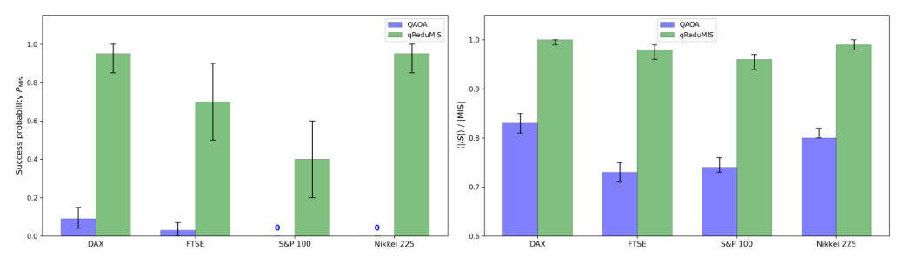
<figcaption class="paper-figure-caption"><b>Fig 3.</b> FIG. 3. Performance comparison of standalone QAOA (blue) and qReduMIS (green) on the first kernel K for four stock market indices (DAX, FTSE, S&amp;P 100, Nikkei 225). Left: Success probability; Right: Average approximation ratio ⟨AR⟩. Error bars indicate 95% bootstrap confidence intervals obtained via 10,000 resamples. For S&amp;P 100 and Nikkei 225, standalone QAOA achieves PMIS = 0. qReduMIS consistently achieves higher success probability, and near-optimal approximation ratio across all indices. Standalone QAOA uses 100 quantum shots; qReduMIS uses 20 classical trials with 10 quantum shots per QPU call, requiring no more than five QPU calls. All experiments use p = 2 QAOA layers on Quantinuum’s...</figcaption>
</figure>
<figure class="paper-figure-card">
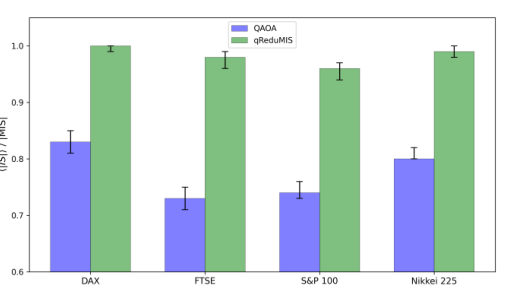
<figcaption class="paper-figure-caption"><b>Fig 4.</b> Fig. 3 presents two figures of merit—end-to-end success probability and average approximation ratio ⟨AR⟩—for each stock market index. All point estimates are accom- panied by 95% bootstrap confidence intervals. We em- ploy an enhanced postprocessing strategy that not only removes constraint-violating nodes but also greedily rein- serts non-conflicting ones. This grants standalone QAOA an additional advantage, since qReduMIS does not rely on sampling the optimal solution directly but rather on identifying frozen nodes via measurement statistics. De- spite this enhanced postprocessing, standalone QAOA fails to sample the optimal solution within 100 shots for</figcaption>
</figure>
<figure class="paper-figure-card">
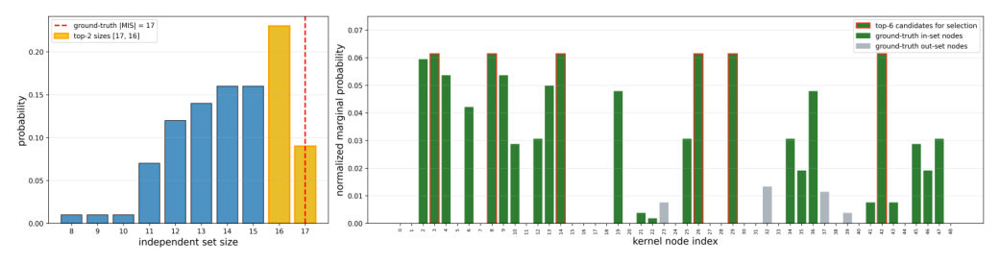
<figcaption class="paper-figure-caption"><b>Fig 5.</b> FIG. 4. QAOA measurements on the DAX 100 kernel (|K| = 49 nodes, 100 shots on Quantinuum Helios) reveal a strong frozen- node signal despite low success probability. Left: Probability distribution over independent-set sizes from standalone QAOA; the dashed red line marks the ground-truth |MIS| and yellow bins indicate the top-2 largest sizes measured. The probability of sampling the optimal solution is below 10%. Right: Normalized marginal probability of each kernel node, computed over the top-2 largest independent sets (yellow bins on left panel). Green bars indicate in-set nodes (belonging to at least one MIS) and grey bars indicate out-set nodes (absent from all MIS solutions)....</figcaption>
</figure>

**Summary.** This work proposes qReduMIS, a hybrid algorithm that combines classical graph reduction with QAOA executed on trapped-ion hardware to solve the computationally hard Maximum Independent Set problem derived from financial correlation data. The results demonstrate that this quantum-informed approach significantly outperforms standalone QAOA by iteratively refining the search space using measured 'frozen nodes,' making it a powerful tool for large-scale optimization.

**Why it may be interesting.** While the application is finance, the methodology—using quantum measurements to guide provably optimal classical solvers for NP-hard problems—is highly relevant to general optimization techniques in condensed matter physics (e.g., spin glass models or frustrated magnetic systems).

Detailed structure

**Main problem.** The core problem is solving Portfolio Selection, which maps to finding a Maximum Independent Set (MIS) on asset correlation graphs. This is an NP-hard combinatorial optimization task.

**Main result.** The proposed hybrid algorithm, qReduMIS, significantly outperforms standalone QAOA by leveraging quantum measurements to guide provably optimal classical graph reductions. It shows superior success probabilities and better scaling exponents for solving real-world market data instances.

**Method.** qReduMIS is an end-to-end pipeline combining classical kernelization/reduction techniques with the Quantum Approximate Optimization Algorithm (QAOA) executed on a quantum processor to identify 'frozen nodes'.

**Model / system.** The problem is formulated as a QUBO Hamiltonian, and experiments are conducted on Quantinuum's 98-qubit trapped-ion Helios system and its noisy emulator. The graph structure is derived from real financial correlation matrices.

**Key observables.** End-to-end success probability (PMIS), average approximation ratio ($\langle AR 
angle$), and optimal time-to-solution scaling exponent ($	ext{optTTS}$).

**Important parameters / regimes.** Number of QAOA layers ($p=2, 6$), number of qubits (up to 98), correlation threshold ($\lambda$), and kernel graph size ($K$).

**Assumptions / limitations.** The success of qReduMIS relies on the assumption that marginal probabilities from QAOA measurements are sufficient to identify 'frozen nodes,' even if the optimal solution itself is rarely sampled.

**Figures summary.** Figures compare performance metrics (Success Probability vs. Hardness $H$) between standalone QAOA and qReduMIS across multiple indices, showing qReduMIS's consistent advantage in both reliability and scaling.

**Paper structure.** The paper introduces the MIS formulation of portfolio selection, details the hybrid qReduMIS pipeline (classical reduction $
ightarrow$ quantum sampling $
ightarrow$ classical refinement), benchmarks this against standalone QAOA on real market data, and finally analyzes the computational scaling exponents using emulators.

Abstract

Portfolio diversification - a cornerstone of modern investment management - can be formulated as a Maximum Independent Set (MIS) problem on asset correlation graphs. Solving this problem at scale is computationally challenging, motivating the exploration of quantum algorithms for practical financial optimization. We propose an end-to-end pipeline leveraging qReduMIS, a recursive hybrid quantum-classical algorithm. Rather than using quantum optimization to directly produce a final solution, qReduMIS leverages independent set measurements from the Quantum Approximate Optimization Algorithm (QAOA) to identify frozen nodes - vertices likely to belong to optimal solutions - thereby guiding and unblocking subsequent (provably optimal) classical reductions on the remaining graph. We benchmark qReduMIS on real financial data from four major market indices with up to 225 assets, executing experiments on Quantinuum's 98-qubit trapped-ion Helios system, with QAOA circuits acting on kernels of up to 78 qubits and 1016 two-qubit gates. While standalone QAOA fails to find the optimal solution for two of the largest indices (S&P 100 and Nikkei 225), qReduMIS achieves success probabilities of $0.40$ and $0.95$, respectively, with average approximation ratios $\geq 0.96$ across all four indices. We perform a systematic benchmark on the Quantinuum H2-1 noisy emulator over 73 asset correlation graphs of varying size showing that, for $p=2$ QAOA layers, the optimal time-to-solution scaling exponent of qReduMIS is $3.2$ times smaller than that of standalone QAOA.

[↑ back to top](#top)

### [Chiral enhancement of two-magnon bound states in an $S=1/2$ triangular-lattice magnet](http://arxiv.org/abs/2607.01062v1)

**Authors:** László Rudner, Karlo Penc  
**Type:** theory · **Category:** strongly correlated electrons · **PDF:** <https://arxiv.org/pdf/2607.01062v1>  
**Analysis basis:** full PDF text, analyzed in chunks
**Topic relevance:** 🔥 `analog quantum simulation` **4/5** · 🔥 `exotic spin models in light-matter` **4/5** · `spintronics-quantum-optics interface` **1/5**

↔ Scroll figures horizontally

<figure class="paper-figure-card">

<figcaption class="paper-figure-caption"><b>Fig 1.</b> FIG. 1. Triangular lattice showing the J1 first-, J2 second-, and J3 third-neighbor Heisenberg exchanges, as well as the scalar-chirality terms ˆχijk on the up- and down-pointing tri- angles. The circular arrows define the orientation of the or- dered sites i, j, and k around each triangle. The primitive lattice vectors are a1 = (1, 0) and a2 = (1/2, √</figcaption>
</figure>
<figure class="paper-figure-card">
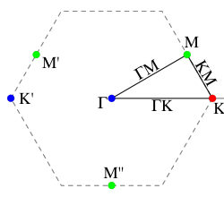
<figcaption class="paper-figure-caption"><b>Fig 2.</b> FIG. 2. Brillouin zone of the triangular lattice with the in- equivalent Γ, K, and M points and high-symmetry lines. We also illustrate the q = (q, 0) line in Eq. (23) that connect Γ, K, and M ′′ point in straight line.</figcaption>
</figure>
<figure class="paper-figure-card">

<figcaption class="paper-figure-caption"><b>Fig 3.</b> FIG. 3. Luttinger–Tisza phase diagram of the triangular- lattice J1-J2-J3 Heisenberg model. Panels (a) and (b) show the antiferromagnetic nearest-neighbor case, J1 = +1, with panel (a) giving an enlarged view of the central region of panel (b). Panel (c) shows the ferromagnetic nearest-neighbor case, J1 = −1. Colors indicate the ordering wave vector q at which Jq is minimized. They distinguish the commensu- rate Γ, K, and M regions from incommensurate spiral regions whose minima lie on the high-symmetry lines ΓK, ΓM, and KM. Equivalently, these wave vectors are the momenta at which the single-magnon dispersion softens. The thick red line marks the J2 = 2J3 locus associated with the MA1 min-...</figcaption>
</figure>
<figure class="paper-figure-card">

<figcaption class="paper-figure-caption"><b>Fig 4.</b> FIG. 4. Action of the uniform scalar spin chirality interac- tion 4(ˆχ123 + ˆχ134) = i ˆP123 −i ˆP132 +i ˆP134 −i ˆP143 for spin-1/2 one- and two-magnon states; see Eq. (7). Empty circles de- note up spins and filled circles down spins. Colored triangles indicate the permutation terms that act nontrivially on the displayed spin configuration; the color encodes the sign of the imaginary amplitude, with magenta denoting −i and green +i. (a) In the one-magnon sector, the down spin on site 1 can hop to site 3 through two oriented triangles, correspond- ing to the processes −i ˆP132 and +i ˆP134. These two ampli- tudes cancel, so the scalar-chirality term does not contribute to the one-magnon...</figcaption>
</figure>
<figure class="paper-figure-card">
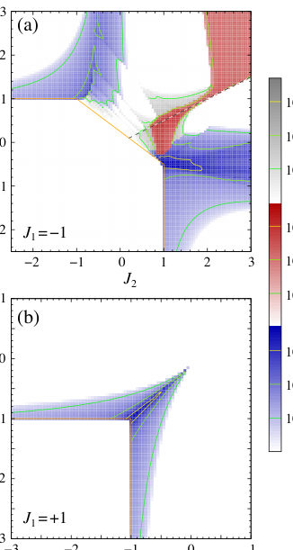
<figcaption class="paper-figure-caption"><b>Fig 5.</b> FIG. 6. Scan of the momentum and the gap of the lowest energy bound state in the J2-J3 parameter space for (a) fer- romagnetic and (b) antiferromagnetic J1 exchanges. We use Eq. (70) to calculate the gap ∆with energies from an exact di- agonalization calculation of a 3×242 = 1728-site cluster. The lowest energy bound state is mostly at the K = Γ point, while there are some regions where it is at the M point, and at in- commensurate values where the minima of the single magnon dispersion are also incommensurate, in the ΓK or ΓM phase. The largest value of the gap is at (J1, J2, J3) = (−1, 1, −1/2) and (1, −1, −1). The thin orange lines denote the boundary of the ferromagnetic phase, and the...</figcaption>
</figure>

**Summary.** This theoretical study examines the role of scalar spin chirality in stabilizing two-magnon bound states within a triangular-lattice magnet. The authors show that this chiral interaction acts as an effective, symmetry-breaking coupling in the two-magnon sector, selectively strengthening binding energy for one specific excitation channel. This mechanism provides a microscopic route to understanding high-field spin-nematic instabilities.

**Why it may be interesting.** The explicit derivation of how a geometric/topological term like scalar chirality can selectively modify low-energy excitations (two-magnon bound states) while leaving single-particle physics untouched is highly relevant for understanding emergent quantum phases in frustrated magnets.

Detailed structure

**Main problem.** The study investigates how scalar spin chirality influences two-magnon bound states in a frustrated triangular-lattice magnet.

**Main result.** Scalar chirality selectively enhances the binding of one specific two-magnon channel by splitting degenerate symmetry components, without altering the single-magnon spectrum.

**Method.** The analysis uses gap equations derived from partial-wave decomposition and is confirmed via exact diagonalization on finite clusters.

**Model / system.** The system is an S=1/2 triangular-lattice Heisenberg magnet described by $J_1, J_2, J_3$ exchange interactions augmented by a uniform scalar-chirality interaction ($\hat{H}_{	ext{Chir}}$).

**Key observables.** Two-magnon binding energy (gap), one-magnon dispersion minima, and the spin-nematic order parameter.

**Important parameters / regimes.** Exchange couplings ($J_1, J_2, J_3$), external magnetic field ($h$), and the chirality coupling strength ($J_\chi$).

**Assumptions / limitations.** The analysis is performed in the high-field limit above the fully polarized state; two-magnon calculations are treated via partial-wave decomposition.

**Figures summary.** Figures illustrate the lattice structure, Brillouin zone, Luttinger-Tisza phase diagrams mapping magnetic ordering regimes, and momentum-resolved spectra showing enhanced bound states due to chirality.

**Paper structure.** The paper first establishes the Hamiltonian including exchange and chirality terms. It analyzes the one-magnon sector (showing no effect from chirality) before focusing on the two-magnon sector. The core methodology involves deriving a finite-dimensional gap equation using symmetry harmonics, which reveals the selective enhancement mechanism.

Abstract

We study one- and two-magnon excitations above the fully polarized state of the spin-$1/2$ triangular-lattice $J_1$-$J_2$-$J_3$ Heisenberg model with an additional uniform scalar-chirality interaction. In the one-magnon sector of the Heisenberg model, we identify two special minimum manifolds by rewriting the dispersion in complete-square form. The scalar-chirality term cancels exactly in this sector, leaving the one-magnon dispersion and the single-magnon instability unchanged. In contrast, it survives in the two-magnon sector as an oriented interaction between neighboring flipped spins. Using symmetry-adapted triangular-lattice harmonics, we derive finite-dimensional gap equations at the $Γ$ point in the symmetry-resolved $\mathsf{A_1}$ and $\mathsf{E_2}$-type partial-wave channels. The chirality coupling splits the two opposite relative-motion chiralities in the $\mathsf{E_2}$-type sector, thereby selectively enhancing one two-magnon bound-state channel. Exact diagonalization confirms this mechanism and reveals enhanced binding, as well as additional bound states at $M$ and at incommensurate total momenta. Our results identify scalar chirality as an efficient microscopic mechanism for strengthening two-magnon binding without shifting the one-magnon spectrum, and provide a route toward high-field spin-nematic and multipolar instabilities.

[↑ back to top](#top)

### [Toward Hamiltonian simulations of Maxwell-Chern-Simons theory: constant modes and gauge field truncation](http://arxiv.org/abs/2607.00082v1)

**Authors:** Andrea Bulgarelli, Maria Cristina Diamantini, Nico Dichter, Lena Funcke, Tobias Hartung, Karl Jansen, Enrique Rico Ortega, Simran Singh, Lorenzo Spera  
**Type:** theory · **Category:** strongly correlated electrons · **PDF:** <https://arxiv.org/pdf/2607.00082v1>  
**Analysis basis:** full PDF text, analyzed in chunks
**Topic relevance:** 🔥 `analog quantum simulation` **4/5** · `Frenkel-Kontorova` **1/5** · `Keldysh / 2PI / non-Gaussian methods` **1/5** · `entanglement & information structure` **1/5** · `exotic spin models in light-matter` **1/5** · `methods for driven-dissipative` **1/5**

↔ Scroll figures horizontally

<figure class="paper-figure-card">
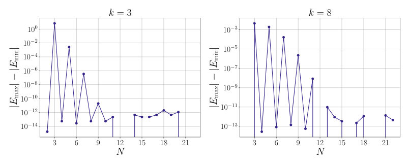
<figcaption class="paper-figure-caption"><b>Fig 1.</b> Figure 1: Difference between the absolute values of the ground state energy and the highest excited-state energy as a function of system size for (a) k = 3 and (b) k = 8. Within numerical precision, the spectrum is symmetric for even N.</figcaption>
</figure>
<figure class="paper-figure-card">
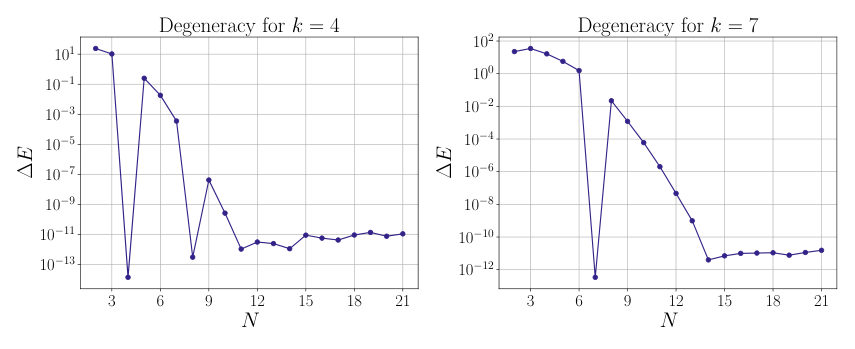
<figcaption class="paper-figure-caption"><b>Fig 2.</b> Figure 2: The degeneracy of the energy levels is approached exponentially fast as N is increased. In commensurate cases, the degeneracy becomes exact.</figcaption>
</figure>
<figure class="paper-figure-card">

<figcaption class="paper-figure-caption"><b>Fig 3.</b> Figure 3: Convergence of the level spacing to a harmonic oscillator for different values of the CS level k. ∆Ei represents the energy gap between the (i −1)-th and the i-th quasi-degenerate multiplets.</figcaption>
</figure>
<figure class="paper-figure-card">

<figcaption class="paper-figure-caption"><b>Fig 4.</b> Figure 4: Mid spectrum for (a) k = 3, N = 4 and (b) k = 5, N = 6.</figcaption>
</figure>
<figure class="paper-figure-card">

<figcaption class="paper-figure-caption"><b>Fig 5.</b> Figure 5: Mid spectrum for (a) k = 3, N = 7 and (b) k = 9, N = 11.</figcaption>
</figure>

**Summary.** This work tackles the difficult problem of simulating Maxwell-Chern-Simons theory by focusing on its topologically rich constant mode sector. By discretizing this sector onto a torus lattice, the authors map the physics onto a Harper-Hofstadter model. The key achievement is identifying precise commensurability conditions under which the finite lattice spectrum accurately reproduces the known topological degeneracy of the continuum theory.

**Why it may be interesting.** The connection between topological field theories (like CS theory) and tight-binding models (Hofstadter/Harper) provides a concrete, solvable platform for studying emergent quantum phenomena in strongly interacting systems, relevant to fractionalized excitations in condensed matter.

Detailed structure

**Main problem.** The primary goal is developing a non-perturbative Hamiltonian approach for Maxwell-Chern-Simons (MCS) theory in 2+1 dimensions, which is difficult due to the sign problem.

**Main result.** The study successfully maps the constant mode sector onto a generalized Harper-Hofstadter model, demonstrating that exact topological degeneracy can be recovered on the lattice under specific commensurability conditions.

**Method.** The authors use Hamiltonian quantization techniques, analyzing the flat (zero-mode) sector of the MCS theory and discretizing it onto a torus lattice.

**Model / system.** The model is Maxwell-Chern-Simons (MCS) theory on a spatial torus. The analysis focuses on the constant mode sector, which yields an effective Hamiltonian analogous to Landau levels or the Harper equation.

**Key observables.** Topological degeneracy ($k$-fold), energy spectrum symmetry ($\pm E$), and quasi-degeneracy of energy multiplets.

**Important parameters / regimes.** Chern-Simons level ($k$, related to total flux $\Phi_{	ext{tot}}$) and lattice sizes ($N_x, N_y$). The continuum limit requires the flux per plaquette $\alpha 	o 0$.

**Assumptions / limitations.** The analysis relies on isolating the flat sector for benchmarking; convergence to the continuum limit is analyzed by taking $N_x, N_y 	o \infty$ while keeping $k$ fixed.

**Figures summary.** Figures illustrate spectral symmetry (pairing of $\pm E$) and show how quasi-degenerate multiplets emerge as lattice size increases, contrasting results for commensurate vs. non-commensurate flux regimes.

**Paper structure.** The paper systematically moves from the continuum theory to its lattice discretization, deriving the effective Hamiltonian (Harper equation), analyzing symmetries like chiral symmetry, and finally establishing conditions ($k|N_x, k|N_y$) under which exact topological degeneracies are recovered on the finite lattice.

Abstract

Maxwell-Chern-Simons (MCS) theory in $2+1$ dimensions provides a paradigmatic example of a topological gauge theory with both dynamical and topological degrees of freedom. Its Euclidean formulation suffers from a sign problem, making Hamiltonian numerical approaches particularly attractive. As a first step toward the non-perturbative Hamiltonian study of MCS theory, we investigate the constant mode sector on a spatial torus. Being analytically solvable in the continuum, it provides an ideal benchmark for understanding how the topological properties of the theory are encoded in a finite-dimensional lattice Hilbert space. We construct a finite-dimensional discretization of the torus of flat connections and show that the resulting lattice problem maps onto a generalized Harper-Hofstadter model with twisted boundary conditions. We identify the commensurability conditions under which the finite lattice exactly reproduces the magnetic translation algebra and the topological degeneracy of the continuum theory. A systematic analysis of gauge field truncation and its convergence toward the continuum limit is then presented.

[↑ back to top](#top)

### [Vanadium superconducting microwave resonators on silicon wafers](http://arxiv.org/abs/2607.00809v1)

**Authors:** Y. Fujita, Y. Urade, Y. Hibino, M. Tsujimoto, K. Inomata, G. Fujii, W. Mizubayashi  
**Type:** experiment · **Category:** other · **PDF:** <https://arxiv.org/pdf/2607.00809v1>  
**Analysis basis:** full PDF text, analyzed in chunks
**Topic relevance:** 🔥 `QC/QI experiment` **4/5** · `correlated / nonlocal dissipation` **2/5** · `correlated cavity matter` **1/5** · `driven-dissipative phase transition` **1/5** · `quantum optics experiment` **1/5**

↔ Scroll figures horizontally

<figure class="paper-figure-card">

<figcaption class="paper-figure-caption"><b>Fig 1.</b> FIG. 1. (a) ω-2θ XRD profiles for Si/Nb/V and Si/V samples obtained by setting the scattering</figcaption>
</figure>
<figure class="paper-figure-card">

<figcaption class="paper-figure-caption"><b>Fig 2.</b> Figure 1(a) shows the out-of-plane XRD profiles of ω-2θ scans from the ⟨001⟩directions of</figcaption>
</figure>
<figure class="paper-figure-card">

<figcaption class="paper-figure-caption"><b>Fig 3.</b> Fig. 1(a). Note that the small V 001 peak was not always reproduced even when the film</figcaption>
</figure>
<figure class="paper-figure-card">
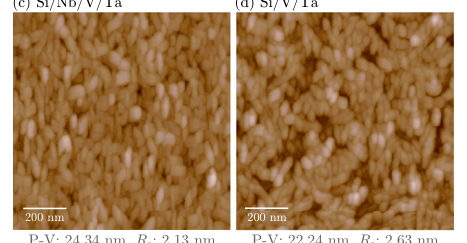
<figcaption class="paper-figure-caption"><b>Fig 4.</b> FIG. 2. AFM topographic images of the surfaces of (a) Si/Nb/V, (b) Si/V, (c) Si/Nb/V/Ta, and</figcaption>
</figure>
<figure class="paper-figure-card">

<figcaption class="paper-figure-caption"><b>Fig 5.</b> FIG. 4. (a) Optical micrograph of a CPW resonator chip with a Si/Nb/V/Ta structure. (b) Cross-</figcaption>
</figure>

**Summary.** This experimental study investigates microwave losses in Vanadium superconducting resonators fabricated on silicon wafers using various buffer and capping layers (Nb, Ta). By combining structural analysis with $Q_{	ext{int}}$ measurements, the authors determined that non-TLS losses dominate energy dissipation. They found that while buffering improves crystal structure, secondary phases like V oxides or hydrides at grain boundaries are the primary source of excess loss.

**Why it may be interesting.** This work is highly relevant as it directly addresses energy dissipation in superconducting circuits, a critical bottleneck for quantum computing hardware. The detailed material science investigation into oxide/hydride formation provides physical insights applicable to understanding decoherence sources in solid-state qubits.

Detailed structure

**Main problem.** The study aims to understand how material structural properties correlate with microwave energy losses in superconducting Vanadium (V) films, which is crucial for developing low-loss quantum circuits.

**Main result.** Losses are dominated by non-TLS sources ($\delta_{other}$), and while better lattice uniformity (via Nb buffer) was achieved, it counterintuitively increased these non-TLS losses compared to direct growth on Si.

**Method.** The research combines structural characterization (XRD, AFM) with electrical measurements using microwave resonators ($Q_{	ext{int}}$ vs. $\langle n_{	ext{ph}} 
angle$) and surface analysis (XPS).

**Model / system.** The physical system is a superconducting resonator built from V films on Si wafers, often incorporating Nb buffer layers or Ta capping layers ($	ext{Si}/	ext{Nb}/	ext{V}/	ext{Ta}$). Loss mechanisms are modeled by fitting $Q_{	ext{int}}$ dependence on the average photon number $\langle n_{	ext{ph}} 
angle$.

**Key observables.** Internal quality factor ($Q_{	ext{int}}$) vs. $\langle n_{	ext{ph}} 
angle$, non-TLS loss ($\delta_{other}$), lattice coherence (XRD FWHM), and surface oxidation states (XPS).

**Important parameters / regimes.** Operating temperature (10 mK), photon number range ($10^0$ to $10^6$), and the presence/absence of Nb buffer or Ta capping layers.

**Assumptions / limitations.** The primary assumption is that microwave loss can be decomposed into TLS-related and non-TLS components, allowing for material comparison based on these fitted parameters.

**Figures summary.** Figures show XRD profiles confirming lattice coherence improvement with Nb, AFM images comparing surface roughness across structures, and plots detailing $Q_{	ext{int}}$ vs. $\langle n_{	ext{ph}} 
angle$ to extract loss components.

**Paper structure.** The paper follows a structure of problem definition (loss mitigation), material comparison ($	ext{Si}/	ext{V}$ vs. buffered/capped stacks), characterization using multiple techniques (structural, electrical, chemical), and finally, quantitative analysis linking structural defects (oxides, grain boundaries) to increased non-TLS loss.

Abstract

Understanding the correlation between material properties and microwave losses in superconducting films is a crucial subject for developing low-loss materials for quantum circuits. We focus on vanadium (V) as a novel material for superconducting quantum devices and discuss loss in V films in relation to their structural properties. Using a sputtering method, we grow four V-film structures on (001)-oriented Si wafers, employing Nb and Ta as the buffer and capping layer materials, respectively: Nb/V/Ta, Nb/V, V/Ta, and V. X-ray diffraction and atomic force microscopy reveal that the V films grown on the Nb buffer layers have higher uniformity of lattice orientation and smaller grain size than that directly grown on the Si wafer. Coplanar waveguide resonators are fabricated from the four V-film structures, and averaged photon number ($\langle n_{\rm ph} \rangle$) dependences of internal quality factor ($Q_{\rm int}$) are obtained by performing microwave measurements. By analyzing the obtained $Q_{\rm int}$ vs $\langle n_{\rm ph} \rangle$, it is found that loss at the V surface is dominated by $\langle n_{\rm ph} \rangle$-independent non-two-level-system (non-TLS) losses, which can be mitigated by introducing the Ta capping layer. Furthermore, the V films on the Nb buffer layers exhibit lower $Q_{\rm int}$ in the $\langle n_{\rm ph} \rangle$ range from 10$^{0}$ to 10$^{6}$ and higher non-TLS loss than that directly grown on Si wafers, even though the former has higher lattice-orientation uniformity than the latter. Origins of these trends might be relevant to V oxides, of which presence at surfaces and grain boundaries in bulk regions in the V resonators is suggested by energy dispersive X-ray spectroscopy and X-ray photoelectron spectroscopy, and/or V hydrides.

[↑ back to top](#top)

### [Production of Magic States via $Z$ Bosons and Dark Photons](http://arxiv.org/abs/2607.00229v1)

**Authors:** Carlos Alvarado, Alfredo Aranda, César Bonilla, Yahir Lua, Ethan Rodríguez-Martínez  
**Type:** theory · **Category:** other · **PDF:** <https://arxiv.org/pdf/2607.00229v1>  
**Analysis basis:** full PDF text, analyzed in chunks
**Topic relevance:** 🔥 `entanglement & information structure` **4/5** · `Keldysh / 2PI / non-Gaussian methods` **1/5** · `correlated / nonlocal dissipation` **1/5** · `driven-dissipative phase transition` **1/5** · `methods for driven-dissipative` **1/5**

↔ Scroll figures horizontally

<figure class="paper-figure-card">
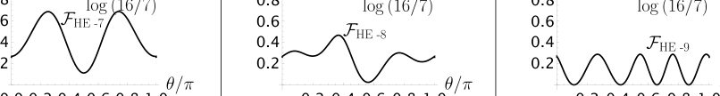
<figcaption class="paper-figure-caption"><b>Fig 1.</b> FIG. 2. Angular dependence of the magic distributions obtained from Mγ + MZ under Møller</figcaption>
</figure>
<figure class="paper-figure-card">
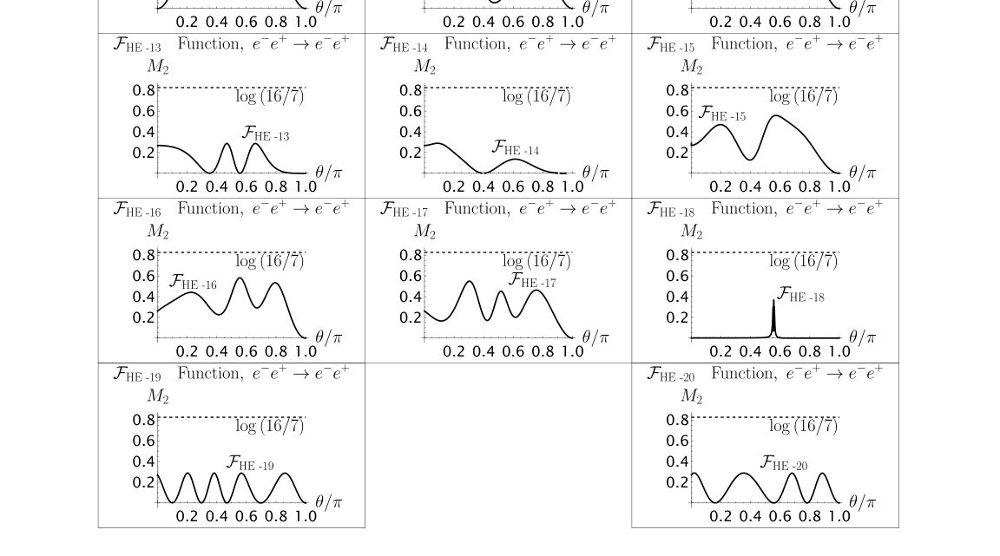
<figcaption class="paper-figure-caption"><b>Fig 2.</b> FIG. 3. Angular dependence of the magic distributions obtained from Mγ + MZ under Bhabha</figcaption>
</figure>
<figure class="paper-figure-card">

<figcaption class="paper-figure-caption"><b>Fig 3.</b> FIG. 4. Angular dependence of the magic distributions obtained from Mγ + MZ under elastic</figcaption>
</figure>
<figure class="paper-figure-card">

<figcaption class="paper-figure-caption"><b>Fig 4.</b> FIG. 6. Angular dependence of the magic distributions obtained from Mγ + MZ under pair</figcaption>
</figure>
<figure class="paper-figure-card">
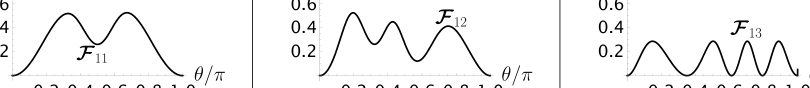
<figcaption class="paper-figure-caption"><b>Fig 5.</b> FIG. 7. Angular dependence of the magic distributions obtained from Mγ + MZ under Møller</figcaption>
</figure>

**Summary.** This paper analyzes 'magic states' by calculating a specific measure of non-classicality across various particle scattering processes. It compares results from the Standard Model electroweak sector (including Z bosons) against extensions involving dark photons and fermions. The key finding is that these new interactions significantly reorganize or generate novel magic distributions, providing sensitive probes for physics beyond the Standard Model.

**Why it may be interesting.** While focused on particle physics phenomenology, the mathematical framework—quantifying non-classicality via Rényi entropy and stabilizer formalism—is directly applicable to characterizing entanglement structures in open quantum systems or complex many-body states.

Detailed structure

**Main problem.** The study investigates how including contributions from Z-boson exchange (electroweak) or dark photons modifies the production of 'magic states' in various particle scattering processes.

**Main result.** New magic distribution functions are generated, particularly in high-energy and Z-resonance regimes for EW effects, and in the low-energy limit when considering dark photon mediators. Certain stabilizer classes remain robust across different energy scales.

**Method.** The analysis uses the stabilizer formalism to quantify 'magic' via the second stabilizer Rényi entropy ($M_2$) applied to $2 	o 2$ tree-level scattering amplitudes in both Standard Model and extended dark sectors.

**Model / system.** The models include the electroweak sector of the SM (incorporating Z bosons) and extensions featuring a broken U(1) symmetry with a charged dark fermion ($\chi$). Processes analyzed are Møller, Bhabha, and pair annihilation scattering.

**Key observables.** Magic distribution functions ($F_{n,i}$), second stabilizer Rényi entropy ($M_2$), and the angular dependence of these distributions.

**Important parameters / regimes.** Energy regimes (low-energy, high-energy, Z-resonance limit), mass ratios ($m_f/m_\chi$, $m_{A'}/m_\chi$), and weak mixing angle ($\sin^2	heta_W$).

**Assumptions / limitations.** The analysis often relies on power expansions in kinematic variables or specific approximations for the propagators in different energy limits.

**Figures summary.** Figures illustrate the angular dependence of magic distributions for various processes (e.g., Møller, Bhabha) across different regimes (high-energy vs. Z-resonance), showing structural changes and new peaks.

**Paper structure.** The paper systematically analyzes results in multiple settings: first the pure EW sector, then the dark U(1) extension, comparing low-energy limits to high-energy/resonant limits for various scattering channels.

Abstract

The production of magic states is studied in two settings. The first is the electroweak (EW) sector of the Standard Model (SM). The second is an extension featuring a new broken $U(1)$ gauge symmetry and a Dirac fermion charged under it. This setup resembles a dark $U(1)$ scenario, with the additional fermion playing the role of a dark matter candidate that annihilates into SM particles through its coupling to the new gauge boson. In the EW sector, the low-energy regime reproduces earlier magic production results obtained for Quantum Electrodynamics, whereas the high-energy and $Z$-resonance regimes generate new magic distribution functions and non-trivially reorganize the stabilizer state classes, with Bhabha scattering exhibiting the strongest sensitivity to electroweak effects. Also, a subset of fixed stabilizer states is identified, for which the magic distributions remain unchanged across the different energy regimes. In the dark sector, the main effect of the new massive mediator is the appearance of new magic distributions functions for Moller-like, Bhabha-like, and inverse pair-annihilation processes in the low-energy limit. These reach the maximal magic value at the SM-to-dark fermion mass ratios $m_f/m_χ\to 0$ and $m_f/m_χ\to 1.83929$.

[↑ back to top](#top)

### [Polynomial equivalence of the global transverse-field Ising model and the gate model of quantum computation](http://arxiv.org/abs/2607.01227v1)

**Authors:** Matthias Werner  
**Type:** theory · **Category:** quantum information and computing · **PDF:** <https://arxiv.org/pdf/2607.01227v1>  
**Analysis basis:** full PDF text, analyzed in chunks
**Topic relevance:** 🔥 `analog quantum simulation` **4/5** · `entanglement & information structure` **1/5** · `exotic spin models in light-matter` **1/5** · `non-equilibrium dynamics` **1/5**

↔ Scroll figures horizontally

<figure class="paper-figure-card">

<figcaption class="paper-figure-caption"><b>Fig 1.</b> Figure 1. (a): Basic mechanism of the Cesa-Pichler method [9] to move quantum information along the qubit wires. UA and UB represent X-gates on the respective qubit species A (blue) and B (red), conditional on being blockaded by its neighboring qubits; (b): arrangement for the application of entangling gates, where a 2π-pulse is applied to a qubit of species C (purple); (c): qubit arrangement for the application of single-qubit gates in the Cesa-Pichler method, where the gates are executed when the logical qubit is located on a qubit of species D (green); (d): schedule Γt consisting of a concatenation of Γ-pulses over a time τ (red shaded), in between the Γ-pulses, the system evolves under...</figcaption>
</figure>
<figure class="paper-figure-card">

<figcaption class="paper-figure-caption"><b>Fig 2.</b> Figure 2. Graph G of the universal arrangement proposed by Cesa &amp; Pichler for a system of four logical qubits. The first three qubits (black box) on the left-hand side of each chain serve to initialize the standard configuration, while ev- ery chain has an impurity for single-qubit gates and a con- nection via an impurity to its neighbors for logical two-qubit gates. Then, depending on the order of pulses in the propa- gation cycle, the logical many-body state (red box) can move left and right, so that logical operations on any qubit and be- tween neighboring pairs can be executed. This topology cor- responds to a chain of five logical qubits with nearest-neighbor couplings. Interactions...</figcaption>
</figure>
<figure class="paper-figure-card">

<figcaption class="paper-figure-caption"><b>Fig 3.</b> Figure 3. Illustration of the assumptions of semi-global con- trol as per the Cesa-Pichler method (top) and the global drive due to the transverse field generating Γ-pulses on all qubits simultaneously (bottom).</figcaption>
</figure>
<figure class="paper-figure-card">
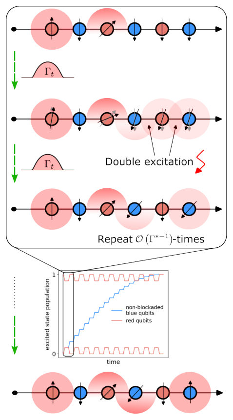
<figcaption class="paper-figure-caption"><b>Fig 4.</b> Figure 4. Illustration of the CP-method with a global drive. The black box in the main figure and the inset correspond to each other. In the CP-method it is assumed that dis- tinct groups of atoms can be driven independently. Here, we only have the ability to apply a transverse field to all qubits at the same time. Therefore, adjacent qubits blockade each other due to the global drive, resulting in errors due to these unwanted blockade interactions. We can recover individual control of non-adjacent qubit groups using specifically cho- sen local Z-fields and exploiting constructive and destructive interference. By appropriately chosen phase-gates between the Γ-pulses, the non-driven qubits...</figcaption>
</figure>
<figure class="paper-figure-card">

<figcaption class="paper-figure-caption"><b>Fig 5.</b> Figure 5. Infidelity 1 −F of a single propagation cycle as shown in Figure 1(a) compiled in global Γ-pulses as a func- tion of the inverse maximal transverse field Γ∗−1 (a) and as a function of the system size (b). The data in (a) is generated with a fixed L = 7, while in (b) we fix the maximal trans- verse field at Γ∗= 0.01. The colors and markers indicate the same J in both figures. J = ∞corresponds to a simulation without blockade Hamiltonian HJ, but instead projected onto the computational subspace P. We can see a clear quadratic decay in (a) consistent with the theoretical prediction, while in (b) the observed scaling is much slower than the predicted worst case. The dashed black line...</figcaption>
</figure>

**Summary.** The paper proves that the global transverse-field Ising model is computationally equivalent to the gate model of quantum computing. It achieves this by constructing sequences of time-dependent driving pulses ($\Gamma_t$) that simulate arbitrary quantum circuits with polynomial overheads in resources. This result is significant because it validates TFIM platforms for universal computation while also providing a theoretical lower bound on classical simulation complexity.

**Why it may be interesting.** This work directly connects condensed matter physics models (Ising model dynamics) to the fundamental limits of quantum computation, providing a theoretical pathway for realizing universal quantum computation on platforms naturally described by spin Hamiltonians.

Detailed structure

**Main problem.** The central question addressed is whether the global transverse-field Ising model (TFIM) with a time-dependent field is computationally equivalent to the universal gate model of quantum computation.

**Main result.** The authors prove that, under specific conditions and polynomial overheads in resources, the global TFIM can simulate arbitrary quantum circuits, establishing its computational universality.

**Method.** They construct a simulation by mapping quantum gates onto controlled time evolution sequences using engineered non-monotonic transverse fields ($\Gamma_t$) and exploiting blockade interactions within the Ising model framework.

**Model / system.** The system is the global TFIM, governed by $H_t = \Gamma_t H_X + H_Z$. The simulation utilizes a graph structure where logical qubits are encoded on physical wires, allowing for controlled single-qubit and entangling gates via impurities (C and D types).

**Key observables.** Simulation error ($\delta'_{	ext{total}}$), required resource scaling (time $T$, coupling $|J|$), and the fidelity of implemented gates.

**Important parameters / regimes.** The simulation relies on controlling parameters like $\Gamma^*$ (global drive strength), $\epsilon_{	ext{phase}}$ (phase control error), and the interaction strength $|J|$, all scaled polynomially with circuit depth ($p$) and qubit number ($n$).

**Assumptions / limitations.** Key assumptions include assuming BQP $
eq$ BPP for the no-go theorem, and relying on approximations like weak driving ($\Gamma^* \ll 1$) and taking limits in the analysis (e.g., $|J| 	o \infty$ initially).

**Figures summary.** Figures illustrate the basic mechanism of information propagation along wires using blockade interactions, the arrangement of different qubit types (A, B, C, D), and comparisons between global drive methods and site-resolved control.

**Paper structure.** The paper builds by first establishing the physical realization of universal gates within the TFIM framework (using impurities/wires) and then rigorously proving computational equivalence by deriving resource scaling laws for simulating arbitrary circuits using time-dependent $\Gamma$-pulses, culminating in an overall error bound calculation.

Abstract

The transverse-field Ising model has attracted a lot of attention in recent years, especially in the quantum simulation and quantum computation literature. This interest is driven by many platforms for analog quantum computation, which implement the transverse-field Ising model for solving optimization problems, such as quantum annealing. However, it has remained an open question whether the Ising model with a global transverse field is equivalent to the gate model of quantum computation. Here we answer this question affirmatively for the case of a non-monotonic time-dependent transverse field. Building on a recent result by Cesa and Pichler on global control of Rydberg atoms, we provide a construction that allows simulating arbitrary quantum circuits using the Ising model with global transverse field with polynomial overhead in time, qubit number, and energy scale. Although the polynomial overheads we establish here are large relative to what is feasible on real-world quantum hardware, our result motivates the development of more sophisticated methods for simulating quantum circuits using the Ising model with a global transverse field. Additionally, under the assumption that quantum computing is strictly more powerful than classical computing, our result serves as a no-go theorem for efficient classical simulation of the transverse-field Ising model with a time-dependent global transverse field. Therefore, our finding is relevant for multiple communities, from analog quantum simulation and quantum optimization on various platforms to complexity and control theory.

[↑ back to top](#top)

### [Wavefunctions localization, and the Wigner's Friend Paradox in a Framework of Discrete-Space Hypothesis](http://arxiv.org/abs/2607.00198v1)

**Authors:** W. A. Zúñiga-Galindo  
**Type:** theory · **Category:** other · **PDF:** <https://arxiv.org/pdf/2607.00198v1>  
**Analysis basis:** full PDF text, analyzed in chunks
**Topic relevance:** 🔥 `measurement-induced transitions` **4/5** · `quantum measurements` **3/5**

↔ Scroll figures horizontally

<figure class="paper-figure-card">

<figcaption class="paper-figure-caption"><b>Fig 1.</b> Low-resolution page preview, page 2</figcaption>
</figure>
<figure class="paper-figure-card">
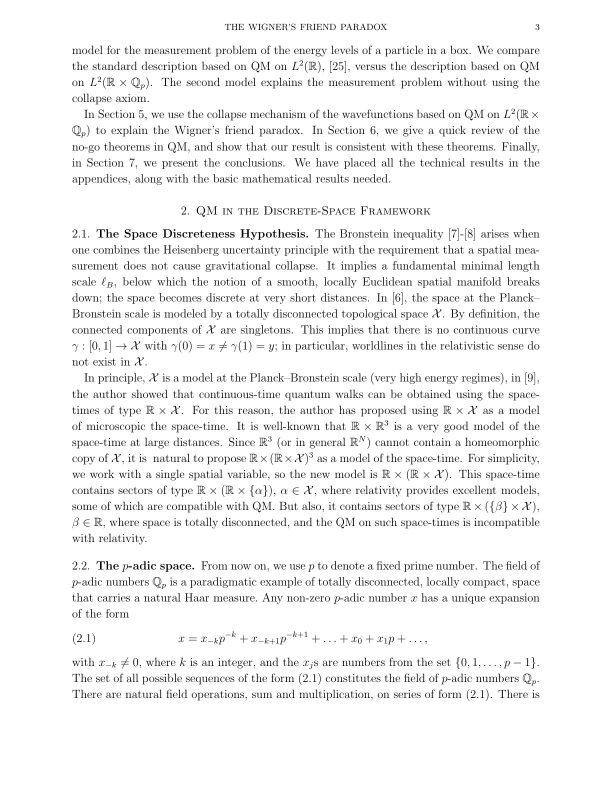
<figcaption class="paper-figure-caption"><b>Fig 2.</b> Low-resolution page preview, page 3</figcaption>
</figure>
<figure class="paper-figure-card">

<figcaption class="paper-figure-caption"><b>Fig 3.</b> Low-resolution page preview, page 4</figcaption>
</figure>
<figure class="paper-figure-card">

<figcaption class="paper-figure-caption"><b>Fig 4.</b> Low-resolution page preview, page 5</figcaption>
</figure>
<figure class="paper-figure-card">
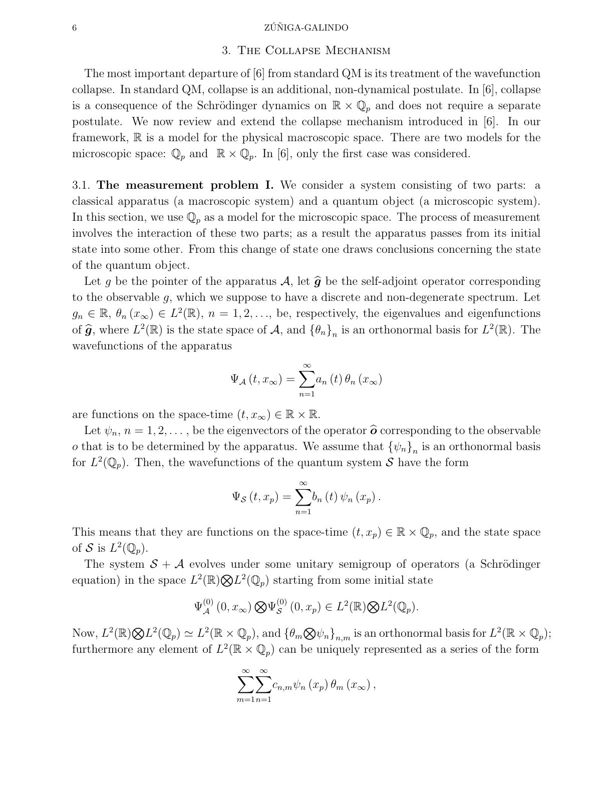
<figcaption class="paper-figure-caption"><b>Fig 5.</b> Low-resolution page preview, page 6</figcaption>
</figure>

**Summary.** This paper resolves the Wigner's Friend paradox by reformulating quantum mechanics on a hybrid space combining continuous real space and discrete p-adic space. It argues that wavefunction collapse is not an external postulate but a dynamical outcome of non-local Hamiltonians acting within this structure. This approach successfully explains definite measurement outcomes for all observers without invoking consciousness or observer intervention.

**Why it may be interesting.** It provides a mathematically rigorous, non-observer-dependent resolution to a foundational problem in quantum mechanics by embedding it within advanced number theory ($\mathbb{Q}_p$).

Detailed structure

**Main problem.** The paper aims to resolve the Wigner's Friend paradox by developing a quantum mechanical framework that incorporates discrete microscopic space.

**Main result.** Wavefunction collapse is shown to be a dynamical consequence of the Schrödinger equation on a hybrid $\mathbb{R} 	imes \mathbb{Q}_p$ space, eliminating observer-dependent assumptions and resolving the conflict between different observers' descriptions of reality.

**Method.** The authors model quantum mechanics on $L^2(\mathbb{R} 	imes \mathbb{Q}_p)$, using non-local Hamiltonians derived from p-adic analysis to explain wavefunction localization during measurement interactions.

**Model / system.** The system is described by QM on the hybrid space $\mathbb{R} 	imes \mathbb{Q}_p$, where $\mathbb{Q}_p$ models discrete Planck-scale space. The dynamics are governed by a Schrödinger equation whose non-locality forces wavefunction collapse onto compact supports during measurement.

**Key observables.** Wavefunction localization onto compact supports, definite pointer readings for both Wigner and his Friend.

**Important parameters / regimes.** The p-adic number field $\mathbb{Q}_p$, the Planck–Bronstein scale (setting the discrete nature of space).

**Assumptions / limitations.** The core assumption is that QM holds on $L^2(\mathbb{R} 	imes \mathbb{Q}_p)$, and observers are treated as classical apparatuses, not rational agents.

**Paper structure.** The paper builds the framework by defining dynamics on $\mathbb{R} 	imes \mathbb{Q}_p$, applying this to toy models (particle in a box), and then using the resulting collapse mechanism to resolve the paradox for both temporal orderings of Wigner's Friend scenario.

Abstract

We present a resolution of the Wigner's Friend paradox within a framework of quantum mechanics (QM) on the hybrid space RxQ_{p}, where Q_{p} denotes the field of p-adic numbers, regarded as a model of discrete microscopic space at the Planck-Bronstein scale. In this framework, wavefunction collapse is not an independent postulate but a dynamical consequence of the Schrödinger equation with non-local Hamiltonians: wavefunctions localize onto compact supports during measurement interactions, producing definite pointer readings without the intervention of observers or the exchange of information between subsystems. We model both Wigner and his Friend as classical apparatuses and show that each produces a definite reading through independent applications of the collapse mechanism, thereby eliminating the conflict between their descriptions of reality. The framework is consistent with the principal no-go theorems in finite- and infinite-dimensional Hilbert spaces associated with extended Wigner's Friend scenarios -- including those of Frauchiger-Renner, Brukner, Bong et al., and Guérin et al. -- since it requires no agents capable of recording or reasoning about outcomes, thereby vacating the observer-dependent assumptions that drive those theorems. We illustrate the collapse mechanism explicitly through a toy model of a particle in a box, comparing the standard description with the new one. The non-locality intrinsic to QM on L2(RxQ_{p}) permits realism at the cost of locality, and the Absoluteness of Observed Events holds in our framework without requiring observer independence.

[↑ back to top](#top)

### [Exact interlayer triplet-pairing eigenstates in the extended Hubbard model](http://arxiv.org/abs/2607.01038v1)

**Authors:** F. X. Liu, Z. Song  
**Type:** theory · **Category:** strongly correlated electrons · **PDF:** <https://arxiv.org/pdf/2607.01038v1>  
**Analysis basis:** full PDF text, analyzed in chunks
**Topic relevance:** 🔥 `analog quantum simulation` **4/5** · `entanglement & information structure` **1/5** · `non-equilibrium dynamics` **1/5**

↔ Scroll figures horizontally

<figure class="paper-figure-card">
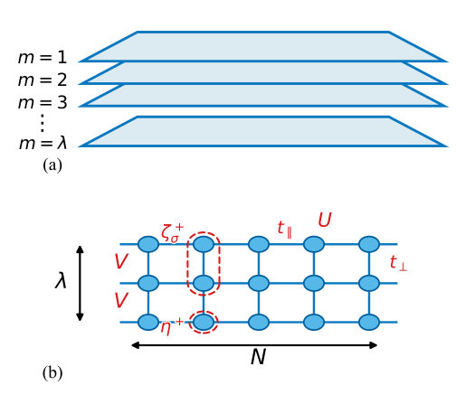
<figcaption class="paper-figure-caption"><b>Fig 1.</b> FIG. 1. (a) Schematic illustration of a multi-layered lattice system. The index m ∈[1, λ] labels the layers. All layers are identical bipartite lattices. The interlayer hopping and interaction are nearest-neighbor. (b) The simplest example of the system is an N × λ square lattice, where the layers reduce to chains. The parameters of the extended Hubbard model are indicated in the panel. The key feature is that the nearest-neighbor interactions exist only between layers. The triplet pair presented in this work is formed across two nearest-neighbor sites on two layers (labeled by a red dashed line surrounding the two sites), while the singlet pair is an on-site pair (labeled by a red dashed...</figcaption>
</figure>
<figure class="paper-figure-card">
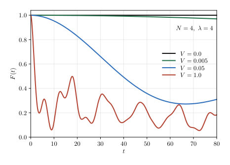
<figcaption class="paper-figure-caption"><b>Fig 2.</b> FIG. 2. Plots of the fidelity defined in Eq. (22) for the initial</figcaption>
</figure>
<figure class="paper-figure-card">
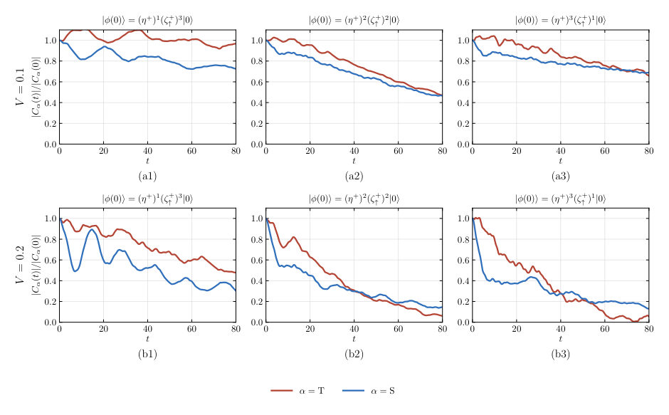
<figcaption class="paper-figure-caption"><b>Fig 3.</b> FIG. 3. Plots of the two correlation functions CS(r, t) and CT(r, t) defined in Eqs. (23) and (24) for three initial pair states</figcaption>
</figure>

**Summary.** The authors analyze the multi-layer extended Hubbard model to find exact eigenstates corresponding to interlayer triplet superconductivity. They show that these states are mathematically stable and physically realized only in bilayer and trilayer systems due to specific algebraic constraints (RSGA). This work advances understanding of pairing mechanisms by demonstrating how triplet pairs can dominate over singlet pairs when interlayer interactions are present.

**Why it may be interesting.** This work provides an analytical understanding of exotic superconducting phases (triplet pairing) in layered correlated materials by mapping out precise conditions ($\lambda=2, 3$) under which exact solutions exist, linking symmetry constraints directly to physical realizability.

Detailed structure

**Main problem.** The work investigates the existence and properties of exact interlayer triplet-pairing eigenstates within the multi-layer extended Hubbard model, generalizing prior studies on $\eta$-pairing states.

**Main result.** Exact triplet-pair eigenstates are found to exist only in bilayer ($\lambda=2$) and trilayer ($\lambda=3$) systems when interlayer interactions ($V$) are present. These states demonstrate off-diagonal long-range order (ODLRO) but cannot coexist with singlet pairs if $V 
eq 0$.

**Method.** The analysis relies on constructing specialized triplet-pairing operators ($\zeta^\pm_\sigma$) and applying symmetry-generating algebra (SGA) and restricted spectrum-generating algebra (RSGA) to find exact solutions.

**Model / system.** The system is the multi-layer extended Hubbard model defined by a Hamiltonian including intralayer hopping ($t$), interlayer hopping ($t_\perp$), on-site interaction ($U$), and interlayer interaction ($V$).

**Key observables.** Off-diagonal long-range order (ODLRO), stability of eigenstates measured via fidelity $F(t)$, and correlation functions for singlet ($C_S$) and triplet ($C_T$) pairs.

**Important parameters / regimes.** The number of layers ($\lambda$), the interaction strengths ($U, V$), and the hopping parameters ($t, t_\perp$).

**Assumptions / limitations.** The existence of exact eigenstates is restricted by the requirement that the Hamiltonian must satisfy the conditions for a Restricted Spectrum-Generating Algebra (RSGA), limiting applicability to $\lambda=2$ and $\lambda=3$.

**Figures summary.** Figure 1 illustrates the multi-layered lattice structure and hopping terms; Figure 2 plots the fidelity $F(t)$ to demonstrate state stability under time evolution for different layer numbers ($\lambda$).

**Paper structure.** The paper introduces the model and pairing operators, derives conditions based on symmetry algebra (RSGA), establishes the existence of exact eigenstates for $\lambda=2, 3$, and uses quench dynamics simulations to confirm their stability against interlayer interactions.

Abstract

$η$-pairing symmetry generalizes the pairing mechanisms in superconductivity but is broken in the presence of interlayer interactions. In this work, we extend this approach to triplet pairs. We propose interlayer triplet-pairing operators for the multi-layer extended Hubbard model. We find that a set of exact condensate-pair eigenstates can be constructed, which exhibit off-diagonal long-range order. In contrast to the $η$-pairing mechanism, this originates from restricted spectrum generating algebra and is only available for bilayer and trilayer systems in the presence of interlayer Hubbard interactions. Nevertheless, the system also retains the original on-site $η$-pairing symmetry in the absence of interlayer interactions. Consequently, both singlet and triplet pairs coexist in the eigenstates of the multi-layer Hubbard model. We employ quench dynamics to demonstrate the results through numerical simulations. Our findings open avenues for the study of exact condensate-pair states in strongly correlated systems.

[↑ back to top](#top)

### [Overcoming the Speed-Fidelity Trade-off in Fast CZ Gates via Cyclic Control](http://arxiv.org/abs/2607.00660v1)

**Authors:** Ze-An Zhao, Hai-Feng Zhang, Tian-Le Wang, Xiao-Yan Yang, Peng Wang, Ren-Ze Zhao, Sheng Zhang, Zhi-Fei Li, Yuan Wu, Zi-Hao Fu, Sheng-Ri Liu, Peng Duan, Guo-Ping Guo  
**Type:** experiment · **Category:** quantum information and computing · **PDF:** <https://arxiv.org/pdf/2607.00660v1>  
**Analysis basis:** full PDF text, analyzed in chunks
**Topic relevance:** 🔥 `QC/QI experiment` **4/5** · `methods for driven-dissipative` **1/5** · `non-equilibrium dynamics` **1/5**

↔ Scroll figures horizontally

<figure class="paper-figure-card">
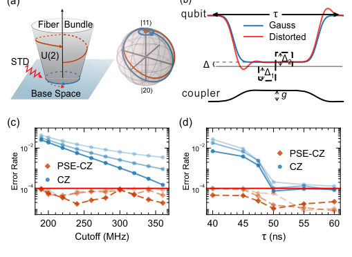
<figcaption class="paper-figure-caption"><b>Fig 1.</b> FIG. 1. Geometric mechanism and simulation of the PSE-CZ gate. (a) Left: Cyclic evolution in the base space induces a non- Abelian geometric phase in the U(2) bundle, which is susceptible to hardware imperfections such as STD. Right: Bloch sphere tra- jectories in the |11⟩−|20⟩subspace for a non-cyclic gate resulting from STD (blue) and an ideal cyclic gate (orange); squares denote evolution endpoints. (b) CZ gate pulse sequence (duration τ) uti- lizing flattop Gaussian waveforms with distortions simulated via a Butterworth low-pass filter. The PSE-CZ scheme employs indepen- dent amplitudes ∆1 and ∆2 for the two segments split at the midpoint, with experimental values typically in the range...</figcaption>
</figure>
<figure class="paper-figure-card">

<figcaption class="paper-figure-caption"><b>Fig 2.</b> FIG. 3. Leakage and CPhase landscapes in the expanded param- eter space. (a),(b) Leakage into the |20⟩state and (c),(d) CPhase plotted as a function of ∆1 and ∆2. Panels (a) and (c) display ex- perimental results, while (b) and (d) show simulations under STD. The red star and blue dot in (a) indicate the operating points for the PSE-CZ and traditional CZ gates, respectively. In (b)-(d), PC con- tour lines are superimposed for reference.</figcaption>
</figure>
<figure class="paper-figure-card">

<figcaption class="paper-figure-caption"><b>Fig 3.</b> FIG. 4. Cross-entropy benchmarking (XEB) results. (a) Cumula- tive distribution functions of XEB fidelity (left) and fidelity improve- ment ∆F = FPSE-CZ−FCZ (right) across 20 qubit pairs at a fixed gate duration of 50ns on the 72-qubit processor “Wukong.” This duration was chosen to be compatible with the attainable coupling strengths of the measured qubit pairs. The XEB purity, which characterizes the decoherence-limited fidelity, is shown as lighter-colored dashed lines alongside the XEB fidelity for both PSE-CZ and traditional CZ gates. (b) XEB fidelity for qubit pairs G1 and G2 at gate durations of 40ns, 35ns, and 30ns. In the box plots, dot symbols indicate sta- tistical outliers and...</figcaption>
</figure>

**Summary.** The paper introduces a cyclic control method using parameter-space expansion to enable fast, high-fidelity controlled-Z gates on superconducting qubits. By adding an extra degree of freedom, the technique overcomes the speed-fidelity trade-off caused by short-timescale waveform distortions. This results in significantly lower coherent errors even when operating at very fast gate speeds.

**Why it may be interesting.** This work provides a concrete, experimentally validated engineering solution for high-speed quantum gate operations that circumvents fundamental limitations imposed by realistic hardware noise models (STDs), which is crucial for scaling up quantum computation.

Detailed structure

**Main problem.** The primary challenge is overcoming the inherent speed-fidelity trade-off when implementing fast quantum gates, specifically CZ gates, due to short-timescale waveform distortions (STDs).

**Main result.** A novel cyclic control strategy based on parameter-space expansion successfully suppresses distortion-induced coherent errors while maintaining gate speed, fundamentally breaking the conventional speed-fidelity limitation.

**Method.** The authors employ a Parameter-Space Expansion (PSE) technique by introducing an auxiliary degree of freedom to restore controllability and satisfy necessary symmetry constraints for fast cyclic evolution.

**Model / system.** The work is performed on superconducting qubits, specifically using tunable transmon qubits coupled via tunable couplers in a 72-qubit processor architecture. The dynamics are analyzed by reducing the system's evolution to an effective two-level subspace $\{|11
angle, |20
angle\}$ for the CZ gate.

**Key observables.** Coherent error rate (measured via cross-entropy benchmarking), leakage into $|20
angle$ state, and conditional phase accumulation ($	ext{CPhase}$).

**Important parameters / regimes.** Gate duration ($	au$), distortion amplitude ($\alpha$), and the auxiliary control parameters $(\Delta_1, \Delta_2)$ used in the PSE protocol.

**Assumptions / limitations.** The analysis assumes that leakage and CPhase errors can be independently diagnosed and suppressed by optimizing pulse shapes within the expanded parameter space.

**Figures summary.** Figures compare simulated error rates vs. filter cutoff frequency (showing robustness), demonstrate gate error rates vs. duration ($	au$) showing the trade-off mitigation, and show XEB results quantifying fidelity improvement across varying fast gate times.

**Paper structure.** The paper progresses from theoretical analysis of symmetry breaking due to STDs to proposing PSE, followed by detailed experimental diagnosis using leakage measurements and CPhase characterization, culminating in quantitative benchmarking via XEB on the superconducting hardware.

Abstract

High-fidelity quantum gates are essential for scalable quantum computation. However, at short durations, short-timescale waveform distortions break the time-reflection symmetry of control pulses, preventing the precise closure of cyclic evolution. This mechanism renders conventional symmetric protocols intrinsically over-constrained. Conventional strategies typically rely on smoothing the pulse envelopes or embedding the interaction pulse within a longer qubit pulse to bypass short-timescale distortions, which inevitably leads to a persistent speed-fidelity trade-off. To overcome this limitation, we introduce a cyclic control strategy based on parameter-space expansion, which restores controllability by incorporating an additional degree of freedom. We experimentally demonstrate this approach in a superconducting controlled-Z gate, achieving robust suppression of coherent errors without increasing gate duration, reducing the average coherent error from 0.27% to 0.12% across multiple two-qubit gates, as validated by cross-entropy benchmarking. Our results establish a general route to fast, high-fidelity cyclic quantum gates beyond the conventional speed-fidelity trade-off.

[↑ back to top](#top)

### [A Versatile Analytical Model for Fast and Accurate Determination of Feedline-Coupled Resonators for Superconducting Qubit Readout](http://arxiv.org/abs/2607.00490v1)

**Authors:** Zhen Luo, Lea Richard, Ivan Tsitsilin, Christian M. F. Schneider, Marco Dietz, Stefan Filipp, Amelie Hagelauer  
**Type:** both · **Category:** quantum information and computing · **PDF:** <https://arxiv.org/pdf/2607.00490v1>  
**Analysis basis:** full PDF text, analyzed in chunks
**Topic relevance:** 🔥 `QC/QI experiment` **4/5** · `methods for driven-dissipative` **1/5**

↔ Scroll figures horizontally

<figure class="paper-figure-card">
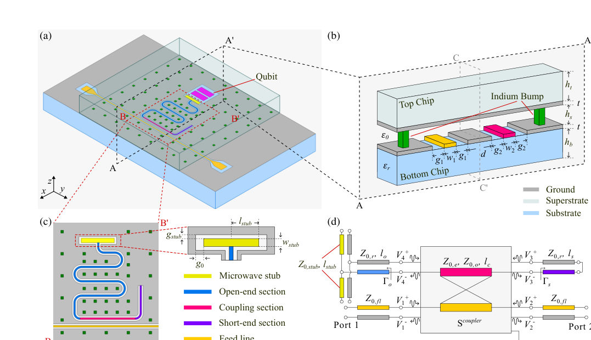
<figcaption class="paper-figure-caption"><b>Fig 1.</b> Fig. 1. (a) False-color isometric view of the 3D model, illustrating the feedline-coupled readout resonator system in a flip-chip configuration. The qubit and readout resonator are located on the bottom chip, while the top chip is fully metallized except for some apertures above the qubit. The top chip is intentionally diced to a smaller size than the bottom chip, allowing additional space for wire-bonding pads along the feedline. (b) Cross-sectional view of the coupling section with a false scale to illustrate the stack-up. (c) Top view of the physical layout of the resonator with the top chip unveiled. The resonator is divided into four sections: short-end section (purple), coupling...</figcaption>
</figure>
<figure class="paper-figure-card">

<figcaption class="paper-figure-caption"><b>Fig 2.</b> Fig. 2. E-field distributions for the configuration of top-grounded edge- coupled CPW line with a finite ground plane simulated using Ansys 2D Extractor and the configuration of partial capacitances for the even mode (a) and the odd mode (b).</figcaption>
</figure>
<figure class="paper-figure-card">

<figcaption class="paper-figure-caption"><b>Fig 3.</b> Fig. 3. Conformal mapping transformation steps to calculate the partial capacitance Ca,m1 for even mode (a)-(d) and odd mode (e)-(h). The solid lines represent PEC boundaries and the dash lines represent PMC boundaries.</figcaption>
</figure>
<figure class="paper-figure-card">
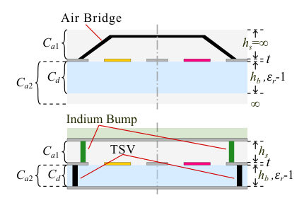
<figcaption class="paper-figure-caption"><b>Fig 4.</b> Fig. 4. Partial capacitances and cross-sectional view of the coupling section for planar architecture (a) and flip-chip architecture with back conductor on bottom chip (b). The plane of symmetry is designated by dash-dot line.</figcaption>
</figure>
<figure class="paper-figure-card">
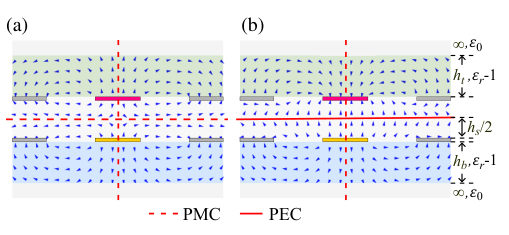
<figcaption class="paper-figure-caption"><b>Fig 5.</b> Fig. 5. Cross-sectional view of the coupling section for a broadside-coupled CPW line and the field distribution for even mode (a) and odd mode (b).</figcaption>
</figure>

**Summary.** This paper introduces an advanced analytical model to accurately characterize superconducting resonators used for qubit readout. By integrating four-port network analysis and conformal mapping, it provides closed-form expressions for resonance frequency and coupling Q-factor. The model is validated against both high-fidelity FEM simulations and physical measurements, offering a crucial tool for designing scalable quantum hardware.

**Why it may be interesting.** This work directly addresses the hardware characterization bottleneck in superconducting quantum computing by providing a computationally fast alternative to intensive full-wave electromagnetic simulations for critical readout components.

Detailed structure

**Main problem.** The core problem is developing a fast, accurate analytical model to determine the resonance frequencies ($f_r$) and coupling Q-factors ($Q_c$) of feedline-coupled resonators used in superconducting qubit readout circuits.

**Main result.** The proposed analytical model successfully predicts $f_r$ and $Q_c$ with good agreement ($\Delta f/f_{sim} < 1\%$, $\Delta Q_c/Q_{c,sim} < 20\%$) when compared against both full-wave FEM simulations and direct cryogenic measurements.

**Method.** The methodology involves using four-port microwave network analysis combined with conformal mapping techniques to derive closed-form expressions for the transmission coefficient ($S_{21}$).

**Model / system.** The system is a superconducting $\lambda/4$ resonator coupled to a CPW feedline, often implemented in complex 3D heterogeneous architectures. The model treats the coupling section as a four-port network reduced to two ports.

**Key observables.** Resonance frequency ($f_r$), coupling quality factor ($Q_c$), and the transmission spectrum $|S_{21}(f)|$.

**Important parameters / regimes.** Geometric parameters such as conductor thickness ($t$), gap spacing ($h_s$), and resonator lengths ($l_s, l_o$).

**Assumptions / limitations.** Key assumptions include treating the superconductor thickness as zero in some derivations, simplifying transitions to right-angles, and using an impedance matrix approach.

**Figures summary.** Figures illustrate physical layouts of 3D flip-chip resonators, E-field distributions for even/odd modes, and conformal mapping steps used for capacitance calculation.

**Paper structure.** The paper progresses from defining the need for a fast model to detailing the mathematical framework (four-port analysis, impedance matrix derivation via conformal mapping) before validating the final closed-form $S_{21}$ expression against both simulation results and experimental measurements on fabricated chips.

Abstract

Superconducting quantum chips commonly utilize quarter-wavelength (λ/4) transmission line resonators as readout circuits. An analytical model for the accurate determination of resonance frequencies and coupling Q-factors of feedline-coupled superconducting resonators is introduced. The model leverages four-port microwave network analysis, integrating boundary conditions and conformal mapping techniques to compute even- and odd-mode impedances in edge-coupled coplanar waveguide (CPW) structures. Its versatility allows application to both planar and 3-D heterogeneous architectures, making it a powerful tool for resonator design. To validate the model, a test chip with λ/4 resonators of varying geometries is fabricated and measured in a cryogenic environment. Comparisons with finite element method (FEM) simulations and experimental measurements confirm the model's accuracy, with resonance frequencies and coupling Q-factors aligning closely across configurations. This proposed model facilitates the design of superconducting resonators in readout circuits for more effective, scalable, and adaptable quantum computing architectures.

[↑ back to top](#top)

### [Non-Clifford Benchmarking via Ensemble Feature Selection](http://arxiv.org/abs/2607.01180v1)

**Authors:** Stancho G. Stanchev, Nikolay V. Vitanov  
**Type:** experiment · **Category:** quantum information and computing · **PDF:** <https://arxiv.org/pdf/2607.01180v1>  
**Analysis basis:** full PDF text, analyzed in chunks
**Topic relevance:** 🔥 `QC/QI experiment` **4/5** · `quantum measurements` **1/5**

↔ Scroll figures horizontally

<figure class="paper-figure-card">
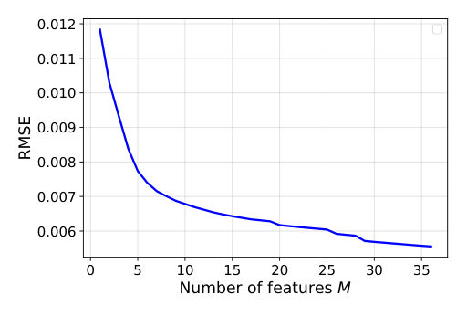
<figcaption class="paper-figure-caption"><b>Fig 1.</b> FIG. 2: Combined RMSE as a function of the number of selected features M for L ∈4, 8. The training ensemble contains noisy realizations of I, CZ(0, 2) and CCZ gener- ated with different random seeds. Consequently, a single EFS estimator is learned simultaneously for all three tar- gets, resulting in the same RMSE curve.</figcaption>
</figure>
<figure class="paper-figure-card">
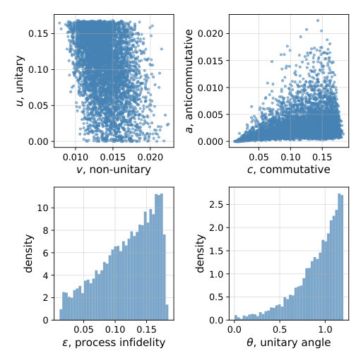
<figcaption class="paper-figure-caption"><b>Fig 2.</b> FIG. 1: Error decomposition of the training ensemble (K = 5000 realizations). Top left: (u, v) scatter separat- ing coherent (u) and incoherent (v) contributions. Top right: (a, c) scatter separating anticommuting (a) and commuting (c) parts relative to the involutory target. Bottom left: distribution of the sampled infidelity ε, bi- ased toward larger errors to improve training coverage. Bottom right: distribution of the coherent error angle θ.</figcaption>
</figure>
<figure class="paper-figure-card">
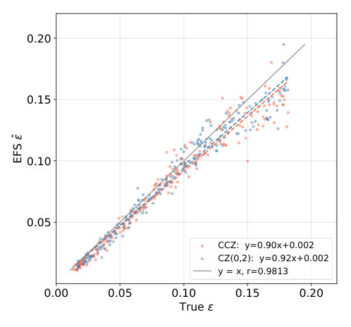
<figcaption class="paper-figure-caption"><b>Fig 3.</b> FIG. 3: EFS estimates vs true process infidelity for CCZ (red) and CZ(0, 2) (blue) from Aer Simulator with inde- pendent test ensemble and SPAM/readout errors. Both targets yield slope ≈0.9–0.92, confirming that the esti- mator is equally applicable to non-Clifford gates.</figcaption>
</figure>
<figure class="paper-figure-card">
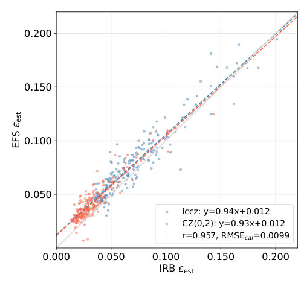
<figcaption class="paper-figure-caption"><b>Fig 4.</b> FIG. 4: EFS vs IRB for ICCZ and CZ(0, 2) on ibm_kingston with M = 24. Fitted slopes and inter- cepts are very similar for the two targets (α = 0.94 and α = 0.93, both with intercept 0.012); combined r = 0.957, RMSEcal = 0.0099, over ε ≈0.02–0.20.</figcaption>
</figure>
<figure class="paper-figure-card">
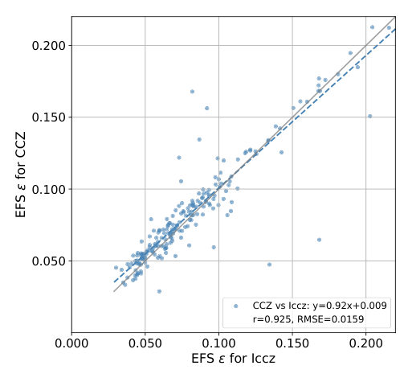
<figcaption class="paper-figure-caption"><b>Fig 5.</b> FIG. 5: EFS estimates for CCZ versus ICCZ on ibm_kingston across all valid qubit triples (α = 0.92, r = 0.925, RMSE = 0.0159). The close agreement for the large majority of triples confirms the expected domi- nance of diagonal noise; the few outliers (≈3–4%) reveal measurable non-diagonal error structure made detectable by the Rz(±π/4) redistribution.</figcaption>
</figure>

**Summary.** The authors introduce Ensemble Feature Selection (EFS), a novel technique to estimate process infidelity for difficult non-Clifford quantum gates. By training on an ensemble of simulated noisy channels and using ridge regression, EFS constructs a robust linear estimator. Validation on superconducting hardware confirms that EFS provides accurate measurements comparable to established methods like IRB.

**Why it may be interesting.** This work provides a crucial tool for characterizing noise in complex quantum hardware beyond simple gate sets, which is vital for scaling up quantum computation by providing reliable benchmarking metrics.

Detailed structure

**Main problem.** The primary challenge is developing a reliable method to estimate process infidelity for multi-qubit gates, especially non-Clifford targets, where standard Clifford-based benchmarking techniques fail.

**Main result.** The proposed Ensemble Feature Selection (EFS) method shows strong agreement with independent Randomized Benchmarking measurements on superconducting hardware, achieving high estimation precision across a wide range of gate infidelities.

**Method.** EFS selects a compact set of executable circuit measurements from a candidate pool using offline training on a physically motivated ensemble of noisy channels and combines them into a linear estimator via ridge regression.

**Model / system.** The work is validated on superconducting hardware (ibm_kingston) using three-qubit non-Clifford gates like CCZ. The analysis relies on Pauli Transfer Matrices to define process fidelity and infidelity ($\epsilon$).

**Key observables.** Process infidelity ($\epsilon$), gate fidelity ($F(G, T)$), and comparison metrics against independent Interleaved Randomized Benchmarking (IRB).

**Important parameters / regimes.** Estimation precision of $\approx 0.01$ over an infidelity range of $0.02-0.2$. The optimal feature set size was determined to be around $M=24$.

**Assumptions / limitations.** The method assumes the existence of a physically motivated training ensemble incorporating prior knowledge about dominant hardware noise mechanisms, and that the target gate satisfies an anchor condition.

**Figures summary.** Figures compare EFS estimates against true process infidelity from independent IRB measurements for Clifford benchmarks (ICCZ, CZ(0, 2)), demonstrating strong linear correlation. Further comparisons test transferability to non-Clifford gates like CCZ.

**Paper structure.** The paper develops the theoretical framework using Pauli Transfer Matrices and an anchor condition, details the EFS methodology involving ensemble training and ridge regression, validates the estimator against independent IRB measurements on Clifford targets, and finally applies it directly to estimate infidelity for non-Clifford gates like CCZ.

Abstract

We propose an Ensemble Feature Selection (EFS) method for fast estimation of process infidelity of involutory multi-qubit gates, including non-Clifford targets, for which standard Clifford-based benchmarking does not apply. The method selects a compact set of experimentally executable circuit measurements from a candidate pool through offline training on a physically motivated ensemble of noisy channels, and combines them into a linear estimator with weights learned by ridge regression. The training ensemble is an explicit and tunable component of the protocol, incorporating prior knowledge about dominant hardware noise mechanisms. The estimator is validated on ibm_kingston using two Clifford validation benchmarks structurally related to the transpiled CCZ circuit, against independent Interleaved Randomized Benchmarking (IRB). Both show close EFS-IRB agreement across a wide range of process infidelities, with an estimation precision of approximately 0.01 over a process infidelity range of 0.02-0.2. EFS is subsequently applied directly to CCZ on the same device.

[↑ back to top](#top)

### [Superconducting Spiral Inductors for RF Reflectometry: Operation at Elevated Temperatures and Magnetic Fields](http://arxiv.org/abs/2607.00172v1)

**Authors:** Euan Parry, Murat Cubukcu, Patrick Reuvekamp, Manoj Stanley, Jonathan D. Fletcher, Alessandro Rossi  
**Type:** experiment · **Category:** quantum information and computing · **PDF:** <https://arxiv.org/pdf/2607.00172v1>  
**Analysis basis:** full PDF text, analyzed in chunks
**Topic relevance:** 🔥 `QC/QI experiment` **4/5**

↔ Scroll figures horizontally

<figure class="paper-figure-card">
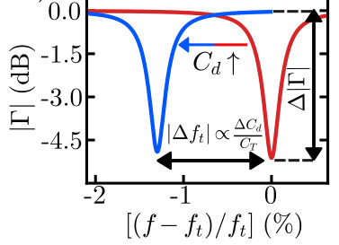
<figcaption class="paper-figure-caption"><b>Fig 1.</b> Figure 1. Parallel configuration tank circuit for gate-based reflectometry. (a) Equivalent circuit showing the supercon- ducting spiral and its sub-components (red) placed in parallel to a variable capacitor (Cd) representing a quantum device. (b) Simulated reflection coefficient amplitude as a function of fractional resonant frequency shift. The traces illustrate a transition from low (red) to high (blue) device capacitance. The phase response is omitted for simplicity.</figcaption>
</figure>
<figure class="paper-figure-card">
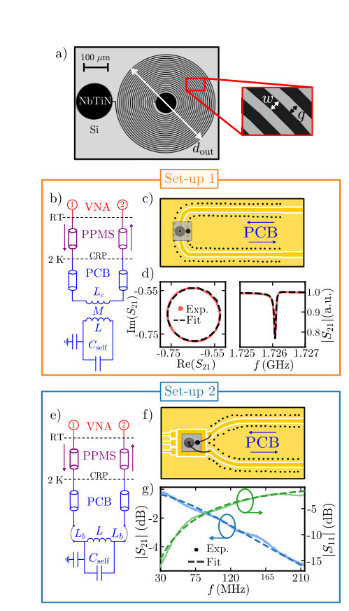
<figcaption class="paper-figure-caption"><b>Fig 2.</b> Figure 2. Device geometry and microwave characterisation methods. (a) Schematic illustration of an individual spiral de- vice and relevant geometric features. Inset: zoom-in showing track width and separation. (b) Equivalent circuit diagram for measurements carried out with set-up 1. The tempera- ture gradient from room temperature (red) to cryogenic base temperature (blue) is shown. Dashed line labelled CRP indi- cates the reference plane of UOSM calibrations. (c) Schematic representation of a spiral chip placed above a CPW for the inductively coupled notch measurements enabled by set-up 1. (d) Experimental S21 notch response as a function of fre- quency for device D3 at 2 K (red dot) and...</figcaption>
</figure>
<figure class="paper-figure-card">
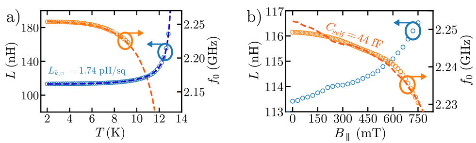
<figcaption class="paper-figure-caption"><b>Fig 3.</b> Figure 3. (a) L(T) extracted from the bonded two-port measurements of D2 carried out in set-up 2 (blue circles) and f0(T) extracted from the inductively coupled notch measurements of a nominally identical D2 device carried out in set-up 1 (orange circles). The blue dashed line is the fit discussed in Section III and gives Lg = 106 nH, within 3% of the designed value, and Lk,□= 1.74 pH/sq. The orange dashed line shows the f0(T) calculated using Eq. 2 with the extracted inductance and a constant Cself = 44 fF. (b) Extracted L(B∥) (blue circles) and f0(B∥) (orange circles) for the same design. B∥is the magnetic field oriented nominally within the plane of the superconducting film. Using the...</figcaption>
</figure>
<figure class="paper-figure-card">

<figcaption class="paper-figure-caption"><b>Fig 4.</b> Figure 3(a) shows the temperature dependence of D2 inductance, L, and resonance frequency, f0, as extracted from our two separate measurement approaches.These measurements were performed on different physical de-</figcaption>
</figure>
<figure class="paper-figure-card">
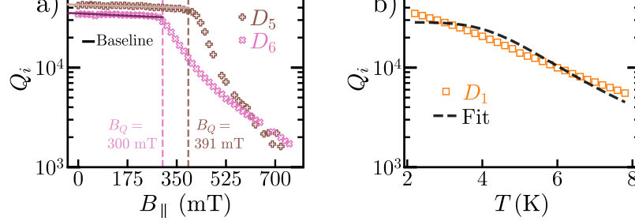
<figcaption class="paper-figure-caption"><b>Fig 5.</b> Figure 4. Temperature- and field-dependent quality factor degradation. (a) Qi as a function of applied parallel magnetic field for devices D5 and D6 at T = 2 K. The field values BQ = 391 mT for D5 and BQ = 300 mT for D6 for which a gradual degradation of more than 10% manifests are highlighted by dashed vertical lines. (b) Temperature dependence of Qi for device D1 in the absence of an applied field (squares). The dashed curve represents a fit to the quasiparticle-loss model of Eq. 5.</figcaption>
</figure>

**Summary.** This paper presents a comprehensive experimental characterization of superconducting spiral inductors designed for RF reflectometry in quantum computing. By using dual measurement techniques, the authors successfully separated inductive and capacitive effects to map out how device performance degrades with increasing temperature or magnetic field. The results provide crucial design rules for building robust readout circuitry for next-generation quantum processors.

**Why it may be interesting.** This work directly impacts the hardware layer of quantum computing by providing quantitative guidelines for designing superconducting readout circuits that must maintain performance stability under non-ideal operating conditions (T > 1K, B $
eq$ 0).

Detailed structure

**Main problem.** The study addresses the need for reliable superconducting circuit components, specifically spiral inductors, to function correctly in future quantum computing architectures that operate at elevated temperatures and magnetic fields.

**Main result.** The research successfully characterized the temperature and magnetic field dependence of inductor performance, establishing design metrics that show frequency shifts are dominated by inductive effects, while loss is limited by quasiparticle dissipation or vortex entry.

**Method.** The authors employed two complementary microwave measurement setups—weakly coupled resonator measurements and independent two-port inductance extraction—to systematically deconvolve the device's electrical response.

**Model / system.** The physical system is a superconducting spiral inductor made of NbTiN film, which acts as a distributed resonator. The analysis models its behavior using lumped admittance fitting techniques to separate geometric ($L_g$) and temperature/field-dependent kinetic inductance ($L_k$).

**Key observables.** Resonant frequency ($f_0$), internal quality factor ($Q_i$), total inductance ($L$), and the field-dependent loss onset field ($B_Q$).

**Important parameters / regimes.** Operating temperatures (several Kelvin), magnetic fields approaching 1 T, kinetic inductance fraction ($\alpha$), and superconducting gap temperature dependence $\Delta(T)$.

**Assumptions / limitations.** The primary assumption is that combining two independent measurement techniques allows for the accurate separation of inductive and capacitive contributions to characterize the true device response.

**Figures summary.** Figures illustrate the comparison between frequency shifts derived from two different measurement setups, show $Q_i$ degradation versus applied magnetic field (highlighting $B_Q$), and plot design trade-offs relating miniaturization ($\alpha$) to stability.

**Paper structure.** The paper systematically presents measurements using two distinct microwave characterization setups. It then analyzes the temperature and magnetic field dependence of resonance shifts, confirming inductive dominance, before concluding with a discussion on engineering trade-offs between device size and operational robustness.

Abstract

Superconducting spiral inductors are emerging as key components for radio-frequency (RF) reflectometry, a widely used readout technique for semiconductor spin qubits. Future scalable quantum-computing architectures are expected to operate at elevated temperatures and magnetic fields, placing new demands on the performance and stability of superconducting circuit elements. Here, we present a systematic study of NbTiN spiral inductors under temperatures of several kelvin and magnetic fields approaching 1 T. By combining weakly coupled resonator measurements with independent two-port inductance extraction, we separate inductive and capacitive contributions to device behaviour and directly identify the origin of resonance shifts and quality factor degradation. Furthermore, we establish practical design metrics linking geometry, temperature sensitivity, and magnetic-field robustness. These results provide a general framework for benchmarking superconducting inductors and guiding the design of future RF-reflectometry circuits for practical quantum technologies.

[↑ back to top](#top)

### [Demographic senescence as multi-level selection in miniature](http://arxiv.org/abs/2607.00262v1)

**Authors:** Ananda Shikhara Bhat, Hanna Kokko  
**Type:** theory · **Category:** statistical mechanics · **PDF:** <https://arxiv.org/pdf/2607.00262v1>  
**Analysis basis:** full PDF text, analyzed in chunks
**Topic relevance:** `Keldysh / 2PI / non-Gaussian methods` **3/5** · `methods for driven-dissipative` **3/5** · `non-equilibrium dynamics` **3/5** · `analog quantum simulation` **2/5** · `correlated / nonlocal dissipation` **2/5** · `driven-dissipative phase transition` **2/5** · `non-equilibrium universality` **2/5** · `Kondo & dissipative impurity` **1/5** · `entanglement & information structure` **1/5** · `scars & prethermalization` **1/5**

↔ Scroll figures horizontally

<figure class="paper-figure-card">
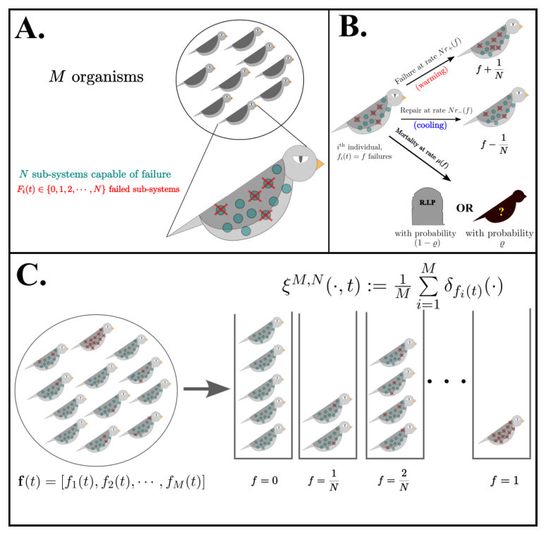
<figcaption class="paper-figure-caption"><b>Fig 1.</b> Figure 1: A description of the stochastic process considered in this paper in the senescence setting, where systems are organisms, sub-systems are intra-organismal sub-systems, red sub-systems are failed sub-systems, warming is failure of functioning sub-systems, and cooling is repair of failed sub-systems. (A) The model consists of M organisms, each of which have N intra-organismal sub-systems capable of failure. (B) An organism with f ∈{0, 1</figcaption>
</figure>

**Summary.** This work establishes a deep formal equivalence between biological senescence and multi-level selection theory. By developing sophisticated mathematical tools, the authors show that age-related deterioration can be modeled as a stochastic process governed by competition at two interacting levels: sub-systems within an individual, and individuals competing against each other. This provides a powerful unifying framework for understanding aging dynamics.

**Why it may be interesting.** While not directly about quantum systems, the rigorous mathematical machinery developed—using SPDEs and functional central limit theorems to model complex interacting stochastic processes—is highly relevant for modeling open quantum systems or many-body dynamics where noise and collective behavior are key.

Detailed structure

**Main problem.** To formally demonstrate that demographic senescence (age-related mortality increase) can be mathematically understood as an emergent consequence of multi-level selection processes.

**Main result.** The progressive aging pattern is shown to be formally equivalent to the patterns generated by a within-generation, two-level stochastic process modeling competition between sub-systems and groups.

**Method.** The authors employ advanced stochastic calculus, deriving functional Master Equations and their subsequent diffusion approximations (Fokker-Planck equations) in multiple scaling limits.

**Model / system.** The model tracks the state of $M$ 'systems' (organisms), where each system contains $N$ interacting sub-systems. Dynamics involve within-system failure/repair ('warming/cooling') and between-system selection/extinction, modeled via a ball-and-urn scheme.

**Key observables.** The proportion of systems $\xi_{M,N}(f, t)$ possessing a certain fraction $f$ of failed sub-systems; the scaled mean mortality rate $b_\mu(t)$.

**Important parameters / regimes.** Replacement probability ($\varrho$), system size ($M$), sub-system count ($N$), and failure/repair rates ($r_+, r_-$).

**Assumptions / limitations.** The analysis relies heavily on diffusion approximations (Gaussian limits) for both the number of systems ($M$) and the continuous trait space ($N 	o \infty$).

**Figures summary.** Figure 1 illustrates the model components: (A) $M$ organisms, each with $N$ sub-systems; (B) Dynamics involving failure accumulation, repair, and death; (C) Representation using a ball-and-urn scheme.

**Paper structure.** The paper builds from defining the stochastic process via Master Equations for finite $M$ and $N$, deriving functional Fokker-Planck equations through diffusion approximations, and finally analyzing specific scaling limits to recover known models of senescence and selection.

Abstract

Multi-level selection and senescence do not at first sight have much in common. Here, we demonstrate that the emergent mortality patterns generated by demographic senescence can be understood as the product of multi-level selection. We formulate a two-level Moran type process and use its scaling limits to illustrate that a simple mathematical framework that models multi-level selection in group-structured populations also models damage accumulation patterns and resultant mortality curves in ageing organisms. To verbally make the connection, observe that defectors spread within a group consisting of cooperators and defectors; when groups compete against each other, defector-rich groups suffer, and between-group selection causes such groups to be systematically under-represented. Exactly analogously, senescing individuals accumulate damage to physiological sub-systems, and `damage begets damage'; individuals who are more damaged are more likely to die, hence damage-rich individuals are systematically under-represented in later age classes. Thus, emergent senescence patterns in complex, integrated organisms are formally equivalent to the patterns generated by a within-generation multi-level selection process in which intra-organismal sub-systems play the role of particles, organisms play the role of collectives, and selective disappearance plays the role of group selection.

[↑ back to top](#top)

### [Susceptibility-kinetic uncertainty relations for quantum systems](http://arxiv.org/abs/2607.01035v1)

**Authors:** Didrik Palmqvist, Ludovico Tesser, Janine Splettstoesser  
**Type:** theory · **Category:** statistical mechanics · **PDF:** <https://arxiv.org/pdf/2607.01035v1>  
**Analysis basis:** full PDF text, analyzed in chunks
**Topic relevance:** `methods for driven-dissipative` **3/5** · `non-equilibrium dynamics` **3/5** · `non-equilibrium universality` **3/5** · `Keldysh / 2PI / non-Gaussian methods` **2/5** · `driven-dissipative phase transition` **2/5** · `quantum measurements` **2/5** · `Kondo & dissipative impurity` **1/5** · `analog quantum simulation` **1/5** · `correlated / nonlocal dissipation` **1/5** · `entanglement & information structure` **1/5** · `measurement-induced transitions` **1/5**

↔ Scroll figures horizontally

<figure class="paper-figure-card">

<figcaption class="paper-figure-caption"><b>Fig 1.</b> Figure 1. Quantum system S coupled to reservoirs (baths) via coupling ˆVα,β,..., enabling transport. The coupling strength to (one) reservoir is parameterized by θ, resulting in its en- coding in the state dynamics ˆρ(θ) that serves as a basis for generalizing the concept of dynamical activity to quantum systems. The color-shading of the baths symbolizes arbitrary out-of-equilibrium situations.</figcaption>
</figure>
<figure class="paper-figure-card">
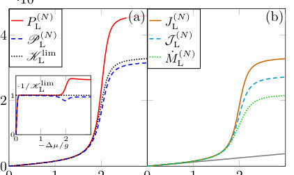
<figcaption class="paper-figure-caption"><b>Fig 2.</b> Figure 2. Classical local KUR [Eq. (35)] and S-KUR [Eq. (34)] for particle current in DQD as a function of chemical potential bias ∆µ. We set ΓR = 5ΓL = g/5, TL = TR = g/50kB and ϵd = 0. (a) Violation of local classical KUR and saturation of the S-KUR. (b) Particle current J(N) L , susceptibility ˙M (N) L and their average J (N) L . The close-to-equilibrium approximation ˙M (N) L ≈ ΓLΓR</figcaption>
</figure>
<figure class="paper-figure-card">
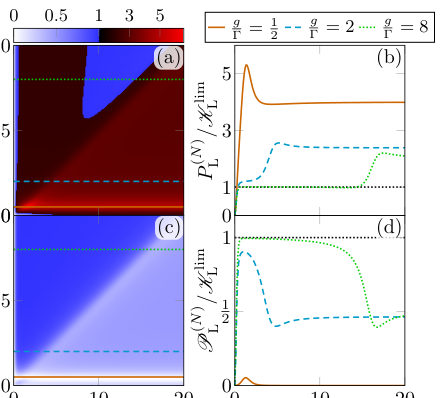
<figcaption class="paper-figure-caption"><b>Fig 3.</b> Figure 3. (a,b) Violation of classical local KUR [Eq. (35)] and (c,d) saturation of S-KUR [Eq. (34)] in DQD for varying tunneling strength g and chemical potential bias ∆µ. We set ΓL = ΓR = Γ, TL = TR = 0.1Γ/kB, and ϵd = 0.</figcaption>
</figure>
<figure class="paper-figure-card">

<figcaption class="paper-figure-caption"><b>Fig 4.</b> Figure 4. (a,b) Violation of classical local KUR [Eq. (35)] and (c,d) saturation of S-KUR [Eq. (34)] in DQD for varying coupling strength Γ = ΓL = ΓR and chemical potential bias ∆µ. We set TL = TR = 0.1g/kB, and ϵd = 0.</figcaption>
</figure>
<figure class="paper-figure-card">
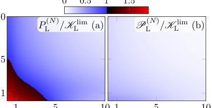
<figcaption class="paper-figure-caption"><b>Fig 5.</b> Figure 5. (a) Violation of classical local KUR [Eq. (35)] and (b) saturation of S-KUR [Eq. (34)] in DQD for varying temperatures TL, TR. We set ΓL = ΓR = Γ, g = 5Γ, ϵd = 2Γ, ∆µ = 10Γ.</figcaption>
</figure>

**Summary.** The paper introduces the Susceptibility-Kinetic Uncertainty Relation (S-KUR) as a universal bound governing current precision in open quantum systems. By defining Partial Dynamical Activity using quantum Fisher information, it overcomes limitations of previous bounds that failed under strong coupling or coherence. This tool is demonstrated to be robustly applicable to complex transport phenomena like those in double quantum dots.

**Why it may be interesting.** This work provides a powerful, general theoretical tool for quantifying fundamental limits on measurement precision in non-equilibrium quantum transport, which is highly relevant to mesoscopic physics and quantum thermodynamics.

Detailed structure

**Main problem.** The central problem is establishing universal uncertainty relations that constrain current precision for open quantum systems operating out of equilibrium.

**Main result.** The authors derive the Susceptibility-Kinetic Uncertainty Relation (S-KUR), a general bound on current precision derived from partial dynamical activity, which remains valid even when standard kinetic uncertainty relations fail due to quantum coherence or strong coupling.

**Method.** The relation is derived using the Quantum Cramér-Rao Bound applied to the response of an observable to changes in system-reservoir coupling strength ($	heta$), leading to the definition of Partial Dynamical Activity (PDA).

**Model / system.** The analysis focuses on open quantum systems coupled to reservoirs, exemplified by transport through a Double Quantum Dot (DQD) structure. The dynamics are governed by time-dependent Hamiltonians and analyzed in the steady-state limit.

**Key observables.** Current ($\hat{J}(\hat{X})$), Susceptibility term ($\dot{M}(\hat{X})$), Zero-frequency noise ($S(\hat{X})$), Partial Dynamical Activity ($A_V(t)$).

**Important parameters / regimes.** Coupling strength ($	heta$), Bias voltage ($\Delta\mu$), Temperature ($T$), and the time evolution parameter $t$.

**Assumptions / limitations.** The derivation relies on defining PDA via quantum Fisher information related to coupling rescaling, and in some analyses, approximations like the secular approximation or Markovian limits are used.

**Figures summary.** Figures illustrate the failure of classical local KURs compared to the saturation of the S-KUR for particle current in a DQD across varying bias; another figure shows the disappearance of classical bound violations upon increasing temperature.

**Paper structure.** The paper builds from defining the problem using the QCRB, introducing PDA via quantum Fisher information, deriving the universal S-KUR, and then validating this relation by applying it to complex physical examples like steady-state transport in a DQD under various bias and temperature conditions.

Abstract

Kinetic uncertainty relations bound current precision of stochastic processes by dynamical activity. The extension of these bounds to quantum systems has been impeded by coherence, strong system-reservoir coupling, and the subtlety of defining dynamical activity in the quantum regime. Here, we introduce a partial dynamical activity through the quantum Fisher information associated with the rescaling of the system-reservoir coupling and show that it bounds current precision via a universal susceptibility-kinetic uncertainty relation. The general validity of this relation for any open quantum system is guaranteed by the natural contribution of a susceptibility term, which is experimentally accessible by tuning the system-reservoir coupling strength. We show how the partial dynamical activity encompasses previous definitions of activity in the weak-coupling Markovian limit and that it provides an information-geometric interpretation of correlator-based activities. We illustrate the tight constraint on precision that our bound provides with the example of steady-state transport through a double quantum dot, where quantum effects invalidate previously developed kinetic uncertainty relations. We expect our bound to provide a powerful tool for optimizing precision in arbitrary quantum systems.

[↑ back to top](#top)

### [Heliciton-Assisted Chirality-Induced Spin Selectivity from Helical Dirac Current](http://arxiv.org/abs/2607.00624v1)

**Authors:** Ju Gao, Fang Shen  
**Type:** theory · **Category:** other · **PDF:** <https://arxiv.org/pdf/2607.00624v1>  
**Analysis basis:** full PDF text, analyzed in chunks
**Topic relevance:** `Keldysh / 2PI / non-Gaussian methods` **3/5** · `methods for driven-dissipative` **3/5** · `spintronics-quantum-optics interface` **3/5** · `correlated / nonlocal dissipation` **2/5** · `driven-dissipative phase transition` **2/5** · `non-equilibrium dynamics` **2/5** · `Kondo & dissipative impurity` **1/5** · `analog quantum simulation` **1/5** · `exotic spin models in light-matter` **1/5** · `non-equilibrium universality` **1/5**

↔ Scroll figures horizontally

<figure class="paper-figure-card">
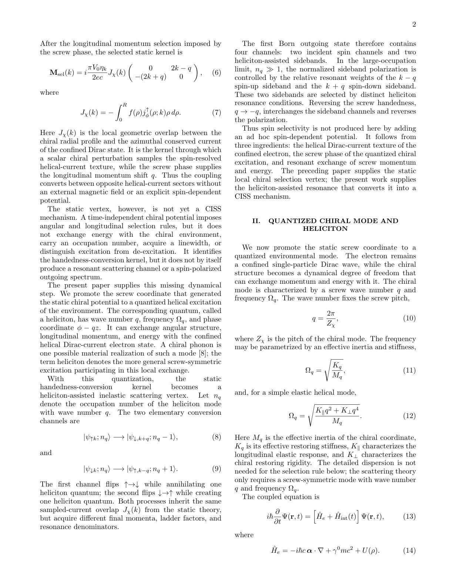
<figcaption class="paper-figure-caption"><b>Fig 1.</b> Low-resolution page preview, page 2</figcaption>
</figure>
<figure class="paper-figure-card">

<figcaption class="paper-figure-caption"><b>Fig 2.</b> Low-resolution page preview, page 3</figcaption>
</figure>
<figure class="paper-figure-card">

<figcaption class="paper-figure-caption"><b>Fig 3.</b> Low-resolution page preview, page 4</figcaption>
</figure>
<figure class="paper-figure-card">

<figcaption class="paper-figure-caption"><b>Fig 4.</b> Low-resolution page preview, page 5</figcaption>
</figure>
<figure class="paper-figure-card">
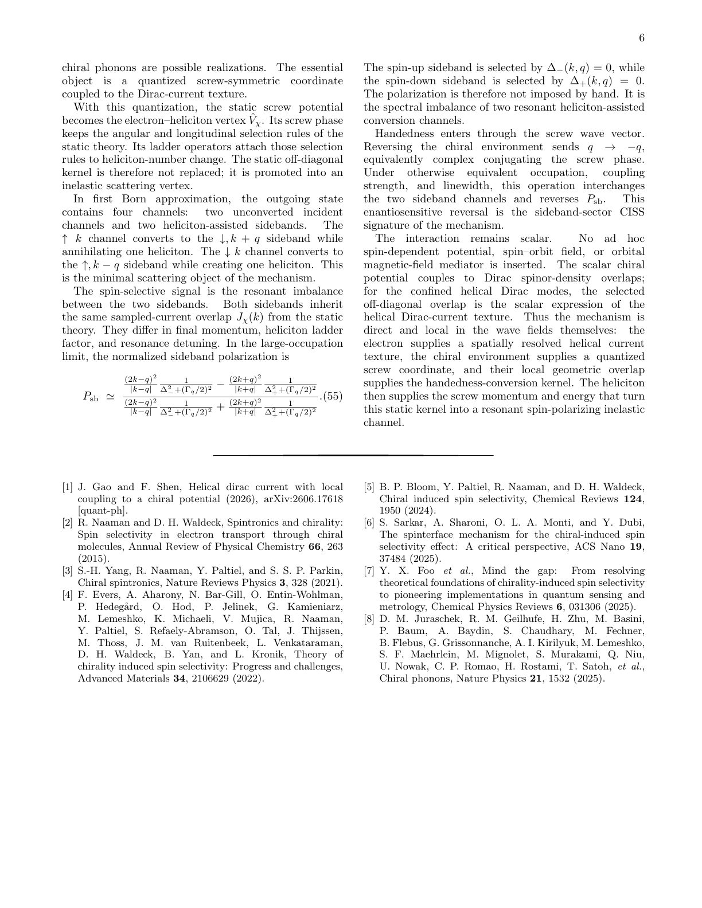
<figcaption class="paper-figure-caption"><b>Fig 5.</b> Low-resolution page preview, page 6</figcaption>
</figure>

**Summary.** This work proposes that Chirality-Induced Spin Selectivity (CISS) arises from an inelastic resonance process mediated by a quantized excitation called a heliciton. By treating the static chiral potential as a dynamic interaction, the authors show that spin polarization is achieved when the electron undergoes resonant energy and momentum exchange with this environmental quantum. This establishes CISS as a robust, dynamical mechanism rather than just a geometric effect.

**Why it may be interesting.** It provides a concrete, dynamical mechanism for spin selectivity rooted in quantized environmental coupling, which is highly relevant to open quantum systems dynamics and spintronics theory.

Detailed structure

**Main problem.** To develop a mechanism for Chirality-Induced Spin Selectivity (CISS) that incorporates energy exchange with the environment, moving beyond static chiral potentials.

**Main result.** The paper shows that CISS can be understood as a heliciton-assisted resonant inelastic scattering process in the sideband sector, where full spin polarization is achieved at specific resonance conditions.

**Method.** First Born scattering theory is used to analyze the coupling between an electron state and quantized environmental excitations (helicitons), leading to sidebands.

**Model / system.** The model involves a confined Dirac electron interacting with a quantized, screw-symmetric environmental motion called a 'heliciton.' The interaction couples spin channels while conserving helicity via momentum ($\pm q$) and energy ($\hbar \Omega_q$) exchange.

**Key observables.** Sideband polarization ($P_{sb}$), which reaches $\pm 1$ at resonance, and the resonant detuning conditions ($\Delta_{\pm}(k, q) = 0$).

**Important parameters / regimes.** Helicon frequency ($\Omega_q$), wave number ($q$), and the local geometric overlap kernel $J_\chi(k)$ characterizing the helical Dirac-current texture.

**Assumptions / limitations.** The calculation relies on treating the coupling perturbatively using first Born scattering theory, assuming sideband amplitudes are small.

**Paper structure.** The paper develops the Hamiltonian incorporating the heliciton interaction, applies first Born scattering to analyze inelastic channels (absorption/emission), and derives the polarization conditions based on resonant energy/momentum matching.

Abstract

We develop a quantized chiral-field mechanism for chirality-induced spin selectivity (CISS). The corresponding quantum is a heliciton: a helical mode with phase coordinate $φ-qz$, screw momentum $\hbar q$, and energy $\hbarΩ_q$. A helical electron can absorb or emit this quantum, converting the static chiral vertex developed in our preceding work into an inelastic resonant scattering process. Using first Born scattering theory, we show that an incident two-spin-channel state generates two heliciton-assisted sidebands. Absorption converts the $\uparrow k$ channel into the $\downarrow,k+q$ sideband, while emission converts the $\downarrow k$ channel into the $\uparrow,k-q$ sideband. Thus the heliciton supplies both the screw momentum and energy needed to turn the handedness-conversion into a resonant spin-selective channel.   The two sidebands inherit the same sampled-current overlap $J_χ(k)$ from the static theory, but acquire different kinematic weights and different resonance detunings. The sideband sector reaches full spin polarization at the respective isolated heliciton resonances, with $P_{\rm sb}(k,q)\simeq +1$ for $Δ_-(k,q)=0$ and $P_{\rm sb}(k,q)\simeq -1$ for $Δ_+(k,q)=0$. Reversing the screw handedness, $q\rightarrow -q$, interchanges the two sideband channels and reverses the polarization. No ad hoc spin-dependent potential is introduced. The spin selectivity comes from three ingredients: helical Dirac-current texture, quantized screw-symmetric environmental motion, and resonant exchange of screw momentum and energy. This identifies CISS as a heliciton-assisted resonance mechanism that produces spin polarization in the inelastic sideband sector.

[↑ back to top](#top)

### [Conditional Enhancement of Dissipation-Induced Nonreciprocity by Quantum Squeezing](http://arxiv.org/abs/2607.00718v1)

**Authors:** B. -B. Liu, D. -Y. Wang, J. Tang, Gang Chen, H. Jing, Shi-Lei Su, F. Nori  
**Type:** theory · **Category:** other · **PDF:** <https://arxiv.org/pdf/2607.00718v1>  
**Analysis basis:** full PDF text, analyzed in chunks
**Topic relevance:** `correlated / nonlocal dissipation` **3/5** · `driven-dissipative phase transition` **3/5** · `methods for driven-dissipative` **3/5** · `non-equilibrium dynamics` **2/5** · `non-equilibrium universality` **2/5** · `Keldysh / 2PI / non-Gaussian methods` **1/5** · `Tavis-Cummings & cavity-many-emitter` **1/5** · `correlated cavity matter` **1/5**

↔ Scroll figures horizontally

<figure class="paper-figure-card">
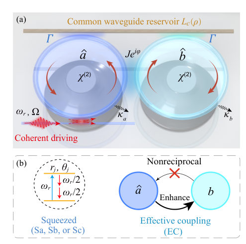
<figcaption class="paper-figure-caption"><b>Fig 1.</b> FIG. 1: (a) Schematic of the nonreciprocal coupling model. Cavity mode a is coherently coupled to cavity mode b with strength Jeiφ, and both cavity modes are dissipatively coupled into a common reservoir at a rate Γ. (b) A coherent drive applied to the nonlinear medium generates squeezing via degenerate parametric amplifi- cation (left), which conditionally enhances the effective nonreciprocal coupling between the cavities (right).</figcaption>
</figure>
<figure class="paper-figure-card">
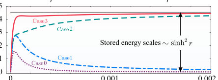
<figcaption class="paper-figure-caption"><b>Fig 2.</b> FIG. 2: (a) Evolution of the quantum battery energy for four configurations: case 0 [37] (dotted line), case 1 (dash-dotted line), case 2 (dashed line), and case 3 (solid line). (b) Average power P versus the scaled time Jt during the charging process. (c) Steady-state en- ergy enhancement factor Ei b(∞)/Eb versus the squeezing parameter r. (d) Ergotropy enhancement factor Ei b/Eb vs r in the steady state, where Eb = Eb for the case 0 with no squeezing. The symbols are the numerical results, and the curves are the analytical results. (e) Steady- state energy of the quantum battery as a function of coupling strength J. In the strong coupling regime, the stored energy scales as sinh2 r. The...</figcaption>
</figure>
<figure class="paper-figure-card">
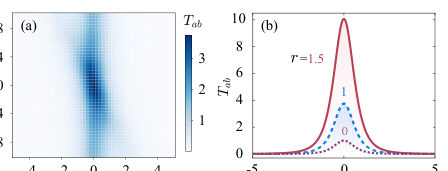
<figcaption class="paper-figure-caption"><b>Fig 3.</b> FIG. 3: (a) Transmission coefficient Tab as a function of input signal frequency ω and squeezed-cavity frequency ωs, with squeezing parameter r = 1. (b) Tab vs ω, where ωs = 0. The parameters used are κa = κb = 8 × 10−5ωb, J = Jop, and Γ = 2J.</figcaption>
</figure>

**Summary.** This paper systematically explores the role of quantum squeezing in enhancing dissipation-induced nonreciprocal effects within coupled cavity systems. By analyzing both energy storage (quantum batteries) and signal isolation (optical isolators), the authors demonstrate that squeezing can exponentially boost key performance metrics. The findings establish a powerful theoretical framework for designing advanced, nonreciprocal quantum devices.

**Why it may be interesting.** This work provides concrete, quantitative methods for engineering nonreciprocity using fundamental quantum resources like squeezing, which is highly relevant for designing next-generation quantum optical components.

Detailed structure

**Main problem.** The study investigates how quantum squeezing can be utilized to enhance nonreciprocal coupling induced by dissipation in various quantum devices.

**Main result.** Squeezing leads to an exponential enhancement of the effective nonreciprocal coupling, significantly boosting performance metrics like stored energy and output signal strength in both quantum batteries and optical isolators.

**Method.** The analysis employs master equations and Quantum Langevin Equations (QLEs) to model the time evolution of system operators under nonlinear and dissipative couplings. Expectation values are calculated across multiple squeezing configurations.

**Model / system.** The core model involves two coupled cavity modes interacting with a common reservoir, potentially incorporating $\chi^{(2)}$ nonlinearity. Applications include quantum batteries (energy storage) and optical isolators (unidirectional signal transmission).

**Key observables.** Effective Coupling (EC), Enhancement Effect (EE), stored energy ($E_b$), ergotropy ($\mathcal{E}_b$), and the output transmission coefficient ($T_{ab}$).

**Important parameters / regimes.** Squeezing parameter ($r$), coupling strength ($J$), detuning ($\omega_s$), and cavity decay rates ($\kappa, \Gamma$).

**Assumptions / limitations.** The analysis assumes applying a broad-band squeezed-vacuum field to manage noise, and often simplifies dynamics by setting certain frequency parameters (e.g., $\omega_s = 0$ in some battery contexts).

**Figures summary.** Figures illustrate the energy evolution of quantum batteries under different squeezing regimes, show the enhancement factor of stored energy vs. squeezing parameter $r$, and plot the transmission coefficient spectrum for optical isolators.

**Paper structure.** The paper systematically investigates five cases of squeezing application in a coupled cavity system. It then applies this framework to analyze two key physical applications: quantum batteries (analyzing energy/ergotropy) and optical isolators (analyzing transmission coefficients).

Abstract

We systematically investigate the role of squeezing in improving dissipation-induced nonreciprocal coupling mediated by a common reservoir, by incorporating a $χ^{(2)}$ nonlinearity into either the cavity mode, the reservoir, or both. Squeezing is capable of exponentially enhancing the effective coupling, but this enhancement is not universal in such a nonreciprocal interaction. Instead, it depends on the system configuration and specific parameter regimes. Specifically, the squeezing of the reservoir injects additional energy into the system via the dissipation channel, modifying the underlying dynamics in a nontrivial manner. Furthermore, we demonstrate that the proposed approach enhances the performance of the quantum battery, including stored energy, charging power, and ergotropy. We provide the corresponding analytical expressions, together with a systematic analysis of energy transport and parameter optimization. Extending the framework to optical isolation, we observe an exponentially amplified output signal. Our results open a new avenue for nonreciprocal quantum information processing and nonreciprocal quantum device design.

[↑ back to top](#top)

### [Phase distinction of Gibbs states without symmetry breaking: topological invariants of the 3D toric code](http://arxiv.org/abs/2607.00134v1)

**Authors:** Haruki Watanabe  
**Type:** theory · **Category:** statistical mechanics · **PDF:** <https://arxiv.org/pdf/2607.00134v1>  
**Analysis basis:** full PDF text, analyzed in chunks
**Topic relevance:** `analog quantum simulation` **3/5** · `entanglement & information structure` **3/5** · `methods for driven-dissipative` **3/5** · `driven-dissipative phase transition` **2/5** · `Keldysh / 2PI / non-Gaussian methods` **1/5** · `correlated / nonlocal dissipation` **1/5** · `exotic spin models in light-matter` **1/5** · `non-equilibrium dynamics` **1/5** · `non-equilibrium universality` **1/5**

↔ Scroll figures horizontally

<figure class="paper-figure-card">
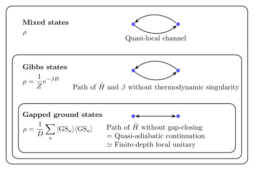
<figcaption class="paper-figure-caption"><b>Fig 1.</b> FIG. 1. The three tiers of states and their phase-equivalence relations. Pure gapped ground states (bottom) are classified by finite-depth local unitaries—equivalently, quasi-adiabatic continuation along a path of local Hamiltonians with no gap closing [15, 16]. General mixed states (top) are classified by two-way quasi-local channels [17–19]. The intermediate Gibbs tier is classified by a path of local Hamiltonians with no ther- modynamic singularity.</figcaption>
</figure>
<figure class="paper-figure-card">
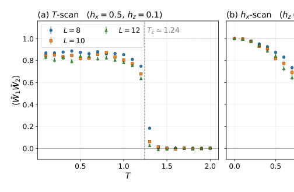
<figcaption class="paper-figure-caption"><b>Fig 2.</b> FIG. 2. The σz Wilson-loop two-point correlator ⟨¯ W1 ¯ W2⟩= ⟨Q</figcaption>
</figure>
<figure class="paper-figure-card">

<figcaption class="paper-figure-caption"><b>Fig 3.</b> FIG. 3. Electric (σz-basis) Fredenhagen–Marcu string order parameter ρFM on the three orthogonal cuts through (hx, hz, T) = (0.5, 0.1, 0.5) (512 seeds/point, per-seed median, L = 8–16): (a) T-scan (hx = 0.5, hz = 0.1), (b) hx-scan (hz = 0.1, T = 0.5), and (c) hz-scan (hx = 0.5, T = 0.5). Across the thermal transition at Tc ≃1.24 (a) and the magnetic transition at hx c ≃1 (b), ρFM stays flat (to ±0.02) at all sizes; it rises continuously from 0 to a positive constant only on the electric (hz) cut (c), with onset near the zero-temperature critical value hz c ≃0.194.</figcaption>
</figure>
<figure class="paper-figure-card">

<figcaption class="paper-figure-caption"><b>Fig 4.</b> FIG. 4. Bulk thermodynamic response on the three coordinate planes (L = 8, 64 seeds). Top row, the electric susceptibility χzz: (a) the (hx, T) plane at hz = 0, (b) the (hz, T) plane at hx = 0, and (c) the (hx, hz) plane at T = 0.2. Bottom row, the specific heat Cv on the same three planes: (d), (e), and (f), respectively. Lime lines mark the Reiss–Schmidt zero-temperature critical fields hx c = 1, hz c = 0.194 and the duality-derived T (0,0) c ≈1.3133.</figcaption>
</figure>
<figure class="paper-figure-card">
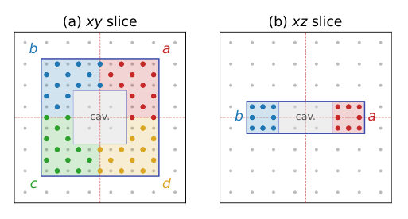
<figcaption class="paper-figure-caption"><b>Fig 5.</b> FIG. 5. Four-quadrant partition a, b, c, d of the annular Levin–Wen shell at L = 8, shown in (a) an xy slice (z ∈[3, 4]) and (b) an xz slice (y ∈[3, 4]); z is the shell’s symmetry axis and “cav.” marks the central cavity. The Levin–Wen regions A1, . . . , A4 are built from these quadrants (see text).</figcaption>
</figure>

**Summary.** This research tackles the challenge of identifying robust topological phase transitions at non-zero temperatures without relying on symmetry breaking. By introducing the decoded Wilson-loop correlation $f_W$, the authors provide a new, quasi-local-channel invariant diagnostic that successfully maps out the full phase diagram of the 3D toric code. This work advances our understanding of how topological order persists and manifests in realistic, thermal quantum systems.

**Why it may be interesting.** The work provides advanced techniques for characterizing topological order in thermal equilibrium states, which is crucial for understanding quantum materials where finite temperature effects are dominant. The focus on channel-invariant diagnostics is highly relevant to open quantum systems theory.

Detailed structure

**Main problem.** The central problem is establishing robust topological invariants that can distinguish between different phases of matter at non-zero temperature ($T>0$) without relying on the spontaneous breaking of any exact symmetry.

**Main result.** The decoded Wilson-loop correlation $f_W$ was introduced as a quasi-local-channel invariant order parameter, which successfully distinguishes topological (value 1) from trivial (value 0) phases across finite temperatures and external fields.

**Method.** The study employs theoretical analysis combined with large-scale Quantum Monte Carlo simulations to probe the thermal Gibbs state ($
ho_eta$) of the system.

**Model / system.** The primary model is the three-dimensional ($	ext{3D}$) $\mathbb{Z}_2$ toric code, analyzed in its finite-temperature Gibbs state under generic magnetic fields where higher-form symmetries are explicitly broken or emergent.

**Key observables.** Topological Entanglement Entropy ($\gamma$), Decoded Wilson-loop correlation ($f_W$), and various string/loop correlators (e.g., $\langle ar{W}_1 ar{W}_2 
angle$).

**Important parameters / regimes.** Temperature ($T$), external magnetic fields $(h_x, h_z)$, and system size ($L$). The critical temperature $T_c$ is often compared to the 3D Ising model transition point.

**Assumptions / limitations.** The rigorous definition of phase equivalence for Gibbs states at $T>0$ remains an active area of research; some results rely on quasi-local channel invariance arguments.

**Figures summary.** Figures compare various diagnostics ($\gamma$, $
ho_{FM}$, correlators) across T-scans, $h_x$-scans, and $h_z$-scans, showing how different observables are sensitive to different types of phase transitions (thermal vs. magnetic vs. electric).

**Paper structure.** The paper develops by first identifying the failure points of conventional diagnostics ($\gamma$ is not channel invariant), then introducing robust invariants like $f_W$, and finally applying these tools across the full $(h_x, h_z, T)$ phase diagram to demonstrate a universal diagnostic.

Abstract

We study the finite-temperature topological order of the three-dimensional $\mathbb{Z}_2$ toric code in a generic magnetic field, where every higher-form symmetry is explicitly broken and can at most be emergent. We show perturbatively, and confirm by large-scale quantum Monte Carlo, that the topological entanglement entropy stays quantized at $γ= \ln 2$ throughout the topological phase -- at finite temperature and under the symmetry-breaking field alike -- and collapses to $0$ across the thermal transition, a quantization protected geometrically by the Bianchi identity rather than by any exact symmetry of the system. The plateau $γ= \ln 2$ is, however, not invariant under quasi-local channels: a constant-depth channel can generate this identical quantized value from a trivial product state. We therefore introduce the decoded Wilson-loop correlation $f_W$, which quantizes to $1$ in the topological phase and $0$ in the trivial phase as $L\to\infty$ and, unlike $γ$, is a quasi-local-channel invariant -- a robust topological invariant of the mixed state.

[↑ back to top](#top)

### [Twisted Gaussian Schell States in Quantum Optics: Twist-Assisted Nonclassicality and Entanglement](http://arxiv.org/abs/2607.00837v1)

**Authors:** Fabricio Toscano, G. Cañas, A. Z. Khoury, P. H. Souto Ribeiro, S. P. Walborn  
**Type:** theory · **Category:** other · **PDF:** <https://arxiv.org/pdf/2607.00837v1>  
**Analysis basis:** full PDF text, analyzed in chunks
**Topic relevance:** `entanglement & information structure` **3/5** · `interference shaping light` **3/5** · `analog quantum simulation` **2/5** · `Keldysh / 2PI / non-Gaussian methods` **1/5** · `correlated / nonlocal dissipation` **1/5** · `driven-dissipative phase transition` **1/5** · `methods for driven-dissipative` **1/5** · `non-equilibrium dynamics` **1/5**

↔ Scroll figures horizontally

<figure class="paper-figure-card">
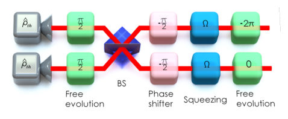
<figcaption class="paper-figure-caption"><b>Fig 1.</b> FIG. 1. Scheme to generate the TGS state from two indepen- dent thermal modes. From Eq. (8), the state is generated by the inverse transformation S−1 = O′−1S−1 d O−1 acting on the thermal input. See text for details.</figcaption>
</figure>
<figure class="paper-figure-card">

<figcaption class="paper-figure-caption"><b>Fig 2.</b> FIG. 2. Density plots of the mutual information in Eq. (38) for the joint photon distribution P(n1, n2) in Eq. (32), and marginals in (39), of a TGS state. See text for explanation.</figcaption>
</figure>
<figure class="paper-figure-card">
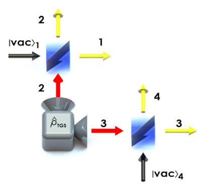
<figcaption class="paper-figure-caption"><b>Fig 3.</b> FIG. 4. Scheme to activate entanglement from the TGS state. The two-mode TGS state (modes 2 and 3) is mixed with two ancillary vacuum modes (modes 1 and 4) at balanced beam splitters. The output four-mode state Vf is separable in the 12|34 bipartition (since the beam splitters are local with re- spect to that cut) but can be entangled in the cross biparti- tions 14|23 and 13|24, depending on the values of κ, Ω, and v.</figcaption>
</figure>
<figure class="paper-figure-card">

<figcaption class="paper-figure-caption"><b>Fig 4.</b> FIG. 3. Joint photon number distribution P(n1, n2) of a TGS state at maximum correlations v = κ −1</figcaption>
</figure>
<figure class="paper-figure-card">
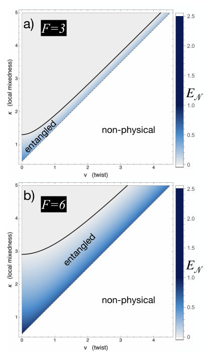
<figcaption class="paper-figure-caption"><b>Fig 5.</b> FIG. 5. Entangled regions of the (κ, v) plane of the 14|23 bipartition for a) F = 3 and b) F = 6. The dashed diagonal line is the physicality bound v = κ−1</figcaption>
</figure>

**Summary.** This paper rigorously analyzes the Twisted Gaussian Schell state, establishing it as a key system bridging classical optics and quantum information. It demonstrates that introducing a 'twist' parameter induces nonclassicality and entanglement even when the initial state is separable. The methodology uses advanced tools like Fock-basis probability calculations and logarithmic negativity to map out the resource landscape governed by this twist.

**Why it may be interesting.** This work provides a detailed theoretical framework connecting classical beam engineering concepts (like the Schell model) directly to measurable quantum resources (squeezing and entanglement) in continuous variable systems.

Detailed structure

**Main problem.** The paper introduces and analyzes the Twisted Gaussian Schell (TGS) state, a quantum-optical analog of classical beams, to study its nonclassicality and entanglement properties.

**Main result.** The TGS state can be separable yet exhibit nonclassical features like sub-shot-noise squeezing and measurable entanglement when the twist parameter is non-zero. The twist parameter acts as a resource that activates or deepens quantum correlations.

**Method.** Analysis involves calculating covariance matrices, deriving closed-form expressions for joint photon-number distributions in the Fock basis, and quantifying entanglement using logarithmic negativity across various bipartite splittings.

**Model / system.** The system is the two-mode TGS state ($\hat{
ho}_{	ext{TGS}}$), a mixed Gaussian state generated via metaplectic evolution from an initial thermal state. The analysis extends to four-mode systems by coupling modes to ancillary vacuum fields.

**Key observables.** Nonclassicality (quadrature squeezing below shot-noise limit), Entanglement (quantified by logarithmic negativity, $	ext{EN}$), Joint photon-number distribution $P(n_1, n_2)$, and Mutual Information ($I$).

**Important parameters / regimes.** Twist parameter ($v$), local squeezing ($\Omega$), and noise/mixedness ($\kappa$); physical constraints include $\kappa + v \geq 1/2$.

**Assumptions / limitations.** The analysis relies on the formal analogy between classical paraxial optics and continuous-variable (CV) quantum systems, and uses Gaussian state criteria like the PPT criterion.

**Figures summary.** Figures illustrate the generation scheme from thermal modes, density plots of mutual information for photon number distributions, and phase diagrams showing entanglement boundaries in the $(\kappa, v)$ plane.

**Paper structure.** The paper systematically defines the TGS state, analyzes its nonclassicality via quadrature variances, quantifies correlations using Fock-basis probabilities and mutual information, and finally investigates entanglement across various bipartite splittings of an extended four-mode system.

Abstract

We introduce the Twisted Gaussian Schell (TGS) state, a two-mode mixed Gaussian state defined as the quantum-optical analog of the Twisted Gaussian Schell-model beam of classical paraxial optics, characterized by the so-called twist phase. In the TGS state, the twist parameter arises when an asymmetric two-mode thermal state is subject to local squeezing after the action of phase shifters and a beam splitter. Its defining quantum feature is nonclassicality: although the state is separable in its natural bipartition, when the twist parameter is nonzero there are global quadratures that can be squeezed below the shot-noise limit. The nonclassicality has also a direct signature in the joint photon-number distribution, which we obtain in closed form. Moreover, coupling each mode to an ancillary vacuum at a balanced beam splitter yields a four-mode state with entanglement in select $2\times2$ bipartitions, with local description given by two TGS states, and all $1\times3$ bipartitions.   For fixed input squeezing, increasing the twist parameter activates entanglement where the state is otherwise separable and deepens it where already present. The classical physicality bound on the twist parameter coincides with the quantum physicality condition. These results advance the two-way bridge between classical beam engineering and quantum information.

[↑ back to top](#top)

### [In-Situ Polarimetry in Collimated Magneto-Infrared Spectroscopy System](http://arxiv.org/abs/2607.00689v1)

**Authors:** Zeping Shi, Wenbin Wu, Zhiwei Zhang, Yuhan Du, Chenyao Xu, Congming Hao, Xiangyu Jiang, Xin Chen, Guangyi Wang, Mingsen Zhou, Chunhui Pan, Wei Lu, Hao Shen, Haifeng Pan, Zhenrong Sun, Junhao Chu, Xiang Yuan  
**Type:** experiment · **Category:** other · **PDF:** <https://arxiv.org/pdf/2607.00689v1>  
**Analysis basis:** full PDF text, analyzed in chunks
**Topic relevance:** `interference shaping light` **3/5** · `quantum optics experiment` **3/5** · `spintronics-quantum-optics interface` **3/5** · `analog quantum simulation` **1/5** · `exotic spin models in light-matter` **1/5** · `quantum measurements` **1/5**

↔ Scroll figures horizontally

<figure class="paper-figure-card">
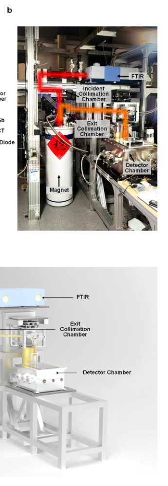
<figcaption class="paper-figure-caption"><b>Fig 1.</b> Fig. 1 Schematic plot and photos of the collimated magneto-infrared spectroscopy</figcaption>
</figure>
<figure class="paper-figure-card">
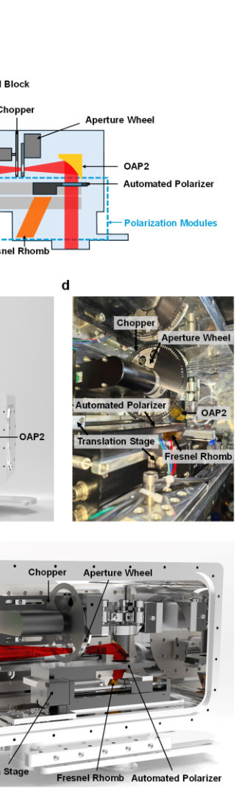
<figcaption class="paper-figure-caption"><b>Fig 2.</b> Fig. 2 Design and photo of the incident collimation chamber. This chamber performs</figcaption>
</figure>
<figure class="paper-figure-card">

<figcaption class="paper-figure-caption"><b>Fig 3.</b> Fig. 3 Design and photo of the exit collimation chamber. The signal beam emerging</figcaption>
</figure>
<figure class="paper-figure-card">

<figcaption class="paper-figure-caption"><b>Fig 4.</b> Fig. 4 The in-situ polarization module for different configurations. Schematic diagrams</figcaption>
</figure>
<figure class="paper-figure-card">
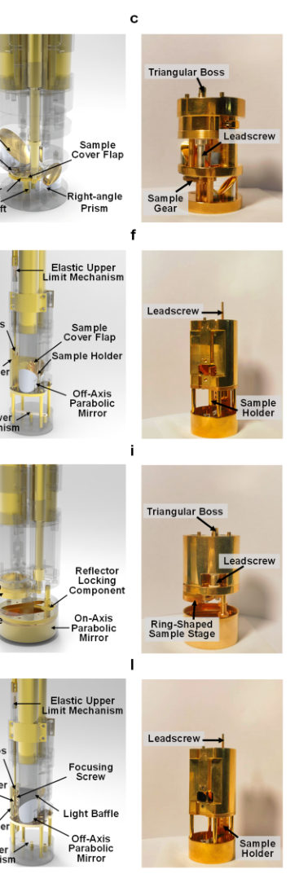
<figcaption class="paper-figure-caption"><b>Fig 5.</b> Fig. 5 Magneto-infrared focusing modules for transmission and reflection geometries.</figcaption>
</figure>

**Summary.** This paper introduces an advanced magneto-infrared spectroscopy system designed to overcome polarization degradation caused by light beam reflections in high-field environments. By implementing a collimated optical architecture and placing the polarization module outside the magnet bore, the setup achieves superior polarization fidelity and low noise floors. This platform enables sensitive, continuous measurements of magnetic field effects on material optical properties via linear and circular polarimetry.

**Why it may be interesting.** While not directly quantum information theory, this work represents a significant advancement in experimental quantum optics instrumentation. The ability to perform polarization-resolved spectroscopy *in situ* under extreme conditions (high B-field, vacuum) is crucial for probing fundamental quantum phenomena like Landau quantization and magnetic circular dichroism.

Detailed structure

**Main problem.** The primary challenge is achieving high-fidelity, continuous in-situ polarization control for magneto-infrared spectroscopy measurements performed within strong magnetic fields.

**Main result.** The authors report a novel collimated system that successfully integrates remote polarization modules and multiple interchangeable focusing optics, enabling robust polarization-resolved measurements across various geometries.

**Method.** The methodology involves redesigning the optical path using Kepler type telescopes to collimate the FTIR beam, thereby suppressing detrimental multi-wall reflections in long light tubes. Polarization control is achieved externally via automated polarizers and Fresnel rhombs.

**Model / system.** The system is a complex magneto-infrared spectroscopy platform featuring incident/exit collimation chambers, interchangeable focusing modules for Faraday/Voigt geometries (transmission/reflection), and an external polarization module operating under vacuum conditions. It operates within a superconducting magnet bore up to 50 mm.

**Key observables.** Linear polarization extinction ratio (up to 40:1), minimum root-mean-square noise ($\le 0.0033\%$), relative transmission/reflectivity spectra as a function of magnetic field and polarization angle.

**Important parameters / regimes.** Magnetic field strength (up to 12 T), sample bore size ($\sim 50 	ext{ mm}$), spectral range (broadband, VIS to FIR).

**Assumptions / limitations.** The collimation design successfully suppresses higher-order wall reflections compared to conventional direct focusing schemes. The polarization module is placed outside the high-field region to maintain functionality.

**Figures summary.** Figures detail the overall system schematic (Fig. 1), incident/exit collimation optics (Fig. 2, Fig. 3), the in-situ polarization module setup (Fig. 4), and the four interchangeable magneto-infrared focusing modules supporting various geometries (Faraday/Voigt transmission/reflection) (Fig. 5).

**Paper structure.** The paper systematically introduces the scientific need for polarization control, details the optical engineering solution (collimation architecture), describes the modular hardware implementation (polarization module and focusing optics), and finally demonstrates its capability through measurements of linear and circular polarimetry on single crystals.

Abstract

Magneto-infrared spectroscopy under strong magnetic fields provides a powerful probe of Landau quantization and field-induced collective excitations, yet its full potential has long been constrained by the lack of in-situ polarization control, because the highly divergent infrared beam propagating through narrow light tubes undergoes multiple wall reflections, leading to severe polarization degradation. Here we report a collimated magneto-infrared spectroscopy system that integrates continuous in-situ polarimetry. The system employs incident and exit collimation chambers forming a Kepler type optical architecture, which converts the large-aperture FTIR output into a low-divergence beam and strongly suppresses multi-reflection trajectories inside long gold-plated light tubes, thereby enhancing both optical throughput and polarization fidelity. A remotely controlled polarization module, consisting of an automated linear polarizer and a switchable Fresnel rhomb positioned entirely outside the high-field region, enables continuous in-situ tuning between linear, circular, and arbitrary elliptical polarization states without thermal cycling, manual realignment, or breaking vacuum. Interchangeable compact focusing modules further support Faraday and Voigt geometries in both transmission and reflection experiments within a 50 mm magnet bore, providing efficient beam focusing and signal collection while maintaining polarization fidelity. The setup achieves a minimum root-mean-square noise of 0.0033%, an average noise of 0.0082%, and a linear polarization extinction ratio up to 40:1. We demonstrate the capability through continuous in-situ linear polarimetry and broadband circular polarimetry in the magneto-infrared spectroscopy of various single crystals. This platform establishes a robust experimental framework for in-situ polarization-resolved magneto-infrared spectroscopy.

[↑ back to top](#top)

### [Tensor Network Solvers for Ultra-large Tight-binding Hamiltonians: Algorithms and Applications](http://arxiv.org/abs/2607.00991v1)

**Authors:** Tiago V. C. Antão, Anouar Moustaj, Yitao Sun, Jose L. Lado  
**Type:** theory · **Category:** numerical methods · **PDF:** <https://arxiv.org/pdf/2607.00991v1>  
**Analysis basis:** full PDF text, analyzed in chunks
**Topic relevance:** `analog quantum simulation` **3/5** · `methods for driven-dissipative` **3/5** · `non-equilibrium dynamics` **2/5** · `Keldysh / 2PI / non-Gaussian methods` **1/5** · `correlated / nonlocal dissipation` **1/5** · `driven-dissipative phase transition` **1/5** · `entanglement & information structure` **1/5**

↔ Scroll figures horizontally

<figure class="paper-figure-card">
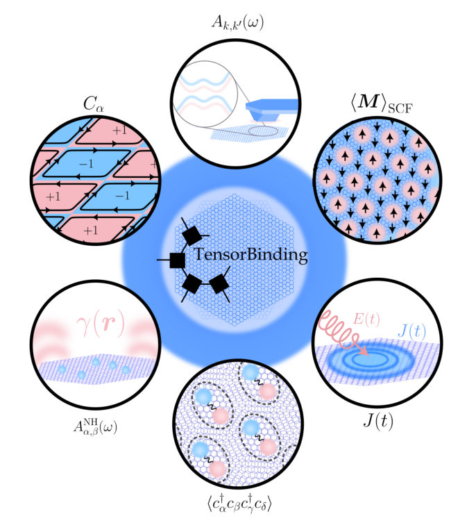
<figcaption class="paper-figure-caption"><b>Fig 1.</b> FIG. 1. Overview of the TensorBinding.jl framework and its current range of applications. The panels illustrate six classes of physical observable accessible within the framework: the momentum-resolved spectral function Ak,k′(ω) (top), the real- space Chern marker Cα revealing coexisting topological phases (left), self-consistent mean-field correlated phases, such as the magnetization ⟨M⟩SCF (right), time-dependent observables, such as the bond current J(t) under a driven electric field E(t) (bottom right), two-particle correlated states ⟨c† αcβc† γcδ⟩, such as excitons (bottom center), and non-hermitian spectral function ANH α,β for systems with modulated losses γ(r) (bottom left).</figcaption>
</figure>
<figure class="paper-figure-card">
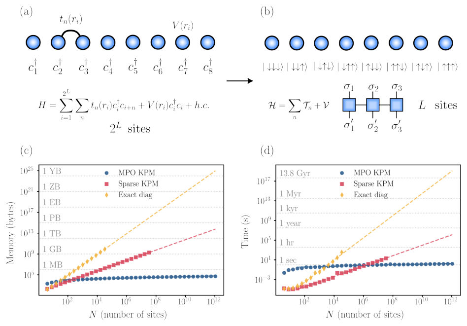
<figcaption class="paper-figure-caption"><b>Fig 2.</b> FIG. 2. Mapping and benchmarks for a 1D tight-binding chain model. (a) Tight-binding model with N = 23 = 8 sites in real space and its 23 × 23 Hamiltonian matrix with hoppings tn(ri) and on-site potential V (ri). (b) Equivalent pseudospin chain of L = log2(N) = 3 sites; spin states (σ1, σ2, σ3) index real-space sites and the Hamiltonian is encoded as a 3-core MPO. The nth neighbour hoppings are encoded as MPOs Tn and the on-site term as an MPO V (c) Memory cost of full, sparse, and MPO storage of the Hamiltonian. (d) Computation time for a local density of states via exact diagonalization, sparse-matrix KPM, and the MPO KPM implemented in TensorBinding.jl. Dahed lines are estimate, scatter...</figcaption>
</figure>
<figure class="paper-figure-card">

<figcaption class="paper-figure-caption"><b>Fig 3.</b> FIG. 3. Single-particle observables for the spatially modulated Haldane model of Eq. (11) with t2(x) = ¯t2 cos(2πx/λ). (a) Real- space Chern marker, with well-defined integer stripes reflecting alternating topological and trivial phases of period λ = Nx/2. (b) Zero-frequency LDOS, with intensity peaks localised at the domain walls between topological phases. (c) Band structure showing mini-band folding at the superlattice wavevector and a weak imprint of the gap-traversing chiral edge states. (d) Frequency-resolved LDOS in the bulk (top) and at a domain-wall edge (bottom), showing the gapped bulk spectrum and the in-gap chiral edge branch. The parameters used for these calculations are t1 =...</figcaption>
</figure>
<figure class="paper-figure-card">
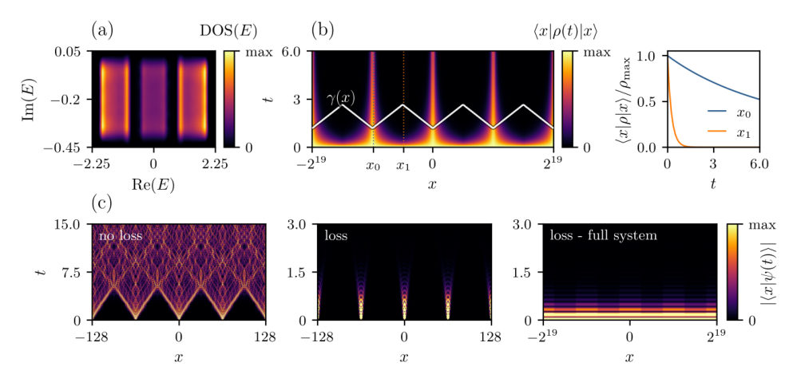
<figcaption class="paper-figure-caption"><b>Fig 4.</b> FIG. 4. Non-Hermitian observables for a 1D AAH chain with the modulated loss γ(x) following a triangular pattern under open boundary conditions. (a) Spectral weight A(Re z, Im z) in the complex energy plane from the NH KPM algorithm. (b) Space-time map of the diagonal density ⟨x|ρ(t)|x⟩evolved from the half-filled ground state via the non-Hermitian von Neumann equation (RK4), and site-density traces at the loss minimum (x0 = N/4, γ = 0) and loss maximum (x = 3N/8, γ = 2γ0). (c) Single-particle amplitude |⟨x|ψ(t)⟩| from TDVP for a comb wavepacket shown in the central region of a Hermitian chain (left) and a lossy chain (middle), zoomed in a region of width w = 256 sites, and across the full...</figcaption>
</figure>
<figure class="paper-figure-card">

<figcaption class="paper-figure-caption"><b>Fig 5.</b> FIG. 5. Mean-field Hubbard and exciton observables for spatially modulated systems. (a) Absolute mean-field Hubbard magnetization |mi|, showing stripe order induced by the modulated hopping. (b) Spin-summed mean-field spectral function A(k, ω) along the high-symmetry path, showing the reconstructed quasiparticle bands of the converged magnetic state and its correlated gap. (c) Exciton local density of states ρ(x, ω), showing bound-state spectral weight localized in energy and modulated periodically in space, with moir´e minibands as a consequence of the incommensurability of the on-site modulation V (x). (d) Total exciton density of states, separated into scattering-continuum and...</figcaption>
</figure>

**Summary.** The paper introduces an advanced tensor network framework to solve tight-binding Hamiltonians on systems of unprecedented size. By mapping large lattices onto efficient pseudospin chains, it allows routine calculation of complex observables like spectral functions and topological invariants for quantum materials at the mesoscopic scale. This methodology overcomes severe memory bottlenecks associated with simulating ultra-large quantum systems.

**Why it may be interesting.** This work provides a powerful, scalable numerical toolkit for simulating complex quantum matter phenomena (like moiré physics or correlated states) that are typically restricted to small system sizes by conventional diagonalization methods.

Detailed structure

**Main problem.** The primary challenge is simulating quantum materials on systems so large (billions of sites) that explicit matrix representations for tight-binding Hamiltonians become computationally prohibitive.

**Main result.** The authors present a unified tensor-network methodology capable of solving these ultra-large scale problems by mapping the system onto a manageable pseudospin chain, keeping memory scaling logarithmic with system size.

**Method.** They utilize Matrix Product Operators (MPO) and Tensor Network algorithms, combined with the Kernel Polynomial Method (KPM), to evaluate observables without explicit diagonalization or storage of massive matrices.

**Model / system.** The method applies to tight-binding Hamiltonians on various lattices, including moiré/super-moiré heterostructures and quasicrystals. It handles complex physics like non-Hermiticity, correlation effects (Hubbard model), and excitonic binding.

**Key observables.** Spectral functions $A(\mathbf{k}, \omega)$, real-space topological invariants (Chern marker), local density of states (LDOS), time-dependent currents, and exciton spectral weight.

**Important parameters / regimes.** System sizes up to billions of sites; bond dimension ($\chi$) remaining modest (tens) for compressible structures; Chebyshev polynomial order ($N_{	ext{cheb}}$).

**Assumptions / limitations.** The efficiency relies heavily on the tensor network compressibility inherent in the real-space structure, and spectral calculations are approximations via KPM.

**Figures summary.** Figures illustrate the mapping from large real-space lattices to 1D pseudospin chains (Fig. 2), the calculation of various observables like spectral functions and topological markers using MPO representations (Figs. 1, 6, 7, 10).

**Paper structure.** The paper systematically develops algorithms for encoding Hamiltonians ($\hat{H}$) as MPOs, then details specialized pathways to compute key quantities: spectral functions via KPM, topological invariants via position operators, and time evolution/correlations using MPO-MPO products.

Abstract

Understanding quantum materials at meso and even macroscopic scales requires tight-binding calculations on system sizes where explicit matrix representations become prohibitively costly. This represents a major bottleneck to rationalize phenomena in moiré and super-moiré heterostructures and quasicrystals. Here, we present a unified tensor-network methodology to solve tight-binding problems at exceptionally large scales, by mapping a system of $N = 2^L$ sites onto a many-body problem of $L$ pseudospin sites, which is subsequently solved with tensor network algorithms. For Hamiltonians with compressible real-space structure, the tensor network bond dimension remains modest, typically of order a few tens, independent of $N$.Tensor network representations of arbitrary hopping functions including long-range, spatially modulated, and twisted-layer couplings are built with quantics tensor cross interpolation, and all physical observables are evaluated entirely with tensor network algebra without explicit matrix storage or diagonalization. We demonstrate applications to spectral functions, momentum-space spectra via the tensor-network quantum Fourier transform, real-space topological invariants, real-time dynamics, correlation induced symmetry breaking with self-consistent mean-field calculations, non-Hermitian phenomena, and excitonic many-body physics. Our methodology enables routinely solving systems with billions of sites, by leveraging the tensor network compressibility of real-space structures, and establishing a flexible framework to study quantum matter at ultra-large length scales. The methodology is implemented in the open-source Julia package TensorBinding.jl.

[↑ back to top](#top)

### [Dependence of charge separation efficiency on the exciton-charge transfer offset and Gaussian disorder in organic solar cells](http://arxiv.org/abs/2607.00699v1)

**Authors:** Maik Schwuchow, Carsten Deibel, Angela Thränhardt  
**Type:** theory · **Category:** disordered systems and neural networks · **PDF:** <https://arxiv.org/pdf/2607.00699v1>  
**Analysis basis:** full PDF text, analyzed in chunks
**Topic relevance:** `methods for driven-dissipative` **3/5** · `non-equilibrium dynamics` **3/5** · `non-equilibrium universality` **2/5** · `Keldysh / 2PI / non-Gaussian methods` **1/5** · `correlated / nonlocal dissipation` **1/5** · `driven-dissipative phase transition` **1/5**

↔ Scroll figures horizontally

<figure class="paper-figure-card">
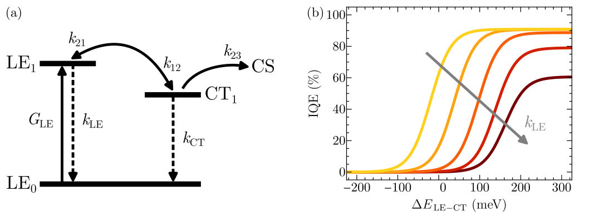
<figcaption class="paper-figure-caption"><b>Fig 1.</b> FIG. 1. (a) Jablonski diagram of the two-state rate model illustrating the local exciton (LE) and CT states as well as the transition and decay rate constants. (b) Exemplary plots of Eq. 3 for an increase of the exciton decay rate kLE of about 4 orders of magnitude. All other parameters are constant.</figcaption>
</figure>
<figure class="paper-figure-card">
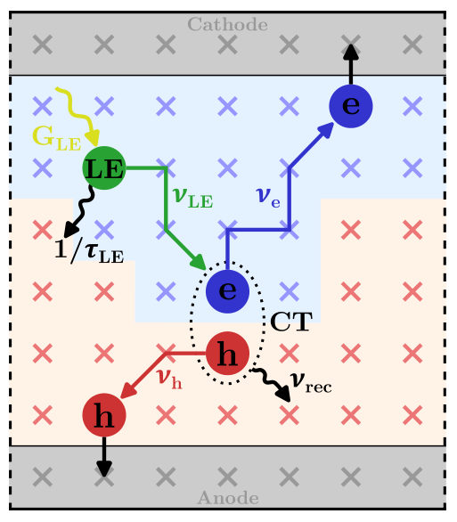
<figcaption class="paper-figure-caption"><b>Fig 2.</b> FIG. 2. Simplified 2D schematic illustrating the main aspects of charge separation in the kinetic Monte-Carlo simulation used in this work. Local exciton (LE) generation occurs with a constant rate on a simple cubic lattice of donor (red) and acceptor (blue) sites. Excitons move diffusively without disor- der effecting the exciton energy levels. In order to separate the charges, the excitons have to dissociate into a charge trans- fer (CT) state at a donor–acceptor interface. If the charge carriers can overcome their mutual Coulomb attraction and move toward their respective electrodes (grey), an extraction event can occur. Excitons and CT states may recombine to the ground state, removing...</figcaption>
</figure>
<figure class="paper-figure-card">
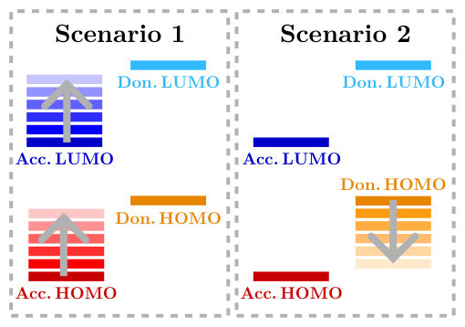
<figcaption class="paper-figure-caption"><b>Fig 3.</b> FIG. 3. Diagram illustrating the two scenarios of varying ∆ELE−CT in the simulation. Scenario 1 increases HOMO and LUMO energies of the acceptor in equal steps, keeping the donor energies constant. Scenario 2 decreases the HOMO energy of the donor, keeping the acceptor energies constant. In both cases, the energy of the CT state at a donor–acceptor interface increases (see Eq. 8). Scenario 2 also increases the donor exciton energy.</figcaption>
</figure>
<figure class="paper-figure-card">

<figcaption class="paper-figure-caption"><b>Fig 4.</b> FIG. 4. (a) kMC data on the dependence of the internal quantum efficiency (IQE) on the energetic offset of local exciton (LE) and charge-transfer state (CT) for three exciton lifetimes τLE. Solid lines and red tones represent scenario 1 (varying acceptor HOMO and LUMO), dashed lines and blue tones represent scenario 2 (varying donor HOMO) of creating the offset in the simulation (see Fig. 3). The sigmoidal shape from rate model theory is clearly visible. As the offset decreases, exciton repopulation and decay increase, which limits the IQE. The inset shows, that the data for both scenarios coincides, when a horizontal shift is applied (see text). All lines (dashed and solid) are merely guides...</figcaption>
</figure>
<figure class="paper-figure-card">
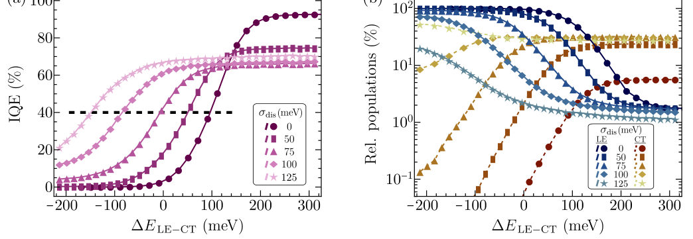
<figcaption class="paper-figure-caption"><b>Fig 5.</b> FIG. 5. (a) kMC steady-state data of the internal quantum efficiency (IQE) and (b) relative population dependence on the energetic offset between local exciton (LE) and charge transfer (CT) state ∆ELE−CT at various disorder strengths characterized by the standard deviation σdis. τLE has been set to 1 ns. In order to create the offset, scenario 1 of the energy level shift as described in the main text and Fig. 3 was used in the simulation. Introducing disorder in the classic high-offset regime reproduces the mostly detrimental trend for charge separation known in the literature (see main text), that arises from trapping and reduced carrier mobilities. Low-offset systems can greatly benefit from...</figcaption>
</figure>

**Summary.** This research analyzes charge separation efficiency in organic solar cells by comparing analytical rate models with detailed kMC simulations. It demonstrates that while large offsets are traditionally favored, introducing Gaussian energetic disorder can unexpectedly boost efficiency at low offsets. This enhancement occurs because thermalization within the disordered energy landscape generates an effective driving force for charge separation.

**Why it may be interesting.** This work models complex, non-equilibrium charge dynamics in a disordered solid-state material using advanced simulation techniques (kMC), directly addressing how local energetic disorder modifies fundamental electronic processes like exciton dissociation—a key topic in open quantum systems and condensed matter theory.

Detailed structure

**Main problem.** The study investigates how charge separation efficiency in organic solar cells depends on the energetic offset between local exciton (LE) and charge-transfer (CT) states, particularly when significant Gaussian energetic disorder is present.

**Main result.** Energetic disorder can significantly boost charge separation efficiency at intermediate and low offsets by creating an effective driving force through thermalization within the disordered density of states. The rate model successfully captures shifts in efficiency explained by state degeneracies.

**Method.** The work compares results from a macroscopic two-state rate model against detailed, microscopic three-dimensional kinetic Monte-Carlo (kMC) simulations.

**Model / system.** The system is an organic solar cell modeled on a 3D simple cubic lattice simulating donor-acceptor interfaces. The dynamics involve exciton hopping, charge hopping, and dissociation governed by the $\Delta E_{LE-CT}$ offset.

**Key observables.** Internal Quantum Efficiency (IQE), relative steady-state populations of LE and CT states, and average energy levels ($\langle 	ext{ECT} 
angle$).

**Important parameters / regimes.** Exciton-Charge Transfer Offset ($\Delta E_{LE-CT}$), Gaussian disorder strength ($\sigma_{	ext{dis}}$), and temperature ($k_B T$).

**Assumptions / limitations.** The rate model assumes constant rates and ignores triplet excitons; the kMC simulations assume a linear potential gradient (1 V built-in voltage) and focus on short-circuit conditions.

**Figures summary.** Figures illustrate IQE dependence on $\Delta E_{LE-CT}$ for different disorder strengths, showing crossover behavior. Other figures map out how average CT energy shifts with disorder strength.

**Paper structure.** The paper first establishes the rate model's agreement with kMC in the absence of disorder. It then introduces Gaussian disorder via kMC simulations to analyze the resulting crossover behavior and the mechanism by which thermalization creates an effective driving force for charge separation.

Abstract

State-of-the-art organic solar cells increasingly rely on low-offset semiconductor blends, challenging the traditional requirement of a large energetic driving force for efficient charge separation. In these systems, the energetic offset $ΔE_{\mathrm{LE-CT}}$ between local exciton (LE) and charge-transfer (CT) states approaches the thermal energy, making exciton-CT hybridization and thermal repopulation of the exciton level critical to device performance. In this work, we directly compare a macroscopic two-state rate model with three-dimensional kinetic Monte-Carlo (kMC) simulations to investigate microscopic charge separation dynamics and the role of Gaussian energetic disorder. We demonstrate that in the absence of disorder, the analytical rate model accurately reproduces kMC predictions for the whole range of $ΔE_{\mathrm{LE-CT}}$. Specifically, the macroscopic model successfully explains horizontal shifts in the internal quantum efficiency curves that arise depending on how the energetic offset is physically realized in the constituent molecules. We show that these variations can be captured entirely through the ratio of degeneracies of the LE and CT states, respectively. Introducing Gaussian energetic disorder into the kMC simulation reveals a distinct crossover behavior depending on $ΔE_{\mathrm{LE-CT}}$. While disorder is mostly detrimental at large offsets, it can significantly boost efficiency at intermediate and low offsets. Thermalization of charge carriers within the disorder-broadened density of states creates an effective driving force allowing charge separation even at zero or negative energetic offsets.

[↑ back to top](#top)

### [When AI meets quantum information: A comprehensive review](http://arxiv.org/abs/2607.00365v1)

**Authors:** Min Chen, Yu Gan, Xin Jin, Yuqing Li, Junqi Wang, Zeguan Wu, Yunfei Wang, Bingzhi Zhang, Priyam Srivastava, Tianlong Chen, Ankit Kulshrestha, Yuan Liu, Juan José Mendoza-Arenas, Kaushik P. Seshadreesan, Sarvagya Upadhyay, Xueyue Zhang, Quntao Zhuang, Junyu Liu  
**Type:** theory · **Category:** quantum information and computing · **PDF:** <https://arxiv.org/pdf/2607.00365v1>  
**Analysis basis:** full PDF text, analyzed in chunks
**Topic relevance:** `quantum measurements` **3/5** · `entanglement & information structure` **2/5** · `measurement-induced transitions` **2/5** · `Keldysh / 2PI / non-Gaussian methods` **1/5** · `correlated / nonlocal dissipation` **1/5** · `driven-dissipative phase transition` **1/5** · `methods for driven-dissipative` **1/5**

↔ Scroll figures horizontally

<figure class="paper-figure-card">
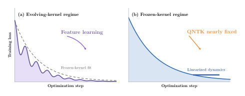
<figcaption class="paper-figure-caption"><b>Fig 1.</b> FIG. 2. Schematic loss trajectories in two QNTK regimes. Right: in the frozen-kernel regime, the QNTK remains ap- proximately constant during early training, so the loss follows the smooth decay predicted by the linearized tangent-kernel dynamics. Left: when the kernel evolves with the parameters, the training trajectory departs from the frozen-kernel picture; this weakly nonlinear regime enables representation learning and can no longer be captured by a fixed-kernel approxima- tion alone.</figcaption>
</figure>
<figure class="paper-figure-card">

<figcaption class="paper-figure-caption"><b>Fig 2.</b> FIG. 1. Schematic illustration of double descent in a kernel- learning setting. As model complexity approaches the inter- polation threshold, the test error can peak before decreasing again in a deeper interpolating regime.</figcaption>
</figure>
<figure class="paper-figure-card">

<figcaption class="paper-figure-caption"><b>Fig 3.</b> FIG. 3. Schematic overview of tensor notation and basic multilinear operations. Top left: scalars, vectors, matrices, and higher- order tensors are distinguished by the number of open indices (legs). Top right: tensor contraction sums over a shared index, generalizing matrix multiplication. Bottom left: unfolding or matricization groups tensor modes into a matrix so that standard linear algebra tools such as SVD can be applied. Bottom right: the tensor product combines two tensors by concatenating their index sets without summing over any shared mode.</figcaption>
</figure>
<figure class="paper-figure-card">

<figcaption class="paper-figure-caption"><b>Fig 4.</b> FIG. 4. Two core ideas behind tensor-network representations. Left: an order-n tensor can be factorized into a chain of low-order cores in an MPS or TT decomposition, where the physical indices remain open and the virtual bonds αk transmit correlations between neighboring cores. Right: SVD exposes the singular spectrum across a bipartition, and keeping only the largest χ singular values yields a low-rank approximation that sets the effective bond dimension and compresses the representation.</figcaption>
</figure>

**Summary.** This review comprehensively surveys the bidirectional relationship between Artificial Intelligence and Quantum Information. It details how AI can be applied to control and analyze quantum hardware, while also exploring how quantum structures—such as tensor networks—can enhance machine learning models. The paper emphasizes that future progress hinges on deeply integrating theoretical understanding with experimental realities.

**Why it may be interesting.** It provides a high-level roadmap connecting modern ML techniques (like generative models and optimization theory) directly to the fundamental challenges of quantum computation, which is crucial for theorists working on resource estimation and algorithm design.

Detailed structure

**Main problem.** The review surveys the rapidly co-evolving interface between Artificial Intelligence (AI) and Quantum Information (QI). It addresses how AI can be used to control quantum systems, and conversely, how quantum computation enhances machine learning.

**Main result.** Progress requires a tighter integration of theory, experiment, and hybrid quantum-classical systems. The review details specific methodologies for both directions of interaction.

**Method.** The paper is a comprehensive survey organizing recent progress into two main streams: AI for QI (e.g., training algorithms on noisy data) and QI for AI (e.g., using tensor networks for ML representations).

**Model / system.** The underlying physical system involves $n$-qubit quantum systems described by density operators ($
ho$) evolving under unitary or open-system dynamics. The analysis uses concepts like POVM measurements, expectation values, and parameterized quantum circuits (PQCs).

**Key observables.** Expectation values $\langle O 
angle_
ho$, measurement probabilities $p_
ho(s)$, Quantum Fisher Information Matrix (QFIM), and expected return in RL ($J(\pi)$).

**Important parameters / regimes.** The complexity scales are governed by the number of qubits ($n$), the required precision ($\epsilon$), and the structure/sparsity assumptions used for approximation.

**Assumptions / limitations.** A key assumption is that quantum information must be accessed indirectly via classical measurements. The review notes limitations when drawing analogies between classical and quantum statistical learning theory.

**Paper structure.** The paper is structured by reviewing the two primary interaction directions: AI for QI (covering tasks like algorithm discovery and hardware stabilization) and QI for AI (examining algorithmic speedups, expressivity, and tensor network representations). It concludes with cross-cutting challenges.

Abstract

Artificial intelligence (AI) and quantum information (QI) are rapidly co-evolving. AI is becoming a practical tool for learning, designing, controlling, and verifying quantum systems, while QI offers new computational models, representational structures, and learning-theoretic questions for AI. This survey reviews the interface from both directions. In the AI for QI direction, we organize recent progress around the central tasks of extracting information from limited measurements, training and discovering quantum algorithms, stabilizing noisy hardware, automating experimental and programming workflows, and extending learning-based methods to sensing and networking. In the QI for AI direction, we examine how quantum computation and quantum-inspired structures affect learning through algorithmic speedups, expressivity, trainability, generalization, neural-network design, and tensor-network representations. We close by identifying cross-cutting challenges in reproducibility, scalability, hardware realism, and co-design, arguing that progress will depend on tighter integration of theory, experiment, and hybrid quantum--classical systems.

[↑ back to top](#top)

### [Confinement in a magnetically induced WSe$_2$ quantum dots](http://arxiv.org/abs/2607.01192v1)

**Authors:** Rachid El Aitouni, Mohammed El Azar, Clarence Cortes, David Laroze, Ahmed Jellal  
**Type:** theory · **Category:** other · **PDF:** <https://arxiv.org/pdf/2607.01192v1>  
**Analysis basis:** full PDF text, analyzed in chunks
**Topic relevance:** `spintronics-quantum-optics interface` **3/5** · `Keldysh / 2PI / non-Gaussian methods` **2/5** · `driven-dissipative phase transition` **2/5** · `Kondo & dissipative impurity` **1/5** · `methods for driven-dissipative` **1/5** · `non-equilibrium dynamics` **1/5**

↔ Scroll figures horizontally

<figure class="paper-figure-card">
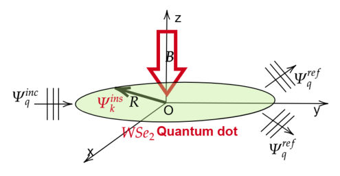
<figcaption class="paper-figure-caption"><b>Fig 1.</b> FIG. 1. Schematic of a monolayer WSe2 sheet lying in the xy- plane, subjected to a perpendicular magnetic field ⃗B = Bˆz confined to a circular region of radius R. The field is uniform inside the dot (r &lt; R) and vanishes outside (r &gt; R) in the symmetric gauge. Incident Dirac waves Ψinc q propagate along the x-direction, penetrate the magnetic boundary, and form standing waves Ψins k inside the dot, while reflected waves Ψref q scatter outward. The inset coordinate system shows the layer orientation with ˆz normal to the WSe2 plane.</figcaption>
</figure>
<figure class="paper-figure-card">
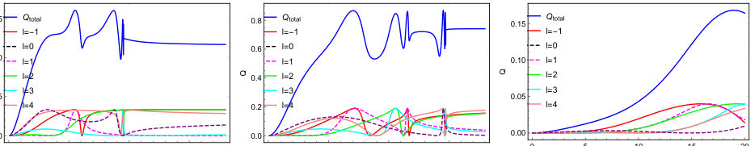
<figcaption class="paper-figure-caption"><b>Fig 2.</b> FIG. 2. (Color online) The scattering efficiency Q as a function of the magnetic field B for different values E (0.8, 1, 2 eV), for R = 50 nm with intrinsic values λc = 75 meV, λv = 112, 5 meV, ∆= 0.85 eV.</figcaption>
</figure>
<figure class="paper-figure-card">
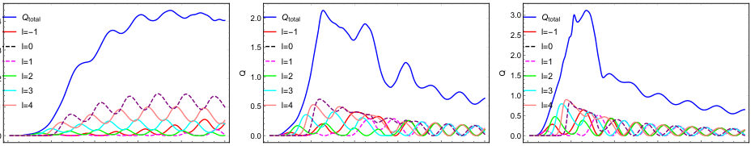
<figcaption class="paper-figure-caption"><b>Fig 3.</b> FIG. 3. (Color online) The scattering efficiency Q as a function of the radius for three values of magnetic field (B = 1, 5, 10 T), with E = 1 eV.</figcaption>
</figure>
<figure class="paper-figure-card">

<figcaption class="paper-figure-caption"><b>Fig 4.</b> FIG. 4. Density as a function of x and y for two energies: E = 0.8 eV (top row) and E = 1 eV (bottom row). The top row corresponds to magnetic fields B = 1 T, B = 5.9 T, and B = 9.26 T, while the bottom row corresponds to B = 9, B = 7.02 T, and B = 11.6 T. These configurations illustrate the resonance intensities presented in Fig. 2.</figcaption>
</figure>

**Summary.** This paper theoretically analyzes electron confinement and scattering in WSe2 quantum dots induced by localized magnetic fields. By solving the Dirac equation with complex boundary conditions, the authors show that the magnetic field suppresses tunneling and creates tunable resonant states. This establishes WSe2 as a promising platform for next-generation spintronic and valleytronic devices.

**Why it may be interesting.** This work provides a detailed theoretical framework for controlling quantum transport in 2D materials using magnetic fields, which is highly relevant to understanding engineered quantum confinement effects beyond simple particle-in-a-box models.

Detailed structure

**Main problem.** The study theoretically investigates how confining massive Dirac fermions within a quantum dot formed by a localized magnetic field affects electron transport in WSe2.

**Main result.** The localized magnetic field effectively suppresses Klein tunneling and promotes the formation of stable, tunable quasibound states, leading to sharp resonance peaks.

**Method.** The authors derived exact wave functions and scattering coefficients using advanced mathematical techniques involving Kummer's confluent hypergeometric functions and Bessel/Hankel functions.

**Model / system.** The system is monolayer WSe2, modeled by an effective Dirac Hamiltonian incorporating spin-orbit coupling. The geometry involves a circular quantum dot subjected to a perpendicular magnetic field confined within the dot region.

**Key observables.** Scattering efficiency (Q), scattering cross-section ($\sigma$), and carrier density distributions ($
ho(x, y)$).

**Important parameters / regimes.** Incident energy ($E$), magnetic field strength ($B$), and quantum dot radius ($R$).

**Assumptions / limitations.** The analysis relies on the effective Dirac Hamiltonian approach and assumes specific boundary conditions for the magnetic vector potential.

**Figures summary.** Figures illustrate scattering efficiency (Q) versus B or R, showing resonance behavior, and density probability distributions ($
ho$) confirming carrier localization patterns.

**Paper structure.** The paper establishes the physical model using the Dirac Hamiltonian, derives analytical solutions by solving coupled differential equations in polar coordinates, calculates scattering coefficients via boundary matching, and finally analyzes the dependence of transport properties on $E$, $B$, and $R$.

Abstract

Monolayer tungsten diselenide (WSe$_2$) has become a suitable platform for quantum transport and spintronics and valleytronics applications because it possesses an intrinsic band gap and strong spin-orbit coupling and spin-valley coupling features. The electrostatic confinement of Dirac fermions proves challenging in graphene because of Klein tunneling, yet WSe$_2$ provides an environment that supports both carrier localization and the development of confined quantum states. In this work, we theoretically investigate the confinement of massive Dirac fermions in a WSe$_2$ quantum dot generated by a localized magnetic field. Using the effective Dirac Hamiltonian in the presence of a magnetic flux, we derive the exact wave functions and scattering coefficients by employing Kummer's confluent hypergeometric functions together with Bessel and Hankel functions. Our results show that the localized magnetic field provides an efficient mechanism to suppress Klein tunneling and promote the formation of stable quasibound states. We systematically examine the scattering efficiency and carrier density distributions as functions of the incident energy, magnetic field strength, and quantum dot radius. We find that low-energy carriers are strongly confined by the magnetic barrier, while the interplay between magnetic localization and geometric confinement gives rise to sharp and tunable resonance peaks. These results provide valuable insight into the control of spin-valley transport in transition metal dichalcogenide nanostructures and establish a theoretical basis for the development of quantum confinement devices and quantum information technologies.

[↑ back to top](#top)

### [Hierarchy of hidden nonlocality: A genuine activation of Incompletability](http://arxiv.org/abs/2607.00797v1)

**Authors:** Soumajit Das, Shampa Mondal, Preeti Parashar, Atanu Bhunia  
**Type:** theory · **Category:** other · **PDF:** <https://arxiv.org/pdf/2607.00797v1>  
**Analysis basis:** full PDF text, analyzed in chunks
**Topic relevance:** `entanglement & information structure` **3/5** · `quantum measurements` **3/5** · `measurement-induced transitions` **2/5** · `Keldysh / 2PI / non-Gaussian methods` **1/5** · `correlated / nonlocal dissipation` **1/5**

↔ Scroll figures horizontally

<figure class="paper-figure-card">
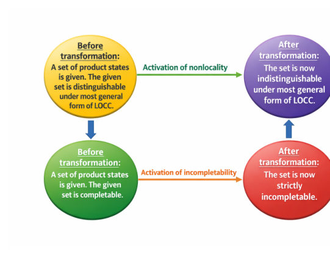
<figcaption class="paper-figure-caption"><b>Fig 1.</b> FIG. 1: Schematic illustration of the proposed transformation. A LOCC distinguishable, completable set of product state is trans- formed into a strictly incompletable, LOCC-indistinguishable set, si- multaneously activating incompletability and nonlocality.</figcaption>
</figure>
<figure class="paper-figure-card">
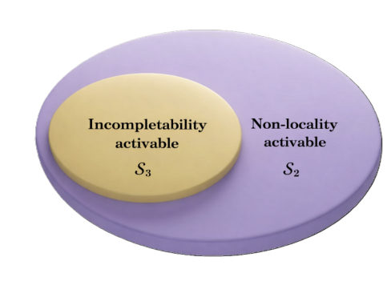
<figcaption class="paper-figure-caption"><b>Fig 2.</b> FIG. 2: Hierarchy between activation of nonlocality and activation of incompletability. Every incompletability activable set is nonlocality activable, while the converse does not hold in general.</figcaption>
</figure>

**Summary.** This work develops a rigorous framework to compare different forms of quantum correlation by introducing the concept of 'activation of incompletability.' The authors prove that this phenomenon implies nonlocality, establishing a strict hierarchy between the two. This sheds new light on how local distinguishability breaks down when considering fundamental structural properties like basis completion.

**Why it may be interesting.** It provides a deep resource-theoretic understanding of quantum correlations, linking geometric properties (completeness) to operational limitations (LOCC distinguishability) in a way that is highly relevant for characterizing genuine nonclassicality.

Detailed structure

**Main problem.** The paper investigates the operational relationship between local distinguishability, quantum incompletability, and nonlocality for sets of orthogonal quantum states.

**Main result.** It establishes a strict hierarchy: activating incompletability implies activating nonlocality, but the reverse implication fails. Furthermore, it shows that such activation can be achieved while extending the set to a basis that is no longer perfectly distinguishable by LOCC.

**Method.** The analysis uses theoretical constructions involving Local Operations and Classical Communication (LOCC) protocols applied to multipartite quantum states, defining concepts like 'activation of incompletability' via measurements.

**Model / system.** The system under study consists of sets of mutually orthogonal quantum states in tensor product Hilbert spaces ($\mathcal{H}_1 \otimes \cdots \otimes \mathcal{H}_n$), analyzed using the operational constraints of LOCC and LICC.

**Key observables.** Local distinguishability (by LOCC), Incompletability, Nonlocality, Quantum Coherence, and local redundancy.

**Important parameters / regimes.** The dimensionality of the Hilbert space ($d_1, d_2, \dots$) and the specific structure of the orthogonal state sets are crucial parameters.

**Assumptions / limitations.** The analysis is fundamentally restricted to operations achievable via LOCC or LICC, which defines the operational boundaries for distinguishability claims.

**Figures summary.** Figures schematically illustrate the hierarchy between activation phenomena (Incompleteness $\implies$ Nonlocality) and show examples of states that activate nonlocality without activating incompletability.

**Paper structure.** The paper proceeds by defining necessary concepts (OPLM, locally irreducible/indistinguishable sets), then constructing explicit counterexamples ($S_3$) to establish the hierarchy, and finally analyzing the implications within the LICC framework concerning coherence.

Abstract

Quantum nonlocality admits several operational manifestations, one of which emerges from sets of orthogonal quantum states that cannot be perfectly distinguished by local operations and classical communication (LOCC). Such sets are regarded as nonlocal because their perfect discrimination requires global measurements. In contrast, sets that are perfectly distinguishable by LOCC are generally considered locally accessible and operationally classical. In this work, we investigate the role of incompletability in local state discrimination and introduce the notion of \emph{activation of incompletability}. Specifically, we demonstrate the existence of orthogonal sets that are initially perfectly distinguishable by LOCC and free from local redundancy, but which can be transformed via LOCC into strictly incompletable sets. We prove that activation of incompletability necessarily implies activation of nonlocality, whereas the converse fails in general, thereby establishing a hierarchy between the two activation phenomena. Furthermore, within the framework of local incoherent operations and classical communication (LICC), we show that any set whose incompletability can be activated can nevertheless be extended to a complete orthonormal basis of the Hilbert space, although the resulting completed basis is no longer perfectly distinguishable by LOCC. Our results uncover a fundamental interplay among local distinguishability, incompletability, coherence, and nonlocality, and provide new insight into the structure of locally accessible quantum information.

[↑ back to top](#top)

### [Limitations of Error Model Approximations in Quantum Network Simulation](http://arxiv.org/abs/2607.00998v1)

**Authors:** Julia Freund, Jorge Miguel-Ramiro, Julius Wallnöfer, Wolfgang Dür  
**Type:** theory · **Category:** quantum information and computing · **PDF:** <https://arxiv.org/pdf/2607.00998v1>  
**Analysis basis:** full PDF text, analyzed in chunks
**Topic relevance:** `methods for driven-dissipative` **3/5** · `entanglement & information structure` **2/5** · `non-equilibrium dynamics` **2/5** · `Keldysh / 2PI / non-Gaussian methods` **1/5** · `correlated / nonlocal dissipation` **1/5** · `driven-dissipative phase transition` **1/5**

↔ Scroll figures horizontally

<figure class="paper-figure-card">
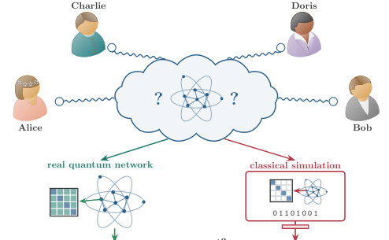
<figcaption class="paper-figure-caption"><b>Fig 1.</b> FIG. 1. A real quantum network (left) represents the true out- come of a communication task, e.g., successfully establishing a multipartite entangled state between Alice, Bob, Charlie, and Doris, while its classical simulation (right) predicts that out- come using simplified error models. Simplified assumptions on realistic noise can lead to qualitative and quantitative dis- agreement between the predicted and true outcomes in either direction.</figcaption>
</figure>
<figure class="paper-figure-card">
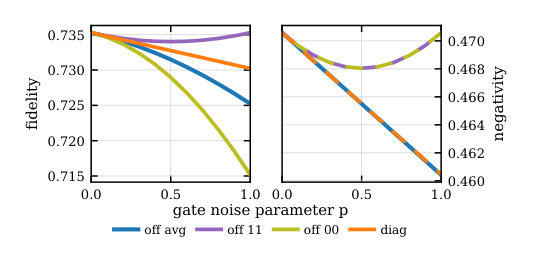
<figcaption class="paper-figure-caption"><b>Fig 2.</b> FIG. 3. Fidelity (left) and negativity (right) after one DEJMPS step on a pdep = 0.4 depolarized |Ψ0,0⟩Bell state, with initial fidelity/negativity 0.7/0.4. Operational noise is modeled as a deterministic over-rotation UY(±π/64), with opposite phases on the spatially separated qubits. Curves represent the 00 (olive) and 11 (purple) approximation noise outcomes, their average (blue), and the corresponding PTA (orange).</figcaption>
</figure>
<figure class="paper-figure-card">

<figcaption class="paper-figure-caption"><b>Fig 3.</b> FIG. 2. Settings overview: we consider |Ψ0,0⟩Bell states with initial depolarizing or amplitude damping noise (white circles). Operational noise is either an over-rotation (curved arrows) or amplitude damping noise (double downward ar- row). a) Entanglement purification: from two identical initial states, the first pair is probabilistically distilled into a less noisy state (hatched circles) by applying local unitaries, a bi- lateral CNOT between the two copies (arrow), and local Pauli Z measurements on the second copy; the distillation succeeds, and the first pair is kept, only if the measurement outcomes coincide (00 or 11). For the next EPP round, two identical copies are again assumed,...</figcaption>
</figure>
<figure class="paper-figure-card">

<figcaption class="paper-figure-caption"><b>Fig 4.</b> FIG. 4. Fidelity over DEJMPS EPP steps for an initial |Ψ0,0⟩ Bell state under depolarizing noise pdep = 0.4. Operational errors are modeled as deterministic UY(±π/64) over-rotations with opposite phases. The 00 (olive) and 11 (purple) approx- imation noise outcomes converge to slightly different values than their average (blue) and the corresponding PTA (or- ange).</figcaption>
</figure>
<figure class="paper-figure-card">
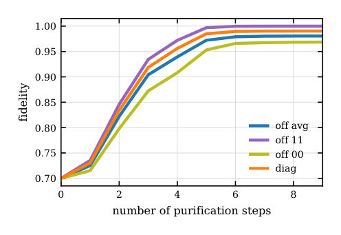
<figcaption class="paper-figure-caption"><b>Fig 5.</b> Fig. 4 shows the fidelity as a function of the number of purification steps for two trajectories of fixed measure- ment outcome, 00 (olive) or 11 (purple), their averages (blue) and the corresponding PTA (orange). We yield slightly different asymptotic fidelity results that accumu- late in the iterative application of the EPP. Of course, all combinations of measurement outcomes may occur, but we highlight only the most extreme cases. Similarly, we analyze how the DEJMPS protocol also shows differences in the amplitude damping vs. reset channel approximation scenario. In Fig. 5, we plot the fidelity results over the number of DEJMPS steps. We observe that the reset channel approximation...</figcaption>
</figure>

**Summary.** This paper demonstrates that relying on simplified error models (like Pauli twirling or reset channels) when simulating complex quantum networks leads to inaccurate predictions of protocol performance. By analyzing entanglement purification and swapping, the authors show that neglecting coherent noise contributions causes significant discrepancies between predicted and true fidelity values. This mandates rigorous validation using complete noise architectures for reliable quantum technology forecasting.

**Why it may be interesting.** It provides critical theoretical guidance on validating quantum network simulations, warning that computational shortcuts can lead to fundamentally incorrect predictions about achievable performance thresholds.

Detailed structure

**Main problem.** Simplified error models used for simulating large-scale quantum networks can lead to severe quantitative and qualitative discrepancies in predicting protocol performance.

**Main result.** Neglected error contributions, particularly coherent off-diagonal terms, cause significant under-/over-estimations and outcome-dependent fidelity oscillations when compared to rigorous noise architectures.

**Method.** The authors analyze the failure of common approximations like Pauli twirling or using reset channels by comparing results from full quantum evolution models against simplified stochastic simulations.

**Model / system.** The study focuses on quantum networks implementing protocols such as entanglement purification (DEJMPS) and entanglement swapping in repeater chains, involving noisy Bell pairs.

**Key observables.** Fidelity, Negativity, and the state evolution across multiple sequential protocol steps.

**Important parameters / regimes.** Noise parameters like depolarization probability ($p_{dep}$) and over-rotation angles ($\phi$).

**Assumptions / limitations.** The core assumption being challenged is that standard stochastic approximations (like PTA or RC) accurately capture noise accumulation in complex, coherent quantum processes.

**Figures summary.** Figures compare fidelity and negativity across multiple steps for EPP and swapping, contrasting results from individual measurement outcomes versus ensemble averages, and comparing full models against simplified diagonal/reset channel approximations.

**Paper structure.** The paper systematically analyzes the failure of noise approximations by first examining single-step protocols (EPP) to distinguish between outcome averaging and coherent effects, then extending this analysis to multi-step processes like entanglement swapping and repeater chains.

Abstract

Efficient classical simulation of large-scale quantum networks frequently relies on noise approximations, which consider a restricted set of operators to describe noisy channels and operations. In this work, we demonstrate how such simplified error models, such as Pauli twirling or reset channels, can lead to severe quantitative and qualitative discrepancies in protocol performance predictions. We analyze, in particular, how small differences can accumulate in iterative and sequential protocols such as entanglement purification, entanglement swapping, and repeater chains. Our results reveal that neglected error contributions can lead to important performance under- and over-estimations, measurement-outcome dependency, and oscillations in the fidelity, which are entirely overlooked by the simplified error model approximations. These results show that rigorous validation of complete noise architectures is indispensable for accurately predicting operational thresholds in future quantum technologies.

[↑ back to top](#top)

### [Scaling Up Thermodynamic AI Models](http://arxiv.org/abs/2607.00170v1)

**Authors:** Andrew G. Moore  
**Type:** both · **Category:** disordered systems and neural networks · **PDF:** <https://arxiv.org/pdf/2607.00170v1>  
**Analysis basis:** full PDF text, analyzed in chunks
**Topic relevance:** `methods for driven-dissipative` **3/5** · `non-equilibrium dynamics` **2/5** · `analog quantum simulation` **1/5** · `correlated / nonlocal dissipation` **1/5** · `driven-dissipative phase transition` **1/5** · `exotic spin models in light-matter` **1/5** · `non-equilibrium universality` **1/5**

↔ Scroll figures horizontally

<figure class="paper-figure-card">
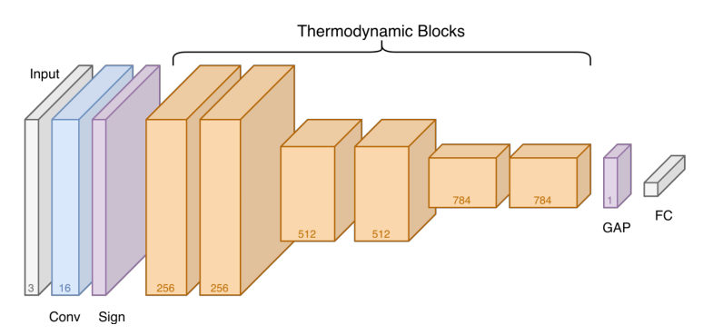
<figcaption class="paper-figure-caption"><b>Fig 1.</b> Figure 1: Our CIFAR-10 classifier. The encoder is a single classical convolution with sign activation. This is followed by six thermodynamic blocks. The classical decoder is a global average pool followed by a fully- connected linear map to the output layer. Each thermodynamic block contains three convolutional layers, as depicted in Figure 2.</figcaption>
</figure>
<figure class="paper-figure-card">
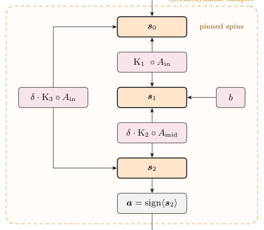
<figcaption class="paper-figure-caption"><b>Fig 2.</b> Figure 2: Architecture of a single thermodynamic block, implemented as an Ising system. It contains three layers of spins: input spins s0, hidden spins s1, and output spins s2. The input layer s0 is pinned in place. They are connected by bidirectional linear couplings, depicted in purple boxes. Couplings in an Ising system are bidirectional, but the labels indicate the forward coupling, i.e. moving downward in the diagram. The reverse couplings are the linear adjoint; for the exact relationship, see Equation (5). The hidden layer is also affected by the local magnetic fields b. Finally, an average-and-sign circuit a accumulates time-averages of s2 and outputs their signs.</figcaption>
</figure>
<figure class="paper-figure-card">

<figcaption class="paper-figure-caption"><b>Fig 3.</b> Figure 3: Empirical |z| distribution and 3-component Gaussian mixture fit for the first block of our CIFAR- 10 model.</figcaption>
</figure>
<figure class="paper-figure-card">
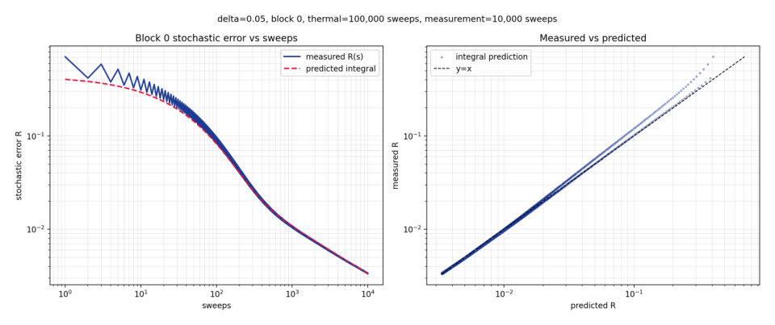
<figcaption class="paper-figure-caption"><b>Fig 4.</b> Figure 4: Measured stochastic error rate compared against numerically evaluated integral for the first block of our CIFAR-10 model. The fit is very close, but the integral does not capture the period-two oscillation caused by the chromatic Gibbs sampling.</figcaption>
</figure>
<figure class="paper-figure-card">
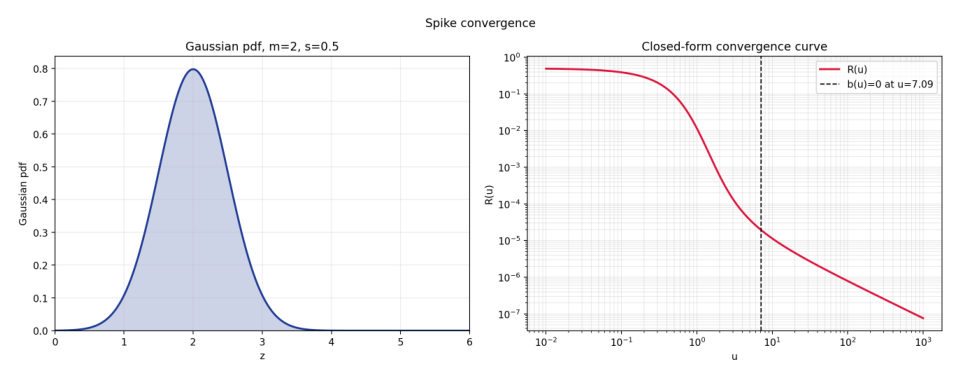
<figcaption class="paper-figure-caption"><b>Fig 5.</b> Figure 5: Theoretical convergence rate for a single Gaussian spike away from z = 0, with time of transition to power-law convergence visualized.</figcaption>
</figure>

**Summary.** The paper presents a novel framework to train deep neural networks for inference on Ising machine hardware by treating the network as a sequence of thermodynamic blocks. It introduces 'Gibbs regularization' within a backpropagation scheme, allowing high accuracy while keeping computational cost manageable through careful control of sampling parameters.

**Why it may be interesting.** This work bridges statistical mechanics (Ising models, Gibbs sampling) directly into practical AI engineering, providing a concrete roadmap for realizing energy-efficient neuromorphic computing using principles from non-equilibrium statistical physics.

Detailed structure

**Main problem.** Developing scalable methods for training large Artificial Intelligence (AI) models to run inference on low-power thermodynamic computing hardware based on the Ising model.

**Main result.** The authors developed a purely backpropagation-based algorithm using Gibbs regularization that successfully trains deep convolutional networks, achieving high accuracy while demonstrating that inference cost is bounded by a controllable tradeoff with performance.

**Method.** Training involves a multi-phase process combining standard loss functions (CE) with specialized fixed-point and magnitude regularizers to stabilize the network weights for operation within stochastic Ising dynamics. Inference relies on time-averaging output spins via Gibbs sampling.

**Model / system.** The system is based on deep convolutional networks implemented as sequential 'thermodynamic blocks' operating on an Ising model Hamiltonian. The core computation uses high-temperature Gibbs sampling rather than ground-state annealing.

**Key observables.** Accuracy (e.g., 94.9% on CIFAR-10), Inference Cost, Integrated Autocorrelation Time ($	au_{	ext{int}}$), and the percentage of FLOPs offloaded to Ising hardware.

**Important parameters / regimes.** Temperature gradient parameter ($\delta$), total number of sweeps ($G$), and various loss weighting parameters ($\alpha, \lambda_{	ext{FP}}, \lambda_{	ext{mag}}$).

**Assumptions / limitations.** The approach assumes that the time-averaged behavior of high-temperature Gibbs-sampled Ising systems can accurately emulate feed-forward neural inference. The theoretical analysis relies on linearizing dynamics around mean-field approximations.

**Figures summary.** Figures illustrate the overall classifier structure (Encoder $	o$ Blocks $	o$ Decoder) and detail the internal architecture of a single thermodynamic block as an Ising system with input, hidden, and output spins.

**Paper structure.** The paper progresses from establishing the theoretical correspondence between neural networks and Ising systems to developing the scalable backpropagation training algorithm via Gibbs regularization. It then analyzes error sources (related to $G$ and $\delta$) and concludes by discussing hardware implications for convolutional topologies.

Abstract

Thermodynamic computing devices based on the Ising model show great promise for low-power AI inference and edge computing, but scalable methods for training large models for such hardware remain limited. Prior theory shows that the time-averaged behavior of high-temperature Gibbs-sampled Ising systems can implement feed-forward neural inference. We turn this theoretical correspondence into a scalable and purely backpropagation-based algorithm for training deep convolutional networks for thermodynamic inference on Ising machine hardware. Our image classification models achieve accuracies of 94.9% on CIFAR-10 and 76.0% on CIFAR-100 under binary Gibbs sampling. We then develop and experimentally validate a mathematical theory relating inference cost to accuracy and controlling autocorrelation times. Subsequently, we calculate asymptotic results showing that inference cost is bounded by a well-controlled tradeoff with performance and exhibit algorithms for computing optimal inference schedules. Finally, we discuss implications for hardware development and the future of high-temperature thermodynamic AI models.

[↑ back to top](#top)

### [Single-cell-level distributions and relationships can differentiate cell-division and growth models](http://arxiv.org/abs/2607.00467v1)

**Authors:** Vikas, Rahul Marathe, Anjan Roy  
**Type:** theory · **Category:** statistical mechanics · **PDF:** <https://arxiv.org/pdf/2607.00467v1>  
**Analysis basis:** full PDF text, analyzed in chunks
**Topic relevance:** `methods for driven-dissipative` **3/5** · `non-equilibrium dynamics` **3/5** · `non-equilibrium universality` **2/5** · `Keldysh / 2PI / non-Gaussian methods` **1/5** · `driven-dissipative phase transition` **1/5**

↔ Scroll figures horizontally

<figure class="paper-figure-card">

<figcaption class="paper-figure-caption"><b>Fig 1.</b> FIG. 1. Artistic representations of various cell-division models: Timer, Sizer, and Adder. The insets represent the graphs of birth-size of a random cell (versus time) tracked for many generations that follows a particular cell-division model under exponential growth, with stochasticity in the rule of cell-division, growth rate, and partitioning fraction. Here, for simplicity, the distributions for the free parameters are taken to be Gaussian. The mean division-time is taken to be 1 hour for the Timer model, mean division-size is taken to be 2µm for the Sizer model, and mean division-added-size is taken to be 1µm for the Adder model. Mean exponential growth rate is taken to be ln(2) per...</figcaption>
</figure>
<figure class="paper-figure-card">

<figcaption class="paper-figure-caption"><b>Fig 2.</b> FIG. 2. Various experimental single-cell-level distributions (obtained from the single-cell experimental data for E. coli (25◦C) [46]) compared with their analytical results – (A) Birth-size distribution, (B) Division-size distribution, (C) Division-added- size distribution, and (D) Division-time distribution, assuming a specific cell-division model (Sizer or Adder) and specific single-cell growth paradigm (linear or exponential). The three free-parameter distributions, namely the principal distribution (Ξ(sd) for the Sizer and Ω(∆d) for the Adder model), growth-rate distribution Λ(α), and partitioning-fraction distribution κ(β), are taken as Johnson SU fits to the corresponding...</figcaption>
</figure>
<figure class="paper-figure-card">

<figcaption class="paper-figure-caption"><b>Fig 3.</b> FIG. 3. Mean, standard deviation, and coefficient of variation (the ratio of standard deviation and mean) for various single-cell quantities plotted against each other – (A) mean birth-size versus mean division-size, (B) standard deviation of birth-size versus standard deviation of division-size, (C) mean division-added-size versus mean division-size, (D) standard deviation of division-added-size versus standard deviation of division-size, (E) mean division-time versus mean exponential growth rate, (F) coefficient of variation of division-time versus coefficient of variation of division-size. The data have been taken from previous studies [19, 20, 24, 46]. For Tanouchi et al. [46], the data...</figcaption>
</figure>
<figure class="paper-figure-card">
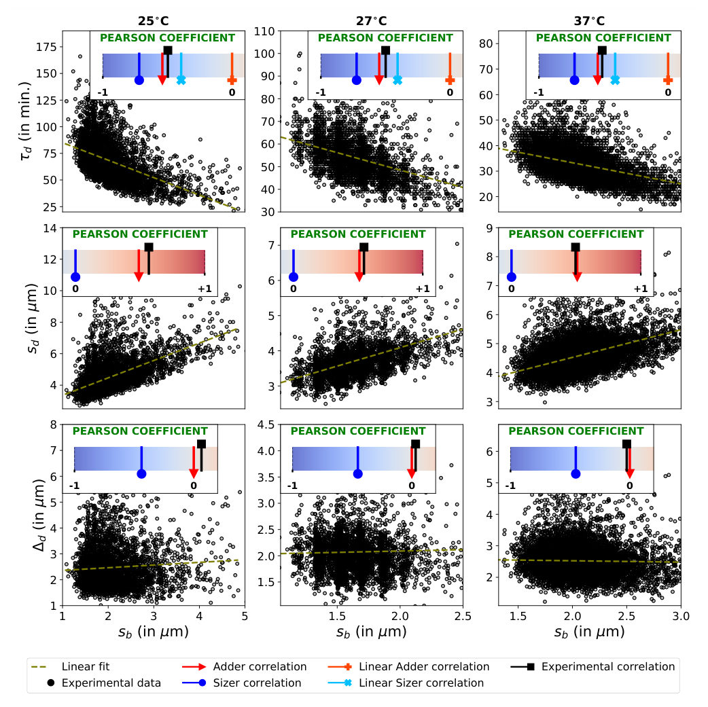
<figcaption class="paper-figure-caption"><b>Fig 4.</b> FIG. 4. Various single-cell quantities, such as τd, sd, and ∆d, plotted against sb to infer correlations of these quantities with birth-size. The experimental data have been taken from a previous study [46] for E. coli at different temperatures – 25◦C, 27◦C, and 37◦C. In the first row, τd is plotted against sb; in the second row, sd is plotted against sb; and in the third row, ∆d is plotted against sb. The first column represents these correlations at 25◦C, the second column represents the correlations at 27◦C, and the third column represents the correlations at 37◦C. The dashed line in the scatter plot represents the linear fit to the data. The insets in all of these plots compare ‘Pearson...</figcaption>
</figure>

**Summary.** This work uses single-cell measurements of bacterial growth and division (like size and time) to mathematically distinguish between competing theoretical models governing cell biology. By analyzing the full statistical relationships—including variances and correlations—the authors show that these quantitative tools can pinpoint whether a species follows an Adder, Sizer, or Timer mechanism, and whether its growth is linear or exponential.

**Why it may be interesting.** While the subject is biology, the methodology relies heavily on advanced statistical mechanics tools—deriving moment equations, analyzing non-equilibrium steady states, and using probability distributions to constrain underlying physical rules. This mathematical rigor connecting microscopic processes to macroscopic statistics is relevant.

Detailed structure

**Main problem.** The study aims to differentiate between various underlying cell-division (e.g., Timer, Sizer, Adder) and single-cell growth paradigms (linear vs. exponential) in microbial cells.

**Main result.** Analysis of statistical relationships, particularly those involving standard deviations ($\sigma$) and correlations, can successfully distinguish between the different division models and growth types.

**Method.** The authors derive analytical probability distributions and statistical moments (means, variances, covariances) for single-cell quantities based on assumed model parameters. These theoretical predictions are then compared against experimental data.

**Model / system.** The system is bacterial cell growth and division dynamics in culture. Models include Timer, Sizer, and Adder division rules, coupled with linear or exponential single-cell growth kinetics.

**Key observables.** Single-cell quantities: birth-size ($s_b$), division-size ($s_d$), division-time ($	au_d$), and division-added-size ($\Delta d$). Statistical measures include means, standard deviations, and Pearson Correlation Coefficients (P.C.C.).

**Important parameters / regimes.** Model parameters defining the distributions of size/time additions ($\Xi(s_d)$, $\Omega(\Delta d)$), growth rate distribution ($\Lambda(\alpha)$), and partitioning fraction ($\kappa(eta)$).

**Assumptions / limitations.** Key assumptions include assuming independence between certain model parameters (e.g., growth rate $\alpha$ independent of size-related quantities) and using approximations like Taylor series expansions or 'sharply spiked' distributions.

**Figures summary.** Figures compare experimental single-cell distributions and correlation coefficients against analytical predictions for various combinations of division/growth models, with the Adder model showing better agreement in several instances.

**Paper structure.** The paper progresses by first establishing that correlations are useful, then demonstrating that probability distributions alone suffice. It systematically derives theoretical relationships for means, variances, and cross-correlations ($\langle \cdot 
angle$ vs $\sigma^2$, etc.) for different model combinations before comparing these to experimental data.

Abstract

Complex interactions among regulatory molecules determine the rules underlying cell growth and division in microbial cells. While the governing molecular network may not always be obvious, it is well known that correlations among certain physiological quantities measured in experiments, such as birth-size, division-size, division-time, and division-added-size, can differentiate among various cell-division models, such as Timer, Sizer, and Adder. Here we show that, apart from these correlations, which we extend for the case of stochastic single-cell growth and stochastic asymmetric partitioning, probability distributions of these quantities and statistical relationships between them can also be used to differentiate between these division models. Interestingly, we show that these quantities can not only differentiate the division models, but also distinguish among the single-cell growth paradigms, such as linear and exponential growth. We then demonstrate this differentiability among various division and growth models by comparing our analytical results with published experimental data. We further show that these results remain valid even when the growth rate of a cell is correlated with the growth rate of cells from previous generations in the lineage.

[↑ back to top](#top)

### [Universal Short-Imaginary-Time Quantum Critical Dynamics Near Boundaries](http://arxiv.org/abs/2607.01076v1)

**Authors:** Yu-Rong Shu, Yuan-Biao Li, Shuai Yin  
**Type:** theory · **Category:** statistical mechanics · **PDF:** <https://arxiv.org/pdf/2607.01076v1>  
**Analysis basis:** full PDF text, analyzed in chunks
**Topic relevance:** `non-equilibrium universality` **3/5** · `non-equilibrium dynamics` **2/5** · `Keldysh / 2PI / non-Gaussian methods` **1/5** · `analog quantum simulation` **1/5** · `correlated / nonlocal dissipation` **1/5** · `driven-dissipative phase transition` **1/5** · `methods for driven-dissipative` **1/5**

↔ Scroll figures horizontally

<figure class="paper-figure-card">

<figcaption class="paper-figure-caption"><b>Fig 1.</b> FIG. 1. Dynamics of the boundary order parameter 𝑀𝑠from the ordered initial state. (a) and (b): Evolution of 𝑀before and after rescaling for the ordinary transition. (c) and (d): Evolution of 𝑀be- fore and after rescaling for the special transition. The solid lines indi- cate power-law decay with the exponent 𝛽1/𝜈𝑧= 1.2704 and 0.3535 for the ordinary and special transition, respectively. Log-log scale is used in all plots.</figcaption>
</figure>
<figure class="paper-figure-card">
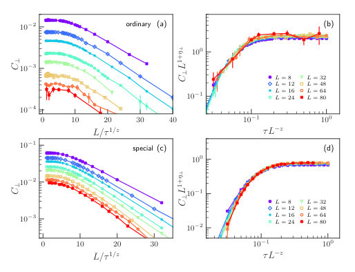
<figcaption class="paper-figure-caption"><b>Fig 2.</b> FIG. 2. Dynamics of the transverse correlation 𝐶⊥from the dis- ordered initial state. (a): Dependence of 𝐶⊥on 𝐿/𝜏1/𝑧for the ordi- nary transition with 𝜂⊥= 1.7887. (b): Finite-size rescaling collapse of the data in (a). (c): Same as (a), but for the special transition, 𝜂⊥= 0.8718. (d): Finite-size rescaling collapse of the data in (c). Semi-log scale is used in (a), (c), while (b), (d) use log-log scale. The straight lines in (a) and (c) indicate exponential dependence.</figcaption>
</figure>
<figure class="paper-figure-card">

<figcaption class="paper-figure-caption"><b>Fig 3.</b> FIG. 4. Dynamics of the boundary autocorrelation 𝐴𝑠from the disordered initial state. (a): Imaginary-time evolution of 𝐴𝑠for the ordinary transition. (b): Finite-size rescaling collapse of the data in (a). (c): Same as (a), but for the special transition. (d): Finite-size rescaling collapse of the data in (c). The solid lines indicate power- law decay with the exponent 𝜃1 −𝑑/𝑧, with 𝜃1 = −1.295 and 0.539 for the ordinary and special transition, respectively. Log-log scale is used in all plots.</figcaption>
</figure>
<figure class="paper-figure-card">

<figcaption class="paper-figure-caption"><b>Fig 4.</b> FIG. 3. Dynamics of the longitudinal correlation 𝐶∥near the boundary from the disordered initial state. (a): Dependence of 𝐶∥ on 𝐿/𝜏1/𝑧for the ordinary transition with 𝜂∥= 2.5408. (b): Finite- size rescaling collapse of the data in (a). (c): Same as (a), but for the special transition 𝜂∥= 0.7070. (d): Finite-size rescaling collapse of the data in (c). Semi-log scale is used in (a), (c), while (b), (d) use log-log scale. The straight lines in (a) and (c) indicate exponential dependence.</figcaption>
</figure>

**Summary.** This paper develops a scaling theory to characterize how quantum critical dynamics near physical boundaries differ from bulk behavior. Using the 2D quantum Ising model, the authors derive distinct power-law decay exponents ($	heta_1, 	heta'_1$) for boundary correlations depending on the specific boundary universality class. This work offers new insights into boundary criticality and its implications beyond standard quantum-classical mappings.

**Why it may be interesting.** The findings provide a detailed, quantitative framework for understanding how spatial boundaries fundamentally alter the dynamics of quantum phase transitions, which is crucial for modeling confined or patterned quantum materials.

Detailed structure

**Main problem.** The study investigates universal short-imaginary-time quantum critical dynamics occurring near boundaries, recognizing that boundary effects modify standard bulk critical scaling behaviors.

**Main result.** The paper establishes distinct scaling laws for boundary order parameter decay and correlation functions depending on the boundary universality class (ordinary vs. special), showing that key exponents do not follow conventional quantum-classical mappings.

**Method.** A universal scaling theory is developed, extending the Short-Distance Expansion (SDE) to analyze power-law decays of various correlation functions in imaginary time ($	au$).

**Model / system.** The primary model studied is the two-dimensional (2D) quantum Ising model on a square lattice with mixed boundary conditions (periodic in one direction, open/boundary along another). The Hamiltonian includes transverse field and nearest-neighbor interactions.

**Key observables.** Boundary order parameter ($M_s$), autocorrelation functions ($A_s$), and two-time correlation functions ($P_s, G_s$).

**Important parameters / regimes.** The analysis distinguishes between 'ordinary' and 'special' boundary universality classes, characterized by different critical exponents ($eta_1$, $	heta_1$, $	heta'_1$).

**Assumptions / limitations.** The work relies on developing and verifying scaling forms derived from extending the SDE to quantum short-imaginary-time dynamics.

**Figures summary.** Figures illustrate data collapse for various correlation functions ($M, A, P, G$) in both bulk and boundary regimes, confirming predicted power-law scaling laws for different transition types.

**Paper structure.** The paper develops a general scaling theory, applies it to the 2D quantum Ising model using QMC simulations, derives specific exponents ($	heta_1, 	heta'_1$), and verifies these results by analyzing multiple correlation functions ($A, P, G$) across different boundary universality classes.

Abstract

While imaginary-time evolution has long served as a standard paradigm for ground-state preparation in numerical simulations and quantum devices, its intrinsic dynamical properties has been largely overlooked. Here, we investigate the short-imaginary-time critical dynamics in quantum systems with boundaries. A universal scaling theory is developed and verified in the two-dimensional quantum Ising model, uncovering rich dynamic critical behaviors dictated by boundary universality classes. For ordered initial states, the boundary order parameter $M_s$ decays with imaginary time $τ$ as $M_s \propto τ^{-β_1/νz}$, where $β_1$ denotes the boundary order parameter exponent, and $ν$ and $z$ correspond to the correlation length exponent and the dynamic exponent, respectively. For disordered initial states, the autocorrelation of the boundary order parameter is governed by a novel critical exponent $θ_1$, which is closely related to the critical initial slip behavior of $M_s$ characterized by the corresponding exponent $θ_1'$. In contrast to its positive bulk counterpart, the boundary initial-slip exponent $θ_1'$ is negative for the ordinary transition while remaining positive for the special transition. Although the static universality classes of $d$-dimensional quantum phase transitions generally coincide with those of $(d+1)$-dimensional classical phase transitions, we show that $θ_1$ does not follow this conventional quantum-classical mapping. We further discuss the implications of our results for more exotic forms of boundary criticality. Our findings provide new physical insights into boundary critical dynamics and offer a novel route for probing exotic boundary critical behaviors in quantum many-body systems.

[↑ back to top](#top)

### [Power-Law Relaxation of Non-Gaussian Parameter and Self-Dynamic Structure Factor in Multidimensional Rugged Energy Landscapes](http://arxiv.org/abs/2607.00767v1)

**Authors:** Bimman Bagchi  
**Type:** theory · **Category:** statistical mechanics · **PDF:** <https://arxiv.org/pdf/2607.00767v1>  
**Analysis basis:** full PDF text, analyzed in chunks
**Topic relevance:** `non-equilibrium dynamics` **3/5** · `non-equilibrium universality` **2/5** · `Keldysh / 2PI / non-Gaussian methods` **1/5** · `correlated / nonlocal dissipation` **1/5** · `driven-dissipative phase transition` **1/5** · `methods for driven-dissipative` **1/5**

↔ Scroll figures horizontally

<figure class="paper-figure-card">

<figcaption class="paper-figure-caption"><b>Fig 1.</b> Figure 1: One-dimensional analytical prediction for the non-Gaussian parameter α2(t) in the uncorrelated BBSB rugged landscape model. [14] The dimensionless time is D0t/b2, and the ruggedness values are ϵ = 0.2, 0.5, 1.0, 2.0. (A) Raw α2(t) on ordinary axes. (B) Raw α2(t) on log–log axes, showing comparison with the asymptotic one-dimensional t−1/2 decay. (C) Normalized non-Gaussian parameter α2(t)/α2(0+), emphasizing the relaxation of mobility memory.</figcaption>
</figure>

**Summary.** This theoretical work develops a rigorous framework to study diffusion on rugged energy landscapes by analyzing the time evolution of higher moments, particularly the non-Gaussian parameter. It establishes that this relaxation exhibits distinct power-law scaling depending on dimensionality ($d$), providing a sensitive diagnostic tool beyond simple effective diffusion coefficients.

**Why it may be interesting.** The explicit derivation of dimension-dependent power laws for non-Gaussian relaxation, going beyond simple mean-square displacement analysis, provides a powerful diagnostic tool for characterizing disorder effects in complex systems relevant to quantum dynamics and transport.

Detailed structure

**Main problem.** The research aims to characterize finite-time diffusion dynamics, specifically focusing on the power-law relaxation of non-Gaussian parameters ($\alpha_2(t)$) and the self-dynamic structure factor in multidimensional rugged energy landscapes.

**Main result.** The paper predicts dimension-dependent power-law decays for $\alpha_2(t)$: $t^{-1/2}$ in 1D, $(\ln t)/t$ in 2D, and $t^{-1}$ for $d>2$, which serve as distinct signatures of mobility heterogeneity.

**Method.** The theoretical framework uses a propagator-based approach derived from the master equation, relating higher moments (like $\alpha_2(t)$) to the time correlation of the local diffusivity field via a mobility-memory approximation.

**Model / system.** The system is tagged-particle diffusion on a multidimensional lattice with quenched disorder, where hopping rates are governed by site energies following the Miller–Abrahams rule. The landscape is modeled as correlated quenched Gaussian random fields.

**Key observables.** Non-Gaussian parameter ($\alpha_2(t)$), Self-dynamic structure factor ($F_s(\mathbf{k}, t)$), Apparent diffusion coefficient ($D_{	ext{app}}(t)$).

**Important parameters / regimes.** Dimensionality ($d$), Ruggedness amplitude ($\epsilon$), Spatial correlation length ($\xi$), Initial preparation parameter ($eta_0$).

**Assumptions / limitations.** The analysis relies on the existence of a homogenized diffusive regime for long-time limits and uses approximations relating $\alpha_2(t)$ to the variance of the time-integrated local mobility.

**Figures summary.** Figures illustrate analytical predictions showing the characteristic power-law decay of $\alpha_2(	au)$ in 1D, confirming the $t^{-1/2}$ dependence based on raw data and log-log plots.

**Paper structure.** The paper builds from a general propagator formulation to derive specific results for low dimensions (e.g., 1D benchmark) before establishing the universal dimensional hierarchy ($d=1 	o t^{-1/2}$, $d=2 	o (\ln t)/t$, $d>2 	o t^{-1}$) by analyzing the self-dynamic structure factor's small-$k$ expansion.

Abstract

Ruggedness of the underlying energy landscape gives rise to heterogeneous mobility and non-Gaussian diffusion. We develop a theoretical framework for tagged-particle diffusion in multidimensional rugged energy landscapes modeled as correlated quenched Gaussian random fields. Using the self-propagator and self-dynamic structure factor, we characterize finite-time diffusion beyond the effective diffusion coefficient. We determine the effects of dimensionality, spatial correlations, and initial preparation. By introducing a coarse-grained mobility field and a mobility-memory approximation, we relate the non-Gaussian parameter to the time correlation of the mobility sampled by the particle. In the homogenized diffusive regime, the mobility correlation decays algebraically, leading to long-time relaxation of the non-Gaussian parameter as $t^{-1/2}$ in one dimension, $(\ln t)/t$ in two dimensions, and $t^{-1}$ for $d>2$, with amplitudes that depend on dimensionality and the initial ensemble. Our results show that rugged energy landscapes leave distinct signatures in the effective diffusion coefficient, self-dynamic structure factor, and relaxation of non-Gaussian fluctuations.

[↑ back to top](#top)

### [Influence of laser chirp and interferometer delay and imbalance on the performance of a time-bin BB84 quantum key distribution system](http://arxiv.org/abs/2607.00600v1)

**Authors:** Loïc Millet, Alberto Boaron, Rob Thew, Gianluca Boso  
**Type:** both · **Category:** quantum information and computing · **PDF:** <https://arxiv.org/pdf/2607.00600v1>  
**Analysis basis:** full PDF text, analyzed in chunks
**Topic relevance:** `interference shaping light` **3/5** · `quantum optics experiment` **3/5** · `QC/QI experiment` **1/5** · `quantum measurements` **1/5**

↔ Scroll figures horizontally

<figure class="paper-figure-card">

<figcaption class="paper-figure-caption"><b>Fig 1.</b> FIG. 2. Schematic of the visibility measurement setup. GS DFB: gain-switched distributed feedback laser. INT: interferometer. ODL: optical delay line. VOA: variable optical attenuator. FM: Fara- day mirror. PC: polarization controller. SNSPD: superconducting nanowire single photon detector.</figcaption>
</figure>
<figure class="paper-figure-card">
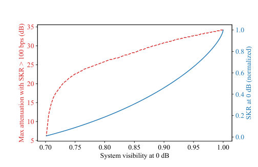
<figcaption class="paper-figure-caption"><b>Fig 2.</b> FIG. 1. Maximum attenuation achievable with a secret key rate (SKR) higher than 100 bps (red dashed line) and SKR at 0 dB nor- malized by the SKR achieved with a visibility of 1 (blue line) as a function of the system visibility at 0 dB.</figcaption>
</figure>
<figure class="paper-figure-card">

<figcaption class="paper-figure-caption"><b>Fig 3.</b> FIG. 3. (a) Experimental visibility contour plot as a function of im- balance and delay. (b) Analytically calculated visibility contour plot of an unchirped Gaussian laser pulse.</figcaption>
</figure>
<figure class="paper-figure-card">

<figcaption class="paper-figure-caption"><b>Fig 4.</b> FIG. 4. Schematic of the PROUD measurement setup using a polar- ization Mach-Zehnder interferometer. GS DFB: gain-switched dis- tributed feedback laser. PC: polarization controller. PMF: polariza- tion maintaining fiber. PBS: polarizing beam splitter.</figcaption>
</figure>
<figure class="paper-figure-card">
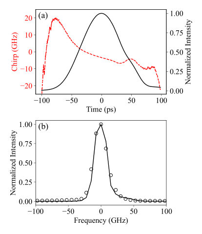
<figcaption class="paper-figure-caption"><b>Fig 5.</b> FIG. 5. (a) Measured chirp (red dashed line) and intensity (black continuous line) of the optical source. (b) Comparison between the reconstructed spectrum (black dots) and measured spectrum (black continuous line) of the optical source.</figcaption>
</figure>

**Summary.** This paper analyzes the limitations imposed by optical imperfections—specifically laser chirp, interferometer delay, and imbalance—on time-bin BB84 QKD systems. By simulating and measuring visibility degradation, the authors quantify how these factors reduce the achievable Secret Key Rate. The work is important for developing robust quantum communication hardware by providing concrete metrics for required component stabilization.

**Why it may be interesting.** This work is highly relevant as it bridges fundamental quantum optics characterization (chirp measurement) directly into the practical performance limits of a quantum communication protocol (QKD), which is crucial for building real-world quantum networks.

Detailed structure

**Main problem.** The study investigates how imperfections like interferometer delay, imbalance, and laser chirp degrade the performance of a time-bin BB84 quantum key distribution (QKD) system.

**Main result.** System visibility is highly sensitive to these parameters; specifically, laser chirp introduces significant degradation in the Secret Key Rate that must be accounted for beyond simple visibility loss calculations.

**Method.** The authors combine simulations of QKD performance with experimental measurements using advanced techniques like PROUD (ultrafast optical differentiation) to characterize the chirp.

**Model / system.** The physical system is a time-bin BB84 QKD protocol implemented using an imbalanced interferometer setup. The analysis models pulse propagation and interference visibility under varying delay, imbalance, and frequency chirp.

**Key observables.** Secret Key Rate (SKR), Interference Visibility (V), Intensity Imbalance (U), and the Chirp parameter ($\Delta\omega$ or $eta$).

**Important parameters / regimes.** System visibility ($V$), relative time delay ($	au$), intensity imbalance, and chirp coefficient ($eta$).

**Assumptions / limitations.** The analysis assumes that linear chirp is the dominant source of phase variation; discrepancies between simulated unchirped results and experimental data are used to quantify the chirp effect.

**Figures summary.** Figures illustrate SKR vs. visibility (Fig. 1), setup schematics for visibility measurement (Fig. 2) and chirp retrieval (Fig. 4), and contour plots showing visibility dependence on imbalance/delay (Fig. 3, Fig. 6).

**Paper structure.** The paper progresses by first establishing the QKD performance metric (SKR vs. V), then measuring how delay and imbalance affect V, and finally introducing chirp analysis using PROUD to quantify an additional, significant degradation factor.

Abstract

We investigate the effect of interferometer delay and imbalance on the performance of a BB84 time-bin quantum key distribution system. We simulate the impact of interference visibility on system performance and measure the visibility of a pair of interferometers as a function of their relative time delay and intensity imbalance. In addition, our analysis highlights the effect of laser chirp on system performance.

[↑ back to top](#top)

### [Exact dimer ground states of long-range spin chains and ladders](http://arxiv.org/abs/2607.01081v1)

**Authors:** Jędrzej Wardyn, Miłosz Panfil  
**Type:** theory · **Category:** strongly correlated electrons · **PDF:** <https://arxiv.org/pdf/2607.01081v1>  
**Analysis basis:** full PDF text, analyzed in chunks
**Topic relevance:** `analog quantum simulation` **3/5** · `entanglement & information structure` **2/5** · `exotic spin models in light-matter` **1/5** · `non-equilibrium dynamics` **1/5**

↔ Scroll figures horizontally

<figure class="paper-figure-card">

<figcaption class="paper-figure-caption"><b>Fig 1.</b> Figure 1: Diagram of a J1 −K1 −J2 −K2 −J3 −K3 chain given in (2). The Jn(Kn) interactions are drawn in red (blue) and the decreasing thickness signifies increase in distance n.</figcaption>
</figure>
<figure class="paper-figure-card">
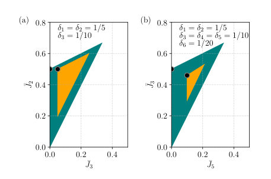
<figcaption class="paper-figure-caption"><b>Fig 2.</b> Figure 3: (a) The positivity polytope for J1–J2–J3 model: the teal region is for the spin chain (δn = 0) and the orange region for ladder with δk specified on the plot. The values are in the units of J1. The two black dots are the models with the exact dimer ground states. For the chain this is the Majumdar-Ghosh model. (b) The dimerization polytope for J1 −J5 model for chain (teal) and for ladder (yellow). The values of ¯J2 and ¯J4 are fixed by the condition (33).</figcaption>
</figure>
<figure class="paper-figure-card">
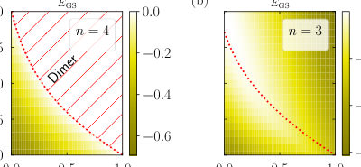
<figcaption class="paper-figure-caption"><b>Fig 3.</b> Figure 5: The ground state energy density of anisotropic LEM Hamiltonians in γy-γz plane normalised by γx. (a) For n = 4 and above the critical line, the anisotropic LEM is semi-positive definite, the ground state has zero energy, and is the dimer state. Below, the critical line the anisotropic LEM is not positive and the ground state is not anymore the exact dimer. (b) For n = 3 there is an approximate at small anisotropies dimer state we show nonexact dimer phase transition that happens below the red line, where we can see the highest scaled values of energy happen around the phase transition line. At γy/γz = 1 the model admits XXZ anisotropy, transitioning to an exact fully polarised...</figcaption>
</figure>
<figure class="paper-figure-card">
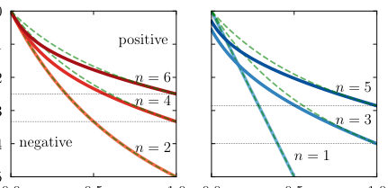
<figcaption class="paper-figure-caption"><b>Fig 4.</b> Figure 4: The critical lines for the positivity of the anisotropic Qγ operators for even (left panel) and odd (right panel ) ranges n of the couplings. The horizontal lines are the XXZ values of eq. (43). For n = 2 we have an analytical result shown as dashed green lines [40] which we compare to n &gt; 3 results from ED in (a) and (b).</figcaption>
</figure>
<figure class="paper-figure-card">
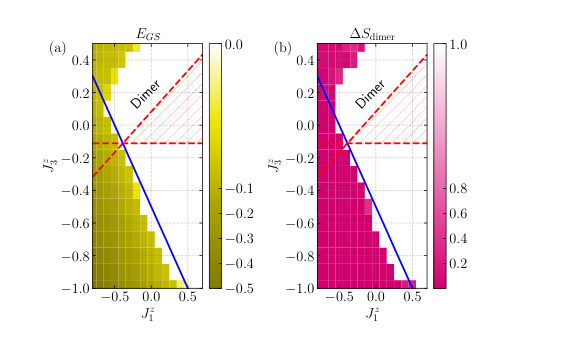
<figcaption class="paper-figure-caption"><b>Fig 5.</b> Figure 7: Phase diagram of J1 −J2 −J3 −J4 anisotropic chain shown by measurements of the ground state energy and dimer entropy done with ED for system of size L = 16 in OBC. The dimerization conditions predict the dimer phase in the hatched region bounded by dashed red lines. As in the isotropic case we see the conditions are not necessary as we find dimer phase in the whole white region. The blue line denotes phase transition to an exact FM phase.</figcaption>
</figure>

**Summary.** This paper rigorously determines the conditions under which exotic dimer states are guaranteed to be the ground state in generalized spin chains and ladders with long-range and anisotropic interactions. By combining theoretical semi-positivity arguments with numerical validation, it maps out precise phase boundaries that extend the known understanding of quantum magnetism.

**Why it may be interesting.** This work provides rigorous mathematical criteria for identifying specific quantum phases (dimerized) in complex, interacting many-body systems, which is crucial for understanding magnetic materials where long-range correlations are important.

Detailed structure

**Main problem.** The core problem is determining precise, explicit conditions on coupling constants for long-range interacting spin chains and ladders to guarantee that the exact dimer state is the ground state.

**Main result.** The authors derive sufficient conditions (e.g., involving non-negativity of auxiliary coefficients $\alpha_n$ and $eta_n$) under which the dimer state is guaranteed to be the ground state, often extending beyond previously known necessary conditions.

**Method.** The methodology combines theoretical derivation using semi-positivity arguments on the Hamiltonian ($ar{H} \ge 0$) with validation via exact diagonalization (ED) for finite systems and analysis of anisotropic quantum top models.

**Model / system.** The study focuses on spin-1/2 interacting quantum spin chains and ladders, described by generalized Hamiltonians including long-range interactions ($J_n$ and $K_n$) and anisotropy terms ($\gamma_\mu^n$).

**Key observables.** Ground state energy (EGS), Dimer entanglement entropy ($\Delta S_{	ext{dimer}}$), and the non-negativity of derived coefficients ($\alpha_n, eta_n$).

**Important parameters / regimes.** Coupling constants $\{J_n\}, \{K_n\}$, anisotropy parameters $\{\gamma_\mu^n\}$, and system size $L$ (often assumed even).

**Assumptions / limitations.** The analysis assumes the existence of a ground state characterized by semi-positivity, and some derivations rely on finite-size approximations or specific structural assumptions about coupling ranges.

**Figures summary.** Figures illustrate phase diagrams showing boundaries between Dimer, Ferromagnetic (FM), and Partially Magnetized states for both isotropic and anisotropic chains/ladders, comparing theoretical predictions with ED results.

**Paper structure.** The paper progresses from establishing general Hamiltonian forms to deriving necessary conditions via semi-positivity arguments ($\alpha_n \ge 0, eta_n \ge 0$). It then tackles the complexity of anisotropy by relating it to quantum top spectra and concludes by comparing theoretical sufficient conditions against numerical ED results on phase diagrams.

Abstract

Interacting spin chains and ladders are known to support a plethora of quantum phases with complex ground-state phase diagrams. In this work, we study a large family of such models and determine precise, explicit conditions under which an exact dimer state is guaranteed to be the ground state. These general conditions are validated for various generalizations of the Majumdar-Ghosh model using exact diagonalization. Our results provide exact reference points in the phase diagrams of a wide class of spin chains and ladders, including those with anisotropic and arbitrary-range interactions.

[↑ back to top](#top)

### [Exploiting Symmetry in Quantum Reservoir Computing](http://arxiv.org/abs/2607.01187v1)

**Authors:** Markus Baumann, Michael Poppel, Thomas Gabor, Maximilian Zorn, Claudia Linnhoff-Popien, Jonas Stein  
**Type:** both · **Category:** quantum information and computing · **PDF:** <https://arxiv.org/pdf/2607.01187v1>  
**Analysis basis:** full PDF text, analyzed in chunks
**Topic relevance:** `measurement-induced transitions` **3/5** · `quantum measurements` **2/5** · `methods for driven-dissipative` **1/5** · `non-equilibrium dynamics` **1/5**

↔ Scroll figures horizontally

<figure class="paper-figure-card">
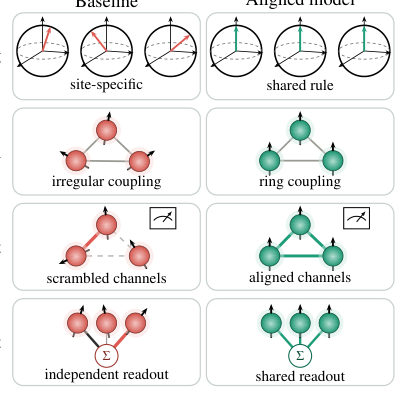
<figcaption class="paper-figure-caption"><b>Fig 1.</b> Fig. 1. Compact symmetry-placement pipeline. The baseline breaks the cyclic action across encoding, coupling, measurement, and readout; the aligned model keeps it through all four interfaces.</figcaption>
</figure>
<figure class="paper-figure-card">
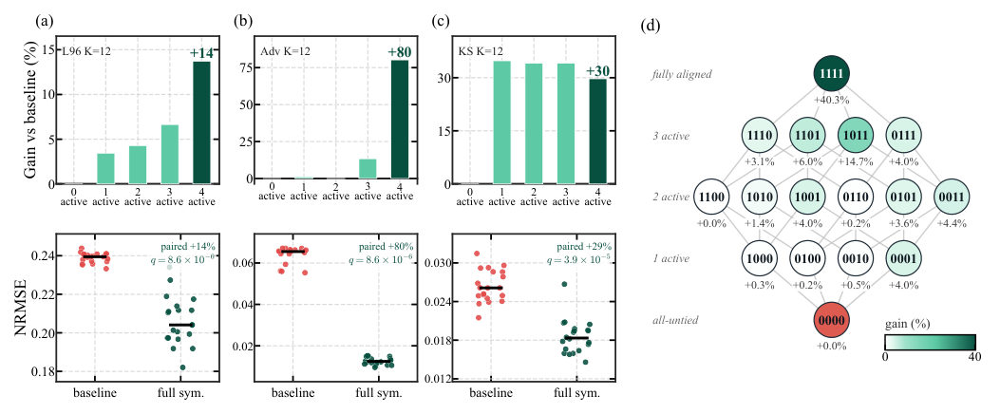
<figcaption class="paper-figure-caption"><b>Fig 2.</b> Fig. 2. Fixed-budget digital E/H/O/R audit. All configurations use the same 61 features per site, so differences come from symmetry placement rather than from a larger measurement budget. Panels (a)–(c) show representative Lorenz–96, advection, and Kuramoto–Sivashinsky settings: the bars summarize the best gain obtained when 0, 1, 2, 3, or all 4 interfaces are aligned, and the lower plots compare the all-untied baseline with the fully aligned model in paired test NRMSE. Panel (d) shows the full 16-configuration E/H/O/R lattice. Each node is one switch setting, and darker color means larger mean gain over the all-untied baseline. Aligning all four interfaces (E+H+O+R) gives the largest mean...</figcaption>
</figure>
<figure class="paper-figure-card">
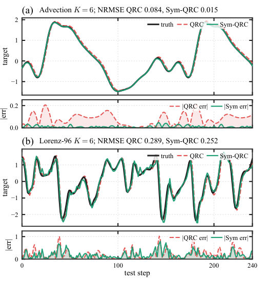
<figcaption class="paper-figure-caption"><b>Fig 3.</b> Fig. 3. Diagnostic K = 6 forecast/error zooms, not included in the main K ∈{8, 10, 12} aggregate: advection (a) and Lorenz–96 (b). NRMSE is computed on the full diagnostic traces. Sym-QRC denotes the fully aligned 1111 model; QRC denotes the all-untied 0000 baseline.</figcaption>
</figure>
<figure class="paper-figure-card">

<figcaption class="paper-figure-caption"><b>Fig 4.</b> Fig. 4. Equal-budget measurement control. E, H, and R are fixed active, so only the measurement assignment changes. Panel (a) shows that the 61-feature orbit-aligned map outperforms scrambled and random 61-feature maps. Panel (b) varies the feature budget from 4 to 61 features per site; each curve is one task/ring-size setting, showing that orbit alignment helps already at small budgets and usually improves as more channels are measured.</figcaption>
</figure>

**Summary.** This paper establishes that exploiting symmetry in Quantum Reservoir Computing (QRC) requires enforcing consistency across all computational interfaces: encoding, dynamics, measurement, and readout. By developing 'observable-orbit completion,' the authors demonstrate that aligning these four components yields significant performance boosts over models where symmetry is broken at any single point.

**Why it may be interesting.** This work provides a rigorous architectural guide for designing quantum machine learning models, showing that the physical implementation details—especially measurement design—are as critical as the underlying Hamiltonian dynamics for extracting useful information.

Detailed structure

**Main problem.** The core challenge is ensuring that symmetry present in time-series data (like cyclic patterns) is preserved and visible throughout the entire Quantum Reservoir Computing pipeline, as mere symmetry in one component is insufficient.

**Main result.** Achieving strong predictive gains requires aligning symmetry constraints across all four interfaces: input encoding, reservoir dynamics, measurement observables, and classical readout. This alignment mechanism proves crucial for successful data-driven quantum modeling.

**Method.** The authors employ a systematic 'four-interface audit' comparing fully aligned models against baseline configurations to quantify the necessity of symmetry preservation at every stage, particularly focusing on observable-orbit completion in measurements.

**Model / system.** The model is Quantum Reservoir Computing (QRC) applied to cyclic forecasting tasks on periodic rings. The dynamics involve mapping inputs through fixed quantum evolution and measuring expectation values before training a classical readout layer.

**Key observables.** Normalized Root Mean Square Error (NRMSE), percentage gain in forecasting accuracy, and the measured feature map $\Phi_M(x)$ restricted to the span of measured observables.

**Important parameters / regimes.** The number of sites on the ring ($K$), fixed feature budget (e.g., 61 features/site), and the specific symmetry group action ($\mathbb{Z}_K$).

**Assumptions / limitations.** A critical limitation is the 'measured-span obstruction': if a symmetry-carrying channel is not explicitly measured, it cannot be recovered by the classical optimization process.

**Figures summary.** Figures illustrate performance gains comparing baseline vs. fully aligned models across various tasks (e.g., Advection, L96), and tables detail the systematic audit results for the E/H/O/R switches.

**Paper structure.** The paper systematically develops the necessity of symmetry alignment by first defining the QRC framework, then introducing observable-orbit completion to enforce measurement symmetry, followed by a comprehensive factorial audit across all four interfaces (E, H, O, R), and finally validating these findings on diverse tasks including real weather data.

Abstract

Symmetry is a powerful inductive bias, but in quantum reservoir computing (QRC) it cannot be imposed only by making the reservoir symmetric. QRC maps inputs through fixed quantum dynamics into nonlinear expectation-value features and trains only a classical readout, so the relevant symmetry must be visible in the measured feature map. We study cyclic forecasting tasks, such as sensors around a turbine or weather stations along a latitude circle, where the same local pattern should be forecast by the same rule wherever it appears on the ring. Thus, rotating the input by one site should rotate, not change, the predicted field. We show that a symmetric Hamiltonian is not enough: even large Pauli measurement sets can fail if their channels do not match the data symmetry, since optimization cannot recover channels that were never measured. We address this through observable-orbit completion, which measures symmetry-related observable channels and aligns encoding, dynamics, measurement, and readout. The strongest gains arise from aligning all four interfaces together, with matched spin-ring, real-weather, and IBM hardware checks supporting the same measured-span mechanism.

[↑ back to top](#top)

### [Monte Carlo reconstruction of symmetry-twisted partition function ratios: the critical 3D Ising](http://arxiv.org/abs/2607.00106v1)

**Authors:** José Matos  
**Type:** theory · **Category:** statistical mechanics · **PDF:** <https://arxiv.org/pdf/2607.00106v1>  
**Analysis basis:** full PDF text, analyzed in chunks
**Topic relevance:** `methods for driven-dissipative` **3/5** · `Keldysh / 2PI / non-Gaussian methods` **1/5** · `driven-dissipative phase transition` **1/5** · `non-equilibrium dynamics` **1/5** · `non-equilibrium universality` **1/5**

↔ Scroll figures horizontally

<figure class="paper-figure-card">

<figcaption class="paper-figure-caption"><b>Fig 1.</b> Figure 1. Two-dimensional benchmark of the flat histogram estimator. The dimensionless differ- ence Lz∆fZ2(L, Lz) is plotted against q = L/Lz for several transverse sizes L. The dashed line is the conformal result Lz∆fZ2 →π/4 at q, Lz →∞. The black dotted curve is the exact Ising torus result from the Jacobi-theta representation of the Virasoro characters [23]. Dashed curves are cubic interpolations in q at fixed L. The gray band marks the large-q window used below, to study finite-L effects. The deviations at small Lz/large-q are the lattice and finite-volume corrections discussed in the text.</figcaption>
</figure>
<figure class="paper-figure-card">
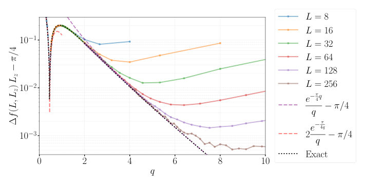
<figcaption class="paper-figure-caption"><b>Fig 2.</b> Figure 2. Finite-q corrections in the two-dimensional benchmark. The plot shows Lz∆fZ2(L, Lz)− π/4 versus q = L/Lz. The dashed curves are the leading large-q and small-q exponential approxi- mations. The exponential regime is visible only after the small-Lz lattice corrections are controlled.</figcaption>
</figure>
<figure class="paper-figure-card">
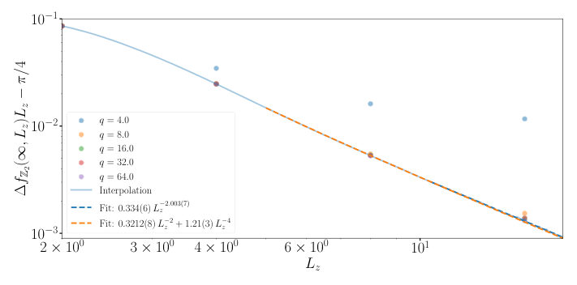
<figcaption class="paper-figure-caption"><b>Fig 3.</b> Figure 3. Large-q extrapolation at fixed Lz. For each q ∈[16, 100], the interpolation is evaluated and plotted versus Lz, as a single data set. This range makes exponential finite-q corrections negligible, as indicated by fig. 2. Raw data at aspect ratios with at least four values of Lz are also shown. The convergence from q = 4 to q = 8 and the stability at q ≳16 indicate that the interpolation is in the asymptotic regime.</figcaption>
</figure>
<figure class="paper-figure-card">

<figcaption class="paper-figure-caption"><b>Fig 4.</b> Figure 4. Raw finite-volume data for the three-dimensional slab at β = βc = 0.221654626(5). The plot shows Y (L, Lz) = L2 z∆fZ2(L, Lz) versus q = L/Lz for several transverse sizes L. Dashed curves are cubic interpolations in q at fixed L. The dashed black line is the infinite volume extrapolation. The gray band marks the large-q window used for the fixed-Lz diagnostic in fig. 5. Unlike the two dimensional case, there is no clear plateau.</figcaption>
</figure>
<figure class="paper-figure-card">
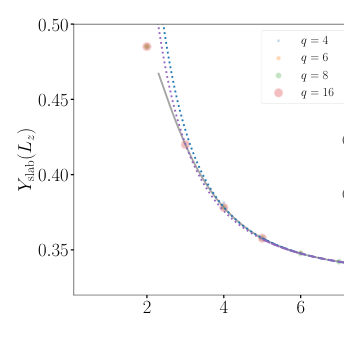
<figcaption class="paper-figure-caption"><b>Fig 5.</b> Figure 5. Large-q evaluation of the three-dimensional slab data at fixed Lz. For each Lz, the interpolation is evaluated at q = L/Lz ∈[8, 16], where finite-q corrections are not visible within the statistical precision. The values are plotted versus Lz and show the finite-Lz approach to the slab Casimir amplitude. Raw data at fixed aspect ratios with several Lz values are also shown. A free power-law fit gives an effective exponent near 2.5; the second fit includes terms proportional to L−(∆T ′−3) z , L−(∆ϵ′−3) z , and L−2 z . The uncertainties quoted in the fit labels are formal errors from the fit covariance matrix only; they do not include correlations, interpolation effects, or the...</figcaption>
</figure>

**Summary.** This work develops a powerful Monte Carlo technique to calculate free energy differences between distinct global sectors of lattice models. Applied to the 3D Ising model, it yields precise values for symmetry-twisted Casimir effects and spectral gaps by analyzing finite-size corrections in various geometric limits.

**Why it may be interesting.** While focused on classical statistical mechanics, the methodology of using complex sampling techniques (like flat histograms) to extract subtle spectral information (gaps, boundary effects) is highly relevant to modern quantum many-body simulations where direct measurement of ground state properties is difficult.

Detailed structure

**Main problem.** The primary goal is to estimate partition function ratios between distinct global sectors of a lattice theory, specifically for the critical 3D Ising model.

**Main result.** The method successfully yields the symmetry-twisted thermodynamic Casimir difference $\Delta Z_2 = 0.327(2)$ and estimates the $Z_2$-odd energy gap $\kappa_{\sigma} = 1.230(3)$.

**Method.** It employs a Monte Carlo strategy using an enlarged configuration space to sample an interpolating family of lattice systems, allowing for direct reconstruction of free energy differences via flat histogram methods.

**Model / system.** The system studied is the three-dimensional Ising model simulated on a slab geometry ($R^2 	imes S^1_{L_z}$) at its bulk critical point. The analysis compares the untwisted (periodic) sector with the $\mathbb{Z}_2$-twisted (antiperiodic) sector.

**Key observables.** Sector free energy difference ($\Delta F_{\mathbb{Z}_2}$), symmetry-twisted thermodynamic Casimir difference ($\Delta Z_2$), and spectral gap estimates ($\kappa_\sigma$).

**Important parameters / regimes.** The analysis involves extrapolations in the large-$q$ limit ($q=L/L_z 	o \infty$) and the small-$q$ limit ($q \ll 1$), as well as finite-size scaling parameters.

**Assumptions / limitations.** The method assumes the existence of a suitable interpolating family for sampling and relies on extrapolations to infinite volume and specific limits (e.g., $q	o\infty$).

**Figures summary.** Figures illustrate large-$q$ evaluations of slab data versus $L_z$, showing convergence towards $\Delta Z_2$, and stability checks for both the Casimir difference and the gap exponent $\kappa_\sigma$.

**Paper structure.** The paper details the general Monte Carlo framework using an enlarged configuration space, applies it to the 3D Ising model on a slab geometry, performs finite-size scaling analysis by extrapolating results in both large-$q$ and small-$q$ regimes, and concludes with universal values for sector differences.

Abstract

We introduce a Monte Carlo strategy for directly estimating partition function ratios between distinct global sectors of a lattice theory. It enlarges the configuration space to sample an interpolating family whose endpoints are the desired sectors, and uses flat histogram methods to reconstruct the corresponding free energy difference. Although the construction is more general, we focus here on the three-dimensional Ising model on the slab $\mathbb{R}^{2}\times S^{1}_{L_{z}}$ at the bulk critical point, comparing the untwisted periodic sector with the $\mathbb{Z}_{2}$-twisted antiperiodic sector. A large-volume and aspect ratio extrapolation gives the symmetry-twisted thermodynamic Casimir difference $Δ_{\mathbb{Z}_{2}}=0.327(2)$ directly, without lattice derivatives or bulk subtractions. This provides an independent twisted sector probe of tensions observed in periodic sector thermodynamic Casimir observables. More generally, the method gives direct but selective numerical access to CFT compactification data, including estimates of the effective thermal screening scale and the $\mathbb{Z}_{2}$-odd sector energy gap on $T^{2}$.

[↑ back to top](#top)

### [Velocity of a Quantum Particle in a Classically Forbidden Region](http://arxiv.org/abs/2607.00100v1)

**Authors:** Christian Beck, Sheldon Goldstein, Dustin Lazarovici, Roderich Tumulka, Nino Zanghi  
**Type:** theory · **Category:** other · **PDF:** <https://arxiv.org/pdf/2607.00100v1>  
**Analysis basis:** full PDF text, analyzed in chunks
**Topic relevance:** `quantum measurements` **3/5** · `measurement-induced transitions` **2/5** · `methods for driven-dissipative` **1/5** · `non-equilibrium dynamics` **1/5**

↔ Scroll figures horizontally

<figure class="paper-figure-card">
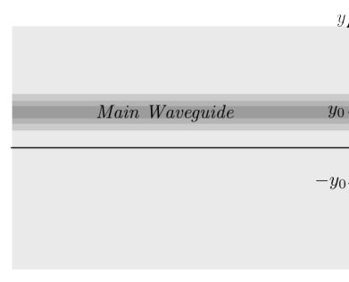
<figcaption class="paper-figure-caption"><b>Fig 1.</b> Figure 1: Illustration of the potential landscape underlying the experimental setup (dark: low, light: high). The main waveguide at y = y0 extends throughout; for x ≥0 the transverse potential becomes a double-well, side- coupling the main waveguide to a parallel auxiliary waveguide at y = −y0. At x = 0, there is a potential step, acting as a barrier for the particle incident from the main waveguide. An explicit form is given in (2) below.</figcaption>
</figure>
<figure class="paper-figure-card">

<figcaption class="paper-figure-caption"><b>Fig 2.</b> Figure 2: Potentials V&lt; and V&gt; as in (2)</figcaption>
</figure>
<figure class="paper-figure-card">

<figcaption class="paper-figure-caption"><b>Fig 3.</b> Figure 3: Relative population ρa in the auxiliary waveguide as a function of longitudinal distance from the step in units of |δk|−1. In the propagative regime (blue curve), the populations oscillate between the two waveguides, with complete transfer (ρa = 1) at odd multiples of π/(2δk). In the evanes- cent regime (orange curve, as given by (29)), the populations equilibrate monotonically, approaching ρa = 1/2 over the characteristic length scale Xeq ∼1/δκ.</figcaption>
</figure>
<figure class="paper-figure-card">
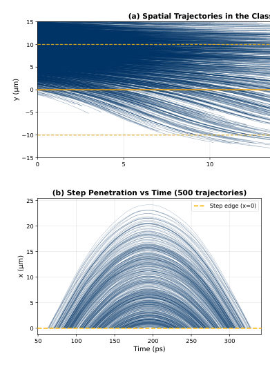
<figcaption class="paper-figure-caption"><b>Fig 4.</b> Figure 4: Numerical simulation of Bohmian trajectories in the classi- cally forbidden region (x &gt; 0) of the 2D setup for V0 = 0.54 meV, ℏJ0 = 26.2 µeV, Ek0 −V0 = −0.07 meV, σk = 2.5 × 10−3 µm−1. (a) Spatial paths of 5,000 trajectories sampled from |Ψ|2. Main waveguide centered around y0 = 10 µm; auxiliary waveguide centered around −y0 = −10 µm. (b) Longitudinal coordinate X(t) for 500 representative trajectories, exhibiting parabolic turnaround. Horizontal axis centered around median reversal time. (c) Transverse coordinate Y (t) for 292 trajectories that crossed y = 0 prior to turnaround; the simultaneous reversal of X(t) and Y (t) reflects the time- reversal symmetry (66).</figcaption>
</figure>
<figure class="paper-figure-card">
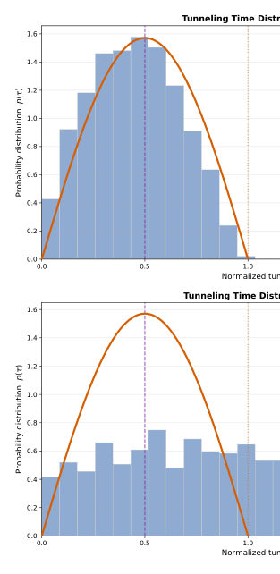
<figcaption class="paper-figure-caption"><b>Fig 5.</b> Figure 5: Distribution of tunneling times for Bohmian trajectories migrating from the main into the auxiliary waveguide of the 2D setup. Here, “tunneling time” is defined as the time the Bohmian particle takes from entering the classically forbidden region at x = 0 (in the main waveguide, y &gt; 0) until entering the auxiliary waveguide, y &lt; 0. Top: Propagative regime (Ek0 − V0 = +0.15 meV). Bottom: Evanescent regime (Ek0 −V0 = −0.07 meV). σk = 2.5×10−3 µm−1 for both. Time is shown in units of π/(2J0). The orange curve shows for comparison the distribution of the first time of crossing from y &gt; 0 to y &lt; 0, p(τ) ≈(π/2) sin(πτ), in the 1D double well model (8) with initial state ϕm.</figcaption>
</figure>

**Summary.** This theoretical work resolves a conflict regarding the measured speed of a quantum particle tunneling through a barrier, where experimental estimates disagreed with Bohmian predictions. The authors show that naive time estimates fail because they ignore entanglement between degrees of freedom. By correctly applying and conditioning the dwell-time formula, they demonstrate perfect agreement with Bohmian mechanics.

**Why it may be interesting.** It provides deep insight into the interpretation of quantum measurements in non-trivial regimes (like tunneling) and rigorously tests the equivalence between different formalisms (QM vs. Bohmian mechanics) under specific physical constraints.

Detailed structure

**Main problem.** The paper resolves discrepancies between particle speed estimates in classically forbidden regions (tunneling) derived from experiments/heuristics and predictions made by Bohmian mechanics.

**Main result.** A correct application of the dwell time formula, conditioned on penetration into the barrier, yields results that exactly agree with Bohmian mechanical predictions for the average velocity.

**Method.** The analysis compares three methods—tunneling time estimate, Büttiker dwell time formula, and Bohmian trajectory calculation—by analyzing time-dependent wave packets in 1D and 2D coupled waveguide models.

**Model / system.** The system is a non-relativistic quantum particle modeled by the Schrödinger equation in a potential landscape featuring a potential step realized via coupled waveguides (a double-well structure). The analysis covers both propagating and evanescent regimes.

**Key observables.** Particle populations ($|\Psi|^2$), Bohmian velocities, average speeds ($ar{v}_B$), and conditional dwell times ($	au_{pen}$).

**Important parameters / regimes.** Evanescent decay constants ($\delta_\kappa, ar{\kappa}$), energy splitting ($J_0$), spectral width ($\sigma_k$), and characteristic equilibration length scales ($X_{eq}$).

**Assumptions / limitations.** The initial discrepancy arose from assuming the tunneling time is set only by transverse coupling (ignoring longitudinal entanglement) or applying the standard Büttiker formula without conditioning on barrier penetration.

**Figures summary.** Figures illustrate potential landscapes, relative population dynamics in both oscillatory (propagative) and monotonic (evanescent) regimes, and numerical simulations comparing $|\Psi|^2$ density with Bohmian trajectories.

**Paper structure.** The paper progresses by first identifying the experimental challenge, then analyzing the theoretical estimates (tunneling time/dwell time), demonstrating where these estimates fail due to entanglement effects in the evanescent regime, and finally resolving the conflict by applying a corrected, conditional dwell-time argument that matches Bohmian predictions.

Abstract

Recently, Sharoglazova et al. [Nature 643, 67 (2025)] proposed a procedure for determining the speed of a quantum particle in the classically forbidden region of a potential step, and implemented it in a beautiful experiment. The inferred speeds disagree significantly with the Bohmian velocities, which the authors presented as an experimental challenge to Bohmian mechanics. This is puzzling because the speeds are inferred from particle populations in coupled waveguides for which Bohmian mechanics and standard quantum mechanics make identical predictions. We resolve the puzzle by a detailed theoretical analysis of the experimental setup. We show that the speed inference rests on an assumption that fails in the relevant (evanescent) regime according to both Bohmian mechanics and standard quantum mechanics -- namely that the inter-waveguide tunneling time is set by the transverse coupling and is not affected by entanglement with the longitudinal degree of freedom. We also consider a second speed estimate suggested by Sharoglazova et al., which is based on the Büttiker dwell time formula for particles in the forbidden region. We show that the authors applied the formula incorrectly, and that a correct application yields exact agreement with the predictions of Bohmian mechanics. Our analysis includes explicit calculations of Bohmian trajectories, dwell times, and longitudinal speeds in the two-dimensional waveguide model of the experiment.

[↑ back to top](#top)

### [Deconfined criticality between an antiferromagnetic insulator and a nodal d-wave superconductor: a quantum Monte Carlo study](http://arxiv.org/abs/2607.00762v1)

**Authors:** Chuang Chen, Subir Sachdev, Zi Yang Meng  
**Type:** theory · **Category:** strongly correlated electrons · **PDF:** <https://arxiv.org/pdf/2607.00762v1>  
**Analysis basis:** full PDF text, analyzed in chunks
**Topic relevance:** `analog quantum simulation` **3/5** · `Keldysh / 2PI / non-Gaussian methods` **1/5** · `driven-dissipative phase transition` **1/5** · `exotic spin models in light-matter` **1/5**

↔ Scroll figures horizontally

<figure class="paper-figure-card">
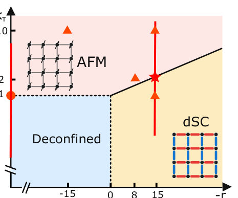
<figcaption class="paper-figure-caption"><b>Fig 1.</b> Fig. 1. Phase diagram obtained from QMC simulation. The x-axis is −r and y-axis is κτ . There are three phases namely d-wave superconductor (dSC), anti- ferromagnetic Mott insulator (AFM) and deconfined phase of the SU(2) gauge field (deconfined). The insets schematically illustrate the staggered spin configuration of the AFM phase and the opposite pairing signs on the horizontal and vertical bonds of the dSC phase. The dots (star and circle) on the phase boundaries are determined from our parameter scans in the phase diagram as the transition point (Fig. 2 and Fig. 3). The four triangular dots mark the parameters of the spectral study (Fig. 4).</figcaption>
</figure>
<figure class="paper-figure-card">

<figcaption class="paper-figure-caption"><b>Fig 2.</b> Fig. 2. AFM structure factor and correlation ratio across Deconfined-to-AFM transition. (a) The structure factor of the AFM phase χS is measured at the AFM ordered wave vector q = M as a function of κτ . Here we fix J = 1 as the energy unit and κ = 20 and the simulations are performed with linear system sizes L = 4, 8, 12, 16 and inverse temperature β = 2L. As κτ increases, the AFM order also becomes clearer. (b) The correlation ratio of the AFM phase rAFM as a function of κτ . The crossing of the correlation ratio indicates the position of quantum critical point between the phase with deconfined SU(2) gauge field and π-flux spinon and confined AFM phase.</figcaption>
</figure>
<figure class="paper-figure-card">
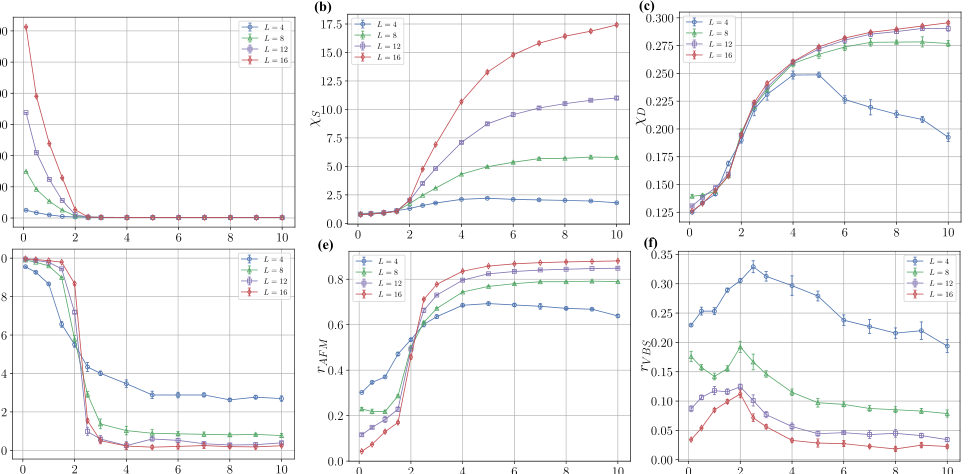
<figcaption class="paper-figure-caption"><b>Fig 3.</b> Fig. 3. Structure factors and correlation ratio of dSC, AFM and VBS orders across dSC-to-AFM transition. We set κ = 20, m = 0.1, g = 0.54/c0, V1 = 4/c0 −3c0, K1 = 3c0, J1 = 3c0 in Eq. (7) and perform the QMC simulations along the path of r = −15 and varying κτ (the right red scan in Fig. 1), with linear system sizes L = 4, 8, 12, 16 and inverse temperature β = 2L. (a) The structure factor of the dSC phase χel, d as a function of κτ . As κτ increases, dSC order decreases and vanishes. (b) The structure factor of the AFM phase χS. As κτ increases, AFM order starts to increase at the point where dSC order starts to decrease. (c) The structure factor of VBS χD. As κτ increases, the VBS order...</figcaption>
</figure>
<figure class="paper-figure-card">
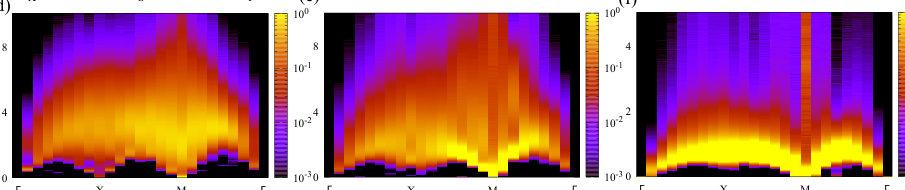
<figcaption class="paper-figure-caption"><b>Fig 4.</b> Fig. 4. Electron and spin spectra across dSC-to-AFM transition. (a) shows the electron spectra A(k, ω) inside the dSC phase with r = −15, κτ = 1, while (b) r = −8, κτ = 2 and (c) r = 15, κτ = 10 are electron spectra inside the AFM phase, with (b) closer to the transition point. (d), (e) and (f) are the corresponding spin spectra χS(q, ω). For electron spectra A(k, ω), we plot the high symmetry path connecting X(π, 0) →S(π/2, π/2) →Y(0, π). While for the spin spectra, we use path Γ(0, 0) →X(π, 0) →M(π, π) →Γ(0, 0). In the dSC phase, the electron shows Dirac-like dispersion, and the spin spectrum is in the shape of two-spinon continuum of U(1) Dirac spin liquid. In the AFM phase, however,...</figcaption>
</figure>

**Summary.** This work uses Quantum Monte Carlo simulations on a fractionalized model to study the transition between an antiferromagnetic insulator and a d-wave superconductor. The key finding is evidence for a second-order deconfined quantum phase transition (DQCP) at which both magnetic and superconducting orders vanish continuously. This provides theoretical support for understanding competing orders in strongly correlated electron systems.

**Why it may be interesting.** While focused on condensed matter, the use of lattice gauge theory coupled to fermionic excitations and the explicit study of quantum critical points provide rich theoretical tools applicable to strongly interacting many-body systems relevant in AMO physics.

Detailed structure

**Main problem.** The study investigates the quantum phase transition between an antiferromagnetic (Néel) insulator and a nodal d-wave superconductor in a lattice model.

**Main result.** Evidence is found for a second-order deconfined quantum phase transition (DQCP) where both Néel order and d-wave superconductivity orders vanish continuously.

**Method.** Quantum Monte Carlo (QMC) simulations are employed on a fractionalized representation of the electron using spinon and chargon fields to avoid the sign problem.

**Model / system.** The system is modeled on a square lattice at half-filling, described by an SU(2) lattice gauge theory coupled to fermionic spinons and bosonic chargons. This setup mimics aspects of high-temperature superconductivity in cuprates.

**Key observables.** Electron spectral function $A(\mathbf{k}, \omega)$, dynamical spin structure factor $\chi_S(\mathbf{q}, \omega)$, and correlation ratios for dSC, AFM, and VBS orders.

**Important parameters / regimes.** The transition is tuned by parameters like $\kappa$ and $\kappa_	au$, which control the gauge field dynamics and coupling strengths.

**Assumptions / limitations.** The analysis is restricted to the half-filled, particle-hole symmetric case to ensure the QMC simulation remains sign-problem free.

**Figures summary.** Figures illustrate phase diagrams mapping out dSC, AFM, and deconfined regimes, alongside spectral functions showing Dirac dispersion in the superconducting phase that gaps into a gapped spectrum in the antiferromagnetic phase near the transition point.

**Paper structure.** The paper develops the fractionalized Hamiltonian using spinon/chargon fields, details the QMC simulation techniques (including gauge field updates), and then analyzes key observables like spectral functions and structure factors across different parameter regimes to pinpoint the DQCP.

Abstract

We present a quantum Monte Carlo study of the transition between the insulating Néel state and the nodal $d$-wave superconductor on the square lattice at half-filling. We access a regime of frustrated magnetic order without a sign problem using a parton representation of the electron in terms of fermionic spinons and bosonic chargons. Both partons move in a background $π$-flux (so the electron experiences no net flux) and are coupled to a quantum fluctuating SU(2) lattice gauge field. In contrast to earlier studies directly on the electronic degrees of freedom, we find evidence for a second-order deconfined quantum phase transition at which both the Néel and $d$-wave superconductivity orders vanish continuously. We compute correlators of the spinon-chargon composite with the same quantum numbers as the electron: we find a gapless Dirac dispersion inside the $d$-wave superconductor, turning into a gapped dispersion in the antiferromagnet.

[↑ back to top](#top)

### [Leakage Mobility and Passive Leakage Removal in Transmons with Tunable Couplers](http://arxiv.org/abs/2607.00688v1)

**Authors:** Taneli Tolppanen, Gonzalo Martín-Vázquez, Sasu Tuohino, Matti Silveri  
**Type:** theory · **Category:** quantum information and computing · **PDF:** <https://arxiv.org/pdf/2607.00688v1>  
**Analysis basis:** full PDF text, analyzed in chunks
**Topic relevance:** `methods for driven-dissipative` **3/5** · `Keldysh / 2PI / non-Gaussian methods` **1/5** · `correlated / nonlocal dissipation` **1/5** · `driven-dissipative phase transition` **1/5**

↔ Scroll figures horizontally

<figure class="paper-figure-card">
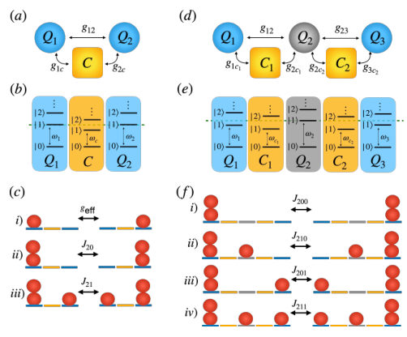
<figcaption class="paper-figure-caption"><b>Fig 1.</b> FIG. 1. Schematics of the coupled transmon systems: Two transmons and one coupler (a)-(c), and an array of coupled transmons (d)-(f). (a), (d) Connectivity map showing the coupling configurations between the transmons Qj and the mediating tunable couplers Cj. (b), (e) Anharmonic multi- level frequency spectra for the transmons and couplers. The green dashed lines indicate the reference frequencies used to define the localized detunings, given by ∆jc = ωj −ωc &gt; 0 for j = 1, 2 in panel (b), and ∆c = ω2 −ωcj &gt; 0 for j = 1, 2 alongside ∆q = ω2 −ωj for j = 1, 3 in panel (e). (c), (f) Con- ceptual illustration on the dynamics of leakage excitations (red circles) between the edge transmons (blue...</figcaption>
</figure>
<figure class="paper-figure-card">
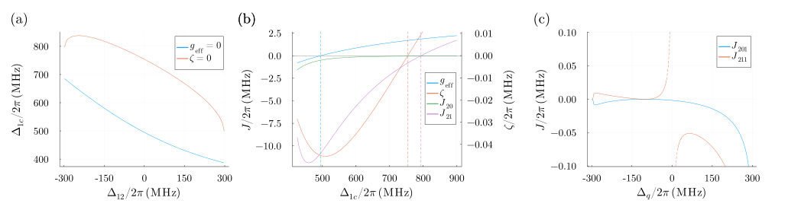
<figcaption class="paper-figure-caption"><b>Fig 2.</b> FIG. 2. (a) Coupler detunings ∆1c = ω1 −ωc where the excitation exchange geff or the ZZ interaction is eliminated, geff = 0 and ζ = 0 as a function of the two transmon detuning ∆12 = ω1 −ω2. (b) Effective coupling strengths for different coupler detuning ∆1c: excitation exchange geff for |10⟩↔|01⟩, leakage exchange J20 for |20⟩↔|02⟩and J21 for |21⟩↔|12⟩, and ZZ coupling ζ. (c) Effective leakage tunneling strengths J201 for |201⟩↔|102⟩and J211 for |211⟩↔|112⟩, when the two edge transmons are detuned from the middle transmon by ∆q and the couplers are tuned so that ζ = 0. In panel (a) the second transmon is tuned to ω2/2π = 4000 MHz, in panel (b) the two transmons are resonant ω1/2π = ω2/2π =...</figcaption>
</figure>
<figure class="paper-figure-card">

<figcaption class="paper-figure-caption"><b>Fig 3.</b> FIG. 3. (a), (e) Leakage time dynamics for two resonant transmons when the coupler is tuned so that geff = 0. (b), (f) Sensitivity of the leakage transfer to the frequency detuning between the first and second transmons. (c), (g) Maximum leakage transfer between the two transmons while the coupler is tuned so that geff = 0 or ζ = 0. (d), (h) Sensitivity of the leakage transfer to differences in anharmonicity between the transmons while the relevant transition is kept on-resonance. In the top row the initial state is |ψ0⟩= |20⟩and in the bottom row |ψ0⟩= |21⟩. We assume the transmons have identical anharmonicities, so that the detuning of the second transmon in (b) and (f) directly...</figcaption>
</figure>
<figure class="paper-figure-card">
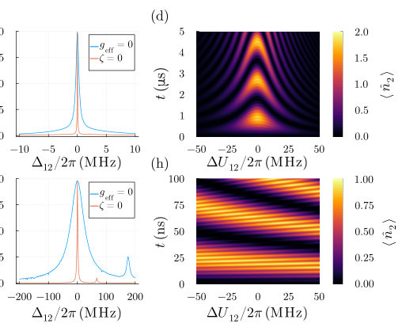
<figcaption class="paper-figure-caption"><b>Fig 4.</b> Figure 3(e)-(h) depicts the dynamics for the setup of a leakage excitation in the first transmon and a single excitation in the second transmon. Again here we assume that the condition geff = 0. The effective |21⟩↔|12⟩ dynamics [case iii) in Fig. 1(c)] occurs now at second order involving two coupler-mediated hoppings ∼λgjc and a single direct transmon-transmon hopping g12. This leads to much faster dynamics, where the leakage propagates between the transmons in 20 ns, see Fig. 3(e). Due to the stronger effective coupling [Fig. 2(b)], the system is less sensitive to the transmon detuning ∆12, as the hopping J21 ∼λgc is more robust against variations in the energy</figcaption>
</figure>
<figure class="paper-figure-card">

<figcaption class="paper-figure-caption"><b>Fig 5.</b> FIG. 4. Leakage tunneling in a chain of three transmons, where the edge transmons are resonant and the middle transmon is detuned by ∆q = ω2 −ω1 = ω2 −ω3. The couplers are tuned so that ζ = 0. In (a)-(c) the initial state is |ψ0⟩= |201⟩. In (d)-(f) the initial state is |ψ0⟩= |211⟩. (a), (d) Time evolution of leakage excitation. (b), (e) Time evolution of leakage excitation for different detunings ∆q. (c), (f) Sensitivity of the tunneling to the off-resonance of the edge transmons ∆31 = ω3 −ω1. For the anharmonicities, transmon-transmon coupling and transmon-coupler coupling we use same parameters as in Fig. 2. The middle transmon is kept at ω2/2π = 4000 MHz and the couplers tuned so that ζ...</figcaption>
</figure>

**Summary.** This paper investigates qubit leakage as a major error source in transmons by quantifying 'leakage mobility.' Using advanced perturbation theory and non-Hermitian Hamiltonians, the authors derive conditions to suppress unwanted excitation hopping. They conclude by proposing and analyzing two passive hardware schemes that utilize this engineered mobility for effective leakage removal.

**Why it may be interesting.** This work provides detailed, quantitative theoretical tools for mitigating decoherence in superconducting qubits by engineering the system's Hamiltonian to actively suppress leakage pathways using tunable couplers.

Detailed structure

**Main problem.** Qubit leakage is a significant error source in quantum computation, necessitating methods to characterize its dynamics and implement passive removal units.

**Main result.** The authors propose two passive leakage removal units—one based on a tunable coupler/pumped transmon and another on junction readout—whose performance can be analyzed using leakage mobility concepts.

**Method.** The study employs perturbative methods, including Schrieffer-Wolff transformations and non-Hermitian Hamiltonians, to analyze the effective coupling strengths and decay rates in open quantum systems.

**Model / system.** The system modeled is superconducting transmons coupled via tunable couplers. The analysis extends beyond the computational subspace to include leakage excitations (e.g., $|2
angle$ states).

**Key observables.** Leakage hopping rates, population decay times ($T^*$), effective coupling strengths ($g_{	ext{eff}}$), and residual ZZ interactions ($\zeta$).

**Important parameters / regimes.** Frequency detunings ($\Delta$), anharmonicity differences ($\Delta U_{12}$), and coupler/qubit coupling strengths ($g_c, g_q$).

**Assumptions / limitations.** The analysis relies on the dispersive regime ($\lambda \ll 1$) and uses approximations like the Rotating-Wave Approximation (RWA) for passive dynamics.

**Figures summary.** Figures illustrate connectivity maps, detuning conditions required for interaction cancellation, time evolution of leakage populations in different removal schemes (Coupler20, Pumped21), and effective hopping strengths vs. detuning.

**Paper structure.** The paper systematically analyzes leakage dynamics across increasing complexity: first characterizing general mobility; then analyzing two-transmon systems to suppress coherent exchange ($g_{	ext{eff}}=0$); subsequently extending to three-transmon chains to study higher-order tunneling; and finally proposing specific passive removal units.

Abstract

Qubit leakage is a noticeable source of errors for quantum computing. In quantum processors, leakage excitations traveling between qubits generate correlated errors and perturb gate implementations. Leakage mobility can also be utilized for creating dedicated leakage removal pathways and removal units. To quantitatively characterize leakage mobility and to guide better design of processor architectures, we study here leakage dynamics in transmons with tunable couplers through numerical and analytical methods. Even if the couplers are tuned to cancel the single-excitation exchange or the ZZ interaction, the leakage hopping rates still persists in the range of 0.8-10 MHz due to transmon nonlinearity. In typical operation regimes, however, transmon frequency detuning localizes leakage excitations. The next-nearest-neighbor transmons can be still be near-resonant opening leakage tunneling channels. To suppress longer-range hopping, we find that the frequency spread of the next-nearest-neighbor transmons needs to be in the range of 1-4 MHz. Utilizing leakage mobility, we propose two passive leakage removal units. One is based on a tunable coupler and a pumped transmon, and another on a junction readout scheme. Based on realistic experimental parameters, our results on selectively mobilizing or localizing leakage excitations are readily applicable in superconducting quantum devices.

[↑ back to top](#top)

### [Non-self-averaging topological Anderson insulator](http://arxiv.org/abs/2607.00892v1)

**Authors:** Zheng-Wei Zuo, Jun-Chong Liu  
**Type:** theory · **Category:** disordered systems and neural networks · **PDF:** <https://arxiv.org/pdf/2607.00892v1>  
**Analysis basis:** full PDF text, analyzed in chunks
**Topic relevance:** `analog quantum simulation` **3/5** · `Kondo & dissipative impurity` **1/5** · `methods for driven-dissipative` **1/5**

↔ Scroll figures horizontally

<figure class="paper-figure-card">

<figcaption class="paper-figure-caption"><b>Fig 1.</b> FIG. 1. The average of the topological quantum number ⟨Q⟩, and the average ⟨γ⟩and relative variance Rγ of the Lyapunov exponent with the system size of N = 5×104, under Nr = 105</figcaption>
</figure>
<figure class="paper-figure-card">

<figcaption class="paper-figure-caption"><b>Fig 2.</b> FIG. 2. The finite size scaling for the average and relative vari- ance of Lyapunov exponent with the disorder strength W = 1 under Nr = 5 × 104 disorder realizations. Panels (a, c, e) ex- hibit the average of Lyapunov exponent for parameters α = 0, 1.5 and 2.5 cases, respectively. while panels (b, d, f) show the corresponding relative variance of Lyapunov exponent.</figcaption>
</figure>
<figure class="paper-figure-card">
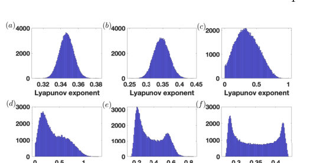
<figcaption class="paper-figure-caption"><b>Fig 3.</b> FIG. 4. Histogram of the Lyapunov exponent for different correlated parameters α with the disorder strength W = 1, intra-cell coupling t1 = 0.8, and system size N = 104 under Nr = 105 disorder realizations. (a) α = 0. (b) α = 1. (c) α = 2. (d) α = 3. (e) α = 5. (f) α = 8. (g) α = 10. (h) α = 15. (i) α = 50.</figcaption>
</figure>
<figure class="paper-figure-card">
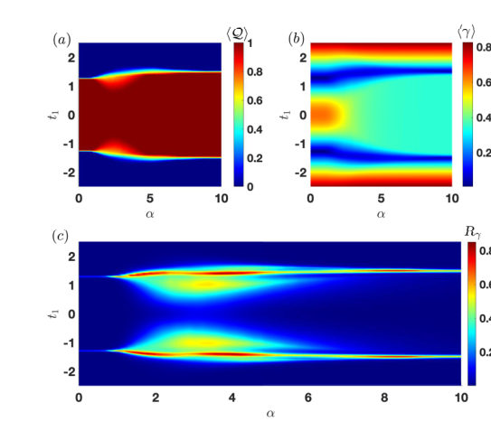
<figcaption class="paper-figure-caption"><b>Fig 4.</b> FIG. 3. The average topological quantum number ⟨Q⟩, the average and relative variance of Lyapunov exponent as a func- tion of correlation exponent α with disorder strength W = 1 and system size N = 5×104, under Nr = 104 disorder realiza- tions. (a) The average topological quantum number. (b) The average the Lyapunov exponent. (c) The relative variance of Lyapunov exponent.</figcaption>
</figure>
<figure class="paper-figure-card">
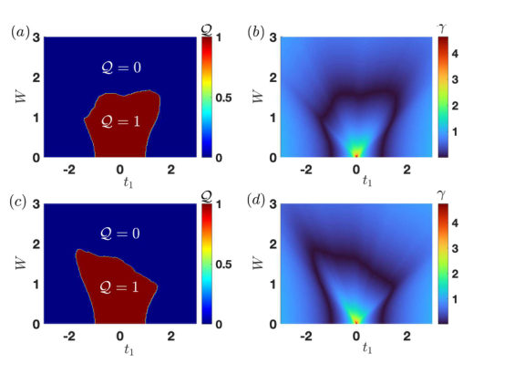
<figcaption class="paper-figure-caption"><b>Fig 5.</b> FIG. 5. The topological quantum number Q and Lyapunov exponent γ with system size N = 105 and correlation param- eter α = 2 for two different disorder realizations. (a, b) The topological quantum number (a) and Lyapunov exponent (b) for one specific disorder configuration. (c, d) The topological quantum number and Lyapunov exponent for another specific disorder configuration.</figcaption>
</figure>

**Summary.** This paper analyzes topological Anderson insulators under long-range correlated disorder, demonstrating that such correlations cause the system's properties to become non-self-averaging. The authors introduce the concept of a 'non-self-averaging topological Anderson insulator,' characterized by a finite relative variance of the Lyapunov exponent in the thermodynamic limit. This shows that for these systems, individual sample measurements are fundamentally different from ensemble averages.

**Why it may be interesting.** This work extends the understanding of topological phases into complex disordered regimes, providing a quantitative diagnostic ($R_\gamma$) for when simple averaging techniques fail, which is crucial for modeling real-world amorphous or glassy quantum materials.

Detailed structure

**Main problem.** The research investigates topological Anderson insulators subjected to long-range correlated disorder, an area lacking tractable analytical methods compared to standard uncorrelated disorder models.

**Main result.** Long-range correlated disorder can induce non-self-averaging behavior in the topological states, meaning single sample properties deviate significantly from ensemble averages.

**Method.** The study uses numerical calculations involving ensemble averaging over multiple disorder realizations and analyzing the relative variance of the Lyapunov exponent to diagnose self-averaging breakdown.

**Model / system.** The primary model is a disordered Su-Schrieffer-Heeger (SSH) chain, where the disorder ($\epsilon_j$) is characterized by long-range correlations defined by a power-law spectral density $S(k) \sim 1/k^\alpha$.

**Key observables.** Topological Quantum Number ($Q$), Lyapunov Exponent ($\gamma$), and the Relative Variance of the Lyapunov Exponent ($R_\gamma$).

**Important parameters / regimes.** The correlation parameter $\alpha$ (where $\alpha=0$ is uncorrelated disorder) and the system size $N$.

**Assumptions / limitations.** The analysis assumes that non-self-averaging is confirmed by a finite relative variance ($R_\gamma$) in the thermodynamic limit, signaling a breakdown of the Central Limit Theorem.

**Figures summary.** Figures compare $\langle Q 
angle$, $\langle \gamma 
angle$, and $R_\gamma$ across different correlation parameters ($\alpha$), showing smooth crossovers for long-range disorder versus sharp transitions for uncorrelated disorder.

**Paper structure.** The paper progresses by establishing the limitations of current theory, introducing the model with long-range correlated disorder, demonstrating that this correlation leads to non-self-averaging behavior via finite $R_\gamma$, and concluding that ensemble averages are insufficient for characterizing the phase diagram.

Abstract

Current research on the disordered topological quantum phases primarily focuses on the uncorrelated and short-range correlated disorder regime. These topological Anderson insulators are typically self-averaging. However, topological quantum systems with long-range correlated disorder have received limited attention due to the absence of tractable analytical methods. In fact, the long-range correlated disorder introduces more complex effects on topological quantum states. Here, we demonstrate that the long-range correlated disorder could induce anomalously statistical feature where the topological Anderson states become non-self-averaging, and the phase diagram is strongly dependent on individual disorder configurations. We term this statistical phase the non-self-averaging topological Anderson insulator. The non-self-averaging property is identified by the non-vanishing finite values of the relative variance of the Lyapunov exponent in the thermodynamic limit, alongside the non-Gaussian distributions of the Lyapunov exponent. Consequently, the topological properties of a single disordered sample deviate from the ensemble average, causing a breakdown of the central limit theorem. The non-self-averaging topological Anderson insulator provides insights into the interplay between correlated disorder and topology.

[↑ back to top](#top)

### [Three-qubit nonlocality paradoxes: beyond GHZ](http://arxiv.org/abs/2607.00795v1)

**Authors:** Nadish de Silva, Santanil Jana, Ming Yin  
**Type:** theory · **Category:** quantum information and computing · **PDF:** <https://arxiv.org/pdf/2607.00795v1>  
**Analysis basis:** full PDF text, analyzed in chunks
**Topic relevance:** `entanglement & information structure` **3/5** · `correlated / nonlocal dissipation` **1/5**

↔ Scroll figures horizontally

<figure class="paper-figure-card">

<figcaption class="paper-figure-caption"><b>Fig 1.</b> Figure 1: The one-qubit geometry of a balanced state. The red vectors are the states |vλ⟩and |wλ⟩, symmetric about the equator, while Eϕ is an equatorial measurement.</figcaption>
</figure>
<figure class="paper-figure-card">
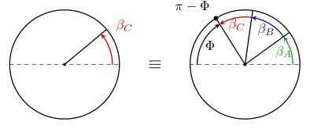
<figcaption class="paper-figure-caption"><b>Fig 2.</b> Figure 2: Schematic form of the β-equation. Here βA := β(λ1, A + aπ), βB := β(λ2, B + bπ), and βC := β(λ3, C + cπ). The event (A, B, C) 7→(a, b, c) is impossible exactly when the three angle contributions sum to the target direction π −Φ.</figcaption>
</figure>
<figure class="paper-figure-card">

<figcaption class="paper-figure-caption"><b>Fig 3.</b> Figure 4: A concrete witness path in the bipartite implication graph, drawn on the literal 2N-clock for N = 12. Each circle is a copy of Z24: the blue and orange labels are the outcome-0 and outcome-1 copies of the measurement clock Z12, so antipodal points represent complementary literals of the same measurement. The green-ringed vertices are the literals traversed by the path; the red and blue arrows are implication edges arising from the two Charlie conditionings, and the path alternates between these two partial matchings. Its Alice measurement indices form the return-map coset 1+3Z12 = {1, 4, 7, 10}, while the corresponding Bob indices form the paired reflected coset 2 + 3Z12 = {2, 5,...</figcaption>
</figure>
<figure class="paper-figure-card">
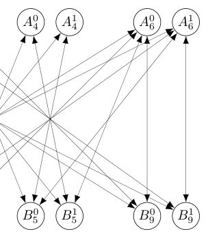
<figcaption class="paper-figure-caption"><b>Fig 4.</b> Figure 5: Implication graph for the total Charlie assignment z = (0, 0, 0, 0) of Example 5.5(1).</figcaption>
</figure>

**Summary.** The paper rigorously classifies three-qubit nonlocality paradoxes by developing advanced graph-theoretic and combinatorial techniques. It demonstrates that these paradoxical structures are far more abundant than previously believed, overturning restrictive assumptions about the necessary form of such paradoxes.

**Why it may be interesting.** This work provides deep structural insights into the limits of local realism in multipartite quantum systems, which is foundational knowledge for understanding genuine quantum advantage.

Detailed structure

**Main problem.** To completely classify all three-qubit nonlocality paradoxes established via a biconditional parity proof, extending beyond previously known examples like the GHZ paradox.

**Main result.** The authors provide a complete structural classification for these paradoxes, showing that the landscape of nonlocality is much richer than previously thought by identifying new exotic paradoxes.

**Method.** The work employs graph-theoretic formalisms (2-CNF formulae and implication graphs) combined with combinatorial techniques to map the set of specifications ($	ext{BPP}$) to a canonical data structure ($	ext{CanonicalTriples}$).

**Model / system.** The focus is on three-qubit quantum systems exhibiting 'nonlocality paradoxes,' which are logical obstructions to classical probabilistic models arising from restricted joint measurability contexts.

**Key observables.** Nonlocal fraction, the existence of a witness path in the implication graph $I_{\Psi}(z)$, and the structure of the associated biconditional parity proof.

**Important parameters / regimes.** The number of qubits (fixed at three), measurement settings $\{M\}$, and parameters defining the entangled state $|	ext{B}(\lambda, \Phi)
angle$.

**Assumptions / limitations.** Initially relied on five restrictive assumptions; later work drops these to show a richer structure. Specific analyses focus on interpolant states or restricted Charlie measurements.

**Figures summary.** Figures illustrate the geometry of balanced states and schematic forms of equations relating measurement angles $(	ext{A}, 	ext{B}, 	ext{C})$ to target directions, alongside implication graphs for specific examples.

**Paper structure.** The paper progresses from defining contextuality and nonlocality in three qubits (Chunk 2), establishing the link between paradoxes and biconditional parity proofs using graph theory (Chunk 3), developing a structural classification via 'Charlie clocks' (Chunk 4), presenting counterexamples outside interpolant states (Chunk 5), and finally confirming paradoxicality through detailed analysis of witness paths in implication graphs for various scenarios (Chunks 6, 7, 8).

Abstract

Quantum nonlocality paradoxes, such as that of GHZ, provide maximally sharp logical obstructions to classical probabilistic models of quantum correlations. They are key resources in a broad variety of information-theoretic tasks that exhibit unconditional quantum advantage. For example, in nonlocal games, which are communication tasks that serve as core technical tools in recent landmark results in quantum computational complexity theory.   Their role in establishing quantum advantage motivated their study by Abramsky et al. who introduced an infinite family of three-qubit paradoxes exhibiting novel conditional structure. This was later extended by de Silva et al. into a full classification program.   In this work, we completely classify all three-qubit nonlocality paradoxes established via a biconditional parity proof; this is a very large class of paradoxes that encompasses all earlier-known examples. We do this by introducing a suite of new structural and combinatorial techniques. We find that the landscape of nonlocality paradoxes is far richer than previously understood, violating regularity conditions underlying all prior constructions.

[↑ back to top](#top)

### [Diverse efficiency of observable optimization for four-level quantum systems with higher-order traps](http://arxiv.org/abs/2607.01217v1)

**Authors:** Alexander Pechen, Boris Volkov  
**Type:** both · **Category:** other · **PDF:** <https://arxiv.org/pdf/2607.01217v1>  
**Analysis basis:** full PDF text, analyzed in chunks
**Topic relevance:** `driven-dissipative phase transition` **2/5** · `non-equilibrium dynamics` **2/5** · `Frenkel-Kontorova` **1/5** · `analog quantum simulation` **1/5** · `methods for driven-dissipative` **1/5** · `non-equilibrium universality` **1/5**

↔ Scroll figures horizontally

<figure class="paper-figure-card">
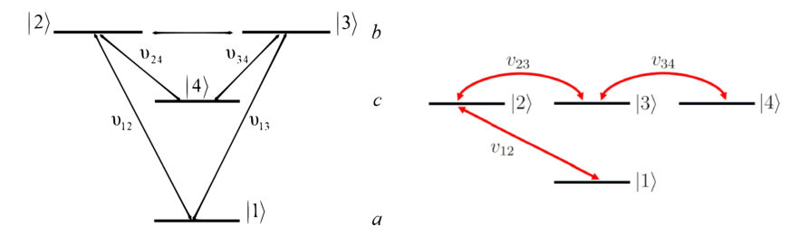
<figcaption class="paper-figure-caption"><b>Fig 1.</b> Figure 1. Left: Energy level structure of an example class of four-level quantum systems with the free Hamiltonian H0 = diag(a, b, b, c) and with allowed transitions |1⟩↔|2⟩, |1⟩↔|3⟩, |2⟩↔|3⟩, |2⟩↔|4⟩, and |3⟩↔|4⟩. We denote this system as a V −V since it has a couple of V -connected triples of levels: One triple is level |1⟩connected with two levels |2⟩and |3⟩, an another triple is level |4⟩connected with the same two levels; ′′−′′ indicates that both upper levels |2⟩and |3⟩are connected. Right: Energy level structure of a four-level quantum system with the chain interaction.</figcaption>
</figure>
<figure class="paper-figure-card">

<figcaption class="paper-figure-caption"><b>Fig 2.</b> Figure 2. Fraction of failed runs for l = 0.1, 0.2, 0.3, . . . , 3.1 for the system S1 (blue solid line) and S2 (green dotted and red dashed lines for the two target observables O and O∗, respectively). Left: Unconstrained optimization using GRAPE. Right: Constrained optimization using GPM. The target observable is O = diag(1, −6, −6, 0) for S1 and S2, and also O∗= diag(1, 6, −6, 0) for S2. The initial state is ρ0 = |4⟩⟨4|. The parameters are T = 20, M = 100, Kstop = 2000, ε = 0.02, and Ierr = 10−3. For each point L = 500 runs are performed. The behaviour of the fraction of failed runs for both systems in essentially different.</figcaption>
</figure>
<figure class="paper-figure-card">
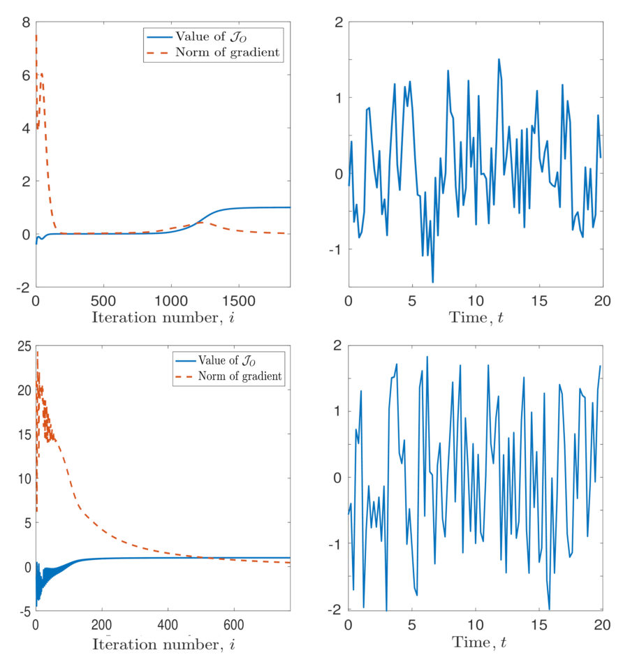
<figcaption class="paper-figure-caption"><b>Fig 3.</b> Figure 3. An example of the optimization results with target observable O. Upper row for the system S1 and l = 1. Bottom row for the system S2 and l = 2. Other parameters are the same as for Fig. 2. Left: behavior of the objective value and norm of the gradient vs iteration number. Totally 1880 iterations were required for S1 and 770 for S2. Right: The obtained optimized controls vs time.</figcaption>
</figure>

**Summary.** This paper investigates optimizing observables in four-level quantum systems using advanced quantum control techniques. It proves that the null control acts as a high-order trap and numerically demonstrates that the efficiency of finding optimal controls varies dramatically depending on whether the system Hamiltonian resembles a V-V structure or a chain interaction. This highlights how subtle differences in system physics dictate the feasibility of quantum state preparation.

**Why it may be interesting.** This work directly addresses the practical limitations of quantum control theory by quantifying how system structure dictates optimization success near degenerate or trapped points, which is crucial for designing robust quantum protocols.

Detailed structure

**Main problem.** The study analyzes the quantum control landscape for optimizing an observable by finding optimal external time-dependent controls $f(t)$ in specific four-level quantum systems.

**Main result.** The null control is proven to be a five-order trap, and the optimization efficiency shows a diverse behavior: sharp increases for V-V systems versus slower changes for chain interaction systems.

**Method.** The work combines analytical proofs regarding the order of traps with numerical simulations using GRAPE (unconstrained) and GPM (constrained) algorithms.

**Model / system.** The system involves four-level quantum dynamics governed by a Hamiltonian $H(t) = H_0 + f(t)V$. Specific models compared are a V-V type system and an anharmonic system with chain interaction.

**Key observables.** Optimization efficiency (fraction of successful runs), the objective functional $	ext{Tr}[U_f^T 
ho_0 U_f^\dagger T O]$, and the order of the control traps.

**Important parameters / regimes.** The initial control distance $l$ from the null control, and system-specific Hamiltonian parameters defining the V-V vs. chain interaction structure.

**Assumptions / limitations.** The analysis assumes controllability of the quantum system and relies on Taylor expansion methods to define trap orders.

**Figures summary.** Figures illustrate energy level structures for the two systems (V-V and chain), and show the fraction of failed runs versus initial control distance $l$ for both optimization methods.

**Paper structure.** The paper first establishes the theoretical framework by proving the null control is a high-order trap. It then proceeds to numerical experiments comparing GRAPE and GPM performance on two distinct four-level models, highlighting quantitative differences in efficiency behavior.

Abstract

In this work, we perform an analytical and numerical analysis of quantum landscapes for controlling special four-level quantum systems for which we prove that the null control is a five-order trap: a $V-V$ system and an anharmonic system. As a control goal, an observable optimization is considered. The rigorous theoretical analysis is followed by the numerical experiments based on the GRadient Ascent Pulse Engineering (GRAPE) algorithm and Gradient Projection Method (GPM), performed to investigate the behavior of the efficiency of optimization for unconstrained (using GRAPE) and constrained (using GPM) controls. As the main result, we observe an interesting phenomenon with a diverse behavior of the optimization efficiency depending on the system Hamiltonian -- sharp increase of the optimization efficiency up to 100% at certain distance from the null control for a V-V system, while much slower and less significant increase (and even small decrease) for a system with the chain interaction. This sharp difference might be related with the fine structure of the subspace of controls where second derivative of the objective functional is zero.

[↑ back to top](#top)

### [Analytical connection between exact and approximate solutions of the periodically-driven two-level system starting from the Heun equation](http://arxiv.org/abs/2607.01030v1)

**Authors:** Pietro Follia, Bassano Vacchini  
**Type:** theory · **Category:** other · **PDF:** <https://arxiv.org/pdf/2607.01030v1>  
**Analysis basis:** full PDF text, analyzed in chunks
**Topic relevance:** `non-equilibrium dynamics` **2/5** · `Keldysh / 2PI / non-Gaussian methods` **1/5** · `analog quantum simulation` **1/5** · `driven-dissipative phase transition` **1/5** · `methods for driven-dissipative` **1/5**

↔ Scroll figures horizontally

<figure class="paper-figure-card">
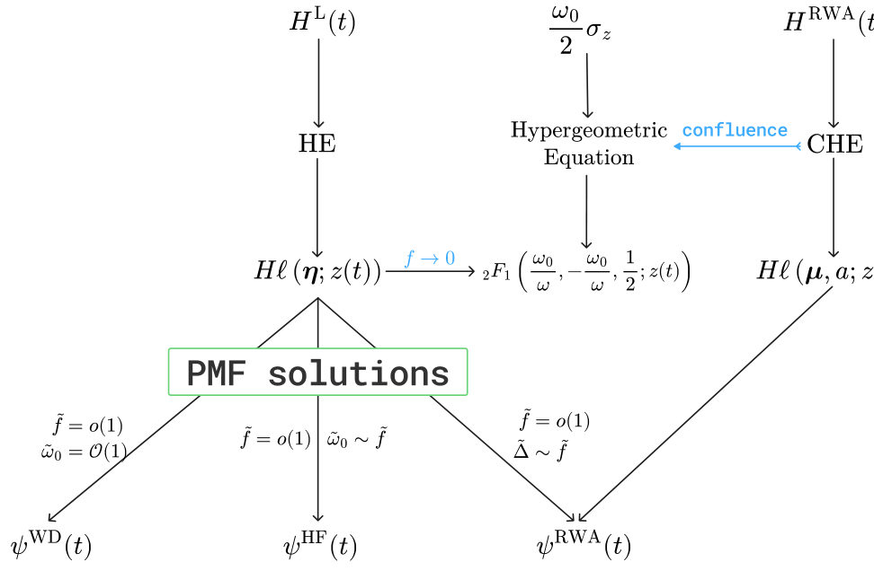
<figcaption class="paper-figure-caption"><b>Fig 1.</b> FIG. 1. The figure provides a logical scheme of the connections between the different equations and their solutions and limits considered in the manuscript. Here, ψWD(t) denotes the approximate solution in the weak-driving regime [see Eq. (69)], ψHF(t) the high-frequency solution [see Eq. (84)], and ψRWA(t) the solution in the rotating-wave approximation [see Eq. (79)]. According to Eqs. (51), (52) and (71) we have ˜f = f/ω, ˜ ω0 = ω0/2ω and ˜∆= ∆/ω respectively, that define the relevant limiting situations.</figcaption>
</figure>

**Summary.** This paper analytically connects the exact solutions for a periodically-driven two-level system under linear driving and the rotating-wave approximation by mapping the dynamics onto Heun differential equations. The authors use sophisticated mathematical techniques, including hypergeometric function expansions and perturbative analysis, to rigorously demonstrate this connection while recovering crucial physical corrections like the Bloch-Siegert shifts.

**Why it may be interesting.** This work provides deep mathematical insight into the quantum dynamics of fundamental models like qubits, connecting complex physical approximations (RWA) to exact analytical forms through advanced special functions theory. This is highly relevant for understanding open quantum systems and quantum optics.

Detailed structure

**Main problem.** The primary goal is establishing a rigorous analytical connection between exact solutions for periodically-driven two-level systems (TLS) derived under different physical approximations.

**Main result.** The authors successfully establish a direct analytic link between the exact solutions obtained for linear driving and those for the rotating-wave approximation, recovering higher-order corrections like Stark and Bloch-Siegert shifts.

**Method.** The analysis maps the time-dependent Schrödinger equation onto Heun differential equations (or confluent forms) and utilizes techniques involving hypergeometric functions, path-multiplicative Floquet solutions, and perturbative expansions in the weak-driving limit.

**Model / system.** The system is a periodically-driven two-level system (TLS), modeled by a time-dependent Hamiltonian $H(t) = f(t) \cdot \sigma$, where $\sigma$ are Pauli matrices. The dynamics are governed by the Schrödinger equation, which reduces to Heun equations.

**Key observables.** The primary observables are the time evolution of the system's state vector components ($\psi_e(	au)$), and derived quantities include the Stark and Bloch-Siegert shifts.

**Important parameters / regimes.** Key parameters include the driving frequency ($\omega$), the transition frequency ($\omega_0$), and the ratio between them, which define different regimes (weak-driving, high-frequency, resonant).

**Assumptions / limitations.** The analysis relies on mapping to Heun equations and is most rigorously developed in the weak-driving regime ($	ilde{f} = o(1)$), though it claims general validity.

**Figures summary.** Not specified by notes; the structure implies mathematical derivations involving differential equations, expansions, and parameter constraints.

**Paper structure.** The paper systematically introduces the governing Heun equations for different driving types (linear vs. RWA), derives exact solutions using hypergeometric function representations, establishes the connection via perturbative analysis, and verifies results in various limiting regimes.

Abstract

We investigate and establish an analytic connection between the exact solutions describing the dynamics of a two-level system driven by periodic external fields, focusing on the cases of linear driving and the so-called rotating-wave approximation, or circular driving. In both cases, the exact solutions can be obtained by mapping the Schrodinger equation onto Heun equations: the confluent Heun equation for linear driving and the Heun equation for the rotating-wave case. In particular, we demonstrate a direct analytic connection between the exact solutions for linear driving and those for the rotating-wave case. This result is obtained by analyzing local solutions expressed in terms of hypergeometric functions, which, in the case of the confluent Heun equation, can be derived by considering path-multiplicative Floquet solutions involving a bilateral series. This series leads to two continued-fraction expansions that can be perturbatively solved by imposing a suitable consistency condition. The connection between the linear-driving and rotating-wave solutions is established through a perturbative procedure that allows us to recover not only the rotating-wave approximation itself, but also the correct Stark and Bloch-Siegert shifts, as well as the so-called high-frequency approximation.

[↑ back to top](#top)

### [Entropy-Driven Structural Phase Transition in Nb$_3$Cl$_8$ via Density Functional Theory and an Effective Model](http://arxiv.org/abs/2607.00599v1)

**Authors:** Chenjie Zhu, Shuai Zhang, Zhong Fang, Zhijun Wang, Quansheng Wu, Hongming Weng  
**Type:** theory · **Category:** strongly correlated electrons · **PDF:** <https://arxiv.org/pdf/2607.00599v1>  
**Analysis basis:** full PDF text, analyzed in chunks
**Topic relevance:** `driven-dissipative phase transition` **2/5** · `Frenkel-Kontorova` **1/5** · `Keldysh / 2PI / non-Gaussian methods` **1/5** · `analog quantum simulation` **1/5** · `exotic spin models in light-matter` **1/5**

↔ Scroll figures horizontally

<figure class="paper-figure-card">

<figcaption class="paper-figure-caption"><b>Fig 1.</b> FIG. 1. Crystal structures of Nb3Cl8 in the α and β phases and the interpolation path between them. Light green spheres denote Cl atoms, while blue and red spheres denote Nb atoms in adjacent layers. (a) Top view of the interlayer slip from the staggered α stacking to the partially eclipsed β stacking. The black arrow indicates the dominant structural displacement across the transition. (b) Side view of the corresponding stacking sequences. Here (R, site) labels the lattice translation R and the cluster site within the unit cell. The α phase has uniform staggered AA′ stacking, whereas the β phase adopts an AA′BB′CC′ stacking sequence[8], alternating between staggered and eclipsed interlayer...</figcaption>
</figure>
<figure class="paper-figure-card">
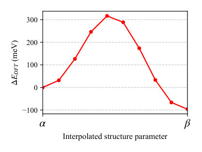
<figcaption class="paper-figure-caption"><b>Fig 2.</b> FIG. 2. DFT total-energy difference per unit cell, ∆EDFT = EDFT −Eα DFT, versus the interpolated structural parameter between the α and β phases. The α-phase energy is taken as the reference.</figcaption>
</figure>
<figure class="paper-figure-card">

<figcaption class="paper-figure-caption"><b>Fig 3.</b> FIG. 3. (a) Phonon dispersions of the α phase (blue) and β phase (orange) of Nb3Cl8, plotted along the high-symmetry path of the α phase. Inset (i) highlights the Γ-point Layer-Breathing Mode, with frequencies of 1.729 THz in the α phase and 1.826 THz in the β phase. Inset (ii) highlights the Γ-point modes near 5.3 THz for comparison with experimentally observed phonon modes. In the α phase, the A1g and A2u modes are at 5.228 and 5.366 THz, respectively; in the β phase, the A2u and A1g modes are at 5.341 and 5.354 THz, respectively. (b) Corresponding cumulative phonon density of states. The α-phase curve is shifted slightly toward lower frequencies, indicating an overall phonon softening...</figcaption>
</figure>
<figure class="paper-figure-card">

<figcaption class="paper-figure-caption"><b>Fig 4.</b> FIG. 4. Phonon Helmholtz free-energy difference per unit cell, ∆Fphonon = F α phonon −F β phonon, versus temperature. The decomposition includes the phonon internal-energy dif- ference ∆Uphonon (blue line) and the entropy contribution −T∆Sphonon (blue area). At T = 0, ∆Uphonon reduces to the phonon zero-point-energy difference ∆Ezpe = Eα zpe −Eβ zpe.</figcaption>
</figure>
<figure class="paper-figure-card">
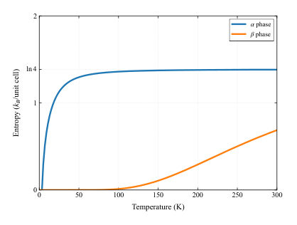
<figcaption class="paper-figure-caption"><b>Fig 5.</b> FIG. 5. Spin entropy per unit cell of the effective Heisen- berg model versus temperature. For the α phase (blue), the entropy is obtained from the HTSE using the P[4, 6] Pad´e ap- proximant. For the β phase (orange), the entropy is obtained from the isolated-dimer model.</figcaption>
</figure>

**Summary.** This work develops a comprehensive free-energy framework combining DFT and an extended Hubbard model to explain the structural phase transition in $	ext{Nb}_3	ext{Cl}_8$. The analysis reveals that this transition is governed by a delicate balance between phonon entropy (stabilizing the high-T phase) and spin entropy/lattice dimerization (favoring the low-T phase). This provides a detailed, multi-faceted understanding of how competing entropic forces dictate material structure.

**Why it may be interesting.** The explicit coupling of vibrational entropy (phonon softening/hardening) with magnetic spin entropy to drive a structural transition is highly relevant for understanding emergent quantum phenomena in correlated materials, bridging solid-state physics and statistical mechanics.

Detailed structure

**Main problem.** The study aims to clarify the microscopic origin of a first-order structural phase transition in $	ext{Nb}_3	ext{Cl}_8$ around 90 K, which suppresses its potential quantum spin liquid (QSL) state.

**Main result.** The transition is jointly driven by phonon and spin entropy; high temperatures favor the $\alpha$ phase due to soft phonons and large spin entropy, while low temperatures favor the $eta$ phase via interlayer dimerization and spin-singlet formation.

**Method.** A unified free-energy framework combining first-principles DFT calculations with an extended Hubbard model is employed to analyze lattice, phonon, and spin contributions separately.

**Model / system.** The system is $	ext{Nb}_3	ext{Cl}_8$, modeled using a low-energy effective Hamiltonian derived from the $2a_1$ orbital manifold. The total free energy incorporates DFT energies, harmonic phonon free energy, and Hubbard model contributions.

**Key observables.** Helmholtz free energies ($\alpha$ vs $eta$), phonon frequencies, generalized enthalpy under pressure, and transition temperature ($T_c$).

**Important parameters / regimes.** The critical structural transition temperature ($T_c \approx 113	ext{ K}$), the critical uniaxial pressure for suppression ($\approx 2.6	ext{ GPa}$), and Hubbard parameters ($U, V, t$).

**Assumptions / limitations.** Approximations include using the harmonic approximation for phonons (neglecting anharmonicity) and treating the low-energy subspace explicitly within the correlated model.

**Figures summary.** Figures illustrate phonon dispersions showing softening in $\alpha$ vs. hardening in $eta$, total free energy crossing curves determining $T_c$, and generalized enthalpy plots demonstrating pressure stabilization of the $\alpha$ phase.

**Paper structure.** The paper builds a comprehensive free-energy functional by combining DFT results with contributions from lattice vibrations (phonons) and electronic correlations (Hubbard model). It analyzes how entropy terms dictate the stability crossover between the two structural phases ($\alpha \leftrightarrow eta$) under varying conditions like temperature and pressure.

Abstract

As a prototypical flat-band cluster Mott insulator on an effective triangular lattice, Nb$_3$Cl$_8$ is a potential candidate for hosting a quantum spin liquid (QSL) state. Nevertheless, a first-order structural phase transition around 90K transforms the high-temperature paramagnetic $α$ phase into the low-temperature nonmagnetic $β$ phase, suppressing the candidate QSL regime of the $α$ phase. To clarify the microscopic origin of this transition, we combine first-principles calculations with an extended Hubbard model to construct a unified free-energy framework. This framework reveals that the transition is jointly driven by phonon and spin entropy: the $α$ phase is stabilized by softer phonons and larger paramagnetic spin entropy, whereas the $β$ phase is favored by interlayer dimerization, which hardens the phonons and quenches the spin entropy through singlet formation. Furthermore, by evaluating the pressure-dependent generalized enthalpy, we provide a thermodynamic explanation for the suppression of the transition under c-axis uniaxial pressure, where stabilizing the $α$ phase may allow the candidate QSL regime of the $α$ phase to be explored at low temperatures.

[↑ back to top](#top)

### [Fisher Glasses: Tail-Certified Quantum Metrology in Quenched Environments](http://arxiv.org/abs/2607.01085v1)

**Authors:** El Mustapha Mansouri, Keigo Arai  
**Type:** theory · **Category:** other · **PDF:** <https://arxiv.org/pdf/2607.01085v1>  
**Analysis basis:** full PDF text, analyzed in chunks
**Topic relevance:** `non-equilibrium dynamics` **2/5** · `QC/QI experiment` **1/5** · `methods for driven-dissipative` **1/5** · `quantum measurements` **1/5** · `spintronics-quantum-optics interface` **1/5**

↔ Scroll figures horizontally

<figure class="paper-figure-card">
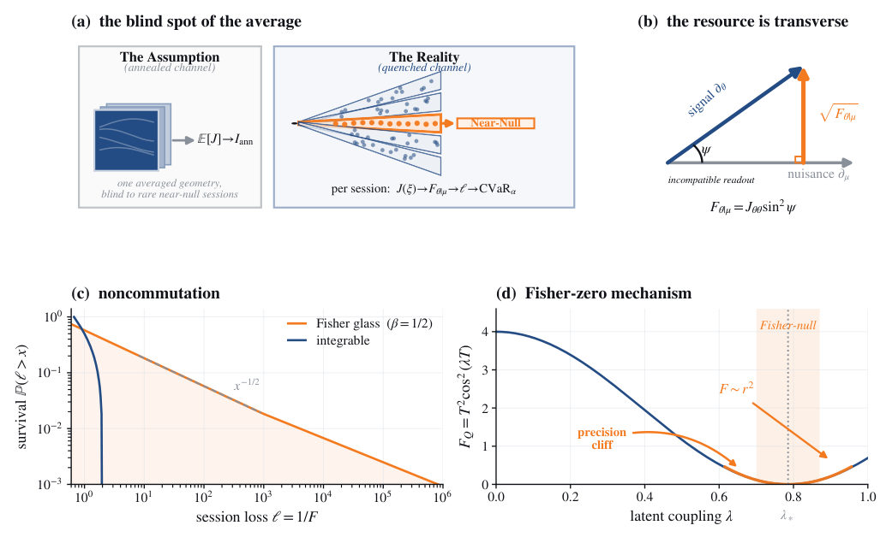
<figcaption class="paper-figure-caption"><b>Fig 1.</b> FIG. 1. Quenched Fisher geometry: a visual abstract. (a) The averaged-channel paradigm certifies one geometry, E[J] → average QFI, whereas the quenched, non-self-averaging experiment samples a distribution of session-resolved geometries J(ξ), each fed through the noncommuting pipeline J →Fθ|µ →ℓ→CVaRα of Eq. (1), so rare near-null sessions (F⊥≈0) hidden by the average dominate the loss. (b) The certified resource is the response transverse to the latent nuisance, Fθ|µ = Jθθ sin2 ψ; for a vector target the obstruction is measurement incompatibility, quantified by the Holevo loss of Sec. V. (c) Two latent ensembles with the same mean E[F] = 1 but different inverse-loss tails, one integrable...</figcaption>
</figure>
<figure class="paper-figure-card">

<figcaption class="paper-figure-caption"><b>Fig 2.</b> FIG. 2. Signal–disorder action separation. Tail-certified amplification is controlled by the ratio of transverse signal action to disorder action. (a) A protocol writes signal and latent disorder into the probe with generally different action gains gs and gd; the fixed-safe-phase resource is (gs/gd)2, which becomes (g⊥/gd)2 after nuisance projection. (b) Dimensionless tail factor Rα(Φ), with Φ the dimensionless safe latent phase, for a two-state Loschmidt response, with first zero at u1 = π/2; the certified information vanishes once the latent support reaches the zero. (c) Common-generator amplification, gs = gd = M and Φ = MΛT, collapses Λ2ITC α,M for different M. (d) Separated disorder...</figcaption>
</figure>
<figure class="paper-figure-card">

<figcaption class="paper-figure-caption"><b>Fig 3.</b> FIG. 3. Tail diagnostics from session losses. Left: survival functions of the inverse session loss ℓ= 1/F⊥for the four design classes: a single unsafe arm follows the nonintegrable x−1/2 law (below the finite-mean boundary β = 1), a two-arm portfolio is marginal (x−1), a zero-nondegenerate three-arm portfolio steepens to x−3/2, and a configuration-wise Fisher reserve removes the algebraic zero tail; the measured slope is the inverse-loss tail index β. Right: experimental certification from calibrated session losses: (a) survival curves distinguishing unsafe, portfolio, and reserve designs, and (b) Hill upper-tail estimates of β giving a finite-sample stability check against the β = 1...</figcaption>
</figure>
<figure class="paper-figure-card">
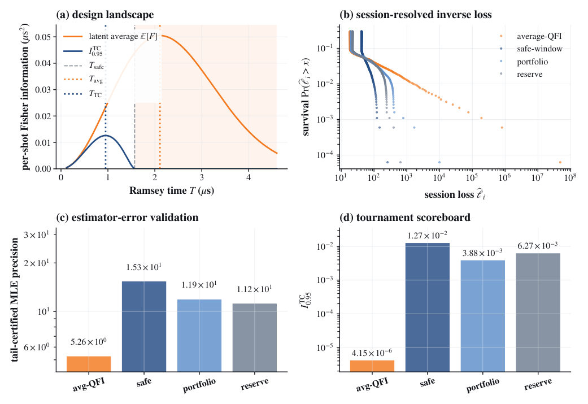
<figcaption class="paper-figure-caption"><b>Fig 4.</b> FIG. 4. Annealed winner, quenched loser. A platform-level shallow-NV design tournament compares four Ramsey protocols under the same shot budget and latent session ensemble. (a) The standard average-QFI rule selects Tavg &gt; Tsafe, crossing into the Fisher-glass region, while the tail-certified optimizer stays at TTC &lt; Tsafe. (b) Session-resolved inverse-loss tails expose the mechanism: the average-QFI arm has a much heavier bad-session tail, while portfolio and reserve designs suppress the far tail. (c) With finite calibration shots, finite sensing shots, and an explicit MLE, the plotted tail-certified MLE precision 1/CVaR0.95(MSEMLE) tracks the predicted ranking. (d) Scoreboard:...</figcaption>
</figure>
<figure class="paper-figure-card">
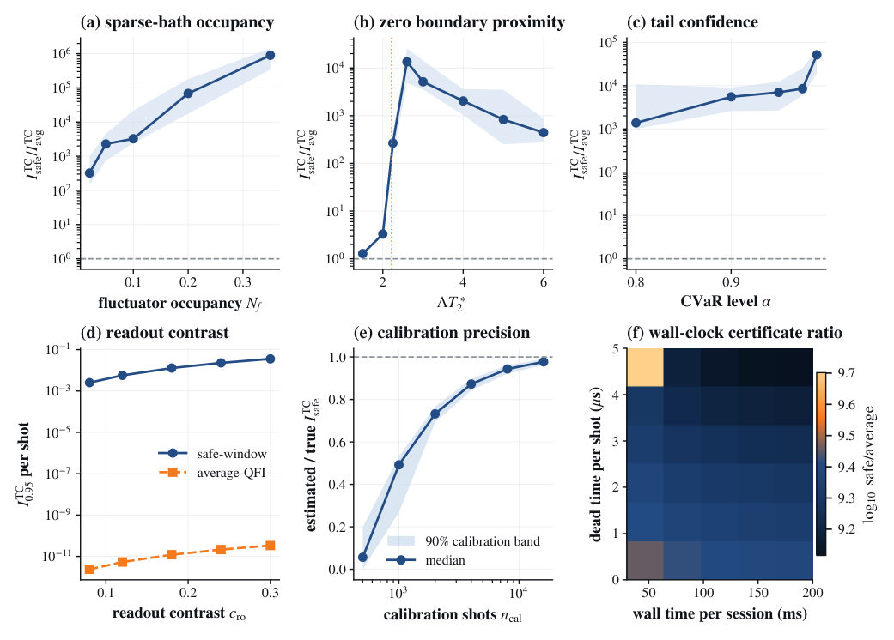
<figcaption class="paper-figure-caption"><b>Fig 5.</b> FIG. 5. Sensitivity of the platform-level certificate. Sweeps around the representative shallow-NV parameters in Table I. (a)–(c) The finite-session ratio of safe-window to average-QFI tail-certified information is shown as the median over 24 inde- pendent latent ensembles with Nsess = 32000 sessions each. Shading gives a 90% bootstrap confidence interval for the median log-ratio; the raw 10–90% ensemble spread is reported in the processed results file. The panels vary fluctuator occupancy Nf, dimensionless coupling range ΛT ∗ 2 , and CVaR level α. The dotted line in (b) marks ΛT ∗ 2 = π/ √</figcaption>
</figure>

**Summary.** This paper introduces 'tail-certified' quantum metrology, recognizing that standard averaging of Fisher information fails when environmental noise freezes during measurements. It develops a rigorous framework using Conditional Value-at-Risk to certify the true achievable precision based on the worst-case (upper tail) performance across many noisy sessions. This is critical for designing robust quantum sensors operating in complex, fluctuating environments.

**Why it may be interesting.** This work provides a crucial, advanced statistical tool for quantum sensing that moves beyond simple mean estimates to quantify performance guarantees against rare but detrimental noise realizations, which is vital for real-world quantum hardware deployment.

Detailed structure

**Main problem.** Standard quantum metrology certification based on averaged Fisher information fails when sensors operate in quenched environments where environmental noise varies between measurements. The goal is to quantify the true, robust precision achievable under these non-self-averaging conditions.

**Main result.** The certified resource must be quantified using tail statistics (Conditional Value-at-Risk) applied to the inverse loss, which yields a 'tail-certified information' that can be orders of magnitude higher than the average QFI in certain regimes.

**Method.** The methodology involves projecting out nuisance directions associated with slow environmental fluctuations and then applying extreme value theory concepts via CVaR to the resulting inverse-loss function. This establishes a rigorous, non-averaging certification bound.

**Model / system.** The analysis is applied to quantum sensors like shallow Nitrogen-Vacancy (NV) centers, superconducting qubits, and semiconductor spin qubits operating in environments with latent disorder ($\xi$). The theoretical framework models the measurement process as conditional on this frozen environmental state.

**Key observables.** Tail-Certified Information (ITC), Inverse-Loss Tail Exponent ($eta$), Transverse Fisher Information ($F_{	heta|\mu}$), and the Quantum Fisher Information (QFI).

**Important parameters / regimes.** The tail index $eta$ dictates finite certification; safe windows, portfolio size ($K$), and the CVaR confidence level ($\alpha$) are critical parameters.

**Assumptions / limitations.** The primary assumption violated by standard theory is that the experiment samples an averaged channel; instead, it samples a specific, frozen environmental configuration ($\xi$).

**Figures summary.** Figures contrast average-QFI optimization (which can be 'tail-catastrophic') against tail-certified designs (like portfolios or reserve channels), showing significant recovery of certified information. They also illustrate the dependence on the inverse-loss tail exponent $eta$.

**Paper structure.** The paper progresses by first identifying the failure of averaged metrics, then developing the quenched certification pipeline ($	ext{Condition} 	o 	ext{Project} 	o 	ext{Invert Loss} 	o 	ext{Tail Certify}$). It establishes theoretical no-go theorems and concludes with practical design laws (e.g., Fisher reserves) demonstrated on NV center simulations.

Abstract

Quantum metrological advantage is certified by averaged Fisher responses: contrast, susceptibility, or quantum Fisher information (QFI). This fails in quenched sensors, where slow environmental variables freeze within a session but vary between repetitions: shallow nitrogen-vacancy (NV) centers, superconducting qubits with slow two-level fluctuators, and semiconductor spin qubits in drifting charge noise. They sample session-resolved Fisher geometries, not an averaged channel. Certification conditions on the latent session, projects nuisance directions, inverts to attainable loss, then tail-certifies; this inverse upper-tail loss defines quenched tail-certified information. A no-go theorem: no averaged Fisher data determine this certificate; ensembles sharing averaged Fisher matrix, QFI, and projected information have finite or zero certified precision. A Fisher-zero integrability transition governs collapse: the inverse-loss tail exponent $β$ sets the boundary, with nonintegrable certified loss for $β\le 1$, even when annealed information is large or scaling. The certified quantum resource is response transverse to latent disorder, not raw amplification sharing its generator; universal design laws: safe windows, nondegenerate portfolios, Fisher reserves, action separation, Fisher-cut criteria. A shallow-NV Ramsey tournament shows average-QFI optimization is tail-catastrophic, whereas tail-certified designs recover nearly three orders of magnitude in certified information at equal shot budget and latent ensemble. These non-self-averaging phases are Fisher glasses, governed by Fisher-zero rare-event statistics.

[↑ back to top](#top)

### [Phase diagram of a double-occupancy cell model of a fluid with Curie-Weiss interaction](http://arxiv.org/abs/2607.01009v1)

**Authors:** R. V. Romanik, O. A. Dobush, M. P. Kozlovskii, I. V. Pylyuk, M. A. Shpot  
**Type:** theory · **Category:** statistical mechanics · **PDF:** <https://arxiv.org/pdf/2607.01009v1>  
**Analysis basis:** full PDF text, analyzed in chunks
**Topic relevance:** `analog quantum simulation` **2/5** · `Keldysh / 2PI / non-Gaussian methods` **1/5** · `driven-dissipative phase transition` **1/5**

↔ Scroll figures horizontally

<figure class="paper-figure-card">

<figcaption class="paper-figure-caption"><b>Fig 1.</b> Fig. 1: Phase diagram of the double-occupancy cell model in the case of distinguishable particles. Blue curve: the line of critical points at a &lt; atc. Red curves: the lines of critical points at a &gt; atc. Black curve: the line of triple points in the interval atc &lt; a &lt; 0.5. All the lines meet at the tricritical point with a = atc = 1</figcaption>
</figure>
<figure class="paper-figure-card">
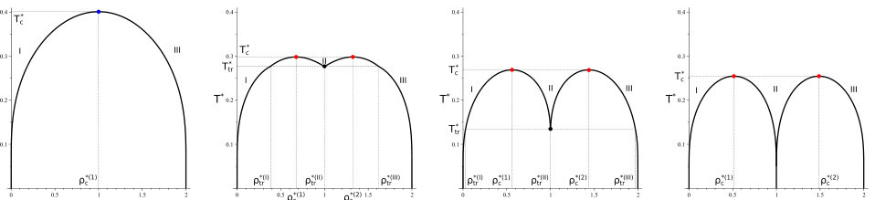
<figcaption class="paper-figure-caption"><b>Fig 2.</b> Fig. 2: The T ∗−ρ∗phase diagrams of the double-occupancy cell model in the case of distinguishable particles at different values of a = ∆/J. Solid curves are the coexistence lines. (a): The coexistence line between phases I and III ends at the critical point. (b) and (c): Coexistence lines between phases I — II and II — III are present in the temperature interval T ∗ tr ≤T ∗≤T ∗ c , each ending at its own critical point. For T ∗≤T ∗ tr, phases I and III coexist. T ∗ tr is the temperature of the triple point. (d): Coexistence lines between phases I — II and II — III are present for 0 ≤T ∗≤T ∗ c , each ending at its own critical point.</figcaption>
</figure>
<figure class="paper-figure-card">
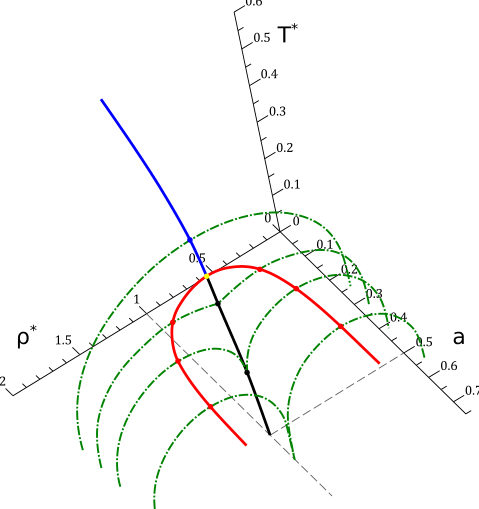
<figcaption class="paper-figure-caption"><b>Fig 3.</b> Fig. 3: The phase diagram in the (T ∗, ρ∗, a)-space for the case of distinguishable particles. The figure combines representations of Figs. 1 and 2 in one view. Green dashed curves: the coexistence lines at a = 0.3, a = 0.375, a = 0.45, and a = 0.6. Blue and red curves are the critical-point lines. Black curve is the triple-point line.</figcaption>
</figure>
<figure class="paper-figure-card">

<figcaption class="paper-figure-caption"><b>Fig 4.</b> Fig. 4: Pair distribution function g(2)(r1, r2) as a function of separation r = |r1 −r2|. The quantity r∗denotes distance from the point with coordinate r1 to the boundary of the cubic cell containing r1, in the direction of r2. The results are presented for the system of distinguishable particles, at a = 0.5. Phase I: T ∗= 0.25, ρ∗= 0.1; Phase II: T ∗= 0.2, ρ∗= 0.5; Phase III: T ∗ c = 0.25, ρ∗= 1.9; Supercritical: T ∗= 0.5, ρ∗= 0.5. At r &gt; r∗, g(2) = 1.</figcaption>
</figure>

**Summary.** This paper analyzes a double-occupancy cell fluid model with Curie-Weiss interactions, demonstrating its rich phase diagram structure. By relating it to the Blume-Capel model, the authors map out multiple coexistence regimes, including gas-liquid and liquid-liquid transitions. The complexity arises from the interplay between local repulsion and global attraction.

**Why it may be interesting.** While focused on classical statistical mechanics, the mapping to the Blume-Capel model connects it to quantum spin systems, making the study of complex phase transitions relevant for understanding critical phenomena in many-body physics.

Detailed structure

**Main problem.** The study investigates the complex phase diagram and rich thermodynamic behavior of a fluid modeled by a double-occupancy cell model interacting via Curie-Weiss forces.

**Main result.** The competition between local repulsion and long-range attraction generates complex phase behavior, including regimes with single/double critical points, tricritical points, and triple-point formation, leading to gas-liquid and liquid-liquid coexistence.

**Method.** The analysis uses the grand-canonical ensemble formalism, employing analytical techniques like Laplace's method on integrals derived from the partition function.

**Model / system.** The system is a double-occupancy cell fluid model ($n_l \in \{0, 1, 2\}$) whose Hamiltonian is shown to be isomorphic to the Blume-Capel model on a complete graph. Interactions include global Curie-Weiss attraction and local repulsion.

**Key observables.** Critical temperatures ($T_c^*$), critical densities ($
ho_c^*$), triple-point coordinates, and phase coexistence lines (Gas $\leftrightarrow$ LDL $\leftrightarrow$ HDL).

**Important parameters / regimes.** The ratio $a = \Delta/J$, which governs the transition between different types of critical points.

**Assumptions / limitations.** Calculations are performed in the thermodynamic limit ($N 	o \infty$), and the analysis distinguishes results for distinguishable versus indistinguishable particles.

**Figures summary.** Figures illustrate the phase diagrams (T*-rho* vs a) showing coexistence lines, critical point loci (blue/red), and triple-point lines (black).

**Paper structure.** The paper progresses by establishing the model's isomorphism, deriving the grand partition function, applying advanced mathematical techniques (Laplace's method), and then detailing the phase diagram analysis for both distinguishable and indistinguishable particle cases.

Abstract

A double-occupancy cell model of a fluid with Curie-Weiss interaction is studied. First, we show that the model is isomorphic to the Blume-Capel model on a complete graph through a simple transformation from spin to occupancy variables. We then investigate its phase behavior within the grand-canonical ensemble using a combination of analytical and numerical methods. Despite its simplicity, the model exhibits a remarkably rich thermodynamic behavior depending on the ratio between the local repulsive and global attractive interactions. We identify regimes characterized by a single critical point, two distinct critical points, tricritical behavior, and triple-point formation. For sufficiently strong repulsion, the system possesses three fluid phases of different densities, leading to both gas-liquid and liquid-liquid coexistence. The locations of the critical, tricritical, and triple points are determined, and the corresponding phase diagrams are constructed. These results demonstrate that the competition between double-occupancy repulsion and long-range attraction is sufficient to generate complex phase behavior in a minimal multiple-occupancy lattice-gas model.

[↑ back to top](#top)

### [Quantum-advantage resource of a two-mode Gaussian state: Analytical theory of convex optimization and a Galois no-go for the closed-form solution](http://arxiv.org/abs/2607.00266v1)

**Authors:** Kunwar Kalra, V. V. Kocharovsky  
**Type:** theory · **Category:** quantum information and computing · **PDF:** <https://arxiv.org/pdf/2607.00266v1>  
**Analysis basis:** full PDF text, analyzed in chunks
**Topic relevance:** `entanglement & information structure` **2/5** · `Keldysh / 2PI / non-Gaussian methods` **1/5**

↔ Scroll figures horizontally

<figure class="paper-figure-card">
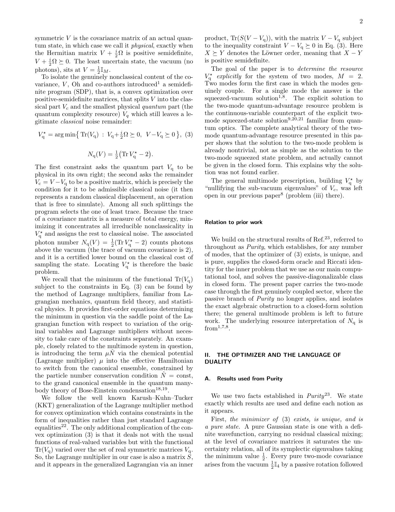
<figcaption class="paper-figure-caption"><b>Fig 1.</b> Low-resolution page preview, page 2</figcaption>
</figure>
<figure class="paper-figure-card">

<figcaption class="paper-figure-caption"><b>Fig 2.</b> Low-resolution page preview, page 3</figcaption>
</figure>
<figure class="paper-figure-card">
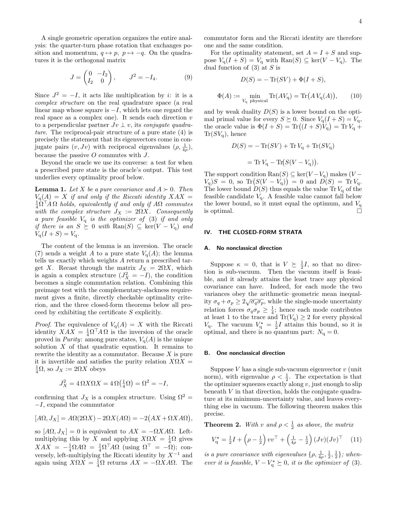
<figcaption class="paper-figure-caption"><b>Fig 3.</b> Low-resolution page preview, page 4</figcaption>
</figure>
<figure class="paper-figure-card">
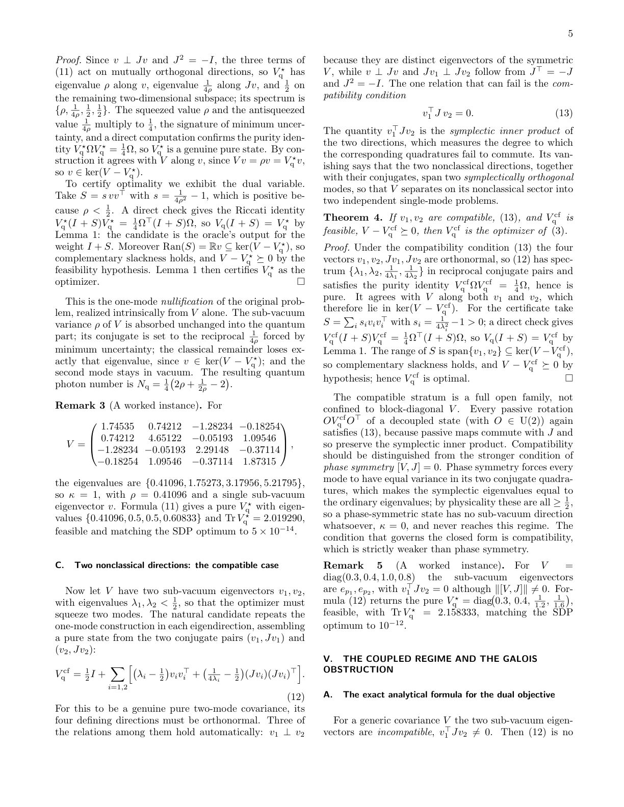
<figcaption class="paper-figure-caption"><b>Fig 4.</b> Low-resolution page preview, page 5</figcaption>
</figure>
<figure class="paper-figure-card">
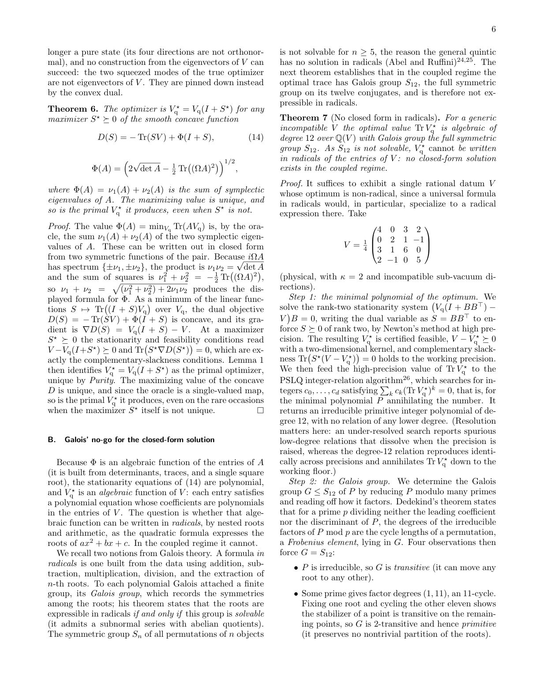
<figcaption class="paper-figure-caption"><b>Fig 5.</b> Low-resolution page preview, page 6</figcaption>
</figure>

**Summary.** The paper rigorously analyzes the quantum-advantage resource of two-mode Gaussian light by solving a constrained convex optimization problem. It establishes that while simple cases yield closed forms, the generic case for coupled modes leads to an optimal value determined by the least real root of a degree-12 polynomial. This demonstrates a fundamental mathematical barrier to finding general analytical solutions in this quantum regime.

**Why it may be interesting.** This work provides deep mathematical insight into resource quantification in continuous variable quantum optics, establishing rigorous boundaries on what can be solved analytically versus what requires numerical methods.

Detailed structure

**Main problem.** The core problem is determining the 'quantum-advantage resource' of a mixed Gaussian state, which requires solving a complex convex optimization problem.

**Main result.** For generic two-mode states with genuinely coupled modes, the optimal quantum-advantage resource cannot be expressed in terms of elementary functions or radicals due to an algebraic obstruction related to the Galois group $S_{12}$.

**Method.** The authors use convex optimization techniques, formulating the problem as a semidefinite program (SDP) and solving it by reducing it to maximizing a dual concave cost function.

**Model / system.** The system models multimode light described by its quadrature covariance matrix $V$. The focus is on the two-mode case ($M=2$), which represents the smallest regime exhibiting genuinely coupled modes.

**Key observables.** Quantum-advantage resource, $N_q(V)$, defined as $rac{1}{2}(	ext{Tr} V_{\star q} - 2)$; the optimal covariance matrix $V_{\star q}$.

**Important parameters / regimes.** The number of nonclassical directions ($\kappa$); compatibility between eigenvectors; and the structure of the polynomial whose root determines $N_q(V)$.

**Assumptions / limitations.** The analysis relies on reducing the SDP to a dual problem, and closed-form solutions are only possible when the system falls into specific 'decoupled strata' where eigenvector compatibility holds.

**Figures summary.** Not specified in the notes; the structure is built around deriving polynomial equations whose roots determine the resource value.

**Paper structure.** The paper progresses by defining the optimization problem (primal/dual), establishing an oracle formula for the minimizer, analyzing specific low-$\kappa$ cases ($\kappa=0, 1$), and culminating in the general result that requires solving a degree-12 polynomial equation for coupled systems.

Abstract

We study the problem of extracting a quantum complexity resource from a mixed Gaussian state of the multimode light. We present the first complete, certificate-checked solution to this problem in a genuinely coupled sector. We carry this out for the two-mode case, the smallest case in which modes are genuinely coupled. Even in this case the solution is highly nontrivial, and we rigorously prove that it cannot be given in a closed form.

[↑ back to top](#top)

### [Classification and Exact Local Masking in Finite-Field Clifford Dual-Unitary Circuits](http://arxiv.org/abs/2607.00210v1)

**Authors:** Basanta R Pahari  
**Type:** theory · **Category:** quantum information and computing · **PDF:** <https://arxiv.org/pdf/2607.00210v1>  
**Analysis basis:** full PDF text, analyzed in chunks
**Topic relevance:** `entanglement & information structure` **2/5**

↔ Scroll figures horizontally

<figure class="paper-figure-card">

<figcaption class="paper-figure-caption"><b>Fig 1.</b> Low-resolution page preview, page 2</figcaption>
</figure>
<figure class="paper-figure-card">
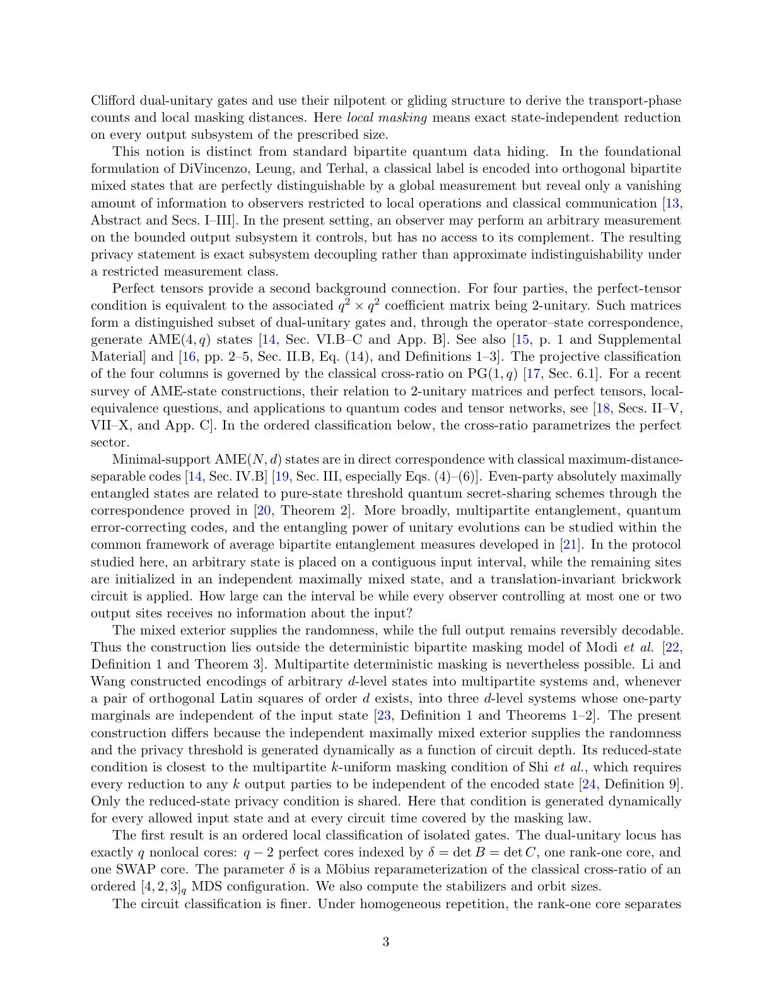
<figcaption class="paper-figure-caption"><b>Fig 2.</b> Low-resolution page preview, page 3</figcaption>
</figure>
<figure class="paper-figure-card">

<figcaption class="paper-figure-caption"><b>Fig 3.</b> Low-resolution page preview, page 4</figcaption>
</figure>
<figure class="paper-figure-card">
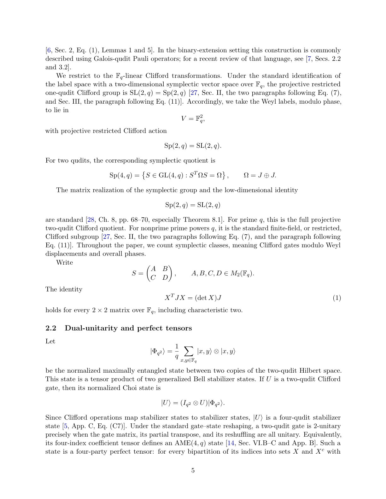
<figcaption class="paper-figure-caption"><b>Fig 4.</b> Low-resolution page preview, page 5</figcaption>
</figure>
<figure class="paper-figure-card">
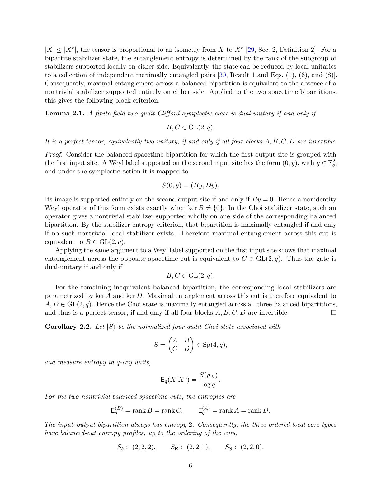
<figcaption class="paper-figure-caption"><b>Fig 5.</b> Low-resolution page preview, page 6</figcaption>
</figure>

**Summary.** This theoretical paper classifies complex two-qudit gates within finite fields by analyzing their structure using symplectic groups. It establishes precise quantitative bounds on 'local masking'—the ability to hide input information from subsets of output qubits while retaining full recoverability. This has significant implications for designing secure quantum communication protocols.

**Why it may be interesting.** This work provides rigorous mathematical tools (symplectic geometry, algebraic combinatorics) to quantify quantum information security primitives like data hiding and local observability in structured quantum computation models.

Detailed structure

**Main problem.** The paper classifies two-qudit finite-field Clifford dual-unitary gates and applies this classification to determine exact local masking properties in homogeneous brickwork quantum circuits.

**Main result.** It proves that sufficiently short quantum messages can be completely hidden from any one- or two-qudit output subsystem, even when the input is entangled, while remaining perfectly recoverable from the full output.

**Method.** The analysis uses symplectic matrix representations over finite fields ($\mathbb{F}_q$) to classify gate loci and employs concepts like local masking distances derived from Weyl edge channels.

**Model / system.** The model involves quantum circuits built using two-qudit gates defined over finite fields, specifically analyzing the structure of dual-unitary Clifford elements within $	ext{Sp}(4, q)$.

**Key observables.** Local masking distances ($d_1(t), d_2(t)$); symplectic core types ($S_\delta$, $SR$, $SS$); and recovery fidelities.

**Important parameters / regimes.** The finite field size $q$; circuit depth $t$; and the determinant parameter $\delta$.

**Assumptions / limitations.** The analysis distinguishes between local gate equivalence and homogeneous circuit transport, and assumes specific boundary conditions for edge channel analysis.

**Figures summary.** Tables summarize exact phase counts for different edge-transport phases within the dual-unitary symplectic classes; diagrams illustrate core structures related to cross-ratios.

**Paper structure.** The paper proceeds by defining the finite-field Clifford representation, classifying dual-unitary gates and perfect tensors using symplectic invariants, developing the concept of masking distances via Weyl channels, and finally applying these results to derive specific local privacy guarantees.

Abstract

We classify two-qudit finite-field Clifford dual-unitary gates and apply the classification to exact local masking and operator transport in homogeneous brickwork circuits. Under ordered one-qudit Clifford equivalence, the dual-unitary locus contains $q-2$ perfect-tensor cores, one rank-one core, and one SWAP core. The perfect cores are indexed by \[ δ=\det B=\det C, \] and are related to the ordered cross-ratio $λ$ of the associated $[4,2,3]_q$ MDS configuration through \[ λ=\fracδ{δ-1}. \] Homogeneous repetition separates these cores into five transport phases whose algebraic codimensions in $\operatorname{Sp}(4,q)$ are $0,1,2,3,4$.   The one-site Weyl edge channels determine exact local-masking distances. Perfect-tensor circuits attain \[ d_1(t)=4t, \qquad d_2(t)=4t-2, \] whereas delayed erasers satisfy \[ d_1(t)=4t-2, \qquad d_2(t)=4t-4 \] for $t\geq 2$. Consequently, sufficiently short quantum messages are completely hidden from every one- or two-qudit output subsystem, even when the input is entangled with a reference, while remaining exactly recoverable from the full output.   For $q=3$, we construct an explicit perfect-tensor Clifford gate from two inverse SUM gates. Exhaustive Weyl-support searches for $t=1,2,3$ reproduce the predicted masking distances, and a one-period Choi-channel calculation for a four-qutrit periodic circuit gives numerical residual leakage below $2\times 10^{-16}$. Under the coherent perturbation considered here, local leakage is linear in the perturbation strength, whereas the infidelity of recovery using the ideal inverse is quadratic near the perfect point.

[↑ back to top](#top)

### [A universal time-of-arrival signature of Bose--Einstein condensation](http://arxiv.org/abs/2607.00184v1)

**Authors:** Mathieu Beau, Timothey Szczepanski  
**Type:** theory · **Category:** quantum gases · **PDF:** <https://arxiv.org/pdf/2607.00184v1>  
**Analysis basis:** full PDF text, analyzed in chunks
**Topic relevance:** `Keldysh / 2PI / non-Gaussian methods` **1/5** · `analog quantum simulation` **1/5** · `driven-dissipative phase transition` **1/5** · `non-equilibrium dynamics` **1/5** · `non-equilibrium universality` **1/5**

↔ Scroll figures horizontally

<figure class="paper-figure-card">
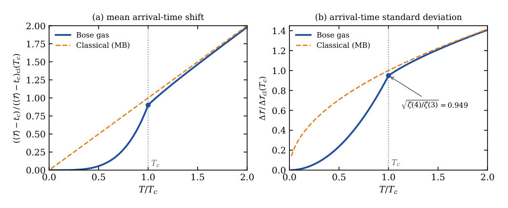
<figcaption class="paper-figure-caption"><b>Fig 1.</b> FIG. 1. Time-of-arrival statistics across the Bose–Einstein transition. (a) Mean arrival-time shift ⟨T ⟩−tc and (b) standard deviation ∆T , each normalized to its classical value at Tc, versus T/Tc. The dashed curves are the Maxwell–Boltzmann predictions, ⟨T ⟩cl −tc ∝T and ∆Tcl = g−1p</figcaption>
</figure>
<figure class="paper-figure-card">

<figcaption class="paper-figure-caption"><b>Fig 2.</b> FIG. 2. Observability and robustness of the TOA cusp. (a) Apparent one-sided slope ratio at the transition versus finite- difference temperature step ε. The sharp thermodynamic-limit curve approaches the universal value R∞≃2.5556 (dotted line), equal to the trapped-gas specific-heat ratio. The finite-N curves are computed from the exact discrete-level sum for 4He (m = 6.64 × 10−27 kg) in a harmonic trap (ωx, ωy, ωz) = 2π × (1000, 1000, 100) Hz, with N = 104, 105, 106 (geometric-mean frequency ¯ω = 2π × 464 Hz, Tc = 0.45, 0.97, 2.10 µK respectively). At finite N, the transition is rounded over a window δT/Tc ∼N −1/3; if ε is pushed below this width, the finite difference samples the smoothed...</figcaption>
</figure>
<figure class="paper-figure-card">

<figcaption class="paper-figure-caption"><b>Fig 3.</b> FIG. 3. One-sided slopes of the normalized mean arrival-time shift, ∂T/Tc  (⟨T ⟩−tc)/(⟨T ⟩−tc)cl(Tc)  , across the transition. The slope drops from 4 ζ(4)/ζ(3) ≃3.60 at T − c to R1 + TcR′(T + c ) ≃1.41 at T + c , a one-sided ratio R∞≃2.556 equal to the trapped-gas specific-heat ratio. The standard deviation ∆T shares the same ratio but a visually milder kink, being linear in σV rather than σ2 V .</figcaption>
</figure>
<figure class="paper-figure-card">

<figcaption class="paper-figure-caption"><b>Fig 4.</b> FIG. 4. Longitudinal velocity variance σ2 V (T) from the exact discrete-level sum [Eq. (56), open symbols] versus the semiclassical thermodynamic-limit form (solid), for 4He (m = 6.64 × 10−27 kg) in the harmonic trap (ωx, ωy, ωz) = 2π × (1000, 1000, 100) Hz (¯ω = 2π × 464 Hz), at N = 105 (Tc = 0.97 µK) and N = 106 (Tc = 2.10 µK). The two agree to &lt; 0.1% for T ≥Tc; the exact sum rounds the cusp over δT/Tc ∼N −1/3 and the below-Tc excess decreases with N.</figcaption>
</figure>
<figure class="paper-figure-card">

<figcaption class="paper-figure-caption"><b>Fig 5.</b> FIG. 5. Weak-interaction robustness from the HF–LDA calculation. The fractional shift of R stays at the percent level while Tc shifts several times more strongly.</figcaption>
</figure>

**Summary.** The authors show that Bose-Einstein condensation leaves a universal 'cusp' signature in the time-of-arrival distribution of released trapped atoms. This cusp is quantified by a ratio ($R_\infty$) predicted to match the specific heat ratio of the gas, providing a robust, measurable diagnostic tool for BEC dynamics.

**Why it may be interesting.** This work provides a concrete, measurable dynamical signature of BEC that links time-domain measurements (TOA statistics) directly to fundamental thermodynamic quantities (specific heat ratios), offering an experimental test for many-body quantum phenomena in ultracold gases.

Detailed structure

**Main problem.** To demonstrate that Bose-Einstein condensation (BEC) produces a universal, measurable signature—a cusp—in the time-of-arrival (TOA) statistics of a harmonically trapped gas released into free fall.

**Main result.** The BEC transition imprints a universal slope ratio ($R_\infty \approx 2.556$) in the TOA statistics, which is predicted to equal the specific-heat ratio of the ideal trapped Bose gas.

**Method.** Semiclassical analysis of the time-of-arrival distribution ($\Pi(t)$) in the long time-of-flight limit, analyzing how the mean arrival time and standard deviation exhibit non-analytic behavior at the critical temperature ($T_c$).

**Model / system.** An ideal Bose gas confined in an anisotropic harmonic trap, analyzed after being released into free fall. The analysis is performed in the semiclassical far-field limit ($\epsilon \ll 1$).

**Key observables.** Time-of-arrival distribution $\Pi(t)$, mean arrival time $\langle T 
angle$, standard deviation $\Delta T$, and the universal one-sided slope ratio $R_\infty$.

**Important parameters / regimes.** Critical temperature ($T_c$), trap frequencies ($\omega$), initial velocity variance ($\sigma_V^2$), and the small parameter $\epsilon = \sigma_V / \sqrt{2gH}$.

**Assumptions / limitations.** The analysis relies on the ideal gas limit, the thermodynamic limit ($N 	o \infty$), and the semiclassical far-field approximation. Weak interactions are tested but found to perturb the ratio only weakly.

**Figures summary.** Figures illustrate the temperature dependence of $\langle T 
angle - t_c$ and $\Delta T$, showing a clear cusp at $T=T_c$. Later figures confirm that finite atom number rounds this cusp, while weak interactions cause much smaller shifts in the ratio itself.

**Paper structure.** The paper develops the TOA distribution semiclassically, derives model-independent relations connecting moments ($\langle T 
angle$ and $\Delta T$), calculates the universal slope ratio $R_\infty$, and finally tests this prediction's robustness against finite atom numbers and weak repulsive interactions.

Abstract

We show that Bose--Einstein condensation produces a cusp in the time-of-arrival (TOA) statistics of a harmonically trapped gas released into free fall. In the semiclassical long time-of-flight regime, with $ε=σ_V/\sqrt{2gH}\ll1$, both the mean and standard deviation of the arrival time distribution, which are governed by the longitudinal velocity variance, remain continuous, but acquire a cusp whose one-sided slope ratio is universal within the ideal-gas far-field limit, $\mathcal{R}_\infty=2.5556\ldots$, and equals the trapped-gas specific-heat ratio $C(Tc^-)/C(Tc^+)$. Finite atom number rounds the cusp and weak interactions perturb it only weakly, leaving a measurable time-domain signature of condensation.

[↑ back to top](#top)

### [Bias-Preserving Gates and Quantum Error Correction With Dual-Rail Cat Codes](http://arxiv.org/abs/2607.00786v1)

**Authors:** Debjyoti Biswas, Nikhil Sharma, Alberto Salvador, Rui Wang, Mats Granath, Adithi Udupa, Giulia Ferrini  
**Type:** theory · **Category:** quantum information and computing · **PDF:** <https://arxiv.org/pdf/2607.00786v1>  
**Analysis basis:** full PDF text, analyzed in chunks
**Topic relevance:** `correlated / nonlocal dissipation` **1/5** · `correlated cavity matter` **1/5** · `driven-dissipative phase transition` **1/5** · `methods for driven-dissipative` **1/5**

↔ Scroll figures horizontally

<figure class="paper-figure-card">

<figcaption class="paper-figure-caption"><b>Fig 1.</b> FIG. 1: Wigner function of the even and odd cat states yielding the dual-rail cat code with N = 1 (DRCC-1). The logical basis states are |¯0⟩= |C+⟩|C−⟩(Eq.(10)) and |¯1⟩= |C−⟩|C+⟩(Eq.(11)).</figcaption>
</figure>
<figure class="paper-figure-card">
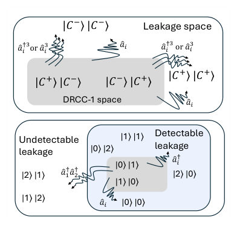
<figcaption class="paper-figure-caption"><b>Fig 2.</b> FIG. 2: For DRCC-1 (upper panel), any single-photon loss or gain, as well as arbitrary higher-order photon-loss errors ˆam i or photon-gain errors ˆa†m i on a single mode (m ≥2), either map the logical states to the even-parity leakage subspace or leave them within the odd-parity code space. For the conventional dual-rail code (lower panel), while single-photon loss or gain on either mode map the logical states to the even-parity leakage states {|00⟩, |11⟩, |02⟩, |20⟩} (detectable as erasures), higher-order photon gain processes ˆa†m i (m ≥2) can also populate other odd-parity states, such as {|12⟩, |21⟩}, leading to false-positive syndrome outcomes [20].</figcaption>
</figure>
<figure class="paper-figure-card">
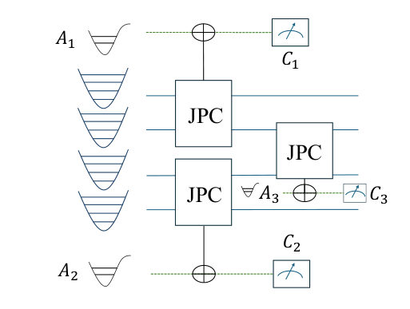
<figcaption class="paper-figure-caption"><b>Fig 3.</b> FIG. 3: Schematics for syndrome measurement and error correction with two-qubit repetition code with DRCC-1. For the syndrome measurement, we use a two-level system as an auxiliary qubit. Note that the JPC operation does not introduce entanglement between the auxiliary two-level system and the DRCC-1.</figcaption>
</figure>
<figure class="paper-figure-card">
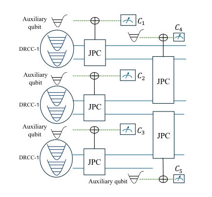
<figcaption class="paper-figure-caption"><b>Fig 4.</b> FIG. 4: Syndrome measurement scheme with the three-qubit repetition code with an inner DRCC-1.</figcaption>
</figure>
<figure class="paper-figure-card">

<figcaption class="paper-figure-caption"><b>Fig 5.</b> Fig. 5 shows the dependence of plogical on α and the noise strength.</figcaption>
</figure>

**Summary.** The paper introduces the Dual-Rail Cat Code (DRCC), a concatenated bosonic error-correcting code designed for fault-tolerant quantum computing. It demonstrates that DRCC can support universal, bias-preserving logical gates using only beam-splitter interactions. Furthermore, it develops robust protocols by combining DRCC with outer repetition codes to deterministically correct photon loss errors.

**Why it may be interesting.** This work directly addresses key challenges in photonic quantum computation—namely, achieving high fidelity gates while managing realistic hardware errors like photon loss and decoherence—by proposing a novel code structure.

Detailed structure

**Main problem.** Developing fault-tolerant quantum computation protocols that can simultaneously support universal logical operations, suppress hardware noise, and efficiently handle photon-loss errors.

**Main result.** The proposed Dual-Rail Cat Code (DRCC) offers a robust bosonic encoding that preserves erasure bias during gate operations and allows for deterministic single-photon loss correction via concatenation with outer repetition codes.

**Method.** Theoretical analysis involving the construction of logical gates using beam-splitter interactions, analyzing error propagation using the Knill–Laflamme condition, and deriving stabilization mechanisms via engineered dissipation (Lindblad master equations).

**Model / system.** The system utilizes bosonic encodings, specifically the DRCC, which is a concatenated structure combining an inner cat code with an outer dual-rail structure. Operations are modeled using cavity modes ($\hat{a}_i$) and governed by Hamiltonians or dissipators.

**Key observables.** Logical error rates (X, Y, Z), relative geometric phases, success probability of QEC protocols, and expectation values of number operators ($\langle \hat{n} 
angle$).

**Important parameters / regimes.** Photon loss rate ($\kappa$), dephasing rate ($\gamma$), cat state parameter ($\alpha$), and the concatenation level (e.g., two-qubit or three-qubit repetition code).

**Assumptions / limitations.** The analysis often relies on approximations such as the small-$\alpha$ limit for dephasing noise or the large-$\alpha$ limit for photon loss, and assumes specific dissipation mechanisms are active for stabilization.

**Figures summary.** Figures illustrate schematics of syndrome measurement using joint parity checks ($\hat{U}_{JPC}$) and show the structure of QEC protocols involving outer repetition codes concatenated with DRCC-1.

**Paper structure.** The paper progresses from introducing the limitations of individual bosonic codes to proposing the DRCC. It then details gate construction via beam-splitters, analyzes error correction under various noise models (photon loss/dephasing), and concludes by outlining advanced QEC protocols using outer repetition codes for robust fault tolerance.

Abstract

Scalable fault-tolerant quantum computation requires quantum error-correcting codes that simultaneously support universal logical operations, suppress hardware-specific noise, and enable efficient handling of photon-loss errors. Bosonic encodings such as the dual-rail and cat codes each offer attractive features but also exhibit important limitations when used in isolation. The dual-rail code enables efficient single-photon-loss detection by converting leakage out of the computational subspace induced by photon-loss errors into an erasure error. In contrast, the cat code provides a resource-efficient, bias-tailored error-correction scheme with bias-preserving logical gate operations. Here, we introduce the dual-rail cat code (DRCC), a concatenated bosonic encoding that combines an inner cat code with an outer dual-rail structure, thereby inheriting and enhancing the advantages of both constituent codes. We analyse the error-correction properties of the DRCC and propose a deterministic single-photon-loss correction protocol by concatenating it with an outer repetition code. Exploiting the code's intrinsic noise bias, we construct a universal set of logical gates using only beam-splitter interactions and demonstrate that all logical operations preserve the erasure-biased noise structure. The DRCC offers several distinctive advantages, including the absence of relative geometric phases during gate operations, deterministic erasure detection and correction, and simultaneous syndrome extraction without interrupting stabilisation. These features make the DRCC a promising bosonic code for hardware-efficient, bias-preserving, and erasure-resilient fault-tolerant quantum computation.

[↑ back to top](#top)

### [A differential derivation of the Obara-Saika relation for Gaussian electron repulsion integrals](http://arxiv.org/abs/2607.00102v1)

**Authors:** Charles C. Forgy, David A. Mazziotti  
**Type:** theory · **Category:** other · **PDF:** <https://arxiv.org/pdf/2607.00102v1>  
**Analysis basis:** full PDF text, analyzed in chunks
**Topic relevance:** `analog quantum simulation` **1/5** · `methods for driven-dissipative` **1/5** · `non-equilibrium dynamics` **1/5**

↔ Scroll figures horizontally

<figure class="paper-figure-card">
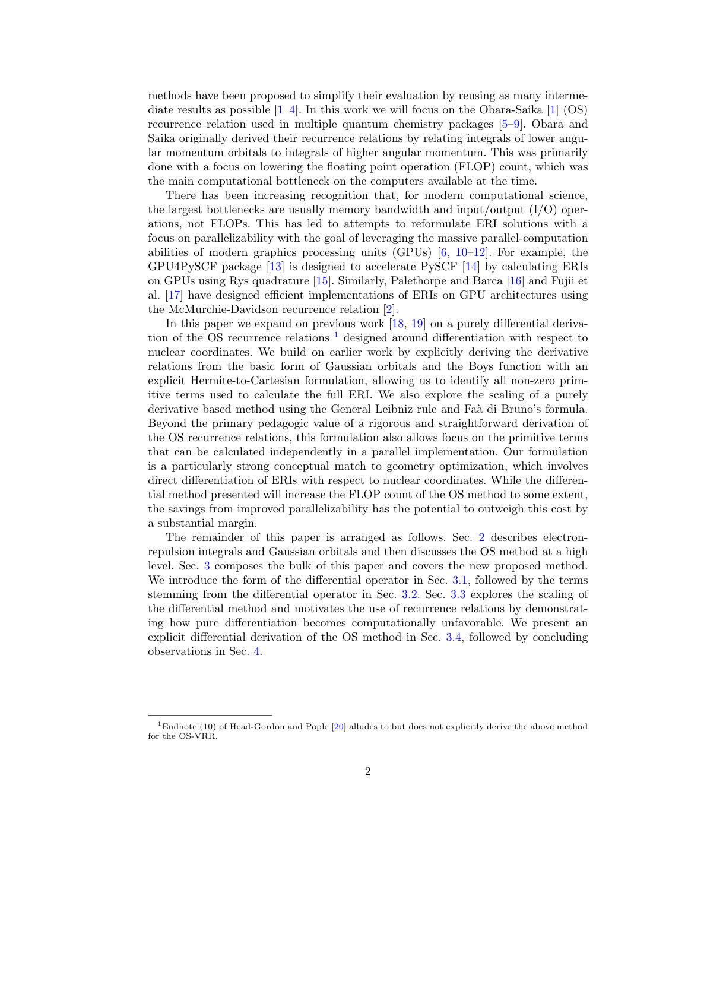
<figcaption class="paper-figure-caption"><b>Fig 1.</b> Low-resolution page preview, page 2</figcaption>
</figure>
<figure class="paper-figure-card">
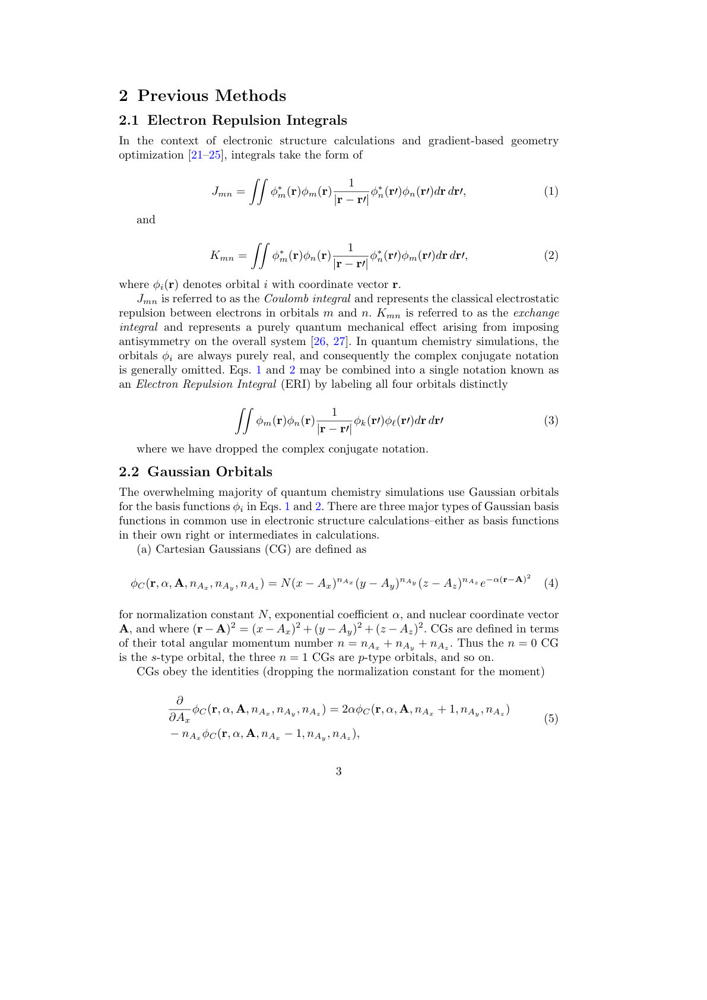
<figcaption class="paper-figure-caption"><b>Fig 2.</b> Low-resolution page preview, page 3</figcaption>
</figure>
<figure class="paper-figure-card">

<figcaption class="paper-figure-caption"><b>Fig 3.</b> Low-resolution page preview, page 4</figcaption>
</figure>
<figure class="paper-figure-card">
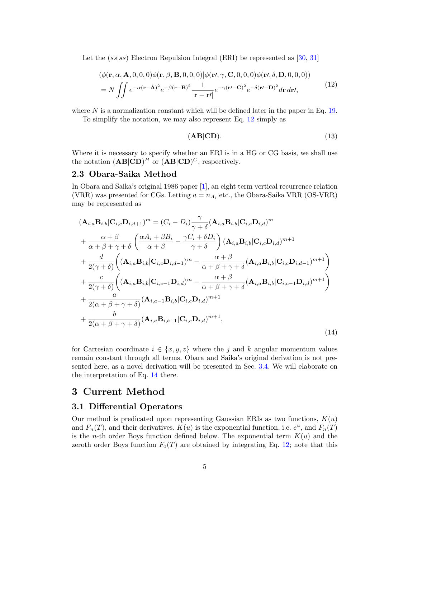
<figcaption class="paper-figure-caption"><b>Fig 4.</b> Low-resolution page preview, page 5</figcaption>
</figure>
<figure class="paper-figure-card">

<figcaption class="paper-figure-caption"><b>Fig 5.</b> Low-resolution page preview, page 6</figcaption>
</figure>

**Summary.** This paper provides a novel, purely differential derivation of the Obara-Saika recurrence relation used to calculate electron repulsion integrals. By deriving these relations from fundamental properties of Gaussian basis functions, the authors create a hierarchical formulation that exposes independent primitive terms. This structure is particularly valuable for developing highly parallelized code implementations on modern GPU architectures.

**Why it may be interesting.** While focused on quantum chemistry integrals rather than AMO systems directly, the rigorous development of derivative-based computational schemes with a focus on GPU parallelization is highly relevant to developing efficient numerical solvers for complex many-body Hamiltonians encountered in AMO physics.

Detailed structure

**Main problem.** The core problem is developing a computationally efficient method for evaluating complex two-center four-orbital Electron Repulsion Integrals (ERIs) required in quantum chemistry calculations.

**Main result.** The authors present a novel, rigorous derivation of the Obara-Saika recurrence relation based purely on differential relations between Gaussian basis functions, confirming its algebraic equivalence to established methods.

**Method.** The method involves applying repeated partial differentiation to unnormalized integrals and exploiting the structure of the resulting expressions to derive hierarchical recurrence relations for the ERIs.

**Model / system.** The calculations are performed within the framework of electronic structure theory using Gaussian basis sets (Cartesian, Hermite, Spherical Harmonics Gaussians) to represent molecular orbitals.

**Key observables.** Electron Repulsion Integrals (ERIs), specifically Coulomb and Exchange integrals ($J_{mn}, K_{mn}$), and the resulting recurrence relations (e.g., the vertical recurrence relation).

**Important parameters / regimes.** The angular momentum components of the basis functions, and the quadratic nature of the integration arguments $T$ and $u$.

**Assumptions / limitations.** The derivation assumes that exploiting differential structures allows for a systematic identification of independent primitive derivative quantities, which is crucial for parallelization.

**Figures summary.** Not specified by the notes; the focus is on deriving and comparing algebraic relations (Eqs. 14, 20, 45, 46).

**Paper structure.** The paper builds from defining the ERI in terms of Gaussian basis functions, developing recurrence relations for auxiliary Boys functions via differentiation, and culminating in the differential derivation that yields the final OS vertical recurrence relation.

Abstract

The Obara-Saika (OS) method is one of the most widely used techniques in quantum chemistry for evaluating electron repulsion integrals (ERIs) via a set of recurrence relations that build higher angular momentum integrals from lower-order ones. The original derivation by Obara and Saika proceeded by directly relating integrals of differing angular momentum. In this work, we present a compact novel derivation of the OS vertical recurrence relation based solely on differential relations between Gaussian basis functions, expanding on a method suggested in earlier work. By explicitly deriving the required derivative expressions we identify all non-zero primitive terms contributing to the full ERI to develop a hierarchical formulation of the OS recursion relations. This approach has pedagogical value as a rigorous and self-contained derivation. Additionally, the resulting organization exposes independent primitive derivative quantities and may be useful for code generation and parallel implementations on modern GPU architectures.

[↑ back to top](#top)

### [Breathing mode inducing dynamical pairing in Kagome materials](http://arxiv.org/abs/2607.01052v1)

**Authors:** Debmalya Chakraborty, Anushree Datta, Jorge Cayao  
**Type:** theory · **Category:** strongly correlated electrons · **PDF:** <https://arxiv.org/pdf/2607.01052v1>  
**Analysis basis:** full PDF text, analyzed in chunks
**Topic relevance:** `Keldysh / 2PI / non-Gaussian methods` **1/5** · `analog quantum simulation` **1/5** · `driven-dissipative phase transition` **1/5**

↔ Scroll figures horizontally

<figure class="paper-figure-card">
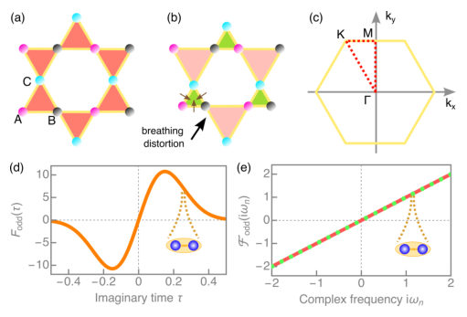
<figcaption class="paper-figure-caption"><b>Fig 1.</b> FIG. 1. (a) Sketch of a pristine regular kagome lattice (yellow) made of corner-sharing triangles with sublattices A, B and C. (b) Kagome lattice under a breathing distortion (brown ar- rows), which originates the breathing mode. (c) First Bril- louin zone of the kagome lattice indicating the high sym- metry points and the path KΓMK (red dashed lines). (d,e) Schematic pair amplitude induced by the breathing mode as a function of the imaginary time τ (d) and complex frequency in iωn (e). The resulting dynamical pair at finite times and frequencies is depicted by the blueish filled circles inside the orange ellipse.</figcaption>
</figure>
<figure class="paper-figure-card">

<figcaption class="paper-figure-caption"><b>Fig 2.</b> FIG. 2. (a) Energy bands of the normal state Hamiltonian Eq. (2) for tb = ta (dashes lines) and tb = 0.2ta (solid lines) with µ = 0. (b) Self-consistent values of the superconducting order parameters ∆AA,BB,CC with varying µ for tb = 0.2ta.</figcaption>
</figure>
<figure class="paper-figure-card">

<figcaption class="paper-figure-caption"><b>Fig 3.</b> FIG. 3. (a-c) Spectral function, ESEE and OSEO pair am- plitudes as functions of frequency along high-symmetry paths under a finite breathing distortion ta ̸= tb. The spectral func- tion is plotted versus ω, with z →ω + iη, while the pair amplitudes is shown for z. (d-f) The same as in (a-c) but as a function of momenta at ω = 1 for the spectral function, while z = 1 for the pair amplitudes. Parameters: ∆AA = 0.66|µ|, ∆BB = 0, ∆CC = −0.66|µ|, µ = 1, tb = 0.2ta when not speci- fied.</figcaption>
</figure>

**Summary.** This work theoretically investigates how a breathing mode structural distortion in Kagome materials can stabilize exotic superconducting phases. The authors classify possible pair symmetries and demonstrate that this specific distortion induces odd-frequency, dynamical Cooper pairs. This finding provides a mechanism for designing unconventional superconductivity using lattice engineering.

**Why it may be interesting.** While focused on condensed matter, the concept of dynamical pairing driven by structural modulation and its connection to unconventional superconductivity has parallels with engineered quantum systems where lattice vibrations or external fields induce novel many-body states.

Detailed structure

**Main problem.** To classify superconducting symmetries in Kagome superconductors and demonstrate the emergence of odd-frequency dynamical Cooper pairs driven by structural distortions.

**Main result.** The breathing mode induces odd-frequency spin-singlet Cooper pairs, which are entirely dependent on the structural distortion breaking inversion symmetry.

**Method.** Full classification of superconducting symmetries using anomalous Green's function symmetry analysis and self-consistent solution of the Bogoliubov de Gennes Hamiltonian.

**Model / system.** The system is Kagome materials studied under a 'breathing mode' structural distortion ($t_a 
eq t_b$). The superconductivity is modeled using an onsite spin-singlet pairing approach within the Nambu Green's function formalism.

**Key observables.** Superconducting pair amplitudes, symmetry classes (e.g., OSEO), and gap opening in band structures.

**Important parameters / regimes.** The structural distortion parameter ($t_a 
eq t_b$), chemical potential ($\mu$), and frequency/momentum dependence of pairing functions.

**Assumptions / limitations.** The analysis assumes onsite spin-singlet superconductivity, though the resulting odd-frequency pairs imply sublattice symmetry breaking is key.

**Figures summary.** Figure 1 shows pair amplitude dependence on imaginary time; Figure 2 compares band structures with and without distortion (showing gap opening); Figure 3 illustrates spectral function and OSEO pair amplitudes vs. frequency/momentum.

**Paper structure.** The paper first classifies all possible superconducting symmetries in the Kagome lattice, then analyzes how the breathing mode breaks inversion symmetry to stabilize a specific odd-frequency pairing state ($E^{(2)}_2$), which is shown to be non-local in time.

Abstract

The breathing mode in Kagome materials is a structural modulation that breaks inversion symmetry and has been shown to be a crucial source for intriguing phases in the normal state. In this work, we carry out a full classification of superconducting symmetries in kagome superconductors and demonstrate the emergence of odd-frequency dynamical Cooper pairs entirely driven by the breathing mode. We then show that odd-frequency spin-singlet Cooper pairs can be realized by controlling the breathing mode in kagome lattices with conventional spin-singlet $s$-wave superconductivity. Since odd-frequency pairing is intrinsically nonlocal in time, our results put forward the breathing mode for designing dynamical Cooper pairs in kagome materials.

[↑ back to top](#top)

### [Leggett-Garg inequality in the massive scalar vacuum: No violation under spacelike-separated measurements](http://arxiv.org/abs/2607.00314v1)

**Authors:** Yang Xiang  
**Type:** theory · **Category:** other · **PDF:** <https://arxiv.org/pdf/2607.00314v1>  
**Analysis basis:** full PDF text, analyzed in chunks
**Topic relevance:** `Keldysh / 2PI / non-Gaussian methods` **1/5** · `entanglement & information structure` **1/5** · `quantum measurements` **1/5**

↔ Scroll figures horizontally

<figure class="paper-figure-card">

<figcaption class="paper-figure-caption"><b>Fig 1.</b> FIG. 1. K3(τ, L) for the massive scalar field with spacelike-separated measurements (L = τ +2+ǫ, ǫ = 10−3) for various masses m. The thin horizontal line marks the classical bound K3 = 1; for all masses considered, K3 remains strictly below 1. For each mass, the maximum occurs at the smallest accessible τ (τ = 0.001), and Kmax 3 decreases monotonically as m increases, from Kmax 3 ≈0.716 at m = 0.001 down to 0.403 at m = 0.4. For τ ≥2, the two time windows no longer overlap; the curves decay exponentially with τ, as expected from the spacelike decay of the massive Hadamard function.</figcaption>
</figure>

**Summary.** The paper investigates whether the vacuum state of a massive scalar field violates the Leggett-Garg inequality (LGI), which tests for macrorealism. By employing a spacelike-separated measurement protocol, they rigorously satisfy noninvasive measurability conditions in QFT. The key finding is that $K_3 < 1$, demonstrating that temporal correlations in this free quantum field are constrained by causality and do not violate the LGI.

**Why it may be interesting.** This work provides a rigorous methodological benchmark for future tests of macrorealism in relativistic quantum fields, distinguishing between entanglement-based nonlocality (Bell) and temporal constraints imposed by causality (LGI).

Detailed structure

**Main problem.** The paper addresses testing for macrorealism using Leggett-Garg inequality (LGI) tests in relativistic Quantum Field Theory (QFT), specifically overcoming the challenge of ensuring noninvasive measurability (NIM).

**Main result.** Under strict spacelike separation conditions, the vacuum state of a free massive scalar field does not violate the LGI ($K_3 < 1$), establishing that macrorealism holds for temporal correlations in this system.

**Method.** The authors use a protocol involving three independent ensembles measured at causally disconnected (spacelike-separated) events to calculate the LGI parameter $K_3$ from two-time correlation functions derived via the Heisenberg picture.

**Model / system.** The model is the vacuum state of a free massive scalar field ($\phi$) in 1+1 dimensions. The analysis relies on calculating correlations using dichotomic observables, $	ext{sign}(\phi(f))$, and exploiting the Gaussian nature of the vacuum state.

**Key observables.** The LGI parameter $K_3 = 2C(	au, L) - C(2	au, 2L)$ and the two-time correlation function $C(f, g) = \langle 0| 	ext{sign}(\phi(f)) 	ext{sign}(\phi(g)) |0
angle$.

**Important parameters / regimes.** Mass ($m$), time separation ($	au$), and spatial separation ($L$). The condition for NIM is $L > 	au + 2	au_0$.

**Assumptions / limitations.** The analysis assumes a free field theory, which implies the vacuum state is Gaussian. The protocol rigorously enforces spacelike separation to satisfy the Noninvasive Measurability (NIM) criterion.

**Figures summary.** Figure 1 plots $K_3(	au, L)$ vs. $	au$ for different masses, showing that the calculated value remains below the classical bound of 1 and decays exponentially for large $	au$.

**Paper structure.** The paper establishes the QFT framework for LGI testing under NIM, derives the necessary correlation functions using the Heisenberg picture, performs numerical computations for overlapping windows, and concludes by comparing the result to known Bell violations.

Abstract

We overcome the long-standing noninvasive measurability (NIM) challenge in Leggett-Garg tests by exploiting the causal structure of quantum field theory (QFT). Our protocol uses three independent ensembles of the vacuum state, each measured by a different pair of observers at spacelike-separated events, yielding the three two-time correlators. By placing these events at positions $(0,0)$, $(τ,L)$, and $(2τ,2L)$ with $L>τ+2τ_0$, we rigorously ensure that no measurement can influence another. We investigate the vacuum state of a free massive scalar field in 1+1 dimensions, employing the dichotomic observable $Q(f)=\operatorname{sign}(φ(f))$ where $φ(f)$ is the smeared field. In the Heisenberg picture, the time evolution is absorbed into a translation of the time-window function, allowing us to derive the two-time correlation function $C(τ,L)$ and the Leggett-Garg parameter $K_3=2C(τ,L)-C(2τ,2L)$. For non-overlapping time windows, we find that the correlation function decays exponentially with $τ$ for a massive field. For overlapping windows, our numerical computation for a rectangular time window yields $K_3<1$ across the entire mass range, firmly establishing that the vacuum does not violate the LGI. Thus, under strict noninvasive conditions, the vacuum shows no violation of macrorealism, in stark contrast to its well-known violation of spatial Bell inequalities. Our spacelike-separated protocol provides the first LGI test in QFT with rigorously satisfied NIM, setting a methodological benchmark for future studies and highlighting the fundamental distinction between spacelike entanglement and temporal macrorealism in relativistic quantum fields.

[↑ back to top](#top)

### [Observation of Flat Bands in Type-II Weyl Semimetal TaRhTe$_{4}$](http://arxiv.org/abs/2607.01186v1)

**Authors:** Harry Rankin, Tyler J. Slade, Benjamin Schrunk, Yevhen Kushnirenko, Andrew Eaton, K. U. R. R. S. Rathnayaka, Maxwell Doyle, Lin-Lin Wang, Paul C. Canfield, Adam Kaminski  
**Type:** both · **Category:** strongly correlated electrons · **PDF:** <https://arxiv.org/pdf/2607.01186v1>  
**Analysis basis:** full PDF text, analyzed in chunks
**Topic relevance:** `Kondo & dissipative impurity` **1/5** · `analog quantum simulation` **1/5** · `non-equilibrium dynamics` **1/5**

↔ Scroll figures horizontally

<figure class="paper-figure-card">
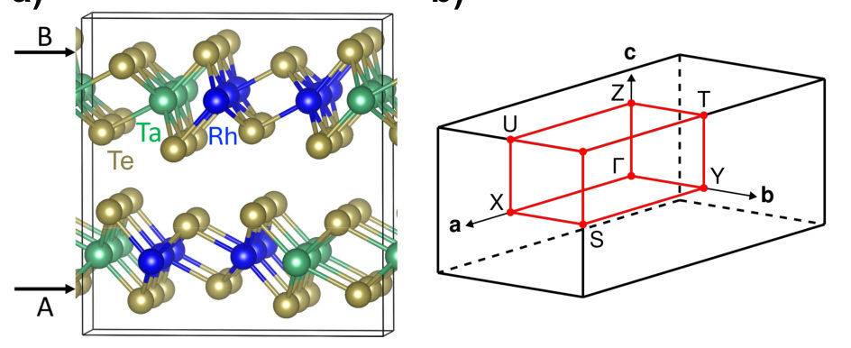
<figcaption class="paper-figure-caption"><b>Fig 1.</b> Figure 1: The crystal structure and Brillouin zone of TaRhTe4. a The crystal structure of TaRhTe4. Because it is noncentrosymmetric and layered, there are two different surface terminations, labeled by A and B here. b The Brillouin zone of TaRhTe4.</figcaption>
</figure>
<figure class="paper-figure-card">
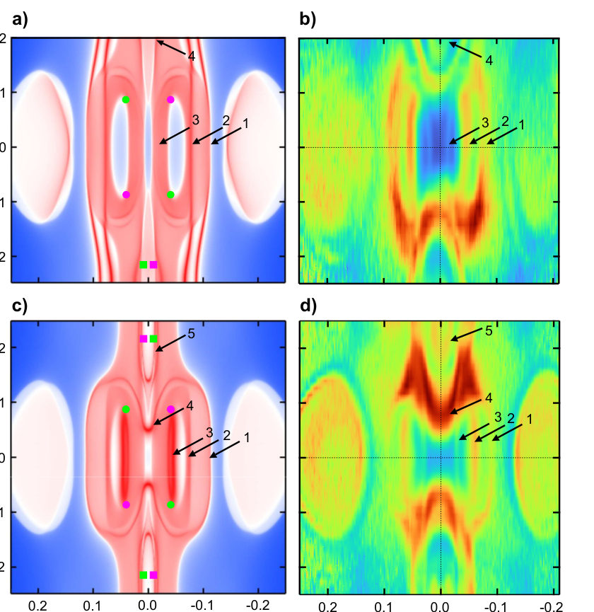
<figcaption class="paper-figure-caption"><b>Fig 2.</b> Figure 2: Fermi surfaces of TaRhTe4. a,b DFT-calculated and ARPES Fermi surfaces for termination B. The green and purple icons show the theoretical momentum positions of the Weyl points. The green WP projections have chirality -1 and the purple WP projections have chirality +1. The squares depict WP projections with predicted energy 13 meV above EF , whereas the circles represent WP projections with energy 50 meV below EF . c,d DFT-calculated and ARPES Fermi surfaces for termination A. Note that in this termination, we obtained data out to ky ≈0.25 1/˚A, whereas for termination B, we only obtained data out to ky ≈0.20 1/˚A.</figcaption>
</figure>
<figure class="paper-figure-card">

<figcaption class="paper-figure-caption"><b>Fig 3.</b> Figure 3: DFT and ARPES comparison of several energy-momentum cuts near the WP locations on each termination. a-c DFT-calculated energy-momentum cuts through termination B. The purple arrows indicate the theoretical locations of the WPs. d-f ARPES-measured energy-momentum cuts through termination B. The white arrows are placed at the same location as the purple arrows in the DFT calculations. g-i DFT-calculated energy-momentum cuts through termination B. j-l ARPES-measured energy-momentum cuts through termination B. 6</figcaption>
</figure>
<figure class="paper-figure-card">
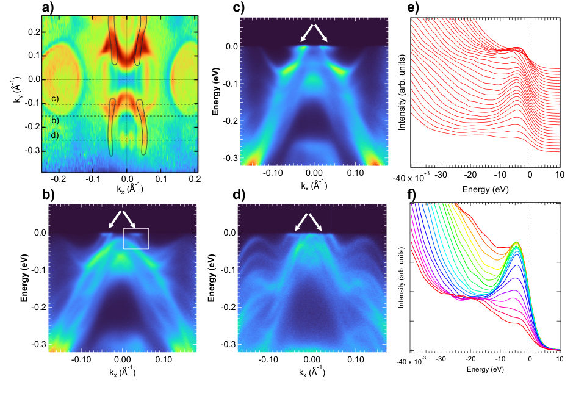
<figcaption class="paper-figure-caption"><b>Fig 4.</b> Figure 4: Flat bands in the Fermi surface of termination A. a FS of termination A, showing how the flat bands extend throughout most of the Brillouin zone. b,c,d Several energy-momentum cuts in which the flat bands are visible. The flat bands are shown by the white arrows. e EDCs of panel (b), focused on the area enclosed by the smaller white frame. f EDCs of panel (b) without offset. The individual EDCs are colored distinctly only to highlight that the peaks occur at the same energy for each EDC. The peak of the flat bands occurs approximately 4 meV below the Fermi energy.</figcaption>
</figure>
<figure class="paper-figure-card">

<figcaption class="paper-figure-caption"><b>Fig 5.</b> Figure 5: Comparison of cuts in each termination near the location of the flat bands a Termination B, where the lowercase roman numerals label the locations of the cuts shown in b i-iv. b Corresponding energy-momentum cuts. No flat bands are seen in termination B. c Termination A, which exhibits the flat bands. The lowercase roman numerals label the locations of the cuts shown in d i-iv. d Energy-momentum cuts at the locations labeled in panel c. The flat bands right below EF are indicated by the white arrows.</figcaption>
</figure>

**Summary.** This work reports the experimental detection of flat energy bands near the Fermi level in the bulk Weyl semimetal $	ext{TaRhTe}_4$. Using ARPES, the authors demonstrated that these flat bands coexist with the material's topological properties, a finding that was not predicted by standard DFT calculations. This suggests $	ext{TaRhTe}_4$ is a promising platform for studying the interplay between topology and strong electronic correlations.

**Why it may be interesting.** While focused on solid-state topology, the observation of emergent electronic states (flat bands) that deviate from standard mean-field theory predictions is highly relevant to understanding strongly correlated physics in novel quantum materials.

Detailed structure

**Main problem.** The primary goal was observing flat bands near the Fermi level in a nonmagnetic bulk Weyl semimetal, as such features are rare and unexpected based on initial theoretical calculations.

**Main result.** The study reports clear evidence of flat bands via ARPES measurements in $	ext{TaRhTe}_4$ that coexist with its nontrivial topological character (Weyl points), despite these bands not being predicted by DFT.

**Method.** The research combines Angle-Resolved Photoemission Spectroscopy (ARPES) on cleaved single crystals with Density Functional Theory (DFT) calculations to probe the electronic structure.

**Model / system.** The physical system is $	ext{TaRhTe}_4$, a noncentrosymmetric van-der Waals type-II Weyl semimetal. Measurements were performed on different crystal terminations (A and B), comparing experimental data against DFT predictions.

**Key observables.** Flat bands (constant energy over momentum range), Fermi surfaces, Weyl points, and Fermi arcs connecting these points.

**Important parameters / regimes.** The flat band energy was observed near $4 	ext{ meV}$ below the chemical potential ($	ext{E}_F$).

**Assumptions / limitations.** A key finding is that the observed flat bands were *not* predicted by DFT, suggesting a novel physical mechanism at play.

**Figures summary.** Figures compare ARPES and DFT Fermi surfaces for two terminations (A and B). Specific cuts highlight the distinct presence of momentum-independent flat bands in Termination A data relative to theoretical predictions.

**Paper structure.** The paper establishes the context by noting the rarity of flat bands in Weyl semimetals. It then presents comparative analysis using ARPES vs. DFT, focusing on identifying and characterizing the unexpected flat band features observed experimentally.

Abstract

Flat bands have been theoretically predicted for decades but have only recently been realized in quantum materials such as magic-angle twisted bilayer graphene, kagome and Lieb lattices, and rare-earth metal compounds. To date, only twisted layered materials have enabled tuning of flat-band energies near the electronic chemical potential, thereby influencing transport and thermodynamic properties. Here, we report the presence of flat bands near the chemical potential in bulk TaRhTe$_{4}$, a noncentrosymmetric van-der Waals type-II Weyl semimetal. Flat bands are rarely observed in Weyl semimetals, particularly in nonmagnetic bulk systems, and the observed flat bands were not predicted by density functional theory calculations. TaRhTe$_{4}$ therefore provides a platform in which nontrivial topology coexists with flat bands near the Fermi level, as evidenced by our angle-resolved photoemission spectroscopy measurements.

[↑ back to top](#top)

### [Wallis Products from the Four-Dimensional Singular Harmonic Oscillator](http://arxiv.org/abs/2607.00340v1)

**Authors:** Bin Ye, Ruitao Chen, Lei Yin  
**Type:** theory · **Category:** other · **PDF:** <https://arxiv.org/pdf/2607.00340v1>  
**Analysis basis:** full PDF text, analyzed in chunks
**Topic relevance:** `Keldysh / 2PI / non-Gaussian methods` **1/5** · `driven-dissipative phase transition` **1/5** · `methods for driven-dissipative` **1/5**

↔ Scroll figures horizontally

<figure class="paper-figure-card">
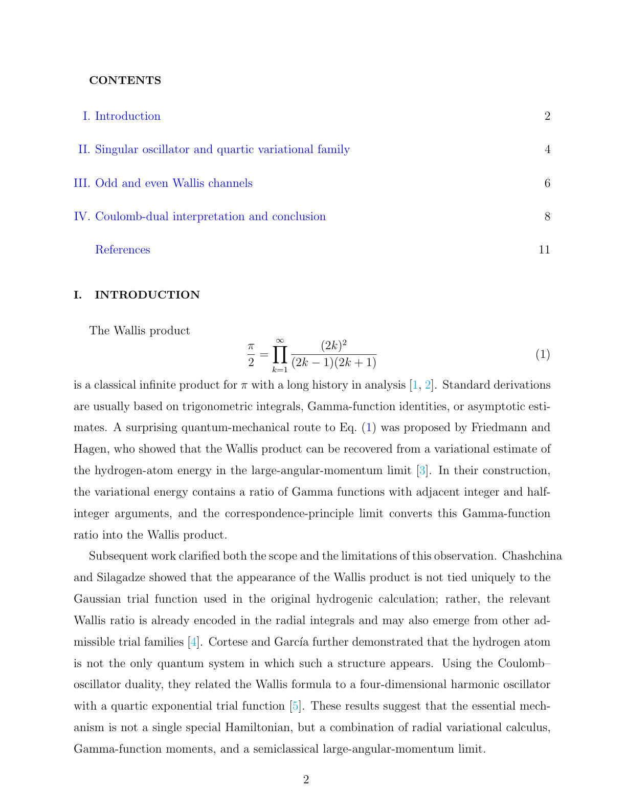
<figcaption class="paper-figure-caption"><b>Fig 1.</b> Low-resolution page preview, page 2</figcaption>
</figure>
<figure class="paper-figure-card">

<figcaption class="paper-figure-caption"><b>Fig 2.</b> Low-resolution page preview, page 3</figcaption>
</figure>
<figure class="paper-figure-card">
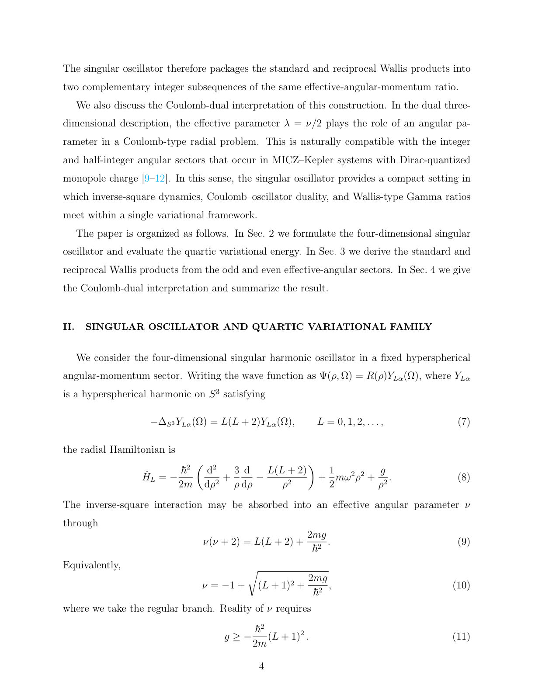
<figcaption class="paper-figure-caption"><b>Fig 3.</b> Low-resolution page preview, page 4</figcaption>
</figure>
<figure class="paper-figure-card">

<figcaption class="paper-figure-caption"><b>Fig 4.</b> Low-resolution page preview, page 5</figcaption>
</figure>
<figure class="paper-figure-card">

<figcaption class="paper-figure-caption"><b>Fig 5.</b> Low-resolution page preview, page 6</figcaption>
</figure>

**Summary.** This paper uses a sophisticated variational technique applied to the four-dimensional singular harmonic oscillator to derive the Wallis product. By analyzing the energy ratio in specific limits corresponding to odd and even effective angular parameters, the authors successfully connect quantum mechanical dynamics to fundamental infinite product identities. This demonstrates how deep mathematical constants can emerge from physical models involving inverse-square potentials.

**Why it may be interesting.** While not directly focused on AMO systems like cold atoms or cavity QED, the use of variational methods on singular potentials and the connection between quantum mechanics and fundamental mathematical constants (like $\pi$) via spectral analysis is highly relevant theoretical physics material.

Detailed structure

**Main problem.** The paper derives the Wallis product and its reciprocal using a quantum mechanical variational approach applied to a singular radial system.

**Main result.** The analysis shows that both infinite products arise naturally from the large-$
u$ limit of the variational energy ratio calculated for odd ($
u=2n-1$) and even ($
u=2n$) effective angular parameters.

**Method.** A variational method is employed using a quartic trial wave function family, $R_a(
ho) = N
ho^
u e^{-a
ho^4}$, to estimate the ground state energy of the singular harmonic oscillator.

**Model / system.** The model is the four-dimensional singular harmonic oscillator with an inverse-square interaction term. The system's dynamics are related to the three-dimensional Coulomb problem via a Kustaanheimo–Stiefel map, allowing for duality analysis.

**Key observables.** The variational energy ratio $R_{4d}(
u)$ and its limit as $
u 	o \infty$.

**Important parameters / regimes.** Effective angular parameter $
u$, which is restricted to odd ($
u=2n-1$) or even ($
u=2n$) sequences.

**Assumptions / limitations.** The derivation relies on the validity of the variational approximation and the use of a specific quartic trial wave function family motivated by Coulomb duality.

**Paper structure.** The paper establishes the effective Hamiltonian for the singular oscillator, applies the variational principle with the chosen trial function, calculates the energy ratio $R_{4d}(
u)$, and then analyzes the limits corresponding to odd and even $
u$ sequences to recover the Wallis product identities.

Abstract

We present a variational derivation of the Wallis product and its reciprocal from the four-dimensional singular harmonic oscillator. The inverse-square interaction is absorbed into an effective angular parameter $ν$, so that the lowest exact energy in a fixed sector is $E_{4d,\mathrm{exact}}=\hbarω(ν+2)$. Motivated by the radial Kustaanheimo--Stiefel relation $r=ρ^2$ between the four-dimensional oscillator and the three-dimensional Coulomb problem, we use the quartic trial family $R_a(ρ)=Nρ^νe^{-aρ^4}$. The minimized variational energy yields an accuracy ratio governed by adjacent Gamma functions. In the large-$ν$ semiclassical limit, this ratio approaches unity. Restricting $ν$ to the odd sequence $ν=2n-1$ gives the standard Wallis product, whereas the even sequence $ν=2n$ gives its reciprocal form. The Coulomb-dual interpretation further relates the two branches to integer and half-integer effective angular sectors in the dual Coulomb/MICZ description. The result shows that Wallis-type infinite products persist under an inverse-square deformation of the oscillator and arise from a common Gamma-function structure in radial variational dynamics.

[↑ back to top](#top)

### [Weak Ferromagnetism in NiS$_2$ under Nanocrystallization](http://arxiv.org/abs/2607.00474v1)

**Authors:** Hayato Miyazaki, Tomohiko Yoshinaga, Ojiro Miyazaki, Akira Matsuo, Koichi Kindo, Hirofumi Ishii, Tatsuya Kawae, Tetsuya Kida, Masashi Nantoh, Yoichi Ishiwata  
**Type:** experiment · **Category:** other · **PDF:** <https://arxiv.org/pdf/2607.00474v1>  
**Analysis basis:** full PDF text, analyzed in chunks
**Topic relevance:** `analog quantum simulation` **1/5** · `exotic spin models in light-matter` **1/5** · `spintronics-quantum-optics interface` **1/5**

↔ Scroll figures horizontally

<figure class="paper-figure-card">

<figcaption class="paper-figure-caption"><b>Fig 1.</b> Fig. 1. Structural characterization of NiS2 NCs. (a) TEM im- age. (b) Synchrotron powder XRD pattern and Rietveld refinement profile.</figcaption>
</figure>
<figure class="paper-figure-card">
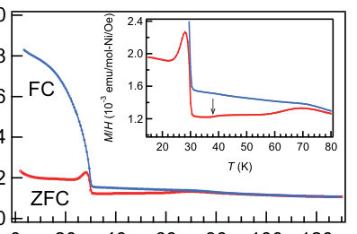
<figcaption class="paper-figure-caption"><b>Fig 2.</b> Fig. 2. ZFC and FC M/H curves of NiS2 NCs measured at H = 1000 Oe. The inset shows an enlarged view around the two antiferromagnetic anomalies; the arrow marks the TN1-related anomaly.</figcaption>
</figure>
<figure class="paper-figure-card">

<figcaption class="paper-figure-caption"><b>Fig 3.</b> Fig. 3. Temperature dependence of C/T for NiS2 NCs. The ar- row marks the TN1-related anomaly.</figcaption>
</figure>
<figure class="paper-figure-card">

<figcaption class="paper-figure-caption"><b>Fig 4.</b> Fig. 4(c). Finite remanence and coercivity are observed below TN2, whereas the hysteretic component is essen- tially absent at 30 K. The exchange-bias field HEB and coercive field Hc were estimated from the positive and negative coercive fields, H+ c and H− c , as</figcaption>
</figure>
<figure class="paper-figure-card">

<figcaption class="paper-figure-caption"><b>Fig 5.</b> Fig. 4. Magnetic hysteresis and exchange bias in NiS2 NCs. (a) M-H curves at 4 K after ZFC and FC processes. (b) Temperature- dependent M-H curves measured after field cooling to 4 K. (c) Background-subtracted hysteresis loops. (d) Temperature depen- dences of Hc and HEB.</figcaption>
</figure>

**Summary.** This work uses nanocrystals of NiS2 to probe the origin of weak ferromagnetism. By measuring magnetization and heat capacity, the authors confirm the retention of bulk AFM transitions while observing strong hysteresis only at low temperatures. They conclude that surface uncompensated moments are responsible for this magnetism, which constrains theoretical models regarding its true nature in the bulk material.

**Why it may be interesting.** The detailed study of surface effects in confined magnetic systems provides valuable insights into how dimensionality reduction modifies bulk magnetic ordering mechanisms, which is relevant for designing spintronic materials.

Detailed structure

**Main problem.** The study investigates the microscopic origin of weak ferromagnetism (WF) observed in NiS2, specifically determining if it arises from homogeneous magnetic canting or localized effects at antiferromagnetic domain walls.

**Main result.** The hysteretic ferromagnetic response below T_N2 is best explained by uncompensated surface moments generated where the low-temperature AFM order terminates at the nanocrystal surface. This indirectly favors a domain-wall scenario for bulk NiS2 WF.

**Method.** The research employed structural characterization (XRD, TEM) and detailed magnetic measurements (ZFC/FC magnetization curves, M-H loops) on synthesized NiS2 nanocrystals.

**Model / system.** The physical system is structurally well-ordered NiS2 nanocrystals. The investigation contrasts the observed magnetic behavior with theoretical models like homogeneous canting versus domain-wall localization mechanisms.

**Key observables.** Retention of two-step AFM transitions, large coercivity (Hc), exchange bias (HEB), and vertical loop shifts in M-H curves below T_N2.

**Important parameters / regimes.** Nanocrystal diameter ($27.0 \pm 6.5$ nm); magnetic transition temperatures ($T_{N1} \approx 39	ext{ K}$, $T_{N2} \approx 30	ext{ K}$).

**Assumptions / limitations.** The analysis assumes that the observed hysteresis is dominated by surface uncompensated moments, which helps constrain theoretical models.

**Figures summary.** Figures show TEM/XRD confirmation of NC structure, ZFC/FC curves showing magnetic anomalies near 30K and 40K, and M-H loops demonstrating clear hysteresis and HEB below T_N2.

**Paper structure.** The paper proceeds by characterizing the structural stability of the nanocrystals, measuring the bulk-like two-step AFM transitions magnetically and thermodynamically, analyzing the temperature dependence of magnetic hysteresis features (HEB/Hc), and finally comparing these findings against theoretical models to deduce the source of weak ferromagnetism.

Abstract

Structurally well-ordered NiS$_2$ nanocrystals with an average diameter of $27.0 \pm 6.5$ nm retain the bulk-like two-step antiferromagnetic transitions, as shown by magnetization and heat-capacity measurements. Below the lower transition, the nanocrystals exhibit a hysteretic ferromagnetic response with large coercivity, exchange bias, and a vertical loop shift after field cooling, whereas the $M$-$H$ response just above the transition is nearly linear. These features are best explained by uncompensated surface moments generated where the low-temperature antiferromagnetic order terminates at the nanocrystal surface. The absence of a clear additional bulk-like weak-ferromagnetic component constrains homogeneous-canting models and indirectly favors a domain-wall scenario for the weak ferromagnetism of bulk NiS$_2$.

[↑ back to top](#top)

### [Bridging quantum mechanics and nonlinear optics in Raman scattering](http://arxiv.org/abs/2607.00463v1)

**Authors:** Naoki Fukutake, Hideaki Kano  
**Type:** theory · **Category:** other · **PDF:** <https://arxiv.org/pdf/2607.00463v1>  
**Analysis basis:** full PDF text, analyzed in chunks
**Topic relevance:** `Keldysh / 2PI / non-Gaussian methods` **1/5** · `correlated / nonlocal dissipation` **1/5**

↔ Scroll figures horizontally

<figure class="paper-figure-card">
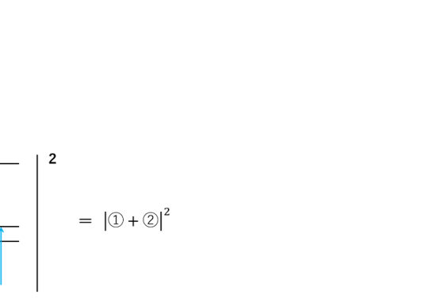
<figcaption class="paper-figure-caption"><b>Fig 1.</b> Fig. 1. Two types of processes involved in KHD theory: ① (rotating term) a process that passes through an intermediate state where one incident photon is absorbed, and ② (counter-rotating term) a process that passes through an intermediate state where one scattered photon is emitted.</figcaption>
</figure>
<figure class="paper-figure-card">
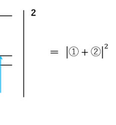
<figcaption class="paper-figure-caption"><b>Fig 2.</b> Figure 1 describes the first term (rotating term) ① and the second term (counter- rotating term) ② in the square of the modulus in Eq. (1). The first term is much larger than the second term. For the later discussion (DISCUSSION A), we expand the square of the modulus, where Eq. (1) is decomposed into four terms, i.e., a large term (𝑇1), two small terms (cross terms 𝑇2 and 𝑇3), and a negligible term (𝑇4), as presented below.</figcaption>
</figure>
<figure class="paper-figure-card">

<figcaption class="paper-figure-caption"><b>Fig 3.</b> Fig. 2. Double-sided Feynman diagrams and energy level diagrams describing L1–L4 in sRL and G1–G4 in sRG. Dotted arrows mean the vacuum fields, solid arrows represent the pump fields, and double-line arrows denote the signal field. On the bra side (right side) in double-sided Feynman diagram, the arrows indicate the negative-frequency light going in and out of the target molecules, which corresponds to the positive-frequency light going out and in. Although the signal field is depicted in our diagram style to show the final state of molecules, the arrow for the signal field is not necessary to calculate the nonlinear susceptibility. Also in the energy level diagram, the corresponding arrows...</figcaption>
</figure>
<figure class="paper-figure-card">

<figcaption class="paper-figure-caption"><b>Fig 4.</b> Fig. 3. A relationship between the cross sections. (a) 𝜎KHD/𝛺 derived from KHD dispersion formula. (b) 𝜎sRG/𝛺 and 𝜎sRL/𝛺 derived from nonlinear optical susceptibility approach.</figcaption>
</figure>
<figure class="paper-figure-card">
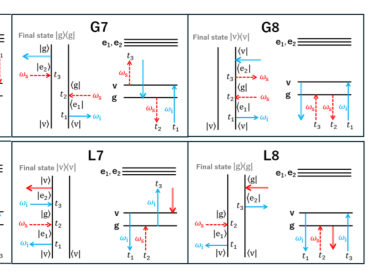
<figcaption class="paper-figure-caption"><b>Fig 5.</b> Fig. 4. Double-sided Feynman diagrams and energy level diagrams describing G5–G8 in sRG and L5–L8 in sRL.</figcaption>
</figure>

**Summary.** The paper unifies the description of spontaneous Raman scattering by bridging quantum mechanics (KHD theory) and nonlinear optics ($\chi^{(3)}$). It rigorously derives the cross-section using vacuum field concepts, predicting both standard gain (sRG) and a novel loss mechanism (sRL). The ultimate achievement is demonstrating perfect analytical agreement between these two powerful theoretical descriptions.

**Why it may be interesting.** This work provides a deep theoretical unification of two major frameworks—quantum electrodynamics and nonlinear optics—for a fundamental process like Raman scattering, offering rigorous predictions for vacuum-seeded optical phenomena.

Detailed structure

**Main problem.** To develop a theoretical framework that fundamentally bridges quantum-mechanical and nonlinear-optical approaches for spontaneous Raman scattering.

**Main result.** The authors establish perfect analytical agreement between the two descriptions, predicting a novel phenomenon called "spontaneous Raman loss" (sRL).

**Method.** The study uses perturbation theory, comparing results derived from traditional Kramers-Heisenberg-Dirac (KHD) theory with those from nonlinear optical susceptibility ($\chi^{(3)}$) calculations involving vacuum field expectation values.

**Model / system.** The system is spontaneous Raman scattering, modeled using quantum electrodynamics formalism and considering molecular vibrational quanta interacting with incident and scattered photons. The analysis involves comparing Hilbert space (quantum mechanical) and Liouville space (nonlinear optical) descriptions.

**Key observables.** Spontaneous Raman cross-section, Spontaneous Raman Gain (sRG), Spontaneous Raman Loss (sRL), and the third-order nonlinear susceptibility ($\chi^{(3)}$).

**Important parameters / regimes.** Third-order nonlinear susceptibility ($\chi^{(3)}$), molecular density ($N$), vibrational frequency ($\omega_{vib}$), damping factor ($\Gamma$).

**Assumptions / limitations.** The analysis assumes that unobservable terms (e.g., L5–L8, G5–G8) are physically prohibited in the spontaneous scattering regime; it also utilizes approximations like $\gamma 	o +0$ for comparison with KHD theory.

**Figures summary.** Figures illustrate Feynman diagrams detailing sRL and sRG processes, and a table maps quantum mechanical terms to specific nonlinear susceptibility components, showing correspondence between different theoretical formalisms.

**Paper structure.** The paper progresses by first defining the problem using both KHD and nonlinear optics approaches. It then calculates sRG/sRL via vacuum field expectation values, establishes correspondences between KHD terms (T1-T4) and $\chi^{(3)}$ components ($G1-L4$), and finally generalizes this connection using a negative-frequency-assisted quantum mechanical framework to achieve perfect agreement.

Abstract

We present a theoretical framework for spontaneous Raman scattering that fundamentally bridges quantum-mechanical and nonlinear-optical approaches. By conceptualizing spontaneous Raman scattering as a stimulated Raman gain or loss event seeded by the quantum vacuum field, we rigorously derive the spontaneous Raman cross-section directly from the third-order nonlinear susceptibility. Crucially, this framework predicts the existence of a hitherto unrecognized phenomenon: "spontaneous Raman loss" (sRL), which acts as the vacuum-seeded counterpart to stimulated Raman loss, complementing traditional spontaneous Raman scattering (spontaneous Raman gain, sRG). Furthermore, we establish a rigorous connection to the traditional Kramers-Heisenberg-Dirac (KHD) theory, revealing that the spontaneous process is governed by interference before a detector between the signal field emitted from molecules and the vacuum field itself that stimulates the molecules. This insight uncovers a direct correspondence between the sRG susceptibility and the rotating/counter-rotating interference terms in the KHD formula. Ultimately, we extend the foundational KHD theory by incorporating previously unrecognized essential terms, achieving perfect analytical agreement between the quantum mechanical and nonlinear optical descriptions of Raman scattering.

[↑ back to top](#top)

### [Non-signaling assistance in prepare-and-measure scenarios with classical communication](http://arxiv.org/abs/2607.01193v1)

**Authors:** José Nogueira, Carlos Vieira, Lucas E. A. Porto, Lucas Pollyceno, Rafael Rabelo, Otfried Gühne  
**Type:** theory · **Category:** quantum information and computing · **PDF:** <https://arxiv.org/pdf/2607.01193v1>  
**Analysis basis:** full PDF text, analyzed in chunks
**Topic relevance:** `entanglement & information structure` **1/5** · `quantum measurements` **1/5**

↔ Scroll figures horizontally

<figure class="paper-figure-card">

<figcaption class="paper-figure-caption"><b>Fig 1.</b> FIG. 1. Schematic of a prepare-and-measure scenario. Alice en- codes her input x into a preparation device, which emits either a classical or quantum system sent to Bob. Bob receives the system, chooses an input y for his measurement device, and produces an output b. The devices may share correlations, which can be clas- sical (shared randomness λ) or quantum (arising from a shared entangled state ρAB).</figcaption>
</figure>
<figure class="paper-figure-card">

<figcaption class="paper-figure-caption"><b>Fig 2.</b> FIG. 2. Schematic representation of a prepare-and-measure sce- nario with non-adaptive non-signaling assistance, according to the definition in Eq. (6). Alice and Bob share an arbitrary non- signaling box in the Bell scenario (nX, nA; nY , nβ). Alice inputs x into her share of the box, obtains outcome a, and communicates it to Bob. Bob independently inputs y into his share of the box and obtains β. Finally, he post-processes a,β to produce the output b.</figcaption>
</figure>
<figure class="paper-figure-card">

<figcaption class="paper-figure-caption"><b>Fig 3.</b> FIG. 3. Schematic representation of a prepare-and-measure sce- nario with adaptive non-signaling assistance, according to Eq. (8). Alice and Bob share an arbitrary non-signaling box in the Bell sce- nario (nX, nA; nY nA, nB). Alice inputs x into her share of the box, obtains outcome a, and communicates it to Bob. Bob then inputs the composite setting (y, a) into his share of the box and obtains the output b. The protocol is adaptive because Bob’s input to the shared box depends on the message received from Alice.</figcaption>
</figure>

**Summary.** The paper provides a detailed comparison between adaptive and non-adaptive Non-Signaling (NS) assistance in Prepare-and-Measure communication models. It establishes that while NS assistance can simulate quantum qudit transmission classically, any genuine advantage gained by adaptivity over non-adaptivity is restricted to highly specific scenarios. The findings help delineate the true power of different types of non-local correlations.

**Why it may be interesting.** This work rigorously quantifies the limits of communication protocols using non-local correlations, providing fundamental boundaries for what can be achieved with limited resources like classical messages and NS assistance, which is crucial for understanding device-independent quantum information tasks.

Detailed structure

**Main problem.** The paper investigates the operational advantage of using adaptive versus non-adaptive Non-Signaling (NS) assistance in Prepare-and-Measure (PM) quantum communication scenarios.

**Main result.** It proves that any genuine adaptive advantage over non-adaptive NS assistance can be traced back to scenarios where the receiver has no measurement choice, thus ruling out genuinely multi-setting advantages found in entanglement-assisted protocols.

**Method.** The authors characterize the sets of achievable correlations by deriving necessary and sufficient conditions based on input-discrimination inequalities derived from structural properties of non-signaling boxes.

**Model / system.** The model is a Prepare-and-Measure (PM) scenario $(n_X; n_Y, n_B)$, where Alice prepares a message $a$ based on input $x$, and Bob measures using input $y$ to produce output $b$. The analysis compares correlations achievable with classical communication, non-adaptive NS assistance ($	ext{NSNA}$), and adaptive NS assistance ($	ext{NSA}$).

**Key observables.** The set of achievable correlation functions $q(b|x, y)$, and the maximum discrimination score $\max_{x \in [n_X]} q(b|x, y)$.

**Important parameters / regimes.** Message dimension ($n_A$), input sizes ($n_X, n_Y$), and output size ($n_B$). The comparison hinges on whether $n_A$ is large relative to these dimensions.

**Assumptions / limitations.** The analysis relies heavily on reducing the general PM scenario characterization to fixed-$y$ sub-behaviors (Theorem 3) and comparing structural constraints derived from NS boxes.

**Figures summary.** Figure 1 schematically illustrates the basic PM setup. Other figures detail the mathematical structures for non-adaptive and adaptive NS assistance, showing how inputs $x, y$ lead to an intermediate shared resource $\alphaeta$ or a message $a$.

**Paper structure.** The paper progresses by first establishing the general framework of achievable correlations using various resources (classical, EA, NS). It then focuses on characterizing non-adaptive ($	ext{NSNA}$) and adaptive ($	ext{NSA}$) NS assistance separately. The core is comparing these two sets to pinpoint exactly when $	ext{NSA}$ provides a strict advantage over $	ext{NSNA}$.

Abstract

Extracting the full power of non-local correlations in prepare-and-measure (PM) scenarios requires precise control over the timing and structure of the receiver's measurements. Indeed, recent developments in entanglement-assisted classical communication scenarios have shown that adaptive strategies-where the receiver uses the transmitted message to guide their measurement choice-can outperform standard non-adaptive protocols. Moving beyond quantum theory, however, the ultimate limits of such advantages remain largely unexplored. In this work, we thoroughly study adaptive and non-adaptive non-signaling (NS) assistance in PM scenarios with classical communication. We provide simple characterizations of the sets of behaviors that can be realized using both non-adaptive and adaptive NS assistance in arbitrary PM scenarios. As a consequence, we show that non-adaptive NS assistance is already strong enough to reproduce quantum communication with the same message dimension: the transmission of a qudit can be simulated by a classical dit assisted non-adaptively by NS correlations. We then compare adaptive and non-adaptive NS assistance. We prove that any adaptive NS advantage can be traced back to scenarios in which the receiver has no measurement choice, ruling out the genuinely multi-setting advantages found in entanglement-assisted quantum protocols. Finally, we identify all PM scenarios where adaptive NS strategies provide a strict advantage over non-adaptive ones.

[↑ back to top](#top)

### [Reducing quantum resources for ADAPT-VQE via plateau-operator elimination and correlated mean-field downfolding](http://arxiv.org/abs/2607.00575v1)

**Authors:** Phuoc Minh Vo, Thai Cong Ngoc Vu, Thien Ngoc Tran, Hoang Thanh Nguyen, Lan Nguyen Tran  
**Type:** theory · **Category:** strongly correlated electrons · **PDF:** <https://arxiv.org/pdf/2607.00575v1>  
**Analysis basis:** full PDF text, analyzed in chunks
**Topic relevance:** `Keldysh / 2PI / non-Gaussian methods` **1/5** · `analog quantum simulation` **1/5**

↔ Scroll figures horizontally

<figure class="paper-figure-card">

<figcaption class="paper-figure-caption"><b>Fig 1.</b> FIG. 1: The plateau-operator elimination is incorporated into the original ADAPT-VQE workflow. After the classical optimization, the elimination scheme is applied to remove operators with vanishing parameters.</figcaption>
</figure>
<figure class="paper-figure-card">
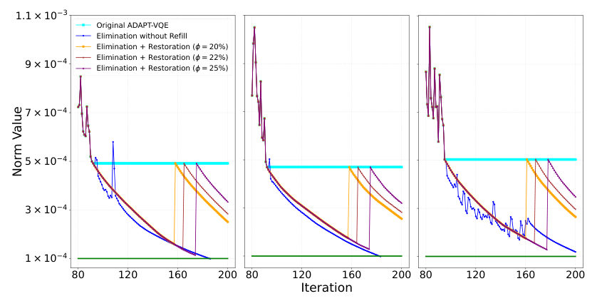
<figcaption class="paper-figure-caption"><b>Fig 2.</b> FIG. 2: Gradient norm convergence for the hydrogen chain at r = 2.25 ˚A (left), 2.55 ˚A (middle), and 2.85 ˚A (right). There are three thresholds of elimination, at which the pool is restored: ϕ = 20% (orange), 22% (purple), and 25% (pink). The horizontal green line indicates the convergence threshold ϵ = 10−4.</figcaption>
</figure>
<figure class="paper-figure-card">
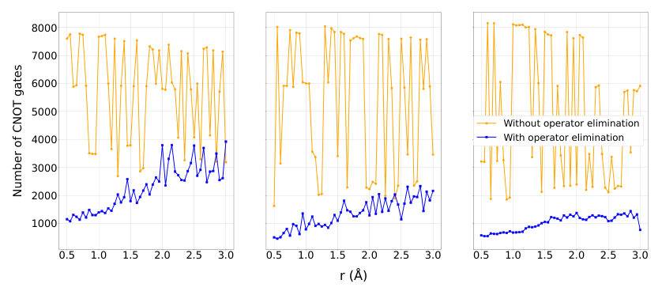
<figcaption class="paper-figure-caption"><b>Fig 3.</b> FIG. 3: CNOT gate counts for ADAPT-VQE with and without operator elimination at different bond lengths of H6 chain, H6 ring, and H6 lattice.</figcaption>
</figure>
<figure class="paper-figure-card">
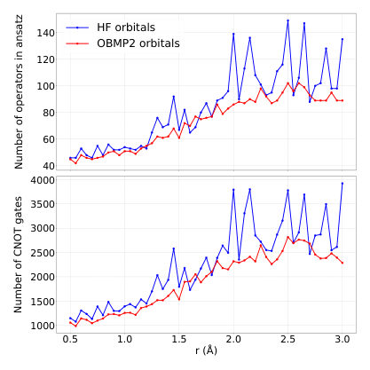
<figcaption class="paper-figure-caption"><b>Fig 4.</b> FIG. 4: Number of operators and number of CNOT gates for ADAPT-VQE with the elimination scheme using different orbital bases (HF and OBMP2) at various bond lengths of H6 chain.</figcaption>
</figure>
<figure class="paper-figure-card">

<figcaption class="paper-figure-caption"><b>Fig 5.</b> FIG. 5: Convergence of the gradient norm and energy with respect to iterations for r = 2.25 and 2.45 ˚A of H6 chain.</figcaption>
</figure>

**Summary.** The paper improves the ADAPT-VQE algorithm, which is used for quantum chemistry simulations, by implementing an operator elimination strategy that prunes redundant terms from the ansatz pool. Furthermore, they enhance accuracy by coupling this method with a One-Body Downfolding Framework (OBDF) to incorporate dynamic correlation effects into the active space Hamiltonian. This combination significantly reduces required quantum resources while achieving energies closer to exact reference values.

**Why it may be interesting.** This work directly addresses resource scaling in quantum simulation by providing a practical heuristic (operator elimination) to keep variational ansätze shallow while simultaneously improving accuracy via advanced embedding techniques (OBDF), making it highly relevant for near-term quantum hardware applications.

Detailed structure

**Main problem.** The primary challenge is efficiently computing ground-state electronic structure energies for quantum chemistry and condensed matter systems, which suffer from the exponential scaling of exact methods like FCI.

**Main result.** The combination of operator elimination in ADAPT-VQE with One-Body Downfolding (OBDF) yields energy estimates significantly closer to high-accuracy reference methods than standard ADAPT-VQE within the same active space.

**Method.** They propose an operator elimination scheme for ADAPT-VQE that removes non-contributing operators whose parameters vanish during optimization. This is combined with OBDF, which replaces the bare Hamiltonian in the active space with a correlated effective Hamiltonian.

**Model / system.** The work models molecular systems and materials using fermionic Hamiltonians. Benchmarking was performed on $\ce{H_6}$ chains, lattices, rings, and the $\ce{N_2}$ molecule, utilizing both Hartree-Fock (HF) and OBMP2 derived orbitals.

**Key observables.** Ground-state energy ($E_0$), circuit depth (CNOT gate counts), iteration count, and gradient norm convergence.

**Important parameters / regimes.** The elimination threshold ($\delta$) for vanishing parameters; the fraction of eliminated operators ($\phi$); and the active space definition derived from OBMP2.

**Assumptions / limitations.** The permanent elimination scheme is preferred over pool restoration because restoration introduces optimization instabilities. The use of OBDF assumes that dynamic correlation effects outside the active space can be effectively captured by a one-body approximation.

**Figures summary.** Figures illustrate the workflow incorporating plateau-operator elimination into ADAPT-VQE, showing significant reductions in CNOT gate counts across $\ce{H_6}$ systems. Other figures compare energy convergence and Potential Energy Surfaces (PES) for various molecules ($\ce{N_2}$, $\ce{H_6}$) using different methods.

**Paper structure.** The paper first introduces the limitations of standard VQE/ADAPT-VQE, then details the novel operator elimination technique to stabilize optimization and reduce circuit depth. Subsequently, it integrates this with the OBDF framework to incorporate external correlation effects, benchmarking performance across various molecular models.

Abstract

Adaptive Derivative-Assembled Problem-Tailored variational quantum eigensolvers (ADAPT-VQE) represent one of the most promising approaches for quantum chemistry on near-term quantum devices. However, their optimization is slow and may stall due to vanishing parameters and redundant operators in the ansatz. In this work, we propose a simple strategy of operator elimination that removes non-contributing operators from the pool once they are detected, enabling the optimization to continue progressing toward convergence. We examine two variants, with and without pool restoration after elimination, and find that the former converges more smoothly and faster than the latter and the standard ADAPT-VQE. To capture dynamical correlations between the active space and its environment, we combine ADAPT-VQE with our recently developed downfolding approach, the one-body downfolding framework (OBDF). In OBDF, the bare molecular Hamiltonian in the active space is replaced by a correlated effective Hamiltonian that incorporates dynamical correlation effects outside the active space. We benchmark our implementation on a linear \ce{H_6} chain, an \ce{H_6} lattice, an \ce{H_6} ring, and the \ce{N_2} molecule using the OpenFermion simulator. Our results show that operator elimination significantly reduces circuit depth and iteration count, and that OBDF-ADAPT-VQE yields energies closer to the full configuration interaction (FCI) reference than the standard approach within the same active space.

[↑ back to top](#top)

### [Bridging Quantum Computing Paradigms toward Semiconductor Yield: A Controlled CV-versus-DV Comparison on Wafer-Map Defect Classification](http://arxiv.org/abs/2607.00961v1)

**Authors:** Yeonhong Kim, Jonghyeok Im, Monu Nath Baitha, Kyoungsik Kim  
**Type:** both · **Category:** quantum information and computing · **PDF:** <https://arxiv.org/pdf/2607.00961v1>  
**Analysis basis:** full PDF text, analyzed in chunks
**Topic relevance:** `QC/QI experiment` **1/5**

↔ Scroll figures horizontally

<figure class="paper-figure-card">

<figcaption class="paper-figure-caption"><b>Fig 1.</b> Fig. 1 Controlled protocol and architectures - (a) shared-backbone protocol with three interchangeable heads; (b) CV-QNN</figcaption>
</figure>
<figure class="paper-figure-card">

<figcaption class="paper-figure-caption"><b>Fig 2.</b> Fig. 2 Performance and training dynamics - (a) accuracy and macro-F1 for Classical, CV-4m, and DV-4q with quantum-</figcaption>
</figure>
<figure class="paper-figure-card">

<figcaption class="paper-figure-caption"><b>Fig 3.</b> Fig. 3 Confusion matrices, CV-4m vs. DV-4q - (a) representative wafer maps from the Edge-Loc (top) and Scratch (bottom)</figcaption>
</figure>
<figure class="paper-figure-card">

<figcaption class="paper-figure-caption"><b>Fig 4.</b> Fig. 4 Input-noise robustness - test accuracy under Gaussian input noise σ. (a) CV-QNN (4m, 3m) and the classical CNN: CV</figcaption>
</figure>
<figure class="paper-figure-card">
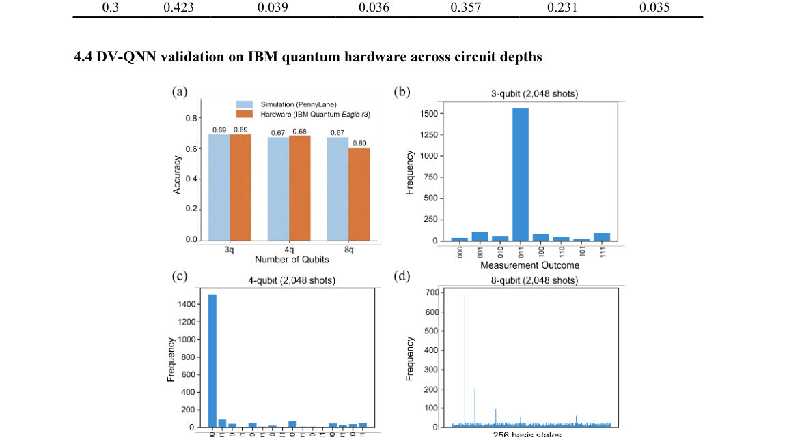
<figcaption class="paper-figure-caption"><b>Fig 5.</b> Fig. 5 IBM quantum hardware validation - (a) simulation vs. hardware accuracy for DV-QNN at three depths (ibm_yonsei,</figcaption>
</figure>

**Summary.** This paper compares Continuous-Variable (CV) and Discrete-Variable (DV) Quantum Neural Networks for classifying defects on semiconductor wafers. By keeping the feature extraction backbone constant, the authors demonstrate that CV-QNNs significantly outperform DV-QNNs, especially when capturing fine spatial details like Edge-Loc defects. The superior performance of CV is attributed to its continuous phase-space encoding and structured layer design.

**Why it may be interesting.** It provides a concrete, application-driven benchmark comparing two major QML approaches (CV vs DV) in a domain relevant to advanced hardware manufacturing, offering insights into the necessary structural properties for quantum feature extraction.

Detailed structure

**Main problem.** The study aims to determine which quantum computing paradigm, Continuous-Variable (CV) or Discrete-Variable (DV), is superior for classifying wafer-map defects in semiconductor yield assessment.

**Main result.** The CV head consistently outperforms the DV head, showing a significant advantage (e.g., 79.7% vs 61.6% accuracy at 4 qumodes/qubits) due to its structured design and continuous phase-space encoding.

**Method.** A controlled comparison was performed by attaching interchangeable quantum heads (CV-QNN or DV-QNN) to a shared, fixed convolutional backbone for feature extraction on the WM-811K dataset.

**Model / system.** The system is wafer-map defect classification using eight classes. The models compare CV-QNNs (using Gaussian/non-Gaussian gates) against DV-QNNs (using parameterized rotations and CNOT entanglers).

**Key observables.** Classification accuracy, Edge-Loc class recall (CV: 0.66 vs DV: <=0.05), and performance degradation under varying input noise ($\sigma$).

**Important parameters / regimes.** Circuit size (3, 4, 8 qumodes/qubits), Fock cutoff ($d=2$), and the classical baseline accuracy (85.0%).

**Assumptions / limitations.** The comparison isolates the quantum head as the sole variable; CV advantage is attributed to structure and continuous encoding rather than just Hilbert-space dimensionality at $d=2$.

**Figures summary.** Figures compare model architectures, training dynamics (loss/accuracy vs. epoch), and performance robustness against increasing input noise ($\sigma$) for both CV and DV heads.

**Paper structure.** The paper establishes the problem context, details the controlled architectural comparison (shared CNN backbone feeding interchangeable quantum heads), presents quantitative results showing CV superiority on specific defect classes, and concludes by attributing this advantage to continuous encoding structure.

Abstract

Realizing quantum neural networks (QNNs) in industry requires knowing which quantum computing paradigm suits which task. Motivated by AI accelerators and high-bandwidth memory, where die stacking makes wafer-level defect screening central to yield, we study WM-811K wafer-map defect classification (eight classes), comparing the dominant paradigms, continuous-variable (CV) and discrete-variable (DV), under controlled conditions. To isolate the quantum circuit as the sole variable, a shared convolutional backbone (~4.3M parameters) feeds interchangeable heads (classical dense, CV-QNN, or DV-QNN) as the only structural difference; each quantum head is scaled over three sizes (3, 4, 8 qumodes/qubits). The CV head consistently outperforms the DV head: at four qumodes/qubits it reaches 79.7 +/- 1.8% accuracy versus 61.6 +/- 1.4%, a non-overlapping 18-point gap. The advantage is sharpest on the spatially localized Edge-Loc class, easily confused with Scratch, which CV recovers with recall 0.66 +/- 0.06 while DV fails at every size (<=0.05), showing the structured CV layer better captures fine spatial distinctions between defect types. Training curves show the DV limitation is a representational-capacity ceiling, not an optimization failure; at the Fock cutoff used here (d = 2) the CV advantage reflects two intrinsic properties, a structured, neural-network-analogue layer and continuous phase-space encoding, not Hilbert-space dimensionality. On IBM hardware, DV accuracy holds at shallow depth, degrading only at the deepest circuit. Both quantum heads remain below the classical baseline (85.0%), but the controlled setting isolates where a structured head already helps and, as noise and scale improve, which paradigm can deliver practical advantage.

[↑ back to top](#top)

### [GsOQDC: A GUI-Driven Interactive Framework for End-to-End Simulation of Optical Quantum Data Centers](http://arxiv.org/abs/2607.00715v1)

**Authors:** Seyed Navid Elyasi, Sima Bahrani, Rui Wang, Dimitra Simeonidou, Paolo Monti, Rui Lin  
**Type:** theory · **Category:** quantum information and computing · **PDF:** <https://arxiv.org/pdf/2607.00715v1>  
**Analysis basis:** full PDF text, analyzed in chunks
**Topic relevance:** `methods for driven-dissipative` **1/5**

↔ Scroll figures horizontally

<figure class="paper-figure-card">
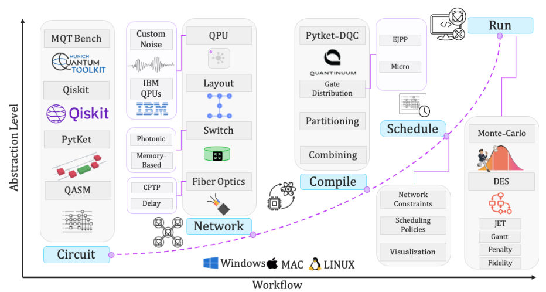
<figcaption class="paper-figure-caption"><b>Fig 1.</b> Fig. 1: GsOQDC workflow and software architecture. The platform integrates the end-to-end DQC workflow, enabling users to progress from quantum-circuit design and optical-network configuration to distributed compilation, scheduling, execution, and performance evaluation within a single graphical environment.</figcaption>
</figure>
<figure class="paper-figure-card">

<figcaption class="paper-figure-caption"><b>Fig 2.</b> Fig. 2: GsOQDC Network Designer. (a) Interactive topology editor for constructing Optical Quantum Data Center architectures using QPUs, optical components, and communication links. (b) Component configuration panel, accessible via right-click, allowing users to modify hardware and noise parameters, including qubit properties, gate errors, coherence times, readout errors, and device-specific calibration data. Together, these capabilities enable realistic, cross-layer modeling of distributed quantum-computing infrastructures.</figcaption>
</figure>
<figure class="paper-figure-card">
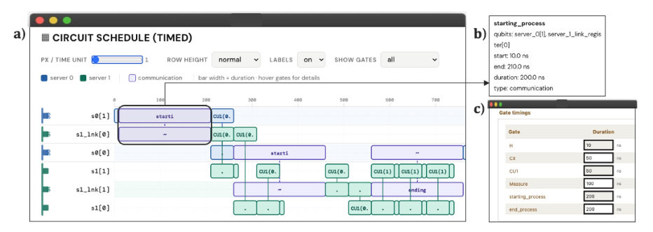
<figcaption class="paper-figure-caption"><b>Fig 3.</b> Fig. 3: Distributed-workload scheduling in GsOQDC. (a) Interactive Gantt-chart visualization showing local operations, remote-gate execution, and communication events across multiple QPUs. (b) Contextual information panel displayed when hovering over a scheduled operation, providing timing, duration, resource, and process details. (c) User-configurable gate and process timing parameters.</figcaption>
</figure>

**Summary.** The paper introduces GsOQDC, an open-source GUI framework designed to simulate end-to-end operations in Optical Quantum Data Centers (OQDCs). It integrates quantum circuit design, network topology definition, compilation, and scheduling into a single platform. This allows researchers to quantitatively evaluate how physical network impairments affect the performance of distributed quantum algorithms.

**Why it may be interesting.** This work is highly relevant as it provides a crucial simulation tool for understanding the practical architectural limitations of scaling quantum computation by explicitly coupling quantum circuit requirements with realistic optical network constraints.

Detailed structure

**Main problem.** There is a lack of an integrated environment to evaluate the end-to-end behavior of distributed quantum applications, especially concerning the interaction between quantum computation and optical network resources in Quantum Data Centers (QDCs).

**Main result.** The GsOQDC framework enables quantitative analysis of how optical network characteristics influence application-level performance metrics like fidelity, overhead, and job execution time in future Optical Quantum Data Centers.

**Method.** It utilizes a graphical, open-source framework integrating quantum circuit modeling, optically switched interconnection design, distributed compilation, scheduling, and a Discrete-Event Simulation (DES) engine.

**Model / system.** The system modeled is an Optical Quantum Data Center (OQDC), consisting of multiple interconnected Quantum Processing Units (QPUs) linked by optical networks. The framework simulates the entire workflow from quantum circuit definition to final execution.

**Key observables.** End-to-end performance metrics including entanglement-resource dynamics, fidelity, communication overhead, entanglement-resource utilization, and Job Execution Time (JET).

**Important parameters / regimes.** Hardware noise parameters such as qubit properties, gate errors, coherence times, readout errors, and network latency/impairments.

**Assumptions / limitations.** The framework assumes the ability to model cross-layer interactions between quantum computation layers and optical networking layers.

**Figures summary.** Figure 1 illustrates the overall GsOQDC workflow architecture (Circuit $
ightarrow$ Network $
ightarrow$ Compile $
ightarrow$ Schedule $
ightarrow$ Run). Figure 2 details the network designer interface for configuring QDC topologies. Figure 3 shows interactive Gantt charts visualizing distributed workload scheduling.

**Paper structure.** The paper introduces GsOQDC, detailing its architecture which unifies circuit modeling, optical networking design (via a GUI), compilation, scheduling, and execution simulation using DES/Monte Carlo methods to evaluate cross-layer performance.

Abstract

We present GsOQDC, an open-source graphical framework integrating optical-network design, distributed quantum-circuit compilation, scheduling, and DES-based remote-gate simulation, enabling end-to-end cross-layer evaluation of entanglement-resource dynamics and system-level performance in Optical Quantum Data Centers.

[↑ back to top](#top)

### [Quantum advantage prediction in turbulent free-space quantum illumination](http://arxiv.org/abs/2607.00308v1)

**Authors:** Yu Tang, Beining Xia, Qianqian Liu, Cuihong Wen, Heng Fan, Jieci Wang  
**Type:** theory · **Category:** quantum information and computing · **PDF:** <https://arxiv.org/pdf/2607.00308v1>  
**Analysis basis:** full PDF text, analyzed in chunks
**Topic relevance:** `interference shaping light` **1/5**

↔ Scroll figures horizontally

<figure class="paper-figure-card">
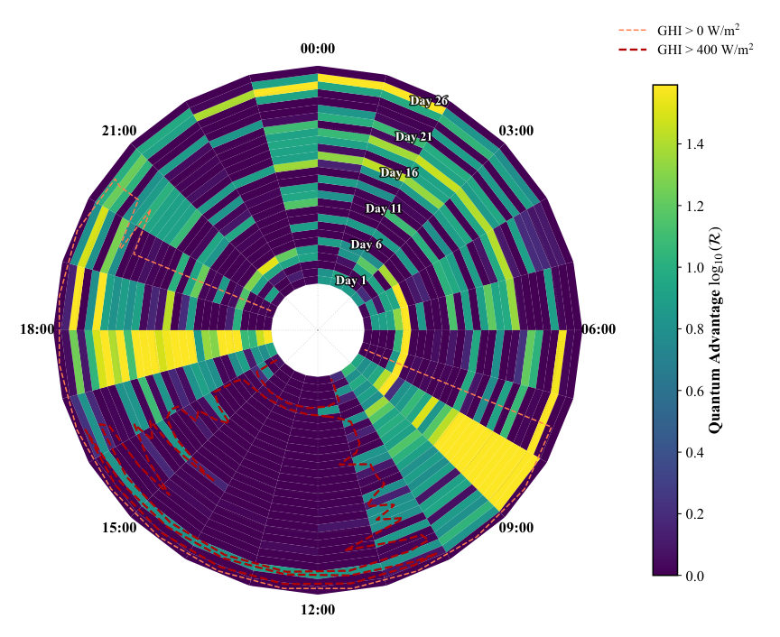
<figcaption class="paper-figure-caption"><b>Fig 1.</b> FIG. 1: Diurnal phase evolution of QI advantage under meteorological forcing. The polar clock maps</figcaption>
</figure>
<figure class="paper-figure-card">

<figcaption class="paper-figure-caption"><b>Fig 2.</b> FIG. 2: Scatter and density distributions of QI advantage under varying meteorological parameters.</figcaption>
</figure>
<figure class="paper-figure-card">

<figcaption class="paper-figure-caption"><b>Fig 3.</b> FIG. 3: Probability density distributions of log10 R in the nocturnal boundary layer (GHI = 0 W/m2).</figcaption>
</figure>
<figure class="paper-figure-card">
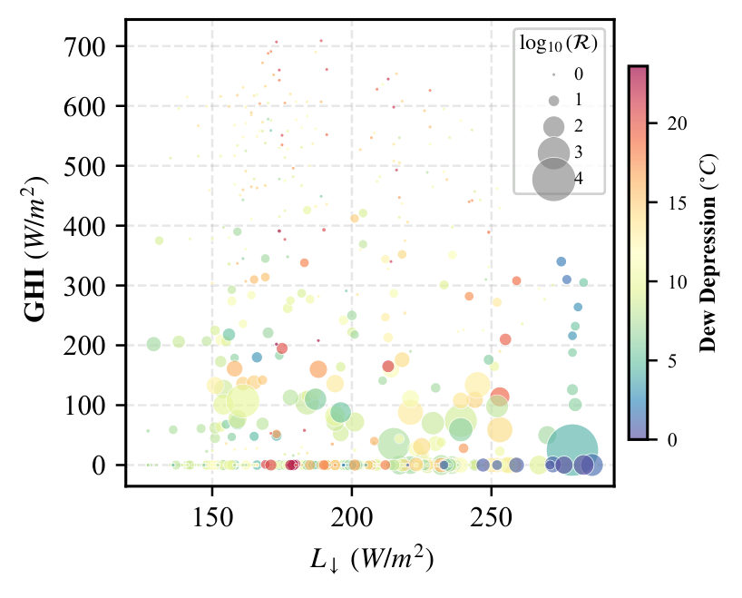
<figcaption class="paper-figure-caption"><b>Fig 4.</b> FIG. 4: Multidimensional phase space representation of the QI advantage. The magnitude of log10 R</figcaption>
</figure>
<figure class="paper-figure-card">

<figcaption class="paper-figure-caption"><b>Fig 5.</b> FIG. 5: Architecture of the KAN.</figcaption>
</figure>

**Summary.** This paper addresses the critical issue of atmospheric turbulence degrading Quantum Illumination's advantage in free-space links. The authors introduce a novel physics-driven framework that uses Kolmogorov-Arnold Networks to predict turbulence strength directly from routine meteorological observations. This allows for the dynamic, all-weather quantification of quantum performance, moving QI systems closer to operational reality.

**Why it may be interesting.** This work is highly relevant as it tackles the practical deployment challenge of quantum optics by providing a robust, predictive model for environmental noise sources (turbulence), which is crucial for developing real-world quantum sensing networks.

Detailed structure

**Main problem.** The primary challenge is quantifying the degradation of quantum advantage provided by Quantum Illumination (QI) when operating through atmospheric turbulence.

**Main result.** The authors propose an end-to-end framework that uses deep learning to map macroscopic weather data directly to the temporal evolution of quantum advantage, enabling all-weather operation for quantum radar.

**Method.** They integrate a physics-driven approach using Kolmogorov-Arnold Networks (KAN) trained on meteorological data to predict turbulence parameters ($C_n^2$), which are then fed into the QI channel model.

**Model / system.** The system models Quantum Illumination using a two-mode squeezed vacuum state in free-space channels affected by atmospheric turbulence. The framework bridges macroscopic meteorology (T, P, GHI, etc.) to microscopic quantum channel dynamics via KANs.

**Key observables.** Quantum advantage ($\log_{10} R$), average error probability ($ar{P}_{	ext{err}}$), and the ratio $R$ comparing classical vs. quantum error probabilities.

**Important parameters / regimes.** Meteorological variables (GHI, $L_\downarrow$, Dew Depression), turbulence structure constant ($C_n^2$), and specific thermodynamic regimes (e.g., twilight, nocturnal boundary layer).

**Assumptions / limitations.** The framework assumes a physically consistent mapping from standard meteorological variables to quantum channel dynamics, bypassing the need for direct, costly measurements of $C_n^2$.

**Figures summary.** Figures illustrate how QI advantage is modulated by GHI (peaking at twilight), collapses under extreme solar forcing or strong mechanical shear in nocturnal conditions, and show the dependence on specific thermodynamic states.

**Paper structure.** The paper first establishes the physical problem of turbulence degradation for QI. It then details a multi-step methodology: 1) Using MOST/thermodynamics to derive atmospheric parameters; 2) Employing KANs to map macro-weather data to $C_n^2$; and 3) Integrating this prediction into the quantum error probability calculation to quantify advantage.

Abstract

Quantum illumination offers a significant theoretical advantage for target detection in high background noise environments. However, its practical deployment in free-space channels is hindered by atmospheric turbulence. Stochastic fluctuations in atmospheric turbulence inevitably degrade the quantum signature, rendering the real-time evaluation of quantum advantage under such dynamic conditions a critical yet unresolved challenge. To circumvent the reliance on costly direct turbulence measurements, we propose a physics-driven framework that integrates Kolmogorov-Arnold networks directly bridge macroscopic meteorological observations with microscopic quantum channel dynamics. Trained on 105,120 samples from 12 climatically diverse sites and validated on 26,280 unseen samples from three extreme boundary conditions (arid continental, tropical maritime, high-altitude plateau), our approach establishes a physically consistent mapping from standard meteorological variables to the temporal evolution of the quantum advantage. This end-to-end system dynamically quantifies the degradation of quantum advantage across diverse turbulence conditions. Our results provide a rigorous theoretical and data-driven pathway for environmental adaptation, facilitating the transition of quantum radar networks from proof-of-principle demonstrations to all-weather operational systems.

[↑ back to top](#top)

### [Quantum machine learning models for graphs](http://arxiv.org/abs/2607.00698v1)

**Authors:** Frédéric Sauvage, Pranav Kalidindi, Frederic Rapp, Martın Larocca  
**Type:** theory · **Category:** quantum information and computing · **PDF:** <https://arxiv.org/pdf/2607.00698v1>  
**Analysis basis:** full PDF text, analyzed in chunks
**Topic relevance:** `analog quantum simulation` **1/5**

↔ Scroll figures horizontally

<figure class="paper-figure-card">
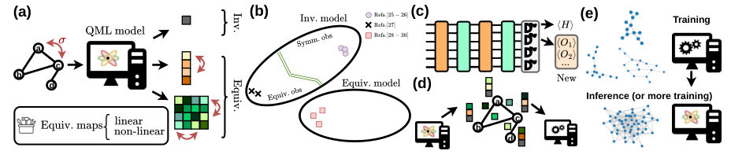
<figcaption class="paper-figure-caption"><b>Fig 1.</b> FIG. 1. (a) Toolbox for the construction of GQML models on graphs including the characterization of the relevant equivariant linear and non-linear maps. These are used for the encoding of n-node graphs into n-qubit quantum states and to identify measurements leading to invariant or equivariant models. This toolbox allows us to recover known models, identify new ones (b), and even render existing models more expressive at no cost (c). It also ensures integration with classical models through feature augmentation (d). The models obtained lend themselves to classical pre-training strategies that can reduce the training effort that needs to be performed on a quantum device and mitigate issues...</figcaption>
</figure>
<figure class="paper-figure-card">

<figcaption class="paper-figure-caption"><b>Fig 2.</b> FIG. 2. Summary of the actions of Sn on the spaces of inter- ests both classical (order-k tensors) and quantum (operators) spaces. For each we provide the basis and action of a permu- tation, both formally and through visual examples.</figcaption>
</figure>
<figure class="paper-figure-card">
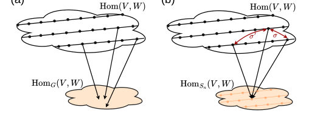
<figcaption class="paper-figure-caption"><b>Fig 3.</b> FIG. 3. (a) Symmetrizing (16) all elements of a basis of lin- ear maps Hom(V, W), one obtain a set of maps spanning the space of all equivariant maps HomG(V, W). (b) While in general this procedure is not scalable, this becomes tractable whenever the basis is closed under the action of the group symmetry (ie any element of the basis is mapped to another one under group action). This is the case for our choice of bases for Sn, and we use this strategy to identify all the equiv- ariant linear maps necessary to our models.</figcaption>
</figure>
<figure class="paper-figure-card">

<figcaption class="paper-figure-caption"><b>Fig 4.</b> FIG. 4. Classical pre-training. The invariant QML model considered has encoding circuit defined through Eq. (45) and a 2-dimensional output given by the expectation values of 2 observables O1 and O2 (46). (a) For larger graphs (n = 14 to 20 nodes) than used for training (n = 8 to 12 nodes), outputs of the classically pre-trained model (right panel) are compared to output of the model initialized with random parameters (left panel). Each point correspond to one graph and has coordinates (x, y) being the observables expectation values. (b) For a more detailed comparison, the dispersion (quantified by the variance) of the output of the models are reported at varied system size and for the two...</figcaption>
</figure>

**Summary.** This paper develops a rigorous mathematical framework for Geometric Quantum Machine Learning (GQML) applied to graph data encoded in qubits. It characterizes the necessary equivariant quantum circuits by leveraging group theory symmetries ($S_n$) to build a 'toolbox' of model components. The resulting models are shown to naturally integrate with classical ML and benefit from pre-training strategies, advancing the field toward practical quantum computation for structured data.

**Why it may be interesting.** This work provides a deep theoretical grounding for designing physically realizable quantum circuits for graph data. For AMO physicists, the focus on symmetries ($S_n$) suggests potential connections to physical Hamiltonians or measurement bases that naturally respect permutation symmetry, which is crucial when modeling interacting many-body systems.

Detailed structure

**Main problem.** The primary goal is to develop a rigorous framework for Geometric Quantum Machine Learning (GQML) models applied to graph problems, addressing the lack of a unifying design perspective compared to classical GML.

**Main result.** The authors provide a comprehensive 'toolbox' based on characterizing equivariant maps under the permutation group $S_n$, enabling the construction and analysis of quantum graph models with proven benefits like classical pre-training compatibility.

**Method.** The work relies heavily on abstract algebraic techniques to characterize symmetry constraints (equivariance/invariance) for linear and observable maps acting on quantum state spaces defined by $n$-qubit systems, utilizing symmetrization procedures.

**Model / system.** The system involves encoding $n$-node graphs into $n$-qubit states. The models are parameterized quantum circuits whose structure must respect the symmetries of the graph (i.e., be equivariant with respect to permutations $\sigma \in S_n$).

**Key observables.** Symmetric and equivariant observables, expectation values derived from specific Pauli string combinations ($\vec{k}$), and classification metrics like Bell numbers or tetrahedral numbers.

**Important parameters / regimes.** The number of nodes ($n$), the depth of the quantum circuit ($L$), and the parameters $	heta$ governing the unitary evolution $U_	heta$.

**Assumptions / limitations.** The analysis often assumes that restricting to specific subspaces (like those spanned by Pauli strings involving only I and Z) is sufficient for practical implementation, and it treats expectation values as exact rather than accounting for shot noise.

**Figures summary.** Figure 1 illustrates the overall toolbox integrating classical pre-training and feature augmentation. Figure 4 compares the performance variance of pre-trained vs. randomly initialized models on graph classification tasks across varying system sizes $n$.

**Paper structure.** The paper builds logically: first, establishing the need for GQML by comparing it to GML; second, developing the mathematical machinery (symmetrization) to characterize equivariant maps in quantum operator spaces ($	ext{Hom}_{S_n}(V, W)$); third, applying this framework to define concrete model architectures (invariant/equivariant expectation values); and finally, demonstrating practical benefits through pre-training studies.

Abstract

Geometric Machine Learning (GML) successes have been achieved through the thorough study and design of new equivariant neural networks. In comparison, geometric quantum machine learning (GQML) models lack such a detailed understanding and, despite already several proposals, a unifying perspective on their design remains elusive. In this work, we focus on GQML models for graph problems that showcase a lot of structure and still remain frontier in machine learning. For the case when n-node graphs are encoded in n-qubit states, we provide a comprehensive characterization of their constituents. Taken together, these furnish us with a toolbox for the design of quantum graph models, and we further probe its benefits including the natural integration with classical models, generalization of known GQML models (sometimes extending their expressivity at virtually no cost), and straightforward classical pre-training strategies. The latter two features are demonstrated in dedicated numerical experiments.

[↑ back to top](#top)

### [Robust Quantum Memory Advantage from Contextuality](http://arxiv.org/abs/2607.00507v1)

**Authors:** Shiroman Prakash  
**Type:** theory · **Category:** quantum information and computing · **PDF:** <https://arxiv.org/pdf/2607.00507v1>  
**Analysis basis:** full PDF text, analyzed in chunks
**Topic relevance:** `entanglement & information structure` **1/5**

↔ Scroll figures horizontally

<figure class="paper-figure-card">

<figcaption class="paper-figure-caption"><b>Fig 1.</b> Figure 1: The complete Boolean-orthogonality graph Ω4. Vertices are colored such that no two connected vertices share a color, illustrating that χ(Ω4) = 4.</figcaption>
</figure>
<figure class="paper-figure-card">
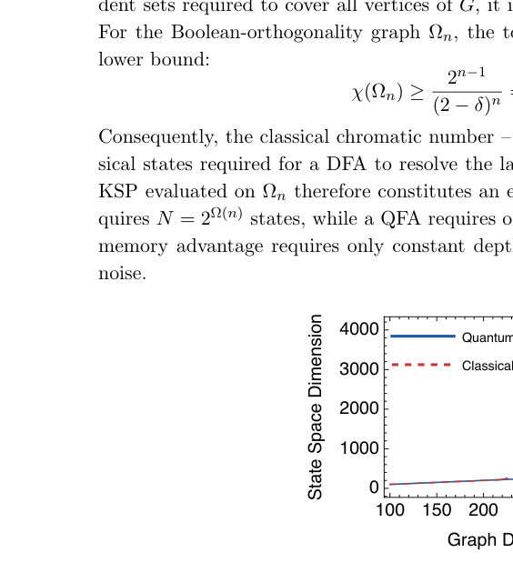
<figcaption class="paper-figure-caption"><b>Fig 2.</b> Figure 2: Scaling of the state space dimension as a function of the graph dimension n. While the quantum memory cost ξ(Ωn) (blue) grows linearly, the lower bound on the classical memory cost χ(Ωn) (red dashed), derived from the Frankl-Rodl (FR) theorem [35], grows exponentially.</figcaption>
</figure>
<figure class="paper-figure-card">
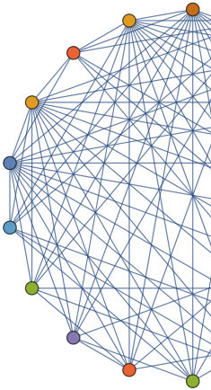
<figcaption class="paper-figure-caption"><b>Fig 3.</b> Figure 3: This 18-vertex graph has χ = 7, ξ = 6 and χf = 5.68. It cannot exhibit state- independent contextuality because χf &lt; ξ [18]. However, it does exhibit representational contextuality, as χ &gt; ξ.</figcaption>
</figure>
<figure class="paper-figure-card">

<figcaption class="paper-figure-caption"><b>Fig 4.</b> Figure 4: A valid 6-coloring of the 60-ray orthogonality graph of [42] derived from vertices of the 4D 600-cell. The graph is partitioned into 15 disjoint 4-element orthogonal bases (indicated by the shaded regions). Because each basis forms a clique, every region contains four distinct vertex colors.</figcaption>
</figure>

**Summary.** The paper establishes an exponential advantage for Quantum Finite Automata over classical automata by solving a problem rooted in contextuality. This advantage is quantified by the gap between the graph's chromatic number ($\chi$) and its orthogonal rank ($\xi$). Crucially, this resource separation remains robust even when subjected to realistic operational noise.

**Why it may be interesting.** This work provides a concrete computational realization of quantum resource theory, showing that structural incompatibilities between classical deterministic models (NCHVMs) and quantum mechanics can lead to provable, noise-resilient advantages in memory complexity for computation.

Detailed structure

**Main problem.** The paper aims to demonstrate an exponential, noise-resilient memory advantage for quantum finite automata (QFAs) over classical deterministic finite automata (DFAs) by exploiting graph-theoretic properties of contextuality.

**Main result.** An exponential separation is achieved in memory cost ($d=O(n)$ vs. $N=2^{\Omega(n)}$) when solving a promise problem derived from the Kochen-Specker Problem on Boolean-orthogonality graphs, and this advantage is robust to operational noise.

**Method.** The analysis uses graph theory invariants ($\chi(G)$, $\xi(G)$) applied to an exclusivity graph $G$ to define a computational task. The quantum solution utilizes QFAs operating via Householder reflections, while the classical lower bound relies on the chromatic number.

**Model / system.** The core model is the Quantum Finite Automaton (QFA) solving a promise problem defined by an exclusivity graph $G$. The underlying structure relates to the Kochen-Specker Problem and involves comparing the quantum memory dimension ($\xi(G)+1$) against the classical state requirement ($\chi(G)$).

**Key observables.** Chromatic number $\chi(G)$, orthogonal rank $\xi(G)$, Quantum Memory Dimension $d$, Classical State Requirement $N$.

**Important parameters / regimes.** The exponential separation scaling ($d=O(n)$ vs. $N=2^{\Omega(n)}$) for Boolean-orthogonality graphs, and the noise resilience threshold ($\mathcal{O}(1)$).

**Assumptions / limitations.** The advantage relies on 'representational contextuality,' defined by the structural gap $\chi(G) > \xi(G)$, which is distinguished from statistical contextuality (SIC).

**Figures summary.** Figures illustrate graph structures like $\Omega_4$ and general graphs showing the relationship between $\chi$, $\xi$, and $\chi_f$. One figure compares linear quantum scaling to exponential classical lower bounds.

**Paper structure.** The paper establishes the computational problem (KSP on $G$), derives the classical lower bound using $\chi(G)$, proposes the QFA solution bounded by $\xi(G)+1$, proves the exponential separation, and finally distinguishes this 'representational' advantage from other forms of contextuality.

Abstract

Quantum contextuality is widely recognized as an essential non-classical resource underlying quantum technology, yet illuminating the precise mechanisms through which it translates into unconditional computational advantages remains an ongoing challenge. We demonstrate an exponential, noise-resilient memory advantage for quantum finite automata arising from graph-theoretic approaches to contextuality. We define a promise problem on an exclusivity graph $G$ for which any classical deterministic automaton acts as a non-contextual hidden variable model requiring at least $N=χ(G)$ states, where $χ(G)$ is the graph's chromatic number. In contrast, by exploiting a structural phenomenon we term \textit{representational contextuality}, a QFA solves this task using a memory of dimension at most $d=ξ(G)+1$, where $ξ(G)$ is the graph's orthogonal rank. This separation scales exponentially ($d=\mathcal O(n)$ versus $N=2^{Ω(n)}$) for Boolean-orthogonality graphs. Crucially, this memory advantage maintains an $\mathcal{O}(1)$ threshold against both depolarizing and coherent noise.

[↑ back to top](#top)

### [Scattering, bound states, and resonances in the one-dimensional Dirac equation via supersymmetric quantum mechanics](http://arxiv.org/abs/2607.00306v1)

**Authors:** Camila C. Soares, Luis B. Castro, Antonio S. de Castro  
**Type:** theory · **Category:** other · **PDF:** <https://arxiv.org/pdf/2607.00306v1>  
**Analysis basis:** full PDF text, analyzed in chunks
**Topic relevance:** `Kondo & dissipative impurity` **1/5**

↔ Scroll figures horizontally

<figure class="paper-figure-card">

<figcaption class="paper-figure-caption"><b>Fig 1.</b> Fig. 1: Transmission probability T for the Dirac- matched P¨oschl–Teller effective well with ω = 2 and V0 = 0.9 (black), V0 = 1.9 (red), and V0 = 2.9 (blue) (in units where ℏ= c = m = 1). (a) Full energy range. (b) Magnified view of the high-transmission re- gion T ∈[0.983, 1.0].</figcaption>
</figure>
<figure class="paper-figure-card">
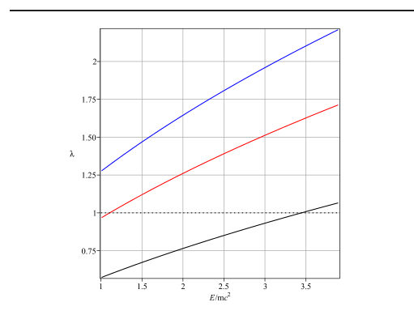
<figcaption class="paper-figure-caption"><b>Fig 2.</b> Fig. 2: Energy dependence of the P¨oschl–Teller param- eter λ(E) from the Dirac matching condition for ω = 2 and V0 = 0.9 (black), V0 = 1.9 (red), and V0 = 2.9 (blue) (in units where ℏ= c = m = 1).</figcaption>
</figure>
<figure class="paper-figure-card">

<figcaption class="paper-figure-caption"><b>Fig 3.</b> Fig. 3: Pole pattern in the complex k-plane for the Dirac-matched P¨oschl–Teller barrier with ω = 2, V0 = −2.5, and E0 = 1.2 (in units where ℏ= c = m = 1), yielding η(E0) ≃1.58 and k(±) n = ±ωη(E0) −iω(n + 1</figcaption>
</figure>

**Summary.** This paper unifies the study of scattering and bound states for the 1D Dirac equation by mapping it onto an effective Schrödinger-like problem. Using Supersymmetric Quantum Mechanics and shape invariance, the authors derive closed-form solutions for transmission probabilities. The analysis reveals that resonances manifest as predictable pole structures in the complex momentum plane.

**Why it may be interesting.** This work provides powerful analytical tools (SUSYQM) to analyze relativistic quantum systems, connecting continuum physics (scattering) directly to discrete spectra (bound states/resonances) within a single framework, which is valuable for modeling particle interactions in condensed matter or high-energy contexts.

Detailed structure

**Main problem.** The paper develops a unified theoretical framework to analyze both scattering phenomena (transmission/reflection) and discrete bound states for the one-dimensional Dirac equation.

**Main result.** It successfully maps the relativistic problem onto an effective Schrödinger-like equation, allowing the use of SUSYQM techniques to derive closed-form expressions for transmission probabilities and characterize resonance poles in the complex momentum plane.

**Method.** The core methods involve exploiting spin/pseudospin symmetries to reduce the Dirac system, applying Supersymmetric Quantum Mechanics (SUSYQM) with shape invariance, and analyzing pole structures via analytic continuation of scattering amplitudes.

**Model / system.** The model is a 1D relativistic fermion governed by the Dirac equation subjected to combined scalar and vector potentials. The analysis focuses on specific solvable forms, notably the hyperbolic Pöschl-Teller potential.

**Key observables.** Transmission probability $T(E)$, reflection amplitude $R(E)$, bound-state energies (poles of $T(k)$), and resonance/quasi-normal mode frequencies (poles in the complex momentum plane).

**Important parameters / regimes.** The energy $E$, coupling constants defining the potentials ($V_0$), and parameters related to symmetry breaking ($\Delta, \Sigma$). The regime is controlled by a discriminant $D(E)$.

**Assumptions / limitations.** The analysis relies on assuming spin-symmetry or pseudospin-symmetry to reduce the coupled system to a single second-order equation. For scattering, short-range interactions are assumed.

**Figures summary.** Figures illustrate the energy dependence of transmission coefficients for attractive potentials (bound states) and map out the pole structure in the complex momentum plane, distinguishing between high-barrier resonance regimes and low-barrier virtual state regimes.

**Paper structure.** The paper proceeds by establishing the general Hamiltonian, exploiting symmetry to reduce it to a Sturm-Liouville form. It then applies SUSYQM/shape invariance to solve for scattering amplitudes, finally using pole analysis in the complex plane to characterize bound states and resonances.

Abstract

We develop a unified treatment of scattering and discrete spectra for the one-dimensional Dirac equation with scalar and vector interactions. Under the spin-symmetry condition, the coupled first-order Dirac system maps exactly onto an effective Sturm--Liouville (Schrö\-din\-ger-like) problem for a single spinor component. This mapping provides a convenient framework for analyzing transmission, reflection, and analytic continuation. As an explicit application, we consider effective interactions of hyperbolic Pöschl--Teller type and exploit supersymmetric quantum mechanics and shape invariance to obtain a closed-form expression for the transmission probability. The bound-state spectrum is then recovered from the poles of the analytically continued transmission amplitude, reproducing known results and offering a unified description of scattering and bound states. For the barrier configuration, we briefly comment on the resulting pole pattern in the complex momentum plane and its connection with resonance and quasi-normal-mode behavior. Moreover, we use the chiral transformation to relate the spin- and pseudospin-symmetry sectors and translate results between them without repeating the full derivation.

[↑ back to top](#top)

## Other papers (5)

*Papers from primary archives without highlighted authors or any topic match. Click to expand.*

Show other papers

### [Dependency-Aware Circuit Scheduling for Multi-Core Quantum Systems to Minimize Makespan](http://arxiv.org/abs/2607.00469v1)

**Authors:** Rajeswari Suance P S, Ruchika Gupta, Maurizio Palesi, John Jose  
**Type:** theory · **Category:** quantum information and computing · **PDF:** <https://arxiv.org/pdf/2607.00469v1>  
**Analysis basis:** full PDF text, analyzed in chunks

↔ Scroll figures horizontally

<figure class="paper-figure-card">
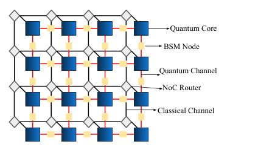
<figcaption class="paper-figure-caption"><b>Fig 1.</b> Fig. 1: Multi-Core Quantum Computing Architecture</figcaption>
</figure>
<figure class="paper-figure-card">

<figcaption class="paper-figure-caption"><b>Fig 2.</b> Fig. 2: Case study setup (a) 3 × 3 Mesh Topology. (b) Example quantum circuit with five two-qubit gates. (c) Table showing gate number, input qubits, their resident cores, and hop counts. (d) Dependency graph of the circuit gates.</figcaption>
</figure>
<figure class="paper-figure-card">

<figcaption class="paper-figure-caption"><b>Fig 3.</b> Fig. 3: Comparison of scheduling strategies: layered schedul- ing (makespan=12) versus greedy scheduling (makespan=9)</figcaption>
</figure>
<figure class="paper-figure-card">

<figcaption class="paper-figure-caption"><b>Fig 4.</b> Fig. 4: Comparison of various circuit scheduling with synthetic random circuits</figcaption>
</figure>
<figure class="paper-figure-card">

<figcaption class="paper-figure-caption"><b>Fig 5.</b> Fig. 4a shows the comparative study of makespan for syn- thetic random circuits across different hardware configurations. We can see that proposed greedy scheduling algorithm con- sistently achieves a lower makespan than layered scheduling. This improvement arises because the greedy approach exploits inter-layer parallelism, allowing gates to execute as soon as their dependencies and resources are available. In contrast, the layered scheduling ignores the fine-grained parallelism and fails to hide inter-core communication latency, which is particularly evident for the larger meshes. Fig. 4b shows the comparison of core utilization for the synthetic benchmarks. We can see that the greedy...</figcaption>
</figure>

**Summary.** This paper addresses the critical challenge of efficiently scheduling quantum circuits across multiple interconnected quantum cores. By proposing a dependency-aware greedy algorithm over a simple layer-by-layer approach, the authors demonstrate significant speedups by exploiting fine-grained parallelism and better managing communication latency. This work provides crucial insights for optimizing future multi-core quantum hardware implementations.

**Why it may be interesting.** While focused on classical scheduling algorithms, the explicit modeling of resource constraints (qubit availability, entanglement links) and communication overhead is highly relevant for understanding practical limitations in building large-scale quantum simulators or hardware control stacks.

Detailed structure

**Main problem.** The primary goal is to minimize the overall execution time (makespan) when running quantum circuits on multi-core quantum computing architectures.

**Main result.** A dependency-aware greedy scheduling strategy was shown to achieve an average 40% reduction in makespan and improve core utilization compared to baseline layered scheduling on real benchmarks.

**Method.** The authors compare a simple, sequential 'layered scheduling' approach against a proposed fine-grained, dependency-aware greedy heuristic that schedules gates as soon as all prerequisites and resources are available.

**Model / system.** The model is a multi-core quantum system structured on an n x n 2D mesh topology. Inter-core operations require quantum teleportation due to the no-cloning theorem, introducing significant communication latency.

**Key observables.** Makespan (T_total), Core Utilization, and Communication Overlap Ratio (R_comm).

**Important parameters / regimes.** The system size is defined by the mesh topology ($n 	imes n$) and the number of qubits per core ($Q_i$). Inter-core communication delay ($	ext{com time}$) is a critical parameter.

**Assumptions / limitations.** Assumes deterministic teleportation with successful entanglement generation, and that inter-core communication latency is orders of magnitude higher than local gate execution latency.

**Figures summary.** Figures illustrate the multi-core architecture (NoC), compare makespans between layered vs. greedy scheduling on case studies, and show performance metrics across varying mesh sizes using synthetic and real benchmarks.

**Paper structure.** The paper first establishes the physical model of a multi-core quantum processor. It then introduces two scheduling methods: baseline layered scheduling and the proposed dependency-aware greedy heuristic. The core of the work involves rigorous evaluation against various benchmarks to quantify performance gains.

Abstract

Multi-core quantum computing architectures have emerged as a promising solution to the qubit scalability limitations of monolithic NISQ devices. Quantum algorithms are expressed as quantum circuits composed of single- and two-qubit gates. However, circuit scheduling in multi-core quantum systems remains largely unexplored. Reducing overall execution time (makespan), increasing core utilization, and hiding communication latency behind computation depends on effective scheduling. In this paper, we first introduce a layered scheduling approach as a baseline where quantum gates within the same layer are executed in parallel, while layers themselves are executed sequentially. We then propose a greedy scheduling strategy which schedules each gate as soon as all its dependencies and required resources are available. This allows fine-grained parallelism across cores. Our evaluation shows that on real benchmarks, greedy scheduling achieves an average 40% reduction in makespan and improvement in core utilization. The results suggest that the use of intelligent circuit scheduling to exploit parallelism can greatly enhance the speed of circuit execution in multi-core quantum architectures.

[↑ back to top](#top)

### [Leveraging LLM-Based Agentic Systems to Generate Quantum Applications for Test Optimization](http://arxiv.org/abs/2607.00939v1)

**Authors:** Ming Tao, Yuechen Li, Tao Yue, Man Zhang, Aitor Arrieta Marcos  
**Type:** experiment · **Category:** quantum information and computing · **PDF:** <https://arxiv.org/pdf/2607.00939v1>  
**Analysis basis:** full PDF text, analyzed in chunks

↔ Scroll figures horizontally

<figure class="paper-figure-card">
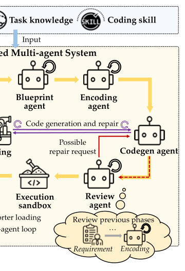
<figcaption class="paper-figure-caption"><b>Fig 1.</b> Figure 1: Overview of QPipe.</figcaption>
</figure>
<figure class="paper-figure-card">
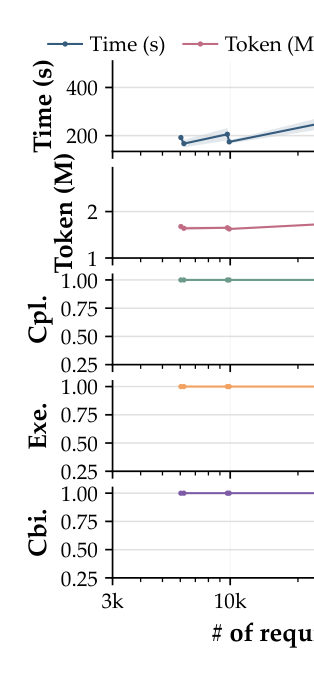
<figcaption class="paper-figure-caption"><b>Fig 2.</b> Figure 2: Relation between lengths of 20 requirements and RQ1 metrics.</figcaption>
</figure>
<figure class="paper-figure-card">

<figcaption class="paper-figure-caption"><b>Fig 3.</b> Figure 3: Distribution of QRR across successful generations of 10 TCS and 10 TCM requirements</figcaption>
</figure>
<figure class="paper-figure-card">
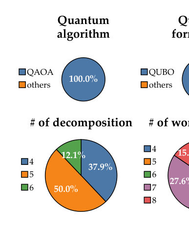
<figcaption class="paper-figure-caption"><b>Fig 4.</b> Figure 4: Pie charts for six patterns observed in 58 successful runs of QPipe</figcaption>
</figure>
<figure class="paper-figure-card">
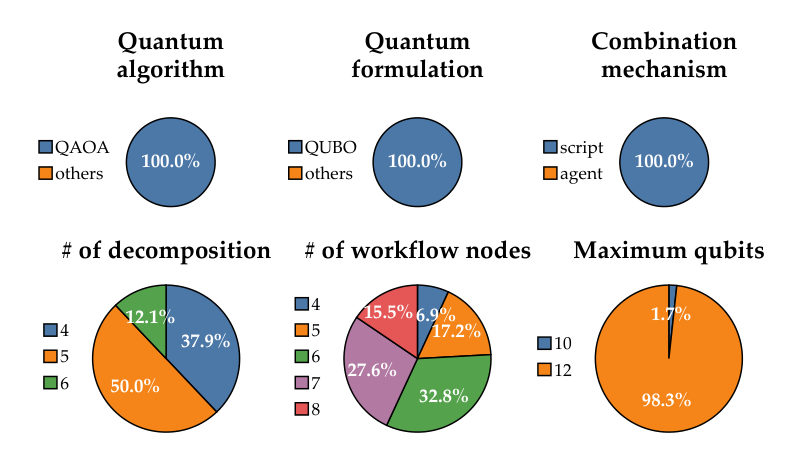
<figcaption class="paper-figure-caption"><b>Fig 5.</b> Figure 4 shows that the successful runs share a stable prompt-conditioned quantum core: all 58 use a QUBO formulation and QAOA. This pattern is not from predefined workflow settings or fixed model configurations. Rather, in each run, agents autonomously choose the formulation and algorithm, and all 58 successful runs hap- pen to converge on QUBO and QAOA for our target problems, even though we prompt Analysis Agent with exemplary algorithms previously used as solutions to SE optimization problems [40], like variational quantum eigensolver and Grover search, while no specified encoding candidates are offered for Encoding Agent. The fact that all successful runs use QUBO also does not mean...</figcaption>
</figure>

**Summary.** This paper introduces QPipe, an LLM-based multi-agent system designed to automatically generate executable quantum applications from natural language requirements for test optimization. By coordinating specialized agents through a structured workflow, it successfully translates abstract goals into concrete quantum circuits that solve real-world benchmarks. This demonstrates the potential of agentic AI to bridge the significant expertise gap in applying quantum computing to practical software engineering problems.

**Why it may be interesting.** While focused on SE tooling, the underlying challenge of translating high-level physical or computational goals into precise quantum circuit implementations is relevant to designing control protocols for complex quantum simulations or hybrid quantum-classical algorithms.

Detailed structure

**Main problem.** The core problem is autonomously translating high-level, natural-language (NL) requirements for Software Engineering (SE) optimization into executable quantum applications.

**Main result.** The proposed agentic system, QPipe, successfully generates these complex quantum applications with high success rates and generated solutions that often outperform classical baselines on test optimization benchmarks.

**Method.** It employs a multi-agent LLM architecture (QPipe) that decomposes the task into specialized stages: parsing, encoding (mapping to QUBO/Ising), code generation, review, and verification.

**Model / system.** The system operates on quantum computing principles, formulating optimization problems as QUBO or Ising models ($\min x^	op Qx$) suitable for execution via algorithms like QAOA on simulated quantum hardware.

**Key observables.** Success rates (e.g., 100% compilation pass rate), solution quality measured by the Quantum Resource Ratio (QRR) compared to classical solvers, and generation costs (time/tokens).

**Important parameters / regimes.** Qubit budget constraints are critical, forcing the Encoding Agent to decompose large problems into smaller, manageable subproblems.

**Assumptions / limitations.** The system assumes that stable formulation patterns (QUBO/QAOA) exist for TCO tasks and that agentic coordination can reliably bridge the gap between abstract language and executable quantum code.

**Figures summary.** Figures illustrate the overall QPipe workflow, show ablation results proving the necessity of specific agents (like review), and compare solution quality metrics (QRR) against baselines.

**Paper structure.** The paper introduces the problem, details the multi-agent architecture (QPipe), describes the structured workflow involving specialized agents for each step (Parse $
ightarrow$ Encode $
ightarrow$ CodeGen $\leftrightarrow$ Review $
ightarrow$ Verify), and concludes with empirical evaluations across multiple benchmarks.

Abstract

Quantum computing is increasingly explored for software engineering (SE) optimization, but translating natural-language (NL) task-level requirements into executable quantum applications still demands substantial quantum and programming expertise. We present QPipe, a large language model (LLM)-based multi-agent architecture that autonomously turns NL requirements into traceable quantum-application workflows through specialized agents for requirement parsing, formulation, code generation, review, execution, and verification. We evaluate QPipe on 20 NL requirements, each associated with a real-world benchmark and a test-optimization problem. QPipe successfully completes the key stages of quantum-application generation across requirements, achieving average rates of 100% for code compilation and 96.7% for application execution and final-result combination, with average generation costs of 260.1 seconds and 1.89M tokens per requirement. Among the generated quantum applications that execute successfully, the returned solutions outperform the offline genetic algorithm baseline in most cases. Ablation results further show that QPipe's advantage depends on retaining code-generation skills, task knowledge, review feedback, and multi-agent decomposition. These results indicate that agentic coordination can support generation of executable quantum applications for tackling test optimization problems from real-world benchmarks.

[↑ back to top](#top)

### [Quantum Oscillations of $\mathrm{Sr}_2\mathrm{RuO}_4$ under c-Axis Uniaxial Stress](http://arxiv.org/abs/2607.00679v1)

**Authors:** Fabian Jerzembeck, Maximilian T. Pelly, Helge Rosner, Edgar Abarca Morales, Naoki Kikugawa, Dmitry A. Sokolov, Andrew P. Mackenzie, Andreas W. Rost, Elena Hassinger, Javier F. Landaeta  
**Type:** both · **Category:** strongly correlated electrons · **PDF:** <https://arxiv.org/pdf/2607.00679v1>  
**Analysis basis:** full PDF text, analyzed in chunks

↔ Scroll figures horizontally

<figure class="paper-figure-card">

<figcaption class="paper-figure-caption"><b>Fig 1.</b> Figure 1. Schematic 2D Fermi surface of Sr2RuO4 under uniaxial stress. (a) Zero stress. (b) In-plane uniaxial stress |σxx| &gt; |σcrit,xx|. (c) Out-of-plane uniaxial stress |σzz| &gt; |σcrit,zz|.</figcaption>
</figure>
<figure class="paper-figure-card">
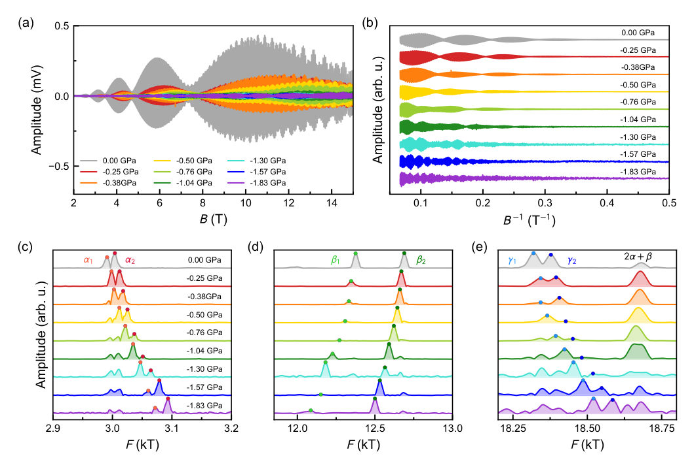
<figcaption class="paper-figure-caption"><b>Fig 2.</b> Figure 2. (a) Raw dHvA oscillations as a function of magnetic field at 90 mK (stress cell temperature) for a series of compressive stresses. (b) Same data as in (a) plotted versus inverse field; curves are vertically shifted for clarity. (c–e) Fourier spectra highlighting the α, β, γ, and 2α +β peaks under different stresses. FFTs were taken over the field range 3–15 T for α and 8–15 T for the other Fermi surface sheets.</figcaption>
</figure>
<figure class="paper-figure-card">

<figcaption class="paper-figure-caption"><b>Fig 3.</b> Figure 4. Comparison of the FFTs (8–15 T range) of quantum oscil- lations from magnetostriction (85 mK) and dHvA (125 mK) on the same sample. Before comparison, the strain FFT was multiplied by F2 (details are in the main text). Both spectra are then normalized to the α peak height. The inset shows the raw dilatometer signal (strain oscillations) as a function of field.</figcaption>
</figure>
<figure class="paper-figure-card">

<figcaption class="paper-figure-caption"><b>Fig 4.</b> Figure 3. Lifshitz-Kosevich effective mass analysis at 0 GPa (circles, solid lines) and −1 GPa (squares, dashed lines). Uncertainties on the effective masses from the fits are estimated to be about 2% for the α and β sheets, and about 5% for the γ sheet.</figcaption>
</figure>
<figure class="paper-figure-card">
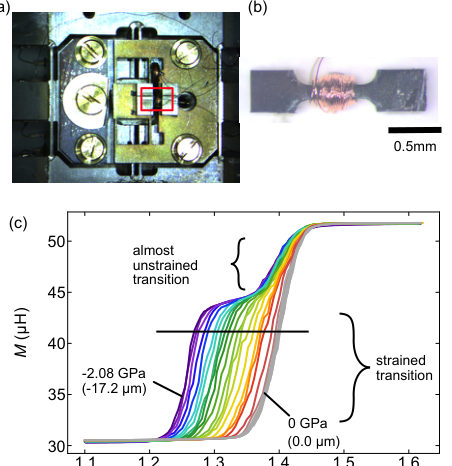
<figcaption class="paper-figure-caption"><b>Fig 5.</b> Figure 6. (a) Photo of a two-part carrier: the sample is mounted across a gap (red rectangle) with an excitation coil around its neck. (b) c-axis sample with a 48 turns pick-up coil. The sample was necked down in the center to reach larger stresses. (c) Mutual in- ductance against temperature in a series of compressive stresses. We show both the stress and, in brackets, the displacement, applied to the sample. (d) Comparison of Tc(σ) −Tc(σ = 0) against stress. Tc of the QO sample was determined by a threshold criterion, as indicated in panel (c), and compared to results from Ref. [16].</figcaption>
</figure>

**Summary.** This work uses dHvA measurements on $\mathrm{Sr}_2\mathrm{RuO}_4$ to map how uniaxial strain modifies its electronic structure. By observing changes in Fermi surface areas and effective masses, the authors demonstrate that stress induces charge transfer between orbital sheets, driving the system toward a Lifshitz transition. This establishes quantum oscillation measurements under mechanical stress as a powerful new experimental route for probing correlated electron physics.

**Why it may be interesting.** The methodology—using quantum oscillations under controlled strain combined with first-principles theory—is highly valuable for understanding emergent phenomena in strongly correlated systems where external tuning parameters (like stress) can drive topological phase transitions or alter superconducting pairing mechanisms.

Detailed structure

**Main problem.** The study investigates how uniaxial stress affects the electronic structure and Fermi surface of the unconventional superconductor $\mathrm{Sr}_2\mathrm{RuO}_4$, specifically addressing discrepancies between predicted density of states enhancement and observed $T_c$ suppression.

**Main result.** Under c-axis compression, charge transfer occurs from hole-like to electron-like sheets ($\alpha 	o \gamma$), driving the system toward a Lifshitz transition. The measurements confirm that quantum oscillation data, combined with band structure calculations, provide a powerful new tool for studying quantum materials.

**Method.** The research combines De Haas-van Alphen (dHvA) quantum oscillation measurements under uniaxial stress ($\sigma_{zz}$) with theoretical predictions from Density Functional Theory (DFT) and magnetostriction analysis.

**Model / system.** The system is the correlated electron material $\mathrm{Sr}_2\mathrm{RuO}_4$, an unconventional superconductor. The study probes its electronic structure evolution by applying controlled uniaxial strain/stress along the c-axis, which modifies the Fermi surface topology and carrier distribution among different orbital sheets ($\alpha, eta, \gamma$).

**Key observables.** dHvA frequencies (cross-sectional areas of $\alpha, eta, \gamma$ sheets), effective masses ($m^*$), critical stress for Lifshitz transition ($\sigma_{	ext{crit},c}$), and the superconducting critical temperature $T_c$.

**Important parameters / regimes.** Uniaxial stress up to $-1.8$ GPa (or higher in some analyses); Fermi surface sheets $\alpha, eta, \gamma$; Temperature dependence of quantum oscillation amplitudes.

**Assumptions / limitations.** The analysis assumes that the observed changes are due to intrinsic electronic structure evolution rather than experimental artifacts like strain inhomogeneity or temperature gradients; DFT calculations provide a reliable baseline for band structure predictions.

**Figures summary.** Figures show raw dHvA oscillations and Fourier spectra demonstrating frequency shifts under stress. Comparisons are made between these experimental results, magnetostriction measurements, and DFT-calculated frequency shifts to validate the physical mechanism of charge transfer and topology change.

**Paper structure.** The paper establishes the need for studying electronic structure evolution under strain in correlated materials. It presents dHvA measurements showing clear quantum oscillations up to high stresses. The core analysis details how Fermi surface areas change (charge transfer) and how effective masses are modified, comparing these findings rigorously against DFT calculations to pinpoint the approach toward a Lifshitz transition.

Abstract

Uniaxial stress has now been widely used to study correlated electron materials. However, Fermi surface-resolved experimental data on the evolution of the electronic structure under piezoelectrically applied stress are sparse, with no reports of de Haas-van Alphen (dHvA) effects under uniaxial stress. Here we present dHvA measurements under $c$-axis uniaxial stress on the unconventional superconductor $\mathrm{Sr}_2\mathrm{RuO}_4$. This allows us to study the evolution of the electronic structure directly and to gain insight into the contradicting behavior of the predicted enhancement of the electronic density of states and the observed suppression of $T_\text{c}$. We are able to follow all Fermi surfaces for stress up to $-1.8$~GPa and find that the cross-sectional areas of the hole-like $α$ sheet increase and electron-like $β$ sheet decrease. At the same time, the area of the electron-like $γ$ sheet increases. Therefore, in contrast to in-plane uniaxial stress, charge transfer is the mechanism for approaching the electron-to-hole Lifshitz transition and the associated Van Hove singularity. Additionally, we find that the effective masses on all three Fermi sheets are slightly enhanced as the Lifshitz transition is approached. We compare the dHvA results with quantum oscillations in the magnetostriction and band structure calculations, and find good agreement. At a more general level, our findings show that quantum oscillation measurements under uniaxial stress, combined with band-structure calculations, offer a promising new route for studying quantum materials.

[↑ back to top](#top)

### [Resilient $j$=3/2 superconductivity in topological semimetal YPtBi](http://arxiv.org/abs/2607.00765v1)

**Authors:** Prathum Saraf, Nicholas A. Crombie, Rahul Sharma, Jared Z. Dans, Danila Sokratov, Carsyn L. Mueller, Ram Kumar, Hyunsoo Kim, Connor Roncaioli, Winslow Weiss, David Graf, Chandra Shekhar, Claudia Felser, Johnpierre Paglione  
**Type:** experiment · **Category:** strongly correlated electrons · **PDF:** <https://arxiv.org/pdf/2607.00765v1>  
**Analysis basis:** full PDF text, analyzed in chunks

↔ Scroll figures horizontally

<figure class="paper-figure-card">

<figcaption class="paper-figure-caption"><b>Fig 1.</b> FIG. 1. Variation of transport behavior of YPtBi with disorder, purity and charge doping. (a) and (b) Normalized resistivity and Hall resistivity of the various types of YPtBi grown respectively. Panel (a) shows data for Y0.997Ca0.003PtBi and Y0.52Nd0.48PtBi, while panel (b) show data for Y0.991Ca0.009PtBi and Y0.80Nd0.20PtBi. (c) Plot of 1/RRR vs residual resistivity indicating a change in the residual resistivity in the samples as opposed to room temperature resistivity. (d) Carrier density of various samples as a function of 1/RRR. Filled symbols are quantities measured with Hall and open symbols are measured with quantum oscillations.</figcaption>
</figure>
<figure class="paper-figure-card">
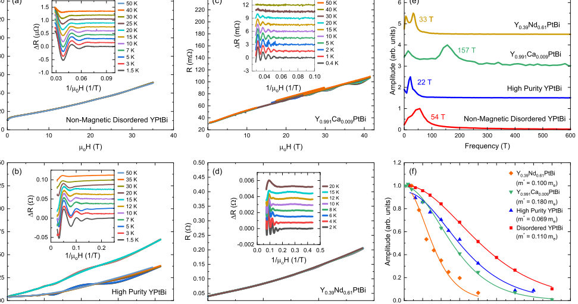
<figcaption class="paper-figure-caption"><b>Fig 2.</b> FIG. 2. Quantum oscillations in chemically tuned YPtBi. (a) - (d) Raw data of resistance vs magnetic field of disordered, high purity, Ca doped samples and (Y,Nd)PtBi respectively. Inset shows subtracted resistance curves offset to show the oscillations more clearly. (e) Fast Fourier transform of the oscillations showing changes in frequency of the four types of YPtBi. (f) Lifshitz-Kosevich fits (lines) of the temperature dependence of the amplitude of oscillations which is used to extract the effective mass.</figcaption>
</figure>
<figure class="paper-figure-card">

<figcaption class="paper-figure-caption"><b>Fig 3.</b> Fig. 2(a) presents the weaker quantum oscillations observed in disordered samples. Although the oscilla- tions are less prominent due to increased scattering, the background-subtracted oscillatory component is indeed periodic in 1/µ◦H, as shown in the inset. The FFT in Fig. 2(e) reveals a peak at F ≈54 T, similar to that of YPtBi. The extracted effective mass is m∗= 0.11me matching that of YPtBi. These observations suggest that while disorder suppresses the quantum oscillation ampli- tude by enhancing scattering, it does not significantly shift the Fermi level or alter the carrier density, consis- tent with the Hall data described above.</figcaption>
</figure>
<figure class="paper-figure-card">
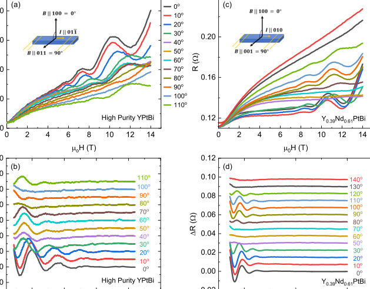
<figcaption class="paper-figure-caption"><b>Fig 4.</b> FIG. 3. Angle-dependent probe of j=3/2 Fermi surface in YPtBi. Rotation measurements on the high purity and (Y,Nd)PtBi samples. (a,c) Raw data at various angles. Inset shows the rotation axis of the field along the principal axes. (b,d) Subtracted data offset to show the oscillations at various angles clearly showing a suppression of amplitude around to 011 axis for both samples.</figcaption>
</figure>
<figure class="paper-figure-card">

<figcaption class="paper-figure-caption"><b>Fig 5.</b> FIG. 4. Insensitivity of j=3/2 superconductivity to disorder and carrier density tuning. (a) Normalized resistivity curves for the samples clearly showing no variation in transition temperature. (b) Various samples measured in resistivity showing no change in Tc due to disorder. (c) Tc vs carrier density showing no change in the transition temperature.</figcaption>
</figure>

**Summary.** This work experimentally investigates the superconducting state in the topological semimetal YPtBi, which features j=3/2 quasiparticle states. By testing samples with varying levels of disorder and doping, the authors demonstrate that $T_c$ is highly resilient. This resilience strongly suggests that superconductivity in this material is governed by phase stiffness rather than conventional pair-breaking mechanisms.

**Why it may be interesting.** The observed robustness of superconductivity in a high-spin system suggests exotic pairing mechanisms that are insensitive to local perturbations, providing an experimental playground for theories beyond standard BCS theory and potentially linking to quantum criticality or topological protection.

Detailed structure

**Main problem.** To investigate the robustness of exotic j=3/2 superconductivity in the topological semimetal YPtBi against significant perturbations like magnetic and nonmagnetic disorder, and changes in carrier density.

**Main result.** The superconducting critical temperature ($T_c$) remains remarkably robust across large variations in disorder and doping levels, suggesting that the transition is governed by phase stiffness rather than conventional pair formation mechanisms.

**Method.** The study combines electrical transport measurements (resistivity, Hall effect) with quantum oscillation analysis (Shubnikov de Haas oscillations) on various doped and disordered samples of YPtBi.

**Model / system.** The physical system is the topological semimetal YPtBi, characterized by strong spin-orbit coupling leading to a manifold of j=3/2 quasiparticle states near the Fermi level where superconductivity occurs. The analysis compares results against theoretical expectations from BCS theory and phase stiffness models.

**Key observables.** Superconducting critical temperature ($T_c$), residual resistivity ratio (RRR), quantum oscillation frequency ($F$) and effective mass ($m^*$), and carrier density derived from the Hall coefficient.

**Important parameters / regimes.** Disorder levels, carrier densities spanning orders of magnitude, and the high angular momentum state j=3/2.

**Assumptions / limitations.** The robustness suggests a mechanism where phase coherence (phase stiffness) dictates $T_c$, rather than simple pair amplitude formation, challenging standard BCS predictions for disorder effects.

**Figures summary.** Figures show normalized resistivity and Hall resistivity across different sample types; quantum oscillation analysis confirms changes in Fermi surface parameters ($F, m^*$) upon doping/purity changes; a key figure summarizes the constant $T_c$ despite large variations in disorder and carrier density.

**Paper structure.** The paper establishes the material's exotic superconducting nature (j=3/2) and then systematically tests its stability by varying disorder and doping, using quantum oscillations to probe normal state changes while monitoring $T_c$. The conclusion pivots on interpreting this resilience as evidence for phase stiffness control.

Abstract

Cooper pairing in most of the known fermionic superfluids occurs via spin-1/2 quasiparticle interactions that lead to spin-singlet or spin-triplet pairing. In the topological semimetal YPtBi, strong spin-orbit coupling results in a band inversion between highly symmetric $s$- and $p$-like electronic bands and a degeneracy at the $Γ$ point that ensures the manifold of $j$=3/2 quasiparticle states thrive near the Fermi level, where superconducting pairing occurs. Here we study the effects of magnetic and nonmagnetic disorder and carrier density on this exotic superconducting pairing state. By varying levels of disorder and carrier densities by nearly two and three orders of magnitude, respectively, we show that the superconducting critical temperature of YPtBi has a remarkable robustness, with little variation across this span. Our results suggest that superconductivity in YPtBi may reside in a regime where phase stiffness, rather than pair formation, governs the transition temperature. The insensitivity of Cooper pairing to dramatic changes in quasiparticle environment in a $j$=3/2 superconductor highlights a new form of protection realized in topological high-spin superconductors.

[↑ back to top](#top)

### [The Dynamical Lie Algebra of QAOA-MaxCut on the Complete Graph](http://arxiv.org/abs/2607.00945v1)

**Authors:** Jonathan Allcock, Pei Yuan, Shengyu Zhang  
**Type:** theory · **Category:** quantum information and computing · **PDF:** <https://arxiv.org/pdf/2607.00945v1>  
**Analysis basis:** full PDF text, analyzed in chunks

↔ Scroll figures horizontally

<figure class="paper-figure-card">
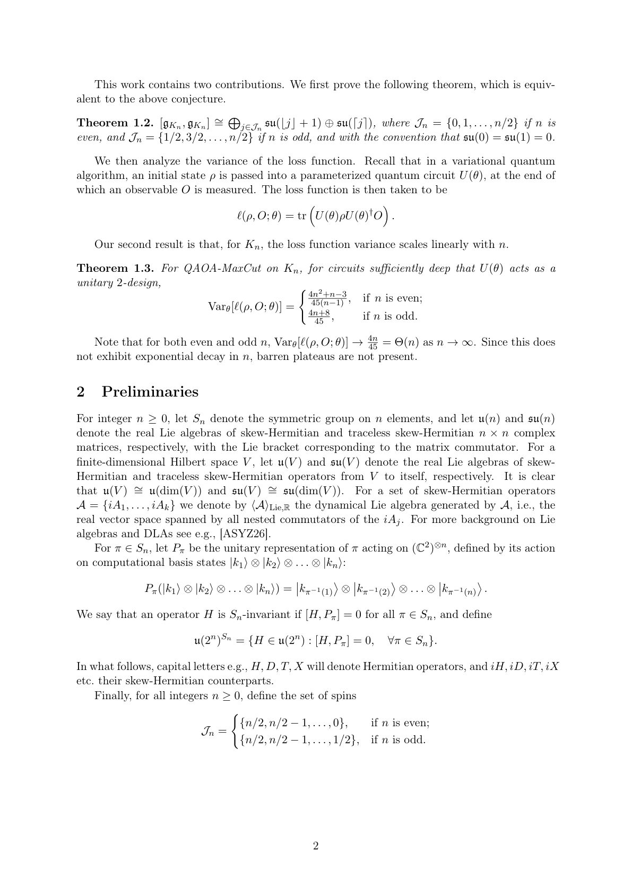
<figcaption class="paper-figure-caption"><b>Fig 1.</b> Low-resolution page preview, page 2</figcaption>
</figure>
<figure class="paper-figure-card">

<figcaption class="paper-figure-caption"><b>Fig 2.</b> Low-resolution page preview, page 3</figcaption>
</figure>
<figure class="paper-figure-card">
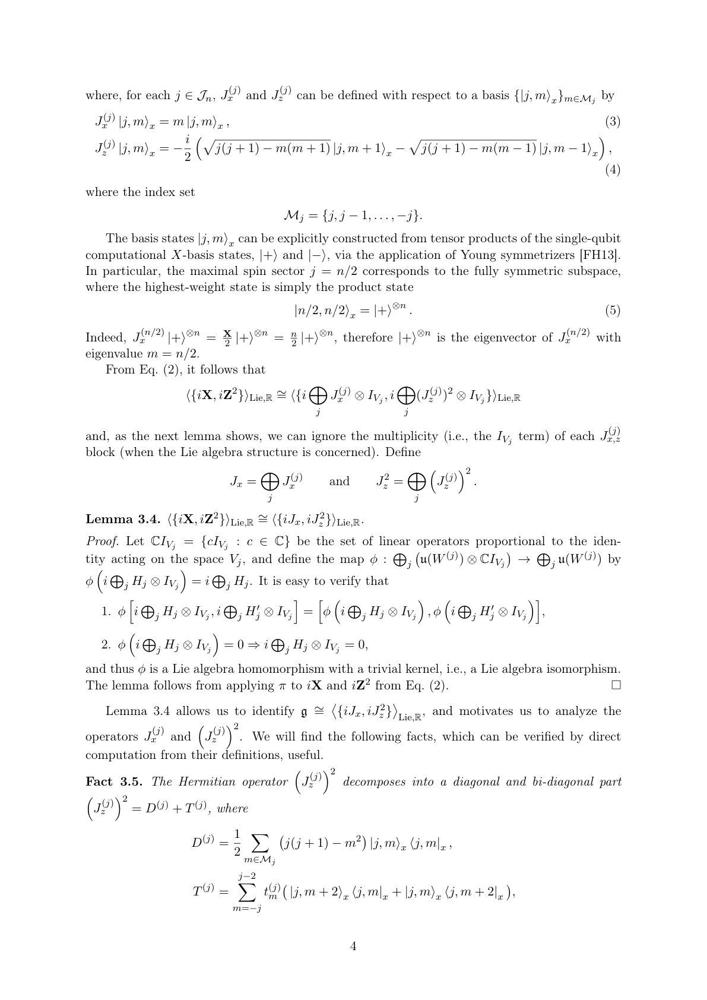
<figcaption class="paper-figure-caption"><b>Fig 3.</b> Low-resolution page preview, page 4</figcaption>
</figure>
<figure class="paper-figure-card">
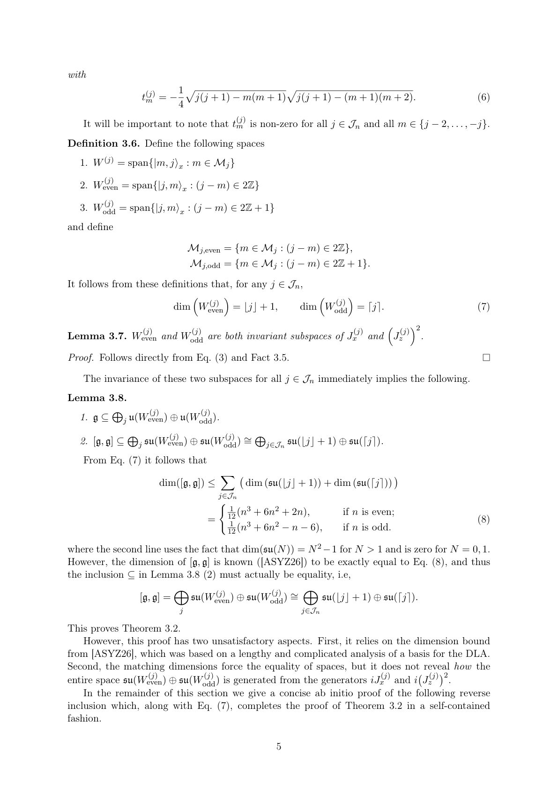
<figcaption class="paper-figure-caption"><b>Fig 4.</b> Low-resolution page preview, page 5</figcaption>
</figure>
<figure class="paper-figure-card">

<figcaption class="paper-figure-caption"><b>Fig 5.</b> Low-resolution page preview, page 6</figcaption>
</figure>

**Summary.** This theoretical paper analyzes the structure of the dynamical Lie algebra governing QAOA-MaxCut on complete graphs. By employing advanced techniques like Schur-Weyl duality, the authors prove that the variance of the loss function scales linearly with system size. This result definitively shows that barren plateaus are absent for this specific quantum optimization problem.

**Why it may be interesting.** This work provides a rigorous mathematical proof regarding the complexity landscape of quantum optimization algorithms, directly addressing the critical issue of barren plateaus which limits current NISQ device applications.

Detailed structure

**Main problem.** The paper characterizes the dynamical Lie algebra associated with the QAOA-MaxCut problem on complete graphs and determines if the system suffers from barren plateaus.

**Main result.** It proves that the variance of the loss function scales linearly ($\Theta(n)$) with the number of qubits, thereby confirming that barren plateaus do not occur for this specific quantum optimization problem.

**Method.** The analysis uses Dynamical Lie Algebras (DLAs), Schur-Weyl duality to decompose operators in $u(2n)_{S_n}$, and commutator relations to establish structural inclusions within the algebra.

**Model / system.** The system is QAOA applied to finding the MaxCut on a complete graph ($K_n$) using $n$ qubits. The mathematical framework revolves around analyzing the generators of the associated Lie algebra, $\{iX, iZ^2\}$.

**Key observables.** Loss function variance ($	ext{Var}_	heta[\ell(
ho, O; 	heta)]$), and the structure/basis elements of the dynamical Lie algebra $[\mathfrak{g}, \mathfrak{g}]$.

**Important parameters / regimes.** Number of qubits ($n$); indices $j$ related to irreducible representations (spins).

**Assumptions / limitations.** The proof relies on establishing specific reverse inclusions in the structure of the commutator subspace, and for variance calculation, it assumes the circuit is deep enough to form a unitary 2-design.

**Figures summary.** Not specified by notes; the focus is on mathematical theorems (Theorem 1.2, Theorem 1.3) and structural proofs (Lemma 3.8, Lemma 3.9).

**Paper structure.** The paper proceeds by first defining the DLA for QAOA-MaxCut, then using Schur-Weyl duality to decompose the algebra structure ($\mathfrak{g} \sim c \oplus [g, g]$). It rigorously proves that $[g_{K_n}, g_{K_n}]$ contains specific subspaces related to $\mathfrak{su}(W^{(j)}_{	ext{even}}) \oplus \mathfrak{su}(W^{(j)}_{	ext{odd}})$, culminating in the variance scaling result.

Abstract

We give an analytical expression for the dynamical Lie algebra corresponding to the QAOA-MaxCut problem on complete graphs, and show that the variance of the associated loss function scales linearly in the number of qubits. This solves an open problem from [ASYZ26] and confirms that such systems do not exhibit barren plateaus. The proof is based on projecting the dynamical Lie algebra generators onto subspaces given by the Schur-Weyl duality between irreducible representations of the unitary and symmetric groups.

[↑ back to top](#top)

## Secondary cond-mat archives

*Papers from cond-mat.mtrl-sci, mes-hall, other, soft, supr-con. These archives are de-prioritized — they appear at the end regardless of relevance score.*

### Relevant in secondary archives (21)

### [Real-time dynamics of triplet-resonant tunneling driven by nonequilibrium phonons](http://arxiv.org/abs/2607.00520v1)

**Authors:** Kazuyuki Kuroyama, Sasha R. Valentin, Arne Ludwig, Andreas D. Wieck, Yasuhiro Tokura, Seigo Tarucha, Sadashige Matsuo  
**Type:** experiment · **Category:** statistical mechanics · **PDF:** <https://arxiv.org/pdf/2607.00520v1>  
**Analysis basis:** full PDF text, analyzed in chunks
**Topic relevance:** 🔥 `non-equilibrium dynamics` **5/5** · 🔥 `driven-dissipative phase transition` **4/5** · 🔥 `methods for driven-dissipative` **4/5** · `exotic spin models in light-matter` **3/5** · `non-equilibrium universality` **3/5** · `spintronics-quantum-optics interface` **3/5** · `Kondo & dissipative impurity` **2/5** · `quantum measurements` **2/5** · `Keldysh / 2PI / non-Gaussian methods` **1/5** · `analog quantum simulation` **1/5** · `correlated / nonlocal dissipation` **1/5** · `measurement-induced transitions` **1/5**

↔ Scroll figures horizontally

<figure class="paper-figure-card">
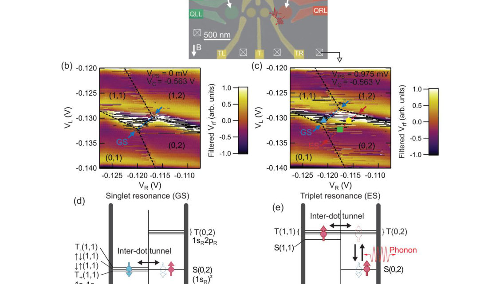
<figcaption class="paper-figure-caption"><b>Fig 1.</b> FIG. 1. (a) Geometry of our DQD sample with a charge sensor and a QD-based phonon source. (b) Charge stability diagram of the DQD near the (1,1)-(0,2) inter-dot resonance at 𝑉PS = 0 mV. The singlet resonance line is guided by the blue dashed line, and the boundaries of the charge states are guided by the black dashed lines. (c) Charge stability diagram measured at 𝑉PS = 0.975 mV. The singlet (GS) and triplet (ES) resonance lines are indicated by the blue and red dashed lines. (d,e) Transition diagrams at the singlet (d) and triplet (e) resonance conditions. 1sL and 1sR denote the 1s orbitals in the left and right QDs, respectively, and 2pR denotes the 2p orbital in the right QD.</figcaption>
</figure>
<figure class="paper-figure-card">
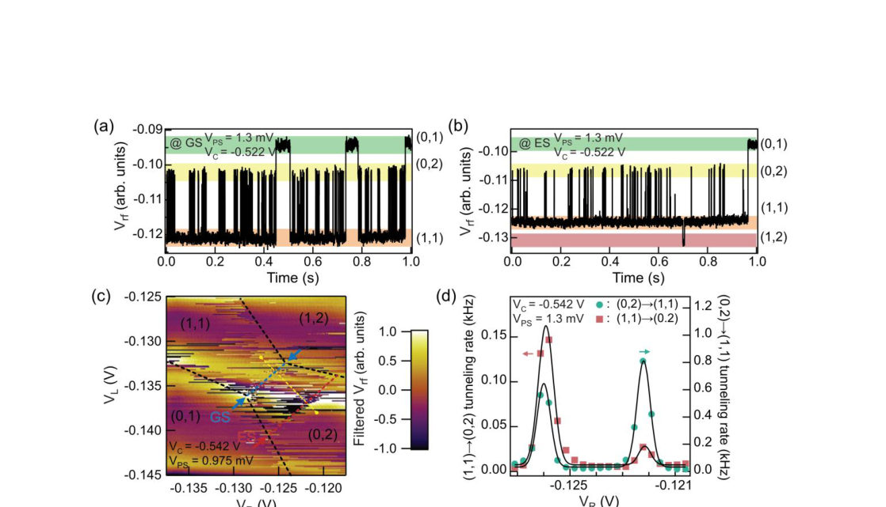
<figcaption class="paper-figure-caption"><b>Fig 2.</b> FIG. 2. (a) Typical time trace of inter-dot tunneling events measured at the singlet resonance. (b) Typical time trace of inter-dot tunneling events measured at the triplet resonance. (c) Charge stability diagram measured under phonon irradiation at slightly different inter-dot tunnel coupling strength from Fig. 1(c) by changing a gate voltage applied to gate C. (d) Inter-dot tunnel rates of the (1,1)→(0,2) tunneling (red squares) and the (0,2)→(1,1) tunneling (green circles) extracted along the yellow dashed cut in (c). The left (right) peak corresponds to the singlet (triplet) resonance.</figcaption>
</figure>
<figure class="paper-figure-card">

<figcaption class="paper-figure-caption"><b>Fig 3.</b> FIG. 3. (a, b) (0,2) and (1,1) waiting-time histograms obtained from the time traces measured at the singlet-resonance (GS) are plotted, respectively. The red curves are fits to a single- exponential function in (a) and a double-exponential function in (b). (c,d) (0,2) and (1,1) waiting-time histograms obtained from the time traces measured at the triplet resonance condition (ES). The red curves are fits to a single-exponential function in (c) and a double- exponential function in (d). (e) DQD transition diagram at the triplet resonance. The spin state initially located at |𝑆(0,2)⟩ is frequently excited to |𝑇(0,2)⟩ by a single phonon excitation. When the DQD spin state enters |𝑆(1,1)⟩, the...</figcaption>
</figure>
<figure class="paper-figure-card">
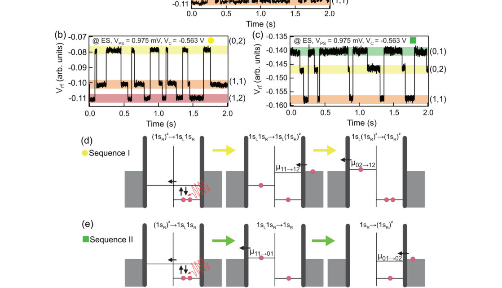
<figcaption class="paper-figure-caption"><b>Fig 4.</b> FIG. 4. (a) Typical time trace of the DQD inter-dot tunneling events observed at the singlet resonance for reduced inter-dot tunnel coupling, tuned by applying a more negative voltage to gate C (see Fig. 1(a) for the sample geometry). (b, c) Typical time trace of inter-dot tunneling events measured at the triplet resonance marked by the yellow circle and the green square in Fig. 1(c). The time trace in (b) is measured at the DQD operation point closer to the (1,2) region, while the time trace in (c) is measured at the DQD operation point closer to the (0,1) region. (d,e) Schematic sequences illustrating phonon-driven unidirectional charge- transfer cycles: (d) (0,2)→(1,1)→(1,2)→(0,2) and...</figcaption>
</figure>

**Summary.** The researchers measured the real-time charge and spin dynamics in a double quantum dot driven by nonequilibrium phonons. They found that at triplet resonance, the phonon environment induces strong rectification, leading to a measurable current via unidirectional electron transport cycles. This demonstrates how non-equilibrium driving can generate directed quantum currents in solid-state devices.

**Why it may be interesting.** This work provides a direct experimental realization of non-equilibrium quantum dynamics, showing how external energy baths (phonons) can induce directed, non-reciprocal transport cycles in mesoscopic solid-state systems, which is highly relevant to open quantum system physics and energy harvesting concepts.

Detailed structure

**Main problem.** The study investigates real-time charge and spin dynamics in excited states of a double quantum dot (DQD) driven by nonequilibrium phonons to understand emergent functionalities beyond equilibrium.

**Main result.** The system exhibits strong, measurable rectification ($\eta \approx 1$) leading to unidirectional electron transport cycles when driven by the phonon gradient at triplet resonance conditions.

**Method.** Time-resolved charge sensing and rate analysis are used to track inter-dot tunneling events under controlled nonequilibrium phonon irradiation.

**Model / system.** The physical platform is a semiconductor DQD fabricated on an AlGaAs/GaAs/AlGaAs heterostructure, coupled with a nearby phonon source QD. Dynamics are analyzed using spin states (Singlet/Triplet) and rate equations derived from time-resolved measurements.

**Key observables.** Inter-dot resonant tunneling rates ($\Gamma$), waiting-time histograms, current ($I \sim 10^{-19}$ A), and rectification parameter ($\eta$).

**Important parameters / regimes.** Low temperature ($\approx 20$ mK); detuning voltage ($V_R$); phonon bias voltage ($V_{PS}$).

**Assumptions / limitations.** The dynamics are governed by the coupling between electronic states and the nonequilibrium phonon bath, allowing for rate-equation descriptions.

**Figures summary.** Figures show charge stability diagrams revealing new triplet resonances (Fig. 1c); time traces illustrate resonant tunneling at both singlet and triplet conditions (Fig. 2a/b); waiting-time histograms compare rates across resonance types (Fig. 3); and later figures detail the unidirectional current generation and rectification ($\eta$) in weak coupling regimes (Fig. 4).

**Paper structure.** The paper progresses from establishing the experimental setup and observing basic resonant tunneling at singlet/triplet resonances, to quantifying dwell times using waiting-time statistics, and finally demonstrating nonreciprocal transport by analyzing current generation and rectification ($\eta$) in the weak coupling limit.

Abstract

Driven nonequilibrium systems can host emergent functionalities beyond equilibrium, but real-time access to excited-state dynamics remains limited. Here we report real-time measurements of phonon-driven charge and spin dynamics in excited states of a double quantum dot. Under phonon irradiation, resonant inter-dot tunneling emerges at triplet resonance. Time-resolved charge sensing reveals that the resonant inter-dot tunneling is strongly modified by spin blockade. For weaker inter-dot coupling, the nonequilibrium phonon environment generates a unidirectional transport cycle along the phonon density gradient.

[↑ back to top](#top)

### [Universal Scaling of the Spin Hall Effect](http://arxiv.org/abs/2607.00343v1)

**Authors:** Atsuo Shitade, Naoto Nagaosa  
**Type:** theory · **Category:** other · **PDF:** <https://arxiv.org/pdf/2607.00343v1>  
**Analysis basis:** full PDF text, analyzed in chunks
**Topic relevance:** 🔥 `Keldysh / 2PI / non-Gaussian methods` **4/5** · `methods for driven-dissipative` **3/5** · `non-equilibrium universality` **3/5** · `spintronics-quantum-optics interface` **3/5** · `Kondo & dissipative impurity` **2/5** · `non-equilibrium dynamics` **2/5** · `correlated / nonlocal dissipation` **1/5** · `driven-dissipative phase transition` **1/5** · `exotic spin models in light-matter` **1/5**

↔ Scroll figures horizontally

<figure class="paper-figure-card">

<figcaption class="paper-figure-caption"><b>Fig 1.</b> FIG. 1. DOS for (ℏv/∆)3ni = 5.448.</figcaption>
</figure>
<figure class="paper-figure-card">
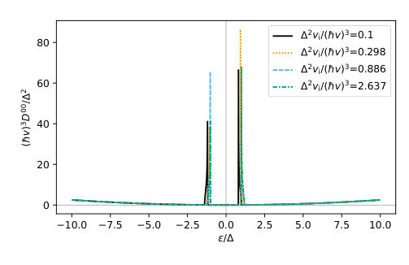
<figcaption class="paper-figure-caption"><b>Fig 2.</b> Figure 3 shows the scaling relation between the electric conductivity and the SAC and MMAC. We choose ϵF &gt; 0 to avoid the aforementioned sign change. Both these co- efficients have three regimes similarly to the AH conduc- tivity [12, 13]. In the superclean regime, the skew scatter- ing is dominant, and Γ00g xy sz and −Γ00g xy mz are propor- tional to σyy. In the moderately dirty regime, these coef- ficients are almost constant. Finally, in the dirty regime, we find a new scaling relation Γ00g xy sz , −Γ00g xy mz ∝ (σyy)0.6.</figcaption>
</figure>
<figure class="paper-figure-card">

<figcaption class="paper-figure-caption"><b>Fig 3.</b> FIG. 2. Fermi-energy dependence of (a) the SAC −Γ00g xy sz and (b) MMAC −Γ00g xy mz within the T-matrix approximation with (black solid lines) and without the VCs (blue dashed lines). We also show the results within the first-order Born approximation with (orange dotted lines) and without the VCs (green dash-dotted lines). We choose (ℏv/∆)3ni = 0.1 and ∆2vi/(ℏv)3 = 0.1.</figcaption>
</figure>
<figure class="paper-figure-card">

<figcaption class="paper-figure-caption"><b>Fig 4.</b> FIG. 3. Electric-conductivity dependence of (a) the SAC Γ00g xy sz and MMAC −Γ00g xy mz by changing the impurity concentration (ℏv/∆)3ni from 10−1 to 102.5. We choose ϵF/∆= 3.917. The slopes of two gray solid lines represent Γ00g xy sz , −Γ00g xy mz ∝σyy, (σyy)0.6.</figcaption>
</figure>
<figure class="paper-figure-card">
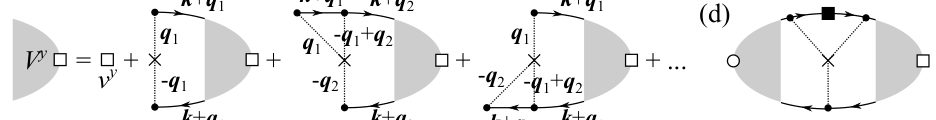
<figcaption class="paper-figure-caption"><b>Fig 5.</b> FIG. 4. Feynman diagrams for (a) the self-energy within the self-consistent T-matrix approximation, (b) the renormalized velocity vertex, (c) the spin–charge-current correlation function of the first order with respect to Qx, and (d) the correation function that vanishes in the case of short-range impurities.</figcaption>
</figure>

**Summary.** This paper develops a comprehensive theory for the Spin Hall effect in Dirac electron systems by analyzing how spin and magnetic moment accumulation coefficients scale with electric conductivity. Using advanced Green's function techniques, the authors identify three distinct transport regimes—superclean, moderately dirty, and dirty—and establish a unified framework that differs from previous anomalous Hall effect scaling laws.

**Why it may be interesting.** While focused on condensed matter transport, the rigorous development of scaling laws and the need to define fundamental quantities (like spin current) in different scattering limits provides general theoretical tools applicable to open quantum systems dynamics.

Detailed structure

**Main problem.** The study investigates the scaling behavior of the Spin Hall (SH) effect for Dirac electrons, aiming to construct a unified theory that correctly defines spin current.

**Main result.** Three distinct transport regimes are found based on electric conductivity ($\sigma_{yy}$): superclean ($\propto \sigma_{yy}$), moderately dirty (constant), and dirty ($\propto (\sigma_{yy})^{0.6}$).

**Method.** The analysis employs linear response theory using Keldysh Green's functions and the self-consistent T-matrix approximation to account for short-range nonmagnetic impurities.

**Model / system.** The model is based on Dirac electrons, described by an anisotropic Hamiltonian ($\hat{H}(\mathbf{k})$), applied to systems like bismuth. Impurity scattering is treated via the T-matrix formalism.

**Key observables.** Spin Accumulation Coefficient (SAC) and Magnetic-Moment Accumulation Coefficient (MMAC); Spin Hall Conductivity ($\sigma_{xy}^{sz}$) and MMH conductivity ($\sigma_{xy}^{mz}$).

**Important parameters / regimes.** Electric conductivity ($\sigma_{yy}$), Fermi energy ($\epsilon_F$), impurity concentration, temperature ($T=0$).

**Assumptions / limitations.** The analysis relies on the T-matrix approximation for impurities and involves deriving transport coefficients using vertex corrections (VCs) in the linear response formalism.

**Figures summary.** Figures illustrate the Density of States (DOS), Fermi-energy dependence of SAC/MMAC, and crucially, the scaling relationship between SAC/MMAC and $\sigma_{yy}$ across the three distinct scattering regimes.

**Paper structure.** The paper develops theoretical formulas for various transport coefficients using Green's functions in the T-matrix approximation. It then analyzes how these coefficients scale with conductivity ($\sigma_{yy}$) by identifying three distinct physical regimes, culminating in a unified theory framework.

Abstract

We study the spin Hall (SH) effect for the Dirac electrons in terms of the spin and magnetic-moment accumulation coefficients $-Γ^{00} g_{s(m)z}^{\phantom{s(m)z} xy}$. We take short-range nonmagnetic impurities into account within the self-consistent $T$-matrix approximation. Similarly to the universal scaling for the anomalous Hall (AH) effect, we find three disctinct regimes by changing the electric conductivity $σ^{yy}$; the superclean regime with $-Γ^{00} g_{s(m)z}^{\phantom{s(m)z} xy} \propto σ^{yy}$ owing to the skew scattering, moderately dirty regime with almost constant $-Γ^{00} g_{s(m)z}^{\phantom{s(m)z} xy}$, and dirty regime with a new scaling relation $-Γ^{00} g_{s(m)z}^{\phantom{s(m)z} xy} \propto (σ^{yy})^{0.6}$ whose exponent differs from that of the AH conductivity. Our results construct a unified theory of the SH effect without any ambiguity of spin current.

[↑ back to top](#top)

### [Surface Platinum Alloying for Passivation of Oxide Interfaces on Superconducting Niobium Films](http://arxiv.org/abs/2607.00429v1)

**Authors:** Ananya Chattaraj, Conan Weiland, Bruce Ravel, Kim Kisslinger, Sooyeon Hwang, Xiao Tong, Ajith Pattammattel, Andrew M. Kiss, Steven L. Hulbert, Aswin kumar Anbalagan, Andrew L. Walter, Peter V. Sushko, Mingzhao Liu  
**Type:** both · **Category:** quantum information and computing · **PDF:** <https://arxiv.org/pdf/2607.00429v1>  
**Analysis basis:** full PDF text, analyzed in chunks
**Topic relevance:** 🔥 `QC/QI experiment` **4/5** · `Kondo & dissipative impurity` **1/5**

↔ Scroll figures horizontally

<figure class="paper-figure-card">

<figcaption class="paper-figure-caption"><b>Fig 1.</b> FIG. 1. (a, b) HRTEM images of bare Nb film near its top surface and near the Nb/Al2O3 interface.</figcaption>
</figure>
<figure class="paper-figure-card">

<figcaption class="paper-figure-caption"><b>Fig 2.</b> FIG. 2. (a) Cross-sectional HAADF-STEM image of a bare Nb thin film deposited on Al2O3,</figcaption>
</figure>
<figure class="paper-figure-card">
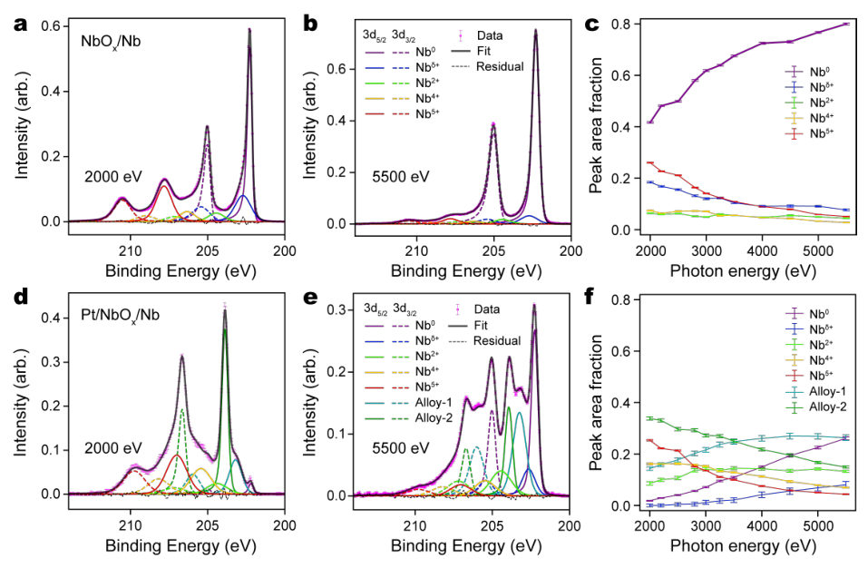
<figcaption class="paper-figure-caption"><b>Fig 3.</b> FIG. 3. (a, b) Nb 3d core-level VEXPS spectra of bare Nb measured at photon energies of 2000 eV</figcaption>
</figure>
<figure class="paper-figure-card">

<figcaption class="paper-figure-caption"><b>Fig 4.</b> FIG. 4. (a) Computational models of representative structures. From left to right: partially</figcaption>
</figure>
<figure class="paper-figure-card">
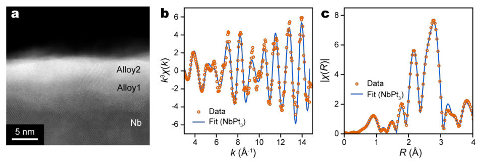
<figcaption class="paper-figure-caption"><b>Fig 5.</b> FIG. 5. (a) Cross-sectional HAADF-STEM image of the top surface of Pt/NbOx/Nb thin film. The</figcaption>
</figure>

**Summary.** This research demonstrates that coating native oxide layers on superconducting Niobium films with Platinum and annealing them creates a stable $	ext{Nb-Pt}$ alloy surface. This alloying process effectively passivates the high-loss oxide interfaces, thereby offering a materials pathway to improve coherence in superconducting transmon qubits.

**Why it may be interesting.** The work directly addresses material science limitations in superconducting qubits by providing a chemically robust interface engineering solution, which is crucial for scaling up quantum hardware.

Detailed structure

**Main problem.** Dielectric loss from two-level systems (TLS) at surfaces and interfaces limits coherence in superconducting transmon qubits built on Niobium (Nb).

**Main result.** A thin Pt encapsulation layer, when annealed, forms a chemically stable metallic Nb-Pt alloy surface that suppresses further oxide growth and maintains high superconducting performance.

**Method.** The study combines advanced characterization techniques like VEXPS and EXAFS with first-principles DFT simulations to map the atomic and electronic structure changes at the interface.

**Model / system.** The physical system is a superconducting Nb film, which forms native oxides ($	ext{NbO}_x$), followed by Pt deposition and thermal annealing. The focus is on engineering a robust, low-loss $	ext{Nb-Pt}$ alloy interface.

**Key observables.** Superconducting Transition Temperature ($T_c = 9.30 \pm 0.10$ K), Residual Resistance Ratio (RRR > 63), chemical oxidation states ($	ext{Nb}^0, 	ext{Nb}^{5+}$), and the formation of $	ext{NbPt}_3$ alloy phases.

**Important parameters / regimes.** Annealing temperature ($750^\circ	ext{C}$), Pt layer thickness ($\approx 10 	ext{ nm}$), and specific binding energy shifts observed in VEXPS spectra.

**Assumptions / limitations.** VEXPS fitting requires assuming specific line shape models (Voigt/Skewed Voigt) for accurate deconvolution of overlapping chemical states. The structural analysis relies on matching EXAFS data to idealized alloy models ($	ext{NbPt}_3$).

**Figures summary.** Figures show TEM cross-sections confirming layer structure, VEXPS spectra detailing oxidation state changes, and EXAFS fits demonstrating the formation of a $	ext{Pt}$-rich $	ext{NbPt}_3$ interfacial alloy.

**Paper structure.** The paper progresses from identifying the loss mechanism (TLS in native oxides) to proposing Pt passivation. It then uses VEXPS/DFT to characterize oxide states, followed by EXAFS analysis to confirm the specific $	ext{Nb-Pt}$ alloy structure ($	ext{NbPt}_3$), and finally validates this protective layer using cross-sectional microscopy.

Abstract

Dielectric loss arising from two-level systems (TLS) at surfaces and interfaces remains a primary limitation to coherence in superconducting transmon qubits. Niobium (Nb), a widely used material in superconducting quantum circuits, readily forms native oxides under ambient conditions, leading to lossy dielectric interfaces that degrade device performance. Here, a robust and scalable fabrication strategy is demonstrated for chemically stabilizing Nb surfaces and mitigating further oxidation, including protection of both surface and sidewall regions. High-purity Nb films were fabricated with bulk-like superconducting transition temperatures ($T_c = 9.30\pm0.10$) K. We demonstrate that a thin Pt encapsulation layer, deposited after native oxide formation, can be transformed via thermal annealing into a Nb-Pt alloy at the surface. Spectroscopic and microscopic analyses confirm the formation of a chemically stable metallic alloy layer and its ability to suppress further oxide growth. Ab initio simulations elucidate the atomic-scale rearrangement and electronic structure evolution associated with Pt incorporation on native niobium oxide, providing insight into the stabilization mechanism of the alloyed surface. This approach offers a materials pathway for engineering chemically robust Nb interfaces, including sidewalls, toward higher-coherence superconducting qubit architectures."

[↑ back to top](#top)

### [Characterization of Hydroxyls in Surface Oxide of Superconducting Tantalum and Their Mitigation in Quantum Circuits](http://arxiv.org/abs/2607.00903v1)

**Authors:** Ekta Bhatia, Nicholas Pieniazek, Aleksandra Biedron, Sandra Schujman, Hunter Frost, Zhihao Xiao, Jakub Nalaskowski, Kevin Musick, Thomas Murray, Satyavolu Papa Rao  
**Type:** experiment · **Category:** quantum information and computing · **PDF:** <https://arxiv.org/pdf/2607.00903v1>  
**Analysis basis:** full PDF text, analyzed in chunks
**Topic relevance:** 🔥 `QC/QI experiment` **4/5**

↔ Scroll figures horizontally

<figure class="paper-figure-card">
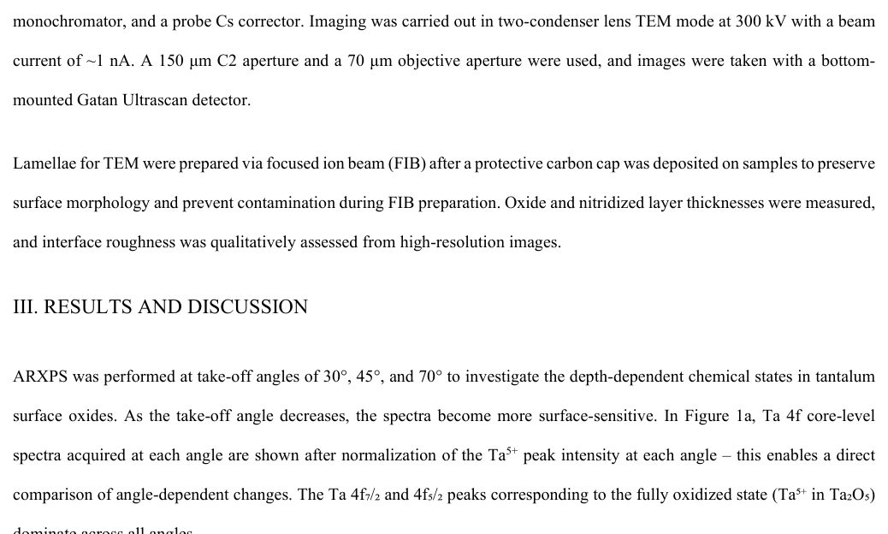
<figcaption class="paper-figure-caption"><b>Fig 1.</b> Figure 1b quantifies the peak intensities extracted from panel (a), grouped by chemical state and plotted for each angle. While</figcaption>
</figure>
<figure class="paper-figure-card">
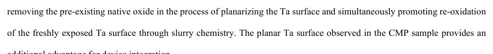
<figcaption class="paper-figure-caption"><b>Fig 2.</b> Figure 3c shows a nitridized Ta sample, where a distinct nitridized layer forms at the Ta surface due to its reaction with nitrogen</figcaption>
</figure>
<figure class="paper-figure-card">
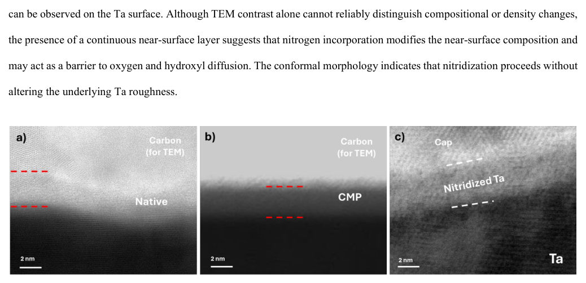
<figcaption class="paper-figure-caption"><b>Fig 3.</b> FIG. 3. Cross-sectional HR-TEM images of surface oxides on tantalum under different processing conditions: (a) Native oxide formed via ambient exposure. (b) CMP-processed sample shows a more planar surface and similar thickness as native oxide. (c) Nitridized Ta surface shows a nitridized layer under a protective cap deposited after 3 weeks of ambient exposure.</figcaption>
</figure>
<figure class="paper-figure-card">

<figcaption class="paper-figure-caption"><b>Fig 4.</b> FIG. 1. Angle-resolved X-ray photoelectron spectroscopy (ARXPS) analysis of Ta oxidation states as a function of sampling depth. (a) Ta 4f core-level spectra acquired at take-off angles of 30°, 45°, and 70°, normalized to the Ta₂O₅ peak at each angle to show comparison of underlying oxidation states. (b) Relative peak intensities of Ta⁵⁺ (Ta₂O₅), TaOₓ&lt;2.5, and Ta⁰ extracted by CasaXPS curve fitting for each angle. The inset schematically illustrates the corresponding layered structure based on ARXPS analysis.</figcaption>
</figure>
<figure class="paper-figure-card">

<figcaption class="paper-figure-caption"><b>Fig 5.</b> FIG. 2. Depth profiles of oxide species and hydroxyl content in native and CMP-formed tantalum oxides: SIMS data showing the normalized intensities of Ta₂O₅, TaOH, and Ta signals plotted as a function of sputter depth. The TaOH/Total signal reaches a maximum in</figcaption>
</figure>

**Summary.** The research characterizes the formation and location of hydroxyl defects within the surface oxides of superconducting Tantalum. Using advanced depth profiling techniques, the authors show that these hydroxyls accumulate in suboxide regions, acting as a source of decoherence. They demonstrate that controlled surface treatments like CMP or plasma nitridization can effectively suppress this detrimental hydroxyl incorporation.

**Why it may be interesting.** This work directly addresses material science limitations for superconducting qubits by providing actionable surface engineering protocols to reduce dielectric loss mechanisms relevant to quantum coherence.

Detailed structure

**Main problem.** Surface oxides on superconducting Tantalum (Ta) host Two-Level System (TLS) defects, which are a primary source of microwave loss and decoherence in quantum circuits.

**Main result.** Hydroxyl accumulation is found preferentially in the sub-stoichiometric oxide region ($	ext{TaO}_x$), and this incorporation can be suppressed by surface engineering techniques like Chemical Mechanical Planarization (CMP) or plasma nitridization.

**Method.** The study employs a combination of Secondary Ion Mass Spectrometry (SIMS) depth profiling, Angle-resolved X-ray Photoelectron Spectroscopy (ARXPS), and Transmission Electron Microscopy (TEM) to characterize the oxide layers.

**Model / system.** The physical system is superconducting Tantalum ($\alpha$-Ta) films whose surface oxides are analyzed. The focus is on the chemical structure and defect density within these native or engineered oxide layers, which act as lossy dielectrics in quantum circuits.

**Key observables.** Depth profiles of $	ext{Ta}_2	ext{O}_5$, $	ext{TaOH}$, and metallic Ta; quantification of hydroxyl species ($	ext{TaOH}^-$) concentration across different surface treatments.

**Important parameters / regimes.** Oxide thickness, relative concentrations of $	ext{Ta}$ oxidation states ($	ext{Ta}^{5+}$, $	ext{TaO}_x$), and the effectiveness of mitigation techniques (CMP, nitridization).

**Assumptions / limitations.** The accumulation of hydroxyls in the suboxide region is hypothesized to be the molecular origin of TLS defects causing decoherence.

**Figures summary.** Figures show ARXPS analysis confirming a stratified oxide structure; SIMS depth profiles illustrate $	ext{TaOH}$ accumulation beneath the surface layer, and comparative figures quantify the reduction of this hydroxyl content after CMP or nitridization treatments.

**Paper structure.** The paper first establishes the problem (TLS loss in Ta oxides) using ARXPS to map chemical states. It then uses SIMS depth profiling to pinpoint hydroxyl accumulation in suboxides. Finally, it compares native vs. engineered surfaces (CMP/nitrided) via quantitative measurements to demonstrate mitigation feasibility.

Abstract

Recently, tantalum (Ta) has gained attention in superconducting quantum circuits due to the longer coherence times achieved when replacing niobium (Nb) in capacitor pads. Previous literature shows that surface oxides that form upon ambient exposure on superconducting metals such as Ta, Al, and Nb host two-level system (TLS) defects, which are a leading source of microwave loss and decoherence. While the surface oxides of Nb and Al have been extensively studied, Ta oxides remain less well understood. Using secondary ion mass spectrometry of alpha-Ta films deposited at 300 mm wafer scale, we show for the first time that hydroxyls accumulate in the Ta suboxide region above the underlying Ta. Angle-resolved X-ray photoelectron spectroscopy shows that the surface region is dominated by Ta2O5, with sub-stoichiometric TaOx present in between the Ta2O5 and underlying Ta. The thickness of the tantalum oxide is confirmed by transmission electron microscopy. We demonstrate that [OH] incorporation can be suppressed by replacing the native oxide with an oxide formed during chemical mechanical planarization of alpha-Ta films. Our findings support the hypothesis that TLS defects are non-uniform within the oxide thickness and suggest hydroxyls as a probable molecular origin of these loss channels. Furthermore, we show the feasibility of plasma nitridization as a method to decrease hydroxyl loading on alpha-Ta surfaces. The modulation of hydroxyl content through surface engineering of alpha-Ta can enable the fabrication of more robust, high-coherence superconducting quantum circuits by addressing a potential TLS source.

[↑ back to top](#top)

### [Universal logic circuit for gate-controlled superconductor-based switches operating at liquid-helium temperatures](http://arxiv.org/abs/2607.00769v1)

**Authors:** Martin Berke, Lőrinc Kupás, Tosson Elalaily, Máté Sütő, Szabolcs Csonka, Péter Makk  
**Type:** experiment · **Category:** quantum information and computing · **PDF:** <https://arxiv.org/pdf/2607.00769v1>  
**Analysis basis:** full PDF text, analyzed in chunks
**Topic relevance:** 🔥 `QC/QI experiment` **4/5**

↔ Scroll figures horizontally

<figure class="paper-figure-card">

<figcaption class="paper-figure-caption"><b>Fig 1.</b> Fig. 1. Device configuration (a) The device consists of three NWs (blue) that are connected to a common line (green) at one end, and there are two more contacts (green) at the other end of each NW. Each NW is con- trolled by two side gate electrodes (orange). (b) Optical microscope image of a device. Scale bar: 25 µm (c) SEM image of the active region of the device showing the wire and the gate electrodes Scale bar: 100 nm.</figcaption>
</figure>
<figure class="paper-figure-card">

<figcaption class="paper-figure-caption"><b>Fig 2.</b> Fig. 2. Suppression of the supercurrent with gating the device and logic operation principle (a) V −I curve of a NW measured at 4 K. (b) The critical cur- rent of a NW as a function of the applied gate voltage on one of the side-gate electrodes (red) and the leakage current calculated from the voltage drop measured across a pre-resistor (blue). With increasing gate voltage on the side-gate electrode, the critical current of the NW can be suppressed, accompanied by a large enhancement in the leakage current. (c) An external voltage signal can switch a NW between the SC and N states. For devices where the onset and offset of the gating effect correspond to gate voltages largar than 5 V, the...</figcaption>
</figure>
<figure class="paper-figure-card">

<figcaption class="paper-figure-caption"><b>Fig 3.</b> Fig. 3. Logic gates operation for the AND, OR, NOT and COPY gates. (a)-(d) The schematic circuit diagram for the AND, OR, NOT and COPY gates. The input signals inputA and inputB represent the additional gate voltage on top of the gate voltage setting the working point on panels (e)-(h). (e) The logic operation of the AND gate. There is a clear increase in the output voltage (green) as the function of time, when both input signals (blue, orange) are high. (f) The logic operation of the OR gate. The output voltage (green) as the input signals (blue, orange) are changed with respect to time. A clear increase in the output voltage can be seen, when any or both input signals are high. (g) The...</figcaption>
</figure>

**Summary.** The authors demonstrate a universal logic circuit by utilizing gate-controlled switches based on superconducting nanowires operating at liquid helium temperatures. By controlling the supercurrent via an applied gate voltage, they create reliable switching elements capable of implementing all classical logic gates (AND, OR, NOT) and combinational circuits. This work establishes a functional, scalable building block for future hybrid superconducting computers.

**Why it may be interesting.** This work directly addresses hardware implementation for classical computation using superconducting electronics, providing a solid experimental platform that could be relevant for developing control logic in quantum computing architectures.

Detailed structure

**Main problem.** Developing a superconducting building block for classical hybrid supercomputers due to scaling limitations and power consumption issues in conventional CMOS devices.

**Main result.** A universal logic circuit, realizing AND, OR, NOT, COPY gates, and the half-adder using only three gate-controlled superconducting nanowires was demonstrated.

**Method.** The functionality is achieved by exploiting the Gate-Controlled Supercurrent (GCS) effect in superconducting nanowires, which acts as a voltage-controlled switch between superconducting and normal states.

**Model / system.** The physical platform consists of superconducting nanowires (NbTiN) fabricated on silicon chips, controlled electrostatically via side-gate electrodes. Operation requires cryogenic temperatures ($	ext{T} \approx 4	ext{ K}$).

**Key observables.** Switching current ($I_{sw}$), critical current ($I_c$) vs. gate voltage ($V_{sg}$), and the resulting output voltage (high $\approx 2	ext{ V}$ in normal state, zero in superconducting state).

**Important parameters / regimes.** Operating temperature ($	ext{LHe}$), gate voltages ($	ext{V}_{	ext{g,onset}} \approx 30	ext{ V}$, $	ext{V}_{	ext{g,offset}} \approx 40	ext{ V}$), and bias currents ($I_b$).

**Assumptions / limitations.** The logic operation relies on setting the bias current below the retrapping current during switching events; minor scattering is attributed to thermal fluctuations.

**Figures summary.** Figures illustrate $V$-$I$ curves showing gate-controlled switching (SC $\leftrightarrow$ N states) and time-domain plots demonstrating the truth tables for AND, OR, NOT, XOR, etc., gates using specific input/output voltage levels.

**Paper structure.** The paper systematically demonstrates the realization of basic logic gates (AND, OR, NOT, COPY) first, then expands to more complex combinational circuits like the half-adder and even a ring oscillator, proving the universality of the architecture.

Abstract

The observation of the gate-controlled supercurrent (GCS) effect in superconducting nanostructures initiated major research efforts toward the realisation of superconducting-based computing architectures. Here we introduce a universal logic circuit that can be a promising superconducting building block of classical hybrid supercomputers. We demonstrate a functionally complete set of logic gates by realising the AND, OR, NOT and COPY gates. The general layout and scalability of our device, combined with recent experiments demonstrating fast switching and small voltage signals, make it a functional candidate in superconducting electronics. Our device enables the realization of all classical logic gates and the half-adder combinational logic circuit using at most three nanowires, each uniquely configured with two side-gate electrodes.

[↑ back to top](#top)

### [Magnon-polaron mediated spin Seebeck effect in altermagnets](http://arxiv.org/abs/2607.00993v1)

**Authors:** Ilia Moghayer, Ritesh Das, Yaroslav M. Blanter  
**Type:** theory · **Category:** other · **PDF:** <https://arxiv.org/pdf/2607.00993v1>  
**Analysis basis:** full PDF text, analyzed in chunks
**Topic relevance:** `Keldysh / 2PI / non-Gaussian methods` **3/5** · `spintronics-quantum-optics interface` **3/5** · `analog quantum simulation` **2/5** · `driven-dissipative phase transition` **2/5** · `methods for driven-dissipative` **2/5** · `non-equilibrium dynamics` **2/5** · `correlated / nonlocal dissipation` **1/5** · `exotic spin models in light-matter` **1/5** · `non-equilibrium universality` **1/5**

↔ Scroll figures horizontally

<figure class="paper-figure-card">

<figcaption class="paper-figure-caption"><b>Fig 1.</b> FIG. 1: (a) Lattice structure of the altermagnetic toy model. The lattice has a checkerboard shape with sites alternating between up and down spins. The alter- magnetic nature arises from the anisotropic next-nearest neighbor interaction (J2 ̸= J′ 2). (b) Schematic of spin Seebeck effect in the bulk altermagnetic system. The bulk consists of multiple altermagnetic monolayers cou- pled ferromagnetically to each other. A temperature gra- dient is applied along direction β (shown along y here) and the spin Seebeck response is measured along direc- tion α.</figcaption>
</figure>
<figure class="paper-figure-card">
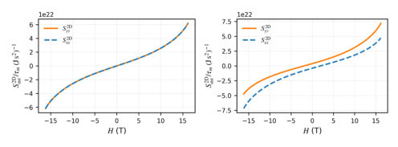
<figcaption class="paper-figure-caption"><b>Fig 2.</b> FIG. 2: Spin Seebeck coefficient S2D xx and S2D yy as a func- tion of applied magnetic field without phonon contribu- tions for (a) antiferromagnetic and (b) altermagnetic con- figurations in the 2D limit.</figcaption>
</figure>
<figure class="paper-figure-card">

<figcaption class="paper-figure-caption"><b>Fig 3.</b> FIG. 4: SSE vs. applied magnetic field along different x and y directions with magnetoelastic coupling for (a) an antiferromagnetic lattice and (b) for an altermagnetic lattice in the 3D bulk case.</figcaption>
</figure>
<figure class="paper-figure-card">
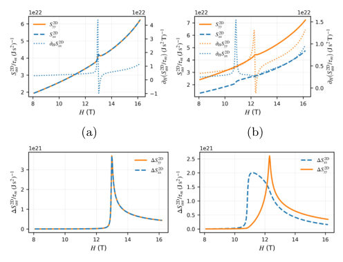
<figcaption class="paper-figure-caption"><b>Fig 4.</b> FIG. 3: SSE vs. applied magnetic field in-plane along the x and y directions with magnetoelastic coupling for (a) an antiferromagnetic lattice and (b) for an altermagnetic lattice in the monolayer limit. Peaks in SSE are seen at the same magnetic field for the antiferromagnetic case in both S2D xx and S2D yy . For the altermagnetic case, the peak in S2D xx appears at a magnetic field different from the peak in S2D yy . The features are seen clearly by calculating the difference in SSE due to phonons (c) ∆Sxx and (d) ∆Syy vs. magnetic field. τm is the magnon lifetime.</figcaption>
</figure>
<figure class="paper-figure-card">

<figcaption class="paper-figure-caption"><b>Fig 5.</b> FIG. 2. Contour plot of the magnon dispersion in the toy model in the altermagnetic condition. The left panel rep- resents the dispersion of the A mode, while the right panel shows the B mode.</figcaption>
</figure>

**Summary.** This work proposes using the Spin Seebeck Effect (SSE) as a definitive transport diagnostic tool to identify altermagnetic materials. By modeling magnon-phonon coupling, the authors show that altermagnets exhibit unique directional anisotropy and resonant features in the SSE that are absent or different in conventional antiferromagnets. This provides a clear pathway for experimental verification of novel magnetic orders.

**Why it may be interesting.** While focused on condensed matter magnetism, the use of non-equilibrium Green's functions/Boltzmann theory for spin transport bridges concepts relevant to open quantum systems and energy dissipation mechanisms studied in AMO physics.

Detailed structure

**Main problem.** To find experimentally accessible transport signatures that can distinguish altermagnets from conventional ferromagnets and antiferromagnets.

**Main result.** The Spin Seebeck Effect (SSE) exhibits pronounced, directionally anisotropic features and resonant peaks due to magnon-polaron coupling, providing a robust signature for altermagnetic order.

**Method.** Theoretical calculation using the Boltzmann transport equation applied to hybridized magnon-phonon modes derived from a minimal spin Hamiltonian model.

**Model / system.** The study uses a toy magnetic lattice model incorporating nearest and next-nearest neighbor couplings, distinguishing between altermagnets ($J_2 
eq J'_2$) and antiferromagnets ($J_2 = J'_2$). The analysis extends to include magnetoelastic interactions leading to magnon-polaron coupling.

**Key observables.** Spin Seebeck coefficient ($	ext{S}_{\alphaeta}$), directional anisotropy ($	ext{S}_{xx} 
eq 	ext{S}_{yy}$), and resonant peak positions in the SSE vs. magnetic field.

**Important parameters / regimes.** External magnetic field strength ($H$), coupling constants ($J_1, J_2, D$), and phonon/magnon frequencies.

**Assumptions / limitations.** The analysis relies on a minimal toy model and utilizes approximations like the spin-wave approximation and linear resonant coupling between magnons and phonons.

**Figures summary.** Figures illustrate magnon dispersion relations showing band splitting in altermagnets versus degeneracy in antiferromagnets, and compare directional SSE measurements for both types of magnets.

**Paper structure.** The paper progresses from establishing the need for a diagnostic probe (SSE) to developing the theoretical framework by modeling the Hamiltonian, calculating the coupled magnon-polaron dynamics, and finally demonstrating the unique anisotropic signatures of altermagnetism in transport coefficients.

Abstract

Altermagnets, distinguished by compensated antiparallel spins yet nondegenerate magnon spectra, bridge the gap between ferromagnets and antiferromagnets. Although several probes such as anisotropic transport and spectroscopic measurements have been proposed to identify altermagnetic order, experimentally accessible transport signatures remain highly desirable. Here, we show that in altermagnets subject to an external magnetic field, the spin Seebeck effect exhibits pronounced directional anisotropy. Specifically, the spin Seebeck coefficient differs significantly along in-plane directions, and this anisotropy increases with field strength. Magnetoelastic interactions further produce resonant peaks whose positions with respect to an applied magnetic field reflect the intrinsic magnon band anisotropy, and provide localized features that enhance the distinguishability of the altermagnetic response. The peaks provide a robust experimental signature of altermagnetic order. Our findings serve as signatures of altermagnetic order while laying the groundwork for their application in spintronic devices.

[↑ back to top](#top)

### [Valley-dependent electron optics using quantum dots in bilayer graphene](http://arxiv.org/abs/2607.00271v1)

**Authors:** Fereshte Ildarabadi, Stephen R. Power  
**Type:** theory · **Category:** other · **PDF:** <https://arxiv.org/pdf/2607.00271v1>  
**Analysis basis:** full PDF text, analyzed in chunks
**Topic relevance:** `Keldysh / 2PI / non-Gaussian methods` **3/5** · `spintronics-quantum-optics interface` **3/5** · `Kondo & dissipative impurity` **2/5** · `methods for driven-dissipative` **2/5** · `non-equilibrium dynamics` **2/5** · `analog quantum simulation` **1/5** · `correlated / nonlocal dissipation` **1/5** · `driven-dissipative phase transition` **1/5** · `interference shaping light` **1/5** · `non-equilibrium universality` **1/5**

↔ Scroll figures horizontally

<figure class="paper-figure-card">

<figcaption class="paper-figure-caption"><b>Fig 1.</b> FIG. 1: (a) Schematic of two oppositely gated QDs with ra- dius R in BLG. (b) Gaussian beam propagating along the x direction. W0 is the beam waist, and θbeam denotes the char- acteristic divergence angle.</figcaption>
</figure>
<figure class="paper-figure-card">
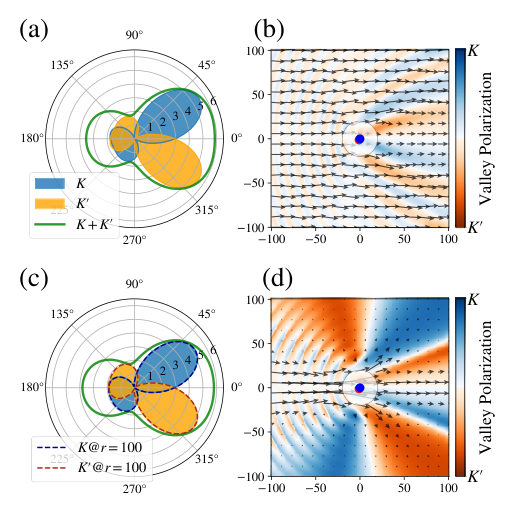
<figcaption class="paper-figure-caption"><b>Fig 2.</b> FIG. 2: (a) Far-field angular dependence of the valley-resolved and total (K+K′) scattered current for plane-wave incidence; (b) Corresponding total current flow (arrows) and valley po- larization (color map). (c) Same angular dependence for a Gaussian beam; dashed curves indicate currents evaluated at finite distance; (d) Corresponding current flow and valley po- larization.</figcaption>
</figure>
<figure class="paper-figure-card">

<figcaption class="paper-figure-caption"><b>Fig 3.</b> FIG. 3: (a) Current flow (arrows) and density (color map) for the K valley under Gaussian-beam incidence. (b) Decompo- sition into incident, scattered, and interference contributions. (c) Difference current map ∆jK. the K′ response is the mirror image of the K response with respect to the x axis for (a)- (c). (d) Angular dependence of ∆jK at r = 100 l0 denoted by dashed circle in (c). Light colors curves show far-field re- sults; orange curves correspond to the K′ valley. The inset polar sector shows negative contributions within ±θbeam, cor- responding to forward-current suppression.</figcaption>
</figure>
<figure class="paper-figure-card">
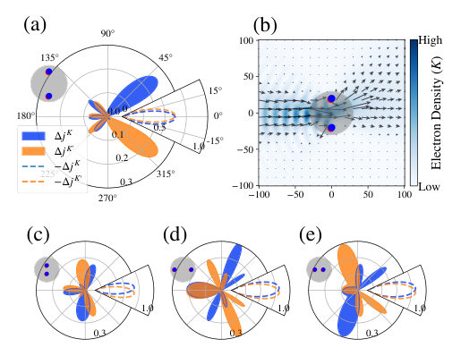
<figcaption class="paper-figure-caption"><b>Fig 4.</b> FIG. 4: Valley-resolved current distributions resulting from multiple scattering by two identical QDs under Gaussian- beam incidence. (a) ∆j for vertically aligned dots with d = 8R (upper-left inset), showing efficient valley splitting. Blue and orange curves correspond to the K and K′ valleys, respectively; the dashed curves in the right inset show the negative part of ∆j in the forward-direction beam region. (b) Corresponding K-valley current-flow (arrows) and elec- tron density (color map); the K′ response is the mirror image of the K response with respect to the x axis. (c)–(e) ∆j for vertically aligned dots with d = 4R, and horizontally aligned dots with d = 8R and 4R, respectively.</figcaption>
</figure>
<figure class="paper-figure-card">
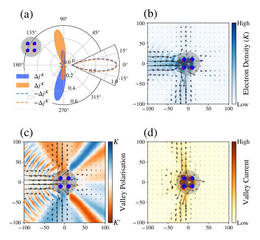
<figcaption class="paper-figure-caption"><b>Fig 5.</b> FIG. 5: Valley-resolved current for a 2 × 2 array of identical QDs with d = 4R. (a) ∆j, showing strong transverse deflec- tion and reduced valley overlap, forming an efficient valley splitter. (b) Corresponding K-valley current-flow (arrows) and electron density (color map); the K′ response is its mir- ror image with respect to the x-axis. (c) Total current map overlaid on the valley polarization color map. (d) Valley cur- rent map, showing strong transverse valley separation.</figcaption>
</figure>

**Summary.** The paper proposes using arrays of electrostatically gated quantum dots in bilayer graphene to achieve controllable valley-dependent electron optics. By exploiting the valley-dependent mass term induced by gating, the QDs can act as precise switches: identical pairs split the current into two valleys, while oppositely gated pairs filter one valley out. This establishes a realistic platform for manipulating spin/valley polarization without external fields.

**Why it may be interesting.** This work models coherent electron transport through engineered nanoscale potentials (QDs), which is highly relevant to open quantum systems dynamics and mesoscopic physics where boundary conditions dictate wave function evolution.

Detailed structure

**Main problem.** To develop a tunable platform for valley-dependent electron optics in bilayer graphene (BLG) using electrostatically defined quantum dots (QDs).

**Main result.** The study demonstrates that QD arrays can function as controllable valley splitters or filters, enabling the generation and steering of highly valley-polarized currents with strong suppression of forward transmission.

**Method.** Theoretical analysis employing a four-band continuum model and generalized multiple-scattering formalism to calculate valley-resolved current densities ($\mathbf{j}_	au$).

**Model / system.** The system is Bernal-stacked BLG containing electrostatically defined QDs. The key mechanism relies on layer-antisymmetric gating, which induces a valley-dependent mass-like term in the Hamiltonian.

**Key observables.** Valley-resolved currents ($\mathbf{j}_K$ vs $\mathbf{j}_{K'}$), angular profiles, and valley polarization $P$.

**Important parameters / regimes.** Gate asymmetries (e.g., 152 meV), dot radius ($R=10 	ext{ nm}$), Fermi energy ($\approx 19 	ext{ meV}$).

**Assumptions / limitations.** The analysis assumes ballistic transport and uses approximations like truncating the angular momentum sum at a finite cutoff $M$.

**Figures summary.** Figures illustrate far-field angular dependence of valley currents (plane-wave vs. Gaussian beam), current decomposition ($\mathbf{j}_{	ext{inc}} + \mathbf{j}_{	ext{sc}} + \mathbf{j}_{	ext{int}}$), and engineered patterns showing splitting or filtering effects in multi-dot arrays.

**Paper structure.** The paper progresses from single-dot scattering analysis to Gaussian beam excitation, then details the decomposition of total current into incident, scattered, and interference parts for multiple dots, culminating in demonstrating complex array functionalities like valley splitting and filtering.

Abstract

Electrostatically defined quantum dots (QDs) with layer-antisymmetric gating in Bernal-stacked bilayer graphene (BLG) open a local gap and generate a mass-like term with opposite sign in the two valleys, producing strongly valley-dependent scattering without magnetic fields, strain, or spin-orbit coupling. Building on this mechanism, we propose a tunable platform based on such QDs for valley-dependent electron optics in BLG. Using a four-band continuum model and a generalized multiple-scattering formalism, we analyze scattering of Gaussian electron beams from single- and multi-dot architectures and compute valley-resolved currents and angular profiles. A single dot produces distinct valley-dependent deflection, while multi-dot configurations enable enhanced control: identical-dot arrays act as valley splitters, whereas oppositely gated pairs function as valley filters. Combining these elements yields tunable generation, steering, and filtering of highly valley-polarized currents with strong suppression of forward transmission. The required energy scales, gate asymmetries, and device dimensions are within experimentally accessible regimes for dual-gated BLG, establishing quantum-dot arrays as a realistic platform for controllable valley-resolved electron optics.

[↑ back to top](#top)

### [Evanescent absorption spectroscopy of transition metal dichalcogenide materials using guided photoluminescence in Si$_3$N$_4$ photonic waveguides](http://arxiv.org/abs/2607.00615v1)

**Authors:** Victor Gonzalez-Morote, Marianna Sledzinska, Arkadiusz P. Gertych, Syed Hassan Abbas Jaffery, Mariusz Zdrojek, Daniel Navarro-Urrios  
**Type:** experiment · **Category:** other · **PDF:** <https://arxiv.org/pdf/2607.00615v1>  
**Analysis basis:** full PDF text, analyzed in chunks
**Topic relevance:** `interference shaping light` **3/5** · `quantum optics experiment` **3/5** · `QC/QI experiment` **2/5** · `quantum measurements` **2/5** · `analog quantum simulation` **1/5** · `correlated / nonlocal dissipation` **1/5** · `correlated cavity matter` **1/5** · `driven-dissipative phase transition` **1/5** · `methods for driven-dissipative` **1/5** · `non-equilibrium dynamics` **1/5**

↔ Scroll figures horizontally

<figure class="paper-figure-card">

<figcaption class="paper-figure-caption"><b>Fig 1.</b> Figure 1. Evanescent absorption spectroscopy of a 2D material integrated on a dielectric</figcaption>
</figure>
<figure class="paper-figure-card">

<figcaption class="paper-figure-caption"><b>Fig 2.</b> Figure 2. Optical and Raman characterization of the TMD-covered waveguides. (a–c) Optical</figcaption>
</figure>
<figure class="paper-figure-card">

<figcaption class="paper-figure-caption"><b>Fig 3.</b> Figure 3. Evanescent absorption and guided photoluminescence of Si₃N₄ waveguides covered by</figcaption>
</figure>

**Summary.** The authors developed a novel, source-free technique to measure the optical absorption of 2D TMD materials integrated into $	ext{Si}_3	ext{N}_4$ photonic waveguides. By monitoring how the waveguide's internal photoluminescence is spectrally attenuated by the overlying flake, they achieve an accurate, in situ measurement of excitonic absorption. This method is crucial for designing next-generation, high-performance on-chip optoelectronic devices.

**Why it may be interesting.** This work provides a highly relevant experimental methodology for quantum optics and open quantum systems research by characterizing material loss mechanisms (absorption) in solid-state devices that are critical for coupling light to quantum emitters or qubits.

Detailed structure

**Main problem.** The primary goal is to characterize the optical absorption of 2D transition metal dichalcogenides (TMDs) in their operational, integrated environment.

**Main result.** The study successfully demonstrates a source-free, on-chip spectroscopy technique that accurately measures energy-dependent TMD absorption by monitoring spectral attenuation of guided photoluminescence.

**Method.** Evanescent absorption spectroscopy is performed by using the intrinsic defect-related photoluminescence from the $	ext{Si}_3	ext{N}_4$ waveguide core as an internal probe source, which is then attenuated by the overlying TMD flake.

**Model / system.** The system involves integrating TMD flakes ($	ext{MoS}_2$, $	ext{WS}_2$) onto a silicon nitride ($	ext{Si}_3	ext{N}_4$) photonic waveguide. The measurement probes the interaction between the guided optical mode and the material's excitonic transitions.

**Key observables.** Energy-dependent absorption spectrum ($	ext{dB/cm}$), local photoluminescence ($\mu$-PL) spectra, and spectral reshaping of propagating PL.

**Important parameters / regimes.** Exciton binding energies (e.g., $\sim 1.83 	ext{ eV}$ for uniform $	ext{MoS}_2$), attenuation coefficients ($\alpha$ in $	ext{dB/cm}$), and flake coverage length ($L$).

**Assumptions / limitations.** The measurement assumes the broadband defect-related PL dominates the signal, allowing normalization against a reference waveguide; furthermore, near resonances, reported attenuation values are conservative lower bounds.

**Figures summary.** Figures compare guided PL vs. local $\mu$-PL spectra, show extracted attenuation profiles, and illustrate the setup for both source-free spectroscopy and top-pumping excitation geometry.

**Paper structure.** The paper establishes the need for in situ characterization, details the source-free evanescent absorption method using internal PL, validates this technique by comparing results to local $\mu$-PL and Raman data, and concludes by positioning the platform for future photodetector development.

Abstract

On-chip integration of two-dimensional transition metal dichalcogenides (TMDs) with photonic waveguides underpins a growing class of compact optoelectronic and sensing devices, whose performance depends on the optical absorption of the 2D material in this integrated environment. We demonstrate source-free, on-chip evanescent absorption spectroscopy of MoS$_2$ and WS$_2$ flakes integrated on Si$_3$N$_4$ waveguides, in which the broadband defect-related photoluminescence of the Si$_3$N$_4$ core itself acts as the internal probe. Light generated inside the core propagates under the TMD flake and is spectrally attenuated by evanescent interaction with the 2D material, and normalizing the transmitted spectrum to a reference waveguide without TMD yields the energy-dependent absorption response without any external illumination. The extracted guided absorption agrees with Raman and local micro-photoluminescence characterization and resolves differences between spatially uniform and non-uniform flakes. A complementary top-pumping scheme recovers guided WS$_2$ photoluminescence, whose spectral reshaping during propagation is quantitatively reproduced by the measured absorption. This source-free platform qualifies 2D materials in their integrated photonic environment and provides a direct route toward waveguide-integrated TMD photodetectors and sensors.

[↑ back to top](#top)

### [An analog ac voltage amplifier based on a single straintronic magnetic tunnel junction](http://arxiv.org/abs/2607.00104v1)

**Authors:** Cael Johnson, Rahnuma Rahman, Supriyo Bandyopadhyay  
**Type:** theory · **Category:** other · **PDF:** <https://arxiv.org/pdf/2607.00104v1>  
**Analysis basis:** full PDF text, analyzed in chunks
**Topic relevance:** `spintronics-quantum-optics interface` **3/5** · `driven-dissipative phase transition` **2/5** · `methods for driven-dissipative` **2/5** · `non-equilibrium dynamics` **2/5** · `Keldysh / 2PI / non-Gaussian methods` **1/5** · `Kondo & dissipative impurity` **1/5** · `analog quantum simulation` **1/5** · `exotic spin models in light-matter` **1/5** · `non-equilibrium universality` **1/5**

↔ Scroll figures horizontally

<figure class="paper-figure-card">

<figcaption class="paper-figure-caption"><b>Fig 1.</b> Fig. 1. The structure of a straintronic magnetic tunnel junction. Reprinted from [8], with the permission of AIP Publishing.</figcaption>
</figure>
<figure class="paper-figure-card">
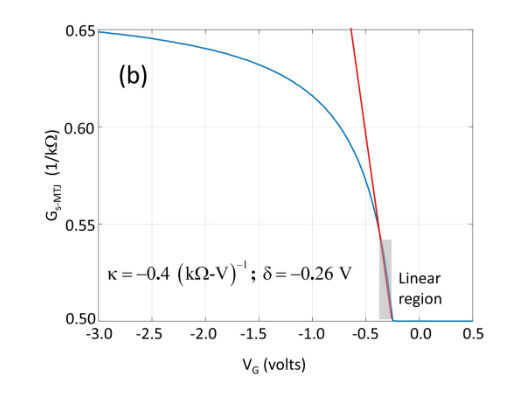
<figcaption class="paper-figure-caption"><b>Fig 2.</b> Fig. 2. The computed Gs−MT J versus VG transfer characteristic of a s-MTJ at room temperature. The linear region is shaded in gray. Within this region, the characteristic follows Equation (1). The values of κ and δ for this MTJ are shown. ©2022 IEEE. Reprinted with permission from [6].</figcaption>
</figure>
<figure class="paper-figure-card">
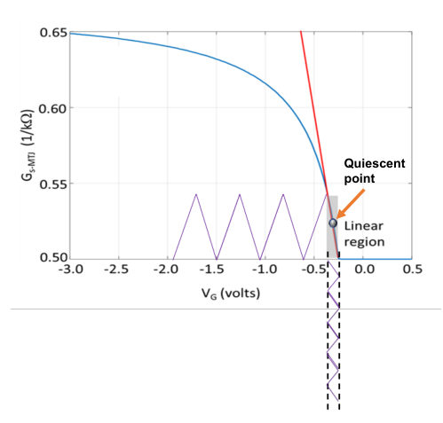
<figcaption class="paper-figure-caption"><b>Fig 3.</b> Fig. 3. A swing of the gate voltage around the quiescent point results in a corresponding swing of the s-MTJ conductance. The waveform shown here is triangular but the principle holds for any arbitrary waveform. The gate voltage swing has to be small enough to stay within the linear region.</figcaption>
</figure>
<figure class="paper-figure-card">
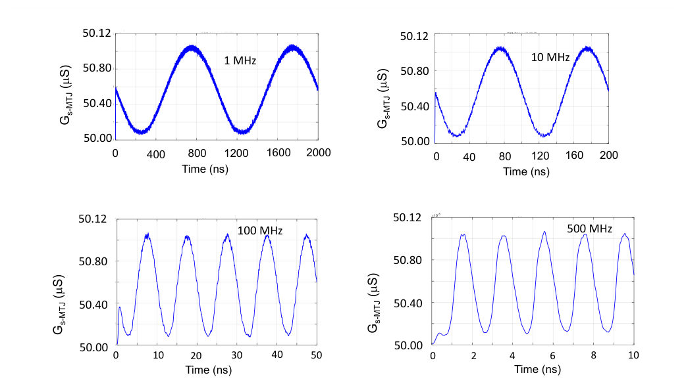
<figcaption class="paper-figure-caption"><b>Fig 4.</b> Fig. 4. Time variation of the s-MTJ conductance in the presence of a dc + ac gate voltage at different frequencies. The dc voltage was -0.26 V and the ac voltage amplitude was 10 mV to ensure that the gate voltage excursion always remains within the linear region of the transfer characteristic.</figcaption>
</figure>
<figure class="paper-figure-card">
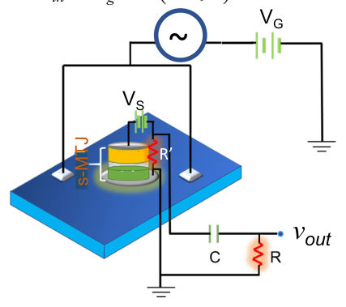
<figcaption class="paper-figure-caption"><b>Fig 5.</b> Fig. 5. The ac amplifier circuit realized with a single s-MTJ.</figcaption>
</figure>

**Summary.** This paper proposes using straintronic magnetic tunnel junctions (s-MTJs) as a tunable analog AC voltage amplifier. The device's conductance is controlled by strain via an applied gate voltage, allowing for linear operation in specific regimes. The key finding is that the amplification gain can be externally tuned by adjusting the bias supply voltage.

**Why it may be interesting.** While primarily condensed matter/spintronics, the analysis of non-linear dynamic response (magnetization precession) to small signals, coupled with external circuit tuning, touches upon concepts relevant to open quantum systems and sensing mechanisms.

Detailed structure

**Main problem.** To demonstrate and analyze the potential of straintronic magnetic tunnel junctions (s-MTJs) as a novel analog AC voltage amplifier.

**Main result.** The s-MTJ can function as an analog amplifier whose gain is tunable by an external supply voltage, unlike traditional transistor amplifiers.

**Method.** Theoretical modeling involving the Landau–Lifshitz-Gilbert-Langevin (LLGL) equations to analyze magnetization dynamics under superimposed AC gate voltages.

**Model / system.** The physical system is a straintronic Magnetic Tunnel Junction (s-MTJ), whose conductance is continuously modulated by mechanical strain induced via an external gate voltage ($V_G$).

**Key observables.** Amplification factor ($	ilde{V}$ proportional to $v_g$), conductance swing, and the maximum allowed input signal amplitude before distortion.

**Important parameters / regimes.** The amplification factor is proportional to the supply voltage ($V_s$); operating frequency is limited by magnetization dynamics (GHz range).

**Assumptions / limitations.** The analysis assumes that the AC gate voltage excursion remains within the analytically derived linear region of the s-MTJ's transfer characteristic.

**Figures summary.** Figures illustrate the s-MTJ structure, its conductance vs. $V_G$ transfer curve highlighting linearity, and time-domain simulations showing signal amplification and frequency limitations.

**Paper structure.** The paper introduces the s-MTJ as an analog platform, derives the linear conductance dependence on $V_G$, models the AC voltage amplification using LLGL dynamics, and discusses tunability and operational limits.

Abstract

Magnetic tunnel junctions (MTJs) are known for their digital applications (memory and logic). A special class of them called "straintronic" magnetic tunnel junctions (s-MTJ) has lately emerged as a potential platform for analog applications because their conductance can be varied continuously with mechanical strain generated with a gate voltage. The conductance versus gate voltage (transfer) characteristic always has a linear region and that can be leveraged for a variety of analog applications. Here, we discuss one such application, namely analog voltage amplification. If the s-MTJ's gate voltage is fixed around the midpoint of the linear region and a small ac voltage is superimposed on it, then the ac voltage can be amplified without distortion as long as its amplitude is small enough to avoid gate voltage excursion beyond the linear region. Unlike a transistor-based voltage amplifier whose amplification is determined solely by the transistor's internal parameters - namely the transconductance and Early resistance - here the amplification can be varied by an external power supply voltage. We examine the maximum allowed amplitude and frequency of input signal for distortion-free amplification by modeling the magnetization dynamics and derive an expression for the amplification.

[↑ back to top](#top)

### [Modulation of anomalous Hall angle in a magnetic topological semimetal](http://arxiv.org/abs/2607.00396v1)

**Authors:** Jinying Yang, Yanxing Shang, Xingchen Liu, Yibo Wang, Xuebin Dong, Qingqi Zeng, Meng Lv, Shen Zhang, Yang Liu, Binbin Wang, Hongxiang Wei, Yizheng Wu, Stuart Parkin, Gangqin Liu, Claudia Felser, Enke Liu, Baogen Shen  
**Type:** experiment · **Category:** other · **PDF:** <https://arxiv.org/pdf/2607.00396v1>  
**Analysis basis:** full PDF text, analyzed in chunks
**Topic relevance:** `exotic spin models in light-matter` **3/5** · `spintronics-quantum-optics interface` **3/5** · `driven-dissipative phase transition` **2/5** · `Keldysh / 2PI / non-Gaussian methods` **1/5** · `Kondo & dissipative impurity` **1/5** · `analog quantum simulation` **1/5** · `methods for driven-dissipative` **1/5** · `non-equilibrium dynamics` **1/5** · `non-equilibrium universality` **1/5**

↔ Scroll figures horizontally

<figure class="paper-figure-card">

<figcaption class="paper-figure-caption"><b>Fig 1.</b> Low-resolution page preview, page 2</figcaption>
</figure>
<figure class="paper-figure-card">
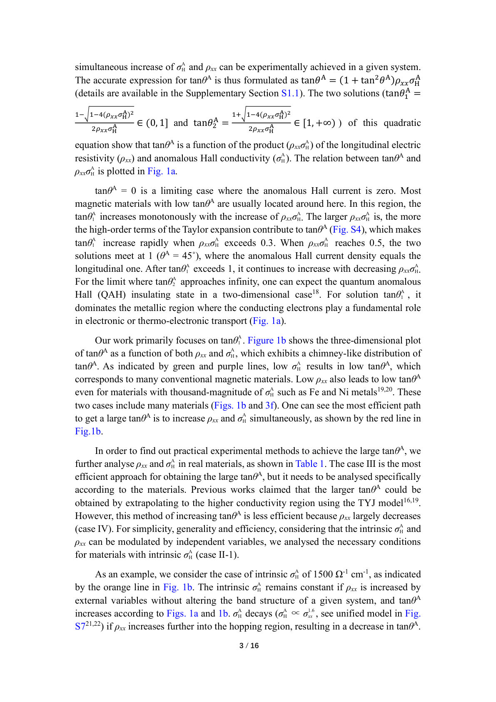
<figcaption class="paper-figure-caption"><b>Fig 2.</b> Low-resolution page preview, page 3</figcaption>
</figure>
<figure class="paper-figure-card">
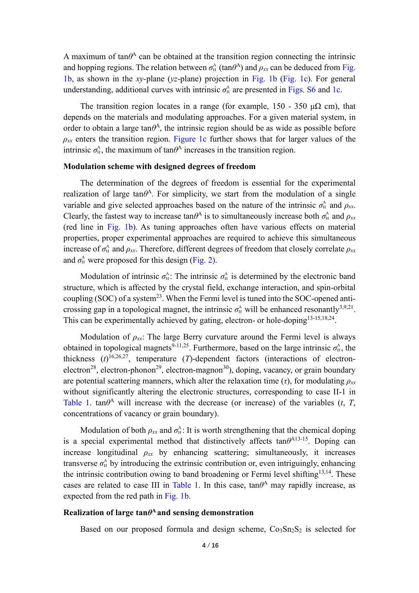
<figcaption class="paper-figure-caption"><b>Fig 3.</b> Low-resolution page preview, page 4</figcaption>
</figure>
<figure class="paper-figure-card">
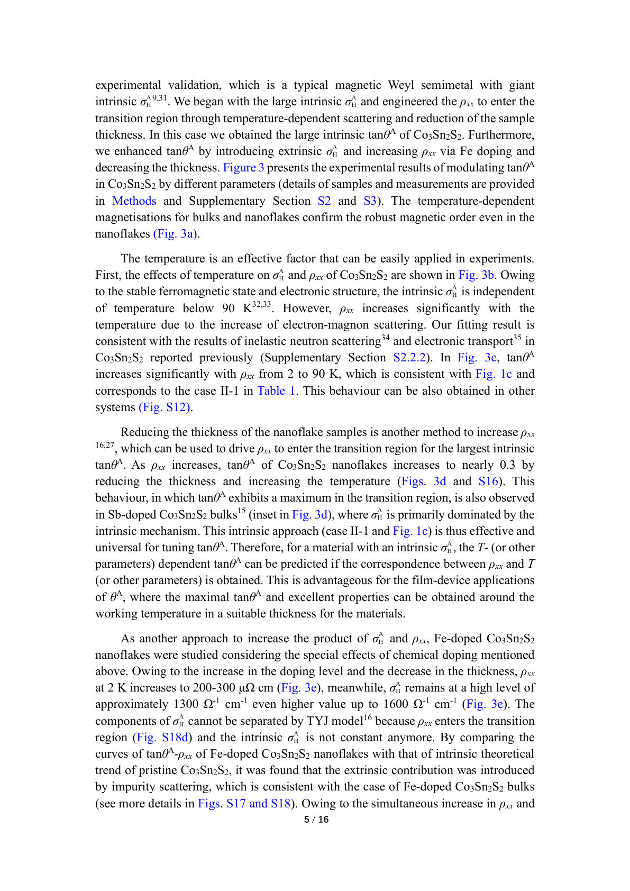
<figcaption class="paper-figure-caption"><b>Fig 4.</b> Low-resolution page preview, page 5</figcaption>
</figure>
<figure class="paper-figure-card">

<figcaption class="paper-figure-caption"><b>Fig 5.</b> Low-resolution page preview, page 6</figcaption>
</figure>

**Summary.** This work reports on methods to significantly enhance the anomalous Hall angle ($	heta_A$) in the magnetic Weyl semimetal $	ext{Co}_3	ext{Sn}_2	ext{S}_2$. By manipulating the material's resistivity and anomalous Hall conductivity through doping or temperature changes, they achieved a large, tunable $	an	heta_A$ of up to 0.46. This breakthrough enables the fabrication of highly sensitive magnetic field detectors for spintronic applications.

**Why it may be interesting.** While primarily condensed matter physics, the precise control over electronic transport coefficients in topological materials using external stimuli (doping, temperature) is relevant to understanding engineered quantum states and boundary effects that underpin many advanced quantum devices.

Detailed structure

**Main problem.** The primary goal is to enhance the sensitivity of anomalous Hall sensors by modulating the anomalous Hall angle ($	heta_A$), which measures current conversion efficiency.

**Main result.** The authors successfully demonstrated modulation of $	an	heta_A$ up to a magnitude of 0.46 (an angle of $\approx 25^\circ$) in the magnetic Weyl semimetal $	ext{Co}_3	ext{Sn}_2	ext{S}_2$.

**Method.** The modulation is achieved by controlling the relationship between anomalous Hall conductivity ($\sigma_{AH}$) and longitudinal resistivity ($
ho_{xx}$), using techniques like chemical doping or temperature variation.

**Model / system.** The study focuses on $	ext{Co}_3	ext{Sn}_2	ext{S}_2$, a magnetic topological semimetal. The theoretical framework relates $	an	heta_A$ to the product of $
ho_{xx}$ and $\sigma_{AH}$, allowing for systematic tuning via doping or structural changes.

**Key observables.** Anomalous Hall angle ($	heta_A$), anomalous Hall conductivity ($\sigma_{AH}$), longitudinal resistivity ($
ho_{xx}$), and magnetic field detectability ($23.5 	ext{ nT}/	ext{Hz}^{0.5}$).

**Important parameters / regimes.** The maximum modulation magnitude of $	an	heta_A$ (up to 0.46) is crucial, as it significantly surpasses the low angles typically found in magnetic materials.

**Assumptions / limitations.** The analysis assumes that independent control over both $
ho_{xx}$ and $\sigma_{AH}$ can be achieved through different experimental means (e.g., doping for one, temperature/thickness for the other).

**Figures summary.** Figures illustrate the dependence of $	an	heta_A$ on varying parameters like temperature or thickness, demonstrating how increasing $
ho_{xx}$ and $\sigma_{AH}$ simultaneously enhances the angle.

**Paper structure.** The paper establishes the physical problem (enhancing AHE sensitivity), develops a theoretical formulation linking $	an	heta_A$ to transport coefficients ($\sigma_{AH}, 
ho_{xx}$), presents experimental evidence showing modulation via doping/temperature, and concludes with high-performance sensor metrics.

Abstract

The anomalous Hall angle (θA) is a measure of the efficiency of converting a longitudinal driving current to a transverse spin-polarized Hall current. For anomalous Hall sensing, a large anomalous Hall angle can improve the sensitivity of magnetic field detection. However, modulation of this angle is challenging and magnetic materials typically have low angles of 0.1 to 3°. Here, we report modulation of the anomalous Hall angle in the magnetic Weyl semimetal Co3Sn2S2. We propose that the angle parameter tanθA can be formulated as a function of the product of electrical resistivity and anomalous Hall conductivity. Our scheme was utilized to demonstrate the modulation of tanθA up to a magnitude of 0.46, corresponding to an angle of around 25°. Microfabricated anomalous Hall devices using Fe-doped Co3Sn2S2 single-crystalline nanoflakes exhibit a high Hall sensitivity of 7028 μΩucm/T and a magnetic field detectability of 23.5 nT/Hz0.5 at 1 Hz.

[↑ back to top](#top)

### [Electrical control of spin photocurrent in a magnetoelectric oxide Cr$_2$O$_3$](http://arxiv.org/abs/2607.00807v1)

**Authors:** Zhuo-Cheng Gu, Hiroaki Ishizuka  
**Type:** theory · **Category:** other · **PDF:** <https://arxiv.org/pdf/2607.00807v1>  
**Analysis basis:** full PDF text, analyzed in chunks
**Topic relevance:** `exotic spin models in light-matter` **3/5** · `spintronics-quantum-optics interface` **3/5** · `non-equilibrium dynamics` **2/5** · `Keldysh / 2PI / non-Gaussian methods` **1/5** · `analog quantum simulation` **1/5** · `driven-dissipative phase transition` **1/5** · `methods for driven-dissipative` **1/5**

↔ Scroll figures horizontally

<figure class="paper-figure-card">

<figcaption class="paper-figure-caption"><b>Fig 1.</b> FIG. 1. A schematic of the spin chain with spin canting and its magnon dispersion. (a) A noncentrosymmetric quasi-one- dimensional model composed of weakly coupled spin chains with the nearest-neighbor interactions, J1 and J5, and a dis- placement δ. (b) A schematic of the spin chain studied in Sec. III. The numbers u = 1–4 on each site denote the sublat- tice, θ is the angle of canting induced by the DMI, and (x, y, z) and (x0, y0, z0) are the global and local coordinates, respec- tively. (c) Magnon dispersion of the spin chain for Ex = 0 and Ex = 5 (θ = 4.77◦) with λ = 0.05. The results are for J1 = −1, J5 = −0.5, Dz = 0.005, and δ = 0.1.</figcaption>
</figure>
<figure class="paper-figure-card">
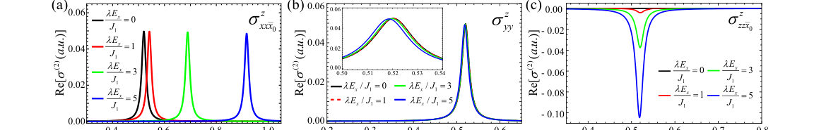
<figcaption class="paper-figure-caption"><b>Fig 2.</b> FIG. 2. Nonlinear spin current conductivity for Sz through the one-magnon process along the α (α = x0, y0, z0) direction under a static electric field Ex. Frequency dependence of (a) [σ(2)]z xx¯x0, (b) [σ(2)]z yy, and (c) [σ(2)]z zz¯x0. The results are obtained for J1 = −1, J5 = −0.5, Dz = 0.005, δ = 0.1, η = ω1(k = 0, E = 0) ≈0.01, and λ = 0.05. The canting angles corresponding to λEx/J1 = 1, 3, and 5 are θ = 0.95◦, 2.86◦, and 4.77◦, respectively.</figcaption>
</figure>
<figure class="paper-figure-card">
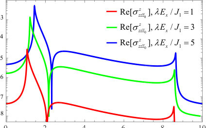
<figcaption class="paper-figure-caption"><b>Fig 3.</b> FIG. 3. Nonlinear spin current conductivity for the 1D model in Eq. 20 induced by the two-magnon process; (a) σz xx¯z0 and (b) σz zz¯z0. Each line is the conductivity with different electric fields E = 1(red), 3 (green), and 5 (blue). The canting angles corresponding to λEx/J1 = 1, 3, and 5 are θ = 0.95◦, 2.86◦, and 4.77◦, respectively. Frequency dependence of the spin conductivity for J1 = −1, J5 = −0.5, Dz = 0.005, δ = 0.1, λ = 0.05, and η = ω1(k = 0, E = 0) ≈0.01.</figcaption>
</figure>
<figure class="paper-figure-card">
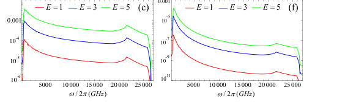
<figcaption class="paper-figure-caption"><b>Fig 4.</b> FIG. 5. Nonlinear spin current conductivities σz xx(0; ω, −ω) and σz zz(0; ω, −ω). (a) Frequency dependence of [σ(2)]z xxand its (b) one-magnon and (c) two-magnon contributions. (d) Frequency dependence of [σ(2)]z zz and (e) the one-magnon and (f) the two-magnon processes. The canting angle θ for E = 1, 3, and 5 are θ = 0.09◦, 0.24◦, and 0.39◦, respectively. The results are for Gilbert damping α = 0.02, J1 = −7.53 meV, J2 = −3.41 meV, J3 = −0.08 meV, J4 = 0.02 meV, J5 = −0.19 meV, Dz = 0.0015 meV, η = 0.02E1(k = 0) meV, and λ = 0.05. The unit of product λE is energy scale (meV).</figcaption>
</figure>
<figure class="paper-figure-card">
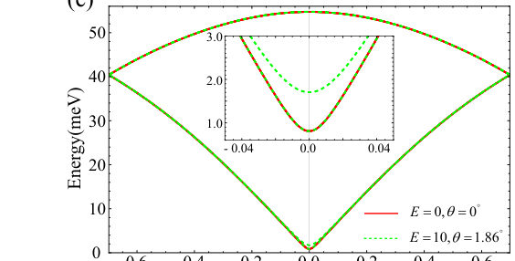
<figcaption class="paper-figure-caption"><b>Fig 5.</b> FIG. 4. The crystal structure and magnon dispersion of Cr2O3. (a) The lattice structure viewed from the z axis. The A, B, and C chains correspond to the respective chains in (a). The dashed rhombus shows the unit cell of Cr2O3. (b) A schematic of the crystal structure and exchange interactions J1-J5 viewed from the y axis. Numbers in the parentheses indicate the number of bonds. (c) Magnon dispersion for the model in Eq. (28) with E = 0 (red) and E = 10 (dashed green), where the unit of the product λE is meV and λ = 0.05. The results are for J1 = −7.53 meV, J2 = −3.41 meV, J3 = −0.08 meV, J4 = 0.02 meV, J5 = −0.19 meV [19], and Dz = 0.0015 meV [26, 27]. Enlarged views of the lower magnon...</figcaption>
</figure>

**Summary.** The paper theoretically investigates the electrical control of magnon spin photocurrent in the magnetoelectric oxide $	ext{Cr}_2	ext{O}_3$. Using nonlinear response theory, the authors show that an applied electric field modifies the spin current conductivity via the Dzyaloshinskii–Moriya interaction. The results confirm that this material is a promising platform for electrically tunable optospintronic devices.

**Why it may be interesting.** This work bridges concepts from spintronics (spin currents), multiferroics (magnetoelectric coupling), and advanced many-body theory (nonlinear response/bosonic excitations), providing a theoretical framework for electrically controlling quantum magnetic responses.

Detailed structure

**Main problem.** The study investigates how an applied electric field can electrically control the magnon spin photocurrent generated in magnetoelectric oxides.

**Main result.** The research demonstrates that the Dzyaloshinskii–Moriya interaction, induced by the electric field, significantly modifies the spin-current conductivity, confirming electrical tunability of this effect.

**Method.** Nonlinear response theory is employed to calculate the second-order nonlinear spin current conductivity ($\sigma^{(2)}$), decomposing it into one-magnon and two-magnon contributions.

**Model / system.** The physical system studied is $	ext{Cr}_2	ext{O}_3$, modeled using 1D and 3D spin chain Hamiltonians that incorporate nearest-neighbor exchange, Dzyaloshinskii–Moriya interaction (DMI), and anisotropy terms.

**Key observables.** Nonlinear spin current conductivity ($\sigma^{(2)}$) components for different polarizations ($z_{xx}, z_{yy}$, etc.), resonance frequencies, and continuum spectrum features.

**Important parameters / regimes.** Applied electric field ($E$), magnon frequency ($\Omega$), temperature (analyzed at $T=0$ in some parts), and exchange coupling constants ($J$).

**Assumptions / limitations.** The analysis relies on the linear spin-wave approximation for the magnon Hamiltonian, and certain calculations assume zero temperature or slow variation of matrix elements near resonance.

**Figures summary.** Figures illustrate schematic models of spin chains with canting (Fig. 1), show $\sigma^{(2)}$ spectra for one-magnon and two-magnon processes in 1D (Fig. 2, Fig. 3), and present the magnon dispersion relations for $	ext{Cr}_2	ext{O}_3$ (Fig. 4).

**Paper structure.** The paper builds from general theory using nonlinear response formalism to specific calculations on 1D and 3D spin models, analyzing both one-magnon resonance peaks and the two-magnon continuum spectrum as functions of the external electric field.

Abstract

Controlling magnetism by electric field or current is a central topic in spintronics. In this work, we argue that the magnon spin photocurrent can also be controlled by the electric field in magnetoelectrics. Taking Cr$_2$O$_3$ as an example, we demonstrate how the spin current is modified by the electric field, using nonlinear response theory. We find that the Dzyaloshinsky--Moriya interaction induced by the applied field plays a key role in modifying spin-current conductivity, which exhibits pronounced anisotropy with respect to the light polarization. In particular, both the resonance frequency and the peak intensity show distinct dependences on the external electric field $E$, demonstrating electrical control of the spin photocurrent. In addition, we show that the two-magnon processes give rise to a continuum spectrum, a consequence of the field-induced spin canting. These results show that Cr$_2$O$_3$ is a promising platform for realizing electrically tunable spin photovoltaic effect.

[↑ back to top](#top)

### [Atom-selective spin-polarized transport in a charge-ordered altermagnet](http://arxiv.org/abs/2607.00506v1)

**Authors:** Liu Yang, Yuan-Yuan Jiang, Xiao-Yan Guo, Yi-Dong Liu, Xian-Zhe Chen, Wen-Jian Lu, Yu-Ping Sun, Ming Li, Ding-Fu Shao  
**Type:** theory · **Category:** other · **PDF:** <https://arxiv.org/pdf/2607.00506v1>  
**Analysis basis:** full PDF text, analyzed in chunks
**Topic relevance:** `spintronics-quantum-optics interface` **3/5** · `Keldysh / 2PI / non-Gaussian methods` **2/5** · `methods for driven-dissipative` **2/5** · `Kondo & dissipative impurity` **1/5** · `analog quantum simulation` **1/5** · `exotic spin models in light-matter` **1/5** · `non-equilibrium dynamics` **1/5**

↔ Scroll figures horizontally

<figure class="paper-figure-card">
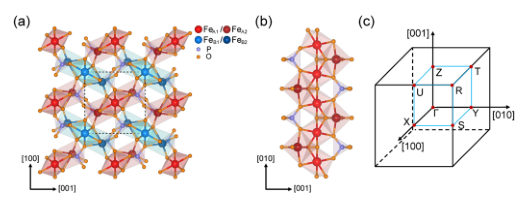
<figcaption class="paper-figure-caption"><b>Fig 1.</b> Fig. 1: (a,b) The crystal structures of α-Fe2PO5 with the coordination polyhedra around Fe emphasized in (a) top view and (b) side view of FeAO6 octahedra. The dashed black lines indicate the unit cell. (c) The first Brillouin zone of α-Fe2PO5.</figcaption>
</figure>
<figure class="paper-figure-card">
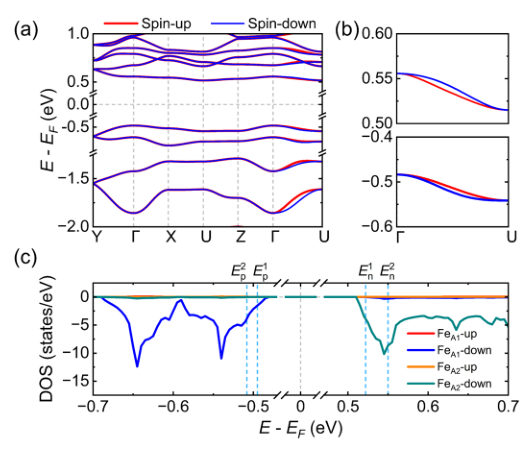
<figcaption class="paper-figure-caption"><b>Fig 2.</b> Fig. 2: (a) The band structure of α-Fe2PO5. (b) The en-larged band structure along the Γ-U high-symmetry path. (c) The FeA-resolved density of states of contributed by the valence and conduction bands.</figcaption>
</figure>
<figure class="paper-figure-card">

<figcaption class="paper-figure-caption"><b>Fig 3.</b> Fig. 3: (a-d) Three-dimensional constant-energy surfaces for spin-up and spin-down states at representative n- and p-doped energies and the ܓ∥-resolved spin polarization ݌∥(ܓ∥) for transport along the [010] direction. Gray regions denote momenta without available conducting channels, where ܰ∥</figcaption>
</figure>
<figure class="paper-figure-card">
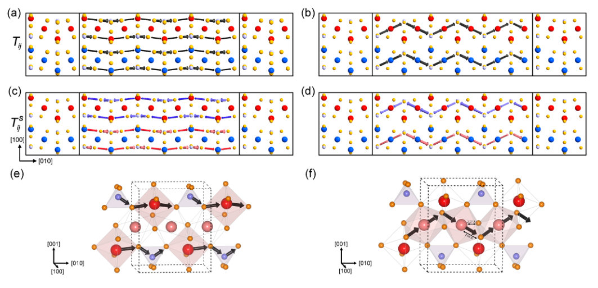
<figcaption class="paper-figure-caption"><b>Fig 4.</b> Fig. 4: Real-space bond-resolved transport in doped α-Fe2PO5. (a,b) Bond charge transmission ܶ௜௝ and (c,d) bond spin transmission ܶ௜௝</figcaption>
</figure>
<figure class="paper-figure-card">

<figcaption class="paper-figure-caption"><b>Fig 5.</b> Fig. 5: (a) Schematic of the proposed α-Fe2PO5 junction, consisting of left and right doped regions separated by a pristine insulating region. The labels ݊ଵ݊ଵ, ݊ଶ݊ଶ, ݌ଵ݌ଵ, and ݌ଶ݌ଶ denote junctions in which both electrodes are doped to the same representative electron- or hole-doped energies, ܧ௡</figcaption>
</figure>

**Summary.** This work analyzes spin-polarized transport in the altermagnet $\alpha$-Fe$_2$PO$_5$, demonstrating that charge ordering induces a real-space, atom-selective mechanism for spin current flow despite weak bulk magnetic splitting. By modeling an all-in-one tunnel junction, the authors show that controlling the atomic conduction channels—rather than just momentum overlap—allows for massive modulation of spin conductance.

**Why it may be interesting.** While focused on solid-state magnetism, the concept of controlling quantum transport through engineered atomic connectivity and valence states has parallels with designing controlled coupling elements in superconducting or molecular quantum circuits.

Detailed structure

**Main problem.** To investigate spin-polarized transport in altermagnets by moving beyond conventional momentum-space descriptions to focus on real-space electronic selectivity.

**Main result.** The charge-ordered altermagnet $\alpha$-Fe$_2$PO$_5$ exhibits atom-selective spin-polarized transport, allowing for orders-of-magnitude conductance modulation in a tunnel junction based on matching or mismatching atomic conduction channels.

**Method.** First-principles calculations (DFT) combined with quantum transport simulations using the Non-Equilibrium Green's Function (NEGF) formalism.

**Model / system.** The physical system is $\alpha$-Fe$_2$PO$_5$, a charge-ordered altermagnet characterized by inequivalent Fe$^{2+}$ and Fe$^{3+}$ sites within its sublattices, which dictates the spin-selective transport pathways.

**Key observables.** Spin-polarized current flow pathways, local conductance modulation ($\mathcal{T}_{ij}^{\sigma}$), and ON/OFF switching ratios in a tunnel junction.

**Important parameters / regimes.** Weak altermagnetic spin splitting near $E_F$; doping energy ($E_{n}^s, E_{p}^s$); lattice structure details (puckered C-type stacking).

**Assumptions / limitations.** The standard momentum-space description fails to capture the crucial role of local and atomically-resolved electronic states in determining transport.

**Figures summary.** Figures illustrate crystal structures, band/DOS calculations showing site-resolved features, constant-energy surfaces confirming weak splitting, and real-space bond-resolved transmission ($\mathcal{T}_{ij}^{\sigma}$) for different doping configurations in a tunnel junction schematic.

**Paper structure.** The paper progresses from establishing the limitations of momentum-space analysis to demonstrating atom-selective transport via site-specific channels (Fe$^{3+}$ vs Fe$^{2+}$) and culminates in proposing an all-in-one tunnel junction where real-space channel matching controls conductance modulation.

Abstract

Altermagnets provide a promising platform for spin-polarized transport without net magnetization, but their transport properties are usually discussed in terms of momentum-space spin splitting. Here, using first-principles calculations and quantum transport simulations, we show that the charge-ordered altermagnet $α$-Fe$_2$PO$_5$ exhibits a distinct form of real-space spin selectivity despite weak altermagnetic spin splitting near the Fermi level. The charge order creates inequivalent Fe$^{2+}$ and Fe$^{3+}$ sites within each sublattice, while the puckered C-type antiferromagnetic stacking suppresses inter-sublattice transport. As a result, electron and hole doping activate spin-polarized transport predominantly through Fe$^{3+}$- and Fe$^{2+}$-based channels, respectively. These atom-selective channels carry opposite spin polarizations on the two antiferromagnetic sublattices, giving rise to a globally compensated charge current with hidden Néel spin character. We further propose an all-in-one $α$-Fe$_2$PO$_5$ tunnel junction, where matching or mismatching atom-selective conduction channels yields orders-of-magnitude conductance modulation. Our findings establish a real-space design principle for atomically controlled spin functionality and spintronic devices.

[↑ back to top](#top)

### [Topological Hall effect due to electron-skyrmion scattering](http://arxiv.org/abs/2607.01149v1)

**Authors:** Arijit Mandal, Hareram Swain, B. R. K. Nanda, S. Satpathy  
**Type:** theory · **Category:** other · **PDF:** <https://arxiv.org/pdf/2607.01149v1>  
**Analysis basis:** full PDF text, analyzed in chunks
**Topic relevance:** `Keldysh / 2PI / non-Gaussian methods` **3/5** · `methods for driven-dissipative` **3/5** · `spintronics-quantum-optics interface` **3/5** · `exotic spin models in light-matter` **1/5** · `non-equilibrium dynamics` **1/5**

↔ Scroll figures horizontally

<figure class="paper-figure-card">
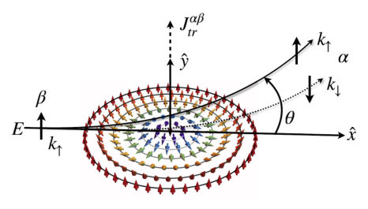
<figcaption class="paper-figure-caption"><b>Fig 1.</b> FIG. 1. Schematic diagram of scattering of a spin up elec- tron. The scattered wave consists of both a spin-preserved component and a spin-flip component with spin-dependent momentum kσ. The net transverse current is denoted by Jαβ tr , where β (α) is the spin of the incident (scattered) electron. For energy E &lt; J, even though there is no spin down incident or scattered beam, the spin down state can nevertheless exist in the skyrmion region, produced via the spin-flip potential, and can thereby influence the scattering process.</figcaption>
</figure>
<figure class="paper-figure-card">
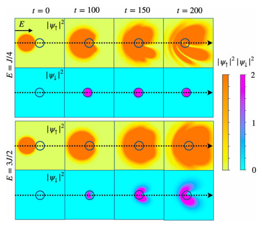
<figcaption class="paper-figure-caption"><b>Fig 2.</b> FIG. 2. Scattering dynamics of a spin-up Gaussian wavepacket from numerical solution of the time-dependent Schr¨odinger equation following the methods of Ref. [26]. The upper panel indicates the trapped spin-down state for E &lt; J, dynamically generated inside the skyrmion, indicated by the black circle, during the scattering process. In contrast, the lower panel, where E &gt; J, shows a small propagating spin down component after scattering, which will result in a spin- down current at r →∞. All figures are time snapshots of probability distribution |ψ|2 in both spin up and down chan- nels as indicated. The color coding, which is different for the two spin channels, indicates the magnitude of...</figcaption>
</figure>
<figure class="paper-figure-card">
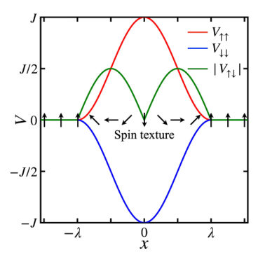
<figcaption class="paper-figure-caption"><b>Fig 3.</b> FIG. 4. Scattering potential V (r) for the skyrmion corre- sponding to Eq. (15) plotted along the x axis. Here, λ is the skyrmion radius, and J is the exchange parameter. The spin up (down) electron experiences a spin-preserving repul- sive (attractive) potential together with a complex spin-flip scattering potential, whose magnitude |V↑↓| has been shown. There is no scattering potential outside |r| &gt; λ, and the ar- rows on the central line indicate the skyrmion spins.</figcaption>
</figure>
<figure class="paper-figure-card">
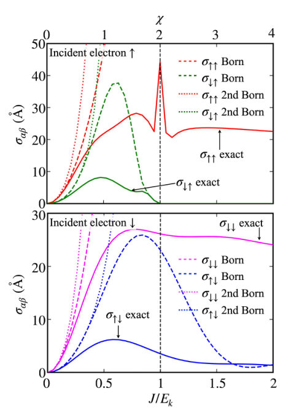
<figcaption class="paper-figure-caption"><b>Fig 4.</b> FIG. 3. Total scattering cross section σαβ for a skyrmion with winding number m = 1 as a function of the exchange energy J (the corresponding adiabatic parameter χ is shown on the top). Born approximation and exact results are shown for both spin up (top) and spin down (bottom) incoming elec- tron. The second Born approximation contains the three-spin scattering processes to the lowest order and hence the effect of chirality. However, the Born approximation results deviate quickly from the exact results as J is increased, necessitat- ing a full solution for typical solids. In the figure, the kinetic energy of the incident electron Ek = 4 eV and the skyrmion radius λ = 10 ˚A.</figcaption>
</figure>
<figure class="paper-figure-card">
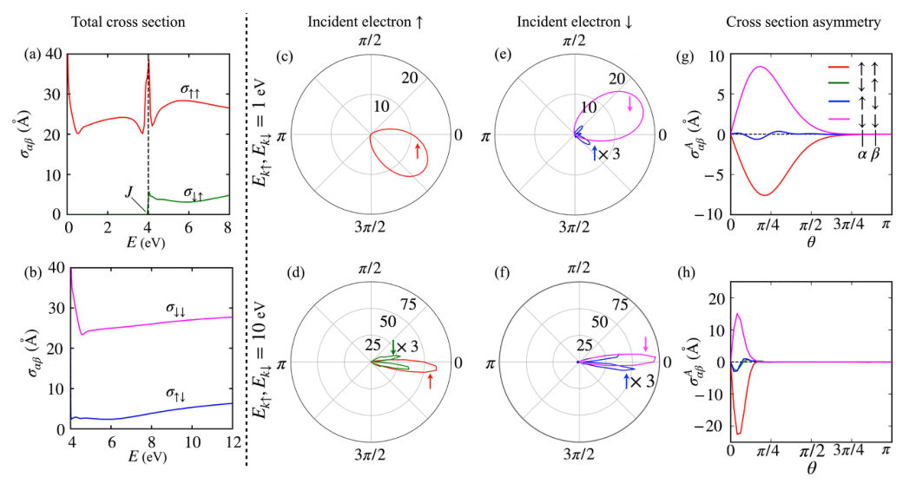
<figcaption class="paper-figure-caption"><b>Fig 5.</b> FIG. 5. Typical features of the scattering cross section. (a) Total scattering cross section σ↑↑/↓↑for incident spin-up electron. (b) Same for the spin-down electron, denoted by σ↑↓/↓↓. (c) Angular dependence of the differential scattering cross section for incident spin-up electrons with energy E = Ek↑= 1 eV. Since E &lt; J, there is no spin-down scattering component, as it cannot exist outside the skyrmion region. (d) The same for Ek↑&gt; J, but here scattering can occur to both spin channels. (e) and (f) Differential scattering cross section for spin-down incident electrons with two different energies. In this case, scattering is allowed to both spin channels for all energies. The spin-flip...</figcaption>
</figure>

**Summary.** This theoretical work analyzes how electrons scatter off skyrmion spin textures using an advanced Green's function formalism valid even in strong coupling. It predicts that this scattering generates distinct energy-dependent features like resonances and dips in the cross-section. These features are crucial for determining the material's topological and spin Hall conductivities.

**Why it may be interesting.** The detailed quantum mechanical treatment of electron transport through emergent magnetic structures provides a rich platform for studying non-trivial topology in condensed matter systems, relevant to spintronics and topological materials.

Detailed structure

**Main problem.** The study investigates electron scattering from chiral spin textures, such as skyrmions, focusing on regimes where the exchange interaction is strong relative to the electron energy.

**Main result.** The full Green's function approach reveals new features in the scattering cross-section, including Ramsauer-Townsend minima and Landau-level resonances, which strongly influence the topological and spin Hall conductivities.

**Method.** The problem is solved using the Lippmann-Schwinger equation and evaluating the full Green's function formalism, applicable across all coupling strengths.

**Model / system.** It models itinerant electron scattering from a 2D skyrmion spin texture defined by $\hat{S}(r, 	heta)$. The Hamiltonian includes an exchange interaction term $J$ coupling to the electron spin ($oldsymbol{\sigma}$).

**Key observables.** Topological Hall conductivity ($\sigma_H$), Spin Hall conductivity ($\sigma_{SH}$), and the scattering cross section ($\sigma_{\alphaeta}$).

**Important parameters / regimes.** The ratio of exchange interaction strength ($J$) to electron energy ($E$); winding number ($m$).

**Assumptions / limitations.** The formalism uses the full Green's function approach, avoiding approximations valid only in the weak-coupling limit.

**Figures summary.** Figures illustrate scattering cross sections ($\sigma_{\alphaeta}$) vs. energy and coupling strength, showing resonances and dips; other figures map out spin-resolved transverse currents ($J_{\alphaeta}^{tr}$) across different energy regimes relative to $J$.

**Paper structure.** The paper progresses from establishing the need for a strong-coupling formalism (Lippmann-Schwinger/GF) to calculating scattering cross sections ($\sigma_{\alphaeta}$), and finally deriving how these cross-sections determine the measurable topological and spin Hall conductivities across various energy regimes.

Abstract

Electron scattering from chiral spin textures such as skyrmions is fundamental to the understanding of transport in more complex systems, including skyrmion crystals. Most of the previous studies have focused on the weak-coupling regime, where the exchange interaction is small compared with the electron energy. Real materials, however, often lie in the strong-coupling regime, which exhibits qualitatively different behavior. Using the Lippmann-Schwinger equation and Green's function formalism, valid for all coupling strengths, we uncover several new features in the scattering cross section, including Ramsauer-Townsend minima, pronounced intermediate-coupling resonances, and Landau-level resonances for skyrmions with larger winding numbers. These features strongly influence the topological and spin Hall conductivities, which depend sensitively on the incident electron energy. Our work provides important insights into the Hall transport in collective chiral spin textures such as the skyrmion crystal.

[↑ back to top](#top)

### [Imaging superconducting weak spots through vortex-assisted THz near-field photovoltage](http://arxiv.org/abs/2607.00914v1)

**Authors:** Sergio J. Salvía-Fernández, Ekaterina Khestanova, Zoe Velluire-Pellat, Leonardo R. Cadorim, Sergi Batlle-Porro, David A. Czaplewski, Johann Osmond, Sebastian Castilla, Adrian Bachtold, Milorad V. Milošević, Aharon Kapitulnik, Frank H. L. Koppens  
**Type:** experiment · **Category:** other · **PDF:** <https://arxiv.org/pdf/2607.00914v1>  
**Analysis basis:** full PDF text, analyzed in chunks
**Topic relevance:** `spintronics-quantum-optics interface` **3/5** · `driven-dissipative phase transition` **2/5** · `Kondo & dissipative impurity` **1/5** · `methods for driven-dissipative` **1/5** · `non-equilibrium dynamics` **1/5** · `quantum measurements` **1/5**

↔ Scroll figures horizontally

<figure class="paper-figure-card">

<figcaption class="paper-figure-caption"><b>Fig 1.</b> Fig. 1. Electron transport and near-field photovoltage profiling under THz illumination. a Microscope image of the device (scale bar 150 µm). Orange regions correspond to the NbN film, purple corresponds to the Si/SiO2 substrate. b Device resistivity, 𝜌, as a function of temperature measured in the dark and under continuous-wave 2.52 THz illumination with the laser power of 1.7 mW at the cryostat window. The inset shows the temperature derivative d𝜌/dT, with dashed lines marking the superconducting transition temperature (𝑇c) defined at the maximum of the derivative. c Schematic diagram of the THz near-field photovoltage experiment. d THz near-field photovoltage (purple line) and AFM...</figcaption>
</figure>
<figure class="paper-figure-card">
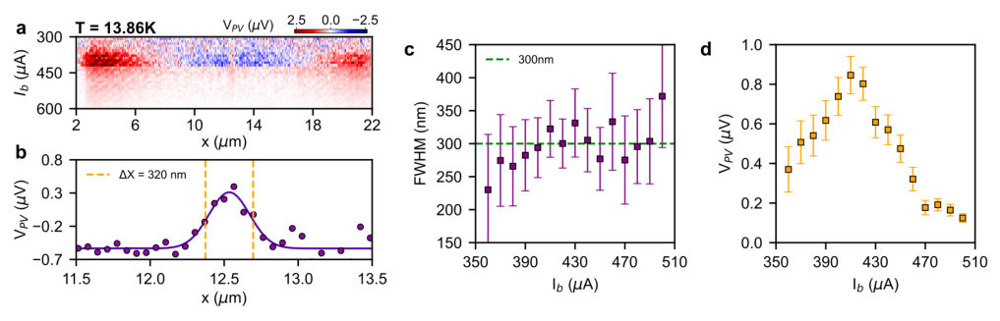
<figcaption class="paper-figure-caption"><b>Fig 2.</b> Fig. 2. Local peak in the near-field photovoltage at 𝑻 = 𝟏𝟑. 𝟖𝟔 𝐊. a Current-space near-field photovoltage map measured at 𝑇 = 13.86 K. b Zoomed-in view of the 𝑉PV profile obtained by averaging the line scans from the map in (a) over the current range 𝐼b = [380, 420] µA, with a Gaussian fit to the photovoltage peak (solid purple line) found at 𝑥= 12.52 μm. Orange vertical dashed lines indicate the FWHM of the peak. c Current dependence of the FWHM of the peak extracted from the map in (a). d Current dependence of amplitude of the central peak extracted from the analysis of the map in panel (a).</figcaption>
</figure>
<figure class="paper-figure-card">
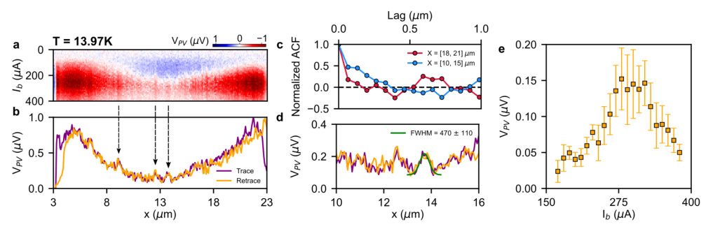
<figcaption class="paper-figure-caption"><b>Fig 3.</b> Fig. 3. Multiple local near-field photovoltage peaks at 𝑻 = 𝟏𝟑. 𝟗𝟕 𝐊. a Current-space near-field photovoltage map measured at 𝑇 = 13.97 K (full map shown in Fig. S6). b Horizontal 𝑉PV profiles (trace and retrace) obtained by averaging the line scans from the map in panel (a) over the current range 𝐼b = [290, 350] µA. The trace and retrace profiles were shifted by 1 µm to account for hysteresis in the piezoelectric scanners. c Zoomed-in view of the trace and retrace 𝑉PV profiles shown in (b). The green line plots the Gaussian fit to the peak in the trace profile. d Normalized autocorrelation</figcaption>
</figure>
<figure class="paper-figure-card">
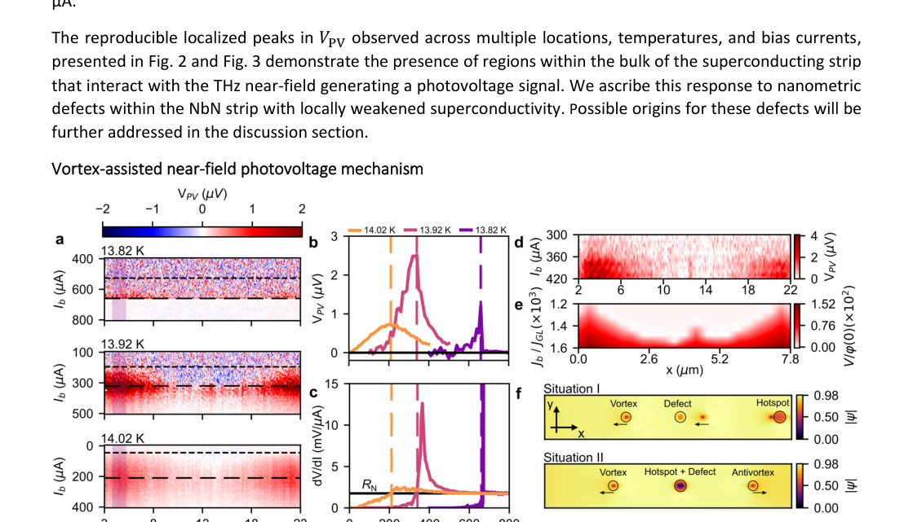
<figcaption class="paper-figure-caption"><b>Fig 4.</b> Fig. 4. Current dependence of the near-field photovoltage signal. a Current-space 𝑉PV maps measured at various temperatures. Short-dashed lines mark the 𝐼𝑐 values obtained from the far-field VI curves using the criterion 𝑉&gt; 50 μV. Long-dashed lines indicate the current corresponding to the maximum observed photovoltage. The purple shaded area corresponds to the region used to extract the horizontal cuts shown in (b). b Near-field photovoltage at the edge as a function of bias current, extracted from the maps in panel (a). Vertical dashed lines indicate the current of maximum 𝑉PV. c dV/dI curves extracted from the DC transport data under far-field illumination. d Zoomed-in current-space map...</figcaption>
</figure>

**Summary.** The research introduces THz near-field photovoltage nanoscopy to overcome the spatial resolution limits of traditional THz measurements in superconductors. By scanning a current-biased superconducting strip, the authors mapped localized photovoltage peaks that directly correlate with nanoscale material defects. This technique establishes a powerful new tool for investigating how disorder influences light-matter interactions and vortex dynamics in superconducting materials.

**Why it may be interesting.** This work provides a direct, non-equilibrium optical probe into local superconducting order parameter suppression caused by material disorder, which is crucial for understanding high-Tc superconductors and moiré systems where inhomogeneity dominates physics.

Detailed structure

**Main problem.** The challenge is experimentally resolving nanoscale inhomogeneities (weak spots) within superconducting materials because their relevant energy scales are in the terahertz range, which far-field THz radiation cannot spatially resolve.

**Main result.** The authors successfully demonstrated a technique to map these weak spots by observing localized photovoltage peaks associated with enhanced vortex-antivortex pair nucleation at material defects.

**Method.** They employed THz near-field photovoltage nanoscopy using an AFM tip as a nanoantenna to locally probe the superconducting response while applying a DC bias current.

**Model / system.** The experiment uses superconducting films, such as NbN strips, which exhibit nanoscale inhomogeneities. The physics is modeled by considering vortex dynamics and pair-breaking effects induced by the THz near-field excitation.

**Key observables.** Photovoltage peaks ($V_{PV}$), Full Width at Half Maximum ($	ext{FWHM}$) of the peak, and the dependence of $V_{PV}$ on bias current ($I_b$).

**Important parameters / regimes.** Spatial resolution ($\sim 300 	ext{ nm}$), THz frequency ($2.52 	ext{ THz}$), and superconducting gap energy scale.

**Assumptions / limitations.** The observed photovoltage is attributed to enhanced vortex-antivortex pair nucleation at defect sites, which is supported by time-dependent Ginzburg-Landau simulations.

**Figures summary.** Figures show local $V_{PV}$ peak maps varying with bias current and temperature, confirming localized peaks in the bulk due to defects. Comparisons are made between these measurements and DC transport characteristics ($	ext{d}V/	ext{d}I$).

**Paper structure.** The paper first introduces the limitations of far-field THz probing for nanoscale features. It then details the experimental setup, presenting results showing localized $V_{PV}$ peaks correlated with defects. Finally, it uses theoretical modeling (TDGL) to interpret the current and temperature dependence of these observed photovoltage signals.

Abstract

Nanoscale inhomogeneities are a defining feature of many superconducting materials, yet their local electromagnetic response has remained difficult to access experimentally. This is because their relevant energy scale lies in the terahertz range, where wavelengths -- on the order of hundreds of microns -- are too large to spatially resolve nanoscopic variations. Here, we demonstrate the first application of THz near-field photovoltage nanoscopy in a superconductor, achieving 300 nm spatial resolution at 2.52 THz. Scanning a current-biased NbN strip, we reveal photovoltage peaks within the bulk associated with nanoscopic defects of reduced superfluid density. The observed photovoltage follows the evolution of the vortex-dissipative state and is attributed to enhanced vortex-antivortex pair nucleation at defect sites. Together, these results open a direct route to probing how material inhomogeneities influence light-matter interactions in superconductors, with implications for superconducting devices and strongly inhomogeneous systems such as high-Tc and moiré materials.

[↑ back to top](#top)

### [Modification of Damon-Eshbach magnetostatic mode spectra in ferromagnet/paramagnet bilayer](http://arxiv.org/abs/2607.00964v1)

**Authors:** M. A. Kuznetsov  
**Type:** theory · **Category:** other · **PDF:** <https://arxiv.org/pdf/2607.00964v1>  
**Analysis basis:** full PDF text, analyzed in chunks
**Topic relevance:** `spintronics-quantum-optics interface` **3/5** · `analog quantum simulation` **1/5** · `correlated / nonlocal dissipation` **1/5** · `driven-dissipative phase transition` **1/5** · `exotic spin models in light-matter` **1/5** · `non-equilibrium dynamics` **1/5**

↔ Scroll figures horizontally

<figure class="paper-figure-card">

<figcaption class="paper-figure-caption"><b>Fig 1.</b> FIG. 1. Schematic illustration of the ferromag- net/paramagnet (FM/PM) bilayer. The spin wave in the FM film, with wave vector k at an angle θ to the x axis, is shown by a wavy arrow. The induced magnetization m in the PM is depicted by counterclockwise-rotating arrows.</figcaption>
</figure>
<figure class="paper-figure-card">

<figcaption class="paper-figure-caption"><b>Fig 2.</b> FIG. 2. Dependencies of the MSSW frequency shift ∆Ωon the wave vector modulus k (k ⊥M0) at different values of the magnetic permeability µ in the FM/PM bilayer.</figcaption>
</figure>
<figure class="paper-figure-card">
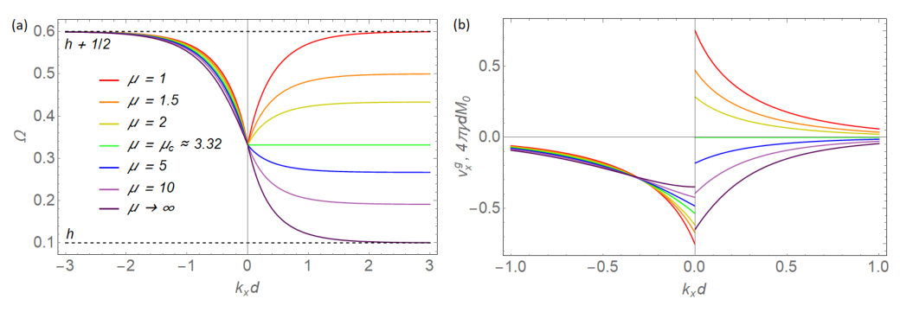
<figcaption class="paper-figure-caption"><b>Fig 3.</b> FIG. 3. Dependencies of (a) frequency Ωand (b) group velocity vg x of MSSWs on the x component of the wave vector kx (k ⊥M0) at different values of the magnetic permeability µ in the FM/PM bilayer. For the calculations, h = 0.1 (µc ≈3.32) and sM = 1 were adopted.</figcaption>
</figure>
<figure class="paper-figure-card">
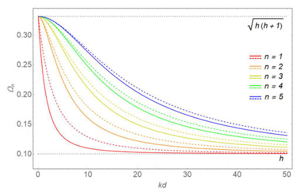
<figcaption class="paper-figure-caption"><b>Fig 4.</b> FIG. 4. Frequencies of the first five BVMSW modes Ωn as functions of the wave vector modulus k (k ∥M0) in the FM/PM bilayer. The solid lines correspond to the case µ →∞, while the dashed lines correspond to the case µ = 1. For the calculations, h = 0.1 was adopted.</figcaption>
</figure>
<figure class="paper-figure-card">

<figcaption class="paper-figure-caption"><b>Fig 5.</b> Figure 5 shows the dependencies of Ω± on µ at various θ [Fig. 5(a)] and the dependencies of Ω± on θ at various µ [Fig. 5(b)]. The light gray regions indicate the forbidden values of µ and θ where MSSWs cannot propagate. The curves Ω+ and Ω−reach the forbidden regions at µ = µ± c or θ = θc and terminate there. The branch Ω−at µ = µ− c reaches a local minimum equal to p</figcaption>
</figure>

**Summary.** This theoretical study analyzes spin wave propagation in a ferromagnet/paramagnet bilayer using magnetostatic theory. The key finding is that dipolar coupling induces significant frequency nonreciprocity, enabling the creation of unidirectional magnonic waves. This tunability—switching these directional properties via temperature or magnetic field—suggests applications for novel magnonic logic devices.

**Why it may be interesting.** While focused on magnonics rather than quantum information directly, the concept of tunable, directional energy transport (unidirectional waves) is analogous to engineered quantum channels or non-Hermitian physics studied in AMO/quantum optics.

Detailed structure

**Main problem.** To calculate and analyze the spectra of Damon-Eshbach magnetostatic modes (surface and bulk spin waves) in a ferromagnet/paramagnet bilayer, focusing on how dipolar coupling modifies these spectra.

**Main result.** The dipolar coupling induces nonreciprocity in surface spin waves, allowing for the creation of unidirectional wave regimes that can be switched on or off by varying external magnetic fields or temperature near the Curie point.

**Method.** Analytical calculation using the magnetostatic approximation and solving coupled differential equations across the FM/PM interface.

**Model / system.** The system is an in-plane magnetized ferromagnet (FM) film placed on a paramagnet (PM) half-space. The PM's magnetic susceptibility follows the Curie-Weiss law, $\chi \propto 1/(T-T_C)$.

**Key observables.** Spin-wave frequency spectrum ($\Omega$), frequency nonreciprocity ($\Delta\Omega$), and group/phase velocities ($v_g, v_p$).

**Important parameters / regimes.** Magnetic permeability of the PM ($\mu$), external magnetic field ($H_0$ or $h$), and temperature ($T$) relative to the Curie temperature ($T_C$).

**Assumptions / limitations.** The magnetostatic approximation is used, and the analysis assumes a thick FM film. The PM susceptibility follows the Curie-Weiss law.

**Figures summary.** Figures illustrate the dependence of nonreciprocity ($\Delta\Omega$) on wave vector ($k$), showing unidirectional regimes; they also map out spectra for arbitrary propagation angles ($	heta$), revealing forbidden regions and mode splitting between MSSWs and BVMSWs.

**Paper structure.** The paper establishes the governing equations using magnetostatic theory, analyzes the specific case of perpendicular propagation ($k \perp M_0$) to show nonreciprocity, then extends the analysis to arbitrary propagation angles ($	heta$), detailing how MSSW and BVMSW spectra interact and defining parameter regimes for wave confinement.

Abstract

Using the magnetostatic approximation, we calculate the spectra of bulk and surface spin waves in an in-plane magnetized ferromagnet/paramagnet bilayer. Due to the dipolar coupling between the layers, the paramagnet becomes polarized, which in turn modifies the spectrum of the Damon-Eshbach magnetostatic modes. We assume that the paramagnet is characterized by a magnetic susceptibility, $χ\propto 1/(T-T_C)$, which reaches large values when the system temperature $T$ is close to the Curie temperature $T_C$. We find the conditions under which surface spin waves become unidirectional, i.e., capable of carrying energy in only one direction, and determine the magnitude of their frequency nonreciprocity. We demonstrate the possibility of switching the unidirectional wave regime on and off by varying the external magnetic field or temperature, making the ferromagnet/paramagnet system an attractive platform for tunable magnonic logic devices.

[↑ back to top](#top)

### [Quench of chiral superconductivity by quantum phase fluctuations in twisted cuprate bilayers](http://arxiv.org/abs/2607.00630v1)

**Authors:** Yin Shi, Mengxian Zhao, Fei Yang, Miao Liu, Sheng Meng  
**Type:** theory · **Category:** strongly correlated electrons · **PDF:** <https://arxiv.org/pdf/2607.00630v1>  
**Analysis basis:** full PDF text, analyzed in chunks
**Topic relevance:** `Keldysh / 2PI / non-Gaussian methods` **3/5** · `analog quantum simulation` **1/5** · `correlated / nonlocal dissipation` **1/5** · `driven-dissipative phase transition` **1/5** · `methods for driven-dissipative` **1/5** · `non-equilibrium dynamics` **1/5**

↔ Scroll figures horizontally

<figure class="paper-figure-card">
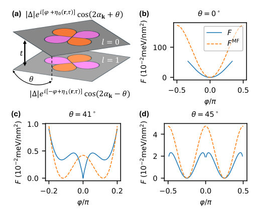
<figcaption class="paper-figure-caption"><b>Fig 1.</b> FIG. 1. (a) Schematic of a twisted bilayer superconductor, where each layer alone is a d-wave superconductor, and the two layers are coupled through electron tunneling with an amplitude t. αk is the polar angle of the momentum k. The superconducting phase of each layer can be decomposed into a static part ±φ and a dynamical part ηl(r, τ) (dependent on the imaginary time τ). A nonzero φ (not integer multiple of π) signifies d + id′ chiral superconductivity. Crucially, fluctu- ations in the dynamical phases could renormalize the equilib- rium φ. (b–d) Free energy density (vertically shifted to match minima) with (blue solid line) and without (orange dashed line) phase fluctuations at zero...</figcaption>
</figure>
<figure class="paper-figure-card">
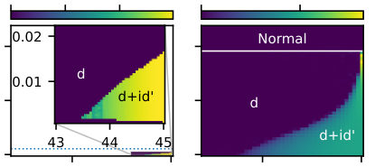
<figcaption class="paper-figure-caption"><b>Fig 2.</b> FIG. 2. Phase diagrams in the twist-angle–temperature plane with (left panel) and without (right panel) phase fluctuations for t = 10 meV. The false color represents the minimal super- conducting gap. The phase diagrams are symmetric about θ = 45◦. T 1L c is the superconducting transition temperature of a monolayer. The horizontal dotted line in the left panel indicates the lowest temperature reached in existing experi- ments [11]. The white line in the right panel delineates the normal–superconducting phase border, while the d–(d + id′) border is obvious by the false color.</figcaption>
</figure>
<figure class="paper-figure-card">

<figcaption class="paper-figure-caption"><b>Fig 3.</b> FIG. 3. Phase diagrams in the tunneling-amplitude– temperature plane with (left panel) and without (right panel) phase fluctuations. The twist angle is fixed at 45◦. The false color represents the minimal superconducting gap. The dot- ted line marks the realistic tunneling amplitude t = 10 meV. Note the different scales of the y axes.</figcaption>
</figure>
<figure class="paper-figure-card">
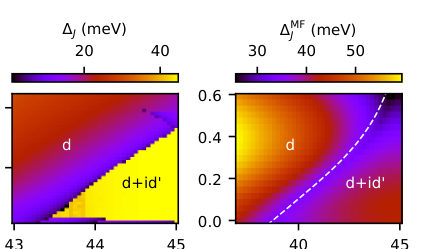
<figcaption class="paper-figure-caption"><b>Fig 4.</b> FIG. 4. Josephson gap with (left column) and without (right column) phase fluctuations for t = 10 meV. The dashed line delineates the d–(d+id′) border for the mean-field case, while such a border is obvious by the false color for the phase fluc- tuating case.</figcaption>
</figure>

**Summary.** The paper theoretically analyzes the stability of chiral d+id' superconductivity in twisted cuprate bilayers against quantum phase fluctuations. By incorporating these fluctuations into the free energy calculation, the authors show that the exotic chiral state is highly fragile, surviving only under extreme conditions. This work establishes quantum phase fluctuations as a critical constraint on realizing TRSB superconducting phases in low-dimensional materials.

**Why it may be interesting.** This work demonstrates how low-energy collective fluctuations can fundamentally constrain exotic superconducting orders like chiral superconductivity, providing a general theoretical framework applicable to other layered quantum materials where phase coherence is crucial.

Detailed structure

**Main problem.** The study investigates how quantum phase fluctuations fundamentally alter the predicted chiral d+id' superconducting state in twisted cuprate bilayers, particularly concerning Time-Reversal Symmetry Breaking (TRSB).

**Main result.** Quantum phase fluctuations strongly suppress the stability of the chiral phase, restricting it to a narrow twist-angle window and ultra-low temperatures. This leads to a first-order transition into the regular d-wave state.

**Method.** The authors derived the free energy functional by self-consistently incorporating the renormalization of the relative interlayer phase due to dynamical quantum phase fluctuations.

**Model / system.** The system is modeled using a continuum microscopic Hamiltonian for twisted cuprate bilayers, considering both d-wave and chiral d+id' superconducting orders. The analysis focuses on the collective behavior of the interlayer phase degree of freedom.

**Key observables.** Minimal superconducting gap (2\Delta_min) to distinguish between $d+id'$ ($>0$) and nodal $d$-wave ($=0$), and the Josephson gap ($\Delta_J$).

**Important parameters / regimes.** Twist angle ($	heta$), temperature ($T/T_{1L}^c$), and interlayer tunneling amplitude ($t$). The chiral phase is only stable at very low temperatures (e.g., $\lesssim 1.4 	ext{ K}$).

**Assumptions / limitations.** The analysis uses a simplified local form for the interlayer tunneling $t_l(r) = t_l\delta(r)$ and relies on a derived free energy functional from companion work.

**Figures summary.** Figures illustrate phase diagrams ($	heta$–$T$) showing how quantum fluctuations narrow the region where the chiral state exists, contrasting with mean-field predictions.

**Paper structure.** The paper builds upon theoretical proposals for chiral superconductivity by introducing phase fluctuation corrections to the free energy functional. It then maps out the resulting phase diagram in terms of twist angle and temperature, concluding with implications for Josephson coupling near quantum critical points.

Abstract

Following theoretical proposals of chiral $d+id'$ superconductivity in twisted cuprate bilayers, experimental signatures of time-reversal symmetry breaking (TRSB) remain highly controversial. Here we demonstrate that quantum phase fluctuations fundamentally reshape the phase diagram of this proposed chiral state. Unlike regular superconducting orders, the chiral $d+id'$ state requires long-range coherence of an interlayer phase degree of freedom and is therefore intrinsically vulnerable to phase fluctuations. Incorporating these fluctuations nearly eliminates the chiral phase over most parts of the phase diagram, restricting it to a narrow twist-angle window and ultra-low temperatures. The fluctuation-driven destruction of chirality produces a first-order transition into the $d$-wave state, giving rise to coexistence and metastability. Meanwhile, Josephson phase locking is strongly weakened at the TRSB quantum critical point, which sits well within the superconducting regime. More broadly, our work establishes quantum phase fluctuations as a fundamental constraint on the emergence of TRSB phases in low-dimensional layered quantum materials.

[↑ back to top](#top)

### [Electric-field effects on defect migration energetics in GaN](http://arxiv.org/abs/2607.01160v1)

**Authors:** Farshid Reza, Hamdy Arkoub, Alexander S. Hauck, Adri C. T. van Duin, Miaomiao Jin  
**Type:** theory · **Category:** other · **PDF:** <https://arxiv.org/pdf/2607.01160v1>  
**Analysis basis:** full PDF text, analyzed in chunks
**Topic relevance:** `non-equilibrium dynamics` **2/5** · `Keldysh / 2PI / non-Gaussian methods` **1/5** · `analog quantum simulation` **1/5** · `driven-dissipative phase transition` **1/5** · `methods for driven-dissipative` **1/5** · `non-equilibrium universality` **1/5**

↔ Scroll figures horizontally

<figure class="paper-figure-card">

<figcaption class="paper-figure-caption"><b>Fig 1.</b> FIG. 1: EOS data for wurtzite GaN (a), N2 molecule bond length energy profile</figcaption>
</figure>
<figure class="paper-figure-card">

<figcaption class="paper-figure-caption"><b>Fig 2.</b> FIG. 2: (a) Energy difference between defect structure and perfect structure. (b)</figcaption>
</figure>
<figure class="paper-figure-card">

<figcaption class="paper-figure-caption"><b>Fig 3.</b> FIG. 3: Migration directions for (a) VGa, (b) VN, (c) Gai1,oct, and (d) Ni2,split,</figcaption>
</figure>
<figure class="paper-figure-card">
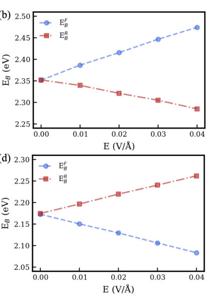
<figcaption class="paper-figure-caption"><b>Fig 4.</b> FIG. 4: Effect of an external electric field on the total system energy relative to zero</figcaption>
</figure>
<figure class="paper-figure-card">

<figcaption class="paper-figure-caption"><b>Fig 5.</b> FIG. 5: Charge distribution variation with applied electric field along x-direction for</figcaption>
</figure>

**Summary.** This work develops a reactive force field for GaN to simulate how defects move when subjected to high electric fields. The key finding is that the interaction is complex, causing anisotropic barrier changes due to charge redistribution and lattice distortion, rather than a simple linear shift. This provides critical insight into device reliability in extreme electrical environments.

**Why it may be interesting.** While focused on solid-state defects rather than quantum systems, the study's focus on complex, non-linear coupling between an external field (an electromagnetic perturbation) and the material's internal energy landscape shares conceptual parallels with understanding driven dynamics in open quantum systems or materials under extreme bias.

Detailed structure

**Main problem.** Assessing defect transport mechanisms in GaN under high operating electric fields is crucial for predicting device reliability in power electronics.

**Main result.** Electric fields modify defect migration barriers anisotropically through charge-lattice coupling, deviating significantly from simple linear dipole predictions.

**Method.** The study develops and applies a ReaxFF reactive force field trained on DFT data to simulate defect migration using CI-NEB methods under external electric fields.

**Model / system.** The system is Gallium Nitride (GaN) in its wurtzite structure, focusing on intrinsic point defects like vacancies ($	ext{V}_{	ext{Ga}}, 	ext{V}_{	ext{N}}$) and interstitials. The simulation incorporates external electric fields up to $40 	ext{ MV/cm}$.

**Key observables.** Defect formation energies, migration barriers ($E_F^B$, $E_R^B$), charge distribution variation, and the deviation from linear field dependence.

**Important parameters / regimes.** Electric field strength (up to $0.04 	ext{ V}/	ext{\AA}$), defect type, and field orientation (parallel vs. perpendicular to migration path).

**Assumptions / limitations.** The use of a ReaxFF force field with the QEq scheme implies that the results represent neutral defects and are a lower bound compared to fully charged states.

**Figures summary.** Figures illustrate EOS comparisons, charge distribution changes during defect movement, and energy profiles showing the effect of external fields on migration barriers for different defect types.

**Paper structure.** The paper first validates the ReaxFF model against DFT results for structural properties. It then calculates zero-field migration barriers before systematically applying increasing electric fields to analyze the resulting modulation of forward and reverse barriers, comparing findings to linear models.

Abstract

A predictive understanding of defect transport in GaN under operating electric fields is critical for assessing device reliability in high-power and radiation environments. In this work, a ReaxFF reactive force field for GaN is developed using a density-functional-theory training set that includes structural, thermodynamic, and defect properties. The force field yields various properties such as lattice parameters, cohesive energies, and defect formation and migration energies in close agreement with prior first-principles and experimental results. Under externally applied electric fields, we find that migration barriers can be strongly modulated, with changes that depend on defect type and field orientation. Notably, the electric fields do not simply linearly bias defect motion in GaN, but can anisotropically modify migration barriers through charge-lattice coupling, leading to nonlinear transport behavior. The response arises from field-induced partial charge redistribution and local lattice distortion. These results demonstrate that electric fields can complexly modify the defect migration landscape, providing new insight into defect transport in GaN under high-field conditions.

[↑ back to top](#top)

### [Symmetry Classification of Non-Reciprocal Responses in Multiterminal Ring Devices](http://arxiv.org/abs/2607.00919v1)

**Authors:** Chen-How Huang, Tero T. Heikkilä  
**Type:** theory · **Category:** other · **PDF:** <https://arxiv.org/pdf/2607.00919v1>  
**Analysis basis:** full PDF text, analyzed in chunks
**Topic relevance:** `analog quantum simulation` **1/5** · `correlated / nonlocal dissipation` **1/5** · `driven-dissipative phase transition` **1/5** · `methods for driven-dissipative` **1/5** · `non-equilibrium dynamics` **1/5**

↔ Scroll figures horizontally

<figure class="paper-figure-card">

<figcaption class="paper-figure-caption"><b>Fig 1.</b> FIG. 1. (a) n-vertex ring for the classification of non- reciprocal electronic response. Each bond is assigned a binary current ek ∈{1, −1} describing the direction (counterclock- wise, clockwise) of non-reciprocity. (b) n = 3 ring of two different orbits classified by symmetries, the semi-circulator and circulator configurations.</figcaption>
</figure>
<figure class="paper-figure-card">
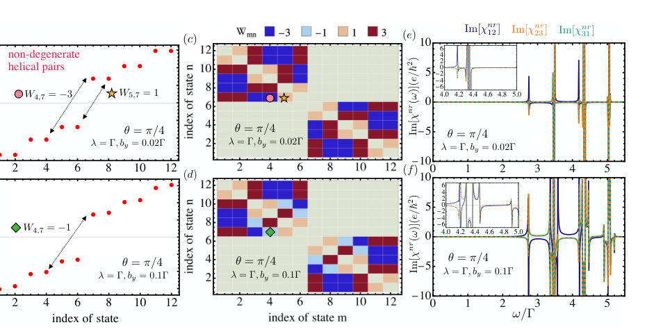
<figcaption class="paper-figure-caption"><b>Fig 2.</b> FIG. 3. (a,b) Single particle energy spectrum for the minimal model at θ = π/4 for (a) by = 0.02Γ (b) by = 0.1Γ. We also indicate the value of the Wmn for some of the intra(inter)-helcial pair transitions by the black arrows and labels in (c,d). (c,d) Wmn = P</figcaption>
</figure>
<figure class="paper-figure-card">

<figcaption class="paper-figure-caption"><b>Fig 3.</b> FIG. 4. Characterization of the system with in-plane field. (a) is the non-reciprocal transmission of the device. The red arrows indicate the reactive response region of the device. (b) show the absorption spectra of the three terminals of the device.</figcaption>
</figure>
<figure class="paper-figure-card">
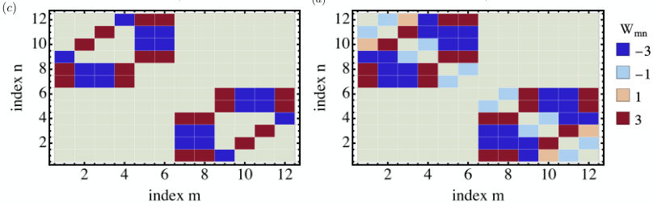
<figcaption class="paper-figure-caption"><b>Fig 4.</b> FIG. 5. Reactive part of the response function Im[χnr] for (a) θ = π/3 (b) θ = π/4. (c,d) Wmn = P</figcaption>
</figure>
<figure class="paper-figure-card">

<figcaption class="paper-figure-caption"><b>Fig 5.</b> FIG. 6. (a) Non-reciprocal transmission and (b) power absorption of the toy model including the finite broadening and temperature kBT = δ = 0.001Γ.</figcaption>
</figure>

**Summary.** This paper introduces a group-theoretic framework to classify non-reciprocal current responses in quantum ring devices. Using symmetry analysis on $n$-vertex rings, the authors predict that observable non-reciprocity requires breaking both time-reversal and inversion symmetries simultaneously. The theory is validated using a three-site superconducting quantum dot model, confirming predictions for circulator and semi-circulator transport regimes.

**Why it may be interesting.** This work provides a powerful theoretical tool—symmetry classification—to predict fundamental transport properties (non-reciprocity) in mesoscopic superconducting circuits, linking topology/geometry directly to measurable electrical response.

Detailed structure

**Main problem.** The paper develops a symmetry-based framework to classify non-reciprocal responses occurring in multiterminal quantum ring devices.

**Main result.** Non-reciprocity requires the simultaneous breaking of both time-reversal (T) and spatial inversion (I) symmetries. The geometry dictates which specific circulator or semi-circulator responses are physically observable.

**Method.** The analysis heavily relies on group theory, specifically applying Burnside's Lemma to classify the $2^n$ possible current configurations into symmetry equivalence classes (orbits).

**Model / system.** The system is modeled as a ring of $n$ vertices with bonds characterized by preferred signal flow directions ($\pm 1$). The theoretical predictions are validated using a minimal toy model of three quantum dots coupled to superconducting baths.

**Key observables.** Non-reciprocal transmission ($S_{nr}$), the reactive component of the current-current response function ($	ext{Im}[\chi_{nr}]$), and the absolute non-reciprocal weight ($R_{nr}^{tot}$).

**Important parameters / regimes.** The number of terminals $n$ (especially $n=3$), geometric symmetry (equilateral vs. isosceles), and external fields like Zeeman field ($b_y$) or SOC ($\lambda$).

**Assumptions / limitations.** The analysis assumes that the non-reciprocal response can be entirely classified by the underlying discrete symmetries of the ring geometry, even when microscopic details are involved.

**Figures summary.** Figures illustrate the $n$-vertex ring setup and show examples of circulator ($W=3$) and semi-circulator ($W=1$) configurations. Other figures plot non-reciprocal transmission spectra, reactive response functions ($	ext{Im}[\chi_{nr}]$), and energy level splittings as a function of symmetry breaking parameters.

**Paper structure.** The paper progresses from establishing the general group theory framework for $n$-rings to analyzing specific cases ($n=3$ equilateral vs. isosceles) using Burnside's lemma, culminating in validation via calculations on a minimal quantum dot toy model that predicts observable circulator and semi-circulator responses.

Abstract

We present a symmetry-based framework to classify the non-reciprocal responses of multiterminal ring quantum devices. The device is modeled as a ring of $n$ vertices, where a binary variable $e_k\in\{+1,-1\}$ on each bond encodes the preferred direction of signal flow between terminals. Non-reciprocity corresponds to a preferred current configuration on the ring, and the symmetry group of the device partitions all $2^n$ configurations into equivalence classes(orbits) characterized by a topological winding number $W$. Using the minimal non-trivial case $n=3$, we establish two results independent of microscopic details. First, lifting the degeneracy within an orbit generates non-reciprocal responses. For $n=3$ this requires simultaneous breaking of both time-reversal $T$ and spatial inversion $I$. Breaking either alone is insufficient. Second, the residual geometry symmetry after $T$ and $I$ are broken determines which responses are observable. For an isosceles triangular geometry, only two types of response are allowed: uniform circulation (all bonds carrying current in the same direction) and semi-circulation with the reversed bond on the geometrically distinct base. Semi-circulation with the reversed bond on either equal leg is symmetry-forbidden. Both predictions are validated using a minimal toy model of three quantum dots coupled to superconducting baths, which demonstrates a reactive quantum circulator response.

[↑ back to top](#top)

### [Facet-selective ballistic supercurrent in a weak topological insulator](http://arxiv.org/abs/2607.00683v1)

**Authors:** Prasanna Rout, Ankit Khola, Lalit Pandey, Paolo Sessi, Xiaochun Huang, Ivo Cools, S. Galeski, Matthias Bode, Johan Åkerman, Floriana Lombardi, Thilo Bauch, Saroj P. Dash  
**Type:** experiment · **Category:** other · **PDF:** <https://arxiv.org/pdf/2607.00683v1>  
**Analysis basis:** full PDF text, analyzed in chunks
**Topic relevance:** `QC/QI experiment` **1/5** · `interference shaping light` **1/5** · `spintronics-quantum-optics interface` **1/5**

↔ Scroll figures horizontally

<figure class="paper-figure-card">

<figcaption class="paper-figure-caption"><b>Fig 1.</b> Fig. 1: Probing the boundary states in three-dimensional topological insulators by super- conducting quantum interferometry. a, b, Schematic band structure of a strong topological insulator (STI, a), and a weak topological insulator (WTI, b). An STI hosts gapless Dirac cones on the time- reversal-symmetric crystal facets (pink surfaces) while the bulk is insulating. In a WTI, conducting surface states due to one-dimensional Dirac lines reside only on specific crystallographic facets such as y–z and z–x (pink surfaces), whereas other x–y facets (blue surfaces) remain fully gapped. c, d, Josephson junc- tions based on an STI and a WTI coupled to superconducting electrodes. In the STI junction...</figcaption>
</figure>
<figure class="paper-figure-card">
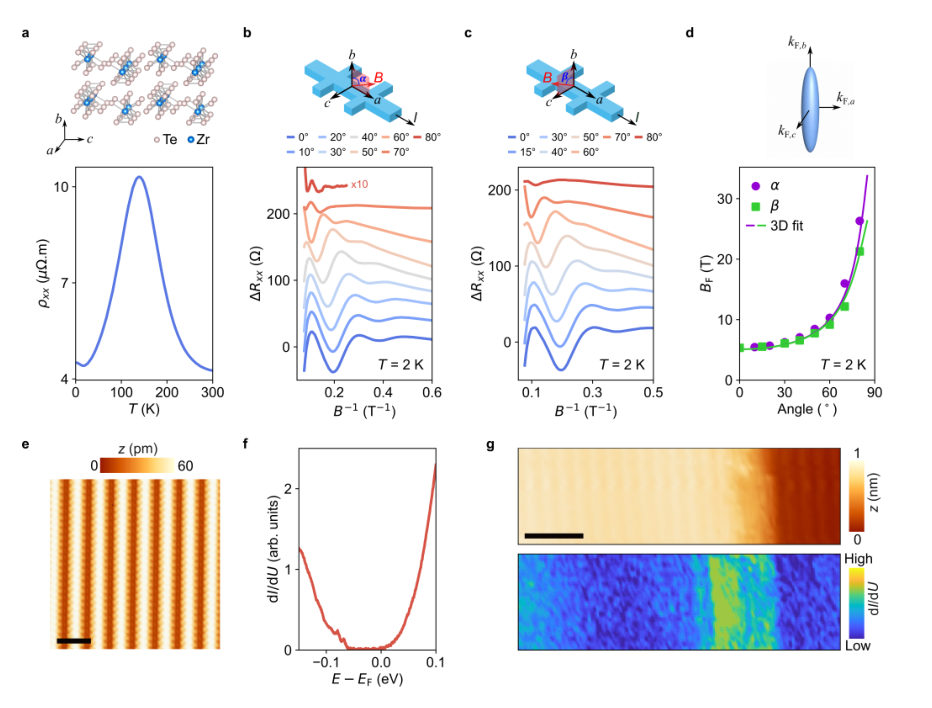
<figcaption class="paper-figure-caption"><b>Fig 2.</b> Fig. 2: Electronic transport and spectroscopic measurements of ZrTe5. a, Temperature depen- dence of the longitudinal resistivity ρxx measured with current applied along the a-axis. The top panel shows the crystal structure of ZrTe5, consisting of two-dimensional layers in the a–c plane that are cou- pled by van der Waals forces along the b-axis. In the WTI regime, the a–c surfaces are gapped, while topological surface states reside on the a–b and b–c facets. b, c, Magnetoresistance ∆Rxx(B) after back- ground subtraction, measured at 2 K for various field angles α in the a–b plane and β in the b–c plane. Here, α and β denote the angle between the b-axis and the magnetic field as illustrated...</figcaption>
</figure>
<figure class="paper-figure-card">
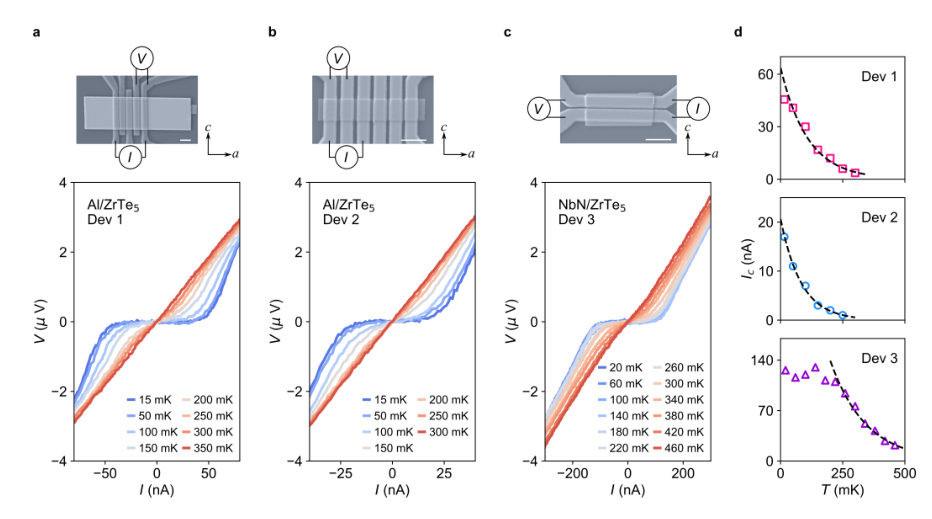
<figcaption class="paper-figure-caption"><b>Fig 3.</b> Fig. 3: Supercurrent transport in ZrTe5 Josephson junctions. a,b, Voltage V across the Al/ZrTe5 junction as a function of applied current I flowing along the a-axis, measured at different temperatures. The data for Dev 1 and Dev 2 are presented in a and b, respectively. c, V (I) curves for the NbN/ZrTe5 junction (Dev 3), where the current is along the c-axis. The top panels in a-c show scanning electron microscopy images of the junctions with the measurement schematics (Scale bar is 2 µm). d, Temperature dependence of Ic for three junctions, extracted from a-c, together with fits (dashed lines) to the data in the high-temperature regime.</figcaption>
</figure>
<figure class="paper-figure-card">
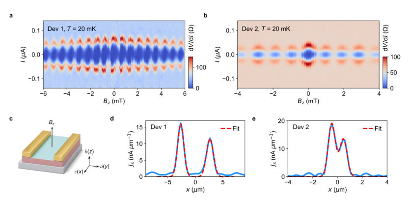
<figcaption class="paper-figure-caption"><b>Fig 4.</b> Fig. 4: Superconducting quantum interferometry revealing spatially localized supercurrent in Al/ZrTe5 junctions. Superconducting quantum interference patterns for Dev 1 (a), and Dev 2 (b) measured at 20 mK, exhibiting clear SQUID-like oscillations. c, Schematics of the junctions, where the current flows along the a-axis and the magnetic field is applied along the b-axis. d,e, Corresponding supercurrent density profiles Js(x) extracted from the interference patterns in a,b. Two pronounced peaks indicate that the supercurrent is localized near opposite a–b facets. The spatial supercurrent distributions are fitted by a combination of two Gaussian peaks (dashed lines).</figcaption>
</figure>
<figure class="paper-figure-card">

<figcaption class="paper-figure-caption"><b>Fig 5.</b> Fig. 5: Field-orientation dependence of facet-selective supercurrent. a, Schematic of the NbN/ZrTe5 Josephson junction (Dev 3), where the current flows along the c-axis. b, Superconducting interference patterns measured at 20 mK for magnetic field Bz applied along the b-axis, showing behavior similar to that in Fig. 4. c, Same measurement performed for magnetic field By applied along the a-axis. d, The supercurrent density profiles for the parametrized junction width W = 1, 0.5, 0.3, 0.2, and 0.1. e,f, Corresponding simulated interference patterns for a sinusoidal (e) and a sawtooth (f) current–phase relation (see Supplementary Note 7 for details). For reference, a uniform supercurrent...</figcaption>
</figure>

**Summary.** The research demonstrates the existence of supercurrents confined specifically to certain facets of a weak topological insulator ($	ext{ZrTe}_5$). By using superconducting interferometry, the authors confirmed that this facet-selectivity and ballistic nature are direct consequences of the material's underlying bulk topology. This establishes WTIs as a promising platform for designing next-generation, topologically controlled superconducting devices.

**Why it may be interesting.** This work provides direct experimental evidence linking bulk topological invariants (WTI classification) to macroscopic quantum phenomena (supercurrent distribution), which is highly relevant for understanding engineered quantum materials interfaces.

Detailed structure

**Main problem.** The primary goal is to demonstrate and characterize facet-selective ballistic supercurrent flow in three-dimensional weak topological insulators (WTIs). This addresses the challenge of confining superconducting currents to specific crystal facets.

**Main result.** The authors successfully demonstrated SQUID-like critical current oscillations confined to specific crystallographic facets, confirming that the supercurrent is dictated by the underlying bulk topology of the WTI material ($	ext{ZrTe}_5$).

**Method.** Superconducting quantum interferometry was performed on Josephson junctions formed with $	ext{ZrTe}_5$, supplemented by STM/STS measurements and analysis of magnetic field dependence.

**Model / system.** The system utilizes Weak Topological Insulators ($	ext{ZrTe}_5$), which possess gapless topological surface states only on selected facets, contrasting with Strong TIs. Superconductivity is induced via proximity coupling in Josephson junctions.

**Key observables.** SQUID-like critical current oscillations ($I_c$ vs $B$), exponential temperature dependence of $I_c$, and distinct interference patterns dependent on the magnetic field orientation relative to crystal facets.

**Important parameters / regimes.** The supercurrent is confined to specific side facets, exhibiting ballistic transport signatures characterized by an exponential temperature dependence ($\exp(-\pi^2 k_B T / \delta E)$).

**Assumptions / limitations.** The measurements assume that the observed superconducting current flow is dominated by the topological surface states rather than trivial bulk conduction channels.

**Figures summary.** Figures show SQUID-like $I$-$V$ curves and interference patterns (Fig. 4) confirming facet confinement, alongside STM/STS data showing a bulk gap and enhanced LDOS at step edges (Fig. 2).

**Paper structure.** The paper establishes the theoretical basis for WTI surface currents, details the experimental setup using Josephson junctions on $	ext{ZrTe}_5$, presents measurements confirming SQUID oscillations and field-orientation dependence, and concludes by establishing WTIs as a platform for facet-resolved superconducting devices.

Abstract

Topological superconductivity is widely pursued by inducing superconducting correlations in topologically protected boundary states. In two dimensions, this strategy has been realized using one-dimensional topological edge modes, but in three-dimensional crystals, spatially separated surface supercurrents confined to selected facets have not yet been achieved. Here we demonstrate facet-selective ballistic supercurrent in Josephson junctions based on the weak topological insulator ZrTe5. Superconducting quantum interferometry reveals SQUID-like critical current oscillations with flux-quantum periodicity, establishing that the supercurrent is spatially concentrated on specific crystallographic facets that host gapless topological surface states. Rotating the magnetic field yields markedly distinct interference patterns, linking the supercurrent distribution to the underlying bulk topology. The exponential temperature dependence of the critical current and triangular interference lobes provide signatures of ballistic transport due to high-transmission topological channels. These results establish weak topological insulators as a platform for facet-resolved superconducting devices and higher-order topological superconductivity.

[↑ back to top](#top)

### [Near-Field Characterisation of Guided Modes in WS2 Nanobeams and Quasi-Bulk Crystals](http://arxiv.org/abs/2607.00694v1)

**Authors:** Zara S. Taylor, Luke M. Hallacy, Xuerong Hu, Oliver T. Williams, Simone Strohmair, Fabian Felixberger, Alexander J. Knight, Timothy Chester-Parsons, Luke R. Wilson, Alexander I. Tartakovskii  
**Type:** experiment · **Category:** other · **PDF:** <https://arxiv.org/pdf/2607.00694v1>  
**Analysis basis:** full PDF text, analyzed in chunks
**Topic relevance:** `interference shaping light` **1/5** · `quantum measurements` **1/5** · `quantum optics experiment` **1/5**

↔ Scroll figures horizontally

<figure class="paper-figure-card">
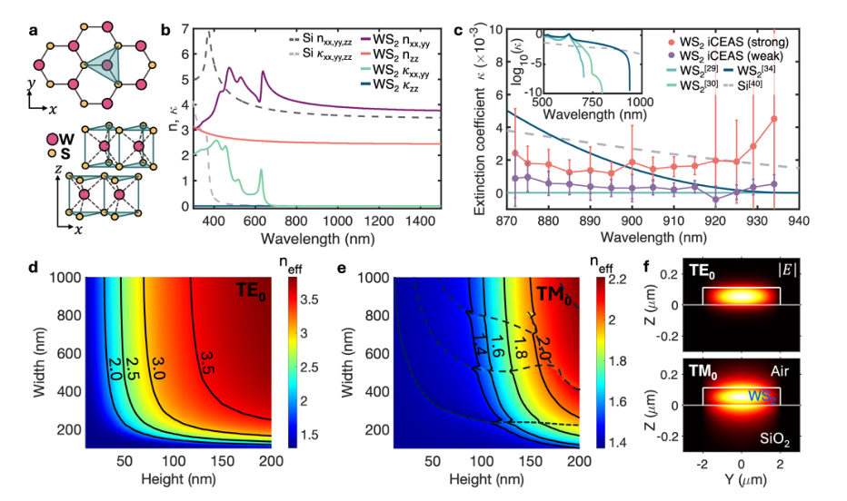
<figcaption class="paper-figure-caption"><b>Fig 1.</b> Figure 1: Optical waveguide quality of WS2 throughout the vis-NIR spectral window relative to silicon. a) atomic structure of WS2 as seen from above (top) and the side (bottom). b) Refractive indices in the vis-NIR window of WS2 and silicon sourced from [30] and [40], respectively. c) Extinction coefficient of a WS2 crystal measured via imaging Cavity-Enhanced Absorption Spectroscopy (iCEAS) within strongly and weakly absorbing local crystal regions compared with prior measurements of WS2 [29, 30, 34] and Si [40] κ. A logarithmic plot of the extinction coefficient of WS2 and silicon is provided within the inset to emphasise the sharper drop in absorption estimated for WS2. d) and e)...</figcaption>
</figure>
<figure class="paper-figure-card">
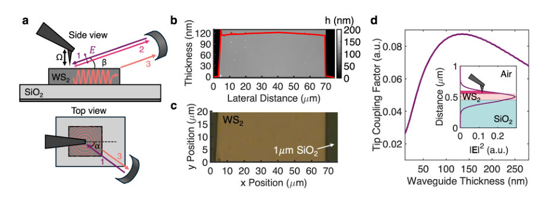
<figcaption class="paper-figure-caption"><b>Fig 2.</b> Figure 2: a) s-SNOM schematic showing side and top view. A metal-coated AFM tip is illuminated by a beam of laser light (path 1). This light is partially reflected directly to the detector from the tip (path 2), and partially coupled into the WS2 crystal via the plasmonic tip-sample interaction, propagating as a waveguided mode before scattering towards the detector at the crystal edge (path 3). Angles of the laser beam relative to the crystal edge, α and β, are indicated. b) Topography of quasi-bulk sample with a thickness of (112 ± 5) nm recorded via AFM demonstrating high uniformity and pristine edges. S-SNOM scans performed upon the RHS due to comparative lack of surface line and point...</figcaption>
</figure>
<figure class="paper-figure-card">

<figcaption class="paper-figure-caption"><b>Fig 3.</b> Fig. 3a presents representative s-SNOM amplitude images of the quasi-bulk crystal shown in Fig. 2b-c at</figcaption>
</figure>
<figure class="paper-figure-card">

<figcaption class="paper-figure-caption"><b>Fig 4.</b> Figure 3: Nanoimaging of waveguide mode dispersion in WS2. a) SiO2-normalised s-SNOM images of a quasi-bulk 112nm-thick WS2 crystal with fringe line profiles overlaid for a small selection of incident laser beam wavelengths (λ). b) Fitted Fourier Transforms of the line profiles in (a) demonstrating the presence of three key peaks; the air mode (yellow), a poorly-confined TM0 mode (cyan) and the TE0 mode (lilac). c) neff Fitting results for the TE0 and TM0 mode measured throughout the low-absorption vis-NIR window of WS2, with Lumerical MODE simulation results for a 4 µm-width, 112 nm-thick crystal included for comparison. The fitted decay constant of the TM0 mode is plotted in the lower...</figcaption>
</figure>
<figure class="paper-figure-card">

<figcaption class="paper-figure-caption"><b>Fig 5.</b> Fig. 3b indicate that, owing to its unconfined nature, it decays much more rapidly from the crystal edge than the</figcaption>
</figure>

**Summary.** This work characterizes the guided optical modes in WS2 nanobeams and quasi-bulk crystals using both near-field microscopy (s-SNOM) and cavity spectroscopy (iCEAS). The authors establish that s-SNOM is a robust tool for measuring relative modal dispersion across visible-NIR wavelengths, while also quantifying material absorption to improve the feasibility of integrating these 2D materials into photonic circuits.

**Why it may be interesting.** The rigorous application of advanced optical characterization techniques like s-SNOM and iCEAS to a 2D material platform provides crucial experimental benchmarks for designing next-generation integrated photonic circuits.

Detailed structure

**Main problem.** The study addresses the limited experimental understanding of wavelength-dependent modal confinement and attenuation in WS2 waveguides, complicated by ambiguities in material extinction coefficient values.

**Main result.** s-SNOM reliably captures relative modal trends for TE0 and TM0 modes across 800–1400 nm, confirming its utility as a diagnostic tool despite absolute loss dependence on measurement geometry.

**Method.** The authors employed hyperspectral cavity-enhanced imaging (iCEAS) to constrain material absorption and utilized scattering-type s-SNOM microscopy to probe guided modes in quasi-bulk and nanobeam WS2 waveguides.

**Model / system.** The physical system is WS2, a layered van der Waals semiconductor promising for nanophotonics due to its high refractive index and anisotropy. The analysis involves modeling TE0 and TM0 modes using Lumerical FDE simulations alongside experimental measurements on patterned nanobeams and bulk flakes.

**Key observables.** Effective indices (neff), modal confinement, propagation loss ($	ext{dB}/	ext{mm}$), birefringence ($\Delta n$), and the extinction coefficient ($\kappa$).

**Important parameters / regimes.** Wavelength range of 800–1400 nm; waveguide thicknesses around 112 nm to 200 nm; nanobeam widths from 400 nm to 650 nm.

**Assumptions / limitations.** Absolute propagation losses measured by s-SNOM are influenced by measurement geometry and coupling factors, requiring relative trend analysis. Artifacts due to transverse interference in narrow beams must be accounted for.

**Figures summary.** Figures illustrate atomic structure, simulated effective index maps for TE0/TM0 modes, s-SNOM images showing fringe patterns across varying wavelengths, and plots correlating extracted neff and decay constants with mode filling factor or waveguide width.

**Paper structure.** The paper systematically moves from characterizing the material properties (absorption via iCEAS) to simulating ideal modal behavior (FDE simulations), and finally performing detailed near-field measurements using s-SNOM on both quasi-bulk crystals and patterned nanobeams, analyzing mode dispersion and leakage effects.

Abstract

The exceptionally high in-plane refractive index, low sub-bandgap absorption, and strong optical anisotropy of WS2 make it a promising material platform for next-generation integrated circuits for nanophotonics. Its layered van der Waals structure further enables heterogeneous integration with silicon photonics and emerging two-dimensional optoelectronic materials. However, despite increasing interest in the waveguiding properties of WS2, experimental studies of wavelength-dependent modal confinement and attenuation remain limited. Additionally, though the extinction coefficient of WS2 is expected to be near-negligible beneath the bandgap, reported values span orders of magnitude, leading to large uncertainty in predicted modal decay lengths and wafer-scale integration feasibility. To resolve these ambiguities we perform hyperspectral cavity-enhanced imaging, determining high-resolution upper and lower bounds on the extinction coefficient of WS2 within the visible-NIR edge. We further employ scattering-type scanning near-field optical microscopy (s-SNOM) to probe TE0, TM0, and higher-order modes in both quasi-bulk and nanobeam WS2 waveguides across the 800-1400 nm spectral range, enabling identification of mode-specific trends in wavevector dispersion and loss. This work simultaneously assesses s-SNOM as a probe of waveguide performance, and we find that while absolute loss values depend on measurement geometry, s-SNOM reliably captures relative modal trends and provides upper bounds on propagation loss, supporting its use as a diagnostic tool for anisotropic waveguides. We further identify significant artefacts in nanobeam measurements arising from transverse interference and spatial sampling effects when the structure size approaches the excitation wavelength, which can shift extracted effective indices by up to 0.25.

[↑ back to top](#top)

### [Collective phase modes in twisted $d$-wave superconducting bilayers](http://arxiv.org/abs/2607.00662v1)

**Authors:** Yin Shi, Mengxian Zhao, Fei Yang, Miao Liu, Sheng Meng  
**Type:** theory · **Category:** strongly correlated electrons · **PDF:** <https://arxiv.org/pdf/2607.00662v1>  
**Analysis basis:** full PDF text, analyzed in chunks
**Topic relevance:** `Keldysh / 2PI / non-Gaussian methods` **1/5** · `driven-dissipative phase transition` **1/5**

↔ Scroll figures horizontally

<figure class="paper-figure-card">
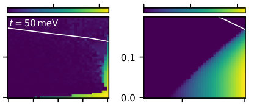
<figcaption class="paper-figure-caption"><b>Fig 1.</b> FIG. 1. Minimal superconducting gaps in the twist-angle– temperature plane with (left panel) and without (right panel) phase fluctuations for three different tunneling amplitudes. The diagrams are symmetric about θ = 45◦. T 1L c is the su- perconducting transition temperature of a monolayer. The white lines delineate the normal–superconducting phase bor- der, while the d–d + id′ border is obvious by the false color.</figcaption>
</figure>
<figure class="paper-figure-card">
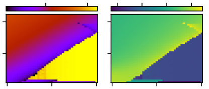
<figcaption class="paper-figure-caption"><b>Fig 2.</b> FIG. 3. Josephson gap (left panel) and magnitude of the order parameter (right panel) in the twist-angle–temperature plane for t = 10 meV.</figcaption>
</figure>
<figure class="paper-figure-card">

<figcaption class="paper-figure-caption"><b>Fig 3.</b> FIG. 2. Superfluid stiffnesses with (left column) and with- out (right column) phase fluctuations in the twist-angle– temperature plane for t = 10 meV. The dashed line delineates the d–(d + id′) border for the mean-field case, while such a border is obvious by the false color for the phase fluctuating case.</figcaption>
</figure>

**Summary.** This theoretical work investigates how low-energy phase fluctuations affect superconductivity in twisted d-wave bilayers, which are candidates for high-Tc chiral superconductors. By including all orders of Josephson coupling, the authors show that these fluctuations modify the stiffnesses of superconducting phases and induce a gap in the relative-phase mode. This indicates a breakdown of Josephson phase locking near quantum critical points.

**Why it may be interesting.** The detailed analysis of collective modes and the role of higher-order couplings in determining superconducting stability is highly relevant to understanding pairing mechanisms and quantum critical points in strongly correlated superconductors.

Detailed structure

**Main problem.** The study analyzes low-energy phase fluctuations in twisted d-wave superconducting bilayers, which are predicted to host high-temperature chiral superconductivity.

**Main result.** Phase fluctuations significantly modify the collective mode dynamics, suppressing relative-phase stiffness but enhancing overall-phase stiffness in the $d+id'$ phase. The relative-phase mode acquires a gap that vanishes near the quantum critical point.

**Method.** The authors employ a theoretical analysis using an effective action approach, systematically retaining Josephson coupling to all orders and expanding fluctuations to quadratic order.

**Model / system.** The system is modeled as twisted cuprate bilayers exhibiting $d$-wave superconductivity, starting from a continuum microscopic model including interlayer tunneling and long-range Coulomb repulsion.

**Key observables.** Superfluid stiffnesses ($D_0, D_\pi$), the relative-phase excitation gap ($\Delta_J$), and the overall phase stiffness ($D_0$).

**Important parameters / regimes.** Twist angle, temperature (low T regime), interlayer tunneling amplitude ($t$), and superconducting order parameters ($\Delta_l$).

**Assumptions / limitations.** The analysis is restricted to low-energy, long-wavelength fluctuations, and the derivation relies on expanding fluctuation terms up to quadratic order.

**Figures summary.** Figures illustrate minimal superconducting gaps in the twist-angle–temperature plane, superfluid stiffnesses vs. temperature/twist angle, and Josephson gap dependence on parameters.

**Paper structure.** The paper progresses from deriving an effective action for phase fluctuations by integrating out fermionic fields to calculating specific observables like stiffnesses and gaps using mean-field theory corrections.

Abstract

Twisted cuprate bilayers have been predicted to host high-temperature chiral $d+id'$ superconductivity, originating from higher-order Josephson coupling processes. In such two-dimensional superconducting systems, long-wavelength fluctuations in the phase of the superconducting order parameter constitute gapless collective modes and therefore remain significant even at zero temperature. Here, we perform a theoretical analysis of the low-energy phase fluctuations in twisted $d$-wave superconducting bilayers, systematically retaining Josephson coupling to all orders. We demonstrate that higher-order Josephson coupling processes lead to nontrivial modifications of the phase dynamics. In particular, the stiffness of the relative phase between the two layers is finite even in the normal state, which is a direct consequence of the intralayer U(1) symmetry breaking explicitly induced by interlayer tunneling. Phase fluctuations suppress the relative-phase stiffness but enhance the overall-phase stiffness in the $d+id'$ phase. Furthermore, the relative-phase fluctuations acquire a small but finite excitation gap, which is no longer equal to the Josephson plasma frequency and is strongly suppressed upon approaching the chiral quantum critical point, indicating the breakdown of Josephson phase locking within the superconducting state.

[↑ back to top](#top)
