
# arxiv digest (quant-ph + cond-mat) — 2026-07-07

*180 papers · 63 relevant · 3 highlighted*

## 🔥 Most relevant (63)

*Every paper with at least one nonzero topic score, sorted by best-matching score. 🔥 marks scores ≥4/5. Click the title to jump to the full entry below; click [arXiv] to open the paper page. `(secondary)` marks papers from de-prioritized cond-mat archives.*

Show 63 relevant papers

- ⭐ [Controlling many-body quantum chaos in a dissipative optical cavity](#paper-2607.04455) [[arXiv]](http://arxiv.org/abs/2607.04455v1) — 🔥 `methods for driven-dissipative` **5/5** · 🔥 `analog quantum simulation` **4/5** · 🔥 `correlated / nonlocal dissipation` **4/5** · `Tavis-Cummings & cavity-many-emitter` **3/5** · `correlated cavity matter` **3/5** · `driven-dissipative phase transition` **3/5** · `entanglement & information structure` **3/5** · `quantum measurements` **3/5** · `non-equilibrium dynamics` **2/5** · `non-equilibrium universality` **2/5** · `Kondo & dissipative impurity` **1/5** · `exotic spin models in light-matter` **1/5** · `measurement-induced transitions` **1/5** · `scars & prethermalization` **1/5**
- [Spin-momentum locking of polariton edge states in honeycomb lattices](#paper-2607.03961) [[arXiv]](http://arxiv.org/abs/2607.03961v1) `(secondary)` — 🔥 `spintronics-quantum-optics interface` **5/5** · 🔥 `analog quantum simulation` **4/5** · 🔥 `exotic spin models in light-matter` **4/5** · `correlated cavity matter` **3/5** · `driven-dissipative phase transition` **3/5** · `quantum optics experiment` **3/5** · `non-equilibrium dynamics` **2/5** · `Tavis-Cummings & cavity-many-emitter` **1/5** · `interference shaping light` **1/5** · `methods for driven-dissipative` **1/5** · `non-equilibrium universality` **1/5**
- [Weak ergodicity breaking without nonthermal eigenstates](#paper-2607.04279) [[arXiv]](http://arxiv.org/abs/2607.04279v1) — 🔥 `scars & prethermalization` **5/5** · 🔥 `analog quantum simulation` **4/5** · 🔥 `non-equilibrium dynamics` **4/5** · `entanglement & information structure` **3/5** · `non-equilibrium universality` **3/5** · `driven-dissipative phase transition` **2/5** · `methods for driven-dissipative` **2/5** · `Frenkel-Kontorova` **1/5** · `Keldysh / 2PI / non-Gaussian methods` **1/5** · `correlated / nonlocal dissipation` **1/5**
- [Entanglement of excited states after measurements in conformal field theory](#paper-2607.04268) [[arXiv]](http://arxiv.org/abs/2607.04268v1) — 🔥 `measurement-induced transitions` **5/5** · 🔥 `entanglement & information structure` **4/5** · 🔥 `non-equilibrium dynamics` **4/5** · `non-equilibrium universality` **3/5** · `quantum measurements` **3/5** · `Keldysh / 2PI / non-Gaussian methods` **1/5** · `analog quantum simulation` **1/5** · `correlated / nonlocal dissipation` **1/5** · `driven-dissipative phase transition` **1/5** · `methods for driven-dissipative` **1/5**
- [Quantum Hashing via Constrained Rydberg Many-Body Dynamics](#paper-2607.04991) [[arXiv]](http://arxiv.org/abs/2607.04991v1) — 🔥 `Rydberg arrays` **5/5** · 🔥 `analog quantum simulation` **4/5** · `entanglement & information structure` **2/5** · `non-equilibrium dynamics` **2/5** · `correlated / nonlocal dissipation` **1/5** · `driven-dissipative phase transition` **1/5** · `methods for driven-dissipative` **1/5** · `quantum measurements` **1/5**
- [Fast Pulses for High-Fidelity Circularization of Interacting Rydberg atoms](#paper-2607.05216) [[arXiv]](http://arxiv.org/abs/2607.05216v1) — 🔥 `Rydberg arrays` **5/5** · 🔥 `analog quantum simulation` **4/5** · `non-equilibrium dynamics` **2/5** · `entanglement & information structure` **1/5** · `methods for driven-dissipative` **1/5** · `quantum measurements` **1/5**
- [The arrival position problem in quantum mechanics](#paper-2607.03538) [[arXiv]](http://arxiv.org/abs/2607.03538v1) — 🔥 `quantum measurements` **5/5** · 🔥 `measurement-induced transitions` **4/5** · `analog quantum simulation` **1/5** · `correlated / nonlocal dissipation` **1/5** · `driven-dissipative phase transition` **1/5** · `methods for driven-dissipative` **1/5** · `non-equilibrium dynamics` **1/5**
- [Realizing Next-Nearest-Neighbor Coupling and Peierls Phase in Circuits](#paper-2607.04175) [[arXiv]](http://arxiv.org/abs/2607.04175v1) — 🔥 `analog quantum simulation` **4/5** · 🔥 `driven-dissipative phase transition` **4/5** · `correlated / nonlocal dissipation` **3/5** · `methods for driven-dissipative` **3/5** · `non-equilibrium dynamics` **3/5** · `non-equilibrium universality` **3/5** · `Frenkel-Kontorova` **2/5** · `QC/QI experiment` **2/5** · `Keldysh / 2PI / non-Gaussian methods` **1/5** · `Kondo & dissipative impurity` **1/5** · `correlated cavity matter` **1/5** · `entanglement & information structure` **1/5** · `exotic spin models in light-matter` **1/5** · `scars & prethermalization` **1/5**
- [Quantum-Optical Bound States in the Continuum](#paper-2607.04742) [[arXiv]](http://arxiv.org/abs/2607.04742v1) — 🔥 `analog quantum simulation` **4/5** · `Tavis-Cummings & cavity-many-emitter` **3/5** · `driven-dissipative phase transition` **3/5** · `interference shaping light` **3/5** · `quantum optics experiment` **3/5** · `Frenkel-Kontorova` **2/5** · `QC/QI experiment` **2/5** · `methods for driven-dissipative` **2/5** · `non-equilibrium dynamics` **2/5** · `correlated / nonlocal dissipation` **1/5** · `correlated cavity matter` **1/5** · `entanglement & information structure` **1/5** · `exotic spin models in light-matter` **1/5** · `non-equilibrium universality` **1/5**
- [Lindblad theory of linear response susceptibility and dispersive readout in minimal Kitaev junctions](#paper-2607.04968) [[arXiv]](http://arxiv.org/abs/2607.04968v1) `(secondary)` — 🔥 `methods for driven-dissipative` **4/5** · `Keldysh / 2PI / non-Gaussian methods` **3/5** · `correlated / nonlocal dissipation` **3/5** · `driven-dissipative phase transition` **3/5** · `QC/QI experiment` **2/5** · `non-equilibrium dynamics` **2/5** · `non-equilibrium universality` **2/5** · `spintronics-quantum-optics interface` **2/5** · `Kondo & dissipative impurity` **1/5** · `analog quantum simulation` **1/5** · `correlated cavity matter` **1/5** · `measurement-induced transitions` **1/5** · `quantum measurements` **1/5**
- [Matter-wave Induced Transparenc](#paper-2607.03820) [[arXiv]](http://arxiv.org/abs/2607.03820v1) — 🔥 `analog quantum simulation` **4/5** · 🔥 `methods for driven-dissipative` **4/5** · `correlated / nonlocal dissipation` **3/5** · `driven-dissipative phase transition` **3/5** · `interference shaping light` **3/5** · `non-equilibrium dynamics` **2/5** · `non-equilibrium universality` **2/5** · `Keldysh / 2PI / non-Gaussian methods` **1/5** · `Kondo & dissipative impurity` **1/5** · `entanglement & information structure` **1/5** · `scars & prethermalization` **1/5**
- [Orthogonality Edges in Strong-Coupling Quantum Work Statistics](#paper-2607.03950) [[arXiv]](http://arxiv.org/abs/2607.03950v1) — 🔥 `non-equilibrium universality` **4/5** · `correlated / nonlocal dissipation` **3/5** · `driven-dissipative phase transition` **3/5** · `methods for driven-dissipative` **3/5** · `non-equilibrium dynamics` **3/5** · `Keldysh / 2PI / non-Gaussian methods` **2/5** · `measurement-induced transitions` **2/5** · `Kondo & dissipative impurity` **1/5** · `analog quantum simulation` **1/5** · `entanglement & information structure` **1/5** · `exotic spin models in light-matter` **1/5** · `scars & prethermalization` **1/5**
- [Bloch-sphere rotations in driven double-well for ultracold atoms](#paper-2607.04873) [[arXiv]](http://arxiv.org/abs/2607.04873v1) — 🔥 `analog quantum simulation` **4/5** · 🔥 `non-equilibrium dynamics` **4/5** · `exotic spin models in light-matter` **3/5** · `non-equilibrium universality` **3/5** · `QC/QI experiment` **2/5** · `driven-dissipative phase transition` **2/5** · `methods for driven-dissipative` **2/5** · `Frenkel-Kontorova` **1/5** · `Keldysh / 2PI / non-Gaussian methods` **1/5** · `correlated / nonlocal dissipation` **1/5** · `entanglement & information structure` **1/5**
- [Finite-frequency magnetic common baths in ferromagnetic planar cavities](#paper-2607.05066) [[arXiv]](http://arxiv.org/abs/2607.05066v1) `(secondary)` — 🔥 `spintronics-quantum-optics interface` **4/5** · `Keldysh / 2PI / non-Gaussian methods` **3/5** · `correlated / nonlocal dissipation` **3/5** · `exotic spin models in light-matter` **3/5** · `methods for driven-dissipative` **3/5** · `Tavis-Cummings & cavity-many-emitter` **2/5** · `driven-dissipative phase transition` **2/5** · `Kondo & dissipative impurity` **1/5** · `analog quantum simulation` **1/5** · `correlated cavity matter` **1/5** · `non-equilibrium dynamics` **1/5**
- [Magnetic graphs for cavity quantum electrodynamics](#paper-2607.04736) [[arXiv]](http://arxiv.org/abs/2607.04736v1) — 🔥 `analog quantum simulation` **4/5** · 🔥 `exotic spin models in light-matter` **4/5** · `Tavis-Cummings & cavity-many-emitter` **3/5** · `correlated cavity matter` **3/5** · `non-equilibrium dynamics` **3/5** · `spintronics-quantum-optics interface` **2/5** · `correlated / nonlocal dissipation` **1/5** · `driven-dissipative phase transition` **1/5** · `entanglement & information structure` **1/5** · `methods for driven-dissipative` **1/5** · `non-equilibrium universality` **1/5**
- [Measurement-induced spatially nonuniform fluctuations of the local particle number and their crossover in a quasiperiodic free-fermion chain](#paper-2607.03799) [[arXiv]](http://arxiv.org/abs/2607.03799v1) — 🔥 `measurement-induced transitions` **4/5** · 🔥 `quantum measurements` **4/5** · `driven-dissipative phase transition` **3/5** · `methods for driven-dissipative` **3/5** · `non-equilibrium dynamics` **2/5** · `non-equilibrium universality` **2/5** · `Frenkel-Kontorova` **1/5** · `Keldysh / 2PI / non-Gaussian methods` **1/5** · `Kondo & dissipative impurity` **1/5** · `analog quantum simulation` **1/5** · `correlated / nonlocal dissipation` **1/5** · `entanglement & information structure` **1/5**
- [Spectral-topology-induced criticality in non-Hermitian fermionic metals](#paper-2607.05190) [[arXiv]](http://arxiv.org/abs/2607.05190v1) — 🔥 `driven-dissipative phase transition` **4/5** · 🔥 `non-equilibrium universality` **4/5** · `Kondo & dissipative impurity` **3/5** · `methods for driven-dissipative` **3/5** · `non-equilibrium dynamics` **3/5** · `correlated / nonlocal dissipation` **2/5** · `entanglement & information structure` **2/5** · `Frenkel-Kontorova` **1/5** · `Keldysh / 2PI / non-Gaussian methods` **1/5** · `analog quantum simulation` **1/5**
- [Energetic Protection, Monotonicity and Switching Far from Equilibrium](#paper-2607.05303) [[arXiv]](http://arxiv.org/abs/2607.05303v1) — 🔥 `non-equilibrium dynamics` **4/5** · 🔥 `non-equilibrium universality` **4/5** · `driven-dissipative phase transition` **3/5** · `methods for driven-dissipative` **3/5** · `Keldysh / 2PI / non-Gaussian methods` **2/5** · `correlated / nonlocal dissipation` **2/5** · `Kondo & dissipative impurity` **1/5** · `analog quantum simulation` **1/5** · `entanglement & information structure` **1/5** · `exotic spin models in light-matter` **1/5** · `scars & prethermalization` **1/5**
- [Krylov complexity, mode-resolved complexity and entanglement entropy across phase transitions in the non-Hermitian extended Su-Schrieffer-Heeger model](#paper-2607.04659) [[arXiv]](http://arxiv.org/abs/2607.04659v1) — 🔥 `driven-dissipative phase transition` **4/5** · 🔥 `entanglement & information structure` **4/5** · `analog quantum simulation` **3/5** · `methods for driven-dissipative` **3/5** · `non-equilibrium universality` **3/5** · `correlated / nonlocal dissipation` **2/5** · `non-equilibrium dynamics` **2/5** · `Keldysh / 2PI / non-Gaussian methods` **1/5** · `Kondo & dissipative impurity` **1/5**
- [Wei-Norman approach for non-Hermitian driven spin-$S$ systems and its application to defect freezing](#paper-2607.04075) [[arXiv]](http://arxiv.org/abs/2607.04075v1) — 🔥 `methods for driven-dissipative` **4/5** · `analog quantum simulation` **3/5** · `driven-dissipative phase transition` **3/5** · `exotic spin models in light-matter` **3/5** · `non-equilibrium dynamics` **3/5** · `non-equilibrium universality` **2/5** · `spintronics-quantum-optics interface` **2/5** · `Keldysh / 2PI / non-Gaussian methods` **1/5** · `Kondo & dissipative impurity` **1/5** · `correlated / nonlocal dissipation` **1/5**
- [All-optical control of coherent perfect absorption via frequency conversion](#paper-2607.04682) [[arXiv]](http://arxiv.org/abs/2607.04682v1) — 🔥 `correlated / nonlocal dissipation` **4/5** · `driven-dissipative phase transition` **3/5** · `interference shaping light` **3/5** · `quantum optics experiment` **3/5** · `Tavis-Cummings & cavity-many-emitter` **2/5** · `methods for driven-dissipative` **2/5** · `non-equilibrium universality` **2/5** · `analog quantum simulation` **1/5** · `correlated cavity matter` **1/5** · `non-equilibrium dynamics` **1/5**
- [Emergence of the Scrooge Ensemble in the Sachdev-Ye-Kitaev Model](#paper-2607.04864) [[arXiv]](http://arxiv.org/abs/2607.04864v1) — 🔥 `entanglement & information structure` **4/5** · 🔥 `measurement-induced transitions` **4/5** · `non-equilibrium dynamics` **3/5** · `quantum measurements` **3/5** · `non-equilibrium universality` **2/5** · `scars & prethermalization` **2/5** · `Keldysh / 2PI / non-Gaussian methods` **1/5** · `correlated / nonlocal dissipation` **1/5** · `driven-dissipative phase transition` **1/5** · `methods for driven-dissipative` **1/5**
- [Sector-memory obstruction to probe-level bath emergence in finite programmable qubit environments](#paper-2607.04791) [[arXiv]](http://arxiv.org/abs/2607.04791v1) — 🔥 `QC/QI experiment` **4/5** · 🔥 `non-equilibrium dynamics` **4/5** · `driven-dissipative phase transition` **3/5** · `methods for driven-dissipative` **3/5** · `analog quantum simulation` **2/5** · `non-equilibrium universality` **2/5** · `Keldysh / 2PI / non-Gaussian methods` **1/5** · `correlated / nonlocal dissipation` **1/5** · `entanglement & information structure` **1/5** · `scars & prethermalization` **1/5**
- [Coherent Control of Energy Transport at Room Temperature in a Noisy Bath](#paper-2607.05361) [[arXiv]](http://arxiv.org/abs/2607.05361v1) — 🔥 `methods for driven-dissipative` **4/5** · 🔥 `non-equilibrium dynamics` **4/5** · `correlated / nonlocal dissipation` **3/5** · `driven-dissipative phase transition` **3/5** · `interference shaping light` **3/5** · `non-equilibrium universality` **2/5** · `Keldysh / 2PI / non-Gaussian methods` **1/5** · `Tavis-Cummings & cavity-many-emitter` **1/5**
- [Controlling Atom Array in an Ultra-high-cooperativity Optical Cavity](#paper-2607.04090) [[arXiv]](http://arxiv.org/abs/2607.04090v1) — 🔥 `Tavis-Cummings & cavity-many-emitter` **4/5** · 🔥 `analog quantum simulation` **4/5** · `QC/QI experiment` **3/5** · `correlated cavity matter` **3/5** · `quantum optics experiment` **3/5** · `Rydberg arrays` **1/5** · `driven-dissipative phase transition` **1/5** · `entanglement & information structure` **1/5** · `interference shaping light` **1/5**
- [Mapping open quantum dynamics onto graphs](#paper-2607.04721) [[arXiv]](http://arxiv.org/abs/2607.04721v1) — 🔥 `methods for driven-dissipative` **4/5** · `correlated / nonlocal dissipation` **3/5** · `driven-dissipative phase transition` **3/5** · `Tavis-Cummings & cavity-many-emitter` **2/5** · `non-equilibrium dynamics` **2/5** · `non-equilibrium universality` **2/5** · `Keldysh / 2PI / non-Gaussian methods` **1/5** · `Kondo & dissipative impurity` **1/5** · `analog quantum simulation` **1/5** · `correlated cavity matter` **1/5** · `entanglement & information structure` **1/5**
- [Coherent quantum control of dark excitons in hybrid metal organic chalchogenolates](#paper-2607.04080) [[arXiv]](http://arxiv.org/abs/2607.04080v1) — 🔥 `QC/QI experiment` **4/5** · `interference shaping light` **3/5** · `quantum optics experiment` **3/5** · `analog quantum simulation` **2/5** · `non-equilibrium dynamics` **2/5** · `Keldysh / 2PI / non-Gaussian methods` **1/5** · `correlated / nonlocal dissipation` **1/5** · `driven-dissipative phase transition` **1/5** · `entanglement & information structure` **1/5** · `methods for driven-dissipative` **1/5** · `quantum measurements` **1/5**
- [Gorini-Kossakowski-Sudarshan-Lindblad equation in different bases: application to driven-dissipative two- and multilevel systems](#paper-2607.03779) [[arXiv]](http://arxiv.org/abs/2607.03779v1) — 🔥 `methods for driven-dissipative` **4/5** · `driven-dissipative phase transition` **3/5** · `non-equilibrium dynamics` **3/5** · `Keldysh / 2PI / non-Gaussian methods` **2/5** · `Tavis-Cummings & cavity-many-emitter` **2/5** · `non-equilibrium universality` **2/5** · `analog quantum simulation` **1/5** · `correlated / nonlocal dissipation` **1/5** · `correlated cavity matter` **1/5** · `quantum measurements` **1/5**
- [On the Nonlinear Sensitivity of Phononic Frequency Combs to Physical Perturbations](#paper-2607.03837) [[arXiv]](http://arxiv.org/abs/2607.03837v1) `(secondary)` — 🔥 `driven-dissipative phase transition` **4/5** · `methods for driven-dissipative` **3/5** · `non-equilibrium universality` **3/5** · `analog quantum simulation` **2/5** · `correlated / nonlocal dissipation` **2/5** · `non-equilibrium dynamics` **2/5** · `Frenkel-Kontorova` **1/5** · `Keldysh / 2PI / non-Gaussian methods` **1/5** · `Tavis-Cummings & cavity-many-emitter` **1/5** · `correlated cavity matter` **1/5**
- [Spin-orbit torque-driven synthetic antiferromagnetic oscillator](#paper-2607.03708) [[arXiv]](http://arxiv.org/abs/2607.03708v1) `(secondary)` — 🔥 `driven-dissipative phase transition` **4/5** · `methods for driven-dissipative` **3/5** · `non-equilibrium dynamics` **3/5** · `spintronics-quantum-optics interface` **3/5** · `non-equilibrium universality` **2/5** · `Frenkel-Kontorova` **1/5** · `Keldysh / 2PI / non-Gaussian methods` **1/5** · `analog quantum simulation` **1/5** · `correlated / nonlocal dissipation` **1/5** · `exotic spin models in light-matter` **1/5**
- [Emergent Fermi polarons in Dirac materials](#paper-2607.04161) [[arXiv]](http://arxiv.org/abs/2607.04161v1) — 🔥 `Keldysh / 2PI / non-Gaussian methods` **4/5** · 🔥 `analog quantum simulation` **4/5** · `Kondo & dissipative impurity` **3/5** · `methods for driven-dissipative` **3/5** · `non-equilibrium dynamics` **2/5** · `correlated / nonlocal dissipation` **1/5** · `correlated cavity matter` **1/5** · `driven-dissipative phase transition` **1/5**
- [Katsura-Nagaosa-Balatsky magnetoelectricity in molecular magnets: Bipartite entanglement transfer by means of rotating electric field](#paper-2607.03965) [[arXiv]](http://arxiv.org/abs/2607.03965v1) `(secondary)` — 🔥 `entanglement & information structure` **4/5** · `analog quantum simulation` **3/5** · `exotic spin models in light-matter` **3/5** · `spintronics-quantum-optics interface` **3/5** · `non-equilibrium dynamics` **2/5** · `Keldysh / 2PI / non-Gaussian methods` **1/5** · `correlated / nonlocal dissipation` **1/5** · `driven-dissipative phase transition` **1/5** · `methods for driven-dissipative` **1/5**
- [Nonlinear Hall effect in Floquet-driven monolayer 1T$'$-MoS$_2$](#paper-2607.03717) [[arXiv]](http://arxiv.org/abs/2607.03717v1) `(secondary)` — 🔥 `non-equilibrium dynamics` **4/5** · `Keldysh / 2PI / non-Gaussian methods` **3/5** · `methods for driven-dissipative` **3/5** · `spintronics-quantum-optics interface` **3/5** · `driven-dissipative phase transition` **2/5** · `analog quantum simulation` **1/5** · `correlated cavity matter` **1/5** · `exotic spin models in light-matter` **1/5** · `non-equilibrium universality` **1/5**
- [Chirped Floquet linear drives activate forbidden charge-to-spin conversions in Rashba two-dimensional electron gases](#paper-2607.04946) [[arXiv]](http://arxiv.org/abs/2607.04946v1) — 🔥 `non-equilibrium dynamics` **4/5** · `methods for driven-dissipative` **3/5** · `spintronics-quantum-optics interface` **3/5** · `driven-dissipative phase transition` **2/5** · `non-equilibrium universality` **2/5** · `Keldysh / 2PI / non-Gaussian methods` **1/5** · `Kondo & dissipative impurity` **1/5** · `analog quantum simulation` **1/5** · `exotic spin models in light-matter` **1/5**
- [Evidence of the Cooper-Pair Field with Gaussian Memory Kernel in Unconventional Superconductors](#paper-2607.03937) [[arXiv]](http://arxiv.org/abs/2607.03937v1) — 🔥 `Keldysh / 2PI / non-Gaussian methods` **4/5** · `correlated / nonlocal dissipation` **3/5** · `driven-dissipative phase transition` **3/5** · `methods for driven-dissipative` **3/5** · `non-equilibrium universality` **2/5** · `Kondo & dissipative impurity` **1/5** · `correlated cavity matter` **1/5** · `non-equilibrium dynamics` **1/5**
- [Hidden Gauge Freedom in Complex-Pole Hierarchical Equations of Motion](#paper-2607.04834) [[arXiv]](http://arxiv.org/abs/2607.04834v1) — 🔥 `methods for driven-dissipative` **4/5** · `Keldysh / 2PI / non-Gaussian methods` **3/5** · `correlated / nonlocal dissipation` **3/5** · `driven-dissipative phase transition` **2/5** · `non-equilibrium dynamics` **2/5** · `Kondo & dissipative impurity` **1/5** · `analog quantum simulation` **1/5** · `correlated cavity matter` **1/5** · `non-equilibrium universality` **1/5**
- [Incompatibility assisted Zeno-like confinement enables unbounded sharing of nonlocality](#paper-2607.04298) [[arXiv]](http://arxiv.org/abs/2607.04298v1) — 🔥 `quantum measurements` **4/5** · `correlated / nonlocal dissipation` **3/5** · `entanglement & information structure` **3/5** · `measurement-induced transitions` **3/5** · `driven-dissipative phase transition` **2/5** · `methods for driven-dissipative` **1/5** · `non-equilibrium dynamics` **1/5** · `non-equilibrium universality` **1/5**
- [Infrared Divergences as Itinerant Vacua](#paper-2607.04115) [[arXiv]](http://arxiv.org/abs/2607.04115v1) — 🔥 `Keldysh / 2PI / non-Gaussian methods` **4/5** · `correlated / nonlocal dissipation` **3/5** · `driven-dissipative phase transition` **3/5** · `methods for driven-dissipative` **3/5** · `non-equilibrium dynamics` **3/5** · `non-equilibrium universality` **2/5**
- [Photonic Cluster State Generation from a Quantum Dot Emitting in the Telecom C-band](#paper-2607.04896) [[arXiv]](http://arxiv.org/abs/2607.04896v1) — 🔥 `QC/QI experiment` **4/5** · `quantum optics experiment` **3/5** · `spintronics-quantum-optics interface` **3/5** · `entanglement & information structure` **2/5** · `Tavis-Cummings & cavity-many-emitter` **1/5** · `analog quantum simulation` **1/5** · `correlated cavity matter` **1/5** · `exotic spin models in light-matter` **1/5** · `interference shaping light` **1/5** · `non-equilibrium dynamics` **1/5**
- [The Normalised Wigner Negativity Rate as a Second-Moment Probe of Infall in AdS$_3$](#paper-2607.04065) [[arXiv]](http://arxiv.org/abs/2607.04065v1) — 🔥 `entanglement & information structure` **4/5** · 🔥 `non-equilibrium dynamics` **4/5** · `non-equilibrium universality` **3/5** · `Keldysh / 2PI / non-Gaussian methods` **2/5** · `driven-dissipative phase transition` **2/5** · `correlated / nonlocal dissipation` **1/5** · `methods for driven-dissipative` **1/5** · `scars & prethermalization` **1/5**
- [Thermalization hierarchy from irreducible degrees of freedom](#paper-2607.03535) [[arXiv]](http://arxiv.org/abs/2607.03535v1) — 🔥 `entanglement & information structure` **4/5** · 🔥 `scars & prethermalization` **4/5** · `non-equilibrium dynamics` **3/5** · `non-equilibrium universality` **2/5** · `Keldysh / 2PI / non-Gaussian methods` **1/5** · `analog quantum simulation` **1/5** · `correlated / nonlocal dissipation` **1/5** · `driven-dissipative phase transition` **1/5** · `methods for driven-dissipative` **1/5**
- [Disentangling Haldane Phase by Generalized Clifford Circuits](#paper-2607.03939) [[arXiv]](http://arxiv.org/abs/2607.03939v1) — 🔥 `analog quantum simulation` **4/5** · `entanglement & information structure` **3/5** · `exotic spin models in light-matter` **3/5** · `methods for driven-dissipative` **3/5** · `non-equilibrium dynamics` **2/5** · `correlated / nonlocal dissipation` **1/5** · `driven-dissipative phase transition` **1/5**
- [Efficient classical simulation of two-dimensional long-range systems: Rydberg arrays and beyond](#paper-2607.05178) [[arXiv]](http://arxiv.org/abs/2607.05178v1) — 🔥 `analog quantum simulation` **4/5** · `Rydberg arrays` **3/5** · `exotic spin models in light-matter` **3/5** · `methods for driven-dissipative` **3/5** · `non-equilibrium dynamics` **2/5** · `Keldysh / 2PI / non-Gaussian methods` **1/5** · `entanglement & information structure` **1/5**
- [Critical behavior of the driven Curie-Weiss model](#paper-2607.05130) [[arXiv]](http://arxiv.org/abs/2607.05130v1) — 🔥 `driven-dissipative phase transition` **4/5** · 🔥 `non-equilibrium universality` **4/5** · `methods for driven-dissipative` **3/5** · `non-equilibrium dynamics` **3/5** · `Keldysh / 2PI / non-Gaussian methods` **1/5** · `correlated / nonlocal dissipation` **1/5**
- ⭐ [Quantum simulation of gauge theories on dynamical spacetimes via Floquet-induced matrix models](#paper-2607.04040) [[arXiv]](http://arxiv.org/abs/2607.04040v1) — 🔥 `analog quantum simulation` **4/5** · 🔥 `non-equilibrium dynamics` **4/5** · `methods for driven-dissipative` **3/5** · `non-equilibrium universality` **2/5** · `Keldysh / 2PI / non-Gaussian methods` **1/5** · `driven-dissipative phase transition` **1/5** · `entanglement & information structure` **1/5**
- [On data-driven parameterizations of multidimensional generalized Langevin dynamics in the presence of a quadratic potential](#paper-2607.05151) [[arXiv]](http://arxiv.org/abs/2607.05151v1) — 🔥 `methods for driven-dissipative` **4/5** · `Keldysh / 2PI / non-Gaussian methods` **3/5** · `correlated / nonlocal dissipation` **2/5** · `driven-dissipative phase transition` **2/5** · `non-equilibrium dynamics` **2/5** · `analog quantum simulation` **1/5** · `non-equilibrium universality` **1/5**
- [A Pulsed Live-Cell Quantum Microscope for Entangled Solid State and Biological Qubits](#paper-2607.03552) [[arXiv]](http://arxiv.org/abs/2607.03552v1) — 🔥 `QC/QI experiment` **4/5** · `spintronics-quantum-optics interface` **3/5** · `quantum measurements` **2/5** · `quantum optics experiment` **2/5** · `Tavis-Cummings & cavity-many-emitter` **1/5** · `correlated cavity matter` **1/5** · `exotic spin models in light-matter` **1/5**
- ⭐ [Quantum Computational Resources and Conformal Field Theory: Unifying Spins, Bosons, and Fermions](#paper-2607.05343) [[arXiv]](http://arxiv.org/abs/2607.05343v1) — 🔥 `entanglement & information structure` **4/5** · `analog quantum simulation` **3/5** · `non-equilibrium universality` **2/5** · `Keldysh / 2PI / non-Gaussian methods` **1/5** · `correlated / nonlocal dissipation` **1/5** · `driven-dissipative phase transition` **1/5** · `methods for driven-dissipative` **1/5** · `non-equilibrium dynamics` **1/5**
- [Fragile single-cone Dirac quantum walks in two dimensions](#paper-2607.05112) [[arXiv]](http://arxiv.org/abs/2607.05112v1) — 🔥 `analog quantum simulation` **4/5** · `non-equilibrium dynamics` **3/5** · `driven-dissipative phase transition` **2/5** · `methods for driven-dissipative` **1/5** · `non-equilibrium universality` **1/5**
- [Measurement Geometry as a Resource for Certifying Network Nonlocality](#paper-2607.04656) [[arXiv]](http://arxiv.org/abs/2607.04656v1) — 🔥 `QC/QI experiment` **4/5** · `quantum measurements` **3/5** · `entanglement & information structure` **2/5** · `measurement-induced transitions` **1/5** · `quantum optics experiment` **1/5**
- [Macroscopic Quantum Interference of the Center-of-Mass Motion of Levitated Superconducting Microparticles enabled by Magnetic Higher-Order Traps](#paper-2607.03622) [[arXiv]](http://arxiv.org/abs/2607.03622v1) — 🔥 `quantum measurements` **4/5** · `measurement-induced transitions` **3/5** · `Keldysh / 2PI / non-Gaussian methods` **1/5** · `driven-dissipative phase transition` **1/5**
- [Robust self-test of the maximally entangled state of two-qubits without assuming unitary observables](#paper-2607.04035) [[arXiv]](http://arxiv.org/abs/2607.04035v1) — 🔥 `quantum measurements` **4/5** · `entanglement & information structure` **3/5** · `QC/QI experiment` **1/5** · `measurement-induced transitions` **1/5**
- [Beyond-adiabatic flat Chern bands from a double-helix skyrmion crystal](#paper-2607.03707) [[arXiv]](http://arxiv.org/abs/2607.03707v1) — 🔥 `analog quantum simulation` **4/5** · `exotic spin models in light-matter` **3/5** · `spintronics-quantum-optics interface` **1/5**
- [Mass-imbalanced SU(N) Fermi gases](#paper-2607.05328) [[arXiv]](http://arxiv.org/abs/2607.05328v1) — 🔥 `analog quantum simulation` **4/5** · `exotic spin models in light-matter` **3/5** · `Keldysh / 2PI / non-Gaussian methods` **1/5**
- [Nonlocal Kondo-exchange-driven intrinsic anomalous Hall effect in localized-$4f$ antiferromagnetic metals](#paper-2607.04805) [[arXiv]](http://arxiv.org/abs/2607.04805v1) — 🔥 `Kondo & dissipative impurity` **4/5** · `spintronics-quantum-optics interface` **2/5** · `Keldysh / 2PI / non-Gaussian methods` **1/5** · `analog quantum simulation` **1/5**
- [Pauli Spectrum and Stabilizer Rényi Entropy in Gapless Symmetry-Protected Topological Phases](#paper-2607.03762) [[arXiv]](http://arxiv.org/abs/2607.03762v1) — 🔥 `entanglement & information structure` **4/5** · `analog quantum simulation` **2/5** · `Keldysh / 2PI / non-Gaussian methods` **1/5** · `driven-dissipative phase transition` **1/5**
- [Genuine Multipartite Entanglement between Logical Qubits via Cross-Code Lattice Surgery](#paper-2607.04227) [[arXiv]](http://arxiv.org/abs/2607.04227v1) — 🔥 `QC/QI experiment` **4/5** · `entanglement & information structure` **3/5**
- [Topological properties and Majorana Multiplicity in Zigzag Kitaev Chain](#paper-2607.04399) [[arXiv]](http://arxiv.org/abs/2607.04399v1) — 🔥 `analog quantum simulation` **4/5** · `Keldysh / 2PI / non-Gaussian methods` **1/5** · `driven-dissipative phase transition` **1/5** · `entanglement & information structure` **1/5**
- [Orbital-Selective Mott and Antiferromagnetic Phases in Diagonally Compressed Kagome Lattice](#paper-2607.04621) [[arXiv]](http://arxiv.org/abs/2607.04621v1) — 🔥 `analog quantum simulation` **4/5** · `exotic spin models in light-matter` **1/5** · `non-equilibrium dynamics` **1/5**
- [Transmon Phase Gates Controlled by Superconducting Soliton DAC](#paper-2607.05072) [[arXiv]](http://arxiv.org/abs/2607.05072v1) — 🔥 `QC/QI experiment` **4/5** · `Frenkel-Kontorova` **1/5** · `methods for driven-dissipative` **1/5**
- [Supersymmetry and Entanglement in the Generalized Dirac Oscillator](#paper-2607.04348) [[arXiv]](http://arxiv.org/abs/2607.04348v1) — 🔥 `entanglement & information structure` **4/5** · `non-equilibrium dynamics` **1/5**
- [Algebra of quantum mechanics via classical phonons. I: The Schrodinger equation as the Newtonian equation of motion and quantum observables as classical averages](#paper-2607.03897) [[arXiv]](http://arxiv.org/abs/2607.03897v1) — 🔥 `Frenkel-Kontorova` **4/5**
- [Extending the Bloch sphere model to an N-qubit system](#paper-2607.04979) [[arXiv]](http://arxiv.org/abs/2607.04979v1) — 🔥 `entanglement & information structure` **4/5**

## ⭐ Highlighted (3)

*Papers by authors on your watch list. Click the title to jump to the full entry below; click [arXiv] to open the paper page.*

Show 3 highlighted papers

- ⭐ [Quantum Computational Resources and Conformal Field Theory: Unifying Spins, Bosons, and Fermions](#paper-2607.05343) [[arXiv]](http://arxiv.org/abs/2607.05343v1) — Yuto Ashida
- ⭐ [Controlling many-body quantum chaos in a dissipative optical cavity](#paper-2607.04455) [[arXiv]](http://arxiv.org/abs/2607.04455v1) — Jean-Philippe Brantut
- ⭐ [Quantum simulation of gauge theories on dynamical spacetimes via Floquet-induced matrix models](#paper-2607.04040) [[arXiv]](http://arxiv.org/abs/2607.04040v1) — Susanne F. Yelin

## All papers (131, sorted by relevance)

*Papers from quant-ph and your primary cond-mat archives (quant-gas, stat-mech, str-el, dis-nn). Highlighted papers (⭐) come first, then everything else sorted by topic-relevance score, highest first.*

### ⭐ [Controlling many-body quantum chaos in a dissipative optical cavity](http://arxiv.org/abs/2607.04455v1)

**Highlighted author(s):** Jean-Philippe Brantut  
**Authors:** Filippo Ferrari, Francesca Orsi, Ekaterina Fedotova, Óscar Rios Alves, Michał Zdziennicki, Jean-Philippe Brantut, Vincenzo Savona  
**Type:** theory · **Category:** other · **PDF:** <https://arxiv.org/pdf/2607.04455v1>  
**Analysis basis:** full PDF text, analyzed in chunks
**Topic relevance:** 🔥 `methods for driven-dissipative` **5/5** · 🔥 `analog quantum simulation` **4/5** · 🔥 `correlated / nonlocal dissipation` **4/5** · `Tavis-Cummings & cavity-many-emitter` **3/5** · `correlated cavity matter` **3/5** · `driven-dissipative phase transition` **3/5** · `entanglement & information structure` **3/5** · `quantum measurements` **3/5** · `non-equilibrium dynamics` **2/5** · `non-equilibrium universality` **2/5** · `Kondo & dissipative impurity` **1/5** · `exotic spin models in light-matter` **1/5** · `measurement-induced transitions` **1/5** · `scars & prethermalization` **1/5**

📷 Fig 1

 
FIG. 1. Sketch of the experimental setup: a high-finesse op- tical cavity is coupled to a cloud of driven ultracold fermionic atoms. The light-matter interaction is disordered by an en- gineered, time-dependent speckle potential projected on the atomic ensemble, thus realizing a quantum chaotic many- body system. Two sources of decoherence disturb the unitary quantum dynamics: the cavity dissipation at a rate κ and the atomic spontaneous emission at a rate Γ.

📷 Fig 2

 
FIG. 2. (a-b) Averaged dynamics of ⟨ˆc† jˆcj⟩for N = 14 fermionic modes at half filling. We consider the cavity-fermion system described in Eq. (1) with (a) static disorder and (b) dynamical disorder [the f-RQC protocol in Eq. (3)], accounting for cavity dissipation at rate κ and spontaneous emission at rate Γ. (c-d) Comparison between the dissipative quantum trajectory averaged dynamics (orange curves), the single-trajectory averaged dynamics (light blue curves) and the effective dynamics generated by Eq. (2) with κ, Γ = 0 (black-dahsed curves) for (c) static disorder and (d) the f-RQC protocol, and for j = 4. As initial state we choose |Ψ(0)⟩= |1 ... 1 0 ... 0⟩. Parameters are fixed to...

📷 Fig 3

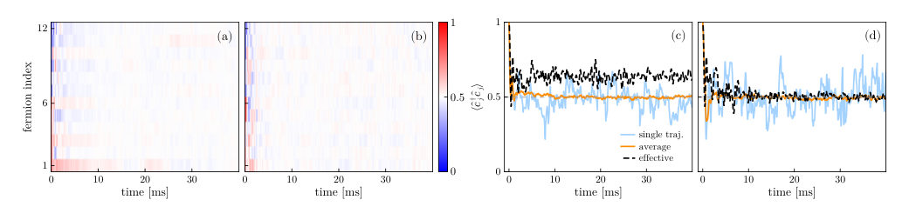 
FIG. 3. Same as in Fig. 2 but for ∆cd/2π = 1 MHz. The drive amplitude has been increased to Ωd/2π = 38 MHz to match the same E in the simulations reported in Fig. 2. The number of fermionic modes is N = 12. Other parameters as in Fig. 2.

📷 Fig 4

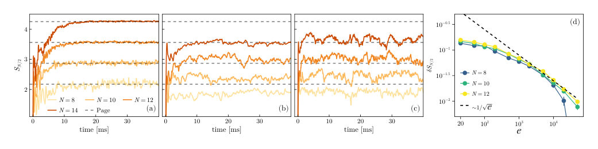 
FIG. 4. Entanglement entropy dynamics for (a) the effective model in Eq. (2), (b-c) the full model in Eq. (1) with nonzero κ, Γ, for ∆cd = κ/2 and ∆cd = 5κ respectively. We consider the f-RQC protocol with n = 2N + 1. The gray-dashed line represent to the Page prediction for a U(1) symmetric system at half filling. Results are reported for N = 8, 10, 12, 14 fermionic modes at half filling (from light to dark orange) and are averaged over Ntraj = 100 trajectories [except N = 14 in panel (c), for which Ntraj = 20]. (d) Relative distance from Page entropy δSN/2 = |SN/2 −SPage|/SPage as a function of C for ∆cd = 2κ (Ωd/2π = 25 MHz) and different N. Data are averaged over Ntraj = 100...

📷 Fig 5

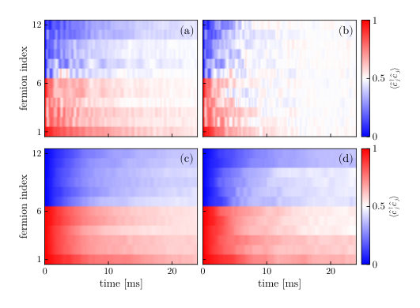 
FIG. 6. Effects of the trap Hamiltonian for 171Yb atoms (first row) and 6Li atoms (second row) on the quantum many- body dynamics. The first column refers to the static disorder configuration. The second column to the f-RQC protocol. All the parameters are fixed as in Fig. 2.

**Summary.** The paper investigates controlling quantum chaos in dissipative cavity QED systems using ultracold fermions. It critically distinguishes the effects of two decoherence sources—cavity loss versus spontaneous emission—showing they affect system diagnostics differently. The findings provide quantitative guidelines on how to engineer experiments to observe true many-body chaotic dynamics despite environmental noise.

**Why it may be interesting.** This work is highly relevant as it tackles the crucial issue of decoherence in quantum simulation platforms. By distinguishing between different types of dissipation, it provides a roadmap for designing experiments that can isolate and measure genuine many-body chaotic signatures despite environmental coupling.

Detailed structure

**Main problem.** The study investigates how many-body quantum chaos manifests and can be controlled within an open, dissipative optical cavity Quantum Electrodynamics (QED) platform.

**Main result.** The two primary dissipation sources—cavity loss and spontaneous emission—have fundamentally different structures; specifically, spontaneous emission erases signatures of underlying Hamiltonian dynamics that are preserved by cavity loss alone.

**Method.** The authors employ Monte Carlo stochastic quantum trajectories to simulate the driven-dissipative dynamics, comparing results against effective unitary evolution and analyzing observables like entanglement entropy.

**Model / system.** The system is a cavity QED setup involving ultracold fermions interacting via photon-mediated long-range interactions. The dynamics are governed by an open quantum system description incorporating Lindblad jump operators for both cavity loss ($\kappa$) and atomic spontaneous emission ($\Gamma$).

**Key observables.** Fermionic population $\langle \hat{c}^\dagger_j \hat{c}_j 
angle$, Entanglement Entropy ($S_{N/2}$), Out-of-Time-Ordered Correlators (OTOCs), and the cavity photon number $\langle \hat{a}^\dagger\hat{a} 
angle$.

**Important parameters / regimes.** Cooperativity ($C$), detuning ($\Delta_{cd}$), Lamb-Dicke parameter ($\eta$), and dissipation rates ($\kappa, \Gamma$).

**Assumptions / limitations.** The analysis relies on the dispersive approximation for cavity coupling and assumes experimentally realistic parameters to derive quantitative constraints.

**Figures summary.** Figures illustrate the setup showing both decoherence sources; dynamics plots compare single-trajectory vs. averaged evolution under different dissipation regimes; and entropy/correlation functions are shown relative to theoretical bounds like the Page bound.

**Paper structure.** The paper establishes the physical model (Cavity QED with disorder), details the two distinct dissipation mechanisms, analyzes how these mechanisms affect diagnostic observables (e.g., $\langle \hat{c}^\dagger_j \hat{c}_j 
angle$ and $S_{N/2}$), and concludes by deriving quantitative constraints for observing chaos.

Abstract

Cavity quantum electrodynamics (QED) with ultracold fermions provides a promising platform for realizing many-body quantum chaos through disordered, photon-mediated long-range interactions. Such setups are inherently open and are therefore subject to dissipation arising from cavity photon loss and atomic spontaneous emission. In this article, we study the driven-dissipative dynamics of a typical cavity QED setting including controllable disorder and long-range interactions. We find that the two dissipation sources have qualitatively different structures. Cavity loss reduces to a single dephasing channel, whereas spontaneous emission in the experimentally relevant regime generates a collection of nonlocal dephasing channels. Cavity-induced dephasing preserves signatures distinguishing integrable from chaotic Hamiltonian dynamics in observables that depend linearly on the density matrix, while spontaneous emission suppresses these signatures. By contrast, quantities that probe the structure of the many-body state, such as the entanglement entropy, are strongly affected by both dissipation mechanisms. Assuming experimentally realistic parameters, we derive quantitative constraints for the observation and control of many-body quantum chaos in cavity-QED platforms.

[↑ back to top](#top)

### ⭐ [Quantum simulation of gauge theories on dynamical spacetimes via Floquet-induced matrix models](http://arxiv.org/abs/2607.04040v1)

**Highlighted author(s):** Susanne F. Yelin  
**Authors:** Samuel Buckley-Bonanno, Noah Eckstein, Susanne F. Yelin  
**Type:** theory · **Category:** other · **PDF:** <https://arxiv.org/pdf/2607.04040v1>  
**Analysis basis:** full PDF text, analyzed in chunks
**Topic relevance:** 🔥 `analog quantum simulation` **4/5** · 🔥 `non-equilibrium dynamics` **4/5** · `methods for driven-dissipative` **3/5** · `non-equilibrium universality` **2/5** · `Keldysh / 2PI / non-Gaussian methods` **1/5** · `driven-dissipative phase transition` **1/5** · `entanglement & information structure` **1/5**

📷 Fig 1

 
FIG. 1. Matrix model quantum simulation procedure. (a) Given a specification of bosonic fields on a spacetime, there is an associated matrix state that encodes their Lagrangian. The fields can be scalar or Yang-Mills or other gauge fields, and the background spacetime can be curved and time-dependent. (b) The construction of the associated matrix state proceeds from these parameters. The spacetime geometry is encoded first by selecting a set of Hermitian operators whose dynamical Lie algebra maps in the commutative limit to the desired manifold. Field symmetries are then introduced to the set of matrices: U(n) non-commutative Yang-Mills fields are formed with a direct sum of n copies of the...

📷 Fig 2

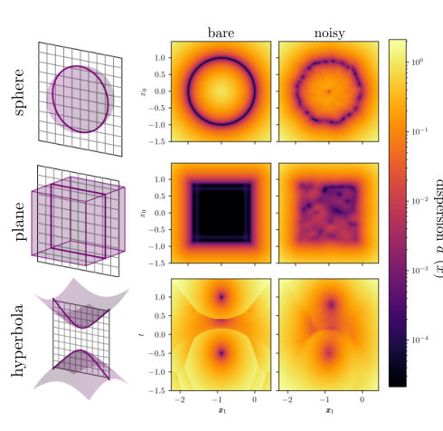 
FIG. 2. Displacement plots of non-commutative ge- ometries. Elementary manifolds can be encoded as non- commutative geometries in terms of matrix representations. We show cross-sections for spherical, flat and hyperbolic ge- ometries. For the non-commutative sphere, we use high- dimensional representations of SU(2) angular momentum op- erators; the non-commutative plane is constructed from fi- nite matrix representations of the canonical position ˆx and momentum ˆp operators via a Jordan-Schwinger construction; and Lorentzian spacetimes with hyperbolic geometry are en- coded using operators drawn from the SO(4, 2) Lie alge- bra. The middle and right columns depict the displacements d2(⃗x) =...

📷 Fig 3

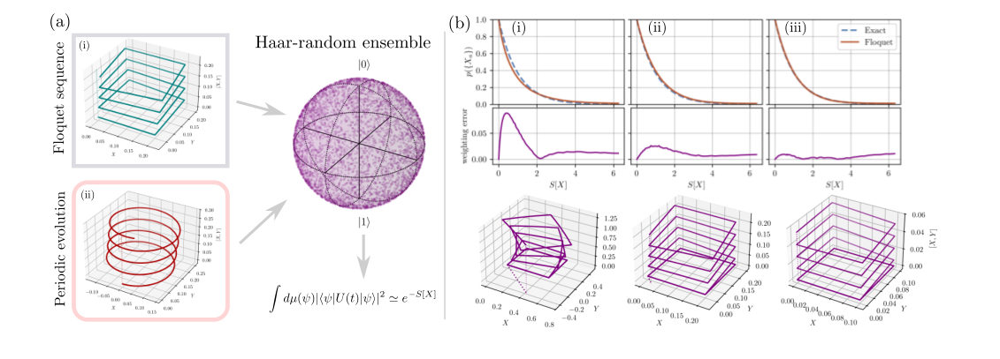 
FIG. 3. Comparison of fidelities and the matrix model partition function. (a) For a single matrix state {Xa}, a periodic Floquet sequence is applied over the matrix operators. Plots (i) and (ii) show the resulting unitary evolution in operator space for Trotterized and uniform periodic driving, respectively. The axes denote coefficients in the effective Hamiltonian expansion during the evolution. The leading-order terms are commutators of the alternating operators Xa and Xb. When applied to a Haar-random ensemble of states, the fidelity fall-off in the high-frequency limit scales as exp(−tr(H2)), and for sequences over multiple operator pairs reproduces the Euclidean matrix-model action...

📷 Fig 4

 
FIG. 4. Globally controlled quantum circuit and path-integral comparison. (a) Diagram of the parallel quantum circuit for sampling from the matrix path integral, as detailed in Appendix D. The Floquet sequence F2 for each matrix state {Xa} in the ensemble is conditioned on a specific element of the entangled control-qubit basis |B⟩. (b) Sample of 1000 paths through the space of effective Hamiltonians over one cycle of F2({Xa}n; ∆t) for a Gaussian distribution of perturbations. In this illustrative example, the perturbed matrix state is a 2 × 2 representation of the non-commutative sphere, given by the Pauli matrices. The distribution of path endpoints is shown, with the unperturbed endpoint...

📷 Fig 5

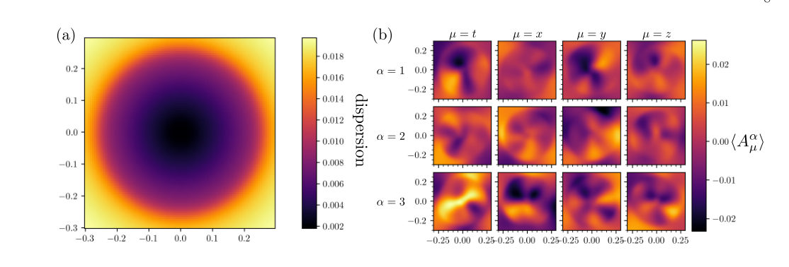 
FIG. 5. SU(2) gauge-field observables on an expanding spacetime. Results from a Monte-Carlo simulation of a matrix state encoding an SU(2) gauge field on a k = −1 Friedmann-Lemaˆıtre-Robertson-Walker background. (a) Dispersion map ∆2( ⇀x) on a constant-time spatial slice, showing where the matrix state provides a good semiclassical representation of spacetime. The simulation uses eight 500 × 500 Hermitian matrices representing the four spacetime coordinates and their conjugate momenta. Low dispersion is confined to a finite region, reflecting the finite eigenvalue range of the matrices. By varying the time coordinate used to construct the quasi-coherent states | ⇀x⟩, the evolution of the...

**Summary.** This work introduces a powerful quantum simulation method using Floquet engineering applied to large-$N$ matrix models. It overcomes the limitations of lattice methods by encoding spacetime geometry into matrix commutation relations, allowing the study of gauge theories on dynamical backgrounds. The core achievement is establishing that the measurable average fidelity directly yields the Euclidean path integral weight.

**Why it may be interesting.** The use of quantum simulation techniques (Floquet engineering) to probe fundamental field theory concepts like path integrals and confinement transitions in a background-independent manner is highly relevant for AMO physicists exploring open quantum systems dynamics.

Detailed structure

**Main problem.** The primary challenge is simulating quantum gauge theories on dynamical, curved spacetimes, which conventional lattice methods cannot handle due to their requirement for fixed backgrounds.

**Main result.** The authors demonstrate a novel Floquet framework where the average fidelity of evolved random states directly reproduces the Euclidean path integral weight of Yang-Mills matrix models. This allows simulating dynamics on geometries that preserve continuous symmetries and unitarity.

**Method.** They map gauge theories onto large-$N$ Hermitian matrix models, which are then simulated using periodic quantum driving (Floquet engineering) applied to Haar-random states.

**Model / system.** The system is based on Yang-Mills matrix models $\{X_a\}$, where spacetime geometry and gauge fields are encoded in the commutation relations of these matrices. The framework is designed to handle dynamical backgrounds like expanding cosmological spacetimes (FLRW metrics).

**Key observables.** Euclidean path integral weights, Wilson-loop expectation values (for confinement diagnostics), and the ensemble-averaged fidelity ($\langle f 
angle$) measured via randomized benchmarking.

**Important parameters / regimes.** The coupling constant ($g$), matrix dimension ($N$), and the time step/driving frequency ($\Delta t$ or $\omega$).

**Assumptions / limitations.** The method relies on approximating the path integral weight using the leading-order expansion of the average fidelity from the Floquet evolution, which is valid under high-frequency driving.

**Figures summary.** Figures illustrate the quantum simulation procedure mapping fields to matrix states and measuring fidelity via periodic sequences; displacement plots show how low-displacement regions reveal underlying classical manifolds (e.g., sphere, plane); and comparison plots validate that measured fidelities match expected Euclidean weights.

**Paper structure.** The paper establishes the problem by noting lattice limitations, introduces the matrix model formalism encoding geometry in commutators, details the Floquet simulation protocol linking fidelity to path integrals, validates this link using specific gauge theories (SU(2)), and concludes with demonstrations on both flat and expanding cosmological backgrounds.

Abstract

Quantum simulations of gauge theories are typically built on spatial lattices, an approach that has enabled major progress at the cost of requiring fixed background geometries and obscuring the treatment of curved and dynamical spacetimes. Large-$N$ matrix models offer an alternative, encoding spacetime geometry and gauge fields in the commutation structure of a set of Hermitian matrices, with the classical continuum emerging smoothly at large matrix dimensions. Here we introduce a Floquet framework that makes these models directly accessible to programmable quantum platforms. We show that Euclidean path integral weights of a Yang-Mills matrix models are reproduced, at leading order in the coupling, by the ensemble-averaged fidelities of Haar-random states evolved under periodic sequences of matrix operators. The observables for the simulated matrix model can then be accessed through established randomized benchmarking protocols in terms of the Loschmidt echo. The encoding requires exponentially fewer qubits than canonically quantized approaches. Numerically, we validate the fidelity-weight correspondence, demonstrate parallelized quantum circuits that sample the path-integral measure, and identify the deconfinement transition of an $SU(2)$ gauge field on both flat and expanding cosmological backgrounds. By avoiding a fixed spacetime lattice, the framework preserves continuous symmetries and unitarity on dynamical geometries, opening quantum simulation to field and spacetime dynamics beyond the reach of conventional lattice methods.

[↑ back to top](#top)

### ⭐ [Quantum Computational Resources and Conformal Field Theory: Unifying Spins, Bosons, and Fermions](http://arxiv.org/abs/2607.05343v1)

**Highlighted author(s):** Yuto Ashida  
**Authors:** Ryota Matsuda, Masahiro Hoshino, Yuto Ashida  
**Type:** theory · **Category:** statistical mechanics · **PDF:** <https://arxiv.org/pdf/2607.05343v1>  
**Analysis basis:** full PDF text, analyzed in chunks
**Topic relevance:** 🔥 `entanglement & information structure` **4/5** · `analog quantum simulation` **3/5** · `non-equilibrium universality` **2/5** · `Keldysh / 2PI / non-Gaussian methods` **1/5** · `correlated / nonlocal dissipation` **1/5** · `driven-dissipative phase transition` **1/5** · `methods for driven-dissipative` **1/5** · `non-equilibrium dynamics` **1/5**

📷 Fig 1

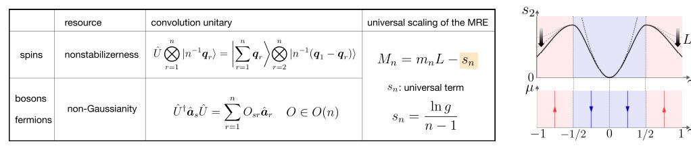 
FIG. 1. Summary of the main results. (a) Unified structure of the quantum computational resources for spins, bosons, and fermions. The MRE Mn with order n is constructed by a convolution unitary in all cases. In spins with a local Hilbert-space dimension d, the MRE reduces to the SRE, a measure of nonstabilizerness. In bosons and fermions, the MRE quantifies non- Gaussianity. In one-dimensional critical systems, the MRE can exhibit the same universal behavior across all cases, where a size-independent term sn is determined by the g factor of the infrared boundary condition in the replicated theory. (b) Upper panel: Universal behavior of non-Gaussianity of interacting fermions described by...

📷 Fig 2

 
FIG. 2. Schematic illustration of quantum convolution. The replica-mixing unitary U is applied to n copies of the many- body state, after which replicas 2, 3, . . . , n are traced out. The unitary U generates correlations among the replicas only for resourceful states, so that the output replica left after the partial trace becomes mixed. The MRE detects the magic by measuring the purity of the resulting convolved state.

📷 Fig 3

 
FIG. 3. Folding representations of the thermal partition func- tion and the purity numerator. The upper panel (a) shows the ordinary thermal path integral (left) and its Liouville-space folded-strip representation (right) in Eq. (77). The lower panel (b) shows the corresponding purity geometry and its second folding into the two-replica Liouville-space expression in Eq. (80).

📷 Fig 4

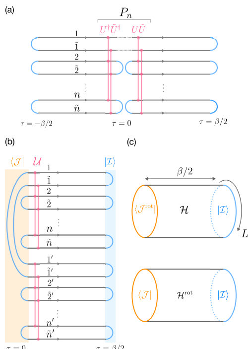 
FIG. 4. Euclidean path-integral representation of the MRE in Eq. (86). (a) Folded theory with 2n sheets of size L × β/2. (b) 4n-sheet replicated theory obtained after an additional folding. In both panels, the spatial direction is abbreviated for simplicity. (c) Two interpretations of the MRE. The upper panel describes the rotated-boundary picture. While the bulk theory H consists of the product of each decoupled replica, an application of the convolution unitary to the edge leads to the rotated boundary state |J rot⟩⟩= U †|J ⟩⟩. The lower panel describes the rotated-bulk picture. The convolution unitary is applied to the bulk and leads to the rotated bulk Hamiltonian Hrot = UHU † with...

📷 Fig 5

 
FIG. 6. The universal constant term s for 1/2 &lt; K &lt; 2 against |γ| = |K −1|/|K +1|, which is invariant under the du- ality transformation K ↔K−1. The data points are obtained by fitting the numerical data of M to the scaling form (165) with L = 10, 12, 14 (L0 = 12).

**Summary.** This paper introduces the magic Rényi entropy (MRE) as a unified resource measure applicable to spins, bosons, and fermions. Using Conformal Field Theory, the authors show that this MRE quantifies universal aspects of non-classicality in critical states. The work provides theoretical predictions for boundary phase transitions in systems like the Tomonaga-Luttinger liquid.

**Why it may be interesting.** It connects abstract concepts from quantum information theory (computational resources) directly to measurable physical properties (boundary entropy, critical exponents) in strongly correlated 1D systems, providing a powerful diagnostic tool for many-body physics.

Detailed structure

**Main problem.** The goal is to establish a unified theoretical framework for characterizing quantum computational resources, termed 'magic,' across diverse microscopic systems: spins, bosons, and fermions.

**Main result.** A unified measure, the magic Rényi entropy (MRE), was introduced whose universal contribution is determined by the Affleck-Ludwig boundary entropy. The analysis predicts specific boundary phase transitions in critical fermionic systems.

**Method.** The authors employ an information-theoretic approach using Conformal Field Theory (CFT) to analyze the MRE, which unifies measures like stabilizer Rényi entropy and non-Gaussianity.

**Model / system.** The work analyzes many-body quantum states in one dimension, focusing on critical systems exemplified by the Tomonaga-Luttinger liquid (TLL) for interacting spinless fermions. The framework is generalized from qubit stabilizers to encompass bosonic and fermionic degrees of freedom.

**Key observables.** Magic Rényi entropy (MRE), nonstabilizerness, non-Gaussianity, Affleck-Ludwig boundary entropy.

**Important parameters / regimes.** Luttinger parameter K, the mixing angle $\zeta$, and the system size $L$.

**Assumptions / limitations.** The core assumption is that nonstabilizerness and non-Gaussianity share a common mathematical structure allowing for the unified MRE measure. The analysis heavily relies on CFT techniques.

**Figures summary.** Figure 1 summarizes the unified MRE construction across spin, boson, and fermion systems, showing universal behavior determined by boundary entropy; another plot details predicted non-Gaussianity transitions in TLL fermions versus a parameter $\gamma$.

**Paper structure.** The paper develops the mathematical definition of MRE using convolution unitary techniques, applies CFT to derive its universal scaling laws related to boundary entropy, and then provides concrete applications, such as analyzing phase transitions in TLL fermions.

Abstract

Characterizing a quantum state through the lens of quantum resources provides an information-theoretic perspective on many-body systems. While quantum entanglement serves as the paradigmatic example of a quantum resource, recent studies have shown that quantum magic, a resource for universal quantum computation, can capture aspects of many-body states complementary to those described by entanglement. For instance, in spin systems, conformal field theory (CFT) analysis of the stabilizer Rényi entropy has revealed universal features of nonstabilizerness that are qualitatively distinct from entanglement. In bosonic and fermionic systems, however, a comparable formulation for their computational resource, non-Gaussianity, has yet to be established. In this work, we introduce a unified measure, the magic Rényi entropy (MRE), to quantify computational resources in spins, bosons, and fermions on an equal footing. This allows us to reveal common universal aspects of nonstabilizerness and non-Gaussianity in critical many-body states. In particular, our CFT analysis shows that the universal contribution to the MRE appears as the size-independent term determined by the Affleck-Ludwig boundary entropy. We find that non-Gaussianity can continuously renormalize this universal contribution or drive a boundary phase transition through bulk-induced boundary renormalization-group flows. As a concrete demonstration, we present a detailed CFT analysis of non-Gaussianity in interacting spinless fermions described by the Tomonaga-Luttinger liquid, showing boundary transitions at the Luttinger parameters $K=1/3$ and $K=3$. We perform numerical calculations that confirm our field-theoretical predictions. These results provide a unified field-theoretical understanding of many-body magic across spins, bosons, and fermions.

[↑ back to top](#top)

### [Weak ergodicity breaking without nonthermal eigenstates](http://arxiv.org/abs/2607.04279v1)

**Authors:** Boning Huang, Yongguan Ke, Li Zhang, Lin Ling, Chaohong Lee  
**Type:** theory · **Category:** other · **PDF:** <https://arxiv.org/pdf/2607.04279v1>  
**Analysis basis:** full PDF text, analyzed in chunks
**Topic relevance:** 🔥 `scars & prethermalization` **5/5** · 🔥 `analog quantum simulation` **4/5** · 🔥 `non-equilibrium dynamics` **4/5** · `entanglement & information structure` **3/5** · `non-equilibrium universality` **3/5** · `driven-dissipative phase transition` **2/5** · `methods for driven-dissipative` **2/5** · `Frenkel-Kontorova` **1/5** · `Keldysh / 2PI / non-Gaussian methods` **1/5** · `correlated / nonlocal dissipation` **1/5**

📷 Fig 1

 
FIG. 1. Schematics of (a) equally spaced energy levels in a linear band, which contribute to multiple frequencies and lead to periodic revival dynamics, and (b) random energy levels in a curved band, which contribute to random frequencies and lead to thermalization dynamics.

📷 Fig 2

 
FIG. 2. (a) Three-particle Bloch bands. (b) Appearance of nearly linear sub-bands (blue solid lines), folded from the highest dimer-monomer band in the original simple lattice (black dashed line). (c) Level statistics of the superlattice Bose-Hubbard model with weak onsite disorders (blue dots). Red dashed and green dashed lines denote Poisson distribu- tion and Wigner-Dyson distribution, respectively. (d) Expec- tation values of ˆnj=15 (black) and ˆni=12ˆnj=15 (blue) of dimer- monomer eigenstates as a function of energy. Here i and j can be chosen as other sites, without changing physical picture. Values associated with a nearly linear band are highlighted by the red shaded region....

📷 Fig 3

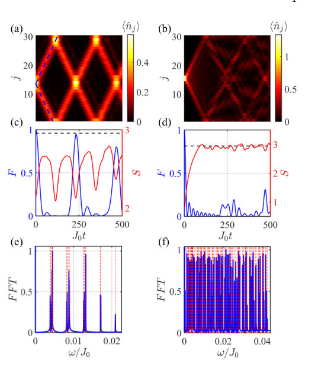 
FIG. 3. Dynamics of multiparticle Wannier states in different lattices: the superlattice (left panel) and the simple lattice (right panel). (a, b) Time-evolution of density distribution. Blue lines in (a) denote the mean displacement predicted by the group velocities of the nearly linear band. (c, d) Time- evolution of fidelity (blue) and entanglement entropy (red). Black dashed lines in (c) and (d) denote the Page value. (e, f) Normalized fast Fourier transform (FFT) spectrum of fidelity in long-time dynamics. Vertical dashed red lines denote the frequencies given by the energy gaps in corresponding band. δU = 0.01(δU = 0) is chosen for superlattice (simple) lattice, while the other...

📷 Fig 4

 
FIG. 4. Time-evolution of fidelity in (a) the nearly linear dimer-monomer band and (b) curved highest dimer-monomer band for different system sizes: M = 60 (top panel) and M = 90 (bottom panel). Other parameters are the same as those in Figs. 3(a, c).

**Summary.** The paper proposes a novel mechanism for weak ergodicity breaking in Bose-Hubbard lattices by exploiting spatially periodic modulation. This modulation folds the energy bands into nearly linear sub-bands, causing long-lived revivals of particle states due to spectral phase coherence among thermalizing eigenstates. This offers an alternative route to quantum memory effects that bypasses the need for non-thermalized or scar-like eigenstates.

**Why it may be interesting.** This work provides a clean theoretical pathway to observing long-lived quantum memory effects in interacting many-body systems using controllable lattice engineering (modulation), which is highly relevant for simulating complex quantum dynamics in cold atom setups.

Detailed structure

**Main problem.** To identify a mechanism for weak ergodicity breaking that operates without relying on nonthermal eigenstates, contrasting with established mechanisms like MBL or QMS.

**Main result.** The authors show that periodic revivals can occur due to spectral phase coherence among ETH-satisfying eigenstates when the system's energy bands are folded into nearly linear sub-bands via spatially periodic modulation.

**Method.** Theoretical analysis involving calculating time evolution of expectation values and fidelity, coupled with diagnosing band structure properties (e.g., level spacing statistics).

**Model / system.** The study uses a Bose-Hubbard lattice subjected to spatially periodic modulation, which creates a superlattice structure. The Hamiltonian is modulated by site-dependent interaction terms ($U_j$), leading to the folding and separation of energy bands.

**Key observables.** Fidelity decay, particle-partition entanglement entropy, density distribution $\langle \hat{n}_j(t) 
angle$, and spectral analysis (FFT).

**Important parameters / regimes.** The modulation strength ($\delta U$) is crucial for inducing the nearly linear sub-bands; the system size ($M$) and lattice period ($d$) are key parameters.

**Assumptions / limitations.** The mechanism relies on engineering nearly linear multiparticle sub-bands via periodic modulation, which leads to quasi-equally spaced energy levels.

**Figures summary.** Figures compare time evolution in simple (curved band) vs. superlattice (nearly linear band) settings, showing revivals only in the modulated case; level statistics confirm the spectral structure.

**Paper structure.** The paper systematically develops the concept by first establishing the model and identifying the role of modulation in creating quasi-linear bands. It then uses time evolution diagnostics (fidelity, entanglement) to prove that coherent revivals arise from phase coherence rather than non-thermal states, extending this proof across different particle sectors.

Abstract

The typical mechanisms of ergodicity breaking in isolated interacting quantum systems, such as many-body localization and quantum many-body scars, originate from the nonthermal nature of the underlying eigenstates. Here, in the absence of nonthermal eigenstates, we identify a mechanism for collective revivals of multiparticle Wannier states (MWSs) associated with nearly linear bands in a spatially modulated Bose-Hubbard lattice. The MWSs, as superpositions of multiparticle Bloch states within individual energy bands, give rise to band-resolved Wannier-sector fragmentation. The key idea is that spatially periodic modulation folds and separates energy bands of a simple lattice into several sub-bands, among which nearly linear sub-bands inherit the linear segments of the original bands. Although multiparticle Bloch states satisfy the eigenstate thermalization hypothesis (ETH), the MWSs in the nearly linear band still exhibit long-lived collective revivals, due to emergent equally spaced energy levels. Our work provides a route to weak ergodicity breaking in which long-lived revivals arise from spectral phase coherence among ETH-satisfying eigenstates rather than from scar-like nonthermal eigenstates.

[↑ back to top](#top)

### [Entanglement of excited states after measurements in conformal field theory](http://arxiv.org/abs/2607.04268v1)

**Authors:** Hui-Huang Chen  
**Type:** theory · **Category:** statistical mechanics · **PDF:** <https://arxiv.org/pdf/2607.04268v1>  
**Analysis basis:** full PDF text, analyzed in chunks
**Topic relevance:** 🔥 `measurement-induced transitions` **5/5** · 🔥 `entanglement & information structure` **4/5** · 🔥 `non-equilibrium dynamics` **4/5** · `non-equilibrium universality` **3/5** · `quantum measurements` **3/5** · `Keldysh / 2PI / non-Gaussian methods` **1/5** · `analog quantum simulation` **1/5** · `correlated / nonlocal dissipation` **1/5** · `driven-dissipative phase transition` **1/5** · `methods for driven-dissipative` **1/5**

📷 Fig 1

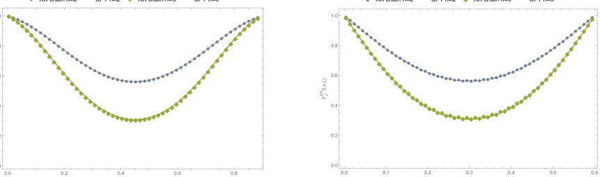 
Figure 1: Numerical check of the post-measurement current-excitation ratios in the XX chain. The system size is L = 500. The measured interval has length (a) s = 50, corresponding to s/L = 0.1, and (b) s = 200, corresponding to s/L = 0.4. The horizontal axis is x = l/L. Symbols denote lattice results obtained from the conditional free-fermion correlation matrix after projecting the measured sites onto a fixed alternating occupation pattern. Solid curves are the CFT predictions for F (2) J (cf. Eq. (4.21)) and F (3) J (cf. Eq. (4.27)). The agreements in both panels support the current hafnian formulas on the post-measurement slit geometry.

📷 Fig 2

 
Figure 2: Numerical check of the post-measurement second R´enyi ratio for the J/ ¯J superposition state. Symbols denote XX-chain results obtained from the multi-Slater determinant calculation after projecting the measured sites onto a fixed alternating occupation pattern. Solid curves are the CFT predictions from the disk four-current formula. The left panel tests the dependence on the subsystem size x = l/L, while the right panel tests the relative phase dependence. The agreement in both panels verifies the coherent left-right interference terms induced by the measurement boundary.

📷 Fig 3

 
Figure 3: Numerical check of the conjugate-vertex superposition. The blue points are the XX- chain results, and the orange curves are the CFT predictions. In the phase scan, the CFT curve is evaluated using the branch-matched phase θCFT = θlat −πl/L + πs/(4L). The agreement shows that the CFT expression captures both the spatial dependence and the phase-sensitive interference structure of the vertex superposition. The small residual deviations are attributed to finite-size corrections.

**Summary.** This paper develops a sophisticated CFT framework to calculate the entanglement entropy of excited states after a projective measurement on a spatial interval. By mapping complex geometries and utilizing replica techniques, it derives explicit formulas showing how phase-sensitive interference terms appear in post-measurement observables for specific excitations. The results are tested against predictions from the critical XX chain.

**Why it may be interesting.** This work provides a rigorous theoretical framework for quantifying non-equilibrium entanglement in 1D quantum systems following measurement, which is highly relevant for understanding open quantum system dynamics beyond simple thermalization.

Detailed structure

**Main problem.** The study focuses on calculating the entanglement entropy of low-energy excited states following a fixed-outcome projective measurement within a (1+1)-dimensional Conformal Field Theory (CFT). This extends standard ground-state analysis to non-equilibrium, post-selected quantum states.

**Main result.** The paper derives formulas showing that while the ordinary-cylinder second Rényi ratio for conjugate vertex operators is phase-independent, the finite-slit post-measurement ratio exhibits crucial phase-sensitive interference terms. These predictions are tested using free-fermion models like the critical XX chain.

**Method.** The analysis employs replica constructions and conformal field theory techniques, mapping complex geometries (like replicated slits) to simpler domains (disks) to express entanglement entropy as normalized boundary-CFT correlation functions.

**Model / system.** The primary model is a (1+1)-dimensional CFT, specifically applied to the compact free boson CFT. The physical setup involves measuring an interval on a circle, which introduces a conformal boundary condition ('slit') into the system's description.

**Key observables.** Post-measurement Rényi entropy ($S_n$), normalized boundary-CFT correlation functions ($F^{(n)}_{\Upsilon,a}$), and current hafnians for chiral excitations.

**Important parameters / regimes.** The geometry is defined by parameters related to the slit size ($s$) and the system length ($L$). The analysis distinguishes between ground states and excited states ($\Upsilon$).

**Assumptions / limitations.** It assumes that the fixed measurement outcome renormalizes to a conformal boundary condition, allowing the use of standard CFT machinery for calculating correlation functions.

**Figures summary.** Not specified in detail, but the notes indicate derivations involving specific formulas (Eq. 2.10, Eq. 3.5) and comparisons between different excitation types (current vs. vertex operators).

**Paper structure.** The paper systematically builds the framework by first addressing ground-state entanglement on a slit cylinder, then generalizing to excited states via operator insertions ($\Upsilon$). It applies this formalism to specific CFT examples (free boson, currents) and concludes with detailed numerical testing methods using the critical XX chain.

Abstract

We study the entanglement of low-energy excited states after a fixed-outcome projective measurement on a spatial interval in a (1+1)-dimensional conformal field theory (CFT). The post-selected measurement outcome is represented by a slit carrying a conformal boundary condition, while excited states are introduced by operator insertions in the Euclidean path integral. After mapping the replicated slit geometry to a disk, the excited-state contribution to the post-measurement Rényi entropy is expressed as a normalized boundary-CFT correlation function.   We apply this framework to the compact free boson CFT. For the chiral current excitation, the relevant ratios are given by current hafnians. We also study coherent superpositions of $J$ and $\bar J$, and of conjugate compact vertex operators. In the conjugate-vertex case, the ordinary-cylinder second Rényi ratio is independent of the relative phase, whereas the finite-slit post-measurement ratio contains phase-sensitive interference terms. Finally, we describe free-fermion and multi-Slater determinant methods for testing these predictions in the critical XX chain.

[↑ back to top](#top)

### [Quantum Hashing via Constrained Rydberg Many-Body Dynamics](http://arxiv.org/abs/2607.04991v1)

**Authors:** Han-Chao Chen, Xin Liu, Zheng-Yuan Zhang, Dong-Sheng Ding, Bao-Sen Shi  
**Type:** theory · **Category:** other · **PDF:** <https://arxiv.org/pdf/2607.04991v1>  
**Analysis basis:** full PDF text, analyzed in chunks
**Topic relevance:** 🔥 `Rydberg arrays` **5/5** · 🔥 `analog quantum simulation` **4/5** · `entanglement & information structure` **2/5** · `non-equilibrium dynamics` **2/5** · `correlated / nonlocal dissipation` **1/5** · `driven-dissipative phase transition` **1/5** · `methods for driven-dissipative` **1/5** · `quantum measurements` **1/5**

📷 Fig 1

 
FIG. 1. Quantum hashing protocol and information space structure. (a) Classical metric space. A pairwise Hamming distance matrix of ternary data arranged in Gray code. (b) One-dimensional Rydberg atom arrays and schematic diagram of the quantum hashing process. Ternary symbols {0, 1, 2} are mapped to the quantum hashing elementary evolution operator. Under the action of a sequence of length L, the initial state |ψ0⟩evolves into the final quantum hashing state |ψf⟩. (c) Reconstruction of ternary information space to Hilbert space. Each ternary string xi in the classical space X uniquely determines a deterministic dynamical trajectory, which is mapped to a single quantum hashing state...

📷 Fig 2

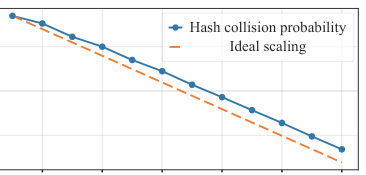 
FIG. 2. Hashing collision probability. (a) Distribution of hashing collision probabilities obtained from Monte Carlo simulations with 104 samples for a system of N = 12 atoms. The corresponding average collision probability is calculated to be Pave = 0.048%. (b) Average hashing collision prob- ability as a function of the number of atoms N, with the vertical axis shown on a logarithmic scale. The blue solid line represents the collision probability obtained from numerical statistics, while the orange dashed line denotes the scaling behavior expected for an ideal hash function, Pcoll = 1/2N.

📷 Fig 3

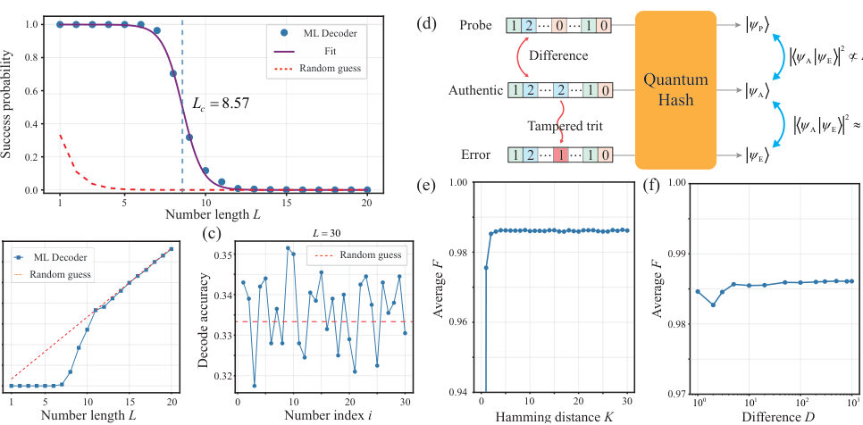 
FIG. 3. Cryptographic properties of quantum hashing. (a) Random Forest machine learning (ML) decoder success probability versus input length L. The blue scatter points represent the numerical data, while the purple solid line denotes the logistic function fitting curve Pfit = 1 1+exp[(L−Lc)/k]. The red dashed line indicates the baseline corresponding to random guessing by the decoder, and the blue dashed line marks the fitted critical length Lc. (b) Hamming distance between the decoded output string and the true input string as a function of the input length L. The red dashed line indicating the random guessing limit, K = 2L/3. (c) Distribution of decoding accuracy for each trit position in...

**Summary.** The authors show that constrained quantum many-body dynamics in Rydberg atom arrays naturally implements a quantum hashing mechanism. By encoding classical data into the system's state evolution, the resulting quantum ensemble exhibits near-orthogonality and strong geometric separation. This demonstrates that complex cryptographic functions can emerge intrinsically from physical quantum dynamics itself.

**Why it may be interesting.** This work directly connects fundamental concepts in AMO physics (Rydberg dynamics) to advanced information theory and cryptography, suggesting that complex computational functions can be realized purely by controlling physical interactions.

Detailed structure

**Main problem.** To demonstrate that quantum hashing can emerge naturally from constrained many-body dynamics, rather than requiring deliberately engineered algorithms.

**Main result.** The system exhibits essential cryptographic properties—including low collision probability and strong one-wayness—emerging intrinsically from the geometric structure induced by the dynamics.

**Method.** Classical ternary strings are mapped onto deterministic quantum state trajectories in a Rydberg atom array, whose resulting ensemble is analyzed for its statistical and geometric properties.

**Model / system.** The physical system modeled is an array of Rydberg atoms. The dynamics are governed by a time-dependent Hamiltonian involving blockade, pair antiblockade, and facilitation processes.

**Key observables.** Collision probability (low), pairwise logarithmic fidelity matrix (showing separation), effective dimension ($D_{	ext{eff}}$), and ML decoder success probability (for one-wayness).

**Important parameters / regimes.** System size ($N=12$ atoms), input length ($L$), and the Hamiltonian parameters ($\lambda_\mu(t)$).

**Assumptions / limitations.** The protocol assumes the initial state is a product state, and that constrained many-body dynamics can serve as a physical realization for this information processing functionality.

**Figures summary.** Figures illustrate the mapping from Hamming distance space to quantum fidelity space; they show low collision probability scaling with $N$, and comprehensive plots detail one-wayness decay, tamper sensitivity (avalanche effect), and privacy preservation.

**Paper structure.** The paper establishes the physical model using Rydberg atoms, details the encoding of classical strings into quantum trajectories, analyzes the resulting geometric structure via fidelity measures, and finally quantifies cryptographic properties like collision resistance and one-wayness through simulations.

Abstract

In this Letter, we show that constrained many-body dynamics in Rydberg atom arrays naturally gives rise to a quantum hashing mechanism. By encoding ternary strings into deterministic trajectories in the state space, the classical information space is mapped onto a quantum state ensemble in the Hilbert space with an induced geometric structure. Statistical analysis reveals that this ensemble exhibits high probability near-orthogonality, random-like distribution, and broad geometric coverage. These geometric features naturally give rise to the essential cryptographic properties of quantum hashing, including low collision probability, one-wayness, tamper sensitivity, and privacy preservation. Our results demonstrate that the cryptographic functionality of quantum hashing need not rely on deliberately engineered algorithms, but can instead emerge naturally from constrained many-body dynamics, identifying quantum dynamics itself as a physical resource for cryptographic information processing.

[↑ back to top](#top)

### [Fast Pulses for High-Fidelity Circularization of Interacting Rydberg atoms](http://arxiv.org/abs/2607.05216v1)

**Authors:** Matthias Hüls, Aurore A. Young, Clément Sayrin, Michel Brune, Jean-Michel Raimond, Tommaso Calarco, Felix Motzoi, Robert Zeier, Eloisa Cuestas  
**Type:** theory · **Category:** other · **PDF:** <https://arxiv.org/pdf/2607.05216v1>  
**Analysis basis:** full PDF text, analyzed in chunks
**Topic relevance:** 🔥 `Rydberg arrays` **5/5** · 🔥 `analog quantum simulation` **4/5** · `non-equilibrium dynamics` **2/5** · `entanglement & information structure` **1/5** · `methods for driven-dissipative` **1/5** · `quantum measurements` **1/5**

📷 Fig 1

 
FIG. 1. (a) Rydberg levels of the n = 52 manifold of 1H (dashed gray lines) and 87Rb (solid black lines) in the presence of static electric and magnetic fields of magnitude E = 2.1 V cm−1 and B = 14 G. The eigenenergies ordered by their corresponding magnetic quantum number m reveal the diamond-like pattern depicted in the inset. For hydrogen the subspace of the energeti- cally lowest states with m ≥0 forms the lowest diagonal ladder (shaded turquoise) that includes the circular state |52C⟩(red). The lowest diagonal ladder is harmonic up to the dominant first order Stark shift with transitions m →m + 1 (blue arrows) of 229.2 MHz usually driven by a σ+ polarized RF field. The m = 0 and m = 1...

📷 Fig 2

 
FIG. 2. (a) A pair of Rydberg atoms with interatomic distance R and angle θ with respect to the static electric and magnetic fields E and B. (b) Angular momentum transfer for an interacting atom pair with R = 7 µm and θ = 0 under the action of the RF pulse optimized for the circulrization of a single atom shown in Fig. 1(b). The field magnitudes are set to E = 2.1 V cm−1

📷 Fig 3

 
FIG. 3. Main mechanism through which the interactions disturb the circularization. (a-b) Comparison between the RF pulse optimized for the circularization of a single atom (green) with a pulse optimized for the simultaneous circularization of a pair of atoms (orange) with R = 7 µm and θ = 0, targeting in both cases to an efficiency ptg = 99%. The static electric and magnetic field have magnitudes E = 2.1 V cm−1 and B = 14 G. Panel (a) depicts the x-component of both pulses (y-components exhibit similar behavior) while panel (b) shows the corresponding spectral analysis. The Fourier transform of the pulse optimized for the circularization of a single atom exhibits a dominant peak around the...

📷 Fig 4

 
FIG. 4. Analytical adaptation of the single-atom pulse to two interacting atoms. (a) Frequencies associated to the transitions supported by the lowest diagonal ladders for two non-interacting (green) and interacting (orange) hydrogenic atoms. (b) x− and y−components (solid and dashed orange curves, respectively) of the analytical adapted pulse Faa ad. freq. for interacting atoms obtained by incorporating into Fa Krotov (in green) a phase shift that counteracts the main effect of interactions, see Eq. (5.1). The resulting adapted pulse leads to pCC = 96.9 % for R = 7 µm and θ = 0. (c) Differences between the maximum achievable final circular pair probability of (ptg)2 = 98% and the one...

📷 Fig 5

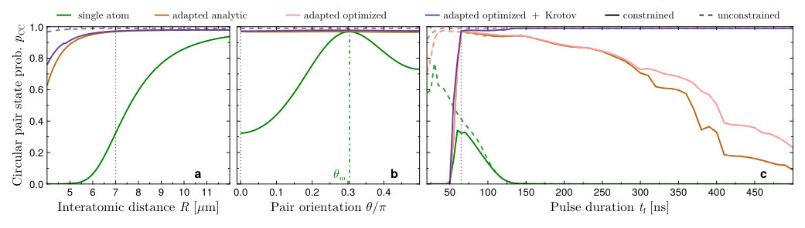 
FIG. 5. Final circular pair state probability pCC obtained after the evolution of an atom pair under the action of different pulses (a) as a function of the interatomic distancde R for a fixed angle θ = 0 and pulse duration tf = 65 ns, (b) as a function of θ for a fixed R = 7 µm and tf = 65 ns, and (c) as a function of tf for fixed R = 7 µm and θ = 0. The dotted vertical lines in each panel indicate the value to which the corresponding parameter is fixed in the remaining panels. As expected, the optimized single-atom pulse of Fig. 1(b) (green) results in high values of pCC around θm and for large R. The optimized single-atom pulse is then adapted to the interactions as indicated by Eq....

**Summary.** This paper tackles the challenge of rapidly preparing interacting Rydberg atoms into highly desirable circular states for quantum applications. The authors show that interactions degrade single-atom pulse efficiency, but they overcome this by analytically adapting the pulses to compensate for interaction-induced energy shifts. This paves the way for fast, high-fidelity control in realistic, interacting many-body systems.

**Why it may be interesting.** This work directly addresses a critical technological hurdle in Rydberg quantum simulation by providing a robust theoretical framework to maintain high-fidelity control despite strong interatomic coupling effects.

Detailed structure

**Main problem.** Circularization of interacting Rydberg atoms is a major bottleneck for quantum simulation and computation, as previous fast methods neglected crucial interatomic interactions.

**Main result.** The authors developed an analytical method to adapt single-atom RF pulses by accounting for interaction-induced energy shifts, achieving high fidelity ($>95\%$) even for closely spaced interacting atoms.

**Method.** The approach involves analytically deriving pulse adaptations based on the dominant disturbance—interaction-induced frequency shifts—and combining this with advanced control techniques like Krotov's algorithm.

**Model / system.** The system consists of interacting Rydberg atoms (e.g., $^ {87}	ext{Rb}$ in the $n=52$ manifold) driven by time-dependent radio-frequency (RF) pulses under static electric and magnetic fields. The Hamiltonian includes terms for free evolution, external fields, and dipole-dipole interactions.

**Key observables.** Final circular state probability ($p_C$), fidelity of preparation, and the expectation value of angular momentum $\langle\hat{L}_z
angle$.

**Important parameters / regimes.** Interatomic distances down to $6.5 \mu	ext{m}$, RF pulse duration ($\sim 65$ ns), and target fidelities ($\ge 95\%$).

**Assumptions / limitations.** The primary assumption is that the dominant disturbance from interactions can be captured by identifying and compensating for shifts in relevant transition energies.

**Figures summary.** Figures illustrate Rydberg energy levels under static fields, optimized RF pulse components for single-atom circularization, population evolution showing angular momentum transfer, and schematics of interacting atom pairs.

**Paper structure.** The paper first establishes the problem (bottleneck in circularization) and reviews the Hamiltonian. It then details how interactions perturb single-atom pulses, derives an analytical adaptation strategy based on these shifts, demonstrates its success for two atoms, and finally extends this to arbitrary pair arrangements using Krotov's algorithm.

Abstract

Circular states in Rydberg atoms offer a promising platform for quantum computation, quantum simulation and quantum sensing. However, the final step of their preparation - termed as circularization, a process that involves the transfer of a large amount of angular momentum quanta to the valence electron by means of radio-frequency (RF) pulses - remains as a major bottleneck for all technological applications based on interacting circular Rydberg atoms. Even though successfully implemented to circularize an atom cloud in the dilute regime, previous efforts to speed up the circularization process have focused on the single-atom case, thereby neglecting the interactions which constitute one of the main resources for quantum simulation and computation. In this theoretical work we show how interactions between two atoms disturb the efficiency of pulses designed for single atoms and identify shifts induced by the interactions on relevant transition energies as the dominant disturbance. We demonstrate that the initial efficiency of single-atom pulses can be restored by adapting them to these shifts. Our approach is based on a simple functional form depending only on two linear parameters, which we derive analytically. The adapted pulses prepare two $^{87}$Rb atoms after $65 \,$ns in a $n=52$ circular state with a fidelity of at least $95\,\%$ for interatomic distances down to $6.5\,μ$m and for all angular configurations, while also complying experimental amplitude and frequency constraints. Finally, we show that when combining our adapted pulses with Krotov's pulse-shaping algorithm we obtain high-fidelity pulses for any pair arrangement with interatomic distances larger than $5.9\,μ$m. This work demonstrates that fast RF pulses can circularize interacting Rydberg atoms, paving the way toward their technological application.

[↑ back to top](#top)

### [The arrival position problem in quantum mechanics](http://arxiv.org/abs/2607.03538v1)

**Authors:** Ali Ayatollah Rafsanjani, Will Cavendish  
**Type:** theory · **Category:** other · **PDF:** <https://arxiv.org/pdf/2607.03538v1>  
**Analysis basis:** full PDF text, analyzed in chunks
**Topic relevance:** 🔥 `quantum measurements` **5/5** · 🔥 `measurement-induced transitions` **4/5** · `analog quantum simulation` **1/5** · `correlated / nonlocal dissipation` **1/5** · `driven-dissipative phase transition` **1/5** · `methods for driven-dissipative` **1/5** · `non-equilibrium dynamics` **1/5**

📷 Fig 1

 
FIG. 1. A realization of the proposed experimental scheme and arrival position distributions for two proposals. Panel A shows a schematic of one realization of the proposed experimental scheme. An atom is prepared in the delocalized ground state of an optical double-well potential [68], which is formed by two laser beams generated by an acousto-optic modulator (AOM) driven by two radio-frequency (rf) tones. Lenses following the AOM control the beam geometry. The separation between the two wells is precisely tuned by the frequency difference of the rf drives. The atom is released from the trap in the presence of a screen in the plane x=L, where the origin of the coordinate system is taken to...

📷 Fig 2

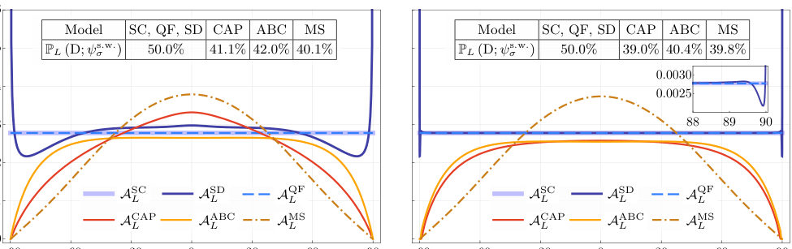 
FIG. 2. Comparison of AL(θ; ψs.w. σ ) for L = 10σ (left) and L = 103σ (right). The total detection probabilities PL(D; ψs.w. σ ) are shown in the table. The inset shows the QF and SD distributions over the angular interval from 88 to 90 degrees for L = 103σ. For CAP, the potential is µ1 σ, where the potential height (the superscript of µ) is given in units of ℏ2/(2mσ2). For ABC, β = i/(2σ), and for MS, λ = 2σ.

📷 Fig 3

 
FIG. 3. Comparison of the arrival position distributions AL  θ; ψd.w. σ,d  for the double-well initial state with well separation d = 20σ. As in Fig. 2, the panels show results for L = 10σ (left) and L = 103σ (right), with total detection probabilities PL  D; ψd.w. σ,d  listed in the inset tables. All model parameters remain identical to the single-well case: for CAP, the potential is µ1 σ (where the superscript denotes potential height in units of ℏ2/(2mσ2)); for ABC, β = i/(2σ); and for MS, λ = 2σ. The inset shows the QF and SD distributions over the angular interval from 87 to 90 degrees for L = 103σ.

📷 Fig 4

 
FIG. 4. The total detection probabilities for a Gaussian ini- tial state with initial width ασ as a function of the rescaling parameter α. The detector parameters are fixed across rescal- ings, with λ = 2σ, β = i/(2σ), and a CAP potential µ1 σ where the potential height is given in units of ℏ2/(2mσ2).

**Summary.** This paper investigates the 'arrival position problem'—predicting where a particle will be detected on an always-on screen. The authors compare multiple theoretical frameworks proposed to solve this issue, showing that these models make distinct and experimentally distinguishable predictions. This highlights a persistent theoretical blind spot in standard quantum mechanics regarding time-resolved spatial measurements.

**Why it may be interesting.** This is highly relevant to AMO physics as it tackles fundamental issues in quantum measurement theory applied to matter waves, particularly concerning the interpretation of detection events for cold atoms or trapped particles.

Detailed structure

**Main problem.** The paper addresses the 'arrival position problem' in quantum mechanics: predicting the probability distribution of *where* a particle is detected on an 'always on' screen, which complements the more studied arrival time problem.

**Main result.** The authors demonstrate that various proposed theoretical solutions to this problem yield quantitatively distinguishable predictions for arrival positions, even in simple experiments and the far-field limit.

**Method.** A comparative analysis is performed by deriving and contrasting quantitative predictions from several established formalisms designed to handle continuous measurement processes at a detector screen.

**Model / system.** The theoretical framework models an experiment where a particle (e.g., an atom) is prepared in a trap, released to disperse under gravity, and monitored by an 'always on' planar detector screen over a fixed time interval T.

**Key observables.** The joint distribution of arrival times and positions $(\Delta t - t_i, s)$, or the marginal spatial distribution (positions on the screen).

**Important parameters / regimes.** The detection process is sensitive to finite waiting times $T$ and the distance $L$ to the screen; comparisons are made in the far-field limit.

**Assumptions / limitations.** Standard quantum theory is shown to be inadequate for describing processes occurring across time, necessitating comparison between multiple proposed theoretical extensions (e.g., semiclassical vs. quantum flux).

**Figures summary.** Figure 1 schematically illustrates the proposed experimental setup and compares predicted arrival position distributions derived from different theoretical proposals.

**Paper structure.** The paper introduces the conceptual gap regarding arrival position prediction, surveys several competing theoretical models (Semiclassical, Quantum Flux, CAP, etc.), and then quantitatively compares their predictions using a generalized experimental setup.

Abstract

The problem of making unambiguous probabilistic predictions about experiments involving waiting "always on" detectors remains a challenge for quantum theory. While most research on this problem studies arrival time, i.e., predicting the distribution of when detection events occur, this paper studies the arrival position problem, which is the complementary challenge of predicting the distribution of where detection events occur. Despite the widespread recognition of the arrival time problem, the inability of standard quantum theory to address the arrival position problem remains a pervasive theoretical blind spot. In this paper, we compare quantitative arrival position predictions derived from prominent proposed solutions to the screen problem. As we show, these models yield distinguishable predictions even in relatively simple experiments achievable with current technology. Notably, many of these discrepancies persist even in the far-field limit, where standard semiclassical approximations are typically assumed to be valid.

[↑ back to top](#top)

### [Realizing Next-Nearest-Neighbor Coupling and Peierls Phase in Circuits](http://arxiv.org/abs/2607.04175v1)

**Authors:** Xin-Sheng Zhang, Wen-Jie Xu, Hang-Yu Gu, Chuan-Xun Du, Yong-Long Wang  
**Type:** both · **Category:** other · **PDF:** <https://arxiv.org/pdf/2607.04175v1>  
**Analysis basis:** full PDF text, analyzed in chunks
**Topic relevance:** 🔥 `analog quantum simulation` **4/5** · 🔥 `driven-dissipative phase transition` **4/5** · `correlated / nonlocal dissipation` **3/5** · `methods for driven-dissipative` **3/5** · `non-equilibrium dynamics` **3/5** · `non-equilibrium universality` **3/5** · `Frenkel-Kontorova` **2/5** · `QC/QI experiment` **2/5** · `Keldysh / 2PI / non-Gaussian methods` **1/5** · `Kondo & dissipative impurity` **1/5** · `correlated cavity matter` **1/5** · `entanglement & information structure` **1/5** · `exotic spin models in light-matter` **1/5** · `scars & prethermalization` **1/5**

📷 Fig 1

 
FIG. 1. Theoretical models and circuit implementations of the non-Hermitian one-dimensional trimerized circuits. (a) Initially trimerized SSH model with NN couplings g1 and g2. (b) Enhanced trimerized SSH model with an additional NNN coupling ν. (c) Reenhanced trimerized SSH model with an NNN coupling ν and a Peierls phase φ. (d)–(f) Circuit im- plementations corresponding to panels (a)–(c), respectively.

📷 Fig 2

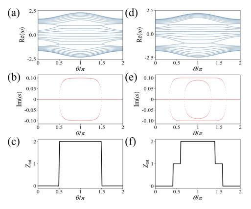 
FIG. 2. Eigenfrequency spectra and total Zak phase for the initial and NNN-coupled models showing the transition from a two-sector response to a stepwise topological sequence. (a) The real parts of the eigenfrequency spectra for ν = 0 and φ = 0; (b) The imaginary parts for ν = 0 and φ = 0; (c) The total Zak phase ztot of ν = 0 and φ = 0; (d) The real parts for ν = 0.2 and φ = 0; (e) The imaginary parts for ν = 0.2 and φ = 0; and (f) The total Zak phase ztot of ν = 0.2 and φ = 0.

📷 Fig 3

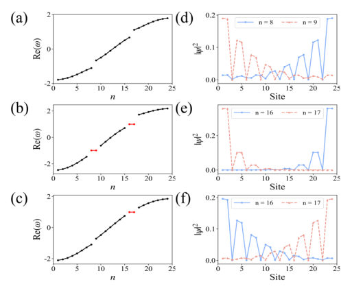 
FIG. 3. Real-part eigenfrequency spectra and corresponding eigenstate distributions at representative parameters used to identify the boundary-localized sectors. (a)–(c) Real parts of the eigenfrequency spectra for θ = 0.3π, ν = 0; θ = π, ν = 0; and θ = 0.5π, ν = 0.2, φ = 0, respectively. (d), (e) Spatial distributions of the eigenstates associated with the red isolated eigenvalues in panel (b). (f) Spatial distribution of the eigenstate associated with the red isolated eigenvalue in panel (c). Black dots denote bulk-state branches, and red dots denote isolated edge states separated from the bulk bands.

📷 Fig 4

 
FIG. 4. Peierls-phase-driven reconstruction of topological phase regions and edge-state localization. (a) The upper- and lower-edge-state stability-region widths ∆θ± versus the Peierls phase φ. (b) The inverse participation ratios IPRs± of the upper and lower edge states versus φ. In both panels, blue and red curves denote the upper and lower edge states, respectively, and the green horizontal line denotes the refer- ence result for ν = 0. The parameters are γ = 0.2 and ν = 0.2.

📷 Fig 5

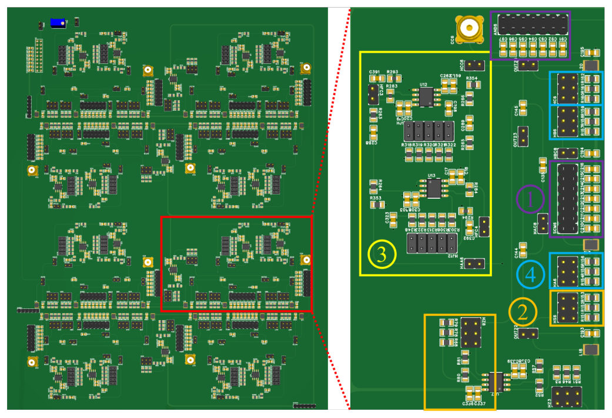 
FIG. 5. PCB layout of the non-Hermitian topological circuit and enlarged PCB layout of a single unit cell. The numbered labels indicate the main circuit components: (1) tunable coupling capacitor array, consisting of six 200 pF capacitors and one 500 pF capacitor; (2) gain/loss module, including one dual operational amplifier ADA4891-2, two 10 kΩcurrent-limiting resistors, a tunable negative-resistance module, and 100 nF and 10 µF decoupling capacitors; (3) Peierls-phase circuit module; and (4) tunable resistor R0 module.

**Summary.** The authors demonstrate how to engineer topological physics by implementing NNN coupling and a Peierls phase into superconducting RLC circuits modeling an SSH chain. They show that these additions allow for precise control over edge-state properties, enabling the realization of tunable synthetic gauge fields in solid-state platforms.

**Why it may be interesting.** This work provides an excellent platform for studying synthetic gauge fields (Peierls phase) in solid-state analogues (circuits), which is highly relevant to open quantum systems, superconducting circuits, and engineered quantum materials.

Detailed structure

**Main problem.** The research aims to realize and study topological physical states by engineering Next-Nearest-Neighbor (NNN) coupling and a Peierls phase within superconducting RLC circuits.

**Main result.** The introduction of NNN coupling enriches the topological sequence, while the Peierls phase acts as a synthetic gauge field that allows for complementary manipulation of edge-state stability intervals and localization strengths.

**Method.** The study combines theoretical analysis using the circuit Laplacian formalism with numerical simulations and direct experimental measurements on fabricated PCB circuits.

**Model / system.** The physical system is a trimerized, non-Hermitian one-dimensional Su-Schrieffer-Heeger (SSH) model implemented in an RLC circuit. The Hamiltonian/dynamics are governed by the circuit Laplacian derived from Kirchhoff's laws.

**Key observables.** Topological states, total Zak phase ($z_{tot}$), stability region widths ($\Delta	heta_{\pm}$), and Inverse Participation Ratios ($IPR_{\pm}$) quantifying edge-state localization strength.

**Important parameters / regimes.** NNN coupling strength ($
u$), Peierls phase ($\varphi$), and circuit parameters like $C_0, L_0$.

**Assumptions / limitations.** The analysis relies on the equivalence between the effective Hamiltonian derived from the circuit Laplacian and the physical system's spectrum; approximations are used for edge-state resonance conditions.

**Figures summary.** Figures illustrate theoretical models (Initial, Enhanced, Reenhanced), show spectra and Zak phase dependence on parameters ($
u, \varphi$), and present experimental voltage profiles demonstrating complementary modulation of edge states with $\varphi$.

**Paper structure.** The paper progresses by sequentially modeling the system: starting with nearest-neighbor coupling, enhancing it with NNN coupling, and finally reenhancing it by incorporating a Peierls phase. Analysis involves deriving effective Hamiltonians from circuit Laplacians and characterizing topological invariants.

Abstract

We really design the trimerized circuits for the non-Hermitian one-dimensional Su-Schrieffer-Heeger models. There are three models, the initial one just considers the nearest neighbor coupling, the enhanced one is extended to contain the next-nearest-neighbor coupling, and the final one is reenhanced by introducing the Peierls phase. We investigate the dynamics of the circuit Laplacians with respect to the models, find that the topological states appear in the initial model and the response intervals are substantially affected by the next-nearest-neighbor coupling channels and the Peierls phase. These results are practically demonstrated by numerical simulations and experimental measurements. As a conclusion, the trimerized circuits can provide an adjustable and simple platform to investigate new topological physical states.

[↑ back to top](#top)

### [Quantum-Optical Bound States in the Continuum](http://arxiv.org/abs/2607.04742v1)

**Authors:** Ruo Kun Cai, Zhi Jiao Deng, Chun Wang Wu, Ping Xing Chen  
**Type:** both · **Category:** other · **PDF:** <https://arxiv.org/pdf/2607.04742v1>  
**Analysis basis:** full PDF text, analyzed in chunks
**Topic relevance:** 🔥 `analog quantum simulation` **4/5** · `Tavis-Cummings & cavity-many-emitter` **3/5** · `driven-dissipative phase transition` **3/5** · `interference shaping light` **3/5** · `quantum optics experiment` **3/5** · `Frenkel-Kontorova` **2/5** · `QC/QI experiment` **2/5** · `methods for driven-dissipative` **2/5** · `non-equilibrium dynamics` **2/5** · `correlated / nonlocal dissipation` **1/5** · `correlated cavity matter` **1/5** · `entanglement & information structure` **1/5** · `exotic spin models in light-matter` **1/5** · `non-equilibrium universality` **1/5**

📷 Fig 1

 
FIG. 1. Schematic of the spin-boson lattice model and the for- mation of a quantum-optical BIC. (a) Mapping of the driven JC model onto a FSL, comprising two semi-infinite anisotropic SSH chains coupled to a central chain with a continuous spec- trum. (b) Symmetric coupling of the localized bound states (in each SSH chain) to the common continuum. Destructive and constructive quantum interference between these chan- nels gives rise to a BIC and a leaky mode, respectively. (c) Spectroscopic detection protocol: Fourier analysis of the chi- ral symmetry operator’s time evolution reveals the BIC sig- nature—a discrete spectral peak within a continuous back- ground.

📷 Fig 2

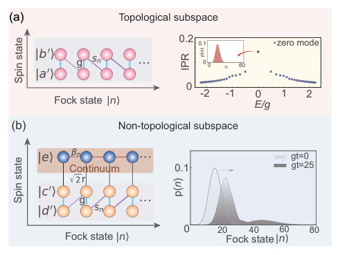 
FIG. 2. Exact decomposition of the Hilbert space and lattice structure. (a) Topological subspace: mapping onto a semi- infinite anisotropic SSH chain, which hosts a topological zero mode localized at the domain wall. The markedly higher in- verse participation ratio (IPR) of this mode and its confined probability distribution in the Fock-state basis (inset) con- firm its localized character. (b) Trivial (non-topological) sub- space: the SSH chain coupled to a continuum. The original topological zero mode becomes unstable due to leakage into the continuum, manifested by the broadening and diffusion of the probability distribution p(n) during time evolution. Pa- rameters: g=1, s=0.25, r=1,...

📷 Fig 3

 
FIG. 3. Spectroscopic protocol for detecting the quantum- optical BIC. (a) Time evolution of the chiral-symmetry- operator expectation values for three different initial states: the topological zero mode |a′, 0⟩(top), |e, 0⟩residing in the trivial subspace (middle), and their coherent superposition (bottom). (b) Corresponding spectra obtained by Fourier transform, showing a zero-mode discrete peak (top), a broad continuum of the trivial subspace (middle), and the defini- tive BIC signature—a sharp peak embedded in a continuous background (bottom). Parameters: g=1, s=0.5, r=0.01, and β=0.1.

📷 Fig 4

 
FIG. 4. Experimental proposal for the quantum-optical BIC with a trapped ion. (a) A single 40Ca+ ion confined in a Paul trap, representing the composite spin-boson system. The ef- fective (pseudo-)spin is encoded in a selected set of internal electronic states, and the bosonic mode corresponds to the harmonic motion (phonon) of the ion with frequency ν. The system is coherently manipulated via 729-nm and 854-nm laser beams. (b) Relevant level scheme, optical transitions, and laser wavelengths for engineering the Hamiltonian that realizes the quantum-optical BIC.

**Summary.** The paper tackles the challenge of observing Bound States in the Continuum (BICs) in quantized optical systems by modeling it with a driven Jaynes-Cummings system mapped onto coupled SSH chains. A BIC is engineered through destructive quantum interference between topological zero modes, and its signature is predicted to be a sharp spectral peak embedded in a continuum background. The authors conclude by providing a detailed, feasible experimental implementation using a single trapped ion.

**Why it may be interesting.** This work is highly relevant because it bridges abstract concepts from condensed matter (topological insulators, SSH chains) and photonics (BICs) directly into the domain of quantum optics using a mature platform like trapped ions. It provides a clear roadmap for realizing exotic quantum states at the quantum limit.

Detailed structure

**Main problem.** The primary goal is to find a quantum-optical analog of Bound States in the Continuum (BICs) and develop a method to experimentally detect their unique spectral signature.

**Main result.** The authors demonstrate that a BIC can be formed in a driven multi-level Jaynes-Cummings system by engineering destructive quantum interference between two topological zero modes. They provide a highly feasible experimental proposal using a single trapped ion platform.

**Method.** Theoretical analysis involves mapping the JC model onto an extended structure of coupled SSH chains (Fock-state lattice). Detection relies on Fourier-transforming the time-dependent expectation value of the system's chiral-symmetry operator to reveal a discrete peak in a continuous background spectrum.

**Model / system.** The core model is a driven multi-level Jaynes-Cummings (JC) system, which is mapped onto an extended structure comprising two semi-infinite inhomogeneous Su-Schrieffer-Heeger (SSH) chains coupled to a common continuum. Experimentally, this is proposed using a single trapped $^{40}	ext{Ca}^{+}$ ion acting as a spin-boson system.

**Key observables.** The characteristic signature of the BIC is a discrete spectral peak embedded within a continuous background spectrum, measured via Fourier transform of the chiral-symmetry operator's time evolution.

**Important parameters / regimes.** JC-coupling strength ($g \sim 2\pi 	imes 10	ext{kHz}$); total evolution time ($t_g < 5	ext{ms}$).

**Assumptions / limitations.** The development relies on the concept of Fock-state lattices (FSLs) to engineer the necessary extended structure for quantum optics, and the feasibility hinges on precise laser control in trapped ions.

**Figures summary.** Figures illustrate the mapping from the JC model to an FSL with two SSH chains coupled to a continuum. They detail the interference mechanism leading to BIC formation and show the spectroscopic detection protocol using Fourier analysis of the chiral symmetry operator's time evolution.

**Paper structure.** The paper first establishes the theoretical framework by modeling the system as a mapped FSL structure, identifying the BIC via destructive quantum interference between topological zero modes. It then develops the spectroscopic measurement protocol using the chiral-symmetry operator. Finally, it translates this theory into a concrete, highly feasible experimental proposal utilizing trapped ions.

Abstract

Bound states in the continuum (BICs) are counterintuitive localized states that lie within the continuum of extended states. While extensively realized and utilized in classical wave systems, it is still unclear what a close analog of BICs would be, and how to extract their experimental signature in quantum-optical settings -- where the wave field itself is quantized into bosonic excitations. Here, we present a paradigmatic quantum-optical model consisting of a driven multi-level Jaynes-Cummings (JC) system, featuring few quantum degrees of freedom yet capable of hosting a BIC. Using the concept of a Fock-state lattice (FSL), this model can be mapped to an extended structure comprising two semi-infinite inhomogeneous Su-Schrieffer-Heeger (SSH) chains coupled to a common continuum. An appropriate quantum superposition of two topological zero modes from the separate chains forms a BIC that remains perfectly localized in the Fock-state dimension within the continuum spectrum, due to complete decoupling from the common continuum via destructive quantum interference. We further develop a method to extract the spectroscopic signature of the BIC -- a discrete peak embedded in a continuous background -- by Fourier-transforming the time-dependent dynamics of the system's chiral-symmetry operator. A highly feasible experimental proposal using a single trapped ion is provided. Our work bridges BIC physics with quantum optics, opening a pathway to harnessing such exotic states at the quantum limit.

[↑ back to top](#top)

### [Matter-wave Induced Transparenc](http://arxiv.org/abs/2607.03820v1)

**Authors:** Tongkang wang, Yuqi Liu, Wenlan Chen, Zhendong Zhang, Jiazhong Hu  
**Type:** both · **Category:** other · **PDF:** <https://arxiv.org/pdf/2607.03820v1>  
**Analysis basis:** full PDF text, analyzed in chunks
**Topic relevance:** 🔥 `analog quantum simulation` **4/5** · 🔥 `methods for driven-dissipative` **4/5** · `correlated / nonlocal dissipation` **3/5** · `driven-dissipative phase transition` **3/5** · `interference shaping light` **3/5** · `non-equilibrium dynamics` **2/5** · `non-equilibrium universality` **2/5** · `Keldysh / 2PI / non-Gaussian methods` **1/5** · `Kondo & dissipative impurity` **1/5** · `entanglement & information structure` **1/5** · `scars & prethermalization` **1/5**

📷 Fig 1

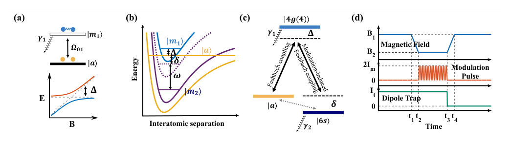 
FIG. 1. From a two-level Feshbach resonance to a three-level matter-wave interference system. (a) A conventional magnetic Feshbach resonance can be viewed as an effective two-level system formed by an open-channel free-atom state |a⟩and a closed-channel molecular state |m1⟩. The magnetic field tunes the detuning ∆between the two states, while the Feshbach coupling ℏΩ01 produces an avoided crossing. Near resonance, the admixture of the lossy molecular state (with decay rate γ1) enhances inelastic collisional loss, analogous to absorption in a resonantly coupled two-level optical system. (b) To construct a three-level system for interacting matter waves, a second molecular state |m2⟩in...

📷 Fig 2

 
Fig. 1(a) illustrates a basic level structure underlying a conventional Feshbach resonance in a reduced descrip- tion of a two-level system: an open-channel free-atom state |a⟩coherently couples to a closed-channel molec- ular state |m1⟩through inherent collisional interactions (e.g., isotropic electronic and relativistic spin-dependent interactions) [9, 10]. In this regard, a Feshbach resonance realizes an effective two-level coupled system, where the magnetic field B tunes the relative detuning ∆between |a⟩and |m1⟩(with |m1⟩referenced to |a⟩). Plotted as an energy diagram versus B, the resonance corresponds to a Landau–Zener–type avoided crossing between the two states, with a gap set by...

📷 Fig 3

 
FIG. 2. Observation of matter-wave induced transparency in collisional loss. (a) Loss spectrum of a conventional two-level Feshbach resonance. The modulation frequency is fixed at ω/2π = 1.5 MHz, for which the second molecular state is far from resonance (δ/2π ≃−1 MHz, where 1 MHz corresponds to an effective Zeeman shift at around 0.8 G), and the system is therefore treated as a two-level configuration. The remaining atom fraction N/N0 shows a broad loss feature associated with the first molecular state |m1⟩. The center is shifted from the original |m1⟩-induced Feshbach resonance position of B0 = 19.84 G to B0 = 20.09 G due to the DC component light shift of the intensity-modulated pulse...

📷 Fig 4

 
Fig. 1(d) shows the experimental timing sequence. We start with a BEC of cesium-133 atoms in the 6S1/2 hyper- fine ground state |F = 3, mF = 3⟩with approximately 1 × 105 atoms in a crossed optical dipole trap. A ho- mogeneous magnetic field B along the z axis defines the quantization axis and tunes the energy difference between the atomic threshold and the Feshbach molecular states [18]. After preparing the condensate, we ramp B to a target value, apply a modulation pulse of duration t, and then measure the remaining atom number N by absorp- tion imaging after time of flight (Supplementary Mate- rial). Throughout this work, the primary observable is the remaining atom fraction N/N0 (or...

📷 Fig 5

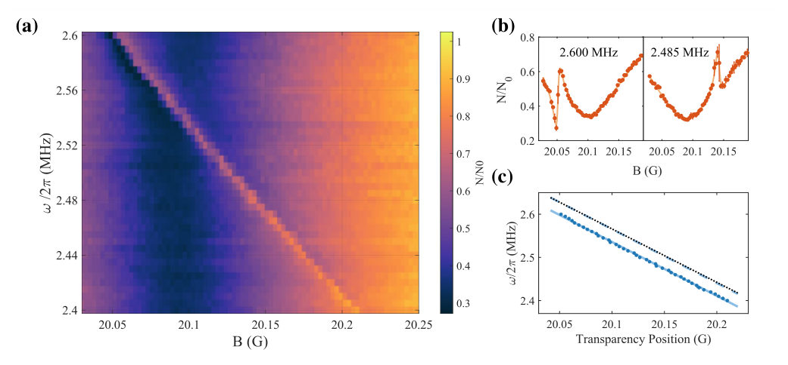 
FIG. 3. Dark-state condition of matter-wave induced transparency and resonance interference. (a) Two- dimensional map of the remaining atom fraction N/N0 as a function of magnetic field B and modulation frequency ω. The broad region of reduced atom number corresponds to the dissipative Feshbach resonance involving the lossy molecular state |m1⟩. Within this lossy background, a narrow ridge of enhanced survival appears, marking the matter-wave transparency condition where the second molecular state |m2⟩participates in the three-level interference. (b) Representative magnetic-field spectra taken at two different modulation frequencies, ω/2π = 2.600 MHz and 2.485 MHz. The loss-suppressed...

**Summary.** The authors report realizing matter-wave induced transparency (MWIT) in a cesium Bose-Einstein condensate by exploiting destructive interference within collisional loss resonances. By coupling an atomic state to two molecular states using modulation-induced Feshbach resonances, they create a tunable transparency window. This establishes a powerful, non-optical route for studying programmable non-Hermitian physics and quantum sensing.

**Why it may be interesting.** This work provides an interference-based route for exploring programmable non-Hermitian physics using only intrinsic atomic interactions, which is highly relevant for understanding open quantum systems and precision measurements in AMO physics.

Detailed structure

**Main problem.** To induce transparency directly through inherent atomic collisional interactions (matter-wave scattering) rather than relying on external optical excitation pathways, thereby suppressing collisional loss via interference.

**Main result.** The study successfully realizes matter-wave induced transparency by observing a narrow transmission window embedded within a broad dissipative Feshbach resonance. This demonstrates that destructive interference among matter-wave scattering pathways can suppress atomic loss.

**Method.** The research combines theoretical modeling (coupled differential equations, adiabatic elimination) with experimental realization using Bose-Einstein condensates and modulation-induced Feshbach resonances.

**Model / system.** The system is a cesium BEC modeled as an effective three-level atom–molecule coupled system ($|a
angle$, $|m_1
angle$, $|m_2
angle$). The dynamics are governed by interactions leading to matter-wave interference phenomena analogous to EIT.

**Key observables.** Loss spectrum (remaining atom fraction $N/N_0$), the narrow transparency window, and the dependence of resonance position on modulation frequency ($\omega$) and magnetic field ($B$).

**Important parameters / regimes.** Modulation-induced coupling strength, detunings ($\Delta, \delta$), decay rates ($\gamma_1, \gamma_2$), and the background scattering length.

**Assumptions / limitations.** The process relies on coupling intrinsic matter-wave interactions rather than external optical transitions. Mean-field approximations are used for coherent dynamics calculations.

**Figures summary.** Figures show the experimental observation of a narrow transparency window within a broad Feshbach resonance, and theoretical analyses confirm linear scaling relationships between extracted parameters and applied fields/intensities.

**Paper structure.** The paper progresses from establishing the physical model (three-level system via modulation-induced resonances) to presenting experimental measurements showing the tunable transparency window. It then delves into detailed theoretical derivations of effective scattering lengths based on coupled field equations.

Abstract

Electromagnetically induced transparency suppresses optical absorption through destructive interference, playing a central role in light-matter interaction and quantum information science. We report matter-wave induced transparency, where atomic collisional interactions induce transmission through a lossy molecular potential for the incident atomic scattering waves. Using cesium Bose-Einstein condensates and modulation-induced Feshbach resonances, we realize a three-level atom-molecule coupled system with unprecedented flexibility. Under the dark state condition, a narrow and tunable transparency window appears within a broad dissipative collisional resonance. The transparency window linewidth is controlled by modulation-induced coupling. And scattering pathways are selectable via multifrequency Floquet modulation. These results establish an interference-based route for exploring programmable nonequilibrium and non-Hermitian physics, steering quantum chemistry and precision measurements.

[↑ back to top](#top)

### [Orthogonality Edges in Strong-Coupling Quantum Work Statistics](http://arxiv.org/abs/2607.03950v1)

**Authors:** Atta ur Rahman, Muhammad Noman, S. M. Zangi, Saeed Haddadi  
**Type:** theory · **Category:** statistical mechanics · **PDF:** <https://arxiv.org/pdf/2607.03950v1>  
**Analysis basis:** full PDF text, analyzed in chunks
**Topic relevance:** 🔥 `non-equilibrium universality` **4/5** · `correlated / nonlocal dissipation` **3/5** · `driven-dissipative phase transition` **3/5** · `methods for driven-dissipative` **3/5** · `non-equilibrium dynamics` **3/5** · `Keldysh / 2PI / non-Gaussian methods` **2/5** · `measurement-induced transitions` **2/5** · `Kondo & dissipative impurity` **1/5** · `analog quantum simulation` **1/5** · `entanglement & information structure` **1/5** · `exotic spin models in light-matter` **1/5** · `scars & prethermalization` **1/5**

📷 Fig 1

 
FIG. 1. Orthogonality edge and finite-energy crossover in quantum work statistics. (a) Running infrared exponent θeff = d ln Zel/d ln ωIR for the spectral density Js(ω) = αω1−s c ωse−ω/ωc. The color scale shows log10[θeff/(2α)], and the dashed vertical line marks the Ohmic boundary s = 1. The Ohmic bath is the marginal case between a finite elastic threshold line for s &gt; 1 and stronger infrared orthogonality for s &lt; 1. (b) Elastic threshold weight Zel as a function of the infrared cutoff ωIR/ωc. The super-Ohmic bath approaches a finite residue, the Ohmic bath shows algebraic extinction Zel ∝ω2α IR , and the sub-Ohmic bath is suppressed more rapidly. (c) Exact Ohmic continuum edge at the...

📷 Fig 2

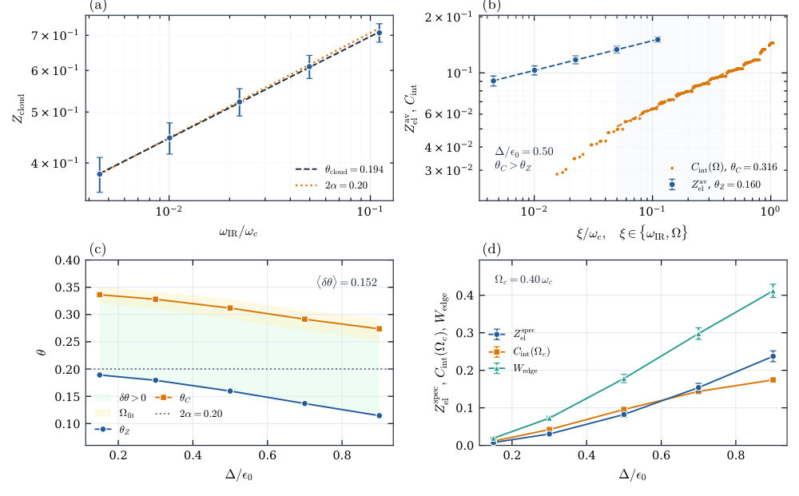 
FIG. 2. Finite-tunnelling crossover and edge-window spectral accounting. (a) Static Ohmic cloud benchmark for the same logarithmic discretization convention used in the finite-tunnelling calculation. The fitted exponent θcloud agrees with the target value 2α, anchoring the finite-bath normalization to the independent-boson fixed point. (b) Representative finite- tunnelling extraction at ∆/ϵ0 = 0.50. The elastic threshold weight is fitted as Zav el ∼ωθZ IR after geometric averaging over shifted logarithmic meshes, while the continuum weight is fitted as Cint(Ω) ∼ΩθC after interleaving the shifted spectra. The common horizontal variable ξ denotes ωIR for Zav el and Ωfor Cint. (c) Effective...

**Summary.** The paper analyzes the quantum work statistics of a spin-boson model strongly coupled to an environment with infrared singularities. It demonstrates that while idealized models predict specific fixed points, finite physical effects cause a measurable separation between two key scaling exponents ($	heta_C > 	heta_Z$). This finding refines our understanding of how boundary conditions dictate energy dissipation in open quantum systems.

**Why it may be interesting.** This work provides deep insights into non-equilibrium thermodynamics in open quantum systems, specifically quantifying how boundary conditions (orthogonality) manifest in measurable scaling laws of work distributions. This is highly relevant for understanding energy dissipation and measurement protocols.

Detailed structure

**Main problem.** The study investigates how strong coupling to an infrared singular reservoir alters quantum work statistics, potentially converting a quasiparticle threshold line into a many-body edge.

**Main result.** For finite tunneling, the continuum exponent ($	heta_C$) and the elastic overlap exponent ($	heta_Z$) are found to be separated ($	heta_C > 	heta_Z$), indicating a finite-energy crossover rather than a new asymptotic fixed point.

**Method.** The authors use exact diagonalization on logarithmically discretized baths and compare scaling exponents derived from $z$-interleaved spectra ($	heta_C$) versus $z$-averaged overlaps ($	heta_Z$).

**Model / system.** The system is the biased spin-boson model, analyzed under a sudden bias inversion protocol. The reservoir coupling strength is characterized by an infrared exponent $s$ (super-Ohmic, Ohmic, sub-Ohmic).

**Key observables.** Zero-temperature inclusive work distribution $P(W)$, elastic weight ($Z_{	ext{el}}$), continuum probability $P_{	ext{cont}}(\Omega)$, and the derived exponents $	heta_C$ and $	heta_Z$.

**Important parameters / regimes.** The infrared exponent $s$ (determining bath type), the tunneling amplitude ($\Delta$), and the energy window size are critical parameters.

**Assumptions / limitations.** The separation $	heta_C > 	heta_Z$ is interpreted as a finite-energy crossover effect, not evidence for a new asymptotic fixed point. The analysis relies on logarithmic discretization of the bath spectrum.

**Figures summary.** Figures illustrate the comparison between continuum and elastic exponents ($	heta_C$ vs $	heta_Z$), showing a positive separation ($\delta	heta > 0$) for finite tunneling, while confirming exact benchmarks at the independent-boson limit where $	heta_C = 	heta_Z$.

**Paper structure.** The paper first establishes the fixed-point logic in the independent-boson limit (classifying baths by $s$). It then moves to finite tunneling using ED simulations, extracting and comparing $	heta_C$ and $	heta_Z$, and finally interpreting the resulting separation as a crossover diagnostic.

Abstract

Strong coupling to a reservoir can do more than shift, broaden, or dress the work peaks of a driven quantum system. When the reservoir is infrared singular, a sudden change of a local control parameter can alter the boundary condition seen by infinitely many low-energy modes, converting a quasiparticle-like threshold line into a many-body edge. We demonstrate this mechanism for the inclusive work distribution of the biased spin-boson model under a sudden bias inversion. In the independent-boson limit, the problem is exactly solvable and gives a sharp infrared classification: a super-Ohmic bath can retain a finite elastic threshold weight, whereas Ohmic and sub-Ohmic baths extinguish the elastic line through boundary orthogonality. At the Ohmic fixed point, the same exponent controls both the vanishing elastic residue and the low-work continuum. We then ask how this edge is resolved away from the static-boundary limit. Using displaced-basis exact diagonalization of logarithmically discretized baths, we find that finite tunnelling leaves an edge-like continuum over the accessible energy window, while separating two operational diagnostics of the threshold: the cumulative-continuum exponent extracted from $z$-interleaved spectra lies above the elastic-overlap exponent extracted from $z$-averaged overlaps, $θ_C>θ_Z$. We interpret this separation as a finite-energy crossover away from the static-boundary fixed point, not as evidence for a new asymptotic fixed point. The separation survives fitting-window variation, oscillator-cutoff checks, spectrum-size checks, and leave-one-$z$-out tests, while time-domain characteristic functions provide a compatible but non-decisive diagnostic. Finally, the same threshold edge controls the sampling cost of Jarzynski-type exponential averages, making rare low-work events increasingly important at low temperature.

[↑ back to top](#top)

### [Bloch-sphere rotations in driven double-well for ultracold atoms](http://arxiv.org/abs/2607.04873v1)

**Authors:** Michele Modugno, Marco Fattori, Giulio Pettini  
**Type:** both · **Category:** quantum gases · **PDF:** <https://arxiv.org/pdf/2607.04873v1>  
**Analysis basis:** full PDF text, analyzed in chunks
**Topic relevance:** 🔥 `analog quantum simulation` **4/5** · 🔥 `non-equilibrium dynamics` **4/5** · `exotic spin models in light-matter` **3/5** · `non-equilibrium universality` **3/5** · `QC/QI experiment` **2/5** · `driven-dissipative phase transition` **2/5** · `methods for driven-dissipative` **2/5** · `Frenkel-Kontorova` **1/5** · `Keldysh / 2PI / non-Gaussian methods` **1/5** · `correlated / nonlocal dissipation` **1/5** · `entanglement & information structure` **1/5**

📷 Fig 1

 
FIG. 1. (a) Plot of the BNSL potential in Eq. (2). (b) Effec- tive approximation (3), corresponding to a symmetric dou- ble well with a spatial separation between the two minima a ≃4.436 µm. The first three energy levels εi (i = 1, 2, 3) of H0 in Eq. (1) are also shown, displayed as horizontal lines. (c) Spatially symmetric (blue solid line) and antisymmetric (red dot-dashed line) low-lying eigenfunctions. The potential (black solid line) is included for reference.

📷 Fig 2

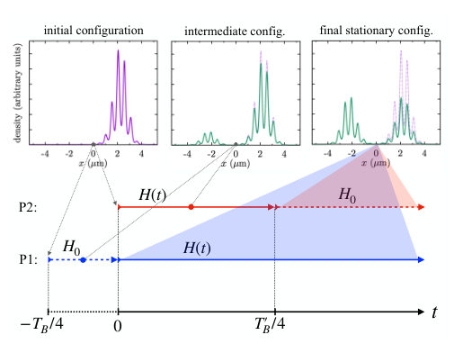 
FIG. 2. Scheme of the two protocols P1 and P2 employed in this work (see text), indicated by blue and red lines, respec- tively. The top row displays three snapshots of the density configurations corresponding to the initial state (at different times for the two protocols), an intermediate configuration, and the final stationary configuration with equal population in the two wells.

📷 Fig 3

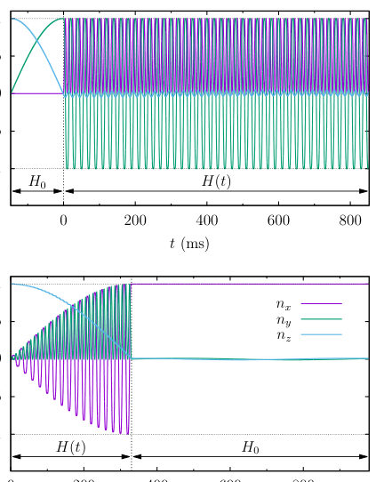 
FIG. 3. Time evolution of the components of the Bloch unit vector for the two protocols, P1 (a) and P2 (b). See text for details.

**Summary.** The authors demonstrate how controlled rotations of pseudospin states can be achieved in an ultracold atom double-well system by applying time-periodic driving fields. They utilize Floquet theory and numerical simulations to show that specific protocols allow for precise manipulation of the Bloch vector around arbitrary axes on the sphere. This provides a powerful platform for quantum simulation or information processing using cold atoms.

**Why it may be interesting.** This work is highly relevant as it demonstrates a concrete method—Floquet engineering applied to ultracold atoms in optical lattices—to implement quantum gates or arbitrary unitary transformations on internal degrees of freedom (pseudospins).

Detailed structure

**Main problem.** The research aims to achieve full coherent control over pseudospin dynamics, specifically realizing controlled rotations about arbitrary axes on the Bloch sphere.

**Main result.** Protocols using time-periodic driving in a double-well potential allow for deterministic manipulation of the pseudospin state, demonstrating controlled rotations around multiple orthogonal axes.

**Method.** The study employs numerical simulations and analytical techniques like the Floquet theory and Magnus expansion to model the time evolution operator.

**Model / system.** The system is a non-interacting Bose-Einstein condensate trapped in a double-well potential realized via Beat-Note Superlattices. The dynamics are modeled by a driven Hamiltonian, which can be effectively reduced to a two-level pseudospin description.

**Key observables.** Bloch sphere components (n_x(t), n_y(t), n_z(t)), Rabi period renormalization, and the time evolution of the state vector $\mathbf{n}(t)$.

**Important parameters / regimes.** The analysis relies on operating in a fast modulation regime ($
u_{12} \ll 
u \ll 
u_{23}$) using specific driving parameters like $K = F_0a/(h
u) = \pi/2$.

**Assumptions / limitations.** The primary assumptions are the non-interacting nature of the condensate and that the two-level effective model accurately captures the essential physics for both proposed protocols.

**Figures summary.** Figures illustrate the BNSL potential, the implementation schemes (P1 and P2), and the resulting Bloch vector trajectories showing controlled rotations around specific axes like the y-axis.

**Paper structure.** The paper first establishes the physical platform using BNSLs. It then develops the theoretical framework by deriving an effective two-level Hamiltonian under driving. The core of the work presents two distinct protocols (P1 and P2) to achieve controlled rotations, analyzing both the full dynamics numerically and approximating the evolution operator via Floquet theory.

Abstract

We show that, by using suitable protocols for a non-interacting condensate in a driven double-well, one can achieve controlled rotations about arbitrary axes in the equatorial plane of the Bloch sphere, composed with fast rotations about the $z$-axis. Specifically, we investigate the dynamics induced by a spatially linear time-periodic potential, by means of numerical simulations. We also provide an explicit two-level model that accurately captures the microscopic evolution of the driven system, with the full time-dependent evolution operator obtained using a Floquet-based approach. The analysis is carried out using as a reference a recently realized experimental platform consisting of arrays of double-well potentials based on Beat-Note Superlattices, to which the proposed control scheme is directly applicable.

[↑ back to top](#top)

### [Magnetic graphs for cavity quantum electrodynamics](http://arxiv.org/abs/2607.04736v1)

**Authors:** Sunkyu Yu, Xianji Piao, Namkyoo Park  
**Type:** theory · **Category:** other · **PDF:** <https://arxiv.org/pdf/2607.04736v1>  
**Analysis basis:** full PDF text, analyzed in chunks
**Topic relevance:** 🔥 `analog quantum simulation` **4/5** · 🔥 `exotic spin models in light-matter` **4/5** · `Tavis-Cummings & cavity-many-emitter` **3/5** · `correlated cavity matter` **3/5** · `non-equilibrium dynamics` **3/5** · `spintronics-quantum-optics interface` **2/5** · `correlated / nonlocal dissipation` **1/5** · `driven-dissipative phase transition` **1/5** · `entanglement & information structure` **1/5** · `methods for driven-dissipative` **1/5** · `non-equilibrium universality` **1/5**

📷 Fig 1

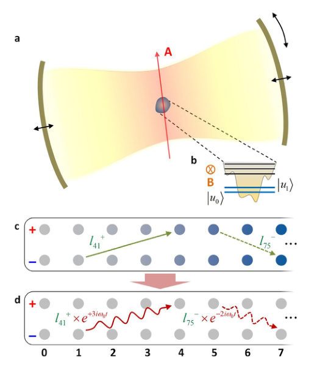 
FIG. 1. Magnetic graph model for single-atom cavity QED. a,b, Schematics for the generalized

📷 Fig 2

 
Figure 2 shows the FR graph connectivity depending on η. According to Eq. (4), the graph

📷 Fig 3

 
FIG. 2. Graph connectivity for different values of η at t = 0. Edges with weights greater than

📷 Fig 4

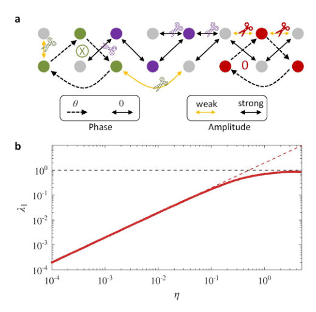 
FIG. 3. Stronger coupling indicates a higher cost for separating a large nonmagnetic

📷 Fig 5

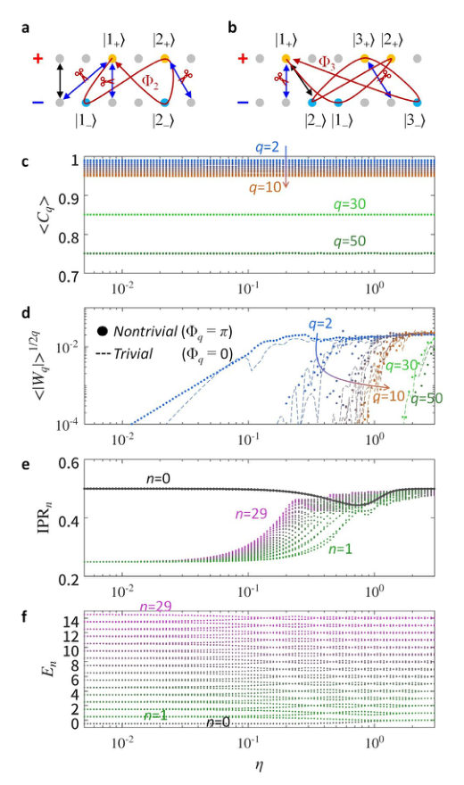 
FIG. 4. Phase frustration governs the USC. a,b, Schematics of subgraphs (coloured nodes)

**Summary.** The paper introduces a novel magnetic graph model to study single-atom cavity QED across extreme coupling regimes. By mapping the system Hamiltonian onto a graph structure, the authors use graph connectivity metrics derived from the Laplacian to quantify quantum dynamics. This framework reveals that changes in coupling strength are fundamentally governed by topological phase frustration within the underlying graph.

**Why it may be interesting.** This work provides a powerful, unifying mathematical language (graph theory) to analyze complex quantum many-body physics in cavity QED, linking spectral properties directly to topological features like phase frustration.

Detailed structure

**Main problem.** The central challenge is developing a robust theoretical framework to understand quantum dynamics across the ultrastrong and deep-strong coupling regimes in cavity Quantum Electrodynamics (QED).

**Main result.** The authors propose a magnetic graph model that successfully maps the generalized QRM onto a bipartite graph, showing that phase frustration induced by subgraph topology is the primary driver governing connectivity transitions between different coupling regimes.

**Method.** The analysis employs concepts from graph theory, specifically using the normalized magnetic Laplacian and related metrics (like conductance $\langle C_q 
angle$), to quantify quantum dynamics via graph connectivity.

**Model / system.** The system is single-atom cavity QED, modeled by extending the gauge-invariant Quantum Rabi Model (QRM). The Hamiltonian is analyzed after applying a gauge transformation and mapping it onto an effective 'magnetic graph' structure under Floquet boundary conditions.

**Key observables.** Normalized magnetic Laplacian eigenvalue ($\lambda_1$), ensemble-averaged conductance ($\langle C_q 
angle$), topological flux ($\Phi_q$), and Inverse Participation Ratio (IPR).

**Important parameters / regimes.** Dimensionless coupling strength ($\eta = g/\omega_0$), which defines regimes like weak, ultrastrong, and deep-strong coupling.

**Assumptions / limitations.** The analysis relies on truncating the infinite bosonic Hilbert space to a finite subspace and assumes a bipartite structure for the resulting Floquet graph.

**Figures summary.** Figures illustrate the model setup (QRM schematics), how graph connectivity changes with $\eta$ using Laplacian eigenvalues, and quantitative plots showing ensemble averages of conductance and connection strength versus $\eta$.

**Paper structure.** The paper first establishes the physical problem in QED, derives the effective Hamiltonian via gauge transformations and Fock-state lattice ansatz, then introduces the magnetic graph model, and finally uses graph theory metrics ($\lambda_1$, $\langle C_q 
angle$) to characterize the system's behavior across varying coupling strengths.

Abstract

Strengthening light-matter coupling has become a central challenge in cavity quantum electrodynamics (QED), enabling ultrafast gate operations, qubit protection, and deterministic nonlinear optics. As the coupling increases, even the simplest configuration, a two-level atom interacting with a quantized field, requires careful treatment, as exemplified by the gauge-invariant quantum Rabi model (QRM). Here we propose a magnetic graph model for single-atom cavity QED, which enables the interpretation of quantum dynamics across the ultrastrong coupling regime through graph connectivity. We demonstrate that the generalized QRM maps onto a complex bipartite graph of identical sites under Floquet boundary conditions. This framework captures the crossover from weak to deep-strong coupling via a single metric: the cost of disconnecting a nonmagnetic subgraph. We examine the mechanism underlying this connectivity transition, establishing phase frustration induced by subgraph topology as the primary driver. Scalable to many-body systems, this approach bridges graph theory and cavity QED, revealing highly complex-graph dynamics even in the simplest setting.

[↑ back to top](#top)

### [Measurement-induced spatially nonuniform fluctuations of the local particle number and their crossover in a quasiperiodic free-fermion chain](http://arxiv.org/abs/2607.03799v1)

**Authors:** Toranosuke Matsubara, Kazuki Yamamoto  
**Type:** theory · **Category:** statistical mechanics · **PDF:** <https://arxiv.org/pdf/2607.03799v1>  
**Analysis basis:** full PDF text, analyzed in chunks
**Topic relevance:** 🔥 `measurement-induced transitions` **4/5** · 🔥 `quantum measurements` **4/5** · `driven-dissipative phase transition` **3/5** · `methods for driven-dissipative` **3/5** · `non-equilibrium dynamics` **2/5** · `non-equilibrium universality` **2/5** · `Frenkel-Kontorova` **1/5** · `Keldysh / 2PI / non-Gaussian methods` **1/5** · `Kondo & dissipative impurity` **1/5** · `analog quantum simulation` **1/5** · `correlated / nonlocal dissipation` **1/5** · `entanglement & information structure` **1/5**

📷 Fig 1

 
FIG. 1. The Fibonacci chain obtained by cutting and projecting a square lattice. The number below each site indicates the site index i. The coordinates xi and yi of the i-th site are for physical and perpen- dicular spaces, respectively. The width of a blue strip (two red strips) is determined by the fraction of number of sites located between two ℓ-spacings (ℓ- and s-spacings) relative to the total number of sites, where the fraction is denoted as rℓℓ(rℓs). These satisfy rℓs/rℓℓ= 2τ with rℓℓ+ rℓs = 1, which leads to the widths of the blue and red strips as rℓsw ≃1.05 and rℓℓw ≃0.32, respectively.

📷 Fig 2

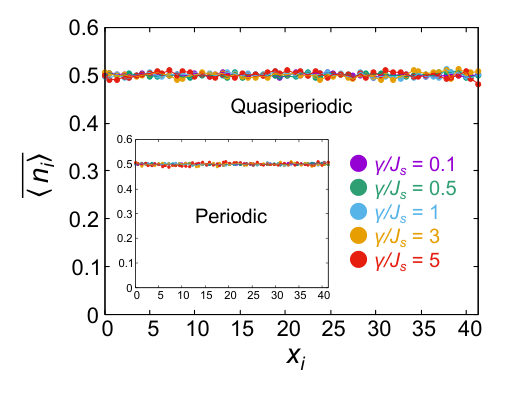 
FIG. 3. Spatial distribution of the local particle number with respect to xi in physical space. We set Jℓ/Js = 0.4 in the quasiperiodic system (main panel) and Jℓ/Js = 1 in the periodic system (inset). The number of trajectories is set to 1000 for L = 60.

📷 Fig 3

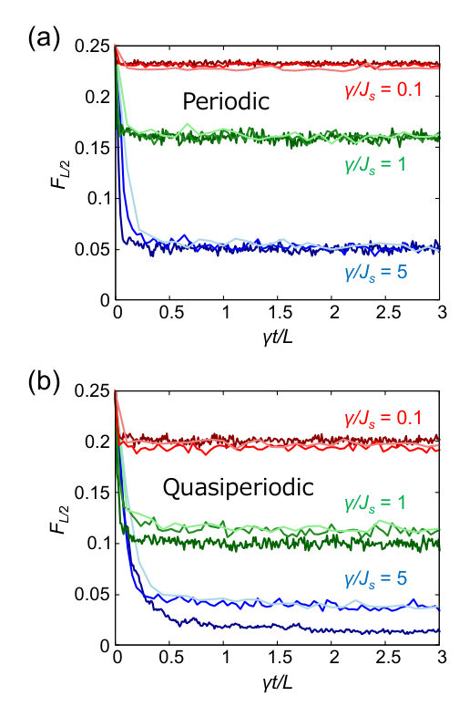 
FIG. 2. Numerical results for the dynamics of fluctuations of the local particle number FL/2 at the (L/2)-th site. We set (a) Jℓ/Js = 1 in the periodic system and (b) Jℓ/Js = 0.4 in the quasiperiodic system. Light, medium, and dark colors correspond to L = 30, 50, and 100, respectively. The number of quantum trajectories is set to 500.

📷 Fig 4

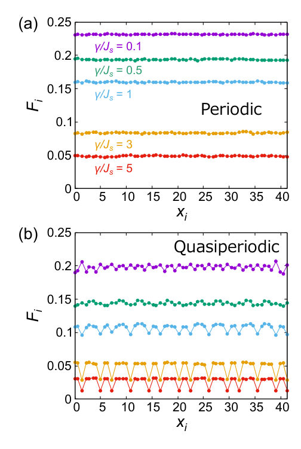 
FIG. 4. Spatial distribution of fluctuations of the local particle num- ber with respect to xi in physical space. We take (a) Jℓ/Js = 1 in the periodic system and (b) Jℓ/Js = 0.4 in the quasiperiodic system. The number of trajectories is set to 1000. The system size is set to L = 120, whose enlarged view is shown.

📷 Fig 5

 
FIG. 6. Spatial average of fluctuations of the local particle number in the quasiperiodic system resolved by perpendicular space V1 n with respect to measurement strengths. The inset shows the difference Fℓs −Fℓ2 between fluctuations corresponding to two different local environments. We take L = 120 and Jℓ/Js = 0.4, and the number of trajectories is set to 1000.

**Summary.** This theoretical study examines how continuous quantum measurement affects particle number fluctuations in a free-fermion chain built on a Fibonacci lattice. The key finding is a crossover: the spatial pattern shifts from reflecting the system's long-range quasiperiodic order under weak monitoring to being dominated by local site environments under strong monitoring. This offers new insights into non-equilibrium dynamics in structured quantum matter.

**Why it may be interesting.** This work is highly relevant as it explores non-equilibrium physics driven by quantum measurements in structured media, connecting concepts from open quantum systems to condensed matter phenomena like quasiperiodicity.

Detailed structure

**Main problem.** The study investigates measurement-induced spatially nonuniform fluctuations of the local particle number within a quasiperiodic free-fermion chain.

**Main result.** The paper demonstrates a crossover in fluctuation patterns: weak measurements reveal long-range quasiperiodic order, while strong measurements localize the distribution to site-specific environments.

**Method.** Analysis utilizes Gaussian-state-based algorithms applied to continuous monitoring dynamics described by stochastic Schrödinger equations.

**Model / system.** The system is a free-fermion chain modeled on a Fibonacci lattice (quasiperiodic structure), analyzed using both physical and perpendicular space representations.

**Key observables.** Local particle number fluctuations ($\langle n_j^2 
angle - \langle n_j 
angle^2$) and connected correlation functions ($C_{i,j}$).

**Important parameters / regimes.** Measurement strength ($\gamma$), which dictates the crossover between weak and strong measurement regimes.

**Assumptions / limitations.** The analysis assumes the system consists of free fermions and employs Gaussian-state-based simulation techniques.

**Figures summary.** Figures illustrate the Fibonacci chain construction, showing spatial distributions of local particle number fluctuations for periodic versus quasiperiodic systems under varying measurement strengths.

**Paper structure.** The paper develops by first establishing the model on a quasiperiodic lattice, then analyzing the dynamics under continuous monitoring, culminating in the demonstration and characterization of the crossover phenomenon across different measurement regimes and observables.

Abstract

We study continuously monitored dynamics of a quasiperiodic free-fermion chain defined on a Fibonacci lattice. We focus on fluctuations of the local particle number, which exhibit a spatially uniform distribution in the unitary limit. Remarkably, we demonstrate that they exhibit a nonuniform spatial pattern originating from the quasiperiodic long-range order under continuous measurement. Furthermore, employing both physicaland perpendicular-space analyses, we elucidate that measurement-induced crossover emerges in fluctuations due to the interplay between the incommensurate modulation and the continuous measurement. While weak measurement yields a distribution reflecting the long-range spatial structure of the quasiperiodic system, an increase in measurement strength alters the distribution into one dominated by the local environment of each site. We also elucidate that the measurement-induced crossover emerges in other physical quantities such as connected correlation functions. These findings offer insights into nonequilibrium quasiperiodic phenomena emerging in continuously monitored dynamics.

[↑ back to top](#top)

### [Spectral-topology-induced criticality in non-Hermitian fermionic metals](http://arxiv.org/abs/2607.05190v1)

**Authors:** Ayan Banerjee, Julius T. Gohsrich, Flore K. Kunst  
**Type:** theory · **Category:** statistical mechanics · **PDF:** <https://arxiv.org/pdf/2607.05190v1>  
**Analysis basis:** full PDF text, analyzed in chunks
**Topic relevance:** 🔥 `driven-dissipative phase transition` **4/5** · 🔥 `non-equilibrium universality` **4/5** · `Kondo & dissipative impurity` **3/5** · `methods for driven-dissipative` **3/5** · `non-equilibrium dynamics` **3/5** · `correlated / nonlocal dissipation` **2/5** · `entanglement & information structure` **2/5** · `Frenkel-Kontorova` **1/5** · `Keldysh / 2PI / non-Gaussian methods` **1/5** · `analog quantum simulation` **1/5**

📷 Fig 1

 
FIG. 1. Spectral topology and dynamical topological in- dex. (a) Different complex spectra (blue, orange, and green curves) for different parameters (t1 = 6, t1 = 4.5 and t1 = 2, respectively) for the Hamiltonian in Eq. (2) with l = r = 3, t−1 = 1, t±2 = 0 and t±3 = ±1. The dynamical topological index is the difference between the number of maxima and number of minima in the upper half plane, and transitions occur when these numbers change. The extrema contributing to the dynamical topological index are highlighted by pink triangles, where the up-pointing and down-pointing triangles correspond to maxima and minima, respectively. The shaded regions contribute to the non-equilibrium steady...

📷 Fig 2

 
FIG. 2. Mechanisms changing the dynamical topological in- dex. The horizontal axis corresponds to k, the vertical axis to Im E(k), and the dashed horizontal line to the zero-axis Im E(k) = 0 as in Fig. 1(b). The minima contributing to the dynamical topological index are highlighted by pink down- pointing triangles. (a) Under a continuous parameter change, the minimum above zero (left) can touch the zero-axis (cen- ter), which corresponds to a non-simple zero marked by a pink cross, and can move below zero (right), increasing the dynam- ical topological index by one. In general, by tuning through a non-simple zero, the dynamical topological index can change. (b) Additionally in multi-band...

📷 Fig 3

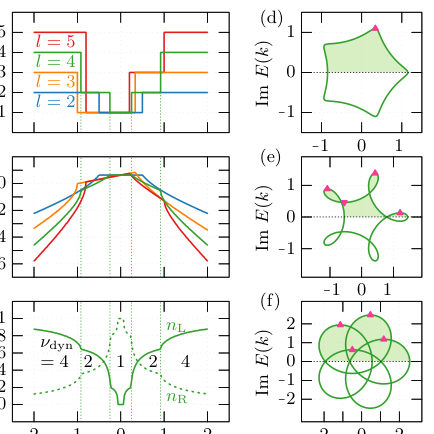 
FIG. 3. Spectral topological phase transitions and trans- port phenomena in a generalized Hatano–Nelson model. (a) Dynamical topological index νdyn and central charge ceff as function of tl for different l, showing topological phase transi- tions at distinct transition points. The green-dashed vertical lines mark the hopping strengths tl at which the dynamical topological index for the model with l = 4 changes. These lines are also present in (b,d) to highlight qualitative changes at these hopping strengths due to these phase transitions for the model with l = 4. (b) Total current as a function of tl with same l as in (a), showing the non-analytic behavior at the same parameters where the...

📷 Fig 4

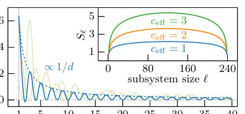 
FIG. 4. Correlations and entanglement entropy. The sys- tem exhibits power-law correlations ∝1/d with distinct in- terference patterns as a function of distance d, indicating a gapless critical phase and scale invariance. We quadratically interpolate between the different integer d for better visibil- ity. Inset: Corresponding entanglement entropies Sℓshowing logarithmic scaling as function of subsystem size ℓand dis- tinct central charges. We have set t±1 = 1 ± t, t±2 = ±0.2, t±3 = ∓1.9, t±4 = ±1, with t = 11 (blue), t = 6 (orange), t = 1 (green).

**Summary.** This work develops a topological index ($
u_{dyn}$) based on the complex energy spectrum of non-Hermitian fermionic metals. This index quantifies spectral topology by analyzing extrema in the imaginary part of the dispersion relation using Morse theory. The key finding is that this topological invariant dictates the nature and existence of non-equilibrium quantum criticality, linking single-particle band structure directly to many-body transport properties.

**Why it may be interesting.** The connection between spectral topology derived from complex single-particle bands and macroscopic many-body phenomena like critical behavior is highly relevant for understanding open quantum systems where dissipation or gain are present, bridging concepts from condensed matter theory with non-equilibrium statistical mechanics.

Detailed structure

**Main problem.** The central challenge is understanding how complex single-particle spectra govern universal many-body behavior, particularly in non-Hermitian systems that are intrinsically out-of-equilibrium.

**Main result.** The authors establish a unified framework linking spectral geometry (via Morse theory applied to the complex spectrum) to many-body observables, showing that non-Hermitian quantum criticality is controlled by emergent imaginary Fermi surfaces.

**Method.** They introduce a symmetry-protected dynamical topological index ($
u_{dyn}$) derived from analyzing extrema of $	ext{Im } E(k)$ using tools from algebraic topology (Morse theory).

**Model / system.** The study focuses on non-interacting, one-dimensional fermionic metals described by tight-binding Hamiltonians, including the Hatano–Nelson and anisotropic SSH models.

**Key observables.** Dynamical topological index ($
u_{dyn}$), emergent imaginary Fermi surface, gapless modes with logarithmic entanglement scaling, and spectral winding.

**Important parameters / regimes.** Hopping strengths ($t_j$), gain/loss parameters ($\gamma$), coupling constants ($\kappa$), and the momentum $k$.

**Assumptions / limitations.** Initial analyses assume the function $	ext{Im } E(k)$ is a Morse function with simple zeros; generalizations must account for non-diagonalizable Hamiltonians at exceptional points.

**Figures summary.** Figures illustrate complex spectra, the imaginary part of the dispersion ($	ext{Im } E(k)$), and how varying parameters (like $\gamma$ or $\kappa$) causes changes in $
u_{dyn}$ by altering spectral extrema or inducing removable discontinuities.

**Paper structure.** The paper progresses from defining the problem in non-Hermitian systems to introducing the dynamical topological index ($
u_{dyn}$) via Morse theory. It then applies this framework to various models (Hatano–Nelson, SSH) to demonstrate how $
u_{dyn}$ quantifies non-equilibrium quantum criticality and relates it to the number of Fermi points.

Abstract

Quantum matter emerges from the interplay of fluctuations, topology, and entanglement, which - in equilibrium - governs quantized transport, universal criticality, and topological classification. Non-Hermitian systems, widely explored in platforms ranging from electric circuits to photonics, are intrinsically out-of-equilibrium, and display fundamentally new phenomena, including complex spectra, spectral winding, exceptional topology, and non-unitary dynamics. A central challenge is understanding how the complex single-particle spectrum governs universal many-body behavior. We introduce a symmetry-protected dynamical topological index derived directly from the complex spectrum. Through the lens of algebraic topology, more specifically Morse theory, we identify critical points in the spectrum with topological defects, whose curvature and stability are protected under continuous deformations. This links spectral geometry to many-body observables, unifying non-Hermitian band topology, entanglement, and transport. We demonstrate that non-Hermitian quantum criticality in non-interacting systems is controlled by gain-and-loss-selected non-equilibrium steady states, which dynamically generate an emergent imaginary Fermi surface whose Fermi points host scale-invariant gapless modes with logarithmic entanglement scaling and algebraic correlations. Our work establishes a unified framework for non-Hermitian quantum matter, connecting spectral topology to Morse theory, revealing a topological foundation of non-equilibrium quantum criticality.

[↑ back to top](#top)

### [Energetic Protection, Monotonicity and Switching Far from Equilibrium](http://arxiv.org/abs/2607.05303v1)

**Authors:** Uğur Çetiner  
**Type:** theory · **Category:** statistical mechanics · **PDF:** <https://arxiv.org/pdf/2607.05303v1>  
**Analysis basis:** full PDF text, analyzed in chunks
**Topic relevance:** 🔥 `non-equilibrium dynamics` **4/5** · 🔥 `non-equilibrium universality` **4/5** · `driven-dissipative phase transition` **3/5** · `methods for driven-dissipative` **3/5** · `Keldysh / 2PI / non-Gaussian methods` **2/5** · `correlated / nonlocal dissipation` **2/5** · `Kondo & dissipative impurity` **1/5** · `analog quantum simulation` **1/5** · `entanglement & information structure` **1/5** · `exotic spin models in light-matter` **1/5** · `scars & prethermalization` **1/5**

📷 Fig 1

 
Figure 1. Single-edge driving yields either a mono- tonic response or energetic protection. (A) A four- state Markov process is driven out of equilibrium by scaling the single transition 1 →3 as ℓ(1 →3) = m ℓeq(1 →3) (red), with every other rate held at its equilibrium value. (B) The eight spanning trees rooted at vertex 1; the two trees T#6 and T#7 (magenta) compete to set the response. (C–E) The nor- malized response K24(m) ≡(π2/π4)/(πeq 2 /πeq 4 ) is fixed by the relative weights of these two trees: it increases monotonically when w(T#7) &gt; w(T#6) (C), decreases monotonically when w(T#7) &lt; w(T#6) (E), and stays pinned at K24(m) = 1 for all m when w(T#7) = w(T#6) (D), so that the ratio...

📷 Fig 2

 
Figure 2. A thermodynamic switch in a four-state Markov process. The network of Fig. 1A is driven by two energetic edges, 1 →3 (factor m, red) and 2 →3 (factor n, cyan), starting from an equilibrium configuration that sat- isfies the protection condition w(T#6) = w(T#7) (rates in Table S2). The black curve traces the response K24 as a two-stage protocol advances along the horizontal axis. In the protected region (first stage: n = 1 held fixed, m ramped from 1 to 100) protection pins π2/π4 to its equilibrium value, so K24 = 1 throughout. In the switching region (second stage: m = 100 held fixed, n ramped through the edge 2 →3) the response drops substantially. Energetic protection of the...

📷 Fig 3

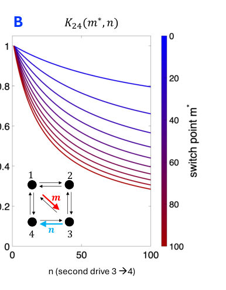 
Figure 3. Whether the second-stage switch is protocol-independent depends on the choice of sec- ond energetic edge. In both panels the first edge 1 →3 is ramped to a stopping (switch) value m∗and then held fixed while the second edge is ramped through n; curves are coloured by m∗, and the insets show the two energetic edges (m red, n cyan). Both panels use the same equilibrium rates, which satisfy the protection condition w(T#6) = w(T#7) with regard to the first energetic edge (1 →3), and differ only in which edge carries the second drive (Table S3). (A) Sec- ond edge 2 →3. Energetic protection extends from the single slice n = 1 to the full identity W(n) = 0 for all n (Supplement), so the...

📷 Fig 4

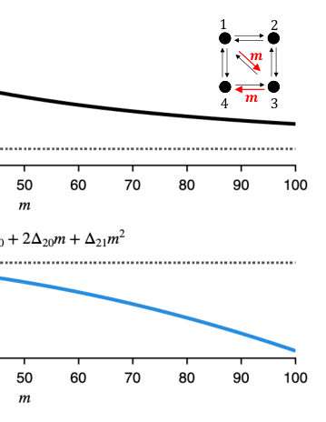 
Figure 4. Two coupled energetic edges produce a sin- gle nonmonotonic bump. The energetic edges 1 →3 and 3 →4 are perturbed together by a common factor m from an equilibrium configuration (m = 1; rates in Ta- ble S4). (A) The normalized response K24(m) rises and then falls, with a single interior maximum. (B) Its slope obeys sgn K′ 24(m) = sgn N(m) with N(m) = ∆10+2∆20m+∆21m2

**Summary.** This work develops a theoretical framework using graph theory to analyze how information processing constraints behave when systems are driven far from equilibrium. The central finding is 'energetic protection,' which reveals new, non-equilibrium invariances that can stabilize system ratios against external fluctuations. This suggests fundamental limitations and programmable control mechanisms in open, non-equilibrium physical and biological systems.

**Why it may be interesting.** It provides a powerful, graph-theoretic framework to find robust, non-equilibrium invariants that govern functional logic in physical systems, extending concepts of thermodynamic constraint into active matter or driven quantum/classical processes.

Detailed structure

**Main problem.** The study investigates how information-processing constraints, typically defined by equilibrium ratios (Boltzmann factors), persist or change when a physical system is driven far from thermodynamic equilibrium.

**Main result.** The authors identify 'energetic protection,' a mechanism where certain steady-state ratios remain exactly locked to their equilibrium values despite arbitrary driving forces, provided specific algebraic equalities among spanning-tree weights hold.

**Method.** The analysis employs graph theory applied to continuous-time Markov processes, using the arboreal distribution derived from spanning trees to calculate non-equilibrium steady states and response functions.

**Model / system.** The model is a finite-state Markov process represented by a directed graph where transitions are governed by rates. The system's dynamics are analyzed by perturbing specific transition rates (energetic edges) away from equilibrium.

**Key observables.** Normalized ratio of steady-state probabilities ($K_{ij}(m)$), which measures the deviation from equilibrium performance, and the existence/value of 'energetic protection.'

**Important parameters / regimes.** The driving strength parameter $m$ (which scales transition rates) and the specific algebraic equalities among spanning-tree weights.

**Assumptions / limitations.** The analysis assumes the system can be modeled by a continuous-time Markov process on a discrete state space, and that the response function can be analyzed via path actions derived from spanning trees.

**Figures summary.** Figures illustrate how the normalized response $K_{ij}(m)$ behaves (monotonicity, protection) based on relationships between spanning tree weights; later figures show the construction of a 'thermodynamic switch' using two energetic edges.

**Paper structure.** The paper progresses from establishing equilibrium constraints to analyzing single-edge driving (showing monotonicity or protection), then developing the concept of the 'energetic switch' using two coupled edges, and finally deriving the exact mathematical conditions for these invariances far from equilibrium.

Abstract

At equilibrium, the ratio of two steady-state probabilities is a Boltzmann factor, set by a free-energy difference. Such ratios are the natural, normalization-independent readouts of both thermodynamics and information processing, and are often used as a measure of fidelity in biophysical systems. What becomes of these ratios once a system is driven from equilibrium, where the Boltzmann factor no longer holds? Representing Markov processes as graphs and their steady states as averages over a distribution on spanning trees, the \emph{arboreal distribution}, we track the ratio $π_i/π_j$ under driving along \emph{energetic edges}, where detailed balance is broken, relative to its equilibrium value. Our central finding is that a chosen ratio can stay exactly locked to its equilibrium value arbitrarily far from equilibrium, a phenomenon we call \emph{energetic protection}, whenever an algebraic equality between spanning-tree weights holds. Just as detailed balance constrains rates around cycles, energetic protection constrains weights across trees, providing a new mechanism for robustness against fluctuations in the driving force, such as variations in ATP concentration. Away from this equality, single-edge driving collapses the response onto two arboreal coefficients and forces it to be monotonic, so nonmonotonic single-edge control is impossible at any strength. With two energetic edges, protection and monotonicity combine into a \emph{thermodynamic switch} that holds a function at its equilibrium value for as long as desired and releases it sharply. Equilibrium is known for the limits it places on information processing. We show that new constraints, both no-go principles and exact invariances, survive far from equilibrium. These results reveal how the localization of energy expenditure governs the functional logic of nonequilibrium systems in physics and biology.

[↑ back to top](#top)

### [Krylov complexity, mode-resolved complexity and entanglement entropy across phase transitions in the non-Hermitian extended Su-Schrieffer-Heeger model](http://arxiv.org/abs/2607.04659v1)

**Authors:** Ling-Feng Zhang, Wing Chi Yu  
**Type:** theory · **Category:** statistical mechanics · **PDF:** <https://arxiv.org/pdf/2607.04659v1>  
**Analysis basis:** full PDF text, analyzed in chunks
**Topic relevance:** 🔥 `driven-dissipative phase transition` **4/5** · 🔥 `entanglement & information structure` **4/5** · `analog quantum simulation` **3/5** · `methods for driven-dissipative` **3/5** · `non-equilibrium universality` **3/5** · `correlated / nonlocal dissipation` **2/5** · `non-equilibrium dynamics` **2/5** · `Keldysh / 2PI / non-Gaussian methods` **1/5** · `Kondo & dissipative impurity` **1/5**

📷 Fig 1

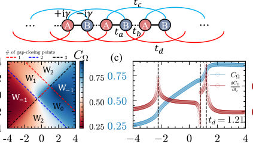 
FIG. 1. (a) Schematic diagram of the extended SSH chain with the unit cell constructed by site A and site B. The intra-cell (inter-cell) hopping ta (tb) is denoted by the black solid (dashed) line. The blue and red curves denote the next- nearest-neighbor hopping terms tc and td, respectively. The red (blue) circles denote sites with opposite on-site imaginary potential ±iγ. (b) The spread complexity of the Hermitian extended SSH model on the tc-td plane with ta = tb = −1. Wn denotes the phase characterized by a winding number of n. The red, blue and black dashed lines are the topological phase transition boundaries and the colors indicate the num- ber of gap-closing points. (c) The spread...

📷 Fig 2

 
FIG. 2. Distribution of exceptional points in the tc-td plane for (a) weak (γ = 0.12) and (c) moderate (γ = 1.2) non- Hermiticity. The markers lie at the phase transition bound- aries of the Hermitian extended SSH model (γ = 0). The numbers adjacent to these markers denote the number of gap- closing points in momentum space. Panels (b) and (d) dis- play the real (blue curves) and imaginary (red curves) parts of the energy spectra in momentum space, corresponding to the parameters indicated by markers in panels (a) and (c), respectively. The gray dotted line represents the zero-energy reference level (E = 0). The insets in the bottom two panels of the middle column in (b) show a zoom-in of...

📷 Fig 3

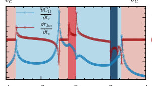 
FIG. 3. (a) The spread complexity of the non-Hermitian ex- tended SSH model with an imaginary staggered chemical po- tential γ = 1.2 on the tc-td plane. (b) The ratio of imaginary eigenvalues over the whole spectrum. (c) The derivative of spread complexity (the ratio of imaginary eigenvalues) over tc is denoted by the blue (red) line with circles, along the line td = 1.21. The background denotes the number of exceptional points [see Fig. 2(c)].

📷 Fig 4

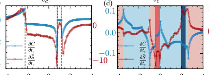 
FIG. 4. (a),(b) The long-time spread complexity on tc-td plane for the Hermitian and non-Hermitian extended SSH model with γ = 1.2, respectively. (c),(d) The derivative of long-time complexity and half-chain entanglement entropy with respect to tc for the Hermitian and non-Hermitian ex- tended SSH model along the line td = 1.21, respectively. The background denotes the number of exceptional points.

📷 Fig 5

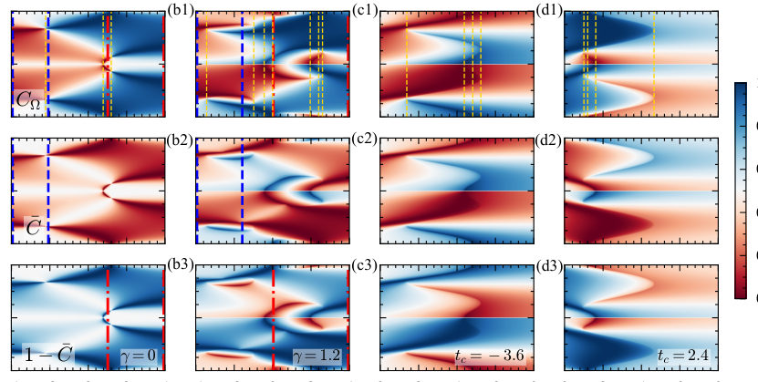 
FIG. 5. The top, middle, and bottom panels display the momentum-space distributions of CΩ, ¯C and 1 −¯C for td = 1.21, respectively. The yellow dashed lines in (a1) indicate the gap-closing points, and in (b1, c1, d1) indicate the parameters in which nEP changes. In the first column, the blue (red) dashed lines denote the boundaries where CΩ≈¯C (CΩ≈1 −¯C). In the second (third) column, CΩ≈¯C (CΩ≈1 −¯C).

**Summary.** This paper analyzes phase transitions in a non-Hermitian extended SSH model by applying advanced quantum complexity measures like spread complexity and entanglement entropy. The authors demonstrate that these information metrics serve as powerful diagnostic tools, successfully signaling topological phase boundaries during both ground state preparation and time evolution. This provides a theoretical framework for using quantum information to characterize complex many-body physics in open systems.

**Why it may be interesting.** This work directly connects concepts from topology and non-Hermitian physics with quantitative tools from quantum information theory, providing robust diagnostics for phase changes in open or driven systems relevant to AMO research.

Detailed structure

**Main problem.** The study investigates how quantum information measures can effectively signal phase transitions within non-Hermitian quantum systems.

**Main result.** Both spread complexity and entanglement entropy successfully detect phase transitions in the extended SSH model, with mode-resolved complexity providing detailed insight into the critical modes involved.

**Method.** The analysis employs advanced quantum information diagnostics, including Krylov/spread complexity and entanglement entropy, applied to two dynamical protocols: ground state preparation and long-time evolution.

**Model / system.** The system is the extended Su-Schrieffer-Heeger (SSH) model modified with next-nearest-neighbor hoppings and an imaginary staggered chemical potential, making it non-Hermitian.

**Key observables.** Krylov/Spread complexity, mode-resolved complexity, entanglement entropy ($S$), and their long-time averages ($ar{C}, ar{S}$).

**Important parameters / regimes.** The hopping parameters ($t_a, t_b, t_c, t_d$) and the non-Hermiticity strength ($\gamma$). The analysis focuses on topological phase boundaries.

**Assumptions / limitations.** The analysis relies on mapping the system dynamics onto quantum information measures; one key finding is that saturation behavior in $ar{S}$ mirrors that of $ar{C}$.

**Figures summary.** Figures illustrate the extended SSH chain structure, map out topological phase boundaries using spread complexity on parameter planes ($t_c$-$t_d$), and show the distribution of exceptional points.

**Paper structure.** The paper systematically introduces the non-Hermitian model, applies various quantum information measures (complexity, entanglement entropy) to two distinct dynamical protocols, analyzes how these measures signal transitions across topological boundaries, and finally uses mode-resolved complexity to pinpoint characteristic modes.

Abstract

We investigate phase transitions in the extended Su-Schrieffer-Heeger (SSH) model with next-nearest-neighbor hoppings and an imaginary staggered chemical potential. In the presence of small non-Hermiticity, exceptional points emerge in pairs from the gap-closing momenta near the topological phase boundaries of the Hermitian limit. Utilizing the Krylov spread complexity and entanglement entropy, we analyze two dynamical protocols: (i) preparing the non-Hermitian ground state via a unitary transformation, and (ii) evolving the system under the non-Hermitian Hamiltonian. We show that the spread complexity, and long-time spread complexity as well as entanglement entropy can effectively signal phase transitions in the first and second protocols, respectively. To unravel the detailed structure of the transitions, we introduce the momentum-resolved complexity that identifies the characteristic modes and tracks their evolution with the driving parameter. In the regime where the system possesses a purely imaginary spectrum, we further identify dynamical phases based on the saturation behavior of the spread complexity. The entanglement entropy is also found to exhibit similar saturation behavior, thereby providing a more experimentally accessible probe of the dynamical phases.

[↑ back to top](#top)

### [Wei-Norman approach for non-Hermitian driven spin-$S$ systems and its application to defect freezing](http://arxiv.org/abs/2607.04075v1)

**Authors:** Mingwei Meng, Chen Sun  
**Type:** theory · **Category:** other · **PDF:** <https://arxiv.org/pdf/2607.04075v1>  
**Analysis basis:** full PDF text, analyzed in chunks
**Topic relevance:** 🔥 `methods for driven-dissipative` **4/5** · `analog quantum simulation` **3/5** · `driven-dissipative phase transition` **3/5** · `exotic spin models in light-matter` **3/5** · `non-equilibrium dynamics` **3/5** · `non-equilibrium universality` **2/5** · `spintronics-quantum-optics interface` **2/5** · `Keldysh / 2PI / non-Gaussian methods` **1/5** · `Kondo & dissipative impurity` **1/5** · `correlated / nonlocal dissipation` **1/5**

📷 Fig 1

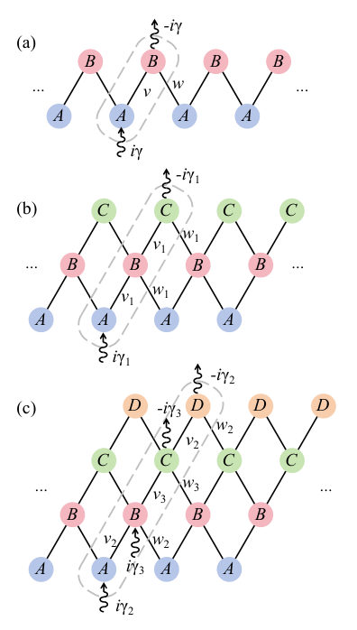 
FIG. 1. Sketches of lattices of (a) the PT -SSH model, (b) its S = 1 extension, and (c) its S = 3/2 extension. A, B, C and D stand for sites in different sublattices, a solid line presents intracell or intercell hoppings between sites, and a waved line presents gain or loss at a given site. In each sketch four unit cells are plotted, with a dashed line encircling a specific unit cell, and only parameters within this cell and between it and its adjacent cell to the right are shown (parameters in the whole lattice can be read off by translational symmetry). The parameters of the S = 1 and S = 3/2 models are related to those of the S = 1/2 model as: v1 = √

📷 Fig 2

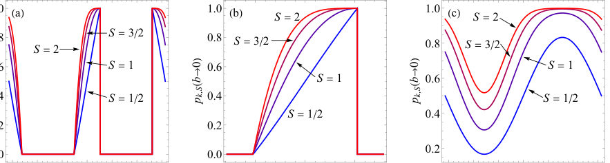 
FIG. 2. Excitation probability in the adiabatic limit pk,S(b →0) vs. momentum k by Eq. (34) for the spin-S PT -SSH model under a quench for four different S from S = 1/2 to S = 2. (a) at γ/w = 0.5; (b) same as (a) but zoomed into a region near k = 0; (c) at γ/w = 1.5.

📷 Fig 3

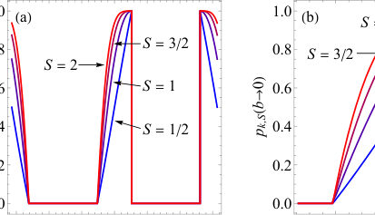 
Fig. 3(a) shows nex,S(b →0) vs. γ/w by Eq. (40) for four different S from S = 1/2 to S = 2. As in the k-resolved result, a curve with a larger S is always above another curve with a smaller S. For each value of S, nex,S(b →0) increases monotonically with γ, and it experiences a sin- gularity at γ = w where the slope of the curve (namely, ∂nex,S(b →0)/∂γ) changes discontinuously. (Due to the arcsin term in Eq. (40), this slope diverges as γ →w−; it is finite as γ →w+.) The physical reason of this singular- ity is the same as in the S = 1/2 case, namely, γ = w this is the critical point between the two cases that a portion of or all of the k sectors traverse the PT -broken region. Using P...

📷 Fig 4

 
FIG. 3. Excitation density in the spin-S PT -SSH model under a quench. (a) Excitation density nex,S(b →0) vs. γ/w by Eq. (40) for four different S from S = 1/2 to S = 2. (b) The solid lines are the same as in (a) but for small γ/w, and the dashed lines are linear approximation by Eq. (41). (c) Excitation density above the frozen defect ∆nex,S vs. quench rate b at w = 1, γ = 0.3 for S = 1/2 and S = 2. The solid lines are by the approximate analytical expression Eq. (40), and the dots are from exact numerical integrations.

**Summary.** This paper introduces the Wei-Norman approach as an elegant method to find exact analytical solutions for the time evolution of complex spin-$S$ quantum systems driven by non-Hermitian fields. By applying this to the PT-SSH model, the authors predict that defect freezing—a breakdown of adiabaticity—occurs specifically when the system traverses higher-order exceptional points during a quench. This offers testable predictions for platforms like photonic lattices.

**Why it may be interesting.** This work provides a powerful, accessible analytical tool (Wei-Norman approach) for tackling non-Hermitian dynamics in multi-level systems, linking abstract mathematical techniques directly to observable physical phenomena like topological transitions and excitation singularities.

Detailed structure

**Main problem.** The primary challenge addressed is finding exact analytical solutions for nonadiabatic dynamics in complex, time-dependent, non-Hermitian quantum systems.

**Main result.** The authors developed the Wei-Norman approach to analytically solve spin-$S$ evolution operators using Jacobi polynomials, and applied this to predict defect freezing across higher-order exceptional points (EPs) in PT-symmetric models.

**Method.** The core method is the Wei-Norman approach, which allows expressing the time evolution operator as a product of exponentials derived from Lie algebra structures, simplifying calculations for multi-level systems.

**Model / system.** The study focuses on spin-$S$ quantum systems driven by general non-Hermitian Hamiltonians. A key application is the PT-symmetric Su-Schrieffer-Heeger (PT-SSH) model, which can be realized in photonic lattices or electric circuits.

**Key observables.** Matrix elements of the evolution operator, momentum-resolved excitation probabilities, and total excitation densities.

**Important parameters / regimes.** The non-Hermiticity parameter ($\gamma$), the quench rate ($b$), and the spin quantum number ($S$).

**Assumptions / limitations.** The method assumes the Hamiltonian structure belongs to $\mathfrak{su}(2)$ algebra; solvability is shown by reducing the problem to a known solvable two-level model.

**Paper structure.** The paper first introduces the general Wei-Norman framework for spin-$S$ systems, showing its connection to $S=1/2$ via Jacobi polynomials. It then applies this machinery to analyze the PT-SSH model under linear quenches to study defect freezing phenomena.

Abstract

In the theoretical study of nonequilibrium non-Hermitian systems, obtaining exact analytical solutions for their nonadiabatic dynamics is highly desirable yet often challenging. In this work, we identify a class of non-Hermitian quantum systems where this difficulty can be substantially reduced. Employing the Wei-Norman approach, we show that for a spin-$S$ subject to a general non-Hermitian time-dependent drive, the matrix elements of the evolution operator can be expressed in closed analytical forms (via Jacobi polynomials) in terms of the corresponding spin-$1/2$ model. This approach is straightforward and accessible to nonspecialists in Lie algebra. As an application, we investigate a specific nonequilibrium non-Hermitian phenomenon known as defect freezing, i.e., the existence of excitations in the adiabatic limit, in spin-$S$ extensions of the $\mathcal{PT}$-symmetric Su-Schrieffer-Heeger model under linear quenches. We derive exact analytical expressions for the momentum-resolved excitation probabilities and the total excitation densities. Our results reveal that defect freezing occurs exclusively in momentum sectors that traverse the $\mathcal{PT}$-symmetry-broken region -- and thus pass through a pair of higher-order exceptional points (EPs) -- during the quench; notably, the excitation density exhibits a singularity at a critical value of the non-Hermiticity parameter. This work enriches the analytical toolkit for nonadiabatic dynamics in multi-level non-Hermitian systems and provides quantitative, testable predictions for defect freezing across higher-order EPs, possibly accessible on platforms such as electric circuit networks and photonic lattices.

[↑ back to top](#top)

### [All-optical control of coherent perfect absorption via frequency conversion](http://arxiv.org/abs/2607.04682v1)

**Authors:** Rikizo Ikuta, Hirokazu Kobayashi, Hiroki Takahashi  
**Type:** experiment · **Category:** other · **PDF:** <https://arxiv.org/pdf/2607.04682v1>  
**Analysis basis:** full PDF text, analyzed in chunks
**Topic relevance:** 🔥 `correlated / nonlocal dissipation` **4/5** · `driven-dissipative phase transition` **3/5** · `interference shaping light` **3/5** · `quantum optics experiment` **3/5** · `Tavis-Cummings & cavity-many-emitter` **2/5** · `methods for driven-dissipative` **2/5** · `non-equilibrium universality` **2/5** · `analog quantum simulation` **1/5** · `correlated cavity matter` **1/5** · `non-equilibrium dynamics` **1/5**

📷 Fig 1

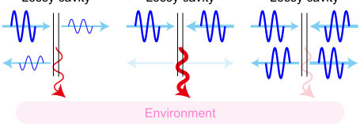 
FIG. 1. Concept of FC-CPA, based on a two-sided Fabry- Pérot cavity with frequency-conversion-induced optical loss. (a) Implementation of a lossy FP cavity using frequency con- version inside the cavity. The signal light is injected into the lossy cavity acting as a BS from (b) one side, (c) both sides with identical phase, and (d) both sides with a π-phase dif- ference between the inputs.

📷 Fig 2

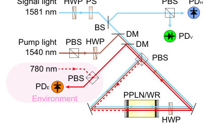 
FIG. 2. Experimental setup. The cyan and red solid lines indicate the signal light at 1581 nm and frequency-converted light at 780 nm, respectively. The red dashed line indicates the externally injected environmental light at 780 nm. Light beams at different wavelengths are combined and separated using dichroic mirrors (DMs). Details are provided in the main text.

📷 Fig 3

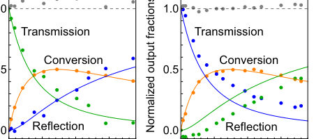 
FIG. 4. Pump-power dependence of the transmission, reflec- tion, and conversion fractions. Blue, green, and orange data were measured at PDH, PDV, and PDE, respectively. The gray points show the sum of the transmission, reflection, and conversion fractions. Signal light is input from (a) cw direc- tion, and (b) ccw direction.

📷 Fig 4

 
FIG. 3. Normalized observed responses from the FC-CPA for input from either cw or ccw direction. The blue, green, and orange colors denote the detector channels PDH, PDV, and PDE, respectively, corresponding to the colors used in Fig. 2. Darker colors correspond to higher pump powers. Spectra of (a) transmission, (b) reflection, and (c) conversion are shown for the signal input in the cw direction measured at pump powers of 0 mW, 21 mW, 72 mW, and 145 mW. (d), (e), and (f) show the corresponding spectra for the ccw direction mea- sured at the pump powers of 0 mW, 39 mW, 110 mW, and 180 mW.

📷 Fig 5

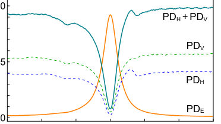 
FIG. 5. FC-CPA at the pump power of 45 mW using signal light incident from both directions. The amount of absorption from the main system (cyan) into the environment (orange) reaches approximately 92 %, which is not achieved when the signal is injected from either the cw or ccw direction alone.

**Summary.** The paper presents an all-optical platform for controlling Coherent Perfect Absorption (CPA) by utilizing frequency conversion within a lithium niobate waveguide. By coupling the signal field's loss channel to a non-resonant environmental mode, the system achieves tunable absorption up to 92%. Furthermore, injecting light into this environmental mode allows for active enhancement or suppression of the absorption process.

**Why it may be interesting.** This work is highly relevant as it demonstrates a method for actively controlling dissipation in optical systems using nonlinear optics, which has parallels to engineered loss channels studied in open quantum systems theory and cavity QED.

Detailed structure

**Main problem.** The primary goal is to achieve all-optically controllable Coherent Perfect Absorption (CPA), overcoming the limitation of conventional CPA which relies on fixed material loss.

**Main result.** The authors demonstrated a frequency-conversion-based platform where absorption can be controlled by tuning the pump light and injecting an external environmental field, achieving up to 92% absorption.

**Method.** The experiment uses a periodically poled lithium niobate waveguide resonator placed in a cavity to induce effective loss via nonlinear frequency conversion from a signal beam to an environmental mode.

**Model / system.** The system is modeled as a two-port beamsplitter coupled through frequency conversion. The control mechanism involves coupling the resonant signal field ($\lambda = 1581 	ext{ nm}$) to a non-resonant environmental mode ($\lambda_e = 780 	ext{ nm}$) using a pump beam ($\lambda_p = 1540 	ext{ nm}$).

**Key observables.** Transmission, reflection, and converted-light spectra; absorption efficiency (up to 92%); dependence of absorption on relative phase between counterpropagating signals.

**Important parameters / regimes.** Pump power, environmental field amplitude ($\alpha_{e,	ext{in}}$), cavity detuning ($\Delta_c$), and coupling constants.

**Assumptions / limitations.** The analysis treats fields as classical complex amplitudes; for initial derivations, internal loss was assumed zero.

**Figures summary.** Figures illustrate the concept diagram (Fig. 1) and experimental setup (Fig. 2). Subsequent figures show pump-power dependence of output spectra (Fig. 3, 4), high absorption with two-sided input (Fig. 5), phase control (Fig. 6), and enhancement/suppression via environmental injection (Fig. 7).

**Paper structure.** The paper progresses from establishing the concept of FC-CPA using frequency conversion to demonstrate tunable loss, then details measurements showing high absorption with two-sided input, and finally extends the model to show active control (enhancement/suppression) by injecting an external environmental field.

Abstract

Coherent perfect absorption (CPA) extinguishes optical fields through interference and dissipation, but conventional implementations rely on material loss that is largely fixed after fabrication. Here we demonstrate all-optically controllable CPA based on frequency conversion in a periodically poled lithium niobate waveguide resonator. Pump-driven frequency conversion couples a resonant signal field at 1581 nm in the main system to a non-resonant environmental mode at 780 nm, creating a dynamically tunable effective loss channel. The nonlinear cavity acts as a tunable lossy beamsplitter without intrinsic material absorption. Under coherent two-sided signal injection, we observe up to 92 % absorption. We further introduce environment-assisted CPA by injecting an external field into the frequency-converted environmental mode, turning the environment from a passive loss reservoir into an addressable coherent control port. Our results establish a frequency-conversion-based platform for all-optical control of dissipation in CPA, combining pump-tunable loss with environment-assisted coherent control.

[↑ back to top](#top)

### [Emergence of the Scrooge Ensemble in the Sachdev-Ye-Kitaev Model](http://arxiv.org/abs/2607.04864v1)

**Authors:** Zeyu Liu, Pengfei Zhang  
**Type:** theory · **Category:** statistical mechanics · **PDF:** <https://arxiv.org/pdf/2607.04864v1>  
**Analysis basis:** full PDF text, analyzed in chunks
**Topic relevance:** 🔥 `entanglement & information structure` **4/5** · 🔥 `measurement-induced transitions` **4/5** · `non-equilibrium dynamics` **3/5** · `quantum measurements` **3/5** · `non-equilibrium universality` **2/5** · `scars & prethermalization` **2/5** · `Keldysh / 2PI / non-Gaussian methods` **1/5** · `correlated / nonlocal dissipation` **1/5** · `driven-dissipative phase transition` **1/5** · `methods for driven-dissipative` **1/5**

📷 Fig 1

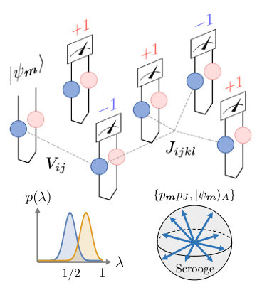 
FIG. 1. Schematic illustration of the main setup. The sys- tem is initialized in a thermofield double state of N pairs of Majorana fermions, denoted by the blue and red circles. Af- ter time evolution, projective measurements are performed on most pairs of Majorana fermions, yielding outcomes m and a post-measurement state |ψm⟩A. We analyze the distribution p(λ) of measurement outcomes with λN entries of +1, as well as the projected ensemble {pmpJ, |ψm⟩A}, where pJ is the distribution of random couplings.

📷 Fig 2

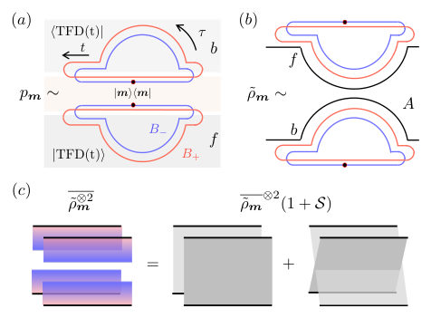 
FIG. 2. (a) Path-integral representation of the measure- ment probability pm, where the system B is divided into B+ and B−according to the measurement outcomes. f/b denotes the forward/backward evolution branches. (b) Path-integral representation of the unnormalized post-measurement density matrix ˜ρm for subsystem A. (c) Illustration of the two-replica calculation. Here, the colored shaded regions denote the path integral of subsystem B, while the gray shaded region indi- cates the connectivity of the saddle-point solution.

📷 Fig 3

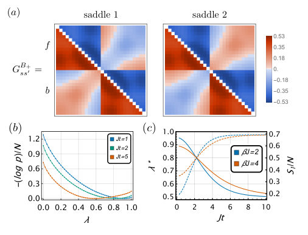 
FIG. 3. Numerical results for the measurement probability and participation entropy. (a) Two saddle-point solutions of GB+ for βJ = Jt = 2 and λ = 0.82. (b) Probability density p(λ) for different values of Jt for βJ = 2. (c) The most proba- ble measurement fraction λ∗and the participation entropy S1 as functions of the evolution time t for βJ = 2, 4 [71]. Dashed lines correspond to S1, and solid lines correspond to λ∗.

📷 Fig 4

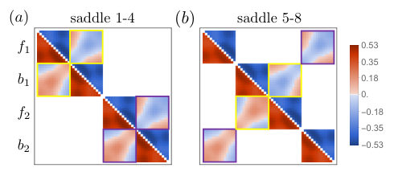 
FIG. 4. Saddle-point solutions of GB+ for βJ = Jt = 2 and λ = 0.82. We show two representative solutions correspond- ing to the two distinct pairing patterns illustrated in Fig. 2(c). From each representative solution, three additional solutions can be obtained by flipping the signs of the interbranch cou- plings indicated by the yellow and/or purple squares. We denote the forward/backward evolution branch of the r-th replica by f/br. In (a), the pairing pattern is (f1, b1) and (f2, b2), while in (b), it is (f1, b2) and (f2, b1).

📷 Fig 5

 
FIG. 1. Numerical verification of the reduced density matrix from the projected ensemble. Here, we choose βJ = 2 and βJ = 4 for panels (a) and (b), respectively.

**Summary.** This theoretical paper uses the solvable Sachdev-Ye-Kitaev model to study how measuring only part of a quantum system forces the remaining degrees of freedom into a statistically predictable state called the Scrooge ensemble. By mapping the problem onto path integrals and applying large-N techniques, the authors analytically prove that this emergence occurs even at very short times, establishing a key theoretical benchmark for understanding quantum measurement statistics.

**Why it may be interesting.** The connection between quantum measurements, deep thermalization, and universal random ensembles (Scrooge) is highly relevant for understanding information scrambling in strongly interacting quantum systems, which is a core topic in modern condensed matter theory.

Detailed structure

**Main problem.** The paper investigates the statistical structure of post-measurement states when only a subsystem of a quantum system is measured, leading to the concept of deep thermalization.

**Main result.** The moments of the projected ensemble are shown to exactly match those of the Scrooge ensemble, confirming that the SYK model provides a tractable setting for studying this universal statistical behavior.

**Method.** The analysis employs path integrals and large-N expansions applied to the Sachdev-Ye-Kitaev (SYK) model to analytically characterize the moments of the projected states.

**Model / system.** The system is modeled by the solvable Sachdev-Ye-Kitaev (SYK) Hamiltonian acting on Majorana fermions. The procedure involves initializing in a Thermofield Double state, evolving unitarily, and then performing projective measurements on one subsystem.

**Key observables.** Measurement probability ($p_m$), projected ensemble ($\{p_m, |\psi_m
angle_A\}$), Shannon participation entropy ($S_1/N$), and the first moment of the reduced density matrix ($
ho_A$).

**Important parameters / regimes.** Evolution time ($t$), system size ($N$), and coupling strength ($J$). The analysis explores limits like $N 	o \infty$ and short evolution times.

**Assumptions / limitations.** The calculation relies on the large-N limit, self-averaging properties of the SYK partition function, and assumptions regarding positive fermion parity for post-measurement states.

**Figures summary.** Figures illustrate the schematic setup involving TFD state initialization and measurement (Fig. 1). Other figures show path-integral representations for probabilities and density matrices (Fig. 2), and numerical results tracking probability distributions and entropy as a function of time (Fig. 3).

**Paper structure.** The paper develops the formalism by first setting up the path integral representation for measurement processes in the SYK model, deriving saddle-point equations for the partition functions ($Z_m$), and finally calculating observables like the participation entropy and the reduced density matrix ($
ho_A$) to confirm agreement with the Scrooge ensemble statistics.

Abstract

The probabilistic nature of quantum measurement provides a direct window into the structure and complexity of many-body wave functions. When only part of a system is measured, the remaining degrees of freedom form an ensemble of post-measurement states whose statistical structure can reveal a stronger form of thermalization, known as deep thermalization. Recent numerical evidence suggests that this phenomenon is characterized by convergence of the projected ensemble to the Scrooge ensemble, a maximally random ensemble compatible with a given density matrix. In this Letter, we use the solvable Sachdev-Ye-Kitaev (SYK) model to unveil the mechanism by which the Scrooge ensemble emerges in many-body systems. By formulating measurement probabilities and post-measurement states in terms of path integrals, we analytically characterize all moments of the projected ensemble and show that they exactly match those of the Scrooge ensemble, even at short evolution times. We further connect this result to the saddle-point structure of the measurement path integral, which naturally generates the replica permutations underlying Scrooge statistics. Our results establish the solvable SYK model as a tractable setting for exploring universal statistics of quantum measurements in chaotic many-body dynamics.

[↑ back to top](#top)

### [Sector-memory obstruction to probe-level bath emergence in finite programmable qubit environments](http://arxiv.org/abs/2607.04791v1)

**Authors:** Gaurav Sarmah, Ramakrishna Podila  
**Type:** both · **Category:** statistical mechanics · **PDF:** <https://arxiv.org/pdf/2607.04791v1>  
**Analysis basis:** full PDF text, analyzed in chunks
**Topic relevance:** 🔥 `QC/QI experiment` **4/5** · 🔥 `non-equilibrium dynamics` **4/5** · `driven-dissipative phase transition` **3/5** · `methods for driven-dissipative` **3/5** · `analog quantum simulation` **2/5** · `non-equilibrium universality` **2/5** · `Keldysh / 2PI / non-Gaussian methods` **1/5** · `correlated / nonlocal dissipation` **1/5** · `entanglement & information structure` **1/5** · `scars & prethermalization` **1/5**

📷 Fig 1

 
FIG. 1. Probe-level diagnostics for finite-bath emergence. A probe qubit S is coupled to a finite bath B of N qubits. Under charge-preserving dynamics, initial fixed-charge sectors remain dynamically separated. The measured quantities are the sector-resolved probe population p(q) e , the sector-memory variance MN, and the global Gibbs-fit error ∆global G . A finite environment is bath-like for the probe only when the sector- resolved reduced states collapse to a common Gibbs descrip- tion.

📷 Fig 2

 
FIG. 2. Exact Hamiltonian benchmark for sector-memory obstruction. The N = 8 charge-conserving calculation uses Haar-random pure states over each complete total-charge sec- tor; its ensemble-averaged late-time probe population follows p(q) e ≃q/(N + 1). The sector-resolved probe states cannot be represented by one global Gibbs state: the best sector- independent population fit leaves a large minimax error, giv- ing ∆global G = 0.782.

📷 Fig 3

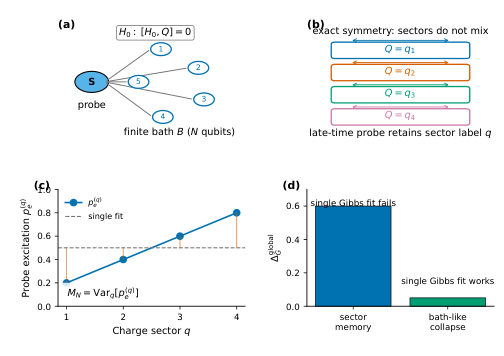 
Figure 1 summarizes the operational structure of the test. In the Qiskit and IBM protocols, the probe qubit is initialized in |0⟩, the bath is initialized in a fixed ex- citation sector q, and the late-time or finite-depth probe population p(q) e is measured across sectors. The principal exact benchmark instead uses full-sector Haar-random pure states as specified in Eq. (28); the probe-fixed ex- act calculation is reported separately in the Supplemental Material (Figs. S1-S5). If the finite environment behaves as a single canonical bath for the probe, the values p(q) e should collapse to a sector-independent value. Persistent variation of p(q) e across q gives a nonzero sector-memory...

📷 Fig 4

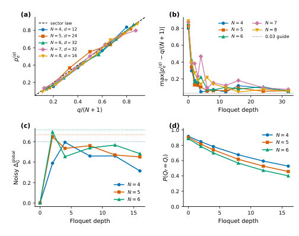 
FIG. 3. Hardware-compatible circuit validation. Ideal and transpiled circuit simulations reproduce the sector law p(q) e ≃ q/(N + 1). Simple noisy simulations identify N = 4 as the most robust hardware target: at depth d = 4, the noisy circuit gives ∆global G = 0.593, close to the ideal value 0.60, while retaining a visible charge-preservation signal.

📷 Fig 5

 
FIG. 4. IBM Fez observation of probe-level sector memory. The N = 4, d = 3, ϵ = 0 data show clear monotonic sector ordering and a large nonzero ∆global G . The N = 5, d = 6, ϵ = 0 data show that the effect survives at a larger bath size, although with stronger compression due to circuit depth and hardware noise. Raw and readout-mitigated analyses give the same qualitative conclusion.

**Summary.** The paper investigates whether coupling a local probe qubit to a small, programmable bath can mimic the behavior of an infinite canonical bath. By measuring diagnostics like sector memory variance ($M_N$) and Gibbs-fit error ($\Delta_{	ext{global}}^G$), the authors show that finite environments only achieve local equilibration within conserved sectors, failing to erase preparation-dependent 'sector memory'.

**Why it may be interesting.** This work provides a concrete, experimentally testable criterion for 'bath emergence' in engineered quantum systems, moving beyond idealized assumptions to address finite-size effects crucial for realistic open quantum system modeling.

Detailed structure

**Main problem.** The study aims to distinguish if a finite quantum environment acts as a true canonical bath, which would lead to preparation-independent probe states, or if it only causes local equilibration within constrained sectors due to conservation laws.

**Main result.** The authors conclude that equilibration within constrained sectors is insufficient to produce a single sector-independent Gibbs state, demonstrating a persistent 'sector memory' obstruction.

**Method.** They use theoretical analysis of infinite-time averages combined with experimental implementation on superconducting qubits using charge-preserving Floquet circuits.

**Model / system.** The system consists of a probe qubit coupled to a finite programmable bath of N qubits, governed by an excitation-number-conserving Hamiltonian. The dynamics are analyzed via sector-resolved time averaging.

**Key observables.** Sector-memory variance ($M_N$) and Global Gibbs-fit error ($\Delta_{	ext{global}}^G$); these quantify the deviation from a single canonical state description across different charge sectors.

**Important parameters / regimes.** The bath size (N), circuit depth, and symmetry-breaking strength ($\epsilon$) are key parameters varied in the analysis.

**Assumptions / limitations.** The conclusion is operational and limited to finite circuit depths; the diagnostics rely on analyzing time averages within conserved charge sectors.

**Figures summary.** Figures illustrate paired symmetry-breaking scans showing how perturbations reduce diagnostic errors but fail to eliminate sector ordering, confirming persistent memory effects.

**Paper structure.** The paper establishes the theoretical framework using conserved charges and defines diagnostics ($M_N$, $\Delta_{	ext{global}}^G$). It then presents exact simulations and validates these concepts on an IBM Fez hardware platform through controlled circuit implementations and disorder scans.

Abstract

Finite quantum environments can relax local probes without acting as canonical baths. We study this distinction for a probe qubit coupled to a programmable bath of ($N$) qubits under excitation-number-conserving dynamics. The conserved charge partitions the Hilbert space into sectors. We characterize probe-level bath emergence using the sector-resolved late-time population ($p_e^{(q)}$), the sector-memory variance ($M_N$), and a global Gibbs-fit error ($Δ_G^{\mathrm{global}}$). Exact simulations with Haar-random pure states in each complete fixed-charge sector yield sector-dependent populations close to the maximally mixed-sector benchmark ($p_e^{(q)}=q/(N+1)$), producing a nonzero Gibbs obstruction. We then construct charge-preserving Floquet circuits using ($R_z$) phases and ($XX+YY$) exchange gates, validate them with ideal and noisy Qiskit simulations, and implement finite-depth experiments on IBM Fez. For ($N=4$) and ($ε=0$), the hardware data give ($M_N \simeq 0.044$), ($Δ_G^{\mathrm{global}} \simeq 0.558$), and charge preservation near 0.90 after readout mitigation. A paired symmetry-breaking scan using bath ($R_x(ε)$) rotations reduces both diagnostics while increasing charge leakage, but does not erase sector ordering over the accessible depths. These results show that equilibration within constrained sectors is insufficient to produce a single sector-independent Gibbs state for the probe.

[↑ back to top](#top)

### [Coherent Control of Energy Transport at Room Temperature in a Noisy Bath](http://arxiv.org/abs/2607.05361v1)

**Authors:** Davinder Singh, Paul Brumer  
**Type:** theory · **Category:** statistical mechanics · **PDF:** <https://arxiv.org/pdf/2607.05361v1>  
**Analysis basis:** full PDF text, analyzed in chunks
**Topic relevance:** 🔥 `methods for driven-dissipative` **4/5** · 🔥 `non-equilibrium dynamics` **4/5** · `correlated / nonlocal dissipation` **3/5** · `driven-dissipative phase transition` **3/5** · `interference shaping light` **3/5** · `non-equilibrium universality` **2/5** · `Keldysh / 2PI / non-Gaussian methods` **1/5** · `Tavis-Cummings & cavity-many-emitter` **1/5**

📷 Fig 1

 
Figure 1: Schematic of a reaction center connected donor-acceptor pair (with quantum states, common ground state |g⟩, excited donor (acceptor) state |d⟩(|a⟩), and reaction center state |r⟩) in the presence of monochromatic control fields ⃗Em (where m = d, a). Here, δωm = ωL −ωmg is the detuning of the monochromatic field, rm illustrates the incoherent pumping rate, γm denotes the spontaneous decay rate, and Γt(Γr) represents the trapping (recycling) rate.

📷 Fig 2

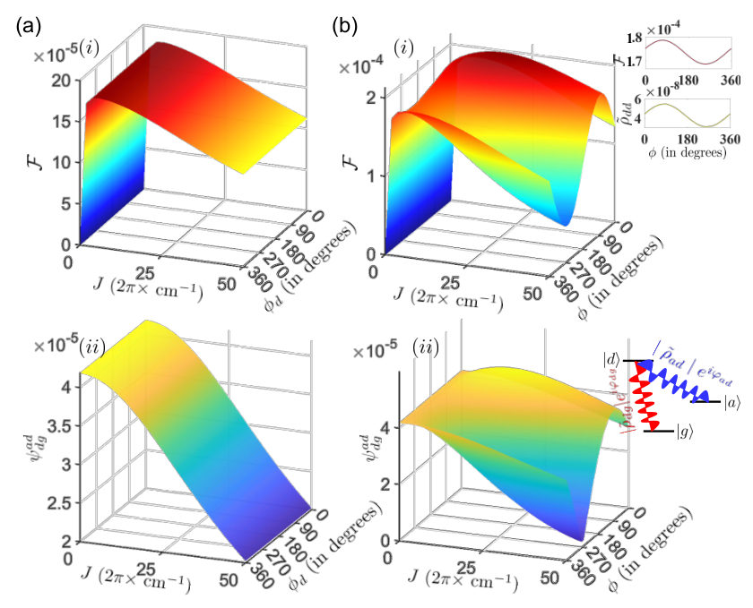 
Figure 2: Illustration of (i) flux and (ii) interference pattern as a function of the relative phase between laser beams and the Coulomb coupling J (a) in the absence [or presence (b)] of |g⟩→|a⟩coherent beam. The coherent beam for transition |g⟩→|d⟩is on in both cases. Further, inset for b(i) shows the dependence of the flux (upper panel) on the donor population (lower panel) for J = 2π × 2 cm−1. Inset: for b(ii) depicts the interference pathways when both the laser beams are switched on. Note that for computational purposes, NESS solutions and hence the flux F is rescaled with respect to a normalization parameter γ = 2π × 10−3 cm−1.

📷 Fig 3

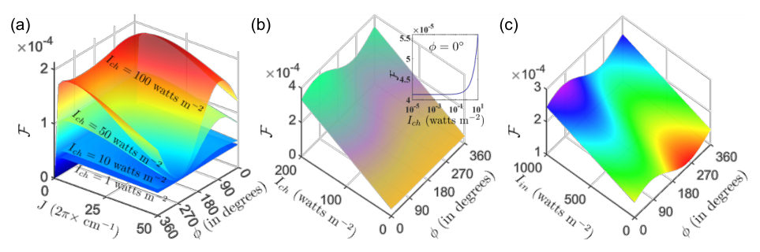 
Figure 3: (a) Flux as a function of ϕ and J with different values of coherent source intensity. (b) Flux as a function of ϕ and coherent source intensity. (c) Flux as a function of ϕ and incoherent source intensity. Here, we have used J = 2π × 10 cm−1 in the simulation of (b)&amp;(c).

📷 Fig 4

 
Figure 4: (a) The effect of the system phonon bath coupling on flux for the different values of relative phase. (b) Evaluation of flux for the asymmetric donor-pair acceptor, i.e., δωda = ωd −ωa ̸= 0 as a function of ϕ. In this case, two laser beams are considered such that laser beam for |g⟩→|d⟩transition remains resonant, while laser beam for |g⟩→|a⟩transition becomes off-resonant with δωda ̸= 0. Here, we have used J = 2π × 10 cm−1.

📷 Fig 5

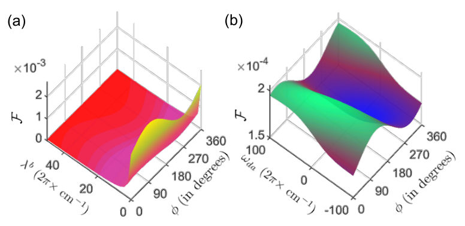 
Fig.4(b)], indicating the persistence of interference in the presence of the energetic mismatch.

**Summary.** The paper proposes using coherent laser fields to actively control the rate of energy transfer between donor and acceptor molecules in a system immersed in thermal noise. By exploiting quantum interference effects, researchers demonstrate that the energy flux can be switched or enhanced simply by tuning the relative phase of the driving lasers, proving robust control in a realistic, dissipative environment.

**Why it may be interesting.** This work is highly relevant as it extends quantum control concepts from idealized transient dynamics into realistic, noisy, non-equilibrium steady states characteristic of biological energy conversion processes at ambient temperatures.

Detailed structure

**Main problem.** The research addresses the coherent control of energy transport within a non-equilibrium steady state (NESS) in a system coupled to a noisy, dissipative environment at room temperature.

**Main result.** Coherent excitation can induce interference between energy transfer pathways, allowing for phase-dependent modulation—acting as an optical energy switch—even when the system is operating in a highly dissipative regime.

**Method.** The analysis involves solving the master equation to find the NESS, utilizing theoretical frameworks like the Redfield and Lindblad approaches to model open quantum dynamics.

**Model / system.** The model is a minimal donor-acceptor pair connected to a reaction center, treated as an open quantum system interacting with both incoherent radiation (pumping) and a phonon bath. The evolution is governed by a master equation incorporating various coupling terms.

**Key observables.** Energy flux ($F$) between the donor and acceptor sites; Donor-acceptor coherence ($	ilde{
ho}_{ad}$).

**Important parameters / regimes.** Relative phase ($\phi$) of coherent fields, bath temperature (300 K), reorganization energy ($\lambda_b$), and coupling ratios ($\Omega/J(\Gamma)$).

**Assumptions / limitations.** The analysis relies on the Markovian approximation and weak system-bath coupling. For NESS calculations, analytical solutions are often intractable, necessitating numerical methods.

**Figures summary.** Figures illustrate flux modulation as a function of relative phase ($\phi$) for different pumping conditions, and show how the calculated flux depends on the ratio between coherent field strength ($\Omega$) and bath spectral density ($J(\Gamma)$).

**Paper structure.** The paper progresses from defining the full Hamiltonian and master equation to deriving simplified Liouvillians (system-bath and system-radiation) under approximations. It then analyzes the steady-state flux in different coupling regimes, culminating in demonstrating phase control.

Abstract

Coherent control of energy transport in a non-equilibrium steady-state (NESS) in a reaction-center-connected donor-acceptor pair is proposed. The pigments are considered to be continuously interacting with incoherent radiation and a phonon bath while being driven by phase-controlled coherent fields. Coherent excitation of the donor-acceptor pair is shown to induce interference between excitation pathways, resulting in phase dependent modulation of the flux. As a consequence one can enhance or suppress energy transfer via interference, e.g. an optical energy switch. The persistence of such interference enables coherent control at a NESS in dissipative regime suggests an extension of the operational scope of quantum control from traditional transient domain with low dissiaption to noisy environment NESS at room temperature.

[↑ back to top](#top)

### [Controlling Atom Array in an Ultra-high-cooperativity Optical Cavity](http://arxiv.org/abs/2607.04090v1)

**Authors:** Jilai Ye, Zhihao Chi, Ye Tian, Shuyao Mei, Xiaoyu Li, Wenjun Zhang, Yajuan Zhao, Jiazhong Hu, Wenlan Chen  
**Type:** experiment · **Category:** other · **PDF:** <https://arxiv.org/pdf/2607.04090v1>  
**Analysis basis:** full PDF text, analyzed in chunks
**Topic relevance:** 🔥 `Tavis-Cummings & cavity-many-emitter` **4/5** · 🔥 `analog quantum simulation` **4/5** · `QC/QI experiment` **3/5** · `correlated cavity matter` **3/5** · `quantum optics experiment` **3/5** · `Rydberg arrays` **1/5** · `driven-dissipative phase transition` **1/5** · `entanglement & information structure` **1/5** · `interference shaping light` **1/5**

📷 Fig 1

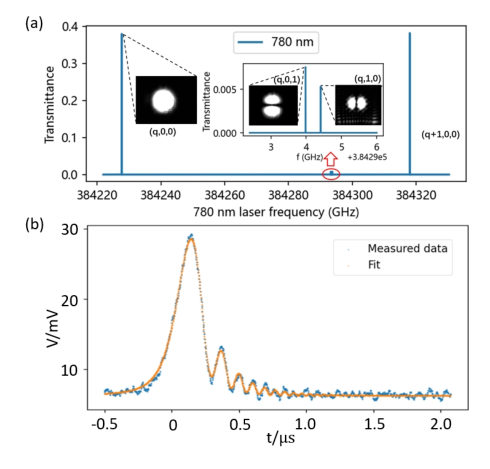 
FIG. 2. Cavity characterization. (a) Transmission spec- trum of a 780 nm probe laser sweeping over one free spectral range (FSR) of the cavity. The frequency spacing between two adjacent fundamental transverse (TEM00) modes is the νFSR = 89.7 GHz, which gives a cavity length L = 1.67 mm. In the cavity mode labeling (q, m, n), q is the longitudinal mode index, m and n are the transverse mode indices. The frequency spacings between the TEM01 and TEM10 modes and TEM00 mode are 66.0 GHz and 66.5 GHz, respectively. The inset shows the transmission spectrum of TEM01 and TEM10. (b) Ring-down measurement of the cavity. This is achieved by rapidly sweeping the laser frequency across the resonance...

📷 Fig 2

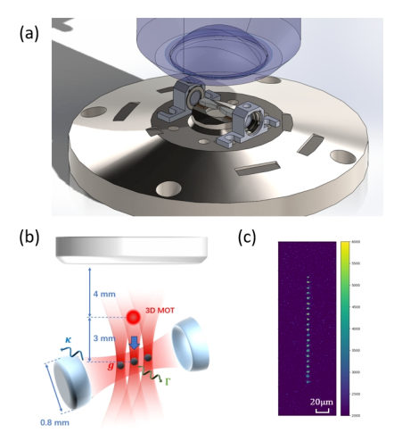 
FIG. 1. Integrated cavity-atom array platform. (a) The me- chanical design of the cavity assembly, in which two con- cave mirrors on top of the shear piezo actuators, and col- limation lenses are mounted on titanium structures. (b) Schematic of the optical tweezer array coupled to the cav- ity mode, with low-aberration viewport above them. The co- herent atom-cavity coupling rate g, cavity decay rate κ, and atomic linewidth Γ are indicated. (c) Fluorescence image of atoms loaded into tweezers overlapping with the cavity mode. In the present implementation, up to 21 individually trapped atoms can be rearranged and loaded into the cavity mode and coupled to the antinode of the cavity...

📷 Fig 3

 
FIG. 3. Atom-cavity transmission spectra. (a) Atomic transition used in the spectroscopy, 5S1/2|F = 2, mF = 2⟩→5P3/2|F ′ = 3, mF ′ = 3⟩of 87Rb. (b) Empty-cavity transmission spectrum. Here δ = ω −ωc is the frequency difference between the probe light ω and the cavity resonance ωc, and ∆= ωa −ωc is the atom-cavity detuning. The observed doublet arises from the fact that the two nearly orthogonal cavity polarization eigenmodes have slightly different resonance frequencies. (c)(d)(e)(f) Spectra for N=1,3,12,16 trapped atoms prepared at different tweezer sites inside the cavity mode; the similar line shapes indicate nearly uniform coupling for atoms positioned in the central region of the array....

**Summary.** The research reports the creation of an integrated platform combining neutral-atom arrays with a high-finesse Fabry-Pérot cavity. By developing novel mirror fabrication techniques, they achieved strong single-atom coupling ($\eta_{	ext{cav}} \approx 125$) while maintaining the large mode volume necessary for trapping many atoms. This opens pathways for complex quantum simulations involving collective atomic interactions mediated by light.

**Why it may be interesting.** This work directly addresses a major engineering hurdle in quantum simulation: creating large, controllable arrays of qubits (atoms) that are strongly coupled to high-quality optical cavities for advanced quantum state manipulation and entanglement generation.

Detailed structure

**Main problem.** The challenge is integrating neutral-atom arrays, which offer scalable qubit architectures, with high-cooperativity optical cavities, which provide strong light-matter coupling.

**Main result.** The authors successfully realized an integrated platform achieving a single-atom cooperativity of $\eta_{	ext{cav}}=125\pm13$ while maintaining large mode volume compatible with trapping up to 16 individual atoms.

**Method.** They employed a two-step mirror fabrication process and characterized the system by measuring atom-cavity transmission spectra as the number of trapped atoms was varied.

**Model / system.** The platform consists of an atomic array (e.g., Rb-87) coupled to a millimeter-scale Fabry-Pérot cavity, enabling controlled interaction between individual atoms and the cavity mode.

**Key observables.** Single-atom cooperativity ($\eta_{	ext{cav}}$), effective spectroscopic cooperativity ($\eta_{	ext{spec}}$), and atom-cavity transmission spectra as a function of trapped atom number ($N$).

**Important parameters / regimes.** High cooperativity regime ($\eta \approx 100$), millimeter-scale cavity size, sub-2 Å mirror roughness, and the ability to couple up to 16 atoms simultaneously.

**Assumptions / limitations.** The difference between measured $\eta_{	ext{spec}}$ and theoretical $\eta_{	ext{cav}}$ is attributed to spatial spreading of atoms or placement errors within the lattice.

**Figures summary.** Figure 3 shows atom-cavity transmission spectra, demonstrating the measurable spectroscopic cooperativity ($\eta_{	ext{spec}}$) for varying numbers of trapped atoms ($N=1$ through $N=16$).

**Paper structure.** The paper first establishes the need to combine scalable atomic arrays with high-cooperativity cavities. It details the advanced hardware fabrication techniques, presents measurements confirming strong coupling ($\eta_{	ext{cav}}$), and finally demonstrates in-situ characterization by measuring $\eta_{	ext{spec}}$ across multiple trapped atoms.

Abstract

Neutral-atom array and cavity quantum electrodynamics offer complementary strengths for quantum science: scalable, reconfigurable qubit architectures and strong coherent light-matter coupling. Combining them in a single platform requires an optical cavity with simultaneously high cooperativity, sufficient mode volume to accommodate atom array, and ample side optical access for atom trapping, imaging, cooling, and rearrangement, a combination that is challenging to achieve. Here we realize an atomic array integrated with a millimeter-scale Fabry--Pérot cavity whose optically-characterized single-atom cooperativity reaches $η_{\mathrm{cav}}=125\pm13$. Atom-cavity transmission spectra of trapped atoms yield an effective spectroscopic cooperativity $η_{\mathrm{spec}}=112.3\pm3.3$, providing an in-situ verification of strong coupling in the integrated platform, and we demonstrate simultaneous coupling of up to 16 individually trapped atoms to the antinode of the cavity mode. The key technical advance is a two-step mirror-fabrication method combining precision mechanical shaping and carbon-dioxide laser polishing, which produces concave fused-silica mirrors with sub-millimeter radii of curvature and residual roughness below 2 Å. Our results establish a regime of cavity-integrated atomic array that simultaneously provides high cooperativity, large mode volume, and flexible manipulation of individual atoms, opening opportunities for cavity-assisted quantum state readout and long-range entanglement-engineering in atom-array platforms.

[↑ back to top](#top)

### [Mapping open quantum dynamics onto graphs](http://arxiv.org/abs/2607.04721v1)

**Authors:** Kyuho Kim, Dayeong Lee, Seungkyun Park, Xianji Piao, Namkyoo Park, Sunkyu Yu  
**Type:** theory · **Category:** other · **PDF:** <https://arxiv.org/pdf/2607.04721v1>  
**Analysis basis:** full PDF text, analyzed in chunks
**Topic relevance:** 🔥 `methods for driven-dissipative` **4/5** · `correlated / nonlocal dissipation` **3/5** · `driven-dissipative phase transition` **3/5** · `Tavis-Cummings & cavity-many-emitter` **2/5** · `non-equilibrium dynamics` **2/5** · `non-equilibrium universality` **2/5** · `Keldysh / 2PI / non-Gaussian methods` **1/5** · `Kondo & dissipative impurity` **1/5** · `analog quantum simulation` **1/5** · `correlated cavity matter` **1/5** · `entanglement & information structure` **1/5**

📷 Fig 1

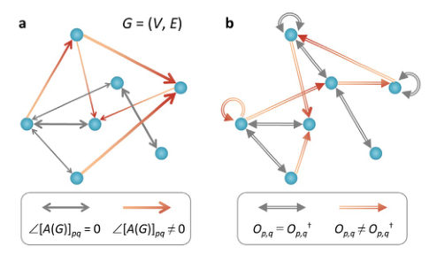 
Fig. 1. Schrödinger operator graphs. a, Magnetic graph G = (V, E) with NG vertices, where

📷 Fig 2

 
Fig. 2. Open quantum Rabi graphs. a, Schematic of the open QRM. b,c, GH (b) and GL (c) for

📷 Fig 3

 
Fig. 3. USC open quantum Rabi graphs. a-c, GL for (κ, γ, γφ) = (10–5, 10–5, 10–5) (a), (10–5, 0, 0)

📷 Fig 4

 
Fig. 4. Graph pruning. a, Schematic of graph pruning. b-d, Liouville spectra and the

📷 Fig 5

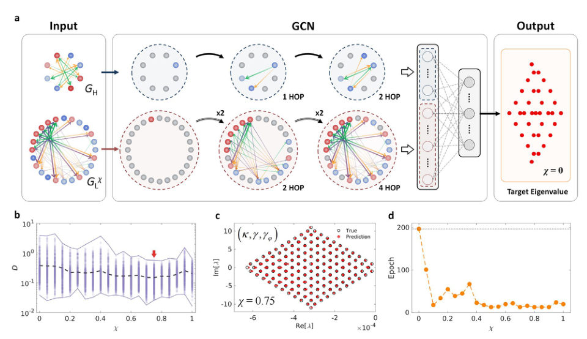 
Fig. 5. Schrödinger-operator graph neural networks. a, Schematic of the GCN, where ‘HOP’

**Summary.** The paper introduces a universal graph-theoretic framework to model open quantum dynamics by mapping the system's evolution onto two interconnected graphs. By applying this to the Open Quantum Rabi Model, the authors characterize how dissipation manifests as unique topological signatures within these graphs. This approach allows for efficient data-driven analysis and prediction of complex spectral properties using Graph Neural Networks.

**Why it may be interesting.** This work provides a powerful, unifying mathematical language—graph theory—to analyze complex open quantum dynamics, bridging abstract topological concepts with concrete physical phenomena like dissipation and coupling regime transitions in cavity QED systems.

Detailed structure

**Main problem.** To develop a universal graph-theoretic framework for mapping and analyzing both isolated and open quantum dynamics, specifically addressing the unexplored connectivity structure arising from system-bath coupling.

**Main result.** The authors successfully map open quantum dynamics onto two distinct graphs ($G_H$ and $G_L$), providing a rigorous mathematical tool to characterize dissipation signatures and enabling data-driven analysis via graph neural networks.

**Method.** The framework constructs Schrödinger operator graphs for the unitary part and uses a second graph derived from the Kossakowski matrix for the nonunitary (dissipative) evolution, allowing spectral analysis and machine learning prediction of Liouville spectra.

**Model / system.** The study focuses on open quantum systems governed by Markovian dynamics, exemplified by the Open Quantum Rabi Model (QRM), which includes coupling strengths ($\kappa, \gamma, \gamma_\phi$) and dissipation parameters.

**Key observables.** Liouville spectra ($\lambda$), graph-topological signatures of dissipation, Fiedler value ($\lambda_1$), and spectral distance measures like the Chamfer distance ($D$).

**Important parameters / regimes.** Coupling strengths ($\kappa, \gamma, \gamma_\phi$), pruning thresholds ($\chi$), and system size parameters ($N_{max}$). The analysis covers weak-to-ultrastrong coupling (USC) transitions.

**Assumptions / limitations.** The framework relies on using the first standard form of the Lindblad QME to ensure all degrees of freedom are encoded in the graph structures, and it compares graph pruning against matrix sparsification techniques.

**Figures summary.** Figures illustrate the constructed Schrödinger operator graphs ($G_H$ and $G_L$) for the open QRM under various coupling regimes. They show spectral comparisons using Liouville spectra ($\lambda$), demonstrating that graph pruning preserves spectral features better than direct matrix pruning, and present GCN training results.

**Paper structure.** The paper introduces the universal graph framework by defining two graphs ($G_H$ and $G_L$) representing unitary and nonunitary evolution. It applies this to the QRM, analyzing dissipation signatures and USC transitions using graph metrics. Finally, it develops and validates a Graph Convolutional Network (GCN) trained on these graph representations to predict the Liouville spectrum.

Abstract

Graph-theoretic frameworks have been widely employed in quantum physics to address the high-dimensional complexity of quantum systems. Although open quantum dynamics incorporates system-bath coupling via numerous interacting operators, it has been formulated algebraically with a partial set of jump operators or statistically universal reservoirs, leaving the underlying connectivity structure largely unexplored. Here, we propose a universal graph-theoretic framework for Markovian quantum dynamics. The framework maps open quantum dynamics onto two uniquely defined graphs, where the quantum master equation is rigorously interpreted as the average wave characteristic of operator-valued signals across the graphs. Applying this framework to the open quantum Rabi model, we demonstrate an open-system generalization of Fock-state lattices, characterize graph-topological signatures of dissipation, and classify the weak-to-ultrastrong coupling transition. Building on these representations, graph pruning reveals the backbone of open quantum dynamics, which enables superior graph neural-network learning. Our results bridge graph theory and open quantum dynamics, achieving efficient data-driven analysis of high-dimensional complexity.

[↑ back to top](#top)

### [Coherent quantum control of dark excitons in hybrid metal organic chalchogenolates](http://arxiv.org/abs/2607.04080v1)

**Authors:** Christian L. McCoy, Tobias Saule, Mariya Aleksich, Maggie C. Willson, J. Nathan Hohman, Thomas Weinacht, George N. Gibson, Carlos A. Trallero-Herrero  
**Type:** both · **Category:** quantum information and computing · **PDF:** <https://arxiv.org/pdf/2607.04080v1>  
**Analysis basis:** full PDF text, analyzed in chunks
**Topic relevance:** 🔥 `QC/QI experiment` **4/5** · `interference shaping light` **3/5** · `quantum optics experiment` **3/5** · `analog quantum simulation` **2/5** · `non-equilibrium dynamics` **2/5** · `Keldysh / 2PI / non-Gaussian methods` **1/5** · `correlated / nonlocal dissipation` **1/5** · `driven-dissipative phase transition` **1/5** · `entanglement & information structure` **1/5** · `methods for driven-dissipative` **1/5** · `quantum measurements` **1/5**

📷 Fig 1

 
Fig. 1: (a.) Excitonic state representation of mithrene, single photon allowed transi- tions in blue (left). Two photon allowed transitions in red (right). (b.) State diagram of a χ(3) process. Formalism and nomenclature from Eq. 1 and Ref. [25]. In the case of mithrene the only real n-states are the dark exciton states, A2p and B2p.

📷 Fig 2

 
Fig. 2: (a.) General experimental apparatus design used for all experiments. Pump pulses are are from a Ti:Sapphire laser and split between an OPA and pulse shaper. The resulting pulses are recombined and focused onto a sample of mithrene before the resulting emission is collected. Inset. Cartoon crystal structure of mithrene. Silver ball - Ag, Orange ball - Se, Blue hexagon/ball - phenyl ring (C6H5) (b.) Comparison of the FWM (black) brightness response in mithrene to the SFG (orange) brightness in BBO, both as a function of optical path length delay.

📷 Fig 3

 
Fig. 3: (a.) Two-dimensional heat map of the FWM emission as a function of the π phase jump position. Constructive interference as a result of the B2p resonance can be seen at ∼1.575 eV. (b.) Illustration of the phase delay scanning through the pump spectrum, leading to constructive interference for the entire width of the B2p resonance. (c.) B2p state population resulting from second-order perturbative treatment of the Hamiltonian, Eq. 2, overlayed over the heat map from (a.). (d.) Best theoretical agreement from a multidimensional scan of the integrated TDSE using the Hamiltonian from Eq. 2 compared to the heat map from (a.). Extracted material properties that fit the best for I0 = 2.88 ·...

📷 Fig 4

 
Fig. 4: (a.) λcenter = 1.56 eV (b.). λcenter = 1.53 eV. (c.) Lineout of the emission centered at 2.19 eV.

📷 Fig 5

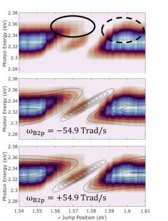 
Fig. 5: (a) Zoom in of the histogram for all simulated RMS values. (b) experimental π jump data. Solid and dashed circle mark regions of interest, see text. (c)(d) Simulation result for an ωB2p of -54.9 Trad/s (RMS of 0.092) and +54.9 Trad/s (RMS of 0.102) overlayed with the experimental data respectively. The rest of the material properties is kept constant.

**Summary.** The research demonstrates coherent quantum control of dark excitons—optically forbidden excited states—in MOChas at room temperature. By employing ultrafast pulse shaping and probing the system via Four-Wave Mixing, the authors show they can manipulate these states using a derived Hamiltonian model. This work establishes a solid-state platform for realizing fundamental quantum gate operations.

**Why it may be interesting.** This work directly bridges solid-state physics with quantum information science by showing how engineered excitonic states in organic semiconductors can be manipulated coherently using tailored light fields, mimicking atomic quantum control schemes.

Detailed structure

**Main problem.** The goal is to demonstrate coherent quantum control over dark exciton states within Metal-Organic Chalcogenolates (MOChas) for use in next-generation quantum processing platforms.

**Main result.** Coherent control was successfully demonstrated using ultrafast pulse shaping at room temperature, confirming the feasibility of using these solid-state systems for implementing basic quantum gate operations.

**Method.** The study combines theoretical modeling using a non-perturbative Hamiltonian with experimental techniques like Four-Wave Mixing (FWM) and ultrafast pulse shaping.

**Model / system.** The physical system is dark excitons in MOChas, modeled by a three-level system described by a two-photon Hamiltonian. The control mechanism relies on tailoring the spectral phase of an ultrafast laser pulse to manipulate state populations.

**Key observables.** FWM emission energy, which reveals resonance structure; the achievable quantum gate operations (e.g., $\pi/2$ rotation) characterized by pulse areas ($	heta$).

**Important parameters / regimes.** Room temperature operation, two-photon absorption access, and the ability to tune detuning ($\delta(t)$) relative to coupling strengths ($\chi(t)$).

**Assumptions / limitations.** The initial theoretical description is limited to the perturbative regime, and the model simplifies by neglecting certain state couplings.

**Figures summary.** Figures illustrate the excitonic state diagram (single-photon vs. two-photon allowed), the FWM experimental setup using a pulse shaper, and energy maps showing resonance features dependent on phase jumps.

**Paper structure.** The paper progresses from establishing the physical system and its limitations to developing a Hamiltonian description, demonstrating control via ultrafast spectroscopy measurements (FWM scans), and finally outlining the theoretical requirements for implementing quantum gates.

Abstract

Artificial atom-like systems are a promising candidate for next generation quantum processing. Among them, dark excitons exhibit one of the longest lifetimes at high temperatures. Here, we demonstrate coherent control of dark excitonic states in metal-organic chalcogenolates (MOChas) by using an ultrafast pulse shaper at room temperature. These dark exciton states are optically accessed via two-photon absorption and directly read out with a four-wave mixing process. The system is described by a non-perturbative, two-photon Hamiltonian based on well-known atomic physics and applied to a three level system comprised of two dark excitons. Empirical and theoretical state specific optical access is shown via a simple optical pulse shape. The developed Hamiltonian-based description is a first step towards a quantum processing platform using three-level systems and two photon transitions, one example being dark excitons in the MOCha silver benzeneselenolate (mithrene). Simple conditions for gate operations are laid out and described.

[↑ back to top](#top)

### [Gorini-Kossakowski-Sudarshan-Lindblad equation in different bases: application to driven-dissipative two- and multilevel systems](http://arxiv.org/abs/2607.03779v1)

**Authors:** O. A. Ilinskaya, O. V. Ivakhnenko, A. I. Ryzhov, O. Yu. Kitsenko, S. N. Shevchenko  
**Type:** theory · **Category:** other · **PDF:** <https://arxiv.org/pdf/2607.03779v1>  
**Analysis basis:** full PDF text, analyzed in chunks
**Topic relevance:** 🔥 `methods for driven-dissipative` **4/5** · `driven-dissipative phase transition` **3/5** · `non-equilibrium dynamics` **3/5** · `Keldysh / 2PI / non-Gaussian methods` **2/5** · `Tavis-Cummings & cavity-many-emitter` **2/5** · `non-equilibrium universality` **2/5** · `analog quantum simulation` **1/5** · `correlated / nonlocal dissipation` **1/5** · `correlated cavity matter` **1/5** · `quantum measurements` **1/5**

📷 Fig 1

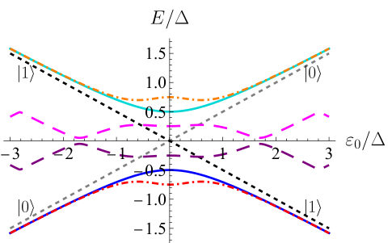 
FIG. 1. The energy levels of a qubit as functions of the en- ergy detuning ε0 (both in the units of the energy gap ∆) in different bases: the diabatic basis (the black and gray dashed lines), the instantaneous eigenbasis (the blue and cyan solid curves), the first superadiabatic basis (the red and orange dot-dashed curves), and the Floquet basis (the purple and magenta long-dashed curves). The labels |0⟩and |1⟩at the corners denote the diabatic eigenstates corresponding to the respective diabatic energy levels. The moment of time is fixed: t0 = π/2ω, other parameters are as follows: the excitation amplitude A = ∆, the driving frequency ℏω = ∆(then, the parameter in Eq. (20) is a = 1). For...

📷 Fig 2

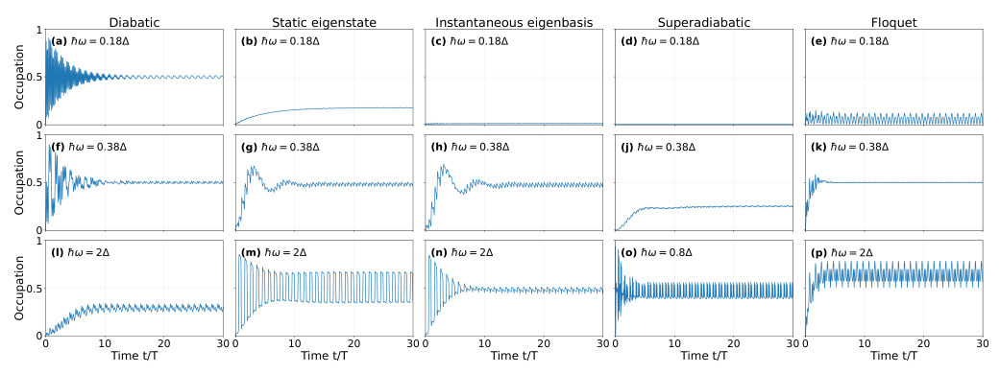 
FIG. 2. Comparison of the dynamics of the upper energy level occupation probability for different driving frequencies ℏω = 0.18 ∆, 0.38 ∆, 2 ∆(the three rows) in different bases (the five columns), with high relaxation and decoherence rates Γ1 = 0.15∆/ℏ, Γ2 = 0.175∆/ℏ. The horizontal axes show the time in periods of the driving signal T = 2π/ω. The energy detuning is ε0 = 0.96 ℏω, the driving amplitude is A = 4.02 ℏω. We note a lower value of the driving frequency in panel (o), ℏω = 0.8 ∆, compared to other panels in the third row. The reason is that the superadiabatic basis is inapplicable in the nonadiabatic regime. The parameter a, see Eq. (20), is approximately 0.13 for the first row,...

📷 Fig 3

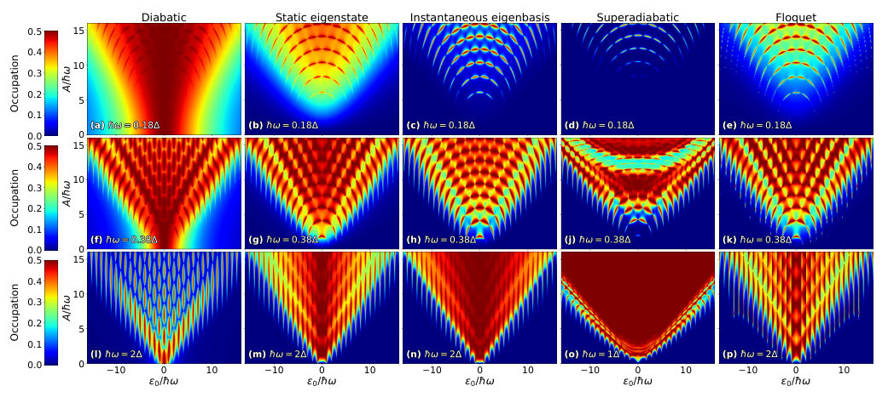 
FIG. 3. Comparison of the interferograms (the time-averaged upper-level qubit occupation probability as a function of the energy detuning ε0 and the driving amplitude A) for different driving frequencies ℏω = 0.18 ∆, 0.38 ∆, 2 ∆(the three rows) in different bases (the five columns), with moderate relaxation and decoherence rates Γ1 = 0.03∆/ℏ, Γ2 = 0.035∆/ℏ. We note a lower value of the driving frequency in panel (o), ℏω = ∆, compared to other panels in the third row. The reason is that the superadiabatic basis is inapplicable in the nonadiabatic regime. The first column: (a,f,l) the interferograms in the diabatic basis (6), which show the cleanest results in the case of fast nonadiabatic...

📷 Fig 4

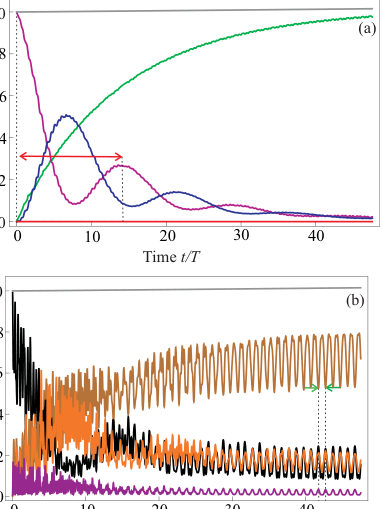 
FIG. 4. Dynamics for two driven qubits in different bases with relaxation and decoherence taken into account. The ab- scissa axes show time in units of the driving period T = 2π/ω. The driving frequency is resonant with the two eigenstates at t = 0: ℏω = E3(0) −E2(0). (a) Dynamics in the instanta- neous basis. The initial condition is as follows: ρ22(0) = 1, with other matrix elements being equal to zero. (b) Dy- namics in the diabatic basis. The initial condition is as fol- lows: ρ(d) 22 (0) = 1, with other matrix elements being equal to zero. Both panels show Rabi-like oscillations. The driv- ing period and the Rabi period are the same for both panels, and the Rabi period is shown by the...

**Summary.** This paper provides a comprehensive theoretical review of describing driven-dissipative quantum systems using the GKSL master equation. It argues that the choice of basis (e.g., diabatic vs. instantaneous eigenbasis) is critical, as it dictates the correct mathematical form of the evolution equations. By analyzing multiple bases for qubit and qudit systems, the authors provide necessary guidelines for theorists modeling complex open quantum dynamics.

**Why it may be interesting.** This work is highly relevant as it tackles a fundamental theoretical challenge: ensuring that the mathematical description of open quantum dynamics remains physically consistent regardless of the chosen computational basis, which is crucial for accurate modeling in quantum optics and superconducting circuits.

Detailed structure

**Main problem.** The core problem is determining the correct mathematical basis for formulating the Gorini-Kossakowski-Sudarshan-Lindblad (GKSL) master equation when describing driven-dissipative quantum systems.

**Main result.** The choice of basis—such as diabatic, instantaneous eigenbasis, or Floquet basis—fundamentally dictates the correct form of the master equation and its associated Hamiltonian terms, especially near avoided crossings.

**Method.** The authors analyze the GKSL equation by transforming operators and Hamiltonians between various bases (e.g., using transfer matrices) to ensure physical consistency across different dynamical regimes.

**Model / system.** The study focuses on driven-dissipative two- and multilevel quantum systems, exemplified initially by a qubit governed by a time-dependent Hamiltonian $H(t)$. The dynamics are described by the GKSL master equation.

**Key observables.** Dynamics of the density matrix $
ho$, stationary states (interferograms), and transition probabilities related to Landau-Zener tunneling.

**Important parameters / regimes.** Driving parameters ($\Delta, \epsilon(t)$), relaxation rates ($\Gamma_1, \Gamma_\phi$), and adiabaticity parameters ($\delta$).

**Assumptions / limitations.** The analysis relies on the Born, Markov, and secular approximations for deriving the master equation, and specific assumptions are made regarding the validity of basis transformations in different limits.

**Figures summary.** Figure 1 illustrates energy level diagrams (diabatic, instantaneous, superadiabatic, Floquet) as a function of detuning $\epsilon_0$, while Table I summarizes properties of these various bases.

**Paper structure.** The paper systematically revisits the GKSL equation derivation, analyzes its application to time-dependent Hamiltonians in multiple bases (diabatic vs. instantaneous), and discusses advanced techniques like superadiabatic and Floquet formulations for periodically driven systems.

Abstract

An open quantum system can be described by a master equation, of which one of the most popular is the Gorini-Kossakowski-Sudarshan-Lindblad (GKSL) equation. We revisit description of driven-dissipative quantum systems focusing on the appropriate choice of the system's basis and the respective transformations. We consider the GKSL equation in different bases and calculate the dynamics for a qubit and for a qudit. An appropriate choice of the basis is a fundamental problem for theoretical consideration of open quantum systems and provides an opportunity to obtain the desired evolution in practice.

[↑ back to top](#top)

### [Emergent Fermi polarons in Dirac materials](http://arxiv.org/abs/2607.04161v1)

**Authors:** Xin Chen, Eugen Dizer, Rafał Ołdziejewski, Kostya S. Novoselov, Marton Kanász-Nagy, Richard Schmidt  
**Type:** theory · **Category:** other · **PDF:** <https://arxiv.org/pdf/2607.04161v1>  
**Analysis basis:** full PDF text, analyzed in chunks
**Topic relevance:** 🔥 `Keldysh / 2PI / non-Gaussian methods` **4/5** · 🔥 `analog quantum simulation` **4/5** · `Kondo & dissipative impurity` **3/5** · `methods for driven-dissipative` **3/5** · `non-equilibrium dynamics` **2/5** · `correlated / nonlocal dissipation` **1/5** · `correlated cavity matter` **1/5** · `driven-dissipative phase transition` **1/5**

📷 Fig 1

 
FIG. 1. Setup and physical regimes. Massless Dirac regime (gray box): a Schematic realization, where majority fermions (red) and impurities (blue) populate a honeycomb lattice with hopping amplitudes t and tI, respectively, and interact via an on-site potential U. b Three-dimensional honeycomb band structure featuring two inequivalent Dirac points K and K′ at the corners of the Brillouin zone. c Zoom into the linear Dirac cone with the corresponding gapless DOS (bottom), vanishing at the charge-neutrality point. The arrow illustrates the particle-hole excitation responsible for the emergence of the Dirac-Fermi polaron (DFP). Massive Dirac regime (blue box): d Massive Dirac cone with gap...

📷 Fig 2

 
FIG. 2. a,b Absorption spectrum of a static impurity (tI = 0) in the massless Dirac regime for attractive (U/t = −5) and repulsive (U/t = 5) interactions, calculated via the functional determinant approach (FDA). In addition to the conventional attractive polaron (AP) and repulsive polaron (RP) branches, Dirac-Fermi polaron (DFP) resonances are visible. The symmetry between panels a and b reflects the particle-hole symmetry of the honeycomb band structure. c The corresponding spectrum of a static impurity for attractive interactions obtained from the variational Chevy ansatz, Eq. (4). Vertical dotted and solid lines mark the Dirac point (DP) and van Hove singularities (VHS), respectively,...

📷 Fig 3

 
FIG. 3. Absorption spectrum of a static impurity (tI = 0) for attractive interactions (U/t = −5). a,b Massive Dirac regime (blue box, ∆= t): FDA spectra for the impurity located at sublattice site A and B, with the schematic interacting DOS shown above each panel indicating bound state energies and band edges. The separation between the attractive and repulsive polaron branches is set by the bound state energy EB. The distances from the in-gap bound state to the lower and upper band edges are marked by 1 and 2, respectively. For site A, the in-gap state resides near the centre of the gap, giving rise to two distinct spectral gaps. In contrast, for an impurity at site B, no in-gap state is...

📷 Fig 4

 
FIG. 1. The honeycomb lattice is constructed with lattice vectors a1 = √

📷 Fig 5

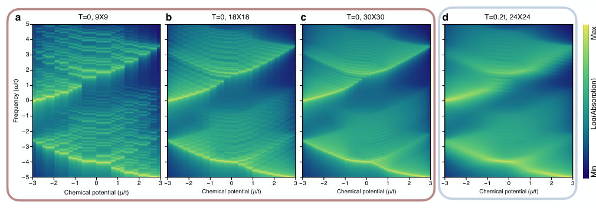 
FIG. 2. FDA absorption spectra for an interaction strength of U = −5 t with periodic boundary conditions. a–c Spectra at zero temperature (T = 0) for progressively larger lattice sizes: a 9 × 9, b 18 × 18, and c 30 × 30. d The corresponding finite-temperature absorption spectrum evaluated at T = 0.2 t on a 24 × 24 lattice.

**Summary.** This theoretical work characterizes the Dirac-Fermi Polaron (DFP), a unique quasiparticle formed when impurities interact with excitations near the Dirac point of materials like graphene. By calculating spectral functions and self-energies, the authors demonstrate that polaron spectroscopy provides a powerful tool to probe band structure effects beyond conventional measurements. The DFP is shown to be robust across various interaction strengths and doping levels.

**Why it may be interesting.** The focus on spectral signatures accessible in both solid-state (graphene) and ultracold atomic platforms makes this highly relevant for experimental quantum simulation groups working with strongly correlated systems.

Detailed structure

**Main problem.** The study investigates how band structure effects influence the absorption spectra of quantum impurities embedded in Dirac materials.

**Main result.** They predict the existence of a robust, novel quasiparticle called the Dirac-Fermi Polaron (DFP), which is accessible via polaron spectroscopy even far from the Fermi surface.

**Method.** The analysis employs advanced theoretical techniques including the Loschmidt echo calculation and self-energy ($\Sigma$) methods derived from functional determinant approaches and variational ansatze.

**Model / system.** The model uses fermionic systems on effective honeycomb lattices, relevant to graphene, considering interactions ($U$) between impurities and bath fermions. The analysis covers both static and mobile impurity limits across varying doping levels.

**Key observables.** Absorption spectrum $A(\omega)$, quasiparticle residue ($Z$), polaron lifetime ($	au$), and the self-energy $\Sigma_{dd}(\omega)$.

**Important parameters / regimes.** Interaction strength ($U/t$), chemical potential ($\mu$) relative to the Dirac point, and impurity mobility ($t_I$).

**Assumptions / limitations.** The analysis relies on approximations like the Functional Determinant Approach (FDA) and variational ansatze for self-energy calculations.

**Figures summary.** Figures illustrate absorption spectra showing AP, RP, and DFP resonances across doping levels; they also show the impurity spectral function ($\log$) and the calculated self-energy $\Sigma$ for both static and mobile impurities.

**Paper structure.** The paper progresses from establishing the basic polaron spectrum (AP, RP) to identifying the novel DFP at Dirac points. It then rigorously analyzes the DFP's robustness by incorporating impurity mobility and calculating quasiparticle properties ($Z, 	au$) via self-energy methods.

Abstract

We investigate band-structure effects on the absorption spectra of quantum impurities in Dirac materials. We uncover the formation of novel quasiparticles -- Dirac-Fermi polarons -- emerging from the dressing of impurities by excitations near the Dirac point. These quasiparticles are remarkably robust, persisting for both attractive and repulsive interactions, and across the full range of electron and hole doping. We show that their spectroscopic signature is a generic feature of Dirac materials, accessible with established techniques in both solid-state and ultracold atomic platforms. Our results establish polaron spectroscopy as a powerful probe of Dirac points at energies far from the Fermi surface, providing direct access to band-structure effects beyond conventional approaches.

[↑ back to top](#top)

### [Chirped Floquet linear drives activate forbidden charge-to-spin conversions in Rashba two-dimensional electron gases](http://arxiv.org/abs/2607.04946v1)

**Authors:** Mohsen Yarmohammadi  
**Type:** theory · **Category:** strongly correlated electrons · **PDF:** <https://arxiv.org/pdf/2607.04946v1>  
**Analysis basis:** full PDF text, analyzed in chunks
**Topic relevance:** 🔥 `non-equilibrium dynamics` **4/5** · `methods for driven-dissipative` **3/5** · `spintronics-quantum-optics interface` **3/5** · `driven-dissipative phase transition` **2/5** · `non-equilibrium universality` **2/5** · `Keldysh / 2PI / non-Gaussian methods` **1/5** · `Kondo & dissipative impurity` **1/5** · `analog quantum simulation` **1/5** · `exotic spin models in light-matter` **1/5**

📷 Fig 1

 
FIG. 1. Schematic of pristine and (chirped) Floquet linearly driven Rashba 2DEGs. In the pristine Rashba 2DEG or under linealry polarized Floquet light (left), continu- ous symmetries restrict the DC electric field (Ex, Ey)-induced spin Edelstein polarization Sx,y to be strictly orthogonal to the applied field. A chirped, linear drive (right), however, breaks the time-reversal and rotational symmetries of the sys- tem, which, in turn, lifts the native transport constraints, activating previously forbidden longitudinal and out-of-plane spin accumulations.

📷 Fig 2

 
FIG. 2. Pristine and chirped Floquet quasi-energy bands, spin textures, and induced Floquet-Zeeman fields. (a, b) Pristine and chirped Floquet quasi-energy bands with transverse spin projection ⟨σy⟩(color scale) for the (a) pristine ( ˜A = 0) and (b) driven ( ˜A/A = 0.3) regimes, where the drive breaks time-reversal and rotational symme- tries to open an asymmetric gap at finite momentum (kx ̸= 0). (c) In-plane chirped Floquet-Zeeman fields Mx,y (in units of e ˜Aα/ℏ, where α is the Rashba coupling strength) as a func- tion of the phase chirp c, illustrating control over both field magnitude and sign.

📷 Fig 3

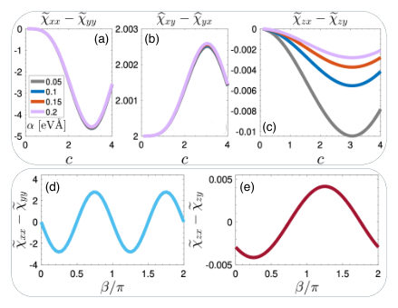 
FIG. 4. Chirped Floquet-induced Edelstein suscepti- bilities as a function of Rashba coupling strength and polarization angle. (a–c) Evolution of the dynamically in- duced (a) longitudinal, (b) transverse, and (c) out-of-plane spin Edelstein susceptibilities versus the phase-chirp param- eter c for various RSOC strengths α ( ˜A/A = 1, n = 2, β = π/3). (d, e) Dependence of the induced (d) in-plane diag- onal and (e) out-of-plane susceptibilities on the polarization tilt angle β at c = 2 and n = 2, showing π-periodic and 2π- periodic behaviors, respectively. Parameters: ˜A/A = 0.3 and eA/ℏkF = 0.3.

📷 Fig 4

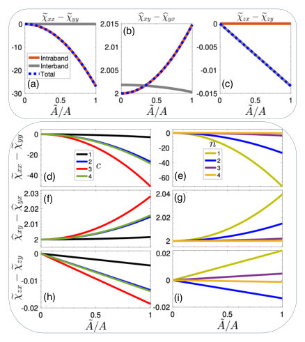 
FIG. 3. Chirped Floquet-induced charge-to-spin con- version in Rashba 2DEGs. (a–c) Decomposition of the dynamically induced (a) longitudinal, (b) transverse, and (c) out-of-plane susceptibilities into intraband, interband, and to- tal contributions as a function of the drive amplitude ratio ˜A/A (c = 2, n = 2). The in-plane accumulations arise from intraband Fermi-surface displacements, whereas out-of-plane spin generation originates from interband quantum coherence. (d–i) Evolution of the induced total tensor components versus ˜A/A for (d, f, h) varying phase chirp c at fixed n = 2, and (e, g, i) varying harmonic orders n at fixed c = 2. Parameters: α = 0.1 eV Å, eA/ℏkF = 0.3, and β = π/3.

**Summary.** The paper introduces a novel method using a chirped Floquet linear drive to induce charge-to-spin conversion in Rashba 2DEGs along previously inaccessible directions. By breaking key symmetries like time-reversal symmetry, the chirp activates forbidden components of the spin Edelstein effect. This provides an experimentally tunable mechanism for advanced spintronic applications without needing external magnetic fields.

**Why it may be interesting.** This work directly addresses open quantum systems dynamics by engineering time-periodic driving fields (Floquet engineering) to manipulate fundamental symmetries ($\mathcal{T}, C_{2z}$) in condensed matter systems, which is highly relevant for controlling spin-orbit torques and spintronics.

Detailed structure

**Main problem.** The primary goal is activating forbidden charge-to-spin conversion pathways (Edelstein effect) in Rashba 2DEGs beyond the conventional transverse plane.

**Main result.** A chirped Floquet linear drive successfully activates these forbidden spin Edelstein conversions by breaking rotational and time-reversal symmetries, offering a tunable spintronics route.

**Method.** The authors use Floquet theory to derive an effective Hamiltonian for the driven system and analyze symmetry properties of this effective model.

**Model / system.** The system is a Rashba two-dimensional electron gas (2DEG) described by a specific Hamiltonian, which is then subjected to a time-dependent, chirped linear Floquet drive.

**Key observables.** Spin Edelstein susceptibility tensor ($\chi_{ij}$), quasi-energy bands, and the components of the effective Hamiltonian ($h_0, h_x, h_y$).

**Important parameters / regimes.** Chirp parameter ($c$), harmonic order ($n$), Rashba coupling strength ($\alpha$), and low temperature limit ($k_B T = 1 	ext{ meV}$).

**Assumptions / limitations.** Calculations utilize the Kubo formula within the relaxation-time approximation, and the analysis relies on Floquet expansion techniques.

**Figures summary.** Figures illustrate the activation of longitudinal/out-of-plane spin components via the chirped drive, show quasi-energy band structures, and map out the dependence of responses on chirp parameters and polarization angles.

**Paper structure.** The paper progresses from identifying the physical limitation (transverse confinement) to proposing the chirped drive solution. It details the derivation of the effective Hamiltonian using Floquet theory, analyzes how symmetry breaking enables new terms in the susceptibility tensor, and concludes with experimental accessibility via optical modulators.

Abstract

In Rashba two-dimensional electron gases (2DEGs), charge-to-spin conversion via the Edelstein effect is conventionally limited to the transverse plane. Accessing longitudinal or out-of-plane pathways typically requires static magnetic fields or interface engineering, which cause stray fields and lack tunability. While dynamic circular or elliptical Floquet drives can also unlock these forbidden pathways, a simple Floquet linear drive cannot. Here, we propose an alternative approach: a \textit{chirped} Floquet linear drive. The chirp induces in-plane Floquet-Zeeman fields and an odd-parity momentum drift, which simultaneously break rotational and time-reversal symmetries. This mechanism activates the forbidden Edelstein charge-to-spin conversions in Rashba 2DEGs. Experimentally accessible via programmable spatial light modulators or optical delay lines, this tunable chirped linear drive offers a broadly applicable route to spin-orbit torque switching and high-efficiency spintronics.

[↑ back to top](#top)

### [Evidence of the Cooper-Pair Field with Gaussian Memory Kernel in Unconventional Superconductors](http://arxiv.org/abs/2607.03937v1)

**Authors:** Udomsilp Pinsook  
**Type:** theory · **Category:** strongly correlated electrons · **PDF:** <https://arxiv.org/pdf/2607.03937v1>  
**Analysis basis:** full PDF text, analyzed in chunks
**Topic relevance:** 🔥 `Keldysh / 2PI / non-Gaussian methods` **4/5** · `correlated / nonlocal dissipation` **3/5** · `driven-dissipative phase transition` **3/5** · `methods for driven-dissipative` **3/5** · `non-equilibrium universality` **2/5** · `Kondo & dissipative impurity` **1/5** · `correlated cavity matter` **1/5** · `non-equilibrium dynamics` **1/5**

📷 Fig 1

 
Figure 1: Raman electronic susceptibility in Bi2Sr2CaCu2O8+δ compared with the memory- dressed response. Blue points denote the extracted experimental spectrum at 15 K [12], the red dashed line is the fitted total response Eq. (55), which is composed of Cr = 0.11, the gray line is from the PCF term with Ar = 2.24, the green line is from the Gaussian Gr(E) term, and the black trace shows the residual. The narrower Gr(E) contribution is tentatively associated with the B1g phonon mode centered near 34 meV.

📷 Fig 2

 
Figure 2: Temperature-dependent antinodal ARPES spectra compared with memory-dressed fits: 6 K (upper left), 60 K (upper right), 70 K (lower left), and 80 K (lower right). Blue points show the extracted intensity from Chen et al. [13] and red curves show the results of Eq. (66) with Apg = 1.27 and Asc(0) = 1.93 in arb units. The sequence illustrates a robust pseudogap memory background together with a resonant Bogoliubov component that weakens on approaching the reported Tc = 77 K and may retain incoherent spectral weight slightly above Tc up to the fitted crossover scale Tpair.

📷 Fig 3

 
Figure 3: Tunneling differential conductance at low temperature compared with the memory- dressed density-of-states model. Blue points denote the background-removed dI/dV data, derived from the experimental data [14] and the red curve denotes the fitted response, Eqs. (61) and (67). The agreement of the coherence features and the broader background provides a cross-probe consistency check between ARPES and tunneling.

📷 Fig 4

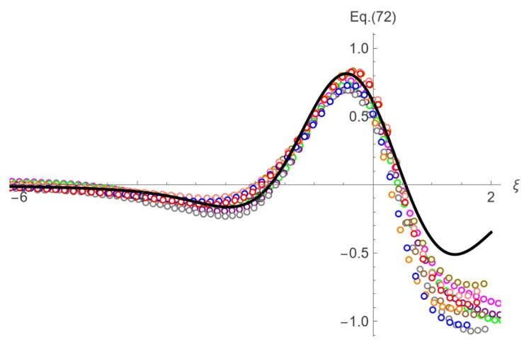 
Figure 4: Approximate universal PCF scaling of Bi2212 antinodal ARPES spectra over the doping p = 0.141 (magenta), 0.160 (green), 0.180 (purple), 0.193 (gray), 0.203 (dark yellow), 0.205 (brown), 0.207 (orange), 0.211 (pink), 0.213 (blue), 0.215 (red). Open symbols denote scaled experimental spectra, derived from He et al. [15], and the black curve denotes the universal PCF backbone, −exp  −ξ2

**Summary.** This work develops a dynamic theory for superconductivity in unconventional materials by treating the superconducting pair field as having memory effects due to local electronic fluctuations. It unifies spectroscopic measurements like ARPES and Raman scattering into a single framework governed by Gaussian-memory parabolic-cylinder functions, providing a detailed picture of how spectral weight shifts across different energy scales during the superconducting transition.

**Why it may be interesting.** The use of memory effects derived from statistical ensembles to describe phase transitions is highly relevant to open quantum systems dynamics. The connection between spectral weight redistribution and structured decay envelopes provides a powerful tool for analyzing complex many-body relaxation processes.

Detailed structure

**Main problem.** To develop a dynamical description of the superconducting pair field that treats it as a memory-dressed Bogoliubov pair field, moving beyond static order parameter approximations.

**Main result.** The superconducting transition reorganizes spectral weight between an incoherent pseudogap memory channel and a coherent condensate-assisted Bogoliubov memory channel. The response is unified by a Gaussian-memory Parabolic-Cylinder Function (PCF) framework.

**Method.** The authors derive the dynamics by coupling the pair field to fluctuating local modes, leading to an ensemble average that introduces a characteristic Gaussian memory factor into the effective action.

**Model / system.** The model focuses on unconventional superconductors, specifically cuprates like Bi2Sr2CaCu2O(8+d). The theory uses the Cooper-channel Hubbard-Stratonovich field ($\Delta$) and incorporates fluctuations arising from momentum-space spectral cavities (the pseudogap).

**Key observables.** Frequency-domain response expressed via parabolic-cylinder functions; measurable quantities include Raman spectra, ARPES background signatures, and superconducting gap features.

**Important parameters / regimes.** Critical temperatures ($T^*$, $T_{	ext{pair}}$, $T_c$); characteristic dephasing times ($	au_{	ext{pg}}, 	au_{	ext{sc}}$); algebraic power laws ($p=-1/2, 1/2, 1, \dots$).

**Assumptions / limitations.** The ensemble averaging of local frequency shifts is approximated as Gaussian to yield the exponential memory factor. The framework assumes that different spectroscopic probes are projections of a single underlying PCF continuum.

**Paper structure.** The paper builds from establishing the need for dynamic pair-field treatment, deriving the memory kernel via ensemble averaging over local fluctuations, and finally unifying the resulting spectral features (pseudogap, superconducting) within a single PCF mathematical structure.

Abstract

We develop a dynamical description of the superconducting pair field in which the Cooper-channel Hubbard--Stratonovich field $Δ$ is treated as a memory-dressed Bogoliubov pair field rather than as a purely static order parameter. Starting from the standard pair-field effective action, we couple $Δ$ to antinode-selected collective or self-generated fields. An ensemble of such modes produces a distribution of local Bogoliubov frequencies; when this distribution is approximately Gaussian, ensemble averaging gives the memory factor $\exp[-t^2/(2τ_g^2)]$. In cuprate superconductors, the antinodal gap or pseudogap restricts the active electronic phase space and acts as a momentum-space spectral cavity. It selects fluctuation wavevectors $\mathbf Q_a$ that may become charge-density-wave-like instabilities in an ordered limit, but behave as a reservoir of local collective fields in the fluctuating regime. The same framework admits resonant algebraic prefactors, so that threshold and forced-oscillator responses generate the hierarchy $p=-1/2,1/2,1,3/2,\ldots$, while the Gaussian envelope cuts off secular growth and converts these branches into finite spectral components. The resulting picture contains a robust pseudogap memory channel and, below $T_c$, an additional condensate-assisted coherent channel proportional to $|Δ_0(T)|^2$. Thus the superconducting transition primarily reorganizes pair-field spectral weight between incoherent pseudogap memory and coherent Bogoliubov memory. The frequency-domain response is expressed in terms of parabolic-cylinder functions, and comparisons with Raman, ARPES, tunneling, and doping-dependent ARPES scaling suggest that these probes are complementary projections of the same Gaussian-memory pair continuum. We compare our numerical results with the recent experimental data on Bi$_2$Sr$_2$CaCu$_2$O$_{8+δ}$.

[↑ back to top](#top)

### [Hidden Gauge Freedom in Complex-Pole Hierarchical Equations of Motion](http://arxiv.org/abs/2607.04834v1)

**Authors:** Tianchu Li, Andrés Montoya-Castillo  
**Type:** theory · **Category:** other · **PDF:** <https://arxiv.org/pdf/2607.04834v1>  
**Analysis basis:** full PDF text, analyzed in chunks
**Topic relevance:** 🔥 `methods for driven-dissipative` **4/5** · `Keldysh / 2PI / non-Gaussian methods` **3/5** · `correlated / nonlocal dissipation` **3/5** · `driven-dissipative phase transition` **2/5** · `non-equilibrium dynamics` **2/5** · `Kondo & dissipative impurity` **1/5** · `analog quantum simulation` **1/5** · `correlated cavity matter` **1/5** · `non-equilibrium universality` **1/5**

📷 Fig 1

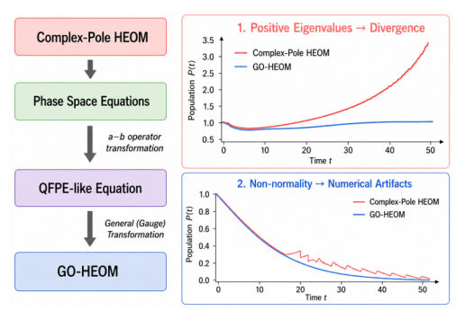 
FIG. 1. Schematic derivation of the GO–HEOM and the two major instability mechanisms in complex-pole HEOM.

📷 Fig 2

 
FIG. 2. (a) ⟨σz(t)⟩under an intermediate coupled BO spec- tral density (p0 = 1.0) for conventional complex pole HEOM (ϕr = 1.0) and GO–HEOM (ϕr = 1.4). In the strong-coupling regime of the BO spectral density (p0 = 3.0). (b) Henrici departure from normality as a function of the gauge-scaling parameter ϕr. (c) Maximum real part of the eigenvalue spec- trum as a function of ϕr. (d) Eigenspectra for ϕr = 1.0 and ϕr = 1.4.

📷 Fig 3

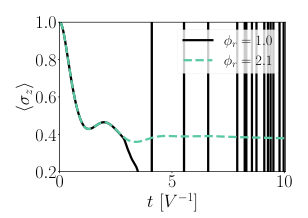 
FIG. 3. ⟨σz(t)⟩with strong coupling to a BO (p0 = 10.0) obtained with conventional complex-pole HEOM (ϕr = 1.0) and gauge-transformed HEOM (ϕr = 2.1).

📷 Fig 4

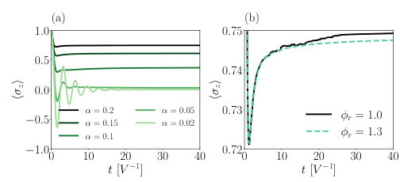 
FIG. 4. Spin-boson dynamics with a sub-Ohmic spectral den- sity at zero temperature. (a) ⟨σz(t)⟩as a function of cou- pling strength, α. (b) Error accretion in conventional HEOM (ϕr = 1.0) compared to our GO-HEOM (ϕr = 1.3) under strong coupling (α = 0.2).

**Summary.** This paper reveals a previously unknown 'hidden gauge freedom' within the complex-pole HEOM formalism used for open quantum systems. By optimizing this gauge parameter, the authors introduce GO-HEOM, a method that significantly enhances numerical stability. This allows researchers to simulate strongly coupled or highly non-Markovian dynamics regimes that were previously inaccessible due to computational instabilities.

**Why it may be interesting.** This work provides a powerful, general mathematical tool (the gauge optimization) to push the boundaries of numerically exact quantum dynamics simulations for open systems, which is crucial for modeling realistic quantum materials and environments.

Detailed structure

**Main problem.** The primary challenge addressed is the numerical instability inherent in complex-pole Hierarchical Equations of Motion (HEOM) when simulating open quantum systems.

**Main result.** The authors discovered a hidden gauge freedom within the HEOM formulation, allowing them to construct GO-HEOM which eliminates spectral divergences and extends simulations into previously inaccessible strongly coupled or sub-Ohmic regimes.

**Method.** They analyze the structure of the Liouvillian generator by identifying a continuous gauge transformation parameter ($\phi$) that preserves physical dynamics while optimizing numerical stability metrics like non-normality.

**Model / system.** The work focuses on open quantum systems, using the spin-boson model as a primary benchmark. The theory is developed around the complex-pole decomposition of the bath correlation function $C(t)$.

**Key observables.** Time evolution of observables like $\langle\sigma_z(t)
angle$, spectral divergence indicators, and non-normal error amplification metrics ($\eta_H$).

**Important parameters / regimes.** Coupling strengths ($\alpha$), bath spectral density exponents ($s$ for sub-Ohmic), and the gauge-scaling parameter ($\phi_r$).

**Assumptions / limitations.** The instability mechanisms (spectral divergence vs. non-normal amplification) are treated as distinct, controllable issues via the gauge transformation.

**Figures summary.** Figures illustrate the comparison of dynamics using conventional HEOM versus GO-HEOM across various coupling regimes, demonstrating stability improvements and convergence with respect to the optimization parameters.

**Paper structure.** The paper first establishes the numerical instability problem in complex-pole HEOM. It then derives the existence of a gauge freedom ($\phi$) that parameterizes equivalent Liouvillians. Finally, it optimizes this gauge to create GO-HEOM and validates its superior performance across various non-Markovian spectral densities.

Abstract

While complex-pole hierarchical equations of motion (HEOM) have dramatically expanded the reach of numerically exact quantum dynamics simulations of open quantum systems, they suffer from numerical instabilities rooted in the non-Hermitian structure of their Liouvillian. Yet, the origin of this structure remains obscure. Here, we report a previously unknown gauge freedom in complex-pole HEOM: a continuous family of analytically equivalent Liouvillians, all encoding the same bath correlation function, whose numerical properties vary dramatically. This gauge controls both the eigenspectrum and non-normality of the hierarchy generator, revealing spectral divergence and non-normal error amplification as two distinct instability mechanisms. By optimizing this gauge, we introduce GO--HEOM, which eliminates divergences in strongly coupled Brownian oscillator environments and extends numerically exact simulations of sub-Ohmic dynamics -- including through the delocalized-to-localized quantum phase transition -- to previously inaccessible coupling strengths. Because this gauge transformation is independent of the bath-correlation decomposition scheme, our GO--HEOM becomes a general, broadly compatible strategy for accessing numerically exact quantum dynamics of open quantum systems over arbitrary coupling and highly non-Markovian regimes.

[↑ back to top](#top)

### [Incompatibility assisted Zeno-like confinement enables unbounded sharing of nonlocality](http://arxiv.org/abs/2607.04298v1)

**Authors:** Prerna Rao, Som Kanjilal  
**Type:** theory · **Category:** quantum information and computing · **PDF:** <https://arxiv.org/pdf/2607.04298v1>  
**Analysis basis:** full PDF text, analyzed in chunks
**Topic relevance:** 🔥 `quantum measurements` **4/5** · `correlated / nonlocal dissipation` **3/5** · `entanglement & information structure` **3/5** · `measurement-induced transitions` **3/5** · `driven-dissipative phase transition` **2/5** · `methods for driven-dissipative` **1/5** · `non-equilibrium dynamics` **1/5** · `non-equilibrium universality` **1/5**

📷 Fig 1

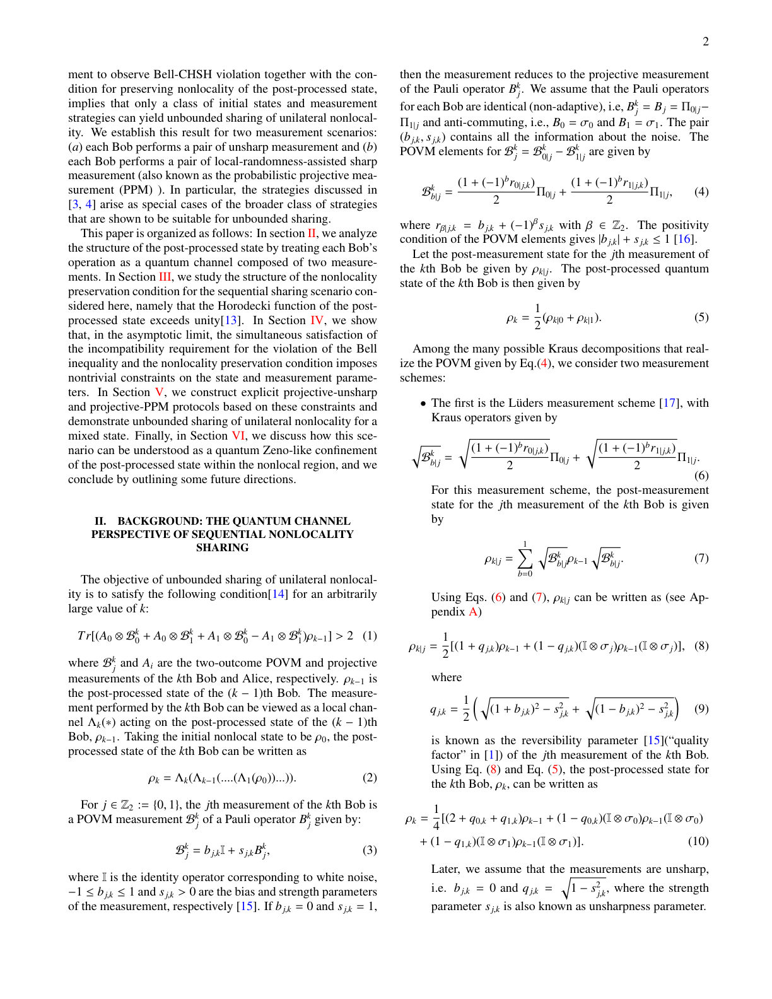 
Low-resolution page preview, page 2

📷 Fig 2

 
Low-resolution page preview, page 3

📷 Fig 3

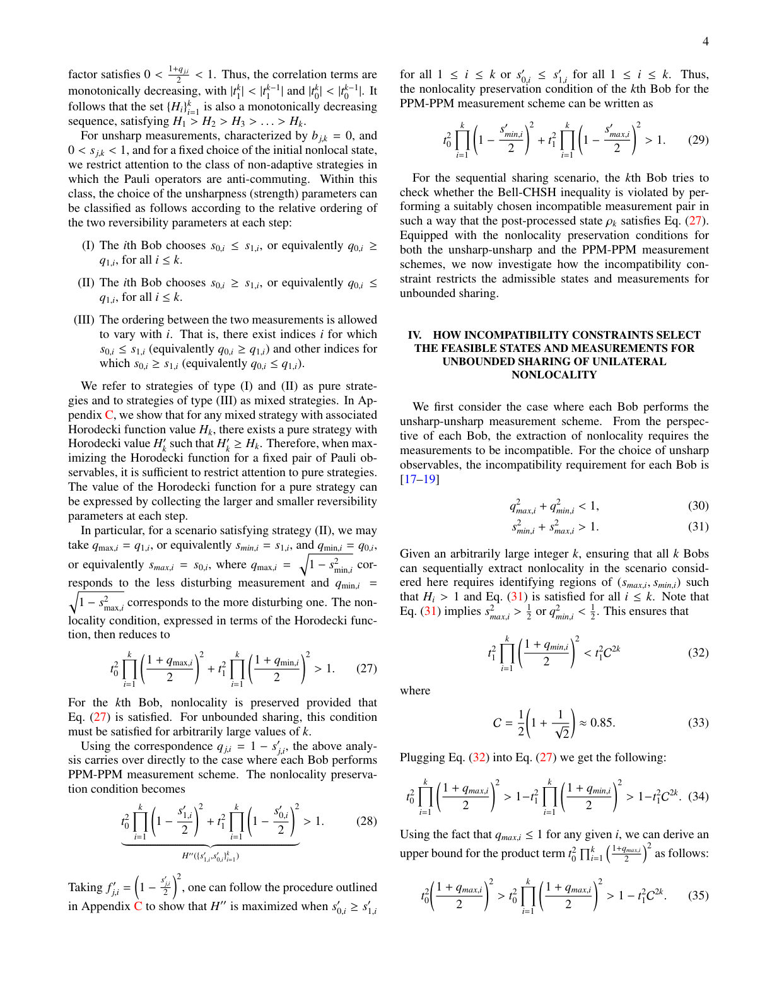 
Low-resolution page preview, page 4

📷 Fig 4

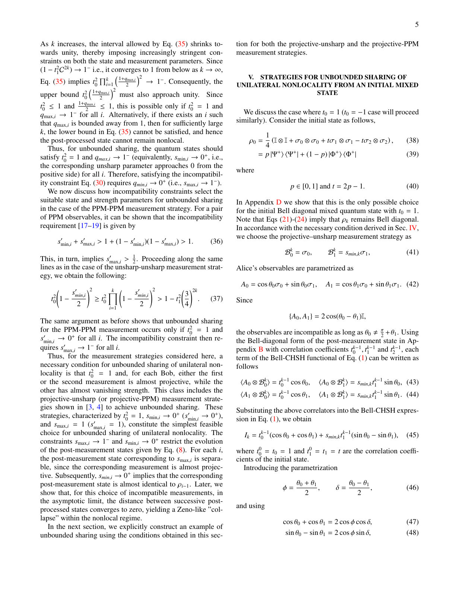 
Low-resolution page preview, page 5

📷 Fig 5

 
Low-resolution page preview, page 6

**Summary.** This paper theoretically analyzes how nonlocality (Bell-nonlocality) can be shared sequentially among an infinite number of copies using incompatible measurements. It finds that this process leads to a unique 'Zeno-like confinement' where the resulting states converge while remaining nonlocal. The findings establish stringent constraints on measurement choices necessary for such robust, unbounded sharing.

**Why it may be interesting.** This work provides a deep theoretical understanding of how quantum correlations can be robustly distributed over many sequential steps, drawing parallels to physical phenomena like the Quantum Zeno Effect in open quantum systems.

Detailed structure

**Main problem.** The research investigates the necessary conditions for sequentially sharing Bell-nonlocality among an unbounded number of copies using incompatible measurements.

**Main result.** Unbounded nonlocality sharing is possible, leading to a quantum Zeno-like confinement where successive post-processed states become almost identical while maintaining nonlocality.

**Method.** The authors analyze two measurement schemes (unsharp and PPM) by deriving recurrence relations for the post-processed state and imposing constraints based on the preservation of the Horodecki function ($H_k > 1$).

**Model / system.** The model involves a bipartite qubit system initialized in a nonlocal Bell diagonal state ($
ho_0$), which undergoes repeated local measurements by sequential parties (Bobs).

**Key observables.** Violation of the Bell-CHSH inequality ($I_k > 2$) and the Horodecki function ($H_k > 1$).

**Important parameters / regimes.** The asymptotic limit ($k 	o \infty$), measurement parameters (e.g., reversibility $q_{j,k}$ or strength $s'_{j,k}$), and initial state parameters.

**Assumptions / limitations.** The analysis assumes non-adaptive measurements and focuses on pure strategies to maximize the nonlocality measure; the mechanism relies critically on one measurement being 'almost projective' (the anchor).

**Paper structure.** The paper establishes the requirements for unbounded sharing, derives post-processed states for two specific measurement types (Lüders/unsharp and PPM), analyzes the nonlocality preservation condition in the asymptotic limit, and constructs feasible sequences of measurement parameters demonstrating Zeno-like confinement.

Abstract

To enable sequential sharing of Bell-nonlocality by an unbounded number of copies, each copy must satisfy two requirements. First, the measurements must be incompatible to extract nonlocality. Second, the post-processsed state, obtained as an equal mixture of the two post-measurement states, must remain nonlocal. We show that the incompatibility requirements impose nontrivial constraints on the choice of the initial nonlocal state and the amount of measurement noise required to ensure that the post-processed state remains nonlocal for an unbounded number of copies. We establish this result for two measurement scenarios, namely, when each copy performs unsharp measurements corresponding to a pair of anti-commuting Pauli observables, and when each copy performs probabilistic projective measurements (PPMs) of a pair of anti-commuting Pauli observables. Furthermore, we show that, in the asymptotic limit, the nonlocal post-processed states of all the copies are almost identical, leading to a quantum Zeno-like confinement within the nonlocal region.

[↑ back to top](#top)

### [Infrared Divergences as Itinerant Vacua](http://arxiv.org/abs/2607.04115v1)

**Authors:** Masahiro Morikawa  
**Type:** theory · **Category:** statistical mechanics · **PDF:** <https://arxiv.org/pdf/2607.04115v1>  
**Analysis basis:** full PDF text, analyzed in chunks
**Topic relevance:** 🔥 `Keldysh / 2PI / non-Gaussian methods` **4/5** · `correlated / nonlocal dissipation` **3/5** · `driven-dissipative phase transition` **3/5** · `methods for driven-dissipative` **3/5** · `non-equilibrium dynamics` **3/5** · `non-equilibrium universality` **2/5**

📷 Fig 1

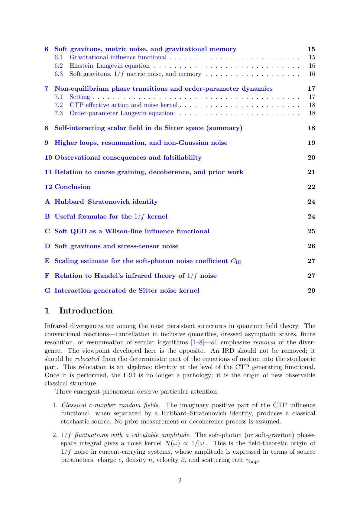 
Low-resolution page preview, page 2

📷 Fig 2

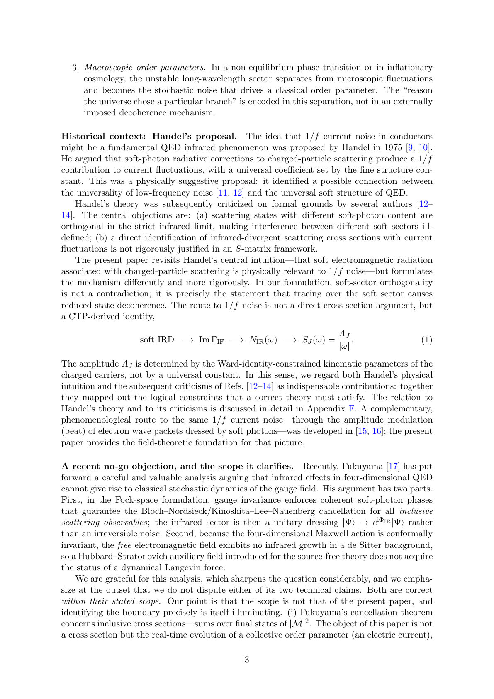 
Low-resolution page preview, page 3

📷 Fig 3

 
Low-resolution page preview, page 4

📷 Fig 4

 
Low-resolution page preview, page 5

📷 Fig 5

 
Low-resolution page preview, page 6

**Summary.** This paper reinterprets infrared divergences (IRDs) as the physical signature of an 'itinerant vacuum'—a system continuously moving between distinct quantum states. Using advanced CTP formalism, the authors algebraically convert these divergences into a classical stochastic source term. This framework successfully unifies the origin of phenomena like $1/f$ noise and gravitational memory across diverse fields from QED to cosmology.

**Why it may be interesting.** It provides a powerful, non-perturbative tool for handling low-energy divergences in quantum field theory by mapping them onto observable classical noise sources, which is highly relevant for open quantum systems dynamics.

Detailed structure

**Main problem.** The paper develops a constructive framework to interpret infrared divergences (IRDs) not as pathologies, but as signatures of an 'itinerant vacuum' undergoing continuous evolution.

**Main result.** It shows that the IRD can be algebraically converted into a classical stochastic source term within the real-time CTP effective action, unifying the origin of $1/f$ noise and gravitational memory effects.

**Method.** The core method involves using the closed-time-path (CTP) formalism and applying a Hubbard–Stratonovich identity to separate the divergent imaginary part of the influence functional into a classical stochastic source term.

**Model / system.** Applications include soft QED, scalar fields in de Sitter space, soft gravitons, and general non-equilibrium phase transitions, all modeled by evolving an order parameter through inequivalent quantum vacua.

**Key observables.** $1/f$ noise (in current or metric fluctuations), gravitational memory effects, and non-Gaussian fluctuations during phase transitions.

**Important parameters / regimes.** The dynamics are governed by the evolution of a classical order parameter across a manifold of vacuum states.

**Assumptions / limitations.** The approach requires no prior coarse graining or decoherence assumption; the stochastic source $\xi$ is treated as a c-number average because IR divergences do not depend on $\hbar$.

**Paper structure.** The paper builds from establishing the concept of the itinerant vacuum, detailing the technical machinery using the CTP effective action and Hubbard–Stratonovich identity, and then applying this unified mechanism to several physical arenas (QED, de Sitter space, gravity).

Abstract

Infrared divergences (IRDs) are usually treated as pathologies to be cancelled, regularized, or hidden in dressed asymptotic states. This paper develops a complementary and constructive viewpoint: an IRD is the signature of an \emph{itinerant vacuum} -- a quantum vacuum that wanders continuously through a family of inequivalent states as a classical order parameter evolves. Each value of the order parameter carries its own coherent vacuum, so moving the order parameter means traversing a succession of orthogonal vacua. The IRD is the field-theoretic cost of this wandering, and the $1/f$ noise, gravitational memory, and non-Gaussian fluctuations that emerge from it are its observable classical remnants.   The technical core is an exact separation in the real-time closed-time-path (CTP) effective action. The infrared-divergent imaginary part of the influence functional must not be left as a divergent coefficient in a deterministic equation of motion; it is instead converted, by a Hubbard--Stratonovich identity, into a classical stochastic source. This step is an algebraic identity of the generating functional and requires no prior coarse graining or decoherence assumption: the retarded kernel encodes the memory of past vacuum transitions, while the noise kernel encodes the quantum uncertainty of the next one. We apply this construction to four parallel arenas -- soft QED, scalar fields in de Sitter space, soft gravitons, and non-equilibrium phase transitions -- and show that the same itinerant-vacuum mechanism underlies $1/f$ current noise, the primordial power spectrum, gravitational memory, and order-parameter dynamics. A geometric formulation in terms of a Hilbert-space bundle over the vacuum manifold is outlined as an outlook.

[↑ back to top](#top)

### [Photonic Cluster State Generation from a Quantum Dot Emitting in the Telecom C-band](http://arxiv.org/abs/2607.04896v1)

**Authors:** Giora Peniakov, Reza Hekmati, Johannes Michl, Mohamed Helal, Moritz Meinecke, Jochen Kaupp, Yorick Reum, Martin Kamp, Monika Emmerling, Andreas Theo Pfenning, Sven Hoefling, Tobias Huber-Loyola  
**Type:** experiment · **Category:** quantum information and computing · **PDF:** <https://arxiv.org/pdf/2607.04896v1>  
**Analysis basis:** full PDF text, analyzed in chunks
**Topic relevance:** 🔥 `QC/QI experiment` **4/5** · `quantum optics experiment` **3/5** · `spintronics-quantum-optics interface` **3/5** · `entanglement & information structure` **2/5** · `Tavis-Cummings & cavity-many-emitter` **1/5** · `analog quantum simulation` **1/5** · `correlated cavity matter` **1/5** · `exotic spin models in light-matter` **1/5** · `interference shaping light` **1/5** · `non-equilibrium dynamics` **1/5**

📷 Fig 1

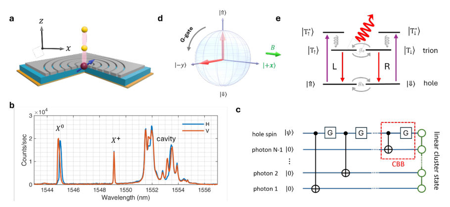 
Fig. 1. a Circular-Bragg grating microcavity. b Polarization resolved photoluminescence under above-band excitation. 𝑋0 is the neutral exciton and 𝑋+ is the positive trion recombination transition. The broad emission feature around 1552 nm comes from other transitions feeding into the cavity. H(V) stands for horizontal(vertical) linear polarization. c Cluster-state generation circuit consisting of CNOT and 𝐺 gates. Given an input state |𝜓⟩= |−𝑦⟩, a linear cluster state is generated. A red dashed frame marks a single circuit building block (CBB) that we characterize using a quantum process tomography. d Bloch sphere representation of the ground state hole spin illustrating the quarter-...

📷 Fig 2

 
Fig. 2. Experimental characterization of the spin state at the CBB input. a Time resolved emission from the 𝑋+ following excitation with two laser pulses used for spin heralding and readout. b Polarization-resolved time traces from the readout pulse, conditioned on a heralding photon detection emitted during the pink-highlighted post selection time window in panel ‘a’. The plot labels HR, HL, DR and DL indicate the excitation and detection polarizations, respectively. Yellow- and green-highlighted areas mark the 80-ps time windows at 𝑡= 0 and 𝑡= 𝑇𝑒/4 used to probe the spin projections {𝜌𝑥, 𝜌𝑦, 𝜌𝑧}. c A series of spin readouts with variable initialization delay is visualized as vectors on...

📷 Fig 3

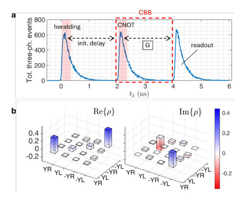 
Fig. 3. CBB output: spin photon tomography. a Emission from the 𝑋+ following three excitation pulses. The red dashed frame indicates the CBB operation consisting of a CNOT pulse followed by a time interval 𝑇𝜋/2 implementing the 𝐺 gate through Larmor precession. Pink-highlighted regions mark the post-selection time windows for photon detection. Spin–photon tomography is obtained by correlating photons from the heralding, CNOT, and readout pulses. b Real and imaginary part of the measured spin–photon density matrix, 𝜌(|−𝑦⟩).

📷 Fig 4

 
Fig. 4. Process map 𝚽. a The 64 measured real elements ϕ𝛼𝛽

**Summary.** The paper reports the deterministic generation of photonic cluster states in the telecom C-band using an InAs quantum dot. By leveraging hole spin qubits and characterizing the underlying process map, the authors demonstrated entanglement and achieved a three-qubit state fidelity of 0.71. This work is significant because it enables scalable quantum information processing compatible with existing optical fiber infrastructure.

**Why it may be interesting.** This work directly addresses a major bottleneck in quantum networking by achieving high-fidelity photonic resource generation at telecom wavelengths using solid-state emitters, bridging fundamental physics research with practical quantum technology requirements.

Detailed structure

**Main problem.** The primary goal is to deterministically generate photonic cluster states directly within the telecom C-band, which is crucial for quantum communication compatibility with existing fiber infrastructure.

**Main result.** The authors successfully demonstrated deterministic generation of a three-qubit cluster state in the telecom C-band using an InAs quantum dot system. They achieved a process map fidelity of 0.71 and high photon indistinguishability ($\geq 83\%$).

**Method.** Cluster state generation is realized by implementing a Circuit Building Block (CBB) sequence involving controlled-NOT gates and single-qubit rotations, all characterized via quantum process tomography.

**Model / system.** The system uses an Indium-arsenide ($	ext{InAs}$) quantum dot embedded in a microcavity. Qubit encoding is achieved using the hole spin state, while photonic entanglement is generated through optical transitions to the positive trion ($	ext{X}^+$) at 1549 nm.

**Key observables.** Cluster state fidelity ($\mathcal{F} = 0.71 \pm 0.01$), spin–photon polarization entanglement negativity ($\mathcal{N} = 0.27 \pm 0.02$), and photon indistinguishability ($V_{HOM} \geq 0.83$).

**Important parameters / regimes.** The process operates at an $80 	ext{ MHz}$ repetition rate, utilizing a hole-spin coherence time ($T_2^*$) of $15.9 \pm 1.7 	ext{ ns}$.

**Assumptions / limitations.** The characterization assumes that the fidelity can be extrapolated for larger cluster states by concatenating the CBB result multiple times.

**Figures summary.** Figures illustrate the microcavity setup, the PL spectrum showing the $	ext{X}^+$ transition, and detailed circuit diagrams outlining the sequence of CNOT and single-qubit gates used to build the cluster state.

**Paper structure.** The paper details the physical platform (QD in a cavity), outlines the protocol based on CBBs derived from spin/photon interactions, presents characterization results via process tomography and entanglement measurements, and concludes with the demonstration of multi-qubit cluster state generation.

Abstract

Photonic cluster states are a key resource for photonic quantum information processing. So far, deterministic generation of these states has been limited to the near-infrared wavelength range. To achieve quantum advantage in communication while maintaining compatibility with silicon photonics, operation in the telecom wavelength range is required. In this work, we demonstrate deterministic cluster state generation directly in the telecom C-band. This is achieved through repetitive excitation of a hole spin confined in an indium-arsenide quantum dot subjected to an external magnetic field. We characterize the quantum process that generates the cluster state by measuring its process map, obtaining a fidelity of $\mathrm{F} = 0.71 \pm 0.01$ to the ideal case. As part of this characterization, we observe spin--photon polarization entanglement with a negativity of $\mathrm{N} = 0.27 \pm 0.02$. The emitted photons exhibit indistinguishability of at least 83%, demonstrating the potential for future fusion gates necessary for photonic cluster state generation beyond linear connectivity.

[↑ back to top](#top)

### [The Normalised Wigner Negativity Rate as a Second-Moment Probe of Infall in AdS$_3$](http://arxiv.org/abs/2607.04065v1)

**Authors:** Ritam Basu  
**Type:** theory · **Category:** statistical mechanics · **PDF:** <https://arxiv.org/pdf/2607.04065v1>  
**Analysis basis:** full PDF text, analyzed in chunks
**Topic relevance:** 🔥 `entanglement & information structure` **4/5** · 🔥 `non-equilibrium dynamics` **4/5** · `non-equilibrium universality` **3/5** · `Keldysh / 2PI / non-Gaussian methods` **2/5** · `driven-dissipative phase transition` **2/5** · `correlated / nonlocal dissipation` **1/5** · `methods for driven-dissipative` **1/5** · `scars & prethermalization` **1/5**

📷 Fig 1

 
Figure 1. Saturation of the raw negativity (Analytic Limit). Time evolution of the macroscopic theoretical law [ξ/(−ln(1 −ξ))]2∆(dashed curves, eq. (4.12)) evaluated for ∆∈{1, 3/2, 2} with ε = 0.1 and β = 2π. The curves are normalized by their late-time saturation value, effectively setting the theoretical maximum to unity (dotted line). As t →∞(ξ →0), the geometric spreading mathematically cancels the return amplitude decay, causing the raw negativity to strictly saturate to the constant plateau N∞. This visualizes the asymptotic behavior described in Proposition 4.3 and demonstrates that the raw negativity is inherently bounded at late times, necessitating the seed-normalized diagnostic...

📷 Fig 2

 
Figure 2. Growth of the seed-normalized negativity (log–log). The exact discrete seed- normalized negativity N = Nraw/P (markers), computed from the Wootters discrete Wigner function on the ZD ×ZD phase space of prime dimension D = 2003 (ε = 0.1, β = 2π), plotted against sinh(πt/β) on log–log axes and divided by its value at πt/β = 1 (common footing). On these axes the continuum law N ∼sinh4∆(4.10) is a straight line of slope 4∆(dashed); the exact markers follow it (fitted slopes 3.91, 5.79, 7.74 for ∆= 1, 3

📷 Fig 3

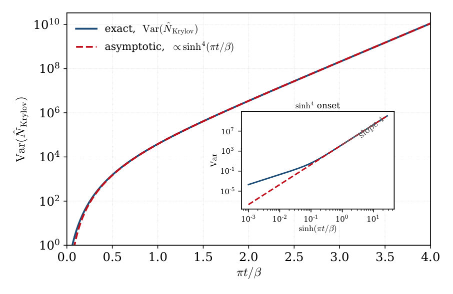 
Figure 3. Exact growth of the Krylov wavepacket variance. Var( ˆNKrylov) versus πt/β from the negative-binomial formula (3.5) (solid) and its late-time sinh4 asymptotic (dashed), for sin2(2πε/β) = 0.01 at ∆= 1.

📷 Fig 4

 
Figure 4. Superposition of R(t) and d Var/dt at ∆= 1. (a) The normalized negativity rate R = ˙N and the exact Krylov variance rate d dtVar( ˆNKrylov), each rescaled to unit value at the right edge, versus πt/β (log scale), zoomed to the transient/onset region for sin2(2πε/β) = 0.01. The grey band marks the transient sinh2(πt/β) ≲ε0, i.e. πt/β ≲√ε0, where the two rates differ; they coincide thereafter. The curves are built from different closed forms—R from the macroscopic-exact negativity N ∝[ln  1 + ε0/ sinh2(πt/β)  ]−2∆and d dtVar from the exact rate (5.1)—so their agreement is not a tautology. (b) Relative deviation of the ratio R/ d

📷 Fig 5

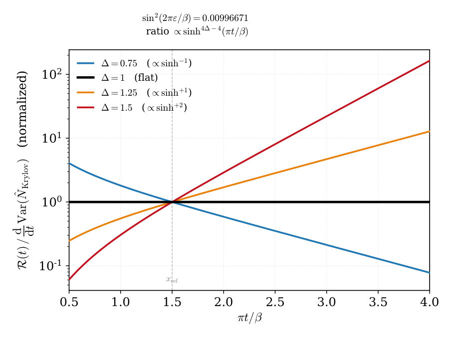 
Figure 5. Diagnostic of the matching condition, with the asymptotics shown explicitly. The ratio R(t)  d

**Summary.** This paper develops the use of the normalized Wigner negativity rate as a diagnostic tool to probe the second moment of quantum wavepacket spreading in AdS$_3$. By analyzing this rate, the authors establish that it directly measures the rate of tidal stretching experienced by nearby infalling geodesics when the system dimension matches the critical Breitenlohner-Freedman value.

**Why it may be interesting.** The connection between higher-order quantum measures (negativity) and classical gravitational dynamics (tidal forces/geodesics) provides a powerful, non-standard tool for testing holographic duality predictions.

Detailed structure

**Main problem.** The research aims to move beyond first-moment diagnostics (like spread complexity) to probe higher moments of quantum dynamics, specifically using the normalized Wigner negativity rate.

**Main result.** The negativity rate matches the growth rate of the Krylov variance if and only if the dimension $\Delta$ equals 1, which corresponds physically to the rate of tidal stretching of infalling geodesics in AdS$_3$.

**Method.** The analysis employs techniques from quantum information theory (Wigner negativity) applied to dynamics generated by a local operator quench on a CFT dual to an AdS black hole.

**Model / system.** The system is modeled using the Krylov chain derived from a holographic CFT, whose evolution is governed by an effective Hamiltonian exhibiting $\mathfrak{su}(1, 1)$ symmetry. The statistics of the resulting occupation numbers follow a Negative Binomial Distribution.

**Key observables.** Normalized Wigner Negativity Rate, Spread Complexity ($\langle \hat{N}_{	ext{Krylov}} 
angle$), Krylov Variance, and the transverse string size operator $\hat{N}_{	ext{str}}$.

**Important parameters / regimes.** The conformal dimension $\Delta$, the time scale $t/eta$, and the Breitenlohner-Freedman dimension ($\Delta=1$) are crucial parameters.

**Assumptions / limitations.** Key steps involve conjectures relating string operators to Krylov chain operators, and the analysis relies on specific asymptotic limits (macroscopic limit) and approximations for mode sums.

**Paper structure.** The paper progresses by first establishing the inadequacy of first moments, then introducing the negativity rate as a second-moment probe. It develops the $\mathfrak{su}(1, 1)$ structure leading to Negative Binomial statistics, and finally connects this quantum diagnostic to geometric observables like tidal stretching in AdS$_3$.

Abstract

In spread complexity, the average position of an operator along its Krylov chain, recovers the right radial momentum of an infalling particle in AdS, yet it is a measure of the first moment, irrespective of the spread of the wavepacket away from its classical trajectory. The rate of a normalized Krylov-Wigner negativity can be proposed as a diagnostic of the second moment of the boundary state that captures this spreading. Starting with the \emph{seed-normalized} Krylov-Wigner distribution -- that is, the Wigner transform of the descendant cloud, with the decaying return amplitude divided out -- we obtain an analytic Bessel form in the macroscopic limit and compute its total negativity explicitly. Retaining the Bessel variable all the way through, we find that the negativity goes as $\sinh^{4Δ}(πt/β)$, while the raw, seed-normalized state negativity saturates, as dictated by the $O(\sqrt{D})$ bound. Using the exact negative binomial statistics of the Krylov chain and the momentum dictionary of Caputa et al.~\cite{Caputa:2024}, the rate of the negativity scales as the growth rate of the Krylov variance at late time asymptotics \emph{if and only if} $Δ=1$, the Breitenlohner-Freedman saturating dimension in $AdS_3$. This dimensionality is special in that the negativity rate is the product of the proper radial position and momentum, $\mathcal{R} \propto \mathcal{C} P_ρ$, i.e., the rate of the tidal stretch of nearby geodesic falling into the horizon. We comment on the direction for future research, in particular the interpretation of the transverse string size operator in terms of the Krylov number operator through the common $SU(1,1)$ discrete series.

[↑ back to top](#top)

### [Thermalization hierarchy from irreducible degrees of freedom](http://arxiv.org/abs/2607.03535v1)

**Authors:** Pedro Fittipaldi de Castro, Wladimir A. Benalcazar  
**Type:** theory · **Category:** statistical mechanics · **PDF:** <https://arxiv.org/pdf/2607.03535v1>  
**Analysis basis:** full PDF text, analyzed in chunks
**Topic relevance:** 🔥 `entanglement & information structure` **4/5** · 🔥 `scars & prethermalization` **4/5** · `non-equilibrium dynamics` **3/5** · `non-equilibrium universality` **2/5** · `Keldysh / 2PI / non-Gaussian methods` **1/5** · `analog quantum simulation` **1/5** · `correlated / nonlocal dissipation` **1/5** · `driven-dissipative phase transition` **1/5** · `methods for driven-dissipative` **1/5**

📷 Fig 1

 
FIG. 1: Thermalization hierarchy. (a) Decomposition of the Hamiltonian (1) in the basis (5), showing dynamically isolated subspaces as diagonal blocks. Half-chain entanglement entropy of the eigenstates of (b) the local, translation invariant Hamiltonian (55) with κ = 2.5 and of (c) the nonlocal, disordered Hamiltonian (60) with κ = 0.02. Calculations done under periodic boundary conditions with parameters J1 = J2 = J3 = 1, and B = 8. Energies are shown relative to E0 of the ferromagnetic state |↑, ↑, . . . , ↑⟩.

📷 Fig 2

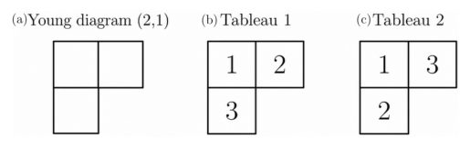 
FIG. 2: Permutation irreps as Young diagrams. (a) Dia- gram corresponding to the (2, 1) irrep of S3. (b) and (c) are its two Young tableaux, which yield a two-dimensional irrep.

📷 Fig 3

 
FIG. 3: (a) Dimensions Dn (dn) of the bond (commutant) algebra irreps as well as the dimension Dndn of the total spin sector versus n = L/2 −S for L = 16. Half-chain entanglement entropy SE averaged over all energy eigenstates of (10) with a given n and its comparison with the logarithm of (b) the bond-irrep dimensions Dn and (c) the spin sector dimensions Dndn.

📷 Fig 4

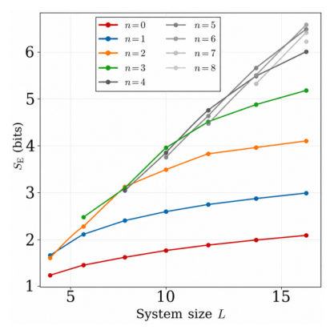 
FIG. 4: Scaling of the half-chain entanglement entropy SE averaged over eigenstates of the Hamiltonian (10) with fixed n IDOF.

**Summary.** The paper introduces the concept of 'irreducible degrees of freedom' (IDOF) derived from analyzing the bond algebra of quantum many-body systems. This IDOF count, $D_\lambda$, quantifies the thermalization capacity of a subspace, establishing a continuous hierarchy that smoothly interpolates between non-thermal scars and fully ergodic states. It provides an algebraic method to understand how local constraints dictate global thermal behavior.

**Why it may be interesting.** This work provides a powerful algebraic tool to quantify non-equilibrium dynamics, linking microscopic structure (bond algebra irreps) directly to macroscopic thermodynamic concepts like entanglement and ergodicity. It offers a systematic way to classify quantum scars within broader ergodic regimes.

Detailed structure

**Main problem.** To establish a quantitative 'thermalization hierarchy' that refines understanding of thermalization beyond simple symmetry sector decompositions in quantum many-body systems.

**Main result.** The thermalization capacity is controlled by the irreducible degrees of freedom (IDOF), quantified by the bond algebra irrep dimension ($D_\lambda$), establishing a continuous hierarchy from scars to ergodic states.

**Method.** Decomposition of the Hilbert space using the bond and commutant algebras, leading to an analysis based on irreducible representations ($	ext{irreps}$) and introducing the IDOF count as a diagnostic tool.

**Model / system.** The study uses SU(2)-symmetric spin-1/2 chains as a paradigmatic example. The framework analyzes how dynamics are constrained by algebraic structures derived from local interactions (bond algebra).

**Key observables.** Average eigenstate entanglement entropy, which is quantitatively related to $\log D_\lambda$.

**Important parameters / regimes.** The bond irrep dimension ($D_\lambda$), which dictates the degree of thermalization; system size $L$ and total spin $S$.

**Assumptions / limitations.** The analysis assumes that the algebraic decomposition provides a finer, physically relevant structure for dynamics than simple symmetry sector decompositions.

**Figures summary.** Figure 1 illustrates the thermalization hierarchy using diagonal blocks from the bond algebra decomposition. Other figures detail Young diagrams and specific mathematical decompositions of state amplitudes.

**Paper structure.** The paper systematically develops an algebraic framework by decomposing the Hilbert space via double-commutant pairs ($	ext{ASL}$ and $	ext{Asu}(2)$). It then applies this to analyze excitations (like two-magnon states) in terms of orthogonal components corresponding to different IDOF sectors, culminating in the definition of the thermalization hierarchy.

Abstract

The decomposition of the Hilbert space of a quantum many-body system into the irreducible representations of its bond and commutant algebras yields a finer structure of dynamically isolated subspaces than the mere decomposition into symmetry sectors. While it has been recognized that subspaces associated with low bond-irrep dimensions $D_λ$ tend to violate the eigenstate thermalization hypothesis (ETH), here we show that $D_λ$ controls thermalization continuously across the full spectrum of dynamical subspaces. Using SU(2)-symmetric spin-1/2 chains as a paradigmatic example, we demonstrate that $\mathrm{log} \ D_λ$ quantitatively accounts for the average eigenstate entanglement entropy within each sector, establishing a thermalization hierarchy that interpolates from exact quantum many-body scars at $D_λ=1$ to volume-law ergodic states at large $D_λ$. To make this concrete, we introduce the notion of irreducible degrees of freedom (IDOF), defined as the number of independently-varying spatial coordinates parametrizing a many-body state within a given bond-algebra sector, which provides a microscopic interpretation of $D_λ$ and of the resulting thermalization hierarchy. Finally, we show that by selectively breaking symmetries while preserving chosen bond-algebra sectors, one can embed families of nonthermal eigenstates at prescribed entanglement levels into an otherwise ergodic spectrum, generalizing restricted spectrum-generating algebras from towers of individual states to entire dynamical subspaces.

[↑ back to top](#top)

### [Disentangling Haldane Phase by Generalized Clifford Circuits](http://arxiv.org/abs/2607.03939v1)

**Authors:** Minsoo Kim, Changhun Oh, Donghoon Kim  
**Type:** theory · **Category:** numerical methods · **PDF:** <https://arxiv.org/pdf/2607.03939v1>  
**Analysis basis:** full PDF text, analyzed in chunks
**Topic relevance:** 🔥 `analog quantum simulation` **4/5** · `entanglement & information structure` **3/5** · `exotic spin models in light-matter` **3/5** · `methods for driven-dissipative` **3/5** · `non-equilibrium dynamics` **2/5** · `correlated / nonlocal dissipation` **1/5** · `driven-dissipative phase transition` **1/5**

📷 Fig 1

 
FIG. 1. Schematic of the CAMPS-based DMRG method. (a) The CAMPS is an ansatz |CAMPS⟩= C|MPS⟩. Here, C consists of sequential two-site Clifford gates, and each two- site gate is chosen to maximally reduce the entanglement of |CAMPS⟩. (b) By augmenting the MPS with C, the Hamil- tonian is transformed accordingly as e H = CHC†. The conju- gation preserves the energy expectation between the CAMPS and MPS frames.

📷 Fig 2

 
FIG. 2. The CAMPS-based DMRG results for the Heisen- berg and the BLBQ models. (a), (c) Relative ground-state energy error δEGS for N = 128 at (a) HHei(D = 0) and (c) HBLBQ(θ = 0.5). The DMRG result with χ = 1000 serves as the reference. Panels (b) and (d) display the correspond- ing entanglement entropy E(ℓ) for bipartitions of sizes ℓand N −ℓ. For both models, we observe that E(N −1) = 0 in the CAMPS-based DMRG results; see the insets of (b) and (d).

📷 Fig 3

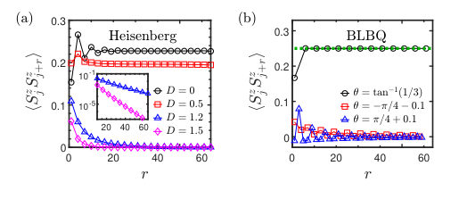 
FIG. 3. Numerical results of the two-point correlation ⟨Sz j Sz j+r⟩for (a) the Heisenberg model and (b) the BLBQ model, for j = 32. The ground states are obtained using DMRG with N = 128 and χ = 300, and after applying UKW, the corresponding values of ⟨Sz j Sz j+r⟩are evaluated. The green dotted line in (b) represents the analytic value 1/4 given in Eq. (10). Inset (a): In the trivial phase, the correla- tion decays exponentially.

**Summary.** This paper analyzes how disentangling transformations reveal hidden symmetries in spin-1 quantum chains in the Haldane phase. By extending DMRG using Clifford circuits (CAMPS), the authors identify the optimal transformation as the Kramers--Wannier map. This mapping demonstrates a novel unitary pathway from topological order to symmetry breaking, providing powerful theoretical tools for characterizing quantum phases.

**Why it may be interesting.** The explicit connection between entanglement reduction techniques (DMRG/MPS) and fundamental physical symmetries ($\mathbb{Z}_2$ SSB) provides deep insight into the structure of topological order in quantum materials, which is highly relevant to AMO physics simulations.

Detailed structure

**Main problem.** The study investigates the analytic structure of disentangling transformations used in simulating quantum many-body systems, specifically within the Haldane phase.

**Main result.** The optimal local Clifford disentangler for the Haldane phase is shown to implement the generalized Kramers--Wannier (KW) transformation, which maps the SPT phase to a state exhibiting spontaneous $\mathbb{Z}_2$ symmetry breaking.

**Method.** The authors extend the Clifford-circuit-augmented Matrix Product States (CAMPS)-based Density-Matrix Renormalization Group (DMRG) method to spin-1 systems for analysis.

**Model / system.** The work focuses on spin-1 quantum chains, particularly those exhibiting the Haldane phase, modeled by Hamiltonians like the Heisenberg or Bilinear-biquadratic (BLBQ) chain. The analytically tractable state used is the Affleck–Kennedy–Lieb–Tasaki (AKLT) state.

**Key observables.** Entanglement entropy $E(\ell)$, ground-state energy error $\delta E_{GS}$, and long-range correlation functions $\langle S^z_j S^z_{j+r} \rangle$.

**Important parameters / regimes.** The analysis is sensitive to the specific Hamiltonian parameters (e.g., $D$ in Heisenberg, $\theta$ in BLBQ) and the bond dimension used in MPS representations.

**Assumptions / limitations.** The core assumption is that the optimal disentangler can be found by optimizing over generalized Clifford circuits within the CAMPS framework.

**Figures summary.** Figures compare CAMPS-DMRG results for different spin models, showing energy error and entanglement entropy. Another figure compares correlation functions derived from KW vs KT transformations.

**Paper structure.** The paper progresses by first establishing the CAMPS-DMRG framework for spin-1 systems; it then analytically proves that the optimal disentangler is the KW transformation; finally, it uses this transformation to diagnose a hidden $\mathbb{Z}_2$ symmetry breaking mechanism distinct from other known transformations.

Abstract

Disentangling transformations play a central role in the classical simulation of quantum many-body systems, yet their analytic structure and underlying mechanism remain largely unexplored. Here, we study the structure of the disentangler in the Haldane phase of spin-1 systems using generalized Clifford circuits. To this end, we extend the Clifford-circuit-augmented matrix product states (CAMPS)-based density-matrix renormalization group (DMRG) method to spin-1 systems. Within this framework, we find that the local disentanglers optimized for the Haldane phase implement the generalized Kramers--Wannier (KW) transformation, and we analytically verify its optimality for the Affleck--Kennedy--Lieb--Tasaki (AKLT) state. Beyond reducing entanglement, the KW transformation maps the Haldane phase to a phase with spontaneously broken $\mathbb{Z}_{2}$ symmetry. This mapping is distinct from the Kennedy--Tasaki transformation and provides a new unitary route from symmetry-protected topological order to symmetry breaking.

[↑ back to top](#top)

### [Efficient classical simulation of two-dimensional long-range systems: Rydberg arrays and beyond](http://arxiv.org/abs/2607.05178v1)

**Authors:** Jia-Lin Chan, Tao Xiang, Yantao Wu  
**Type:** theory · **Category:** numerical methods · **PDF:** <https://arxiv.org/pdf/2607.05178v1>  
**Analysis basis:** full PDF text, analyzed in chunks
**Topic relevance:** 🔥 `analog quantum simulation` **4/5** · `Rydberg arrays` **3/5** · `exotic spin models in light-matter` **3/5** · `methods for driven-dissipative` **3/5** · `non-equilibrium dynamics` **2/5** · `Keldysh / 2PI / non-Gaussian methods` **1/5** · `entanglement & information structure` **1/5**

📷 Fig 1

 
FIG. 1. Schematic illustration of the experimental proto- col. The atoms interact via a 1/r3 dipolar coupling and are partitioned into two sublattices, A and B. Starting from the classical N´eel state [Eq. (4)], a staggered field δ(t) = δ0e−t/1.48 is applied to the B sublattice, driving the adiabatic evolution.

📷 Fig 2

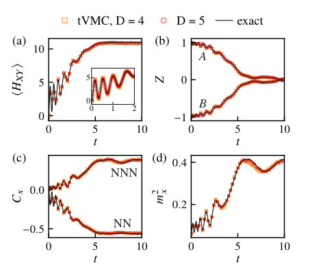 
FIG. 2. Benchmark of the 4 × 4 AFM protocol against exact results. TNS-tVMC results are shown for bond di- mensions D = 4 and 5, using 81920 MC samples for both evolution and measurement. (a) average energy ⟨HXY ⟩, (b) averaged sublattice magnetization Z, (c) nearest- neighbor (NN) and next-nearest-neighbor (NNN) corre- lations Cx, and (d) squared staggered magnetization m2 x, all as a function of time.

📷 Fig 3

 
FIG. 3. Time evolution of the 10 × 10 AFM pro- tocol from TNS-tVMC with bond dimension D = 4 and Ns = 163840. (a) Energy ⟨HXY ⟩, relaxing to- ward the ground-state value (dashed blue line), which is computed by us using ground state VMC. (b) Con- nected spin correlation C(d) as a function of distance d at t = 4.01, 6.01, 8.01, 9.69, compared with the ground state. (c) Real-space correlation C(∆x, ∆y), averaged over all site pairs separated by displacement (∆x, ∆y), at t = 0.01, 4.81, 9.69 and in the ground state.

📷 Fig 4

 
FIG. 4. Sample-size convergence of the 10×10 AFM dy- namics at D = 4. The squared staggered magnetization m2 x, the most sensitive observable, is shown as a function of time for Ns = 81920 and 163840.

**Summary.** The paper presents a novel tensor network Variational Monte Carlo framework that drastically improves the scaling of simulating long-range interacting quantum systems from $O(N^3)$ to $O(N)$. This breakthrough allows for accurate classical simulation of complex dynamics, such as those found in dipolar XY models realized with Rydberg atoms. It establishes a powerful tool for benchmarking future quantum hardware.

**Why it may be interesting.** This work provides a crucial computational tool—a scalable classical benchmark—for simulating complex quantum dynamics on emerging hardware platforms like Rydberg and ion traps, bridging theory with experimental feasibility.

Detailed structure

**Main problem.** Developing an efficient classical simulation method for two-dimensional quantum systems with long-range interactions, particularly those relevant to Rydberg arrays and ion traps.

**Main result.** The authors developed a tensor network VMC framework that reduces the computational cost of local energy evaluation from $O(N^3)$ to $O(N)$, enabling accurate simulation of previously intractable dynamics for systems like the dipolar XY model on a $10 	imes 10$ lattice.

**Method.** The core method is an efficient tensor-network time-dependent Variational Monte Carlo (tVMC) framework utilizing an adaptive basis approach to scale calculations from cubic to linear complexity with system size N.

**Model / system.** The study focuses on two-dimensional long-range interacting quantum systems, exemplified by the dipolar XY model ($H_{XY} \propto 1/r^3$) realized in Rydberg simulators. The simulation tracks time evolution under a time-dependent Hamiltonian $H(t) = H_{XY} + H_Z(t)$.

**Key observables.** Local energy, sublattice magnetization (Z), nearest-neighbor and next-nearest-neighbor correlations ($C_x$, etc.), and squared staggered magnetization ($m_{2\alpha}$).

**Important parameters / regimes.** Long-range interaction decay ($\propto 1/r^3$), lattice size ($10 	imes 10$ for main results), and the time evolution parameter $\delta(t)$.

**Assumptions / limitations.** The efficiency gain relies on an adaptive basis approach, which trades the zero-variance principle of fixed-basis VMC for computational tractability. For initial steps, Projected tVMC (p-tVMC) is used.

**Figures summary.** Figures illustrate benchmarks comparing TNS-tVMC results against exact solutions for small lattices ($4 	imes 4$), showing the time evolution of energy and correlations; larger simulations ($10 	imes 10$) confirm long-range correlation maintenance during adiabatic protocols.

**Paper structure.** The paper introduces the problem of simulating long-range interactions, details the novel tensor network tVMC framework achieving $O(N)$ scaling via adaptive bases, applies this to simulate the adiabatic real-time protocol for a dipolar XY model in Rydberg arrays, and concludes by benchmarking its accuracy against known ground state limits.

Abstract

In variational Monte Carlo (VMC) calculations of $N$-site quantum systems with arbitrary all-to-all two-body interactions, evaluating the local energy generally costs $O(N^3)$. We introduce a new framework that reduces this cost to $O(N)$ for tensor network states, capable of scalable and accurate computation of real-time dynamics and ground states. As a result, we obtain accurate simulations of the adiabatic real-time protocol of a $10\times10$ dipolar XY model realized in a Rydberg simulator [C. Chen et al., Nature 616, 691 (2023)], which was previously beyond the reach of classical simulation. Going beyond quantum experiments, we also directly perform ground state VMC to compare with the adiabatic state preparation. Our work demonstrates tensor network VMC as a powerful classical simulator for long-range quantum platforms such as Rydberg and ion-trap simulators, which are currently in urgent need of scalable classical benchmarking tools. As a separate technical contribution, we resolve the pathology of evolving from product states within of tensor network VMC.

[↑ back to top](#top)

### [Critical behavior of the driven Curie-Weiss model](http://arxiv.org/abs/2607.05130v1)

**Authors:** Ruohan Xu, Faezeh Khodabandehlou, Christian Maes  
**Type:** theory · **Category:** statistical mechanics · **PDF:** <https://arxiv.org/pdf/2607.05130v1>  
**Analysis basis:** full PDF text, analyzed in chunks
**Topic relevance:** 🔥 `driven-dissipative phase transition` **4/5** · 🔥 `non-equilibrium universality` **4/5** · `methods for driven-dissipative` **3/5** · `non-equilibrium dynamics` **3/5** · `Keldysh / 2PI / non-Gaussian methods` **1/5** · `correlated / nonlocal dissipation` **1/5**

📷 Fig 1

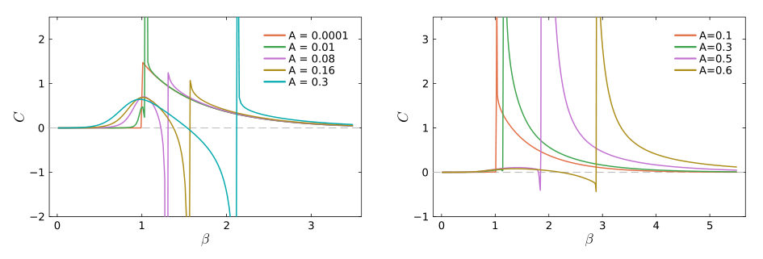 
FIG. 1: Specific heat as a function of inverse temperature β for different values of A and ω. (a)

📷 Fig 2

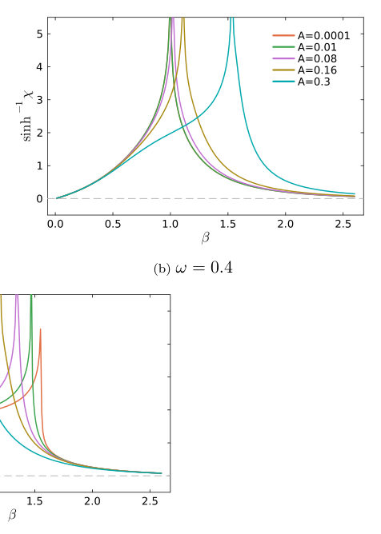 
FIG. 2: sinh−1 χ as function of β, for different values of A and ω.

📷 Fig 3

 
FIG. 3: Critical behavior of the specific heat for different values of A and ω in the vicinity of βc.

📷 Fig 4

 
FIG. 4: Critical behavior of χ for A = 0.1 and ω = 0.3. The time t is that of averaging as multiple

📷 Fig 5

 
FIG. 5: Critical behavior of χ, predicted by formula (III.2), high-temperature approximation (III.1)

**Summary.** This paper investigates the non-equilibrium thermodynamics of a driven Curie-Weiss magnet, mapping out its full phase diagram under time-periodic fields. Key findings include the observation of dynamical criticality, where specific heat diverges with different exponents depending on the direction relative to the critical temperature. The work demonstrates that external driving fundamentally alters both the nature and quantitative description of magnetic phase transitions.

**Why it may be interesting.** It provides a detailed theoretical framework for understanding how non-equilibrium driving fundamentally alters critical phenomena, yielding exponents and phase boundaries inaccessible in standard thermal equilibrium treatments.

Detailed structure

**Main problem.** The study focuses on completing the phase diagram and analyzing the critical behavior of a Curie-Weiss magnet when subjected to a time-periodic external driving field.

**Main result.** The system exhibits dynamical criticality, with specific heat diverging at different exponents ($\alpha=1$ vs $\alpha\simeq 0.86$) depending on whether the inverse temperature is approaching or receding from the critical point.

**Method.** The analysis employs mean-field theory combined with non-equilibrium calorimetry (AC-calorimetry) and linear response theory to calculate thermodynamic quantities like specific heat and susceptibility.

**Model / system.** The model is the Curie-Weiss magnet described by a kinetic Ising model in mean-field approximation, subjected to an external field $h_0(t) = \delta_0 + A_0 \cos(\omega t)$. The dynamics are governed by a relaxational stochastic equation for magnetization $m(t)$.

**Key observables.** Specific heat ($C$), magnetic susceptibility ($\chi$), and time-averaged magnetization $\langle m 
angle$.

**Important parameters / regimes.** Inverse temperature ($eta$), driving amplitude ($A$), and driving frequency ($\omega$). The critical point $eta_c$ shifts due to the drive.

**Assumptions / limitations.** The analysis often relies on approximations such as the near-quasistatic ansatz for AC-calorimetry, or perturbative expansions in small parameters like $A$.

**Figures summary.** Figures illustrate specific heat divergence vs. $eta$ under varying driving parameters; they also compare contributions to heat capacity divergence in first-order versus second-order transition regimes.

**Paper structure.** The paper systematically analyzes the phase diagram, derives equations for magnetization and response functions using mean-field theory, calculates $C$ via AC-calorimetry, and determines $\chi$ using linear response theory across different parameter regimes.

Abstract

We complete the phase diagram of the macroscopic Curie-Weiss magnet in a time-periodic external field, as a function of temperature and driving parameters. There is a regime (large enough driving amplitude and frequency, at low temperatures) where stable paramagnetic and ferromagnetic phases coexist. In particular, we present a new detailed analysis of the (nonequilibrium) specific heat, diverging at the same critical inverse temperature $β_c$ as the magnetic susceptibility. The new Curie temperature decreases with the driving, and we find critical exponent $α=1$ for $β\downarrow β_c$, and $α\simeq 0.86$ for $β\uparrow β_c$, even for small driving. A Floquet analysis shows the nature of the criticality, which is dynamical, with implications that remain unseen and are mostly impossible when the system is in thermal equilibrium.

[↑ back to top](#top)

### [On data-driven parameterizations of multidimensional generalized Langevin dynamics in the presence of a quadratic potential](http://arxiv.org/abs/2607.05151v1)

**Authors:** Maximilian Braun, Martin Hanke, Niklas Wolf  
**Type:** theory · **Category:** statistical mechanics · **PDF:** <https://arxiv.org/pdf/2607.05151v1>  
**Analysis basis:** full PDF text, analyzed in chunks
**Topic relevance:** 🔥 `methods for driven-dissipative` **4/5** · `Keldysh / 2PI / non-Gaussian methods` **3/5** · `correlated / nonlocal dissipation` **2/5** · `driven-dissipative phase transition` **2/5** · `non-equilibrium dynamics` **2/5** · `analog quantum simulation` **1/5** · `non-equilibrium universality` **1/5**

📷 Fig 1

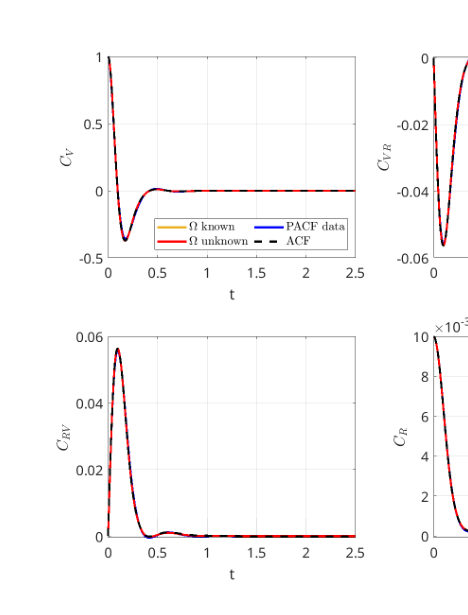 
Fig. 5.1. Autocorrelation function of Example 5.1 versus time t and the three numerical approx- imations. Each panel shows the scalar graphs corresponding to the respective entry of the matrix- valued function.

📷 Fig 2

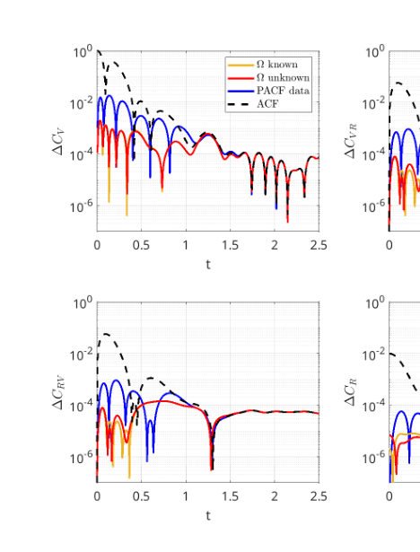 
Fig. 5.2. Absolute error between the true autocorrelation function of Example 5.1 and the three approximations. Each panel contains the scalar graphs corresponding to the error of the respective entry of the matrix-valued approximation. The black dashed lines show the target functions for additional information.

📷 Fig 3

 
Fig. 5.3. Velocity autocorrelation function of Example 5.2 versus time and the two approxi- mations with and without the integral constraint (4.12d). Each panel shows the scalar graphs corre- sponding to the respective entry of the matrix-valued function.

📷 Fig 4

 
Fig. 5.4. Position autocorrelation function of Example 5.2 versus time and the two approxi- mations with and without the integral constraint (4.12d). Each panel shows the scalar graphs corre- sponding to the respective entries of the matrix-valued function.

📷 Fig 5

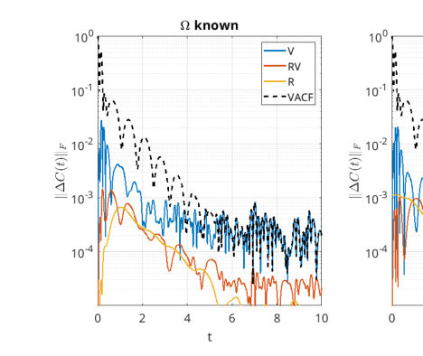 
Fig. 5.5. Absolute error between the given velocity, position and cross correlation of Example 5.2 and the two approximations. The left panel shows the approximation error where Ωis known, the right panel where Ωis unknown, respectively.

**Summary.** This paper presents a numerical algorithm to simplify the description of complex physical dynamics governed by Generalized Langevin Equations. It achieves this by using autocorrelation data to directly construct an equivalent, simpler Markovian model via Prony series fitting. This method is valuable for simulating systems with memory effects in condensed matter physics.

**Why it may be interesting.** While focused on classical statistical mechanics, the techniques for constructing effective low-dimensional models (Markovian embedding) from complex time correlation functions are highly relevant to open quantum systems where memory effects or environmental coupling must be modeled efficiently.

Detailed structure

**Main problem.** The paper addresses the challenge of parameterizing the complex, memory-dependent dynamics described by Generalized Langevin Equations (GLEs) for coarse-grained physical systems.

**Main result.** A novel data-driven algorithm is proposed that constructs an equivalent Markovian model directly from velocity autocorrelation function data using Prony series approximation, bypassing the need to first calculate the system's memory kernel.

**Method.** The methodology involves fitting the autocorrelation function $C_V(t)$ via a Prony series expansion and then mapping these parameters onto the coefficients of an effective Ornstein-Uhlenbeck (OU) process that governs the system's dynamics.

**Model / system.** The underlying model is multidimensional generalized Langevin dynamics, often simplified by assuming a quadratic external potential $\Phi(R)$. The analysis applies to molecular dynamics simulations of liquids and general coarse-grained particle systems.

**Key observables.** Velocity autocorrelation function ($C_V(t)$), position autocorrelation function ($C_R(t)$), cross-correlations, and the resulting stationary covariance matrix ($\Sigma_0$).

**Important parameters / regimes.** The number of auxiliary variables required for the Markov model (e.g., 5 for 1D, 12 for 2D) is a key result.

**Assumptions / limitations.** Key assumptions include assuming $M=mI$, that the potential is quadratic, and relying on the ability to approximate the continuous autocorrelation function using finite data points suitable for Prony series fitting.

**Figures summary.** Figures compare the reconstructed autocorrelation functions ($C_V$) derived from the proposed method against known values, showing good agreement, especially for velocity correlations. Error analysis (Frobenius norm) is also presented.

**Paper structure.** The paper develops theory by relating GLEs to Markovian embeddings, derives necessary mathematical constraints using properties of autocorrelation integrals, and finally implements a data-driven fitting procedure using Prony series approximation on numerical simulation data.

Abstract

We propose a numerical algorithm to construct a Markov model with an extended list of variables to parameterize the equation of motion of a multidimensional coarse-grained physical system in an external potential, when memory effects are relevant. Our method uses autocorrelation data of the stationary velocities, but it avoids the inverse problem of finding the corresponding memory kernel from these data in a first step. Rather, the data are used to construct a Prony series approximation of the autocorrelation function, and the parameters of this Prony series provide the corresponding Markov model. Numerical results for molecular dynamics data show a good match for parameterized models with five auxiliary variables for a one-dimensional, and twelve auxiliary variables for a two-dimensional system.

[↑ back to top](#top)

### [A Pulsed Live-Cell Quantum Microscope for Entangled Solid State and Biological Qubits](http://arxiv.org/abs/2607.03552v1)

**Authors:** Javier Noé Ramos-Silva, Sangjun Noh, Minghao Jiang, Parisa Aghaei, Ayla Hazrathosseini, Jocelyn Leon, Philip Hemmer, Peter J. Burke  
**Type:** experiment · **Category:** quantum information and computing · **PDF:** <https://arxiv.org/pdf/2607.03552v1>  
**Analysis basis:** full PDF text, analyzed in chunks
**Topic relevance:** 🔥 `QC/QI experiment` **4/5** · `spintronics-quantum-optics interface` **3/5** · `quantum measurements` **2/5** · `quantum optics experiment` **2/5** · `Tavis-Cummings & cavity-many-emitter` **1/5** · `correlated cavity matter` **1/5** · `exotic spin models in light-matter` **1/5**

📷 Fig 1

 
FIG. 1: Conceptual diagram of pulsed quantum microscope showing biological and solid state qubits in the same cell in one system. Full quantum state manipulation of both qubits is enabled by pulsed optics, single photon detectors, and pulsed microwave sources (left). Schematic of the energy levels for the two particular quantum bits demonstrated in this work: Biological quantum bit MagLOV and the associated Jablonski energy levels, showing the flavin absorption and emission events, the singlet-triplet mixing, and effect of magnetic field, as well as the well-known crystal structure of an NV defect in diamond, and the associated Jablonski energy levels (right). Generative AI was used to help...

📷 Fig 2

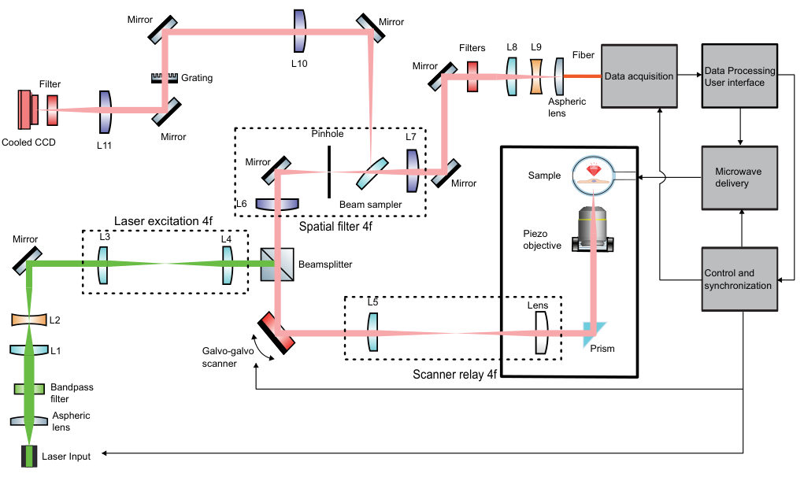 
FIG. 2: Schematic of the pulsed quantum microscope platform. The optical path comprises a fiber-coupled 520 nm laser, four nested 4 f relay systems, a galvo-galvo beam scanner, a confocal pinhole, and a single-photon detector (SPD). The microwave delivery routes a nanosecond-gated signal from the RF generator through a power amplifier and PCB loop antenna positioned beneath the sample. Data acquisition is synchronized with both the optical and microwave channels.

📷 Fig 3

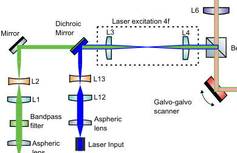 
FIG. 3: Dual-excitation configuration at the laser input. A dichroic mirror combines the fiber-coupled 520 nm (NV) and 450 nm (MagLOV) excitation beams into a single collinear path routed through the shared 4f relay, galvo-galvo scanner, and microscope objective.

📷 Fig 4

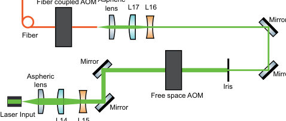 
FIG. 5: Schematic of the dual AOM-based laser pulse configuration.

📷 Fig 5

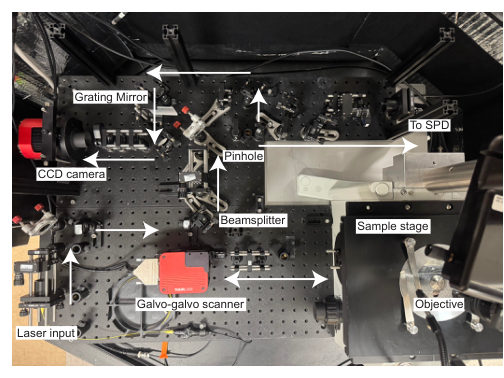 
FIG. 4: Photograph of the pulsed quantum microscope showing the inverted Olympus IX71 microscope base (right) and assembled optical breadboard (left).

**Summary.** The paper introduces a revolutionary pulsed quantum microscope designed to simultaneously probe and manipulate both solid-state NV center qubits and genetically encoded biological spin qubits inside living cells. By integrating advanced optics, fast pulsing electronics, and multi-frequency control, the platform enables multiplexed quantum sensing. This breakthrough paves the way for realizing entanglement between artificial solid-state systems and complex biological quantum states.

**Why it may be interesting.** This work is highly relevant as it pushes the experimental boundary of open quantum systems by creating a novel interface for controlling entanglement between solid-state defects and chemically sensitive biological molecules in real time.

Detailed structure

**Main problem.** The central challenge is developing a single, integrated quantum microscope capable of simultaneously manipulating and sensing both solid-state (NV center) and genetically encoded biological qubits within the complex environment of live cells.

**Main result.** The authors report the development of a pulsed quantum microscope platform that successfully integrates dual excitation paths, time-resolved detection, and microwave control to enable multiplexed quantum sensing in living systems.

**Method.** The methodology involves building an advanced optical setup on an inverted microscope body, combining nanosecond-gated pulsing with precise magnetic field control across multiple frequency ranges (DC to 5 GHz).

**Model / system.** The platform integrates solid-state qubits (NV centers in diamond) and biological spin qubits (e.g., MagLOV/flavin radical pairs). The system is designed for pulsed operation, allowing time-resolved measurements on both types of qubits simultaneously.

**Key observables.** Quantum state manipulation, single-photon timing resolution, NV ODMR signals ($\sim2.87$ GHz), and optically activated delayed fluorescence from biological targets.

**Important parameters / regimes.** Nanosecond pulse gating, picosecond timing resolution, microwave control up to 5 GHz, and the ability to operate in a stationary-sample, live-cell geometry.

**Assumptions / limitations.** The primary assumption is that combining these disparate measurement modalities onto one platform overcomes current limitations in quantum sensing for biological applications.

**Figures summary.** Figures detail the system architecture, showing nested 4f relays, dual excitation paths (520 nm and 450 nm), and schematics of pulsed laser drivers and microwave delivery systems.

**Paper structure.** The paper progresses by detailing the necessary components—pulsed optics, advanced scanning mechanisms, and frequency control electronics—to merge two previously separate quantum sensing modalities into one unified, live-cell compatible instrument.

Abstract

Two revolutions in quantum sensing are converging on the same microscope stage. Biological qubits have emerged as genetically encoded, optically addressable quantum systems inside live cells. Solid state spin based qubits have been entangled and used as nanoscale correlator magnetometers, delivering sensitivity and spatial-resolution gains that single-spin probes cannot reach. Here we report a pulsed quantum microscope that enables simultaneous quantum state manipulation of both qubit technologies in live cells. The platform combines nanosecond-gated optical excitation at 450 nm and 520 nm, three-dimensional diffraction-limited addressing by galvo beam scanning and piezo objective focus, rapidly switched static and radio-frequency magnetic fields, single-photon timing with picosecond resolution, and microwave control for frequencies from DC to 5 GHz, including the 2.87 GHz resonance of solid state spins, the 500 MHz to 800 MHz resonance of radical pairs in biological qubits, and any future qubit resonance in the GHz range. Live cell imaging with simultaneous biological and solid state nanoparticle qubits in the same cell demonstrates the power of this technique for multiplexed quantum sensing. We anticipate this approach will open new opportunities for researchers to explore quantum sensing in live cells, and, ultimately, entanglement between a solid-state qubit and a protein-hosted spin qubit.

[↑ back to top](#top)

### [Fragile single-cone Dirac quantum walks in two dimensions](http://arxiv.org/abs/2607.05112v1)

**Authors:** C. W. J. Beenakker, J. Sánchez Férnan, J. Tworzydło  
**Type:** theory · **Category:** other · **PDF:** <https://arxiv.org/pdf/2607.05112v1>  
**Analysis basis:** full PDF text, analyzed in chunks
**Topic relevance:** 🔥 `analog quantum simulation` **4/5** · `non-equilibrium dynamics` **3/5** · `driven-dissipative phase transition` **2/5** · `methods for driven-dissipative` **1/5** · `non-equilibrium universality` **1/5**

📷 Fig 1

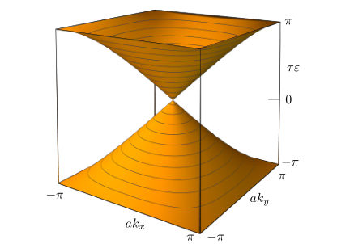 
FIG. 1. Momentum dependence of the quasi-energy (1.1) of the local 2D quantum walk considered in Sec. II B (squared quantum walk, Floquet operator U√

📷 Fig 2

 
FIG. 2. Gapped cone of the Ho-Chalker quantum walk in the presence of the staggered potential V (r) = (2τ)−1 cos(πx/a).

📷 Fig 3

 
FIG. 3. Cut along the line kx = ky through the band struc- ture of the squared quantum walk, in the presence of a scalar potential V (r) = V cos(Q · r/a): the black curve is with- out any potential (V = 0), the red and blue curves are for τV = 1 and, respectively, Q = (π, π) and (π/2, π/2). The latter choice gaps the ε = 0 Dirac cone.

📷 Fig 4

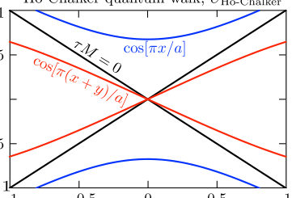 
FIG. 4. Cut along the line kx = ky through the band struc- ture of the Ho-Chalker quantum walk, in the presence of an in-plane magnetization M(r) = (M, M, 0) cos(Q · r/a): the black curve is without any magnetization (M = 0), the red and blue curves are for τM = 1 and, respectively, Q = (π, π) and (π, 0). The latter choice gaps the ε = 0 Dirac cone.

**Summary.** The paper investigates the topological stability of 2D Dirac quantum walks compared to their 1D counterparts. Through symmetry analysis and advanced mathematical techniques involving Laurent polynomials, the authors prove that local 2D constructions cannot sustain an unpaired zero-energy Dirac cone because locality forces a specific parity ($P=+1$), leading to inevitable gap opening under realistic disorder or potential scattering.

**Why it may be interesting.** This work provides a deep theoretical constraint on realizing topological edge/surface states using discrete quantum walks, showing that simple lattice discretizations fail where continuum models succeed, which is crucial for designing solid-state simulators or photonic analogs.

Detailed structure

**Main problem.** The core problem is determining if a two-dimensional (2D) Dirac quantum walk maintains topological protection against disorder, contrasting it with the known robustness in continuum systems.

**Main result.** The authors demonstrate that for local 2D quantum walks, the protecting symmetries required to maintain an unpaired zero-energy Dirac cone are incompatible with locality constraints, leading to gap opening under potential scattering or disorder.

**Method.** The analysis combines symmetry arguments (chiral and time-reversal) with rigorous algebraic topology applied to the Floquet operator's Laurent polynomial representation on the torus.

**Model / system.** The system is a local two-band quantum walk modeled by a unitary Floquet operator acting on position and spin in 2D space-time. It aims to mimic massless Dirac fermions, contrasting with the known robust 1D case.

**Key observables.** Quasi-energy dispersion relation $\epsilon(\mathbf{k})$, gap opening magnitude ($\Delta$), and topological invariants like parity $P$.

**Important parameters / regimes.** Potential scattering strength ($V$), momentum transfer vectors ($Q$), and the dimensionality (2D vs 1D).

**Assumptions / limitations.** The analysis assumes a local, two-band spin-1/2 implementation of the quantum walk. The argument relies heavily on the algebraic characterization of locality via Laurent polynomials.

**Figures summary.** Figures illustrate momentum dependence of energy bands ($\epsilon(\mathbf{k})$), showing gap opening due to potentials ($V$ or $M$) in both the Ho-Chalker and squared QW models.

**Paper structure.** The paper progresses from comparing 1D vs 2D robustness, through specific model tests (Palindromic, Squared, Ho-Chalker), culminating in rigorous mathematical proofs using symmetry constraints and Laurent polynomials to show that locality forces $P=+1$, thus forbidding the unpaired cone.

Abstract

It is known that a one-dimensional (1D) quantum walk gives a local space-time discretization of the massless Dirac equation with a single quasi-energy cone (no fermion doubling at low energies), keeping the fundamental symmetries (chiral and time-reversal) of the continuum theory. We show that the analogous 2D construction is fundamentally more fragile. Local two-band quantum walks can have an unpaired Dirac cone, but the protecting symmetries then cease to be ordinary on-site symmetries: they become non-symmorphic, involving half-lattice translations, and are broken by generic spatial inhomogeneities. In particular, we demonstrate that the 2D Dirac quantum walk based on the Ho-Chalker network model can be gapped by potential scattering.

[↑ back to top](#top)

### [Measurement Geometry as a Resource for Certifying Network Nonlocality](http://arxiv.org/abs/2607.04656v1)

**Authors:** Leon Adachi, Le Bin Ho  
**Type:** both · **Category:** quantum information and computing · **PDF:** <https://arxiv.org/pdf/2607.04656v1>  
**Analysis basis:** full PDF text, analyzed in chunks
**Topic relevance:** 🔥 `QC/QI experiment` **4/5** · `quantum measurements` **3/5** · `entanglement & information structure` **2/5** · `measurement-induced transitions` **1/5** · `quantum optics experiment` **1/5**

📷 Fig 1

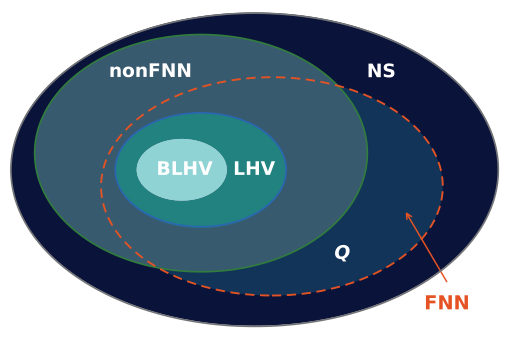 
FIG. 1. Hierarchy of correlation sets in quantum net- works. The classical sets obey BLHV ⊂LHV ⊂nonFNN ⊂ NS. BLHV corresponds to independent classical sources, LHV allows shared classical randomness, and nonFNN allows one source to generate arbitrary NS correlations. The quan- tum set (Q) lies between LHV and NS but is incomparable with nonFNN. Violations of BLHV and nonFNN certify bilo- cal network nonlocality and full network nonlocality (FNN), respectively.

📷 Fig 2

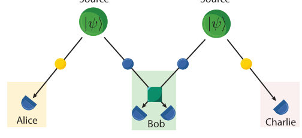 
FIG. 2. Bilocal network configuration. Two independent entangled sources each distribute one qubit to Bob and one to an outer party, generating pairs (A, BA) and (BC, C). Bob holds both subsystems BA and BC and performs joint mea- surements, mediating correlations between Alice and Charlie.

📷 Fig 3

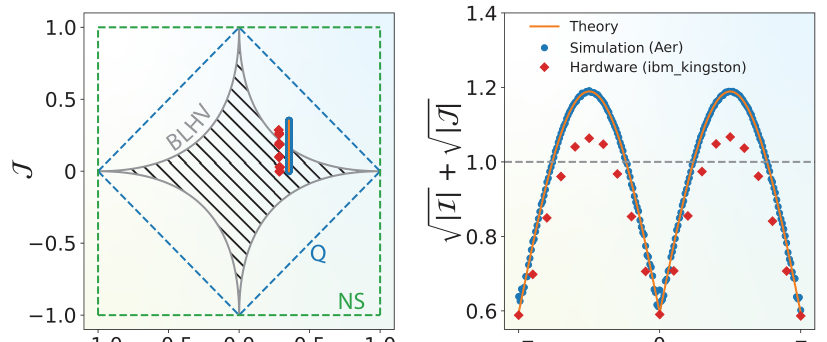 
FIG. 3. Analysis of the BLHV model on bilocal network. (Left) Theoretical, simulation (qiskit aer), and hardware (ibm kingston) results for I and J projected onto the I–J plane, obtained by sweeping θ over the full range [−π, π]. The hatched star-shaped region represents the set of correlations compatible with the BLHV model, bounded by p

📷 Fig 4

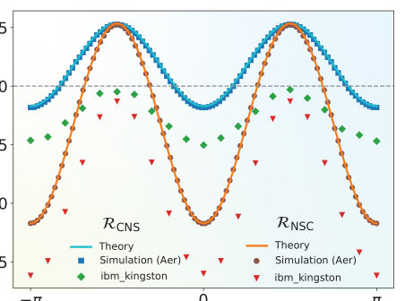 
FIG. 4. FNN witnesses RCNS and RNSC as func- tions of the state parameter θ. Theoretical, simulation (qiskit aer), and hardware processor (ibm kingston) values of RCNS and RNSC are shown as functions of θ. The dashed hor- izontal line marks the classical bound of 3, above which FNN correlations are certified. Both witnesses reach the maximum value 5/ √

📷 Fig 5

 
FIG. 5. Dependence of BLHV and FNN witnesses on the measurement parameters φ and ϕ. (Left) Distribution of SBLHV(φ, ϕ) = p

**Summary.** This paper introduces measurement geometry as an independent resource for certifying network nonlocality in tripartite quantum networks. Using superconducting hardware and ancilla-assisted circuits, the authors demonstrate that the optimal settings required to violate bilocal versus fully network nonlocal witnesses are distinct. This establishes a practical route for quantifying nonlocality based on experimental measurement choices.

**Why it may be interesting.** This work is highly relevant as it moves beyond simply proving entanglement exists; instead, it quantifies nonlocality based on *how* measurements are performed, providing a concrete resource metric for quantum network characterization.

Detailed structure

**Main problem.** The research develops an operational framework to certify network nonlocality beyond entanglement, focusing on how measurement design itself acts as a quantifiable resource.

**Main result.** Measurement geometry is shown to be an independent resource for network nonlocality, as the optimal settings for certifying bilocal versus fully network nonlocality differ significantly. The study successfully demonstrated this violation on superconducting hardware while showing FNN certification requires substantially stronger experimental conditions than BLHV.

**Method.** The authors developed and implemented ancilla-assisted meter circuits to evaluate nonlocal observables required for both bilocal (BLHV) and fully network nonlocality (FNN) witnesses in a tripartite quantum network.

**Model / system.** The system modeled is the bilocal Alice–Bob–Charlie quantum network, initialized with two independent entangled pairs. The framework tests correlations against classical models ranging from LHV to FNN, which are quantified using specific nonlocal observables.

**Key observables.** BLHV witness violation ($S_{	ext{BLHV}}$) and FNN witnesses ($	ext{RCNS}, 	ext{RNSC}$), compared against their respective classical bounds (1 and 3).

**Important parameters / regimes.** The measurement settings $(\varphi, \phi)$ applied at Bob's node are critical parameters that determine the accessible level of nonlocality.

**Assumptions / limitations.** The study assumes the ability to perform complex joint measurements using ancilla-assisted circuits on programmable quantum processors like superconducting qubits.

**Figures summary.** Figures illustrate the hierarchy of correlation sets ($	ext{BLHV} \subset \dots$), show the bilocal network setup, and map out how BLHV and FNN witnesses vary across the measurement parameter space $(\varphi, \phi)$, revealing distinct optimal settings for each type of nonlocality.

**Paper structure.** The paper first establishes the theoretical hierarchy of nonlocality models. It then develops the operational framework using ancilla-assisted circuits to measure observables. The core analysis involves mapping out how BLHV and FNN witnesses depend on Bob's joint measurement geometry, culminating in hardware demonstrations comparing the two.

Abstract

Quantum networks can exhibit nonclassical correlations that cannot be explained by classical models with independent sources. While the role of entanglement is well understood, the impact of measurement design remains largely unexplored. Here we develop an operational framework for certifying network nonlocality in the bilocal Alice--Bob--Charlie network using ancilla-assisted meters to evaluate the nonlocal observables required for bilocal and fully network nonlocal (FNN) witnesses. The approach successfully reproduces both bilocal and FNN correlations in simulation. On the 156-qubit superconducting processor \textit{ibm\_kingston}, we observe bilocal nonlocality with $\mathcal{S}_{\rm BLHV}=1.067(6)>1$ after readout-error mitigation, while the FNN witnesses reach $99\%$ and $96\%$ of their certification thresholds, implying the substantially stronger requirements for FNN certification. We further show that Bob's joint measurement determines the accessible level of network nonlocality: bilocal and FNN certification are optimized by different measurement settings, while both violations can disappear even for maximally entangled states. These results identify measurement geometry as an independent resource for network nonlocality and provide a practical route toward its certification on programmable quantum processors.

[↑ back to top](#top)

### [Macroscopic Quantum Interference of the Center-of-Mass Motion of Levitated Superconducting Microparticles enabled by Magnetic Higher-Order Traps](http://arxiv.org/abs/2607.03622v1)

**Authors:** Jaume Cunill-Subiranas, Fabian Resare, Suocheng Zhao, Sofia Qvarfort, A. Metelmann, Carles Navau, Witlef Wieczorek  
**Type:** theory · **Category:** other · **PDF:** <https://arxiv.org/pdf/2607.03622v1>  
**Analysis basis:** full PDF text, analyzed in chunks
**Topic relevance:** 🔥 `quantum measurements` **4/5** · `measurement-induced transitions` **3/5** · `Keldysh / 2PI / non-Gaussian methods` **1/5** · `driven-dissipative phase transition` **1/5**

📷 Fig 1

 
Figure 1. Harmonic and anharmonic magnetic traps for su- perconducting particles. Coil configurations, magnetic fields, and mechanical potentials for a magnetic quadrupole (a,d,g), magnetic hexapole (b,e,h), and double-well potential obtained from the superposition of a uniform magnetic field and mag- netic hexapole (c,f,i). These fields are induced in the central region of a suitable arrangement of coils, all of them with cylindrical symmetry in the z-direction. The crosses and dots indicate the sense of the current in the coils. Equal magni- tudes of currents are represented by the same colours. The magnetic field modulus is shown for small particles Rp ≪rrms (d-f) and large particles Rp...

📷 Fig 2

 
Figure 2. Classical dynamics of the motion of a 1 µm radius particle. We show Wigner functions and their marginal probability distributions in position (top panels) and momentum (side panels) at different times, given in terms of the original harmonic oscillator time scale. State evolution in (a,b,c) the DP potential (parameters: ♣in Tab. III), (d,e,f) the DWP potential (parameters: ♠in Tab. III), and (g,h,i) the D-DWP potential for an initial state displaced by 35zzpf (parameters: ♠in Tab. III). In the case of the DWP and D-DWP potentials, the region of m &gt; 1 according to condition Eq. (C12) is shaded, where the motion is constrained to one half of the double well. Note that the initial...

📷 Fig 3

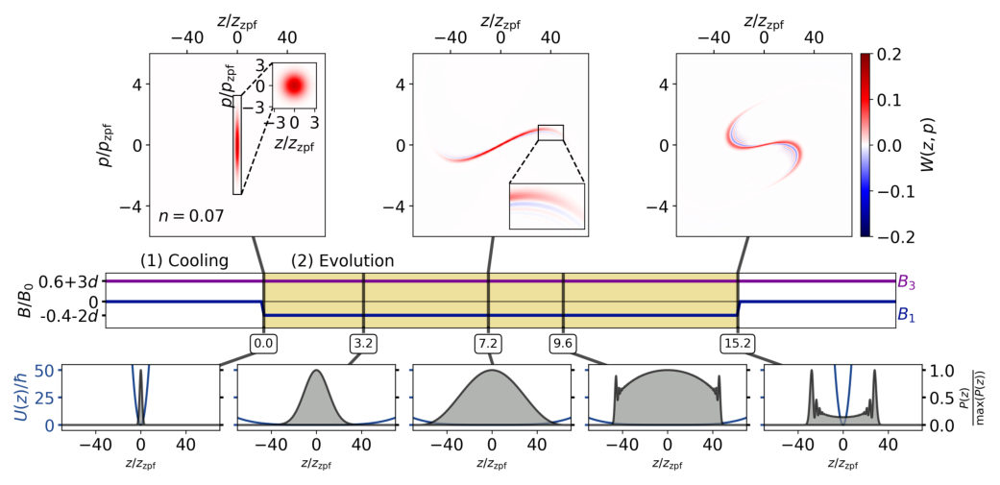 
Figure 3. Non-Gaussian motional state of a levitated superconducting microparticle. DP case (parameters: ♣in Tab. III): The motion is initially near ground-state cooled (n = 0.07) in a harmonic potential, including very weak coupling to the environment (Q = 1012). At time t = 0, the z4-potential is abruptly switched on, while maintaining B3 = Bini 3 . The upper panel shows the evolution of the Wigner function, the middle panel shows the switching of coils to realize certain magnetic fields, and the lowermost panel shows the position probability distribution P(z) as well as the potential Uz. We observe that the z-motion first experiences motional squeezing, followed by a generation of...

📷 Fig 4

 
Fig. 5(a) and Fig. 5(c) show a systematic decrease of the fringe amplitude and wavenumber, respectively, with the initial phonon occupation. Interestingly, for short protocol times, i.e., around ω0t/2π ∼10, we observe that a non-zero phonon number results in the largest fringe amplitude, see Fig. 5(b). For longer protocol times, the maximum fringe amplitude increases and shifts towards smaller phonon numbers. This behavior can be under- stood by considering the mean period time ⟨τ⟩in the DP potential and its dependence on the initial conditions. A larger initial phonon number results in a faster timescale for the dynamics such that the nonlinearity of the DP can impact the state more...

📷 Fig 5

 
Figure 4. Discerning quantum from classical dynamics in the DP protocol. (a) Probability distribution of the position quadrature for an initial phonon occupation of n = 0 (dark purple, straight) and n = 3.5 (light purple, dashed), com- pared to the classical dynamics (black). For these simulations, Q = ∞. The inset shows the difference between the quantum and classical probability distributions ∆P. (b) Fourier trans- formation of ∆P, restricted to the respective highlighted areas in the inset of (a). Gaussian fits (dashed lines) are used to extract the peak wavenumber kmax and maximal amplitude F[∆P](kmax).

**Summary.** This paper demonstrates how magnetic higher-order traps can confine superconducting microparticles to generate anharmonic potentials necessary for observing macroscopic quantum interference. By controlling the trap landscape using static coils, researchers can manipulate the center-of-mass motion into non-Gaussian states. This opens a new experimental avenue to test fundamental physics questions regarding the quantum-classical transition with massive objects.

**Why it may be interesting.** This work directly addresses quantum mechanics at macroscopic scales using a clean, controllable physical system (superconductors) and advanced trapping techniques, which is highly relevant to AMO physics concerning quantum measurement and decoherence.

Detailed structure

**Main problem.** The research aims to generate and study macroscopic quantum interference effects in the center-of-mass motion of levitated superconducting microparticles.

**Main result.** The use of magnetic higher-order traps allows for generating non-Gaussian motional states, opening a path to fundamental experiments studying the quantum-to-classical transition with masses exceeding picograms.

**Method.** The authors analyze the dynamics in phase space using anharmonic potentials (like Duffing or double-well types) derived from magnetostatic higher-order traps. They also provide protocols for distinguishing classical from quantum behavior via position measurements.

**Model / system.** The system involves superconducting microparticles levitated by magnetic fields, where the trapping potential is engineered using static arrangements of coils to create anharmonic potentials (e.g., hexapole terms). The dynamics are modeled in phase space, sometimes utilizing a Wigner function approach for analysis.

**Key observables.** Non-Gaussian motional states, position measurement statistics used to distinguish classical vs. quantum behavior.

**Important parameters / regimes.** Masses larger than picogram ($10^{13}$ atomic mass units), anharmonicity realized on sub-nanometer length scales.

**Assumptions / limitations.** The analysis often relies on the small-sphere approximation for simplifying the complex potential calculation, although general field generation is discussed.

**Figures summary.** Figure 1 illustrates various magnetic traps (harmonic and anharmonic) for superconducting particles using coil configurations and resulting potentials (e.g., double-well).

**Paper structure.** The paper establishes the physical platform (superconducting levitation), details the theoretical tool (HOTs generating anharmonic potentials), proposes protocols to generate nonclassical states, analyzes the dynamics in phase space, and concludes with experimental feasibility for fundamental tests.

Abstract

We show how magnetostatic higher-order multipole traps can be used to generate macroscopic quantum interference of the motion of levitated superconducting microparticles. An appropriate combination of multipolar magnetic fields offers great versatility in constructing various trap potentials, including anharmonic trap potentials such as Duffing or double-well types. Crucially, the anharmonic trap potentials realize a nonlinearity on the order of hundred times the zero-point motion, i.e., on a length scale below nanometers. These anharmonic potentials allow for the generation of quantum features of the center-of-mass motion of a magnetically levitated superconducting microparticle. Importantly, they can be easily generated with a static arrangement of coils, requiring only that the current running through them is tunable. We propose protocols exploiting the versatility of the magnetic trap landscape to generate non-Gaussian motional states. We solve the dynamics of the center-of-mass motion of the particle in phase space and analyze its parameter dependence. Furthermore, we give a recipe to distinguish classical from quantum behavior in a statistically meaningful way through measurement of the position of the particle. Our results open a path to accessing the quantum regime of the center-of-mass motion of objects with masses larger than picogram, i.e., $10^{13}$ atomic mass units. This will enable fundamental physics experiments for studying the transition between quantum and classical behavior, exploring the intersection between quantum physics and gravity as well as probing of certain types of dark matter.

[↑ back to top](#top)

### [Robust self-test of the maximally entangled state of two-qubits without assuming unitary observables](http://arxiv.org/abs/2607.04035v1)

**Authors:** Alexandre C. Orthey, Magdalena Stobińska-Moretto  
**Type:** theory · **Category:** quantum information and computing · **PDF:** <https://arxiv.org/pdf/2607.04035v1>  
**Analysis basis:** full PDF text, analyzed in chunks
**Topic relevance:** 🔥 `quantum measurements` **4/5** · `entanglement & information structure` **3/5** · `QC/QI experiment` **1/5** · `measurement-induced transitions` **1/5**

📷 Fig 1

 
Low-resolution page preview, page 2

📷 Fig 2

 
Low-resolution page preview, page 3

📷 Fig 3

 
Low-resolution page preview, page 4

📷 Fig 4

 
Low-resolution page preview, page 5

📷 Fig 5

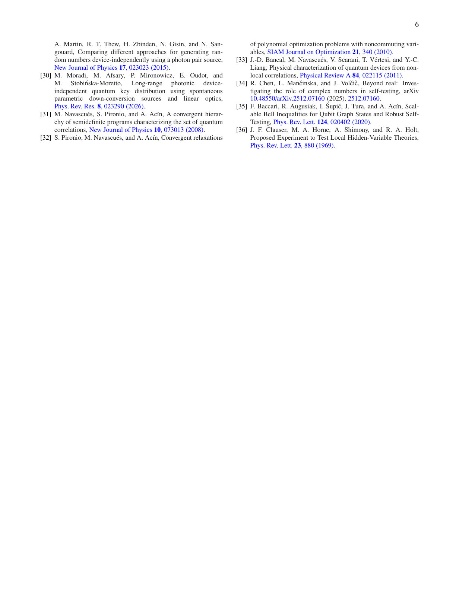 
Low-resolution page preview, page 6

**Summary.** This paper develops a rigorous theoretical framework to self-test maximally entangled states without assuming that local measurements are perfectly projective. By regularizing general POVMs and deriving an $O(\sqrt{\epsilon})$ robustness bound, the authors show that real-world measurement imperfections impose stricter limitations on entanglement certification than previously thought.

**Why it may be interesting.** This work provides a crucial refinement for device-independent quantum information protocols, offering a more physically accurate assessment of entanglement certification when measurement apparatuses are imperfect or non-ideal.

Detailed structure

**Main problem.** To develop a robust self-testing protocol for entangled quantum states that accurately accounts for non-projective, realistic local measurements, bypassing the limitations of standard methods relying on Naimark dilation.

**Main result.** The authors derive an analytic robustness bound scaling as $O(\sqrt{\epsilon})$ for certifying entanglement using general POVMs, showing that real experimental constraints impose a significantly higher cost than idealized projective models suggest.

**Method.** They regularize physical non-projective operators using a modified sign function and decompose the total error into terms related to regularization ($\Delta$) and standard unitaries (funitaries), bounding both analytically.

**Model / system.** The study focuses on certifying the maximally entangled two-qubit singlet state using local measurements $\{A_x\}$ and $\{B_y\}$, modeled by general binary POVMs, rather than assuming ideal projective measurements.

**Key observables.** CHSH Bell operator expectation value ($\langle B 
angle$), local measurement probabilities $p(a, b|x, y)$, and the error parameter $\epsilon$.

**Important parameters / regimes.** The robustness bound scales as $O(\sqrt{\epsilon})$, where $\epsilon$ quantifies the deviation from ideal entanglement.

**Assumptions / limitations.** The primary assumption challenged is that local observables must be strictly projective (unitary); the work explicitly circumvents Naimark dilation by regularizing operators instead.

**Paper structure.** The paper establishes a framework to test entanglement robustly, first addressing the failure of standard methods due to non-projective measurements. It then introduces regularization techniques and derives an analytic bound on the total error ($\Delta + 	ext{funitaries}$) based on the measured Bell violation $\epsilon$.

Abstract

Standard device-independent self-testing uses Naimark dilation to assume projective measurements, masking the operational limitations of realistic non-unitary observables. We establish a robust pure self-test for the singlet and Pauli observables that entirely circumvents dilation of the measurement apparatus. Assuming a pure state to model an untrusted source, we regularize the physical non-projective operators and derive an analytic $\mathcal{O}(\sqrtε)$ robustness bound. Our results suggest that device-independent certification of real implementations is significantly more demanding than standard projective models imply.

[↑ back to top](#top)

### [Beyond-adiabatic flat Chern bands from a double-helix skyrmion crystal](http://arxiv.org/abs/2607.03707v1)

**Authors:** Bin Xi, Ken Chen, Qiang Luo, Jie Lu, Jia-Wei Mei, Hong-Gang Luo, Jize Zhao  
**Type:** theory · **Category:** strongly correlated electrons · **PDF:** <https://arxiv.org/pdf/2607.03707v1>  
**Analysis basis:** full PDF text, analyzed in chunks
**Topic relevance:** 🔥 `analog quantum simulation` **4/5** · `exotic spin models in light-matter` **3/5** · `spintronics-quantum-optics interface` **1/5**

📷 Fig 1

 
Figure 1. Representative DHSKX configuration. (a) Full spin texture. (b,c) Sublattice-resolved spin

📷 Fig 2

 
Figure 2. Flat Chern bands in the DHSKX background. (a–d) Narrow energy windows around the 398th

📷 Fig 3

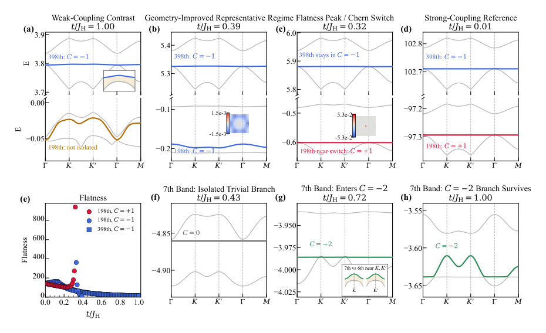 
Figure 2(a-d) traces these two branches from weak to strong coupling, and Fig. 2(e) plots their

📷 Fig 4

 
Figure 3. Real-space wave-function fingerprints relevant to Fig. 2. (a) Global ↑component of the 7th band

**Summary.** This work proposes that a Double-Helix Skyrmion Crystal (DHSKX) can realize flat Chern bands by exploiting phase clustering mechanisms within its spin texture. This approach achieves robust topological states in a 'beyond-adiabatic' regime, offering a pathway to engineer fractional quantum Hall physics using controllable magnetic architectures.

**Why it may be interesting.** The concept of using geometric frustration and specific magnetic textures (skyrmions) to engineer topological electronic properties is highly relevant for designing novel quantum materials and artificial lattices.

Detailed structure

**Main problem.** The central challenge addressed is engineering flat Chern bands by suppressing kinetic energy while simultaneously preserving non-zero Berry curvature.

**Main result.** A double-helix skyrmion crystal (DHSKX) provides a mechanism to achieve this, exhibiting isolated flat $|C|=1$ Chern bands and hosting signatures consistent with $
u=1/3$ Laughlin-type Fractional Chern Insulator physics in a beyond-adiabatic regime.

**Method.** The analysis uses the double exchange model Hamiltonian, calculating band properties via Kubo response and Fukui-Hatsugai-Suzuki construction, supplemented by band-projected exact diagonalization for finite-size evidence.

**Model / system.** The system is a Double-Helix Skyrmion Crystal (DHSKX), derived as the classical ground state of a frustrated honeycomb spin model under double exchange. It features two sublattice-resolved skyrmion textures locked at opposite helicities.

**Key observables.** Flatness of bands ($\gtrsim 10$), Chern number ($C$), Quantum Geometry metric ($\sigma_{QG}$), and evidence for Laughlin-type fractional filling ($
u=1/3$).

**Important parameters / regimes.** The coupling ratio $t/J_H$, which defines the 'beyond-adiabatic window' where optimal quantum geometry is achieved.

**Assumptions / limitations.** The results are based on a representative microscopic generator (frustrated honeycomb model) but suggest the architecture is generally applicable to various physical platforms.

**Figures summary.** Figures illustrate the DHSKX spin textures, the evolution of flat Chern bands across coupling regimes showing $|C|=1$ and $C=-2$ branches, and real-space wave function fingerprints demonstrating phase clustering.

**Paper structure.** The paper establishes the physical problem (flat band engineering), introduces the DHSKX model, details the mechanism (phase clustering leading to destructive interference), presents results showing flat bands in a beyond-adiabatic regime, and concludes by mapping the architecture onto programmable platforms.

Abstract

A central challenge in flat-band engineering is suppressing kinetic energy without sacrificing Berry curvature. We show that a double-helix skyrmion crystal (DHSKX)--two sublattice-resolved skyrmion textures locked at opposite helicities, obtained here as the classical ground state of a frustrated honeycomb spin model--provides such a route under double exchange. The key mechanism is a single real-space organization, phase clustering: the $π$-locked helicities expel the wave function's phase winding from the skyrmion cores, and the magnetic $C_3$ symmetry pins it into three phase-locked clusters whose distributed destructive interference cancels net transport while preserving the Berry curvature. Ordinary skyrmion crystals, even with the same symmetry, do not develop this organization. Phase clustering yields isolated flat $|C| = 1$ Chern bands over broad coupling windows, one of which surpasses the adiabatic reference in quantum geometry at intermediate coupling. In this beyond-adiabatic window, band-projected exact diagonalization gives finite-size evidence consistent with $ν= 1/3$ Laughlin-type fractional-Chern-insulator physics; the same texture also hosts a higher-Chern ($C = -2$) flat band. Built from site-resolved complex hoppings alone, the DHSKX architecture is directly programmable in topolectric, acoustic, and photonic platforms.

[↑ back to top](#top)

### [Mass-imbalanced SU(N) Fermi gases](http://arxiv.org/abs/2607.05328v1)

**Authors:** Jordi Pera, Joaquim Casulleras, Jordi Boronat  
**Type:** theory · **Category:** quantum gases · **PDF:** <https://arxiv.org/pdf/2607.05328v1>  
**Analysis basis:** full PDF text, analyzed in chunks
**Topic relevance:** 🔥 `analog quantum simulation` **4/5** · `exotic spin models in light-matter` **3/5** · `Keldysh / 2PI / non-Gaussian methods` **1/5**

📷 Fig 1

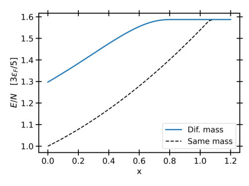 
FIG. 1. Energy for S = 1/2 as a function of the gas parameter x. The black data represents the mass balanced configuration. In the mass imbalanced system, the spin component C1/2 has a mass ratio of r1/2 = 1, while the other spin C−1/2 has r−1/2 = 2.

📷 Fig 2

 
FIG. 2. Occupation factors (top) and the corresponding po- larization (bottom, green curve) for S = 1/2 as a function of the gas parameter x. The black data represent the mass balanced configuration. The spin component C1/2 has a mass ratio of r1/2 = 1, whereas C−1/2 has r−1/2 = 2 in the top panel and r−1/2 = 1, 1.01, 1.11, 1.43, and 2 in the bottom panel.

📷 Fig 3

 
FIG. 3. Gas parameter at which the system reaches P = 1 as a function of the maximum mass ratio r for S = 1/2, 3/2, 5/2, 7/2 and 9/2. In all cases, one component is the heaviest one, with rs = 1, while the remaining components have rλ̸=s = rmax.

📷 Fig 4

 
FIG. 4. Occupation factors for S = 3/2 as a function of the gas parameter x. The black dashed line represents the mass-balanced configurations. Each spin component λ has a different mass: from the heavier rs = 1 to the lighter r−s = 2.

📷 Fig 5

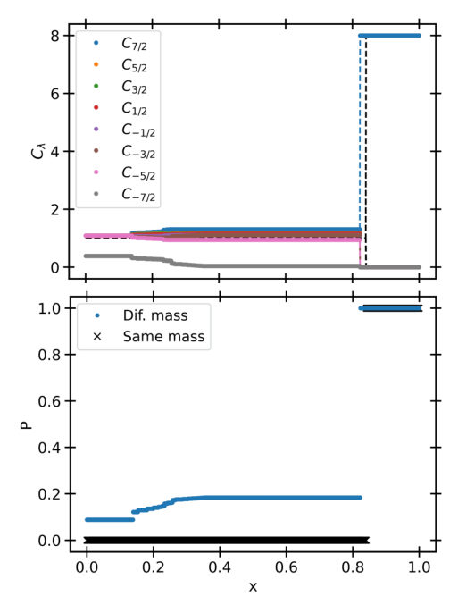 
FIG. 5. Occupation factors (top) and the corresponding po- larization (below) for S = 7/2 as a function of the gas param- eter x. The black data represent the mass-balanced configu- ration. The spin component C−s has a different (light) mass, r−s = 2. The rest has rλ̸=−s = 1.

**Summary.** This paper analytically describes itinerant ferromagnetism in mass-imbalanced SU(N) Fermi gases by calculating the second-order energy corrections. The key finding is that mass imbalance fundamentally changes the magnetic transition path, leading to continuous polarization rather than a sharp discontinuity seen in balanced systems. This establishes mass ratio as a powerful control parameter for magnetism in ultracold atomic mixtures.

**Why it may be interesting.** This work provides a powerful theoretical tool—'mass engineering'—to control magnetic ordering in ultracold atomic mixtures, offering quantitative predictions that guide experimental realization using heterogeneous quantum gases.

Detailed structure

**Main problem.** The study focuses on developing a fully analytical description of itinerant ferromagnetism in repulsive SU(N) Fermi gases, specifically investigating how mass imbalance among components affects the magnetic ordering.

**Main result.** Mass imbalance fundamentally alters the path to full polarization, causing it to occur continuously (for S=1/2) rather than discontinuously as predicted for equal-mass systems. The derived analytical expression provides a compact equation of state for these mixtures.

**Method.** The authors employ perturbation theory up to second order in the gas parameter $x = k_F a_0$ to derive the energy and beyond-mean-field corrections, yielding closed analytical expressions previously unavailable for mass-imbalanced cases.

**Model / system.** The system modeled is a zero-temperature, repulsive SU(N) Fermi gas characterized by arbitrary mass imbalance among its components. The physics is governed by interactions quantified by the s-wave scattering length $a_0$.

**Key observables.** Energy per particle ($E_N$), spin polarization (P), and occupation factors of different spin components.

**Important parameters / regimes.** The gas parameter ($x = k_F a_0$), the degree of mass imbalance (quantified by ratios $r_\lambda$), and the total spin degeneracy ($S$).

**Assumptions / limitations.** The analysis is restricted to zero temperature, repulsive short-range interactions ($a_0 > 0$), and relies on perturbation theory up to second order.

**Figures summary.** Figures illustrate the energy dependence on $x$ for mass-balanced versus imbalanced systems (Fig. 1). They also show how mass asymmetry leads to continuous polarization paths (Fig. 2) and plot the critical gas parameter required for full polarization as a function of maximum mass ratio (Fig. 3).

**Paper structure.** The paper builds from establishing the physical model (mass-imbalanced SU(N) Fermi gases) to deriving the second-order energy correction analytically. It then analyzes how this imbalance breaks symmetry, favors heavier components, and modifies the transition dynamics toward ferromagnetism across different spin values.

Abstract

We report a fully analytical description of zero-temperature itinerant ferromagnetism in repulsive SU(N) Fermi gases with arbitrary mass imbalance among components. Using perturbation theory in the gas parameter x = kFa0, with kF the Fermi momentum and a0 the s-wave scattering length, we derive the second-order energy for arbitrary spin polarization and arbitrary mass ratio. Our main result is a closed analytic expression for the beyond-mean-field correction in mixtures with unequal masses. This analytical result extends the theory of dilute Fermi gases beyond the mass-balanced case and provides a compact equation of state for multicomponent mixtures. We show that mass imbalance breaks the paramagnetic symmetry already in the non-interacting limit, favors the occu pation of heavier components, and lowers the interaction strength required to reach a fully polarized state. For S = 1/2, the system evolves continuously from a mass-induced partially polarized state to full ferromagnetism. For larger spins, distinct mass distributions generate qualitatively differ ent polarization paths, including smooth and discontinuous sequences. Our results identify mass imbalance as a powerful control tool for magnetic ordering in ultracold Fermi mixtures.

[↑ back to top](#top)

### [Nonlocal Kondo-exchange-driven intrinsic anomalous Hall effect in localized-$4f$ antiferromagnetic metals](http://arxiv.org/abs/2607.04805v1)

**Authors:** Akimitsu Kirikoshi, Junya Otsuki  
**Type:** theory · **Category:** strongly correlated electrons · **PDF:** <https://arxiv.org/pdf/2607.04805v1>  
**Analysis basis:** full PDF text, analyzed in chunks
**Topic relevance:** 🔥 `Kondo & dissipative impurity` **4/5** · `spintronics-quantum-optics interface` **2/5** · `Keldysh / 2PI / non-Gaussian methods` **1/5** · `analog quantum simulation` **1/5**

📷 Fig 1

 
FIG. 1. Schematic illustration of virtual c–f hybridization processes and their consequences in the localized-4f regime: (a) the local effective field ˜hl, and (b) the nonlocal spin- dependent hopping ˜tσσ′ ll′ . Upper panels show representative processes, and lower panels show the corresponding effective terms. The blue arrows and white spheres denote the 4f- electron spins and the conduction-electron sites, respectively.

📷 Fig 2

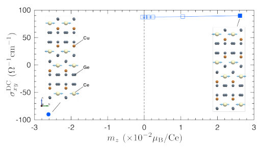 
FIG. 2. Intrinsic AHC σDC xy versus canting magnetization mz. Filled symbols represent the results with the molecular field for collinear antiferromagnetic (AFM) order along the b axis, as shown in the insets. Open symbols denote canting tuned by a uniform field along the c axis, with a fixed in-plane mag- netic configuration. The crystal structures are generated by QtDraw [58].

📷 Fig 3

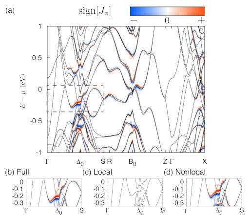 
FIG. 3. (a) Band structure from the effective Hamiltonian. The color map shows the atomic-scale total angular momen- tum polarization Jz (sign indicated by the color bar at the top). (b) Zoom-in of the dashed region in (a). Panels (c) and (d) show the results obtained by retaining only the Ge 4p local effective field and Ge 4p nonlocal effective hopping, re- spectively.

📷 Fig 4

 
FIG. 4. Intrinsic AHC σDC xy versus a chemical potential shift ∆µ from the Fermi level, with decomposition into several con- tributions. (a) A decomposition into Ce 5d and Ge 4p contri- butions. The blue squares labeled with ‘Full’ correspond to the result of the effective Hamiltonian. (b) A decomposition of the Ge 4p contribution into local effective-field and nonlo- cal effective-hopping components.

**Summary.** The paper theoretically investigates the anomalous Hall effect in $4f$ antiferromagnets by developing an effective Hamiltonian that couples itinerant conduction electrons to localized magnetic moments. The key finding is that the large intrinsic AHE conductivity arises not from local fields, but from nonlocal spin-dependent hopping mediated by Kondo exchange interactions. This establishes a fundamental mechanism for topological magnetotransport in strongly correlated systems.

**Why it may be interesting.** This work provides a detailed theoretical understanding of how non-local quantum interactions (Kondo exchange) can generate topological responses like the AHE in strongly correlated magnetic insulators, which is highly relevant for modern spintronics and topological materials research.

Detailed structure

**Main problem.** The study aims to determine the microscopic origin of the intrinsic anomalous Hall effect (AHE) in antiferromagnetic metals containing localized $4f$ magnetic moments, where charge transport and magnetism are separated.

**Main result.** The AHE is found to originate primarily from nonlocal spin-dependent hopping induced by Kondo exchange coupling, rather than local Zeeman fields or canting ferromagnetism. This mechanism generates the necessary Berry curvature in the collinear AFM state.

**Method.** Theoretical calculations employing an effective Hamiltonian approach derived from $c-f$ hybridization, utilizing techniques like Green's function formalism and incorporating strong correlation effects via approximations (e.g., Hubbard-I).

**Model / system.** The system is a localized-$4f$ antiferromagnetic metal, exemplified by $	ext{Ce}_2	ext{CuGe}_6$. The model treats the interaction between itinerant conduction electrons ($c$) and localized $4f$ moments via an effective Hamiltonian incorporating Kondo exchange coupling.

**Key observables.** Intrinsic Anomalous Hall Conductivity ($\sigma_{DC}^{xy}$), spin splitting of energy bands, and Berry curvature hotspots.

**Important parameters / regimes.** The analysis focuses on the strong-coupling regime and the role of nonlocal vs. local hopping terms derived from $c-f$ hybridization.

**Assumptions / limitations.** Approximations include neglecting orbital degeneracy and using static limits for self-energy calculations, though the framework is built upon established correlated electron models.

**Figures summary.** Figures illustrate schematic processes of virtual $c-f$ hybridization, plot $\sigma_{DC}^{xy}$ dependence on canting magnetization ($m_z$), show band structures with spin splitting, and decompose AHC contributions based on orbital character (e.g., Ge $4p$).

**Paper structure.** The paper develops an effective Hamiltonian for conduction electrons incorporating strong correlations from localized $f$ moments. It then calculates the intrinsic AHE using current-current correlation functions and Berry curvature methods, systematically decomposing the contribution to pinpoint nonlocal hopping as the dominant mechanism.

Abstract

The anomalous Hall effect in antiferromagnetic metals has attracted considerable attention. Most known realizations involve itinerant $d$ electrons that simultaneously mediate charge transport and magnetic order. Here, we focus on $f$-electron materials, where localized magnetic moments and conduction electrons are hosted in different orbitals. We develop a theoretical framework to describe the impact of localized antiferromagnetic order on itinerant electrons. Applying this approach to the recently discovered $4f$ antiferromagnetic metal $\mathrm{Ce}_{2}\mathrm{Cu}\mathrm{Ge}_{6}$, we identify the origin of both the intrinsic anomalous Hall conductivity and the spin splitting of the energy bands as spin-dependent intersite hopping induced by nonlocal Kondo exchange coupling, rather than a Zeeman-type effective field acting locally on the conduction electrons.

[↑ back to top](#top)

### [Pauli Spectrum and Stabilizer Rényi Entropy in Gapless Symmetry-Protected Topological Phases](http://arxiv.org/abs/2607.03762v1)

**Authors:** Ying-Lin Li, Po-Yao Chang  
**Type:** theory · **Category:** strongly correlated electrons · **PDF:** <https://arxiv.org/pdf/2607.03762v1>  
**Analysis basis:** full PDF text, analyzed in chunks
**Topic relevance:** 🔥 `entanglement & information structure` **4/5** · `analog quantum simulation` **2/5** · `Keldysh / 2PI / non-Gaussian methods` **1/5** · `driven-dissipative phase transition` **1/5**

📷 Fig 1

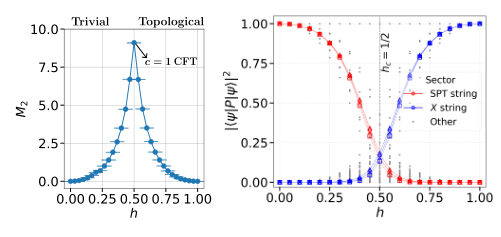 
FIG. 1: (a)M2 of the cluster SPT for L = 30 under periodic boundary condition(PBC), bond dimension χ = 50 and NSamp = 105. (b)Pauli spectrum for the cluster model with L = 8. Red symbols denote SPT non-local string order operators while blue symbols denote trivial non-local string operators. Different marker shapes correspond to different string lengths, defined in Eqs. (5)(6), such as △: |n −m| = 1, × : |n −m| = 2, and □: |n −m| = 3. Gray dots show the remaining Pauli-string weights.

📷 Fig 2

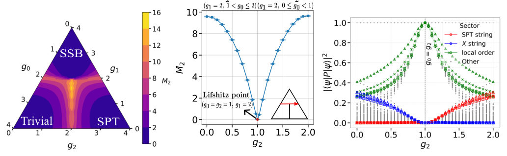 
FIG. 2: (a)M2 of the cluster Ising model with PBC, bond dimension χ = 50 and NSamp = 105. (b)M2 along g1 = 2. (c)Pauli spectrum along g1 = 2 with L = 8. Red symbols denote SPT non-local string order operators while blue symbols denote trivial non-local string operators. Green symbols denote SSB local order parameters. Different marker shapes correspond to different string lengths, defined in Eqs. (6)(8), such as △: |n −m| = 1, × : |n −m| = 2, □: |n −m| = 3, and ⋄: |n −m| = 4. Gray dots show the remaining Pauli-string weights. Note that the X-string is a power law function instead of O(1).

📷 Fig 3

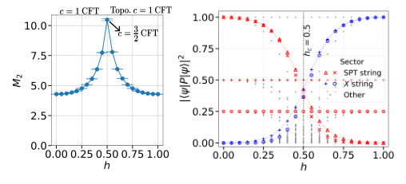 
FIG. 3: (a)M2 of igSPT for Lunit = 16 (32 spins) with PBC, bond dimensionχ = 100, Nsamp = 105. (b)Pauli string weight for Lunit = 4 (8 spins). Red symbols denote SPT non-local string order operators, defined in Eq. (13), with △: |i −j| = 1, and × : |i −j| = 2 while blue symbols denote trivial non-local string operators, defined in Eq. (15), with + : |i −j| = 1, and o : |i −j| = 2. Note that the Red symbols with + : |i −j| = 1, and o : |i −j| = 2 is defined in Eq. (14)

📷 Fig 4

 
FIG. 4: (a)Convergence of M2 with respect to number of sampling NSamp of Cluster-type models with L=30, χ = 50 at (g0, g1, g2) = (1.2, 1.6, 1.2). (b)The error of the SRE sampling calculation of Cluster Ising model with L = 30, χ = 50, and NSamp = 105. (c)M2 along g0 = g2 of the cluster Ising model with PBC, χ = 50 and NSamp = 105. (d)Convergence of M2 with respect to number of sampling NSamp of igSPT models with L = 32, χ = 100 at h = 1

**Summary.** This work introduces the Pauli spectrum as a superior diagnostic tool for characterizing Symmetry-Protected Topological phases compared to entanglement measures like Stabilizer Rényi Entropy. By analyzing specific 1D models, the authors show that the characteristic crossing structure in the Pauli spectrum precisely tracks the exchange of non-local string order parameters across phase transitions. This provides a powerful theoretical framework for understanding topological quantum matter.

**Why it may be interesting.** The detailed analysis of duality transformations (local-unitary vs. non-invertible Kramers-Wannier) provides deep insight into the mathematical structure underlying topological phase transitions in quantum many-body systems relevant to condensed matter theory.

Detailed structure

**Main problem.** The paper aims to develop quantum diagnostics beyond standard entanglement measures to characterize Symmetry-Protected Topological (SPT) phases in condensed matter systems.

**Main result.** While the Stabilizer Rényi Entropy provides only a coarse diagnostic, the Pauli spectrum reveals a characteristic crossing structure at phase transitions, offering finer information about the exchange of string order sectors.

**Method.** The study employs theoretical analysis using concepts like stabilizer entropy and analyzing the full probability distribution of Pauli strings (Pauli spectrum) across different topological phases.

**Model / system.** The research focuses on one-dimensional SPT phases, including gapped, non-intrinsically gapless, and intrinsically gapless types, modeled using cluster-type Hamiltonians like the Cluster Ising Model.

**Key observables.** Stabilizer Rényi Entropy (SRE), Pauli spectrum crossing structure, and non-local string order parameters.

**Important parameters / regimes.** The coupling constant $h$ in the Hamiltonian, which tunes the system between different topological regimes ($h < 1/2$ vs. $h > 1/2$).

**Assumptions / limitations.** It assumes that the Pauli spectrum crossing structure is robust and reflects fundamental changes in string order correlations across phase transitions.

**Figures summary.** Figures illustrate the SRE ($M_2$) and the Pauli spectrum for various models (cluster SPT, Ising model, igSPT), showing how the Pauli spectrum successfully detects transitions where SRE fails.

**Paper structure.** The paper progresses by introducing the problem of characterizing SPT phases beyond entanglement. It then analyzes specific models (Cluster SPT, Ising) using both SRE and Pauli spectra, establishing that the Pauli spectrum is superior for detecting phase changes due to its sensitivity to string order exchange mechanisms, which are mapped via local-unitary or non-invertible dualities.

Abstract

Quantum entanglement is widely used as a diagnostic of topological phases of matter. Beyond entanglement, non-stabilizerness captures a distinct aspect of quantum many-body states by quantifying their distance from the manifold of stabilizer states. In this work, we study the stabilizer Rényi entropy in symmetry protected topological (SPT) phases, including both gapped SPT, non-intrinsically gapless SPT, and intrinsically gapless SPT phases. Under symmetry preserving perturbations, we find numerically that the stabilizer Rényi entropy exhibits an extremum near the phase transition. However, the stabilizer Rényi entropy alone cannot distinguish different SPT phases. In contrast, the Pauli spectrum reveals a characteristic crossing structure at the transition point. This crossing reflects the exchange of dominant Pauli-string correlations associated with the non-local string order parameters of the two topological distinct phases. For gapped SPT and non-intrinsically gapless SPT phases, the crossing structure can be understood from a local-unitary duality that maps the Pauli spectrum between the two phases. For intrinsically gapless SPT phases, such a local-unitary mapping is absent. Instead, we find that the Pauli spectrum mapping is generated by a non-invertible duality transformation. These results show that although the stabilizer Rényi entropy provides only a coarse diagnostic of phase transitions, the Pauli spectrum contains finer information about the exchange of string order sectors. Our findings demonstrate that quantum magic offers a complementary perspective for characterizing both gapped and gapless SPT phases.

[↑ back to top](#top)

### [Genuine Multipartite Entanglement between Logical Qubits via Cross-Code Lattice Surgery](http://arxiv.org/abs/2607.04227v1)

**Authors:** Alex Steiner, Tomasz Andrzejewski, Phila Rembold, Hendrik Poulsen Nautrup, Christian D. Marciniak, Robert Freund, Ivan Pogorelov, Thomas Monz, Philipp Schindler, Marcel Meyer, Nicolai Friis  
**Type:** experiment · **Category:** quantum information and computing · **PDF:** <https://arxiv.org/pdf/2607.04227v1>  
**Analysis basis:** full PDF text, analyzed in chunks
**Topic relevance:** 🔥 `QC/QI experiment` **4/5** · `entanglement & information structure` **3/5**

📷 Fig 1

 
FIG. 1. Logical genuine multipartite entanglement and cross-code lattice surgery. (a) Logical genuine multipar- tite entanglement (GME): States of three parties, A, B, and C, that are convex mixtures of states separable with respect to the bipartitions A∣BC, AB∣C, and B∣AC are biseparable, while states outside this convex set are GME. Examples for GME states include the GHZ state (a stabiliser state) and the non-stabiliser state ∣CCZ⟩. Circuits for the preparation of these states using logical CNOT and CCZ gates acting on logical states ∣+⟩= (∣0⟩+ ∣1⟩)/ √

📷 Fig 2

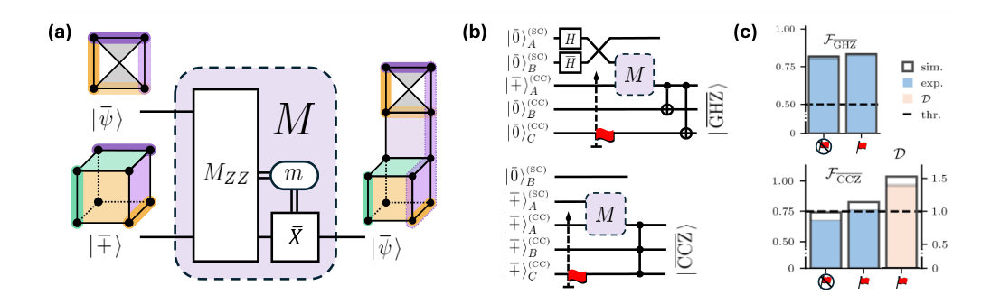 
FIG. 2. Lattice surgery and GME preparation. (a) Smooth merge M between two codes (e.g., the SC, top left, and the CC bottom left) with logical initial states ∣ψ⟩and ∣+⟩, respectively, realised by measuring MZZ in Eq. (1) with outcome m, and subsequent correction X if m = −1, teleporting ∣ψ⟩to the merged code (MC, right). (b) Logical circuits employing transversal gates H ⊗H (up to a SWAP of A and B) on the SC, flags on the CC (illustrative flag poles connect the concerned logical qubits, see Appendix A.IV), transversal CCZ and fault-tolerant CNOT gates (the latter realised by relabelling of trapped-ion qubits) on the MC, and smooth merges M are used to prepare the stabiliser and...

📷 Fig 3

 
FIG. 3. Physical circuit. Encoding circuits (grey) for the preparation of logical initial states ∣+0⟩ (SC) AB and ∣+++⟩ (CC) ABC of the SC and CC on physical qubits 0, 1, 2, 3 and 4, . . . , 11, re- spectively, along with circuit for the smooth merge M (laven- der) using auxiliary qubit a0. Two additional auxiliary qubits a1 and a2 are coupled to the CC (illustrative flag pole repre- sents weight-four measurements on physical qubits 4, 6, 9, 11, see Appendix A.IV.2) and subsequently measured as flags.

📷 Fig 4

 
FIG. 4. Arbitrary rotation RZ(θ) via cross-code lat- tice surgery. (a) Teleportation-based rotation gadget: The initial state ∣ψ⟩ (CC) A is prepared together with two auxiliary states ∣+θ⟩ (CC) B and ∣02θ⟩ (CC) C . After applying CCZ on the CC, the state of the C qubit is teleported onto the SC via Z merg- ing and X splitting before the application of H and a Z mea- surement. Finally, a CNOT is applied between CC qubits A and B, and the latter is measured. Depending on the out- comes the final state of A is accepted as correctly rotated or rejected. The combination of the CCZ and Hadamard gates demonstrates the use of a full universal gate set. (b) Mea- sured expectation values ⟨X⟩ (CC) A...

**Summary.** The research reports on generating and verifying genuine multipartite entanglement between logical qubits using a trapped-ion platform. The key technical advance is utilizing lattice surgery to combine two different Quantum Error Correction codes, thereby accessing a fault-tolerant universal gate set. This work validates the architectural components necessary for scaling up quantum computation.

**Why it may be interesting.** This work provides concrete, hardware-level evidence for the core building blocks required for fault-tolerant quantum computation by demonstrating complex logical entanglement generation beyond what is possible with a single error-correcting code.

Detailed structure

**Main problem.** The goal is to experimentally demonstrate the generation and certification of genuine multipartite entanglement (GME) between logical qubits using a fault-tolerantly implemented universal gate set.

**Main result.** The authors successfully generated and certified GME for both stabiliser ($	ext{GHZ}$) and non-stabiliser ($\lvert 	ext{CCZ} 
angle$) states of three logical qubits. They also demonstrated arbitrary single logical qubit rotations using cross-code lattice surgery.

**Method.** The universal gate set is accessed by combining complementary Quantum Error Correction (QEC) codes (Surface Code and 3D Colour Code) via the technique of lattice surgery.

**Model / system.** The experiment is performed on a trapped-ion quantum processor using ${}^{40}	ext{Ca}^+$ ions. Information is encoded into logical qubits protected by two different QEC codes, which are then merged and operated upon.

**Key observables.** Genuine Multipartite Entanglement (GME) certification via fidelity measurements ($	ext{F}_{	ext{GHZ}}$, $	ext{F}_{	ext{CCZ}}$), the stabiliser norm ($D$), and expectation values for logical operators.

**Important parameters / regimes.** The demonstration relies on accessing a universal gate set $\{H, \overline{\mathrm{CCZ}}\}$ by merging two distinct codes (e.g., $	ext{[[4,2,2]]}$ SC and $	ext{[[8,3,2]]}$ CC).

**Assumptions / limitations.** The primary limitation noted is that the noise model used is a simple depolarizing error model, which does not account for all microscopic physical processes.

**Figures summary.** Figures illustrate the definition of logical GME, the combination of QEC code blocks via lattice surgery, and comparative plots showing measured vs. simulated fidelities for $	ext{GHZ}$ and $\lvert 	ext{CCZ} 
angle$ states across different noise thresholds.

**Paper structure.** The paper details the theoretical necessity of cross-code lattice surgery to achieve a universal gate set, followed by experimental demonstrations of preparing GME states ($	ext{GHZ}$ and $\lvert 	ext{CCZ} 
angle$) and performing arbitrary single-qubit rotations using this combined resource.

Abstract

Universal quantum computers are expected to generate arbitrary complex quantum states of logical qubits encoded in many physical qubits. This capability hinges on a fault-tolerantly implemented universal gate set, which no single quantum error-correction code admits transversally but which becomes accessible by joining complementary codes via lattice surgery. Here we report on the experimental generation and certification of logical genuine multipartite entanglement in a trapped-ion quantum processor using a transversally implemented universal logical gate set. The gate set is accessed via lattice surgery across two different codes and comprises a Hadamard gate on a four-qubit surface code and a doubly controlled Pauli-$Z$ ($\overline{\mathrm{CCZ}}$) gate on an eight-qubit 3D colour code. To showcase this lattice-surgery toolbox, we generate both stabiliser (Greenberger-Horne-Zeilinger) and non-stabiliser ($|\overline{\mathrm{CCZ}}\rangle$) states of three logical qubits and verify their genuine multipartite entanglement--a form of correlation beyond statistical mixtures of bipartite entanglement across any bipartition. We further use these cross-code primitives to demonstrate arbitrary rotations of single logical qubits via a $\overline{\mathrm{CCZ}}$-based resource gadget accessing the full universal gate set through lattice surgery. Together, these demonstrations showcase the core building blocks of an architecture for fault-tolerant quantum computation and its ability to generate complex logical quantum states.

[↑ back to top](#top)

### [Topological properties and Majorana Multiplicity in Zigzag Kitaev Chain](http://arxiv.org/abs/2607.04399v1)

**Authors:** Rajiv Kumar, Panch Ram, Levan Chotorlishvili, Sunil Kumar Mishra  
**Type:** theory · **Category:** quantum information and computing · **PDF:** <https://arxiv.org/pdf/2607.04399v1>  
**Analysis basis:** full PDF text, analyzed in chunks
**Topic relevance:** 🔥 `analog quantum simulation` **4/5** · `Keldysh / 2PI / non-Gaussian methods` **1/5** · `driven-dissipative phase transition` **1/5** · `entanglement & information structure` **1/5**

📷 Fig 1

 
FIG. 1. Schematic illustration of the zigzag Kiatev chain: (top: ai, bottom: bi) of length L. In the calculation, we consider L = 40 and a chain length N = 2L = 80. Each chain features hopping amplitude J and superconducting pairing strength ∆. The cyan bonds (Jh) denote diagonal inter-chain couplings between sites (ai, bi+1) and the violet bonds (J′ h) connect (bi, ai+1). These diagonal couplings mediate hybridization between the two Kitaev chains.

📷 Fig 2

 
FIG. 2. Energy spectrum of the zigzag Kitaev chain with increasing µ for fixed J = ∆= 1.0 and ϕ = 0 chain lengths N = 2L = 80. Panels (a) and (b) correspond to asymmetric (Jh, J′ h) = (0.15, 0.25) and symmetric (Jh, J′ h) = (0.25, 0.25) inter-chain couplings, respectively.

📷 Fig 3

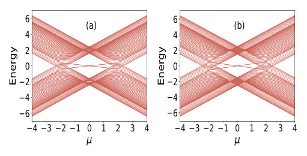 
FIG. 3. Energy spectrum of the zigzag Kitaev chain with increasing µ for fixed J = ∆= 1.0 and ϕ = π chain lengths N = 2L = 80. Panels (a) and (b) correspond to asymmetric (Jh, J′ h) = (0.15, 0.25) and symmetric (Jh, J′ h) = (0.25, 0.25) inter-chain couplings, respectively.

📷 Fig 4

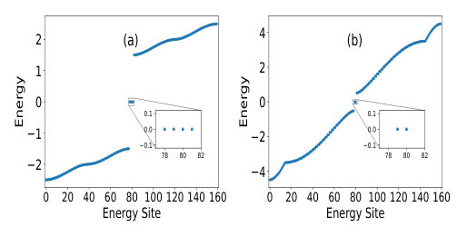 
FIG. 4. Eigenvalue spectrum as a function of the site index for the zigzag Kitaev chain with Jh = J ′ h = 0.25, J = ∆= 1.0 chain lengths N = 2L = 80. Panels (a) and (b) show µ = 0.0 and µ = 2.0, respectively. The system hosts four MZMs in (a) and two MZMs in (b), as highlighted in the insets.

📷 Fig 5

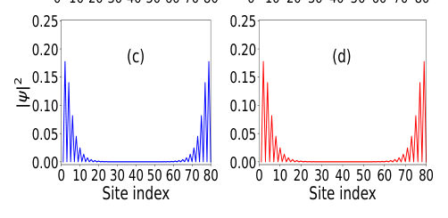 
FIG. 5. The distribution of four MZMs in region I. For the parameters J = ∆= 1.0 and diagonal coupling strength Jh = J ′ h = 0.25 and chemical potential µ (a,b) 0.0 and (c,d) 2.0.

**Summary.** This paper theoretically analyzes the topological properties of a zigzag Kitaev chain to understand how its structure controls Majorana zero modes (MZMs). By varying superconducting phases and inter-chain couplings, the authors map out a phase diagram demonstrating regimes supporting two or four MZMs. This establishes the model as a promising minimal platform for realizing MZM-based quantum computation.

**Why it may be interesting.** This work directly addresses topological quantum computation by providing a concrete, tunable solid-state model (the zigzag chain) that supports multiple MZMs, which are crucial building blocks for fault-tolerant qubits.

Detailed structure

**Main problem.** The study investigates the spectral and topological properties of a zigzag Kitaev chain, focusing on engineering Majorana zero modes (MZMs) for quantum computation.

**Main result.** The model establishes the zigzag Kitaev chain as a minimal platform capable of supporting distinct topological phases with two or four MZMs by tuning superconducting phase differences ($\phi$) and inter-chain couplings.

**Method.** Analysis employs the Bogoliubov-de Gennes formulation to calculate the energy spectrum, quasi-particle dispersion, and the winding number ($
u$).

**Model / system.** The system is a zigzag Kitaev chain constructed from two diagonally coupled one-dimensional Kitaev chains. The Hamiltonian includes hopping ($J$), pairing ($\Delta$), chemical potential ($\mu$), and coupling terms ($J_h, J'_h$) modulated by a superconducting phase difference $\phi$.

**Key observables.** Energy spectrum (gap closures), number of MZMs (two or four), and the topological invariant (winding number $
u$).

**Important parameters / regimes.** Superconducting phase difference ($\phi$), coupling strengths ($J_h, J'_h$), and chemical potential ($\mu$).

**Assumptions / limitations.** The analysis assumes Open Boundary Conditions (OBC) and that all model parameters are real.

**Figures summary.** Figures illustrate the energy spectrum dependence on $\mu$ for varying couplings, showing transitions between topological regimes supporting two or four MZMs. Dispersion relations for $\phi=0$ and $\phi=\pi$ are also presented.

**Paper structure.** The paper systematically analyzes the Hamiltonian using BdG theory, determining phase boundaries via gap closures, confirming topology using the winding number, and mapping out the complete phase diagram to demonstrate MZM control.

Abstract

We investigate the spectral and topological properties of a zigzag Kitaev chain constructed from two diagonally coupled one dimensional Kitaev chains with a zero and finite superconducting pairing phase difference. Using a Bogoliubov-de Gennes formulation, we analyze the energy spectrum, distribution of Majorana zero modes (MZMs), the quasi-particle dispersion, and the winding number, respectively. For a zero phase difference, the resulting energy spectrum shows topological phases with two, four MZMs, and trivial regions. The phases of gap closure determine the topological phase boundaries. In particular, for the phase difference between $φ=π$, the degeneracy of MZMs is partially lifted, leading to modified topological phases compared to the case $φ=0$. The topological and trivial phase boundaries are further confirmed by evaluating the quasi-particle dispersion and the topological invariant, namely the winding number. We show that the zigzag Kitaev chain contributes independently to the total winding number $ν= 1$ and $2$, giving rise to distinct topological phases that support two and four MZMs. The $ν= 0$ gives rise to a trivial region. The energy spectrum of systems corroborates the analytical phase boundaries and reveals characteristics associated with hybridization, enabling us to obtain the complete phase diagram of the zigzag model. Our results establish the zigzag Kitaev chain as a minimal platform for engineering MZM quantum computations, with potential applications in the study of topological phases and Majorana based qubit physics.

[↑ back to top](#top)

### [Orbital-Selective Mott and Antiferromagnetic Phases in Diagonally Compressed Kagome Lattice](http://arxiv.org/abs/2607.04621v1)

**Authors:** Jiewei Ding, Ho-Kin Tang, Wing Chi Yu  
**Type:** theory · **Category:** strongly correlated electrons · **PDF:** <https://arxiv.org/pdf/2607.04621v1>  
**Analysis basis:** full PDF text, analyzed in chunks
**Topic relevance:** 🔥 `analog quantum simulation` **4/5** · `exotic spin models in light-matter` **1/5** · `non-equilibrium dynamics` **1/5**

📷 Fig 1

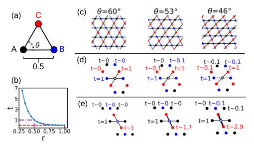 
FIG. 1. (a) Schematic of the kagome lattice before and af- ter compression. Solid lines indicate fixed AB and AC bond lengths; the dashed line shows the BC bond shortening as the angle θ decreases. (b) Exponential decay of hopping strength t(r) with distance r. (c) Evolution of the lattice geometry with θ. (d) and (e): Hopping amplitudes between sublattices A and B and their 10 nearest sites, with line thickness pro- portional to t.

📷 Fig 2

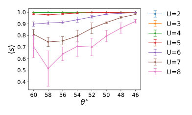 
FIG. 2. Average sign ⟨s⟩at the lowest temperature T = 0.5 as a function of the compression angle θ along the half-filling line. Different curves correspond to different values of U. For each (U, θ), the chemical potential is fixed by the half- filling condition n = 1. Error bars denote the standard error estimated from independent Monte Carlo simulations.

📷 Fig 3

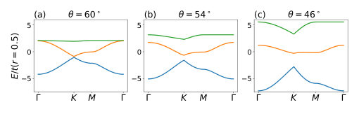 
FIG. 3. Band structures of the diagonally compressed kagome lattice in the non-interacting limit for θ = 60◦, 54◦, and 46◦, obtained by diagonalizing the 3 × 3 Bloch Hamiltonian with the same distance-dependent hopping used in the DQMC sim- ulations at U = 0 and µ = 0. Energies are measured in units of the nearest-neighbor hopping t with r = 0.5 of the undis- torted lattice. As θ decreases, the enhanced BC hopping ren- ders the kagome flat band dispersive and increases the overall bandwidth.

📷 Fig 4

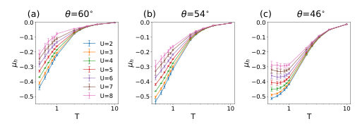 
FIG. 4. Temperature dependence of the global chemical po- tential µh required to impose half filling (n = 1) for various interaction strengths U. Panels (a-c) show µh(T) for different lattice angles θ. Error bars indicate the standard error esti- mated from ten independent Monte Carlo simulations.

📷 Fig 5

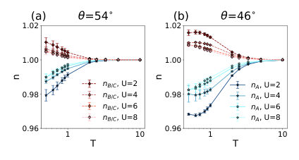 
FIG. 5. Temperature dependence of the average particle num- ber on sublattice A and sublattices B/C when the system is at half-filling. Error bars represent the standard error esti- mated from ten independent Monte Carlo simulations.

**Summary.** This work uses Quantum Monte Carlo simulations to study a Hubbard model on a compressed Kagome lattice. By varying the lattice angle $\theta$, the authors demonstrate that geometric changes induce sublattice differentiation, leading to an orbital-selective Mott phase. This highlights how geometry can compete with magnetic frustration to dictate the electronic ground state in strongly correlated materials.

**Why it may be interesting.** While focused on lattice geometry rather than direct AMO platforms, the concept of tuning interactions and correlations via engineered hopping anisotropy is highly relevant for designing quantum simulators using ultracold atoms or superconducting circuits.

Detailed structure

**Main problem.** The study investigates the complex interplay between lattice geometry, magnetic frustration, and strong electronic correlations in two-dimensional systems.

**Main result.** Geometric compression induces sublattice differentiation, leading to an orbital-selective Mott phase and a rich U-theta phase diagram featuring multiple distinct metallic and Mott insulating states.

**Method.** The research employs Determinant Quantum Monte Carlo (DQMC) simulations on the half-filled Hubbard model.

**Model / system.** The system is modeled by the Hubbard Hamiltonian on a diagonally compressed Kagome lattice, incorporating long-range hopping via an exponential decay function $t(r)$.

**Key observables.** Double occupancy, charge compressibility ($\kappa$), spin-spin correlation functions ($G_z(r), G_x(r)$), and sublattice charge responses.

**Important parameters / regimes.** Lattice angle $\theta$ (compression parameter) and on-site interaction $U$.

**Assumptions / limitations.** The hopping amplitude is modeled by an exponential decay, and the analysis relies on interpreting the low-temperature behavior of compressibility to determine charge gaps.

**Figures summary.** Figures illustrate the lattice geometry changes with $\theta$, the evolution of hopping strengths between sublattices A, B, and C, and plots showing how compressibility ($\ln \kappa$ vs $1/T$) reveals insulating behavior at different angles.

**Paper structure.** The paper systematically analyzes the system by varying the compression angle $\theta$ and interaction strength $U$, using DQMC to map out a phase diagram characterized by distinct electronic and magnetic orders (PM-metal, AFM-Mott, etc.).

Abstract

We perform determinant quantum Monte Carlo simulations of the half-filled Hubbard model on a diagonally compressed kagome lattice, introducing exponential decay long-range hopping $t(r) = t_0 \exp\bigl(-r / r_0\bigr)$ to account for the evolving bond length. By varying the lattice angle $θ$ and the on-site interaction $U$, double occupancy, charge compressibility, and spin-spin correlation functions of the whole system and each sub-lattice are measured. We find that geometric compression induces a clear sublattice differentiation: for $θ\gtrsim52^\circ$, the A sublattice establishes long-range hoppings, which in turn suppresses the metallic behavior of the $B/C$ sublattice and drives a selective Mott transition; for $θ\lesssim52^\circ$, the $B$-$C$ chains develop long-range antiferromagnetic correlations within the finite-size simulations, which in turn suppresses the metallic behavior of the $A$ sublattice and drives a selective Mott transition. The critical interaction $U^c_A$ for the $A$ sites decreases sharply near the onset of $B$-$C$ antiferromagnetic correlations, while $U^c_{B/C}$ increases. These competing orders give rise to an orbital-selective Mott phase and a rich $U$-$θ$ phase diagram featuring paramagnetic-metal, paramagnetic-Mott, antiferromagnetic-metal, and antiferromagnetic-Mott states. Our results highlight the complex interplay between lattice geometry, magnetic frustration, and strong correlations in frustrated two-dimensional systems.

[↑ back to top](#top)

### [Transmon Phase Gates Controlled by Superconducting Soliton DAC](http://arxiv.org/abs/2607.05072v1)

**Authors:** Derek Reitz, Tony X. Zhou, Aditya Sharma, Ryan Bilotta, John McFarland, Aref Fouladi, Jacob Glasby, Aruna Ramanayaka, Zachary Stegen, Aaron Pesetski, Mark Covington, Gregory Boyd, Jeremy Clark  
**Type:** both · **Category:** quantum information and computing · **PDF:** <https://arxiv.org/pdf/2607.05072v1>  
**Analysis basis:** full PDF text, analyzed in chunks
**Topic relevance:** 🔥 `QC/QI experiment` **4/5** · `Frenkel-Kontorova` **1/5** · `methods for driven-dissipative` **1/5**

📷 Fig 1

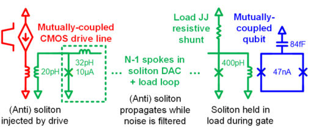 
FIG. 1. Schematic showing the soliton DAC with mutually- coupled drive line and mutually-coupled transmon target loop. Each spoke containing a grounded JJ and spine in- ductor forms the tile of a repeating lattice in the middle of the DAC. Resistors can be added to shunt each of the JJs, but the speed of the flux waveform that’s applied to the tar- get is largely controlled by the resistive shunting on the final JJ (shown in Figure).

📷 Fig 2

 
FIG. 3. Soliton DAC qubit protection demonstration via Ramsey measurements of a transmon at its upper sweet spot. The Ramsey fringes (red trace) are not detectable when 1 V peak-to-peak noise is injected through conventional refrig- erator attenuators and a 780 MHz cutoff-frequency, passive, low-pass filter. In contrast, the soliton DAC protects the transmon from 1 V noise to retain its noise-free T ∗ 2 ≈6.7 µs coherence (teal trace and blue curve envelope fit). When the noise amplitude exceeds the soliton injection threshold with 4 V noise, we observe slightly attenuated Ramsey oscillations corresponding to T ∗ 2 ≈1.4 µs (purple trace and orange curve envelope fit).

📷 Fig 3

 
FIG. 2. Square of the current transfer function that relates current in the DAC’s final load to first input inductor, which is independent of mutual coupling strength. The noise filter- ing capability of the DAC is demonstrated by the relatively smaller output noise amplitude, in the qubit frequency range, with ten JJs (green, blue) compared to four JJs (red). The JJ plasma frequency, ωJ/2π = 267GHz, manifests as high- frequency peaks associated with plasma modes that can be excited within the DAC. The resonances can be damped out by including 100 Ωshunts on every JJ in the middle of the DAC (green).

📷 Fig 4

 
FIG. 4. Four trapezoidal waveforms with varied amplitudes drive the soliton DAC. The lowest amplitude drive (blue) does not exceed the soliton threshold, and results in an output that’s 103 times smaller than when injection occurs. As the drive amplitude is raised above the threshold, but remains below twice the injection threshold (where a second soliton is injected) the output amplitude remains constant. Although, the rising edge of the output waveform occurs relatively earlier than the falling edge, since the trapezoidal drive passes the injection threshold earlier.

📷 Fig 5

 
FIG. 6. Measured Character IRB data for a) soliton DAC- controlled S-gates and b) idle gates while the soliton DAC input control line is pulsed. When the DAC input drive ampli- tudes are below the soliton injection threshold, the idle gates are indistinguishable from the reference microwave gates. On the other hand, when the drive amplitude exceeds the soli- ton injection threshold, an ancilla idle error is observed that’s within our measurement precision of the DAC S-gate error. The solid lines are fits.

**Summary.** The paper introduces a novel superconducting Digital-to-Analog Converter (DAC) that uses solitons to generate precise flux pulses for controlling transmon qubits. This method filters control noise and achieves high-fidelity gates, demonstrating a path toward scalable quantum computation by replacing traditional microwave controls with robust digital electronics.

**Why it may be interesting.** This work directly addresses hardware bottlenecks in superconducting quantum computing by replacing microwave control lines with a solid-state, DC-controlled digital mechanism (the soliton DAC), which is highly relevant to building scalable quantum processors.

Detailed structure

**Main problem.** The primary challenge is developing a scalable, low-noise control mechanism for superconducting qubits that overcomes limitations imposed by traditional microwave electronics.

**Main result.** A superconducting soliton DAC was demonstrated to perform high-fidelity S-gates on transmons with minimal excitation probability and robustness against external control noise up to the soliton injection threshold.

**Method.** The authors used a superconducting digital-to-analog converter (DAC) that generates flux pulses via propagating solitons, which are then applied to the qubit. Fidelity was measured using Interleaved Randomized Benchmarking (IRB).

**Model / system.** The system utilizes a DAC based on Josephson Junctions (JJs) whose dynamics are governed by the Sine-Gordon equation. This structure allows for DC control of flux pulses, enabling gate operations robust to fabrication variance.

**Key observables.** Quantum state excitation probability per gate ($	ext{0.05\%}$), S-gate fidelity ($\approx 1.9\%$ ), and non-local phase error ($1.6\%$ when scaling).

**Important parameters / regimes.** Soliton hold time (e.g., $5.6 	ext{ ns}$), control noise attenuation ($\ge -80 	ext{ dB}$ at qubit frequencies), and the soliton injection threshold ($I_{	ext{crit}}$).

**Assumptions / limitations.** The performance is limited by non-local, high-frequency electromagnetic interactions (EMI) when scaling to many DACs, which requires future layout mitigation strategies.

**Figures summary.** Figures illustrate noise filtering capability (Fig. 2), coherence preservation under control noise (Fig. 3), the coherent oscillation pattern of qubit excitation during gating (Fig. 5), and error analysis comparing single-DAC vs. multi-DAC operation (Fig. 6).

**Paper structure.** The paper progresses from introducing the DAC concept to demonstrating its noise immunity, quantifying gate fidelity, identifying non-local scaling errors via IRB, and finally proposing architectural solutions like resistive shunting for mitigation.

Abstract

We introduce a superconducting digital-to-analog converter (DAC) that filters control noise, provides native multiplexing, performs quantum gates in nanoseconds, and can be controlled by CMOS. This is achieved by transducing a trapezoidal drive pulse into a superconducting soliton, which is then held in the DAC load loop, applying flux to a mutually-coupled superconducting qubit or gate coupler. The analog flux output by the DAC can be easily controlled by varying the soliton hold time, or with a DC-biased tunable DAC-qubit coupler, allowing the DAC to perform a fixed-time, high-fidelity gate that's robust to fabrication variance or flux offsets in the quantum circuit. Our initial demonstration shows that the DAC can successfully perform 5.6 ns S-gates on transmons. We measure the DAC-induced quantum state excitation probability per gate to be 0.05%, and find that the DAC-induced relaxation rate from the qubit 1 state is below the intrinsic T1 rate limit of the transmon. Quantum simulations show qualitative agreement with the measured data, and predict that the DAC excitation rate can be lowered 10 times further by overdamping the Josephson junction (JJ) in the DAC load loop. may be limited by a Interleaved Randomized Benchmarking (IRB) sequences on an observer qubit reveal that, when scaling to many qubits, the DAC's performance may be limited by a non-local, DAC-induced phase error of 1.6% per gate, appearing in ancilla qubits that are not directly coupled to any of the 30 DACs on the chip. We discuss strategies for future layouts of multi-DAC chips that focus on mitigating the source of these non-local, high-frequency electromagnetic interactions (EMI), and how to incorporate a DC-tunable coupler for phase correction.

[↑ back to top](#top)

### [Supersymmetry and Entanglement in the Generalized Dirac Oscillator](http://arxiv.org/abs/2607.04348v1)

**Authors:** H. P. Laba, V. M. Tkachuk  
**Type:** theory · **Category:** other · **PDF:** <https://arxiv.org/pdf/2607.04348v1>  
**Analysis basis:** full PDF text, analyzed in chunks
**Topic relevance:** 🔥 `entanglement & information structure` **4/5** · `non-equilibrium dynamics` **1/5**

📷 Fig 1

 
Low-resolution page preview, page 2

📷 Fig 2

 
Low-resolution page preview, page 3

📷 Fig 3

 
Low-resolution page preview, page 4

📷 Fig 4

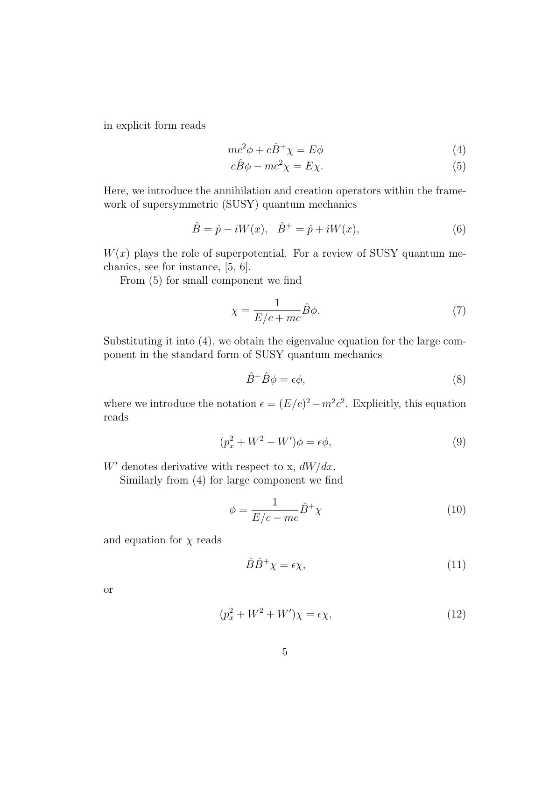 
Low-resolution page preview, page 5

📷 Fig 5

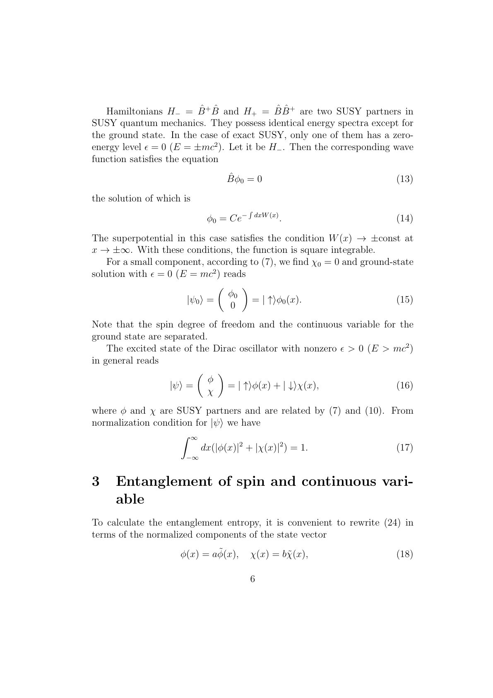 
Low-resolution page preview, page 6

**Summary.** This paper analyzes the entanglement entropy in the generalized Dirac oscillator by leveraging the mathematical structure provided by Supersymmetry. It demonstrates that the entanglement vanishes in the nonrelativistic limit, confirming its purely relativistic origin. The findings offer a systematic theoretical tool connecting symmetry properties to quantifiable measures of quantum correlation.

**Why it may be interesting.** This work provides a rigorous theoretical link between fundamental symmetries (SUSY) and quantum information measures (entanglement), which is highly relevant for understanding entanglement generation in relativistic or structured quantum systems.

Detailed structure

**Main problem.** The study systematically investigates the interplay between supersymmetry (SUSY) and quantum entanglement within generalized Dirac oscillator systems.

**Main result.** The entanglement entropy is found to be zero in both the ground state and the nonrelativistic limit, suggesting that entanglement has a purely relativistic origin. Furthermore, it attains its maximum value in the infinite energy limit.

**Method.** The analysis employs Supersymmetric Quantum Mechanics (SUSY QM) techniques to relate the spin degree of freedom to the continuous variable via SUSY partner eigenstates ($	ilde{\phi}, 	ilde{\chi}$). Entanglement entropy is calculated by analyzing the reduced density matrix derived from the state vector.

**Model / system.** The physical model is the Generalized Dirac Oscillator, a relativistic quantum system whose Hamiltonian structure allows for supersymmetric decomposition. The analysis focuses on its eigenstates and their coupling between spin and spatial components.

**Key observables.** Entanglement entropy ($S$), Overlap integral ($Z$), Energy eigenvalues ($E$).

**Important parameters / regimes.** Relativistic energy $E$, mass $m$, Superpotential function $W(x)$, and the parameter $\epsilon = (E/c)^2 - m^2c^2$.

**Assumptions / limitations.** The analysis relies heavily on the framework of SUSY QM, utilizing specific transformations ($\hat{B}, \hat{B}^+$) to relate the components.

**Paper structure.** The paper establishes the generalized Dirac oscillator Hamiltonian, decomposes it using SUSY partners, calculates the entanglement entropy based on the resulting state coefficients and overlap integral $Z$, and analyzes the limits (ground state, nonrelativistic limit) to derive physical conclusions.

Abstract

The supersymmetric properties of the generalized Dirac oscillator allow us to determine the entanglement entropy between the spin and the continuous variable in a purely algebraic manner. The entanglement has a relativistic origin and disappears in the nonrelativistic limit. The entanglement entropy attains its maximal value in the limit of infinite energy.

[↑ back to top](#top)

### [Algebra of quantum mechanics via classical phonons. I: The Schrodinger equation as the Newtonian equation of motion and quantum observables as classical averages](http://arxiv.org/abs/2607.03897v1)

**Authors:** Emmanuel Giner  
**Type:** theory · **Category:** other · **PDF:** <https://arxiv.org/pdf/2607.03897v1>  
**Analysis basis:** full PDF text, analyzed in chunks
**Topic relevance:** 🔥 `Frenkel-Kontorova` **4/5**

📷 Fig 1

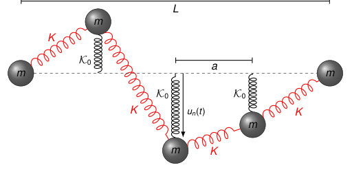 
FIG. 1. Pictorial representation of the Frenkel-Kontorova model used here. The chain of length L is made of N parti- cles of mass m, each of them are separated on the x axis by the lattice parameter a. The transverse displacement of the n-th mass is represented by the real number un(t), K0 is the strength of the ”on-site” harmonic force and K that of the ”between-site” harmonic force.

**Summary.** This paper proposes deriving the Schrödinger equation from the classical physics of coupled harmonic oscillators (a phonon model). By taking the continuum limit and applying complex mathematical transformations, the authors show a formal mapping between classical global observables and quantum expectation values. This work provides an alternative, purely dynamical pathway to understanding core quantum mechanical equations.

**Why it may be interesting.** It offers a highly unconventional perspective on quantum mechanics by grounding its fundamental equations in classical Hamiltonian/Lagrangian dynamics, which is of interest for developing alternative foundational interpretations of QM.

Detailed structure

**Main problem.** The paper aims to derive the algebra of quantum mechanics, specifically the Schrödinger equation, by starting from a purely classical dynamical system approach.

**Main result.** It demonstrates that the Schrödinger equation can be formally reproduced in the non-relativistic limit by applying complex transformations and taking the continuum limit to a classical phonon model (Frenkel-Kontorova type).

**Method.** The methodology involves deriving the Klein-Gordon equation from the Newtonian motion of coupled oscillators, followed by a complex change of variables and separation of time scales to yield the Schrödinger form.

**Model / system.** The system is a classical phonon model based on a one-dimensional lattice of coupled harmonic oscillators. This leads first to the Klein-Gordon equation in the continuum limit, which is then reduced to the non-relativistic Schrödinger equation.

**Key observables.** Total energy, momentum (classical global observables), and the wave function $\psi(x, t)$ corresponding to quantum expectation values.

**Important parameters / regimes.** Non-relativistic limit ($c 	o \infty$), continuous lattice limit ($N 	o \infty, a 	o 0$), and the inclusion of friction leading to non-Hermitian terms.

**Assumptions / limitations.** The approach is limited to the non-relativistic regime and does not address the measurement problem or full quantization procedures. It requires specific mathematical transformations (complex variables) that guide the derivation away from standard canonical quantization.

**Figures summary.** Figure 1 pictorially represents the Frenkel-Kontorova model, showing the lattice structure of masses connected by springs.

**Paper structure.** The paper progresses from the discrete Newtonian dynamics of the phonon lattice to the continuous Klein-Gordon equation. It then uses mathematical transformations (complex variables and time scale separation) to derive the Schrödinger equation in the non-relativistic limit, concluding with discussions on incorporating friction and comparing classical energy conservation laws.

Abstract

The Schrodinger equation for a single spinless particle is formally obtained via a classical phonon model, namely the Frenkel-Kontorova model. Starting from a one-dimensional lattice of coupled harmonic oscillators, we show that the continuous limit of the corresponding Newtonian equation of motion yields the Klein-Gordon equation for a real-valued field. By introducing a complex-valued change of variables mixing the real-valued displacement and velocity fields, and by separating fast and slow time scales, the Klein-Gordon equation is written as the Schrodinger equation within the non-relativistic limit. This complex change of variable also allows to rewrite classical global observables of the phonon field, such as the total energy or momentum, as the corresponding quantum observables. Additionally, we show that when a friction force is incorporated into the classical model, the corresponding Klein-Gordon equation can be rewritten as a Schrodinger equation with a non-Hermitian Hamiltonian. While the global approach is limited here to the non-relativistic regime and does not address the measurement problem, quantization or relativistic effects, it nonetheless illustrates how quantum algebra and complex-valued wave functions can be exactly reproduced using classical dynamics. The relativistic regime for a spinless particle and the link between commutators and Poisson brackets is addressed in the second part of this series.

[↑ back to top](#top)

### [Extending the Bloch sphere model to an N-qubit system](http://arxiv.org/abs/2607.04979v1)

**Authors:** Francisco Piñero, Cristian Franco, Hernán I. de la Cruz, Fernando L. Pelayo, Vicente Pascual, Mauro Mezzini, Jose Javier Paulet, Fernando Cuartero  
**Type:** theory · **Category:** quantum information and computing · **PDF:** <https://arxiv.org/pdf/2607.04979v1>  
**Analysis basis:** full PDF text, analyzed in chunks
**Topic relevance:** 🔥 `entanglement & information structure` **4/5**

📷 Fig 1

 
Figure 1: State of a single qubit represented on the Bloch sphere.

📷 Fig 2

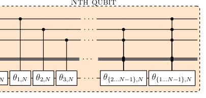 
Figure 3: State creation circuit.

📷 Fig 3

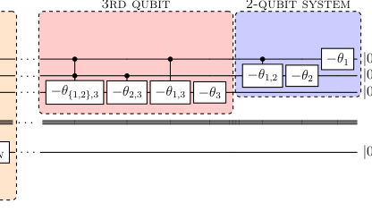 
Figure 4: State decodification circuit.

**Summary.** This paper introduces a novel geometric model that extends the Bloch sphere concept to arbitrary N-qubit systems using $2N - 1$ interconnected spheres. It formally proves a bijection between the standard state vector and these angular parameters by systematically decomposing any quantum state into a sequence of controlled rotations acting on the vacuum state. This offers an advanced visualization tool for understanding multipartite entanglement.

**Why it may be interesting.** This work provides a powerful, geometrically intuitive framework for visualizing and parameterizing high-dimensional quantum states, which is crucial for developing efficient quantum simulation algorithms or understanding the structure of entanglement in complex quantum circuits.

Detailed structure

**Main problem.** The primary challenge is the lack of a widely accepted, intuitive geometric model to represent multi-qubit quantum states that generalizes the single-qubit Bloch sphere concept while accounting for entanglement.

**Main result.** The authors establish a general framework showing that an N-qubit state can be uniquely parameterized by $2N - 1$ spheres through controlled rotations, providing a structured geometric description of multipartite entanglement.

**Method.** The methodology involves deriving explicit parameterizations and proving bijections between the standard complex amplitude representation (state vector) and the proposed set of angular parameters using systematic application of controlled rotation gates.

**Model / system.** The system is an N-qubit quantum state, $|	ext{Q}
angle$, whose geometry is mapped onto a structure involving multiple interconnected spheres representing individual qubit states and various levels of entanglement (bipartite, tripartite, etc.).

**Key observables.** State vector components ($A_x e^{i\phi_x}$), angular parameters ($	heta_i, \varphi_{J,k}$), and the resulting unitary transformations required to reach a canonical form.

**Important parameters / regimes.** The number of qubits ($N$), which dictates the complexity (number of spheres/rotations); specific angles associated with single-qubit rotations and entanglement interactions.

**Assumptions / limitations.** The model relies on assuming that complex amplitudes can be factored into moduli and phases, and it uses controlled rotation gates to systematically transform any state into a canonical form relative to the $|0
angle^{\otimes N}$ basis.

**Figures summary.** Figure 1 illustrates the single-qubit Bloch sphere. The text references tables showing parameterization details for two and three qubits, demonstrating how sequential rotations zero out phases in the state vector components.

**Paper structure.** The paper progresses by first establishing the model for 2 qubits (three spheres), then generalizing this structure to N qubits using controlled rotation gates ($V^J_i U$), culminating in a systematic algorithmic proof that any state can be written as a product of these rotations acting on $|0
angle^{\otimes N}$.

Abstract

The Bloch sphere is an elegant tool for representing single-qubit states. However, a widely accepted generalization for multi-qubit systems with entanglement remains absent. We propose a novel geometric model extending the Bloch sphere representation to arbitrary $N$-qubit systems using $2^N-1$ spheres. We demonstrate that any pure 2-qubit state is uniquely described by three spheres: two for individual qubits and a third encapsulating bipartite entanglement. Generalizing this, we establish an $N$-qubit parameterization through the hierarchical application of controlled rotation gates along the $Z$ and $Y$ axes. We formally prove a strict bijection between the standard state vector representation and our model's angular parameters. This framework provides an intuitive visualization of multiple entanglement, offering potential computational advantages for quantum simulators and new analytical perspectives on quantum gates.

[↑ back to top](#top)

### [Error Mitigation in Bosonic Systems via Virtual Distillation](http://arxiv.org/abs/2607.04914v1)

**Authors:** Leonardo Finocchiaro, Marco Robbio, Diogo Gomes, David Gunn, Adithi Udupa, Axel M. Eriksson, Leonardo Novo, Giulia Ferrini  
**Type:** theory · **Category:** quantum information and computing · **PDF:** <https://arxiv.org/pdf/2607.04914v1>  
**Analysis basis:** full PDF text, analyzed in chunks
**Topic relevance:** `interference shaping light` **3/5** · `quantum measurements` **3/5** · `quantum optics experiment` **3/5** · `QC/QI experiment` **2/5** · `measurement-induced transitions` **2/5** · `methods for driven-dissipative` **2/5** · `Keldysh / 2PI / non-Gaussian methods` **1/5** · `analog quantum simulation` **1/5** · `correlated / nonlocal dissipation` **1/5** · `correlated cavity matter` **1/5** · `driven-dissipative phase transition` **1/5** · `entanglement & information structure` **1/5** · `non-equilibrium dynamics` **1/5**

📷 Fig 1

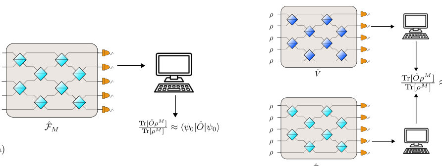 
FIG. 1: Schematic of the two possible approaches to virtual distillation using the diagonalizing technique: (a) The M copies of the noisy state ρ are combined through a Fourier interferometer ˆFM, enabling the simultaneous estimation of Tr h ˆOρMi and Tr  ρM from joint measurements on the output modes; (b) Two interferometers are needed to

📷 Fig 2

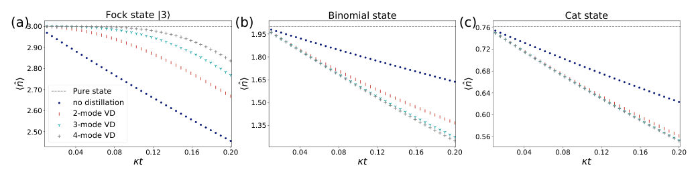 
FIG. 2: Expectation value of the number operator as a function of the dimensionless loss rate, κt, for inputs (a) Fock state |3⟩; (b) binomial state |ψb⟩∝|0⟩+ |4⟩and (c) cat state |ψc⟩∝|α⟩+ | −α⟩. Compared to the reference plot without distillation, the protocol performs at its best on the noisy Fock states, but does not yield any advantage for the two other examples. This is due to the eigenvector drift phenomenon (see Section II A).

📷 Fig 3

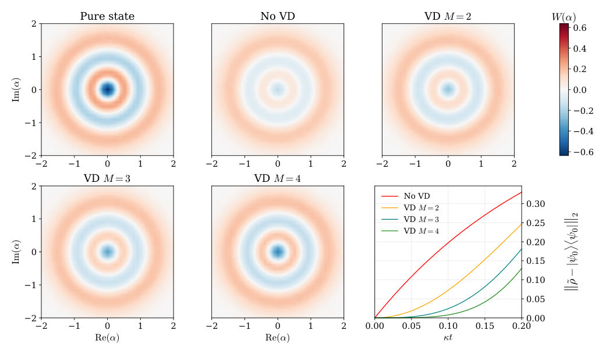 
FIG. 3: Reconstruction of the Wigner function W(α) for the Fock state |3⟩under a loss channel with strength κt = 0.2. The heatmaps display the Wigner functions for the unmitigated noisy state (with label ”No VD”), and the mitigated states using virtual distillation (labeled as ”VD”) with M = 2, 3, and 4 copies. The measurements are obtained via displaced parity measurements. The right panel shows the phase-space L2 error (Euclidean distance, see Eq.(38)) relative to the ideal pure state’s Wigner function as a function of the loss time t. As shown, increasing the number of copies M effectively reduces the distance to the ideal state, demonstrating an improvement as compared to the case where...

📷 Fig 4

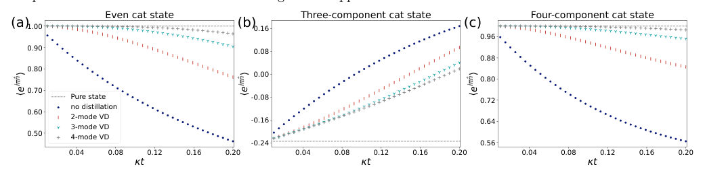 
FIG. 4: Expectation value of the parity operator (−1)ˆn as a function of the dimensionless loss rate for three noisy cat states with an amplitude of α = 1.50. The panels show the even cat (n = 2), the three-component cat (n = 3), and the four-component cat (n = 4). The virtual distillation (VD) protocol performs best on the even and four-component cat states due to the fact that they are eigenstates of the target observable. For the three-component cat state, whose parity expectation value strongly depends on the value of α, the protocol does not perform optimally but still achieves an improvement over the unmitigated noisy state.

📷 Fig 5

 
FIG. 5: Modulus square of the characteristic function of the photon-number distribution of a two-mode N00N state (N = 4) after applying a loss channel with strength κt = 0.2 . Each point corresponds to a multimode estimation of the phases ei(ϕ1ˆn1+ϕ2ˆn2). While the ideal properties of the characteristic function are quickly lost when noise is added, the virtual distillation (VD) protocol achieves an almost perfect reconstruction of the characteristic function describing the photon-number distribution on the two modes. This effective correction is possible because the N00N states are eigenstates of the phase shifter operator.

**Summary.** This paper develops a comprehensive framework to apply virtual distillation—an error-mitigation technique—to bosonic and continuous-variable quantum systems. By utilizing passive linear-optical interferometers, the authors derive protocols to estimate key observables like number operators and quadratures with noise suppression. This provides a practical pathway for performing reliable measurements on noisy photonic quantum processors.

**Why it may be interesting.** This work directly bridges quantum optics/bosonic physics with quantum information theory by providing concrete, experimentally viable error mitigation techniques applicable to CV quantum computing platforms.

Detailed structure

**Main problem.** The primary goal is to extend the error mitigation technique of virtual distillation (VD) from qubit systems to bosonic quantum information processing and continuous-variable (CV) quantum computing.

**Main result.** The authors establish a general, experimentally accessible framework for VD in bosonic systems using passive linear-optical interferometers, allowing noise-mitigated estimation of various observables.

**Method.** They derive protocols based on diagonalizing cyclic shift operators implemented via linear optics to estimate expectation values $	ext{Tr}[\hat{O}
ho^M]$ from multiple copies of the noisy state $
ho$.

**Model / system.** The work focuses on bosonic quantum systems, utilizing CV concepts like quadrature and number operators. The physical implementation relies heavily on passive linear-optical interferometers.

**Key observables.** Number operators ($\hat{N}$), phase-shift operators, arbitrary quadratures ($\hat{q}, \hat{p}$), and correlators of arbitrary order (via characteristic functions).

**Important parameters / regimes.** The error suppression scales exponentially with the number of copies ($M$), and analysis involves sample complexity scaling laws related to desired accuracy $\epsilon$.

**Assumptions / limitations.** The effectiveness relies on assumptions about the noise structure, such as the ability to relate the noisy state to a dominant pure state $|\psi_0
angle$ (Eq. 1).

**Figures summary.** Figures illustrate the comparison of estimated correlators ($\langle \hat{n}_1\hat{n}_2 
angle$) versus internal state purity, demonstrating noise suppression via error mitigation techniques.

**Paper structure.** The paper builds from establishing the general VD framework for bosons, detailing specific measurement protocols using single and two interferometers for different observables (quadratures vs. parity), and concluding with rigorous error bounding analysis for correlators.

Abstract

Virtual distillation is a promising error-mitigation technique that exploits multiple copies of a noisy quantum state to estimate observables as if measured on a purified state. Although originally introduced in the context of bosonic many-body systems under the name of virtual cooling, its development and applications have largely focused on qubit-based quantum computation. Here, we establish a framework for virtual distillation in bosonic quantum information processing and continuous-variable quantum computing. Building on a diagonalization of cyclic shift operators implemented with passive linear-optical interferometers, we derive experimentally accessible protocols for estimating virtually distilled expectation values of observables relevant to bosonic architectures. In particular, we show how to recover noise-mitigated expectation values of number operators, phase-shift operators, and arbitrary quadratures from multi-copy measurements. For number operators, we further demonstrate the estimation of virtually distilled correlators of arbitrary order through the characteristic function of the photon-number distribution. We apply the framework to states affected by photon loss and dephasing, two of the dominant noise mechanisms in bosonic quantum computation, and quantify the resulting suppression of noise contributions. Our results extend virtual distillation beyond its original setting and provide a practical route toward error-mitigated measurements in bosonic quantum processors using experimentally available linear-optical resources.

[↑ back to top](#top)

### [Polynomial Initial-State Jumps and Christoffel Transforms in Krylov Complexity](http://arxiv.org/abs/2607.05294v1)

**Authors:** Abhishek Chowdhury, Ajit Prasad Mahapatra  
**Type:** theory · **Category:** other · **PDF:** <https://arxiv.org/pdf/2607.05294v1>  
**Analysis basis:** full PDF text, analyzed in chunks
**Topic relevance:** `Keldysh / 2PI / non-Gaussian methods` **3/5** · `methods for driven-dissipative` **3/5** · `analog quantum simulation` **2/5** · `correlated / nonlocal dissipation` **2/5** · `driven-dissipative phase transition` **2/5** · `entanglement & information structure` **2/5** · `non-equilibrium dynamics` **2/5** · `Tavis-Cummings & cavity-many-emitter` **1/5** · `correlated cavity matter` **1/5** · `non-equilibrium universality` **1/5**

📷 Fig 1

 
Low-resolution page preview, page 2

📷 Fig 2

 
Low-resolution page preview, page 3

📷 Fig 3

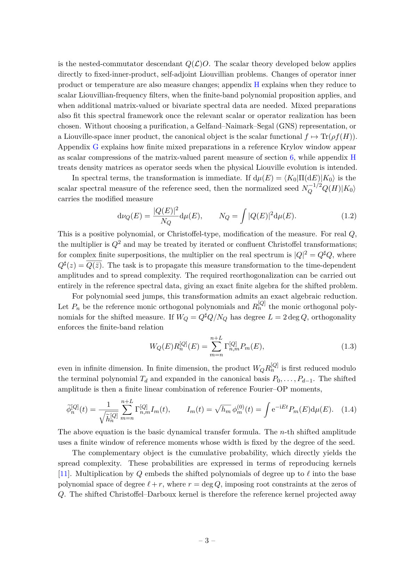 
Low-resolution page preview, page 4

📷 Fig 4

 
Low-resolution page preview, page 5

📷 Fig 5

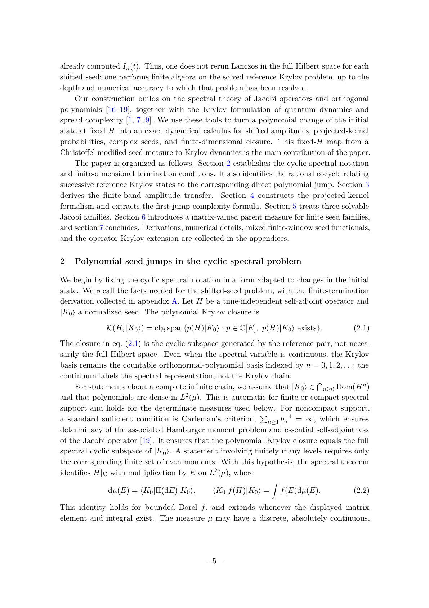 
Low-resolution page preview, page 6

**Summary.** This theoretical paper develops an exact mathematical framework to calculate how the spectral complexity of a quantum system changes when its initial state is filtered by a polynomial function $Q$. By relating the modified spectral measure to finite-band algebraic structures, it provides closed-form expressions for observables like spread complexity across various physical models, including spin chains and harmonic oscillators.

**Why it may be interesting.** This work provides a powerful algebraic tool—a 'relative calculus'—to analyze spectral properties like complexity in open or modified quantum systems without resorting to computationally expensive full-space simulations. This is highly relevant for understanding decoherence and state preparation effects in AMO physics.

Detailed structure

**Main problem.** The paper addresses the 'relative initial-state problem' for Krylov complexity, which quantifies how changing the initial state of a quantum system affects its spectral properties.

**Main result.** It derives an exact relative calculus allowing the calculation of shifted amplitudes and projected Christoffel-Darboux kernels without recomputing the full Lanczos procedure in the original Hilbert space.

**Method.** The core method involves using polynomial spectral filters $Q(H)$ to define a modified spectral measure, which is then transformed into finite sums for amplitudes via an 'exact finite algebra' relating shifted quantities to reference moments.

**Model / system.** The formalism applies to general quantum evolution governed by a Hamiltonian $H$ acting on an initial state $|K_0
angle$, and extends this analysis to operator dynamics using the Liouvillian superoperator $\mathcal{L}$.

**Key observables.** Krylov Complexity / Spread Complexity, projected Christoffel-Darboux kernels, shifted amplitudes ($\phi_n[Q](t)$), and spectral measures ($d
u_Q(E)$).

**Important parameters / regimes.** The polynomial filter $Q$, the initial state $|K_0
angle$, and the dimensionality/finite size of the system.

**Assumptions / limitations.** The analysis relies on fixing an inner product (scalar or operator) and assumes that spectral changes can be modeled by polynomial filters, allowing for a finite-band transfer approach.

**Paper structure.** The paper develops the formalism by first defining the relative state jump via $Q(H)|K_0
angle$, deriving the modified spectral measure, and then using Christoffel transforms to find exact sums for amplitudes and kernels. It validates this machinery across three canonical Jacobi families (Charlier, Krawtchouk, Chebyshev) before generalizing it to operator dynamics.

Abstract

State Krylov, or spread, complexity is a property of a pair $(H,\ket{K_0})$ rather than of the Hamiltonian alone. Thus, changing the initial state at fixed $H$ generally changes the Lanczos coefficients and the ordered Krylov basis. We solve this relative initial-state problem for normalized polynomial filters, $\ket{ψ_Q}=Q(H)\ket{K_0}/\sqrt{N_Q}$ with $N_Q=\langle K_0|Q(H)^\dagger Q(H)|K_0\rangle$. The filtered spectral measure is the positive polynomial modification $|Q(E)|^2\mathrm dμ(E)/N_Q$, and orthogonality turns this measure change into a finite-band transfer from reference Fourier-orthogonal-polynomial moments to shifted Krylov amplitudes. We derive exact finite sums for individual amplitudes and projected Christoffel-Darboux kernels for cumulative probabilities and spread complexity. The formulae cover confluent roots, complex seed coefficients, support loss, and terminal quotients in finite dimensions. We evaluate the construction in three canonical Jacobi families, the Heisenberg--Weyl/Charlier oscillator, the compact $SU(2)$/Krawtchouk spin, and the constant-coefficient tight-binding/Chebyshev chain, with a Hermite central-limit scaling of Charlier as a continuous-spectrum check of this Christoffel jump machinery. Finite seed families are organized by a matrix-valued parent measure whose scalar compressions recover the individual shifted problems. The fixed-inner-product construction carries over to operator Krylov complexity after the replacement \(H\mapsto\mathcal L\) and \(\ket{K_0}\mapsto O\); polynomial seeds then become nested-commutator descendants \(Q(\mathcal L)O\). The result is an exact relative calculus in which a solved cyclic problem generates a family of polynomially related initial-state dynamics without repeating Lanczos in the original Hilbert space.

[↑ back to top](#top)

### [Near itinerancy and slow singlet formation in the triangular lattice NaRuO2](http://arxiv.org/abs/2607.05287v1)

**Authors:** Charles C. Tam, Alon Hendler Avidor, Pritam Bhattacharyya, Yongseong Choi, Daniel Haskel, Sven Luther, Hlynur Gretarrson, Liviu Hozoi, Stephen D. Wilson  
**Type:** both · **Category:** strongly correlated electrons · **PDF:** <https://arxiv.org/pdf/2607.05287v1>  
**Analysis basis:** full PDF text, analyzed in chunks
**Topic relevance:** `analog quantum simulation` **3/5** · `exotic spin models in light-matter` **3/5** · `spintronics-quantum-optics interface` **3/5** · `driven-dissipative phase transition` **2/5** · `non-equilibrium universality` **2/5** · `Keldysh / 2PI / non-Gaussian methods` **1/5** · `Kondo & dissipative impurity` **1/5** · `methods for driven-dissipative` **1/5** · `non-equilibrium dynamics` **1/5** · `scars & prethermalization` **1/5**

📷 Fig 1

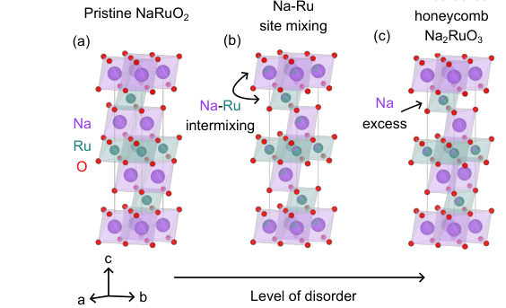 
FIG. 1. Possible defect modes in the triangular lattice of NaRuO2. (a) Drawing of the unit cell of pristine NaRuO2. RuO6 and NaO6 octahedra have been drawn. (b) Illustration of a Na-Ru site mixing defect in NaRuO2. (c) Illustration of disordered honeycomb Na2RuO3, which is equivalent to NaRuO2 with a 1/3 occupation of Na on the Ru site.

📷 Fig 2

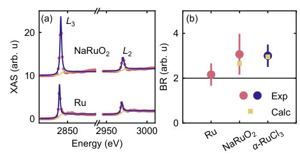 
FIG. 2. Branching ratios determined from Ru-L XAS. (a) XAS taken across the Ru L3 and L2 edges, on Ru and NaRuO2. Data are fit to an arctangent step function and Lorentzian, defined in the methods. (b) Experimenmtal branching ratio (BR), defined as the fit intensity at L3 divided by the intensity at L2 for Ru, NaRuO2, and α-RuCl3. The experimental BR for α-RuCl3 is taken from Ref. 11. Details on the BR calculation for NaRuO2 and α-RuCl3 are given in the methods.

📷 Fig 3

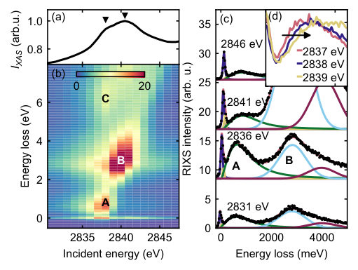 
FIG. 3. Ru-L3-edge resonant inelastic X-ray scatter- ing on polycrystalline NaRuO2. (a) XAS over the Ru L3 edge, taken in fluorescence yield at room temperature. Marked peaks correspond to excitations into t2g and eg states. Normalization and self-absorption corrections have not been applied due to the small energy range collected. (b) RIXS energy map over the L3 edge, showing three main features labelled A, B and C. RIXS data is momentum-averaged as the sample is polycrystalline, and taken at 20 K. (c) RIXS spectra at different incident energy slices showing their fits. (d) RIXS spectra normalized to intensity at 500 meV, where mode A is peaked.

📷 Fig 4

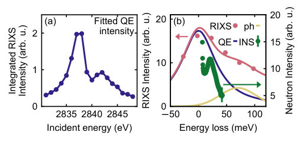 
FIG. 4. Low energy excitations in NaRuO2. (a) Fitted quasielastic RIXS intensity, as a function of incident energy. (b) RIXS response, taken at 2837 eV, where the datapoints are in red, fit is a red line, and quasielastic and phonon fit components are in blue and yellow. In green is the Q inte- grated energy cut inelastic neutron scattering data, taken at 1.8 K. The integration window is [0, 2] ˚A −1. Neutron data is from Ref. 26.

📷 Fig 5

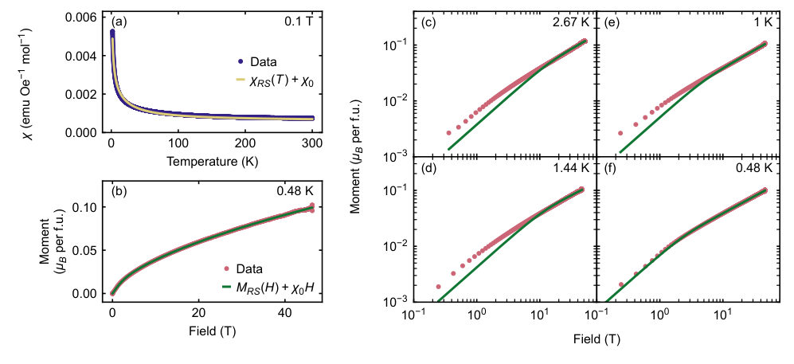 
FIG. 5. Random singlet fits to magnetic measurements of NaRuO2. Fits of the random singlet model to (a) magneti- zation taken at T = 0.48 K up to 45 T, and (b) magnetic susceptibility at H = 0.1 T. Definitions of MRS(H) and χRS(T) are given in the main text. (c)-(f) RSS fits to high-field magnetization at various temperatures on a log-log scale.

**Summary.** This work investigates the exotic magnetic state of NaRuO2, finding that its behavior is best described as a nearly itinerant system rather than a simple Mott insulator. By combining RIXS and high-field magnetization measurements with Random Singlet Model fitting, the authors conclude that strong charge fluctuations are key in suppressing long-range magnetic order into a slow singlet formation regime.

**Why it may be interesting.** The interplay between charge fluctuations (suggested by RIXS findings) and magnetic disorder (confirmed by RSS fits) provides a rich model for understanding quantum criticality in strongly correlated oxides, relevant to many-body dynamics.

Detailed structure

**Main problem.** To characterize the physical regime responsible for the quantum disordered magnetic ground state observed in NaRuO2, specifically distinguishing between contributions from charge fluctuations versus strong magnetic interactions.

**Main result.** The evidence points towards a nearly itinerant system dominated by strong magnetic and charge fluctuations that destabilize long-range magnetic order, suggesting slow singlet formation rather than purely localized magnetism.

**Method.** A combination of advanced experimental techniques (RIXS, XAS, high-field magnetization) and theoretical modeling using the Random Singlet Model was employed.

**Model / system.** The study focuses on NaRuO2, a ruthenate oxide with a triangular lattice structure exhibiting no magnetic order down to very low temperatures. The physics is analyzed through comparisons to Mott insulators and models like the Kitaev exchange model.

**Key observables.** XAS Branching Ratio (SOC strength), RIXS excitations (damped intraorbital modes), high-field magnetization scaling exponents ($\alpha$), and susceptibility temperature dependence ($\chi(T)$).

**Important parameters / regimes.** Low temperatures ($<100 	ext{ mK}$), SOC strength comparable to $\alpha$-RuCl3, and the power-law exponent $\alpha$ from RSS fits.

**Assumptions / limitations.** The analysis assumes that deviations from simple magnetic ordering are governed by itinerant behavior and disorder effects, leading to a random singlet state description.

**Figures summary.** Figures illustrate XAS spectra comparing NaRuO2 to other materials, RIXS energy maps showing excitation modes (A, B, C), and magnetization data fitted to the Random Singlet State model.

**Paper structure.** The paper systematically uses spectroscopic measurements (XAS/RIXS) to probe electronic structure and then applies high-field magnetization and susceptibility analysis, fitting the results to the Random Singlet Model to deduce the nature of the magnetic ground state.

Abstract

NaRuO$_2$ forms a delafossite-like structure that contains triangular sublattices of edge-sharing RuO$_6$ octahedra. It shows no evidence of magnetic order down to 100 mK and persistent spin fluctuations, suggestive of a quantum disordered magnetic ground state. In order to characterize the physical regime from which this disordered state arises, we use resonant inelastic X-ray scattering (RIXS) and X-ray absorption spectroscopy (XAS) at the Ru-$L_{2,3}$-edge, along with pulsed high-field magnetization to characterize both the local electronic structure and the magnetic interactions. Despite significant spin-orbit coupling inferred from XAS measurements, a spin-orbit exciton, characteristic of a spin-orbit assisted Mott insulator, was not observed with RIXS due to the presence of damped intraorbital excitations, which are characteristic of a metal. Corroborated by models of the high-field magnetization to a random singlet model, we propose a picture of a nearly itinerant system with strong magnetic and charge fluctuations that destabilize long-range magnetic order.

[↑ back to top](#top)

### [Broken Ergodicity and the Violation of the Fluctuation-Dissipation Theorem Lead to Generalization Beyond Overfitting in Machine Learning](http://arxiv.org/abs/2607.04135v1)

**Authors:** Chan Li, Nigel Goldenfeld  
**Type:** theory · **Category:** disordered systems and neural networks · **PDF:** <https://arxiv.org/pdf/2607.04135v1>  
**Analysis basis:** full PDF text, analyzed in chunks
**Topic relevance:** `driven-dissipative phase transition` **3/5** · `methods for driven-dissipative` **3/5** · `non-equilibrium universality` **3/5** · `non-equilibrium dynamics` **2/5** · `scars & prethermalization` **2/5** · `Frenkel-Kontorova` **1/5** · `Keldysh / 2PI / non-Gaussian methods` **1/5** · `correlated / nonlocal dissipation` **1/5**

📷 Fig 1

 
FIG. 1. Comparison between numerical simulations and theo- retical predictions for the generalization error εg(t) and train- ing error εt(t) in an unregularized (λ = 0) single-layer linear neural network (N = 1, 000, d = αN, D = 1, r = 1, γ = 0.5, and ζ = 0.1). (a) Asymptotic values (training time T = 104) of εg and εt as functions of model capacity α. Markers denote simulations (averaged over ten independent runs), while solid lines show analytical predictions. H(x) is the Heaviside step function, which equals 1 for x &gt; 0 and 0 for x ≤0. (b) Time evolution of εg(t) and εt(t) for different α (T = 20). The number of iterations is T

📷 Fig 2

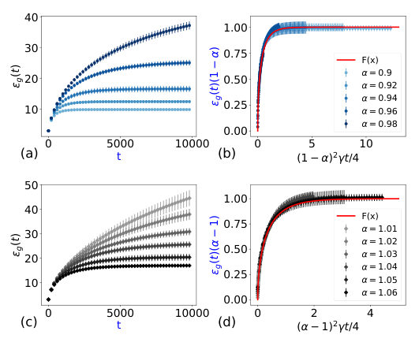 
FIG. 2. Comparison between theoretical data collapse and simulation results in an unregularized (λ = 0) single-layer linear neural network (N = 10,000, d = αN, D = 1, r = 1, γ = 0.5, ζ = 0.1 and training time T = 10,000). The er- ror bar characterizes the fluctuation across ten independently network realizations. Panels (a)–(b) correspond to the under- parameterized regime (α &lt; 1), while panels (c)–(d) corre- spond to the over-parameterized regime (α &gt; 1). (a, c) Gen- eralization error εg(t) as a function of t, with markers indi- cating simulation results from stochastic gradient descent for various values of α. (b, d) Scaled generalization errors plot- ted against the scaling variable,...

📷 Fig 3

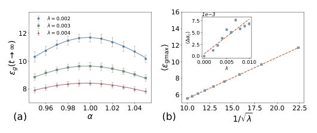 
FIG. 4. Regularization rounds the divergence of the gener- alization error. Simulations are performed for a regularized single-layer linear network (N = 10,000, d = αN, D = 1, r = 0.1, γ = 1). (a) Steady state generalization error εg(t →∞) versus α for different λ. Markers denote simu- lation results (50 runs) and solid lines are the exact theoreti- cal values from Eq. (15). (b) Peak generalization error εgmax versus λ, showing εgmax ∝λ−1/2. Inset: The corresponding peak shift, ∆αc = 1−αc, increases linearly with λ. Error bars in (b) and in the inset represent standard error of the mean estimated via bootstrap resampling (B = 1, 000; see sec. III.B of the Supplemental Material [26]). Dashed...

📷 Fig 4

 
FIG. 3. Comparison between theoretical scaling predictions and simulation results in a regularized single-layer linear neu- ral network (N = 10,000, d = αN, D = 1, r = 1, γ = 1). Er- ror bars represent fluctuations across ten independent realiza- tions. Panels (a)–(b): under-parameterized regime (α &lt; 1); panels (c)–(d): over-parameterized regime (α &gt; 1). (a, c) Steady-state generalization error εg(t →∞), rescaled by |1 −α|, plotted against the dimensionless regularization vari- able 4λ/γ(1 −α)2. Markers denote different values of α, with λ ∈[0.01, 1.0]. Only markers in the weakly regularized regime collapse onto the theoretical prediction (red). (b, d) Full tem- poral dynamics: rescaled...

**Summary.** This work explains the counterintuitive 'double descent' in overparameterized neural networks by framing it as a dynamical phase transition. The key diagnostic tool is the breakdown of the Fluctuation-Dissipation Theorem (FDT). This mechanism links successful generalization to concepts from condensed matter physics, specifically those governing superconducting transitions.

**Why it may be interesting.** It provides a deep theoretical link between non-equilibrium statistical physics concepts (ergodicity breaking, FDT violation) and modern machine learning phenomena, suggesting that generalization is governed by underlying physical principles of ordered phases.

Detailed structure

**Main problem.** The paper addresses the 'double descent' phenomenon in overparameterized neural networks, seeking a physical mechanism beyond classical bias-variance trade-offs.

**Main result.** This generalization behavior is shown to be the outcome of a dynamical phase transition marked by the breakdown of the Fluctuation-Dissipation Theorem (FDT) and associated with broken ergodicity.

**Method.** The analysis employs Dynamical Mean-Field Theory (DMFT) applied to the stochastic gradient flow describing network training dynamics in the thermodynamic limit.

**Model / system.** The system models single-layer linear regression trained via SGD, analyzed by mapping its dynamics onto an effective stochastic process analogous to superconducting phase transitions.

**Key observables.** Generalization error ($\epsilon_g$), training error ($\epsilon_t$), Response function $R(t, t')$, and the violation of the Fluctuation-Dissipation Theorem (FDT).

**Important parameters / regimes.** The complexity parameter $\alpha = d/N$, which dictates the regime: underparameterized ($\alpha < 1$), interpolation threshold ($\alpha = 1$), and overparameterized ($\alpha > 1$).

**Assumptions / limitations.** The use of DMFT approximations, assuming a saddle-point approximation for the dynamical generating functional, and drawing analogies to established condensed matter models like the London model.

**Figures summary.** Not specified in notes; figures likely illustrate the divergence/convergence of generalization error across different $\alpha$ regimes and the mathematical forms of correlation functions before and after FDT violation.

**Paper structure.** The paper progresses by first establishing the ML problem (double descent), then applying DMFT to derive the effective dynamics, identifying the FDT breakdown as the key diagnostic for a dynamical phase transition, and finally drawing precise analogies between this transition and superconductivity/London models.

Abstract

The remarkable ability of modern neural networks to generalize improves with increasing network capacity, even when the number of model parameters or effective degrees of freedom exceeds the number of training data points. This phenomenon is all the more surprising given that generalization error diverges when the number of model parameters approaches a critical value from below. Here we use dynamical mean field theory to show that this so-called "double descent" behavior is the outcome of a phase transition in the stochastic field theory describing the training process. We calculate the critical exponents and scaling function of the double descent phase transition, and show that it is marked by a breakdown of the fluctuation-dissipation theorem associated with broken ergodicity. The corresponding response function has the same functional form as the simple London model of the superconducting transition, with the rigidity of the wave function corresponding to the neural network's ability to generalize accurately.

[↑ back to top](#top)

### [Fixed-point tensor network for compactified boson conformal field theory](http://arxiv.org/abs/2607.03534v1)

**Authors:** Gong Cheng, Dong-Yu Bao, Zheng-Cheng Gu  
**Type:** theory · **Category:** numerical methods · **PDF:** <https://arxiv.org/pdf/2607.03534v1>  
**Analysis basis:** full PDF text, analyzed in chunks
**Topic relevance:** `methods for driven-dissipative` **3/5** · `Keldysh / 2PI / non-Gaussian methods` **2/5** · `analog quantum simulation` **2/5** · `driven-dissipative phase transition` **2/5** · `entanglement & information structure` **2/5** · `non-equilibrium dynamics` **2/5** · `correlated / nonlocal dissipation` **1/5** · `correlated cavity matter` **1/5** · `non-equilibrium universality` **1/5**

📷 Fig 1

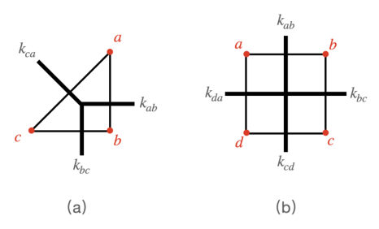 
FIG. 1: Fixed-point tensor: (a) rank-3 tensor. (b) rank-4 tensor.

📷 Fig 2

 
FIG. 2: Closed-string conformal dimension from rank-3 FP tensor with growing descendants cutoff at R = 1.

📷 Fig 3

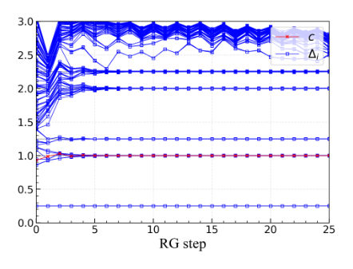 
FIG. 3: RG spectrum obtained from the refined rank-3 FP tensor at R = 1, ΛD = 4, ΛN = 2, wmax = nmax = 2, χ = 20.

📷 Fig 4

 
FIG. 4: RG spectrum obtained from the rank-4 FP tensor at R = 1, ΛD = 4, wmax = 2, χ = 20.

📷 Fig 5

 
FIG. 5: Change of the radius R when varying τ. τ = 0 corresponds to the radius R = 1.

**Summary.** This paper develops a powerful fixed-point tensor network framework to discretize and analyze irrational Conformal Field Theories, specifically the compactified boson CFT. By constructing tensors from boundary correlation functions and applying renormalization group techniques, the authors accurately reproduce continuum spectra and demonstrate control over marginal deformations. This provides a concrete lattice approach for studying complex quantum field theories.

**Why it may be interesting.** While focused on CFTs, the core methodology—using tensor networks (TCR) to simulate continuum physics and study RG flows—is highly relevant to numerical methods used in AMO physics for simulating quantum many-body systems or open quantum dynamics.

Detailed structure

**Main problem.** The work aims to extend fixed-point (FP) tensor network constructions for Conformal Field Theories (CFTs) from tractable rational settings to the more complex irrational regime.

**Main result.** The authors successfully construct and verify FP tensors for the 2D compactified boson CFT, demonstrating a lattice-level description that accurately reproduces the closed-string spectrum and allows for continuous marginal deformations along the c=1 moduli space.

**Method.** They employ tensor network contractions (rank-3 and rank-4) within the Tensor Complex Renormalization (TCR) algorithm to map continuum CFT physics onto a discrete lattice representation.

**Model / system.** The system studied is the 2D compactified boson theory, an archetypal irrational CFT relevant in string theory and condensed matter physics (like Luttinger liquids). The construction uses boundary data derived from Dirichlet and Neumann boundary conditions.

**Key observables.** Closed-string spectrum ($\Delta$), central charge ($c$), and scaling dimensions ($\Delta$) extracted via transfer matrix diagonalization and TCR analysis.

**Important parameters / regimes.** Compactification radius ($R$), finite grid sizes ($\Lambda_D, \Lambda_N$), and the deformation parameter $	au$ controlling marginal flow.

**Assumptions / limitations.** The continuous nature of parameters is handled by discretizing them onto finite grids; convergence to the continuum limit requires retaining an increasing number of descendant states.

**Figures summary.** Figures illustrate the RG spectrum obtained from both rank-3 and refined rank-4 FP tensors at specific radii, showing systematic recovery of the expected conformal dimensions. One figure also tracks how varying a geometric parameter ($	au$) induces continuous flow along the moduli space.

**Paper structure.** The paper builds by first establishing the tensor structure using boundary correlation functions (rank-3/4). It then applies the TCR algorithm to verify stability and calculate spectra for specific radii, culminating in demonstrating controlled marginal deformations by modifying the geometry of the tensors.

Abstract

Fixed-point (FP) tensor networks provide a discrete spacetime representation of conformal field theories (CFTs), offering a new route toward understanding holographic duality, generalized symmetries, and even quantum gravity. In this work, we construct FP tensors for the 2D compactified boson theory at a generic compactification radius, an archetypal irrational CFT, using boundary (open-string) data with conformal boundary conditions. We show that the resulting tensors reproduce the closed-string spectrum with high accuracy and generate stable renormalization-group (RG) flows under the tensor complex renormalization algorithm. Moreover, we identify a controllable exactly marginal deformation at the level of a single tensor, enabling flows that move continuously along the $c=1$ moduli space. This framework establishes a concrete lattice-level route toward describing a broad class of 2D irrational CFTs.

[↑ back to top](#top)

### [Quantum Spectral Anomaly Detection](http://arxiv.org/abs/2607.05307v1)

**Authors:** Yewei Yuan, Michele Minervini, Mark M. Wilde, Nana Liu  
**Type:** both · **Category:** statistical mechanics · **PDF:** <https://arxiv.org/pdf/2607.05307v1>  
**Analysis basis:** full PDF text, analyzed in chunks
**Topic relevance:** `driven-dissipative phase transition` **3/5** · `methods for driven-dissipative` **3/5** · `non-equilibrium universality` **2/5** · `quantum measurements` **2/5** · `Keldysh / 2PI / non-Gaussian methods` **1/5** · `analog quantum simulation` **1/5** · `correlated / nonlocal dissipation` **1/5** · `entanglement & information structure` **1/5** · `measurement-induced transitions` **1/5** · `non-equilibrium dynamics` **1/5**

📷 Fig 1

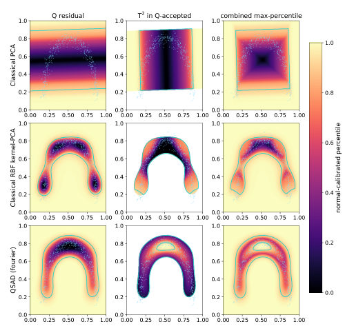 
FIG. 1. Normal-calibrated percentile maps over [0, 1]2 for the moon dataset; the pale scattered points are the normal training data. Rows: linear classical PCA, RBF kernel-PCA, and QSPADE with a Fourier feature map. Columns: resid- ual Q, within-support T 2 (shown inside the Q-accepted re- gion), and the combined max-percentile. Linear PCA gives a rigid straight band; the kernel baseline and QSPADE both produce curved acceptance regions that follow the data. The cyan contour marks the calibrated decision boundary.

📷 Fig 2

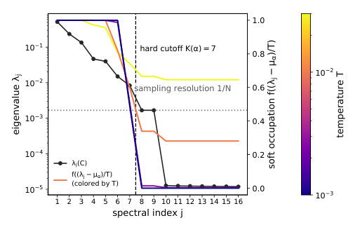 
FIG. 2. Spectrum and soft occupations of the average nor- mal state C. Black points show the eigenvalues λj(C) on a log scale, and the dotted line marks the sampling reso- lution 1/N for N = 600. The vertical dashed line marks the hard retained-mass rank K(α) = 7 for α = 0.99. Col- ored curves, read on the right axis, show the soft occupations f((λj −µα)/T) for different resolutions T. The figure shows why a hard rank is ambiguous on this graded spectrum, while QSPADE assigns fractional weights to near-cutoff modes.

📷 Fig 3

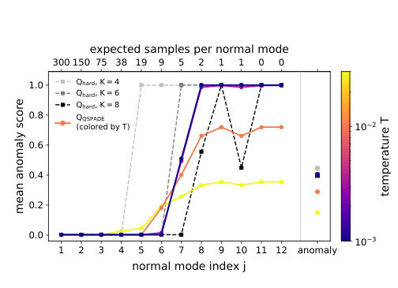 
FIG. 3. Mean residual anomaly score for each normal mode j, with the expected number of training samples wjN shown on the top axis, and for the anomaly class in the rightmost col- umn. Grey dashed curves are hard top-K projectors; colored curves are QSPADE residuals at different resolutions T. Hard ranks flip whole normal modes between zero and unit score, and become unstable when the cutoff reaches the sampling- resolution regime (K = 8). QSPADE replaces this all-or- nothing behavior by a graded transition from well-sampled modes to unresolved tail modes.

📷 Fig 4

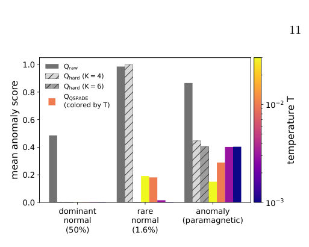 
FIG. 4. Mean residual anomaly score for a dominant normal mode (50%), a rare normal mode (1.6%), and the paramag- netic anomaly class. The density-weighted Qraw and the hard K = 4 projector score the rare valid mode above the anomaly, while the hard K = 6 projector gives it zero score and hides its rarity. QSPADE assigns the rare mode an intermediate, temperature-dependent score; when T resolves the spectral tail, the rare valid mode remains below the anomaly. This shows soft scoring in QSPADE separates rarity within the normal support from genuine support mismatch.

📷 Fig 5

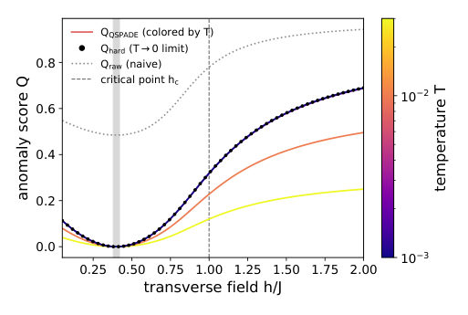 
FIG. 5. QSPADE residual score of the TFIM ground state as the transverse field h is swept across the transition. The score is near zero at the normal training field hA = 0.4 (grey line), stays low in the ordered phase, and rises through the critical point hc = 1 (dashed) into the paramagnetic phase. Colored curves show different resolutions T; as T →0 they approach the hard retained-rank projector K(α) (black markers), while larger T gives a softer monitor. The density-weighted Qraw (dotted) is offset upward even at the normal field.

**Summary.** This paper introduces QSPADE, a novel method for computing anomaly scores in quantum data by analyzing the spectrum of the average normal state. It replaces computationally expensive hard projections with a smooth, temperature-controlled spectral thresholding mechanism. This makes it an efficient tool for monitoring both encoded classical and native quantum systems across various physical transitions.

**Why it may be interesting.** The ability to monitor complex physical transitions or detect deviations in quantum systems using spectral analysis without explicit knowledge of order parameters is highly valuable for characterizing non-equilibrium dynamics.

Detailed structure

**Main problem.** The core task is developing an efficient method for quantum anomaly detection, which quantifies how much a test quantum state deviates from a known normal dataset.

**Main result.** QSPADE provides a continuous and robust framework that computes PCA-like anomaly scores directly from the spectrum of the average normal state, avoiding costly full spectral decompositions.

**Method.** The proposed Quantum Spectral Anomaly Detection (QSPADE) uses a regularized measurement-based detector that replaces hard rank selection with a smooth, temperature-controlled spectral threshold. This allows the score to vary continuously near component thresholds.

**Model / system.** The method applies to quantum data represented by density operators ($
ho_i$) in a Hilbert space, allowing it to monitor physical systems undergoing phase transitions (e.g., transverse-field Ising model) without needing predefined order parameters.

**Key observables.** Anomaly score ($Q$ or $T^2$), spectral components, and the average state $ar{
ho}$.

**Important parameters / regimes.** Temperature parameter ($T$) controlling smoothness, spectral threshold ($\mu$), and desired retained mass ($\alpha$).

**Assumptions / limitations.** The method assumes that the normal data support can be characterized by the spectrum of the average state. It is designed to bypass costs associated with full Gram matrix construction.

**Figures summary.** Figures compare QSPADE against classical kernel-PCA baselines (RBF, polynomial) on synthetic datasets (moon, blob, ring), showing superior tracking of non-convex supports. A quantum experiment compares ROC-AUC vs resolution $T$, demonstrating that sharper detectors are more robust to shot noise.

**Paper structure.** The paper develops theoretical proofs for the soft detector's properties and limits (Propositions III.2, IV.2, etc.). It then validates the method by comparing its performance against classical kernel methods on synthetic data and testing it on a quantum-native system undergoing a phase transition.

Abstract

A core task in quantum anomaly detection is to compute an anomaly score that quantifies how strongly a test quantum state deviates from a given quantum dataset assumed to be normal. Classically, principal component analysis (PCA) for centered data computes the anomaly score by evaluating the test sample relative to the subspace spanned by the selected leading eigenvectors. However, for quantum data that lack a standard centering, explicitly recovering principal eigenvectors, constructing full Gram matrices, or loading quantum-random-access-memory-style data can be more costly than estimating the anomaly score itself. To avoid these costs, we propose Quantum Spectral Anomaly Detection (QSPADE), which computes PCA-like anomaly scores directly from the spectrum of the average state of the normal dataset. By replacing hard PCA rank selection with a smooth, temperature-controlled spectral threshold, QSPADE makes near-threshold spectral components contribute partially to the anomaly score. This makes the score vary continuously rather than jump when a borderline component is included or excluded, and makes it less sensitive to noise or arbitrary hard cutoffs near the threshold. In the zero-temperature limit, QSPADE recovers the hard-projector PCA score. The proposed measurement-based quantum detector can be calibrated with a sample complexity independent of the data dimension. Numerical simulations show that QSPADE behaves like kernel-PCA on encoded classical data and detects changes across a transverse-field Ising transition without predefined order parameters. Consequently, QSPADE gives an efficient framework for both quantum-kernel anomaly detection on encoded classical data and the monitoring of quantum-native systems where diagnostic observables are unknown.

[↑ back to top](#top)

### [Efficient Analysis of Carrier Transport and TM-TE Emission in AlGaN UVC LEDs via Multi-band Localization Landscape Theory](http://arxiv.org/abs/2607.03753v1)

**Authors:** Yu-Ming Chang, Ping-Jie Zhuang, Marcel Filoche, Claude Weisbuch, James S. Speck, Yuh-Renn Wu  
**Type:** theory · **Category:** disordered systems and neural networks · **PDF:** <https://arxiv.org/pdf/2607.03753v1>  
**Analysis basis:** full PDF text, analyzed in chunks
**Topic relevance:** `Keldysh / 2PI / non-Gaussian methods` **3/5** · `methods for driven-dissipative` **3/5** · `analog quantum simulation` **2/5** · `driven-dissipative phase transition` **2/5** · `non-equilibrium dynamics` **2/5** · `correlated / nonlocal dissipation` **1/5** · `correlated cavity matter` **1/5** · `non-equilibrium universality` **1/5**

📷 Fig 1

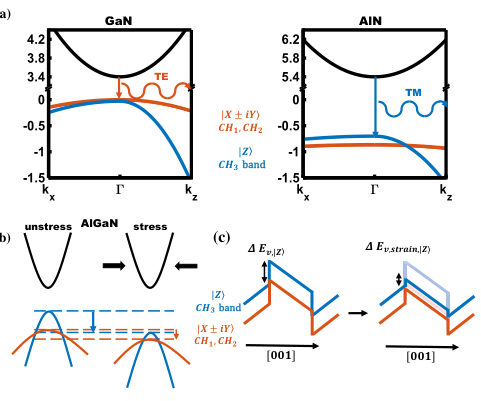 
FIG. 1. (a) The band structure in GaN and AlN showing po- larization mode transitions from TE- to TM-dominant emis- sion as the valence band ground state changes from |X ± Y ⟩ to |Z⟩. (b) Schematic valence-band diagram of AlGaN with and without in-plane compressive stress. (c) When the com- pressive stress (deformation-potential term) is included in the QW, the valence-band edges (CH1–CH3) in the QW shift downward in energy, effectively making QW shallower as shown in (c).

📷 Fig 2

 
FIG. 2. (a) Three-dimensional aluminum composition distri- bution in AlGaN quantum wells based on the random alloy fluctuations. (b) The simulated structure shown is the MQW group with 2 nm AlGaN QW/10 nm AlGaN QB, 10 nm p-AlGaN and top 12 nm AlGaN graded-composition layer doped layer to help the hole carrier injection, and 33 nm p-GaN to form the ohmic contact with metal contact. (c) Vertical aluminum-composition profiles along the growth di- rection used with an AlGaN buffer for the five LED struc- tures, targeting emission at 294, 278, 263, 249, and 223 nm. (d) Vertical aluminum-composition profiles used with an AlN buffer for the six LED structures, targeting emission at 257, 251, 244,...

📷 Fig 3

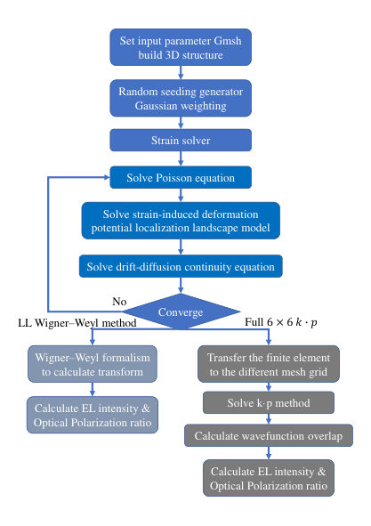 
FIG. 3. Simulation flowchart of the 3D-DDCC program.

📷 Fig 4

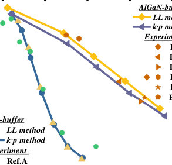 
FIG. 4. Wavelength-dependent polarization ratio (220– 300 nm) of AlGaN UVC LEDs for AlGaN- and AlN-buffer cases. The LL (Wigner–Weyl) model matches the 6 × 6 k · p trend and reproduces the buffer-dependent TE-TM crossover, consistent with literature experiments. Among the experi- mental references, Ref. A (green point) is for the AlN-buffer case, whereas Refs. B–G (orange-brown point) are for the AlGaN-buffer case. (Ref. A43, Ref. B44, Ref. C45, Ref. D46, Ref. E47, Ref. F48, Ref. G49)

📷 Fig 5

 
FIG. 5. TE- and TM-resolved optical spectra calculated us- ing the (a) LL and (b) k · p methods for the AlGaN-buffer structure.

**Summary.** This work introduces an efficient Multi-band Localization Landscape model to simulate carrier transport in AlGaN UVC LEDs. It overcomes the computational bottleneck of traditional k.p methods by replacing eigenvalue solutions with a landscape approach, while accurately incorporating critical physical effects like strain and alloy disorder. The method provides a fast yet reliable tool for optimizing deep-UV emitter performance.

**Why it may be interesting.** While focused on solid-state devices, the core methodology—using a simplified landscape approach (LL) to capture complex quantum effects (localization, disorder) without solving massive eigenvalue problems—is highly relevant for modeling open quantum systems or strongly interacting many-body physics where full diagonalization is prohibitive.

Detailed structure

**Main problem.** The primary challenge is efficiently modeling carrier transport and emission polarization in AlGaN UVC LEDs, which are complicated by poor hole confinement, strain effects, and random alloy disorder.

**Main result.** The proposed Multi-band Localization Landscape (LL) model significantly reduces simulation time compared to conventional k.p methods while accurately reproducing spectral trends and polarization ratios across a wide range of conditions.

**Method.** A hybrid approach combining the LL model with the Wigner–Weyl formalism is used within a 3D drift-diffusion framework, replacing computationally expensive eigenvalue problems.

**Model / system.** The system is an AlGaN/AlN quantum well structure operating in the deep-UV range. The modeling incorporates strain effects (via piezoelectricity and deformation potential) and random alloy fluctuations to describe carrier localization and transport.

**Key observables.** Emission and absorption spectra, polarization ratio (TE/TM), band structure evolution, hole/electron current densities, and device electrical characteristics (J-V curves).

**Important parameters / regimes.** High Al content (>60%), compressive strain, alloy fluctuation magnitude, and operating wavelength ($\lambda$ from 223 nm to 294 nm).

**Assumptions / limitations.** The LL model is assumed to provide an accurate quantum description by replacing the full Schrödinger eigenvalue problem; the framework relies on a self-consistent solution of Poisson and drift-diffusion equations.

**Figures summary.** Figures illustrate band structure transitions based on polarization (TE vs. TM), show how strain modifies the valence band ground state, and compare carrier/current densities with and without the inclusion of strain-induced deformation terms.

**Paper structure.** The paper introduces the physical problem in UVC LEDs, details the limitations of existing k.p methods, proposes the LL model as an efficient alternative, validates its accuracy against full calculations, and applies it to analyze polarization switching and carrier confinement under realistic material stresses.

Abstract

AlGaN-based UVC LEDs (220-250 nm) suffer from poor hole confinement and strain-induced |Z>-band dominance at high Al content (>60%), leading to increased TM emission and reduced external quantum efficiency (EQE). While conventional k.p models combined with Schrodinger, Poisson, and drift-diffusion solvers are widely used to study optical transitions, they are computationally expensive. In this work, we apply the multiband Localization Landscape (LL) model, including the effect of strain, as an alternative that replaces the eigenvalue problem to efficiently capture quantum effects and carrier localization. Using the 3D multi-band LL model with the Wigner-Weyl formalism, we reproduce emission and absorption spectra trends similar to the results in 3D k.p calculations, but with significantly reduced simulation time. The polarization ratio also agrees well with published experimental results across a wide spectral range. Furthermore, we analyze electrical characteristics such as band structure, polarization switching, and carrier confinement under alloy fluctuations and strain. This multi-band LL-based approach provides a fast and reliable solution for understanding and optimizing UVC LED performance.

[↑ back to top](#top)

### [Entanglement-Assisted Timing Optimization for Discriminating Amplitude-Damping Dynamics](http://arxiv.org/abs/2607.03757v1)

**Authors:** Massimiliano F. Sacchi, Milajiguli Rexiti, Stefano Mancini  
**Type:** theory · **Category:** quantum information and computing · **PDF:** <https://arxiv.org/pdf/2607.03757v1>  
**Analysis basis:** full PDF text, analyzed in chunks
**Topic relevance:** `correlated / nonlocal dissipation` **3/5** · `entanglement & information structure` **3/5** · `methods for driven-dissipative` **3/5** · `driven-dissipative phase transition` **2/5** · `non-equilibrium dynamics` **2/5** · `Keldysh / 2PI / non-Gaussian methods` **1/5** · `non-equilibrium universality` **1/5**

📷 Fig 1

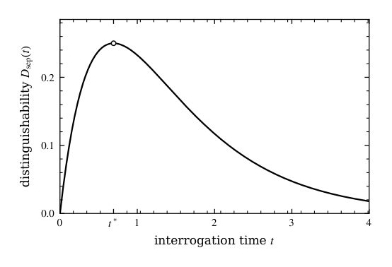 
FIG. 1: Interior-branch timing for the rates in Eq. (57). The unassisted distinguishability reaches its maximum D∗ sep = 1/4 at t∗= log 2. Side entanglement gives no improvement in this example.

📷 Fig 2

 
FIG. 2: Boundary-branch timing for the rates in Eq. (61). The finite maximum occurs at t∗ −≃0.6286, and side entanglement gives no improvement because ζ(t) = 0.

📷 Fig 3

 
FIG. 3: Minimum error probability versus interrogation time for the rates in Eq. (63). The unassisted infimum p∗ E = 0.3 is reached only asymptotically, whereas the entanglement-assisted strategy reaches a smaller error probability ep ∗ E ≃0.2858 at the finite time t∗≃1.4508.

📷 Fig 4

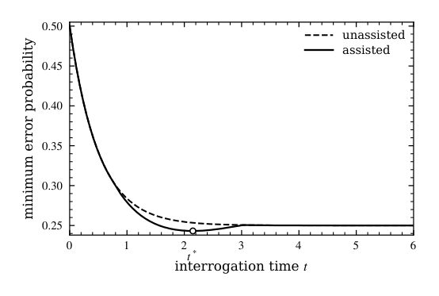 
FIG. 4: Threshold example for discriminating the damping process (1, 1, 0) from the pure-dephasing process (0, 0, r), with representative value r = 0.1 &lt; rc. The unassisted infimum is p∗ E = 1/4, while the assisted strategy reaches the smaller value ep ∗ E ≃0.2432 at finite time.

📷 Fig 5

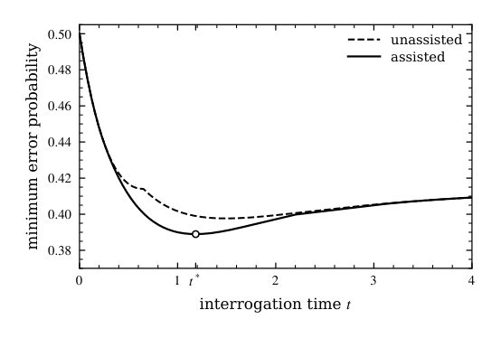 
FIG. 5: Entanglement advantage from Proposition 1(iii) for the rates in Eq. (72). The assisted value at finite time is larger than the globally optimized unassisted value.

**Summary.** This paper analyzes how to best distinguish between two noisy qubit dynamics (amplitude-damping channels) by optimizing both the input probe state and the measurement time. It rigorously proves that utilizing initial entanglement can yield a measurable, finite-time advantage over any strategy using only unentangled probes. This highlights the practical utility of quantum resources in characterizing open quantum systems.

**Why it may be interesting.** This work is highly relevant as it pushes the boundaries of quantum process tomography and channel discrimination by quantifying the precise resource benefit provided by initial entanglement in open quantum system settings.

Detailed structure

**Main problem.** The paper addresses the minimum-error discrimination of two distinct qubit dynamical processes generated by phase-covariant amplitude-damping Lindbladians.

**Main result.** Entanglement assistance can provide a strictly smaller error probability at finite time compared to the best unassisted strategy, and this advantage can persist even when considering global optimization over interrogation time.

**Method.** The authors use quantum information theory tools, comparing trace-norm distinguishability (unassisted) against diamond-norm distinguishability (entangled), optimizing over input states and interrogation time $t$.

**Model / system.** The system involves two qubits undergoing dynamics governed by a phase-covariant amplitude-damping Lindbladian master equation. The evolution is analyzed via its effect on the Bloch vector.

**Key observables.** Trace-norm distinguishability ($D_{	ext{sep}}(t)$) and diamond-norm distinguishability ($D_{	ext{ent}}(t)$), which quantify the minimum error probability for discrimination.

**Important parameters / regimes.** Interrogation time ($t$), damping rates ($\gamma_\pm, \gamma_z$), and the entanglement parameterization via a one-parameter Schmidt family.

**Assumptions / limitations.** The analysis focuses on single-use scenarios and distinguishes between fixed-time advantages and globally optimized timing advantages over $t$.

**Figures summary.** Figures illustrate numerical examples demonstrating finite-time advantages ($e^*_E < p^*_E$) where the entangled strategy outperforms the unassisted one, particularly in regimes governed by specific conditions on damping rates.

**Paper structure.** The paper first establishes the general framework for discrimination using both unassisted and entanglement-assisted measures. It then derives explicit formulas for fixed time $t$ based on different optimal input state branches (interior vs. boundary). Finally, it compares the optimized results to show when and how entanglement provides a measurable advantage over classical or unassisted quantum measurements.

Abstract

We analyze minimum-error discrimination of two qubit dynamical processes generated by phase-covariant amplitude-damping Lindbladians in a single-use scenario. The optimization involves both the input probe, possibly entangled with an isolated ancilla, and the interrogation time. For unassisted probes we obtain a closed expression for the optimal trace-norm distinguishability at fixed time, with distinct interior and boundary branches. For entanglement-assisted probes, the common phase covariance of the two channels reduces the diamond-norm optimization to a one-parameter Schmidt family. The resulting formula gives transparent sufficient conditions for fixed-time entanglement advantage and separates this local advantage from advantage after global optimization over time. We exhibit examples in which the best unassisted strategy is approached only asymptotically, whereas an entangled probe achieves a strictly smaller error probability at finite time.

[↑ back to top](#top)

### [Optimal estimation of quantum boundary effect in cosmic string space-time](http://arxiv.org/abs/2607.04295v1)

**Authors:** Yao Jin  
**Type:** theory · **Category:** other · **PDF:** <https://arxiv.org/pdf/2607.04295v1>  
**Analysis basis:** full PDF text, analyzed in chunks
**Topic relevance:** `quantum measurements` **3/5** · `correlated / nonlocal dissipation` **2/5** · `measurement-induced transitions` **2/5** · `methods for driven-dissipative` **2/5** · `Keldysh / 2PI / non-Gaussian methods` **1/5** · `Tavis-Cummings & cavity-many-emitter` **1/5** · `analog quantum simulation` **1/5** · `driven-dissipative phase transition` **1/5** · `entanglement & information structure` **1/5** · `non-equilibrium dynamics` **1/5**

📷 Fig 1

 
FIG. 1: f as a function of 4Aτ with cos θ = 1 and sin θ = ±1.

📷 Fig 2

 
FIG. 2: Fz/τ as a function of z for in cases of parallel and vertical polarization respectively.

📷 Fig 3

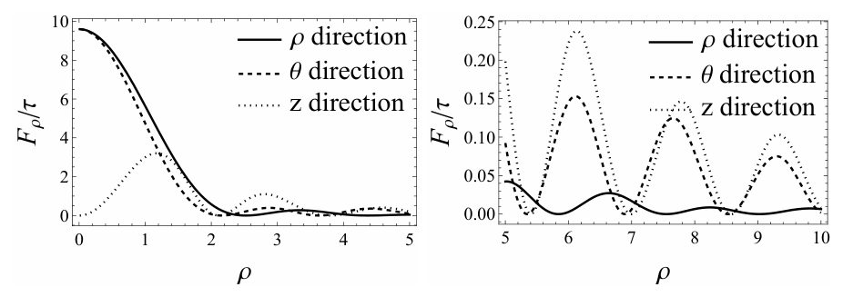 
FIG. 3: Fρ/τ as a function of ρ in cases with ρ, θ and z polarization direction when ν = 2.

📷 Fig 4

 
FIG. 4: Fρ/τ as a function of ρ in cases with ρ, θ and z polarization direction when

**Summary.** This theoretical paper develops a quantum metrology framework to estimate position-dependent effects caused by cosmic strings or reflecting boundaries on an atom's vacuum fluctuations. By optimizing measurement protocols and initial states, the authors derive specific precision limits for these estimations in both boundary and curved spacetime geometries.

**Why it may be interesting.** This work directly applies advanced concepts from quantum optics and open quantum systems (master equations) to fundamental physics problems in general relativity/cosmology, providing concrete metrological bounds on physical parameters like string separation.

Detailed structure

**Main problem.** The paper addresses the optimal estimation of quantum boundary effects induced by a cosmic string on vacuum fluctuations experienced by a two-level polarizable atom.

**Main result.** The optimal measurement strategy and polarization direction depend critically on whether the geometry is a reflecting boundary or a cosmic string, with specific optimal choices identified for different separation regimes.

**Method.** It employs quantum metrology principles, utilizing repeated measurements ($N$) and maximum-likelihood estimation to determine the precision limit of position factor estimation.

**Model / system.** The system involves a two-level polarizable atom interacting with the electromagnetic field in spacetimes modified by either an infinite conducting reflecting boundary or a static cosmic string. The dynamics are governed by an effective Hamiltonian and described by the Kossakowski-Lindblad master equation.

**Key observables.** Estimation precision, quantified by the variance $	ext{Var}(X)$, which is bounded by $1/(N F_X)$.

**Important parameters / regimes.** Atom-string separation ($
ho$ or $z$), deficit angle, and the total probe time ($T$).

**Assumptions / limitations.** The analysis assumes a weak coupling regime and utilizes sequential measurements on a single probe atom to estimate position factors.

**Figures summary.** Figure 1 illustrates how the estimation factor decreases with increasing probe time ($	au$). Figure 2 compares sensitivity for parallel vs. vertical polarization in the reflecting boundary case, while Figures 3 and 4 compare sensitivities ($F/	au$) across different polarizations ($
ho$, $	heta$, $z$) depending on separation ($
ho$) and string parameter ($
u$).

**Paper structure.** The paper first establishes the general quantum metrology framework. It then analyzes two distinct physical scenarios: the flat space with a reflecting boundary, and the cosmic string spacetime. In both cases, it optimizes initial states, measurement bases, and probe times to determine the best achievable estimation precision.

Abstract

The presence of a cosmic string modifies vacuum fluctuations, making the evolution of a two-level polarizable atom position dependent. Such modifications produce effects on the atomic dynamics analogous to those induced by a reflecting boundary. We show that these quantum boundary effects can be estimated by performing a sequence of $N$ measurements on a single probe atom. For a fixed total probe time, the precision limit is attained by preparing each probe in its optimal initial state, performing the corresponding optimal measurement, and shortening the probe time of each probe. The optimal measurement is uniquely determined by the probe's initial state, and the precision limit obtained with the atom initially in the excited state is four times higher than that for an equal-weight superposition state. The estimation precision displays damped oscillatory behavior as the atom-boundary or atom-string separation increases. While polarization parallel to the reflecting boundary is always optimal in the boundary case, the optimal polarization in cosmic-string space-time depends on both the atom-string separation and the deficit angle. For small deficit angles and sufficiently large separations, polarization along the cosmic-string direction becomes inferior to the other polarization directions.

[↑ back to top](#top)

### [Semi-Markovian switching in a fluctuating harmonic trap: An age-structured formulation](http://arxiv.org/abs/2607.05173v1)

**Authors:** Derek Frydel  
**Type:** theory · **Category:** statistical mechanics · **PDF:** <https://arxiv.org/pdf/2607.05173v1>  
**Analysis basis:** full PDF text, analyzed in chunks
**Topic relevance:** `driven-dissipative phase transition` **3/5** · `methods for driven-dissipative` **3/5** · `non-equilibrium dynamics` **3/5** · `non-equilibrium universality` **2/5** · `Frenkel-Kontorova` **1/5** · `Keldysh / 2PI / non-Gaussian methods` **1/5** · `analog quantum simulation` **1/5** · `correlated / nonlocal dissipation` **1/5**

📷 Fig 1

 
FIG. 1. Parameter A as a function of the shape parameter k for the Gamma, power-law, and intermittent two-point waiting-time distri- butions. The horizontal dashed lines correspond to the deterministic upper bound Amax = tanh(1) ≈0.7616 and the memoryless (expo- nential) value Aexp = 0.5. Parameters: τK1 = τK2 = τ1 = τ2 = 1.

📷 Fig 2

 
FIG. 2. Injected power ⟨˙W⟩as a function of K1 for the Gamma, power-law, and two-point waiting-time distributions. As K1 →0, all curves converge to the universal stochastic-resetting limit ⟨˙W⟩= DK τoff/(τoff +τon). Parameters: µK2 = τoff = τon = kBT = 1.

📷 Fig 3

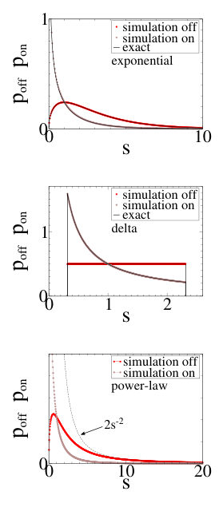 
FIG. 3. Variance-space distributions pi(s) for exponential, de- terministic, and algebraic waiting-time distributions. Parameters: τK = τoff = τon = kBT = 1. For the algebraic case, we use roff from Eq. (42) with k = 3, corresponding to C = 2 and therefore poff(s) ∼2s−2.

📷 Fig 4

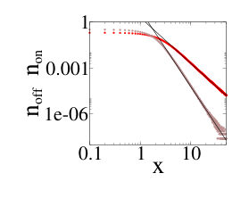 
FIG. 4. Spatial distributions ni(x) shown on a log-log scale for algebraic waiting-time distributions corresponding to Eq. (42) with k = 3. Parameters: τK = τoff = τon = D = 1, for which noff(x) ∼ 2|x|−3 and non(x) ∼6|x|−5.

**Summary.** This paper develops a comprehensive theoretical framework using age-structured methods to model Brownian particles undergoing switching between harmonic traps with arbitrary memory effects. It derives exact integral equations for steady states and demonstrates that while equilibrium energy remains fixed, non-Markovian switching protocols significantly alter the injected power and spatial fluctuations. This work is valuable for understanding non-equilibrium dynamics in systems with complex temporal correlations.

**Why it may be interesting.** It provides rigorous mathematical tools (age-structuring, variance dynamics) to analyze non-equilibrium transport phenomena driven by complex temporal correlations, which is highly relevant for understanding energy dissipation in open quantum systems or active matter.

Detailed structure

**Main problem.** Developing a general theoretical framework for analyzing semi-Markovian switching dynamics in fluctuating potentials with arbitrary waiting-time distributions.

**Main result.** The study derives exact integral equations and shows that while average potential energy remains at equilibrium values, injected power and spatial fluctuations are highly sensitive to the temporal memory encoded in the switching statistics.

**Method.** The core methodology involves formulating the problem in an enlarged age-structured state space to restore Markovianity for non-exponential waiting times, followed by analyzing reduced dynamics in both position and variance spaces.

**Model / system.** A Brownian particle confined by a harmonic trap whose stiffness fluctuates between two values ($K_1$ and $K_2$), leading to semi-Markovian switching dynamics. The analysis covers regimes from memoryless Markovian processes to complex stochastic-resetting limits.

**Key observables.** Steady-state spatial density ($
ho_i(x)$), birth flux ($b_i(x)$), average potential energy (PE), and injected work rate ($\langle \dot{W} 
angle$).

**Important parameters / regimes.** Mean residence times ($	au_i$), stiffness values ($K_1, K_2$), and memory parameters encoded in the waiting-time distributions.

**Assumptions / limitations.** The framework assumes finite mean residence times for the switching process; energy observables are governed by a generalized virial relation.

**Figures summary.** Figures illustrate $\pi(s)$ (variance distribution) comparisons for exponential, deterministic, and algebraic waiting-time protocols, and show spatial distributions $n_i(x)$ confirming asymptotic predictions for algebraic tails.

**Paper structure.** The paper first establishes the age-structured Fokker-Planck description to handle memory. It then analyzes steady-state observables (moments, fluxes) in this extended space. Finally, it tackles specific limits, notably the variance-space formulation for stochastic resetting and analyzing moment equations.

Abstract

We study a Brownian particle in a harmonic trap whose stiffness switches between two values with arbitrary waiting-time statistics, generating semi-Markovian dynamics. To treat the resulting temporal memory, we formulate the problem in an enlarged age-structured state space, restoring Markovianity and yielding a local Fokker--Planck description. Within this framework, we derive exact steady-state integral equations for the spatial and birth distributions and obtain exact expressions for stationary moments, injected power, and potential energy. In the second part of the paper, we analyze the stochastic-resetting limit, corresponding to a particle alternately released and trapped. By representing the stationary spatial distribution as a superposition of Gaussian states with fluctuating variance, the problem can be reformulated as a switching process in variance space. This yields exact integral equations for the variance distributions and leads to a simplified description amenable to direct analytical treatment.

[↑ back to top](#top)

### [Minimal Proper Time and Deterministic Microstates: Emergent Quantum Fields and Relativistic Spacetime](http://arxiv.org/abs/2607.03605v1)

**Authors:** Alessio Maiezza  
**Type:** theory · **Category:** other · **PDF:** <https://arxiv.org/pdf/2607.03605v1>  
**Analysis basis:** full PDF text, analyzed in chunks
**Topic relevance:** `Keldysh / 2PI / non-Gaussian methods` **3/5** · `entanglement & information structure` **2/5** · `methods for driven-dissipative` **2/5** · `non-equilibrium dynamics` **2/5** · `analog quantum simulation` **1/5** · `correlated / nonlocal dissipation` **1/5** · `correlated cavity matter` **1/5** · `driven-dissipative phase transition` **1/5** · `non-equilibrium universality` **1/5**

📷 Fig 1

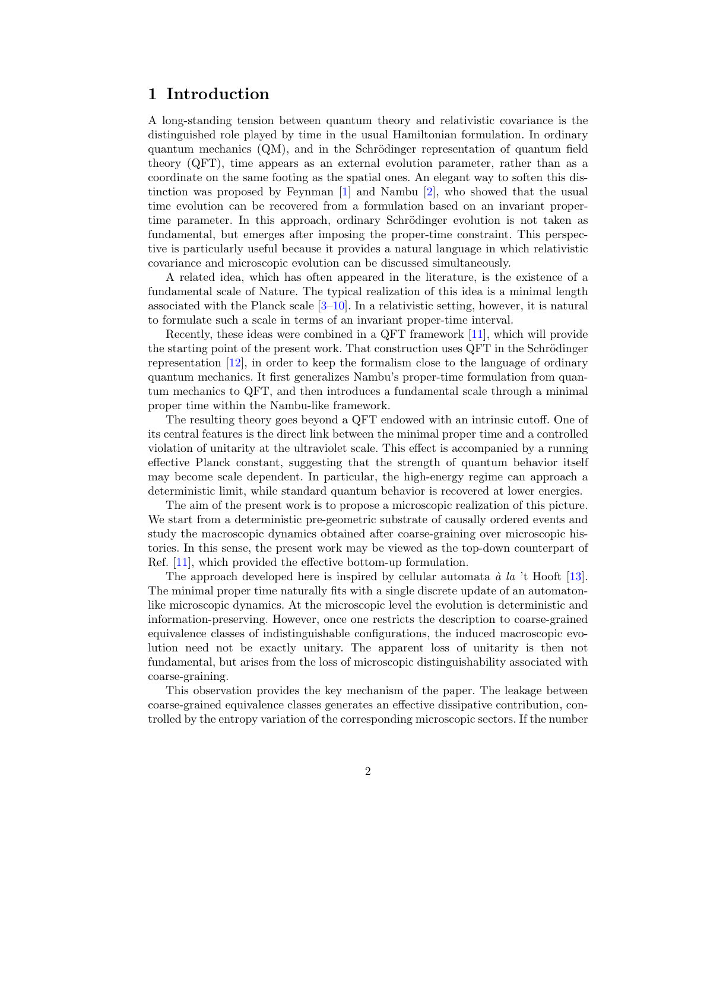 
Low-resolution page preview, page 2

📷 Fig 2

 
Low-resolution page preview, page 3

📷 Fig 3

 
Low-resolution page preview, page 4

📷 Fig 4

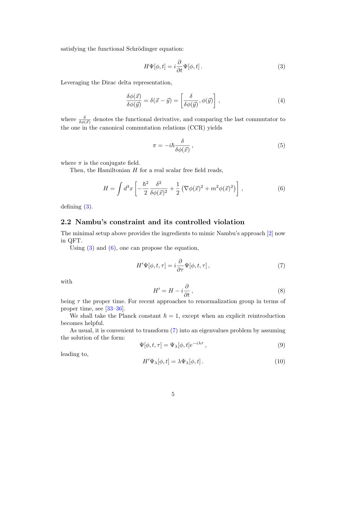 
Low-resolution page preview, page 5

📷 Fig 5

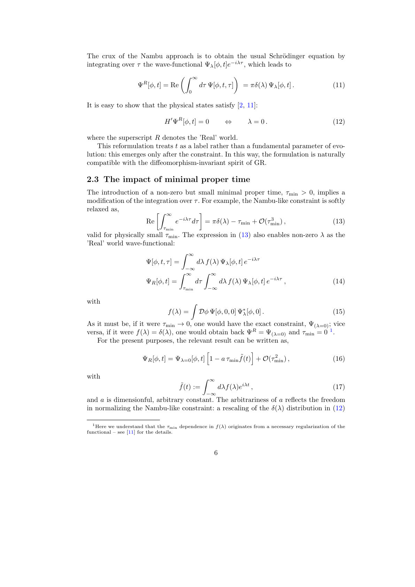 
Low-resolution page preview, page 6

**Summary.** This work proposes a fundamental theory where quantum fields and relativistic spacetime emerge from a deeper, underlying deterministic structure. By analyzing how coarse-graining occurs over microscopic histories, the authors show that standard QFT and Einstein's equations are recovered as low-energy approximations of this fundamental substrate.

**Why it may be interesting.** While not directly focused on AMO systems, the concept of deriving continuous quantum dynamics and spacetime geometry from discrete, deterministic microstates is highly relevant to foundational questions in quantum gravity that underpin many-body physics theories.

Detailed structure

**Main problem.** The paper aims to develop a top-down derivation of quantum field theory (QFT) and emergent relativistic spacetime from a fundamental, deterministic pre-geometric substrate.

**Main result.** Coarse-graining over microscopic histories recovers standard unitary QFT in the infrared limit and yields an effective metric compatible with Einstein gravity in the macroscopic limit.

**Method.** The approach involves analyzing the dynamics induced by coarse-graining on a deterministic substrate, relating it to minimal proper time steps ($	au_{	ext{min}}$) and deriving emergent field equations via linear response theory.

**Model / system.** The model starts with a deterministic pre-geometric substrate of causally ordered events. Dynamics are studied by mapping the evolution onto an effective Nambu-like quantum dynamics, which then dictates the structure of spacetime geometry.

**Key observables.** Effective Planck constant ($\hbar_{eff}$), emergent metric components ($g_{\mu
u}$), and stress-energy tensor ($T_{\mu
u}$).

**Important parameters / regimes.** Minimal proper time ($	au_{	ext{min}}$), scale parameter ($\eta = 1/n$), and the running effective Planck constant.

**Assumptions / limitations.** The derivation assumes standard infrared assumptions (locality, diffeomorphism covariance) to select Einstein gravity in the macroscopic limit; the metric is derived from weighted covariances of coordinate fluctuations.

**Figures summary.** Not specified by notes, but calculations involve deriving components of the Ricci tensor and solving for stress-energy tensor components based on a function $q(x)$ derived from local cardinalities.

**Paper structure.** The paper progresses from establishing the deterministic substrate dynamics via coarse-graining (leading to Nambu-like QFT) to demonstrating how this structure naturally yields an effective metric compatible with Einstein's equations in the continuum limit.

Abstract

We develop a top-down counterpart of the minimal proper-time formulation of quantum field theory previously introduced as an effective bottom-up framework. Starting from a deterministic pre-geometric substrate of causally ordered events, we show how coarse-graining over microscopic histories leads, at low energies, to an effective Nambu-like quantum dynamics. The elementary deterministic update is identified with the minimal proper-time step, while the growth of coarse-grained equivalence classes controls both the ultraviolet dissipative correction and the scale dependence of the effective quantization strength, encoded in a running Planck constant. In this way, the proper-time cutoff kernel of the bottom-up formulation acquires a microscopic interpretation as the inverse growth of unresolved deterministic histories. In the infrared limit, the dissipative term vanishes and standard unitary quantum field theory is recovered. The same coarse-grained structure also provides a natural setting for an emergent relativistic spacetime geometry, compatible in the macroscopic limit with Einstein gravity. The resulting picture suggests a common deterministic origin for minimal-scale structure, quantum behavior, and relativistic spacetime.

[↑ back to top](#top)

### [Quantum tunneling Mpemba effect](http://arxiv.org/abs/2607.03845v1)

**Authors:** Hisao Hayakawa, Satoshi Takada  
**Type:** theory · **Category:** statistical mechanics · **PDF:** <https://arxiv.org/pdf/2607.03845v1>  
**Analysis basis:** full PDF text, analyzed in chunks
**Topic relevance:** `driven-dissipative phase transition` **3/5** · `methods for driven-dissipative` **3/5** · `non-equilibrium dynamics` **3/5** · `non-equilibrium universality` **2/5** · `Keldysh / 2PI / non-Gaussian methods` **1/5** · `Kondo & dissipative impurity` **1/5** · `correlated / nonlocal dissipation` **1/5**

📷 Fig 1

 
FIG. 1. Initial temperature dependence of an(Ti) for n = 0, 1, 2, and 3 when we fix L = 5, η = 5, and xabs = 4.

📷 Fig 2

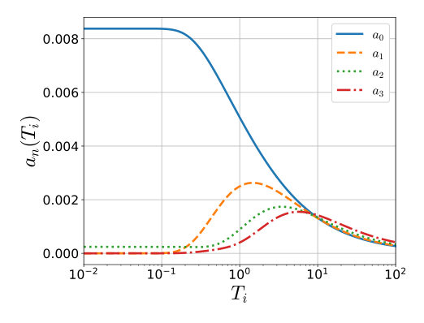 
Figure 2 shows plots of a2(Ti) against Ti for various system size L under the condition Eq. (46). This figure indicates that the peak position around Ti = 3.26 is independent of the system size L. This result supports the theoretical prediction in the previous section and Appendix C.

📷 Fig 3

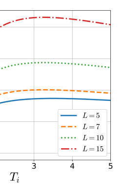 
FIG. 2. Plots of a2(Ti) against Ti for various L when we fix η = 5, and xabs = 4.

📷 Fig 4

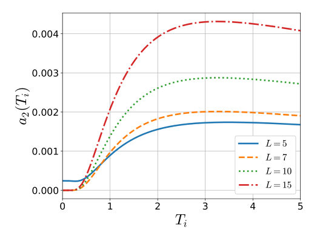 
Figure 3 shows the time evolution of the survival probability S(t, Ti) for various Ti using Eq. (46). This clearly exhibits the crossing of S(t, Ti) during the time evolution. Remarkably, the crossing time is insensitive to Ti, where

📷 Fig 5

 
FIG. 3. Plots of time evolution of S(t, Ti) for various Ti when we fix L = 5, η = 5, and xabs = 4.

**Summary.** This work analyzes the quantum tunneling Mpemba effect in an open double-well potential using non-Hermitian quantum mechanics. The authors prove that the characteristic temperature dependence is a universal topological feature governed by spectral properties, crucially demonstrating its invariance with respect to system size L. This offers novel insights for engineering non-equilibrium states via controlled boundary dissipation.

**Why it may be interesting.** It provides a rigorous quantum mechanical framework for understanding non-equilibrium relaxation dynamics, bridging classical concepts (like the Mpemba effect) into the realm of open quantum systems and spectral theory.

Detailed structure

**Main problem.** The paper investigates the quantum tunneling Mpemba effect, a counterintuitive relaxation phenomenon where an initially hotter system cools faster than a warmer one.

**Main result.** The non-monotonic behavior characterizing this effect is proven to be a universal topological property governed by Sturm-Liouville theory and is shown to be independent of the global system size L.

**Method.** The analysis employs non-Hermitian spectral decomposition techniques applied to an effective Hamiltonian derived from the Lindblad master equation for open quantum systems.

**Model / system.** The model is a single particle in a continuous, symmetric one-dimensional double-well potential, coupled to external environmental sinks at its boundaries (x = ±L).

**Key observables.** Non-monotonic behavior of the first non-trivial even-parity spectral coefficient ($a_{2}(T_{i})$), total survival probability trace $	ext{Tr}[
ho(t)]$, and trace distance $\mathcal{D}(t, T_i)$.

**Important parameters / regimes.** Initial temperature $T_i$, system size $L$, and the ratio of decay rates ($\Gamma_2 \gg \Gamma_0$ and $\Gamma_2 \gg \Gamma_1$).

**Assumptions / limitations.** Observation requires a strict separation of timescales, meaning the over-barrier escape rate must vastly exceed the deep-well tunneling doublet decay rate.

**Figures summary.** Not specified by notes; the analysis focuses on mathematical proofs regarding spectral coefficients and size independence.

**Paper structure.** The paper moves from defining the open system dynamics via a non-Hermitian Hamiltonian to performing spectral decomposition. It then proves the topological nature of the Mpemba peak using Sturm-Liouville theory, culminating in a proof that this effect is invariant with respect to boundary size L.

Abstract

The quantum tunneling Mpemba effect is investigated within a continuous one-dimensional symmetric double-well potential open to external environmental sinks at the boundaries ($x=\pm L$). Using a non-Hermitian spectral decomposition of the effective Hamiltonian, we characterize the open-system relaxation dynamics without relying on abstract state-space quenches. We mathematically prove that the non-monotonic behavior of the first non-trivial even-parity spectral coefficient, $a_{2}(T_{i})$, with respect to the initial preparation temperature $T_{i}$ is a universal topological property born from quantum statistical mechanics. Crucially, we demonstrate that this intermediate thermal peak is governed by the Sturm-Liouville oscillation theorem and remains completely invariant with respect to the global system size $L$, contrasting sharply with the boundary-driven classical Mpemba effect. This universal peak arises from the geometric and nodal alignment between highly localized unperturbed states and extended non-Hermitian decay channels. Furthermore, we clarify that while this mechanism is robust, the actual observation of anomalous crossings in the total survival probability trace $S(t,T_{i})$ and the trace distance $\mathcal{D}(t,T_i)$ demand a strict separation of timescales, requiring the over-barrier escape rate to vastly exceed the decay rate of the deep-well tunneling doublet ($Γ_{2}\gg Γ_{0}$ and $Γ_2\gg Γ_1$). Our continuous formulation successfully bridges real-space classical boundary-driven dissipation with open quantum dynamics, providing novel insights for engineering non-equilibrium states via tailored boundary loss.

[↑ back to top](#top)

### [Optical switching of antiferromagnetic domains by nonreciprocal heat current](http://arxiv.org/abs/2607.04975v1)

**Authors:** Takeshi Hayashida, Shunsuke Izumikawa, Kenta Kimura, Carl S. Davies, Andrei Kirilyuk  
**Type:** experiment · **Category:** other · **PDF:** <https://arxiv.org/pdf/2607.04975v1>  
**Analysis basis:** full PDF text, analyzed in chunks
**Topic relevance:** `exotic spin models in light-matter` **3/5** · `spintronics-quantum-optics interface` **3/5** · `driven-dissipative phase transition` **2/5** · `non-equilibrium dynamics` **2/5** · `interference shaping light` **1/5** · `non-equilibrium universality` **1/5** · `quantum optics experiment` **1/5**

📷 Fig 1

 
Fig. 1: Antiferromagnetic domains and nonreciprocal directional dichroism (NDD)

📷 Fig 2

 
Fig.2: Propagation-direction-dependent domain switching by mid-IR pulse. Top

📷 Fig 3

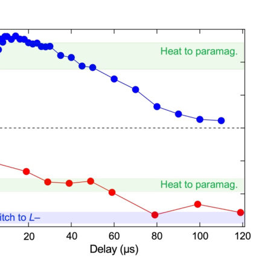 
Fig. 3: Time-resolved evolution of pump-induced transmission changes. a, Initial

📷 Fig 4

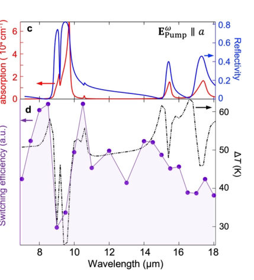 
Fig.4: Spectral dependence of the switching efficiency. a,c, Absorption (red) and

**Summary.** The researchers demonstrated the deterministic switching of antiferromagnetic domains in LiFePO4 using mid-infrared light. They established that this nonreciprocal switching mechanism is governed by optically-generated heat currents, proving a general principle for controlling symmetry-broken phases with light. This overcomes limitations found in resonance-based optical control methods.

**Why it may be interesting.** This work provides an experimental demonstration of controlling symmetry-broken quantum phases using fundamental directional properties (nonreciprocity) rather than relying on specific material resonances, which is highly relevant for designing general optical control schemes in condensed matter systems.

Detailed structure

**Main problem.** To determine if nonreciprocity itself, rather than resonance enhancement, can provide a general principle for deterministically controlling symmetry-broken phases using light.

**Main result.** Deterministic, nonreciprocal switching of antiferromagnetic domains is achieved using mid-IR light, mediated by optically-generated heat currents.

**Method.** Domain imaging and time-resolved measurements were performed using mid-infrared pulses from a Free-Electron Laser facility (FELIX).

**Model / system.** The study uses the magnetoelectric antiferromagnet LiFePO4, which inherently breaks both space-inversion and time-reversal symmetries. The control mechanism is attributed to nonreciprocal heat currents generated by directional light propagation.

**Key observables.** Domain states (L+ and L-), direction-dependent switching efficiency, transient changes in transmitted light intensity, and the magnitude of the optically-generated heat current.

**Important parameters / regimes.** Mid-infrared wavelength range ($7–19\ \mu	ext{m}$), low temperature ($4\ 	ext{K}$), and the comparison between front-side vs. back-side pumping directions.

**Assumptions / limitations.** The switching mechanism is primarily governed by nonreciprocal heat currents, overcoming spectral constraints associated with resonance-based schemes. The conclusion regarding NDD absence is limited by experimental sensitivity.

**Figures summary.** Figures demonstrate domain structure via NDD imaging and show that front-side pumping induces L+ to L- switching while back-side pumping reverses this. Time-resolved data track the transient changes associated with heating and switching.

**Paper structure.** The paper establishes the physical basis (symmetry breaking in AFMs), demonstrates nonreciprocal domain switching using mid-IR light, attributes the mechanism to directional heat currents, and rules out simple resonant dichroism as the sole cause.

Abstract

What distinguishes front from back? In physics, such directionality emerges only when an underlying symmetry is broken. Antiferromagnets that inherently break both space-inversion and time-reversal symmetries provide a striking example, exhibiting nonreciprocal optical responses that depend on the direction of light propagation. Beyond distinguishing antiferromagnetic domains, we show that this nonreciprocity can deterministically create them. Using mid-infrared light, we demonstrate deterministic switching of antiferromagnetic domains in the magnetoelectric antiferromagnet LiFePO4, where illumination from opposite sides selectively stabilizes opposite domain states. Remarkably, the switching persists over a broad wavelength range rather than being confined to a narrow transition-specific spectral region, overcoming the spectral and material constraints of resonance-based optical switching schemes. The broadband switching originates from the material's intrinsic nonreciprocity through optically generated heat currents. Our results establish nonreciprocity as a general principle for deterministically controlling symmetry-broken phases with light.

[↑ back to top](#top)

### [A Path-Superposition Framework for Quantum Gate Teleportation](http://arxiv.org/abs/2607.04672v1)

**Authors:** Santiago Ávila, Marco Enríquez  
**Type:** both · **Category:** quantum information and computing · **PDF:** <https://arxiv.org/pdf/2607.04672v1>  
**Analysis basis:** full PDF text, analyzed in chunks
**Topic relevance:** `interference shaping light` **3/5** · `quantum optics experiment` **3/5** · `QC/QI experiment` **2/5** · `quantum measurements` **2/5** · `entanglement & information structure` **1/5** · `measurement-induced transitions` **1/5**

📷 Fig 1

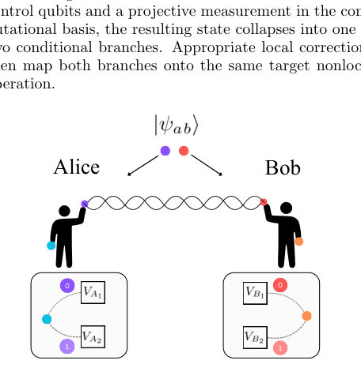 
FIG. 1. Schematic diagram depicting distribution of qubits and the corresponding coherently controlled operations be- tween Alice and Bob. Both parties possess one local qubit, |ψA⟩and |ψB⟩(blue and orange), and one entangled resource |ψab⟩. The measurement of this control resource mediates the superposition of paths, causing |ψA⟩(|ψB⟩) to undergo the transformation VA1 (VB1) or VA2 (VB2).

📷 Fig 2

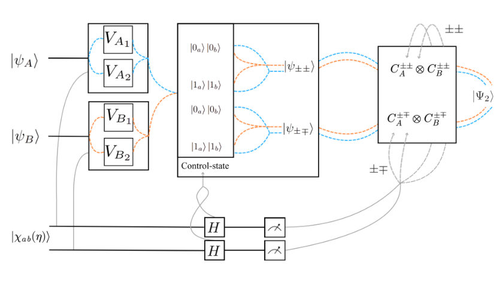 
FIG. 2. Schematic representation of the full teleportation protocol. Coherent control is illustrated by showing the two possible orderings that |ψA⟩and (|ψB⟩) undergo, mediated by the entangled control pair (gray wires). This generates a superposition of paths, depicted by the dashed blue and orange wires. A Hadamard gate is then applied to each control qubit, transforming the initial control superposition of |00⟩and |11⟩to |00⟩, |11⟩, |10⟩, and |01⟩, represented by the gray wires mediating the superpositions in the control-state. A measurement of the control qubit collapses the system onto one of the two Alice and Bob subsystems, allowing them to perform the appropriate correction. The...

📷 Fig 3

 
FIG. 3. Proof-of-concept photonic realization of the proposed framework. A BBO-based SPDC source generates a polarization- entangled photon pair [30], PBSs map polarization into spatial path modes, and 45◦HWPs transfer the entanglement to the path DOF [4]. A HWP at angle (θ) then prepares each polarization qubit in an arbitrary linear-polarization state. Additional HWP and QWP sequences implement path-dependent polarization operations that can perform any SU(2) unitary transformation [31], therefore able to apply the V set gates. Recombination of the two spatial paths using a 50/50 beam splitter results in Hadamard like operations [26], replicating equation (6). The resulting coincidence...

**Summary.** This paper introduces a general framework utilizing 'path superposition' to achieve deterministic quantum gate teleportation. It establishes design conditions and demonstrates protocols for CNOT and CZ gates, showing that the underlying architecture can be reused for various nonlocal operations. The work culminates in outlining a proof-of-concept photonic realization using spatial paths and polarization.

**Why it may be interesting.** The use of path superposition as a resource offers an alternative physical mechanism to implement non-local quantum operations compared to standard entanglement swapping or local entangling gate sequences.

Detailed structure

**Main problem.** The goal is to develop a general, systematic framework for performing quantum gate teleportation that implements nonlocal operations without physically moving the qubits.

**Main result.** The authors establish general design conditions based on path superposition, successfully constructing protocols for implementing CNOT and CZ gates using this architecture.

**Method.** The method involves defining local unitary operators conditioned on measurement outcomes derived from a pre-shared entangled resource whose phase dictates the target gate. The framework requires satisfying specific mathematical design conditions to ensure determinism.

**Model / system.** The model uses 'path superposition' as the key resource, which is physically realized in a proof-of-concept photonic setup using spatial paths and polarization degrees of freedom for encoding qubits and entanglement control.

**Key observables.** Measurement branch probabilities ($p_{\pm\pm}, p_{\pm\mp}$), the expectation value $z$, and the relative phase $\eta$ of the entangled resource are key observables used to verify determinism.

**Important parameters / regimes.** The relative phase $\eta$ in the entangled resource is crucial, as different values yield different nonlocal operations (e.g., $\eta = \pi/2$ for CNOT).

**Assumptions / limitations.** The framework assumes that satisfying the derived design conditions is sufficient to guarantee deterministic teleportation up to an overall global phase.

**Figures summary.** Figure 1 schematically shows the qubit distribution and controlled operations. Figure 2 illustrates the full protocol using path superposition, showing Hadamard gates and correction paths. Figure 3 details the photonic realization, mapping polarization to path DOF for implementation.

**Paper structure.** The paper first introduces the general framework and design conditions (Chunk 1). It then rigorously derives these conditions by analyzing state evolution and probabilities (Chunk 2). Finally, it presents a detailed proof-of-concept using photonics, demonstrating the modularity of the architecture for different gates (Chunks 3 & 4).

Abstract

Quantum gate teleportation enables distant parties to implement nonlocal quantum operations without physically transferring the participating qubits, making it a promising primitive for distributed quantum computing. We introduce a general framework for deterministic quantum gate teleportation based on path superposition, in which the target nonlocal operation is specified through the phase of a preshared maximally entangled resource and a suitable family of path-dependent local unitary operators. The framework establishes general design conditions that guarantee deterministic teleportation after measurement of the control qubits and the application of local correction operations. As representative realizations, we construct teleportation protocols for controlled-NOT (CNOT) and controlled-Z (CZ) gates, demonstrating that different nonlocal operations can be implemented within the same protocol architecture through appropriate choices of the design parameters. We further outline a proof-of-concept photonic realization based on spatial-path and polarization degrees of freedom. The proposed framework identifies path superposition as a versatile resource for quantum gate teleportation and distributed quantum information processing.

[↑ back to top](#top)

### [Excitation spectra and rank tomography of linear matrix product tangent spaces](http://arxiv.org/abs/2607.05269v1)

**Authors:** Otto T. P. Schmidt, Iacopo Carusotto  
**Type:** theory · **Category:** numerical methods · **PDF:** <https://arxiv.org/pdf/2607.05269v1>  
**Analysis basis:** full PDF text, analyzed in chunks
**Topic relevance:** `analog quantum simulation` **3/5** · `methods for driven-dissipative` **3/5** · `entanglement & information structure` **2/5** · `Keldysh / 2PI / non-Gaussian methods` **1/5** · `correlated / nonlocal dissipation` **1/5** · `driven-dissipative phase transition` **1/5** · `non-equilibrium dynamics` **1/5**

📷 Fig 1

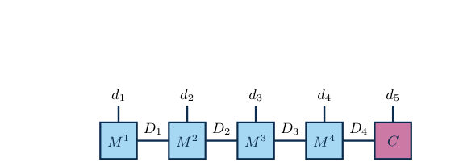 
FIG. 1. A MPS representation in left-canonical gauge of an order-five projective tensor [T].

📷 Fig 2

 
FIG. 3. Exact excitation energies (coloured dots) and tangent-space reconstructions (coloured crosses) for an N = 10 Bose–Hubbard chain with bond dimension D = 8, local dimension d = 3, and chemical potential µ/U = 0.5. Results are shown for the particle-number conserving Hamiltonian with U(1)-breaking term η = 0 (top) and for the symmetry- breaking Hamiltonian with η = 0.01 (bottom). For η = 0, colours identify the particle-number sectors M. For η ̸= 0, particle number is not conserved and the continuous colour scale indicates the expectation value ⟨ˆ M⟩of each state. The ground-state energies and off-diagonal coherence for η = 0 as- sociated with the M = 10 and M = 11 sectors are also...

📷 Fig 3

 
FIG. 4. Approximation error |ω −ωexact| for the lowest exci- tation modes of the BH model in number sectors M = M0 ±1 for N = 10, µ = 0.5, d = 3 and different bond dimensions D. The shaded regions indicate different rank profiles rℓ(m); see Section V B.

📷 Fig 4

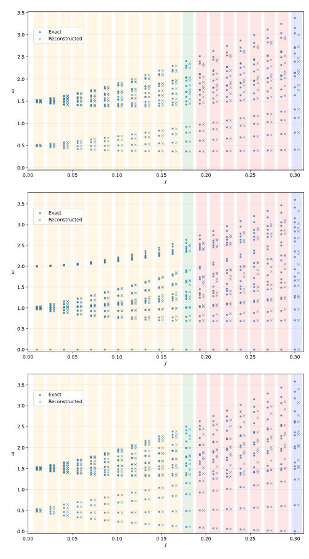 
FIG. 5. Exact spectrum (blue dots) and the reconstructed spectrum (blue crosses) for N = 4, D = 5, µ = 0.5. Excita- tions in number sectors 3, 4 and 5 are shown in top, middle and bottom, respectively. The shaded regions indicate differ- ent rank profiles of rl(m).

📷 Fig 5

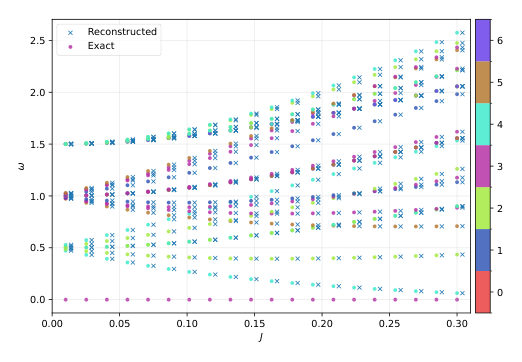 
FIG. 6. Exact spectrum (coloured dots) and the reconstructed spectrum (blue crosses) for N = 3, D = 3, µ = 0.5. The colour scale indicates the particle-number sectors of the exci- tations.

**Summary.** The paper introduces a sophisticated tangent-space method for analyzing excitation spectra in quantum many-body systems modeled by MPS. It enhances standard tensor network techniques by introducing 'rank tomography' to characterize state expressivity using particle-resolved rank profiles. This framework successfully applies to the Bose-Hubbard model, offering accurate spectral predictions while providing deep geometric insights into the underlying mathematical structure of the physical states.

**Why it may be interesting.** This work provides a powerful, mathematically rigorous extension of standard tensor network techniques (like DMRG/tDMRG) by incorporating differential geometric constraints to improve spectral accuracy and provide deeper insights into the underlying structure of quantum states.

Detailed structure

**Main problem.** To develop a rigorous mathematical framework using tangent spaces to accurately calculate excitation spectra for quantum many-body systems described by Matrix Product States (MPS).

**Main result.** The method successfully reproduces low-lying excitations and captures finite-size precursors of the Mott-insulator to superfluid transition in the Bose-Hubbard model.

**Method.** It employs a tangent-space approach on the algebraic variety defined by MPS, incorporating 'rank tomography' (PRSR) to characterize expressivity beyond simple bond dimensions. The dynamics are projected onto this variational tangent space using principles derived from time-dependent variational calculations.

**Model / system.** The primary benchmark is the Bose-Hubbard model on an open chain of sites, analyzed within the MPS framework. The mathematical structure involves studying the geometry (smoothness) of the rank constraints defining the MPS variety.

**Key observables.** Excitation spectra ($\omega$), Particle-resolved Schmidt-rank distribution (PRSR), and the comparison between reconstructed vs. exact low-energy spectra.

**Important parameters / regimes.** Bond dimensions ($D$), coupling constants ($J$), interaction strength ($U$), chemical potential ($\mu$), and local Hilbert space dimension ($d$).

**Assumptions / limitations.** The method provides a first-order approximation to excitations, and its applicability relies on the MPS representation being efficient for the Hamiltonian.

**Figures summary.** Figures illustrate the MPS structure in gauge-fixed forms, compare exact vs. reconstructed low-energy spectra for the Bose-Hubbard model, and show the mathematical projection onto the tangent space.

**Paper structure.** The paper moves from defining the general tangent-space method on MPS varieties to applying it to the Bose-Hubbard model dynamics (TDVP). It also delves into the structural analysis of these varieties using rank tomography (PRSR) and algebraic geometry proofs regarding smoothness.

Abstract

We formulate a tangent-space method for algebraic varieties of matrix product states (MPS) to study excitation spectra of non-uniform quantum many-body systems with open boundary conditions. We further introduce a rank tomography of the MPS tangent space, which characterizes its expressivity in terms of particle-sector rank profiles of the underlying MPS variety. Using the Bose--Hubbard model as a benchmark, we illustrate that the method reproduces low-lying excitations and captures finite-size precursors of the Mott-insulator to superfluid transition.

[↑ back to top](#top)

### [Fundamental limits on state preparation for an open qubit](http://arxiv.org/abs/2607.04320v1)

**Authors:** D. A. Abraamian, L. V. Lokutsievskiy, A. N. Pechen  
**Type:** theory · **Category:** other · **PDF:** <https://arxiv.org/pdf/2607.04320v1>  
**Analysis basis:** full PDF text, analyzed in chunks
**Topic relevance:** `methods for driven-dissipative` **3/5** · `driven-dissipative phase transition` **2/5** · `non-equilibrium dynamics` **2/5** · `Keldysh / 2PI / non-Gaussian methods` **1/5** · `analog quantum simulation` **1/5** · `correlated / nonlocal dissipation` **1/5** · `non-equilibrium universality` **1/5** · `quantum measurements` **1/5**

📷 Fig 1

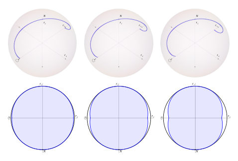 
FIG. 1. The first row shows the curve Γ ⊂∂R in the Bloch ball for α = γ/ω = 0.1, 0.3, 0.5 from left to right. The second row shows the intersection of the boundary ∂R with rxrz- plane for the same values of α.

📷 Fig 2

 
FIG. 2. Structure of the intersections of ∂R and T with the rxrz-plane {ry = 0} in the Bloch ball B.

📷 Fig 3

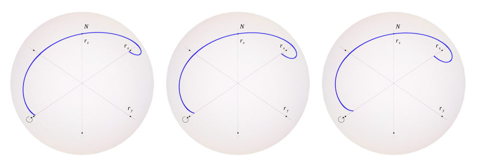 
FIG. 3. Curve Γ ⊂∂R in the Bloch ball for γ/ω = 0.1, 0.3, 0.5 from left to right. The boundary ∂R is a surface of revolution obtained by rotating Γ about the rx-axis. The curve Γ is symmetric wrt reflection (rx, ry, rz) 7→(−rx, −ry, rz)

📷 Fig 4

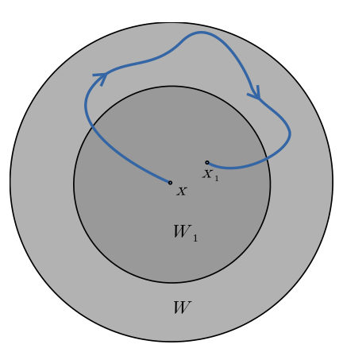 
FIG. 4. STL-local controllability

📷 Fig 5

 
FIG. 5. figure-eight curve E(φ) for α = 0.1

**Summary.** This paper analytically determines the precise boundaries governing what states can be prepared in an open qubit under coherent driving. It proves that this boundary forms a specific surface of revolution within the Bloch ball, detailing the geometric constraints imposed by dissipation. The results yield fundamental bounds on quantum control fidelity for such systems.

**Why it may be interesting.** This work provides a complete geometric characterization of controllability for an open quantum system, which is fundamental knowledge for designing robust quantum control protocols in physical implementations like superconducting qubits or cavity QED systems.

Detailed structure

**Main problem.** The paper determines the ultimate geometric limits of state preparation (the reachable set) for an open qubit subjected to coherent external driving.

**Main result.** The boundary of the reachable set is proven to be a surface of revolution around the $r_x$-axis, which is analytic except for two conical singularities. A closed-form control protocol is derived to approach any state on this boundary asymptotically.

**Method.** The analysis employs geometric control theory applied to the Bloch sphere representation of the qubit density matrix dynamics governed by a GKSL master equation.

**Model / system.** The system is an open two-level quantum system (qubit) whose evolution is described by the GKSL master equation, incorporating free Hamiltonian ($\sigma_z$), interaction ($u\sigma_x$), and dissipation terms. The state space is analyzed in Bloch ball coordinates $(r_x, r_y, r_z)$.

**Key observables.** The reachable set $\mathcal{R}$ (or $ar{R}$) within the Bloch ball; boundary points ($\partial\mathcal{R}$).

**Important parameters / regimes.** Dissipation rates ($\gamma$), coupling strengths ($\kappa$), and control field amplitudes ($u(t)$).

**Assumptions / limitations.** The analysis focuses on asymptotic reachability, meaning boundary states are only approached in the limit of infinite time.

**Figures summary.** Figures illustrate the structure of the boundary $\partial\mathcal{R}$ as a surface of revolution around $r_x$, showing intersections with preparatory surfaces like the torus-like region $T$.

**Paper structure.** The paper progresses by setting up the dynamics in Bloch coordinates, establishing that the reachable set is solid of revolution (Theorem 2), and then rigorously characterizing the boundary $\partial\mathcal{R}$ using separatrices and analytic curve descriptions (Theorem 3).

Abstract

We analytically determine the ultimate limits of state preparation in two-level open quantum systems driven by coherent control. For a dissipative qubit governed by a GKSL master equation, we give an exact characterization of the reachable set in the Bloch ball. Dissipation excludes a region of states in the Bloch ball which cannot be approached even under arbitrarily strong coherent driving, and we prove that this region has a nontrivial geometry whose boundary is a surface of revolution around the $x$-axis which is analytic except for two conical singularities. We derive a closed-form control protocol for moving on this boundary, and construct an explicit protocol that steers the system arbitrarily close to any prescribed boundary state. These results provide a complete geometric constructive description of reachable qubit states in the standard dissipative environment, establishing fundamental bounds on controllability and state-preparation fidelity for open two-level quantum systems.

[↑ back to top](#top)

### [Intermittency Signatures in the Deformation of a Passive Droplet in Active Turbulence](http://arxiv.org/abs/2607.03737v1)

**Authors:** Sudeep Halder, Abhishek Chaudhuri  
**Type:** theory · **Category:** statistical mechanics · **PDF:** <https://arxiv.org/pdf/2607.03737v1>  
**Analysis basis:** full PDF text, analyzed in chunks
**Topic relevance:** `non-equilibrium dynamics` **3/5** · `non-equilibrium universality` **3/5** · `driven-dissipative phase transition` **2/5** · `Frenkel-Kontorova` **1/5** · `Keldysh / 2PI / non-Gaussian methods` **1/5** · `correlated / nonlocal dissipation` **1/5** · `methods for driven-dissipative` **1/5**

📷 Fig 1

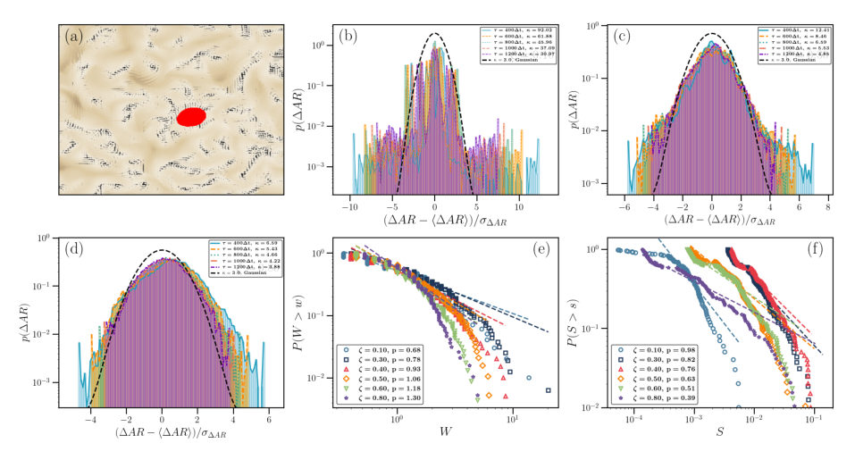 
FIG. 1. Intermittent deformation of a passive droplet. (a) Snapshot of the deformable droplet

📷 Fig 2

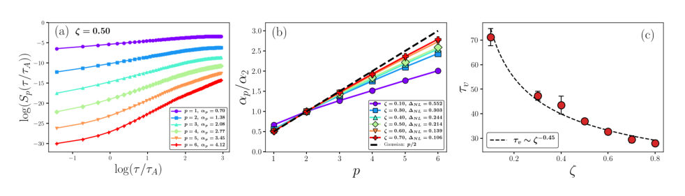 
FIG. 2. (Color online) Structure functions and multiscaling of droplet-shape increments. (a) Log–

📷 Fig 3

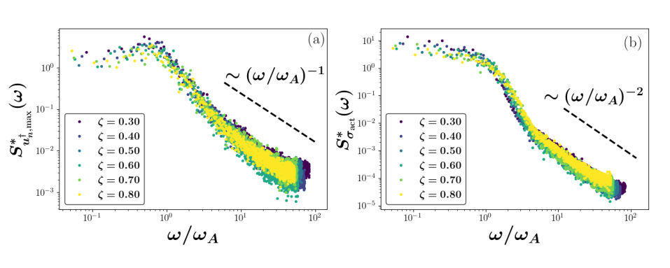 
FIG. 3. (Color online) Normalized power spectral densities versus the activity-scaled frequency

**Summary.** This work simulates a passive droplet deforming within an active nematic fluid to study the nature of fluctuations generated by active turbulence. The key finding is that the deformation exhibits strong temporal intermittency, suggesting that interfacial restoring forces filter the intense active forcing into bursty dynamics. This provides quantitative evidence for how soft inclusions reveal the underlying statistical character of complex non-equilibrium baths.

**Why it may be interesting.** While focused on soft matter hydrodynamics, the rigorous analysis of non-Gaussian statistics, heavy tails, and multiscaling structures (intermittency) provides a general framework for studying energy dissipation and fluctuation dynamics in complex, driven systems, which has parallels to non-equilibrium quantum field theories.

Detailed structure

**Main problem.** To investigate whether fluctuations generated by active turbulence are effectively Gaussian or exhibit intermittency using a deformable passive inclusion.

**Main result.** The droplet deformation exhibits strong temporal intermittency, with normalized intermittency being strongest at lower activity levels. The analysis reveals a hierarchy of intermittency where the shape is more weakly intermittent than translation or active-stress fluctuations.

**Method.** Fully resolved nematohydrodynamic simulations are used to track the time evolution and statistical properties (PDFs, structure functions) of the passive droplet's aspect ratio as it deforms in an active nematic bath.

**Model / system.** The system models a two-dimensional incompressible active nematic fluid containing a passive nematic droplet. The dynamics are governed by nematohydrodynamics incorporating active stresses ($\sigma_A$) derived from the Q-tensor, and the droplet's response is mediated by interfacial restoring forces.

**Key observables.** Droplet aspect ratio increments ($\Delta AR$), Probability Density Functions (PDFs) of these increments, structure functions ($S_p(	au)$), waiting times ($W$), burst sizes ($S$), and spectral densities for interface velocity vs. active stress.

**Important parameters / regimes.** Activity strength ($\zeta$), time lag ($	au$), and the comparison between different orders of statistical moments ($p$).

**Assumptions / limitations.** The analysis assumes the droplet possesses internal shape modes and interfacial restoring forces that allow it to filter the external active forcing over time. The simulations are limited to two dimensions (2D).

**Figures summary.** Figures show PDFs for $\Delta AR$ at various activities, CCDFs for waiting times and burst sizes exhibiting power-law tails, structure functions $S_p(	au)$ vs $	au$, and normalized Power Spectral Densities comparing interface velocity ($\omega^{-1}$) to active stress ($\omega^{-2}$).

**Paper structure.** The paper develops by first simulating the coupled nematohydrodynamics. It then analyzes statistical measures like PDFs and structure functions to quantify intermittency in the droplet's deformation. Finally, it compares spectral signatures between the interface velocity and the driving active stress.

Abstract

We use fully resolved nematohydrodynamic simulations to study deformation statistics of a passive nematic droplet in two-dimensional extensile active-nematic turbulence. We find that the droplet aspect ratio serves as a scalar probe of the active bath. Its increments show heavy-tailed distributions with dependence on the time lag, scale-free burst statistics and multiscaling structure functions which establish temporal intermittency. While the mean deformation increases with activity, normalized intermittency is strongest at lower activity. This suggests slower and more coherent bath forcing. When compared with translational and forcing-side fluctuations, it reveals a hierarchy of intermittency: shape is more weakly intermittent than translation and active-stress fluctuations, consistent with filtering by interfacial restoring forces. Power spectra show an extended near-$1/ω$ regime for the maximal normal interface velocity, distinct from the steeper, approximately $1/ω^{2}$ spectrum of the interfacial active stress. Soft inclusions thus reveal how interfacial restoring forces convert active forcing into bursty, scale-rich deformation dynamics.

[↑ back to top](#top)

### [Routing Anonymity and Identifiability of Noisy Quantum Hardware](http://arxiv.org/abs/2607.05281v1)

**Authors:** Ben Priestley, Mina Doosti  
**Type:** both · **Category:** quantum information and computing · **PDF:** <https://arxiv.org/pdf/2607.05281v1>  
**Analysis basis:** full PDF text, analyzed in chunks
**Topic relevance:** `quantum measurements` **3/5** · `QC/QI experiment` **2/5** · `measurement-induced transitions` **2/5** · `Keldysh / 2PI / non-Gaussian methods` **1/5** · `correlated / nonlocal dissipation` **1/5** · `driven-dissipative phase transition` **1/5** · `entanglement & information structure` **1/5** · `methods for driven-dissipative` **1/5**

📷 Fig 1

 
Figure 1: Illustration of the lower and upper bounds on expected distinguishing bias by circuit depth, as given by Theorem 5 and Theorem 6. The shaded region between the curves covers the perturbative range 0 ≤d ≤d0 of depths satisfying Theorem 6’s additional assumptions.

📷 Fig 2

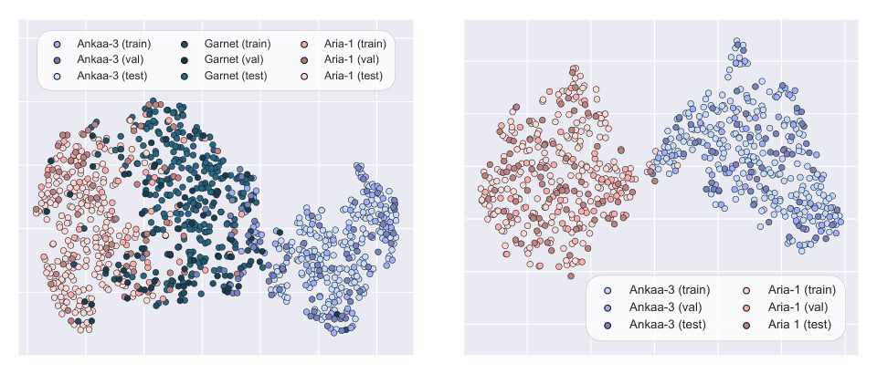 
Figure 2: t-SNE dimensionality reduction plot visualising the 16-dimensional features extracted from the penultimate layer of the classifier, given raw depth-10 data. We plot the entire dataset, across all train-val-test splits to indicate the generality with which latent representations have been learned.

📷 Fig 3

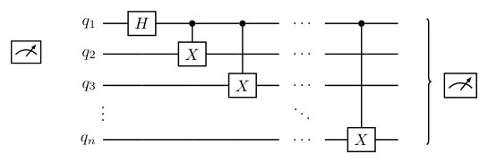 
Figure 3: Probe circuit structures used in our cloud experiments. We have: (a) brickwork circuit architecture, wherein each layer Li comprises (roughly) n/2 two-qubit unitaries, which offset-interlock with those in layers Li−1 and Li+1, randomly sampled from the unitary Haar measure, and we call such a circuit “depth d” if it has d layers L1, . . . , Ld; and (b) GHZ circuit which prepares the state |GHZn⟩= 1 √

📷 Fig 4

 
Figure 4: Example dimensionality reduction plots of quantum device feature vectors, hue by device. All features are shown via out repository, for both t-SNE and PCA reductions. In our PCA plots, the variance explained by the first two principal components (plotted) is given in parentheses.

📷 Fig 5

 
Fig. 4a demonstrates higher-dimensional clustering via t-SNE for the shallowest of the Haar-random circuit experiments, for a select few example features. It is immediately evident that like-type data points occupy similar neighbourhoods over many features, whereas differing-type data points indicate that at least a partial separation can be observed. Similarly, see Fig. 4b and Fig. 5.

**Summary.** This paper establishes 'routing anonymity' as a necessary security requirement for quantum cloud computing by analyzing how backend-specific noise fingerprints leak from noisy measurements. It develops a formal framework proving that this identifiability decays exponentially and quantifies the fundamental trade-off between hiding hardware details and maintaining data utility.

**Why it may be interesting.** It provides rigorous security metrics for practical quantum cloud usage, quantifying how much information about the underlying physical hardware can leak through measurement outcomes, which is vital for building trustworthy quantum infrastructure.

Detailed structure

**Main problem.** The work develops a formal framework for backend identifiability and introduces 'routing anonymity' as a crucial security notion for quantum cloud services.

**Main result.** Backend identifiability is shown to be equivalent to a hypothesis-testing problem, establishing an exponential decay rate for anonymity under passive access and defining a fundamental utility-anonymity trade-off.

**Method.** The authors introduce an operational backend-identifiability game and use tools from information theory (Chernoff rate) and quantum process analysis (Pauli-transfer-matrix tools).

**Model / system.** The study models cloud-based quantum computing where users submit circuits to proprietary, noisy hardware backends accessed via a service provider.

**Key observables.** Backend-specific 'fingerprints' imprinted in the classical output distribution from finite-shot measurements; classification accuracy between different physical platforms (e.g., ion-trap vs. superconducting).

**Important parameters / regimes.** The depth of the quantum circuit, the number of shots used for measurement, and the rate of information leakage.

**Assumptions / limitations.** The analysis focuses on provider-side privacy (routing anonymity) rather than just user input/output protection; results are tested against passive i.i.d. access models.

**Figures summary.** Figures illustrate high classification accuracies when distinguishing between different quantum backends and show the temporal structure of noise signals, supporting the intermediate-depth principle.

**Paper structure.** The paper first develops the theoretical framework for routing anonymity as a security notion, proves its mathematical properties (e.g., Chernoff decay), establishes the utility-anonymity trade-off, and complements this theory with extensive experiments on real quantum hardware platforms.

Abstract

Present-day quantum computing is cloud-based, where a user submits a circuit to a service provider's proprietary backend hardware. While providers may wish to hide implementation details, scheduling choices, or even which physical device was used, noisy finite-shot outputs can carry backend-specific fingerprints: information imprinted in the classical output distribution that can reveal the backend identity. So far, such fingerprints have mostly been studied from a benchmarking perspective, with limited attention to privacy considerations for users and providers. This work develops the first formal framework for backend identifiability and its privacy implications. We introduce a backend-identifiability game and use it to formalise routing anonymity as a security notion for quantum cloud services. We show that backend identifiability is a hypothesis-testing problem and prove that, under passive i.i.d. access to a single backend, routing anonymity decays exponentially at the Chernoff rate. We also establish a utility-anonymity trade-off, imposing fundamental limits on how much backend-specific information can be removed from classical outputs without degrading their usefulness. In addition, we observe that, for noisy quantum hardware, identifying fingerprints are inherently an intermediate-depth phenomenon, and establish a depth principle using Pauli-transfer-matrix tools. We complement the theory with experiments on Amazon Braket on AWS, using ion-trap and superconducting quantum processors. We observe 87-90% classification between superconducting backends and 96-100% classification across physical platforms, and find that identifiability can survive natural forms of post-processing. Overall, these results establish routing anonymity as a distinct security requirement for quantum cloud computing, and provide a framework for quantifying and controlling the utility-anonymity trade-off.

[↑ back to top](#top)

### [A Lie-Jordan Geometric Formulation of Lindblad Dynamics](http://arxiv.org/abs/2607.04052v1)

**Authors:** Leonel Bixano, Victor Alberto Cruz-Barriguete, Guillermo López-Alvarez, V. G. Ibarra-Sierra, José Luis Cardoso, Alejandro Kunold  
**Type:** theory · **Category:** other · **PDF:** <https://arxiv.org/pdf/2607.04052v1>  
**Analysis basis:** full PDF text, analyzed in chunks
**Topic relevance:** `correlated / nonlocal dissipation` **3/5** · `methods for driven-dissipative` **3/5** · `driven-dissipative phase transition` **2/5** · `Keldysh / 2PI / non-Gaussian methods` **1/5** · `non-equilibrium dynamics` **1/5** · `non-equilibrium universality` **1/5**

📷 Fig 1

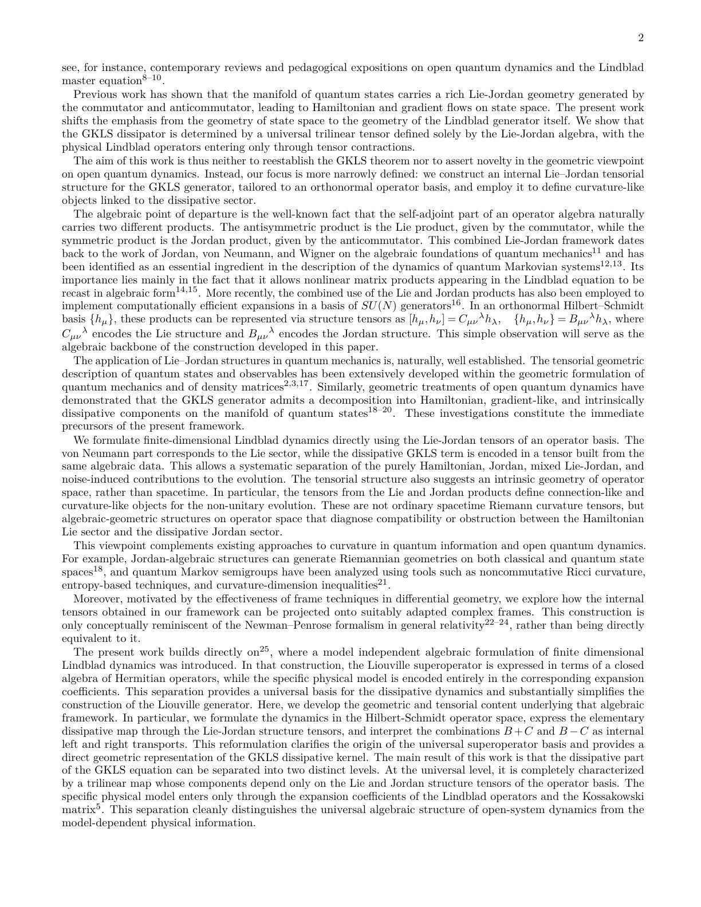 
Low-resolution page preview, page 2

📷 Fig 2

 
Low-resolution page preview, page 3

📷 Fig 3

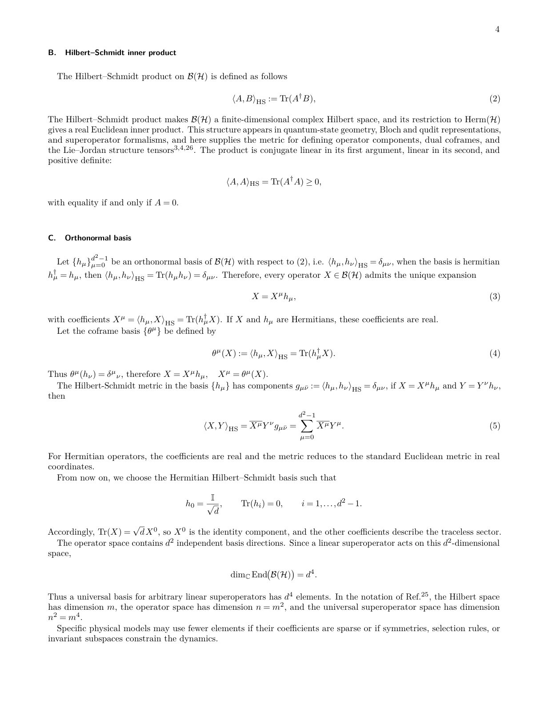 
Low-resolution page preview, page 4

📷 Fig 4

 
Low-resolution page preview, page 5

📷 Fig 5

 
Low-resolution page preview, page 6

**Summary.** This paper establishes a Lie-Jordan geometric framework to analyze the complex dynamics of open quantum systems described by the Lindblad equation. It achieves this by identifying a universal trilinear map that governs dissipation, thereby mathematically separating the general algebraic structure from the specific physical parameters (like coupling strengths). This offers a powerful, geometrically rigorous tool for analyzing decoherence processes.

**Why it may be interesting.** This work provides a deep structural understanding of open quantum evolution by mapping it onto established algebraic geometry (Lie-Jordan theory), which is highly valuable for developing systematic theories beyond standard phenomenological master equation approaches.

Detailed structure

**Main problem.** To develop a rigorous, basis-independent geometric formulation for open quantum dynamics governed by the Lindblad master equation.

**Main result.** The dissipative part of the GKLS equation is shown to be generated by a universal trilinear map, cleanly separating the model-dependent physical parameters from the underlying algebraic structure defined by Lie-Jordan tensors.

**Method.** The authors employ an algebraic approach, representing operators in a Hilbert-Schmidt basis and utilizing the inherent Lie and Jordan structures (commutator and anticommutator) to decompose the dynamics into universal tensor components.

**Model / system.** The system is general open quantum systems described by density matrices ($
ho$) evolving under the Gorini-Kossakowski-Lindblad-Sudarshan (GKLS) equation. The formalism is tested on qubits undergoing pure dephasing and amplitude damping.

**Key observables.** Trace preservation, Hermiticity of the dissipator, component representations of the evolution equations ($\dot{
ho}_\lambda$), and the structure tensors ($C_{\mu
u\lambda}, B_{\mu
u\lambda}$).

**Important parameters / regimes.** Lindblad operators ($L_\alpha$) and the Kossakowski matrix ($\gamma_{\alphaeta}$), which define the model-specific dissipation.

**Assumptions / limitations.** The dynamics are assumed to be Markovian, trace-preserving, and governed by the GKLS equation structure.

**Figures summary.** Not specified in detail, but the notes mention specific resulting real matrices for dephasing and amplitude damping channels.

**Paper structure.** The paper builds from defining the Lie-Jordan algebraic framework on the operator space to deriving a universal trilinear dissipative map. It then proves key properties like trace preservation and Hermiticity restoration before applying the formalism to concrete qubit examples, confirming the separation of universal algebra from physical input.

Abstract

We develop a Lie-Jordan geometric formulation of finite-dimensional open quantum dynamics, building on the algebraic framework introduced in our previous work (arXiv:2606.26477). The Hilbert-Schmidt operator space is endowed with an orthonormal Hermitian basis, in which the commutator and anticommutator are encoded by the structure tensors \(C_{μν}{}^λ\) and \(B_{μν}{}^λ\). Within this formulation, the von Neumann and Gorini-Kossakowski-Lindblad-Sudarshan equations admit a direct component representation. Our central result is the identification of a basis-independent universal trilinear dissipative map, \( \mathcal D(X,Y)Z=XZY-\frac12\{YX,Z\}, \) whose components define a universal operator-space tensor depending only on the Lie-Jordan structure tensors. The physical dissipator is obtained by contracting this tensor with the expansion coefficients of the Lindblad operators and the Kossakowski matrix, thereby separating the universal algebraic structure from the model-dependent physical information. We further show that the combinations \((B+C)\) and \((B-C)\) generate internal left and right transports, allowing the elementary dissipative map to be expressed as a left-right bimodule action corrected by an ordered Jordan contribution. The universal map satisfies basis-independent trace and Hermitian-conjugation identities, from which trace preservation, Hermiticity preservation of the complete dissipator, and the reality of its component representation in a Hermitian Hilbert-Schmidt basis follow. We also derive its Hilbert-Schmidt adjoint and illustrate the formalism for a qubit with pure dephasing and amplitude-damping channels. This construction provides a tensorial and affine-geometric interpretation of the universal superoperator structure derived in arXiv:2606.26477 while keeping the algebraic and model-dependent sectors explicitly separated.

[↑ back to top](#top)

### [Detection methods for optimal target reflectivity estimation with two-mode squeezed vacuum probes](http://arxiv.org/abs/2607.04021v1)

**Authors:** Harel Radia, Tuvia Gefen, Nadav Katz  
**Type:** theory · **Category:** quantum information and computing · **PDF:** <https://arxiv.org/pdf/2607.04021v1>  
**Analysis basis:** full PDF text, analyzed in chunks
**Topic relevance:** `quantum measurements` **3/5** · `entanglement & information structure` **2/5** · `measurement-induced transitions` **2/5** · `Keldysh / 2PI / non-Gaussian methods` **1/5** · `correlated / nonlocal dissipation` **1/5** · `driven-dissipative phase transition` **1/5** · `methods for driven-dissipative` **1/5**

📷 Fig 1

 
FIG. 1: Phase-space projections of the output state for nβ ≈2.32 (T ≈0.667 K at 5 GHz) and nr = 1, across various target reflectivities η. The green line indicates the vacuum state for reference. The black, blue and red lines correspond to η = 0, 0.5 and 1 respectively.

📷 Fig 2

 
Fig. 1 shows phase-space projections of the output state onto various subspaces for different values of η, and

📷 Fig 3

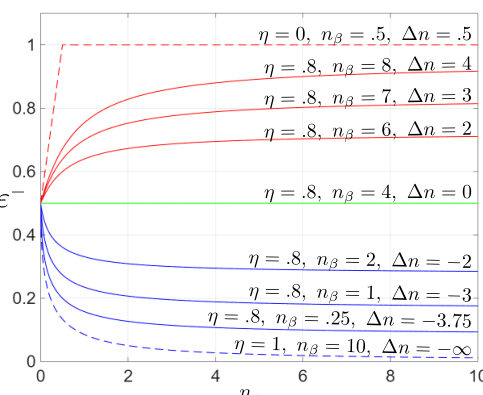 
FIG. 2: Dependence of the smallest symplectic eigen- value ε−on the squeezing parameter nr, plotted for var- ious values of the photon number difference ∆n. Solid blue curves indicate the entangled regime (∆n &lt; 0). Solid red curves correspond to the separable regime (∆n &gt; 0). For reference, the dashed curves depict the limiting cases of perfect reflection (η →1, blue) and total loss (η →0, red).

📷 Fig 4

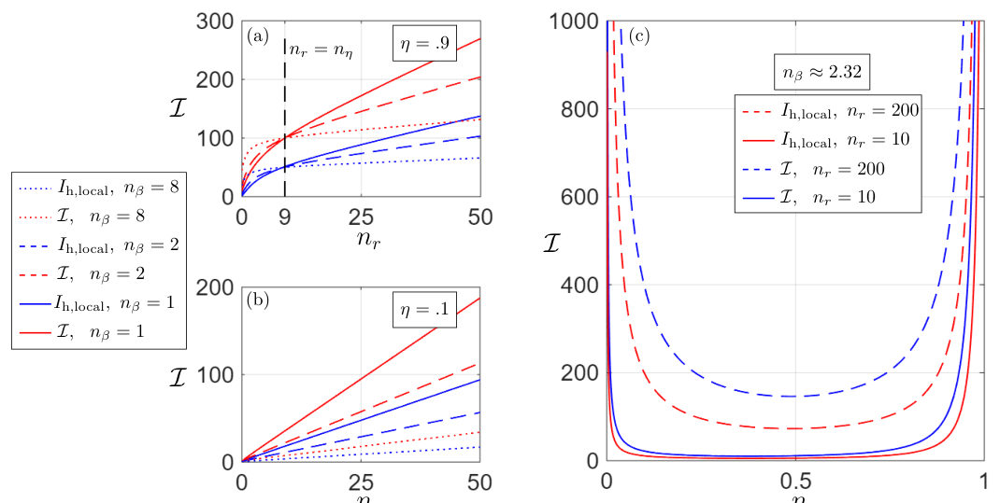 
FIG. 3: (a),(b) QFI and local homodyne FI as a function of nr, for different values of nβ, with (a) η = 0.9 and (b) η = 0.1. The dashed, black vertical line represents the crossover point of nr = nη, in which the dependence on nβ changes. (c) QFI and local homodyne FI as a function of η, for nβ ≈2.32, and different values of nr.

📷 Fig 5

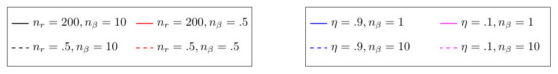 
FIG. 4: (a) The ratio R = Icoh/I as a function of reflectivity η, (b) R as a function of nr. The TMSV QFI is always larger, and thus R ≤1, where the maximal gap is at larger η. (c) R = Icoh/Ih,local as a function of reflectivity η (d) and mean photon number nr. The gray line corresponds to R = 1.

**Summary.** This paper analyzes the precision limits for estimating target reflectivity using squeezed vacuum probes. It shows that while ideal estimation requires complex measurements, suitable non-local Gaussian measurements can still achieve near-optimal performance. This provides crucial theoretical guidance for designing practical quantum sensing protocols in lossy media.

**Why it may be interesting.** This work is highly relevant for quantum optics and open quantum systems as it rigorously quantifies how non-local measurements are required to approach the fundamental quantum limit in realistic noisy environments like microwave platforms.

Detailed structure

**Main problem.** The paper investigates the theoretical limits for estimating an unknown target reflectivity parameter ($\eta$) using a Two-Mode Squeezed Vacuum (TMSV) probe.

**Main result.** Near-optimal quantum estimation is achievable even when restricted to Gaussian measurements, demonstrating structural transitions in optimal measurement strategies depending on the reflectivity regime.

**Method.** The analysis employs tools from quantum estimation theory, including the Symmetric Logarithmic Derivative (SLD) operator and comparing Quantum Fisher Information (QFI) against local homodyne detection FI.

**Model / system.** The system models a TMSV probe interacting with a target via a thermal-loss channel. The physics is described using Gaussian quantum states characterized by covariance matrices.

**Key observables.** Quantum Fisher Information (QFI), Local Homodyne Detection Fisher Information ($I_{h,	ext{local}}$), and the smallest symplectic eigenvalue ($\epsilon_{-}$) which diagnoses entanglement.

**Important parameters / regimes.** Reflectivity $\eta \in [0, 1]$, squeezing parameter $r$, thermal mean photon number $n_eta$, and the noise difference $\Delta n$.

**Assumptions / limitations.** The analysis often assumes known background noise ($n_eta$) and probe parameters ($n_r$), and compares theoretical bounds against practical Gaussian measurement restrictions.

**Figures summary.** Figures illustrate phase-space projections of the output state for varying reflectivity ($\eta$) and show how entanglement ($\epsilon_{-}$) transitions between regimes based on system parameters.

**Paper structure.** The paper progresses by first establishing the optimal measurements using SLD, then comparing QFI to local measurement FI across various asymptotic limits (high/low $\eta$), and finally calculating total FI using heterodyne/homodyne combinations.

Abstract

Target reflectivity estimation using a two-mode squeezed vacuum (TMSV) probe offers a theoretical advantage over classical schemes, but realizing this potential under the measurement constraints of microwave platforms remains a central challenge. In this work, we study the precision limits for target reflectivity estimation across different energy and loss regimes, while accounting for realistic measurement restrictions. We characterize the optimal measurements and identify a transition in their structure: above a specific reflectivity threshold, a parametric amplifier receiver is optimal, whereas below it, the optimal observables are two-mode squeezing generators. We then study the performance of Gaussian measurements. When restricted to standard local homodyne detection, the TMSV probe is highly non-optimal. However, we show that suitable non-local Gaussian measurements can closely approach the quantum Cramér-Rao bound at the large noise limit. These results demonstrate that near-optimal quantum target reflectivity estimation is achievable in various relevant noisy regimes, even under the restriction of Gaussian measurements.

[↑ back to top](#top)

### [Free energies and optimal reaction coordinates via entropy production](http://arxiv.org/abs/2607.03722v1)

**Authors:** Jérémy Diharce, Line Mouaffac, Axel Dian, Fabio Pietrucci  
**Type:** theory · **Category:** statistical mechanics · **PDF:** <https://arxiv.org/pdf/2607.03722v1>  
**Analysis basis:** full PDF text, analyzed in chunks
**Topic relevance:** `methods for driven-dissipative` **3/5** · `non-equilibrium dynamics` **2/5** · `non-equilibrium universality` **2/5** · `Keldysh / 2PI / non-Gaussian methods` **1/5** · `correlated / nonlocal dissipation` **1/5** · `driven-dissipative phase transition` **1/5** · `quantum measurements` **1/5**

📷 Fig 1

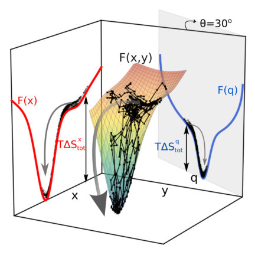 
Figure 1. Illustrative example of the connection between relaxation processes, entropy production, and free-energy dif- ferences. Several trajectories are shown, evolving on a free- energy landscape F(x, y) from an initial state (high free en- ergy) to a final state (low free energy). According to ther- modynamics, any spontaneous relaxation process entails an increase in total entropy T∆Stot = −∆F. However, when observed from the viewpoint of a generic single variable q, the free-energy drop and the entropy production appear re- duced from the true value, due to properties of the marginal probability density ρ(q) = e−βF (q)/Z, unless an optimal pro- jection coordinate (here x) is employed.

📷 Fig 2

 
Figure 2. (a) One-dimensional free energy landscape F(x) = 8(x2 −1)2 with the initial and final distributions (compared with the equilibrium density) of Langevin trajectories initi- ated at x = 0. (b) EPR estimated from the trajectories. the darker line and the shaded area represent, respectively, the mean and the standard deviation computed over 20 indepen- dent blocks of 1000 trajectories.

📷 Fig 3

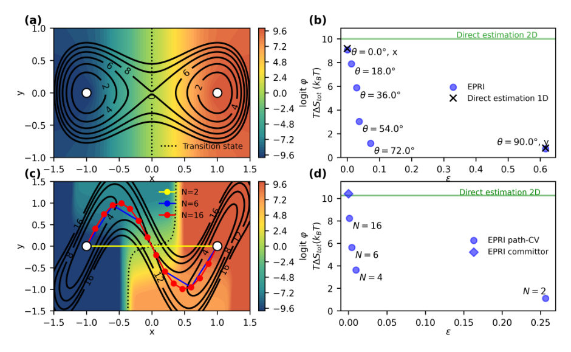 
Figure 3. (a) Double well free-energy landscape with committor φ(x, y) aligned with the x direction (see Supplemental Material for details). Free-energy isolines are in black, while the color-scale refers to the committor. (b) Total entropy production ∆Stot, estimated with the EPRI approach over 2·104 trajectories relaxing from the transition state, and distance ϵ from the committor for a set of linear CVs forming an angle θ with the x direction. Reference values, indicated by black crosses and the green line, are obtained from direct estimation of −β∆F = log(Pend/Pbegin). (c) N-shaped double well with three path-CVs of increasing number of nodes N (see Supplemental Material for details)....

📷 Fig 4

 
Figure 4. (a) Total entropy production ∆Stot of fullerene dimer association trajectories relaxing from the transition state, as observed with different coordinates (see main text for definitions), and distance ϵ of the latter from the com- mittor. Error bars are estimated using 5 blocks of trajecto- ries. Free-energy profiles from brute-force MD for three co- ordinates: (b) d, (c) sc and (d) sw. Coordinates are shifted and scaled between 0 and 1. The initial and final probabil- ity densities of the relaxation process are shown in red and blue, respectively. The free-energy drop estimated directly as −β∆F = log(Pend/Pbegin) from F(q) integration (See Sup- plemental Material for details) is...

📷 Fig 5

 
Figure 5. Measured entropy production rate of equilibrium trajectories, varying the number of points per bin Nb and the timestep ∆t. Data points represent the time average over 1500 steps of 10000 independent trajectories sampling the equilibrium ensemble of an Ornstein-Uhlenbeck process where F(q) = −q and D = 1. Because the true EPR at equilibrium is identically zero, the non-zero measured values stem entirely from finite-data bias, collapsing onto the predicted scaling law ˙Stot = 1/(Nb∆t).

**Summary.** This paper introduces a method to estimate free-energy barriers and find optimal reaction coordinates by analyzing the total entropy production ($\Delta S_{tot}$) during molecular dynamics simulations. By leveraging stochastic energetics, the authors show that $\Delta S_{tot}$ calculated from short trajectories provides an accurate measure of the free energy difference, even in complex, high-dimensional systems like nanoparticles in water.

**Why it may be interesting.** The direct connection established between the second law of thermodynamics ($\Delta S_{tot}$) and free energy landscapes provides an alternative, potentially more robust, pathway for calculating reaction barriers than traditional methods relying solely on potential energy surfaces or sampling equilibrium distributions.

Detailed structure

**Main problem.** The work aims to estimate free-energy barriers and identify optimal reaction coordinates for activated processes by calculating total entropy production ($\Delta S_{tot}$) from short molecular dynamics trajectories.

**Main result.** Calculating $\Delta S_{tot}$ via stochastic energetics provides a robust method that successfully estimates free-energy barriers, with the committor function yielding results consistent with theoretical expectations.

**Method.** The core methodology involves applying stochastic energetics to Langevin trajectories to calculate $\Delta S_{tot}$, which is related to the free energy difference ($\Delta F$) by $\Delta F = -T\Delta S_{tot}$.

**Model / system.** Benchmarks include 1D double-well potentials and 2D systems, culminating in a complex test case: carbon nanoparticles (C60) interacting with water molecules.

**Key observables.** Total entropy production ($\Delta S_{tot}$), free energy profile ($eta F(q)$), committor probability ($\phi$), and the ratio $\log(P_{end}/P_{begin})$.

**Important parameters / regimes.** Temperature (T=300 K), time step ($\Delta t$), and the relationship between entropy production and free energy barriers.

**Assumptions / limitations.** The analysis assumes the system operates in the overdamped regime, and when projecting to a single coordinate, it assumes fast equilibration of orthogonal degrees of freedom.

**Figures summary.** Figures illustrate the connection between relaxation dynamics, $\Delta S_{tot}$, and free-energy differences; they compare $\Delta S_{tot}$ estimates from various coordinates against the committor probability, confirming its optimality.

**Paper structure.** The paper progresses by establishing the theoretical link ($\Delta F = -T\Delta S_{tot}$) using stochastic energetics on simple benchmarks (1D double-well), then extending this to multi-dimensional systems and finally applying it to a complex biomolecular system like C60 in water.

Abstract

We show through theory and numerical experiments that a straightforward calculation of entropy production on short molecular dynamics trajectories allows estimating free-energy barriers and identifying optimal reaction coordinates of activated processes. To this aim, we perform an analysis based on stochastic energetics on a set of trajectories relaxing towards equilibrium from a same initial configuration, projected on different putative coordinates. After demonstrating the approach on simple benchmarks, we show that it is possible to estimate the free-energy barrier of a complex high-dimensional system (carbon nanoparticles in water) and to rank the quality of order parameters, in agreement with the committor probability. The results shed light on the entanglement between the second law, free-energy landscapes, reaction coordinates and kinetic rates.

[↑ back to top](#top)

### [The Informational Cost of Structure: Representational Complexity in Networked Dynamical Systems](http://arxiv.org/abs/2607.03608v1)

**Authors:** Cyril Rommens, Pietro Traversa, Guilherme Ferraz de Arruda, Yamir Moreno  
**Type:** theory · **Category:** statistical mechanics · **PDF:** <https://arxiv.org/pdf/2607.03608v1>  
**Analysis basis:** full PDF text, analyzed in chunks
**Topic relevance:** `entanglement & information structure` **3/5** · `analog quantum simulation` **2/5** · `non-equilibrium dynamics` **2/5** · `correlated / nonlocal dissipation` **1/5** · `correlated cavity matter` **1/5** · `driven-dissipative phase transition` **1/5** · `non-equilibrium universality` **1/5**

📷 Fig 1

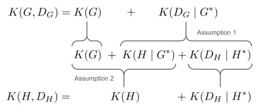 
FIG. 1. Schematic decomposition of the complexity contributions of the graph and hypergraph representations under Assump- tions 1 and 2, which place them in the equivalence regime.

**Summary.** This theoretical work quantifies the informational overhead associated with choosing a model representation (like graph vs. hypergraph) for describing dynamical systems. By using algorithmic information theory, it shows that when interactions are inherently multi-body ($k \ge 3$), forcing them into a simple pairwise structure leads to an unrecoverable loss of information and thus a higher computational cost.

**Why it may be interesting.** The concept of 'informational cost' for structure selection directly relates to identifying the minimal set of physical constraints needed to describe a complex system, which is crucial in modeling emergent behavior in many-body quantum systems or classical statistical mechanics models.

Detailed structure

**Main problem.** The paper addresses the informational cost required to represent a complex dynamical system using an explicit interaction structure (like graphs or hypergraphs) coupled with an evolution rule.

**Main result.** Representational Complexity quantifies this cost, showing that for genuinely many-body interactions ($k \ge 3$), forcing the model into a pairwise graph representation incurs a measurable and non-zero informational penalty compared to using the native hypergraph structure.

**Method.** The authors employ Algorithmic Information Theory (Kolmogorov Complexity) to define Representational Complexity, comparing description lengths between different structural models (e.g., Graph vs. Hypergraph).

**Model / system.** The analysis focuses on finite Boolean dynamical maps $F: \{0, 1\}^N 	o \{0, 1\}^N$ operating on networked systems. The comparison is drawn between pairwise interactions (graphs) and higher-order interactions (hypergraphs).

**Key observables.** Representational Complexity ($	ext{RC}$), the difference in description length ($\Delta L$) between graph and hypergraph models.

**Important parameters / regimes.** The order of interaction ($k$), system size ($N$), and the number/type of interactions ($M$).

**Assumptions / limitations.** Kolmogorov complexity is uncomputable, necessitating the use of computable description-length surrogates; equivalence results are conditional on specific structural recoverability assumptions.

**Figures summary.** The notes detail comparisons showing $\Delta L < 0$ (Graph preferred) for certain structures and $\Delta L > 0$ (Hypergraph preferred) when interactions require more than pairwise connections, such as in the clique expansion example.

**Paper structure.** The paper establishes Representational Complexity ($	ext{RC}$) as a fundamental measure. It first shows that expressiveness alone is insufficient to distinguish model types. Subsequently, it provides explicit comparisons (e.g., Graph vs. Hypergraph) demonstrating when structural assumptions lead to quantifiable informational overhead.

Abstract

How much information is required to represent a dynamical system in terms of an interaction structure and an evolution rule? We address this question using algorithmic information theory. We introduce Representational Complexity, the excess description length of a structure-plus-rule model relative to the shortest possible description of the dynamics itself. This intrinsic description defines a universal lower bound: no exact structural representation can be more concise. If arbitrary rules are allowed, graphs, hypergraphs, and other formalisms can all reach this bound by shifting information between structure and dynamics, so expressiveness alone cannot distinguish them. Meaningful differences arise only when scientific modeling restricts the admissible structures and rules. Within this setting, we identify conditions under which graph and hypergraph descriptions are informationally equivalent, and show how graph-preferred, hypergraph-preferred, and mixed regimes can emerge when those conditions are relaxed. Because Kolmogorov complexity is not computable, we complement the formal results with explicit description-length estimates. Our framework reframes the choice of network representation as a question of informational cost and mechanistic transparency rather than universal expressive power.

[↑ back to top](#top)

### [The Reweighting Principle in Statistical Mechanics](http://arxiv.org/abs/2607.03867v1)

**Authors:** Salvatore Romano  
**Type:** theory · **Category:** statistical mechanics · **PDF:** <https://arxiv.org/pdf/2607.03867v1>  
**Analysis basis:** full PDF text, analyzed in chunks
**Topic relevance:** `entanglement & information structure` **3/5** · `non-equilibrium dynamics` **2/5** · `non-equilibrium universality` **2/5** · `Keldysh / 2PI / non-Gaussian methods` **1/5** · `correlated / nonlocal dissipation` **1/5** · `driven-dissipative phase transition` **1/5** · `methods for driven-dissipative` **1/5**

📷 Fig 1

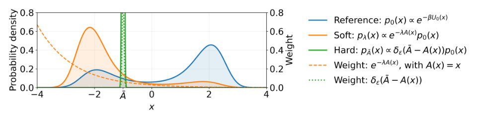 
Figure 1: Schematic illustration of soft and hard reweighting. Exponential tilting (orange) modifies the reference ensemble (blue) smoothly through an exponential weight, while conditioning (green) selects a finite-resolution macrostate associated with a prescribed value of the observable. These two operations provide the probabilistic prototype for canonical and microcanonical constructions, respectively.

**Summary.** This paper unifies statistical mechanics by showing that both canonical and microcanonical ensembles can be derived from the principle of minimum relative entropy. It treats soft constraints (exponential tilting) and hard constraints (conditioning) as mathematically related processes within an enlarged probability space. This framework provides a powerful, information-theoretic lens to understand ensemble equivalence in the thermodynamic limit.

**Why it may be interesting.** The deep connection between information theory (relative entropy) and fundamental statistical ensembles provides a powerful, unified perspective applicable to understanding non-equilibrium dynamics via path integrals.

Detailed structure

**Main problem.** To develop a unified probabilistic framework for statistical mechanics that connects conditioning, exponential tilting, and general ensemble transformations.

**Main result.** The paper shows that both the canonical (soft constraint) and microcanonical (hard constraint) ensembles arise naturally from minimizing the relative entropy with respect to a common structural prior.

**Method.** It employs information-theoretic tools, specifically minimum relative entropy minimization, applied in an enlarged probability space construction.

**Model / system.** The study concerns statistical ensembles defined on a general probability space, comparing soft constraints (exponential tilting) to hard constraints (conditioning) via the observable A(x).

**Key observables.** Gibbs entropy, Boltzmann entropy, relative entropy, and free energy potentials.

**Important parameters / regimes.** The Lagrange multiplier $\lambda$ controlling the constraint strength; the thermodynamic limit ($N 	o \infty$).

**Assumptions / limitations.** The analysis relies on treating observables as explicit variables in an enlarged space, and the equivalence of ensembles is shown via concentration of measure in the large-system limit.

**Figures summary.** Figures schematically illustrate the difference between smooth exponential tilting (soft constraint) and state selection (hard constraint), while tables summarize the mathematical forms and resulting ensembles for both types of constraints.

**Paper structure.** The paper builds from defining reweighting principles, showing how soft constraints yield canonical structures via relative entropy minimization, then introducing hard constraints yielding microcanonical structures. It unifies these by analyzing them in an enlarged space and demonstrating their equivalence in the thermodynamic limit, finally extending the framework to path space.

Abstract

Reweighting of probability measures provides a unifying perspective on conditioning, exponential tilting, and, more generally, ensemble transformations in statistical mechanics. We show that exponential tilting and conditioning arise as the minimum-relative-entropy updates associated with soft and hard constraints, respectively. Their relative entropies naturally inherit complementary thermodynamic structures: exponential tilting gives rise to the Legendre structure of the canonical ensemble and reduces to the Gibbs entropy for a uniform reference measure, while conditioning reduces to the Boltzmann entropy through the surprisal of the constrained macrostate. By introducing an enlarged probability space in which observables are treated as explicit variables, we further show that microcanonical and canonical ensembles arise as conditional and marginal distributions of a common structural prior after exponential reweighting. In the thermodynamic limit, described through large deviation theory, conditioning emerges from exponential tilting by concentration of measure, revealing ensemble equivalence as a consequence of entropy--bias competition. Finally, we outline how the same information-theoretic framework naturally extends to path space, suggesting a unified probabilistic description of equilibrium thermodynamics and conditioned stochastic dynamics.

[↑ back to top](#top)

### [Analytic properties of cross-click operators in passive multi-basis photodetection: monotonicity, exact convergence rates, and dimension reduction for quantum key distribution](http://arxiv.org/abs/2607.04186v1)

**Authors:** Zhangdong Ye  
**Type:** theory · **Category:** quantum information and computing · **PDF:** <https://arxiv.org/pdf/2607.04186v1>  
**Analysis basis:** full PDF text, analyzed in chunks
**Topic relevance:** `quantum measurements` **3/5** · `measurement-induced transitions` **2/5** · `Keldysh / 2PI / non-Gaussian methods` **1/5** · `correlated / nonlocal dissipation` **1/5** · `driven-dissipative phase transition` **1/5** · `entanglement & information structure` **1/5** · `methods for driven-dissipative` **1/5**

📷 Fig 1

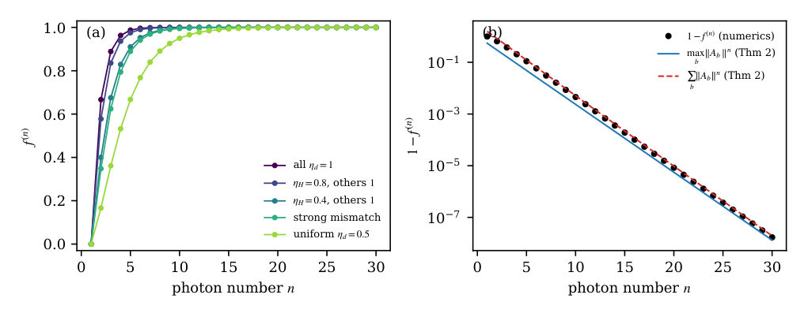 
FIG. 2. (a) Minimum eigenvalue f (n) of the cross-click operator of the balanced passive six-state analyzer on the n-photon sector, for several detector-efficiency configurations, computed exactly by the symmetric-power algorithm of Sec. V. All curves are monotone, as guaranteed by Theorem 1; for ideal detectors the curve is exactly f (n) = 1 −31−n (Corollary 1). (b) Convergence 1−f (n) for the strongly mismatched configuration ⃗η = (0.9, 0.75, 1.0, 0.6, 0.85, 0.7) on a logarithmic scale, together with the two-sided bounds of Theorem 2. The exact values are squeezed between maxb∥Ab∥n and P

📷 Fig 2

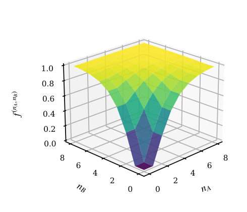 
FIG. 3. Joint minimum eigenvalue f (nA,nB) for two different mismatched six-state analyzers, evaluated from the exact fac- torization of Theorem 3, 1−f (nA,nB) = (1−f (nA) A )(1−f (nB) B ). The surface reproduces the structure obtained by direct nu- merical diagonalization in Ref. [25], including the exact coin- cidence of the nB = 0 and nB = 1 slices.

**Summary.** This paper analytically characterizes the behavior of cross-click operators essential for bounding multiphoton contributions in QKD security proofs. By showing these operators are related to second quantization structures, the authors derive monotonicity and exact exponential convergence rates. These results replace complex Fock-space numerics with general formulas applicable to any passive linear-optical analyzer.

**Why it may be interesting.** This work provides rigorous, closed-form analytical tools to analyze fundamental security limitations in quantum communication protocols that previously required computationally intensive numerical simulations.

Detailed structure

**Main problem.** The paper aims to provide a sharp analytic characterization of cross-click operators used in security analyses for Quantum Key Distribution (QKD) when using realistic, lossy photodetection detectors.

**Main result.** It establishes monotonicity ($f^{(n+1)}\ge f^{(n)}$), derives two-sided exponential bounds determining the exact asymptotic convergence rate, and provides an exact factorization for joint cross-click operators.

**Method.** The core method involves relating the 'silence' operator to the second quantization of an explicit single-photon contraction, allowing the derivation of spectral properties from finite-dimensional matrix inequalities.

**Model / system.** The system models passive multi-basis photodetection using linear optics followed by threshold detectors characterized by arbitrary efficiencies and dark counts. The analysis is performed on the infinite-dimensional Fock space.

**Key observables.** Cross-click operators (POVM elements), minimum eigenvalue $f^{(n)}$ of the cross-click operator on the $n$-photon subspace, and joint surface $f(n_A, n_B)$.

**Important parameters / regimes.** Detector efficiencies ($\eta_d$), dark-count probabilities ($\epsilon_d$), and the number of photons ($n$).

**Assumptions / limitations.** The results assume independent dark counts and uncorrelated detection efficiencies; they are derived for any passive analyzer structure.

**Figures summary.** Figure 1 illustrates a running example using a six-state polarization analyzer. Figure 2 shows $f(n)$ under varying efficiency mismatches, while Figure 3 displays the joint surface $f(n_A, n_B)$ as an exact formula.

**Paper structure.** The paper builds from defining the cross-click operator using POVMs to establishing structural theorems: first proving monotonicity (Theorem 1), then deriving two-sided exponential bounds and the convergence rate (Theorem 2), followed by specific results for ideal detectors and joint operators (Corollaries/Theorem 3).

Abstract

Cross-click operators, the POVM elements for simultaneous clicks in detectors assigned to different measurement bases, are used in QKD and entanglement-verification analyses with realistic threshold detectors to bound multiphoton contributions. Earlier applications verified the needed growth of the minimum eigenvalue $f^{(n)}$ on the $n$-photon subspace only numerically over finite sectors. This work gives an analytic characterization for passive linear-optical analyzers with arbitrary efficiency mismatch and dark counts. The key observation is that every silence operator is the second quantization $Γ(A)$ of an explicit single-photon contraction $A$, whose $n$-photon restriction is $A^{\otimes n}$ on $\mathrm{Sym}^n$. This yields: (i) monotonicity $f^{(n+1)}\ge f^{(n)}$; (ii) two-sided exponential bounds $\max_b γ_b|A_b|^n \le 1-f^{(n)} \le \sum_b γ_b|A_b|^n$, which determine the exact asymptotic convergence rate from single-photon spectral data; (iii) for ideal detectors and $n\ge1$, the exact formula $f^{(n)}=1-\sum_b p_b^n$; and (iv) an exact factorization $1-f^{(n_A,n_B)}=(1-f_A^{(n_A)})(1-f_B^{(n_B)})$ for the two-party cross-click operator. The results apply to polarization, time-bin, and spatial-mode analyzers within the stated threshold-detector model. As an application, we obtain closed-form photon-number weight bounds used in detection-efficiency-mismatch analyses, replacing finite-sector Fock-space numerics by formulas valid for all photon numbers.

[↑ back to top](#top)

### [Hall Coefficient Sign Reversal Driven by Orbital-Selective Oxygen-Vacancy Scattering in Nickelate Films](http://arxiv.org/abs/2607.04122v1)

**Authors:** Jian-Jian Miao, Yue Liu, Yue Zhao, Yichen Hua, Changming Yue, Wei-Qiang Chen  
**Type:** theory · **Category:** strongly correlated electrons · **PDF:** <https://arxiv.org/pdf/2607.04122v1>  
**Analysis basis:** full PDF text, analyzed in chunks
**Topic relevance:** `Keldysh / 2PI / non-Gaussian methods` **3/5** · `Kondo & dissipative impurity` **2/5** · `non-equilibrium dynamics` **2/5** · `correlated / nonlocal dissipation` **1/5** · `driven-dissipative phase transition` **1/5** · `methods for driven-dissipative` **1/5**

📷 Fig 1

 
FIG. 1. Quasiparticle Fermi surface colored by the relative dx2−y2 orbital weight P x = 1 −2W x.

📷 Fig 2

 
FIG. 2. Rigid-band RH as a function of nvac and µ.

📷 Fig 3

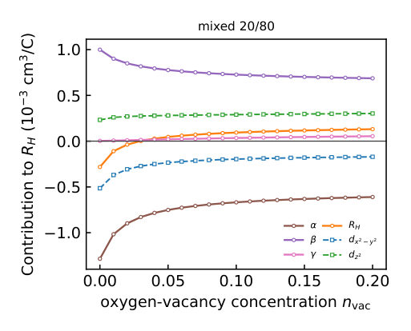 
FIG. 4. Pocket-resolved (solid lines) and orbital-selective (dashed lines) contributions to RH for the mixed 20/80 distribution, with τ0 = 50 fs.

📷 Fig 4

 
FIG. 3. RH as a function of nvac for five oxygen-vacancy distributions, with τ0 = 50 fs. A mixed distribution a/b denotes a% inner-apical and b% in-plane oxygen vacancies.

📷 Fig 5

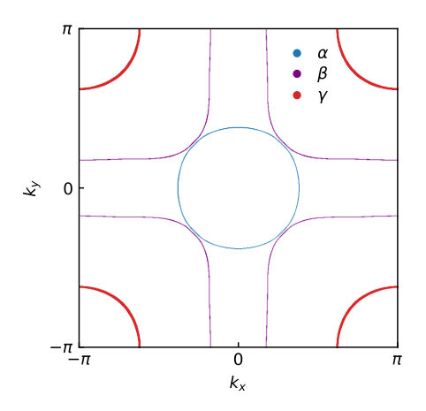 
FIG. 5. Numerical pocket assignment on the 2048 × 2048 k mesh. Blue, magenta, and red points denote the α, β, and γ pockets, respectively.

**Summary.** This theoretical study explains the anomalous sign reversal of the Hall coefficient in nickelate superconductors. The authors combine sophisticated correlated electron modeling with a Boltzmann transport approach to show that this effect arises not from simple doping, but from orbital-selective scattering caused by oxygen vacancies. This work provides a crucial microscopic understanding of stoichiometry dependence in these complex materials.

**Why it may be interesting.** While focused on nickelates, the methodology—combining correlated electron models (DFT+CDMFT) with detailed impurity scattering theory within a transport framework—provides advanced techniques for analyzing how disorder affects electronic transport in strongly correlated materials.

Detailed structure

**Main problem.** The study aims to microscopically explain the sign reversal observed in the Hall coefficient ($R_H$) measured in superconducting bilayer nickelate films.

**Main result.** The sign reversal is attributed to orbital-selective scattering caused by oxygen vacancies, specifically showing that in-plane vacancies selectively suppress the $d_{x^2-y^2}$ orbital contribution, driving $R_H$ through zero.

**Method.** A semi-classical Boltzmann transport framework is employed, incorporating a T-matrix treatment of oxygen-vacancy scattering potentials derived from DFT+CDMFT correlated multi-orbital quasiparticle models.

**Model / system.** The system is superconducting bilayer nickelate films modeled using a correlated multi-orbital quasiparticle Hamiltonian. The analysis separates doping effects from impurity-scattering effects due to oxygen vacancies (inner-apical and in-plane).

**Key observables.** Hall coefficient ($R_H$), pocket-resolved contributions ($	ext{R}_{	ext{u}}	ext{H}$), and orbital-selective transport components.

**Important parameters / regimes.** Oxygen vacancy concentration ($n_{	ext{vac}}$), chemical potential ($\mu$), and the relative scattering strength of different vacancy types (in-plane vs. inner-apical).

**Assumptions / limitations.** The analysis uses a T-matrix approach for scattering, solves the Boltzmann equation using the scalar relaxation-time approximation, and treats vacancies as active scattering centers rather than just dopants.

**Figures summary.** Figures illustrate the Fermi surface pockets ($\alpha, eta, \gamma$) colored by orbital weight; plots show $R_H$ vs. vacancy concentration demonstrating sign reversal driven by in-plane defects; other figures detail the dependence of $R_H$ on scattering time and doping.

**Paper structure.** The paper establishes the problem (unexplained $R_H$ sign reversal), develops a theoretical framework combining DFT+CDMFT with Boltzmann transport, calculates pocket-resolved and orbital-selective contributions, and finally attributes the sign change to specific vacancy scattering mechanisms.

Abstract

Hall measurements in superconducting bilayer nickelate films show sign reversals that cannot be explained by rigid-band electron doping alone. We combine a DFT+CDMFT-derived correlated multi-orbital quasiparticle model with a $T$-matrix treatment of oxygen-vacancy scattering in a semiclassical Boltzmann transport framework. We find that multiband compensation is insufficient by itself: in-plane vacancies selectively suppress the transport channel dominated by the $d_{x^2-y^2}$ orbital and drive $R_H$ through zero, whereas inner-apical vacancies make $R_H$ more negative. These results identify pocket-resolved and orbital-selective oxygen-vacancy scattering as the microscopic origin of the Hall coefficient sign reversal and provide a framework for oxygen-stoichiometry-dependent transport in nickelate films.

[↑ back to top](#top)

### [Nucleation and time-reversal symmetry breaking in nonconserved scalar field theories](http://arxiv.org/abs/2607.05194v1)

**Authors:** Noah Ziethen, Michalis Chatzittofi, Michael E. Cates, Cesare Nardini  
**Type:** theory · **Category:** statistical mechanics · **PDF:** <https://arxiv.org/pdf/2607.05194v1>  
**Analysis basis:** full PDF text, analyzed in chunks
**Topic relevance:** `non-equilibrium dynamics` **3/5** · `non-equilibrium universality` **3/5** · `Keldysh / 2PI / non-Gaussian methods` **1/5** · `correlated / nonlocal dissipation` **1/5** · `driven-dissipative phase transition` **1/5** · `methods for driven-dissipative` **1/5**

📷 Fig 1

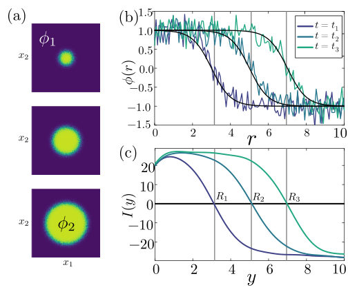 
FIG. 1. (a) Nucleation of a two-dimensional spherical droplet; after reaching the critical radius, the ϕ2 phase invades the re- mainder by a deterministic relaxation. (b) Shape of the den- sity profile as a function of the radial coordinate (coloured lines) while the black solid lines correspond to the determin- istic (T = 0) φ(r) profiles. (c) Plot of I(y) defined in Eq. (5); The root I(R) = 0 defines the radius R of the droplet.

📷 Fig 2

 
FIG. 2. (a) The velocity of one-dimensional interface (v0) as a function of h, λ obtained from numerical integration of AMA via a pseudo-spectral method. For the simulations the number of points for space discretization is Nx = 1024, domain length L = 16π and dt = 10−3. The grey line corresponds to the perturbative result h = −4λ/15 for h, λ ≪1 [see Eq. (51)]. The solid black line is where the interface is static. (b) The normalized mobility of the interface along the static line in (a). (c) Numerical comparison of vψ 0 and vφ0 0 for h = 0.25, found via a pseudo-spectral method. (d) Example plot of the potential f(ϕ) for h = 0.1. At large enough λ, stability is reversed so that the globally...

📷 Fig 3

 
FIG. 3. Mobility (a) and quasi-potential (b) for the popula- tion dynamics model variants. The colored lines correspond to the solutions from the full profile φ0 (from evaluating nu- merically Eq. (14) in panel (a) and Eq. (15) in panel (b)) and the dashed lines from perturbation theory in small s−2/3. To obtain the continuum lines, the profile φ0 was found by nu- merically solving Eq. (63) with a simple explicit Euler scheme for T = 0. The quasi-potentials are evaluated for s = 0.65 and we considered D0 = 10−3 throughout.

📷 Fig 4

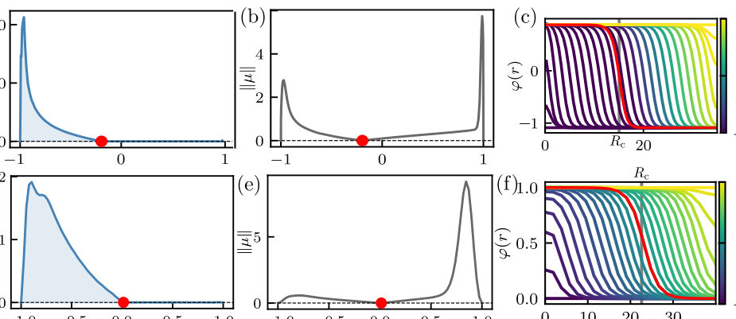 
FIG. 4. Minimum action path for Active Model A (top row) and Population dynamics model with D = D(i)(ϕ)(bottom row) from a Ritz method based on [77]. (a, d) Lagrangian L(t) along the minimum action path. The red dots mark the saddles, where L(t) first vanishes. (b, e) Absolute value of the radially weighted drift ||µ|| (see Eq. 77) along the minimal action path, where the zero drift corresponds to the saddle. (c, f) Radial order parameter field φ(r) along minimal action path. The red lines correspond to the respective saddles where the drift vanishes. The vertical lines correspond to the extracted critical radii Rc. Parameters for AMA are λ = −1.033, h = 0.2 and for the population dynamics...

📷 Fig 5

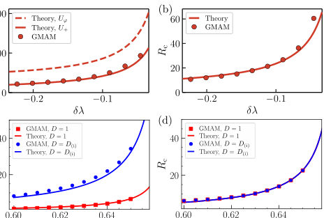 
FIG. 5. (a)-(b) Quasipotential barrier heights and critical radii obtained by numerical action minimization for AMA (dots) and the corresponding NNT prediction (solid line). The dashed line shows the prediction from the TRR ansatz. Data is shown for fixed h = 0.2 and varying λ = λ∗(h) + δλ where λ∗(0.2) = −0.8768. (c)-(d) Results on population dy- namics, the solid line shows our NNT predictions, and the red squares are the results from the numerical minimization. Re- sults for the equilibrium case, D(ϕ) = 1, and for D = D(i)(ϕ), are both shown. Numerical parameters as in Fig. 4 and D0 = 10−2.

**Summary.** This paper develops Nonequilibrium Nucleation Theory (NNT) to describe phase transitions in fluctuating, non-conserved field theories beyond the scope of classical theory. It rigorously derives the dynamics by comparing stochastic projection methods with action minimization techniques. The work establishes a systematic framework for calculating nucleation rates in complex systems like active matter, emphasizing when and how time-reversal symmetry breaks down.

**Why it may be interesting.** While focused on classical statistical mechanics, the rigorous treatment of non-equilibrium fluctuations and rare events using path integrals and large deviation theory has methodological overlaps with open quantum systems where dissipation and noise are key. The systematic framework for deriving effective potentials in non-equilibrium settings is valuable.

Detailed structure

**Main problem.** The work aims to provide a full, rigorous account of Nonequilibrium Nucleation Theory (NNT), generalizing Classical Nucleation Theory (CNT) for systems where the order parameter is non-conserved.

**Main result.** NNT provides a systematic framework that correctly predicts the quasipotential barrier in non-equilibrium settings, differing from assumptions based on time-reversal symmetry. The theory was successfully validated against numerical simulations for active matter and population dynamics models.

**Method.** The authors employ two equivalent derivations: projecting the stochastic field equation onto the reaction coordinate (stochastic route) and minimizing the Freidlin-Wentzell action (action route).

**Model / system.** The theory applies to nonconserved scalar field theories, modeled by stochastic differential equations $\partial_t \phi = -\mu[\phi] + \sqrt{D(\phi)}\xi$. Examples include Active Model A and population dynamics models.

**Key observables.** Nucleation rate ($P$), quasipotential barrier height, critical radius ($R_c$), and the droplet radius ($R$) acting as the reaction coordinate.

**Important parameters / regimes.** Noise strength ($T$), mobility ($M(R)$), and the functional form of the drift ($\mu[\phi]$) and noise amplitude ($D(\phi)$).

**Assumptions / limitations.** The primary assumption is that a careful definition of the reaction coordinate allows for an analytical derivation, although it explicitly notes that assuming time-reversal symmetry (TRR) can lead to incorrect results for mobility and quasipotential in non-equilibrium cases.

**Figures summary.** Figure 1 illustrates nucleation dynamics, showing droplet formation, density profiles versus radial coordinates, and the functional integral used to define the critical radius $R$.

**Paper structure.** The paper first introduces NNT as a generalization of CNT. It then presents two derivations for the droplet dynamics (stochastic vs. action minimization), highlighting discrepancies when TRR is assumed. Finally, it applies the theory to concrete examples like Active Model A and population dynamics models.

Abstract

Classical nucleation theory (CNT) describes the formation of a stable phase from a metastable one in terms of a single reaction coordinate that corresponds to the radius of a nucleating droplet. In this work, we provide a full account of nonequilibrium nucleation theory (NNT), which generalizes CNT to non-equilibrium field theories with non-conserved order parameter. We present two equivalent derivations of the dynamics of the droplet radius: a stochastic route, based on a direct projection of the stochastic field equation onto the radial reaction coordinate, and a route based on the minimization of the Freidlin-Wentzell action. Crucially, the quasipotential barrier predicted by NNT differs from the one found when assuming the instanton to be the time-reversal of the relaxation dynamics. Whereas the interfacial density profile differs from that on the relaxation path, an analytical derivation of NNT remains possible using a careful definition of the reaction coordinate. This leverages the perturbative structure that (in common with CNT) emerges in the limit of large critical radius. We further derive with similar techniques the dynamics of capillary waves, whose stability is required for the CNT/NNT precept of a near-spherical droplet to prevail. After deriving our theory for generic non-conserved field-theories, we address two explicit examples: a non-equilibrium generalization of Model A (Active Model A), and a population dynamics model (with two choices of noise that each break time-reversal symmetry). In both cases, we validate our analytical NNT against numerical results obtained by action minimization, with excellent agreement. NNT provide a systematic framework for constructing nucleation theories in a broad class of non-equilibrium systems from active matter, reaction-diffusion systems and population dynamics.

[↑ back to top](#top)

### [Effective Field Theory of Noncritical M-theory from Bosonization](http://arxiv.org/abs/2607.05143v1)

**Authors:** Patrick Jefferson, Tokiro Numasawa  
**Type:** theory · **Category:** strongly correlated electrons · **PDF:** <https://arxiv.org/pdf/2607.05143v1>  
**Analysis basis:** full PDF text, analyzed in chunks
**Topic relevance:** `Keldysh / 2PI / non-Gaussian methods` **3/5** · `analog quantum simulation` **2/5** · `Kondo & dissipative impurity` **1/5** · `entanglement & information structure` **1/5** · `methods for driven-dissipative` **1/5** · `non-equilibrium dynamics` **1/5**

📷 Fig 1

 
Figure 1: The double scaling limit (2.2) effectively “zooms in” on the quadratic maximum of the potential in (2.1), in the process scaling away other non-universal features while holding fixed the renormalized Fermi level −µ. The figure on the right depicts the inverted harmonic oscillator potential, which is the universal potential that remains after taking the double-scaling limit. In both figures, the shaded region is the filled Fermi sea, with its boundary corresponding to the static Fermi surface (2.4).

📷 Fig 2

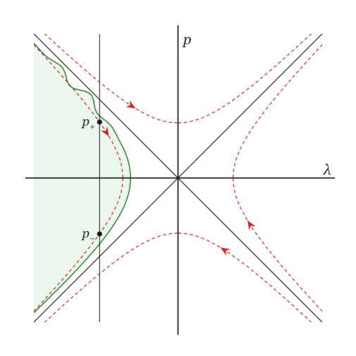 
Figure 2: The shaded region is the filled c = 1 string Fermi sea. We can label the state of the Fermi sea in terms of the upper and lower surfaces p±(t, λ), which are indicated for a definite value of λ as an illustration. This is essentially a duplicate of Figure 25 in [20].

📷 Fig 3

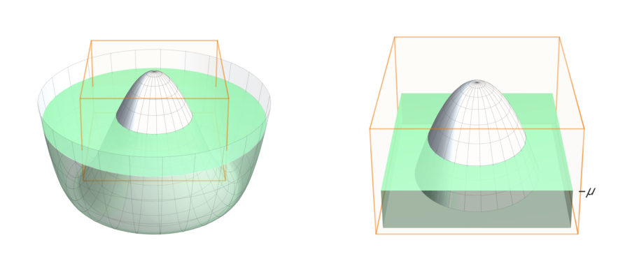 
Figure 3: The double scaling limit of noncritical M-theory is analogous to the double scaling limit of the c = 1 matrix model (compare to Figure 1). The Fermi sea is again filled up to a Fermi level −µ, but in this case the single particle dispersion is given by a two-dimensional rotationally-symmetric inverted harmonic oscillator potential. In the above images, the shaded region is the filled Fermi sea, with the image on the right illustrating the universal potential that survives the double-scaling limit.

📷 Fig 4

 
Figure 5: Comparison between the exact resolvent and its saddle-point approximation. The left panel shows the case p = 0.001, while the right panel corresponds to p = 1. The parameters are chosen as θ = π/20 and µ = 1. The qualitative behavior remains unchanged for sufficiently small |θ| and arbitrary µ.

📷 Fig 5

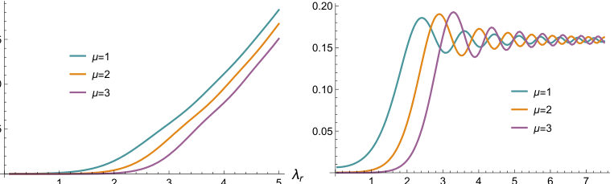 
Figure 6: Representative plots of the exact density one-point function. The left panel shows the density ρ, while the right panel shows its derivative with respect to the Fermi energy, −∂ρ/∂µ.

**Summary.** This paper develops an effective field theory for noncritical M-theory by applying advanced bosonization techniques to the system's underlying free fermion description. The authors demonstrate that their derived bosonic action correctly reproduces key physical observables, such as density correlation functions, in the semiclassical limit. This work provides a theoretical bridge between microscopic quantum many-body physics and emergent spacetime gravity descriptions.

**Why it may be interesting.** The methodology—using bosonization techniques derived from geometric/coadjoint orbit approaches to study strongly interacting quantum systems (Fermi liquids)—is highly relevant for understanding emergent field theories in condensed matter physics beyond simple mean-field treatments.

Detailed structure

**Main problem.** The central problem is constructing an effective spacetime gravity description for noncritical M-theory by relating its exact microscopic definition (free fermions) to a continuum field theory.

**Main result.** The coadjoint-orbit bosonization method successfully reproduces known results in lower dimensions and shows that correlation functions calculated via the bosonic effective theory agree with semiclassical limits of the exact Fermi liquid calculations.

**Method.** The authors extend the coadjoint orbit approach to bosonize double-scaled non-relativistic Fermi liquids, comparing this result against established matrix model descriptions and calculating density correlation functions perturbatively.

**Model / system.** The primary system is Noncritical M-theory, modeled in 2+1 dimensions as a double-scaled nonrelativistic free fermion system or Fermi liquid. This serves as an analog to understanding string vacua.

**Key observables.** Fermion density correlation functions (one-, two-, and three-point functions) for both eigenvalue and light-cone density operators.

**Important parameters / regimes.** The dimensionality (1+1d vs 2+1d), the double-scaling limit, and the semiclassical regime are crucial parameters/limits explored.

**Assumptions / limitations.** The analysis relies on extending the coadjoint orbit approach and assumes that the effective theory captures the physics of the exact Fermi liquid in the semiclassical limit. The connection to a precise 3D gravitational bulk remains an open question.

**Figures summary.** Figure 1 illustrates the double scaling limit zooming into the quadratic maximum potential, showing the filled Fermi sea boundary corresponding to the static Fermi surface. Figure 11 compares exact and saddle point approximations of the resolvent.

**Paper structure.** The paper builds by first establishing results in 1+1d (reproducing Das-Jevicki theory) before tackling the 2+1d noncritical M-theory case. It utilizes advanced techniques like coadjoint orbit methods, calculating correlation functions, and analyzing the resolvent via saddle-point approximations.

Abstract

We extend the coadjoint orbit approach to bosonization systematized by Delacretaz-Du-Mehta-Son to double-scaled non-relativistic Fermi liquids with central inverted harmonic oscillator potential. In 1+1d, this reproduces the Das-Jevicki collective field theory describing quasiparticle excitations of the $c=1$ matrix model. In 2+1d, this yields an effective field theory for noncritical M-theory, namely the 2+1d Fermi liquid proposed by Hořava and Keeler as a unified framework for characterizing noncritical string vacua. With a suitable gauge choice this theory reduces to a continuous family of 1+1d chiral bosons resembling Das-Jevicki collective fields coupled by additional interactions. Utilizing the underlying integrability of noncritical M-theory, we compute select fermion density correlation functions order-by-order in perturbation theory, and provide evidence that they agree with their Fermi liquid counterparts in a suitable semiclassical limit. This represents a step toward an effective spacetime gravity description of noncritical M-theory, which we expect to shed light on both the landscape of 2d noncritical strings and 3d quantum gravity in general.

[↑ back to top](#top)

### [Speed limits on biomolecular processes from fundamental physical constants](http://arxiv.org/abs/2607.04549v1)

**Authors:** Dmitrii E Makarov  
**Type:** theory · **Category:** statistical mechanics · **PDF:** <https://arxiv.org/pdf/2607.04549v1>  
**Analysis basis:** full PDF text, analyzed in chunks
**Topic relevance:** `non-equilibrium dynamics` **3/5** · `non-equilibrium universality` **2/5** · `Keldysh / 2PI / non-Gaussian methods` **1/5** · `correlated / nonlocal dissipation` **1/5** · `driven-dissipative phase transition` **1/5** · `methods for driven-dissipative` **1/5**

📷 Fig 1

 
Figure 1. Kramers’ model of a chemical reaction

**Summary.** This paper investigates the theoretical speed limits governing life processes, such as chemical reactions and protein folding. It uses advanced statistical mechanical tools like Kramers' theory to relate these rates to fundamental physical constants. The work highlights how anthropic arguments constrain molecular dynamics by linking kinetic timescales to universal ratios.

**Why it may be interesting.** It bridges concepts from open quantum systems (dissipation via Langevin equation) and non-equilibrium statistical mechanics (rate theories), providing concrete examples where fundamental constants dictate biological feasibility.

Detailed structure

**Main problem.** The paper examines fundamental physical constraints that set speed limits on various biomolecular processes, such as chemical reaction rates and protein folding kinetics.

**Main result.** It establishes relationships between characteristic timescales (e.g., diffusion time vs. kinetic time) governed by the Arrhenius ratio, suggesting deep connections between molecular dynamics and fundamental constants.

**Method.** The analysis combines classical statistical mechanics tools like the Langevin equation and Kramers' theory with quantum-mechanical rate estimates derived from transition state theory.

**Model / system.** The models include elementary chemical reactions in solution (governed by Arrhenius law) and protein folding/diffusion, which is treated as a random coil undergoing Brownian motion in conformational space.

**Key observables.** Reaction rates ($
u$), characteristic timescales ($	au_{Ey}, 	au_{vel}, 	au_{diff}$), and the dimensionless Arrhenius ratio ($A$).

**Important parameters / regimes.** Fundamental constants like $\hbar, k_B$, temperature $T$, molecular dimensions ($R, a$), and friction coefficients ($\gamma$).

**Assumptions / limitations.** Key approximations include using Stokes' formula for friction and assuming the validity of Kramers theory across different damping regimes.

**Paper structure.** The paper progresses by first analyzing simple chemical reactions using Eyring/Kramers estimates, then extending this framework to macromolecular dynamics like protein folding, culminating in a discussion of how anthropic constraints tie these physical limits together.

Abstract

Many of the timescales of life have speed limits set by quantum-mechanical constraints along with non-fundamental quantities, such as the temperature of the environment, which are however bounded by anthropic considerations. Here, some of such speed limits are examined, including those for the rates of elementary chemical reactions and biomolecular folding. Limitations of simple back-of-envelope estimates are also discussed.

[↑ back to top](#top)

### [A Unified Electrostatic-to-Spin Framework for Asymmetric Multi-Gate CMOS Quantum Devices](http://arxiv.org/abs/2607.04876v1)

**Authors:** Zeheng Wang, Yan Liu, Yue Hao, Genquan Han  
**Type:** theory · **Category:** quantum information and computing · **PDF:** <https://arxiv.org/pdf/2607.04876v1>  
**Analysis basis:** full PDF text, analyzed in chunks
**Topic relevance:** `exotic spin models in light-matter` **3/5** · `spintronics-quantum-optics interface` **3/5** · `Keldysh / 2PI / non-Gaussian methods` **1/5** · `analog quantum simulation` **1/5**

📷 Fig 1

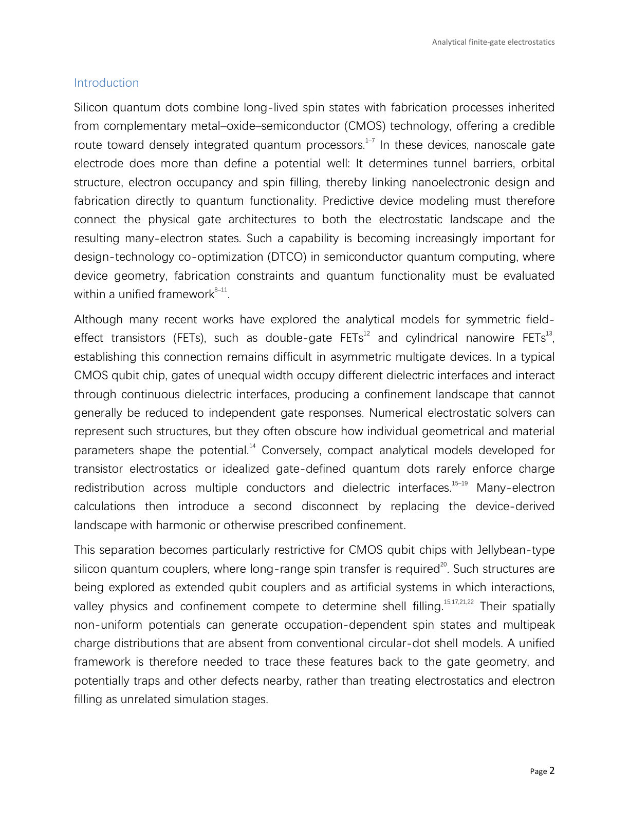 
Low-resolution page preview, page 2

📷 Fig 2

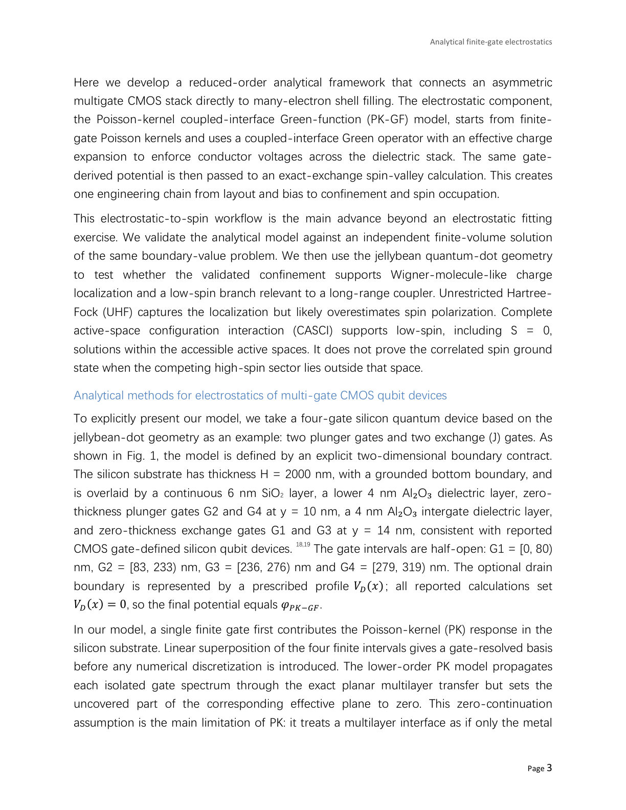 
Low-resolution page preview, page 3

📷 Fig 3

 
Low-resolution page preview, page 4

📷 Fig 4

 
Low-resolution page preview, page 5

📷 Fig 5

 
Low-resolution page preview, page 6

**Summary.** The paper introduces an end-to-end analytical framework that models electron behavior in advanced CMOS quantum dots. It first solves the complex electrostatics using a novel PK-GF model, validating it against finite-volume methods. This potential then drives many-body calculations (UHF/CASCI) to predict spin and charge localization, providing a vital tool for designing solid-state qubits.

**Why it may be interesting.** This work provides a crucial, auditable theoretical bridge connecting semiconductor device engineering (CMOS layout) directly to the quantum mechanical properties required for qubit operation, which is highly relevant for solid-state quantum computing architectures.

Detailed structure

**Main problem.** The primary challenge is developing a unified model that connects lithographic CMOS geometry, device electrostatics, and many-electron spin filling in advanced quantum dot qubits.

**Main result.** The developed PK-GF framework successfully links the physical layout to quantum observables, showing CASCI supports low-spin states consistent with experimental expectations for qubit design.

**Method.** The work combines a reduced-order analytical electrostatic model (PK-GF) validated against finite-volume solutions, which then feeds into advanced many-body calculations using UHF and CASCI methods.

**Model / system.** The system is an asymmetric multi-gate silicon quantum dot ('jellybean' geometry) fabricated in a CMOS structure. The Hamiltonian is solved by first determining the gate-derived confinement potential via the PK-GF model, which then governs the spin-valley many-body physics.

**Key observables.** Electron occupancy, charge localization (Wigner-molecule-like), ground state spin ($S=0$), and the interaction-to-level-spacing ratio ($R$).

**Important parameters / regimes.** Gate voltages (millivolt scale), magnetic field ($B=5 	ext{ T}$), electron number ($N=2-17$).

**Assumptions / limitations.** The PK-GF model assumes a coupled boundary system for charge redistribution; UHF is noted to likely overestimate spin polarization, and CASCI convergence requires careful active space selection.

**Figures summary.** Figures illustrate the comparison between electrostatic models (PK vs. PK-GF vs. FV) and show diagnostics like charge density lobes, correlation functions, and energy spectra comparing UHF predictions against correlated CASCI results.

**Paper structure.** The paper progresses by first establishing the robust electrostatic framework ($	ext{CMOS layout} 	o 	ext{Electrostatics}$ using $	ext{PK-GF}$). This potential is then passed to the many-body physics calculation ($	ext{Potential} 	o 	ext{Quantum Observables}$) using UHF and CASCI, culminating in a full end-to-end workflow demonstration.

Abstract

In advanced complementary metal-oxide-semiconductor (CMOS) quantum chips, compact gate stacks make it difficult to connect lithographic geometry, electrostatic confinement and many-electron spin filling in one transparent model. This connection is central to design-technology co-optimization (DTCO). Here we develop a reduced-order analytical framework for asymmetric multigate silicon quantum-dot devices. Its electrostatic core, the Poisson-kernel coupled-interface Green-function (PK-GF) model, agrees with an independent finite-volume solution at the millivolt scale for the matched two-dimensional problem, without fitting to that solution. We then pass the gate-derived confinement, rather than a harmonic or fitted potential, to a spin-valley many-body calculation for a jellybean quantum dot with N = 2-17 electrons at B = 5 T. The unrestricted Hartree-Fock (UHF) solution supports occupation-dependent, Wigner-molecule-like charge localization but likely overestimates spin polarization. Complete active-space configuration interaction (CASCI) supports a low-spin branch within the tested active spaces, which aligns with the experiments. The workflow therefore connects CMOS layout, device electrostatics, and potential-determined quantum observables, providing an auditable modelling layer for CMOS-based qubit design and DTCO.

[↑ back to top](#top)

### [From the Hong-Ou-Mandel Effect to Quantum Sensing: Interference of Nonclassical Light with Partial Distinguishability and Noise](http://arxiv.org/abs/2607.03636v1)

**Authors:** Matheus Eiji Ohno Bezerra  
**Type:** theory · **Category:** quantum information and computing · **PDF:** <https://arxiv.org/pdf/2607.03636v1>  
**Analysis basis:** full PDF text, analyzed in chunks
**Topic relevance:** `interference shaping light` **3/5** · `Keldysh / 2PI / non-Gaussian methods` **1/5** · `correlated / nonlocal dissipation` **1/5** · `driven-dissipative phase transition` **1/5** · `methods for driven-dissipative` **1/5**

📷 Fig 1

 
Figure 2.1: Representation of the construction of a M-mode interferometer in terms of el- ements of linear optics: beamsplitters (blue) and phase shifters (red). Indeed, the entire interferometer is represented by a matrix that is an element of the group U(M), while the elements are matrices belonging to the groups SU(2) and U(1) respectively.

📷 Fig 2

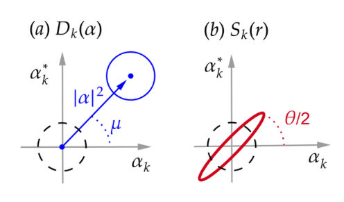 
Figure 2.2: Illustration of the operators acting on the phase space (a) Displacement operator ˆDk(αk), defined in Eq. (2.68), (b) Single-mode squeezing ˆSk(r), defined in Eq. (2.81).

📷 Fig 3

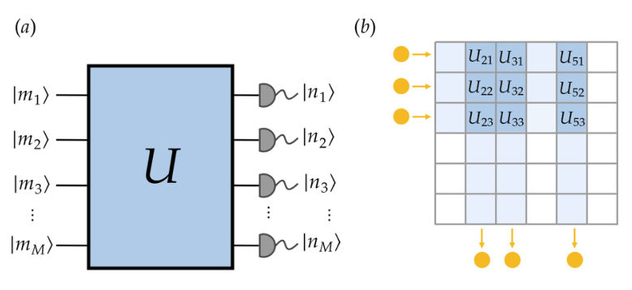 
Figure 3.1: (a) Illustration of the scheme for the interference of N photons prepared in the input Fock state |m⟩a, with m = (m1, . . . , mM), and detected in the output Fock state |n⟩b, with n = (n1, . . . , nM), after interference at the multiport U. (b) Example of three-photon interference in a six-mode interferometer: the photons are prepared in the input configuration m3 = (1, 1, 1, 0, 0, 0) and detected in the output configuration n3 = (0, 1, 1, 0, 1, 0). The associated input and output mode label vectors are k = (1, 2, 3) and l = (2, 3, 5), respectively, where Ulk denotes the transition amplitude from input mode k to output mode l, as defined in Eq. (2.45).

📷 Fig 4

 
Figure 3.2: Schematic representation of the two interferometers used to illustrate the proposed method: a) Beamsplitter, that transforms two input modes into two output modes; b) Tritter, that is a composition of three different beamsplitters B1, B2, B3 and a control phase shifter φ. Here, each mk denotes the number of photons prepared in the input mode k and nl denotes the number of photons detected in the output mode l.

📷 Fig 5

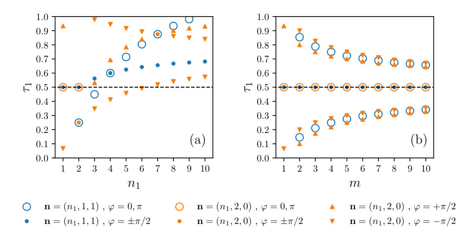 
Figure 3.3: Suppression laws for the tritter T(τ1, φ) defined in Eq. (3.33). In both graphs is shown value of the transmissivity τ1 that suppresses the corresponding amplitudes. Panel (a) presents the suppression laws for the amplitudes b⟨n1, nS|n1, 1, 1⟩a = 0 while panel (b) presents the suppression laws for the amplitudes b⟨n1, nS|m, m, m⟩a = 0.

**Summary.** This thesis analyzes how nonclassical light interference, exemplified by the Hong-Ou-Mandel effect, behaves when subjected to partial photon distinguishability and environmental noise. Using advanced mathematical tools in phase space, it derives new suppression laws for Fock states and extends Gaussian Boson Sampling theory. The findings establish fundamental limits on quantum sensing precision even when optimizing state preparation.

**Why it may be interesting.** This work directly tackles the robustness of fundamental quantum optical phenomena against realistic imperfections like distinguishability and noise, which is crucial for building scalable quantum sensors and computing architectures.

Detailed structure

**Main problem.** The study investigates how quantum interference of nonclassical light (Fock and Gaussian states) is affected by realistic noise sources, specifically partial distinguishability and photon loss.

**Main result.** New suppression laws are identified for multi-photon Fock states, and the analysis shows that while probe incompatibility can vanish under optimal conditions, measurement incompatibility remains a fundamental constraint at high photon numbers.

**Method.** The research employs the phase-space formalism and develops analytical tools using generating functions to describe quantum optical interference in a unified manner.

**Model / system.** The system models light interference within linear interferometers, utilizing Fock states (multi-photon quanta) and Gaussian states. The underlying physics is derived from quantizing the electromagnetic field in a finite volume.

**Key observables.** Interference patterns, zero probability events (suppression laws), Quantum Fisher Information for estimation, and visibility of interference effects.

**Important parameters / regimes.** Photon distinguishability, photon number ($n$), phase shift ($\phi$), and loss rates ($\gamma$).

**Assumptions / limitations.** The analysis assumes the use of nonclassical light states (Fock/Gaussian) and models noise through partial distinguishability and losses in linear interferometers.

**Paper structure.** The thesis structure progresses from foundational quantum optics concepts (like HOM interference for Fock states) to extensions involving Gaussian Boson Sampling with partial distinguishability, culminating in an examination of joint multiparameter estimation (phase and loss).

Abstract

This thesis explores the interference of nonclassical states of light, particularly Fock and Gaussian states, in noisy linear interferometers, with applications to quantum information and quantum sensing. Using the phase-space formalism, analytical tools based on generating functions are developed to describe quantum optical interference in a unified way. For multiphoton Fock states, new zero probability events (suppression laws) are identified beyond the previously derived symmetry permutation principle, revealing rich interference structures that is degraded with photon distinguishability. For Gaussian states, the Hafnian-based description of Gaussian Boson Sampling is extended to include partial distinguishability via the overlap matrix of the internal state of the photons. Finally, the link between these interference effects and quantum multiparameter estimation is examined for the simultaneous estimation of phase and loss. This study shows that while probe incompatibility can vanish for optimized non-Gaussian states and some two-mode Gaussian states, at high photon number, measurement incompatibility remains a fundamental constraint even in this limit.

[↑ back to top](#top)

### [Universal fluctuations of first discoveries in competitive exploration](http://arxiv.org/abs/2607.04252v1)

**Authors:** Arthur Plaud, P. L. Krapivsky, S. Redner, Olivier Bénichou  
**Type:** theory · **Category:** statistical mechanics · **PDF:** <https://arxiv.org/pdf/2607.04252v1>  
**Analysis basis:** full PDF text, analyzed in chunks
**Topic relevance:** `non-equilibrium universality` **3/5** · `non-equilibrium dynamics` **2/5** · `Keldysh / 2PI / non-Gaussian methods` **1/5** · `driven-dissipative phase transition` **1/5**

📷 Fig 1

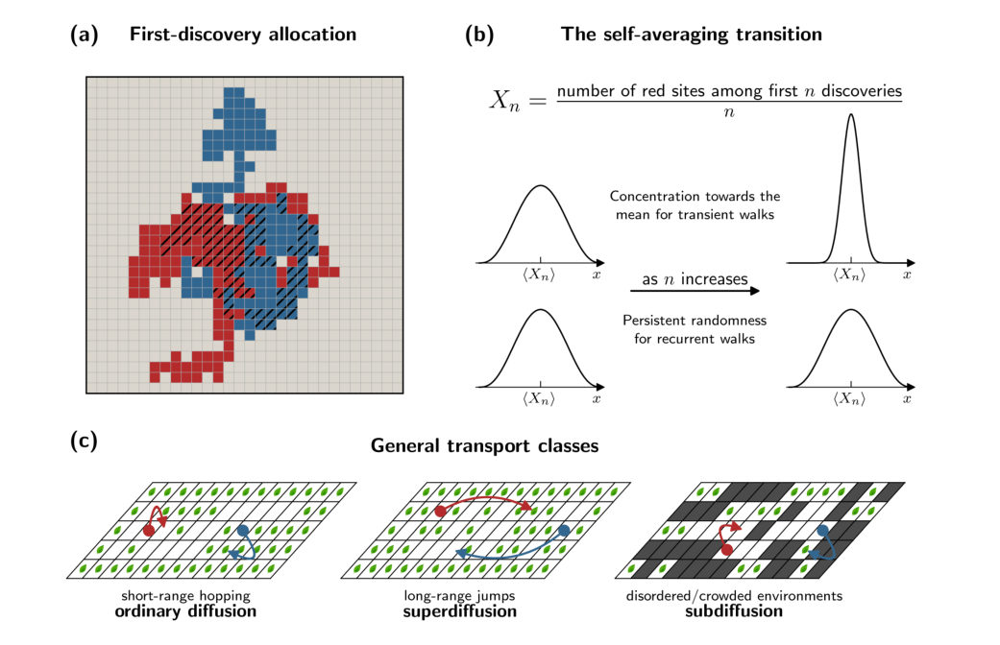 
FIG. 1. Competitive exploration requires a missing observable. a, First-discovery allocation. Two identical searchers explore a landscape in which each site initially carries one unclaimed resource. Grey sites are undiscovered; coloured sites have been discovered and are labelled by the searcher that reached them first; hatched sites have been visited by both searchers. Classical observables measure collective coverage or geometric interference, but not which searcher secured each discovery. b, Self-averaging transition. We tag one searcher and set Ik = 1 if the k-th collective discovery is secured by this tagged searcher, and Ik = 0 otherwise. The discovery share Xn = n−1 Pn k=1 Ik has...

📷 Fig 2

 
FIG. 2. First-discovery label correlations underlie the discovery-share fluctuation phase diagram. a, Discovery-share fluctuation regimes. The spectral dimension ds, defined by the on-site decay p0(t) ∼t−ds/2, separates persistent randomness (ds &lt; 2), anomalously slow non-Gaussian concentration (2 ≤ds &lt; 3), and Gaussian concentration (ds ≥3), with logarithmic corrections at ds = 3. b, Discovery-share variance. Simulations for two identical searchers on a one-dimensional lattice with a general symmetric jump law (simulation details given in the SI) confirm Eq. (4): non-zero limiting variance for ds &lt; 2, anomalous decay for 2 &lt; ds &lt; 3, and 1/n Gaussian decay for ds &gt; 3. c, Discovery-label...

📷 Fig 3

 
FIG. 3. Site-discovery order shapes broad recurrent fluctuations. In recurrent exploration, discovery-label correlations prevent self-averaging, but the limiting law also depends on the spatial order in which sites are discovered. a, Deterministic versus random site-discovery order. The black dot marks the starting point. Red and blue sites are first discovered by the two competitors, respectively. In the one-sided geometry, the first n collective discoveries are necessarily the sites 1, . . . , n, so the spatial order of discovery is deterministic. In the symmetric geometry, discoveries can occur on either side of the origin, and the left-right order of discovered sites is random. b,...

📷 Fig 4

 
FIG. 4. Discovery-share fluctuation regimes persist beyond the minimal model. Numerical simulations of representative extensions show that the fluctuation structure predicted by the analytical framework is robust to changes in microscopic dynamics, geometry and competitive setting. The simulations use one-dimensional heavy-tailed jump processes in panels a and b, simple diffusion on fractal substrates in panel c, and fractional Brownian motion in panel d. Small schematics in the panels illustrate the corresponding extension. a, Unequal mobilities. When the two competitors have unequal mobilities, here implemented by different jump scales, the mean discovery share is shifted away from 1/2;...

**Summary.** This work develops a general fluctuation theory for competitive exploration by analyzing the 'discovery share' of two searchers. The key finding links the persistence of early advantages to the spectral dimension ($d_s$) of the underlying random walk medium. A critical threshold at $d_s=2$ separates regimes where initial imbalances are erased from those where they persist.

**Why it may be interesting.** While focused on random walks, the concept of 'memory' and how local advantages (first arrival) are erased or persist over time is highly relevant to non-equilibrium dynamics in complex systems, such as pattern formation or resource competition modeled using stochastic processes.

Detailed structure

**Main problem.** The paper investigates the universal fluctuations of the 'discovery share' ($X_n$)—the fraction of first discoveries secured by a tagged searcher—in competitive exploration.

**Main result.** The persistence of early competitive advantages depends critically on the spectral dimension ($d_s$): $d_s < 2$ implies persistent randomness, while $d_s \ge 2$ leads to concentration towards an equal split ($\langle X_n 
angle = 1/2$).

**Method.** The analysis uses asymptotic methods based on the spectral dimension ($d_s$), which characterizes the large-time decay of single-walker return probabilities, leading to distinct scaling laws for the variance $	ext{Var}(X_n)$.

**Model / system.** The model involves two identical searchers competitively exploring a landscape (random walk). The dynamics are analyzed across various media characterized by their spectral dimension ($d_s$), including ordinary diffusion, superdiffusion, and subdiffusion.

**Key observables.** Discovery Share ($X_n$), $	ext{Var}(X_n)$, two-point correlations of first-discovery labels ($	ext{Cov}(I_k, I_{k+\ell})$), and the spectral dimension ($d_s$).

**Important parameters / regimes.** Spectral Dimension ($d_s$); critical thresholds at $d_s=2$ (the self-averaging threshold) and $d_s=3$.

**Assumptions / limitations.** The analysis assumes Markovian searchers and initially focuses on two identical competitors, though the theory is shown to generalize.

**Figures summary.** Figures illustrate the transition from persistent randomness ($d_s < 2$) to concentration towards $1/2$ ($d_s \ge 2$), showing how the spectral dimension governs this phase structure across different diffusion regimes.

**Paper structure.** The paper establishes the definition of the discovery share and introduces the role of the spectral dimension. It then derives the asymptotic variance laws for various $d_s$ regimes, analyzes the memory mechanism via two-point correlations, and concludes by generalizing these fluctuation theories to other physical parameters.

Abstract

Random exploration is usually quantified by how fast new space is found, from   the range of a single walker to the territory collectively covered by many   walkers. In competitive exploration, first arrival secures an exclusive resource, as when foragers compete for food items or agents capture distributed targets. It is then no longer enough to know which sites have been discovered: one must determine, for each discovered site, which searcher reached it first. We introduce the discovery   share $X_n$, the fraction of the first $n$ collective discoveries secured by   a tagged searcher. For two identical competitors, exchange symmetry fixes   $\langle X_n\rangle=1/2$, but the central question is whether this equal   split emerges in each long exploration history or only on average, \emph{i.e.} whether early   competitive advantages are erased or persist. Here we show that the answer is   controlled by the spectral dimension $d_s$, defined by the large-time decay of the probability that a single searcher is at   its starting point after $t$ steps, $p_0(t)\sim t^{-d_s/2}$.   Across ordinary diffusion, long-range superdiffusion and subdiffusion induced   by crowding or memory, $d_s$ separates persistent randomness in   recurrent exploration $(d_s<2)$, anomalously slow non-Gaussian concentration   for $2\le d_s<3$, and Gaussian concentration, logarithmically corrected at   $d_s=3$, for $d_s\ge3$. For $d_s\ge2$, we derive exact asymptotic   variances, including prefactors, and the discovery scale on which competitive   imbalances are erased. Two-point correlations of first-discovery labels identify the memory mechanism behind these regimes.   The same phase structure persists under changes in geometry, competitor   heterogeneity, number of competitors and memory, revealing a general fluctuation   theory of first-arrival inequalities.

[↑ back to top](#top)

### [Algebra of quantum mechanics \textit{via} classical phonons. II: Klein-Gordon dynamics, the Heisenberg formalism, the Dirac canonical commutation rule and the Poincaré algebra through the continuous Poisson bracket formalism](http://arxiv.org/abs/2607.03909v1)

**Authors:** Emmanuel Giner  
**Type:** theory · **Category:** other · **PDF:** <https://arxiv.org/pdf/2607.03909v1>  
**Analysis basis:** full PDF text, analyzed in chunks
**Topic relevance:** `Frenkel-Kontorova` **3/5** · `Keldysh / 2PI / non-Gaussian methods` **1/5** · `analog quantum simulation` **1/5** · `non-equilibrium dynamics` **1/5**

📷 Fig 1

 
FIG. 1. Pictorial representation of the Frenkel-Kontorova model used here: un(t) is the real number representing the transverse displacement, Kn the ”on-site” harmonic force and K the ”between-site” harmonic force.

**Summary.** This paper develops an advanced formalism showing how relativistic quantum mechanics can be derived from a purely classical phonon model using continuous Poisson brackets. By mapping these classical structures onto quantum commutators, the authors establish a deep mathematical equivalence between the Heisenberg picture and classical phase space dynamics. This framework successfully recovers fundamental symmetries like the Poincaré algebra.

**Why it may be interesting.** This work provides a powerful mathematical framework for deriving fundamental symmetries (like Poincaré invariance) directly from classical field theories through canonical quantization procedures generalized via Poisson brackets.

Detailed structure

**Main problem.** The paper aims to establish a rigorous mathematical link between classical mechanics (via phonon models) and relativistic quantum mechanics by utilizing the continuous Poisson bracket formalism.

**Main result.** It demonstrates that the structure of classical Poisson brackets can be shown to be strictly equivalent to the commutators of Hermitian operators, successfully recovering the Poincaré algebra for 1+1 dimensions.

**Method.** The methodology involves defining dynamics using classical Hamiltonian formalisms on a phonon model, followed by a non-local complex change of variables to map real-valued Poisson brackets onto quantum commutators.

**Model / system.** The primary system is a purely classical phonon model (related to the Frenkel-Kontorova lattice) used as an analogue for deriving relativistic dynamics for a single spinless particle, leading to Klein-Gordon field equations in the continuum limit.

**Key observables.** Classical observables, quantum expectation values, Poisson brackets $\{F, G\}$, and Poincaré group generators ($	ilde{P}_0, 	ilde{P}_1, K$).

**Important parameters / regimes.** The analysis explores limits such as the non-relativistic limit ($c 	o \infty$) and the continuum limit ($N 	o \infty$), which are crucial for connecting discrete lattice models to field theories.

**Assumptions / limitations.** The derivation relies on a specific, non-local complex change of variables to bridge the gap between real-valued classical functionals and complex quantum operators.

**Figures summary.** Figure 1 illustrates the physical setup of the Frenkel-Kontorova model showing displacements and forces. Table I summarizes various field variables (discreteness/continuity) used throughout the analysis.

**Paper structure.** The paper progresses from establishing non-relativistic QM recovery in Part I, to focusing on relativistic Klein-Gordon dynamics using Poisson brackets in Part II, then proving the equivalence between Poisson brackets and commutators in Part V, culminating in the derivation of the Poincaré algebra structure in Part VI.

Abstract

In the first part of this series we have shown how the Schrodinger equation for a single particle and the corresponding non relativistic quantum observables can be obtained from a purely classical phonon model through the Newtonian equations of motion. In this work we focus instead on how the classical Hamiltonian formalism applied to the same phonon system allows to recover the feature of relativistic quantum mechanics for a single spinless particle. Using the classical nature of the phonon model, we naturally define continuous Poisson brackets between classical observables, which allows to recover the dynamics of such observables, i.e. the Ehrenfest relations associated to real-valued Klein-Gordon fields. The Poisson brackets also permits to obtain the generic form of constants of motions, thus generalizing the concept of inner products and momentum on Klein-Gordon fields. We then connect the formalism of real-valued classical functionals with that of hermitian operators and complex-valued wave functions. This is done through the introduction of a non-local complex-valued change of variables which allows to rewrite the real-valued Klein-Gordon equation in a form akin to the Schrodinger equation, and the classical observables as quantum expectation values. Then, we show how this change of variables allows to rewrite the classical Poisson brackets as commutators of hermitian operators. This points out the strict equivalence between the Heisenberg formalism and the formalism of classical Poisson bracket. Eventually, we illustrate how the Poisson brackets allows to recover the transformations of Poincaré group in 1+1 dimension together with its algebra. The latter makes the link between the Lorentz invariant inner product of Mostafazadeh and the Casimir invariant associated to the mass of particle.

[↑ back to top](#top)

### [Cuprate d-wave superconductivity based on Non perturbative many body theory for spin fluctuation](http://arxiv.org/abs/2607.04168v1)

**Authors:** Jianwei Gong, Junnian Xiong, Ruitao Xiao, Hui Li, Ziyu Li, Huaqing Huang, Dingping Li  
**Type:** theory · **Category:** strongly correlated electrons · **PDF:** <https://arxiv.org/pdf/2607.04168v1>  
**Analysis basis:** full PDF text, analyzed in chunks
**Topic relevance:** `Keldysh / 2PI / non-Gaussian methods` **3/5** · `analog quantum simulation` **1/5** · `exotic spin models in light-matter` **1/5** · `methods for driven-dissipative` **1/5**

📷 Fig 1

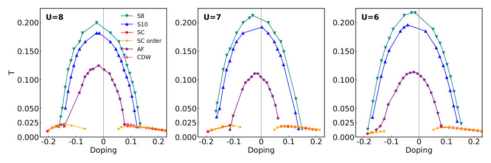 
FIG. 1: Numerical phase diagram of the Hubbard model for different interaction strengths U with fixed next-nearest-neighbor hopping t′ = −0.25 and lattice size 32 × 32. SC order: stable boundary with ∆d ̸= 0; SC: divergence boundary of χd(0, 0, 0); S8/S10: contours of χs(QAF, 0) = 8, 10; AF: onset of antiferromagnetic order; CDW: divergence of χc(QCDW, 0).

📷 Fig 2

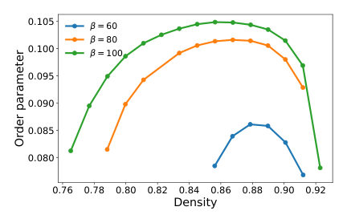 
FIG. 2: Magnitude of the d-wave superconducting order parameter |∆d| as a function of doping density in the hole-doped region for t′ = −0.25, U = 8, and lattice size N = 32 × 32 at various temperatures.

📷 Fig 3

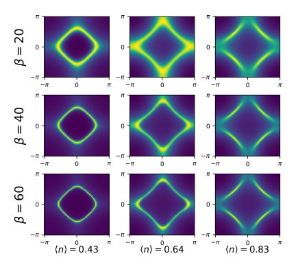 
FIG. 3: Color plots of ∂nk/∂µ for the Hubbard model with U = 8 and t′ = −0.25 on a 64 × 64 square lattice. The three columns correspond to different hole-doping levels, and the three rows correspond to different inverse temperatures β (from top to bottom: β = 20, 40, 60).

**Summary.** This work develops and applies a sophisticated, non-perturbative spin GW method to study high-Tc superconductivity in the Hubbard model. It successfully maps out the complex phase diagram showing competition between antiferromagnetism, charge density waves, and d-wave superconductivity. The results provide quantitative agreement with experiments by treating strong correlations rigorously.

**Why it may be interesting.** While focused on cuprates, the development of a robust, sign-problem-free non-perturbative many-body technique (spin GW) for strongly correlated systems provides advanced theoretical tools applicable to other quantum materials exhibiting strong correlations.

Detailed structure

**Main problem.** The primary goal is understanding the microscopic origin of high-Tc superconductivity in cuprates by accounting for competing orders like antiferromagnetism and pseudogap phases.

**Main result.** The developed method successfully computes key transition temperatures ($T_N$ and $T_c$) in quantitative agreement with experimental data, mapping out complex phase diagrams.

**Method.** The study employs a non-perturbative many-body spin GW method combined with covariance calculations within a 4-Nambu formalism to handle strong correlations.

**Model / system.** The system is modeled using the two-dimensional $t$-$t'$-$U$ Hubbard model, applied to cuprate superconductors in both electron and hole-doped regimes.

**Key observables.** Superconducting order parameter ($\langle\Delta_d
angle$), Néel temperature ($T_N$), superconducting critical temperature ($T_c$), spin correlation function ($\chi_s$), and Fermi surface topology.

**Important parameters / regimes.** Hubbard interaction $U$, doping level, lattice size (up to 64x64), and various momentum/frequency points related to magnetic or charge instabilities.

**Assumptions / limitations.** The method is non-perturbative and claims to be free from the fermion sign problem; approximations include lowest-order vertex treatments and assuming translational invariance in certain derivations.

**Figures summary.** Figures illustrate phase diagrams showing competition between SC, AF, and CDW orders across doping. Other figures map Fermi surface evolution and show finite-size scaling analysis of the d-wave superconducting correlation function to determine $T_c$.

**Paper structure.** The paper builds from establishing a rigorous 4-Nambu spin-GW formalism (Dyson-Schwinger equations) to deriving self-consistent equations for observables. It then applies this framework to map out the full phase diagram, analyzing how different fluctuations determine $T_c$ and the evolution of electronic states.

Abstract

We employ the nonperturbative many-body spin GW method to compute the single-particle Green's function, and the covariance method to evaluate the correlation functions of two body, for the Hubbard model for superconductors. The key transition temperatures, namely the Neel temperature and the superconducting critical temperature Tc are found to be in quantitative agreement with experimental data. The evolution of the Fermi surface in different doping regimes is also presented, which clearly shows transitions from pseudogap to strange metal and to Fermi liquid phase. The method has been benchmarked at strong coupling and low temperature and is free from the fermion sign problem. Simulations on lattices up to 64 times 64 are also feasible, making access to the thermodynamic limit possible. This approach may offer a new route toward investigating strongly correlated systems, especially cuprate superconductors.

[↑ back to top](#top)

### [Equiangular weighted frames and conical 2-designs with unequal traces](http://arxiv.org/abs/2607.04555v1)

**Authors:** Katarzyna Siudzińska  
**Type:** theory · **Category:** quantum information and computing · **PDF:** <https://arxiv.org/pdf/2607.04555v1>  
**Analysis basis:** full PDF text, analyzed in chunks
**Topic relevance:** `quantum measurements` **3/5** · `entanglement & information structure` **1/5** · `measurement-induced transitions` **1/5**

📷 Fig 1

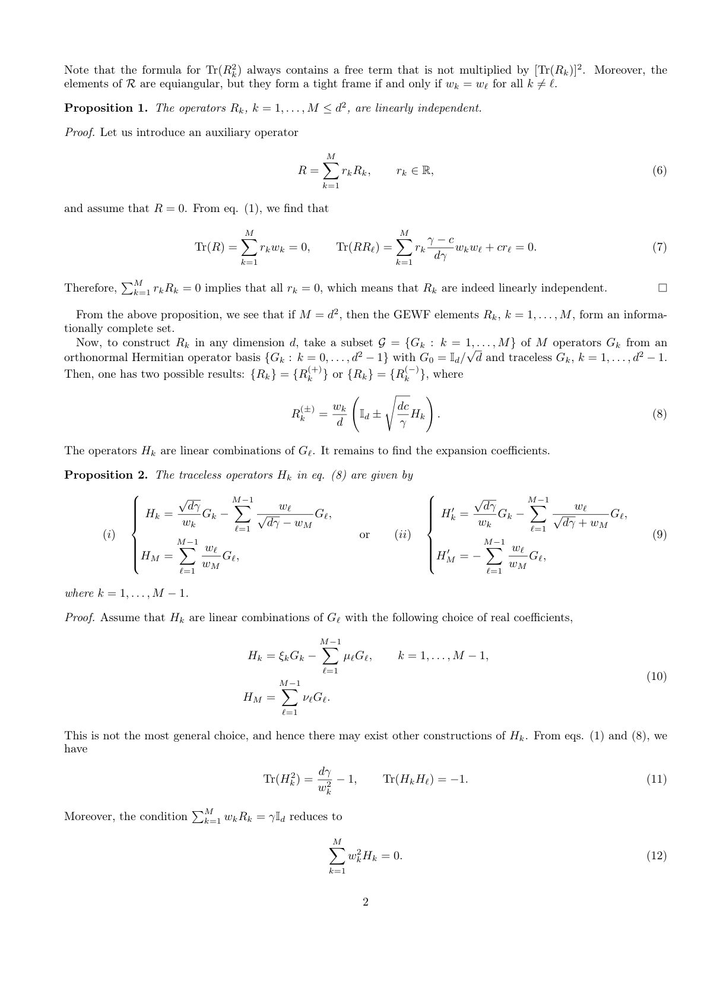 
Low-resolution page preview, page 2

📷 Fig 2

 
Low-resolution page preview, page 3

📷 Fig 3

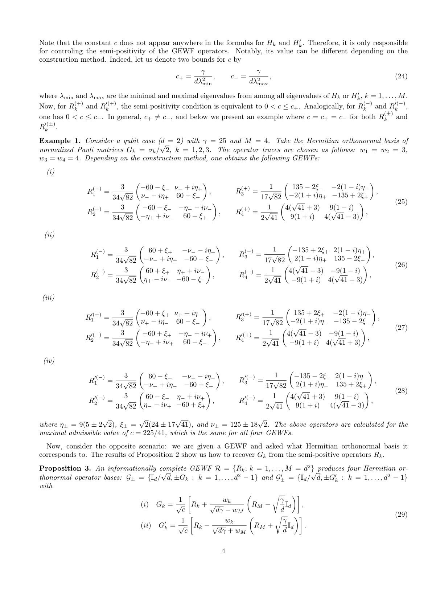 
Low-resolution page preview, page 4

📷 Fig 4

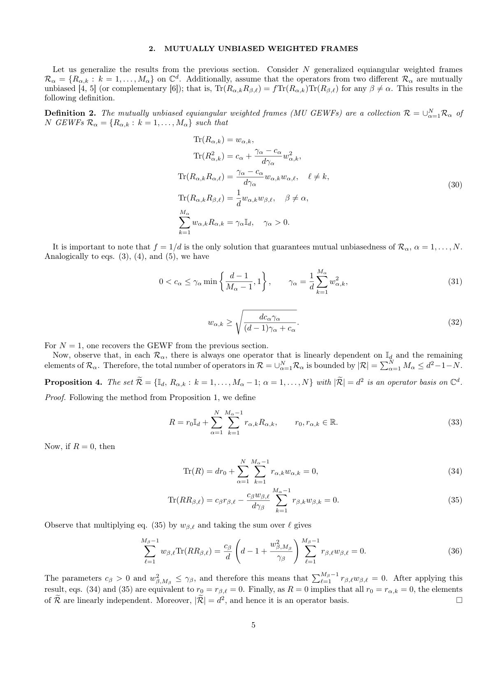 
Low-resolution page preview, page 5

📷 Fig 5

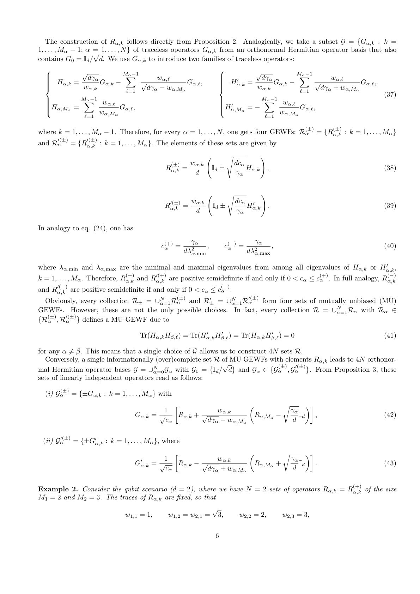 
Low-resolution page preview, page 6

**Summary.** This paper develops a rigorous mathematical framework to characterize conical 2-designs using generalized weighted frames. It proves that MU GEWFs form such designs under the condition of uniform parameter scaling across all frame sets. This advances the theory of informationally complete measurements in quantum systems.

**Why it may be interesting.** This work provides deep structural characterizations for measurement operators beyond simple projector measurements, which is crucial for understanding optimal quantum state tomography and quantum channel estimation.

Detailed structure

**Main problem.** The primary goal is characterizing conical 2-designs, especially those whose constituent operators do not possess equal traces, to advance the understanding of informationally overcomplete quantum measurements.

**Main result.** It establishes that Mutually Unbiased Generalized Equiangular Weighted Frames (MU GEWFs) are special cases of conical 2-designs if and only if a characteristic parameter remains constant across all sets ($	ext{c}_\alpha \equiv c$).

**Method.** The work employs generalizations of equiangular weighted frames to non-projective operators, utilizing detailed trace conditions and linear algebra proofs to construct and analyze these operator families.

**Model / system.** The theory is developed for quantum systems on a $d$-dimensional (qudit) Hilbert space ($\mathbb{C}^d$), focusing on collections of semi-positive operators $\{R_{\alpha,k}\}$ that act as generalized measurements or frames.

**Key observables.** Conical 2-design parameters ($\kappa_+$, $\kappa_-$), the index of coincidence ($C(
ho)$), and various trace conditions involving weights ($w_k$) and correlation terms ($	ext{Tr}(R_k R_\ell)$).

**Important parameters / regimes.** The dimension $d$ of the Hilbert space, the number of frames $N$, and characteristic parameters like $\gamma_\alpha$ and $c_\alpha$.

**Assumptions / limitations.** Assumptions include assuming specific forms for auxiliary operators ($H_k$) during derivation, and noting that MU GEWFs are generally not POVMs.

**Figures summary.** The notes do not describe figures; they detail mathematical derivations involving equations (e.g., Equations 13-19, 52-61) which establish relationships between parameters and structures.

**Paper structure.** The paper progresses by first defining Generalized Equiangular Weighted Frames (GEWFs), then constructing Mutually Unbiased GEWFs (MU GEWFs), and finally proving the equivalence conditions that link these frames to the definition of a conical 2-design, culminating in bounds on quantum information measures.

Abstract

Conical 2-designs are families of positive operators possessing crucial symmetry properties that allow them to efficiently characterize important quantum measures. However, little is known about their general structures and properties. We propose a construction method of conical 2-designs whose elements are not of equal traces, based on a generalization of equiangular weighted frames to non-projective operators. We provide a detailed analysis of their properties, relations to quantum measurements, and applications, together with examples that go beyond the known classes. This constitutes a major step toward a full characterization of informationally overcomplete quantum measurements.

[↑ back to top](#top)

### [Strain- and potential-controlled tunneling in monolayer MoS$_2$](http://arxiv.org/abs/2607.04766v1)

**Authors:** Hasna Chnafa, Rachid El Aitouni, Clarence Cortes, David Laroze, Ahmed Jellal  
**Type:** theory · **Category:** other · **PDF:** <https://arxiv.org/pdf/2607.04766v1>  
**Analysis basis:** full PDF text, analyzed in chunks
**Topic relevance:** `spintronics-quantum-optics interface` **3/5** · `Keldysh / 2PI / non-Gaussian methods` **1/5** · `non-equilibrium dynamics` **1/5**

📷 Fig 1

 
FIG. 1. Schematic illustration of a molybdenum disulfide MoS2 sheet under a uniaxial strain field and an external scalar electrostatic potential applied along the transport direction x, which divides the sheet into three distinct regions.

📷 Fig 2

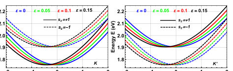 
FIG. 2. The energy E (16) of region II versus the wave vector qx for barrier height V0 = 1 eV and different strain values ε = 0, 0.05, 0.1, 0.15. The K valley is displayed in (a) while K′ in (b).

📷 Fig 3

 
Figure 2 displays the energy E in region II versus the wave vector qx for a barrier height V0 = 1 eV and different strain values ε, with (a): valley K and (b): while valley K′. In both cases, the bands exhibit a parabolic dis- persion characteristic of massive carriers in MoS2, with a clear separation between the spin states sz = +1 and sz = −1, due to strong spin-orbit coupling [7, 42–44]. This separation depends on the valley: the order of spin levels is reversed between K and K′, which is a direct sig- nature of spin–valley locking in transition metal dichalco- genides. The increase in deformation ε causes an overall shift of the bands towards higher energies and a slight change in their...

📷 Fig 4

 
FIG. 3. Transmission probability versus the angle of incidence θ in K and K′ valleys for E = 2 eV, L = 4 nm, ε = 0, 0.4 and two barrier height values (a)/(b): V0 = 6 eV, (c)/(d): V0 = 7 eV.

📷 Fig 5

 
FIG. 4. Transmission probability versus the barrier height V0 in K and K′ valleys for E = 2 eV, L = 1 nm, ε = 0, 0.4 and two wave vector values (a)/(b): ky = 0.5 nm−1, (c)/(d): ky = 2.5 nm−1

**Summary.** This theoretical study details how combining mechanical strain and electrostatic gating can independently control spin and valley polarization in monolayer MoS2. By analyzing quantum transport through potential barriers, the authors reveal a powerful 'dual-knob' mechanism for tuning conductance resonances and predict novel effects like gate-tunable spin inversion.

**Why it may be interesting.** This work demonstrates advanced quantum engineering principles—using external fields (strain/potential) to manipulate fundamental symmetries (spin/valley)—which is highly relevant to designing next-generation spintronic and valleytronic devices.

Detailed structure

**Main problem.** The study investigates spin- and valley-resolved quantum transport in monolayer MoS2 when subjected to the simultaneous influence of mechanical strain and an external scalar potential.

**Main result.** The interplay between strain and potential allows for independent, orthogonal control over both valley and spin polarization. Specifically, they predict a dual-knob control scheme and demonstrate electrostatic spin inversion purely via gate tuning at finite strain.

**Method.** The authors employed theoretical modeling using an effective massive Dirac Hamiltonian incorporating intrinsic spin-orbit coupling to calculate electron transmission coefficients by matching boundary conditions across potential barriers.

**Model / system.** The system is monolayer MoS2, modeled using a k.p approach with an effective Hamiltonian that includes terms for strain (acting as a gauge field) and an external electrostatic barrier potential. The transport is analyzed in the presence of valley (K/K') and spin degrees of freedom.

**Key observables.** Spin polarization ($P_s$), valley polarization ($P_v$), conductance, and Fabry-Pérot resonance characteristics.

**Important parameters / regimes.** Mechanical strain ($\epsilon$), barrier width ($L$), incident energy ($E$), and the strength of the potential ($V_0$).

**Assumptions / limitations.** The model assumes a continuum effective Dirac Hamiltonian, neglects disorder effects (like impurity scattering), and treats the barriers as perfectly sharp rectangular profiles.

**Figures summary.** Figures illustrate schematic setups showing strain/potential application; results show how transmission probability ($T$) exhibits resonances whose frequency is controlled by $L$ and whose phase/amplitude are independently tuned by $\epsilon$.

**Paper structure.** The paper establishes the theoretical framework using a modified Dirac Hamiltonian, derives the coupled differential equations for transport across a barrier, calculates transmission coefficients via boundary matching, and finally analyzes how varying strain and potential allows for independent control over spin and valley polarization.

Abstract

We present a theoretical study of spin- and valley-resolved quantum transport in monolayer MoS$_2$ under the combined influence of mechanical strain and an external scalar potential, a combination whose simultaneous unexplored. Within an effective massive Dirac Hamiltonian that incorporates intrinsic spin--orbit coupling, strain induces valley-dependent momentum shifts that lift the degeneracy between the $K$ and $K'$ valleys and strongly modify the transport characteristics. The scalar potential modifies the tunneling spectrum, leading to pronounced changes in resonant transmission, Fabry--Pérot interference, and conductance. We show that the interplay between strain and electrostatic potential enables efficient control of both valley and spin polarization of the transmitted current. In particular, we identify a dual-knob control scheme in which the barrier width governs the frequency of conductance oscillations while strain independently controls their phase and amplitude. Furthermore, we predict electrostatic spin inversion -- a sign reversal of spin polarization achievable purely by gate tuning at finite strain, requiring no geometric reconfiguration. Depending on the strain orientation, the transmission probability and conductance can be selectively suppressed or enhanced, resulting in highly tunable valley- and spin-polarized transport. These findings demonstrate that strain and potential engineering provide orthogonal and independently operable mechanisms for controlling conductance as well as spin and valley degrees of freedom in monolayer MoS$_2$, offering promising prospects for spintronic and valleytronic device applications.

[↑ back to top](#top)

### [Experimental signatures of bosonic pairing in a two-component Bose gas](http://arxiv.org/abs/2607.03902v1)

**Authors:** Omar Almonajed, M. Iskin, M. Ö. Oktel  
**Type:** theory · **Category:** quantum gases · **PDF:** <https://arxiv.org/pdf/2607.03902v1>  
**Analysis basis:** full PDF text, analyzed in chunks
**Topic relevance:** `analog quantum simulation` **3/5** · `Keldysh / 2PI / non-Gaussian methods` **1/5**

📷 Fig 1

 
FIG. 1. (a) Grand-potential density as a function of the interaction-strength ratio a12/a, spanning the attrac- tive mean-field-stable regime and extending into the droplet regime. The blue solid curve denotes bosonic pairing the- ory, and the black dashed curve denotes Bogoliubov theory. Values in panel (a) are measured in units of E0 = ℏ2/(ma5). (b) Chemical potential µ and pairing field ∆0 as functions of a12/a across the mean-field-to-droplet crossover. The blue solid and blue dash-dotted curves denote µ and ∆0 in bosonic pairing theory, respectively, while the black dashed and black dotted curves denote the corresponding Bogoli- ubov results. Values in panel (b) are measured in units...

📷 Fig 2

 
FIG. 2. Same as Fig. 1, but for a tenfold higher density. In both panels, the per-species density is fixed at na3 = 0.5 × 10−2. The differences between the Bogoliubov and bosonic pairing theories become more pronounced at higher density, particularly in the droplet regime.

📷 Fig 3

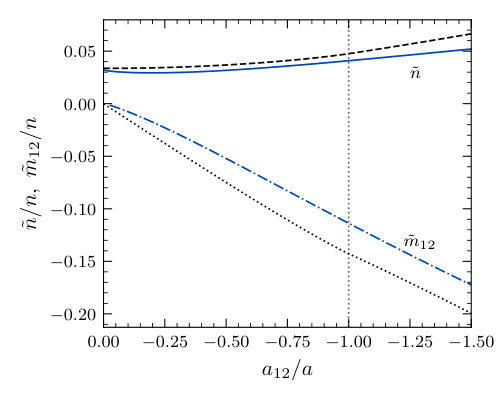 
FIG. 3. Intraspecies normal fraction ˜n/n and interspecies anomalous fraction ˜m12/n as functions of the interaction- strength ratio a12/a, spanning the attractive mean-field- stable regime and extending into the droplet regime. The blue solid and black dashed curves denote ˜n/n in bosonic pairing theory and Bogoliubov theory, respectively. The blue dash-dotted and black dotted curves denote the correspond- ing results for ˜m12/n. The per-species density is fixed at na3 = 0.5 × 10−3.

📷 Fig 4

 
FIG. 4. Momentum-space interspecies correlations for a symmetric two-component bosonic gas at fixed density na3 = 0.5 × 10−3 in the mean-field-stable regime. (a) Normalized anomalous correlation h(2) 12,A(k). (b) Normalized normal cor-

📷 Fig 5

 
FIG. 5. Ultraviolet-renormalized interspecies two-body correlation function G(2) 12 (r) for a symmetric two-component bosonic gas. (a) Real-space dependence at fixed density na3 = 0.5 × 10−3 and interaction ratio a12/a = −0.5, cor- responding to the attractive mean-field-stable regime. Both theories approach the uncorrelated limit at large separations but differ at short distances. (b) Short-distance limit G(2) 12 (0) across the gas-to-droplet crossover. The vertical dotted line marks the mean-field instability, a12/a = −1, which coincides with the droplet transition. Blue solid curves denote bosonic pairing theory, and black dashed curves denote Bogoliubov theory. In the droplet regime,...

**Summary.** The paper rigorously compares bosonic pairing theory against conventional Bogoliubov theory for describing quantum fluctuations in two-component Bose gases approaching the droplet regime. It demonstrates that bosonic pairing yields lower thermodynamic potentials and predicts distinct correlation signatures, particularly measurable via low-momentum structure factors. This provides a crucial theoretical tool to experimentally distinguish between different microscopic descriptions of strongly interacting quantum fluids.

**Why it may be interesting.** This work directly addresses the limitations of standard mean-field descriptions (like Bogoliubov theory) when strong correlations or instability regimes (like droplet formation) are present in ultracold atomic gases, offering a testable alternative description.

Detailed structure

**Main problem.** The paper compares two theoretical frameworks, Bogoliubov theory and bosonic pairing theory, to describe quantum fluctuations in a two-component Bose gas across the crossover into the droplet regime.

**Main result.** Bosonic pairing theory predicts distinct signatures compared to Bogoliubov theory, including a lower grand potential and unique correlation structures measurable via static structure factors at low momentum.

**Method.** The authors reformulate bosonic pairing theory using an operator formalism and compare its predictions against the standard mean-field plus fluctuation approach of Bogoliubov theory.

**Model / system.** The system is a homogeneous, two-component Bose gas (homonuclear binary mixture) with tunable interactions, analyzed across the transition from a weakly interacting gas to a quantum droplet state.

**Key observables.** Grand potential ($\Omega$), excitation spectra, interspecies momentum-space correlations, and species-resolved static structure factors ($S_{ij}(q)$).

**Important parameters / regimes.** Interaction strengths (especially attractive interspecies interactions $g_{12} < 0$), particle density, and the low-momentum transfer limit ($q 	o 0$).

**Assumptions / limitations.** The comparison focuses on the regime where both theories yield real excitation spectra; bosonic pairing theory utilizes a static pairing-field approximation.

**Figures summary.** Figures compare $G^{(2)}_{12}(r)$ (real-space correlations) and $S_{ij}(q)$ (static structure factors) across the crossover, highlighting quantitative differences between the two theories at low momentum transfer.

**Paper structure.** The paper develops the theoretical framework for both models, calculates key observables like the grand potential and correlation functions, and concludes by comparing the distinct predictions of bosonic pairing theory against established results from Bogoliubov theory.

Abstract

Two-component bosonic droplets are commonly described within Bogoliubov theory, where beyond-mean-field quantum fluctuations stabilize the system against mean-field collapse. In the interaction regime where droplets form, however, the Bogoliubov excitation spectrum contains an imaginary branch associated with the underlying instability, which is typically omitted when evaluating the beyond-mean-field energy. Bosonic pairing theory provides an alternative description with a fully real excitation spectrum. In this work, we reformulate bosonic pairing theory within an operator formalism, making its underlying approximations transparent, and compare its predictions with those of Bogoliubov theory for a homonuclear binary Bose mixture across the crossover from a weakly interacting gas to the droplet regime. Working at fixed particle density, we determine the variational parameters of bosonic pairing theory self-consistently and focus on the regime in which both theories possess real excitation spectra, allowing a direct comparison. We find that bosonic pairing theory yields a lower grand potential than Bogoliubov theory and predicts qualitatively distinct correlation signatures, including enhanced long-wavelength interspecies momentum-space correlations and a finite density static structure factor at experimentally accessible low momenta. These differences persist over a broad range of interaction strengths and suggest that correlation and structure-factor measurements can provide direct experimental tests of bosonic pairing across the gas-to-droplet crossover.

[↑ back to top](#top)

### [Integral representations of $f$-divergences for general von Neumann algebras](http://arxiv.org/abs/2607.05195v1)

**Authors:** Ricardo Correa da Silva, Markus B. Fröb, Gandalf Lechner, Leonardo Sangaletti  
**Type:** theory · **Category:** other · **PDF:** <https://arxiv.org/pdf/2607.05195v1>  
**Analysis basis:** full PDF text, analyzed in chunks
**Topic relevance:** `entanglement & information structure` **3/5** · `Keldysh / 2PI / non-Gaussian methods` **1/5**

📷 Fig 1

 
Low-resolution page preview, page 2

📷 Fig 2

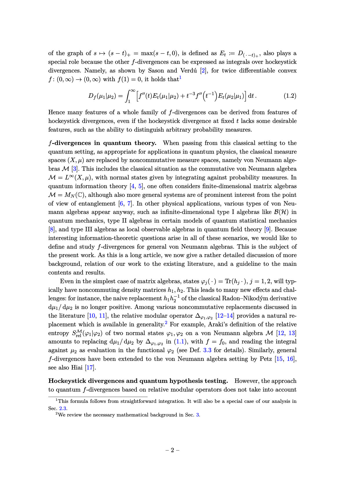 
Low-resolution page preview, page 3

📷 Fig 3

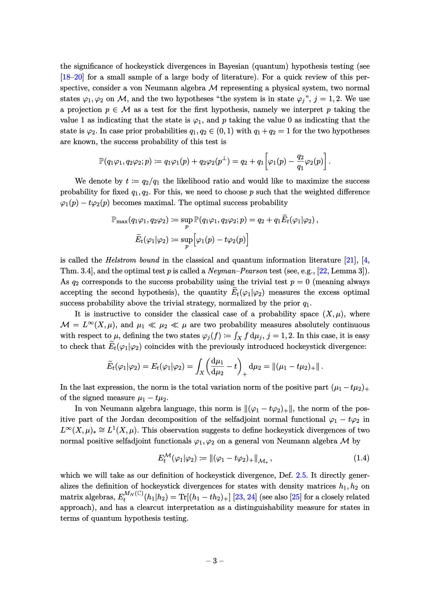 
Low-resolution page preview, page 4

📷 Fig 4

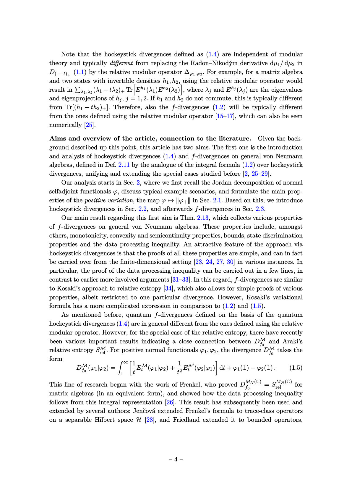 
Low-resolution page preview, page 5

📷 Fig 5

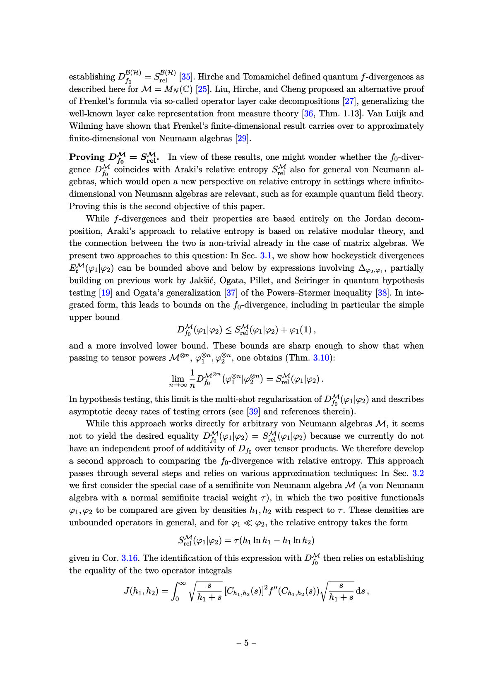 
Low-resolution page preview, page 6

**Summary.** This paper develops generalized $f$-divergences and hockeystick divergences for states defined on general von Neumann algebras. By leveraging properties derived from functional decompositions, it proves that these measures unify previous results and rigorously establishes the equivalence between a specific $f$-divergence ($f_0$) and Araki's relative entropy in this abstract quantum setting.

**Why it may be interesting.** This work provides a rigorous mathematical generalization of fundamental concepts from classical information theory (like KL divergence) into the abstract setting of infinite-dimensional quantum operator algebras, which is crucial for understanding quantum hypothesis testing in complex systems.

Detailed structure

**Main problem.** The paper defines and analyzes $f$-divergences and hockeystick divergences for normal positive functionals on general von Neumann algebras, aiming to generalize classical probability measures to quantum settings.

**Main result.** It establishes that the $f_0$-divergence (when $f_0(t) = t \ln t$) coincides with Araki's relative entropy ($	ext{S}_{	ext{rel}}$) for general von Neumann algebras, unifying several state distinguishability measures.

**Method.** The analysis relies on representing the divergences as integrals over hockeystick divergences, whose properties are derived from the Jordan decomposition of selfadjoint normal functionals. The connection to relative entropy is shown via limiting procedures and comparison with known traces in semifinite cases.

**Model / system.** The mathematical framework uses general von Neumann algebras ($M$) to model quantum systems, where states are represented by normal positive functionals ($\phi$). The classical limit is recovered when $M = L^\infty(X, \mu)$.

**Key observables.** State distinguishability measures, including $f$-divergences ($	ext{DM}_f$), hockeystick divergences ($E_M^t$), and Araki's relative entropy ($	ext{S}_{	ext{rel}}$).

**Important parameters / regimes.** The function $f$ defining the divergence; the parameter $t$ in the hockeystick definition; limits involving $\epsilon \searrow 0$.

**Assumptions / limitations.** The existence of normal positive functionals on general von Neumann algebras and the applicability of spectral theory and trace properties.

**Paper structure.** The paper progresses by defining hockeystick divergences, generalizing them to $f$-divergences on von Neumann algebras, proving key properties using Jordan decomposition, and finally establishing the equivalence between the resulting $f_0$-divergence and relative entropy through limiting arguments.

Abstract

We define and analyze hockeystick divergences and $f$-divergences for normal positive functionals on general von Neumann algebras, generalizing and unifying previous work in classical probability and finite-dimensional von Neumann algebras. All the main properties of these state distinguishability measures (including in particular monotonicity, convexity, semicontinuity, bounds, state discrimination, data processing inequality) are derived from properties of the Jordan decomposition of selfadjoint normal functionals. This is done by representing the $f$-divergences as integrals over hockeystick divergences, and their significance in quantum hypothesis testing is reviewed. The $f_0$-divergence given by the information function $f_0(t) = t \ln t$ is shown to coincide with Araki's relative entropy, extending results of Frenkel to general von Neumann algebras.

[↑ back to top](#top)

### [Circuit Design Informed Adaptive Variational Quantum Algorithms](http://arxiv.org/abs/2607.04110v1)

**Authors:** Muhammad Umer, Dimitris G. Angelakis  
**Type:** theory · **Category:** quantum information and computing · **PDF:** <https://arxiv.org/pdf/2607.04110v1>  
**Analysis basis:** full PDF text, analyzed in chunks
**Topic relevance:** `analog quantum simulation` **2/5** · `measurement-induced transitions` **2/5** · `quantum measurements` **2/5** · `Keldysh / 2PI / non-Gaussian methods` **1/5** · `driven-dissipative phase transition` **1/5** · `entanglement & information structure` **1/5** · `methods for driven-dissipative` **1/5**

📷 Fig 1

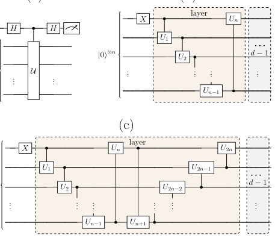 
FIG. 1. (a) Hadamard test and (b, c) HT constrained ans¨atze. Here, n is the number of qubits in the register, d is the number of layers, and Ui = U(λi) is a controlled pa- rameterized gate. In the construction of ans¨atze, X gate at the beginning of circuits is controlled by the ancilla qubit, thereby establishing ancilla−register correlations. Panel (b) and (c) illustrate two distinct layouts.

📷 Fig 2

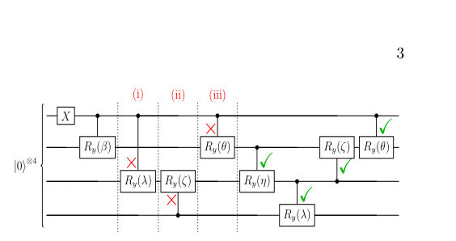 
FIG. 3. Constraints embedded in the gate pool Opool. Here, (i)–(iii) highlight three classes of constraints, namely: (i) qubit connectivity constraint of the hardware platform, (ii) circuit design, i.e., the Hadamard test constraint, and (iii) non-redundancy constraints that prevent immediate re- selection of gates acting on the same qubit(s) by temporarily removing them from the candidate pool.

📷 Fig 3

 
FIG. 2. Scaling behavior of the gate pool Opool at the first iteration of adaptive frameworks. (a) and (b) correspond to the nearest-neighbor connectivity in a ring topology and all- to-all connectivity, respectively. Here, constraints (i) and (ii) are imposed by qubit connectivity and Hadamard test circuit design, respectively.

📷 Fig 4

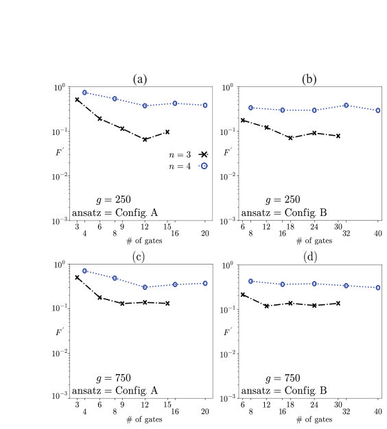 
FIG. 4. Behavior of state infidelity as a function of number of gates in the layered HT ans¨atze. State infidelity quantifies the deviation of the variational state from the target classi- cal ground state. Results are shown for g = 250 in panels (a, b) and for g = 750 in panels (c, d). In addition, layer configuration A and B is adopted in panels (a, c) and (b, d), respectively.

📷 Fig 5

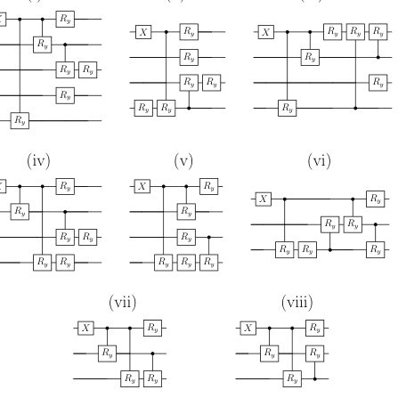 
FIG. 6. Adaptive HT ans¨atze. Panels are organized accord- ing to both system size and nonlinear interaction strength. Here, n = 5 for panel (i), n = 4 in panels (ii−v), and n = 3 in panels (vi−viii). Additionally, g = 250, 500, 750, and 1000 correspond respectively to panels (i, ii, vi), (iii, vii), (iv, viii), and (v, viii).

**Summary.** This paper tackles the challenge of building efficient quantum algorithms for NISQ devices by integrating circuit design principles into adaptive VQA frameworks. By constraining the selection of candidate gates using structures like the Hadamard Test, the authors significantly reduce measurement overheads. This demonstrates a crucial pathway toward making variational quantum simulations more feasible on near-term hardware.

**Why it may be interesting.** This work directly addresses practical hardware limitations in quantum computation by providing algorithmic techniques that systematically reduce resource requirements for variational methods applied to physical models like the NLSE.

Detailed structure

**Main problem.** Developing resource-efficient variational quantum algorithms (VQAs) suitable for the Noisy Intermediate-Scale Quantum (NISQ) era by systematically incorporating circuit design constraints.

**Main result.** Incorporating structural constraints, such as those derived from the Hadamard Test circuit, can reduce measurement overhead in adaptive VQA frameworks by 25% to over 55%.

**Method.** The authors employ an adaptive framework that iteratively constructs variational ansätze while pruning the candidate gate pool using hardware-aware and problem-specific constraints.

**Model / system.** The work is benchmarked on approximating the ground state of the nonlinear Schrödinger equation (NLSE) Hamiltonian, which involves discretizing the spatial domain via finite differences.

**Key observables.** State infidelity ($F'$), measurement overhead/required measurement resources, and the size of the candidate gate pool ($\mathcal{O}_{	ext{pool}}$).

**Important parameters / regimes.** Nonlinearity strength ($g$), system size ($n$ qubits), and convergence indicators like $\epsilon_k$.

**Assumptions / limitations.** The analysis assumes that incorporating circuit design constraints systematically reduces measurement overhead, although the authors note that layered ansätze may not always be optimal.

**Figures summary.** Figures illustrate Hadamard test circuits, comparisons of gate pool scaling (showing pruning), and state infidelity ($F'$) vs. number of gates for both constrained adaptive methods and fixed layered ansatzes.

**Paper structure.** The paper introduces the resource limitations of NISQ devices, proposes an adaptive VQA framework incorporating circuit design constraints (like HT structure) to manage measurement overhead, benchmarks this approach on the NLSE ground state problem, and compares its performance against less constrained or fixed-layer ansätze.

Abstract

Resource-efficient computation is of central importance in the noisy intermediate-scale quantum (NISQ) era, where decoherence, gate errors, and restricted qubit connectivity severely limit the reliable execution of quantum algorithms. In this work, we demonstrate that incorporating circuit design considerations is crucial for developing resource-efficient variational quantum algorithms. By focusing on the Hadamard test circuit architecture, hardware-aware qubit connectivity, and problem-specific adaptive framework, we analyze how circuit design constraints can systematically reduce the measurement overhead associated with repeated evaluations of the candidate gate pool in adaptive algorithms. Specifically, we demonstrate reductions in the required measurement resources ranging from at least 25% to as high as 50% - 55%. To assess the effectiveness of our approach, we investigate the ground state problem of the nonlinear Schrödinger equation. Overall, our work contributes to resource-friendly strategies for quantum computation and underscores that algorithmic frameworks should systematically integrate circuit design constraints with hardware-aware and problem-specific structures to enhance the practical feasibility of quantum devices in the NISQ era.

[↑ back to top](#top)

### [Quantum random walks on d-regular graphs with Haar-random coin operators](http://arxiv.org/abs/2607.04584v1)

**Authors:** Alice C. Quillen  
**Type:** theory · **Category:** other · **PDF:** <https://arxiv.org/pdf/2607.04584v1>  
**Analysis basis:** full PDF text, analyzed in chunks
**Topic relevance:** `non-equilibrium dynamics` **2/5** · `analog quantum simulation` **1/5** · `correlated / nonlocal dissipation` **1/5** · `driven-dissipative phase transition` **1/5** · `entanglement & information structure` **1/5** · `measurement-induced transitions` **1/5** · `methods for driven-dissipative` **1/5** · `non-equilibrium universality` **1/5** · `quantum measurements` **1/5**

📷 Fig 1

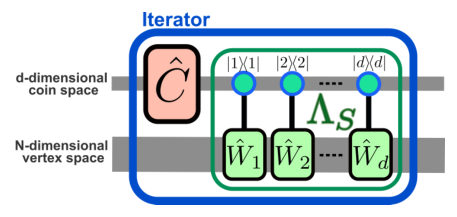 
FIG. 1. A quantum circuit illustration of a quantum walk based on a d-regular graph that takes place on a quantum space that is the tensor product of a d-dimensional coin space and an N dimensional vertex space. The controlled shift op- erator ΛS (outlined in green and defined in equation 3) per- mutes the vertices with operators ˆ Wj (defined in equation 2) depending upon the graph edge that is selected via one of the states in the coined subspace. The coin operator ˆC operates on the coin-subspace where it can induce superposition. The pair of operations is outlined in blue and is iterated to carry out the walk.

📷 Fig 2

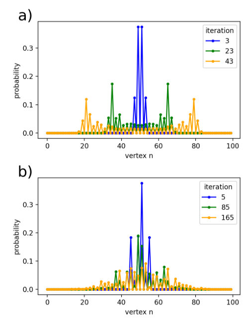 
FIG. 2. a) An illustration of the quantum random walk on the cycle graph with a Hadamard-coin. The initial state was 1 √

**Summary.** This paper analyzes quantum random walks on regular graphs using coin operators drawn randomly from the Haar measure. While this averaging process causes decoherence in the coin subspace, the authors show that specific measurements on the vertex positions can still retain information about the initial state. This suggests a mechanism for probing initial conditions even in strongly perturbed open quantum systems.

**Why it may be interesting.** This work provides a theoretical framework for understanding quantum transport in systems where environmental coupling or internal dynamics cause strong, random perturbations (decoherence) to one subsystem.

Detailed structure

**Main problem.** The study investigates quantum random walks on d-regular graphs when the coin operator is randomly drawn from the Haar measure at each step.

**Main result.** Despite the averaged channel causing depolarization in the coin subspace, measurements restricted to the vertex subspace can still reveal information about the initial state over many iterations.

**Method.** The analysis involves computing the expectation value of the quantum evolution operator over the Haar distribution of the coin unitary, leading to an averaged quantum channel.

**Model / system.** The model is a quantum random walk on a bipartite space ($\mathcal{C}_d \otimes \mathcal{C}_N$) defined by a controlled shift unitary. Examples are tested on Cayley graphs of Abelian groups like cycles and hypercubes.

**Key observables.** Correlation functions between vertices ($p_{vv'}(
ho(t))$) and the variance ($\sigma^2_{\hat{B}}(t)$) of position measurements.

**Important parameters / regimes.** The graph degree $d$, number of vertices $N$, and time evolution $t$. The Haar-random nature of the coin operator is central.

**Assumptions / limitations.** The analysis assumes that for certain graphs, information retention can be tracked via specific off-diagonal eigenstates in the Fourier basis. It also notes limitations regarding general undirected graphs versus Abelian group Cayley graphs.

**Figures summary.** Figure 1 illustrates the quantum circuit structure of the QRW. Figure 2 compares probability distributions for walks with Hadamard vs. Haar-random coins on a cycle graph, showing convergence to classical behavior.

**Paper structure.** The paper first defines the model and the averaged channel (Chunk 2). It then analyzes how this averaging affects information retention by looking at correlation functions and position variance over time (Chunks 3 & 4).

Abstract

With unitary coin operator that is a random matrix drawn from a uniform distribution with respect to the Haar measure, we construct a variant of a discrete quantum random walk using a d-regular undirected connected simple graph. With each step of the walk, the coin operator random matrix is drawn independently from the distribution. The expectation value over the distribution of random unitaries for the associated quantum channel gives a depolarization channel for the coin subspace and resembles the associated classical random walk where the direction a walker steps depends upon the outcome of a fair coin or balanced d-sided dice. Remarkably, despite the fact that the averaged channel depolarizes the coin subspace, measurements in the vertex subspace can be designed that would reveal information about the initial quantum state, even after many iterations of the channel. We illustrate with examples of quantum walks on Cayley graphs of Abelian groups, such as the cycle and hypercube graphs. These quantum walks are examples of bipartite strongly interacting systems, where one subsystem is strongly perturbed, yet information about the initial state in the other subsystem is potentially measurable forever. Due to its decoherence, a quantum random walk with a Haar-random coin would not be useful in search algorithms but could aid in understanding quantum systems with strongly perturbed subsystems.

[↑ back to top](#top)

### [Super-molasses returns: All optical near-resonance laser cooling and trapping of neutral atoms from background vapor](http://arxiv.org/abs/2607.04966v1)

**Authors:** Matt Himsworth, Chester Camm, Max Carey, Jack Saywell, Jonathan Woods, Vilius Atkoucius, Florence Concepcion, Konstantinos Karakostas, Hannah Brady, Doruk Tan Atila, Ellie Heywood, Alex Jantzen, Andrei Dragomir, Christopher Morley, James Bateman  
**Type:** experiment · **Category:** other · **PDF:** <https://arxiv.org/pdf/2607.04966v1>  
**Analysis basis:** full PDF text, analyzed in chunks
**Topic relevance:** `non-equilibrium dynamics` **2/5** · `quantum optics experiment` **2/5** · `analog quantum simulation` **1/5** · `correlated / nonlocal dissipation` **1/5** · `driven-dissipative phase transition` **1/5** · `interference shaping light` **1/5** · `methods for driven-dissipative` **1/5** · `non-equilibrium universality` **1/5**

📷 Fig 1

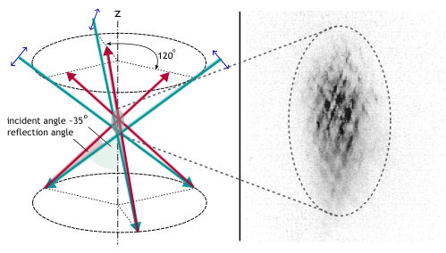 
FIG. 1: Left: The laser beam geometry used in this paper to produce the super-molasses trap, with incident (green) beams forming a tripod and angled from the vertical by 35◦and retro-reflected (red) beams misaligned by very small angles. Polarization is linear as shown in blue, although the trap can operate with circular and combinations of polarization. Right: A (inverted greyscale) fluorescence image of the trapped ensemble of rubidium atoms. The laser beams have been aligned to produce an extended cloud to highlight the lattice structure. The vertical dimension of the cloud is approximately 3 mm. Denser and more spherical clouds can be obtained with different beam reflection angles.

📷 Fig 2

 
FIG. 2: A photograph of the SMT taken along the z-axis of Figure 1). The three retro-reflected beams can be seen scattering on the top chamber window, at the center of which is the brighter cold atom cloud.

📷 Fig 3

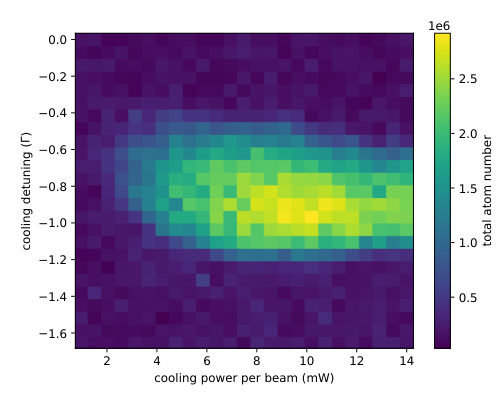 
FIG. 3: Dependence of atom number in the SMT on laser detuning and power. We see a peak of approximately 2.5 million atoms at -1 Γ detuning and 10 mW per beam. The peak atom number is highly dependent on beam alignments but once a global maximum is found the atom number is quite consistent for the same beam width.

📷 Fig 4

 
FIG. 4: Top: The trapped ensemble temeratues before the ’molasses’ stage for a selection of detunings. The solid lines are linear fits to guide the eye, and the dashed line indicates the Doppler Temperature for 87Rb. Middle: The trapped ensemble temperature after a ‘molasses’ stage during which the laser detuning is shifted to the displayed frequency in 2 ms, whilst the power is linearly ramped down to different final values. Solid lines are linear fits to guide the eye. Bottom: An example of the ensemble radius expansion data (dots) used calculate the temperature (lines). We see the temperature is uniform along both axes.

📷 Fig 5

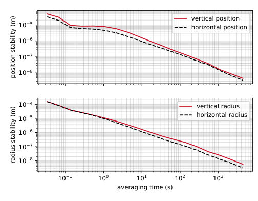 
FIG. 5: The Allan Deviation of the trap centre (Top) and size (Bottom) over several timescales. The center is determined by fitting of a 2D Gaussian to absorption image. Short term instability is dominated by vibrations of the undamped table due to nearby traffic.

**Summary.** The authors introduce the Super-Molasses Trap (SMT), a novel method to cool and trap dense clouds of neutral atoms using only intersecting laser beams, completely eliminating the need for external magnetic fields. The technique achieves performance comparable to MOTs—including high atom numbers and sub-$\mu	ext{K}$ temperatures—making it a powerful new tool for quantum applications.

**Why it may be interesting.** This work presents a robust, field-free alternative to established trapping methods, which is highly relevant for quantum sensing and metrology where magnetic shielding or field gradients are undesirable. The investigation into the fundamental mechanism of super-molasses cooling touches upon complex non-equilibrium dynamics in open quantum systems.

Detailed structure

**Main problem.** To describe an alternative laser cooling and trapping method for neutral atoms that operates without relying on a magnetic field, overcoming limitations associated with traditional Magneto-Optical Traps (MOTs).

**Main result.** The Super-Molasses Trap (SMT) successfully traps dense clouds of cold atoms ($>10^6$ atoms at $\sim 2 	imes 10^{10} 	ext{atoms/cm}^3$) using only laser beams, achieving sub-$\mu	ext{K}$ temperatures.

**Method.** The technique utilizes a simple geometry of retro-reflected collimated laser beams in a tripod configuration to create a position and velocity dependent restoring force, supplemented by an 'optical molasses' stage for final cooling.

**Model / system.** The system involves trapping neutral atoms (e.g., $^{87}	ext{Rb}$) from background vapor using intersecting, misaligned laser beams that form a dissipative optical lattice structure, contrasting with the magnetic field dependence of MOTs.

**Key observables.** Atom number ($>2 	imes 10^6$), density ($\sim 2 	imes 10^{10} 	ext{atoms/cm}^3$), ensemble temperature (cooled to sub-$\mu	ext{K}$), and trap loading rate ($2 	imes 10^7 	ext{atoms/s}$).

**Important parameters / regimes.** Laser detuning ($	ext{-}1\Gamma$ optimal), laser power ($22 	ext{mW/cm}^2$), background vapor pressure (optimal near $2 	imes 10^{-9} 	ext{mbar}$), and the absence of magnetic field dependence.

**Assumptions / limitations.** The trapping mechanism is believed to utilize principles related to super-molasses cooling within a near-resonant dipole trap, although a full quantitative theoretical explanation remains elusive.

**Figures summary.** Figures show the laser beam geometry (tripod), the dependence of atom number on detuning/power, and temperature reduction curves demonstrating the effectiveness of the optical molasses stage.

**Paper structure.** The paper introduces the SMT as an alternative to MOTs, details the experimental setup and measurements (atom number, density, cooling), compares performance metrics, discusses stability and loading rates, and concludes with a theoretical discussion on the underlying physics.

Abstract

Laser cooled and trapped atoms have been the workhorse of atomic physics for the past four decades. The predominant method has been the highly versatile Magneto-Optical Trap. We describe an alternative laser trap involving a simple geometry of collimated laser beams that provides both a velocity and position dependent restoring force such that a dense cloud of cold atoms is formed. This technique produces similar atom number ($>10^6$) and density ($10^{10}$\,atoms/cm$^{3}$) to the Magneto-Optical Trap, albeit with \emph{no magnetic field}. The beam geometry is compatible with conventional sub-Doppler cooling techniques, allowing the trapped cloud to be cooled to $< 10~μ$K. We demonstrate the validity and robustness of the trap by capturing $^{87}$Rb atoms directly from the background vapor and provide a theoretical discussion of the underlying principles. This trap has many unique properties that make it highly suitable for quantum sensing, timing, and computing applications as well as a new tool in fundamental science and metrology.

[↑ back to top](#top)

### [Quasi-holonomy in non-adiabatic quantum evolution](http://arxiv.org/abs/2607.05218v1)

**Authors:** Erik Sjöqvist, Adam Fredriksson  
**Type:** theory · **Category:** other · **PDF:** <https://arxiv.org/pdf/2607.05218v1>  
**Analysis basis:** full PDF text, analyzed in chunks
**Topic relevance:** `non-equilibrium dynamics` **2/5** · `Keldysh / 2PI / non-Gaussian methods` **1/5** · `analog quantum simulation` **1/5** · `correlated / nonlocal dissipation` **1/5** · `driven-dissipative phase transition` **1/5** · `entanglement & information structure` **1/5** · `methods for driven-dissipative` **1/5** · `non-equilibrium universality` **1/5**

📷 Fig 1

 
Low-resolution page preview, page 2

📷 Fig 2

 
Low-resolution page preview, page 3

📷 Fig 3

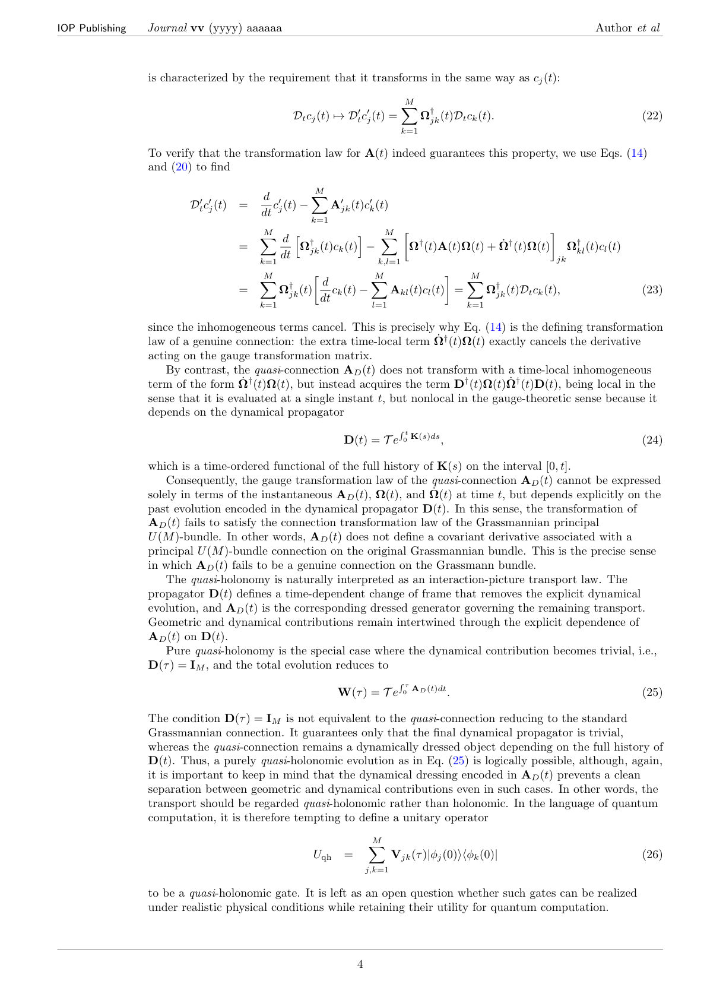 
Low-resolution page preview, page 4

📷 Fig 4

 
Low-resolution page preview, page 5

📷 Fig 5

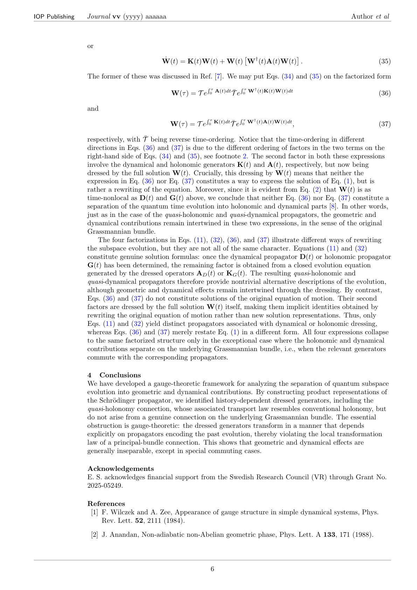 
Low-resolution page preview, page 6

**Summary.** The paper develops a framework to analyze the separation of quantum subspace evolution into geometric (holonomic) and dynamical parts. By examining the quasi-connection derived from factoring the Schrödinger equation on the Grassmannian, the authors prove that this connection is not truly geometric due to history-dependent gauge transformations. This shows that in non-adiabatic regimes, quantum geometry and dynamics remain fundamentally intertwined.

**Why it may be interesting.** This work provides deep theoretical insight into geometric phases in open or non-adiabatic quantum systems by formalizing when and why simple factorization methods fail, which has implications for understanding decoherence and adiabatic passage protocols.

Detailed structure

**Main problem.** The paper investigates how to separate the quantum time evolution of subspaces into purely geometric (holonomic) and dynamical components when evolving along loops in a complex Grassmannian.

**Main result.** The quasi-connection derived from factoring the Schrödinger evolution does not define a genuine connection because its gauge transformation acquires an unavoidable, history-dependent term, implying that geometric and dynamical effects are generally inseparable.

**Method.** The authors develop a framework by factoring the Schrödinger evolution into contributions associated with a dynamical propagator $D(t)$ and a quasi-connection $	ext{AD}(t)$, analyzing the resulting gauge transformation properties.

**Model / system.** The system models the time evolution of $M$-dimensional subspaces within an $N$-dimensional Hilbert space, mathematically described by paths on the complex Grassmannian $G(N; M)$ and governed by a matrix differential equation derived from the Schrödinger equation.

**Key observables.** The quasi-connection $	ext{AD}(t) \equiv D^\dagger(t)	ext{A}(t)D(t)$, and its comparison to the transformation law of a true connection.

**Important parameters / regimes.** Cyclic evolution ($\Omega(	au) = \mathrm{IM}$), non-adiabatic regime, and the structure of the Hamiltonian generators $K(t)$ and $A(t)$.

**Assumptions / limitations.** The analysis is restricted to cyclic evolution; the core limitation is that separation fails due to gauge-theoretic obstructions.

**Figures summary.** Not specified by the notes provided, but the structure revolves around comparing different factorizations of the propagator $W(	au)$ (Eqs. 11, 25, 32) and analyzing their transformation properties.

**Paper structure.** The paper establishes the general evolution equation for subspaces, proposes factoring it using a dynamical propagator to define a quasi-connection ($	ext{AD}(t)$), rigorously proves that this quasi-connection fails the criteria of a true connection due to history dependence, and concludes that separation is generally impossible.

Abstract

We develop a framework for quasi-holonomy in non-adiabatic quantum time evolution of subspaces along loops in a complex Grassmannian. By factoring the Schrödinger evolution into dynamical and connection-induced contributions in a moving basis, we obtain an effective geometric generator that depends explicitly on the dynamical propagator. This quasi-connection does not define a genuine connection on the original Grassmann bundle, since its gauge transformation law acquires a history-dependent, nonlocal term. Other ways of factoring the Schrödinger evolution are briefly discussed. All these approaches suffer from the same type of history-dependence, thereby defining transport of subspaces in which geometric and dynamical effects are generally intertwined, just as in the case of the quasi-holonomy. Our work sheds light on the issue of separating quantum evolution of subspaces into holonomic and dynamical parts from an essentially gauge-theoretic perspective.

[↑ back to top](#top)

### [Supercritical fluid of quantum electrons in three-dimensional superconducting fullerides](http://arxiv.org/abs/2607.04693v1)

**Authors:** Xinying Li, Yuki Matsuda, Chongli Yang, Huaxue Zhou, Takuma Ogasawara, Qin Wang, Liguo Zhang, Hidekazu Shimotani, Hailiang Xia, Khuong K. Huynh, Panagiotis Kotetes, Satoshi Heguri, Katsumi Tanigaki  
**Type:** both · **Category:** strongly correlated electrons · **PDF:** <https://arxiv.org/pdf/2607.04693v1>  
**Analysis basis:** full PDF text, analyzed in chunks
**Topic relevance:** `driven-dissipative phase transition` **2/5** · `non-equilibrium universality` **2/5** · `Keldysh / 2PI / non-Gaussian methods` **1/5** · `Kondo & dissipative impurity` **1/5** · `analog quantum simulation` **1/5** · `exotic spin models in light-matter` **1/5** · `non-equilibrium dynamics` **1/5**

📷 Fig 1

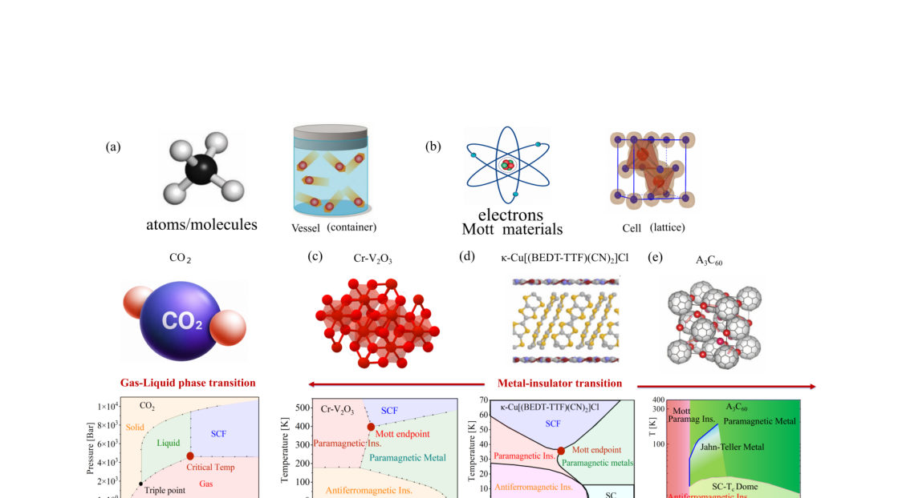 
Fig. 1 Phase transition without symmetry breaking and supercritical fluid phase (SCF).| (a) Phase transition between G and L phases in elemental atoms and molecules in a container without symmetry breaking and a supercritical fluid (SCF) phase emergent above the critical temperature (a red point). (b) Quantum electrons, in a crystal cell. In Mott materials ((c) Cr-V2O3 and (d) κ-(BEDT- TTF)2Cu[N(CN)2]Cl), a similar phase diagram exhibiting an SCF phase is reported. The SCF phase originates from the Mott endpoint (MEP, red-colored point). (e) CsxRb3-xC60 fullerides, Mott uncon- ventional superconductors, exhibit an MIT (blue line), but neither MEP nor SCF was reported. Supercritical fluid...

📷 Fig 2

 
Fig. 2 T-V(T, P) phase diagram of CsxRb3-xC60 fullerides displaying an M-I coexisting SCF phase inferred from electrical resistivities and static magnetic susceptibilities.| (a) The onset temperatures of the MIT observed in ρ under ambient and high pressure of CsxRb3-xC60 fullerides give a different MIT line (red) from the one (blue) drawn based on χ. The two lines originate from the single common point, i.e., the so-called Mott endpoint (MEP). The same SC Tc-dome is observed, within experimental accuracy, in both ρ and χ. (b) Phase diagram of carrier-tuned high-Tc cuprates generally reported in the literature15, where a PSG phase observed at finite T is frequently discussed in connection...

📷 Fig 3

 
Fig. 3 The experimental σ(T, V) and χ(T, V) values for various stoichiometric CsxRb3-xC60 full- erides under ambient pressure.| Three Cs2.65Rb0.35C60 (red), Cs2.5Rb0.5C60 (pink), and Cs2Rb1C60 (or- ange) exhibit the clear MIT’s. (a,b) The σ values of various stoichiometric CsxRb3-xC60 fullerides under ambient P as a function of Vcell and T. The values χ and σ of Cs3C60 were taken from the literatures13,24, respectively. (c-f) The comparison of χ between experimental (pale wide lines) and calculated (dark narrow lines) data. The analyses were performed as x = xIχCW + xMχPauli with xI + xM = 1, where xI and xM are the ratios of I and M, and χCW and χPauli are the localized Curie-Weiss and...

📷 Fig 4

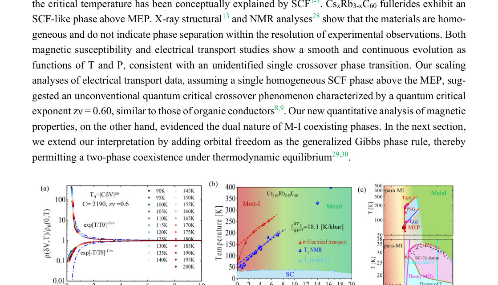 
Fig. 4 Scaling based on electrical transports, Clapeyron Clausius Law, and T-V(T, P) phase diagram with comparison to DMFT theoretical calculations.| (a) Scaling of ρ(V-V0,T)/ρ0(T,0) = F[T/(C(V-V0))zν] based on electrical transport data in Cs2.65Rb0.35C60 under various pressure (SI.4 and SI.9). (b) The slope of the MIT (∂T/∂P) exhibits a good agreement between electrical transport (our work) and NMR relaxation times28 at temperatures under the dynamic Jahn-Teller effect as described in the text. The MIT slope can be assessed from the volume (∆Vcell) and the entropy change (∆S) at

**Summary.** This paper reports the first experimental identification of a supercritical fluid phase of quantum electrons at the Mott transition in superconducting fullerides. By simultaneously measuring both electrical conductivity and magnetic susceptibility, the authors confirm two distinct metal-insulator transition lines meeting at a single Mott endpoint. This dual-probe approach yields a unified picture of the correlated electron physics in these materials.

**Why it may be interesting.** This work provides strong experimental evidence for a specific theoretical state (SCF) in correlated materials using multiple complementary measurements, which is highly relevant to understanding complex many-body ground states beyond simple mean-field treatments.

Detailed structure

**Main problem.** The study investigates the elusive supercritical fluid (SCF) phase of quantum electrons at the Mott metal-insulator transition (MIT) in strongly correlated fullerides.

**Main result.** The authors report the first experimental identification of a thermodynamically equilibrated SCF phase and its associated Mott endpoint using dual probes ($\sigma$ and $\chi$), revealing convergence of two distinct MIT lines.

**Method.** A combination of independent experimental measurements (electrical conductivity and magnetic susceptibility) with theoretical analysis, including hypothesis-free two-particle analyses and thermodynamic scaling laws.

**Model / system.** The physical system is the superconducting fulleride $	ext{Cs}_x	ext{Rb}_{3-x}	ext{C}_{60}$. Theoretical modeling involves an effective spin Hamiltonian ($H_J$) derived from orbital couplings, used to analyze magnetic susceptibility ($\chi$).

**Key observables.** Electrical conductivity ($\sigma$), magnetic susceptibility ($\chi$), critical exponents ($
u z$), and the identification of a Mott endpoint (MEP).

**Important parameters / regimes.** The stoichiometry ($x$ in $	ext{Cs}_x	ext{Rb}_{3-x}	ext{C}_{60}$), temperature (T), pressure/volume ($V_{	ext{cell}}$), and the critical exponents derived from scaling analysis.

**Assumptions / limitations.** Assumes thermodynamic equilibrium for the SCF phase, utilizes a dual-probe approach to overcome limitations of single observables, and employs model Hamiltonians for theoretical fitting.

**Figures summary.** Figures illustrate phase diagrams ($T$-$V$ or $T$-$P$), showing the newly emergent M-I coexisting SCF zone above the MEP. Other figures compare experimental $\sigma(T, V)$ and $\chi(T, V)$ across different stoichiometries.

**Paper structure.** The paper progresses by establishing the problem (elusive SCF), presenting the dual-probe methodology ($\sigma$ vs. $\chi$), confirming the existence of the MEP via convergence of two MIT lines, and finally providing a unified microscopic picture for the Mott SCF phase.

Abstract

The supercritical fluid (SCF) of quantum electrons at the Mott metal-insulator transition without symmetry breaking is one of the most elusive phenomena in strongly correlated electron physics. Prior studies of Cr-doped V2O3 and organic Mott systems reported discrepant critical exponents. A key limitation is that the scaling analysis relies on a single experimental observable, leaving the roles of phase coexistence, inhomogeneity, and percolation unaddressed. Here we report the first experimental identification of a thermodynamically equilibrated SCF phase and its associated Mott endpoint in the three-dimensional superconducting fullerides CsxRb3-xC60, using two independent probes of electrical conductivity and magnetic susceptibility, which reveal two distinct metal-insulator transition lines converging at a single Mott endpoint. A hypothesis-free two-particle analysis of magnetic susceptibilities yields a metal-insulator coexisting SCF by exhibiting the maximum two-phase mixing entropy, in agreement with a picture of a thermodynamically equilibrated Widom line. Simultaneously, conductivity scaling yields a critical exponent in the regime of quantum critical predictions. Our new dual-probe approach provides a unified microscopic picture of the Mott SCF with a characteristic length scale below current diffraction resolution, in addition to a new interpretation on the origin of superconducting Tc-dome.

[↑ back to top](#top)

### [Cellular Adaptation to Signal Fluctuations as Learning](http://arxiv.org/abs/2607.03545v1)

**Authors:** Tuan Minh Pham, David Saad  
**Type:** theory · **Category:** disordered systems and neural networks · **PDF:** <https://arxiv.org/pdf/2607.03545v1>  
**Analysis basis:** full PDF text, analyzed in chunks
**Topic relevance:** `non-equilibrium dynamics` **2/5** · `non-equilibrium universality` **2/5** · `Keldysh / 2PI / non-Gaussian methods` **1/5** · `correlated / nonlocal dissipation` **1/5** · `driven-dissipative phase transition` **1/5** · `methods for driven-dissipative` **1/5**

📷 Fig 1

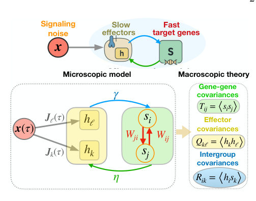 
FIG. 1. Top. Illustration of an intracellular pathway (marked by the shaded area) of effectors (labeled by h) and target genes (denoted by s). The pathway is subjected to fluctuations of an external signal depicted by x. Bottom. Our microscopic model (7)-(8) and its corre- sponding macroscopic theory in terms of collective covariances (14)- (15). Here fluctuations vary over a slow time τ. The M effectors integrate these fluctuations into their states hℓ(τ) via an interpreta- tion matrix Jℓα (denoted by black arrows): hℓ(τ) = P

📷 Fig 2

 
FIG. 2. The target gene correlations T , the effectors’ covariations Q, the cross-correlations between the target genes and their effectors R, all as function of the slow time τ for (η, γ) = (0.5, 0.5) in (a)-(c) (η, γ) = (0.9, 0.5) in (d)-(f) for (η, γ) = (0.9, 0.9) in (g)-(i). Here c = 0.2, σ = 0.01, K = 4 and W is a random asymmetric matrix of i.i.d. elements drawn from U(0, 1) – the uniform distribution in the interval (0, 1). Initial conditions for Q and T are specified by Qii and Tii, both drawn from U(0, 1), while Qij and Tij – are sampled from the uniform distribution 10−6 × U(0, 1). All elements of R(τ = 0) are drawn from the uniform distribution 10−6 × U(0, 1).

📷 Fig 3

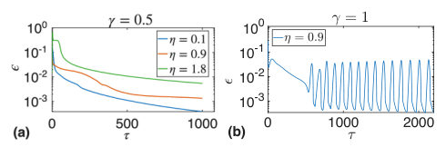 
FIG. 3. γ = 0.5 (a) and γ = 1 (b). Here c = 0.2, σ = 0.01, K = 4, and W is an asymmetric matrix of uncorrelated elements drawn from U(0, 1) – the uniform distribution in the interval (0, 1). Initial conditions for Q and T are specified by Qii and Tii, both drawn from U(0, 1), while Qij and Tij – are sampled from the uniform distribution 10−6 × U(0, 1). All elements of R(τ = 0) are drawn from the uniform distribution 10−6 × U(0, 1).

📷 Fig 4

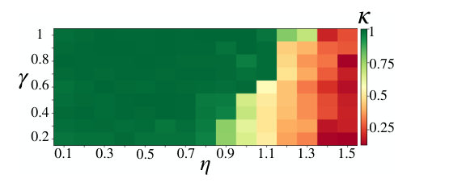 
FIG. 6. Phase diagram for c = 0.2, σ = 0.01, K = 4. Results are obtained by averaging over an ensemble of 100 asymmetric matrices W of uncorrelated elements drawn from U(0, 1). Asymmetric initial condition for Q, T , R as explained in Fig 2.

📷 Fig 5

 
FIG. 4. Symmetric solution for γ = 0.8 ((a)-(c)) and γ = 1 ((d)-(e)). From top to bottom: the ratio κ = ¯r/¯q with ¯r ≡

**Summary.** This theoretical paper models cellular adaptation by treating gene regulation as a feedback-driven, non-equilibrium learning process. It derives macroscopic theories for system covariances and shows that robust function emerges when the adaptive mechanism transitions the system into structured collective modes. The work connects concepts from dynamical systems theory to fundamental biological principles of self-regulation.

**Why it may be interesting.** The use of non-equilibrium learning rules (gradient descent on an energy mismatch) to stabilize complex dynamical systems mirrors concepts used in optimizing quantum control or understanding thermalization in open quantum systems.

Detailed structure

**Main problem.** The study investigates how biological cells achieve robust self-regulation of gene expression despite fluctuating external chemical signals.

**Main result.** Robustness against signal fluctuations is achieved through structured collective modes, which emerges beyond a critical adaptation rate in the system's dynamics.

**Method.** A multiscale modeling approach is used, combining fast dynamics for target genes with slow, non-equilibrium learning updates for upstream effectors.

**Model / system.** The model describes intracellular signaling pathways involving coupled differential equations for gene regulatory networks (GRNs) and adaptive variables that undergo gradient descent based on signal mismatch energy.

**Key observables.** Collective modes (covariations) such as $\mathbf{T}(	au)$, $\mathbf{Q}(	au)$, and $\mathbf{R}(	au)$; the gap measure $\Delta Q$.

**Important parameters / regimes.** Adaptation rate ($\eta$), coupling strength ($\gamma$), and signal noise variance ($\sigma^2$).

**Assumptions / limitations.** The model assumes a separation of timescales between fast gene dynamics and slow effector learning, and that the control term is additively coupled.

**Figures summary.** Figures illustrate pathway structure (Fig 1), show multistability at phase boundaries based on ratio $\kappa$ (Fig 8), and demonstrate how the gap measure $\Delta Q$ increases as adaptation rate $\eta$ crosses a critical point (Fig 9).

**Paper structure.** The paper builds from defining the multiscale model of signaling pathways, deriving macroscopic theories for component covariations, analyzing parameter regimes to find steady states corresponding to cell types, and finally examining symmetry breaking and multistability in the slow dynamics.

Abstract

Cells represent one of the most fundamental units of life. Underlying their robust performance against environmental variability, such as temporal fluctuations of chemical signals, between different cell types, is a dynamical interrelation between the two components of an intracellular pathway: a gene-regulatory network and its upstream signal transducers. To understand how a single cell utilizes this feedback to self-regulate its gene-expressions, we develop a multiscale model of the pathway's components, in which the adaptive variables responsible for signal interpretation follow a feedback-induced learning process. We then derive a macroscopic theory capturing the covariations between these components - so-called collective modes. Our theory shows how cells can achieve robust output against signal fluctuations via self-regulation rather than simple noise suppression. Such robustness corresponds to a transition from random- to structured collective modes beyond a critical adaptation rate.

[↑ back to top](#top)

### [Contraction and Expansion Values of Quantum Channels](http://arxiv.org/abs/2607.04950v1)

**Authors:** Ruben Ibarrondo, Mikel Sanz  
**Type:** theory · **Category:** quantum information and computing · **PDF:** <https://arxiv.org/pdf/2607.04950v1>  
**Analysis basis:** full PDF text, analyzed in chunks
**Topic relevance:** `entanglement & information structure` **2/5** · `Keldysh / 2PI / non-Gaussian methods` **1/5** · `correlated / nonlocal dissipation` **1/5** · `driven-dissipative phase transition` **1/5** · `methods for driven-dissipative` **1/5**

📷 Fig 1

 
Figure 1: Given a channel T and an index 1 ≤n ≤d2 −1, Alice and Bob agree on two states ρ and σ to play with. The game consists of Alice randomly choosing one of the states to send through the channel T, and Bob performing arbitrary one-shot measurements to guess which state was sent. The diagrams describe two ways to agree on the states, Bob’s success probability if both choose the optimal strategy is given by (a) the contraction coefficients, or (b) the expansion coefficients.

📷 Fig 2

 
Figure 2: Under the action of a quantum channel T, the Bloch sphere B is mapped into an ellipsoid T(B), see Eq. (74), contained inside the original sphere. The principal axes of the ellipsoid correspond to the contraction and expansion values of the channel.

📷 Fig 3

 
Figure 3: Relations between s-numbers. The filled arrows point from larger to smaller s-scales and the empty reversed arrows connect dual s-scales, in the sense of Proposition 30.

📷 Fig 4

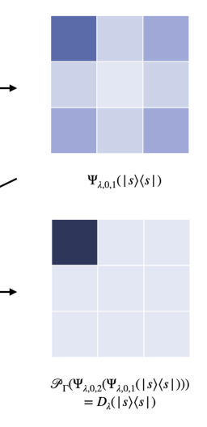 
Figure 4: Depicts the decomposition presented in Lemma 32, which expresses the depolarizing channel as a chain of amplitude damping channels and a Hadamard channel. This example takes d = 3 and λ = 0.7 and the initial state |s⟩= 1 √

**Summary.** This paper introduces 'contraction' and 'expansion values' as advanced diagnostics for characterizing quantum channels. These sequences refine traditional contraction coefficients by employing variational principles over operator subspaces. They offer crucial composition inequalities necessary for accurately modeling information loss in complex quantum processes.

**Why it may be interesting.** This work provides a rigorous mathematical framework for quantifying information loss in open quantum systems that is superior to existing single-number metrics, directly impacting the theoretical understanding of channel capacity.

Detailed structure

**Main problem.** The standard contraction coefficient for quantum channels is insufficient because it only captures the most optimistic behavior and fails to describe how channel degradation accumulates under composition.

**Main result.** The authors introduce 'contraction' and 'expansion values,' two monotone sequences that refine the original coefficients, providing superior bounds for channel compositions.

**Method.** The new values are derived from a min-max variational principle over subspaces of traceless Hermitian operators and are shown to coincide with Gel'fand or Bernstein numbers in Pietsch's theory of s-numbers.

**Model / system.** The study focuses on general quantum channels (CPTP maps) acting on density matrices, particularly analyzing their behavior when restricted to the subspace of traceless Hermitian operators ($	ext{Herm}_0(d)$).

**Key observables.** Contraction and expansion values ($\hat{\kappa}_n(T), \check{\kappa}_n(T)$); these refine the standard contraction coefficient $\hat{\eta}(T)$.

**Important parameters / regimes.** The dimension $d$ of the system, and parameters related to specific channels like amplitude damping decay rates ($\lambda$).

**Assumptions / limitations.** The analysis relies on extending concepts from operator norms (like singular values) to a 1-norm context via variational principles.

**Figures summary.** Figure 3 illustrates the hierarchy and mathematical relationships between various s-number types (an, cn, dn, etc.) used for characterizing operators. Figure 4 shows the decomposition of a depolarizing channel.

**Paper structure.** The paper progresses by first identifying the limitations of $\hat{\eta}(T)$, then introducing the variational definitions ($\hat{\kappa}_n, \check{\kappa}_n$), establishing their relationship to s-numbers and singular values, and finally applying these tools to analyze composite channels like $T_1 \oplus T_2$.

Abstract

The contraction coefficient of the trace distance is a central tool in quantum information, quantifying how strongly a quantum channel degrades the distinguishability of states. However, being an extremal ratio, it captures only the most optimistic behaviour of the channel and is often trivial, even for very noisy channels. Moreover, a single scalar is poorly suited to describe how contraction accumulates under channel composition. In this work we introduce the \emph{contraction and expansion values}, two monotone sequences that refine the contraction and expansion coefficients in the same way singular values refine the operator norm. They arise from a min--max variational principle over subspaces of traceless Hermitian operators, admit an operational interpretation in terms of two state-discrimination games, and are shown to coincide with the Gel'fand or Bernstein numbers of the channel restricted to traceless operators. This identification places the sequences within Pietsch's theory of $s$-numbers and yields, in particular, bounds under channel composition that the contraction coefficient alone cannot provide. We establish their main structural properties and compute or estimate them for single-qubit channels, $d$-dimensional amplitude damping channels, and direct-sum channels.

[↑ back to top](#top)

### [Device-independent Quantum Key Distribution in the commuting operator framework](http://arxiv.org/abs/2607.03579v1)

**Authors:** Gereon Koßmann, René Schwonnek, Po-Chieh Liu, Hao-Chung Cheng  
**Type:** theory · **Category:** quantum information and computing · **PDF:** <https://arxiv.org/pdf/2607.03579v1>  
**Analysis basis:** full PDF text, analyzed in chunks
**Topic relevance:** `entanglement & information structure` **2/5** · `Keldysh / 2PI / non-Gaussian methods` **1/5** · `correlated / nonlocal dissipation` **1/5** · `driven-dissipative phase transition` **1/5** · `methods for driven-dissipative` **1/5**

📷 Fig 1

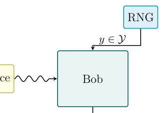 
Figure 1. The figure illustrates a device-independent quantum key distribution (DIQKD) experiment. In contrast to the quantum game depicted in Figure 2, the referee is replaced by local random number generators (RNGs), one on each side. While sharing a quantum state ρAB, Alice and Bob use their respective RNGs to draw private and local random inputs, feed them into their devices, and collect the resulting output statistics.

📷 Fig 2

 
Figure 2. The figure illustrates a non-local quantum game. A source prepares a bipartite state ρAB and distributes it between Alice and Bob. Following a predetermined strategy, specified by the shared state together with their local measurements, Alice and Bob receive questions x ∈X and y ∈Y from a referee, feed them as inputs into their respective devices, and respond with the outcomes a ∈A and b ∈B produced by their local boxes.

**Summary.** This paper advances the theoretical understanding of Device-Independent Quantum Key Distribution by reformulating security analysis within the general commuting-operator framework. It overcomes limitations of previous methods that required restrictive structural assumptions on the underlying Hilbert space. The work establishes a rigorous mathematical link between observed quantum statistics and achievable key rates via non-commutative polynomial optimization.

**Why it may be interesting.** While focused on quantum cryptography, the reliance on advanced operator algebra techniques (von Neumann algebras) and optimization theory provides deep mathematical tools applicable to analyzing open quantum systems where standard Hilbert space assumptions break down.

Detailed structure

**Main problem.** To develop a maximally general mathematical framework for analyzing Device-Independent Quantum Key Distribution (DIQKD) security that avoids restrictive assumptions found in existing proof techniques.

**Main result.** The authors provide a representation-independent route from observed statistics to an AEP-based security statement using the commuting operator framework, and show key rate computation maps to a solvable Non-Commutative Polynomial Optimization (NPO) problem.

**Method.** The work employs advanced tools from von Neumann algebras, generalizing relative entropy calculations (Frenkel's formula) and casting the optimization problem into an NPA hierarchy relaxation scheme.

**Model / system.** The study models DIQKD experiments using the commuting-operator framework, which utilizes universal C*-algebras to represent local operations for Alice and Bob, thereby avoiding assumptions about tensor product structures in the Hilbert space.

**Key observables.** Secure key rates, relative entropy, and conditional von Neumann entropy.

**Important parameters / regimes.** The security analysis depends on observed input-output statistics of the uncharacterized device.

**Assumptions / limitations.** The framework aims to overcome assumptions regarding tensor product structure and hidden finite dimensionality inherent in prior DIQKD analyses.

**Figures summary.** Figure 1 illustrates the general setup of a DIQKD experiment involving Alice, Bob, a source, and local random number generators.

**Paper structure.** The paper builds by first establishing the commuting-operator framework, then generalizing necessary tools like relative entropy to von Neumann algebras, proving key technical results (like PVM assumption), and finally formulating the security rate calculation as an NPO problem solvable via NPA relaxations.

Abstract

Device-independent quantum key distribution (DIQKD) is arguably the gold standard for secure quantum communication, as it aims to rely only on observed input-output statistics of an uncharacterized device which is only assumption to obey the laws of quantum physics. A corresponding security analysis hence demands a description of a quantum experiment from a most general perspective. Under close inspection, existing proof techniques do not always meet this goal as they tend to rely on subtile assumptions on a tensor product structure of the underlying Hilbert space and a 'hidden but finite' dimensionality. In this work, we collect the tools needed for a full analysis of DIQKD in the commuting operator framework, which avoids these subtilities and provides the arguably most general view on a quantum experiment. We rigorously proof the common assumption that in DIQKD measurements can be w.l.o.g. assumed to be projective. Furthermore, we show that task of computing key rates can be casted as a non-commutative polynomial optimization (NPO) problem to which the Navascués-Pironio-Acín (NPA) hierarchy gives a correct and converging relaxation.   As a tool, we generalize the integral representation for the relative entropy by Frenkel [Quantum 7, 1102 (2023)] to general von Neumann algebras and apply techniques from Kossmann and Schwonnek [arXiv: 2411.04858] for the approximation in an NPO program.

[↑ back to top](#top)

### [How Hard Is Quantum Advantage? A Cloud Microphysics Stress Test for Variational Quantum Models](http://arxiv.org/abs/2607.04915v1)

**Authors:** Felix Herbort, Ellen Sarauer, Daniel Ohl de Mello, Paul Christiansen, Steffen Hien, Cedric Brügmann, Dieter Jaksch, Veronika Eyring, Martin Kiffner, Mierk Schwabe  
**Type:** theory · **Category:** disordered systems and neural networks · **PDF:** <https://arxiv.org/pdf/2607.04915v1>  
**Analysis basis:** full PDF text, analyzed in chunks
**Topic relevance:** `methods for driven-dissipative` **2/5** · `Keldysh / 2PI / non-Gaussian methods` **1/5** · `analog quantum simulation` **1/5** · `driven-dissipative phase transition` **1/5**

📷 Fig 1

 
Figure 1: Hybrid quantum neural network architecture. (a) Our model consists of a quantum circuit with repeated trainable data encoding layers U and trainable entangling layers V . The circuit’s output state is measured on M qubits and basis state probabilities pm. (b) The probabilities are then fed into a classical post processing pipeline where polynomials g with trainable coefficients are applied to each pm and a weighted average h computes the final output.

📷 Fig 2

 
Figure 2: Evolution of our hyperparameter optimization objective for our hybrid QNN in (a) and FCNN architecture in (b). Each cross marks the R2 test performance of a single HPO trial model. Color brightness additionally encodes trial number, consistently to figures below. A dashed line marks the best model’s score up to the current state of the HPO.

📷 Fig 3

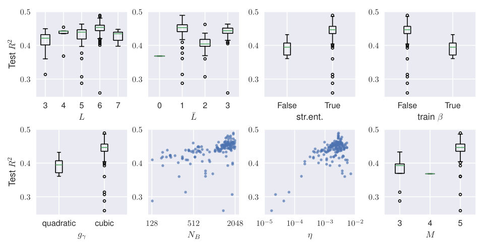 
Figure 3: QNN performance slices for all hyperparameters throughout the HPO. The first row shows number of data reuploading layers L, additional variational layers ¯L, use of strongly entangling layers and whether to train reuploading factors β. The second row shows classical post-processing polynomial gγ, batch size NB, learning rate η, and number of measurement qubits M. Box-plots refer to discretized hyperparameters where in each box plot, the central green line denotes the median, the box spans the interquartile range (IQR, Q1–Q3), the whiskers extend to 1.5×IQR beyond the box edges, and individual dots mark outliers beyond the whiskers. For most hyperparameters, this data gives a clear...

📷 Fig 4

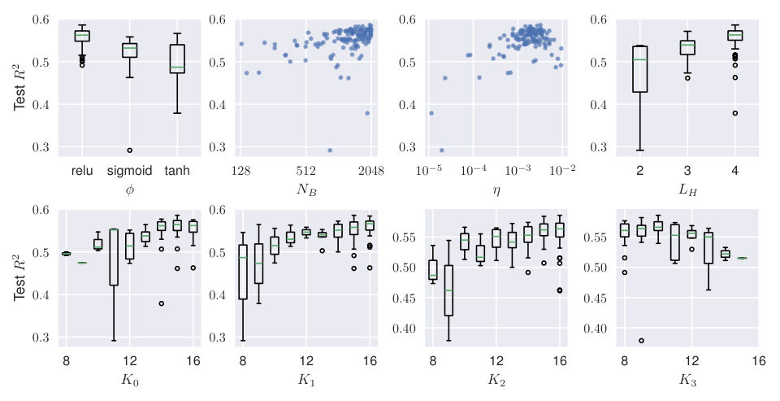 
Figure 4: FCNN performance slices for all hyperparameters throughout the HPO. The first row shows activation function ϕ, batch size NB, learning rate η, and number of hidden layers LH. The bottom row shows number of kernels Kl for the respective hidden layer l. Box-plots refer to discretized hyperparameters where in each box plot, the central green line denotes the median, the box spans the interquartile range (IQR, Q1–Q3), the whiskers extend to 1.5×IQR beyond the box edges, and individual dots mark outliers beyond the whiskers. The optimized hyperparameters show good agreement with established standards in classical neural network literature. For instance, increasing the numbers of layers...

📷 Fig 5

 
Figure 5: (a) R2 scores of all targets for QNN and FCNN. For all models we have a score of R2 &gt; 0 but FCNN outperforms the best QNN for every output. (b) Effect of number of trainable parameters on model performance. Except for few outliers which arise from uncommon choices of hyperparameters, FCNNs consistently outperform the QNN model. However, we note that simple parameter count comparison should not be the only quantity to compare as we discuss in Sec. 5.

**Summary.** This paper tests Quantum Machine Learning by applying hybrid QNNs to model cloud microphysics parameterizations crucial for climate science. Although the models show promise and benefit from extensive optimization, they fail to surpass optimized classical neural networks. The work highlights current bottlenecks in variational quantum models, suggesting that further theoretical and architectural improvements are needed before achieving practical quantum advantage.

**Why it may be interesting.** Although focused on condensed matter applications (cloud physics), the core challenge—developing scalable variational quantum circuits that outperform classical ML methods—is highly relevant to understanding resource scaling in quantum computation for complex physical simulations.

Detailed structure

**Main problem.** The paper assesses whether Quantum Machine Learning (QML) models, specifically Variational Quantum Circuits, can achieve a quantum advantage over classical counterparts when applied to complex physical parameterizations.

**Main result.** While QNNs benefit from extensive hyperparameter optimization and show feasibility, they were ultimately outperformed by optimized classical fully-connected neural networks on the cloud microphysics dataset.

**Method.** A hybrid Quantum Neural Network (QNN) architecture was trained using gradient descent to learn mappings between atmospheric state variables and their predicted changes. Performance was benchmarked against classical FCNNs.

**Model / system.** The system involves modeling cloud microphysics parameterization for climate models, utilizing data on water phase transitions in the atmosphere. The model uses a QNN structure with data encoding layers and variational entanglement layers, followed by classical post-processing.

**Key observables.** The primary performance metric is the $R^2$ score calculated on the test dataset after inverse preprocessing of the predicted tendencies ($\Delta$).

**Important parameters / regimes.** Key hyperparameters optimized included circuit depth ($L$), measurement qubits ($M$), learning rate ($\eta$), and various encoding/variational layer parameters.

**Assumptions / limitations.** The authors assume that a fair comparison requires restricting HPO ranges for both QNNs and FCNNs, and they acknowledge the difficulty in training on extreme outliers present in the physical data.

**Figures summary.** Figure 1 illustrates the hybrid QNN architecture. Figure 2 shows the convergence of the objective function during Hyperparameter Optimization (HPO) for both QNN and FCNN approaches.

**Paper structure.** The paper introduces the problem of QML feasibility in climate science, details the hybrid QNN/FCNN methodology using cloud microphysics data, presents extensive HPO results comparing architectures, analyzes bottlenecks like barren plateaus, and concludes by discussing necessary improvements for quantum models to be useful.

Abstract

Quantum machine learning (QML) could have the potential to leverage advantages of quantum over classical computing but still lacks strong evidence of actual improvements and scalability, partly due to phenomena such as barren plateaus. In this paper, we employ a hybrid quantum neural network (QNN) on a dataset on cloud microphysics, containing processes for phase transitions of water in the atmosphere and its related temperature changes, which are highly relevant for accurate climate predictions and projections. To reach optimal performance of our QNNs, we employ a rich and trainable frequency spectrum together with expressivity enhancing classical postprocessing. We find that our QNNs strongly benefit from extensive hyperparameter optimization and thereby demonstrate the feasibility of applying QNNs to complex physical systems. At the same time, the QNNs are outperformed by classical baselines in the form of simple fully-connected neural networks. We discuss identified bottlenecks of this class of quantum models to learn the full complexity of the cloud microphysics dataset to show that there is a need to further understand and improve variational quantum models for machine learning such that they might fill the gap where classical models fail or are inefficient.

[↑ back to top](#top)

### [Stellar Braid Monodromy of Finite-Rank Non-Gaussian Photonic States](http://arxiv.org/abs/2607.04007v1)

**Authors:** Arnaud Coatanhay, Angelique Dremeau  
**Type:** theory · **Category:** other · **PDF:** <https://arxiv.org/pdf/2607.04007v1>  
**Analysis basis:** full PDF text, analyzed in chunks
**Topic relevance:** `entanglement & information structure` **2/5** · `Keldysh / 2PI / non-Gaussian methods` **1/5** · `analog quantum simulation` **1/5** · `driven-dissipative phase transition` **1/5**

📷 Fig 1

 
Figure 1: Two-strand stellar braid generated by the binomial family (93). The left panel follows the two stellar zeros in the complex plane as the phase of the finite-Fock state is wound once; the right panel shows a braid projection using the real parts of the transported zeros. The figure illustrates the basic mechanism of the paper: a loop of non-Gaussian states of fixed stellar degree can exchange its stellar zeros and thereby define an element of B2.

📷 Fig 2

 
Figure 2: Cyclic three-strand stellar braid for the cubic binomial loop (97). The zeros form an equilateral configuration and return to the same unordered divisor after a cyclic relabeling. This is the simplest visual example in which the cubic finite-Fock family realizes a nontrivial braid in B3.

📷 Fig 3

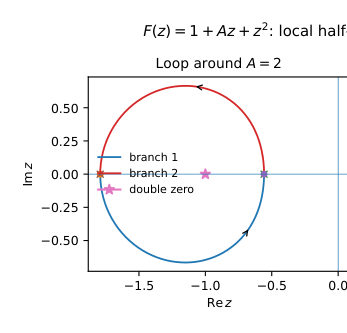 
Figure 3: Quadratic discriminant loop and local half-twist. For FA(z) = 1 + Az + z2, the fixed-B slice has discriminant points A = ±2. A small loop around A = 2 produces a collision-avoiding exchange of the two stellar zeros near the double root. This is the local model behind the statement that a smooth point of the stellar discriminant produces an elementary half-twist.

📷 Fig 4

 
Figure 4: Asymmetric cubic half-twist for the trinomial slice FA(z) = 1+Az2 +z3. The loop in the A-plane surrounds one point of the discriminant A3 = −27/4. Along this loop two stellar zeros perform a local exchange while the third remains separated. The example shows that sparse finite-Fock slices realize local braid generators without relying on the high symmetry of the cubic binomial family.

**Summary.** This paper introduces stellar braid monodromy as a novel, robust topological invariant for classifying finite-rank non-Gaussian bosonic states of light. By mapping the state space to an unordered configuration space, it shows that the movement of the state's defining zeros generates elements in the Artin braid group. This provides a powerful geometric tool complementing existing diagnostics like stellar rank.

**Why it may be interesting.** This work provides a powerful topological tool for characterizing quantum resources (non-Gaussianity) in photonic systems that goes beyond simple algebraic measures, linking quantum optics directly to deep mathematical structures like braid groups.

Detailed structure

**Main problem.** To assign a robust topological invariant, called stellar braid monodromy, to characterize regular parameterized families of finite-rank non-Gaussian bosonic quantum states.

**Main result.** The regular stratum of these state spaces is biholomorphic to the unordered configuration space of $r$ points in $\mathbb{C}$, and its fundamental group is the Artin braid group. The resulting monodromy invariant complements existing scalar measures of non-Gaussianity.

**Method.** The method involves mapping the quantum states (via their Bargmann representation) to a polynomial whose zeros define the stellar divisor. Braid monodromy is then calculated by tracking how these zeros move under continuous deformations in the state space, utilizing tools from algebraic topology and classical root theory.

**Model / system.** The system concerns single-mode photonic quantum states restricted to finite-Fock subspaces $H_r$. These non-Gaussian states are mathematically characterized by a finite stellar divisor encoded within their Bargmann representation polynomial.

**Key observables.** Stellar braid monodromy (an element of the Artin braid group $	ext{Br}$), Stellar Rank, Wigner negativity, and approximate stellar rank.

**Important parameters / regimes.** The degree $r$ of the finite-rank state; parameters defining the path or family within the regular stratum.

**Assumptions / limitations.** The analysis is restricted to 'regular' paths where all stellar zeros are simple, and it primarily concerns single-mode states, excluding mixed states or multi-mode dynamics.

**Figures summary.** Not specified in the notes; the focus is on mathematical structures (configuration spaces, braid groups) rather than explicit figure descriptions.

**Paper structure.** The paper establishes the connection between non-Gaussian states and polynomial zeros, identifies the regular stratum with a configuration space whose fundamental group is $	ext{Br}$, defines the monodromy invariant by tracking zero motion, and finally applies this to concrete physical examples like cubic subspaces.

Abstract

Finite-rank non-Gaussian bosonic states admit a holomorphic description in the Bargmann representation: after a zero-free Gaussian factor is separated off, their non-Gaussian structure is encoded by a finite stellar divisor. This article introduces a topological refinement of stellar rank for regular parameterized families of such states. Rather than only counting the zeros of the stellar divisor, we follow their motion under deformations of the state and record the associated braid monodromy. In the finite-Fock chart, a regular degree-r stellar state is represented by a monic polynomial with r simple zeros. The regular stratum is biholomorphic to the unordered configuration space of r points in the complex plane, and its fundamental group is the Artin braid group on r strands. Thus braid monodromy is an intrinsic invariant of loops in the regular finite-rank stellar state space. We then extend the construction to admissible finite stellar divisors of the form E_tau,mu(z) P(z); the zero-free Gaussian parameters form a contractible fiber over the same configuration-space base. Experimentally motivated finite-Fock families, especially the cubic subspace spanned by the first four Fock states, provide concrete laboratories, while trinomial slices yield explicit discriminants and local half-twists. The resulting invariant is post-tomographic and applies to preparation loops and parameterized families; it complements Wigner negativity, stellar rank, approximate stellar rank, and other scalar diagnostics of non-Gaussianity.

[↑ back to top](#top)

### [Uniform distributions in nonuniform systems: Wall potentials generating constant density profiles in classical density functional theory](http://arxiv.org/abs/2607.04863v1)

**Authors:** Jiří Janek, Alexandr Malijevský  
**Type:** theory · **Category:** statistical mechanics · **PDF:** <https://arxiv.org/pdf/2607.04863v1>  
**Analysis basis:** full PDF text, analyzed in chunks
**Topic relevance:** `Keldysh / 2PI / non-Gaussian methods` **2/5** · `analog quantum simulation` **1/5** · `methods for driven-dissipative` **1/5** · `non-equilibrium dynamics` **1/5**

📷 Fig 1

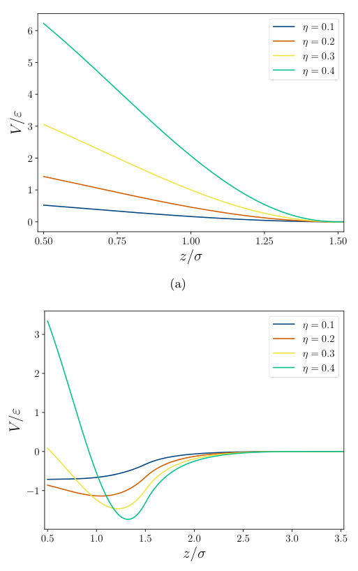 
FIG. 1. Planar wall potential that generates the prescribed constant density profile for several packing fractions η. (a) Hard-sphere fluid. (b) Fluid with attractive interactions for T = 1.5 k−1 B ε.

📷 Fig 2

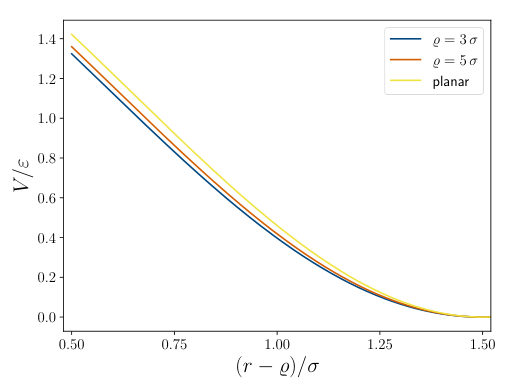 
FIG. 3. Hard-sphere wall potential in spherical geometry, V sph. HS (r −ϱ), for η = 0.2. Results for two sphere radii are compared with the planar limit V pl. HS (z). The effect of curva- ture is relatively weak in the purely repulsive system.

📷 Fig 3

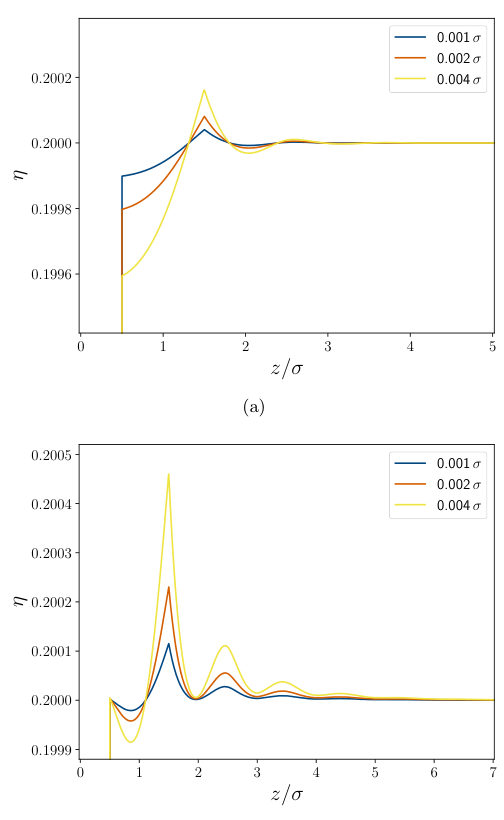 
FIG. 2. DFT density profiles in planar geometry obtained with the analytically constructed external potentials. (a) Hard-sphere fluid. (b) Fluid with truncated Lennard-Jones attraction at T = 1.5 ε/kB. Several grid spacings are shown, demonstrating convergence toward the prescribed flat profile.

📷 Fig 4

 
FIG. 4. Wall potential in spherical geometry for the fluid with attractive interactions, V sph. LJ (r −ϱ), shown for several sphere radii and compared with the planar result. For η = 0.2 and T = 1.5 k−1 B ε. In contrast to the hard-sphere case, curvature has a more pronounced effect on the depth and position of the attractive minimum.

📷 Fig 5

 
FIG. 5. DFT density profiles in spherical geometry for ηb = 0.2, ϱ = 3σ, and T = 1.5 k−1 B ε, using the derived external potentials. (a) Hard-sphere fluid. (b) Fluid with attractive interactions. Several grid spacings are shown, demonstrating convergence toward the prescribed flat profile.

**Summary.** This theoretical work tackles an inverse problem in Density Functional Theory by calculating the precise external wall potential needed to force a fluid's density profile to remain constant near a substrate. Using FMT, the authors derive explicit analytical solutions for planar and spherical geometries, providing powerful tools for understanding structure-cancelling boundary fields.

**Why it may be interesting.** While purely classical, the rigorous application of DFT and FMT to control boundary conditions is foundational knowledge for understanding confinement effects relevant to quantum systems like ultracold atoms near surfaces or optical lattices.

Detailed structure

**Main problem.** The study solves the inverse problem of classical Density Functional Theory (DFT): determining the external wall potential required to enforce a constant equilibrium density profile near an inhomogeneous substrate.

**Main result.** Explicit analytical expressions for 'structure-cancelling' wall potentials are derived for planar and spherical geometries, confirming that these potentials successfully recover the prescribed flat density profiles in independent DFT calculations.

**Method.** The authors utilize Fundamental Measure Theory (FMT) within the framework of classical DFT to derive self-consistent equations relating the required potential to the direct correlation functions and weighted densities.

**Model / system.** The system is a one-component fluid modeled using hard-sphere repulsion, optionally supplemented by a mean-field treated truncated Lennard-Jones attraction. The analysis covers planar, spherical, and cylindrical confinement geometries.

**Key observables.** Equilibrium density profile ($
ho(r)$), the required wall potential ($V(r)$), weighted densities ($n_\alpha$), and one-body direct correlation functions ($c^{(1)}$).

**Important parameters / regimes.** The geometry (planar, spherical, cylindrical) dictates the mathematical tractability; the interaction strength (hard-sphere vs. attractive tail) influences the required potential.

**Assumptions / limitations.** The analysis relies on solving the Euler-Lagrange equation derived from minimizing the grand-potential functional, and the attraction is treated only at the mean-field level.

**Figures summary.** Figures likely compare calculated density profiles against a constant reference value, demonstrating the accuracy of the constructed potentials across different geometries (e.g., planar vs. spherical).

**Paper structure.** The paper systematically tackles the inverse problem for three symmetries (planar, spherical, cylindrical), deriving explicit mathematical forms for weighted densities and correlation functions in each case before presenting the final wall potential required to maintain a constant density.

Abstract

We study the inverse problem of classical density functional theory for inhomogeneous fluids: finding the wall potential that produces a constant equilibrium density profile, i.e., a perfectly flat density distribution in the accessible region adjacent to a substrate. Within Rosenfeld's fundamental measure theory, we solve this problem for a one-component fluid in planar, spherical, and cylindrical geometries, considering both a hard-sphere fluid and a fluid with an additional truncated Lennard-Jones attraction treated at the mean-field level. Explicit analytical expressions are obtained for planar walls, while spherical walls also admit an analytical treatment in a more cumbersome form. The cylindrical case is treated numerically. The construction provides an explicit microscopic realization of structure-cancelling wall fields, related to flat-profile conditions that occur under special matching conditions in interfacial theories of wetting and drying. The theory also yields a compact collection of formulae for weighted densities and one-body direct correlation functions in the three fundamental geometries, providing useful reference expressions for density-functional implementations. The resulting analytic wall potentials are validated in independent density functional calculations, which confirm that the prescribed flat profiles are recovered within numerical accuracy.

[↑ back to top](#top)

### [A universal emulator for planar Ising lattices](http://arxiv.org/abs/2607.05308v1)

**Authors:** Riccardo Ben Alì Zinati, Alessandro Codello  
**Type:** theory · **Category:** statistical mechanics · **PDF:** <https://arxiv.org/pdf/2607.05308v1>  
**Analysis basis:** full PDF text, analyzed in chunks
**Topic relevance:** `analog quantum simulation` **2/5** · `Keldysh / 2PI / non-Gaussian methods` **1/5**

📷 Fig 1

 
Low-resolution page preview, page 2

📷 Fig 2

 
Low-resolution page preview, page 3

📷 Fig 3

 
Low-resolution page preview, page 4

📷 Fig 4

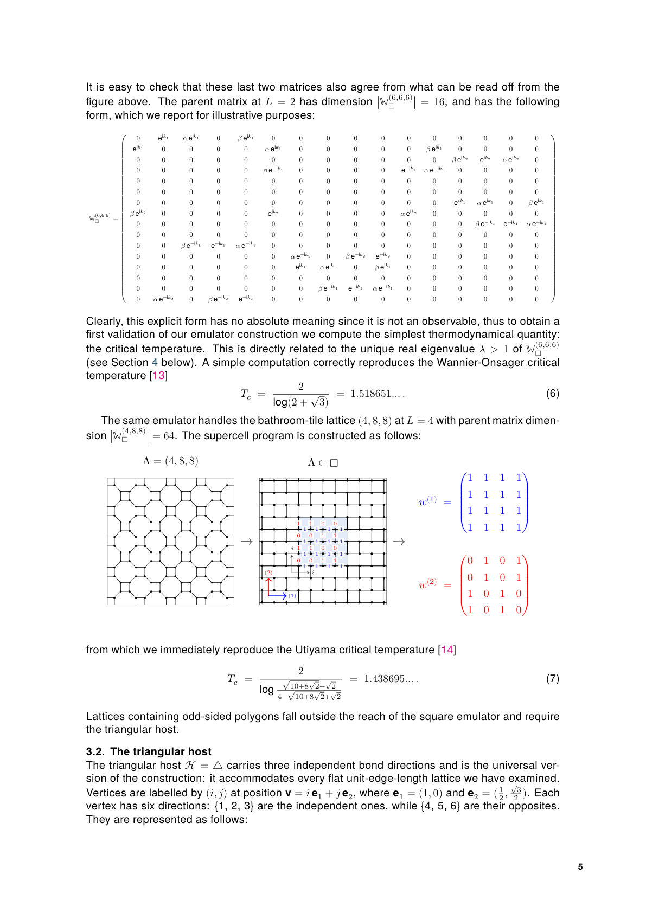 
Low-resolution page preview, page 5

📷 Fig 5

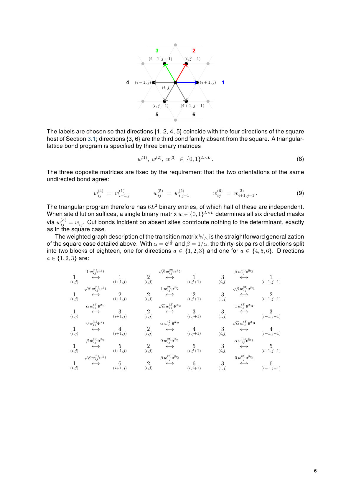 
Low-resolution page preview, page 6

**Summary.** This paper introduces an "Ising emulator," a universal computational framework that calculates the thermodynamics of diverse planar Ising lattices by representing them as dilutions of a single host lattice. By using the Feynman–Vdovichenko/Kac–Ward determinant, the authors demonstrate this method's power across numerous complex and disordered lattice geometries.

**Why it may be interesting.** While focused on classical statistical mechanics, the concept of using a fixed 'host' structure with variable masks to model complex systems is analogous to defining effective Hamiltonians or transfer matrices in open quantum systems or quantum simulation contexts.

Detailed structure

**Main problem.** To develop a universal computational framework (an "Ising emulator") for calculating thermodynamic properties of various planar Ising lattices.

**Main result.** The framework successfully applies to all eleven Archimedean lattices, twenty 2-uniform lattices, and extends directly to fractal and disordered Ising models using a single underlying machinery.

**Method.** It represents any target lattice ($\Lambda$) as a site or bond dilution of a fixed host lattice ($\mathcal{H}$), allowing thermodynamic calculations via the Feynman–Vdovichenko/Kac–Ward determinant formula.

**Model / system.** The system is the two-dimensional Ising model on planar lattices. The analysis uses an emulator approach by embedding the target lattice into a regular host (square or triangular) to calculate partition functions and thermodynamic quantities.

**Key observables.** Free energy, critical temperature ($T_c$), specific heat, entropy, and internal energy per spin.

**Important parameters / regimes.** Temperature ($T$), coupling constants ($\epsilon_c$, $\epsilon_{AF}$), and lattice structure/size parameters (e.g., $L$).

**Assumptions / limitations.** The core assumption is that thermodynamic properties are invariant under continuous topological deformations, allowing the use of a fixed host lattice for all calculations.

**Figures summary.** The notes indicate the presence of large, structured tables comparing calculated physical properties (Free energy, Specific heat $w(i)$, etc.) across numerous specific lattice types and sizes.

**Paper structure.** The paper introduces the emulator concept using the FV/KW method, details the construction for different hosts ($\square$ vs $	riangle$), applies this framework systematically to various classes of lattices (Archimedean, 2-uniform), and presents results in comparative tables across multiple lattice configurations.

Abstract

We introduce the notion of an Ising emulator for two-dimensional Ising models: flat, unit-edge-length lattices can be represented as site- or bond-diluted supercells of a single host lattice, for which the Feynman--Vdovichenko/Kac--Ward solution is fixed once and for all. We construct explicit square and triangular emulators and show that a single transition matrix, supplemented by lattice-specific binary masks, gives all the thermodynamic quantities of interest for both ferro- and antiferromagnetic couplings. We apply the framework to all eleven Archimedean lattices, to all twenty $2$-uniform lattices -- whose thermodynamics is obtained here for the first time -- and to several pentagonal lattices, and show that the same construction extends directly to fractal and disordered Ising models, with no modification to the underlying machinery.

[↑ back to top](#top)

### [HamQASBench: A Hamiltonian-Informed Diagnostic Benchmark for Evaluating Quantum Architecture Search](http://arxiv.org/abs/2607.04845v1)

**Authors:** Jiayang Niu, Akib Karim, Yan Wang, Jie Li, Ke Deng, Azadeh Alavi, Muhammad Usman, Yongli Ren  
**Type:** theory · **Category:** quantum information and computing · **PDF:** <https://arxiv.org/pdf/2607.04845v1>  
**Analysis basis:** full PDF text, analyzed in chunks
**Topic relevance:** `entanglement & information structure` **2/5** · `analog quantum simulation` **1/5**

📷 Fig 1

 
Figure 1: Visual illustration of Hamiltonian structural fingerprints for various molecules.

📷 Fig 2

 
Figure 2: Critical-structure analysis. (a,b) Tier 1 circuits collapse to 2-gate minimal forms. (c,d) Tier 2 yields two structurally distinct circuits targeting orthogonal degenerate eigenstates of CH2.

**Summary.** This paper introduces HamQASBench, a novel benchmark that evaluates Quantum Architecture Search (QAS) by incorporating detailed structural information derived from molecular Hamiltonians. By organizing test cases into five distinct structural tiers—ranging from simple product states to highly correlated systems—it reveals failure modes in current QAS methods that are invisible when only energy accuracy is considered.

**Why it may be interesting.** It provides a rigorous framework for testing quantum algorithms beyond simple energy minimization, forcing the evaluation of circuit structure relative to physical constraints, which is crucial for hardware-efficient algorithm design.

Detailed structure

**Main problem.** Existing benchmarks for Quantum Architecture Search (QAS) are insufficient because they ignore the underlying structural properties of the Hamiltonian, leading to failure modes undetectable by energy accuracy alone.

**Main result.** The proposed HamQASBench organizes molecules into five structural tiers based on Hamiltonian fingerprints, revealing critical failure modes in QAS methods such as over-parameterization and representation bottlenecks.

**Method.** The authors introduce a Hamiltonian-informed diagnostic benchmark that combines structural fingerprinting (from Pauli basis, computational basis, entanglement) with post-hoc critical-structure extraction procedures.

**Model / system.** The study focuses on simulating molecular electronic structure using Variational Quantum Algorithms (VQAs), specifically analyzing the qubit Hamiltonians derived from molecules like BeH2 and H4 chains.

**Key observables.** Structural fingerprints ($r_Z, G_1, G_2$), per-qubit von Neumann entropy ($	ext{MAES}$), pairwise state fidelity ($F_{ij}$), training-evaluation gap, and redundancy ratio ($
ho$).

**Important parameters / regimes.** Five structural tiers (Minimalism, Degeneracy, Representation, Topology, Scalability) define the test regimes; chemical accuracy is targeted at $1.6 	ext{ mHa}$.

**Assumptions / limitations.** Energy accuracy alone is insufficient for diagnosing structural appropriateness; structural consistency metrics ($	ext{MAES}, F_{ij}$) are necessary to validate learned circuit structures.

**Figures summary.** Figures illustrate Hamiltonian structural fingerprints and show how performance degrades when connectivity constraints (topology) are imposed, decoupling structural fidelity from energy metrics.

**Paper structure.** The paper first identifies the shortcomings of current QAS benchmarks. It then details HamQASBench by defining its five structural tiers based on comprehensive Hamiltonian analysis. Finally, it benchmarks several QAS methods across these tiers, analyzing failure modes like over-parameterization and scalability limits.

Abstract

Quantum Architecture Search (QAS) automates the design of parameterized quantum circuits for variational quantum algorithms, yet existing benchmarks organize instances by molecular identity or qubit count -- criteria agnostic to Hamiltonian structure -- and rely solely on energy accuracy, which cannot detect structural failures such as over-parameterization on near-product ground states. We introduce HamQASBench, a Hamiltonian-informed diagnostic benchmark organizing 11 molecules into five structural tiers via fingerprints derived from the Pauli operator basis, computational basis representation, and ground-state entanglement. A post-hoc critical-structure extraction procedure identifies minimal circuits consistent with each tier's requirements, complementing energy-based evaluation with per-qubit entanglement analysis and pairwise state fidelity. Benchmarking five QAS methods across four paradigms reveals failure modes invisible to conventional metrics: over-parameterization in the minimalism regime, eigenstate commitment under degeneracy, a representation bottleneck in strongly correlated systems, topology-induced routing failure, and circuit search space growth as a scalability bottleneck.

[↑ back to top](#top)

### [Noise-Aware Synthesis of Quantum LDPC Encoder Circuits via Two-Sided Hamming Descent](http://arxiv.org/abs/2607.04462v1)

**Authors:** Aditya Sodhani, Keshab K. Parhi  
**Type:** theory · **Category:** quantum information and computing · **PDF:** <https://arxiv.org/pdf/2607.04462v1>  
**Analysis basis:** full PDF text, analyzed in chunks
**Topic relevance:** `QC/QI experiment` **2/5** · `methods for driven-dissipative` **1/5**

📷 Fig 1

 
Figure 1: Our six-stage noise-aware encoder pipeline.

📷 Fig 2

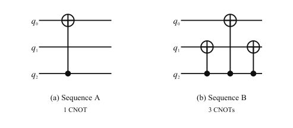 
Figure 2: The same matrix 𝑀= 𝐼+ 𝑒0𝑒⊤ 2 on three qubits is realized by CNOT circuits of different length, hence by the same unitary. (a) one gate; (b) three gates. Filled dots are controls, ⊕targets.

📷 Fig 3

 
Figure 3: The same four-qubit matrix 𝑀is implemented by two CNOT circuits of different gate count, so the shorter one replaces the longer. (a) five gates; (b) three gates. Filled dots are controls, ⊕targets.

📷 Fig 4

 
Figure 4: The two-sided move space reduces the residual 𝐴to the identity from both ends. Front (column-operation) and back (row-operation) moves act on 𝐴while maintaining 𝑀= 𝐿𝐴𝑅. See Section 3.1.

📷 Fig 5

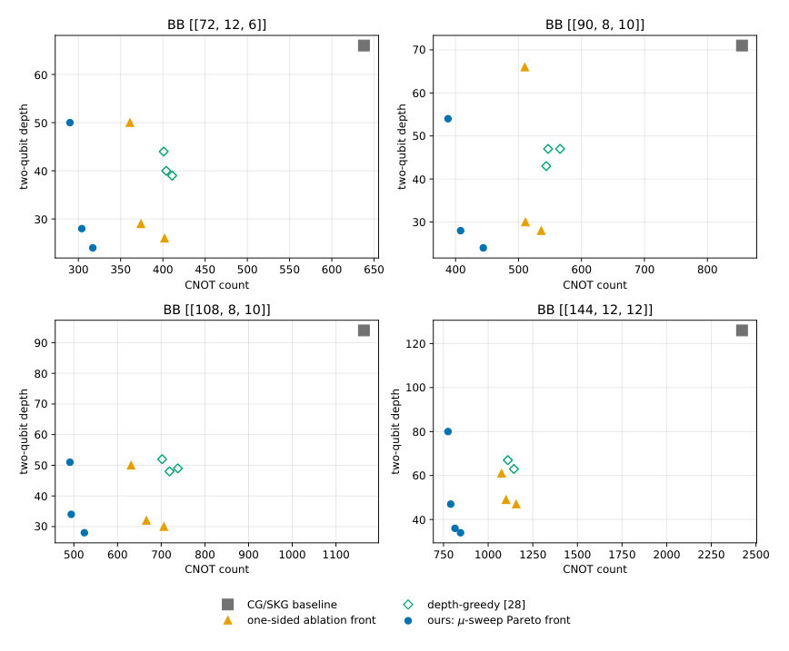 
Figure 5: Count–depth Pareto frontiers on the four BB codes. The two-sided front (blue, ours) dominates the one-sided ablation front (orange), the depth-greedy method of [32] (green), and the CG/SKG construction (gray) on both count and depth for every BB code. The depth-greedy front is the Pareto-optimal subset of that method’s four cost functions over many restarts.

**Summary.** This paper presents a compiler-level tool to synthesize quantum circuits for preparing LDPC code states by treating it as an algebraic matrix resynthesis problem. The authors introduce 'two-sided Hamming descent' and integrate this with noise-aware scheduling, achieving substantial reductions in gate count and depth compared to existing methods. This work provides a blueprint for optimizing resource usage when implementing complex quantum error correction protocols on real hardware.

**Why it may be interesting.** While focused on quantum error correction codes rather than AMO systems directly, the underlying principles of circuit synthesis, resource minimization (gates/depth), and noise modeling are highly relevant for designing control pulses or implementing complex gates in trapped ion or superconducting qubit architectures.

Detailed structure

**Main problem.** The core problem is efficiently synthesizing low-cost, noise-mitigating quantum circuits required to prepare encoded states for Quantum Low-Density Parity-Check (LDPC) codes.

**Main result.** The proposed pipeline significantly reduces CNOT gate counts by up to 68% and two-qubit depth by up to 71% compared to standard constructions, leading to higher fidelity state preparation under noise.

**Method.** It employs a novel optimization pipeline combining Two-sided Hamming Descent for circuit resynthesis with hardware-aware post-processing steps like commutation re-layering and live-range scheduling.

**Model / system.** The system involves fault-tolerant quantum computation using CSS LDPC codes (e.g., Bivariate Bicycle). The task is to find a minimal CNOT circuit realizing the linear transformation matrix defined by the encoder's CNOT block.

**Key observables.** CNOT gate count, circuit depth (ASAP vs. commutation-aware), routed two-qubit depth, and preparation error under hardware noise.

**Important parameters / regimes.** The optimization involves tuning parameters like the idle-to-gate error ratio ($\kappa$) and assessing initial reset error ($p_{	ext{reset}}$).

**Assumptions / limitations.** The method assumes that circuit redundancy can be removed via algebraic matrix reduction, and that hardware constraints (connectivity, idle time) significantly contribute to preparation error.

**Figures summary.** Figures illustrate the six-stage noise-aware encoder pipeline; other figures demonstrate the realization of the same unitary matrix with different lengths, confirming the synthesis problem.

**Paper structure.** The paper introduces the problem by noting redundancy in standard constructions. It details the novel two-sided Hamming descent optimization, followed by integrating this into a full pipeline that includes commutation re-layering and noise-aware scheduling to achieve hardware-optimal circuits.

Abstract

Quantum low-density parity-check (LDPC) codes are a promising route to fault-tolerant quantum computation, but their use requires efficient preparation of encoded states. Standard encoder constructions generate circuits through fixed algebraic procedures, yet the resulting circuit can contain substantial redundancy. We formulate LDPC encoder preparation as a circuit-resynthesis problem: given the linear-reversible matrix implemented by the encoder's CNOT block, we seek a lower-cost equivalent circuit that can be routed efficiently on the target hardware and which mitigates noise. We propose a novel optimization approach referred as two-sided Hamming descent and a noise-aware optimization pipeline for this task.   Across several families of Calderbank-Shor-Steane (CSS) LDPC encoders, including Bivariate Bicycle, hypergraph-product, and entanglement-assisted codes, the proposed pipeline produces substantially smaller and shallower encoder circuits than the standard constructions and the synthesis baselines considered, cutting gate counts by 53.8% in aggregate across the benchmark and by up to 68% on the Bivariate Bicycle family. The gains remain visible after routing, where the two-qubit depth is reduced by up to 71% and translate into higher-fidelity state preparation under circuit-level noise. On the Bivariate Bicycle family, live-range scheduling further reduces routed preparation failure by up to 13.7% without adding two-qubit gates to the selected circuit. These results indicate that encoder-matrix resynthesis, combined with hardware-calibrated selection and scheduling, is an effective compiler-level tool for preparing quantum LDPC code states.

[↑ back to top](#top)

### [A Cross-Platform Analysis of High-Performance Quantum Error Correction Codes](http://arxiv.org/abs/2607.04082v1)

**Authors:** Bryan Pan, Yufeng Xin  
**Type:** theory · **Category:** quantum information and computing · **PDF:** <https://arxiv.org/pdf/2607.04082v1>  
**Analysis basis:** full PDF text, analyzed in chunks
**Topic relevance:** `QC/QI experiment` **2/5**

📷 Fig 1

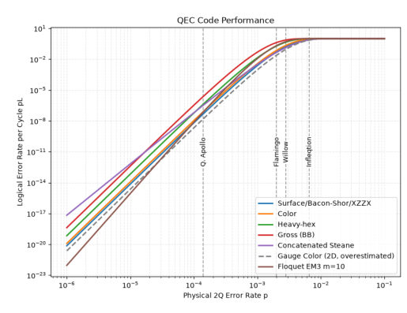 
Fig. 1: Logical error estimates per round vs. two-qubit error rate for different QEC codes

📷 Fig 2

 
Fig. 2: Distributed-QPU logical error estimate as a function of QPU count. Each QPU assumed to support 200 physical qubits, nphys ≈ 2d2, N2Q ≈11d2, and Ninter = 4d(q −1).

📷 Fig 3

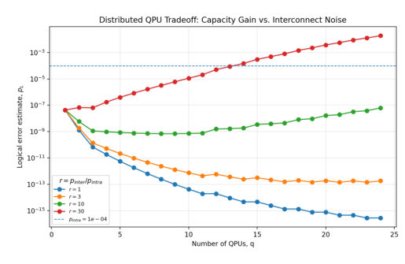 
Figure 2 shows the resulting logical error estimates as a function of the number of QPUs for different interconnect noise ratios defined as

📷 Fig 4

 
Fig. 3: Distributed-QPU BB logical error estimate as a function of QPU count. The model uses pintra = 10−4, N BB 2Q ≈18d2 and nBB phys ≈ d2 with λ = 0.25.

📷 Fig 5

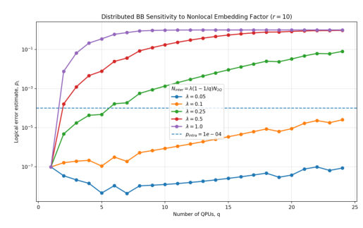 
Fig. 4: Sensitivity of the distributed BB analytical model to the nonlocal embedding factor λ for fixed pintra = 10−4 and r = 10.

**Summary.** This paper introduces a simple yet unified analytical framework to estimate the logical error rates of advanced Quantum Error Correction codes across diverse hardware platforms. By quantifying contributions from code structure and gate overheads, it allows researchers to rapidly identify performance bottlenecks in superconducting, trapped-ion, and distributed quantum systems. This work is critical for guiding the design toward scalable, fault-tolerant quantum computation.

**Why it may be interesting.** It provides a crucial theoretical tool for benchmarking different physical implementations (trapped ions vs. superconducting) against abstract coding theory requirements, which is vital for experimentalists designing fault-tolerant quantum processors.

Detailed structure

**Main problem.** Developing scalable quantum computers is hindered by physical noise and limited qubit counts, necessitating efficient Quantum Error Correction (QEC).

**Main result.** The authors present a unified analytical framework to estimate logical error rates for advanced QEC codes across various hardware platforms.

**Method.** They use an analytical framework that models logical failure based on the probability of exceeding a code's correctable fault threshold, separating contributions from code structure and two-qubit gate overhead.

**Model / system.** The analysis covers five advanced QEC codes (e.g., topological, qLDPC) applied to leading hardware platforms like superconducting circuits, trapped ions, and distributed quantum computing setups.

**Key observables.** Logical error rates ($p_L$), circuit volume decomposition ($N_{loc}$), and the identification of design 'sweet spots' in DQC.

**Important parameters / regimes.** Physical error rate ($p_{loc}$), code parameters ($[[n, k, d]]$), connectivity overheads (SWAP gates, routing).

**Assumptions / limitations.** The framework assumes the ability to separate intra-QPU and inter-QPU error sources for distributed systems; it also simplifies noise models compared to full-stack simulations.

**Figures summary.** Not specified in the notes, but the analysis compares performance across different codes and hardware platforms.

**Paper structure.** The paper introduces the problem of scalability, details the unified analytical framework by modeling error contributions, applies this framework to five code families on multiple hardware types, and concludes by identifying design optimization regions.

Abstract

The theory of quantum error correction was established decades ago. Yet the limitation of the quantum computing platforms in terms of noise level and available physical qubit count persists, which greatly hinders the development of scalable quantum computing systems. In this paper, we present analytical estimates of logical error rates of advanced QEC codes across leading hardware platforms and distributed quantum computing systems using a simple but unified framework. The analysis captures two dominant contributors to logical error: code structure and two-qubit gate overhead. The framework provides a fast estimate of logical error rates and identification of dominating factors in different hardware platforms, such as circuit volume, routing overhead, inter-QPU operations, or asymmetric noise protection. We show that several qualitative trends observed in larger-scale simulations can be reproduced and interpreted analytically within this framework. We further demonstrate that the framework can be used to find the sweet spot design region of distributed QEC, which is critical for the design of distributed quantum computing systems.

[↑ back to top](#top)

### [Breaking the One-Dimensional Expressibility-Trainability Tradeoff](http://arxiv.org/abs/2607.04598v1)

**Authors:** Kyoungho Cho, Yu-Seong Jeon, Jinhyoung Lee, Jeongho Bang  
**Type:** theory · **Category:** quantum information and computing · **PDF:** <https://arxiv.org/pdf/2607.04598v1>  
**Analysis basis:** full PDF text, analyzed in chunks
**Topic relevance:** `entanglement & information structure` **2/5**

📷 Fig 1

 
FIG. 1. Ansatz trajectories in the EP-EPD two-dial plane for n = 5, 10, 15, 20. Curves denote ansatz families; markers trace L = 1, . . . , 6, with labels at the first and final depths and arrows in the increasing-L direction. The axes are the coverage and variability dials in Eq. (17). Gray, green, and red mark the underexpressive, sweet-spot, and near-plateau regimes in Eq. (20), with thresholds fixed by Eq. (19).

📷 Fig 2

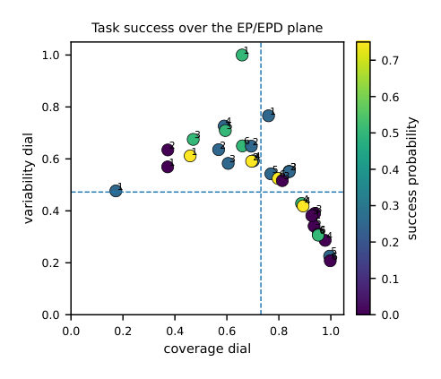 
FIG. 2. Task-level validation on the n = 5 route plane. Points are ansatz-depth pairs, color is empirical success probability, and dashed lines are xc, yc. High coverage with low EPD is less favorable for training.

📷 Fig 3

 
FIG. 3. Region-wise diagnostics: success probability, first-success iteration (lower is faster), and initial SPSA gradient scale. The sweet region is the fastest high-coverage region and outperforms near- plateau in success probability.

📷 Fig 4

 
FIG. 4. Depth scan for the ring-CZ hardware-efficient ansatz. The four panels show the Sim-style coverage proxy, family-averaged EP, family- averaged EPD, and the input-induced variance of a representative gradient. The key feature is the mismatch between the early saturation of the coverage proxy and the later collapse of EPD and the gradient scale.

📷 Fig 5

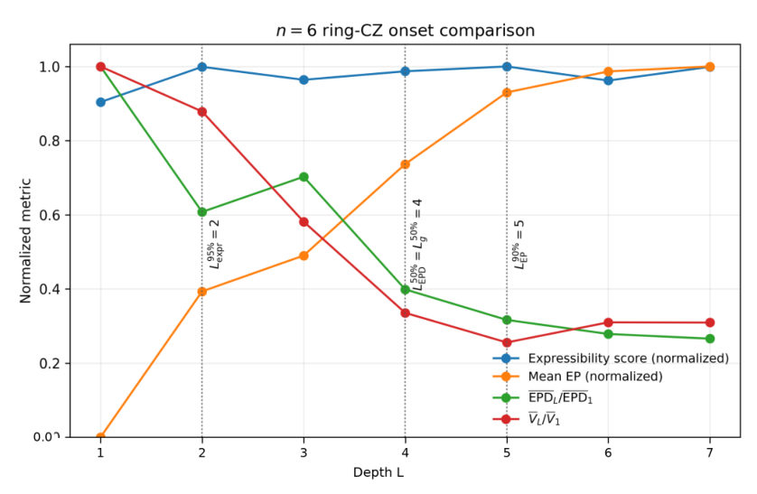 
FIG. 5. Normalized onset comparison for the n = 6 ring-CZ ansatz. The coverage proxy reaches a near-ceiling value at L = 2, while EPD and the representative gradient variance both pass their half-collapse thresholds at L = 4 in this finite-sample run.

**Summary.** This work refutes the simple one-dimensional tradeoff between how much a quantum circuit can explore Hilbert space (expressibility) and how easily it can be trained (trainability). By introducing Entangling-Power Deviation (EPD), the authors propose that ansatz design should target a 'sweet spot' region characterized by high coverage but low input variability, offering a practical guide for building robust PQCs.

**Why it may be interesting.** The development of a multi-parameter design rule ($	ext{EP}/	ext{EPD}$) provides concrete, actionable guidelines for designing variational quantum algorithms, which is crucial for practical applications in quantum simulation and computation.

Detailed structure

**Main problem.** The paper challenges the assumption that expressibility (Hilbert-space coverage) and trainability in Parameterized Quantum Circuits (PQCs) are governed by a single, one-dimensional tradeoff.

**Main result.** It establishes that this relationship is multi-faceted, proposing an $	ext{EP}/	ext{EPD}$ 'two-dial design rule' where high expressibility can be maintained while avoiding barren plateaus.

**Method.** The authors analyze a moment hierarchy involving global mean entanglement (EP), fluctuation descriptors (EPD), and local gradient variances to quantify circuit performance.

**Model / system.** The study focuses on Parameterized Quantum Circuits ($\hat{U}(	heta)$) acting on $n$ qubits, often probed using product-input states for benchmarking QML tasks.

**Key observables.** Entangling Power (EP), Entangling-Power Deviation (EPD), and local Gradient Variance are the key diagnostics used to characterize ansatz quality.

**Important parameters / regimes.** System size ($n$), circuit depth ($L$), and specific parameter regimes defined by the $	ext{EP}$-$	ext{EPD}$ plane are crucial parameters for analysis.

**Assumptions / limitations.** The local gradient variance calculation relies on product-input states and specific structural decompositions of the circuit, and the findings suggest a design rule rather than universal laws.

**Figures summary.** Figures illustrate ansatz trajectories in the $	ext{EP}$-$	ext{EPD}$ two-dial plane, distinguishing between optimal 'sweet spot' regimes (green), near-plateau sectors (red), and underexpressive regions (gray).

**Paper structure.** The paper first introduces the dilemma using moment analysis ($	ext{EP} 
ightarrow 	ext{EPD} 
ightarrow 	ext{Gradient Variance}$ hierarchy) to break the tradeoff into two dials. It then applies this framework via route scanning and validates the 'sweet spot' region by testing on actual quantum machine learning classification tasks.

Abstract

Expressive parameterized quantum circuits (PQCs) are often designed under a dilemma: the growth of expressibility and entangling power (EP) that improves Hilbert-space coverage is also expected to randomize an ansatz and activate barren-plateau (BP) conditions. We show that this dilemma is not a one-dimensional tradeoff. The usual picture collapses three inequivalent objects -- parameter-ensemble coverage, fixed-circuit entangling response, and local gradient moments -- into one scalar narrative. For a fixed circuit probed by Haar-product inputs, EP is a global two-copy mean of the output-entanglement distribution, whereas entangling-power deviation (EPD) is a global four-copy fluctuation descriptor. Gradient variance, however, is a local two-copy contraction selected by a parameter light cone and a cost observable. This moment hierarchy yields an analytic separation: equal EP need not imply equal trainability, as witnessed by equal-EP circuits with different EPDs and different gradient variances. These separations turn EP and EPD into a two-dial design rule for PQC ansatzes: EP measures how far the circuit has moved along the coverage dial, while EPD monitors whether input-dependent variability remains. We find that ansatz routes can reach high, Haar-like coverage before EPD and gradient variance collapse, showing that coverage and BP activation are distinct crossover events. The EP/EPD framework thus breaks the apparent one-dimensional expressibility-trainability tradeoff into a practical design rule: search for highly expressive PQCs in the window where coverage is high but BP-like homogenization has not yet erased trainable structure.

[↑ back to top](#top)

### [The Delayed Stabilizer ZX-Calculus](http://arxiv.org/abs/2607.04015v1)

**Authors:** Cole Comfort, Giovanni de Felice  
**Type:** theory · **Category:** quantum information and computing · **PDF:** <https://arxiv.org/pdf/2607.04015v1>  
**Analysis basis:** full PDF text, analyzed in chunks
**Topic relevance:** `analog quantum simulation` **1/5** · `correlated / nonlocal dissipation` **1/5** · `correlated cavity matter` **1/5** · `driven-dissipative phase transition` **1/5** · `entanglement & information structure` **1/5** · `methods for driven-dissipative` **1/5** · `non-equilibrium dynamics` **1/5** · `non-equilibrium universality` **1/5**

📷 Fig 1

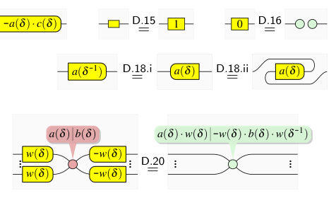 
Figure 2: Axioms of the delayed stabilizer ZX-calculus.

📷 Fig 2

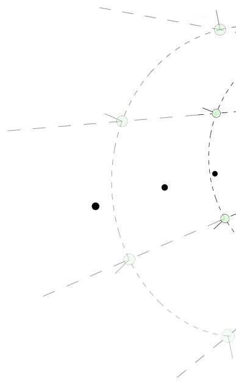 
Figure 3: Infinitely unrolled surface code of Example 14. Dotted lines denote wires connected by a Hadamard gate.

📷 Fig 3

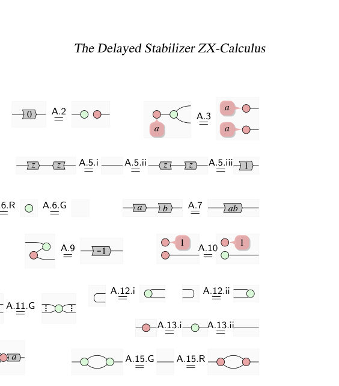 
Figure 4: Axioms of the Graphical Affine Algebra [7] (GAA), where a,b,z ∈K with z ̸= 0.

**Summary.** This paper introduces the delayed stabilizer ZX-calculus ($\delta$ZX), a novel graphical language designed to model quantum processes that exhibit infinite translational symmetry. By extending existing diagrammatic techniques with a 'delay' generator, it allows researchers to represent and analyze complex systems like lattice error-correcting codes. This provides a complete mathematical framework for understanding the symmetries of infinite quantum circuits.

**Why it may be interesting.** It provides powerful, rigorous mathematical tools for analyzing quantum systems whose complexity arises from periodic or infinite structures, which is crucial for understanding topological quantum computation.

Detailed structure

**Main problem.** Ordinary ZX-diagrams fail to capture the structure of quantum processes that are infinitely repeated across space or time, such as those found in lattice codes.

**Main result.** The introduction of the delayed stabilizer ZX-calculus ($\delta$ZX) provides a finite graphical language capable of representing and uniquely determining infinite, translation-invariant stabilizer groups.

**Method.** The calculus extends existing ZX-diagrams with a 'delay' generator ($\delta$) and is analyzed using two semantics: one based on equivalence classes of quantum channels, and another utilizing generating functions for Pauli operators.

**Model / system.** The framework models stabilizer quantum error-correcting codes and general infinite, translation-invariant processes. It builds upon the established connection between stabilizer states, affine Lagrangian subspaces, and the ZX-calculus in finite dimensions.

**Key observables.** Infinite stabilizer groups; equivalence classes of quantum channels; generating functions encoding families of Pauli operators.

**Important parameters / regimes.** The delay operator ($\delta$); field $\mathbb{F}_p(\delta)$; dimension $n$; the structure of translation-invariant patterns.

**Assumptions / limitations.** The core assumption is that infinite processes can be captured by extending finite diagrams with a delay element, and the mathematical machinery relies on establishing soundness, universality, and completeness for the generating tableau semantics.

**Figures summary.** Figures illustrate axioms of ZX involving various phases (a, b, c, d) encoding Pauli operators; examples show tableaux for computational basis, Hadamard, and Bell states.

**Paper structure.** The paper develops from establishing the finite-dimensional ZX-calculus equivalence to affine Lagrangian relations ($	ext{ALR}_{	ext{fd}}$), then introduces the delay generator $\delta$, and finally proves the full axiomatization of $\delta$ZX by reducing diagrams to a unique normal form (reduced AP-form).

Abstract

Many stabilizer quantum error-correcting codes are built from a finite pattern repeated across space or time, such as lattice codes, translation-invariant graph states, and quantum convolutional codes. Ordinary stabilizer ZX-diagrams capture only finite truncations of such systems, obscuring the repeated structure that defines them. We introduce the delayed stabilizer ZX-calculus, a finite graphical language for these infinite, translation-invariant processes. It extends the odd-prime-dimensional stabilizer ZX-calculus with a single new generator, the delay, which feeds data from one time step to the next. We equip the calculus with two semantics. In the first semantics, we interpret the behaviour of a delayed ZX-diagram as an equivalence class of sequences of quantum channels; where two sequences are identified if they have the same information content. We show that the behaviour of a delayed ZX-diagram uniquely determines an infinite stabilizer group. In the second semantics, we interpret the delay as a formal variable, encoding the translation-invariant families of Pauli operators as generating functions. This allows us to represent a delayed ZX-diagram in terms of a tableau of generating functions, from which the infinite stabilizer group can be recovered. Finally, we give a complete axiomatization of the delayed stabilizer ZX-calculus, featuring generalised Euler decomposition and colour change rules. Using generalised forms of local complementation and pivoting, we reduce every diagram to a unique normal form. This establishes soundness, universality, and completeness for the generating tableau semantics.

[↑ back to top](#top)

### [ML and AI for density functional theory: different priorities for Kohn-Sham and orbital-free DFT, for electronic and nuclear DFT](http://arxiv.org/abs/2607.04095v1)

**Authors:** Xin-Hui Wu, Sergei Manzhos  
**Type:** theory · **Category:** numerical methods · **PDF:** <https://arxiv.org/pdf/2607.04095v1>  
**Analysis basis:** full PDF text, analyzed in chunks
**Topic relevance:** `Keldysh / 2PI / non-Gaussian methods` **1/5** · `analog quantum simulation` **1/5** · `methods for driven-dissipative` **1/5** · `non-equilibrium dynamics` **1/5**

📷 Fig 1

 
Figure 1. A visual summary of main similarities and differences between electronic and nuclear DFT in Kohn-Sham and orbital-free paradigms as well as of opportunities for ML/AI methods to improve them.

📷 Fig 2

 
Figure 2. Potential energy curves of 16O nucleus computed with KS DFT and with OF DFT using an ML functional in Ref. 142, as a function of the quadrupole deformation parameter 2. Results from Thomas–Fermi and extended Thomas–Fermi (up to the 4th

📷 Fig 3

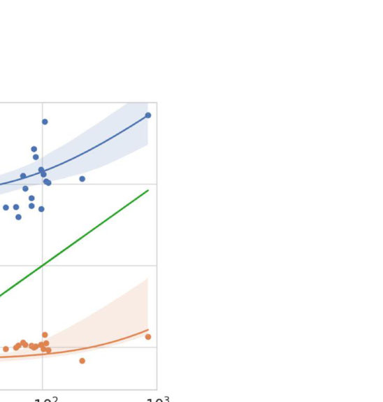 
Figure 3. Computational time tests of DFT with PBE0 and DM21 functionals and CCSD(T). The horizontal axis shows the computation time for a single SCF cycle for two-atom molecules made of elements from H to Ca (neutral form and cations) using the cc-pVTZ basis set and an energy tolerance of 10−9 a.u. using the CCSD(T), while the vertical axis shows the DFT computation time of these systems with DM21 and PBE0 functionals.

📷 Fig 4

 
Figure 4. Workflow of the symbolic functional evolution method use to discover XC functionals in Ref. 93. (A) A population of symbolic density functionals is iteratively evolved using an evolution algorithm. Each individual in the population represents the enhancement factors in a density functional. The performance of a density functional is characterized by its fitness, defined as the negative of validation energy error. (B) In each iteration, a tournament selection is performed on a subset of individuals sampled from the population. (C) The highest-fitness individual in the tournament is selected to be the parent. (D) Then, a child functional is generated by randomly picking one of the...

📷 Fig 5

 
Figure 5. Example of a basis function optimized in BigDFT192 to minimum energy, starting from a p-type Si-centered function, for a hydrogen-terminated Si nanoparticle.

**Summary.** This review surveys how Machine Learning and AI can revolutionize Density Functional Theory (DFT) for both electronic and nuclear structure calculations. It critically distinguishes between applying ML to the exchange-correlation functional versus approximating kinetic energy functionals directly from density. The work highlights that different physical regimes require tailored algorithmic approaches, suggesting a path forward for computationally intensive quantum simulations.

**Why it may be interesting.** While focused on condensed matter/nuclear physics, the core theme of using advanced machine learning techniques to solve high-dimensional many-body equations is highly relevant to developing efficient quantum simulation methods.

Detailed structure

**Main problem.** The paper addresses computational bottlenecks and accuracy requirements when applying Density Functional Theory (DFT) to both electronic and nuclear systems.

**Main result.** It outlines distinct methodological pathways for incorporating Machine Learning (ML) and Artificial Intelligence (AI), distinguishing between improving the exchange-correlation functional, kinetic energy functional, or basis sets.

**Method.** The authors compare standard DFT approaches (Kohn-Sham vs. Orbital-Free) with ML techniques like deep neural networks and symbolic regression to accelerate calculations.

**Model / system.** The scope covers electronic systems (atoms, molecules) governed by the Schrödinger equation in a mean-field approximation, and nuclear systems involving nucleons interacting via the strong force. Both are treated using density functionals ($
ho$).

**Key observables.** Electronic energies, band structures, binding energies, radii, and equations of state for nuclear matter.

**Important parameters / regimes.** The dimensionality of the problem (high), the scaling cost of standard methods (e.g., cubic scaling in KS DFT), and the specific functional being approximated (XC or KEF).

**Assumptions / limitations.** DFT is used to reduce N-body problems to density functionals; ML/AI must address different quantitative needs for electronic vs. nuclear systems.

**Paper structure.** The paper provides an overview, first detailing the computational challenges in both electronic and nuclear DFT, then mapping out how ML/AI can target specific components (XC functional, KEF) with different algorithmic choices.

Abstract

We overview similarities and, importantly, differences in computational bottlenecks and accuracy requirements that can be addressed with machine learning (ML) and artificial intelligence (AI) techniques in electronic and nuclear DFT. From these follow different promising methodological and algorithmic choices depending on whether one machine learns the exchange correlation (XC) functional, the kinetic energy functional (KEF), the density or the basis functions. In particular, while the popular deep neural networks remain a potent choice in the context of KS DFT, we highlight their disadvantages when building KEFs and highlight conceptual advantages - yet to be fully realized - of symbolic regression for both electronic and nuclear DFT. We point out promising approaches that can be carried from the more extensively investigated ML-enhanced electronic DFT to nuclear DFT.

[↑ back to top](#top)

### [Estimation of a sparse multi-qubit Hamiltonian via compressed sensing](http://arxiv.org/abs/2607.04669v1)

**Authors:** Juntao Tu, Yuanlong Wang, Shuming Cheng, Shuixin Xiao, Zhibo Hou  
**Type:** theory · **Category:** quantum information and computing · **PDF:** <https://arxiv.org/pdf/2607.04669v1>  
**Analysis basis:** full PDF text, analyzed in chunks
**Topic relevance:** `analog quantum simulation` **1/5** · `methods for driven-dissipative` **1/5** · `quantum measurements` **1/5**

📷 Fig 1

 
Fig. 1. The condition number of E(Φ†Φ) versus the qubit number , with the initial state being tensor product of single qubit each randomly generated from six eigenstates of cube measurement with equal probability (blue dots), or from a uniform probability distribution in Bloch sphere (red squares), and the black line shows the location where condition number is √

📷 Fig 2

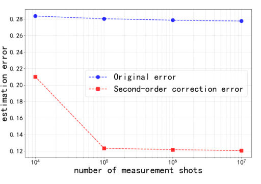 
Fig. 2. Simulated estimation errors for a 6-qubit Hamiltonian

📷 Fig 3

 
Fig. 3. Simulated estimation errors for a 30-qubit Hamiltonian

📷 Fig 4

 
Fig. 3 shows the estimation error of the CS as a function of the number of measurement shots in the system (30).

**Summary.** This paper presents a novel compressed sensing approach to estimate sparse Hamiltonians in large multi-qubit quantum systems. The key innovation is the 'scale transformation' technique, which mathematically restores necessary properties (RIP) to overcome ill-conditioning as the number of qubits increases. This allows for efficient Hamiltonian characterization using far fewer measurements than classically required.

**Why it may be interesting.** This work directly addresses the scalability bottleneck in quantum characterization, providing a theoretically rigorous method (scale transformation) to estimate complex Hamiltonians that would otherwise be intractable due to exponential parameter growth.

Detailed structure

**Main problem.** The core challenge is estimating a sparse Hamiltonian for large multi-qubit systems, where the number of parameters grows exponentially.

**Main result.** The authors propose a 'scale transformation' technique that restores the Restricted Isometry Property (RIP) to allow compressed sensing reconstruction even for high qubit numbers.

**Method.** The problem is formulated as solving a linear system $\bar{y} = \Phi h$ using Compressed Sensing, which requires specialized techniques like scale transformation to overcome ill-conditioning.

**Model / system.** The study concerns the Hamiltonian ($H$) of an N-qubit quantum system, where $H$ is assumed to be sparse. The evolution is governed by $\dot{
ho}(t) = -i[H, \rho(t)]$.

**Key observables.** Expectation values $\langle M_j \rangle_{\rho_i}$ measured from the system state.

**Important parameters / regimes.** Qubit number ($N$), sparsity level ($k$), and measurement count ($m$).

**Assumptions / limitations.** The Hamiltonian is $k$-sparse, and the method relies on random sampling of observables and states to ensure mathematical properties like RIP.

**Figures summary.** Figures illustrate the condition number increasing with N, showing failure for standard CS methods, and demonstrate successful estimation in 6- and 30-qubit systems using the proposed techniques.

**Paper structure.** The paper first establishes the linear measurement model $\bar{y} = \Phi h$. It then identifies the RIP failure as $N$ increases. The core contribution is developing and proving the 'scale transformation' to restore RIP, followed by numerical demonstrations on large systems.

Abstract

Hamiltonian estimation is an effective approach in studying the structure and dynamical evolution of quantum systems. The difficulty in estimating the Hamiltonian is that an $N$-qubit Hamiltonian has $4^N-1$ unknown parameters, requiring exponentially many equations for information extraction. In this paper we develop a method based on compressed sensing to estimate the Hamiltonian of a multi-qubit system. We identify a problem where as $N$ increases, the common sufficient condition (Restricted Isometry Property) for compressed sensing often fails, obstructing the application of compressed sensing in ($N\geq 3$)-qubit Hamiltonian estimation. To solve this problem, we propose a ``scale transformation" technique to restore RIP and ensure a compressive estimation of a $k$-sparse Hamiltonian using only $O(k\log(4^N/k))$ equations. In the numerical examples, we estimate the Hamiltonians of two 6- and 30-qubit systems, demonstrating the effectiveness of the method.

[↑ back to top](#top)

### [Uniform mixing and $ε$-uniform mixing on cycles](http://arxiv.org/abs/2607.04207v1)

**Authors:** Xiwang Cao, Cuiwen Zhu  
**Type:** theory · **Category:** other · **PDF:** <https://arxiv.org/pdf/2607.04207v1>  
**Analysis basis:** full PDF text, analyzed in chunks
**Topic relevance:** `analog quantum simulation` **1/5** · `driven-dissipative phase transition` **1/5** · `non-equilibrium dynamics` **1/5**

📷 Fig 1

 
Low-resolution page preview, page 2

📷 Fig 2

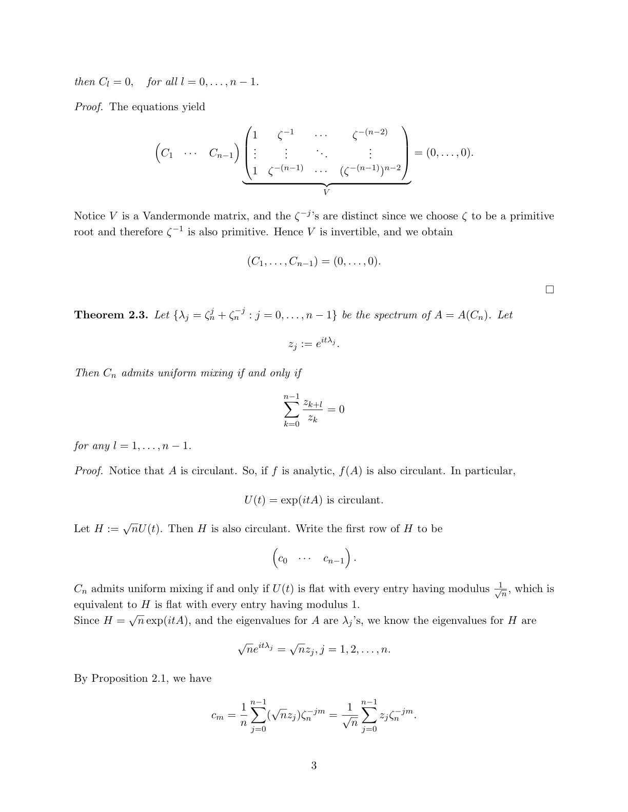 
Low-resolution page preview, page 3

📷 Fig 3

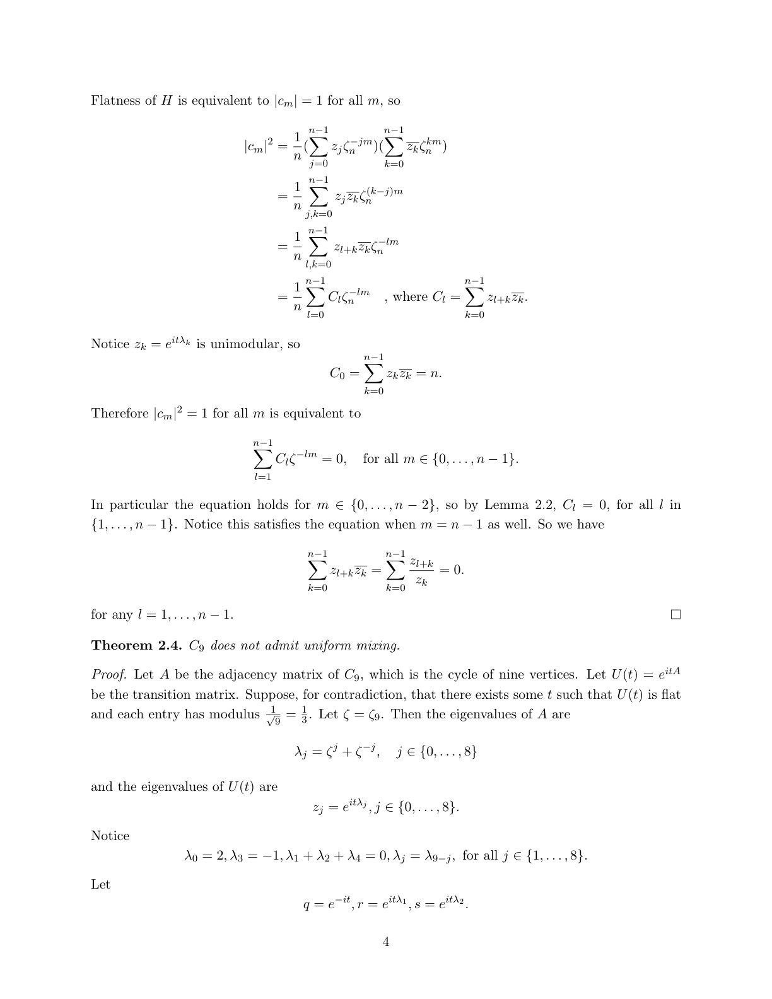 
Low-resolution page preview, page 4

📷 Fig 4

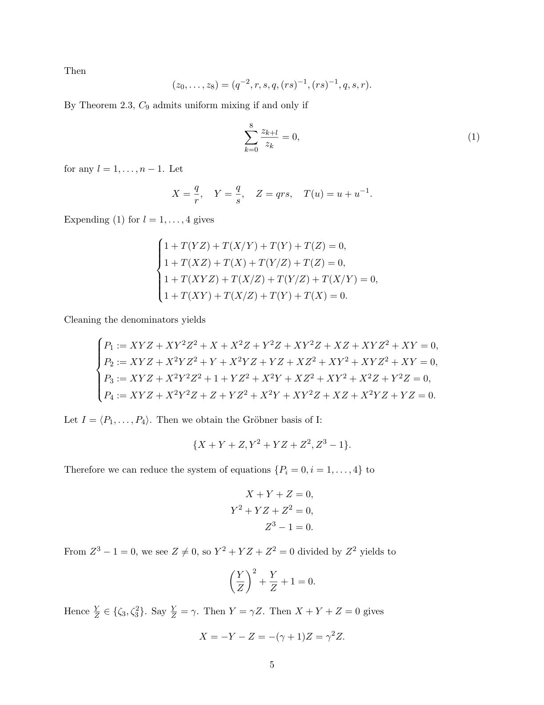 
Low-resolution page preview, page 5

📷 Fig 5

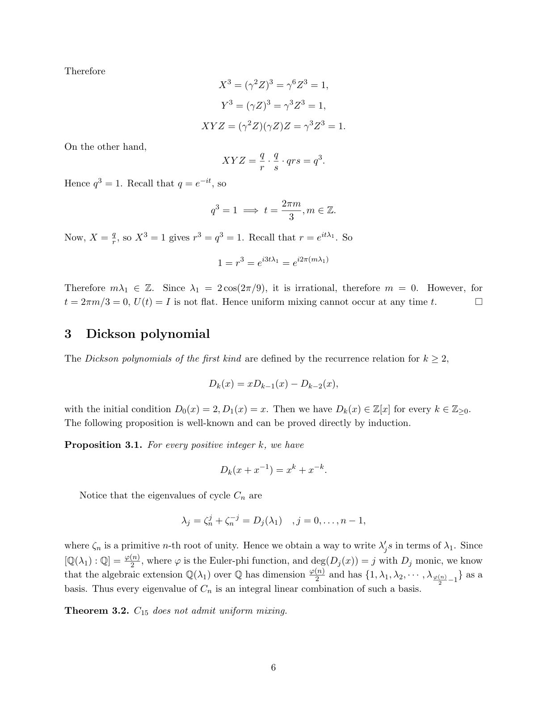 
Low-resolution page preview, page 6

**Summary.** This paper mathematically analyzes the mixing behavior of continuous-time quantum walks on cycle graphs. It establishes that certain cycles, such as $C_9$ and $C_{15}$, fail to achieve perfect uniform mixing at any time. Conversely, it proves a positive result by showing that for all prime powers $p^2$, the walk achieves $\epsilon$-uniform mixing.

**Why it may be interesting.** The rigorous mathematical analysis connecting graph structure (cycles) to quantum dynamical properties like mixing rates is highly relevant for understanding decoherence or thermalization in open quantum systems.

Detailed structure

**Main problem.** The study investigates the conditions under which continuous-time quantum walks on cycle graphs exhibit uniform or $\epsilon$-uniform mixing.

**Main result.** The paper proves that $C_9$ and $C_{15}$ never achieve uniform mixing, while demonstrating that for every prime $p$, the cycle $C_{p^2}$ does admit $\epsilon$-uniform mixing.

**Method.** The analysis combines spectral graph theory (using eigenvalues of the adjacency matrix) with advanced algebraic techniques like solving polynomial systems via Gröbner bases to derive necessary conditions for mixing.

**Model / system.** The model is a continuous-time quantum walk evolving on a cycle graph $C_n$, governed by the unitary evolution operator $U(t) = \exp(itA)$, where $A$ is the adjacency matrix of $C_n$.

**Key observables.** Uniform mixing (requiring $|U(t)_{u,v}|^2 = 1/n$) and $\epsilon$-uniform mixing ($\|U(t) \circ U(t)^{*−1} - nJ\| < \epsilon$).

**Important parameters / regimes.** The cycle length $n$ (specifically $C_9$, $C_{15}$, and $C_{p^2}$), the time $t$, and the error tolerance $\epsilon$.

**Assumptions / limitations.** The analysis heavily relies on properties derived from circulant matrices and algebraic number theory related to roots of unity.

**Paper structure.** The paper proceeds by first establishing general conditions for uniform mixing using spectral properties, then applying these methods via Gröbner basis computations to disprove mixing for $C_9$ and $C_{15}$, concluding with a constructive proof of $\epsilon$-uniform mixing for $C_{p^2}$.

Abstract

We study continuous-time quantum walks on cycles. We prove two complementary results. Firstly, the cycle $C_9$ does not admit uniform mixing at any time. Using the similar idea and Dickson polynomials, we prove that $C_{15}$ does not admit uniform mixing at any time neither. Secondly, for every prime $p$, we show that the cycle $C_{p^2}$ admits $ε$-uniform mixing.

[↑ back to top](#top)

### [Characterisation of a satellite-to-ground channel for continuous variable quantum key distribution protocol](http://arxiv.org/abs/2607.05109v1)

**Authors:** Emma Tien Hwai Medlock, Vinod N. Roa, Timothy Spiller, Rupesh Kumar  
**Type:** theory · **Category:** quantum information and computing · **PDF:** <https://arxiv.org/pdf/2607.05109v1>  
**Analysis basis:** full PDF text, analyzed in chunks
**Topic relevance:** `interference shaping light` **1/5** · `quantum optics experiment` **1/5**

📷 Fig 1

 
Figure 1: Satellite pass over the OGS. Here, the CV-QKD exchange occurs between zenith angles −30◦and +30◦. For this scenario, the satellite will have an altitude of 550 km.

📷 Fig 2

 
Figure 2: C2 N profiles as a function of altitudes (shown on the top) and the weighted C2 N profile for 550 km downlink as a function of zenith angles (shown on the bottom). Here the power law parameter for day time pday = 1.33 was used, random background turbulence parameter M = 1, root-mean-square high altitude wind speed vw = 21 m/s, and with the initial turbulence strengths as seen in the parameter table.

📷 Fig 3

 
Figure 3: Point ahead angle for a given satellite altitude. The PAA changes with increasing altitudes of the satellite, ranging from 250 km to 2000 km. This is a typical range for LEO satellites.

📷 Fig 4

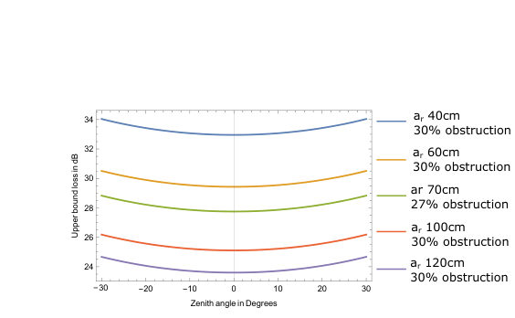 
Figure 4: Total upper bound channel loss with differing receiver aperture sizes. This was done for a strong turbulence regime, with a wavelength of 1550 nm, a transmitter aperture of 8 cm, a pointing error at the satellite of 4 µrad, and with the satellite at an altitude of 550 km.

📷 Fig 5

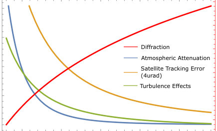 
Figure 5: The losses as a dependency of wavelength at the zenith is plotted. Here the atmospheric absorption lines have not been taken into consideration. The losses are plotted for a receiver aperture of 60 cm with 30% obstruction, a transmitter aperture of 8 cm, a pointing error at the satellite of 4 µrad, and with the satellite at an altitude of 550 km. This is the loss for a Gaussian modulated CV (GMCV) QKD protocol. For DV-QKD, there will be additional losses due to phase error [50–52] that GMCV does not need to consider as the transmitted local oscillator will experience the same phase drift as the quantum signal [53–55].

**Summary.** This paper characterizes the complex, zenith-angle dependent channel loss for continuous variable QKD links between satellites and ground stations. By modeling atmospheric turbulence effects, the authors demonstrate that despite these significant fluctuations in signal attenuation, secure key generation remains feasible under specific security assumptions.

**Why it may be interesting.** This work directly addresses the engineering challenges of implementing quantum communication in dynamic, real-world environments like space, which is a major focus area bridging quantum optics and applied physics.

Detailed structure

**Main problem.** The primary challenge is characterizing the dynamic channel loss experienced by continuous variable (CV)-Quantum Key Distribution (QKD) signals transmitted from a satellite to a ground station.

**Main result.** Despite the highly dynamic nature of the channel loss due to changing zenith angles, the authors show that it is possible to generate a positive secret key rate under restricted security assumptions.

**Method.** The methodology involves modeling the varying channel loss by integrating atmospheric structure parameters (like weighted C2^N) over the path length determined by the zenith angle. Key rates are then calculated based on these characterized loss parameters.

**Model / system.** The system modeled is a space-based CV-QKD link, specifically referencing parameters for the SPOQC mission at 550 km altitude using 1550 nm wavelength light.

**Key observables.** Channel loss (dynamic), achievable secret key rate, weighted C2^N profiles, and turbulence strengths.

**Important parameters / regimes.** Satellite altitude (550 km), Wavelength (1550 nm), Zenith angle range ($-30^\circ$ to $+30^\circ$), Turbulence regimes (low, medium, high).

**Assumptions / limitations.** The analysis relies on restricted Eve security assumptions and models the channel loss based on practical atmospheric propagation assumptions.

**Figures summary.** Figure 1 illustrates the QKD exchange window over zenith angles; Figure 2 shows profiles of C2^N versus altitude and weighted C2^N versus zenith angle, mapping turbulence strength.

**Paper structure.** The paper first characterizes the varying channel loss under practical assumptions for different turbulence strengths (Section II), followed by an analysis of the resulting achievable key rates for the CV-QKD protocol (Section III).

Abstract

In space based quantum key distribution (QKD) protocols, the quantum channel will be dynamic in nature and the channel loss will change with respect to the zenith angle. In the context of continuous variable (CV)-QKD, this will cause issues with parameter estimation and for a transmitted local oscillator in particular it will also fluctuate the shot noise. Therefore, it is vital to characterise this channel loss and the sources of this loss. In this paper the varying channel loss is characterised under practical assumptions. This is shown for various different scenarios, turbulence strengths, as well as wavelengths. This work shows, for the channel parameters considered, it is possible to generate a positive secret key if restricted Eve security assumptions are made.

[↑ back to top](#top)

### [Noise-limited secret key agreement with twin optical physically unclonable functions](http://arxiv.org/abs/2607.04936v1)

**Authors:** Georgios M. Nikolopoulos  
**Type:** theory · **Category:** quantum information and computing · **PDF:** <https://arxiv.org/pdf/2607.04936v1>  
**Analysis basis:** full PDF text, analyzed in chunks
**Topic relevance:** `entanglement & information structure` **1/5** · `interference shaping light` **1/5**

📷 Fig 1

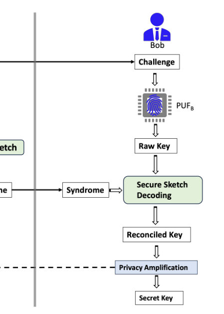 
Figure 1. Schematic representation of the main steps in the key agreement with twin PUFs.

📷 Fig 2

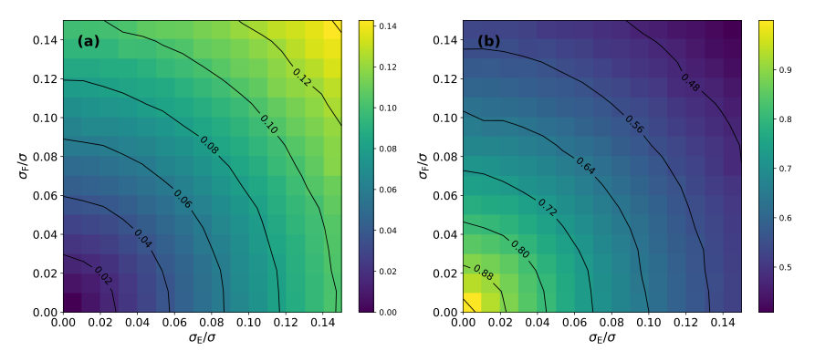 
Figure 2. The maximum BER Qmax (a) and the corresponding channel capacity Cmin (b), are shown for different standard deviations of fabrication and environmental noise. The results have been obtained for 200 independent twins and 200 independent realizations for each twin. The fabrication and environmental noise have been treated as described in Sec. 2 . Other parameters: N = 104, l/L = 0.2, 1−bit SLM, transmission geometry.

**Summary.** This paper proposes using twin optical PUFs as a physical source for establishing secret keys between two parties. It develops an explicit, information-theoretic key-agreement protocol that accounts for noise and fabrication imperfections. The work demonstrates how this hardware platform can securely generate pre-shared keys, potentially seeding Quantum Key Distribution networks without relying on computational assumptions.

**Why it may be interesting.** This work bridges quantum optics (light scattering in disordered media) with quantum information theory by proposing a hardware-based method for generating cryptographic keys, which is highly relevant to quantum networking infrastructure.

Detailed structure

**Main problem.** To develop an information-theoretic protocol for establishing a shared secret key using twin optical Physical Unclonable Functions (PUFs) that is robust against noise and environmental variability.

**Main result.** The authors developed a general, explicit key-agreement protocol incorporating secure sketches, error reconciliation, and privacy amplification, showing feasibility in specific noise regimes.

**Method.** The methodology involves modeling the PUF response using correlated optical scattering matrices and applying established cryptographic techniques (error correction codes) to distill a secret key from noisy raw measurements.

**Model / system.** The physical platform is based on twin Optical PUFs, where fingerprints are derived from speckle patterns generated by coherent light scattering through disordered optical structures. The underlying model uses transmission matrices whose elements are treated as complex Gaussian random variables.

**Key observables.** Speckle pattern intensity, final secret key length (lower bound), and the disagreement probability (Bit-Error Rate).

**Important parameters / regimes.** Fabrication variability ($\sigma_F$), environmental noise ($\sigma_E$), and the maximum allowed Hamming distance ($t$).

**Assumptions / limitations.** The protocol assumes that the challenge conveys no information about the PUF output, and it is designed to function without relying on computational assumptions or trusted third parties.

**Figures summary.** Figure 1 schematically illustrates the main steps in key agreement using twin PUFs, detailing the flow from raw measurements through reconciliation to the final shared secret key.

**Paper structure.** The paper first models the optical PUF response mathematically, then develops an information-theoretic protocol incorporating error correction and privacy amplification. It analyzes the security bounds based on noise parameters and concludes by discussing integration into QKD networks.

Abstract

We investigate the use of twin optical fingerprints derived from correlated physical unclonable functions (PUFs), as a hardware-based platform for cryptographic key generation and distribution. Each fingerprint is associated with a random, yet reproducible speckle pattern, generated when coherent light is scattered by a disordered optical structure. We consider a pair of correlated optical PUFs, and study the conditions under which two honest parties can establish a common secret key, despite fabrication-induced variability and environmental noise. An explicit information-theoretic key-agreement protocol is developed, incorporating secure sketches, error reconciliation, and privacy amplification. We quantify information leakage due to public helper data, and derive lower bounds on the length of the final secret key. The analysis identifies the noise regimes in which secure key agreement is feasible, and examines the performance of both practical and near-capacity reconciliation schemes. Finally, we discuss how twin optical PUFs could be integrated into quantum key distribution (QKD) networks, as a mechanism for establishing an initial pre-shared secret key between two honest users, without relying on computational assumptions or trusted third parties.

[↑ back to top](#top)

### [On estimating operator norm distance, with optimal trace distance estimation when one state is pure](http://arxiv.org/abs/2607.03905v1)

**Authors:** Yupan Liu, Qisheng Wang, Zhan Yu  
**Type:** theory · **Category:** quantum information and computing · **PDF:** <https://arxiv.org/pdf/2607.03905v1>  
**Analysis basis:** full PDF text, analyzed in chunks
**Topic relevance:** `entanglement & information structure` **1/5** · `quantum measurements` **1/5**

📷 Fig 1

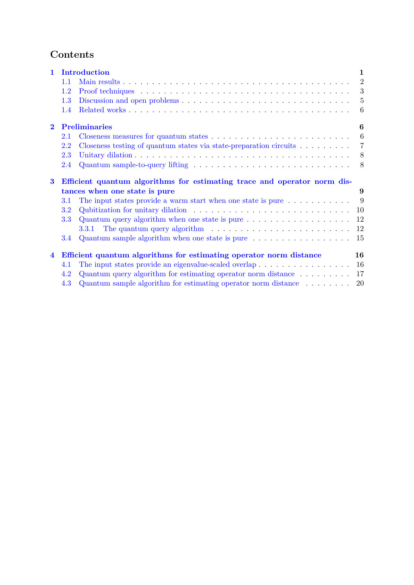 
Low-resolution page preview, page 2

📷 Fig 2

 
Low-resolution page preview, page 3

📷 Fig 3

 
Low-resolution page preview, page 4

📷 Fig 4

 
Low-resolution page preview, page 5

📷 Fig 5

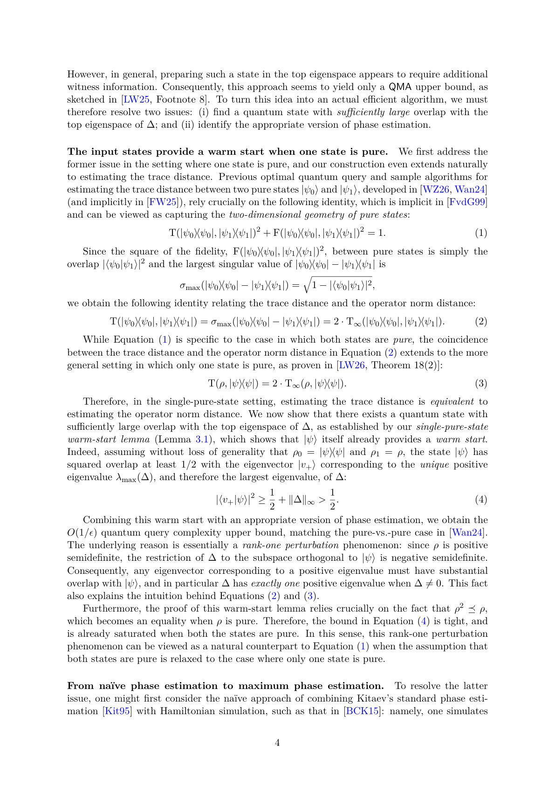 
Low-resolution page preview, page 6

**Summary.** This paper develops efficient quantum algorithms to estimate the operator norm distance between two quantum states. It achieves a breakthrough by providing estimators whose query complexity is independent of the state's rank, particularly when one state is pure. This significantly improves upon existing methods that scaled poorly with the dimension of the Hilbert space.

**Why it may be interesting.** This work provides fundamental algorithmic improvements for quantum information tasks, showing how structural properties (like purity) can lead to exponential speedups in estimating physical quantities like state distinguishability.

Detailed structure

**Main problem.** The paper investigates the computational complexity of estimating the operator norm distance, $T_{\infty}(
ho_0, 
ho_1)$, between two quantum states $
ho_0$ and $
ho_1$. The goal is to find estimators whose query complexity is independent of the state rank.

**Main result.** For the case where one state is pure, an optimal quantum estimator achieving $O(1/\epsilon)$ queries is provided, which is exponentially faster than prior methods dependent on state rank. For general states, a $\widetilde{O}(1/\epsilon^{3/2})$ query complexity estimator is derived.

**Method.** The authors utilize quantum query algorithms and techniques involving phase estimation applied to the difference operator $\Delta = (
ho_0 - 
ho_1)/2$. The analysis leverages structural properties, particularly when one state is pure, to establish 'warm starts' for the estimators.

**Model / system.** The system involves $n$-qubit quantum states ($
ho_0, 
ho_1$) prepared via polynomial-size circuits. The focus is on quantifying the distance between these states using operator norm and trace norms.

**Key observables.** Operator norm distance ($T_{\infty}$), Trace distance ($T$), Eigenvalues of difference operators ($\Delta$).

**Important parameters / regimes.** Error tolerance $\epsilon$, Number of qubits $n$, State rank/dimension (which the results aim to be independent of).

**Assumptions / limitations.** The states are prepared using polynomial-size quantum circuits. The analysis relies on establishing overlap guarantees, especially when one state is pure.

**Paper structure.** The paper progresses by first analyzing the optimal case (one pure state) to establish a rank-independent bound, then extending this to the general case for arbitrary states. The technical sections detail the application of phase estimation and error bounding techniques.

Abstract

We investigate the computational complexity of estimating the operator norm distance ${\rm T}_{\infty}(ρ_0,ρ_1)$, defined via the operator norm $\|A\|_{\infty} = σ_{\max}(A)$, given ${\rm poly}(n)$-size state-preparation circuits of $n$-qubit quantum states $ρ_0$ and $ρ_1$. We provide efficient quantum estimators for the operator norm distance whose complexity is independent of the rank (and thus the dimension) of the states:   1. When one state is pure, we establish an optimal quantum estimator using $Θ(1/ε)$ queries to the state-preparation circuits. Consequently, for constant additive error, say $ε=1/5$, our estimator runs in ${\rm poly}(n)$ time. Since the operator norm distance ${\rm T}_{\infty}(|ψ\rangle\!\langleψ|,ρ)$ is exactly half of the trace distance ${\rm T}(|ψ\rangle\!\langleψ|,ρ)$, our result also gives rank-independent query complexity for estimating both quantities, whereas the approaches due to van Apeldoorn, Cornelissen, Gily{é}n, and Nannicini (SODA 2023) and Wang and Zhang (TIT 2024) have query complexity scaling at least linearly with ${\rm rank}(ρ)$, which can be $\exp(n)$ in general.   2. For general quantum states, we also provide a quantum estimator using $\widetilde{O}(1/ε^{3/2})$ queries to the state-preparation circuits, which shows that the corresponding promise problem is ${\sf BQP}$-complete and improves the ${\sf QMA}$ upper bound sketched by Liu and Wang (ESA 2025). Together with an $Ω(1/ε)$ quantum query complexity lower bound, this leaves only square-root room for improvement.   The key intuition behind our estimators is that, when one state is pure, the pure state $|ψ\rangle$ has overlap at least $1/2$ with the top unit eigenvector of $|ψ\rangle\!\langleψ|-ρ$, reflecting a structural feature specific to the operator norm distance.

[↑ back to top](#top)

### [Schrodinger Oscillator and its Thermal Properties in a Dynamical Noncommutative Space](http://arxiv.org/abs/2607.04519v1)

**Authors:** Ilyas Haouam  
**Type:** theory · **Category:** statistical mechanics · **PDF:** <https://arxiv.org/pdf/2607.04519v1>  
**Analysis basis:** full PDF text, analyzed in chunks
**Topic relevance:** `Keldysh / 2PI / non-Gaussian methods` **1/5** · `driven-dissipative phase transition` **1/5**

📷 Fig 1

 
Figure 1: 3D plots of the NC energy eigenvalues ENC n,l as a function of quantum numbers n &amp; l, shown for

📷 Fig 2

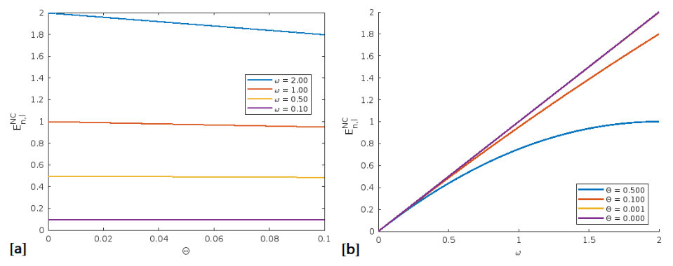 
Figure 2: (a) Energy eigenvalues ENC n,l as a function of Θ, shown for different values of the oscillator angular

📷 Fig 3

 
Figure 3: The DNC energy eigenvalues EDNC n,l as a function of the quantum number n, shown for different

📷 Fig 4

 
Figure 4: The DNC energy eigenvalues EDNC n,l as a function of the quantum number l, shown for different

📷 Fig 5

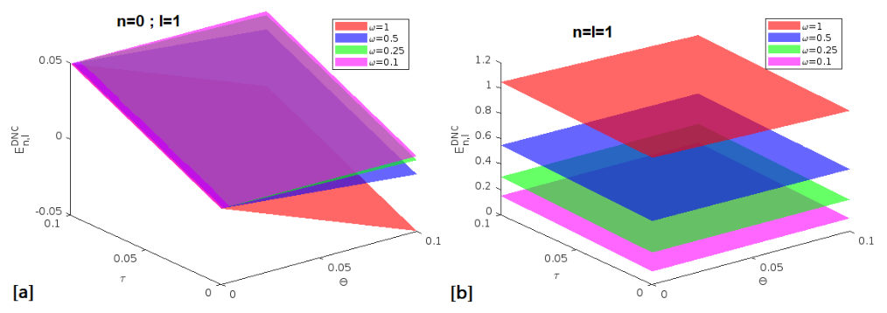 
Figure 5: 3D plots of the NC energy eigenvalues ENC n,l as a function of NC and DNC parameters Θ and τ,

**Summary.** This paper theoretically examines how modifying the spatial structure of space using Dynamical Noncommutative (DNC) geometry affects the energy levels and thermal behavior of a 2D Schrödinger oscillator. By applying perturbation theory and analyzing the partition function, the authors quantify the impact of noncommutativity parameters ($\Theta$ and $	au$) on thermodynamic observables like entropy and specific heat.

**Why it may be interesting.** The incorporation of noncommutative geometry into standard quantum models like the harmonic oscillator provides a theoretical framework for exploring physics at very small scales (like those relevant in quantum gravity), which can manifest observable effects on thermodynamic quantities.

Detailed structure

**Main problem.** The study investigates the thermal properties and energy eigenvalues of a two-dimensional Schrödinger oscillator subjected to dynamical noncommutative (DNC) space modifications.

**Main result.** The analysis shows that both noncommutativity ($\Theta$) and DNC deformation ($	au$) modify the system's energy spectrum and thermodynamic quantities, with specific effects observed in different temperature regimes.

**Method.** The research employs perturbation theory to calculate first-order corrections to the eigensystem and utilizes the partition function ($Z$) to analyze thermal properties across various temperature limits.

**Model / system.** The model is a 2D Schrödinger oscillator whose dynamics are governed by a Hamiltonian defined on a Dynamical Noncommutative (DNC) space. This geometry introduces position-dependent commutation relations, $\Theta(X, Y)$.

**Key observables.** Partition function ($Z$), Free energy ($F$), Internal energy ($U$), Specific heat capacity ($C$), and Entropy ($S$).

**Important parameters / regimes.** The DNC parameter ($	au$), the noncommutativity parameter ($\Theta$), and the thermal inverse temperature ($eta$) are crucial parameters governing the system's behavior.

**Assumptions / limitations.** The analysis relies on assuming that $	au$ and $\Theta$ are small enough for perturbation theory to be valid, and it addresses inherent non-Hermiticity by employing transformations like the Dyson map.

**Figures summary.** Figures illustrate the dependence of thermodynamic quantities ($Z, F, U, C, S$) on parameters such as temperature ($eta$), oscillator frequency ($\omega$), $\Theta$, and $	au$.

**Paper structure.** The paper systematically derives the modified Hamiltonian using perturbation theory, calculates the energy eigenvalues incorporating both NC and DNC terms, and then uses these results to compute and analyze the full set of thermal observables ($Z, F, U, C, S$) across different temperature regimes.

Abstract

In this paper, we study the two-dimensional Schrodinger oscillator within a dynamical noncommutative (DNC) space. By leveraging perturbation theory, we derive the energy eigenvalues and eigenvectors and systematically analyze the effects of both dynamical and non-dynamical noncommutative settings. First-order corrections to the eigensystem are obtained, revealing that the energy shift explicitly depends on the DNC parameter tau. Furthermore, we explore the thermal properties of the system by employing the partition function. Numerical results are presented to provide a comprehensive analysis of the system behavior under the considered effects. Notably, in the DNC framework, the commutation relations and the deformation parameter are position-dependent. Using the two-dimensional Bopp-shift, we effectively map the noncommutative problem to its commutative counterpart.

[↑ back to top](#top)

### [Atomic oven with rapid thermal response for atom experiments](http://arxiv.org/abs/2607.04393v1)

**Authors:** Weilong Huang, Congjun Zou, Feiyu Dong, Huirong Xiao, Zejian Ren, Shanchao Zhang  
**Type:** experiment · **Category:** other · **PDF:** <https://arxiv.org/pdf/2607.04393v1>  
**Analysis basis:** full PDF text, analyzed in chunks
**Topic relevance:** `non-equilibrium dynamics` **1/5**

📷 Fig 1

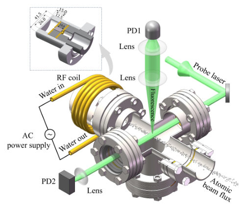 
FIG. 1. Experimental setup of the inductively heated atomic source and optical detection system. A radio-frequency- driven copper induction coil surrounds the atomic crucible, while fluorescence and absorption of the atomic beam are probed downstream using a resonant laser. Inset: Schematic of the atomic crucible and collimating nozzle geometry. The crucible is machined from 304 stainless steel and optimized by balancing eddy current penetrating depth considerations and vacuum machining constraints. Key geometrical parameters, including crucible wall thickness and capillary dimensions, are indicated in units of millimeters (mm).

📷 Fig 2

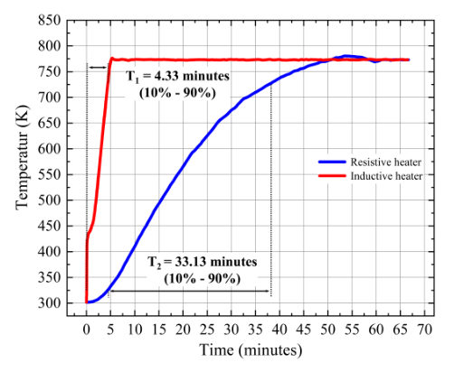 
FIG. 2. Time-resolved temperature evolution of the atomic crucible under resistive heater (blue) and inductive heater (red), measured under identical geometrical configurations and target temperature (773 K). The time constants T1 and T2 represent the 10 %–90 % rise times, indicating the significantly faster thermal response of the inductive heating method.

📷 Fig 3

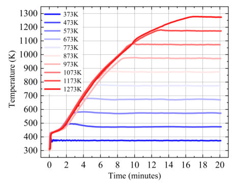 
FIG. 3. Wide-range thermal setpoint-programmed heating. Time-resolved temperature profiles demonstrating the sys- tem’s ability to rapidly reach and maintain precise target temperatures across an extensive range from 373 K to 1273 K. This confirms not only the fast thermal response but also the high maximum operating temperature and excellent long- term stability of the inductive heating setup.

**Summary.** The paper introduces an innovative inductive heating design for atomic ovens used in quantum physics experiments. This new heater significantly accelerates the temperature ramp-up time compared to conventional resistive heaters while maintaining high stability up to 1200 K. The resulting oven can generate highly collimated, high-flux atomic beams, promising to drastically improve efficiency in cold atom research.

**Why it may be interesting.** This work directly addresses a critical engineering bottleneck (slow thermal response) in cold atom and quantum gas experiments, providing a robust platform necessary for increasing experimental uptime and repetition rates in AMO research.

Detailed structure

**Main problem.** The slow thermal response time of conventional resistive heating methods used in atomic ovens significantly prolongs apparatus preparation time for quantum gas experiments.

**Main result.** A new inductive heater design was developed, achieving a 7.65-fold improvement in heating rate and enabling stable operation up to 1200 K while generating high-flux ytterbium beams.

**Method.** The authors designed and tested an atomic oven using inductive heating via an AC driven copper coil, comparing its performance against traditional resistive heating methods.

**Model / system.** The system is an atomic oven used to generate a controllable, collimated beam of atoms (e.g., Yb). The thermal dynamics are modeled using heat transfer equations ($rac{C_p}{m}rac{dT}{dt} = P_{in} - P_{loss}$), and the control loop uses PI feedback.

**Key observables.** Atomic flux exceeding $10^{14} 	ext{ atoms/s}$, temperature stability ($\Delta T < \pm 2	ext{ K}$), and heating rate comparison (7.65x improvement).

**Important parameters / regimes.** Temperature range up to $1200	ext{ K}$; flux measurement at $823	ext{ K}$.

**Assumptions / limitations.** The superior power transfer scaling of inductive coupling compared to contact-based resistive heating for refractory elements.

**Figures summary.** Figures compare time-resolved temperature evolution (resistive vs. inductive), show wide-range thermal setpoint programming, and display fluorescence spectroscopy confirming measured flux dependence on temperature.

**Paper structure.** The paper details the limitations of current ovens, introduces the inductive heating design based on theoretical modeling, presents experimental results comparing speed and stability against resistive methods, and concludes with measurements of high-flux atomic beams suitable for advanced quantum experiments.

Abstract

Atomic oven generating controllable atomic beam flux plays a fundmental role in quantum gas experiments. Here, we report a new heater design that can heat up an high temperature atomic oven with fast thermal response. The new heater shows a heating rate improved by 7.65 times comparing to that of the onventional resistive heater while the crucible temperature can heated up to 1200K. With this oven, we generated a collimated ytterbium beam with flux exceeding $10^{14} \text{ atoms/s}$ at 823 K. We believe that our design offers a promising solution for shortening experimental dead time and improve the experiment efficiency in cold atom researches.

[↑ back to top](#top)

### [Benchmarking API Drift in LLM-Generated Quantum Code Across Successive SDK Versions](http://arxiv.org/abs/2607.04072v1)

**Authors:** Mohammad Arif Rasyidi, Syahirul Faiz  
**Type:** theory · **Category:** other · **PDF:** <https://arxiv.org/pdf/2607.04072v1>  
**Analysis basis:** full PDF text, analyzed in chunks
**Topic relevance:** `methods for driven-dissipative` **1/5**

📷 Fig 1

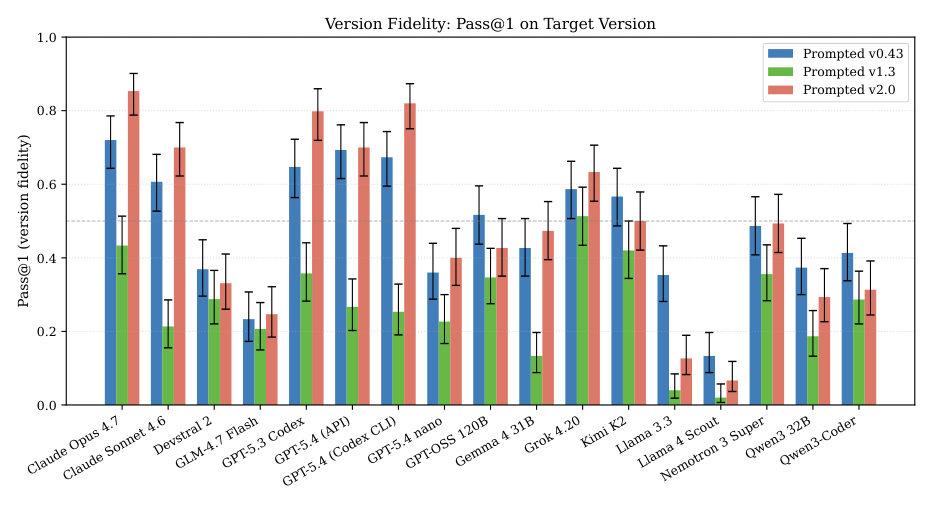 
Figure 1: Version fidelity (Pass@1 on the target version, i.e., diagonal of the drift matrix) for all models and all three Qiskit versions. Error bars show 95% Wilson confidence intervals. The v1.3 column is consistently the weakest across models.

📷 Fig 2

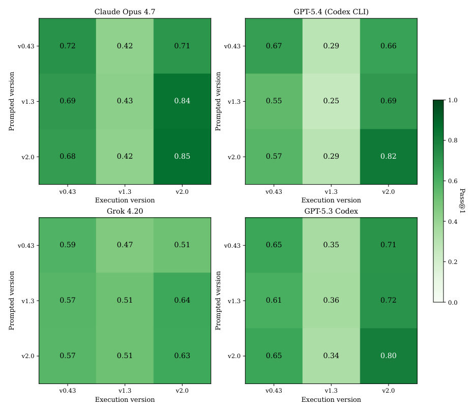 
Figure 2: Drift matrices (Pass@1) for the four strongest models. Rows denote the prompted Qiskit version; columns denote the execution environment. The diagonal represents version fidelity. Low values in the middle column (v1.3) are a consistent finding across models.

📷 Fig 3

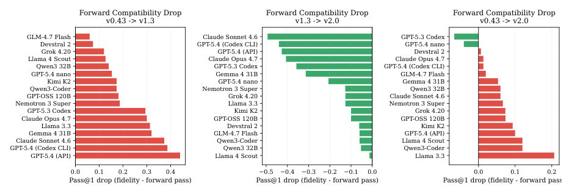 
Figure 3: Forward compatibility drop: reduction in Pass@1 when code is executed in a newer version than its target. Positive values indicate degradation; negative values indicate the code runs better in the newer version (a sign the model ignores version anchors and generates modern code regardless).

📷 Fig 4

 
Figure 4 shows two broad failure regimes. Lower-fidelity models are dominated by ImportError, which points to broken module or symbol references. Higher-fidelity models shift toward DeprecationWarning, which suggests that the code structure is often correct but tied to older interfaces. Grok 4.20 sits between these two regimes. Table 3 reports raw error counts for the five most frequent error types per model, providing absolute scale alongside the normalized view.

📷 Fig 5

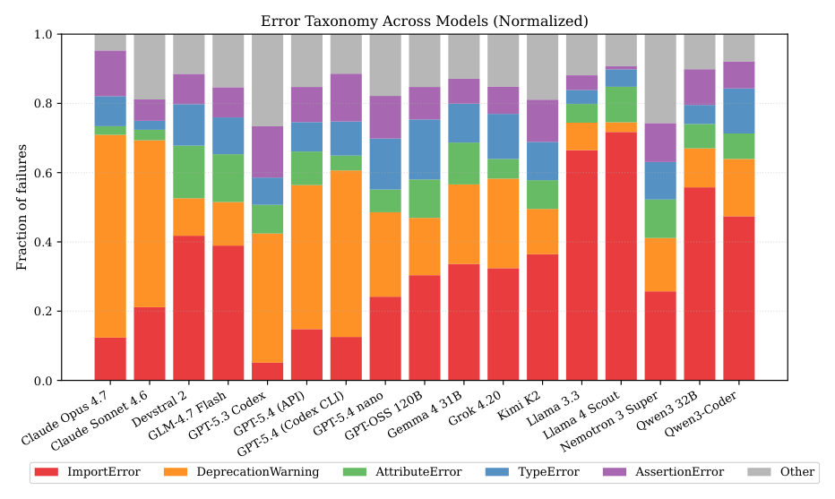 
Figure 4: Normalized error taxonomy across models. Weaker models are dominated by ImportError, indicating structural module confusion. Stronger models shift toward DeprecationWarning, suggesting version-lagged but structurally correct code. Error types shown are those with the highest aggregate frequency.

**Summary.** This paper benchmarks 'API drift' by testing how well LLMs generate quantum code compatible with specific versions of an SDK like Qiskit. It introduces the quantum-api-drift benchmark, finding that version alignment is difficult and highly dependent on the target SDK release. The results highlight that while models show varying strengths across different API epochs, robust cross-version compatibility remains a significant challenge.

**Why it may be interesting.** While not directly about AMO physics, this work is highly relevant to the *implementation* of quantum algorithms. Reliable code generation across evolving SDKs is a major bottleneck in translating theoretical quantum circuits into executable hardware instructions.

Detailed structure

**Main problem.** The core problem is 'API drift,' which measures the inability of Large Language Models (LLMs) to reliably generate quantum code that targets a specific, requested version of a Software Development Kit (SDK). This failure mode is critical for deploying LLM-generated quantum algorithms.

**Main result.** Version alignment remains only partly recoverable even with documentation guidance; furthermore, the performance varies significantly across SDK versions, with v1.3 being notably difficult to target compared to v0.43 and v2.0.

**Method.** The authors introduced 'quantum-api-drift,' a benchmark that tests LLMs on 50 quantum programming tasks across three Qiskit SDK versions (v0.43, v1.3, v2.0). Success is measured by execution success rates and cross-version compatibility.

**Model / system.** The system under test is the generation of quantum code using Qiskit, a representative quantum computing SDK that has undergone substantial interface changes across its versions. The models evaluated are various commercial LLMs (e.g., Claude Opus 4.7, Grok 4.20) accessed via REST APIs.

**Key observables.** Diagonal Pass@1 rates (version fidelity), off-diagonal compatibility metrics, failure modes ($	ext{ImportError}$ vs. $	ext{DeprecationWarning}$), and documentation-guided repair success rates.

**Important parameters / regimes.** The three SDK versions tested are v0.43, v1.3, and v2.0; the evaluation is constrained by a 1024-token output cap for matched REST API settings.

**Assumptions / limitations.** The benchmark primarily measures API-level validity (successful execution without exceptions) rather than guaranteed semantic circuit correctness, which requires structural assertions due to necessary SDK-agnostic rewriting.

**Figures summary.** Figures illustrate version fidelity heatmaps showing Pass@1 rates across the three versions; tables summarize overall diagonal performance and compatibility drops between versions.

**Paper structure.** The paper introduces the API drift problem, details the quantum-api-drift benchmark setup using Qiskit's historical versions, presents quantitative results comparing multiple LLMs on version fidelity and repair success, and concludes by establishing version alignment as a distinct evaluation axis for code generation.

Abstract

Large language models can generate plausible quantum code, but it is unclear whether they can reliably target the specific software development kit (SDK) version requested by the user. We study this problem as API drift and introduce quantum-api-drift, a benchmark for measuring version fidelity, defined here as execution success on the requested SDK version, cross-version compatibility, failure modes, and documentation-guided repair in LLM-generated quantum SDK code. We instantiate the benchmark with Qiskit, a representative quantum SDK that underwent substantial interface changes across v0.43, v1.3, and v2.0. We evaluate 17 models on 50 tasks with 3 samples per prompt, yielding 450 generated samples and 1,350 executions per model. Sixteen models are tested in a matched REST API setting with a 1024-token output cap, while GPT-5.4 (Codex CLI) is reported separately as a reference configuration. Across the 16 matched REST models, diagonal Pass@1 ranges from 0.02 to 0.85. Claude Opus 4.7 is strongest on v0.43 and v2.0, while Grok 4.20 is strongest on v1.3 at 0.513. Error profiles differ systematically by model strength: weaker models fail mainly with broken imports, while stronger models more often reach deprecation-level failures. Documentation-guided repair succeeds for 0.19 to 0.59 of repair attempts overall and is consistently much more effective for migration to v2.0 than to v1.3. The benchmark artifacts are publicly available at https://github.com/arasyi/quantum-api-drift. These results show that version alignment is a distinct evaluation axis for quantum code generation and that API drift remains only partly recoverable even with migration guidance.

[↑ back to top](#top)

### [Brownian Motion in Orthogonal and Symplectic Groups](http://arxiv.org/abs/2607.05094v1)

**Authors:** Zhiyang Tan, Piet W. Brouwer  
**Type:** theory · **Category:** other · **PDF:** <https://arxiv.org/pdf/2607.05094v1>  
**Analysis basis:** full PDF text, analyzed in chunks
**Topic relevance:** `Keldysh / 2PI / non-Gaussian methods` **1/5**

📷 Fig 1

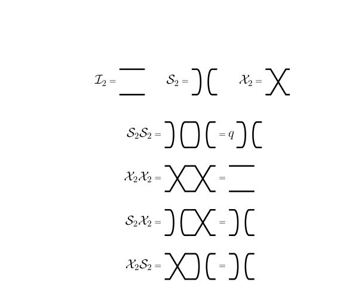 
FIG. 1: Diagrammatic representation of the tensors I2, S2, and X2 (top) and their multiplication rules (bottom) in the orthogonal case.

📷 Fig 2

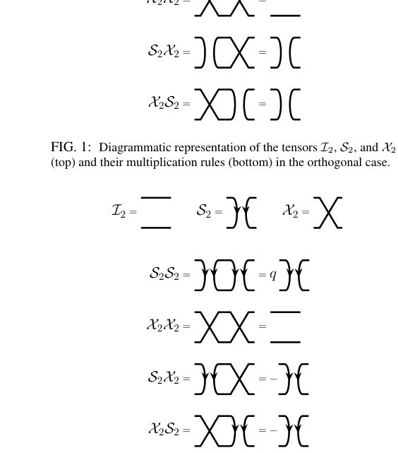 
FIG. 2: Diagrammatic representation of the tensors I2, S2, and X2 and their multiplication rules for the symplectic (oriented) case. Note the introduction of a negative sign in the product of S2 and X2, which follows from reversing the orientation of the solid line on the left end of the diagram.

📷 Fig 3

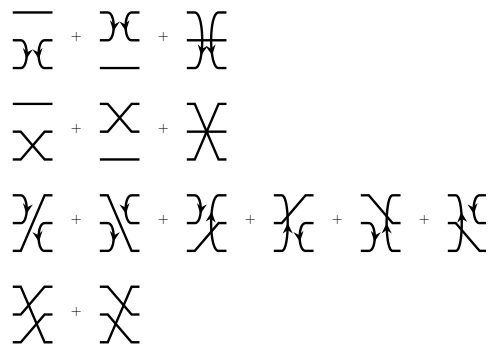 
FIG. 3: Diagrammatic representations of the tensors I3, S3, X3, S′ 3, and X ′ 3 in the symplectic case. Diagrammatic representations for the orthogonal case are obtained by omitting the orientations indicated by the arrows (compare Figs. 1 and 2).

📷 Fig 4

 
FIG. 4: Junction between topological superconductors S1 and S2 with Chern numbers C1 &gt; 0 and C2 &lt; 0. The number of chi- ral Majorana edge modes at the superconductor-vacuum boundary is qj = |Cj|, j = 1, 2. At the interface between the two superconduc- tors, there are q = q1 + q2 co-propagating chiral Majorana modes.

📷 Fig 5

 
FIG. 5: Diagrammatic representations of I4, S4, X4, ˜S4, ˜ X4, ˜S′ 4, T4, S′ 4, T ′ 4, S′′ 4 , X ′ 4, and X ′′ 4 for the symplectic case. Diagrammatic representations for the orthogonal case are obtained by omitting the orientations on the arcs connecting indices on the same side of each diagram.

**Summary.** This paper develops a comprehensive diagrammatic framework to analyze Brownian motion on orthogonal and symplectic random matrices. It calculates moment operators up to the fourth order, providing explicit mathematical tools for studying quantum chaos and transport phenomena in systems with particle-hole symmetry. The results are valuable for understanding spectral properties in complex many-body quantum systems.

**Why it may be interesting.** This work is highly relevant as it extends random matrix theory techniques (originally developed for unitary ensembles) to systems with specific symmetries like particle-hole symmetry, which are crucial in condensed matter physics (e.g., superconductors).

Detailed structure

**Main problem.** The paper develops a unified diagrammatic framework to characterize Brownian ensembles for orthogonal and symplectic random matrices, which are used to study systems with particle-hole symmetry.

**Main result.** It provides explicit calculations for polynomial averages (moment operators) up to the fourth order ($k=4$) for these non-unitary matrix dynamics, establishing recurrence relations based on tensor algebra.

**Method.** The authors use a diagrammatic approach to calculate time evolution operators $U_k(t) = e^{L_k t}$ and trace moments by expanding in powers of the coupling constant or time parameter.

**Model / system.** The study concerns matrix Brownian motion on orthogonal ($O(q)$) and symplectic ($Sp(q)$) groups, relevant for quantum chaos, quantum transport, and many-body dynamics exhibiting particle-hole symmetry. The evolution is governed by random Hermitian matrices constrained by an antiunitary involution.

**Key observables.** Polynomial averages $\langle U_{k} i_1 \dots i'_k 
angle$, moment operators $U_k(t)$, and trace moments $R_{i_1, \dots, i_m}(t)$.

**Important parameters / regimes.** The order of the moment ($k$), system size ($q$), and time ($t$). The long-time limit converges to Haar-distributed ensembles.

**Assumptions / limitations.** Calculations rely on defining basis tensors ($I_k, S_k, X_k$) whose multiplication rules are derived diagrammatically; some results assume invariance under transformations between $SO(q)$ and $O(q)$.

**Figures summary.** Figures 1 & 2 show the diagrammatic representations and multiplication rules for basis tensors ($I_2, S_2, X_2$) in both orthogonal and symplectic cases. Further figures illustrate higher-rank tensor diagrams.

**Paper structure.** The paper progresses by first establishing the framework for calculating moment operators $U_k(t)$ diagrammatically (up to $k=4$). It details the algebra of basis tensors, calculates explicit forms for $U_2(t)$, $U_3(t)$, and finally provides complex analytical expressions for $U_4(t)$ and associated trace moments.

Abstract

Matrix Brownian motion provides a powerful framework for studying crossover ensembles in quantum chaos and quantum transport, as well as thermalization and information scrambling in many-body dynamics. Here, we develop a unified diagrammatic framework to characterize Brownian ensembles for orthogonal and symplectic random matrices, which describe systems with particle-hole symmetry. We compute polynomial averages up to fourth order and construct an orthogonally invariant interpolation for the disconnected $\mathrm{SO}^-(q)$ sector of the orthogonal group. We consider applications relating to the fields of quantum information, quantum chaos, and quantum transport.

[↑ back to top](#top)

### [Canonical quantization of neurons](http://arxiv.org/abs/2607.05000v1)

**Authors:** Alexander He, Nana Liu, Mark M. Wilde  
**Type:** theory · **Category:** disordered systems and neural networks · **PDF:** <https://arxiv.org/pdf/2607.05000v1>  
**Analysis basis:** full PDF text, analyzed in chunks
**Topic relevance:** `quantum measurements` **1/5**

📷 Fig 1

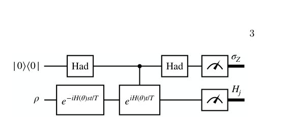 
FIG. 1: Quantum circuit for estimating ∂j Tr[gT (H(θ))ρ].

📷 Fig 2

 
FIG. 3: Training performance for squared-loss minimization using quantized neurons with transverse-field Ising (TFIM) and commuting Ising (IM) Hamiltonians, and hyperbolic tangent activation, for a seven-qubit system.

**Summary.** This work establishes canonical quantization as a systematic method to build quantum machine learning components by quantizing classical neurons. By mapping the energy function to a Hamiltonian observable, they develop hybrid algorithms to train these 'quantized neurons.' The results show that this quantum approach enhances the expressive power of the resulting neural architectures.

**Why it may be interesting.** It bridges fundamental quantum mechanical concepts (quantization, observables) directly into the structure of artificial neural networks, providing a physical interpretation and potential computational advantage for ML models.

Detailed structure

**Main problem.** The paper applies canonical quantization, a physical procedure, to construct quantum models for machine learning primitives like neurons.

**Main result.** Quantized neurons exhibit enhanced expressive capabilities compared to their classical counterparts on representative function approximation tasks.

**Method.** Hybrid quantum-classical algorithms are developed for training and evaluation, relying on techniques like Hamiltonian simulation and Hadamard tests to estimate gradients and measure observables.

**Model / system.** The model quantizes a classical neuron defined by an energy/Hamiltonian $H(	heta)$ and an activation function $\varphi$. The input variables are promoted to non-commuting Pauli operators ($\sigma^Z$).

**Key observables.** The primary observable is the quantum activation observable, $\varphi(H(	heta))$, whose expectation value is measured on the input state $
ho$.

**Important parameters / regimes.** Temperature parameter $T$ (for the hyperbolic tangent activation function), and the Hamiltonian parameters $	heta$ defining the interaction strength.

**Assumptions / limitations.** The approach assumes that canonical quantization provides a principled framework for building quantum ML primitives, and it relies on basic quantum simulation techniques being available.

**Figures summary.** Figure 3 compares the training performance (Squared Loss) of noncommuting Hamiltonians ($H_{	ext{TFIM}}$) versus commuting ones ($H_{	ext{IM}}$), showing superior performance for the former.

**Paper structure.** The paper first introduces quantizing a classical neuron model by replacing the energy function with a Hamiltonian and applying functional calculus to get an observable. It then develops HQC algorithms for training, followed by numerical experiments comparing different types of Hamiltonians on learning tasks.

Abstract

Canonical quantization provides a systematic procedure for constructing quantum models from classical Hamiltonians. Here, we apply this principle to a fundamental computational primitive of machine learning: the neuron. Specifically, by viewing a neuron as a composition of an energy function and an activation function, we quantize this model by replacing the energy function with a quantum Hamiltonian and applying the activation function to it through matrix functional calculus. This results in an activation observable that can be measured on an input quantum state. We investigate the use of these quantized neurons for function approximation, where the objective is to learn an unknown observable from labeled quantum data. For this purpose, we develop hybrid quantum-classical algorithms for training and evaluation, including procedures for measuring the activation observable and estimating gradients of the squared loss error. Our algorithms for gradient estimation rely on basic primitives like classical random sampling, the Hadamard test, and Hamiltonian simulation, and those for measuring an activation observable rely on quantum algorithms known as the power of one qumode and Schroedingerization. Numerical experiments demonstrate that our quantized neurons exhibit enhanced expressive capabilities relative to corresponding classical neurons on representative learning tasks. Our work establishes canonical quantization as a principled framework for constructing quantum machine learning primitives and provides a foundation for developing neural architectures tailored to quantum data.

[↑ back to top](#top)

### [Charge-Sector Construction of the Type-IIB Axion--Dilaton Wormhole Partition Function](http://arxiv.org/abs/2607.05385v1)

**Authors:** Soo-Jong Rey  
**Type:** theory · **Category:** other · **PDF:** <https://arxiv.org/pdf/2607.05385v1>  
**Analysis basis:** full PDF text, analyzed in chunks
**Topic relevance:** `Keldysh / 2PI / non-Gaussian methods` **1/5**

📷 Fig 1

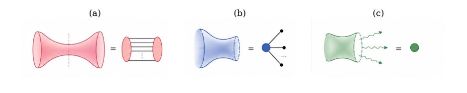 
Figure 1: Three objects in the construction. Panel (a) is a two-ended throat, a connected saddle with two asymptotic non-compact ends. Panel (b) is a neck-cut geometry, obtained by keeping one side of such a solution after an artificial neck boundary has been introduced; it defines a different variational problem. Panel (c) is the two-end operator term obtained when a small throat is replaced by its long-distance source expansion. In panels (a) and (b), the drawn surface lines are geometric guides. In panel (c), the connecting line represents the coefficient matrix Cij ν . In the expression I(A) i Cij ν I(B) j , the superscripts A, B label the parent universes on which the two end...

📷 Fig 2

 
Figure 2: From the unreduced two-end coefficient to the wormhole partition function. The left part represents the coefficient matrix Cij ν in the space of end-insertion operator labels. The circles denote parent universes, and the points inside them denote end insertions; the parent-universe labels and the end-insertion operator labels are distinct. This is also the algebraic content of panel (c) in Fig. 1: the line represents Cij ν , while the placement labels belong to the end insertions. The reduction data b specify the operation Rb that converts Cij ν into the scalar coefficient Wν[b]. The reduced coefficients are then summed over ν ∈Z with the compact Fourier variable θ to form the...

**Summary.** This paper constructs the partition function for a Type-IIB axion--dilaton wormhole using charge-sector data. It develops a sophisticated mathematical framework to analyze this function via its $	heta$-expansion coefficients. The core contribution is establishing necessary and sufficient conditions—such as positivity or symmetry—that these coefficients must satisfy to correspond to physically meaningful quantities.

**Why it may be interesting.** While highly theoretical, the rigorous development of coefficient constraints (like moment positivity or Cauchy-Schwarz inequalities) provides powerful mathematical tools for characterizing physical theories where observables are represented by Fourier series expansions, which has parallels in quantum field theory and statistical physics.

Detailed structure

**Main problem.** The primary goal is constructing the Type-IIB axion--dilaton wormhole partition function, Z_wh(theta; b), entirely from underlying charge-sector data.

**Main result.** The paper establishes a rigorous mathematical framework detailing how physical constraints (like positivity or symmetry) on the coefficient sequence dictate the nature of the theta expansion, connecting it to known statistical distributions like Bessel/Skellam laws.

**Method.** The method involves deriving coefficients from long-distance saddle point calculations in supergravity, followed by a reduction procedure that maps these matrix elements into scalar coefficients forming a Fourier series representation for Z_wh.

**Model / system.** The system is the Type-IIB axion--dilaton wormhole geometry within string theory. The mathematical structure involves an integer charge lattice ($
u \in \mathbb{Z}$) and a compact Fourier variable $	heta$ conjugate to this charge.

**Key observables.** Wormhole partition function $Z_{wh}(	heta; b)$, reduced scalar coefficients $W_{
u}[b]$, and the absolute convergence bound $Z_{abs}[b]$.

**Important parameters / regimes.** The axion charge $
u$, the compact Fourier variable $	heta$, and the reduction data $b$. The analysis explores limits like the dilute Bessel/Skellam limit.

**Assumptions / limitations.** The calculation relies on a controlled semiclassical input derived from supergravity functional integrals, and the final physical interpretation depends on imposing positivity or symmetry constraints on the coefficients.

**Figures summary.** Figure 1 illustrates the geometric objects involved (two-ended throat, neck-cut geometry) alongside the two-end operator term coefficient matrix $C_{ij}^{
u}$. Figure 2 maps the calculation flow from $C_{ij}^{
u}$ to $W_{
u}[b]$ and finally to $Z_{wh}(	heta; b)$.

**Paper structure.** The paper follows a hierarchical structure: first, defining the charge-sector coefficient matrix ($C_{ij}^
u$); second, applying reduction data ($b$) to obtain scalar coefficients ($W_
u[b]$); third, forming the partition function via Fourier summation ($\sum W_{
u}[b]e^{i
u	heta}$); and finally, analyzing mathematical constraints (positivity, symmetry) on these coefficients.

Abstract

I construct the Type-IIB axion--dilaton wormhole partition function from charge-sector data. In a chosen axion charge, equivalently form-field flux sector, the long-distance saddle calculation supplies a two-end operator term with coefficient matrix \(C^{ij}_ν\). The labels \(i,j\) label end-insertion operators; the labels \(A,B\) label parent universes. Reduction data \(b\) convert this matrix into scalar coefficients \(W_ν[b]\). The wormhole partition function in the theta variable is \(Z_{\rm wh}(θ;b)=\sum_νW_ν[b]\e^{iνθ}\). I analyze properties and constraints this coefficients satisfy: discrete-symmetry covariance, phase, absolute bounds, moment positivity, Cauchy--Schwarz inequalities for the unreduced coefficient matrix, complex-\(θ\) domains, charge-lattice tails, and the dilute Bessel/Skellam limit. The \(θ\)-dependence of the wormhole partition function is the Fourier transform of the charge-sector scalar coefficients.

[↑ back to top](#top)

### [Data-Driven Prediction of NaCl-Type Entropy-Stabilized Oxide Compositions from First-Principles and Supervised Learning](http://arxiv.org/abs/2607.04502v1)

**Authors:** Sebastien Junier, Celine Barreteau, David Berardan, Yann-Andrev Kerneur, Jean-Claude Crivello  
**Type:** theory · **Category:** disordered systems and neural networks · **PDF:** <https://arxiv.org/pdf/2607.04502v1>  
**Analysis basis:** full PDF text, analyzed in chunks
**Topic relevance:** `methods for driven-dissipative` **1/5**

📷 Fig 1

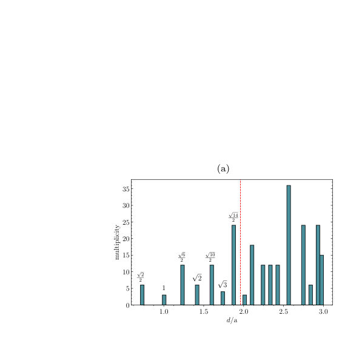 
Figure 1: (a) Pair clusters distribution in NaCl structure. All clusters under the red lines

📷 Fig 2

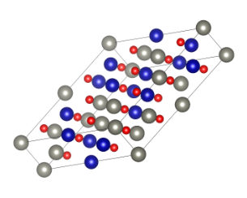 
Figure 2: Representation of equimolar super-cell generated by SQS for (M1M2)O binary

📷 Fig 3

 
Figure 3: Correlation matrix of descriptors. Correlations below 50% are hidden; values

📷 Fig 4

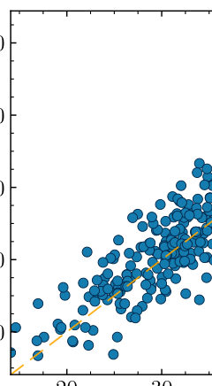 
Figure 4: Predicted vs. DFT-calculated ∆hullH for the 416 quinary NaCl SQS mixtures.

📷 Fig 5

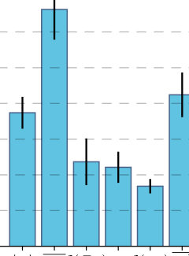 
Figure 5: Relative importance of descriptors in the MLP model (mean ± standard devia-

**Summary.** This work presents a data-driven computational framework to explore Entropy-Stabilized Oxides by combining DFT calculations, SQS modeling of disorder, and supervised machine learning. The method efficiently screens thousands of potential oxide compositions to predict their thermodynamic stability relative to competing phases. This establishes an efficient route for the materials discovery process in complex solid-state chemistry.

**Why it may be interesting.** While focused on materials science, the core methodology—combining high-dimensional physical simulation (DFT/SQS) with advanced machine learning for predictive screening in complex parameter spaces—is highly relevant to developing ML potentials or predicting quantum phases in strongly correlated systems.

Detailed structure

**Main problem.** The challenge of identifying stable, promising candidates within the vast compositional space of Entropy-Stabilized Oxides (ESOs) due to complex phase stability assessment.

**Main result.** A high-throughput computational framework was developed that efficiently screens thousands of quinary ESO compositions using machine learning predictions, requiring explicit DFT calculations for only about 10% of the systems tested.

**Method.** The approach combines Density Functional Theory (DFT) with Special Quasirandom Structures (SQS) to model disorder, and then trains supervised machine learning models (like MLP) on these results to predict thermodynamic stability metrics.

**Model / system.** The study focuses on equimolar quinary ESOs in the NaCl structure type, involving 16 selected cation species. Stability is assessed by calculating the formation enthalpy relative to the convex hull ($\Delta	ext{hull}H$) and determining a finite-temperature stabilization point ($T_{	ext{stab}}$).

**Key observables.** Formation enthalpy ($\Delta fH$), distance to the convex hull ($\Delta	ext{hull}H$), and stabilization temperature ($T_{	ext{stab}}$).

**Important parameters / regimes.** The system size involves 4368 possible quinary compositions; ML models achieve a test error of $\sim 4 	ext{ kJ}\cdot	ext{mol}^{-1}$.

**Assumptions / limitations.** Absolute stabilization temperatures are affected by systematic thermodynamic approximations, and the method relies on extrapolations from smaller systems.

**Figures summary.** Figures illustrate SQS modeling (pair cluster distribution), ML model performance curves (prediction vs. learning), and tables list predicted stability trends for various quinary compositions.

**Paper structure.** The paper systematically builds a reference database using DFT/SQS, develops thermodynamic criteria ($\Delta fH$, $\Delta	ext{hull}G$), trains supervised ML models on this data, and applies the resulting framework to screen large compositional spaces.

Abstract

Entropy-stabilized oxides (ESOs) open access to vast multicomponent compositional spaces, but identifying promising candidates remains challenging because of the large number of possible mixtures and the need to assess their stability against competing phases. In this work, we develop a high-throughput computational framework to screen equimolar quinary ESOs in the NaCl structure type by combining density functional theory (DFT), special quasirandom structures (SQS), convex-hull thermodynamics, and supervised machine learning. A consistent reference database of binary and ternary ordered oxides, including disordered phases such as all binary cation combinations in the NaCl-type oxide, is first constructed using GGA and meta-GGA calculations. Quinary disordered phases are then described by SQS supercells and used to train machine-learning models that predict the distance to the convex hull and the corresponding stabilization temperature over the full set of 4368 possible equimolar quinary compositions generated from 16 cation species. Among the tested models, an optimized multilayer perceptron provides the best predictive performance, with a test error of about 4 kJ/mol, while requiring explicit DFT calculations for only about 10% of the quinary systems. Comparison with experimental synthesis tests and computed decomposition paths further shows that the approach captures the main stability trends and the dominant competing phases, although absolute stabilization temperatures remain affected by systematic thermodynamic approximations. These results establish an efficient route for the data-driven exploration of multicomponent oxides and provide practical guidance for the experimental search for new ESOs.

[↑ back to top](#top)

### [High-precision ab initio calculations of nuclear binding energies: Tin isotopes from dripline to dripline](http://arxiv.org/abs/2607.05086v1)

**Authors:** Urban Vernik, Pepijn Demol, Thomas Duguet, Alexander Tichai  
**Type:** theory · **Category:** other · **PDF:** <https://arxiv.org/pdf/2607.05086v1>  
**Analysis basis:** full PDF text, analyzed in chunks
**Topic relevance:** `Keldysh / 2PI / non-Gaussian methods` **1/5**

📷 Fig 1

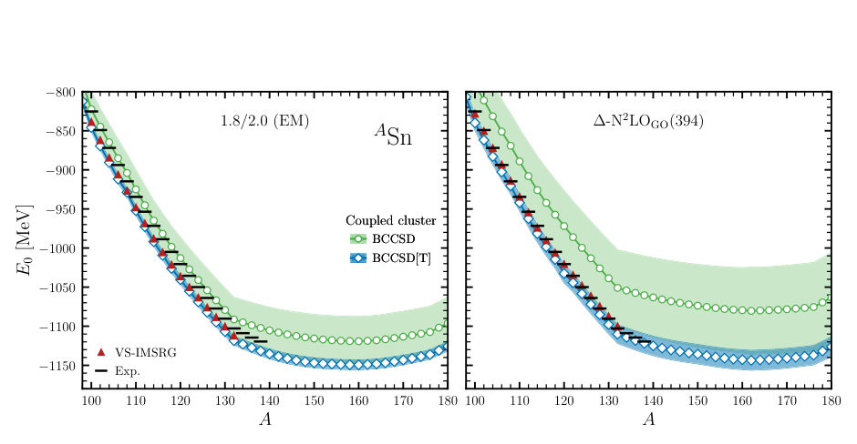 
Figure 1. Ground-state energies of even-even tin isotopes with A = 100 −180 using BCCSD and BCCSD[T] calculations based on the 1.8/2.0 (EM) (left) and ∆-N2LOGO (right) χEFT Hamiltonians. Results from VS-IMSRG calculations are taken from Ref. [12]. See the main text for the discussion of many-body uncertainties.

📷 Fig 2

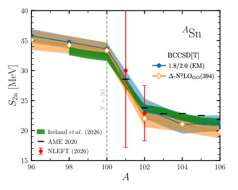 
Figure 2. Two-neutron separation energies around the N = 50 shell closure (100Sn). BCCSD[T] calculations are shown for 1.8/2.0 (EM) (blue) and ∆-N2LOGO (orange). NLEFT calculations are taken from Ref. [28].

📷 Fig 3

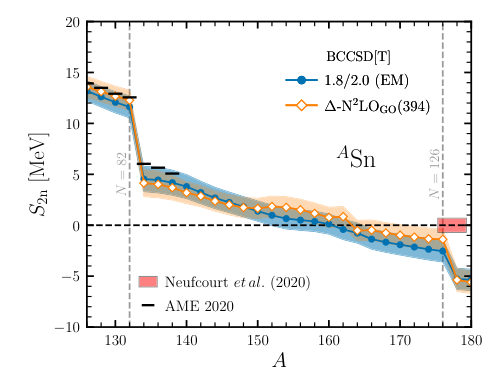 
Figure 3. Two-neutron separation energies calculated in BCCSD[T] beyond the N = 82 shell closure (132Sn). Cal- culations details are similar to Fig. 2.

**Summary.** This paper calculates the binding energies of tin isotopes near the neutron drip line using advanced *ab initio* methods based on chiral Effective Field Theory. By employing the BCCSD[T] approximation, the authors achieve high precision and map out trends in nuclear structure, highlighting discrepancies between theoretical models and experimental constraints.

**Why it may be interesting.** While focused on nuclear physics, the rigorous application of many-body perturbation theory techniques like Coupled Cluster methods for calculating ground state properties is a highly sophisticated theoretical tool relevant to strongly correlated quantum systems in general.

Detailed structure

**Main problem.** To perform high-precision calculations of nuclear binding energies for tin isotopes across the neutron drip line.

**Main result.** The BCCSD[T] approach significantly reduces many-body uncertainty, showing sensitivity in predicting the drip-line location compared to Energy Density Functional models.

**Method.** Bogoliubov Coupled-Cluster (BCC) theory, extended to include leading triples corrections (BCCSD[T]), is used to solve the many-body Schrödinger equation.

**Model / system.** The study focuses on even-even Tin isotopes ($	ext{Sn}$) ranging from $N=50$ towards the neutron dripline. Calculations utilize chiral Effective Field Theory ($\chi	ext{EFT}$) two- and three-nucleon interactions within the BCC framework.

**Key observables.** Binding energies ($E_0$) and two-neutron separation energies ($S_{2n}$).

**Important parameters / regimes.** The calculation uses a one-body spherical harmonic oscillator basis ($\hbar\omega = 12 	ext{ MeV}$) and incorporates interactions up to the three-nucleon level.

**Assumptions / limitations.** Approximations are made in solving the cluster amplitudes, notably using the non-iterative BCCSD[T] method, which introduces systematic uncertainties.

**Figures summary.** Figure 1 compares ground-state energies ($E_0$) for $	ext{Sn}$ isotopes using BCCSD and BCCSD[T] against VS-IMSRG results. Figure 2 shows $S_{2n}$ around the $N=50$ shell closure.

**Paper structure.** The paper details the theoretical framework (BCC theory, Hamiltonian formulation), presents the systematic improvement achieved by including triples corrections (BCCSD[T]), and compares resulting binding energies and separation energies across the isotopic chain to experimental data and other advanced calculations.

Abstract

The location of the neutron drip line in tin isotopes has important consequences for our fundamental understanding of nuclear structure and nuclear forces as well as for astrophysical nucleosynthesis. Performing high-precision ab initio calculations of even-even tin isotopes from $N=50$ to $N=126$ based on chiral two- and three-nucleon interactions, the predicted drip-line location is found to be highly sensitive to the employed nuclear interactions and to exhibit tension with recent energy-density-functional predictions. On the neutron-deficient side, results are consistent with extrapolated two-neutron separation energies constrained by recent Penning-trap mass measurements.

[↑ back to top](#top)

### [Holographic heat engines for Schwarzschild black holes](http://arxiv.org/abs/2607.03749v1)

**Authors:** Ripunjay Dwivedi, Manus R. Visser  
**Type:** theory · **Category:** statistical mechanics · **PDF:** <https://arxiv.org/pdf/2607.03749v1>  
**Analysis basis:** full PDF text, analyzed in chunks
**Topic relevance:** `non-equilibrium dynamics` **1/5**

📷 Fig 1

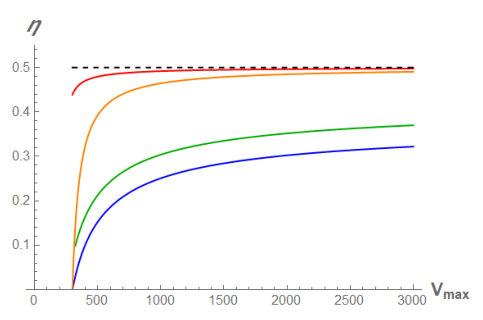 
Figure 1. Efficiency vs. maximum cavity volume. The effi- ciency is shown for the Otto (blue), Diesel (green), and Stirling cycles, with regeneration (red) and without regeneration (or- ange), as a function of Vmax, at fixed Vmin = 300. The dashed black line is the Carnot bound ηCarnot = 1 −Tc/Th = 1/2. For the Otto cycle V2 = Vmin, V1 = Vmax, with S1 = 20 and S3 = 40. For the Diesel cycle V1 = Vmax, with S1 = 20, S3 = 40, and isobaric pressure P2 = 1.5 × 10−3; the in- termediate volumes are then fixed by the equation of state, V2 = V (S1, P2) ≃186 and V3 = V (S3, P2) ≃323, so the cycle exists only for Vmax &gt; V3, where the Diesel curve be- gins. For the Stirling cycles V1 = Vmin and V2 =...

📷 Fig 2

 
Figure 2. Efficiency vs. minimum cavity volume. The ef- ficiency is shown for the Otto (blue), Diesel (green), and Stirling cycles, with regeneration (red) and without regenera- tion (orange), as a function of Vmin at fixed Vmax = 1200 and S1 = 20, S3 = 40, P2 = 1.5 × 10−3, Tc = 0.045, and Th = 0.09. The Diesel efficiency depends only on (S1, S3, P2, Vmax) and is therefore independent of Vmin, appearing as a horizontal line. The Otto efficiency falls monotonically as Vmin →Vmax (compression ratio →1), while the regenerated Stirling effi- ciency stays pinned near the Carnot bound (dashed). The Stirling curves terminate at Vmin ≃265, set by the bound rBTc &gt; √

📷 Fig 3

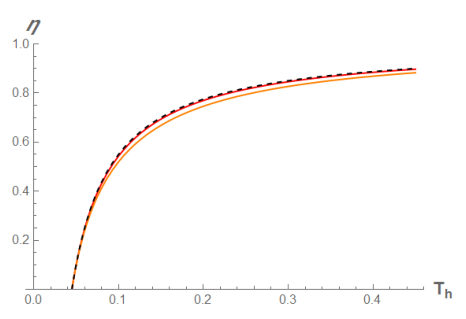 
Figure 3. Efficiency vs. hot reservoir temperature. The two Stirling cycles, with regeneration (red) and without regener- ation (orange), are shown as a function of the hot reservoir temperature Th, at fixed cold reservoir temperature Tc = 0.045, with V1 = Vmin = 300 and V2 = Vmax = 1200. The dashed black curve is the Carnot bound. Both efficiencies vanish at the left endpoint Th = Tc, where the reservoirs coincide and no net work is produced, and approach the Carnot bound from below as Th increases, the regenerated cycle tracking it closely.

📷 Fig 4

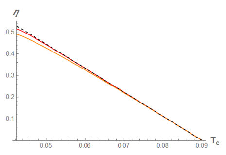 
Figure 4. Efficiency vs. cold reservoir temperature. The two Stirling cycles, with regeneration (red) and without regener- ation (orange), are shown as a function of the cold reservoir temperature Tc, at fixed hot reservoir temperature Th = 0.09, with V1 = Vmin = 300 and V2 = Vmax = 1200. The dashed black curve is the Carnot bound. Both efficiencies vanish at the right endpoint Tc = Th. The range is limited on the left by the bound Tc &gt; T min c = √

📷 Fig 5

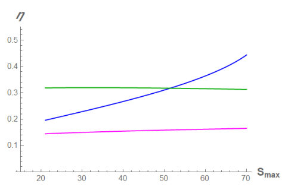 
Figure 5. Efficiency vs. maximum entropy. The efficiency is shown for the Otto (blue), Diesel (green), and Brayton (magenta) cycles as a function of Smax = S3, at fixed Smin = S1 = 20. For the Otto cycle, V2 = 300 and V1 = 1200. For the Diesel cycle, V1 = 1200 and P2 = 1.5 × 10−3. For the Brayton cycle, P1 = 6 × 10−4 and P2 = 1.5 × 10−3. The Otto efficiency rises steeply with Smax and overtakes the nearly flat Diesel curve, while the Brayton efficiency remains the lowest of the three throughout.

**Summary.** This work develops a model for reversible heat engines powered by Schwarzschild black holes using quasi-local gravitational thermodynamics. By treating the boundary as a thermal system, the authors calculate efficiencies for various cycles, demonstrating that the regenerated Stirling efficiency approaches the Carnot limit from below at high temperatures. This provides a novel diagnostic tool linking general relativity to classical thermodynamic limits.

**Why it may be interesting.** While focused on gravity, the rigorous application of classical thermodynamics principles (Carnot/Stirling cycles) to a non-standard working substance provides an advanced theoretical framework for understanding energy conversion in extreme physical systems.

Detailed structure

**Main problem.** The paper constructs and analyzes reversible heat engines operating using a holographic model derived from Schwarzschild black holes.

**Main result.** It derives efficiencies for standard heat engines (Carnot, Otto, etc.) showing that the regenerated Stirling efficiency approaches the Carnot bound from below in the high-temperature limit.

**Method.** The analysis uses quasi-local gravitational thermodynamics applied to a black hole enclosed in a cavity, treating the boundary as the working substance.

**Model / system.** The system models a Schwarzschild black hole contained within a finite spherical cavity. The thermodynamic properties of the dual thermal system on the cavity boundary are used to define the heat engine cycles.

**Key observables.** Efficiencies ($\eta$) for Carnot, Otto, Diesel, Brayton, and Stirling engines; quasi-local equations of state ($E(S, V)$); regenerated Stirling efficiency ($\eta_{	ext{reg}}^{	ext{Stirling}}$).

**Important parameters / regimes.** Temperature ratio ($T_c/T_h$); large black hole branch restriction ($0 < x < 1$); high-temperature limit ($T_h 	o \infty$).

**Assumptions / limitations.** The analysis is restricted to the stable, large black hole branch; heat rejection is modeled as controlled quasi-static extraction via Hawking radiation.

**Paper structure.** The paper systematically derives thermodynamic relations for various strokes (isochoric, adiabatic, isobaric, isothermal) before applying these concepts to calculate the efficiencies of standard idealized heat engines and analyzing the high-temperature limits.

Abstract

We construct reversible black hole heat engines in asymptotically flat spacetime using quasi-local gravitational thermodynamics. We enclose a Schwarzschild black hole in a finite spherical cavity and identify the working substance with the dual thermal system on the cavity boundary. The surface pressure and boundary area define a thermodynamic pressure-volume pair in the dual system, while all coupling constants of the gravitational theory remain fixed. We derive exact efficiencies for the Carnot, Otto, Diesel, Brayton, and Stirling engines and compare them numerically. These efficiencies probe the quasi-local equations of state of the black hole. The regenerated Stirling efficiency remains remarkably close to the Carnot bound and approaches it in the high-temperature limit.

[↑ back to top](#top)

### [QuTuner: Feature- and Learning-Guided Optimization Pass Tuning for Quantum Compilers](http://arxiv.org/abs/2607.04586v1)

**Authors:** Ming Zhong, Xiangyu Ren, Jinglei Cheng, Shaohua Li, Zhiding Liang  
**Type:** theory · **Category:** quantum information and computing · **PDF:** <https://arxiv.org/pdf/2607.04586v1>  
**Analysis basis:** full PDF text, analyzed in chunks
**Topic relevance:** `methods for driven-dissipative` **1/5**

📷 Fig 1

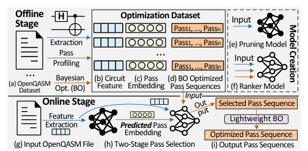 
Figure 2. The overall workflow of QuTuner. In the figure, →denotes the flow of circuit features, →denotes pass em- beddings, and →denotes optimized pass sequences.

📷 Fig 2

 
Figure 4. Static feature-based and pass embedding-based measurements of BO optimized pass sequence similarity (measured by edit similarity, higher is better).

📷 Fig 3

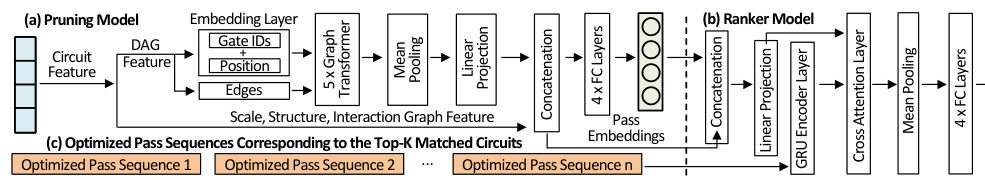 
Figure 5. Two-stage selection model design of QuTuner, including the pruning model (a) and the ranker model (b).

📷 Fig 4

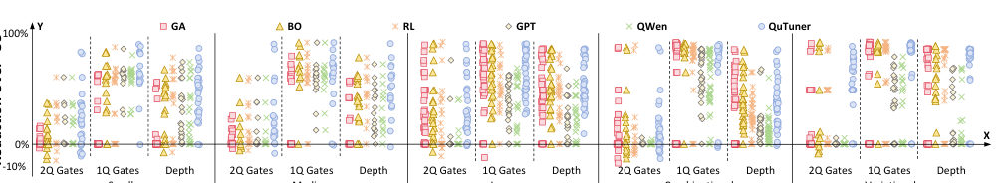 
Figure 7. Per-case optimization distribution of QuTuner and baselines. A slight x-axis jitter improves visibility of overlapping points. Many RL, GPT, and QWen cases concentrate at 0% reduction because of failed compilations, as described in Sec. 5.1.

📷 Fig 5

 
Figure 8. Scalability analysis across different quantum back- ends.

**Summary.** QuTuner is a novel framework designed to automatically and efficiently tune the sequence of passes used by quantum compilers. It overcomes limitations of previous methods by incorporating 'optimization-aware pass embeddings' that capture how circuits react to specific compiler steps. The approach significantly boosts optimization performance while drastically cutting down the computational time needed for tuning.

**Why it may be interesting.** While focused on software compilation, the core concept of using learned representations (embeddings) derived from system responses to guide complex sequential decisions is highly relevant for modeling optimization paths in open quantum systems or resource allocation problems.

Detailed structure

**Main problem.** Quantum compilers require effective pass tuning to minimize resource costs (gates, depth) while maintaining high execution fidelity.

**Main result.** QuTuner significantly improves evaluation-metric reduction (up to 84.85% on Qiskit) and drastically reduces the time required for tuning compared to existing state-of-the-art methods.

**Method.** The framework builds a large dataset by characterizing circuits using both static features and novel optimization-aware pass embeddings, which are then used to train offline models for candidate retrieval and ranking of optimal pass sequences.

**Model / system.** The system is quantum computation implemented via quantum circuits (OpenQASM code) that undergo compilation through various passes (layout, routing, optimization).

**Key observables.** Optimization metrics include 2Q gate count reduction ($\Delta 2Q$), 1Q gate count reduction ($\Delta 1Q$), and circuit depth reduction ($\Delta 	ext{Depth}$).

**Important parameters / regimes.** The tuning objective is a weighted combination of these metric reductions, prioritizing hardware-agnostic, circuit-level metrics.

**Assumptions / limitations.** The primary limitation addressed is that prior methods only search small optimization subspaces and rely on static features that fail to capture how circuits react dynamically to specific compiler passes.

**Figures summary.** Figures illustrate the quantum compilation stages (Qiskit example), the overall two-stage QuTuner workflow (offline dataset construction and online prediction/refinement), and detailed feature representations for a sample circuit.

**Paper structure.** The paper first identifies limitations in current pass tuning approaches. It then introduces QuTuner, detailing its methodology: building an optimization dataset, characterizing circuits via static features and pass embeddings, training retrieval/ranking models offline, and finally applying these to unseen circuits with lightweight refinement online.

Abstract

Quantum compilers play a key role in transforming quantum circuits into lower-cost implementations with improved execution fidelity. This process is commonly guided by circuit-level metrics, such as gate counts and circuit depth. Although compiler pass tuning has been widely studied in classical compilation, directly transferring these techniques to quantum compilers is challenging, because quantum programs are expressed as circuits and exhibit optimization behaviors that are shaped by quantum-specific structures. Prior quantum compiler tuning approaches have begun to use circuit features to guide pass selection, but they remain limited in two aspects: they search only a small portion of the optimization-pass space, and they mainly rely on static features that do not explicitly reflect how a circuit reacts to compiler optimizations.   We present QuTuner, a feature-guided quantum compiler pass tuning framework that generalizes across compilers and tuning objectives. QuTuner first builds a large optimization dataset. It then characterizes each circuit from two complementary views: static circuit features that describe circuit structure, and optimization-aware pass embeddings that summarize the circuit's responses to individual optimization passes. Using these representations, QuTuner trains two offline models to retrieve and rank candidate pass sequences for unseen circuits, followed by lightweight refinement. We evaluate QuTuner on Qiskit and PyTKET using two benchmark suites. On Qiskit, QuTuner improves the evaluation-metric reduction by up to 84.85% over the strongest baseline while reducing tuning time by 73.59%. On PyTKET, it improves metric reduction by up to 18.68% with a 64.49% reduction in tuning time. These results show that QuTuner provides an effective approach to adaptive pass tuning for quantum compilers.

[↑ back to top](#top)

### [Superconductivity on the verge of metal-insulator transition in Cu$_{1-x}$Zn$_x$Ir$_2$S$_4$ probed by $μ$SR](http://arxiv.org/abs/2607.04628v1)

**Authors:** K. M. Kojima, M. Miyazaki, M. Hiraishi, A. Koda, R. Kadono, C. Baines, Y. Tsuchiya, H. S. Suzuki, H. Kitazawa  
**Type:** experiment · **Category:** strongly correlated electrons · **PDF:** <https://arxiv.org/pdf/2607.04628v1>  
**Analysis basis:** full PDF text, analyzed in chunks
**Topic relevance:** `Kondo & dissipative impurity` **1/5**

📷 Fig 1

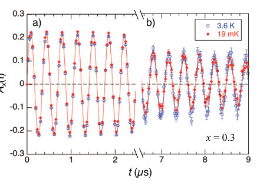 
FIG. 1. (Color online). µSR time spectra at (a) 0–2.5 µs and (b) 6.5– 9 µs, observed under a transverse field (20 mT), where the spectrum measured at 19 mK (red diamonds) is overlayed with that at 3.6 K (blue circles). Solid curves are the best fits by Eqs. (1) and (3).

📷 Fig 2

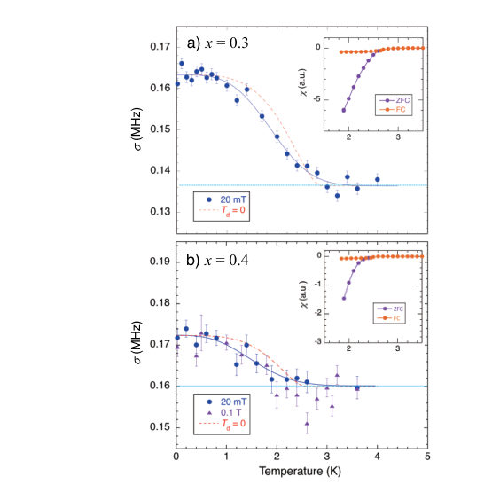 
FIG. 2. (Color online). Temperature dependence of the Gaussian linewidth σ observed in the sample with Zn content x = 0.3 (a, PSI) and 0.4 (b, TRIUMF) . Solid line shows the result of curve fit using Eqs. (6) and (7), and dashed line shows expected behavior of σ with- out the distribution of Tc. Dotted horizontal lines correspond to σn in Eq. (3). Inset: magnetic susceptibility measured above 1.85 K under field-cool (FC) and zero-field-cool (ZFC) conditions.

📷 Fig 3

 
FIG. 3. (Color online). σs versus B obtained at 0.1 K for the sample with x = 0.3. Solid lines show the result of curve fits (a) using Eq. (9) with Bc2(0) as a free parameter, or (b) using Eq. (10) with σc as a free parameter. Dashed line (c) shows Eq. (9) with Bc2(0) = 5.41 T.

**Summary.** This work uses muon spin rotation ($\mu$SR) to study superconductivity in $	ext{Cu}_{1-x}	ext{Zn}_x	ext{Ir}_2	ext{S}_4$, a material near a metal-insulator transition. The results confirm an s-wave superconducting state, arguing that high electronic disorder forces the pairing symmetry into an isotropic form. This suggests that structural scattering and proximity to the Mott-Ioffe-Regel limit are key tuners of superconductivity in this correlated system.

**Why it may be interesting.** The paper provides experimental evidence of how strong scattering (disorder) can stabilize an isotropic s-wave superconducting state even when underlying physics suggests complex, anisotropic pairing mechanisms expected in correlated materials.

Detailed structure

**Main problem.** Investigating superconductivity in Zn-substituted thiospinel $	ext{Cu}_{1-x}	ext{Zn}_x	ext{Ir}_2	ext{S}_4$ near a metal-insulator transition to understand the pairing mechanism.

**Main result.** The superconducting state is confirmed to be an isotropic, fully gapped s-wave symmetry, which is robustly maintained deep within the 'dirty limit' due to strong electron scattering.

**Method.** Transverse-field muon spin rotation ($\mu$SR) measurements were used to probe the temperature and field dependence of the superfluid density.

**Model / system.** The system is the thiospinel $	ext{CuIr}_2	ext{S}_4$, whose superconducting properties are tuned by Zn substitution ($x$), driving it away from a high-temperature metal-insulator transition. The analysis compares results to models incorporating disorder and pressure effects.

**Key observables.** Superfluid density ($\sigma_s$) derived from $\mu$SR linewidth, normal state resistivity ($
ho$), magnetic susceptibility, and the superconducting critical temperature ($T_c$).

**Important parameters / regimes.** The system operates in the 'dirty limit' ($\ell \ll \xi_0$) and near the Mott-Ioffe-Regel (MIR) limit due to structural disorder/frustration.

**Assumptions / limitations.** The analysis assumes a Gaussian approximation for field distributions in $\mu$SR fitting, and that high scattering averages out potential gap anisotropy.

**Figures summary.** Figures show the temperature dependence of the $\mu$SR linewidth ($\sigma$) below $T_c$, confirming superconducting transitions, alongside magnetic susceptibility data showing order parameter development.

**Paper structure.** The paper establishes the background on the MI transition and Zn-induced superconductivity. It presents $\mu$SR results showing s-wave pairing in the dirty limit, arguing that disorder smears out unconventional signatures. Finally, it proposes a unified framework linking electronic disorder, proximity to the MIR limit, and high pressure effects.

Abstract

The thiospinel CuIr$_2$S$_4$ undergoes a metal-insulator transition below $\approx$230 K, which is suppressed by substitution of Cu with Zn (Cu$_{1-x}$Zn$_x$Ir$_2$S$_4$) to induce superconductivity for $0.2\lesssim x\lesssim0.8$. We show that the temperature/field dependence of superfluid density in samples with $x = 0.3$ and 0.4 ($T_{\rm c} \approx 3$ K and 2.5 K) investigated by muon spin rotation and relaxation ($μ$SR) is consistent with a fully gapped $s$-wave pairing. Meanwhile, the relatively high resistivity (10$^{-3}$-10$^{-2}$ $Ω\:$cm) in their normal state suggests that the superconductivity is in the "dirty limit" where the mean free path is much shorter than the coherence length ($\ell \ll ξ_0$). This indicates that the potential anisotropy associated with unconventional pairing mechanisms expected under the strong electron correlations is smeared out by the electron scattering. Based on these observations, we discuss potential link between the Zn substitution-induced superconductivity and that recently discovered in CuIr$_2$S$_4$ under high pressure ($>18$ GPa) where the existence of strong electron scattering is also suggested.

[↑ back to top](#top)

### [The influence of the transverse electric field on accelerating vortex state in the axisymmetric electric field](http://arxiv.org/abs/2607.03747v1)

**Authors:** Ziyang Ding, Ziqiang Huang, Qi Meng, Alexander J. Silenko, Pengming Zhang, Liping Zou  
**Type:** theory · **Category:** other · **PDF:** <https://arxiv.org/pdf/2607.03747v1>  
**Analysis basis:** full PDF text, analyzed in chunks
**Topic relevance:** `non-equilibrium dynamics` **1/5**

📷 Fig 1

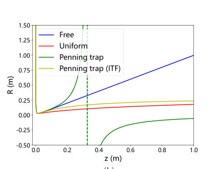 
FIG. 1. The initial kinetic energy is 20 keV, w = 200 nm, w′ = 0, and different electric fields are considered. (a) Evo- lution of the beam width w(z). (b) Evolution of the wave front R(z). The blue line corresponds to free space, the red line to the uniform electric field 1.4 MV/m, the green line to the potential (24), and the yellow line to the potential V(z, r) = −2az2 ignoring transverse field (ITF).

📷 Fig 2

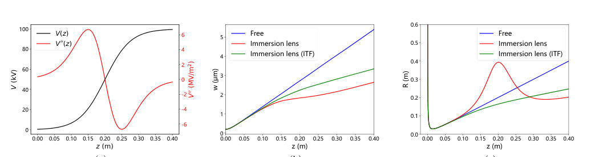 
FIG. 2. (a) The potential distribution and its second-order derivative function on the axis of the immersion lens model. The initial kinetic energy is 20 keV. On the z = 0 plane, w0 = 200 nm, w′ = 0. (b) Evolution of the beam width w(z). (c) Evolution of the wave front R(z). The blue line corresponds to free space, the red line to immersion lens, and the green line to immersion lens that ignores transverse field (ITF).

📷 Fig 3

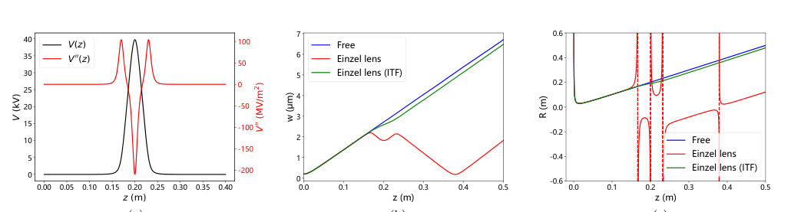 
FIG. 3. (a) The potential distribution on the axis of the einzel lens model. (b) The evolution of beam width under this potential distribution. (c) Evolution of the wave front R(z). The initial kinetic energy is 20 keV. On the z = 0 plane, w0 = 200 nm and w′ 0 = 0. The blue line corresponds to free space, the red line to einzel lens, and the green line to einzel lens that ignores the transverse electric field (ITF).

📷 Fig 4

 
FIG. 4. Consider the process of increasing kinetic energy by 100 keV. (a) The evolution of beam width w(T) as kinetic energy increases. (b) The evolution of wave front R(T) as kinetic energy increases.

**Summary.** This paper theoretically analyzes how transverse electric fields affect the propagation of relativistic vortex beams in accelerating electrostatic potentials. By deriving coupled evolution equations and solving them numerically for various lens geometries, the authors demonstrate that the transverse field critically dictates beam focusing and divergence characteristics. The results offer a quantum framework for controlling charged particle beams using tailored electrostatic environments.

**Why it may be interesting.** This work provides a detailed quantum framework for controlling particle beams using electrostatic fields, which has direct relevance to advanced accelerator physics and quantum optics applications involving charged matter waves.

Detailed structure

**Main problem.** The study investigates how a transverse electric field influences the evolution of relativistic vortex states carried by massive charged particles propagating through an axisymmetric accelerating electrostatic field.

**Main result.** The transverse field significantly modifies beam focusing and divergence, leading to coupled evolution equations for beam width and wavefront curvature that cannot be explained by longitudinal acceleration alone.

**Method.** The authors derived coupled evolution equations using the Foldy-Wouthuysen transformation and paraxial approximation, solving them numerically via a simplified differential equation for a combined parameter f(z).

**Model / system.** The model involves massive charged particles with orbital angular momentum (vortex states) propagating in non-uniform electrostatic fields generated by structures like Penning traps, immersion lenses, and Einzel lenses.

**Key observables.** Beam width w(z), wavefront curvature R(z), Gouy phase $\Phi_G(z)$, and the on-axis electric potential V(z).

**Important parameters / regimes.** The strength and spatial variation of the transverse electric field, and the final kinetic energy imparted to the beam.

**Assumptions / limitations.** The analysis relies heavily on the paraxial approximation and assumes the transverse profile retains a Laguerre-Gauss (LG) functional form for simplification.

**Figures summary.** Figures compare beam evolution (width vs. curvature) across different field geometries (Uniform, Immersion lens, Penning trap) as kinetic energy increases.

**Paper structure.** The paper proceeds by deriving the governing equations from the Dirac Hamiltonian using FW and paraxial approximations; it then derives coupled evolution equations for beam parameters; finally, these are solved numerically for specific physical setups to demonstrate the field's influence.

Abstract

The relativistic vortex states of massive charged particles propagating in non-uniform axisymmetric electric field are studied. Starting from the stationary-state equation after the relativistic Foldy-Wouthuysen (FW) transformation and employing the paraxial approximation, the coupled evolution equations for the beam width, wavefront curvature, and Gouy phase are derived. The equations are solved numerically for a quadratic electrostatic potential, an immersion lens, and an einzel lens. The essential influence of the transverse field on beam evolution is demonstrated. The results provide a relativistic quantum framework for controlling accelerated vortex particle beams using electrostatic fields.

[↑ back to top](#top)

### [Topological effects in the polarization of the Fulling-Rindler vacuum](http://arxiv.org/abs/2607.04483v1)

**Authors:** A. A. Saharian, G. V. Mirzoyan, V. S. Torosyan  
**Type:** theory · **Category:** other · **PDF:** <https://arxiv.org/pdf/2607.04483v1>  
**Analysis basis:** full PDF text, analyzed in chunks
**Topic relevance:** `Keldysh / 2PI / non-Gaussian methods` **1/5**

📷 Fig 1

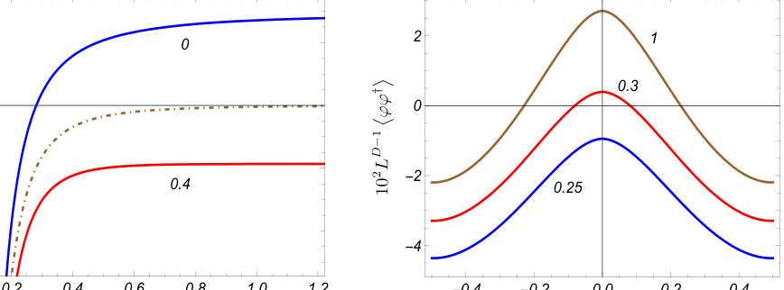 
Figure 1: The VEV of the field squared for a massless field as a function of ξ/L in the D = 4 model (left panel). The graphs are plotted for ˜αD = 0 and ˜αD/2π = 0.4 (the numbers near the curves). The dot-dashed curve corresponds to the VEV in the Rindler spacetime with trivial topology. The right panel presents the dependence on ˜αD/2π. The numbers near the curves are the values of ξ/L.

📷 Fig 2

 
Figure 2: The VEV of the field squared for a massive field as a function of inverse proper acceleration (left panel) and the length of compact dimension (right panel) in units of the Compton wavelength. The numbers near the curves on the left and right panels are the values of ˜αD/2π and mξ, respectively. The full and dashed curves on the right panel are plotted for ˜αD/2π = 0 and ˜αD/2π = 0.4.

📷 Fig 3

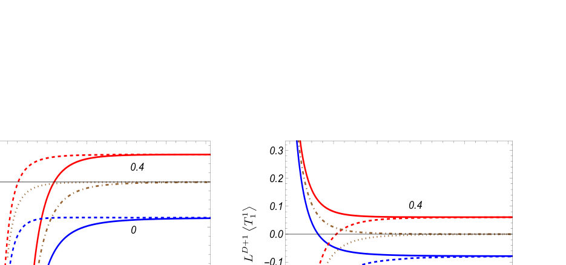 
Figure 3: The vacuum energy density (left panel) and 1 1-stress for a massles scalar field versus the ratio ξ/L. The full and dashed curves correspond to minimally and conformally coupled fields and the numbers near the curves are the values of ˜αD/2π. The dot-dashed and dotted curves present the corresponding VEVs in the Rindler spacetime without compact dimensions.

📷 Fig 4

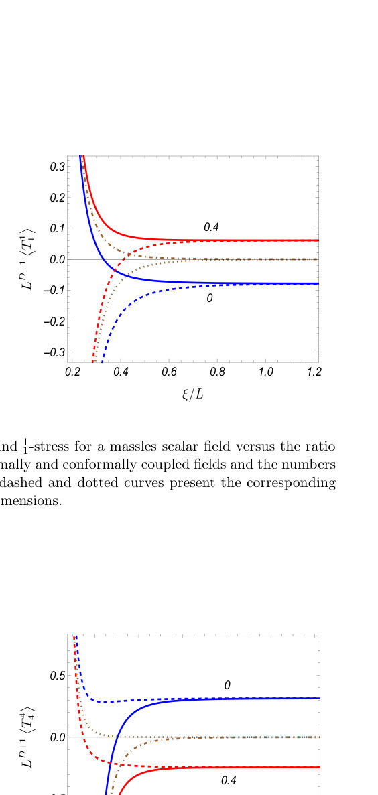 
Figure 4: The same as in Fig. 3 for the stresses ⟨T 2 2 ⟩(left panel) and ⟨T 4 4 ⟩(right panel).

📷 Fig 5

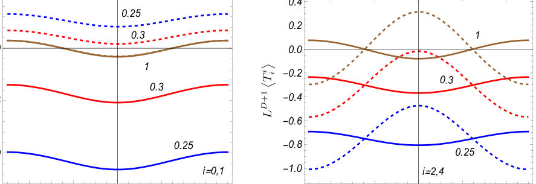 
Figure 5: The vacuum energy-momentum tensor ⟨T i i ⟩as a functions of ˜αD/2π for a minimally coupled massless field in 4 + 1-dimensional Rindler spacetime with a single compact dimension. The left and right panels correspond to the components i = 0, 1 and i = 2, 4, and the numbers near the curves are the values of the ratio ξ/L. The full and dashed curves correspond to i = 0, 2 and i = 1, 4, respectively.

**Summary.** This paper analyzes the vacuum structure of a charged scalar field confined to Rindler spacetime with compactified dimensions. It calculates how topological effects, quantified by enclosed magnetic fluxes, modify the vacuum expectation values of observables like $\langle T_{\mu
u} 
angle$. The results highlight distinct decay behaviors—exponential versus power-law—depending on whether the field is massless and if the flux conditions are trivial.

**Why it may be interesting.** The study connects concepts from quantum field theory in curved spacetime (Rindler/Fulling-Rindler) with topology via magnetic fluxes, yielding non-trivial vacuum energy corrections that decay differently based on mass and flux conditions.

Detailed structure

**Main problem.** The study investigates how compactifying spatial dimensions within Rindler spacetime affects the vacuum expectation values (VEVs) of field observables for a charged scalar field.

**Main result.** The VEVs exhibit topological contributions dependent on enclosed magnetic fluxes, and the difference between Fulling-Rindler and Minkowski vacua is generally exponentially small unless the field is massless with zero phases, leading to power-law decay.

**Method.** Calculations rely on evaluating vacuum expectation values using Hadamard functions and mode summation techniques, comparing results across different topological limits (Minkowski vs. Rindler).

**Model / system.** The system models a charged scalar field in a $(D+1)$-dimensional spacetime that is locally Rindler, incorporating compact dimensions with quasi-periodicity conditions related to magnetic fluxes.

**Key observables.** Vacuum expectation values of the field squared ($\langle \phi^2 
angle$) and components of the energy-momentum tensor ($\langle T_{\mu
u} 
angle$).

**Important parameters / regimes.** Proper acceleration, compactification lengths ($L_l$), field mass ($m$), and enclosed magnetic fluxes ($\Phi_l$).

**Assumptions / limitations.** The analysis assumes a locally Rindler geometry and utilizes approximations in various asymptotic limits (e.g., near the horizon or for small accelerations).

**Figures summary.** Figures illustrate the VEV of the field squared for massless fields showing dependence on acceleration/compactification parameters, comparing results to trivial topology cases.

**Paper structure.** The paper analyzes the problem by first setting up the field equation and periodicity conditions; it then calculates $\langle \phi^2 
angle$ and $\langle T_{\mu
u} 
angle$, deriving explicit forms for the topological contributions in different limits, and finally applying these results to physical scenarios like black hole horizons.

Abstract

We investigate how the compactification of some spatial dimensions in Rindler spacetime affects the vacuum expectation values (VEVs) of the field squared and the energy-momentum tensor for a charged scalar field prepared in the Fulling-Rindler vacuum state. A toral compactification is considered with quasi-periodicity conditions on the field operator along the compact dimensions. The phases of these conditions are interpreted in terms of the magnetic flux enclosed by the compact dimensions. For a general number of spatial dimensions, the components of the VEVs are explicitly separated, corresponding to the expectation values in the Minkowski vacuum. As a limiting case, the VEVs are retrieved in Rindler spacetime with trivial topology. We demonstrate that, for non-zero phases in the periodicity conditions, the vacuum energy-momentum tensor exhibits off-diagonal components with indices in the compact subspace. Near the Rindler horizon, the leading terms in the asymptotic expansions of the field squared and the diagonal components of the energy-momentum tensor coincide with the corresponding VEVs in Rindler spacetime with trivial topology. The off-diagonal components of the energy-momentum tensor vanish on the Rindler horizon. For small accelerations, the difference between the VEVs in the Fulling-Rindler and Minkowski vacua is exponentially small. The exception to this is a massless field with zero phases in the periodicity conditions. In this special case, the difference decays according to a power law as a function of acceleration. As an application, we consider the VEVs near the horizon of cylindrical black holes and topological black holes with toroidal horizons.

[↑ back to top](#top)

### [Trace-to-Hilbert-Schmidt Speed Ratio in Quantum Dynamics: Universal Bounds and Effective Rank](http://arxiv.org/abs/2607.04488v1)

**Authors:** Hossein Rangani Jahromi  
**Type:** theory · **Category:** other · **PDF:** <https://arxiv.org/pdf/2607.04488v1>  
**Analysis basis:** full PDF text, analyzed in chunks
**Topic relevance:** `entanglement & information structure` **1/5**

📷 Fig 1

 
Low-resolution page preview, page 2

📷 Fig 2

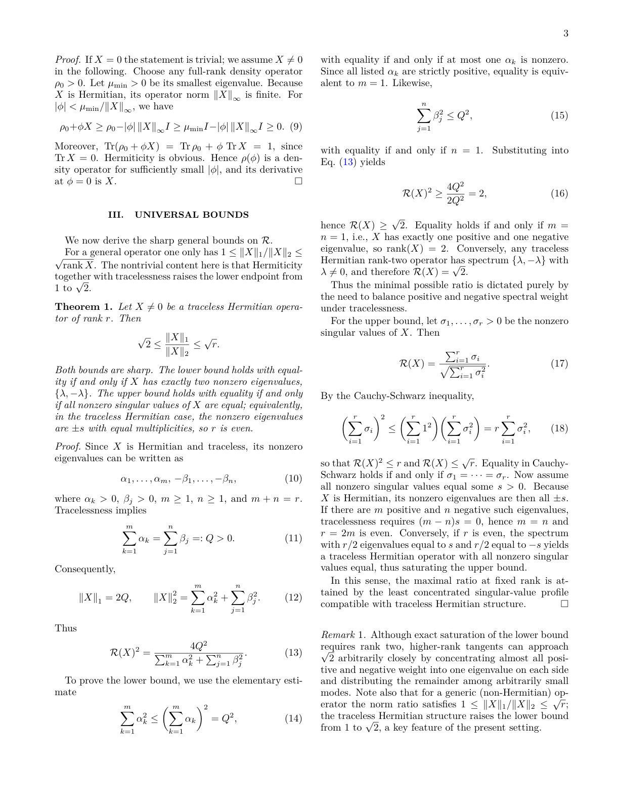 
Low-resolution page preview, page 3

📷 Fig 3

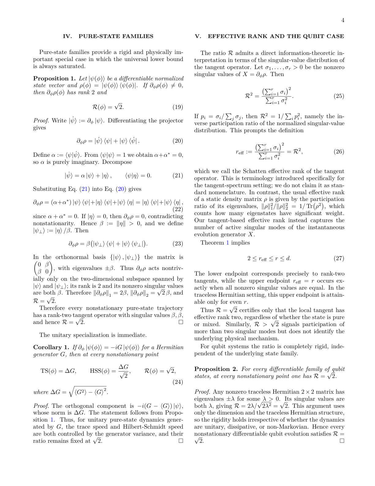 
Low-resolution page preview, page 4

📷 Fig 4

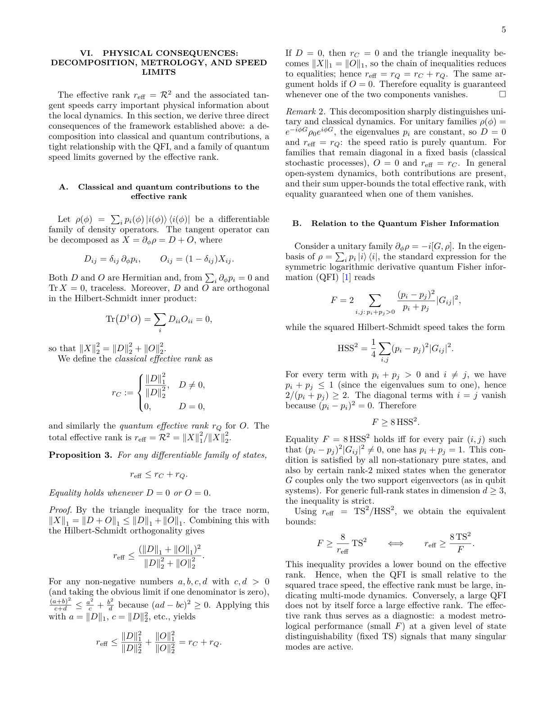 
Low-resolution page preview, page 5

📷 Fig 5

 
Low-resolution page preview, page 6

**Summary.** This theoretical paper derives universal bounds for the ratio between two different measures of quantum speed (trace vs. Hilbert-Schmidt) for evolving quantum states. The central finding is that this ratio, which quantifies the 'effective rank' of the dynamics, is tightly constrained by the traceless and Hermitian nature of the evolution operator. It establishes $\mathcal R=\sqrt{2}$ for pure states and provides a new diagnostic tool linking local geometry to fundamental metrological limits.

**Why it may be interesting.** This work provides a powerful, geometry-based metric ($\mathcal R$) that quantifies how much the local dynamics deviate from simple spectral behavior, offering new constraints on quantum evolution times beyond standard energy or coherence measures.

Detailed structure

**Main problem.** The paper investigates universal bounds for the ratio between the trace speed and the Hilbert-Schmidt speed of a quantum state's evolution, $\mathcal R(\phi)$, which is defined using the tangent operator $X = \partial_\phi
ho$. This ratio serves as a diagnostic tool for local quantum dynamics.

**Main result.** Sharp bounds are established: $\sqrt{2} \le \mathcal R(X) \le \sqrt{r}$ for any rank-$r$ traceless Hermitian tangent operator $X$, with the pure-state limit yielding $\mathcal R = \sqrt{2}$. The effective rank, related to $\mathcal R^2$, provides a measure of active singular modes.

**Method.** The analysis relies on exploiting the mathematical constraints imposed by the tangent operator being both Hermitian and traceless. Techniques involve applying Schatten norm inequalities and relating this ratio to quantum Fisher information (QFI) bounds.

**Model / system.** The study concerns differentiable families of density operators $
ho(\phi)$ in a finite-dimensional Hilbert space, where the dynamics are characterized by the tangent operator $X = \partial_\phi
ho$. Specific attention is paid to pure-state evolution and general unitary time evolutions.

**Key observables.** Trace-to-Hilbert-Schmidt Speed Ratio ($\mathcal R$), Effective Rank ($r_{	ext{eff}}$), Quantum Fisher Information (QFI).

**Important parameters / regimes.** The Hilbert space dimension $d$, the rank $r$ of the tangent operator, and the specific value $\sqrt{2}$ achieved for pure states.

**Assumptions / limitations.** The analysis is restricted to nonstationary points where the tangent operator $X(\phi)$ is nonzero. The key mathematical structure assumed is that $X$ is Hermitian and traceless.

**Paper structure.** The paper proceeds by defining $\mathcal R$, deriving universal bounds ($\sqrt{2}$ to $\sqrt{r}$) based on the operator's spectral properties, establishing the effective rank decomposition ($r_{	ext{eff}} \le r_C + r_Q$), and finally linking this diagnostic quantity to fundamental limits like QFI and quantum speed limits.

Abstract

We study the ratio between the trace speed and the Hilbert-Schmidt speed for differentiable finite-dimensional quantum states, $\mathcal R(φ)=\|\partial_φρ(φ)\|_1/\|\partial_φρ(φ)\|_2$. Because $\partial_φρ(φ)$ is always Hermitian and traceless, this ratio is constrained more strongly than for a generic operator. For any nonzero tangent operator $X=\partial_φρ$ of rank $r$, we prove the sharp bounds $\sqrt{2}\le \|X\|_1/\|X\|_2\le \sqrt r$. The lower bound is attained exactly for rank-two tangents, while the upper bound is attained exactly when all nonzero singular values are equal, which in the traceless Hermitian setting requires even rank. At every nonstationary point of a pure-state family, the tangent has rank two, implying $\mathcal R=\sqrt2$. For odd Hilbert-space dimension $d$, we further prove the sharp global maximum $\mathcal R\le \sqrt{d-1/d}$, with equality characterized by full-rank spectra whose positive and negative eigenvalues are separately degenerate and have multiplicities differing by one. We identify $\mathcal R^2$ as the inverse participation ratio of the singular-value distribution of the tangent operator, giving $\mathcal R$ a natural interpretation as an effective-rank diagnostic for local quantum dynamics. Furthermore, we decompose the effective rank into classical (eigenvalue) and quantum (eigenvector) contributions and prove the bound $r_{\mathrm{eff}}\le r_C + r_Q$, with equality guaranteed when either component vanishes. We establish a direct inequality linking the effective rank to the quantum Fisher information (QFI), which forces a large number of active singular modes when the QFI is small relative to the squared trace speed. Finally, we derive a hierarchy of quantum speed limits in which the effective rank controls the tightness of bounds expressed through the Hilbert-Schmidt speed.

[↑ back to top](#top)

### [Verification of Quantum Computations: Hardware-Efficient Security Proofs](http://arxiv.org/abs/2607.03983v1)

**Authors:** Harold Ollivier  
**Type:** theory · **Category:** quantum information and computing · **PDF:** <https://arxiv.org/pdf/2607.03983v1>  
**Analysis basis:** full PDF text, analyzed in chunks
**Topic relevance:** `quantum measurements` **1/5**

📷 Fig 1

 
Figure 2.3: Breaking: The initial graph (up) is broken by preparing the empty node in |0⟩state (down).

📷 Fig 2

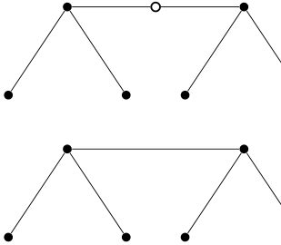 
Figure 2.4: Bridging: The initial graph (up) is bridged by measuring the empty node in Y (down).

📷 Fig 3

 
Figure 2.5: Initial graph state (up), circuit preparing the graph state (middle), equivalent circuit with inserted random Z(θ) rotations (colored boxes) compensated by the conjugated rotation Z(−θ) before the measurement (down). Protocol 2. Universal Blind Quantum Computation (UBQC)

📷 Fig 4

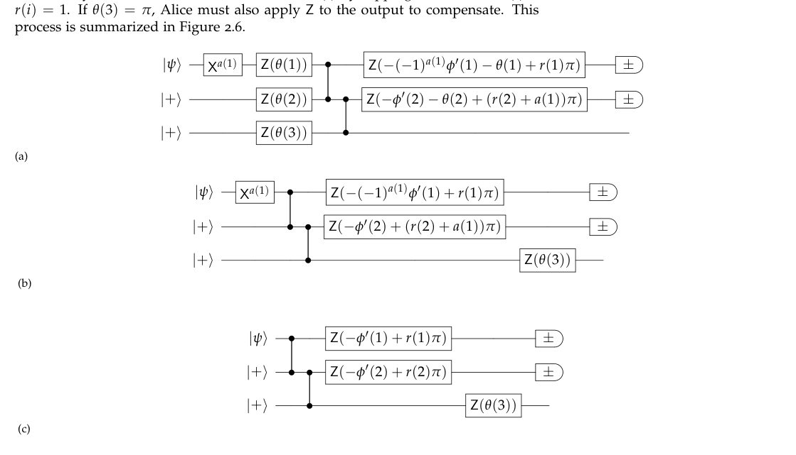 
Figure 2.6: Correctness of UBQC for three-vertex linear graph. (a) UBQC Protocol with the explicit values of δ(i). (b) The Z encryption commutes through the CZ gates and is canceled out by the later Z rotation. (c) The input X encryption commutes through the CZ gates but adds a Z on qubit 2, which is canceled out by the a(1)π inside the rotation. The X on qubit 1 is commuted through the rotation and absorbed by the measurement. The result is Alice’s desired MBQC computation up to Pauli corrections and bit-flips.

📷 Fig 5

 
Figure 2.7: The graph G (up), the corresponding triple graph (middle) and dotted triple graph (down).

**Summary.** This paper provides a high-level guide to architecting secure protocols that allow one party (the verifier) to confirm the results of another party's (the server's) complex quantum computation without needing excessive or perfect quantum resources. It achieves this by modularizing verification into manageable primitives and systematically relaxing stringent hardware requirements found in early theoretical proposals.

**Why it may be interesting.** While highly theoretical, the focus on resource constraints, noise resilience, and architectural principles of quantum computation verification is crucial for guiding the practical implementation roadmap for future quantum hardware.

Detailed structure

**Main problem.** The core problem is developing methods for a limited-resource verifier to statistically verify the output of an untrusted, fully quantum server performing complex computations.

**Main result.** The authors propose a modular and composable framework that systematically relaxes hardware requirements for quantum verification protocols by incorporating techniques like trusted rotations and weak coherent pulses.

**Method.** The work synthesizes existing developments into a toolbox comprising three independent primitives: remote state preparation, trap-based deviation detection, and error-correcting embedding. It relies heavily on abstract composability theorems from quantum cryptography.

**Model / system.** The context involves general quantum computation models, including Measurement Based Quantum Computation (MBQC) and the delegation of fault-tolerant quantum computations in noisy environments.

**Key observables.** Security proofs, hardware overheads for verification protocols, statistical distinguishability ($\epsilon$), and robustness against gate-level noise.

**Important parameters / regimes.** The efficiency gains achieved by replacing demanding components (e.g., single-photon sources) with simpler physical resources like weak coherent pulses or local rotations.

**Assumptions / limitations.** The manuscript itself is a conceptual synthesis, deliberately omitting the dense technical proofs found in underlying publications; it assumes the reader understands advanced quantum information theory concepts.

**Paper structure.** The paper progresses by introducing a modular framework (Part II), followed by improvements addressing specific hardware limitations like eliminating spatial overheads and improving robustness for multi-party or fault-tolerant settings in later parts.

Abstract

How can a user with limited quantum resources verify the output of an untrusted, fully quantum server? This manuscript provides a conceptual synthesis of some recent developments toward answering this question under statistical (information-theoretic) security. Rather than duplicating the dense technical proofs of the underlying publications, our focus here is on the physical motivations, the structural connections between different protocols, and the path toward hardware-efficient implementation.   We begin by introducing a modular, composable framework that partitions verification into three distinct, independent primitives: remote state preparation, trap-based deviation detection, and error-correcting embedding. Using this framework, we show how the demanding hardware requirements of early protocols can be systematically relaxed. We review schemes that eliminate the spatial overhead, remove the need to prepare computational-basis dummy states, and replace single-photon sources with trusted local rotations or weak coherent pulses. Finally, we examine how these techniques scale, both to asymmetric multi-party settings and to the delegation of fully fault-tolerant computations in the presence of gate-level noise. This document is intended as a guide to the architectural principles of practical quantum verification.

[↑ back to top](#top)

## Other papers (12)

*Papers from primary archives without highlighted authors or any topic match. Click to expand.*

Show other papers

### [A regularization method for quantum neural networks using data symmetry](http://arxiv.org/abs/2607.03805v1)

**Authors:** Hiroshi Ohno  
**Type:** both · **Category:** quantum information and computing · **PDF:** <https://arxiv.org/pdf/2607.03805v1>  
**Analysis basis:** full PDF text, analyzed in chunks

📷 Fig 1

 
Figure 1: Configurations for four qubit entangling circuits. R denotes a two-qubit gate implementing a controlled Pauli operator (X or Z).

📷 Fig 2

 
Figure 3: Loss results for classification tasks (depth 2 and 4). (e) denotes the results using the empirical ρin(x) (M = 100): (t) denotes the results using the theoretical ρin(x) (Eq. 21). C denotes a balancing parameter.

📷 Fig 3

 
Figure 4: Loss results for the penalty loss Csymm for classification tasks. (e) denotes the results using the empirical ρin(x) (M = 100); (t) denotes the results using the theoretical ρin(x) (Eq. 21).

📷 Fig 4

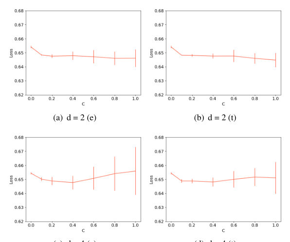 
Figure 5: Test loss results for classification tasks with respect to a balancing parameter C (∈ {0, 0.1, 0.2, 0.4, 0.6, 0.8, 1.0}). (e) denotes the results using the empirical ρin(x) (M = 100). (t) denotes the results using the theoretical ρin(x) (Eq. 21). Error bar denotes a standard deviation.

📷 Fig 5

 
Figure 6: Comparison results of the weight decay method and the proposed method (C = 1). Error bar denotes a standard deviation.

**Summary.** This paper introduces a novel regularization technique for Quantum Neural Networks (QNNs) that leverages the inherent symmetries of the input data. By adding a symmetry-preserving penalty term to the loss function, the method improves training speed and generalization performance across various tasks. The results demonstrate that incorporating this symmetry knowledge enhances QML model robustness.

**Why it may be interesting.** This work directly addresses practical challenges in quantum machine learning by providing a principled way to regularize models based on underlying physical symmetries, which is crucial for building robust quantum algorithms.

Detailed structure

**Main problem.** The study aims to improve the generalization performance and accelerate the training speed of Quantum Neural Networks (QNNs) by incorporating constraints derived from input data symmetries.

**Main result.** The proposed symmetry-based regularization method leads to faster convergence and lower test errors across both classification tasks and quantum generative adversarial networks compared to unregularized models. Theoretically, it provides a generalization bound suggesting improved performance when symmetry is enforced.

**Method.** A novel penalty term, $C_{	ext{symm}}$, is added to the cost function, forcing the parameterized quantum circuit's unitary evolution to align with the symmetries inherent in the input data density matrix $
ho_{in}(x)$. Theoretical analysis involves deriving Rademacher complexity bounds.

**Model / system.** The model utilizes QNNs implemented via parameterized quantum circuits $U(	heta)$, whose output is measured as an expectation value. The analysis covers both classification tasks and generative modeling using Quantum GANs, requiring the definition of input density matrices $
ho_{in}(x)$ for different scenarios.

**Key observables.** Test errors, convergence speed, Frobenius norm ($\lVert S U(	heta) S^\dagger - U(	heta) 
Vert_F$), and Fréchet Inception Distance (FID) for generative tasks.

**Important parameters / regimes.** The balancing parameter $C$ controlling the regularization strength; circuit depth ($d=2, d=4$).

**Assumptions / limitations.** It is assumed that enforcing data symmetry via a penalty term can constrain the search space beneficially without overly restricting expressibility. A key limitation noted is that generative tasks might show instability with strong symmetry constraints.

**Figures summary.** Figures compare loss results for classification (varying depth and regularization strength $C$) and show FID scores for generative tasks up to 100 iterations, illustrating the impact of the penalty term.

**Paper structure.** The paper introduces the problem, details the symmetry-based regularization method using data symmetries ($
ho_{in}(x)$), provides theoretical generalization bounds via Rademacher complexity, and validates the approach through numerical experiments on both classification and QGAN tasks.

Abstract

Leveraging data symmetries has recently become a key strategy in quantum neural networks (QNNs) to improve generalization and training efficiency. In this study, we propose a novel regularization method for QNNs based on input data symmetry. By introducing a penalty term that encourages the model to align with data symmetry, our method enables improved training speed and generalization. This symmetry-based regularization is simple to implement and does not require prior knowledge of the symmetry group. We validate its effectiveness through numerical experiments on both classification tasks and quantum generative adversarial networks. Empirical results demonstrate faster convergence and lower test errors. Furthermore, we provide a theoretical generalization bound using Rademacher complexity and conjecture a condition under which models with symmetry exhibit better generalization. Our findings highlight the potential of symmetry-aware regularization in enhancing the performance of QML models.

[↑ back to top](#top)

### [A Semantic Framework for Reproducible Variational Quantum Algorithm Execution Records](http://arxiv.org/abs/2607.03982v1)

**Authors:** Silvie Illésová, Martin Beseda  
**Type:** theory · **Category:** quantum information and computing · **PDF:** <https://arxiv.org/pdf/2607.03982v1>  
**Analysis basis:** full PDF text, analyzed in chunks

📷 Fig 1

 
Figure 1: General workflow of a variational quantum algo- rithm execution.

📷 Fig 2

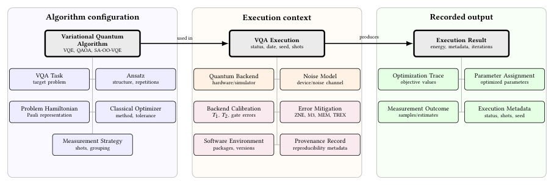 
Figure 2: Compact overview of the VQA ontology as an execution record. The ontology connects algorithm configuration, execution context, and recorded outputs required for validation, querying, and reproducibility.

**Summary.** This paper introduces an ontology-supported framework to solve the critical problem of non-reproducible Variational Quantum Algorithm (VQA) execution records. By modeling all interacting components—from ansatzes and Hamiltonians to optimizers and noise models—using OWL, it creates a structured, machine-readable record. This allows researchers to rigorously validate completeness and query the exact context needed for reliable quantum software experimentation.

**Why it may be interesting.** This work provides a crucial meta-layer for quantum computation research, addressing reproducibility—a major bottleneck when comparing results across different hardware platforms or algorithmic variations. It formalizes the necessary metadata structure for future benchmarking.

Detailed structure

**Main problem.** Variational Quantum Algorithms (VQAs) generate results dependent on numerous interacting choices, making current execution records difficult to reproduce, compare, debug, and reuse.

**Main result.** The authors propose an ontology-supported framework that successfully models complete VQA execution contexts and can automatically detect missing or malformed metadata.

**Method.** They use Web Ontology Language (OWL) to model key entities into a structured, machine-readable artifact, validating completeness with SHACL constraints, and enabling querying via SPARQL.

**Model / system.** The framework models the entire hybrid quantum-classical execution loop of VQAs, including components like ansatzes, Hamiltonians, optimizers, backends, noise models, and measurement outcomes. The motivating example is the Variational Quantum Eigensolver (VQE).

**Key observables.** Final energy estimates, full execution context metadata (ansatz structure, Hamiltonian representation, optimizer configuration, shot count, random seed), and provenance records.

**Important parameters / regimes.** Ansatz parameters, noise model parameters, optimization convergence criteria, and software/backend versions are critical inputs.

**Assumptions / limitations.** The primary assumption addressed is the fragmentation of execution context across disparate sources (code, logs, papers), which necessitates a standardized semantic representation for reliable reproduction.

**Figures summary.** Figure 1 illustrates the general VQA workflow loop. Figure 2 provides an overview of the ontology structure connecting algorithm configuration to recorded outputs. Table 1 summarizes ontology classes by conceptual module.

**Paper structure.** The paper introduces the problem of non-reproducible VQA records, proposes the OWL/SHACL/SPARQL framework, details its components and validation mechanisms using examples (like VQE), and demonstrates its utility in capturing full execution context.

Abstract

Variational quantum algorithms are hybrid quantum-classical workflows whose results depend on many interacting choices, including the ansatz, Hamiltonian, optimizer, backend, shot count, noise model, mitigation method, random seed, stopping criteria, and software versions. In current practice, this information is often scattered across code, configuration files, logs, backend metadata, and paper descriptions, making executions difficult to reproduce, compare, debug, and reuse. This paper proposes an ontology-supported framework for representing Variational Quantum Algorithm (VQA) execution records as structured and machine-readable software engineering artifacts. The framework defines a Web Ontology Language (OWL) ontology for modeling the main entities involved in VQA experimentation, including algorithms, circuits, ansatzes, Hamiltonians, optimizers, backends, noise models, mitigation techniques, execution steps, software environments, measurement outcomes, and results. It further combines the ontology with Shapes Constraint Language (SHACL) constraints for validating completeness and consistency, and SPARQL Protocol and RDF Query Language (SPARQL) competency queries for retrieving reproducibility-relevant information. We demonstrate the approach using Variational Quantum Eigensolver (VQE) execution records, including a valid record and intentionally incomplete or inconsistent examples. The results show that the framework can represent complete VQA execution contexts, detect missing or malformed metadata, and support query-based inspection of information needed for reproducible quantum software experimentation.

[↑ back to top](#top)

### [Chromatic Completeness and the Independence of Geometric Obstruction](http://arxiv.org/abs/2607.04289v1)

**Authors:** Karl Svozil  
**Type:** theory · **Category:** other · **PDF:** <https://arxiv.org/pdf/2607.04289v1>  
**Analysis basis:** full PDF text, analyzed in chunks

📷 Fig 1

 
Low-resolution page preview, page 2

📷 Fig 2

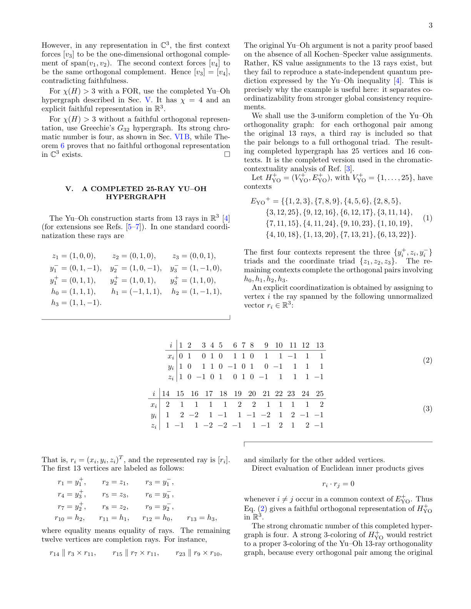 
Low-resolution page preview, page 3

📷 Fig 3

 
Low-resolution page preview, page 4

📷 Fig 4

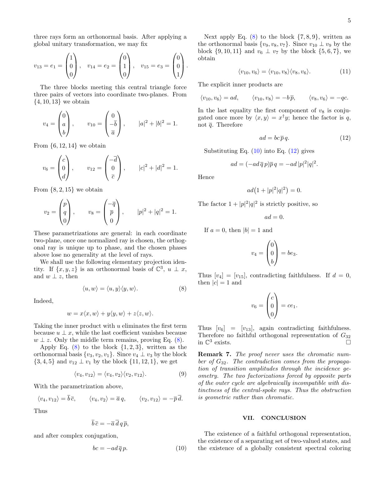 
Low-resolution page preview, page 5

📷 Fig 5

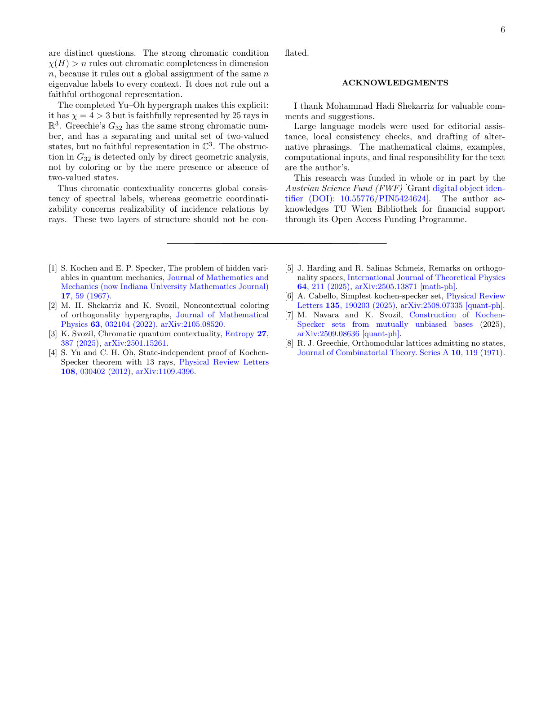 
Low-resolution page preview, page 6

**Summary.** The paper rigorously separates two distinct concepts in the study of quantum contextuality: chromatic completeness and geometric coordinatizability. By analyzing specific hypergraphs, the authors demonstrate that a high strong chromatic number does not guarantee a failure to find a faithful orthogonal representation, proving that the obstruction can be purely projective-geometric rather than merely spectral.

**Why it may be interesting.** This work is highly relevant for theoretical physicists studying quantum contextuality, as it provides a rigorous mathematical tool to distinguish between different types of physical limitations—those arising from spectral labeling versus those arising from underlying geometric structure in Hilbert space representations.

Detailed structure

**Main problem.** The paper aims to establish a strict logical separation between two concepts in orthogonality hypergraphs: chromatic completeness (global spectral consistency) and geometric coordinatizability (existence of a faithful orthogonal representation).

**Main result.** The authors prove that the strong chromatic number ($\chi(H)$) only obstructs chromatic completeness, not necessarily the existence of a faithful orthogonal representation (FOR), demonstrating their logical independence.

**Method.** The separation is demonstrated by comparing two specific hypergraphs—the completed Yu–Oh configuration and Greechie’s $G_{32}$—showing that one has $\chi=4$ but an FOR, while the other has $\chi=4$ but no FOR due to projective-geometric constraints.

**Model / system.** The model involves orthogonality hypergraphs $H=(V, E)$, where vertices represent physical observables and edges (contexts) are sets of mutually orthogonal rays in a Hilbert space ($\mathbb{C}^n$).

**Key observables.** Strong Chromatic Number $\chi(H)$; existence/failure of Faithful Orthogonal Representation (FOR).

**Important parameters / regimes.** Dimensionality $n$ (specifically $n=3$ is used for comparison); the value of $\chi(H)$ relative to $n$.

**Assumptions / limitations.** The analysis compares results between real ($\mathbb{R}^3$) and complex ($\mathbb{C}^3$) geometries, which highlights potential differences in the underlying mathematical structure.

**Figures summary.** Not specified by notes; the comparison relies on algebraic proofs using specific hypergraph structures (Yu-Oh and $G_{32}$).

**Paper structure.** The paper defines the two phenomena, presents the examples ($	ext{H}^+_{	ext{YO}}$ and $	ext{G}_{32}$), and culminates in proving that the obstruction mechanisms are distinct by showing one fails due to coloring constraints while the other fails due to algebraic/geometric incompatibility.

Abstract

We establish a strict logical separation between two distinct phenomena in orthogonality hypergraphs: chromatic completeness, the possibility of assigning a single globally consistent nondegenerate spectrum to all contexts, and geometric coordinatizability, the existence of a faithful orthogonal representation by rays. A strong chromatic number larger than the Hilbert-space dimension obstructs only the former. It does not, by itself, obstruct the existence of a faithful orthogonal representation. We make this separation explicit by comparing two three-dimensional examples with the same strong chromatic number. A completed 25-ray version of the Yu-Oh configuration has strong chromatic number four and nevertheless possesses an explicit faithful orthogonal representation in R^3. Conversely, Greechie's G_{32} hypergraph also has strong chromatic number four, and has a separating and unital set of two-valued states, but we give an elementary algebraic proof that it admits no faithful orthogonal representation in C^3. The obstruction in G_{32} is therefore not chromatic but projective-geometric: the incidence relations force two distinct atoms to collapse onto the same ray.

[↑ back to top](#top)

### [Complementary 3D color codes for transversal quantum logic](http://arxiv.org/abs/2607.05107v1)

**Authors:** Friederike Butt, Luis Colmenarez, Erik Weilandt, Tom Peham, Robert Wille, Markus Müller  
**Type:** theory · **Category:** quantum information and computing · **PDF:** <https://arxiv.org/pdf/2607.05107v1>  
**Analysis basis:** full PDF text, analyzed in chunks

📷 Fig 1

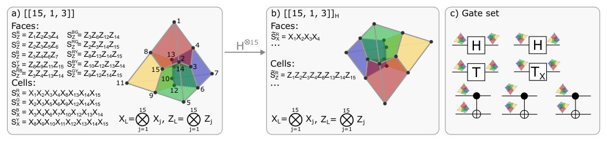 
Figure 1. The [[15, 1, 3]] code and its Hadamard-transformed version. (a) The X-stabilizer generators of the [[15, 1, 3]] tetrahedral color code are supported on the red (R), blue (B), green (G) and yellow (Y) cell formed by eight qubits each. Ten independent Z-stabilizers are defined on weight-4 faces within the tetrahedron. (b) The support of X- and Z-stabilizers is interchanged on the Hadamard-transformed tetrahedral code [[15, 1, 3]]H: X-stabilizers are supported by faces and Z-stabilizers are supported by cells. (c) The joint gate set of both code variants comprises the logical CNOT between the same code types, the T gate on the [[15, 1, 3]] code and the TX gate on the [[15, 1, 3]]H...

📷 Fig 2

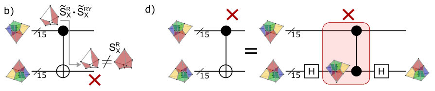 
Figure 2. Transversal operations in the hybrid architecture. (a) If the control qubit is encoded in the [[15, 1, 3]] code and the target in the Hadamard-transformed [[15, 1, 3]]H code, cell-like stabilizers propagate to face-like stabilizers. This operation preserves the codespace because both control and target are a +1-eigenstate of the X-cells. The transversal CNOT gate in the reverse direction (b) does not preserve the codespace, because an X-face propagates from control to the target code that is not an eigenstate of the respective face-like stabilizer. (c) The hybrid architecture admits a transversal Toffoli gate if the two control qubits are encoded in [[15, 1, 3]] codes and the...

📷 Fig 3

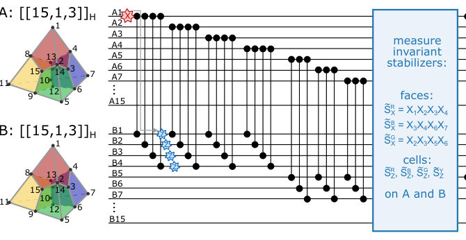 
Figure 3. Round-robin CZ gate on the rotated tetrahedral [[15, 1, 3]]H code. The round-robin gate applies seven layers of permuted transversal CZ gates on qubits 1–7 of code blocks A and B. Since physical CZ gates commute, we can rearrange the gate ordering, as illustrated in App. Fig. 8. In doing so, the protocol becomes symmetric between the two registers, which allows us to use the same lookup tables for both logical code blocks. The subset of invariant stabilizers remain unchanged throughout the whole protocol. This subset of stabilizers is extracted in the middle of the circuit (blue box). Specifically, we measure the red, blue and green X-faces and three out of four Z-cells of both...

📷 Fig 4

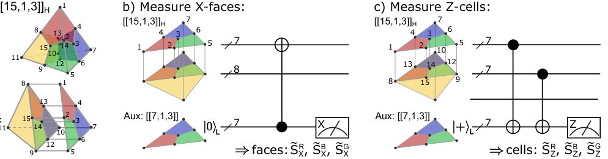 
Figure 4. Fault-tolerant stabilizer extraction on tetrahedral 3D color codes. (a) A 3D tetrahedral color code can be viewed as layers of 2D color codes, similarly to stacked color codes [46]. (b) The red, green and blue X-stabilizers, SR X, SB X, SG X can be measured fault-tolerantly using a variant of Steane’s method for FT syndrome extraction [47]. We fault-tolerantly prepare a logical auxiliary qubit in |0⟩of a 2D color code by verifying the prepared logical state after running a unitary encoding [48], as shown in App. Fig. 7. In a second step, we apply a transversal CNOT gate between the top layer of the 3D code instance (qubit 1–7) and the logical auxiliary qubit. Measuring the...

📷 Fig 5

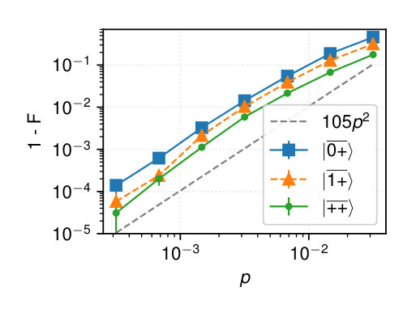 
Figure 5. Logical state fidelities for the fault-tolerant round-robin CZ gate. The CZ gate is run on two [[15, 1, 3]]H codes which do not admit a transversal imple- mentation of this operation. The gate construction is fully symmetric between the two logical qubits. The logical state fidelities are determined as described in App. E for two logi- cal qubit input states |0+⟩, |1+⟩, and |++⟩. The gray dashed line corresponds to the approximated logical infidelity of a transversal CNOT gate, assuming that any two faults con- tribute to the logical infidelity.

**Summary.** The paper addresses the challenge of implementing a universal set of gates fault-tolerantly by proposing a hybrid architecture combining two related 3D color codes. This combination allows for most necessary operations (like magic state injection and entanglement) to remain transversal, significantly reducing resource overhead compared to fully non-transversal methods.

**Why it may be interesting.** This work provides concrete, resource-aware protocols for achieving universal quantum computation by cleverly circumventing theoretical limitations using structured code combinations, which is highly relevant to physical implementations on various hardware platforms.

Detailed structure

**Main problem.** Achieving fault-tolerant quantum computation requires implementing a universal set of logical gates transversally, which is forbidden by the Eastin–Knill theorem on a single Quantum Error-Correcting (QEC) code.

**Main result.** The authors propose a hybrid architecture using two complementary color codes (tetrahedral and H-tetrahedral) to realize an almost-universal transversal gate set, completing universality via a fault-tolerant round-robin construction for the logical controlled-Z gate.

**Method.** The approach combines operations across two related QEC codes, utilizing one-way transversal gates and decomposing complex entangling gates into sequences of simpler, fault-tolerant components.

**Model / system.** The system is based on a hybrid architecture combining the tetrahedral three-dimensional color code and its Hadamard-transformed counterpart ($	ext{H-tetrahedral}$ code), specifically analyzed using the $[[15, 1, 3]]$ encoding.

**Key observables.** Logical state fidelities ($F_{CZ}|0+
angle$, $F_{CZ}|1+
angle$), transversal gate support (CNOT, Toffoli), and resource overheads for non-transversal operations.

**Important parameters / regimes.** The code distance parameters are analyzed, including the relationship between effective X-error distance ($d_X$) and Z-error distance ($d_Z = 3d^2 + 1/4$).

**Assumptions / limitations.** The initial transversal CNOT gate only works in one direction (tetrahedral control $	o$ H-tetrahedral target), necessitating the round-robin construction for full universality.

**Figures summary.** Figures illustrate stabilizer support on both codes, detail the one-way transversal CNOT operation, show the possibility of a Toffoli gate, and depict fault-tolerant syndrome extraction steps using auxiliary qubits.

**Paper structure.** The paper establishes the need for hybrid codes due to the Eastin-Knill theorem; it details the construction of an almost-universal set via complementary transversal operations (CNOT); finally, it completes universality by constructing a fault-tolerant logical controlled-Z gate using pieceable round-robin techniques.

Abstract

Transversal logical gates provide a direct route to fault-tolerant quantum computation, but the Eastin-Knill theorem forbids a universal transversal gate set within a single quantum error-correcting code. We propose a hybrid architecture based on the tetrahedral three-dimensional color code and its Hadamard-transformed counterpart, which we call the H-tetrahedral code. The two encodings support complementary transversal non-Clifford operations. Combined with bitwise Hadamard transformations that switch between the two encodings and a one-way transversal logical CNOT from the tetrahedral code to the H-tetrahedral code, these operations realize an almost-universal transversal logical gate set that enables both the creation of entanglement and logical states with magic. We complete a universal gate set through a pieceably fault-tolerant round-robin construction of a logical controlled-$Z$ gate between two H-tetrahedral codes. This logical entangling gate is interleaved with reduced-overhead Steane-type syndrome extraction using logical two-dimensional color-code auxiliary qubits. Our construction provides a new route toward implementing classically hard-to-simulate quantum algorithms where magic and most entangling operations are transversal while the resource overhead is concentrated in a small number of non-transversal Clifford entangling operations.

[↑ back to top](#top)

### [Frozen-Tree Sampling Refutes Quantum Advantage of Random Circuit Sampling](http://arxiv.org/abs/2607.04054v1)

**Authors:** Sangchul Oh  
**Type:** theory · **Category:** quantum information and computing · **PDF:** <https://arxiv.org/pdf/2607.04054v1>  
**Analysis basis:** full PDF text, analyzed in chunks

📷 Fig 1

 
Figure 1. Binary-tree representation of the probability p(x) = |⟨x|ψ⟩|2 = Q

📷 Fig 2

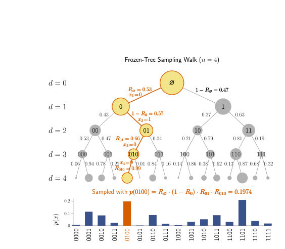 
Figure 2. Random walks on a frozen tree sample bitstrings from pF (x) = |⟨x|ψ⟩|2 = Qn k=1 R1−xk x&lt;k (1−Rx&lt;k)xk, illustrated here for n = 4 qubits. During the random walk from the root to a leaf, the path at each node moves left with probability Rx&lt;k (setting xk = 0) or right with probability 1 −Rx&lt;k (setting xk = 1). When a node is visited for the first time, its branch ratio Rx&lt;k is drawn from the Beta distribution, Beta(K, K) with K = 2n−d−1 and frozen for later revisits. Near the root the branch ratios are close to 1/2, whereas near leaves they fluctuate strongly, as indicated by the node circle sizes. For example, the probability of finding x = 0100 is given by p(x = 0100) = R∅· (1 −R0)...

📷 Fig 3

 
Figure 3. Scaling of the frozen-tree sampler on an Intel CPU i7-3770 and an NVIDIA GPU T400. (a) The time per sample scales as O(n) with the number of qubits n and (b) the wall- clock time scales O(Mn) with the number of samples M for n = 100 and 1, 000.

📷 Fig 4

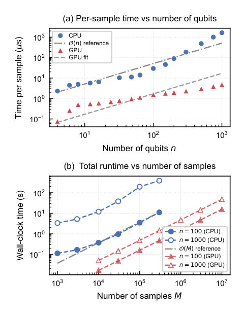 
Fig. 3 shows the O(n) scaling per sample of the frozen- tree sample code [36]. It samples M = 107 bitstrings of an n = 1000-qubit random state on the GPU in a few seconds. For comparison, the Google Sycamore processor required about 200 seconds to collect ∼106 samples at n = 53 [1, 37]. The frozen-tree sampler is fast, exact, and noiseless. Fig. 3 (a) confirms the predicted O(n) per-sample time on CPU and GPU. Fig. 3 (b) shows the total runtime scaling as O(Mn).

📷 Fig 5

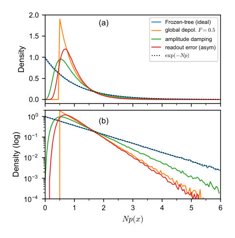 
Figure 5. (a) Distributions of bitstring probabilities and (b) the same distributions on semi-log scale, plotted against Np(x), obtained with the noisy frozen-tree sampler under global depolarizing noise, amplitude damping, and readout error. The number of qubits is n = 20. The probabilities p(x) over all 220 leaves are computed directly from the noisy frozen-tree sampler, rather than estimating as empirical fre- quencies ˆp(x) from finite samples.

**Summary.** This work introduces the 'frozen-tree sampling' algorithm, which efficiently simulates the probability distribution generated by random quantum circuits. By showing that this classical sampler yields statistically identical results to true quantum measurements, the authors argue that the claimed quantum advantage of RCS is illusory based on sample statistics alone.

**Why it may be interesting.** It directly challenges a foundational assumption in quantum computation benchmarking by providing an efficient classical simulation for a key hard problem, forcing researchers to look for non-sample-based advantages.

Detailed structure

**Main problem.** The paper challenges the widely held belief that Random Circuit Sampling (RCS) provides a computational task demonstrating inherent quantum advantage over classical methods.

**Main result.** An efficient classical 'frozen-tree sampling' algorithm can reproduce the exact statistical distribution of probabilities generated by random quantum circuits, meaning no sample-based test can distinguish between the two.

**Method.** The authors propose and analyze a classical frozen-tree sampler that exploits the conditional scale invariance of Haar-random states to draw bitstrings in linear time $O(n)$.

**Model / system.** The model involves random pure quantum states $|\psi
angle$ on $n$ qubits, whose probability distribution $p(x) = |\langle x|\psi
angle|^2$ follows a flat Dirichlet distribution.

**Key observables.** The probability vector $p(x)$ of finding bitstring $x$, and diagnostic measures like the Branch-Ratio Fidelity ($F_\sigma$) used to compare sample fluctuations.

**Important parameters / regimes.** Number of qubits ($n$), which dictates the complexity; the underlying Dirichlet distribution parameters (all set to 1).

**Assumptions / limitations.** The core assumption exploited is the exact conditional scale invariance property of Haar-random quantum states, allowing for a classical construction.

**Figures summary.** Figures illustrate the binary-tree representation of probabilities and show that the spread ($\hat{\sigma}_d$) calculated via the frozen tree exactly matches ideal theoretical values, unlike empirical data from actual circuits.

**Paper structure.** The paper first introduces RCS as a benchmark, then details the mathematical structure using conditional scale invariance to derive the efficient classical sampler. It rigorously proves statistical equivalence across various noise models and concludes that sample statistics alone are insufficient to prove quantum advantage.

Abstract

Random circuit sampling of bitstrings from a Haar-random quantum state is widely believed to be classically intractable, and has therefore been implemented as a primary benchmark for demonstrating quantum advantage. Here, we challenge this premise by proposing an efficient classical frozen-tree sampling algorithm that exploits the conditional scale invariance of Haar-random quantum states [Oh, arXiv:2602.19448]. The frozen-tree sampler draws bitstrings of $n$ qubits in $O(n)$ time per sample. Moreover, its output probability $p_F(x)$ is statistically identical to the probability $p_C(x)$ of a random quantum circuit, since both are independent instances of the same Dirichlet distribution. Consequently, no statistical test acting on samples alone can distinguish the classical frozen-tree sampler from a quantum random circuit. The claimed quantum advantage of random circuit sampling therefore does not withstand scrutiny: its hardness lies not in sampling from the Dirichlet distribution, which is classically efficient, but in identifying a specific circuit realization.

[↑ back to top](#top)

### [Geometric Characteristics of Subproblems in Ising-Machine-Assisted Large Neighborhood Search](http://arxiv.org/abs/2607.05014v1)

**Authors:** Masashi Yamashita, Shu Tanaka  
**Type:** both · **Category:** disordered systems and neural networks · **PDF:** <https://arxiv.org/pdf/2607.05014v1>  
**Analysis basis:** full PDF text, analyzed in chunks

📷 Fig 1

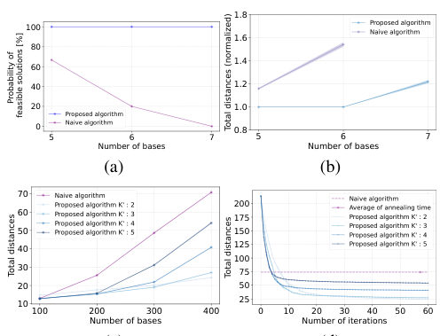 
Fig. 1. Comparison between LNS and the naive approach under an equal total annealing-time budget. (a) Feasible-solution probability obtained with D-Wave Advantage 4.1 for small VRP instances. (b) Normalized total dis- tance obtained with D-Wave Advantage 4.1. (c) Final total distance obtained with Fixstars Amplify AE for VRP instances with 100, 200, 300, and 400 customers. (d) Total distance of the current solution as a function of the it- eration number for the 400-customer instance. In panels (a), (b), and (c), the horizontal axis shows the number of customers N. In the naive approach, the full QUBO problem is submitted to the Ising machine once. In LNS, sub- problems are solved...

📷 Fig 2

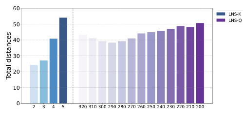 
Fig. 2. Final total distance obtained by LNS-K and LNS-Q for a vehicle routing problem with 400 customers. LNS-K constructs a subproblem from selected vehicles and the customers visited by those vehicles in the current solution, whereas LNS-Q constructs a subproblem from QUBO variables and the associated constraints. The horizontal labels indicate K′ for LNS-K and n′ for LNS-Q. The corresponding numbers of binary variables in the subprob- lems are summarized in Table II. Although n′ allows LNS-Q to control the subproblem size more finely, LNS-K gives shorter final total distances under the tested conditions.

📷 Fig 3

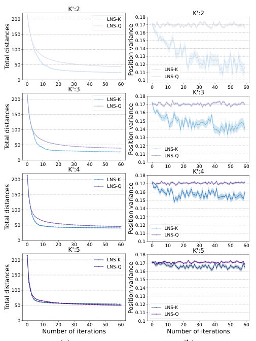 
Fig. 3. Iterative behavior of LNS-K and LNS-Q for subproblems with the same number of binary variables. The results are for a vehicle routing prob- lem with 400 customers. Each row corresponds to K′ = 2, 3, 4, and 5 in LNS-K, and n′ in LNS-Q is chosen to match the corresponding subproblem size, as listed in Table II. (a) Total distance of the current solution. LNS-K shows faster iterative improvement than LNS-Q, especially for smaller sub- problems. (b) Position variance of the selected customer set. In LNS-K, the selected customer set becomes more spatially localized during the optimiza- tion, whereas the position variance in LNS-Q remains nearly constant.

**Summary.** This paper investigates optimizing complex routing problems using Ising machines via Large Neighborhood Search (LNS). The authors compare two methods for defining subproblems—one based on physical routes and another based on raw QUBO variables. They find that incorporating the semantic structure of the current solution, rather than just matching variable counts, leads to superior optimization trajectories.

**Why it may be interesting.** This work bridges combinatorial optimization heuristics with quantum hardware constraints, providing insights into how the *structure* of a problem's representation (semantic vs. purely mathematical) impacts performance on quantum annealers.

Detailed structure

**Main problem.** The study aims to improve large-scale constrained combinatorial optimization problems, such as Vehicle Routing Problems (VRPs), by utilizing Ising machines within a Large Neighborhood Search (LNS) framework.

**Main result.** Subproblem design must consider the semantic and geometric structure inherited from the current solution, not just the number of binary variables. A route-structure based approach (LNS-K) outperformed a QUBO variable-based approach (LNS-Q) under matched-size comparisons.

**Method.** The authors compare two LNS subproblem constructions—one based on physical routes (LNS-K) and one based purely on the mathematical structure of the QUBO variables (LNS-Q)—and test their performance using quantum annealing simulations.

**Model / system.** The problem is formulated as a Quadratic Unconstrained Binary Optimization (QUBO) model, $H(\mathbf{x}) = \mathbf{x}^T Q \mathbf{x}$, applied to VRPs. The optimization is performed iteratively on restricted subproblems using Ising machines.

**Key observables.** Total distance traveled ($D(\mathbf{x})$), Position variance ($V_{pos}$), and the iterative trajectory of solution quality during LNS.

**Important parameters / regimes.** The comparison uses a matched-size protocol, ensuring both LNS variants operate on subproblems with an equal number of binary variables ($B_m$).

**Assumptions / limitations.** The primary limitation is that while LNS-K shows decreasing position variance (suggesting localization), the authors note this does not prove causality regarding total distance improvement.

**Figures summary.** Figures compare the iterative evolution of total distance and position variance for LNS-K versus LNS-Q across varying subproblem sizes, showing distinct trajectories.

**Paper structure.** The paper introduces the challenge of large QUBOs in LNS, details the two competing subproblem constructions (LNS-K vs. LNS-Q), compares their performance on VRP metrics under matched-size conditions, and concludes that structural information is paramount for effective quantum optimization design.

Abstract

Large-scale quadratic unconstrained binary optimization (QUBO) formulations of constrained combinatorial optimization problems often exceed the input-size limit of present Ising machines or suffer from degraded solution quality as the number of binary variables increases. Large neighborhood search (LNS) mitigates this difficulty by sequentially optimizing restricted subproblems, but the structural factors that distinguish subproblems beyond the number of binary variables remain insufficiently characterized. In this study, we examine vehicle routing problems and compare a construction based on the vehicle routes of the current solution, denoted by LNS-K, with a construction based on QUBO variables and constraint relations, denoted by LNS-Q, while controlling the number of binary variables in the subproblems. Under the tested conditions, LNS-K obtained shorter total distances than LNS-Q in the matched-size comparisons, and the position variance, a measure of the spatial spread of the selected customers, decreased during the iterations in LNS-K. These observations suggest that subproblem design for sequential optimization with Ising machines should consider not only subproblem size but also semantic and geometric structures inherited from the current solution.

[↑ back to top](#top)

### [Investigating Role of Electron Correlation Effects via Triple Excitations for Precise Evaluation of Energies and Hyperfine Structure Constants in $^{23}$Na](http://arxiv.org/abs/2607.05012v1)

**Authors:** Vaibhav Katyal, B. K. Sahoo  
**Type:** theory · **Category:** other · **PDF:** <https://arxiv.org/pdf/2607.05012v1>  
**Analysis basis:** full PDF text, analyzed in chunks

📷 Fig 1

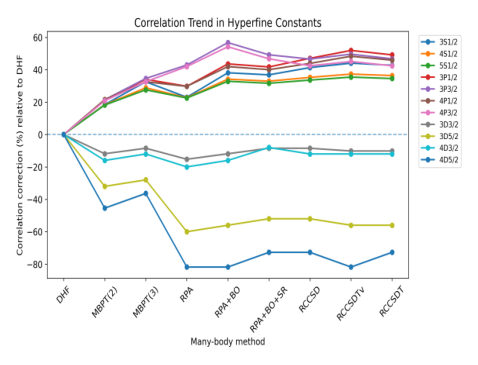 
FIG. 1. Correlation trends from lower- to higher-order many- bdy methods in the calculated Ahf values (in MHz) of the considered states in 23Na. The plotted quantities represent the percentage corrections with respect to the DHF values as progressively through the higher-order many-body methods.

📷 Fig 2

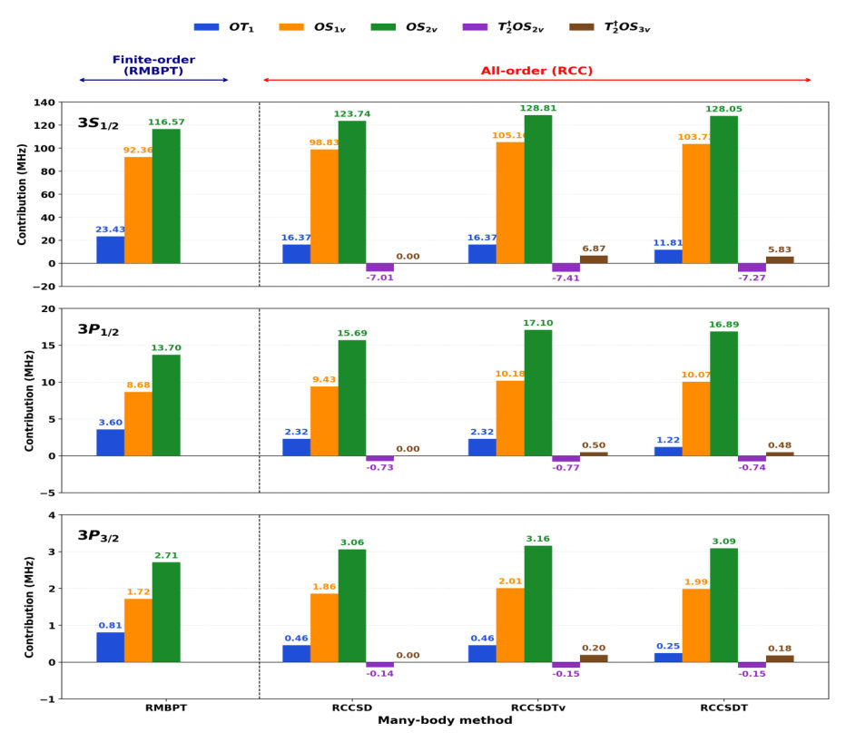 
FIG. 2. Pictorial depiction of correlation contributions from the OT1 + c.c., OS1v + c.c., OS2v + c.c., T † 2 OS2v + c.c. and T † 2 OS3v + c.c. terms to the Ahf values of the 3S, 3P1/2 and 3P3/2 states at the lowest-order (from the RMBPT method) and all-order methods with the RCCSD, RCCSDTv and RCCSDT approximations in 23Na (in MHz). It demonstrates influence of triples effects both directly and indirectly to the states.

**Summary.** This paper performs high-precision theoretical calculations on the hyperfine structure constants of sodium using advanced relativistic coupled-cluster methods. By systematically including triple excitations and various QED/relativistic corrections, the authors demonstrate that these higher-order terms are crucial for matching theory to experimental measurements. The study provides a detailed roadmap for calculating atomic properties in light alkali metals.

**Why it may be interesting.** This work exemplifies state-of-the-art theoretical atomic structure calculations, providing crucial benchmarks for understanding how electron correlation and relativistic effects manifest in measurable quantities like HFS constants.

Detailed structure

**Main problem.** The study aims to accurately determine hyperfine structure constants (HFS) and ionization potentials for the sodium atom by systematically investigating the role of electron correlation effects, particularly those arising from triple excitations.

**Main result.** Including contributions from triple excitations, along with Breit, QED, and Bohr-Weisskopf corrections, is essential for reconciling theoretical predictions of HFS constants with precise experimental measurements in $^{23}	ext{Na}$.

**Method.** The authors employ relativistic coupled-cluster theory (RCCSDT) alongside various lower-order many-body perturbation theories (RMBPT) to treat electron correlation effects.

**Model / system.** The system is the sodium atom ($^{23}	ext{Na}$), treated using a Dirac-Coulomb Hamiltonian. The calculations involve incorporating relativistic corrections like the Breit interaction and QED effects into the many-body framework.

**Key observables.** Hyperfine structure constants (magnetic dipole $A_{	ext{hf}}$ and electric quadrupole $B_{	ext{hf}}$) and Ionization Potentials (IPs).

**Important parameters / regimes.** The relative magnitude of correlation effects versus relativistic/higher-order terms; the importance of triple excitations.

**Assumptions / limitations.** The calculations rely on approximations inherent to many-body theory, such as truncating the excitation series (e.g., $	ext{RCCSDT}$), though they systematically compare these limits.

**Figures summary.** Figures illustrate the systematic inclusion of different physical processes (correlation effects) in S and P states compared to D states, showing how corrections contribute significantly to $A_{	ext{hf}}$ constants.

**Paper structure.** The paper proceeds by establishing the theoretical framework using relativistic coupled-cluster theory. It then systematically compares results obtained from various levels of approximation ($	ext{DHF} 
ightarrow 	ext{RMBPT}(2) 
ightarrow \dots 
ightarrow 	ext{RCCSDT}$) while incorporating multiple high-precision corrections (Breit, QED, BW).

Abstract

Accurate determination of hyperfine structure constants in atomic systems provides important insight into the interplay of electron correlation and relativistic effects in the nuclear region. Although sodium (Na) is a relatively light atom, previous all-order relativistic many-body calculations of the magnetic dipole hyperfine constants for the low-lying states of $^{23}$Na show noticeable discrepancies with experiment. To address this, we calculate the ionization potentials and hyperfine structure constants of $^{23}$Na using relativistic coupled-cluster theory with explicit inclusion of triple excitations. We further incorporate corrections from the Breit interaction, quantum electrodynamics, and the Bohr-Weisskopf (BW) effect. Results from lower-order methods are also presented to assess the importance of different physical contributions across states. Our calculations demonstrate that contributions from the lower-order relativistic and BW effects play almost similar roles with the electron correlation effects, including triple excitations, and are essential for reconciling theoretical predictions with experimental observations. This study can also serve as a useful guide for understanding the role of triples in heavier alkali systems.

[↑ back to top](#top)

### [Ising-Machine-Assisted Large Neighborhood Search with Flexibly Tunable Subproblem Size](http://arxiv.org/abs/2607.05169v1)

**Authors:** Koshiro Fujimoto, Masashi Yamashita, Shu Tanaka  
**Type:** theory · **Category:** statistical mechanics · **PDF:** <https://arxiv.org/pdf/2607.05169v1>  
**Analysis basis:** full PDF text, analyzed in chunks

📷 Fig 1

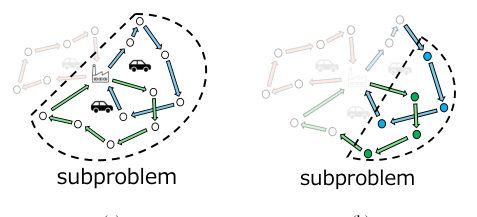 
Fig. 1. Schematics of the vehicles and sites included in the subproblems of LNS-V and LNS-VT. (a) Schematic of LNS-V, where the entire routes of the selected vehicles are re-optimized. (b) Schematic of LNS-VT, where only a contiguous part of the steps in the route of each selected vehicle is re-optimized.

📷 Fig 2

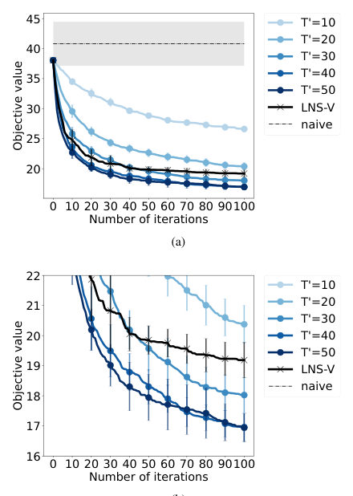 
Fig. 2. Update process of the objective value in LNS for the VRP with 300 non-depot sites and 5 vehicles. The results of LNS-VT are indicated by “T ′ =”. Panel (b) is an enlarged view of panel (a) along the vertical axis. The points represent the average values over 10 runs, and the error bars represent the standard deviations.

📷 Fig 3

 
Fig. 3. Relation between the number of non-depot site-assignment vari- ables included in the subproblem and the objective value after 100 iterations of LNS for the VRP with 300 non-depot sites and 5 vehicles. The points represent the average values over 10 runs, and the error bars represent the standard deviations.

📷 Fig 4

 
Figure 3 shows the relation between the number of vari- ables included in the subproblem and the objective value af- ter 100 iterations. Here, the number of variables denotes the number of non-depot site-assignment variables introduced in Sec. 3. For LNS-VT, this number is (V′T ′)2 in the present experiment because Tseg = T ′ and no depot variables are in- cluded as free variables. For LNS-V, the value is computed from Eq. (16), which applies here because each vehicle visits exactly T −2 non-depot sites in the present setting. Under the problem instance and Ising-machine settings used in this study, the lowest final average objective values were obtained when the number of variables in the...

📷 Fig 5

 
Fig. 4. Number of iterations required for the average objective value to pass through each objective-value interval for LNS-V and LNS-VT with V′ = 2. The horizontal axis represents objective-value intervals, and the ver- tical axis represents the number of iterations required to pass through each interval. A smaller value indicates that the average objective value decreased more quickly in that interval.

**Summary.** This paper addresses limitations in using Ising machines for large combinatorial problems by proposing $	ext{LNS-VT}$, a method that flexibly controls the size of subproblems solved during Large Neighborhood Search. By tuning the number of variables, the authors achieve significant performance gains over existing methods on VRP and QMKP benchmarks. The work emphasizes that controlling problem structure is as vital as ensuring mathematical feasibility.

**Why it may be interesting.** While focused on classical optimization, the reliance on Ising machines (which map to quantum annealing/computation) makes this highly relevant for understanding how heuristic solvers interact with quantum hardware constraints in complex physical modeling.

Detailed structure

**Main problem.** Improving solution quality for large-scale, constrained combinatorial optimization problems like VRP and QMKP.

**Main result.** A novel LNS approach ($	ext{LNS-VT}$) that flexibly controls the subproblem size significantly outperforms existing methods by up to 10% on VRP benchmarks.

**Method.** The authors propose an Ising-machine-assisted Large Neighborhood Search (LNS) framework, specifically $	ext{LNS-VT}$, which adaptively tunes the number of variables in the subproblem solved at each step while maintaining feasibility.

**Model / system.** The problems are modeled using QUBO energy functions derived from combinatorial optimization objectives (VRP and QMKP). The core mechanism involves iteratively solving smaller, constrained subproblems using an Ising machine solver.

**Key observables.** Solution objective value improvement (e.g., 10% reduction in VRP), total profit for QMKP, and the number of binary variables used in the subproblem.

**Important parameters / regimes.** The 'number of consecutive steps re-optimized per vehicle' acts as a crucial control parameter determining the subproblem size; optimal settings vary with solution quality.

**Assumptions / limitations.** Feasibility preservation is necessary but insufficient; controlling the variable count in the subproblem is critical for performance on Ising machines.

**Figures summary.** Figure 8 shows that for QMKP, the highest total profit is achieved when the number of binary variables in the subproblem is maintained within a specific range (100 to 150).

**Paper structure.** The paper first defines the VRP and its QUBO formulation. It then introduces LNS-V and proposes the improved, tunable $	ext{LNS-VT}$ framework. Results are presented for both VRP and QMKP, demonstrating the necessity of subproblem size control.

Abstract

Ising machines are heuristic solvers for combinatorial optimization, but their solution quality can degrade when large-scale constrained problems are solved directly. Ising-machine-assisted large neighborhood search (LNS) instead repeatedly updates a feasible current solution by solving smaller subproblems. An existing feasibility-preserving method for the vehicle routing problem (VRP) re-optimizes the entire routes of selected vehicles and thus cannot adjust the subproblem size finely. We propose LNS-VT, which introduces the number of consecutive steps re-optimized per vehicle as a parameter to control the subproblem size finely while preserving feasibility. For a 300-site, 5-vehicle VRP, its best setting reduced the objective value by approximately 10\% relative to the existing method after 100 iterations, and the appropriate setting changed with the current solution quality. Applying the same principle to the quadratic multiple knapsack problem, we confirmed that an appropriate subproblem size also exists, indicating that subproblem-size control is important in Ising-machine-assisted LNS.

[↑ back to top](#top)

### [Logical Spectroscopy: Lifted-Product Codes with Addressable Bases](http://arxiv.org/abs/2607.05386v1)

**Authors:** Jong Yeon Lee  
**Type:** theory · **Category:** quantum information and computing · **PDF:** <https://arxiv.org/pdf/2607.05386v1>  
**Analysis basis:** full PDF text, analyzed in chunks

📷 Fig 1

 
FIG. 1. Chinese-Remainder-Theorem (CRT) decomposition as a spectral microscope. The displayed quasi-cyclic seed, the toy upper-bound witness seed T15 2,4 from Appendix B, is first a single R-linear module problem over R = F2[x]/(x15+1), where field-style row reduction is not available. Factoring x15 + 1 decomposes R by the Chinese remainder theorem into finite-field packets Kg = F2[x]/(g). In each packet, the seed reduces to an ordinary finite-field matrix, so packet ranks, kernel and quotient coordinates, and K¨unneth representatives can be computed independently. Same-packet tensor data give the Z-logical packet contributions, while conjugate X/Z labels are paired through reciprocal...

📷 Fig 2

 
FIG. 2. Certificate-search and erasure-spectroscopy landscape. (a) Distribution of the full conjugate-basis certificate W cert full over reproducible random monomial scans for ℓ= 31, 45, 75, 81, 91. The translucent blue shapes are violin plots: their horizontal width at a given height is proportional to the empirical density of scan samples with that certificate value. Blue circles are individual scan samples; orange diamonds mark named benchmark seeds where shown; horizontal annotations give the median. (b) Certificate-erasure tradeoff for named seeds and selected random candidates passing the seed filter. Circles are named seeds, diamonds are filtered random candidates, the horizontal...

📷 Fig 3

 
Figure 2 and the tabulated data in Appendix F illus- trate why basis width, distance upper-bound diagnos- tics, and structured-erasure exposure are distinct objec- tives. In the displayed comparison, M45 4,10 has a mod- est certificate and a lower two-left-orbit failure rate than the 3 × 7 monomial benchmarks. The sparse parity- systematic probes P75 3,7 and P91 3,7 repair parts of the trivial- packet rank profile, but they are more exposed to this particular one- and two-left-orbit erasure model. Con- versely, an attractive erasure score does not compensate for a verified small distance upper-bound witness; such seeds should be treated as warning examples rather than benchmark candidates.

📷 Fig 4

 
FIG. 3. Exact-weight BP-OSD residual-logical wit- nesses. Z-side exact-weight code-capacity probes decoded with minimum-sum BP, 1000 BP iterations, and OSDCS of order one. Each marker is a selected shell with at least one log- ical failure; its height is the minimum residual logical weight among failing shots, and its label reports w and failures/shots. Dashed ticks mark the displayed upper bound Dub best from Ta- ble II. The lightest M45 5,9 and P75 3,7 supports were replayed and verified as nontrivial logicals; zero-failure and partial sampled shells are reported in the text. This is a decoder-stress diag- nostic, not a distance lower-bound certificate.

📷 Fig 5

 
FIG. 4. Seed-level distance upper-bound witness diagnostic. (a) Frequency of low-cost monomial-equivalence witnesses in the reproducible random scans for ℓ= 31, 45, 75, 81, 91. Each stacked bar counts valid scan samples at that lift length: the green portion passes the seed filter, while the orange cap is the subset with a verified Dub seed ≤2 witness. The annotations above the bars give the witness count out of the valid scan samples and the corresponding percentage. (b) Certificate-erasure coordinates for the displayed benchmark candidates together with upper-bound witness seeds used as diagnostics. Orange rings mark seeds with Dub seed ≤2; filled points pass the seed filter. The vertical...

**Summary.** The paper introduces 'logical spectroscopy' as a novel technique to systematically construct and label usable conjugate logical bases for complex lifted-product qLDPC codes. By leveraging the Chinese Remainder Theorem, it replaces failing global algebraic reductions with independent finite-field computations across spectral packets. This provides crucial structural diagnostics necessary for building reliable quantum memory systems.

**Why it may be interesting.** This work provides a powerful algebraic framework for analyzing structured quantum codes, offering systematic diagnostics that go beyond simple dimension counting to certify the usability of logical qubits in fault-tolerant architectures.

Detailed structure

**Main problem.** The primary challenge is developing a systematic method to construct and label explicit, addressable conjugate logical operators (X/Z pairs) for high-rate Abelian lifted-product quantum low-density parity-check (qLDPC) codes.

**Main result.** The authors introduce 'logical spectroscopy,' a spectral construction that replaces problematic global row reduction with finite-field computations via the Chinese Remainder Theorem, yielding a complete addressable conjugate logical basis.

**Method.** The method decomposes the group algebra using the CRT into spectral packets. Linear algebra is then performed independently within each packet to compute kernels and quotients, which are subsequently lifted back to define structured logical operators.

**Model / system.** The work focuses on quantum error-correcting codes, specifically quasi-cyclic qLDPC codes based on lifted-product (LP) constructions over group algebras $R = \mathbb{F}_2[x]/(x^l+1)$.

**Key observables.** Complete addressable conjugate logical basis; packet ranks showing sector splitting; certified upper bounds on basis width; and packet-attributed dimensions for erasure failures.

**Important parameters / regimes.** The construction is most robust when the lift group order is odd, allowing clean CRT decomposition into finite fields.

**Assumptions / limitations.** The construction relies on assumptions of bounded seed-shape and bounded group-basis-support. For the spectral method to apply cleanly, the lift group order must be odd.

**Figures summary.** Figures/Tables detail various diagnostic results, including sparse parity-systematic probes (S matrices), pivot optimization certificates ($	ext{W cert}^{	ext{full}}$), and exact fractions of one- and two-left-orbit erasure patterns ($
ho_{1	ext{orb}}, 
ho_{2	ext{orb}}$).

**Paper structure.** The paper develops the theory by first identifying the failure point (global row reduction over non-fields) and then proposing logical spectroscopy. This involves detailing the CRT decomposition, performing packet-wise linear algebra, pairing X/Z operators via reciprocal trace-duals, and finally presenting diagnostic tools derived from these packets.

Abstract

Quantum LDPC memories can encode many logical qubits, but dimension alone does not make them usable: applications need explicit conjugate logical operators with structured labels and physical representatives. For hypergraph-product (HGP) codes this structure is transparent, since the input matrices are binary and can be row-reduced over $\mathbb{F}_2$. Abelian lifted-product codes are subtler. Their seed entries are shifts, or sparse sums of shifts, in a group-algebra ring rather than a field, so pivot blocks need not be invertible and global row reduction can fail.   We address this with \emph{logical spectroscopy}, a spectral construction that replaces global row reduction by finite-field computations in the Frobenius character packets of the Abelian lift group. The Chinese remainder theorem (CRT) decomposes the group algebra into these packets. In each packet, we compute kernels, quotients, and product-complex homology; we then lift the resulting representatives back with CRT idempotents and pair $X$ and $Z$ logicals through reciprocal trace-dual packets. This gives complete addressable conjugate logical bases for finite Abelian lifted products $\mathsf{LP}(A,B)$.   The same packet data also gives design diagnostics. Packet ranks show how logical sectors split, the lifted representatives give certified upper bounds on the width of the constructed conjugate basis, and whole-orbit erasures decompose into packet-attributed erased-logical dimensions. Thus, CRT packets also serve as working coordinates: they label logical sectors, certify the constructed basis width, and attribute structured erasure failures. Under bounded seed-shape and group-basis-support assumptions, this construction gives Abelian lifted-product qLDPC families an HGP-like feature while preserving the layout freedom of group-algebra lifts.

[↑ back to top](#top)

### [Perturbed quantum billiards on the hyperbolic plane](http://arxiv.org/abs/2607.03786v1)

**Authors:** Matic Orel  
**Type:** theory · **Category:** other · **PDF:** <https://arxiv.org/pdf/2607.03786v1>  
**Analysis basis:** full PDF text, analyzed in chunks

📷 Fig 1

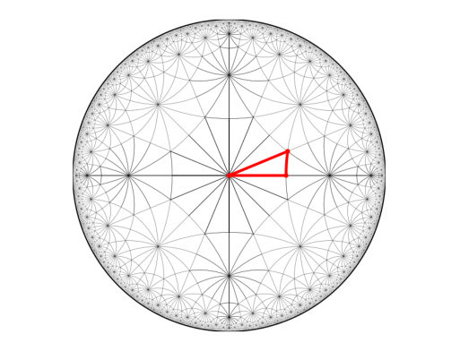 
FIG. 1 Finite-depth reflection tessellation of the Schmit triangle in the Poincar´e disk (1). The red triangle de- notes the fundamental billiard domain, whose angles are π/8, π/2, and π/3. Since each angle is an integer submul- tiple of π, repeated reflections in the three geodesic sides generate a hyperbolic triangle group and tile the hyper- bolic plane without gaps or overlaps. The black curves show a finite subset of this infinite tessellation; the accu- mulation of smaller copies near the unit circle reflects the compression of hyperbolic distance in the Poincar´e disk model.

📷 Fig 2

 
FIG. 2 Example classical trajectory in Schmit’s hyper- bolic triangle. The black curve shows the billiard bound- ary in the Poincar´e disk model, and the red arcs show several specular reflections of a geodesic trajectory. The two sides emanating from the origin are radial geodesics, while the third side is a circular arc orthogonal to the unit disk boundary.

📷 Fig 3

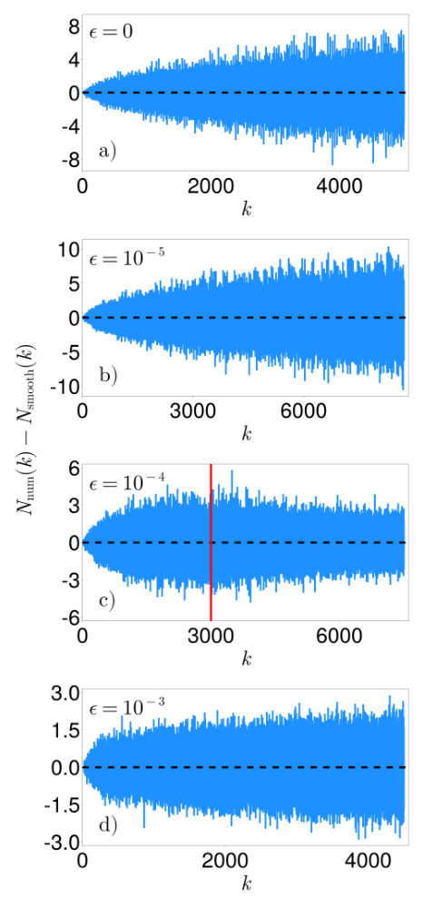 
FIG. 3 Deviation of the numerical counting function from the Weyl law (14). The fluctuations remain cen- tered around zero and show no systematic drift, indi- cating that the computed spectra are complete on the plotted intervals. For ϵ = 10−4, the fluctuations decrease after approximately k ≃3000 (red vertical line in panel c)), consistent with the simultaneous approach of the lo- cal spacing statistics and the sliding–window average gap ratio towards GOE as seen in Fig.8.

📷 Fig 4

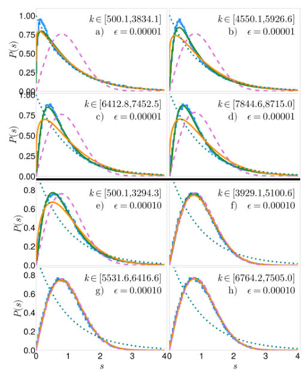 
FIG. 4 Nearest-neighbour spacing distributions for the weak perturbations ϵ = 10−5 and ϵ = 10−4, shown in four spectral windows for each perturbation. Panels (a)– (d) correspond to ϵ = 10−5 with k ∈[500.1, 3834.1], k ∈[4550.1, 5926.6], k ∈[6412.8, 7452.5], and k ∈ [7844.6, 8715.0], respectively. Each of these panels con- tains 1.5 × 105 consecutive eigenvalues, corresponding to 149999 unfolded spacings. Panels (e)–(h) correspond to ϵ = 10−4 with k ∈[500.1, 3294.3], k ∈[3929.1, 5100.6], k ∈[5531.6, 6416.6], and k ∈[6764.2, 7505.0], respec- tively. Each of these panels contains 1.1 × 105 consecu- tive eigenvalues, corresponding to 109999 unfolded spac- ings. The blue histograms show the...

📷 Fig 5

 
FIG. 5 Same nearest-neighbour spacing distributions as in Fig. 4, shown on a logarithmic vertical scale to empha- size the large-spacing tail. Panels (a)–(d) correspond to ϵ = 10−5 with k ∈[500.1, 3834.1], k ∈[4550.1, 5926.6], k ∈ [6412.8, 7452.5], and k ∈ [7844.6, 8715.0], re- spectively, each using 1.5 × 105 consecutive eigenvalues (149999 unfolded spacings). Panels (e)–(h) correspond to ϵ = 10−4 with k ∈[500.1, 3294.3], k ∈[3929.1, 5100.6], k ∈ [5531.6, 6416.6], and k ∈ [6764.2, 7505.0], re- spectively, each using 1.1 × 105 consecutive eigenvalues (109999 unfolded spacings). For ϵ = 10−5, the tail re- mains close to exponential over much of the accessible range. For ϵ = 10−4, the tail...

**Summary.** This work analyzes the emergence of quantum chaos in hyperbolic billiards by perturbing an initially arithmetic system. The authors show a clear crossover from Poisson statistics to GOE behavior in both eigenvalue spacing and eigenfunction localization measures. This provides a comprehensive, combined spectral and wave-function view of how symmetries break down into generic chaotic dynamics.

**Why it may be interesting.** It provides a detailed, quantitative picture of quantum chaos transitions in non-Euclidean geometries, linking number theory (arithmetic billiards) directly to universal random matrix theory predictions (GOE).

Detailed structure

**Main problem.** The study investigates how generic quantum chaos emerges from an arithmetic billiard defined on the hyperbolic plane when subjected to small geometric perturbations.

**Main result.** Both spectral statistics and eigenfunction localization measures exhibit a measurable crossover from Poisson-like (arithmetic) behavior towards Gaussian Orthogonal Ensemble (GOE) statistics, characterized by a common power-law decay in their respective widths.

**Method.** The analysis combines spectral theory (analyzing nearest-neighbor spacing distributions) with eigenfunction analysis using Poincaré–Husimi representations and entropy measures on the boundary phase space.

**Model / system.** The system is a quantum billiard defined by the Laplace–Beltrami operator on a hyperbolic domain, specifically starting from an arithmetic triangle (Schmit triangle) in the Poincaré disk model. Small area-preserving perturbations are introduced to break the initial arithmetic symmetries.

**Key observables.** Nearest-neighbor spacing distribution ($P(s)$), spectral rigidity, localization entropy width ($\sigma_{	ext{Beta}}$), and the crossover scale of these statistics.

**Important parameters / regimes.** The perturbation strength ($\epsilon$), which controls the transition from Poisson to GOE behavior; the wavenumber ($k$).

**Assumptions / limitations.** The generalized-gamma fit is used only as a diagnostic tool, not as a universal law. The analysis relies on comparing results across different levels of perturbation strength.

**Figures summary.** Figures illustrate the hyperbolic tessellation and show convergence behavior related to computational parameters like points-per-wavelength; tables list specific perturbation values ($\epsilon$) and resulting changes in arclength ($L$).

**Paper structure.** The paper progresses from defining the physical system (hyperbolic billiard) and its initial arithmetic state, through applying spectral analysis techniques (diagnostics for crossover), to complementing this with eigenfunction localization studies that confirm the same transition mechanism.

Abstract

We study the emergence of generic quantum chaos from an arithmetic billiard in the hyperbolic plane. Starting from an arithmetic triangle, we introduce small area-preserving geometric perturbations and compute long consecutive sequences of eigenvalues and eigenstates. The spectral statistics show a perturbation-dependent crossover from Poisson-like arithmetic behaviour to the Gaussian orthogonal ensemble (GOE), with the crossover scale moving to higher wavenumbers as the perturbation decreases. To characterize the nearest-neighbour spacing distribution, we compare the data with Brody and generalized-gamma fits. The generalized-gamma form is used only as a two-parameter diagnostic, allowing the small- and intermediate-spacing structure to vary independently from the large-spacing tail, rather than as a universal crossover law. For the weakest perturbation, we also compare the data with an effective block-GOE model, which diagnoses residual block-like structure deep into the computed spectral range. We complement the spectral analysis with Poincaré-Husimi representations of the eigenstates and quantify phase-space localization using an entropy-based measure. Its distribution is well described by Beta distributions whose width decays as a power law in the wavenumber. Before the spectral crossover, the localization statistics retain memory of the near-arithmetic regime. After the GOE regime is reached, the localization-fluctuation widths collapse onto a common decay law, sigma(Beta) ~ k^{-eta}, with eta approximately 0.37--0.38. These results provide a combined spectral and eigenfunction-level picture of the arithmetic-to-GOE crossover in hyperbolic quantum billiards.

[↑ back to top](#top)

### [Quantum orientation, Noether structure, composition of systems and operations](http://arxiv.org/abs/2607.04899v1)

**Authors:** Heinz-Jürgen Schmidt  
**Type:** theory · **Category:** other · **PDF:** <https://arxiv.org/pdf/2607.04899v1>  
**Analysis basis:** full PDF text, analyzed in chunks

📷 Fig 1

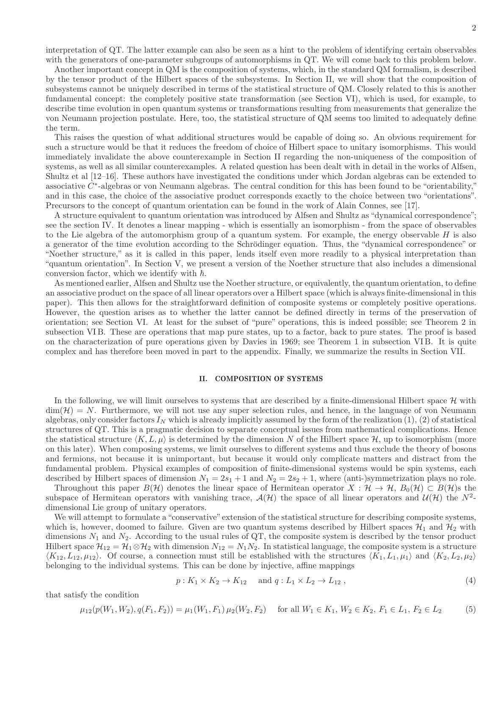 
Low-resolution page preview, page 2

📷 Fig 2

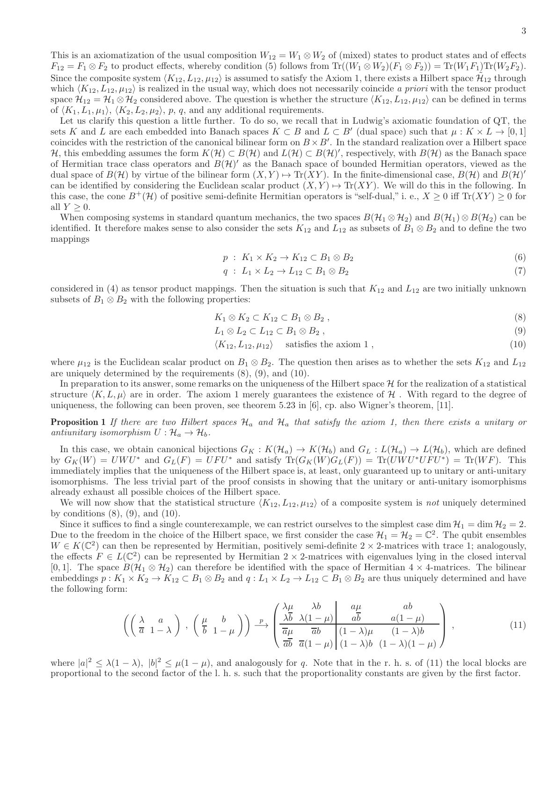 
Low-resolution page preview, page 3

📷 Fig 3

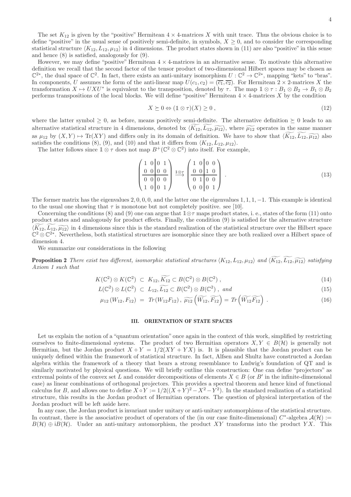 
Low-resolution page preview, page 4

📷 Fig 4

 
Low-resolution page preview, page 5

📷 Fig 5

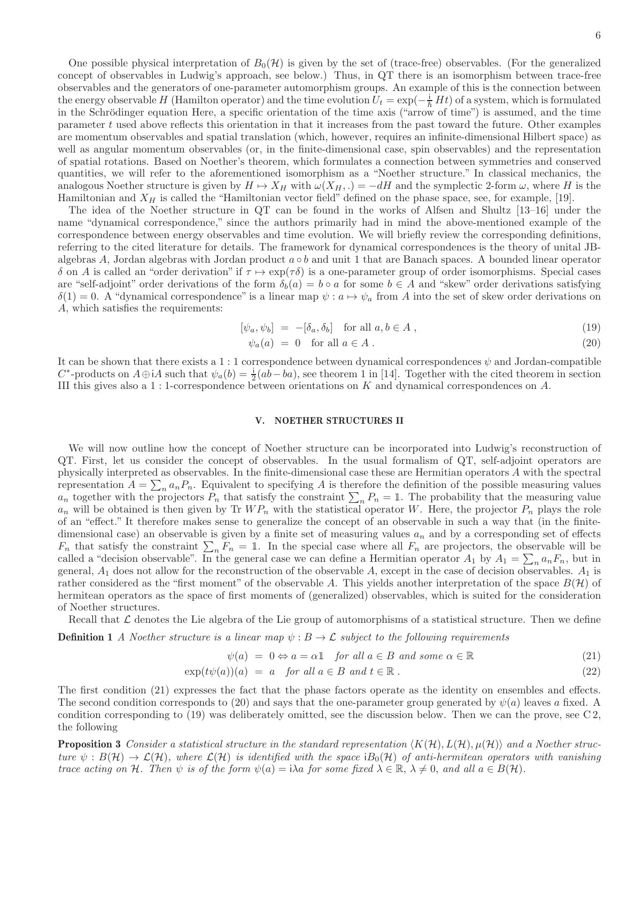 
Low-resolution page preview, page 6

**Summary.** This theoretical paper investigates the fundamental axioms governing quantum theory, arguing that a 'Noether structure' is necessary alongside statistical rules to properly describe composite systems. Using advanced mathematics involving principal bundles and geometric invariants, the authors prove that the composition of subsystems is not uniquely determined by standard axioms alone. The work establishes deep mathematical constraints on the very foundations of quantum mechanics.

**Why it may be interesting.** This work tackles the foundational structure of quantum mechanics itself, providing deep mathematical constraints on how physical processes like composition and evolution must be mathematically formulated beyond standard state/effect descriptions.

Detailed structure

**Main problem.** The paper argues that quantum theory requires a structure beyond mere statistical description—the 'Noether structure'—to correctly model system composition and define completely positive operations.

**Main result.** The statistical structure alone is insufficient to uniquely determine the composition of composite quantum systems, necessitating the inclusion of this additional Noether structure or 'quantum orientation'.

**Method.** The analysis uses axiomatic comparisons between standard quantum probability structures ($\langle K, L, \mu 
angle$) and requirements for tensor product decomposition, supplemented by advanced geometric tools involving principal bundles and $Z_2$-bundles.

**Model / system.** The focus is on the foundational axioms of Quantum Theory (QT) applied to finite-dimensional Hilbert spaces ($H$), considering the composition of two subsystems ($\mathcal{H}_1 \otimes \mathcal{H}_2$).

**Key observables.** Statistical structure $\langle K, L, \mu 
angle$, observables, and the resulting 'quantum orientation' defined geometrically.

**Important parameters / regimes.** Finite dimensionality ($N$), the specific choice of product structures ($\mu_{12} = \mu_1 \mu_2$), and geometric invariants related to $O(3)$ bundles.

**Assumptions / limitations.** The analysis is strictly limited to the finite-dimensional case, and certain proofs rely on assumptions about the rank or number of terms in quantum operations ($n>1$).

**Figures summary.** Figure 1 sketches a principal O(3)-bundle $\pi: B 	o F_3$ and its inverse image $\pi^{-1}(MF)$, illustrating the geometric framework used for defining global sections.

**Paper structure.** The paper progresses from identifying the insufficiency of statistical structure (Chunk 1) to demonstrating non-uniqueness in composition axioms (Chunk 2). It then employs advanced differential geometry (principal bundles, $Z_2$-bundles) to define necessary global structures (Chunk 3), concluding with a detailed analysis of pure quantum operations using rank arguments (Chunk 4).

Abstract

In this paper we argue that, in addition to the statistical structure of quantum theory, another structure, referred to here as the ``Noether structure," is necessary to describe the composition of systems and to define completely positive operations. A Noether structure reflects the dual role of Hermitian operators as observables on the one hand and as generators of symmetry transformations on the other. This idea has been expressed in a similar form in the works of Alfsen and Shultz, who investigated the conditions under which the Jordan product can be extended to an associative product of operator algebras. Our investigations into the Noether structure and the composition of systems are limited to the finite-dimensional case and establish a connection to completely positive operations. In the case of pure operations, the latter can be characterized as orientation-preserving maps.

[↑ back to top](#top)

### [Security of Quantum Conference Key Agreement with Two-Way Classical Communication](http://arxiv.org/abs/2607.04538v1)

**Authors:** Shun Kawakami, Mori Watanabe, Takuya Ikuta, Koichi Takasugi  
**Type:** theory · **Category:** quantum information and computing · **PDF:** <https://arxiv.org/pdf/2607.04538v1>  
**Analysis basis:** full PDF text, analyzed in chunks

📷 Fig 1

 
FIG. 1. An example of the physically realizable region Tphys in the (s5, s6, s7) parameter space. Eqs. (30)–(32) define the interior of the parallelepiped. In this example, the boundary corresponding to Eq. (33) lies outside the parallelepiped.

📷 Fig 2

 
FIG. 2. The triangular pyramid Tpyramid defined in the s5, s6, s7 parameter space by the constraints Eq. (23), Eq. (25), Eq. (27). The corner of the pyramid corresponds to the upper-right corner of the parallelepiped in Fig. 1. (a) The edge unit vectors (covariant vectors) {ei} , the peak point S, the worst point P and the worst point P′ within Tpyramid. (b) The contravariant vectors {ei}.

📷 Fig 3

 
FIG. 3. Threshold curves (sZ, sX) for non-negative secure key rate R under the symmetric setting s1 = sX and s2 = s3 = s4 = sZ, with error- correction efficiency f = 1. The solid curves correspond to 0, 1, 2, 3, 4, and 5 applications of the B-step (from lower left to upper right). The region below each curve yields a non-negative secure key rate. The dashed curve shows the threshold obtained by using the previous analysis of a single B-step [14], and the dotted line indicates sZ + sX = 1/2, corresponding to the condition in Theorem 1. Repeated applications of the B-step significantly improve the threshold; in particular, along the symmetric line sZ = sX, the tolerable error rate increases...

**Summary.** This paper enhances the security analysis of Quantum Conference Key Agreement (QCKA) using GHZ states. By incorporating multiple rounds of two-way classical communication steps (B-steps and P-steps), the authors analytically prove that the tolerable error threshold can be substantially increased beyond previous limits. This work is crucial for realizing robust, practical quantum networks.

**Why it may be interesting.** It provides rigorous theoretical advancements in quantum network security protocols, directly impacting the feasibility of multi-user quantum communication systems by quantifying error tolerance improvements.

Detailed structure

**Main problem.** The paper analyzes the asymptotic security of Quantum Conference Key Agreement (QCKA) for multiple users, focusing on improving the tolerable error threshold in practical implementations.

**Main result.** Iterative application of two-way classical communication steps (B-steps and P-steps) can increase the tolerable error threshold beyond 20%, significantly enhancing protocol robustness.

**Method.** The authors derive the secure key rate analytically by optimizing over physically realizable error rates, incorporating iterative updates for parameter estimation.

**Model / system.** The system models QCKA using tripartite Greenberger-Horne-Zeilinger (GHZ) states and two complementary measurement bases (Z and X). The security analysis is asymptotic ($N 	o \infty$).

**Key observables.** Secure key rate ($R$), error rates ($s_1, s_2, s_3, s_4$, etc.), and the tolerable error threshold.

**Important parameters / regimes.** The optimization involves maximizing over multiple interconnected error parameters subject to physical constraints defining a realizable parameter space.

**Assumptions / limitations.** Assumes IID eavesdropping interaction; the analysis is asymptotic; specific bounds on error rates ($s_i < 1/2$) are used throughout the derivation.

**Paper structure.** The paper systematically analyzes the security by first establishing the key rate formula, then deriving and optimizing the parameter updates for multiple B-steps and P-steps, and finally verifying that the resulting analytical solutions satisfy all necessary physical constraints across different geometric regimes.

Abstract

Quantum conference key agreement (QCKA) enables multiple users to establish a common secret key with information-theoretic security and is regarded as a key primitive for secure communication in future quantum networks. However, practical implementations of QCKA typically suffer from higher noise levels than conventional bipartite quantum key distribution (QKD), making the improvement of the tolerable error threshold an important challenge. Gottesman and Lo proposed two preprocessing procedures for QKD with two-way classical communication, known as the B-step and the P-step, which enhance the tolerable error threshold. In this paper, we analyze the asymptotic security of QCKA with tripartite GHZ states and two measurement bases using two-way classical communication, including multiple B-steps and P-steps. We derive the corresponding secure key rate analytically and demonstrate that iterative B-steps can increase the tolerable error threshold beyond 20%, significantly improving upon the approximately 11% threshold achievable without two-way classical communication and the approximately 15% threshold obtained with only a single B-step. Our results show that two-way classical communication can substantially enhance the robustness of practical QCKA protocols.

[↑ back to top](#top)

## Secondary cond-mat archives

*Papers from  mes-hall, other, soft, supr-con. These archives are de-prioritized — they appear at the end regardless of relevance score.*

### Relevant in secondary archives (35)

### [Spin-momentum locking of polariton edge states in honeycomb lattices](http://arxiv.org/abs/2607.03961v1)

**Authors:** Andrea Herrero Otermin, Nicola Carlon Zambon, Dheerendra Singh, Neha Bhoria, Rimi Banerjee, Christian Mayer, Simon Betzold, Siddhartha Dam, Monika Emmerling, Sven Höfling, Luis Viña, Subhaskar Mandal, Carlos Antón-Solanas  
**Type:** both · **Category:** other · **PDF:** <https://arxiv.org/pdf/2607.03961v1>  
**Analysis basis:** full PDF text, analyzed in chunks
**Topic relevance:** 🔥 `spintronics-quantum-optics interface` **5/5** · 🔥 `analog quantum simulation` **4/5** · 🔥 `exotic spin models in light-matter` **4/5** · `correlated cavity matter` **3/5** · `driven-dissipative phase transition` **3/5** · `quantum optics experiment` **3/5** · `non-equilibrium dynamics` **2/5** · `Tavis-Cummings & cavity-many-emitter` **1/5** · `interference shaping light` **1/5** · `methods for driven-dissipative` **1/5** · `non-equilibrium universality` **1/5**

📷 Fig 1

 
FIG. 1. Spin-momentum locking of zigzag edges states in a honeycomb lattice. Scanning electron microscopy (SEM) image of a zigzag edge in a honeycomb polariton lat- tice. The unit-cell size, a, is indicated by a double-headed arrow. The red circle marks the size and position of the exci- tation laser spot. The x −y coordinate axes are shown in the upper-right corner of the panel. (b) Simulation of the pro- jected band structure for a unit cell containing a zigzag edge, the bands encode the circular polarization in a false color scale, showing that the bulk modes remain linearly polarized, while the left- and right-propagating zigzag edge modes ex- hibit opposite spin polarization. The...

📷 Fig 2

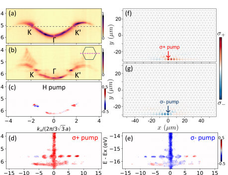 
FIG. 2. Experimental observation of SML in a ZES of a normal honeycomb lattice: linear regime. (a)/(b) PL intensity map of the dispersion relation of the honey- comb lattice measured in the bulk/along the zigzag edge. The dashed line indicates the energy of the Dirac points. The in- set schematically indicates the momentum-space cut across the Brillouin zone. (c) S3 map of the dispersion relation along the zigzag edge under horizontally polarized nonres- onant excitation, showing opposite circular polarization for counter-propagating ZES at K and K′. (d,e) S3 map of the energy- and real space-resolved emission measured un- der right- and left-circularly polarized excitation, respectively,...

📷 Fig 3

 
FIG. 3. Experimental observation of SML in ZES of a stretched honeycomb lattice: linear regime. (a) PL intensity map of the dispersion relation of the lattice in the bulk: a gap emerges in the Dirac points. (b) SEM image of the zigzag edge. (c) Dispersion relation measured along the zigzag edge. (d) Corresponding S3 map of the dispersion re- lation along the zigzag edge under horizontally polarized non- resonant excitation. The SML directionality is reversed with respect to the normal honeycomb lattice. The experimental figures have been acquired in the linear regime (P=0.08 mW), with an laser spot matching the pillar diameter as indicated in panel (b).

📷 Fig 4

 
FIG. 4. SML lasing from ZES in a stretched honey- comb lattice. (a) Power-dependent emission intensity (green points) showing the nonlinear threshold behavior (Pth = 21.5 mW, with an elliptical laser spot covering six pillars along the edge) and line narrowing (pink points) associated with polariton lasing in the edge-state modes. (b,c) PL inten- sity map of the dispersion relation along the ZES for pump powers P=0.005Pth/1.95Pth, respectively. (d,e) Spatially and energy-resolved PL intensity map of the ZES under σ±-circularly polarized excitation, respectively, in the lasing regime (P=1.95Pth). The dashed boxes highlight the prop- agating direction of the edge-state lasing emission under σ±

**Summary.** This research demonstrates spin-momentum locking of polariton edge states within honeycomb lattices using semiconductor microcavities. By exploiting the effective spin-orbit coupling inherent to these photonic structures, the authors show that the polarization handedness locks to the direction of propagation. Crucially, they achieve all-optical control by inducing directional lasing whose preferred direction can be switched simply by changing the circular polarization of the pump light.

**Why it may be interesting.** This work bridges concepts from topological physics (edge states), condensed matter magnetism/spintronics (spin-momentum locking), and quantum optics (polaritons). The ability to achieve spin control purely optically in a solid-state cavity platform is highly relevant for developing novel quantum light sources or information carriers.

Detailed structure

**Main problem.** The research aims to demonstrate spin-momentum locking (SML) of polariton edge states and establish an all-optical method for controlling the direction of propagation in these systems without external magnetic fields.

**Main result.** SML is experimentally confirmed in zigzag edge states, showing that their polarization handedness locks to the propagation direction. Furthermore, spin-selective gain allows for switching the lasing direction purely by changing the pump helicity.

**Method.** The study combines experimental measurements using full Stokes polarimetry and $\mu$-photoluminescence with theoretical modeling based on an effective TE-TM Hamiltonian derived from microcavity physics.

**Model / system.** The physical system is excitonic-polariton honeycomb lattices realized in GaAs-based semiconductor microcavities, which serve as a photonic analogue of graphene. The mechanism relies on the effective spin-orbit coupling induced by TE/TM splitting in dielectric-mirror cavities.

**Key observables.** Elliptical polarization handedness (circular polarization $S_3$) that reverses sign upon momentum reversal ($S_3(k_x) = -S_3(-k_x)$), and spin-selective lasing emission based on pump helicity ($\sigma^+$ vs $\sigma^-$).

**Important parameters / regimes.** The system operates in the polariton regime, utilizing gap opening via stretched lattices to spectrally isolate edge modes from the bulk continuum.

**Assumptions / limitations.** The SML effect is attributed intrinsically to the evanescent nature of the edge states and the photonic SOC, distinguishing it from previous strain-induced effects.

**Figures summary.** Figures illustrate SEM images of zigzag edge states (ZES), polarization maps showing opposite handedness for counter-propagating ZES in both regular and stretched lattices, and power-dependent emission confirming spin-selective lasing above threshold.

**Paper structure.** The paper establishes the theoretical basis using the TE-TM Hamiltonian to predict SML. It then presents experimental verification of this locking in a normal honeycomb lattice via polarization measurements. Finally, it enhances control by fabricating a stretched lattice to open a gap and demonstrate all-optical switching of directional lasing based on pump helicity.

Abstract

Transverse-electric/Transverse-magnetic splitting in dielectric-mirror microcavities introduces an effective spin-orbit coupling for photons. While the bulk states remain linearly polarized, for exponentially localized edge states in a photonic lattice, this coupling induces elliptical polarization whose handedness is locked to the propagation direction, analogous to the transverse spin of evanescent electromagnetic waves. We reveal spin-momentum locking through Stokes polarimetry of zigzag edge states in a honeycomb exciton-polariton lattice. The effect persists in a stretched honeycomb supporting a photonic bandgap, where spin-polarized carrier injection enables selective lasing of either chiral edge states. Our results provide a route toward ultrafast spin-controlled unidirectional propagation in polariton systems without external magnetic fields.

[↑ back to top](#top)

### [Lindblad theory of linear response susceptibility and dispersive readout in minimal Kitaev junctions](http://arxiv.org/abs/2607.04968v1)

**Authors:** Tobias Kuhn, Raffael L. Klees, Ramón Aguado, Mónica Benito  
**Type:** theory · **Category:** quantum information and computing · **PDF:** <https://arxiv.org/pdf/2607.04968v1>  
**Analysis basis:** full PDF text, analyzed in chunks
**Topic relevance:** 🔥 `methods for driven-dissipative` **4/5** · `Keldysh / 2PI / non-Gaussian methods` **3/5** · `correlated / nonlocal dissipation` **3/5** · `driven-dissipative phase transition` **3/5** · `QC/QI experiment` **2/5** · `non-equilibrium dynamics` **2/5** · `non-equilibrium universality` **2/5** · `spintronics-quantum-optics interface` **2/5** · `Kondo & dissipative impurity` **1/5** · `analog quantum simulation` **1/5** · `correlated cavity matter` **1/5** · `measurement-induced transitions` **1/5** · `quantum measurements` **1/5**

📷 Fig 1

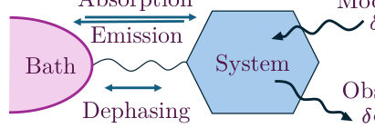 
FIG. 1. We introduce a parameter fluctuation δf(t) into a system that interacts with a Markovian bath. System and environmental dynamics due to absorption, emission and de- phasing will be read out in observable A.

📷 Fig 2

 
FIG. 2. Common gate spectroscopy on a minimal Kitaev chain. (a) Two quantum dots with onsite energies µ1 and µ2 are proximitized by a superconductor. Induced crossed Andreev reflection ∆and direct elastic cotunneling t mediate the hopping between the dots. (b) Energy spectrum E and quantum capacitance CQ (normalized by its maximal value |CQ|max) in the odd- and even-parity subspaces as a function of the average onsite energy µ = (µ1 + µ2)/2. (c) Modulus of the total susceptibility |χ| from Eq. (6) for different probe frequencies ω and average onsite energies µ. A resonant regime at ω ≈ωr and a dispersive regime at ω ≈ωd emerge. (d-g) Imaginary and real part of the total susceptibility χ and...

📷 Fig 3

 
Fig. 2f shows the imaginary part of the susceptibility in the dispersive regime (ωd ≪ϵ). Both Hermes and Hamil- tonian contributions are small (O(ω/ϵ)) and for ΓT2 ≪ϵ they are related via Im[χL,DB(ωd)] ≃−Im[χH(ωd)]/2. At higher temperatures, the Sisyphus term becomes dom- inant and leads to the double-peak structure. In Fig 2g, we compare the quantum capacitance, which measures the band curvature, with the real part of the total sus- ceptibility. Since Re[χL,DB(ωd)] ≃Γ2 T2 Re[χH(ωd)]/ϵ2, the contribution χL compensates for the decoherence on χH. By explicitly rearranging the Hermes and Hamiltonian contributions according to Eq. (C4), we see that

📷 Fig 4

 
FIG. 3. Susceptibility of the minimal Kitaev chain for ther- mal populations near resonance (ω ≲ϵ) for (a) real and (b) imaginary values. Real valued susceptibility when (c) the ground state is fully populated or (d) the excited state is fully populated. χL,BT refers to the beyond thermalization terms of Hermes contribution while χL,DB denotes detailed balance terms. Other parameters are identical to Fig. 2.

📷 Fig 5

 
FIG. 4. (a) Two minimal Kitaev chains tunnel coupled with tJ form a Kitaev-Josephson Junction (KJJ). The supercon- ducting leads have a phase difference of ϕ. (b) Common gate spectrum for decoupled (green, dashed) and coupled (salmon, solid) KJJ in even global parity at ϕ = π and ∆= t. |E±/O±, E±/O±⟩are many-body eigenstates of the decoupled minimal Kitaev chains corresponding to local even/odd par- ity. At ϕ = π, coupled KJJ eigenstates follow these states up to first order in tJ, see Eqs. (E14) (c) Flux spectrum comparing sweet spot ∆= t (salmon, solid) with a detuned ∆= 1.1t (purple, dashed) system at µ = 0. The states the |↑/↓⟩= |E−, E−⟩± |O−, O−⟩+ O(tJ) correspond to the (anti-...

**Summary.** The paper introduces a novel Lindblad-based linear response formalism to analyze complex superconducting quantum dot devices. It extends beyond standard Kubo treatments by incorporating Sisyphus and Hermes susceptibilities, which account for finite-frequency, non-unitary environmental effects. This framework is vital for accurately modeling qubit readout in topological systems like Kitaev junctions.

**Why it may be interesting.** This work provides advanced tools for analyzing open quantum systems relevant to solid-state qubits, extending standard linear response theory to account for non-unitary dissipation effects crucial for accurate device characterization.

Detailed structure

**Main problem.** Developing a comprehensive theoretical framework to understand the response of hybrid superconductor-semiconductor quantum dots (SCQDs) to external probes, including readout and environmental dissipation.

**Main result.** The formalism successfully captures Sisyphus and Hermes dynamical susceptibilities, which are non-unitary effects absent in standard Kubo treatments, showing that Hermes terms can compensate decoherence in dispersive readout.

**Method.** A Lindblad-based linear response formalism is employed to calculate the total susceptibility by decomposing it into four contributions ($\chi_{st}, \chi_H, \chi_\Gamma, \chi_L$).

**Model / system.** The study uses minimal Kitaev junctions (MKCs) hosting topologically protected Majorana-based parity qubits within hybrid SCQD devices.

**Key observables.** Linear response susceptibility $\chi(\omega)$, Quantum Capacitance ($	ext{CQ}$), and the distinct Sisyphus ($\chi_\Gamma$) and Hermes ($\chi_L$) susceptibilities.

**Important parameters / regimes.** The energy gap ($\epsilon$), onsite potentials ($\mu$), and coupling strengths ($\Delta, t$).

**Assumptions / limitations.** Approximations include Born-Markov approximations (weakly coupled environment) and assuming a time-independent reference state $
ho$.

**Figures summary.** Figures illustrate the decomposition of susceptibility contributions ($\chi_{st}, \chi_H, \chi_\Gamma, \chi_L$) in various coupling regimes, comparing theoretical predictions to band curvature estimates.

**Paper structure.** The paper introduces the Lindblad formalism for response theory, details the calculation and physical origin of Sisyphus and Hermes terms, applies this framework to Kitaev junctions, and analyzes specific measurements like dispersive readout and common gate spectroscopy.

Abstract

The field of hybrid superconductor-semiconductor quantum dots is advancing toward the development of functional devices that leverage the advantages of both types of materials. However, the inherent complexity of these devices demands a comprehensive theoretical framework for a complete understanding of their responses to external probes, readout and the dissipation arising from environmental coupling. We present a Lindblad-based linear response formalism that captures the multi-level nature of these devices, their probe-readout flexibility, and the non-unitary effects of finite-frequency response, including the so-called Sisyphus and Hermes dynamical susceptibilities. These arise from fluctuations in the rates and jump operators, and are hence absent in standard Kubo linear response treatments. We exemplify the framework using quantum dot-based Kitaev chain setups which are promising candidates for topologically protected Majorana-based parity qubits. Our results shed light onto the validity of the standard curvature-based approximation for fermionic parity and qubit readout, show that Hermes terms compensate decoherence in dispersive readout and implement important corrections beyond thermalized states.

[↑ back to top](#top)

### [Finite-frequency magnetic common baths in ferromagnetic planar cavities](http://arxiv.org/abs/2607.05066v1)

**Authors:** O. J. Kwon  
**Type:** theory · **Category:** other · **PDF:** <https://arxiv.org/pdf/2607.05066v1>  
**Analysis basis:** full PDF text, analyzed in chunks
**Topic relevance:** 🔥 `spintronics-quantum-optics interface` **4/5** · `Keldysh / 2PI / non-Gaussian methods` **3/5** · `correlated / nonlocal dissipation` **3/5** · `exotic spin models in light-matter` **3/5** · `methods for driven-dissipative` **3/5** · `Tavis-Cummings & cavity-many-emitter` **2/5** · `driven-dissipative phase transition` **2/5** · `Kondo & dissipative impurity` **1/5** · `analog quantum simulation` **1/5** · `correlated cavity matter` **1/5** · `non-equilibrium dynamics` **1/5**

📷 Fig 1

 
FIG. 1. Geometry and finite-frequency common-bath mech- anism. Two probes in a vacuum gap couple to the retarded scattering magnetic Green tensor. The benchmark figures use a finite ferromagnetic film thickness t = 200 nm, a non- magnetic conducting substrate, and the zz transition-moment projection.

📷 Fig 2

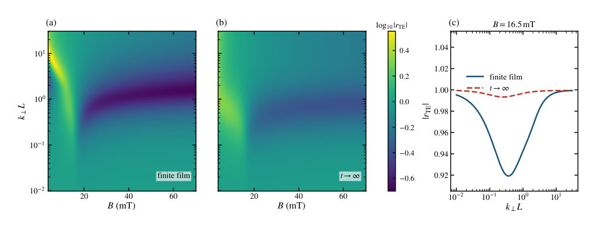 
FIG. 2. Finite-thickness scalar TE benchmark. (a) Finite-film TE slab amplitude for t = 200 nm, plotted as log10 |rTE| versus B and k⊥L. (b) The corresponding t →∞half-space reference. (c) A cut at B = 16.5 mT, where finite thickness reduces |rTE| relative to the half-space reference mainly at intermediate k⊥L. At large k⊥L, the finite-film and half-space curves approach each other. The plotted quantity is the reciprocal diagonal TE benchmark channel used in the numerical Green-tensor integral.

📷 Fig 3

 
FIG. 3. Single-spin finite-frequency kernels for the zz pro- jection of the finite-thickness scalar cavity integral. The zz projection is the component benchmark used to match the static TE normalization of Ref. [1]. Panel (a) shows the signed off-diagonal scattering kernel δγ(zz) 12 /2π on a symmetric loga- rithmic scale; solid and dashed segments denote positive and negative values. Panel (b) shows the coherent exchange shift Ωzz 12/2π. Within the cavity-scattering sector, the sign in panel (a) fixes whether the symmetric or antisymmetric branch is narrowed relative to the local background.

📷 Fig 4

 
FIG. 4. Ideal uniform bright-mode scale estimate at ρ = 3 µm for two effective participation numbers. Panel (a) shows the linewidth splitting (Γ+ −Γ−)/2π = 2γbr AB/2π, with dotted horizontal lines marking the ±1 Hz reference level. Panel (b) shows the bright-mode coherent shift Ωbr AB/2π for the same participation numbers.

📷 Fig 5

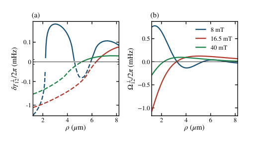 
FIG. 6. Component-normalized transverse-average bench- mark for the finite-thickness scalar cavity integral. Panel (a) shows the signed off-diagonal scattering kernel δγ(⊥) 12 /2π for the projection m2 c(Gsc BB,xx + Gsc BB,yy)/2 on a symmetric loga- rithmic scale; dashed segments denote negative values. Panel (b) shows Ω⊥ 12/2π for the same projection. The magnitudes are comparable to the zz benchmark, while the sign is re- versed over the plotted range because the tensor is projected onto the in-plane spin-flip subspace.

**Summary.** This theoretical paper models the dynamic magnetic coupling (common bath) between two spin probes embedded in a ferromagnetic planar cavity. It calculates frequency-dependent decay ($\gamma_{12}$) and Lamb shift ($\Omega_{12}$) kernels using macroscopic QED formalism. The results provide quantitative, finite-frequency predictions for spin interactions that can be compared to static measurements.

**Why it may be interesting.** This work directly addresses open quantum systems dynamics by modeling dissipation and coherent shifts in solid-state magnetic environments, which is crucial for understanding spin coherence in nanoscale devices.

Detailed structure

**Main problem.** The paper formulates and evaluates the finite-frequency magnetic common bath experienced by two spin probes situated within a ferromagnetic planar cavity.

**Main result.** For a representative film, the off-diagonal linewidth splitting reaches about two thirds of the single-spin scattering linewidth on resonance, providing dynamic counterparts to static coupling shifts.

**Method.** The analysis uses macroscopic QED techniques involving the retarded magnetic Green tensor ($\mathbf{G}_{	ext{BB}}$) projected onto the scalar TE channel to derive common-bath kernels ($\gamma_{12}$ and $\Omega_{12}$).

**Model / system.** The system consists of two spin probes coupled via a body-assisted magnetic reservoir within a ferromagnetic planar cavity of finite thickness ($t=200$ nm) on a nonmagnetic substrate.

**Key observables.** Common-bath kernels ($\gamma_{12}$ and $\Omega_{12}$), linewidth splitting, and collective Lamb shift.

**Important parameters / regimes.** Finite film thickness ($t$), operating frequency in the GHz range at millikelvin temperatures, and the magnetic input characterized by $\mu_{\perp}(\omega, B)$.

**Assumptions / limitations.** The model uses a scalar TE channel approximation, neglecting TE–TM conversion and nonreciprocal off-diagonal Polder response.

**Figures summary.** Figures illustrate the geometry of two probes coupled to the magnetic reservoir and compare finite-thickness calculations against static image-series benchmarks for the scattering Green tensor components.

**Paper structure.** The paper develops the theory by formulating the interaction via the retarded magnetic Green tensor, calculates the coupling kernels ($\gamma_{12}, \Omega_{12}$) using the TE channel approximation, and compares the finite-frequency results to established static limits ($\omega 	o 0$).

Abstract

We formulate the finite-frequency magnetic common bath of two spin probes in a ferromagnetic planar cavity. The probes couple to the retarded magnetic Green tensor of the cavity, whose imaginary and real parts determine the collective decay kernel \(γ_{12}\) and the Lamb-shift kernel \(Ω_{12}\). We evaluate these kernels for a finite-thickness scalar TE channel formed by a ferromagnetic film on a nonmagnetic conducting substrate, using the transverse diagonal Polder permeability \(μ_\perp(ω,B)\) as the magnetic input. The normalization is fixed by the free-space magnetic-dipole decay rate. In the \(ω\to0\) limit, the constant-reflection benchmark reproduces the static image-series reference, while the finite slab retains the corresponding static TE reflection amplitude. For a \(t=200\,\mathrm{nm}\) film described by a representative Ni-like parameter set in a micron-scale mid-gap cavity, the GHz probe transition samples the positive-frequency response of the body-assisted magnetic reservoir at millikelvin temperature. On resonance, the off-diagonal linewidth splitting reaches about two thirds of the single-spin scattering linewidth at \(ρ=3\,μ\mathrm m\). The resulting linewidth splitting and collective Lamb shift provide finite-frequency counterparts of the static TE coupling-frequency shift.

[↑ back to top](#top)

### [On the Nonlinear Sensitivity of Phononic Frequency Combs to Physical Perturbations](http://arxiv.org/abs/2607.03837v1)

**Authors:** Madhurendra Mishra, Zhen Qi, Adarsh Ganesan  
**Type:** theory · **Category:** other · **PDF:** <https://arxiv.org/pdf/2607.03837v1>  
**Analysis basis:** full PDF text, analyzed in chunks
**Topic relevance:** 🔥 `driven-dissipative phase transition` **4/5** · `methods for driven-dissipative` **3/5** · `non-equilibrium universality` **3/5** · `analog quantum simulation` **2/5** · `correlated / nonlocal dissipation` **2/5** · `non-equilibrium dynamics` **2/5** · `Frenkel-Kontorova` **1/5** · `Keldysh / 2PI / non-Gaussian methods` **1/5** · `Tavis-Cummings & cavity-many-emitter` **1/5** · `correlated cavity matter` **1/5**

📷 Fig 1

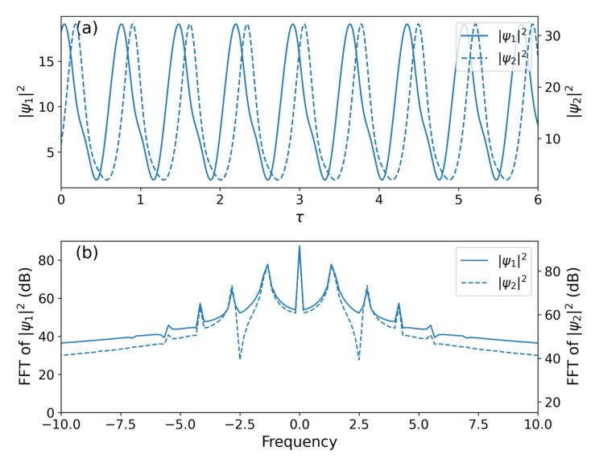 
Fig. 1: (a) Time-domain evolution of the coupled mode intensities |ψ1|2 and |ψ2|2 plotted together; (b) Corresponding Fourier spectra (FFT) of the same quantities. Here, τ and frequency are unitless normalized variables. The simulation parameters are ∆1 = 5, ∆2 = −6.5, γ21 = 1, and f = 24 with initial conditions are ψ1(0) = 5 and ψ2(0) = 3.

📷 Fig 2

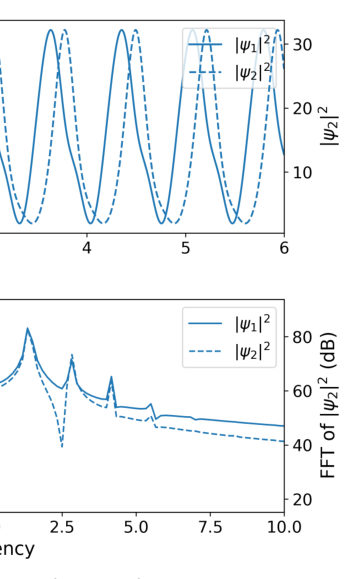 
Figure 8 maps the absolute sensitivity of key intensity mea- sures to infinitesimal variations in ∆1 across the (∆1, f) plane, complementing the amplitude maps of Fig. 5 by exposing where the system is most susceptible to parameter fluctuations. For both modes, the sensitivity is sharply localized along a nar- row band near f ∼16–21, coinciding with the oscillation on- set boundary identified earlier. For ψ1, panels (a) and (b) show that the mean intensity develops high-sensitivity patches at f ≳25, while the peak-to-peak amplitude is most responsive precisely along the transition boundary, where small changes in ∆1 can trigger large amplitude variations. The extrema in panels (c) and (d)...

📷 Fig 3

 
Figure 7 maps the modal intensity statistics across the (γ21, f) parameter plane. For the primary mode ψ1, panels (a)-(d) show that the mean intensity, peak-to-peak amplitude, and maximum all increase monotonically with f, with a clear additional enhancement from coupling strength, particularly for γ21 ≳1. Panel (c) stands out: the minimum intensity remains near zero for f ≲15-18, with a well-defined boundary above which it rises abruptly, marking the onset of fully sustained limit-cycle dynamics. This threshold shifts only weakly with γ21, indicating that while coupling enhances

📷 Fig 4

 
Fig. 2: Evolution of modal intensities of ψ1 and ψ2 as a function of detuning ∆1, with ∆2 = −6.5, γ21 = 1, and driving amplitude f = 24 held fixed. Panels (a)-(d) correspond to mode ψ1, showing the mean intensity ⟨|ψ1|2⟩, peak-to-peak intensity |ψ1|2 pp, minimum intensity min(|ψ1|2), and maximum intensity max(|ψ1|2), respectively. Panels (e)-(h) show the corresponding quantities for mode ψ2.

📷 Fig 5

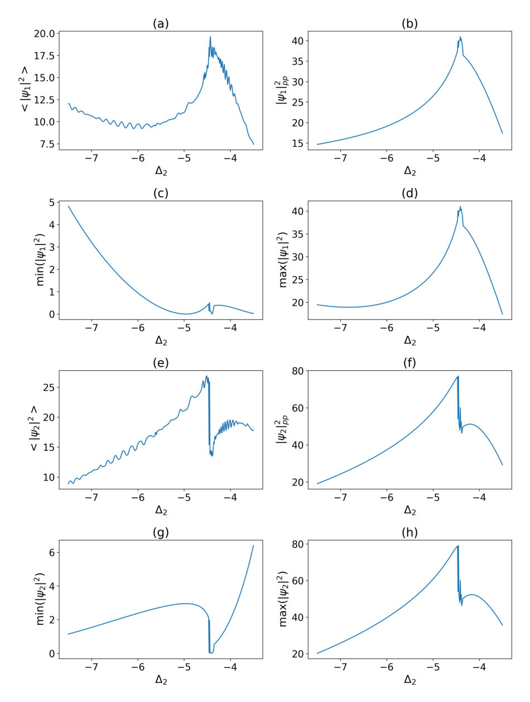 
Fig. 3: Evolution of modal intensities of ψ1 and ψ2 as a function of detuning ∆2, with ∆1 = 5, γ21 = 1, and driving amplitude f = 24 held fixed. Panels (a)-(d) correspond to mode ψ1, showing the mean intensity ⟨|ψ1|2⟩, peak-to-peak intensity |ψ1|2 pp, minimum intensity min(|ψ1|2), and maximum intensity max(|ψ1|2), respectively. Panels (e)-(h) show the corresponding quantities for mode ψ2.

**Summary.** The paper analyzes the complex nonlinear dynamics governing phononic frequency combs using a two-mode resonance model. By mapping amplitude and frequency sensitivity across various parameters (detunings, drive strength), the authors reveal that different physical perturbations induce distinct types of response—smooth shifts versus sharp resonances. This provides a framework for engineering highly controllable nonlinear sensing devices.

**Why it may be interesting.** This work provides a detailed, quantitative map of nonlinear control in an engineered physical system, which is highly relevant for designing robust quantum or classical sensing platforms by exploiting predictable parameter-dependent sensitivities.

Detailed structure

**Main problem.** The study investigates how the observable properties (amplitude and frequency) of phononic frequency combs respond to variations in various physical parameters across a nonlinear parameter space.

**Main result.** Sensitivity is highly non-uniform: primary detuning causes smooth shifts, secondary detuning creates sharp transitions near resonance manifolds, and peak sensitivity concentrates near activation thresholds. This points to a common origin in autoparametric resonance dynamics.

**Method.** The authors employed numerical investigation by analyzing the solutions to a reduced two-mode autoparametric resonance model derived from coupled differential equations.

**Model / system.** The system models Phononic Frequency Combs (PFCs) using a reduced two-mode autoparametric resonance model, governed by slowly varying complex envelopes ($\psi_1, \psi_2$). The dynamics are controlled by parameters like primary detuning ($\Delta_1$), secondary detuning ($\Delta_2$), drive amplitude ($f$), and relative damping ($\gamma_{21}$).

**Key observables.** Amplitude ($|\psi|^2$) and Frequency ($\omega_{\psi}$) of the two coupled modes, analyzed via mean intensity, peak-to-peak amplitude, and differential sensitivity.

**Important parameters / regimes.** Primary detuning ($\Delta_1$), Secondary detuning ($\Delta_2$), Drive amplitude ($f$), Relative damping ($\gamma_{21}$), and resonance conditions (e.g., $\kappa=0$).

**Assumptions / limitations.** The analysis relies on the slowly varying envelope approximation for the coupled equations of motion.

**Figures summary.** Figures map intensity statistics and differential frequency sensitivity across parameter planes, showing distinct regimes governed by detuning ($\Delta_2$ causing sharp ridges) versus threshold activation ($f$ setting global boundaries).

**Paper structure.** The paper systematically maps the system's response to perturbations by varying parameters one at a time (e.g., $\Delta_1$ vs $f$, $\Delta_2$ vs $f$), comparing amplitude and frequency sensitivity across different parameter planes.

Abstract

Phononic frequency combs offer a rich platform for nonlinear sensing, yet how their observable properties respond to changes in physical parameters remains poorly understood. Using a reduced two-mode autoparametric resonance model, we investigate how primary and secondary detuning, drive amplitude, and relative damping jointly shape amplitude and frequency sensitivity across the nonlinear parameter space. We find that sensitivity is far from uniform: primary detuning shifts the comb response smoothly, secondary detuning produces sharply localized transitions near resonance manifolds, and drive amplitude concentrates peak sensitivity close to the activation threshold rather than deep within the comb state. The relative damping redistributes energy continuously between modes without introducing discontinuities. The nonlinear sensitivity of amplitude and frequency observables across all parameters points to a common physical origin in autoparametric resonance, nonlinear saturation, and coupling-induced synchronization, offering a coherent basis for designing nonlinear sensing platforms with deliberate, parameter-aware sensitivity engineering.

[↑ back to top](#top)

### [Spin-orbit torque-driven synthetic antiferromagnetic oscillator](http://arxiv.org/abs/2607.03708v1)

**Authors:** P. K. Rout, J. Godinho, F. Vilsmeier, R. Salikhov, J. A. Vélez, Z. Šobáň, D. Laroze, O. Gomonay, R. M. Otxoa, C. H. Back, O. Hellwig, J. Wunderlich  
**Type:** both · **Category:** other · **PDF:** <https://arxiv.org/pdf/2607.03708v1>  
**Analysis basis:** full PDF text, analyzed in chunks
**Topic relevance:** 🔥 `driven-dissipative phase transition` **4/5** · `methods for driven-dissipative` **3/5** · `non-equilibrium dynamics` **3/5** · `spintronics-quantum-optics interface` **3/5** · `non-equilibrium universality` **2/5** · `Frenkel-Kontorova` **1/5** · `Keldysh / 2PI / non-Gaussian methods` **1/5** · `analog quantum simulation` **1/5** · `correlated / nonlocal dissipation` **1/5** · `exotic spin models in light-matter` **1/5**

📷 Fig 1

 
FIG. 1.

📷 Fig 2

 
FIG. 2.

📷 Fig 3

 
FIG. 3.

📷 Fig 4

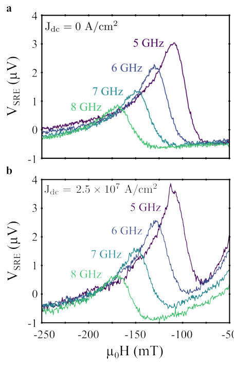 
FIG. 4.

**Summary.** This work investigates how spin-orbit torques drive oscillatory behavior in synthetic antiferromagnets using nanoconstrictions. By measuring the spin-rectification voltage and comparing results with simulations, the authors demonstrate electrical excitation of both linear eigenmodes and complex, current-driven self-oscillations near magnetic phase transitions. This establishes SAFs as a promising platform for nonlinear spintronic devices.

**Why it may be interesting.** While focused on magnetism/spintronics, the study models non-equilibrium, driven, and dissipative collective excitations (oscillators) whose dynamics are controlled by external currents, providing an experimental platform for studying nonlinear wave phenomena relevant to open quantum systems.

Detailed structure

**Main problem.** The study demonstrates electrical excitation of spin-orbit torque (SOT)-driven antiferromagnetic oscillator dynamics using a synthetic antiferromagnet (SAF) nanoconstriction.

**Main result.** The research establishes SAF nanoconstrictions as an accessible platform for observing complex, current-driven nonlinear dynamics, including self-oscillations and injection locking near the spin-flop transition.

**Method.** Measurements involve spin-rectification spectroscopy (V_SRE) while applying RF currents and sweeping magnetic fields; theoretical understanding is supplemented by micromagnetic and macrospin simulations.

**Model / system.** The physical system is a SAF multilayer stack patterned into a nanoconstriction, which exhibits distinct acoustic and optical magnetization eigenmodes. The dynamics are governed by spin-orbit torques (SOT) acting on the coupled magnetic layers.

**Key observables.** Spin-rectification voltage ($V_{SRE}$), resonance frequencies of acoustic/optical modes, threshold DC current for self-oscillation, and Power Spectral Density (PSD) signatures showing injection locking.

**Important parameters / regimes.** The analysis focuses on the spin-flop transition regime, critical DC currents ($J_{above}^{dc}$), and the interplay between RF excitation and bias currents.

**Assumptions / limitations.** The interpretation of SOT mechanisms relies on combined evidence from mode selectivity and symmetry arguments; simulations may neglect certain damping terms for simplicity.

**Figures summary.** Figures illustrate the SAF structure, selective excitation of acoustic/optical modes based on applied angle ($\Phi$), resonance frequency mapping vs. field, and PSD analysis showing transitions from linear resonance to self-oscillations under increasing DC current.

**Paper structure.** The paper progresses by first characterizing the linear eigenmodes using SRE spectroscopy across different magnetic field angles; it then investigates nonlinear dynamics by observing threshold behavior for self-oscillations as a function of bias current, culminating in discussions on injection locking and complex chiral dynamics.

Abstract

Antiferromagnets offer a promising route toward robust spintronic devices because of their compensated magnetic order and exchange-enhanced spin dynamics. Here, we demonstrate a spin-orbit torque (SOT)-driven antiferromagnetic oscillator based on a nanoconstriction patterned from a synthetic antiferromagnet (SAF). Spin-rectification spectroscopy reveals electrical excitation of both acoustic and optical SAF eigenmodes, whose field and frequency dependences are quantitatively described by an antiferromagnetic resonance model. In addition to these linear eigenmodes, we observe low-field spin-rectification peaks that emerge only above a threshold DC current near the spin-flop transition. Their current-polarity-dependent sign and locking to an injected RF frequency provide electrical spin-rectification signatures consistent with current-selected chiral self-oscillatory dynamics. Micromagnetic simulations reproduce the threshold excitation of SOT-driven self-oscillations and injection locking, while macrospin simulations predict stable and chaotic nonlinear dynamics within the same spin-flop region. We interpret the multi-peak, weakly RF-frequency-dependent responses as a qualitative signature of complex nonlinear dynamics. These results establish SAF nanoconstrictions as an experimentally accessible platform for studying current-driven antiferromagnetic-like oscillator dynamics and motivate future work on nonlinear spintronic devices for signal processing and reservoir-computing concepts.

[↑ back to top](#top)

### [Katsura-Nagaosa-Balatsky magnetoelectricity in molecular magnets: Bipartite entanglement transfer by means of rotating electric field](http://arxiv.org/abs/2607.03965v1)

**Authors:** Zhirayr Adamyan, Ani Chobanyan, Vadim Ohanyan, Azadeh Ghannadan, Jozef Strecka, Saeed Haddadi, Hamid Arian Zad  
**Type:** theory · **Category:** other · **PDF:** <https://arxiv.org/pdf/2607.03965v1>  
**Analysis basis:** full PDF text, analyzed in chunks
**Topic relevance:** 🔥 `entanglement & information structure` **4/5** · `analog quantum simulation` **3/5** · `exotic spin models in light-matter` **3/5** · `spintronics-quantum-optics interface` **3/5** · `non-equilibrium dynamics` **2/5** · `Keldysh / 2PI / non-Gaussian methods` **1/5** · `correlated / nonlocal dissipation` **1/5** · `driven-dissipative phase transition` **1/5** · `methods for driven-dissipative` **1/5**

📷 Fig 1

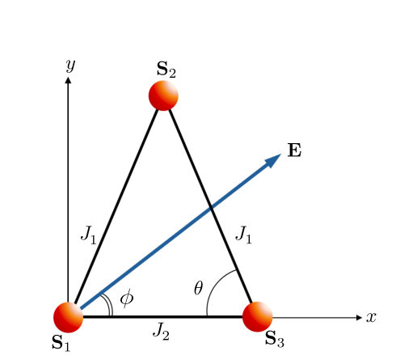 
FIG. 1. Schematic illustration of the three-spin molecu- lar cluster with an isosceles triangular geometry. The lo- calized S = 1/2 spins interact via two antiferromagnetic exchange couplings, J1 and J2, and are subjected to an external electric field E lying in the plane of the trian- gle. The geometry of the molecule is characterized by the bond angle θ, while the electric-field orientation is speci- fied by the angle ϕ. Within the KNB mechanism, the spin–electric-field coupling is mediated through bond- dependent DM interactions, whose magnitude and direc- tion are determined by both the molecular geometry and the electric-field orientation. Consequently, the parame- ters θ and ϕ provide...

📷 Fig 2

 
FIG. 2. Dependence of the saturation magnetic field Bsat on the parameters of the in-plane electric field for the case of uniform KNB coupling (α = 1). (a) Satu- ration field as a function of the electric-field magnitude E/J2 for a fixed field orientation, ϕ = π/4. The curves are shown for several values of the exchange-coupling ratio J1/J2 and bond angle θ, illustrating how the elec- tric field modifies the critical magnetic field required to fully polarize the spin trimer. (b) Angular dependence of the saturation field for a rotating electric field of fixed magnitude, E/J2 = 5, for the same sets of model pa- rameters. The anisotropic variation of Bsat with the electric-field direction...

📷 Fig 3

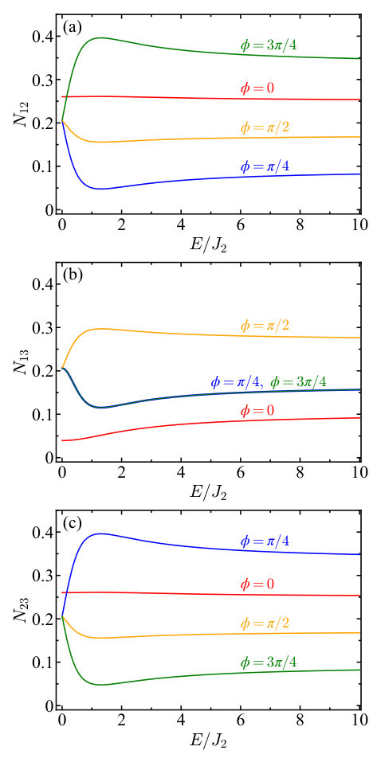 
FIG. 3. Bipartite negativity dependence on the magni- tude of electric field, E, with J1 = J2 = 1, α = 1 and θ = π/4 for four different values of the electric field an- gle, ϕ = 0, π/4, π/2 and 3π/4.

📷 Fig 4

 
FIG. 4. Bipartite negativity dependence on the direction of electric field, ϕ, with J1 = J2 = 1 and θ = π/3. Three panels present Nij for different values of α and electric field magnitude. Panel (a): α = 1, E/J2 = 0.01; panel (b): α = 2/3, E/J2 = 1.125; and panel (c): α = 3/2, E/J2 = 1.15. The blue, red and green lines correspond to N12, N13 and N23 respectively.

📷 Fig 5

 
FIG. 5. Tripartite negativity dependence on the direc- tion of electric field ϕ for the three particular cases, which correspond to the parameter sets used in Fig. 4(a): red curve; 4(b): blue curve; and 4(c): orange curve.

**Summary.** The paper explores the use of the KNB magnetoelectric effect in a spin trimer model to manipulate quantum entanglement. By applying a rotating electric field, the authors demonstrate an efficient and controllable transfer of bipartite entanglement between different pairs of spins. This establishes molecular nanomagnets as promising platforms for electrically steering quantum information at the nanoscale.

**Why it may be interesting.** This work directly addresses electrical control over quantum correlations (entanglement) in solid-state molecular systems, which is highly relevant to developing quantum memory or logic elements based on magnetic materials.

Detailed structure

**Main problem.** The study investigates how quantum entanglement can be controlled and transferred between different spin pairs within a molecular magnet using the Katsura-Nagaosa-Balatsky (KNB) magnetoelectric coupling mechanism.

**Main result.** A rotating in-plane electric field induces an almost ideal, controllable transfer of bipartite entanglement from one spin pair to another, demonstrating electrical steering of quantum correlations at the molecular scale.

**Method.** Theoretical analysis involving calculating bipartite and tripartite entanglement measures (negativity) for a spin-1/2 Heisenberg trimer Hamiltonian subjected to external magnetic and electric fields.

**Model / system.** The system is modeled as a spin-1/2 Heisenberg trimer with three coupled spins ($S_1, S_2, S_3$). The physics incorporates the KNB mechanism via an effective Dzyaloshinskii-Moriya (DM) interaction term dependent on external electric fields.

**Key observables.** Bipartite and tripartite entanglement quantified using Negativity ($	ext{N}_{ij}$ and $	ext{N}_{ABC}$).

**Important parameters / regimes.** Electric field magnitude ($E$), orientation ($\phi$), bond angle ($	heta$), and exchange coupling ratios ($J_1/J_2$).

**Assumptions / limitations.** The model assumes a spin-1/2 Heisenberg Hamiltonian framework, and the analysis focuses on zero-temperature behavior.

**Figures summary.** Figures illustrate how bipartite negativity varies with electric field orientation ($\phi$) and density plots map entanglement across parameter spaces defined by $E$ and coupling nonuniformity ($\alpha$).

**Paper structure.** The paper establishes the Hamiltonian incorporating KNB coupling, analyzes entanglement measures for various field configurations ($B=0, E=0$), and culminates in demonstrating the controlled transfer of bipartite entanglement using a rotating electric field.

Abstract

We investigate quantum entanglement in a spin-1/2 Heisenberg trimer with spin-induced electric polarization described by the Katsura-Nagaosa-Balatsky (KNB) mechanism in the presence of external magnetic and electric fields. The electric field is assumed to lie in the plane of the magnetic ions, allowing its strength and orientation to be tuned independently. We analyze both bipartite and tripartite entanglement and demonstrate that the spin-electric-field coupling provides an efficient mechanism for controlling quantum correlations within the molecular nanomagnet. Depending on the electric-field parameters, the bipartite entanglement can be significantly enhanced or suppressed, while the multipartite entanglement exhibits a rich dependence on the microscopic spin-electric coupling. Most notably, we demonstrate that a rotating in-plane electric field of constant magnitude induces a controllable transfer of bipartite entanglement between different spin pairs. In the symmetric case of homogeneous exchange interactions and uniform KNB coupling, this transfer is found to be nearly ideal, with the bipartite negativity approaching its theoretical maximum for one spin pair while simultaneously vanishing for the remaining pairs. We show that the efficiency of the transfer can be tailored through the exchange interactions, bond geometry, and nonuniform spin-electric coupling. These results establish molecular nanomagnets with KNB spin-electric coupling as a promising platform for the electrical manipulation, steering, and localization of quantum entanglement at the molecular scale.

[↑ back to top](#top)

### [Nonlinear Hall effect in Floquet-driven monolayer 1T$'$-MoS$_2$](http://arxiv.org/abs/2607.03717v1)

**Authors:** Muhammad Faisal, Muzamil Shah, Imtiaz Khan, Reza Asgari  
**Type:** theory · **Category:** other · **PDF:** <https://arxiv.org/pdf/2607.03717v1>  
**Analysis basis:** full PDF text, analyzed in chunks
**Topic relevance:** 🔥 `non-equilibrium dynamics` **4/5** · `Keldysh / 2PI / non-Gaussian methods` **3/5** · `methods for driven-dissipative` **3/5** · `spintronics-quantum-optics interface` **3/5** · `driven-dissipative phase transition` **2/5** · `analog quantum simulation` **1/5** · `correlated cavity matter` **1/5** · `exotic spin models in light-matter` **1/5** · `non-equilibrium universality` **1/5**

📷 Fig 1

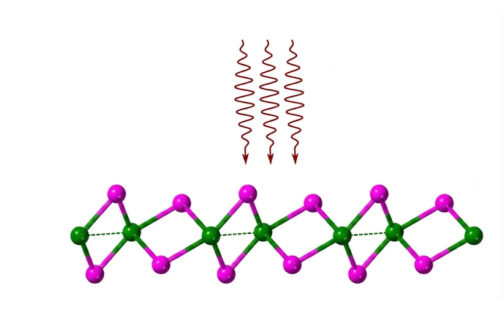 
FIG. 1. Side-view schematic of monolayer 1T ′-MoS2, showing Mo atoms (green) and S atoms (magenta), illuminated by off- resonant circularly polarized light. The intrinsic tilt structure induces asymmetry of the electronic bands.

📷 Fig 2

 
FIG. 2. Floquet quasienergy bands ε±(kx=0, ky) of monolayer 1T′-MoS2 for the four spin–valley sectors at three drive strengths: (a) quantum spin Hall (QSH) (with Ctot = 0) at ξ = 0.01, (b) spin-polarized quantum Hall insulator (S-QHI) (with Ctot = −1) at ξ = 0.04, and (c) photoinduced quantum Hall insulator (P-QHI) (with Ctot = −2) at ξ = 0.10. Green and blue are the κ=+ spin-up and spin-down; red and black are κ=−branches. The electric field and helicity are fixed at α = 0.5 and η = +1.

📷 Fig 3

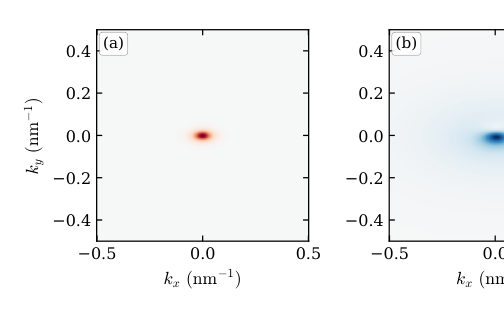 
FIG. 3. Total occupied-band Berry curvature Ωtot −= P

📷 Fig 4

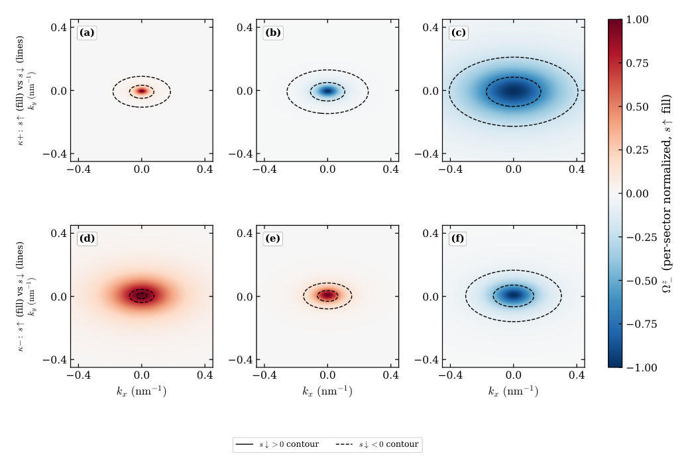 
FIG. 4. Sector-resolved occupied-band Berry curvature Ωz −. Each row is one valley (top) κ+, (bottom) κ−and each column one drive strength (a,d) QSH (ξ = 0.01), (b,e) S-QHI (ξ = 0.04), (c,f) P-QHI (ξ = 0.10). Filled color shows s↑; black contours overlay s↓(solid: positive, dashed: negative), each normalized to its own peak. Other parameters are as in Fig. (2).

📷 Fig 5

 
FIG. 5. Berry-curvature-dipole density of monolayer 1T ′-MoS2 summed over sectors: (top) ∂kxΩtot and (bottom) ∂kyΩtot, for (a) ξ = 0.01, (b) ξ = 0.04, and (c) ξ = 0.10, each panel normalized to its own peak. ∂kxΩis odd in kx and integrates to zero (Dx = 0), while ∂kyΩintegrates to a finite Dy. Other parameters are as in Fig. (2).

**Summary.** The paper investigates the nonlinear Hall effect in monolayer 1T'-MoS2 driven by light, establishing that the sign reversal of this response acts as a unique fingerprint for Floquet-induced topological phase transitions. By analyzing the Berry-curvature dipole moment, the authors show that these sign flips are robust signatures distinguishing true topology changes from simple parameter variations.

**Why it may be interesting.** This work provides a concrete example of using non-equilibrium quantum optics (Floquet engineering) to probe fundamental topological properties via measurable transport signatures, which is highly relevant for AMO physics and open quantum systems research.

Detailed structure

**Main problem.** The study aims to establish a universal transport fingerprint for Floquet-engineered topological phases by investigating the nonlinear Hall effect in driven monolayer 1T'-MoS2.

**Main result.** A sign reversal in the nonlinear Hall conductivity, directly linked to sequential band inversions at gap closing points, serves as an unambiguous signature of genuine Floquet topological phase transitions.

**Method.** The analysis uses a combination of Floquet effective Hamiltonian theory and nonlinear semiclassical transport theory applied to the system's Berry-curvature dipole moment.

**Model / system.** The physical platform is monolayer 1T'-MoS2, modeled as a low-symmetry quantum spin Hall material with intrinsic band tilt. The system is driven by off-resonant circularly polarized light (Floquet driving).

**Key observables.** Nonlinear Hall conductivity ($\chi_{xyy}$), Berry-curvature dipole moment ($\mathbf{D}$), and topological invariants like Chern numbers ($C_{tot}$).

**Important parameters / regimes.** Driving strength ($\xi$), perpendicular electric field ($E_z$), Fermi energy ($E_F$), and temperature ($T$).

**Assumptions / limitations.** The analysis relies on the off-resonant high-frequency (van Vleck) expansion to derive an effective static Floquet Hamiltonian.

**Figures summary.** Figures illustrate quasienergy bands, total occupied-band Berry curvature ($\Omega_{tot}^{-}$), and show how the dipole moment ($	ext{Dy}$) changes sign in response to electric fields or driving strength across different topological phases (QSH, S-QHI, P-QHI).

**Paper structure.** The paper develops the theoretical framework by deriving the Floquet Hamiltonian, calculating topological invariants like the Berry curvature and dipole moment, and then demonstrating that the sign change of the nonlinear Hall response precisely tracks the sequence of band inversions associated with topological phase transitions.

Abstract

We study the nonlinear Hall effect in Floquet-driven monolayer \(1T'\)-MoS\(_2\), a low-symmetry quantum spin Hall material whose tilted Dirac bands sustain an intrinsic Berry-curvature dipole without the need for strain or trigonal warping. We show that off-resonant circularly polarized light offers a way to control both the sign and the magnitude of the nonlinear Hall response through optically induced topological phase transitions using a Floquet effective Hamiltonian and nonlinear semiclassical transport theory. We show that the anisotropic crystal symmetry enforces a selection rule in which the Berry-curvature dipole elements satisfy $D_x\equiv0$, while a finite $D_y$ originates from the intrinsic band tilt. The Berry curvature is recreated in momentum space as the Floquet drive successively inverts individual spin-valley sectors, resulting in an identical sign reversal of the nonlinear Hall conductivity and the Berry-curvature dipole at each bulk gap closing. In contrast, tuning the band tilt modifies only the magnitude of the response without changing its sign, establishing the observed sign reversal as an unambiguous transport signature of genuine Floquet topological phase transitions. We further show that the nonlinear Hall response can be controlled by the driving strength, perpendicular electric field, Fermi energy, and temperature, providing multiple experimental knobs for observation. Our findings establish the sign of the nonlinear Hall response as a universal transport fingerprint of Floquet-engineered topology and point to monolayer \(1T'\)-MoS\(_2\) as a viable platform for all-electrical detection of nonequilibrium topological phases.

[↑ back to top](#top)

### [Tunable Nonlinear Landscapes in Graphene Nanoelectromechanical Systems](http://arxiv.org/abs/2607.04724v1)

**Authors:** Ateesh K. Rathi, Rajan Singh, Javed A. Mondal, Arnab Sarkar, Ryan J. T. Nicholl, Kirill I. Bolotin, Saikat Ghosh  
**Type:** both · **Category:** other · **PDF:** <https://arxiv.org/pdf/2607.04724v1>  
**Analysis basis:** full PDF text, analyzed in chunks
**Topic relevance:** `analog quantum simulation` **3/5** · `driven-dissipative phase transition` **3/5** · `methods for driven-dissipative` **3/5** · `Frenkel-Kontorova` **2/5** · `non-equilibrium dynamics` **2/5** · `Keldysh / 2PI / non-Gaussian methods` **1/5** · `correlated / nonlocal dissipation` **1/5** · `interference shaping light` **1/5** · `non-equilibrium universality` **1/5**

📷 Fig 1

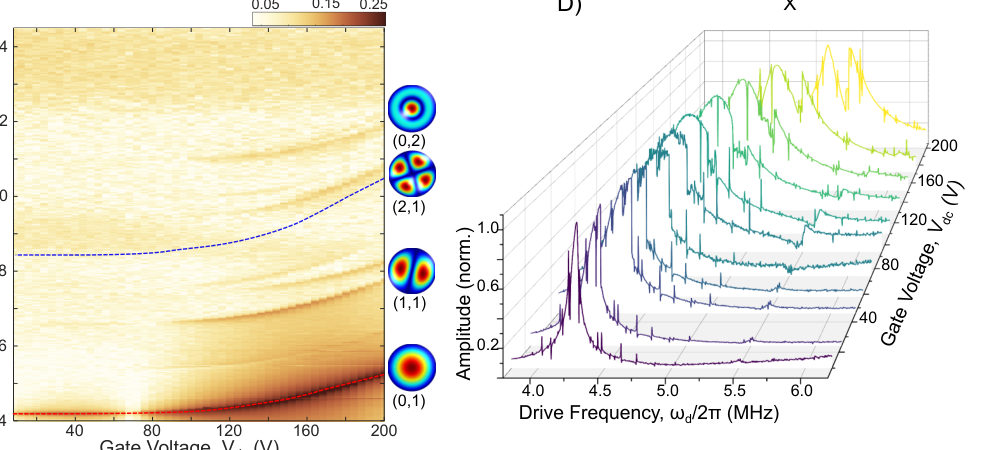 
Figure 1. Device, effective potential, and gate-tunable 1:2 internal resonance. (A)(a) Scanning electron micrograph of the device. (b) Capacitive geometry: an AC voltage Vac drives the membrane and a DC gate voltage Vdc sets the static tension. (B) Effective potential V (X) of the fundamental mode, showing the competing quadratic and cubic nonlinear terms. (C) Dispersion of the mechanical resonances versus Vdc. (D) Amplitude response of the fundamental mode versus Vdc at fixed Vac = 6.0 V.

📷 Fig 2

 
Figure 2. Integer high-harmonic generation and amplitude scaling. (A) Fundamental-mode spectrum with increasing drive amplitude at Vdc = 172 V; the spectral dip deepens as the nonlinear mode coupling strengthens. (B) Spectrum at fixed drive amplitude, showing the mode splitting from internal resonance. The black vertical line marks the drive frequency used in the following measurements. (C) Broadband spectrum under single-tone drive, showing integer harmonics up to fourth order (nωd, n = 1–4). Inset: onset threshold of each harmonic versus drive amplitude. (D) Amplitudes of the second, third, and fourth harmonics versus drive voltage, showing three regimes: (i) integer-harmonic generation...

📷 Fig 3

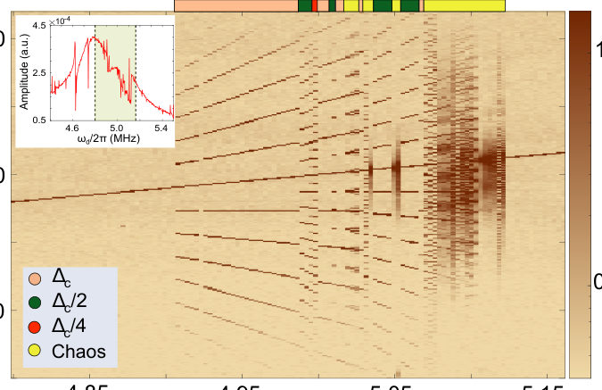 
Figure 3. From integer harmonics through frequency combs to chaos. (A) Spectral map versus drive amplitude at fixed ωd/2π = 4.8338 MHz and Vdc = 158 V. Three regimes are marked: (i) integer-harmonic generation (Vac ≤6.8 V); (ii) dense comb (6.8 ≤Vac ≤8.8 V); (iii) reverse period-doubled comb with doubled spacing (8.8 ≤Vac ≤9.4 V). (B) Spectral map versus drive frequency at fixed drive amplitude, showing the evolution from a single peak to a comb, then successive period-doubling steps (∆c →∆c/2 →∆c/4) and finally chaos. Inset: fundamental-mode spectrum with the 1:2 mode splitting; the shaded band marks the swept frequency range.

**Summary.** The authors report on controlling the highly nonlinear dynamics of graphene nanomechanical resonators using an applied gate voltage. By tuning the potential landscape, they demonstrate that a single device can act sequentially as a frequency multiplier, a broadband comb source, or exhibit controlled period-doubling transitions. This highlights the utility of solid-state systems for realizing complex non-linear wave phenomena on demand.

**Why it may be interesting.** This work showcases a solid-state quantum/classical analog system where external electrical tuning (gate voltage) controls the nonlinear coupling terms ($\zeta$), enabling deterministic switching between different complex dynamical states relevant to non-linear optics and energy harvesting.

Detailed structure

**Main problem.** The study demonstrates how a single, gated graphene nanomechanical resonator can exhibit tunable nonlinear dynamics, allowing it to function as multiple distinct physical sources.

**Main result.** The device successfully transitions through regimes of integer harmonic generation (IHG), dense frequency comb formation, and controlled reverse period-doubling cascades by tuning the gate voltage or drive amplitude.

**Method.** The research combines experimental measurements using optical interferometry with theoretical modeling employing nonlinear oscillator equations and harmonic balance techniques.

**Model / system.** The system is a suspended monolayer graphene drumhead whose effective potential $V(X)$ can be tuned by an applied gate voltage ($V_{dc}$) to include quadratic ($\zeta X^3$) and cubic ($eta X^4$) nonlinear terms. The dynamics are analyzed near a 1:2 internal resonance.

**Key observables.** Integer harmonics ($n\omega_d$), dense frequency comb spacing ($\Delta c$), period-doubling cascade structure, and the measured nonlinear coefficients $\zeta$ and $eta$.

**Important parameters / regimes.** Gate voltage ($V_{dc}$), drive amplitude ($V_{ac}$), and the internal resonance condition ($\omega_2 \approx 2\omega_0$).

**Assumptions / limitations.** Theoretical analyses rely on harmonic balance approximations, assuming sinusoidal responses and retaining only resonant components in the coupled equations of motion.

**Figures summary.** Figures illustrate the device structure, the effective potential landscape, resonance dispersion curves vs. $V_{dc}$, and spectral maps detailing the progression from discrete harmonics to combs and back via period-doubling transitions.

**Paper structure.** The paper progresses by first establishing the physical platform and tunable nonlinear model; it then presents experimental evidence showing harmonic generation followed by comb formation and period-doubling cascades; finally, theoretical analysis confirms these observed dynamics using coupled oscillator equations under internal resonance conditions.

Abstract

Nonlinear nanomechanical resonators give convenient solid-state access to classical analogs of extreme nonlinear optics and to phononic signal processing. Here we report integer high-harmonic generation and phononic frequency combs in a suspended monolayer graphene drum. A gate voltage breaks the out-of-plane symmetry of the membrane and tunes its fundamental flexural mode onto a 1:2 internal resonance with a higher mode at twice the frequency, where the quadratic coupling between the two modes becomes large. A single drive tone then generates phase-locked integer harmonics in sequence, and at larger drive these fill in to a dense frequency comb. Raising the drive further, we find a reverse period-doubling transition: the comb spacing doubles, the line density halves, and energy flows back into the even-order comb lines. The measured spectra yield the quadratic ($ζ$) and cubic ($β$) nonlinear coefficients of the membrane. These results show how the tunable nonlinear landscape of graphene supports distinct dynamical regimes on demand, allowing a single gated device to act in turn as a frequency multiplier, a broadband comb source, and a chaotic generator.

[↑ back to top](#top)

### [Quench, Glow, or Stay Silent: Distance-Controlled Up-Conversion Emission near Metallic Nanowires](http://arxiv.org/abs/2607.03873v1)

**Authors:** Maciej Cwierzona, Michal Zebrowski, Pavel Dziarhai, Joanna Niedziolka-Jonsson, Martin Jonsson-Niedziolka, Marcin Nyk, Sebastian Mackowski, Dawid Piatkowski  
**Type:** experiment · **Category:** other · **PDF:** <https://arxiv.org/pdf/2607.03873v1>  
**Analysis basis:** full PDF text, analyzed in chunks
**Topic relevance:** `non-equilibrium dynamics` **3/5** · `quantum optics experiment` **3/5** · `Tavis-Cummings & cavity-many-emitter` **2/5** · `correlated cavity matter` **2/5** · `analog quantum simulation` **1/5** · `correlated / nonlocal dissipation` **1/5** · `driven-dissipative phase transition` **1/5** · `interference shaping light` **1/5** · `methods for driven-dissipative` **1/5** · `non-equilibrium universality` **1/5**

📷 Fig 1

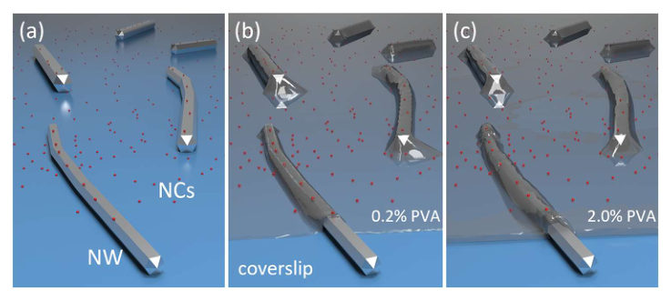 
Fig. 1. Schematic illustration of controlled spatial geometry of up-conversion NCs and silver NWs. Increasing the thickness of the PVA film in the sequence (a)-(c) provides a means to systematically vary their spatial separation.

📷 Fig 2

 
Fig. 2. (a) SEM image of silver nanowires deposited on a conductive carbon foil. (b) Scanning transmission electron microscopy (STEM) images of nanowires (upper panel) illustrating the surrounding PVP polymer layer, with corresponding images acquired using a through-lens detector (TLD) shown in the lower panel for comparison. (c) Absorbance spectrum of the silver nanowire colloid.

📷 Fig 3

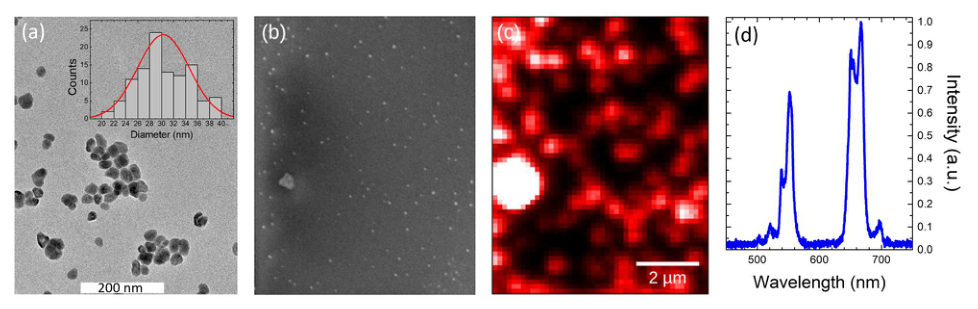 
Fig. 3. (a) TEM image of the NaYF4:Er3+/Yb3+ NCs together with a histogram illustrating the statistical size distribution. (b) SEM image of individual NCs dispersed on a glass substrate (S00) and the corresponding PL image of the same sample area (c). Only minimal agglomeration is observed, which is easily distinguishable in both SEM and PL images. (d) Emission spectrum of a single NC under 980 nm excitation.

📷 Fig 4

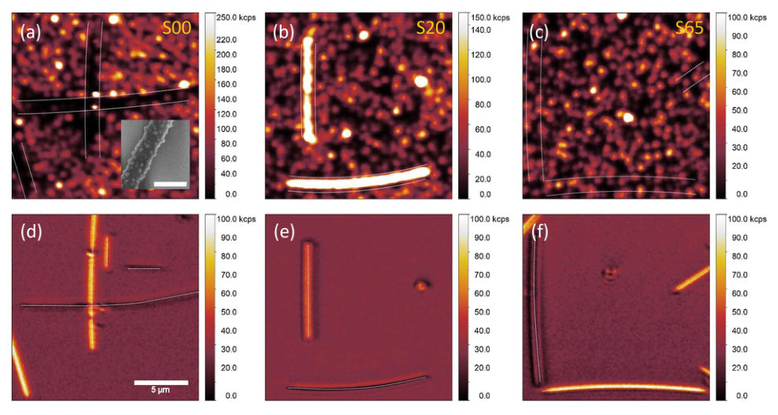 
Fig. 4. Photoluminescence intensity maps of individual up-conversion NCs acquired for samples S00, S20, and S65 (a-c), together with the corresponding maps of elastically back-scattered laser light (d-f), illustrating the spatial distribution of NWs. The white dashed lines indicate the positions of the NWs. The PL maps were obtained by recording the red up- conversion emission of the NCs under 980 nm laser excitation. The inset in panel (a) shows an SEM image of a bare silver nanowire with attached nanocrystals. The scale bar represents 200 nm.

📷 Fig 5

 
Fig. 5. μs-FLIM maps of the up-conversion emission recorded for sample S20, acquired from the same sample region as shown in Fig. 4b,e. Panel (a) shows the green emission, while panel (b) corresponds to the red emission of the NCs. Both maps were obtained under 980 nm laser excitation using a pulsed excitation scheme with a pulse duration of 20 µs. The color scale represents the extracted luminescence lifetime values.

**Summary.** The authors developed a highly controlled hybrid nanostructure combining rare-earth up-conversion nanocrystals with metallic nanowires separated by a polymer spacer. By tuning this separation distance, they demonstrated deterministic control over the optical response, observing transitions between luminescence quenching, plasmon-enhanced emission, and near-decoupled behavior.

**Why it may be interesting.** This work provides an excellent experimental realization of open quantum system dynamics in nanophotonics, allowing direct measurement of energy relaxation pathways (radiative vs. nonradiative) as a function of engineered coupling strength to plasmonic modes.

Detailed structure

**Main problem.** The research aims to achieve precise, reproducible control over the interaction between individual up-conversion emitters and metallic nanostructures to study distance-dependent emission modification.

**Main result.** Three distinct optical regimes—quenching, plasmonic enhancement, and effective decoupling—were demonstrated by systematically controlling the separation distance using a polymer spacer layer.

**Method.** The study utilized single-nanostructure measurements with time-resolved microsecond fluorescence lifetime imaging microscopy (FLIM) under 980 nm excitation.

**Model / system.** The platform consists of $	ext{NaYF}_4:	ext{Er}^{3+}/	ext{Yb}^{3+}$ nanocrystals placed near silver nanowires, separated by a precisely controlled polymer spacer film like PVA. This hybrid architecture allows tuning the emitter-metal coupling.

**Key observables.** Emission intensity maps (PL), fluorescence decay times ($\mu	ext{s-FLIM}$), and the separation distance ($d$).

**Important parameters / regimes.** Separation distance ($d$), which controls transitions between quenching, enhancement, and decoupling regimes.

**Assumptions / limitations.** The use of a well-defined polymer spacer overcomes limitations from inhomogeneous residual layers found in previous studies. The observed enhancement is attributed to modification of the local photonic density of states coupled to plasmon modes.

**Figures summary.** Figures illustrate schematics of the geometry controlled by PVA thickness, energy level diagrams for up-conversion, and PL/FLIM maps comparing emission characteristics across different spacer thicknesses (S00, S20, S65).

**Paper structure.** The paper establishes a systematic platform using polymer spacers to control emitter-metal separation. It then presents evidence of three distinct regimes—quenching at short range, enhancement via plasmons at intermediate range, and decoupling at large distances—using intensity mapping and lifetime measurements.

Abstract

We demonstrate controlled transitions between competing radiative and nonradiative decay channels in the up-conversion luminescence of NaYF4:Er3+/Yb3+ nanocrystals placed in proximity to metallic nanowires. The nanocrystal-nanowire separation is used as a key control parameter governing the optical response. An essential aspect of our approach is the removal of inhomogeneous residual polymer layers from the nanowires, eliminating any compromise on distance control and reproducibility in emitter-metal hybrid nanostructures. Replacing them with a well-defined polymer spacer yields controlled access to three qualitatively distinct interaction regimes: luminescence quenching, plasmonic enhancement, and effective decoupling. Transitions between these regimes are shown to reflect changes in the dominant energy relaxation pathways: from nonradiative losses in direct contact with the metal, through modification of the local photonic density of states and coupling to plasmon-mediated modes, to behavior characteristic of quasi-isolated emitters. The plasmonic origin of the emission enhancement in the intermediate regime is evidenced by an increase in luminescence intensity accompanied by shortened decay times, as revealed by fluorescence lifetime imaging microscopy of up-conversion nanocrystals. All experiments were performed on single nanostructures, thereby excluding artefacts arising from aggregation effects and strengthening the interpretation of the observed phenomena. The presented approach provides controlled access to plasmon-modified decay channels and offers a basis for the rational design of functional nanophotonic and sensing structures with tailored optical properties.

[↑ back to top](#top)

### [Nonlocal Orbital-Angular-Momentum Dichroism of Vortex Light in Strained Crystals](http://arxiv.org/abs/2607.03544v1)

**Authors:** Habib Rostami  
**Type:** theory · **Category:** other · **PDF:** <https://arxiv.org/pdf/2607.03544v1>  
**Analysis basis:** full PDF text, analyzed in chunks
**Topic relevance:** `Keldysh / 2PI / non-Gaussian methods` **3/5** · `interference shaping light` **3/5** · `driven-dissipative phase transition` **2/5** · `methods for driven-dissipative` **2/5** · `analog quantum simulation` **1/5** · `correlated / nonlocal dissipation` **1/5** · `correlated cavity matter` **1/5** · `non-equilibrium dynamics` **1/5** · `spintronics-quantum-optics interface` **1/5**

📷 Fig 1

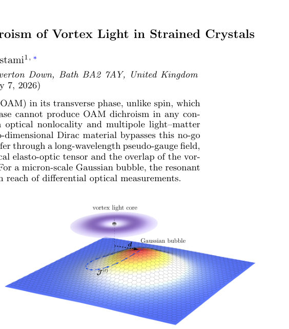 
FIG. 1. Schematic of an optical vortex incident on a nonuni- formly strained hexagonal two-dimensional material. The sur- face represents a Gaussian strain bubble, with colour indicat- ing the deformation amplitude. The vortex core is displaced from the bubble center by the in-plane vector d. The circular arrows denote the vortex transverse phase current J (ℓ). This relative displacement breaks the common circular symmetry of the optical and strain profiles, enabling OAM-sensitive cou- pling through optical nonlocality.

📷 Fig 2

 
FIG. 2. OAM-projected geometric overlap integral B(ℓ) ab and SAM-projected material tensor Λ(s) ab for strain-assisted OAM dichroism. (a) Geometric overlap for a displaced Gaussian bubble, shown through B(ℓ) D = B(ℓ) xx −B(ℓ) yy . For dx = dy = d, the symmetric off-diagonal component B(ℓ) S = B(ℓ) xy + B(ℓ) yx is numerically identical to B(ℓ) D . The main panel shows B(1) D ver- sus d/R0 for ℓ= 1 and w0 = R0. Insets show its dependence on w0/R0 at ℓ= 1, dx = dy = 0.1R0, and on ℓat w0 = R0, dx = dy = 0.1R0. We use a Gr¨uneisen parameter β ≈2 and the universal bubble aspect ratio h0/R0 ≈0.1 [48]. We set R0 = 1 µm. (b) Material response near the interband reso- nance ℏω ≈2µ, normalized by Z0 =...

**Summary.** This theoretical paper demonstrates how nonuniform strain can induce Orbital-Angular-Momentum (OAM) dichroism in vortex light propagating through 2D Dirac materials. By breaking translational symmetry, the authors bypass a fundamental no-go theorem, showing that the measurable OAMD is governed by a factorable product of an elasto-optic tensor and the geometric overlap of the strain field with the vortex phase current.

**Why it may be interesting.** This work provides a concrete mechanism—strain engineering—to generate a measurable optical signature (OAM dichroism) that is fundamentally forbidden in simpler, translationally invariant quantum systems. This bridges topological light properties with solid-state material response.

Detailed structure

**Main problem.** The study investigates the generation of Orbital-Angular-Momentum (OAM) dichroism ($\Delta\sigma_{OAM}$) for vortex light propagating through condensed matter systems.

**Main result.** OAMD requires broken continuous translational symmetry, which is achieved by applying nonuniform strain in a 2D Dirac material. The resulting OAMD factorizes into an elasto-optic tensor and the geometric overlap of the vortex phase current with the strain field.

**Method.** The analysis uses a theoretical framework involving nonlocal optical response functions calculated via Wigner variables, expanding the conductivity kernel in terms of strain-induced pseudo-gauge fields.

**Model / system.** The model employs a two-dimensional Dirac material Hamiltonian subjected to weak, nonuniform strain (e.g., a Gaussian bubble). The analysis considers both interband and intraband contributions to the optical response tensor.

**Key observables.** OAM dichroism contrast ($\Delta\sigma_{OAM}$), which is proportional to $	ext{Re}\left[ \mathbf{B}^{(\ell)}_{ab} \Lambda_{ab}^s(\omega) 
ight]$.

**Important parameters / regimes.** Nonuniform strain magnitude, vortex topological charge ($\ell$), and the tilt parameter ($\alpha$) in the Dirac Hamiltonian.

**Assumptions / limitations.** The analysis assumes a weak, long-wavelength strain texture and relies on approximations such as expanding kernels to first order in external wave vector Q and assuming specific doping regimes.

**Figures summary.** Figures illustrate the geometric overlap tensor $B^{(\ell)}_{ab}$ dependence on displacement and beam waist, and show material coefficients entering the OAM-odd response, highlighting resonant enhancement.

**Paper structure.** The paper establishes a no-go theorem for translationally invariant systems, then introduces strain to bypass this. It develops the nonlocal conductivity tensor by expanding in strain, factorizing the result into geometric overlap and an elasto-optic tensor derived from solving the Boltzmann equation for both interband and intraband terms.

Abstract

Vortex light carries orbital angular momentum (OAM) in its transverse phase, unlike spin, which is encoded in polarization. We show that this phase cannot produce OAM dichroism in any continuously translation-invariant system, even when optical nonlocality and multipole light--matter coupling are included. Nonuniform strain in a two-dimensional Dirac material bypasses this no-go condition by supplying transverse momentum transfer through a long-wavelength pseudo-gauge field, so that the OAM dichroism factorizes into a nonlocal elasto-optic tensor and the overlap of the vortex transverse phase current with the strain field. For a micron-scale Gaussian bubble, the resonant OAM-odd conductivity reaches \(\sim10^{-3}e^2/\hbar\), within reach of differential optical measurements.

[↑ back to top](#top)

### [Pseudo-superconducting-diode effect in ferroelectric Josephson junctions](http://arxiv.org/abs/2607.04398v1)

**Authors:** Yaozu Tang, Nienke ten Haaf, Artem Bondarenko, Mazhar N. Ali, Yaroslav M. Blanter  
**Type:** theory · **Category:** statistical mechanics · **PDF:** <https://arxiv.org/pdf/2607.04398v1>  
**Analysis basis:** full PDF text, analyzed in chunks
**Topic relevance:** `driven-dissipative phase transition` **3/5** · `methods for driven-dissipative` **3/5** · `non-equilibrium dynamics` **3/5** · `non-equilibrium universality` **2/5** · `Frenkel-Kontorova` **1/5** · `Keldysh / 2PI / non-Gaussian methods` **1/5** · `correlated / nonlocal dissipation` **1/5**

📷 Fig 1

 
FIG. 1. Junction and potential landscapes. (a) Schematic of a FE-JJ with broken inversion symmetry due to interfacial insulating layers (I1 and I2). (b) Equivalent cir- cuit: the green box denotes the conventional RCSJ model, while the orange box represents ferroelectric dynamics. (c) Tilted washboard potential of the RCSJ model. (d) Landau double-well potential of the ferroelectric.

📷 Fig 2

 
FIG. 2. Hysteresis in time-averaged voltage and polar- ization. (a), (b) Time-averaged voltage V = V/IcR0 under current sweeps for Landau coefficients A = 2, 4. Blue/red curves are RCSJ results with electric polarization (P-RCSJ), while gray curves are conventional RCSJ results without fer- roelectrics for comparison. The blue and red curves show RCSJ results with electric polarization (P-RCSJ), while the gray curves show conventional RCSJ results without ferro- electricity for comparison. Insets: zoom-in near retrapping currents. (c), (d) Corresponding time-averaged polarization P = P/P0 under current sweeps. The initial polarization is P(0) = −1.

📷 Fig 3

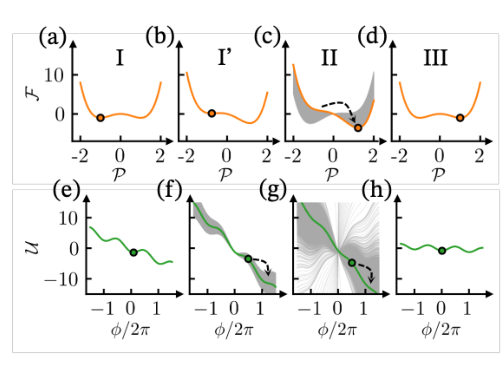 
FIG. 3. Rocking double-well and washboard poten- tials. Potential landscapes are constructed using the time- averaged data and correspond, from left to right, to sweep points I, I’, II, and III in Fig. 2(d). Gray regions/curves indi- cate oscillation amplitudes. (a)–(d) Ferroelectric double-well potential profiles (orange curves) and polarization values (or- ange balls). (e)–(h) Corresponding Josephson-junction wash- board potentials (green curves) and phase values (green balls).

📷 Fig 4

 
FIG. 4. Histograms of critical (i± c ) and retrapping (i± r ) currents. The temperature T is set to (a) 0.1 K, (b) 0.2 K, (c) 0.5 K, and (d) 1 K. Each histogram (shown on a log- arithmic scale) is constructed from 1000 full current sweeps. The arrows at the top indicate the zero-temperature values of the critical and retrapping currents for reference. The critical temperature of the superconductor is estimated to be Tc ≃0.5 K using simple BCS approximation.

📷 Fig 5

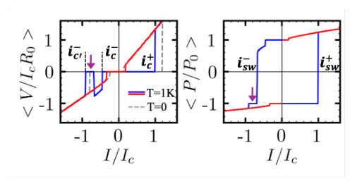 
FIG. 5. Time-averaged characteristics at T = 1 K. Time-averaged (a) voltage and (b) polarization under current sweeps. The purple arrow indicates the additional supercon- ducting region. The sweep protocol and initial conditions are the same as in Fig. 2(a). Dashed gray curves in (a) show the zero-temperature results for comparison.

**Summary.** This work proposes that ferroelectric Josephson junctions can exhibit a magnetic-field-free supercurrent diode effect due to the coupling between superconducting currents and ferroelectric polarization switching. By modeling this coupled system using dynamical equations, the authors demonstrate that current sweeps induce history-dependent nonreciprocity in critical and retrapping currents. This identifies FE-JJs as tunable platforms for next-generation nonreciprocal superconducting electronics.

**Why it may be interesting.** The coupling between superconducting phase dynamics and classical ferroelectric polarization switching provides a rich platform for studying non-equilibrium phenomena in condensed matter systems, relevant to understanding energy dissipation and memory effects in quantum devices.

Detailed structure

**Main problem.** The study investigates a magnetic-field-free pseudo-superconducting-diode effect (SDE) in ferroelectric Josephson junctions, which enables supercurrent rectification.

**Main result.** The nonreciprocity is generated by the history-dependent process of current-induced ferroelectric polarization switching, and this effect persists even at finite temperatures.

**Method.** The authors employ a coupled dynamical model solving for both the Josephson junction dynamics (RCSJ) and the Landau-Khalatnikov-Tani ferroelectric dynamics using numerical simulations.

**Model / system.** The system is an inversion-asymmetric Ferroelectric Josephson Junction (FE-JJ). The physics is modeled by coupling a polarization-dependent RCSJ description to the LKT ferroelectric dynamics, governed by coupled differential equations derived from a Lagrangian approach.

**Key observables.** Asymmetric critical and retrapping supercurrents ($i_c$ vs $i_r$), time-averaged voltage ($V$) and polarization ($P$), and diode efficiency ($\eta$).

**Important parameters / regimes.** Ferroelectric parameters (e.g., spontaneous polarization $	heta_{P0}$), junction damping, temperature ($T$), and the current sweep protocol.

**Assumptions / limitations.** The analysis relies on coupled differential equations derived from a Lagrangian formalism; some discussions neglect voltage-shift terms for simplicity.

**Figures summary.** Figures illustrate hysteresis loops (V vs I) showing asymmetry in retrapping currents, time evolution of polarization and phase during switching, and IV scatter plots confirming thermal effects and resistive states at finite T.

**Paper structure.** The paper introduces the physical model via coupled dynamics, analyzes the non-equilibrium nature of the SDE using current sweeps (I-V/I-P traces), explores resonance features, and finally examines the robustness and temperature dependence of the diode effect.

Abstract

The superconducting diode effect (SDE), characterized by unequal critical supercurrents in opposite current directions, enables supercurrent rectification. We propose a magnetic-field-free pseudo-superconducting-diode effect in ferroelectric Josephson junctions with broken inversion symmetry. Using a coupled dynamical model that combines a polarization-dependent RCSJ description with Landau-Khalatnikov-Tani ferroelectric dynamics, we show that ferroelectric polarization switching induces asymmetric critical and retrapping currents under current sweeps. The resulting nonreciprocity is highly tunable via ferroelectric parameters and the sweep protocol and remains robust at finite temperatures. Our work identifies ferroelectric Josephson junctions as a promising platform for magnetic-field-free nonreciprocal superconducting devices.

[↑ back to top](#top)

### [Theory of Spinful Relativistic Superfluids](http://arxiv.org/abs/2607.04408v1)

**Authors:** Dam Thanh Son  
**Type:** theory · **Category:** other · **PDF:** <https://arxiv.org/pdf/2607.04408v1>  
**Analysis basis:** full PDF text, analyzed in chunks
**Topic relevance:** `Keldysh / 2PI / non-Gaussian methods` **3/5** · `analog quantum simulation` **2/5** · `spintronics-quantum-optics interface` **2/5** · `correlated / nonlocal dissipation` **1/5** · `driven-dissipative phase transition` **1/5** · `entanglement & information structure` **1/5** · `exotic spin models in light-matter` **1/5** · `methods for driven-dissipative` **1/5** · `non-equilibrium dynamics` **1/5** · `non-equilibrium universality` **1/5**

📷 Fig 1

 
Low-resolution page preview, page 2

📷 Fig 2

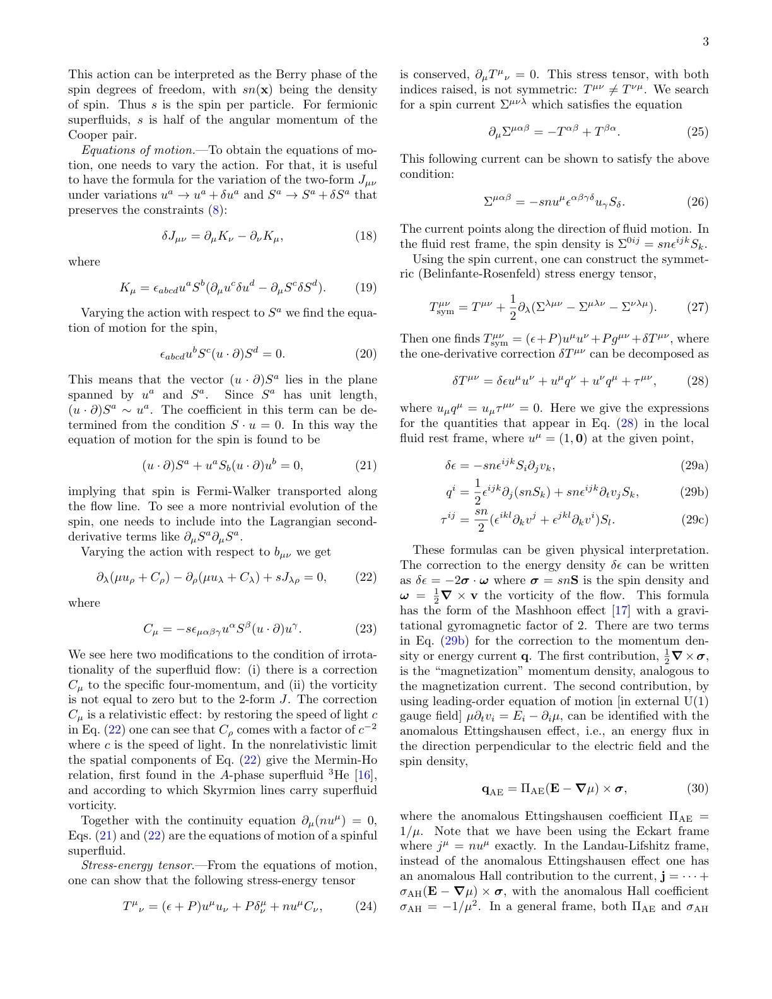 
Low-resolution page preview, page 3

📷 Fig 3

 
Low-resolution page preview, page 4

📷 Fig 4

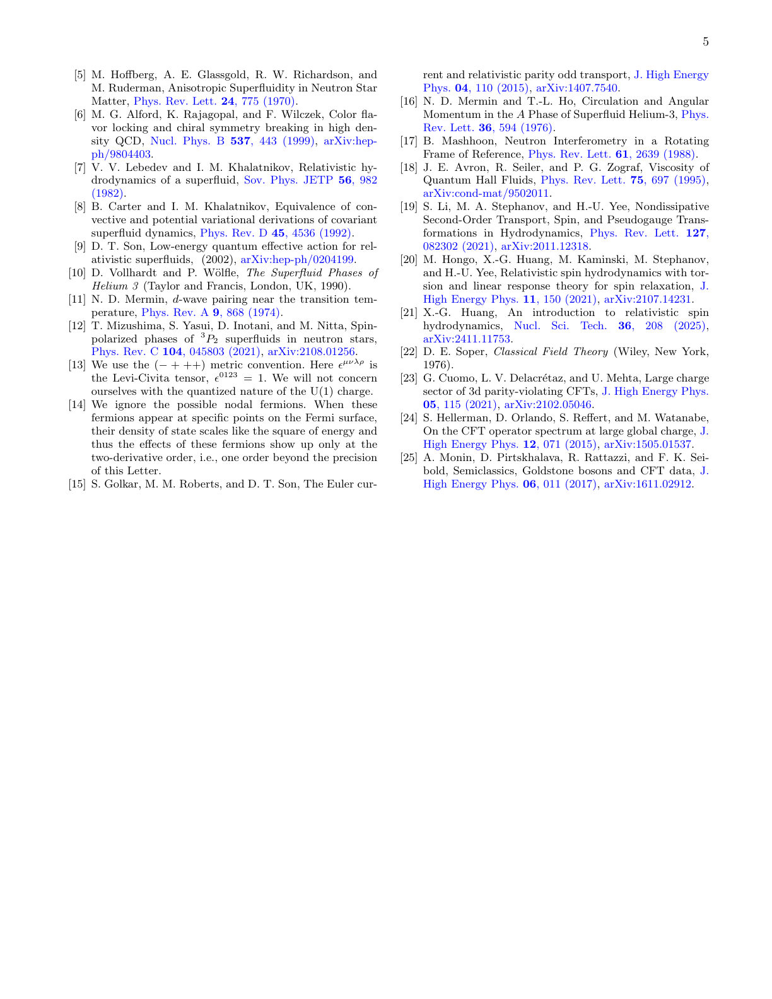 
Low-resolution page preview, page 5

**Summary.** This paper develops a comprehensive effective field theory for describing spinful relativistic superfluids. By incorporating a topological term into the action, the authors derive key physical consequences such as anomalous Hall effects and modified superfluid dynamics. It provides a theoretical framework connecting angular momentum density to measurable transport properties.

**Why it may be interesting.** While focused on relativistic superfluids, the derivation of anomalous transport coefficients (like Hall viscosity) and the connection between spin dynamics and topological terms mirrors concepts relevant in strongly correlated systems or exotic quantum materials studied in AMO physics.

Detailed structure

**Main problem.** The work constructs an effective field theory description for relativistic superfluids that possess a nonzero angular momentum density (spinful). It aims to derive the low-energy physics and observable consequences of such exotic quantum fluids.

**Main result.** The theory predicts several novel physical effects, including the relativistic Mermin-Ho relation, anomalous Ettingshausen effect, and anomalous Hall viscosity, stemming from a topological term in the effective action encoding the Berry phase.

**Method.** The authors utilize an effective field theory approach involving dual descriptions with two-form gauge fields ($b_{\mu
u}$) to construct the action. They derive equations of motion by varying this extended action.

**Model / system.** The system modeled is a spinful relativistic superfluid, extending beyond simple scalar order parameters to include Cooper pairs with nonzero angular momentum (e.g., $p$-wave pairing). The theory incorporates couplings related to the fluid's spin and vorticity.

**Key observables.** Stress-energy tensor ($T^{\mu
u}$), anomalous Ettingshausen effect coefficient ($\Pi_{AE}$), anomalous Hall viscosity ($	au_{ij}$), and the Berry phase term in the effective action.

**Important parameters / regimes.** The coupling constant $s$ associated with the topological term, and the low-energy derivative expansion order (one-derivative corrections).

**Assumptions / limitations.** The analysis is restricted to one-derivative corrections, leaving higher-order terms uninvestigated. It also assumes the existence of such a superfluid state.

**Paper structure.** The paper develops the effective action by adding a topological term involving a closed two-form current $J$ to the standard Lagrangian. This leads to modified equations of motion, which are then used to derive conserved quantities like the stress-energy tensor and predict specific transport phenomena.

Abstract

We construct an effective field theory description of relativistic superfluids with nonzero angular momentum density. At first order in the derivative expansion, the effective action contains a term with a quantized coefficient, which encodes the Berry phase for the angular momentum of the superfluid condensate. From this single term we derive a number of physical effects, including the relativistic Mermin-Ho relation, an anomalous Ettingshausen effect (exchangeable for an anomalous Hall effect), and an anomalous Hall viscosity.

[↑ back to top](#top)

### [Graph-Based Kirchhoff Modeling of Non-Ohmic Electron Transport in Self-Assembled Nanonecklace Networks](http://arxiv.org/abs/2607.03698v1)

**Authors:** Obed Issakah, Srivathsan Badrinarayanan, Ravi F. Saraf, Janghoon Ock  
**Type:** theory · **Category:** disordered systems and neural networks · **PDF:** <https://arxiv.org/pdf/2607.03698v1>  
**Analysis basis:** full PDF text, analyzed in chunks
**Topic relevance:** `methods for driven-dissipative` **3/5** · `non-equilibrium dynamics` **3/5** · `driven-dissipative phase transition` **2/5** · `non-equilibrium universality` **2/5** · `Frenkel-Kontorova` **1/5** · `Keldysh / 2PI / non-Gaussian methods` **1/5**

📷 Fig 1

 
Figure 1: Overview of the graph-based Kirchhoff modeling framework. A self-assembled gold nanonecklace film deposited between source and drain electrodes (left) is viewed as a synthetic random geometric graph. Each nodes is a junction with an activation voltage Va (centre). At each applied bias, the graph-based Kirchhoff solver computes the current flowing between each pair of connected nodes, yielding the identified source-drain current flowing between each pair of connected nodes pathways and the resulting nonlinear I–V response, fitted to I ∼(V −VT)ζ with threshold voltage VT (right).

📷 Fig 2

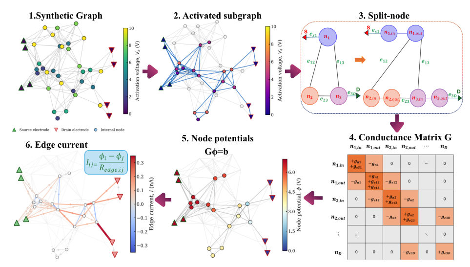 
Figure 2: Step-by-step operation of the graph-based Kirchhoff solver. (1) The synthetic graph, with nodes coloured by activation voltage Va. (2) At a given applied bias, only junctions with Va ≤V remain, forming the conducting subgraph. (3) Each active internal node is split into input and output sub-nodes joined by its node resistance Rnode. (4) The split-node network is assembled into the sparse conductance matrix G. (5) Solving Gφ = b gives the sub-node potentials φ. (6) The edge currents follow from the potential drops across the connecting edges, Iij = (φi −φj)/Redge,ij.

📷 Fig 3

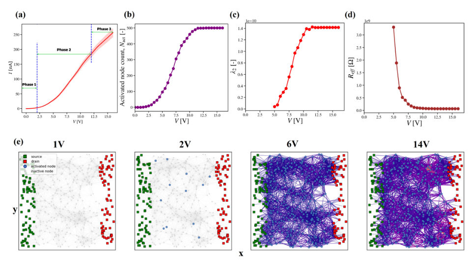 
Figure 3: Macroscopic I–V response and microscopic diagnostics of bias-driven junction activation. (a) Ensemble-averaged I–V response obtained from five independent network realizations at N = 500, ⟨Va⟩= 6 V, σa = 3 V, and fv = 0.00, showing the low-current blockade (Phase 1), the superlinear power-law onset (Phase 2), and the quasi-linear high-bias regime (Phase 3). (b) Activated-node count, (c) algebraic connectivity λ2 of the conducting subgraph, and (d) source-to-drain effective resistance. (e) Spatial snapshots of the conducting network at 1, 2, 6, and 14 V, with source (green) and drain (red) electrodes and activated (filled) versus inactive (faded) nodes.

📷 Fig 4

 
Figure 4: Mean-activation-voltage dependence of collective transport in nanonecklace net- works. (a) I–V characteristics for ⟨Va⟩= 4, 6, 8, and 10 V at fixed σa = 1 V. (b) Cor- responding activation-voltage distributions. (c) Activated-node population Nact vs. applied voltage. (d) Algebraic connectivity λ2 of the active subnetwork. (e) Threshold voltage VT vs. ⟨Va⟩. (f) Transport exponent ζ from power-law fits. (g) Experimental scaling collapse for self-assembled gold necklace networks, reproduced from Kane et al.13 (h) Active conducting subnetworks at fixed applied voltage for ⟨Va⟩= 4, 6, 8, and 10 V.

📷 Fig 5

 
Figure 5: Network-density dependence of collective transport in nanonecklace networks. (a) I–V characteristics for N = 200, 400, 600, and 800 junctions at fixed ⟨Va⟩= 6 V, σa = 3 V. (b) Activated-node population vs. applied voltage. (c) Algebraic connectivity of the conducting subgraph. (d) Threshold voltage VT vs. N. (e) Transport exponent ζ vs. N. (f) Experimental threshold-voltage–coverage relationship, reproduced from Wilson et al.7

**Summary.** This work develops a graph-based Kirchhoff model to simulate electron transport in self-assembled nanonecklace networks exhibiting Coulomb blockade. By treating the network as a dynamic graph, the authors show that the characteristic non-Ohmic I–V response arises from voltage-driven percolation across threshold junctions. The framework allows independent tuning of structural parameters (density, topology) and electronic properties to engineer device behavior.

**Why it may be interesting.** While focused on classical circuit physics, the study's reliance on percolation theory in disordered media, threshold effects, and structural control parameters makes it relevant to understanding complex many-body dynamics in mesoscopic systems.

Detailed structure

**Main problem.** The core problem is understanding the poorly understood mechanisms governing the macroscopic non-Ohmic current–voltage (I–V) response in self-assembled nanonecklace networks.

**Main result.** The model successfully reproduces the power-law I–V behavior, showing that this nonlinearity emerges from the collective, staggered activation of threshold junctions and voltage-driven percolation.

**Method.** A novel graph-based Kirchhoff framework is developed to solve circuit laws on a dynamically changing conducting subgraph as bias is applied.

**Model / system.** The system models self-assembled gold nanonecklace networks as an undirected geometric graph. Junctions act as nodes with activation voltages, and segments are edges with length-dependent tunneling resistances.

**Key observables.** Non-Ohmic I–V response ($I \propto (V - V_T)^\zeta$), active nodes, conducting subgraph structure, nodal potentials, and edge currents.

**Important parameters / regimes.** Network density, structural topology (void fraction $f_v$), mean activation voltage ($\langle V_a 
angle$), and the spread of activation voltages ($\sigma_a$).

**Assumptions / limitations.** The model uses a simplified linear coupling for node resistance ($R_{n,i} = \alpha V_{a,i}$) and assumes global bias $V$ as the primary activation criterion.

**Figures summary.** Figures illustrate the framework overview, step-by-step solver operation (Graph $
ightarrow$ Subgraph $
ightarrow$ Matrix $\mathbf{G}$), and parameter sweeps showing how density, void fraction, and voltage spread control transport exponents ($\zeta$) and threshold voltages ($V_T$).

**Paper structure.** The paper introduces the physical problem, details the graph-based Kirchhoff framework (including node/edge resistance models), presents simulation results demonstrating the emergence of non-Ohmic behavior from percolation, and concludes by establishing the model as a design tool for engineering transport.

Abstract

Gold nanonecklace networks are promising platforms for single-electron switching, chemical sensing, and biogating devices because of their nonlinear current--voltage ($I$--$V$) characteristics arising from collective Coulomb-blockade transport. However, the mechanisms governing this macroscopic behavior remain poorly understood because experimental measurements are generally limited to the network topology and global $I$--$V$ response. To address this, we developed a graph-based Kirchhoff framework that represents a self-assembled nanonecklace network as a graph, with nodes corresponding to junctions between necklace segments and edges to the conducting segments themselves. The solver returns the active nodes, conducting subgraph, nodal potentials, and edge currents at each applied bias, while allowing the activation-voltage statistics, network density, and structural topology to be varied independently. The model reproduces the experimentally observed non-Ohmic response, $I \propto (V-V_T)^ζ$, and shows that this behavior emerges from the collective, staggered activation of threshold junctions and voltage-driven percolation of the conducting subgraph. Independent parameter sweeps reveal that the mean activation voltage shifts the threshold $V_T$ while leaving $ζ$ nearly unchanged, increasing network density raises $ζ$ from approximately 1.9 to 3.1 and enhances current, and topology controls the response even at fixed density and node characteristics. These trends agree qualitatively with experimental observations and establish the model as a design tool for engineering collective transport in self-assembled nanonecklace devices.

[↑ back to top](#top)

### [Full Gate-Voltage Control of a Parity-Protected Superconducting Qubit with an Altermagnetic Josephson Junction](http://arxiv.org/abs/2607.04097v1)

**Authors:** Guo-Liang Guo  
**Type:** theory · **Category:** quantum information and computing · **PDF:** <https://arxiv.org/pdf/2607.04097v1>  
**Analysis basis:** full PDF text, analyzed in chunks
**Topic relevance:** `exotic spin models in light-matter` **3/5** · `spintronics-quantum-optics interface` **3/5** · `QC/QI experiment` **2/5** · `Keldysh / 2PI / non-Gaussian methods` **1/5** · `driven-dissipative phase transition` **1/5** · `methods for driven-dissipative` **1/5**

📷 Fig 1

 
FIG. 1. (a) The setup of AM Josephson junction, AM with superconductors on both ends, ϕ the superconducting phase difference, the red and blue curves are the Fermi surface of AM. (b) The potential shape (blue line) in π periodic, wave- function (light yellow) and energy levels (red lines) of AM Josephson junction at the 0 −π point.

📷 Fig 2

 
FIG. 2. (a) Band structure of the AM with periodic bound- ary conditions along the x direction. µ0 marks zero Cooper- pair center-of-mass momentum. (b) Andreev bound-state spectrum at µ = µ0 (q = 0, red) and away from µ0 (finite q, blue). (c) The minimal point of the Josephson potential changes with µ, insets shows the Josephson potential shape near the 0 −π transition point, corresponding to the vertical lines of the same color in (d). (d) Leading Josephson har- monics versus µ. (e) The energy spectrum E0i, (i = 0, 1, 2, 3) changes with chemical potential near the 0-π transition point. (f) The transition matrix element changes with µ near the 0−π transition point, insets show the lowest...

📷 Fig 3

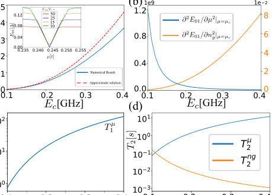 
FIG. 3. (a) At the 0 −π transition point, E01 change along with the variation of Ec, red dashed line is plotted with Eq. (8). Inset shows the E01 changes with the chem- ical potential near the 0 −π transition point with different Ec (b) At the 0 −π transition point, the second derivative ∂2E01/∂µ2, ∂2E01/∂n2 g as a function of Ec. (c) and (d) T1 and T2 vary with Ec.

📷 Fig 4

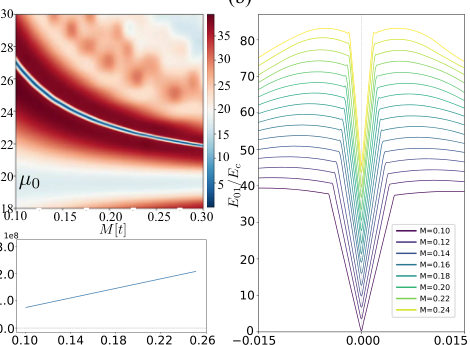 
FIG. 4. (a) Qubit transition energy E01 as a function of chemical potential µ and altermagnetic splitting strength M. (b) Waterfall plot of E01 versus µ near the 0-π transition for several values of M. (c) Second derivative of the qubit transition energy with respect to chemical potential, Dµ 2 = ∂2E01/∂µ2|µ=µc, evaluated at the critical chemical potential µc for the 0-π transition, as a function of M.

📷 Fig 5

 
FIG. 5. (a) and (b) shows the Fourier coefficients EJ,1, EJ,2 change with chemical potential and AM strength M.

**Summary.** This paper proposes using a superconductor/altermagnet/superconductor junction as a highly scalable, gate-controlled platform for parity-protected qubits. By exploiting the momentum-dependent spin splitting in altermagnets, researchers can electrically tune the Josephson coupling through a $0-\pi$ transition. This method eliminates flux noise sources and promises coherence times suitable for quantum computation.

**Why it may be interesting.** This work directly addresses a major bottleneck in superconducting quantum computing by proposing an all-electrical control mechanism that leverages novel magnetic materials (altermagnets) to engineer protected qubit states.

Detailed structure

**Main problem.** The primary challenge is developing superconducting qubits with long coherence times that eliminate the need for external magnetic-flux biasing, which introduces noise and limits scalability.

**Main result.** The authors demonstrate that using an altermagnetic Josephson junction allows for fully gate-controlled operation, achieving estimated coherence times up to tens of milliseconds while maintaining parity protection.

**Method.** The theoretical framework involves modeling the system Hamiltonian via a tight-binding approach and solving the Bogoliubov-de Gennes (BdG) equations to determine the Josephson potential and qubit energy spectrum.

**Model / system.** The physical platform is a superconducting qubit realized using an Altermagnet-Josephson Junction (SC–AM–SC). The altermagnets provide spin-dependent functionality without external fields, allowing electrical tuning of the junction's phase via chemical potential ($\mu$).

**Key observables.** Qubit splitting ($E_{01}$), coherence times ($T_1, T_2$), and the evolution of the Josephson potential through a $0-\pi$ transition.

**Important parameters / regimes.** Gate-tunable chemical potential ($\mu$), offset charge ($n_g$), altermagnetic coupling strength ($M$), and charging energy ($E_c$).

**Assumptions / limitations.** The analysis relies on the low-energy limit of the AM region, assuming $M \ll t$ and $\Delta \ll \mu$, and initially focuses on the 1D geometry for simplification.

**Figures summary.** Figures illustrate the physical setup controlled by gate voltages, the resulting double-well potential at the $0-\pi$ transition point, and the evolution of the Andreev bound-state spectrum and Josephson potential harmonics as a function of tuning parameters.

**Paper structure.** The paper introduces the problem (flux noise), proposes the SC–AM–SC junction utilizing altermagnetism for electrical control, details the theoretical modeling using BdG/tight-binding methods to analyze the $0-\pi$ transition and resulting double-well potential, and finally calculates coherence times based on charge and chemical potential noise.

Abstract

Parity-protected superconducting qubits offer intrinsically long coherence, but many current implementations require magnetic-flux biasing, which introduces flux noise, control overhead, and limited scalability. Here we propose a parity-protected qubit based on a gate-tunable superconductor-altermagnet-superconductor Josephson junction. Altermagnets are compensated magnets with momentum-dependent spin splitting and zero net magnetization, providing spin-dependent functionality without external magnetic fields. In the proposed junction, the two spin sectors acquire opposite phase shifts, generating two Josephson channels whose interference is controlled electrically by the chemical potential. At the tuned $0$-$π$ transition, the first Josephson harmonic is strongly suppressed while the second harmonic dominates, yielding a double-well potential with two nearly degenerate states of opposite Cooper-pair parity. For realistic gatemon-compatible parameters, we estimate coherence times of up to tens of milliseconds while maintaining fully gate-controlled qubit operations. These results establish altermagnetic Josephson junctions as a promising route toward protected superconducting qubits with local, scalable, and all-electrical control.

[↑ back to top](#top)

### [Semiconductor nanofilms as thermal phonon polarizers: competing effects of scattering selection rules and boundary mode conversion](http://arxiv.org/abs/2607.05296v1)

**Authors:** Vasumathy Ravishankar, Navaneetha K. Ravichandran  
**Type:** theory · **Category:** statistical mechanics · **PDF:** <https://arxiv.org/pdf/2607.05296v1>  
**Analysis basis:** full PDF text, analyzed in chunks
**Topic relevance:** `methods for driven-dissipative` **3/5** · `non-equilibrium dynamics` **3/5** · `Keldysh / 2PI / non-Gaussian methods` **1/5** · `analog quantum simulation` **1/5** · `correlated / nonlocal dissipation` **1/5** · `driven-dissipative phase transition` **1/5** · `non-equilibrium universality` **1/5**

📷 Fig 1

 
FIG. 1. Acoustic phonon dispersions of InP and BP along the Γ →X high symmetry direction. The phonon dispersions along other high-symmetry directions for these materials are shown in Supplementary Figs. S1(a)-(b). LA and TA phonon dispersions are farther apart in InP than in BP, thus activat- ing the AAA # 2 selection rule in InP [2].

📷 Fig 2

 
FIG. 2. Effect of mode conversion on the κ of BP and InP thin films at 100 K. (a) Thin film κ of BP and InP vs. thickness (d) normalized by the corresponding bulk values (κb) at 100 K. The inset shows the simulation geometry, and the incidence (θin) and the reflection (θout) angles for a phonon undergoing mode conversion at the thin film boundary. For specular reflection without mode conversion, the κ’s of thin films are equal to κb, independent of d [20]. When mode conversion is allowed, the predicted κ’s for specular reflections decrease faster with d in InP than in BP. For diffuse reflections, the predicted κ (d)’s remain the same with or without mode conversion in both materials, hence...

📷 Fig 3

 
FIG. 3. The normalized material factor Dλvλ of the mode conversion probabilities in InP (a) and BP (b). The x-axis is truncated at the maximum ν of the TA2 branch, beyond which mode conversion does not occur for the LA phonons [Fig. 2 (b)], since DTA1 λ = DTA2 λ = 0. In both materials, Dλvλ is much larger for the TA phonons than for the LA phonons, with the contrast being greater for InP than BP, due to the large velocity differences of the phonon polarizations in the former.

📷 Fig 4

 
FIG. 4. Thickness-dependent κ of InP films at different cryo- genic temperatures scaled by κb. When phonons undergo specular reflections with mode conversion, κ/κb saturates at larger d as T is lowered, due to the longer phonon MFPs at lower T. For diffuse reflections, mode conversion has no effect on κ (d) /κb.

**Summary.** This work analyzes how phonon scattering rules interact with boundary reflections in semiconductor nanofilms, leading to unique mode-polarized heat currents at low temperatures. By simulating these competing effects using first-principles methods, the authors show that this polarization allows for unprecedented control over phonon coupling compared to bulk materials.

**Why it may be interesting.** While focused on phonons (lattice vibrations), the concept of non-equilibrium energy transport and symmetry-selective coupling is relevant to understanding heat dissipation in quantum devices or open quantum systems where boundaries play a crucial role.

Detailed structure

**Main problem.** The paper investigates how phonon scattering selection rules compete with boundary mode conversion effects to modulate heat flow in nanoscale semiconductor films.

**Main result.** This competition leads to phonon mode-polarized heat currents, enabling symmetry-selective engineering of phonon coupling that is difficult to achieve in bulk solids.

**Method.** The study uses first-principles calculations solving the steady-state Peierls-Boltzmann equation (SSPBE) via a variance-reduced Monte Carlo approach.

**Model / system.** The physical system involves semiconductor nanofilms, specifically InP and BP, where heat transport is governed by phonon scattering mechanisms at cryogenic temperatures. The model explicitly accounts for intrinsic selection rules and extrinsic boundary reflections/mode conversions.

**Key observables.** Thermal conductivity ($\kappa$), phonon mode-polarized heat currents, LA and TA phonon contributions.

**Important parameters / regimes.** Cryogenic temperatures ($\le 100$ K), film thickness ($d$), material type (InP vs BP).

**Assumptions / limitations.** The Relaxation Time Approximation (RTA) is used; boundary conditions model conserving incoming/outgoing heat fluxes normal to adiabatic boundaries.

**Figures summary.** Figures show the dependence of thermal conductivity ($\kappa'$) on film thickness ($d$), comparing scenarios with and without mode conversion, and illustrate spectral contributions to $\kappa$ normalized by bulk values.

**Paper structure.** The paper builds from established knowledge of phonon selection rules in bulk solids to model the competition between these rules and boundary mode conversion effects in thin films, culminating in predictions for engineered thermal properties.

Abstract

Phonon scattering selection rules are known to control heat flow through bulk solids. Here we show that these selection rules also modulate heat flow through nanoscale semiconductor films, although through a previously-unexplored mechanism. Using first-principles calculations, we expose a competition between these selection rules and phonon mode conversion at boundaries of nanoscale films, that drives mode-polarized heat currents at cryogenic temperatures ($\le$ 100 K). This polarizing effect is stronger in materials like indium phosphide, where selection rules based on large velocity differences between phonon branches amplifies the longitudinal acoustic (LA) phonon contribution to thermal conductivity by restricting their intrinsic scattering events, while boundary mode conversion in nanoscale films suppresses it by depopulating the LA phonons. The resulting transverse-polarized non-equilibrium phonons will enable symmetry-selective engineering of phonon coupling to electrons, strains and defects in nanoscale films, that is difficult to achieve in bulk solids.

[↑ back to top](#top)

### [Phase-Factor-Controlled Interaction and Bonding between a Chiral Bobber and a Skyrmion String in the Conical Phase](http://arxiv.org/abs/2607.04266v1)

**Authors:** Haijun Zhao, Tingting Yan, Shuai Dong  
**Type:** theory · **Category:** other · **PDF:** <https://arxiv.org/pdf/2607.04266v1>  
**Analysis basis:** full PDF text, analyzed in chunks
**Topic relevance:** `exotic spin models in light-matter` **3/5** · `spintronics-quantum-optics interface` **3/5** · `Keldysh / 2PI / non-Gaussian methods` **1/5** · `analog quantum simulation` **1/5** · `driven-dissipative phase transition` **1/5**

📷 Fig 1

 
FIG. 1. Basic spin textures in the conical background. (a) Schematic illustration of the conical phase, whose surface phase factor ϕ0 selects a local in-plane reference direction. (b,c) Top and side views of an isolated skyrmion string and a chiral bobber embedded in the conical phase. The bobber has a length of approximately LD/2 and is localized near the bottom surface. The blue isosurfaces show mz = −0.9 and visualize the down-magnetized cores of the skyrmion string and the bobber, while the colored isosurfaces show mz = 0.9. The colors of the arrows in (a) and of the isosurfaces in (b,c) represent mx, indicating the in-plane orientation of the local magnetization.

📷 Fig 2

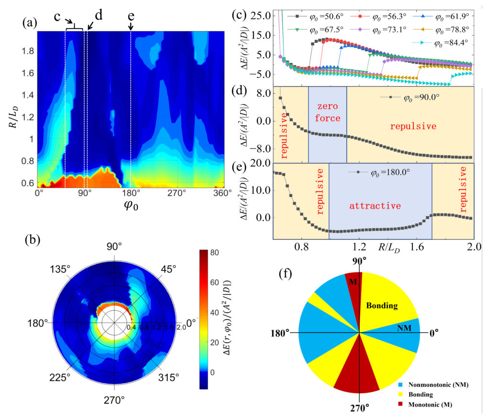 
FIG. 2. Phase-factor-dependent bobber–skyrmion interaction landscape. (a) Contour map of the relative energy ∆E(R, ϕ0) in the separation–phase-factor plane. Only the range 0.58LD ≤R ≤2LD is shown in order to avoid the strongly repulsive short-distance region. (b) Polar representation of the same energy landscape, where the radial coordinate is R/LD and the polar angle is the conical phase factor ϕ0. (c–e) Representative one-dimensional energy cuts at fixed ϕ0, whose positions are marked in (a). (c) Consecutive cuts for ϕ0 = 50.7◦–84.4◦, showing abrupt branch switching into lower-energy states. The critical separation shifts to larger R and the jump magnitude decreases as ϕ0 increases. (d)...

📷 Fig 3

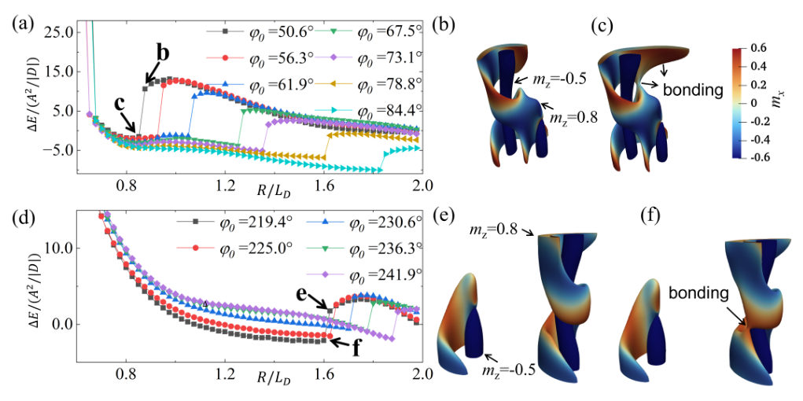 
FIG. 3. Bonding transition and real-space shell reconstruction. (a) Representative bonding-sector energy cuts, with two configurations marked before and after an abrupt jump. (b,c) Corresponding 3D spin configurations. (d) Phase-shifted bonding sector with jumps around R ≃1.6LD. (e,f) Configurations before and after the jump marked in (d). The blue tubes show the mz = −0.5 core isosurfaces, and the colored mz = 0.8 isosurfaces, colored by mx, show the outer distortion shell. In (b,c), the jump forms a bridge-like connection between the upper skyrmion-string shell and the lower bobber–string composite distortion. In (e,f), the bridge-like connection forms mainly within the skyrmion-string...

📷 Fig 4

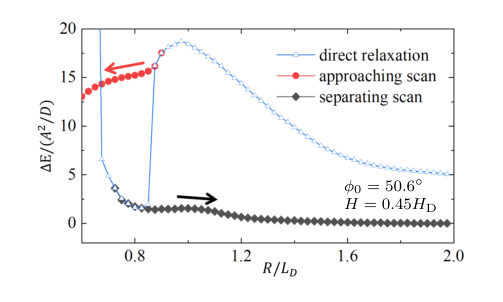 
FIG. 4. Path-dependent relaxation across a representative bonding transition at ϕ0 = 50.6◦and H = 0.45HD, corre- sponding to the cut highlighted in Fig. 3(a). The relative energy ∆E is shown for the direct-relaxation method, the ap- proaching scan, and the separating scan, with arrows indicat- ing the scan directions. The different paths reveal hysteresis- like branch dependence and support the coexistence of un- bonded and bonded locally relaxed states.

📷 Fig 5

 
FIG. 5. Field dependence of the phase-factor-dependent bobber–skyrmion interaction landscape. The three columns cor- respond to H = 0.45HD, 0.55HD, and 0.60HD, respectively. (a,d,g) Contour maps of the relative energy ∆E(R, ϕ0) in the separation–phase-factor plane. (b,e,h) Angular energy profiles at two representative separations, R = LD and R = 1.8LD. (c,f,i) Polar representations of the corresponding energy landscapes, where the radial coordinate is R/LD and the polar angle is ϕ0. Increasing magnetic field suppresses the angular modulation and weakens the bonding sectors.

**Summary.** This work uses micromagnetic simulations to map the interaction energy between a chiral bobber and a skyrmion string in a conical magnetic phase. The key finding is that this interaction is not merely distance-dependent but is strongly controlled by an intrinsic surface phase factor ($\phi_0$). This phase control dictates whether the interaction is repulsive, attractive, or leads to structural 'bonding' via shell reconstruction.

**Why it may be interesting.** The concept of an external 'phase factor' ($\phi_0$) acting as a primary control parameter for magnetic interactions is analogous to controlling boundary conditions or relative phases in quantum systems, suggesting new avenues for designing topological materials via field/geometry tuning.

Detailed structure

**Main problem.** The study investigates the interaction between a chiral bobber and a skyrmion string, demonstrating that this interaction is fundamentally dependent on the local phase factor ($\phi_0$) within the conical magnetic background.

**Main result.** The interaction energy landscape cannot be described by a simple distance-dependent potential; instead, it exhibits distinct regimes (repulsive, attractive, bonding) controlled by $\phi_0$, which arises from structural reconstruction of outer spin shells.

**Method.** Three-dimensional micromagnetic simulations were used to compute the constrained energy landscape ($\Delta E$) as a function of separation ($R$) and phase factor ($\phi_0$).

**Model / system.** The system models magnetic films exhibiting bulk Dzyaloshinskii–Moriya interaction (DMI), supporting topological spin textures like skyrmion strings and chiral bobbers in a conical background state.

**Key observables.** Interaction energy landscape $\Delta E(R, \phi_0)$, structural reconstruction of outer distortion shells, and the relative orientation parameter $\phi_0$.

**Important parameters / regimes.** Separation $R$, surface phase factor $\phi_0$, magnetic field strength ($H$), and material parameters related to exchange/DMI.

**Assumptions / limitations.** Dipolar interactions were excluded from the primary calculations to isolate the minimal mechanism governed by exchange, bulk DMI, and Zeeman energy.

**Figures summary.** Figures illustrate contour maps of $\Delta E(R, \phi_0)$ showing three regimes (M, NM, Bonding); 1D cuts demonstrate repulsive/attractive sequences; and comparisons confirm top-bottom symmetry via phase transformation ($\phi_0 	o 180^\circ - \phi_0$).

**Paper structure.** The paper establishes the physical context of skyrmion interactions, develops the micromagnetic simulation framework to map $\Delta E(R, \phi_0)$, analyzes the resulting three distinct interaction regimes (M, NM, Bonding), and concludes by confirming the phase-factor dependence through symmetry relations.

Abstract

Skyrmion interactions govern the formation of skyrmion lattices, clusters, and particle-like growth patterns. In contrast, the interaction between a chiral bobber and a skyrmion string remains largely unexplored, despite the role of bobbers as intermediate states in skyrmion-string formation and annihilation. Here we show that this interaction is intrinsically phase dependent in the conical phase. Using three-dimensional micromagnetic simulations, we compute the locally relaxed constrained energy landscape as a function of the bobber--skyrmion separation $R$ and the surface phase factor $φ_0$. We find that changing $φ_0$ qualitatively reshapes the interaction, producing repulsive, attractive, and bonding-like regimes that cannot be reduced to a conventional distance-dependent potential. Real-space analysis shows that this behavior originates from phase-dependent reconstruction of nonaxisymmetric outer distortion shells. The phase-controlled interaction persists over a finite field range and follows the expected top--bottom phase relation of surface-sensitive conical textures. These results identify the conical phase direction, often hidden in projected or thickness-averaged descriptions, as a previously underappreciated degree of freedom in the interaction between skyrmion strings and finite-length chiral textures, as demonstrated here for chiral bobbers.

[↑ back to top](#top)

### [Torsional selection rule for the spin--orbit conversion of light](http://arxiv.org/abs/2607.05142v1)

**Authors:** Edilberto O. Silva  
**Type:** both · **Category:** other · **PDF:** <https://arxiv.org/pdf/2607.05142v1>  
**Analysis basis:** full PDF text, analyzed in chunks
**Topic relevance:** `interference shaping light` **3/5** · `quantum optics experiment` **2/5** · `analog quantum simulation` **1/5** · `exotic spin models in light-matter` **1/5** · `spintronics-quantum-optics interface` **1/5**

📷 Fig 1

 
FIG. 1. The selection rule distinguishes the rank of the me- diating field. (a) A Pancharatnam–Berry element couples the circular components through a rank-two director texture of charge q; the coupling winds as e±i2qφ. (b) A torsional (Riemann–Cartan) medium couples them through the rank- one contortion vector, which winds as e±iqφ. (c),(d) Simu- lated OAM spectra of the converted beam E−for the same texture charge q = 1 and identical coupling magnitude: the sideband appears at ℓ= +2 (PB) versus ℓ= +1 (torsional).

📷 Fig 2

 
FIG. 2. Torsional vortex generation (q = 1). (a) Phase of the converted field at z = 25 w0: a stable, charge-n=+1 spiral. (b) Conversion η = P−and mean OAM versus propagation distance; both saturate at 0.83. (c) Final conversion versus holonomy strength κ0: a broad maximum (η ≃0.85) with no fine-tuning; in every run the charge is quantized at n = +1. Full sweeps in (κ0, Γ0), paraxial parameter k0 = 8–64, and grid refinement are given in the SM [27].

📷 Fig 3

 
FIG. 3. Proposed discriminator. (a) A circularly polarized Gaussian traverses a femtosecond-written lattice with a screw- dislocation texture of charge q (L ≃5 mm at δn ∼10−3); the output is helicity-sorted and its OAM measured. (b) Predicted OAM of the converted beam versus texture charge, from full simulations of Eq. (2) (circles) and of a PB-type rank-two coupling of identical magnitude (squares): slopes 1 and 2, with no overlap at any integer q.

**Summary.** This paper introduces a novel mechanism where light's spin can convert into orbital angular momentum (OAM) via material torsion, yielding the selection rule $\Delta\ell=q$. This contrasts sharply with the standard Pancharatnam–Berry effect ($\Delta\ell=2q$). The authors confirm this theoretically and propose an experiment using patterned photonic lattices to measure this distinct signature.

**Why it may be interesting.** This work provides a clean, geometrically derived physical mechanism for light-matter interaction that deviates from standard optical models, offering a new platform to probe fundamental concepts like geometric torsion in photonics.

Detailed structure

**Main problem.** The paper aims to distinguish between two mechanisms for converting light's spin angular momentum (SAM) into orbital angular momentum (OAM): the standard Pancharatnam–Berry (PB) mechanism and a novel process mediated by geometric torsion.

**Main result.** Torsion predicts a selection rule $\Delta\ell=q$, which is distinct from the PB prediction of $\Delta\ell=2q$. This difference can be experimentally verified using polarization-resolved photonic lattice discriminators.

**Method.** The authors use paraxial simulations to confirm the theoretical selection rules and propose an experimental setup involving femtosecond-written photonic lattices for measurement.

**Model / system.** The system involves light propagating through a medium exhibiting geometric torsion, modeled using Riemann–Cartan geometry. The dynamics are governed by an effective paraxial Maxwell model coupling circular polarization to spatial structure via contortion and torsional phase rates.

**Key observables.** The ratio of measured OAM ($\ell$) versus the independently written texture charge ($q$); sideband positions showing slopes of 1 (torsion) vs. 2 (PB).

**Important parameters / regimes.** Texture charge $q$, conversion efficiency $\eta \approx 83\%$, and the topological quantization of the resulting vortex ($\ell=+q$).

**Assumptions / limitations.** The model assumes the coupling is linear in the written contortion vector for the proposed experiment, and it contrasts the torsion mechanism with the standard PB director formalism.

**Figures summary.** Figure 3 predicts that OAM vs. texture charge plots will show non-overlapping sidebands: $\Delta\ell=q$ for torsion and $\Delta\ell=2q$ for PB coupling.

**Paper structure.** The paper first establishes the theoretical difference in selection rules ($\Delta\ell=2q$ vs. $\Delta\ell=q$) based on the underlying geometry (director vs. contortion). It then presents paraxial simulations confirming the torsional rule and concludes by proposing a concrete, polarization-resolved discriminator experiment.

Abstract

Standard Pancharatnam-Berry and linear-birefringent media convert optical spin into orbital angular momentum (OAM) through an anisotropy \emph{director}, a rank-two, headless field, and therefore obey the selection rule $Δ\ell=2q$ per unit texture charge $q$. We show that a medium with geometric \emph{torsion}, the continuum limit of a screw-dislocation array, can convert spin to OAM through the \emph{contortion} of its material connection, which enters the effective paraxial dynamics as a rank-one vector field. The resulting selection rule is $Δ\ell=q$. Its winding is fixed by geometry and symmetry, not by a Pancharatnam--Berry director, and the process conserves the screw charge $\tilde J_z=L_z+(q/2)σ_z$ while exchanging $(2-q)\hbar$ of angular momentum per converted photon with the defect lattice. Paraxial simulations confirm the rule: a circular Gaussian input develops a stable, topologically quantized $\ell=+q$ vortex in the reversed helicity, with $83\%$ conversion over three Rayleigh ranges and no fine-tuning. We propose a polarization-resolved photonic-lattice discriminator in which the slope of the measured OAM versus the independently written texture charge, one for torsion, two for birefringence, separates the two mechanisms.

[↑ back to top](#top)

### [Functionalization of $g$-wave altermagnets: spin-splitter effect enabled by surfaces](http://arxiv.org/abs/2607.04970v1)

**Authors:** Sopheak Sorn  
**Type:** theory · **Category:** strongly correlated electrons · **PDF:** <https://arxiv.org/pdf/2607.04970v1>  
**Analysis basis:** full PDF text, analyzed in chunks
**Topic relevance:** `spintronics-quantum-optics interface` **3/5** · `Keldysh / 2PI / non-Gaussian methods` **2/5** · `exotic spin models in light-matter` **1/5** · `non-equilibrium dynamics` **1/5**

📷 Fig 1

 
FIG. 1. Schematic illustration of a bulk g-wave altermag- net in a slab geometry supporting surface d-wave spin split- ting, thereby enabling the concomitant spin splitter effect— generation of transverse spin current upon applying a longi- tudinal charge current. This gives rise to the charge-to-spin conversion capability that is absent in the bulk.

📷 Fig 2

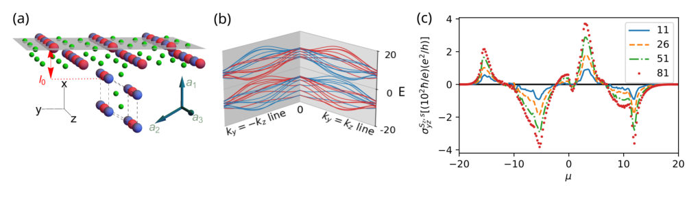 
FIG. 2. Panel (a) illustrates the crystal structure of the (210) surface of the g-wave AM model, which is inspired by the CrSb crystal. The box enclosed by the dashed lines represents the unit cell of the bulk. Blue and red spheres correspond to magnetic sublattices which host the N´eel vector N ∥ˆz in the altermagnetic state. Green spheres represent the nonmagnetic sites. The bulk lattice vectors are a1 = a(1, 0, 0)T , a2 = a(−1/2, √

📷 Fig 3

 
FIG. 3. Spin-splitter angle as a function of the chemical po- tential µ for (210)-oriented slab geometry with different thick- nesses, including 11l0, 26l0, 51l0, and 81l0, characterizing (a) the efficiency in generating a transverse Sz-spin current along z-axis upon applying charge current along y-axis and (b) the efficiency in generating a transverse Sz-spin current along y- axis upon applying charge current along z-axis.

📷 Fig 4

 
Figure 2(c) shows SSE σSz,s yz as a function of the chem- ical potential µ for (210) slabs with different thicknesses, including 11l0, 26l0, 51l0 and 81l0, where l0 is defined in Fig.2(a). Indeed, our results confirm the existence of SSE that accompanies the surface-induced d-wave char- acter. We observe that σSz,s yz increases upon increasing the thickness of the slab. However, to meaningfully ex- amine the charge-to-spin conversion efficiency, we com- pare the SSE with the longitudinal charge conductivity by calculating the following SSE angle [5, 16]

📷 Fig 5

 
FIG. 4. Layer-resolved y-component of the spin magnetiza- tion associated with the weak ferromagnetism in the slab with thickness 11l0. Here, we have chosen a particular value of the chemical potential µ, as specified in SMs.

**Summary.** The authors demonstrate that the surfaces of g-wave altermagnets can be engineered to exhibit d-wave altermagnetism, enabling a measurable spin-splitter effect (SSE) absent in the bulk. Using the Kubo formalism on a minimal slab model, they show this surface enhancement is constructive and linked to induced weak ferromagnetism, suggesting thin-film engineering as a viable route for functionalizing such materials.

**Why it may be interesting.** This work provides a detailed theoretical mechanism for enhancing magnetic functionalities (SSE) in topological/magnetic materials by exploiting boundary effects, which is highly relevant for designing next-generation spintronic devices.

Detailed structure

**Main problem.** To realize and study the spin-splitter effect (SSE) in altermagnets (AMs), overcoming the difficulty of finding metallic d-wave AMs at ambient conditions.

**Main result.** The surfaces of a g-wave altermagnet slab induce d-wave altermagnetism, leading to a finite SSE that is absent in the bulk. This surface response can be engineered via thin-film methods.

**Method.** The Kubo formalism is applied using a minimal single-orbital tight-binding model to compute spin conductivity and characterize the SSE angle.

**Model / system.** The study uses a minimal slab model based on a g-wave altermagnet, which incorporates hopping terms ($t_{1,k}, t_{2,k}, t_{3,k}, t_{AM,k}$) and spin-orbit coupling (SOC) terms. The system is analyzed in the context of surface effects.

**Key observables.** Spin conductivity ($\sigma_{S_z, yz}$), SSE angle ($	heta_{aa}$), weak ferromagnetism ($M_y$), and d-wave spin splitting in the electronic spectrum.

**Important parameters / regimes.** The maximum spin-splitter angle reached was up to 15 degrees. The analysis depends on the magnetic multipolar character of the AM order parameter.

**Assumptions / limitations.** The SSE is fundamentally linked to the magnetic multipolar character of the AM OP, and the calculations rely on a minimal slab model approximation.

**Figures summary.** Figures illustrate the surface d-wave splitting enabling SSE (absent in bulk), plot $\sigma_{S_z, yz}$ vs. chemical potential for varying film thicknesses, and show layer-resolved weak ferromagnetism ($M_y$).

**Paper structure.** The paper establishes the physical platform (g-wave AM surfaces) and theoretical framework (Kubo formalism). It then calculates the SSE, demonstrating its surface origin via thickness dependence. Finally, it links this effect to induced weak ferromagnetism, suggesting material engineering strategies.

Abstract

We investigate surfaces of a $g$-wave altermagnet(AM) and show that they provide a platform for realizing $d$-wave altermagnetism and the associated spin-splitter functionality. Using the Kubo formalism applied to a minimal slab model, we evaluate the spin-splitter effect(SSE) by computing the spin conductivity corresponding to a transverse spin current induced by a longitudinal electric field. We find a finite SSE, absent in the bulk, that emerges from surface-induced $d$-wave altermagnetism. Strikingly, the sign pattern of the $d$-wave altermagnetism on both surfaces of the slab geometry is identical to each other, leading to additive contributions to SSE from the two surfaces, with a spin-splitter angle reaching up to 15 degrees. In addition, this response is intrinsically linked to an accompanying surface-induced weak ferromagnetism, which potentially enables control of altermagnetic domains via an external magnetic field and provides a route to optimize the SSE functionality. These results can be understood in terms of a bulk-boundary correspondence between surface states and bulk altermagnetic order parameters, where the magnetic multipolar character of the latter plays a central role. Our findings strongly suggest thin-film engineering as a viable strategy to functionalize non-$d$-wave AMs.

[↑ back to top](#top)

### [Hybrid-order nonlinear topological phases](http://arxiv.org/abs/2607.03678v1)

**Authors:** Yu-Peng Ma, Ming-Jian Gao, Jun-Hong An  
**Type:** theory · **Category:** other · **PDF:** <https://arxiv.org/pdf/2607.03678v1>  
**Analysis basis:** full PDF text, analyzed in chunks
**Topic relevance:** `analog quantum simulation` **3/5** · `driven-dissipative phase transition` **2/5** · `exotic spin models in light-matter` **1/5** · `non-equilibrium dynamics` **1/5**

📷 Fig 1

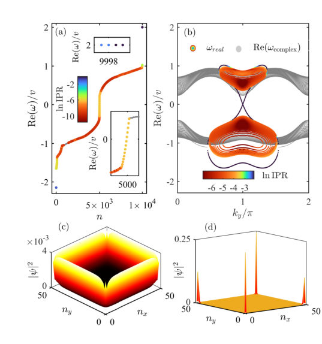 
FIG. 1. Hybrid-order topological phase in a nonlinear- eigenvalue system. Eigenvalue spectra (a) under the OBC to show the coexisting first-order boundary states at ω = 0 and second-order corner states at ω = −M −1 and (b) under the OBC along the x-axis and the PBC along the y-axis to confirm the presence of double-degenerate boundary modes at ω = 0. The colored points denote the IPR of the eigenstates with real eigenvalues. The gray points denote the real part of complex eigenvalues. Probability distributions of (c) the first-order boundary state at ω = 0 and (d) the second-order corner state at ω = −M −1. We use M = −0.5v−1, w = 0.5v, m = 1.5v, r = v, and nx = ny = 50.

📷 Fig 2

 
FIG. 2. Spectrum and topological invariants of the auxiliary system. (a) Eigenvalues of P(k, ω) in different ω when m = 1.5v. The red dashed line indicates λ = 0, whose intersections with the spectrum reproduce the real-ω spectrum in Fig. 1(a). The cyan dashed line denotes p0(ω), which equals to zero just at ω⋆= 0 and −M −1. (b) Eigenvalues and (c) Chern number C2 and mirror-graded winding number W2 of P(k, −M −1) in different m. (d) Eigenvalues of the auxiliary system in the strip geometry when m = −6v to confirm the presence of first-order boundary states at λ = 0. Diagrams of the first- order topological phases characterized by (e) C1 at ω⋆= 0 and (f) C2 at ω⋆= −M −1, and (g) the...

📷 Fig 3

 
Figure 2(a) shows the λ spectrum of the auxiliary sys- tem colored by IPR under the OBC in both the x and y directions. Highly localized states intersect with λ = 0

📷 Fig 4

 
FIG. 3. Three-dimensional nonlinear hybrid-order topologi- cal phase. (a) Real nonlinear eigenvalue spectrum under full OBCs. The color determined by ln IPR. The insets show the localized states near ω = −M −1 and ω = 0. (b) Auxiliary spectrum of P3D(k, ω). The red dashed line marks λ = 0, the cyan dashed line shows p0(ω). (c) and (d) is hinge state at ω = 0 and eight corner states at ω = −M −1. We take t1 = 1 and t2 = 15. For (e) and (f), we take t1 = t2 = 1. The state at ω = 0 is a side-surface state at (e), while the state at ω = −M −1 is a hinge state at (f). The (c-f) are colored by z.

**Summary.** This paper tackles the challenge of applying bulk-boundary correspondence to complex nonlinear quantum systems. By developing an auxiliary system formalism, the authors successfully classify topological phases in 2D and demonstrate how stacking a 2D model into 3D can engineer distinct hybrid-order topological states, including third-order phases.

**Why it may be interesting.** This work extends topological concepts from linear systems into nonlinear regimes using a robust mathematical framework, which is highly relevant for understanding exotic phenomena in photonics and condensed matter wave physics.

Detailed structure

**Main problem.** The bulk-boundary correspondence (BBC) is poorly understood for nonlinear systems, especially those with multigap topologies, making topological description difficult.

**Main result.** The authors establish a multiband bulk-boundary correspondence and demonstrate that stacking engineering can realize exotic 3D hybrid-order topological phases (first-, second-, and third-order).

**Method.** They develop an auxiliary-system formalism to map the nonlinear eigenvalue problem onto a formally linear pencil matrix, allowing for topological classification.

**Model / system.** The study uses a two-dimensional (2D) spinless square-lattice model with two degrees of freedom per unit cell, which is then generalized to 3D via uniform or dimerized stacking along the third dimension.

**Key observables.** Topological invariants include the Chern number ($C_1$) and the mirror-graded winding number ($W_2$); boundary states are diagnosed by gapless modes ($\lambda=0$) and localized using the Inverse Participation Ratio (IPR).

**Important parameters / regimes.** Stacking parameters, such as $	ext{t}_1$ vs. $	ext{t}_2$ for dimerized stacking, determine the resulting order of the topological phase.

**Assumptions / limitations.** The method relies on mapping the nonlinear problem to a formally linear auxiliary system ($P(\omega)$) and addresses multiple-gap topologies beyond previous single-gap studies.

**Figures summary.** Figures illustrate the eigenvalue spectra under Open Boundary Conditions (OBC) showing coexisting first-order ($\omega=0$) and second-order ($\omega=-M-1$) boundary states, and analyze the auxiliary system spectrum to confirm topological invariants in 2D and 3D.

**Paper structure.** The paper first addresses the theoretical gap regarding nonlinear BBC using an auxiliary system formalism. It then analyzes the 2D case showing coexisting boundary/corner states, before extending the analysis to 3D stacking configurations (uniform vs. dimerized) to realize higher-order phases.

Abstract

The bulk-boundary correspondence (BBC), which relates topological invariants to boundary modes, is well understood for linear systems but remains an open question in the presence of nonlinearity, where multigap topologies make the BBC obscure and the topological description troublesome. We address this by developing an auxiliary-system formalism that enables topological classification of nonlinear-eigenvalue systems. In the two-dimension (2D) case, we show that two fixed eigenvalues can harbor first-order gapless boundary modes and second-order corner modes. Stacking this 2D system along the third dimension (3D) reveals distinct hybrid-order realizations. Under uniform stacking, the corner states in the $xy$ plane transform into hinge states along the $z$ axis, yielding a 3D second-order phase, while the gapless boundary states become side-surface states, yielding a 3D first-order phase. For dimerized stacking, these states are further confined to the two ends of the $z$ axis, yielding a 3D third-order phase, and localized at the hinges, yielding a 3D second-order phase. Our results establish a multiband bulk-boundary correspondence and identify stacking engineering as a versatile platform for exploring hybrid-order topological phases in nonlinear systems.

[↑ back to top](#top)

### [Calibration of systematic distortions in quantum emitter localization microscopy for deterministic nanophotonic fabrication](http://arxiv.org/abs/2607.05370v1)

**Authors:** Chenxi Ma, Maximilian Heller, Timon Handrup, Yiteng Zhang, Tobias M. Krieger, Thomas Oberleitner, Zenghui Jiang, Xian Zheng, Eddy P. Rugeramigabo, Folke Dencker, Armando Rastelli, Fei Ding, Michael Zopf  
**Type:** experiment · **Category:** other · **PDF:** <https://arxiv.org/pdf/2607.05370v1>  
**Analysis basis:** full PDF text, analyzed in chunks
**Topic relevance:** `quantum optics experiment` **3/5** · `quantum measurements` **2/5** · `interference shaping light` **1/5**

📷 Fig 1

 
Figure 1. Schematic of the optical setup and calibration workflow. (a) 3D illustration of the wide-field PL microscope setup for optical positioning. BS, beamsplitter. (b) From bottom to top: SEM image of a 3×3 gold nanodisk calibration array; wide-field reflection image of the central marker field; and conceptual illustration comparing positions extracted from wide-field images (blue) with their nominal design positions (gray). Spatially varying residuals between the two coordinate sets are used to map the optical distortion field. Scale bars in the SEM and reflection images are 10 µm. (c) Distortion calibration workflow.

📷 Fig 2

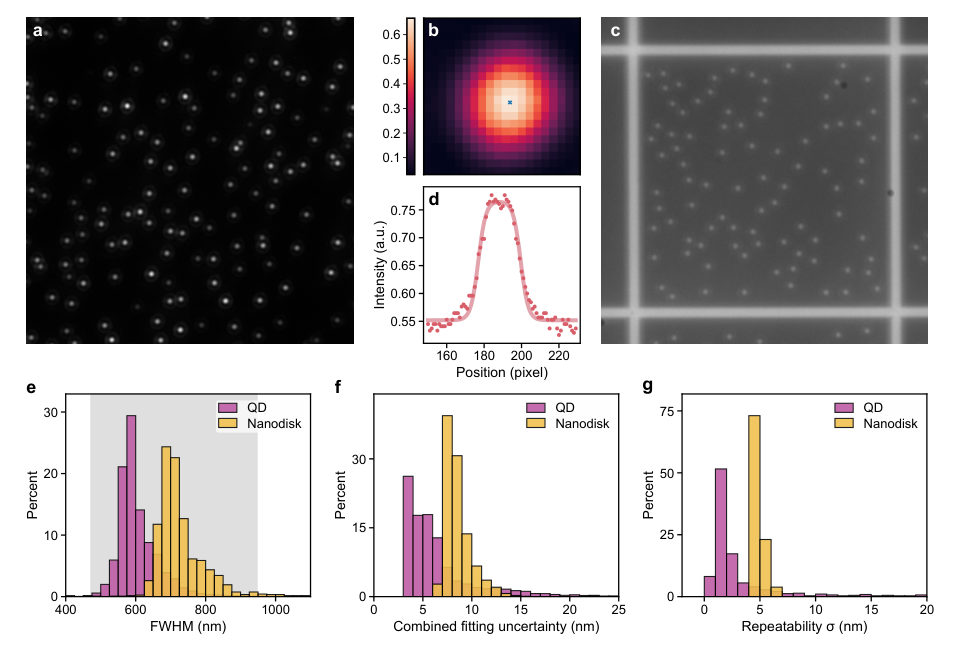 
Figure 2. Performance of the optical positioning setup. (a) Representative wide-field PL image of QD emission acquired through a 785 nm narrow bandpass filter. (b) Magnified image of a 2D Gaussian fit for a representative QD. (c) Reflection image of the marker frame and nanodisks from the same field as (a), acquired through a 785 nm narrow bandpass filter. The markers define an area of 40×40 µm2. (d) Representative cross-section of a marker arm and the corresponding fit. (e) Distributions of the fitted FWHM values for QDs and nanodisks, with the shaded region spanning from the Gaussian approximation of the diffraction-limited PSF (FWHMdiff = 473nm) to 2×FWHMdiff. (f) Distributions of the...

📷 Fig 3

 
Figure 3. Training and forward validation of the distortion-calibration model. (a) Schematic of the self-calibration process, in which a Zernike distortion model is fitted to the nanodisk offsets of both arrays. (b) Spatial map of the raw nanodisk offsets between optically extracted positions and design positions for both arrays. The arrows indicate the offset directions, and the color scale indicates the offset magnitude. (c) Overlaid 2D histogram of the nanodisk offsets before (blue) and after (orange) correction by the Zernike distortion model. (d) Schematic of the forward validation process. The model is trained on one array and then applied to the held-out array, after which the...

📷 Fig 4

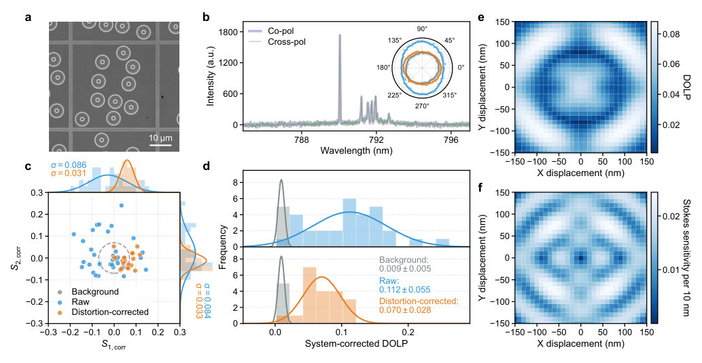 
Figure 4. Polarization response of deterministically fabricated mesas. (a) SEM image of a region inside the mesa array. (b) Background-subtracted co- and cross-polarized PL spectra from a distortion-corrected mesa, corresponding to the polarization angles of Imax and Imin. The inset shows representative polar plots of the integrated PL intensity as a function of the linear polarization angle for a background QD (gray), a raw-positioned mesa (blue), and a distortion-corrected mesa (orange). (c) Scatter plot of the system-corrected Stokes components. The dashed circle indicates the DOLP expected for a centered emitter in an elliptical mesa with SEM-measured diameters. (d) Histograms of...

**Summary.** The paper addresses systematic optical distortions that limit the precise placement of quantum emitters in nanophotonic circuits. By developing an *in situ* calibration protocol based on a Zernike vector-field model, the authors correct these field-dependent aberrations using patterned reference arrays. This correction significantly improves positioning accuracy and enhances the performance metrics of deterministic device fabrication.

**Why it may be interesting.** This work provides an essential metrology tool for quantum optics experiments, bridging the gap between statistical measurement precision and absolute positional accuracy required for scalable integrated quantum devices.

Detailed structure

**Main problem.** The ultimate yield of integrating quantum emitters into nanophotonic circuits is limited by uncorrected systematic optical distortions in cryogenic microscopy setups, despite achieving high statistical localization precision.

**Main result.** An *in situ* calibration protocol using a Zernike vector-field model successfully reduces residual systematic bias to 5.3 nm and improves the polarization registration accuracy of fabricated structures by 49%.

**Method.** The authors developed an in situ calibration protocol that models field-dependent optical distortions using a Zernike polynomial expansion, which is then applied to correct measured emitter positions.

**Model / system.** The system involves quantum emitters (semiconductor QDs) localized via microscopy and calibrated against lithographically defined gold nanodisk arrays within a custom cryogenic optical setup. The distortion correction relies on fitting the observed positional offsets to a Zernike vector-field model.

**Key observables.** Residual systematic bias (reduced to 5.3 nm), variance in emission polarization, localization repeatability ($\sim 4-6$ nm).

**Important parameters / regimes.** Cryogenic temperature (4 K), nanometer-scale accuracy requirement, Zernike polynomial order ($n=10$).

**Assumptions / limitations.** The systematic optical distortions can be accurately modeled by a linear combination of Zernike polynomials; the calibration reference patterns are sufficient to characterize the field aberrations.

**Figures summary.** Figures illustrate the optical setup, SEM images of gold nanodisk arrays used for calibration, and performance evaluation comparing localization uncertainties before and after applying the Zernike distortion correction.

**Paper structure.** The paper first establishes the limitation posed by systematic distortions. It then details the methodology using a Zernike model calibrated on reference patterns (nanodisks). Finally, it demonstrates the utility of this corrected positioning in improving deterministic fabrication metrics like polarization variance.

Abstract

Quantum photonic technologies greatly benefit from quantum light emitters with high brightness, indistinguishability, and reliable polarization characteristics. Achieving optimal performance relies on the accurate localization of emitters and their deterministic integration into tailored photonic structures with nanometer-scale accuracy. Although marker-based photoluminescence imaging techniques can achieve statistical fitting uncertainties below 10 nm, the ultimate integration yield is often limited by uncorrected systematic distortions in custom cryo-optical setups that compromise metrological accuracy. Here, we present an in situ calibration protocol that uses lithographically defined gold nanodisk arrays as references to calibrate optical distortions with a Zernike vector-field model. On held-out validation patterns beyond the calibration dataset, this correction reduces the residual systematic bias to 5.3 nm with a 2D scatter of 24.6 nm across the analyzed field of view. Furthermore, we demonstrate that applying this correction to the deterministic fabrication of circular mesa structures around semiconductor quantum dots reduces the variance in emission polarization by 49%, indicating improved registration accuracy. This calibration strategy offers a practical route to high-yield deterministic integration of quantum emitters into scalable quantum photonic circuits.

[↑ back to top](#top)

### [Reentrant localization transition, quantum butterfly and robust edge modes in aperiodic zig-zag ladder](http://arxiv.org/abs/2607.03954v1)

**Authors:** Sayan Bhattacharya, Rhiddha Acharjee, Atanu Nandy  
**Type:** theory · **Category:** disordered systems and neural networks · **PDF:** <https://arxiv.org/pdf/2607.03954v1>  
**Analysis basis:** full PDF text, analyzed in chunks
**Topic relevance:** `analog quantum simulation` **2/5** · `driven-dissipative phase transition` **2/5** · `non-equilibrium dynamics` **2/5** · `non-equilibrium universality` **2/5** · `Frenkel-Kontorova` **1/5** · `entanglement & information structure` **1/5** · `methods for driven-dissipative` **1/5** · `scars & prethermalization` **1/5**

📷 Fig 1

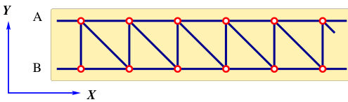 
FIG. 1. A portion of a quasi-one dimensional zig-zag ladder.

📷 Fig 2

 
FIG. 2. (a) and (b) The average inverse participation ra- tio, ⟨IPR⟩, and the average normalized participation ratio, ⟨NPR⟩, with respect to α respectively, for disorder strengths λ0 &lt; t &amp; λ0 &gt; t, where t is the vertical hopping.

📷 Fig 3

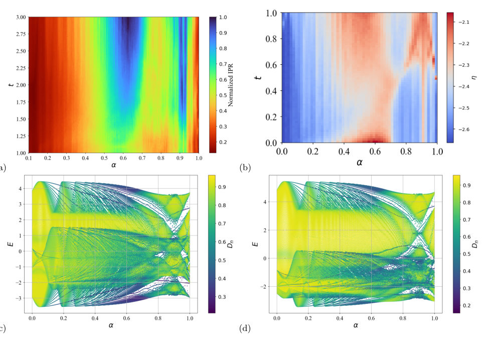 
FIG. 3. (a) IPR intensity distribution in t vs α space, (b) phase diagram of η in t vs α space, and fractal dimension in E vs α plane with (c) t⟨λ0 and (d) t⟩λ0.

📷 Fig 4

 
FIG. 4. Time evolution of the mean square displacement (MSD) for three representative values of the slowness expo- nent α with the quasiperiodic modulation parameter fixed at the golden mean, Q = (1 + √

📷 Fig 5

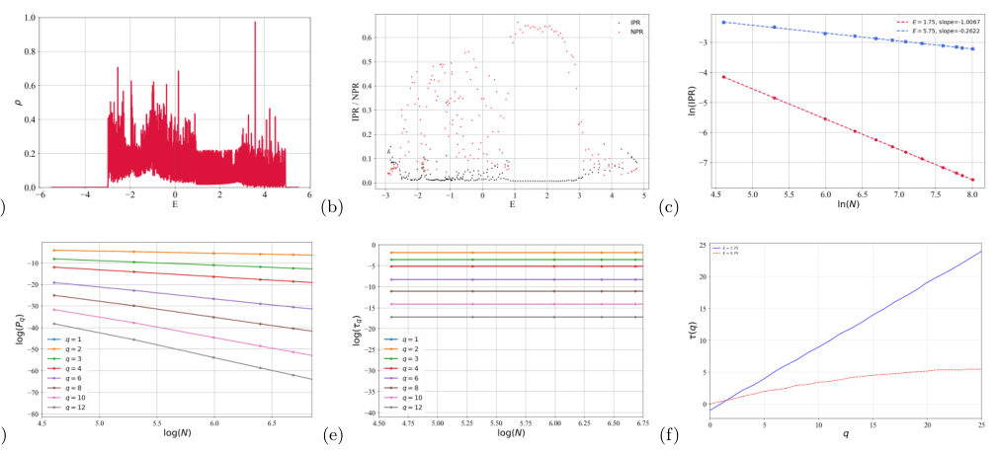 
FIG. 5. (a) Variation of density of states with energy (b) inverse participation ratio with energy (c) variation of IPR with system size, (d)-(f) MFA spectrum for E = 1.75 (extended state) and E = 3.75 (critical state). The finite-size scaling yields slopes of −1.0067 for the extended state and 0.2622 for the critical state.

**Summary.** This work explores the complex electronic behavior of a quasi-one dimensional ladder lattice subjected to quasiperiodic modulation. The authors demonstrate a reentrant transition between localized and delocalized states, characterized by mobility edges. Furthermore, they identify robust edge modes whose existence is mapped onto an intriguing 'Quantum Butterfly' spectrum.

**Why it may be interesting.** The study provides detailed diagnostics—combining spectral measures (IPR), transport dynamics ($\mu$), and geometric features (butterfly)—to map out complex phase transitions in quasiperiodic systems, which is highly relevant for understanding localization phenomena beyond simple disorder models.

Detailed structure

**Main problem.** The study investigates a reentrant localization transition, quantum butterfly pattern, and robust edge modes in an aperiodic zig-zag ladder structure.

**Main result.** The system exhibits a re-emerging delocalization phase controlled by kinetic parameters, confirmed by mobility edges, alongside the observation of stable edge states resistant to moderate disorder.

**Method.** Analysis involves calculating spectral properties using Inverse Participation Ratio (IPR), studying transport dynamics via Mean Square Displacement (MSD), and mapping energy spectra onto a quantum butterfly structure.

**Model / system.** The model is a quasi-one dimensional zig-zag ladder network governed by a tight-binding Hamiltonian incorporating a quasiperiodic Aubry-Andre Harper (AAH) modulation in the long-range hopping integral.

**Key observables.** Inverse Participation Ratio ($	ext{IPR}_n$), Normalized Participation Ratio ($	ext{NPR}_n$), Mean Square Displacement (MSD), Edge Probability ($P_{	ext{edge}}$), and Transport Exponent ($\mu$).

**Important parameters / regimes.** Slowness exponent ($\alpha$), hopping strengths ($t, \lambda_0$), disorder strength ($W_d$), and modulation frequency ($eta$ set to the golden mean).

**Assumptions / limitations.** The analysis assumes that multifractal methods are applicable to characterize the energy landscape in this quasiperiodic model.

**Figures summary.** Figures illustrate IPR intensity plots showing re-entrant transitions, phase diagrams mapping delocalized/localized regimes ($\eta$), MSD curves characterizing transport exponents ($\mu$), and probability density maps distinguishing edge vs. bulk states on the quantum butterfly spectrum.

**Paper structure.** The paper systematically analyzes localization diagnostics (IPR, $	ext{NPR}$) to find a re-entrant transition controlled by $\alpha$. It then uses dynamical studies (MSD) for confirmation, explores multifractality and the 'Quantum Butterfly' structure, and finally isolates robust edge modes using edge probability analysis.

Abstract

Low dimensional tight-binding lattices in presence of quasiperiodic disorder generally exhibits localization transition. The system supports diffusive modes upto a limiting strength of disorder and all the eigenstates become localized beyond that critical strength thereby quenching the kinetic signature of the wavepacket. However, moving away from this situation, we demonstrate that with minimal long-range off-diagonal modulation, the eigenspectrum again may offer delocalization of electronic states for some subtle combination of kinetic parameters of the Hamiltonian leading to a second quantum phase change. The localization transitions are associated with the obvious presence of single-particle mobility edges. Multifractal energy landscape also shows quantum butterfly pattern with the in-gap robust edge modes. The re-emerging localization transition is manifested through the evaluation of inverse participation ratio, eigenspectrum and a pertinent quantum dynamical study.

[↑ back to top](#top)

### [Platinum is a Photocatalyst: Large Visible-Light Quantum Efficiency Revealed](http://arxiv.org/abs/2607.05172v1)

**Authors:** Olivier Henrotte, Yin Chak Wong, Jordan Edwards, Simão Meneses João, Štěpán Kment, Emiliano Cortés, Johannes Lischner, Alberto Naldoni  
**Type:** both · **Category:** other · **PDF:** <https://arxiv.org/pdf/2607.05172v1>  
**Analysis basis:** full PDF text, analyzed in chunks
**Topic relevance:** `non-equilibrium dynamics` **2/5** · `Keldysh / 2PI / non-Gaussian methods` **1/5** · `correlated / nonlocal dissipation` **1/5** · `driven-dissipative phase transition` **1/5** · `entanglement & information structure` **1/5** · `methods for driven-dissipative` **1/5** · `non-equilibrium universality` **1/5**

📷 Fig 1

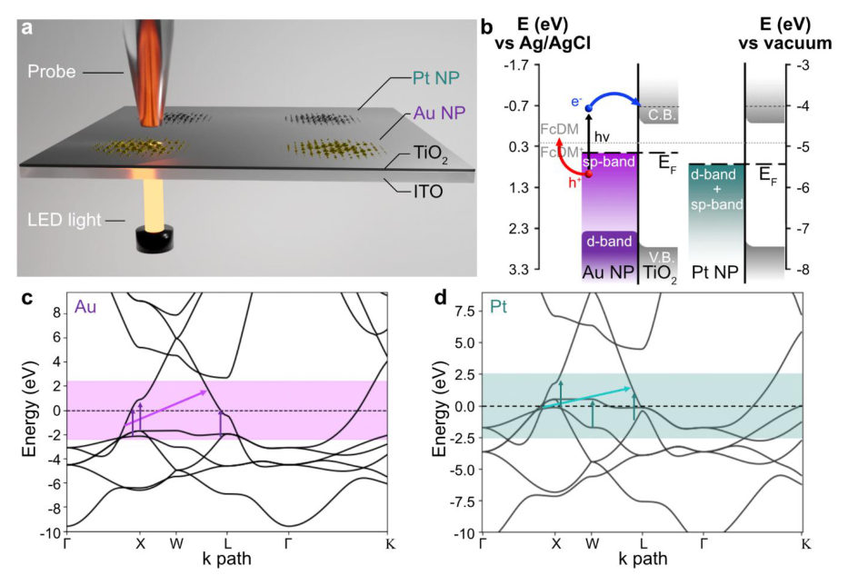 
Figure 1. Scanning photoelectrochemical microscopy platform and energetic framework for Au- TiO2 and Pt-TiO2 photoactivity. (a) Schematic of the SPECM configuration. (b) Energy-level band showing the relevant electronic levels of Au and Pt (Fermi level EF; schematic sp- and d-bands), the TiO2 band edges (conduction band, C.B.; valence band, V.B.), and the FcDM/FcDM+ redox couple. (c,d) Electronic band structure of Au (c), and Pt (d) from tight-binding highlighting representative optical excitation pathways under visible illumination.

📷 Fig 2

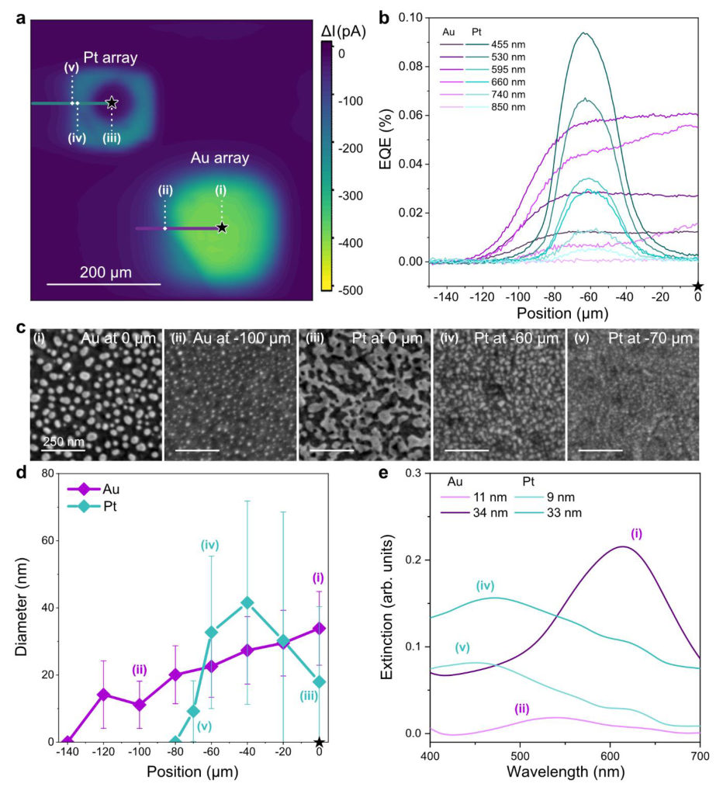 
Figure 2. Position-resolved external quantum efficiency (EQE), morphology, and optical properties of Au and Pt nanoislands. (a) SPECM photoactivity map acquired over the Pt nanoisland array and the Au nanoisland array under visible illumination, used to identify the scan trajectories and regions of interest; the stars indicate the centre of the arrays. The markers (i) to (v) correspond to positions of interest. (b) EQE as a function of position along the scan line indicated in (a); 0 µm corresponds to the stars in (a). Au data are shown from purple to pink and Pt data from teal to cyan, with each trace corresponding to a different excitation wavelength. (c) SEM images of the Au array after...

📷 Fig 3

 
Figure 3. Theoretical simulation of hot carrier generation in Au and Pt nanoislands on a TiO2 thin film. (a) Energetic distribution of hot electrons (purple line) and hot holes (red line) in a spherical Au nanoparticle of 10 nm diameter for different excitation wavelengths in a high-permittivity environment (εm=4). (b) Energetic distribution of hot electrons (cyan line) and hot holes (red line) in a spherical Pt nanoparticle of 10 nm diameter for different excitation wavelengths in a high- permittivity environment (εm=4). The number of above-Schottky barrier electrons (corresponding to the number of extractable holes) are represented by the filled region in purple for Au and cyan for Pt....

📷 Fig 4

 
Figure 4. Comparison of external quantum efficiency and theoretical hot carrier generation with above Schottky barrier energy of Au and Pt nanoislands on TiO2 thin film. (a) External quantum efficiency (EQE) per atom as a function of excitation wavelength for different populations of Au (11 nm, pink; 34 nm, purple) and Pt (9 nm, cyan; 33 nm, teal) nanoislands. (b) Calculated number of generated hot electrons above Schottky barrier per atom for a 10 nm nanoparticle of Au (purple to pink) and Pt (teal to cyan) for different εm.

**Summary.** The researchers demonstrated that Platinum nanoislands on TiO2 can act as highly efficient visible-light photocatalysts, contrary to previous beliefs. By using advanced microscopy, they quantified the photoactivity of Pt compared to Au, finding superior performance for discrete Pt structures. This work reclassifies Pt from a passive co-catalyst to an active component in metal-semiconductor hybrid devices.

**Why it may be interesting.** While focused on solid-state electrochemistry, the work involves quantifying charge carrier generation and separation efficiency under optical excitation, which touches upon open quantum systems concepts related to energy dissipation and interfacial coupling.

Detailed structure

**Main problem.** To challenge the assumption that noble metal catalysts like Platinum (Pt) are only passive co-catalysts with poor visible-light quantum efficiency in photoelectrochemical junctions.

**Main result.** Discrete Pt nanoislands exhibit robust, broadband visible-light photoactivity, showing an EQE-per-atom significantly higher than Au at specific wavelengths, suggesting they function as active light-responsive components.

**Method.** Quantitative scanning photoelectrochemical microscopy (SPECM) was used to measure wavelength-resolved external quantum efficiency (EQE), complemented by theoretical hot-carrier generation rate calculations.

**Model / system.** The study investigates metal-semiconductor junctions, specifically Au and Pt nanoislands deposited on a TiO2 support. The photoactivity is governed by the efficient separation of photogenerated carriers across the Schottky junction barrier.

**Key observables.** Wavelength-resolved external quantum efficiency (EQE), local extinction spectra, and the comparison of $	ext{Pt}$ vs. $	ext{Au}$ photoactivity as a function of nanostructure connectivity.

**Important parameters / regimes.** The effective Schottky barriers ($\Phi_B$) for Au-TiO2 (1.1 eV) and Pt-TiO2 (1.3 eV); the comparison between discrete vs. connected nanoisland morphologies.

**Assumptions / limitations.** The measured signal reflects net interfacial charge separation; theoretical models provide an upper limit for carrier generation, neglecting certain recombination pathways.

**Figures summary.** Figures likely show position-resolved maps of EQE across Au and Pt arrays, correlating photoactivity with the local optical properties (LSPR vs. broadband absorption).

**Paper structure.** The paper establishes the problem by reviewing existing assumptions about noble metals; it presents experimental measurements using SPECM to quantify visible-light activity; theoretical modeling is used to interpret the results based on hot-carrier dynamics and barrier filtering.

Abstract

Metal-semiconductor junctions in optoelectronic devices are commonly engineered to promote charge separation. In Pt/TiO2 Schottky junctions, Pt is typically regarded as a catalytic electron sink rather than a visible-light-active component. Here, we demonstrate that Pt nanoislands on TiO2 can generate photochemically active carriers under visible light excitation. Using quantitative scanning photoelectrochemical microscopy, we measure the wavelength-resolved external quantum efficiency (EQE) of Au and Pt nanoisland arrays on TiO2, and correlate their reactivity with their morphology and extinction spectra. Discrete 10 nm Pt nanoislands exhibit robust broadband visible light photoactivity - exceeding the photoactivity of similar-sized Au nanoislands under blue-green excitation - whereas Pt's photoactivity is strongly suppressed when the nanoislands are connected. Surprisingly, Pt exhibits an EQE-per-atom approx. 20 times higher than Au at 455 nm and approx. 2 times higher at 595 nm (at Au's optimum). We show an approximately wavelength-independent Pt internal quantum efficiency of approx. 1 percent across the visible spectral region. These findings reposition catalytic metals with strongly damped optical response in the visible as light-responsive components in metal-semiconductor hybrids, challenging the prevailing perception that they function solely as passive co-catalysts in photocatalytic systems.

[↑ back to top](#top)

### [Coexisting Charge Density Wave and Superconducting Order in Quantizing Magnetic Fields](http://arxiv.org/abs/2607.05039v1)

**Authors:** Ron Q. Nguyen, Peiyu Qin, Hai-Tian Wu, Sparsh Mishra, Tobias Wolf, Joseph Roll, Erin Morissette, Naiyuan J. Zhang, Sarah Alkidim, Kenji Watanabe, Takashi Taniguchi, Aaron W. Hui, Dima E. Feldman, Allan MacDonald, J. I. A. Li  
**Type:** experiment · **Category:** strongly correlated electrons · **PDF:** <https://arxiv.org/pdf/2607.05039v1>  
**Analysis basis:** full PDF text, analyzed in chunks
**Topic relevance:** `driven-dissipative phase transition` **2/5** · `Frenkel-Kontorova` **1/5** · `analog quantum simulation` **1/5** · `correlated cavity matter` **1/5** · `non-equilibrium dynamics` **1/5**

📷 Fig 1

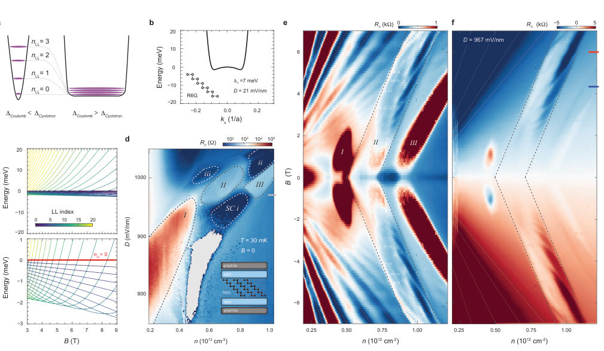 
FIG. 1. LL formation at the flat-band edge. (a) Schematic illustration of LL formation in a dispersive band (left) and near a flat-band edge (right). The flat-band edge enhances mixing among nearly degenerate LLs. (b) Conduction-band dispersion of R6G calculated using Slonczewski–Weiss–McClure (SWMc) parameters γ0 and γ1 [44]. This simplified band-structure calculation neglects trigonal warping and other higher-order hopping terms (see Fig. M1d for a more realistic calculation). (c) Landau-level spectrum derived from the band structure shown in (b), obtained using the continuum model [45]. The bottom panel displays a zoomed-in view of the low-energy edge of the spectrum. (d) n–D map of the...

📷 Fig 2

 
FIG. 2. Two limits of CDW order. (a–d) Transverse and longitudinal conductivities, σxy (a, c) and σxx (b, d), as functions of carrier density measured at D = 967 mV/nm and perpendicular magnetic fields of (a, b) B⊥= 6 T, and (c, d) 4.3 T, along the horizontal cuts indicated in Fig. 1e–f. Green and red shaded regions denote conventional quantum Hall states and re-entrant integer quantum Hall states, respectively. (e) Number of carriers incorporated into the CDW order, nCDW, as a function of the total carrier density, n. The dashed, dash-dotted, and dotted lines denote n = nCDW, n = 2nCDW, and n = 3nCDW, respectively. RIQH states are observed only at 2nCDW &lt; n &lt; 3nCDW. The gray-shaded region...

📷 Fig 3

 
FIG. 3. Superconductivity emerging from LL formation. (a) n–D maps of R∥measured at fixed perpendicular magnetic fields B⊥. (b) Line cut of the longitudinal (top) and transverse (bottom) resistance as a function of n, measured at D = 990 mV/nm and B⊥= 2 T, corresponding to the horizontal gray bar in panel (a). Vertical dashed lines mark the density ranges of regimes II and III. Within regime II, two distinct low-temperature phases emerge from the CDW background: a RIQH state, and superconductivity (SC), marked by vanishing longitudinal resistance. (c, d) Temperature dependence of the longitudinal (top) and transverse (bottom) resistance measured in (c) the RIQH state and (d) the...

📷 Fig 4

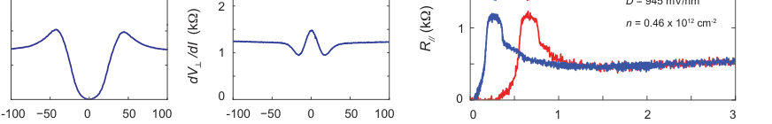 
FIG. 4. I–V characteristics. (a) Longitudinal differential resistance, dV∥/dI, as a function of Id.c. and n across regimes II and III, measured at B⊥= 2 T and D = 1005 mV/nm. (b, c) Differential resistance measured as a function of Id.c. in the longitudinal (top) and transverse (bottom) channels at the (b) superconducting and (c) RIQH states, respectively, with locations indicated by the white dashed lines in panel (a). (d) Temperature dependence of R∥measured in the CDW (orange) and superconducting (blue) states in regime I. (e, f) R∥–T traces measured during cooling (blue) and warming (red) for the same (e) CDW and (f) superconducting states shown in panel (d).

**Summary.** This work explores the intertwined physics of Charge Density Waves (CDW) and Superconductivity (SC) in graphene under strong magnetic fields. By analyzing transport measurements, the authors provide evidence that CDW order is responsible for stabilizing SC phases deep within the quantum Hall regime. This highlights a complex interplay between charge ordering, superconductivity, and Landau quantization in strongly correlated electron systems.

**Why it may be interesting.** The observation that CDW order can stabilize superconductivity in a quantum Hall regime is highly relevant to understanding unconventional pairing mechanisms and competing orders in strongly correlated materials, which are central topics in condensed matter theory.

Detailed structure

**Main problem.** The study investigates the complex interplay between Charge Density Wave (CDW) order, Superconductivity (SC), and Quantum Hall Effects (QHE) in a highly tunable electronic system.

**Main result.** The research demonstrates that CDW order is crucial for stabilizing superconductivity deep within the quantum Hall regime, marking an observation of SC coexisting with QHE signatures. The CDW and SC phases emerge from the same manifold of strongly mixed Landau levels.

**Method.** Transport measurements ($
ho_{xx}, \sigma_{xy}$) are performed as functions of carrier density ($n$), perpendicular magnetic field ($B_\perp$), and displacement field ($D$). Temperature dependence studies reveal first-order phase transitions.

**Model / system.** The physical platform is rhombohedral hexalayer graphene (R6G) subjected to a large displacement field and a strong magnetic field. The system's low-energy spectrum features strongly mixed Landau levels due to flat band edges, enabling the investigation of correlated electronic phases.

**Key observables.** Integer Quantum Hall plateaus deviating from filling factors; pronounced thermal hysteresis (CDW signature); simultaneous vanishing of $
ho_{xx}$ and $
ho_{xy}$ (SC signature).

**Important parameters / regimes.** Strong perpendicular magnetic fields ($B_\perp > 2$ T); operating near the flat-band edge; temperature dependence across multiple Kelvin scales.

**Assumptions / limitations.** The analysis relies on mapping transport responses to diagnose distinct electronic orders (CDW, SC, QHE) coexisting in a strongly correlated electron liquid.

**Figures summary.** Figures map out phase boundaries in $n-D$ and $n-B_\perp$ space, showing regimes characterized by CDW signatures (hysteresis, re-entrant QHE) adjacent to superconducting pockets.

**Paper structure.** The paper systematically maps the phase diagram of R6G under varying fields and doping, identifying distinct electronic phases (Regimes I, II, III). It then analyzes specific transport diagnostics—such as thermal hysteresis for CDW melting or simultaneous zero resistance for SC—to confirm the coexistence region.

Abstract

Charge density wave (CDW) and superconductivity are both common in strongly interacting electron systems. While CDW order is ubiquitous in both quantum Hall systems and unconventional superconductors, superconductivity is generally suppressed by the strong magnetic fields required for Landau quantization. Here we investigate the intertwined CDW and superconducting phases of rhombohedral hexalayer graphene (R6G) in a large displacement field, which generates tunable flat band edges, and a strong magnetic field, which generates a manifold of nearly degenerate Landau levels. CDW order is accompanied by pronounced thermal hysteresis as expected for first-order melting transitions. Surprisingly, we find a series of strong integer quantum Hall effects at magnetic fields above ~2T with Hall conductance quantum numbers that deviate strongly from nearby integer filling factors, an observation that can be explained only by CDW order that mixes many Landau levels. We also find a nearby superconducting phase that is stabilized by perpendicular magnetic fields and persists deep within the quantum Hall regime. The CDW and superconducting phases develop on comparable temperature scales and emerge from the same manifold of strongly mixed Landau levels. These observations provide new insight into the interplay between superconductivity and CDW order in R6G at zero magnetic field.

[↑ back to top](#top)

### [Observation of Non-linear hall effect in Polycrystalline magnetic multilayes](http://arxiv.org/abs/2607.04754v1)

**Authors:** Preet Kamal, Chirag kalouni, Amiya Mondal, Awadesh Narayan, Debangsu Roy  
**Type:** both · **Category:** other · **PDF:** <https://arxiv.org/pdf/2607.04754v1>  
**Analysis basis:** full PDF text, analyzed in chunks
**Topic relevance:** `spintronics-quantum-optics interface` **2/5** · `Kondo & dissipative impurity` **1/5** · `analog quantum simulation` **1/5** · `exotic spin models in light-matter` **1/5** · `non-equilibrium dynamics` **1/5**

📷 Fig 1

 
FIG. 1. Basic characterization of the Ta(3 nm)/Pt(5 nm)/[Ir/Fe/Co/Pt]₅/Pt(2 nm) multilayer device.

📷 Fig 2

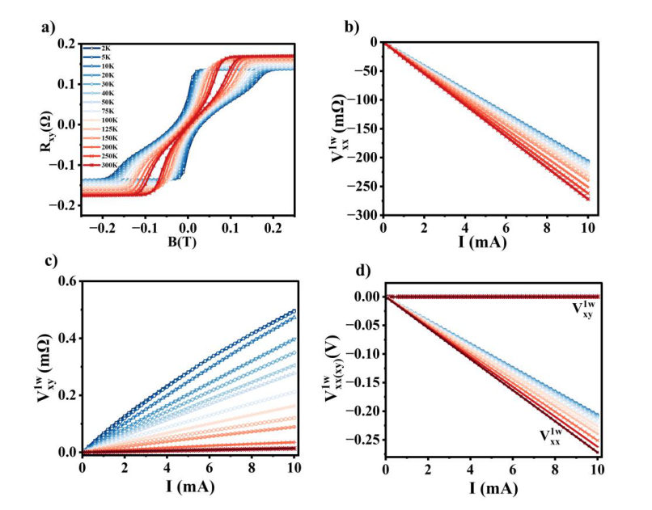 
FIG. 2. (a) Anomalous Hall resistance 𝑅𝑥𝑦 as a function of out-of-plane magnetic field B measured

📷 Fig 3

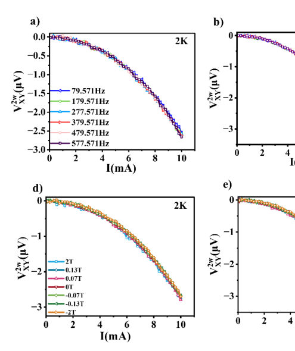 
FIG. 3. (a–c) 𝑉𝑥𝑦

📷 Fig 4

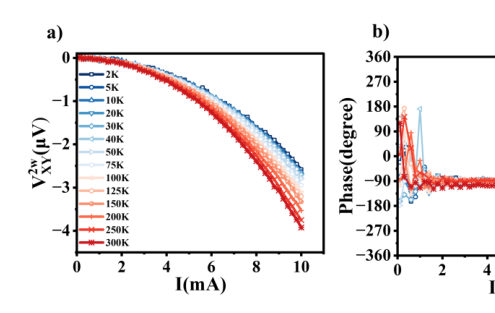 
FIG. 4. (a) Second-harmonic transverse voltage 𝑉𝑥𝑦

📷 Fig 5

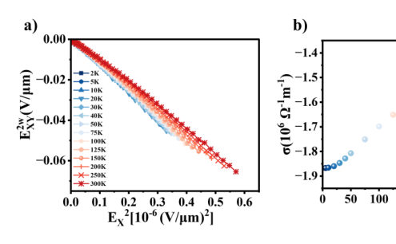 
FIG. 5. (a) Second-order transverse electric field 𝐸𝑥𝑦

**Summary.** This work reports the observation of a robust Nonlinear Hall Effect (NLHE) in polycrystalline magnetic multilayers. By measuring second-harmonic voltages and performing theoretical calculations, the authors prove that this effect originates from the intrinsic Berry curvature dipole generated at interfaces. This establishes these scalable thin films as a promising new platform for next-generation nonlinear spintronic devices.

**Why it may be interesting.** While focused on condensed matter spintronics, the reliance on quantum geometric effects like the BCD and symmetry analysis mirrors concepts used in topological materials research relevant to AMO physics.

Detailed structure

**Main problem.** The study aims to observe and characterize the Nonlinear Hall Effect (NLHE) in technologically relevant magnetic multilayer platforms, extending its understanding beyond van der Waals crystals.

**Main result.** A robust NLHE was observed in polycrystalline magnetic multilayers, confirming that the effect is driven by the intrinsic Berry curvature dipole (BCD), establishing these films as a new platform for spintronic applications.

**Method.** The research combines transport measurements of second-harmonic transverse voltage ($V_{xy}^{2\omega}$) with theoretical analysis using first-principles DFT calculations to confirm the underlying electronic mechanism.

**Model / system.** The system is a polycrystalline magnetic multilayer heterostructure, specifically $	ext{Ta}/	ext{Pt}/[	ext{Ir}/	ext{Fe}/	ext{Co}/	ext{Pt}]_5/	ext{Pt}$. The physics is governed by spin-orbit coupling and broken structural inversion symmetry at the interfaces.

**Key observables.** Second-harmonic transverse voltage ($V_{xy}^{2\omega}$), which shows quadratic dependence on current, frequency independence, and magnetic field independence; also measured $R_{xx}$, $V_{xy}^{1\omega}$, and XRD patterns.

**Important parameters / regimes.** Temperature range (2 K to room temperature); applied magnetic fields ($\pm 2 	ext{ T}$); multilayer periodicity ($[\dots]_5$).

**Assumptions / limitations.** The observed NLHE signal is assumed to be dominated by the intrinsic Berry curvature dipole mechanism, supported by vanishing third-harmonic response and scaling analysis.

**Figures summary.** Figures show layer architecture, Hall bar geometry, $R_{xx}$ vs. T (metallic behavior), XRD patterns confirming texture, linear transport measurements ($V^{1\omega}$), and nonlinear measurements ($V^{2\omega}$) showing quadratic dependence on current.

**Paper structure.** The paper first establishes the measurement setup by measuring linear transport; it then measures the second-harmonic voltage to confirm a genuine nonlinear response; finally, theoretical analysis (DFT) links this observed signal magnitude directly to the intrinsic Berry curvature dipole component ($D_{yz}$).

Abstract

The Nonlinear Hall effect(NLHE) driven principally by the Berry curvature dipole has been established in non-centrosymmetric vander Waals crystals, topological semimetals, and moiré superlattices, but its extension to technologically mature heavy-metal/ferromagnet multilayer platforms remains largely unexplored. Here, we report the observation of a robust NLHE in polycrystalline magnetic multilayers, persisting from 2 K to room temperature. The second-harmonic transverse voltage is independent of both excitation frequency and applied out-of-plane magnetic field, while the vanishingly small third-harmonic response confirms that the observed signal is not dominated by a quantum-metric contribution and instead reflects a genuine second-order electronic response. A scaling analysis of the second-order Hall conductivity against the longitudinal conductivity identifies a dominant, conductivity-independent term establishing the intrinsic berry curvature dipole. Our theoretical analysis, supported by first-principles DFT calculations, further satisfies and corroborates the experimental results. These results establish sputter-deposited polycrystalline thin film as the first engineered magnetic multilayer platform for BCD-driven nonlinear Hall transport, extending the NLHE material landscape beyond van der Waals systems into scalable, industry-compatible thin-film spintronic architectures suitable for high frequency rectifications and nonlinear sensors.

[↑ back to top](#top)

### [Quasi-two-dimensional Majorana zero modes from finite-size-coupled chiral hinge states](http://arxiv.org/abs/2607.04358v1)

**Authors:** Wenhao Liang, Xun-Jiang Luo  
**Type:** theory · **Category:** other · **PDF:** <https://arxiv.org/pdf/2607.04358v1>  
**Analysis basis:** full PDF text, analyzed in chunks
**Topic relevance:** `analog quantum simulation` **2/5** · `Keldysh / 2PI / non-Gaussian methods` **1/5** · `correlated / nonlocal dissipation` **1/5** · `driven-dissipative phase transition` **1/5** · `methods for driven-dissipative` **1/5**

📷 Fig 1

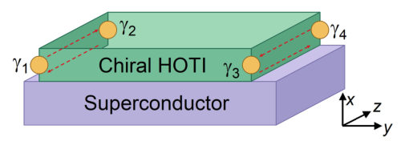 
FIG. 1. Schematic of the quasi-two-dimensional HOTI- superconductor geometry. A chiral HOTI slab is proximi- tized by a conventional s-wave superconductor. The sample is thin along x, extended along y, and finite along z. Oppo- site z-directed hinge states hybridize across the thin direction. The proximity-induced pairing gaps the two separated hinge- derived channels indicated by dashed red arrows. The four MZMs γ1,2,3,4 are localized at the endpoints of these channels in the y-z plane.

📷 Fig 2

 
FIG. 2. Energy spectrum and real space distribution of chi- ral hinge states. (a) Propagation directions of the z-directed chiral hinge states. (b) Spectrum of a z-periodic wire with a 10 × 10 cross section and open boundary conditions in the x-y plane. (c),(d) Probability densities of the states marked A and B in (b), showing localization on complementary di- agonal hinge pairs. The model parameters are t = 1, M = 2, λ = 1, and m = 0.5

📷 Fig 3

 
FIG. 3. The energy spectrum of HBdG with a wire geometry and distribution of chiral Majorana hinge modes. (a) Schematic illustration of the flow pattern of chiral Majorana hinge modes. (b)–(d) BdG spectra for wire geometries periodic along z, x, and y, respectively, with a 10 × 10 cross section and open boundary conditions in the two transverse directions. Red points A–H mark representative in-gap hinge states. (e)–(g) Summed probability densities of the marked states in the corresponding cross sections: (e) states A–D in the x-y plane, (f) states E–F in the y-z plane, and (g) states G–H in the x-z plane. The model parameters are t = 1, M = 2, λ = 1, m = 1, µ = 0.1, and ∆= 0.3.

📷 Fig 4

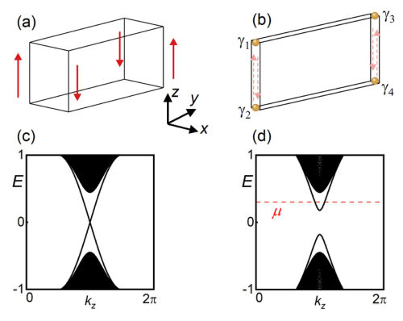 
FIG. 4. Finite-size-induced reconstruction of the chiral HOTI hinge spectrum. (a) Schematic illustration of decoupled chi- ral hinge states in the thick limit. (b) Schematic illustration of coupled hinge states forming helical channels in the thin limit; upon superconducting proximitization, these channels terminate in MZMs γ1,2,3,4 at their endpoints. (c) Normal- state spectrum for Lx = 10 and Ly = 80, corresponding to the decoupled limit in (a). (d) Normal-state spectrum for Lx = 2 and Ly = 80, corresponding to the coupled limit in (b). The red dashed line marks a chemical potential within the energy window of the coupled hinge states. The common model parameters are t = 1, M = 2, λ = 1,...

📷 Fig 5

 
FIG. 5. Energy spectral evolution and real-space distribution of MZMs. (a)–(c) BdG energy spectra with periodic boundary conditions along z and open boundary conditions in the x-y plane for a 2×80 cross section, at µ = 0.1, 0.17, and 0.3, respectively. The gap closes near the transition point (b) and reopens for larger µ (c). (d) Energy spectrum under open boundary conditions for the parameters in (a) with system size 2×80×80. Red points mark the low-energy states used in (e). (e) Density projected along the thin x direction for the marked states in (d). (f) Energy spectrum of under the open boundary conditions for the parameters in (c), where four MZMs appear inside the superconducting...

**Summary.** The paper presents a theoretical design to create multiple Majorana zero modes (MZMs) by coupling chiral hinge states from a higher-order topological insulator (HOTI) with an s-wave superconductor. By reducing the system dimensionality, opposite hinge states form helical channels, and superconducting pairing opens a gap, localizing four robust MZMs at the corners of the sample.

**Why it may be interesting.** This work provides a concrete, material-agnostic theoretical blueprint for engineering multiple MZMs using established superconducting techniques on advanced topological materials, bridging HOTI physics with superconductivity.

Detailed structure

**Main problem.** The work proposes a theoretical route to realize spatially separated Majorana zero modes (MZMs) by exploiting the boundary physics of higher-order topological insulators (HOTIs). This is achieved through proximity coupling with an s-wave superconductor in a quasi-two-dimensional geometry.

**Main result.** The model successfully predicts the formation of four localized MZMs at the corners, characterizing the system as a second-order topological superconductor. These corner modes are shown to be robust against weak to moderate disorder.

**Method.** The study employs theoretical modeling using the Bogoliubov-de-Gennes (BdG) Hamiltonian and analyzes spectral properties under varying boundary conditions and disorder strengths.

**Model / system.** The system is a chiral HOTI, which hosts gapless hinge states in 3D. By confining it quasi-2D, opposite chiral hinge states hybridize into helical channels. Superconducting proximity effect induces effective p-wave pairing on these channels, leading to the topological superconducting state.

**Key observables.** Zero-bias conductance peaks (STM signature), localized MZMs at corners, and the spectral gap opening in the BdG spectrum.

**Important parameters / regimes.** The confinement direction ($x$), the chemical potential ($\mu$) tuned into reconstructed hinge bands, and the superconducting pairing strength ($\Delta$).

**Assumptions / limitations.** The analysis assumes that the chiral HOTI can be realized and that the proximity effect induces effective p-wave pairing. Robustness is confirmed only against weak-to-moderate disorder.

**Figures summary.** Figures illustrate gapless hinge states in 3D, the formation of helical channels upon confinement, and BdG spectra showing the emergence of four localized MZMs at the corners when tuned into the topological superconducting phase.

**Paper structure.** The paper builds from identifying gapless hinge states in a 3D HOTI to analyzing their hybridization in a quasi-2D geometry. The core mechanism involves proximity coupling inducing p-wave pairing, which opens a topological gap and localizes MZMs at the boundaries (corners). Disorder robustness is confirmed last.

Abstract

Majorana zero modes (MZMs) in topological superconductors have attracted broad research interest for their potential applications in topological quantum computation. In this work, we propose a quasi-two-dimensional route to realize spatially separated MZMs in a chiral higher-order topological insulator (HOTI) proximitized by a conventional $s$-wave superconductor through a theoretical model study. In three dimensions, the chiral HOTI hosts gapless hinge states along the $z$ direction, arising from a mass term that anisotropically gaps the surface Dirac cones of a topological insulator. By confining the sample along the $x$ direction while keeping it extended along $y$ and finite along $z$, opposite $z$-directed chiral hinge states hybridize and effectively form one-dimensional helical channels. Incorporating the superconducting proximity effect into this quasi-two-dimensional system induces effective $p$-wave pairing in these helical channels, thereby opening a topological gap. A fully open-boundary sample then hosts four localized MZMs, one at each endpoint of the helical channels, realizing a second-order topological superconductor characterized by Majorana corner modes. In addition to MZMs, we also find that superconducting pairing in this model produces extended Majorana hinge modes in three dimensions. Furthermore, representative disorder calculations indicate that these Majorana corner modes are robust against weak-to-moderate disorder, provided the excitation gap remains open. These results establish finite-size-coupled chiral hinge states as a promising platform for engineering multiple MZMs via conventional superconducting proximity effect.

[↑ back to top](#top)

### [On the structure of black hole interior in a model of scalar quasi-particles within the GR framework](http://arxiv.org/abs/2607.03938v1)

**Authors:** S. Bondarenko  
**Type:** theory · **Category:** statistical mechanics · **PDF:** <https://arxiv.org/pdf/2607.03938v1>  
**Analysis basis:** full PDF text, analyzed in chunks
**Topic relevance:** `non-equilibrium dynamics` **2/5** · `Keldysh / 2PI / non-Gaussian methods` **1/5** · `driven-dissipative phase transition` **1/5** · `non-equilibrium universality` **1/5**

📷 Fig 1

 
FIG. 1. Schematic structure of the proposed black hole interior. The radial ordering is R−&lt; R+ &lt; RS: the inner AdS-like core with negative energy density (ρ &lt; 0, p &gt; 0) and its boundary-core shell are enclosed within R−; the transition layer (the ”factory”), which approximately coincides with the zero-gravity hypersurface Z : r = R+, attracts the regular matter from both sides and repels the negative-energy bubbles; the thermal positive-energy crust (V = 0) fills the region up to the Schwarzschild horizon at RS = 2 G MADM.

📷 Fig 2

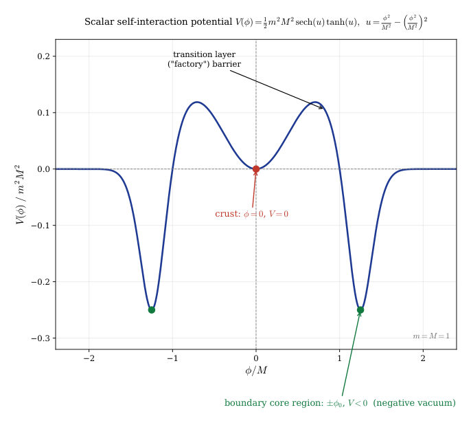 
FIG. 2. The scalar self-interaction potential V (ϕ) of Eq. (3), plotted at m = M = 1 (with ϕ in units of M and V in units of m2M 2). The quasi-stable minimum at ϕ = 0 with V = 0 corresponds to the crust; the two symmetric negative minima at ±ϕ0 with V &lt; 0 correspond to the negative-energy boundary core region; the barrier separating the wells is associated with the transition layer (”factory”).

📷 Fig 3

 
FIG. 3. (a) Defect ratio δ = Rreg/R3L versus the density contrast ρcrust/ρcr, for several core fractions u = Rcore/R3L; the cube-root scaling and the δ = 1 reference (dashed) are shown. (b) The regular-BH match locus in the (u, ρcrust/ρcr) plane, separating the over-compact region (δ &gt; 1, R3L &lt; RS) from the defective/puffy region (δ &lt; 1, R3L &gt; RS).

**Summary.** This paper proposes an effective, singularity-free model for black hole interiors using a scalar field description that results in three distinct layers: a core, a transition layer, and a crust. It treats the entire process of black hole formation and evaporation as a quasi-static thermodynamic cycle driven by negative energy within the core. The analysis relies heavily on solving Einstein equations and applying advanced concepts from statistical mechanics to describe matter states.

**Why it may be interesting.** While focused on GR/BH physics, the core concept of modeling BH evaporation as a quasi-static, adiabatic thermodynamic engine—where negative energy acts as the working substance—draws strong parallels to non-equilibrium statistical mechanics treatments of open quantum systems.

Detailed structure

**Main problem.** To construct an effective, singularity-free model for the interior of a black hole by treating its structure as a thermodynamic system.

**Main result.** The black hole interior is modeled as a three-layered structure (core, transition layer, crust) whose evolution mimics a quasi-static, almost adiabatic thermodynamic engine cycle.

**Method.** Solving static Einstein equations and applying WKB approximations to derive the energy-momentum tensor components for the various matter layers.

**Model / system.** The model uses an effective scalar field with non-linear self-interaction potential to describe a three-layer black hole interior: a negative energy AdS core, a transition layer, and a positive-energy quasi-particle crust.

**Key observables.** Metric functions, mass functions $m(r)$, energy densities ($
ho$), pressures ($p_r, p_\perp$), and the active Komar mass $M_{	ext{Komar}}(r)$.

**Important parameters / regimes.** Negative inverse temperature parameter ($eta$) governing the core condensate; quasi-particle density; Schwarzschild radius $2GM_{	ext{ADM}}$.

**Assumptions / limitations.** The system is treated as a static problem initially, and the process of formation/evaporation is modeled as an almost adiabatic thermodynamic cycle.

**Figures summary.** Figures schematically illustrate the radial ordering of the three layers ($R_- < R^+ < R_S$) and show the scalar self-interaction potential $V(\phi)$ across these regions.

**Paper structure.** The paper progresses by defining the physical system, deriving components using WKB approximations for the crust (leading to an isotropic EoS), analyzing stability near the null-gravity transition layer ($R^+$) via test particle motion, and finally framing the entire structure within a thermodynamic cycle analogy.

Abstract

We propose an effective, singularity-free model of the black hole interior described entirely by a scalar field with a non-linear self-interaction potential. The interior consists of three layers -- a core, a transition layer, and a crust -- each fixed by the local quasi-particle density and the corresponding extremum of the potential of the field. The crust is a layer of massive, positive-energy thermal excitations above the zero-potential well, beneath a genuine Schwarzschild horizon at $r = 2GM_{\rm ADM}$. The core is an AdS-type region of negative energy density, it simulates a condensate of quasi-particles which carry zero classical kinetic energy and form a negative potential well governed by a negative inverse temperature parameter. The two regions are joined through Israel matching across the transition layer, which sits at an approximately null-gravity hypersurface of maximal regular matter density and where both the sign of the energy density and the type of thermal excitations change. Solving the static Einstein equations, we obtain the metric and mass functions of each layer, the edge equation of state of the crust, the linear stability condition of the null-gravity surface for ordinary and effectively negative mass matter, and the two-temperature thermodynamics linking the kinetic excitations to the negative temperature ground state. The framework unifies core and crust within a single field description and highlights the role of the negative energy AdS core and the associated negative temperature notion in describing black hole interior. In this picture the formation and Hawking evaporation of a black hole appear as a quasi-static cycle of an almost adiabatic thermodynamic engine, with the negative energy core as the working substance.

[↑ back to top](#top)

### [Janus MgAlB_2 MBene: a dipole-engineered anode for ultrafast Li-ion transport and exceptional lithium storage](http://arxiv.org/abs/2607.03823v1)

**Authors:** Pritam Samanta, Sashank Kumar Pandey, Amit Kumar Jana, Prakash Parida  
**Type:** theory · **Category:** other · **PDF:** <https://arxiv.org/pdf/2607.03823v1>  
**Analysis basis:** full PDF text, analyzed in chunks
**Topic relevance:** `analog quantum simulation` **1/5** · `driven-dissipative phase transition` **1/5** · `methods for driven-dissipative` **1/5** · `non-equilibrium dynamics` **1/5**

📷 Fig 1

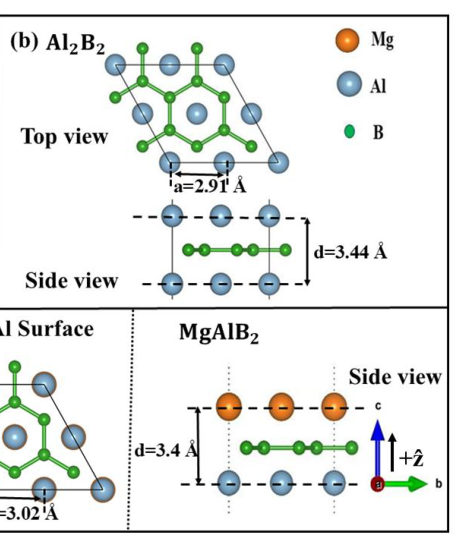 
Fig. 1 Top and side views of (a) Mg2B2, (b) Al2B2, and (c) MgAlB2 with upper (Mg- surface) and lower surface (Al-surface).

📷 Fig 2

 
Fig. 2 (a) Average electrostatic potential of Janus MgAlB2 along the z-axis, (b) top view and (c) side view of ELF map of Janus MgAlB2.

📷 Fig 3

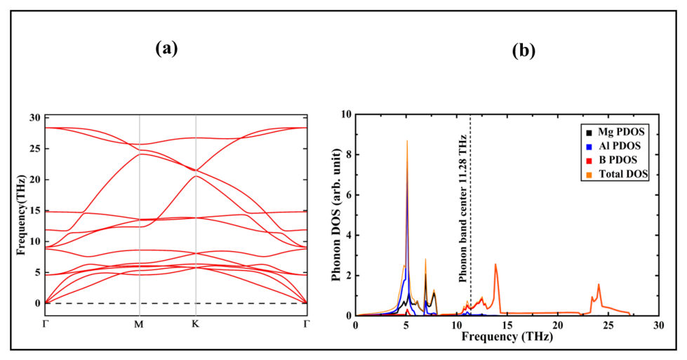 
Fig. 3 (a) Phonon dispersion spectra of the pristine Janus MgAlB2 along the high symmetry directions, and (b) phonon density of states with average phonon band center weighted over total phonon density of states (DOS).

📷 Fig 4

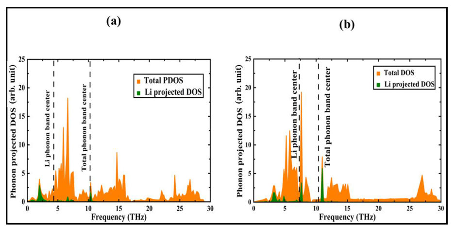 
Fig. 4: Total and lithium-projected phonon DOS of single adsorbed Janus MgAlB2 (a) at S1- site on the Mg surface, and (b) at S4-site on the Al surface, respectively.

📷 Fig 5

 
Fig. 5 Direction dependent variations of (a) Young's modulus, Y(𝜃), and (b) Poisson's ratio, ν(𝜃), for the Janus MgAlB2 monolayer.

**Summary.** This theoretical study proposes a dipole-engineered Janus MgAlB2 monolayer as a superior anode material for Li-ion batteries. By breaking structural symmetry, the material generates an intrinsic polarization that significantly lowers the lithium diffusion barrier and increases storage capacity compared to its symmetric counterparts. The work establishes intrinsic polarization as a powerful design principle for next-generation energy materials.

**Why it may be interesting.** While focused on solid-state electrochemistry, the concept of engineering an intrinsic electric field via structural asymmetry (Janus effect) to control charge transport kinetics is analogous to designing quantum interfaces or controlling local potentials in AMO systems.

Detailed structure

**Main problem.** The research addresses the need for novel, high-performance anode materials for Li-ion batteries that overcome the capacity limitations of conventional anodes.

**Main result.** The dipole-engineered Janus MgAlB2 monolayer exhibits exceptional performance, achieving a high theoretical specific capacity (1470.24 mAh/g) with ultrafast Li ion transport due to its intrinsic polarization.

**Method.** First-principles calculations using DFT were employed to model the electronic structure, electrochemical properties, and ion diffusion kinetics of the proposed material.

**Model / system.** The system is a Janus MgAlB2 monolayer, engineered by breaking the symmetry of parent MBenes structures (Mg2B2 or Al2B2) through Al substitution. This asymmetry generates a permanent out-of-plane polarization and built-in electric field.

**Key observables.** Low Li diffusion barrier (17.1 meV), high theoretical specific capacity (1470.24 mAh/g), dipole moment, and intrinsic polarization magnitude.

**Important parameters / regimes.** Room-temperature diffusion coefficient ($3.43	imes10^{-10} 	ext{ cm}^2/	ext{s}$), volume expansion ($\le 3.7\%$), and the built-in electric field strength.

**Assumptions / limitations.** The calculations assume that intrinsic polarization can be utilized as a design parameter to regulate both the thermodynamics (storage capacity) and kinetics (ion transport) of lithium storage.

**Figures summary.** Figures illustrate optimized geometries, electronic structure analysis (PDOS/Band Structure), charge transfer mapping (EDD plots), and calculated diffusion pathways/barriers for Li ion movement.

**Paper structure.** The paper progresses by identifying the limitations of symmetric MBenes, proposing the Janus structure to induce polarization, and then using DFT calculations to quantify how this intrinsic dipole enhances Li adsorption capacity and accelerates ion diffusion compared to pristine materials.

Abstract

In this work, we propose a group II/IIIA-based Janus MBene, MgAlB_2, and investigate its electrochemical properties using first-principles calculations. The substitution of one Mg layer in Mg_2B_2 MBene by an Al layer breaks the structural symmetry and generates a permanent out-of-plane polarization, giving rise to a distinct electronic environment compared with the parent Mg_2B_2 and Al_2B_2 monolayers. Electronic-structure analysis reveals enhanced orbital hybridization among B, Mg, and Al states near the Fermi level, resulting in improved electronic delocalization across the monolayer. The Janus MgAlB_2 monolayer is found to possess excellent dynamical, mechanical, and thermal stability. Owing to its polarization-modified energy landscape, Li ions migrate with an exceptionally low diffusion barrier of 17.1 meV, corresponding to a room-temperature diffusion coefficient of 3.43x10^-10 cm^2/s. Unlike the pristine Mg_2B_2 and Al_2B_2 monolayers, which support only a single stable adsorption layer, MgAlB_2 accommodates two complete Li layers. Detailed analysis shows that the residual polarization retained after first-layer lithiation continues to promote Li adsorption, whereas increasing Li-Li electrostatic interactions eventually limit further storage. As a result, the Janus monolayer delivers a high theoretical specific capacity of 1470.24 mAh/g together with a small volume expansion of only 3.7% during maximum lithiation. The present study demonstrates that intrinsic polarization can be utilized to regulate both the thermodynamics and kinetics of Li storage, providing a design strategy for high-rate and high-capacity two-dimensional electrode materials.

[↑ back to top](#top)

### [Correlated-Electron Theory of Triplet-Triplet Multiexciton States in Polypentacene](http://arxiv.org/abs/2607.03706v1)

**Authors:** Rupali Jindal, Alok Shukla, Sumit Mazumdar  
**Type:** theory · **Category:** strongly correlated electrons · **PDF:** <https://arxiv.org/pdf/2607.03706v1>  
**Analysis basis:** full PDF text, analyzed in chunks
**Topic relevance:** `analog quantum simulation` **1/5** · `correlated cavity matter` **1/5** · `non-equilibrium dynamics` **1/5**

📷 Fig 1

 
FIG. 2. Pentacene tetramer 4Pc with the anti-anti-anti inter- monomer bonding motif.

📷 Fig 2

 
FIG. 1. Schematics of two different conceptualizations of triplet-triplet eigenstates of 4Pc (see text). Red and blue horizontal bars correspond to HOMO and LUMO of Pc monomers, doubly or singly occupied by electrons. Arrows on singly occupied MOs indicate electron spins. Bonding (antibonding) MOs not shown are completely filled (empty). (a) Individual configurations are eigenstates, and triplet sep- aration occurs along the indicated path. (b) Eigenstates are quantum superpositions of configurations with different rela- tive weights ci.

📷 Fig 3

 
FIG. 3. Calculated ground state absorption spectra of nPc, n = 2-4. Si, i=1-4, label the different absorption bands (see Fig. 4)

📷 Fig 4

 
FIG. 4. Normalized exciton basis wavefunctions of final eigenstates to which ground state absorption occurs in 3Pc (left) and 4Pc (right). S1 - S4 correspond to the absorption bands labeled in Fig. 3. Red and blue horizontal bars represent bonding and antibonding MOs, respectively, which can be doubly or singly occupied by electrons. Straight or curved lines connecting MOs represent spin-singlet excitations. Ellipses correspond to configurations related by spatial and charge-conjugation symmetries. Filled (empty) bonding (antibonding) MOs are not shown.

📷 Fig 5

 
FIG. 5. 1(T1T1) eigenstates of 3Pc.

**Summary.** The authors perform advanced correlated-electron calculations on pentacene oligomers to characterize triplet-triplet multiexciton states. They demonstrate that these states are not localized pairs but rather delocalized quantum superpositions of multiple configurations. This theoretical finding resolves discrepancies regarding intramolecular triplet diffusion and suggests alternative pathways for energy dissipation in polymeric materials.

**Why it may be interesting.** This work directly addresses the complex many-body dynamics in organic semiconductors, providing a detailed electronic structure explanation for excited state behavior that goes beyond simple localized models, which is crucial for understanding energy transfer mechanisms relevant to quantum optics and materials science.

Detailed structure

**Main problem.** The study aims to determine the true nature of triplet-triplet multiexciton states in polypentacene oligomers: whether they are localized nearest-neighbor pairs or delocalized quantum superpositions.

**Main result.** The eigenstates are found to be complex quantum superpositions involving all accessible intertriplet separations, which explains the observed lack of simple intramolecular triplet diffusion.

**Method.** Correlated-electron calculations using the Pariser-Parr-Pople (PPP) Hamiltonian solved via Multiple Reference Singles and Doubles Configuration Interaction (MRSDCI).

**Model / system.** The system models are three- and four-unit pentacene oligomers, serving as microscopic representations for polypentacene. The calculations utilize a molecular exciton basis that explicitly separates Frenkel, charge-transfer, and triplet-pair configurations.

**Key observables.** Energy levels of $1(T_1T_1)$ eigenstates, absorption spectra (ESAs), and transient absorption (TA) features, particularly the signal at 710 nm.

**Important parameters / regimes.** The calculations fix parameters like the onsite Hubbard repulsion U = 6.7 eV and use a molecular exciton basis derived from frontier MOs.

**Assumptions / limitations.** Key limitations include the exclusion of electron-vibration interactions and the reliance on the semiempirical PPP Hamiltonian.

**Figures summary.** Figures schematically contrast localized vs. delocalized models for eigenstates, show the $4	ext{Pc}$ structure, and illustrate intermonomer Charge Transfer (CT) channels responsible for observed ESA peaks.

**Paper structure.** The paper develops by first establishing the theoretical framework using MRSDCI on PPP Hamiltonian; it then calculates and analyzes the resulting multiexciton eigenstates, comparing these predictions against experimental TA measurements to deduce the physical nature of triplet interactions.

Abstract

We present correlated-electron calculations of optical spin-singlet and triplet-triplet multiexciton states in three- and four-unit pentacene oligomers as microscopic models for polypentacene. The calculations use the Pariser-Parr-Pople Hamiltonian, multiple-reference singles and doubles configuration interaction, and a molecular exciton basis that resolves Frenkel, charge-transfer, and triplet-pair (T1T1) configurations in real space. We find that the complete set of 1(T1T1) eigenstates lies in a narrow, nearly degenerate energy window near the lowest optical exciton and that no eigenstate can be identified with a single localized triplet-pair configuration. Instead, each triplet-pair eigenstate is a quantum superposition of configurations containing all accessible intertriplet separations. This electronic structure explains the perceived absence of intramolecular triplet diffusion in pentacene oligomers, polypentacene, and polytetracene solutions, while leaving open the possibility of intermolecular singlet fission in films with appreciable interchain interactions.

[↑ back to top](#top)

### [On the $\mathrm{In_{x}Ga_{1-x}As}$ channel noise in InP HEMTs from 4 K to 300 K](http://arxiv.org/abs/2607.04757v1)

**Authors:** Junjie Li, Justin H. Chen, Austin J. Minnich, Jan Grahn  
**Type:** experiment · **Category:** other · **PDF:** <https://arxiv.org/pdf/2607.04757v1>  
**Analysis basis:** full PDF text, analyzed in chunks
**Topic relevance:** `correlated / nonlocal dissipation` **1/5** · `methods for driven-dissipative` **1/5** · `non-equilibrium dynamics` **1/5**

📷 Fig 1

 
Fig. 1. Schematic of the cryogenic noise measurement setup using an LNA module equipped with the InP HEMTs. The LNA is cooled to a temperature between 4 and 40 K inside a cryostat.

📷 Fig 2

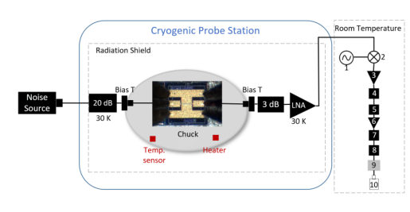 
Fig. 2. Schematic of the on-wafer noise measurement setup in a cryogenic probe station. The InP HEMT is probed on-wafer at temperatures from 40 to 300 K. The room-temperature measurement chain consists of (1) HMC-T2100 local oscillator, (2) M1-0220-P mixer, (3)–(4) low-noise amplification and attenuation, (5)–(8) bandpass filters, (9) variable attenuator, and (10) U8481A power sensor.

📷 Fig 3

 
Fig. 3. Equivalent drain noise temperature Td versus ambient temperature for InP HEMTs with channel indium content of 53%, 60%, and 70%, biased at Vds = 0.5 V and Id = 5 mA. Circles and crosses represent Td values extracted from on-wafer and LNA noise measurements, respectively. Dashed lines are parabolic fits to the on-wafer data above 40 K, extrapolated to 4 K. The absence of on-wafer data below 80 K for the 70% indium channel InP HEMT was due to oscillations occurring during probing.

📷 Fig 4

 
Fig. 5. Thermal noise current PSD Sid,th = 4kBTagds0 versus ambient temperature for InP HEMTs with channel indium content of 53%, 60%, and 70%.

📷 Fig 5

 
Fig. 4. Channel current noise spectral density Sid at 4 K as a function of indium content x in InxGa1−xAs channel InP HEMTs. Green points show values extracted from LNA noise measurements. Blue points show values extrapolated to 4 K from the Td model fitted to on-wafer measurements (Fig. 3); Error bars represent the combined measurement uncertainties and fitting errors.

**Summary.** This work investigates the temperature dependence and physical origins of channel noise in InP HEMTs used in critical applications like radio astronomy. By measuring noise from 4 K to 300 K, the authors determined that excess noise is dominated by impact ionization and real-space transfer effects, not just simple shot noise. The results guide material optimization by identifying the optimal indium composition (60%) for minimum noise performance.

**Why it may be interesting.** While focused on semiconductor device physics rather than fundamental quantum dynamics, understanding noise sources at cryogenic temperatures is crucial for building sensitive quantum measurement devices (like superconducting qubits or detectors) that rely on low-noise amplifiers.

Detailed structure

**Main problem.** The study aims to fully characterize the various physical mechanisms responsible for noise generation in InP HEMTs with $\mathrm{In_{x}Ga_{1-x}As}$ channels across a wide temperature range (4 K to 300 K).

**Main result.** The excess channel noise at cryogenic temperatures is attributed not only to shot noise but also significantly to impact ionization and real-space transfer noise. The 60% indium content exhibited the lowest overall channel noise.

**Method.** Noise was quantified by extracting the equivalent drain noise temperature ($T_d$) using both on-wafer measurements ($\geq 40$ K) and Low Noise Amplifier (LNA)-based cryogenic measurements ($4 	ext{ K} - 40 	ext{ K}$).

**Model / system.** The physical system is a 100-nm gate-length InP HEMT utilizing an $\mathrm{In_{x}Ga_{1-x}As}$ channel, tested with varying indium contents ($x=53\%, 60\%, 70\%$). The noise analysis decomposes the total current noise into thermal and excess components.

**Key observables.** Equivalent drain noise temperature ($T_d$), channel current noise spectral density ($\mathrm{S}_{id}$), and the excess noise term ($\mathrm{S}_{id,ex}$).

**Important parameters / regimes.** Temperature range (4 K to 300 K); Channel indium content ($x$); Bias conditions ($V_{ds} = 0.5 	ext{ V}, I_d = 5 	ext{ mA}$).

**Assumptions / limitations.** The analysis assumes the total noise can be separated into thermal and excess components, allowing for the identification of temperature-dependent and independent noise sources.

**Figures summary.** Figures illustrate $T_d$ vs. ambient temperature comparing on-wafer and LNA data; $\mathrm{S}_{id}$ at 4 K versus indium content ($x$), demonstrating the minimum excess noise at $x=60\%$.

**Paper structure.** The paper systematically measures channel noise across temperatures, decomposes the total noise into thermal and excess parts, analyzes the temperature dependence of these components, and finally attributes the residual excess noise to specific hot-electron effects like impact ionization and RST noise.

Abstract

The InP high-electron-mobility transistor (HEMT) is indispensable for low-noise amplifiers (LNAs) in radio astronomy and quantum computing. The composition of the $\mathrm{In_{x}Ga_{1-x}As}$ channel in InP HEMT is known to influence the LNA noise performance. However, the various physical mechanisms responsible for noise generation are not fully characterized and understood. Here, we investigate the $\mathrm{In_{x}Ga_{1-x}As}$ channel noise from 4 K to 300 K for 100-nm gate-length InP HEMTs with channel indium content of 53\%, 60\% and 70\%. Channel noise was quantified by extracting the equivalent drain noise temperature $\mathit{T}_{d}$ using both on-wafer and LNA-based measurements, covering 40-300 K and 4-40 K, respectively. The 60\% indium channel InP HEMT exhibited the lowest channel noise across the full temperature range. The $\mathit{T}_{d}$ extracted from on-wafer characterization was found to obey a parabolic temperature dependence which predicted the $\mathit{T}_{d}$ at 4 K for all InP HEMTs in good agreement with LNA-based measurements. By expressing the channel noise as the sum of one thermal and one excess noise term, it was found that the former increased linearly with ambient temperature and dominated at 300 K. The channel noise at 4 K was determined by the excess noise term and exhibited a non-monotonic dependence on the channel indium content in the InP HEMT. The results suggest that the excess noise in the InP HEMT originates not only from temperature-independent shot noise but also from impact ionization and real-space transfer noise.

[↑ back to top](#top)

### [Quantum Geometric Friedel Oscillations](http://arxiv.org/abs/2607.04654v1)

**Authors:** Xing-Lei MA, Jinchao Zhao, Bo-Qing Wu, K. T. Law  
**Type:** theory · **Category:** other · **PDF:** <https://arxiv.org/pdf/2607.04654v1>  
**Analysis basis:** full PDF text, analyzed in chunks
**Topic relevance:** `Keldysh / 2PI / non-Gaussian methods` **1/5** · `analog quantum simulation` **1/5** · `driven-dissipative phase transition` **1/5**

📷 Fig 1

 
FIG. 1. Emergence and thermodynamic stability of quan- tum geometric Friedel oscillations (QGFOs) . (a) Schematic band structure in a flat-band metal. The color of the central band represents the quantum metric distribution Gf(k), as zoomed in on the right side. The momentum-space separa- tion between quantum metric hot spots defines the character- istic geometric wavevector qG. The Fermi level (dashed line) cuts through the flat band, with two Fermi points separated by wavevector 2kF . W f and ∆g denotes the flat-band band- width and the band gap, respectively. (b) Normalized real- space density modulations δρnorm(x) ≡δρ(x)/ρ0 induced by a local impurity. At low temperatures (blue curve),...

📷 Fig 2

 
FIG. 2. (a) Band structure of the 1D flat-band model. In- set: Zoom-in of the flat band. The dashed line indicates the Fermi level; 2kF is the zero-temperature scattering wavevec- tor. Parameters are the same as Fig. 1 except δ = 0.05. These parameters are used throughout unless otherwise stated. (b) Quantum distance dk,k′ in the k-k′ plane. The red dashed lines mark the cut q = qG corresponding to the peak of ¯D(q). (c) Fourier transform of the LDOS variations δρnorm(q) for different δ. Solid lines: real-space diagonalization (numerics); dotted lines: full-band formalism in Eq. (2) with T = I (an- alytics). All curves match reasonably well with 1 −¯Df(q). A single impurity U0 = t is placed...

📷 Fig 3

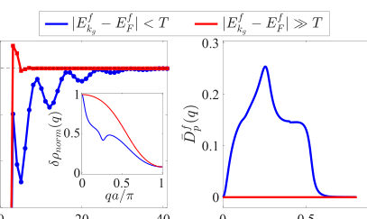 
FIG. 3. (a) Comparison of QGFOs with distinct low-energy quantum geometric structures: Quantum metric hot spots living within (Blue curves) versus far above (Red curves) the smeared Fermi surface. Inset: corresponding Fourier spec- trum. (b) Partially averaged quantum distance ¯Df p(q) for the two regimes. Parameters for the blue curves are the same as Fig. 1 except kBT = Ef F = 0.4t, U0 = 10t, and Λc = 3.5kBT. The red curve has the same parameters as the blue one except t taking a minus sign.

📷 Fig 4

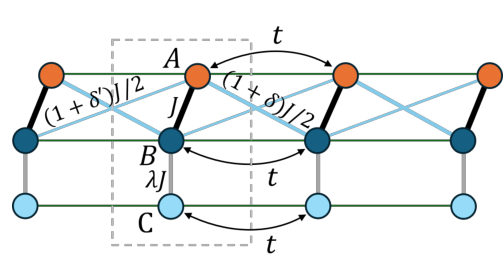 
FIG. 4. Real-space lattice and hopping structure of the 1D model. The dashed square denotes an unit cell.

📷 Fig 5

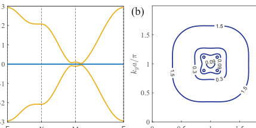 
FIG. 5. (a) Band structure of the 2D model. (b) Fermi surface of the third band. Parameters: J = 1, t = 10−4J, δ′ = 5δ, µ = −0.48W f with bandwidth W f = 8t.

**Summary.** This work introduces Quantum Geometric Friedel Oscillations (QGFOs), which arise from the nontrivial quantum geometry inherent in flat bands. Unlike conventional oscillations that vanish at high temperatures, QGFOs persist robustly because their decay length is set by a temperature-independent 'quantum metric length.' Measuring these unique oscillations offers a powerful tool to probe the underlying geometric structure of electronic band theory.

**Why it may be interesting.** While focused on condensed matter transport, the concept of geometric protection leading to robust, temperature-independent signatures is highly relevant for understanding coherence in quantum devices or mesoscopic systems where thermal decoherence is a major concern.

Detailed structure

**Main problem.** The conventional theory of Friedel oscillations is incomplete when considering Bloch wavefunctions with nontrivial quantum geometry, necessitating the identification of a new oscillation type.

**Main result.** Quantum Geometric Friedel Oscillations (QGFOs) exist due to the quantum metric in flat bands; these oscillations persist robustly at high temperatures where conventional oscillations are washed out.

**Method.** The analysis involves deriving and comparing susceptibility functions, separating contributions into conventional and quantum geometric parts ($\chi_f = \chi^c_f + \chi^g_f$).

**Model / system.** The study focuses on metals exhibiting isolated (nearly) flat bands at the Fermi energy, modeled using tight-binding Hamiltonians in 1D and 2D settings.

**Key observables.** Oscillation periods ($2k_F$ vs. $q_G$), decay lengths ($\xi_T$ vs. $\ell_{QM}$), and the normalized LDOS variation $\delta
ho_{	ext{norm}}(q)$.

**Important parameters / regimes.** Temperature ($T$), Fermi momentum ($k_F$), flat-band bandwidth ($W_f$), and quantum metric length ($\ell_{QM}$).

**Assumptions / limitations.** The analysis often relies on approximations like the Born approximation or high-temperature limits to isolate the geometric contributions.

**Figures summary.** Figures illustrate schematic band structures, real-space density modulations showing coexistence/persistence of oscillations, and Fourier spectra highlighting distinct peaks at $2k_F$ and $q_G$.

**Paper structure.** The paper builds by first identifying the theoretical incompleteness of conventional theory, then deriving the QGFO susceptibility ($\chi^g$), demonstrating its unique temperature dependence (persistence), and finally quantifying its spatial extent ($\Omega_{	ext{QGFOs}}$) relative to topological invariants.

Abstract

In conventional Friedel oscillations, the real-space charge density oscillations induced by an impurity are characterized by an oscillation period set by the Fermi momentum. In this work, we show that the conventional theory is incomplete when the Bloch wavefunctions carry nontrivial quantum geometry. We demonstrate that in metals with an isolated (nearly) flat band at the Fermi energy, quantum geometry induces a distinct type of oscillations, which we call the \emph{quantum geometric Friedel oscillations} (QGFOs). The period of the QGFOs is set by the momentum space separation of the quantum metric hot spots of the flat band. The conventional and quantum metric-induced oscillations coexist at low temperatures. At higher temperatures, the conventional Friedel oscillations away from the impurity site are set by the thermal length such that the oscillations can be easily washed out by temperature effects. Remarkably, the QGFOs decay length is set by the quantum metric length which is defined by the integration of the quantum metric of the flat band. As a result, the QGFOs can persist even at temperatures much larger than the bandwidth of the flat band. Moreover, the decay length is independent of temperature for a wide range of temperatures which is a manifestation of the quantum metric protection. In conclusion, we show that the quantum metric induces novel Friedel oscillations. Our work suggests that the measurement of the QGFOs is a powerful way to detect the quantum metric length (which is associated with the integral of the quantum metric) and the quantum metric hot spot separations (which are associated with the distribution of the quantum metric in the momentum space).

[↑ back to top](#top)

### [$H-T$ Phase diagram of CeRh$_{2}$As$_{2}$: Refinement of the parity-switch scenario](http://arxiv.org/abs/2607.04928v1)

**Authors:** Changhee Lee, P. M. R. Brydon  
**Type:** both · **Category:** strongly correlated electrons · **PDF:** <https://arxiv.org/pdf/2607.04928v1>  
**Analysis basis:** full PDF text, analyzed in chunks
**Topic relevance:** `Keldysh / 2PI / non-Gaussian methods` **1/5** · `Kondo & dissipative impurity` **1/5**

📷 Fig 1

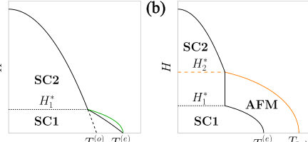 
Figure 1. Schematic field-temperature (H −T) phase dia- grams of CeRh2As2 in magnetic fields along c-axis. (a) Trans- port phase diagram of the superconducting phases. The dot- ted line denotes the first order phase transition occurring at H = H∗ 1 . The dashed line is an extrapolation of the phase boundary in H &gt; H∗ 1 . The green line depicts a fictitious ex- ample of the phase boundary in H &lt; H∗ 1 which is consistent with the usual parity-switch scenario. (b) Thermodynamic phase diagram of the superconducting phases along with the AFM phase. H∗ 2 indicated by the orange dashed line is the critical field above which the AFM order vanishes.

📷 Fig 2

 
Figure 2. Fermi surfaces of the conduction and the valence bands. (a) (t⊥, α) = (2, 5)t0 and (b) (t⊥, α) = (5, 2)t0 are used. The red points highlight the Van Hove saddle points. The curves passing through the red points represent the Fermi surfaces of the valence (conduction) band at µ = µv (µ = µc). The black arrows mark the midpoints of the red curves and correspond to the origin of the figures in Fig. 3.

📷 Fig 3

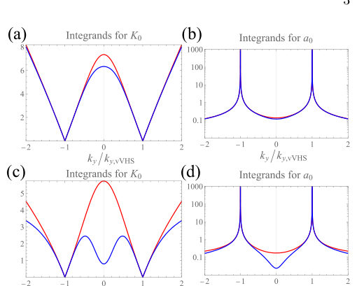 
Figure 3. The integrands of K(p) 0 and a(p) 0 over the Fermi surface (red curve in Fig. 2) for the B1g- and B2u-type gap functions. (a) and (b) show the integrands when (t⊥, α) = (2, 5) and µ = µv in Eq. (7) with a = b = 1. The red (blue) line corresponds to the case with B1g(B2u)-type gap function. (c) and (d) show the integrands when (t⊥, α) = (5, 2) in Eq. (7) with a = b = 1. The Fermi surface is parameterized by using ky. ky,vVHS denotes the position of the valence band Van Hove singularity.

📷 Fig 4

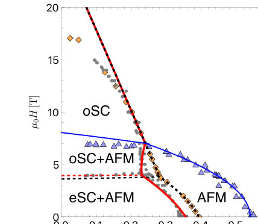 
Figure 5. Phase diagram obtained from Eqs. (14-16). The orange diamonds represent the resistivity measurement in Ref. [8], while the other symbols correspond to the thermo- dynamic data presented in Ref. [10]. The black dashed lines represent the phase boundaries between the normal phase and the eSC and oSC states, and the first order transition line between two SC states in the absence of the AFM or- der. The red and blue lines are the phase boundaries ob- tained by using Eqs. (15-16) which take account of the AFM order. The red dashed line is the first order transition line be- tween two SC states in the presence of the AFM order. Here we use (T (e) c,0 , χ(e) O , χ(e) P ) = (0.393, 0.04,...

**Summary.** This paper refines the understanding of superconductivity in CeRh2As2 by addressing conflicts between theory and experiment regarding its H-T phase diagram. The authors demonstrate that complex electronic structure effects, arising from nonsymmorphic symmetries and coexisting antiferromagnetism, are necessary to explain anomalous superconducting behavior observed under magnetic fields.

**Why it may be interesting.** While focused on heavy fermions, the detailed analysis of symmetry-enforced electronic structure near singularities (Dirac nodes/VHSs) and the interplay between magnetic ordering and superconductivity provides rich theoretical material relevant to strongly correlated quantum materials research.

Detailed structure

**Main problem.** The study aims to reconcile experimental discrepancies in the H-T phase diagram of CeRh2As2—specifically the anomalous initial slope and nearly vertical boundary—with the simple parity-switch superconducting scenario.

**Main result.** The authors show that incorporating anisotropic band structure due to nonsymmorphic symmetries explains the steep odd-parity SC slope, while coexisting antiferromagnetism accounts for the near-vertical thermodynamic phase boundary via Pauli depairing suppression.

**Method.** The work combines theoretical modeling using a 2D k.p Hamiltonian and Landau free energy formalism with analysis of experimental data from specific heat and resistivity measurements.

**Model / system.** The system is the heavy fermion superconductor CeRh2As2, analyzed near the X point in the Brillouin zone boundary using a k.p Hamiltonian that incorporates interlayer hopping and Rashba SOC effects.

**Key observables.** H-T phase boundaries for SC and AFM phases; initial slopes of odd/even parity superconducting states ($	ext{oSC}$ vs $	ext{eSC}$).

**Important parameters / regimes.** Interlayer hopping amplitude ($t_\perp$), Rashba SOC parameters ($\alpha_x, \alpha_y$), magnetic field ($H$), and temperature ($T$).

**Assumptions / limitations.** The standard Ginzburg-Landau theory is insufficient at high fields; the analysis relies on modeling the interplay between SC and AFM orders.

**Figures summary.** Figures illustrate schematic H-T phase diagrams showing first-order transitions, and Fermi surface plots highlighting Van Hove saddle points around the X point.

**Paper structure.** The paper progresses from identifying experimental inconsistencies with simple models to developing a sophisticated theoretical framework involving anisotropic band structure calculations (k.p model) and phenomenological Landau theory incorporating coexisting AFM order.

Abstract

The superconductivity of CeRh$_2$As$_2$ has drawn attention due to its first-order transition in magnetic fields. At first glance, the multiple superconducting (SC) phases as well as the first-order transition appear consistent with the parity-switch scenario, which emphasizes the role of strong Rashba spin-orbit coupling enabled by the locally non-centrosymmetric crystal structure. However, experimental phase diagrams exhibit notable deviations from this simple picture: thermodynamic measurements reveal a nearly vertical phase boundary of the high-field SC phase despite the orbital depairing effect, while transport measurements show that the initial slope of the high-field SC phase is steeper than that of the low-field SC phase. Here, we show that these discrepancies can be understood by considering the combined effects of nonsymmorphic band structure and coexisting antiferromagnetic order. We demonstrate that the symmetry-enforced electronic structure around the Dirac node and type-II Van Hove saddle points near the X point in the Brillouin zone boundary becomes more anisotropic with increased interlayer hopping amplitude, and this anisotropic band structure naturally accounts for the anomalous initial slope of the odd-parity SC phase. Meanwhile, a phenomenological theory incorporating coexisting antiferromagnetism explains the nearly vertical thermodynamic phase boundary as a consequence of field-enhanced odd-parity superconductivity enabled by the over-suppression of Pauli depairing.

[↑ back to top](#top)

### [Dielectric function in WSe2](http://arxiv.org/abs/2607.05371v1)

**Authors:** Tiberius O. Cheche, Yia-Chung Chang  
**Type:** theory · **Category:** strongly correlated electrons · **PDF:** <https://arxiv.org/pdf/2607.05371v1>  
**Analysis basis:** full PDF text, analyzed in chunks
**Topic relevance:** `Keldysh / 2PI / non-Gaussian methods` **1/5** · `analog quantum simulation` **1/5**

📷 Fig 1

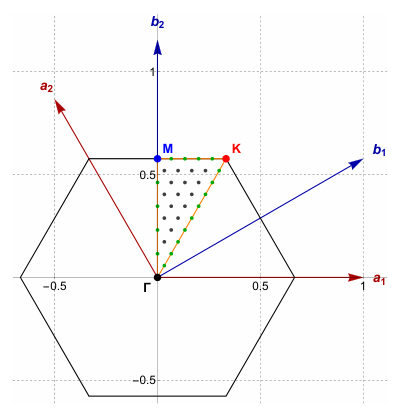 
Figure 1: Hexagonal first Brillouin zone of the triangular Wigner-crystal lattice. The irreducible Γ–K–M wedge used for the Brillouin-zone sampling is indicated.

📷 Fig 2

 
Figure 2: Evolution of the fully spin-polarized Hartree–Fock Wigner-crystal solution with the density parameter rs. The four rows correspond to rs = 4, 10, 30, and 50, as indicated inside the panels. The columns show, from left to right, the initial charge-density configuration, the converged Hartree–Fock charge density, the same-spin Hartree–Fock band structure along Γ–K–M–Γ, and the static dielectric function εHF(q, 0) along Γ–K direction. The charge-density panels also indicate the first-star order parameter of the initial and converged configurations, denoted by Mini and Mfin, respectively. The sequence illustrates the evolution from a weakly crystalline solution at small rs toward...

**Summary.** This paper develops and applies a Hartree-Fock method to calculate the static dielectric function of a Wigner crystal formed in monolayer WSe2. By combining band structure calculations with polarizability theory, it provides a detailed theoretical tool to study electronic screening and charge ordering effects in dilute 2D electron systems.

**Why it may be interesting.** While focused on solid-state screening, the use of advanced many-body techniques (HF) to model strongly correlated insulating states like Wigner crystals provides valuable theoretical tools applicable to understanding charge ordering in low-dimensional quantum materials relevant to AMO/optics research.

Detailed structure

**Main problem.** The study aims to compute the static dielectric function of a Wigner-crystal state formed within a two-dimensional transition-metal dichalcogenide, specifically monolayer WSe2.

**Main result.** The method successfully calculates $\epsilon(\mathbf{q}, 0)$, showing that screening is strongest at a finite momentum $q_{\max}$, which shifts as the electron density decreases.

**Method.** A Hartree-Fock numerical method is developed to compute the band structure of the Wigner crystal, and this framework is then used to calculate the static polarizability via an insulating Lindhard-type formula.

**Model / system.** The system modeled is a two-dimensional electron gas forming a Wigner crystal in monolayer WSe2. The theory employs a self-consistent Hartree-Fock approach assuming full spin polarization and utilizes plane-wave expansions in the supercell basis.

**Key observables.** Static dielectric function $\epsilon(\mathbf{q}, 0)$, single-particle excitation spectra, and the Wigner-crystal order parameter ($M_1$).

**Important parameters / regimes.** The dimensionless density parameter $r_s$ (which controls crystal localization), the momentum transfer $q$, and the long-wavelength limit ($q 	o 0$) where $\epsilon(0, 0) = 1$.

**Assumptions / limitations.** The ground state is assumed to be fully spin-polarized. The calculations rely on the Hartree-Fock approximation for band structure and use an adapted Lindhard/Stern polarizability formula.

**Figures summary.** Figure 1 illustrates the hexagonal first Brillouin zone of the triangular Wigner-crystal lattice and the irreducible $\Gamma–K–M$ wedge used for momentum space sampling.

**Paper structure.** The paper develops from general Wigner crystal theory to solving the self-consistent Hartree-Fock equations in a plane-wave basis, culminating in the calculation of the static dielectric function using the resulting band structure and polarizability formalism.

Abstract

We develop a Hartree-Fock numerical method for computing the band structure of a two-dimensional Wigner crystal in an electron gas at zero temperature. The ground state is assumed to be fully spin-polarized. Single-particle excitation spectra are evaluated in spin-conserving channel. As an application, we use the developed code to compute the static dielectric function epsilon(q,0) of a Wigner-crystal state formed in a two-dimensional transition-metal dichalcogenide, specifically monolayer WSe2. The dielectric response is obtained from the Hartree-Fock band structure and eigenfunctions through a static Lindhard-type polarizability. The method provides a theoretical tool for investigating screening, band-structure reconstruction, and interaction effects in low-density two-dimensional systems, with possible relevance for future experimental studies.

[↑ back to top](#top)

### [Vortex-Number-Controlled Josephson Diode Polarity in Corbino Junctions](http://arxiv.org/abs/2607.04104v1)

**Authors:** Linghao Huang, Jing Wang  
**Type:** theory · **Category:** other · **PDF:** <https://arxiv.org/pdf/2607.04104v1>  
**Analysis basis:** full PDF text, analyzed in chunks
**Topic relevance:** `Keldysh / 2PI / non-Gaussian methods` **1/5** · `driven-dissipative phase transition` **1/5**

📷 Fig 1

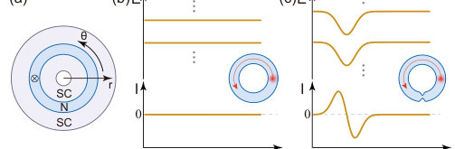 
FIG. 1. Corbino Josephson junction and current-phase re- lation (CPR). (a) Schematic of a Corbino Josephson junc- tion. A perpendicular magnetic field threads the non- superconducting region (N), enclosing a magnetic flux Φ quantized in units of the superconducting flux quantum Φ0 = h/2e. (b) Andreev spectrum and CPR of a homogeneous junction with Φ = Φ0. (c) Corresponding results for an inho- mogeneous junction. The diffuse red spot denotes a Joseph- son vortex, which moves around the annulus as the phase difference ϕ between the inner and outer superconductors is increased.

📷 Fig 2

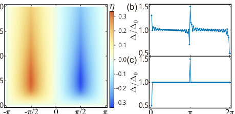 
FIG. 2. The Josephson diode polarity and representative in- homogeneous pairing profile ∆(θ). (a) Diode polarity ob- tained from Eq. (9). (b),(c) Two representative examples of ∆(θ) evaluated on a uniform discretization of θ ∈[0, 2π) with 100 grid points. (b) corresponds to the profile defined in Eq. (3) with nc = 60. (c) shows a two-site perturbation profile, in which the pairing amplitude exhibits opposite-sign deviations from the uniform background at two nearly dia- metrically separated grid points (sites 1 and 50).

📷 Fig 3

 
Fig. 2(b) shows this profile sampled on a uniform angu- lar grid, corresponding to the discrete values ∆ni used in the numerics. Its dominant feature is two opposite-sign modulations localized in two nearly diametrically oppo- site angular sectors. Motivated by this structure, we further consider a simplified two-site perturbation pro- file with opposite-sign pairing-amplitude perturbations at two nearly diametrically separated grid sites on the ring [Fig. 2(c)]. This reduced profile introduces only small deviations in φj, which weakly renormalize the harmonic phases but do not affect the vortex-number- controlled alternation of the diode polarity.

📷 Fig 4

 
FIG. 3. Numerical results for effective 1D edge model. (a) Forward and backward critical currents I± c as a function of vortex number p. (b) Corresponding diode polarity η versus p. (c),(d) Current-phase relations for odd and even p, respec- tively. (e),(f) Representative low-energy and quasi-continuum Andreev spectra for p = 1 and p = 2, respectively. The color scale indicates the wavefunction weight on the junc- tion Majorana modes. The inset in (f) shows the sum of the two quasi-continuum branches. Model parameters are v = 1, ∆0 = 0.15, m = 0.6, Ecut = 0.5.

📷 Fig 5

 
FIG. 4. Numerical results for 2D models. Panels (a),(c) show the forward and backward critical currents I± c and diode po- larity η, respectively, for a non-topological Corbino Josephson junction. The model parameters are W = 400, L = 2, t = 20, µ = 10, ∆= 1, nc = 300. Panels (b),(d) show the corresponding results for a topological junction. The model parameters are W = 300, L = 2, t = 300, M0 = 20, M1 = 300, mz = 20, µ = 5, ∆= 10, nc = 200.

**Summary.** This theoretical paper demonstrates that the diode polarity in Josephson junctions can be controlled by the vortex number ($p$) simply through structured spatial inhomogeneity. By analyzing the Andreev spectrum and deriving harmonic selection rules, the authors show this effect is a generic consequence of geometry rather than exclusively requiring topological superconductivity.

**Why it may be interesting.** The work provides a general mechanism for controlling superconducting junction properties using geometric structure, decoupling the observation of parity dependence from the necessity of exotic topological physics like Majorana fermions.

Detailed structure

**Main problem.** To determine if vortex-parity-dependent Josephson diode polarity reversal is a unique signature of Majorana physics or if it can emerge from generic, non-topological mechanisms.

**Main result.** Structured spatial inhomogeneity in Corbino junctions provides a universal, non-topological route for achieving vortex-parity-dependent control over the Josephson diode effect's sign.

**Method.** The authors used continuum Andreev spectral theory and perturbation methods to derive harmonic selection rules governing how structural inhomogeneities modulate the current-phase relation.

**Model / system.** The study analyzes Corbino Josephson junctions, modeled using a continuum Andreev Hamiltonian incorporating spatial inhomogeneity $\Delta(	heta)$. The analysis extends from 1D edge models to full 2D lattice simulations.

**Key observables.** Josephson diode polarity ($\eta$), critical currents ($I_{\pm c}$), and the relative phases of higher-order Josephson current harmonics.

**Important parameters / regimes.** Vortex number ($p = \Phi/\Phi_0$), degree of spatial inhomogeneity ($\delta\Delta(	heta)$), and the ratio of modulation strength to gap $\delta\Delta / \Delta_0$.

**Assumptions / limitations.** The analysis relies on the weak modulation limit ($\delta\Delta \ll \Delta_0$) and assumes specific functional forms for the current-phase relation harmonics.

**Figures summary.** Figures illustrate schematic junction geometries, the dependence of diode polarity on vortex number, and comparisons between results obtained from topological versus non-topological models.

**Paper structure.** The paper builds by first establishing the general relationship between current asymmetry and phase differences (Chunk 3), then deriving a harmonic selection rule based on local bound states around vortices (Chunk 4), and finally applying this framework to show that structured inhomogeneity controls diode polarity in both topological and non-topological settings (Chunks 1 & 2).

Abstract

We demonstrate that the polarity of the Josephson diode effect in Corbino Josephson junctions can be deterministically controlled by the vortex number, which arises as a generic consequence of structured spatial inhomogeneity. By solving the continuum Andreev spectral problem, we identify a mechanism in which the vortex number selectively filters specific spatial Fourier harmonics of the local inhomogeneity. This harmonic selection reshapes the amplitudes and relative phases of higher-order Josephson current harmonics, ultimately reversing the critical-current asymmetry. Numerical simulations of both an effective one-dimensional edge model and full two-dimensional lattice models confirm the robustness of this mechanism. Crucially, our results show that a vortex-parity-dependent reversal of diode polarity is not an exclusive signature of Majorana physics, but can emerge generically from geometric and structural inhomogeneities in Corbino junctions.

[↑ back to top](#top)

### [Josephson effects in the spin-triplet superconductor/altermagnet/spin-triplet superconductor junctions: the detection of the intrinsic $\bf{d}$-vector](http://arxiv.org/abs/2607.03685v1)

**Authors:** Ya-Ting Han, Li-Juan Chen, Wen-Ting Liu, Qiang Cheng, Qing-Feng Sun  
**Type:** theory · **Category:** strongly correlated electrons · **PDF:** <https://arxiv.org/pdf/2607.03685v1>  
**Analysis basis:** full PDF text, analyzed in chunks
**Topic relevance:** `Keldysh / 2PI / non-Gaussian methods` **1/5**

📷 Fig 1

 
FIG. 1: Schematic diagram of the STS/AM/STS Josephson junctions. The red arrow in the left (right) STS denotes the vector dL(R). Its direction is characterized by the polar an- gle θL(R) and the azimuthal angle φL(R). The red and blue ellipses represent the Fermi surface in AM. The former is oc- cupied by the spin-down electrons while the latter is occupied by the spin-up electrons. The orientation of AM is defined as the angle α between the major axis of the red ellipse and the interface normal.

📷 Fig 2

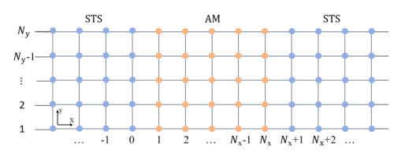 
FIG. 2: Schematic illustration of the two-dimensional square lattice model for the discretization of the STS/AM/STS Josephson junctions.

📷 Fig 3

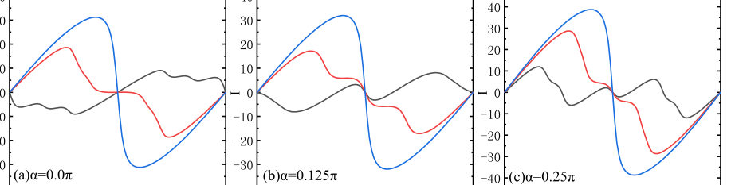 
FIG. 3: The CPRS for different polar angles with (a) α=0.0π, (b) α=0.125π and (c) α=0.25π. The strength of altermagnetism is taken as tJ = 0.5. The black, red, and blue solid lines correspond to θ = 0, 0.3π, and 0.5π, respectively.

📷 Fig 4

 
FIG. 4: The critical current as a function of the polar angle of the d-vector for different orientation angles with (a) tJ = 0.1, (b) tJ = 0.3, (c) tJ = 0.5 and (d) tJ = 0.7. The black, red, and blue solid lines correspond to θ = 0, 0.3π, and 0.5π, respectively.

📷 Fig 5

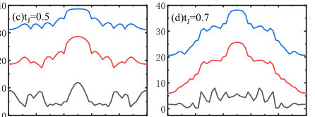 
FIG. 5: The critical current as a function of the orientation angle α of AM for different polar angles with (a) tJ = 0.1, (b) tJ = 0.3 (c) tJ = 0.5 and (d) tJ = 0.7. The black, red, and blue solid lines correspond to θ = 0, 0.3π, and 0.5π, respectively.

**Summary.** The paper theoretically investigates Josephson junctions formed between spin-triplet superconductors and altermagnets. By analyzing the current-phase relations, the authors demonstrate that these junctions provide a sensitive probe to determine the intrinsic direction of the superconducting d-vector. This method is advantageous because it circumvents issues associated with external magnetic fields affecting the d-vector.

**Why it may be interesting.** This work explores unconventional superconductivity interfaces where spin-orbit coupling and magnetism interact strongly, which is a rich area for studying emergent quantum phenomena beyond simple BCS theory.

Detailed structure

**Main problem.** The primary goal is to develop a method to detect the intrinsic direction of the d-vector in spin-triplet superconductors (STS).

**Main result.** The Josephson current-phase relationships and critical currents are shown to be highly sensitive to the d-vector orientation and the altermagnet's angle, enabling its detection.

**Method.** Theoretical calculations employing the Green's function method on a lattice model.

**Model / system.** The system modeled is an STS/Altermagnet (AM)/STS Josephson junction. The theoretical framework involves constructing and solving Bogoliubov-de Gennes Hamiltonians for each component.

**Key observables.** Current-phase difference relationships (CPRs) and the critical current ($I_c$).

**Important parameters / regimes.** The direction of the d-vector, the orientation angle ($\alpha$) of the altermagnet, and the strength of altermagnetism.

**Assumptions / limitations.** The study assumes that the AM possesses zero net macroscopic magnetization, which is key to its utility in this detection scheme.

**Figures summary.** Figure 1 schematically illustrates the junction structure and the dependence on d-vector direction and orientation angle $\alpha$.

**Paper structure.** The paper systematically analyzes the Josephson effects by deriving current expressions based on Green's functions, showing how the resulting CPRs depend critically on the relative orientations of the superconducting order parameter ($\mathbf{d}$-vector) and the magnetic material (AM).

Abstract

We study the Josephson effects in the spin-triplet superconductor/altermagnet/spin-triplet superconductor junctions using the Green's function method. It is found that the current-phase difference relationships in the junctions strongly depend on the direction of the $\bf{d}$-vectors in the spin-triplet superconductors and the orientation angle of the altermagnet. For the given orientation angle, the $0$-$π$ transition can be obtained when the $\bf{d}$-vector is rotated. The variations of the critical current of the junctions with the direction of the $\bf{d}$-vector, the orientation angle and the strength of altermagnetism are systematically investigated. These Josephson effects can provide the distinguishable information about the direction of the $\bf{d}$-vector. Compared to the existing research, the proposed altermagnetic Josephson junctions can effectively avoid the negative influence of the magnetic field on the $\bf{d}$-vector and can serve as a feasible scheme for the detection of the intrinsic $\bf{d}$-vector. The obtained $0$-$π$ transition in the junctions can also have potential applications in the design of quantum devices.

[↑ back to top](#top)

### [Where Does Surface $χ^{(2)}$ Come From? A Systematic Derivation of Nonlinear Surface Susceptibilities from Bulk Nonlocal Response](http://arxiv.org/abs/2607.04459v1)

**Authors:** Zolla Frederic  
**Type:** theory · **Category:** other · **PDF:** <https://arxiv.org/pdf/2607.04459v1>  
**Analysis basis:** full PDF text, analyzed in chunks
**Topic relevance:** `interference shaping light` **1/5**

📷 Fig 1

 
Figure 1: Schematic decomposition of the second-order polarization at a point r near the boundary ∂Ω. The integration domain over the two source variables (r′, r′′) splits into four cells: the homogeneous bulk contribution (top-left), a higher-order surface correction where both source points lie outside Ω(top-right), and two cross terms (bottom) where exactly one of the source points lies outside. After the distributional thin-layer limit, the two cross terms combine to produce the leading surface susceptibility χ(2),∂Ωsupported on ∂Ω.

📷 Fig 2

 
Figure 2: An idealised medium whose χ(2) reduces to a singular distribution localised at x = 0. The fundamental field u1 at frequency ω propagates from the left, and the second-harmonic field u2 at 2ω radiates outward from the interface on both sides.

📷 Fig 3

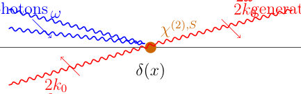 
Figure 3: Photon-level picture: two photons at frequency ω combine at the surface χ(2)

**Summary.** This paper develops a systematic, nonlocal theory to derive nonlinear surface susceptibilities ($\chi^{(2)}$) governing processes like Second Harmonic Generation. By combining distributional limits with moment expansions, the authors show that the complex bulk response simplifies into measurable surface coefficients. The work is significant for establishing rigorous selection rules based on material symmetry.

**Why it may be interesting.** This work provides a rigorous theoretical framework connecting fundamental material symmetries (like centrosymmetry) directly to observable optical phenomena (SHG), which is crucial for designing advanced photonic materials or understanding surface-dominated quantum interactions.

Detailed structure

**Main problem.** The paper systematically derives nonlinear surface susceptibilities ($\chi^{(2)}$) from the general theory of bulk nonlocal response for second-harmonic generation (SHG). It aims to quantify how interfacial effects dominate the optical response, especially when symmetry dictates zero bulk contributions.

**Main result.** The leading order nonlinear surface susceptibility is shown to condense into two scalar components ($\chi^{(2),s}_\parallel$ and $\chi^{(2),s}_\perp$), and the problem reduces recursively to an effective linear susceptibility determined by the bulk kernel. Furthermore, it rigorously establishes selection rules showing that centrosymmetry forbids bulk SHG.

**Method.** The methodology combines a distributional thin-layer limit with spatial moment expansions applied to general tensorial nonlocal constitutive relations. A key technique is the 'marginal integration principle,' which simplifies the nonlinear problem into an effective linear one.

**Model / system.** The study models the nonlinear optical response of material interfaces (e.g., planar or spherical) exhibiting second-order polarization ($P^{(2)}$). The theory uses general tensorial nonlocal kernels ($	ilde{\Delta}^{(n)}$) to describe interactions across space.

**Key observables.** Nonlinear surface susceptibilities ($\chi^{(2),s}_\parallel, \chi^{(2),s}_\perp$), the nonlinear surface moment tensor $M^{(2,0)}_{ijk}$, and SHG amplitudes in transmitted/reflected fields.

**Important parameters / regimes.** The small parameter $\ell$ (thickness of the boundary layer) and the wave vector $k_0$ are crucial for analyzing the thin-layer limit. Curvature corrections appear at order $\ell^2$.

**Assumptions / limitations.** Assumes rapid decay of fields, support in the bulk medium ($\Omega$), and utilizes a distributional framework extension from linear to nonlinear response.

**Figures summary.** Figure 1 schematically illustrates the decomposition of polarization into four distinct spatial regions (e.g., $\Omega	imes\Omega$, $\partial\Omega 	imes \Omega$) which, upon taking the thin-layer limit, yield the surface susceptibility terms.

**Paper structure.** The paper develops the theory by first extending a linear distributional framework to the nonlinear second-order case ($\chi^{(2)}$). It then applies moment expansions in 1D and generalizes them to 3D, culminating in deriving generalized nonlinear Maxwell boundary conditions for various geometries (planar/spherical) and establishing symmetry selection rules.

Abstract

We extend the distributional framework developed in the companion paper [Zolla, arXiv:2605.15716] to the nonlinear case, focusing on the second-order ($χ^{(2)}$) response responsible for second-harmonic generation (SHG). Starting from the most general tensorial nonlocal second-order constitutive relation and combining a spatial moment expansion with a distributional thin-layer limit, we show that the full complexity of the nonlinear interfacial response condenses, at leading order, into two scalars, the nonlinear surface susceptibilities $χ^{(2),s}_\parallel$ and $χ^{(2),s}_\perp$, associated with the tangential and normal components of the electric field, respectively. A key structural result is established: via a marginal integration over one field argument, the nonlinear surface problem reduces recursively to an effective linear one, whose surface susceptibility is determined by the bulk nonlinear kernel alone. Generalized nonlinear Maxwell boundary conditions are derived explicitly for planar and spherical interfaces, and curvature corrections are obtained systematically. The formalism is illustrated on Gaussian, Yukawa, and tensorial Lorentz kernels.

[↑ back to top](#top)

### Other secondary papers (2)

Show other secondary papers

### [Topological Electronic States and Phonon Mediated Superconductivity in Ru Based Ternary Pnictides: ZrRuAs and HfRuP](http://arxiv.org/abs/2607.04651v1)

**Authors:** Jubair Hossan Abir, Tanvir Khan, Tauhidur Rahman, Md. Kamrul Hassan, Sraboni Saha Moly, Mst. Maskura Khatun, Raihana Shams Islam, Saleh Hasan Naqib  
**Type:** theory · **Category:** other · **PDF:** <https://arxiv.org/pdf/2607.04651v1>  
**Analysis basis:** full PDF text, analyzed in chunks

📷 Fig 1

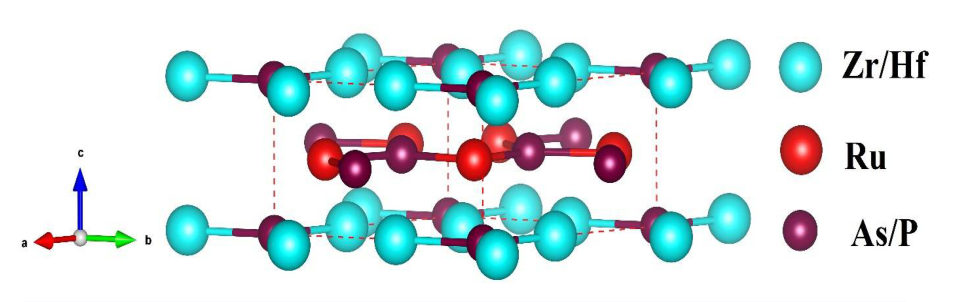 
Figure 1. Schematic 3D representation of layered Crystal structures of ZrRuAs and HfRuP.

📷 Fig 2

 
Figure 2. (a) and (b) illustrate the 2D electron density difference (EDD) contour maps of the Ru- Zr-As and Ru-Hf-P systems, respectively. The color scale represents the degree of electron accumulation and depletion within the crystal structure. In the contour maps, the blue regions correspond to electron accumulation, whereas the yellow/red regions indicate electron depletion, demonstrating the redistribution of charge caused by chemical bonding and orbital hybridization among the constituent atoms.

📷 Fig 3

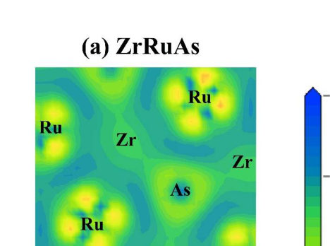 
Figure 2. The electron density difference maps for (a) ZrRuAs and (b) HfRuP.

📷 Fig 4

 
Figure 3. 3D representation of the mechanical properties of ZrRuAs and HfRuP in terms of Young’s modulus, Shear modulus, Linear compressibility and Poisson’s ratio.

📷 Fig 5

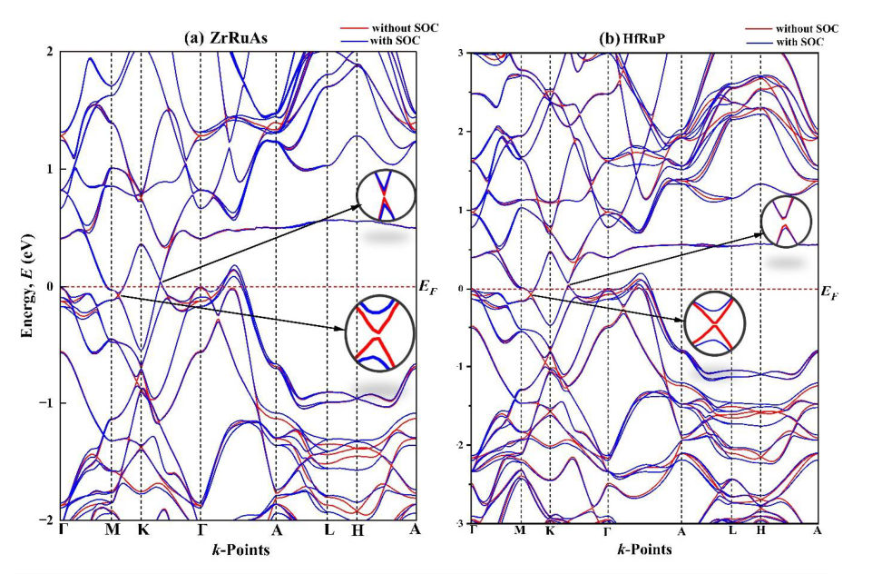 
Figure 4. Calculated electronic band Structure of ZrRuAs and HfRuP without and with SOC.

**Summary.** This paper computationally investigates ZrRuAs and HfRuP, characterizing them as topological semimetals with predicted conventional superconductivity. Using DFT calculations, the authors detail their structural stability, mechanical ductility, and electronic band features, providing a comprehensive materials science profile for these pnictides.

**Why it may be interesting.** While focused on solid-state physics rather than AMO systems, the use of advanced computational methods to link topological electronic states directly to macroscopic properties like superconductivity is methodologically relevant for understanding emergent quantum phenomena in condensed matter.

Detailed structure

**Main problem.** The study investigates the comprehensive physical properties, including electronic, mechanical, optical, thermodynamic, and superconducting characteristics of two ternary pnictides: ZrRuAs and HfRuP.

**Main result.** Both compounds exhibit topological semimetallic behavior and are predicted to be ductile and highly machinable. They also show evidence of conventional superconductivity with estimated transition temperatures around 9-10 K.

**Method.** The research relies heavily on first-principles calculations using DFT (PBE-GGA) for electronic structure, mechanical properties derived from elastic constants, and thermodynamic modeling.

**Model / system.** The physical systems are the crystalline materials ZrRuAs and HfRuP, which possess a hexagonal crystal structure. The analysis covers their band structures, charge distributions via EDD maps, and bulk/shear moduli.

**Key observables.** Topological semimetallic behavior, superconducting transition temperatures ($T_c$), Pugh's ratio, Poisson’s ratio, Bulk modulus (B), Shear modulus (G), and Machinability index ($\mu_M$).

**Important parameters / regimes.** The calculations are performed using specific computational parameters like the PBE-GGA functional, $12 	imes 12 	imes 12$ k-point meshes, and temperature/pressure ranges for thermodynamic fitting.

**Assumptions / limitations.** The primary assumptions involve the accuracy of DFT approximations (PBE-GGA) in describing complex electronic correlations and superconducting mechanisms.

**Figures summary.** Figure 1 shows the layered crystal structures; Figure 2 displays Electron Density Difference (EDD) contour maps illustrating charge accumulation/depletion; Tables summarize optimized lattice parameters, elastic constants, and macroscopic mechanical properties.

**Paper structure.** The paper follows a structure of initial structural characterization, followed by detailed electronic band structure analysis (including SOC effects), calculation of mechanical stability metrics, thermodynamic assessment, and finally, the determination of superconducting transition temperatures.

Abstract

This study investigates the structural, electronic, mechanical, optical, thermodynamic, and superconducting properties of ZrRuAs and HfRuP. Electronic band structure calculations reveal topological semimetallic behavior in both compounds with several bands crossing the Fermi level. The inclusion of spin orbit coupling lifts band degeneracies in both compounds. The Fermi surface shows both electron and hole segments. The estimated Pugh ratio, Poisson ratio and machinability index indicate that both compounds are ductile in nature and exhibit excellent machinability. Optical results show metallic reflectivity and notable absorption in the ultraviolet region. Thermodynamic analysis indicates stable behavior. The estimated superconducting transition temperatures are 9.75 K for ZrRuAs and 9.03 K for HfRuP that indicates strong coupling conventional superconductivity. The results provide a detailed view of the physical and superconducting properties of ZrRuAs and HfRuP and help to close the existing research gaps in these topological superconducting materials.

[↑ back to top](#top)

### [Tuning Superconductivity by Isovalent Antimony Substitution in PrFeAs(O,F)](http://arxiv.org/abs/2607.03712v1)

**Authors:** Priya Singh, Konrad Kwatek, Tatiana Zajarniuk, Taras Palasyuk, Cezariusz Jastrzębski, Michał Wierzbicki, Tomasz Cetner, Andrzej Szewczyk, Shiv J. Singh  
**Type:** both · **Category:** strongly correlated electrons · **PDF:** <https://arxiv.org/pdf/2607.03712v1>  
**Analysis basis:** full PDF text, analyzed in chunks

📷 Fig 1

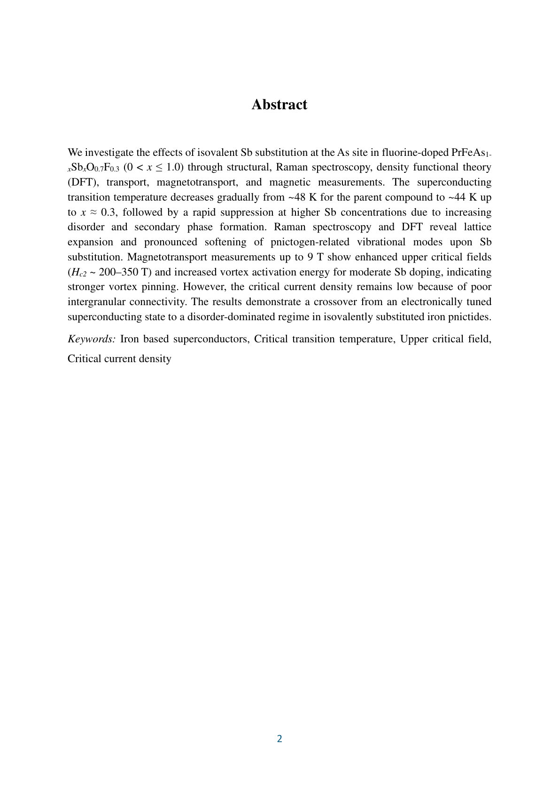 
Low-resolution page preview, page 2

📷 Fig 2

 
Low-resolution page preview, page 3

📷 Fig 3

 
Low-resolution page preview, page 4

📷 Fig 4

 
Low-resolution page preview, page 5

📷 Fig 5

 
Low-resolution page preview, page 6

**Summary.** This paper systematically investigates the impact of substituting Antimony for Arsenic in a fluorine-doped iron pnictide superconductor. Using a combination of structural, spectroscopic, and transport measurements, the authors map out how doping tunes superconductivity, revealing a competition between beneficial electronic tuning effects and detrimental disorder-induced scattering mechanisms.

**Why it may be interesting.** Iron pnictides are canonical examples of unconventional superconductors whose pairing mechanism is strongly influenced by spin fluctuations and crystal structure, making this work highly relevant to correlated electron physics.

Detailed structure

**Main problem.** The study investigates how isovalent Antimony (Sb) substitution at the As site tunes superconductivity in fluorine-doped PrFeAs(O,F) iron pnictides.

**Main result.** Superconductivity initially decreases with Sb doping but shows enhanced upper critical fields and vortex pinning for moderate doping, ultimately crossing over from an electronically tuned state to a disorder-dominated regime.

**Method.** The research combines structural characterization (XRD), lattice dynamics (Raman spectroscopy), transport measurements (resistivity/magnetotransport up to 9 T), magnetic measurements, and theoretical calculations (DFT).

**Model / system.** The physical system is the iron pnictide superconductor $	ext{PrFeAs}_{1-x}	ext{Sb}_x	ext{O}_{0.7}	ext{F}_{0.3}$. The study probes how substituting As with Sb modifies the electronic structure and lattice parameters.

**Key observables.** Superconducting transition temperature ($T_c$), upper critical field ($H_{c2}$), vortex activation energy, lattice parameters (especially $c$ and volume $V$), and phonon mode shifts.

**Important parameters / regimes.** Sb concentration ($x$), magnetic field strength (up to 9 T), and the doping regime (low vs. high $x$).

**Assumptions / limitations.** The analysis assumes that structural changes, lattice expansion, and disorder effects can be separated or modeled to understand the superconducting mechanism.

**Figures summary.** Figures detail structural evolution via XRD/Rietveld refinement, phonon shifts from Raman spectroscopy across doping levels, and transport properties showing $T_c$, $H_{c2}$, and critical current density ($J_c$) dependence on Sb content.

**Paper structure.** The paper follows a comprehensive characterization approach: structural analysis (XRD/EDX) establishes phase purity and lattice changes; Raman spectroscopy probes vibrational modes; transport measurements map the superconducting dome and vortex dynamics; and DFT provides theoretical context for these observed electronic and structural modifications.

Abstract

We investigate the effects of isovalent Sb substitution at the As site in fluorine-doped PrFeAs1-xSbxO0.7F0.3 (x = 0 to 1.0) through structural, Raman spectroscopy, density functional theory (DFT), transport, magnetotransport, and magnetic measurements. The superconducting transition temperature decreases gradually from ~48 K for the parent compound to ~44 K up to x = 0.3, followed by a rapid suppression at higher Sb concentrations due to increasing disorder and secondary phase formation. Raman spectroscopy and DFT reveal lattice expansion and pronounced softening of pnictogen related vibrational modes upon Sb substitution. Magnetotransport measurements up to 9 T show enhanced upper critical fields and increased vortex activation energy for moderate Sb doping, indicating stronger vortex pinning. However, the critical current density remains low because of poor intergranular connectivity. The results demonstrate a crossover from an electronically tuned superconducting state to a disorder-dominated regime in isovalently substituted iron pnictides.

[↑ back to top](#top)

