
# arxiv digest (quant-ph + cond-mat) — 2026-07-08

*180 papers · 66 relevant · 3 highlighted*

## 🔥 Most relevant (66)

*Every paper with at least one nonzero topic score, sorted by best-matching score. 🔥 marks scores ≥4/5. Click the title to jump to the full entry below; click [arXiv] to open the paper page. `(secondary)` marks papers from de-prioritized cond-mat archives.*

Show 66 relevant papers

- ⭐ [Controlling many-body quantum chaos in a dissipative optical cavity](#paper-2607.04455) [[arXiv]](http://arxiv.org/abs/2607.04455v1) — 🔥 `methods for driven-dissipative` **5/5** · 🔥 `analog quantum simulation` **4/5** · 🔥 `correlated / nonlocal dissipation` **4/5** · 🔥 `correlated cavity matter` **4/5** · 🔥 `entanglement & information structure` **4/5** · `Tavis-Cummings & cavity-many-emitter` **3/5** · `driven-dissipative phase transition` **3/5** · `non-equilibrium dynamics` **3/5** · `quantum measurements` **3/5** · `Keldysh / 2PI / non-Gaussian methods` **2/5** · `non-equilibrium universality` **2/5** · `Kondo & dissipative impurity` **1/5** · `exotic spin models in light-matter` **1/5** · `measurement-induced transitions` **1/5** · `scars & prethermalization` **1/5**
- [Measurement-induced spatially nonuniform fluctuations of the local particle number and their crossover in a quasiperiodic free-fermion chain](#paper-2607.03799) [[arXiv]](http://arxiv.org/abs/2607.03799v1) — 🔥 `measurement-induced transitions` **5/5** · 🔥 `methods for driven-dissipative` **4/5** · 🔥 `non-equilibrium dynamics` **4/5** · 🔥 `quantum measurements` **4/5** · `driven-dissipative phase transition` **3/5** · `non-equilibrium universality` **3/5** · `Frenkel-Kontorova` **2/5** · `Keldysh / 2PI / non-Gaussian methods` **2/5** · `Kondo & dissipative impurity` **1/5** · `analog quantum simulation` **1/5** · `correlated / nonlocal dissipation` **1/5** · `entanglement & information structure` **1/5** · `scars & prethermalization` **1/5**
- [Spectral-topology-induced criticality in non-Hermitian fermionic metals](#paper-2607.05190) [[arXiv]](http://arxiv.org/abs/2607.05190v1) — 🔥 `non-equilibrium universality` **5/5** · 🔥 `driven-dissipative phase transition` **4/5** · `analog quantum simulation` **3/5** · `correlated / nonlocal dissipation` **3/5** · `methods for driven-dissipative` **3/5** · `non-equilibrium dynamics` **3/5** · `Kondo & dissipative impurity` **2/5** · `entanglement & information structure` **2/5** · `Keldysh / 2PI / non-Gaussian methods` **1/5**
- [Weak ergodicity breaking without nonthermal eigenstates](#paper-2607.04279) [[arXiv]](http://arxiv.org/abs/2607.04279v1) — 🔥 `scars & prethermalization` **5/5** · 🔥 `analog quantum simulation` **4/5** · 🔥 `non-equilibrium dynamics` **4/5** · `entanglement & information structure` **3/5** · `non-equilibrium universality` **3/5** · `driven-dissipative phase transition` **2/5** · `Frenkel-Kontorova` **1/5** · `correlated / nonlocal dissipation` **1/5** · `correlated cavity matter` **1/5** · `methods for driven-dissipative` **1/5**
- [Emergence of the Scrooge Ensemble in the Sachdev-Ye-Kitaev Model](#paper-2607.04864) [[arXiv]](http://arxiv.org/abs/2607.04864v1) — 🔥 `quantum measurements` **5/5** · 🔥 `measurement-induced transitions` **4/5** · `entanglement & information structure` **3/5** · `non-equilibrium dynamics` **3/5** · `Keldysh / 2PI / non-Gaussian methods` **2/5** · `non-equilibrium universality` **2/5** · `correlated / nonlocal dissipation` **1/5** · `driven-dissipative phase transition` **1/5** · `methods for driven-dissipative` **1/5** · `scars & prethermalization` **1/5**
- [Thermalization hierarchy from irreducible degrees of freedom](#paper-2607.03535) [[arXiv]](http://arxiv.org/abs/2607.03535v1) — 🔥 `scars & prethermalization` **5/5** · 🔥 `entanglement & information structure` **4/5** · 🔥 `non-equilibrium dynamics` **4/5** · `non-equilibrium universality` **3/5** · `analog quantum simulation` **2/5** · `Keldysh / 2PI / non-Gaussian methods` **1/5** · `correlated / nonlocal dissipation` **1/5** · `driven-dissipative phase transition` **1/5** · `methods for driven-dissipative` **1/5**
- [Katsura-Nagaosa-Balatsky magnetoelectricity in molecular magnets: Bipartite entanglement transfer by means of rotating electric field](#paper-2607.03965) [[arXiv]](http://arxiv.org/abs/2607.03965v1) `(secondary)` — 🔥 `entanglement & information structure` **5/5** · 🔥 `analog quantum simulation` **4/5** · `exotic spin models in light-matter` **3/5** · `spintronics-quantum-optics interface` **3/5** · `non-equilibrium dynamics` **2/5** · `Keldysh / 2PI / non-Gaussian methods` **1/5** · `correlated / nonlocal dissipation` **1/5** · `driven-dissipative phase transition` **1/5** · `methods for driven-dissipative` **1/5**
- [Critical behavior of the driven Curie-Weiss model](#paper-2607.05130) [[arXiv]](http://arxiv.org/abs/2607.05130v1) — 🔥 `non-equilibrium universality` **5/5** · 🔥 `driven-dissipative phase transition` **4/5** · `methods for driven-dissipative` **3/5** · `non-equilibrium dynamics` **3/5** · `Keldysh / 2PI / non-Gaussian methods` **1/5** · `analog quantum simulation` **1/5** · `correlated / nonlocal dissipation` **1/5**
- [Fast Pulses for High-Fidelity Circularization of Interacting Rydberg atoms](#paper-2607.05216) [[arXiv]](http://arxiv.org/abs/2607.05216v1) — 🔥 `Rydberg arrays` **5/5** · 🔥 `analog quantum simulation` **4/5** · `methods for driven-dissipative` **3/5** · `non-equilibrium dynamics` **2/5** · `Keldysh / 2PI / non-Gaussian methods` **1/5** · `entanglement & information structure` **1/5** · `quantum measurements` **1/5**
- [Quantum Hashing via Constrained Rydberg Many-Body Dynamics](#paper-2607.04991) [[arXiv]](http://arxiv.org/abs/2607.04991v1) — 🔥 `Rydberg arrays` **5/5** · 🔥 `analog quantum simulation` **4/5** · `entanglement & information structure` **2/5** · `non-equilibrium dynamics` **2/5** · `Tavis-Cummings & cavity-many-emitter` **1/5** · `correlated cavity matter` **1/5** · `driven-dissipative phase transition` **1/5** · `methods for driven-dissipative` **1/5**
- [The arrival position problem in quantum mechanics](#paper-2607.03538) [[arXiv]](http://arxiv.org/abs/2607.03538v1) — 🔥 `quantum measurements` **5/5** · 🔥 `measurement-induced transitions` **4/5** · `non-equilibrium dynamics` **2/5** · `Keldysh / 2PI / non-Gaussian methods` **1/5** · `correlated / nonlocal dissipation` **1/5** · `driven-dissipative phase transition` **1/5** · `methods for driven-dissipative` **1/5**
- [Quench, Glow, or Stay Silent: Distance-Controlled Up-Conversion Emission near Metallic Nanowires](#paper-2607.03873) [[arXiv]](http://arxiv.org/abs/2607.03873v1) `(secondary)` — 🔥 `correlated / nonlocal dissipation` **4/5** · `Tavis-Cummings & cavity-many-emitter` **3/5** · `correlated cavity matter` **3/5** · `driven-dissipative phase transition` **3/5** · `non-equilibrium dynamics` **3/5** · `quantum optics experiment` **3/5** · `analog quantum simulation` **2/5** · `methods for driven-dissipative` **2/5** · `non-equilibrium universality` **2/5** · `Dicke superradiance` **1/5** · `Keldysh / 2PI / non-Gaussian methods` **1/5** · `Kondo & dissipative impurity` **1/5** · `entanglement & information structure` **1/5** · `interference shaping light` **1/5** · `measurement-induced transitions` **1/5** · `quantum measurements` **1/5**
- [All-optical control of coherent perfect absorption via frequency conversion](#paper-2607.04682) [[arXiv]](http://arxiv.org/abs/2607.04682v1) — 🔥 `correlated / nonlocal dissipation` **4/5** · `driven-dissipative phase transition` **3/5** · `interference shaping light` **3/5** · `quantum optics experiment` **3/5** · `Tavis-Cummings & cavity-many-emitter` **2/5** · `correlated cavity matter` **2/5** · `methods for driven-dissipative` **2/5** · `non-equilibrium dynamics` **2/5** · `non-equilibrium universality` **2/5** · `Keldysh / 2PI / non-Gaussian methods` **1/5** · `Kondo & dissipative impurity` **1/5** · `analog quantum simulation` **1/5** · `entanglement & information structure` **1/5** · `measurement-induced transitions` **1/5** · `quantum measurements` **1/5**
- [Lindblad theory of linear response susceptibility and dispersive readout in minimal Kitaev junctions](#paper-2607.04968) [[arXiv]](http://arxiv.org/abs/2607.04968v1) `(secondary)` — 🔥 `methods for driven-dissipative` **4/5** · 🔥 `quantum measurements` **4/5** · `Keldysh / 2PI / non-Gaussian methods` **3/5** · `correlated / nonlocal dissipation` **3/5** · `driven-dissipative phase transition` **3/5** · `QC/QI experiment` **2/5** · `non-equilibrium dynamics` **2/5** · `non-equilibrium universality` **2/5** · `spintronics-quantum-optics interface` **2/5** · `Kondo & dissipative impurity` **1/5** · `analog quantum simulation` **1/5** · `correlated cavity matter` **1/5** · `measurement-induced transitions` **1/5**
- [Quantum-Optical Bound States in the Continuum](#paper-2607.04742) [[arXiv]](http://arxiv.org/abs/2607.04742v1) — 🔥 `analog quantum simulation` **4/5** · `Tavis-Cummings & cavity-many-emitter` **3/5** · `correlated cavity matter` **3/5** · `driven-dissipative phase transition` **3/5** · `interference shaping light` **3/5** · `methods for driven-dissipative` **3/5** · `Frenkel-Kontorova` **2/5** · `non-equilibrium dynamics` **2/5** · `quantum optics experiment` **2/5** · `QC/QI experiment` **1/5** · `exotic spin models in light-matter` **1/5** · `non-equilibrium universality` **1/5** · `spintronics-quantum-optics interface` **1/5**
- [Matter-wave Induced Transparenc](#paper-2607.03820) [[arXiv]](http://arxiv.org/abs/2607.03820v1) — 🔥 `analog quantum simulation` **4/5** · 🔥 `methods for driven-dissipative` **4/5** · `Keldysh / 2PI / non-Gaussian methods` **3/5** · `correlated / nonlocal dissipation` **3/5** · `driven-dissipative phase transition` **3/5** · `interference shaping light` **3/5** · `non-equilibrium dynamics` **2/5** · `non-equilibrium universality` **2/5** · `Kondo & dissipative impurity` **1/5** · `entanglement & information structure` **1/5** · `measurement-induced transitions` **1/5**
- [Spin-momentum locking of polariton edge states in honeycomb lattices](#paper-2607.03961) [[arXiv]](http://arxiv.org/abs/2607.03961v1) `(secondary)` — 🔥 `analog quantum simulation` **4/5** · 🔥 `exotic spin models in light-matter` **4/5** · `correlated cavity matter` **3/5** · `quantum optics experiment` **3/5** · `spintronics-quantum-optics interface` **3/5** · `driven-dissipative phase transition` **2/5** · `non-equilibrium dynamics` **2/5** · `Frenkel-Kontorova` **1/5** · `Tavis-Cummings & cavity-many-emitter` **1/5** · `interference shaping light` **1/5** · `methods for driven-dissipative` **1/5** · `non-equilibrium universality` **1/5**
- [Magnetic graphs for cavity quantum electrodynamics](#paper-2607.04736) [[arXiv]](http://arxiv.org/abs/2607.04736v1) — 🔥 `analog quantum simulation` **4/5** · 🔥 `exotic spin models in light-matter` **4/5** · `Tavis-Cummings & cavity-many-emitter` **3/5** · `correlated cavity matter` **3/5** · `spintronics-quantum-optics interface` **3/5** · `driven-dissipative phase transition` **2/5** · `non-equilibrium dynamics` **2/5** · `correlated / nonlocal dissipation` **1/5** · `entanglement & information structure` **1/5** · `methods for driven-dissipative` **1/5** · `non-equilibrium universality` **1/5**
- [Purcell effect and quantum Zeno effect suppressed self-discharging of quantum battery](#paper-2607.04363) [[arXiv]](http://arxiv.org/abs/2607.04363v1) — 🔥 `methods for driven-dissipative` **4/5** · `correlated / nonlocal dissipation` **3/5** · `correlated cavity matter` **3/5** · `driven-dissipative phase transition` **3/5** · `Keldysh / 2PI / non-Gaussian methods` **2/5** · `Tavis-Cummings & cavity-many-emitter` **2/5** · `non-equilibrium dynamics` **2/5** · `non-equilibrium universality` **2/5** · `Kondo & dissipative impurity` **1/5** · `analog quantum simulation` **1/5** · `measurement-induced transitions` **1/5** · `quantum measurements` **1/5**
- [Sector-memory obstruction to probe-level bath emergence in finite programmable qubit environments](#paper-2607.04791) [[arXiv]](http://arxiv.org/abs/2607.04791v1) — 🔥 `QC/QI experiment` **4/5** · 🔥 `non-equilibrium dynamics` **4/5** · `correlated / nonlocal dissipation` **3/5** · `driven-dissipative phase transition` **3/5** · `methods for driven-dissipative` **3/5** · `analog quantum simulation` **2/5** · `non-equilibrium universality` **2/5** · `Keldysh / 2PI / non-Gaussian methods` **1/5** · `Kondo & dissipative impurity` **1/5** · `entanglement & information structure` **1/5** · `scars & prethermalization` **1/5**
- [Wei-Norman approach for non-Hermitian driven spin-$S$ systems and its application to defect freezing](#paper-2607.04075) [[arXiv]](http://arxiv.org/abs/2607.04075v1) — 🔥 `methods for driven-dissipative` **4/5** · 🔥 `non-equilibrium dynamics` **4/5** · `driven-dissipative phase transition` **3/5** · `exotic spin models in light-matter` **3/5** · `non-equilibrium universality` **3/5** · `analog quantum simulation` **2/5** · `spintronics-quantum-optics interface` **2/5** · `Keldysh / 2PI / non-Gaussian methods` **1/5** · `Kondo & dissipative impurity` **1/5** · `correlated / nonlocal dissipation` **1/5** · `scars & prethermalization` **1/5**
- [A Pulsed Live-Cell Quantum Microscope for Entangled Solid State and Biological Qubits](#paper-2607.03552) [[arXiv]](http://arxiv.org/abs/2607.03552v1) — 🔥 `QC/QI experiment` **4/5** · 🔥 `spintronics-quantum-optics interface` **4/5** · `quantum measurements` **3/5** · `quantum optics experiment` **3/5** · `exotic spin models in light-matter` **2/5** · `measurement-induced transitions` **2/5** · `correlated / nonlocal dissipation` **1/5** · `correlated cavity matter` **1/5** · `driven-dissipative phase transition` **1/5** · `entanglement & information structure` **1/5** · `methods for driven-dissipative` **1/5** · `non-equilibrium dynamics` **1/5**
- [Gorini-Kossakowski-Sudarshan-Lindblad equation in different bases: application to driven-dissipative two- and multilevel systems](#paper-2607.03779) [[arXiv]](http://arxiv.org/abs/2607.03779v1) — 🔥 `methods for driven-dissipative` **4/5** · `correlated / nonlocal dissipation` **3/5** · `driven-dissipative phase transition` **3/5** · `non-equilibrium dynamics` **3/5** · `Keldysh / 2PI / non-Gaussian methods` **2/5** · `Tavis-Cummings & cavity-many-emitter` **2/5** · `non-equilibrium universality` **2/5** · `Kondo & dissipative impurity` **1/5** · `analog quantum simulation` **1/5** · `correlated cavity matter` **1/5** · `measurement-induced transitions` **1/5** · `quantum measurements` **1/5**
- [Krylov complexity, mode-resolved complexity and entanglement entropy across phase transitions in the non-Hermitian extended Su-Schrieffer-Heeger model](#paper-2607.04659) [[arXiv]](http://arxiv.org/abs/2607.04659v1) — 🔥 `driven-dissipative phase transition` **4/5** · 🔥 `entanglement & information structure` **4/5** · `analog quantum simulation` **3/5** · `methods for driven-dissipative` **3/5** · `non-equilibrium universality` **3/5** · `correlated / nonlocal dissipation` **2/5** · `non-equilibrium dynamics` **2/5** · `Keldysh / 2PI / non-Gaussian methods` **1/5** · `Kondo & dissipative impurity` **1/5** · `scars & prethermalization` **1/5**
- [Realizing Next-Nearest-Neighbor Coupling and Peierls Phase in Circuits](#paper-2607.04175) [[arXiv]](http://arxiv.org/abs/2607.04175v1) — 🔥 `analog quantum simulation` **4/5** · `driven-dissipative phase transition` **3/5** · `methods for driven-dissipative` **3/5** · `non-equilibrium dynamics` **3/5** · `QC/QI experiment` **2/5** · `non-equilibrium universality` **2/5** · `Frenkel-Kontorova` **1/5** · `Keldysh / 2PI / non-Gaussian methods` **1/5** · `Kondo & dissipative impurity` **1/5** · `correlated / nonlocal dissipation` **1/5** · `correlated cavity matter` **1/5** · `entanglement & information structure` **1/5** · `exotic spin models in light-matter` **1/5**
- [Coherent quantum control of dark excitons in hybrid metal organic chalchogenolates](#paper-2607.04080) [[arXiv]](http://arxiv.org/abs/2607.04080v1) — 🔥 `QC/QI experiment` **4/5** · `interference shaping light` **3/5** · `quantum optics experiment` **3/5** · `analog quantum simulation` **2/5** · `driven-dissipative phase transition` **2/5** · `non-equilibrium dynamics` **2/5** · `correlated / nonlocal dissipation` **1/5** · `correlated cavity matter` **1/5** · `entanglement & information structure` **1/5** · `methods for driven-dissipative` **1/5** · `non-equilibrium universality` **1/5** · `quantum measurements` **1/5** · `spintronics-quantum-optics interface` **1/5**
- [Entanglement of excited states after measurements in conformal field theory](#paper-2607.04268) [[arXiv]](http://arxiv.org/abs/2607.04268v1) — 🔥 `entanglement & information structure` **4/5** · 🔥 `measurement-induced transitions` **4/5** · `non-equilibrium dynamics` **3/5** · `quantum measurements` **3/5** · `analog quantum simulation` **2/5** · `non-equilibrium universality` **2/5** · `Keldysh / 2PI / non-Gaussian methods` **1/5** · `correlated / nonlocal dissipation` **1/5** · `driven-dissipative phase transition` **1/5** · `interference shaping light` **1/5** · `methods for driven-dissipative` **1/5**
- [Tunable Nonlinear Landscapes in Graphene Nanoelectromechanical Systems](#paper-2607.04724) [[arXiv]](http://arxiv.org/abs/2607.04724v1) `(secondary)` — 🔥 `analog quantum simulation` **4/5** · `driven-dissipative phase transition` **3/5** · `methods for driven-dissipative` **3/5** · `non-equilibrium dynamics` **3/5** · `interference shaping light` **2/5** · `non-equilibrium universality` **2/5** · `quantum optics experiment` **2/5** · `Frenkel-Kontorova` **1/5** · `Keldysh / 2PI / non-Gaussian methods` **1/5** · `correlated / nonlocal dissipation` **1/5** · `entanglement & information structure` **1/5**
- [Finite-frequency magnetic common baths in ferromagnetic planar cavities](#paper-2607.05066) [[arXiv]](http://arxiv.org/abs/2607.05066v1) `(secondary)` — 🔥 `spintronics-quantum-optics interface` **4/5** · `correlated / nonlocal dissipation` **3/5** · `exotic spin models in light-matter` **3/5** · `Keldysh / 2PI / non-Gaussian methods` **2/5** · `Tavis-Cummings & cavity-many-emitter` **2/5** · `driven-dissipative phase transition` **2/5** · `methods for driven-dissipative` **2/5** · `Kondo & dissipative impurity` **1/5** · `analog quantum simulation` **1/5** · `correlated cavity matter` **1/5** · `non-equilibrium dynamics` **1/5**
- [On the Nonlinear Sensitivity of Phononic Frequency Combs to Physical Perturbations](#paper-2607.03837) [[arXiv]](http://arxiv.org/abs/2607.03837v1) `(secondary)` — 🔥 `driven-dissipative phase transition` **4/5** · `correlated cavity matter` **3/5** · `methods for driven-dissipative` **3/5** · `non-equilibrium universality` **3/5** · `analog quantum simulation` **2/5** · `correlated / nonlocal dissipation` **2/5** · `non-equilibrium dynamics` **2/5** · `Frenkel-Kontorova` **1/5** · `Keldysh / 2PI / non-Gaussian methods` **1/5** · `Tavis-Cummings & cavity-many-emitter` **1/5**
- [Photonic Cluster State Generation from a Quantum Dot Emitting in the Telecom C-band](#paper-2607.04896) [[arXiv]](http://arxiv.org/abs/2607.04896v1) — 🔥 `QC/QI experiment` **4/5** · 🔥 `spintronics-quantum-optics interface` **4/5** · `exotic spin models in light-matter` **3/5** · `quantum optics experiment` **3/5** · `entanglement & information structure` **2/5** · `quantum measurements` **2/5** · `Tavis-Cummings & cavity-many-emitter` **1/5** · `analog quantum simulation` **1/5** · `correlated cavity matter` **1/5** · `non-equilibrium dynamics` **1/5**
- [Energetic Protection, Monotonicity and Switching Far from Equilibrium](#paper-2607.05303) [[arXiv]](http://arxiv.org/abs/2607.05303v1) — 🔥 `non-equilibrium universality` **4/5** · `driven-dissipative phase transition` **3/5** · `methods for driven-dissipative` **3/5** · `non-equilibrium dynamics` **3/5** · `correlated / nonlocal dissipation` **2/5** · `entanglement & information structure` **2/5** · `Keldysh / 2PI / non-Gaussian methods` **1/5** · `Kondo & dissipative impurity` **1/5** · `analog quantum simulation` **1/5** · `scars & prethermalization` **1/5**
- [The Informational Cost of Structure: Representational Complexity in Networked Dynamical Systems](#paper-2607.03608) [[arXiv]](http://arxiv.org/abs/2607.03608v1) — 🔥 `entanglement & information structure` **4/5** · `analog quantum simulation` **3/5** · `methods for driven-dissipative` **3/5** · `correlated / nonlocal dissipation` **2/5** · `driven-dissipative phase transition` **2/5** · `non-equilibrium dynamics` **2/5** · `Keldysh / 2PI / non-Gaussian methods` **1/5** · `Rydberg arrays` **1/5** · `correlated cavity matter` **1/5** · `exotic spin models in light-matter` **1/5** · `non-equilibrium universality` **1/5**
- [Bloch-sphere rotations in driven double-well for ultracold atoms](#paper-2607.04873) [[arXiv]](http://arxiv.org/abs/2607.04873v1) — 🔥 `analog quantum simulation` **4/5** · `exotic spin models in light-matter` **3/5** · `non-equilibrium dynamics` **3/5** · `QC/QI experiment` **2/5** · `methods for driven-dissipative` **2/5** · `non-equilibrium universality` **2/5** · `Keldysh / 2PI / non-Gaussian methods` **1/5** · `correlated / nonlocal dissipation` **1/5** · `driven-dissipative phase transition` **1/5** · `entanglement & information structure` **1/5**
- [Coherent Control of Energy Transport at Room Temperature in a Noisy Bath](#paper-2607.05361) [[arXiv]](http://arxiv.org/abs/2607.05361v1) — 🔥 `methods for driven-dissipative` **4/5** · 🔥 `non-equilibrium dynamics` **4/5** · `driven-dissipative phase transition` **3/5** · `interference shaping light` **3/5** · `correlated / nonlocal dissipation` **2/5** · `non-equilibrium universality` **2/5** · `Keldysh / 2PI / non-Gaussian methods` **1/5** · `analog quantum simulation` **1/5**
- [Controlling Atom Array in an Ultra-high-cooperativity Optical Cavity](#paper-2607.04090) [[arXiv]](http://arxiv.org/abs/2607.04090v1) — 🔥 `Tavis-Cummings & cavity-many-emitter` **4/5** · 🔥 `analog quantum simulation` **4/5** · `correlated cavity matter` **3/5** · `quantum optics experiment` **3/5** · `QC/QI experiment` **2/5** · `driven-dissipative phase transition` **1/5** · `entanglement & information structure` **1/5** · `interference shaping light` **1/5**
- [Theory of Spinful Relativistic Superfluids](#paper-2607.04408) [[arXiv]](http://arxiv.org/abs/2607.04408v1) `(secondary)` — 🔥 `Keldysh / 2PI / non-Gaussian methods` **4/5** · `methods for driven-dissipative` **3/5** · `non-equilibrium dynamics` **3/5** · `driven-dissipative phase transition` **2/5** · `non-equilibrium universality` **2/5** · `analog quantum simulation` **1/5** · `correlated / nonlocal dissipation` **1/5** · `entanglement & information structure` **1/5** · `exotic spin models in light-matter` **1/5** · `spintronics-quantum-optics interface` **1/5**
- [Infrared Divergences as Itinerant Vacua](#paper-2607.04115) [[arXiv]](http://arxiv.org/abs/2607.04115v1) — 🔥 `Keldysh / 2PI / non-Gaussian methods` **4/5** · `correlated / nonlocal dissipation` **3/5** · `driven-dissipative phase transition` **3/5** · `methods for driven-dissipative` **3/5** · `non-equilibrium dynamics` **3/5** · `non-equilibrium universality` **2/5**
- [Nonlinear Hall effect in Floquet-driven monolayer 1T$'$-MoS$_2$](#paper-2607.03717) [[arXiv]](http://arxiv.org/abs/2607.03717v1) `(secondary)` — 🔥 `non-equilibrium dynamics` **4/5** · `Keldysh / 2PI / non-Gaussian methods` **3/5** · `spintronics-quantum-optics interface` **3/5** · `driven-dissipative phase transition` **2/5** · `methods for driven-dissipative` **2/5** · `analog quantum simulation` **1/5** · `exotic spin models in light-matter` **1/5** · `interference shaping light` **1/5** · `non-equilibrium universality` **1/5**
- [Nucleation and time-reversal symmetry breaking in nonconserved scalar field theories](#paper-2607.05194) [[arXiv]](http://arxiv.org/abs/2607.05194v1) — 🔥 `non-equilibrium dynamics` **4/5** · `driven-dissipative phase transition` **3/5** · `methods for driven-dissipative` **3/5** · `non-equilibrium universality` **3/5** · `correlated / nonlocal dissipation` **2/5** · `Frenkel-Kontorova` **1/5** · `Keldysh / 2PI / non-Gaussian methods` **1/5** · `analog quantum simulation` **1/5**
- [A Path-Superposition Framework for Quantum Gate Teleportation](#paper-2607.04672) [[arXiv]](http://arxiv.org/abs/2607.04672v1) — 🔥 `quantum optics experiment` **4/5** · `QC/QI experiment` **3/5** · `interference shaping light` **3/5** · `entanglement & information structure` **2/5** · `quantum measurements` **2/5** · `analog quantum simulation` **1/5** · `correlated cavity matter` **1/5** · `non-equilibrium dynamics` **1/5**
- [Hidden Gauge Freedom in Complex-Pole Hierarchical Equations of Motion](#paper-2607.04834) [[arXiv]](http://arxiv.org/abs/2607.04834v1) — 🔥 `methods for driven-dissipative` **4/5** · `Keldysh / 2PI / non-Gaussian methods` **3/5** · `correlated / nonlocal dissipation` **2/5** · `driven-dissipative phase transition` **2/5** · `non-equilibrium dynamics` **2/5** · `Kondo & dissipative impurity` **1/5** · `analog quantum simulation` **1/5** · `correlated cavity matter` **1/5** · `non-equilibrium universality` **1/5**
- [Orthogonality Edges in Strong-Coupling Quantum Work Statistics](#paper-2607.03950) [[arXiv]](http://arxiv.org/abs/2607.03950v1) — 🔥 `non-equilibrium universality` **4/5** · `driven-dissipative phase transition` **3/5** · `methods for driven-dissipative` **3/5** · `non-equilibrium dynamics` **3/5** · `Kondo & dissipative impurity` **2/5** · `Keldysh / 2PI / non-Gaussian methods` **1/5** · `correlated / nonlocal dissipation` **1/5**
- [Chirped Floquet linear drives activate forbidden charge-to-spin conversions in Rashba two-dimensional electron gases](#paper-2607.04946) [[arXiv]](http://arxiv.org/abs/2607.04946v1) — 🔥 `non-equilibrium dynamics` **4/5** · `exotic spin models in light-matter` **3/5** · `spintronics-quantum-optics interface` **3/5** · `methods for driven-dissipative` **2/5** · `non-equilibrium universality` **2/5** · `Keldysh / 2PI / non-Gaussian methods` **1/5** · `driven-dissipative phase transition` **1/5**
- [The Normalised Wigner Negativity Rate as a Second-Moment Probe of Infall in AdS$_3$](#paper-2607.04065) [[arXiv]](http://arxiv.org/abs/2607.04065v1) — 🔥 `entanglement & information structure` **4/5** · 🔥 `non-equilibrium dynamics` **4/5** · `non-equilibrium universality` **3/5** · `Keldysh / 2PI / non-Gaussian methods` **1/5** · `analog quantum simulation` **1/5** · `correlated / nonlocal dissipation` **1/5** · `driven-dissipative phase transition` **1/5** · `methods for driven-dissipative` **1/5**
- [The Reweighting Principle in Statistical Mechanics](#paper-2607.03867) [[arXiv]](http://arxiv.org/abs/2607.03867v1) — 🔥 `entanglement & information structure` **4/5** · `Keldysh / 2PI / non-Gaussian methods` **3/5** · `non-equilibrium dynamics` **2/5** · `non-equilibrium universality` **2/5** · `analog quantum simulation` **1/5** · `correlated / nonlocal dissipation` **1/5** · `correlated cavity matter` **1/5** · `driven-dissipative phase transition` **1/5** · `methods for driven-dissipative` **1/5**
- ⭐ [Quantum Computational Resources and Conformal Field Theory: Unifying Spins, Bosons, and Fermions](#paper-2607.05343) [[arXiv]](http://arxiv.org/abs/2607.05343v1) — 🔥 `entanglement & information structure` **4/5** · `Keldysh / 2PI / non-Gaussian methods` **2/5** · `analog quantum simulation` **2/5** · `non-equilibrium universality` **2/5** · `correlated / nonlocal dissipation` **1/5** · `driven-dissipative phase transition` **1/5** · `exotic spin models in light-matter` **1/5** · `methods for driven-dissipative` **1/5** · `non-equilibrium dynamics` **1/5**
- [Semi-Markovian switching in a fluctuating harmonic trap: An age-structured formulation](#paper-2607.05173) [[arXiv]](http://arxiv.org/abs/2607.05173v1) — 🔥 `non-equilibrium dynamics` **4/5** · `driven-dissipative phase transition` **3/5** · `methods for driven-dissipative` **3/5** · `non-equilibrium universality` **2/5** · `Frenkel-Kontorova` **1/5** · `Keldysh / 2PI / non-Gaussian methods` **1/5** · `correlated / nonlocal dissipation` **1/5**
- [Transmon Phase Gates Controlled by Superconducting Soliton DAC](#paper-2607.05072) [[arXiv]](http://arxiv.org/abs/2607.05072v1) — 🔥 `QC/QI experiment` **4/5** · `methods for driven-dissipative` **3/5** · `driven-dissipative phase transition` **2/5** · `non-equilibrium dynamics` **2/5** · `Frenkel-Kontorova` **1/5** · `correlated / nonlocal dissipation` **1/5** · `non-equilibrium universality` **1/5** · `quantum measurements` **1/5**
- [Evidence of the Cooper-Pair Field with Gaussian Memory Kernel in Unconventional Superconductors](#paper-2607.03937) [[arXiv]](http://arxiv.org/abs/2607.03937v1) — 🔥 `Keldysh / 2PI / non-Gaussian methods` **4/5** · `methods for driven-dissipative` **3/5** · `non-equilibrium dynamics` **3/5** · `non-equilibrium universality` **2/5** · `correlated / nonlocal dissipation` **1/5** · `driven-dissipative phase transition` **1/5**
- [Topological properties and Majorana Multiplicity in Zigzag Kitaev Chain](#paper-2607.04399) [[arXiv]](http://arxiv.org/abs/2607.04399v1) — 🔥 `analog quantum simulation` **4/5** · `Keldysh / 2PI / non-Gaussian methods` **2/5** · `driven-dissipative phase transition` **2/5** · `methods for driven-dissipative` **2/5** · `Kondo & dissipative impurity` **1/5** · `entanglement & information structure` **1/5** · `exotic spin models in light-matter` **1/5** · `non-equilibrium dynamics` **1/5**
- [Incompatibility assisted Zeno-like confinement enables unbounded sharing of nonlocality](#paper-2607.04298) [[arXiv]](http://arxiv.org/abs/2607.04298v1) — 🔥 `quantum measurements` **4/5** · `measurement-induced transitions` **3/5** · `entanglement & information structure` **2/5** · `correlated / nonlocal dissipation` **1/5** · `driven-dissipative phase transition` **1/5** · `methods for driven-dissipative` **1/5** · `non-equilibrium dynamics` **1/5**
- [Disentangling Haldane Phase by Generalized Clifford Circuits](#paper-2607.03939) [[arXiv]](http://arxiv.org/abs/2607.03939v1) — 🔥 `entanglement & information structure` **4/5** · `methods for driven-dissipative` **3/5** · `analog quantum simulation` **2/5** · `exotic spin models in light-matter` **1/5** · `non-equilibrium dynamics` **1/5**
- [Efficient classical simulation of two-dimensional long-range systems: Rydberg arrays and beyond](#paper-2607.05178) [[arXiv]](http://arxiv.org/abs/2607.05178v1) — 🔥 `analog quantum simulation` **4/5** · `Rydberg arrays` **3/5** · `methods for driven-dissipative` **3/5** · `exotic spin models in light-matter` **1/5**
- [Routing Anonymity and Identifiability of Noisy Quantum Hardware](#paper-2607.05281) [[arXiv]](http://arxiv.org/abs/2607.05281v1) — 🔥 `QC/QI experiment` **4/5** · `quantum measurements` **2/5** · `Keldysh / 2PI / non-Gaussian methods` **1/5** · `correlated / nonlocal dissipation` **1/5** · `driven-dissipative phase transition` **1/5** · `entanglement & information structure` **1/5** · `methods for driven-dissipative` **1/5**
- [Measurement Geometry as a Resource for Certifying Network Nonlocality](#paper-2607.04656) [[arXiv]](http://arxiv.org/abs/2607.04656v1) — 🔥 `QC/QI experiment` **4/5** · `quantum measurements` **3/5** · `entanglement & information structure` **2/5** · `measurement-induced transitions` **1/5**
- [Robust self-test of the maximally entangled state of two-qubits without assuming unitary observables](#paper-2607.04035) [[arXiv]](http://arxiv.org/abs/2607.04035v1) — 🔥 `quantum measurements` **4/5** · `entanglement & information structure` **3/5** · `correlated / nonlocal dissipation` **1/5** · `measurement-induced transitions` **1/5** · `methods for driven-dissipative` **1/5**
- [Equiangular weighted frames and conical 2-designs with unequal traces](#paper-2607.04555) [[arXiv]](http://arxiv.org/abs/2607.04555v1) — 🔥 `quantum measurements` **4/5** · `measurement-induced transitions` **2/5** · `correlated / nonlocal dissipation` **1/5** · `driven-dissipative phase transition` **1/5** · `entanglement & information structure` **1/5**
- [Mass-imbalanced SU(N) Fermi gases](#paper-2607.05328) [[arXiv]](http://arxiv.org/abs/2607.05328v1) — 🔥 `analog quantum simulation` **4/5** · `Keldysh / 2PI / non-Gaussian methods` **3/5** · `driven-dissipative phase transition` **1/5** · `exotic spin models in light-matter` **1/5**
- [Beyond-adiabatic flat Chern bands from a double-helix skyrmion crystal](#paper-2607.03707) [[arXiv]](http://arxiv.org/abs/2607.03707v1) — 🔥 `analog quantum simulation` **4/5** · `Keldysh / 2PI / non-Gaussian methods` **1/5** · `entanglement & information structure` **1/5** · `exotic spin models in light-matter` **1/5** · `spintronics-quantum-optics interface` **1/5**
- [Pauli Spectrum and Stabilizer Rényi Entropy in Gapless Symmetry-Protected Topological Phases](#paper-2607.03762) [[arXiv]](http://arxiv.org/abs/2607.03762v1) — 🔥 `entanglement & information structure` **4/5** · `Keldysh / 2PI / non-Gaussian methods` **1/5** · `analog quantum simulation` **1/5** · `driven-dissipative phase transition` **1/5**
- [Cuprate d-wave superconductivity based on Non perturbative many body theory for spin fluctuation](#paper-2607.04168) [[arXiv]](http://arxiv.org/abs/2607.04168v1) — 🔥 `Keldysh / 2PI / non-Gaussian methods` **4/5** · `analog quantum simulation` **1/5** · `methods for driven-dissipative` **1/5**
- [Genuine Multipartite Entanglement between Logical Qubits via Cross-Code Lattice Surgery](#paper-2607.04227) [[arXiv]](http://arxiv.org/abs/2607.04227v1) — 🔥 `QC/QI experiment` **4/5** · `entanglement & information structure` **2/5**
- [From the Hong-Ou-Mandel Effect to Quantum Sensing: Interference of Nonclassical Light with Partial Distinguishability and Noise](#paper-2607.03636) [[arXiv]](http://arxiv.org/abs/2607.03636v1) — 🔥 `interference shaping light` **4/5** · `quantum measurements` **1/5**
- [Algebra of quantum mechanics via classical phonons. I: The Schrodinger equation as the Newtonian equation of motion and quantum observables as classical averages](#paper-2607.03897) [[arXiv]](http://arxiv.org/abs/2607.03897v1) — 🔥 `Frenkel-Kontorova` **4/5**
- [Supersymmetry and Entanglement in the Generalized Dirac Oscillator](#paper-2607.04348) [[arXiv]](http://arxiv.org/abs/2607.04348v1) — 🔥 `entanglement & information structure` **4/5**

## ⭐ Highlighted (3)

*Papers by authors on your watch list. Click the title to jump to the full entry below; click [arXiv] to open the paper page.*

Show 3 highlighted papers

- ⭐ [Quantum simulation of gauge theories on dynamical spacetimes via Floquet-induced matrix models](#paper-2607.04040) [[arXiv]](http://arxiv.org/abs/2607.04040v1) — Susanne F. Yelin
- ⭐ [Controlling many-body quantum chaos in a dissipative optical cavity](#paper-2607.04455) [[arXiv]](http://arxiv.org/abs/2607.04455v1) — Jean-Philippe Brantut
- ⭐ [Quantum Computational Resources and Conformal Field Theory: Unifying Spins, Bosons, and Fermions](#paper-2607.05343) [[arXiv]](http://arxiv.org/abs/2607.05343v1) — Yuto Ashida

## All papers (130, sorted by relevance)

*Papers from quant-ph and your primary cond-mat archives (quant-gas, stat-mech, str-el, dis-nn). Highlighted papers (⭐) come first, then everything else sorted by topic-relevance score, highest first.*

### ⭐ [Controlling many-body quantum chaos in a dissipative optical cavity](http://arxiv.org/abs/2607.04455v1)

**Highlighted author(s):** Jean-Philippe Brantut  
**Authors:** Filippo Ferrari, Francesca Orsi, Ekaterina Fedotova, Óscar Rios Alves, Michał Zdziennicki, Jean-Philippe Brantut, Vincenzo Savona  
**Type:** theory · **Category:** other · **PDF:** <https://arxiv.org/pdf/2607.04455v1>  
**Analysis basis:** full PDF text, analyzed in chunks
**Topic relevance:** 🔥 `methods for driven-dissipative` **5/5** · 🔥 `analog quantum simulation` **4/5** · 🔥 `correlated / nonlocal dissipation` **4/5** · 🔥 `correlated cavity matter` **4/5** · 🔥 `entanglement & information structure` **4/5** · `Tavis-Cummings & cavity-many-emitter` **3/5** · `driven-dissipative phase transition` **3/5** · `non-equilibrium dynamics` **3/5** · `quantum measurements` **3/5** · `Keldysh / 2PI / non-Gaussian methods` **2/5** · `non-equilibrium universality` **2/5** · `Kondo & dissipative impurity` **1/5** · `exotic spin models in light-matter` **1/5** · `measurement-induced transitions` **1/5** · `scars & prethermalization` **1/5**

↔ Scroll figures horizontally

<figure class="paper-figure-card">
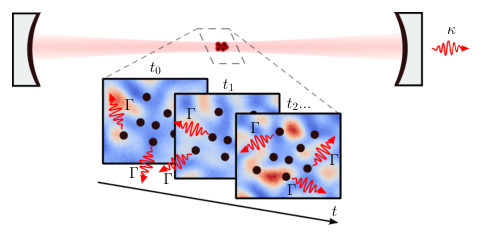
<figcaption class="paper-figure-caption"><b>Fig 1.</b> FIG. 1. Sketch of the experimental setup: a high-finesse op- tical cavity is coupled to a cloud of driven ultracold fermionic atoms. The light-matter interaction is disordered by an en- gineered, time-dependent speckle potential projected on the atomic ensemble, thus realizing a quantum chaotic many- body system. Two sources of decoherence disturb the unitary quantum dynamics: the cavity dissipation at a rate κ and the atomic spontaneous emission at a rate Γ.</figcaption>
</figure>
<figure class="paper-figure-card">
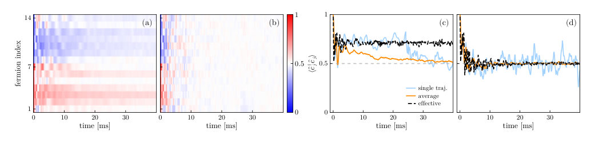
<figcaption class="paper-figure-caption"><b>Fig 2.</b> FIG. 2. (a-b) Averaged dynamics of ⟨ˆc† jˆcj⟩for N = 14 fermionic modes at half filling. We consider the cavity-fermion system described in Eq. (1) with (a) static disorder and (b) dynamical disorder [the f-RQC protocol in Eq. (3)], accounting for cavity dissipation at rate κ and spontaneous emission at rate Γ. (c-d) Comparison between the dissipative quantum trajectory averaged dynamics (orange curves), the single-trajectory averaged dynamics (light blue curves) and the effective dynamics generated by Eq. (2) with κ, Γ = 0 (black-dahsed curves) for (c) static disorder and (d) the f-RQC protocol, and for j = 4. As initial state we choose |Ψ(0)⟩= |1 ... 1 0 ... 0⟩. Parameters are fixed to...</figcaption>
</figure>
<figure class="paper-figure-card">

<figcaption class="paper-figure-caption"><b>Fig 3.</b> FIG. 3. Same as in Fig. 2 but for ∆cd/2π = 1 MHz. The drive amplitude has been increased to Ωd/2π = 38 MHz to match the same E in the simulations reported in Fig. 2. The number of fermionic modes is N = 12. Other parameters as in Fig. 2.</figcaption>
</figure>
<figure class="paper-figure-card">

<figcaption class="paper-figure-caption"><b>Fig 4.</b> FIG. 4. Entanglement entropy dynamics for (a) the effective model in Eq. (2), (b-c) the full model in Eq. (1) with nonzero κ, Γ, for ∆cd = κ/2 and ∆cd = 5κ respectively. We consider the f-RQC protocol with n = 2N + 1. The gray-dashed line represent to the Page prediction for a U(1) symmetric system at half filling. Results are reported for N = 8, 10, 12, 14 fermionic modes at half filling (from light to dark orange) and are averaged over Ntraj = 100 trajectories [except N = 14 in panel (c), for which Ntraj = 20]. (d) Relative distance from Page entropy δSN/2 = |SN/2 −SPage|/SPage as a function of C for ∆cd = 2κ (Ωd/2π = 25 MHz) and different N. Data are averaged over Ntraj = 100...</figcaption>
</figure>
<figure class="paper-figure-card">

<figcaption class="paper-figure-caption"><b>Fig 5.</b> FIG. 6. Effects of the trap Hamiltonian for 171Yb atoms (first row) and 6Li atoms (second row) on the quantum many- body dynamics. The first column refers to the static disorder configuration. The second column to the f-RQC protocol. All the parameters are fixed as in Fig. 2.</figcaption>
</figure>

**Summary.** The paper investigates controlling and diagnosing many-body quantum chaos in dissipative cavity QED systems. It distinguishes between two types of dissipation—cavity loss and spontaneous emission—showing they affect system diagnostics differently. The findings provide quantitative guidelines for realizing and observing genuine quantum chaotic behavior despite environmental decoherence.

**Why it may be interesting.** This work is highly relevant as it tackles the crucial issue of decoherence in quantum simulation platforms, providing a detailed comparison of how different physical noise sources degrade or preserve signatures of complex many-body dynamics like quantum chaos.

Detailed structure

**Main problem.** The study focuses on controlling many-body quantum chaos within an open system framework provided by a dissipative optical cavity.

**Main result.** The two primary dissipation sources (cavity loss vs. spontaneous emission) affect the signatures of quantum chaos differently: cavity loss preserves these signatures, while spontaneous emission erases them for linear observables.

**Method.** The authors analyze driven-dissipative dynamics using Lindblad master equations and compare results from stochastic quantum trajectories against effective unitary models.

**Model / system.** The system is a Cavity Quantum Electrodynamics (QED) setup involving ultracold fermions, characterized by controllable disorder and long-range photon-mediated interactions. The dynamics are governed by dissipation from cavity loss ($\kappa$) and atomic spontaneous emission ($\Gamma$).

**Key observables.** Entanglement entropy ($S_{N/2}$), fermionic population $\langle \hat{c}^\dagger_j \hat{c}_j 
angle$, and Out-of-Time-Ordered Correlators (OTOCs).

**Important parameters / regimes.** Cooperativity $C = \Omega^2/(\kappa\Gamma)$, Lamb-Dicke parameter $\eta$, and the detuning ratio $|\Delta_{cd}| / \kappa$.

**Assumptions / limitations.** The analysis assumes working in the dispersive regime ($\Delta_{cd}$ large) and involves deriving quantitative constraints based on experimentally realistic parameters.

**Figures summary.** Figures illustrate the setup showing decoherence sources, averaged dynamics of fermionic populations under different disorder types, and entanglement entropy saturation relative to the Page bound under varying dissipation regimes.

**Paper structure.** The paper systematically analyzes the open system dynamics by comparing the effects of cavity loss versus spontaneous emission on chaos diagnostics. It moves from general model setup (Hamiltonian/Lindblad) to specific diagnostic comparisons (linear observables vs. entanglement entropy) and concludes with quantitative constraints for experimental realization.

Abstract

Cavity quantum electrodynamics (QED) with ultracold fermions provides a promising platform for realizing many-body quantum chaos through disordered, photon-mediated long-range interactions. Such setups are inherently open and are therefore subject to dissipation arising from cavity photon loss and atomic spontaneous emission. In this article, we study the driven-dissipative dynamics of a typical cavity QED setting including controllable disorder and long-range interactions. We find that the two dissipation sources have qualitatively different structures. Cavity loss reduces to a single dephasing channel, whereas spontaneous emission in the experimentally relevant regime generates a collection of nonlocal dephasing channels. Cavity-induced dephasing preserves signatures distinguishing integrable from chaotic Hamiltonian dynamics in observables that depend linearly on the density matrix, while spontaneous emission suppresses these signatures. By contrast, quantities that probe the structure of the many-body state, such as the entanglement entropy, are strongly affected by both dissipation mechanisms. Assuming experimentally realistic parameters, we derive quantitative constraints for the observation and control of many-body quantum chaos in cavity-QED platforms.

[↑ back to top](#top)

### ⭐ [Quantum Computational Resources and Conformal Field Theory: Unifying Spins, Bosons, and Fermions](http://arxiv.org/abs/2607.05343v1)

**Highlighted author(s):** Yuto Ashida  
**Authors:** Ryota Matsuda, Masahiro Hoshino, Yuto Ashida  
**Type:** theory · **Category:** other · **PDF:** <https://arxiv.org/pdf/2607.05343v1>  
**Analysis basis:** full PDF text, analyzed in chunks
**Topic relevance:** 🔥 `entanglement & information structure` **4/5** · `Keldysh / 2PI / non-Gaussian methods` **2/5** · `analog quantum simulation` **2/5** · `non-equilibrium universality` **2/5** · `correlated / nonlocal dissipation` **1/5** · `driven-dissipative phase transition` **1/5** · `exotic spin models in light-matter` **1/5** · `methods for driven-dissipative` **1/5** · `non-equilibrium dynamics` **1/5**

↔ Scroll figures horizontally

<figure class="paper-figure-card">

<figcaption class="paper-figure-caption"><b>Fig 1.</b> FIG. 1. Summary of the main results. (a) Unified structure of the quantum computational resources for spins, bosons, and fermions. The MRE Mn with order n is constructed by a convolution unitary in all cases. In spins with a local Hilbert-space dimension d, the MRE reduces to the SRE, a measure of nonstabilizerness. In bosons and fermions, the MRE quantifies non- Gaussianity. In one-dimensional critical systems, the MRE can exhibit the same universal behavior across all cases, where a size-independent term sn is determined by the g factor of the infrared boundary condition in the replicated theory. (b) Upper panel: Universal behavior of non-Gaussianity of interacting fermions described by...</figcaption>
</figure>
<figure class="paper-figure-card">
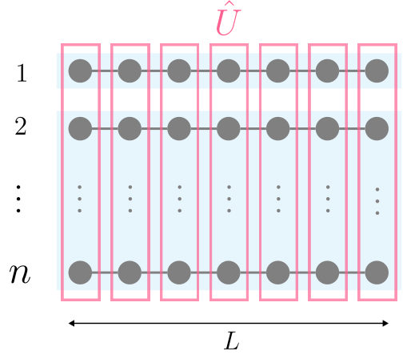
<figcaption class="paper-figure-caption"><b>Fig 2.</b> FIG. 2. Schematic illustration of quantum convolution. The replica-mixing unitary U is applied to n copies of the many- body state, after which replicas 2, 3, . . . , n are traced out. The unitary U generates correlations among the replicas only for resourceful states, so that the output replica left after the partial trace becomes mixed. The MRE detects the magic by measuring the purity of the resulting convolved state.</figcaption>
</figure>
<figure class="paper-figure-card">
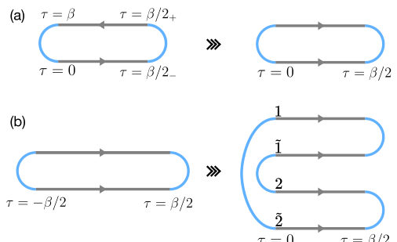
<figcaption class="paper-figure-caption"><b>Fig 3.</b> FIG. 3. Folding representations of the thermal partition func- tion and the purity numerator. The upper panel (a) shows the ordinary thermal path integral (left) and its Liouville-space folded-strip representation (right) in Eq. (77). The lower panel (b) shows the corresponding purity geometry and its second folding into the two-replica Liouville-space expression in Eq. (80).</figcaption>
</figure>
<figure class="paper-figure-card">

<figcaption class="paper-figure-caption"><b>Fig 4.</b> FIG. 4. Euclidean path-integral representation of the MRE in Eq. (86). (a) Folded theory with 2n sheets of size L × β/2. (b) 4n-sheet replicated theory obtained after an additional folding. In both panels, the spatial direction is abbreviated for simplicity. (c) Two interpretations of the MRE. The upper panel describes the rotated-boundary picture. While the bulk theory H consists of the product of each decoupled replica, an application of the convolution unitary to the edge leads to the rotated boundary state |J rot⟩⟩= U †|J ⟩⟩. The lower panel describes the rotated-bulk picture. The convolution unitary is applied to the bulk and leads to the rotated bulk Hamiltonian Hrot = UHU † with...</figcaption>
</figure>
<figure class="paper-figure-card">
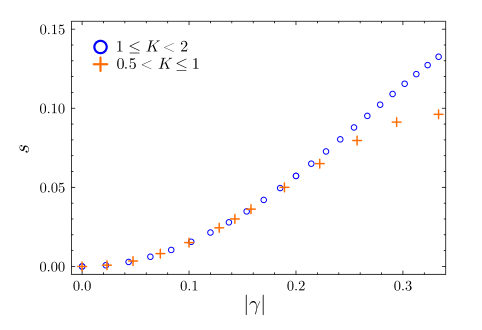
<figcaption class="paper-figure-caption"><b>Fig 5.</b> FIG. 6. The universal constant term s for 1/2 &lt; K &lt; 2 against |γ| = |K −1|/|K +1|, which is invariant under the du- ality transformation K ↔K−1. The data points are obtained by fitting the numerical data of M to the scaling form (165) with L = 10, 12, 14 (L0 = 12).</figcaption>
</figure>

**Summary.** The paper introduces the Magic Rényi Entropy (MRE) as a unified resource measure applicable to spins, bosons, and fermions. Using Conformal Field Theory, it demonstrates that this MRE captures universal features related to non-Gaussianity in fermionic systems like the Tomonaga-Luttinger liquid. This provides a powerful, unified theoretical framework for understanding quantum resources across different physical matter types.

**Why it may be interesting.** This work bridges quantum information theory (resource quantification) directly into condensed matter physics by applying advanced tools like CFT to understand fundamental properties of interacting critical systems beyond simple entanglement measures.

Detailed structure

**Main problem.** The goal is to develop a unified, information-theoretic measure (Magic Rényi Entropy) to characterize quantum computational resources across diverse many-body systems: spins, bosons, and fermions.

**Main result.** The Magic Rényi Entropy unifies nonstabilizerness (spins) and non-Gaussianity (bosons/fermions), showing that the universal contribution is governed by the Affleck-Ludwig boundary entropy. Furthermore, non-Gaussianity can drive continuous renormalization or phase transitions in these critical states.

**Method.** The study employs Conformal Field Theory (CFT) analysis on a unified measure derived from replicated state convolutions, supplemented by field-theoretical path integrals and numerical confirmations.

**Model / system.** The work analyzes spin systems, bosonic models, and fermionic systems, with a concrete demonstration using the Tomonaga-Luttinger liquid describing interacting spinless fermions. The analysis is rooted in critical phenomena theory.

**Key observables.** Magic Rényi Entropy (MRE), Stabilizer Rényi Entropy (SRE), Non-Gaussianity measures, and the Affleck-Ludwig boundary entropy ($s_n$).

**Important parameters / regimes.** Luttinger parameters ($K$), the non-Gaussianity parameter $\gamma = (K-1)/(K+1)$, and the system size $L$.

**Assumptions / limitations.** The core assumption is that nonstabilizerness and non-Gaussianity share a mathematically unified structure allowing for a single resource measure.

**Figures summary.** Figure 1(a) illustrates the unified MRE framework across different particle types. Figure 1(b) specifically plots the universal contribution of non-Gaussianity versus $\gamma$ for TLL fermions, showing the free-fermion point at $\gamma=0$.

**Paper structure.** The paper introduces the MRE as a unifying concept, derives its CFT formulation using replicated path integrals, analyzes the size-independent boundary entropy term, and culminates in a detailed application to non-Gaussianity in TLL fermions, confirming predictions via numerical methods.

Abstract

Characterizing a quantum state through the lens of quantum resources provides an information-theoretic perspective on many-body systems. While quantum entanglement serves as the paradigmatic example of a quantum resource, recent studies have shown that quantum magic, a resource for universal quantum computation, can capture aspects of many-body states complementary to those described by entanglement. For instance, in spin systems, conformal field theory (CFT) analysis of the stabilizer Rényi entropy has revealed universal features of nonstabilizerness that are qualitatively distinct from entanglement. In bosonic and fermionic systems, however, a comparable formulation for their computational resource, non-Gaussianity, has yet to be established. In this work, we introduce a unified measure, the magic Rényi entropy (MRE), to quantify computational resources in spins, bosons, and fermions on an equal footing. This allows us to reveal common universal aspects of nonstabilizerness and non-Gaussianity in critical many-body states. In particular, our CFT analysis shows that the universal contribution to the MRE appears as the size-independent term determined by the Affleck-Ludwig boundary entropy. We find that non-Gaussianity can continuously renormalize this universal contribution or drive a boundary phase transition through bulk-induced boundary renormalization-group flows. As a concrete demonstration, we present a detailed CFT analysis of non-Gaussianity in interacting spinless fermions described by the Tomonaga-Luttinger liquid, showing boundary transitions at the Luttinger parameters $K=1/3$ and $K=3$. We perform numerical calculations that confirm our field-theoretical predictions. These results provide a unified field-theoretical understanding of many-body magic across spins, bosons, and fermions.

[↑ back to top](#top)

### ⭐ [Quantum simulation of gauge theories on dynamical spacetimes via Floquet-induced matrix models](http://arxiv.org/abs/2607.04040v1)

**Highlighted author(s):** Susanne F. Yelin  
**Authors:** Samuel Buckley-Bonanno, Noah Eckstein, Susanne F. Yelin  
**Type:** theory · **Category:** statistical mechanics · **PDF:** <https://arxiv.org/pdf/2607.04040v1>  
**Analysis basis:** full PDF text, analyzed in chunks
**Topic relevance:** `analog quantum simulation` **3/5** · `methods for driven-dissipative` **3/5** · `non-equilibrium dynamics` **3/5** · `Keldysh / 2PI / non-Gaussian methods` **2/5** · `non-equilibrium universality` **2/5** · `driven-dissipative phase transition` **1/5** · `entanglement & information structure` **1/5** · `quantum measurements` **1/5**

↔ Scroll figures horizontally

<figure class="paper-figure-card">
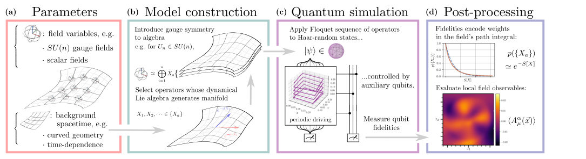
<figcaption class="paper-figure-caption"><b>Fig 1.</b> FIG. 1. Matrix model quantum simulation procedure. (a) Given a specification of bosonic fields on a spacetime, there is an associated matrix state that encodes their Lagrangian. The fields can be scalar or Yang-Mills or other gauge fields, and the background spacetime can be curved and time-dependent. (b) The construction of the associated matrix state proceeds from these parameters. The spacetime geometry is encoded first by selecting a set of Hermitian operators whose dynamical Lie algebra maps in the commutative limit to the desired manifold. Field symmetries are then introduced to the set of matrices: U(n) non-commutative Yang-Mills fields are formed with a direct sum of n copies of the...</figcaption>
</figure>
<figure class="paper-figure-card">

<figcaption class="paper-figure-caption"><b>Fig 2.</b> FIG. 2. Displacement plots of non-commutative ge- ometries. Elementary manifolds can be encoded as non- commutative geometries in terms of matrix representations. We show cross-sections for spherical, flat and hyperbolic ge- ometries. For the non-commutative sphere, we use high- dimensional representations of SU(2) angular momentum op- erators; the non-commutative plane is constructed from fi- nite matrix representations of the canonical position ˆx and momentum ˆp operators via a Jordan-Schwinger construction; and Lorentzian spacetimes with hyperbolic geometry are en- coded using operators drawn from the SO(4, 2) Lie alge- bra. The middle and right columns depict the displacements d2(⃗x) =...</figcaption>
</figure>
<figure class="paper-figure-card">

<figcaption class="paper-figure-caption"><b>Fig 3.</b> FIG. 3. Comparison of fidelities and the matrix model partition function. (a) For a single matrix state {Xa}, a periodic Floquet sequence is applied over the matrix operators. Plots (i) and (ii) show the resulting unitary evolution in operator space for Trotterized and uniform periodic driving, respectively. The axes denote coefficients in the effective Hamiltonian expansion during the evolution. The leading-order terms are commutators of the alternating operators Xa and Xb. When applied to a Haar-random ensemble of states, the fidelity fall-off in the high-frequency limit scales as exp(−tr(H2)), and for sequences over multiple operator pairs reproduces the Euclidean matrix-model action...</figcaption>
</figure>
<figure class="paper-figure-card">
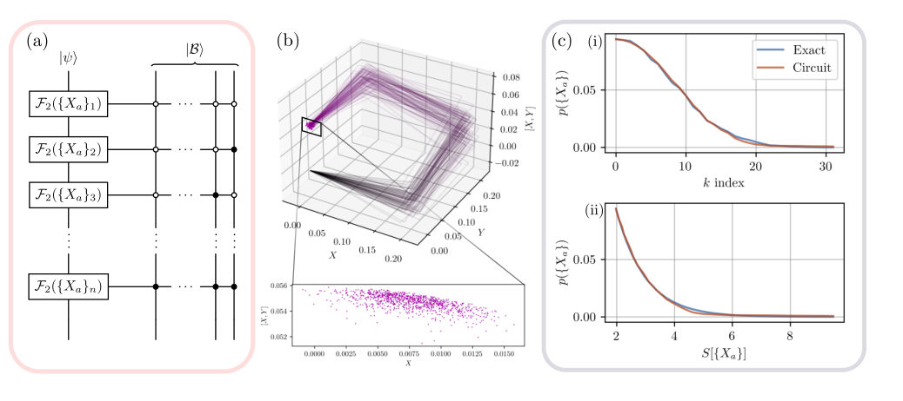
<figcaption class="paper-figure-caption"><b>Fig 4.</b> FIG. 4. Globally controlled quantum circuit and path-integral comparison. (a) Diagram of the parallel quantum circuit for sampling from the matrix path integral, as detailed in Appendix D. The Floquet sequence F2 for each matrix state {Xa} in the ensemble is conditioned on a specific element of the entangled control-qubit basis |B⟩. (b) Sample of 1000 paths through the space of effective Hamiltonians over one cycle of F2({Xa}n; ∆t) for a Gaussian distribution of perturbations. In this illustrative example, the perturbed matrix state is a 2 × 2 representation of the non-commutative sphere, given by the Pauli matrices. The distribution of path endpoints is shown, with the unperturbed endpoint...</figcaption>
</figure>
<figure class="paper-figure-card">

<figcaption class="paper-figure-caption"><b>Fig 5.</b> FIG. 5. SU(2) gauge-field observables on an expanding spacetime. Results from a Monte-Carlo simulation of a matrix state encoding an SU(2) gauge field on a k = −1 Friedmann-Lemaˆıtre-Robertson-Walker background. (a) Dispersion map ∆2( ⇀x) on a constant-time spatial slice, showing where the matrix state provides a good semiclassical representation of spacetime. The simulation uses eight 500 × 500 Hermitian matrices representing the four spacetime coordinates and their conjugate momenta. Low dispersion is confined to a finite region, reflecting the finite eigenvalue range of the matrices. By varying the time coordinate used to construct the quasi-coherent states | ⇀x⟩, the evolution of the...</figcaption>
</figure>

**Summary.** This work proposes using Floquet engineering on matrix models to simulate gauge theories on dynamically curved spacetimes. By mapping the path integral weight calculation onto measuring the fidelity of evolving random quantum states, it overcomes the limitations of fixed lattice simulations. This opens the door for simulating field and spacetime dynamics in regimes previously inaccessible to current quantum computing hardware.

**Why it may be interesting.** It provides a powerful theoretical blueprint for quantum simulation that bypasses fixed lattice constraints, directly addressing fundamental problems in quantum gravity and high-energy physics relevant to open quantum systems dynamics.

Detailed structure

**Main problem.** The primary challenge is simulating quantum gauge theories on dynamical spacetimes, circumventing the limitations of conventional lattice methods that require fixed backgrounds.

**Main result.** The authors demonstrate a framework where the Euclidean path integral weights are reproduced by measuring the ensemble-averaged fidelities of Haar-random states evolved under periodic Floquet sequences.

**Method.** A Floquet framework is introduced to map Yang-Mills matrix models onto programmable quantum platforms, using fidelity measurements (Loschmidt echo) to sample the path integral measure.

**Model / system.** The system utilizes large-$N$ Hermitian matrices $\{X_a\}$ whose commutation relations encode spacetime geometry and gauge fields. This allows for modeling dynamical backgrounds like expanding cosmological spacetimes without fixed lattices.

**Key observables.** Ensemble-averaged fidelity ($\langle f 
angle$), which corresponds to the Euclidean Boltzmann weight; deconfinement transition indicators (e.g., Wilson loops).

**Important parameters / regimes.** The coupling constant ($g$), the matrix dimension ($N$), and the time step/frequency of the Floquet sequence ($\Delta t$ or $\omega$).

**Assumptions / limitations.** The method relies on the large-$N$ limit for continuum emergence, and local observables are extracted via post-processing using quasi-coherent states.

**Figures summary.** Figures illustrate mapping fields to matrix states, constructing these states via Lie algebra relations, measuring path integral weights via Floquet sequences, and extracting local observables using quasi-coherent states. Another figure compares non-commutative geometries (sphere, plane) defined by the matrices.

**Paper structure.** The paper establishes the problem of dynamical spacetime simulation, introduces matrix models as an alternative to lattices, develops the Floquet protocol linking fidelity measurements to path integrals, and validates this approach by simulating known physical transitions like deconfinement on curved backgrounds.

Abstract

Quantum simulations of gauge theories are typically built on spatial lattices, an approach that has enabled major progress at the cost of requiring fixed background geometries and obscuring the treatment of curved and dynamical spacetimes. Large-$N$ matrix models offer an alternative, encoding spacetime geometry and gauge fields in the commutation structure of a set of Hermitian matrices, with the classical continuum emerging smoothly at large matrix dimensions. Here we introduce a Floquet framework that makes these models directly accessible to programmable quantum platforms. We show that Euclidean path integral weights of a Yang-Mills matrix models are reproduced, at leading order in the coupling, by the ensemble-averaged fidelities of Haar-random states evolved under periodic sequences of matrix operators. The observables for the simulated matrix model can then be accessed through established randomized benchmarking protocols in terms of the Loschmidt echo. The encoding requires exponentially fewer qubits than canonically quantized approaches. Numerically, we validate the fidelity-weight correspondence, demonstrate parallelized quantum circuits that sample the path-integral measure, and identify the deconfinement transition of an $SU(2)$ gauge field on both flat and expanding cosmological backgrounds. By avoiding a fixed spacetime lattice, the framework preserves continuous symmetries and unitarity on dynamical geometries, opening quantum simulation to field and spacetime dynamics beyond the reach of conventional lattice methods.

[↑ back to top](#top)

### [Measurement-induced spatially nonuniform fluctuations of the local particle number and their crossover in a quasiperiodic free-fermion chain](http://arxiv.org/abs/2607.03799v1)

**Authors:** Toranosuke Matsubara, Kazuki Yamamoto  
**Type:** theory · **Category:** statistical mechanics · **PDF:** <https://arxiv.org/pdf/2607.03799v1>  
**Analysis basis:** full PDF text, analyzed in chunks
**Topic relevance:** 🔥 `measurement-induced transitions` **5/5** · 🔥 `methods for driven-dissipative` **4/5** · 🔥 `non-equilibrium dynamics` **4/5** · 🔥 `quantum measurements` **4/5** · `driven-dissipative phase transition` **3/5** · `non-equilibrium universality` **3/5** · `Frenkel-Kontorova` **2/5** · `Keldysh / 2PI / non-Gaussian methods` **2/5** · `Kondo & dissipative impurity` **1/5** · `analog quantum simulation` **1/5** · `correlated / nonlocal dissipation` **1/5** · `entanglement & information structure` **1/5** · `scars & prethermalization` **1/5**

↔ Scroll figures horizontally

<figure class="paper-figure-card">
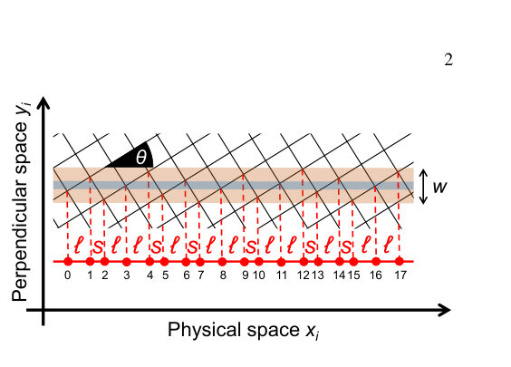
<figcaption class="paper-figure-caption"><b>Fig 1.</b> FIG. 1. The Fibonacci chain obtained by cutting and projecting a square lattice. The number below each site indicates the site index i. The coordinates xi and yi of the i-th site are for physical and perpen- dicular spaces, respectively. The width of a blue strip (two red strips) is determined by the fraction of number of sites located between two ℓ-spacings (ℓ- and s-spacings) relative to the total number of sites, where the fraction is denoted as rℓℓ(rℓs). These satisfy rℓs/rℓℓ= 2τ with rℓℓ+ rℓs = 1, which leads to the widths of the blue and red strips as rℓsw ≃1.05 and rℓℓw ≃0.32, respectively.</figcaption>
</figure>
<figure class="paper-figure-card">

<figcaption class="paper-figure-caption"><b>Fig 2.</b> FIG. 3. Spatial distribution of the local particle number with respect to xi in physical space. We set Jℓ/Js = 0.4 in the quasiperiodic system (main panel) and Jℓ/Js = 1 in the periodic system (inset). The number of trajectories is set to 1000 for L = 60.</figcaption>
</figure>
<figure class="paper-figure-card">

<figcaption class="paper-figure-caption"><b>Fig 3.</b> FIG. 2. Numerical results for the dynamics of fluctuations of the local particle number FL/2 at the (L/2)-th site. We set (a) Jℓ/Js = 1 in the periodic system and (b) Jℓ/Js = 0.4 in the quasiperiodic system. Light, medium, and dark colors correspond to L = 30, 50, and 100, respectively. The number of quantum trajectories is set to 500.</figcaption>
</figure>
<figure class="paper-figure-card">

<figcaption class="paper-figure-caption"><b>Fig 4.</b> FIG. 4. Spatial distribution of fluctuations of the local particle num- ber with respect to xi in physical space. We take (a) Jℓ/Js = 1 in the periodic system and (b) Jℓ/Js = 0.4 in the quasiperiodic system. The number of trajectories is set to 1000. The system size is set to L = 120, whose enlarged view is shown.</figcaption>
</figure>
<figure class="paper-figure-card">
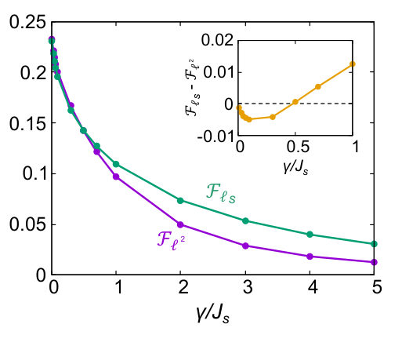
<figcaption class="paper-figure-caption"><b>Fig 5.</b> FIG. 6. Spatial average of fluctuations of the local particle number in the quasiperiodic system resolved by perpendicular space V1 n with respect to measurement strengths. The inset shows the difference Fℓs −Fℓ2 between fluctuations corresponding to two different local environments. We take L = 120 and Jℓ/Js = 0.4, and the number of trajectories is set to 1000.</figcaption>
</figure>

**Summary.** This paper examines local particle number fluctuations in a free-fermion chain built on a quasiperiodic Fibonacci lattice under continuous measurement. It demonstrates that the measurement strength controls the nature of these fluctuations, causing a crossover from patterns reflecting long-range order to those dominated by local site environments. This provides new insights into non-equilibrium physics in structured quantum matter.

**Why it may be interesting.** This work directly addresses non-equilibrium physics in structured quantum systems, showing how external monitoring fundamentally alters emergent spatial correlations beyond what is predicted by unitary evolution alone.

Detailed structure

**Main problem.** The study investigates how continuous quantum measurement affects local particle number fluctuations in a quasiperiodic free-fermion chain.

**Main result.** Measurement induces a crossover in the spatial pattern of these fluctuations: weak measurements reveal long-range quasiperiodic order, while strong measurements localize the fluctuations to the immediate environment of each site.

**Method.** The analysis employs quantum trajectory methods and Gaussian-state algorithms suitable for free fermions, analyzing both physical and perpendicular space representations.

**Model / system.** The system is a free-fermion chain modeled on a Fibonacci lattice (a quasiperiodic structure), governed by a tight-binding Hamiltonian subjected to continuous monitoring.

**Key observables.** Local particle number fluctuations ($F_i$), connected correlation functions, and the spatial distribution of these quantities.

**Important parameters / regimes.** Measurement strength ($\gamma$) relative to system hopping amplitudes ($J_s$), which defines regimes from unitary (no measurement) to weak/strong measurement.

**Assumptions / limitations.** The analysis relies on the free-fermion approximation and Gaussian-state simulation techniques.

**Figures summary.** Figures illustrate the Fibonacci chain construction in physical and perpendicular spaces, showing how local particle number fluctuations vary spatially across different measurement strengths ($\gamma/J_s$).

**Paper structure.** The paper progresses by defining the system (free fermions on a quasiperiodic lattice), introducing the continuous monitoring dynamics via the stochastic Schrödinger equation, and then analyzing the resulting spatial patterns of fluctuations as a function of measurement strength to demonstrate the crossover.

Abstract

We study continuously monitored dynamics of a quasiperiodic free-fermion chain defined on a Fibonacci lattice. We focus on fluctuations of the local particle number, which exhibit a spatially uniform distribution in the unitary limit. Remarkably, we demonstrate that they exhibit a nonuniform spatial pattern originating from the quasiperiodic long-range order under continuous measurement. Furthermore, employing both physicaland perpendicular-space analyses, we elucidate that measurement-induced crossover emerges in fluctuations due to the interplay between the incommensurate modulation and the continuous measurement. While weak measurement yields a distribution reflecting the long-range spatial structure of the quasiperiodic system, an increase in measurement strength alters the distribution into one dominated by the local environment of each site. We also elucidate that the measurement-induced crossover emerges in other physical quantities such as connected correlation functions. These findings offer insights into nonequilibrium quasiperiodic phenomena emerging in continuously monitored dynamics.

[↑ back to top](#top)

### [Spectral-topology-induced criticality in non-Hermitian fermionic metals](http://arxiv.org/abs/2607.05190v1)

**Authors:** Ayan Banerjee, Julius T. Gohsrich, Flore K. Kunst  
**Type:** theory · **Category:** statistical mechanics · **PDF:** <https://arxiv.org/pdf/2607.05190v1>  
**Analysis basis:** full PDF text, analyzed in chunks
**Topic relevance:** 🔥 `non-equilibrium universality` **5/5** · 🔥 `driven-dissipative phase transition` **4/5** · `analog quantum simulation` **3/5** · `correlated / nonlocal dissipation` **3/5** · `methods for driven-dissipative` **3/5** · `non-equilibrium dynamics` **3/5** · `Kondo & dissipative impurity` **2/5** · `entanglement & information structure` **2/5** · `Keldysh / 2PI / non-Gaussian methods` **1/5**

↔ Scroll figures horizontally

<figure class="paper-figure-card">
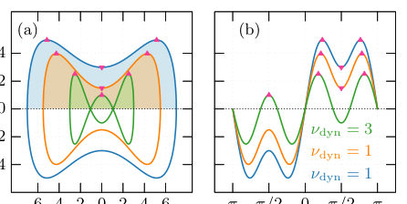
<figcaption class="paper-figure-caption"><b>Fig 1.</b> FIG. 1. Spectral topology and dynamical topological in- dex. (a) Different complex spectra (blue, orange, and green curves) for different parameters (t1 = 6, t1 = 4.5 and t1 = 2, respectively) for the Hamiltonian in Eq. (2) with l = r = 3, t−1 = 1, t±2 = 0 and t±3 = ±1. The dynamical topological index is the difference between the number of maxima and number of minima in the upper half plane, and transitions occur when these numbers change. The extrema contributing to the dynamical topological index are highlighted by pink triangles, where the up-pointing and down-pointing triangles correspond to maxima and minima, respectively. The shaded regions contribute to the non-equilibrium steady...</figcaption>
</figure>
<figure class="paper-figure-card">
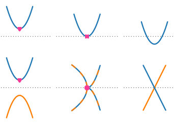
<figcaption class="paper-figure-caption"><b>Fig 2.</b> FIG. 2. Mechanisms changing the dynamical topological in- dex. The horizontal axis corresponds to k, the vertical axis to Im E(k), and the dashed horizontal line to the zero-axis Im E(k) = 0 as in Fig. 1(b). The minima contributing to the dynamical topological index are highlighted by pink down- pointing triangles. (a) Under a continuous parameter change, the minimum above zero (left) can touch the zero-axis (cen- ter), which corresponds to a non-simple zero marked by a pink cross, and can move below zero (right), increasing the dynam- ical topological index by one. In general, by tuning through a non-simple zero, the dynamical topological index can change. (b) Additionally in multi-band...</figcaption>
</figure>
<figure class="paper-figure-card">

<figcaption class="paper-figure-caption"><b>Fig 3.</b> FIG. 3. Spectral topological phase transitions and trans- port phenomena in a generalized Hatano–Nelson model. (a) Dynamical topological index νdyn and central charge ceff as function of tl for different l, showing topological phase transi- tions at distinct transition points. The green-dashed vertical lines mark the hopping strengths tl at which the dynamical topological index for the model with l = 4 changes. These lines are also present in (b,d) to highlight qualitative changes at these hopping strengths due to these phase transitions for the model with l = 4. (b) Total current as a function of tl with same l as in (a), showing the non-analytic behavior at the same parameters where the...</figcaption>
</figure>
<figure class="paper-figure-card">

<figcaption class="paper-figure-caption"><b>Fig 4.</b> FIG. 4. Correlations and entanglement entropy. The sys- tem exhibits power-law correlations ∝1/d with distinct in- terference patterns as a function of distance d, indicating a gapless critical phase and scale invariance. We quadratically interpolate between the different integer d for better visibil- ity. Inset: Corresponding entanglement entropies Sℓshowing logarithmic scaling as function of subsystem size ℓand dis- tinct central charges. We have set t±1 = 1 ± t, t±2 = ±0.2, t±3 = ∓1.9, t±4 = ±1, with t = 11 (blue), t = 6 (orange), t = 1 (green).</figcaption>
</figure>

**Summary.** The paper develops a novel topological index derived from the complex energy spectrum of non-Hermitian fermionic metals to characterize their quantum criticality. By linking algebraic topology (Morse theory) to spectral geometry, it shows that non-equilibrium phase transitions are governed by this dynamical index ($
u_{dyn}$). This provides a unified theoretical framework for understanding critical behavior in open quantum systems.

**Why it may be interesting.** This work provides a powerful mathematical tool ($
u_{dyn}$) to characterize non-equilibrium quantum phases. For AMO/open systems, this connects spectral properties (which can be calculated from master equations or effective Hamiltonians) directly to universal many-body critical behavior.

Detailed structure

**Main problem.** The central challenge is understanding how complex single-particle spectra govern universal many-body behavior, particularly defining quantum criticality in intrinsically out-of-equilibrium non-Hermitian systems.

**Main result.** The authors establish a unified framework where non-Hermitian quantum criticality is controlled by gain-and-loss-selected non-equilibrium steady states, quantified by a dynamical topological index ($
u_{dyn}$).

**Method.** They introduce and utilize a symmetry-protected dynamical topological index derived from the imaginary part of the complex single-particle spectrum, rooted in Morse theory.

**Model / system.** The study focuses on non-Hermitian fermionic metals, modeled using tight-binding Hamiltonians (e.g., Hatano–Nelson or anisotropic SSH models) which are inherently out-of-equilibrium due to gain and loss terms.

**Key observables.** Dynamical topological index ($
u_{dyn}$), Imaginary Fermi surface, spectral winding, gapless modes with logarithmic entanglement scaling.

**Important parameters / regimes.** Hopping strengths ($t_j$), gain/loss parameters ($\gamma$), coupling constants ($\kappa$); the system's non-Hermiticity is key.

**Assumptions / limitations.** The analysis often relies on simplifying assumptions such as assuming the imaginary part of energy forms a Morse function, or that the Hamiltonian remains diagonalizable for all momenta $k$.

**Figures summary.** Figures illustrate spectral evolution ($	ext{Im } E(k)$) showing how $
u_{dyn}$ changes across different parameters (e.g., varying hopping strengths or gain/loss terms), marking topological phase transitions via non-simple zero crossings or Exceptional Points.

**Paper structure.** The paper progresses by defining the problem in non-Hermitian systems, introducing the dynamical index ($
u_{dyn}$) via Morse theory applied to $	ext{Im } E(k)$, and then applying this framework to various concrete models (Hatano–Nelson, SSH) to demonstrate how changes in parameters induce topological phase transitions marked by changes in $
u_{dyn}$.

Abstract

Quantum matter emerges from the interplay of fluctuations, topology, and entanglement, which - in equilibrium - governs quantized transport, universal criticality, and topological classification. Non-Hermitian systems, widely explored in platforms ranging from electric circuits to photonics, are intrinsically out-of-equilibrium, and display fundamentally new phenomena, including complex spectra, spectral winding, exceptional topology, and non-unitary dynamics. A central challenge is understanding how the complex single-particle spectrum governs universal many-body behavior. We introduce a symmetry-protected dynamical topological index derived directly from the complex spectrum. Through the lens of algebraic topology, more specifically Morse theory, we identify critical points in the spectrum with topological defects, whose curvature and stability are protected under continuous deformations. This links spectral geometry to many-body observables, unifying non-Hermitian band topology, entanglement, and transport. We demonstrate that non-Hermitian quantum criticality in non-interacting systems is controlled by gain-and-loss-selected non-equilibrium steady states, which dynamically generate an emergent imaginary Fermi surface whose Fermi points host scale-invariant gapless modes with logarithmic entanglement scaling and algebraic correlations. Our work establishes a unified framework for non-Hermitian quantum matter, connecting spectral topology to Morse theory, revealing a topological foundation of non-equilibrium quantum criticality.

[↑ back to top](#top)

### [Weak ergodicity breaking without nonthermal eigenstates](http://arxiv.org/abs/2607.04279v1)

**Authors:** Boning Huang, Yongguan Ke, Li Zhang, Lin Ling, Chaohong Lee  
**Type:** theory · **Category:** other · **PDF:** <https://arxiv.org/pdf/2607.04279v1>  
**Analysis basis:** full PDF text, analyzed in chunks
**Topic relevance:** 🔥 `scars & prethermalization` **5/5** · 🔥 `analog quantum simulation` **4/5** · 🔥 `non-equilibrium dynamics` **4/5** · `entanglement & information structure` **3/5** · `non-equilibrium universality` **3/5** · `driven-dissipative phase transition` **2/5** · `Frenkel-Kontorova` **1/5** · `correlated / nonlocal dissipation` **1/5** · `correlated cavity matter` **1/5** · `methods for driven-dissipative` **1/5**

↔ Scroll figures horizontally

<figure class="paper-figure-card">
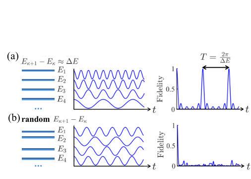
<figcaption class="paper-figure-caption"><b>Fig 1.</b> FIG. 1. Schematics of (a) equally spaced energy levels in a linear band, which contribute to multiple frequencies and lead to periodic revival dynamics, and (b) random energy levels in a curved band, which contribute to random frequencies and lead to thermalization dynamics.</figcaption>
</figure>
<figure class="paper-figure-card">
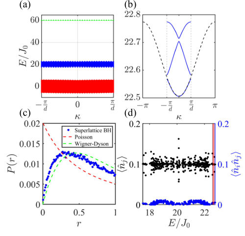
<figcaption class="paper-figure-caption"><b>Fig 2.</b> FIG. 2. (a) Three-particle Bloch bands. (b) Appearance of nearly linear sub-bands (blue solid lines), folded from the highest dimer-monomer band in the original simple lattice (black dashed line). (c) Level statistics of the superlattice Bose-Hubbard model with weak onsite disorders (blue dots). Red dashed and green dashed lines denote Poisson distribu- tion and Wigner-Dyson distribution, respectively. (d) Expec- tation values of ˆnj=15 (black) and ˆni=12ˆnj=15 (blue) of dimer- monomer eigenstates as a function of energy. Here i and j can be chosen as other sites, without changing physical picture. Values associated with a nearly linear band are highlighted by the red shaded region....</figcaption>
</figure>
<figure class="paper-figure-card">

<figcaption class="paper-figure-caption"><b>Fig 3.</b> FIG. 3. Dynamics of multiparticle Wannier states in different lattices: the superlattice (left panel) and the simple lattice (right panel). (a, b) Time-evolution of density distribution. Blue lines in (a) denote the mean displacement predicted by the group velocities of the nearly linear band. (c, d) Time- evolution of fidelity (blue) and entanglement entropy (red). Black dashed lines in (c) and (d) denote the Page value. (e, f) Normalized fast Fourier transform (FFT) spectrum of fidelity in long-time dynamics. Vertical dashed red lines denote the frequencies given by the energy gaps in corresponding band. δU = 0.01(δU = 0) is chosen for superlattice (simple) lattice, while the other...</figcaption>
</figure>
<figure class="paper-figure-card">
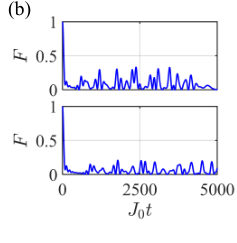
<figcaption class="paper-figure-caption"><b>Fig 4.</b> FIG. 4. Time-evolution of fidelity in (a) the nearly linear dimer-monomer band and (b) curved highest dimer-monomer band for different system sizes: M = 60 (top panel) and M = 90 (bottom panel). Other parameters are the same as those in Figs. 3(a, c).</figcaption>
</figure>

**Summary.** The authors propose an alternative source of weak ergodicity breaking by utilizing spectral phase coherence within engineered nearly linear energy bands. By modulating a Bose-Hubbard superlattice, they create conditions where collective revivals occur due to quasi-equally spaced energy levels, bypassing the need for exotic nonthermal eigenstates found in other localization mechanisms.

**Why it may be interesting.** This work provides a concrete, controllable mechanism for observing non-trivial quantum dynamics (revivals) in interacting bosonic systems using lattice engineering, which is highly relevant to simulating complex many-body physics in cold atom setups.

Detailed structure

**Main problem.** To identify a mechanism for weak ergodicity breaking in quantum many-body systems that does not rely on the presence of nonthermal eigenstates.

**Main result.** Weak ergodicity breaking can occur due to spectral phase coherence among ETH-satisfying eigenstates when energy bands are engineered to have nearly equally spaced levels, leading to long-lived collective revivals.

**Method.** The analysis involves studying the time evolution fidelity and entanglement entropy of maximally localized Wannier states (MWSs) in a superlattice Bose-Hubbard model.

**Model / system.** The system is modeled by a spatially modulated Bose-Hubbard lattice Hamiltonian, which folds original energy bands into nearly linear sub-bands via cotranslation symmetry.

**Key observables.** Time evolution fidelity, particle-partition entanglement entropy, and the Fourier transform spectrum of the revival dynamics.

**Important parameters / regimes.** Superlattice modulation strength ($\delta U$), system size ($M$), and interaction/hopping parameters ($J_0, U_0$).

**Assumptions / limitations.** The mechanism relies on MWSs remaining confined within a single band sector (band-resolved fragmentation).

**Figures summary.** Figures compare periodic revival dynamics in nearly linear bands versus thermalization dynamics in curved bands; time evolution plots show revivals for the superlattice case but loss of coherence in simple lattices.

**Paper structure.** The paper develops the theory by first establishing the model and mechanism, then analyzing energy band structure via modulation, followed by detailed time-evolution diagnostics (fidelity, entanglement) to distinguish coherent revival from thermalization or finite-size effects across various particle sectors.

Abstract

The typical mechanisms of ergodicity breaking in isolated interacting quantum systems, such as many-body localization and quantum many-body scars, originate from the nonthermal nature of the underlying eigenstates. Here, in the absence of nonthermal eigenstates, we identify a mechanism for collective revivals of multiparticle Wannier states (MWSs) associated with nearly linear bands in a spatially modulated Bose-Hubbard lattice. The MWSs, as superpositions of multiparticle Bloch states within individual energy bands, give rise to band-resolved Wannier-sector fragmentation. The key idea is that spatially periodic modulation folds and separates energy bands of a simple lattice into several sub-bands, among which nearly linear sub-bands inherit the linear segments of the original bands. Although multiparticle Bloch states satisfy the eigenstate thermalization hypothesis (ETH), the MWSs in the nearly linear band still exhibit long-lived collective revivals, due to emergent equally spaced energy levels. Our work provides a route to weak ergodicity breaking in which long-lived revivals arise from spectral phase coherence among ETH-satisfying eigenstates rather than from scar-like nonthermal eigenstates.

[↑ back to top](#top)

### [Emergence of the Scrooge Ensemble in the Sachdev-Ye-Kitaev Model](http://arxiv.org/abs/2607.04864v1)

**Authors:** Zeyu Liu, Pengfei Zhang  
**Type:** theory · **Category:** statistical mechanics · **PDF:** <https://arxiv.org/pdf/2607.04864v1>  
**Analysis basis:** full PDF text, analyzed in chunks
**Topic relevance:** 🔥 `quantum measurements` **5/5** · 🔥 `measurement-induced transitions` **4/5** · `entanglement & information structure` **3/5** · `non-equilibrium dynamics` **3/5** · `Keldysh / 2PI / non-Gaussian methods` **2/5** · `non-equilibrium universality` **2/5** · `correlated / nonlocal dissipation` **1/5** · `driven-dissipative phase transition` **1/5** · `methods for driven-dissipative` **1/5** · `scars & prethermalization` **1/5**

↔ Scroll figures horizontally

<figure class="paper-figure-card">

<figcaption class="paper-figure-caption"><b>Fig 1.</b> FIG. 1. Schematic illustration of the main setup. The sys- tem is initialized in a thermofield double state of N pairs of Majorana fermions, denoted by the blue and red circles. Af- ter time evolution, projective measurements are performed on most pairs of Majorana fermions, yielding outcomes m and a post-measurement state |ψm⟩A. We analyze the distribution p(λ) of measurement outcomes with λN entries of +1, as well as the projected ensemble {pmpJ, |ψm⟩A}, where pJ is the distribution of random couplings.</figcaption>
</figure>
<figure class="paper-figure-card">

<figcaption class="paper-figure-caption"><b>Fig 2.</b> FIG. 2. (a) Path-integral representation of the measure- ment probability pm, where the system B is divided into B+ and B−according to the measurement outcomes. f/b denotes the forward/backward evolution branches. (b) Path-integral representation of the unnormalized post-measurement density matrix ˜ρm for subsystem A. (c) Illustration of the two-replica calculation. Here, the colored shaded regions denote the path integral of subsystem B, while the gray shaded region indi- cates the connectivity of the saddle-point solution.</figcaption>
</figure>
<figure class="paper-figure-card">

<figcaption class="paper-figure-caption"><b>Fig 3.</b> FIG. 3. Numerical results for the measurement probability and participation entropy. (a) Two saddle-point solutions of GB+ for βJ = Jt = 2 and λ = 0.82. (b) Probability density p(λ) for different values of Jt for βJ = 2. (c) The most proba- ble measurement fraction λ∗and the participation entropy S1 as functions of the evolution time t for βJ = 2, 4 [71]. Dashed lines correspond to S1, and solid lines correspond to λ∗.</figcaption>
</figure>
<figure class="paper-figure-card">

<figcaption class="paper-figure-caption"><b>Fig 4.</b> FIG. 4. Saddle-point solutions of GB+ for βJ = Jt = 2 and λ = 0.82. We show two representative solutions correspond- ing to the two distinct pairing patterns illustrated in Fig. 2(c). From each representative solution, three additional solutions can be obtained by flipping the signs of the interbranch cou- plings indicated by the yellow and/or purple squares. We denote the forward/backward evolution branch of the r-th replica by f/br. In (a), the pairing pattern is (f1, b1) and (f2, b2), while in (b), it is (f1, b2) and (f2, b1).</figcaption>
</figure>
<figure class="paper-figure-card">
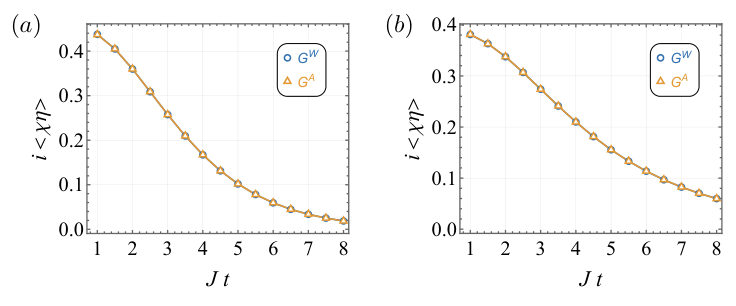
<figcaption class="paper-figure-caption"><b>Fig 5.</b> FIG. 1. Numerical verification of the reduced density matrix from the projected ensemble. Here, we choose βJ = 2 and βJ = 4 for panels (a) and (b), respectively.</figcaption>
</figure>

**Summary.** This paper uses the analytically tractable Sachdev-Ye-Kitaev (SYK) model to investigate deep thermalization following partial quantum measurement. By employing path integrals and saddle-point techniques, the authors rigorously demonstrate that the statistical distribution of post-measurement states converges exactly to the maximally random Scrooge ensemble. This establishes the SYK model as a key theoretical tool for understanding universal statistics in chaotic many-body dynamics.

**Why it may be interesting.** This work provides a concrete, solvable model (SYK) to study universal statistical features arising from quantum measurements, which is highly relevant for understanding thermalization in complex quantum systems beyond standard equilibrium approaches.

Detailed structure

**Main problem.** The study investigates deep thermalization, specifically characterizing the statistical structure of post-measurement states when only a subsystem of a many-body system is measured.

**Main result.** The authors analytically prove that the moments of the projected ensemble in the SYK model exactly match those of the Scrooge ensemble, even at short evolution times.

**Method.** The analysis employs path integrals to formulate measurement probabilities and post-measurement states, followed by calculating all ensemble moments using saddle-point approximations.

**Model / system.** The system studied is the Sachdev-Ye-Kitaev (SYK) model, which serves as a solvable platform for analyzing quantum measurements in chaotic many-body dynamics. The Hamiltonian involves random couplings between Majorana fermions.

**Key observables.** Measurement probability ($p_m$), projected ensemble ($\{p_m, |\psi_m
angle_A\}$), Shannon participation entropy ($S_1$), and the reduced density matrix ($
ho_A$).

**Important parameters / regimes.** Time evolution $t$, coupling strength $J$, system size $N$, and the measurement fraction $\lambda$.

**Assumptions / limitations.** The analysis relies on the solvability of the SYK model, using path integrals and saddle-point approximations to calculate ensemble moments.

**Figures summary.** Figures illustrate the setup (TFD state $
ightarrow$ Evolution $
ightarrow$ Measurement), path-integral representations for probabilities and density matrices, and numerical results showing how participation entropy saturates to a maximum value over time.

**Paper structure.** The paper progresses from defining the measurement process via path integrals on the SYK model, deriving saddle-point equations for the partition function ($Z_m$), calculating diagnostics like participation entropy, and finally establishing the match between the projected ensemble moments and the theoretical Scrooge ensemble statistics.

Abstract

The probabilistic nature of quantum measurement provides a direct window into the structure and complexity of many-body wave functions. When only part of a system is measured, the remaining degrees of freedom form an ensemble of post-measurement states whose statistical structure can reveal a stronger form of thermalization, known as deep thermalization. Recent numerical evidence suggests that this phenomenon is characterized by convergence of the projected ensemble to the Scrooge ensemble, a maximally random ensemble compatible with a given density matrix. In this Letter, we use the solvable Sachdev-Ye-Kitaev (SYK) model to unveil the mechanism by which the Scrooge ensemble emerges in many-body systems. By formulating measurement probabilities and post-measurement states in terms of path integrals, we analytically characterize all moments of the projected ensemble and show that they exactly match those of the Scrooge ensemble, even at short evolution times. We further connect this result to the saddle-point structure of the measurement path integral, which naturally generates the replica permutations underlying Scrooge statistics. Our results establish the solvable SYK model as a tractable setting for exploring universal statistics of quantum measurements in chaotic many-body dynamics.

[↑ back to top](#top)

### [Thermalization hierarchy from irreducible degrees of freedom](http://arxiv.org/abs/2607.03535v1)

**Authors:** Pedro Fittipaldi de Castro, Wladimir A. Benalcazar  
**Type:** theory · **Category:** statistical mechanics · **PDF:** <https://arxiv.org/pdf/2607.03535v1>  
**Analysis basis:** full PDF text, analyzed in chunks
**Topic relevance:** 🔥 `scars & prethermalization` **5/5** · 🔥 `entanglement & information structure` **4/5** · 🔥 `non-equilibrium dynamics` **4/5** · `non-equilibrium universality` **3/5** · `analog quantum simulation` **2/5** · `Keldysh / 2PI / non-Gaussian methods` **1/5** · `correlated / nonlocal dissipation` **1/5** · `driven-dissipative phase transition` **1/5** · `methods for driven-dissipative` **1/5**

↔ Scroll figures horizontally

<figure class="paper-figure-card">
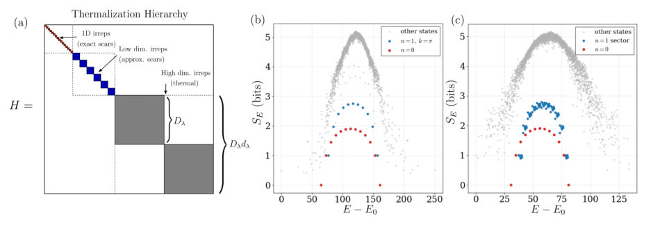
<figcaption class="paper-figure-caption"><b>Fig 1.</b> FIG. 1: Thermalization hierarchy. (a) Decomposition of the Hamiltonian (1) in the basis (5), showing dynamically isolated subspaces as diagonal blocks. Half-chain entanglement entropy of the eigenstates of (b) the local, translation invariant Hamiltonian (55) with κ = 2.5 and of (c) the nonlocal, disordered Hamiltonian (60) with κ = 0.02. Calculations done under periodic boundary conditions with parameters J1 = J2 = J3 = 1, and B = 8. Energies are shown relative to E0 of the ferromagnetic state |↑, ↑, . . . , ↑⟩.</figcaption>
</figure>
<figure class="paper-figure-card">

<figcaption class="paper-figure-caption"><b>Fig 2.</b> FIG. 2: Permutation irreps as Young diagrams. (a) Dia- gram corresponding to the (2, 1) irrep of S3. (b) and (c) are its two Young tableaux, which yield a two-dimensional irrep.</figcaption>
</figure>
<figure class="paper-figure-card">
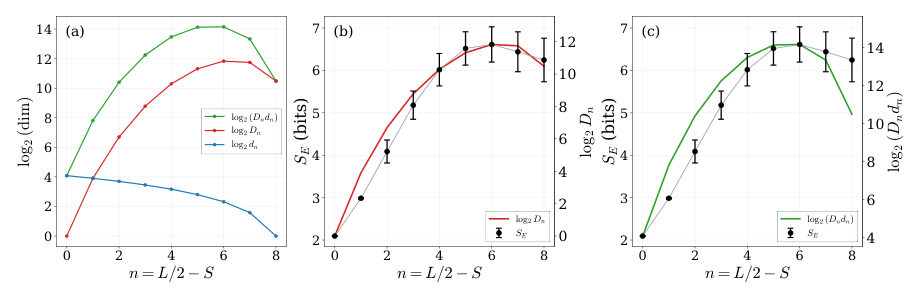
<figcaption class="paper-figure-caption"><b>Fig 3.</b> FIG. 3: (a) Dimensions Dn (dn) of the bond (commutant) algebra irreps as well as the dimension Dndn of the total spin sector versus n = L/2 −S for L = 16. Half-chain entanglement entropy SE averaged over all energy eigenstates of (10) with a given n and its comparison with the logarithm of (b) the bond-irrep dimensions Dn and (c) the spin sector dimensions Dndn.</figcaption>
</figure>
<figure class="paper-figure-card">

<figcaption class="paper-figure-caption"><b>Fig 4.</b> FIG. 4: Scaling of the half-chain entanglement entropy SE averaged over eigenstates of the Hamiltonian (10) with fixed n IDOF.</figcaption>
</figure>

**Summary.** The paper introduces a 'thermalization hierarchy' by decomposing the Hilbert space using bond and commutant algebras, providing a finer structure than simple symmetry analysis. It shows that the dimension of these bond irreps ($D_{\lambda}$) controls thermalization continuously, mapping low $D_{\lambda}$ to scars and high $D_{\lambda}$ to ergodic behavior. This framework provides a microscopic interpretation via 'Irreducible Degrees of Freedom' (IDOF) for understanding quantum dynamics.

**Why it may be interesting.** This work offers a powerful algebraic tool (bond algebras) to classify and quantify the transition between integrable/scarred dynamics and thermal behavior in quantum many-body systems, highly relevant for understanding out-of-equilibrium physics.

Detailed structure

**Main problem.** To establish a refined 'thermalization hierarchy' that describes how quantum many-body systems approach thermal equilibrium, moving beyond simple symmetry sector analysis.

**Main result.** The degree of thermalization is quantitatively controlled by the dimension of the bond algebra irreducible representation ($D_{\lambda}$), creating a continuous spectrum from non-thermal scars to ergodic states.

**Method.** The authors use algebraic decomposition based on the bond and commutant algebras ($\mathcal{A}_{	ext{bond}}$ and $\mathcal{A}_{	ext{comm}}$) to partition the Hilbert space into dynamically isolated subspaces.

**Model / system.** The analysis uses SU(2)-symmetric spin-1/2 chains as a paradigmatic model, analyzing its Hamiltonian structure via algebraic decomposition techniques derived from Schur-Weyl duality.

**Key observables.** Average eigenstate entanglement entropy ($S_E$), the dimension of bond irreps ($D_{\lambda}$), and Irreducible Degrees of Freedom (IDOF).

**Important parameters / regimes.** The IDOF, which is quantified by $\log D_{\lambda}$, acts as the continuous control parameter interpolating between different thermalization regimes.

**Assumptions / limitations.** The analysis assumes that the Hilbert space can be decomposed according to the irreducible representations of the bond and commutant algebras.

**Figures summary.** Figures illustrate the thermalization hierarchy based on $\mathcal{A}_{	ext{bond}}$ irreps, showing entanglement entropy dependence on parameters ($\kappa$), and comparing $\log D_n$ with half-chain entanglement entropy for different Hamiltonians.

**Paper structure.** The paper first introduces the algebraic framework using bond/commutant algebras to refine thermalization understanding. It then uses SU(2) spin chains as an example, relating $D_{\lambda}$ to entanglement entropy and IDOF. Finally, it provides a constructive method for embedding non-thermal states into ergodic spectra.

Abstract

The decomposition of the Hilbert space of a quantum many-body system into the irreducible representations of its bond and commutant algebras yields a finer structure of dynamically isolated subspaces than the mere decomposition into symmetry sectors. While it has been recognized that subspaces associated with low bond-irrep dimensions $D_λ$ tend to violate the eigenstate thermalization hypothesis (ETH), here we show that $D_λ$ controls thermalization continuously across the full spectrum of dynamical subspaces. Using SU(2)-symmetric spin-1/2 chains as a paradigmatic example, we demonstrate that $\mathrm{log} \ D_λ$ quantitatively accounts for the average eigenstate entanglement entropy within each sector, establishing a thermalization hierarchy that interpolates from exact quantum many-body scars at $D_λ=1$ to volume-law ergodic states at large $D_λ$. To make this concrete, we introduce the notion of irreducible degrees of freedom (IDOF), defined as the number of independently-varying spatial coordinates parametrizing a many-body state within a given bond-algebra sector, which provides a microscopic interpretation of $D_λ$ and of the resulting thermalization hierarchy. Finally, we show that by selectively breaking symmetries while preserving chosen bond-algebra sectors, one can embed families of nonthermal eigenstates at prescribed entanglement levels into an otherwise ergodic spectrum, generalizing restricted spectrum-generating algebras from towers of individual states to entire dynamical subspaces.

[↑ back to top](#top)

### [Critical behavior of the driven Curie-Weiss model](http://arxiv.org/abs/2607.05130v1)

**Authors:** Ruohan Xu, Faezeh Khodabandehlou, Christian Maes  
**Type:** theory · **Category:** statistical mechanics · **PDF:** <https://arxiv.org/pdf/2607.05130v1>  
**Analysis basis:** full PDF text, analyzed in chunks
**Topic relevance:** 🔥 `non-equilibrium universality` **5/5** · 🔥 `driven-dissipative phase transition` **4/5** · `methods for driven-dissipative` **3/5** · `non-equilibrium dynamics` **3/5** · `Keldysh / 2PI / non-Gaussian methods` **1/5** · `analog quantum simulation` **1/5** · `correlated / nonlocal dissipation` **1/5**

↔ Scroll figures horizontally

<figure class="paper-figure-card">

<figcaption class="paper-figure-caption"><b>Fig 1.</b> FIG. 1: Specific heat as a function of inverse temperature β for different values of A and ω. (a)</figcaption>
</figure>
<figure class="paper-figure-card">

<figcaption class="paper-figure-caption"><b>Fig 2.</b> FIG. 2: sinh−1 χ as function of β, for different values of A and ω.</figcaption>
</figure>
<figure class="paper-figure-card">
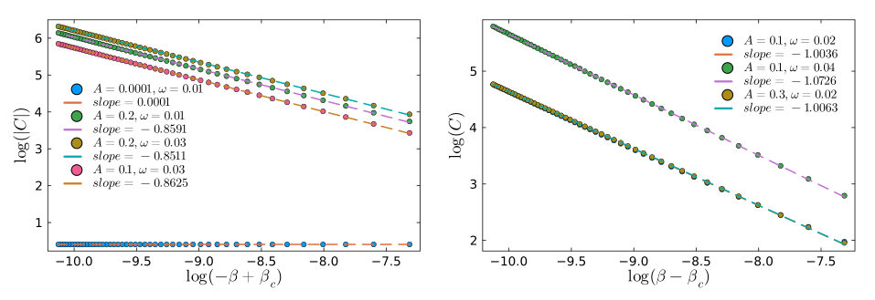
<figcaption class="paper-figure-caption"><b>Fig 3.</b> FIG. 3: Critical behavior of the specific heat for different values of A and ω in the vicinity of βc.</figcaption>
</figure>
<figure class="paper-figure-card">
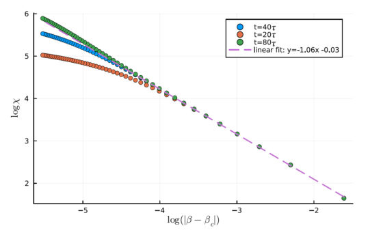
<figcaption class="paper-figure-caption"><b>Fig 4.</b> FIG. 4: Critical behavior of χ for A = 0.1 and ω = 0.3. The time t is that of averaging as multiple</figcaption>
</figure>
<figure class="paper-figure-card">
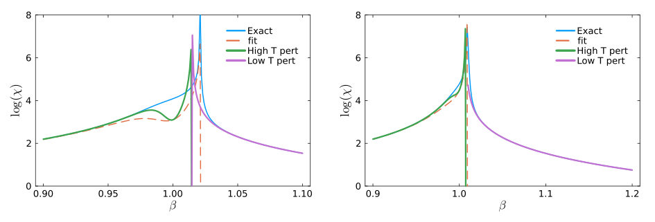
<figcaption class="paper-figure-caption"><b>Fig 5.</b> FIG. 5: Critical behavior of χ, predicted by formula (III.2), high-temperature approximation (III.1)</figcaption>
</figure>

**Summary.** This paper investigates the non-equilibrium critical behavior of the Curie-Weiss magnet under periodic external driving. By analyzing observables like specific heat and susceptibility using mean-field theory, the authors map out a complex phase diagram showing coexistence regions. The findings highlight how driving fundamentally alters critical exponents and introduces dynamics unseen in equilibrium thermodynamics.

**Why it may be interesting.** This work provides a detailed theoretical framework for understanding non-equilibrium critical phenomena in classical magnetic models, which has direct analogies to driven quantum systems where thermal equilibrium assumptions break down.

Detailed structure

**Main problem.** The study focuses on completing the phase diagram and analyzing the critical behavior of a macroscopic Curie-Weiss magnet when subjected to a time-periodic external driving field.

**Main result.** The system exhibits coexisting paramagnetic and ferromagnetic phases in certain driven regimes, and the specific heat shows divergences with different critical exponents ($\alpha=1$ vs $\alpha\simeq 0.86$) depending on whether the temperature is approached from above or below criticality.

**Method.** The analysis employs mean-field theory combined with non-equilibrium calorimetry techniques, involving linear response theory and perturbative expansions around the driven steady state.

**Model / system.** The model is the Curie-Weiss magnet described by a Hamiltonian subjected to a time-dependent field $h_0(t) = \delta_0 + A_0 \cos(\omega t)$. The dynamics are analyzed in the macroscopic limit using relaxation equations for magnetization.

**Key observables.** Specific heat ($C$), magnetic susceptibility ($\chi$), and the average magnetization $\langle m 
angle$.

**Important parameters / regimes.** Temperature ($eta$), driving amplitude ($A$), and frequency ($\omega$). Criticality is studied across regimes defined by these parameters.

**Assumptions / limitations.** The analysis often relies on approximations such as the near-quasistatic ansatz for small modulation frequencies, or perturbative expansions in the driving amplitude $A$.

**Figures summary.** Figures illustrate specific heat divergence at $eta_c$ for various driving strengths; they also show phase coexistence regions and compare critical exponents derived from both $C$ and $\chi$.

**Paper structure.** The paper systematically develops the mean-field description, applies linear response theory to calculate observables like susceptibility, and analyzes the resulting equations by examining different parameter regimes (e.g., weak vs. strong driving) to map out the phase diagram.

Abstract

We complete the phase diagram of the macroscopic Curie-Weiss magnet in a time-periodic external field, as a function of temperature and driving parameters. There is a regime (large enough driving amplitude and frequency, at low temperatures) where stable paramagnetic and ferromagnetic phases coexist. In particular, we present a new detailed analysis of the (nonequilibrium) specific heat, diverging at the same critical inverse temperature $β_c$ as the magnetic susceptibility. The new Curie temperature decreases with the driving, and we find critical exponent $α=1$ for $β\downarrow β_c$, and $α\simeq 0.86$ for $β\uparrow β_c$, even for small driving. A Floquet analysis shows the nature of the criticality, which is dynamical, with implications that remain unseen and are mostly impossible when the system is in thermal equilibrium.

[↑ back to top](#top)

### [Fast Pulses for High-Fidelity Circularization of Interacting Rydberg atoms](http://arxiv.org/abs/2607.05216v1)

**Authors:** Matthias Hüls, Aurore A. Young, Clément Sayrin, Michel Brune, Jean-Michel Raimond, Tommaso Calarco, Felix Motzoi, Robert Zeier, Eloisa Cuestas  
**Type:** theory · **Category:** other · **PDF:** <https://arxiv.org/pdf/2607.05216v1>  
**Analysis basis:** full PDF text, analyzed in chunks
**Topic relevance:** 🔥 `Rydberg arrays` **5/5** · 🔥 `analog quantum simulation` **4/5** · `methods for driven-dissipative` **3/5** · `non-equilibrium dynamics` **2/5** · `Keldysh / 2PI / non-Gaussian methods` **1/5** · `entanglement & information structure` **1/5** · `quantum measurements` **1/5**

↔ Scroll figures horizontally

<figure class="paper-figure-card">
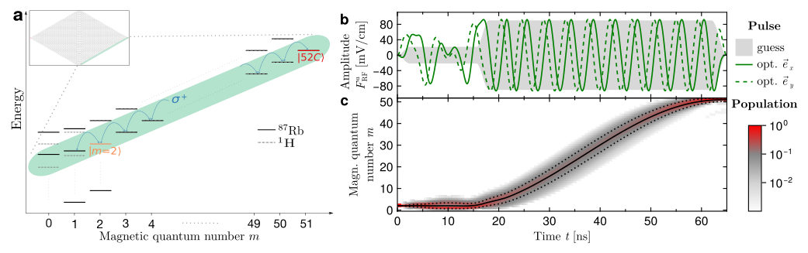
<figcaption class="paper-figure-caption"><b>Fig 1.</b> FIG. 1. (a) Rydberg levels of the n = 52 manifold of 1H (dashed gray lines) and 87Rb (solid black lines) in the presence of static electric and magnetic fields of magnitude E = 2.1 V cm−1 and B = 14 G. The eigenenergies ordered by their corresponding magnetic quantum number m reveal the diamond-like pattern depicted in the inset. For hydrogen the subspace of the energeti- cally lowest states with m ≥0 forms the lowest diagonal ladder (shaded turquoise) that includes the circular state |52C⟩(red). The lowest diagonal ladder is harmonic up to the dominant first order Stark shift with transitions m →m + 1 (blue arrows) of 229.2 MHz usually driven by a σ+ polarized RF field. The m = 0 and m = 1...</figcaption>
</figure>
<figure class="paper-figure-card">
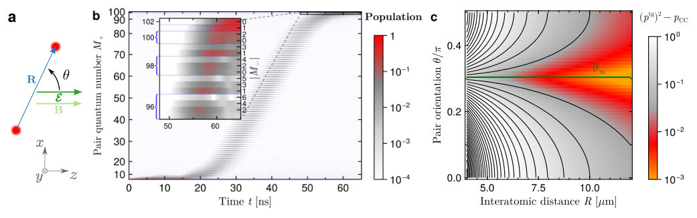
<figcaption class="paper-figure-caption"><b>Fig 2.</b> FIG. 2. (a) A pair of Rydberg atoms with interatomic distance R and angle θ with respect to the static electric and magnetic fields E and B. (b) Angular momentum transfer for an interacting atom pair with R = 7 µm and θ = 0 under the action of the RF pulse optimized for the circulrization of a single atom shown in Fig. 1(b). The field magnitudes are set to E = 2.1 V cm−1</figcaption>
</figure>
<figure class="paper-figure-card">
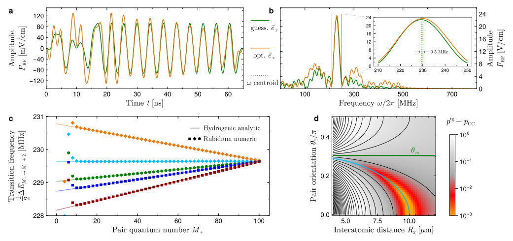
<figcaption class="paper-figure-caption"><b>Fig 3.</b> FIG. 3. Main mechanism through which the interactions disturb the circularization. (a-b) Comparison between the RF pulse optimized for the circularization of a single atom (green) with a pulse optimized for the simultaneous circularization of a pair of atoms (orange) with R = 7 µm and θ = 0, targeting in both cases to an efficiency ptg = 99%. The static electric and magnetic field have magnitudes E = 2.1 V cm−1 and B = 14 G. Panel (a) depicts the x-component of both pulses (y-components exhibit similar behavior) while panel (b) shows the corresponding spectral analysis. The Fourier transform of the pulse optimized for the circularization of a single atom exhibits a dominant peak around the...</figcaption>
</figure>
<figure class="paper-figure-card">
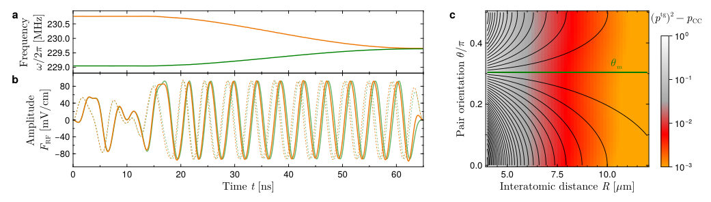
<figcaption class="paper-figure-caption"><b>Fig 4.</b> FIG. 4. Analytical adaptation of the single-atom pulse to two interacting atoms. (a) Frequencies associated to the transitions supported by the lowest diagonal ladders for two non-interacting (green) and interacting (orange) hydrogenic atoms. (b) x− and y−components (solid and dashed orange curves, respectively) of the analytical adapted pulse Faa ad. freq. for interacting atoms obtained by incorporating into Fa Krotov (in green) a phase shift that counteracts the main effect of interactions, see Eq. (5.1). The resulting adapted pulse leads to pCC = 96.9 % for R = 7 µm and θ = 0. (c) Differences between the maximum achievable final circular pair probability of (ptg)2 = 98% and the one...</figcaption>
</figure>
<figure class="paper-figure-card">

<figcaption class="paper-figure-caption"><b>Fig 5.</b> FIG. 5. Final circular pair state probability pCC obtained after the evolution of an atom pair under the action of different pulses (a) as a function of the interatomic distancde R for a fixed angle θ = 0 and pulse duration tf = 65 ns, (b) as a function of θ for a fixed R = 7 µm and tf = 65 ns, and (c) as a function of tf for fixed R = 7 µm and θ = 0. The dotted vertical lines in each panel indicate the value to which the corresponding parameter is fixed in the remaining panels. As expected, the optimized single-atom pulse of Fig. 1(b) (green) results in high values of pCC around θm and for large R. The optimized single-atom pulse is then adapted to the interactions as indicated by Eq....</figcaption>
</figure>

**Summary.** This paper tackles the challenge of rapidly preparing highly entangled circular states in interacting Rydberg atoms. The authors show that by analytically adapting single-atom pulse sequences to account for interaction-induced energy shifts, they can achieve high fidelity preparation even when atoms are closely spaced. This breakthrough paves the way for using these systems in practical quantum simulation and computation.

**Why it may be interesting.** This work directly addresses a critical technological hurdle in Rydberg quantum simulation platforms—the speed of state preparation—by providing a robust theoretical framework to incorporate many-body interactions into fast pulse design.

Detailed structure

**Main problem.** Circularization of interacting Rydberg atoms is a major bottleneck for quantum computation and simulation, as previous fast methods neglected crucial interatomic interactions.

**Main result.** The authors developed an adapted pulse sequence that achieves high-fidelity circularization ($\ge 95\%$) for two interacting $^{87}	ext{Rb}$ atoms at distances down to $6.5 \mu	ext{m}$, significantly speeding up the process.

**Method.** They analytically derived a functional form to adapt single-atom pulse optimization techniques (like Krotov's algorithm) by accounting for interaction-induced shifts in transition energies.

**Model / system.** The system involves interacting Rydberg atoms, modeled using a Hamiltonian incorporating free evolution, static electric/magnetic fields, and the dipole-dipole interaction ($\hat{H}_{	ext{int}}$). The focus is on preparing circular states in the $n=52$ manifold of $^{87}	ext{Rb}$.

**Key observables.** Final circular state probability ($p_C$), fidelity ($\ge 95\%$), and angular momentum transfer $\langle\hat{L}_z
angle$.

**Important parameters / regimes.** Interatomic distances down to $6.5 \mu	ext{m}$; target speedup factor of $\sim 60$ over adiabatic passage.

**Assumptions / limitations.** The dominant disturbance from interactions is modeled as shifts in transition energies, allowing for an analytical adaptation of single-atom pulses; retardation effects are neglected for the interaction term.

**Figures summary.** Figures illustrate Rydberg level structures under static fields and show the optimized RF pulse components and population evolution demonstrating angular momentum transfer in both single-atom and interacting pair scenarios.

**Paper structure.** The work first establishes the bottleneck of circularization, then analyzes how interactions perturb single-atom pulses by identifying energy shifts. The core contribution is presenting an analytical adaptation method based on these shifts, which is validated for two atoms and extended using Krotov's algorithm for general pairs.

Abstract

Circular states in Rydberg atoms offer a promising platform for quantum computation, quantum simulation and quantum sensing. However, the final step of their preparation - termed as circularization, a process that involves the transfer of a large amount of angular momentum quanta to the valence electron by means of radio-frequency (RF) pulses - remains as a major bottleneck for all technological applications based on interacting circular Rydberg atoms. Even though successfully implemented to circularize an atom cloud in the dilute regime, previous efforts to speed up the circularization process have focused on the single-atom case, thereby neglecting the interactions which constitute one of the main resources for quantum simulation and computation. In this theoretical work we show how interactions between two atoms disturb the efficiency of pulses designed for single atoms and identify shifts induced by the interactions on relevant transition energies as the dominant disturbance. We demonstrate that the initial efficiency of single-atom pulses can be restored by adapting them to these shifts. Our approach is based on a simple functional form depending only on two linear parameters, which we derive analytically. The adapted pulses prepare two $^{87}$Rb atoms after $65 \,$ns in a $n=52$ circular state with a fidelity of at least $95\,\%$ for interatomic distances down to $6.5\,μ$m and for all angular configurations, while also complying experimental amplitude and frequency constraints. Finally, we show that when combining our adapted pulses with Krotov's pulse-shaping algorithm we obtain high-fidelity pulses for any pair arrangement with interatomic distances larger than $5.9\,μ$m. This work demonstrates that fast RF pulses can circularize interacting Rydberg atoms, paving the way toward their technological application.

[↑ back to top](#top)

### [Quantum Hashing via Constrained Rydberg Many-Body Dynamics](http://arxiv.org/abs/2607.04991v1)

**Authors:** Han-Chao Chen, Xin Liu, Zheng-Yuan Zhang, Dong-Sheng Ding, Bao-Sen Shi  
**Type:** theory · **Category:** other · **PDF:** <https://arxiv.org/pdf/2607.04991v1>  
**Analysis basis:** full PDF text, analyzed in chunks
**Topic relevance:** 🔥 `Rydberg arrays` **5/5** · 🔥 `analog quantum simulation` **4/5** · `entanglement & information structure` **2/5** · `non-equilibrium dynamics` **2/5** · `Tavis-Cummings & cavity-many-emitter` **1/5** · `correlated cavity matter` **1/5** · `driven-dissipative phase transition` **1/5** · `methods for driven-dissipative` **1/5**

↔ Scroll figures horizontally

<figure class="paper-figure-card">
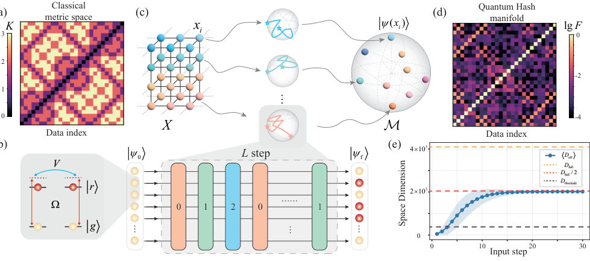
<figcaption class="paper-figure-caption"><b>Fig 1.</b> FIG. 1. Quantum hashing protocol and information space structure. (a) Classical metric space. A pairwise Hamming distance matrix of ternary data arranged in Gray code. (b) One-dimensional Rydberg atom arrays and schematic diagram of the quantum hashing process. Ternary symbols {0, 1, 2} are mapped to the quantum hashing elementary evolution operator. Under the action of a sequence of length L, the initial state |ψ0⟩evolves into the final quantum hashing state |ψf⟩. (c) Reconstruction of ternary information space to Hilbert space. Each ternary string xi in the classical space X uniquely determines a deterministic dynamical trajectory, which is mapped to a single quantum hashing state...</figcaption>
</figure>
<figure class="paper-figure-card">

<figcaption class="paper-figure-caption"><b>Fig 2.</b> FIG. 2. Hashing collision probability. (a) Distribution of hashing collision probabilities obtained from Monte Carlo simulations with 104 samples for a system of N = 12 atoms. The corresponding average collision probability is calculated to be Pave = 0.048%. (b) Average hashing collision prob- ability as a function of the number of atoms N, with the vertical axis shown on a logarithmic scale. The blue solid line represents the collision probability obtained from numerical statistics, while the orange dashed line denotes the scaling behavior expected for an ideal hash function, Pcoll = 1/2N.</figcaption>
</figure>
<figure class="paper-figure-card">

<figcaption class="paper-figure-caption"><b>Fig 3.</b> FIG. 3. Cryptographic properties of quantum hashing. (a) Random Forest machine learning (ML) decoder success probability versus input length L. The blue scatter points represent the numerical data, while the purple solid line denotes the logistic function fitting curve Pfit = 1 1+exp[(L−Lc)/k]. The red dashed line indicates the baseline corresponding to random guessing by the decoder, and the blue dashed line marks the fitted critical length Lc. (b) Hamming distance between the decoded output string and the true input string as a function of the input length L. The red dashed line indicating the random guessing limit, K = 2L/3. (c) Distribution of decoding accuracy for each trit position in...</figcaption>
</figure>

**Summary.** The authors show that constrained dynamics within Rydberg atom arrays naturally implement a quantum hashing mechanism. By encoding classical data into deterministic quantum trajectories, the system's geometry yields strong cryptographic properties like low collision rates and tamper sensitivity. This establishes quantum dynamics itself as a fundamental physical resource for information processing.

**Why it may be interesting.** This work directly connects fundamental concepts in AMO physics (Rydberg interactions, many-body dynamics) to advanced topics in quantum information theory and cryptography, suggesting a new physical resource for computation.

Detailed structure

**Main problem.** To demonstrate that quantum hashing, a cryptographic function, can emerge naturally from constrained many-body dynamics rather than requiring deliberately engineered algorithms.

**Main result.** The geometric structure induced by the dynamics in Rydberg atom arrays provides intrinsic cryptographic properties like low collision probability and one-wayness.

**Method.** Classical ternary strings are mapped to quantum states via deterministic trajectories governed by an effective Hamiltonian controlling blockade, pair antiblockade, and facilitation interactions.

**Model / system.** The physical system is based on Rydberg atom arrays implementing constrained many-body dynamics. The evolution is controlled by a time-dependent Hamiltonian involving three generators: $O_B$, $O_P$, and $O_F$.

**Key observables.** Collision probability ($P_{ave}$), state fidelity ($F$), effective dimension ($	ext{Deff}$), success probability for recovery ($P_{	ext{fit}}$).

**Important parameters / regimes.** System size (number of atoms, $N=12$ used in examples) and input length ($L$).

**Assumptions / limitations.** The protocol relies on the unique canonical representation provided by the initial state $|\psi_0
angle$.

**Figures summary.** Figures illustrate the mapping from classical space to a quantum ensemble, showing low collision probability (Fig. 2) and the disappearance of block structure in fidelity matrices.

**Paper structure.** The paper introduces the protocol by defining the dynamics on Rydberg arrays, analyzes the resulting state geometry using statistical measures, and then rigorously proves the emergence of cryptographic properties like one-wayness and tamper sensitivity from this intrinsic quantum evolution.

Abstract

In this Letter, we show that constrained many-body dynamics in Rydberg atom arrays naturally gives rise to a quantum hashing mechanism. By encoding ternary strings into deterministic trajectories in the state space, the classical information space is mapped onto a quantum state ensemble in the Hilbert space with an induced geometric structure. Statistical analysis reveals that this ensemble exhibits high probability near-orthogonality, random-like distribution, and broad geometric coverage. These geometric features naturally give rise to the essential cryptographic properties of quantum hashing, including low collision probability, one-wayness, tamper sensitivity, and privacy preservation. Our results demonstrate that the cryptographic functionality of quantum hashing need not rely on deliberately engineered algorithms, but can instead emerge naturally from constrained many-body dynamics, identifying quantum dynamics itself as a physical resource for cryptographic information processing.

[↑ back to top](#top)

### [The arrival position problem in quantum mechanics](http://arxiv.org/abs/2607.03538v1)

**Authors:** Ali Ayatollah Rafsanjani, Will Cavendish  
**Type:** theory · **Category:** other · **PDF:** <https://arxiv.org/pdf/2607.03538v1>  
**Analysis basis:** full PDF text, analyzed in chunks
**Topic relevance:** 🔥 `quantum measurements` **5/5** · 🔥 `measurement-induced transitions` **4/5** · `non-equilibrium dynamics` **2/5** · `Keldysh / 2PI / non-Gaussian methods` **1/5** · `correlated / nonlocal dissipation` **1/5** · `driven-dissipative phase transition` **1/5** · `methods for driven-dissipative` **1/5**

↔ Scroll figures horizontally

<figure class="paper-figure-card">
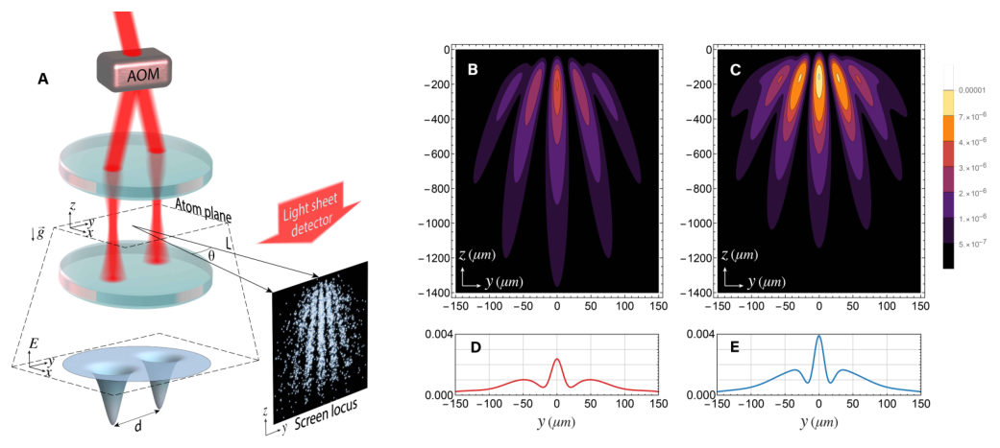
<figcaption class="paper-figure-caption"><b>Fig 1.</b> FIG. 1. A realization of the proposed experimental scheme and arrival position distributions for two proposals. Panel A shows a schematic of one realization of the proposed experimental scheme. An atom is prepared in the delocalized ground state of an optical double-well potential [68], which is formed by two laser beams generated by an acousto-optic modulator (AOM) driven by two radio-frequency (rf) tones. Lenses following the AOM control the beam geometry. The separation between the two wells is precisely tuned by the frequency difference of the rf drives. The atom is released from the trap in the presence of a screen in the plane x=L, where the origin of the coordinate system is taken to...</figcaption>
</figure>
<figure class="paper-figure-card">

<figcaption class="paper-figure-caption"><b>Fig 2.</b> FIG. 2. Comparison of AL(θ; ψs.w. σ ) for L = 10σ (left) and L = 103σ (right). The total detection probabilities PL(D; ψs.w. σ ) are shown in the table. The inset shows the QF and SD distributions over the angular interval from 88 to 90 degrees for L = 103σ. For CAP, the potential is µ1 σ, where the potential height (the superscript of µ) is given in units of ℏ2/(2mσ2). For ABC, β = i/(2σ), and for MS, λ = 2σ.</figcaption>
</figure>
<figure class="paper-figure-card">
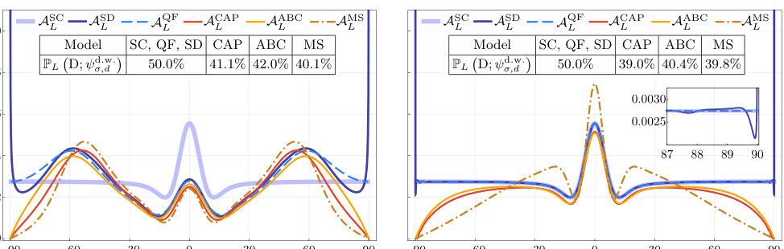
<figcaption class="paper-figure-caption"><b>Fig 3.</b> FIG. 3. Comparison of the arrival position distributions AL  θ; ψd.w. σ,d  for the double-well initial state with well separation d = 20σ. As in Fig. 2, the panels show results for L = 10σ (left) and L = 103σ (right), with total detection probabilities PL  D; ψd.w. σ,d  listed in the inset tables. All model parameters remain identical to the single-well case: for CAP, the potential is µ1 σ (where the superscript denotes potential height in units of ℏ2/(2mσ2)); for ABC, β = i/(2σ); and for MS, λ = 2σ. The inset shows the QF and SD distributions over the angular interval from 87 to 90 degrees for L = 103σ.</figcaption>
</figure>
<figure class="paper-figure-card">
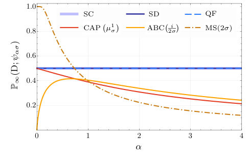
<figcaption class="paper-figure-caption"><b>Fig 4.</b> FIG. 4. The total detection probabilities for a Gaussian ini- tial state with initial width ασ as a function of the rescaling parameter α. The detector parameters are fixed across rescal- ings, with λ = 2σ, β = i/(2σ), and a CAP potential µ1 σ where the potential height is given in units of ℏ2/(2mσ2).</figcaption>
</figure>

**Summary.** This paper investigates the theoretical challenge of determining where a particle will be detected by an always-on screen in quantum mechanics. It compares multiple proposed solutions—like those using quantum flux or absorbing potentials—and demonstrates that these models make distinct, measurable predictions for arrival positions. The work highlights that resolving this 'arrival position problem' is crucial for understanding measurement processes beyond simple time measurements.

**Why it may be interesting.** This is highly relevant for AMO physicists working on open quantum systems or measurement theory, as it tackles the fundamental ambiguity in predicting spatial outcomes when continuous monitoring (the 'screen problem') is involved.

Detailed structure

**Main problem.** The paper addresses the 'arrival position problem' in quantum mechanics: predicting the probability distribution of *where* a particle is detected by an always-on screen, which complements the more studied arrival time problem.

**Main result.** Different theoretical proposals for solving this measurement problem yield quantitatively distinguishable predictions for the arrival position marginals, even in simple experiments and in the far-field limit.

**Method.** The authors compare quantitative predictions derived from six distinct proposed solutions to the screen problem, including semiclassical, quantum flux, complex absorbing potential, and path-integral approaches.

**Model / system.** The system involves a particle (like an atom) initially confined in a trap, released to disperse under gravity, and detected by a planar 'waiting detector screen' ($SL$).

**Key observables.** The primary observable is the probability distribution of arrival positions (the marginal distribution $\Pi_S(s; \Psi)$), derived from joint distributions of position and time.

**Important parameters / regimes.** The analysis focuses on the long accumulation-time limit ($T 	o \infty$) and compares results in both near-field and far-field regimes.

**Assumptions / limitations.** The framework assumes an 'always on' screen, requiring detection events or a definite 'no detection' outcome, rather than instantaneous measurements.

**Figures summary.** Figure 1 schematically illustrates the proposed experimental setup and shows theoretical arrival position distributions for two different proposals (Panel A), with other panels showing associated $y$-position marginals.

**Paper structure.** The paper systematically compares various quantum mechanical frameworks—such as Quantum Flux, Complex Absorbing Potential, and Semiclassical methods—to map initial wave functions onto measurable outcome probabilities at a detection screen.

Abstract

The problem of making unambiguous probabilistic predictions about experiments involving waiting "always on" detectors remains a challenge for quantum theory. While most research on this problem studies arrival time, i.e., predicting the distribution of when detection events occur, this paper studies the arrival position problem, which is the complementary challenge of predicting the distribution of where detection events occur. Despite the widespread recognition of the arrival time problem, the inability of standard quantum theory to address the arrival position problem remains a pervasive theoretical blind spot. In this paper, we compare quantitative arrival position predictions derived from prominent proposed solutions to the screen problem. As we show, these models yield distinguishable predictions even in relatively simple experiments achievable with current technology. Notably, many of these discrepancies persist even in the far-field limit, where standard semiclassical approximations are typically assumed to be valid.

[↑ back to top](#top)

### [All-optical control of coherent perfect absorption via frequency conversion](http://arxiv.org/abs/2607.04682v1)

**Authors:** Rikizo Ikuta, Hirokazu Kobayashi, Hiroki Takahashi  
**Type:** experiment · **Category:** other · **PDF:** <https://arxiv.org/pdf/2607.04682v1>  
**Analysis basis:** full PDF text, analyzed in chunks
**Topic relevance:** 🔥 `correlated / nonlocal dissipation` **4/5** · `driven-dissipative phase transition` **3/5** · `interference shaping light` **3/5** · `quantum optics experiment` **3/5** · `Tavis-Cummings & cavity-many-emitter` **2/5** · `correlated cavity matter` **2/5** · `methods for driven-dissipative` **2/5** · `non-equilibrium dynamics` **2/5** · `non-equilibrium universality` **2/5** · `Keldysh / 2PI / non-Gaussian methods` **1/5** · `Kondo & dissipative impurity` **1/5** · `analog quantum simulation` **1/5** · `entanglement & information structure` **1/5** · `measurement-induced transitions` **1/5** · `quantum measurements` **1/5**

↔ Scroll figures horizontally

<figure class="paper-figure-card">

<figcaption class="paper-figure-caption"><b>Fig 1.</b> FIG. 1. Concept of FC-CPA, based on a two-sided Fabry- Pérot cavity with frequency-conversion-induced optical loss. (a) Implementation of a lossy FP cavity using frequency con- version inside the cavity. The signal light is injected into the lossy cavity acting as a BS from (b) one side, (c) both sides with identical phase, and (d) both sides with a π-phase dif- ference between the inputs.</figcaption>
</figure>
<figure class="paper-figure-card">

<figcaption class="paper-figure-caption"><b>Fig 2.</b> FIG. 2. Experimental setup. The cyan and red solid lines indicate the signal light at 1581 nm and frequency-converted light at 780 nm, respectively. The red dashed line indicates the externally injected environmental light at 780 nm. Light beams at different wavelengths are combined and separated using dichroic mirrors (DMs). Details are provided in the main text.</figcaption>
</figure>
<figure class="paper-figure-card">

<figcaption class="paper-figure-caption"><b>Fig 3.</b> FIG. 4. Pump-power dependence of the transmission, reflec- tion, and conversion fractions. Blue, green, and orange data were measured at PDH, PDV, and PDE, respectively. The gray points show the sum of the transmission, reflection, and conversion fractions. Signal light is input from (a) cw direc- tion, and (b) ccw direction.</figcaption>
</figure>
<figure class="paper-figure-card">
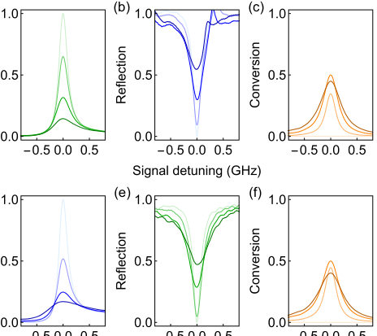
<figcaption class="paper-figure-caption"><b>Fig 4.</b> FIG. 3. Normalized observed responses from the FC-CPA for input from either cw or ccw direction. The blue, green, and orange colors denote the detector channels PDH, PDV, and PDE, respectively, corresponding to the colors used in Fig. 2. Darker colors correspond to higher pump powers. Spectra of (a) transmission, (b) reflection, and (c) conversion are shown for the signal input in the cw direction measured at pump powers of 0 mW, 21 mW, 72 mW, and 145 mW. (d), (e), and (f) show the corresponding spectra for the ccw direction mea- sured at the pump powers of 0 mW, 39 mW, 110 mW, and 180 mW.</figcaption>
</figure>
<figure class="paper-figure-card">

<figcaption class="paper-figure-caption"><b>Fig 5.</b> FIG. 5. FC-CPA at the pump power of 45 mW using signal light incident from both directions. The amount of absorption from the main system (cyan) into the environment (orange) reaches approximately 92 %, which is not achieved when the signal is injected from either the cw or ccw direction alone.</figcaption>
</figure>

**Summary.** This paper presents an all-optical method to achieve Coherent Perfect Absorption (CPA) by utilizing frequency conversion within a PPLN waveguide resonator. By coupling the signal light to a dynamically tunable environmental mode, the authors demonstrate that CPA can be switched on and off optically. Furthermore, they introduce environment-assisted control, turning the passive loss reservoir into an active port for enhanced absorption management.

**Why it may be interesting.** This work is highly relevant to open quantum systems and quantum optics because it treats engineered dissipation (loss) not as a fixed parameter but as an actively controllable degree of freedom using nonlinear optical processes. The concept of turning the environment into a coherent control port mirrors concepts in cavity QED where external fields manipulate system decay rates.

Detailed structure

**Main problem.** The primary goal is achieving all-optically controllable Coherent Perfect Absorption (CPA), overcoming the limitation of conventional CPA which relies on fixed material loss.

**Main result.** The authors demonstrate that by using frequency conversion, they can create a dynamically tunable loss channel, and further enhance control by injecting an external field into the environmental mode, achieving up to 92% absorption.

**Method.** The work combines theoretical modeling (using input-output relations) with experimental implementation in a periodically poled lithium niobate waveguide resonator coupled to an interferometer setup.

**Model / system.** The physical platform is a frequency-conversion-based CPA system implemented in a PPLN/WR placed inside a two-sided Fabry-Pérot cavity. The mechanism involves coupling the resonant signal field (1581 nm) to a non-resonant environmental mode (780 nm) via a pump field, creating a tunable lossy beamsplitter.

**Key observables.** Absorption percentage (up to 92%), transmission/reflection spectra, and the energy remaining in the main system channels ($\alpha_{1,out}, \alpha_{2,out}$).

**Important parameters / regimes.** Pump power, detuning ($\Delta_c$), relative phase between counterpropagating signals, and the environmental field amplitude ($\alpha_{e,in}$).

**Assumptions / limitations.** The analysis treats fields as classical complex amplitudes; initial theoretical derivations assume zero intrinsic loss in certain channels for simplification.

**Figures summary.** Figures show normalized spectra (Transmission, Reflection, Conversion) vs. pump power, and critically, compare output intensities with and without the injected environmental field to demonstrate active control over absorption.

**Paper structure.** The paper progresses from establishing the need for controllable CPA, detailing the frequency-conversion mechanism in a PPLN/WR cavity, deriving the necessary theoretical framework (input-output relations), demonstrating single-sided and two-sided excitation effects, and finally showcasing environmental assistance for active control.

Abstract

Coherent perfect absorption (CPA) extinguishes optical fields through interference and dissipation, but conventional implementations rely on material loss that is largely fixed after fabrication. Here we demonstrate all-optically controllable CPA based on frequency conversion in a periodically poled lithium niobate waveguide resonator. Pump-driven frequency conversion couples a resonant signal field at 1581 nm in the main system to a non-resonant environmental mode at 780 nm, creating a dynamically tunable effective loss channel. The nonlinear cavity acts as a tunable lossy beamsplitter without intrinsic material absorption. Under coherent two-sided signal injection, we observe up to 92 % absorption. We further introduce environment-assisted CPA by injecting an external field into the frequency-converted environmental mode, turning the environment from a passive loss reservoir into an addressable coherent control port. Our results establish a frequency-conversion-based platform for all-optical control of dissipation in CPA, combining pump-tunable loss with environment-assisted coherent control.

[↑ back to top](#top)

### [Quantum-Optical Bound States in the Continuum](http://arxiv.org/abs/2607.04742v1)

**Authors:** Ruo Kun Cai, Zhi Jiao Deng, Chun Wang Wu, Ping Xing Chen  
**Type:** both · **Category:** other · **PDF:** <https://arxiv.org/pdf/2607.04742v1>  
**Analysis basis:** full PDF text, analyzed in chunks
**Topic relevance:** 🔥 `analog quantum simulation` **4/5** · `Tavis-Cummings & cavity-many-emitter` **3/5** · `correlated cavity matter` **3/5** · `driven-dissipative phase transition` **3/5** · `interference shaping light` **3/5** · `methods for driven-dissipative` **3/5** · `Frenkel-Kontorova` **2/5** · `non-equilibrium dynamics` **2/5** · `quantum optics experiment` **2/5** · `QC/QI experiment` **1/5** · `exotic spin models in light-matter` **1/5** · `non-equilibrium universality` **1/5** · `spintronics-quantum-optics interface` **1/5**

↔ Scroll figures horizontally

<figure class="paper-figure-card">
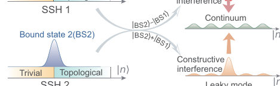
<figcaption class="paper-figure-caption"><b>Fig 1.</b> FIG. 1. Schematic of the spin-boson lattice model and the for- mation of a quantum-optical BIC. (a) Mapping of the driven JC model onto a FSL, comprising two semi-infinite anisotropic SSH chains coupled to a central chain with a continuous spec- trum. (b) Symmetric coupling of the localized bound states (in each SSH chain) to the common continuum. Destructive and constructive quantum interference between these chan- nels gives rise to a BIC and a leaky mode, respectively. (c) Spectroscopic detection protocol: Fourier analysis of the chi- ral symmetry operator’s time evolution reveals the BIC sig- nature—a discrete spectral peak within a continuous back- ground.</figcaption>
</figure>
<figure class="paper-figure-card">

<figcaption class="paper-figure-caption"><b>Fig 2.</b> FIG. 2. Exact decomposition of the Hilbert space and lattice structure. (a) Topological subspace: mapping onto a semi- infinite anisotropic SSH chain, which hosts a topological zero mode localized at the domain wall. The markedly higher in- verse participation ratio (IPR) of this mode and its confined probability distribution in the Fock-state basis (inset) con- firm its localized character. (b) Trivial (non-topological) sub- space: the SSH chain coupled to a continuum. The original topological zero mode becomes unstable due to leakage into the continuum, manifested by the broadening and diffusion of the probability distribution p(n) during time evolution. Pa- rameters: g=1, s=0.25, r=1,...</figcaption>
</figure>
<figure class="paper-figure-card">
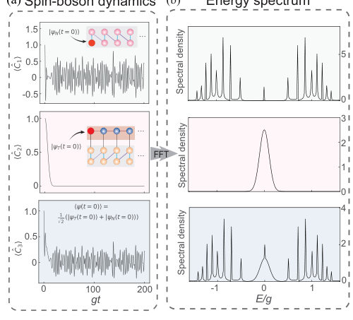
<figcaption class="paper-figure-caption"><b>Fig 3.</b> FIG. 3. Spectroscopic protocol for detecting the quantum- optical BIC. (a) Time evolution of the chiral-symmetry- operator expectation values for three different initial states: the topological zero mode |a′, 0⟩(top), |e, 0⟩residing in the trivial subspace (middle), and their coherent superposition (bottom). (b) Corresponding spectra obtained by Fourier transform, showing a zero-mode discrete peak (top), a broad continuum of the trivial subspace (middle), and the defini- tive BIC signature—a sharp peak embedded in a continuous background (bottom). Parameters: g=1, s=0.5, r=0.01, and β=0.1.</figcaption>
</figure>
<figure class="paper-figure-card">
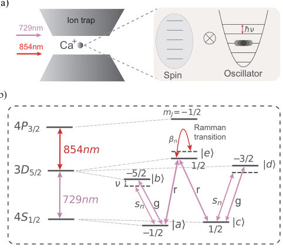
<figcaption class="paper-figure-caption"><b>Fig 4.</b> FIG. 4. Experimental proposal for the quantum-optical BIC with a trapped ion. (a) A single 40Ca+ ion confined in a Paul trap, representing the composite spin-boson system. The ef- fective (pseudo-)spin is encoded in a selected set of internal electronic states, and the bosonic mode corresponds to the harmonic motion (phonon) of the ion with frequency ν. The system is coherently manipulated via 729-nm and 854-nm laser beams. (b) Relevant level scheme, optical transitions, and laser wavelengths for engineering the Hamiltonian that realizes the quantum-optical BIC.</figcaption>
</figure>

**Summary.** The paper addresses the challenge of observing Bound States in the Continuum (BICs) in quantized optical systems by proposing a model based on a driven Jaynes-Cummings system mapped onto coupled SSH chains. The BIC is formed through destructive quantum interference, and its signature is detected spectroscopically via Fourier analysis of symmetry operators. A detailed experimental proposal using trapped ions makes this exotic physics highly accessible for current AMO platforms.

**Why it may be interesting.** This work is highly relevant as it bridges advanced concepts from condensed matter physics (topological insulators, SSH chains) with modern AMO platforms (trapped ions, cavity QED), providing a concrete pathway to observe exotic quantum phenomena at the quantum limit.

Detailed structure

**Main problem.** The core problem is finding a quantum-optical analog of Bound States in the Continuum (BICs) and developing a method to experimentally detect their signature when the field is quantized.

**Main result.** The authors demonstrate that a BIC can be formed in a driven multi-level Jaynes-Cummings system via destructive quantum interference between two topologically localized states. They propose a highly feasible detection protocol using a single trapped ion.

**Method.** The theoretical analysis involves mapping the model to an extended structure (FSL of SSH chains) and utilizing symmetry operators ($\hat{S}$ or $\hat{C}$) whose time evolution is Fourier-transformed to reveal the discrete spectral peak signature.

**Model / system.** The primary model is a driven multi-level Jaynes-Cummings system, which is mapped onto a Fock-state lattice (FSL) comprising two semi-infinite inhomogeneous Su-Schrieffer-Heeger (SSH) chains coupled to a continuum. Experimentally, this is realized using a single trapped $	ext{Ca}^+$ ion where internal electronic states encode the pseudo-spin and external motion acts as the bosonic mode.

**Key observables.** The spectroscopic signature of the BIC: a discrete spectral peak embedded within a continuous background, measured by Fourier-transforming the time-dependent dynamics of the chiral-symmetry operator ($\hat{C}$).

**Important parameters / regimes.** JC-coupling strength ($g \sim 2\pi 	imes 10	ext{kHz}$), short evolution times ($\le 5	ext{ms}$), and the requirement for destructive quantum interference.

**Assumptions / limitations.** The model assumes that the system can be accurately described by a driven JC Hamiltonian, which is then decomposed into topological and non-topological subspaces to isolate the BIC mechanism.

**Figures summary.** Figures illustrate the schematic mapping of the JC model onto an FSL (two SSH chains + continuum), show how destructive interference forms the BIC versus constructive interference forming leaky modes, and detail the spectroscopic detection protocol using Fourier analysis.

**Paper structure.** The paper first introduces the theoretical concept by modeling the system with a driven JC Hamiltonian mapped to an FSL. It then develops the diagnostic tool—Fourier-transforming the chiral-symmetry operator dynamics—to find the BIC signature. Finally, it provides a detailed, highly feasible experimental proposal using trapped ions to realize and measure this quantum-optical BIC.

Abstract

Bound states in the continuum (BICs) are counterintuitive localized states that lie within the continuum of extended states. While extensively realized and utilized in classical wave systems, it is still unclear what a close analog of BICs would be, and how to extract their experimental signature in quantum-optical settings -- where the wave field itself is quantized into bosonic excitations. Here, we present a paradigmatic quantum-optical model consisting of a driven multi-level Jaynes-Cummings (JC) system, featuring few quantum degrees of freedom yet capable of hosting a BIC. Using the concept of a Fock-state lattice (FSL), this model can be mapped to an extended structure comprising two semi-infinite inhomogeneous Su-Schrieffer-Heeger (SSH) chains coupled to a common continuum. An appropriate quantum superposition of two topological zero modes from the separate chains forms a BIC that remains perfectly localized in the Fock-state dimension within the continuum spectrum, due to complete decoupling from the common continuum via destructive quantum interference. We further develop a method to extract the spectroscopic signature of the BIC -- a discrete peak embedded in a continuous background -- by Fourier-transforming the time-dependent dynamics of the system's chiral-symmetry operator. A highly feasible experimental proposal using a single trapped ion is provided. Our work bridges BIC physics with quantum optics, opening a pathway to harnessing such exotic states at the quantum limit.

[↑ back to top](#top)

### [Matter-wave Induced Transparenc](http://arxiv.org/abs/2607.03820v1)

**Authors:** Tongkang wang, Yuqi Liu, Wenlan Chen, Zhendong Zhang, Jiazhong Hu  
**Type:** both · **Category:** other · **PDF:** <https://arxiv.org/pdf/2607.03820v1>  
**Analysis basis:** full PDF text, analyzed in chunks
**Topic relevance:** 🔥 `analog quantum simulation` **4/5** · 🔥 `methods for driven-dissipative` **4/5** · `Keldysh / 2PI / non-Gaussian methods` **3/5** · `correlated / nonlocal dissipation` **3/5** · `driven-dissipative phase transition` **3/5** · `interference shaping light` **3/5** · `non-equilibrium dynamics` **2/5** · `non-equilibrium universality` **2/5** · `Kondo & dissipative impurity` **1/5** · `entanglement & information structure` **1/5** · `measurement-induced transitions` **1/5**

↔ Scroll figures horizontally

<figure class="paper-figure-card">

<figcaption class="paper-figure-caption"><b>Fig 1.</b> FIG. 1. From a two-level Feshbach resonance to a three-level matter-wave interference system. (a) A conventional magnetic Feshbach resonance can be viewed as an effective two-level system formed by an open-channel free-atom state |a⟩and a closed-channel molecular state |m1⟩. The magnetic field tunes the detuning ∆between the two states, while the Feshbach coupling ℏΩ01 produces an avoided crossing. Near resonance, the admixture of the lossy molecular state (with decay rate γ1) enhances inelastic collisional loss, analogous to absorption in a resonantly coupled two-level optical system. (b) To construct a three-level system for interacting matter waves, a second molecular state |m2⟩in...</figcaption>
</figure>
<figure class="paper-figure-card">
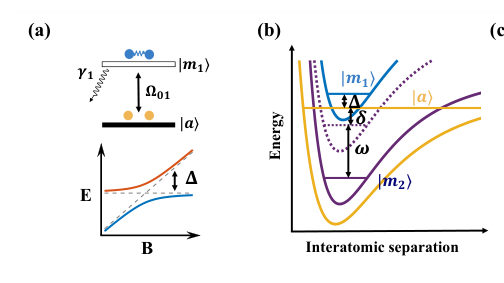
<figcaption class="paper-figure-caption"><b>Fig 2.</b> Fig. 1(a) illustrates a basic level structure underlying a conventional Feshbach resonance in a reduced descrip- tion of a two-level system: an open-channel free-atom state |a⟩coherently couples to a closed-channel molec- ular state |m1⟩through inherent collisional interactions (e.g., isotropic electronic and relativistic spin-dependent interactions) [9, 10]. In this regard, a Feshbach resonance realizes an effective two-level coupled system, where the magnetic field B tunes the relative detuning ∆between |a⟩and |m1⟩(with |m1⟩referenced to |a⟩). Plotted as an energy diagram versus B, the resonance corresponds to a Landau–Zener–type avoided crossing between the two states, with a gap set by...</figcaption>
</figure>
<figure class="paper-figure-card">
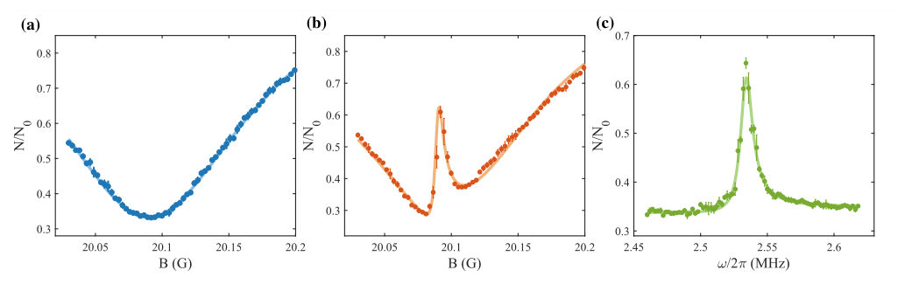
<figcaption class="paper-figure-caption"><b>Fig 3.</b> FIG. 2. Observation of matter-wave induced transparency in collisional loss. (a) Loss spectrum of a conventional two-level Feshbach resonance. The modulation frequency is fixed at ω/2π = 1.5 MHz, for which the second molecular state is far from resonance (δ/2π ≃−1 MHz, where 1 MHz corresponds to an effective Zeeman shift at around 0.8 G), and the system is therefore treated as a two-level configuration. The remaining atom fraction N/N0 shows a broad loss feature associated with the first molecular state |m1⟩. The center is shifted from the original |m1⟩-induced Feshbach resonance position of B0 = 19.84 G to B0 = 20.09 G due to the DC component light shift of the intensity-modulated pulse...</figcaption>
</figure>
<figure class="paper-figure-card">
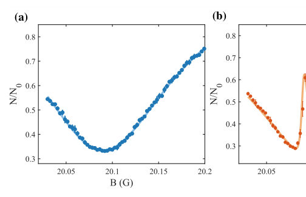
<figcaption class="paper-figure-caption"><b>Fig 4.</b> Fig. 1(d) shows the experimental timing sequence. We start with a BEC of cesium-133 atoms in the 6S1/2 hyper- fine ground state |F = 3, mF = 3⟩with approximately 1 × 105 atoms in a crossed optical dipole trap. A ho- mogeneous magnetic field B along the z axis defines the quantization axis and tunes the energy difference between the atomic threshold and the Feshbach molecular states [18]. After preparing the condensate, we ramp B to a target value, apply a modulation pulse of duration t, and then measure the remaining atom number N by absorp- tion imaging after time of flight (Supplementary Mate- rial). Throughout this work, the primary observable is the remaining atom fraction N/N0 (or...</figcaption>
</figure>
<figure class="paper-figure-card">

<figcaption class="paper-figure-caption"><b>Fig 5.</b> FIG. 3. Dark-state condition of matter-wave induced transparency and resonance interference. (a) Two- dimensional map of the remaining atom fraction N/N0 as a function of magnetic field B and modulation frequency ω. The broad region of reduced atom number corresponds to the dissipative Feshbach resonance involving the lossy molecular state |m1⟩. Within this lossy background, a narrow ridge of enhanced survival appears, marking the matter-wave transparency condition where the second molecular state |m2⟩participates in the three-level interference. (b) Representative magnetic-field spectra taken at two different modulation frequencies, ω/2π = 2.600 MHz and 2.485 MHz. The loss-suppressed...</figcaption>
</figure>

**Summary.** The research reports on achieving matter-wave induced transparency in atomic systems by exploiting destructive interference within a highly dissipative Feshbach resonance. By coupling an open atom channel to two molecular channels via modulation, they create a tunable dark state that suppresses collisional loss. This establishes a new, purely interaction-based route for studying non-Hermitian quantum dynamics.

**Why it may be interesting.** This work provides a powerful platform to explore programmable non-Hermitian physics and quantum chemistry using purely matter-wave interactions, extending EIT concepts into the realm of collisional loss engineering.

Detailed structure

**Main problem.** To induce transparency through inherent atomic collisional interactions (matter-wave scattering) rather than relying on external optical excitation pathways.

**Main result.** The authors successfully demonstrated matter-wave induced transparency, observing a narrow loss-suppressed window within a broad Feshbach resonance by engineering destructive interference among scattering pathways.

**Method.** The study combines experimental realization using Bose-Einstein condensates with theoretical modeling involving coupled-channel calculations and adiabatic elimination to derive effective nonlinear dynamics.

**Model / system.** The system is modeled as an effective three-level atom–molecule coupled system in Cesium BECs, utilizing modulation-induced Feshbach resonances to create a $\Lambda$-type configuration driven by intrinsic matter-wave interactions.

**Key observables.** Loss spectrum of the atomic fraction ($N/N_0$), transparency window linewidth, and the dependence of the transparency position on magnetic field and modulation frequency ($\omega$).

**Important parameters / regimes.** Detuning parameters ($\delta=0$ condition), modulation intensity ($I$), and background scattering lengths ($a_{bg}$).

**Assumptions / limitations.** The analysis requires a phase-coherent quantum description, ruling out classical rate-equation models for collisional loss.

**Figures summary.** Figures illustrate the transition from simple Feshbach resonances to engineered three-level systems; they show the appearance of the narrow transparency window inside the broad loss profile and map this phenomenon in parameter space (B vs $\omega$).

**Paper structure.** The paper progresses by first establishing the physical mechanism (MWIT via interference), then detailing the experimental realization using BECs, followed by quantitative analysis of tunability, and finally presenting theoretical derivations for the effective nonlinear dynamics governing the system.

Abstract

Electromagnetically induced transparency suppresses optical absorption through destructive interference, playing a central role in light-matter interaction and quantum information science. We report matter-wave induced transparency, where atomic collisional interactions induce transmission through a lossy molecular potential for the incident atomic scattering waves. Using cesium Bose-Einstein condensates and modulation-induced Feshbach resonances, we realize a three-level atom-molecule coupled system with unprecedented flexibility. Under the dark state condition, a narrow and tunable transparency window appears within a broad dissipative collisional resonance. The transparency window linewidth is controlled by modulation-induced coupling. And scattering pathways are selectable via multifrequency Floquet modulation. These results establish an interference-based route for exploring programmable nonequilibrium and non-Hermitian physics, steering quantum chemistry and precision measurements.

[↑ back to top](#top)

### [Magnetic graphs for cavity quantum electrodynamics](http://arxiv.org/abs/2607.04736v1)

**Authors:** Sunkyu Yu, Xianji Piao, Namkyoo Park  
**Type:** theory · **Category:** other · **PDF:** <https://arxiv.org/pdf/2607.04736v1>  
**Analysis basis:** full PDF text, analyzed in chunks
**Topic relevance:** 🔥 `analog quantum simulation` **4/5** · 🔥 `exotic spin models in light-matter` **4/5** · `Tavis-Cummings & cavity-many-emitter` **3/5** · `correlated cavity matter` **3/5** · `spintronics-quantum-optics interface` **3/5** · `driven-dissipative phase transition` **2/5** · `non-equilibrium dynamics` **2/5** · `correlated / nonlocal dissipation` **1/5** · `entanglement & information structure` **1/5** · `methods for driven-dissipative` **1/5** · `non-equilibrium universality` **1/5**

↔ Scroll figures horizontally

<figure class="paper-figure-card">

<figcaption class="paper-figure-caption"><b>Fig 1.</b> FIG. 1. Magnetic graph model for single-atom cavity QED. a,b, Schematics for the generalized</figcaption>
</figure>
<figure class="paper-figure-card">
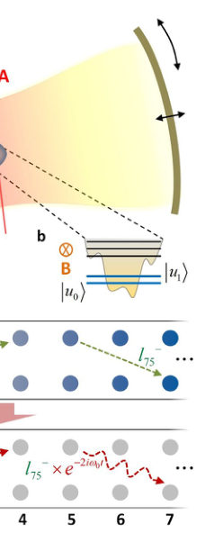
<figcaption class="paper-figure-caption"><b>Fig 2.</b> Figure 2 shows the FR graph connectivity depending on η. According to Eq. (4), the graph</figcaption>
</figure>
<figure class="paper-figure-card">
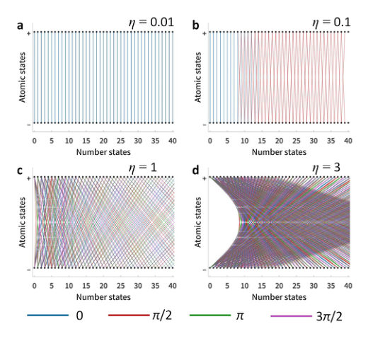
<figcaption class="paper-figure-caption"><b>Fig 3.</b> FIG. 2. Graph connectivity for different values of η at t = 0. Edges with weights greater than</figcaption>
</figure>
<figure class="paper-figure-card">

<figcaption class="paper-figure-caption"><b>Fig 4.</b> FIG. 3. Stronger coupling indicates a higher cost for separating a large nonmagnetic</figcaption>
</figure>
<figure class="paper-figure-card">

<figcaption class="paper-figure-caption"><b>Fig 5.</b> FIG. 4. Phase frustration governs the USC. a,b, Schematics of subgraphs (coloured nodes)</figcaption>
</figure>

**Summary.** The paper introduces a novel magnetic graph model to analyze cavity QED systems operating under extreme light-matter coupling. By mapping the generalized Quantum Rabi Model onto a graph structure, the authors use graph connectivity metrics like the Laplacian's first eigenvalue to diagnose quantum phase transitions. This framework reveals that topological features, specifically phase frustration within subgraphs, are the primary drivers governing system behavior across different coupling regimes.

**Why it may be interesting.** This work provides a powerful, unifying mathematical framework (graph theory) to analyze complex quantum dynamics in cQED, offering a single metric ($\lambda_1$) to track fundamental physical crossovers.

Detailed structure

**Main problem.** The central challenge is strengthening light-matter coupling in cavity QED, requiring careful theoretical treatment across ultrastrong and deep-strong coupling regimes.

**Main result.** The authors propose a magnetic graph model that maps the quantum Rabi Model onto graph connectivity, showing that phase frustration induced by subgraph topology drives the system's transition between coupling regimes.

**Method.** The analysis uses graph theory concepts, specifically the normalized magnetic Laplacian and its first eigenvalue ($\lambda_1$), to characterize quantum dynamics via graph connectivity metrics like conductance and topological flux.

**Model / system.** The study focuses on single-atom cavity Quantum Electrodynamics (cQED), modeled by a generalized, gauge-invariant Quantum Rabi Model (QRM) Hamiltonian. The system's dynamics are mapped onto a complex bipartite 'Floquet Rabi graph'.

**Key observables.** First eigenvalue ($\lambda_1$) of the magnetic Laplacian, Conductance ($\langle C_q 
angle$), and topological flux ($\Phi_q$).

**Important parameters / regimes.** Coupling strength ($\eta = |g|/\hbar$); regimes include weak, ultrastrong (USC), and deep-strong coupling (DSC).

**Assumptions / limitations.** The method involves truncating the infinite bosonic Hilbert space to a two-level subspace for analysis.

**Figures summary.** Figures illustrate the magnetic graph model mapping, showing how $\lambda_1$ varies with $\eta$, and detailing phase frustration effects via loop analyses (e.g., $q=2, q=3$).

**Paper structure.** The paper develops the gauge-invariant QRM Hamiltonian, derives hopping coefficients using Laguerre polynomials, transforms the problem into a graph representation, and analyzes connectivity using the magnetic Laplacian to diagnose coupling regime transitions.

Abstract

Strengthening light-matter coupling has become a central challenge in cavity quantum electrodynamics (QED), enabling ultrafast gate operations, qubit protection, and deterministic nonlinear optics. As the coupling increases, even the simplest configuration, a two-level atom interacting with a quantized field, requires careful treatment, as exemplified by the gauge-invariant quantum Rabi model (QRM). Here we propose a magnetic graph model for single-atom cavity QED, which enables the interpretation of quantum dynamics across the ultrastrong coupling regime through graph connectivity. We demonstrate that the generalized QRM maps onto a complex bipartite graph of identical sites under Floquet boundary conditions. This framework captures the crossover from weak to deep-strong coupling via a single metric: the cost of disconnecting a nonmagnetic subgraph. We examine the mechanism underlying this connectivity transition, establishing phase frustration induced by subgraph topology as the primary driver. Scalable to many-body systems, this approach bridges graph theory and cavity QED, revealing highly complex-graph dynamics even in the simplest setting.

[↑ back to top](#top)

### [Purcell effect and quantum Zeno effect suppressed self-discharging of quantum battery](http://arxiv.org/abs/2607.04363v1)

**Authors:** Da-Wei Liu, Guoqing Tian, Zi-Hao Li, Shi-Qi Gan, Ying Wu, Liu-Gang Si  
**Type:** theory · **Category:** other · **PDF:** <https://arxiv.org/pdf/2607.04363v1>  
**Analysis basis:** full PDF text, analyzed in chunks
**Topic relevance:** 🔥 `methods for driven-dissipative` **4/5** · `correlated / nonlocal dissipation` **3/5** · `correlated cavity matter` **3/5** · `driven-dissipative phase transition` **3/5** · `Keldysh / 2PI / non-Gaussian methods` **2/5** · `Tavis-Cummings & cavity-many-emitter` **2/5** · `non-equilibrium dynamics` **2/5** · `non-equilibrium universality` **2/5** · `Kondo & dissipative impurity` **1/5** · `analog quantum simulation` **1/5** · `measurement-induced transitions` **1/5** · `quantum measurements` **1/5**

↔ Scroll figures horizontally

<figure class="paper-figure-card">
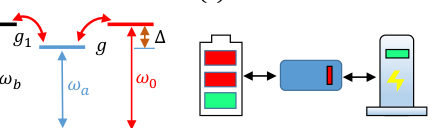
<figcaption class="paper-figure-caption"><b>Fig 1.</b> FIG. 1. (a) Schematic diagram of QB consisting of a aux- iliary cavity (left) and pump cavity (right). (b) Schematic diagram of energy levels for a near-resonant QB and charger. (c) Schematic diagram of a QB utilizing the virtual photon charging protocol.</figcaption>
</figure>
<figure class="paper-figure-card">
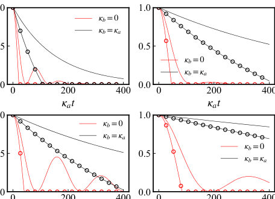
<figcaption class="paper-figure-caption"><b>Fig 2.</b> FIG. 2. The stored energy and ergotropy of the QB versus time under different charger dissipation and detuning. The unmarked line is energy, and the marked line is ergotropy. The parameters are chosen as (a) ∆= 10κa, Ω= 0, g = 0.2κa and g1 = 2κa, (b) ∆= 10κa, Ω= 0, g = 0.1κa and g1 = 2κa (c) ∆= 20κa, Ω= 0, g = 0.2κa and g1 = 2κaand (d) ∆= 20κa, Ω= 0, g = 0.1κa and g1 = 2κa.</figcaption>
</figure>
<figure class="paper-figure-card">
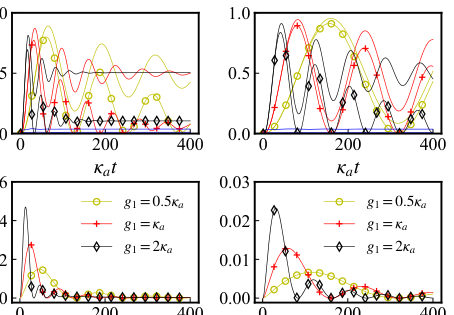
<figcaption class="paper-figure-caption"><b>Fig 3.</b> FIG. 3. (a) and (b) The stored energy and ergotropy of the QB versus time under different hopping strengths g1 and cavity-atom interaction strengths g. The unmarked line is stored energy, and the marked line is ergotropy. (c) and (d) The average charging power of the QB versus time under different hopping strengths and cavity-atom interac- tion strengths. The parameters are chosen as ∆= 10κa, Ω= 0.5κa and (a) g = 0.5κa, (b) g = 0.2κa, (c) g = 0.5κa, (d) g = 0.2κa.</figcaption>
</figure>

**Summary.** The paper proposes using the synergy between the Purcell effect and the Quantum Zeno Effect to solve critical stability issues—self-discharging and energy backflow—in quantum batteries. By engineering dissipation through these quantum effects, they achieve an unprecedented suppression of energy loss. This breakthrough significantly boosts the energy conversion efficiency, making QBs more viable for practical applications.

**Why it may be interesting.** This work is highly relevant as it tackles open quantum system dynamics by engineering dissipation (Purcell/Zeno effects) to stabilize a functional quantum device (QB), which is a core topic in modern AMO physics and quantum optics.

Detailed structure

**Main problem.** The primary challenge addressed is mitigating self-discharging and energy backflow in open quantum battery (QB) systems, which hinders the extraction of useful work.

**Main result.** By combining the Purcell effect with the Quantum Zeno Effect (QZE), the researchers demonstrated a mechanism that suppresses charger-induced dissipation by four orders of magnitude, allowing near-full charging and high energy conversion efficiency.

**Method.** The analysis uses theoretical modeling involving master equations derived from an effective Hamiltonian obtained via adiabatic elimination of auxiliary cavities.

**Model / system.** The system models a quantum battery coupled to a charger via an auxiliary cavity. The dynamics are governed by master equations incorporating dissipation channels ($\kappa_a, \kappa_b$).

**Key observables.** Stored energy E(t), ergotropy $\xi(t)$, self-discharging half-life time ($	au$), and extractable efficiency ($\eta$).

**Important parameters / regimes.** Charger dissipation rate ($\kappa_b$), detuning ($\Delta$), coupling strengths ($g, g_1$), and the QZE/Purcell effect regime.

**Assumptions / limitations.** The analysis relies on adiabatic elimination of the auxiliary cavity when the detuning is large; it also assumes initial full charging for self-discharging studies.

**Figures summary.** Figures illustrate schematic system setups, and subsequent figures plot stored energy and ergotropy over time under varying charger dissipation rates ($\kappa_b$).

**Paper structure.** The paper first establishes the physical model using a total Hamiltonian and derives effective dynamics via adiabatic elimination. It then analyzes how increasing charger dissipation strengthens the QZE effect, leading to suppressed self-discharging and high energy conversion efficiency.

Abstract

Quantum batteries (QB), as an energy storage and transfer device, not only show obvious advantages compared to classical electrochemical batteries, but also have important applications in quantum information. Self-discharging is a central obstacle to storing useful work in open QB, especially when the charger itself provides an unavoidable loss channel. Here we show that such charger-induced loss can be converted into a protection mechanism by combining Purcell effect with quantum Zeno effect. We reveal that the virtual photon process and the Purcell effect can induce the strong coupling regime to the quantum Zeno regime, in which the stronger the dissipation of the charger, the weaker the self-discharging effect of the QB. As a result, the dissipation caused by the charger to the QB can be suppressed four orders of magnitude in our scheme. Meanwhile, the quantum Zeno effect induced by the Purcell effect can also avoid the energy backflow between the QB and the charger. Owing to the significantly suppressed dissipation, the stored energy of QB can be charged to a nearly full state and the stored energy is almost converted into extractable work, which greatly improves the energy conversion efficiency.

[↑ back to top](#top)

### [Sector-memory obstruction to probe-level bath emergence in finite programmable qubit environments](http://arxiv.org/abs/2607.04791v1)

**Authors:** Gaurav Sarmah, Ramakrishna Podila  
**Type:** both · **Category:** statistical mechanics · **PDF:** <https://arxiv.org/pdf/2607.04791v1>  
**Analysis basis:** full PDF text, analyzed in chunks
**Topic relevance:** 🔥 `QC/QI experiment` **4/5** · 🔥 `non-equilibrium dynamics` **4/5** · `correlated / nonlocal dissipation` **3/5** · `driven-dissipative phase transition` **3/5** · `methods for driven-dissipative` **3/5** · `analog quantum simulation` **2/5** · `non-equilibrium universality` **2/5** · `Keldysh / 2PI / non-Gaussian methods` **1/5** · `Kondo & dissipative impurity` **1/5** · `entanglement & information structure` **1/5** · `scars & prethermalization` **1/5**

↔ Scroll figures horizontally

<figure class="paper-figure-card">

<figcaption class="paper-figure-caption"><b>Fig 1.</b> FIG. 1. Probe-level diagnostics for finite-bath emergence. A probe qubit S is coupled to a finite bath B of N qubits. Under charge-preserving dynamics, initial fixed-charge sectors remain dynamically separated. The measured quantities are the sector-resolved probe population p(q) e , the sector-memory variance MN, and the global Gibbs-fit error ∆global G . A finite environment is bath-like for the probe only when the sector- resolved reduced states collapse to a common Gibbs descrip- tion.</figcaption>
</figure>
<figure class="paper-figure-card">
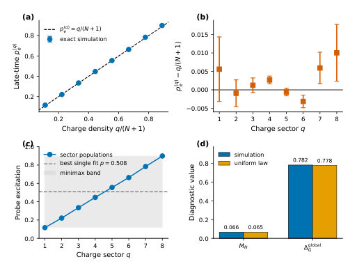
<figcaption class="paper-figure-caption"><b>Fig 2.</b> FIG. 2. Exact Hamiltonian benchmark for sector-memory obstruction. The N = 8 charge-conserving calculation uses Haar-random pure states over each complete total-charge sec- tor; its ensemble-averaged late-time probe population follows p(q) e ≃q/(N + 1). The sector-resolved probe states cannot be represented by one global Gibbs state: the best sector- independent population fit leaves a large minimax error, giv- ing ∆global G = 0.782.</figcaption>
</figure>
<figure class="paper-figure-card">

<figcaption class="paper-figure-caption"><b>Fig 3.</b> Figure 1 summarizes the operational structure of the test. In the Qiskit and IBM protocols, the probe qubit is initialized in |0⟩, the bath is initialized in a fixed ex- citation sector q, and the late-time or finite-depth probe population p(q) e is measured across sectors. The principal exact benchmark instead uses full-sector Haar-random pure states as specified in Eq. (28); the probe-fixed ex- act calculation is reported separately in the Supplemental Material (Figs. S1-S5). If the finite environment behaves as a single canonical bath for the probe, the values p(q) e should collapse to a sector-independent value. Persistent variation of p(q) e across q gives a nonzero sector-memory...</figcaption>
</figure>
<figure class="paper-figure-card">

<figcaption class="paper-figure-caption"><b>Fig 4.</b> FIG. 3. Hardware-compatible circuit validation. Ideal and transpiled circuit simulations reproduce the sector law p(q) e ≃ q/(N + 1). Simple noisy simulations identify N = 4 as the most robust hardware target: at depth d = 4, the noisy circuit gives ∆global G = 0.593, close to the ideal value 0.60, while retaining a visible charge-preservation signal.</figcaption>
</figure>
<figure class="paper-figure-card">
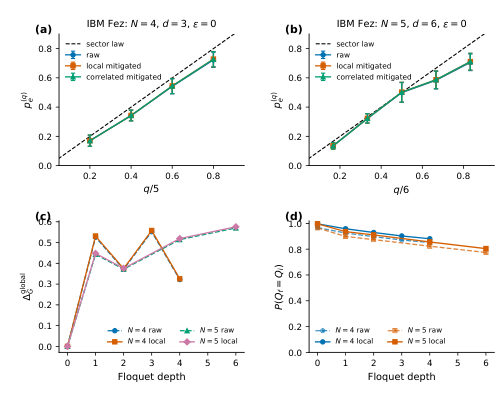
<figcaption class="paper-figure-caption"><b>Fig 5.</b> FIG. 4. IBM Fez observation of probe-level sector memory. The N = 4, d = 3, ϵ = 0 data show clear monotonic sector ordering and a large nonzero ∆global G . The N = 5, d = 6, ϵ = 0 data show that the effect survives at a larger bath size, although with stronger compression due to circuit depth and hardware noise. Raw and readout-mitigated analyses give the same qualitative conclusion.</figcaption>
</figure>

**Summary.** The paper investigates whether finite programmable qubit baths behave like true thermodynamic baths. By analyzing conserved charges, the authors show that local relaxation only occurs within restricted sectors defined by these charges. This results in a measurable 'sector memory' obstruction, proving that achieving full thermalization requires more than just local dynamics.

**Why it may be interesting.** This work provides a rigorous, experimentally testable criterion for when an open quantum system can be modeled by standard thermal bath theories, which is crucial for understanding realistic quantum computation environments.

Detailed structure

**Main problem.** The study aims to distinguish whether a finite quantum environment acts as a true thermal bath, leading to preparation-independent equilibrium states, or if its dynamics are restricted by conserved quantities.

**Main result.** The authors conclude that due to the conservation of total excitation number in a finite programmable system, local equilibration only occurs within constrained sectors, failing to achieve a single, sector-independent Gibbs state.

**Method.** The analysis uses theoretical diagnostics like Sector-memory variance ($M_N$) and Global Gibbs-fit error ($\Delta_{	ext{global}}^G$), validated through exact simulations, ideal Qiskit circuits, and physical experiments on superconducting qubits.

**Model / system.** The model consists of a probe qubit coupled to a finite bath of $N$ programmable qubits. The dynamics are governed by an excitation-number-conserving Hamiltonian, leading to Hilbert space partitioning into sectors defined by the conserved charge $Q$.

**Key observables.** Sector-resolved late-time population ($p_e^{(q)}$), Sector-memory variance ($M_N$), and Global Gibbs-fit error ($\Delta_{	ext{global}}^G$).

**Important parameters / regimes.** Bath size ($N=4$ in experiments), symmetry-breaking strength ($\epsilon$), and simulation depth/time.

**Assumptions / limitations.** The diagnostics are operational tests for cross-preparation consistency, not just local relaxation; the analysis relies on the existence of conserved charges partitioning the system dynamics.

**Figures summary.** The notes mention figures showing depth-resolved scans of $M_N$ and $\Delta_{	ext{global}}^G$, demonstrating that while perturbations reduce these errors, they do not eliminate sector ordering.

**Paper structure.** The paper establishes the problem by defining diagnostics ($p_e^{(q)}, M_N, \Delta_{	ext{global}}^G$), presents theoretical benchmarks using exact simulations, validates the approach with controlled quantum circuits (Floquet layers), and concludes with hardware implementation on IBM Fez.

Abstract

Finite quantum environments can relax local probes without acting as canonical baths. We study this distinction for a probe qubit coupled to a programmable bath of ($N$) qubits under excitation-number-conserving dynamics. The conserved charge partitions the Hilbert space into sectors. We characterize probe-level bath emergence using the sector-resolved late-time population ($p_e^{(q)}$), the sector-memory variance ($M_N$), and a global Gibbs-fit error ($Δ_G^{\mathrm{global}}$). Exact simulations with Haar-random pure states in each complete fixed-charge sector yield sector-dependent populations close to the maximally mixed-sector benchmark ($p_e^{(q)}=q/(N+1)$), producing a nonzero Gibbs obstruction. We then construct charge-preserving Floquet circuits using ($R_z$) phases and ($XX+YY$) exchange gates, validate them with ideal and noisy Qiskit simulations, and implement finite-depth experiments on IBM Fez. For ($N=4$) and ($ε=0$), the hardware data give ($M_N \simeq 0.044$), ($Δ_G^{\mathrm{global}} \simeq 0.558$), and charge preservation near 0.90 after readout mitigation. A paired symmetry-breaking scan using bath ($R_x(ε)$) rotations reduces both diagnostics while increasing charge leakage, but does not erase sector ordering over the accessible depths. These results show that equilibration within constrained sectors is insufficient to produce a single sector-independent Gibbs state for the probe.

[↑ back to top](#top)

### [Wei-Norman approach for non-Hermitian driven spin-$S$ systems and its application to defect freezing](http://arxiv.org/abs/2607.04075v1)

**Authors:** Mingwei Meng, Chen Sun  
**Type:** theory · **Category:** other · **PDF:** <https://arxiv.org/pdf/2607.04075v1>  
**Analysis basis:** full PDF text, analyzed in chunks
**Topic relevance:** 🔥 `methods for driven-dissipative` **4/5** · 🔥 `non-equilibrium dynamics` **4/5** · `driven-dissipative phase transition` **3/5** · `exotic spin models in light-matter` **3/5** · `non-equilibrium universality` **3/5** · `analog quantum simulation` **2/5** · `spintronics-quantum-optics interface` **2/5** · `Keldysh / 2PI / non-Gaussian methods` **1/5** · `Kondo & dissipative impurity` **1/5** · `correlated / nonlocal dissipation` **1/5** · `scars & prethermalization` **1/5**

↔ Scroll figures horizontally

<figure class="paper-figure-card">

<figcaption class="paper-figure-caption"><b>Fig 1.</b> FIG. 1. Sketches of lattices of (a) the PT -SSH model, (b) its S = 1 extension, and (c) its S = 3/2 extension. A, B, C and D stand for sites in different sublattices, a solid line presents intracell or intercell hoppings between sites, and a waved line presents gain or loss at a given site. In each sketch four unit cells are plotted, with a dashed line encircling a specific unit cell, and only parameters within this cell and between it and its adjacent cell to the right are shown (parameters in the whole lattice can be read off by translational symmetry). The parameters of the S = 1 and S = 3/2 models are related to those of the S = 1/2 model as: v1 = √</figcaption>
</figure>
<figure class="paper-figure-card">

<figcaption class="paper-figure-caption"><b>Fig 2.</b> FIG. 2. Excitation probability in the adiabatic limit pk,S(b →0) vs. momentum k by Eq. (34) for the spin-S PT -SSH model under a quench for four different S from S = 1/2 to S = 2. (a) at γ/w = 0.5; (b) same as (a) but zoomed into a region near k = 0; (c) at γ/w = 1.5.</figcaption>
</figure>
<figure class="paper-figure-card">

<figcaption class="paper-figure-caption"><b>Fig 3.</b> Fig. 3(a) shows nex,S(b →0) vs. γ/w by Eq. (40) for four different S from S = 1/2 to S = 2. As in the k-resolved result, a curve with a larger S is always above another curve with a smaller S. For each value of S, nex,S(b →0) increases monotonically with γ, and it experiences a sin- gularity at γ = w where the slope of the curve (namely, ∂nex,S(b →0)/∂γ) changes discontinuously. (Due to the arcsin term in Eq. (40), this slope diverges as γ →w−; it is finite as γ →w+.) The physical reason of this singular- ity is the same as in the S = 1/2 case, namely, γ = w this is the critical point between the two cases that a portion of or all of the k sectors traverse the PT -broken region. Using P...</figcaption>
</figure>
<figure class="paper-figure-card">
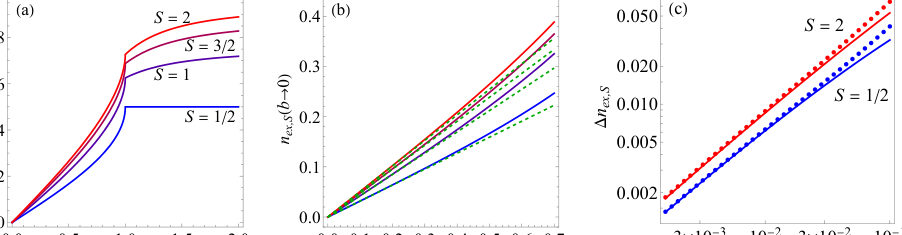
<figcaption class="paper-figure-caption"><b>Fig 4.</b> FIG. 3. Excitation density in the spin-S PT -SSH model under a quench. (a) Excitation density nex,S(b →0) vs. γ/w by Eq. (40) for four different S from S = 1/2 to S = 2. (b) The solid lines are the same as in (a) but for small γ/w, and the dashed lines are linear approximation by Eq. (41). (c) Excitation density above the frozen defect ∆nex,S vs. quench rate b at w = 1, γ = 0.3 for S = 1/2 and S = 2. The solid lines are by the approximate analytical expression Eq. (40), and the dots are from exact numerical integrations.</figcaption>
</figure>

**Summary.** This paper introduces the Wei-Norman approach as an analytical tool to solve the complex time evolution of high-spin ($S$) non-Hermitian quantum systems. By relating these multi-level dynamics to solvable spin-1/2 cases, the authors successfully applied it to study defect freezing in models like the PT-SSH chain. The results offer quantitative predictions for excitation behavior across higher-order exceptional points, suggesting experimental realization in photonic or circuit platforms.

**Why it may be interesting.** This work provides a powerful, general analytical toolkit (Wei-Norman approach) for tackling non-Hermitian dynamics across multiple levels, directly connecting abstract mathematical techniques to observable physical phenomena like defect freezing in condensed matter models.

Detailed structure

**Main problem.** The core problem is finding exact analytical solutions for nonadiabatic dynamics in complex, time-dependent, non-Hermitian quantum systems.

**Main result.** The authors developed a general method using the Wei-Norman approach to solve spin-$S$ extensions of solvable two-level models and predicted that defect freezing occurs specifically when momentum sectors pass through higher-order exceptional points during a quench.

**Method.** The primary technique is the Wei-Norman approach, which allows expressing the evolution operator for high-spin systems in closed analytical forms using Jacobi polynomials derived from simpler spin-1/2 models.

**Model / system.** The study focuses on non-Hermitian spin-$S$ systems driven by time-dependent Hamiltonians, exemplified by applying the method to the PT-symmetric Su-Schrieffer-Heeger (PT-SSH) model in momentum space.

**Key observables.** Excitation probabilities and total excitation densities; spectral properties near exceptional points (EPs).

**Important parameters / regimes.** Non-Hermiticity parameter ($\gamma$), quench rate ($b$), and the spin quantum number ($S$).

**Assumptions / limitations.** The method assumes that the time dependence of the Hamiltonian allows for a decomposition suitable for the Wei-Norman approach, relating higher-spin dynamics to solvable two-level systems.

**Figures summary.** Not specified in the notes; the text references mathematical equations (e.g., Eq. 16) showing closed forms using Jacobi polynomials and spectral analysis of the PT-SSH model.

**Paper structure.** The paper first introduces the general difficulty of nonadiabatic dynamics, then details the Wei-Norman approach to solve spin-$S$ systems by relating them to $S=1/2$. It subsequently applies this framework to analyze defect freezing in the PT-SSH model, deriving analytical predictions for excitation behavior near higher-order EPs.

Abstract

In the theoretical study of nonequilibrium non-Hermitian systems, obtaining exact analytical solutions for their nonadiabatic dynamics is highly desirable yet often challenging. In this work, we identify a class of non-Hermitian quantum systems where this difficulty can be substantially reduced. Employing the Wei-Norman approach, we show that for a spin-$S$ subject to a general non-Hermitian time-dependent drive, the matrix elements of the evolution operator can be expressed in closed analytical forms (via Jacobi polynomials) in terms of the corresponding spin-$1/2$ model. This approach is straightforward and accessible to nonspecialists in Lie algebra. As an application, we investigate a specific nonequilibrium non-Hermitian phenomenon known as defect freezing, i.e., the existence of excitations in the adiabatic limit, in spin-$S$ extensions of the $\mathcal{PT}$-symmetric Su-Schrieffer-Heeger model under linear quenches. We derive exact analytical expressions for the momentum-resolved excitation probabilities and the total excitation densities. Our results reveal that defect freezing occurs exclusively in momentum sectors that traverse the $\mathcal{PT}$-symmetry-broken region -- and thus pass through a pair of higher-order exceptional points (EPs) -- during the quench; notably, the excitation density exhibits a singularity at a critical value of the non-Hermiticity parameter. This work enriches the analytical toolkit for nonadiabatic dynamics in multi-level non-Hermitian systems and provides quantitative, testable predictions for defect freezing across higher-order EPs, possibly accessible on platforms such as electric circuit networks and photonic lattices.

[↑ back to top](#top)

### [A Pulsed Live-Cell Quantum Microscope for Entangled Solid State and Biological Qubits](http://arxiv.org/abs/2607.03552v1)

**Authors:** Javier Noé Ramos-Silva, Sangjun Noh, Minghao Jiang, Parisa Aghaei, Ayla Hazrathosseini, Jocelyn Leon, Philip Hemmer, Peter J. Burke  
**Type:** experiment · **Category:** other · **PDF:** <https://arxiv.org/pdf/2607.03552v1>  
**Analysis basis:** full PDF text, analyzed in chunks
**Topic relevance:** 🔥 `QC/QI experiment` **4/5** · 🔥 `spintronics-quantum-optics interface` **4/5** · `quantum measurements` **3/5** · `quantum optics experiment` **3/5** · `exotic spin models in light-matter` **2/5** · `measurement-induced transitions` **2/5** · `correlated / nonlocal dissipation` **1/5** · `correlated cavity matter` **1/5** · `driven-dissipative phase transition` **1/5** · `entanglement & information structure` **1/5** · `methods for driven-dissipative` **1/5** · `non-equilibrium dynamics` **1/5**

↔ Scroll figures horizontally

<figure class="paper-figure-card">
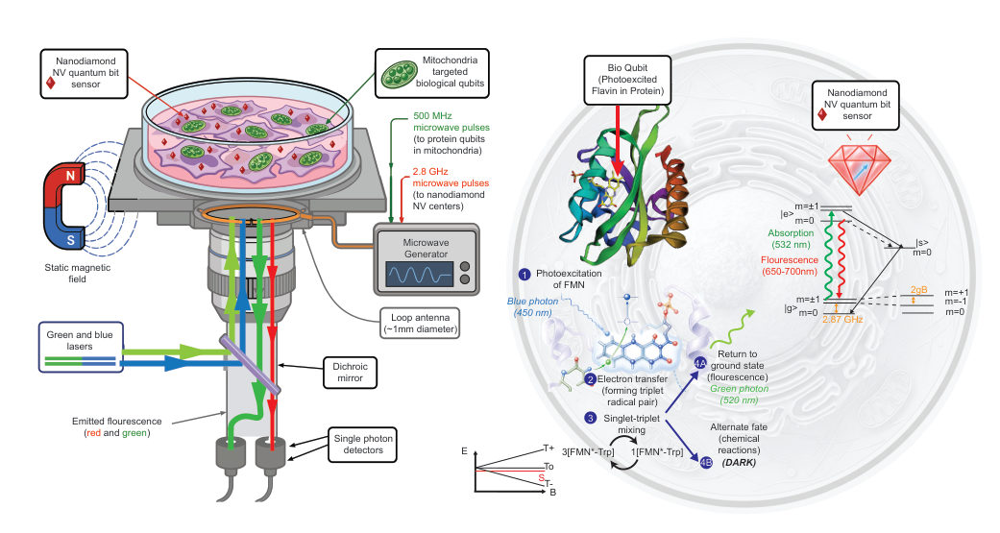
<figcaption class="paper-figure-caption"><b>Fig 1.</b> FIG. 1: Conceptual diagram of pulsed quantum microscope showing biological and solid state qubits in the same cell in one system. Full quantum state manipulation of both qubits is enabled by pulsed optics, single photon detectors, and pulsed microwave sources (left). Schematic of the energy levels for the two particular quantum bits demonstrated in this work: Biological quantum bit MagLOV and the associated Jablonski energy levels, showing the flavin absorption and emission events, the singlet-triplet mixing, and effect of magnetic field, as well as the well-known crystal structure of an NV defect in diamond, and the associated Jablonski energy levels (right). Generative AI was used to help...</figcaption>
</figure>
<figure class="paper-figure-card">

<figcaption class="paper-figure-caption"><b>Fig 2.</b> FIG. 2: Schematic of the pulsed quantum microscope platform. The optical path comprises a fiber-coupled 520 nm laser, four nested 4 f relay systems, a galvo-galvo beam scanner, a confocal pinhole, and a single-photon detector (SPD). The microwave delivery routes a nanosecond-gated signal from the RF generator through a power amplifier and PCB loop antenna positioned beneath the sample. Data acquisition is synchronized with both the optical and microwave channels.</figcaption>
</figure>
<figure class="paper-figure-card">

<figcaption class="paper-figure-caption"><b>Fig 3.</b> FIG. 3: Dual-excitation configuration at the laser input. A dichroic mirror combines the fiber-coupled 520 nm (NV) and 450 nm (MagLOV) excitation beams into a single collinear path routed through the shared 4f relay, galvo-galvo scanner, and microscope objective.</figcaption>
</figure>
<figure class="paper-figure-card">

<figcaption class="paper-figure-caption"><b>Fig 4.</b> FIG. 5: Schematic of the dual AOM-based laser pulse configuration.</figcaption>
</figure>
<figure class="paper-figure-card">

<figcaption class="paper-figure-caption"><b>Fig 5.</b> FIG. 4: Photograph of the pulsed quantum microscope showing the inverted Olympus IX71 microscope base (right) and assembled optical breadboard (left).</figcaption>
</figure>

**Summary.** The paper introduces a revolutionary pulsed quantum microscope designed to simultaneously probe and manipulate two distinct types of qubits—solid-state NV centers and genetically encoded biological spins—within live cells. By integrating sophisticated optical pulsing, microwave control, and precise addressing hardware, the platform achieves multiplexed quantum sensing capabilities previously unattainable in one instrument. This breakthrough opens new avenues for fundamental research into solid-state-biological quantum interfaces.

**Why it may be interesting.** This work is highly relevant as it pushes the boundaries of quantum optics into biology by creating a unified platform to study solid-state quantum phenomena in complex, noisy, living systems, which requires advanced control over coherence times and environmental coupling.

Detailed structure

**Main problem.** The central goal is developing a quantum microscope capable of simultaneously manipulating and sensing both solid-state (NV center) and genetically encoded biological qubits within the same live cell environment.

**Main result.** The authors report building and demonstrating a novel pulsed platform that enables multiplexed quantum sensing by controlling both types of qubits in situ, paving the way for entanglement studies between them.

**Method.** The technique employs a pulsed microscope setup integrating nanosecond-gated optics, 3D beam addressing (galvo/piezo), and microwave control spanning DC to 5 GHz to address distinct qubit resonances.

**Model / system.** The platform integrates solid-state NV centers in diamond with optically addressable biological qubits (e.g., MagLOV). It is built upon an inverted microscope body, allowing for time-resolved measurements of spin dynamics and fluorescence signatures simultaneously.

**Key observables.** Quantum state manipulation, entanglement potential, local magnetic field environment (via NV ODMR), radical-pair lifetimes, and Rabi/Ramsey oscillation decay times.

**Important parameters / regimes.** Pulsed excitation regimes (nanosecond gating), microwave control frequencies ($\sim2.87$ GHz for NV; $500-800$ MHz for biological qubits), and picosecond timing resolution.

**Assumptions / limitations.** The primary assumption is the successful integration of disparate, complex measurement modalities (NV spectroscopy vs. fluorescence lifetime imaging) into a single, aberration-corrected optical path compatible with live cells.

**Figures summary.** Figures conceptually diagram the setup, showing energy level diagrams for both biological and NV qubits, and schematics detailing the nested 4f relay systems used to combine dual excitation paths (e.g., 520 nm and 450 nm).

**Paper structure.** The paper progresses by first establishing the need for simultaneous sensing, then detailing the complex hardware integration (optics, electronics), demonstrating benchmarking on individual qubit types (NV vs. biological), and finally arguing for the potential of combined measurements toward entanglement.

Abstract

Two revolutions in quantum sensing are converging on the same microscope stage. Biological qubits have emerged as genetically encoded, optically addressable quantum systems inside live cells. Solid state spin based qubits have been entangled and used as nanoscale correlator magnetometers, delivering sensitivity and spatial-resolution gains that single-spin probes cannot reach. Here we report a pulsed quantum microscope that enables simultaneous quantum state manipulation of both qubit technologies in live cells. The platform combines nanosecond-gated optical excitation at 450 nm and 520 nm, three-dimensional diffraction-limited addressing by galvo beam scanning and piezo objective focus, rapidly switched static and radio-frequency magnetic fields, single-photon timing with picosecond resolution, and microwave control for frequencies from DC to 5 GHz, including the 2.87 GHz resonance of solid state spins, the 500 MHz to 800 MHz resonance of radical pairs in biological qubits, and any future qubit resonance in the GHz range. Live cell imaging with simultaneous biological and solid state nanoparticle qubits in the same cell demonstrates the power of this technique for multiplexed quantum sensing. We anticipate this approach will open new opportunities for researchers to explore quantum sensing in live cells, and, ultimately, entanglement between a solid-state qubit and a protein-hosted spin qubit.

[↑ back to top](#top)

### [Gorini-Kossakowski-Sudarshan-Lindblad equation in different bases: application to driven-dissipative two- and multilevel systems](http://arxiv.org/abs/2607.03779v1)

**Authors:** O. A. Ilinskaya, O. V. Ivakhnenko, A. I. Ryzhov, O. Yu. Kitsenko, S. N. Shevchenko  
**Type:** theory · **Category:** other · **PDF:** <https://arxiv.org/pdf/2607.03779v1>  
**Analysis basis:** full PDF text, analyzed in chunks
**Topic relevance:** 🔥 `methods for driven-dissipative` **4/5** · `correlated / nonlocal dissipation` **3/5** · `driven-dissipative phase transition` **3/5** · `non-equilibrium dynamics` **3/5** · `Keldysh / 2PI / non-Gaussian methods` **2/5** · `Tavis-Cummings & cavity-many-emitter` **2/5** · `non-equilibrium universality` **2/5** · `Kondo & dissipative impurity` **1/5** · `analog quantum simulation` **1/5** · `correlated cavity matter` **1/5** · `measurement-induced transitions` **1/5** · `quantum measurements` **1/5**

↔ Scroll figures horizontally

<figure class="paper-figure-card">

<figcaption class="paper-figure-caption"><b>Fig 1.</b> FIG. 1. The energy levels of a qubit as functions of the en- ergy detuning ε0 (both in the units of the energy gap ∆) in different bases: the diabatic basis (the black and gray dashed lines), the instantaneous eigenbasis (the blue and cyan solid curves), the first superadiabatic basis (the red and orange dot-dashed curves), and the Floquet basis (the purple and magenta long-dashed curves). The labels |0⟩and |1⟩at the corners denote the diabatic eigenstates corresponding to the respective diabatic energy levels. The moment of time is fixed: t0 = π/2ω, other parameters are as follows: the excitation amplitude A = ∆, the driving frequency ℏω = ∆(then, the parameter in Eq. (20) is a = 1). For...</figcaption>
</figure>
<figure class="paper-figure-card">

<figcaption class="paper-figure-caption"><b>Fig 2.</b> FIG. 2. Comparison of the dynamics of the upper energy level occupation probability for different driving frequencies ℏω = 0.18 ∆, 0.38 ∆, 2 ∆(the three rows) in different bases (the five columns), with high relaxation and decoherence rates Γ1 = 0.15∆/ℏ, Γ2 = 0.175∆/ℏ. The horizontal axes show the time in periods of the driving signal T = 2π/ω. The energy detuning is ε0 = 0.96 ℏω, the driving amplitude is A = 4.02 ℏω. We note a lower value of the driving frequency in panel (o), ℏω = 0.8 ∆, compared to other panels in the third row. The reason is that the superadiabatic basis is inapplicable in the nonadiabatic regime. The parameter a, see Eq. (20), is approximately 0.13 for the first row,...</figcaption>
</figure>
<figure class="paper-figure-card">

<figcaption class="paper-figure-caption"><b>Fig 3.</b> FIG. 3. Comparison of the interferograms (the time-averaged upper-level qubit occupation probability as a function of the energy detuning ε0 and the driving amplitude A) for different driving frequencies ℏω = 0.18 ∆, 0.38 ∆, 2 ∆(the three rows) in different bases (the five columns), with moderate relaxation and decoherence rates Γ1 = 0.03∆/ℏ, Γ2 = 0.035∆/ℏ. We note a lower value of the driving frequency in panel (o), ℏω = ∆, compared to other panels in the third row. The reason is that the superadiabatic basis is inapplicable in the nonadiabatic regime. The first column: (a,f,l) the interferograms in the diabatic basis (6), which show the cleanest results in the case of fast nonadiabatic...</figcaption>
</figure>
<figure class="paper-figure-card">

<figcaption class="paper-figure-caption"><b>Fig 4.</b> FIG. 4. Dynamics for two driven qubits in different bases with relaxation and decoherence taken into account. The ab- scissa axes show time in units of the driving period T = 2π/ω. The driving frequency is resonant with the two eigenstates at t = 0: ℏω = E3(0) −E2(0). (a) Dynamics in the instanta- neous basis. The initial condition is as follows: ρ22(0) = 1, with other matrix elements being equal to zero. (b) Dy- namics in the diabatic basis. The initial condition is as fol- lows: ρ(d) 22 (0) = 1, with other matrix elements being equal to zero. Both panels show Rabi-like oscillations. The driv- ing period and the Rabi period are the same for both panels, and the Rabi period is shown by the...</figcaption>
</figure>

**Summary.** This paper provides a comprehensive review of applying the GKSL master equation to driven-dissipative quantum systems. It argues that the choice of basis—such as diabatic versus instantaneous eigenbasis—is critical because it dictates the correct form of dissipation operators. The work analyzes how different bases must be used for qubits and qudits to accurately model complex, time-varying quantum dynamics.

**Why it may be interesting.** This work is highly relevant as it addresses a foundational methodological challenge in open quantum systems theory: ensuring that theoretical descriptions remain physically consistent regardless of the mathematical basis chosen for computation.

Detailed structure

**Main problem.** The core problem is determining the correct mathematical framework for describing open quantum systems, specifically by choosing the appropriate basis when applying the Gorini-Kossakowski-Sudarshan-Lindblad (GKSL) master equation.

**Main result.** The choice of basis (e.g., diabatic vs. instantaneous eigenbasis) fundamentally dictates the correct form of the collapse operators and thus the resulting quantum dynamics for driven-dissipative systems.

**Method.** The authors analyze the GKSL equation by transforming it into different bases—including diabatic, instantaneous eigenstate, superadiabatic, and Floquet bases—and comparing the resultant equations.

**Model / system.** The study focuses on driven-dissipative two- and multilevel quantum systems, exemplified by a qubit (and generalized to qudits) subjected to time-dependent Hamiltonians and dissipation channels.

**Key observables.** System density matrix ($
ho$), energy eigenvalues ($E_{\pm}(t)$), and the dynamics governed by the master equation coefficients.

**Important parameters / regimes.** Driving parameters like detuning ($\Delta, \epsilon(t)$), dissipation rates ($\Gamma_1, \Gamma_\phi$), and adiabaticity parameters ($\delta$).

**Assumptions / limitations.** The derivation relies on fundamental constraints for master equations (Markovianity, complete positivity) and utilizes approximations such as the Born-Markov approximation or adiabatic expansions.

**Figures summary.** Figure 1 illustrates energy level diagrams in various bases (diabatic, instantaneous, etc.) as a function of detuning; Table I summarizes the basis choice importance.

**Paper structure.** The paper systematically reviews the derivation constraints for the GKSL equation, applies this formalism to time-dependent Hamiltonians, and details how different unitary transformations are required to correctly map dissipation operators into various physical bases.

Abstract

An open quantum system can be described by a master equation, of which one of the most popular is the Gorini-Kossakowski-Sudarshan-Lindblad (GKSL) equation. We revisit description of driven-dissipative quantum systems focusing on the appropriate choice of the system's basis and the respective transformations. We consider the GKSL equation in different bases and calculate the dynamics for a qubit and for a qudit. An appropriate choice of the basis is a fundamental problem for theoretical consideration of open quantum systems and provides an opportunity to obtain the desired evolution in practice.

[↑ back to top](#top)

### [Krylov complexity, mode-resolved complexity and entanglement entropy across phase transitions in the non-Hermitian extended Su-Schrieffer-Heeger model](http://arxiv.org/abs/2607.04659v1)

**Authors:** Ling-Feng Zhang, Wing Chi Yu  
**Type:** theory · **Category:** statistical mechanics · **PDF:** <https://arxiv.org/pdf/2607.04659v1>  
**Analysis basis:** full PDF text, analyzed in chunks
**Topic relevance:** 🔥 `driven-dissipative phase transition` **4/5** · 🔥 `entanglement & information structure` **4/5** · `analog quantum simulation` **3/5** · `methods for driven-dissipative` **3/5** · `non-equilibrium universality` **3/5** · `correlated / nonlocal dissipation` **2/5** · `non-equilibrium dynamics` **2/5** · `Keldysh / 2PI / non-Gaussian methods` **1/5** · `Kondo & dissipative impurity` **1/5** · `scars & prethermalization` **1/5**

↔ Scroll figures horizontally

<figure class="paper-figure-card">

<figcaption class="paper-figure-caption"><b>Fig 1.</b> FIG. 1. (a) Schematic diagram of the extended SSH chain with the unit cell constructed by site A and site B. The intra-cell (inter-cell) hopping ta (tb) is denoted by the black solid (dashed) line. The blue and red curves denote the next- nearest-neighbor hopping terms tc and td, respectively. The red (blue) circles denote sites with opposite on-site imaginary potential ±iγ. (b) The spread complexity of the Hermitian extended SSH model on the tc-td plane with ta = tb = −1. Wn denotes the phase characterized by a winding number of n. The red, blue and black dashed lines are the topological phase transition boundaries and the colors indicate the num- ber of gap-closing points. (c) The spread...</figcaption>
</figure>
<figure class="paper-figure-card">
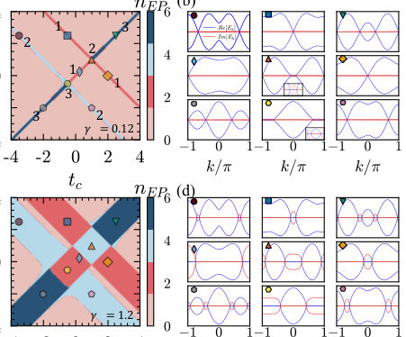
<figcaption class="paper-figure-caption"><b>Fig 2.</b> FIG. 2. Distribution of exceptional points in the tc-td plane for (a) weak (γ = 0.12) and (c) moderate (γ = 1.2) non- Hermiticity. The markers lie at the phase transition bound- aries of the Hermitian extended SSH model (γ = 0). The numbers adjacent to these markers denote the number of gap- closing points in momentum space. Panels (b) and (d) dis- play the real (blue curves) and imaginary (red curves) parts of the energy spectra in momentum space, corresponding to the parameters indicated by markers in panels (a) and (c), respectively. The gray dotted line represents the zero-energy reference level (E = 0). The insets in the bottom two panels of the middle column in (b) show a zoom-in of...</figcaption>
</figure>
<figure class="paper-figure-card">

<figcaption class="paper-figure-caption"><b>Fig 3.</b> FIG. 3. (a) The spread complexity of the non-Hermitian ex- tended SSH model with an imaginary staggered chemical po- tential γ = 1.2 on the tc-td plane. (b) The ratio of imaginary eigenvalues over the whole spectrum. (c) The derivative of spread complexity (the ratio of imaginary eigenvalues) over tc is denoted by the blue (red) line with circles, along the line td = 1.21. The background denotes the number of exceptional points [see Fig. 2(c)].</figcaption>
</figure>
<figure class="paper-figure-card">

<figcaption class="paper-figure-caption"><b>Fig 4.</b> FIG. 4. (a),(b) The long-time spread complexity on tc-td plane for the Hermitian and non-Hermitian extended SSH model with γ = 1.2, respectively. (c),(d) The derivative of long-time complexity and half-chain entanglement entropy with respect to tc for the Hermitian and non-Hermitian ex- tended SSH model along the line td = 1.21, respectively. The background denotes the number of exceptional points.</figcaption>
</figure>
<figure class="paper-figure-card">

<figcaption class="paper-figure-caption"><b>Fig 5.</b> FIG. 5. The top, middle, and bottom panels display the momentum-space distributions of CΩ, ¯C and 1 −¯C for td = 1.21, respectively. The yellow dashed lines in (a1) indicate the gap-closing points, and in (b1, c1, d1) indicate the parameters in which nEP changes. In the first column, the blue (red) dashed lines denote the boundaries where CΩ≈¯C (CΩ≈1 −¯C). In the second (third) column, CΩ≈¯C (CΩ≈1 −¯C).</figcaption>
</figure>

**Summary.** The paper analyzes phase transitions in the non-Hermitian extended SSH model using advanced quantum information measures like spread complexity and entanglement entropy. These diagnostics successfully signal topological and dynamical phase changes, even when considering complex spectra. The findings establish these metrics as robust, experimentally accessible probes for understanding non-Hermitian physics.

**Why it may be interesting.** This work directly applies advanced quantum information tools (complexity, entanglement) to non-Hermitian topological models, providing a powerful diagnostic framework for characterizing complex many-body dynamics beyond standard spectral methods. This is highly relevant for open quantum systems research.

Detailed structure

**Main problem.** The study investigates how quantum information measures can characterize phase transitions occurring within non-Hermitian extended Su-Schrieffer-Heeger (SSH) models.

**Main result.** Both spread complexity and entanglement entropy effectively signal the presence of phase transitions, with mode-resolved complexity providing detailed insight into the characteristic modes driving these changes.

**Method.** The authors employ quantum information diagnostics, including Krylov/spread complexity and entanglement entropy, applied to two dynamical protocols: ground state preparation and long-time evolution under non-Hermitian dynamics.

**Model / system.** The system is an extended SSH model incorporating next-nearest-neighbor hoppings and an imaginary staggered chemical potential. The Hamiltonian exhibits PT-symmetry and is analyzed in the presence of small non-Hermiticity, leading to exceptional points near topological boundaries.

**Key observables.** Krylov/Spread complexity ($C$), Mode-resolved complexity, Entanglement entropy ($S$), Saturation times ($	ilde{t}_{EE}^{\epsilon}$), and Exceptional Points (EPs).

**Important parameters / regimes.** Non-Hermiticity strength ($\gamma$), Topological phase boundaries, and the driving parameter controlling the transition.

**Assumptions / limitations.** The analysis relies on mapping complex dynamics onto measurable quantities like complexity and entanglement entropy to detect underlying topological or dynamical phase changes.

**Figures summary.** Figures illustrate schematic models of the SSH chain, plot spread complexity vs. parameters showing topological boundaries for the Hermitian case, and show distributions of exceptional points in parameter space when non-Hermiticity is introduced.

**Paper structure.** The paper systematically introduces the non-Hermitian extended SSH model, details the application of complexity measures (Krylov/Spread) and entanglement entropy across two distinct dynamical protocols, analyzes how these diagnostics signal phase transitions near exceptional points, and finally uses mode-resolved analysis to characterize persistent dynamical phases.

Abstract

We investigate phase transitions in the extended Su-Schrieffer-Heeger (SSH) model with next-nearest-neighbor hoppings and an imaginary staggered chemical potential. In the presence of small non-Hermiticity, exceptional points emerge in pairs from the gap-closing momenta near the topological phase boundaries of the Hermitian limit. Utilizing the Krylov spread complexity and entanglement entropy, we analyze two dynamical protocols: (i) preparing the non-Hermitian ground state via a unitary transformation, and (ii) evolving the system under the non-Hermitian Hamiltonian. We show that the spread complexity, and long-time spread complexity as well as entanglement entropy can effectively signal phase transitions in the first and second protocols, respectively. To unravel the detailed structure of the transitions, we introduce the momentum-resolved complexity that identifies the characteristic modes and tracks their evolution with the driving parameter. In the regime where the system possesses a purely imaginary spectrum, we further identify dynamical phases based on the saturation behavior of the spread complexity. The entanglement entropy is also found to exhibit similar saturation behavior, thereby providing a more experimentally accessible probe of the dynamical phases.

[↑ back to top](#top)

### [Realizing Next-Nearest-Neighbor Coupling and Peierls Phase in Circuits](http://arxiv.org/abs/2607.04175v1)

**Authors:** Xin-Sheng Zhang, Wen-Jie Xu, Hang-Yu Gu, Chuan-Xun Du, Yong-Long Wang  
**Type:** both · **Category:** other · **PDF:** <https://arxiv.org/pdf/2607.04175v1>  
**Analysis basis:** full PDF text, analyzed in chunks
**Topic relevance:** 🔥 `analog quantum simulation` **4/5** · `driven-dissipative phase transition` **3/5** · `methods for driven-dissipative` **3/5** · `non-equilibrium dynamics` **3/5** · `QC/QI experiment` **2/5** · `non-equilibrium universality` **2/5** · `Frenkel-Kontorova` **1/5** · `Keldysh / 2PI / non-Gaussian methods` **1/5** · `Kondo & dissipative impurity` **1/5** · `correlated / nonlocal dissipation` **1/5** · `correlated cavity matter` **1/5** · `entanglement & information structure` **1/5** · `exotic spin models in light-matter` **1/5**

↔ Scroll figures horizontally

<figure class="paper-figure-card">
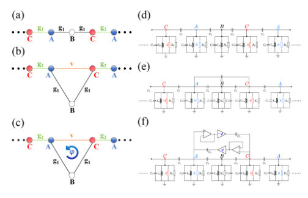
<figcaption class="paper-figure-caption"><b>Fig 1.</b> FIG. 1. Theoretical models and circuit implementations of the non-Hermitian one-dimensional trimerized circuits. (a) Initially trimerized SSH model with NN couplings g1 and g2. (b) Enhanced trimerized SSH model with an additional NNN coupling ν. (c) Reenhanced trimerized SSH model with an NNN coupling ν and a Peierls phase φ. (d)–(f) Circuit im- plementations corresponding to panels (a)–(c), respectively.</figcaption>
</figure>
<figure class="paper-figure-card">

<figcaption class="paper-figure-caption"><b>Fig 2.</b> FIG. 2. Eigenfrequency spectra and total Zak phase for the initial and NNN-coupled models showing the transition from a two-sector response to a stepwise topological sequence. (a) The real parts of the eigenfrequency spectra for ν = 0 and φ = 0; (b) The imaginary parts for ν = 0 and φ = 0; (c) The total Zak phase ztot of ν = 0 and φ = 0; (d) The real parts for ν = 0.2 and φ = 0; (e) The imaginary parts for ν = 0.2 and φ = 0; and (f) The total Zak phase ztot of ν = 0.2 and φ = 0.</figcaption>
</figure>
<figure class="paper-figure-card">

<figcaption class="paper-figure-caption"><b>Fig 3.</b> FIG. 3. Real-part eigenfrequency spectra and corresponding eigenstate distributions at representative parameters used to identify the boundary-localized sectors. (a)–(c) Real parts of the eigenfrequency spectra for θ = 0.3π, ν = 0; θ = π, ν = 0; and θ = 0.5π, ν = 0.2, φ = 0, respectively. (d), (e) Spatial distributions of the eigenstates associated with the red isolated eigenvalues in panel (b). (f) Spatial distribution of the eigenstate associated with the red isolated eigenvalue in panel (c). Black dots denote bulk-state branches, and red dots denote isolated edge states separated from the bulk bands.</figcaption>
</figure>
<figure class="paper-figure-card">
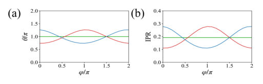
<figcaption class="paper-figure-caption"><b>Fig 4.</b> FIG. 4. Peierls-phase-driven reconstruction of topological phase regions and edge-state localization. (a) The upper- and lower-edge-state stability-region widths ∆θ± versus the Peierls phase φ. (b) The inverse participation ratios IPRs± of the upper and lower edge states versus φ. In both panels, blue and red curves denote the upper and lower edge states, respectively, and the green horizontal line denotes the refer- ence result for ν = 0. The parameters are γ = 0.2 and ν = 0.2.</figcaption>
</figure>
<figure class="paper-figure-card">

<figcaption class="paper-figure-caption"><b>Fig 5.</b> FIG. 5. PCB layout of the non-Hermitian topological circuit and enlarged PCB layout of a single unit cell. The numbered labels indicate the main circuit components: (1) tunable coupling capacitor array, consisting of six 200 pF capacitors and one 500 pF capacitor; (2) gain/loss module, including one dual operational amplifier ADA4891-2, two 10 kΩcurrent-limiting resistors, a tunable negative-resistance module, and 100 nF and 10 µF decoupling capacitors; (3) Peierls-phase circuit module; and (4) tunable resistor R0 module.</figcaption>
</figure>

**Summary.** This work develops and experimentally verifies a trimerized RLC circuit capable of realizing non-Hermitian SSH models extended with NNN coupling and a tunable Peierls phase. By controlling this synthetic gauge field ($\varphi$), the researchers can programmatically manipulate the topological properties, such as the localization strength and spectral gaps, of edge states in a solid-state platform.

**Why it may be interesting.** The use of engineered superconducting circuits (RLC) to realize complex topological Hamiltonians, particularly those involving synthetic gauge fields like the Peierls phase, provides an accessible platform for studying advanced condensed matter concepts relevant to quantum simulation.

Detailed structure

**Main problem.** The research aims to realize and investigate topological physical states by engineering Next-Nearest-Neighbor (NNN) coupling and the Peierls phase within superconducting/circuit models.

**Main result.** The study demonstrates that the Peierls phase acts as a synthetic gauge field, allowing for programmable control over the widths and localization strengths of topologically distinct edge state response bands in the circuit.

**Method.** The authors combine theoretical analysis using the circuit Laplacian (analogous to a Hamiltonian) with numerical simulations and physical measurements on fabricated RLC circuits.

**Model / system.** The system is a non-Hermitian one-dimensional Su-Schrieffer-Heeger (SSH) model implemented in a trimerized superconducting/RLC circuit. The model is systematically enhanced by adding NNN coupling ($
u$) and the Peierls phase ($\varphi$).

**Key observables.** Total Zak phase ($z_{	ext{tot}}$), edge state response intervals ($\Delta	heta_{\pm}$), Inverse Participation Ratios (IPRs), and measured steady-state voltages showing spatial decay.

**Important parameters / regimes.** Nearest-neighbor couplings ($g_1, g_2$), NNN coupling ($
u$), and the tunable Peierls phase ($\varphi$).

**Assumptions / limitations.** The analysis relies on mapping the circuit Laplacian to an effective Hamiltonian and making approximations near edge-state resonances for analytical derivation.

**Figures summary.** Figures illustrate theoretical models, eigenfrequency spectra showing topological transitions, and experimental voltage profiles demonstrating how the Peierls phase controls boundary localization.

**Paper structure.** The paper progresses from establishing the basic SSH model (NN coupling) to enhancing it with NNN terms ($
u$), and finally introducing the Peierls phase ($\varphi$) as a control mechanism. The structure moves from theoretical derivation of edge-state frequencies to numerical verification, culminating in experimental measurements on a PCB.

Abstract

We really design the trimerized circuits for the non-Hermitian one-dimensional Su-Schrieffer-Heeger models. There are three models, the initial one just considers the nearest neighbor coupling, the enhanced one is extended to contain the next-nearest-neighbor coupling, and the final one is reenhanced by introducing the Peierls phase. We investigate the dynamics of the circuit Laplacians with respect to the models, find that the topological states appear in the initial model and the response intervals are substantially affected by the next-nearest-neighbor coupling channels and the Peierls phase. These results are practically demonstrated by numerical simulations and experimental measurements. As a conclusion, the trimerized circuits can provide an adjustable and simple platform to investigate new topological physical states.

[↑ back to top](#top)

### [Coherent quantum control of dark excitons in hybrid metal organic chalchogenolates](http://arxiv.org/abs/2607.04080v1)

**Authors:** Christian L. McCoy, Tobias Saule, Mariya Aleksich, Maggie C. Willson, J. Nathan Hohman, Thomas Weinacht, George N. Gibson, Carlos A. Trallero-Herrero  
**Type:** both · **Category:** quantum information and computing · **PDF:** <https://arxiv.org/pdf/2607.04080v1>  
**Analysis basis:** full PDF text, analyzed in chunks
**Topic relevance:** 🔥 `QC/QI experiment` **4/5** · `interference shaping light` **3/5** · `quantum optics experiment` **3/5** · `analog quantum simulation` **2/5** · `driven-dissipative phase transition` **2/5** · `non-equilibrium dynamics` **2/5** · `correlated / nonlocal dissipation` **1/5** · `correlated cavity matter` **1/5** · `entanglement & information structure` **1/5** · `methods for driven-dissipative` **1/5** · `non-equilibrium universality` **1/5** · `quantum measurements` **1/5** · `spintronics-quantum-optics interface` **1/5**

↔ Scroll figures horizontally

<figure class="paper-figure-card">
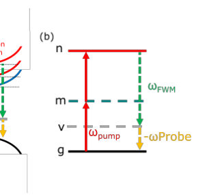
<figcaption class="paper-figure-caption"><b>Fig 1.</b> Fig. 1: (a.) Excitonic state representation of mithrene, single photon allowed transi- tions in blue (left). Two photon allowed transitions in red (right). (b.) State diagram of a χ(3) process. Formalism and nomenclature from Eq. 1 and Ref. [25]. In the case of mithrene the only real n-states are the dark exciton states, A2p and B2p.</figcaption>
</figure>
<figure class="paper-figure-card">
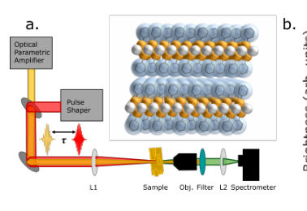
<figcaption class="paper-figure-caption"><b>Fig 2.</b> Fig. 2: (a.) General experimental apparatus design used for all experiments. Pump pulses are are from a Ti:Sapphire laser and split between an OPA and pulse shaper. The resulting pulses are recombined and focused onto a sample of mithrene before the resulting emission is collected. Inset. Cartoon crystal structure of mithrene. Silver ball - Ag, Orange ball - Se, Blue hexagon/ball - phenyl ring (C6H5) (b.) Comparison of the FWM (black) brightness response in mithrene to the SFG (orange) brightness in BBO, both as a function of optical path length delay.</figcaption>
</figure>
<figure class="paper-figure-card">
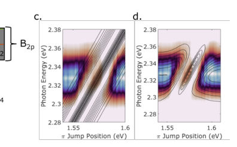
<figcaption class="paper-figure-caption"><b>Fig 3.</b> Fig. 3: (a.) Two-dimensional heat map of the FWM emission as a function of the π phase jump position. Constructive interference as a result of the B2p resonance can be seen at ∼1.575 eV. (b.) Illustration of the phase delay scanning through the pump spectrum, leading to constructive interference for the entire width of the B2p resonance. (c.) B2p state population resulting from second-order perturbative treatment of the Hamiltonian, Eq. 2, overlayed over the heat map from (a.). (d.) Best theoretical agreement from a multidimensional scan of the integrated TDSE using the Hamiltonian from Eq. 2 compared to the heat map from (a.). Extracted material properties that fit the best for I0 = 2.88 ·...</figcaption>
</figure>
<figure class="paper-figure-card">
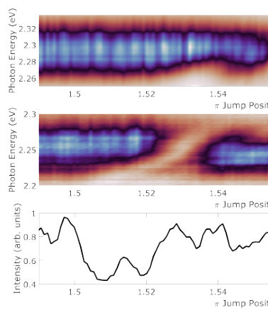
<figcaption class="paper-figure-caption"><b>Fig 4.</b> Fig. 4: (a.) λcenter = 1.56 eV (b.). λcenter = 1.53 eV. (c.) Lineout of the emission centered at 2.19 eV.</figcaption>
</figure>
<figure class="paper-figure-card">

<figcaption class="paper-figure-caption"><b>Fig 5.</b> Fig. 5: (a) Zoom in of the histogram for all simulated RMS values. (b) experimental π jump data. Solid and dashed circle mark regions of interest, see text. (c)(d) Simulation result for an ωB2p of -54.9 Trad/s (RMS of 0.092) and +54.9 Trad/s (RMS of 0.102) overlayed with the experimental data respectively. The rest of the material properties is kept constant.</figcaption>
</figure>

**Summary.** The paper reports on achieving coherent quantum control over dark exciton states within metal-organic chalcogenolates using ultrafast laser pulse shaping. By modeling the system with a three-level Hamiltonian and employing Four-Wave Mixing, the authors demonstrate that precise spectral phase control allows for deterministic manipulation of these otherwise inaccessible quantum states. This work establishes a pathway toward utilizing solid-state excitons as functional qubits for quantum information processing.

**Why it may be interesting.** This work directly bridges solid-state materials science with fundamental quantum optics principles. The use of dark excitons as artificial qubits, controlled by tailored light fields, is a prime example of coherent control in condensed matter systems relevant to quantum computing architectures.

Detailed structure

**Main problem.** The primary goal is demonstrating coherent quantum control over dark exciton states, which are promising artificial atom-like systems for next-generation quantum processing.

**Main result.** The authors successfully demonstrated theoretical access and experimental proof-of-concept for controlling these dark excitons using tailored ultrafast laser pulses to execute fundamental quantum gate operations.

**Method.** The work combines advanced ultrafast spectroscopy (Four-Wave Mixing) with sophisticated pulse shaping techniques to manipulate the system's Hamiltonian dynamics.

**Model / system.** The physical platform is Metal-Organic Chalcogenolates (MOChas), specifically mithrene, hosting dark exciton states ($A_{2p}, B_{2p}$). The system is modeled using a non-perturbative, three-level Hamiltonian incorporating time-varying Stark shifts and coupling strengths.

**Key observables.** FWM emission energy, constructive interference at resonance, and the ability to map pulse area ($	heta$) to unitary gate operations ($U(	heta)$).

**Important parameters / regimes.** Ultrafast pulse shaping (spectral phase $\phi(\lambda)$), two-photon absorption resonances (e.g., 816 nm, 787 nm), and the required pulse area for specific rotations ($\pi/2$ rotation requires $	heta = \pi/2$).

**Assumptions / limitations.** The analysis moves beyond perturbative limits to strong field excitation regimes; material constants are largely unknown, necessitating multiple fitting simulations.

**Figures summary.** Figures illustrate the experimental setup using FWM with a pulse shaper, showing resonance enhancement via $\pi$-phase flips and comparing theoretical predictions (TDSE) against measured spectral responses away from resonance.

**Paper structure.** The paper progresses from establishing the physical system and Hamiltonian to detailing the measurement techniques (FWM/pulse shaping), demonstrating control through simulation and experiment, and finally deriving the mathematical framework for implementing quantum gates using pulse area concepts.

Abstract

Artificial atom-like systems are a promising candidate for next generation quantum processing. Among them, dark excitons exhibit one of the longest lifetimes at high temperatures. Here, we demonstrate coherent control of dark excitonic states in metal-organic chalcogenolates (MOChas) by using an ultrafast pulse shaper at room temperature. These dark exciton states are optically accessed via two-photon absorption and directly read out with a four-wave mixing process. The system is described by a non-perturbative, two-photon Hamiltonian based on well-known atomic physics and applied to a three level system comprised of two dark excitons. Empirical and theoretical state specific optical access is shown via a simple optical pulse shape. The developed Hamiltonian-based description is a first step towards a quantum processing platform using three-level systems and two photon transitions, one example being dark excitons in the MOCha silver benzeneselenolate (mithrene). Simple conditions for gate operations are laid out and described.

[↑ back to top](#top)

### [Entanglement of excited states after measurements in conformal field theory](http://arxiv.org/abs/2607.04268v1)

**Authors:** Hui-Huang Chen  
**Type:** theory · **Category:** statistical mechanics · **PDF:** <https://arxiv.org/pdf/2607.04268v1>  
**Analysis basis:** full PDF text, analyzed in chunks
**Topic relevance:** 🔥 `entanglement & information structure` **4/5** · 🔥 `measurement-induced transitions` **4/5** · `non-equilibrium dynamics` **3/5** · `quantum measurements` **3/5** · `analog quantum simulation` **2/5** · `non-equilibrium universality` **2/5** · `Keldysh / 2PI / non-Gaussian methods` **1/5** · `correlated / nonlocal dissipation` **1/5** · `driven-dissipative phase transition` **1/5** · `interference shaping light` **1/5** · `methods for driven-dissipative` **1/5**

↔ Scroll figures horizontally

<figure class="paper-figure-card">

<figcaption class="paper-figure-caption"><b>Fig 1.</b> Figure 1: Numerical check of the post-measurement current-excitation ratios in the XX chain. The system size is L = 500. The measured interval has length (a) s = 50, corresponding to s/L = 0.1, and (b) s = 200, corresponding to s/L = 0.4. The horizontal axis is x = l/L. Symbols denote lattice results obtained from the conditional free-fermion correlation matrix after projecting the measured sites onto a fixed alternating occupation pattern. Solid curves are the CFT predictions for F (2) J (cf. Eq. (4.21)) and F (3) J (cf. Eq. (4.27)). The agreements in both panels support the current hafnian formulas on the post-measurement slit geometry.</figcaption>
</figure>
<figure class="paper-figure-card">
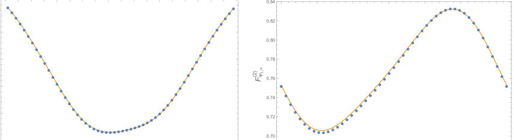
<figcaption class="paper-figure-caption"><b>Fig 2.</b> Figure 2: Numerical check of the post-measurement second R´enyi ratio for the J/ ¯J superposition state. Symbols denote XX-chain results obtained from the multi-Slater determinant calculation after projecting the measured sites onto a fixed alternating occupation pattern. Solid curves are the CFT predictions from the disk four-current formula. The left panel tests the dependence on the subsystem size x = l/L, while the right panel tests the relative phase dependence. The agreement in both panels verifies the coherent left-right interference terms induced by the measurement boundary.</figcaption>
</figure>
<figure class="paper-figure-card">
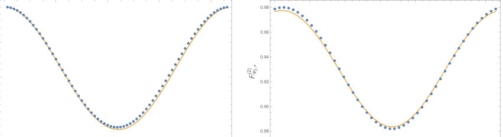
<figcaption class="paper-figure-caption"><b>Fig 3.</b> Figure 3: Numerical check of the conjugate-vertex superposition. The blue points are the XX- chain results, and the orange curves are the CFT predictions. In the phase scan, the CFT curve is evaluated using the branch-matched phase θCFT = θlat −πl/L + πs/(4L). The agreement shows that the CFT expression captures both the spatial dependence and the phase-sensitive interference structure of the vertex superposition. The small residual deviations are attributed to finite-size corrections.</figcaption>
</figure>

**Summary.** This paper develops a rigorous CFT framework to calculate the entanglement entropy of excited states immediately following a projective measurement on a spatial interval. By mapping complex geometries to simpler domains, the authors derive general formulas for this post-measurement entanglement, testing them specifically in the free compact boson model and numerically on the XX chain.

**Why it may be interesting.** The methodology of calculating entanglement after measurement is crucial for understanding quantum quenches and open system dynamics in 1D critical systems. The explicit connection between CFT correlation functions and measurable entanglement entropy provides powerful theoretical tools applicable to AMO platforms simulating these models.

Detailed structure

**Main problem.** The study focuses on calculating the entanglement entropy of low-energy excited states following a fixed-outcome projective measurement within a (1+1)-dimensional Conformal Field Theory (CFT). This extends standard ground-state calculations to include excitation effects.

**Main result.** The post-measurement Rényi entropy for an excited state is found to be additive, involving the original ground-state result plus a term derived from a normalized boundary-CFT correlation function. Furthermore, phase-sensitive interference terms appear in finite-slit measurements compared to unmeasured limits.

**Method.** The authors employ conformal field theory techniques, mapping complex geometries (like replicated slits) onto simpler domains such as the disk. Calculations involve expressing entanglement measures via specialized correlation functions and utilizing determinant formulas for free fermionic systems.

**Model / system.** The primary model is a critical quantum system described by CFT in 1+1 dimensions. Specific applications include the compact free boson CFT (for current excitations) and testing predictions on the critical XX chain using free-fermion methods.

**Key observables.** Post-measurement Rényi entropy ($S_n$), excess Rényi entropy, and boundary-CFT correlation functions $F^{(n)}_{\Upsilon,a}$.

**Important parameters / regimes.** Slit length ($s$), unmeasured region size ($l$), CFT scaling dimensions ($\Delta_n$), and the measurement outcome represented by a conformal boundary condition ($a$).

**Assumptions / limitations.** The analysis assumes that the fixed-outcome projective measurement renormalizes to an effective conformal boundary condition. The free-fermion calculations rely on determinant contraction identities.

**Paper structure.** The paper first establishes the general framework for post-measurement entanglement in CFT, relating it to correlation functions. It then specializes this framework to the compact free boson model and analyzes specific excitations (currents, superpositions). Finally, it details numerical testing methods using the critical XX chain via Slater determinants.

Abstract

We study the entanglement of low-energy excited states after a fixed-outcome projective measurement on a spatial interval in a (1+1)-dimensional conformal field theory (CFT). The post-selected measurement outcome is represented by a slit carrying a conformal boundary condition, while excited states are introduced by operator insertions in the Euclidean path integral. After mapping the replicated slit geometry to a disk, the excited-state contribution to the post-measurement Rényi entropy is expressed as a normalized boundary-CFT correlation function.   We apply this framework to the compact free boson CFT. For the chiral current excitation, the relevant ratios are given by current hafnians. We also study coherent superpositions of $J$ and $\bar J$, and of conjugate compact vertex operators. In the conjugate-vertex case, the ordinary-cylinder second Rényi ratio is independent of the relative phase, whereas the finite-slit post-measurement ratio contains phase-sensitive interference terms. Finally, we describe free-fermion and multi-Slater determinant methods for testing these predictions in the critical XX chain.

[↑ back to top](#top)

### [Photonic Cluster State Generation from a Quantum Dot Emitting in the Telecom C-band](http://arxiv.org/abs/2607.04896v1)

**Authors:** Giora Peniakov, Reza Hekmati, Johannes Michl, Mohamed Helal, Moritz Meinecke, Jochen Kaupp, Yorick Reum, Martin Kamp, Monika Emmerling, Andreas Theo Pfenning, Sven Hoefling, Tobias Huber-Loyola  
**Type:** experiment · **Category:** quantum information and computing · **PDF:** <https://arxiv.org/pdf/2607.04896v1>  
**Analysis basis:** full PDF text, analyzed in chunks
**Topic relevance:** 🔥 `QC/QI experiment` **4/5** · 🔥 `spintronics-quantum-optics interface` **4/5** · `exotic spin models in light-matter` **3/5** · `quantum optics experiment` **3/5** · `entanglement & information structure` **2/5** · `quantum measurements` **2/5** · `Tavis-Cummings & cavity-many-emitter` **1/5** · `analog quantum simulation` **1/5** · `correlated cavity matter` **1/5** · `non-equilibrium dynamics` **1/5**

↔ Scroll figures horizontally

<figure class="paper-figure-card">

<figcaption class="paper-figure-caption"><b>Fig 1.</b> Fig. 1. a Circular-Bragg grating microcavity. b Polarization resolved photoluminescence under above-band excitation. 𝑋0 is the neutral exciton and 𝑋+ is the positive trion recombination transition. The broad emission feature around 1552 nm comes from other transitions feeding into the cavity. H(V) stands for horizontal(vertical) linear polarization. c Cluster-state generation circuit consisting of CNOT and 𝐺 gates. Given an input state |𝜓⟩= |−𝑦⟩, a linear cluster state is generated. A red dashed frame marks a single circuit building block (CBB) that we characterize using a quantum process tomography. d Bloch sphere representation of the ground state hole spin illustrating the quarter-...</figcaption>
</figure>
<figure class="paper-figure-card">
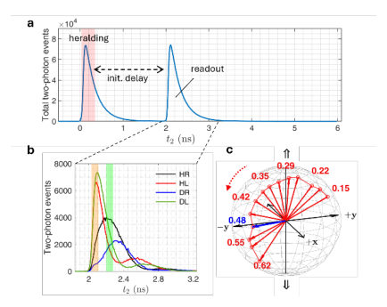
<figcaption class="paper-figure-caption"><b>Fig 2.</b> Fig. 2. Experimental characterization of the spin state at the CBB input. a Time resolved emission from the 𝑋+ following excitation with two laser pulses used for spin heralding and readout. b Polarization-resolved time traces from the readout pulse, conditioned on a heralding photon detection emitted during the pink-highlighted post selection time window in panel ‘a’. The plot labels HR, HL, DR and DL indicate the excitation and detection polarizations, respectively. Yellow- and green-highlighted areas mark the 80-ps time windows at 𝑡= 0 and 𝑡= 𝑇𝑒/4 used to probe the spin projections {𝜌𝑥, 𝜌𝑦, 𝜌𝑧}. c A series of spin readouts with variable initialization delay is visualized as vectors on...</figcaption>
</figure>
<figure class="paper-figure-card">

<figcaption class="paper-figure-caption"><b>Fig 3.</b> Fig. 3. CBB output: spin photon tomography. a Emission from the 𝑋+ following three excitation pulses. The red dashed frame indicates the CBB operation consisting of a CNOT pulse followed by a time interval 𝑇𝜋/2 implementing the 𝐺 gate through Larmor precession. Pink-highlighted regions mark the post-selection time windows for photon detection. Spin–photon tomography is obtained by correlating photons from the heralding, CNOT, and readout pulses. b Real and imaginary part of the measured spin–photon density matrix, 𝜌(|−𝑦⟩).</figcaption>
</figure>
<figure class="paper-figure-card">
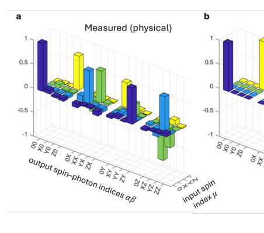
<figcaption class="paper-figure-caption"><b>Fig 4.</b> Fig. 4. Process map 𝚽. a The 64 measured real elements ϕ𝛼𝛽</figcaption>
</figure>

**Summary.** The research demonstrates deterministic cluster state generation using an indium-arsenide quantum dot operating at the telecom C-band. By characterizing the underlying quantum process map and measuring spin-photon entanglement, the authors confirm the feasibility of creating multi-qubit entangled states necessary for scalable photonic quantum computation.

**Why it may be interesting.** This work directly addresses a major engineering bottleneck in quantum networking by achieving high-fidelity photonic entanglement generation at telecom wavelengths using solid-state emitters, which is crucial for scaling up quantum communication networks.

Detailed structure

**Main problem.** The primary goal is the deterministic generation of photonic cluster states directly within the telecom C-band (1549 nm) to enable quantum communication compatible with existing fiber infrastructure.

**Main result.** The authors successfully demonstrated this process, achieving a measured process map fidelity ($\mathcal{F}$) of $0.71 \pm 0.01$ and generating a state locally equivalent to a three-qubit cluster state (GHZ state).

**Method.** Cluster state generation is achieved using a quantum dot system that implements controlled gates via hole spin excitation, followed by full characterization using process tomography.

**Model / system.** The platform utilizes an Indium-arsenide ($	ext{InAs}$) quantum dot embedded in a microcavity. The protocol relies on manipulating the hole spin state to mediate entanglement between the spin and emitted photon, following variants of the Lindner–Rudolph protocol.

**Key observables.** Process map fidelity ($\mathcal{F} = 0.71 \pm 0.01$), spin–photon polarization entanglement negativity ($\mathcal{N} = 0.27 \pm 0.02$), and photon indistinguishability (at least 83%).

**Important parameters / regimes.** Telecom C-band wavelength (1549 nm), hole-spin coherence time ($T_2^* = 15.9 \pm 1.7$ ns), and high repetition rate (80 MHz).

**Assumptions / limitations.** The protocol assumes that characterizing a single Circuit Building Block (CBB) is sufficient to characterize $N$ qubits by concatenation, and it relies on spectral detuning compensated by Purcell enhancement.

**Figures summary.** Figures illustrate the microcavity setup, pulse sequences for spin state characterization, tomography results showing entanglement quantification ($\mathcal{N}$), and comparisons between measured and ideal process maps ($\Phi$).

**Paper structure.** The paper details the physical system and protocol (using hole spins in a QD) to generate cluster states. It then presents rigorous characterization methods—including process map reconstruction, entanglement measurement via tomography, and indistinguishability tests—culminating in the demonstration of a multi-qubit state.

Abstract

Photonic cluster states are a key resource for photonic quantum information processing. So far, deterministic generation of these states has been limited to the near-infrared wavelength range. To achieve quantum advantage in communication while maintaining compatibility with silicon photonics, operation in the telecom wavelength range is required. In this work, we demonstrate deterministic cluster state generation directly in the telecom C-band. This is achieved through repetitive excitation of a hole spin confined in an indium-arsenide quantum dot subjected to an external magnetic field. We characterize the quantum process that generates the cluster state by measuring its process map, obtaining a fidelity of $\mathrm{F} = 0.71 \pm 0.01$ to the ideal case. As part of this characterization, we observe spin--photon polarization entanglement with a negativity of $\mathrm{N} = 0.27 \pm 0.02$. The emitted photons exhibit indistinguishability of at least 83%, demonstrating the potential for future fusion gates necessary for photonic cluster state generation beyond linear connectivity.

[↑ back to top](#top)

### [Energetic Protection, Monotonicity and Switching Far from Equilibrium](http://arxiv.org/abs/2607.05303v1)

**Authors:** Uğur Çetiner  
**Type:** theory · **Category:** statistical mechanics · **PDF:** <https://arxiv.org/pdf/2607.05303v1>  
**Analysis basis:** full PDF text, analyzed in chunks
**Topic relevance:** 🔥 `non-equilibrium universality` **4/5** · `driven-dissipative phase transition` **3/5** · `methods for driven-dissipative` **3/5** · `non-equilibrium dynamics` **3/5** · `correlated / nonlocal dissipation` **2/5** · `entanglement & information structure` **2/5** · `Keldysh / 2PI / non-Gaussian methods` **1/5** · `Kondo & dissipative impurity` **1/5** · `analog quantum simulation` **1/5** · `scars & prethermalization` **1/5**

↔ Scroll figures horizontally

<figure class="paper-figure-card">
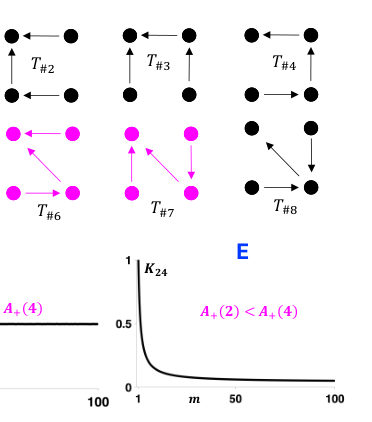
<figcaption class="paper-figure-caption"><b>Fig 1.</b> Figure 1. Single-edge driving yields either a mono- tonic response or energetic protection. (A) A four- state Markov process is driven out of equilibrium by scaling the single transition 1 →3 as ℓ(1 →3) = m ℓeq(1 →3) (red), with every other rate held at its equilibrium value. (B) The eight spanning trees rooted at vertex 1; the two trees T#6 and T#7 (magenta) compete to set the response. (C–E) The nor- malized response K24(m) ≡(π2/π4)/(πeq 2 /πeq 4 ) is fixed by the relative weights of these two trees: it increases monotonically when w(T#7) &gt; w(T#6) (C), decreases monotonically when w(T#7) &lt; w(T#6) (E), and stays pinned at K24(m) = 1 for all m when w(T#7) = w(T#6) (D), so that the ratio...</figcaption>
</figure>
<figure class="paper-figure-card">
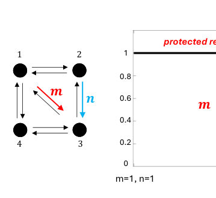
<figcaption class="paper-figure-caption"><b>Fig 2.</b> Figure 2. A thermodynamic switch in a four-state Markov process. The network of Fig. 1A is driven by two energetic edges, 1 →3 (factor m, red) and 2 →3 (factor n, cyan), starting from an equilibrium configuration that sat- isfies the protection condition w(T#6) = w(T#7) (rates in Table S2). The black curve traces the response K24 as a two-stage protocol advances along the horizontal axis. In the protected region (first stage: n = 1 held fixed, m ramped from 1 to 100) protection pins π2/π4 to its equilibrium value, so K24 = 1 throughout. In the switching region (second stage: m = 100 held fixed, n ramped through the edge 2 →3) the response drops substantially. Energetic protection of the...</figcaption>
</figure>
<figure class="paper-figure-card">

<figcaption class="paper-figure-caption"><b>Fig 3.</b> Figure 3. Whether the second-stage switch is protocol-independent depends on the choice of sec- ond energetic edge. In both panels the first edge 1 →3 is ramped to a stopping (switch) value m∗and then held fixed while the second edge is ramped through n; curves are coloured by m∗, and the insets show the two energetic edges (m red, n cyan). Both panels use the same equilibrium rates, which satisfy the protection condition w(T#6) = w(T#7) with regard to the first energetic edge (1 →3), and differ only in which edge carries the second drive (Table S3). (A) Sec- ond edge 2 →3. Energetic protection extends from the single slice n = 1 to the full identity W(n) = 0 for all n (Supplement), so the...</figcaption>
</figure>
<figure class="paper-figure-card">

<figcaption class="paper-figure-caption"><b>Fig 4.</b> Figure 4. Two coupled energetic edges produce a sin- gle nonmonotonic bump. The energetic edges 1 →3 and 3 →4 are perturbed together by a common factor m from an equilibrium configuration (m = 1; rates in Ta- ble S4). (A) The normalized response K24(m) rises and then falls, with a single interior maximum. (B) Its slope obeys sgn K′ 24(m) = sgn N(m) with N(m) = ∆10+2∆20m+∆21m2</figcaption>
</figure>

**Summary.** This paper develops a graph-theoretic framework to study how information processing capabilities are constrained when physical systems operate far from equilibrium. The central finding is 'energetic protection,' which reveals that specific ratios can remain invariant despite strong external driving forces if certain algebraic relationships among spanning tree weights hold. This work establishes new, non-equilibrium constraints governing the functional logic of driven matter.

**Why it may be interesting.** It provides novel, non-equilibrium invariants and robustness mechanisms that govern functional logic in driven systems, offering new constraints beyond standard detailed balance conditions relevant to open quantum systems dynamics.

Detailed structure

**Main problem.** The research investigates how information-theoretic constraints, typically seen at equilibrium, persist or change when a physical system is driven far from thermodynamic equilibrium.

**Main result.** The authors identify 'energetic protection,' a mechanism where specific steady-state ratios remain exactly locked to their equilibrium values regardless of the driving strength, provided an underlying algebraic equality among spanning-tree weights holds.

**Method.** The analysis uses graph theory applied to continuous-time Markov processes, focusing on calculating normalized response functions using arboreal distributions derived from spanning trees.

**Model / system.** The model is a finite-state, continuous-time Markov process defined on a directed graph. The dynamics are perturbed by scaling specific transition rates (energetic edges) to drive the system away from equilibrium.

**Key observables.** The normalized ratio of steady-state probabilities ($K_{ij}$), which measures deviation from equilibrium, and the arboreal coefficients derived from spanning-tree weights.

**Important parameters / regimes.** The driving strength parameter ($m$), which scales the rates of the energetic edges; the algebraic equality between spanning-tree weights.

**Assumptions / limitations.** The analysis assumes the existence of a unique steady state and relies heavily on deriving necessary algebraic constraints among spanning tree weights to prove robustness.

**Figures summary.** Figures illustrate how the response ratio behaves under driving, showing examples of monotonic change, perfect protection ($K_{ij}=1$), and the combination leading to a sharp 'thermodynamic switch.'

**Paper structure.** The paper progresses from establishing equilibrium constraints to analyzing single-edge driving (showing monotonicity), then introducing the condition for energetic protection via spanning-tree weight equalities, culminating in the construction of a programmable thermodynamic switch using two edges.

Abstract

At equilibrium, the ratio of two steady-state probabilities is a Boltzmann factor, set by a free-energy difference. Such ratios are the natural, normalization-independent readouts of both thermodynamics and information processing, and are often used as a measure of fidelity in biophysical systems. What becomes of these ratios once a system is driven from equilibrium, where the Boltzmann factor no longer holds? Representing Markov processes as graphs and their steady states as averages over a distribution on spanning trees, the \emph{arboreal distribution}, we track the ratio $π_i/π_j$ under driving along \emph{energetic edges}, where detailed balance is broken, relative to its equilibrium value. Our central finding is that a chosen ratio can stay exactly locked to its equilibrium value arbitrarily far from equilibrium, a phenomenon we call \emph{energetic protection}, whenever an algebraic equality between spanning-tree weights holds. Just as detailed balance constrains rates around cycles, energetic protection constrains weights across trees, providing a new mechanism for robustness against fluctuations in the driving force, such as variations in ATP concentration. Away from this equality, single-edge driving collapses the response onto two arboreal coefficients and forces it to be monotonic, so nonmonotonic single-edge control is impossible at any strength. With two energetic edges, protection and monotonicity combine into a \emph{thermodynamic switch} that holds a function at its equilibrium value for as long as desired and releases it sharply. Equilibrium is known for the limits it places on information processing. We show that new constraints, both no-go principles and exact invariances, survive far from equilibrium. These results reveal how the localization of energy expenditure governs the functional logic of nonequilibrium systems in physics and biology.

[↑ back to top](#top)

### [The Informational Cost of Structure: Representational Complexity in Networked Dynamical Systems](http://arxiv.org/abs/2607.03608v1)

**Authors:** Cyril Rommens, Pietro Traversa, Guilherme Ferraz de Arruda, Yamir Moreno  
**Type:** theory · **Category:** statistical mechanics · **PDF:** <https://arxiv.org/pdf/2607.03608v1>  
**Analysis basis:** full PDF text, analyzed in chunks
**Topic relevance:** 🔥 `entanglement & information structure` **4/5** · `analog quantum simulation` **3/5** · `methods for driven-dissipative` **3/5** · `correlated / nonlocal dissipation` **2/5** · `driven-dissipative phase transition` **2/5** · `non-equilibrium dynamics` **2/5** · `Keldysh / 2PI / non-Gaussian methods` **1/5** · `Rydberg arrays` **1/5** · `correlated cavity matter` **1/5** · `exotic spin models in light-matter` **1/5** · `non-equilibrium universality` **1/5**

↔ Scroll figures horizontally

<figure class="paper-figure-card">

<figcaption class="paper-figure-caption"><b>Fig 1.</b> FIG. 1. Schematic decomposition of the complexity contributions of the graph and hypergraph representations under Assump- tions 1 and 2, which place them in the equivalence regime.</figcaption>
</figure>

**Summary.** This work introduces Representational Complexity to quantify the information overhead incurred when describing a dynamical system using specific structural models like graphs or hypergraphs. It shows that while expressive power is not enough, the choice of representation must minimize the total informational cost relative to the true dynamics. This framework suggests that genuinely many-body interactions require higher-order structures (hypergraphs) for an efficient and non-redundant description.

**Why it may be interesting.** While abstract, the framework provides a rigorous information-theoretic lens for model selection. In AMO physics, choosing between pairwise coupling terms (like simple nearest-neighbor Hamiltonians) versus higher-order interactions (e.g., three-body or Rydberg blockade effects) can be quantified by this informational cost.

Detailed structure

**Main problem.** The paper addresses determining the minimum informational cost required to represent a complex dynamical system using an explicit interaction structure and an evolution rule.

**Main result.** The choice of representation (e.g., graph vs. hypergraph) is not determined by mere expressive power, but rather by minimizing the total informational cost relative to the intrinsic complexity of the dynamics itself.

**Method.** It employs Algorithmic Information Theory, specifically using Representational Complexity ($	ext{RC}$), which measures the excess description length beyond the system's inherent Kolmogorov complexity $K(F)$.

**Model / system.** The analysis focuses on abstract networked dynamical systems modeled by finite Boolean maps ($F: \{0, 1\}^N 	o \{0, 1\}^N$), comparing representations based on pairwise interactions (graphs) versus higher-order interactions (hypergraphs).

**Key observables.** Representational Complexity ($	ext{RC}$), Algorithmic Mutual Information ($	ext{I}(D:S)$), and the difference in description length ($\Delta 	ext{RC}$) between structural representations.

**Important parameters / regimes.** The dimensionality of interactions ($k$), system size ($N$), and the specific constraints placed on admissible structures and rules (restricted vs. unrestricted settings).

**Assumptions / limitations.** Kolmogorov complexity is uncomputable, so results are complemented with explicit description-length estimates; comparisons assume fixed coding conventions for asymptotic analysis.

**Figures summary.** The notes detail several examples comparing costs: Group-Threshold dynamics favoring graphs if $k \ge 2$; SI-type rules showing external annotations add cost; and a direct comparison showing graph expansion of $k$-hyperedges is significantly more costly than the hypergraph representation for $k \ge 3$.

**Paper structure.** The paper establishes $	ext{RC}$ as the core metric, first proving its non-negativity ($	ext{RC} \ge 0$). It then contrasts the unrestricted setting (where all formalisms are equivalent) with restricted settings where structural constraints lead to measurable differences in informational cost between graph and hypergraph models.

Abstract

How much information is required to represent a dynamical system in terms of an interaction structure and an evolution rule? We address this question using algorithmic information theory. We introduce Representational Complexity, the excess description length of a structure-plus-rule model relative to the shortest possible description of the dynamics itself. This intrinsic description defines a universal lower bound: no exact structural representation can be more concise. If arbitrary rules are allowed, graphs, hypergraphs, and other formalisms can all reach this bound by shifting information between structure and dynamics, so expressiveness alone cannot distinguish them. Meaningful differences arise only when scientific modeling restricts the admissible structures and rules. Within this setting, we identify conditions under which graph and hypergraph descriptions are informationally equivalent, and show how graph-preferred, hypergraph-preferred, and mixed regimes can emerge when those conditions are relaxed. Because Kolmogorov complexity is not computable, we complement the formal results with explicit description-length estimates. Our framework reframes the choice of network representation as a question of informational cost and mechanistic transparency rather than universal expressive power.

[↑ back to top](#top)

### [Bloch-sphere rotations in driven double-well for ultracold atoms](http://arxiv.org/abs/2607.04873v1)

**Authors:** Michele Modugno, Marco Fattori, Giulio Pettini  
**Type:** both · **Category:** quantum gases · **PDF:** <https://arxiv.org/pdf/2607.04873v1>  
**Analysis basis:** full PDF text, analyzed in chunks
**Topic relevance:** 🔥 `analog quantum simulation` **4/5** · `exotic spin models in light-matter` **3/5** · `non-equilibrium dynamics` **3/5** · `QC/QI experiment` **2/5** · `methods for driven-dissipative` **2/5** · `non-equilibrium universality` **2/5** · `Keldysh / 2PI / non-Gaussian methods` **1/5** · `correlated / nonlocal dissipation` **1/5** · `driven-dissipative phase transition` **1/5** · `entanglement & information structure` **1/5**

↔ Scroll figures horizontally

<figure class="paper-figure-card">
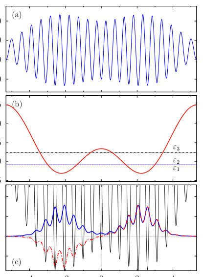
<figcaption class="paper-figure-caption"><b>Fig 1.</b> FIG. 1. (a) Plot of the BNSL potential in Eq. (2). (b) Effec- tive approximation (3), corresponding to a symmetric dou- ble well with a spatial separation between the two minima a ≃4.436 µm. The first three energy levels εi (i = 1, 2, 3) of H0 in Eq. (1) are also shown, displayed as horizontal lines. (c) Spatially symmetric (blue solid line) and antisymmetric (red dot-dashed line) low-lying eigenfunctions. The potential (black solid line) is included for reference.</figcaption>
</figure>
<figure class="paper-figure-card">

<figcaption class="paper-figure-caption"><b>Fig 2.</b> FIG. 2. Scheme of the two protocols P1 and P2 employed in this work (see text), indicated by blue and red lines, respec- tively. The top row displays three snapshots of the density configurations corresponding to the initial state (at different times for the two protocols), an intermediate configuration, and the final stationary configuration with equal population in the two wells.</figcaption>
</figure>
<figure class="paper-figure-card">

<figcaption class="paper-figure-caption"><b>Fig 3.</b> FIG. 3. Time evolution of the components of the Bloch unit vector for the two protocols, P1 (a) and P2 (b). See text for details.</figcaption>
</figure>

**Summary.** The authors demonstrate how controlled, arbitrary rotations of pseudospins can be achieved in an ultracold atomic double-well system using fast, time-periodic external driving. By applying Floquet engineering principles, they show that the system's dynamics can be precisely steered to manipulate the Bloch vector along any desired axis in the equatorial plane. This offers a powerful tool for quantum control applications in atom interferometry.

**Why it may be interesting.** This work provides concrete experimental proposals for engineering quantum gates or manipulating spin states in ultracold atom systems by leveraging time-periodic driving fields, which is highly relevant to quantum simulation and measurement techniques in AMO physics.

Detailed structure

**Main problem.** The research aims to achieve full coherent control over pseudospin dynamics (Bloch sphere rotations) in a trapped double-well system using time-periodic driving protocols.

**Main result.** Controlled rotations about arbitrary axes in the equatorial plane of the Bloch sphere can be demonstrated, complementing previous methods that relied only on static biases.

**Method.** The study employs numerical simulations and analytical derivations based on Floquet theory to model the system's time evolution operator.

**Model / system.** The physical platform is a non-interacting Bose-Einstein condensate in a double-well potential realized using Beat-Note Superlattices. The dynamics are modeled by an effective two-level Hamiltonian subjected to a spatially linear, time-periodic driving potential.

**Key observables.** Bloch sphere rotation vector components (n_x, n_y, n_z) and the renormalized Rabi period (T'_R).

**Important parameters / regimes.** The drive frequency must satisfy the regime $
u_{12} \ll 
u \ll 
u_{23}$, and specific force amplitudes ($K=\pi/2$) are used to target desired rotations.

**Assumptions / limitations.** The analysis assumes a non-interacting condensate, and the use of an effective two-level description is central to the control scheme.

**Figures summary.** Figures illustrate the BNSL potential structure, the effective double-well approximation, and show the resulting Bloch vector trajectories for different control protocols (P1 and P2).

**Paper structure.** The paper first establishes the physical platform using a static Hamiltonian, then introduces time-periodic driving. It develops the theoretical framework using Floquet theory to derive the evolution operator, before demonstrating two specific protocols (P1 and P2) that achieve controlled Bloch sphere rotations.

Abstract

We show that, by using suitable protocols for a non-interacting condensate in a driven double-well, one can achieve controlled rotations about arbitrary axes in the equatorial plane of the Bloch sphere, composed with fast rotations about the $z$-axis. Specifically, we investigate the dynamics induced by a spatially linear time-periodic potential, by means of numerical simulations. We also provide an explicit two-level model that accurately captures the microscopic evolution of the driven system, with the full time-dependent evolution operator obtained using a Floquet-based approach. The analysis is carried out using as a reference a recently realized experimental platform consisting of arrays of double-well potentials based on Beat-Note Superlattices, to which the proposed control scheme is directly applicable.

[↑ back to top](#top)

### [Coherent Control of Energy Transport at Room Temperature in a Noisy Bath](http://arxiv.org/abs/2607.05361v1)

**Authors:** Davinder Singh, Paul Brumer  
**Type:** theory · **Category:** statistical mechanics · **PDF:** <https://arxiv.org/pdf/2607.05361v1>  
**Analysis basis:** full PDF text, analyzed in chunks
**Topic relevance:** 🔥 `methods for driven-dissipative` **4/5** · 🔥 `non-equilibrium dynamics` **4/5** · `driven-dissipative phase transition` **3/5** · `interference shaping light` **3/5** · `correlated / nonlocal dissipation` **2/5** · `non-equilibrium universality` **2/5** · `Keldysh / 2PI / non-Gaussian methods` **1/5** · `analog quantum simulation` **1/5**

↔ Scroll figures horizontally

<figure class="paper-figure-card">
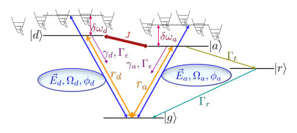
<figcaption class="paper-figure-caption"><b>Fig 1.</b> Figure 1: Schematic of a reaction center connected donor-acceptor pair (with quantum states, common ground state |g⟩, excited donor (acceptor) state |d⟩(|a⟩), and reaction center state |r⟩) in the presence of monochromatic control fields ⃗Em (where m = d, a). Here, δωm = ωL −ωmg is the detuning of the monochromatic field, rm illustrates the incoherent pumping rate, γm denotes the spontaneous decay rate, and Γt(Γr) represents the trapping (recycling) rate.</figcaption>
</figure>
<figure class="paper-figure-card">

<figcaption class="paper-figure-caption"><b>Fig 2.</b> Figure 2: Illustration of (i) flux and (ii) interference pattern as a function of the relative phase between laser beams and the Coulomb coupling J (a) in the absence [or presence (b)] of |g⟩→|a⟩coherent beam. The coherent beam for transition |g⟩→|d⟩is on in both cases. Further, inset for b(i) shows the dependence of the flux (upper panel) on the donor population (lower panel) for J = 2π × 2 cm−1. Inset: for b(ii) depicts the interference pathways when both the laser beams are switched on. Note that for computational purposes, NESS solutions and hence the flux F is rescaled with respect to a normalization parameter γ = 2π × 10−3 cm−1.</figcaption>
</figure>
<figure class="paper-figure-card">

<figcaption class="paper-figure-caption"><b>Fig 3.</b> Figure 3: (a) Flux as a function of ϕ and J with different values of coherent source intensity. (b) Flux as a function of ϕ and coherent source intensity. (c) Flux as a function of ϕ and incoherent source intensity. Here, we have used J = 2π × 10 cm−1 in the simulation of (b)&amp;(c).</figcaption>
</figure>
<figure class="paper-figure-card">

<figcaption class="paper-figure-caption"><b>Fig 4.</b> Figure 4: (a) The effect of the system phonon bath coupling on flux for the different values of relative phase. (b) Evaluation of flux for the asymmetric donor-pair acceptor, i.e., δωda = ωd −ωa ̸= 0 as a function of ϕ. In this case, two laser beams are considered such that laser beam for |g⟩→|d⟩transition remains resonant, while laser beam for |g⟩→|a⟩transition becomes off-resonant with δωda ̸= 0. Here, we have used J = 2π × 10 cm−1.</figcaption>
</figure>
<figure class="paper-figure-card">

<figcaption class="paper-figure-caption"><b>Fig 5.</b> Fig.4(b)], indicating the persistence of interference in the presence of the energetic mismatch.</figcaption>
</figure>

**Summary.** The paper proposes using phase-controlled coherent fields to actively manage energy transfer between donor and acceptor sites in a noisy, open quantum system operating at steady state. By exploiting quantum interference effects, researchers demonstrate an 'optical energy switch' capable of enhancing or suppressing energy flux. This work is significant because it extends the concept of quantum control from idealized transient dynamics into realistic, dissipative environments like those found in natural light-harvesting complexes.

**Why it may be interesting.** This work directly addresses the challenge of maintaining quantum control in realistic, dissipative environments (like biological systems at room temperature), extending quantum control theory beyond idealized, low-dissipation regimes into the NESS regime relevant for bio-photonics and energy harvesting.

Detailed structure

**Main problem.** The research aims to achieve coherent control over energy transport within a Non-Equilibrium Steady State (NESS) in complex, noisy quantum systems at room temperature.

**Main result.** Coherent excitation induces interference between energy transfer pathways, allowing for the phase-dependent modulation (switching or enhancement) of the energy flux even in the presence of significant environmental noise.

**Method.** The dynamics are analyzed using the master equation approach within the rotating frame, solving for the steady state ($rac{d\hat{
ho}}{dt} = 0$) via numerical simulations and analytical derivations for simplified limits.

**Model / system.** The model is a minimal donor-acceptor pair system (relevant to photosynthetic reaction centers) connected to an environment comprising both incoherent radiation baths and phonon baths, described by a full Hamiltonian and master equation.

**Key observables.** Energy flux ($F$) between the donor and acceptor sites, and the donor-acceptor coherence ($	ilde{
ho}_{ad}$).

**Important parameters / regimes.** Relative phase ($\phi$) of the coherent driving fields, bath temperature (300 K), coupling strengths ($\Omega$, $J$), and various decay/pumping rates.

**Assumptions / limitations.** The analysis relies on approximations such as the Markovian approximation and weak coupling for system-bath interactions; it contrasts with traditional transient dynamics by focusing on the NESS.

**Figures summary.** Figures illustrate the dependence of energy flux on the relative phase ($\phi$) when coherent fields are active, showing interference patterns, and compare how bath coupling strength affects this phase dependence.

**Paper structure.** The paper establishes the full Hamiltonian and master equation governing the system. It then analyzes the NESS by solving for coherence and flux, demonstrating that coherent driving leads to phase-dependent modulation of energy transfer, which is robust against moderate environmental noise.

Abstract

Coherent control of energy transport in a non-equilibrium steady-state (NESS) in a reaction-center-connected donor-acceptor pair is proposed. The pigments are considered to be continuously interacting with incoherent radiation and a phonon bath while being driven by phase-controlled coherent fields. Coherent excitation of the donor-acceptor pair is shown to induce interference between excitation pathways, resulting in phase dependent modulation of the flux. As a consequence one can enhance or suppress energy transfer via interference, e.g. an optical energy switch. The persistence of such interference enables coherent control at a NESS in dissipative regime suggests an extension of the operational scope of quantum control from traditional transient domain with low dissiaption to noisy environment NESS at room temperature.

[↑ back to top](#top)

### [Controlling Atom Array in an Ultra-high-cooperativity Optical Cavity](http://arxiv.org/abs/2607.04090v1)

**Authors:** Jilai Ye, Zhihao Chi, Ye Tian, Shuyao Mei, Xiaoyu Li, Wenjun Zhang, Yajuan Zhao, Jiazhong Hu, Wenlan Chen  
**Type:** experiment · **Category:** other · **PDF:** <https://arxiv.org/pdf/2607.04090v1>  
**Analysis basis:** full PDF text, analyzed in chunks
**Topic relevance:** 🔥 `Tavis-Cummings & cavity-many-emitter` **4/5** · 🔥 `analog quantum simulation` **4/5** · `correlated cavity matter` **3/5** · `quantum optics experiment` **3/5** · `QC/QI experiment` **2/5** · `driven-dissipative phase transition` **1/5** · `entanglement & information structure` **1/5** · `interference shaping light` **1/5**

↔ Scroll figures horizontally

<figure class="paper-figure-card">

<figcaption class="paper-figure-caption"><b>Fig 1.</b> FIG. 2. Cavity characterization. (a) Transmission spec- trum of a 780 nm probe laser sweeping over one free spectral range (FSR) of the cavity. The frequency spacing between two adjacent fundamental transverse (TEM00) modes is the νFSR = 89.7 GHz, which gives a cavity length L = 1.67 mm. In the cavity mode labeling (q, m, n), q is the longitudinal mode index, m and n are the transverse mode indices. The frequency spacings between the TEM01 and TEM10 modes and TEM00 mode are 66.0 GHz and 66.5 GHz, respectively. The inset shows the transmission spectrum of TEM01 and TEM10. (b) Ring-down measurement of the cavity. This is achieved by rapidly sweeping the laser frequency across the resonance...</figcaption>
</figure>
<figure class="paper-figure-card">

<figcaption class="paper-figure-caption"><b>Fig 2.</b> FIG. 1. Integrated cavity-atom array platform. (a) The me- chanical design of the cavity assembly, in which two con- cave mirrors on top of the shear piezo actuators, and col- limation lenses are mounted on titanium structures. (b) Schematic of the optical tweezer array coupled to the cav- ity mode, with low-aberration viewport above them. The co- herent atom-cavity coupling rate g, cavity decay rate κ, and atomic linewidth Γ are indicated. (c) Fluorescence image of atoms loaded into tweezers overlapping with the cavity mode. In the present implementation, up to 21 individually trapped atoms can be rearranged and loaded into the cavity mode and coupled to the antinode of the cavity...</figcaption>
</figure>
<figure class="paper-figure-card">
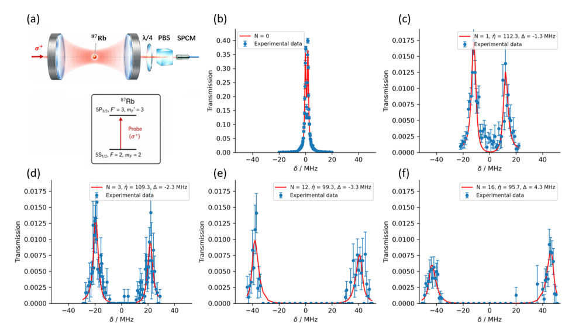
<figcaption class="paper-figure-caption"><b>Fig 3.</b> FIG. 3. Atom-cavity transmission spectra. (a) Atomic transition used in the spectroscopy, 5S1/2|F = 2, mF = 2⟩→5P3/2|F ′ = 3, mF ′ = 3⟩of 87Rb. (b) Empty-cavity transmission spectrum. Here δ = ω −ωc is the frequency difference between the probe light ω and the cavity resonance ωc, and ∆= ωa −ωc is the atom-cavity detuning. The observed doublet arises from the fact that the two nearly orthogonal cavity polarization eigenmodes have slightly different resonance frequencies. (c)(d)(e)(f) Spectra for N=1,3,12,16 trapped atoms prepared at different tweezer sites inside the cavity mode; the similar line shapes indicate nearly uniform coupling for atoms positioned in the central region of the array....</figcaption>
</figure>

**Summary.** The research reports the creation of an integrated platform combining neutral-atom arrays with an ultra-high-cooperativity optical cavity. By developing advanced mirror fabrication techniques, they achieved a high cooperativity regime while retaining large mode volume and the ability to trap many individual atoms. This opens pathways for complex quantum state manipulation in solid-state or chip-scale quantum simulators.

**Why it may be interesting.** This work directly addresses a major engineering hurdle in quantum simulation: building scalable platforms that maintain strong light-matter interaction necessary for complex quantum protocols like entanglement generation or readout.

Detailed structure

**Main problem.** The challenge is integrating neutral-atom arrays, which provide scalable qubit architectures, with high-cooperativity optical cavities for strong light-matter coupling into a single platform.

**Main result.** The authors successfully realized an integrated system achieving high cooperativity ($\eta_{	ext{cav}} = 125 \pm 13$) while maintaining large mode volume and the ability to couple up to 16 individually trapped atoms.

**Method.** They employed a two-step mirror fabrication method (mechanical shaping + CO2 laser polishing) to create high-quality, concave fused-silica mirrors for the cavity. Atom coupling was verified by measuring transmission spectra as a function of the number of trapped atoms.

**Model / system.** The platform consists of an atomic array coupled to a millimeter-scale Fabry-Pérot optical cavity. Atoms are trapped in an intracavity lattice, allowing controlled interaction with the cavity mode.

**Key observables.** Single-atom cooperativity ($\eta_{	ext{cav}}$), effective spectroscopic cooperativity ($\eta_{	ext{spec}}$), and cavity transmission spectra as a function of coupled atoms ($N$).

**Important parameters / regimes.** High cooperativity regime ($\eta_{	ext{cav}} = 125 \pm 13$); millimeter-scale cavity length; sub-2 Å mirror roughness.

**Assumptions / limitations.** The primary comparison is between the ideal single-atom cooperativity ($\eta_{	ext{cav}}$) and the measured in-situ value ($\eta_{	ext{spec}}$), with discrepancies attributed to atomic positioning errors or finite temperature effects.

**Figures summary.** Figure 2 characterizes the cavity resonance (high finesse, specific linewidth $\kappa$). Figure 3 shows the atom-cavity transmission spectra, demonstrating the collective response as more atoms are added.

**Paper structure.** The paper first identifies the technical challenge of combining large mode volume for arrays with high cooperativity. It then details the advanced mirror fabrication technique enabling the cavity. Finally, it presents spectroscopic measurements confirming strong coupling and scalability up to 16 atoms.

Abstract

Neutral-atom array and cavity quantum electrodynamics offer complementary strengths for quantum science: scalable, reconfigurable qubit architectures and strong coherent light-matter coupling. Combining them in a single platform requires an optical cavity with simultaneously high cooperativity, sufficient mode volume to accommodate atom array, and ample side optical access for atom trapping, imaging, cooling, and rearrangement, a combination that is challenging to achieve. Here we realize an atomic array integrated with a millimeter-scale Fabry--Pérot cavity whose optically-characterized single-atom cooperativity reaches $η_{\mathrm{cav}}=125\pm13$. Atom-cavity transmission spectra of trapped atoms yield an effective spectroscopic cooperativity $η_{\mathrm{spec}}=112.3\pm3.3$, providing an in-situ verification of strong coupling in the integrated platform, and we demonstrate simultaneous coupling of up to 16 individually trapped atoms to the antinode of the cavity mode. The key technical advance is a two-step mirror-fabrication method combining precision mechanical shaping and carbon-dioxide laser polishing, which produces concave fused-silica mirrors with sub-millimeter radii of curvature and residual roughness below 2 Å. Our results establish a regime of cavity-integrated atomic array that simultaneously provides high cooperativity, large mode volume, and flexible manipulation of individual atoms, opening opportunities for cavity-assisted quantum state readout and long-range entanglement-engineering in atom-array platforms.

[↑ back to top](#top)

### [Infrared Divergences as Itinerant Vacua](http://arxiv.org/abs/2607.04115v1)

**Authors:** Masahiro Morikawa  
**Type:** theory · **Category:** statistical mechanics · **PDF:** <https://arxiv.org/pdf/2607.04115v1>  
**Analysis basis:** full PDF text, analyzed in chunks
**Topic relevance:** 🔥 `Keldysh / 2PI / non-Gaussian methods` **4/5** · `correlated / nonlocal dissipation` **3/5** · `driven-dissipative phase transition` **3/5** · `methods for driven-dissipative` **3/5** · `non-equilibrium dynamics` **3/5** · `non-equilibrium universality` **2/5**

↔ Scroll figures horizontally

<figure class="paper-figure-card">

<figcaption class="paper-figure-caption"><b>Fig 1.</b> Low-resolution page preview, page 2</figcaption>
</figure>
<figure class="paper-figure-card">

<figcaption class="paper-figure-caption"><b>Fig 2.</b> Low-resolution page preview, page 3</figcaption>
</figure>
<figure class="paper-figure-card">
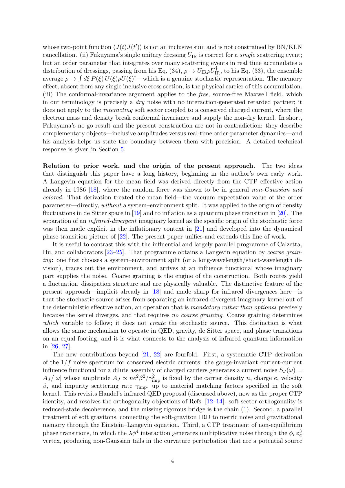
<figcaption class="paper-figure-caption"><b>Fig 3.</b> Low-resolution page preview, page 4</figcaption>
</figure>
<figure class="paper-figure-card">
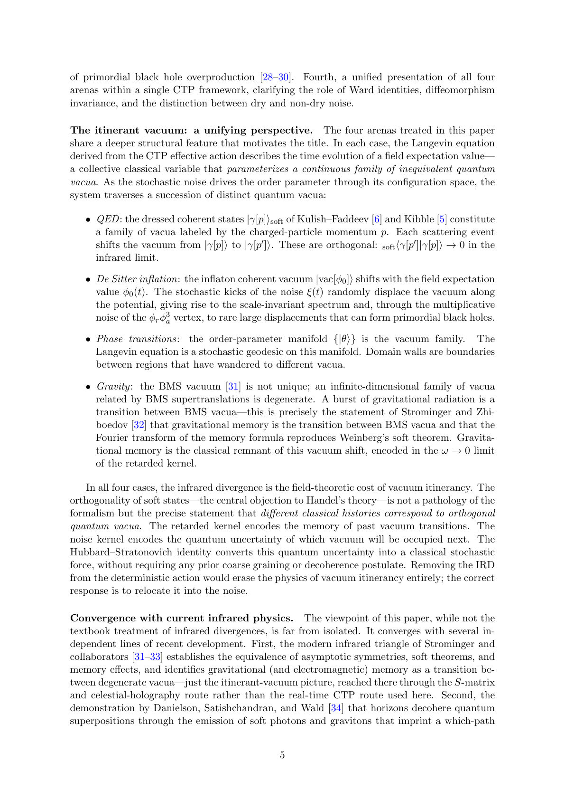
<figcaption class="paper-figure-caption"><b>Fig 4.</b> Low-resolution page preview, page 5</figcaption>
</figure>
<figure class="paper-figure-card">
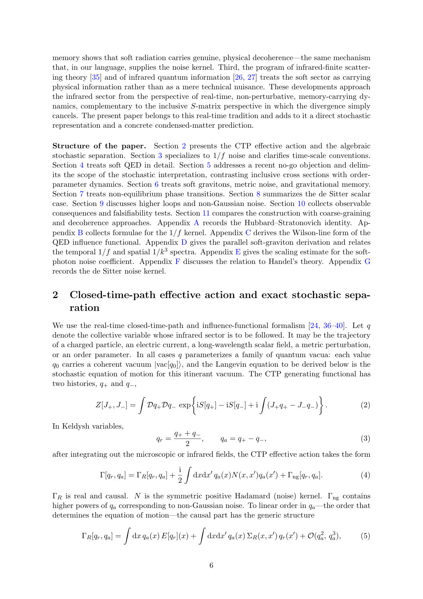
<figcaption class="paper-figure-caption"><b>Fig 5.</b> Low-resolution page preview, page 6</figcaption>
</figure>

**Summary.** This paper reinterprets infrared divergences not as calculation errors but as physical signatures of an 'itinerant vacuum' undergoing continuous transitions. By employing the closed-time-path effective action, it rigorously derives how these divergences generate observable classical stochastic noise sources. This unified framework successfully explains $1/f$ noise and memory effects across soft QED, cosmology, and general non-equilibrium physics.

**Why it may be interesting.** It provides a powerful, unified mathematical tool—the stochastic source derived from IR divergences in the CTP formalism—to model complex, open quantum system dynamics without resorting to standard environment splitting assumptions common in AMO physics.

Detailed structure

**Main problem.** The paper develops a constructive viewpoint for Infrared Divergences (IRDs), treating them not as pathologies to be removed, but as signatures of an "itinerant vacuum." This framework aims to unify the origin of various noise sources in non-equilibrium quantum systems.

**Main result.** IRDs are shown to manifest as a classical stochastic source term within the real-time effective action, unifying phenomena like $1/f$ current noise, primordial power spectra, and gravitational memory under one mechanism.

**Method.** The core method involves an exact separation in the closed-time-path (CTP) effective action, converting the imaginary part of the influence functional into a classical stochastic source via a Hubbard–Stratonovich identity.

**Model / system.** The theory is applied to several physical arenas: soft QED, scalar fields evolving in de Sitter space, soft gravitons, and general non-equilibrium phase transitions where a classical order parameter evolves through inequivalent quantum vacua.

**Key observables.** $1/f$ noise spectrum (e.g., $S_J(\omega) \propto 1/|\omega|$), gravitational memory effects, and non-Gaussian fluctuations in order parameters.

**Important parameters / regimes.** The infrared cutoff ($\omega_{	ext{IR}}$) is central; the analysis relies on the structure of the retarded kernel (memory) versus the noise kernel (uncertainty).

**Assumptions / limitations.** The approach requires no prior coarse graining or decoherence assumption, deriving stochasticity directly from the CTP effective action's imaginary part.

**Paper structure.** The paper builds by first establishing the general formalism using the CTP effective action to generate Langevin equations. It then applies this framework systematically to soft QED (soft photons), soft gravitons, and non-equilibrium transitions, demonstrating consistency across these disparate physical systems.

Abstract

Infrared divergences (IRDs) are usually treated as pathologies to be cancelled, regularized, or hidden in dressed asymptotic states. This paper develops a complementary and constructive viewpoint: an IRD is the signature of an \emph{itinerant vacuum} -- a quantum vacuum that wanders continuously through a family of inequivalent states as a classical order parameter evolves. Each value of the order parameter carries its own coherent vacuum, so moving the order parameter means traversing a succession of orthogonal vacua. The IRD is the field-theoretic cost of this wandering, and the $1/f$ noise, gravitational memory, and non-Gaussian fluctuations that emerge from it are its observable classical remnants.   The technical core is an exact separation in the real-time closed-time-path (CTP) effective action. The infrared-divergent imaginary part of the influence functional must not be left as a divergent coefficient in a deterministic equation of motion; it is instead converted, by a Hubbard--Stratonovich identity, into a classical stochastic source. This step is an algebraic identity of the generating functional and requires no prior coarse graining or decoherence assumption: the retarded kernel encodes the memory of past vacuum transitions, while the noise kernel encodes the quantum uncertainty of the next one. We apply this construction to four parallel arenas -- soft QED, scalar fields in de Sitter space, soft gravitons, and non-equilibrium phase transitions -- and show that the same itinerant-vacuum mechanism underlies $1/f$ current noise, the primordial power spectrum, gravitational memory, and order-parameter dynamics. A geometric formulation in terms of a Hilbert-space bundle over the vacuum manifold is outlined as an outlook.

[↑ back to top](#top)

### [Nucleation and time-reversal symmetry breaking in nonconserved scalar field theories](http://arxiv.org/abs/2607.05194v1)

**Authors:** Noah Ziethen, Michalis Chatzittofi, Michael E. Cates, Cesare Nardini  
**Type:** theory · **Category:** statistical mechanics · **PDF:** <https://arxiv.org/pdf/2607.05194v1>  
**Analysis basis:** full PDF text, analyzed in chunks
**Topic relevance:** 🔥 `non-equilibrium dynamics` **4/5** · `driven-dissipative phase transition` **3/5** · `methods for driven-dissipative` **3/5** · `non-equilibrium universality` **3/5** · `correlated / nonlocal dissipation` **2/5** · `Frenkel-Kontorova` **1/5** · `Keldysh / 2PI / non-Gaussian methods` **1/5** · `analog quantum simulation` **1/5**

↔ Scroll figures horizontally

<figure class="paper-figure-card">

<figcaption class="paper-figure-caption"><b>Fig 1.</b> FIG. 1. (a) Nucleation of a two-dimensional spherical droplet; after reaching the critical radius, the ϕ2 phase invades the re- mainder by a deterministic relaxation. (b) Shape of the den- sity profile as a function of the radial coordinate (coloured lines) while the black solid lines correspond to the determin- istic (T = 0) φ(r) profiles. (c) Plot of I(y) defined in Eq. (5); The root I(R) = 0 defines the radius R of the droplet.</figcaption>
</figure>
<figure class="paper-figure-card">
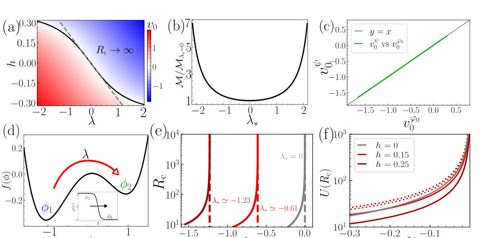
<figcaption class="paper-figure-caption"><b>Fig 2.</b> FIG. 2. (a) The velocity of one-dimensional interface (v0) as a function of h, λ obtained from numerical integration of AMA via a pseudo-spectral method. For the simulations the number of points for space discretization is Nx = 1024, domain length L = 16π and dt = 10−3. The grey line corresponds to the perturbative result h = −4λ/15 for h, λ ≪1 [see Eq. (51)]. The solid black line is where the interface is static. (b) The normalized mobility of the interface along the static line in (a). (c) Numerical comparison of vψ 0 and vφ0 0 for h = 0.25, found via a pseudo-spectral method. (d) Example plot of the potential f(ϕ) for h = 0.1. At large enough λ, stability is reversed so that the globally...</figcaption>
</figure>
<figure class="paper-figure-card">
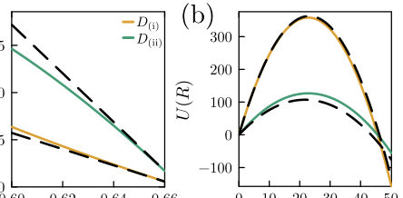
<figcaption class="paper-figure-caption"><b>Fig 3.</b> FIG. 3. Mobility (a) and quasi-potential (b) for the popula- tion dynamics model variants. The colored lines correspond to the solutions from the full profile φ0 (from evaluating nu- merically Eq. (14) in panel (a) and Eq. (15) in panel (b)) and the dashed lines from perturbation theory in small s−2/3. To obtain the continuum lines, the profile φ0 was found by nu- merically solving Eq. (63) with a simple explicit Euler scheme for T = 0. The quasi-potentials are evaluated for s = 0.65 and we considered D0 = 10−3 throughout.</figcaption>
</figure>
<figure class="paper-figure-card">

<figcaption class="paper-figure-caption"><b>Fig 4.</b> FIG. 4. Minimum action path for Active Model A (top row) and Population dynamics model with D = D(i)(ϕ)(bottom row) from a Ritz method based on [77]. (a, d) Lagrangian L(t) along the minimum action path. The red dots mark the saddles, where L(t) first vanishes. (b, e) Absolute value of the radially weighted drift ||µ|| (see Eq. 77) along the minimal action path, where the zero drift corresponds to the saddle. (c, f) Radial order parameter field φ(r) along minimal action path. The red lines correspond to the respective saddles where the drift vanishes. The vertical lines correspond to the extracted critical radii Rc. Parameters for AMA are λ = −1.033, h = 0.2 and for the population dynamics...</figcaption>
</figure>
<figure class="paper-figure-card">

<figcaption class="paper-figure-caption"><b>Fig 5.</b> FIG. 5. (a)-(b) Quasipotential barrier heights and critical radii obtained by numerical action minimization for AMA (dots) and the corresponding NNT prediction (solid line). The dashed line shows the prediction from the TRR ansatz. Data is shown for fixed h = 0.2 and varying λ = λ∗(h) + δλ where λ∗(0.2) = −0.8768. (c)-(d) Results on population dy- namics, the solid line shows our NNT predictions, and the red squares are the results from the numerical minimization. Re- sults for the equilibrium case, D(ϕ) = 1, and for D = D(i)(ϕ), are both shown. Numerical parameters as in Fig. 4 and D0 = 10−2.</figcaption>
</figure>

**Summary.** This paper develops Nonequilibrium Nucleation Theory (NNT) to describe phase transitions in complex, non-equilibrium systems like active matter. It rigorously derives the dynamics by projecting stochastic field equations onto a reaction coordinate, showing that standard assumptions about time-reversal symmetry fail. NNT provides a systematic framework for calculating nucleation barriers in systems far from equilibrium.

**Why it may be interesting.** While focused on classical statistical mechanics, the rigorous development of NNT for non-equilibrium systems provides powerful mathematical tools applicable to open quantum systems where detailed balance might be broken (e.g., driven quantum baths or dissipative quantum computing environments).

Detailed structure

**Main problem.** The work provides a full, rigorous account of Nonequilibrium Nucleation Theory (NNT), generalizing classical nucleation theory to non-equilibrium field theories where the order parameter is not conserved.

**Main result.** NNT yields a quasipotential barrier that differs from predictions based on assuming time-reversal symmetry in the instanton path. The stochastic route and self-consistent action minimization both successfully reproduce these results for active matter and population dynamics models.

**Method.** The authors employ two equivalent theoretical derivations: projecting the full stochastic field equation onto a radial reaction coordinate (stochastic route) and minimizing the Freidlin-Wentzell action while carefully avoiding assumptions of time-reversal symmetry.

**Model / system.** The theory applies to nonconserved scalar field theories governed by a Langevin equation, modeling phase transitions like fluid demixing or crystallization. Explicit examples include an active generalization of Model A and various population dynamics models.

**Key observables.** Nucleation rate, quasipotential barrier height U(R), critical radius R_c, and the interfacial density profile.

**Important parameters / regimes.** The noise coefficient D(phi) and the deterministic drift function mu[phi] characterize the non-equilibrium nature of the system. The theory is particularly useful in the limit of large critical radius.

**Assumptions / limitations.** The primary assumption addressed is that standard methods relying on time-reversal symmetry (TRR ansatz) fail for non-equilibrium systems; NNT provides a systematic framework to bypass this limitation.

**Figures summary.** Figure 1 illustrates the nucleation process, showing droplet formation, density profiles across the interface, and the definition of the reaction coordinate root R where an integral I(y) vanishes.

**Paper structure.** The paper first contrasts NNT with CNT, then presents two derivations for the dynamics ($\dot{R}$): a stochastic projection and an action minimization. It highlights the discrepancy between these methods when TRR is assumed versus when it is not, validating the correct approach on active matter and population models.

Abstract

Classical nucleation theory (CNT) describes the formation of a stable phase from a metastable one in terms of a single reaction coordinate that corresponds to the radius of a nucleating droplet. In this work, we provide a full account of nonequilibrium nucleation theory (NNT), which generalizes CNT to non-equilibrium field theories with non-conserved order parameter. We present two equivalent derivations of the dynamics of the droplet radius: a stochastic route, based on a direct projection of the stochastic field equation onto the radial reaction coordinate, and a route based on the minimization of the Freidlin-Wentzell action. Crucially, the quasipotential barrier predicted by NNT differs from the one found when assuming the instanton to be the time-reversal of the relaxation dynamics. Whereas the interfacial density profile differs from that on the relaxation path, an analytical derivation of NNT remains possible using a careful definition of the reaction coordinate. This leverages the perturbative structure that (in common with CNT) emerges in the limit of large critical radius. We further derive with similar techniques the dynamics of capillary waves, whose stability is required for the CNT/NNT precept of a near-spherical droplet to prevail. After deriving our theory for generic non-conserved field-theories, we address two explicit examples: a non-equilibrium generalization of Model A (Active Model A), and a population dynamics model (with two choices of noise that each break time-reversal symmetry). In both cases, we validate our analytical NNT against numerical results obtained by action minimization, with excellent agreement. NNT provide a systematic framework for constructing nucleation theories in a broad class of non-equilibrium systems from active matter, reaction-diffusion systems and population dynamics.

[↑ back to top](#top)

### [A Path-Superposition Framework for Quantum Gate Teleportation](http://arxiv.org/abs/2607.04672v1)

**Authors:** Santiago Ávila, Marco Enríquez  
**Type:** both · **Category:** quantum information and computing · **PDF:** <https://arxiv.org/pdf/2607.04672v1>  
**Analysis basis:** full PDF text, analyzed in chunks
**Topic relevance:** 🔥 `quantum optics experiment` **4/5** · `QC/QI experiment` **3/5** · `interference shaping light` **3/5** · `entanglement & information structure` **2/5** · `quantum measurements` **2/5** · `analog quantum simulation` **1/5** · `correlated cavity matter` **1/5** · `non-equilibrium dynamics` **1/5**

↔ Scroll figures horizontally

<figure class="paper-figure-card">

<figcaption class="paper-figure-caption"><b>Fig 1.</b> FIG. 1. Schematic diagram depicting distribution of qubits and the corresponding coherently controlled operations be- tween Alice and Bob. Both parties possess one local qubit, |ψA⟩and |ψB⟩(blue and orange), and one entangled resource |ψab⟩. The measurement of this control resource mediates the superposition of paths, causing |ψA⟩(|ψB⟩) to undergo the transformation VA1 (VB1) or VA2 (VB2).</figcaption>
</figure>
<figure class="paper-figure-card">

<figcaption class="paper-figure-caption"><b>Fig 2.</b> FIG. 2. Schematic representation of the full teleportation protocol. Coherent control is illustrated by showing the two possible orderings that |ψA⟩and (|ψB⟩) undergo, mediated by the entangled control pair (gray wires). This generates a superposition of paths, depicted by the dashed blue and orange wires. A Hadamard gate is then applied to each control qubit, transforming the initial control superposition of |00⟩and |11⟩to |00⟩, |11⟩, |10⟩, and |01⟩, represented by the gray wires mediating the superpositions in the control-state. A measurement of the control qubit collapses the system onto one of the two Alice and Bob subsystems, allowing them to perform the appropriate correction. The...</figcaption>
</figure>
<figure class="paper-figure-card">
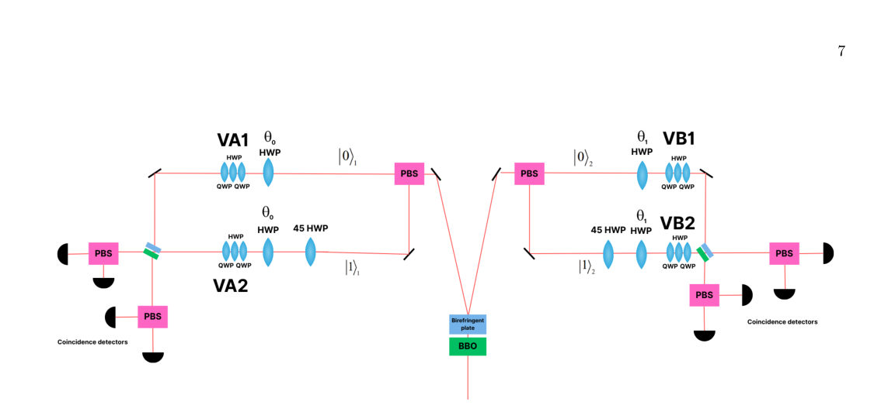
<figcaption class="paper-figure-caption"><b>Fig 3.</b> FIG. 3. Proof-of-concept photonic realization of the proposed framework. A BBO-based SPDC source generates a polarization- entangled photon pair [30], PBSs map polarization into spatial path modes, and 45◦HWPs transfer the entanglement to the path DOF [4]. A HWP at angle (θ) then prepares each polarization qubit in an arbitrary linear-polarization state. Additional HWP and QWP sequences implement path-dependent polarization operations that can perform any SU(2) unitary transformation [31], therefore able to apply the V set gates. Recombination of the two spatial paths using a 50/50 beam splitter results in Hadamard like operations [26], replicating equation (6). The resulting coincidence...</figcaption>
</figure>

**Summary.** This paper introduces a general framework utilizing 'path superposition' to deterministically teleport arbitrary quantum gates, demonstrating its applicability to CNOT and CZ gates. It establishes necessary design conditions based on resource phases and local unitaries. The work culminates in outlining a proof-of-concept photonic realization using spatial paths and polarization degrees of freedom.

**Why it may be interesting.** The use of path superposition as an alternative physical resource for quantum information processing is highly relevant. The connection between abstract design conditions and concrete optical implementations (like Mach-Zehnder interferometers) provides valuable insight into building scalable quantum hardware.

Detailed structure

**Main problem.** The goal is to develop a general, systematic framework for achieving deterministic quantum gate teleportation across distant parties without physically moving the qubits.

**Main result.** The authors establish that path superposition serves as a versatile resource, allowing CNOT and CZ gates (and potentially others) to be deterministically teleported using a common protocol architecture.

**Method.** The framework relies on selecting specific phases ($\eta$) for a pre-shared entangled resource and designing local unitary operators ($V_{A}, V_{B}$) that satisfy three derived design conditions.

**Model / system.** The model is abstractly defined by the path superposition resource, but a concrete proof-of-concept realization uses photonic systems where polarization encodes qubits and spatial paths encode entanglement control.

**Key observables.** Coincidence measurement outcomes ($\pm\pm$ or $\pm\mp$) are used to determine which local correction operations must be applied to reconstruct the target gate.

**Important parameters / regimes.** The relative phase $\eta$ of the entangled resource is a key parameter, and the design conditions constrain the choice of local unitaries.

**Assumptions / limitations.** The framework assumes the existence of suitable local unitary operators satisfying the derived design conditions; the photonic realization is presented as a proof-of-concept under ideal conditions.

**Figures summary.** Figure 1 shows the general qubit distribution and controlled operations. Figure 2 illustrates the full teleportation protocol using path superposition paths, Hadamard gates, measurement collapse, and correction paths. Figure 3 details the photonic implementation: SPDC source $
ightarrow$ PBSs mapping polarization to paths $
ightarrow$ Local unitaries $
ightarrow$ Recombination.

**Paper structure.** The paper first introduces the general framework and design conditions for deterministic teleportation using path superposition. It then applies this framework to construct specific protocols for CNOT and CZ gates, followed by a detailed description of a proof-of-concept photonic realization utilizing spatial paths and polarization degrees of freedom.

Abstract

Quantum gate teleportation enables distant parties to implement nonlocal quantum operations without physically transferring the participating qubits, making it a promising primitive for distributed quantum computing. We introduce a general framework for deterministic quantum gate teleportation based on path superposition, in which the target nonlocal operation is specified through the phase of a preshared maximally entangled resource and a suitable family of path-dependent local unitary operators. The framework establishes general design conditions that guarantee deterministic teleportation after measurement of the control qubits and the application of local correction operations. As representative realizations, we construct teleportation protocols for controlled-NOT (CNOT) and controlled-Z (CZ) gates, demonstrating that different nonlocal operations can be implemented within the same protocol architecture through appropriate choices of the design parameters. We further outline a proof-of-concept photonic realization based on spatial-path and polarization degrees of freedom. The proposed framework identifies path superposition as a versatile resource for quantum gate teleportation and distributed quantum information processing.

[↑ back to top](#top)

### [Hidden Gauge Freedom in Complex-Pole Hierarchical Equations of Motion](http://arxiv.org/abs/2607.04834v1)

**Authors:** Tianchu Li, Andrés Montoya-Castillo  
**Type:** theory · **Category:** other · **PDF:** <https://arxiv.org/pdf/2607.04834v1>  
**Analysis basis:** full PDF text, analyzed in chunks
**Topic relevance:** 🔥 `methods for driven-dissipative` **4/5** · `Keldysh / 2PI / non-Gaussian methods` **3/5** · `correlated / nonlocal dissipation` **2/5** · `driven-dissipative phase transition` **2/5** · `non-equilibrium dynamics` **2/5** · `Kondo & dissipative impurity` **1/5** · `analog quantum simulation` **1/5** · `correlated cavity matter` **1/5** · `non-equilibrium universality` **1/5**

↔ Scroll figures horizontally

<figure class="paper-figure-card">

<figcaption class="paper-figure-caption"><b>Fig 1.</b> FIG. 1. Schematic derivation of the GO–HEOM and the two major instability mechanisms in complex-pole HEOM.</figcaption>
</figure>
<figure class="paper-figure-card">
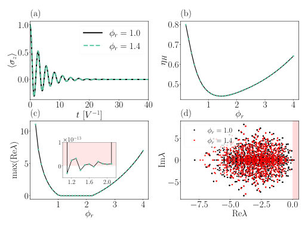
<figcaption class="paper-figure-caption"><b>Fig 2.</b> FIG. 2. (a) ⟨σz(t)⟩under an intermediate coupled BO spec- tral density (p0 = 1.0) for conventional complex pole HEOM (ϕr = 1.0) and GO–HEOM (ϕr = 1.4). In the strong-coupling regime of the BO spectral density (p0 = 3.0). (b) Henrici departure from normality as a function of the gauge-scaling parameter ϕr. (c) Maximum real part of the eigenvalue spec- trum as a function of ϕr. (d) Eigenspectra for ϕr = 1.0 and ϕr = 1.4.</figcaption>
</figure>
<figure class="paper-figure-card">

<figcaption class="paper-figure-caption"><b>Fig 3.</b> FIG. 3. ⟨σz(t)⟩with strong coupling to a BO (p0 = 10.0) obtained with conventional complex-pole HEOM (ϕr = 1.0) and gauge-transformed HEOM (ϕr = 2.1).</figcaption>
</figure>
<figure class="paper-figure-card">

<figcaption class="paper-figure-caption"><b>Fig 4.</b> FIG. 4. Spin-boson dynamics with a sub-Ohmic spectral den- sity at zero temperature. (a) ⟨σz(t)⟩as a function of cou- pling strength, α. (b) Error accretion in conventional HEOM (ϕr = 1.0) compared to our GO-HEOM (ϕr = 1.3) under strong coupling (α = 0.2).</figcaption>
</figure>

**Summary.** The paper reveals a hidden gauge freedom within the complex-pole HEOM used for open quantum systems. By optimizing this gauge parameter, they introduce GO-HEOM, a numerically stable variant of the simulation technique. This advancement allows researchers to accurately model dynamics in strongly coupled or highly non-Markovian environments previously unreachable by standard methods.

**Why it may be interesting.** This work provides a powerful, general methodological tool (GO-HEOM) for simulating complex open quantum dynamics that was previously computationally inaccessible due to numerical instability, directly impacting research in quantum optics and molecular physics.

Detailed structure

**Main problem.** The primary challenge addressed is the numerical instability inherent in complex-pole Hierarchical Equations of Motion (HEOM) when simulating open quantum systems.

**Main result.** The authors discovered a continuous, previously unknown gauge freedom within the HEOM formulation, allowing for the development of GO-HEOM which stabilizes simulations in strongly coupled and highly non-Markovian regimes.

**Method.** They derive this gauge freedom by reformulating the Liouvillian structure and optimizing a gauge parameter ($\phi$) to minimize numerical artifacts like spectral divergence and non-normal error amplification.

**Model / system.** The work focuses on open quantum systems, using the spin-boson model as a primary benchmark. The dynamics are governed by the HEOM derived from the bath correlation function.

**Key observables.** Population difference $\langle\sigma_z(t)
angle$, non-normality ($\eta_H$), and the eigenvalue spectrum of the hierarchy generator.

**Important parameters / regimes.** Coupling strengths ($p_0$ or $\alpha$), spectral density type (e.g., sub-Ohmic $\alpha=0.2$ to $0.02$), and the gauge parameter ($\phi_r$).

**Assumptions / limitations.** The gauge transformation is shown to be independent of the specific bath-correlation decomposition scheme, suggesting general applicability.

**Figures summary.** Figures compare dynamics ($\langle\sigma_z(t)
angle$) across different gauge parameters ($\phi_r$), demonstrating that GO-HEOM stabilizes simulations where conventional HEOM diverges. Other figures illustrate spectral analysis and convergence checks.

**Paper structure.** The paper first identifies the instability in standard complex-pole HEOM, then derives the continuous gauge freedom ($\phi$). It introduces GO-HEOM by optimizing $\phi$ to stabilize dynamics, demonstrating its success across various coupling regimes and finally relating the method to a generalized Quantum Fokker-Planck Equation.

Abstract

While complex-pole hierarchical equations of motion (HEOM) have dramatically expanded the reach of numerically exact quantum dynamics simulations of open quantum systems, they suffer from numerical instabilities rooted in the non-Hermitian structure of their Liouvillian. Yet, the origin of this structure remains obscure. Here, we report a previously unknown gauge freedom in complex-pole HEOM: a continuous family of analytically equivalent Liouvillians, all encoding the same bath correlation function, whose numerical properties vary dramatically. This gauge controls both the eigenspectrum and non-normality of the hierarchy generator, revealing spectral divergence and non-normal error amplification as two distinct instability mechanisms. By optimizing this gauge, we introduce GO--HEOM, which eliminates divergences in strongly coupled Brownian oscillator environments and extends numerically exact simulations of sub-Ohmic dynamics -- including through the delocalized-to-localized quantum phase transition -- to previously inaccessible coupling strengths. Because this gauge transformation is independent of the bath-correlation decomposition scheme, our GO--HEOM becomes a general, broadly compatible strategy for accessing numerically exact quantum dynamics of open quantum systems over arbitrary coupling and highly non-Markovian regimes.

[↑ back to top](#top)

### [Orthogonality Edges in Strong-Coupling Quantum Work Statistics](http://arxiv.org/abs/2607.03950v1)

**Authors:** Atta ur Rahman, Muhammad Noman, S. M. Zangi, Saeed Haddadi  
**Type:** theory · **Category:** statistical mechanics · **PDF:** <https://arxiv.org/pdf/2607.03950v1>  
**Analysis basis:** full PDF text, analyzed in chunks
**Topic relevance:** 🔥 `non-equilibrium universality` **4/5** · `driven-dissipative phase transition` **3/5** · `methods for driven-dissipative` **3/5** · `non-equilibrium dynamics` **3/5** · `Kondo & dissipative impurity` **2/5** · `Keldysh / 2PI / non-Gaussian methods` **1/5** · `correlated / nonlocal dissipation` **1/5**

↔ Scroll figures horizontally

<figure class="paper-figure-card">
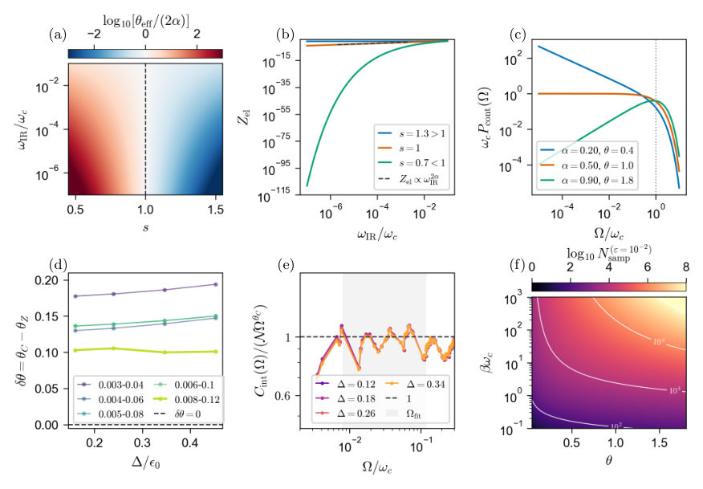
<figcaption class="paper-figure-caption"><b>Fig 1.</b> FIG. 1. Orthogonality edge and finite-energy crossover in quantum work statistics. (a) Running infrared exponent θeff = d ln Zel/d ln ωIR for the spectral density Js(ω) = αω1−s c ωse−ω/ωc. The color scale shows log10[θeff/(2α)], and the dashed vertical line marks the Ohmic boundary s = 1. The Ohmic bath is the marginal case between a finite elastic threshold line for s &gt; 1 and stronger infrared orthogonality for s &lt; 1. (b) Elastic threshold weight Zel as a function of the infrared cutoff ωIR/ωc. The super-Ohmic bath approaches a finite residue, the Ohmic bath shows algebraic extinction Zel ∝ω2α IR , and the sub-Ohmic bath is suppressed more rapidly. (c) Exact Ohmic continuum edge at the...</figcaption>
</figure>
<figure class="paper-figure-card">

<figcaption class="paper-figure-caption"><b>Fig 2.</b> FIG. 2. Finite-tunnelling crossover and edge-window spectral accounting. (a) Static Ohmic cloud benchmark for the same logarithmic discretization convention used in the finite-tunnelling calculation. The fitted exponent θcloud agrees with the target value 2α, anchoring the finite-bath normalization to the independent-boson fixed point. (b) Representative finite- tunnelling extraction at ∆/ϵ0 = 0.50. The elastic threshold weight is fitted as Zav el ∼ωθZ IR after geometric averaging over shifted logarithmic meshes, while the continuum weight is fitted as Cint(Ω) ∼ΩθC after interleaving the shifted spectra. The common horizontal variable ξ denotes ωIR for Zav el and Ωfor Cint. (c) Effective...</figcaption>
</figure>

**Summary.** The paper analyzes how strong coupling modifies quantum work statistics using the spin-boson model. It distinguishes between idealized fixed points (independent bosons) and realistic finite-tunneling regimes. The key finding is that finite tunneling causes a measurable separation in scaling exponents ($	heta_C > 	heta_Z$), which serves as a robust diagnostic for identifying crossovers away from static boundary limits.

**Why it may be interesting.** This work provides quantitative diagnostic tools for probing the nature of quantum phase transitions and boundary conditions in open quantum systems by analyzing non-equilibrium work statistics, highly relevant to quantum thermodynamics.

Detailed structure

**Main problem.** The study investigates how strong coupling to an infrared singular reservoir alters quantum work statistics, potentially transforming a simple quasiparticle threshold line into a complex many-body edge.

**Main result.** Finite tunneling effects cause a measurable separation ($	heta_C > 	heta_Z$) between the continuum exponent and the elastic overlap exponent, indicating a finite-energy crossover away from the static boundary fixed point.

**Method.** The authors use exact diagonalization on logarithmically discretized baths in a displaced oscillator basis to calculate work distributions and extract scaling exponents via specialized averaging and interleaving techniques.

**Model / system.** The system is modeled by the biased spin-boson model coupled to an Ohmic or super-Ohmic reservoir. The analysis focuses on the quantum work distribution $P(W)$ following a sudden bias inversion protocol.

**Key observables.** Zero-temperature inclusive work distribution $P(W)$, elastic overlap weight ($Z_{el}$), continuum probability exponent ($	heta_C$), and elastic overlap exponent ($	heta_Z$).

**Important parameters / regimes.** Reservoir spectral density exponent ($s$), infrared cutoff ($\omega_{IR}$), and the finite tunneling amplitude ($\Delta/\epsilon_0$).

**Assumptions / limitations.** The analysis relies on mapping the bath to a logarithmic discretization, treating the separation $	heta_C > 	heta_Z$ as a crossover signature rather than an asymptotic fixed point.

**Figures summary.** Figures illustrate the classification of work statistics based on reservoir type (independent-boson limit) and demonstrate the positive separation ($\delta	heta = 	heta_C - 	heta_Z > 0$) observed when finite tunneling is included, contrasting it with the zero separation at the static fixed point.

**Paper structure.** The paper first establishes the independent-boson fixed-point behavior based on reservoir type ($s>1$ vs $s=1$). It then extends this to finite tunneling by developing specialized diagnostics ($	heta_C$ from interleaved spectra, $	heta_Z$ from averaged overlaps) which reveal a positive separation $\delta	heta > 0$, interpreting this as a crossover effect.

Abstract

Strong coupling to a reservoir can do more than shift, broaden, or dress the work peaks of a driven quantum system. When the reservoir is infrared singular, a sudden change of a local control parameter can alter the boundary condition seen by infinitely many low-energy modes, converting a quasiparticle-like threshold line into a many-body edge. We demonstrate this mechanism for the inclusive work distribution of the biased spin-boson model under a sudden bias inversion. In the independent-boson limit, the problem is exactly solvable and gives a sharp infrared classification: a super-Ohmic bath can retain a finite elastic threshold weight, whereas Ohmic and sub-Ohmic baths extinguish the elastic line through boundary orthogonality. At the Ohmic fixed point, the same exponent controls both the vanishing elastic residue and the low-work continuum. We then ask how this edge is resolved away from the static-boundary limit. Using displaced-basis exact diagonalization of logarithmically discretized baths, we find that finite tunnelling leaves an edge-like continuum over the accessible energy window, while separating two operational diagnostics of the threshold: the cumulative-continuum exponent extracted from $z$-interleaved spectra lies above the elastic-overlap exponent extracted from $z$-averaged overlaps, $θ_C>θ_Z$. We interpret this separation as a finite-energy crossover away from the static-boundary fixed point, not as evidence for a new asymptotic fixed point. The separation survives fitting-window variation, oscillator-cutoff checks, spectrum-size checks, and leave-one-$z$-out tests, while time-domain characteristic functions provide a compatible but non-decisive diagnostic. Finally, the same threshold edge controls the sampling cost of Jarzynski-type exponential averages, making rare low-work events increasingly important at low temperature.

[↑ back to top](#top)

### [Chirped Floquet linear drives activate forbidden charge-to-spin conversions in Rashba two-dimensional electron gases](http://arxiv.org/abs/2607.04946v1)

**Authors:** Mohsen Yarmohammadi  
**Type:** theory · **Category:** other · **PDF:** <https://arxiv.org/pdf/2607.04946v1>  
**Analysis basis:** full PDF text, analyzed in chunks
**Topic relevance:** 🔥 `non-equilibrium dynamics` **4/5** · `exotic spin models in light-matter` **3/5** · `spintronics-quantum-optics interface` **3/5** · `methods for driven-dissipative` **2/5** · `non-equilibrium universality` **2/5** · `Keldysh / 2PI / non-Gaussian methods` **1/5** · `driven-dissipative phase transition` **1/5**

↔ Scroll figures horizontally

<figure class="paper-figure-card">
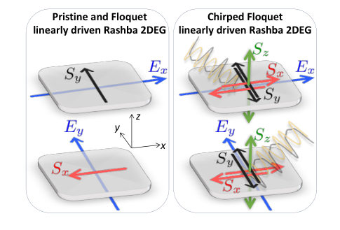
<figcaption class="paper-figure-caption"><b>Fig 1.</b> FIG. 1. Schematic of pristine and (chirped) Floquet linearly driven Rashba 2DEGs. In the pristine Rashba 2DEG or under linealry polarized Floquet light (left), continu- ous symmetries restrict the DC electric field (Ex, Ey)-induced spin Edelstein polarization Sx,y to be strictly orthogonal to the applied field. A chirped, linear drive (right), however, breaks the time-reversal and rotational symmetries of the sys- tem, which, in turn, lifts the native transport constraints, activating previously forbidden longitudinal and out-of-plane spin accumulations.</figcaption>
</figure>
<figure class="paper-figure-card">
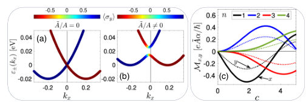
<figcaption class="paper-figure-caption"><b>Fig 2.</b> FIG. 2. Pristine and chirped Floquet quasi-energy bands, spin textures, and induced Floquet-Zeeman fields. (a, b) Pristine and chirped Floquet quasi-energy bands with transverse spin projection ⟨σy⟩(color scale) for the (a) pristine ( ˜A = 0) and (b) driven ( ˜A/A = 0.3) regimes, where the drive breaks time-reversal and rotational symme- tries to open an asymmetric gap at finite momentum (kx ̸= 0). (c) In-plane chirped Floquet-Zeeman fields Mx,y (in units of e ˜Aα/ℏ, where α is the Rashba coupling strength) as a func- tion of the phase chirp c, illustrating control over both field magnitude and sign.</figcaption>
</figure>
<figure class="paper-figure-card">

<figcaption class="paper-figure-caption"><b>Fig 3.</b> FIG. 4. Chirped Floquet-induced Edelstein suscepti- bilities as a function of Rashba coupling strength and polarization angle. (a–c) Evolution of the dynamically in- duced (a) longitudinal, (b) transverse, and (c) out-of-plane spin Edelstein susceptibilities versus the phase-chirp param- eter c for various RSOC strengths α ( ˜A/A = 1, n = 2, β = π/3). (d, e) Dependence of the induced (d) in-plane diag- onal and (e) out-of-plane susceptibilities on the polarization tilt angle β at c = 2 and n = 2, showing π-periodic and 2π- periodic behaviors, respectively. Parameters: ˜A/A = 0.3 and eA/ℏkF = 0.3.</figcaption>
</figure>
<figure class="paper-figure-card">

<figcaption class="paper-figure-caption"><b>Fig 4.</b> FIG. 3. Chirped Floquet-induced charge-to-spin con- version in Rashba 2DEGs. (a–c) Decomposition of the dynamically induced (a) longitudinal, (b) transverse, and (c) out-of-plane susceptibilities into intraband, interband, and to- tal contributions as a function of the drive amplitude ratio ˜A/A (c = 2, n = 2). The in-plane accumulations arise from intraband Fermi-surface displacements, whereas out-of-plane spin generation originates from interband quantum coherence. (d–i) Evolution of the induced total tensor components versus ˜A/A for (d, f, h) varying phase chirp c at fixed n = 2, and (e, g, i) varying harmonic orders n at fixed c = 2. Parameters: α = 0.1 eV Å, eA/ℏkF = 0.3, and β = π/3.</figcaption>
</figure>

**Summary.** The paper proposes using a chirped Floquet linear drive to overcome symmetry limitations that restrict spin-orbit coupling effects in Rashba 2DEGs. By inducing momentum drift and breaking time-reversal/rotational symmetries, this technique activates previously forbidden charge-to-spin conversion pathways. This offers an experimentally accessible route for advanced spintronic device control.

**Why it may be interesting.** This work provides a clean theoretical mechanism—using tailored optical driving fields—to engineer specific symmetries in condensed matter systems, which is highly relevant for controlling quantum transport and spintronic phenomena.

Detailed structure

**Main problem.** The research addresses how to activate forbidden charge-to-spin conversion pathways (Edelstein effect) in Rashba 2DEGs beyond the conventional transverse plane.

**Main result.** A chirped Floquet linear drive successfully breaks necessary symmetries ($\mathcal{T}$ and $C_{2z}$), enabling deterministic, tunable control over longitudinal and out-of-plane spin accumulations.

**Method.** The authors use Floquet theory to derive an effective Hamiltonian for the driven system, followed by calculating the spin Edelstein susceptibility tensor using the Kubo formula.

**Model / system.** The physical system is a Rashba two-dimensional electron gas (2DEG). The dynamics are governed by analyzing the time evolution under a chirped Floquet linear drive potential, leading to an effective Hamiltonian structure $	ext{Heff}(\mathbf{k})$.

**Key observables.** Spin Edelstein susceptibility tensor components ($\chi_{ij}$), spin polarization direction, and quasi-energy bands.

**Important parameters / regimes.** Chirp parameter ($c$), harmonic order ($n$), Rashba coupling strength ($\alpha$), and external driving frequency ($\omega$).

**Assumptions / limitations.** The analysis relies on a high-frequency Floquet expansion (valid for large $\omega$) and the use of the relaxation-time approximation for susceptibility calculations.

**Figures summary.** Figures compare spin Edelstein polarization under pristine vs. chirped drives, show quasi-energy band gaps opening at finite momentum, and illustrate the dependence on chirp parameter $c$ and polarization angle $eta$.

**Paper structure.** The paper first establishes the symmetry constraints in the pristine system; it then derives the effective Floquet Hamiltonian using time-averaging techniques involving Bessel functions; finally, it calculates the susceptibility tensor to demonstrate how symmetry breaking activates forbidden spin conversion channels.

Abstract

In Rashba two-dimensional electron gases (2DEGs), charge-to-spin conversion via the Edelstein effect is conventionally limited to the transverse plane. Accessing longitudinal or out-of-plane pathways typically requires static magnetic fields or interface engineering, which cause stray fields and lack tunability. While dynamic circular or elliptical Floquet drives can also unlock these forbidden pathways, a simple Floquet linear drive cannot. Here, we propose an alternative approach: a \textit{chirped} Floquet linear drive. The chirp induces in-plane Floquet-Zeeman fields and an odd-parity momentum drift, which simultaneously break rotational and time-reversal symmetries. This mechanism activates the forbidden Edelstein charge-to-spin conversions in Rashba 2DEGs. Experimentally accessible via programmable spatial light modulators or optical delay lines, this tunable chirped linear drive offers a broadly applicable route to spin-orbit torque switching and high-efficiency spintronics.

[↑ back to top](#top)

### [The Normalised Wigner Negativity Rate as a Second-Moment Probe of Infall in AdS$_3$](http://arxiv.org/abs/2607.04065v1)

**Authors:** Ritam Basu  
**Type:** theory · **Category:** statistical mechanics · **PDF:** <https://arxiv.org/pdf/2607.04065v1>  
**Analysis basis:** full PDF text, analyzed in chunks
**Topic relevance:** 🔥 `entanglement & information structure` **4/5** · 🔥 `non-equilibrium dynamics` **4/5** · `non-equilibrium universality` **3/5** · `Keldysh / 2PI / non-Gaussian methods` **1/5** · `analog quantum simulation` **1/5** · `correlated / nonlocal dissipation` **1/5** · `driven-dissipative phase transition` **1/5** · `methods for driven-dissipative` **1/5**

↔ Scroll figures horizontally

<figure class="paper-figure-card">
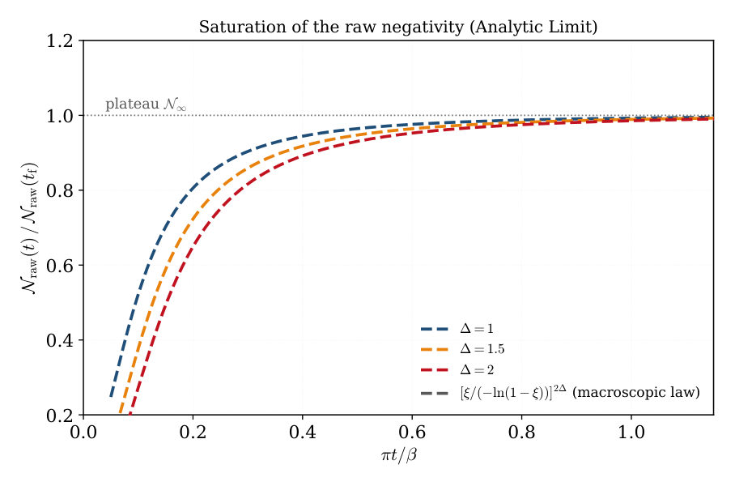
<figcaption class="paper-figure-caption"><b>Fig 1.</b> Figure 1. Saturation of the raw negativity (Analytic Limit). Time evolution of the macroscopic theoretical law [ξ/(−ln(1 −ξ))]2∆(dashed curves, eq. (4.12)) evaluated for ∆∈{1, 3/2, 2} with ε = 0.1 and β = 2π. The curves are normalized by their late-time saturation value, effectively setting the theoretical maximum to unity (dotted line). As t →∞(ξ →0), the geometric spreading mathematically cancels the return amplitude decay, causing the raw negativity to strictly saturate to the constant plateau N∞. This visualizes the asymptotic behavior described in Proposition 4.3 and demonstrates that the raw negativity is inherently bounded at late times, necessitating the seed-normalized diagnostic...</figcaption>
</figure>
<figure class="paper-figure-card">
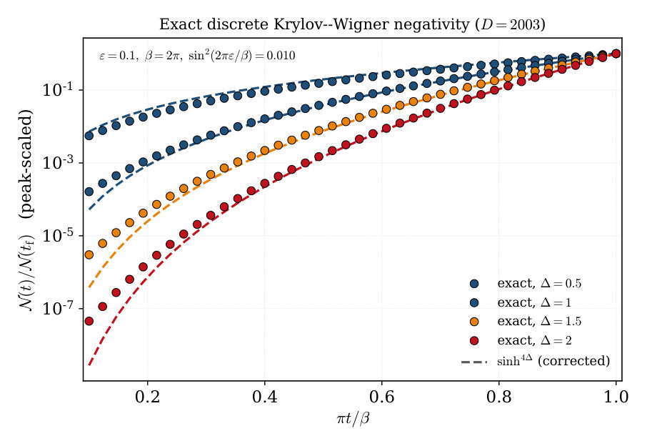
<figcaption class="paper-figure-caption"><b>Fig 2.</b> Figure 2. Growth of the seed-normalized negativity (log–log). The exact discrete seed- normalized negativity N = Nraw/P (markers), computed from the Wootters discrete Wigner function on the ZD ×ZD phase space of prime dimension D = 2003 (ε = 0.1, β = 2π), plotted against sinh(πt/β) on log–log axes and divided by its value at πt/β = 1 (common footing). On these axes the continuum law N ∼sinh4∆(4.10) is a straight line of slope 4∆(dashed); the exact markers follow it (fitted slopes 3.91, 5.79, 7.74 for ∆= 1, 3</figcaption>
</figure>
<figure class="paper-figure-card">

<figcaption class="paper-figure-caption"><b>Fig 3.</b> Figure 3. Exact growth of the Krylov wavepacket variance. Var( ˆNKrylov) versus πt/β from the negative-binomial formula (3.5) (solid) and its late-time sinh4 asymptotic (dashed), for sin2(2πε/β) = 0.01 at ∆= 1.</figcaption>
</figure>
<figure class="paper-figure-card">
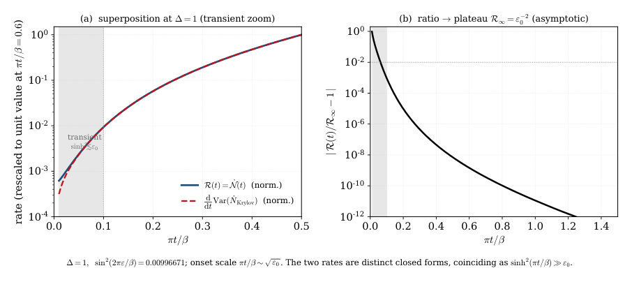
<figcaption class="paper-figure-caption"><b>Fig 4.</b> Figure 4. Superposition of R(t) and d Var/dt at ∆= 1. (a) The normalized negativity rate R = ˙N and the exact Krylov variance rate d dtVar( ˆNKrylov), each rescaled to unit value at the right edge, versus πt/β (log scale), zoomed to the transient/onset region for sin2(2πε/β) = 0.01. The grey band marks the transient sinh2(πt/β) ≲ε0, i.e. πt/β ≲√ε0, where the two rates differ; they coincide thereafter. The curves are built from different closed forms—R from the macroscopic-exact negativity N ∝[ln  1 + ε0/ sinh2(πt/β)  ]−2∆and d dtVar from the exact rate (5.1)—so their agreement is not a tautology. (b) Relative deviation of the ratio R/ d</figcaption>
</figure>
<figure class="paper-figure-card">

<figcaption class="paper-figure-caption"><b>Fig 5.</b> Figure 5. Diagnostic of the matching condition, with the asymptotics shown explicitly. The ratio R(t)  d</figcaption>
</figure>

**Summary.** This theoretical paper proposes using the rate of normalized Krylov-Wigner negativity as a sophisticated probe to measure wavepacket spreading in holographic CFT models dual to AdS$_3$. By linking this second-moment observable to the growth rate of the Krylov variance, the authors identify a special condition ($\Delta=1$) where the rate directly measures the tidal stretching experienced by infalling geodesics.

**Why it may be interesting.** The connection between quantum information measures (negativity) and geometric properties (tidal stretching rate) provides a powerful, non-standard diagnostic tool for understanding the emergence of classical spacetime from quantum field theory dynamics.

Detailed structure

**Main problem.** The research aims to develop a diagnostic tool, based on the rate of normalized Krylov-Wigner negativity, that probes the second moment (spreading) of quantum wavepackets during time evolution in holographic CFT setups.

**Main result.** The negative rate scales with the growth rate of the Krylov variance if and only if the system dimension $\Delta=1$, which corresponds to the special Breitenlohner-Freedman saturation dimension in AdS$_3$.

**Method.** The analysis combines techniques from quantum information (Wigner negativity), random matrix theory (Krylov chain/Lanczos algorithm), and holographic duality (AdS geometry).

**Model / system.** The system models the time evolution of a local operator quench in a 2D CFT, dual to an infalling particle dynamics in AdS$_3$. The dynamics are analyzed via the Krylov Hamiltonian structure realizing $\mathfrak{su}(1, 1)$ algebra.

**Key observables.** Normalized Krylov-Wigner Negativity Rate, Spread Complexity (first moment), Krylov Variance, and the Bessel function form of the distribution.

**Important parameters / regimes.** The dimension $\Delta$ (related to the Breitenlohner-Freedman dimension) and the time scale $t/eta$.

**Assumptions / limitations.** A key conjecture relates the string-size operator ($\hat{N}_{	ext{str}}$) to the boundary Krylov number operator ($\hat{N}_{	ext{Krylov}}$), which is stated as a heuristic, not a proof.

**Figures summary.** Not specified in the notes; the analysis relies on deriving closed forms for distributions (Negative Binomial) and asymptotic scaling laws involving $\sinh^4\Delta$.

**Paper structure.** The paper progresses from defining first-moment probes (Spread Complexity) to introducing the second-moment probe (Negativity Rate). It establishes the mathematical framework using $\mathfrak{su}(1, 1)$ algebra and then connects this formalism to physical observables in AdS$_3$ via matching conditions derived from string theory fluctuations.

Abstract

In spread complexity, the average position of an operator along its Krylov chain, recovers the right radial momentum of an infalling particle in AdS, yet it is a measure of the first moment, irrespective of the spread of the wavepacket away from its classical trajectory. The rate of a normalized Krylov-Wigner negativity can be proposed as a diagnostic of the second moment of the boundary state that captures this spreading. Starting with the \emph{seed-normalized} Krylov-Wigner distribution -- that is, the Wigner transform of the descendant cloud, with the decaying return amplitude divided out -- we obtain an analytic Bessel form in the macroscopic limit and compute its total negativity explicitly. Retaining the Bessel variable all the way through, we find that the negativity goes as $\sinh^{4Δ}(πt/β)$, while the raw, seed-normalized state negativity saturates, as dictated by the $O(\sqrt{D})$ bound. Using the exact negative binomial statistics of the Krylov chain and the momentum dictionary of Caputa et al.~\cite{Caputa:2024}, the rate of the negativity scales as the growth rate of the Krylov variance at late time asymptotics \emph{if and only if} $Δ=1$, the Breitenlohner-Freedman saturating dimension in $AdS_3$. This dimensionality is special in that the negativity rate is the product of the proper radial position and momentum, $\mathcal{R} \propto \mathcal{C} P_ρ$, i.e., the rate of the tidal stretch of nearby geodesic falling into the horizon. We comment on the direction for future research, in particular the interpretation of the transverse string size operator in terms of the Krylov number operator through the common $SU(1,1)$ discrete series.

[↑ back to top](#top)

### [The Reweighting Principle in Statistical Mechanics](http://arxiv.org/abs/2607.03867v1)

**Authors:** Salvatore Romano  
**Type:** theory · **Category:** statistical mechanics · **PDF:** <https://arxiv.org/pdf/2607.03867v1>  
**Analysis basis:** full PDF text, analyzed in chunks
**Topic relevance:** 🔥 `entanglement & information structure` **4/5** · `Keldysh / 2PI / non-Gaussian methods` **3/5** · `non-equilibrium dynamics` **2/5** · `non-equilibrium universality` **2/5** · `analog quantum simulation` **1/5** · `correlated / nonlocal dissipation` **1/5** · `correlated cavity matter` **1/5** · `driven-dissipative phase transition` **1/5** · `methods for driven-dissipative` **1/5**

↔ Scroll figures horizontally

<figure class="paper-figure-card">

<figcaption class="paper-figure-caption"><b>Fig 1.</b> Figure 1: Schematic illustration of soft and hard reweighting. Exponential tilting (orange) modifies the reference ensemble (blue) smoothly through an exponential weight, while conditioning (green) selects a finite-resolution macrostate associated with a prescribed value of the observable. These two operations provide the probabilistic prototype for canonical and microcanonical constructions, respectively.</figcaption>
</figure>

**Summary.** The paper unifies statistical mechanics by showing that both soft constraints (exponential tilting, leading to the canonical ensemble) and hard constraints (conditioning, leading to the microcanonical ensemble) are mathematically equivalent formulations derived from minimizing relative entropy. By enlarging the state space, it provides a single information-theoretic lens through which equilibrium thermodynamics can be understood.

**Why it may be interesting.** This work provides a deep information-theoretic underpinning for fundamental concepts like ensemble equivalence, which is crucial when modeling quantum systems where different approximations (e.g., mean-field vs. exact) might be used.

Detailed structure

**Main problem.** To develop a unified probabilistic framework connecting conditioning, exponential tilting, and ensemble transformations within statistical mechanics.

**Main result.** The paper shows that both canonical (soft constraint) and microcanonical (hard constraint) ensembles arise naturally as minimum relative entropy updates from a common structural prior. In the thermodynamic limit, these distinct descriptions become macroscopically equivalent.

**Method.** It employs information theory, specifically minimizing the Kullback–Leibler divergence (relative entropy), applied to an enlarged probability space where observables are explicit variables.

**Model / system.** The system is general statistical ensembles ($
ho$), modeled by constraining a reference measure $
ho_0$ via soft constraints (exponential tilting) or hard constraints (conditioning).

**Key observables.** Gibbs entropy, Boltzmann entropy, Relative Entropy, Free-energy potential, and the observable $A(x)$.

**Important parameters / regimes.** The tilting parameter ($\lambda$), the fixed constraint value ($ar{A}$), and the thermodynamic limit ($N 	o \infty$).

**Assumptions / limitations.** Conditioning is treated as a formal limit rather than a standard measure change, and ensemble equivalence is established only in the macroscopic (thermodynamic) limit.

**Figures summary.** Figure 1 schematically illustrates the smooth reshaping (orange) versus support restriction (green) of the reference ensemble; Table 1 summarizes soft vs. hard constraints and resulting ensembles.

**Paper structure.** The paper builds from defining reweighting principles, deriving both exponential tilting (canonical/Gibbs structure) and conditioning (microcanonical/Boltzmann structure) via minimum relative entropy, unifying them through an enlarged space construction, and finally demonstrating their macroscopic equivalence in the thermodynamic limit.

Abstract

Reweighting of probability measures provides a unifying perspective on conditioning, exponential tilting, and, more generally, ensemble transformations in statistical mechanics. We show that exponential tilting and conditioning arise as the minimum-relative-entropy updates associated with soft and hard constraints, respectively. Their relative entropies naturally inherit complementary thermodynamic structures: exponential tilting gives rise to the Legendre structure of the canonical ensemble and reduces to the Gibbs entropy for a uniform reference measure, while conditioning reduces to the Boltzmann entropy through the surprisal of the constrained macrostate. By introducing an enlarged probability space in which observables are treated as explicit variables, we further show that microcanonical and canonical ensembles arise as conditional and marginal distributions of a common structural prior after exponential reweighting. In the thermodynamic limit, described through large deviation theory, conditioning emerges from exponential tilting by concentration of measure, revealing ensemble equivalence as a consequence of entropy--bias competition. Finally, we outline how the same information-theoretic framework naturally extends to path space, suggesting a unified probabilistic description of equilibrium thermodynamics and conditioned stochastic dynamics.

[↑ back to top](#top)

### [Semi-Markovian switching in a fluctuating harmonic trap: An age-structured formulation](http://arxiv.org/abs/2607.05173v1)

**Authors:** Derek Frydel  
**Type:** theory · **Category:** statistical mechanics · **PDF:** <https://arxiv.org/pdf/2607.05173v1>  
**Analysis basis:** full PDF text, analyzed in chunks
**Topic relevance:** 🔥 `non-equilibrium dynamics` **4/5** · `driven-dissipative phase transition` **3/5** · `methods for driven-dissipative` **3/5** · `non-equilibrium universality` **2/5** · `Frenkel-Kontorova` **1/5** · `Keldysh / 2PI / non-Gaussian methods` **1/5** · `correlated / nonlocal dissipation` **1/5**

↔ Scroll figures horizontally

<figure class="paper-figure-card">
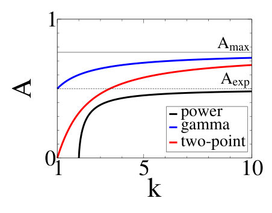
<figcaption class="paper-figure-caption"><b>Fig 1.</b> FIG. 1. Parameter A as a function of the shape parameter k for the Gamma, power-law, and intermittent two-point waiting-time distri- butions. The horizontal dashed lines correspond to the deterministic upper bound Amax = tanh(1) ≈0.7616 and the memoryless (expo- nential) value Aexp = 0.5. Parameters: τK1 = τK2 = τ1 = τ2 = 1.</figcaption>
</figure>
<figure class="paper-figure-card">
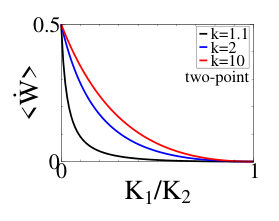
<figcaption class="paper-figure-caption"><b>Fig 2.</b> FIG. 2. Injected power ⟨˙W⟩as a function of K1 for the Gamma, power-law, and two-point waiting-time distributions. As K1 →0, all curves converge to the universal stochastic-resetting limit ⟨˙W⟩= DK τoff/(τoff +τon). Parameters: µK2 = τoff = τon = kBT = 1.</figcaption>
</figure>
<figure class="paper-figure-card">

<figcaption class="paper-figure-caption"><b>Fig 3.</b> FIG. 3. Variance-space distributions pi(s) for exponential, de- terministic, and algebraic waiting-time distributions. Parameters: τK = τoff = τon = kBT = 1. For the algebraic case, we use roff from Eq. (42) with k = 3, corresponding to C = 2 and therefore poff(s) ∼2s−2.</figcaption>
</figure>
<figure class="paper-figure-card">

<figcaption class="paper-figure-caption"><b>Fig 4.</b> FIG. 4. Spatial distributions ni(x) shown on a log-log scale for algebraic waiting-time distributions corresponding to Eq. (42) with k = 3. Parameters: τK = τoff = τon = D = 1, for which noff(x) ∼ 2|x|−3 and non(x) ∼6|x|−5.</figcaption>
</figure>

**Summary.** This paper develops an advanced framework using age-structured and variance-space methods to study Brownian motion in a harmonic trap whose stiffness switches semi-Markovianly. It shows that while the average potential energy remains at equilibrium, the system's injected power and spatial fluctuations are acutely sensitive to the memory encoded in the switching waiting times. This provides powerful tools for analyzing non-equilibrium steady states driven by complex temporal correlations.

**Why it may be interesting.** This work provides a rigorous theoretical tool (age-structured/variance-space formalism) to analyze non-equilibrium energy dissipation in systems driven by colored noise or switching potentials, which is highly relevant for understanding active matter or fluctuating quantum environments.

Detailed structure

**Main problem.** The study investigates non-equilibrium dynamics of a Brownian particle whose confining harmonic trap stiffness switches stochastically between two values with arbitrary waiting-time statistics.

**Main result.** The authors derive exact integral equations for the steady state, showing that while potential energy remains at equilibrium, injected power and spatial fluctuations are highly sensitive to the memory encoded in the switching statistics.

**Method.** The problem is tackled first using an enlarged age-structured Fokker-Planck formulation to restore Markovianity, followed by a transformation into a deterministic evolution equation within variance space for the stochastic-resetting limit.

**Model / system.** A single Brownian particle confined by a harmonic potential $u(x) = rac{1}{2}Kx^2$, where the stiffness $K$ switches between two values ($K_1, K_2$) according to arbitrary waiting-time statistics. The dynamics are analyzed in both position space and an enlarged age-structured state space.

**Key observables.** Stationary moments ($\langle x^2 
angle$), injected power ($\langle \dot{W} 
angle$), average potential energy (PE), and the stationary spatial/variance distributions ($
ho(x)$, $	ext{poff}(s)$).

**Important parameters / regimes.** The stiffness values ($K_1, K_2$), mean residence times ($	au_i$), and the nature of the waiting-time statistics (e.g., exponential vs. algebraic tails).

**Assumptions / limitations.** The spatial dynamics between switches are assumed to remain locally Brownian; for steady state analysis, finite mean residence times ($	au_i < \infty$) are required.

**Figures summary.** Figures illustrate the variance distributions $\pi(s)$ for different switching protocols (e.g., exponential vs. deterministic) and show how confinement suppresses large-variance fluctuations relative to the released state.

**Paper structure.** The paper first establishes the general age-structured framework for semi-Markovian dynamics, deriving steady-state integral equations for moments. It then analyzes the stochastic-resetting limit by transforming the problem into variance space, yielding simplified integral equations and asymptotic results based on waiting-time tail behavior.

Abstract

We study a Brownian particle in a harmonic trap whose stiffness switches between two values with arbitrary waiting-time statistics, generating semi-Markovian dynamics. To treat the resulting temporal memory, we formulate the problem in an enlarged age-structured state space, restoring Markovianity and yielding a local Fokker--Planck description. Within this framework, we derive exact steady-state integral equations for the spatial and birth distributions and obtain exact expressions for stationary moments, injected power, and potential energy. In the second part of the paper, we analyze the stochastic-resetting limit, corresponding to a particle alternately released and trapped. By representing the stationary spatial distribution as a superposition of Gaussian states with fluctuating variance, the problem can be reformulated as a switching process in variance space. This yields exact integral equations for the variance distributions and leads to a simplified description amenable to direct analytical treatment.

[↑ back to top](#top)

### [Transmon Phase Gates Controlled by Superconducting Soliton DAC](http://arxiv.org/abs/2607.05072v1)

**Authors:** Derek Reitz, Tony X. Zhou, Aditya Sharma, Ryan Bilotta, John McFarland, Aref Fouladi, Jacob Glasby, Aruna Ramanayaka, Zachary Stegen, Aaron Pesetski, Mark Covington, Gregory Boyd, Jeremy Clark  
**Type:** both · **Category:** quantum information and computing · **PDF:** <https://arxiv.org/pdf/2607.05072v1>  
**Analysis basis:** full PDF text, analyzed in chunks
**Topic relevance:** 🔥 `QC/QI experiment` **4/5** · `methods for driven-dissipative` **3/5** · `driven-dissipative phase transition` **2/5** · `non-equilibrium dynamics` **2/5** · `Frenkel-Kontorova` **1/5** · `correlated / nonlocal dissipation` **1/5** · `non-equilibrium universality` **1/5** · `quantum measurements` **1/5**

↔ Scroll figures horizontally

<figure class="paper-figure-card">

<figcaption class="paper-figure-caption"><b>Fig 1.</b> FIG. 1. Schematic showing the soliton DAC with mutually- coupled drive line and mutually-coupled transmon target loop. Each spoke containing a grounded JJ and spine in- ductor forms the tile of a repeating lattice in the middle of the DAC. Resistors can be added to shunt each of the JJs, but the speed of the flux waveform that’s applied to the tar- get is largely controlled by the resistive shunting on the final JJ (shown in Figure).</figcaption>
</figure>
<figure class="paper-figure-card">
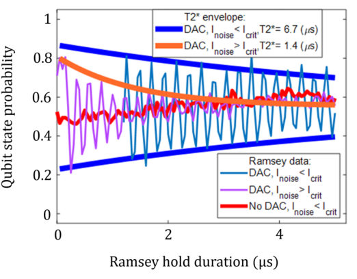
<figcaption class="paper-figure-caption"><b>Fig 2.</b> FIG. 3. Soliton DAC qubit protection demonstration via Ramsey measurements of a transmon at its upper sweet spot. The Ramsey fringes (red trace) are not detectable when 1 V peak-to-peak noise is injected through conventional refrig- erator attenuators and a 780 MHz cutoff-frequency, passive, low-pass filter. In contrast, the soliton DAC protects the transmon from 1 V noise to retain its noise-free T ∗ 2 ≈6.7 µs coherence (teal trace and blue curve envelope fit). When the noise amplitude exceeds the soliton injection threshold with 4 V noise, we observe slightly attenuated Ramsey oscillations corresponding to T ∗ 2 ≈1.4 µs (purple trace and orange curve envelope fit).</figcaption>
</figure>
<figure class="paper-figure-card">
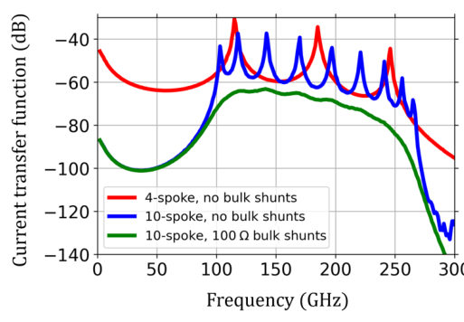
<figcaption class="paper-figure-caption"><b>Fig 3.</b> FIG. 2. Square of the current transfer function that relates current in the DAC’s final load to first input inductor, which is independent of mutual coupling strength. The noise filter- ing capability of the DAC is demonstrated by the relatively smaller output noise amplitude, in the qubit frequency range, with ten JJs (green, blue) compared to four JJs (red). The JJ plasma frequency, ωJ/2π = 267GHz, manifests as high- frequency peaks associated with plasma modes that can be excited within the DAC. The resonances can be damped out by including 100 Ωshunts on every JJ in the middle of the DAC (green).</figcaption>
</figure>
<figure class="paper-figure-card">
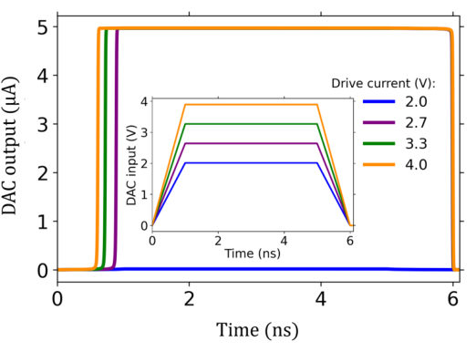
<figcaption class="paper-figure-caption"><b>Fig 4.</b> FIG. 4. Four trapezoidal waveforms with varied amplitudes drive the soliton DAC. The lowest amplitude drive (blue) does not exceed the soliton threshold, and results in an output that’s 103 times smaller than when injection occurs. As the drive amplitude is raised above the threshold, but remains below twice the injection threshold (where a second soliton is injected) the output amplitude remains constant. Although, the rising edge of the output waveform occurs relatively earlier than the falling edge, since the trapezoidal drive passes the injection threshold earlier.</figcaption>
</figure>
<figure class="paper-figure-card">
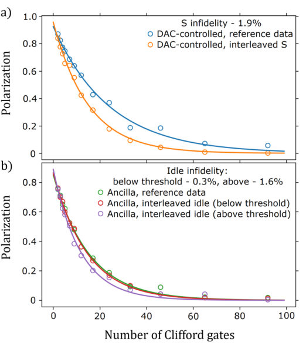
<figcaption class="paper-figure-caption"><b>Fig 5.</b> FIG. 6. Measured Character IRB data for a) soliton DAC- controlled S-gates and b) idle gates while the soliton DAC input control line is pulsed. When the DAC input drive ampli- tudes are below the soliton injection threshold, the idle gates are indistinguishable from the reference microwave gates. On the other hand, when the drive amplitude exceeds the soli- ton injection threshold, an ancilla idle error is observed that’s within our measurement precision of the DAC S-gate error. The solid lines are fits.</figcaption>
</figure>

**Summary.** This paper introduces and experimentally validates a superconducting Digital-to-Analog Converter (DAC) that uses solitons to generate high-fidelity control pulses for transmon qubits. The DAC effectively filters classical noise while enabling fast, robust quantum gate operations. While demonstrating excellent local performance, the authors identify non-local electromagnetic interference as a key hurdle for scaling to many qubits.

**Why it may be interesting.** For a theorist in open quantum systems, this work provides an excellent case study of engineering control channels. The soliton mechanism offers a physical realization of converting noisy classical inputs into clean, time-domain quantum pulses, which is crucial for modeling realistic decoherence sources beyond simple T1/T2 decay.

Detailed structure

**Main problem.** The primary challenge is developing scalable, low-noise control mechanisms for superconducting qubits to perform high-fidelity quantum gates.

**Main result.** A novel superconducting soliton DAC was demonstrated capable of performing S-gates with very low excitation probability (0.05%) and showed promise for scaling despite identifying non-local EMI limitations.

**Method.** The authors used a superconducting DAC, which transduces classical CMOS pulses into quantum control signals via solitons, and characterized performance using randomized benchmarking and noise injection tests.

**Model / system.** The system uses transmons coupled to a Soliton DAC built from Josephson Junctions (JJs). The dynamics are modeled by the Sine-Gordon equation, allowing the DAC to act as an active buffer that filters control noise.

**Key observables.** S-gate fidelity ($\approx 1.9\%$), DAC-induced excitation probability ($0.05\%$), and non-local phase error (1.6% per gate at scale).

**Important parameters / regimes.** Gate time (nanoseconds), noise thresholds ($I_{	ext{crit}}$), and the ratio of Josephson junction inductance to resistance ($L/R$) determining slew rate.

**Assumptions / limitations.** The initial analysis assumes that non-local errors from multiple DACs are the dominant scaling bottleneck, requiring mitigation via resistive shunting or tunable couplers.

**Figures summary.** Figures illustrate the noise filtering capability of the DAC current transfer function (Fig. 2), the protection of coherence against injected noise (Fig. 3), and the trade-off between leakage and phase errors based on the DAC load loop time constant (Fig. 8).

**Paper structure.** The paper progresses from introducing the physical platform (soliton DAC) to demonstrating its functionality (S-gates, noise filtering), quantifying performance limits through error analysis (non-local EMI), and finally discussing mitigation strategies for scaling.

Abstract

We introduce a superconducting digital-to-analog converter (DAC) that filters control noise, provides native multiplexing, performs quantum gates in nanoseconds, and can be controlled by CMOS. This is achieved by transducing a trapezoidal drive pulse into a superconducting soliton, which is then held in the DAC load loop, applying flux to a mutually-coupled superconducting qubit or gate coupler. The analog flux output by the DAC can be easily controlled by varying the soliton hold time, or with a DC-biased tunable DAC-qubit coupler, allowing the DAC to perform a fixed-time, high-fidelity gate that's robust to fabrication variance or flux offsets in the quantum circuit. Our initial demonstration shows that the DAC can successfully perform 5.6 ns S-gates on transmons. We measure the DAC-induced quantum state excitation probability per gate to be 0.05%, and find that the DAC-induced relaxation rate from the qubit 1 state is below the intrinsic T1 rate limit of the transmon. Quantum simulations show qualitative agreement with the measured data, and predict that the DAC excitation rate can be lowered 10 times further by overdamping the Josephson junction (JJ) in the DAC load loop. may be limited by a Interleaved Randomized Benchmarking (IRB) sequences on an observer qubit reveal that, when scaling to many qubits, the DAC's performance may be limited by a non-local, DAC-induced phase error of 1.6% per gate, appearing in ancilla qubits that are not directly coupled to any of the 30 DACs on the chip. We discuss strategies for future layouts of multi-DAC chips that focus on mitigating the source of these non-local, high-frequency electromagnetic interactions (EMI), and how to incorporate a DC-tunable coupler for phase correction.

[↑ back to top](#top)

### [Evidence of the Cooper-Pair Field with Gaussian Memory Kernel in Unconventional Superconductors](http://arxiv.org/abs/2607.03937v1)

**Authors:** Udomsilp Pinsook  
**Type:** theory · **Category:** strongly correlated electrons · **PDF:** <https://arxiv.org/pdf/2607.03937v1>  
**Analysis basis:** full PDF text, analyzed in chunks
**Topic relevance:** 🔥 `Keldysh / 2PI / non-Gaussian methods` **4/5** · `methods for driven-dissipative` **3/5** · `non-equilibrium dynamics` **3/5** · `non-equilibrium universality` **2/5** · `correlated / nonlocal dissipation` **1/5** · `driven-dissipative phase transition` **1/5**

↔ Scroll figures horizontally

<figure class="paper-figure-card">
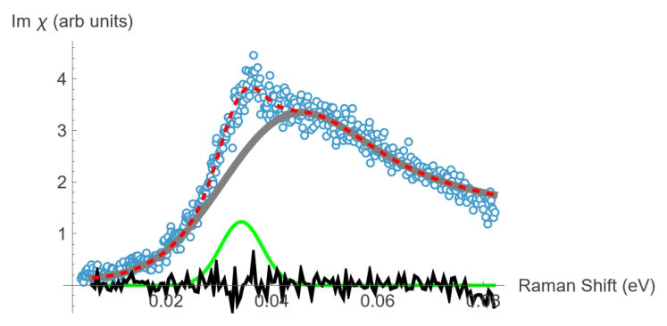
<figcaption class="paper-figure-caption"><b>Fig 1.</b> Figure 1: Raman electronic susceptibility in Bi2Sr2CaCu2O8+δ compared with the memory- dressed response. Blue points denote the extracted experimental spectrum at 15 K [12], the red dashed line is the fitted total response Eq. (55), which is composed of Cr = 0.11, the gray line is from the PCF term with Ar = 2.24, the green line is from the Gaussian Gr(E) term, and the black trace shows the residual. The narrower Gr(E) contribution is tentatively associated with the B1g phonon mode centered near 34 meV.</figcaption>
</figure>
<figure class="paper-figure-card">
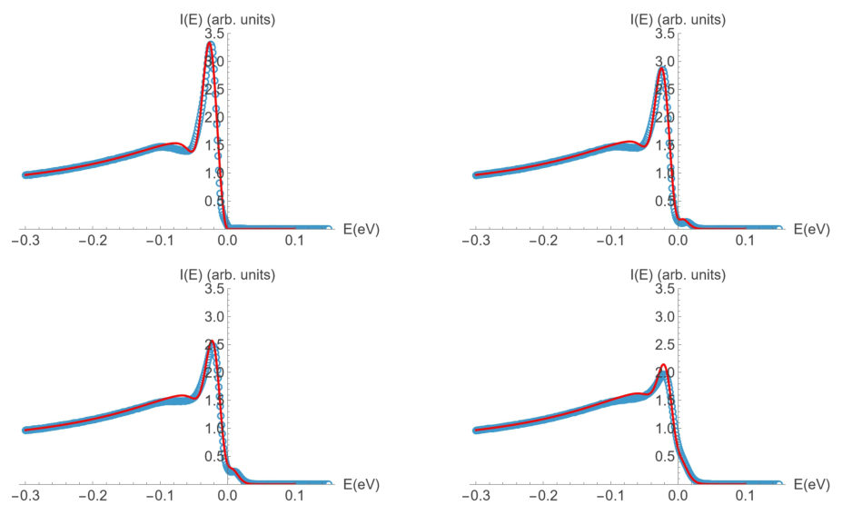
<figcaption class="paper-figure-caption"><b>Fig 2.</b> Figure 2: Temperature-dependent antinodal ARPES spectra compared with memory-dressed fits: 6 K (upper left), 60 K (upper right), 70 K (lower left), and 80 K (lower right). Blue points show the extracted intensity from Chen et al. [13] and red curves show the results of Eq. (66) with Apg = 1.27 and Asc(0) = 1.93 in arb units. The sequence illustrates a robust pseudogap memory background together with a resonant Bogoliubov component that weakens on approaching the reported Tc = 77 K and may retain incoherent spectral weight slightly above Tc up to the fitted crossover scale Tpair.</figcaption>
</figure>
<figure class="paper-figure-card">
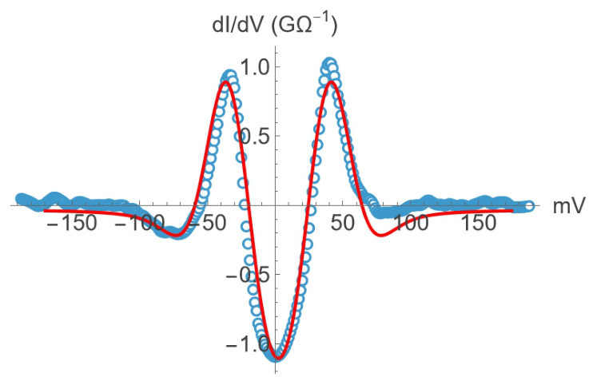
<figcaption class="paper-figure-caption"><b>Fig 3.</b> Figure 3: Tunneling differential conductance at low temperature compared with the memory- dressed density-of-states model. Blue points denote the background-removed dI/dV data, derived from the experimental data [14] and the red curve denotes the fitted response, Eqs. (61) and (67). The agreement of the coherence features and the broader background provides a cross-probe consistency check between ARPES and tunneling.</figcaption>
</figure>
<figure class="paper-figure-card">

<figcaption class="paper-figure-caption"><b>Fig 4.</b> Figure 4: Approximate universal PCF scaling of Bi2212 antinodal ARPES spectra over the doping p = 0.141 (magenta), 0.160 (green), 0.180 (purple), 0.193 (gray), 0.203 (dark yellow), 0.205 (brown), 0.207 (orange), 0.211 (pink), 0.213 (blue), 0.215 (red). Open symbols denote scaled experimental spectra, derived from He et al. [15], and the black curve denotes the universal PCF backbone, −exp  −ξ2</figcaption>
</figure>

**Summary.** This paper proposes a dynamical theory for unconventional superconductors where the superconducting pair field is treated as having 'memory' due to coupling with fluctuating local fields. The key finding is that superconductivity involves reorganizing spectral weight between an incoherent pseudogap memory background and a coherent, phase-locked Bogoliubov component below $T_c$. This framework unifies descriptions across multiple experimental probes like ARPES and Raman spectroscopy.

**Why it may be interesting.** The treatment of superconductivity through dynamic memory effects and spectral weight redistribution is highly relevant to understanding non-equilibrium dynamics and strong correlations in condensed matter systems.

Detailed structure

**Main problem.** To develop a dynamical description of the superconducting pair field that treats it as a memory-dressed Bogoliubov pair field, moving beyond static order parameter approximations.

**Main result.** The superconducting transition is characterized by a reorganization of spectral weight between an incoherent pseudogap memory channel and a coherent condensate-assisted Bogoliubov memory channel.

**Method.** The authors use effective action methods, coupling the pair field to fluctuating local fields whose ensemble averaging generates a Gaussian memory factor. The resulting response functions are expressed using parabolic-cylinder functions.

**Model / system.** The model focuses on unconventional superconductors, particularly cuprates like Bi2Sr2CaCu2O(8+d). It incorporates fluctuations arising from the antinodal gap/pseudogap acting as a momentum-space spectral cavity.

**Key observables.** Pair field dynamics, pseudogap memory channel, coherent Bogoliubov memory, and frequency-domain response functions (analyzed via Raman, ARPES, tunneling).

**Important parameters / regimes.** Critical temperature ($T_c$), pseudogap scale ($T^*$), Gaussian dephasing time ($	au_g$), and the coherence factor $|\Delta_0(T)|^2$.

**Assumptions / limitations.** The ensemble averaging of local field fluctuations is assumed to yield an approximately Gaussian distribution, leading to the characteristic memory envelope.

**Paper structure.** The paper builds from a general pair-field effective action by introducing fluctuating reservoir fields. It derives the memory kernel via Gaussian ensemble averaging and then analyzes how this structure dictates the spectral weight transfer across different temperature regimes, culminating in comparisons with various experimental probes.

Abstract

We develop a dynamical description of the superconducting pair field in which the Cooper-channel Hubbard--Stratonovich field $Δ$ is treated as a memory-dressed Bogoliubov pair field rather than as a purely static order parameter. Starting from the standard pair-field effective action, we couple $Δ$ to antinode-selected collective or self-generated fields. An ensemble of such modes produces a distribution of local Bogoliubov frequencies; when this distribution is approximately Gaussian, ensemble averaging gives the memory factor $\exp[-t^2/(2τ_g^2)]$. In cuprate superconductors, the antinodal gap or pseudogap restricts the active electronic phase space and acts as a momentum-space spectral cavity. It selects fluctuation wavevectors $\mathbf Q_a$ that may become charge-density-wave-like instabilities in an ordered limit, but behave as a reservoir of local collective fields in the fluctuating regime. The same framework admits resonant algebraic prefactors, so that threshold and forced-oscillator responses generate the hierarchy $p=-1/2,1/2,1,3/2,\ldots$, while the Gaussian envelope cuts off secular growth and converts these branches into finite spectral components. The resulting picture contains a robust pseudogap memory channel and, below $T_c$, an additional condensate-assisted coherent channel proportional to $|Δ_0(T)|^2$. Thus the superconducting transition primarily reorganizes pair-field spectral weight between incoherent pseudogap memory and coherent Bogoliubov memory. The frequency-domain response is expressed in terms of parabolic-cylinder functions, and comparisons with Raman, ARPES, tunneling, and doping-dependent ARPES scaling suggest that these probes are complementary projections of the same Gaussian-memory pair continuum. We compare our numerical results with the recent experimental data on Bi$_2$Sr$_2$CaCu$_2$O$_{8+δ}$.

[↑ back to top](#top)

### [Topological properties and Majorana Multiplicity in Zigzag Kitaev Chain](http://arxiv.org/abs/2607.04399v1)

**Authors:** Rajiv Kumar, Panch Ram, Levan Chotorlishvili, Sunil Kumar Mishra  
**Type:** theory · **Category:** quantum information and computing · **PDF:** <https://arxiv.org/pdf/2607.04399v1>  
**Analysis basis:** full PDF text, analyzed in chunks
**Topic relevance:** 🔥 `analog quantum simulation` **4/5** · `Keldysh / 2PI / non-Gaussian methods` **2/5** · `driven-dissipative phase transition` **2/5** · `methods for driven-dissipative` **2/5** · `Kondo & dissipative impurity` **1/5** · `entanglement & information structure` **1/5** · `exotic spin models in light-matter` **1/5** · `non-equilibrium dynamics` **1/5**

↔ Scroll figures horizontally

<figure class="paper-figure-card">
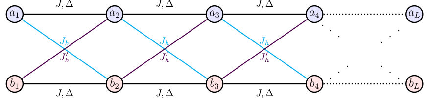
<figcaption class="paper-figure-caption"><b>Fig 1.</b> FIG. 1. Schematic illustration of the zigzag Kiatev chain: (top: ai, bottom: bi) of length L. In the calculation, we consider L = 40 and a chain length N = 2L = 80. Each chain features hopping amplitude J and superconducting pairing strength ∆. The cyan bonds (Jh) denote diagonal inter-chain couplings between sites (ai, bi+1) and the violet bonds (J′ h) connect (bi, ai+1). These diagonal couplings mediate hybridization between the two Kitaev chains.</figcaption>
</figure>
<figure class="paper-figure-card">

<figcaption class="paper-figure-caption"><b>Fig 2.</b> FIG. 2. Energy spectrum of the zigzag Kitaev chain with increasing µ for fixed J = ∆= 1.0 and ϕ = 0 chain lengths N = 2L = 80. Panels (a) and (b) correspond to asymmetric (Jh, J′ h) = (0.15, 0.25) and symmetric (Jh, J′ h) = (0.25, 0.25) inter-chain couplings, respectively.</figcaption>
</figure>
<figure class="paper-figure-card">

<figcaption class="paper-figure-caption"><b>Fig 3.</b> FIG. 3. Energy spectrum of the zigzag Kitaev chain with increasing µ for fixed J = ∆= 1.0 and ϕ = π chain lengths N = 2L = 80. Panels (a) and (b) correspond to asymmetric (Jh, J′ h) = (0.15, 0.25) and symmetric (Jh, J′ h) = (0.25, 0.25) inter-chain couplings, respectively.</figcaption>
</figure>
<figure class="paper-figure-card">

<figcaption class="paper-figure-caption"><b>Fig 4.</b> FIG. 4. Eigenvalue spectrum as a function of the site index for the zigzag Kitaev chain with Jh = J ′ h = 0.25, J = ∆= 1.0 chain lengths N = 2L = 80. Panels (a) and (b) show µ = 0.0 and µ = 2.0, respectively. The system hosts four MZMs in (a) and two MZMs in (b), as highlighted in the insets.</figcaption>
</figure>
<figure class="paper-figure-card">

<figcaption class="paper-figure-caption"><b>Fig 5.</b> FIG. 5. The distribution of four MZMs in region I. For the parameters J = ∆= 1.0 and diagonal coupling strength Jh = J ′ h = 0.25 and chemical potential µ (a,b) 0.0 and (c,d) 2.0.</figcaption>
</figure>

**Summary.** The paper theoretically analyzes a zigzag Kitaev chain to map out its topological phase diagram by controlling inter-chain couplings and superconducting phases. It demonstrates that this structure can host multiple, controllable Majorana zero modes (up to four), confirming its potential as a minimal platform for building MZM-based quantum computing devices.

**Why it may be interesting.** This work directly addresses the engineering of robust Majorana zero modes, which are central components for realizing fault-tolerant quantum computation architectures using superconducting circuits or nanowires.

Detailed structure

**Main problem.** The study investigates the spectral and topological properties, specifically the multiplicity of Majorana zero modes (MZMs), within a zigzag Kitaev chain.

**Main result.** The model establishes that the zigzag Kitaev chain is a minimal platform capable of supporting distinct topological phases hosting two or four MZMs, depending on superconducting phase differences and couplings.

**Method.** Analysis employs the Bogoliubov-de Gennes formulation to examine the energy spectrum, quasi-particle dispersion, and calculate the winding number ($
u$).

**Model / system.** The system is a zigzag Kitaev chain constructed by diagonally coupling two one-dimensional Kitaev chains. The Hamiltonian incorporates hopping amplitudes, pairing strengths, chemical potential, and inter-chain couplings ($J_h, J'_h$), with superconducting phase differences $\phi$ being a key variable.

**Key observables.** Energy spectrum (gap closures), number of MZMs (two or four), quasi-particle dispersion, and the winding number ($
u$).

**Important parameters / regimes.** Superconducting phase difference ($\phi=0$ vs. $\phi=\pi$), chemical potential ($\mu$), and diagonal coupling strengths ($J_h, J'_h$).

**Assumptions / limitations.** The analysis is performed using Open Boundary Conditions (OBC), and the model parameters are assumed to be real.

**Figures summary.** Figures illustrate the energy spectrum vs. chemical potential ($\mu$) for different phase differences, showing transitions between topological phases with varying MZM counts; they also show spatial distributions of zero-energy states and winding number calculations.

**Paper structure.** The paper systematically analyzes the Hamiltonian using BdG theory, first establishing the dependence on $\phi$ (comparing $\phi=0$ to $\phi=\pi$), then mapping out the phase diagram by tracking gap closures and calculating topological invariants like the winding number to confirm MZM counts.

Abstract

We investigate the spectral and topological properties of a zigzag Kitaev chain constructed from two diagonally coupled one dimensional Kitaev chains with a zero and finite superconducting pairing phase difference. Using a Bogoliubov-de Gennes formulation, we analyze the energy spectrum, distribution of Majorana zero modes (MZMs), the quasi-particle dispersion, and the winding number, respectively. For a zero phase difference, the resulting energy spectrum shows topological phases with two, four MZMs, and trivial regions. The phases of gap closure determine the topological phase boundaries. In particular, for the phase difference between $φ=π$, the degeneracy of MZMs is partially lifted, leading to modified topological phases compared to the case $φ=0$. The topological and trivial phase boundaries are further confirmed by evaluating the quasi-particle dispersion and the topological invariant, namely the winding number. We show that the zigzag Kitaev chain contributes independently to the total winding number $ν= 1$ and $2$, giving rise to distinct topological phases that support two and four MZMs. The $ν= 0$ gives rise to a trivial region. The energy spectrum of systems corroborates the analytical phase boundaries and reveals characteristics associated with hybridization, enabling us to obtain the complete phase diagram of the zigzag model. Our results establish the zigzag Kitaev chain as a minimal platform for engineering MZM quantum computations, with potential applications in the study of topological phases and Majorana based qubit physics.

[↑ back to top](#top)

### [Incompatibility assisted Zeno-like confinement enables unbounded sharing of nonlocality](http://arxiv.org/abs/2607.04298v1)

**Authors:** Prerna Rao, Som Kanjilal  
**Type:** theory · **Category:** quantum information and computing · **PDF:** <https://arxiv.org/pdf/2607.04298v1>  
**Analysis basis:** full PDF text, analyzed in chunks
**Topic relevance:** 🔥 `quantum measurements` **4/5** · `measurement-induced transitions` **3/5** · `entanglement & information structure` **2/5** · `correlated / nonlocal dissipation` **1/5** · `driven-dissipative phase transition` **1/5** · `methods for driven-dissipative` **1/5** · `non-equilibrium dynamics` **1/5**

↔ Scroll figures horizontally

<figure class="paper-figure-card">

<figcaption class="paper-figure-caption"><b>Fig 1.</b> Low-resolution page preview, page 2</figcaption>
</figure>
<figure class="paper-figure-card">
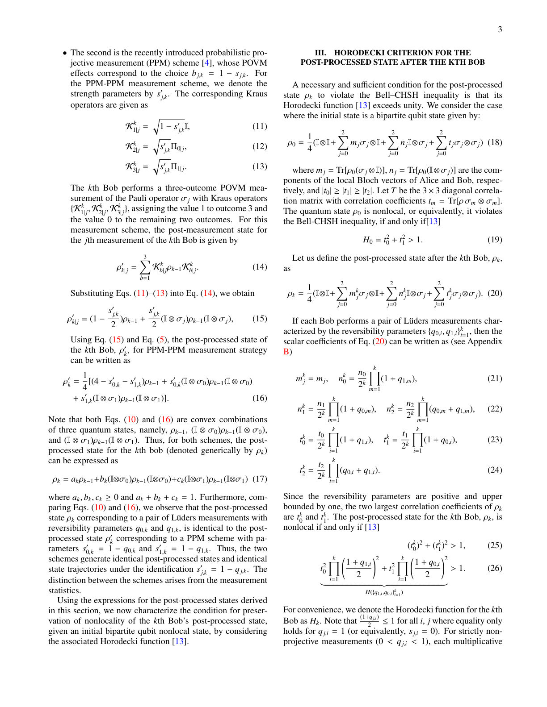
<figcaption class="paper-figure-caption"><b>Fig 2.</b> Low-resolution page preview, page 3</figcaption>
</figure>
<figure class="paper-figure-card">

<figcaption class="paper-figure-caption"><b>Fig 3.</b> Low-resolution page preview, page 4</figcaption>
</figure>
<figure class="paper-figure-card">

<figcaption class="paper-figure-caption"><b>Fig 4.</b> Low-resolution page preview, page 5</figcaption>
</figure>
<figure class="paper-figure-card">
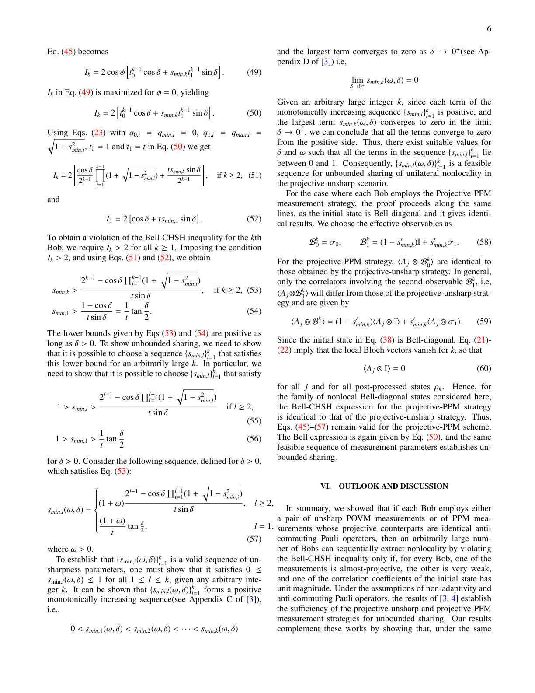
<figcaption class="paper-figure-caption"><b>Fig 5.</b> Low-resolution page preview, page 6</figcaption>
</figure>

**Summary.** This paper theoretically characterizes the conditions required for sharing Bell-nonlocality across an infinite sequence of copies using repeated quantum measurements. It demonstrates that this is possible only under specific constraints on the measurement strengths, leading to a Zeno-like confinement where successive states converge while remaining nonlocal. This advances understanding of resource distribution in quantum information protocols.

**Why it may be interesting.** This work provides a deep theoretical understanding of how quantum correlations, specifically nonlocality, can be robustly distributed or 'shared' over many sequential operations, linking concepts from measurement theory (Zeno effect) to fundamental resource quantification in QI.

Detailed structure

**Main problem.** The research investigates the necessary conditions for sequentially sharing Bell-nonlocality among an unbounded number of copies via repeated quantum measurements.

**Main result.** Unbounded nonlocality sharing is possible only if the measurement strategy involves a combination of one 'almost projective' measurement acting as an anchor and another very weak measurement. This process leads to a Zeno-like confinement where successive states become nearly identical while maintaining nonlocality.

**Method.** The authors analyze the evolution of the bipartite quantum state using recurrence relations derived from two specific measurement types: unsharp measurements and Probabilistic Projective Measurements (PPMs).

**Model / system.** The model involves a bipartite qubit system initially prepared in a Bell-diagonal mixed state ($
ho_0$) that violates the CHSH inequality. The nonlocality is preserved through sequential post-processing steps applied by an external agent.

**Key observables.** Violation of the Bell-CHSH inequality, the Horodecki function ($H_k$), and the distance between successive states ($\Delta_2^k$).

**Important parameters / regimes.** The measurement parameters, such as unsharpness parameters ($s_{j,k}$) or reversibility parameters ($q_{j,k}$), must approach specific limits (e.g., $s_{\min} 	o 0^+$ and $q_{\max} 	o 1^-$) for the process to be unbounded.

**Assumptions / limitations.** The analysis assumes non-adaptive measurement strategies and focuses on anti-commuting Pauli observables, establishing necessary conditions for feasibility.

**Figures summary.** Not specified by notes; the structure relies on deriving mathematical expressions (Eqs. 15-62) showing state evolution and convergence.

**Paper structure.** The paper first establishes the general requirements for unbounded sharing (incompatibility + nonlocality preservation). It then analyzes two specific measurement schemes (unsharp/PPM), derives necessary conditions based on maintaining $H_k > 1$, and finally constructs a feasible sequence of parameters demonstrating Zeno-like confinement.

Abstract

To enable sequential sharing of Bell-nonlocality by an unbounded number of copies, each copy must satisfy two requirements. First, the measurements must be incompatible to extract nonlocality. Second, the post-processsed state, obtained as an equal mixture of the two post-measurement states, must remain nonlocal. We show that the incompatibility requirements impose nontrivial constraints on the choice of the initial nonlocal state and the amount of measurement noise required to ensure that the post-processed state remains nonlocal for an unbounded number of copies. We establish this result for two measurement scenarios, namely, when each copy performs unsharp measurements corresponding to a pair of anti-commuting Pauli observables, and when each copy performs probabilistic projective measurements (PPMs) of a pair of anti-commuting Pauli observables. Furthermore, we show that, in the asymptotic limit, the nonlocal post-processed states of all the copies are almost identical, leading to a quantum Zeno-like confinement within the nonlocal region.

[↑ back to top](#top)

### [Disentangling Haldane Phase by Generalized Clifford Circuits](http://arxiv.org/abs/2607.03939v1)

**Authors:** Minsoo Kim, Changhun Oh, Donghoon Kim  
**Type:** theory · **Category:** numerical methods · **PDF:** <https://arxiv.org/pdf/2607.03939v1>  
**Analysis basis:** full PDF text, analyzed in chunks
**Topic relevance:** 🔥 `entanglement & information structure` **4/5** · `methods for driven-dissipative` **3/5** · `analog quantum simulation` **2/5** · `exotic spin models in light-matter` **1/5** · `non-equilibrium dynamics` **1/5**

↔ Scroll figures horizontally

<figure class="paper-figure-card">
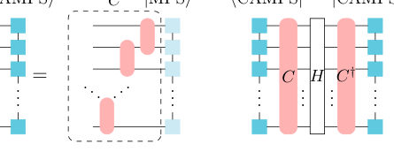
<figcaption class="paper-figure-caption"><b>Fig 1.</b> FIG. 1. Schematic of the CAMPS-based DMRG method. (a) The CAMPS is an ansatz |CAMPS⟩= C|MPS⟩. Here, C consists of sequential two-site Clifford gates, and each two- site gate is chosen to maximally reduce the entanglement of |CAMPS⟩. (b) By augmenting the MPS with C, the Hamil- tonian is transformed accordingly as e H = CHC†. The conju- gation preserves the energy expectation between the CAMPS and MPS frames.</figcaption>
</figure>
<figure class="paper-figure-card">
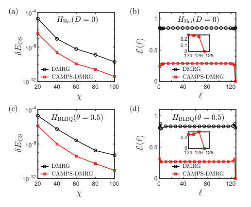
<figcaption class="paper-figure-caption"><b>Fig 2.</b> FIG. 2. The CAMPS-based DMRG results for the Heisen- berg and the BLBQ models. (a), (c) Relative ground-state energy error δEGS for N = 128 at (a) HHei(D = 0) and (c) HBLBQ(θ = 0.5). The DMRG result with χ = 1000 serves as the reference. Panels (b) and (d) display the correspond- ing entanglement entropy E(ℓ) for bipartitions of sizes ℓand N −ℓ. For both models, we observe that E(N −1) = 0 in the CAMPS-based DMRG results; see the insets of (b) and (d).</figcaption>
</figure>
<figure class="paper-figure-card">

<figcaption class="paper-figure-caption"><b>Fig 3.</b> FIG. 3. Numerical results of the two-point correlation ⟨Sz j Sz j+r⟩for (a) the Heisenberg model and (b) the BLBQ model, for j = 32. The ground states are obtained using DMRG with N = 128 and χ = 300, and after applying UKW, the corresponding values of ⟨Sz j Sz j+r⟩are evaluated. The green dotted line in (b) represents the analytic value 1/4 given in Eq. (10). Inset (a): In the trivial phase, the correla- tion decays exponentially.</figcaption>
</figure>

**Summary.** The paper investigates the structure of disentangling transformations in Haldane spin systems using an advanced DMRG technique incorporating Clifford circuits. They identify that the optimal transformation is the generalized Kramers–Wannier (KW) duality, which analytically proves a mapping from the topological Haldane phase to a state exhibiting spontaneous $\mathbb{Z}_2$ symmetry breaking. This offers a novel unitary pathway for understanding symmetry protection and breaking in quantum matter.

**Why it may be interesting.** This work bridges quantum simulation techniques (DMRG/MPS) with deep topological physics concepts (SPT phases, hidden symmetries), providing a concrete circuit-level understanding of how entanglement reduction reveals underlying physical order.

Detailed structure

**Main problem.** The study focuses on understanding the analytic structure and mechanism of 'disentangler' transformations used to classically simulate quantum many-body systems, particularly within the Haldane phase.

**Main result.** The optimal local disentangler for the Haldane phase is shown to implement the generalized Kramers–Wannier (KW) transformation, which maps the SPT phase to a state exhibiting spontaneous $\mathbb{Z}_2$ symmetry breaking.

**Method.** The authors extend the Clifford-circuit-augmented Matrix Product States (CAMPS)-based Density-Matrix Renormalization Group (DMRG) method to spin-1 systems using generalized Clifford circuits for optimization.

**Model / system.** The research analyzes spin-1 chains, specifically examining models like the Heisenberg and Bilinear-biquadratic (BLBQ) Hamiltonians that exhibit the Haldane phase. The AKLT state serves as a key analytically tractable representative system.

**Key observables.** Entanglement entropy $E(\ell)$, ground-state energy error $\delta E$, two-point correlation functions $\langle S_z^j S_z^{j+r} \rangle$, and the order parameter $\langle S_z^j \rangle$.

**Important parameters / regimes.** The system is studied in the Haldane phase regime, with specific attention paid to the angle $\theta$ in the BLBQ model.

**Assumptions / limitations.** The analysis assumes that the optimal disentangler can be found via Clifford gates and relies on approximations in the thermodynamic limit ($N \to \infty$) for correlation function calculations.

**Figures summary.** Figures compare CAMPS-DMRG results for Heisenberg and BLBQ models, showing energy error and entanglement entropy. Another figure compares numerical simulations of $\langle S_z^j S_z^{j+r} \rangle$ to the analytic value $1/4$.

**Paper structure.** The paper progresses by first introducing the CAMPS-DMRG framework for spin-1 systems, identifying the optimal disentangler as the KW transformation. It then analytically verifies this optimality for the AKLT state and uses correlation functions and symmetry analysis to demonstrate the resulting $\mathbb{Z}_2$ SSB.

Abstract

Disentangling transformations play a central role in the classical simulation of quantum many-body systems, yet their analytic structure and underlying mechanism remain largely unexplored. Here, we study the structure of the disentangler in the Haldane phase of spin-1 systems using generalized Clifford circuits. To this end, we extend the Clifford-circuit-augmented matrix product states (CAMPS)-based density-matrix renormalization group (DMRG) method to spin-1 systems. Within this framework, we find that the local disentanglers optimized for the Haldane phase implement the generalized Kramers--Wannier (KW) transformation, and we analytically verify its optimality for the Affleck--Kennedy--Lieb--Tasaki (AKLT) state. Beyond reducing entanglement, the KW transformation maps the Haldane phase to a phase with spontaneously broken $\mathbb{Z}_{2}$ symmetry. This mapping is distinct from the Kennedy--Tasaki transformation and provides a new unitary route from symmetry-protected topological order to symmetry breaking.

[↑ back to top](#top)

### [Efficient classical simulation of two-dimensional long-range systems: Rydberg arrays and beyond](http://arxiv.org/abs/2607.05178v1)

**Authors:** Jia-Lin Chan, Tao Xiang, Yantao Wu  
**Type:** theory · **Category:** numerical methods · **PDF:** <https://arxiv.org/pdf/2607.05178v1>  
**Analysis basis:** full PDF text, analyzed in chunks
**Topic relevance:** 🔥 `analog quantum simulation` **4/5** · `Rydberg arrays` **3/5** · `methods for driven-dissipative` **3/5** · `exotic spin models in light-matter` **1/5**

↔ Scroll figures horizontally

<figure class="paper-figure-card">
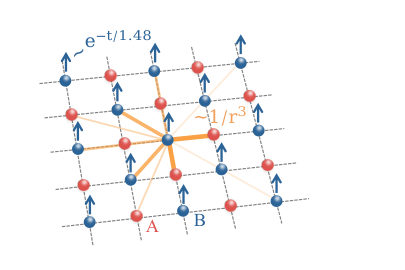
<figcaption class="paper-figure-caption"><b>Fig 1.</b> FIG. 1. Schematic illustration of the experimental proto- col. The atoms interact via a 1/r3 dipolar coupling and are partitioned into two sublattices, A and B. Starting from the classical N´eel state [Eq. (4)], a staggered field δ(t) = δ0e−t/1.48 is applied to the B sublattice, driving the adiabatic evolution.</figcaption>
</figure>
<figure class="paper-figure-card">

<figcaption class="paper-figure-caption"><b>Fig 2.</b> FIG. 2. Benchmark of the 4 × 4 AFM protocol against exact results. TNS-tVMC results are shown for bond di- mensions D = 4 and 5, using 81920 MC samples for both evolution and measurement. (a) average energy ⟨HXY ⟩, (b) averaged sublattice magnetization Z, (c) nearest- neighbor (NN) and next-nearest-neighbor (NNN) corre- lations Cx, and (d) squared staggered magnetization m2 x, all as a function of time.</figcaption>
</figure>
<figure class="paper-figure-card">
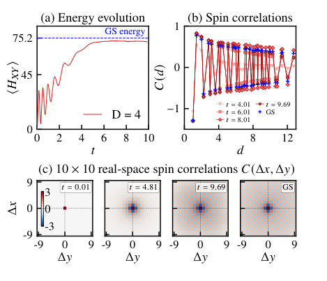
<figcaption class="paper-figure-caption"><b>Fig 3.</b> FIG. 3. Time evolution of the 10 × 10 AFM pro- tocol from TNS-tVMC with bond dimension D = 4 and Ns = 163840. (a) Energy ⟨HXY ⟩, relaxing to- ward the ground-state value (dashed blue line), which is computed by us using ground state VMC. (b) Con- nected spin correlation C(d) as a function of distance d at t = 4.01, 6.01, 8.01, 9.69, compared with the ground state. (c) Real-space correlation C(∆x, ∆y), averaged over all site pairs separated by displacement (∆x, ∆y), at t = 0.01, 4.81, 9.69 and in the ground state.</figcaption>
</figure>
<figure class="paper-figure-card">
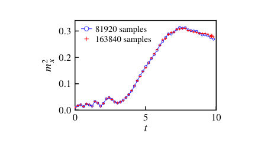
<figcaption class="paper-figure-caption"><b>Fig 4.</b> FIG. 4. Sample-size convergence of the 10×10 AFM dy- namics at D = 4. The squared staggered magnetization m2 x, the most sensitive observable, is shown as a function of time for Ns = 81920 and 163840.</figcaption>
</figure>

**Summary.** The paper introduces an efficient tensor network Variational Monte Carlo (tVMC) framework that reduces the computational cost for simulating 2D long-range quantum systems from $O(N^3)$ to $O(N)$. This breakthrough allows for accurate, classical simulation of complex adiabatic protocols in dipolar XY models realized in Rydberg arrays. It establishes a powerful new tool for benchmarking next-generation quantum simulators.

**Why it may be interesting.** This work provides a crucial algorithmic breakthrough by scaling classical simulations of long-range quantum systems from cubic to linear complexity, directly enabling benchmarking of cutting-edge hardware like Rydberg arrays.

Detailed structure

**Main problem.** Developing an efficient classical simulation method for two-dimensional quantum systems with long-range interactions, which is computationally challenging using standard Variational Monte Carlo (VMC) techniques.

**Main result.** The authors developed a tensor network VMC framework that reduces the local energy evaluation cost from $O(N^3)$ to $O(N)$, enabling accurate simulations of complex protocols previously beyond classical reach.

**Method.** They employ an adapted-basis tensor network tVMC framework, utilizing techniques like projected tVMC (p-tVMC) for initial steps and systematic basis splitting to achieve linear scaling in system size N.

**Model / system.** The study focuses on 2D dipolar XY models realized in platforms like Rydberg arrays or ion traps. The Hamiltonian involves long-range, all-to-all two-body interactions ($1/r^3$ coupling).

**Key observables.** Local energy, sublattice magnetization (Z), nearest-neighbor and next-nearest-neighbor correlations ($C_x$), and squared staggered magnetization ($m_x^2$).

**Important parameters / regimes.** System size up to $10 	imes 10$, bond dimension D for TNS, and time evolution parameters ($\Delta t$, $\delta(t)$).

**Assumptions / limitations.** The primary assumption is that the system state can be accurately represented by a Tensor Network State (TNS) ansatz. A technical limitation addressed was the pathology of evolving from product states.

**Figures summary.** Figure 1 illustrates the experimental protocol for the dipolar XY model. Figure 2 benchmarks TNS-tVMC against exact results for smaller systems, showing convergence. Figure 3 shows time evolution and correlations for the $10 	imes 10$ system.

**Paper structure.** The paper introduces the computational bottleneck ($O(N^3)$) and proposes the novel $O(N)$ tensor network tVMC framework. It details the implementation, including handling initial state projection (p-tVMC), and applies it to simulate adiabatic protocols for dipolar XY models.

Abstract

In variational Monte Carlo (VMC) calculations of $N$-site quantum systems with arbitrary all-to-all two-body interactions, evaluating the local energy generally costs $O(N^3)$. We introduce a new framework that reduces this cost to $O(N)$ for tensor network states, capable of scalable and accurate computation of real-time dynamics and ground states. As a result, we obtain accurate simulations of the adiabatic real-time protocol of a $10\times10$ dipolar XY model realized in a Rydberg simulator [C. Chen et al., Nature 616, 691 (2023)], which was previously beyond the reach of classical simulation. Going beyond quantum experiments, we also directly perform ground state VMC to compare with the adiabatic state preparation. Our work demonstrates tensor network VMC as a powerful classical simulator for long-range quantum platforms such as Rydberg and ion-trap simulators, which are currently in urgent need of scalable classical benchmarking tools. As a separate technical contribution, we resolve the pathology of evolving from product states within of tensor network VMC.

[↑ back to top](#top)

### [Routing Anonymity and Identifiability of Noisy Quantum Hardware](http://arxiv.org/abs/2607.05281v1)

**Authors:** Ben Priestley, Mina Doosti  
**Type:** both · **Category:** quantum information and computing · **PDF:** <https://arxiv.org/pdf/2607.05281v1>  
**Analysis basis:** full PDF text, analyzed in chunks
**Topic relevance:** 🔥 `QC/QI experiment` **4/5** · `quantum measurements` **2/5** · `Keldysh / 2PI / non-Gaussian methods` **1/5** · `correlated / nonlocal dissipation` **1/5** · `driven-dissipative phase transition` **1/5** · `entanglement & information structure` **1/5** · `methods for driven-dissipative` **1/5**

↔ Scroll figures horizontally

<figure class="paper-figure-card">
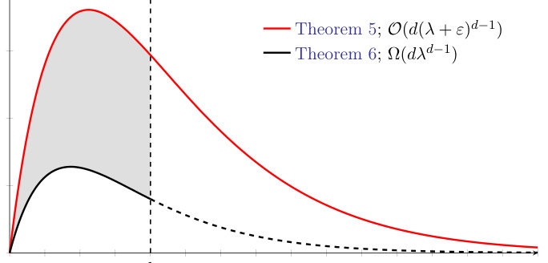
<figcaption class="paper-figure-caption"><b>Fig 1.</b> Figure 1: Illustration of the lower and upper bounds on expected distinguishing bias by circuit depth, as given by Theorem 5 and Theorem 6. The shaded region between the curves covers the perturbative range 0 ≤d ≤d0 of depths satisfying Theorem 6’s additional assumptions.</figcaption>
</figure>
<figure class="paper-figure-card">

<figcaption class="paper-figure-caption"><b>Fig 2.</b> Figure 2: t-SNE dimensionality reduction plot visualising the 16-dimensional features extracted from the penultimate layer of the classifier, given raw depth-10 data. We plot the entire dataset, across all train-val-test splits to indicate the generality with which latent representations have been learned.</figcaption>
</figure>
<figure class="paper-figure-card">

<figcaption class="paper-figure-caption"><b>Fig 3.</b> Figure 3: Probe circuit structures used in our cloud experiments. We have: (a) brickwork circuit architecture, wherein each layer Li comprises (roughly) n/2 two-qubit unitaries, which offset-interlock with those in layers Li−1 and Li+1, randomly sampled from the unitary Haar measure, and we call such a circuit “depth d” if it has d layers L1, . . . , Ld; and (b) GHZ circuit which prepares the state |GHZn⟩= 1 √</figcaption>
</figure>
<figure class="paper-figure-card">

<figcaption class="paper-figure-caption"><b>Fig 4.</b> Figure 4: Example dimensionality reduction plots of quantum device feature vectors, hue by device. All features are shown via out repository, for both t-SNE and PCA reductions. In our PCA plots, the variance explained by the first two principal components (plotted) is given in parentheses.</figcaption>
</figure>
<figure class="paper-figure-card">
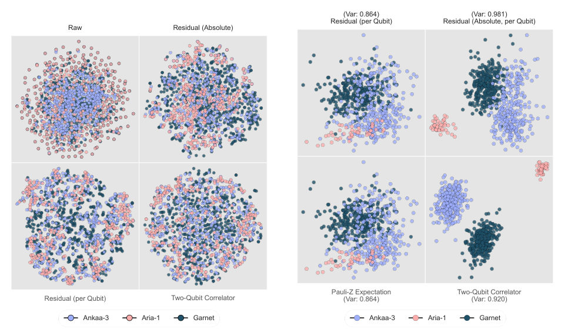
<figcaption class="paper-figure-caption"><b>Fig 5.</b> Fig. 4a demonstrates higher-dimensional clustering via t-SNE for the shallowest of the Haar-random circuit experiments, for a select few example features. It is immediately evident that like-type data points occupy similar neighbourhoods over many features, whereas differing-type data points indicate that at least a partial separation can be observed. Similarly, see Fig. 4b and Fig. 5.</figcaption>
</figure>

**Summary.** This paper formalizes backend identifiability in cloud quantum computing, proposing 'routing anonymity' as a necessary security measure. It develops theoretical bounds on how much information can be hidden while maintaining utility and validates these findings with experiments showing high device distinguishability on real hardware.

**Why it may be interesting.** It provides rigorous security metrics for the practical deployment of quantum computation services, moving beyond algorithmic complexity to address physical implementation vulnerabilities relevant to open quantum systems characterization.

Detailed structure

**Main problem.** The work develops a formal framework for backend identifiability, addressing how classical outputs from noisy quantum hardware can leak information about the service provider's specific physical device or routing choices.

**Main result.** It establishes 'routing anonymity' as a distinct security requirement for quantum cloud services and quantifies the fundamental utility-anonymity trade-off in this context.

**Method.** The authors introduce an operational backend-identifiability game, formalizing the problem as hypothesis testing, and use tools like Pauli-transfer-matrices to analyze noise structure.

**Model / system.** The study models cloud-based quantum computing (QaaS) where users submit circuits to proprietary backends. Experiments are conducted on real hardware platforms like Amazon Braket using ion-trap and superconducting processors.

**Key observables.** Backend-specific 'fingerprints' imprinted in the classical output distribution, classification accuracies of device identity, and leakage rates measured by Chernoff information.

**Important parameters / regimes.** The analysis considers circuit workload, finite-shot resolution, repeated access patterns, and post-processing capabilities.

**Assumptions / limitations.** Theoretical results assume passive i.i.d. access for certain analyses; the framework is designed to handle provider post-processing while maintaining security notions.

**Figures summary.** Figures illustrate classification performance across varying circuit depths (intermediate-depth principle) and demonstrate temporal leakage by showing how LSTMs can forecast noise distributions from sequential measurements.

**Paper structure.** The paper moves from defining the problem via toy examples (Lock-and-Key, Tokens) to developing a formal game theory framework for routing anonymity. It then proves theoretical bounds (Chernoff decay, utility-anonymity trade-off) and validates these concepts with extensive experiments on real quantum hardware.

Abstract

Present-day quantum computing is cloud-based, where a user submits a circuit to a service provider's proprietary backend hardware. While providers may wish to hide implementation details, scheduling choices, or even which physical device was used, noisy finite-shot outputs can carry backend-specific fingerprints: information imprinted in the classical output distribution that can reveal the backend identity. So far, such fingerprints have mostly been studied from a benchmarking perspective, with limited attention to privacy considerations for users and providers. This work develops the first formal framework for backend identifiability and its privacy implications. We introduce a backend-identifiability game and use it to formalise routing anonymity as a security notion for quantum cloud services. We show that backend identifiability is a hypothesis-testing problem and prove that, under passive i.i.d. access to a single backend, routing anonymity decays exponentially at the Chernoff rate. We also establish a utility-anonymity trade-off, imposing fundamental limits on how much backend-specific information can be removed from classical outputs without degrading their usefulness. In addition, we observe that, for noisy quantum hardware, identifying fingerprints are inherently an intermediate-depth phenomenon, and establish a depth principle using Pauli-transfer-matrix tools. We complement the theory with experiments on Amazon Braket on AWS, using ion-trap and superconducting quantum processors. We observe 87-90% classification between superconducting backends and 96-100% classification across physical platforms, and find that identifiability can survive natural forms of post-processing. Overall, these results establish routing anonymity as a distinct security requirement for quantum cloud computing, and provide a framework for quantifying and controlling the utility-anonymity trade-off.

[↑ back to top](#top)

### [Measurement Geometry as a Resource for Certifying Network Nonlocality](http://arxiv.org/abs/2607.04656v1)

**Authors:** Leon Adachi, Le Bin Ho  
**Type:** both · **Category:** quantum information and computing · **PDF:** <https://arxiv.org/pdf/2607.04656v1>  
**Analysis basis:** full PDF text, analyzed in chunks
**Topic relevance:** 🔥 `QC/QI experiment` **4/5** · `quantum measurements` **3/5** · `entanglement & information structure` **2/5** · `measurement-induced transitions` **1/5**

↔ Scroll figures horizontally

<figure class="paper-figure-card">

<figcaption class="paper-figure-caption"><b>Fig 1.</b> FIG. 1. Hierarchy of correlation sets in quantum net- works. The classical sets obey BLHV ⊂LHV ⊂nonFNN ⊂ NS. BLHV corresponds to independent classical sources, LHV allows shared classical randomness, and nonFNN allows one source to generate arbitrary NS correlations. The quan- tum set (Q) lies between LHV and NS but is incomparable with nonFNN. Violations of BLHV and nonFNN certify bilo- cal network nonlocality and full network nonlocality (FNN), respectively.</figcaption>
</figure>
<figure class="paper-figure-card">

<figcaption class="paper-figure-caption"><b>Fig 2.</b> FIG. 2. Bilocal network configuration. Two independent entangled sources each distribute one qubit to Bob and one to an outer party, generating pairs (A, BA) and (BC, C). Bob holds both subsystems BA and BC and performs joint mea- surements, mediating correlations between Alice and Charlie.</figcaption>
</figure>
<figure class="paper-figure-card">

<figcaption class="paper-figure-caption"><b>Fig 3.</b> FIG. 3. Analysis of the BLHV model on bilocal network. (Left) Theoretical, simulation (qiskit aer), and hardware (ibm kingston) results for I and J projected onto the I–J plane, obtained by sweeping θ over the full range [−π, π]. The hatched star-shaped region represents the set of correlations compatible with the BLHV model, bounded by p</figcaption>
</figure>
<figure class="paper-figure-card">

<figcaption class="paper-figure-caption"><b>Fig 4.</b> FIG. 4. FNN witnesses RCNS and RNSC as func- tions of the state parameter θ. Theoretical, simulation (qiskit aer), and hardware processor (ibm kingston) values of RCNS and RNSC are shown as functions of θ. The dashed hor- izontal line marks the classical bound of 3, above which FNN correlations are certified. Both witnesses reach the maximum value 5/ √</figcaption>
</figure>
<figure class="paper-figure-card">
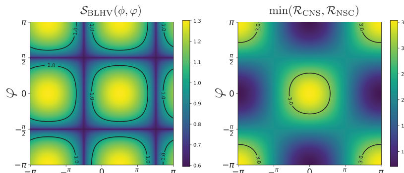
<figcaption class="paper-figure-caption"><b>Fig 5.</b> FIG. 5. Dependence of BLHV and FNN witnesses on the measurement parameters φ and ϕ. (Left) Distribution of SBLHV(φ, ϕ) = p</figcaption>
</figure>

**Summary.** This paper introduces an operational method to certify network nonlocality in three-party quantum systems by analyzing the role of measurement geometry. Using superconducting hardware, they successfully demonstrated bilocal nonlocality while showing that the stronger Full Network Nonlocal correlations are significantly harder to detect experimentally. This establishes measurement design as a crucial, independent resource for certifying genuine multipartite quantum correlations.

**Why it may be interesting.** It provides concrete experimental pathways for testing complex multipartite correlations (nonlocality) beyond simple entanglement measures, directly relevant to building fault-tolerant quantum communication networks.

Detailed structure

**Main problem.** The research aims to develop an operational framework to certify network nonlocality, recognizing that measurement design is an independent resource beyond just the distributed entanglement.

**Main result.** They successfully demonstrated bilocal nonlocality on a superconducting processor and showed that Full Network Nonlocality (FNN) requires substantially stronger certification than bilocal nonlocality.

**Method.** The framework uses ancilla-assisted meter circuits to evaluate nonlocal observables required for both Bilocal (BLHV) and Fully Network Nonlocal (FNN) witnesses in a three-party quantum network.

**Model / system.** The system modeled is the bilocal Alice--Bob--Charlie quantum network, initialized with two independent entangled pairs. The analysis focuses on how Bob's joint measurement determines the accessible level of nonlocality.

**Key observables.** BLHV witness violation ($S_{BLHV} > 1$) and FNN witnesses ($R_{CNS}, R_{NSC}$ exceeding classical bounds like 3).

**Important parameters / regimes.** The entanglement parameter $	heta$ controlling the initial state, and the measurement geometry parameters $(\varphi, \phi)$ defining Bob's joint measurement.

**Assumptions / limitations.** The study assumes that measurement geometry can be systematically varied via ancilla-assisted circuits to test for nonlocality resources.

**Figures summary.** Figures illustrate the hierarchy of nonlocality ($	ext{BLHV} \subset 	ext{LHV} \subset 	ext{nonFNN} \subset 	ext{NS}$), the bilocal network setup, and parameter space plots showing how witness violations depend on measurement settings.

**Paper structure.** The paper establishes the theoretical hierarchy of nonlocality models (BLHV vs. FNN), develops an operational framework using ancilla-assisted measurements for both witnesses, simulates results to show FNN is stronger than BLHV, and finally tests these protocols experimentally on a superconducting quantum processor.

Abstract

Quantum networks can exhibit nonclassical correlations that cannot be explained by classical models with independent sources. While the role of entanglement is well understood, the impact of measurement design remains largely unexplored. Here we develop an operational framework for certifying network nonlocality in the bilocal Alice--Bob--Charlie network using ancilla-assisted meters to evaluate the nonlocal observables required for bilocal and fully network nonlocal (FNN) witnesses. The approach successfully reproduces both bilocal and FNN correlations in simulation. On the 156-qubit superconducting processor \textit{ibm\_kingston}, we observe bilocal nonlocality with $\mathcal{S}_{\rm BLHV}=1.067(6)>1$ after readout-error mitigation, while the FNN witnesses reach $99\%$ and $96\%$ of their certification thresholds, implying the substantially stronger requirements for FNN certification. We further show that Bob's joint measurement determines the accessible level of network nonlocality: bilocal and FNN certification are optimized by different measurement settings, while both violations can disappear even for maximally entangled states. These results identify measurement geometry as an independent resource for network nonlocality and provide a practical route toward its certification on programmable quantum processors.

[↑ back to top](#top)

### [Robust self-test of the maximally entangled state of two-qubits without assuming unitary observables](http://arxiv.org/abs/2607.04035v1)

**Authors:** Alexandre C. Orthey, Magdalena Stobińska-Moretto  
**Type:** theory · **Category:** quantum information and computing · **PDF:** <https://arxiv.org/pdf/2607.04035v1>  
**Analysis basis:** full PDF text, analyzed in chunks
**Topic relevance:** 🔥 `quantum measurements` **4/5** · `entanglement & information structure` **3/5** · `correlated / nonlocal dissipation` **1/5** · `measurement-induced transitions` **1/5** · `methods for driven-dissipative` **1/5**

↔ Scroll figures horizontally

<figure class="paper-figure-card">
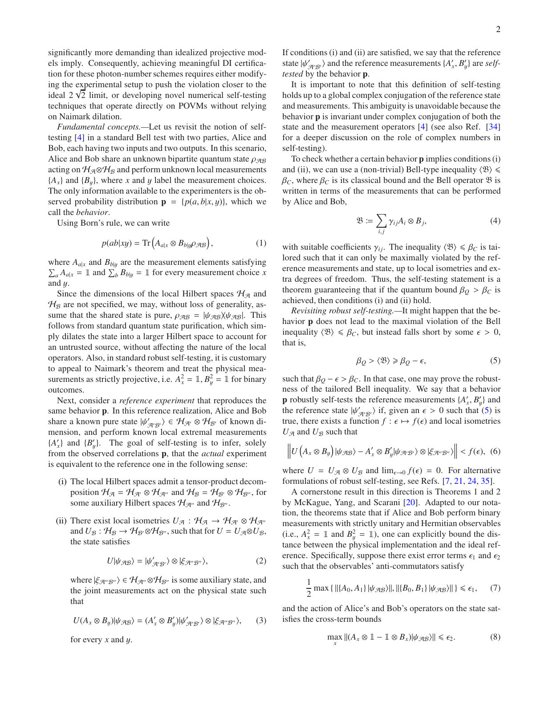
<figcaption class="paper-figure-caption"><b>Fig 1.</b> Low-resolution page preview, page 2</figcaption>
</figure>
<figure class="paper-figure-card">
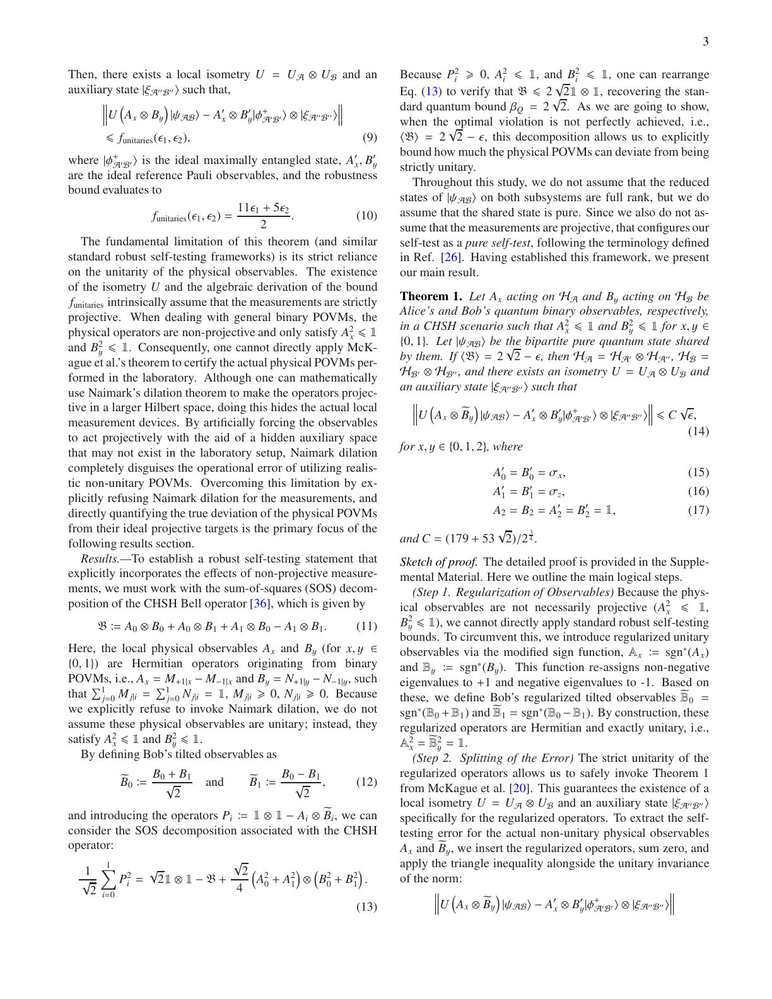
<figcaption class="paper-figure-caption"><b>Fig 2.</b> Low-resolution page preview, page 3</figcaption>
</figure>
<figure class="paper-figure-card">
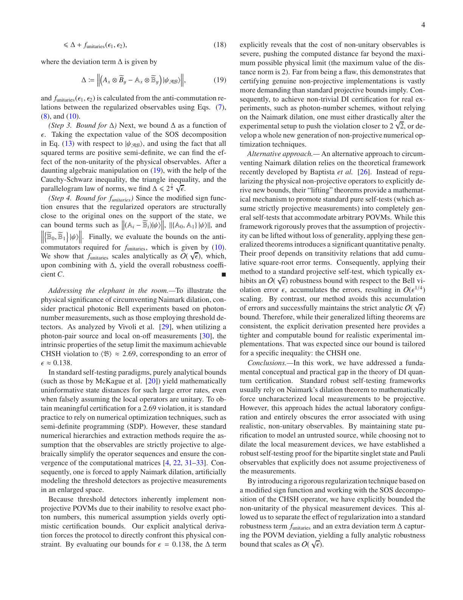
<figcaption class="paper-figure-caption"><b>Fig 3.</b> Low-resolution page preview, page 4</figcaption>
</figure>
<figure class="paper-figure-card">
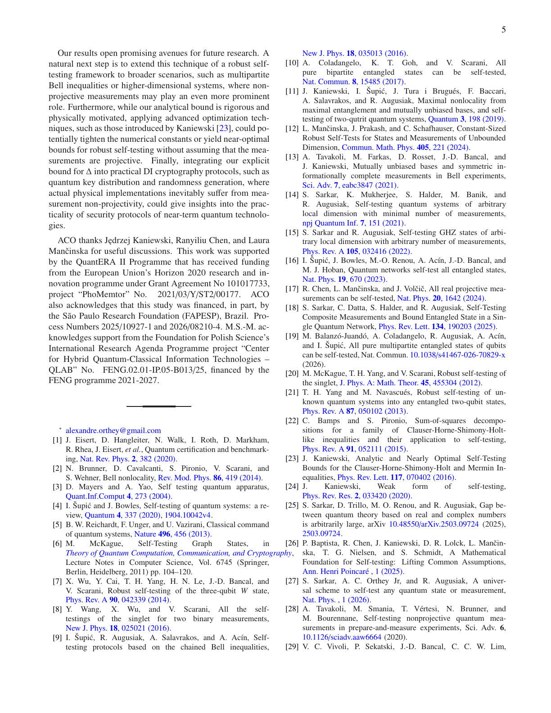
<figcaption class="paper-figure-caption"><b>Fig 4.</b> Low-resolution page preview, page 5</figcaption>
</figure>
<figure class="paper-figure-card">

<figcaption class="paper-figure-caption"><b>Fig 5.</b> Low-resolution page preview, page 6</figcaption>
</figure>

**Summary.** This paper presents a novel self-testing protocol for entangled states that rigorously accounts for non-ideal, non-projective measurements common in real experiments. By regularizing physical observables instead of assuming perfect projective measurements, the authors derive an error bound scaling as $\mathcal{O}(\sqrt{\epsilon})$. This demonstrates that device-independent certification is significantly harder than standard theoretical models suggest.

**Why it may be interesting.** This work provides a crucial refinement to device-independent quantum certification protocols, directly addressing the gap between idealized theoretical models (projective measurements) and realistic experimental limitations (non-unitary POVMs).

Detailed structure

**Main problem.** To develop a robust self-testing protocol for quantum states that accurately accounts for non-projective (non-unitary) measurement observables, overcoming limitations in standard models.

**Main result.** The authors establish an analytic robustness bound scaling as $\mathcal{O}(\sqrt{\epsilon})$ for certifying maximally entangled states using real POVMs, showing this is significantly more demanding than projective model predictions.

**Method.** The approach circumvents Naimark dilation by regularizing physical non-projective operators using a modified sign function and deriving error bounds based on spectral decomposition and norm inequalities.

**Model / system.** The system involves two qubits sharing a maximally entangled state (Bell scenario), tested via local Pauli observables measured through general Positive Operator-Valued Measures (POVMs).

**Key observables.** Local physical observables ($A_x, B_y$), the CHSH Bell operator $B$, and the observed probability distribution $p$.

**Important parameters / regimes.** The experimental error parameter $\epsilon$; the robustness bound scales as $\mathcal{O}(\sqrt{\epsilon})$.

**Assumptions / limitations.** Standard frameworks assume projectivity; this work explicitly models non-projective POVMs and regularizes them rather than assuming ideal measurement apparatuses.

**Paper structure.** The paper builds by first identifying the failure of standard dilation methods, then introducing regularization via a modified sign function ($	ext{sgn}^*$), and finally deriving the total error bound by combining the regularization error ($\Delta$) with the bound derived from regularized unitaries.

Abstract

Standard device-independent self-testing uses Naimark dilation to assume projective measurements, masking the operational limitations of realistic non-unitary observables. We establish a robust pure self-test for the singlet and Pauli observables that entirely circumvents dilation of the measurement apparatus. Assuming a pure state to model an untrusted source, we regularize the physical non-projective operators and derive an analytic $\mathcal{O}(\sqrtε)$ robustness bound. Our results suggest that device-independent certification of real implementations is significantly more demanding than standard projective models imply.

[↑ back to top](#top)

### [Equiangular weighted frames and conical 2-designs with unequal traces](http://arxiv.org/abs/2607.04555v1)

**Authors:** Katarzyna Siudzińska  
**Type:** theory · **Category:** quantum information and computing · **PDF:** <https://arxiv.org/pdf/2607.04555v1>  
**Analysis basis:** full PDF text, analyzed in chunks
**Topic relevance:** 🔥 `quantum measurements` **4/5** · `measurement-induced transitions` **2/5** · `correlated / nonlocal dissipation` **1/5** · `driven-dissipative phase transition` **1/5** · `entanglement & information structure` **1/5**

↔ Scroll figures horizontally

<figure class="paper-figure-card">

<figcaption class="paper-figure-caption"><b>Fig 1.</b> Low-resolution page preview, page 2</figcaption>
</figure>
<figure class="paper-figure-card">
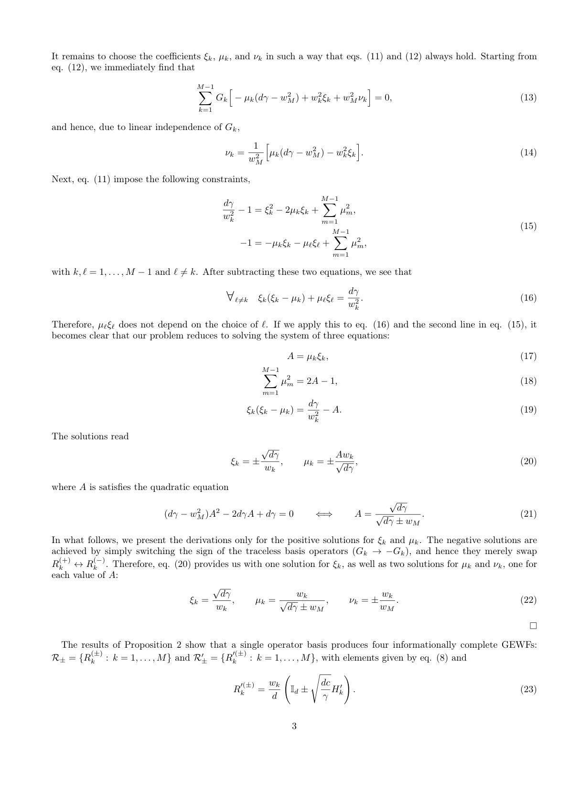
<figcaption class="paper-figure-caption"><b>Fig 2.</b> Low-resolution page preview, page 3</figcaption>
</figure>
<figure class="paper-figure-card">

<figcaption class="paper-figure-caption"><b>Fig 3.</b> Low-resolution page preview, page 4</figcaption>
</figure>
<figure class="paper-figure-card">

<figcaption class="paper-figure-caption"><b>Fig 4.</b> Low-resolution page preview, page 5</figcaption>
</figure>
<figure class="paper-figure-card">

<figcaption class="paper-figure-caption"><b>Fig 5.</b> Low-resolution page preview, page 6</figcaption>
</figure>

**Summary.** This paper develops a construction method for characterizing conical 2-designs using generalized equiangular weighted frames, particularly focusing on cases where the constituent operators do not share equal traces. It establishes that MU GEWFs form such designs under a specific condition of parameter uniformity. This advances the understanding of informationally overcomplete quantum measurements.

**Why it may be interesting.** The rigorous mathematical characterization of quantum measurements (POVMs) that possess high symmetry properties like being a conical 2-design is crucial for understanding optimal quantum state estimation and measurement theory in quantum information processing.

Detailed structure

**Main problem.** The primary goal is characterizing conical 2-designs, especially those constructed from operators whose traces are not equal.

**Main result.** Mutually Unbiased Generalized Equiangular Weighted Frames (MU GEWFs) have been shown to form a specific class of Conical 2-designs if and only if the associated parameters ($c_\alpha$) are constant across all generating sets.

**Method.** The authors propose a construction method by generalizing equiangular weighted frames to non-projective operators, utilizing trace conditions and operator basis constructions on qudit Hilbert spaces.

**Model / system.** The study concerns quantum systems described by a d-dimensional (qudit) Hilbert space ($\mathcal{H} \simeq \mathbb{C}^d$), where the elements are positive semi-definite operators ($R_k$) forming weighted frames or POVMs.

**Key observables.** Weights ($w_k = 	ext{Tr}(R_k)$), parameters $\kappa_+$ and $\kappa_-$, index of coincidence $C_L(
ho)$, and the variance $V(R, 
ho)$.

**Important parameters / regimes.** The dimension $d$ of the Hilbert space; the constant ratio $c$ controlling semi-positivity across different frame elements.

**Assumptions / limitations.** The analysis assumes linear independence for operators spanning the space ($	ext{Cd}$), and it notes that conical 2-designs with unequal traces never saturate certain index inequalities.

**Paper structure.** The paper progresses by first defining Generalized Equiangular Weighted Frames (GEWFs) via trace relations, then extending this to Mutually Unbiased GEWFs (MU GEWFs), and finally establishing the necessary and sufficient condition for these structures to qualify as Conical 2-designs.

Abstract

Conical 2-designs are families of positive operators possessing crucial symmetry properties that allow them to efficiently characterize important quantum measures. However, little is known about their general structures and properties. We propose a construction method of conical 2-designs whose elements are not of equal traces, based on a generalization of equiangular weighted frames to non-projective operators. We provide a detailed analysis of their properties, relations to quantum measurements, and applications, together with examples that go beyond the known classes. This constitutes a major step toward a full characterization of informationally overcomplete quantum measurements.

[↑ back to top](#top)

### [Mass-imbalanced SU(N) Fermi gases](http://arxiv.org/abs/2607.05328v1)

**Authors:** Jordi Pera, Joaquim Casulleras, Jordi Boronat  
**Type:** theory · **Category:** quantum gases · **PDF:** <https://arxiv.org/pdf/2607.05328v1>  
**Analysis basis:** full PDF text, analyzed in chunks
**Topic relevance:** 🔥 `analog quantum simulation` **4/5** · `Keldysh / 2PI / non-Gaussian methods` **3/5** · `driven-dissipative phase transition` **1/5** · `exotic spin models in light-matter` **1/5**

↔ Scroll figures horizontally

<figure class="paper-figure-card">

<figcaption class="paper-figure-caption"><b>Fig 1.</b> FIG. 1. Energy for S = 1/2 as a function of the gas parameter x. The black data represents the mass balanced configuration. In the mass imbalanced system, the spin component C1/2 has a mass ratio of r1/2 = 1, while the other spin C−1/2 has r−1/2 = 2.</figcaption>
</figure>
<figure class="paper-figure-card">
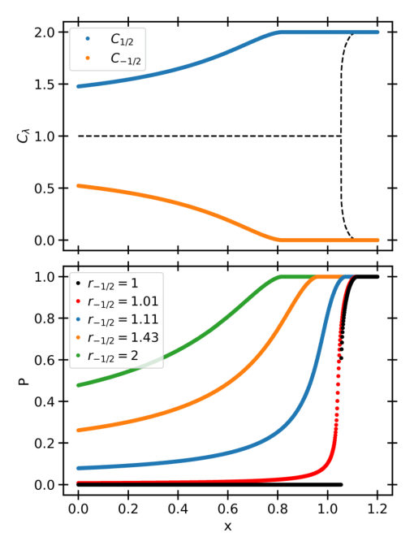
<figcaption class="paper-figure-caption"><b>Fig 2.</b> FIG. 2. Occupation factors (top) and the corresponding po- larization (bottom, green curve) for S = 1/2 as a function of the gas parameter x. The black data represent the mass balanced configuration. The spin component C1/2 has a mass ratio of r1/2 = 1, whereas C−1/2 has r−1/2 = 2 in the top panel and r−1/2 = 1, 1.01, 1.11, 1.43, and 2 in the bottom panel.</figcaption>
</figure>
<figure class="paper-figure-card">
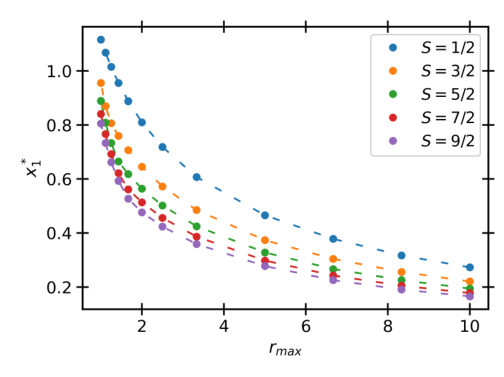
<figcaption class="paper-figure-caption"><b>Fig 3.</b> FIG. 3. Gas parameter at which the system reaches P = 1 as a function of the maximum mass ratio r for S = 1/2, 3/2, 5/2, 7/2 and 9/2. In all cases, one component is the heaviest one, with rs = 1, while the remaining components have rλ̸=s = rmax.</figcaption>
</figure>
<figure class="paper-figure-card">
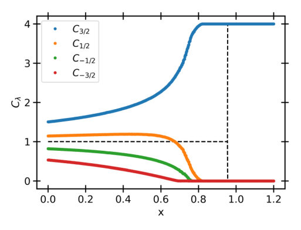
<figcaption class="paper-figure-caption"><b>Fig 4.</b> FIG. 4. Occupation factors for S = 3/2 as a function of the gas parameter x. The black dashed line represents the mass-balanced configurations. Each spin component λ has a different mass: from the heavier rs = 1 to the lighter r−s = 2.</figcaption>
</figure>
<figure class="paper-figure-card">

<figcaption class="paper-figure-caption"><b>Fig 5.</b> FIG. 5. Occupation factors (top) and the corresponding po- larization (below) for S = 7/2 as a function of the gas param- eter x. The black data represent the mass-balanced configu- ration. The spin component C−s has a different (light) mass, r−s = 2. The rest has rλ̸=−s = 1.</figcaption>
</figure>

**Summary.** This paper analytically describes itinerant ferromagnetism in multi-component Fermi gases where the components have unequal masses. By using second-order perturbation theory, the authors show that mass imbalance fundamentally changes the magnetic transition pathway, leading to continuous polarization and requiring weaker interactions than previously thought. This highlights mass mismatch as a key control parameter for quantum magnetism.

**Why it may be interesting.** This work provides a powerful theoretical tool showing how external parameters like mass mismatch can act as a control knob for inducing or modifying quantum phase transitions (like ferromagnetism) in ultracold atomic mixtures.

Detailed structure

**Main problem.** The study focuses on deriving a fully analytical description of zero-temperature itinerant ferromagnetism in repulsive SU(N) Fermi gases that possess arbitrary mass imbalance among their components.

**Main result.** Mass imbalance fundamentally alters the magnetic ordering path, causing the system to approach full polarization continuously rather than discontinuously, and it lowers the interaction strength required for ferromagnetism.

**Method.** The authors employ perturbation theory up to second order in the gas parameter x = kF a0 to derive closed analytical expressions for the beyond-mean-field energy corrections.

**Model / system.** The system modeled is a repulsive SU(N) Fermi gas at zero temperature, characterized by multiple spin components and varying mass ratios among these components. The interactions are governed by an s-wave scattering length $a_0$.

**Key observables.** Energy per particle (E/N), polarization (P), occupation factors ($C_\lambda$), and the critical gas parameter required for full polarization.

**Important parameters / regimes.** The mass imbalance is quantified by ratios like $r_\lambda = m_g / m_\lambda$, and the coupling strength is controlled by the gas parameter $x$.

**Assumptions / limitations.** The analysis relies on perturbation theory truncated at the second order in the gas parameter x.

**Figures summary.** Figures compare energy vs. interaction strength for mass-balanced versus mass-imbalanced systems, and plot the critical gas parameter needed to reach full polarization as a function of the maximum mass ratio.

**Paper structure.** The paper develops the analytical second-order energy expression for arbitrary mass ratios, analyzes how mass imbalance breaks paramagnetic symmetry even at weak coupling, and demonstrates that this asymmetry modifies the entire path toward magnetic ordering compared to the mass-balanced case.

Abstract

We report a fully analytical description of zero-temperature itinerant ferromagnetism in repulsive SU(N) Fermi gases with arbitrary mass imbalance among components. Using perturbation theory in the gas parameter x = kFa0, with kF the Fermi momentum and a0 the s-wave scattering length, we derive the second-order energy for arbitrary spin polarization and arbitrary mass ratio. Our main result is a closed analytic expression for the beyond-mean-field correction in mixtures with unequal masses. This analytical result extends the theory of dilute Fermi gases beyond the mass-balanced case and provides a compact equation of state for multicomponent mixtures. We show that mass imbalance breaks the paramagnetic symmetry already in the non-interacting limit, favors the occu pation of heavier components, and lowers the interaction strength required to reach a fully polarized state. For S = 1/2, the system evolves continuously from a mass-induced partially polarized state to full ferromagnetism. For larger spins, distinct mass distributions generate qualitatively differ ent polarization paths, including smooth and discontinuous sequences. Our results identify mass imbalance as a powerful control tool for magnetic ordering in ultracold Fermi mixtures.

[↑ back to top](#top)

### [Beyond-adiabatic flat Chern bands from a double-helix skyrmion crystal](http://arxiv.org/abs/2607.03707v1)

**Authors:** Bin Xi, Ken Chen, Qiang Luo, Jie Lu, Jia-Wei Mei, Hong-Gang Luo, Jize Zhao  
**Type:** theory · **Category:** strongly correlated electrons · **PDF:** <https://arxiv.org/pdf/2607.03707v1>  
**Analysis basis:** full PDF text, analyzed in chunks
**Topic relevance:** 🔥 `analog quantum simulation` **4/5** · `Keldysh / 2PI / non-Gaussian methods` **1/5** · `entanglement & information structure` **1/5** · `exotic spin models in light-matter` **1/5** · `spintronics-quantum-optics interface` **1/5**

↔ Scroll figures horizontally

<figure class="paper-figure-card">
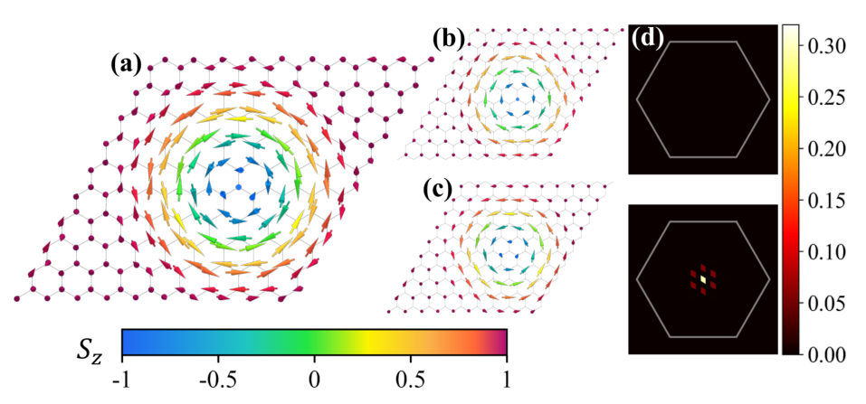
<figcaption class="paper-figure-caption"><b>Fig 1.</b> Figure 1. Representative DHSKX configuration. (a) Full spin texture. (b,c) Sublattice-resolved spin</figcaption>
</figure>
<figure class="paper-figure-card">

<figcaption class="paper-figure-caption"><b>Fig 2.</b> Figure 2. Flat Chern bands in the DHSKX background. (a–d) Narrow energy windows around the 398th</figcaption>
</figure>
<figure class="paper-figure-card">

<figcaption class="paper-figure-caption"><b>Fig 3.</b> Figure 2(a-d) traces these two branches from weak to strong coupling, and Fig. 2(e) plots their</figcaption>
</figure>
<figure class="paper-figure-card">
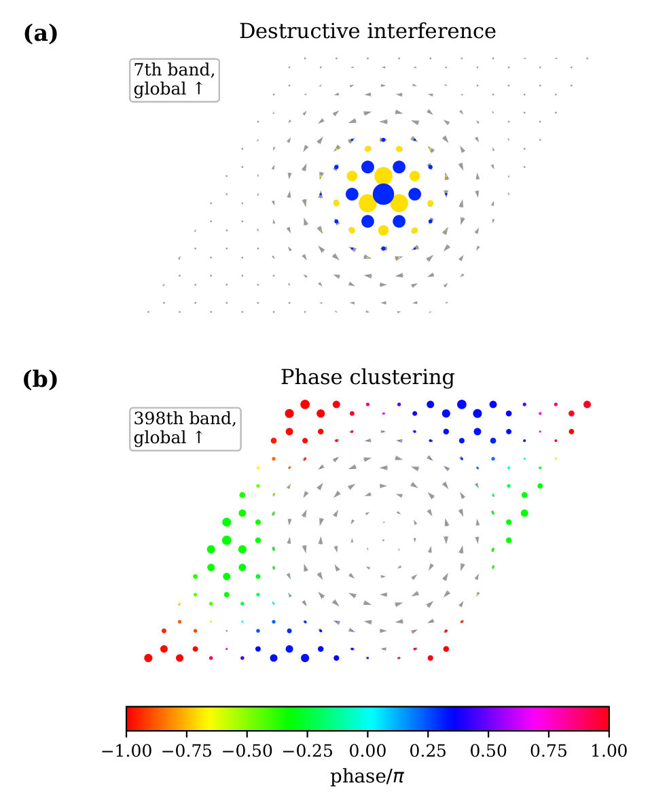
<figcaption class="paper-figure-caption"><b>Fig 4.</b> Figure 3. Real-space wave-function fingerprints relevant to Fig. 2. (a) Global ↑component of the 7th band</figcaption>
</figure>

**Summary.** This work proposes that a Double-Helix Skyrmion Crystal (DHSKX) can engineer robust flat Chern bands by exploiting a mechanism called phase clustering. This topological state surpasses predictions from simple adiabatic models and exhibits finite-size evidence consistent with $
u=1/3$ fractional quantum Hall physics. The architecture is highly promising because it can be directly implemented in various physical platforms.

**Why it may be interesting.** The concept of using engineered magnetic textures (skyrmions) to induce robust topological electronic states is highly relevant. The mechanism—phase clustering leading to destructive interference while preserving Berry curvature—offers a novel, architecturally controllable route for realizing fractional quantum Hall physics in solid-state analogues.

Detailed structure

**Main problem.** The central challenge is engineering flat Chern bands by suppressing kinetic energy without eliminating the Berry curvature, moving beyond limitations of adiabatic approximations.

**Main result.** A Double-Helix Skyrmion Crystal (DHSKX) provides a mechanism to achieve isolated flat $|C|=1$ Chern bands via phase clustering, showing evidence for $
u=1/3$ Laughlin-type fractional-Chern-insulator physics.

**Method.** The analysis uses zero-temperature Kubo Hall response, band-projected exact diagonalization on tori, and quantum geometry calculations to characterize the topological properties of the system.

**Model / system.** The model is based on a double exchange Hamiltonian applied to a Double-Helix Skyrmion Crystal (DHSKX), which consists of two sublattice-resolved skyrmion textures locked at opposite helicities.

**Key observables.** Flatness ratio ($\gtrsim 10$), Chern number ($C$), Quantum Geometry ($\sigma_{QG}$), and signatures of Laughlin fractional quantum Hall physics ($
u=1/3$).

**Important parameters / regimes.** The coupling ratio $t/J_H$ is critical, with an optimal window identified around $0.32-0.44$.

**Assumptions / limitations.** The results rely on the DHSKX architecture being programmable in various platforms (topolectric, acoustic, photonic) and are supported by finite-size evidence from diagonalization.

**Figures summary.** Figures illustrate the DHSKX structure, the evolution of flat Chern bands across coupling regimes showing $C=1$ and $C=-2$, and real-space wave function fingerprints demonstrating phase clustering versus localized patterns.

**Paper structure.** The paper establishes the problem (flat band engineering), introduces the DHSKX as a solution via phase clustering, calculates topological invariants ($C$), demonstrates the non-adiabatic regime surpassing adiabatic limits, and finally provides finite-size evidence for fractional quantum Hall physics ($
u=1/3$).

Abstract

A central challenge in flat-band engineering is suppressing kinetic energy without sacrificing Berry curvature. We show that a double-helix skyrmion crystal (DHSKX)--two sublattice-resolved skyrmion textures locked at opposite helicities, obtained here as the classical ground state of a frustrated honeycomb spin model--provides such a route under double exchange. The key mechanism is a single real-space organization, phase clustering: the $π$-locked helicities expel the wave function's phase winding from the skyrmion cores, and the magnetic $C_3$ symmetry pins it into three phase-locked clusters whose distributed destructive interference cancels net transport while preserving the Berry curvature. Ordinary skyrmion crystals, even with the same symmetry, do not develop this organization. Phase clustering yields isolated flat $|C| = 1$ Chern bands over broad coupling windows, one of which surpasses the adiabatic reference in quantum geometry at intermediate coupling. In this beyond-adiabatic window, band-projected exact diagonalization gives finite-size evidence consistent with $ν= 1/3$ Laughlin-type fractional-Chern-insulator physics; the same texture also hosts a higher-Chern ($C = -2$) flat band. Built from site-resolved complex hoppings alone, the DHSKX architecture is directly programmable in topolectric, acoustic, and photonic platforms.

[↑ back to top](#top)

### [Pauli Spectrum and Stabilizer Rényi Entropy in Gapless Symmetry-Protected Topological Phases](http://arxiv.org/abs/2607.03762v1)

**Authors:** Ying-Lin Li, Po-Yao Chang  
**Type:** theory · **Category:** strongly correlated electrons · **PDF:** <https://arxiv.org/pdf/2607.03762v1>  
**Analysis basis:** full PDF text, analyzed in chunks
**Topic relevance:** 🔥 `entanglement & information structure` **4/5** · `Keldysh / 2PI / non-Gaussian methods` **1/5** · `analog quantum simulation` **1/5** · `driven-dissipative phase transition` **1/5**

↔ Scroll figures horizontally

<figure class="paper-figure-card">

<figcaption class="paper-figure-caption"><b>Fig 1.</b> FIG. 1: (a)M2 of the cluster SPT for L = 30 under periodic boundary condition(PBC), bond dimension χ = 50 and NSamp = 105. (b)Pauli spectrum for the cluster model with L = 8. Red symbols denote SPT non-local string order operators while blue symbols denote trivial non-local string operators. Different marker shapes correspond to different string lengths, defined in Eqs. (5)(6), such as △: |n −m| = 1, × : |n −m| = 2, and □: |n −m| = 3. Gray dots show the remaining Pauli-string weights.</figcaption>
</figure>
<figure class="paper-figure-card">

<figcaption class="paper-figure-caption"><b>Fig 2.</b> FIG. 2: (a)M2 of the cluster Ising model with PBC, bond dimension χ = 50 and NSamp = 105. (b)M2 along g1 = 2. (c)Pauli spectrum along g1 = 2 with L = 8. Red symbols denote SPT non-local string order operators while blue symbols denote trivial non-local string operators. Green symbols denote SSB local order parameters. Different marker shapes correspond to different string lengths, defined in Eqs. (6)(8), such as △: |n −m| = 1, × : |n −m| = 2, □: |n −m| = 3, and ⋄: |n −m| = 4. Gray dots show the remaining Pauli-string weights. Note that the X-string is a power law function instead of O(1).</figcaption>
</figure>
<figure class="paper-figure-card">

<figcaption class="paper-figure-caption"><b>Fig 3.</b> FIG. 3: (a)M2 of igSPT for Lunit = 16 (32 spins) with PBC, bond dimensionχ = 100, Nsamp = 105. (b)Pauli string weight for Lunit = 4 (8 spins). Red symbols denote SPT non-local string order operators, defined in Eq. (13), with △: |i −j| = 1, and × : |i −j| = 2 while blue symbols denote trivial non-local string operators, defined in Eq. (15), with + : |i −j| = 1, and o : |i −j| = 2. Note that the Red symbols with + : |i −j| = 1, and o : |i −j| = 2 is defined in Eq. (14)</figcaption>
</figure>
<figure class="paper-figure-card">
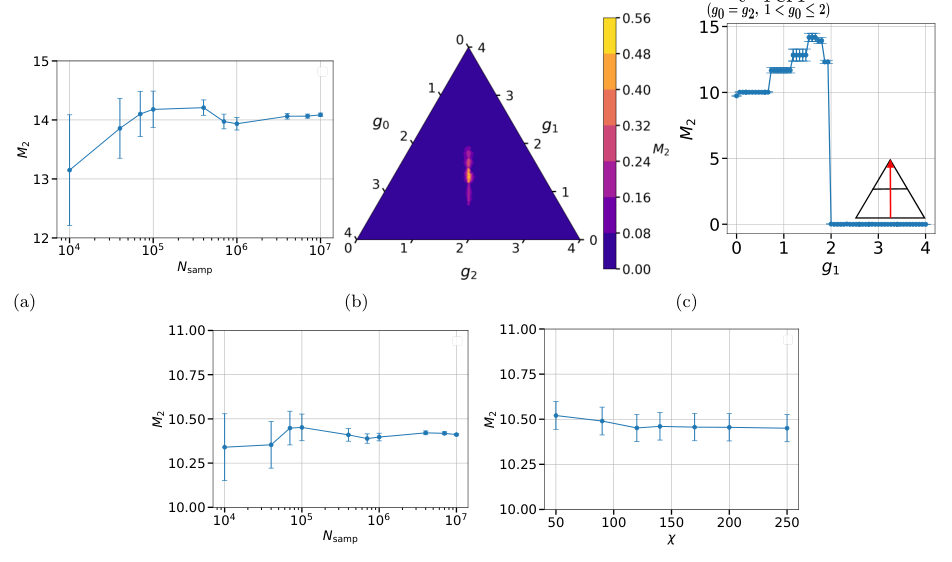
<figcaption class="paper-figure-caption"><b>Fig 4.</b> FIG. 4: (a)Convergence of M2 with respect to number of sampling NSamp of Cluster-type models with L=30, χ = 50 at (g0, g1, g2) = (1.2, 1.6, 1.2). (b)The error of the SRE sampling calculation of Cluster Ising model with L = 30, χ = 50, and NSamp = 105. (c)M2 along g0 = g2 of the cluster Ising model with PBC, χ = 50 and NSamp = 105. (d)Convergence of M2 with respect to number of sampling NSamp of igSPT models with L = 32, χ = 100 at h = 1</figcaption>
</figure>

**Summary.** This work introduces the Pauli spectrum as a superior diagnostic tool compared to stabilizer Rényi entropy for characterizing Symmetry-Protected Topological phases. By analyzing how the Pauli correlations change across phase transitions using duality mappings, the authors demonstrate that this method can resolve subtle differences between gapped and gapless topological orders in quantum many-body systems.

**Why it may be interesting.** It provides a rigorous theoretical framework for using local correlation measurements (Pauli strings) to distinguish between subtle topological orders in strongly correlated quantum materials, which is highly relevant to understanding exotic electronic states.

Detailed structure

**Main problem.** The paper aims to develop advanced quantum diagnostics beyond standard entanglement measures to characterize Symmetry-Protected Topological (SPT) phases.

**Main result.** While the stabilizer Rényi entropy provides only a coarse diagnostic, the Pauli spectrum reveals a characteristic crossing structure at phase transitions, offering finer information about string order sector exchange.

**Method.** The study employs theoretical analysis of quantum correlation functions using the Pauli spectrum and calculating the Stabilizer Rényi Entropy (SRE) for various SPT models.

**Model / system.** The research analyzes general SPT phases, including gapped, non-intrinsically gapless, and intrinsically gapless types. Specific models include a 1D cluster SPT model and the Cluster Ising Model.

**Key observables.** Stabilizer Rényi Entropy (SRE), Pauli spectrum (the full probability distribution of Pauli strings), and the crossing structure observed in the Pauli spectrum at phase transitions.

**Important parameters / regimes.** The coupling constants ($h, g_0, g_1, g_2$) defining the Hamiltonian; system size ($L$); and the Rényi parameter ($\alpha$).

**Assumptions / limitations.** The analysis focuses on pure ground states and utilizes duality transformations (local-unitary or non-invertible Kramers-Wannier type) to map between different topological phases.

**Figures summary.** Figures illustrate the calculated $\mathcal{M}_2$ (SRE proxy) and the Pauli spectrum for cluster SPT models, showing distinct red (SPT) vs. blue (trivial) correlations; other figures show convergence checks for these observables in various model regimes.

**Paper structure.** The paper systematically compares SRE against the Pauli spectrum across different classes of SPT phases (gapped, non-intrinsically gapless, intrinsically gapless), detailing how duality transformations govern the observed spectral changes at critical points.

Abstract

Quantum entanglement is widely used as a diagnostic of topological phases of matter. Beyond entanglement, non-stabilizerness captures a distinct aspect of quantum many-body states by quantifying their distance from the manifold of stabilizer states. In this work, we study the stabilizer Rényi entropy in symmetry protected topological (SPT) phases, including both gapped SPT, non-intrinsically gapless SPT, and intrinsically gapless SPT phases. Under symmetry preserving perturbations, we find numerically that the stabilizer Rényi entropy exhibits an extremum near the phase transition. However, the stabilizer Rényi entropy alone cannot distinguish different SPT phases. In contrast, the Pauli spectrum reveals a characteristic crossing structure at the transition point. This crossing reflects the exchange of dominant Pauli-string correlations associated with the non-local string order parameters of the two topological distinct phases. For gapped SPT and non-intrinsically gapless SPT phases, the crossing structure can be understood from a local-unitary duality that maps the Pauli spectrum between the two phases. For intrinsically gapless SPT phases, such a local-unitary mapping is absent. Instead, we find that the Pauli spectrum mapping is generated by a non-invertible duality transformation. These results show that although the stabilizer Rényi entropy provides only a coarse diagnostic of phase transitions, the Pauli spectrum contains finer information about the exchange of string order sectors. Our findings demonstrate that quantum magic offers a complementary perspective for characterizing both gapped and gapless SPT phases.

[↑ back to top](#top)

### [Cuprate d-wave superconductivity based on Non perturbative many body theory for spin fluctuation](http://arxiv.org/abs/2607.04168v1)

**Authors:** Jianwei Gong, Junnian Xiong, Ruitao Xiao, Hui Li, Ziyu Li, Huaqing Huang, Dingping Li  
**Type:** theory · **Category:** strongly correlated electrons · **PDF:** <https://arxiv.org/pdf/2607.04168v1>  
**Analysis basis:** full PDF text, analyzed in chunks
**Topic relevance:** 🔥 `Keldysh / 2PI / non-Gaussian methods` **4/5** · `analog quantum simulation` **1/5** · `methods for driven-dissipative` **1/5**

↔ Scroll figures horizontally

<figure class="paper-figure-card">

<figcaption class="paper-figure-caption"><b>Fig 1.</b> FIG. 1: Numerical phase diagram of the Hubbard model for different interaction strengths U with fixed next-nearest-neighbor hopping t′ = −0.25 and lattice size 32 × 32. SC order: stable boundary with ∆d ̸= 0; SC: divergence boundary of χd(0, 0, 0); S8/S10: contours of χs(QAF, 0) = 8, 10; AF: onset of antiferromagnetic order; CDW: divergence of χc(QCDW, 0).</figcaption>
</figure>
<figure class="paper-figure-card">

<figcaption class="paper-figure-caption"><b>Fig 2.</b> FIG. 2: Magnitude of the d-wave superconducting order parameter |∆d| as a function of doping density in the hole-doped region for t′ = −0.25, U = 8, and lattice size N = 32 × 32 at various temperatures.</figcaption>
</figure>
<figure class="paper-figure-card">

<figcaption class="paper-figure-caption"><b>Fig 3.</b> FIG. 3: Color plots of ∂nk/∂µ for the Hubbard model with U = 8 and t′ = −0.25 on a 64 × 64 square lattice. The three columns correspond to different hole-doping levels, and the three rows correspond to different inverse temperatures β (from top to bottom: β = 20, 40, 60).</figcaption>
</figure>

**Summary.** The paper develops and applies a covariant spin GW method to the Hubbard model to study high-Tc d-wave superconductivity in cuprates. It successfully maps out the complex phase diagram by calculating $T_c$ and comparing it with experimental data, confirming the theoretical framework's utility for strongly correlated electron physics.

**Why it may be interesting.** This work provides a sophisticated, nonperturbative theoretical tool for strongly correlated systems that explicitly handles competing orders, offering insights into phenomena beyond simple BCS theory relevant to unconventional superconductivity.

Detailed structure

**Main problem.** The primary goal is understanding the microscopic origin of high-temperature superconductivity (d-wave) in cuprate materials while accounting for competing orders like antiferromagnetism and charge density waves.

**Main result.** The proposed nonperturbative spin GW method successfully calculates key transition temperatures ($T_c$ and $T_{	ext{Néel}}$) that show quantitative agreement with experimental data, mapping out the complex phase diagram.

**Method.** The authors employ a covariant spin GW approach within the 4-Nambu formalism to derive self-consistent equations for Green's functions and correlation functions, which are then used to map the phase diagram.

**Model / system.** The study uses the two-dimensional $t$-$t'$-$U$ Hubbard model, simulating cuprate superconductors in both electron- and hole-doped regimes. The theory is formulated using Dyson-Schwinger equations.

**Key observables.** Néel temperature ($T_{	ext{Néel}}$), superconducting critical temperature ($T_c$), spin correlation function ($\chi_s$), charge correlation function, and the d-wave superconducting order parameter ($|\Delta_d|$).

**Important parameters / regimes.** Hubbard interaction $U$, hopping parameters ($t, t'$), doping level ($\langle n 
angle$), and lattice size (up to $64 	imes 64$).

**Assumptions / limitations.** The method assumes translational invariance and relies on approximations like the lowest-order vertex approximation; it also notes that ignoring field fluctuations leads to a BCS-like $T_c$.

**Figures summary.** Figures illustrate the phase diagram showing boundaries for AF, CDW, and SC orders across doping. Other figures map the evolution of the Fermi surface topology and show the characteristic dome shape of $|\Delta_d|$ vs. doping.

**Paper structure.** The paper develops a theoretical framework using the 4-Nambu spin-GW formalism to derive self-consistent equations in momentum space, which are then applied to calculate phase boundaries (AF, CDW, SC) and analyze the evolution of electronic states across different doping regimes.

Abstract

We employ the nonperturbative many-body spin GW method to compute the single-particle Green's function, and the covariance method to evaluate the correlation functions of two body, for the Hubbard model for superconductors. The key transition temperatures, namely the Neel temperature and the superconducting critical temperature Tc are found to be in quantitative agreement with experimental data. The evolution of the Fermi surface in different doping regimes is also presented, which clearly shows transitions from pseudogap to strange metal and to Fermi liquid phase. The method has been benchmarked at strong coupling and low temperature and is free from the fermion sign problem. Simulations on lattices up to 64 times 64 are also feasible, making access to the thermodynamic limit possible. This approach may offer a new route toward investigating strongly correlated systems, especially cuprate superconductors.

[↑ back to top](#top)

### [Genuine Multipartite Entanglement between Logical Qubits via Cross-Code Lattice Surgery](http://arxiv.org/abs/2607.04227v1)

**Authors:** Alex Steiner, Tomasz Andrzejewski, Phila Rembold, Hendrik Poulsen Nautrup, Christian D. Marciniak, Robert Freund, Ivan Pogorelov, Thomas Monz, Philipp Schindler, Marcel Meyer, Nicolai Friis  
**Type:** experiment · **Category:** quantum information and computing · **PDF:** <https://arxiv.org/pdf/2607.04227v1>  
**Analysis basis:** full PDF text, analyzed in chunks
**Topic relevance:** 🔥 `QC/QI experiment` **4/5** · `entanglement & information structure` **2/5**

↔ Scroll figures horizontally

<figure class="paper-figure-card">
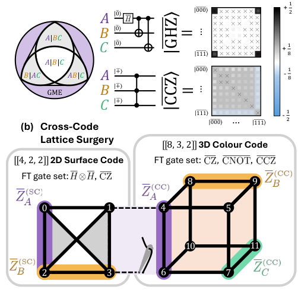
<figcaption class="paper-figure-caption"><b>Fig 1.</b> FIG. 1. Logical genuine multipartite entanglement and cross-code lattice surgery. (a) Logical genuine multipar- tite entanglement (GME): States of three parties, A, B, and C, that are convex mixtures of states separable with respect to the bipartitions A∣BC, AB∣C, and B∣AC are biseparable, while states outside this convex set are GME. Examples for GME states include the GHZ state (a stabiliser state) and the non-stabiliser state ∣CCZ⟩. Circuits for the preparation of these states using logical CNOT and CCZ gates acting on logical states ∣+⟩= (∣0⟩+ ∣1⟩)/ √</figcaption>
</figure>
<figure class="paper-figure-card">

<figcaption class="paper-figure-caption"><b>Fig 2.</b> FIG. 2. Lattice surgery and GME preparation. (a) Smooth merge M between two codes (e.g., the SC, top left, and the CC bottom left) with logical initial states ∣ψ⟩and ∣+⟩, respectively, realised by measuring MZZ in Eq. (1) with outcome m, and subsequent correction X if m = −1, teleporting ∣ψ⟩to the merged code (MC, right). (b) Logical circuits employing transversal gates H ⊗H (up to a SWAP of A and B) on the SC, flags on the CC (illustrative flag poles connect the concerned logical qubits, see Appendix A.IV), transversal CCZ and fault-tolerant CNOT gates (the latter realised by relabelling of trapped-ion qubits) on the MC, and smooth merges M are used to prepare the stabiliser and...</figcaption>
</figure>
<figure class="paper-figure-card">
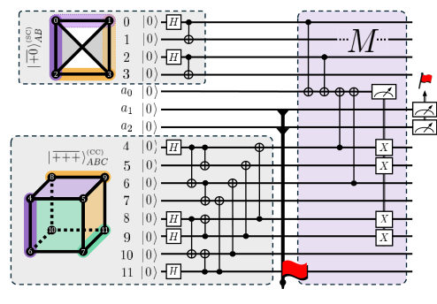
<figcaption class="paper-figure-caption"><b>Fig 3.</b> FIG. 3. Physical circuit. Encoding circuits (grey) for the preparation of logical initial states ∣+0⟩ (SC) AB and ∣+++⟩ (CC) ABC of the SC and CC on physical qubits 0, 1, 2, 3 and 4, . . . , 11, re- spectively, along with circuit for the smooth merge M (laven- der) using auxiliary qubit a0. Two additional auxiliary qubits a1 and a2 are coupled to the CC (illustrative flag pole repre- sents weight-four measurements on physical qubits 4, 6, 9, 11, see Appendix A.IV.2) and subsequently measured as flags.</figcaption>
</figure>
<figure class="paper-figure-card">
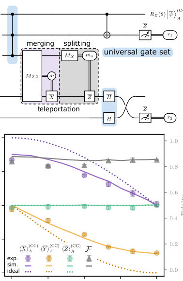
<figcaption class="paper-figure-caption"><b>Fig 4.</b> FIG. 4. Arbitrary rotation RZ(θ) via cross-code lat- tice surgery. (a) Teleportation-based rotation gadget: The initial state ∣ψ⟩ (CC) A is prepared together with two auxiliary states ∣+θ⟩ (CC) B and ∣02θ⟩ (CC) C . After applying CCZ on the CC, the state of the C qubit is teleported onto the SC via Z merg- ing and X splitting before the application of H and a Z mea- surement. Finally, a CNOT is applied between CC qubits A and B, and the latter is measured. Depending on the out- comes the final state of A is accepted as correctly rotated or rejected. The combination of the CCZ and Hadamard gates demonstrates the use of a full universal gate set. (b) Mea- sured expectation values ⟨X⟩ (CC) A...</figcaption>
</figure>

**Summary.** The research demonstrates how to build complex logical quantum operations on trapped ions by merging two different Quantum Error Correction codes via lattice surgery. They successfully generated and verified genuine multipartite entanglement in both stabiliser and non-stabiliser states. This work establishes a core, fault-tolerant building block for future large-scale quantum computers.

**Why it may be interesting.** This work provides a concrete, hardware-validated blueprint for scaling quantum computation by solving the fundamental problem of accessing universal gates fault-tolerantly through code combination.

Detailed structure

**Main problem.** The goal is to experimentally demonstrate the generation and certification of genuine multipartite entanglement (GME) between logical qubits using a fault-tolerant universal gate set.

**Main result.** The authors successfully generated and certified both stabiliser (GHZ) and non-stabiliser states exhibiting GME, while also demonstrating arbitrary single logical qubit rotations. These results confirm the viability of cross-code lattice surgery for building complex quantum computation primitives.

**Method.** They utilized lattice surgery to combine complementary Quantum Error Correction (QEC) codes—specifically a surface code and a 3D colour code—to access a universal gate set transversally.

**Model / system.** The experiments were performed on a trapped-ion quantum processor using ${}^{40}	ext{Ca}^+$ ions. Information is encoded into logical qubits protected by multiple QEC codes, which are merged via lattice surgery operations.

**Key observables.** Logical state fidelity for GHZ and non-stabiliser states; the stabiliser norm ($D$) to certify GME and non-stabiliserness.

**Important parameters / regimes.** Experimental fidelities (e.g., $F_{	ext{exp.GHZ}} = 83.0\%$), noise parameters ($p_1=0.005, p_2=0.015$), and theoretical thresholds for GME/non-stabiliserness.

**Assumptions / limitations.** The primary assumption is that the lattice surgery procedure correctly merges the codes to provide fault-tolerant access to gates beyond what any single code supports transversally.

**Figures summary.** Figures illustrate the definition of logical GME, the physical circuits for cross-code lattice surgery (smooth merge M), and the preparation protocols for both GHZ and non-stabiliser states ($	ext{|CCZ}
angle$).

**Paper structure.** The paper systematically details the theoretical necessity of lattice surgery to achieve universal gates, presents the experimental realization on trapped ions using specific codes (SC and CC), demonstrates GME generation for different state types, and concludes with showing arbitrary single-qubit rotations.

Abstract

Universal quantum computers are expected to generate arbitrary complex quantum states of logical qubits encoded in many physical qubits. This capability hinges on a fault-tolerantly implemented universal gate set, which no single quantum error-correction code admits transversally but which becomes accessible by joining complementary codes via lattice surgery. Here we report on the experimental generation and certification of logical genuine multipartite entanglement in a trapped-ion quantum processor using a transversally implemented universal logical gate set. The gate set is accessed via lattice surgery across two different codes and comprises a Hadamard gate on a four-qubit surface code and a doubly controlled Pauli-$Z$ ($\overline{\mathrm{CCZ}}$) gate on an eight-qubit 3D colour code. To showcase this lattice-surgery toolbox, we generate both stabiliser (Greenberger-Horne-Zeilinger) and non-stabiliser ($|\overline{\mathrm{CCZ}}\rangle$) states of three logical qubits and verify their genuine multipartite entanglement--a form of correlation beyond statistical mixtures of bipartite entanglement across any bipartition. We further use these cross-code primitives to demonstrate arbitrary rotations of single logical qubits via a $\overline{\mathrm{CCZ}}$-based resource gadget accessing the full universal gate set through lattice surgery. Together, these demonstrations showcase the core building blocks of an architecture for fault-tolerant quantum computation and its ability to generate complex logical quantum states.

[↑ back to top](#top)

### [From the Hong-Ou-Mandel Effect to Quantum Sensing: Interference of Nonclassical Light with Partial Distinguishability and Noise](http://arxiv.org/abs/2607.03636v1)

**Authors:** Matheus Eiji Ohno Bezerra  
**Type:** theory · **Category:** quantum information and computing · **PDF:** <https://arxiv.org/pdf/2607.03636v1>  
**Analysis basis:** full PDF text, analyzed in chunks
**Topic relevance:** 🔥 `interference shaping light` **4/5** · `quantum measurements` **1/5**

↔ Scroll figures horizontally

<figure class="paper-figure-card">
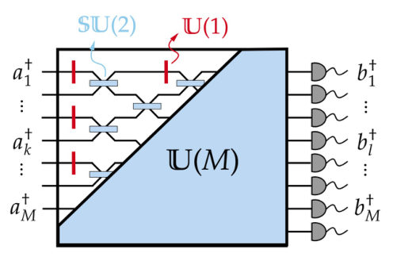
<figcaption class="paper-figure-caption"><b>Fig 1.</b> Figure 2.1: Representation of the construction of a M-mode interferometer in terms of el- ements of linear optics: beamsplitters (blue) and phase shifters (red). Indeed, the entire interferometer is represented by a matrix that is an element of the group U(M), while the elements are matrices belonging to the groups SU(2) and U(1) respectively.</figcaption>
</figure>
<figure class="paper-figure-card">

<figcaption class="paper-figure-caption"><b>Fig 2.</b> Figure 2.2: Illustration of the operators acting on the phase space (a) Displacement operator ˆDk(αk), defined in Eq. (2.68), (b) Single-mode squeezing ˆSk(r), defined in Eq. (2.81).</figcaption>
</figure>
<figure class="paper-figure-card">

<figcaption class="paper-figure-caption"><b>Fig 3.</b> Figure 3.1: (a) Illustration of the scheme for the interference of N photons prepared in the input Fock state |m⟩a, with m = (m1, . . . , mM), and detected in the output Fock state |n⟩b, with n = (n1, . . . , nM), after interference at the multiport U. (b) Example of three-photon interference in a six-mode interferometer: the photons are prepared in the input configuration m3 = (1, 1, 1, 0, 0, 0) and detected in the output configuration n3 = (0, 1, 1, 0, 1, 0). The associated input and output mode label vectors are k = (1, 2, 3) and l = (2, 3, 5), respectively, where Ulk denotes the transition amplitude from input mode k to output mode l, as defined in Eq. (2.45).</figcaption>
</figure>
<figure class="paper-figure-card">
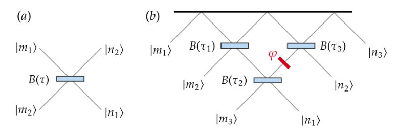
<figcaption class="paper-figure-caption"><b>Fig 4.</b> Figure 3.2: Schematic representation of the two interferometers used to illustrate the proposed method: a) Beamsplitter, that transforms two input modes into two output modes; b) Tritter, that is a composition of three different beamsplitters B1, B2, B3 and a control phase shifter φ. Here, each mk denotes the number of photons prepared in the input mode k and nl denotes the number of photons detected in the output mode l.</figcaption>
</figure>
<figure class="paper-figure-card">

<figcaption class="paper-figure-caption"><b>Fig 5.</b> Figure 3.3: Suppression laws for the tritter T(τ1, φ) defined in Eq. (3.33). In both graphs is shown value of the transmissivity τ1 that suppresses the corresponding amplitudes. Panel (a) presents the suppression laws for the amplitudes b⟨n1, nS|n1, 1, 1⟩a = 0 while panel (b) presents the suppression laws for the amplitudes b⟨n1, nS|m, m, m⟩a = 0.</figcaption>
</figure>

**Summary.** This thesis provides a comprehensive theoretical analysis of how nonclassical light interference behaves when subjected to noise and partial photon distinguishability. Using advanced mathematical tools like generating functions, it develops new understanding of interference structures for both Fock and Gaussian states. The work is crucial for assessing the feasibility limits of quantum sensing and computation in realistic noisy environments.

**Why it may be interesting.** This is highly relevant as it tackles the practical limitations (noise, distinguishability) that degrade theoretically predicted quantum advantages in quantum sensing and computation protocols.

Detailed structure

**Main problem.** The study investigates how interference effects involving nonclassical light (Fock and Gaussian states) are affected by realistic imperfections such as partial distinguishability and noise.

**Main result.** The research identifies new suppression laws for Fock state interference and shows that while some measurement incompatibilities can vanish under optimal conditions, fundamental constraints remain at high photon numbers.

**Method.** The authors develop analytical tools using the phase-space formalism and generating functions to provide a unified description of quantum optical interference phenomena.

**Model / system.** The system involves light interfering in linear interferometers, modeled using Fock states and Gaussian states derived from quantized electromagnetic fields. The analysis extends concepts like Boson Sampling (GBS) to include partial distinguishability via an overlap matrix.

**Key observables.** Interference patterns (e.g., Hong-Ou-Mandel effect), zero probability events ('suppression laws'), quantum estimation precision, and measurement incompatibility.

**Important parameters / regimes.** Photon distinguishability, photon number ($N$), noise levels, and the degree of partial indistinguishability.

**Assumptions / limitations.** The analysis builds upon established quantization procedures for electromagnetic fields and assumes applicability of phase-space formalisms to describe interference in noisy channels.

**Paper structure.** The work progresses by first establishing the theoretical framework using generating functions, then analyzing Fock state interference revealing new suppression laws, followed by extending Gaussian Boson Sampling descriptions for partial distinguishability, and concluding with an examination of quantum multiparameter estimation limits.

Abstract

This thesis explores the interference of nonclassical states of light, particularly Fock and Gaussian states, in noisy linear interferometers, with applications to quantum information and quantum sensing. Using the phase-space formalism, analytical tools based on generating functions are developed to describe quantum optical interference in a unified way. For multiphoton Fock states, new zero probability events (suppression laws) are identified beyond the previously derived symmetry permutation principle, revealing rich interference structures that is degraded with photon distinguishability. For Gaussian states, the Hafnian-based description of Gaussian Boson Sampling is extended to include partial distinguishability via the overlap matrix of the internal state of the photons. Finally, the link between these interference effects and quantum multiparameter estimation is examined for the simultaneous estimation of phase and loss. This study shows that while probe incompatibility can vanish for optimized non-Gaussian states and some two-mode Gaussian states, at high photon number, measurement incompatibility remains a fundamental constraint even in this limit.

[↑ back to top](#top)

### [Algebra of quantum mechanics via classical phonons. I: The Schrodinger equation as the Newtonian equation of motion and quantum observables as classical averages](http://arxiv.org/abs/2607.03897v1)

**Authors:** Emmanuel Giner  
**Type:** theory · **Category:** other · **PDF:** <https://arxiv.org/pdf/2607.03897v1>  
**Analysis basis:** full PDF text, analyzed in chunks
**Topic relevance:** 🔥 `Frenkel-Kontorova` **4/5**

↔ Scroll figures horizontally

<figure class="paper-figure-card">

<figcaption class="paper-figure-caption"><b>Fig 1.</b> FIG. 1. Pictorial representation of the Frenkel-Kontorova model used here. The chain of length L is made of N parti- cles of mass m, each of them are separated on the x axis by the lattice parameter a. The transverse displacement of the n-th mass is represented by the real number un(t), K0 is the strength of the ”on-site” harmonic force and K that of the ”between-site” harmonic force.</figcaption>
</figure>

**Summary.** This paper proposes deriving the Schrödinger equation from a classical phonon model based on coupled harmonic oscillators. By taking the continuum limit and applying complex variable transformations, the authors show how the dynamics of this lattice system reproduce the non-relativistic quantum algebra. It provides an alternative, classically grounded perspective on the foundations of quantum theory.

**Why it may be interesting.** This work offers a novel, purely classical dynamical pathway to derive the fundamental equations of quantum mechanics, bypassing standard canonical quantization procedures. This is particularly interesting for researchers seeking deep physical interpretations of quantum formalism.

Detailed structure

**Main problem.** The central goal is to reproduce the algebraic structure of quantum mechanics (Schrödinger equation) by deriving it from a purely classical physical model, specifically involving coupled harmonic oscillators.

**Main result.** The Schrödinger equation for a single spinless particle and its associated algebra can be derived in the non-relativistic limit by analyzing the continuous dynamics of a phonon system using complex variable transformations.

**Method.** The methodology involves taking the continuum limit of the Newtonian equations governing a lattice of coupled oscillators, yielding the Klein-Gordon equation, which is then transformed into the Schrödinger form via time scale separation and complex variables.

**Model / system.** The model is based on the linearized Frenkel-Kontorova system (a 1D lattice of coupled harmonic oscillators). The continuous limit yields a field theory described by the Klein-Gordon equation, which then reduces to the Schrödinger equation in the non-relativistic regime.

**Key observables.** Total energy, momentum, and the wave function $\psi(x, t)$ itself are shown to correspond between classical global observables and quantum operators.

**Important parameters / regimes.** The derivation is explicitly limited to the non-relativistic regime; relativistic effects and the measurement problem are noted as outside the scope of this part.

**Assumptions / limitations.** A key assumption is that a complex change of variables can map the real-valued classical dynamics onto the quantum formalism, although this contradicts the requirement for intrinsically real fields in their Newtonian interpretation.

**Figures summary.** Not specified by the notes provided.

**Paper structure.** The paper proceeds from the discrete lattice model (Newtonian equations) $	o$ continuous limit (Klein-Gordon equation) $	o$ complex variable transformation and time scale separation $	o$ non-relativistic limit (Schrödinger equation). A separate discussion addresses dissipative forces leading to non-Hermitian Hamiltonians.

Abstract

The Schrodinger equation for a single spinless particle is formally obtained via a classical phonon model, namely the Frenkel-Kontorova model. Starting from a one-dimensional lattice of coupled harmonic oscillators, we show that the continuous limit of the corresponding Newtonian equation of motion yields the Klein-Gordon equation for a real-valued field. By introducing a complex-valued change of variables mixing the real-valued displacement and velocity fields, and by separating fast and slow time scales, the Klein-Gordon equation is written as the Schrodinger equation within the non-relativistic limit. This complex change of variable also allows to rewrite classical global observables of the phonon field, such as the total energy or momentum, as the corresponding quantum observables. Additionally, we show that when a friction force is incorporated into the classical model, the corresponding Klein-Gordon equation can be rewritten as a Schrodinger equation with a non-Hermitian Hamiltonian. While the global approach is limited here to the non-relativistic regime and does not address the measurement problem, quantization or relativistic effects, it nonetheless illustrates how quantum algebra and complex-valued wave functions can be exactly reproduced using classical dynamics. The relativistic regime for a spinless particle and the link between commutators and Poisson brackets is addressed in the second part of this series.

[↑ back to top](#top)

### [Supersymmetry and Entanglement in the Generalized Dirac Oscillator](http://arxiv.org/abs/2607.04348v1)

**Authors:** H. P. Laba, V. M. Tkachuk  
**Type:** theory · **Category:** quantum information and computing · **PDF:** <https://arxiv.org/pdf/2607.04348v1>  
**Analysis basis:** full PDF text, analyzed in chunks
**Topic relevance:** 🔥 `entanglement & information structure` **4/5**

↔ Scroll figures horizontally

<figure class="paper-figure-card">
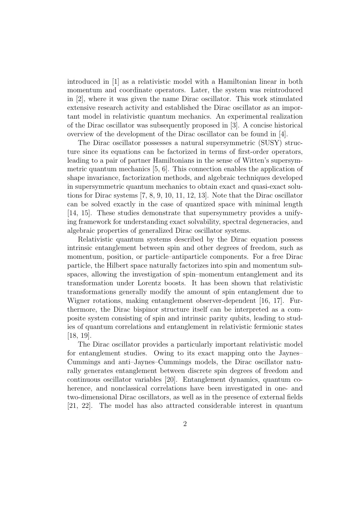
<figcaption class="paper-figure-caption"><b>Fig 1.</b> Low-resolution page preview, page 2</figcaption>
</figure>
<figure class="paper-figure-card">
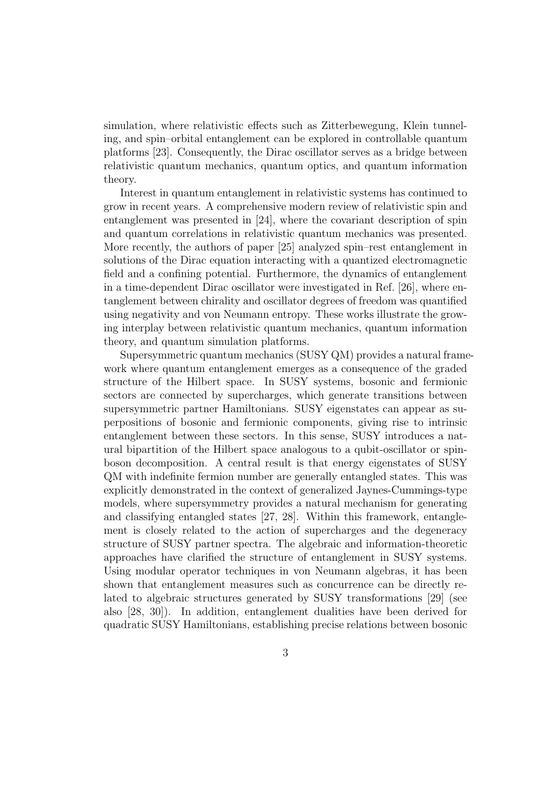
<figcaption class="paper-figure-caption"><b>Fig 2.</b> Low-resolution page preview, page 3</figcaption>
</figure>
<figure class="paper-figure-card">
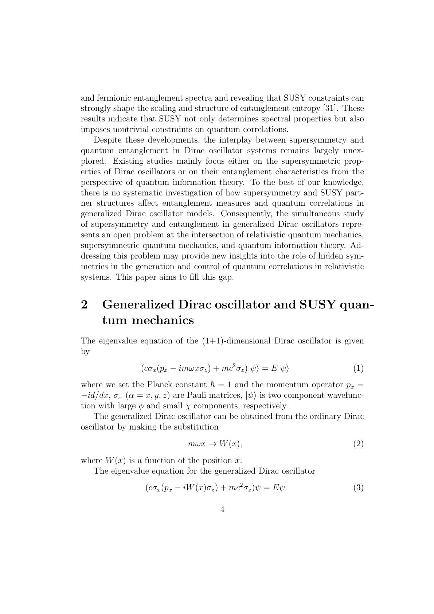
<figcaption class="paper-figure-caption"><b>Fig 3.</b> Low-resolution page preview, page 4</figcaption>
</figure>
<figure class="paper-figure-card">

<figcaption class="paper-figure-caption"><b>Fig 4.</b> Low-resolution page preview, page 5</figcaption>
</figure>
<figure class="paper-figure-card">

<figcaption class="paper-figure-caption"><b>Fig 5.</b> Low-resolution page preview, page 6</figcaption>
</figure>

**Summary.** This theoretical paper analyzes the entanglement between spin and continuous variables in the generalized Dirac oscillator using supersymmetric techniques. It shows that the calculated entanglement entropy is zero for the ground state but grows with energy, confirming that this correlation is fundamentally relativistic. The findings highlight how underlying symmetries govern quantum information properties in relativistic field models.

**Why it may be interesting.** This work provides a concrete example of how fundamental symmetries (SUSY) can dictate non-trivial quantum correlations (entanglement) in relativistic models, offering insights applicable to structured quantum systems beyond standard qubit architectures.

Detailed structure

**Main problem.** The study investigates the interplay between supersymmetry (SUSY) properties and quantum entanglement within generalized Dirac oscillator systems.

**Main result.** The entanglement entropy is found to be zero for the ground state but increases with energy, reaching a maximum value in the infinite energy limit. Crucially, this entanglement has a purely relativistic origin, vanishing in the nonrelativistic limit.

**Method.** The analysis uses SUSY transformations to decouple the system into components ($	ilde{\phi}, 	ilde{\chi}$) and calculates the entanglement entropy by finding the eigenvalues of the reduced density matrix traced over continuous variables.

**Model / system.** The model is a (1+1)-dimensional generalized Dirac oscillator, which is a relativistic quantum mechanical system whose Hamiltonian incorporates SUSY structure. The analysis involves solving coupled differential equations derived from the eigenvalue problem.

**Key observables.** Entanglement entropy ($S$), overlap integral ($Z$), and the energy eigenvalues ($E$).

**Important parameters / regimes.** The parameter $\gamma$, which quantifies the relationship between the two SUSY partner components, and the relativistic limit $E 	o \infty$.

**Assumptions / limitations.** The analysis heavily relies on the existence of a supersymmetric structure ($\hat{B}, \hat{B}^+$) to relate the system's components.

**Paper structure.** The paper first establishes the SUSY framework for the generalized Dirac oscillator, then parameterizes the state vector using SUSY partners. It proceeds to calculate the entanglement entropy based on these components and analyzes its dependence on energy and symmetry properties.

Abstract

The supersymmetric properties of the generalized Dirac oscillator allow us to determine the entanglement entropy between the spin and the continuous variable in a purely algebraic manner. The entanglement has a relativistic origin and disappears in the nonrelativistic limit. The entanglement entropy attains its maximal value in the limit of infinite energy.

[↑ back to top](#top)

### [Broken Ergodicity and the Violation of the Fluctuation-Dissipation Theorem Lead to Generalization Beyond Overfitting in Machine Learning](http://arxiv.org/abs/2607.04135v1)

**Authors:** Chan Li, Nigel Goldenfeld  
**Type:** theory · **Category:** disordered systems and neural networks · **PDF:** <https://arxiv.org/pdf/2607.04135v1>  
**Analysis basis:** full PDF text, analyzed in chunks
**Topic relevance:** `Keldysh / 2PI / non-Gaussian methods` **3/5** · `driven-dissipative phase transition` **3/5** · `non-equilibrium universality` **3/5** · `methods for driven-dissipative` **2/5** · `non-equilibrium dynamics` **2/5** · `scars & prethermalization` **2/5** · `Frenkel-Kontorova` **1/5** · `correlated / nonlocal dissipation` **1/5**

↔ Scroll figures horizontally

<figure class="paper-figure-card">
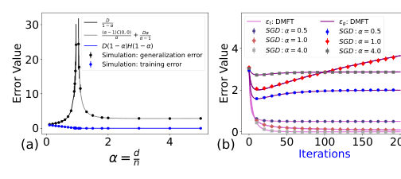
<figcaption class="paper-figure-caption"><b>Fig 1.</b> FIG. 1. Comparison between numerical simulations and theo- retical predictions for the generalization error εg(t) and train- ing error εt(t) in an unregularized (λ = 0) single-layer linear neural network (N = 1, 000, d = αN, D = 1, r = 1, γ = 0.5, and ζ = 0.1). (a) Asymptotic values (training time T = 104) of εg and εt as functions of model capacity α. Markers denote simulations (averaged over ten independent runs), while solid lines show analytical predictions. H(x) is the Heaviside step function, which equals 1 for x &gt; 0 and 0 for x ≤0. (b) Time evolution of εg(t) and εt(t) for different α (T = 20). The number of iterations is T</figcaption>
</figure>
<figure class="paper-figure-card">

<figcaption class="paper-figure-caption"><b>Fig 2.</b> FIG. 2. Comparison between theoretical data collapse and simulation results in an unregularized (λ = 0) single-layer linear neural network (N = 10,000, d = αN, D = 1, r = 1, γ = 0.5, ζ = 0.1 and training time T = 10,000). The er- ror bar characterizes the fluctuation across ten independently network realizations. Panels (a)–(b) correspond to the under- parameterized regime (α &lt; 1), while panels (c)–(d) corre- spond to the over-parameterized regime (α &gt; 1). (a, c) Gen- eralization error εg(t) as a function of t, with markers indi- cating simulation results from stochastic gradient descent for various values of α. (b, d) Scaled generalization errors plot- ted against the scaling variable,...</figcaption>
</figure>
<figure class="paper-figure-card">

<figcaption class="paper-figure-caption"><b>Fig 3.</b> FIG. 4. Regularization rounds the divergence of the gener- alization error. Simulations are performed for a regularized single-layer linear network (N = 10,000, d = αN, D = 1, r = 0.1, γ = 1). (a) Steady state generalization error εg(t →∞) versus α for different λ. Markers denote simu- lation results (50 runs) and solid lines are the exact theoreti- cal values from Eq. (15). (b) Peak generalization error εgmax versus λ, showing εgmax ∝λ−1/2. Inset: The corresponding peak shift, ∆αc = 1−αc, increases linearly with λ. Error bars in (b) and in the inset represent standard error of the mean estimated via bootstrap resampling (B = 1, 000; see sec. III.B of the Supplemental Material [26]). Dashed...</figcaption>
</figure>
<figure class="paper-figure-card">
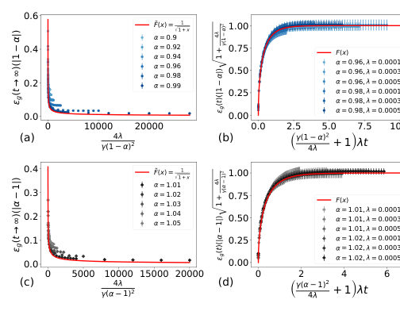
<figcaption class="paper-figure-caption"><b>Fig 4.</b> FIG. 3. Comparison between theoretical scaling predictions and simulation results in a regularized single-layer linear neu- ral network (N = 10,000, d = αN, D = 1, r = 1, γ = 1). Er- ror bars represent fluctuations across ten independent realiza- tions. Panels (a)–(b): under-parameterized regime (α &lt; 1); panels (c)–(d): over-parameterized regime (α &gt; 1). (a, c) Steady-state generalization error εg(t →∞), rescaled by |1 −α|, plotted against the dimensionless regularization vari- able 4λ/γ(1 −α)2. Markers denote different values of α, with λ ∈[0.01, 1.0]. Only markers in the weakly regularized regime collapse onto the theoretical prediction (red). (b, d) Full tem- poral dynamics: rescaled...</figcaption>
</figure>

**Summary.** This theoretical work explains 'double descent' by modeling neural network training as a dynamical phase transition. It shows that the improved generalization in overparameterized regimes is mathematically equivalent to breaking ergodicity, mirroring physics seen in superconductors where the Fluctuation-Dissipation Theorem breaks down.

**Why it may be interesting.** The direct analogy drawn between superconducting phase transitions (a hallmark of non-equilibrium dynamics) and benign overfitting provides a powerful, physical framework for understanding modern deep learning phenomena.

Detailed structure

**Main problem.** The paper aims to provide a theoretical explanation for the 'double descent' phenomenon in overparameterized neural networks, where generalization error decreases again beyond the interpolation threshold.

**Main result.** This double descent behavior is shown to be the outcome of a dynamical phase transition characterized by the breakdown of the Fluctuation-Dissipation Theorem (FDT) and broken ergodicity.

**Method.** The analysis employs Dynamical Mean-Field Theory (DMFT) applied to the stochastic gradient flow describing the training process, comparing it to known critical phenomena in condensed matter physics.

**Model / system.** The system models the training dynamics of a linear student network learning from a teacher model. The mathematical framework involves analyzing correlation and response functions derived from the SGD process in the thermodynamic limit.

**Key observables.** Generalization error ($\epsilon_g$), training error ($\epsilon_t$), Response function ($R(t, t')$), Correlation function ($C(t, t')$), and the violation of the Fluctuation-Dissipation Theorem (FDT).

**Important parameters / regimes.** The overparameterization ratio $\alpha = d/N$, which dictates the system's regime ($\alpha < 1$ vs. $\alpha > 1$).

**Assumptions / limitations.** The analysis relies on mapping the learning dynamics onto established models from statistical physics, particularly drawing analogies to superconducting transitions and normal metals.

**Figures summary.** Figures likely compare the scaling of generalization error ($\epsilon_g$) across different regimes ($\alpha$), showing a transition point analogous to $T_c$ or $\alpha=1$, and illustrating the functional form of the response function in both equilibrium and non-equilibrium states.

**Paper structure.** The paper progresses by first establishing the ML problem (double descent), then mapping it onto a physical model using DMFT, analyzing the critical behavior at the interpolation threshold ($\alpha=1$), and finally interpreting the resulting FDT violation as the mechanism for generalization in the overparameterized regime.

Abstract

The remarkable ability of modern neural networks to generalize improves with increasing network capacity, even when the number of model parameters or effective degrees of freedom exceeds the number of training data points. This phenomenon is all the more surprising given that generalization error diverges when the number of model parameters approaches a critical value from below. Here we use dynamical mean field theory to show that this so-called "double descent" behavior is the outcome of a phase transition in the stochastic field theory describing the training process. We calculate the critical exponents and scaling function of the double descent phase transition, and show that it is marked by a breakdown of the fluctuation-dissipation theorem associated with broken ergodicity. The corresponding response function has the same functional form as the simple London model of the superconducting transition, with the rigidity of the wave function corresponding to the neural network's ability to generalize accurately.

[↑ back to top](#top)

### [Error Mitigation in Bosonic Systems via Virtual Distillation](http://arxiv.org/abs/2607.04914v1)

**Authors:** Leonardo Finocchiaro, Marco Robbio, Diogo Gomes, David Gunn, Adithi Udupa, Axel M. Eriksson, Leonardo Novo, Giulia Ferrini  
**Type:** theory · **Category:** quantum information and computing · **PDF:** <https://arxiv.org/pdf/2607.04914v1>  
**Analysis basis:** full PDF text, analyzed in chunks
**Topic relevance:** `interference shaping light` **3/5** · `quantum optics experiment` **3/5** · `QC/QI experiment` **2/5** · `methods for driven-dissipative` **2/5** · `quantum measurements` **2/5** · `Keldysh / 2PI / non-Gaussian methods` **1/5** · `analog quantum simulation` **1/5** · `correlated cavity matter` **1/5** · `driven-dissipative phase transition` **1/5**

↔ Scroll figures horizontally

<figure class="paper-figure-card">

<figcaption class="paper-figure-caption"><b>Fig 1.</b> FIG. 1: Schematic of the two possible approaches to virtual distillation using the diagonalizing technique: (a) The M copies of the noisy state ρ are combined through a Fourier interferometer ˆFM, enabling the simultaneous estimation of Tr h ˆOρMi and Tr  ρM from joint measurements on the output modes; (b) Two interferometers are needed to</figcaption>
</figure>
<figure class="paper-figure-card">

<figcaption class="paper-figure-caption"><b>Fig 2.</b> FIG. 2: Expectation value of the number operator as a function of the dimensionless loss rate, κt, for inputs (a) Fock state |3⟩; (b) binomial state |ψb⟩∝|0⟩+ |4⟩and (c) cat state |ψc⟩∝|α⟩+ | −α⟩. Compared to the reference plot without distillation, the protocol performs at its best on the noisy Fock states, but does not yield any advantage for the two other examples. This is due to the eigenvector drift phenomenon (see Section II A).</figcaption>
</figure>
<figure class="paper-figure-card">

<figcaption class="paper-figure-caption"><b>Fig 3.</b> FIG. 3: Reconstruction of the Wigner function W(α) for the Fock state |3⟩under a loss channel with strength κt = 0.2. The heatmaps display the Wigner functions for the unmitigated noisy state (with label ”No VD”), and the mitigated states using virtual distillation (labeled as ”VD”) with M = 2, 3, and 4 copies. The measurements are obtained via displaced parity measurements. The right panel shows the phase-space L2 error (Euclidean distance, see Eq.(38)) relative to the ideal pure state’s Wigner function as a function of the loss time t. As shown, increasing the number of copies M effectively reduces the distance to the ideal state, demonstrating an improvement as compared to the case where...</figcaption>
</figure>
<figure class="paper-figure-card">

<figcaption class="paper-figure-caption"><b>Fig 4.</b> FIG. 4: Expectation value of the parity operator (−1)ˆn as a function of the dimensionless loss rate for three noisy cat states with an amplitude of α = 1.50. The panels show the even cat (n = 2), the three-component cat (n = 3), and the four-component cat (n = 4). The virtual distillation (VD) protocol performs best on the even and four-component cat states due to the fact that they are eigenstates of the target observable. For the three-component cat state, whose parity expectation value strongly depends on the value of α, the protocol does not perform optimally but still achieves an improvement over the unmitigated noisy state.</figcaption>
</figure>
<figure class="paper-figure-card">
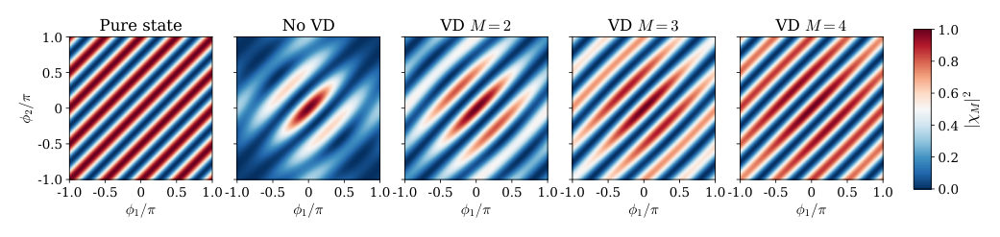
<figcaption class="paper-figure-caption"><b>Fig 5.</b> FIG. 5: Modulus square of the characteristic function of the photon-number distribution of a two-mode N00N state (N = 4) after applying a loss channel with strength κt = 0.2 . Each point corresponds to a multimode estimation of the phases ei(ϕ1ˆn1+ϕ2ˆn2). While the ideal properties of the characteristic function are quickly lost when noise is added, the virtual distillation (VD) protocol achieves an almost perfect reconstruction of the characteristic function describing the photon-number distribution on the two modes. This effective correction is possible because the N00N states are eigenstates of the phase shifter operator.</figcaption>
</figure>

**Summary.** This paper develops a comprehensive framework to apply virtual distillation—an error mitigation technique—to bosonic systems and CV quantum computing. By leveraging linear-optical interferometers, the authors derive protocols to estimate key observables like quadratures and number operators even when the input state is corrupted by noise such as photon loss. This offers a practical path toward fault-tolerant measurements in photonic quantum processors.

**Why it may be interesting.** This is highly relevant as it provides concrete, experimentally implementable error mitigation techniques (VD) tailored specifically for the continuous-variable nature of bosonic quantum processors, bridging theory toward practical photonic quantum computation.

Detailed structure

**Main problem.** The primary goal is to extend error mitigation techniques, specifically virtual distillation (VD), from qubit systems to bosonic quantum information processing and continuous-variable quantum computing.

**Main result.** The authors establish a general framework for VD in bosonic systems using experimentally accessible linear-optical interferometers, allowing the recovery of noise-mitigated expectation values for various observables.

**Method.** The methodology involves deriving protocols based on diagonalizing cyclic shift operators implemented via passive linear-optical interferometers to estimate noisy expectation values from multiple copies of the state.

**Model / system.** The work focuses on bosonic quantum systems, utilizing continuous-variable (CV) descriptions with quadrature ($\hat{q}, \hat{p}$) and number operators. The protocols are designed for implementation using linear-optical interferometers.

**Key observables.** Number operators, phase-shift operators, arbitrary quadratures ($\hat{q}_	heta$), and correlators of arbitrary order (estimated via the characteristic function).

**Important parameters / regimes.** The error suppression scales exponentially with the number of copies ($M$) and is analyzed in regimes affected by photon loss and dephasing.

**Assumptions / limitations.** A key assumption for VD effectiveness relates to how noise modifies the density matrix ($
ho$), specifically requiring $
ho$ to be close to a specific form involving the dominant eigenvector. Eigenvector drift remains a potential limitation.

**Figures summary.** Figures illustrate the comparison of estimated expectation values (e.g., number operator, parity operator) under noisy conditions versus those mitigated by VD protocols using different measurement methods (Method 1 vs Method 2).

**Paper structure.** The paper builds from establishing the general framework for bosonic VD, detailing specific measurement protocols using single and double interferometers to access various observables, and concluding with applications to quantifying noise suppression in photon loss and dephasing scenarios.

Abstract

Virtual distillation is a promising error-mitigation technique that exploits multiple copies of a noisy quantum state to estimate observables as if measured on a purified state. Although originally introduced in the context of bosonic many-body systems under the name of virtual cooling, its development and applications have largely focused on qubit-based quantum computation. Here, we establish a framework for virtual distillation in bosonic quantum information processing and continuous-variable quantum computing. Building on a diagonalization of cyclic shift operators implemented with passive linear-optical interferometers, we derive experimentally accessible protocols for estimating virtually distilled expectation values of observables relevant to bosonic architectures. In particular, we show how to recover noise-mitigated expectation values of number operators, phase-shift operators, and arbitrary quadratures from multi-copy measurements. For number operators, we further demonstrate the estimation of virtually distilled correlators of arbitrary order through the characteristic function of the photon-number distribution. We apply the framework to states affected by photon loss and dephasing, two of the dominant noise mechanisms in bosonic quantum computation, and quantify the resulting suppression of noise contributions. Our results extend virtual distillation beyond its original setting and provide a practical route toward error-mitigated measurements in bosonic quantum processors using experimentally available linear-optical resources.

[↑ back to top](#top)

### [Optical switching of antiferromagnetic domains by nonreciprocal heat current](http://arxiv.org/abs/2607.04975v1)

**Authors:** Takeshi Hayashida, Shunsuke Izumikawa, Kenta Kimura, Carl S. Davies, Andrei Kirilyuk  
**Type:** experiment · **Category:** other · **PDF:** <https://arxiv.org/pdf/2607.04975v1>  
**Analysis basis:** full PDF text, analyzed in chunks
**Topic relevance:** `exotic spin models in light-matter` **3/5** · `spintronics-quantum-optics interface` **3/5** · `non-equilibrium dynamics` **2/5** · `quantum optics experiment` **2/5** · `analog quantum simulation` **1/5** · `correlated / nonlocal dissipation` **1/5** · `driven-dissipative phase transition` **1/5** · `interference shaping light` **1/5** · `non-equilibrium universality` **1/5**

↔ Scroll figures horizontally

<figure class="paper-figure-card">
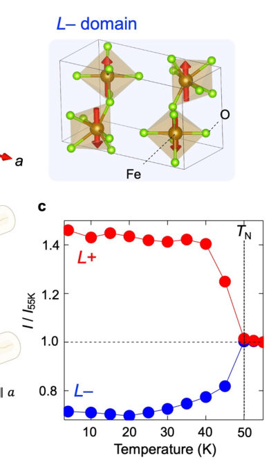
<figcaption class="paper-figure-caption"><b>Fig 1.</b> Fig. 1: Antiferromagnetic domains and nonreciprocal directional dichroism (NDD)</figcaption>
</figure>
<figure class="paper-figure-card">
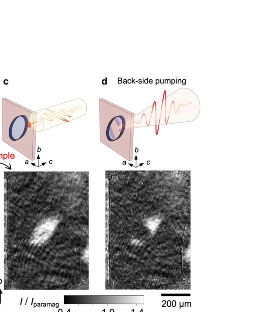
<figcaption class="paper-figure-caption"><b>Fig 2.</b> Fig.2: Propagation-direction-dependent domain switching by mid-IR pulse. Top</figcaption>
</figure>
<figure class="paper-figure-card">

<figcaption class="paper-figure-caption"><b>Fig 3.</b> Fig. 3: Time-resolved evolution of pump-induced transmission changes. a, Initial</figcaption>
</figure>
<figure class="paper-figure-card">

<figcaption class="paper-figure-caption"><b>Fig 4.</b> Fig.4: Spectral dependence of the switching efficiency. a,c, Absorption (red) and</figcaption>
</figure>

**Summary.** The researchers demonstrated that an antiferromagnet ($	ext{LiFePO}_4$) can have its magnetic domains deterministically switched simply by shining mid-infrared light from opposite directions. This directional switching, which persists over broad wavelengths, is attributed to the generation of nonreciprocal heat currents, establishing a general principle for light control in symmetry-broken materials.

**Why it may be interesting.** This work provides a powerful example of controlling symmetry-broken quantum phases (AFMs) using thermal gradients generated by light, suggesting that nonreciprocity via energy deposition is a general principle applicable across various condensed matter systems.

Detailed structure

**Main problem.** To demonstrate deterministic control over antiferromagnetic (AFM) domains using nonreciprocal heat currents generated by mid-infrared light.

**Main result.** Nonreciprocal, broadband domain switching was achieved in $	ext{LiFePO}_4$ by pumping from opposite sides, confirming that directional heat current is the key mechanism, rather than specific optical resonances.

**Method.** The study used pump-probe techniques with intense mid-infrared pulses ($\lambda=7-19 \mu	ext{m}$) to induce domain switching in a single crystal of $	ext{LiFePO}_4$, while using visible light for imaging the resulting domain states.

**Model / system.** The system is the magnetoelectric antiferromagnet $	ext{LiFePO}_4$, which inherently breaks both space-inversion and time-reversal symmetries. The control mechanism relies on generating nonreciprocal heat currents ($\mathbf{J}_c$) that act as a directional symmetry-breaking field.

**Key observables.** Domain states ($	ext{L+}$ and $	ext{L-}$), change in transmitted light intensity, and the directionality of the induced heat current.

**Important parameters / regimes.** Mid-infrared wavelength range ($7–19 \mu	ext{m}$); temperature dependence around the Néel temperature ($T_N = 50 	ext{ K}$).

**Assumptions / limitations.** The switching is primarily mediated by nonreciprocal heat currents ($\mathbf{J}_c$), which reverses sign upon reversing the light propagation direction, overcoming limitations of resonance-based control.

**Figures summary.** Figures illustrate domain imaging showing $	ext{L+} 	o 	ext{L-}$ switching from one side and $	ext{L-} 	o 	ext{L+}$ from the opposite side. Time-resolved measurements track transient changes linked to heating, and simulations map the direction reversal of the heat current.

**Paper structure.** The paper establishes the theoretical basis (symmetry breaking in AFMs) before presenting experimental evidence: first, demonstrating nonreciprocal switching using mid-IR pulses; second, attributing this effect robustly to broadband heat currents rather than resonances; and finally, ruling out simple directional dichroism mechanisms.

Abstract

What distinguishes front from back? In physics, such directionality emerges only when an underlying symmetry is broken. Antiferromagnets that inherently break both space-inversion and time-reversal symmetries provide a striking example, exhibiting nonreciprocal optical responses that depend on the direction of light propagation. Beyond distinguishing antiferromagnetic domains, we show that this nonreciprocity can deterministically create them. Using mid-infrared light, we demonstrate deterministic switching of antiferromagnetic domains in the magnetoelectric antiferromagnet LiFePO4, where illumination from opposite sides selectively stabilizes opposite domain states. Remarkably, the switching persists over a broad wavelength range rather than being confined to a narrow transition-specific spectral region, overcoming the spectral and material constraints of resonance-based optical switching schemes. The broadband switching originates from the material's intrinsic nonreciprocity through optically generated heat currents. Our results establish nonreciprocity as a general principle for deterministically controlling symmetry-broken phases with light.

[↑ back to top](#top)

### [Quantum random walks on d-regular graphs with Haar-random coin operators](http://arxiv.org/abs/2607.04584v1)

**Authors:** Alice C. Quillen  
**Type:** theory · **Category:** other · **PDF:** <https://arxiv.org/pdf/2607.04584v1>  
**Analysis basis:** full PDF text, analyzed in chunks
**Topic relevance:** `measurement-induced transitions` **3/5** · `quantum measurements` **3/5** · `entanglement & information structure` **2/5** · `non-equilibrium dynamics` **2/5** · `Keldysh / 2PI / non-Gaussian methods` **1/5** · `correlated / nonlocal dissipation` **1/5** · `driven-dissipative phase transition` **1/5** · `methods for driven-dissipative` **1/5** · `non-equilibrium universality` **1/5**

↔ Scroll figures horizontally

<figure class="paper-figure-card">

<figcaption class="paper-figure-caption"><b>Fig 1.</b> FIG. 1. A quantum circuit illustration of a quantum walk based on a d-regular graph that takes place on a quantum space that is the tensor product of a d-dimensional coin space and an N dimensional vertex space. The controlled shift op- erator ΛS (outlined in green and defined in equation 3) per- mutes the vertices with operators ˆ Wj (defined in equation 2) depending upon the graph edge that is selected via one of the states in the coined subspace. The coin operator ˆC operates on the coin-subspace where it can induce superposition. The pair of operations is outlined in blue and is iterated to carry out the walk.</figcaption>
</figure>
<figure class="paper-figure-card">

<figcaption class="paper-figure-caption"><b>Fig 2.</b> FIG. 2. a) An illustration of the quantum random walk on the cycle graph with a Hadamard-coin. The initial state was 1 √</figcaption>
</figure>

**Summary.** This paper analyzes quantum random walks where the coin operator is randomized using the Haar measure, leading to an averaged channel that mimics classical diffusion. Despite this decoherence in the coin subspace, the authors demonstrate that specific measurements on the vertex subsystem can still detect information about the initial state for certain graph types. It suggests a model useful for studying strongly perturbed quantum systems rather than search algorithms.

**Why it may be interesting.** This work provides a theoretical framework for understanding how quantum coherence is lost due to environmental coupling (modeled by Haar averaging), yet retains measurable signatures of initial conditions through subsystem measurements. This touches upon concepts relevant to open quantum systems and measurement theory.

Detailed structure

**Main problem.** The study investigates quantum random walks on d-regular graphs when the coin operator is randomized according to the Haar measure, analyzing information retention despite channel averaging.

**Main result.** Although the averaged process depolarizes the coin subspace and resembles classical diffusion, measurements in the vertex subspace can still reveal initial state information under specific graph structures (e.g., Abelian Cayley graphs).

**Method.** The analysis involves calculating the expectation value of the quantum channel over Haar-random unitaries and analyzing the evolution of correlation functions and variances.

**Model / system.** The model is a discrete-time quantum random walk on a graph, defined by an evolution operator involving a controlled shift and a coin operator. The key modification is averaging the coin operation over the Haar measure.

**Key observables.** Correlations between vertices ($p_{vv'}$), variance of vertex position measurements ($\sigma^2_{\hat{B}}$), and the decay/retention of initial state information.

**Important parameters / regimes.** The degree $d$ of the graph, the number of steps $t$, and properties of the underlying group structure (e.g., even element orders for Abelian groups).

**Assumptions / limitations.** The analysis relies on averaging over the Haar measure; it assumes that information retention can be diagnosed by measuring correlations or variances.

**Figures summary.** Figure 1 illustrates the quantum circuit for the walk using a controlled shift operator. Figure 2 compares position probability distributions for cycle graphs under Hadamard vs. Haar-random coin walks, showing classical diffusion behavior for the latter.

**Paper structure.** The paper progresses from defining the model with random coins to deriving the averaged channel, comparing its resulting dynamics (classical walk) to coherent walks, and finally developing diagnostic tools (correlation measurements, variance analysis) to prove information retention in specific regimes.

Abstract

With unitary coin operator that is a random matrix drawn from a uniform distribution with respect to the Haar measure, we construct a variant of a discrete quantum random walk using a d-regular undirected connected simple graph. With each step of the walk, the coin operator random matrix is drawn independently from the distribution. The expectation value over the distribution of random unitaries for the associated quantum channel gives a depolarization channel for the coin subspace and resembles the associated classical random walk where the direction a walker steps depends upon the outcome of a fair coin or balanced d-sided dice. Remarkably, despite the fact that the averaged channel depolarizes the coin subspace, measurements in the vertex subspace can be designed that would reveal information about the initial quantum state, even after many iterations of the channel. We illustrate with examples of quantum walks on Cayley graphs of Abelian groups, such as the cycle and hypercube graphs. These quantum walks are examples of bipartite strongly interacting systems, where one subsystem is strongly perturbed, yet information about the initial state in the other subsystem is potentially measurable forever. Due to its decoherence, a quantum random walk with a Haar-random coin would not be useful in search algorithms but could aid in understanding quantum systems with strongly perturbed subsystems.

[↑ back to top](#top)

### [Quantum Spectral Anomaly Detection](http://arxiv.org/abs/2607.05307v1)

**Authors:** Yewei Yuan, Michele Minervini, Mark M. Wilde, Nana Liu  
**Type:** both · **Category:** statistical mechanics · **PDF:** <https://arxiv.org/pdf/2607.05307v1>  
**Analysis basis:** full PDF text, analyzed in chunks
**Topic relevance:** `driven-dissipative phase transition` **3/5** · `methods for driven-dissipative` **3/5** · `analog quantum simulation` **2/5** · `non-equilibrium universality` **2/5** · `Keldysh / 2PI / non-Gaussian methods` **1/5** · `correlated / nonlocal dissipation` **1/5** · `entanglement & information structure` **1/5** · `non-equilibrium dynamics` **1/5** · `quantum measurements` **1/5**

↔ Scroll figures horizontally

<figure class="paper-figure-card">

<figcaption class="paper-figure-caption"><b>Fig 1.</b> FIG. 1. Normal-calibrated percentile maps over [0, 1]2 for the moon dataset; the pale scattered points are the normal training data. Rows: linear classical PCA, RBF kernel-PCA, and QSPADE with a Fourier feature map. Columns: resid- ual Q, within-support T 2 (shown inside the Q-accepted re- gion), and the combined max-percentile. Linear PCA gives a rigid straight band; the kernel baseline and QSPADE both produce curved acceptance regions that follow the data. The cyan contour marks the calibrated decision boundary.</figcaption>
</figure>
<figure class="paper-figure-card">

<figcaption class="paper-figure-caption"><b>Fig 2.</b> FIG. 2. Spectrum and soft occupations of the average nor- mal state C. Black points show the eigenvalues λj(C) on a log scale, and the dotted line marks the sampling reso- lution 1/N for N = 600. The vertical dashed line marks the hard retained-mass rank K(α) = 7 for α = 0.99. Col- ored curves, read on the right axis, show the soft occupations f((λj −µα)/T) for different resolutions T. The figure shows why a hard rank is ambiguous on this graded spectrum, while QSPADE assigns fractional weights to near-cutoff modes.</figcaption>
</figure>
<figure class="paper-figure-card">

<figcaption class="paper-figure-caption"><b>Fig 3.</b> FIG. 3. Mean residual anomaly score for each normal mode j, with the expected number of training samples wjN shown on the top axis, and for the anomaly class in the rightmost col- umn. Grey dashed curves are hard top-K projectors; colored curves are QSPADE residuals at different resolutions T. Hard ranks flip whole normal modes between zero and unit score, and become unstable when the cutoff reaches the sampling- resolution regime (K = 8). QSPADE replaces this all-or- nothing behavior by a graded transition from well-sampled modes to unresolved tail modes.</figcaption>
</figure>
<figure class="paper-figure-card">

<figcaption class="paper-figure-caption"><b>Fig 4.</b> FIG. 4. Mean residual anomaly score for a dominant normal mode (50%), a rare normal mode (1.6%), and the paramag- netic anomaly class. The density-weighted Qraw and the hard K = 4 projector score the rare valid mode above the anomaly, while the hard K = 6 projector gives it zero score and hides its rarity. QSPADE assigns the rare mode an intermediate, temperature-dependent score; when T resolves the spectral tail, the rare valid mode remains below the anomaly. This shows soft scoring in QSPADE separates rarity within the normal support from genuine support mismatch.</figcaption>
</figure>
<figure class="paper-figure-card">

<figcaption class="paper-figure-caption"><b>Fig 5.</b> FIG. 5. QSPADE residual score of the TFIM ground state as the transverse field h is swept across the transition. The score is near zero at the normal training field hA = 0.4 (grey line), stays low in the ordered phase, and rises through the critical point hc = 1 (dashed) into the paramagnetic phase. Colored curves show different resolutions T; as T →0 they approach the hard retained-rank projector K(α) (black markers), while larger T gives a softer monitor. The density-weighted Qraw (dotted) is offset upward even at the normal field.</figcaption>
</figure>

**Summary.** This paper introduces Quantum Spectral Anomaly Detection (QSPADE), a novel technique to compute anomaly scores for quantum states by analyzing the spectrum of the normal data's average state. It achieves this by replacing hard spectral cutoffs with a smooth, temperature-controlled thresholding mechanism. QSPADE offers an efficient tool applicable both to encoded classical data and directly to monitoring complex quantum systems undergoing phase transitions.

**Why it may be interesting.** The ability to monitor complex quantum systems (like those near phase transitions) using only local spectral information, without needing explicit knowledge of order parameters or full state reconstruction, is highly valuable for experimental diagnostics in AMO physics.

Detailed structure

**Main problem.** The core task is developing an efficient method for quantum anomaly detection, quantifying how much a test quantum state deviates from a normal dataset.

**Main result.** QSPADE provides a continuous, spectral-based framework that successfully detects changes across quantum phase transitions without requiring predefined order parameters.

**Method.** It replaces hard PCA rank selection with a smooth, temperature-controlled spectral threshold applied to the average state's spectrum, yielding both residual and Hotelling's T^2 type anomaly scores.

**Model / system.** The analysis is based on quantum data represented by density operators ($
ho_i$) whose average forms the normal support operator $C$. The method is shown to apply to monitoring quantum-native systems like the transverse-field Ising model.

**Key observables.** Anomaly score (e.g., residual statistic $Q$ or Hotelling's $T^2$), spectral eigenvalues ($\lambda_j$), and acceptance probabilities $\langle\psi|M f_{\mu\alpha,T} |\psi
angle$.

**Important parameters / regimes.** Temperature parameter ($T$), spectral threshold ($\mu$), target retained-mass fraction ($\alpha$), and measurement shot budget ($m$).

**Assumptions / limitations.** The primary assumption is that the anomaly score can be derived solely from the spectrum of the average normal state, avoiding full Gram matrix construction.

**Figures summary.** Figure 6 compares QSPADE against classical kernel-PCA baselines (Laplacian/Fourier maps performing best). Figure 7 shows QSPADE successfully tracking curved supports (ring) where linear PCA fails. Figure 8 demonstrates that smaller temperatures ($T$) improve robustness to shot noise in quantum-native experiments.

**Paper structure.** The paper first establishes the classical PCA background, then introduces QSPADE as a soft spectral detector using a temperature parameter $T$. It develops theoretical proofs for this smooth detection mechanism and validates it by comparing performance against various classical kernel methods on synthetic data geometries and in quantum-native simulations.

Abstract

A core task in quantum anomaly detection is to compute an anomaly score that quantifies how strongly a test quantum state deviates from a given quantum dataset assumed to be normal. Classically, principal component analysis (PCA) for centered data computes the anomaly score by evaluating the test sample relative to the subspace spanned by the selected leading eigenvectors. However, for quantum data that lack a standard centering, explicitly recovering principal eigenvectors, constructing full Gram matrices, or loading quantum-random-access-memory-style data can be more costly than estimating the anomaly score itself. To avoid these costs, we propose Quantum Spectral Anomaly Detection (QSPADE), which computes PCA-like anomaly scores directly from the spectrum of the average state of the normal dataset. By replacing hard PCA rank selection with a smooth, temperature-controlled spectral threshold, QSPADE makes near-threshold spectral components contribute partially to the anomaly score. This makes the score vary continuously rather than jump when a borderline component is included or excluded, and makes it less sensitive to noise or arbitrary hard cutoffs near the threshold. In the zero-temperature limit, QSPADE recovers the hard-projector PCA score. The proposed measurement-based quantum detector can be calibrated with a sample complexity independent of the data dimension. Numerical simulations show that QSPADE behaves like kernel-PCA on encoded classical data and detects changes across a transverse-field Ising transition without predefined order parameters. Consequently, QSPADE gives an efficient framework for both quantum-kernel anomaly detection on encoded classical data and the monitoring of quantum-native systems where diagnostic observables are unknown.

[↑ back to top](#top)

### [Quantum tunneling Mpemba effect](http://arxiv.org/abs/2607.03845v1)

**Authors:** Hisao Hayakawa, Satoshi Takada  
**Type:** theory · **Category:** statistical mechanics · **PDF:** <https://arxiv.org/pdf/2607.03845v1>  
**Analysis basis:** full PDF text, analyzed in chunks
**Topic relevance:** `driven-dissipative phase transition` **3/5** · `methods for driven-dissipative` **3/5** · `non-equilibrium dynamics` **3/5** · `non-equilibrium universality` **3/5** · `Keldysh / 2PI / non-Gaussian methods` **1/5** · `Kondo & dissipative impurity` **1/5** · `correlated / nonlocal dissipation` **1/5**

↔ Scroll figures horizontally

<figure class="paper-figure-card">

<figcaption class="paper-figure-caption"><b>Fig 1.</b> FIG. 1. Initial temperature dependence of an(Ti) for n = 0, 1, 2, and 3 when we fix L = 5, η = 5, and xabs = 4.</figcaption>
</figure>
<figure class="paper-figure-card">

<figcaption class="paper-figure-caption"><b>Fig 2.</b> Figure 2 shows plots of a2(Ti) against Ti for various system size L under the condition Eq. (46). This figure indicates that the peak position around Ti = 3.26 is independent of the system size L. This result supports the theoretical prediction in the previous section and Appendix C.</figcaption>
</figure>
<figure class="paper-figure-card">

<figcaption class="paper-figure-caption"><b>Fig 3.</b> FIG. 2. Plots of a2(Ti) against Ti for various L when we fix η = 5, and xabs = 4.</figcaption>
</figure>
<figure class="paper-figure-card">

<figcaption class="paper-figure-caption"><b>Fig 4.</b> Figure 3 shows the time evolution of the survival probability S(t, Ti) for various Ti using Eq. (46). This clearly exhibits the crossing of S(t, Ti) during the time evolution. Remarkably, the crossing time is insensitive to Ti, where</figcaption>
</figure>
<figure class="paper-figure-card">
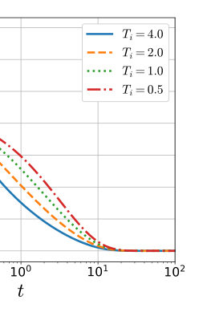
<figcaption class="paper-figure-caption"><b>Fig 5.</b> FIG. 3. Plots of time evolution of S(t, Ti) for various Ti when we fix L = 5, η = 5, and xabs = 4.</figcaption>
</figure>

**Summary.** This paper theoretically investigates the quantum tunneling Mpemba effect in an open double-well potential system. Using non-Hermitian spectral methods, the authors prove that the characteristic anomalous cooling signature is a universal topological property independent of the system size L. This offers novel insights for engineering non-equilibrium states via controlled boundary dissipation.

**Why it may be interesting.** This work provides a rigorous theoretical framework for observing non-equilibrium phenomena like the Mpemba effect in quantum systems by connecting it to fundamental mathematical properties (Sturm-Liouville theorem) within open quantum dynamics.

Detailed structure

**Main problem.** The paper investigates the quantum tunneling Mpemba effect, a counterintuitive relaxation phenomenon where hotter systems cool faster than cooler ones, in an open quantum setting.

**Main result.** It proves that the non-monotonic behavior of key spectral coefficients is a universal topological property governed by Sturm-Liouville theory and is invariant with respect to system size L, contrasting classical boundary effects.

**Method.** The analysis uses non-Hermitian spectral decomposition on an effective Hamiltonian derived from the GKSL master equation, employing biorthogonal quantum mechanics.

**Model / system.** The model is a single particle in a continuous one-dimensional symmetric double-well potential open to environmental sinks at boundaries (modeled by a Continuous Absorbing Potential).

**Key observables.** Non-monotonic behavior of the first non-trivial even-parity spectral coefficient ($a_{2}(T_{i})$), total survival probability trace $S(t, T_i)$, and trace distance $\mathcal{D}(t, T_i)$.

**Important parameters / regimes.** Initial temperature ($T_i$), system size ($L$), and the ratio of decay rates ($\Gamma_2 \gg \Gamma_0$ and $\Gamma_2 \gg \Gamma_1$).

**Assumptions / limitations.** The analysis assumes permanent absorption at boundaries (no recycling) and requires a strict separation of timescales for observation.

**Paper structure.** The paper progresses by setting up the open quantum system dynamics via the non-Hermitian Hamiltonian, analyzing relaxation using spectral decomposition, proving the topological nature of the Mpemba signature in coefficients, and finally demonstrating its size invariance compared to classical models.

Abstract

The quantum tunneling Mpemba effect is investigated within a continuous one-dimensional symmetric double-well potential open to external environmental sinks at the boundaries ($x=\pm L$). Using a non-Hermitian spectral decomposition of the effective Hamiltonian, we characterize the open-system relaxation dynamics without relying on abstract state-space quenches. We mathematically prove that the non-monotonic behavior of the first non-trivial even-parity spectral coefficient, $a_{2}(T_{i})$, with respect to the initial preparation temperature $T_{i}$ is a universal topological property born from quantum statistical mechanics. Crucially, we demonstrate that this intermediate thermal peak is governed by the Sturm-Liouville oscillation theorem and remains completely invariant with respect to the global system size $L$, contrasting sharply with the boundary-driven classical Mpemba effect. This universal peak arises from the geometric and nodal alignment between highly localized unperturbed states and extended non-Hermitian decay channels. Furthermore, we clarify that while this mechanism is robust, the actual observation of anomalous crossings in the total survival probability trace $S(t,T_{i})$ and the trace distance $\mathcal{D}(t,T_i)$ demand a strict separation of timescales, requiring the over-barrier escape rate to vastly exceed the decay rate of the deep-well tunneling doublet ($Γ_{2}\gg Γ_{0}$ and $Γ_2\gg Γ_1$). Our continuous formulation successfully bridges real-space classical boundary-driven dissipation with open quantum dynamics, providing novel insights for engineering non-equilibrium states via tailored boundary loss.

[↑ back to top](#top)

### [Speed limits on biomolecular processes from fundamental physical constants](http://arxiv.org/abs/2607.04549v1)

**Authors:** Dmitrii E Makarov  
**Type:** theory · **Category:** statistical mechanics · **PDF:** <https://arxiv.org/pdf/2607.04549v1>  
**Analysis basis:** full PDF text, analyzed in chunks
**Topic relevance:** `methods for driven-dissipative` **3/5** · `non-equilibrium dynamics` **3/5** · `correlated / nonlocal dissipation` **2/5** · `driven-dissipative phase transition` **2/5** · `non-equilibrium universality` **2/5** · `Frenkel-Kontorova` **1/5** · `Keldysh / 2PI / non-Gaussian methods` **1/5** · `Kondo & dissipative impurity` **1/5**

↔ Scroll figures horizontally

<figure class="paper-figure-card">
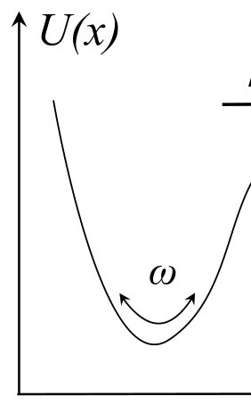
<figcaption class="paper-figure-caption"><b>Fig 1.</b> Figure 1. Kramers’ model of a chemical reaction</figcaption>
</figure>

**Summary.** This paper explores how fundamental physical constants impose speed limits on biological processes like chemical reactions and protein folding. By applying theories such as Kramers' rate theory and analyzing molecular diffusion, the authors derive characteristic timescales for these biomolecular events. The results suggest that life requires specific constraints on energy barriers relative to thermal energy ($A$), linking quantum mechanics directly to biochemistry.

**Why it may be interesting.** The work bridges concepts from chemical reaction rate theory (Kramers/Eyring) with mesoscopic dynamics (diffusion), providing quantitative bounds derived from fundamental physics that are relevant to open quantum systems modeling where dissipation is key.

Detailed structure

**Main problem.** The paper investigates fundamental physical constraints that set speed limits on various biomolecular processes, such as chemical reaction rates and protein folding dynamics.

**Main result.** It derives quantitative estimates for characteristic timescales (e.g., $	au_{diff}$, $	au_{kin}$) based on fundamental constants, suggesting specific ranges required for life to exist.

**Method.** The analysis employs theoretical frameworks like Arrhenius theory, Kramers' rate theory, and models molecular motion using the Langevin equation, comparing estimates derived from different physical approximations.

**Model / system.** The systems studied include elementary chemical reactions, protein folding dynamics modeled as random coil diffusion, and general molecular motion in solution governed by friction and potential energy landscapes.

**Key observables.** Arrhenius ratio ($A$), diffusivity ($D$), kinetic time ($	au_{kin}$), and characteristic timescales for diffusion ($	au_{diff}$) and reaction rates ($
u$).

**Important parameters / regimes.** Fundamental constants like $\hbar, k_B, T$, molecular parameters (mass $m$, radius $R$), and energy barriers ($E_b$). The required range for the Arrhenius ratio is highlighted as $38 < A < 70$.

**Assumptions / limitations.** The analysis relies on approximations such as using the Stokes formula for friction, assuming specific damping regimes (e.g., overdamped dynamics for large-scale motion), and employing an anthropic argument to constrain physical constants.

**Figures summary.** Figure 1 illustrates Kramers’ model for a chemical reaction rate calculation.

**Paper structure.** The paper progresses by first establishing the general framework using fundamental constants to set limits on rates (Arrhenius/Eyring). It then applies this to specific systems: molecular diffusion ($	au_{diff}$), and finally, protein folding kinetics, comparing different theoretical estimates for reconfiguration time ($	au_r$).

Abstract

Many of the timescales of life have speed limits set by quantum-mechanical constraints along with non-fundamental quantities, such as the temperature of the environment, which are however bounded by anthropic considerations. Here, some of such speed limits are examined, including those for the rates of elementary chemical reactions and biomolecular folding. Limitations of simple back-of-envelope estimates are also discussed.

[↑ back to top](#top)

### [Cellular Adaptation to Signal Fluctuations as Learning](http://arxiv.org/abs/2607.03545v1)

**Authors:** Tuan Minh Pham, David Saad  
**Type:** theory · **Category:** disordered systems and neural networks · **PDF:** <https://arxiv.org/pdf/2607.03545v1>  
**Analysis basis:** full PDF text, analyzed in chunks
**Topic relevance:** `driven-dissipative phase transition` **3/5** · `methods for driven-dissipative` **3/5** · `non-equilibrium dynamics` **2/5** · `non-equilibrium universality` **2/5** · `Frenkel-Kontorova` **1/5** · `Keldysh / 2PI / non-Gaussian methods` **1/5** · `correlated / nonlocal dissipation` **1/5** · `entanglement & information structure` **1/5**

↔ Scroll figures horizontally

<figure class="paper-figure-card">

<figcaption class="paper-figure-caption"><b>Fig 1.</b> FIG. 1. Top. Illustration of an intracellular pathway (marked by the shaded area) of effectors (labeled by h) and target genes (denoted by s). The pathway is subjected to fluctuations of an external signal depicted by x. Bottom. Our microscopic model (7)-(8) and its corre- sponding macroscopic theory in terms of collective covariances (14)- (15). Here fluctuations vary over a slow time τ. The M effectors integrate these fluctuations into their states hℓ(τ) via an interpreta- tion matrix Jℓα (denoted by black arrows): hℓ(τ) = P</figcaption>
</figure>
<figure class="paper-figure-card">
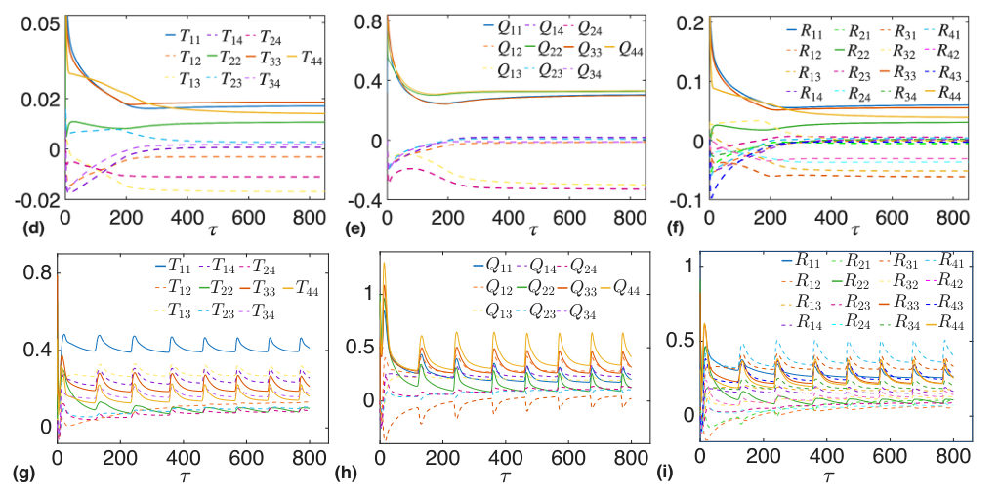
<figcaption class="paper-figure-caption"><b>Fig 2.</b> FIG. 2. The target gene correlations T , the effectors’ covariations Q, the cross-correlations between the target genes and their effectors R, all as function of the slow time τ for (η, γ) = (0.5, 0.5) in (a)-(c) (η, γ) = (0.9, 0.5) in (d)-(f) for (η, γ) = (0.9, 0.9) in (g)-(i). Here c = 0.2, σ = 0.01, K = 4 and W is a random asymmetric matrix of i.i.d. elements drawn from U(0, 1) – the uniform distribution in the interval (0, 1). Initial conditions for Q and T are specified by Qii and Tii, both drawn from U(0, 1), while Qij and Tij – are sampled from the uniform distribution 10−6 × U(0, 1). All elements of R(τ = 0) are drawn from the uniform distribution 10−6 × U(0, 1).</figcaption>
</figure>
<figure class="paper-figure-card">

<figcaption class="paper-figure-caption"><b>Fig 3.</b> FIG. 3. γ = 0.5 (a) and γ = 1 (b). Here c = 0.2, σ = 0.01, K = 4, and W is an asymmetric matrix of uncorrelated elements drawn from U(0, 1) – the uniform distribution in the interval (0, 1). Initial conditions for Q and T are specified by Qii and Tii, both drawn from U(0, 1), while Qij and Tij – are sampled from the uniform distribution 10−6 × U(0, 1). All elements of R(τ = 0) are drawn from the uniform distribution 10−6 × U(0, 1).</figcaption>
</figure>
<figure class="paper-figure-card">

<figcaption class="paper-figure-caption"><b>Fig 4.</b> FIG. 6. Phase diagram for c = 0.2, σ = 0.01, K = 4. Results are obtained by averaging over an ensemble of 100 asymmetric matrices W of uncorrelated elements drawn from U(0, 1). Asymmetric initial condition for Q, T , R as explained in Fig 2.</figcaption>
</figure>
<figure class="paper-figure-card">
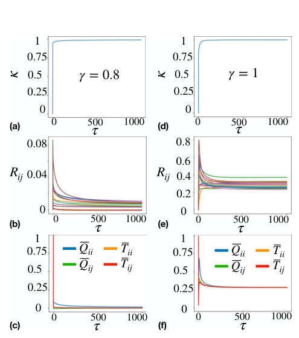
<figcaption class="paper-figure-caption"><b>Fig 5.</b> FIG. 4. Symmetric solution for γ = 0.8 ((a)-(c)) and γ = 1 ((d)-(e)). From top to bottom: the ratio κ = ¯r/¯q with ¯r ≡</figcaption>
</figure>

**Summary.** This paper develops a multiscale theory to explain how cells achieve robust gene expression against environmental noise by implementing active self-regulation. It models the system using coupled dynamics between fast genetic circuits and slow adaptation mechanisms that learn from signal fluctuations. The key finding is that this robustness manifests as a transition in the collective modes of the network, which can be mathematically characterized by symmetry breaking and multistability.

**Why it may be interesting.** While focused on biology, the mathematical framework—using mean-field approximations, analyzing collective modes via covariance matrices, and identifying phase transitions/bifurcations in an adaptive learning context—shares deep theoretical parallels with concepts studied in disordered systems and neural network optimization landscapes.

Detailed structure

**Main problem.** The study investigates how biological cells maintain robust gene expression despite fluctuating external chemical signals (morphogens). The core question is whether this robustness arises from active self-regulation rather than simple noise damping.

**Main result.** Robustness against signal fluctuations emerges beyond a critical adaptation rate, which is characterized by the system transitioning to structured collective modes. The theory predicts multistability in the adaptive dynamics.

**Method.** The authors develop a multiscale model separating fast gene-regulatory network (GRN) dynamics from slow, non-equilibrium learning processes governing signal interpretation. Macroscopic theory is derived using order parameters representing covariances between system components.

**Model / system.** The model uses a signaling pathway framework involving target genes ($s_i$) with fast dynamics and upstream effectors ($h_k$) whose adaptation variables evolve slowly based on minimizing an error functional ($\epsilon$).

**Key observables.** Collective modes (covariations) such as $T(	au)$ (target gene covariance), $Q(	au)$ (effector correlation), and $\Delta Q = Q_{ii} - Q_{ij}$ (gap characterizing symmetry breaking).

**Important parameters / regimes.** Adaptation rate ($\eta$), effector coupling strength ($\gamma$), and the timescale separation between fast and slow dynamics.

**Assumptions / limitations.** Key assumptions include treating signal fluctuations as uncorrelated noise, assuming additivity for the control term in gene dynamics, and linearizing the analysis by expanding around a symmetric solution ($\epsilon \ll 1$).

**Figures summary.** Figure 8 illustrates multistability by plotting the ratio $\kappa = ar{r}/ar{q}$ versus adaptation rate $\eta$. Figure 9 shows how the symmetry-breaking gap $\Delta Q$ increases as $\eta$ crosses a critical point.

**Paper structure.** The paper establishes the physical model, derives the macroscopic theory using order parameters for covariances, and then analyzes the stability and bifurcation points (multistability) of the slow adaptive dynamics by linearizing around symmetric solutions.

Abstract

Cells represent one of the most fundamental units of life. Underlying their robust performance against environmental variability, such as temporal fluctuations of chemical signals, between different cell types, is a dynamical interrelation between the two components of an intracellular pathway: a gene-regulatory network and its upstream signal transducers. To understand how a single cell utilizes this feedback to self-regulate its gene-expressions, we develop a multiscale model of the pathway's components, in which the adaptive variables responsible for signal interpretation follow a feedback-induced learning process. We then derive a macroscopic theory capturing the covariations between these components - so-called collective modes. Our theory shows how cells can achieve robust output against signal fluctuations via self-regulation rather than simple noise suppression. Such robustness corresponds to a transition from random- to structured collective modes beyond a critical adaptation rate.

[↑ back to top](#top)

### [Intermittency Signatures in the Deformation of a Passive Droplet in Active Turbulence](http://arxiv.org/abs/2607.03737v1)

**Authors:** Sudeep Halder, Abhishek Chaudhuri  
**Type:** theory · **Category:** statistical mechanics · **PDF:** <https://arxiv.org/pdf/2607.03737v1>  
**Analysis basis:** full PDF text, analyzed in chunks
**Topic relevance:** `non-equilibrium dynamics` **3/5** · `non-equilibrium universality` **3/5** · `driven-dissipative phase transition` **2/5** · `Frenkel-Kontorova` **1/5** · `Keldysh / 2PI / non-Gaussian methods` **1/5** · `analog quantum simulation` **1/5** · `correlated / nonlocal dissipation` **1/5** · `entanglement & information structure` **1/5** · `methods for driven-dissipative` **1/5**

↔ Scroll figures horizontally

<figure class="paper-figure-card">

<figcaption class="paper-figure-caption"><b>Fig 1.</b> FIG. 1. Intermittent deformation of a passive droplet. (a) Snapshot of the deformable droplet</figcaption>
</figure>
<figure class="paper-figure-card">

<figcaption class="paper-figure-caption"><b>Fig 2.</b> FIG. 2. (Color online) Structure functions and multiscaling of droplet-shape increments. (a) Log–</figcaption>
</figure>
<figure class="paper-figure-card">

<figcaption class="paper-figure-caption"><b>Fig 3.</b> FIG. 3. (Color online) Normalized power spectral densities versus the activity-scaled frequency</figcaption>
</figure>

**Summary.** This work simulates the deformation of a passive droplet within active nematic turbulence to characterize its fluctuation statistics. The research finds that the droplet exhibits strong temporal intermittency, which is most pronounced at low activity levels. By comparing the spectral signatures of deformation versus the driving forces, the authors demonstrate that interfacial restoring forces act as a nonlinear filter shaping the bursty dynamics.

**Why it may be interesting.** While focused on classical fluid dynamics, the analysis of non-Gaussianity, intermittency scaling laws, and filtering mechanisms ($\omega^{-1}$ vs $\omega^{-2}$) provides a rich framework for understanding energy dissipation and rare events in complex, non-equilibrium many-body systems relevant to quantum field theories or open quantum systems.

Detailed structure

**Main problem.** The study investigates whether fluctuations generated by active turbulence are effectively Gaussian or exhibit intermittency when a soft inclusion deforms within the turbulent flow.

**Main result.** Droplet deformation is strongly intermittent, with normalized intermittency being strongest at lower activity. The droplet acts as a nonlinear elastic filter, converting forcing into bursty, scale-rich dynamics.

**Method.** The authors employed fully resolved nematohydrodynamic simulations to analyze the statistical properties of the droplet's aspect ratio increments and associated fluctuations.

**Model / system.** The system models a passive nematic droplet embedded in two-dimensional extensile active-nematic turbulence, governed by Beris-Edwards Q-tensor hydrodynamics. The dynamics include standard viscous terms, an active stress term ($\sigma_A$), and interfacial tension forces ($f_I$).

**Key observables.** Aspect Ratio (AR(t)), increment statistics ($\Delta 	ext{AR}$), structure functions ($S_p(	au)$), waiting times ($W$) and burst sizes ($S$), and Power Spectral Density (PSD) of the normal interface velocity.

**Important parameters / regimes.** Activity parameter ($\zeta$), time lag ($	au$), and various moments $p$ for structure function analysis.

**Assumptions / limitations.** The analysis uses a one-elastic-constant approximation and models the droplet using continuum hydrodynamics in 2D. The comparison reveals that interfacial restoring forces filter the fluctuations.

**Figures summary.** Figures illustrate PDFs of aspect-ratio increments, CCDFs for waiting times and burst sizes showing power laws, structure functions vs lag ($	au$), and normalized PSDs comparing interface velocity to active stress forcing.

**Paper structure.** The paper progresses from setting up the nematohydrodynamic model (including active and interfacial stresses) to analyzing advanced statistical diagnostics like multiscaling, burst statistics, and spectral comparisons between deformation and forcing signals.

Abstract

We use fully resolved nematohydrodynamic simulations to study deformation statistics of a passive nematic droplet in two-dimensional extensile active-nematic turbulence. We find that the droplet aspect ratio serves as a scalar probe of the active bath. Its increments show heavy-tailed distributions with dependence on the time lag, scale-free burst statistics and multiscaling structure functions which establish temporal intermittency. While the mean deformation increases with activity, normalized intermittency is strongest at lower activity. This suggests slower and more coherent bath forcing. When compared with translational and forcing-side fluctuations, it reveals a hierarchy of intermittency: shape is more weakly intermittent than translation and active-stress fluctuations, consistent with filtering by interfacial restoring forces. Power spectra show an extended near-$1/ω$ regime for the maximal normal interface velocity, distinct from the steeper, approximately $1/ω^{2}$ spectrum of the interfacial active stress. Soft inclusions thus reveal how interfacial restoring forces convert active forcing into bursty, scale-rich deformation dynamics.

[↑ back to top](#top)

### [Excitation spectra and rank tomography of linear matrix product tangent spaces](http://arxiv.org/abs/2607.05269v1)

**Authors:** Otto T. P. Schmidt, Iacopo Carusotto  
**Type:** theory · **Category:** numerical methods · **PDF:** <https://arxiv.org/pdf/2607.05269v1>  
**Analysis basis:** full PDF text, analyzed in chunks
**Topic relevance:** `analog quantum simulation` **3/5** · `entanglement & information structure` **3/5** · `methods for driven-dissipative` **3/5** · `non-equilibrium dynamics` **2/5** · `Keldysh / 2PI / non-Gaussian methods` **1/5** · `driven-dissipative phase transition` **1/5**

↔ Scroll figures horizontally

<figure class="paper-figure-card">

<figcaption class="paper-figure-caption"><b>Fig 1.</b> FIG. 1. A MPS representation in left-canonical gauge of an order-five projective tensor [T].</figcaption>
</figure>
<figure class="paper-figure-card">
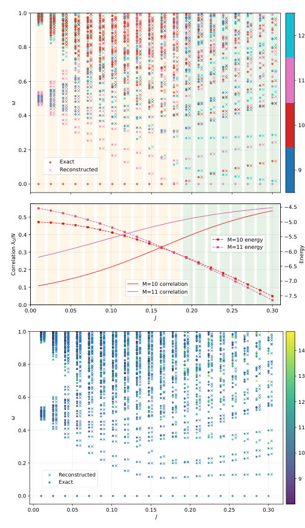
<figcaption class="paper-figure-caption"><b>Fig 2.</b> FIG. 3. Exact excitation energies (coloured dots) and tangent-space reconstructions (coloured crosses) for an N = 10 Bose–Hubbard chain with bond dimension D = 8, local dimension d = 3, and chemical potential µ/U = 0.5. Results are shown for the particle-number conserving Hamiltonian with U(1)-breaking term η = 0 (top) and for the symmetry- breaking Hamiltonian with η = 0.01 (bottom). For η = 0, colours identify the particle-number sectors M. For η ̸= 0, particle number is not conserved and the continuous colour scale indicates the expectation value ⟨ˆ M⟩of each state. The ground-state energies and off-diagonal coherence for η = 0 as- sociated with the M = 10 and M = 11 sectors are also...</figcaption>
</figure>
<figure class="paper-figure-card">
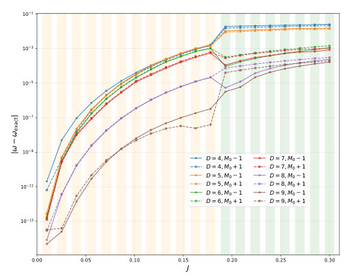
<figcaption class="paper-figure-caption"><b>Fig 3.</b> FIG. 4. Approximation error |ω −ωexact| for the lowest exci- tation modes of the BH model in number sectors M = M0 ±1 for N = 10, µ = 0.5, d = 3 and different bond dimensions D. The shaded regions indicate different rank profiles rℓ(m); see Section V B.</figcaption>
</figure>
<figure class="paper-figure-card">

<figcaption class="paper-figure-caption"><b>Fig 4.</b> FIG. 5. Exact spectrum (blue dots) and the reconstructed spectrum (blue crosses) for N = 4, D = 5, µ = 0.5. Excita- tions in number sectors 3, 4 and 5 are shown in top, middle and bottom, respectively. The shaded regions indicate differ- ent rank profiles of rl(m).</figcaption>
</figure>
<figure class="paper-figure-card">

<figcaption class="paper-figure-caption"><b>Fig 5.</b> FIG. 6. Exact spectrum (coloured dots) and the reconstructed spectrum (blue crosses) for N = 3, D = 3, µ = 0.5. The colour scale indicates the particle-number sectors of the exci- tations.</figcaption>
</figure>

**Summary.** The paper introduces a sophisticated geometric framework to study quantum many-body dynamics by treating the space of Matrix Product States as an algebraic variety. It develops a 'rank tomography' tool using particle-resolved rank profiles, which refines the characterization of system expressivity beyond simple bond dimensions. This method is successfully applied to approximate excitation spectra for models like the Bose-Hubbard model.

**Why it may be interesting.** This work bridges advanced algebraic geometry (variety smoothness, rank tomography) with condensed matter physics simulation. The development of PRSR offers a physically motivated refinement over standard bond dimension analysis for characterizing quantum entanglement and state structure.

Detailed structure

**Main problem.** To develop a rigorous method using tangent spaces on the manifold of Matrix Product States (MPS) to accurately calculate the low-lying excitation spectra of quantum many-body systems with open boundary conditions.

**Main result.** The proposed tangent-space and rank tomography methods successfully reproduce known low-energy excitations for benchmark models like the Bose-Hubbard model, providing a geometrically grounded way to approximate dynamics within constrained variational spaces.

**Method.** The authors formulate the problem by defining the MPS space as an algebraic variety and projecting the time evolution onto its tangent space. They introduce 'rank tomography' using Particle-Resolved Schmidt Rank Profiles (PRSR) to characterize the expressivity of this manifold.

**Model / system.** The primary application is to quantum many-body systems, benchmarked by the Bose-Hubbard model Hamiltonian ($H = -J \sum (\dots) + U \sum n(n-1) - \mu \sum n$). The analysis focuses on truncating the local Hilbert space (e.g., $n_i=0, 1, 2$) and treating the state within the MPS variational manifold.

**Key observables.** Excitation spectra ($\omega$), Particle-Resolved Schmidt Rank Profile (PRSR), and the generalized eigenvalue problem solutions derived from projecting dynamics onto the horizontal tangent space.

**Important parameters / regimes.** Hopping amplitude ($J$), on-site interaction ($U$), chemical potential ($\mu$), and bond dimensions ($D$).

**Assumptions / limitations.** The method relies on approximating the true spectrum by diagonalizing an effective Hamiltonian projected onto the tangent space, which is derived from enforcing the Dirac-Frenkel condition. The analysis also assumes specific smoothness properties of related algebraic varieties.

**Figures summary.** Figure 1 illustrates the MPS representation in a left-canonical gauge; Figure 3 compares the exact and reconstructed low-energy spectra for the Bose-Hubbard model, showing agreement between methods.

**Paper structure.** The paper first establishes the geometric framework by defining the MPS space as an algebraic variety and proving its smoothness. It then develops the tangent-space projection method (TDVP) to derive a reduced eigenvalue problem ($	ext{Bred}y = \omega y$) for calculating excitations, culminating in benchmarking this against the Bose-Hubbard model.

Abstract

We formulate a tangent-space method for algebraic varieties of matrix product states (MPS) to study excitation spectra of non-uniform quantum many-body systems with open boundary conditions. We further introduce a rank tomography of the MPS tangent space, which characterizes its expressivity in terms of particle-sector rank profiles of the underlying MPS variety. Using the Bose--Hubbard model as a benchmark, we illustrate that the method reproduces low-lying excitations and captures finite-size precursors of the Mott-insulator to superfluid transition.

[↑ back to top](#top)

### [Free energies and optimal reaction coordinates via entropy production](http://arxiv.org/abs/2607.03722v1)

**Authors:** Jérémy Diharce, Line Mouaffac, Axel Dian, Fabio Pietrucci  
**Type:** theory · **Category:** statistical mechanics · **PDF:** <https://arxiv.org/pdf/2607.03722v1>  
**Analysis basis:** full PDF text, analyzed in chunks
**Topic relevance:** `methods for driven-dissipative` **3/5** · `non-equilibrium dynamics` **3/5** · `Keldysh / 2PI / non-Gaussian methods` **2/5** · `non-equilibrium universality` **2/5** · `correlated / nonlocal dissipation` **1/5** · `driven-dissipative phase transition` **1/5** · `quantum measurements` **1/5**

↔ Scroll figures horizontally

<figure class="paper-figure-card">

<figcaption class="paper-figure-caption"><b>Fig 1.</b> Figure 1. Illustrative example of the connection between relaxation processes, entropy production, and free-energy dif- ferences. Several trajectories are shown, evolving on a free- energy landscape F(x, y) from an initial state (high free en- ergy) to a final state (low free energy). According to ther- modynamics, any spontaneous relaxation process entails an increase in total entropy T∆Stot = −∆F. However, when observed from the viewpoint of a generic single variable q, the free-energy drop and the entropy production appear re- duced from the true value, due to properties of the marginal probability density ρ(q) = e−βF (q)/Z, unless an optimal pro- jection coordinate (here x) is employed.</figcaption>
</figure>
<figure class="paper-figure-card">
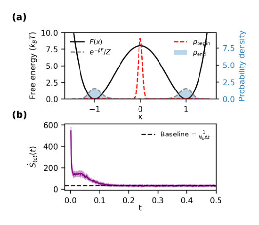
<figcaption class="paper-figure-caption"><b>Fig 2.</b> Figure 2. (a) One-dimensional free energy landscape F(x) = 8(x2 −1)2 with the initial and final distributions (compared with the equilibrium density) of Langevin trajectories initi- ated at x = 0. (b) EPR estimated from the trajectories. the darker line and the shaded area represent, respectively, the mean and the standard deviation computed over 20 indepen- dent blocks of 1000 trajectories.</figcaption>
</figure>
<figure class="paper-figure-card">

<figcaption class="paper-figure-caption"><b>Fig 3.</b> Figure 3. (a) Double well free-energy landscape with committor φ(x, y) aligned with the x direction (see Supplemental Material for details). Free-energy isolines are in black, while the color-scale refers to the committor. (b) Total entropy production ∆Stot, estimated with the EPRI approach over 2·104 trajectories relaxing from the transition state, and distance ϵ from the committor for a set of linear CVs forming an angle θ with the x direction. Reference values, indicated by black crosses and the green line, are obtained from direct estimation of −β∆F = log(Pend/Pbegin). (c) N-shaped double well with three path-CVs of increasing number of nodes N (see Supplemental Material for details)....</figcaption>
</figure>
<figure class="paper-figure-card">
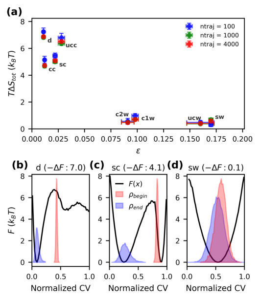
<figcaption class="paper-figure-caption"><b>Fig 4.</b> Figure 4. (a) Total entropy production ∆Stot of fullerene dimer association trajectories relaxing from the transition state, as observed with different coordinates (see main text for definitions), and distance ϵ of the latter from the com- mittor. Error bars are estimated using 5 blocks of trajecto- ries. Free-energy profiles from brute-force MD for three co- ordinates: (b) d, (c) sc and (d) sw. Coordinates are shifted and scaled between 0 and 1. The initial and final probabil- ity densities of the relaxation process are shown in red and blue, respectively. The free-energy drop estimated directly as −β∆F = log(Pend/Pbegin) from F(q) integration (See Sup- plemental Material for details) is...</figcaption>
</figure>
<figure class="paper-figure-card">
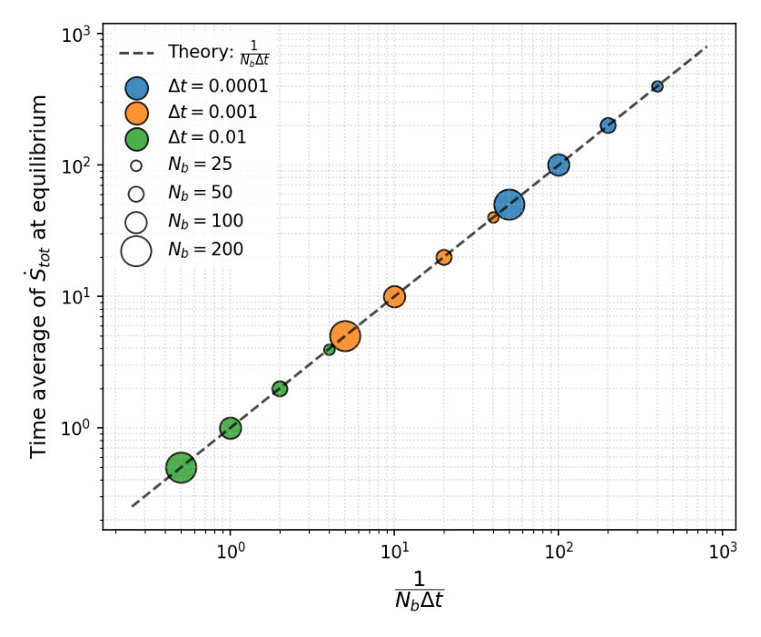
<figcaption class="paper-figure-caption"><b>Fig 5.</b> Figure 5. Measured entropy production rate of equilibrium trajectories, varying the number of points per bin Nb and the timestep ∆t. Data points represent the time average over 1500 steps of 10000 independent trajectories sampling the equilibrium ensemble of an Ornstein-Uhlenbeck process where F(q) = −q and D = 1. Because the true EPR at equilibrium is identically zero, the non-zero measured values stem entirely from finite-data bias, collapsing onto the predicted scaling law ˙Stot = 1/(Nb∆t).</figcaption>
</figure>

**Summary.** This work introduces a method to estimate free-energy barriers by calculating the total entropy production ($\Delta S_{tot}$) from short molecular dynamics trajectories using stochastic energetics. The approach shows that maximizing this calculated entropy production guides the selection of optimal reaction coordinates, successfully applied to model complex chemical association/dissociation processes.

**Why it may be interesting.** The methodology provides a powerful, computationally efficient link between non-equilibrium thermodynamics (Second Law) and equilibrium free energy sampling, which is highly relevant for studying reaction mechanisms in complex chemical or biological systems.

Detailed structure

**Main problem.** The paper aims to estimate free-energy barriers and identify optimal reaction coordinates for activated processes by calculating the total entropy production ($\Delta S_{tot}$) from short molecular dynamics trajectories.

**Main result.** The calculated $\Delta S_{tot}$ using stochastic energetics approaches the true value of $-eta\Delta F$ when projected onto a coordinate similar to the committor function, providing an efficient variational principle for order parameter selection.

**Method.** It employs stochastic energetics, utilizing the Entropy Production Rate Integral (EPRI) derived from analyzing trajectory statistics (density and current) in the context of the overdamped Langevin equation.

**Model / system.** The analysis is performed on general high-dimensional systems relaxing towards equilibrium, tested first with 1D double-well models, then extended to 2D benchmarks, and finally applied to a complex system: C60 fullerene nanoparticles in water solution.

**Key observables.** Total Entropy Production ($\Delta S_{tot}$), Free Energy Profile ($eta F(q)$), Committor Function ($\phi$), and the EPRI value ($\Delta S_{q}^{	ext{tot}}$).

**Important parameters / regimes.** Temperature (T=300 K), time scales (short trajectories of 30 ps vs. long ergodic runs), and the relationship $\Delta F = -T\Delta S_{tot}$.

**Assumptions / limitations.** The Langevin model assumes that orthogonal degrees of freedom equilibrate quickly compared to the variable of interest $q$, allowing projection onto a single coordinate.

**Figures summary.** Figures illustrate the connection between relaxation, entropy production, and free-energy differences; they compare $\Delta S_{tot}$ estimates from EPRI against direct calculations for benchmarks (double well) and show how CV choice affects results for the C60 system.

**Paper structure.** The paper develops the theoretical framework connecting entropy production to free energy barriers using stochastic energetics. It validates this approach on simple 1D/2D benchmarks, demonstrating that proximity to the committor maximizes $\Delta S_{tot}$. Finally, it applies and confirms the method's utility on a complex molecular system (C60 in water).

Abstract

We show through theory and numerical experiments that a straightforward calculation of entropy production on short molecular dynamics trajectories allows estimating free-energy barriers and identifying optimal reaction coordinates of activated processes. To this aim, we perform an analysis based on stochastic energetics on a set of trajectories relaxing towards equilibrium from a same initial configuration, projected on different putative coordinates. After demonstrating the approach on simple benchmarks, we show that it is possible to estimate the free-energy barrier of a complex high-dimensional system (carbon nanoparticles in water) and to rank the quality of order parameters, in agreement with the committor probability. The results shed light on the entanglement between the second law, free-energy landscapes, reaction coordinates and kinetic rates.

[↑ back to top](#top)

### [On data-driven parameterizations of multidimensional generalized Langevin dynamics in the presence of a quadratic potential](http://arxiv.org/abs/2607.05151v1)

**Authors:** Maximilian Braun, Martin Hanke, Niklas Wolf  
**Type:** theory · **Category:** statistical mechanics · **PDF:** <https://arxiv.org/pdf/2607.05151v1>  
**Analysis basis:** full PDF text, analyzed in chunks
**Topic relevance:** `methods for driven-dissipative` **3/5** · `non-equilibrium dynamics` **3/5** · `Keldysh / 2PI / non-Gaussian methods` **2/5** · `driven-dissipative phase transition` **2/5** · `Frenkel-Kontorova` **1/5** · `correlated / nonlocal dissipation` **1/5** · `non-equilibrium universality` **1/5**

↔ Scroll figures horizontally

<figure class="paper-figure-card">

<figcaption class="paper-figure-caption"><b>Fig 1.</b> Fig. 5.1. Autocorrelation function of Example 5.1 versus time t and the three numerical approx- imations. Each panel shows the scalar graphs corresponding to the respective entry of the matrix- valued function.</figcaption>
</figure>
<figure class="paper-figure-card">

<figcaption class="paper-figure-caption"><b>Fig 2.</b> Fig. 5.2. Absolute error between the true autocorrelation function of Example 5.1 and the three approximations. Each panel contains the scalar graphs corresponding to the error of the respective entry of the matrix-valued approximation. The black dashed lines show the target functions for additional information.</figcaption>
</figure>
<figure class="paper-figure-card">
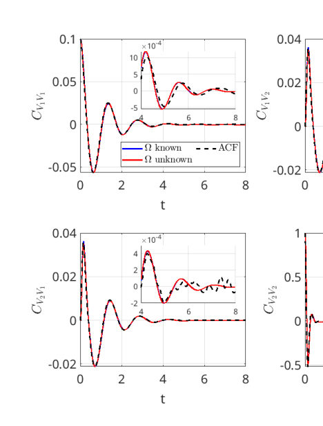
<figcaption class="paper-figure-caption"><b>Fig 3.</b> Fig. 5.3. Velocity autocorrelation function of Example 5.2 versus time and the two approxi- mations with and without the integral constraint (4.12d). Each panel shows the scalar graphs corre- sponding to the respective entry of the matrix-valued function.</figcaption>
</figure>
<figure class="paper-figure-card">
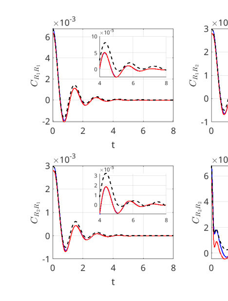
<figcaption class="paper-figure-caption"><b>Fig 4.</b> Fig. 5.4. Position autocorrelation function of Example 5.2 versus time and the two approxi- mations with and without the integral constraint (4.12d). Each panel shows the scalar graphs corre- sponding to the respective entries of the matrix-valued function.</figcaption>
</figure>
<figure class="paper-figure-card">

<figcaption class="paper-figure-caption"><b>Fig 5.</b> Fig. 5.5. Absolute error between the given velocity, position and cross correlation of Example 5.2 and the two approximations. The left panel shows the approximation error where Ωis known, the right panel where Ωis unknown, respectively.</figcaption>
</figure>

**Summary.** This paper presents a novel, data-driven method to convert the description of complex physical systems governed by Generalized Langevin Dynamics (GLEs) into an equivalent, solvable Markovian model. By utilizing autocorrelation functions and Prony series approximations, the authors bypass the difficult step of calculating the memory kernel directly from data. This technique is highly useful for simulating coarse-grained dynamics in condensed matter systems where non-Markovian effects are dominant.

**Why it may be interesting.** This work provides a powerful computational tool for modeling complex non-Markovian dynamics common in condensed matter physics. The ability to extract effective Markov descriptions directly from measured correlations is highly valuable for simulating systems where memory effects are crucial but analytically intractable.

Detailed structure

**Main problem.** The primary goal is developing a numerical algorithm to construct an effective Markov model that parameterizes the equation of motion for complex, multidimensional physical systems exhibiting memory effects.

**Main result.** The authors successfully show how to bypass the difficult inverse problem by directly using autocorrelation data (via Prony series) to determine the parameters for the equivalent Ornstein-Uhlenbeck process.

**Method.** The methodology involves approximating the system's dynamics, governed by a Generalized Langevin Equation (GLE), with an auxiliary variable Markovian model. This is achieved by fitting the velocity autocorrelation function using techniques like the AAA algorithm and Prony series expansion.

**Model / system.** The study focuses on coarse-grained physical systems whose motion is described by GLEs in an external potential, often linearized to a quadratic form ($\Phi(x) = rac{1}{2} x^T \Omega x$). The system dynamics are modeled using auxiliary variables to transform the non-Markovian process into a solvable Ornstein-Uhlenbeck (OU) system.

**Key observables.** Velocity autocorrelation function ($C_V(t)$), position autocorrelation function ($C_R(t)$), and cross-correlations ($C_{RV}$).

**Important parameters / regimes.** The number of auxiliary variables required for the Markov model (e.g., five for 1D, twelve for 2D) and system parameters like mass ($m$) and potential stiffness ($\Omega$).

**Assumptions / limitations.** Key assumptions include linearizing the external potential to a quadratic form, assuming the existence of a stationary Gaussian process solution, and approximating continuous autocorrelation data using finite equidistant samples (Markov approximation).

**Figures summary.** Figures compare the reconstructed position autocorrelation function against known values, showing good agreement for velocity correlations. Error analysis quantifies the performance of the approximations in various correlation functions.

**Paper structure.** The paper progresses from establishing the theoretical framework connecting GLEs to OU systems (using system theory concepts) to detailing the data-driven numerical procedure using Prony series and convex optimization solvers, culminating in validation against molecular dynamics simulations.

Abstract

We propose a numerical algorithm to construct a Markov model with an extended list of variables to parameterize the equation of motion of a multidimensional coarse-grained physical system in an external potential, when memory effects are relevant. Our method uses autocorrelation data of the stationary velocities, but it avoids the inverse problem of finding the corresponding memory kernel from these data in a first step. Rather, the data are used to construct a Prony series approximation of the autocorrelation function, and the parameters of this Prony series provide the corresponding Markov model. Numerical results for molecular dynamics data show a good match for parameterized models with five auxiliary variables for a one-dimensional, and twelve auxiliary variables for a two-dimensional system.

[↑ back to top](#top)

### [Emergent Fermi polarons in Dirac materials](http://arxiv.org/abs/2607.04161v1)

**Authors:** Xin Chen, Eugen Dizer, Rafał Ołdziejewski, Kostya S. Novoselov, Marton Kanász-Nagy, Richard Schmidt  
**Type:** theory · **Category:** other · **PDF:** <https://arxiv.org/pdf/2607.04161v1>  
**Analysis basis:** full PDF text, analyzed in chunks
**Topic relevance:** `Keldysh / 2PI / non-Gaussian methods` **3/5** · `Kondo & dissipative impurity` **3/5** · `analog quantum simulation` **2/5** · `correlated / nonlocal dissipation` **1/5** · `driven-dissipative phase transition` **1/5** · `methods for driven-dissipative` **1/5** · `non-equilibrium dynamics` **1/5**

↔ Scroll figures horizontally

<figure class="paper-figure-card">
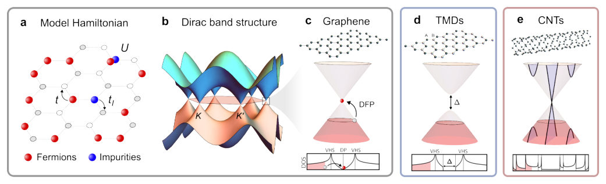
<figcaption class="paper-figure-caption"><b>Fig 1.</b> FIG. 1. Setup and physical regimes. Massless Dirac regime (gray box): a Schematic realization, where majority fermions (red) and impurities (blue) populate a honeycomb lattice with hopping amplitudes t and tI, respectively, and interact via an on-site potential U. b Three-dimensional honeycomb band structure featuring two inequivalent Dirac points K and K′ at the corners of the Brillouin zone. c Zoom into the linear Dirac cone with the corresponding gapless DOS (bottom), vanishing at the charge-neutrality point. The arrow illustrates the particle-hole excitation responsible for the emergence of the Dirac-Fermi polaron (DFP). Massive Dirac regime (blue box): d Massive Dirac cone with gap...</figcaption>
</figure>
<figure class="paper-figure-card">
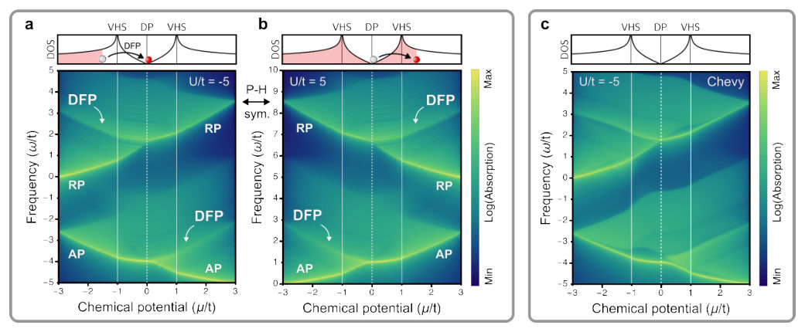
<figcaption class="paper-figure-caption"><b>Fig 2.</b> FIG. 2. a,b Absorption spectrum of a static impurity (tI = 0) in the massless Dirac regime for attractive (U/t = −5) and repulsive (U/t = 5) interactions, calculated via the functional determinant approach (FDA). In addition to the conventional attractive polaron (AP) and repulsive polaron (RP) branches, Dirac-Fermi polaron (DFP) resonances are visible. The symmetry between panels a and b reflects the particle-hole symmetry of the honeycomb band structure. c The corresponding spectrum of a static impurity for attractive interactions obtained from the variational Chevy ansatz, Eq. (4). Vertical dotted and solid lines mark the Dirac point (DP) and van Hove singularities (VHS), respectively,...</figcaption>
</figure>
<figure class="paper-figure-card">
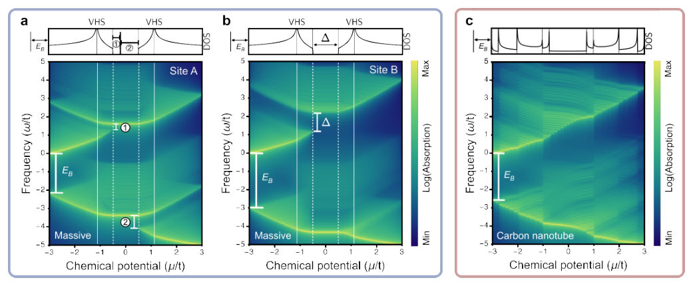
<figcaption class="paper-figure-caption"><b>Fig 3.</b> FIG. 3. Absorption spectrum of a static impurity (tI = 0) for attractive interactions (U/t = −5). a,b Massive Dirac regime (blue box, ∆= t): FDA spectra for the impurity located at sublattice site A and B, with the schematic interacting DOS shown above each panel indicating bound state energies and band edges. The separation between the attractive and repulsive polaron branches is set by the bound state energy EB. The distances from the in-gap bound state to the lower and upper band edges are marked by 1 and 2, respectively. For site A, the in-gap state resides near the centre of the gap, giving rise to two distinct spectral gaps. In contrast, for an impurity at site B, no in-gap state is...</figcaption>
</figure>
<figure class="paper-figure-card">
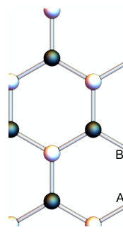
<figcaption class="paper-figure-caption"><b>Fig 4.</b> FIG. 1. The honeycomb lattice is constructed with lattice vectors a1 = √</figcaption>
</figure>
<figure class="paper-figure-card">

<figcaption class="paper-figure-caption"><b>Fig 5.</b> FIG. 2. FDA absorption spectra for an interaction strength of U = −5 t with periodic boundary conditions. a–c Spectra at zero temperature (T = 0) for progressively larger lattice sizes: a 9 × 9, b 18 × 18, and c 30 × 30. d The corresponding finite-temperature absorption spectrum evaluated at T = 0.2 t on a 24 × 24 lattice.</figcaption>
</figure>

**Summary.** This work theoretically investigates how impurities interact with fermions in Dirac materials, predicting the formation of robust quasiparticles called Dirac-Fermi polarons (DFP). By analyzing absorption spectra and self-energies, the authors show that polaron spectroscopy provides a unique tool to probe band structure effects beyond simple continuum models. The findings confirm the DFP's stability across various doping levels in these exotic quantum systems.

**Why it may be interesting.** The focus on polaron spectroscopy as a probe of band structure effects at energies far from the Fermi surface is highly relevant to understanding correlated excitations in low-dimensional quantum materials, bridging concepts from condensed matter theory with spectroscopic measurements applicable to cold atoms.

Detailed structure

**Main problem.** The study investigates band-structure effects on the absorption spectra of quantum impurities in Dirac materials to establish polaron spectroscopy as a powerful probe for these effects.

**Main result.** The authors predict the robust emergence of a novel quasiparticle resonance, the Dirac–Fermi polaron (DFP), which persists across doping levels and interaction strengths.

**Method.** Theoretical calculations utilize the Loschmidt echo formalism and functional determinant approaches to analyze spectral functions and self-energies for both static and mobile impurities.

**Model / system.** The system models fermionic impurities interacting with bath fermions in Dirac materials, such as those on honeycomb lattices (graphene). The Hamiltonian includes impurity interaction terms, allowing investigation across massless, massive, and metallic regimes.

**Key observables.** Absorption spectrum ($A(\omega)$), polaron branches (Attractive Polaron (AP), Repulsive Polaron (RP), Dirac-Fermi Polaron (DFP)), quasiparticle residue ($Z$), and lifetime ($	au$).

**Important parameters / regimes.** Interaction strength ($U/t$), chemical potential ($\mu$) relative to the Fermi level, and lattice structure details (massless vs. massive Dirac regime).

**Assumptions / limitations.** The analysis relies on variational ansatz approaches for self-energy calculations; it notes that standard effective field theories are insufficient for these systems.

**Figures summary.** Figures illustrate absorption spectra across different regimes (Massless, Massive, Metallic) and compare static vs. mobile impurity self-energies, showing the survival of quasiparticle peaks despite theoretical expectations otherwise.

**Paper structure.** The paper progresses by first establishing the spectral signature using the Loschmidt echo in various Dirac regimes; it then develops the theory for both static and mobile impurities, confirming the DFP's robustness via self-energy analysis and T-matrix calculations.

Abstract

We investigate band-structure effects on the absorption spectra of quantum impurities in Dirac materials. We uncover the formation of novel quasiparticles -- Dirac-Fermi polarons -- emerging from the dressing of impurities by excitations near the Dirac point. These quasiparticles are remarkably robust, persisting for both attractive and repulsive interactions, and across the full range of electron and hole doping. We show that their spectroscopic signature is a generic feature of Dirac materials, accessible with established techniques in both solid-state and ultracold atomic platforms. Our results establish polaron spectroscopy as a powerful probe of Dirac points at energies far from the Fermi surface, providing direct access to band-structure effects beyond conventional approaches.

[↑ back to top](#top)

### [Mapping open quantum dynamics onto graphs](http://arxiv.org/abs/2607.04721v1)

**Authors:** Kyuho Kim, Dayeong Lee, Seungkyun Park, Xianji Piao, Namkyoo Park, Sunkyu Yu  
**Type:** theory · **Category:** other · **PDF:** <https://arxiv.org/pdf/2607.04721v1>  
**Analysis basis:** full PDF text, analyzed in chunks
**Topic relevance:** `methods for driven-dissipative` **3/5** · `correlated / nonlocal dissipation` **2/5** · `driven-dissipative phase transition` **2/5** · `Keldysh / 2PI / non-Gaussian methods` **1/5** · `analog quantum simulation` **1/5** · `entanglement & information structure` **1/5** · `non-equilibrium dynamics` **1/5** · `non-equilibrium universality` **1/5**

↔ Scroll figures horizontally

<figure class="paper-figure-card">

<figcaption class="paper-figure-caption"><b>Fig 1.</b> Fig. 1. Schrödinger operator graphs. a, Magnetic graph G = (V, E) with NG vertices, where</figcaption>
</figure>
<figure class="paper-figure-card">
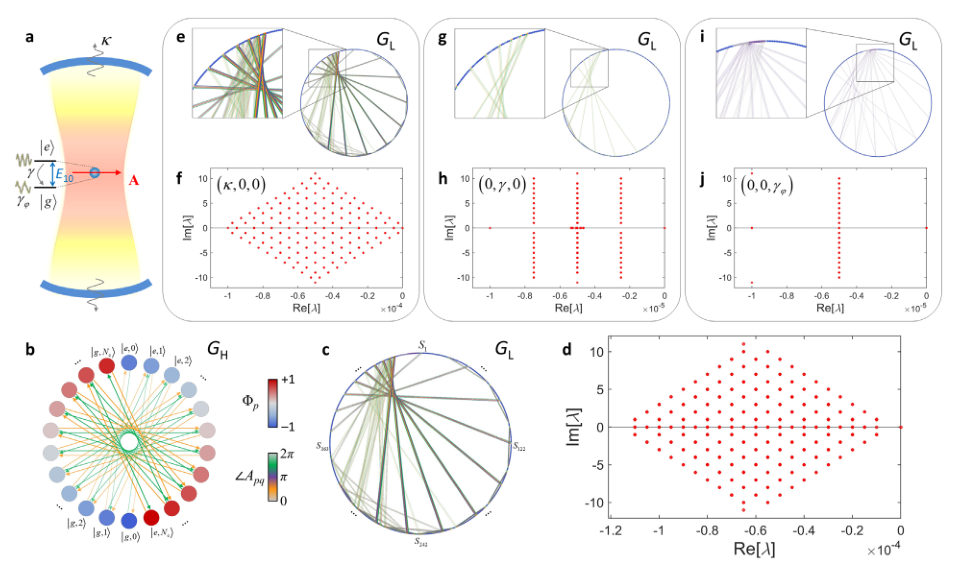
<figcaption class="paper-figure-caption"><b>Fig 2.</b> Fig. 2. Open quantum Rabi graphs. a, Schematic of the open QRM. b,c, GH (b) and GL (c) for</figcaption>
</figure>
<figure class="paper-figure-card">
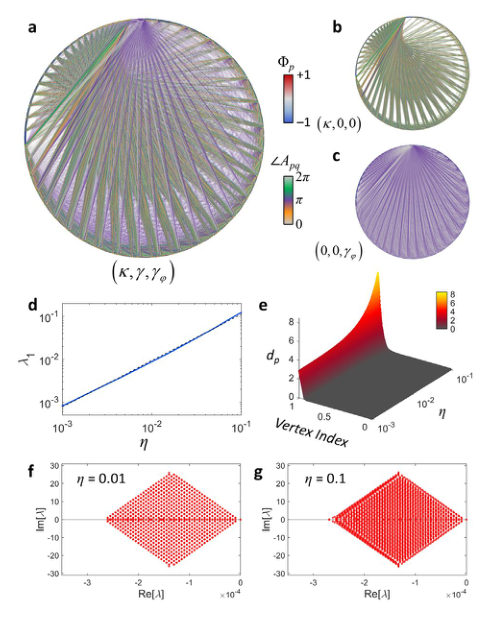
<figcaption class="paper-figure-caption"><b>Fig 3.</b> Fig. 3. USC open quantum Rabi graphs. a-c, GL for (κ, γ, γφ) = (10–5, 10–5, 10–5) (a), (10–5, 0, 0)</figcaption>
</figure>
<figure class="paper-figure-card">
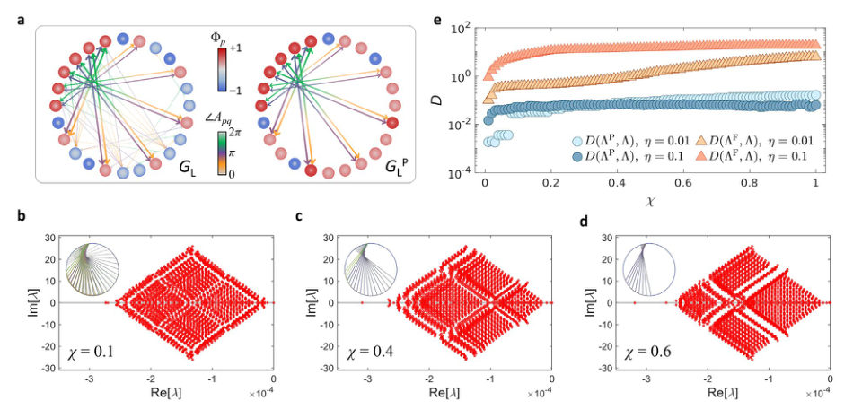
<figcaption class="paper-figure-caption"><b>Fig 4.</b> Fig. 4. Graph pruning. a, Schematic of graph pruning. b-d, Liouville spectra and the</figcaption>
</figure>
<figure class="paper-figure-card">

<figcaption class="paper-figure-caption"><b>Fig 5.</b> Fig. 5. Schrödinger-operator graph neural networks. a, Schematic of the GCN, where ‘HOP’</figcaption>
</figure>

**Summary.** The paper introduces a universal graph-theoretic framework to analyze open quantum dynamics by mapping the system's evolution onto two distinct graphs. By applying this to the Open Quantum Rabi Model, the authors demonstrate that graph structures can characterize dissipation and coupling regimes. They further show that Graph Neural Networks trained on these pruned graphs can accurately predict the complex Liouville spectrum.

**Why it may be interesting.** This work provides a powerful mathematical bridge between advanced concepts in quantum optics (open systems) and modern machine learning tools (GNNs), offering new diagnostic tools for understanding dissipation mechanisms in complex quantum devices.

Detailed structure

**Main problem.** To develop a universal graph-theoretic framework for mapping and analyzing open quantum dynamics, addressing the unexplored connectivity structure of system-bath coupling.

**Main result.** The authors propose a framework that maps Markovian open quantum dynamics onto two uniquely defined graphs ($G_H$ and $G_L$), allowing for efficient data-driven analysis using graph neural networks (GNNs). Graph pruning was shown to preserve spectral features significantly better than direct matrix sparsification.

**Method.** The method involves representing the Lindblad master equation evolution via operator-valued signals on magnetic graphs, followed by applying graph pruning and training a Graph Convolutional Network (GCN) to predict the Liouville spectrum.

**Model / system.** The study focuses on open quantum systems undergoing Markovian dynamics, exemplified by the Open Quantum Rabi Model (QRM). The evolution is governed by the Lindblad Master Equation involving system-bath coupling terms ($\kappa, \gamma, \gamma_\phi$).

**Key observables.** Liouville spectrum (eigenvalues $\lambda$), graph topologies ($G_H, G_L$), and spectral diagnostics like the Chamfer distance $D$ used to quantify approximation accuracy.

**Important parameters / regimes.** Coupling strengths ($\kappa, \gamma, \gamma_\phi$), pruning threshold ($\chi$), and coupling regimes such as weak-to-ultrastrong coupling (USC).

**Assumptions / limitations.** The framework assumes the dynamics can be accurately characterized by two graph structures ($G_H$ and $G_L$) derived from the Lindblad form, and that a GCN trained on these graphs can predict the spectrum.

**Figures summary.** Figures illustrate the QRM graphs ($G_H, G_L$), show spectral differences across dissipation regimes, compare graph pruning vs. matrix sparsification using Chamfer distance, and demonstrate optimal GCN performance at specific pruning thresholds ($\chi$).

**Paper structure.** The paper introduces the universal graph framework for open dynamics, applies it to the QRM model, details the use of graph measures and spectral analysis, compares graph pruning against standard matrix methods, and finally demonstrates predictive power using a trained Graph Convolutional Network.

Abstract

Graph-theoretic frameworks have been widely employed in quantum physics to address the high-dimensional complexity of quantum systems. Although open quantum dynamics incorporates system-bath coupling via numerous interacting operators, it has been formulated algebraically with a partial set of jump operators or statistically universal reservoirs, leaving the underlying connectivity structure largely unexplored. Here, we propose a universal graph-theoretic framework for Markovian quantum dynamics. The framework maps open quantum dynamics onto two uniquely defined graphs, where the quantum master equation is rigorously interpreted as the average wave characteristic of operator-valued signals across the graphs. Applying this framework to the open quantum Rabi model, we demonstrate an open-system generalization of Fock-state lattices, characterize graph-topological signatures of dissipation, and classify the weak-to-ultrastrong coupling transition. Building on these representations, graph pruning reveals the backbone of open quantum dynamics, which enables superior graph neural-network learning. Our results bridge graph theory and open quantum dynamics, achieving efficient data-driven analysis of high-dimensional complexity.

[↑ back to top](#top)

### [Optimal estimation of quantum boundary effect in cosmic string space-time](http://arxiv.org/abs/2607.04295v1)

**Authors:** Yao Jin  
**Type:** theory · **Category:** other · **PDF:** <https://arxiv.org/pdf/2607.04295v1>  
**Analysis basis:** full PDF text, analyzed in chunks
**Topic relevance:** `quantum measurements` **3/5** · `measurement-induced transitions` **2/5** · `Keldysh / 2PI / non-Gaussian methods` **1/5** · `analog quantum simulation` **1/5** · `correlated / nonlocal dissipation` **1/5** · `driven-dissipative phase transition` **1/5** · `entanglement & information structure` **1/5** · `methods for driven-dissipative` **1/5** · `non-equilibrium dynamics` **1/5**

↔ Scroll figures horizontally

<figure class="paper-figure-card">
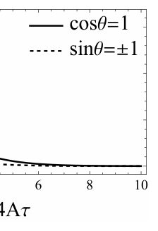
<figcaption class="paper-figure-caption"><b>Fig 1.</b> FIG. 1: f as a function of 4Aτ with cos θ = 1 and sin θ = ±1.</figcaption>
</figure>
<figure class="paper-figure-card">
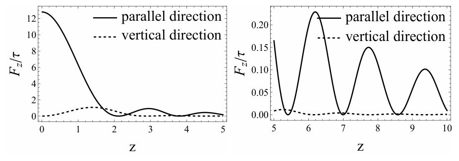
<figcaption class="paper-figure-caption"><b>Fig 2.</b> FIG. 2: Fz/τ as a function of z for in cases of parallel and vertical polarization respectively.</figcaption>
</figure>
<figure class="paper-figure-card">

<figcaption class="paper-figure-caption"><b>Fig 3.</b> FIG. 3: Fρ/τ as a function of ρ in cases with ρ, θ and z polarization direction when ν = 2.</figcaption>
</figure>
<figure class="paper-figure-card">
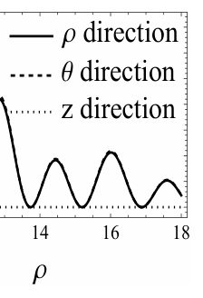
<figcaption class="paper-figure-caption"><b>Fig 4.</b> FIG. 4: Fρ/τ as a function of ρ in cases with ρ, θ and z polarization direction when</figcaption>
</figure>

**Summary.** This theoretical paper develops a method to optimally estimate quantum boundary effects caused by cosmic strings on an atom's dynamics. By analyzing the precision limit derived from sequential measurements, the authors show that the optimal measurement polarization depends sensitively on the geometry (separation and deficit angle). The findings provide detailed guidelines for experimental detection of such exotic spacetime features using atomic probes.

**Why it may be interesting.** This work directly applies quantum estimation theory to exotic environments (cosmic strings), providing concrete predictions about how fundamental constants or geometric parameters can be measured using atomic probes in open quantum systems settings.

Detailed structure

**Main problem.** The paper addresses the optimal estimation of quantum boundary effects induced by cosmic strings on the dynamics of a two-level polarizable atom.

**Main result.** The optimal measurement basis and initial state depend critically on whether the environment is a simple reflecting boundary or a cosmic string, with polarization choices varying based on separation and deficit angle.

**Method.** The estimation precision limit is determined using the Cramér-Rao bound by performing sequential measurements on a single probe atom, optimizing preparation, measurement basis, and interaction time.

**Model / system.** The system involves a two-level polarizable atom whose vacuum fluctuations are modified by either an infinite conducting reflecting boundary or a static cosmic string. The dynamics are governed by the reduced density matrix evolution following the Kossakowski-Lindblad form.

**Key observables.** Estimation precision, quantified by $F_{direction}/	au$, which measures how well a position factor (related to vacuum fluctuation modification) can be estimated.

**Important parameters / regimes.** Atom-string separation ($
ho$ or $z$), deficit angle, and the total probe time ($T$).

**Assumptions / limitations.** The analysis assumes weak coupling and that the initial field state is vacuum in the atom's frame.

**Figures summary.** Figure 2 compares precision for parallel vs. vertical polarization in a reflecting boundary; Figure 3 and 4 show how $
ho$, $	heta$, and $z$ polarizations compare as functions of separation ($
ho$) in cosmic string backgrounds under different deficit angle regimes.

**Paper structure.** The paper first establishes the general framework using sequential measurements to estimate position factors. It then analyzes two distinct physical scenarios: the bounded flat space-time (reflecting boundary) and the cosmic string space-time, deriving optimal strategies for each case.

Abstract

The presence of a cosmic string modifies vacuum fluctuations, making the evolution of a two-level polarizable atom position dependent. Such modifications produce effects on the atomic dynamics analogous to those induced by a reflecting boundary. We show that these quantum boundary effects can be estimated by performing a sequence of $N$ measurements on a single probe atom. For a fixed total probe time, the precision limit is attained by preparing each probe in its optimal initial state, performing the corresponding optimal measurement, and shortening the probe time of each probe. The optimal measurement is uniquely determined by the probe's initial state, and the precision limit obtained with the atom initially in the excited state is four times higher than that for an equal-weight superposition state. The estimation precision displays damped oscillatory behavior as the atom-boundary or atom-string separation increases. While polarization parallel to the reflecting boundary is always optimal in the boundary case, the optimal polarization in cosmic-string space-time depends on both the atom-string separation and the deficit angle. For small deficit angles and sufficiently large separations, polarization along the cosmic-string direction becomes inferior to the other polarization directions.

[↑ back to top](#top)

### [Detection methods for optimal target reflectivity estimation with two-mode squeezed vacuum probes](http://arxiv.org/abs/2607.04021v1)

**Authors:** Harel Radia, Tuvia Gefen, Nadav Katz  
**Type:** theory · **Category:** other · **PDF:** <https://arxiv.org/pdf/2607.04021v1>  
**Analysis basis:** full PDF text, analyzed in chunks
**Topic relevance:** `quantum measurements` **3/5** · `entanglement & information structure` **2/5** · `measurement-induced transitions` **2/5** · `Keldysh / 2PI / non-Gaussian methods` **1/5** · `correlated / nonlocal dissipation` **1/5** · `driven-dissipative phase transition` **1/5** · `methods for driven-dissipative` **1/5**

↔ Scroll figures horizontally

<figure class="paper-figure-card">
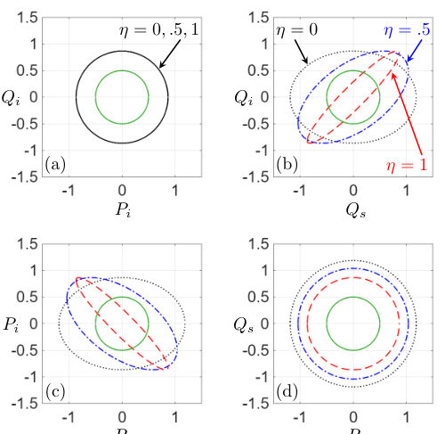
<figcaption class="paper-figure-caption"><b>Fig 1.</b> FIG. 1: Phase-space projections of the output state for nβ ≈2.32 (T ≈0.667 K at 5 GHz) and nr = 1, across various target reflectivities η. The green line indicates the vacuum state for reference. The black, blue and red lines correspond to η = 0, 0.5 and 1 respectively.</figcaption>
</figure>
<figure class="paper-figure-card">

<figcaption class="paper-figure-caption"><b>Fig 2.</b> Fig. 1 shows phase-space projections of the output state onto various subspaces for different values of η, and</figcaption>
</figure>
<figure class="paper-figure-card">

<figcaption class="paper-figure-caption"><b>Fig 3.</b> FIG. 2: Dependence of the smallest symplectic eigen- value ε−on the squeezing parameter nr, plotted for var- ious values of the photon number difference ∆n. Solid blue curves indicate the entangled regime (∆n &lt; 0). Solid red curves correspond to the separable regime (∆n &gt; 0). For reference, the dashed curves depict the limiting cases of perfect reflection (η →1, blue) and total loss (η →0, red).</figcaption>
</figure>
<figure class="paper-figure-card">

<figcaption class="paper-figure-caption"><b>Fig 4.</b> FIG. 3: (a),(b) QFI and local homodyne FI as a function of nr, for different values of nβ, with (a) η = 0.9 and (b) η = 0.1. The dashed, black vertical line represents the crossover point of nr = nη, in which the dependence on nβ changes. (c) QFI and local homodyne FI as a function of η, for nβ ≈2.32, and different values of nr.</figcaption>
</figure>
<figure class="paper-figure-card">

<figcaption class="paper-figure-caption"><b>Fig 5.</b> FIG. 4: (a) The ratio R = Icoh/I as a function of reflectivity η, (b) R as a function of nr. The TMSV QFI is always larger, and thus R ≤1, where the maximal gap is at larger η. (c) R = Icoh/Ih,local as a function of reflectivity η (d) and mean photon number nr. The gray line corresponds to R = 1.</figcaption>
</figure>

**Summary.** This paper investigates how accurately one can estimate a target's reflectivity using squeezed vacuum light probes. It rigorously compares the ultimate theoretical precision limit (QFI) against what is achievable with practical local measurements. The key finding is that while perfect measurement requires non-local techniques, suitable Gaussian measurements can still achieve near-optimal estimation in many relevant noisy physical scenarios.

**Why it may be interesting.** This work is highly relevant for quantum optics and open quantum systems as it provides concrete, quantifiable benchmarks for sensing parameters in realistic noisy environments using continuous variable entanglement.

Detailed structure

**Main problem.** The paper addresses the fundamental limit of precision for estimating a target's reflectivity ($\eta$) using quantum probes, specifically two-mode squeezed vacuum (TMSV) states.

**Main result.** Near-optimal quantum estimation is achievable even when restricted to Gaussian measurements, demonstrating that suitable non-local Gaussian measurements can approach the ultimate quantum Cramér-Rao bound in various noisy regimes.

**Method.** The analysis employs quantum estimation theory, calculating the Quantum Fisher Information (QFI) and comparing it against local measurement limits using tools from symplectic geometry and Gaussian state formalism.

**Model / system.** The system involves a signal mode interacting with an unknown reflectivity ($\eta$) via a thermal-loss channel, probed by a TMSV state. The output state remains Gaussian throughout the analysis.

**Key observables.** Target reflectivity ($\eta$), Quantum Fisher Information ($I$), local homodyne Fisher Information ($	ext{Ih,local}$), and entanglement measures like the smallest symplectic eigenvalue ($\epsilon^-$).

**Important parameters / regimes.** Squeezing parameter ($r$), mean photon number ($n_r$), thermal environment parameters ($n_eta$), and reflectivity ($\eta$). Key regimes include high/low reflectivity thresholds.

**Assumptions / limitations.** The analysis assumes that the probe state parameters ($n_r, n_eta$) are known while $\eta$ is unknown. It also analyzes performance under Gaussian measurement restrictions.

**Figures summary.** Figures illustrate phase-space projections showing how $\eta$ modifies the output state and depict the dependence of entanglement ($\epsilon^-$) on system parameters, defining boundaries between entangled and separable regimes.

**Paper structure.** The paper progresses by establishing the theoretical framework using SLD operators to find optimal measurements. It then analyzes specific measurement protocols (local vs. non-local Gaussian) to compare achievable precision limits against the QFI bound, detailing transitions based on $\eta$.

Abstract

Target reflectivity estimation using a two-mode squeezed vacuum (TMSV) probe offers a theoretical advantage over classical schemes, but realizing this potential under the measurement constraints of microwave platforms remains a central challenge. In this work, we study the precision limits for target reflectivity estimation across different energy and loss regimes, while accounting for realistic measurement restrictions. We characterize the optimal measurements and identify a transition in their structure: above a specific reflectivity threshold, a parametric amplifier receiver is optimal, whereas below it, the optimal observables are two-mode squeezing generators. We then study the performance of Gaussian measurements. When restricted to standard local homodyne detection, the TMSV probe is highly non-optimal. However, we show that suitable non-local Gaussian measurements can closely approach the quantum Cramér-Rao bound at the large noise limit. These results demonstrate that near-optimal quantum target reflectivity estimation is achievable in various relevant noisy regimes, even under the restriction of Gaussian measurements.

[↑ back to top](#top)

### [Minimal Proper Time and Deterministic Microstates: Emergent Quantum Fields and Relativistic Spacetime](http://arxiv.org/abs/2607.03605v1)

**Authors:** Alessio Maiezza  
**Type:** theory · **Category:** other · **PDF:** <https://arxiv.org/pdf/2607.03605v1>  
**Analysis basis:** full PDF text, analyzed in chunks
**Topic relevance:** `Keldysh / 2PI / non-Gaussian methods` **3/5** · `non-equilibrium dynamics` **2/5** · `correlated / nonlocal dissipation` **1/5** · `correlated cavity matter` **1/5** · `driven-dissipative phase transition` **1/5** · `entanglement & information structure` **1/5** · `methods for driven-dissipative` **1/5** · `non-equilibrium universality` **1/5**

↔ Scroll figures horizontally

<figure class="paper-figure-card">

<figcaption class="paper-figure-caption"><b>Fig 1.</b> Low-resolution page preview, page 2</figcaption>
</figure>
<figure class="paper-figure-card">
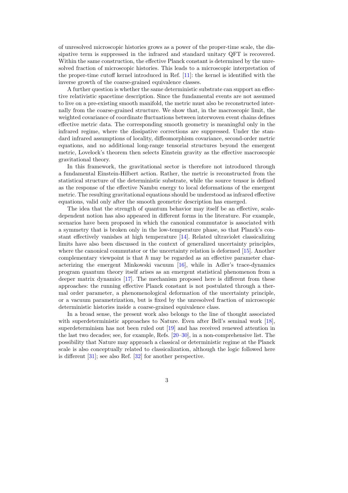
<figcaption class="paper-figure-caption"><b>Fig 2.</b> Low-resolution page preview, page 3</figcaption>
</figure>
<figure class="paper-figure-card">
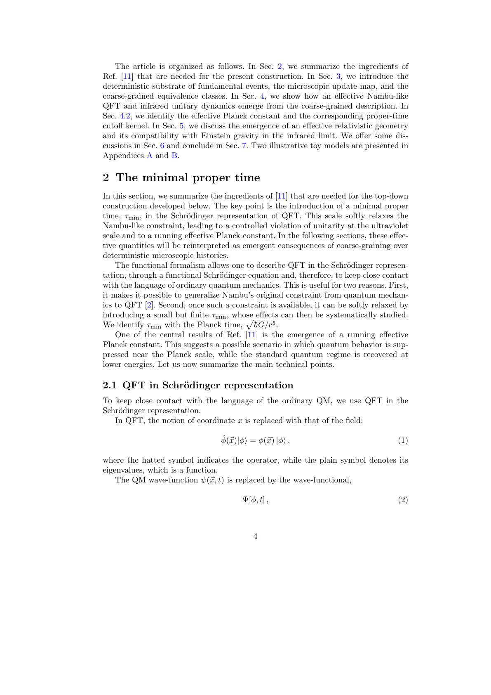
<figcaption class="paper-figure-caption"><b>Fig 3.</b> Low-resolution page preview, page 4</figcaption>
</figure>
<figure class="paper-figure-card">

<figcaption class="paper-figure-caption"><b>Fig 4.</b> Low-resolution page preview, page 5</figcaption>
</figure>
<figure class="paper-figure-card">

<figcaption class="paper-figure-caption"><b>Fig 5.</b> Low-resolution page preview, page 6</figcaption>
</figure>

**Summary.** This work proposes that both quantum field theory and relativistic spacetime emerge from a deeper, underlying deterministic structure composed of causally ordered events. By performing a coarse-graining procedure over these microscopic histories, the authors derive an effective Nambu dynamics whose low-energy limit recovers standard QFT and generates Einstein's gravity equations as its macroscopic description.

**Why it may be interesting.** While highly theoretical, the concept of deriving fundamental physics (QFT/GR) from a discrete, deterministic substrate is relevant to foundational questions addressed by quantum information theory regarding emergence and effective descriptions.

Detailed structure

**Main problem.** The paper aims to develop a top-down framework showing how quantum field theory (QFT) and relativistic spacetime emerge from a fundamentally deterministic, pre-geometric substrate of causally ordered events.

**Main result.** Coarse-graining over microscopic histories naturally yields an effective Nambu-like quantum dynamics at low energies, which in turn generates an emergent metric compatible with Einstein gravity in the macroscopic limit.

**Method.** The authors employ a coarse-graining procedure on a deterministic substrate, comparing it to established bottom-up proper-time formulations and deriving effective field equations via linear response theory.

**Model / system.** The model starts with a deterministic pre-geometric substrate of causally ordered events. Dynamics are analyzed by treating the evolution as a coarse-graining process over microscopic histories, leading to an effective Hamiltonian structure.

**Key observables.** Effective Planck constant ($\hbar_{eff}$), emergent metric components ($g_{\mu
u}(x)$), and the stress-energy tensor ($T_{\mu
u}$).

**Important parameters / regimes.** Minimal proper time step ($	au_{\min} \sim \sqrt{\hbar G}/c^5$), scale parameter ($\eta = 1/n$), and the running effective Planck constant.

**Assumptions / limitations.** The reconstruction of spacetime relies on standard infrared assumptions (locality, diffeomorphism covariance), and the source for curvature is defined internally by the response of the Nambu energy to metric deformations.

**Figures summary.** Not specified in notes; however, the structure suggests calculations involving matrix forms ($K = I - \eta M$) and tensor components derived from local cardinalities ($q(x)$).

**Paper structure.** The paper progresses by first establishing the top-down connection to QFT using minimal proper time ($	au_{\min}$), then developing toy models showing how coarse-graining yields effective dynamics, and finally applying this structure to derive emergent Einstein field equations from local variations in microscopic cardinalities.

Abstract

We develop a top-down counterpart of the minimal proper-time formulation of quantum field theory previously introduced as an effective bottom-up framework. Starting from a deterministic pre-geometric substrate of causally ordered events, we show how coarse-graining over microscopic histories leads, at low energies, to an effective Nambu-like quantum dynamics. The elementary deterministic update is identified with the minimal proper-time step, while the growth of coarse-grained equivalence classes controls both the ultraviolet dissipative correction and the scale dependence of the effective quantization strength, encoded in a running Planck constant. In this way, the proper-time cutoff kernel of the bottom-up formulation acquires a microscopic interpretation as the inverse growth of unresolved deterministic histories. In the infrared limit, the dissipative term vanishes and standard unitary quantum field theory is recovered. The same coarse-grained structure also provides a natural setting for an emergent relativistic spacetime geometry, compatible in the macroscopic limit with Einstein gravity. The resulting picture suggests a common deterministic origin for minimal-scale structure, quantum behavior, and relativistic spacetime.

[↑ back to top](#top)

### [Contraction and Expansion Values of Quantum Channels](http://arxiv.org/abs/2607.04950v1)

**Authors:** Ruben Ibarrondo, Mikel Sanz  
**Type:** theory · **Category:** quantum information and computing · **PDF:** <https://arxiv.org/pdf/2607.04950v1>  
**Analysis basis:** full PDF text, analyzed in chunks
**Topic relevance:** `entanglement & information structure` **3/5** · `non-equilibrium dynamics` **2/5** · `Keldysh / 2PI / non-Gaussian methods` **1/5** · `correlated / nonlocal dissipation` **1/5** · `driven-dissipative phase transition` **1/5** · `methods for driven-dissipative` **1/5** · `non-equilibrium universality` **1/5**

↔ Scroll figures horizontally

<figure class="paper-figure-card">
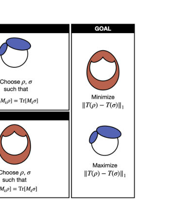
<figcaption class="paper-figure-caption"><b>Fig 1.</b> Figure 1: Given a channel T and an index 1 ≤n ≤d2 −1, Alice and Bob agree on two states ρ and σ to play with. The game consists of Alice randomly choosing one of the states to send through the channel T, and Bob performing arbitrary one-shot measurements to guess which state was sent. The diagrams describe two ways to agree on the states, Bob’s success probability if both choose the optimal strategy is given by (a) the contraction coefficients, or (b) the expansion coefficients.</figcaption>
</figure>
<figure class="paper-figure-card">
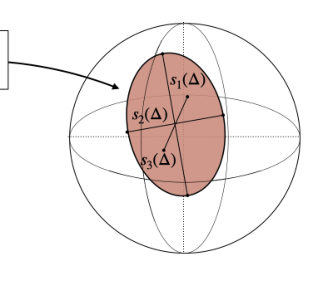
<figcaption class="paper-figure-caption"><b>Fig 2.</b> Figure 2: Under the action of a quantum channel T, the Bloch sphere B is mapped into an ellipsoid T(B), see Eq. (74), contained inside the original sphere. The principal axes of the ellipsoid correspond to the contraction and expansion values of the channel.</figcaption>
</figure>
<figure class="paper-figure-card">
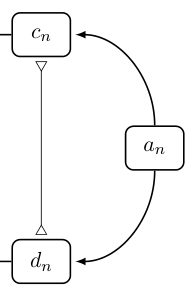
<figcaption class="paper-figure-caption"><b>Fig 3.</b> Figure 3: Relations between s-numbers. The filled arrows point from larger to smaller s-scales and the empty reversed arrows connect dual s-scales, in the sense of Proposition 30.</figcaption>
</figure>
<figure class="paper-figure-card">

<figcaption class="paper-figure-caption"><b>Fig 4.</b> Figure 4: Depicts the decomposition presented in Lemma 32, which expresses the depolarizing channel as a chain of amplitude damping channels and a Hadamard channel. This example takes d = 3 and λ = 0.7 and the initial state |s⟩= 1 √</figcaption>
</figure>

**Summary.** This paper introduces contraction and expansion values ($\hat{\kappa}_n$ and $\check{\kappa}_n$) to provide a richer characterization of quantum channels than the standard contraction coefficient. By defining these as monotone sequences derived from variational principles, the authors establish bounds that correctly describe how information loss accumulates when multiple noisy processes are composed. This advances the mathematical tools available for analyzing open quantum systems.

**Why it may be interesting.** This work provides a powerful mathematical framework for characterizing quantum noise beyond simple measures, offering spectral information crucial for understanding the fidelity of multi-step quantum processes relevant in quantum computation and communication.

Detailed structure

**Main problem.** The standard contraction coefficient of a quantum channel is insufficient because it only captures the most optimistic behavior and fails to describe how information loss accumulates under channel composition.

**Main result.** The authors introduce 'contraction' ($\hat{\kappa}_n(T)$) and 'expansion' ($\check{\kappa}_n(T)$) values as monotone sequences that refine the single scalar coefficients, providing dimension-dependent bounds for channel compositions.

**Method.** The new values are derived using a min--max variational principle over subspaces of traceless Hermitian operators, linking them to Pietsch's theory of s-numbers and state-discrimination games.

**Model / system.** The study focuses on general quantum channels ($T$) acting on $d$-dimensional systems, particularly analyzing their behavior when restricted to the subspace of traceless Hermitian operators ($	ext{Herm}_0(d)$).

**Key observables.** Contraction and expansion values ($\hat{\kappa}_n(T), \check{\kappa}_n(T)$); the standard contraction coefficient $\hat{\eta}(T)$; the spectral diameter.

**Important parameters / regimes.** The dimension $d$ of the system; the index $n$ characterizing the sequence element; damping rates $\lambda$ for specific channels.

**Assumptions / limitations.** The analysis relies on extending concepts from operator theory (s-numbers) to quantum channel diagnostics, assuming that variational principles over subspaces capture the full spectral behavior.

**Figures summary.** Figure 4 illustrates the decomposition of a depolarizing channel into amplitude damping and Hadamard components for $d=3$.

**Paper structure.** The paper progresses from identifying the limitations of single-scalar coefficients to introducing $\hat{\kappa}_n$ and $\check{\kappa}_n$ via variational principles, relating these sequences to established s-number theories (Gel'fand/Bernstein numbers), and finally applying these tools to analyze composite channels like direct sums.

Abstract

The contraction coefficient of the trace distance is a central tool in quantum information, quantifying how strongly a quantum channel degrades the distinguishability of states. However, being an extremal ratio, it captures only the most optimistic behaviour of the channel and is often trivial, even for very noisy channels. Moreover, a single scalar is poorly suited to describe how contraction accumulates under channel composition. In this work we introduce the \emph{contraction and expansion values}, two monotone sequences that refine the contraction and expansion coefficients in the same way singular values refine the operator norm. They arise from a min--max variational principle over subspaces of traceless Hermitian operators, admit an operational interpretation in terms of two state-discrimination games, and are shown to coincide with the Gel'fand or Bernstein numbers of the channel restricted to traceless operators. This identification places the sequences within Pietsch's theory of $s$-numbers and yields, in particular, bounds under channel composition that the contraction coefficient alone cannot provide. We establish their main structural properties and compute or estimate them for single-qubit channels, $d$-dimensional amplitude damping channels, and direct-sum channels.

[↑ back to top](#top)

### [Entanglement-Assisted Timing Optimization for Discriminating Amplitude-Damping Dynamics](http://arxiv.org/abs/2607.03757v1)

**Authors:** Massimiliano F. Sacchi, Milajiguli Rexiti, Stefano Mancini  
**Type:** theory · **Category:** quantum information and computing · **PDF:** <https://arxiv.org/pdf/2607.03757v1>  
**Analysis basis:** full PDF text, analyzed in chunks
**Topic relevance:** `methods for driven-dissipative` **3/5** · `entanglement & information structure` **2/5** · `quantum measurements` **2/5** · `Keldysh / 2PI / non-Gaussian methods` **1/5** · `correlated / nonlocal dissipation` **1/5** · `driven-dissipative phase transition` **1/5**

↔ Scroll figures horizontally

<figure class="paper-figure-card">

<figcaption class="paper-figure-caption"><b>Fig 1.</b> FIG. 1: Interior-branch timing for the rates in Eq. (57). The unassisted distinguishability reaches its maximum D∗ sep = 1/4 at t∗= log 2. Side entanglement gives no improvement in this example.</figcaption>
</figure>
<figure class="paper-figure-card">
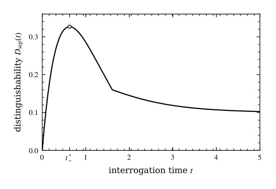
<figcaption class="paper-figure-caption"><b>Fig 2.</b> FIG. 2: Boundary-branch timing for the rates in Eq. (61). The finite maximum occurs at t∗ −≃0.6286, and side entanglement gives no improvement because ζ(t) = 0.</figcaption>
</figure>
<figure class="paper-figure-card">
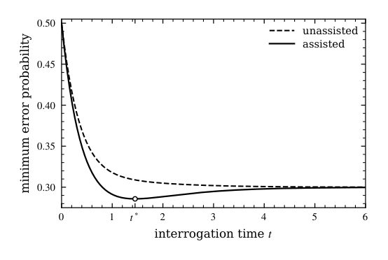
<figcaption class="paper-figure-caption"><b>Fig 3.</b> FIG. 3: Minimum error probability versus interrogation time for the rates in Eq. (63). The unassisted infimum p∗ E = 0.3 is reached only asymptotically, whereas the entanglement-assisted strategy reaches a smaller error probability ep ∗ E ≃0.2858 at the finite time t∗≃1.4508.</figcaption>
</figure>
<figure class="paper-figure-card">

<figcaption class="paper-figure-caption"><b>Fig 4.</b> FIG. 4: Threshold example for discriminating the damping process (1, 1, 0) from the pure-dephasing process (0, 0, r), with representative value r = 0.1 &lt; rc. The unassisted infimum is p∗ E = 1/4, while the assisted strategy reaches the smaller value ep ∗ E ≃0.2432 at finite time.</figcaption>
</figure>
<figure class="paper-figure-card">

<figcaption class="paper-figure-caption"><b>Fig 5.</b> FIG. 5: Entanglement advantage from Proposition 1(iii) for the rates in Eq. (72). The assisted value at finite time is larger than the globally optimized unassisted value.</figcaption>
</figure>

**Summary.** This paper analyzes how best to discriminate between two noisy qubit processes undergoing amplitude damping by optimizing both the input probe state and the measurement time. It rigorously proves that using an entangled probe can yield a significantly lower error rate at any finite time compared to the best unassisted strategy, which only approaches this limit asymptotically.

**Why it may be interesting.** This work provides rigorous quantitative bounds on the resource utility of quantum entanglement in practical open-system measurements, distinguishing between static vs. time-dependent advantages for characterizing decoherence channels.

Detailed structure

**Main problem.** The study focuses on determining the minimum error probability for discriminating between two distinct qubit dynamical processes governed by phase-covariant amplitude-damping Lindbladians.

**Main result.** Entanglement assistance allows for a strictly lower minimum error probability at finite interrogation times compared to the best achievable unassisted strategy, which only approaches this value asymptotically.

**Method.** The authors use quantum information theory tools, including trace-norm and diamond-norm distinguishability measures, optimizing over both the input probe state (including entanglement) and the interrogation time $t$.

**Model / system.** The system involves two qubits undergoing dynamics described by a master equation representing phase-covariant amplitude-damping Lindbladians. The analysis is performed in a single-use scenario.

**Key observables.** Minimum error probability ($p_E, e_p$), optimal trace-norm distinguishability ($D_{	ext{sep}}(t)$), and entanglement-assisted distinguishability ($D_{	ext{ent}}(t)$).

**Important parameters / regimes.** The damping rates ($\gamma_+$, $\gamma_-$, $\gamma_z$) define the dynamics, and time $t$ is a crucial optimization variable.

**Assumptions / limitations.** The analysis assumes the underlying dynamics are phase-covariant amplitude-damping semigroups; for entanglement assistance, it leverages common U(1) phase covariance to simplify the optimization.

**Figures summary.** Figures illustrate the comparison of minimum error probabilities versus time, demonstrating finite-time advantages achieved by entangled probes over unassisted ones, and show threshold behavior for this advantage.

**Paper structure.** The paper first establishes the problem setup using distinguishability measures. It then analyzes the unassisted case, deriving closed forms for optimal strategies on different branches. The core contribution involves showing how entanglement reduces the optimization to a one-parameter Schmidt family, leading to fixed-time and time-optimized advantage criteria.

Abstract

We analyze minimum-error discrimination of two qubit dynamical processes generated by phase-covariant amplitude-damping Lindbladians in a single-use scenario. The optimization involves both the input probe, possibly entangled with an isolated ancilla, and the interrogation time. For unassisted probes we obtain a closed expression for the optimal trace-norm distinguishability at fixed time, with distinct interior and boundary branches. For entanglement-assisted probes, the common phase covariance of the two channels reduces the diamond-norm optimization to a one-parameter Schmidt family. The resulting formula gives transparent sufficient conditions for fixed-time entanglement advantage and separates this local advantage from advantage after global optimization over time. We exhibit examples in which the best unassisted strategy is approached only asymptotically, whereas an entangled probe achieves a strictly smaller error probability at finite time.

[↑ back to top](#top)

### [Fixed-point tensor network for compactified boson conformal field theory](http://arxiv.org/abs/2607.03534v1)

**Authors:** Gong Cheng, Dong-Yu Bao, Zheng-Cheng Gu  
**Type:** theory · **Category:** numerical methods · **PDF:** <https://arxiv.org/pdf/2607.03534v1>  
**Analysis basis:** full PDF text, analyzed in chunks
**Topic relevance:** `methods for driven-dissipative` **3/5** · `Keldysh / 2PI / non-Gaussian methods` **1/5** · `analog quantum simulation` **1/5** · `correlated / nonlocal dissipation` **1/5** · `driven-dissipative phase transition` **1/5** · `entanglement & information structure` **1/5** · `non-equilibrium dynamics` **1/5** · `non-equilibrium universality` **1/5**

↔ Scroll figures horizontally

<figure class="paper-figure-card">

<figcaption class="paper-figure-caption"><b>Fig 1.</b> FIG. 1: Fixed-point tensor: (a) rank-3 tensor. (b) rank-4 tensor.</figcaption>
</figure>
<figure class="paper-figure-card">
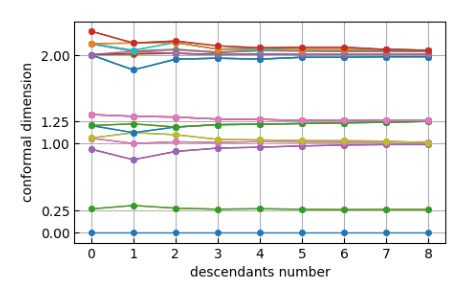
<figcaption class="paper-figure-caption"><b>Fig 2.</b> FIG. 2: Closed-string conformal dimension from rank-3 FP tensor with growing descendants cutoff at R = 1.</figcaption>
</figure>
<figure class="paper-figure-card">

<figcaption class="paper-figure-caption"><b>Fig 3.</b> FIG. 3: RG spectrum obtained from the refined rank-3 FP tensor at R = 1, ΛD = 4, ΛN = 2, wmax = nmax = 2, χ = 20.</figcaption>
</figure>
<figure class="paper-figure-card">
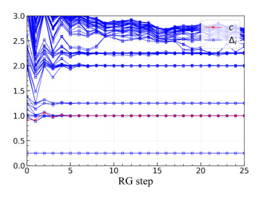
<figcaption class="paper-figure-caption"><b>Fig 4.</b> FIG. 4: RG spectrum obtained from the rank-4 FP tensor at R = 1, ΛD = 4, wmax = 2, χ = 20.</figcaption>
</figure>
<figure class="paper-figure-card">
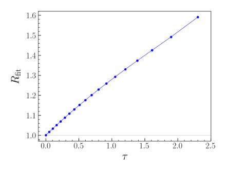
<figcaption class="paper-figure-caption"><b>Fig 5.</b> FIG. 5: Change of the radius R when varying τ. τ = 0 corresponds to the radius R = 1.</figcaption>
</figure>

**Summary.** This work develops a novel fixed-point tensor network approach to describe irrational Conformal Field Theories, using the compactified boson model as a test case. By constructing tensors from boundary data and analyzing them via Tensor Complex Renormalization, the authors successfully reproduce known physical spectra and map out continuous flow paths in the theory's moduli space.

**Why it may be interesting.** While focused on CFT, the core methodology—using tensor networks (TCR) to simulate complex quantum field theory dynamics and RG flows—is a powerful numerical technique applicable to strongly correlated systems or open quantum systems where exact diagonalization is impossible.

Detailed structure

**Main problem.** The primary goal is extending fixed-point tensor network constructions from rational CFTs to irrational theories, specifically using the 2D compactified boson model.

**Main result.** The framework successfully generates a discrete lattice description for the irrational CFT, accurately reproducing the closed-string spectrum and identifying controllable exactly marginal deformations along the c=1 moduli space.

**Method.** The authors employ Fixed-Point (FP) tensor networks, utilizing boundary data to construct tensors that are then analyzed using the Tensor Complex Renormalization (TCR) algorithm for RG flow analysis.

**Model / system.** The system studied is the 2D compactified boson conformal field theory, which serves as an archetypal irrational CFT. The construction relies on mapping correlation functions onto tensor network contractions involving boundary conditions.

**Key observables.** Closed-string spectrum (conformal dimensions $\Delta$), central charge ($c$), and scaling dimensions ($\Delta$) extracted via RG flow analysis.

**Important parameters / regimes.** The compactification radius $R$, the deformation parameter $	au$ or $r$, and the finite grid size $\Lambda$ used for numerical approximation.

**Assumptions / limitations.** The method requires replacing continuous boundary conditions with a finite, discretized lattice representation, which introduces necessary approximations.

**Figures summary.** Figures illustrate the construction of rank-3 and rank-4 FP tensors, show the recovered closed-string spectrum via transfer matrix methods at various radii, and depict RG spectra derived from these tensor structures.

**Paper structure.** The paper systematically builds the tensor network representation for correlation functions (rank-4 tensors), applies the TCR algorithm to analyze the resulting spectrum, and demonstrates how tuning parameters within the tensor structure generates continuous marginal deformations along moduli spaces.

Abstract

Fixed-point (FP) tensor networks provide a discrete spacetime representation of conformal field theories (CFTs), offering a new route toward understanding holographic duality, generalized symmetries, and even quantum gravity. In this work, we construct FP tensors for the 2D compactified boson theory at a generic compactification radius, an archetypal irrational CFT, using boundary (open-string) data with conformal boundary conditions. We show that the resulting tensors reproduce the closed-string spectrum with high accuracy and generate stable renormalization-group (RG) flows under the tensor complex renormalization algorithm. Moreover, we identify a controllable exactly marginal deformation at the level of a single tensor, enabling flows that move continuously along the $c=1$ moduli space. This framework establishes a concrete lattice-level route toward describing a broad class of 2D irrational CFTs.

[↑ back to top](#top)

### [Fundamental limits on state preparation for an open qubit](http://arxiv.org/abs/2607.04320v1)

**Authors:** D. A. Abraamian, L. V. Lokutsievskiy, A. N. Pechen  
**Type:** theory · **Category:** quantum information and computing · **PDF:** <https://arxiv.org/pdf/2607.04320v1>  
**Analysis basis:** full PDF text, analyzed in chunks
**Topic relevance:** `methods for driven-dissipative` **3/5** · `non-equilibrium dynamics` **2/5** · `Keldysh / 2PI / non-Gaussian methods` **1/5** · `correlated / nonlocal dissipation` **1/5** · `driven-dissipative phase transition` **1/5** · `quantum measurements` **1/5**

↔ Scroll figures horizontally

<figure class="paper-figure-card">

<figcaption class="paper-figure-caption"><b>Fig 1.</b> FIG. 1. The first row shows the curve Γ ⊂∂R in the Bloch ball for α = γ/ω = 0.1, 0.3, 0.5 from left to right. The second row shows the intersection of the boundary ∂R with rxrz- plane for the same values of α.</figcaption>
</figure>
<figure class="paper-figure-card">
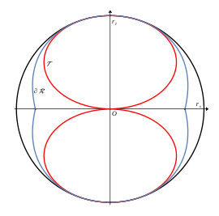
<figcaption class="paper-figure-caption"><b>Fig 2.</b> FIG. 2. Structure of the intersections of ∂R and T with the rxrz-plane {ry = 0} in the Bloch ball B.</figcaption>
</figure>
<figure class="paper-figure-card">

<figcaption class="paper-figure-caption"><b>Fig 3.</b> FIG. 3. Curve Γ ⊂∂R in the Bloch ball for γ/ω = 0.1, 0.3, 0.5 from left to right. The boundary ∂R is a surface of revolution obtained by rotating Γ about the rx-axis. The curve Γ is symmetric wrt reflection (rx, ry, rz) 7→(−rx, −ry, rz)</figcaption>
</figure>
<figure class="paper-figure-card">

<figcaption class="paper-figure-caption"><b>Fig 4.</b> FIG. 4. STL-local controllability</figcaption>
</figure>
<figure class="paper-figure-card">
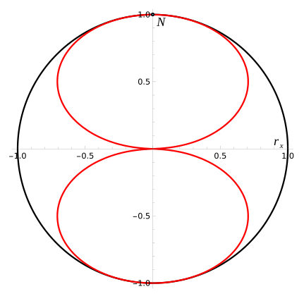
<figcaption class="paper-figure-caption"><b>Fig 5.</b> FIG. 5. figure-eight curve E(φ) for α = 0.1</figcaption>
</figure>

**Summary.** This paper rigorously determines the fundamental boundaries on what states can be prepared in an open qubit system under coherent control. It characterizes this boundary as a specific surface of revolution within the Bloch ball using advanced geometric control theory. The results provide essential, constructive bounds for quantum state preparation fidelity in dissipative quantum computing architectures.

**Why it may be interesting.** This work provides a complete, rigorous geometric description of controllability for open quantum systems, which is foundational knowledge for designing robust quantum gates and state preparation routines in realistic noisy environments.

Detailed structure

**Main problem.** The paper aims to analytically determine the ultimate geometric limits of state preparation (the reachable set) for an open qubit subjected to coherent control.

**Main result.** It proves that the boundary of the reachable set is a surface of revolution around the $r_x$-axis, which is analytic except for two conical singularities. Furthermore, it provides explicit control protocols to approach any state on this boundary asymptotically.

**Method.** The analysis uses geometric control theory applied to the Bloch sphere dynamics governed by a GKSL master equation, involving techniques like analyzing separatrices and constructing specific time-optimal control protocols.

**Model / system.** The system is an open two-level quantum system (qubit) whose evolution is described by a Lindblad/GKSL master equation incorporating free Hamiltonian ($\mathrm{H}_0$), coherent driving ($V$), and dissipation rates ($\gamma$).

**Key observables.** Bloch coordinates $(r_x, r_y, r_z)$ describing the state $
ho$, and the boundary surface $\partial R$.

**Important parameters / regimes.** The ratio $\alpha = \gamma/\omega$ (dissipation rate to frequency) is a key parameter governing the geometry of the reachable set.

**Assumptions / limitations.** Boundary points are only asymptotically reachable in finite time, and the analysis relies on local hyperbolic dynamics near equilibrium points.

**Figures summary.** Figures illustrate the boundary curve $\Gamma$ defining the reachable set's boundary, its intersection with specific planes (like $r_y=0$), and projections of separatrices onto various coordinate planes.

**Paper structure.** The paper progresses by first establishing the dynamics in Bloch coordinates, then characterizing the boundary using geometric control theory concepts like separatrices, culminating in the derivation of explicit protocols to approach these fundamental limits.

Abstract

We analytically determine the ultimate limits of state preparation in two-level open quantum systems driven by coherent control. For a dissipative qubit governed by a GKSL master equation, we give an exact characterization of the reachable set in the Bloch ball. Dissipation excludes a region of states in the Bloch ball which cannot be approached even under arbitrarily strong coherent driving, and we prove that this region has a nontrivial geometry whose boundary is a surface of revolution around the $x$-axis which is analytic except for two conical singularities. We derive a closed-form control protocol for moving on this boundary, and construct an explicit protocol that steers the system arbitrarily close to any prescribed boundary state. These results provide a complete geometric constructive description of reachable qubit states in the standard dissipative environment, establishing fundamental bounds on controllability and state-preparation fidelity for open two-level quantum systems.

[↑ back to top](#top)

### [Macroscopic Quantum Interference of the Center-of-Mass Motion of Levitated Superconducting Microparticles enabled by Magnetic Higher-Order Traps](http://arxiv.org/abs/2607.03622v1)

**Authors:** Jaume Cunill-Subiranas, Fabian Resare, Suocheng Zhao, Sofia Qvarfort, A. Metelmann, Carles Navau, Witlef Wieczorek  
**Type:** both · **Category:** other · **PDF:** <https://arxiv.org/pdf/2607.03622v1>  
**Analysis basis:** full PDF text, analyzed in chunks
**Topic relevance:** `Keldysh / 2PI / non-Gaussian methods` **3/5** · `quantum measurements` **2/5** · `analog quantum simulation` **1/5** · `driven-dissipative phase transition` **1/5** · `methods for driven-dissipative` **1/5** · `non-equilibrium dynamics` **1/5**

↔ Scroll figures horizontally

<figure class="paper-figure-card">
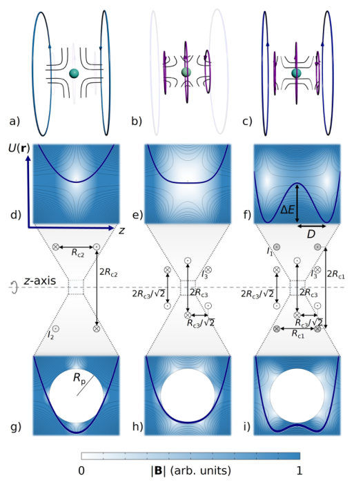
<figcaption class="paper-figure-caption"><b>Fig 1.</b> Figure 1. Harmonic and anharmonic magnetic traps for su- perconducting particles. Coil configurations, magnetic fields, and mechanical potentials for a magnetic quadrupole (a,d,g), magnetic hexapole (b,e,h), and double-well potential obtained from the superposition of a uniform magnetic field and mag- netic hexapole (c,f,i). These fields are induced in the central region of a suitable arrangement of coils, all of them with cylindrical symmetry in the z-direction. The crosses and dots indicate the sense of the current in the coils. Equal magni- tudes of currents are represented by the same colours. The magnetic field modulus is shown for small particles Rp ≪rrms (d-f) and large particles Rp...</figcaption>
</figure>
<figure class="paper-figure-card">
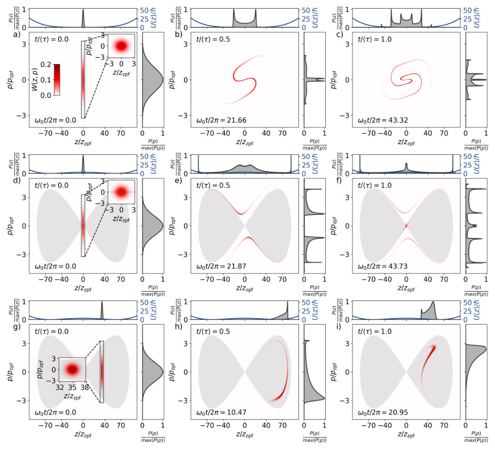
<figcaption class="paper-figure-caption"><b>Fig 2.</b> Figure 2. Classical dynamics of the motion of a 1 µm radius particle. We show Wigner functions and their marginal probability distributions in position (top panels) and momentum (side panels) at different times, given in terms of the original harmonic oscillator time scale. State evolution in (a,b,c) the DP potential (parameters: ♣in Tab. III), (d,e,f) the DWP potential (parameters: ♠in Tab. III), and (g,h,i) the D-DWP potential for an initial state displaced by 35zzpf (parameters: ♠in Tab. III). In the case of the DWP and D-DWP potentials, the region of m &gt; 1 according to condition Eq. (C12) is shaded, where the motion is constrained to one half of the double well. Note that the initial...</figcaption>
</figure>
<figure class="paper-figure-card">

<figcaption class="paper-figure-caption"><b>Fig 3.</b> Figure 3. Non-Gaussian motional state of a levitated superconducting microparticle. DP case (parameters: ♣in Tab. III): The motion is initially near ground-state cooled (n = 0.07) in a harmonic potential, including very weak coupling to the environment (Q = 1012). At time t = 0, the z4-potential is abruptly switched on, while maintaining B3 = Bini 3 . The upper panel shows the evolution of the Wigner function, the middle panel shows the switching of coils to realize certain magnetic fields, and the lowermost panel shows the position probability distribution P(z) as well as the potential Uz. We observe that the z-motion first experiences motional squeezing, followed by a generation of...</figcaption>
</figure>
<figure class="paper-figure-card">
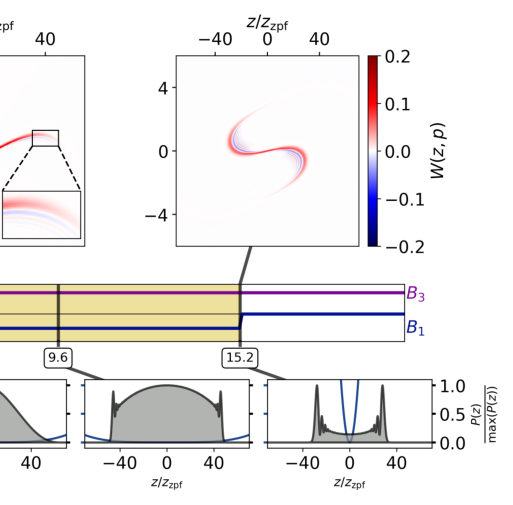
<figcaption class="paper-figure-caption"><b>Fig 4.</b> Fig. 5(a) and Fig. 5(c) show a systematic decrease of the fringe amplitude and wavenumber, respectively, with the initial phonon occupation. Interestingly, for short protocol times, i.e., around ω0t/2π ∼10, we observe that a non-zero phonon number results in the largest fringe amplitude, see Fig. 5(b). For longer protocol times, the maximum fringe amplitude increases and shifts towards smaller phonon numbers. This behavior can be under- stood by considering the mean period time ⟨τ⟩in the DP potential and its dependence on the initial conditions. A larger initial phonon number results in a faster timescale for the dynamics such that the nonlinearity of the DP can impact the state more...</figcaption>
</figure>
<figure class="paper-figure-card">
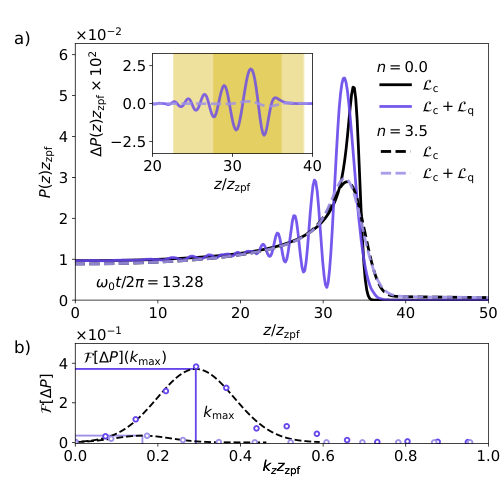
<figcaption class="paper-figure-caption"><b>Fig 5.</b> Figure 4. Discerning quantum from classical dynamics in the DP protocol. (a) Probability distribution of the position quadrature for an initial phonon occupation of n = 0 (dark purple, straight) and n = 3.5 (light purple, dashed), com- pared to the classical dynamics (black). For these simulations, Q = ∞. The inset shows the difference between the quantum and classical probability distributions ∆P. (b) Fourier trans- formation of ∆P, restricted to the respective highlighted areas in the inset of (a). Gaussian fits (dashed lines) are used to extract the peak wavenumber kmax and maximal amplitude F[∆P](kmax).</figcaption>
</figure>

**Summary.** The paper details the use of advanced magnetic traps, generated by higher-order multipoles, to confine levitated superconducting microparticles. This confinement creates anharmonic potentials necessary for inducing nonclassical quantum motion in the particle's center-of-mass. The research paves the way for fundamental experiments testing the boundary between classical and quantum mechanics using massive mechanical oscillators.

**Why it may be interesting.** This work directly bridges quantum mechanics (quantum interference, non-Gaussian states) with macroscopic mechanical systems and superconducting materials, making it highly relevant to open quantum systems and quantum sensing in AMO physics.

Detailed structure

**Main problem.** The central goal is generating and observing macroscopic quantum interference effects in the center-of-mass motion of levitated superconducting microparticles.

**Main result.** The authors demonstrate that using higher-order multipole magnetic traps allows for the creation of anharmonic potentials capable of realizing non-Gaussian motional states, opening a path to study the quantum-to-classical transition with massive objects.

**Method.** The analysis involves solving the dynamics of the center-of-mass motion in phase space, utilizing Wigner function representations and analyzing specific nonlinear potential forms like Duffing or double-well potentials.

**Model / system.** The system is a superconducting microparticle levitated and trapped by static magnetic fields generated via higher-order multipole coils. The dynamics are governed by the particle's interaction with an anharmonic potential $U(r)$ derived from the applied field $\mathbf{B}_a$.

**Key observables.** Non-Gaussian motional states, measurement of particle position to distinguish classical vs. quantum behavior.

**Important parameters / regimes.** The nonlinearity scale is set below nanometers (hundred times the zero-point motion); trap potentials are defined by magnetic field coefficients ($b_1, b_2, b_3$).

**Assumptions / limitations.** It is assumed that the superconducting particle remains in a state where its dynamics can be effectively modeled by these anharmonic potentials, and that rapid switching of fields is possible.

**Figures summary.** Figure 1 illustrates various magnetic traps (harmonic/anharmonic) generated by coil configurations. Figure 2 shows classical trajectory solutions for different nonlinear potential types (DP, DWP).

**Paper structure.** The paper first establishes the physical platform and the role of higher-order traps in creating anharmonic potentials. It then analyzes the resulting dynamics using phase space methods, deriving specific protocols to generate nonclassical states before concluding with implications for fundamental physics tests.

Abstract

We show how magnetostatic higher-order multipole traps can be used to generate macroscopic quantum interference of the motion of levitated superconducting microparticles. An appropriate combination of multipolar magnetic fields offers great versatility in constructing various trap potentials, including anharmonic trap potentials such as Duffing or double-well types. Crucially, the anharmonic trap potentials realize a nonlinearity on the order of hundred times the zero-point motion, i.e., on a length scale below nanometers. These anharmonic potentials allow for the generation of quantum features of the center-of-mass motion of a magnetically levitated superconducting microparticle. Importantly, they can be easily generated with a static arrangement of coils, requiring only that the current running through them is tunable. We propose protocols exploiting the versatility of the magnetic trap landscape to generate non-Gaussian motional states. We solve the dynamics of the center-of-mass motion of the particle in phase space and analyze its parameter dependence. Furthermore, we give a recipe to distinguish classical from quantum behavior in a statistically meaningful way through measurement of the position of the particle. Our results open a path to accessing the quantum regime of the center-of-mass motion of objects with masses larger than picogram, i.e., $10^{13}$ atomic mass units. This will enable fundamental physics experiments for studying the transition between quantum and classical behavior, exploring the intersection between quantum physics and gravity as well as probing of certain types of dark matter.

[↑ back to top](#top)

### [Nonlocal Kondo-exchange-driven intrinsic anomalous Hall effect in localized-$4f$ antiferromagnetic metals](http://arxiv.org/abs/2607.04805v1)

**Authors:** Akimitsu Kirikoshi, Junya Otsuki  
**Type:** theory · **Category:** strongly correlated electrons · **PDF:** <https://arxiv.org/pdf/2607.04805v1>  
**Analysis basis:** full PDF text, analyzed in chunks
**Topic relevance:** `Keldysh / 2PI / non-Gaussian methods` **3/5** · `Kondo & dissipative impurity` **3/5** · `analog quantum simulation` **1/5** · `exotic spin models in light-matter` **1/5** · `spintronics-quantum-optics interface` **1/5**

↔ Scroll figures horizontally

<figure class="paper-figure-card">
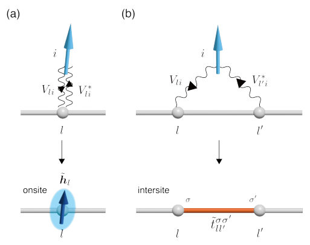
<figcaption class="paper-figure-caption"><b>Fig 1.</b> FIG. 1. Schematic illustration of virtual c–f hybridization processes and their consequences in the localized-4f regime: (a) the local effective field ˜hl, and (b) the nonlocal spin- dependent hopping ˜tσσ′ ll′ . Upper panels show representative processes, and lower panels show the corresponding effective terms. The blue arrows and white spheres denote the 4f- electron spins and the conduction-electron sites, respectively.</figcaption>
</figure>
<figure class="paper-figure-card">

<figcaption class="paper-figure-caption"><b>Fig 2.</b> FIG. 2. Intrinsic AHC σDC xy versus canting magnetization mz. Filled symbols represent the results with the molecular field for collinear antiferromagnetic (AFM) order along the b axis, as shown in the insets. Open symbols denote canting tuned by a uniform field along the c axis, with a fixed in-plane mag- netic configuration. The crystal structures are generated by QtDraw [58].</figcaption>
</figure>
<figure class="paper-figure-card">

<figcaption class="paper-figure-caption"><b>Fig 3.</b> FIG. 3. (a) Band structure from the effective Hamiltonian. The color map shows the atomic-scale total angular momen- tum polarization Jz (sign indicated by the color bar at the top). (b) Zoom-in of the dashed region in (a). Panels (c) and (d) show the results obtained by retaining only the Ge 4p local effective field and Ge 4p nonlocal effective hopping, re- spectively.</figcaption>
</figure>
<figure class="paper-figure-card">
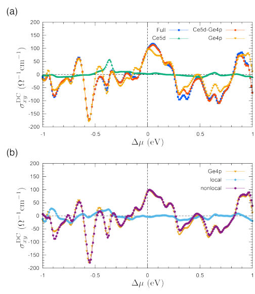
<figcaption class="paper-figure-caption"><b>Fig 4.</b> FIG. 4. Intrinsic AHC σDC xy versus a chemical potential shift ∆µ from the Fermi level, with decomposition into several con- tributions. (a) A decomposition into Ce 5d and Ge 4p contri- butions. The blue squares labeled with ‘Full’ correspond to the result of the effective Hamiltonian. (b) A decomposition of the Ge 4p contribution into local effective-field and nonlo- cal effective-hopping components.</figcaption>
</figure>

**Summary.** The paper theoretically investigates the anomalous Hall effect in $f$-electron antiferromagnets by developing an effective Hamiltonian derived from strong correlation physics. It concludes that the AHE is fundamentally driven by nonlocal spin-dependent hopping mediated by Kondo exchange coupling, rather than local magnetic fields or itinerant electron behavior alone.

**Why it may be interesting.** This work provides a detailed many-body theoretical framework connecting magnetic order (AFM) to transport phenomena (AHE) in strongly correlated materials using concepts like Kondo exchange, which are central to understanding complex electronic states beyond simple band theory.

Detailed structure

**Main problem.** The study aims to elucidate the microscopic origin of the intrinsic anomalous Hall effect (AHE) in antiferromagnetic $f$-electron metals, particularly where localized magnetic moments interact with itinerant conduction electrons.

**Main result.** The AHE is found to originate from nonlocal spin-dependent intersite hopping induced by Kondo exchange coupling, rather than a simple local Zeeman field or canting magnetization effect. The $	ext{Ge } 4p$ orbitals provide the dominant contribution to this effect.

**Method.** The authors developed a theoretical framework using Green's function techniques and derived an effective Hamiltonian analogous to the Kondo lattice model, incorporating strong correlation effects via approximations like Hubbard-I.

**Model / system.** The system is modeled as a localized-$4f$ antiferromagnetic metal ($	ext{Ce}_2	ext{CuGe}_6$), described by a tight-binding Hamiltonian coupling conduction ($c$) and $f$ electrons. The strong correlations are treated using DMFT/Hubbard-I approximations.

**Key observables.** Intrinsic Anomalous Hall Conductivity ($\sigma_{DC}^{xy}$), spin splitting of energy bands, and the dependence of $\sigma_{DC}^{xy}$ on canting magnetization ($m_z$).

**Important parameters / regimes.** Kondo temperature ($T_K \simeq 1 	ext{ K}$); hybridization terms ($\hat{V}(\mathbf{k})$); molecular field strengths controlling AFM order.

**Assumptions / limitations.** The analysis relies on deriving an effective Hamiltonian that captures the physics of $c-f$ hybridization, often simplifying by neglecting orbital degeneracy or assuming specific magnetic ordering patterns.

**Figures summary.** Figures illustrate the comparison between local vs. nonlocal contributions to AHE (Figure 1), plot $\sigma_{DC}^{xy}$ dependence on canting magnetization ($m_z$) showing robustness against $m_z$ changes (Figure 2), and show band structure polarization related to spin splitting (Figure 3).

**Paper structure.** The paper progresses by establishing the theoretical necessity of an effective Hamiltonian for correlated systems, deriving this model from a full Green's function approach incorporating strong correlations, and finally applying it to calculate $\sigma_{DC}^{xy}$ while decomposing contributions to pinpoint the nonlocal hopping mechanism.

Abstract

The anomalous Hall effect in antiferromagnetic metals has attracted considerable attention. Most known realizations involve itinerant $d$ electrons that simultaneously mediate charge transport and magnetic order. Here, we focus on $f$-electron materials, where localized magnetic moments and conduction electrons are hosted in different orbitals. We develop a theoretical framework to describe the impact of localized antiferromagnetic order on itinerant electrons. Applying this approach to the recently discovered $4f$ antiferromagnetic metal $\mathrm{Ce}_{2}\mathrm{Cu}\mathrm{Ge}_{6}$, we identify the origin of both the intrinsic anomalous Hall conductivity and the spin splitting of the energy bands as spin-dependent intersite hopping induced by nonlocal Kondo exchange coupling, rather than a Zeeman-type effective field acting locally on the conduction electrons.

[↑ back to top](#top)

### [The Delayed Stabilizer ZX-Calculus](http://arxiv.org/abs/2607.04015v1)

**Authors:** Cole Comfort, Giovanni de Felice  
**Type:** theory · **Category:** quantum information and computing · **PDF:** <https://arxiv.org/pdf/2607.04015v1>  
**Analysis basis:** full PDF text, analyzed in chunks
**Topic relevance:** `analog quantum simulation` **3/5** · `correlated / nonlocal dissipation` **1/5** · `correlated cavity matter` **1/5** · `driven-dissipative phase transition` **1/5** · `entanglement & information structure` **1/5** · `methods for driven-dissipative` **1/5** · `non-equilibrium dynamics` **1/5**

↔ Scroll figures horizontally

<figure class="paper-figure-card">

<figcaption class="paper-figure-caption"><b>Fig 1.</b> Figure 2: Axioms of the delayed stabilizer ZX-calculus.</figcaption>
</figure>
<figure class="paper-figure-card">

<figcaption class="paper-figure-caption"><b>Fig 2.</b> Figure 3: Infinitely unrolled surface code of Example 14. Dotted lines denote wires connected by a Hadamard gate.</figcaption>
</figure>
<figure class="paper-figure-card">

<figcaption class="paper-figure-caption"><b>Fig 3.</b> Figure 4: Axioms of the Graphical Affine Algebra [7] (GAA), where a,b,z ∈K with z ̸= 0.</figcaption>
</figure>

**Summary.** The paper develops the delayed stabilizer ZX-calculus ($\delta$ZX) to overcome the limitations of standard diagrams when modeling infinitely repeating quantum structures like lattice codes. By introducing a 'delay' generator and defining two formal semantics, it provides a complete algebraic framework for representing and simplifying these infinite processes into unique canonical forms.

**Why it may be interesting.** This work provides a powerful mathematical tool for analyzing large-scale quantum systems, such as those found in solid-state or photonic implementations of QEC codes, by providing a rigorous way to handle infinite periodic boundary conditions.

Detailed structure

**Main problem.** Ordinary stabilizer ZX-diagrams are insufficient for modeling quantum processes that exhibit infinite, translation-invariant structures across space or time.

**Main result.** The authors introduce the delayed stabilizer ZX-calculus ($\delta$ZX), establishing a unique normal form and proving soundness, universality, and completeness for its generating tableau semantics.

**Method.** The calculus extends the standard ZX-diagram formalism with a 'delay' generator ($\delta$), allowing the representation of infinite processes via formal variables encoding generating functions.

**Model / system.** The theory models stabilizer quantum error-correcting codes and general translation-invariant quantum circuits, originally formulated for qudits based on an odd prime $p$. The formalism relates these physical systems to algebraic structures like affine Lagrangian subspaces.

**Key observables.** Infinite stabilizer groups; equivalence classes of sequences of quantum channels; generating functions encoding Pauli operators.

**Important parameters / regimes.** The delay parameter ($\delta$); the dimension related to an odd prime $p$; matrix entries in the field $\mathbb{F}_p(\delta)$.

**Assumptions / limitations.** The primary assumption is that infinite, translation-invariant processes can be captured by extending the finite ZX calculus with a formal delay variable.

**Figures summary.** Figures illustrate axioms of the standard ZX calculus encoding Pauli operators ($Z^z X^x$) and provide examples for various quantum states (e.g., Bell states).

**Paper structure.** The paper first establishes the foundational equivalence between stabilizer mechanics, symplectic linear algebra, and the standard ZX-calculus. It then develops the delayed calculus by introducing $\delta$, providing two semantics (channel sequences and generating functions), and finally proving a complete reduction to a unique normal form via matrix algebra techniques.

Abstract

Many stabilizer quantum error-correcting codes are built from a finite pattern repeated across space or time, such as lattice codes, translation-invariant graph states, and quantum convolutional codes. Ordinary stabilizer ZX-diagrams capture only finite truncations of such systems, obscuring the repeated structure that defines them. We introduce the delayed stabilizer ZX-calculus, a finite graphical language for these infinite, translation-invariant processes. It extends the odd-prime-dimensional stabilizer ZX-calculus with a single new generator, the delay, which feeds data from one time step to the next. We equip the calculus with two semantics. In the first semantics, we interpret the behaviour of a delayed ZX-diagram as an equivalence class of sequences of quantum channels; where two sequences are identified if they have the same information content. We show that the behaviour of a delayed ZX-diagram uniquely determines an infinite stabilizer group. In the second semantics, we interpret the delay as a formal variable, encoding the translation-invariant families of Pauli operators as generating functions. This allows us to represent a delayed ZX-diagram in terms of a tableau of generating functions, from which the infinite stabilizer group can be recovered. Finally, we give a complete axiomatization of the delayed stabilizer ZX-calculus, featuring generalised Euler decomposition and colour change rules. Using generalised forms of local complementation and pivoting, we reduce every diagram to a unique normal form. This establishes soundness, universality, and completeness for the generating tableau semantics.

[↑ back to top](#top)

### [Strain- and potential-controlled tunneling in monolayer MoS$_2$](http://arxiv.org/abs/2607.04766v1)

**Authors:** Hasna Chnafa, Rachid El Aitouni, Clarence Cortes, David Laroze, Ahmed Jellal  
**Type:** theory · **Category:** other · **PDF:** <https://arxiv.org/pdf/2607.04766v1>  
**Analysis basis:** full PDF text, analyzed in chunks
**Topic relevance:** `exotic spin models in light-matter` **3/5** · `spintronics-quantum-optics interface` **3/5** · `Keldysh / 2PI / non-Gaussian methods` **1/5** · `non-equilibrium dynamics` **1/5**

↔ Scroll figures horizontally

<figure class="paper-figure-card">
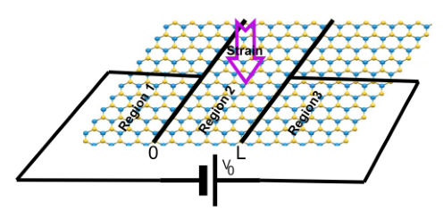
<figcaption class="paper-figure-caption"><b>Fig 1.</b> FIG. 1. Schematic illustration of a molybdenum disulfide MoS2 sheet under a uniaxial strain field and an external scalar electrostatic potential applied along the transport direction x, which divides the sheet into three distinct regions.</figcaption>
</figure>
<figure class="paper-figure-card">

<figcaption class="paper-figure-caption"><b>Fig 2.</b> FIG. 2. The energy E (16) of region II versus the wave vector qx for barrier height V0 = 1 eV and different strain values ε = 0, 0.05, 0.1, 0.15. The K valley is displayed in (a) while K′ in (b).</figcaption>
</figure>
<figure class="paper-figure-card">

<figcaption class="paper-figure-caption"><b>Fig 3.</b> Figure 2 displays the energy E in region II versus the wave vector qx for a barrier height V0 = 1 eV and different strain values ε, with (a): valley K and (b): while valley K′. In both cases, the bands exhibit a parabolic dis- persion characteristic of massive carriers in MoS2, with a clear separation between the spin states sz = +1 and sz = −1, due to strong spin-orbit coupling [7, 42–44]. This separation depends on the valley: the order of spin levels is reversed between K and K′, which is a direct sig- nature of spin–valley locking in transition metal dichalco- genides. The increase in deformation ε causes an overall shift of the bands towards higher energies and a slight change in their...</figcaption>
</figure>
<figure class="paper-figure-card">
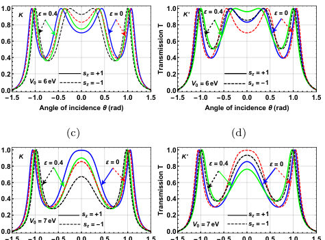
<figcaption class="paper-figure-caption"><b>Fig 4.</b> FIG. 3. Transmission probability versus the angle of incidence θ in K and K′ valleys for E = 2 eV, L = 4 nm, ε = 0, 0.4 and two barrier height values (a)/(b): V0 = 6 eV, (c)/(d): V0 = 7 eV.</figcaption>
</figure>
<figure class="paper-figure-card">
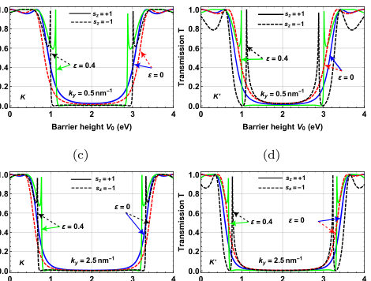
<figcaption class="paper-figure-caption"><b>Fig 5.</b> FIG. 4. Transmission probability versus the barrier height V0 in K and K′ valleys for E = 2 eV, L = 1 nm, ε = 0, 0.4 and two wave vector values (a)/(b): ky = 0.5 nm−1, (c)/(d): ky = 2.5 nm−1</figcaption>
</figure>

**Summary.** The paper theoretically explores how combining mechanical strain and electrostatic potentials can precisely control spin and valley polarization in monolayer MoS2. By analyzing quantum transport through engineered potential barriers, the authors predict a dual-knob control scheme that allows for independent tuning of conductance oscillations using these two external fields. This offers a powerful platform for realizing advanced spintronic devices.

**Why it may be interesting.** This work demonstrates highly tunable control over fundamental quantum degrees of freedom (spin and valley) in a 2D material using external fields, which is central to developing next-generation spintronic and valleytronic devices.

Detailed structure

**Main problem.** The study investigates spin- and valley-resolved quantum transport in monolayer MoS2 when subjected to the simultaneous influence of mechanical strain and an external scalar potential, a combination previously unexplored.

**Main result.** The interplay between strain and electrostatic potential allows for orthogonal control over both valley and spin polarization, enabling phenomena like 'electrostatic spin inversion' purely via gate tuning.

**Method.** Theoretical analysis using an effective massive Dirac Hamiltonian incorporating intrinsic spin-orbit coupling to model electron transmission through a barrier region.

**Model / system.** The system is monolayer MoS2 modeled by an effective Hamiltonian that includes terms for Fermi velocity, band gap, spin-orbit coupling, and strain. The transport calculation involves solving coupled differential equations across regions defined by the potential barrier and strain field.

**Key observables.** Spin polarization ($P_s$), valley polarization ($P_v$), resonant transmission probability ($T_{	au s_z}$), and total conductance ($G$).

**Important parameters / regimes.** Mechanical strain ($\epsilon$), electrostatic potential barrier height ($V_0$), barrier width ($L$), and incident energy ($E$).

**Assumptions / limitations.** The analysis assumes a continuum effective Dirac Hamiltonian, neglects higher-band corrections or intervalley scattering, and ignores disorder effects.

**Figures summary.** Figure 1 schematically illustrates the MoS2 sheet under uniaxial strain and an external scalar electrostatic potential. Figure 11 shows spin polarization vs. strain for various barrier widths and energies.

**Paper structure.** The paper develops the Hamiltonian incorporating strain and potential, derives transmission coefficients using boundary matching conditions across three distinct regions (outside/inside/outside the barrier), and analyzes how varying parameters controls spin/valley polarization via quantum interference effects.

Abstract

We present a theoretical study of spin- and valley-resolved quantum transport in monolayer MoS$_2$ under the combined influence of mechanical strain and an external scalar potential, a combination whose simultaneous unexplored. Within an effective massive Dirac Hamiltonian that incorporates intrinsic spin--orbit coupling, strain induces valley-dependent momentum shifts that lift the degeneracy between the $K$ and $K'$ valleys and strongly modify the transport characteristics. The scalar potential modifies the tunneling spectrum, leading to pronounced changes in resonant transmission, Fabry--Pérot interference, and conductance. We show that the interplay between strain and electrostatic potential enables efficient control of both valley and spin polarization of the transmitted current. In particular, we identify a dual-knob control scheme in which the barrier width governs the frequency of conductance oscillations while strain independently controls their phase and amplitude. Furthermore, we predict electrostatic spin inversion -- a sign reversal of spin polarization achievable purely by gate tuning at finite strain, requiring no geometric reconfiguration. Depending on the strain orientation, the transmission probability and conductance can be selectively suppressed or enhanced, resulting in highly tunable valley- and spin-polarized transport. These findings demonstrate that strain and potential engineering provide orthogonal and independently operable mechanisms for controlling conductance as well as spin and valley degrees of freedom in monolayer MoS$_2$, offering promising prospects for spintronic and valleytronic device applications.

[↑ back to top](#top)

### [Super-molasses returns: All optical near-resonance laser cooling and trapping of neutral atoms from background vapor](http://arxiv.org/abs/2607.04966v1)

**Authors:** Matt Himsworth, Chester Camm, Max Carey, Jack Saywell, Jonathan Woods, Vilius Atkoucius, Florence Concepcion, Konstantinos Karakostas, Hannah Brady, Doruk Tan Atila, Ellie Heywood, Alex Jantzen, Andrei Dragomir, Christopher Morley, James Bateman  
**Type:** both · **Category:** other · **PDF:** <https://arxiv.org/pdf/2607.04966v1>  
**Analysis basis:** full PDF text, analyzed in chunks
**Topic relevance:** `quantum optics experiment` **3/5** · `analog quantum simulation` **2/5** · `QC/QI experiment` **1/5** · `driven-dissipative phase transition` **1/5** · `interference shaping light` **1/5**

↔ Scroll figures horizontally

<figure class="paper-figure-card">

<figcaption class="paper-figure-caption"><b>Fig 1.</b> FIG. 1: Left: The laser beam geometry used in this paper to produce the super-molasses trap, with incident (green) beams forming a tripod and angled from the vertical by 35◦and retro-reflected (red) beams misaligned by very small angles. Polarization is linear as shown in blue, although the trap can operate with circular and combinations of polarization. Right: A (inverted greyscale) fluorescence image of the trapped ensemble of rubidium atoms. The laser beams have been aligned to produce an extended cloud to highlight the lattice structure. The vertical dimension of the cloud is approximately 3 mm. Denser and more spherical clouds can be obtained with different beam reflection angles.</figcaption>
</figure>
<figure class="paper-figure-card">
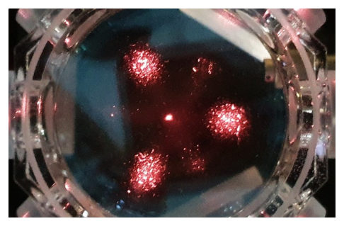
<figcaption class="paper-figure-caption"><b>Fig 2.</b> FIG. 2: A photograph of the SMT taken along the z-axis of Figure 1). The three retro-reflected beams can be seen scattering on the top chamber window, at the center of which is the brighter cold atom cloud.</figcaption>
</figure>
<figure class="paper-figure-card">

<figcaption class="paper-figure-caption"><b>Fig 3.</b> FIG. 3: Dependence of atom number in the SMT on laser detuning and power. We see a peak of approximately 2.5 million atoms at -1 Γ detuning and 10 mW per beam. The peak atom number is highly dependent on beam alignments but once a global maximum is found the atom number is quite consistent for the same beam width.</figcaption>
</figure>
<figure class="paper-figure-card">
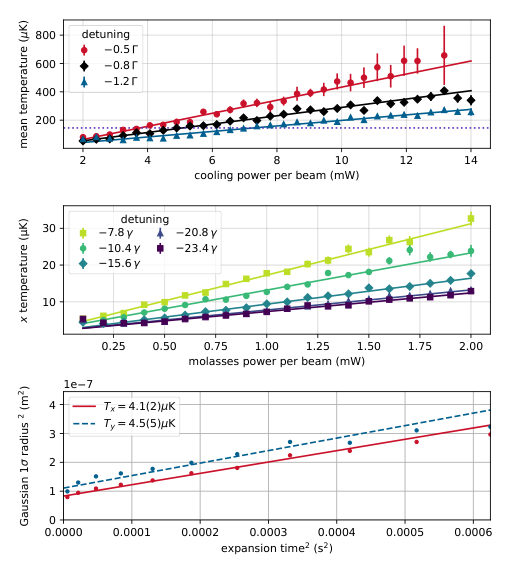
<figcaption class="paper-figure-caption"><b>Fig 4.</b> FIG. 4: Top: The trapped ensemble temeratues before the ’molasses’ stage for a selection of detunings. The solid lines are linear fits to guide the eye, and the dashed line indicates the Doppler Temperature for 87Rb. Middle: The trapped ensemble temperature after a ‘molasses’ stage during which the laser detuning is shifted to the displayed frequency in 2 ms, whilst the power is linearly ramped down to different final values. Solid lines are linear fits to guide the eye. Bottom: An example of the ensemble radius expansion data (dots) used calculate the temperature (lines). We see the temperature is uniform along both axes.</figcaption>
</figure>
<figure class="paper-figure-card">

<figcaption class="paper-figure-caption"><b>Fig 5.</b> FIG. 5: The Allan Deviation of the trap centre (Top) and size (Bottom) over several timescales. The center is determined by fitting of a 2D Gaussian to absorption image. Short term instability is dominated by vibrations of the undamped table due to nearby traffic.</figcaption>
</figure>

**Summary.** The authors present the Super-Molasses Trap (SMT), an alternative method for cooling and trapping neutral atoms using only optical fields, eliminating the need for external magnetic fields. The technique achieves high atom numbers and densities comparable to MOTs while enabling sub-microkelvin cooling. This makes it a promising new tool for quantum sensing and fundamental physics experiments.

**Why it may be interesting.** This work provides a powerful, field-free platform for creating cold atom ensembles, which is highly relevant for developing novel quantum sensors or building atomic clocks that are less susceptible to magnetic field noise.

Detailed structure

**Main problem.** To describe an alternative laser trap for cooling and trapping neutral atoms that operates without relying on a magnetic field, overcoming limitations of traditional Magneto-Optical Traps (MOTs).

**Main result.** The Super-Molasses Trap (SMT) successfully traps and cools cold atoms to microkelvin temperatures with high density, achieving performance comparable to MOTs but using only optical fields.

**Method.** Experimental implementation of the SMT using a simple geometry of collimated laser beams in a tripod configuration, combined with theoretical analysis of dipole trapping potentials.

**Model / system.** The system involves cooling and trapping neutral atoms (e.g., $^{87}	ext{Rb}$) from background vapor using near-resonance laser fields that create a velocity and position-dependent restoring force without external magnetic gradients.

**Key observables.** Atom number ($>10^6$), density ($\sim 10^{10}/	ext{cm}^3$), and temperature (down to $\mu	ext{K}$ range).

**Important parameters / regimes.** Laser detuning ($\Delta$), laser power, background vapor pressure ($10^{-11}$ to $10^{-10} 	ext{ mbar}$).

**Assumptions / limitations.** The trapping mechanism is believed to be related to super-molasses cooling and dipole lattice formation, but a full quantitative theoretical explanation remains elusive.

**Figures summary.** Figures show the laser beam geometry (tripod), dependence of atom number on detuning/power, and temperature measurements demonstrating cooling down to $\mu	ext{K}$ levels after an 'optical molasses' stage.

**Paper structure.** The paper introduces the SMT as an alternative to MOTs, details experimental measurements showing high performance metrics (density, temperature), discusses the underlying physics via comparison with established techniques, and concludes by highlighting the potential for quantum applications while acknowledging theoretical gaps.

Abstract

Laser cooled and trapped atoms have been the workhorse of atomic physics for the past four decades. The predominant method has been the highly versatile Magneto-Optical Trap. We describe an alternative laser trap involving a simple geometry of collimated laser beams that provides both a velocity and position dependent restoring force such that a dense cloud of cold atoms is formed. This technique produces similar atom number ($>10^6$) and density ($10^{10}$\,atoms/cm$^{3}$) to the Magneto-Optical Trap, albeit with \emph{no magnetic field}. The beam geometry is compatible with conventional sub-Doppler cooling techniques, allowing the trapped cloud to be cooled to $< 10~μ$K. We demonstrate the validity and robustness of the trap by capturing $^{87}$Rb atoms directly from the background vapor and provide a theoretical discussion of the underlying principles. This trap has many unique properties that make it highly suitable for quantum sensing, timing, and computing applications as well as a new tool in fundamental science and metrology.

[↑ back to top](#top)

### [Efficient Analysis of Carrier Transport and TM-TE Emission in AlGaN UVC LEDs via Multi-band Localization Landscape Theory](http://arxiv.org/abs/2607.03753v1)

**Authors:** Yu-Ming Chang, Ping-Jie Zhuang, Marcel Filoche, Claude Weisbuch, James S. Speck, Yuh-Renn Wu  
**Type:** theory · **Category:** numerical methods · **PDF:** <https://arxiv.org/pdf/2607.03753v1>  
**Analysis basis:** full PDF text, analyzed in chunks
**Topic relevance:** `methods for driven-dissipative` **3/5** · `non-equilibrium dynamics` **2/5** · `Keldysh / 2PI / non-Gaussian methods` **1/5** · `driven-dissipative phase transition` **1/5**

↔ Scroll figures horizontally

<figure class="paper-figure-card">

<figcaption class="paper-figure-caption"><b>Fig 1.</b> FIG. 1. (a) The band structure in GaN and AlN showing po- larization mode transitions from TE- to TM-dominant emis- sion as the valence band ground state changes from |X ± Y ⟩ to |Z⟩. (b) Schematic valence-band diagram of AlGaN with and without in-plane compressive stress. (c) When the com- pressive stress (deformation-potential term) is included in the QW, the valence-band edges (CH1–CH3) in the QW shift downward in energy, effectively making QW shallower as shown in (c).</figcaption>
</figure>
<figure class="paper-figure-card">
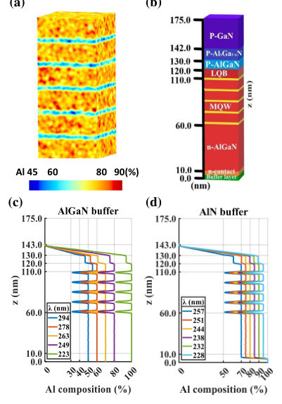
<figcaption class="paper-figure-caption"><b>Fig 2.</b> FIG. 2. (a) Three-dimensional aluminum composition distri- bution in AlGaN quantum wells based on the random alloy fluctuations. (b) The simulated structure shown is the MQW group with 2 nm AlGaN QW/10 nm AlGaN QB, 10 nm p-AlGaN and top 12 nm AlGaN graded-composition layer doped layer to help the hole carrier injection, and 33 nm p-GaN to form the ohmic contact with metal contact. (c) Vertical aluminum-composition profiles along the growth di- rection used with an AlGaN buffer for the five LED struc- tures, targeting emission at 294, 278, 263, 249, and 223 nm. (d) Vertical aluminum-composition profiles used with an AlN buffer for the six LED structures, targeting emission at 257, 251, 244,...</figcaption>
</figure>
<figure class="paper-figure-card">

<figcaption class="paper-figure-caption"><b>Fig 3.</b> FIG. 3. Simulation flowchart of the 3D-DDCC program.</figcaption>
</figure>
<figure class="paper-figure-card">

<figcaption class="paper-figure-caption"><b>Fig 4.</b> FIG. 4. Wavelength-dependent polarization ratio (220– 300 nm) of AlGaN UVC LEDs for AlGaN- and AlN-buffer cases. The LL (Wigner–Weyl) model matches the 6 × 6 k · p trend and reproduces the buffer-dependent TE-TM crossover, consistent with literature experiments. Among the experi- mental references, Ref. A (green point) is for the AlN-buffer case, whereas Refs. B–G (orange-brown point) are for the AlGaN-buffer case. (Ref. A43, Ref. B44, Ref. C45, Ref. D46, Ref. E47, Ref. F48, Ref. G49)</figcaption>
</figure>
<figure class="paper-figure-card">
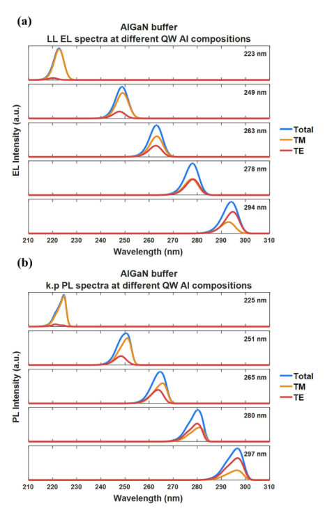
<figcaption class="paper-figure-caption"><b>Fig 5.</b> FIG. 5. TE- and TM-resolved optical spectra calculated us- ing the (a) LL and (b) k · p methods for the AlGaN-buffer structure.</figcaption>
</figure>

**Summary.** This paper introduces an efficient Multi-band Localization Landscape (LL) model to simulate carrier transport and emission in AlGaN UVC LEDs. By replacing computationally intensive k.p eigenvalue problems with the LL formalism, the authors achieve significant speedups while maintaining accuracy. The method successfully models complex physics like strain effects and polarization switching crucial for optimizing high-efficiency deep-UV light sources.

**Why it may be interesting.** The development of a computationally tractable quantum mechanical framework (LL model) that successfully replaces complex eigenvalue solvers for semiconductor device simulation is highly relevant to modeling open quantum systems in solid-state devices.

Detailed structure

**Main problem.** The primary goal is to efficiently analyze carrier transport and determine TM-TE emission characteristics in AlGaN UVC LEDs, overcoming the computational expense of conventional k.p models.

**Main result.** A novel multi-band Localization Landscape (LL) model significantly reduces simulation time while accurately reproducing spectral trends and polarization ratios compared to full 3D k.p calculations.

**Method.** The authors employ a hybrid approach combining the LL model with the Wigner–Weyl formalism, solving it within a 3D drift-diffusion framework on a Finite Element Mesh (FEM).

**Model / system.** The system is AlGaN UVC LEDs. The methodology involves coupling the LL theory to solve for carrier localization and band structure changes induced by strain and alloy fluctuations, which are then fed into a 3D drift-diffusion solver.

**Key observables.** Emission/absorption spectra trends, polarization ratio (TE/TM), band structure, hole/electron current densities ($J_p, J_n$), and quantum efficiency (EQE).

**Important parameters / regimes.** Al composition ($	ext{Al}_x	ext{Ga}_{1-x}	ext{N}$), strain tensor components, operating wavelength (220–300 nm), and doping profiles.

**Assumptions / limitations.** The LL theory is assumed to provide an accurate approximation of the full Schrödinger eigenvalue problem, allowing for computational efficiency gains. Strain effects are incorporated via deformation-potential terms.

**Figures summary.** Figures illustrate band structure transitions based on polarization/strain, local strain variation causing band switching, and comparisons of carrier current density maps with and without including the crucial strain-induced deformation term.

**Paper structure.** The paper introduces the physical problem (UVC LEDs), details the limitations of existing k.p methods, proposes the LL model as an efficient alternative, validates it by comparing results to known physics (strain effects on hole transport), and concludes with analysis of device performance metrics like IQE.

Abstract

AlGaN-based UVC LEDs (220-250 nm) suffer from poor hole confinement and strain-induced |Z>-band dominance at high Al content (>60%), leading to increased TM emission and reduced external quantum efficiency (EQE). While conventional k.p models combined with Schrodinger, Poisson, and drift-diffusion solvers are widely used to study optical transitions, they are computationally expensive. In this work, we apply the multiband Localization Landscape (LL) model, including the effect of strain, as an alternative that replaces the eigenvalue problem to efficiently capture quantum effects and carrier localization. Using the 3D multi-band LL model with the Wigner-Weyl formalism, we reproduce emission and absorption spectra trends similar to the results in 3D k.p calculations, but with significantly reduced simulation time. The polarization ratio also agrees well with published experimental results across a wide spectral range. Furthermore, we analyze electrical characteristics such as band structure, polarization switching, and carrier confinement under alloy fluctuations and strain. This multi-band LL-based approach provides a fast and reliable solution for understanding and optimizing UVC LED performance.

[↑ back to top](#top)

### [Integral representations of $f$-divergences for general von Neumann algebras](http://arxiv.org/abs/2607.05195v1)

**Authors:** Ricardo Correa da Silva, Markus B. Fröb, Gandalf Lechner, Leonardo Sangaletti  
**Type:** theory · **Category:** other · **PDF:** <https://arxiv.org/pdf/2607.05195v1>  
**Analysis basis:** full PDF text, analyzed in chunks
**Topic relevance:** `entanglement & information structure` **3/5** · `Keldysh / 2PI / non-Gaussian methods` **1/5** · `correlated / nonlocal dissipation` **1/5** · `driven-dissipative phase transition` **1/5** · `methods for driven-dissipative` **1/5**

↔ Scroll figures horizontally

<figure class="paper-figure-card">
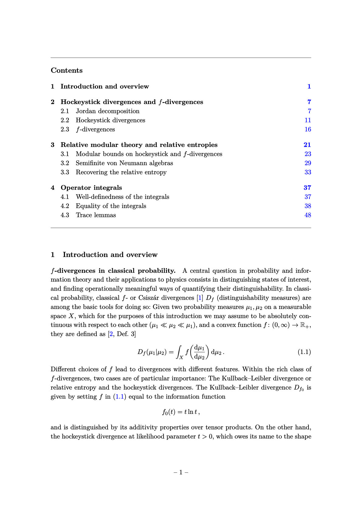
<figcaption class="paper-figure-caption"><b>Fig 1.</b> Low-resolution page preview, page 2</figcaption>
</figure>
<figure class="paper-figure-card">

<figcaption class="paper-figure-caption"><b>Fig 2.</b> Low-resolution page preview, page 3</figcaption>
</figure>
<figure class="paper-figure-card">

<figcaption class="paper-figure-caption"><b>Fig 3.</b> Low-resolution page preview, page 4</figcaption>
</figure>
<figure class="paper-figure-card">

<figcaption class="paper-figure-caption"><b>Fig 4.</b> Low-resolution page preview, page 5</figcaption>
</figure>
<figure class="paper-figure-card">

<figcaption class="paper-figure-caption"><b>Fig 5.</b> Low-resolution page preview, page 6</figcaption>
</figure>

**Summary.** This paper develops a powerful generalization of classical $f$-divergences to the setting of general von Neumann algebras, using 'hockeystick divergences' as the core mathematical tool. It rigorously analyzes the properties of these quantum state distinguishability measures and aims to prove their equivalence with the relative entropy, providing deeper mathematical foundations for quantum hypothesis testing in complex physical systems.

**Why it may be interesting.** This work provides fundamental mathematical tools for quantifying distinguishability between quantum states in highly general settings (infinite dimensions), which is crucial for developing rigorous theories in quantum field theory or open quantum systems where standard measure theory fails.

Detailed structure

**Main problem.** The paper defines and analyzes $f$-divergences and hockeystick divergences for normal positive functionals on general von Neumann algebras, aiming to generalize classical probability measures to quantum settings.

**Main result.** It establishes that the properties of these generalized $f$-divergences (like monotonicity and convexity) can be derived from structural properties of the underlying algebra via hockeystick divergence representations. Furthermore, it aims to prove the equivalence between this generalized $f_0$-divergence and Araki's relative entropy for general von Neumann algebras.

**Method.** The methodology involves defining divergences using operator norms on positive functionals (hockeystick divergences) and utilizing advanced tools from functional analysis, including spectral theory, trace identities, and convergence theorems applied to unbounded operators in the context of operator algebras.

**Model / system.** The mathematical framework is built upon general von Neumann algebras ($M$), which serve as a generalization of classical measure spaces. The physical states are represented by normal positive functionals ($\phi$) on $M$, relevant for quantum statistical mechanics and QFT.

**Key observables.** State distinguishability measures, specifically $f$-divergences and hockeystick divergences; the relative entropy ($D_{f_0}$ when $f(t)=t\ln t$).

**Important parameters / regimes.** The structure of the von Neumann algebra (Type I, II, or III), and limits involving regularization parameters ($\epsilon 	o 0$) used to approach infinite-dimensional structures.

**Assumptions / limitations.** The analysis assumes the existence of normal positive functionals on general von Neumann algebras and relies heavily on advanced theorems regarding traces and operator convergence in these non-commutative settings.

**Paper structure.** The paper proceeds by first defining hockeystick divergences as a generalization tool, then analyzing the properties of $f$-divergences derived from them. It then tackles the difficult task of proving the equivalence between these generalized divergences and established quantum information measures like relative entropy via multi-shot regularization techniques.

Abstract

We define and analyze hockeystick divergences and $f$-divergences for normal positive functionals on general von Neumann algebras, generalizing and unifying previous work in classical probability and finite-dimensional von Neumann algebras. All the main properties of these state distinguishability measures (including in particular monotonicity, convexity, semicontinuity, bounds, state discrimination, data processing inequality) are derived from properties of the Jordan decomposition of selfadjoint normal functionals. This is done by representing the $f$-divergences as integrals over hockeystick divergences, and their significance in quantum hypothesis testing is reviewed. The $f_0$-divergence given by the information function $f_0(t) = t \ln t$ is shown to coincide with Araki's relative entropy, extending results of Frenkel to general von Neumann algebras.

[↑ back to top](#top)

### [A Lie-Jordan Geometric Formulation of Lindblad Dynamics](http://arxiv.org/abs/2607.04052v1)

**Authors:** Leonel Bixano, Victor Alberto Cruz-Barriguete, Guillermo López-Alvarez, V. G. Ibarra-Sierra, José Luis Cardoso, Alejandro Kunold  
**Type:** theory · **Category:** other · **PDF:** <https://arxiv.org/pdf/2607.04052v1>  
**Analysis basis:** full PDF text, analyzed in chunks
**Topic relevance:** `methods for driven-dissipative` **3/5** · `Keldysh / 2PI / non-Gaussian methods` **1/5** · `correlated / nonlocal dissipation` **1/5** · `driven-dissipative phase transition` **1/5**

↔ Scroll figures horizontally

<figure class="paper-figure-card">

<figcaption class="paper-figure-caption"><b>Fig 1.</b> Low-resolution page preview, page 2</figcaption>
</figure>
<figure class="paper-figure-card">
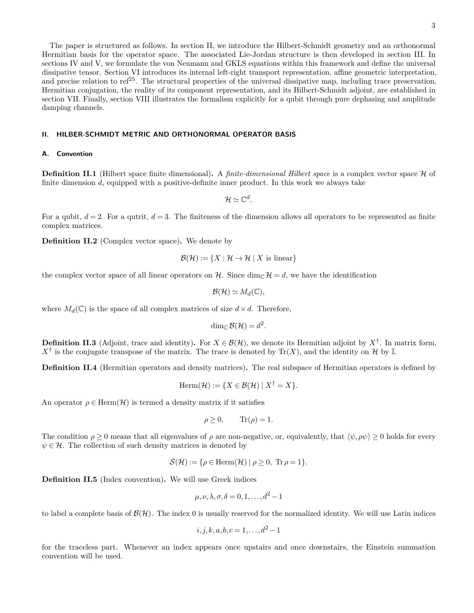
<figcaption class="paper-figure-caption"><b>Fig 2.</b> Low-resolution page preview, page 3</figcaption>
</figure>
<figure class="paper-figure-card">

<figcaption class="paper-figure-caption"><b>Fig 3.</b> Low-resolution page preview, page 4</figcaption>
</figure>
<figure class="paper-figure-card">
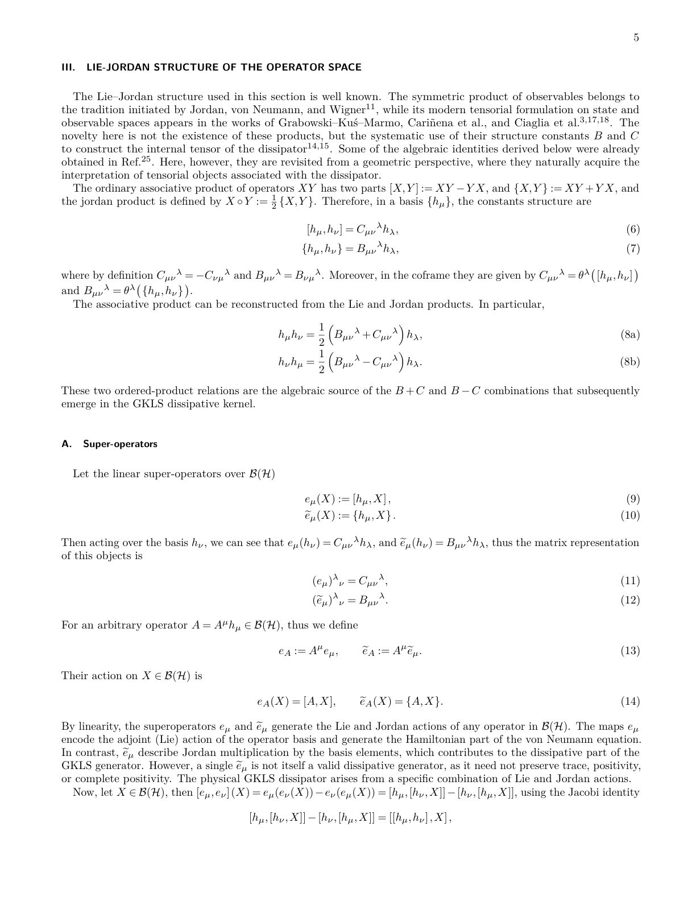
<figcaption class="paper-figure-caption"><b>Fig 4.</b> Low-resolution page preview, page 5</figcaption>
</figure>
<figure class="paper-figure-card">
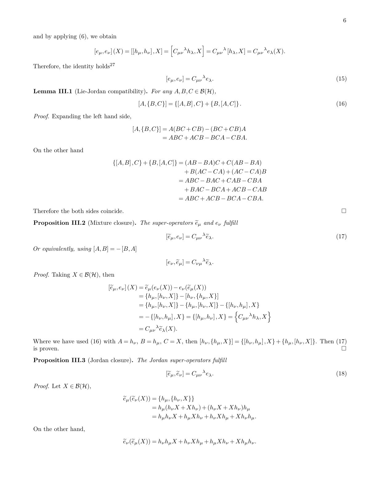
<figcaption class="paper-figure-caption"><b>Fig 5.</b> Low-resolution page preview, page 6</figcaption>
</figure>

**Summary.** This work introduces a Lie-Jordan geometric framework to provide a universal algebraic interpretation of dissipative evolution in open quantum systems. By decomposing the GKLS master equation into universal structural tensors and model-specific terms, it cleanly separates the underlying mathematical structure from the physics. This offers a powerful, systematic tool for analyzing any system undergoing Markovian dissipation.

**Why it may be interesting.** This provides a deep algebraic and geometric underpinning for open quantum dynamics, offering tools to analyze the structure of dissipation independent of the specific physical Hamiltonian or Lindblad operators used.

Detailed structure

**Main problem.** The paper develops a Lie-Jordan geometric formulation to systematically analyze the algebraic structure underlying open quantum dynamics governed by the Lindblad equation.

**Main result.** It successfully separates the universal, basis-independent algebraic structure of dissipation from the model-dependent physical parameters (Lindblad operators and Kossakowski matrix).

**Method.** The authors endow the Hilbert-Schmidt operator space with an orthonormal basis and encode quantum commutators/anticommutators using Lie and Jordan structure tensors to derive a universal trilinear dissipative map.

**Model / system.** The focus is on finite-dimensional open quantum systems whose evolution is described by the Gorini-Kossakowski-Lindblad-Sudarshan (GKLS) master equation. The formalism is tested using qubit examples exhibiting pure dephasing and amplitude damping.

**Key observables.** The component representation of the dissipator, $\dot{
ho}_\lambda$, and the resulting Bloch vector dynamics ($\dot{\mathbf{r}}$).

**Important parameters / regimes.** Lindblad operators ($L_\alpha$), Kossakowski matrix ($\gamma_{\alphaeta}$), and the Lie/Jordan structure tensors ($C$ and $B$).

**Assumptions / limitations.** The system evolution is assumed to be Markovian, completely positive, and trace-preserving.

**Figures summary.** Not specified in the notes; the focus is on algebraic derivations and component equations rather than visual figure summaries.

**Paper structure.** The paper builds from establishing the general geometric framework using structure tensors for commutators/anticommutators to deriving a universal dissipative map. It then applies this formalism to verify known results (like trace preservation) and illustrates it with specific qubit channels, concluding by showing equivalence to standard ordered-product derivations.

Abstract

We develop a Lie-Jordan geometric formulation of finite-dimensional open quantum dynamics, building on the algebraic framework introduced in our previous work (arXiv:2606.26477). The Hilbert-Schmidt operator space is endowed with an orthonormal Hermitian basis, in which the commutator and anticommutator are encoded by the structure tensors \(C_{μν}{}^λ\) and \(B_{μν}{}^λ\). Within this formulation, the von Neumann and Gorini-Kossakowski-Lindblad-Sudarshan equations admit a direct component representation. Our central result is the identification of a basis-independent universal trilinear dissipative map, \( \mathcal D(X,Y)Z=XZY-\frac12\{YX,Z\}, \) whose components define a universal operator-space tensor depending only on the Lie-Jordan structure tensors. The physical dissipator is obtained by contracting this tensor with the expansion coefficients of the Lindblad operators and the Kossakowski matrix, thereby separating the universal algebraic structure from the model-dependent physical information. We further show that the combinations \((B+C)\) and \((B-C)\) generate internal left and right transports, allowing the elementary dissipative map to be expressed as a left-right bimodule action corrected by an ordered Jordan contribution. The universal map satisfies basis-independent trace and Hermitian-conjugation identities, from which trace preservation, Hermiticity preservation of the complete dissipator, and the reality of its component representation in a Hermitian Hilbert-Schmidt basis follow. We also derive its Hilbert-Schmidt adjoint and illustrate the formalism for a qubit with pure dephasing and amplitude-damping channels. This construction provides a tensorial and affine-geometric interpretation of the universal superoperator structure derived in arXiv:2606.26477 while keeping the algebraic and model-dependent sectors explicitly separated.

[↑ back to top](#top)

### [Estimation of a sparse multi-qubit Hamiltonian via compressed sensing](http://arxiv.org/abs/2607.04669v1)

**Authors:** Juntao Tu, Yuanlong Wang, Shuming Cheng, Shuixin Xiao, Zhibo Hou  
**Type:** theory · **Category:** quantum information and computing · **PDF:** <https://arxiv.org/pdf/2607.04669v1>  
**Analysis basis:** full PDF text, analyzed in chunks
**Topic relevance:** `quantum measurements` **3/5** · `analog quantum simulation` **1/5** · `measurement-induced transitions` **1/5**

↔ Scroll figures horizontally

<figure class="paper-figure-card">
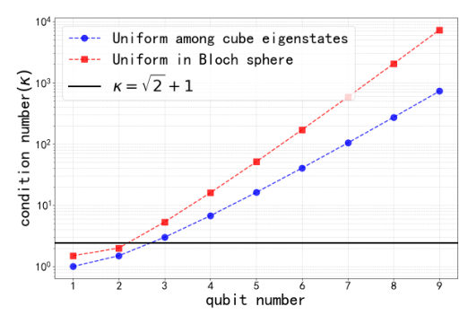
<figcaption class="paper-figure-caption"><b>Fig 1.</b> Fig. 1. The condition number of E(Φ†Φ) versus the qubit number , with the initial state being tensor product of single qubit each randomly generated from six eigenstates of cube measurement with equal probability (blue dots), or from a uniform probability distribution in Bloch sphere (red squares), and the black line shows the location where condition number is √</figcaption>
</figure>
<figure class="paper-figure-card">

<figcaption class="paper-figure-caption"><b>Fig 2.</b> Fig. 2. Simulated estimation errors for a 6-qubit Hamiltonian</figcaption>
</figure>
<figure class="paper-figure-card">

<figcaption class="paper-figure-caption"><b>Fig 3.</b> Fig. 3. Simulated estimation errors for a 30-qubit Hamiltonian</figcaption>
</figure>
<figure class="paper-figure-card">
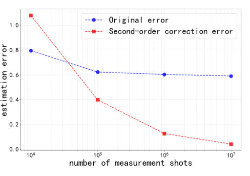
<figcaption class="paper-figure-caption"><b>Fig 4.</b> Fig. 3 shows the estimation error of the CS as a function of the number of measurement shots in the system (30).</figcaption>
</figure>

**Summary.** This paper tackles the challenge of determining the Hamiltonian of large multi-qubit quantum systems by framing it as a sparse signal recovery problem solvable via compressed sensing. To overcome the inherent mathematical difficulty—the failure of standard sampling conditions at high qubit numbers—the authors introduce a novel 'scale transformation' technique. This method ensures that accurate estimation remains possible even for dozens of qubits, significantly advancing the feasibility of characterizing complex quantum dynamics.

**Why it may be interesting.** This work provides a crucial algorithmic breakthrough for characterizing complex quantum dynamics in large systems where full characterization is impossible. The focus on overcoming fundamental mathematical limitations (RIP failure) makes it highly relevant for scaling up quantum simulations.

Detailed structure

**Main problem.** Estimating a sparse Hamiltonian for large multi-qubit quantum systems is computationally difficult due to the exponential growth of parameters.

**Main result.** The authors propose a 'scale transformation' technique that restores the Restricted Isometry Property (RIP) required for compressed sensing, allowing accurate estimation using only $O(k \log(4^N/k))$ measurements.

**Method.** The problem is formulated as solving an $\ell_1$-minimization problem ($\min \|h\|_1$ s.t. $\|ar{y} - \Phi h\|^2 \le \epsilon$) using compressed sensing principles, augmented by the scale transformation to handle ill-conditioning.

**Model / system.** The system is an N-qubit quantum processor whose dynamics are governed by a sparse Hamiltonian $H$. The estimation relies on measuring expectation values of observables derived from Pauli matrices acting on initial states.

**Key observables.** Measured expectation values $ar{y}_{ij} = \langle M_j 
angle_{
ho_i}$, and the measurement matrix $\Phi$ constructed from these measurements.

**Important parameters / regimes.** The number of qubits ($N$), the sparsity level of the Hamiltonian ($k$), and the condition number ($\kappa$) of the measurement matrix's Gramian, which must remain below a critical threshold.

**Assumptions / limitations.** The primary assumption is that the unknown Hamiltonian $h$ is sparse. A major technical challenge addressed is the 'scalability-induced ill-conditioning,' where standard CS fails for large N.

**Figures summary.** Figures demonstrate the method's effectiveness by showing successful Hamiltonian estimation in 6- and 30-qubit systems, with error decreasing as measurement shots increase (though non-statistical errors persist).

**Paper structure.** The paper establishes the linear system $ar{y} = \Phi h$, identifies the failure of standard CS due to increasing condition numbers ($\kappa$), and then introduces the scale transformation method to diagonalize the effective matrix, enabling robust reconstruction.

Abstract

Hamiltonian estimation is an effective approach in studying the structure and dynamical evolution of quantum systems. The difficulty in estimating the Hamiltonian is that an $N$-qubit Hamiltonian has $4^N-1$ unknown parameters, requiring exponentially many equations for information extraction. In this paper we develop a method based on compressed sensing to estimate the Hamiltonian of a multi-qubit system. We identify a problem where as $N$ increases, the common sufficient condition (Restricted Isometry Property) for compressed sensing often fails, obstructing the application of compressed sensing in ($N\geq 3$)-qubit Hamiltonian estimation. To solve this problem, we propose a ``scale transformation" technique to restore RIP and ensure a compressive estimation of a $k$-sparse Hamiltonian using only $O(k\log(4^N/k))$ equations. In the numerical examples, we estimate the Hamiltonians of two 6- and 30-qubit systems, demonstrating the effectiveness of the method.

[↑ back to top](#top)

### [Hall Coefficient Sign Reversal Driven by Orbital-Selective Oxygen-Vacancy Scattering in Nickelate Films](http://arxiv.org/abs/2607.04122v1)

**Authors:** Jian-Jian Miao, Yue Liu, Yue Zhao, Yichen Hua, Changming Yue, Wei-Qiang Chen  
**Type:** theory · **Category:** strongly correlated electrons · **PDF:** <https://arxiv.org/pdf/2607.04122v1>  
**Analysis basis:** full PDF text, analyzed in chunks
**Topic relevance:** `Keldysh / 2PI / non-Gaussian methods` **3/5** · `methods for driven-dissipative` **1/5** · `non-equilibrium dynamics` **1/5**

↔ Scroll figures horizontally

<figure class="paper-figure-card">
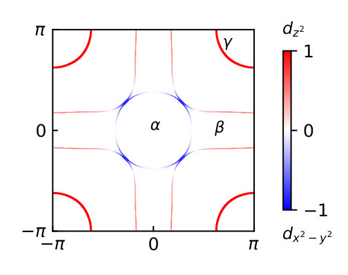
<figcaption class="paper-figure-caption"><b>Fig 1.</b> FIG. 1. Quasiparticle Fermi surface colored by the relative dx2−y2 orbital weight P x = 1 −2W x.</figcaption>
</figure>
<figure class="paper-figure-card">
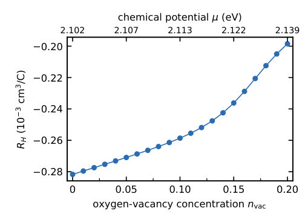
<figcaption class="paper-figure-caption"><b>Fig 2.</b> FIG. 2. Rigid-band RH as a function of nvac and µ.</figcaption>
</figure>
<figure class="paper-figure-card">

<figcaption class="paper-figure-caption"><b>Fig 3.</b> FIG. 4. Pocket-resolved (solid lines) and orbital-selective (dashed lines) contributions to RH for the mixed 20/80 distribution, with τ0 = 50 fs.</figcaption>
</figure>
<figure class="paper-figure-card">
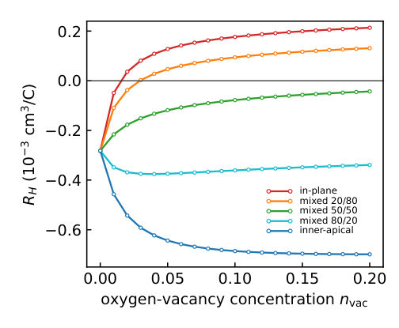
<figcaption class="paper-figure-caption"><b>Fig 4.</b> FIG. 3. RH as a function of nvac for five oxygen-vacancy distributions, with τ0 = 50 fs. A mixed distribution a/b denotes a% inner-apical and b% in-plane oxygen vacancies.</figcaption>
</figure>
<figure class="paper-figure-card">

<figcaption class="paper-figure-caption"><b>Fig 5.</b> FIG. 5. Numerical pocket assignment on the 2048 × 2048 k mesh. Blue, magenta, and red points denote the α, β, and γ pockets, respectively.</figcaption>
</figure>

**Summary.** This work theoretically explains the anomalous sign reversal in the Hall coefficient observed in nickelate superconductors. By combining correlated electron theory with detailed scattering calculations, the authors pinpoint that the effect is due to oxygen vacancies selectively disrupting the $d_{x^2-y^2}$ orbital's contribution to transport. This provides a crucial link between material stoichiometry and macroscopic electronic properties.

**Why it may be interesting.** While focused on strongly correlated materials, the detailed treatment of transport coefficients (like R_H) using advanced many-body techniques provides a rigorous framework for understanding how local disorder (vacancies) selectively perturbs orbital character and electronic transport channels.

Detailed structure

**Main problem.** The study aims to determine the microscopic origin of Hall coefficient (R_H) sign reversals observed in superconducting bilayer nickelate films.

**Main result.** The sign reversal is attributed to orbital-selective scattering caused by oxygen vacancies, specifically showing that in-plane vacancies selectively suppress the $d_{x^2-y^2}$ orbital contribution, driving R_H through zero.

**Method.** A correlated multi-orbital quasiparticle model derived from DFT+CDMFT is combined with a T-matrix treatment of scattering potentials within a semiclassical Boltzmann transport framework.

**Model / system.** The system is superconducting bilayer nickelate films containing oxygen vacancies. The theoretical framework involves calculating transport properties using pocket-resolved contributions and modeling the vacancy potential via first-principles DFT calculations.

**Key observables.** Hall coefficient (R_H), longitudinal conductivity ($\sigma_{aa}$), and orbital-selective Hall contributions ($R_r^H$).

**Important parameters / regimes.** Oxygen-vacancy concentration ($n_{	ext{vac}}$), chemical potential ($\mu$), and the specific type/location of vacancies (in-plane vs. inner-apical).

**Assumptions / limitations.** The analysis assumes a dilute-vacancy limit, uses the scalar relaxation-time approximation for scattering rates, and separates rigid-band doping effects from vacancy-induced changes.

**Figures summary.** Figures illustrate quasiparticle Fermi surfaces showing multiple pockets ($\alpha, eta, \gamma$) and plot R_H vs. $n_{	ext{vac}}$, demonstrating how different vacancy distributions cause the sign reversal through orbital suppression.

**Paper structure.** The paper first establishes that doping alone fails to explain the sign reversal. It then develops a comprehensive model incorporating orbital selectivity via DFT+CDMFT and T-matrix scattering theory, culminating in quantitative predictions showing the specific role of in-plane vacancies.

Abstract

Hall measurements in superconducting bilayer nickelate films show sign reversals that cannot be explained by rigid-band electron doping alone. We combine a DFT+CDMFT-derived correlated multi-orbital quasiparticle model with a $T$-matrix treatment of oxygen-vacancy scattering in a semiclassical Boltzmann transport framework. We find that multiband compensation is insufficient by itself: in-plane vacancies selectively suppress the transport channel dominated by the $d_{x^2-y^2}$ orbital and drive $R_H$ through zero, whereas inner-apical vacancies make $R_H$ more negative. These results identify pocket-resolved and orbital-selective oxygen-vacancy scattering as the microscopic origin of the Hall coefficient sign reversal and provide a framework for oxygen-stoichiometry-dependent transport in nickelate films.

[↑ back to top](#top)

### [A Unified Electrostatic-to-Spin Framework for Asymmetric Multi-Gate CMOS Quantum Devices](http://arxiv.org/abs/2607.04876v1)

**Authors:** Zeheng Wang, Yan Liu, Yue Hao, Genquan Han  
**Type:** theory · **Category:** strongly correlated electrons · **PDF:** <https://arxiv.org/pdf/2607.04876v1>  
**Analysis basis:** full PDF text, analyzed in chunks
**Topic relevance:** `spintronics-quantum-optics interface` **3/5** · `Keldysh / 2PI / non-Gaussian methods` **1/5**

↔ Scroll figures horizontally

<figure class="paper-figure-card">

<figcaption class="paper-figure-caption"><b>Fig 1.</b> Low-resolution page preview, page 2</figcaption>
</figure>
<figure class="paper-figure-card">

<figcaption class="paper-figure-caption"><b>Fig 2.</b> Low-resolution page preview, page 3</figcaption>
</figure>
<figure class="paper-figure-card">
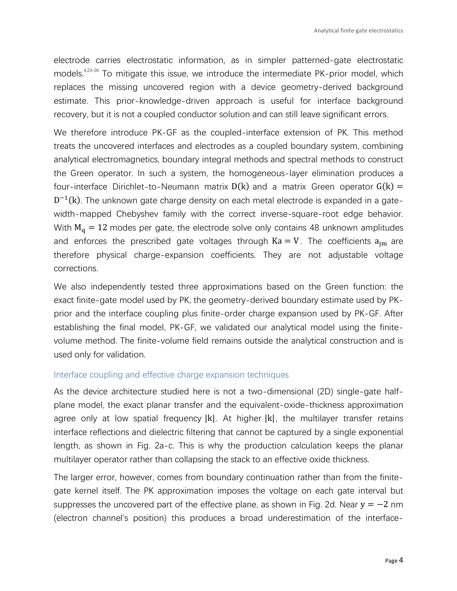
<figcaption class="paper-figure-caption"><b>Fig 3.</b> Low-resolution page preview, page 4</figcaption>
</figure>
<figure class="paper-figure-card">
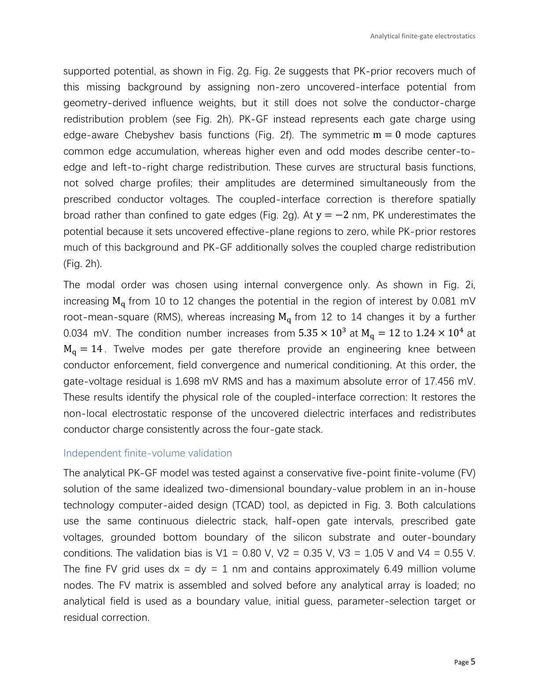
<figcaption class="paper-figure-caption"><b>Fig 4.</b> Low-resolution page preview, page 5</figcaption>
</figure>
<figure class="paper-figure-card">
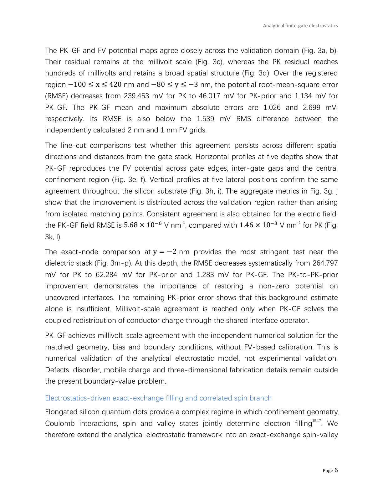
<figcaption class="paper-figure-caption"><b>Fig 5.</b> Low-resolution page preview, page 6</figcaption>
</figure>

**Summary.** The paper presents an integrated theoretical framework connecting the electrostatics of complex CMOS quantum devices to their correlated electronic structure. By developing the accurate PK-GF model, the authors can calculate the confinement potential and then use advanced many-body techniques (UHF/CASCI) to predict spin filling and charge localization in silicon quantum dots. This establishes a vital tool for designing next-generation solid-state qubits.

**Why it may be interesting.** This work is highly relevant as it bridges solid-state device physics (CMOS lithography) directly into advanced quantum many-body theory, providing a crucial, auditable computational pipeline for designing qubits based on semiconductor platforms.

Detailed structure

**Main problem.** The primary goal is developing a unified, end-to-end modeling framework that connects lithographic CMOS gate geometry electrostatics to the resulting many-electron spin and charge filling in quantum dots.

**Main result.** The authors successfully developed the Poisson-kernel coupled-interface Green-function (PK-GF) model, which accurately predicts device electrostatics at millivolt scales. Furthermore, they showed that the system operates in an interaction-dominated, Wigner-molecule-like regime, supporting low-spin ground states consistent with experiments.

**Method.** The methodology combines advanced analytical electrostatics (PK-GF) to determine the confinement potential, which is then fed into correlated many-body quantum calculations using Unrestricted Hartree-Fock (UHF) and Complete Active-Space Configuration Interaction (CASCI).

**Model / system.** The system modeled is an asymmetric multi-gate silicon quantum dot fabricated within a CMOS architecture. The Hamiltonian incorporates Coulomb interactions, spin, and valley degrees of freedom, treating the gate potential as derived directly from device electrostatics.

**Key observables.** Spin density maps, charge localization (Wigner-molecule tendencies), ground state spin ($S=0$ support), addition energy spectrum, and the interaction-to-level-spacing ratio ($R$).

**Important parameters / regimes.** Electron number ($N = 2-17$), magnetic field ($B = 5 	ext{ T}$), and electrostatic potential derived from gate voltages.

**Assumptions / limitations.** The PK-GF model assumes a specific coupling between interfaces, and while UHF is used for calculation, the authors note it may overestimate spin polarization compared to CASCI results. The convergence of the singlet-triplet gap is noted as potentially incomplete.

**Figures summary.** Figures compare the analytical PK-GF potential against independent Finite Volume (FV) solutions at millivolt scales; they also show charge density lobe profiles, pair correlation functions, and energy level comparisons between UHF and CASCI for different electron numbers.

**Paper structure.** The paper first establishes the electrostatics by introducing and validating the PK-GF model against FV solvers. It then passes this derived potential into a spin-valley many-body calculation using UHF/CASCI to determine correlated electronic properties, culminating in an end-to-end workflow demonstration.

Abstract

In advanced complementary metal-oxide-semiconductor (CMOS) quantum chips, compact gate stacks make it difficult to connect lithographic geometry, electrostatic confinement and many-electron spin filling in one transparent model. This connection is central to design-technology co-optimization (DTCO). Here we develop a reduced-order analytical framework for asymmetric multigate silicon quantum-dot devices. Its electrostatic core, the Poisson-kernel coupled-interface Green-function (PK-GF) model, agrees with an independent finite-volume solution at the millivolt scale for the matched two-dimensional problem, without fitting to that solution. We then pass the gate-derived confinement, rather than a harmonic or fitted potential, to a spin-valley many-body calculation for a jellybean quantum dot with N = 2-17 electrons at B = 5 T. The unrestricted Hartree-Fock (UHF) solution supports occupation-dependent, Wigner-molecule-like charge localization but likely overestimates spin polarization. Complete active-space configuration interaction (CASCI) supports a low-spin branch within the tested active spaces, which aligns with the experiments. The workflow therefore connects CMOS layout, device electrostatics, and potential-determined quantum observables, providing an auditable modelling layer for CMOS-based qubit design and DTCO.

[↑ back to top](#top)

### [Algebra of quantum mechanics \textit{via} classical phonons. II: Klein-Gordon dynamics, the Heisenberg formalism, the Dirac canonical commutation rule and the Poincaré algebra through the continuous Poisson bracket formalism](http://arxiv.org/abs/2607.03909v1)

**Authors:** Emmanuel Giner  
**Type:** theory · **Category:** other · **PDF:** <https://arxiv.org/pdf/2607.03909v1>  
**Analysis basis:** full PDF text, analyzed in chunks
**Topic relevance:** `Frenkel-Kontorova` **3/5** · `Keldysh / 2PI / non-Gaussian methods` **1/5**

↔ Scroll figures horizontally

<figure class="paper-figure-card">
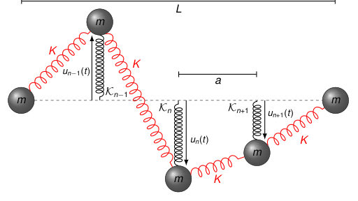
<figcaption class="paper-figure-caption"><b>Fig 1.</b> FIG. 1. Pictorial representation of the Frenkel-Kontorova model used here: un(t) is the real number representing the transverse displacement, Kn the ”on-site” harmonic force and K the ”between-site” harmonic force.</figcaption>
</figure>

**Summary.** This paper develops a rigorous mathematical framework to derive the core structures of quantum mechanics—including Klein-Gordon dynamics and Poincaré symmetry—entirely from a classical phonon model using Poisson brackets. It achieves this by demonstrating that a specific complex change of variables maps classical Poisson brackets directly onto fundamental quantum commutators, establishing deep formal equivalence between classical and quantum descriptions.

**Why it may be interesting.** This work provides a highly abstract and fundamental theoretical bridge between classical Hamiltonian mechanics (Poisson brackets) and quantum field theory (commutators), which is valuable for understanding quantization procedures beyond standard canonical methods.

Detailed structure

**Main problem.** The primary goal is to derive the full algebra of quantum mechanics, including Klein-Gordon dynamics and the Poincaré group structure, starting purely from a classical framework.

**Main result.** The paper establishes a strict mathematical equivalence between the Heisenberg formalism (quantum commutators) and the continuous Poisson bracket formalism by utilizing a non-local complex change of variables.

**Method.** It employs the classical phonon model to define continuous Poisson brackets, which are then systematically related to quantum commutators via functional analysis and canonical quantization procedures.

**Model / system.** The system is modeled using a classical phonon lattice (related to the Frenkel-Kontorova model) whose continuum limit yields dynamics governed by equations leading to the Klein-Gordon equation. The formalism progresses from real-valued classical observables to complex quantum operators.

**Key observables.** Klein-Gordon fields, Poisson brackets $\{F, G\}$, commutators $[\hat{O}_F, \hat{O}_G]$, and Poincaré group generators ($H, X, P$).

**Important parameters / regimes.** The continuum limit parameters (e.g., $N	o\infty, a	o 0$) and the scaling factors used to connect classical variables to quantum operators are crucial.

**Assumptions / limitations.** The derivation relies on assuming that a non-local complex change of variables can bridge the gap between real-valued classical dynamics and complex quantum field theory structures.

**Figures summary.** Figures illustrate the physical lattice model (Frenkel-Kontorova) and later show abstract mathematical representations of group transformations using matrix forms for the Poincaré algebra generators.

**Paper structure.** The paper follows a progression: first establishing classical dynamics via phonons; then introducing Poisson brackets to derive Ehrenfest relations; next, performing a complex change of variables to link $\{., .\}$ to $[\cdot, \cdot]$; finally, applying this structure to recover the full Poincaré algebra in 1+1 dimensions.

Abstract

In the first part of this series we have shown how the Schrodinger equation for a single particle and the corresponding non relativistic quantum observables can be obtained from a purely classical phonon model through the Newtonian equations of motion. In this work we focus instead on how the classical Hamiltonian formalism applied to the same phonon system allows to recover the feature of relativistic quantum mechanics for a single spinless particle. Using the classical nature of the phonon model, we naturally define continuous Poisson brackets between classical observables, which allows to recover the dynamics of such observables, i.e. the Ehrenfest relations associated to real-valued Klein-Gordon fields. The Poisson brackets also permits to obtain the generic form of constants of motions, thus generalizing the concept of inner products and momentum on Klein-Gordon fields. We then connect the formalism of real-valued classical functionals with that of hermitian operators and complex-valued wave functions. This is done through the introduction of a non-local complex-valued change of variables which allows to rewrite the real-valued Klein-Gordon equation in a form akin to the Schrodinger equation, and the classical observables as quantum expectation values. Then, we show how this change of variables allows to rewrite the classical Poisson brackets as commutators of hermitian operators. This points out the strict equivalence between the Heisenberg formalism and the formalism of classical Poisson bracket. Eventually, we illustrate how the Poisson brackets allows to recover the transformations of Poincaré group in 1+1 dimension together with its algebra. The latter makes the link between the Lorentz invariant inner product of Mostafazadeh and the Casimir invariant associated to the mass of particle.

[↑ back to top](#top)

### [Experimental signatures of bosonic pairing in a two-component Bose gas](http://arxiv.org/abs/2607.03902v1)

**Authors:** Omar Almonajed, M. Iskin, M. Ö. Oktel  
**Type:** theory · **Category:** quantum gases · **PDF:** <https://arxiv.org/pdf/2607.03902v1>  
**Analysis basis:** full PDF text, analyzed in chunks
**Topic relevance:** `analog quantum simulation` **3/5** · `Keldysh / 2PI / non-Gaussian methods` **1/5**

↔ Scroll figures horizontally

<figure class="paper-figure-card">
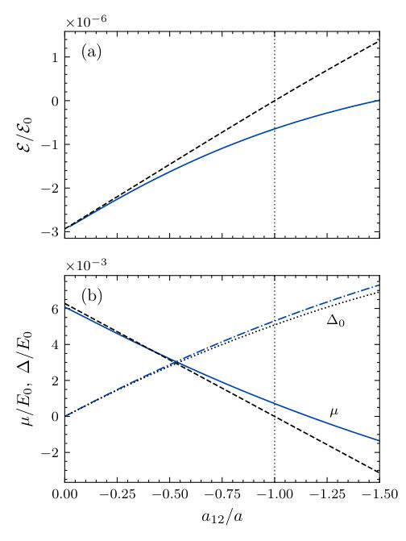
<figcaption class="paper-figure-caption"><b>Fig 1.</b> FIG. 1. (a) Grand-potential density as a function of the interaction-strength ratio a12/a, spanning the attrac- tive mean-field-stable regime and extending into the droplet regime. The blue solid curve denotes bosonic pairing the- ory, and the black dashed curve denotes Bogoliubov theory. Values in panel (a) are measured in units of E0 = ℏ2/(ma5). (b) Chemical potential µ and pairing field ∆0 as functions of a12/a across the mean-field-to-droplet crossover. The blue solid and blue dash-dotted curves denote µ and ∆0 in bosonic pairing theory, respectively, while the black dashed and black dotted curves denote the corresponding Bogoli- ubov results. Values in panel (b) are measured in units...</figcaption>
</figure>
<figure class="paper-figure-card">
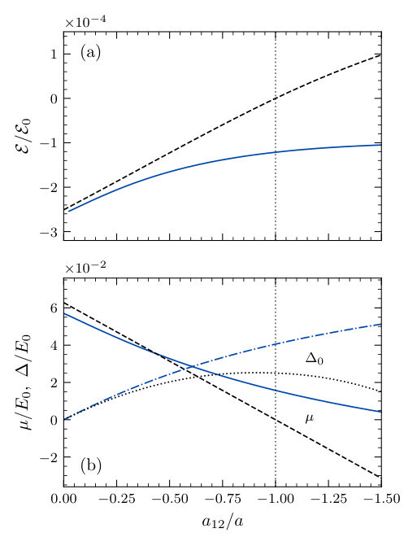
<figcaption class="paper-figure-caption"><b>Fig 2.</b> FIG. 2. Same as Fig. 1, but for a tenfold higher density. In both panels, the per-species density is fixed at na3 = 0.5 × 10−2. The differences between the Bogoliubov and bosonic pairing theories become more pronounced at higher density, particularly in the droplet regime.</figcaption>
</figure>
<figure class="paper-figure-card">

<figcaption class="paper-figure-caption"><b>Fig 3.</b> FIG. 3. Intraspecies normal fraction ˜n/n and interspecies anomalous fraction ˜m12/n as functions of the interaction- strength ratio a12/a, spanning the attractive mean-field- stable regime and extending into the droplet regime. The blue solid and black dashed curves denote ˜n/n in bosonic pairing theory and Bogoliubov theory, respectively. The blue dash-dotted and black dotted curves denote the correspond- ing results for ˜m12/n. The per-species density is fixed at na3 = 0.5 × 10−3.</figcaption>
</figure>
<figure class="paper-figure-card">
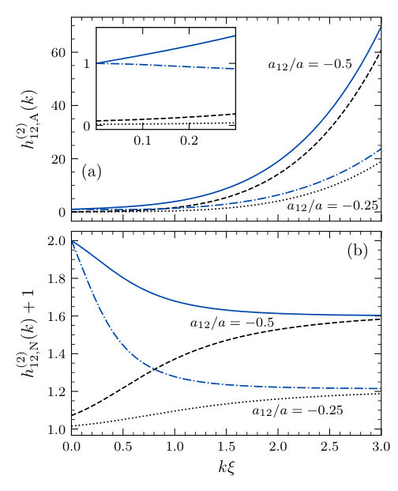
<figcaption class="paper-figure-caption"><b>Fig 4.</b> FIG. 4. Momentum-space interspecies correlations for a symmetric two-component bosonic gas at fixed density na3 = 0.5 × 10−3 in the mean-field-stable regime. (a) Normalized anomalous correlation h(2) 12,A(k). (b) Normalized normal cor-</figcaption>
</figure>
<figure class="paper-figure-card">
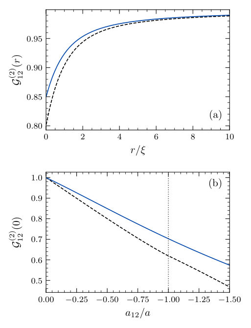
<figcaption class="paper-figure-caption"><b>Fig 5.</b> FIG. 5. Ultraviolet-renormalized interspecies two-body correlation function G(2) 12 (r) for a symmetric two-component bosonic gas. (a) Real-space dependence at fixed density na3 = 0.5 × 10−3 and interaction ratio a12/a = −0.5, cor- responding to the attractive mean-field-stable regime. Both theories approach the uncorrelated limit at large separations but differ at short distances. (b) Short-distance limit G(2) 12 (0) across the gas-to-droplet crossover. The vertical dotted line marks the mean-field instability, a12/a = −1, which coincides with the droplet transition. Blue solid curves denote bosonic pairing theory, and black dashed curves denote Bogoliubov theory. In the droplet regime,...</figcaption>
</figure>

**Summary.** The paper compares bosonic pairing theory against standard Bogoliubov theory for two-component Bose gases approaching the droplet regime. By analyzing observables like the grand potential and static structure factors, the authors show that bosonic pairing predicts distinct correlation signatures not captured by Bogoliubov theory. This suggests that low-momentum measurements in trapped atomic systems can experimentally validate alternative microscopic descriptions of quantum matter.

**Why it may be interesting.** This work provides a rigorous theoretical tool to distinguish between competing descriptions of quantum many-body physics near phase transitions, offering concrete predictions for experimental measurements like Bragg spectroscopy on ultracold atomic gases.

Detailed structure

**Main problem.** The paper compares two theoretical frameworks, Bogoliubov theory and bosonic pairing theory, to describe two-component Bose gases across the crossover from a weakly interacting gas to the droplet regime.

**Main result.** Bosonic pairing theory predicts lower grand potentials and distinct correlation signatures—such as enhanced low-momentum interspecies correlations—compared to Bogoliubov theory. These differences suggest that structure factor measurements can experimentally distinguish between the two descriptions.

**Method.** The authors reformulate bosonic pairing theory using an operator formalism and compare its predictions for various observables against those derived from standard Bogoliubov mean-field theory, including fluctuation corrections.

**Model / system.** The system is a homogeneous binary Bose mixture with tunable interactions. The comparison focuses on how the theories handle quantum fluctuations when attractive interspecies interactions lead to droplet formation.

**Key observables.** Grand potential ($\Omega$), excitation spectrum, species-resolved static structure factors ($S_{ij}(q)$), and two-body correlation functions ($G^{(2)}_{12}(r)$).

**Important parameters / regimes.** Interaction strengths (especially attractive interspecies coupling $g_{12}$), particle density, and momentum transfer ($q$).

**Assumptions / limitations.** Bogoliubov theory is compared to bosonic pairing theory in regimes where both possess real excitation spectra. The comparison highlights the limitations of Bogoliubov theory when dealing with spectral instabilities (soft modes).

**Figures summary.** Figures illustrate $G^{(2)}_{12}(r)$ showing differences in antibunching, and species-resolved static structure factors $S_{ij}(q)$, which show a measurable contrast ratio between the two theories at low momentum.

**Paper structure.** The paper systematically compares the theoretical frameworks by deriving key quantities (like the grand potential and correlation functions) using both methods, culminating in a direct comparison of observable signatures across the gas-to-droplet crossover.

Abstract

Two-component bosonic droplets are commonly described within Bogoliubov theory, where beyond-mean-field quantum fluctuations stabilize the system against mean-field collapse. In the interaction regime where droplets form, however, the Bogoliubov excitation spectrum contains an imaginary branch associated with the underlying instability, which is typically omitted when evaluating the beyond-mean-field energy. Bosonic pairing theory provides an alternative description with a fully real excitation spectrum. In this work, we reformulate bosonic pairing theory within an operator formalism, making its underlying approximations transparent, and compare its predictions with those of Bogoliubov theory for a homonuclear binary Bose mixture across the crossover from a weakly interacting gas to the droplet regime. Working at fixed particle density, we determine the variational parameters of bosonic pairing theory self-consistently and focus on the regime in which both theories possess real excitation spectra, allowing a direct comparison. We find that bosonic pairing theory yields a lower grand potential than Bogoliubov theory and predicts qualitatively distinct correlation signatures, including enhanced long-wavelength interspecies momentum-space correlations and a finite density static structure factor at experimentally accessible low momenta. These differences persist over a broad range of interaction strengths and suggest that correlation and structure-factor measurements can provide direct experimental tests of bosonic pairing across the gas-to-droplet crossover.

[↑ back to top](#top)

### [Extending the Bloch sphere model to an N-qubit system](http://arxiv.org/abs/2607.04979v1)

**Authors:** Francisco Piñero, Cristian Franco, Hernán I. de la Cruz, Fernando L. Pelayo, Vicente Pascual, Mauro Mezzini, Jose Javier Paulet, Fernando Cuartero  
**Type:** theory · **Category:** quantum information and computing · **PDF:** <https://arxiv.org/pdf/2607.04979v1>  
**Analysis basis:** full PDF text, analyzed in chunks
**Topic relevance:** `entanglement & information structure` **3/5**

↔ Scroll figures horizontally

<figure class="paper-figure-card">
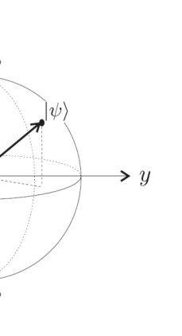
<figcaption class="paper-figure-caption"><b>Fig 1.</b> Figure 1: State of a single qubit represented on the Bloch sphere.</figcaption>
</figure>
<figure class="paper-figure-card">

<figcaption class="paper-figure-caption"><b>Fig 2.</b> Figure 3: State creation circuit.</figcaption>
</figure>
<figure class="paper-figure-card">

<figcaption class="paper-figure-caption"><b>Fig 3.</b> Figure 4: State decodification circuit.</figcaption>
</figure>

**Summary.** This paper introduces a novel geometric framework to represent N-qubit quantum states by extending the Bloch sphere concept into 2N-1 interconnected spheres. It rigorously proves that this model provides a unique, bijective parameterization for any pure multi-qubit state. This offers an intuitive visualization and computational structure for analyzing entanglement in complex quantum systems.

**Why it may be interesting.** This work provides a powerful geometric visualization tool for high-dimensional quantum states, which is crucial for understanding and designing complex multi-qubit quantum circuits and analyzing entanglement structure in theoretical models.

Detailed structure

**Main problem.** The primary challenge addressed is the lack of a widely accepted, intuitive geometric model to represent multi-qubit quantum states that incorporate entanglement, extending beyond the single-qubit Bloch sphere.

**Main result.** The authors propose and prove a novel framework showing that an arbitrary N-qubit pure state can be uniquely parameterized using exactly 2N-1 spheres, providing a strict bijection to the standard state vector representation.

**Method.** The methodology involves generalizing the geometric concept of the Bloch sphere by deriving parameterizations for two and three qubits based on controlled rotation gates. This leads to establishing a unique normal form for the state vector through sequential phase elimination and amplitude setting using unitary transformations.

**Model / system.** The system under study is an N-qubit quantum state, $|	ext{Q}
angle$, whose representation is mapped onto a geometric structure involving multiple interconnected spheres. The parameterization is derived by analyzing how controlled rotations affect the complex amplitudes of the basis states.

**Key observables.** The primary observables are the angular parameters defining the $2N-1$ spheres, which encode both individual qubit states and various levels of entanglement (bipartite, etc.).

**Important parameters / regimes.** The number of qubits ($N$), and specific angles ($	heta, \varphi$) associated with single-qubit rotations and controlled gates.

**Assumptions / limitations.** The derivation relies on the assumption that a unique normal form exists for the state vector, which is achieved by constructing a unitary transformation $U$ composed of sequential controlled rotations ($T=U_y U_z$).

**Figures summary.** Figure 1 illustrates the Bloch sphere for a single qubit. The notes also reference tables detailing parameters and phase evolution for two- and three-qubit systems during algorithmic transformations.

**Paper structure.** The paper progresses by first establishing the concept for single qubits, then deriving explicit parameterizations for two qubits using three spheres. It systematically extends this to N-qubits by developing algorithms (Algorithm 1 & 2) that use controlled rotations to transform any state into a canonical form, thereby proving the general $2N-1$ sphere model.

Abstract

The Bloch sphere is an elegant tool for representing single-qubit states. However, a widely accepted generalization for multi-qubit systems with entanglement remains absent. We propose a novel geometric model extending the Bloch sphere representation to arbitrary $N$-qubit systems using $2^N-1$ spheres. We demonstrate that any pure 2-qubit state is uniquely described by three spheres: two for individual qubits and a third encapsulating bipartite entanglement. Generalizing this, we establish an $N$-qubit parameterization through the hierarchical application of controlled rotation gates along the $Z$ and $Y$ axes. We formally prove a strict bijection between the standard state vector representation and our model's angular parameters. This framework provides an intuitive visualization of multiple entanglement, offering potential computational advantages for quantum simulators and new analytical perspectives on quantum gates.

[↑ back to top](#top)

### [Analytic properties of cross-click operators in passive multi-basis photodetection: monotonicity, exact convergence rates, and dimension reduction for quantum key distribution](http://arxiv.org/abs/2607.04186v1)

**Authors:** Zhangdong Ye  
**Type:** theory · **Category:** quantum information and computing · **PDF:** <https://arxiv.org/pdf/2607.04186v1>  
**Analysis basis:** full PDF text, analyzed in chunks
**Topic relevance:** `quantum measurements` **2/5** · `Keldysh / 2PI / non-Gaussian methods` **1/5** · `correlated / nonlocal dissipation` **1/5** · `driven-dissipative phase transition` **1/5** · `entanglement & information structure` **1/5** · `interference shaping light` **1/5** · `methods for driven-dissipative` **1/5**

↔ Scroll figures horizontally

<figure class="paper-figure-card">

<figcaption class="paper-figure-caption"><b>Fig 1.</b> FIG. 2. (a) Minimum eigenvalue f (n) of the cross-click operator of the balanced passive six-state analyzer on the n-photon sector, for several detector-efficiency configurations, computed exactly by the symmetric-power algorithm of Sec. V. All curves are monotone, as guaranteed by Theorem 1; for ideal detectors the curve is exactly f (n) = 1 −31−n (Corollary 1). (b) Convergence 1−f (n) for the strongly mismatched configuration ⃗η = (0.9, 0.75, 1.0, 0.6, 0.85, 0.7) on a logarithmic scale, together with the two-sided bounds of Theorem 2. The exact values are squeezed between maxb∥Ab∥n and P</figcaption>
</figure>
<figure class="paper-figure-card">

<figcaption class="paper-figure-caption"><b>Fig 2.</b> FIG. 3. Joint minimum eigenvalue f (nA,nB) for two different mismatched six-state analyzers, evaluated from the exact fac- torization of Theorem 3, 1−f (nA,nB) = (1−f (nA) A )(1−f (nB) B ). The surface reproduces the structure obtained by direct nu- merical diagonalization in Ref. [25], including the exact coin- cidence of the nB = 0 and nB = 1 slices.</figcaption>
</figure>

**Summary.** This paper analytically characterizes cross-click operators used in analyzing photodetection processes for quantum key distribution. By showing these operators are related to symmetric tensor powers, the authors derive exact formulas for spectral properties like monotonicity and convergence rates. This breakthrough replaces complex Fock-space numerics with general, closed-form bounds essential for rigorous QKD security proofs.

**Why it may be interesting.** It provides rigorous analytical tools to quantify security loopholes in QKD protocols caused by detector imperfections, moving beyond computationally intensive numerical simulations into closed-form physics.

Detailed structure

**Main problem.** To provide a sharp analytic characterization of the spectral behavior of cross-click operators in passive multi-basis photodetection for Quantum Key Distribution (QKD) security proofs.

**Main result.** The work establishes monotonicity, two-sided exponential bounds, and exact factorization formulas for these operators, replacing finite-sector numerical calculations with closed-form analytical results.

**Method.** The analysis leverages the structural property that silence operators are second quantizations of explicit single-photon contractions, allowing properties to be derived from tensor algebra and operator inequalities.

**Model / system.** The system models passive linear-optical analyzers using threshold single-photon detectors, applicable to polarization, time-bin, or spatial-mode qubits in QKD setups.

**Key observables.** The minimum eigenvalue of the cross-click operator on the n-photon subspace, $f^{(n)}$, and related quantities like $1 - f(n)$ for the no-cross-click operator.

**Important parameters / regimes.** Detector efficiencies ($\eta_d$), dark-count probabilities ($\epsilon_d$), and the photon number ($n$).

**Assumptions / limitations.** The results hold for arbitrary passive analyzers with specified parameters, assuming independent dark counts and uncorrelated efficiencies; afterpulsing breaks the product structure.

**Figures summary.** Figures illustrate a running example (six-state polarization analyzer) showing cross-click probability $f(n)$ versus photon number, tracking the closed-form convergence rate $\max_b \|A_b\|$, and visualizing joint operator factorization $f(n_A, n_B)$.

**Paper structure.** The paper develops its findings by first establishing the structural lemma for silence operators, then proving monotonicity (Theorem 1), deriving two-sided exponential bounds (Theorem 2) to find the exact convergence rate, and finally presenting special cases like ideal detectors and joint operator factorization.

Abstract

Cross-click operators, the POVM elements for simultaneous clicks in detectors assigned to different measurement bases, are used in QKD and entanglement-verification analyses with realistic threshold detectors to bound multiphoton contributions. Earlier applications verified the needed growth of the minimum eigenvalue $f^{(n)}$ on the $n$-photon subspace only numerically over finite sectors. This work gives an analytic characterization for passive linear-optical analyzers with arbitrary efficiency mismatch and dark counts. The key observation is that every silence operator is the second quantization $Γ(A)$ of an explicit single-photon contraction $A$, whose $n$-photon restriction is $A^{\otimes n}$ on $\mathrm{Sym}^n$. This yields: (i) monotonicity $f^{(n+1)}\ge f^{(n)}$; (ii) two-sided exponential bounds $\max_b γ_b|A_b|^n \le 1-f^{(n)} \le \sum_b γ_b|A_b|^n$, which determine the exact asymptotic convergence rate from single-photon spectral data; (iii) for ideal detectors and $n\ge1$, the exact formula $f^{(n)}=1-\sum_b p_b^n$; and (iv) an exact factorization $1-f^{(n_A,n_B)}=(1-f_A^{(n_A)})(1-f_B^{(n_B)})$ for the two-party cross-click operator. The results apply to polarization, time-bin, and spatial-mode analyzers within the stated threshold-detector model. As an application, we obtain closed-form photon-number weight bounds used in detection-efficiency-mismatch analyses, replacing finite-sector Fock-space numerics by formulas valid for all photon numbers.

[↑ back to top](#top)

### [Device-independent Quantum Key Distribution in the commuting operator framework](http://arxiv.org/abs/2607.03579v1)

**Authors:** Gereon Koßmann, René Schwonnek, Po-Chieh Liu, Hao-Chung Cheng  
**Type:** theory · **Category:** quantum information and computing · **PDF:** <https://arxiv.org/pdf/2607.03579v1>  
**Analysis basis:** full PDF text, analyzed in chunks
**Topic relevance:** `entanglement & information structure` **2/5** · `quantum measurements` **2/5** · `Keldysh / 2PI / non-Gaussian methods` **1/5** · `correlated / nonlocal dissipation` **1/5** · `driven-dissipative phase transition` **1/5** · `methods for driven-dissipative` **1/5**

↔ Scroll figures horizontally

<figure class="paper-figure-card">

<figcaption class="paper-figure-caption"><b>Fig 1.</b> Figure 1. The figure illustrates a device-independent quantum key distribution (DIQKD) experiment. In contrast to the quantum game depicted in Figure 2, the referee is replaced by local random number generators (RNGs), one on each side. While sharing a quantum state ρAB, Alice and Bob use their respective RNGs to draw private and local random inputs, feed them into their devices, and collect the resulting output statistics.</figcaption>
</figure>
<figure class="paper-figure-card">
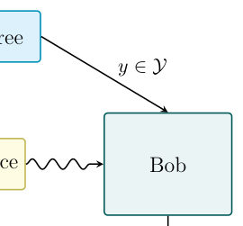
<figcaption class="paper-figure-caption"><b>Fig 2.</b> Figure 2. The figure illustrates a non-local quantum game. A source prepares a bipartite state ρAB and distributes it between Alice and Bob. Following a predetermined strategy, specified by the shared state together with their local measurements, Alice and Bob receive questions x ∈X and y ∈Y from a referee, feed them as inputs into their respective devices, and respond with the outcomes a ∈A and b ∈B produced by their local boxes.</figcaption>
</figure>

**Summary.** This paper establishes a highly general mathematical framework for analyzing Device-Independent Quantum Key Distribution (DIQKD) using commuting operators. It overcomes limitations in previous work by employing advanced tools from operator algebras to handle arbitrary environments. The result provides rigorous security bounds by casting the key rate calculation into a solvable Non-Commutative Polynomial Optimization problem.

**Why it may be interesting.** It pushes the boundaries of quantum information theory by providing security proofs that are robust against uncharacterized devices and complex environmental interactions, which is crucial for realizing practical quantum technologies.

Detailed structure

**Main problem.** To develop a maximally general mathematical framework for analyzing Device-Independent Quantum Key Distribution (DIQKD) security that avoids restrictive assumptions on the underlying Hilbert space structure.

**Main result.** The authors provide a representation-independent route to derive AEP-based security statements by utilizing the commuting operator framework, proving key results like the projectivity of measurements w.l.o.g.

**Method.** The work employs advanced tools from operator algebras (C*-algebras, von Neumann algebras) and casts the key rate computation as a Non-Commutative Polynomial Optimization (NPO) problem solvable via the NPA hierarchy.

**Model / system.** The system is DIQKD involving two parties (Alice and Bob). The mathematical model uses universal C*-algebras to represent local measurements, allowing for rigorous analysis of security even when Eve's side information requires general von Neumann algebras.

**Key observables.** Key rates, conditional von Neumann entropy, observed input-output statistics ($
ho_{AB}$)

**Important parameters / regimes.** The framework is designed to be general regarding the structure of the underlying Hilbert space and environment description (e.g., type-III algebra for Eve).

**Assumptions / limitations.** It addresses and overcomes limitations in existing proofs that rely on specific tensor product structures or assume measurements are always projective.

**Figures summary.** Figure 1 illustrates the general DIQKD experimental setup involving local Random Number Generators (RNGs) used by Alice and Bob to generate output statistics.

**Paper structure.** The paper builds from reviewing necessary algebraic concepts (C*-algebras, states, traces) before detailing the DIQKD formulation in Section 5. It introduces technical tools like generalized relative entropy formulas for von Neumann algebras and applies these to the NPO problem.

Abstract

Device-independent quantum key distribution (DIQKD) is arguably the gold standard for secure quantum communication, as it aims to rely only on observed input-output statistics of an uncharacterized device which is only assumption to obey the laws of quantum physics. A corresponding security analysis hence demands a description of a quantum experiment from a most general perspective. Under close inspection, existing proof techniques do not always meet this goal as they tend to rely on subtile assumptions on a tensor product structure of the underlying Hilbert space and a 'hidden but finite' dimensionality. In this work, we collect the tools needed for a full analysis of DIQKD in the commuting operator framework, which avoids these subtilities and provides the arguably most general view on a quantum experiment. We rigorously proof the common assumption that in DIQKD measurements can be w.l.o.g. assumed to be projective. Furthermore, we show that task of computing key rates can be casted as a non-commutative polynomial optimization (NPO) problem to which the Navascués-Pironio-Acín (NPA) hierarchy gives a correct and converging relaxation.   As a tool, we generalize the integral representation for the relative entropy by Frenkel [Quantum 7, 1102 (2023)] to general von Neumann algebras and apply techniques from Kossmann and Schwonnek [arXiv: 2411.04858] for the approximation in an NPO program.

[↑ back to top](#top)

### [Quasi-holonomy in non-adiabatic quantum evolution](http://arxiv.org/abs/2607.05218v1)

**Authors:** Erik Sjöqvist, Adam Fredriksson  
**Type:** theory · **Category:** other · **PDF:** <https://arxiv.org/pdf/2607.05218v1>  
**Analysis basis:** full PDF text, analyzed in chunks
**Topic relevance:** `non-equilibrium dynamics` **2/5** · `Keldysh / 2PI / non-Gaussian methods` **1/5** · `correlated / nonlocal dissipation` **1/5** · `driven-dissipative phase transition` **1/5** · `entanglement & information structure` **1/5** · `methods for driven-dissipative` **1/5** · `non-equilibrium universality` **1/5**

↔ Scroll figures horizontally

<figure class="paper-figure-card">
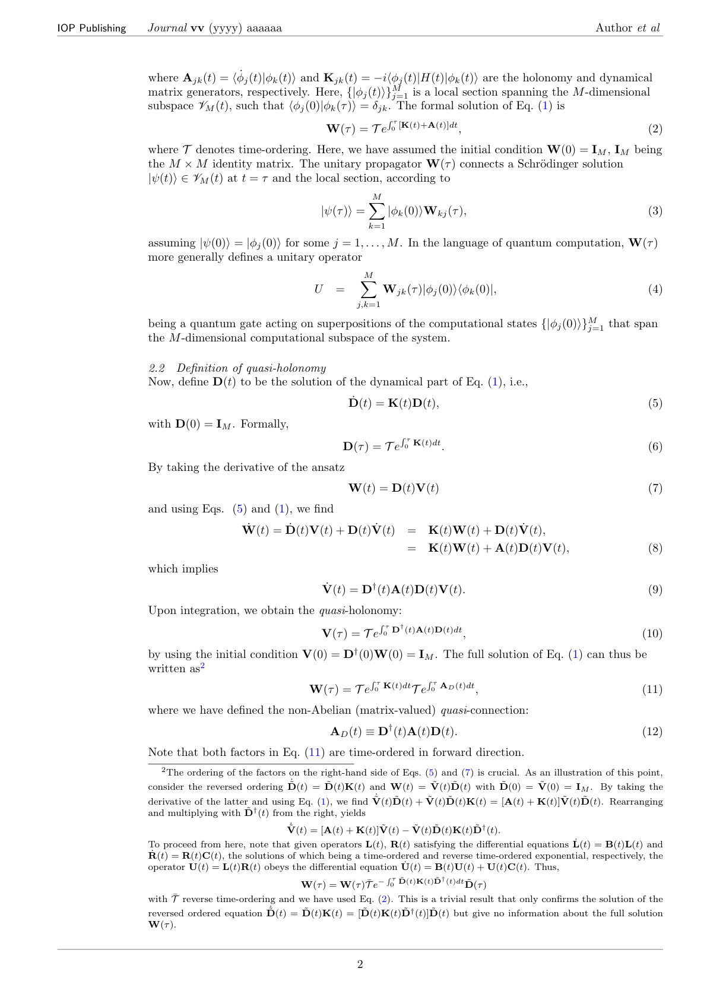
<figcaption class="paper-figure-caption"><b>Fig 1.</b> Low-resolution page preview, page 2</figcaption>
</figure>
<figure class="paper-figure-card">
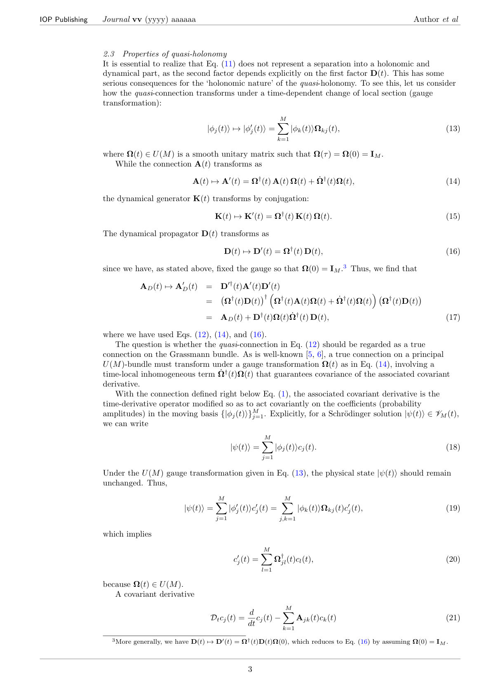
<figcaption class="paper-figure-caption"><b>Fig 2.</b> Low-resolution page preview, page 3</figcaption>
</figure>
<figure class="paper-figure-card">

<figcaption class="paper-figure-caption"><b>Fig 3.</b> Low-resolution page preview, page 4</figcaption>
</figure>
<figure class="paper-figure-card">
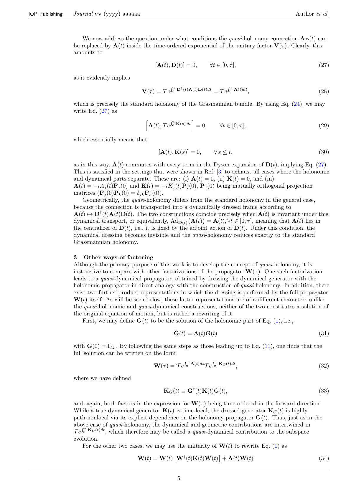
<figcaption class="paper-figure-caption"><b>Fig 4.</b> Low-resolution page preview, page 5</figcaption>
</figure>
<figure class="paper-figure-card">

<figcaption class="paper-figure-caption"><b>Fig 5.</b> Low-resolution page preview, page 6</figcaption>
</figure>

**Summary.** This paper develops a framework to analyze how quantum subspaces evolve over time by factoring the Schrödinger equation into dynamical and geometric parts. The authors demonstrate that this separation fails because the resulting 'quasi-connection' retains a history-dependent term, proving that geometry and dynamics are fundamentally intertwined in this setting. This offers a deep gauge-theoretic understanding of non-adiabatic subspace evolution.

**Why it may be interesting.** This work provides a rigorous geometric/gauge-theoretic perspective on open quantum systems dynamics, directly addressing the fundamental question of separability in time evolution that is crucial for understanding decoherence or adiabatic approximations.

Detailed structure

**Main problem.** The central problem is investigating whether the quantum time evolution of subspaces can be cleanly separated into purely geometric (holonomic) and dynamical components.

**Main result.** The authors show that this separation fails in general because the effective quasi-connection depends explicitly on the history of the dynamical propagator, indicating an inherent intertwining of geometric and dynamic effects.

**Method.** They develop a framework by factoring the Schrödinger evolution into dynamical and connection-induced parts using a moving basis along paths in the complex Grassmannian.

**Model / system.** The model concerns the time evolution of $M$-dimensional subspaces within an $N$-dimensional Hilbert space, mathematically described as paths on the complex Grassmannian $	ext{Gr}(N; M)$ governed by a matrix differential equation.

**Key observables.** The quasi-connection $	ext{AD}(t)$, which is used to diagnose the failure of separation from standard connection forms.

**Important parameters / regimes.** Cyclic evolution (loops) and the time dependence of the Hamiltonian/generators $K(t)$ and $A(t)$.

**Assumptions / limitations.** The analysis relies on factoring the propagator using a moving basis, but the core limitation is the history-dependence of the resulting quasi-connection.

**Figures summary.** Not specified by the notes.

**Paper structure.** The paper introduces the problem via the Schrödinger equation factorization, derives the quasi-holonomy generator $	ext{AD}(t)$, proves it fails to be a true connection due to history dependence, and discusses conditions under which separation might occur (e.g., commutativity).

Abstract

We develop a framework for quasi-holonomy in non-adiabatic quantum time evolution of subspaces along loops in a complex Grassmannian. By factoring the Schrödinger evolution into dynamical and connection-induced contributions in a moving basis, we obtain an effective geometric generator that depends explicitly on the dynamical propagator. This quasi-connection does not define a genuine connection on the original Grassmann bundle, since its gauge transformation law acquires a history-dependent, nonlocal term. Other ways of factoring the Schrödinger evolution are briefly discussed. All these approaches suffer from the same type of history-dependence, thereby defining transport of subspaces in which geometric and dynamical effects are generally intertwined, just as in the case of the quasi-holonomy. Our work sheds light on the issue of separating quantum evolution of subspaces into holonomic and dynamical parts from an essentially gauge-theoretic perspective.

[↑ back to top](#top)

### [Supercritical fluid of quantum electrons in three-dimensional superconducting fullerides](http://arxiv.org/abs/2607.04693v1)

**Authors:** Xinying Li, Yuki Matsuda, Chongli Yang, Huaxue Zhou, Takuma Ogasawara, Qin Wang, Liguo Zhang, Hidekazu Shimotani, Hailiang Xia, Khuong K. Huynh, Panagiotis Kotetes, Satoshi Heguri, Katsumi Tanigaki  
**Type:** both · **Category:** strongly correlated electrons · **PDF:** <https://arxiv.org/pdf/2607.04693v1>  
**Analysis basis:** full PDF text, analyzed in chunks
**Topic relevance:** `driven-dissipative phase transition` **2/5** · `non-equilibrium universality` **2/5** · `Keldysh / 2PI / non-Gaussian methods` **1/5** · `Kondo & dissipative impurity` **1/5** · `analog quantum simulation` **1/5** · `non-equilibrium dynamics` **1/5**

↔ Scroll figures horizontally

<figure class="paper-figure-card">

<figcaption class="paper-figure-caption"><b>Fig 1.</b> Fig. 1 Phase transition without symmetry breaking and supercritical fluid phase (SCF).| (a) Phase transition between G and L phases in elemental atoms and molecules in a container without symmetry breaking and a supercritical fluid (SCF) phase emergent above the critical temperature (a red point). (b) Quantum electrons, in a crystal cell. In Mott materials ((c) Cr-V2O3 and (d) κ-(BEDT- TTF)2Cu[N(CN)2]Cl), a similar phase diagram exhibiting an SCF phase is reported. The SCF phase originates from the Mott endpoint (MEP, red-colored point). (e) CsxRb3-xC60 fullerides, Mott uncon- ventional superconductors, exhibit an MIT (blue line), but neither MEP nor SCF was reported. Supercritical fluid...</figcaption>
</figure>
<figure class="paper-figure-card">
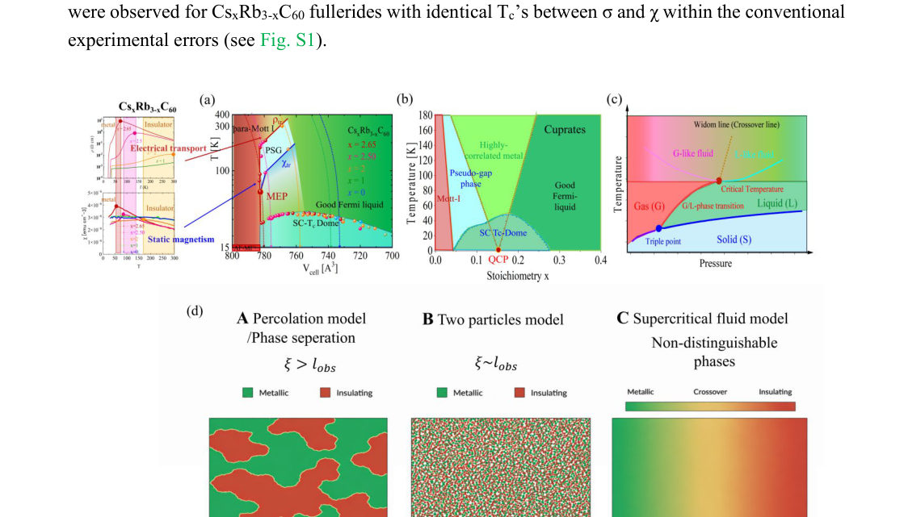
<figcaption class="paper-figure-caption"><b>Fig 2.</b> Fig. 2 T-V(T, P) phase diagram of CsxRb3-xC60 fullerides displaying an M-I coexisting SCF phase inferred from electrical resistivities and static magnetic susceptibilities.| (a) The onset temperatures of the MIT observed in ρ under ambient and high pressure of CsxRb3-xC60 fullerides give a different MIT line (red) from the one (blue) drawn based on χ. The two lines originate from the single common point, i.e., the so-called Mott endpoint (MEP). The same SC Tc-dome is observed, within experimental accuracy, in both ρ and χ. (b) Phase diagram of carrier-tuned high-Tc cuprates generally reported in the literature15, where a PSG phase observed at finite T is frequently discussed in connection...</figcaption>
</figure>
<figure class="paper-figure-card">
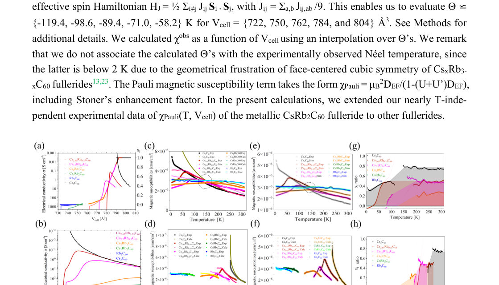
<figcaption class="paper-figure-caption"><b>Fig 3.</b> Fig. 3 The experimental σ(T, V) and χ(T, V) values for various stoichiometric CsxRb3-xC60 full- erides under ambient pressure.| Three Cs2.65Rb0.35C60 (red), Cs2.5Rb0.5C60 (pink), and Cs2Rb1C60 (or- ange) exhibit the clear MIT’s. (a,b) The σ values of various stoichiometric CsxRb3-xC60 fullerides under ambient P as a function of Vcell and T. The values χ and σ of Cs3C60 were taken from the literatures13,24, respectively. (c-f) The comparison of χ between experimental (pale wide lines) and calculated (dark narrow lines) data. The analyses were performed as x = xIχCW + xMχPauli with xI + xM = 1, where xI and xM are the ratios of I and M, and χCW and χPauli are the localized Curie-Weiss and...</figcaption>
</figure>
<figure class="paper-figure-card">

<figcaption class="paper-figure-caption"><b>Fig 4.</b> Fig. 4 Scaling based on electrical transports, Clapeyron Clausius Law, and T-V(T, P) phase diagram with comparison to DMFT theoretical calculations.| (a) Scaling of ρ(V-V0,T)/ρ0(T,0) = F[T/(C(V-V0))zν] based on electrical transport data in Cs2.65Rb0.35C60 under various pressure (SI.4 and SI.9). (b) The slope of the MIT (∂T/∂P) exhibits a good agreement between electrical transport (our work) and NMR relaxation times28 at temperatures under the dynamic Jahn-Teller effect as described in the text. The MIT slope can be assessed from the volume (∆Vcell) and the entropy change (∆S) at</figcaption>
</figure>

**Summary.** This work reports the first experimental evidence for a thermodynamically equilibrated Supercritical Fluid (SCF) phase at the Mott transition in superconducting fullerides. By simultaneously analyzing electrical conductivity and magnetic susceptibility, the authors establish two distinct but converging MIT lines meeting at a Mott endpoint. This dual-probe approach provides a unified picture of the correlated electron physics underlying high-$T_c$ superconductivity.

**Why it may be interesting.** The rigorous combination of transport ($\sigma$) and magnetic ($\chi$) probes to characterize a single quantum critical point provides a powerful methodology for studying strongly correlated electron physics that transcends limitations of single-observable analyses.

Detailed structure

**Main problem.** The study investigates the elusive supercritical fluid (SCF) phase of quantum electrons at the Mott metal-insulator transition (MIT) in strongly correlated systems without symmetry breaking.

**Main result.** The authors report the first experimental identification of a thermodynamically equilibrated SCF phase and its associated Mott endpoint using superconducting fullerides, unifying insights from both electrical conductivity and magnetic susceptibility measurements.

**Method.** A dual-probe approach combining independent measurements of electrical conductivity ($\sigma$) and magnetic susceptibility ($\chi$), along with hypothesis-free two-particle analysis (Widom line) and scaling analysis, was employed.

**Model / system.** The physical system is the three-dimensional superconducting fulleride $	ext{Cs}_x	ext{Rb}_{3-x}	ext{C}_{60}$. Theoretical modeling involves effective spin Hamiltonians and analyzing electronic state degeneracies related to $t_{1u}$-orbitals.

**Key observables.** Electrical conductivity ($\sigma$), magnetic susceptibility ($\chi$), critical exponents ($z
u$), Mott endpoint (MEP), and the superconducting $	ext{T}_c$-dome structure.

**Important parameters / regimes.** Stoichiometry ($x$ in $	ext{Cs}_x	ext{Rb}_{3-x}	ext{C}_{60}$), temperature ($T$), pressure ($P$), and unit cell volume ($V_{	ext{cell}}$).

**Assumptions / limitations.** The analysis assumes the existence of a thermodynamically equilibrated SCF phase, which is characterized by maximizing two-phase mixing entropy in magnetic susceptibility measurements.

**Figures summary.** Figures illustrate the convergence of distinct MIT lines from $\sigma$ and $\chi$ at an MEP, mapping out the SCF zone on T-V diagrams, and comparing theoretical models to experimental data across various stoichiometries.

**Paper structure.** The paper progresses by first establishing the physical problem (SCF at Mott transition), then presenting the dual-probe methodology using fullerides, analyzing both $\sigma$ and $\chi$ measurements independently, and finally synthesizing these results into a unified microscopic picture of the M-I coexisting SCF phase.

Abstract

The supercritical fluid (SCF) of quantum electrons at the Mott metal-insulator transition without symmetry breaking is one of the most elusive phenomena in strongly correlated electron physics. Prior studies of Cr-doped V2O3 and organic Mott systems reported discrepant critical exponents. A key limitation is that the scaling analysis relies on a single experimental observable, leaving the roles of phase coexistence, inhomogeneity, and percolation unaddressed. Here we report the first experimental identification of a thermodynamically equilibrated SCF phase and its associated Mott endpoint in the three-dimensional superconducting fullerides CsxRb3-xC60, using two independent probes of electrical conductivity and magnetic susceptibility, which reveal two distinct metal-insulator transition lines converging at a single Mott endpoint. A hypothesis-free two-particle analysis of magnetic susceptibilities yields a metal-insulator coexisting SCF by exhibiting the maximum two-phase mixing entropy, in agreement with a picture of a thermodynamically equilibrated Widom line. Simultaneously, conductivity scaling yields a critical exponent in the regime of quantum critical predictions. Our new dual-probe approach provides a unified microscopic picture of the Mott SCF with a characteristic length scale below current diffraction resolution, in addition to a new interpretation on the origin of superconducting Tc-dome.

[↑ back to top](#top)

### [Fragile single-cone Dirac quantum walks in two dimensions](http://arxiv.org/abs/2607.05112v1)

**Authors:** C. W. J. Beenakker, J. Sánchez Férnan, J. Tworzydło  
**Type:** theory · **Category:** other · **PDF:** <https://arxiv.org/pdf/2607.05112v1>  
**Analysis basis:** full PDF text, analyzed in chunks
**Topic relevance:** `analog quantum simulation` **2/5** · `non-equilibrium dynamics` **2/5** · `Keldysh / 2PI / non-Gaussian methods` **1/5** · `driven-dissipative phase transition` **1/5** · `methods for driven-dissipative` **1/5**

↔ Scroll figures horizontally

<figure class="paper-figure-card">

<figcaption class="paper-figure-caption"><b>Fig 1.</b> FIG. 1. Momentum dependence of the quasi-energy (1.1) of the local 2D quantum walk considered in Sec. II B (squared quantum walk, Floquet operator U√</figcaption>
</figure>
<figure class="paper-figure-card">
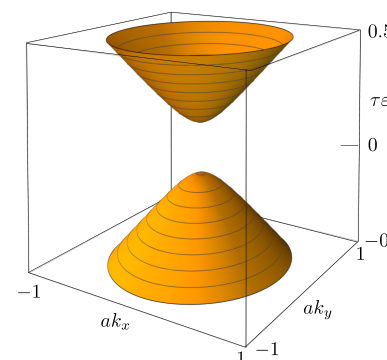
<figcaption class="paper-figure-caption"><b>Fig 2.</b> FIG. 2. Gapped cone of the Ho-Chalker quantum walk in the presence of the staggered potential V (r) = (2τ)−1 cos(πx/a).</figcaption>
</figure>
<figure class="paper-figure-card">
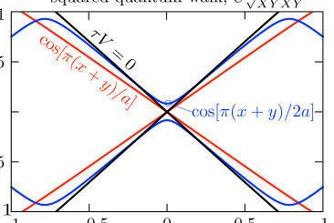
<figcaption class="paper-figure-caption"><b>Fig 3.</b> FIG. 3. Cut along the line kx = ky through the band struc- ture of the squared quantum walk, in the presence of a scalar potential V (r) = V cos(Q · r/a): the black curve is with- out any potential (V = 0), the red and blue curves are for τV = 1 and, respectively, Q = (π, π) and (π/2, π/2). The latter choice gaps the ε = 0 Dirac cone.</figcaption>
</figure>
<figure class="paper-figure-card">

<figcaption class="paper-figure-caption"><b>Fig 4.</b> FIG. 4. Cut along the line kx = ky through the band struc- ture of the Ho-Chalker quantum walk, in the presence of an in-plane magnetization M(r) = (M, M, 0) cos(Q · r/a): the black curve is without any magnetization (M = 0), the red and blue curves are for τM = 1 and, respectively, Q = (π, π) and (π, 0). The latter choice gaps the ε = 0 Dirac cone.</figcaption>
</figure>

**Summary.** This paper demonstrates that while 1D quantum walks can mimic gapless Dirac physics with preserved symmetries, their 2D counterparts are fundamentally unstable. The authors prove that generic potential scattering terms break the necessary protecting symmetries, leading to the opening of a gap at zero energy for the Dirac cone.

**Why it may be interesting.** This work provides a rigorous lattice model framework for understanding how topological protection, robust in continuum models, breaks down when discretized into higher dimensions due to the constraints of locality and symmetry on the underlying quantum walk operator.

Detailed structure

**Main problem.** The study investigates whether a two-dimensional (2D) Dirac quantum walk, analogous to continuum physics models like graphene, retains topological protection against gapping induced by potential scattering or disorder.

**Main result.** Unlike the 1D case, the 2D Dirac quantum walk is fundamentally fragile; its unpaired $\epsilon=0$ cone can be gapped by generic spatial inhomogeneities or potentials due to symmetry constraints imposed by locality.

**Method.** The authors analyze the system using Floquet theory and examine the symmetries (chiral and time-reversal) of the lattice Hamiltonian. They employ mathematical tools involving Laurent polynomials to constrain the existence of gapless points.

**Model / system.** The model is a local two-band quantum walk implemented on a $(2+1)$-dimensional space-time lattice, whose continuum limit approximates the massless Dirac equation. Specific realizations include Palindromic, Squared, and Ho-Chalker quantum walks.

**Key observables.** Quasi-energies ($\epsilon_n$), gap size ($\Delta$) at $\epsilon=0$, and the preservation/breaking of chiral and time-reversal symmetries.

**Important parameters / regimes.** The strength and periodicity ($\mathbf{Q}$) of applied potentials ($V$ or $M$), which act as disorder terms.

**Assumptions / limitations.** The analysis primarily focuses on local, two-band spin-1/2 implementations and assumes the potential scattering is short-range correlated.

**Figures summary.** Figures illustrate the momentum dependence of quasi-energies showing gap opening for various potentials (e.g., staggered potentials), confirming the gapping effect on the Dirac cone.

**Paper structure.** The paper contrasts the robust 1D case with the fragile 2D case, demonstrating symmetry breakdown under disorder. It systematically tests different quantum walk constructions (Palindromic, Ho-Chalker) against specific potential scattering terms to prove gap opening.

Abstract

It is known that a one-dimensional (1D) quantum walk gives a local space-time discretization of the massless Dirac equation with a single quasi-energy cone (no fermion doubling at low energies), keeping the fundamental symmetries (chiral and time-reversal) of the continuum theory. We show that the analogous 2D construction is fundamentally more fragile. Local two-band quantum walks can have an unpaired Dirac cone, but the protecting symmetries then cease to be ordinary on-site symmetries: they become non-symmorphic, involving half-lattice translations, and are broken by generic spatial inhomogeneities. In particular, we demonstrate that the 2D Dirac quantum walk based on the Ho-Chalker network model can be gapped by potential scattering.

[↑ back to top](#top)

### [Trace-to-Hilbert-Schmidt Speed Ratio in Quantum Dynamics: Universal Bounds and Effective Rank](http://arxiv.org/abs/2607.04488v1)

**Authors:** Hossein Rangani Jahromi  
**Type:** theory · **Category:** other · **PDF:** <https://arxiv.org/pdf/2607.04488v1>  
**Analysis basis:** full PDF text, analyzed in chunks
**Topic relevance:** `entanglement & information structure` **2/5** · `correlated / nonlocal dissipation` **1/5** · `driven-dissipative phase transition` **1/5** · `methods for driven-dissipative` **1/5** · `non-equilibrium dynamics` **1/5** · `non-equilibrium universality` **1/5**

↔ Scroll figures horizontally

<figure class="paper-figure-card">
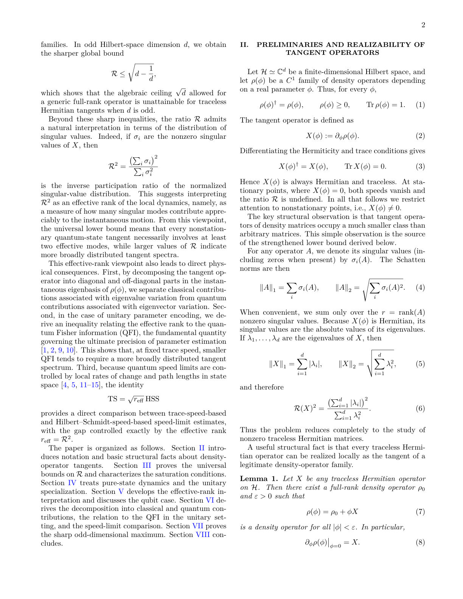
<figcaption class="paper-figure-caption"><b>Fig 1.</b> Low-resolution page preview, page 2</figcaption>
</figure>
<figure class="paper-figure-card">

<figcaption class="paper-figure-caption"><b>Fig 2.</b> Low-resolution page preview, page 3</figcaption>
</figure>
<figure class="paper-figure-card">

<figcaption class="paper-figure-caption"><b>Fig 3.</b> Low-resolution page preview, page 4</figcaption>
</figure>
<figure class="paper-figure-card">

<figcaption class="paper-figure-caption"><b>Fig 4.</b> Low-resolution page preview, page 5</figcaption>
</figure>
<figure class="paper-figure-card">
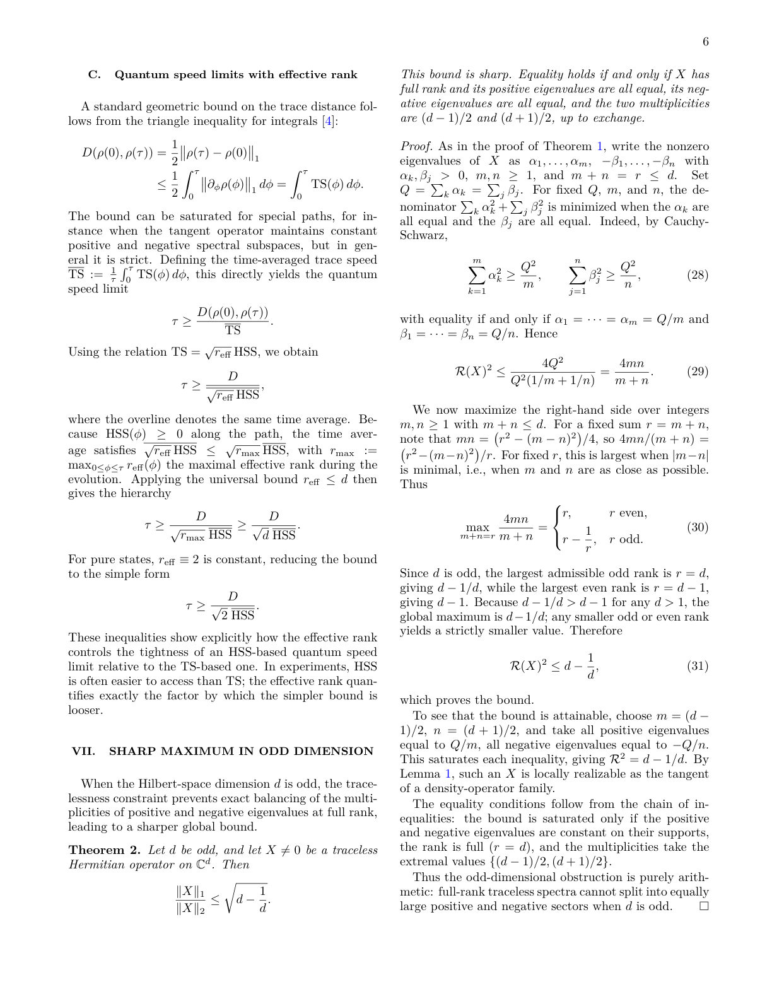
<figcaption class="paper-figure-caption"><b>Fig 5.</b> Low-resolution page preview, page 6</figcaption>
</figure>

**Summary.** This theoretical paper analyzes the Trace-to-Hilbert-Schmidt Speed Ratio ($\mathcal R$) for evolving quantum states. It derives sharp universal bounds on $\mathcal R$ based on the operator's rank, establishing that this ratio serves as an effective-rank diagnostic for local quantum dynamics. The results provide new constraints on quantum speed limits by linking them to spectral properties like the effective rank and QFI.

**Why it may be interesting.** This work provides fundamental mathematical constraints on the rate of change of quantum states, linking geometric measures (norms) directly to spectral properties (effective rank), which is crucial for understanding measurement precision and dynamical limitations in open quantum systems.

Detailed structure

**Main problem.** The paper investigates the Trace-to-Hilbert-Schmidt Speed Ratio, $\mathcal R$, for differentiable quantum states to establish universal bounds on local quantum dynamics.

**Main result.** Sharp bounds are established: $\sqrt{2} \le \mathcal R \le \sqrt{r}$ for a tangent operator of rank $r$, with a global maximum bound derived for odd-dimensional Hilbert spaces. The ratio is identified as an effective-rank diagnostic.

**Method.** The analysis relies on bounding the ratio of two norms ($\|\cdot\|_1 / \|\cdot\|_2$) applied to the Hermitian, traceless tangent operator $X = \partial_\phi
ho$, utilizing spectral properties and elementary inequalities.

**Model / system.** The study concerns a differentiable family of finite-dimensional quantum states $
ho(\phi)$ evolving in time or parameter $\phi$. The dynamics are characterized by the tangent operator $X = \partial_\phi
ho$, which is constrained to be Hermitian and traceless.

**Key observables.** Trace Speed ($\|\cdot\|_1$), Hilbert-Schmidt Speed ($\|\cdot\|_2$), Trace-to-Hilbert-Schmidt Speed Ratio ($\mathcal R$), Effective Rank ($r_{	ext{eff}}$), Quantum Fisher Information (QFI).

**Important parameters / regimes.** The dimension of the Hilbert space ($d$) and the rank ($r$) of the tangent operator are key parameters determining the bounds.

**Assumptions / limitations.** The analysis is restricted to nonstationary points where the tangent operator $X$ is non-zero, and it heavily leverages the Hermitian and traceless nature of $X$.

**Paper structure.** The paper proceeds by defining $\mathcal R$, deriving bounds based on the rank $r$ (establishing $\sqrt{2} \le \mathcal R \le \sqrt{r}$), proving a sharper global bound for odd dimensions, and finally interpreting $\mathcal R^2$ as an effective-rank diagnostic linked to QFI and quantum speed limits.

Abstract

We study the ratio between the trace speed and the Hilbert-Schmidt speed for differentiable finite-dimensional quantum states, $\mathcal R(φ)=\|\partial_φρ(φ)\|_1/\|\partial_φρ(φ)\|_2$. Because $\partial_φρ(φ)$ is always Hermitian and traceless, this ratio is constrained more strongly than for a generic operator. For any nonzero tangent operator $X=\partial_φρ$ of rank $r$, we prove the sharp bounds $\sqrt{2}\le \|X\|_1/\|X\|_2\le \sqrt r$. The lower bound is attained exactly for rank-two tangents, while the upper bound is attained exactly when all nonzero singular values are equal, which in the traceless Hermitian setting requires even rank. At every nonstationary point of a pure-state family, the tangent has rank two, implying $\mathcal R=\sqrt2$. For odd Hilbert-space dimension $d$, we further prove the sharp global maximum $\mathcal R\le \sqrt{d-1/d}$, with equality characterized by full-rank spectra whose positive and negative eigenvalues are separately degenerate and have multiplicities differing by one. We identify $\mathcal R^2$ as the inverse participation ratio of the singular-value distribution of the tangent operator, giving $\mathcal R$ a natural interpretation as an effective-rank diagnostic for local quantum dynamics. Furthermore, we decompose the effective rank into classical (eigenvalue) and quantum (eigenvector) contributions and prove the bound $r_{\mathrm{eff}}\le r_C + r_Q$, with equality guaranteed when either component vanishes. We establish a direct inequality linking the effective rank to the quantum Fisher information (QFI), which forces a large number of active singular modes when the QFI is small relative to the squared trace speed. Finally, we derive a hierarchy of quantum speed limits in which the effective rank controls the tightness of bounds expressed through the Hilbert-Schmidt speed.

[↑ back to top](#top)

### [High-precision ab initio calculations of nuclear binding energies: Tin isotopes from dripline to dripline](http://arxiv.org/abs/2607.05086v1)

**Authors:** Urban Vernik, Pepijn Demol, Thomas Duguet, Alexander Tichai  
**Type:** theory · **Category:** other · **PDF:** <https://arxiv.org/pdf/2607.05086v1>  
**Analysis basis:** full PDF text, analyzed in chunks
**Topic relevance:** `Keldysh / 2PI / non-Gaussian methods` **2/5** · `analog quantum simulation` **1/5** · `entanglement & information structure` **1/5** · `methods for driven-dissipative` **1/5** · `non-equilibrium dynamics` **1/5**

↔ Scroll figures horizontally

<figure class="paper-figure-card">

<figcaption class="paper-figure-caption"><b>Fig 1.</b> Figure 1. Ground-state energies of even-even tin isotopes with A = 100 −180 using BCCSD and BCCSD[T] calculations based on the 1.8/2.0 (EM) (left) and ∆-N2LOGO (right) χEFT Hamiltonians. Results from VS-IMSRG calculations are taken from Ref. [12]. See the main text for the discussion of many-body uncertainties.</figcaption>
</figure>
<figure class="paper-figure-card">

<figcaption class="paper-figure-caption"><b>Fig 2.</b> Figure 2. Two-neutron separation energies around the N = 50 shell closure (100Sn). BCCSD[T] calculations are shown for 1.8/2.0 (EM) (blue) and ∆-N2LOGO (orange). NLEFT calculations are taken from Ref. [28].</figcaption>
</figure>
<figure class="paper-figure-card">

<figcaption class="paper-figure-caption"><b>Fig 3.</b> Figure 3. Two-neutron separation energies calculated in BCCSD[T] beyond the N = 82 shell closure (132Sn). Cal- culations details are similar to Fig. 2.</figcaption>
</figure>

**Summary.** This work applies high-precision ab initio calculations using Bogoliubov Coupled-Cluster theory to determine the binding energies of tin isotopes near the neutron drip line. By incorporating triples correlations, the authors significantly improve theoretical accuracy and map out how nuclear structure predictions conflict with existing Energy Density Functional models regarding exotic nuclei.

**Why it may be interesting.** While focused on nuclear physics, the use of advanced many-body quantum field theory techniques (like coupled-cluster expansions) to solve complex Hamiltonians shares conceptual overlap with methods used in strongly correlated electron systems or open quantum system dynamics.

Detailed structure

**Main problem.** To perform high-precision ab initio calculations of nuclear binding energies for tin isotopes across the neutron drip line.

**Main result.** The predicted location of the neutron drip line is highly sensitive to the employed nuclear interactions and shows tension with recent Energy Density Functional predictions. The inclusion of triples corrections significantly improves accuracy by reducing uncertainty from tens of MeV to below 3 MeV in key isotopes.

**Method.** Bogoliubov Coupled-Cluster (BCC) theory, specifically utilizing the BCCSD[T] approximation to account for leading three-body correlations beyond standard CCSD calculations.

**Model / system.** The study focuses on even-even Tin (Sn) isotopes ($Z=50$) ranging from $N=50$ up to $N=126$. Calculations are based on realistic chiral Effective Field Theory ($\chi$EFT) two- and three-nucleon interactions.

**Key observables.** Binding energies ($E_0$), two-neutron separation energies ($S_{2n}$), and the predicted location of the neutron drip line.

**Important parameters / regimes.** The calculations use a spherical harmonic oscillator basis ($\hbar\omega = 12$ MeV) and are sensitive to the specific $\chi$EFT Hamiltonian employed (e.g., $1.8/2.0 (	ext{EM})$ vs. $\Delta-	ext{N}2	ext{LOGO}$).

**Assumptions / limitations.** The primary approximations involve truncating the cluster expansion at BCCSD[T] and using a specific basis set, leading to residual uncertainties from missing higher-body correlations ($T_{k\ge 4}$) and basis incompleteness.

**Figures summary.** Figure 1 compares ground-state energies calculated with BCCSD vs. BCCSD[T] against experimental values for Sn isotopes; Figure 2 and 3 show $S_{2n}$ around the $N=50$ shell closure and beyond $N=82$, respectively.

**Paper structure.** The paper details the theoretical framework of BCC theory, progresses from BCCSD to the improved BCCSD[T] approximation by solving for triples correlations non-iteratively, applies this method to calculate binding energies across the Sn isotopic chain, and discusses the implications for nuclear structure models like EDFs.

Abstract

The location of the neutron drip line in tin isotopes has important consequences for our fundamental understanding of nuclear structure and nuclear forces as well as for astrophysical nucleosynthesis. Performing high-precision ab initio calculations of even-even tin isotopes from $N=50$ to $N=126$ based on chiral two- and three-nucleon interactions, the predicted drip-line location is found to be highly sensitive to the employed nuclear interactions and to exhibit tension with recent energy-density-functional predictions. On the neutron-deficient side, results are consistent with extrapolated two-neutron separation energies constrained by recent Penning-trap mass measurements.

[↑ back to top](#top)

### [Stellar Braid Monodromy of Finite-Rank Non-Gaussian Photonic States](http://arxiv.org/abs/2607.04007v1)

**Authors:** Arnaud Coatanhay, Angelique Dremeau  
**Type:** theory · **Category:** other · **PDF:** <https://arxiv.org/pdf/2607.04007v1>  
**Analysis basis:** full PDF text, analyzed in chunks
**Topic relevance:** `entanglement & information structure` **2/5** · `Keldysh / 2PI / non-Gaussian methods` **1/5** · `analog quantum simulation` **1/5** · `correlated / nonlocal dissipation` **1/5** · `driven-dissipative phase transition` **1/5**

↔ Scroll figures horizontally

<figure class="paper-figure-card">
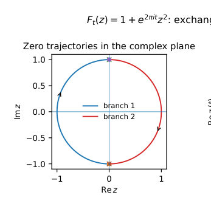
<figcaption class="paper-figure-caption"><b>Fig 1.</b> Figure 1: Two-strand stellar braid generated by the binomial family (93). The left panel follows the two stellar zeros in the complex plane as the phase of the finite-Fock state is wound once; the right panel shows a braid projection using the real parts of the transported zeros. The figure illustrates the basic mechanism of the paper: a loop of non-Gaussian states of fixed stellar degree can exchange its stellar zeros and thereby define an element of B2.</figcaption>
</figure>
<figure class="paper-figure-card">
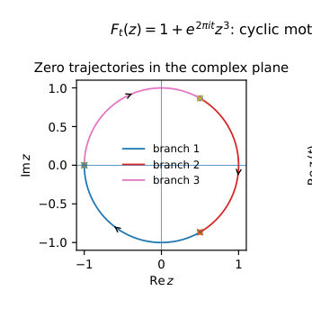
<figcaption class="paper-figure-caption"><b>Fig 2.</b> Figure 2: Cyclic three-strand stellar braid for the cubic binomial loop (97). The zeros form an equilateral configuration and return to the same unordered divisor after a cyclic relabeling. This is the simplest visual example in which the cubic finite-Fock family realizes a nontrivial braid in B3.</figcaption>
</figure>
<figure class="paper-figure-card">

<figcaption class="paper-figure-caption"><b>Fig 3.</b> Figure 3: Quadratic discriminant loop and local half-twist. For FA(z) = 1 + Az + z2, the fixed-B slice has discriminant points A = ±2. A small loop around A = 2 produces a collision-avoiding exchange of the two stellar zeros near the double root. This is the local model behind the statement that a smooth point of the stellar discriminant produces an elementary half-twist.</figcaption>
</figure>
<figure class="paper-figure-card">
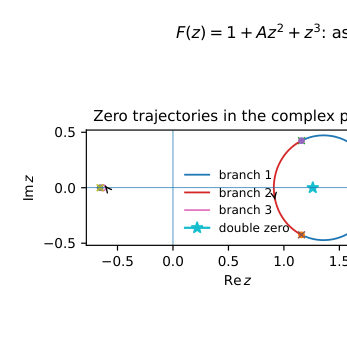
<figcaption class="paper-figure-caption"><b>Fig 4.</b> Figure 4: Asymmetric cubic half-twist for the trinomial slice FA(z) = 1+Az2 +z3. The loop in the A-plane surrounds one point of the discriminant A3 = −27/4. Along this loop two stellar zeros perform a local exchange while the third remains separated. The example shows that sparse finite-Fock slices realize local braid generators without relying on the high symmetry of the cubic binomial family.</figcaption>
</figure>

**Summary.** The paper introduces stellar braid monodromy as a powerful topological invariant for characterizing non-Gaussian bosonic photonic states. It shows that the space of these regular states has a fundamental group isomorphic to the Artin braid group. This invariant captures how the state's defining zeros move along a preparation path, offering a comprehensive tool complementary to existing quantum diagnostics.

**Why it may be interesting.** This work provides a deep geometric and topological tool (braid theory) to classify quantum states beyond simple measures like entanglement or negativity. For AMO/Quantum Optics, understanding how state properties change topologically under parameter variation is crucial for designing robust quantum protocols.

Detailed structure

**Main problem.** To develop a topological invariant, called stellar braid monodromy, that characterizes regular parameterized families of non-Gaussian bosonic states.

**Main result.** The regular stratum of the finite-rank state space is biholomorphic to the unordered configuration space $	ext{Conf}_r(\mathbb{C})/\mathfrak{S}_r$, meaning its fundamental group is the Artin braid group $B_r$. The resulting monodromy provides a robust, path-dependent invariant complementing scalar measures of non-Gaussianity.

**Method.** The authors map the state space onto the configuration space of the stellar zeros by analyzing the motion of these zeros under continuous deformations (parameter loops). This movement is captured by calculating the braid monodromy homomorphism into the Artin braid group.

**Model / system.** The system involves single-mode bosonic Fock states, whose non-Gaussian structure is encoded by a finite stellar divisor in the Bargmann representation. The analysis is restricted to the regular stratum of these finite-rank states within the truncated Fock subspace $\mathcal{H}_r$.

**Key observables.** Braid monodromy (the full braid invariant), Stellar Rank, Wigner negativity, and the coefficients $(b_0, \dots, b_{r-1})$ defining the state in the finite-Fock chart.

**Important parameters / regimes.** The rank $r$ of the non-Gaussian state; the parameters defining the preparation loop or parameterized family.

**Assumptions / limitations.** The analysis is strictly limited to the 'regular' stratum where stellar zeros do not collide and no zero vanishes at infinity. The method does not directly address mixed states or multimode dynamics.

**Paper structure.** The paper establishes the mathematical framework by relating the state space to configuration spaces, deriving that the fundamental group is $B_r$. It then extends this concept to define the braid monodromy invariant for parameterized families of states, comparing it to existing diagnostics.

Abstract

Finite-rank non-Gaussian bosonic states admit a holomorphic description in the Bargmann representation: after a zero-free Gaussian factor is separated off, their non-Gaussian structure is encoded by a finite stellar divisor. This article introduces a topological refinement of stellar rank for regular parameterized families of such states. Rather than only counting the zeros of the stellar divisor, we follow their motion under deformations of the state and record the associated braid monodromy. In the finite-Fock chart, a regular degree-r stellar state is represented by a monic polynomial with r simple zeros. The regular stratum is biholomorphic to the unordered configuration space of r points in the complex plane, and its fundamental group is the Artin braid group on r strands. Thus braid monodromy is an intrinsic invariant of loops in the regular finite-rank stellar state space. We then extend the construction to admissible finite stellar divisors of the form E_tau,mu(z) P(z); the zero-free Gaussian parameters form a contractible fiber over the same configuration-space base. Experimentally motivated finite-Fock families, especially the cubic subspace spanned by the first four Fock states, provide concrete laboratories, while trinomial slices yield explicit discriminants and local half-twists. The resulting invariant is post-tomographic and applies to preparation loops and parameterized families; it complements Wigner negativity, stellar rank, approximate stellar rank, and other scalar diagnostics of non-Gaussianity.

[↑ back to top](#top)

### [Brownian Motion in Orthogonal and Symplectic Groups](http://arxiv.org/abs/2607.05094v1)

**Authors:** Zhiyang Tan, Piet W. Brouwer  
**Type:** theory · **Category:** other · **PDF:** <https://arxiv.org/pdf/2607.05094v1>  
**Analysis basis:** full PDF text, analyzed in chunks
**Topic relevance:** `Keldysh / 2PI / non-Gaussian methods` **2/5** · `methods for driven-dissipative` **1/5** · `non-equilibrium dynamics` **1/5**

↔ Scroll figures horizontally

<figure class="paper-figure-card">

<figcaption class="paper-figure-caption"><b>Fig 1.</b> FIG. 1: Diagrammatic representation of the tensors I2, S2, and X2 (top) and their multiplication rules (bottom) in the orthogonal case.</figcaption>
</figure>
<figure class="paper-figure-card">

<figcaption class="paper-figure-caption"><b>Fig 2.</b> FIG. 2: Diagrammatic representation of the tensors I2, S2, and X2 and their multiplication rules for the symplectic (oriented) case. Note the introduction of a negative sign in the product of S2 and X2, which follows from reversing the orientation of the solid line on the left end of the diagram.</figcaption>
</figure>
<figure class="paper-figure-card">

<figcaption class="paper-figure-caption"><b>Fig 3.</b> FIG. 3: Diagrammatic representations of the tensors I3, S3, X3, S′ 3, and X ′ 3 in the symplectic case. Diagrammatic representations for the orthogonal case are obtained by omitting the orientations indicated by the arrows (compare Figs. 1 and 2).</figcaption>
</figure>
<figure class="paper-figure-card">
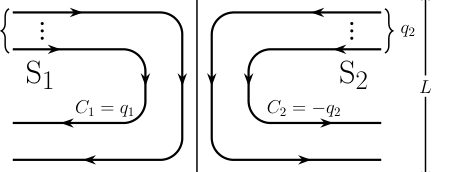
<figcaption class="paper-figure-caption"><b>Fig 4.</b> FIG. 4: Junction between topological superconductors S1 and S2 with Chern numbers C1 &gt; 0 and C2 &lt; 0. The number of chi- ral Majorana edge modes at the superconductor-vacuum boundary is qj = |Cj|, j = 1, 2. At the interface between the two superconduc- tors, there are q = q1 + q2 co-propagating chiral Majorana modes.</figcaption>
</figure>
<figure class="paper-figure-card">
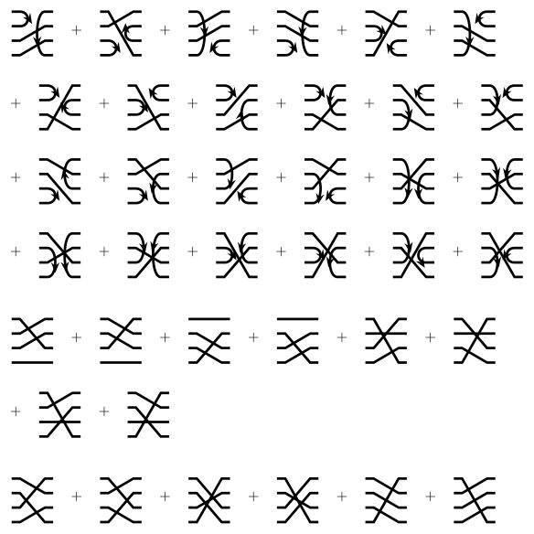
<figcaption class="paper-figure-caption"><b>Fig 5.</b> FIG. 5: Diagrammatic representations of I4, S4, X4, ˜S4, ˜ X4, ˜S′ 4, T4, S′ 4, T ′ 4, S′′ 4 , X ′ 4, and X ′′ 4 for the symplectic case. Diagrammatic representations for the orthogonal case are obtained by omitting the orientations on the arcs connecting indices on the same side of each diagram.</figcaption>
</figure>

**Summary.** This paper develops a unified diagrammatic framework to calculate the time evolution of moment operators for Brownian motion on orthogonal and symplectic Lie groups. By extending techniques from unitary ensembles, it derives explicit formulas for these moments up to fourth order. This work is vital for analyzing quantum chaos, thermalization, and transport in systems with particle-hole symmetry.

**Why it may be interesting.** This work provides powerful mathematical tools derived from random matrix theory that describe quantum dynamics in systems possessing specific symmetries (orthogonal/symplectic), which is crucial for understanding transport and chaos.

Detailed structure

**Main problem.** The paper develops a unified diagrammatic framework to characterize Brownian ensembles for orthogonal and symplectic random matrices.

**Main result.** Explicit, complex formulas are derived for the time evolution of moment operators ($U_k(t)$) and their corresponding trace moments ($	ext{Tr}(V^k)$) up to fourth order.

**Method.** The calculation uses diagrammatic techniques based on extending methods from unitary ensembles to orthogonal and symplectic cases, involving tensor algebra and matrix exponentiation.

**Model / system.** The study concerns Brownian motion on the orthogonal $O(q)$ and symplectic $	ext{Sp}(q)$ groups. The dynamics are governed by moment operators derived from random matrices constrained by an antiunitary involution Z.

**Key observables.** Moment operators ($U_k(t)$), trace moments ($	ext{Tr}(V^k)$), spectral form factor, and frame potential.

**Important parameters / regimes.** The dimension parameter $q$, the time variable $t$, and the order of the moment $k$ (up to 4).

**Assumptions / limitations.** The method relies on treating the problem using an antiunitary involution Z to unify the orthogonal and symplectic cases, and involves advanced tensor algebra related to the Brauer algebra.

**Figures summary.** Figure 1 shows diagrammatic representations and multiplication rules for basis tensors in the orthogonal case; Figure 2 does the same for the symplectic case.

**Paper structure.** The paper builds systematically by calculating moment operators $U_k(t)$ and trace moments recursively, first establishing the general framework (k=1, 2) and then providing explicit, highly complex formulas for higher orders (k=3, k=4).

Abstract

Matrix Brownian motion provides a powerful framework for studying crossover ensembles in quantum chaos and quantum transport, as well as thermalization and information scrambling in many-body dynamics. Here, we develop a unified diagrammatic framework to characterize Brownian ensembles for orthogonal and symplectic random matrices, which describe systems with particle-hole symmetry. We compute polynomial averages up to fourth order and construct an orthogonally invariant interpolation for the disconnected $\mathrm{SO}^-(q)$ sector of the orthogonal group. We consider applications relating to the fields of quantum information, quantum chaos, and quantum transport.

[↑ back to top](#top)

### [Circuit Design Informed Adaptive Variational Quantum Algorithms](http://arxiv.org/abs/2607.04110v1)

**Authors:** Muhammad Umer, Dimitris G. Angelakis  
**Type:** theory · **Category:** quantum information and computing · **PDF:** <https://arxiv.org/pdf/2607.04110v1>  
**Analysis basis:** full PDF text, analyzed in chunks
**Topic relevance:** `quantum measurements` **2/5** · `analog quantum simulation` **1/5** · `measurement-induced transitions` **1/5**

↔ Scroll figures horizontally

<figure class="paper-figure-card">

<figcaption class="paper-figure-caption"><b>Fig 1.</b> FIG. 1. (a) Hadamard test and (b, c) HT constrained ans¨atze. Here, n is the number of qubits in the register, d is the number of layers, and Ui = U(λi) is a controlled pa- rameterized gate. In the construction of ans¨atze, X gate at the beginning of circuits is controlled by the ancilla qubit, thereby establishing ancilla−register correlations. Panel (b) and (c) illustrate two distinct layouts.</figcaption>
</figure>
<figure class="paper-figure-card">

<figcaption class="paper-figure-caption"><b>Fig 2.</b> FIG. 3. Constraints embedded in the gate pool Opool. Here, (i)–(iii) highlight three classes of constraints, namely: (i) qubit connectivity constraint of the hardware platform, (ii) circuit design, i.e., the Hadamard test constraint, and (iii) non-redundancy constraints that prevent immediate re- selection of gates acting on the same qubit(s) by temporarily removing them from the candidate pool.</figcaption>
</figure>
<figure class="paper-figure-card">
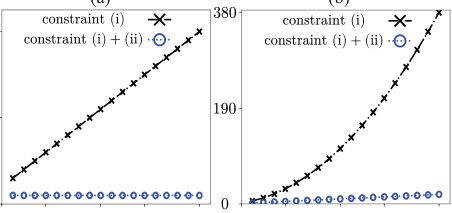
<figcaption class="paper-figure-caption"><b>Fig 3.</b> FIG. 2. Scaling behavior of the gate pool Opool at the first iteration of adaptive frameworks. (a) and (b) correspond to the nearest-neighbor connectivity in a ring topology and all- to-all connectivity, respectively. Here, constraints (i) and (ii) are imposed by qubit connectivity and Hadamard test circuit design, respectively.</figcaption>
</figure>
<figure class="paper-figure-card">

<figcaption class="paper-figure-caption"><b>Fig 4.</b> FIG. 4. Behavior of state infidelity as a function of number of gates in the layered HT ans¨atze. State infidelity quantifies the deviation of the variational state from the target classi- cal ground state. Results are shown for g = 250 in panels (a, b) and for g = 750 in panels (c, d). In addition, layer configuration A and B is adopted in panels (a, c) and (b, d), respectively.</figcaption>
</figure>
<figure class="paper-figure-card">

<figcaption class="paper-figure-caption"><b>Fig 5.</b> FIG. 6. Adaptive HT ans¨atze. Panels are organized accord- ing to both system size and nonlinear interaction strength. Here, n = 5 for panel (i), n = 4 in panels (ii−v), and n = 3 in panels (vi−viii). Additionally, g = 250, 500, 750, and 1000 correspond respectively to panels (i, ii, vi), (iii, vii), (iv, viii), and (v, viii).</figcaption>
</figure>

**Summary.** This paper proposes integrating circuit design considerations, specifically using Hadamard Test constraints, into adaptive variational quantum algorithms. By doing so, it significantly reduces the measurement overhead required to build expressive ansätze for solving problems like the nonlinear Schrödinger equation. This systematic approach enhances the practical feasibility of running complex quantum simulations on current NISQ hardware.

**Why it may be interesting.** This work directly addresses practical limitations in quantum computation by providing algorithmic guidelines (circuit-aware ansatz construction) that improve resource scaling for simulating physical systems like those modeled by the NLSE.

Detailed structure

**Main problem.** Developing resource-efficient variational quantum algorithms (VQAs) suitable for the Noisy Intermediate-Scale Quantum (NISQ) era.

**Main result.** Incorporating circuit design constraints, such as those derived from the Hadamard Test architecture, can systematically reduce measurement overhead in adaptive VQA frameworks by 25% to 55%.

**Method.** The authors employ an adaptive variational framework that iteratively constructs hardware-aware ansätze while enforcing structural constraints on the candidate gate pool.

**Model / system.** The study applies these techniques to find the ground state of the nonlinear Schrödinger equation (NLSE), which is discretized using a finite-difference method.

**Key observables.** State fidelity ($F' = 1 - |\langle\Psi_{	ext{target}}|\Psi_{	ext{var}}
angle|^2$) and measurement overhead/required measurement resources.

**Important parameters / regimes.** Nonlinearity strength ($g$), system size ($n$), and the depth of the variational ansatz layers.

**Assumptions / limitations.** The analysis assumes that incorporating constraints from hardware connectivity, HT structure, and non-redundancy is sufficient to guide the construction of expressive ansätze.

**Figures summary.** Figures illustrate the Hadamard test circuit, the scaling reduction of the gate pool size due to constraints, and comparisons showing adaptive ansätze achieving higher state fidelities than simple layered ones for the NLSE ground state.

**Paper structure.** The paper first establishes the need for resource efficiency in NISQ devices. It then details the use of adaptive VQA frameworks applied to the NLSE ground state problem. The core contribution is demonstrating how circuit design constraints prune the gate pool, leading to significant overhead reduction while maintaining high fidelity compared to unconstrained or purely layered approaches.

Abstract

Resource-efficient computation is of central importance in the noisy intermediate-scale quantum (NISQ) era, where decoherence, gate errors, and restricted qubit connectivity severely limit the reliable execution of quantum algorithms. In this work, we demonstrate that incorporating circuit design considerations is crucial for developing resource-efficient variational quantum algorithms. By focusing on the Hadamard test circuit architecture, hardware-aware qubit connectivity, and problem-specific adaptive framework, we analyze how circuit design constraints can systematically reduce the measurement overhead associated with repeated evaluations of the candidate gate pool in adaptive algorithms. Specifically, we demonstrate reductions in the required measurement resources ranging from at least 25% to as high as 50% - 55%. To assess the effectiveness of our approach, we investigate the ground state problem of the nonlinear Schrödinger equation. Overall, our work contributes to resource-friendly strategies for quantum computation and underscores that algorithmic frameworks should systematically integrate circuit design constraints with hardware-aware and problem-specific structures to enhance the practical feasibility of quantum devices in the NISQ era.

[↑ back to top](#top)

### [Effective Field Theory of Noncritical M-theory from Bosonization](http://arxiv.org/abs/2607.05143v1)

**Authors:** Patrick Jefferson, Tokiro Numasawa  
**Type:** theory · **Category:** strongly correlated electrons · **PDF:** <https://arxiv.org/pdf/2607.05143v1>  
**Analysis basis:** full PDF text, analyzed in chunks
**Topic relevance:** `analog quantum simulation` **2/5** · `Keldysh / 2PI / non-Gaussian methods` **1/5** · `Kondo & dissipative impurity` **1/5**

↔ Scroll figures horizontally

<figure class="paper-figure-card">
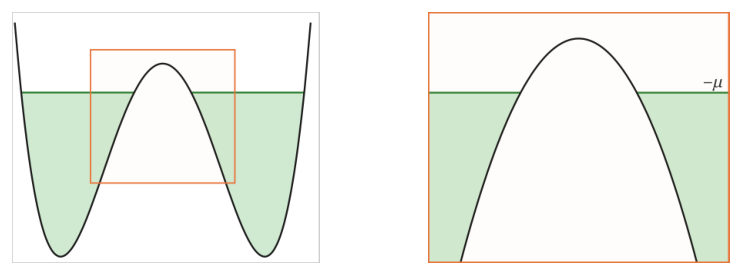
<figcaption class="paper-figure-caption"><b>Fig 1.</b> Figure 1: The double scaling limit (2.2) effectively “zooms in” on the quadratic maximum of the potential in (2.1), in the process scaling away other non-universal features while holding fixed the renormalized Fermi level −µ. The figure on the right depicts the inverted harmonic oscillator potential, which is the universal potential that remains after taking the double-scaling limit. In both figures, the shaded region is the filled Fermi sea, with its boundary corresponding to the static Fermi surface (2.4).</figcaption>
</figure>
<figure class="paper-figure-card">

<figcaption class="paper-figure-caption"><b>Fig 2.</b> Figure 2: The shaded region is the filled c = 1 string Fermi sea. We can label the state of the Fermi sea in terms of the upper and lower surfaces p±(t, λ), which are indicated for a definite value of λ as an illustration. This is essentially a duplicate of Figure 25 in [20].</figcaption>
</figure>
<figure class="paper-figure-card">

<figcaption class="paper-figure-caption"><b>Fig 3.</b> Figure 3: The double scaling limit of noncritical M-theory is analogous to the double scaling limit of the c = 1 matrix model (compare to Figure 1). The Fermi sea is again filled up to a Fermi level −µ, but in this case the single particle dispersion is given by a two-dimensional rotationally-symmetric inverted harmonic oscillator potential. In the above images, the shaded region is the filled Fermi sea, with the image on the right illustrating the universal potential that survives the double-scaling limit.</figcaption>
</figure>
<figure class="paper-figure-card">
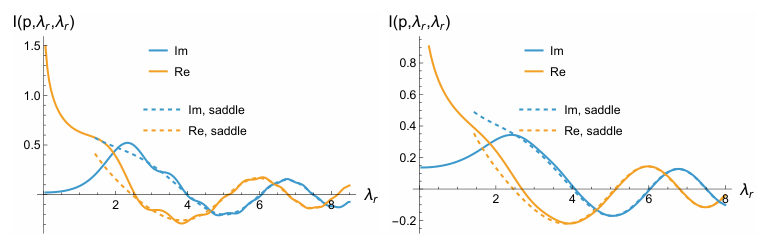
<figcaption class="paper-figure-caption"><b>Fig 4.</b> Figure 5: Comparison between the exact resolvent and its saddle-point approximation. The left panel shows the case p = 0.001, while the right panel corresponds to p = 1. The parameters are chosen as θ = π/20 and µ = 1. The qualitative behavior remains unchanged for sufficiently small |θ| and arbitrary µ.</figcaption>
</figure>
<figure class="paper-figure-card">

<figcaption class="paper-figure-caption"><b>Fig 5.</b> Figure 6: Representative plots of the exact density one-point function. The left panel shows the density ρ, while the right panel shows its derivative with respect to the Fermi energy, −∂ρ/∂µ.</figcaption>
</figure>

**Summary.** This theoretical paper develops an effective field theory for noncritical M-theory by applying bosonization techniques to its microscopic description as a free fermion system. The authors validate this derived bosonic action by calculating correlation functions and showing they match predictions from the exact fermionic model in appropriate limits, advancing the understanding of spacetime gravity connections.

**Why it may be interesting.** While focused on string theory, the core methodology—bosonizing excitations around a Fermi surface (the coadjoint orbit approach)—is directly applicable to strongly correlated electron systems where low-energy physics is governed by collective modes near the Fermi level.

Detailed structure

**Main problem.** The primary goal is constructing an effective spacetime gravity description for noncritical M-theory by relating it to its known microscopic definition as a free fermion system.

**Main result.** The authors derive an effective field theory using bosonization that successfully reproduces established results in lower dimensions (like the Das-Jevicki theory) and matches correlation functions calculated from the exact Fermi liquid description in the semiclassical limit.

**Method.** They extend the coadjoint orbit approach to bosonization, systematically comparing the resulting bosonic effective action with predictions derived from the underlying integrable structure of noncritical M-theory.

**Model / system.** The model is Noncritical M-theory, which is treated as a double-scaled $(2+1)$-dimensional nonrelativistic Fermi liquid. This system serves as a lower-dimensional analog for understanding string theory vacua and quantum gravity.

**Key observables.** Fermion density correlation functions (one-, two-, and three-point functions) are used to test the consistency between the effective field theory and the exact fermionic description.

**Important parameters / regimes.** The analysis focuses on different dimensions ($1+1$d and $2+1$d), the semiclassical limit, and the underlying parameters defining the Fermi surface/potential.

**Assumptions / limitations.** Key steps involve applying approximations like the stationary phase approximation to calculate resolvents and assuming suitability of gauge choices for dimensional reduction.

**Figures summary.** Figure 1 illustrates the double scaling limit zooming in on the quadratic maximum potential, showing the filled Fermi sea boundary corresponding to the static Fermi surface. Other figures compare exact resolvents with saddle point approximations.

**Paper structure.** The paper systematically applies the coadjoint-orbit method to derive an effective bosonic action for bosonization of the Fermi surface. It then rigorously tests this action by calculating and comparing its correlation functions against known results from the exact fermionic theory, culminating in discussions about gravitational interpretations.

Abstract

We extend the coadjoint orbit approach to bosonization systematized by Delacretaz-Du-Mehta-Son to double-scaled non-relativistic Fermi liquids with central inverted harmonic oscillator potential. In 1+1d, this reproduces the Das-Jevicki collective field theory describing quasiparticle excitations of the $c=1$ matrix model. In 2+1d, this yields an effective field theory for noncritical M-theory, namely the 2+1d Fermi liquid proposed by Hořava and Keeler as a unified framework for characterizing noncritical string vacua. With a suitable gauge choice this theory reduces to a continuous family of 1+1d chiral bosons resembling Das-Jevicki collective fields coupled by additional interactions. Utilizing the underlying integrability of noncritical M-theory, we compute select fermion density correlation functions order-by-order in perturbation theory, and provide evidence that they agree with their Fermi liquid counterparts in a suitable semiclassical limit. This represents a step toward an effective spacetime gravity description of noncritical M-theory, which we expect to shed light on both the landscape of 2d noncritical strings and 3d quantum gravity in general.

[↑ back to top](#top)

### [Universal fluctuations of first discoveries in competitive exploration](http://arxiv.org/abs/2607.04252v1)

**Authors:** Arthur Plaud, P. L. Krapivsky, S. Redner, Olivier Bénichou  
**Type:** theory · **Category:** statistical mechanics · **PDF:** <https://arxiv.org/pdf/2607.04252v1>  
**Analysis basis:** full PDF text, analyzed in chunks
**Topic relevance:** `non-equilibrium universality` **2/5** · `driven-dissipative phase transition` **1/5** · `non-equilibrium dynamics` **1/5**

↔ Scroll figures horizontally

<figure class="paper-figure-card">

<figcaption class="paper-figure-caption"><b>Fig 1.</b> FIG. 1. Competitive exploration requires a missing observable. a, First-discovery allocation. Two identical searchers explore a landscape in which each site initially carries one unclaimed resource. Grey sites are undiscovered; coloured sites have been discovered and are labelled by the searcher that reached them first; hatched sites have been visited by both searchers. Classical observables measure collective coverage or geometric interference, but not which searcher secured each discovery. b, Self-averaging transition. We tag one searcher and set Ik = 1 if the k-th collective discovery is secured by this tagged searcher, and Ik = 0 otherwise. The discovery share Xn = n−1 Pn k=1 Ik has...</figcaption>
</figure>
<figure class="paper-figure-card">
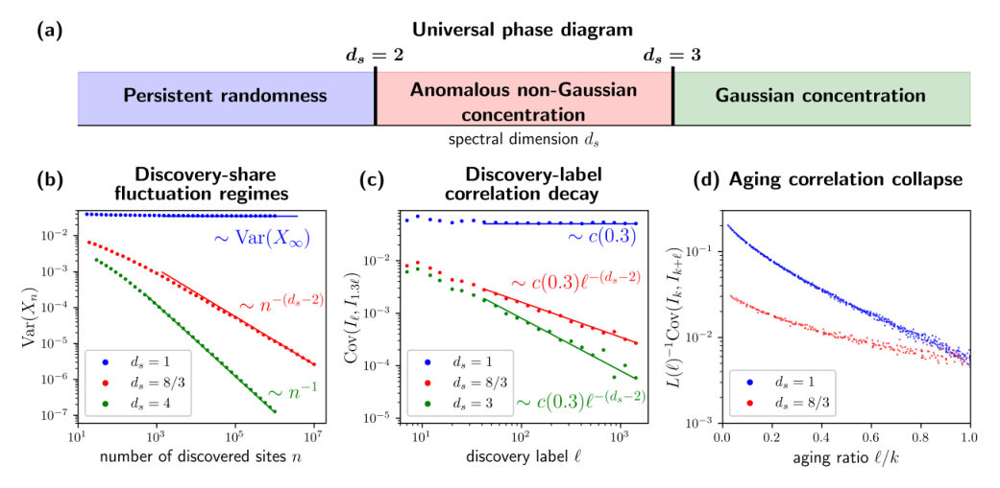
<figcaption class="paper-figure-caption"><b>Fig 2.</b> FIG. 2. First-discovery label correlations underlie the discovery-share fluctuation phase diagram. a, Discovery-share fluctuation regimes. The spectral dimension ds, defined by the on-site decay p0(t) ∼t−ds/2, separates persistent randomness (ds &lt; 2), anomalously slow non-Gaussian concentration (2 ≤ds &lt; 3), and Gaussian concentration (ds ≥3), with logarithmic corrections at ds = 3. b, Discovery-share variance. Simulations for two identical searchers on a one-dimensional lattice with a general symmetric jump law (simulation details given in the SI) confirm Eq. (4): non-zero limiting variance for ds &lt; 2, anomalous decay for 2 &lt; ds &lt; 3, and 1/n Gaussian decay for ds &gt; 3. c, Discovery-label...</figcaption>
</figure>
<figure class="paper-figure-card">
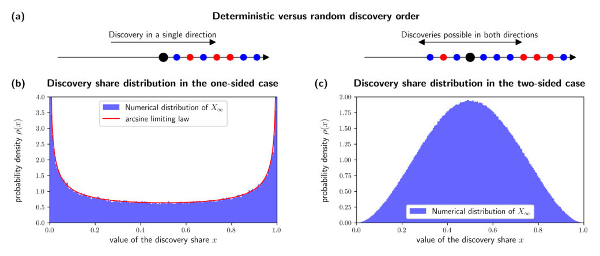
<figcaption class="paper-figure-caption"><b>Fig 3.</b> FIG. 3. Site-discovery order shapes broad recurrent fluctuations. In recurrent exploration, discovery-label correlations prevent self-averaging, but the limiting law also depends on the spatial order in which sites are discovered. a, Deterministic versus random site-discovery order. The black dot marks the starting point. Red and blue sites are first discovered by the two competitors, respectively. In the one-sided geometry, the first n collective discoveries are necessarily the sites 1, . . . , n, so the spatial order of discovery is deterministic. In the symmetric geometry, discoveries can occur on either side of the origin, and the left-right order of discovered sites is random. b,...</figcaption>
</figure>
<figure class="paper-figure-card">
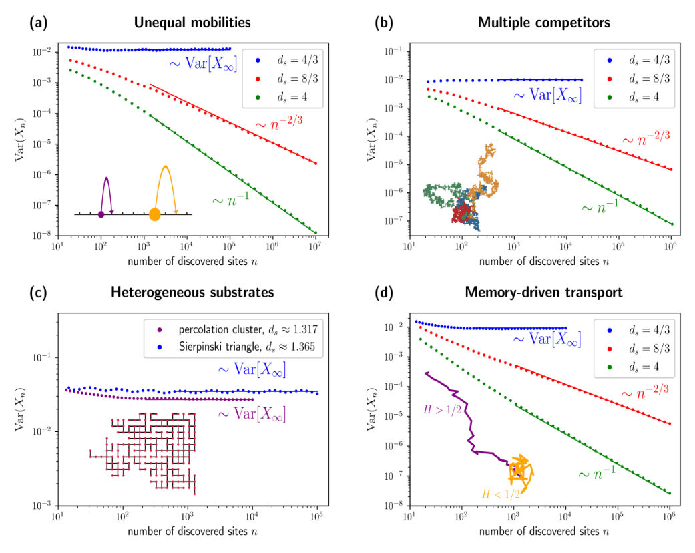
<figcaption class="paper-figure-caption"><b>Fig 4.</b> FIG. 4. Discovery-share fluctuation regimes persist beyond the minimal model. Numerical simulations of representative extensions show that the fluctuation structure predicted by the analytical framework is robust to changes in microscopic dynamics, geometry and competitive setting. The simulations use one-dimensional heavy-tailed jump processes in panels a and b, simple diffusion on fractal substrates in panel c, and fractional Brownian motion in panel d. Small schematics in the panels illustrate the corresponding extension. a, Unequal mobilities. When the two competitors have unequal mobilities, here implemented by different jump scales, the mean discovery share is shifted away from 1/2;...</figcaption>
</figure>

**Summary.** This work develops a general fluctuation theory for competitive exploration processes by analyzing the fraction of first discoveries secured by one searcher. The key finding links the persistence of early advantages to the spectral dimension ($d_s$) of the underlying random walk, establishing a critical threshold at $d_s=2$ that dictates whether fluctuations are persistent or self-averaging.

**Why it may be interesting.** The concept of 'spectral dimension' controlling macroscopic fluctuation behavior is highly relevant to understanding anomalous transport in complex media, which has parallels in quantum many-body systems exhibiting fractal or disordered dynamics.

Detailed structure

**Main problem.** The core problem is determining whether early competitive advantages, measured by the 'discovery share' ($X_n$), persist or are erased over long exploration histories in a setting where multiple searchers compete for resources.

**Main result.** Self-averaging (convergence to $1/2$) occurs if and only if the spectral dimension $d_s$ of the underlying random walk is greater than or equal to 2, with specific power laws governing the variance decay in different regimes defined by $d_s$.

**Method.** The analysis involves deriving asymptotic fluctuation laws for the discovery share using tools from probability theory, specifically analyzing two-point correlations and scaling functions.

**Model / system.** The model is competitive exploration involving multiple searchers discovering sites on a lattice or space whose dynamics are characterized by the spectral dimension $d_s$. This framework is generalizable to various random walk types (e.g., Brownian motion, Lévy walks) and geometries.

**Key observables.** Discovery share ($X_n$), asymptotic variance ($	ext{Var}(X_n)$), two-point label correlations $	ext{Cov}(I_k, I_{k+\ell})$.

**Important parameters / regimes.** Spectral dimension ($d_s$): controls the fluctuation regime; $d_s < 2$ (persistent randomness) vs. $d_s \ge 2$ (self-averaging).

**Assumptions / limitations.** The analysis assumes a general symmetric jump law for the searchers, allowing the results to be generalized across different geometries and memory effects.

**Figures summary.** Figures illustrate the phase diagram based on $d_s$, showing variance decay tests confirming derived power laws, and demonstrate covariance collapse onto universal scaling functions for various random walk types.

**Paper structure.** The paper establishes the diagnostic observable ($X_n$), links its fluctuation behavior to the spectral dimension ($d_s$) of the underlying diffusion process, derives asymptotic variance formulas across different $d_s$ regimes, and validates these results by testing multiple physical models (e.g., Lévy walks, unequal mobilities).

Abstract

Random exploration is usually quantified by how fast new space is found, from   the range of a single walker to the territory collectively covered by many   walkers. In competitive exploration, first arrival secures an exclusive resource, as when foragers compete for food items or agents capture distributed targets. It is then no longer enough to know which sites have been discovered: one must determine, for each discovered site, which searcher reached it first. We introduce the discovery   share $X_n$, the fraction of the first $n$ collective discoveries secured by   a tagged searcher. For two identical competitors, exchange symmetry fixes   $\langle X_n\rangle=1/2$, but the central question is whether this equal   split emerges in each long exploration history or only on average, \emph{i.e.} whether early   competitive advantages are erased or persist. Here we show that the answer is   controlled by the spectral dimension $d_s$, defined by the large-time decay of the probability that a single searcher is at   its starting point after $t$ steps, $p_0(t)\sim t^{-d_s/2}$.   Across ordinary diffusion, long-range superdiffusion and subdiffusion induced   by crowding or memory, $d_s$ separates persistent randomness in   recurrent exploration $(d_s<2)$, anomalously slow non-Gaussian concentration   for $2\le d_s<3$, and Gaussian concentration, logarithmically corrected at   $d_s=3$, for $d_s\ge3$. For $d_s\ge2$, we derive exact asymptotic   variances, including prefactors, and the discovery scale on which competitive   imbalances are erased. Two-point correlations of first-discovery labels identify the memory mechanism behind these regimes.   The same phase structure persists under changes in geometry, competitor   heterogeneity, number of competitors and memory, revealing a general fluctuation   theory of first-arrival inequalities.

[↑ back to top](#top)

### [HamQASBench: A Hamiltonian-Informed Diagnostic Benchmark for Evaluating Quantum Architecture Search](http://arxiv.org/abs/2607.04845v1)

**Authors:** Jiayang Niu, Akib Karim, Yan Wang, Jie Li, Ke Deng, Azadeh Alavi, Muhammad Usman, Yongli Ren  
**Type:** theory · **Category:** quantum information and computing · **PDF:** <https://arxiv.org/pdf/2607.04845v1>  
**Analysis basis:** full PDF text, analyzed in chunks
**Topic relevance:** `entanglement & information structure` **2/5** · `analog quantum simulation` **1/5**

↔ Scroll figures horizontally

<figure class="paper-figure-card">
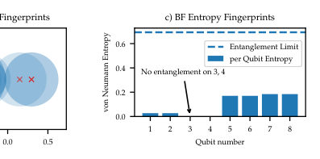
<figcaption class="paper-figure-caption"><b>Fig 1.</b> Figure 1: Visual illustration of Hamiltonian structural fingerprints for various molecules.</figcaption>
</figure>
<figure class="paper-figure-card">
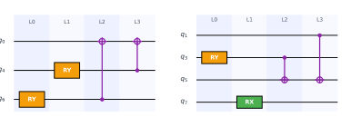
<figcaption class="paper-figure-caption"><b>Fig 2.</b> Figure 2: Critical-structure analysis. (a,b) Tier 1 circuits collapse to 2-gate minimal forms. (c,d) Tier 2 yields two structurally distinct circuits targeting orthogonal degenerate eigenstates of CH2.</figcaption>
</figure>

**Summary.** The paper introduces HamQASBench, a novel benchmark that evaluates Quantum Architecture Search methods by analyzing the underlying Hamiltonian structure rather than just the final energy value. By deriving fingerprints from Pauli operators and entanglement, it categorizes molecular problems into five distinct structural tiers. This allows researchers to diagnose specific failures in QAS algorithms, such as over-parameterization or representation bottlenecks.

**Why it may be interesting.** This work provides a rigorous framework for testing the fundamental capabilities of quantum machine learning algorithms (QAS) in simulating chemistry, moving the field past simple 'energy matching' to structural validation.

Detailed structure

**Main problem.** To develop a diagnostic benchmark for Quantum Architecture Search (QAS) that evaluates circuit design beyond simple energy accuracy by diagnosing underlying structural failures.

**Main result.** The proposed HamQASBench successfully reveals five distinct failure modes in QAS methods, including over-parameterization and representation bottlenecks, which are invisible to conventional energy metrics.

**Method.** The authors introduce a Hamiltonian-informed benchmark that uses fingerprints derived from Pauli operator bases, computational basis representations, and entanglement structure to categorize molecular Hamiltonians into structural tiers. They complement this with a critical-structure extraction procedure using gate ablation.

**Model / system.** The study focuses on simulating the ground-state energy of small molecules (e.g., H2, BeH2) governed by their qubit Hamiltonian ($H$), which is analyzed across five structural tiers based on its mathematical properties.

**Key observables.** Per-qubit von Neumann entropy, pairwise state fidelity, redundancy ratio ($
ho$), Mean Absolute Entropy Difference (MAES), and success rates at chemical accuracy.

**Important parameters / regimes.** The benchmark defines five structural tiers: Minimalism, Degeneracy, Strong Correlation, Topology Constraints, and Scalability/Growth. The analysis uses an error tolerance budget ($\epsilon_{	ext{allow}}$).

**Assumptions / limitations.** It is assumed that the required circuit complexity can be isolated by pruning redundant gates while maintaining energy performance, allowing structural comparison against theoretical fingerprints.

**Figures summary.** Figures illustrate the fingerprinting process for small molecules (H2, H3), and tables summarize QAS results across the five diagnostic tiers and scaling ladders.

**Paper structure.** The paper first critiques existing benchmarks based only on molecular identity. It then details HamQASBench, defining structural fingerprints from three Hamiltonian views to create 5 structural tiers. The core methodology involves a post-hoc critical-structure extraction layer that moves beyond energy evaluation by analyzing entanglement and gate necessity.

Abstract

Quantum Architecture Search (QAS) automates the design of parameterized quantum circuits for variational quantum algorithms, yet existing benchmarks organize instances by molecular identity or qubit count -- criteria agnostic to Hamiltonian structure -- and rely solely on energy accuracy, which cannot detect structural failures such as over-parameterization on near-product ground states. We introduce HamQASBench, a Hamiltonian-informed diagnostic benchmark organizing 11 molecules into five structural tiers via fingerprints derived from the Pauli operator basis, computational basis representation, and ground-state entanglement. A post-hoc critical-structure extraction procedure identifies minimal circuits consistent with each tier's requirements, complementing energy-based evaluation with per-qubit entanglement analysis and pairwise state fidelity. Benchmarking five QAS methods across four paradigms reveals failure modes invisible to conventional metrics: over-parameterization in the minimalism regime, eigenstate commitment under degeneracy, a representation bottleneck in strongly correlated systems, topology-induced routing failure, and circuit search space growth as a scalability bottleneck.

[↑ back to top](#top)

### [A Cross-Platform Analysis of High-Performance Quantum Error Correction Codes](http://arxiv.org/abs/2607.04082v1)

**Authors:** Bryan Pan, Yufeng Xin  
**Type:** theory · **Category:** quantum information and computing · **PDF:** <https://arxiv.org/pdf/2607.04082v1>  
**Analysis basis:** full PDF text, analyzed in chunks
**Topic relevance:** `QC/QI experiment` **2/5**

↔ Scroll figures horizontally

<figure class="paper-figure-card">

<figcaption class="paper-figure-caption"><b>Fig 1.</b> Fig. 1: Logical error estimates per round vs. two-qubit error rate for different QEC codes</figcaption>
</figure>
<figure class="paper-figure-card">
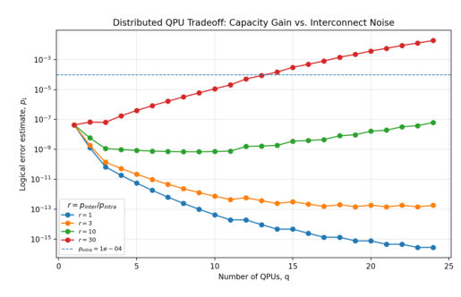
<figcaption class="paper-figure-caption"><b>Fig 2.</b> Fig. 2: Distributed-QPU logical error estimate as a function of QPU count. Each QPU assumed to support 200 physical qubits, nphys ≈ 2d2, N2Q ≈11d2, and Ninter = 4d(q −1).</figcaption>
</figure>
<figure class="paper-figure-card">

<figcaption class="paper-figure-caption"><b>Fig 3.</b> Figure 2 shows the resulting logical error estimates as a function of the number of QPUs for different interconnect noise ratios defined as</figcaption>
</figure>
<figure class="paper-figure-card">
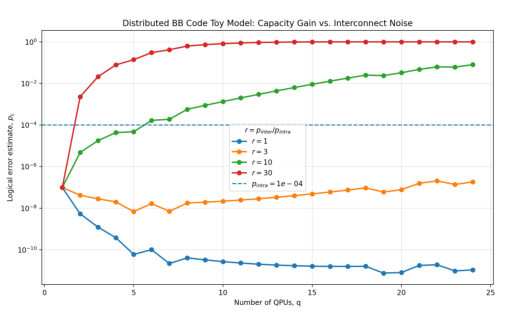
<figcaption class="paper-figure-caption"><b>Fig 4.</b> Fig. 3: Distributed-QPU BB logical error estimate as a function of QPU count. The model uses pintra = 10−4, N BB 2Q ≈18d2 and nBB phys ≈ d2 with λ = 0.25.</figcaption>
</figure>
<figure class="paper-figure-card">

<figcaption class="paper-figure-caption"><b>Fig 5.</b> Fig. 4: Sensitivity of the distributed BB analytical model to the nonlocal embedding factor λ for fixed pintra = 10−4 and r = 10.</figcaption>
</figure>

**Summary.** This paper introduces a unified analytical framework to estimate logical error rates for advanced Quantum Error Correction codes. By modeling contributions from code structure and gate overhead, it allows researchers to compare performance across diverse physical platforms like superconducting circuits and trapped ions. The work helps identify optimal design regions for building large-scale, fault-tolerant quantum computers.

**Why it may be interesting.** It provides quantitative tools for comparing the resource overheads of different fault-tolerance schemes on realistic hardware constraints, which is crucial for designing next-generation quantum processors.

Detailed structure

**Main problem.** Developing scalable quantum computers is hindered by physical noise and limited qubit counts, necessitating efficient Quantum Error Correction (QEC).

**Main result.** The authors present a unified analytical framework to estimate logical error rates for various advanced QEC codes across different hardware platforms.

**Method.** They use an analytical framework that models logical failure based on the accumulation of physical errors from code structure and two-qubit gate overheads.

**Model / system.** The analysis considers multiple leading hardware platforms (superconducting, trapped-ion, neutral atoms) and advanced codes like topological, qLDPC, and Floquet codes. The framework separates intra-QPU and inter-QPU error sources for distributed systems.

**Key observables.** Logical error rates ($p_L$), code parameters ($[[n, k, d]]$), and the identification of dominant error contributors (e.g., routing overhead).

**Important parameters / regimes.** Physical error rate ($p_{loc}$), effective number of fault locations ($N_{loc}$), circuit volume, and connectivity constraints.

**Assumptions / limitations.** The framework simplifies complex simulations by focusing on key circuit-level parameters; it assumes certain noise models (e.g., depolarizing) and may neglect correlated errors or full compilation overheads.

**Figures summary.** Not specified in the notes, but the paper analyzes various code families and their performance metrics across different hardware architectures.

**Paper structure.** The paper establishes the problem of scalability via noise, introduces a unified analytical framework to estimate $p_L$, details how platform connectivity affects error accumulation ($N_{loc}, p_{loc}$), and applies this model to compare various QEC codes (Topological, qLDPC, etc.).

Abstract

The theory of quantum error correction was established decades ago. Yet the limitation of the quantum computing platforms in terms of noise level and available physical qubit count persists, which greatly hinders the development of scalable quantum computing systems. In this paper, we present analytical estimates of logical error rates of advanced QEC codes across leading hardware platforms and distributed quantum computing systems using a simple but unified framework. The analysis captures two dominant contributors to logical error: code structure and two-qubit gate overhead. The framework provides a fast estimate of logical error rates and identification of dominating factors in different hardware platforms, such as circuit volume, routing overhead, inter-QPU operations, or asymmetric noise protection. We show that several qualitative trends observed in larger-scale simulations can be reproduced and interpreted analytically within this framework. We further demonstrate that the framework can be used to find the sweet spot design region of distributed QEC, which is critical for the design of distributed quantum computing systems.

[↑ back to top](#top)

### [Polynomial Initial-State Jumps and Christoffel Transforms in Krylov Complexity](http://arxiv.org/abs/2607.05294v1)

**Authors:** Abhishek Chowdhury, Ajit Prasad Mahapatra  
**Type:** theory · **Category:** other · **PDF:** <https://arxiv.org/pdf/2607.05294v1>  
**Analysis basis:** full PDF text, analyzed in chunks
**Topic relevance:** `Keldysh / 2PI / non-Gaussian methods` **1/5** · `correlated / nonlocal dissipation` **1/5** · `driven-dissipative phase transition` **1/5** · `entanglement & information structure` **1/5** · `methods for driven-dissipative` **1/5**

↔ Scroll figures horizontally

<figure class="paper-figure-card">
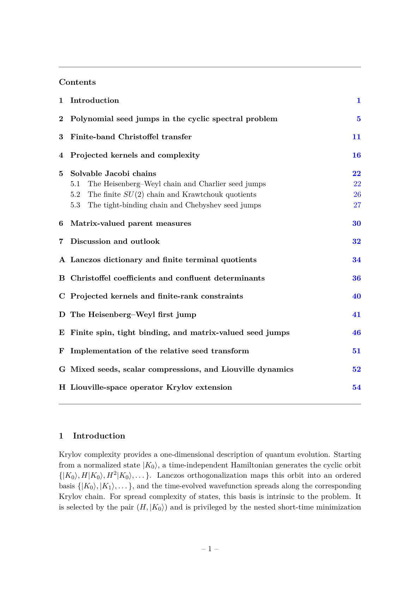
<figcaption class="paper-figure-caption"><b>Fig 1.</b> Low-resolution page preview, page 2</figcaption>
</figure>
<figure class="paper-figure-card">
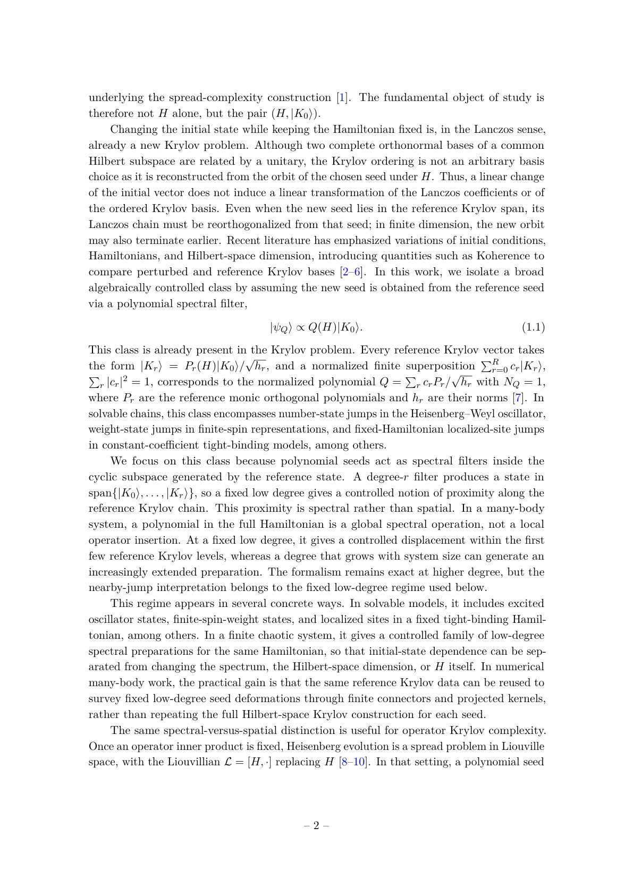
<figcaption class="paper-figure-caption"><b>Fig 2.</b> Low-resolution page preview, page 3</figcaption>
</figure>
<figure class="paper-figure-card">

<figcaption class="paper-figure-caption"><b>Fig 3.</b> Low-resolution page preview, page 4</figcaption>
</figure>
<figure class="paper-figure-card">
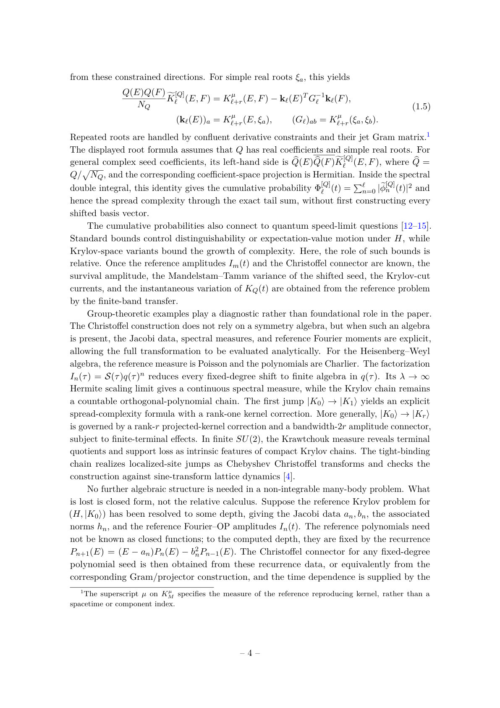
<figcaption class="paper-figure-caption"><b>Fig 4.</b> Low-resolution page preview, page 5</figcaption>
</figure>
<figure class="paper-figure-card">

<figcaption class="paper-figure-caption"><b>Fig 5.</b> Low-resolution page preview, page 6</figcaption>
</figure>

**Summary.** This theoretical paper develops an exact mathematical framework to study how changing the initial state of a quantum system affects its Krylov complexity. By employing polynomial spectral filters and Christoffel transforms, it derives finite formulas that bypass computationally intensive full Hilbert space calculations. This provides a powerful 'relative calculus' for analyzing complex dynamics in various physical models.

**Why it may be interesting.** It provides powerful algebraic tools to analyze spectral properties and complexity measures by decoupling the dependence on the initial state from the underlying Hamiltonian structure, which is crucial for understanding open quantum systems or time-dependent perturbations.

Detailed structure

**Main problem.** The paper addresses the 'relative initial-state problem' for Krylov complexity, which quantifies how changing the initial state of a quantum system affects its spectral properties.

**Main result.** It derives an exact relative calculus that allows generating polynomially related initial-state dynamics without needing to recompute the full Lanczos expansion in the original Hilbert space.

**Method.** The core method involves using polynomial spectral filters, $Q(H)$, which transforms the spectral measure via a Christoffel transform into shifted Krylov amplitudes and projected Christoffel–Darboux kernels.

**Model / system.** The analysis is applied to general quantum evolution governed by a Hamiltonian $H$ (or Liouvillian $\mathcal{L}$) acting on an initial state $|K_0
angle$. It tests the formalism on solvable Jacobi chains, including Heisenberg–Weyl/Charlier and SU(2)/Krawtchouk models.

**Key observables.** Krylov complexity, spread complexity ($\Phi[Q]$), filtered spectral measure $	ext{d}
u_Q(E)$, and projected Christoffel–Darboux kernels.

**Important parameters / regimes.** The polynomial filter $Q$, the initial state $|K_0
angle$, and temperature/time parameters in generalized extensions.

**Assumptions / limitations.** The method is exact for polynomial seed jumps, though some interpretations are restricted to fixed low-degree spectral preparation regimes. Generalizations require careful handling of inner products (e.g., thermal vs. zero-temperature).

**Paper structure.** The paper develops the theory by first establishing the relative initial-state problem using polynomial filters, deriving exact finite sums for amplitudes and kernels via Christoffel transforms. It then generalizes this to operator dynamics (Liouvillians) and discusses extensions to thermal equilibrium.

Abstract

State Krylov, or spread, complexity is a property of a pair $(H,\ket{K_0})$ rather than of the Hamiltonian alone. Thus, changing the initial state at fixed $H$ generally changes the Lanczos coefficients and the ordered Krylov basis. We solve this relative initial-state problem for normalized polynomial filters, $\ket{ψ_Q}=Q(H)\ket{K_0}/\sqrt{N_Q}$ with $N_Q=\langle K_0|Q(H)^\dagger Q(H)|K_0\rangle$. The filtered spectral measure is the positive polynomial modification $|Q(E)|^2\mathrm dμ(E)/N_Q$, and orthogonality turns this measure change into a finite-band transfer from reference Fourier-orthogonal-polynomial moments to shifted Krylov amplitudes. We derive exact finite sums for individual amplitudes and projected Christoffel-Darboux kernels for cumulative probabilities and spread complexity. The formulae cover confluent roots, complex seed coefficients, support loss, and terminal quotients in finite dimensions. We evaluate the construction in three canonical Jacobi families, the Heisenberg--Weyl/Charlier oscillator, the compact $SU(2)$/Krawtchouk spin, and the constant-coefficient tight-binding/Chebyshev chain, with a Hermite central-limit scaling of Charlier as a continuous-spectrum check of this Christoffel jump machinery. Finite seed families are organized by a matrix-valued parent measure whose scalar compressions recover the individual shifted problems. The fixed-inner-product construction carries over to operator Krylov complexity after the replacement \(H\mapsto\mathcal L\) and \(\ket{K_0}\mapsto O\); polynomial seeds then become nested-commutator descendants \(Q(\mathcal L)O\). The result is an exact relative calculus in which a solved cyclic problem generates a family of polynomially related initial-state dynamics without repeating Lanczos in the original Hilbert space.

[↑ back to top](#top)

### [Quantum orientation, Noether structure, composition of systems and operations](http://arxiv.org/abs/2607.04899v1)

**Authors:** Heinz-Jürgen Schmidt  
**Type:** theory · **Category:** other · **PDF:** <https://arxiv.org/pdf/2607.04899v1>  
**Analysis basis:** full PDF text, analyzed in chunks
**Topic relevance:** `Keldysh / 2PI / non-Gaussian methods` **1/5** · `correlated / nonlocal dissipation` **1/5** · `driven-dissipative phase transition` **1/5** · `methods for driven-dissipative` **1/5**

↔ Scroll figures horizontally

<figure class="paper-figure-card">

<figcaption class="paper-figure-caption"><b>Fig 1.</b> Low-resolution page preview, page 2</figcaption>
</figure>
<figure class="paper-figure-card">

<figcaption class="paper-figure-caption"><b>Fig 2.</b> Low-resolution page preview, page 3</figcaption>
</figure>
<figure class="paper-figure-card">

<figcaption class="paper-figure-caption"><b>Fig 3.</b> Low-resolution page preview, page 4</figcaption>
</figure>
<figure class="paper-figure-card">
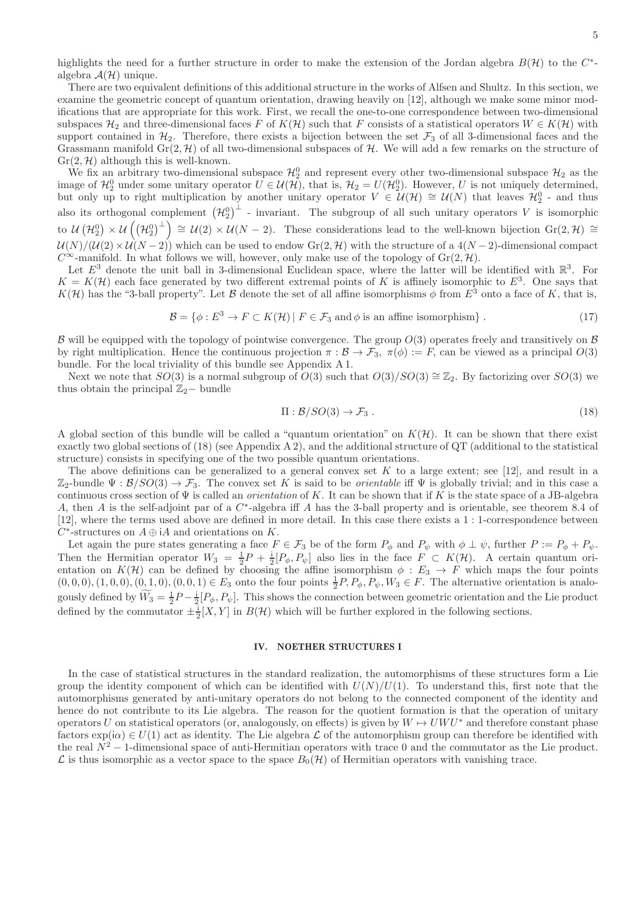
<figcaption class="paper-figure-caption"><b>Fig 4.</b> Low-resolution page preview, page 5</figcaption>
</figure>
<figure class="paper-figure-card">

<figcaption class="paper-figure-caption"><b>Fig 5.</b> Low-resolution page preview, page 6</figcaption>
</figure>

**Summary.** This theoretical paper proposes that describing composite quantum systems requires a 'Noether structure' beyond the standard statistical axioms. The authors demonstrate that this structure is necessary because simple tensor product rules lead to non-unique mathematical descriptions of combined states and operations. Ultimately, they establish that physical reality must select one specific 'quantum orientation' from multiple mathematically possible choices.

**Why it may be interesting.** This work tackles foundational issues regarding how quantum theories must be mathematically structured when combining subsystems or defining irreversible processes (operations), which is crucial for understanding open quantum systems dynamics.

Detailed structure

**Main problem.** The paper argues that quantum theory requires an additional 'Noether structure' beyond its statistical framework to properly describe system composition and define completely positive operations.

**Main result.** The standard statistical structure for composite systems is not unique, requiring the specification of a 'quantum orientation' (a choice between two possible structures) to fully characterize physical reality.

**Method.** The analysis uses axiomatic approaches, comparing the statistical structure $\langle K, L, \mu 
angle$ with requirements for tensor product mappings and analyzing geometric structures like principal bundles over state spaces.

**Model / system.** The focus is on abstract Quantum Theory (QT) foundations, specifically dealing with observables (Hermitian operators), state spaces ($K$), effect spaces ($L$), and the composition of systems via Hilbert space tensor products in the finite-dimensional limit.

**Key observables.** Observables are Hermitian operators; key diagnostics include the structure of product states and the existence/choice of 'quantum orientation'.

**Important parameters / regimes.** The analysis is strictly limited to the finite-dimensional case ($	ext{dim}(H)=N$).

**Assumptions / limitations.** The primary assumption is that the statistical structure alone is insufficient, necessitating the introduction of the Noether structure; the analysis also assumes specific mappings related to tensor products.

**Figures summary.** Not specified in the notes, but references include geometric structures like principal bundles ($\pi: B 	o F_3$) and algebraic identities derived from operator traces (Appendix C).

**Paper structure.** The paper progresses by first identifying the insufficiency of the statistical structure, then investigating composition via tensor products, leading to the discovery of non-uniqueness in composite structures. It concludes with detailed mathematical proofs concerning homeomorphisms between state space descriptions and the characterization of pure operations.

Abstract

In this paper we argue that, in addition to the statistical structure of quantum theory, another structure, referred to here as the ``Noether structure," is necessary to describe the composition of systems and to define completely positive operations. A Noether structure reflects the dual role of Hermitian operators as observables on the one hand and as generators of symmetry transformations on the other. This idea has been expressed in a similar form in the works of Alfsen and Shultz, who investigated the conditions under which the Jordan product can be extended to an associative product of operator algebras. Our investigations into the Noether structure and the composition of systems are limited to the finite-dimensional case and establish a connection to completely positive operations. In the case of pure operations, the latter can be characterized as orientation-preserving maps.

[↑ back to top](#top)

### [Uniform mixing and $ε$-uniform mixing on cycles](http://arxiv.org/abs/2607.04207v1)

**Authors:** Xiwang Cao, Cuiwen Zhu  
**Type:** theory · **Category:** other · **PDF:** <https://arxiv.org/pdf/2607.04207v1>  
**Analysis basis:** full PDF text, analyzed in chunks
**Topic relevance:** `analog quantum simulation` **1/5** · `entanglement & information structure` **1/5** · `methods for driven-dissipative` **1/5** · `non-equilibrium dynamics` **1/5**

↔ Scroll figures horizontally

<figure class="paper-figure-card">
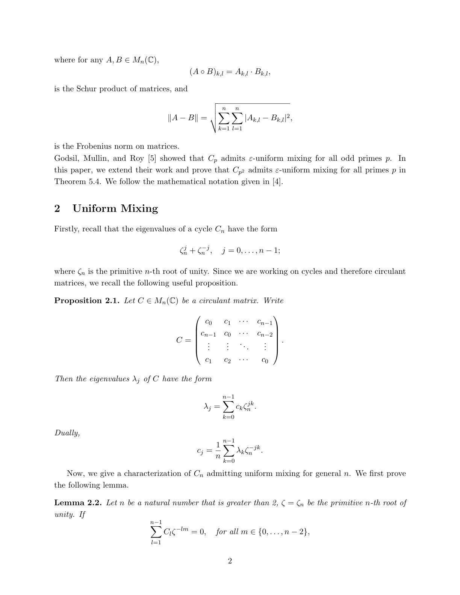
<figcaption class="paper-figure-caption"><b>Fig 1.</b> Low-resolution page preview, page 2</figcaption>
</figure>
<figure class="paper-figure-card">

<figcaption class="paper-figure-caption"><b>Fig 2.</b> Low-resolution page preview, page 3</figcaption>
</figure>
<figure class="paper-figure-card">

<figcaption class="paper-figure-caption"><b>Fig 3.</b> Low-resolution page preview, page 4</figcaption>
</figure>
<figure class="paper-figure-card">

<figcaption class="paper-figure-caption"><b>Fig 4.</b> Low-resolution page preview, page 5</figcaption>
</figure>
<figure class="paper-figure-card">

<figcaption class="paper-figure-caption"><b>Fig 5.</b> Low-resolution page preview, page 6</figcaption>
</figure>

**Summary.** This paper analyzes when continuous-time quantum walks on cycle graphs achieve perfect or near-perfect mixing. It proves that specific cycles, like $C_9$ and $C_{15}$, fail to mix uniformly at any time. Conversely, it establishes a positive result by showing that cycles of the form $C_{p^2}$ do admit $\epsilon$-uniform mixing for all primes $p$, using advanced spectral and algebraic methods.

**Why it may be interesting.** The study of quantum walks' mixing properties is central to understanding quantum transport, decoherence, and the efficiency of quantum computation protocols in graph structures. The distinction between exact (uniform) and approximate ($\epsilon$-uniform) mixing provides deep insights into the underlying symmetries and algebraic structure of the graph.

Detailed structure

**Main problem.** The study investigates the mixing properties (uniform and $\epsilon$-uniform) of continuous-time quantum walks evolving on cycle graphs ($C_n$).

**Main result.** The paper proves that $C_9$ and $C_{15}$ do not admit uniform mixing, while demonstrating that $C_{p^2}$ admits $\epsilon$-uniform mixing for any prime $p$.

**Method.** The analysis combines spectral theory (using eigenvalues of the adjacency matrix) with advanced algebraic techniques like Gröbner basis calculations to establish necessary and sufficient conditions for perfect mixing.

**Model / system.** The model is a continuous-time quantum walk on a cycle graph $C_n$, whose evolution is governed by the unitary operator $U(t) = \exp(itA)$, where $A$ is the adjacency matrix.

**Key observables.** Uniform mixing (where $|U(t)_{u,v}|^2 = 1/n$) and $\epsilon$-uniform mixing ($\|U(t) \circ U(t)^{*}-I/n\| < \epsilon$).

**Important parameters / regimes.** The cycle length $n$, specifically focusing on $C_9$, $C_{15}$, and $C_{p^2}$.

**Assumptions / limitations.** The analysis relies heavily on the spectral decomposition of the evolution operator and algebraic results concerning roots of unity.

**Paper structure.** The paper first establishes general conditions for uniform mixing using polynomial ideals (demonstrated via Gröbner bases for $C_9$ and $C_{15}$), followed by a separate analysis proving $\epsilon$-uniform mixing on $C_{p^2}$ using spectral approximation techniques.

Abstract

We study continuous-time quantum walks on cycles. We prove two complementary results. Firstly, the cycle $C_9$ does not admit uniform mixing at any time. Using the similar idea and Dickson polynomials, we prove that $C_{15}$ does not admit uniform mixing at any time neither. Secondly, for every prime $p$, we show that the cycle $C_{p^2}$ admits $ε$-uniform mixing.

[↑ back to top](#top)

### [Characterisation of a satellite-to-ground channel for continuous variable quantum key distribution protocol](http://arxiv.org/abs/2607.05109v1)

**Authors:** Emma Tien Hwai Medlock, Vinod N. Roa, Timothy Spiller, Rupesh Kumar  
**Type:** theory · **Category:** other · **PDF:** <https://arxiv.org/pdf/2607.05109v1>  
**Analysis basis:** full PDF text, analyzed in chunks
**Topic relevance:** `correlated / nonlocal dissipation` **1/5** · `interference shaping light` **1/5** · `quantum measurements` **1/5**

↔ Scroll figures horizontally

<figure class="paper-figure-card">
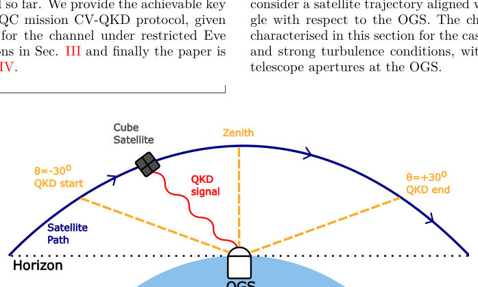
<figcaption class="paper-figure-caption"><b>Fig 1.</b> Figure 1: Satellite pass over the OGS. Here, the CV-QKD exchange occurs between zenith angles −30◦and +30◦. For this scenario, the satellite will have an altitude of 550 km.</figcaption>
</figure>
<figure class="paper-figure-card">
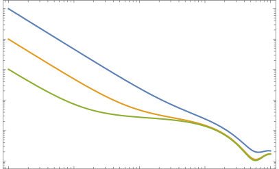
<figcaption class="paper-figure-caption"><b>Fig 2.</b> Figure 2: C2 N profiles as a function of altitudes (shown on the top) and the weighted C2 N profile for 550 km downlink as a function of zenith angles (shown on the bottom). Here the power law parameter for day time pday = 1.33 was used, random background turbulence parameter M = 1, root-mean-square high altitude wind speed vw = 21 m/s, and with the initial turbulence strengths as seen in the parameter table.</figcaption>
</figure>
<figure class="paper-figure-card">
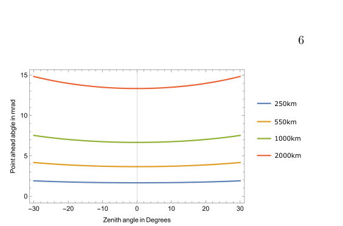
<figcaption class="paper-figure-caption"><b>Fig 3.</b> Figure 3: Point ahead angle for a given satellite altitude. The PAA changes with increasing altitudes of the satellite, ranging from 250 km to 2000 km. This is a typical range for LEO satellites.</figcaption>
</figure>
<figure class="paper-figure-card">

<figcaption class="paper-figure-caption"><b>Fig 4.</b> Figure 4: Total upper bound channel loss with differing receiver aperture sizes. This was done for a strong turbulence regime, with a wavelength of 1550 nm, a transmitter aperture of 8 cm, a pointing error at the satellite of 4 µrad, and with the satellite at an altitude of 550 km.</figcaption>
</figure>
<figure class="paper-figure-card">

<figcaption class="paper-figure-caption"><b>Fig 5.</b> Figure 5: The losses as a dependency of wavelength at the zenith is plotted. Here the atmospheric absorption lines have not been taken into consideration. The losses are plotted for a receiver aperture of 60 cm with 30% obstruction, a transmitter aperture of 8 cm, a pointing error at the satellite of 4 µrad, and with the satellite at an altitude of 550 km. This is the loss for a Gaussian modulated CV (GMCV) QKD protocol. For DV-QKD, there will be additional losses due to phase error [50–52] that GMCV does not need to consider as the transmitted local oscillator will experience the same phase drift as the quantum signal [53–55].</figcaption>
</figure>

**Summary.** This paper characterizes the complex, variable channel loss encountered when performing Continuous Variable Quantum Key Distribution from a satellite to Earth due to atmospheric turbulence and beam spreading. By modeling these physical impairments across different zenith angles, the authors demonstrate that secure quantum key generation remains feasible under specific operational constraints.

**Why it may be interesting.** This work is highly relevant to quantum optics and open quantum systems as it provides a rigorous theoretical framework for quantifying decoherence and loss mechanisms (scintillation, wandering) in real-world, dynamic free-space quantum channels. The integration of atmospheric physics into QKD security analysis is key.

Detailed structure

**Main problem.** The paper addresses the challenge of characterizing dynamic channel loss for Continuous Variable Quantum Key Distribution (CV-QKD) when transmitting signals from a Low Earth Orbit (LEO) satellite to a ground station.

**Main result.** It demonstrates that by characterizing variable channel losses due to atmospheric effects like turbulence and beam wandering, it is possible to generate a positive secret key rate under restricted security assumptions for the proposed space-based QKD link.

**Method.** The analysis involves modeling atmospheric propagation using established models (e.g., Hufnagel-Andrew-Phillips) to calculate weighted averages of refractive index structure parameters ($C_N^2$), alongside detailed calculations for scintillation variance and beam spreading loss.

**Model / system.** The system modeled is a satellite-to-ground free-space optical link operating at 1550 nm, utilizing the parameters derived from the SPOQC mission concept. The analysis incorporates effects like atmospheric attenuation, turbulence-induced broadening, and pointing inaccuracies.

**Key observables.** Achievable secret key rates, weighted $C_N^2$ profiles vs. zenith angle, scintillation variance ($\sigma^2_{	ext{sci}}(	heta)$), and total loss due to various atmospheric impairments.

**Important parameters / regimes.** Zenith angles between $-30^\circ$ and $+30^\circ$, LEO altitude (550 km), wavelength (1550 nm), and varying turbulence strengths ($C_N^2$).

**Assumptions / limitations.** The analysis relies on practical assumptions, restricted Eve security assumptions, and models the channel loss based on specific atmospheric propagation equations.

**Figures summary.** Figure 1 illustrates the satellite pass geometry over the ground station. Figure 2 shows profiles of $C_N^2$ versus altitude (top) and weighted $C_N^2$ versus zenith angle (bottom).

**Paper structure.** The paper first establishes the necessity of characterizing dynamic loss in space-based CV-QKD. It then details the physical modeling of atmospheric effects, including turbulence and beam spreading across various zenith angles. Finally, it presents the derived key rate analysis based on these characterized channel parameters.

Abstract

In space based quantum key distribution (QKD) protocols, the quantum channel will be dynamic in nature and the channel loss will change with respect to the zenith angle. In the context of continuous variable (CV)-QKD, this will cause issues with parameter estimation and for a transmitted local oscillator in particular it will also fluctuate the shot noise. Therefore, it is vital to characterise this channel loss and the sources of this loss. In this paper the varying channel loss is characterised under practical assumptions. This is shown for various different scenarios, turbulence strengths, as well as wavelengths. This work shows, for the channel parameters considered, it is possible to generate a positive secret key if restricted Eve security assumptions are made.

[↑ back to top](#top)

### [Geometric Characteristics of Subproblems in Ising-Machine-Assisted Large Neighborhood Search](http://arxiv.org/abs/2607.05014v1)

**Authors:** Masashi Yamashita, Shu Tanaka  
**Type:** both · **Category:** disordered systems and neural networks · **PDF:** <https://arxiv.org/pdf/2607.05014v1>  
**Analysis basis:** full PDF text, analyzed in chunks
**Topic relevance:** `analog quantum simulation` **1/5** · `exotic spin models in light-matter` **1/5**

↔ Scroll figures horizontally

<figure class="paper-figure-card">

<figcaption class="paper-figure-caption"><b>Fig 1.</b> Fig. 1. Comparison between LNS and the naive approach under an equal total annealing-time budget. (a) Feasible-solution probability obtained with D-Wave Advantage 4.1 for small VRP instances. (b) Normalized total dis- tance obtained with D-Wave Advantage 4.1. (c) Final total distance obtained with Fixstars Amplify AE for VRP instances with 100, 200, 300, and 400 customers. (d) Total distance of the current solution as a function of the it- eration number for the 400-customer instance. In panels (a), (b), and (c), the horizontal axis shows the number of customers N. In the naive approach, the full QUBO problem is submitted to the Ising machine once. In LNS, sub- problems are solved...</figcaption>
</figure>
<figure class="paper-figure-card">

<figcaption class="paper-figure-caption"><b>Fig 2.</b> Fig. 2. Final total distance obtained by LNS-K and LNS-Q for a vehicle routing problem with 400 customers. LNS-K constructs a subproblem from selected vehicles and the customers visited by those vehicles in the current solution, whereas LNS-Q constructs a subproblem from QUBO variables and the associated constraints. The horizontal labels indicate K′ for LNS-K and n′ for LNS-Q. The corresponding numbers of binary variables in the subprob- lems are summarized in Table II. Although n′ allows LNS-Q to control the subproblem size more finely, LNS-K gives shorter final total distances under the tested conditions.</figcaption>
</figure>
<figure class="paper-figure-card">

<figcaption class="paper-figure-caption"><b>Fig 3.</b> Fig. 3. Iterative behavior of LNS-K and LNS-Q for subproblems with the same number of binary variables. The results are for a vehicle routing prob- lem with 400 customers. Each row corresponds to K′ = 2, 3, 4, and 5 in LNS-K, and n′ in LNS-Q is chosen to match the corresponding subproblem size, as listed in Table II. (a) Total distance of the current solution. LNS-K shows faster iterative improvement than LNS-Q, especially for smaller sub- problems. (b) Position variance of the selected customer set. In LNS-K, the selected customer set becomes more spatially localized during the optimiza- tion, whereas the position variance in LNS-Q remains nearly constant.</figcaption>
</figure>

**Summary.** This paper investigates how to effectively use Large Neighborhood Search (LNS) with Ising machines to solve large Vehicle Routing Problems. By comparing two subproblem construction methods, LNS-K and LNS-Q, the authors demonstrate that incorporating the semantic structure of the current solution is crucial for optimization success. The findings suggest that structural information matters more than simply controlling the size of the variables fed into the quantum annealer.

**Why it may be interesting.** While focused on optimization heuristics, the reliance on mapping complex combinatorial problems onto QUBOs solved by quantum annealers touches upon the practical application of quantum computation for hard constraint satisfaction problems relevant to many-body physics modeling.

Detailed structure

**Main problem.** The study addresses limitations when using Ising machines for large-scale combinatorial optimization problems, specifically QUBO formulations of VRPs.

**Main result.** Subproblem design for sequential optimization must consider the semantic and geometric structure inherited from the current solution, not just the number of binary variables.

**Method.** The authors compare two Large Neighborhood Search (LNS) strategies: LNS-K (based on route structure) and LNS-Q (based on QUBO variables), applied to VRPs solved via Ising machines.

**Model / system.** The model is a Vehicle Routing Problem (VRP) formulated as a QUBO, which is then optimized iteratively using an Ising machine framework. The comparison focuses on how the subproblem is constructed from the current solution state.

**Key observables.** Total distance achieved, position variance (spatial spread of selected customers), and the number of binary variables in the subproblems.

**Important parameters / regimes.** The size of the subproblem ($B_m$), the type of construction rule (LNS-K vs. LNS-Q), and the controlled annealing time budget for quantum annealers.

**Assumptions / limitations.** The comparison is limited by matching either the number of variables or the total annealing time, not end-to-end wall-clock runtime; a causal link between geometric localization and performance improvement is not established.

**Figures summary.** Figures illustrate that LNS-K yields shorter total distances and shows decreasing position variance during iterations compared to LNS-Q, even when subproblem sizes are matched.

**Paper structure.** The paper introduces the challenge of large QUBOs for Ising machines, proposes using LNS, and then systematically compares two construction methods (LNS-K vs. LNS-Q) on VRP instances by analyzing performance metrics like distance and spatial variance.

Abstract

Large-scale quadratic unconstrained binary optimization (QUBO) formulations of constrained combinatorial optimization problems often exceed the input-size limit of present Ising machines or suffer from degraded solution quality as the number of binary variables increases. Large neighborhood search (LNS) mitigates this difficulty by sequentially optimizing restricted subproblems, but the structural factors that distinguish subproblems beyond the number of binary variables remain insufficiently characterized. In this study, we examine vehicle routing problems and compare a construction based on the vehicle routes of the current solution, denoted by LNS-K, with a construction based on QUBO variables and constraint relations, denoted by LNS-Q, while controlling the number of binary variables in the subproblems. Under the tested conditions, LNS-K obtained shorter total distances than LNS-Q in the matched-size comparisons, and the position variance, a measure of the spatial spread of the selected customers, decreased during the iterations in LNS-K. These observations suggest that subproblem design for sequential optimization with Ising machines should consider not only subproblem size but also semantic and geometric structures inherited from the current solution.

[↑ back to top](#top)

### [How Hard Is Quantum Advantage? A Cloud Microphysics Stress Test for Variational Quantum Models](http://arxiv.org/abs/2607.04915v1)

**Authors:** Felix Herbort, Ellen Sarauer, Daniel Ohl de Mello, Paul Christiansen, Steffen Hien, Cedric Brügmann, Dieter Jaksch, Veronika Eyring, Martin Kiffner, Mierk Schwabe  
**Type:** both · **Category:** disordered systems and neural networks · **PDF:** <https://arxiv.org/pdf/2607.04915v1>  
**Analysis basis:** full PDF text, analyzed in chunks
**Topic relevance:** `driven-dissipative phase transition` **1/5** · `methods for driven-dissipative` **1/5**

↔ Scroll figures horizontally

<figure class="paper-figure-card">
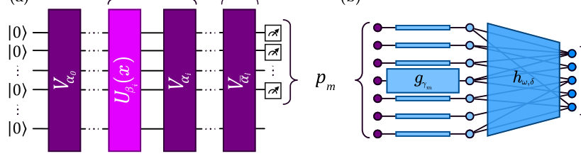
<figcaption class="paper-figure-caption"><b>Fig 1.</b> Figure 1: Hybrid quantum neural network architecture. (a) Our model consists of a quantum circuit with repeated trainable data encoding layers U and trainable entangling layers V . The circuit’s output state is measured on M qubits and basis state probabilities pm. (b) The probabilities are then fed into a classical post processing pipeline where polynomials g with trainable coefficients are applied to each pm and a weighted average h computes the final output.</figcaption>
</figure>
<figure class="paper-figure-card">
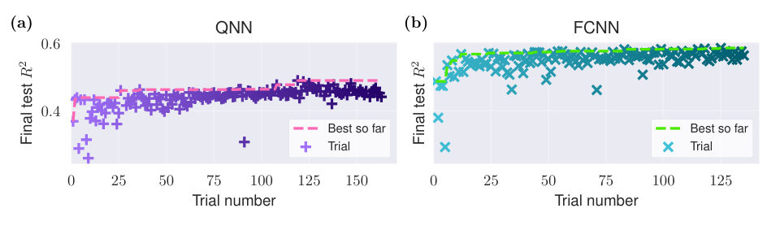
<figcaption class="paper-figure-caption"><b>Fig 2.</b> Figure 2: Evolution of our hyperparameter optimization objective for our hybrid QNN in (a) and FCNN architecture in (b). Each cross marks the R2 test performance of a single HPO trial model. Color brightness additionally encodes trial number, consistently to figures below. A dashed line marks the best model’s score up to the current state of the HPO.</figcaption>
</figure>
<figure class="paper-figure-card">

<figcaption class="paper-figure-caption"><b>Fig 3.</b> Figure 3: QNN performance slices for all hyperparameters throughout the HPO. The first row shows number of data reuploading layers L, additional variational layers ¯L, use of strongly entangling layers and whether to train reuploading factors β. The second row shows classical post-processing polynomial gγ, batch size NB, learning rate η, and number of measurement qubits M. Box-plots refer to discretized hyperparameters where in each box plot, the central green line denotes the median, the box spans the interquartile range (IQR, Q1–Q3), the whiskers extend to 1.5×IQR beyond the box edges, and individual dots mark outliers beyond the whiskers. For most hyperparameters, this data gives a clear...</figcaption>
</figure>
<figure class="paper-figure-card">

<figcaption class="paper-figure-caption"><b>Fig 4.</b> Figure 4: FCNN performance slices for all hyperparameters throughout the HPO. The first row shows activation function ϕ, batch size NB, learning rate η, and number of hidden layers LH. The bottom row shows number of kernels Kl for the respective hidden layer l. Box-plots refer to discretized hyperparameters where in each box plot, the central green line denotes the median, the box spans the interquartile range (IQR, Q1–Q3), the whiskers extend to 1.5×IQR beyond the box edges, and individual dots mark outliers beyond the whiskers. The optimized hyperparameters show good agreement with established standards in classical neural network literature. For instance, increasing the numbers of layers...</figcaption>
</figure>
<figure class="paper-figure-card">
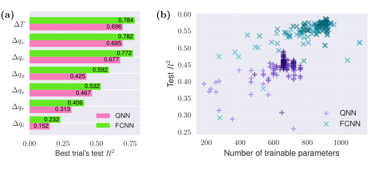
<figcaption class="paper-figure-caption"><b>Fig 5.</b> Figure 5: (a) R2 scores of all targets for QNN and FCNN. For all models we have a score of R2 &gt; 0 but FCNN outperforms the best QNN for every output. (b) Effect of number of trainable parameters on model performance. Except for few outliers which arise from uncommon choices of hyperparameters, FCNNs consistently outperform the QNN model. However, we note that simple parameter count comparison should not be the only quantity to compare as we discuss in Sec. 5.</figcaption>
</figure>

**Summary.** This work tests Quantum Machine Learning (QML) by applying hybrid QNNs to model cloud microphysics in climate science. Despite significant optimization efforts, the quantum models were outperformed by simpler classical neural networks. The findings underscore that while QML shows potential, substantial theoretical and practical improvements are needed before it can reliably tackle complex physical modeling tasks.

**Why it may be interesting.** Although focused on climate physics, the core challenge—applying quantum models to complex, high-dimensional physical parameterizations—is relevant for developing novel machine learning techniques applicable to open quantum systems or strongly correlated materials simulations where classical methods struggle.

Detailed structure

**Main problem.** The paper assesses whether Quantum Machine Learning (QML) can effectively parameterize complex physical processes, specifically cloud microphysics in climate modeling, and identifies the limitations of variational quantum models.

**Main result.** While QNNs benefit from extensive hyperparameter optimization, they were outperformed by simple classical fully-connected neural networks on the benchmark task. This highlights a need to improve VQMs to fill gaps where classical methods fail or are inefficient.

**Method.** A hybrid quantum neural network (QNN) architecture was implemented, combining quantum circuits for data encoding and feature extraction with classical post-processing layers. Performance was rigorously compared against optimized classical FCNN baselines using Mean Squared Error minimization.

**Model / system.** The system modeled is cloud microphysics parameterization, involving phase transitions of water in the atmosphere, derived from large atmospheric datasets (ICON model). The ML models used are hybrid QNNs and standard FCNNs trained to predict changes in state variables like temperature and mass mixing ratios.

**Key observables.** Test $R^2$ score, Mean Squared Error (MSE), basis state probabilities ($p_m$), and various atmospheric tendencies ($\Delta T$, $\Delta qv$, etc.).

**Important parameters / regimes.** Hyperparameters optimized included circuit depth ($L$), number of qubits ($M$), learning rates ($\eta$), and polynomial degrees ($P$).

**Assumptions / limitations.** The primary limitation noted is the presence of extreme outliers in the training data, which artificially inflate the loss function and affect performance metrics.

**Figures summary.** Figures illustrate the hybrid QNN architecture (quantum circuit $
ightarrow$ classical post-processing) and show the convergence of test $R^2$ scores for both QNNs and FCNNs during hyperparameter optimization.

**Paper structure.** The paper introduces the problem, details the hybrid QNN/FCNN methodology using extensive data preprocessing and HPO routines, presents comparative results showing classical superiority, and concludes by discussing bottlenecks in VQMs.

Abstract

Quantum machine learning (QML) could have the potential to leverage advantages of quantum over classical computing but still lacks strong evidence of actual improvements and scalability, partly due to phenomena such as barren plateaus. In this paper, we employ a hybrid quantum neural network (QNN) on a dataset on cloud microphysics, containing processes for phase transitions of water in the atmosphere and its related temperature changes, which are highly relevant for accurate climate predictions and projections. To reach optimal performance of our QNNs, we employ a rich and trainable frequency spectrum together with expressivity enhancing classical postprocessing. We find that our QNNs strongly benefit from extensive hyperparameter optimization and thereby demonstrate the feasibility of applying QNNs to complex physical systems. At the same time, the QNNs are outperformed by classical baselines in the form of simple fully-connected neural networks. We discuss identified bottlenecks of this class of quantum models to learn the full complexity of the cloud microphysics dataset to show that there is a need to further understand and improve variational quantum models for machine learning such that they might fill the gap where classical models fail or are inefficient.

[↑ back to top](#top)

### [Noise-limited secret key agreement with twin optical physically unclonable functions](http://arxiv.org/abs/2607.04936v1)

**Authors:** Georgios M. Nikolopoulos  
**Type:** theory · **Category:** other · **PDF:** <https://arxiv.org/pdf/2607.04936v1>  
**Analysis basis:** full PDF text, analyzed in chunks
**Topic relevance:** `entanglement & information structure` **1/5** · `interference shaping light` **1/5**

↔ Scroll figures horizontally

<figure class="paper-figure-card">

<figcaption class="paper-figure-caption"><b>Fig 1.</b> Figure 1. Schematic representation of the main steps in the key agreement with twin PUFs.</figcaption>
</figure>
<figure class="paper-figure-card">

<figcaption class="paper-figure-caption"><b>Fig 2.</b> Figure 2. The maximum BER Qmax (a) and the corresponding channel capacity Cmin (b), are shown for different standard deviations of fabrication and environmental noise. The results have been obtained for 200 independent twins and 200 independent realizations for each twin. The fabrication and environmental noise have been treated as described in Sec. 2 . Other parameters: N = 104, l/L = 0.2, 1−bit SLM, transmission geometry.</figcaption>
</figure>

**Summary.** This work proposes using twin optical PUFs—which derive their randomness from correlated speckle patterns generated by light scattering—to establish a secret key. It develops a rigorous, information-theoretic protocol for key agreement that accounts for environmental noise and fabrication variability. This offers a hardware-based alternative to traditional quantum key distribution methods.

**Why it may be interesting.** While not directly about quantum dynamics, the reliance on complex physical phenomena like light scattering in disordered media to generate high-entropy random numbers touches upon open questions at the intersection of condensed matter physics (disorder) and information theory.

Detailed structure

**Main problem.** The paper investigates establishing a shared secret key between two parties using twin optical Physical Unclonable Functions (PUFs) as a hardware-based platform for cryptography.

**Main result.** An explicit information-theoretic protocol is developed that quantifies the achievable lower bound on the final secret key length, identifying noise regimes where secure agreement is feasible without relying on computational assumptions.

**Method.** The core method involves developing an information-theoretic key-agreement protocol incorporating secure sketches, error reconciliation, and privacy amplification applied to correlated PUF responses.

**Model / system.** The physical platform utilizes twin O-PUFs, where the fingerprint is a speckle pattern generated by coherent light scattering through disordered optical structures. The model mathematically describes the output electric field using linear scattering theory involving transmission matrices.

**Key observables.** Information leakage due to public helper data; lower bounds on the length of the final secret key; Bit Error Rate (BER) between raw keys.

**Important parameters / regimes.** Fabrication-induced variability ($\sigma_F$) and environmental noise ($\sigma_E$); the maximum allowed Hamming distance ($t$).

**Assumptions / limitations.** The analysis assumes linear scattering theory in the diffusive limit, challenge uniformity, and that the adversary is limited to observing public classical communication.

**Figures summary.** Figure 1 schematically illustrates the main steps of key agreement using twin PUFs, detailing the flow from raw key generation through sketching, reconciliation, and amplification.

**Paper structure.** The paper first models the physical process using correlated O-PUFs. It then develops the information-theoretic protocol (sketching $
ightarrow$ reconciliation $
ightarrow$ amplification). Finally, it analyzes the security bounds based on noise regimes and discusses integration into QKD networks.

Abstract

We investigate the use of twin optical fingerprints derived from correlated physical unclonable functions (PUFs), as a hardware-based platform for cryptographic key generation and distribution. Each fingerprint is associated with a random, yet reproducible speckle pattern, generated when coherent light is scattered by a disordered optical structure. We consider a pair of correlated optical PUFs, and study the conditions under which two honest parties can establish a common secret key, despite fabrication-induced variability and environmental noise. An explicit information-theoretic key-agreement protocol is developed, incorporating secure sketches, error reconciliation, and privacy amplification. We quantify information leakage due to public helper data, and derive lower bounds on the length of the final secret key. The analysis identifies the noise regimes in which secure key agreement is feasible, and examines the performance of both practical and near-capacity reconciliation schemes. Finally, we discuss how twin optical PUFs could be integrated into quantum key distribution (QKD) networks, as a mechanism for establishing an initial pre-shared secret key between two honest users, without relying on computational assumptions or trusted third parties.

[↑ back to top](#top)

### [On estimating operator norm distance, with optimal trace distance estimation when one state is pure](http://arxiv.org/abs/2607.03905v1)

**Authors:** Yupan Liu, Qisheng Wang, Zhan Yu  
**Type:** theory · **Category:** quantum information and computing · **PDF:** <https://arxiv.org/pdf/2607.03905v1>  
**Analysis basis:** full PDF text, analyzed in chunks
**Topic relevance:** `entanglement & information structure` **1/5** · `quantum measurements` **1/5**

↔ Scroll figures horizontally

<figure class="paper-figure-card">

<figcaption class="paper-figure-caption"><b>Fig 1.</b> Low-resolution page preview, page 2</figcaption>
</figure>
<figure class="paper-figure-card">
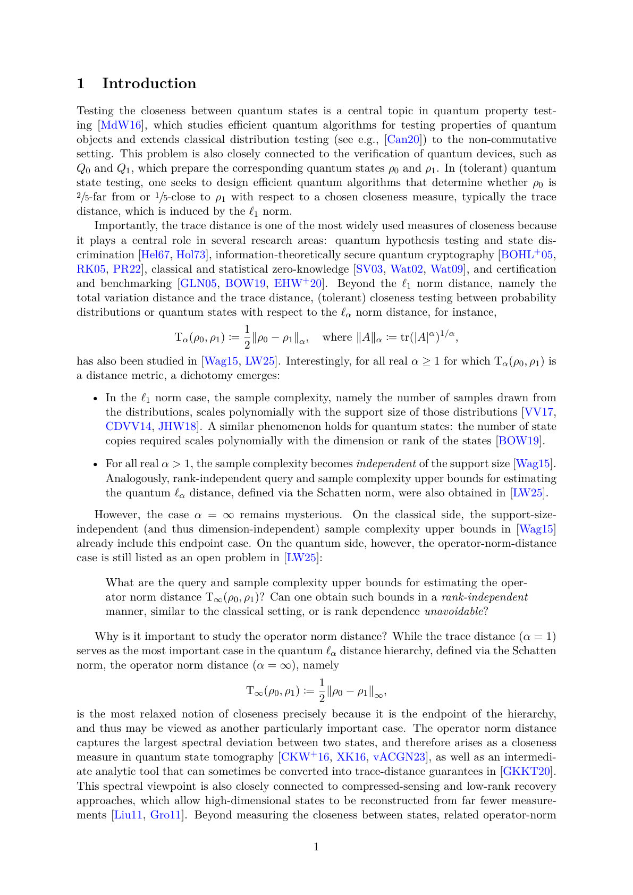
<figcaption class="paper-figure-caption"><b>Fig 2.</b> Low-resolution page preview, page 3</figcaption>
</figure>
<figure class="paper-figure-card">
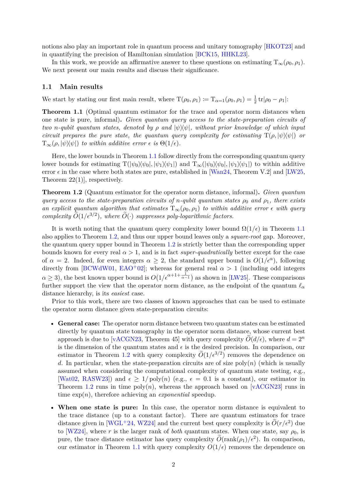
<figcaption class="paper-figure-caption"><b>Fig 3.</b> Low-resolution page preview, page 4</figcaption>
</figure>
<figure class="paper-figure-card">
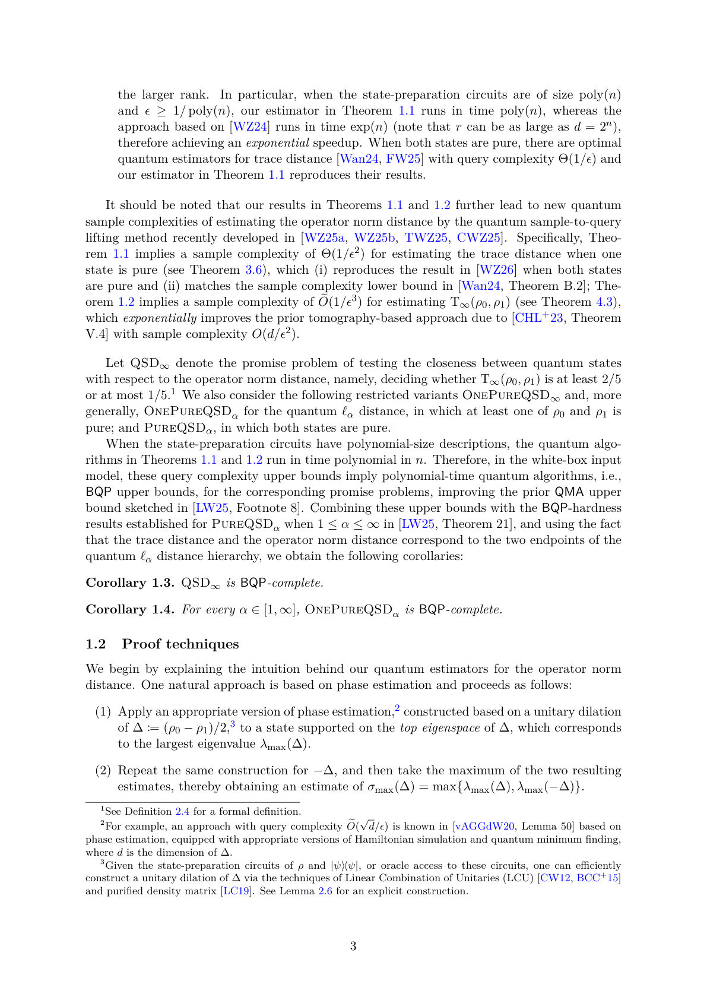
<figcaption class="paper-figure-caption"><b>Fig 4.</b> Low-resolution page preview, page 5</figcaption>
</figure>
<figure class="paper-figure-card">

<figcaption class="paper-figure-caption"><b>Fig 5.</b> Low-resolution page preview, page 6</figcaption>
</figure>

**Summary.** This paper tackles the computational challenge of estimating the operator norm distance between two quantum states. The authors introduce novel quantum estimators that achieve optimal query complexity when one state is pure, bypassing limitations in prior work that scaled poorly with state rank. This advances the understanding of resource requirements for fundamental quantum measurement tasks.

**Why it may be interesting.** This work provides fundamental algorithmic improvements for quantum information tasks by achieving query complexities independent of state dimension or rank, which is critical for scaling up quantum simulations and protocols.

Detailed structure

**Main problem.** The paper investigates the computational complexity of estimating the operator norm distance $T_{\infty}(
ho_0, 
ho_1)$ between two quantum states $
ho_0$ and $
ho_1$. It specifically focuses on achieving efficient estimators whose complexity is independent of the state rank.

**Main result.** For the case where one state is pure, an optimal quantum estimator was established with a query complexity of $\Theta(1/\epsilon)$, which is significantly better than prior methods scaling with the state rank. For general states, an estimator achieving $eO(1/\epsilon^{3/2})$ queries was provided.

**Method.** The authors develop and analyze quantum estimators using techniques like phase estimation and leveraging structural properties of the operator norm distance when one state is pure. The analysis involves constructing unitary dilations and bounding errors via mean value theorems.

**Model / system.** The system involves $n$-qubit quantum states ($
ho_0, 
ho_1$) prepared using polynomial-size circuits. The core mathematical objects are the operator norm distance ($T_{\infty}$) and the trace distance ($T$).

**Key observables.** Operator norm distance $T_{\infty}(
ho_0, 
ho_1)$, Trace Distance $T(
ho_0, 
ho_1)$, and the largest singular value $\sigma_{\max}(A)$.

**Important parameters / regimes.** The desired precision $\epsilon$ is crucial for determining query complexity. The state rank ($	ext{rank}(
ho)$) is a key parameter that the new methods aim to circumvent dependency on.

**Assumptions / limitations.** The analysis relies on the existence of poly$(n)$-size state-preparation circuits and utilizes quantum estimation techniques, including warm starts when one state is pure.

**Paper structure.** The paper progresses by first establishing the problem context (estimating $T_{\infty}$), then presenting the optimal estimator for the single-pure-state case with its complexity analysis. It subsequently addresses the general case, providing a second estimator and comparing it to known lower bounds.

Abstract

We investigate the computational complexity of estimating the operator norm distance ${\rm T}_{\infty}(ρ_0,ρ_1)$, defined via the operator norm $\|A\|_{\infty} = σ_{\max}(A)$, given ${\rm poly}(n)$-size state-preparation circuits of $n$-qubit quantum states $ρ_0$ and $ρ_1$. We provide efficient quantum estimators for the operator norm distance whose complexity is independent of the rank (and thus the dimension) of the states:   1. When one state is pure, we establish an optimal quantum estimator using $Θ(1/ε)$ queries to the state-preparation circuits. Consequently, for constant additive error, say $ε=1/5$, our estimator runs in ${\rm poly}(n)$ time. Since the operator norm distance ${\rm T}_{\infty}(|ψ\rangle\!\langleψ|,ρ)$ is exactly half of the trace distance ${\rm T}(|ψ\rangle\!\langleψ|,ρ)$, our result also gives rank-independent query complexity for estimating both quantities, whereas the approaches due to van Apeldoorn, Cornelissen, Gily{é}n, and Nannicini (SODA 2023) and Wang and Zhang (TIT 2024) have query complexity scaling at least linearly with ${\rm rank}(ρ)$, which can be $\exp(n)$ in general.   2. For general quantum states, we also provide a quantum estimator using $\widetilde{O}(1/ε^{3/2})$ queries to the state-preparation circuits, which shows that the corresponding promise problem is ${\sf BQP}$-complete and improves the ${\sf QMA}$ upper bound sketched by Liu and Wang (ESA 2025). Together with an $Ω(1/ε)$ quantum query complexity lower bound, this leaves only square-root room for improvement.   The key intuition behind our estimators is that, when one state is pure, the pure state $|ψ\rangle$ has overlap at least $1/2$ with the top unit eigenvector of $|ψ\rangle\!\langleψ|-ρ$, reflecting a structural feature specific to the operator norm distance.

[↑ back to top](#top)

### [Schrodinger Oscillator and its Thermal Properties in a Dynamical Noncommutative Space](http://arxiv.org/abs/2607.04519v1)

**Authors:** Ilyas Haouam  
**Type:** theory · **Category:** statistical mechanics · **PDF:** <https://arxiv.org/pdf/2607.04519v1>  
**Analysis basis:** full PDF text, analyzed in chunks
**Topic relevance:** `Keldysh / 2PI / non-Gaussian methods` **1/5** · `driven-dissipative phase transition` **1/5**

↔ Scroll figures horizontally

<figure class="paper-figure-card">
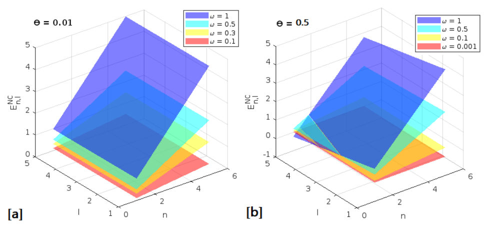
<figcaption class="paper-figure-caption"><b>Fig 1.</b> Figure 1: 3D plots of the NC energy eigenvalues ENC n,l as a function of quantum numbers n &amp; l, shown for</figcaption>
</figure>
<figure class="paper-figure-card">

<figcaption class="paper-figure-caption"><b>Fig 2.</b> Figure 2: (a) Energy eigenvalues ENC n,l as a function of Θ, shown for different values of the oscillator angular</figcaption>
</figure>
<figure class="paper-figure-card">
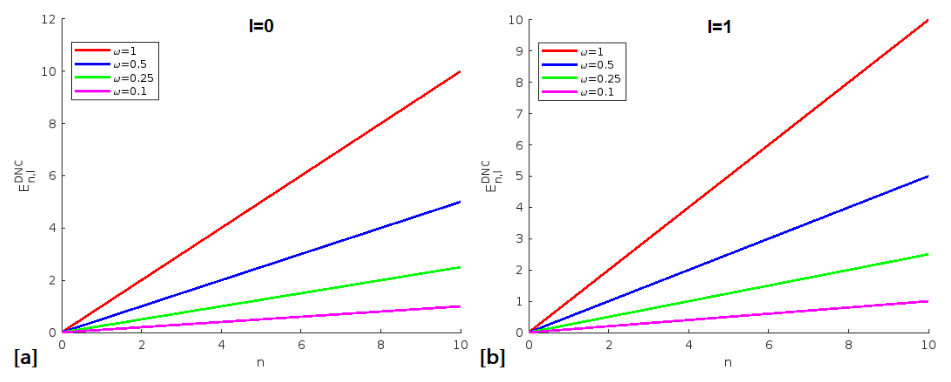
<figcaption class="paper-figure-caption"><b>Fig 3.</b> Figure 3: The DNC energy eigenvalues EDNC n,l as a function of the quantum number n, shown for different</figcaption>
</figure>
<figure class="paper-figure-card">
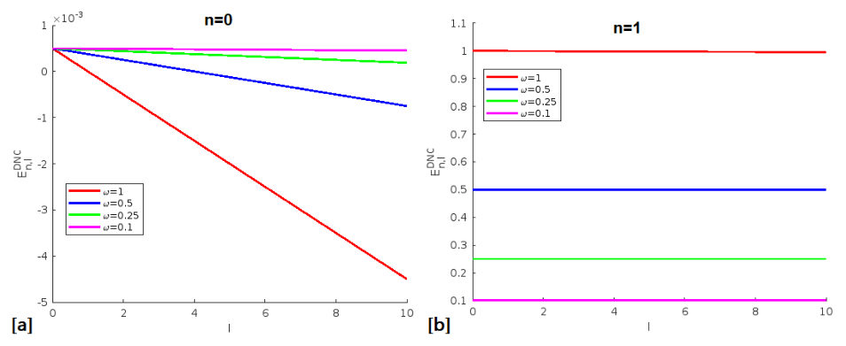
<figcaption class="paper-figure-caption"><b>Fig 4.</b> Figure 4: The DNC energy eigenvalues EDNC n,l as a function of the quantum number l, shown for different</figcaption>
</figure>
<figure class="paper-figure-card">

<figcaption class="paper-figure-caption"><b>Fig 5.</b> Figure 5: 3D plots of the NC energy eigenvalues ENC n,l as a function of NC and DNC parameters Θ and τ,</figcaption>
</figure>

**Summary.** This paper analyzes the thermal physics of a 2D Schrödinger oscillator placed within a Dynamical Noncommutative space. Using perturbation theory and the partition function, the authors derive how noncommutative parameters ($\Theta$ and $	au$) modify the energy spectrum and thermodynamic quantities like internal energy and specific heat. The work is significant for linking advanced geometric concepts in quantum mechanics to observable thermal signatures.

**Why it may be interesting.** It connects fundamental concepts from quantum gravity (noncommutative geometry) directly to measurable thermal properties, providing a theoretical framework for how spacetime structure might influence thermodynamics in extreme physical regimes.

Detailed structure

**Main problem.** The study investigates the thermal properties of a two-dimensional Schrödinger oscillator when subjected to the constraints of a Dynamical Noncommutative (DNC) space.

**Main result.** The energy spectrum and thermodynamic quantities are modified by both the noncommutativity ($\Theta$) and the dynamical deformation parameter ($	au$), suggesting that DNC geometry encodes effective geometric properties.

**Method.** The analysis employs perturbation theory to calculate energy eigenvalues and utilizes the partition function ($Z$) to derive key thermodynamic observables like internal energy, specific heat, and entropy.

**Model / system.** The system is a 2D Schrödinger oscillator whose Hamiltonian is modified by position-dependent commutation relations characteristic of a DNC space. The analysis involves mapping this complex noncommutative problem onto an effective commutative counterpart using the Bopp-shift.

**Key observables.** Partition function ($Z$), Free energy ($F$), Internal energy ($U$), Specific heat capacity ($C$), and Entropy ($S$).

**Important parameters / regimes.** DNC parameter ($	au$), Noncommutative parameter ($\Theta$), Inverse temperature ($eta$), and quantum frequency ($\omega$).

**Assumptions / limitations.** The analysis relies on perturbation theory expansions in $	au$ and $\Theta$, and the necessity of using a Dyson map to restore Hermiticity to non-Hermitian operators.

**Figures summary.** Figures illustrate how thermodynamic quantities ($Z, F, U$) vary with temperature ($eta$), frequency ($\omega$), and the deformation parameters ($\Theta, 	au$).

**Paper structure.** The paper proceeds by deriving the modified Hamiltonian in DNC space, calculating first-order corrections to the energy spectrum using perturbation theory, and finally analyzing the resulting thermodynamic behavior across various temperature regimes.

Abstract

In this paper, we study the two-dimensional Schrodinger oscillator within a dynamical noncommutative (DNC) space. By leveraging perturbation theory, we derive the energy eigenvalues and eigenvectors and systematically analyze the effects of both dynamical and non-dynamical noncommutative settings. First-order corrections to the eigensystem are obtained, revealing that the energy shift explicitly depends on the DNC parameter tau. Furthermore, we explore the thermal properties of the system by employing the partition function. Numerical results are presented to provide a comprehensive analysis of the system behavior under the considered effects. Notably, in the DNC framework, the commutation relations and the deformation parameter are position-dependent. Using the two-dimensional Bopp-shift, we effectively map the noncommutative problem to its commutative counterpart.

[↑ back to top](#top)

### [Uniform distributions in nonuniform systems: Wall potentials generating constant density profiles in classical density functional theory](http://arxiv.org/abs/2607.04863v1)

**Authors:** Jiří Janek, Alexandr Malijevský  
**Type:** theory · **Category:** statistical mechanics · **PDF:** <https://arxiv.org/pdf/2607.04863v1>  
**Analysis basis:** full PDF text, analyzed in chunks
**Topic relevance:** `Frenkel-Kontorova` **1/5** · `Keldysh / 2PI / non-Gaussian methods` **1/5**

↔ Scroll figures horizontally

<figure class="paper-figure-card">

<figcaption class="paper-figure-caption"><b>Fig 1.</b> FIG. 1. Planar wall potential that generates the prescribed constant density profile for several packing fractions η. (a) Hard-sphere fluid. (b) Fluid with attractive interactions for T = 1.5 k−1 B ε.</figcaption>
</figure>
<figure class="paper-figure-card">

<figcaption class="paper-figure-caption"><b>Fig 2.</b> FIG. 3. Hard-sphere wall potential in spherical geometry, V sph. HS (r −ϱ), for η = 0.2. Results for two sphere radii are compared with the planar limit V pl. HS (z). The effect of curva- ture is relatively weak in the purely repulsive system.</figcaption>
</figure>
<figure class="paper-figure-card">

<figcaption class="paper-figure-caption"><b>Fig 3.</b> FIG. 2. DFT density profiles in planar geometry obtained with the analytically constructed external potentials. (a) Hard-sphere fluid. (b) Fluid with truncated Lennard-Jones attraction at T = 1.5 ε/kB. Several grid spacings are shown, demonstrating convergence toward the prescribed flat profile.</figcaption>
</figure>
<figure class="paper-figure-card">
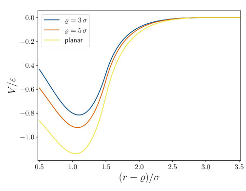
<figcaption class="paper-figure-caption"><b>Fig 4.</b> FIG. 4. Wall potential in spherical geometry for the fluid with attractive interactions, V sph. LJ (r −ϱ), shown for several sphere radii and compared with the planar result. For η = 0.2 and T = 1.5 k−1 B ε. In contrast to the hard-sphere case, curvature has a more pronounced effect on the depth and position of the attractive minimum.</figcaption>
</figure>
<figure class="paper-figure-card">
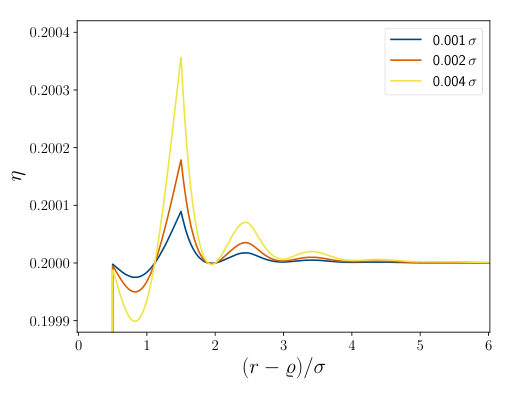
<figcaption class="paper-figure-caption"><b>Fig 5.</b> FIG. 5. DFT density profiles in spherical geometry for ηb = 0.2, ϱ = 3σ, and T = 1.5 k−1 B ε, using the derived external potentials. (a) Hard-sphere fluid. (b) Fluid with attractive interactions. Several grid spacings are shown, demonstrating convergence toward the prescribed flat profile.</figcaption>
</figure>

**Summary.** This work solves an inverse problem in DFT by calculating the specific wall potential needed to maintain a perfectly constant fluid density near a surface. Using fundamental measure theory, the authors derive analytical solutions for planar and spherical geometries, providing explicit microscopic realizations of structure-cancelling fields. This is significant for understanding boundary conditions in inhomogeneous fluids.

**Why it may be interesting.** While focused on classical fluids, the rigorous application of density functional theory and the concept of 'structure-cancelling' fields provide powerful mathematical tools for understanding boundary effects in complex many-body systems, which has parallels in quantum confinement studies.

Detailed structure

**Main problem.** The paper tackles the inverse problem of classical Density Functional Theory (DFT): determining the external wall potential required to force a fluid's density profile into a constant, flat distribution near a substrate.

**Main result.** Explicit analytical expressions for structure-cancelling wall potentials are derived for planar and spherical geometries, confirming that such fields can enforce perfectly uniform local densities.

**Method.** The authors use fundamental measure theory (FMT) within the DFT framework to solve the self-consistent equations governing inhomogeneous fluids in various symmetries.

**Model / system.** The system is a one-component fluid modeled using hard-sphere interactions and optionally supplemented with mean-field attractive Lennard-Jones tails. Calculations are performed for planar, spherical, and cylindrical geometries.

**Key observables.** Constant equilibrium density profile ($
ho(r) = 	ext{constant}$), the required wall potential $V(r)$, weighted densities ($n_\alpha$), and one-body direct correlation functions ($c^{(1)}$).

**Important parameters / regimes.** The geometry (planar, spherical, cylindrical), the nature of interaction (hard-sphere vs. attractive), and the bulk chemical potential ($\mu$).

**Assumptions / limitations.** The fluid is treated as one-component; the attractive interactions are approximated using a mean-field treatment.

**Figures summary.** Figures illustrate the derived wall potentials in planar and spherical geometries, alongside DFT calculations confirming that the resulting density profiles converge to the prescribed flat profile.

**Paper structure.** The paper systematically derives weighted densities and correlation functions for three symmetries (planar, spherical, cylindrical) before focusing on solving the inverse problem—finding $V(r)$ such that $
ho(r)$ is constant. The results are validated by independent DFT calculations.

Abstract

We study the inverse problem of classical density functional theory for inhomogeneous fluids: finding the wall potential that produces a constant equilibrium density profile, i.e., a perfectly flat density distribution in the accessible region adjacent to a substrate. Within Rosenfeld's fundamental measure theory, we solve this problem for a one-component fluid in planar, spherical, and cylindrical geometries, considering both a hard-sphere fluid and a fluid with an additional truncated Lennard-Jones attraction treated at the mean-field level. Explicit analytical expressions are obtained for planar walls, while spherical walls also admit an analytical treatment in a more cumbersome form. The cylindrical case is treated numerically. The construction provides an explicit microscopic realization of structure-cancelling wall fields, related to flat-profile conditions that occur under special matching conditions in interfacial theories of wetting and drying. The theory also yields a compact collection of formulae for weighted densities and one-body direct correlation functions in the three fundamental geometries, providing useful reference expressions for density-functional implementations. The resulting analytic wall potentials are validated in independent density functional calculations, which confirm that the prescribed flat profiles are recovered within numerical accuracy.

[↑ back to top](#top)

### [A universal emulator for planar Ising lattices](http://arxiv.org/abs/2607.05308v1)

**Authors:** Riccardo Ben Alì Zinati, Alessandro Codello  
**Type:** theory · **Category:** statistical mechanics · **PDF:** <https://arxiv.org/pdf/2607.05308v1>  
**Analysis basis:** full PDF text, analyzed in chunks
**Topic relevance:** `analog quantum simulation` **1/5**

↔ Scroll figures horizontally

<figure class="paper-figure-card">
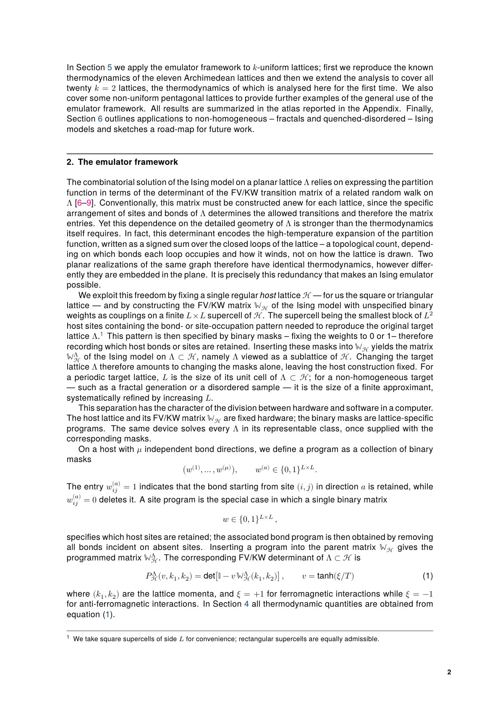
<figcaption class="paper-figure-caption"><b>Fig 1.</b> Low-resolution page preview, page 2</figcaption>
</figure>
<figure class="paper-figure-card">
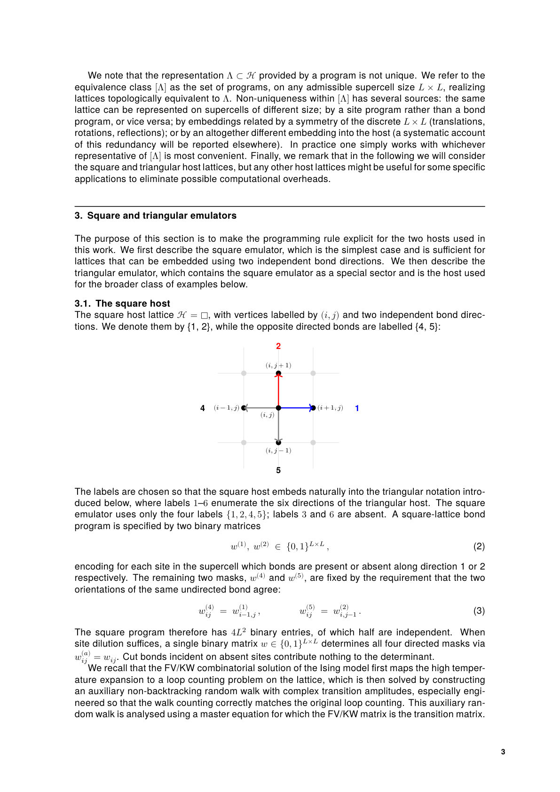
<figcaption class="paper-figure-caption"><b>Fig 2.</b> Low-resolution page preview, page 3</figcaption>
</figure>
<figure class="paper-figure-card">
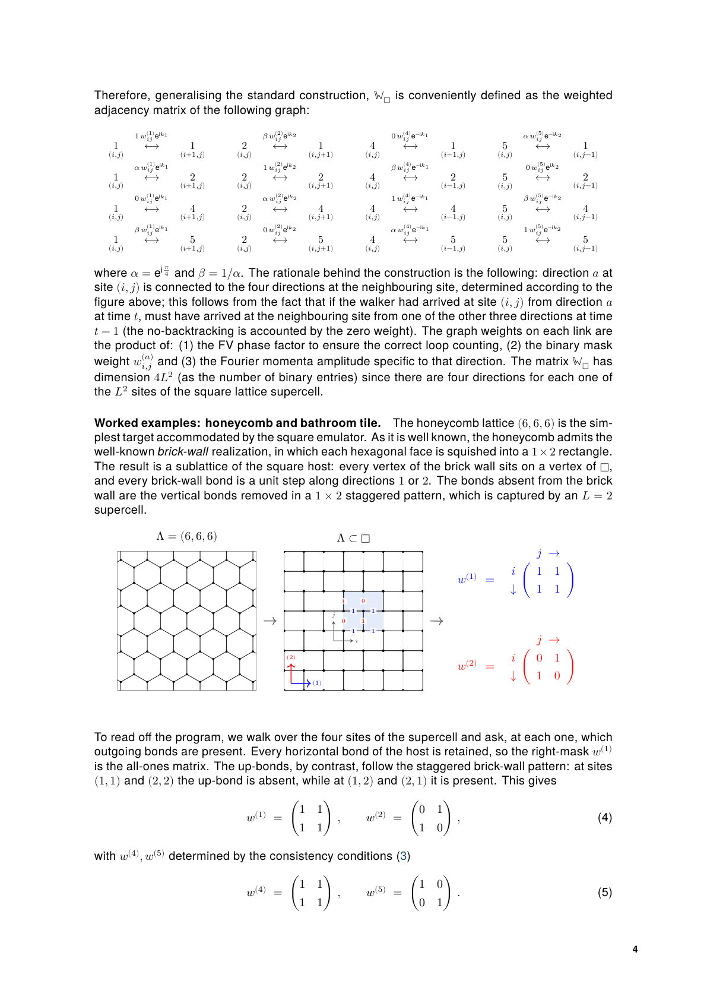
<figcaption class="paper-figure-caption"><b>Fig 3.</b> Low-resolution page preview, page 4</figcaption>
</figure>
<figure class="paper-figure-card">

<figcaption class="paper-figure-caption"><b>Fig 4.</b> Low-resolution page preview, page 5</figcaption>
</figure>
<figure class="paper-figure-card">

<figcaption class="paper-figure-caption"><b>Fig 5.</b> Low-resolution page preview, page 6</figcaption>
</figure>

**Summary.** This paper introduces a universal emulator framework to calculate the thermodynamics of Ising models on any planar lattice. By embedding complex target lattices into a fixed, simple host lattice structure, the authors derive all necessary thermodynamic quantities using a single mathematical machinery based on the Feynman–Vdovichenko/Kac–Ward solution. This greatly expands the scope of solvable models in 2D statistical mechanics.

**Why it may be interesting.** While focused on classical statistical mechanics, the concept of using a fixed 'hardware' structure (the host matrix) parameterized by 'software' masks (binary occupation patterns) is analogous to modern computational modeling techniques used in quantum simulation or circuit design.

Detailed structure

**Main problem.** The primary goal is to develop a universal computational framework (an 'emulator') for calculating the thermodynamic properties of two-dimensional Ising models on arbitrary planar lattices.

**Main result.** The authors successfully demonstrate that this single construction, based on embedding any target lattice into a host lattice, can calculate observables for all Archimedean and many other complex planar geometries.

**Method.** The method utilizes the Feynman–Vdovichenko/Kac–Ward (FV/KW) solution, representing the partition function via a determinant involving a transition matrix derived from the lattice's connectivity masks.

**Model / system.** The system is the 2D Ising model ($\pm J$) defined on various planar lattices ($\Lambda$). These target lattices are computationally realized by embedding them as site- or bond-diluted supercells within a fixed host lattice (e.g., square or triangular).

**Key observables.** Free energy, internal energy, specific heat capacity, critical temperatures ($T_c$), and entropy for both ferromagnetic and antiferromagnetic couplings.

**Important parameters / regimes.** The coupling constants ($\xi = \pm 1$), temperature ($T$), and the lattice momenta $(k_1, k_2)$ used in the momentum integral are crucial parameters.

**Assumptions / limitations.** The core assumption is that the thermodynamics depends only on the topology of the target lattice $[\Lambda]$, allowing a single host-based machinery to calculate results for diverse geometries.

**Figures summary.** The notes indicate extensive tables summarizing calculated thermodynamic properties (Free energy, Entropy, Energy per spin, Specific heat) across numerous simulated lattices and varying temperature regimes.

**Paper structure.** The paper introduces the general emulator concept using a fixed host matrix ($\mathbf{W}_{\mathcal{H}}$), details its application to specific hosts (square/triangular), and then systematically applies this framework to calculate observables for large sets of known and novel planar lattices, culminating in comparative tables.

Abstract

We introduce the notion of an Ising emulator for two-dimensional Ising models: flat, unit-edge-length lattices can be represented as site- or bond-diluted supercells of a single host lattice, for which the Feynman--Vdovichenko/Kac--Ward solution is fixed once and for all. We construct explicit square and triangular emulators and show that a single transition matrix, supplemented by lattice-specific binary masks, gives all the thermodynamic quantities of interest for both ferro- and antiferromagnetic couplings. We apply the framework to all eleven Archimedean lattices, to all twenty $2$-uniform lattices -- whose thermodynamics is obtained here for the first time -- and to several pentagonal lattices, and show that the same construction extends directly to fractal and disordered Ising models, with no modification to the underlying machinery.

[↑ back to top](#top)

### [Benchmarking API Drift in LLM-Generated Quantum Code Across Successive SDK Versions](http://arxiv.org/abs/2607.04072v1)

**Authors:** Mohammad Arif Rasyidi, Syahirul Faiz  
**Type:** theory · **Category:** other · **PDF:** <https://arxiv.org/pdf/2607.04072v1>  
**Analysis basis:** full PDF text, analyzed in chunks
**Topic relevance:** `QC/QI experiment` **1/5**

↔ Scroll figures horizontally

<figure class="paper-figure-card">

<figcaption class="paper-figure-caption"><b>Fig 1.</b> Figure 1: Version fidelity (Pass@1 on the target version, i.e., diagonal of the drift matrix) for all models and all three Qiskit versions. Error bars show 95% Wilson confidence intervals. The v1.3 column is consistently the weakest across models.</figcaption>
</figure>
<figure class="paper-figure-card">

<figcaption class="paper-figure-caption"><b>Fig 2.</b> Figure 2: Drift matrices (Pass@1) for the four strongest models. Rows denote the prompted Qiskit version; columns denote the execution environment. The diagonal represents version fidelity. Low values in the middle column (v1.3) are a consistent finding across models.</figcaption>
</figure>
<figure class="paper-figure-card">

<figcaption class="paper-figure-caption"><b>Fig 3.</b> Figure 3: Forward compatibility drop: reduction in Pass@1 when code is executed in a newer version than its target. Positive values indicate degradation; negative values indicate the code runs better in the newer version (a sign the model ignores version anchors and generates modern code regardless).</figcaption>
</figure>
<figure class="paper-figure-card">

<figcaption class="paper-figure-caption"><b>Fig 4.</b> Figure 4 shows two broad failure regimes. Lower-fidelity models are dominated by ImportError, which points to broken module or symbol references. Higher-fidelity models shift toward DeprecationWarning, which suggests that the code structure is often correct but tied to older interfaces. Grok 4.20 sits between these two regimes. Table 3 reports raw error counts for the five most frequent error types per model, providing absolute scale alongside the normalized view.</figcaption>
</figure>
<figure class="paper-figure-card">

<figcaption class="paper-figure-caption"><b>Fig 5.</b> Figure 4: Normalized error taxonomy across models. Weaker models are dominated by ImportError, indicating structural module confusion. Stronger models shift toward DeprecationWarning, suggesting version-lagged but structurally correct code. Error types shown are those with the highest aggregate frequency.</figcaption>
</figure>

**Summary.** This paper benchmarks 'API drift' in LLMs generating quantum code using Qiskit across multiple SDK versions (v0.43 to v2.0). The authors developed a comprehensive benchmark measuring version fidelity, cross-compatibility, and repair success rates. They conclude that while LLMs can generate plausible code, ensuring the generated code adheres precisely to the required SDK version remains a significant, structured challenge.

**Why it may be interesting.** While not focused on fundamental physics, this work is highly relevant to quantum information science infrastructure. It quantifies the reliability gap between theoretical LLM capability and practical, version-locked implementation required for building real quantum algorithms.

Detailed structure

**Main problem.** The core problem is 'API drift,' which describes the failure of Large Language Models (LLMs) to generate quantum code that reliably targets a specific, requested Software Development Kit (SDK) version.

**Main result.** Version alignment is shown to be a distinct and significant challenge in LLM-generated quantum code; while stronger models exhibit better performance, API drift remains only partly recoverable even with documentation guidance.

**Method.** The authors introduce the 'quantum-api-drift' benchmark, evaluating 17 different LLMs across 50 tasks using three successive versions of Qiskit (v0.43, v1.3, and v2.0).

**Model / system.** The system under study is quantum computing code generation, specifically utilizing the Qiskit SDK. The evaluation compares performance across multiple historical and modern versions of this software platform.

**Key observables.** Diagonal Pass@1 rates (version fidelity), cross-version compatibility matrices, failure mode taxonomies (e.g., broken imports vs. deprecation warnings), and documentation-guided repair success rates.

**Important parameters / regimes.** The three key SDK versions tested are v0.43, v1.3, and v2.0; the evaluation is constrained by a 1024-token output cap in the REST API setting.

**Assumptions / limitations.** The benchmark relies on test harnesses rewritten to be SDK-version-agnostic, meaning semantic correctness cannot always be guaranteed solely from execution success. The comparison between API and CLI deployments is noted as non-directly comparable.

**Figures summary.** Figures include drift heatmaps showing Pass@1 values across the $3 	imes 3$ version matrix, and tables summarizing diagonal fidelity (version alignment) and repair effectiveness for various models.

**Paper structure.** The paper introduces the benchmark, details the methodology using Qiskit versions, presents results comparing model performance across different drift metrics (fidelity, compatibility, repair), and concludes by establishing version alignment as a necessary evaluation axis.

Abstract

Large language models can generate plausible quantum code, but it is unclear whether they can reliably target the specific software development kit (SDK) version requested by the user. We study this problem as API drift and introduce quantum-api-drift, a benchmark for measuring version fidelity, defined here as execution success on the requested SDK version, cross-version compatibility, failure modes, and documentation-guided repair in LLM-generated quantum SDK code. We instantiate the benchmark with Qiskit, a representative quantum SDK that underwent substantial interface changes across v0.43, v1.3, and v2.0. We evaluate 17 models on 50 tasks with 3 samples per prompt, yielding 450 generated samples and 1,350 executions per model. Sixteen models are tested in a matched REST API setting with a 1024-token output cap, while GPT-5.4 (Codex CLI) is reported separately as a reference configuration. Across the 16 matched REST models, diagonal Pass@1 ranges from 0.02 to 0.85. Claude Opus 4.7 is strongest on v0.43 and v2.0, while Grok 4.20 is strongest on v1.3 at 0.513. Error profiles differ systematically by model strength: weaker models fail mainly with broken imports, while stronger models more often reach deprecation-level failures. Documentation-guided repair succeeds for 0.19 to 0.59 of repair attempts overall and is consistently much more effective for migration to v2.0 than to v1.3. The benchmark artifacts are publicly available at https://github.com/arasyi/quantum-api-drift. These results show that version alignment is a distinct evaluation axis for quantum code generation and that API drift remains only partly recoverable even with migration guidance.

[↑ back to top](#top)

### [Breaking the One-Dimensional Expressibility-Trainability Tradeoff](http://arxiv.org/abs/2607.04598v1)

**Authors:** Kyoungho Cho, Yu-Seong Jeon, Jinhyoung Lee, Jeongho Bang  
**Type:** theory · **Category:** quantum information and computing · **PDF:** <https://arxiv.org/pdf/2607.04598v1>  
**Analysis basis:** full PDF text, analyzed in chunks
**Topic relevance:** `entanglement & information structure` **1/5**

↔ Scroll figures horizontally

<figure class="paper-figure-card">
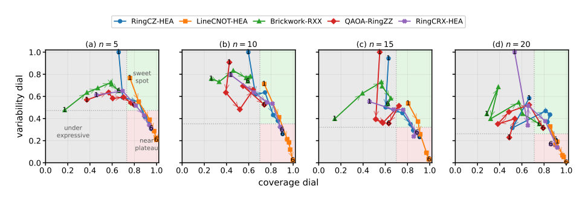
<figcaption class="paper-figure-caption"><b>Fig 1.</b> FIG. 1. Ansatz trajectories in the EP-EPD two-dial plane for n = 5, 10, 15, 20. Curves denote ansatz families; markers trace L = 1, . . . , 6, with labels at the first and final depths and arrows in the increasing-L direction. The axes are the coverage and variability dials in Eq. (17). Gray, green, and red mark the underexpressive, sweet-spot, and near-plateau regimes in Eq. (20), with thresholds fixed by Eq. (19).</figcaption>
</figure>
<figure class="paper-figure-card">

<figcaption class="paper-figure-caption"><b>Fig 2.</b> FIG. 2. Task-level validation on the n = 5 route plane. Points are ansatz-depth pairs, color is empirical success probability, and dashed lines are xc, yc. High coverage with low EPD is less favorable for training.</figcaption>
</figure>
<figure class="paper-figure-card">
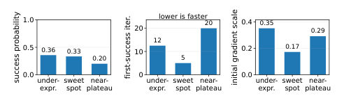
<figcaption class="paper-figure-caption"><b>Fig 3.</b> FIG. 3. Region-wise diagnostics: success probability, first-success iteration (lower is faster), and initial SPSA gradient scale. The sweet region is the fastest high-coverage region and outperforms near- plateau in success probability.</figcaption>
</figure>
<figure class="paper-figure-card">
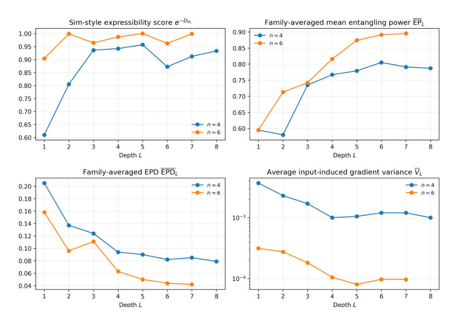
<figcaption class="paper-figure-caption"><b>Fig 4.</b> FIG. 4. Depth scan for the ring-CZ hardware-efficient ansatz. The four panels show the Sim-style coverage proxy, family-averaged EP, family- averaged EPD, and the input-induced variance of a representative gradient. The key feature is the mismatch between the early saturation of the coverage proxy and the later collapse of EPD and the gradient scale.</figcaption>
</figure>
<figure class="paper-figure-card">

<figcaption class="paper-figure-caption"><b>Fig 5.</b> FIG. 5. Normalized onset comparison for the n = 6 ring-CZ ansatz. The coverage proxy reaches a near-ceiling value at L = 2, while EPD and the representative gradient variance both pass their half-collapse thresholds at L = 4 in this finite-sample run.</figcaption>
</figure>

**Summary.** This work refutes the notion that expressibility and trainability are linked by a single tradeoff curve. By introducing Entangling Power (EP) and its deviation (EPD), the authors propose a two-dial design rule for PQCs. This framework guides researchers to select circuit depths that maximize quantum state coverage without prematurely activating barren plateau conditions, thus optimizing QML utility.

**Why it may be interesting.** It provides a rigorous, multi-faceted diagnostic framework for designing quantum circuits, moving beyond simple metrics like circuit depth or parameter count to guide practical implementation in variational quantum algorithms.

Detailed structure

**Main problem.** The paper challenges the assumption that expressibility (coverage) and trainability in Parameterized Quantum Circuits (PQCs) form a single, one-dimensional tradeoff.

**Main result.** It establishes a two-dial design rule using Entangling Power (EP) and Entangling-Power Deviation (EPD), showing that high coverage can be achieved while retaining sufficient input-dependent variability for effective training.

**Method.** The authors analyze the system using a moment hierarchy, defining global descriptors like EP and EPD alongside local diagnostics like gradient variance to separate these physical quantities.

**Model / system.** The model involves Parameterized Quantum Circuits ($\hat{U}(	heta)$) acting on $n$ qubits, typically probed by product-input states ($\mu_{	ext{prod}}$), used in the context of Quantum Machine Learning (QML).

**Key observables.** Expressibility/Coverage, Entangling Power (EP), Entangling-Power Deviation (EPD), and local Gradient Variance.

**Important parameters / regimes.** Circuit depth ($L$), number of qubits ($n$), and the specific choice of cost observable ($\hat{O}$) defining the gradient light cone.

**Assumptions / limitations.** The analysis relies on characterizing fixed-circuit quantities by averaging over product-input states, and it assumes that local gradient variance remains the ultimate criterion for trainability.

**Figures summary.** Figures illustrate ansatz trajectories in an EP-EPD two-dial plane, distinguishing between underexpressive, 'sweet spot' (high coverage/open variability), and near-plateau regimes. Tables compare task performance metrics across these identified regions.

**Paper structure.** The paper first introduces the moment hierarchy relating global descriptors ($	ext{EP} 
ightarrow 	ext{EPD}$) and then develops a two-dial design protocol. This is validated by performing route scans and concluding with task-level benchmarking on a specific QML problem to confirm the utility of the 'sweet spot' region.

Abstract

Expressive parameterized quantum circuits (PQCs) are often designed under a dilemma: the growth of expressibility and entangling power (EP) that improves Hilbert-space coverage is also expected to randomize an ansatz and activate barren-plateau (BP) conditions. We show that this dilemma is not a one-dimensional tradeoff. The usual picture collapses three inequivalent objects -- parameter-ensemble coverage, fixed-circuit entangling response, and local gradient moments -- into one scalar narrative. For a fixed circuit probed by Haar-product inputs, EP is a global two-copy mean of the output-entanglement distribution, whereas entangling-power deviation (EPD) is a global four-copy fluctuation descriptor. Gradient variance, however, is a local two-copy contraction selected by a parameter light cone and a cost observable. This moment hierarchy yields an analytic separation: equal EP need not imply equal trainability, as witnessed by equal-EP circuits with different EPDs and different gradient variances. These separations turn EP and EPD into a two-dial design rule for PQC ansatzes: EP measures how far the circuit has moved along the coverage dial, while EPD monitors whether input-dependent variability remains. We find that ansatz routes can reach high, Haar-like coverage before EPD and gradient variance collapse, showing that coverage and BP activation are distinct crossover events. The EP/EPD framework thus breaks the apparent one-dimensional expressibility-trainability tradeoff into a practical design rule: search for highly expressive PQCs in the window where coverage is high but BP-like homogenization has not yet erased trainable structure.

[↑ back to top](#top)

### [Canonical quantization of neurons](http://arxiv.org/abs/2607.05000v1)

**Authors:** Alexander He, Nana Liu, Mark M. Wilde  
**Type:** both · **Category:** quantum information and computing · **PDF:** <https://arxiv.org/pdf/2607.05000v1>  
**Analysis basis:** full PDF text, analyzed in chunks
**Topic relevance:** `quantum measurements` **1/5**

↔ Scroll figures horizontally

<figure class="paper-figure-card">

<figcaption class="paper-figure-caption"><b>Fig 1.</b> FIG. 1: Quantum circuit for estimating ∂j Tr[gT (H(θ))ρ].</figcaption>
</figure>
<figure class="paper-figure-card">
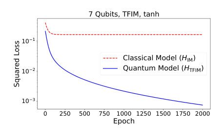
<figcaption class="paper-figure-caption"><b>Fig 2.</b> FIG. 3: Training performance for squared-loss minimization using quantized neurons with transverse-field Ising (TFIM) and commuting Ising (IM) Hamiltonians, and hyperbolic tangent activation, for a seven-qubit system.</figcaption>
</figure>

**Summary.** This work establishes canonical quantization as a principled method to build quantum analogues of artificial neurons. By replacing classical energy functions with Hamiltonians and applying activation functions via matrix calculus, they create measurable 'activation observables'. The resulting quantized neural networks show superior expressive power over classical models when trained on quantum data.

**Why it may be interesting.** It provides a concrete framework for translating concepts from classical computation (ML) into the language of quantum operators and measurements, which is highly relevant for developing quantum machine learning algorithms that go beyond simple state encoding.

Detailed structure

**Main problem.** The paper applies canonical quantization, a physics procedure, to construct quantum models for machine learning primitives like neurons.

**Main result.** Quantized neurons exhibit enhanced expressive capabilities compared to their classical counterparts on representative learning tasks.

**Method.** Hybrid quantum-classical (HQC) algorithms are developed to train and evaluate these quantized neurons by estimating the expectation value of an activation observable $\varphi(H(	heta))$ on input quantum states.

**Model / system.** The model quantizes a classical neuron defined by an energy function and an activation function. The classical energy function is mapped to a quantum Hamiltonian $H_C(	heta)$, and the activation function becomes a matrix functional applied to this Hamiltonian, yielding an 'activation observable' $\varphi(H)$.

**Key observables.** The primary observable is the expectation value of the activation observable, $	ext{Tr}[\varphi(H(	heta))
ho]$, used in minimizing the mean squared error loss function.

**Important parameters / regimes.** Temperature $T$ (used in hyperbolic tangent activation), and Hamiltonian parameters $	heta$ defining the quantum circuit/Hamiltonian.

**Assumptions / limitations.** The initial focus is on qubits with input variables restricted to $\{-1, 1\}$, requiring basic primitives like Hadamard test and Hamiltonian simulation for implementation.

**Figures summary.** Figure 3 compares training performance (Squared Loss) between noncommuting ($	ext{HTFIM}$) and commuting ($	ext{HIM}$) Hamiltonian models, showing the former outperforms the latter.

**Paper structure.** The paper first introduces quantizing a neuron via canonical quantization. It then develops HQC algorithms for learning observables from quantum data by minimizing a loss function based on measuring the activation observable. Finally, it compares different types of Hamiltonians used in these models.

Abstract

Canonical quantization provides a systematic procedure for constructing quantum models from classical Hamiltonians. Here, we apply this principle to a fundamental computational primitive of machine learning: the neuron. Specifically, by viewing a neuron as a composition of an energy function and an activation function, we quantize this model by replacing the energy function with a quantum Hamiltonian and applying the activation function to it through matrix functional calculus. This results in an activation observable that can be measured on an input quantum state. We investigate the use of these quantized neurons for function approximation, where the objective is to learn an unknown observable from labeled quantum data. For this purpose, we develop hybrid quantum-classical algorithms for training and evaluation, including procedures for measuring the activation observable and estimating gradients of the squared loss error. Our algorithms for gradient estimation rely on basic primitives like classical random sampling, the Hadamard test, and Hamiltonian simulation, and those for measuring an activation observable rely on quantum algorithms known as the power of one qumode and Schroedingerization. Numerical experiments demonstrate that our quantized neurons exhibit enhanced expressive capabilities relative to corresponding classical neurons on representative learning tasks. Our work establishes canonical quantization as a principled framework for constructing quantum machine learning primitives and provides a foundation for developing neural architectures tailored to quantum data.

[↑ back to top](#top)

### [Charge-Sector Construction of the Type-IIB Axion--Dilaton Wormhole Partition Function](http://arxiv.org/abs/2607.05385v1)

**Authors:** Soo-Jong Rey  
**Type:** theory · **Category:** other · **PDF:** <https://arxiv.org/pdf/2607.05385v1>  
**Analysis basis:** full PDF text, analyzed in chunks
**Topic relevance:** `Keldysh / 2PI / non-Gaussian methods` **1/5**

↔ Scroll figures horizontally

<figure class="paper-figure-card">

<figcaption class="paper-figure-caption"><b>Fig 1.</b> Figure 1: Three objects in the construction. Panel (a) is a two-ended throat, a connected saddle with two asymptotic non-compact ends. Panel (b) is a neck-cut geometry, obtained by keeping one side of such a solution after an artificial neck boundary has been introduced; it defines a different variational problem. Panel (c) is the two-end operator term obtained when a small throat is replaced by its long-distance source expansion. In panels (a) and (b), the drawn surface lines are geometric guides. In panel (c), the connecting line represents the coefficient matrix Cij ν . In the expression I(A) i Cij ν I(B) j , the superscripts A, B label the parent universes on which the two end...</figcaption>
</figure>
<figure class="paper-figure-card">
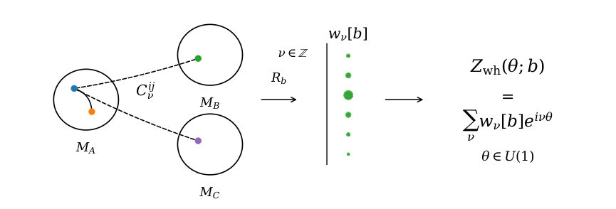
<figcaption class="paper-figure-caption"><b>Fig 2.</b> Figure 2: From the unreduced two-end coefficient to the wormhole partition function. The left part represents the coefficient matrix Cij ν in the space of end-insertion operator labels. The circles denote parent universes, and the points inside them denote end insertions; the parent-universe labels and the end-insertion operator labels are distinct. This is also the algebraic content of panel (c) in Fig. 1: the line represents Cij ν , while the placement labels belong to the end insertions. The reduction data b specify the operation Rb that converts Cij ν into the scalar coefficient Wν[b]. The reduced coefficients are then summed over ν ∈Z with the compact Fourier variable θ to form the...</figcaption>
</figure>

**Summary.** This paper constructs the partition function for a Type-IIB axion--dilaton wormhole using a charge-sector expansion. It analyzes this function by deriving constraints on its coefficients, showing how imposing physical requirements—such as positivity or symmetry—imposes deep mathematical structure on the resulting theta series.

**Why it may be interesting.** While highly theoretical, the rigorous development of coefficient constraints based on physical assumptions (like positivity leading to moment functions) mirrors techniques used in quantum field theory and statistical mechanics for ensuring physical consistency.

Detailed structure

**Main problem.** The primary goal is constructing the Type-IIB axion--dilaton wormhole partition function, Z_wh(theta; b), by systematically analyzing its dependence on charge-sector data.

**Main result.** The paper establishes a hierarchy of mathematical constraints—including discrete symmetry covariance, moment positivity, and Cauchy–Schwarz inequalities—that the coefficients of this theta expansion must satisfy depending on the physical assumptions made.

**Method.** The method involves deriving the partition function through a multi-step process: calculating an initial coefficient matrix from semiclassical saddle points in each charge sector, followed by a reduction operation using specific data (b) to yield scalar coefficients W_nu[b].

**Model / system.** The model is Type-IIB string theory compactification involving wormhole geometries. The analysis focuses on the resulting partition function expressed as a Fourier series in the variable theta, conjugate to an integer axion charge.

**Key observables.** The wormhole partition function Z_wh(theta; b), the reduced scalar coefficients W_nu[b], and the absolute bound Z_abs[b].

**Important parameters / regimes.** The compact Fourier variable theta, the integer charge index nu, and the reduction data vector b.

**Assumptions / limitations.** Assumptions range from assuming positive reduced coefficients (leading to moment positivity) to assuming the unreduced coefficient matrix forms a positive quadratic form. The final microscopic calculation of the coefficients remains an external task.

**Figures summary.** Figure 1 illustrates geometric objects related to the wormhole throat and two-end operators. Figure 2 summarizes the mathematical flow: Saddle Calculation -> Coefficient Matrix C_ij^nu -> Reduction R_b -> Scalar Coefficients W_nu[b] -> Partition Function Z_wh(theta; b).

**Paper structure.** The paper follows a logical progression from defining the physical object (wormhole partition function) to deriving its mathematical structure via charge-sector expansion, and finally analyzing this structure by imposing increasingly stringent physical constraints (symmetry, positivity, etc.) on the resulting coefficients.

Abstract

I construct the Type-IIB axion--dilaton wormhole partition function from charge-sector data. In a chosen axion charge, equivalently form-field flux sector, the long-distance saddle calculation supplies a two-end operator term with coefficient matrix \(C^{ij}_ν\). The labels \(i,j\) label end-insertion operators; the labels \(A,B\) label parent universes. Reduction data \(b\) convert this matrix into scalar coefficients \(W_ν[b]\). The wormhole partition function in the theta variable is \(Z_{\rm wh}(θ;b)=\sum_νW_ν[b]\e^{iνθ}\). I analyze properties and constraints this coefficients satisfy: discrete-symmetry covariance, phase, absolute bounds, moment positivity, Cauchy--Schwarz inequalities for the unreduced coefficient matrix, complex-\(θ\) domains, charge-lattice tails, and the dilute Bessel/Skellam limit. The \(θ\)-dependence of the wormhole partition function is the Fourier transform of the charge-sector scalar coefficients.

[↑ back to top](#top)

### [Data-Driven Prediction of NaCl-Type Entropy-Stabilized Oxide Compositions from First-Principles and Supervised Learning](http://arxiv.org/abs/2607.04502v1)

**Authors:** Sebastien Junier, Celine Barreteau, David Berardan, Yann-Andrev Kerneur, Jean-Claude Crivello  
**Type:** theory · **Category:** disordered systems and neural networks · **PDF:** <https://arxiv.org/pdf/2607.04502v1>  
**Analysis basis:** full PDF text, analyzed in chunks
**Topic relevance:** `methods for driven-dissipative` **1/5**

↔ Scroll figures horizontally

<figure class="paper-figure-card">

<figcaption class="paper-figure-caption"><b>Fig 1.</b> Figure 1: (a) Pair clusters distribution in NaCl structure. All clusters under the red lines</figcaption>
</figure>
<figure class="paper-figure-card">

<figcaption class="paper-figure-caption"><b>Fig 2.</b> Figure 2: Representation of equimolar super-cell generated by SQS for (M1M2)O binary</figcaption>
</figure>
<figure class="paper-figure-card">
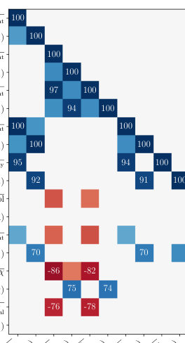
<figcaption class="paper-figure-caption"><b>Fig 3.</b> Figure 3: Correlation matrix of descriptors. Correlations below 50% are hidden; values</figcaption>
</figure>
<figure class="paper-figure-card">

<figcaption class="paper-figure-caption"><b>Fig 4.</b> Figure 4: Predicted vs. DFT-calculated ∆hullH for the 416 quinary NaCl SQS mixtures.</figcaption>
</figure>
<figure class="paper-figure-card">

<figcaption class="paper-figure-caption"><b>Fig 5.</b> Figure 5: Relative importance of descriptors in the MLP model (mean ± standard devia-</figcaption>
</figure>

**Summary.** This work presents a computational framework that merges Density Functional Theory, Special Quasirandom Structures, and supervised Machine Learning to screen for stable Entropy-Stabilized Oxides. By training ML models on DFT data from thousands of potential compositions, the authors efficiently predict phase stability and guide experimentalists toward novel materials candidates.

**Why it may be interesting.** While focused on materials science, the core methodology—combining high-fidelity quantum simulations (DFT) with machine learning to predict complex many-body properties in disordered systems—is highly relevant to modeling strongly correlated or disordered quantum materials.

Detailed structure

**Main problem.** The primary challenge is identifying stable Entropy-Stabilized Oxide (ESO) compositions within vast, complex multicomponent spaces by accurately assessing their thermodynamic stability against competing phases.

**Main result.** The developed data-driven framework successfully screens thousands of potential quinary ESOs, providing a computationally efficient route to guide experimental synthesis efforts.

**Method.** A high-throughput workflow combines first-principles DFT calculations (using SQS supercells) with supervised machine learning models (like MLP and Random Forest) trained to predict stability metrics.

**Model / system.** The system under study is the $	ext{NaCl}$-type structure of quinary Entropy-Stabilized Oxides, $(\{M_i\})O$, involving up to 16 different cation species. Stability is assessed by calculating the formation enthalpy relative to the convex hull.

**Key observables.** Formation enthalpy deviation from the convex hull ($\Delta_{	ext{hull}}H$) and the stabilization temperature ($T_{	ext{stab}}$).

**Important parameters / regimes.** The test error for the optimized ML model was reported as $\approx 4 	ext{ kJ}\cdot	ext{mol}^{-1}$. The calculations cover up to quinary mixtures.

**Assumptions / limitations.** Absolute stabilization temperatures are affected by systematic thermodynamic approximations, and magnetic ordering in the database was not fully optimized due to computational cost.

**Figures summary.** Figures illustrate the performance of ML models (prediction vs. actual $\Delta_{	ext{hull}}H$) and show convergence tests for SQS supercell sizes and k-point meshes.

**Paper structure.** The paper first establishes the physical problem, details the combined DFT/SQS/ML methodology, presents results on screening thousands of compositions, and concludes by establishing an efficient data-driven search protocol for ESOs.

Abstract

Entropy-stabilized oxides (ESOs) open access to vast multicomponent compositional spaces, but identifying promising candidates remains challenging because of the large number of possible mixtures and the need to assess their stability against competing phases. In this work, we develop a high-throughput computational framework to screen equimolar quinary ESOs in the NaCl structure type by combining density functional theory (DFT), special quasirandom structures (SQS), convex-hull thermodynamics, and supervised machine learning. A consistent reference database of binary and ternary ordered oxides, including disordered phases such as all binary cation combinations in the NaCl-type oxide, is first constructed using GGA and meta-GGA calculations. Quinary disordered phases are then described by SQS supercells and used to train machine-learning models that predict the distance to the convex hull and the corresponding stabilization temperature over the full set of 4368 possible equimolar quinary compositions generated from 16 cation species. Among the tested models, an optimized multilayer perceptron provides the best predictive performance, with a test error of about 4 kJ/mol, while requiring explicit DFT calculations for only about 10% of the quinary systems. Comparison with experimental synthesis tests and computed decomposition paths further shows that the approach captures the main stability trends and the dominant competing phases, although absolute stabilization temperatures remain affected by systematic thermodynamic approximations. These results establish an efficient route for the data-driven exploration of multicomponent oxides and provide practical guidance for the experimental search for new ESOs.

[↑ back to top](#top)

### [Emergent cosmology and gravity from quantum time?](http://arxiv.org/abs/2607.05020v1)

**Authors:** Ovidiu Cristinel Stoica  
**Type:** theory · **Category:** other · **PDF:** <https://arxiv.org/pdf/2607.05020v1>  
**Analysis basis:** full PDF text, analyzed in chunks
**Topic relevance:** `non-equilibrium dynamics` **1/5**

↔ Scroll figures horizontally

<figure class="paper-figure-card">
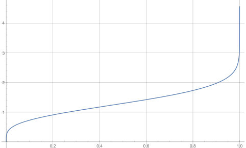
<figcaption class="paper-figure-caption"><b>Fig 1.</b> FIG. 1. Plot of r(τ) for the harmonic oscillator potential, with τ expressed in T-units. The solution has a “Big Rip” singularity at τ →T.</figcaption>
</figure>
<figure class="paper-figure-card">
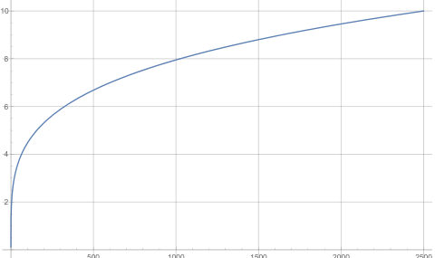
<figcaption class="paper-figure-caption"><b>Fig 2.</b> FIG. 2. Plot of r(τ) for the free potential.</figcaption>
</figure>
<figure class="paper-figure-card">
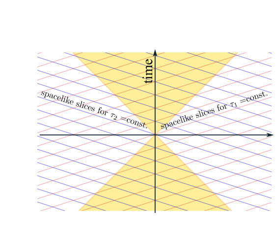
<figcaption class="paper-figure-caption"><b>Fig 3.</b> FIG. 3. System of timelike coordinates (τ1, τ2) on a two- dimensional Minkowski spacetime. The red (blue) parallel lines represent equal-τ1 (equal-τ2) space slices.</figcaption>
</figure>

**Summary.** This paper explores whether General Relativity can emerge purely from quantum mechanics by treating time as an intrinsic observable derived from a stationary wavefunction's amplitude. By enforcing uniformity on this probability density, the authors successfully derive the FLRW cosmological model without needing to input gravitational dynamics initially. This suggests that spacetime curvature itself might be an emergent feature of fundamental quantum time structures.

**Why it may be interesting.** While focused on cosmology, the core technique—deriving macroscopic dynamics (like curvature) from the structure of quantum wavefunctions using emergent time parameters—is highly relevant to open quantum systems theory where time evolution is often non-trivial or observer-dependent.

Detailed structure

**Main problem.** The central problem is determining if General Relativity (or modifications thereof) can emerge from fundamental quantum principles by interpreting time as an intrinsic observable rather than a background parameter.

**Main result.** By defining an intrinsic time $\tau$ based on the stationary wavefunction's amplitude, the dynamics naturally reproduce the Friedmann-Lemaître-Robertson-Walker (FLRW) cosmological model without initially presupposing gravity.

**Method.** The methodology involves interpreting the squared amplitude of a stationary quantum state as a probability density for intrinsic time and deriving an effective Schrödinger equation with respect to this emergent time coordinate.

**Model / system.** The analysis uses quantum cosmology, starting from stationary solutions in four-dimensional Euclidean space. The system is modeled using a radial eigenvalue equation derived from the full Schrödinger equation, which is then reduced to a 1D form for mathematical tractability.

**Key observables.** Curvature emerging in the time direction ($\tau$), the FLRW metric components ($g_{00}, g_{ij}$), and the probability density $P(\tau) \propto |\Psi(\tau)|^2$.

**Important parameters / regimes.** The intrinsic time coordinate $\tau$, the effective potential $V_{\text{eff}}(r)$, and cosmological parameters like $\Omega_{m0}, \Omega_{r0}, \Omega_{\Lambda 0}$.

**Assumptions / limitations.** Key assumptions include interpreting the squared amplitude as a probability density for intrinsic time, assuming uniformization of this probability density ($\frac{dP}{d\tau} = \text{const}$), and analyzing spherically symmetric solutions.

**Paper structure.** The paper progresses by first establishing the mathematical framework using stationary states in Euclidean space, then deriving an effective time evolution equation via intrinsic observables, and finally demonstrating how this leads to a standard FLRW metric consistent with observed cosmology.

Abstract

Macroscopic observables allow the recovery of intrinsic dynamics from stationary quantum states. I show that, by interpreting the squared amplitude as the probability density for each definite value of intrinsic time, a curvature emerges in the time direction. For example, from the perspective of intrinsic quantum time, the Friedmann-Lemaître-Robertson-Walker cosmological model emerges from spherically symmetric stationary solutions in four-dimensional Euclidean space, without presupposing gravity. If there is no unique direction of time, curvature emerges in all spacetime dimensions, without presupposing gravity, from the variable amplitude of the stationary wavefunction alone. This opens a new possibility that general relativity or some modification of it emerges from intrinsic time observables.

[↑ back to top](#top)

### [Holographic heat engines for Schwarzschild black holes](http://arxiv.org/abs/2607.03749v1)

**Authors:** Ripunjay Dwivedi, Manus R. Visser  
**Type:** theory · **Category:** statistical mechanics · **PDF:** <https://arxiv.org/pdf/2607.03749v1>  
**Analysis basis:** full PDF text, analyzed in chunks
**Topic relevance:** `non-equilibrium dynamics` **1/5**

↔ Scroll figures horizontally

<figure class="paper-figure-card">

<figcaption class="paper-figure-caption"><b>Fig 1.</b> Figure 1. Efficiency vs. maximum cavity volume. The effi- ciency is shown for the Otto (blue), Diesel (green), and Stirling cycles, with regeneration (red) and without regeneration (or- ange), as a function of Vmax, at fixed Vmin = 300. The dashed black line is the Carnot bound ηCarnot = 1 −Tc/Th = 1/2. For the Otto cycle V2 = Vmin, V1 = Vmax, with S1 = 20 and S3 = 40. For the Diesel cycle V1 = Vmax, with S1 = 20, S3 = 40, and isobaric pressure P2 = 1.5 × 10−3; the in- termediate volumes are then fixed by the equation of state, V2 = V (S1, P2) ≃186 and V3 = V (S3, P2) ≃323, so the cycle exists only for Vmax &gt; V3, where the Diesel curve be- gins. For the Stirling cycles V1 = Vmin and V2 =...</figcaption>
</figure>
<figure class="paper-figure-card">
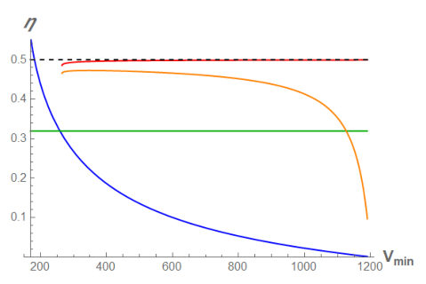
<figcaption class="paper-figure-caption"><b>Fig 2.</b> Figure 2. Efficiency vs. minimum cavity volume. The ef- ficiency is shown for the Otto (blue), Diesel (green), and Stirling cycles, with regeneration (red) and without regenera- tion (orange), as a function of Vmin at fixed Vmax = 1200 and S1 = 20, S3 = 40, P2 = 1.5 × 10−3, Tc = 0.045, and Th = 0.09. The Diesel efficiency depends only on (S1, S3, P2, Vmax) and is therefore independent of Vmin, appearing as a horizontal line. The Otto efficiency falls monotonically as Vmin →Vmax (compression ratio →1), while the regenerated Stirling effi- ciency stays pinned near the Carnot bound (dashed). The Stirling curves terminate at Vmin ≃265, set by the bound rBTc &gt; √</figcaption>
</figure>
<figure class="paper-figure-card">

<figcaption class="paper-figure-caption"><b>Fig 3.</b> Figure 3. Efficiency vs. hot reservoir temperature. The two Stirling cycles, with regeneration (red) and without regener- ation (orange), are shown as a function of the hot reservoir temperature Th, at fixed cold reservoir temperature Tc = 0.045, with V1 = Vmin = 300 and V2 = Vmax = 1200. The dashed black curve is the Carnot bound. Both efficiencies vanish at the left endpoint Th = Tc, where the reservoirs coincide and no net work is produced, and approach the Carnot bound from below as Th increases, the regenerated cycle tracking it closely.</figcaption>
</figure>
<figure class="paper-figure-card">

<figcaption class="paper-figure-caption"><b>Fig 4.</b> Figure 4. Efficiency vs. cold reservoir temperature. The two Stirling cycles, with regeneration (red) and without regener- ation (orange), are shown as a function of the cold reservoir temperature Tc, at fixed hot reservoir temperature Th = 0.09, with V1 = Vmin = 300 and V2 = Vmax = 1200. The dashed black curve is the Carnot bound. Both efficiencies vanish at the right endpoint Tc = Th. The range is limited on the left by the bound Tc &gt; T min c = √</figcaption>
</figure>
<figure class="paper-figure-card">

<figcaption class="paper-figure-caption"><b>Fig 5.</b> Figure 5. Efficiency vs. maximum entropy. The efficiency is shown for the Otto (blue), Diesel (green), and Brayton (magenta) cycles as a function of Smax = S3, at fixed Smin = S1 = 20. For the Otto cycle, V2 = 300 and V1 = 1200. For the Diesel cycle, V1 = 1200 and P2 = 1.5 × 10−3. For the Brayton cycle, P1 = 6 × 10−4 and P2 = 1.5 × 10−3. The Otto efficiency rises steeply with Smax and overtakes the nearly flat Diesel curve, while the Brayton efficiency remains the lowest of the three throughout.</figcaption>
</figure>

**Summary.** This paper develops a framework to analyze reversible heat engines powered by black holes confined within a cavity using quasi-local gravity. By mapping the black hole's thermodynamics onto standard P-V and T-S diagrams, the authors derive efficiencies for various cycles. The key finding is that the regenerated Stirling efficiency approaches the Carnot limit at high temperatures, providing insights into the fundamental thermodynamic constraints imposed by gravitational systems.

**Why it may be interesting.** While focused on general relativity, the rigorous application of classical thermodynamic cycles (Carnot, Stirling) to a gravitational system provides a powerful analogy for understanding energy conversion limits in complex physical systems, which has parallels in open quantum systems thermodynamics.

Detailed structure

**Main problem.** The study constructs reversible black hole heat engines operating within a finite cavity using quasi-local gravitational thermodynamics.

**Main result.** Exact efficiencies for standard heat engines (Carnot, Otto, etc.) are derived, showing that the regenerated Stirling efficiency approaches the Carnot bound in the high-temperature limit for the large branch.

**Method.** The analysis employs the quasi-local formalism to define thermodynamic potentials (E, S, P, V) on a boundary enclosing a Schwarzschild black hole. Standard thermodynamic cycles are then mapped onto these gravitational variables to calculate efficiencies.

**Model / system.** The system models a four-dimensional Schwarzschild black hole enclosed in a spherical cavity ($r_B$). The working substance is dual to the thermal system on this cavity boundary, allowing for the application of classical thermodynamics concepts (P-V, T-S diagrams).

**Key observables.** Engine efficiencies ($\eta$), heat transfers ($\delta Q$, $\delta W$), and thermodynamic potentials derived from quasi-local gravity.

**Important parameters / regimes.** The analysis is restricted to the large black hole branch for stability; high-temperature limits ($T_h 	o \infty$) are crucial for comparing with Carnot bounds.

**Assumptions / limitations.** The construction assumes asymptotically flat spacetime and relies on a quasi-local description of gravity, requiring specific boundary conditions (e.g., 'flat-space background subtraction').

**Figures summary.** Figures illustrate constant-property paths (P-V and T-S) for both the large and small black hole branches, detailing how different strokes traverse the thermodynamic space.

**Paper structure.** The paper systematically derives fundamental thermodynamic relations using quasi-local gravity, then applies these relations to calculate efficiencies for various standard heat engine cycles. The focus culminates in a detailed comparison of the regenerated Stirling cycle efficiency against the Carnot limit in the high-temperature regime.

Abstract

We construct reversible black hole heat engines in asymptotically flat spacetime using quasi-local gravitational thermodynamics. We enclose a Schwarzschild black hole in a finite spherical cavity and identify the working substance with the dual thermal system on the cavity boundary. The surface pressure and boundary area define a thermodynamic pressure-volume pair in the dual system, while all coupling constants of the gravitational theory remain fixed. We derive exact efficiencies for the Carnot, Otto, Diesel, Brayton, and Stirling engines and compare them numerically. These efficiencies probe the quasi-local equations of state of the black hole. The regenerated Stirling efficiency remains remarkably close to the Carnot bound and approaches it in the high-temperature limit.

[↑ back to top](#top)

### [ML and AI for density functional theory: different priorities for Kohn-Sham and orbital-free DFT, for electronic and nuclear DFT](http://arxiv.org/abs/2607.04095v1)

**Authors:** Xin-Hui Wu, Sergei Manzhos  
**Type:** theory · **Category:** numerical methods · **PDF:** <https://arxiv.org/pdf/2607.04095v1>  
**Analysis basis:** full PDF text, analyzed in chunks
**Topic relevance:** `methods for driven-dissipative` **1/5**

↔ Scroll figures horizontally

<figure class="paper-figure-card">
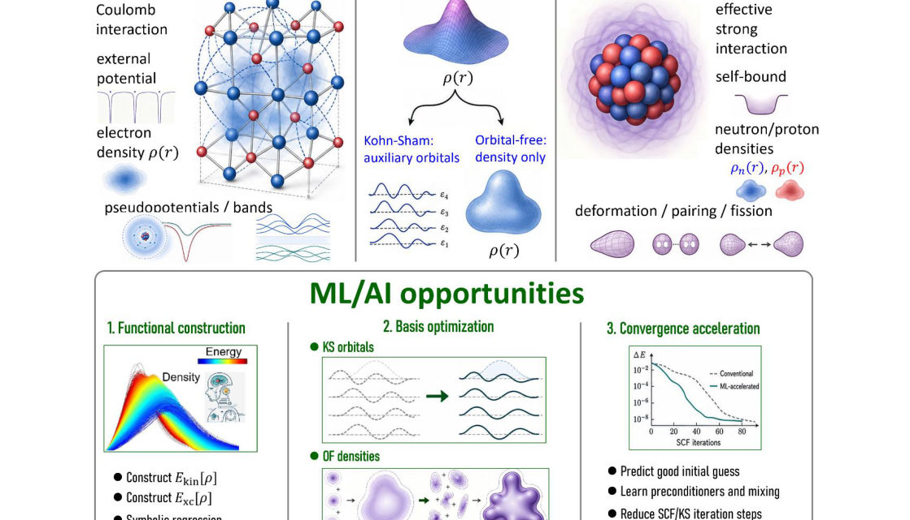
<figcaption class="paper-figure-caption"><b>Fig 1.</b> Figure 1. A visual summary of main similarities and differences between electronic and nuclear DFT in Kohn-Sham and orbital-free paradigms as well as of opportunities for ML/AI methods to improve them.</figcaption>
</figure>
<figure class="paper-figure-card">
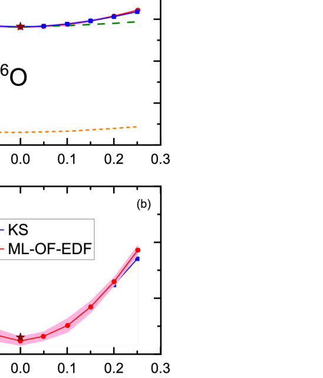
<figcaption class="paper-figure-caption"><b>Fig 2.</b> Figure 2. Potential energy curves of 16O nucleus computed with KS DFT and with OF DFT using an ML functional in Ref. 142, as a function of the quadrupole deformation parameter 2. Results from Thomas–Fermi and extended Thomas–Fermi (up to the 4th</figcaption>
</figure>
<figure class="paper-figure-card">

<figcaption class="paper-figure-caption"><b>Fig 3.</b> Figure 3. Computational time tests of DFT with PBE0 and DM21 functionals and CCSD(T). The horizontal axis shows the computation time for a single SCF cycle for two-atom molecules made of elements from H to Ca (neutral form and cations) using the cc-pVTZ basis set and an energy tolerance of 10−9 a.u. using the CCSD(T), while the vertical axis shows the DFT computation time of these systems with DM21 and PBE0 functionals.</figcaption>
</figure>
<figure class="paper-figure-card">
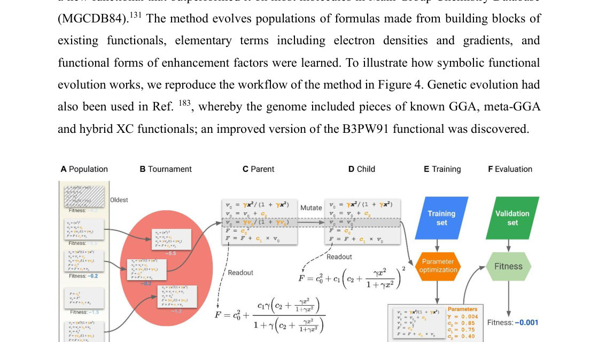
<figcaption class="paper-figure-caption"><b>Fig 4.</b> Figure 4. Workflow of the symbolic functional evolution method use to discover XC functionals in Ref. 93. (A) A population of symbolic density functionals is iteratively evolved using an evolution algorithm. Each individual in the population represents the enhancement factors in a density functional. The performance of a density functional is characterized by its fitness, defined as the negative of validation energy error. (B) In each iteration, a tournament selection is performed on a subset of individuals sampled from the population. (C) The highest-fitness individual in the tournament is selected to be the parent. (D) Then, a child functional is generated by randomly picking one of the...</figcaption>
</figure>
<figure class="paper-figure-card">
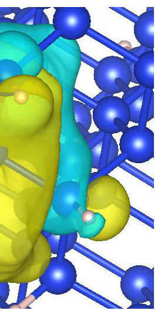
<figcaption class="paper-figure-caption"><b>Fig 5.</b> Figure 5. Example of a basis function optimized in BigDFT192 to minimum energy, starting from a p-type Si-centered function, for a hydrogen-terminated Si nanoparticle.</figcaption>
</figure>

**Summary.** This paper provides a comprehensive overview of applying Machine Learning and AI techniques to advance Density Functional Theory (DFT) for both electronic and nuclear structure calculations. It distinguishes between methodological needs when improving the exchange-correlation functional versus approximating kinetic energy functionals in orbital-free approaches. The work highlights that while deep learning is powerful, symbolic regression offers conceptually advantageous paths forward for achieving greater accuracy and efficiency.

**Why it may be interesting.** While focused on condensed matter/nuclear theory, the deep dive into using symbolic regression and neural networks to approximate fundamental energy functionals is highly relevant for developing general-purpose, scalable numerical solvers applicable across quantum physics domains.

Detailed structure

**Main problem.** The paper addresses computational bottlenecks and accuracy limitations inherent in Density Functional Theory (DFT) when applied to both electronic and nuclear systems.

**Main result.** It outlines that different ML/AI techniques are suitable for improving DFT by targeting specific components like the exchange-correlation functional, kinetic energy functional, or density itself.

**Method.** The authors survey various ML/AI approaches—including deep neural networks and symbolic regression—to enhance established quantum mechanical frameworks like Kohn-Sham (KS) and Orbital-Free DFT (OF-DFT).

**Model / system.** The scope covers electronic systems (atoms, molecules) governed by the Schrödinger equation under the Born-Oppenheimer approximation, and nuclear systems involving nucleons interacting via the strong force. The core mathematical tool is the energy functional $E[
ho(\mathbf{r})]$.

**Key observables.** Electronic observables include energies, band structures, and effective potentials; nuclear observables include binding energies, radii, and equation of state.

**Important parameters / regimes.** Computational scaling (e.g., cubic scaling in KS DFT), the unknown exact form of the exchange-correlation functional ($V_{XC}$), and system size are critical parameters.

**Assumptions / limitations.** The primary assumption is that ML/AI can provide accurate, computationally cheaper approximations to intractable components of the DFT energy functional or Hamiltonian.

**Paper structure.** The paper proceeds by first reviewing the foundational physics and computational challenges in electronic vs. nuclear DFT, then systematically detailing how ML techniques can be applied to overcome specific bottlenecks (e.g., learning KEFs vs. XC functionals), concluding with a comparison of promising algorithmic choices.

Abstract

We overview similarities and, importantly, differences in computational bottlenecks and accuracy requirements that can be addressed with machine learning (ML) and artificial intelligence (AI) techniques in electronic and nuclear DFT. From these follow different promising methodological and algorithmic choices depending on whether one machine learns the exchange correlation (XC) functional, the kinetic energy functional (KEF), the density or the basis functions. In particular, while the popular deep neural networks remain a potent choice in the context of KS DFT, we highlight their disadvantages when building KEFs and highlight conceptual advantages - yet to be fully realized - of symbolic regression for both electronic and nuclear DFT. We point out promising approaches that can be carried from the more extensively investigated ML-enhanced electronic DFT to nuclear DFT.

[↑ back to top](#top)

### [Noise-Aware Synthesis of Quantum LDPC Encoder Circuits via Two-Sided Hamming Descent](http://arxiv.org/abs/2607.04462v1)

**Authors:** Aditya Sodhani, Keshab K. Parhi  
**Type:** theory · **Category:** quantum information and computing · **PDF:** <https://arxiv.org/pdf/2607.04462v1>  
**Analysis basis:** full PDF text, analyzed in chunks
**Topic relevance:** `QC/QI experiment` **1/5**

↔ Scroll figures horizontally

<figure class="paper-figure-card">
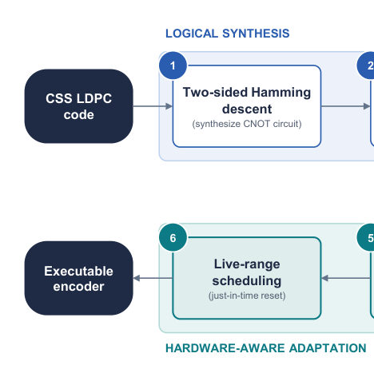
<figcaption class="paper-figure-caption"><b>Fig 1.</b> Figure 1: Our six-stage noise-aware encoder pipeline.</figcaption>
</figure>
<figure class="paper-figure-card">

<figcaption class="paper-figure-caption"><b>Fig 2.</b> Figure 2: The same matrix 𝑀= 𝐼+ 𝑒0𝑒⊤ 2 on three qubits is realized by CNOT circuits of different length, hence by the same unitary. (a) one gate; (b) three gates. Filled dots are controls, ⊕targets.</figcaption>
</figure>
<figure class="paper-figure-card">
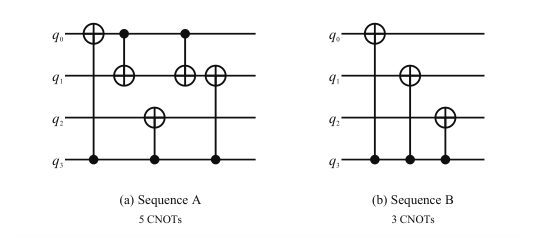
<figcaption class="paper-figure-caption"><b>Fig 3.</b> Figure 3: The same four-qubit matrix 𝑀is implemented by two CNOT circuits of different gate count, so the shorter one replaces the longer. (a) five gates; (b) three gates. Filled dots are controls, ⊕targets.</figcaption>
</figure>
<figure class="paper-figure-card">
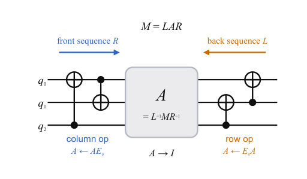
<figcaption class="paper-figure-caption"><b>Fig 4.</b> Figure 4: The two-sided move space reduces the residual 𝐴to the identity from both ends. Front (column-operation) and back (row-operation) moves act on 𝐴while maintaining 𝑀= 𝐿𝐴𝑅. See Section 3.1.</figcaption>
</figure>
<figure class="paper-figure-card">

<figcaption class="paper-figure-caption"><b>Fig 5.</b> Figure 5: Count–depth Pareto frontiers on the four BB codes. The two-sided front (blue, ours) dominates the one-sided ablation front (orange), the depth-greedy method of [32] (green), and the CG/SKG construction (gray) on both count and depth for every BB code. The depth-greedy front is the Pareto-optimal subset of that method’s four cost functions over many restarts.</figcaption>
</figure>

**Summary.** This paper introduces a novel, multi-stage compiler pipeline to synthesize highly efficient quantum circuits for preparing LDPC encoded states. By combining 'two-sided Hamming descent' with hardware-aware scheduling and noise modeling, the authors achieve substantial reductions in gate count and circuit depth compared to existing methods. This work is critical for realizing fault-tolerant quantum computation on near-term devices.

**Why it may be interesting.** This work directly addresses the practical implementation gap in quantum computation by providing a systematic, hardware-aware compilation technique to reduce circuit overhead and noise susceptibility for error correction codes.

Detailed structure

**Main problem.** The core problem is efficiently synthesizing low-cost, noise-mitigating quantum circuits required to prepare encoded states for Quantum Low-Density Parity-Check (LDPC) codes.

**Main result.** The proposed pipeline significantly reduces CNOT gate counts by an aggregate of 53.8% and reduces two-qubit depth by up to 71% compared to standard constructions, leading to higher fidelity state preparation.

**Method.** It employs a novel optimization pipeline featuring 'two-sided Hamming descent' for circuit resynthesis, followed by commutation re-layering, hardware routing, and noise-aware live-range scheduling.

**Model / system.** The system models fault-tolerant quantum computation using CSS LDPC codes (e.g., Bivariate Bicycle). The task is to find a minimal CNOT circuit implementing the encoder's linear-reversible matrix.

**Key observables.** CNOT count, circuit depth (ASAP vs. commutation-aware), routed two-qubit count, and preparation error under hardware noise.

**Important parameters / regimes.** The optimization balances gate count reduction against depth minimization using a penalty parameter $\mu$, and incorporates the idle-to-gate error ratio ($\kappa$) for noise selection.

**Assumptions / limitations.** The method assumes knowledge of the target hardware's connectivity graph, which is used during routing and scheduling stages.

**Figures summary.** Figures illustrate the six-stage noise-aware encoder pipeline, demonstrating how redundant CNOT structures can be systematically reduced via two-sided matrix operations.

**Paper structure.** The paper introduces the problem of circuit redundancy in LDPC encoders, details the novel multi-stage optimization pipeline (including two-sided Hamming descent), presents quantitative results showing significant improvements over baselines, and concludes by positioning the method as a crucial compiler tool.

Abstract

Quantum low-density parity-check (LDPC) codes are a promising route to fault-tolerant quantum computation, but their use requires efficient preparation of encoded states. Standard encoder constructions generate circuits through fixed algebraic procedures, yet the resulting circuit can contain substantial redundancy. We formulate LDPC encoder preparation as a circuit-resynthesis problem: given the linear-reversible matrix implemented by the encoder's CNOT block, we seek a lower-cost equivalent circuit that can be routed efficiently on the target hardware and which mitigates noise. We propose a novel optimization approach referred as two-sided Hamming descent and a noise-aware optimization pipeline for this task.   Across several families of Calderbank-Shor-Steane (CSS) LDPC encoders, including Bivariate Bicycle, hypergraph-product, and entanglement-assisted codes, the proposed pipeline produces substantially smaller and shallower encoder circuits than the standard constructions and the synthesis baselines considered, cutting gate counts by 53.8% in aggregate across the benchmark and by up to 68% on the Bivariate Bicycle family. The gains remain visible after routing, where the two-qubit depth is reduced by up to 71% and translate into higher-fidelity state preparation under circuit-level noise. On the Bivariate Bicycle family, live-range scheduling further reduces routed preparation failure by up to 13.7% without adding two-qubit gates to the selected circuit. These results indicate that encoder-matrix resynthesis, combined with hardware-calibrated selection and scheduling, is an effective compiler-level tool for preparing quantum LDPC code states.

[↑ back to top](#top)

### [Security of Quantum Conference Key Agreement with Two-Way Classical Communication](http://arxiv.org/abs/2607.04538v1)

**Authors:** Shun Kawakami, Mori Watanabe, Takuya Ikuta, Koichi Takasugi  
**Type:** theory · **Category:** quantum information and computing · **PDF:** <https://arxiv.org/pdf/2607.04538v1>  
**Analysis basis:** full PDF text, analyzed in chunks
**Topic relevance:** `entanglement & information structure` **1/5**

↔ Scroll figures horizontally

<figure class="paper-figure-card">
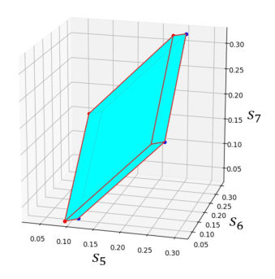
<figcaption class="paper-figure-caption"><b>Fig 1.</b> FIG. 1. An example of the physically realizable region Tphys in the (s5, s6, s7) parameter space. Eqs. (30)–(32) define the interior of the parallelepiped. In this example, the boundary corresponding to Eq. (33) lies outside the parallelepiped.</figcaption>
</figure>
<figure class="paper-figure-card">
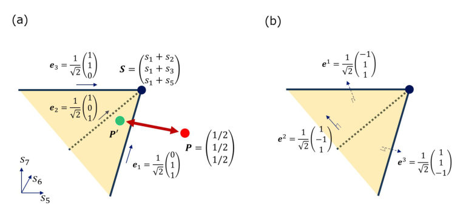
<figcaption class="paper-figure-caption"><b>Fig 2.</b> FIG. 2. The triangular pyramid Tpyramid defined in the s5, s6, s7 parameter space by the constraints Eq. (23), Eq. (25), Eq. (27). The corner of the pyramid corresponds to the upper-right corner of the parallelepiped in Fig. 1. (a) The edge unit vectors (covariant vectors) {ei} , the peak point S, the worst point P and the worst point P′ within Tpyramid. (b) The contravariant vectors {ei}.</figcaption>
</figure>
<figure class="paper-figure-card">
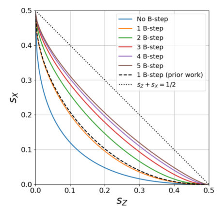
<figcaption class="paper-figure-caption"><b>Fig 3.</b> FIG. 3. Threshold curves (sZ, sX) for non-negative secure key rate R under the symmetric setting s1 = sX and s2 = s3 = s4 = sZ, with error- correction efficiency f = 1. The solid curves correspond to 0, 1, 2, 3, 4, and 5 applications of the B-step (from lower left to upper right). The region below each curve yields a non-negative secure key rate. The dashed curve shows the threshold obtained by using the previous analysis of a single B-step [14], and the dotted line indicates sZ + sX = 1/2, corresponding to the condition in Theorem 1. Repeated applications of the B-step significantly improve the threshold; in particular, along the symmetric line sZ = sX, the tolerable error rate increases...</figcaption>
</figure>

**Summary.** This paper analyzes the security of Quantum Conference Key Agreement using GHZ states, focusing on enhancing its resilience against noise. By incorporating multiple two-way classical communication steps (B-steps and P-steps), the authors derive that the tolerable error threshold can be significantly increased. This demonstrates a major improvement in the practical feasibility of QCKA for future quantum networks.

**Why it may be interesting.** This work directly addresses practical limitations in quantum networking protocols by providing concrete methods (iterative B-steps) to enhance fault tolerance beyond current theoretical limits.

Detailed structure

**Main problem.** The primary challenge is improving the tolerable error threshold for Quantum Conference Key Agreement (QCKA) protocols, which are crucial for future quantum networks.

**Main result.** Iterative application of B-steps can significantly boost the tolerable error threshold beyond 20%, substantially enhancing the robustness of practical GHZ-based QCKA protocols.

**Method.** The authors derive the asymptotic secure key rate by analytically analyzing the optimization problem associated with multiple B-steps and P-steps applied to the QCKA protocol.

**Model / system.** The system models Quantum Conference Key Agreement (QCKA) among three users using tripartite Greenberger-Horne-Zeilinger (GHZ) states, restricted to two complementary measurement bases (Z and X).

**Key observables.** Secure key rate ($R$) and the tolerable error threshold.

**Important parameters / regimes.** Error rates ($	ext{s}_1, 	ext{s}_2, 	ext{s}_3, 	ext{s}_4$), which are optimized subject to physical constraints derived from probability amplitudes.

**Assumptions / limitations.** The analysis assumes an Independent and Identically Distributed (IID) interaction for the eavesdropper Eve across rounds, and that only two measurement bases are used for practical relevance.

**Paper structure.** The paper systematically analyzes the security by defining the QCKA protocol using GHZ states. It then derives the key rate formula incorporating error correction steps (B-step, P-step) and solves the resulting optimization problem to maximize robustness against noise.

Abstract

Quantum conference key agreement (QCKA) enables multiple users to establish a common secret key with information-theoretic security and is regarded as a key primitive for secure communication in future quantum networks. However, practical implementations of QCKA typically suffer from higher noise levels than conventional bipartite quantum key distribution (QKD), making the improvement of the tolerable error threshold an important challenge. Gottesman and Lo proposed two preprocessing procedures for QKD with two-way classical communication, known as the B-step and the P-step, which enhance the tolerable error threshold. In this paper, we analyze the asymptotic security of QCKA with tripartite GHZ states and two measurement bases using two-way classical communication, including multiple B-steps and P-steps. We derive the corresponding secure key rate analytically and demonstrate that iterative B-steps can increase the tolerable error threshold beyond 20%, significantly improving upon the approximately 11% threshold achievable without two-way classical communication and the approximately 15% threshold obtained with only a single B-step. Our results show that two-way classical communication can substantially enhance the robustness of practical QCKA protocols.

[↑ back to top](#top)

### [The influence of the transverse electric field on accelerating vortex state in the axisymmetric electric field](http://arxiv.org/abs/2607.03747v1)

**Authors:** Ziyang Ding, Ziqiang Huang, Qi Meng, Alexander J. Silenko, Pengming Zhang, Liping Zou  
**Type:** theory · **Category:** other · **PDF:** <https://arxiv.org/pdf/2607.03747v1>  
**Analysis basis:** full PDF text, analyzed in chunks
**Topic relevance:** `non-equilibrium dynamics` **1/5**

↔ Scroll figures horizontally

<figure class="paper-figure-card">

<figcaption class="paper-figure-caption"><b>Fig 1.</b> FIG. 1. The initial kinetic energy is 20 keV, w = 200 nm, w′ = 0, and different electric fields are considered. (a) Evo- lution of the beam width w(z). (b) Evolution of the wave front R(z). The blue line corresponds to free space, the red line to the uniform electric field 1.4 MV/m, the green line to the potential (24), and the yellow line to the potential V(z, r) = −2az2 ignoring transverse field (ITF).</figcaption>
</figure>
<figure class="paper-figure-card">

<figcaption class="paper-figure-caption"><b>Fig 2.</b> FIG. 2. (a) The potential distribution and its second-order derivative function on the axis of the immersion lens model. The initial kinetic energy is 20 keV. On the z = 0 plane, w0 = 200 nm, w′ = 0. (b) Evolution of the beam width w(z). (c) Evolution of the wave front R(z). The blue line corresponds to free space, the red line to immersion lens, and the green line to immersion lens that ignores transverse field (ITF).</figcaption>
</figure>
<figure class="paper-figure-card">

<figcaption class="paper-figure-caption"><b>Fig 3.</b> FIG. 3. (a) The potential distribution on the axis of the einzel lens model. (b) The evolution of beam width under this potential distribution. (c) Evolution of the wave front R(z). The initial kinetic energy is 20 keV. On the z = 0 plane, w0 = 200 nm and w′ 0 = 0. The blue line corresponds to free space, the red line to einzel lens, and the green line to einzel lens that ignores the transverse electric field (ITF).</figcaption>
</figure>
<figure class="paper-figure-card">
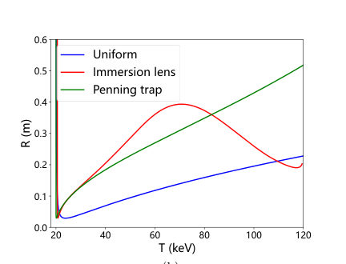
<figcaption class="paper-figure-caption"><b>Fig 4.</b> FIG. 4. Consider the process of increasing kinetic energy by 100 keV. (a) The evolution of beam width w(T) as kinetic energy increases. (b) The evolution of wave front R(T) as kinetic energy increases.</figcaption>
</figure>

**Summary.** This paper develops a relativistic quantum framework to analyze vortex beams of massive charged particles accelerated by non-uniform electrostatic fields. By deriving and solving coupled evolution equations for key parameters like beam width and wavefront curvature, the authors demonstrate that transverse electric field components critically modify beam focusing behavior in various experimental geometries. This offers theoretical control over particle beam propagation using purely electrostatic means.

**Why it may be interesting.** This work bridges concepts from charged particle beam dynamics (often treated classically) with rigorous relativistic quantum mechanical formalism, providing insights into how fundamental electromagnetic fields shape quantized wave packets.

Detailed structure

**Main problem.** The study investigates how a transverse electric field influences the evolution of relativistic vortex states carried by massive charged particles propagating through an axisymmetric accelerating electrostatic field.

**Main result.** The transverse electric field significantly impacts beam focusing and wavefunction parameters, with its influence on wavefront curvature being more pronounced than its effect on beam width. The results provide a quantum framework for controlling these beams using electrostatic fields.

**Method.** The analysis employs the Foldy-Wouthuysen transformation followed by the paraxial approximation to derive coupled evolution equations for beam width, wavefront curvature, and Gouy phase, which are then solved numerically.

**Model / system.** The system models massive charged particles with orbital angular momentum (vortex states) accelerated in various electrostatic potentials, including those mimicking Penning traps, immersion lenses, and Einzel lenses. The dynamics are governed by relativistic quantum equations simplified via the paraxial approximation.

**Key observables.** Beam width ($w(z)$), wavefront curvature radius ($R(z)$), and Gouy phase ($\Phi_G(z)$).

**Important parameters / regimes.** Longitudinal acceleration parameter $K(z)$, transverse field correction $\alpha(z)r^2$, and the potential derivatives $V''(z)$.

**Assumptions / limitations.** The analysis relies heavily on the paraxial approximation, and higher-order terms in the Scherzer expansion are neglected.

**Figures summary.** Figures compare beam evolution ($w(z)$ and $R(z)$) for different field geometries (free space, uniform, quadratic potential) as kinetic energy increases by a fixed amount (100 keV).

**Paper structure.** The paper first derives the governing equations using relativistic quantum mechanics approximations. It then applies these equations to model beam propagation in specific physical setups: Penning traps, immersion lenses, and Einzel lenses, comparing results against longitudinal-only field models.

Abstract

The relativistic vortex states of massive charged particles propagating in non-uniform axisymmetric electric field are studied. Starting from the stationary-state equation after the relativistic Foldy-Wouthuysen (FW) transformation and employing the paraxial approximation, the coupled evolution equations for the beam width, wavefront curvature, and Gouy phase are derived. The equations are solved numerically for a quadratic electrostatic potential, an immersion lens, and an einzel lens. The essential influence of the transverse field on beam evolution is demonstrated. The results provide a relativistic quantum framework for controlling accelerated vortex particle beams using electrostatic fields.

[↑ back to top](#top)

### [Topological effects in the polarization of the Fulling-Rindler vacuum](http://arxiv.org/abs/2607.04483v1)

**Authors:** A. A. Saharian, G. V. Mirzoyan, V. S. Torosyan  
**Type:** theory · **Category:** other · **PDF:** <https://arxiv.org/pdf/2607.04483v1>  
**Analysis basis:** full PDF text, analyzed in chunks
**Topic relevance:** `Keldysh / 2PI / non-Gaussian methods` **1/5**

↔ Scroll figures horizontally

<figure class="paper-figure-card">

<figcaption class="paper-figure-caption"><b>Fig 1.</b> Figure 1: The VEV of the field squared for a massless field as a function of ξ/L in the D = 4 model (left panel). The graphs are plotted for ˜αD = 0 and ˜αD/2π = 0.4 (the numbers near the curves). The dot-dashed curve corresponds to the VEV in the Rindler spacetime with trivial topology. The right panel presents the dependence on ˜αD/2π. The numbers near the curves are the values of ξ/L.</figcaption>
</figure>
<figure class="paper-figure-card">
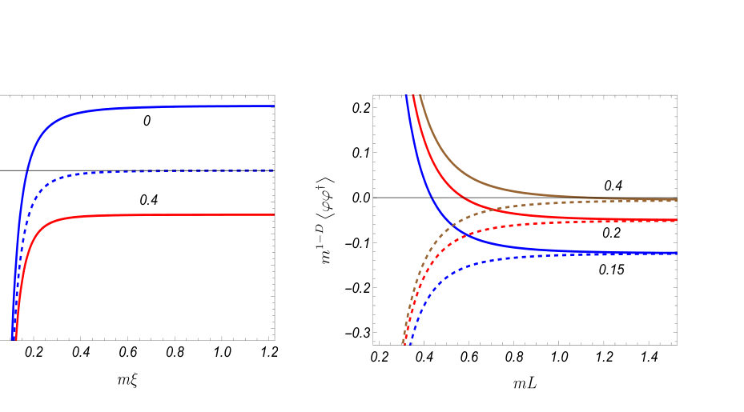
<figcaption class="paper-figure-caption"><b>Fig 2.</b> Figure 2: The VEV of the field squared for a massive field as a function of inverse proper acceleration (left panel) and the length of compact dimension (right panel) in units of the Compton wavelength. The numbers near the curves on the left and right panels are the values of ˜αD/2π and mξ, respectively. The full and dashed curves on the right panel are plotted for ˜αD/2π = 0 and ˜αD/2π = 0.4.</figcaption>
</figure>
<figure class="paper-figure-card">

<figcaption class="paper-figure-caption"><b>Fig 3.</b> Figure 3: The vacuum energy density (left panel) and 1 1-stress for a massles scalar field versus the ratio ξ/L. The full and dashed curves correspond to minimally and conformally coupled fields and the numbers near the curves are the values of ˜αD/2π. The dot-dashed and dotted curves present the corresponding VEVs in the Rindler spacetime without compact dimensions.</figcaption>
</figure>
<figure class="paper-figure-card">

<figcaption class="paper-figure-caption"><b>Fig 4.</b> Figure 4: The same as in Fig. 3 for the stresses ⟨T 2 2 ⟩(left panel) and ⟨T 4 4 ⟩(right panel).</figcaption>
</figure>
<figure class="paper-figure-card">

<figcaption class="paper-figure-caption"><b>Fig 5.</b> Figure 5: The vacuum energy-momentum tensor ⟨T i i ⟩as a functions of ˜αD/2π for a minimally coupled massless field in 4 + 1-dimensional Rindler spacetime with a single compact dimension. The left and right panels correspond to the components i = 0, 1 and i = 2, 4, and the numbers near the curves are the values of the ratio ξ/L. The full and dashed curves correspond to i = 0, 2 and i = 1, 4, respectively.</figcaption>
</figure>

**Summary.** This paper analyzes the impact of compactifying spatial dimensions on the vacuum energy and field correlations for a charged scalar field in Rindler spacetime. It shows that topological fluxes introduce non-trivial off-diagonal components to the stress-energy tensor, while most deviations from the Minkowski vacuum are exponentially small near the horizon. The work applies these findings to model black hole horizons with toroidal topology.

**Why it may be interesting.** The study provides a concrete example of how topology (compactification) modifies vacuum structure in curved spacetime backgrounds, which is relevant for understanding quantum field theory effects near horizons or in condensed matter systems with periodic boundary conditions.

Detailed structure

**Main problem.** The study investigates how compactifying spatial dimensions in Rindler spacetime affects the vacuum expectation values (VEVs) of field observables for a charged scalar field.

**Main result.** Topological effects manifest as off-diagonal components in the energy-momentum tensor and cause deviations from Minkowski vacua, which are generally exponentially small near the horizon unless specific massless conditions are met.

**Method.** The analysis uses quasiperiodicity boundary conditions on the field operator along compact dimensions and calculates VEVs using Hadamard function representations.

**Model / system.** The system is a charged scalar field in a background spacetime locally resembling Rindler space with additional toroidal compactification ($\mathbb{R}^p 	imes (S^1)^q$).

**Key observables.** VEVs of the field squared ($\langle\phi^2
angle$) and components of the energy-momentum tensor ($\langle T_{\mu
u}
angle$).

**Important parameters / regimes.** Proper acceleration, compactification lengths ($L_l$), magnetic fluxes ($\Phi_l$), and the mass of the scalar field.

**Assumptions / limitations.** The analysis assumes quasiperiodicity conditions on the field operator along compact dimensions and utilizes asymptotic expansions near the Rindler horizon.

**Figures summary.** Figure 1 illustrates the dependence of $\langle\phi\phi^\dagger
angle$ on the phase shift ($	ilde{\alpha}_D/2\pi$) for different topologies, comparing results to the trivial topology case.

**Paper structure.** The paper systematically analyzes VEVs by first establishing the mathematical framework using gauge transformations and quasiperiodicity conditions. It then calculates $\langle\phi^2
angle$ and $\langle T_{\mu
u}
angle$, demonstrating how topological fluxes induce non-trivial components, before applying these results to black hole horizons.

Abstract

We investigate how the compactification of some spatial dimensions in Rindler spacetime affects the vacuum expectation values (VEVs) of the field squared and the energy-momentum tensor for a charged scalar field prepared in the Fulling-Rindler vacuum state. A toral compactification is considered with quasi-periodicity conditions on the field operator along the compact dimensions. The phases of these conditions are interpreted in terms of the magnetic flux enclosed by the compact dimensions. For a general number of spatial dimensions, the components of the VEVs are explicitly separated, corresponding to the expectation values in the Minkowski vacuum. As a limiting case, the VEVs are retrieved in Rindler spacetime with trivial topology. We demonstrate that, for non-zero phases in the periodicity conditions, the vacuum energy-momentum tensor exhibits off-diagonal components with indices in the compact subspace. Near the Rindler horizon, the leading terms in the asymptotic expansions of the field squared and the diagonal components of the energy-momentum tensor coincide with the corresponding VEVs in Rindler spacetime with trivial topology. The off-diagonal components of the energy-momentum tensor vanish on the Rindler horizon. For small accelerations, the difference between the VEVs in the Fulling-Rindler and Minkowski vacua is exponentially small. The exception to this is a massless field with zero phases in the periodicity conditions. In this special case, the difference decays according to a power law as a function of acceleration. As an application, we consider the VEVs near the horizon of cylindrical black holes and topological black holes with toroidal horizons.

[↑ back to top](#top)

## Other papers (12)

*Papers from primary archives without highlighted authors or any topic match. Click to expand.*

Show other papers

### [A regularization method for quantum neural networks using data symmetry](http://arxiv.org/abs/2607.03805v1)

**Authors:** Hiroshi Ohno  
**Type:** both · **Category:** disordered systems and neural networks · **PDF:** <https://arxiv.org/pdf/2607.03805v1>  
**Analysis basis:** full PDF text, analyzed in chunks

↔ Scroll figures horizontally

<figure class="paper-figure-card">
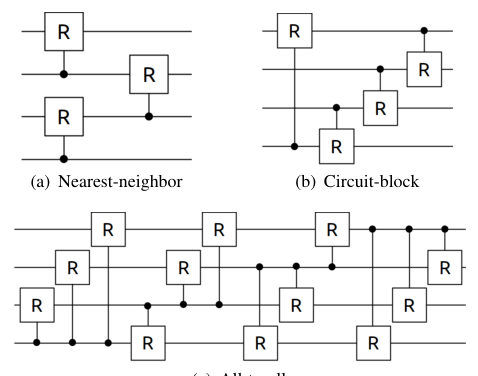
<figcaption class="paper-figure-caption"><b>Fig 1.</b> Figure 1: Configurations for four qubit entangling circuits. R denotes a two-qubit gate implementing a controlled Pauli operator (X or Z).</figcaption>
</figure>
<figure class="paper-figure-card">
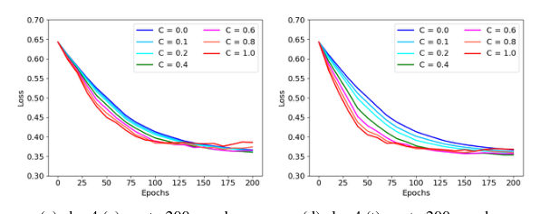
<figcaption class="paper-figure-caption"><b>Fig 2.</b> Figure 3: Loss results for classification tasks (depth 2 and 4). (e) denotes the results using the empirical ρin(x) (M = 100): (t) denotes the results using the theoretical ρin(x) (Eq. 21). C denotes a balancing parameter.</figcaption>
</figure>
<figure class="paper-figure-card">
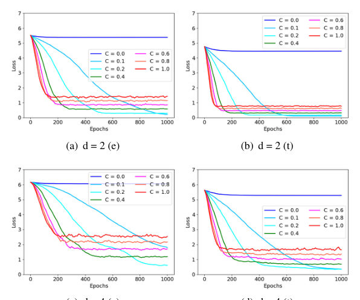
<figcaption class="paper-figure-caption"><b>Fig 3.</b> Figure 4: Loss results for the penalty loss Csymm for classification tasks. (e) denotes the results using the empirical ρin(x) (M = 100); (t) denotes the results using the theoretical ρin(x) (Eq. 21).</figcaption>
</figure>
<figure class="paper-figure-card">

<figcaption class="paper-figure-caption"><b>Fig 4.</b> Figure 5: Test loss results for classification tasks with respect to a balancing parameter C (∈ {0, 0.1, 0.2, 0.4, 0.6, 0.8, 1.0}). (e) denotes the results using the empirical ρin(x) (M = 100). (t) denotes the results using the theoretical ρin(x) (Eq. 21). Error bar denotes a standard deviation.</figcaption>
</figure>
<figure class="paper-figure-card">
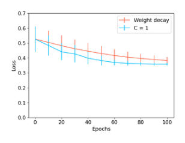
<figcaption class="paper-figure-caption"><b>Fig 5.</b> Figure 6: Comparison results of the weight decay method and the proposed method (C = 1). Error bar denotes a standard deviation.</figcaption>
</figure>

**Summary.** This paper introduces a regularization technique for Quantum Neural Networks (QNNs) that leverages inherent data symmetries to enhance training efficiency and generalization. By adding a penalty term based on symmetry constraints, the method improves performance in both classification and generative tasks. The work combines empirical validation with theoretical bounds derived from Rademacher complexity.

**Why it may be interesting.** This work directly addresses the intersection of quantum computation and machine learning theory by providing a principled way to regularize variational quantum circuits using underlying physical symmetries, which is relevant for designing robust quantum algorithms.

Detailed structure

**Main problem.** The study aims to improve the generalization performance and accelerate training of Quantum Neural Networks (QNNs) by incorporating constraints derived from input data symmetries.

**Main result.** The proposed symmetry-based regularization method leads to faster convergence and lower test errors across both classification and quantum generative adversarial network tasks. Theoretically, it provides a bound suggesting improved generalization when the model respects data symmetry.

**Method.** A novel penalty term, $C_{	ext{symm}}$, is added to the cost function, penalizing deviations between the parameterized unitary circuit and the unitary derived from the input data symmetry. Theoretical analysis uses Rademacher complexity bounds to quantify generalization improvements.

**Model / system.** The model consists of QNNs implemented via parameterized quantum circuits $U(	heta)$, whose output is measured by an expectation value $\langle\psi(x, 	heta)| O |\psi(x, 	heta)
angle$. The input data symmetry is characterized by the commutation relation $[
ho_{	ext{in}}(x), S] = 0$.

**Key observables.** Test errors (classification), FID scores (generative tasks), penalty loss ($C_{	ext{symm}}$), and Rademacher complexity ($\mathcal{R}_{\Theta}(F)$).

**Important parameters / regimes.** The balancing parameter $C$ controlling the regularization strength, and the choice of matrix norm used in theoretical bounds.

**Assumptions / limitations.** The method assumes that enforcing data symmetry acts as a beneficial inductive bias. A limitation noted is that excessive symmetries can overly restrict expressibility.

**Figures summary.** Figures show loss curves for classification tasks comparing $C=0$ vs. $C>0$, and FID scores for generative tasks, illustrating the impact of the regularization strength on training stability and performance.

**Paper structure.** The paper introduces the problem, details the symmetry-based regularization method ($C_{	ext{symm}}$), validates it empirically across classification and QGAN tasks using various circuit types (AA, CB), and supports these findings with theoretical generalization bounds derived from Rademacher complexity.

Abstract

Leveraging data symmetries has recently become a key strategy in quantum neural networks (QNNs) to improve generalization and training efficiency. In this study, we propose a novel regularization method for QNNs based on input data symmetry. By introducing a penalty term that encourages the model to align with data symmetry, our method enables improved training speed and generalization. This symmetry-based regularization is simple to implement and does not require prior knowledge of the symmetry group. We validate its effectiveness through numerical experiments on both classification tasks and quantum generative adversarial networks. Empirical results demonstrate faster convergence and lower test errors. Furthermore, we provide a theoretical generalization bound using Rademacher complexity and conjecture a condition under which models with symmetry exhibit better generalization. Our findings highlight the potential of symmetry-aware regularization in enhancing the performance of QML models.

[↑ back to top](#top)

### [A Semantic Framework for Reproducible Variational Quantum Algorithm Execution Records](http://arxiv.org/abs/2607.03982v1)

**Authors:** Silvie Illésová, Martin Beseda  
**Type:** theory · **Category:** quantum information and computing · **PDF:** <https://arxiv.org/pdf/2607.03982v1>  
**Analysis basis:** full PDF text, analyzed in chunks

↔ Scroll figures horizontally

<figure class="paper-figure-card">
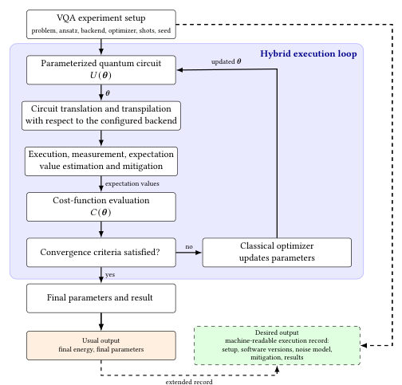
<figcaption class="paper-figure-caption"><b>Fig 1.</b> Figure 1: General workflow of a variational quantum algo- rithm execution.</figcaption>
</figure>
<figure class="paper-figure-card">

<figcaption class="paper-figure-caption"><b>Fig 2.</b> Figure 2: Compact overview of the VQA ontology as an execution record. The ontology connects algorithm configuration, execution context, and recorded outputs required for validation, querying, and reproducibility.</figcaption>
</figure>

**Summary.** This paper introduces a semantic framework using OWL ontologies to structure Variational Quantum Algorithm (VQA) execution records. It models every interacting choice—from ansatzes to noise models—into machine-readable artifacts. This allows researchers to rigorously validate, compare, and reproduce VQA results by querying the complete execution context.

**Why it may be interesting.** This work provides crucial infrastructure for quantum software engineering, allowing researchers to systematically track and compare results across different hardware platforms and algorithmic choices, which is vital for advancing the field beyond single successful demonstrations.

Detailed structure

**Main problem.** Variational Quantum Algorithms (VQAs) generate results dependent on numerous interacting choices, making current execution records difficult to reproduce, compare, debug, and reuse due to scattered metadata.

**Main result.** The authors propose an ontology-supported framework that successfully represents complete VQA execution contexts and can detect missing or malformed metadata using formal validation techniques.

**Method.** They define a Web Ontology Language (OWL) ontology to model all key entities in VQA experimentation, augmenting it with SHACL constraints for validation and SPARQL queries for information retrieval.

**Model / system.** The framework models the entire hybrid quantum-classical execution loop of VQAs, covering components like algorithms (VQE), ansatzes, Hamiltonians, optimizers, backends, noise models, and measurement outcomes.

**Key observables.** Complete VQA execution contexts, detection of missing/malformed metadata, and queryable information needed for reproducible quantum software experimentation.

**Important parameters / regimes.** Ansatz structure, Hamiltonian representation, optimizer configuration, shot count, noise model parameters, and software versions.

**Assumptions / limitations.** The core assumption is that structuring the execution context semantically (via ontology) can solve the problem of metadata fragmentation across disparate sources.

**Figures summary.** Figure 1 contrasts typical VQA output with a desired machine-readable execution record. Table 1 summarizes the main ontology classes grouped by conceptual module, and Figure 2 provides an overview connecting algorithm configuration to recorded outputs.

**Paper structure.** The paper introduces the problem of VQA reproducibility, proposes the OWL/SHACL/SPARQL framework using a detailed ontology structure (covering execution, algorithm, problem, etc.), demonstrates its utility with VQE records, and concludes by showing how it enables query-based inspection of necessary metadata.

Abstract

Variational quantum algorithms are hybrid quantum-classical workflows whose results depend on many interacting choices, including the ansatz, Hamiltonian, optimizer, backend, shot count, noise model, mitigation method, random seed, stopping criteria, and software versions. In current practice, this information is often scattered across code, configuration files, logs, backend metadata, and paper descriptions, making executions difficult to reproduce, compare, debug, and reuse. This paper proposes an ontology-supported framework for representing Variational Quantum Algorithm (VQA) execution records as structured and machine-readable software engineering artifacts. The framework defines a Web Ontology Language (OWL) ontology for modeling the main entities involved in VQA experimentation, including algorithms, circuits, ansatzes, Hamiltonians, optimizers, backends, noise models, mitigation techniques, execution steps, software environments, measurement outcomes, and results. It further combines the ontology with Shapes Constraint Language (SHACL) constraints for validating completeness and consistency, and SPARQL Protocol and RDF Query Language (SPARQL) competency queries for retrieving reproducibility-relevant information. We demonstrate the approach using Variational Quantum Eigensolver (VQE) execution records, including a valid record and intentionally incomplete or inconsistent examples. The results show that the framework can represent complete VQA execution contexts, detect missing or malformed metadata, and support query-based inspection of information needed for reproducible quantum software experimentation.

[↑ back to top](#top)

### [Chromatic Completeness and the Independence of Geometric Obstruction](http://arxiv.org/abs/2607.04289v1)

**Authors:** Karl Svozil  
**Type:** theory · **Category:** other · **PDF:** <https://arxiv.org/pdf/2607.04289v1>  
**Analysis basis:** full PDF text, analyzed in chunks

↔ Scroll figures horizontally

<figure class="paper-figure-card">
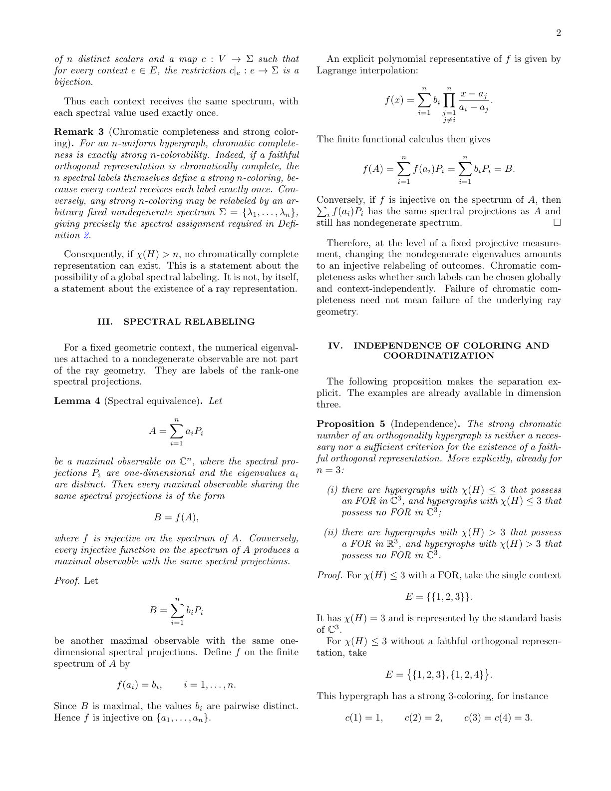
<figcaption class="paper-figure-caption"><b>Fig 1.</b> Low-resolution page preview, page 2</figcaption>
</figure>
<figure class="paper-figure-card">

<figcaption class="paper-figure-caption"><b>Fig 2.</b> Low-resolution page preview, page 3</figcaption>
</figure>
<figure class="paper-figure-card">
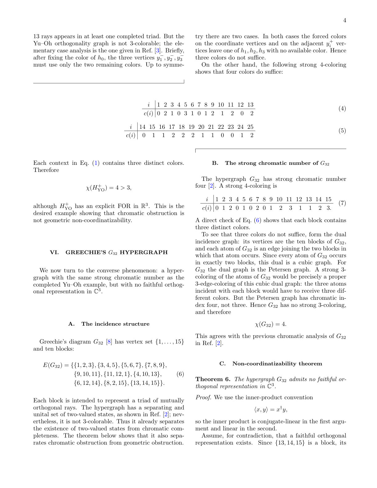
<figcaption class="paper-figure-caption"><b>Fig 3.</b> Low-resolution page preview, page 4</figcaption>
</figure>
<figure class="paper-figure-card">

<figcaption class="paper-figure-caption"><b>Fig 4.</b> Low-resolution page preview, page 5</figcaption>
</figure>
<figure class="paper-figure-card">

<figcaption class="paper-figure-caption"><b>Fig 5.</b> Low-resolution page preview, page 6</figcaption>
</figure>

**Summary.** This theoretical paper proves that two ways of characterizing structure in orthogonality hypergraphs—chromatic completeness and geometric coordinatizability—are logically independent. By comparing the Yu-Oh graph and Greechie's $G_{32}$, the authors show that a high chromatic number does not guarantee, nor is it guaranteed by, the existence of a faithful orthogonal representation in complex space. This separates spectral labeling issues from fundamental geometric embedding problems.

**Why it may be interesting.** It provides a deep mathematical framework for understanding when physical constraints (like orthogonality in Hilbert space) force global consistency conditions, which is relevant to quantum contextuality and measurement theory.

Detailed structure

**Main problem.** The paper aims to establish a strict logical separation between two concepts in orthogonality hypergraphs: chromatic completeness (global spectral consistency) and geometric coordinatizability (existence of a faithful orthogonal representation).

**Main result.** Chromatic completeness and geometric coordinatizability are proven to be logically independent, demonstrated by comparing the Yu-Oh configuration and Greechie's G32 graph.

**Method.** The authors use algebraic proofs involving inner products on hypergraphs derived from orthogonality relations to distinguish between coloring obstructions and purely projective-geometric obstructions.

**Model / system.** The analysis is performed on abstract mathematical structures called orthogonality hypergraphs $H=(V, E)$, where vertices represent rays in $\mathbb{C}^n$ or $\mathbb{R}^n$, and edges (contexts) are sets of mutually orthogonal rays.

**Key observables.** Strong chromatic number ($\chi(H)$), existence of a Faithful Orthogonal Representation (FOR).

**Important parameters / regimes.** The dimension $n$ (e.g., $\mathbb{R}^3, \mathbb{C}^3$), and the specific hypergraph structure ($H_{YO}, G_{32}$).

**Assumptions / limitations.** The separation relies on comparing global labeling conditions against local geometric realization constraints.

**Figures summary.** Not specified in notes; the comparison is made through explicit construction of two different 3D examples (Yu-Oh and $G_{32}$) with matching chromatic numbers but differing realizability properties.

**Paper structure.** The paper introduces the concepts, proves their independence using specific counterexamples ($H_{YO}$ vs. $G_{32}$), and concludes by formalizing that spectral labeling issues are distinct from geometric embedding constraints.

Abstract

We establish a strict logical separation between two distinct phenomena in orthogonality hypergraphs: chromatic completeness, the possibility of assigning a single globally consistent nondegenerate spectrum to all contexts, and geometric coordinatizability, the existence of a faithful orthogonal representation by rays. A strong chromatic number larger than the Hilbert-space dimension obstructs only the former. It does not, by itself, obstruct the existence of a faithful orthogonal representation. We make this separation explicit by comparing two three-dimensional examples with the same strong chromatic number. A completed 25-ray version of the Yu-Oh configuration has strong chromatic number four and nevertheless possesses an explicit faithful orthogonal representation in R^3. Conversely, Greechie's G_{32} hypergraph also has strong chromatic number four, and has a separating and unital set of two-valued states, but we give an elementary algebraic proof that it admits no faithful orthogonal representation in C^3. The obstruction in G_{32} is therefore not chromatic but projective-geometric: the incidence relations force two distinct atoms to collapse onto the same ray.

[↑ back to top](#top)

### [Complementary 3D color codes for transversal quantum logic](http://arxiv.org/abs/2607.05107v1)

**Authors:** Friederike Butt, Luis Colmenarez, Erik Weilandt, Tom Peham, Robert Wille, Markus Müller  
**Type:** theory · **Category:** quantum information and computing · **PDF:** <https://arxiv.org/pdf/2607.05107v1>  
**Analysis basis:** full PDF text, analyzed in chunks

↔ Scroll figures horizontally

<figure class="paper-figure-card">

<figcaption class="paper-figure-caption"><b>Fig 1.</b> Figure 1. The [[15, 1, 3]] code and its Hadamard-transformed version. (a) The X-stabilizer generators of the [[15, 1, 3]] tetrahedral color code are supported on the red (R), blue (B), green (G) and yellow (Y) cell formed by eight qubits each. Ten independent Z-stabilizers are defined on weight-4 faces within the tetrahedron. (b) The support of X- and Z-stabilizers is interchanged on the Hadamard-transformed tetrahedral code [[15, 1, 3]]H: X-stabilizers are supported by faces and Z-stabilizers are supported by cells. (c) The joint gate set of both code variants comprises the logical CNOT between the same code types, the T gate on the [[15, 1, 3]] code and the TX gate on the [[15, 1, 3]]H...</figcaption>
</figure>
<figure class="paper-figure-card">

<figcaption class="paper-figure-caption"><b>Fig 2.</b> Figure 2. Transversal operations in the hybrid architecture. (a) If the control qubit is encoded in the [[15, 1, 3]] code and the target in the Hadamard-transformed [[15, 1, 3]]H code, cell-like stabilizers propagate to face-like stabilizers. This operation preserves the codespace because both control and target are a +1-eigenstate of the X-cells. The transversal CNOT gate in the reverse direction (b) does not preserve the codespace, because an X-face propagates from control to the target code that is not an eigenstate of the respective face-like stabilizer. (c) The hybrid architecture admits a transversal Toffoli gate if the two control qubits are encoded in [[15, 1, 3]] codes and the...</figcaption>
</figure>
<figure class="paper-figure-card">

<figcaption class="paper-figure-caption"><b>Fig 3.</b> Figure 3. Round-robin CZ gate on the rotated tetrahedral [[15, 1, 3]]H code. The round-robin gate applies seven layers of permuted transversal CZ gates on qubits 1–7 of code blocks A and B. Since physical CZ gates commute, we can rearrange the gate ordering, as illustrated in App. Fig. 8. In doing so, the protocol becomes symmetric between the two registers, which allows us to use the same lookup tables for both logical code blocks. The subset of invariant stabilizers remain unchanged throughout the whole protocol. This subset of stabilizers is extracted in the middle of the circuit (blue box). Specifically, we measure the red, blue and green X-faces and three out of four Z-cells of both...</figcaption>
</figure>
<figure class="paper-figure-card">

<figcaption class="paper-figure-caption"><b>Fig 4.</b> Figure 4. Fault-tolerant stabilizer extraction on tetrahedral 3D color codes. (a) A 3D tetrahedral color code can be viewed as layers of 2D color codes, similarly to stacked color codes [46]. (b) The red, green and blue X-stabilizers, SR X, SB X, SG X can be measured fault-tolerantly using a variant of Steane’s method for FT syndrome extraction [47]. We fault-tolerantly prepare a logical auxiliary qubit in |0⟩of a 2D color code by verifying the prepared logical state after running a unitary encoding [48], as shown in App. Fig. 7. In a second step, we apply a transversal CNOT gate between the top layer of the 3D code instance (qubit 1–7) and the logical auxiliary qubit. Measuring the...</figcaption>
</figure>
<figure class="paper-figure-card">

<figcaption class="paper-figure-caption"><b>Fig 5.</b> Figure 5. Logical state fidelities for the fault-tolerant round-robin CZ gate. The CZ gate is run on two [[15, 1, 3]]H codes which do not admit a transversal imple- mentation of this operation. The gate construction is fully symmetric between the two logical qubits. The logical state fidelities are determined as described in App. E for two logi- cal qubit input states |0+⟩, |1+⟩, and |++⟩. The gray dashed line corresponds to the approximated logical infidelity of a transversal CNOT gate, assuming that any two faults con- tribute to the logical infidelity.</figcaption>
</figure>

**Summary.** This paper addresses the challenge of building universal fault-tolerant quantum computation by proposing a hybrid architecture combining two related 3D color codes. By leveraging complementary transversal operations, they achieve an almost-universal gate set, completing it through a complex round-robin construction for the necessary entangling gates. This provides a new pathway to implement hard algorithms while keeping most required operations transversal.

**Why it may be interesting.** While highly theoretical, the focus on resource optimization (concentrating non-transversal gates) and using structured codes like color codes is relevant to designing practical quantum hardware architectures that minimize error correction overhead.

Detailed structure

**Main problem.** Achieving a universal set of transversal logical gates for fault-tolerant quantum computation, which is restricted by the Eastin–Knill theorem.

**Main result.** The authors propose a hybrid architecture using two complementary color codes (tetrahedral and H-tetrahedral) to realize an almost-universal gate set, completing universality via a complex round-robin construction for the entangling CZ gate.

**Method.** The approach combines bitwise Hadamard transformations between two related quantum error-correcting codes and utilizes pieceable fault-tolerant constructions for necessary non-transversal gates.

**Model / system.** The system is based on the $[[15, 1, 3]]$ tetrahedral three-dimensional color code and its Hadamard-transformed counterpart. The implementation details involve syndrome extraction using auxiliary qubits and constructing logical operations between these two codes.

**Key observables.** Logical state fidelities (e.g., $F_{CZ}|\cdot
angle$), effective distances ($d_X, d_Z$), and the existence of transversal non-Clifford gates.

**Important parameters / regimes.** The smallest instance considered is the $[[15, 1, 3]]$ code; resource overhead is concentrated in a few non-transversal Clifford operations.

**Assumptions / limitations.** The initial CNOT realization between codes is one-way (control $	o$ target), and achieving full universality requires complex round-robin constructions for the missing entangling gate.

**Figures summary.** Figures illustrate the $[[15, 1, 3]]$ code structure, transversal operations in the hybrid architecture, and the ordering of physical CZ gates required for fault-tolerant logical gates.

**Paper structure.** The paper establishes the need for transversal gates, proposes the hybrid tetrahedral/H-tetrahedral architecture to achieve an almost-universal set, details the construction of the full universal gate set via a round-robin process, and analyzes related concepts like syndrome extraction overheads.

Abstract

Transversal logical gates provide a direct route to fault-tolerant quantum computation, but the Eastin-Knill theorem forbids a universal transversal gate set within a single quantum error-correcting code. We propose a hybrid architecture based on the tetrahedral three-dimensional color code and its Hadamard-transformed counterpart, which we call the H-tetrahedral code. The two encodings support complementary transversal non-Clifford operations. Combined with bitwise Hadamard transformations that switch between the two encodings and a one-way transversal logical CNOT from the tetrahedral code to the H-tetrahedral code, these operations realize an almost-universal transversal logical gate set that enables both the creation of entanglement and logical states with magic. We complete a universal gate set through a pieceably fault-tolerant round-robin construction of a logical controlled-$Z$ gate between two H-tetrahedral codes. This logical entangling gate is interleaved with reduced-overhead Steane-type syndrome extraction using logical two-dimensional color-code auxiliary qubits. Our construction provides a new route toward implementing classically hard-to-simulate quantum algorithms where magic and most entangling operations are transversal while the resource overhead is concentrated in a small number of non-transversal Clifford entangling operations.

[↑ back to top](#top)

### [Frozen-Tree Sampling Refutes Quantum Advantage of Random Circuit Sampling](http://arxiv.org/abs/2607.04054v1)

**Authors:** Sangchul Oh  
**Type:** theory · **Category:** quantum information and computing · **PDF:** <https://arxiv.org/pdf/2607.04054v1>  
**Analysis basis:** full PDF text, analyzed in chunks

↔ Scroll figures horizontally

<figure class="paper-figure-card">
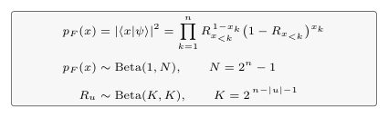
<figcaption class="paper-figure-caption"><b>Fig 1.</b> Figure 1. Binary-tree representation of the probability p(x) = |⟨x|ψ⟩|2 = Q</figcaption>
</figure>
<figure class="paper-figure-card">

<figcaption class="paper-figure-caption"><b>Fig 2.</b> Figure 2. Random walks on a frozen tree sample bitstrings from pF (x) = |⟨x|ψ⟩|2 = Qn k=1 R1−xk x&lt;k (1−Rx&lt;k)xk, illustrated here for n = 4 qubits. During the random walk from the root to a leaf, the path at each node moves left with probability Rx&lt;k (setting xk = 0) or right with probability 1 −Rx&lt;k (setting xk = 1). When a node is visited for the first time, its branch ratio Rx&lt;k is drawn from the Beta distribution, Beta(K, K) with K = 2n−d−1 and frozen for later revisits. Near the root the branch ratios are close to 1/2, whereas near leaves they fluctuate strongly, as indicated by the node circle sizes. For example, the probability of finding x = 0100 is given by p(x = 0100) = R∅· (1 −R0)...</figcaption>
</figure>
<figure class="paper-figure-card">

<figcaption class="paper-figure-caption"><b>Fig 3.</b> Figure 3. Scaling of the frozen-tree sampler on an Intel CPU i7-3770 and an NVIDIA GPU T400. (a) The time per sample scales as O(n) with the number of qubits n and (b) the wall- clock time scales O(Mn) with the number of samples M for n = 100 and 1, 000.</figcaption>
</figure>
<figure class="paper-figure-card">

<figcaption class="paper-figure-caption"><b>Fig 4.</b> Fig. 3 shows the O(n) scaling per sample of the frozen- tree sample code [36]. It samples M = 107 bitstrings of an n = 1000-qubit random state on the GPU in a few seconds. For comparison, the Google Sycamore processor required about 200 seconds to collect ∼106 samples at n = 53 [1, 37]. The frozen-tree sampler is fast, exact, and noiseless. Fig. 3 (a) confirms the predicted O(n) per-sample time on CPU and GPU. Fig. 3 (b) shows the total runtime scaling as O(Mn).</figcaption>
</figure>
<figure class="paper-figure-card">

<figcaption class="paper-figure-caption"><b>Fig 5.</b> Figure 5. (a) Distributions of bitstring probabilities and (b) the same distributions on semi-log scale, plotted against Np(x), obtained with the noisy frozen-tree sampler under global depolarizing noise, amplitude damping, and readout error. The number of qubits is n = 20. The probabilities p(x) over all 220 leaves are computed directly from the noisy frozen-tree sampler, rather than estimating as empirical fre- quencies ˆp(x) from finite samples.</figcaption>
</figure>

**Summary.** This paper demonstrates an efficient classical algorithm (frozen-tree sampling) capable of reproducing the exact statistical output distribution of Random Circuit Sampling (RCS). By showing this equivalence, the authors argue that RCS does not constitute a sound standalone benchmark for quantum advantage, as all observable sample statistics can be classically simulated.

**Why it may be interesting.** It directly challenges a cornerstone assumption in quantum computation benchmarking by providing an efficient classical simulation for the underlying probability distribution, suggesting that true advantage must be sought elsewhere than sample statistics alone.

Detailed structure

**Main problem.** The paper challenges the widely accepted premise that Random Circuit Sampling (RCS) provides a demonstration of quantum advantage over classical computation.

**Main result.** An efficient classical frozen-tree sampling algorithm can reproduce the exact probability distribution of RCS outputs, meaning no sample-based statistical test can distinguish between the two processes.

**Method.** The authors propose and implement an $O(n)$ classical frozen-tree sampler that exploits the conditional scale invariance property of Haar-random quantum states to generate bitstrings matching the Dirichlet distribution statistics.

**Model / system.** The model involves $n$ qubits whose state is assumed to be random (Haar-random), leading to output bitstring probabilities following a flat Dirichlet distribution. The analysis focuses on the probability vector $p(x) = |\langle x|\psi
angle|^2$.

**Key observables.** The output bitstring probability distribution $p(x)$, and diagnostic metrics like the branch-ratio fidelity $\hat{F}_d$ and the exponential law adherence for leaf probabilities.

**Important parameters / regimes.** Number of qubits ($n$), depth of the circuit, and noise parameters (depolarizing, amplitude damping).

**Assumptions / limitations.** The argument relies on exploiting the exact conditional scale invariance property inherent to Haar-random states and assumes that verification must rely only on sample statistics.

**Figures summary.** Figures compare the frozen-tree sampler's performance ($\hat{F}_d=1$) against empirical data from quantum hardware (Sycamore), showing perfect fidelity, and validate the reproduction of ideal exponential laws under various noise models.

**Paper structure.** The paper first introduces RCS as a benchmark, then derives the classical sampling method using frozen-tree techniques based on conditional scale invariance. It systematically compares the resulting statistics against known quantum benchmarks (including noisy channels) to show statistical equivalence.

Abstract

Random circuit sampling of bitstrings from a Haar-random quantum state is widely believed to be classically intractable, and has therefore been implemented as a primary benchmark for demonstrating quantum advantage. Here, we challenge this premise by proposing an efficient classical frozen-tree sampling algorithm that exploits the conditional scale invariance of Haar-random quantum states [Oh, arXiv:2602.19448]. The frozen-tree sampler draws bitstrings of $n$ qubits in $O(n)$ time per sample. Moreover, its output probability $p_F(x)$ is statistically identical to the probability $p_C(x)$ of a random quantum circuit, since both are independent instances of the same Dirichlet distribution. Consequently, no statistical test acting on samples alone can distinguish the classical frozen-tree sampler from a quantum random circuit. The claimed quantum advantage of random circuit sampling therefore does not withstand scrutiny: its hardness lies not in sampling from the Dirichlet distribution, which is classically efficient, but in identifying a specific circuit realization.

[↑ back to top](#top)

### [Investigating Role of Electron Correlation Effects via Triple Excitations for Precise Evaluation of Energies and Hyperfine Structure Constants in $^{23}$Na](http://arxiv.org/abs/2607.05012v1)

**Authors:** Vaibhav Katyal, B. K. Sahoo  
**Type:** theory · **Category:** other · **PDF:** <https://arxiv.org/pdf/2607.05012v1>  
**Analysis basis:** full PDF text, analyzed in chunks

↔ Scroll figures horizontally

<figure class="paper-figure-card">

<figcaption class="paper-figure-caption"><b>Fig 1.</b> FIG. 1. Correlation trends from lower- to higher-order many- bdy methods in the calculated Ahf values (in MHz) of the considered states in 23Na. The plotted quantities represent the percentage corrections with respect to the DHF values as progressively through the higher-order many-body methods.</figcaption>
</figure>
<figure class="paper-figure-card">

<figcaption class="paper-figure-caption"><b>Fig 2.</b> FIG. 2. Pictorial depiction of correlation contributions from the OT1 + c.c., OS1v + c.c., OS2v + c.c., T † 2 OS2v + c.c. and T † 2 OS3v + c.c. terms to the Ahf values of the 3S, 3P1/2 and 3P3/2 states at the lowest-order (from the RMBPT method) and all-order methods with the RCCSD, RCCSDTv and RCCSDT approximations in 23Na (in MHz). It demonstrates influence of triples effects both directly and indirectly to the states.</figcaption>
</figure>

**Summary.** The authors perform highly accurate relativistic many-body calculations on $^{23}	ext{Na}$ to predict its hyperfine structure constants. They systematically incorporate electron correlation effects up to triple excitations and include QED/Breit corrections. The findings emphasize that achieving experimental accuracy requires the combined inclusion of these higher-order correlation terms alongside fundamental physical interactions.

**Why it may be interesting.** This work exemplifies the state-of-the-art in high-precision atomic structure theory, demonstrating how subtle correlation effects (like triples) are essential for matching spectroscopic measurements in alkali atoms.

Detailed structure

**Main problem.** The primary goal is to accurately determine hyperfine structure constants (HFCs) and ionization potentials for $^{23}	ext{Na}$ by rigorously investigating the role of electron correlation effects, particularly those involving triple excitations.

**Main result.** Accurate theoretical predictions require the inclusion of higher-order correlation terms (like triples), alongside relativistic corrections (Breit, QED, BW) to reconcile discrepancies between theory and experiment for $	ext{A}_{	ext{hf}}$.

**Method.** The study employs advanced relativistic coupled-cluster theory ($	ext{RCCSDT}$) combined with perturbation theory treatments for various physical interactions.

**Model / system.** The system is the sodium ($^{23}	ext{Na}$) atom. Calculations utilize a Dirac-Coulomb Hamiltonian and treat electron correlation effects systematically through methods like $	ext{RMBPT}$ and coupled-cluster expansions up to triple excitations.

**Key observables.** Magnetic dipole hyperfine structure constants ($	ext{A}_{	ext{hf}}$), electric quadrupole hyperfine structure constants ($	ext{B}_{	ext{hf}}$), and Ionization Potentials (IPs).

**Important parameters / regimes.** The relative importance of correlation effects versus Breit, QED, and Bohr-Weisskopf corrections is a key focus.

**Assumptions / limitations.** The calculations rely on approximations inherent to many-body perturbation theory ($	ext{RMBPT}$) or coupled-cluster expansions ($	ext{RCC}$), which systematically treat electron interactions.

**Figures summary.** Figures illustrate the systematic inclusion of different physical processes (e.g., correlation effects) and show how triple excitations modify $	ext{A}_{	ext{hf}}$ constants, while tables present numerical comparisons across various theoretical approximations.

**Paper structure.** The paper systematically compares results from lower-order methods ($	ext{RMBPT}(2)$, RPA) against higher-order treatments incorporating explicit triple excitations ($	ext{RCCSDT}$), while also adding external corrections like Breit and QED to achieve convergence toward experimental values.

Abstract

Accurate determination of hyperfine structure constants in atomic systems provides important insight into the interplay of electron correlation and relativistic effects in the nuclear region. Although sodium (Na) is a relatively light atom, previous all-order relativistic many-body calculations of the magnetic dipole hyperfine constants for the low-lying states of $^{23}$Na show noticeable discrepancies with experiment. To address this, we calculate the ionization potentials and hyperfine structure constants of $^{23}$Na using relativistic coupled-cluster theory with explicit inclusion of triple excitations. We further incorporate corrections from the Breit interaction, quantum electrodynamics, and the Bohr-Weisskopf (BW) effect. Results from lower-order methods are also presented to assess the importance of different physical contributions across states. Our calculations demonstrate that contributions from the lower-order relativistic and BW effects play almost similar roles with the electron correlation effects, including triple excitations, and are essential for reconciling theoretical predictions with experimental observations. This study can also serve as a useful guide for understanding the role of triples in heavier alkali systems.

[↑ back to top](#top)

### [Ising-Machine-Assisted Large Neighborhood Search with Flexibly Tunable Subproblem Size](http://arxiv.org/abs/2607.05169v1)

**Authors:** Koshiro Fujimoto, Masashi Yamashita, Shu Tanaka  
**Type:** theory · **Category:** statistical mechanics · **PDF:** <https://arxiv.org/pdf/2607.05169v1>  
**Analysis basis:** full PDF text, analyzed in chunks

↔ Scroll figures horizontally

<figure class="paper-figure-card">

<figcaption class="paper-figure-caption"><b>Fig 1.</b> Fig. 1. Schematics of the vehicles and sites included in the subproblems of LNS-V and LNS-VT. (a) Schematic of LNS-V, where the entire routes of the selected vehicles are re-optimized. (b) Schematic of LNS-VT, where only a contiguous part of the steps in the route of each selected vehicle is re-optimized.</figcaption>
</figure>
<figure class="paper-figure-card">

<figcaption class="paper-figure-caption"><b>Fig 2.</b> Fig. 2. Update process of the objective value in LNS for the VRP with 300 non-depot sites and 5 vehicles. The results of LNS-VT are indicated by “T ′ =”. Panel (b) is an enlarged view of panel (a) along the vertical axis. The points represent the average values over 10 runs, and the error bars represent the standard deviations.</figcaption>
</figure>
<figure class="paper-figure-card">

<figcaption class="paper-figure-caption"><b>Fig 3.</b> Fig. 3. Relation between the number of non-depot site-assignment vari- ables included in the subproblem and the objective value after 100 iterations of LNS for the VRP with 300 non-depot sites and 5 vehicles. The points represent the average values over 10 runs, and the error bars represent the standard deviations.</figcaption>
</figure>
<figure class="paper-figure-card">
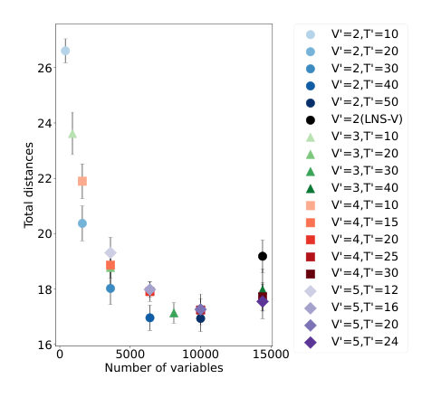
<figcaption class="paper-figure-caption"><b>Fig 4.</b> Figure 3 shows the relation between the number of vari- ables included in the subproblem and the objective value af- ter 100 iterations. Here, the number of variables denotes the number of non-depot site-assignment variables introduced in Sec. 3. For LNS-VT, this number is (V′T ′)2 in the present experiment because Tseg = T ′ and no depot variables are in- cluded as free variables. For LNS-V, the value is computed from Eq. (16), which applies here because each vehicle visits exactly T −2 non-depot sites in the present setting. Under the problem instance and Ising-machine settings used in this study, the lowest final average objective values were obtained when the number of variables in the...</figcaption>
</figure>
<figure class="paper-figure-card">
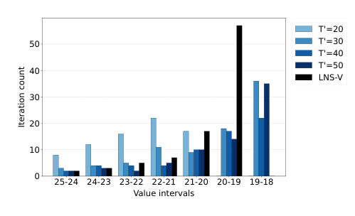
<figcaption class="paper-figure-caption"><b>Fig 5.</b> Fig. 4. Number of iterations required for the average objective value to pass through each objective-value interval for LNS-V and LNS-VT with V′ = 2. The horizontal axis represents objective-value intervals, and the ver- tical axis represents the number of iterations required to pass through each interval. A smaller value indicates that the average objective value decreased more quickly in that interval.</figcaption>
</figure>

**Summary.** This paper introduces LNS-VT, an advanced technique for solving large combinatorial optimization problems using Ising machines by adaptively controlling the size of subproblems solved at each step. By demonstrating that flexible subproblem sizing is critical—outperforming methods that only guarantee feasibility—it provides a powerful heuristic framework applicable to various complex scheduling and resource allocation tasks.

**Why it may be interesting.** While focused on classical optimization, the use of Ising machines connects directly to quantum annealing hardware. The need to manage problem size and complexity in QUBO formulations mirrors challenges in mapping complex physical Hamiltonians onto limited qubit architectures.

Detailed structure

**Main problem.** Improving solution quality for large-scale combinatorial optimization problems like VRP and QMKP using Ising machine solvers within a Large Neighborhood Search (LNS) framework.

**Main result.** A novel LNS variant, LNS-VT, that flexibly controls the subproblem size significantly outperforms existing methods by achieving up to 10% objective value reduction in VRP compared to fixed-size approaches.

**Method.** The authors propose LNS-VT, which iteratively updates solutions by solving smaller, carefully sized subproblems derived from the original problem structure, ensuring feasibility is maintained while allowing fine control over variables.

**Model / system.** The core model involves mapping combinatorial optimization problems (VRP, QMKP) into QUBO Hamiltonians solved by Ising machines. The system relies on defining and iteratively solving smaller subproblems rather than the entire large-scale problem at once.

**Key observables.** Objective function value reduction ($\approx 10\%$ improvement), total profit maximization for QMKP, and the number of binary variables in the subproblem.

**Important parameters / regimes.** The tunable parameter is the length of consecutive route segments re-optimized per vehicle (for VRP) or the prescribed number of items ($N'$) and selected knapsacks ($K'$).

**Assumptions / limitations.** Feasibility preservation alone is insufficient; controlling the subproblem size independently of problem structure is crucial for optimal performance.

**Figures summary.** Figure 8 shows that for QMKP, the total profit increases significantly when the number of binary variables in the subproblem is tuned to an optimal range (100-150), demonstrating the benefit of variable control.

**Paper structure.** The paper details the VRP formulation and LNS framework, contrasts existing methods with the proposed LNS-VT for VRP, applies this principle to QMKP, and concludes by emphasizing that structure-aware subproblem sizing is key.

Abstract

Ising machines are heuristic solvers for combinatorial optimization, but their solution quality can degrade when large-scale constrained problems are solved directly. Ising-machine-assisted large neighborhood search (LNS) instead repeatedly updates a feasible current solution by solving smaller subproblems. An existing feasibility-preserving method for the vehicle routing problem (VRP) re-optimizes the entire routes of selected vehicles and thus cannot adjust the subproblem size finely. We propose LNS-VT, which introduces the number of consecutive steps re-optimized per vehicle as a parameter to control the subproblem size finely while preserving feasibility. For a 300-site, 5-vehicle VRP, its best setting reduced the objective value by approximately 10\% relative to the existing method after 100 iterations, and the appropriate setting changed with the current solution quality. Applying the same principle to the quadratic multiple knapsack problem, we confirmed that an appropriate subproblem size also exists, indicating that subproblem-size control is important in Ising-machine-assisted LNS.

[↑ back to top](#top)

### [Logical Spectroscopy: Lifted-Product Codes with Addressable Bases](http://arxiv.org/abs/2607.05386v1)

**Authors:** Jong Yeon Lee  
**Type:** theory · **Category:** quantum information and computing · **PDF:** <https://arxiv.org/pdf/2607.05386v1>  
**Analysis basis:** full PDF text, analyzed in chunks

↔ Scroll figures horizontally

<figure class="paper-figure-card">
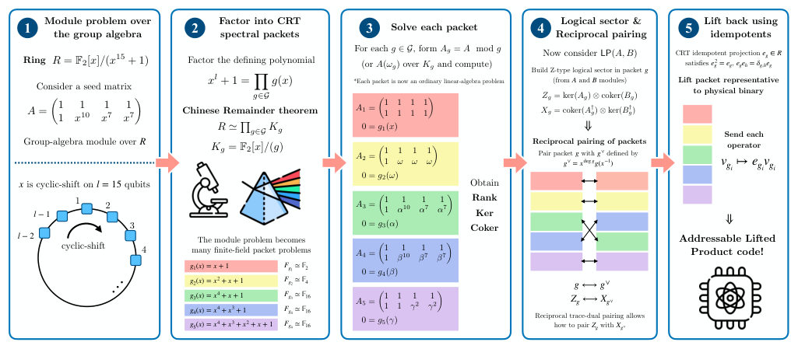
<figcaption class="paper-figure-caption"><b>Fig 1.</b> FIG. 1. Chinese-Remainder-Theorem (CRT) decomposition as a spectral microscope. The displayed quasi-cyclic seed, the toy upper-bound witness seed T15 2,4 from Appendix B, is first a single R-linear module problem over R = F2[x]/(x15+1), where field-style row reduction is not available. Factoring x15 + 1 decomposes R by the Chinese remainder theorem into finite-field packets Kg = F2[x]/(g). In each packet, the seed reduces to an ordinary finite-field matrix, so packet ranks, kernel and quotient coordinates, and K¨unneth representatives can be computed independently. Same-packet tensor data give the Z-logical packet contributions, while conjugate X/Z labels are paired through reciprocal...</figcaption>
</figure>
<figure class="paper-figure-card">
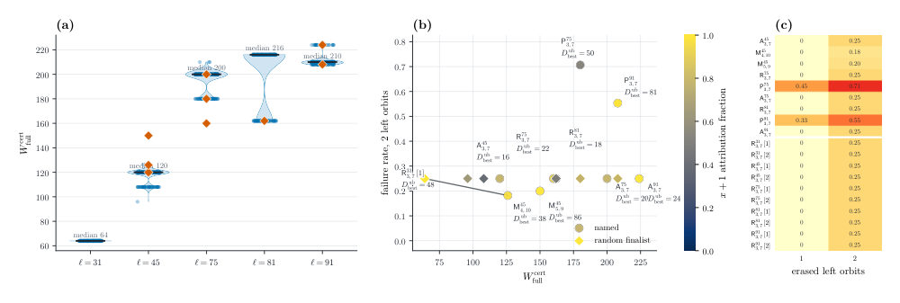
<figcaption class="paper-figure-caption"><b>Fig 2.</b> FIG. 2. Certificate-search and erasure-spectroscopy landscape. (a) Distribution of the full conjugate-basis certificate W cert full over reproducible random monomial scans for ℓ= 31, 45, 75, 81, 91. The translucent blue shapes are violin plots: their horizontal width at a given height is proportional to the empirical density of scan samples with that certificate value. Blue circles are individual scan samples; orange diamonds mark named benchmark seeds where shown; horizontal annotations give the median. (b) Certificate-erasure tradeoff for named seeds and selected random candidates passing the seed filter. Circles are named seeds, diamonds are filtered random candidates, the horizontal...</figcaption>
</figure>
<figure class="paper-figure-card">
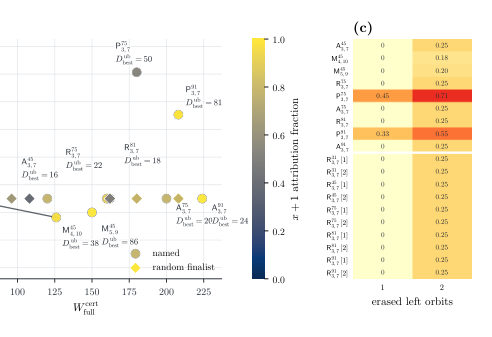
<figcaption class="paper-figure-caption"><b>Fig 3.</b> Figure 2 and the tabulated data in Appendix F illus- trate why basis width, distance upper-bound diagnos- tics, and structured-erasure exposure are distinct objec- tives. In the displayed comparison, M45 4,10 has a mod- est certificate and a lower two-left-orbit failure rate than the 3 × 7 monomial benchmarks. The sparse parity- systematic probes P75 3,7 and P91 3,7 repair parts of the trivial- packet rank profile, but they are more exposed to this particular one- and two-left-orbit erasure model. Con- versely, an attractive erasure score does not compensate for a verified small distance upper-bound witness; such seeds should be treated as warning examples rather than benchmark candidates.</figcaption>
</figure>
<figure class="paper-figure-card">
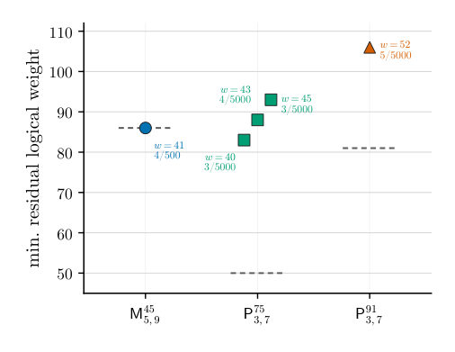
<figcaption class="paper-figure-caption"><b>Fig 4.</b> FIG. 3. Exact-weight BP-OSD residual-logical wit- nesses. Z-side exact-weight code-capacity probes decoded with minimum-sum BP, 1000 BP iterations, and OSDCS of order one. Each marker is a selected shell with at least one log- ical failure; its height is the minimum residual logical weight among failing shots, and its label reports w and failures/shots. Dashed ticks mark the displayed upper bound Dub best from Ta- ble II. The lightest M45 5,9 and P75 3,7 supports were replayed and verified as nontrivial logicals; zero-failure and partial sampled shells are reported in the text. This is a decoder-stress diag- nostic, not a distance lower-bound certificate.</figcaption>
</figure>
<figure class="paper-figure-card">
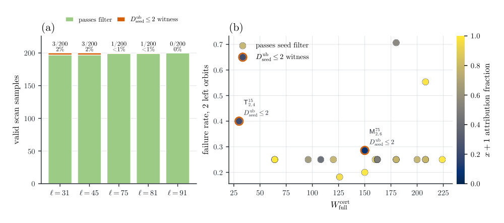
<figcaption class="paper-figure-caption"><b>Fig 5.</b> FIG. 4. Seed-level distance upper-bound witness diagnostic. (a) Frequency of low-cost monomial-equivalence witnesses in the reproducible random scans for ℓ= 31, 45, 75, 81, 91. Each stacked bar counts valid scan samples at that lift length: the green portion passes the seed filter, while the orange cap is the subset with a verified Dub seed ≤2 witness. The annotations above the bars give the witness count out of the valid scan samples and the corresponding percentage. (b) Certificate-erasure coordinates for the displayed benchmark candidates together with upper-bound witness seeds used as diagnostics. Orange rings mark seeds with Dub seed ≤2; filled points pass the seed filter. The vertical...</figcaption>
</figure>

**Summary.** This paper introduces 'logical spectroscopy' to solve the problem of constructing usable logical bases for Abelian lifted-product qLDPC codes. By employing the Chinese Remainder Theorem to decompose the underlying group algebra, it replaces failed global row reduction with solvable finite-field computations. This yields a fully addressable and structured basis essential for implementing quantum gates in fault-tolerant quantum computation.

**Why it may be interesting.** This work provides a powerful algebraic tool to analyze complex quantum error-correcting codes by translating difficult group algebra problems into manageable finite-field computations, which is crucial for designing scalable fault-tolerant quantum hardware.

Detailed structure

**Main problem.** The core challenge is developing a systematic method to construct and addressable conjugate logical operators for high-rate Abelian lifted-product quantum low-density parity-check (qLDPC) codes.

**Main result.** The authors introduce 'logical spectroscopy,' a spectral construction that successfully replaces failed global row reduction with finite-field computations, yielding complete addressable conjugate logical bases.

**Method.** The method utilizes the Chinese Remainder Theorem (CRT) to decompose the group algebra into Frobenius character packets. Calculations are performed independently in each packet, and results are then lifted back using CRT idempotents.

**Model / system.** The work focuses on Quantum Error-Correcting (QEC) codes, specifically Abelian lifted-product (LP) qLDPC codes, which encode logical qubits for fault-tolerant quantum computation.

**Key observables.** Complete addressable conjugate logical bases; packet ranks showing sector splitting; certified upper bounds on basis width from lifted representatives; and packet-attributed dimensions for erased logicals.

**Important parameters / regimes.** The construction is valid under bounded seed-shape and bounded group-basis-support assumptions.

**Assumptions / limitations.** The primary assumption enabling the spectral method is that the complex problem over the group algebra can be decomposed into independent, solvable finite-field problems via CRT.

**Figures summary.** Figures illustrate the process flow: moving from a module problem over the group algebra to factorization into CRT packets, solving each packet independently, and finally lifting the results back to establish logical sector pairing.

**Paper structure.** The paper first identifies the failure of standard row reduction for Abelian LP codes. It then introduces 'logical spectroscopy' as the spectral replacement, detailing the use of CRT decomposition, computation within individual packets (kernels, quotients), and the final reconstruction/pairing of X and Z logicals.

Abstract

Quantum LDPC memories can encode many logical qubits, but dimension alone does not make them usable: applications need explicit conjugate logical operators with structured labels and physical representatives. For hypergraph-product (HGP) codes this structure is transparent, since the input matrices are binary and can be row-reduced over $\mathbb{F}_2$. Abelian lifted-product codes are subtler. Their seed entries are shifts, or sparse sums of shifts, in a group-algebra ring rather than a field, so pivot blocks need not be invertible and global row reduction can fail.   We address this with \emph{logical spectroscopy}, a spectral construction that replaces global row reduction by finite-field computations in the Frobenius character packets of the Abelian lift group. The Chinese remainder theorem (CRT) decomposes the group algebra into these packets. In each packet, we compute kernels, quotients, and product-complex homology; we then lift the resulting representatives back with CRT idempotents and pair $X$ and $Z$ logicals through reciprocal trace-dual packets. This gives complete addressable conjugate logical bases for finite Abelian lifted products $\mathsf{LP}(A,B)$.   The same packet data also gives design diagnostics. Packet ranks show how logical sectors split, the lifted representatives give certified upper bounds on the width of the constructed conjugate basis, and whole-orbit erasures decompose into packet-attributed erased-logical dimensions. Thus, CRT packets also serve as working coordinates: they label logical sectors, certify the constructed basis width, and attribute structured erasure failures. Under bounded seed-shape and group-basis-support assumptions, this construction gives Abelian lifted-product qLDPC families an HGP-like feature while preserving the layout freedom of group-algebra lifts.

[↑ back to top](#top)

### [Perturbed quantum billiards on the hyperbolic plane](http://arxiv.org/abs/2607.03786v1)

**Authors:** Matic Orel  
**Type:** theory · **Category:** other · **PDF:** <https://arxiv.org/pdf/2607.03786v1>  
**Analysis basis:** full PDF text, analyzed in chunks

↔ Scroll figures horizontally

<figure class="paper-figure-card">

<figcaption class="paper-figure-caption"><b>Fig 1.</b> FIG. 1 Finite-depth reflection tessellation of the Schmit triangle in the Poincar´e disk (1). The red triangle de- notes the fundamental billiard domain, whose angles are π/8, π/2, and π/3. Since each angle is an integer submul- tiple of π, repeated reflections in the three geodesic sides generate a hyperbolic triangle group and tile the hyper- bolic plane without gaps or overlaps. The black curves show a finite subset of this infinite tessellation; the accu- mulation of smaller copies near the unit circle reflects the compression of hyperbolic distance in the Poincar´e disk model.</figcaption>
</figure>
<figure class="paper-figure-card">
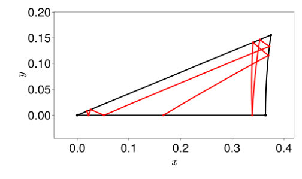
<figcaption class="paper-figure-caption"><b>Fig 2.</b> FIG. 2 Example classical trajectory in Schmit’s hyper- bolic triangle. The black curve shows the billiard bound- ary in the Poincar´e disk model, and the red arcs show several specular reflections of a geodesic trajectory. The two sides emanating from the origin are radial geodesics, while the third side is a circular arc orthogonal to the unit disk boundary.</figcaption>
</figure>
<figure class="paper-figure-card">

<figcaption class="paper-figure-caption"><b>Fig 3.</b> FIG. 3 Deviation of the numerical counting function from the Weyl law (14). The fluctuations remain cen- tered around zero and show no systematic drift, indi- cating that the computed spectra are complete on the plotted intervals. For ϵ = 10−4, the fluctuations decrease after approximately k ≃3000 (red vertical line in panel c)), consistent with the simultaneous approach of the lo- cal spacing statistics and the sliding–window average gap ratio towards GOE as seen in Fig.8.</figcaption>
</figure>
<figure class="paper-figure-card">

<figcaption class="paper-figure-caption"><b>Fig 4.</b> FIG. 4 Nearest-neighbour spacing distributions for the weak perturbations ϵ = 10−5 and ϵ = 10−4, shown in four spectral windows for each perturbation. Panels (a)– (d) correspond to ϵ = 10−5 with k ∈[500.1, 3834.1], k ∈[4550.1, 5926.6], k ∈[6412.8, 7452.5], and k ∈ [7844.6, 8715.0], respectively. Each of these panels con- tains 1.5 × 105 consecutive eigenvalues, corresponding to 149999 unfolded spacings. Panels (e)–(h) correspond to ϵ = 10−4 with k ∈[500.1, 3294.3], k ∈[3929.1, 5100.6], k ∈[5531.6, 6416.6], and k ∈[6764.2, 7505.0], respec- tively. Each of these panels contains 1.1 × 105 consecu- tive eigenvalues, corresponding to 109999 unfolded spac- ings. The blue histograms show the...</figcaption>
</figure>
<figure class="paper-figure-card">
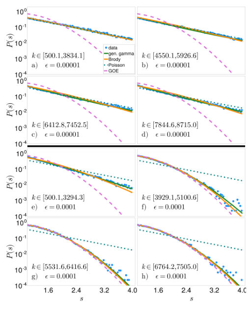
<figcaption class="paper-figure-caption"><b>Fig 5.</b> FIG. 5 Same nearest-neighbour spacing distributions as in Fig. 4, shown on a logarithmic vertical scale to empha- size the large-spacing tail. Panels (a)–(d) correspond to ϵ = 10−5 with k ∈[500.1, 3834.1], k ∈[4550.1, 5926.6], k ∈ [6412.8, 7452.5], and k ∈ [7844.6, 8715.0], re- spectively, each using 1.5 × 105 consecutive eigenvalues (149999 unfolded spacings). Panels (e)–(h) correspond to ϵ = 10−4 with k ∈[500.1, 3294.3], k ∈[3929.1, 5100.6], k ∈ [5531.6, 6416.6], and k ∈ [6764.2, 7505.0], re- spectively, each using 1.1 × 105 consecutive eigenvalues (109999 unfolded spacings). For ϵ = 10−5, the tail re- mains close to exponential over much of the accessible range. For ϵ = 10−4, the tail...</figcaption>
</figure>

**Summary.** This paper analyzes the onset of quantum chaos in hyperbolic billiards by introducing small geometric perturbations to an arithmetic system. The authors demonstrate a measurable crossover in spectral statistics from Poissonian (arithmetic) behavior towards GOE statistics as the perturbation strength changes. This transition is confirmed through both eigenvalue spacing analysis and eigenfunction localization measurements, providing a comprehensive view of chaotic emergence.

**Why it may be interesting.** It provides a detailed, combined spectral and wave-function picture of quantum chaos transition in non-Euclidean geometry, which is relevant for understanding chaotic dynamics in curved spaces or complex potentials.

Detailed structure

**Main problem.** The study investigates how generic quantum chaos emerges from an arithmetic billiard system defined on the hyperbolic plane when subjected to small area-preserving geometric perturbations.

**Main result.** The spectral statistics exhibit a clear, perturbation-dependent crossover from Poisson-like arithmetic behavior towards Gaussian Orthogonal Ensemble (GOE) statistics, which is corroborated by eigenfunction localization measurements.

**Method.** The analysis combines spectral analysis of eigenvalues with the study of eigenfunctions using Poincaré–Husimi representations to quantify phase-space localization.

**Model / system.** The system is a quantum billiard defined on a hyperbolic domain (a perturbed Schmit triangle) governed by the Laplace–Beltrami operator. The Hamiltonian is analyzed through its spectral properties and eigenfunction structure.

**Key observables.** Nearest-neighbour spacing distribution, localization width ($\sigma_{	ext{Beta}}$), spectral statistics crossover scale, and Lyapunov exponent.

**Important parameters / regimes.** Perturbation strength ($\epsilon$), wavenumber ($k$), and the hyperbolic geometry parameters defining the billiard domain.

**Assumptions / limitations.** The generalized-gamma fit is used only as a diagnostic tool, not as a universal law; convergence analysis relies on specialized numerical techniques for solving boundary integral equations.

**Figures summary.** Figures illustrate the geometric setup (tessellation of the hyperbolic triangle) and show spectral/localization data confirming the crossover behavior across different perturbation strengths.

**Paper structure.** The paper proceeds by defining the perturbed hyperbolic billiard, calculating eigenvalues via boundary integral methods, analyzing the resulting spectral statistics (Poisson to GOE), and complementing this with eigenfunction localization analysis.

Abstract

We study the emergence of generic quantum chaos from an arithmetic billiard in the hyperbolic plane. Starting from an arithmetic triangle, we introduce small area-preserving geometric perturbations and compute long consecutive sequences of eigenvalues and eigenstates. The spectral statistics show a perturbation-dependent crossover from Poisson-like arithmetic behaviour to the Gaussian orthogonal ensemble (GOE), with the crossover scale moving to higher wavenumbers as the perturbation decreases. To characterize the nearest-neighbour spacing distribution, we compare the data with Brody and generalized-gamma fits. The generalized-gamma form is used only as a two-parameter diagnostic, allowing the small- and intermediate-spacing structure to vary independently from the large-spacing tail, rather than as a universal crossover law. For the weakest perturbation, we also compare the data with an effective block-GOE model, which diagnoses residual block-like structure deep into the computed spectral range. We complement the spectral analysis with Poincaré-Husimi representations of the eigenstates and quantify phase-space localization using an entropy-based measure. Its distribution is well described by Beta distributions whose width decays as a power law in the wavenumber. Before the spectral crossover, the localization statistics retain memory of the near-arithmetic regime. After the GOE regime is reached, the localization-fluctuation widths collapse onto a common decay law, sigma(Beta) ~ k^{-eta}, with eta approximately 0.37--0.38. These results provide a combined spectral and eigenfunction-level picture of the arithmetic-to-GOE crossover in hyperbolic quantum billiards.

[↑ back to top](#top)

### [QuTuner: Feature- and Learning-Guided Optimization Pass Tuning for Quantum Compilers](http://arxiv.org/abs/2607.04586v1)

**Authors:** Ming Zhong, Xiangyu Ren, Jinglei Cheng, Shaohua Li, Zhiding Liang  
**Type:** theory · **Category:** quantum information and computing · **PDF:** <https://arxiv.org/pdf/2607.04586v1>  
**Analysis basis:** full PDF text, analyzed in chunks

↔ Scroll figures horizontally

<figure class="paper-figure-card">

<figcaption class="paper-figure-caption"><b>Fig 1.</b> Figure 2. The overall workflow of QuTuner. In the figure, →denotes the flow of circuit features, →denotes pass em- beddings, and →denotes optimized pass sequences.</figcaption>
</figure>
<figure class="paper-figure-card">
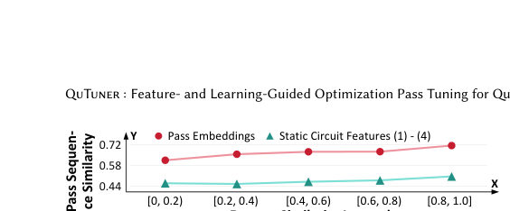
<figcaption class="paper-figure-caption"><b>Fig 2.</b> Figure 4. Static feature-based and pass embedding-based measurements of BO optimized pass sequence similarity (measured by edit similarity, higher is better).</figcaption>
</figure>
<figure class="paper-figure-card">

<figcaption class="paper-figure-caption"><b>Fig 3.</b> Figure 5. Two-stage selection model design of QuTuner, including the pruning model (a) and the ranker model (b).</figcaption>
</figure>
<figure class="paper-figure-card">

<figcaption class="paper-figure-caption"><b>Fig 4.</b> Figure 7. Per-case optimization distribution of QuTuner and baselines. A slight x-axis jitter improves visibility of overlapping points. Many RL, GPT, and QWen cases concentrate at 0% reduction because of failed compilations, as described in Sec. 5.1.</figcaption>
</figure>
<figure class="paper-figure-card">
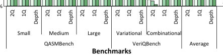
<figcaption class="paper-figure-caption"><b>Fig 5.</b> Figure 8. Scalability analysis across different quantum back- ends.</figcaption>
</figure>

**Summary.** QuTuner is a novel framework designed to automatically tune the sequence and selection of optimization passes within quantum compilers. It overcomes limitations of prior work by incorporating 'optimization-aware pass embeddings' alongside static circuit features. By training machine learning models on a large dataset, QuTuner efficiently retrieves and ranks optimal pass sequences, leading to substantial improvements in compiled circuit quality while drastically cutting down tuning time.

**Why it may be interesting.** This work is highly relevant as it tackles the practical engineering challenge of optimizing quantum algorithms for near-term hardware by automating complex compiler decisions, which is a critical bottleneck in realizing fault-tolerant quantum computation.

Detailed structure

**Main problem.** The core problem is developing effective, generalizable methods for 'pass tuning' within quantum compilers to minimize resource costs (like gate count or depth) while improving execution fidelity.

**Main result.** QuTuner significantly improves metric reduction on both Qiskit and PyTKET benchmarks—up to 84.85% improvement on Qiskit—while drastically reducing the required tuning time.

**Method.** The authors propose QuTuner, a feature-guided framework that builds an optimization dataset by characterizing circuits using static features and novel 'optimization-aware pass embeddings' derived from profiling circuit responses to individual passes.

**Model / system.** The system is quantum computation realized through quantum circuits (sequences of 1Q and 2Q gates) compiled for platforms like Qiskit. The optimization process involves multiple compiler passes that transform the initial circuit representation.

**Key observables.** Circuit-level metrics targeted for reduction include two-qubit gate count ($\Delta 2Q$), one-qubit gate count ($\Delta 1Q$), and overall circuit depth ($\Delta 	ext{Depth}$).

**Important parameters / regimes.** The tuning objective is a weighted combination of metric reductions: $	ext{Objective} = \alpha \cdot \Delta 2Q + eta \cdot \Delta 1Q + \gamma \cdot \Delta 	ext{Depth}$.

**Assumptions / limitations.** Prior methods are limited because they only search small pass subspaces or rely solely on static features that fail to capture how a circuit reacts dynamically to optimization passes.

**Figures summary.** Figure 1 illustrates an example quantum circuit and the stages of compilation. Figure 2 details the two-stage QuTuner workflow (offline training $
ightarrow$ online retrieval/ranking). Figure 3 shows various feature types used for circuit characterization.

**Paper structure.** The paper first identifies limitations in prior tuning methods, then introduces QuTuner by detailing its dataset construction and dual feature representation (static + embedding). It describes the two-stage learning process (pruning/ranking models) before presenting quantitative results on major quantum toolkits.

Abstract

Quantum compilers play a key role in transforming quantum circuits into lower-cost implementations with improved execution fidelity. This process is commonly guided by circuit-level metrics, such as gate counts and circuit depth. Although compiler pass tuning has been widely studied in classical compilation, directly transferring these techniques to quantum compilers is challenging, because quantum programs are expressed as circuits and exhibit optimization behaviors that are shaped by quantum-specific structures. Prior quantum compiler tuning approaches have begun to use circuit features to guide pass selection, but they remain limited in two aspects: they search only a small portion of the optimization-pass space, and they mainly rely on static features that do not explicitly reflect how a circuit reacts to compiler optimizations.   We present QuTuner, a feature-guided quantum compiler pass tuning framework that generalizes across compilers and tuning objectives. QuTuner first builds a large optimization dataset. It then characterizes each circuit from two complementary views: static circuit features that describe circuit structure, and optimization-aware pass embeddings that summarize the circuit's responses to individual optimization passes. Using these representations, QuTuner trains two offline models to retrieve and rank candidate pass sequences for unseen circuits, followed by lightweight refinement. We evaluate QuTuner on Qiskit and PyTKET using two benchmark suites. On Qiskit, QuTuner improves the evaluation-metric reduction by up to 84.85% over the strongest baseline while reducing tuning time by 73.59%. On PyTKET, it improves metric reduction by up to 18.68% with a 64.49% reduction in tuning time. These results show that QuTuner provides an effective approach to adaptive pass tuning for quantum compilers.

[↑ back to top](#top)

### [Superconductivity on the verge of metal-insulator transition in Cu$_{1-x}$Zn$_x$Ir$_2$S$_4$ probed by $μ$SR](http://arxiv.org/abs/2607.04628v1)

**Authors:** K. M. Kojima, M. Miyazaki, M. Hiraishi, A. Koda, R. Kadono, C. Baines, Y. Tsuchiya, H. S. Suzuki, H. Kitazawa  
**Type:** experiment · **Category:** strongly correlated electrons · **PDF:** <https://arxiv.org/pdf/2607.04628v1>  
**Analysis basis:** full PDF text, analyzed in chunks

↔ Scroll figures horizontally

<figure class="paper-figure-card">

<figcaption class="paper-figure-caption"><b>Fig 1.</b> FIG. 1. (Color online). µSR time spectra at (a) 0–2.5 µs and (b) 6.5– 9 µs, observed under a transverse field (20 mT), where the spectrum measured at 19 mK (red diamonds) is overlayed with that at 3.6 K (blue circles). Solid curves are the best fits by Eqs. (1) and (3).</figcaption>
</figure>
<figure class="paper-figure-card">

<figcaption class="paper-figure-caption"><b>Fig 2.</b> FIG. 2. (Color online). Temperature dependence of the Gaussian linewidth σ observed in the sample with Zn content x = 0.3 (a, PSI) and 0.4 (b, TRIUMF) . Solid line shows the result of curve fit using Eqs. (6) and (7), and dashed line shows expected behavior of σ with- out the distribution of Tc. Dotted horizontal lines correspond to σn in Eq. (3). Inset: magnetic susceptibility measured above 1.85 K under field-cool (FC) and zero-field-cool (ZFC) conditions.</figcaption>
</figure>
<figure class="paper-figure-card">
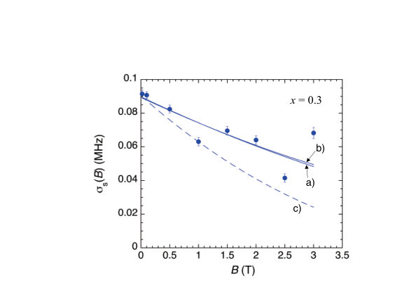
<figcaption class="paper-figure-caption"><b>Fig 3.</b> FIG. 3. (Color online). σs versus B obtained at 0.1 K for the sample with x = 0.3. Solid lines show the result of curve fits (a) using Eq. (9) with Bc2(0) as a free parameter, or (b) using Eq. (10) with σc as a free parameter. Dashed line (c) shows Eq. (9) with Bc2(0) = 5.41 T.</figcaption>
</figure>

**Summary.** This study uses muon spin rotation ($\mu$SR) to probe superconductivity in $	ext{Cu}_{1-x}	ext{Zn}_x	ext{Ir}_2	ext{S}_4$, a material near a metal-insulator transition. The results confirm an s-wave superconducting gap, arguing that high levels of electronic disorder force the pairing symmetry into an isotropic form. This suggests that strong scattering can stabilize superconductivity in correlated materials operating near fundamental physical limits.

**Why it may be interesting.** The work provides experimental evidence on how strong electronic disorder can stabilize an isotropic s-wave superconducting state even when underlying physics suggests complex, anisotropic pairing mechanisms typical of strongly correlated electron systems.

Detailed structure

**Main problem.** Investigating superconductivity in Zn-substituted thiospinel $	ext{Cu}_{1-x}	ext{Zn}_x	ext{Ir}_2	ext{S}_4$ and understanding how disorder affects the pairing mechanism near a metal-insulator transition.

**Main result.** The superconducting state is confirmed to be an isotropic, fully gapped s-wave, robustly surviving deep within the dirty limit despite strong electronic correlations suggesting unconventional pairing.

**Method.** Transverse-field muon spin rotation ($\mu$SR) measurements are used to probe the temperature and field dependence of the superfluid density, complemented by normal state resistivity measurements.

**Model / system.** The system is the thiospinel $	ext{CuIr}_2	ext{S}_4$, which undergoes an MI transition. Zn substitution induces superconductivity ($T_c \approx 2-3$ K). The analysis framework incorporates concepts from the dirty limit and proximity to Mott-Ioffe-Regel limits.

**Key observables.** Superfluid density ($\sigma_s$), magnetic penetration depth ($\lambda$), temperature dependence of $\mu$SR linewidth, normal state resistivity ($
ho$).

**Important parameters / regimes.** Disorder parameter (implied by high $
ho$, placing system in dirty limit), coherence length ($\xi_0$), critical temperature ($T_c$), and the degree of electronic disorder.

**Assumptions / limitations.** The superfluid density follows a two-fluid model approximation, and the analysis assumes that strong scattering averages out potential anisotropy expected from unconventional pairing mechanisms.

**Figures summary.** Figures show $\mu$SR time spectra demonstrating temperature-dependent relaxation below $T_c$, and plots analyzing linewidth ($\sigma$) vs. temperature/field, confirming s-wave behavior.

**Paper structure.** The paper establishes the background (MI transition in $	ext{CuIr}_2	ext{S}_4$), presents $\mu$SR results showing s-wave pairing, discusses the implications of high resistivity placing it in the dirty limit, and proposes a unified framework linking disorder to superconductivity.

Abstract

The thiospinel CuIr$_2$S$_4$ undergoes a metal-insulator transition below $\approx$230 K, which is suppressed by substitution of Cu with Zn (Cu$_{1-x}$Zn$_x$Ir$_2$S$_4$) to induce superconductivity for $0.2\lesssim x\lesssim0.8$. We show that the temperature/field dependence of superfluid density in samples with $x = 0.3$ and 0.4 ($T_{\rm c} \approx 3$ K and 2.5 K) investigated by muon spin rotation and relaxation ($μ$SR) is consistent with a fully gapped $s$-wave pairing. Meanwhile, the relatively high resistivity (10$^{-3}$-10$^{-2}$ $Ω\:$cm) in their normal state suggests that the superconductivity is in the "dirty limit" where the mean free path is much shorter than the coherence length ($\ell \ll ξ_0$). This indicates that the potential anisotropy associated with unconventional pairing mechanisms expected under the strong electron correlations is smeared out by the electron scattering. Based on these observations, we discuss potential link between the Zn substitution-induced superconductivity and that recently discovered in CuIr$_2$S$_4$ under high pressure ($>18$ GPa) where the existence of strong electron scattering is also suggested.

[↑ back to top](#top)

### [Verification of Quantum Computations: Hardware-Efficient Security Proofs](http://arxiv.org/abs/2607.03983v1)

**Authors:** Harold Ollivier  
**Type:** theory · **Category:** quantum information and computing · **PDF:** <https://arxiv.org/pdf/2607.03983v1>  
**Analysis basis:** full PDF text, analyzed in chunks

↔ Scroll figures horizontally

<figure class="paper-figure-card">
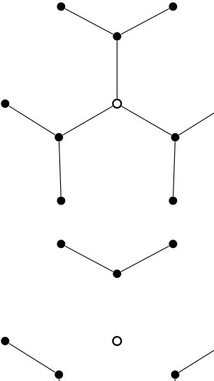
<figcaption class="paper-figure-caption"><b>Fig 1.</b> Figure 2.3: Breaking: The initial graph (up) is broken by preparing the empty node in |0⟩state (down).</figcaption>
</figure>
<figure class="paper-figure-card">

<figcaption class="paper-figure-caption"><b>Fig 2.</b> Figure 2.4: Bridging: The initial graph (up) is bridged by measuring the empty node in Y (down).</figcaption>
</figure>
<figure class="paper-figure-card">
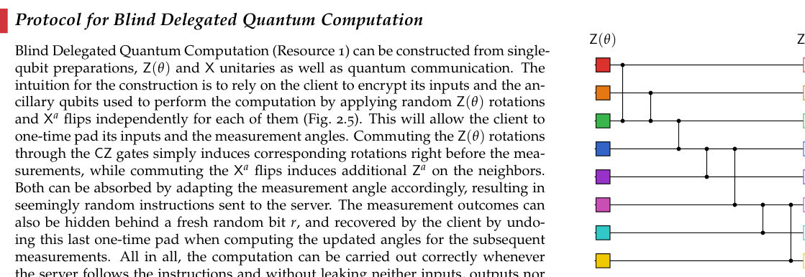
<figcaption class="paper-figure-caption"><b>Fig 3.</b> Figure 2.5: Initial graph state (up), circuit preparing the graph state (middle), equivalent circuit with inserted random Z(θ) rotations (colored boxes) compensated by the conjugated rotation Z(−θ) before the measurement (down). Protocol 2. Universal Blind Quantum Computation (UBQC)</figcaption>
</figure>
<figure class="paper-figure-card">

<figcaption class="paper-figure-caption"><b>Fig 4.</b> Figure 2.6: Correctness of UBQC for three-vertex linear graph. (a) UBQC Protocol with the explicit values of δ(i). (b) The Z encryption commutes through the CZ gates and is canceled out by the later Z rotation. (c) The input X encryption commutes through the CZ gates but adds a Z on qubit 2, which is canceled out by the a(1)π inside the rotation. The X on qubit 1 is commuted through the rotation and absorbed by the measurement. The result is Alice’s desired MBQC computation up to Pauli corrections and bit-flips.</figcaption>
</figure>
<figure class="paper-figure-card">
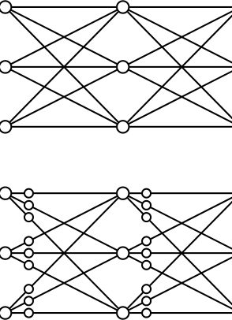
<figcaption class="paper-figure-caption"><b>Fig 5.</b> Figure 2.7: The graph G (up), the corresponding triple graph (middle) and dotted triple graph (down).</figcaption>
</figure>

**Summary.** This paper addresses the challenge of verifying quantum computations performed by untrusted quantum servers using hardware-efficient security protocols. It introduces a modular framework that breaks down verification into manageable primitives like remote state preparation and error detection. The work provides an architectural guide to making these complex security proofs practical for real-world, noisy quantum devices.

**Why it may be interesting.** It provides an architectural roadmap for making quantum security proofs practical by systematically reducing hardware overheads, which is crucial for bridging theory and near-term quantum hardware.

Detailed structure

**Main problem.** The core problem is developing methods for a classically limited verifier to confirm the output of an untrusted, fully quantum server performing complex computations.

**Main result.** The paper proposes a modular framework that systematically relaxes hardware requirements by decomposing verification into independent primitives like remote state preparation and trap-based deviation detection.

**Method.** It synthesizes various advanced protocols (e.g., Robust VBQC) using concepts from interactive proof systems, composability theorems, and error detection to build practical security guarantees.

**Model / system.** The model involves an interaction between a Verifier (classical/limited quantum resources) and an untrusted Prover (BQP machine). The focus is on abstract protocols rather than a specific physical hardware implementation.

**Key observables.** Statistical soundness, indistinguishability ($\epsilon$-statistical), computational complexity class (e.g., BQP vs. classical limits).

**Important parameters / regimes.** Error tolerance ($\epsilon$), number of qubits/parties in multi-party settings, and the level of fault tolerance required.

**Assumptions / limitations.** The authors assume the existence of underlying cryptographic primitives and focus on architectural principles rather than deriving all technical proofs themselves.

**Paper structure.** The paper is structured conceptually: first, defining the problem space (verification gap); second, introducing a modular framework composed of independent verification primitives; third, showing how these primitives can be combined to address increasingly complex scenarios like multi-party and fault-tolerant computation.

Abstract

How can a user with limited quantum resources verify the output of an untrusted, fully quantum server? This manuscript provides a conceptual synthesis of some recent developments toward answering this question under statistical (information-theoretic) security. Rather than duplicating the dense technical proofs of the underlying publications, our focus here is on the physical motivations, the structural connections between different protocols, and the path toward hardware-efficient implementation.   We begin by introducing a modular, composable framework that partitions verification into three distinct, independent primitives: remote state preparation, trap-based deviation detection, and error-correcting embedding. Using this framework, we show how the demanding hardware requirements of early protocols can be systematically relaxed. We review schemes that eliminate the spatial overhead, remove the need to prepare computational-basis dummy states, and replace single-photon sources with trusted local rotations or weak coherent pulses. Finally, we examine how these techniques scale, both to asymmetric multi-party settings and to the delegation of fully fault-tolerant computations in the presence of gate-level noise. This document is intended as a guide to the architectural principles of practical quantum verification.

[↑ back to top](#top)

## Secondary cond-mat archives

*Papers from cond-mat.mtrl-sci, mes-hall, other, soft, supr-con. These archives are de-prioritized — they appear at the end regardless of relevance score.*

### Relevant in secondary archives (36)

### [Katsura-Nagaosa-Balatsky magnetoelectricity in molecular magnets: Bipartite entanglement transfer by means of rotating electric field](http://arxiv.org/abs/2607.03965v1)

**Authors:** Zhirayr Adamyan, Ani Chobanyan, Vadim Ohanyan, Azadeh Ghannadan, Jozef Strecka, Saeed Haddadi, Hamid Arian Zad  
**Type:** theory · **Category:** other · **PDF:** <https://arxiv.org/pdf/2607.03965v1>  
**Analysis basis:** full PDF text, analyzed in chunks
**Topic relevance:** 🔥 `entanglement & information structure` **5/5** · 🔥 `analog quantum simulation` **4/5** · `exotic spin models in light-matter` **3/5** · `spintronics-quantum-optics interface` **3/5** · `non-equilibrium dynamics` **2/5** · `Keldysh / 2PI / non-Gaussian methods` **1/5** · `correlated / nonlocal dissipation` **1/5** · `driven-dissipative phase transition` **1/5** · `methods for driven-dissipative` **1/5**

↔ Scroll figures horizontally

<figure class="paper-figure-card">

<figcaption class="paper-figure-caption"><b>Fig 1.</b> FIG. 1. Schematic illustration of the three-spin molecu- lar cluster with an isosceles triangular geometry. The lo- calized S = 1/2 spins interact via two antiferromagnetic exchange couplings, J1 and J2, and are subjected to an external electric field E lying in the plane of the trian- gle. The geometry of the molecule is characterized by the bond angle θ, while the electric-field orientation is speci- fied by the angle ϕ. Within the KNB mechanism, the spin–electric-field coupling is mediated through bond- dependent DM interactions, whose magnitude and direc- tion are determined by both the molecular geometry and the electric-field orientation. Consequently, the parame- ters θ and ϕ provide...</figcaption>
</figure>
<figure class="paper-figure-card">
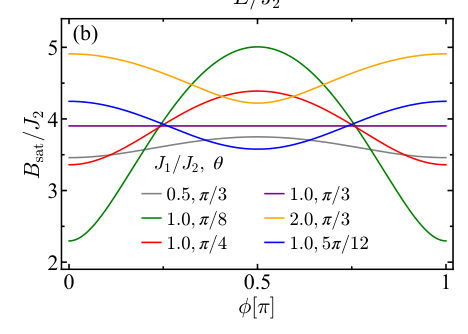
<figcaption class="paper-figure-caption"><b>Fig 2.</b> FIG. 2. Dependence of the saturation magnetic field Bsat on the parameters of the in-plane electric field for the case of uniform KNB coupling (α = 1). (a) Satu- ration field as a function of the electric-field magnitude E/J2 for a fixed field orientation, ϕ = π/4. The curves are shown for several values of the exchange-coupling ratio J1/J2 and bond angle θ, illustrating how the elec- tric field modifies the critical magnetic field required to fully polarize the spin trimer. (b) Angular dependence of the saturation field for a rotating electric field of fixed magnitude, E/J2 = 5, for the same sets of model pa- rameters. The anisotropic variation of Bsat with the electric-field direction...</figcaption>
</figure>
<figure class="paper-figure-card">

<figcaption class="paper-figure-caption"><b>Fig 3.</b> FIG. 3. Bipartite negativity dependence on the magni- tude of electric field, E, with J1 = J2 = 1, α = 1 and θ = π/4 for four different values of the electric field an- gle, ϕ = 0, π/4, π/2 and 3π/4.</figcaption>
</figure>
<figure class="paper-figure-card">
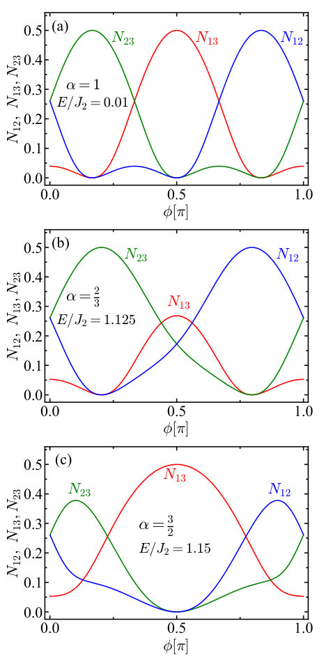
<figcaption class="paper-figure-caption"><b>Fig 4.</b> FIG. 4. Bipartite negativity dependence on the direction of electric field, ϕ, with J1 = J2 = 1 and θ = π/3. Three panels present Nij for different values of α and electric field magnitude. Panel (a): α = 1, E/J2 = 0.01; panel (b): α = 2/3, E/J2 = 1.125; and panel (c): α = 3/2, E/J2 = 1.15. The blue, red and green lines correspond to N12, N13 and N23 respectively.</figcaption>
</figure>
<figure class="paper-figure-card">
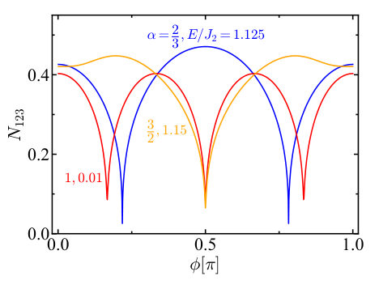
<figcaption class="paper-figure-caption"><b>Fig 5.</b> FIG. 5. Tripartite negativity dependence on the direc- tion of electric field ϕ for the three particular cases, which correspond to the parameter sets used in Fig. 4(a): red curve; 4(b): blue curve; and 4(c): orange curve.</figcaption>
</figure>

**Summary.** The paper explores how magnetoelectric coupling (KNB mechanism) allows external electric fields to manipulate quantum entanglement within a molecular nanomagnet. By applying a rotating electric field, the researchers demonstrate a controllable transfer of bipartite entanglement between different spin pairs. This establishes these molecular magnets as promising platforms for electrically steering and localizing quantum information at the nanoscale.

**Why it may be interesting.** This work directly addresses electrical control over quantum correlations in solid-state molecular systems, which is highly relevant for developing nanoscale quantum devices where local electric fields can manipulate spin states.

Detailed structure

**Main problem.** The study investigates how quantum entanglement can be controlled and transferred between different spin pairs within a molecular magnet using the Katsura-Nagaosa-Balatsky (KNB) magnetoelectric coupling mechanism.

**Main result.** A rotating in-plane electric field allows for the controllable, nearly ideal transfer of bipartite entanglement between spin pairs, establishing these magnets as platforms for electrical quantum state engineering.

**Method.** The analysis involves calculating and mapping various measures of quantum entanglement (bipartite and tripartite negativity) derived from the system's Hamiltonian eigenstates.

**Model / system.** The model is a spin-1/2 Heisenberg trimer with an isosceles triangular geometry, incorporating spin-induced electric polarization via the KNB mechanism. The dynamics are governed by a Hamiltonian including exchange couplings ($J_1, J_2$) and an electric field interaction term.

**Key observables.** Bipartite negativity ($N_{ij}$) and tripartite negativity ($N_{ABC}$), which quantify quantum entanglement; also analyzed are the saturation magnetic field ($B_{	ext{sat}}$).

**Important parameters / regimes.** Electric field magnitude ($E$), orientation ($\phi$), bond angle ($	heta$), exchange coupling ratios ($J_1/J_2$), and non-uniformity parameter ($\alpha$).

**Assumptions / limitations.** The system is modeled using a spin-1/2 Heisenberg Hamiltonian for a trinuclear molecule, and the analysis focuses on ground state properties.

**Figures summary.** Figures illustrate how bipartite negativity varies with the electric field angle $\phi$ (showing distinct lines for different pairs) and density plots mapping entanglement extrema over the $(\alpha, E/J_2)$ parameter space.

**Paper structure.** The paper develops by first defining the Hamiltonian incorporating KNB coupling, then analyzing the system's ground states and magnetic saturation field dependence on external fields. The core is dedicated to calculating and demonstrating the controllable transfer of bipartite entanglement using varying electric field parameters.

Abstract

We investigate quantum entanglement in a spin-1/2 Heisenberg trimer with spin-induced electric polarization described by the Katsura-Nagaosa-Balatsky (KNB) mechanism in the presence of external magnetic and electric fields. The electric field is assumed to lie in the plane of the magnetic ions, allowing its strength and orientation to be tuned independently. We analyze both bipartite and tripartite entanglement and demonstrate that the spin-electric-field coupling provides an efficient mechanism for controlling quantum correlations within the molecular nanomagnet. Depending on the electric-field parameters, the bipartite entanglement can be significantly enhanced or suppressed, while the multipartite entanglement exhibits a rich dependence on the microscopic spin-electric coupling. Most notably, we demonstrate that a rotating in-plane electric field of constant magnitude induces a controllable transfer of bipartite entanglement between different spin pairs. In the symmetric case of homogeneous exchange interactions and uniform KNB coupling, this transfer is found to be nearly ideal, with the bipartite negativity approaching its theoretical maximum for one spin pair while simultaneously vanishing for the remaining pairs. We show that the efficiency of the transfer can be tailored through the exchange interactions, bond geometry, and nonuniform spin-electric coupling. These results establish molecular nanomagnets with KNB spin-electric coupling as a promising platform for the electrical manipulation, steering, and localization of quantum entanglement at the molecular scale.

[↑ back to top](#top)

### [Quench, Glow, or Stay Silent: Distance-Controlled Up-Conversion Emission near Metallic Nanowires](http://arxiv.org/abs/2607.03873v1)

**Authors:** Maciej Cwierzona, Michal Zebrowski, Pavel Dziarhai, Joanna Niedziolka-Jonsson, Martin Jonsson-Niedziolka, Marcin Nyk, Sebastian Mackowski, Dawid Piatkowski  
**Type:** experiment · **Category:** other · **PDF:** <https://arxiv.org/pdf/2607.03873v1>  
**Analysis basis:** full PDF text, analyzed in chunks
**Topic relevance:** 🔥 `correlated / nonlocal dissipation` **4/5** · `Tavis-Cummings & cavity-many-emitter` **3/5** · `correlated cavity matter` **3/5** · `driven-dissipative phase transition` **3/5** · `non-equilibrium dynamics` **3/5** · `quantum optics experiment` **3/5** · `analog quantum simulation` **2/5** · `methods for driven-dissipative` **2/5** · `non-equilibrium universality` **2/5** · `Dicke superradiance` **1/5** · `Keldysh / 2PI / non-Gaussian methods` **1/5** · `Kondo & dissipative impurity` **1/5** · `entanglement & information structure` **1/5** · `interference shaping light` **1/5** · `measurement-induced transitions` **1/5** · `quantum measurements` **1/5**

↔ Scroll figures horizontally

<figure class="paper-figure-card">

<figcaption class="paper-figure-caption"><b>Fig 1.</b> Fig. 1. Schematic illustration of controlled spatial geometry of up-conversion NCs and silver NWs. Increasing the thickness of the PVA film in the sequence (a)-(c) provides a means to systematically vary their spatial separation.</figcaption>
</figure>
<figure class="paper-figure-card">
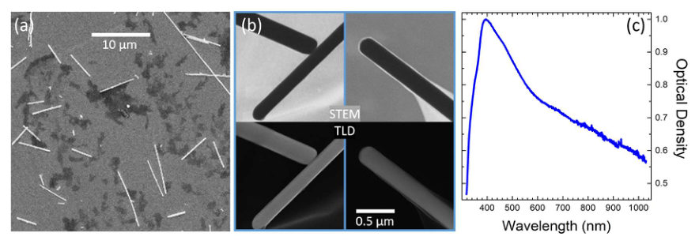
<figcaption class="paper-figure-caption"><b>Fig 2.</b> Fig. 2. (a) SEM image of silver nanowires deposited on a conductive carbon foil. (b) Scanning transmission electron microscopy (STEM) images of nanowires (upper panel) illustrating the surrounding PVP polymer layer, with corresponding images acquired using a through-lens detector (TLD) shown in the lower panel for comparison. (c) Absorbance spectrum of the silver nanowire colloid.</figcaption>
</figure>
<figure class="paper-figure-card">

<figcaption class="paper-figure-caption"><b>Fig 3.</b> Fig. 3. (a) TEM image of the NaYF4:Er3+/Yb3+ NCs together with a histogram illustrating the statistical size distribution. (b) SEM image of individual NCs dispersed on a glass substrate (S00) and the corresponding PL image of the same sample area (c). Only minimal agglomeration is observed, which is easily distinguishable in both SEM and PL images. (d) Emission spectrum of a single NC under 980 nm excitation.</figcaption>
</figure>
<figure class="paper-figure-card">

<figcaption class="paper-figure-caption"><b>Fig 4.</b> Fig. 4. Photoluminescence intensity maps of individual up-conversion NCs acquired for samples S00, S20, and S65 (a-c), together with the corresponding maps of elastically back-scattered laser light (d-f), illustrating the spatial distribution of NWs. The white dashed lines indicate the positions of the NWs. The PL maps were obtained by recording the red up- conversion emission of the NCs under 980 nm laser excitation. The inset in panel (a) shows an SEM image of a bare silver nanowire with attached nanocrystals. The scale bar represents 200 nm.</figcaption>
</figure>
<figure class="paper-figure-card">
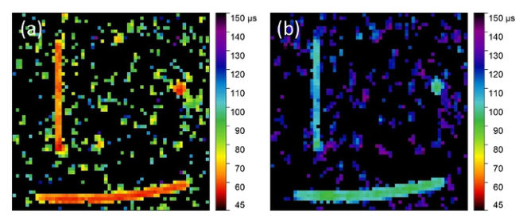
<figcaption class="paper-figure-caption"><b>Fig 5.</b> Fig. 5. μs-FLIM maps of the up-conversion emission recorded for sample S20, acquired from the same sample region as shown in Fig. 4b,e. Panel (a) shows the green emission, while panel (b) corresponds to the red emission of the NCs. Both maps were obtained under 980 nm laser excitation using a pulsed excitation scheme with a pulse duration of 20 µs. The color scale represents the extracted luminescence lifetime values.</figcaption>
</figure>

**Summary.** This experiment demonstrates precise control over up-conversion luminescence by placing rare-earth nanocrystals near metallic nanowires separated by a polymer spacer. By tuning this separation distance, the emission can be switched between quenching, plasmonically enhanced glowing, or isolated behavior. This offers a powerful tool for designing nanophotonic structures with tailored optical properties.

**Why it may be interesting.** This work provides a clean experimental platform to study open quantum systems dynamics (energy relaxation) where coupling to an external environment (the plasmonic metal) can be tuned deterministically via geometry. The measurement of decay rate changes directly probes the modification of the local photonic density of states, which is central to cavity QED and open system theory.

Detailed structure

**Main problem.** The study aims to achieve precise, distance-controlled manipulation of energy decay pathways in up-conversion luminescence by controlling the separation between rare-earth nanocrystals and metallic nanowires.

**Main result.** By tuning the polymer spacer thickness, the emission can be deterministically switched between three regimes: quenching (direct contact), plasmonic enhancement (intermediate distance), and effective decoupling (large distance).

**Method.** The researchers used time-resolved fluorescence lifetime imaging microscopy ($\mu$s-FLIM) on single nanostructures to map luminescence intensity and decay times as a function of the emitter-metal separation.

**Model / system.** The physical system is a hybrid nanostructure comprising $	ext{NaYF}_4:	ext{Er}^{3+}/	ext{Yb}^{3+}$ up-conversion nanocrystals placed near silver nanowires, separated by a polymer spacer layer (PVA).

**Key observables.** Luminescence intensity maps and fluorescence decay times ($	au$) measured via $\mu$s-FLIM.

**Important parameters / regimes.** The separation distance ($d$), controlled by the PVA thickness (e.g., $0 	ext{ nm}$, $20 	ext{ nm}$, $65 	ext{ nm}$), is the key tuning parameter.

**Assumptions / limitations.** The analysis assumes that eliminating residual polymer layers allows for unambiguous interpretation of distance-dependent effects, and that the observed enhancement/quenching reflects controlled coupling to plasmon modes.

**Figures summary.** Figures illustrate the schematic control over geometry using PVA thickness (Fig. 1), show PL intensity maps demonstrating quenching vs. enhancement based on separation (Fig. 4), and map decay times confirming changes in radiative rates (Fig. 5).

**Paper structure.** The paper systematically presents sample preparation details, followed by characterization of the three distinct interaction regimes—quenching, enhancement, and decoupling—using PL imaging and time-resolved lifetime measurements.

Abstract

We demonstrate controlled transitions between competing radiative and nonradiative decay channels in the up-conversion luminescence of NaYF4:Er3+/Yb3+ nanocrystals placed in proximity to metallic nanowires. The nanocrystal-nanowire separation is used as a key control parameter governing the optical response. An essential aspect of our approach is the removal of inhomogeneous residual polymer layers from the nanowires, eliminating any compromise on distance control and reproducibility in emitter-metal hybrid nanostructures. Replacing them with a well-defined polymer spacer yields controlled access to three qualitatively distinct interaction regimes: luminescence quenching, plasmonic enhancement, and effective decoupling. Transitions between these regimes are shown to reflect changes in the dominant energy relaxation pathways: from nonradiative losses in direct contact with the metal, through modification of the local photonic density of states and coupling to plasmon-mediated modes, to behavior characteristic of quasi-isolated emitters. The plasmonic origin of the emission enhancement in the intermediate regime is evidenced by an increase in luminescence intensity accompanied by shortened decay times, as revealed by fluorescence lifetime imaging microscopy of up-conversion nanocrystals. All experiments were performed on single nanostructures, thereby excluding artefacts arising from aggregation effects and strengthening the interpretation of the observed phenomena. The presented approach provides controlled access to plasmon-modified decay channels and offers a basis for the rational design of functional nanophotonic and sensing structures with tailored optical properties.

[↑ back to top](#top)

### [Lindblad theory of linear response susceptibility and dispersive readout in minimal Kitaev junctions](http://arxiv.org/abs/2607.04968v1)

**Authors:** Tobias Kuhn, Raffael L. Klees, Ramón Aguado, Mónica Benito  
**Type:** theory · **Category:** other · **PDF:** <https://arxiv.org/pdf/2607.04968v1>  
**Analysis basis:** full PDF text, analyzed in chunks
**Topic relevance:** 🔥 `methods for driven-dissipative` **4/5** · 🔥 `quantum measurements` **4/5** · `Keldysh / 2PI / non-Gaussian methods` **3/5** · `correlated / nonlocal dissipation` **3/5** · `driven-dissipative phase transition` **3/5** · `QC/QI experiment` **2/5** · `non-equilibrium dynamics` **2/5** · `non-equilibrium universality` **2/5** · `spintronics-quantum-optics interface` **2/5** · `Kondo & dissipative impurity` **1/5** · `analog quantum simulation` **1/5** · `correlated cavity matter` **1/5** · `measurement-induced transitions` **1/5**

↔ Scroll figures horizontally

<figure class="paper-figure-card">

<figcaption class="paper-figure-caption"><b>Fig 1.</b> FIG. 1. We introduce a parameter fluctuation δf(t) into a system that interacts with a Markovian bath. System and environmental dynamics due to absorption, emission and de- phasing will be read out in observable A.</figcaption>
</figure>
<figure class="paper-figure-card">
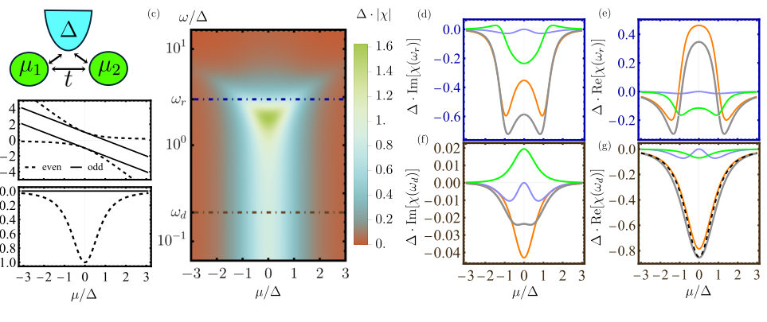
<figcaption class="paper-figure-caption"><b>Fig 2.</b> FIG. 2. Common gate spectroscopy on a minimal Kitaev chain. (a) Two quantum dots with onsite energies µ1 and µ2 are proximitized by a superconductor. Induced crossed Andreev reflection ∆and direct elastic cotunneling t mediate the hopping between the dots. (b) Energy spectrum E and quantum capacitance CQ (normalized by its maximal value |CQ|max) in the odd- and even-parity subspaces as a function of the average onsite energy µ = (µ1 + µ2)/2. (c) Modulus of the total susceptibility |χ| from Eq. (6) for different probe frequencies ω and average onsite energies µ. A resonant regime at ω ≈ωr and a dispersive regime at ω ≈ωd emerge. (d-g) Imaginary and real part of the total susceptibility χ and...</figcaption>
</figure>
<figure class="paper-figure-card">
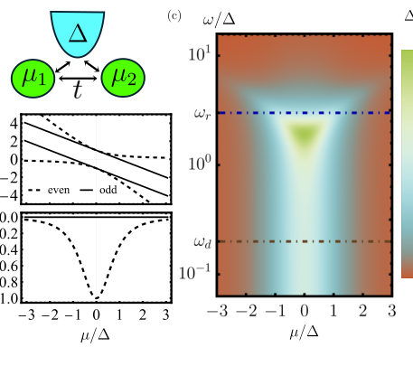
<figcaption class="paper-figure-caption"><b>Fig 3.</b> Fig. 2f shows the imaginary part of the susceptibility in the dispersive regime (ωd ≪ϵ). Both Hermes and Hamil- tonian contributions are small (O(ω/ϵ)) and for ΓT2 ≪ϵ they are related via Im[χL,DB(ωd)] ≃−Im[χH(ωd)]/2. At higher temperatures, the Sisyphus term becomes dom- inant and leads to the double-peak structure. In Fig 2g, we compare the quantum capacitance, which measures the band curvature, with the real part of the total sus- ceptibility. Since Re[χL,DB(ωd)] ≃Γ2 T2 Re[χH(ωd)]/ϵ2, the contribution χL compensates for the decoherence on χH. By explicitly rearranging the Hermes and Hamiltonian contributions according to Eq. (C4), we see that</figcaption>
</figure>
<figure class="paper-figure-card">
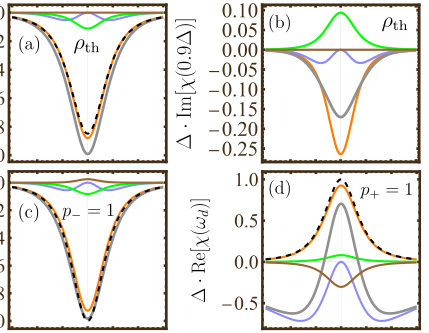
<figcaption class="paper-figure-caption"><b>Fig 4.</b> FIG. 3. Susceptibility of the minimal Kitaev chain for ther- mal populations near resonance (ω ≲ϵ) for (a) real and (b) imaginary values. Real valued susceptibility when (c) the ground state is fully populated or (d) the excited state is fully populated. χL,BT refers to the beyond thermalization terms of Hermes contribution while χL,DB denotes detailed balance terms. Other parameters are identical to Fig. 2.</figcaption>
</figure>
<figure class="paper-figure-card">
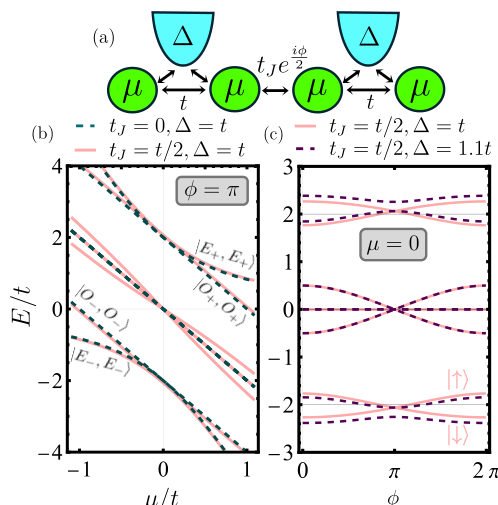
<figcaption class="paper-figure-caption"><b>Fig 5.</b> FIG. 4. (a) Two minimal Kitaev chains tunnel coupled with tJ form a Kitaev-Josephson Junction (KJJ). The supercon- ducting leads have a phase difference of ϕ. (b) Common gate spectrum for decoupled (green, dashed) and coupled (salmon, solid) KJJ in even global parity at ϕ = π and ∆= t. |E±/O±, E±/O±⟩are many-body eigenstates of the decoupled minimal Kitaev chains corresponding to local even/odd par- ity. At ϕ = π, coupled KJJ eigenstates follow these states up to first order in tJ, see Eqs. (E14) (c) Flux spectrum comparing sweet spot ∆= t (salmon, solid) with a detuned ∆= 1.1t (purple, dashed) system at µ = 0. The states the |↑/↓⟩= |E−, E−⟩± |O−, O−⟩+ O(tJ) correspond to the (anti-...</figcaption>
</figure>

**Summary.** This paper introduces a sophisticated Lindblad-based linear response formalism to accurately characterize the electrical response of complex hybrid superconductor-semiconductor quantum dots. It moves beyond standard Kubo treatments by incorporating non-unitary effects via 'Hermes' and 'Sisyphus' susceptibilities. The theory is demonstrated on Kitaev chain models, showing how these advanced terms are crucial for correctly interpreting measurements like qubit readout fidelity.

**Why it may be interesting.** This work is highly relevant to AMO physics and open quantum systems as it provides advanced tools (Lindblad response theory) to model dissipation and measurement back-action in solid-state quantum devices like superconducting qubits.

Detailed structure

**Main problem.** The paper addresses the need for a comprehensive theoretical framework to understand the response of complex hybrid superconductor-semiconductor quantum dots (SCQDs) to external probes and environmental dissipation.

**Main result.** It demonstrates that a full Lindblad linear response formalism is necessary, showing that contributions like 'Hermes' terms compensate decoherence effects in dispersive readout and provide corrections beyond simple thermalized state approximations.

**Method.** The authors develop and apply a Lindblad-based linear response formalism to calculate the system susceptibility ($\chi$), decomposing it into static, Hamiltonian, Sisyphus, and Hermes contributions.

**Model / system.** The primary model is hybrid SCQD devices, exemplified by quantum dot-based Kitaev chain setups used for Majorana-based parity qubits. Dynamics are governed by a Lindblad master equation, and the analysis focuses on calculating susceptibility components derived from this formalism.

**Key observables.** Linear-response susceptibility ($\chi(\omega)$), Quantum Capacitance ($C_Q$), static susceptibility ($\chi_{st}$), Hamiltonian contribution ($\chi_H$), Sisyphus susceptibility ($\chi_\Gamma$), and Hermes susceptibility ($\chi_L$).

**Important parameters / regimes.** Frequency ($\omega$), temperature ($T$), coupling strength ($\Delta, t$), and detuning parameters.

**Assumptions / limitations.** The derivation relies on the Born-Markov approximations (weakly coupled environment with no memory) and analyzes the system within the linear response regime.

**Figures summary.** Figures illustrate parameter fluctuations contributing to observables, compare various susceptibility terms ($\chi_{st}, \chi_H, \chi_\Gamma, \chi_L$) against theoretical predictions like band curvature, and show parity state differentiation in common gate spectroscopy.

**Paper structure.** The paper introduces the general Lindblad linear response formalism for N-level systems. It then applies this theory to minimal Kitaev junctions, deriving specific expressions for the four susceptibility components ($\chi_{st}, \chi_H, \chi_\Gamma, \chi_L$). Finally, it analyzes these contributions in the context of quantum capacitance and parity state spectroscopy.

Abstract

The field of hybrid superconductor-semiconductor quantum dots is advancing toward the development of functional devices that leverage the advantages of both types of materials. However, the inherent complexity of these devices demands a comprehensive theoretical framework for a complete understanding of their responses to external probes, readout and the dissipation arising from environmental coupling. We present a Lindblad-based linear response formalism that captures the multi-level nature of these devices, their probe-readout flexibility, and the non-unitary effects of finite-frequency response, including the so-called Sisyphus and Hermes dynamical susceptibilities. These arise from fluctuations in the rates and jump operators, and are hence absent in standard Kubo linear response treatments. We exemplify the framework using quantum dot-based Kitaev chain setups which are promising candidates for topologically protected Majorana-based parity qubits. Our results shed light onto the validity of the standard curvature-based approximation for fermionic parity and qubit readout, show that Hermes terms compensate decoherence in dispersive readout and implement important corrections beyond thermalized states.

[↑ back to top](#top)

### [Spin-momentum locking of polariton edge states in honeycomb lattices](http://arxiv.org/abs/2607.03961v1)

**Authors:** Andrea Herrero Otermin, Nicola Carlon Zambon, Dheerendra Singh, Neha Bhoria, Rimi Banerjee, Christian Mayer, Simon Betzold, Siddhartha Dam, Monika Emmerling, Sven Höfling, Luis Viña, Subhaskar Mandal, Carlos Antón-Solanas  
**Type:** both · **Category:** other · **PDF:** <https://arxiv.org/pdf/2607.03961v1>  
**Analysis basis:** full PDF text, analyzed in chunks
**Topic relevance:** 🔥 `analog quantum simulation` **4/5** · 🔥 `exotic spin models in light-matter` **4/5** · `correlated cavity matter` **3/5** · `quantum optics experiment` **3/5** · `spintronics-quantum-optics interface` **3/5** · `driven-dissipative phase transition` **2/5** · `non-equilibrium dynamics` **2/5** · `Frenkel-Kontorova` **1/5** · `Tavis-Cummings & cavity-many-emitter` **1/5** · `interference shaping light` **1/5** · `methods for driven-dissipative` **1/5** · `non-equilibrium universality` **1/5**

↔ Scroll figures horizontally

<figure class="paper-figure-card">
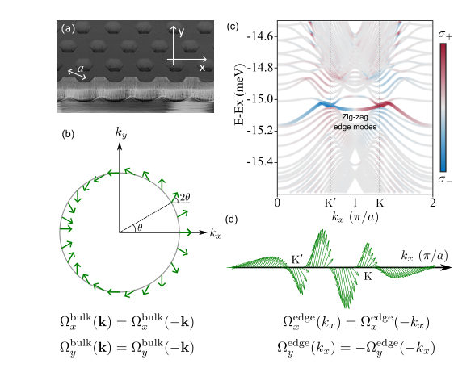
<figcaption class="paper-figure-caption"><b>Fig 1.</b> FIG. 1. Spin-momentum locking of zigzag edges states in a honeycomb lattice. Scanning electron microscopy (SEM) image of a zigzag edge in a honeycomb polariton lat- tice. The unit-cell size, a, is indicated by a double-headed arrow. The red circle marks the size and position of the exci- tation laser spot. The x −y coordinate axes are shown in the upper-right corner of the panel. (b) Simulation of the pro- jected band structure for a unit cell containing a zigzag edge, the bands encode the circular polarization in a false color scale, showing that the bulk modes remain linearly polarized, while the left- and right-propagating zigzag edge modes ex- hibit opposite spin polarization. The...</figcaption>
</figure>
<figure class="paper-figure-card">

<figcaption class="paper-figure-caption"><b>Fig 2.</b> FIG. 2. Experimental observation of SML in a ZES of a normal honeycomb lattice: linear regime. (a)/(b) PL intensity map of the dispersion relation of the honey- comb lattice measured in the bulk/along the zigzag edge. The dashed line indicates the energy of the Dirac points. The in- set schematically indicates the momentum-space cut across the Brillouin zone. (c) S3 map of the dispersion relation along the zigzag edge under horizontally polarized nonres- onant excitation, showing opposite circular polarization for counter-propagating ZES at K and K′. (d,e) S3 map of the energy- and real space-resolved emission measured un- der right- and left-circularly polarized excitation, respectively,...</figcaption>
</figure>
<figure class="paper-figure-card">
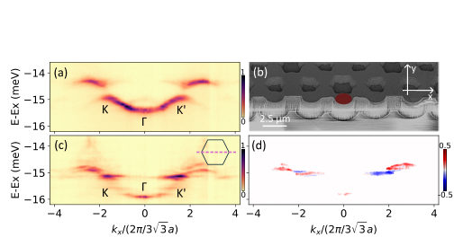
<figcaption class="paper-figure-caption"><b>Fig 3.</b> FIG. 3. Experimental observation of SML in ZES of a stretched honeycomb lattice: linear regime. (a) PL intensity map of the dispersion relation of the lattice in the bulk: a gap emerges in the Dirac points. (b) SEM image of the zigzag edge. (c) Dispersion relation measured along the zigzag edge. (d) Corresponding S3 map of the dispersion re- lation along the zigzag edge under horizontally polarized non- resonant excitation. The SML directionality is reversed with respect to the normal honeycomb lattice. The experimental figures have been acquired in the linear regime (P=0.08 mW), with an laser spot matching the pillar diameter as indicated in panel (b).</figcaption>
</figure>
<figure class="paper-figure-card">
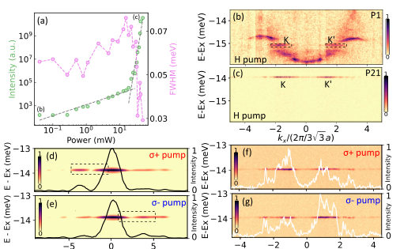
<figcaption class="paper-figure-caption"><b>Fig 4.</b> FIG. 4. SML lasing from ZES in a stretched honey- comb lattice. (a) Power-dependent emission intensity (green points) showing the nonlinear threshold behavior (Pth = 21.5 mW, with an elliptical laser spot covering six pillars along the edge) and line narrowing (pink points) associated with polariton lasing in the edge-state modes. (b,c) PL inten- sity map of the dispersion relation along the ZES for pump powers P=0.005Pth/1.95Pth, respectively. (d,e) Spatially and energy-resolved PL intensity map of the ZES under σ±-circularly polarized excitation, respectively, in the lasing regime (P=1.95Pth). The dashed boxes highlight the prop- agating direction of the edge-state lasing emission under σ±</figcaption>
</figure>

**Summary.** The paper reports the experimental observation of spin-momentum locking (SML) in polariton edge states within honeycomb lattices. By exploiting the inherent spin-orbit coupling from cavity geometry, they demonstrate that counter-propagating edge modes carry opposite circular polarizations. This effect is leveraged to achieve all-optical control over light directionality via spin-selective lasing.

**Why it may be interesting.** This work provides an optical analogue for realizing robust chiral transport phenomena, which is highly relevant to quantum optics and condensed matter physics concerning topological edge states and spin-orbit coupling effects in artificial systems.

Detailed structure

**Main problem.** The research aims to demonstrate spin-momentum locking (SML) of polariton edge states and achieve ultrafast, all-optical control over their directional propagation without external magnetic fields.

**Main result.** SML is confirmed in the zigzag edge states of honeycomb exciton-polariton lattices via polarization measurements. Furthermore, selective lasing using spin-polarized injection enables switching the direction of light flow by changing the pump helicity.

**Method.** The study combines experimental characterization using micro-photoluminescence with full Stokes polarimetry and theoretical modeling based on effective Hamiltonian descriptions for photonic lattices.

**Model / system.** The system is an exciton-polariton honeycomb lattice realized in GaAs-based semiconductor microcavities. The physics is governed by an effective spin-orbit coupling arising from TE/TM splitting, which dictates the polarization of edge states.

**Key observables.** Circular polarization ($S_3$), degree of elliptical polarization, and directional emission observed via $\sigma^+$ vs $\sigma^-$ pumping in both linear and gapped lattice geometries.

**Important parameters / regimes.** The TE-TM coupling strength ($\Omega_{TE-TM}$), the complex wavevector associated with evanescent fields ($\lambda_y$), and the lasing threshold power ($P_{th}$).

**Assumptions / limitations.** SML is shown to be an intrinsic property arising solely from the exponentially localized nature of edge states, independent of external magnetic fields.

**Figures summary.** Figures illustrate SEM images of zigzag edges, simulated band structures showing opposite spin polarization for counter-propagating modes, and experimental maps demonstrating directional switching of emission based on pump helicity above lasing threshold.

**Paper structure.** The paper develops the argument by first establishing the theoretical origin of SML from TE-TM splitting in edge states. It then presents experimental evidence using polarimetry to confirm this locking in both normal and stretched honeycomb lattices, culminating in a demonstration of spin-controlled directional lasing.

Abstract

Transverse-electric/Transverse-magnetic splitting in dielectric-mirror microcavities introduces an effective spin-orbit coupling for photons. While the bulk states remain linearly polarized, for exponentially localized edge states in a photonic lattice, this coupling induces elliptical polarization whose handedness is locked to the propagation direction, analogous to the transverse spin of evanescent electromagnetic waves. We reveal spin-momentum locking through Stokes polarimetry of zigzag edge states in a honeycomb exciton-polariton lattice. The effect persists in a stretched honeycomb supporting a photonic bandgap, where spin-polarized carrier injection enables selective lasing of either chiral edge states. Our results provide a route toward ultrafast spin-controlled unidirectional propagation in polariton systems without external magnetic fields.

[↑ back to top](#top)

### [Tunable Nonlinear Landscapes in Graphene Nanoelectromechanical Systems](http://arxiv.org/abs/2607.04724v1)

**Authors:** Ateesh K. Rathi, Rajan Singh, Javed A. Mondal, Arnab Sarkar, Ryan J. T. Nicholl, Kirill I. Bolotin, Saikat Ghosh  
**Type:** experiment · **Category:** other · **PDF:** <https://arxiv.org/pdf/2607.04724v1>  
**Analysis basis:** full PDF text, analyzed in chunks
**Topic relevance:** 🔥 `analog quantum simulation` **4/5** · `driven-dissipative phase transition` **3/5** · `methods for driven-dissipative` **3/5** · `non-equilibrium dynamics` **3/5** · `interference shaping light` **2/5** · `non-equilibrium universality` **2/5** · `quantum optics experiment` **2/5** · `Frenkel-Kontorova` **1/5** · `Keldysh / 2PI / non-Gaussian methods` **1/5** · `correlated / nonlocal dissipation` **1/5** · `entanglement & information structure` **1/5**

↔ Scroll figures horizontally

<figure class="paper-figure-card">

<figcaption class="paper-figure-caption"><b>Fig 1.</b> Figure 1. Device, effective potential, and gate-tunable 1:2 internal resonance. (A)(a) Scanning electron micrograph of the device. (b) Capacitive geometry: an AC voltage Vac drives the membrane and a DC gate voltage Vdc sets the static tension. (B) Effective potential V (X) of the fundamental mode, showing the competing quadratic and cubic nonlinear terms. (C) Dispersion of the mechanical resonances versus Vdc. (D) Amplitude response of the fundamental mode versus Vdc at fixed Vac = 6.0 V.</figcaption>
</figure>
<figure class="paper-figure-card">
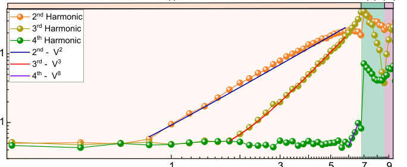
<figcaption class="paper-figure-caption"><b>Fig 2.</b> Figure 2. Integer high-harmonic generation and amplitude scaling. (A) Fundamental-mode spectrum with increasing drive amplitude at Vdc = 172 V; the spectral dip deepens as the nonlinear mode coupling strengthens. (B) Spectrum at fixed drive amplitude, showing the mode splitting from internal resonance. The black vertical line marks the drive frequency used in the following measurements. (C) Broadband spectrum under single-tone drive, showing integer harmonics up to fourth order (nωd, n = 1–4). Inset: onset threshold of each harmonic versus drive amplitude. (D) Amplitudes of the second, third, and fourth harmonics versus drive voltage, showing three regimes: (i) integer-harmonic generation...</figcaption>
</figure>
<figure class="paper-figure-card">

<figcaption class="paper-figure-caption"><b>Fig 3.</b> Figure 3. From integer harmonics through frequency combs to chaos. (A) Spectral map versus drive amplitude at fixed ωd/2π = 4.8338 MHz and Vdc = 158 V. Three regimes are marked: (i) integer-harmonic generation (Vac ≤6.8 V); (ii) dense comb (6.8 ≤Vac ≤8.8 V); (iii) reverse period-doubled comb with doubled spacing (8.8 ≤Vac ≤9.4 V). (B) Spectral map versus drive frequency at fixed drive amplitude, showing the evolution from a single peak to a comb, then successive period-doubling steps (∆c →∆c/2 →∆c/4) and finally chaos. Inset: fundamental-mode spectrum with the 1:2 mode splitting; the shaded band marks the swept frequency range.</figcaption>
</figure>

**Summary.** The authors report achieving tunable nonlinear dynamics in graphene NEMS by exploiting internal resonances induced by a gate voltage. They demonstrate the device's ability to generate controlled frequency combs and undergo predictable period-doubling cascades. This shows that a single, gated solid-state device can act as multiple functional components (multiplier, comb source) on demand.

**Why it may be interesting.** This work provides a solid-state platform to study fundamental nonlinear dynamics (like those seen in classical optics or Josephson junctions) using mechanical resonators, offering an accessible quantum/classical analog system for studying complex bifurcations and energy transfer mechanisms.

Detailed structure

**Main problem.** The research demonstrates tunable nonlinear dynamics in a solid-state nanomechanical system, specifically observing high-harmonic generation (HHG) and frequency comb formation.

**Main result.** By tuning the gate voltage to induce an internal resonance, the graphene device can function as a switchable source for integer harmonics, broadband combs, or chaotic signals via controlled period-doubling transitions.

**Method.** The study combines experimental measurements using optical interferometry with theoretical modeling based on coupled nonlinear oscillator equations and harmonic balance techniques.

**Model / system.** The physical platform is a suspended monolayer graphene drumhead NEMS resonator. The dynamics are governed by an effective potential incorporating quadratic ($\zeta$) and cubic ($eta$) nonlinear terms, which are tunable via an applied gate voltage ($V_{dc}$).

**Key observables.** Integer harmonics ($n\omega_d$), dense frequency combs, period-doubling cascades, and the measurable nonlinear coefficients $\zeta$ and $eta$.

**Important parameters / regimes.** Gate voltage ($V_{dc}$) used to tune nonlinearity; achieving 1:2 internal resonance ($\omega_2 \approx 2\omega_0$) is critical for strong coupling.

**Assumptions / limitations.** The analysis relies on modeling the system using coupled equations of motion and employing techniques like harmonic balance or steady-state amplitude fitting.

**Figures summary.** Figures illustrate spectral maps showing transitions from single peaks to combs, followed by period doubling. Resonance dispersion plots show how the fundamental and higher modes couple as a function of gate voltage.

**Paper structure.** The paper establishes the physical setup and model potential, then details experimental measurements across varying drive amplitudes and frequencies. The core results demonstrate the sequence: IHG $
ightarrow$ Comb Formation $
ightarrow$ Reverse Period-Doubling, confirming control over nonlinear regimes.

Abstract

Nonlinear nanomechanical resonators give convenient solid-state access to classical analogs of extreme nonlinear optics and to phononic signal processing. Here we report integer high-harmonic generation and phononic frequency combs in a suspended monolayer graphene drum. A gate voltage breaks the out-of-plane symmetry of the membrane and tunes its fundamental flexural mode onto a 1:2 internal resonance with a higher mode at twice the frequency, where the quadratic coupling between the two modes becomes large. A single drive tone then generates phase-locked integer harmonics in sequence, and at larger drive these fill in to a dense frequency comb. Raising the drive further, we find a reverse period-doubling transition: the comb spacing doubles, the line density halves, and energy flows back into the even-order comb lines. The measured spectra yield the quadratic ($ζ$) and cubic ($β$) nonlinear coefficients of the membrane. These results show how the tunable nonlinear landscape of graphene supports distinct dynamical regimes on demand, allowing a single gated device to act in turn as a frequency multiplier, a broadband comb source, and a chaotic generator.

[↑ back to top](#top)

### [Finite-frequency magnetic common baths in ferromagnetic planar cavities](http://arxiv.org/abs/2607.05066v1)

**Authors:** O. J. Kwon  
**Type:** theory · **Category:** other · **PDF:** <https://arxiv.org/pdf/2607.05066v1>  
**Analysis basis:** full PDF text, analyzed in chunks
**Topic relevance:** 🔥 `spintronics-quantum-optics interface` **4/5** · `correlated / nonlocal dissipation` **3/5** · `exotic spin models in light-matter` **3/5** · `Keldysh / 2PI / non-Gaussian methods` **2/5** · `Tavis-Cummings & cavity-many-emitter` **2/5** · `driven-dissipative phase transition` **2/5** · `methods for driven-dissipative` **2/5** · `Kondo & dissipative impurity` **1/5** · `analog quantum simulation` **1/5** · `correlated cavity matter` **1/5** · `non-equilibrium dynamics` **1/5**

↔ Scroll figures horizontally

<figure class="paper-figure-card">
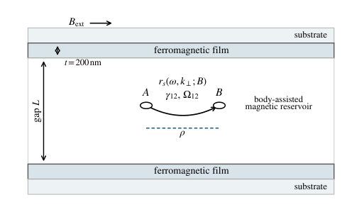
<figcaption class="paper-figure-caption"><b>Fig 1.</b> FIG. 1. Geometry and finite-frequency common-bath mech- anism. Two probes in a vacuum gap couple to the retarded scattering magnetic Green tensor. The benchmark figures use a finite ferromagnetic film thickness t = 200 nm, a non- magnetic conducting substrate, and the zz transition-moment projection.</figcaption>
</figure>
<figure class="paper-figure-card">

<figcaption class="paper-figure-caption"><b>Fig 2.</b> FIG. 2. Finite-thickness scalar TE benchmark. (a) Finite-film TE slab amplitude for t = 200 nm, plotted as log10 |rTE| versus B and k⊥L. (b) The corresponding t →∞half-space reference. (c) A cut at B = 16.5 mT, where finite thickness reduces |rTE| relative to the half-space reference mainly at intermediate k⊥L. At large k⊥L, the finite-film and half-space curves approach each other. The plotted quantity is the reciprocal diagonal TE benchmark channel used in the numerical Green-tensor integral.</figcaption>
</figure>
<figure class="paper-figure-card">
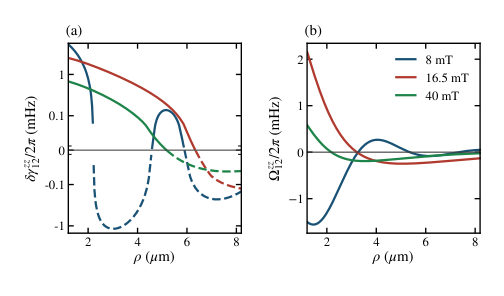
<figcaption class="paper-figure-caption"><b>Fig 3.</b> FIG. 3. Single-spin finite-frequency kernels for the zz pro- jection of the finite-thickness scalar cavity integral. The zz projection is the component benchmark used to match the static TE normalization of Ref. [1]. Panel (a) shows the signed off-diagonal scattering kernel δγ(zz) 12 /2π on a symmetric loga- rithmic scale; solid and dashed segments denote positive and negative values. Panel (b) shows the coherent exchange shift Ωzz 12/2π. Within the cavity-scattering sector, the sign in panel (a) fixes whether the symmetric or antisymmetric branch is narrowed relative to the local background.</figcaption>
</figure>
<figure class="paper-figure-card">
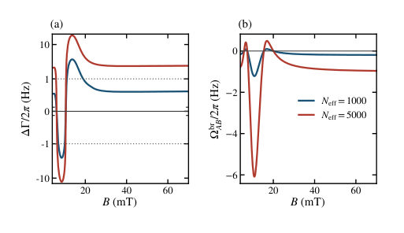
<figcaption class="paper-figure-caption"><b>Fig 4.</b> FIG. 4. Ideal uniform bright-mode scale estimate at ρ = 3 µm for two effective participation numbers. Panel (a) shows the linewidth splitting (Γ+ −Γ−)/2π = 2γbr AB/2π, with dotted horizontal lines marking the ±1 Hz reference level. Panel (b) shows the bright-mode coherent shift Ωbr AB/2π for the same participation numbers.</figcaption>
</figure>
<figure class="paper-figure-card">

<figcaption class="paper-figure-caption"><b>Fig 5.</b> FIG. 6. Component-normalized transverse-average bench- mark for the finite-thickness scalar cavity integral. Panel (a) shows the signed off-diagonal scattering kernel δγ(⊥) 12 /2π for the projection m2 c(Gsc BB,xx + Gsc BB,yy)/2 on a symmetric loga- rithmic scale; dashed segments denote negative values. Panel (b) shows Ω⊥ 12/2π for the same projection. The magnitudes are comparable to the zz benchmark, while the sign is re- versed over the plotted range because the tensor is projected onto the in-plane spin-flip subspace.</figcaption>
</figure>

**Summary.** This paper develops a theory to calculate the finite-frequency magnetic common bath experienced by two spin probes inside a ferromagnetic cavity. By utilizing the retarded magnetic Green tensor, the authors derive key coupling kernels ($\gamma_{12}, \Omega_{12}$) that quantify dynamic interactions. The results provide measurable predictions for linewidth splitting and Lamb shifts in solid-state quantum systems.

**Why it may be interesting.** This work provides a rigorous theoretical framework for quantifying dynamic coupling mechanisms between quantum emitters mediated by structured magnetic environments, extending static results into the frequency domain relevant for modern quantum sensing.

Detailed structure

**Main problem.** The primary goal is formulating and evaluating the finite-frequency magnetic common bath experienced by two spin probes situated within a ferromagnetic planar cavity.

**Main result.** The work successfully derives finite-frequency counterparts for static coupling shifts, yielding measurable off-diagonal linewidth splitting and collective Lamb shift kernels ($\gamma_{12}, \Omega_{12}$).

**Method.** The analysis employs macroscopic Quantum Electrodynamics (QED) by calculating the retarded magnetic Green tensor ($\mathbf{G}_{	ext{BB}}$) projected onto a scalar TE channel.

**Model / system.** The system consists of two spin probes coupled via a common bath mediated by a finite-thickness ferromagnetic film deposited on a nonmagnetic substrate. The coupling is modeled using the transverse diagonal Polder permeability ($\mu_{\perp}(\omega, \mathbf{B})$).

**Key observables.** Common-bath kernels ($\gamma_{12}$ and $\Omega_{12}$), linewidth splitting, and collective Lamb shift.

**Important parameters / regimes.** GHz probe transition frequencies, millikelvin temperatures, film thickness ($t=200\,\mathrm{nm}$), and cavity separation ($
ho=3\,\mu\mathrm{m}$).

**Assumptions / limitations.** The model simplifies the full planar response by using a scalar TE channel projection, neglecting TE–TM conversion and nonreciprocal off-diagonal Polder responses.

**Figures summary.** Figures illustrate the geometry of two probes coupled via a ferromagnetic film. Comparisons are made between finite-thickness cavity integrals (e.g., $\delta\gamma_{\perp}^{12}/2\pi$) and static benchmarks derived from image series calculations.

**Paper structure.** The paper develops the theory by first defining the common bath kernels using the magnetic Green tensor, then deriving the necessary reflection coefficients for a finite slab structure, and finally applying these to calculate observable quantities like linewidth splitting in specific physical regimes (e.g., near-field).

Abstract

We formulate the finite-frequency magnetic common bath of two spin probes in a ferromagnetic planar cavity. The probes couple to the retarded magnetic Green tensor of the cavity, whose imaginary and real parts determine the collective decay kernel \(γ_{12}\) and the Lamb-shift kernel \(Ω_{12}\). We evaluate these kernels for a finite-thickness scalar TE channel formed by a ferromagnetic film on a nonmagnetic conducting substrate, using the transverse diagonal Polder permeability \(μ_\perp(ω,B)\) as the magnetic input. The normalization is fixed by the free-space magnetic-dipole decay rate. In the \(ω\to0\) limit, the constant-reflection benchmark reproduces the static image-series reference, while the finite slab retains the corresponding static TE reflection amplitude. For a \(t=200\,\mathrm{nm}\) film described by a representative Ni-like parameter set in a micron-scale mid-gap cavity, the GHz probe transition samples the positive-frequency response of the body-assisted magnetic reservoir at millikelvin temperature. On resonance, the off-diagonal linewidth splitting reaches about two thirds of the single-spin scattering linewidth at \(ρ=3\,μ\mathrm m\). The resulting linewidth splitting and collective Lamb shift provide finite-frequency counterparts of the static TE coupling-frequency shift.

[↑ back to top](#top)

### [On the Nonlinear Sensitivity of Phononic Frequency Combs to Physical Perturbations](http://arxiv.org/abs/2607.03837v1)

**Authors:** Madhurendra Mishra, Zhen Qi, Adarsh Ganesan  
**Type:** theory · **Category:** other · **PDF:** <https://arxiv.org/pdf/2607.03837v1>  
**Analysis basis:** full PDF text, analyzed in chunks
**Topic relevance:** 🔥 `driven-dissipative phase transition` **4/5** · `correlated cavity matter` **3/5** · `methods for driven-dissipative` **3/5** · `non-equilibrium universality` **3/5** · `analog quantum simulation` **2/5** · `correlated / nonlocal dissipation` **2/5** · `non-equilibrium dynamics` **2/5** · `Frenkel-Kontorova` **1/5** · `Keldysh / 2PI / non-Gaussian methods` **1/5** · `Tavis-Cummings & cavity-many-emitter` **1/5**

↔ Scroll figures horizontally

<figure class="paper-figure-card">

<figcaption class="paper-figure-caption"><b>Fig 1.</b> Fig. 1: (a) Time-domain evolution of the coupled mode intensities |ψ1|2 and |ψ2|2 plotted together; (b) Corresponding Fourier spectra (FFT) of the same quantities. Here, τ and frequency are unitless normalized variables. The simulation parameters are ∆1 = 5, ∆2 = −6.5, γ21 = 1, and f = 24 with initial conditions are ψ1(0) = 5 and ψ2(0) = 3.</figcaption>
</figure>
<figure class="paper-figure-card">

<figcaption class="paper-figure-caption"><b>Fig 2.</b> Figure 8 maps the absolute sensitivity of key intensity mea- sures to infinitesimal variations in ∆1 across the (∆1, f) plane, complementing the amplitude maps of Fig. 5 by exposing where the system is most susceptible to parameter fluctuations. For both modes, the sensitivity is sharply localized along a nar- row band near f ∼16–21, coinciding with the oscillation on- set boundary identified earlier. For ψ1, panels (a) and (b) show that the mean intensity develops high-sensitivity patches at f ≳25, while the peak-to-peak amplitude is most responsive precisely along the transition boundary, where small changes in ∆1 can trigger large amplitude variations. The extrema in panels (c) and (d)...</figcaption>
</figure>
<figure class="paper-figure-card">
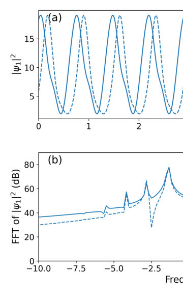
<figcaption class="paper-figure-caption"><b>Fig 3.</b> Figure 7 maps the modal intensity statistics across the (γ21, f) parameter plane. For the primary mode ψ1, panels (a)-(d) show that the mean intensity, peak-to-peak amplitude, and maximum all increase monotonically with f, with a clear additional enhancement from coupling strength, particularly for γ21 ≳1. Panel (c) stands out: the minimum intensity remains near zero for f ≲15-18, with a well-defined boundary above which it rises abruptly, marking the onset of fully sustained limit-cycle dynamics. This threshold shifts only weakly with γ21, indicating that while coupling enhances</figcaption>
</figure>
<figure class="paper-figure-card">
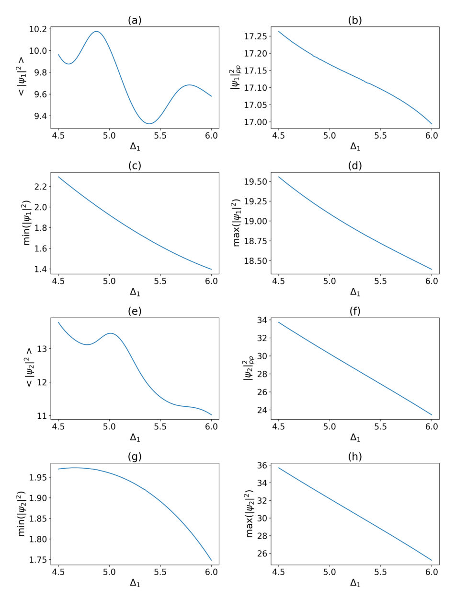
<figcaption class="paper-figure-caption"><b>Fig 4.</b> Fig. 2: Evolution of modal intensities of ψ1 and ψ2 as a function of detuning ∆1, with ∆2 = −6.5, γ21 = 1, and driving amplitude f = 24 held fixed. Panels (a)-(d) correspond to mode ψ1, showing the mean intensity ⟨|ψ1|2⟩, peak-to-peak intensity |ψ1|2 pp, minimum intensity min(|ψ1|2), and maximum intensity max(|ψ1|2), respectively. Panels (e)-(h) show the corresponding quantities for mode ψ2.</figcaption>
</figure>
<figure class="paper-figure-card">

<figcaption class="paper-figure-caption"><b>Fig 5.</b> Fig. 3: Evolution of modal intensities of ψ1 and ψ2 as a function of detuning ∆2, with ∆1 = 5, γ21 = 1, and driving amplitude f = 24 held fixed. Panels (a)-(d) correspond to mode ψ1, showing the mean intensity ⟨|ψ1|2⟩, peak-to-peak intensity |ψ1|2 pp, minimum intensity min(|ψ1|2), and maximum intensity max(|ψ1|2), respectively. Panels (e)-(h) show the corresponding quantities for mode ψ2.</figcaption>
</figure>

**Summary.** This paper analyzes the nonlinear sensitivity of phononic frequency combs using a reduced two-mode resonance model. By mapping how observables like amplitude and frequency change with detuning, drive strength, and damping, the authors reveal that sensitivity is highly structured, governed by distinct physical mechanisms like parametric resonance thresholds. This provides a roadmap for engineering these systems for advanced sensing applications.

**Why it may be interesting.** This work provides a detailed map of nonlinear control parameters for an artificial quantum/classical system (PFCs), offering blueprints for designing sensing platforms where specific physical changes induce predictable, measurable shifts in spectral features.

Detailed structure

**Main problem.** The study investigates how the observable properties (amplitude and frequency) of phononic frequency combs respond to variations in physical parameters, quantifying their nonlinear sensitivity.

**Main result.** Sensitivity is highly non-uniform: primary detuning causes smooth shifts, secondary detuning creates sharp transitions near resonance manifolds, and peak sensitivity concentrates near the activation threshold. This points to a common origin in autoparametric resonance and saturation.

**Method.** The authors employed numerical investigation of a reduced two-mode autoparametric resonance model derived from underlying mechanical equations.

**Model / system.** The system is Phononic Frequency Combs (PFCs), modeled by coupled, first-order ordinary differential equations describing the complex envelopes ($\psi_1$ and $\psi_2$) of primary and secondary modes. The dynamics are governed by detunings, drive amplitude, and relative damping.

**Key observables.** Amplitude ($|\psi_i|^2$), frequency ($\omega_{\psi_i}$), mean intensity, peak-to-peak amplitude, and differential sensitivity across parameter space.

**Important parameters / regimes.** Primary detuning ($\Delta_1$), secondary detuning ($\Delta_2$), drive amplitude ($f$), and relative damping ($\gamma_{21}$).

**Assumptions / limitations.** The model assumes slow variation of complex envelopes relative to carrier lines, allowing reduction from second-order to first-order ODEs.

**Figures summary.** Figures map sensitivity across parameter planes (e.g., $\Delta_2$ vs $f$) showing sharp resonance ridges and threshold boundaries; frequency plots show abrupt jumps near critical detuning values.

**Paper structure.** The paper systematically analyzes the response to each perturbation ($\Delta_1$, $\Delta_2$, $\gamma_{21}$, $f$), first examining steady-state amplitudes, then mapping the differential sensitivity of both amplitude and frequency across various parameter combinations.

Abstract

Phononic frequency combs offer a rich platform for nonlinear sensing, yet how their observable properties respond to changes in physical parameters remains poorly understood. Using a reduced two-mode autoparametric resonance model, we investigate how primary and secondary detuning, drive amplitude, and relative damping jointly shape amplitude and frequency sensitivity across the nonlinear parameter space. We find that sensitivity is far from uniform: primary detuning shifts the comb response smoothly, secondary detuning produces sharply localized transitions near resonance manifolds, and drive amplitude concentrates peak sensitivity close to the activation threshold rather than deep within the comb state. The relative damping redistributes energy continuously between modes without introducing discontinuities. The nonlinear sensitivity of amplitude and frequency observables across all parameters points to a common physical origin in autoparametric resonance, nonlinear saturation, and coupling-induced synchronization, offering a coherent basis for designing nonlinear sensing platforms with deliberate, parameter-aware sensitivity engineering.

[↑ back to top](#top)

### [Theory of Spinful Relativistic Superfluids](http://arxiv.org/abs/2607.04408v1)

**Authors:** Dam Thanh Son  
**Type:** theory · **Category:** other · **PDF:** <https://arxiv.org/pdf/2607.04408v1>  
**Analysis basis:** full PDF text, analyzed in chunks
**Topic relevance:** 🔥 `Keldysh / 2PI / non-Gaussian methods` **4/5** · `methods for driven-dissipative` **3/5** · `non-equilibrium dynamics` **3/5** · `driven-dissipative phase transition` **2/5** · `non-equilibrium universality` **2/5** · `analog quantum simulation` **1/5** · `correlated / nonlocal dissipation` **1/5** · `entanglement & information structure` **1/5** · `exotic spin models in light-matter` **1/5** · `spintronics-quantum-optics interface` **1/5**

↔ Scroll figures horizontally

<figure class="paper-figure-card">
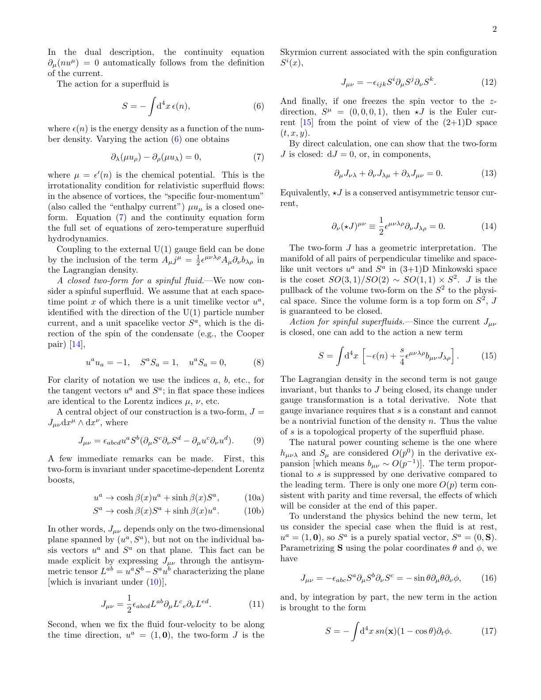
<figcaption class="paper-figure-caption"><b>Fig 1.</b> Low-resolution page preview, page 2</figcaption>
</figure>
<figure class="paper-figure-card">

<figcaption class="paper-figure-caption"><b>Fig 2.</b> Low-resolution page preview, page 3</figcaption>
</figure>
<figure class="paper-figure-card">
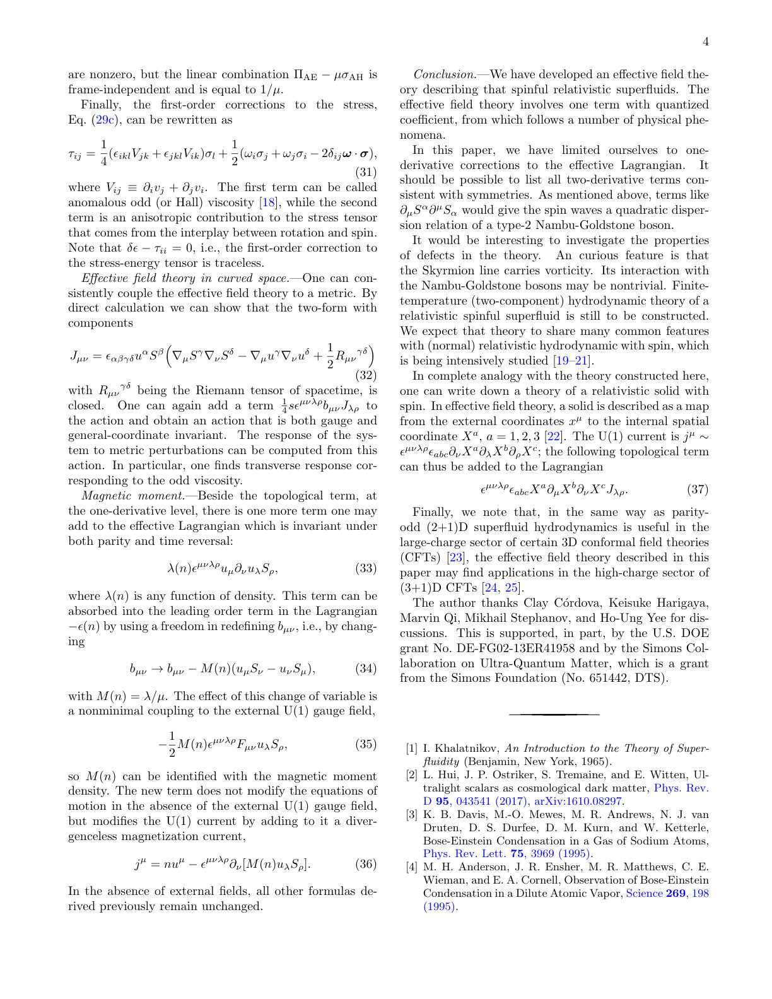
<figcaption class="paper-figure-caption"><b>Fig 3.</b> Low-resolution page preview, page 4</figcaption>
</figure>
<figure class="paper-figure-card">

<figcaption class="paper-figure-caption"><b>Fig 4.</b> Low-resolution page preview, page 5</figcaption>
</figure>

**Summary.** This work develops an effective field theory for relativistic superfluids carrying spin angular momentum. By incorporating topological terms into the action, the authors derive novel physical consequences such as modified transport relations and anomalous effects. It provides a rigorous framework for understanding how spin dynamics modify the macroscopic energy-momentum tensor of these exotic quantum fluids.

**Why it may be interesting.** While focused on high-energy/condensed matter theory, the derivation of generalized conserved currents and anomalous response terms (like Hall viscosity) shares mathematical structure with open quantum systems dynamics where dissipation and non-equilibrium responses are key.

Detailed structure

**Main problem.** The paper constructs an effective field theory description for relativistic superfluids that possess a non-zero angular momentum density (spinful superfluids). It aims to derive the resulting physical transport properties.

**Main result.** The theory yields several novel effects, including the relativistic Mermin-Ho relation and anomalous transport phenomena like the anomalous Ettingshausen effect. The stress-energy tensor is shown to acquire one-derivative corrections due to spin dynamics.

**Method.** The analysis uses an effective action approach involving topological terms derived from a two-form current $J$. Equations of motion are derived by varying this action with respect to gauge fields and spin components.

**Model / system.** The model is a relativistic superfluid, applicable to systems like quark matter or superfluid Helium-3, characterized by Cooper pairs carrying angular momentum. The theory treats the dynamics using effective field theory techniques in curved spacetime.

**Key observables.** Stress-energy tensor ($T^{\mu
u}$), spin current ($\Sigma^{\mu\alphaeta}$), anomalous Ettingshausen effect coefficient ($q_{AE}$), and magnetization current ($j^\mu$).

**Important parameters / regimes.** The topological coefficient $s$ (assumed constant) and the low-energy expansion order (one-derivative corrections).

**Assumptions / limitations.** The analysis is limited to one-derivative corrections in the effective Lagrangian, and it assumes a specific form for the superfluid condensate dynamics.

**Paper structure.** The paper builds from the general construction of the effective action incorporating spin degrees of freedom, derives conservation laws for energy and momentum, analyzes the resulting stress-energy tensor corrections, and finally identifies specific anomalous transport effects.

Abstract

We construct an effective field theory description of relativistic superfluids with nonzero angular momentum density. At first order in the derivative expansion, the effective action contains a term with a quantized coefficient, which encodes the Berry phase for the angular momentum of the superfluid condensate. From this single term we derive a number of physical effects, including the relativistic Mermin-Ho relation, an anomalous Ettingshausen effect (exchangeable for an anomalous Hall effect), and an anomalous Hall viscosity.

[↑ back to top](#top)

### [Nonlinear Hall effect in Floquet-driven monolayer 1T$'$-MoS$_2$](http://arxiv.org/abs/2607.03717v1)

**Authors:** Muhammad Faisal, Muzamil Shah, Imtiaz Khan, Reza Asgari  
**Type:** theory · **Category:** other · **PDF:** <https://arxiv.org/pdf/2607.03717v1>  
**Analysis basis:** full PDF text, analyzed in chunks
**Topic relevance:** 🔥 `non-equilibrium dynamics` **4/5** · `Keldysh / 2PI / non-Gaussian methods` **3/5** · `spintronics-quantum-optics interface` **3/5** · `driven-dissipative phase transition` **2/5** · `methods for driven-dissipative` **2/5** · `analog quantum simulation` **1/5** · `exotic spin models in light-matter` **1/5** · `interference shaping light` **1/5** · `non-equilibrium universality` **1/5**

↔ Scroll figures horizontally

<figure class="paper-figure-card">

<figcaption class="paper-figure-caption"><b>Fig 1.</b> FIG. 1. Side-view schematic of monolayer 1T ′-MoS2, showing Mo atoms (green) and S atoms (magenta), illuminated by off- resonant circularly polarized light. The intrinsic tilt structure induces asymmetry of the electronic bands.</figcaption>
</figure>
<figure class="paper-figure-card">
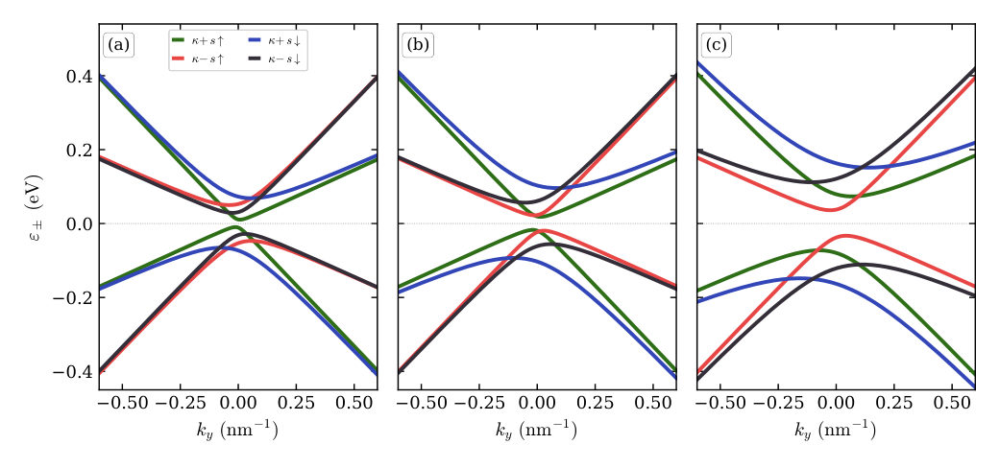
<figcaption class="paper-figure-caption"><b>Fig 2.</b> FIG. 2. Floquet quasienergy bands ε±(kx=0, ky) of monolayer 1T′-MoS2 for the four spin–valley sectors at three drive strengths: (a) quantum spin Hall (QSH) (with Ctot = 0) at ξ = 0.01, (b) spin-polarized quantum Hall insulator (S-QHI) (with Ctot = −1) at ξ = 0.04, and (c) photoinduced quantum Hall insulator (P-QHI) (with Ctot = −2) at ξ = 0.10. Green and blue are the κ=+ spin-up and spin-down; red and black are κ=−branches. The electric field and helicity are fixed at α = 0.5 and η = +1.</figcaption>
</figure>
<figure class="paper-figure-card">

<figcaption class="paper-figure-caption"><b>Fig 3.</b> FIG. 3. Total occupied-band Berry curvature Ωtot −= P</figcaption>
</figure>
<figure class="paper-figure-card">

<figcaption class="paper-figure-caption"><b>Fig 4.</b> FIG. 4. Sector-resolved occupied-band Berry curvature Ωz −. Each row is one valley (top) κ+, (bottom) κ−and each column one drive strength (a,d) QSH (ξ = 0.01), (b,e) S-QHI (ξ = 0.04), (c,f) P-QHI (ξ = 0.10). Filled color shows s↑; black contours overlay s↓(solid: positive, dashed: negative), each normalized to its own peak. Other parameters are as in Fig. (2).</figcaption>
</figure>
<figure class="paper-figure-card">
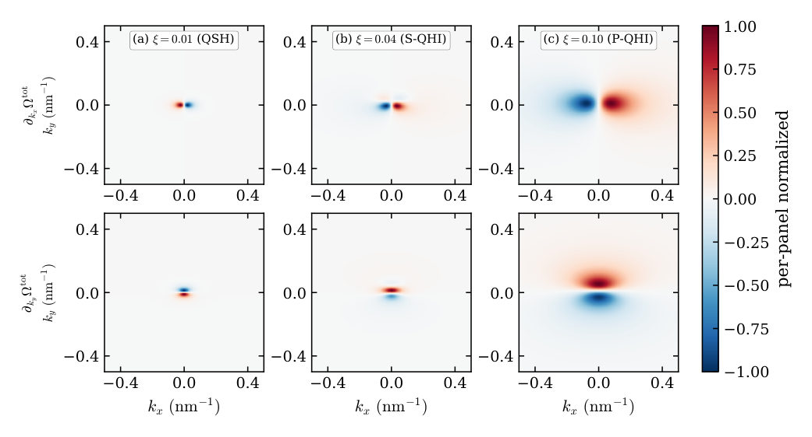
<figcaption class="paper-figure-caption"><b>Fig 5.</b> FIG. 5. Berry-curvature-dipole density of monolayer 1T ′-MoS2 summed over sectors: (top) ∂kxΩtot and (bottom) ∂kyΩtot, for (a) ξ = 0.01, (b) ξ = 0.04, and (c) ξ = 0.10, each panel normalized to its own peak. ∂kxΩis odd in kx and integrates to zero (Dx = 0), while ∂kyΩintegrates to a finite Dy. Other parameters are as in Fig. (2).</figcaption>
</figure>

**Summary.** This work investigates the nonlinear Hall effect in Floquet-driven 1T'-MoS2 to characterize engineered topological phases. The key finding is that a sign reversal in the NHE conductivity provides an unambiguous signature of these transitions, distinguishing them from simple parameter tuning. This establishes the material as a viable platform for all-electrical detection of non-equilibrium topology.

**Why it may be interesting.** The use of non-equilibrium optical driving to induce and probe topological phases is highly relevant for AMO physics, particularly concerning how external fields (like light) can engineer quantum states in solid-state systems.

Detailed structure

**Main problem.** The study aims to establish a universal transport fingerprint for Floquet-engineered topology by investigating the nonlinear Hall effect (NHE) in driven 2D materials.

**Main result.** A sign reversal in the NHE conductivity, which coincides with optically induced band inversions and gap closings, serves as an unambiguous signature of genuine topological phase transitions.

**Method.** The analysis employs a high-frequency Floquet effective Hamiltonian derived from coupling to circularly polarized light and utilizes nonlinear semiclassical transport theory.

**Model / system.** The system is monolayer 1T'-MoS2, modeled as a low-symmetry quantum spin Hall material with intrinsic Berry-curvature dipole moments. The driving mechanism involves off-resonant circularly polarized light applied via minimal coupling.

**Key observables.** Nonlinear Hall conductivity (chi_xyy), Berry-curvature dipole moment (D_y), and the total Chern number of the occupied band.

**Important parameters / regimes.** Floquet drive strength ($\xi$), perpendicular electric field ($E_z$, controlled by $\alpha$), Fermi energy ($E_F$), and temperature ($T$).

**Assumptions / limitations.** The analysis relies on the off-resonant high-frequency (van Vleck) expansion for the Floquet effective Hamiltonian.

**Figures summary.** Figures illustrate how D_y changes sign only when the gap closes due to driving ($\xi$), contrasting this with monotonic changes observed when tuning band tilt or electric field alone. Temperature dependence shows signal suppression at higher T.

**Paper structure.** The paper first establishes the model and Hamiltonian, then calculates topological invariants (Chern number) under Floquet driving. The core argument links sign reversals in the Berry-curvature dipole moment to these topological phase transitions, demonstrating this link via the NHE measurement, and finally explores control knobs like electric field and temperature.

Abstract

We study the nonlinear Hall effect in Floquet-driven monolayer \(1T'\)-MoS\(_2\), a low-symmetry quantum spin Hall material whose tilted Dirac bands sustain an intrinsic Berry-curvature dipole without the need for strain or trigonal warping. We show that off-resonant circularly polarized light offers a way to control both the sign and the magnitude of the nonlinear Hall response through optically induced topological phase transitions using a Floquet effective Hamiltonian and nonlinear semiclassical transport theory. We show that the anisotropic crystal symmetry enforces a selection rule in which the Berry-curvature dipole elements satisfy $D_x\equiv0$, while a finite $D_y$ originates from the intrinsic band tilt. The Berry curvature is recreated in momentum space as the Floquet drive successively inverts individual spin-valley sectors, resulting in an identical sign reversal of the nonlinear Hall conductivity and the Berry-curvature dipole at each bulk gap closing. In contrast, tuning the band tilt modifies only the magnitude of the response without changing its sign, establishing the observed sign reversal as an unambiguous transport signature of genuine Floquet topological phase transitions. We further show that the nonlinear Hall response can be controlled by the driving strength, perpendicular electric field, Fermi energy, and temperature, providing multiple experimental knobs for observation. Our findings establish the sign of the nonlinear Hall response as a universal transport fingerprint of Floquet-engineered topology and point to monolayer \(1T'\)-MoS\(_2\) as a viable platform for all-electrical detection of nonequilibrium topological phases.

[↑ back to top](#top)

### [Spin-orbit torque-driven synthetic antiferromagnetic oscillator](http://arxiv.org/abs/2607.03708v1)

**Authors:** P. K. Rout, J. Godinho, F. Vilsmeier, R. Salikhov, J. A. Vélez, Z. Šobáň, D. Laroze, O. Gomonay, R. M. Otxoa, C. H. Back, O. Hellwig, J. Wunderlich  
**Type:** both · **Category:** other · **PDF:** <https://arxiv.org/pdf/2607.03708v1>  
**Analysis basis:** full PDF text, analyzed in chunks
**Topic relevance:** `driven-dissipative phase transition` **3/5** · `methods for driven-dissipative` **3/5** · `spintronics-quantum-optics interface` **3/5** · `non-equilibrium dynamics` **2/5** · `non-equilibrium universality` **2/5** · `Keldysh / 2PI / non-Gaussian methods` **1/5** · `analog quantum simulation` **1/5** · `correlated / nonlocal dissipation` **1/5** · `exotic spin models in light-matter` **1/5**

↔ Scroll figures horizontally

<figure class="paper-figure-card">
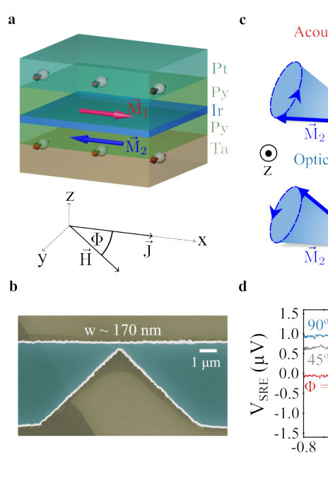
<figcaption class="paper-figure-caption"><b>Fig 1.</b> FIG. 1.</figcaption>
</figure>
<figure class="paper-figure-card">
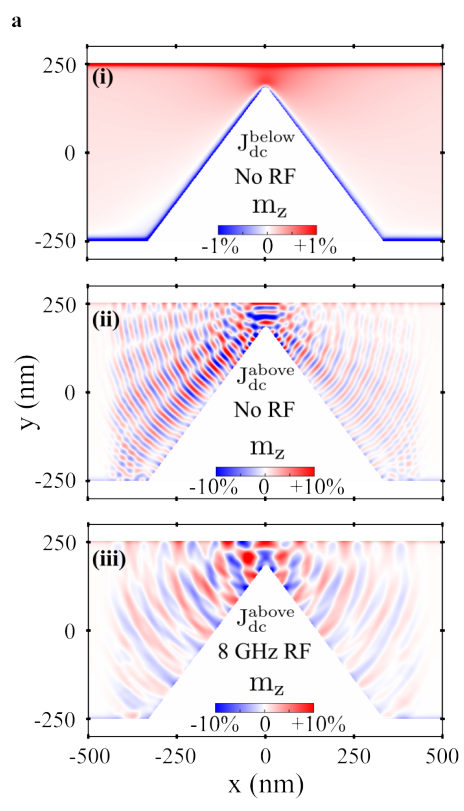
<figcaption class="paper-figure-caption"><b>Fig 2.</b> FIG. 2.</figcaption>
</figure>
<figure class="paper-figure-card">
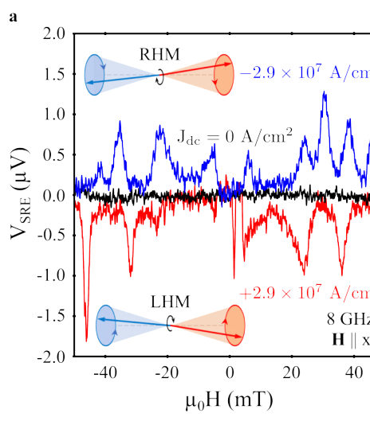
<figcaption class="paper-figure-caption"><b>Fig 3.</b> FIG. 3.</figcaption>
</figure>
<figure class="paper-figure-card">

<figcaption class="paper-figure-caption"><b>Fig 4.</b> FIG. 4.</figcaption>
</figure>

**Summary.** This work investigates current-driven oscillations in synthetic antiferromagnets using spin-orbit torque. By measuring the spin-rectification voltage ($	ext{V}_{	ext{SRE}}$), the authors demonstrated that self-oscillations emerge above a critical DC current threshold, exhibiting characteristic signatures of injection locking. This establishes SAF nanoconstrictions as a viable platform for studying nonlinear spintronic oscillators.

**Why it may be interesting.** While focused on spintronics, the study of driven, non-equilibrium collective excitations (self-oscillations) in magnetic systems shares conceptual links with open quantum system dynamics and nonlinear response theory relevant to AMO physics.

Detailed structure

**Main problem.** The study aims to demonstrate and characterize spin-orbit torque (SOT)-driven self-oscillatory dynamics in synthetic antiferromagnets (SAFs) using electrical measurements.

**Main result.** The research successfully identified low-field, current-induced peaks in the spin-rectification voltage ($	ext{V}_{	ext{SRE}}$), interpreted as signatures of current-selected chiral self-oscillations and injection locking near the spin-flop transition.

**Method.** The study combines electrical measurements (spin-rectification spectroscopy) with theoretical modeling, utilizing both micromagnetic simulations and macrospin approximations.

**Model / system.** The physical platform is a nanoconstriction patterned from a synthetic antiferromagnet (SAF) multilayer stack. The dynamics are governed by exchange coupling, spin-orbit torque (SOT), and applied DC/RF currents.

**Key observables.** Spin-rectification voltage ($	ext{V}_{	ext{SRE}}$), acoustic and optical eigenmode resonance frequencies, Power Spectral Density (PSD) features indicating self-oscillation onset and injection locking.

**Important parameters / regimes.** Critical DC current threshold ($J_{above}^{dc}$), applied magnetic field ($\vec{H}$), RF frequency range ($2	ext{ GHz}$ to $12	ext{ GHz}$).

**Assumptions / limitations.** The observed $	ext{V}_{	ext{SRE}}$ peaks are interpreted as electrical signatures of self-oscillatory dynamics, rather than direct emission detection.

**Figures summary.** Figures illustrate the SAF structure and patterned device; they show distinct resonance peaks for acoustic/optical modes (Fig. 1d); simulation results demonstrate threshold excitation of oscillations in PSDs (Fig. 2b); and $	ext{V}_{	ext{SRE}}$ measurements confirm current-dependent, self-oscillatory signatures (Fig. 3).

**Paper structure.** The paper first establishes the linear eigenmodes via SRE spectroscopy across different angles ($\Phi$). It then investigates nonlinear dynamics by observing that additional peaks appear only when a DC current exceeds a critical threshold, confirming self-oscillation and subsequent injection locking.

Abstract

Antiferromagnets offer a promising route toward robust spintronic devices because of their compensated magnetic order and exchange-enhanced spin dynamics. Here, we demonstrate a spin-orbit torque (SOT)-driven antiferromagnetic oscillator based on a nanoconstriction patterned from a synthetic antiferromagnet (SAF). Spin-rectification spectroscopy reveals electrical excitation of both acoustic and optical SAF eigenmodes, whose field and frequency dependences are quantitatively described by an antiferromagnetic resonance model. In addition to these linear eigenmodes, we observe low-field spin-rectification peaks that emerge only above a threshold DC current near the spin-flop transition. Their current-polarity-dependent sign and locking to an injected RF frequency provide electrical spin-rectification signatures consistent with current-selected chiral self-oscillatory dynamics. Micromagnetic simulations reproduce the threshold excitation of SOT-driven self-oscillations and injection locking, while macrospin simulations predict stable and chaotic nonlinear dynamics within the same spin-flop region. We interpret the multi-peak, weakly RF-frequency-dependent responses as a qualitative signature of complex nonlinear dynamics. These results establish SAF nanoconstrictions as an experimentally accessible platform for studying current-driven antiferromagnetic-like oscillator dynamics and motivate future work on nonlinear spintronic devices for signal processing and reservoir-computing concepts.

[↑ back to top](#top)

### [Pseudo-superconducting-diode effect in ferroelectric Josephson junctions](http://arxiv.org/abs/2607.04398v1)

**Authors:** Yaozu Tang, Nienke ten Haaf, Artem Bondarenko, Mazhar N. Ali, Yaroslav M. Blanter  
**Type:** theory · **Category:** statistical mechanics · **PDF:** <https://arxiv.org/pdf/2607.04398v1>  
**Analysis basis:** full PDF text, analyzed in chunks
**Topic relevance:** `driven-dissipative phase transition` **3/5** · `methods for driven-dissipative` **3/5** · `non-equilibrium dynamics` **3/5** · `non-equilibrium universality` **2/5** · `Frenkel-Kontorova` **1/5** · `Keldysh / 2PI / non-Gaussian methods` **1/5** · `correlated / nonlocal dissipation` **1/5**

↔ Scroll figures horizontally

<figure class="paper-figure-card">
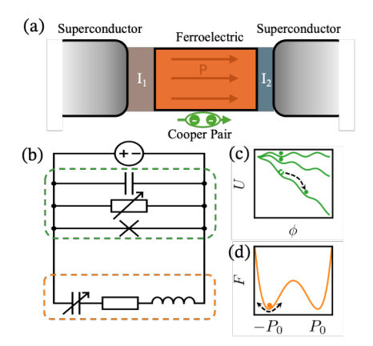
<figcaption class="paper-figure-caption"><b>Fig 1.</b> FIG. 1. Junction and potential landscapes. (a) Schematic of a FE-JJ with broken inversion symmetry due to interfacial insulating layers (I1 and I2). (b) Equivalent cir- cuit: the green box denotes the conventional RCSJ model, while the orange box represents ferroelectric dynamics. (c) Tilted washboard potential of the RCSJ model. (d) Landau double-well potential of the ferroelectric.</figcaption>
</figure>
<figure class="paper-figure-card">
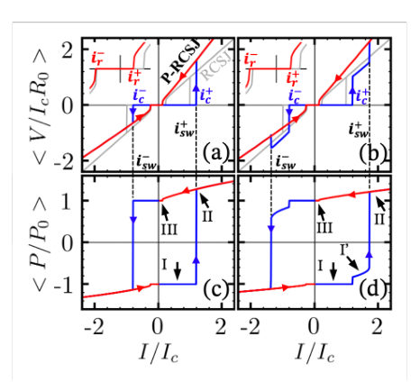
<figcaption class="paper-figure-caption"><b>Fig 2.</b> FIG. 2. Hysteresis in time-averaged voltage and polar- ization. (a), (b) Time-averaged voltage V = V/IcR0 under current sweeps for Landau coefficients A = 2, 4. Blue/red curves are RCSJ results with electric polarization (P-RCSJ), while gray curves are conventional RCSJ results without fer- roelectrics for comparison. The blue and red curves show RCSJ results with electric polarization (P-RCSJ), while the gray curves show conventional RCSJ results without ferro- electricity for comparison. Insets: zoom-in near retrapping currents. (c), (d) Corresponding time-averaged polarization P = P/P0 under current sweeps. The initial polarization is P(0) = −1.</figcaption>
</figure>
<figure class="paper-figure-card">

<figcaption class="paper-figure-caption"><b>Fig 3.</b> FIG. 3. Rocking double-well and washboard poten- tials. Potential landscapes are constructed using the time- averaged data and correspond, from left to right, to sweep points I, I’, II, and III in Fig. 2(d). Gray regions/curves indi- cate oscillation amplitudes. (a)–(d) Ferroelectric double-well potential profiles (orange curves) and polarization values (or- ange balls). (e)–(h) Corresponding Josephson-junction wash- board potentials (green curves) and phase values (green balls).</figcaption>
</figure>
<figure class="paper-figure-card">
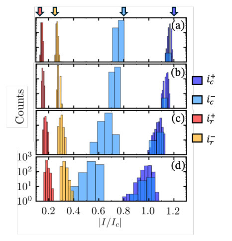
<figcaption class="paper-figure-caption"><b>Fig 4.</b> FIG. 4. Histograms of critical (i± c ) and retrapping (i± r ) currents. The temperature T is set to (a) 0.1 K, (b) 0.2 K, (c) 0.5 K, and (d) 1 K. Each histogram (shown on a log- arithmic scale) is constructed from 1000 full current sweeps. The arrows at the top indicate the zero-temperature values of the critical and retrapping currents for reference. The critical temperature of the superconductor is estimated to be Tc ≃0.5 K using simple BCS approximation.</figcaption>
</figure>
<figure class="paper-figure-card">

<figcaption class="paper-figure-caption"><b>Fig 5.</b> FIG. 5. Time-averaged characteristics at T = 1 K. Time-averaged (a) voltage and (b) polarization under current sweeps. The purple arrow indicates the additional supercon- ducting region. The sweep protocol and initial conditions are the same as in Fig. 2(a). Dashed gray curves in (a) show the zero-temperature results for comparison.</figcaption>
</figure>

**Summary.** The paper theoretically investigates the pseudo-superconducting-diode effect in ferroelectric Josephson junctions by coupling superconducting dynamics with ferroelectric polarization switching. Using a coupled dynamical model solved numerically, the authors show that current sweeping induces nonreciprocal supercurrents due to history-dependent polarization changes. This confirms FE-JJs as tunable platforms for field-free nonreciprocal electronic devices.

**Why it may be interesting.** This work models a complex interplay between quantum coherence (superconductivity) and classical/emergent order parameters (ferroelectricity), which is highly relevant for understanding open quantum systems where dissipation and environmental coupling drive macroscopic effects.

Detailed structure

**Main problem.** The authors investigate the pseudo-superconducting-diode effect (SDE) in ferroelectric Josephson junctions, which manifests as nonreciprocal critical and retrapping supercurrents.

**Main result.** They demonstrate that this nonreciprocity is a history-dependent, non-equilibrium phenomenon arising from current-induced polarization switching, confirming FE-JJs as promising field-free devices.

**Method.** The study employs a coupled dynamical model combining the Resistively and Capacitively Shunted Junction (RCSJ) description with Landau-Khalatnikov-Tani ferroelectric dynamics, solved via numerical simulations including thermal noise.

**Model / system.** The physical system is an inversion-asymmetric Ferroelectric Josephson Junction (FE-JJ). The model couples the superconducting phase dynamics ($\phi$) governed by a polarization-dependent RCSJ equation with the ferroelectric polarization ($P$) governed by the LKT equation.

**Key observables.** Asymmetric critical and retrapping supercurrents ($i_{c\pm}, i_{r\pm}$), diode efficiency ($\eta$), time-averaged voltage, and polarization switching dynamics.

**Important parameters / regimes.** Ferroelectric parameters (e.g., $	heta P_0$), temperature ($T$), and the bias current sweep protocol are crucial for tuning the nonreciprocity.

**Assumptions / limitations.** The analysis assumes validity of linear approximations for critical current dependence on polarization in some contexts, and thermal noise is modeled as Gaussian white noise.

**Figures summary.** Figures illustrate schematic setups, hysteresis loops showing voltage/polarization under sweeps (comparing P-RCSJ to conventional RCSJ), histograms of currents at finite T, and time evolution during switching events.

**Paper structure.** The paper builds from defining the coupled dynamical model using Lagrangian formalism, deriving equations of motion for both superconducting and ferroelectric components, simulating current sweeps to observe hysteresis and polarization switching, and finally analyzing the temperature dependence of the resulting nonreciprocity.

Abstract

The superconducting diode effect (SDE), characterized by unequal critical supercurrents in opposite current directions, enables supercurrent rectification. We propose a magnetic-field-free pseudo-superconducting-diode effect in ferroelectric Josephson junctions with broken inversion symmetry. Using a coupled dynamical model that combines a polarization-dependent RCSJ description with Landau-Khalatnikov-Tani ferroelectric dynamics, we show that ferroelectric polarization switching induces asymmetric critical and retrapping currents under current sweeps. The resulting nonreciprocity is highly tunable via ferroelectric parameters and the sweep protocol and remains robust at finite temperatures. Our work identifies ferroelectric Josephson junctions as a promising platform for magnetic-field-free nonreciprocal superconducting devices.

[↑ back to top](#top)

### [Nonlocal Orbital-Angular-Momentum Dichroism of Vortex Light in Strained Crystals](http://arxiv.org/abs/2607.03544v1)

**Authors:** Habib Rostami  
**Type:** theory · **Category:** other · **PDF:** <https://arxiv.org/pdf/2607.03544v1>  
**Analysis basis:** full PDF text, analyzed in chunks
**Topic relevance:** `Keldysh / 2PI / non-Gaussian methods` **3/5** · `driven-dissipative phase transition` **2/5** · `methods for driven-dissipative` **2/5** · `analog quantum simulation` **1/5** · `correlated / nonlocal dissipation` **1/5** · `interference shaping light` **1/5** · `non-equilibrium dynamics` **1/5** · `non-equilibrium universality` **1/5** · `spintronics-quantum-optics interface` **1/5**

↔ Scroll figures horizontally

<figure class="paper-figure-card">

<figcaption class="paper-figure-caption"><b>Fig 1.</b> FIG. 1. Schematic of an optical vortex incident on a nonuni- formly strained hexagonal two-dimensional material. The sur- face represents a Gaussian strain bubble, with colour indicat- ing the deformation amplitude. The vortex core is displaced from the bubble center by the in-plane vector d. The circular arrows denote the vortex transverse phase current J (ℓ). This relative displacement breaks the common circular symmetry of the optical and strain profiles, enabling OAM-sensitive cou- pling through optical nonlocality.</figcaption>
</figure>
<figure class="paper-figure-card">
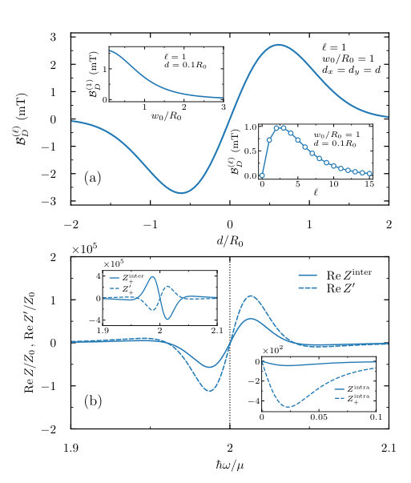
<figcaption class="paper-figure-caption"><b>Fig 2.</b> FIG. 2. OAM-projected geometric overlap integral B(ℓ) ab and SAM-projected material tensor Λ(s) ab for strain-assisted OAM dichroism. (a) Geometric overlap for a displaced Gaussian bubble, shown through B(ℓ) D = B(ℓ) xx −B(ℓ) yy . For dx = dy = d, the symmetric off-diagonal component B(ℓ) S = B(ℓ) xy + B(ℓ) yx is numerically identical to B(ℓ) D . The main panel shows B(1) D ver- sus d/R0 for ℓ= 1 and w0 = R0. Insets show its dependence on w0/R0 at ℓ= 1, dx = dy = 0.1R0, and on ℓat w0 = R0, dx = dy = 0.1R0. We use a Gr¨uneisen parameter β ≈2 and the universal bubble aspect ratio h0/R0 ≈0.1 [48]. We set R0 = 1 µm. (b) Material response near the interband reso- nance ℏω ≈2µ, normalized by Z0 =...</figcaption>
</figure>

**Summary.** This paper theoretically demonstrates that OAM dichroism in vortex light is forbidden in uniform crystalline media. By introducing nonuniform strain into a 2D Dirac material, the authors show how transverse momentum transfer can be supplied via a pseudo-gauge field. This allows for a measurable, non-zero OAM-odd optical conductivity, opening a pathway for differential optical measurements of strain effects.

**Why it may be interesting.** This work connects topological light properties (OAM) with material strain engineering in 2D electron systems, providing a concrete mechanism for optical detection of subtle symmetry breaking effects relevant to condensed matter physics.

Detailed structure

**Main problem.** The research investigates the mechanism by which Orbital Angular Momentum (OAM) dichroism of vortex light can be generated in condensed matter systems, overcoming theoretical no-go theorems.

**Main result.** Nonuniform strain in a 2D Dirac material bypasses the no-go condition, allowing for a measurable OAM-odd conductivity ($\sim 10^{-3}e^2/\hbar$) through the coupling of vortex phase current with the strain field.

**Method.** The analysis uses theoretical derivations involving nonlocal response functions, factorizing the dichroism into an elasto-optic tensor and a geometric overlap term derived from Green's function techniques.

**Model / system.** The model employs a two-dimensional Dirac material Hamiltonian, specifically incorporating nonuniform strain (modeled as a Gaussian bubble) to break translational symmetry. The analysis considers both interband and intraband contributions to the optical response.

**Key observables.** OAM dichroism ($\Delta\sigma_{OAM}$), nonlocal elasto-optic tensor ($\Lambda^{(s)}_{ab}$), and Geometric Overlap Tensor ($B^{(\ell)}_{ab}$).

**Important parameters / regimes.** Strain amplitude ($\alpha$), beam waist ($w_0$), bubble displacement ($d$), and the ratio of material parameters defining valley inequivalence.

**Assumptions / limitations.** The analysis relies on perturbative expansions in strain/momentum transfer (Q) and assumes specific limits for integrals, such as $k=0$ for intraband calculations.

**Figures summary.** Figures illustrate the physical setup (vortex light on strained material), show the dependence of the geometric overlap term on displacement, and plot resonant enhancements of material coefficients near resonance.

**Paper structure.** The paper first establishes the no-go theorem for OAM dichroism in translationally invariant systems. It then introduces strain as the necessary symmetry breaker, developing theoretical frameworks to calculate the nonlocal elasto-optic tensor ($\Lambda$) and the geometric overlap ($B$). Finally, it calculates these terms for specific Dirac models.

Abstract

Vortex light carries orbital angular momentum (OAM) in its transverse phase, unlike spin, which is encoded in polarization. We show that this phase cannot produce OAM dichroism in any continuously translation-invariant system, even when optical nonlocality and multipole light--matter coupling are included. Nonuniform strain in a two-dimensional Dirac material bypasses this no-go condition by supplying transverse momentum transfer through a long-wavelength pseudo-gauge field, so that the OAM dichroism factorizes into a nonlocal elasto-optic tensor and the overlap of the vortex transverse phase current with the strain field. For a micron-scale Gaussian bubble, the resonant OAM-odd conductivity reaches \(\sim10^{-3}e^2/\hbar\), within reach of differential optical measurements.

[↑ back to top](#top)

### [Quasi-two-dimensional Majorana zero modes from finite-size-coupled chiral hinge states](http://arxiv.org/abs/2607.04358v1)

**Authors:** Wenhao Liang, Xun-Jiang Luo  
**Type:** theory · **Category:** other · **PDF:** <https://arxiv.org/pdf/2607.04358v1>  
**Analysis basis:** full PDF text, analyzed in chunks
**Topic relevance:** `analog quantum simulation` **3/5** · `Keldysh / 2PI / non-Gaussian methods` **2/5** · `driven-dissipative phase transition` **2/5** · `methods for driven-dissipative` **2/5** · `Kondo & dissipative impurity` **1/5** · `correlated / nonlocal dissipation` **1/5** · `correlated cavity matter` **1/5** · `non-equilibrium dynamics` **1/5**

↔ Scroll figures horizontally

<figure class="paper-figure-card">

<figcaption class="paper-figure-caption"><b>Fig 1.</b> FIG. 1. Schematic of the quasi-two-dimensional HOTI- superconductor geometry. A chiral HOTI slab is proximi- tized by a conventional s-wave superconductor. The sample is thin along x, extended along y, and finite along z. Oppo- site z-directed hinge states hybridize across the thin direction. The proximity-induced pairing gaps the two separated hinge- derived channels indicated by dashed red arrows. The four MZMs γ1,2,3,4 are localized at the endpoints of these channels in the y-z plane.</figcaption>
</figure>
<figure class="paper-figure-card">
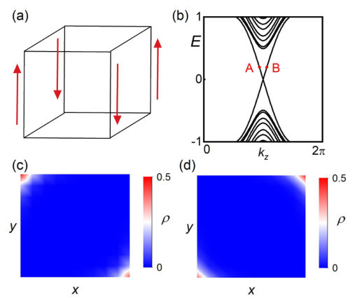
<figcaption class="paper-figure-caption"><b>Fig 2.</b> FIG. 2. Energy spectrum and real space distribution of chi- ral hinge states. (a) Propagation directions of the z-directed chiral hinge states. (b) Spectrum of a z-periodic wire with a 10 × 10 cross section and open boundary conditions in the x-y plane. (c),(d) Probability densities of the states marked A and B in (b), showing localization on complementary di- agonal hinge pairs. The model parameters are t = 1, M = 2, λ = 1, and m = 0.5</figcaption>
</figure>
<figure class="paper-figure-card">
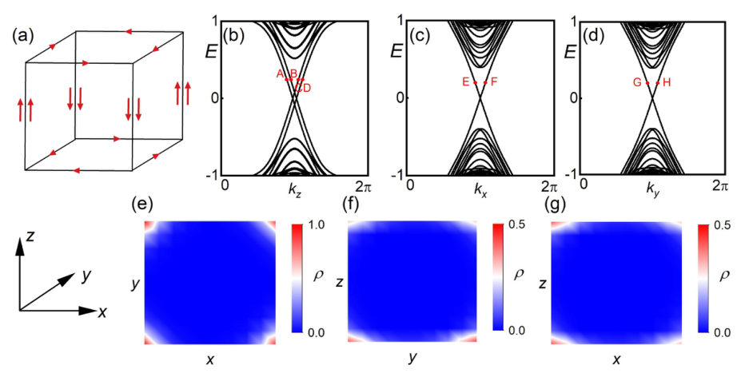
<figcaption class="paper-figure-caption"><b>Fig 3.</b> FIG. 3. The energy spectrum of HBdG with a wire geometry and distribution of chiral Majorana hinge modes. (a) Schematic illustration of the flow pattern of chiral Majorana hinge modes. (b)–(d) BdG spectra for wire geometries periodic along z, x, and y, respectively, with a 10 × 10 cross section and open boundary conditions in the two transverse directions. Red points A–H mark representative in-gap hinge states. (e)–(g) Summed probability densities of the marked states in the corresponding cross sections: (e) states A–D in the x-y plane, (f) states E–F in the y-z plane, and (g) states G–H in the x-z plane. The model parameters are t = 1, M = 2, λ = 1, m = 1, µ = 0.1, and ∆= 0.3.</figcaption>
</figure>
<figure class="paper-figure-card">

<figcaption class="paper-figure-caption"><b>Fig 4.</b> FIG. 4. Finite-size-induced reconstruction of the chiral HOTI hinge spectrum. (a) Schematic illustration of decoupled chi- ral hinge states in the thick limit. (b) Schematic illustration of coupled hinge states forming helical channels in the thin limit; upon superconducting proximitization, these channels terminate in MZMs γ1,2,3,4 at their endpoints. (c) Normal- state spectrum for Lx = 10 and Ly = 80, corresponding to the decoupled limit in (a). (d) Normal-state spectrum for Lx = 2 and Ly = 80, corresponding to the coupled limit in (b). The red dashed line marks a chemical potential within the energy window of the coupled hinge states. The common model parameters are t = 1, M = 2, λ = 1,...</figcaption>
</figure>
<figure class="paper-figure-card">
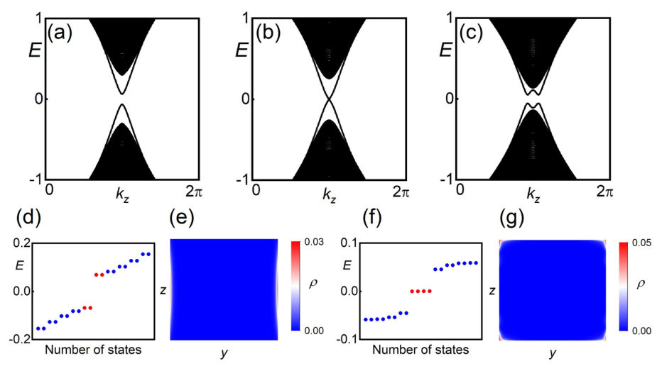
<figcaption class="paper-figure-caption"><b>Fig 5.</b> FIG. 5. Energy spectral evolution and real-space distribution of MZMs. (a)–(c) BdG energy spectra with periodic boundary conditions along z and open boundary conditions in the x-y plane for a 2×80 cross section, at µ = 0.1, 0.17, and 0.3, respectively. The gap closes near the transition point (b) and reopens for larger µ (c). (d) Energy spectrum under open boundary conditions for the parameters in (a) with system size 2×80×80. Red points mark the low-energy states used in (e). (e) Density projected along the thin x direction for the marked states in (d). (f) Energy spectrum of under the open boundary conditions for the parameters in (c), where four MZMs appear inside the superconducting...</figcaption>
</figure>

**Summary.** The paper proposes realizing multiple Majorana zero modes by coupling chiral hinge states within a higher-order topological insulator (HOTI) when placed in proximity to an s-wave superconductor. Using theoretical modeling, the authors show that this confinement mechanism opens a superconducting gap and localizes four robust MZMs at the sample corners. This establishes a promising platform for detecting and utilizing Majorana corner states.

**Why it may be interesting.** This work provides a concrete theoretical blueprint for engineering multiple, spatially separated Majorana modes using established material platforms (HOTIs), which is highly relevant for designing fault-tolerant quantum hardware architectures.

Detailed structure

**Main problem.** The work proposes a theoretical route to realize spatially separated Majorana zero modes (MZMs) by coupling chiral hinge states in a higher-order topological insulator (HOTI). This aims to create a platform for studying topological superconductivity.

**Main result.** By confining the system and inducing superconducting proximity effects, the model predicts the formation of four robust localized MZMs at the corners of the quasi-two-dimensional sample. These corner modes are stable against weak disorder as long as the bulk gap remains open.

**Method.** The study employs theoretical modeling using the Bogoliubov-de Gennes (BdG) Hamiltonian to analyze the superconducting proximity effect on chiral hinge states derived from a HOTI model.

**Model / system.** The system is a quasi-two-dimensional realization of a chiral HOTI proximitized by an s-wave superconductor. The physics relies on gapless hinge states along one direction, which hybridize upon finite-size confinement to form helical channels exhibiting effective p-wave pairing.

**Key observables.** Localized Majorana zero modes (MZMs) at the corners; robust zero-bias conductance peaks detectable via STM spectroscopy.

**Important parameters / regimes.** The chemical potential ($\mu$) relative to the reconstructed hinge bands, and the superconducting gap amplitude ($\Delta$).

**Assumptions / limitations.** The approach assumes that chiral hinge states are experimentally accessible in magnetic topological insulators and that the proximity effect induces effective p-wave pairing.

**Figures summary.** Figures illustrate the schematic geometry of the quasi-2D system, show energy spectra confirming gapless hinge states (Fig. 2), demonstrate the opening of a topological gap leading to localized MZMs (Figs. 3(b)-(d)), and confirm robustness against disorder (Fig. 7).

**Paper structure.** The paper builds the argument by first establishing chiral hinge states in the HOTI, then incorporating s-wave pairing via the BdG Hamiltonian, demonstrating the finite-size coupling mechanism to localize MZMs, and finally verifying their topological protection against disorder.

Abstract

Majorana zero modes (MZMs) in topological superconductors have attracted broad research interest for their potential applications in topological quantum computation. In this work, we propose a quasi-two-dimensional route to realize spatially separated MZMs in a chiral higher-order topological insulator (HOTI) proximitized by a conventional $s$-wave superconductor through a theoretical model study. In three dimensions, the chiral HOTI hosts gapless hinge states along the $z$ direction, arising from a mass term that anisotropically gaps the surface Dirac cones of a topological insulator. By confining the sample along the $x$ direction while keeping it extended along $y$ and finite along $z$, opposite $z$-directed chiral hinge states hybridize and effectively form one-dimensional helical channels. Incorporating the superconducting proximity effect into this quasi-two-dimensional system induces effective $p$-wave pairing in these helical channels, thereby opening a topological gap. A fully open-boundary sample then hosts four localized MZMs, one at each endpoint of the helical channels, realizing a second-order topological superconductor characterized by Majorana corner modes. In addition to MZMs, we also find that superconducting pairing in this model produces extended Majorana hinge modes in three dimensions. Furthermore, representative disorder calculations indicate that these Majorana corner modes are robust against weak-to-moderate disorder, provided the excitation gap remains open. These results establish finite-size-coupled chiral hinge states as a promising platform for engineering multiple MZMs via conventional superconducting proximity effect.

[↑ back to top](#top)

### [Calibration of systematic distortions in quantum emitter localization microscopy for deterministic nanophotonic fabrication](http://arxiv.org/abs/2607.05370v1)

**Authors:** Chenxi Ma, Maximilian Heller, Timon Handrup, Yiteng Zhang, Tobias M. Krieger, Thomas Oberleitner, Zenghui Jiang, Xian Zheng, Eddy P. Rugeramigabo, Folke Dencker, Armando Rastelli, Fei Ding, Michael Zopf  
**Type:** experiment · **Category:** other · **PDF:** <https://arxiv.org/pdf/2607.05370v1>  
**Analysis basis:** full PDF text, analyzed in chunks
**Topic relevance:** `quantum measurements` **3/5** · `quantum optics experiment` **3/5** · `QC/QI experiment` **2/5** · `analog quantum simulation` **1/5** · `interference shaping light` **1/5** · `measurement-induced transitions` **1/5** · `spintronics-quantum-optics interface` **1/5**

↔ Scroll figures horizontally

<figure class="paper-figure-card">
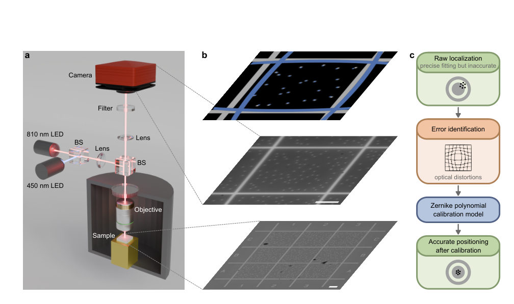
<figcaption class="paper-figure-caption"><b>Fig 1.</b> Figure 1. Schematic of the optical setup and calibration workflow. (a) 3D illustration of the wide-field PL microscope setup for optical positioning. BS, beamsplitter. (b) From bottom to top: SEM image of a 3×3 gold nanodisk calibration array; wide-field reflection image of the central marker field; and conceptual illustration comparing positions extracted from wide-field images (blue) with their nominal design positions (gray). Spatially varying residuals between the two coordinate sets are used to map the optical distortion field. Scale bars in the SEM and reflection images are 10 µm. (c) Distortion calibration workflow.</figcaption>
</figure>
<figure class="paper-figure-card">

<figcaption class="paper-figure-caption"><b>Fig 2.</b> Figure 2. Performance of the optical positioning setup. (a) Representative wide-field PL image of QD emission acquired through a 785 nm narrow bandpass filter. (b) Magnified image of a 2D Gaussian fit for a representative QD. (c) Reflection image of the marker frame and nanodisks from the same field as (a), acquired through a 785 nm narrow bandpass filter. The markers define an area of 40×40 µm2. (d) Representative cross-section of a marker arm and the corresponding fit. (e) Distributions of the fitted FWHM values for QDs and nanodisks, with the shaded region spanning from the Gaussian approximation of the diffraction-limited PSF (FWHMdiff = 473nm) to 2×FWHMdiff. (f) Distributions of the...</figcaption>
</figure>
<figure class="paper-figure-card">
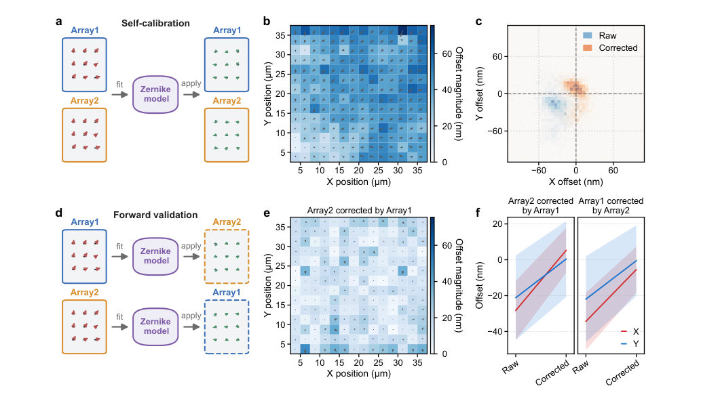
<figcaption class="paper-figure-caption"><b>Fig 3.</b> Figure 3. Training and forward validation of the distortion-calibration model. (a) Schematic of the self-calibration process, in which a Zernike distortion model is fitted to the nanodisk offsets of both arrays. (b) Spatial map of the raw nanodisk offsets between optically extracted positions and design positions for both arrays. The arrows indicate the offset directions, and the color scale indicates the offset magnitude. (c) Overlaid 2D histogram of the nanodisk offsets before (blue) and after (orange) correction by the Zernike distortion model. (d) Schematic of the forward validation process. The model is trained on one array and then applied to the held-out array, after which the...</figcaption>
</figure>
<figure class="paper-figure-card">

<figcaption class="paper-figure-caption"><b>Fig 4.</b> Figure 4. Polarization response of deterministically fabricated mesas. (a) SEM image of a region inside the mesa array. (b) Background-subtracted co- and cross-polarized PL spectra from a distortion-corrected mesa, corresponding to the polarization angles of Imax and Imin. The inset shows representative polar plots of the integrated PL intensity as a function of the linear polarization angle for a background QD (gray), a raw-positioned mesa (blue), and a distortion-corrected mesa (orange). (c) Scatter plot of the system-corrected Stokes components. The dashed circle indicates the DOLP expected for a centered emitter in an elliptical mesa with SEM-measured diameters. (d) Histograms of...</figcaption>
</figure>

**Summary.** This paper presents an advanced calibration protocol to correct systematic optical distortions in complex, custom cryo-optical setups used for localizing quantum emitters. By modeling these distortions using a Zernike vector-field approach and validating it with nanodisk arrays, the authors significantly improved absolute positioning accuracy. This method offers a practical pathway to deterministically integrating quantum light sources into scalable photonic circuits.

**Why it may be interesting.** This work is highly relevant to experimental quantum optics and open quantum systems as it provides a critical metrological tool necessary to translate high-precision statistical measurements into reliable absolute positioning required for building functional quantum devices.

Detailed structure

**Main problem.** The ultimate integration yield of quantum emitters into photonic structures is limited by uncorrected systematic optical distortions inherent in custom cryo-optical setups, even when statistical localization uncertainty is low.

**Main result.** An *in situ* calibration protocol using a Zernike vector-field model reduced the residual systematic bias to 5.3 nm and improved emission polarization variance by 49% upon application to deterministic fabrication.

**Method.** The authors developed an in situ metrological calibration framework that models field-dependent coordinate offsets using a Zernike polynomial expansion, applied to lithographically defined reference arrays.

**Model / system.** The experiment uses quantum emitter localization microscopy on semiconductor quantum dots (QDs) within custom cryo-optical setups. The systematic distortions are modeled mathematically using the Zernike vector-field model for correction.

**Key observables.** Residual systematic bias (reduced to 5.3 nm), polarization variance reduction (49%), and localization repeatability ($\sigma$).

**Important parameters / regimes.** Nanometer-scale accuracy, cryogenic temperature (4 K), Zernike polynomial order ($n=10$), and the use of lithographically defined gold nanodisk arrays as references.

**Assumptions / limitations.** The primary limitation addressed is uncorrected systematic optical distortions; one assumption involves approximating the QD emission source for simulation purposes.

**Figures summary.** Figures illustrate the setup schematic, performance metrics comparing localization uncertainties (QD vs. nanodisks), and validation showing the reduction of systematic offsets after applying the Zernike correction model.

**Paper structure.** The paper introduces the problem of systematic distortion limiting integration yield, details the use of a Zernike vector-field model calibrated with reference arrays, presents quantitative results showing bias reduction and polarization improvement, and concludes by establishing the method's utility for scalable quantum photonic circuits.

Abstract

Quantum photonic technologies greatly benefit from quantum light emitters with high brightness, indistinguishability, and reliable polarization characteristics. Achieving optimal performance relies on the accurate localization of emitters and their deterministic integration into tailored photonic structures with nanometer-scale accuracy. Although marker-based photoluminescence imaging techniques can achieve statistical fitting uncertainties below 10 nm, the ultimate integration yield is often limited by uncorrected systematic distortions in custom cryo-optical setups that compromise metrological accuracy. Here, we present an in situ calibration protocol that uses lithographically defined gold nanodisk arrays as references to calibrate optical distortions with a Zernike vector-field model. On held-out validation patterns beyond the calibration dataset, this correction reduces the residual systematic bias to 5.3 nm with a 2D scatter of 24.6 nm across the analyzed field of view. Furthermore, we demonstrate that applying this correction to the deterministic fabrication of circular mesa structures around semiconductor quantum dots reduces the variance in emission polarization by 49%, indicating improved registration accuracy. This calibration strategy offers a practical route to high-yield deterministic integration of quantum emitters into scalable quantum photonic circuits.

[↑ back to top](#top)

### [Graph-Based Kirchhoff Modeling of Non-Ohmic Electron Transport in Self-Assembled Nanonecklace Networks](http://arxiv.org/abs/2607.03698v1)

**Authors:** Obed Issakah, Srivathsan Badrinarayanan, Ravi F. Saraf, Janghoon Ock  
**Type:** theory · **Category:** disordered systems and neural networks · **PDF:** <https://arxiv.org/pdf/2607.03698v1>  
**Analysis basis:** full PDF text, analyzed in chunks
**Topic relevance:** `methods for driven-dissipative` **3/5** · `non-equilibrium dynamics` **3/5** · `driven-dissipative phase transition` **2/5** · `non-equilibrium universality` **2/5** · `Frenkel-Kontorova` **1/5** · `Keldysh / 2PI / non-Gaussian methods` **1/5**

↔ Scroll figures horizontally

<figure class="paper-figure-card">
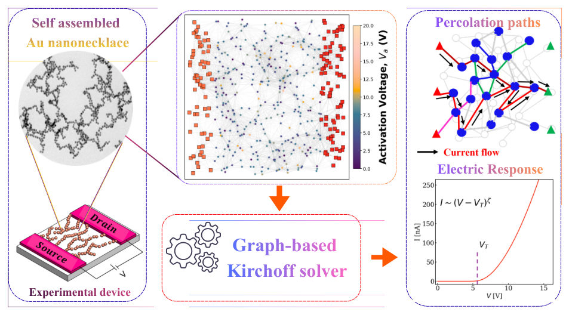
<figcaption class="paper-figure-caption"><b>Fig 1.</b> Figure 1: Overview of the graph-based Kirchhoff modeling framework. A self-assembled gold nanonecklace film deposited between source and drain electrodes (left) is viewed as a synthetic random geometric graph. Each nodes is a junction with an activation voltage Va (centre). At each applied bias, the graph-based Kirchhoff solver computes the current flowing between each pair of connected nodes, yielding the identified source-drain current flowing between each pair of connected nodes pathways and the resulting nonlinear I–V response, fitted to I ∼(V −VT)ζ with threshold voltage VT (right).</figcaption>
</figure>
<figure class="paper-figure-card">

<figcaption class="paper-figure-caption"><b>Fig 2.</b> Figure 2: Step-by-step operation of the graph-based Kirchhoff solver. (1) The synthetic graph, with nodes coloured by activation voltage Va. (2) At a given applied bias, only junctions with Va ≤V remain, forming the conducting subgraph. (3) Each active internal node is split into input and output sub-nodes joined by its node resistance Rnode. (4) The split-node network is assembled into the sparse conductance matrix G. (5) Solving Gφ = b gives the sub-node potentials φ. (6) The edge currents follow from the potential drops across the connecting edges, Iij = (φi −φj)/Redge,ij.</figcaption>
</figure>
<figure class="paper-figure-card">

<figcaption class="paper-figure-caption"><b>Fig 3.</b> Figure 3: Macroscopic I–V response and microscopic diagnostics of bias-driven junction activation. (a) Ensemble-averaged I–V response obtained from five independent network realizations at N = 500, ⟨Va⟩= 6 V, σa = 3 V, and fv = 0.00, showing the low-current blockade (Phase 1), the superlinear power-law onset (Phase 2), and the quasi-linear high-bias regime (Phase 3). (b) Activated-node count, (c) algebraic connectivity λ2 of the conducting subgraph, and (d) source-to-drain effective resistance. (e) Spatial snapshots of the conducting network at 1, 2, 6, and 14 V, with source (green) and drain (red) electrodes and activated (filled) versus inactive (faded) nodes.</figcaption>
</figure>
<figure class="paper-figure-card">
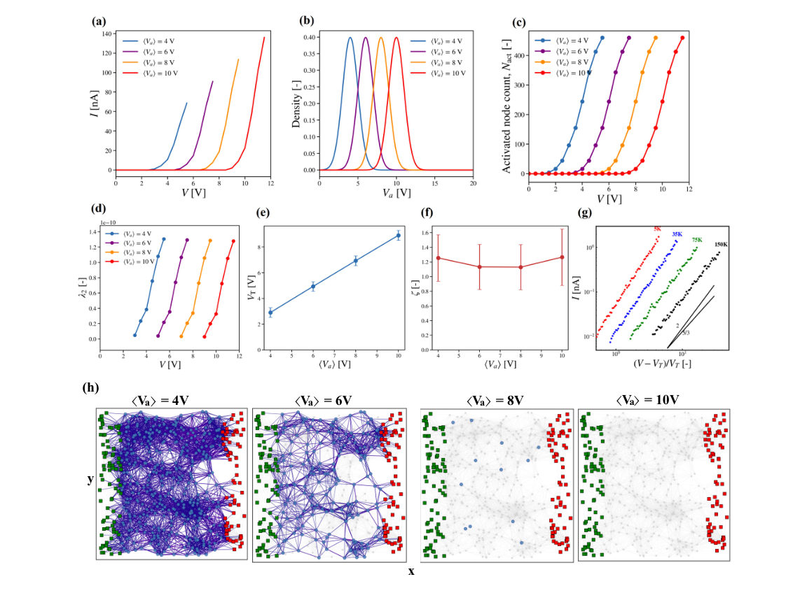
<figcaption class="paper-figure-caption"><b>Fig 4.</b> Figure 4: Mean-activation-voltage dependence of collective transport in nanonecklace net- works. (a) I–V characteristics for ⟨Va⟩= 4, 6, 8, and 10 V at fixed σa = 1 V. (b) Cor- responding activation-voltage distributions. (c) Activated-node population Nact vs. applied voltage. (d) Algebraic connectivity λ2 of the active subnetwork. (e) Threshold voltage VT vs. ⟨Va⟩. (f) Transport exponent ζ from power-law fits. (g) Experimental scaling collapse for self-assembled gold necklace networks, reproduced from Kane et al.13 (h) Active conducting subnetworks at fixed applied voltage for ⟨Va⟩= 4, 6, 8, and 10 V.</figcaption>
</figure>
<figure class="paper-figure-card">
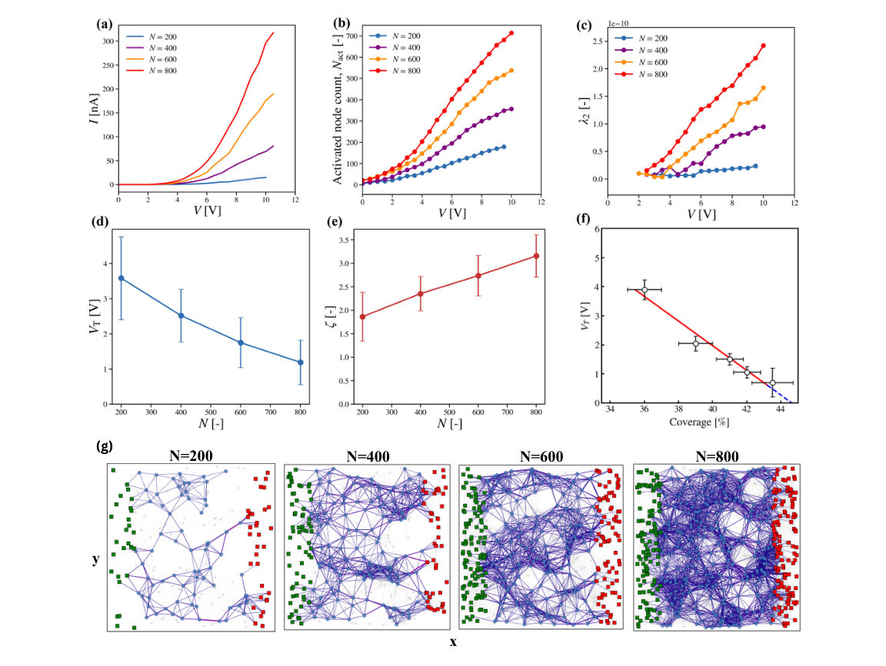
<figcaption class="paper-figure-caption"><b>Fig 5.</b> Figure 5: Network-density dependence of collective transport in nanonecklace networks. (a) I–V characteristics for N = 200, 400, 600, and 800 junctions at fixed ⟨Va⟩= 6 V, σa = 3 V. (b) Activated-node population vs. applied voltage. (c) Algebraic connectivity of the conducting subgraph. (d) Threshold voltage VT vs. N. (e) Transport exponent ζ vs. N. (f) Experimental threshold-voltage–coverage relationship, reproduced from Wilson et al.7</figcaption>
</figure>

**Summary.** This work develops a graph-based Kirchhoff model to simulate current flow in self-assembled nanonecklace networks exhibiting Coulomb blockade. By treating the network as a dynamic graph, the authors show that the macroscopic non-Ohmic transport behavior emerges from the collective activation of individual junctions. This establishes the framework as a powerful design tool for engineering electronic properties in disordered nanoscale devices.

**Why it may be interesting.** While focused on classical charge transport, the concept of percolation in disordered media, threshold switching, and emergent collective behavior is highly relevant to understanding quantum phase transitions or correlated electron dynamics in mesoscopic structures.

Detailed structure

**Main problem.** The study addresses the poorly understood mechanisms governing the macroscopic non-Ohmic current–voltage (I–V) response in self-assembled gold nanonecklace networks.

**Main result.** The model successfully reproduces the characteristic $I \propto (V - V_T)^\zeta$ power law, showing that this behavior arises from collective, staggered activation of threshold junctions and voltage-driven percolation.

**Method.** A graph-based Kirchhoff framework is developed to solve for potentials and currents across a network modeled as a geometric graph whose conductivity changes dynamically with applied bias.

**Model / system.** The system is a synthetic random geometric graph representing nanonecklace networks. Junctions have distance-dependent tunneling resistances, and nodes possess intrinsic resistance governed by an activation voltage threshold ($R_{n,i} \propto V_{a,i}$).

**Key observables.** Non-Ohmic I–V response ($I \propto (V - V_T)^\zeta$), active nodes, conducting subgraph evolution, nodal potentials, and edge currents.

**Important parameters / regimes.** Mean activation voltage ($\langle V_a 
angle$), variance of activation voltages ($\sigma_a$), network density/void fraction ($f_v$), and the applied bias $V$.

**Assumptions / limitations.** The node resistance is approximated as linearly proportional to the activation voltage for computational tractability, and the global bias is used as the primary activation criterion.

**Figures summary.** Figures illustrate the step-by-step solver process (graph formation, subgraph selection, matrix solving) and show how varying structural parameters ($\sigma_a$, $f_v$) controls the exponent $\zeta$ and threshold voltage $V_T$.

**Paper structure.** The paper introduces the physical problem, details the graph-based Kirchhoff methodology for solving bias-dependent conduction, presents results showing parameter control over transport exponents, and concludes by establishing the model as a design tool.

Abstract

Gold nanonecklace networks are promising platforms for single-electron switching, chemical sensing, and biogating devices because of their nonlinear current--voltage ($I$--$V$) characteristics arising from collective Coulomb-blockade transport. However, the mechanisms governing this macroscopic behavior remain poorly understood because experimental measurements are generally limited to the network topology and global $I$--$V$ response. To address this, we developed a graph-based Kirchhoff framework that represents a self-assembled nanonecklace network as a graph, with nodes corresponding to junctions between necklace segments and edges to the conducting segments themselves. The solver returns the active nodes, conducting subgraph, nodal potentials, and edge currents at each applied bias, while allowing the activation-voltage statistics, network density, and structural topology to be varied independently. The model reproduces the experimentally observed non-Ohmic response, $I \propto (V-V_T)^ζ$, and shows that this behavior emerges from the collective, staggered activation of threshold junctions and voltage-driven percolation of the conducting subgraph. Independent parameter sweeps reveal that the mean activation voltage shifts the threshold $V_T$ while leaving $ζ$ nearly unchanged, increasing network density raises $ζ$ from approximately 1.9 to 3.1 and enhances current, and topology controls the response even at fixed density and node characteristics. These trends agree qualitatively with experimental observations and establish the model as a design tool for engineering collective transport in self-assembled nanonecklace devices.

[↑ back to top](#top)

### [Semiconductor nanofilms as thermal phonon polarizers: competing effects of scattering selection rules and boundary mode conversion](http://arxiv.org/abs/2607.05296v1)

**Authors:** Vasumathy Ravishankar, Navaneetha K. Ravichandran  
**Type:** theory · **Category:** statistical mechanics · **PDF:** <https://arxiv.org/pdf/2607.05296v1>  
**Analysis basis:** full PDF text, analyzed in chunks
**Topic relevance:** `non-equilibrium dynamics` **3/5** · `non-equilibrium universality` **2/5** · `Keldysh / 2PI / non-Gaussian methods` **1/5** · `correlated / nonlocal dissipation` **1/5** · `driven-dissipative phase transition` **1/5** · `methods for driven-dissipative` **1/5**

↔ Scroll figures horizontally

<figure class="paper-figure-card">
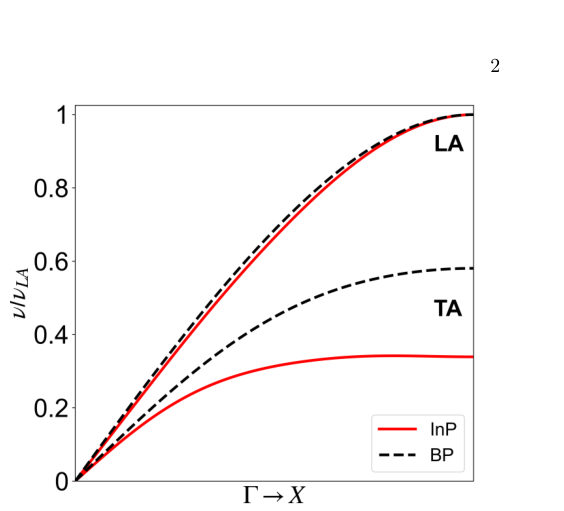
<figcaption class="paper-figure-caption"><b>Fig 1.</b> FIG. 1. Acoustic phonon dispersions of InP and BP along the Γ →X high symmetry direction. The phonon dispersions along other high-symmetry directions for these materials are shown in Supplementary Figs. S1(a)-(b). LA and TA phonon dispersions are farther apart in InP than in BP, thus activat- ing the AAA # 2 selection rule in InP [2].</figcaption>
</figure>
<figure class="paper-figure-card">
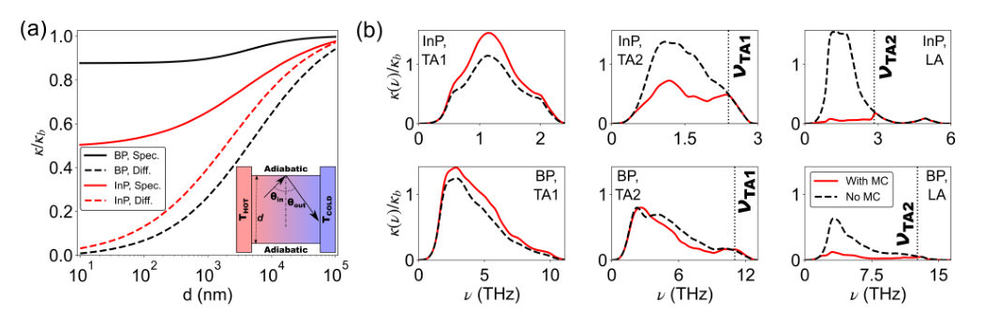
<figcaption class="paper-figure-caption"><b>Fig 2.</b> FIG. 2. Effect of mode conversion on the κ of BP and InP thin films at 100 K. (a) Thin film κ of BP and InP vs. thickness (d) normalized by the corresponding bulk values (κb) at 100 K. The inset shows the simulation geometry, and the incidence (θin) and the reflection (θout) angles for a phonon undergoing mode conversion at the thin film boundary. For specular reflection without mode conversion, the κ’s of thin films are equal to κb, independent of d [20]. When mode conversion is allowed, the predicted κ’s for specular reflections decrease faster with d in InP than in BP. For diffuse reflections, the predicted κ (d)’s remain the same with or without mode conversion in both materials, hence...</figcaption>
</figure>
<figure class="paper-figure-card">
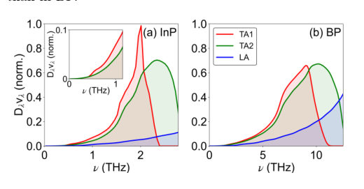
<figcaption class="paper-figure-caption"><b>Fig 3.</b> FIG. 3. The normalized material factor Dλvλ of the mode conversion probabilities in InP (a) and BP (b). The x-axis is truncated at the maximum ν of the TA2 branch, beyond which mode conversion does not occur for the LA phonons [Fig. 2 (b)], since DTA1 λ = DTA2 λ = 0. In both materials, Dλvλ is much larger for the TA phonons than for the LA phonons, with the contrast being greater for InP than BP, due to the large velocity differences of the phonon polarizations in the former.</figcaption>
</figure>
<figure class="paper-figure-card">
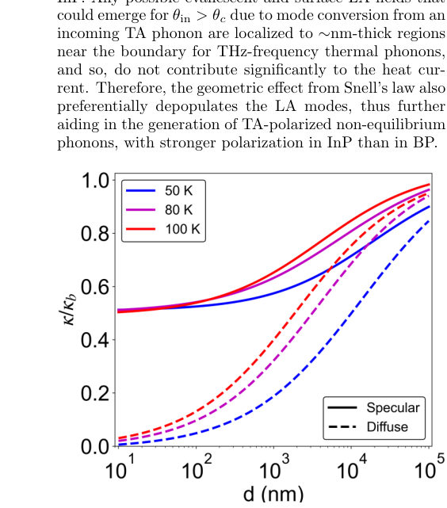
<figcaption class="paper-figure-caption"><b>Fig 4.</b> FIG. 4. Thickness-dependent κ of InP films at different cryo- genic temperatures scaled by κb. When phonons undergo specular reflections with mode conversion, κ/κb saturates at larger d as T is lowered, due to the longer phonon MFPs at lower T. For diffuse reflections, mode conversion has no effect on κ (d) /κb.</figcaption>
</figure>

**Summary.** This work theoretically examines heat conduction in semiconductor nanofilms by analyzing the competition between intrinsic phonon scattering selection rules and boundary mode conversion. Using first-principles calculations, the authors show that mode conversion significantly suppresses the dominant LA phonon contribution in materials like InP at low temperatures. This effect allows for symmetry-selective engineering of thermal transport properties unattainable in bulk solids.

**Why it may be interesting.** While focused on phonons, the concept of non-equilibrium energy transport and symmetry-selective coupling (e.g., electron-phonon interaction) is highly relevant to open quantum systems and thermalization studies in nanoscale devices.

Detailed structure

**Main problem.** The paper investigates how phonon scattering selection rules compete with boundary mode conversion effects to modulate heat flow in nanoscale semiconductor films.

**Main result.** Mode conversion strongly suppresses the large intrinsic LA phonon contribution to thermal conductivity ($\kappa$) in InP nanofilms, leading to a heat current dominated by out-of-equilibrium TA modes.

**Method.** The study uses first-principles calculations solving the steady-state Peierls-Boltzmann equation (SSPBE) under the Relaxation Time Approximation (RTA).

**Model / system.** The system involves semiconductor nanofilms, specifically InP and BP, at cryogenic temperatures. The physics models phonon transport governed by intrinsic scattering rules versus extrinsic boundary reflections.

**Key observables.** Phonon mode-polarized heat currents and the thermal conductivity ($\kappa$) dependence on film thickness ($d$).

**Important parameters / regimes.** Cryogenic temperatures ($\le 100$ K); nanoscale dimensions; phonon branch velocities (LA vs. TA).

**Assumptions / limitations.** The analysis assumes that boundary reflection with mode conversion dominates over intrinsic scattering at sufficiently small thicknesses, and the RTA is sufficient for the studied materials.

**Figures summary.** Figures compare $\kappa$ vs. thickness for BP and InP, showing suppression due to diffuse scattering and faster decay in InP when mode conversion occurs; spectral contributions are also analyzed.

**Paper structure.** The paper builds from established knowledge of phonon selection rules in bulk solids to analyze the competition between these rules and boundary mode conversion effects in thin films using advanced computational methods.

Abstract

Phonon scattering selection rules are known to control heat flow through bulk solids. Here we show that these selection rules also modulate heat flow through nanoscale semiconductor films, although through a previously-unexplored mechanism. Using first-principles calculations, we expose a competition between these selection rules and phonon mode conversion at boundaries of nanoscale films, that drives mode-polarized heat currents at cryogenic temperatures ($\le$ 100 K). This polarizing effect is stronger in materials like indium phosphide, where selection rules based on large velocity differences between phonon branches amplifies the longitudinal acoustic (LA) phonon contribution to thermal conductivity by restricting their intrinsic scattering events, while boundary mode conversion in nanoscale films suppresses it by depopulating the LA phonons. The resulting transverse-polarized non-equilibrium phonons will enable symmetry-selective engineering of phonon coupling to electrons, strains and defects in nanoscale films, that is difficult to achieve in bulk solids.

[↑ back to top](#top)

### [Local Defects and the Topology of the Haldane Model](http://arxiv.org/abs/2607.04771v1)

**Authors:** Vishesh Makwana, Eric Akkermans  
**Type:** theory · **Category:** other · **PDF:** <https://arxiv.org/pdf/2607.04771v1>  
**Analysis basis:** full PDF text, analyzed in chunks
**Topic relevance:** `analog quantum simulation` **3/5** · `driven-dissipative phase transition` **2/5** · `Kondo & dissipative impurity` **1/5** · `exotic spin models in light-matter` **1/5** · `non-equilibrium dynamics` **1/5**

↔ Scroll figures horizontally

<figure class="paper-figure-card">
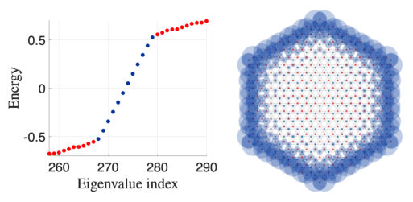
<figcaption class="paper-figure-caption"><b>Fig 1.</b> FIG. 2. Clean Haldane model (t1 = 1, t2 = 0.1, ϕ = π/2). Left: energy spectrum showing edge states (blue) inside the bulk gap and bulk modes (red) outside. Right: spatial prob- ability density |ψ|2 of a representative edge state (highlighted blue in the spectrum), confirming localization along the sys- tem boundary.</figcaption>
</figure>
<figure class="paper-figure-card">
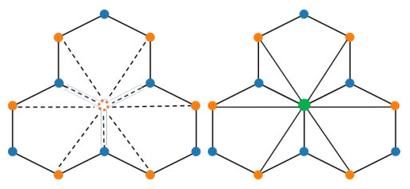
<figcaption class="paper-figure-caption"><b>Fig 2.</b> FIG. 3. Point defects in the Haldane model. Left: a vacancy is created by removing a lattice site along with all its hopping bonds (dotted lines). Right: an adatom is introduced as an on-site potential at a lattice site (green).</figcaption>
</figure>
<figure class="paper-figure-card">
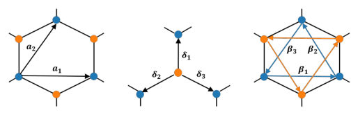
<figcaption class="paper-figure-caption"><b>Fig 3.</b> FIG. 1. Lattice vectors of the honeycomb lattice. Left: prim- itive lattice vectors a1,2. Center: nearest-neighbor vectors δ1,2,3. Right: next-nearest-neighbor vectors β1,2,3.</figcaption>
</figure>
<figure class="paper-figure-card">
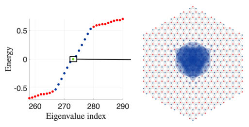
<figcaption class="paper-figure-caption"><b>Fig 4.</b> FIG. 4. Haldane model with a single vacancy (ν = 1). Left: energy spectrum showing a zero-energy defect mode (green), chiral edge states (blue), and bulk modes (red). Right: spatial probability density |ψ|2 of the zero mode, demonstrating lo- calization at the vacancy site. The presence of bulk-topology edge states confirms that the bulk gap and Chern number are unaffected by the vacancy.</figcaption>
</figure>
<figure class="paper-figure-card">
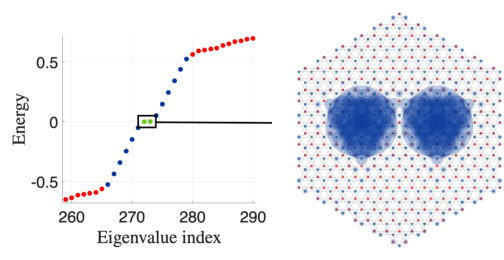
<figcaption class="paper-figure-caption"><b>Fig 5.</b> FIG. 5. Haldane model with two vacancies on the same sub- lattice (NA = 2, NB = 0, ν = 0). Left: energy spectrum showing two defect-induced modes (green) that hybridize and split symmetrically about zero energy, with edge states (blue) and bulk modes (red) also visible. The two modes are lifted from zero energy because the Z2 invariant ν = 0 provides no topological protection. Right: spatial probability density of one of the hybridized modes, showing localization around the two vacancy sites.</figcaption>
</figure>

**Summary.** This work analyzes how vacancies introduce localized topological structures into the Chern-insulating Haldane model. The key finding is that a $\mathbb{Z}_2$ invariant, determined by sublattice imbalance, dictates whether zero-energy modes exist at the defect site. This prediction is robustly confirmed through three independent physical measurements: wavefunction geometry, fractional charge accumulation, and current flow reversal.

**Why it may be interesting.** The rigorous demonstration of multiple, distinct physical signatures confirming a single mathematical invariant ($\mathbb{Z}_2$) provides a powerful general principle for characterizing topological defects in condensed matter systems, applicable beyond the specific Haldane model.

Detailed structure

**Main problem.** The paper investigates how local defects (vacancies) modify the topological properties of the Haldane model, specifically examining the interplay between bulk topology and defect-induced topology.

**Main result.** A $\mathbb{Z}_2$ invariant ($
u$) governs the presence of protected zero-energy modes at vacancies, which is confirmed by three independent experimental signatures: wavefunction dislocations, fractional charge accumulation, and opposite circulating probability currents.

**Method.** The analysis uses theoretical tools including the tenfold classification framework, Chern numbers ($C$), $\mathbb{Z}_2$ invariants ($
u$), and index theorems to derive relationships between bulk and defect topology.

**Model / system.** The system is the Haldane model on a honeycomb lattice, which realizes a Chern-insulating phase. Defects studied include vacancies (bond removal) and adatoms (potential addition).

**Key observables.** Chern number ($C=\pm 1$), $\mathbb{Z}_2$ defect invariant ($
u = C \cdot m \pmod 2$), zero-energy modes, fractional charge ($e/2$), and probability current direction.

**Important parameters / regimes.** Sublattice imbalance $m = N_A - N_B$, which dictates the value of $
u$.

**Assumptions / limitations.** The analysis relies on low-energy effective descriptions using Weyl symbols and assumes the applicability of topological invariants derived from the tenfold classification.

**Figures summary.** Figures illustrate the clean Haldane spectrum, the appearance of zero-energy modes for single vacancies ($
u=1$), mode splitting for two vacancies ($
u=0$), wavefunction dislocations tracking phase winding, and charge/current distributions confirming the $\mathbb{Z}_2$ prediction.

**Paper structure.** The paper establishes the bulk topology ($C$) and then introduces defects. It derives the coupling formula ($
u = C \cdot m \pmod 2$) and presents three complementary diagnostics (dislocations, fractional charge, current reversal) that all confirm this topological classification.

Abstract

We investigate the interplay between local defects and topology in the Haldane model within the framework of the tenfold classification. The Haldane model realizes a Chern-insulating phase characterized by an integer topological invariant ($C=\pm 1$) and supports chiral edge states. Introducing vacancies gives rise to localized states at the defect sites, classified by a $\mathbb{Z}_2$ invariant $ν= C\cdot m,\mathrm{mod},2$, where $m=N_A-N_B$ is the net sublattice imbalance of the vacancy configuration: an odd imbalance hosts a protected zero-energy mode, whereas an even imbalance does not. We identify three independent experimental signatures that distinguish these topological defect states from trivial (adatom) defects. First, vacancy-induced states exhibit characteristic dislocations in their wavefunction profiles that track the phase winding associated with the defect. Second, a fractional charge of $e/2$ accumulates at vacancy sites, while no such charge appears at adatoms. Third, the probability current circulating around a vacancy-induced state flows in the opposite direction to that of chiral edge states, in direct analogy with the current reversal produced by a vortex in a $p$-wave superconductor. All three signatures are in quantitative agreement with the $\mathbb{Z}_2$ prediction.

[↑ back to top](#top)

### [Hybrid-order nonlinear topological phases](http://arxiv.org/abs/2607.03678v1)

**Authors:** Yu-Peng Ma, Ming-Jian Gao, Jun-Hong An  
**Type:** theory · **Category:** other · **PDF:** <https://arxiv.org/pdf/2607.03678v1>  
**Analysis basis:** full PDF text, analyzed in chunks
**Topic relevance:** `analog quantum simulation` **3/5** · `driven-dissipative phase transition` **2/5** · `Frenkel-Kontorova` **1/5** · `Keldysh / 2PI / non-Gaussian methods` **1/5**

↔ Scroll figures horizontally

<figure class="paper-figure-card">

<figcaption class="paper-figure-caption"><b>Fig 1.</b> FIG. 1. Hybrid-order topological phase in a nonlinear- eigenvalue system. Eigenvalue spectra (a) under the OBC to show the coexisting first-order boundary states at ω = 0 and second-order corner states at ω = −M −1 and (b) under the OBC along the x-axis and the PBC along the y-axis to confirm the presence of double-degenerate boundary modes at ω = 0. The colored points denote the IPR of the eigenstates with real eigenvalues. The gray points denote the real part of complex eigenvalues. Probability distributions of (c) the first-order boundary state at ω = 0 and (d) the second-order corner state at ω = −M −1. We use M = −0.5v−1, w = 0.5v, m = 1.5v, r = v, and nx = ny = 50.</figcaption>
</figure>
<figure class="paper-figure-card">
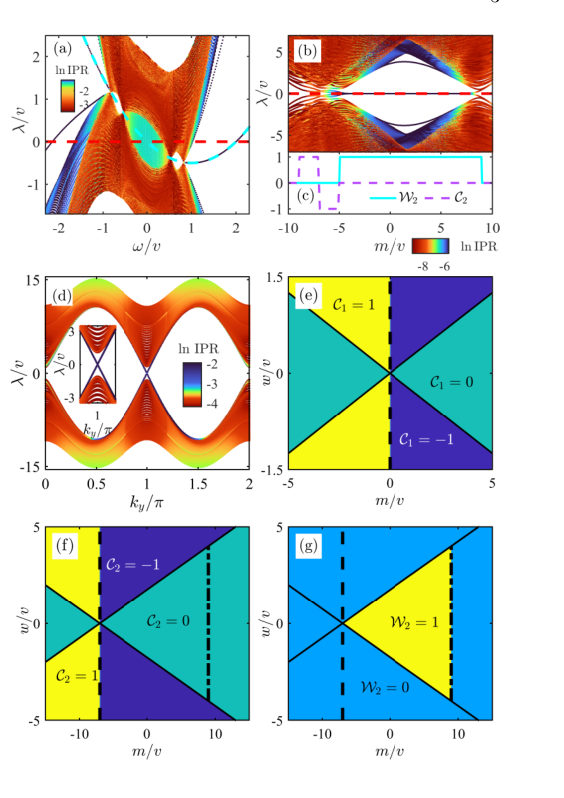
<figcaption class="paper-figure-caption"><b>Fig 2.</b> FIG. 2. Spectrum and topological invariants of the auxiliary system. (a) Eigenvalues of P(k, ω) in different ω when m = 1.5v. The red dashed line indicates λ = 0, whose intersections with the spectrum reproduce the real-ω spectrum in Fig. 1(a). The cyan dashed line denotes p0(ω), which equals to zero just at ω⋆= 0 and −M −1. (b) Eigenvalues and (c) Chern number C2 and mirror-graded winding number W2 of P(k, −M −1) in different m. (d) Eigenvalues of the auxiliary system in the strip geometry when m = −6v to confirm the presence of first-order boundary states at λ = 0. Diagrams of the first- order topological phases characterized by (e) C1 at ω⋆= 0 and (f) C2 at ω⋆= −M −1, and (g) the...</figcaption>
</figure>
<figure class="paper-figure-card">

<figcaption class="paper-figure-caption"><b>Fig 3.</b> Figure 2(a) shows the λ spectrum of the auxiliary sys- tem colored by IPR under the OBC in both the x and y directions. Highly localized states intersect with λ = 0</figcaption>
</figure>
<figure class="paper-figure-card">
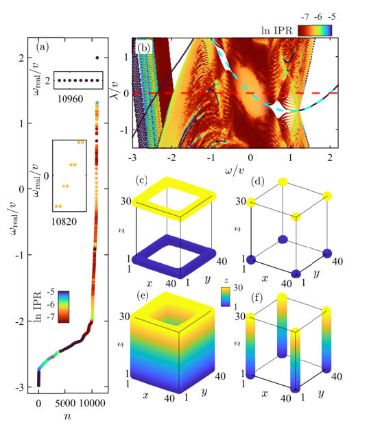
<figcaption class="paper-figure-caption"><b>Fig 4.</b> FIG. 3. Three-dimensional nonlinear hybrid-order topologi- cal phase. (a) Real nonlinear eigenvalue spectrum under full OBCs. The color determined by ln IPR. The insets show the localized states near ω = −M −1 and ω = 0. (b) Auxiliary spectrum of P3D(k, ω). The red dashed line marks λ = 0, the cyan dashed line shows p0(ω). (c) and (d) is hinge state at ω = 0 and eight corner states at ω = −M −1. We take t1 = 1 and t2 = 15. For (e) and (f), we take t1 = t2 = 1. The state at ω = 0 is a side-surface state at (e), while the state at ω = −M −1 is a hinge state at (f). The (c-f) are colored by z.</figcaption>
</figure>

**Summary.** The paper tackles the challenge of applying bulk-boundary correspondence to complex nonlinear eigenvalue problems. By developing an auxiliary system formalism, it successfully classifies these systems and demonstrates how stacking a 2D model into 3D allows for the engineering of exotic hybrid-order topological phases (first-, second-, and third-order). This highlights stacking as a powerful tool for exploring nonlinearity in topology.

**Why it may be interesting.** This work directly addresses the generalization of topological concepts (like BBC) from linear to nonlinear systems, which is a major frontier in condensed matter theory relevant to engineered quantum/photonic structures.

Detailed structure

**Main problem.** The bulk-boundary correspondence (BBC) is poorly understood for nonlinear systems, especially those with multigap topologies, making topological description difficult.

**Main result.** The study establishes a multiband bulk-boundary correspondence and identifies stacking engineering as a versatile platform for realizing hybrid-order topological phases in nonlinear systems.

**Method.** An auxiliary-system formalism is developed to map the nonlinear eigenvalue problem into a formally linear pencil matrix, allowing topological classification via spectral analysis.

**Model / system.** The work analyzes a 2D spinless square-lattice model with two degrees of freedom per unit cell. This system is extended to 3D by stacking along the z-axis using SSH chain concepts.

**Key observables.** Topological invariants include Chern number ($C_1$) and mirror-graded winding number ($W_2$). State localization is diagnosed using the Inverse Participation Ratio (IPR).

**Important parameters / regimes.** Stacking parameters, such as those governing uniform vs. dimerized stacking, dictate the resulting order of the topological phase (first-, second-, or third-order).

**Assumptions / limitations.** The method relies on mapping the nonlinear problem to a formally linear auxiliary system; it extends previous work limited to single-gap topologies.

**Figures summary.** Figure 1 illustrates the eigenvalue spectra under OBC and PBC, demonstrating the coexistence of first-order boundary states ($\omega=0$) and second-order corner states ($\omega=-M^{-1}$).

**Paper structure.** The paper progresses from establishing the auxiliary system formalism for nonlinear BBC in 2D to analyzing how stacking this 2D structure into 3D yields distinct hybrid-order phases (e.g., uniform vs. dimerized stacking).

Abstract

The bulk-boundary correspondence (BBC), which relates topological invariants to boundary modes, is well understood for linear systems but remains an open question in the presence of nonlinearity, where multigap topologies make the BBC obscure and the topological description troublesome. We address this by developing an auxiliary-system formalism that enables topological classification of nonlinear-eigenvalue systems. In the two-dimension (2D) case, we show that two fixed eigenvalues can harbor first-order gapless boundary modes and second-order corner modes. Stacking this 2D system along the third dimension (3D) reveals distinct hybrid-order realizations. Under uniform stacking, the corner states in the $xy$ plane transform into hinge states along the $z$ axis, yielding a 3D second-order phase, while the gapless boundary states become side-surface states, yielding a 3D first-order phase. For dimerized stacking, these states are further confined to the two ends of the $z$ axis, yielding a 3D third-order phase, and localized at the hinges, yielding a 3D second-order phase. Our results establish a multiband bulk-boundary correspondence and identify stacking engineering as a versatile platform for exploring hybrid-order topological phases in nonlinear systems.

[↑ back to top](#top)

### [Phase-Factor-Controlled Interaction and Bonding between a Chiral Bobber and a Skyrmion String in the Conical Phase](http://arxiv.org/abs/2607.04266v1)

**Authors:** Haijun Zhao, Tingting Yan, Shuai Dong  
**Type:** theory · **Category:** other · **PDF:** <https://arxiv.org/pdf/2607.04266v1>  
**Analysis basis:** full PDF text, analyzed in chunks
**Topic relevance:** `exotic spin models in light-matter` **3/5** · `spintronics-quantum-optics interface` **3/5** · `driven-dissipative phase transition` **1/5**

↔ Scroll figures horizontally

<figure class="paper-figure-card">
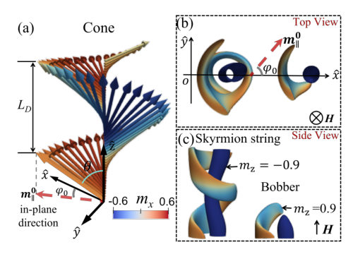
<figcaption class="paper-figure-caption"><b>Fig 1.</b> FIG. 1. Basic spin textures in the conical background. (a) Schematic illustration of the conical phase, whose surface phase factor ϕ0 selects a local in-plane reference direction. (b,c) Top and side views of an isolated skyrmion string and a chiral bobber embedded in the conical phase. The bobber has a length of approximately LD/2 and is localized near the bottom surface. The blue isosurfaces show mz = −0.9 and visualize the down-magnetized cores of the skyrmion string and the bobber, while the colored isosurfaces show mz = 0.9. The colors of the arrows in (a) and of the isosurfaces in (b,c) represent mx, indicating the in-plane orientation of the local magnetization.</figcaption>
</figure>
<figure class="paper-figure-card">

<figcaption class="paper-figure-caption"><b>Fig 2.</b> FIG. 2. Phase-factor-dependent bobber–skyrmion interaction landscape. (a) Contour map of the relative energy ∆E(R, ϕ0) in the separation–phase-factor plane. Only the range 0.58LD ≤R ≤2LD is shown in order to avoid the strongly repulsive short-distance region. (b) Polar representation of the same energy landscape, where the radial coordinate is R/LD and the polar angle is the conical phase factor ϕ0. (c–e) Representative one-dimensional energy cuts at fixed ϕ0, whose positions are marked in (a). (c) Consecutive cuts for ϕ0 = 50.7◦–84.4◦, showing abrupt branch switching into lower-energy states. The critical separation shifts to larger R and the jump magnitude decreases as ϕ0 increases. (d)...</figcaption>
</figure>
<figure class="paper-figure-card">

<figcaption class="paper-figure-caption"><b>Fig 3.</b> FIG. 3. Bonding transition and real-space shell reconstruction. (a) Representative bonding-sector energy cuts, with two configurations marked before and after an abrupt jump. (b,c) Corresponding 3D spin configurations. (d) Phase-shifted bonding sector with jumps around R ≃1.6LD. (e,f) Configurations before and after the jump marked in (d). The blue tubes show the mz = −0.5 core isosurfaces, and the colored mz = 0.8 isosurfaces, colored by mx, show the outer distortion shell. In (b,c), the jump forms a bridge-like connection between the upper skyrmion-string shell and the lower bobber–string composite distortion. In (e,f), the bridge-like connection forms mainly within the skyrmion-string...</figcaption>
</figure>
<figure class="paper-figure-card">

<figcaption class="paper-figure-caption"><b>Fig 4.</b> FIG. 4. Path-dependent relaxation across a representative bonding transition at ϕ0 = 50.6◦and H = 0.45HD, corre- sponding to the cut highlighted in Fig. 3(a). The relative energy ∆E is shown for the direct-relaxation method, the ap- proaching scan, and the separating scan, with arrows indicat- ing the scan directions. The different paths reveal hysteresis- like branch dependence and support the coexistence of un- bonded and bonded locally relaxed states.</figcaption>
</figure>
<figure class="paper-figure-card">
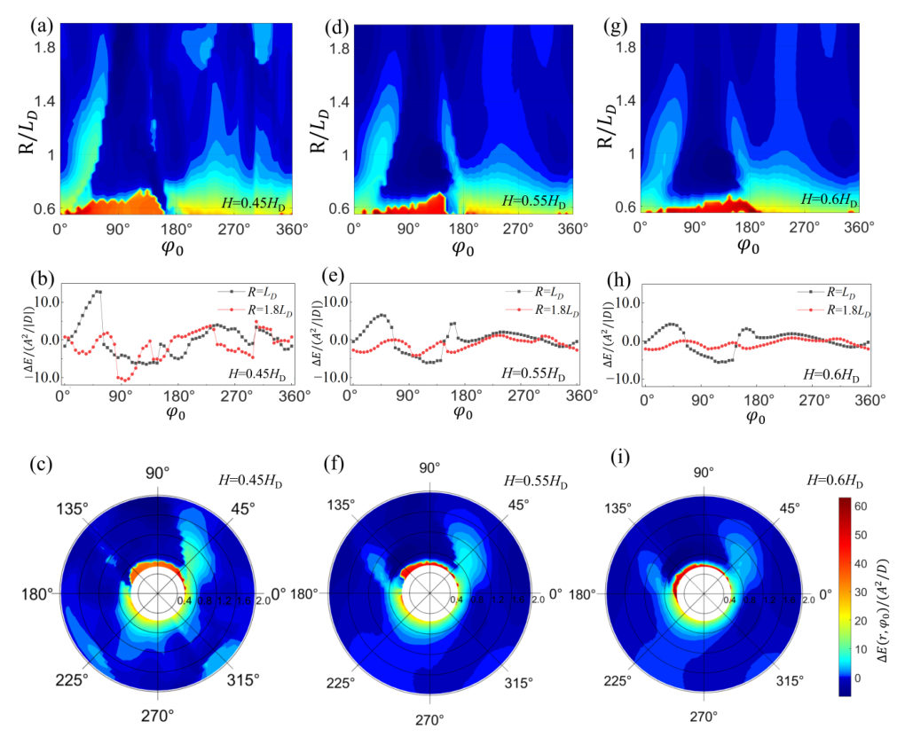
<figcaption class="paper-figure-caption"><b>Fig 5.</b> FIG. 5. Field dependence of the phase-factor-dependent bobber–skyrmion interaction landscape. The three columns cor- respond to H = 0.45HD, 0.55HD, and 0.60HD, respectively. (a,d,g) Contour maps of the relative energy ∆E(R, ϕ0) in the separation–phase-factor plane. (b,e,h) Angular energy profiles at two representative separations, R = LD and R = 1.8LD. (c,f,i) Polar representations of the corresponding energy landscapes, where the radial coordinate is R/LD and the polar angle is ϕ0. Increasing magnetic field suppresses the angular modulation and weakens the bonding sectors.</figcaption>
</figure>

**Summary.** This work analyzes the interaction between chiral bobbers and skyrmion strings in magnetically ordered systems exhibiting a conical phase. Using micromagnetic simulations, the authors demonstrate that this interaction is not merely distance-dependent but is fundamentally controlled by the local surface phase factor ($\phi_0$). This phase control leads to complex energy landscapes featuring distinct bonding regimes arising from structural shell reconstruction.

**Why it may be interesting.** The concept of phase-dependent control over magnetic interactions, where a geometric/topological parameter ($\phi_0$) dictates bonding strength rather than simple geometry ($R$), is highly relevant to understanding controlled spin dynamics in advanced spintronic devices and topological materials.

Detailed structure

**Main problem.** The study investigates the interaction between a chiral bobber and a skyrmion string, focusing on how this interaction is intrinsically controlled by the local surface phase factor ($\phi_0$) within the conical magnetic phase.

**Main result.** The interaction energy landscape cannot be described by a simple distance-dependent potential; instead, it exhibits distinct regimes (repulsive, attractive, bonding) governed by $\phi_0$ due to phase-dependent reconstruction of outer distortion shells.

**Method.** Three-dimensional micromagnetic simulations were employed to compute the constrained energy landscape as a function of separation ($R$) and surface phase factor ($\phi_0$).

**Model / system.** The system models magnetic materials exhibiting bulk Dzyaloshinskii–Moriya interaction (DMI), supporting 3D topological spin textures like skyrmion strings and chiral bobbers in the conical phase.

**Key observables.** Interaction energy landscape $\Delta E(R, \phi_0)$, effective radial force $F_R$, and structural reconstruction of outer distortion shells.

**Important parameters / regimes.** Separation distance ($R$), surface phase factor ($\phi_0$), magnetic field strength ($H$), and the conical background direction.

**Assumptions / limitations.** Dipolar interactions are excluded from the minimal energy functional to isolate the core mechanism; the analysis assumes that structural reconstruction drives the bonding transitions.

**Figures summary.** Figures illustrate contour maps of $\Delta E(R, \phi_0)$, showing distinct regimes based on $\phi_0$; real-space visualizations demonstrate shell reconstruction during bonding; and comparisons show relationships between top/bottom surface interactions via phase mapping.

**Paper structure.** The paper establishes the physical problem, details the micromagnetic simulation setup using a minimal energy functional, presents the analysis of fixed-$\phi_0$ energy cuts classifying three regimes (M, NM, Bonding), and concludes by discussing the implications of $\phi_0$ as an active degree of freedom.

Abstract

Skyrmion interactions govern the formation of skyrmion lattices, clusters, and particle-like growth patterns. In contrast, the interaction between a chiral bobber and a skyrmion string remains largely unexplored, despite the role of bobbers as intermediate states in skyrmion-string formation and annihilation. Here we show that this interaction is intrinsically phase dependent in the conical phase. Using three-dimensional micromagnetic simulations, we compute the locally relaxed constrained energy landscape as a function of the bobber--skyrmion separation $R$ and the surface phase factor $φ_0$. We find that changing $φ_0$ qualitatively reshapes the interaction, producing repulsive, attractive, and bonding-like regimes that cannot be reduced to a conventional distance-dependent potential. Real-space analysis shows that this behavior originates from phase-dependent reconstruction of nonaxisymmetric outer distortion shells. The phase-controlled interaction persists over a finite field range and follows the expected top--bottom phase relation of surface-sensitive conical textures. These results identify the conical phase direction, often hidden in projected or thickness-averaged descriptions, as a previously underappreciated degree of freedom in the interaction between skyrmion strings and finite-length chiral textures, as demonstrated here for chiral bobbers.

[↑ back to top](#top)

### [Josephson effects in the spin-triplet superconductor/altermagnet/spin-triplet superconductor junctions: the detection of the intrinsic $\bf{d}$-vector](http://arxiv.org/abs/2607.03685v1)

**Authors:** Ya-Ting Han, Li-Juan Chen, Wen-Ting Liu, Qiang Cheng, Qing-Feng Sun  
**Type:** theory · **Category:** other · **PDF:** <https://arxiv.org/pdf/2607.03685v1>  
**Analysis basis:** full PDF text, analyzed in chunks
**Topic relevance:** `spintronics-quantum-optics interface` **3/5** · `Keldysh / 2PI / non-Gaussian methods` **1/5**

↔ Scroll figures horizontally

<figure class="paper-figure-card">
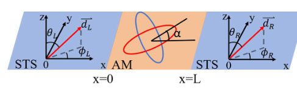
<figcaption class="paper-figure-caption"><b>Fig 1.</b> FIG. 1: Schematic diagram of the STS/AM/STS Josephson junctions. The red arrow in the left (right) STS denotes the vector dL(R). Its direction is characterized by the polar an- gle θL(R) and the azimuthal angle φL(R). The red and blue ellipses represent the Fermi surface in AM. The former is oc- cupied by the spin-down electrons while the latter is occupied by the spin-up electrons. The orientation of AM is defined as the angle α between the major axis of the red ellipse and the interface normal.</figcaption>
</figure>
<figure class="paper-figure-card">

<figcaption class="paper-figure-caption"><b>Fig 2.</b> FIG. 2: Schematic illustration of the two-dimensional square lattice model for the discretization of the STS/AM/STS Josephson junctions.</figcaption>
</figure>
<figure class="paper-figure-card">

<figcaption class="paper-figure-caption"><b>Fig 3.</b> FIG. 3: The CPRS for different polar angles with (a) α=0.0π, (b) α=0.125π and (c) α=0.25π. The strength of altermagnetism is taken as tJ = 0.5. The black, red, and blue solid lines correspond to θ = 0, 0.3π, and 0.5π, respectively.</figcaption>
</figure>
<figure class="paper-figure-card">
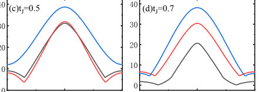
<figcaption class="paper-figure-caption"><b>Fig 4.</b> FIG. 4: The critical current as a function of the polar angle of the d-vector for different orientation angles with (a) tJ = 0.1, (b) tJ = 0.3, (c) tJ = 0.5 and (d) tJ = 0.7. The black, red, and blue solid lines correspond to θ = 0, 0.3π, and 0.5π, respectively.</figcaption>
</figure>
<figure class="paper-figure-card">

<figcaption class="paper-figure-caption"><b>Fig 5.</b> FIG. 5: The critical current as a function of the orientation angle α of AM for different polar angles with (a) tJ = 0.1, (b) tJ = 0.3 (c) tJ = 0.5 and (d) tJ = 0.7. The black, red, and blue solid lines correspond to θ = 0, 0.3π, and 0.5π, respectively.</figcaption>
</figure>

**Summary.** This theoretical study investigates Josephson junctions formed by spin-triplet superconductors coupled via an altermagnetic material. By calculating the junction's critical current and current-phase relation using Green's functions, the authors demonstrate that these effects are highly sensitive to the direction of the superconductor's d-vector. This provides a promising, non-destructive method for characterizing intrinsic superconducting pairing symmetries.

**Why it may be interesting.** This work connects unconventional superconductivity (spin-triplet pairing) with emergent magnetism (altermagnetism). The sensitivity of Josephson coupling to microscopic magnetic structure provides a novel, potentially field-free diagnostic tool for fundamental superconducting properties.

Detailed structure

**Main problem.** The primary goal is to develop a method for detecting the intrinsic direction of the d-vector in spin-triplet superconductors (STS). This is achieved by studying Josephson junctions formed between STS and altermagnets (AM).

**Main result.** The Josephson current-phase relationships are highly sensitive to the relative orientation of the superconducting d-vectors and the AM magnetization angle, allowing for a robust detection scheme.

**Method.** The study employs the Green's function method applied to the Bogoliubov-de Gennes (BdG) Hamiltonian formalism to calculate the Josephson current across the junction.

**Model / system.** The model consists of an STS/Altermagnet/STS junction, analyzed using a total Hamiltonian composed of three parts. The AM is advantageous because it possesses zero net macroscopic magnetization while still inducing spin-dependent couplings.

**Key observables.** Josephson critical current ($I_c$) and the Current-Phase Relationship (CPR) as functions of superconducting phase difference ($\phi$), d-vector polar angle ($	heta$), and AM orientation angle ($\alpha$).

**Important parameters / regimes.** The key variables include the direction of the $\mathbf{d}$-vectors, the altermagnet orientation angle ($\alpha$), and the strength of magnetic coupling ($t_F$ in comparison to ferromagnets).

**Assumptions / limitations.** The analysis assumes a lattice model for the junction structure and relies on the Green's function formalism for current calculation.

**Figures summary.** Figures schematically illustrate the junction setup, showing $\mathbf{d}$-vector directions relative to the AM Fermi surface. They plot CPRs versus angles and show $I_c$ dependence on these same angular parameters.

**Paper structure.** The paper develops the theoretical framework by defining the Hamiltonian for the three components (STS/AM/STS). It then calculates the Josephson current using Green's functions, deriving symmetries and analyzing how the resulting CPRs and critical currents depend systematically on the relative orientations of the superconducting order parameter and the magnetic substrate.

Abstract

We study the Josephson effects in the spin-triplet superconductor/altermagnet/spin-triplet superconductor junctions using the Green's function method. It is found that the current-phase difference relationships in the junctions strongly depend on the direction of the $\bf{d}$-vectors in the spin-triplet superconductors and the orientation angle of the altermagnet. For the given orientation angle, the $0$-$π$ transition can be obtained when the $\bf{d}$-vector is rotated. The variations of the critical current of the junctions with the direction of the $\bf{d}$-vector, the orientation angle and the strength of altermagnetism are systematically investigated. These Josephson effects can provide the distinguishable information about the direction of the $\bf{d}$-vector. Compared to the existing research, the proposed altermagnetic Josephson junctions can effectively avoid the negative influence of the magnetic field on the $\bf{d}$-vector and can serve as a feasible scheme for the detection of the intrinsic $\bf{d}$-vector. The obtained $0$-$π$ transition in the junctions can also have potential applications in the design of quantum devices.

[↑ back to top](#top)

### [Observation of Non-linear hall effect in Polycrystalline magnetic multilayes](http://arxiv.org/abs/2607.04754v1)

**Authors:** Preet Kamal, Chirag kalouni, Amiya Mondal, Awadesh Narayan, Debangsu Roy  
**Type:** both · **Category:** other · **PDF:** <https://arxiv.org/pdf/2607.04754v1>  
**Analysis basis:** full PDF text, analyzed in chunks
**Topic relevance:** `spintronics-quantum-optics interface` **3/5** · `non-equilibrium dynamics` **1/5**

↔ Scroll figures horizontally

<figure class="paper-figure-card">
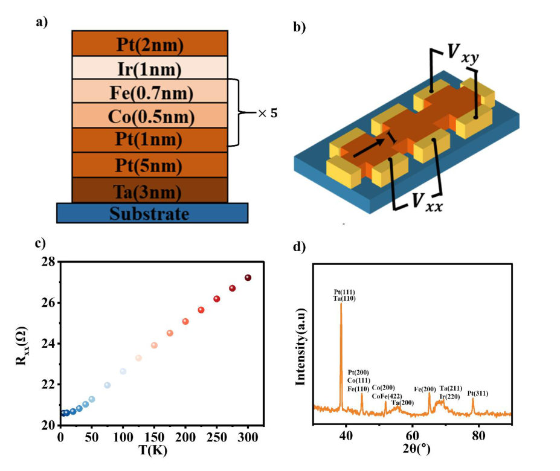
<figcaption class="paper-figure-caption"><b>Fig 1.</b> FIG. 1. Basic characterization of the Ta(3 nm)/Pt(5 nm)/[Ir/Fe/Co/Pt]₅/Pt(2 nm) multilayer device.</figcaption>
</figure>
<figure class="paper-figure-card">

<figcaption class="paper-figure-caption"><b>Fig 2.</b> FIG. 2. (a) Anomalous Hall resistance 𝑅𝑥𝑦 as a function of out-of-plane magnetic field B measured</figcaption>
</figure>
<figure class="paper-figure-card">

<figcaption class="paper-figure-caption"><b>Fig 3.</b> FIG. 3. (a–c) 𝑉𝑥𝑦</figcaption>
</figure>
<figure class="paper-figure-card">

<figcaption class="paper-figure-caption"><b>Fig 4.</b> FIG. 4. (a) Second-harmonic transverse voltage 𝑉𝑥𝑦</figcaption>
</figure>
<figure class="paper-figure-card">

<figcaption class="paper-figure-caption"><b>Fig 5.</b> FIG. 5. (a) Second-order transverse electric field 𝐸𝑥𝑦</figcaption>
</figure>

**Summary.** This work reports the observation of a robust Nonlinear Hall effect in polycrystalline magnetic multilayers, establishing them as a new platform for studying BCD-driven transport. By analyzing second-harmonic signals and confirming symmetry constraints via DFT, the authors prove that the NLHE arises from intrinsic electronic band structure asymmetry rather than extrinsic or quantum-metric effects.

**Why it may be interesting.** While primarily condensed matter physics, the study of nonlinear transport phenomena in engineered interfaces touches upon non-equilibrium quantum dynamics. The precise identification of an intrinsic electronic mechanism (BCD) provides a model for understanding how broken symmetries dictate macroscopic electrical responses in solid-state devices.

Detailed structure

**Main problem.** The study aims to observe and characterize the Nonlinear Hall effect (NLHE) driven by the Berry curvature dipole (BCD) in technologically relevant magnetic multilayer platforms, extending beyond traditional van der Waals systems.

**Main result.** A robust NLHE was observed in polycrystalline magnetic multilayers persisting up to room temperature, confirming that the signal originates from an intrinsic BCD mechanism rather than quantum-metric contributions.

**Method.** The research combines transport measurements (measuring second-harmonic transverse voltage) with theoretical analysis using symmetry principles and first-principles DFT calculations.

**Model / system.** The physical system is a sputter-deposited polycrystalline magnetic multilayer heterostructure, specifically Ta/Pt/[Ir/Fe/Co/Pt]n/Pt on Si/SiO2. The theory models the NLHE via the Berry curvature dipole (BCD) mechanism in systems lacking inversion symmetry.

**Key observables.** Second-harmonic transverse voltage ($V_{xy}^{2\omega}$), second-order Hall conductivity, and the temperature dependence of resistance ($R_{xx}$).

**Important parameters / regimes.** Temperature range (2 K to room temperature); applied magnetic field strength ($\pm 2 	ext{ T}$); excitation frequency.

**Assumptions / limitations.** The observed signal is assumed to be dominated by the intrinsic BCD mechanism, and the polycrystalline structure's texture dictates the symmetry constraints on the response.

**Figures summary.** Figures show layer architecture, Hall bar geometry, $R_{xx}$ vs. temperature (metallic behavior), XRD patterns confirming polycrystalline growth, and plots of $V_{xy}^{2\omega}$ dependence on current, frequency, and magnetic field.

**Paper structure.** The paper establishes the experimental observation of NLHE in multilayers, rigorously rules out other sources (frequency/field independence, no third harmonic), uses scaling analysis to isolate the BCD term, and finally supports these findings with DFT calculations that confirm the necessary symmetry breaking for a nonzero BCD moment.

Abstract

The Nonlinear Hall effect(NLHE) driven principally by the Berry curvature dipole has been established in non-centrosymmetric vander Waals crystals, topological semimetals, and moiré superlattices, but its extension to technologically mature heavy-metal/ferromagnet multilayer platforms remains largely unexplored. Here, we report the observation of a robust NLHE in polycrystalline magnetic multilayers, persisting from 2 K to room temperature. The second-harmonic transverse voltage is independent of both excitation frequency and applied out-of-plane magnetic field, while the vanishingly small third-harmonic response confirms that the observed signal is not dominated by a quantum-metric contribution and instead reflects a genuine second-order electronic response. A scaling analysis of the second-order Hall conductivity against the longitudinal conductivity identifies a dominant, conductivity-independent term establishing the intrinsic berry curvature dipole. Our theoretical analysis, supported by first-principles DFT calculations, further satisfies and corroborates the experimental results. These results establish sputter-deposited polycrystalline thin film as the first engineered magnetic multilayer platform for BCD-driven nonlinear Hall transport, extending the NLHE material landscape beyond van der Waals systems into scalable, industry-compatible thin-film spintronic architectures suitable for high frequency rectifications and nonlinear sensors.

[↑ back to top](#top)

### [Reentrant localization transition, quantum butterfly and robust edge modes in aperiodic zig-zag ladder](http://arxiv.org/abs/2607.03954v1)

**Authors:** Sayan Bhattacharya, Rhiddha Acharjee, Atanu Nandy  
**Type:** theory · **Category:** disordered systems and neural networks · **PDF:** <https://arxiv.org/pdf/2607.03954v1>  
**Analysis basis:** full PDF text, analyzed in chunks
**Topic relevance:** `analog quantum simulation` **2/5** · `driven-dissipative phase transition` **2/5** · `Frenkel-Kontorova` **1/5** · `entanglement & information structure` **1/5** · `methods for driven-dissipative` **1/5** · `non-equilibrium dynamics` **1/5** · `non-equilibrium universality` **1/5**

↔ Scroll figures horizontally

<figure class="paper-figure-card">

<figcaption class="paper-figure-caption"><b>Fig 1.</b> FIG. 1. A portion of a quasi-one dimensional zig-zag ladder.</figcaption>
</figure>
<figure class="paper-figure-card">
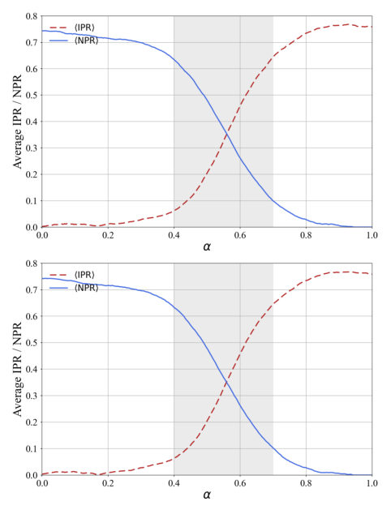
<figcaption class="paper-figure-caption"><b>Fig 2.</b> FIG. 2. (a) and (b) The average inverse participation ra- tio, ⟨IPR⟩, and the average normalized participation ratio, ⟨NPR⟩, with respect to α respectively, for disorder strengths λ0 &lt; t &amp; λ0 &gt; t, where t is the vertical hopping.</figcaption>
</figure>
<figure class="paper-figure-card">

<figcaption class="paper-figure-caption"><b>Fig 3.</b> FIG. 3. (a) IPR intensity distribution in t vs α space, (b) phase diagram of η in t vs α space, and fractal dimension in E vs α plane with (c) t⟨λ0 and (d) t⟩λ0.</figcaption>
</figure>
<figure class="paper-figure-card">
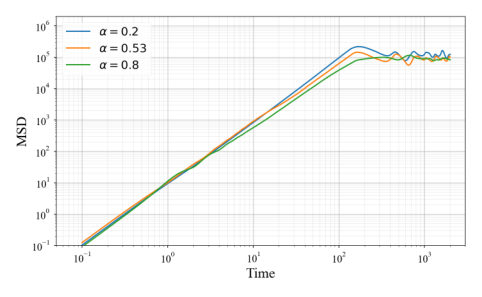
<figcaption class="paper-figure-caption"><b>Fig 4.</b> FIG. 4. Time evolution of the mean square displacement (MSD) for three representative values of the slowness expo- nent α with the quasiperiodic modulation parameter fixed at the golden mean, Q = (1 + √</figcaption>
</figure>
<figure class="paper-figure-card">

<figcaption class="paper-figure-caption"><b>Fig 5.</b> FIG. 5. (a) Variation of density of states with energy (b) inverse participation ratio with energy (c) variation of IPR with system size, (d)-(f) MFA spectrum for E = 1.75 (extended state) and E = 3.75 (critical state). The finite-size scaling yields slopes of −1.0067 for the extended state and 0.2622 for the critical state.</figcaption>
</figure>

**Summary.** This work analyzes a quasiperiodic zig-zag ladder model to reveal a reentrant localization transition driven by kinetic parameter tuning. Using advanced diagnostics like IPR and multifractal analysis, the authors demonstrate that delocalized states can reappear in regimes previously thought localized. Furthermore, they identify robust edge modes whose existence is mapped onto the system's quantum butterfly spectrum.

**Why it may be interesting.** The study provides detailed diagnostics (IPR, multifractals, dynamics) for understanding how subtle changes in Hamiltonian parameters can induce complex phase transitions (re-entrant localization) beyond simple disorder effects, which is relevant to engineered quantum materials.

Detailed structure

**Main problem.** The study investigates reentrant localization transitions, quantum butterfly patterns, and robust edge modes in quasiperiodic lattices.

**Main result.** The system exhibits a re-emerging delocalization phase controlled by kinetic parameters, alongside the formation of robust edge states resistant to moderate disorder.

**Method.** Analysis employs diagnostics like Inverse Participation Ratio (IPR), Mean Square Displacement (MSD) scaling ($	ext{MSD} \sim t^\mu$), and multifractal analysis ($I_q$) across phase diagrams.

**Model / system.** The model is a quasi-one dimensional zig-zag ladder network governed by a tight-binding Hamiltonian incorporating a quasiperiodic Aubry-Andre Harper (AAH) modulation in the long-range hopping integral.

**Key observables.** Inverse Participation Ratio ($	ext{IPR}_n$), Normalized Participation Ratio ($	ext{NPR}_n$), transport exponent ($\mu$), edge probability ($P_{	ext{edge}}$), and the phase diagram parameter $\eta$.

**Important parameters / regimes.** The slowness index ($\alpha$) controls the transition, alongside the ratio of hopping strengths ($t/\lambda_0$) and disorder strength ($W_d$).

**Assumptions / limitations.** The analysis assumes the validity of multifractal scaling techniques for characterizing quantum phases in quasiperiodic systems.

**Figures summary.** Figures illustrate IPR intensity plots showing delocalized patches, MSD vs. time curves demonstrating different transport regimes ($\mu$), and maps correlating edge probability onto the quantum butterfly spectrum.

**Paper structure.** The paper systematically analyzes localization diagnostics (IPR/NPR) to map out a reentrant phase diagram controlled by $\alpha$, followed by dynamical studies using MSD and multifractal analysis, culminating in the identification of robust edge modes via $P_{	ext{edge}}$ mapping onto the spectrum.

Abstract

Low dimensional tight-binding lattices in presence of quasiperiodic disorder generally exhibits localization transition. The system supports diffusive modes upto a limiting strength of disorder and all the eigenstates become localized beyond that critical strength thereby quenching the kinetic signature of the wavepacket. However, moving away from this situation, we demonstrate that with minimal long-range off-diagonal modulation, the eigenspectrum again may offer delocalization of electronic states for some subtle combination of kinetic parameters of the Hamiltonian leading to a second quantum phase change. The localization transitions are associated with the obvious presence of single-particle mobility edges. Multifractal energy landscape also shows quantum butterfly pattern with the in-gap robust edge modes. The re-emerging localization transition is manifested through the evaluation of inverse participation ratio, eigenspectrum and a pertinent quantum dynamical study.

[↑ back to top](#top)

### [Coexisting Charge Density Wave and Superconducting Order in Quantizing Magnetic Fields](http://arxiv.org/abs/2607.05039v1)

**Authors:** Ron Q. Nguyen, Peiyu Qin, Hai-Tian Wu, Sparsh Mishra, Tobias Wolf, Joseph Roll, Erin Morissette, Naiyuan J. Zhang, Sarah Alkidim, Kenji Watanabe, Takashi Taniguchi, Aaron W. Hui, Dima E. Feldman, Allan MacDonald, J. I. A. Li  
**Type:** experiment · **Category:** strongly correlated electrons · **PDF:** <https://arxiv.org/pdf/2607.05039v1>  
**Analysis basis:** full PDF text, analyzed in chunks
**Topic relevance:** `analog quantum simulation` **2/5** · `driven-dissipative phase transition` **2/5** · `Frenkel-Kontorova` **1/5** · `non-equilibrium dynamics` **1/5**

↔ Scroll figures horizontally

<figure class="paper-figure-card">

<figcaption class="paper-figure-caption"><b>Fig 1.</b> FIG. 1. LL formation at the flat-band edge. (a) Schematic illustration of LL formation in a dispersive band (left) and near a flat-band edge (right). The flat-band edge enhances mixing among nearly degenerate LLs. (b) Conduction-band dispersion of R6G calculated using Slonczewski–Weiss–McClure (SWMc) parameters γ0 and γ1 [44]. This simplified band-structure calculation neglects trigonal warping and other higher-order hopping terms (see Fig. M1d for a more realistic calculation). (c) Landau-level spectrum derived from the band structure shown in (b), obtained using the continuum model [45]. The bottom panel displays a zoomed-in view of the low-energy edge of the spectrum. (d) n–D map of the...</figcaption>
</figure>
<figure class="paper-figure-card">
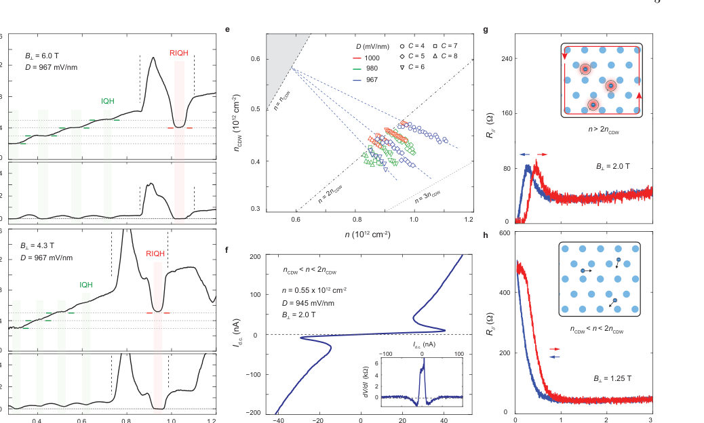
<figcaption class="paper-figure-caption"><b>Fig 2.</b> FIG. 2. Two limits of CDW order. (a–d) Transverse and longitudinal conductivities, σxy (a, c) and σxx (b, d), as functions of carrier density measured at D = 967 mV/nm and perpendicular magnetic fields of (a, b) B⊥= 6 T, and (c, d) 4.3 T, along the horizontal cuts indicated in Fig. 1e–f. Green and red shaded regions denote conventional quantum Hall states and re-entrant integer quantum Hall states, respectively. (e) Number of carriers incorporated into the CDW order, nCDW, as a function of the total carrier density, n. The dashed, dash-dotted, and dotted lines denote n = nCDW, n = 2nCDW, and n = 3nCDW, respectively. RIQH states are observed only at 2nCDW &lt; n &lt; 3nCDW. The gray-shaded region...</figcaption>
</figure>
<figure class="paper-figure-card">
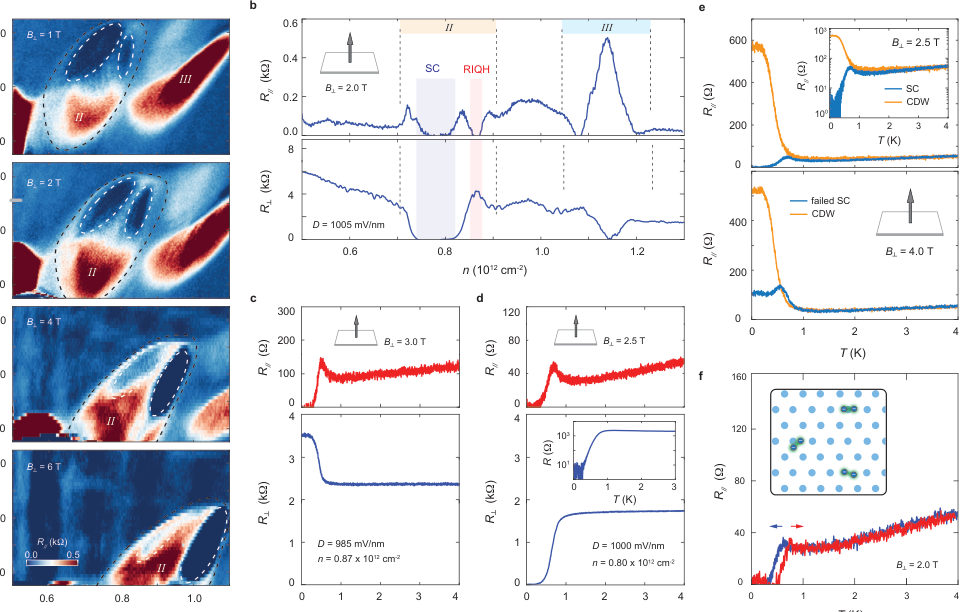
<figcaption class="paper-figure-caption"><b>Fig 3.</b> FIG. 3. Superconductivity emerging from LL formation. (a) n–D maps of R∥measured at fixed perpendicular magnetic fields B⊥. (b) Line cut of the longitudinal (top) and transverse (bottom) resistance as a function of n, measured at D = 990 mV/nm and B⊥= 2 T, corresponding to the horizontal gray bar in panel (a). Vertical dashed lines mark the density ranges of regimes II and III. Within regime II, two distinct low-temperature phases emerge from the CDW background: a RIQH state, and superconductivity (SC), marked by vanishing longitudinal resistance. (c, d) Temperature dependence of the longitudinal (top) and transverse (bottom) resistance measured in (c) the RIQH state and (d) the...</figcaption>
</figure>
<figure class="paper-figure-card">

<figcaption class="paper-figure-caption"><b>Fig 4.</b> FIG. 4. I–V characteristics. (a) Longitudinal differential resistance, dV∥/dI, as a function of Id.c. and n across regimes II and III, measured at B⊥= 2 T and D = 1005 mV/nm. (b, c) Differential resistance measured as a function of Id.c. in the longitudinal (top) and transverse (bottom) channels at the (b) superconducting and (c) RIQH states, respectively, with locations indicated by the white dashed lines in panel (a). (d) Temperature dependence of R∥measured in the CDW (orange) and superconducting (blue) states in regime I. (e, f) R∥–T traces measured during cooling (blue) and warming (red) for the same (e) CDW and (f) superconducting states shown in panel (d).</figcaption>
</figure>

**Summary.** This work explores the coexistence of Charge Density Wave order and superconductivity in graphene under strong magnetic fields. By mapping out phase diagrams using transport measurements, the authors reveal that SC persists deep within the quantum Hall regime, suggesting a profound interplay between charge ordering and pairing mechanisms.

**Why it may be interesting.** The strong coupling between CDW formation (a charge ordering phenomenon) and superconductivity in a magnetic field provides a rich platform for studying competing orders in strongly correlated electron systems, relevant to high-Tc superconductors.

Detailed structure

**Main problem.** The study investigates the complex interplay between Charge Density Wave (CDW) order, Superconductivity (SC), and Quantum Hall Effects (QHE) in a highly tunable electronic system.

**Main result.** The research demonstrates that SC and CDW phases coexist within the quantum Hall regime of rhombohedral hexalayer graphene, with the superconducting state persisting deep inside the QHE region.

**Method.** Transport measurements ($	ext{R}\parallel$, $	ext{R}\perp$) are used across varying carrier densities ($n$), displacement fields ($D$), and perpendicular magnetic fields ($B_\perp$).

**Model / system.** The physical platform is rhombohedral hexalayer graphene (R6G), which is tuned using a large displacement field to generate flat band edges, enabling strong Landau level mixing.

**Key observables.** Integer Quantum Hall plateaus ($\sigma_{xy}$), vanishing longitudinal/transverse resistance ($R_{\parallel}, R_{\perp}$ for SC), and pronounced thermal hysteresis associated with CDW transitions.

**Important parameters / regimes.** Strong magnetic fields ($B > 2	ext{T}$), flat-band edge physics, carrier density ($n$), and displacement field ($D$).

**Assumptions / limitations.** The analysis focuses on the regime where Landau level mixing is strong near the flat-band edge.

**Figures summary.** Figures map out phase diagrams in $n-D$ space showing distinct SC pockets alongside regions exhibiting Re-entrant Integer Quantum Hall (RIQH) states, with temperature dependence revealing hysteresis linked to CDW melting.

**Paper structure.** The paper systematically maps the phase diagram by measuring transport properties ($\sigma_{xx}, \sigma_{xy}$) as a function of $n$ and $D$, identifying boundaries between insulating/CDW, QHE, and superconducting states. The analysis is refined using temperature sweeps and current-voltage characteristics to confirm first-order transitions.

Abstract

Charge density wave (CDW) and superconductivity are both common in strongly interacting electron systems. While CDW order is ubiquitous in both quantum Hall systems and unconventional superconductors, superconductivity is generally suppressed by the strong magnetic fields required for Landau quantization. Here we investigate the intertwined CDW and superconducting phases of rhombohedral hexalayer graphene (R6G) in a large displacement field, which generates tunable flat band edges, and a strong magnetic field, which generates a manifold of nearly degenerate Landau levels. CDW order is accompanied by pronounced thermal hysteresis as expected for first-order melting transitions. Surprisingly, we find a series of strong integer quantum Hall effects at magnetic fields above ~2T with Hall conductance quantum numbers that deviate strongly from nearby integer filling factors, an observation that can be explained only by CDW order that mixes many Landau levels. We also find a nearby superconducting phase that is stabilized by perpendicular magnetic fields and persists deep within the quantum Hall regime. The CDW and superconducting phases develop on comparable temperature scales and emerge from the same manifold of strongly mixed Landau levels. These observations provide new insight into the interplay between superconductivity and CDW order in R6G at zero magnetic field.

[↑ back to top](#top)

### [On the structure of black hole interior in a model of scalar quasi-particles within the GR framework](http://arxiv.org/abs/2607.03938v1)

**Authors:** S. Bondarenko  
**Type:** theory · **Category:** statistical mechanics · **PDF:** <https://arxiv.org/pdf/2607.03938v1>  
**Analysis basis:** full PDF text, analyzed in chunks
**Topic relevance:** `non-equilibrium dynamics` **2/5** · `non-equilibrium universality` **2/5** · `Keldysh / 2PI / non-Gaussian methods` **1/5** · `driven-dissipative phase transition` **1/5**

↔ Scroll figures horizontally

<figure class="paper-figure-card">
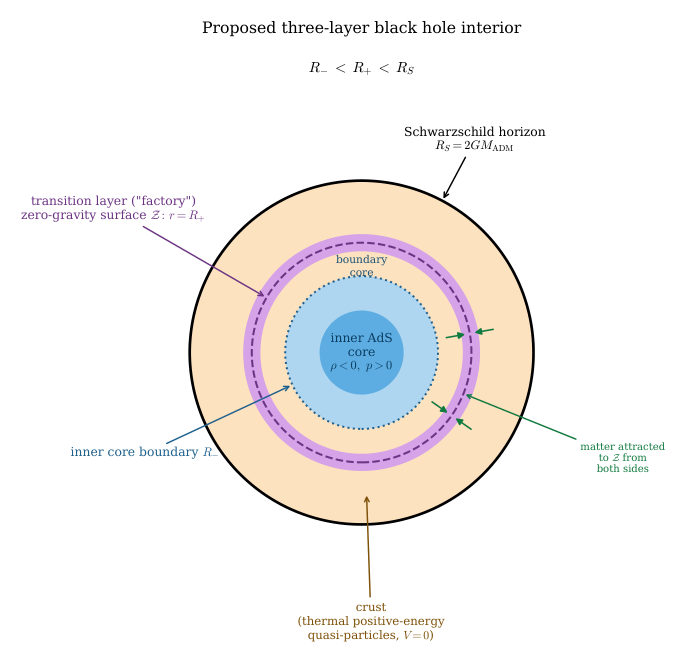
<figcaption class="paper-figure-caption"><b>Fig 1.</b> FIG. 1. Schematic structure of the proposed black hole interior. The radial ordering is R−&lt; R+ &lt; RS: the inner AdS-like core with negative energy density (ρ &lt; 0, p &gt; 0) and its boundary-core shell are enclosed within R−; the transition layer (the ”factory”), which approximately coincides with the zero-gravity hypersurface Z : r = R+, attracts the regular matter from both sides and repels the negative-energy bubbles; the thermal positive-energy crust (V = 0) fills the region up to the Schwarzschild horizon at RS = 2 G MADM.</figcaption>
</figure>
<figure class="paper-figure-card">

<figcaption class="paper-figure-caption"><b>Fig 2.</b> FIG. 2. The scalar self-interaction potential V (ϕ) of Eq. (3), plotted at m = M = 1 (with ϕ in units of M and V in units of m2M 2). The quasi-stable minimum at ϕ = 0 with V = 0 corresponds to the crust; the two symmetric negative minima at ±ϕ0 with V &lt; 0 correspond to the negative-energy boundary core region; the barrier separating the wells is associated with the transition layer (”factory”).</figcaption>
</figure>
<figure class="paper-figure-card">
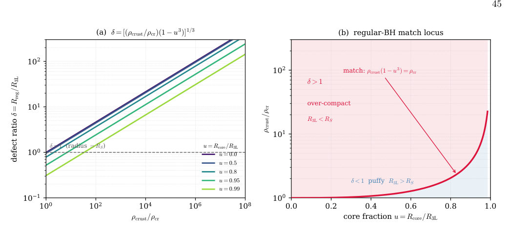
<figcaption class="paper-figure-caption"><b>Fig 3.</b> FIG. 3. (a) Defect ratio δ = Rreg/R3L versus the density contrast ρcrust/ρcr, for several core fractions u = Rcore/R3L; the cube-root scaling and the δ = 1 reference (dashed) are shown. (b) The regular-BH match locus in the (u, ρcrust/ρcr) plane, separating the over-compact region (δ &gt; 1, R3L &lt; RS) from the defective/puffy region (δ &lt; 1, R3L &gt; RS).</figcaption>
</figure>

**Summary.** This paper proposes a novel, singularity-free model for black hole interiors using a scalar field described in three distinct layers: crust, transition layer, and negative energy core. It treats the entire process of BH formation and evaporation as a quasi-static thermodynamic cycle driven by the negative energy core. The work successfully unifies these disparate physical regimes within a single field theoretical framework.

**Why it may be interesting.** While focused on GR, the explicit use of negative temperature concepts ($eta$) to describe the core condensate and modeling BH evaporation as an 'almost adiabatic thermodynamic engine' connects directly to advanced non-equilibrium statistical mechanics principles.

Detailed structure

**Main problem.** To construct an effective, singularity-free model for the interior of a black hole (BH) that addresses thermodynamic issues like entropy and information loss during evaporation.

**Main result.** The BH interior is modeled as a three-layer structure (core, transition layer, crust), where Hawking evaporation can be viewed as a quasi-static cycle analogous to an adiabatic thermodynamic engine.

**Method.** Solving the static Einstein equations using an effective scalar field description and applying concepts from thermodynamics, including negative temperature notions for the core condensate.

**Model / system.** The system uses a non-linear self-interacting scalar field ($\phi$) to describe three distinct regions: a positive-energy crust of thermal excitations, a transition layer acting as a 'factory,' and an AdS-type core characterized by negative energy density. The structure is governed by matching conditions across these layers.

**Key observables.** Metric components, mass functions, energy densities ($
ho$), pressures ($p$), and the two-temperature thermodynamics linking kinetic excitations to the ground state.

**Important parameters / regimes.** The Schwarzschild radius ($r=2GM_{	ext{ADM}}$), negative inverse temperature parameter ($eta$), and the quasi-particle density in each layer.

**Assumptions / limitations.** The model assumes a static configuration, uses an effective scalar field to unify core/crust descriptions, and treats BH evaporation as a reversible thermodynamic cycle.

**Figures summary.** Figures schematically illustrate the radial ordering of the three layers ($R_- < R^+ < R_S$) and show the potential energy landscape $V(\phi)$ defining the boundaries between these regions.

**Paper structure.** The paper develops the structure by first proposing the three-layer model, then solving the static Einstein equations for each layer using quasi-particle thermodynamics (WKB approximation), establishing matching conditions at the transition layer, and finally interpreting the entire process as a thermodynamic cycle.

Abstract

We propose an effective, singularity-free model of the black hole interior described entirely by a scalar field with a non-linear self-interaction potential. The interior consists of three layers -- a core, a transition layer, and a crust -- each fixed by the local quasi-particle density and the corresponding extremum of the potential of the field. The crust is a layer of massive, positive-energy thermal excitations above the zero-potential well, beneath a genuine Schwarzschild horizon at $r = 2GM_{\rm ADM}$. The core is an AdS-type region of negative energy density, it simulates a condensate of quasi-particles which carry zero classical kinetic energy and form a negative potential well governed by a negative inverse temperature parameter. The two regions are joined through Israel matching across the transition layer, which sits at an approximately null-gravity hypersurface of maximal regular matter density and where both the sign of the energy density and the type of thermal excitations change. Solving the static Einstein equations, we obtain the metric and mass functions of each layer, the edge equation of state of the crust, the linear stability condition of the null-gravity surface for ordinary and effectively negative mass matter, and the two-temperature thermodynamics linking the kinetic excitations to the negative temperature ground state. The framework unifies core and crust within a single field description and highlights the role of the negative energy AdS core and the associated negative temperature notion in describing black hole interior. In this picture the formation and Hawking evaporation of a black hole appear as a quasi-static cycle of an almost adiabatic thermodynamic engine, with the negative energy core as the working substance.

[↑ back to top](#top)

### [Full Gate-Voltage Control of a Parity-Protected Superconducting Qubit with an Altermagnetic Josephson Junction](http://arxiv.org/abs/2607.04097v1)

**Authors:** Guo-Liang Guo  
**Type:** theory · **Category:** quantum information and computing · **PDF:** <https://arxiv.org/pdf/2607.04097v1>  
**Analysis basis:** full PDF text, analyzed in chunks
**Topic relevance:** `QC/QI experiment` **2/5** · `exotic spin models in light-matter` **1/5** · `spintronics-quantum-optics interface` **1/5**

↔ Scroll figures horizontally

<figure class="paper-figure-card">
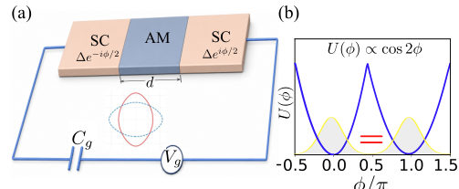
<figcaption class="paper-figure-caption"><b>Fig 1.</b> FIG. 1. (a) The setup of AM Josephson junction, AM with superconductors on both ends, ϕ the superconducting phase difference, the red and blue curves are the Fermi surface of AM. (b) The potential shape (blue line) in π periodic, wave- function (light yellow) and energy levels (red lines) of AM Josephson junction at the 0 −π point.</figcaption>
</figure>
<figure class="paper-figure-card">
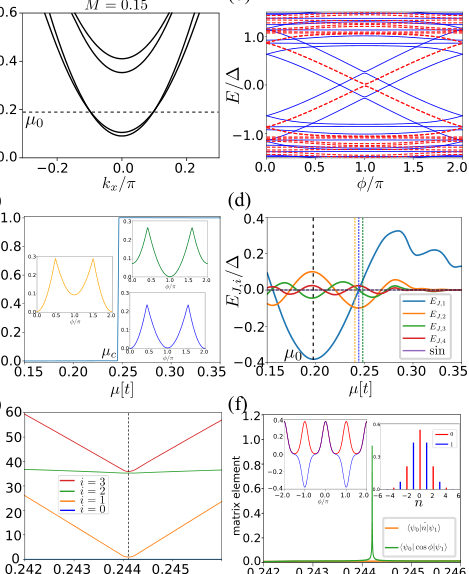
<figcaption class="paper-figure-caption"><b>Fig 2.</b> FIG. 2. (a) Band structure of the AM with periodic bound- ary conditions along the x direction. µ0 marks zero Cooper- pair center-of-mass momentum. (b) Andreev bound-state spectrum at µ = µ0 (q = 0, red) and away from µ0 (finite q, blue). (c) The minimal point of the Josephson potential changes with µ, insets shows the Josephson potential shape near the 0 −π transition point, corresponding to the vertical lines of the same color in (d). (d) Leading Josephson har- monics versus µ. (e) The energy spectrum E0i, (i = 0, 1, 2, 3) changes with chemical potential near the 0-π transition point. (f) The transition matrix element changes with µ near the 0−π transition point, insets show the lowest...</figcaption>
</figure>
<figure class="paper-figure-card">

<figcaption class="paper-figure-caption"><b>Fig 3.</b> FIG. 3. (a) At the 0 −π transition point, E01 change along with the variation of Ec, red dashed line is plotted with Eq. (8). Inset shows the E01 changes with the chem- ical potential near the 0 −π transition point with different Ec (b) At the 0 −π transition point, the second derivative ∂2E01/∂µ2, ∂2E01/∂n2 g as a function of Ec. (c) and (d) T1 and T2 vary with Ec.</figcaption>
</figure>
<figure class="paper-figure-card">

<figcaption class="paper-figure-caption"><b>Fig 4.</b> FIG. 4. (a) Qubit transition energy E01 as a function of chemical potential µ and altermagnetic splitting strength M. (b) Waterfall plot of E01 versus µ near the 0-π transition for several values of M. (c) Second derivative of the qubit transition energy with respect to chemical potential, Dµ 2 = ∂2E01/∂µ2|µ=µc, evaluated at the critical chemical potential µc for the 0-π transition, as a function of M.</figcaption>
</figure>
<figure class="paper-figure-card">
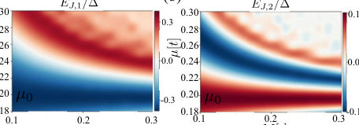
<figcaption class="paper-figure-caption"><b>Fig 5.</b> FIG. 5. (a) and (b) shows the Fourier coefficients EJ,1, EJ,2 change with chemical potential and AM strength M.</figcaption>
</figure>

**Summary.** This paper proposes using an altermagnetic Josephson junction to create a parity-protected superconducting qubit. By exploiting the momentum-dependent spin splitting in the altermagnet, the system can be tuned electrically through a 0-$\pi$ transition, generating a double-well potential for robust quantum states. This approach promises scalable, all-electrical control with coherence times suitable for quantum computing applications.

**Why it may be interesting.** This work directly addresses hardware implementation challenges in superconducting qubits by proposing a novel material platform (altermagnets) that enables all-electrical, flux-noise-free control necessary for scalable quantum computation.

Detailed structure

**Main problem.** The challenge is developing superconducting qubits with long coherence times that avoid problematic magnetic-flux biasing.

**Main result.** The authors propose using an altermagnetic Josephson junction to create a parity-protected qubit operable entirely through gate voltages, achieving estimated coherence times of tens of milliseconds.

**Method.** Theoretical modeling involving the tight-binding Hamiltonian and Andreev level calculations are used to analyze the junction's energy spectrum as it passes through a 0-$\pi$ transition point.

**Model / system.** The system is a superconducting qubit built around an Altermagnet Josephson Junction (SC–AM–SC). The AM provides spin-dependent functionality without external fields, allowing electrical control over the junction's phase and potential.

**Key observables.** Cooper-pair parity ($\langle\hat{P}
angle$), Qubit splitting ($E_{01}$), Coherence times ($T_2$, $T_\mu$).

**Important parameters / regimes.** Gate voltages controlling chemical potential ($\mu$) and offset charge ($n_g$); Josephson energy harmonics ($E_{J,1}, E_{J,2}$).

**Assumptions / limitations.** The analysis relies on specific limits such as the 1D approximation for the AM region and assuming realistic material parameters for gate compatibility.

**Figures summary.** Figure 1 illustrates the physical setup and potential shape at the $0-\pi$ point; Figure 2 demonstrates how tuning $\mu$ drives the junction through a double-well landscape by suppressing the first Josephson harmonic.

**Paper structure.** The paper introduces the problem, details the SC–AM–SC model using theoretical derivations (Appendix A) and numerical simulations (Appendix B), analyzes the resulting qubit Hamiltonian and control mechanisms, and concludes with performance estimates for coherence times.

Abstract

Parity-protected superconducting qubits offer intrinsically long coherence, but many current implementations require magnetic-flux biasing, which introduces flux noise, control overhead, and limited scalability. Here we propose a parity-protected qubit based on a gate-tunable superconductor-altermagnet-superconductor Josephson junction. Altermagnets are compensated magnets with momentum-dependent spin splitting and zero net magnetization, providing spin-dependent functionality without external magnetic fields. In the proposed junction, the two spin sectors acquire opposite phase shifts, generating two Josephson channels whose interference is controlled electrically by the chemical potential. At the tuned $0$-$π$ transition, the first Josephson harmonic is strongly suppressed while the second harmonic dominates, yielding a double-well potential with two nearly degenerate states of opposite Cooper-pair parity. For realistic gatemon-compatible parameters, we estimate coherence times of up to tens of milliseconds while maintaining fully gate-controlled qubit operations. These results establish altermagnetic Josephson junctions as a promising route toward protected superconducting qubits with local, scalable, and all-electrical control.

[↑ back to top](#top)

### [Functionalization of $g$-wave altermagnets: spin-splitter effect enabled by surfaces](http://arxiv.org/abs/2607.04970v1)

**Authors:** Sopheak Sorn  
**Type:** theory · **Category:** other · **PDF:** <https://arxiv.org/pdf/2607.04970v1>  
**Analysis basis:** full PDF text, analyzed in chunks
**Topic relevance:** `Keldysh / 2PI / non-Gaussian methods` **1/5** · `analog quantum simulation` **1/5** · `exotic spin models in light-matter` **1/5** · `spintronics-quantum-optics interface` **1/5**

↔ Scroll figures horizontally

<figure class="paper-figure-card">
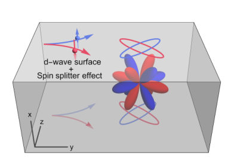
<figcaption class="paper-figure-caption"><b>Fig 1.</b> FIG. 1. Schematic illustration of a bulk g-wave altermag- net in a slab geometry supporting surface d-wave spin split- ting, thereby enabling the concomitant spin splitter effect— generation of transverse spin current upon applying a longi- tudinal charge current. This gives rise to the charge-to-spin conversion capability that is absent in the bulk.</figcaption>
</figure>
<figure class="paper-figure-card">

<figcaption class="paper-figure-caption"><b>Fig 2.</b> FIG. 2. Panel (a) illustrates the crystal structure of the (210) surface of the g-wave AM model, which is inspired by the CrSb crystal. The box enclosed by the dashed lines represents the unit cell of the bulk. Blue and red spheres correspond to magnetic sublattices which host the N´eel vector N ∥ˆz in the altermagnetic state. Green spheres represent the nonmagnetic sites. The bulk lattice vectors are a1 = a(1, 0, 0)T , a2 = a(−1/2, √</figcaption>
</figure>
<figure class="paper-figure-card">
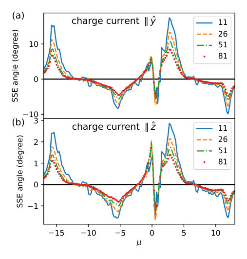
<figcaption class="paper-figure-caption"><b>Fig 3.</b> FIG. 3. Spin-splitter angle as a function of the chemical po- tential µ for (210)-oriented slab geometry with different thick- nesses, including 11l0, 26l0, 51l0, and 81l0, characterizing (a) the efficiency in generating a transverse Sz-spin current along z-axis upon applying charge current along y-axis and (b) the efficiency in generating a transverse Sz-spin current along y- axis upon applying charge current along z-axis.</figcaption>
</figure>
<figure class="paper-figure-card">

<figcaption class="paper-figure-caption"><b>Fig 4.</b> Figure 2(c) shows SSE σSz,s yz as a function of the chem- ical potential µ for (210) slabs with different thicknesses, including 11l0, 26l0, 51l0 and 81l0, where l0 is defined in Fig.2(a). Indeed, our results confirm the existence of SSE that accompanies the surface-induced d-wave char- acter. We observe that σSz,s yz increases upon increasing the thickness of the slab. However, to meaningfully ex- amine the charge-to-spin conversion efficiency, we com- pare the SSE with the longitudinal charge conductivity by calculating the following SSE angle [5, 16]</figcaption>
</figure>
<figure class="paper-figure-card">
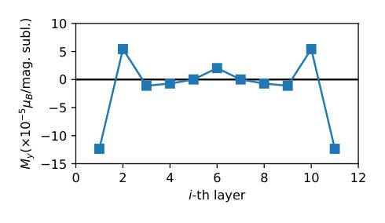
<figcaption class="paper-figure-caption"><b>Fig 5.</b> FIG. 4. Layer-resolved y-component of the spin magnetiza- tion associated with the weak ferromagnetism in the slab with thickness 11l0. Here, we have chosen a particular value of the chemical potential µ, as specified in SMs.</figcaption>
</figure>

**Summary.** This theoretical work investigates how surfaces can functionalize $g$-wave altermagnets by inducing d-wave magnetic order. Using the Kubo formalism on a minimal slab model, the authors calculate a finite spin-splitter effect (SSE) originating solely from these surfaces. This suggests that thin-film engineering is a viable strategy to harness novel spintronic functionalities in complex magnetic materials.

**Why it may be interesting.** While focused on condensed matter magnetism, the concept of boundary states inducing novel electronic responses (like SSE) via symmetry breaking is relevant to understanding topological phenomena in engineered quantum materials.

Detailed structure

**Main problem.** The study aims to demonstrate that surface effects can induce a spin-splitter effect (SSE) in $g$-wave altermagnets, overcoming the difficulty of finding bulk metallic d-wave AMs.

**Main result.** A finite SSE is found at the surfaces due to surface-induced d-wave altermagnetism, which is absent in the bulk. This response is linked to an accompanying weak ferromagnetism that allows for external field control.

**Method.** The spin conductivity quantifying the SSE is calculated using the Kubo formalism applied to a minimal slab model Hamiltonian.

**Model / system.** The system is modeled as a $g$-wave altermagnet (AM) slab geometry, utilizing a tight-binding Hamiltonian defined on a lattice structure involving magnetic and nonmagnetic sites. The bulk order parameter ($\varphi$) dictates the surface d-wave splitting via a bulk-boundary correspondence.

**Key observables.** Spin conductivity ($\sigma_{S_z, yz}$), SSE angle ($	heta_{aa}$), and layer-resolved weak ferromagnetism ($M_y$).

**Important parameters / regimes.** The calculation uses specific parameters for the hopping terms and SOC strengths within the minimal model.

**Assumptions / limitations.** The analysis relies on a minimal theoretical model; it assumes that surface effects dominate the SSE, as bulk contributions cancel out due to time-reversal odd nature of SSE.

**Figures summary.** Figures illustrate the schematic of surface d-wave splitting enabling SSE, show the crystal structure of the (210) surface, and plot the calculated spin conductivity ($\sigma_{S_z, yz}$) versus chemical potential for varying slab thicknesses.

**Paper structure.** The paper first establishes the physical platform (g-wave AM surfaces), develops the theoretical framework using the Kubo formalism to calculate conductivities, derives the key results showing surface-induced effects, and concludes by discussing implications for thin-film engineering.

Abstract

We investigate surfaces of a $g$-wave altermagnet(AM) and show that they provide a platform for realizing $d$-wave altermagnetism and the associated spin-splitter functionality. Using the Kubo formalism applied to a minimal slab model, we evaluate the spin-splitter effect(SSE) by computing the spin conductivity corresponding to a transverse spin current induced by a longitudinal electric field. We find a finite SSE, absent in the bulk, that emerges from surface-induced $d$-wave altermagnetism. Strikingly, the sign pattern of the $d$-wave altermagnetism on both surfaces of the slab geometry is identical to each other, leading to additive contributions to SSE from the two surfaces, with a spin-splitter angle reaching up to 15 degrees. In addition, this response is intrinsically linked to an accompanying surface-induced weak ferromagnetism, which potentially enables control of altermagnetic domains via an external magnetic field and provides a route to optimize the SSE functionality. These results can be understood in terms of a bulk-boundary correspondence between surface states and bulk altermagnetic order parameters, where the magnetic multipolar character of the latter plays a central role. Our findings strongly suggest thin-film engineering as a viable strategy to functionalize non-$d$-wave AMs.

[↑ back to top](#top)

### [Janus MgAlB_2 MBene: a dipole-engineered anode for ultrafast Li-ion transport and exceptional lithium storage](http://arxiv.org/abs/2607.03823v1)

**Authors:** Pritam Samanta, Sashank Kumar Pandey, Amit Kumar Jana, Prakash Parida  
**Type:** theory · **Category:** other · **PDF:** <https://arxiv.org/pdf/2607.03823v1>  
**Analysis basis:** full PDF text, analyzed in chunks
**Topic relevance:** `analog quantum simulation` **1/5** · `driven-dissipative phase transition` **1/5** · `methods for driven-dissipative` **1/5** · `non-equilibrium dynamics` **1/5**

↔ Scroll figures horizontally

<figure class="paper-figure-card">

<figcaption class="paper-figure-caption"><b>Fig 1.</b> Fig. 1 Top and side views of (a) Mg2B2, (b) Al2B2, and (c) MgAlB2 with upper (Mg- surface) and lower surface (Al-surface).</figcaption>
</figure>
<figure class="paper-figure-card">
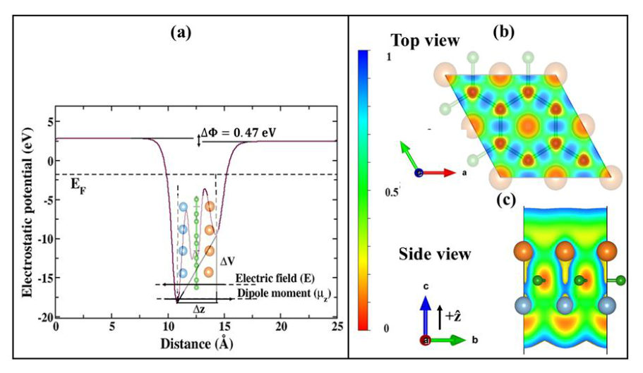
<figcaption class="paper-figure-caption"><b>Fig 2.</b> Fig. 2 (a) Average electrostatic potential of Janus MgAlB2 along the z-axis, (b) top view and (c) side view of ELF map of Janus MgAlB2.</figcaption>
</figure>
<figure class="paper-figure-card">

<figcaption class="paper-figure-caption"><b>Fig 3.</b> Fig. 3 (a) Phonon dispersion spectra of the pristine Janus MgAlB2 along the high symmetry directions, and (b) phonon density of states with average phonon band center weighted over total phonon density of states (DOS).</figcaption>
</figure>
<figure class="paper-figure-card">

<figcaption class="paper-figure-caption"><b>Fig 4.</b> Fig. 4: Total and lithium-projected phonon DOS of single adsorbed Janus MgAlB2 (a) at S1- site on the Mg surface, and (b) at S4-site on the Al surface, respectively.</figcaption>
</figure>
<figure class="paper-figure-card">
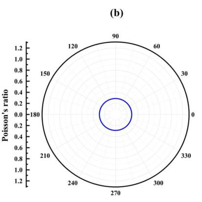
<figcaption class="paper-figure-caption"><b>Fig 5.</b> Fig. 5 Direction dependent variations of (a) Young&#x27;s modulus, Y(𝜃), and (b) Poisson&#x27;s ratio, ν(𝜃), for the Janus MgAlB2 monolayer.</figcaption>
</figure>

**Summary.** This work proposes a novel Janus material, $	ext{MgAlB}_2$, as an advanced anode for Li-ion batteries. By breaking structural symmetry, the material generates an intrinsic polarization that significantly enhances lithium ion transport and storage capacity. The calculations demonstrate this leads to ultra-low diffusion barriers and high theoretical energy density.

**Why it may be interesting.** While focused on solid-state electrochemistry, the concept of engineering intrinsic dipole moments via structural asymmetry to control charge transport barriers is analogous to designing quantum interfaces or controlling local electric fields in nanoscale devices relevant to AMO physics.

Detailed structure

**Main problem.** The research addresses the need for novel, high-performance anode materials for Li-ion batteries that overcome limitations in conventional anodes like graphite.

**Main result.** The engineered Janus $	ext{MgAlB}_2$ monolayer exhibits exceptional performance, achieving a theoretical specific capacity of $1470.24 	ext{ mAhg}^{-1}$ with an ultralow Li diffusion barrier of $17.1 	ext{ meV}$.

**Method.** The study relies heavily on first-principles calculations (DFT) to model the electronic structure, electrochemical properties, and ion transport kinetics.

**Model / system.** The physical system is a 2D Janus material, $	ext{MgAlB}_2$, created by breaking the symmetry of parent $	ext{MBenes}$ ($	ext{Mg}_2	ext{B}_2$ or $	ext{Al}_2	ext{B}_2$) to induce an intrinsic electric polarization.

**Key observables.** Li migration barrier ($17.1 	ext{ meV}$), theoretical specific capacity ($1470.24 	ext{ mAhg}^{-1}$), out-of-plane dipole moment, and electronic delocalization across the monolayer.

**Important parameters / regimes.** Low diffusion barrier ($	ext{meV}$ scale); room-temperature diffusion coefficient ($3.43	imes 10^{-10} 	ext{ cm}^2/	ext{s}$).

**Assumptions / limitations.** The primary assumption is that engineering intrinsic polarization via Janus asymmetry can fundamentally improve both the thermodynamics (capacity) and kinetics (diffusion) of Li storage.

**Figures summary.** Figures illustrate optimized geometries, electrostatic potential maps showing asymmetry, electron localization function (ELF) plots detailing charge transfer upon Li adsorption, and energy profiles mapping the low-barrier diffusion pathway for Li ions.

**Paper structure.** The paper proceeds by first establishing the structural modification ($	ext{Mg}_2	ext{B}_2 	o 	ext{Janus } 	ext{MgAlB}_2$), analyzing the resulting polarization, and then using computational methods to quantify enhanced electronic delocalization and superior Li-ion transport properties compared to symmetric counterparts.

Abstract

In this work, we propose a group II/IIIA-based Janus MBene, MgAlB_2, and investigate its electrochemical properties using first-principles calculations. The substitution of one Mg layer in Mg_2B_2 MBene by an Al layer breaks the structural symmetry and generates a permanent out-of-plane polarization, giving rise to a distinct electronic environment compared with the parent Mg_2B_2 and Al_2B_2 monolayers. Electronic-structure analysis reveals enhanced orbital hybridization among B, Mg, and Al states near the Fermi level, resulting in improved electronic delocalization across the monolayer. The Janus MgAlB_2 monolayer is found to possess excellent dynamical, mechanical, and thermal stability. Owing to its polarization-modified energy landscape, Li ions migrate with an exceptionally low diffusion barrier of 17.1 meV, corresponding to a room-temperature diffusion coefficient of 3.43x10^-10 cm^2/s. Unlike the pristine Mg_2B_2 and Al_2B_2 monolayers, which support only a single stable adsorption layer, MgAlB_2 accommodates two complete Li layers. Detailed analysis shows that the residual polarization retained after first-layer lithiation continues to promote Li adsorption, whereas increasing Li-Li electrostatic interactions eventually limit further storage. As a result, the Janus monolayer delivers a high theoretical specific capacity of 1470.24 mAh/g together with a small volume expansion of only 3.7% during maximum lithiation. The present study demonstrates that intrinsic polarization can be utilized to regulate both the thermodynamics and kinetics of Li storage, providing a design strategy for high-rate and high-capacity two-dimensional electrode materials.

[↑ back to top](#top)

### [Where Does Surface $χ^{(2)}$ Come From? A Systematic Derivation of Nonlinear Surface Susceptibilities from Bulk Nonlocal Response](http://arxiv.org/abs/2607.04459v1)

**Authors:** Zolla Frederic  
**Type:** theory · **Category:** other · **PDF:** <https://arxiv.org/pdf/2607.04459v1>  
**Analysis basis:** full PDF text, analyzed in chunks
**Topic relevance:** `Keldysh / 2PI / non-Gaussian methods` **1/5** · `correlated / nonlocal dissipation` **1/5** · `interference shaping light` **1/5** · `methods for driven-dissipative` **1/5**

↔ Scroll figures horizontally

<figure class="paper-figure-card">
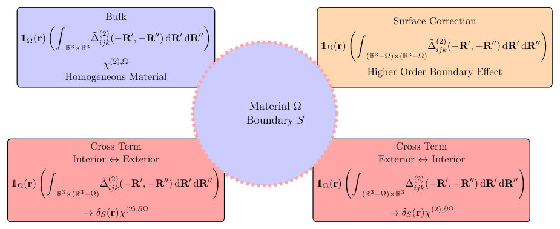
<figcaption class="paper-figure-caption"><b>Fig 1.</b> Figure 1: Schematic decomposition of the second-order polarization at a point r near the boundary ∂Ω. The integration domain over the two source variables (r′, r′′) splits into four cells: the homogeneous bulk contribution (top-left), a higher-order surface correction where both source points lie outside Ω(top-right), and two cross terms (bottom) where exactly one of the source points lies outside. After the distributional thin-layer limit, the two cross terms combine to produce the leading surface susceptibility χ(2),∂Ωsupported on ∂Ω.</figcaption>
</figure>
<figure class="paper-figure-card">
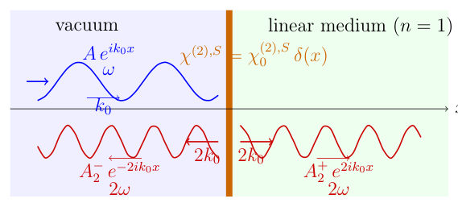
<figcaption class="paper-figure-caption"><b>Fig 2.</b> Figure 2: An idealised medium whose χ(2) reduces to a singular distribution localised at x = 0. The fundamental field u1 at frequency ω propagates from the left, and the second-harmonic field u2 at 2ω radiates outward from the interface on both sides.</figcaption>
</figure>
<figure class="paper-figure-card">

<figcaption class="paper-figure-caption"><b>Fig 3.</b> Figure 3: Photon-level picture: two photons at frequency ω combine at the surface χ(2)</figcaption>
</figure>

**Summary.** This paper develops a systematic theory to derive nonlinear surface susceptibilities ($\chi^{(2)}$) from general nonlocal constitutive relations, particularly for second-harmonic generation (SHG). It rigorously proves that even when bulk symmetry forbids the macroscopic SHG response, the interface itself generates a measurable signal. The core technique involves reducing complex higher-order problems to simpler effective linear ones via marginal integration.

**Why it may be interesting.** This work provides a rigorous theoretical foundation for understanding nonlinear optics at interfaces, which is crucial for designing advanced optical devices where surface effects dominate the response despite bulk symmetry constraints. The mathematical machinery involving nonlocal kernels and distributional limits is highly technical but foundational to continuum electrodynamics.

Detailed structure

**Main problem.** The paper systematically derives nonlinear surface susceptibilities ($\chi^{(2)}$) from the general theory of bulk nonlocal response, specifically for second-harmonic generation (SHG). It aims to understand how interfacial effects manifest when the bulk material symmetry forbids a direct macroscopic response.

**Main result.** The complex nonlinear surface problem reduces recursively to an effective linear one via a 'marginal integration principle.' Crucially, while centrosymmetry forces the bulk $\chi^{(2)}$ to zero, it does not forbid the surface-induced SHG signal.

**Method.** The methodology combines extending distributional frameworks from linear to nonlinear response theory, employing spatial moment expansions and a distributional thin-layer limit ($\ell 	o 0$). A key mathematical tool is the 'marginal integration principle' used to simplify the higher-order boundary problem.

**Model / system.** The analysis models the nonlinear optical response of materials at interfaces, using general tensorial nonlocal constitutive relations. Examples include planar and spherical geometries analyzed with specific kernels like Gaussian or Yukawa potentials.

**Key observables.** Nonlinear surface susceptibilities ($\chi^{(2),s}_{\parallel}$ and $\chi^{(2),s}_{\perp}$), the bulk second-harmonic polarization ($P^{(2),\Omega}$), and generalized nonlinear Maxwell boundary conditions for the SH field.

**Important parameters / regimes.** The decay length scale ($\ell$), the thickness of the layer ($d$), and geometric parameters like mean curvature ($H$) and Gaussian curvature ($K$).

**Assumptions / limitations.** The derivation relies on assuming rapid decay of the nonlocal kernel, homogeneity conditions, and utilizing the distributional thin-layer limit to isolate surface contributions.

**Figures summary.** Figures schematically illustrate the decomposition of polarization into different spatial cells ($\Omega	imes \Omega$, $\Omega_c$) and show how boundary conditions are derived for the second-harmonic field.

**Paper structure.** The paper progresses by first establishing the general framework (1D scalar case), then generalizing to the 3D tensorial case. It systematically applies symmetry arguments (centro-symmetry) to prove that bulk responses vanish while surface responses persist, culminating in generalized boundary conditions for curved interfaces.

Abstract

We extend the distributional framework developed in the companion paper [Zolla, arXiv:2605.15716] to the nonlinear case, focusing on the second-order ($χ^{(2)}$) response responsible for second-harmonic generation (SHG). Starting from the most general tensorial nonlocal second-order constitutive relation and combining a spatial moment expansion with a distributional thin-layer limit, we show that the full complexity of the nonlinear interfacial response condenses, at leading order, into two scalars, the nonlinear surface susceptibilities $χ^{(2),s}_\parallel$ and $χ^{(2),s}_\perp$, associated with the tangential and normal components of the electric field, respectively. A key structural result is established: via a marginal integration over one field argument, the nonlinear surface problem reduces recursively to an effective linear one, whose surface susceptibility is determined by the bulk nonlinear kernel alone. Generalized nonlinear Maxwell boundary conditions are derived explicitly for planar and spherical interfaces, and curvature corrections are obtained systematically. The formalism is illustrated on Gaussian, Yukawa, and tensorial Lorentz kernels.

[↑ back to top](#top)

### [Platinum is a Photocatalyst: Large Visible-Light Quantum Efficiency Revealed](http://arxiv.org/abs/2607.05172v1)

**Authors:** Olivier Henrotte, Yin Chak Wong, Jordan Edwards, Simão Meneses João, Štěpán Kment, Emiliano Cortés, Johannes Lischner, Alberto Naldoni  
**Type:** both · **Category:** other · **PDF:** <https://arxiv.org/pdf/2607.05172v1>  
**Analysis basis:** full PDF text, analyzed in chunks
**Topic relevance:** `Keldysh / 2PI / non-Gaussian methods` **1/5** · `driven-dissipative phase transition` **1/5** · `methods for driven-dissipative` **1/5**

↔ Scroll figures horizontally

<figure class="paper-figure-card">

<figcaption class="paper-figure-caption"><b>Fig 1.</b> Figure 1. Scanning photoelectrochemical microscopy platform and energetic framework for Au- TiO2 and Pt-TiO2 photoactivity. (a) Schematic of the SPECM configuration. (b) Energy-level band showing the relevant electronic levels of Au and Pt (Fermi level EF; schematic sp- and d-bands), the TiO2 band edges (conduction band, C.B.; valence band, V.B.), and the FcDM/FcDM+ redox couple. (c,d) Electronic band structure of Au (c), and Pt (d) from tight-binding highlighting representative optical excitation pathways under visible illumination.</figcaption>
</figure>
<figure class="paper-figure-card">

<figcaption class="paper-figure-caption"><b>Fig 2.</b> Figure 2. Position-resolved external quantum efficiency (EQE), morphology, and optical properties of Au and Pt nanoislands. (a) SPECM photoactivity map acquired over the Pt nanoisland array and the Au nanoisland array under visible illumination, used to identify the scan trajectories and regions of interest; the stars indicate the centre of the arrays. The markers (i) to (v) correspond to positions of interest. (b) EQE as a function of position along the scan line indicated in (a); 0 µm corresponds to the stars in (a). Au data are shown from purple to pink and Pt data from teal to cyan, with each trace corresponding to a different excitation wavelength. (c) SEM images of the Au array after...</figcaption>
</figure>
<figure class="paper-figure-card">
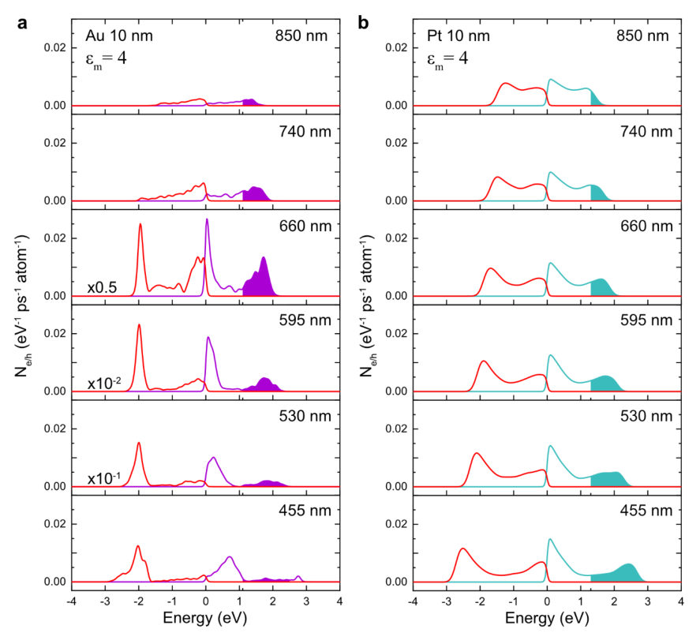
<figcaption class="paper-figure-caption"><b>Fig 3.</b> Figure 3. Theoretical simulation of hot carrier generation in Au and Pt nanoislands on a TiO2 thin film. (a) Energetic distribution of hot electrons (purple line) and hot holes (red line) in a spherical Au nanoparticle of 10 nm diameter for different excitation wavelengths in a high-permittivity environment (εm=4). (b) Energetic distribution of hot electrons (cyan line) and hot holes (red line) in a spherical Pt nanoparticle of 10 nm diameter for different excitation wavelengths in a high- permittivity environment (εm=4). The number of above-Schottky barrier electrons (corresponding to the number of extractable holes) are represented by the filled region in purple for Au and cyan for Pt....</figcaption>
</figure>
<figure class="paper-figure-card">
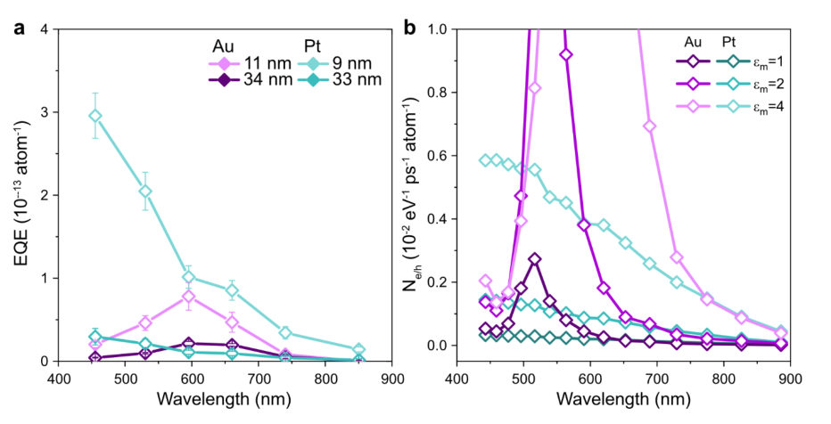
<figcaption class="paper-figure-caption"><b>Fig 4.</b> Figure 4. Comparison of external quantum efficiency and theoretical hot carrier generation with above Schottky barrier energy of Au and Pt nanoislands on TiO2 thin film. (a) External quantum efficiency (EQE) per atom as a function of excitation wavelength for different populations of Au (11 nm, pink; 34 nm, purple) and Pt (9 nm, cyan; 33 nm, teal) nanoislands. (b) Calculated number of generated hot electrons above Schottky barrier per atom for a 10 nm nanoparticle of Au (purple to pink) and Pt (teal to cyan) for different εm.</figcaption>
</figure>

**Summary.** This research demonstrates that Platinum nanoislands on $	ext{TiO}_2$ are highly efficient photocatalysts under visible light, challenging the view of Pt as merely a passive material. By using advanced photoelectrochemical microscopy and theoretical modeling, the authors show that discrete Pt islands generate photochemically active carriers with efficiencies comparable to or better than Au. The findings reposition noble metals as crucial, light-responsive components in optoelectronic devices.

**Why it may be interesting.** The work bridges concepts from plasmonics and semiconductor physics by quantifying how intrinsic material properties (like the density of states in $	ext{Pt}$) can lead to measurable photoactivity far exceeding simple co-catalyst models. This is relevant for understanding charge separation dynamics at metal/semiconductor interfaces.

Detailed structure

**Main problem.** To challenge the view that catalytic metals like Platinum (Pt) are merely passive co-catalysts with poor visible-light quantum efficiency in photocatalysis, especially when compared to Gold (Au).

**Main result.** Discrete Pt nanoislands exhibit robust broadband visible-light photoactivity, showing an EQE-per-atom significantly higher than Au at specific wavelengths. This reclassifies Pt as a light-responsive component rather than just a passive catalyst.

**Method.** The study combines quantitative scanning photoelectrochemical microscopy (SPECM) measurements with theoretical hot-carrier generation rate calculations.

**Model / system.** The system involves metal nanoislands ($	ext{Pt}$ and $	ext{Au}$) deposited on a semiconductor ($	ext{TiO}_2$), forming Schottky junctions. The analysis compares the photoactivity derived from plasmonic excitation in both metals.

**Key observables.** Wavelength-resolved external quantum efficiency (EQE), EQE per atom, internal quantum efficiency, and local extinction spectra.

**Important parameters / regimes.** Visible light spectral region ($\sim 455 	ext{ nm}$ to $595 	ext{ nm}$); Schottky barrier heights ($\Phi_B$ for $	ext{Au-TiO}_2$ vs. $	ext{Pt-TiO}_2$).

**Assumptions / limitations.** The hot-carrier model does not explicitly include interfacial electronic states, thermalization losses, or defect-mediated recombination pathways.

**Figures summary.** Figures illustrate the SPECM setup, energy band diagrams for both metal/semiconductor junctions, and position-resolved maps comparing Au vs. Pt EQE, correlating activity with morphology and optical properties.

**Paper structure.** The paper establishes the problem by contrasting $	ext{Pt}$'s traditional role with its observed photoactivity. It details the experimental methodology using SPECM to measure wavelength-dependent charge generation ($	ext{EQE}$). Theoretical calculations then link this observation to hot-carrier dynamics, concluding that Pt functions as an active light harvester.

Abstract

Metal-semiconductor junctions in optoelectronic devices are commonly engineered to promote charge separation. In Pt/TiO2 Schottky junctions, Pt is typically regarded as a catalytic electron sink rather than a visible-light-active component. Here, we demonstrate that Pt nanoislands on TiO2 can generate photochemically active carriers under visible light excitation. Using quantitative scanning photoelectrochemical microscopy, we measure the wavelength-resolved external quantum efficiency (EQE) of Au and Pt nanoisland arrays on TiO2, and correlate their reactivity with their morphology and extinction spectra. Discrete 10 nm Pt nanoislands exhibit robust broadband visible light photoactivity - exceeding the photoactivity of similar-sized Au nanoislands under blue-green excitation - whereas Pt's photoactivity is strongly suppressed when the nanoislands are connected. Surprisingly, Pt exhibits an EQE-per-atom approx. 20 times higher than Au at 455 nm and approx. 2 times higher at 595 nm (at Au's optimum). We show an approximately wavelength-independent Pt internal quantum efficiency of approx. 1 percent across the visible spectral region. These findings reposition catalytic metals with strongly damped optical response in the visible as light-responsive components in metal-semiconductor hybrids, challenging the prevailing perception that they function solely as passive co-catalysts in photocatalytic systems.

[↑ back to top](#top)

### [Torsional selection rule for the spin--orbit conversion of light](http://arxiv.org/abs/2607.05142v1)

**Authors:** Edilberto O. Silva  
**Type:** both · **Category:** other · **PDF:** <https://arxiv.org/pdf/2607.05142v1>  
**Analysis basis:** full PDF text, analyzed in chunks
**Topic relevance:** `interference shaping light` **1/5** · `quantum optics experiment` **1/5** · `spintronics-quantum-optics interface` **1/5**

↔ Scroll figures horizontally

<figure class="paper-figure-card">
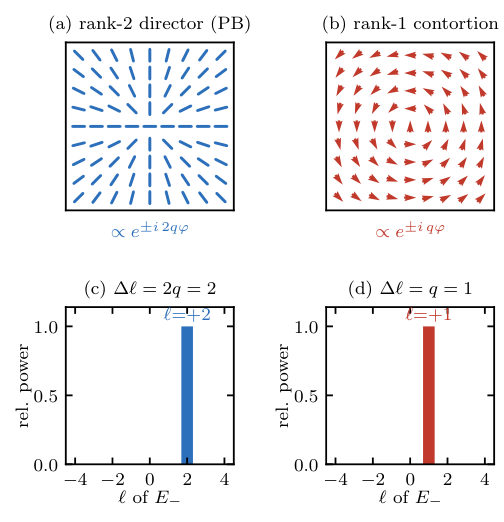
<figcaption class="paper-figure-caption"><b>Fig 1.</b> FIG. 1. The selection rule distinguishes the rank of the me- diating field. (a) A Pancharatnam–Berry element couples the circular components through a rank-two director texture of charge q; the coupling winds as e±i2qφ. (b) A torsional (Riemann–Cartan) medium couples them through the rank- one contortion vector, which winds as e±iqφ. (c),(d) Simu- lated OAM spectra of the converted beam E−for the same texture charge q = 1 and identical coupling magnitude: the sideband appears at ℓ= +2 (PB) versus ℓ= +1 (torsional).</figcaption>
</figure>
<figure class="paper-figure-card">
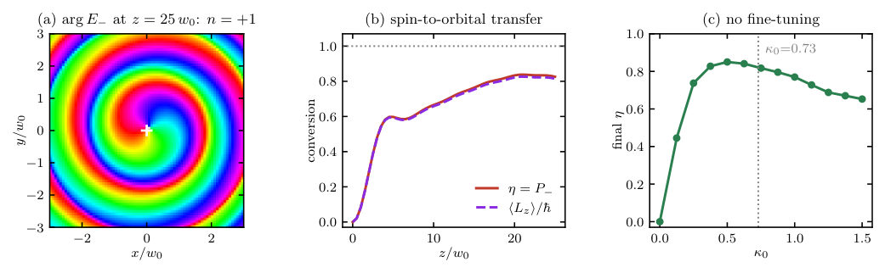
<figcaption class="paper-figure-caption"><b>Fig 2.</b> FIG. 2. Torsional vortex generation (q = 1). (a) Phase of the converted field at z = 25 w0: a stable, charge-n=+1 spiral. (b) Conversion η = P−and mean OAM versus propagation distance; both saturate at 0.83. (c) Final conversion versus holonomy strength κ0: a broad maximum (η ≃0.85) with no fine-tuning; in every run the charge is quantized at n = +1. Full sweeps in (κ0, Γ0), paraxial parameter k0 = 8–64, and grid refinement are given in the SM [27].</figcaption>
</figure>
<figure class="paper-figure-card">
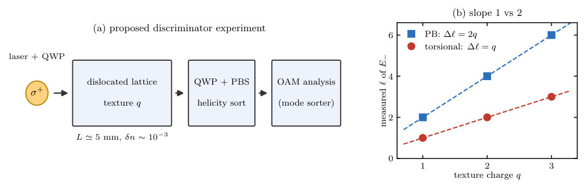
<figcaption class="paper-figure-caption"><b>Fig 3.</b> FIG. 3. Proposed discriminator. (a) A circularly polarized Gaussian traverses a femtosecond-written lattice with a screw- dislocation texture of charge q (L ≃5 mm at δn ∼10−3); the output is helicity-sorted and its OAM measured. (b) Predicted OAM of the converted beam versus texture charge, from full simulations of Eq. (2) (circles) and of a PB-type rank-two coupling of identical magnitude (squares): slopes 1 and 2, with no overlap at any integer q.</figcaption>
</figure>

**Summary.** This paper introduces a novel mechanism where light's spin converts to orbital angular momentum via the geometric torsion of a medium, yielding a selection rule $\Delta\ell=q$. This contrasts sharply with the established Pancharatnam–Berry rule ($\Delta\ell=2q$). The authors provide theoretical derivations and simulation results, culminating in a proposal for an experiment that can directly measure this topological difference.

**Why it may be interesting.** This work bridges geometric optics with condensed matter topology by showing how material defects (torsion) can provide an alternative, quantifiable mechanism for light-matter interaction that is fundamentally different from standard Berry phase effects.

Detailed structure

**Main problem.** The paper aims to distinguish between two mechanisms for converting light's spin angular momentum (SAM) into orbital angular momentum (OAM): the standard Pancharatnam–Berry mechanism and a novel process mediated by geometric torsion.

**Main result.** Torsion-mediated conversion follows a selection rule $\Delta\ell=q$, which is distinct from the PB rule ($\Delta\ell=2q$), allowing for experimental discrimination using polarization-resolved measurements.

**Method.** The authors use theoretical modeling (effective paraxial Maxwell equations) combined with numerical simulations and propose an experimental discriminator setup.

**Model / system.** The system involves light propagating through a material exhibiting geometric torsion, modeled as a continuum of screw dislocations. The coupling is described by an effective Hamiltonian involving the contortion tensor, leading to a rank-one field interaction.

**Key observables.** The primary observables are the resulting OAM ($\ell$) versus the written texture charge ($q$), which should yield slopes of 1 (torsional) or 2 (PB).

**Important parameters / regimes.** Key parameters include the topological charges $q$ and the coupling strengths $\Gamma(r)$ and $\kappa(r)$. The conversion efficiency is shown to saturate at high values.

**Assumptions / limitations.** The analysis assumes that the physical signatures, such as torque conservation ($	ilde{J}_z$) and the functional dependence of OAM on $q$, are distinct enough to separate the two coupling mechanisms.

**Figures summary.** Figure 1 compares winding patterns for rank-2 (PB) vs. rank-1 (torsional). Figure 2 shows simulated vortex generation ($\ell=+1$ spiral) with high efficiency. Figure 3 proposes an experiment showing non-overlapping OAM spectra for $\Delta\ell=q$ versus $\Delta\ell=2q$.

**Paper structure.** The paper first establishes the theoretical difference between PB coupling (rank-two director, $\Delta\ell=2q$) and torsional coupling (rank-one contortion, $\Delta\ell=q$). It then presents simulations confirming the selection rule and proposes a concrete experimental setup using lattice writing to measure this distinction.

Abstract

Standard Pancharatnam-Berry and linear-birefringent media convert optical spin into orbital angular momentum (OAM) through an anisotropy \emph{director}, a rank-two, headless field, and therefore obey the selection rule $Δ\ell=2q$ per unit texture charge $q$. We show that a medium with geometric \emph{torsion}, the continuum limit of a screw-dislocation array, can convert spin to OAM through the \emph{contortion} of its material connection, which enters the effective paraxial dynamics as a rank-one vector field. The resulting selection rule is $Δ\ell=q$. Its winding is fixed by geometry and symmetry, not by a Pancharatnam--Berry director, and the process conserves the screw charge $\tilde J_z=L_z+(q/2)σ_z$ while exchanging $(2-q)\hbar$ of angular momentum per converted photon with the defect lattice. Paraxial simulations confirm the rule: a circular Gaussian input develops a stable, topologically quantized $\ell=+q$ vortex in the reversed helicity, with $83\%$ conversion over three Rayleigh ranges and no fine-tuning. We propose a polarization-resolved photonic-lattice discriminator in which the slope of the measured OAM versus the independently written texture charge, one for torsion, two for birefringence, separates the two mechanisms.

[↑ back to top](#top)

### [Vortex-Number-Controlled Josephson Diode Polarity in Corbino Junctions](http://arxiv.org/abs/2607.04104v1)

**Authors:** Linghao Huang, Jing Wang  
**Type:** theory · **Category:** other · **PDF:** <https://arxiv.org/pdf/2607.04104v1>  
**Analysis basis:** full PDF text, analyzed in chunks
**Topic relevance:** `Keldysh / 2PI / non-Gaussian methods` **1/5** · `driven-dissipative phase transition` **1/5** · `methods for driven-dissipative` **1/5**

↔ Scroll figures horizontally

<figure class="paper-figure-card">

<figcaption class="paper-figure-caption"><b>Fig 1.</b> FIG. 1. Corbino Josephson junction and current-phase re- lation (CPR). (a) Schematic of a Corbino Josephson junc- tion. A perpendicular magnetic field threads the non- superconducting region (N), enclosing a magnetic flux Φ quantized in units of the superconducting flux quantum Φ0 = h/2e. (b) Andreev spectrum and CPR of a homogeneous junction with Φ = Φ0. (c) Corresponding results for an inho- mogeneous junction. The diffuse red spot denotes a Joseph- son vortex, which moves around the annulus as the phase difference ϕ between the inner and outer superconductors is increased.</figcaption>
</figure>
<figure class="paper-figure-card">

<figcaption class="paper-figure-caption"><b>Fig 2.</b> FIG. 2. The Josephson diode polarity and representative in- homogeneous pairing profile ∆(θ). (a) Diode polarity ob- tained from Eq. (9). (b),(c) Two representative examples of ∆(θ) evaluated on a uniform discretization of θ ∈[0, 2π) with 100 grid points. (b) corresponds to the profile defined in Eq. (3) with nc = 60. (c) shows a two-site perturbation profile, in which the pairing amplitude exhibits opposite-sign deviations from the uniform background at two nearly dia- metrically separated grid points (sites 1 and 50).</figcaption>
</figure>
<figure class="paper-figure-card">

<figcaption class="paper-figure-caption"><b>Fig 3.</b> Fig. 2(b) shows this profile sampled on a uniform angu- lar grid, corresponding to the discrete values ∆ni used in the numerics. Its dominant feature is two opposite-sign modulations localized in two nearly diametrically oppo- site angular sectors. Motivated by this structure, we further consider a simplified two-site perturbation pro- file with opposite-sign pairing-amplitude perturbations at two nearly diametrically separated grid sites on the ring [Fig. 2(c)]. This reduced profile introduces only small deviations in φj, which weakly renormalize the harmonic phases but do not affect the vortex-number- controlled alternation of the diode polarity.</figcaption>
</figure>
<figure class="paper-figure-card">
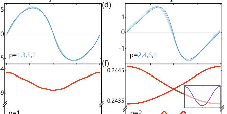
<figcaption class="paper-figure-caption"><b>Fig 4.</b> FIG. 3. Numerical results for effective 1D edge model. (a) Forward and backward critical currents I± c as a function of vortex number p. (b) Corresponding diode polarity η versus p. (c),(d) Current-phase relations for odd and even p, respec- tively. (e),(f) Representative low-energy and quasi-continuum Andreev spectra for p = 1 and p = 2, respectively. The color scale indicates the wavefunction weight on the junc- tion Majorana modes. The inset in (f) shows the sum of the two quasi-continuum branches. Model parameters are v = 1, ∆0 = 0.15, m = 0.6, Ecut = 0.5.</figcaption>
</figure>
<figure class="paper-figure-card">
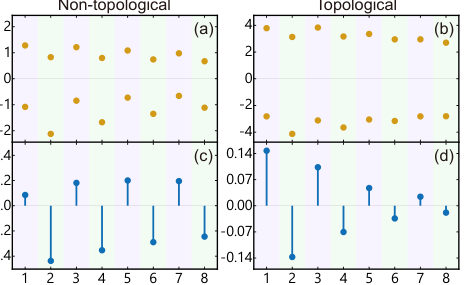
<figcaption class="paper-figure-caption"><b>Fig 5.</b> FIG. 4. Numerical results for 2D models. Panels (a),(c) show the forward and backward critical currents I± c and diode po- larity η, respectively, for a non-topological Corbino Josephson junction. The model parameters are W = 400, L = 2, t = 20, µ = 10, ∆= 1, nc = 300. Panels (b),(d) show the corresponding results for a topological junction. The model parameters are W = 300, L = 2, t = 300, M0 = 20, M1 = 300, mz = 20, µ = 5, ∆= 10, nc = 200.</figcaption>
</figure>

**Summary.** The paper shows that the diode polarity in Josephson junctions can be controlled by the vortex number ($p$) even without invoking Majorana physics. This control arises from a harmonic-selection rule dictated by structured spatial inhomogeneities in the junction's pairing potential. The findings establish a general principle for engineering non-reciprocal superconducting transport.

**Why it may be interesting.** This work provides a concrete, non-topological mechanism for observing phenomena often associated with topological superconductivity (like parity dependence), which is highly relevant for understanding engineered superconducting devices and exotic quantum states.

Detailed structure

**Main problem.** To determine if vortex-parity-dependent Josephson diode polarity reversal is a unique signature of Majorana physics, or if it can emerge from generic, non-topological mechanisms.

**Main result.** The authors demonstrate that structured spatial inhomogeneity in Corbino junctions provides a universal mechanism for achieving vortex-parity-dependent alternation of the diode's critical current asymmetry.

**Method.** The analysis uses continuum Andreev spectral theory and perturbation methods to derive a harmonic-selection rule governing how structural modulations affect higher-order Josephson current harmonics.

**Model / system.** The system is modeled using Corbino Josephson junctions, described by the continuum Andreev spectral problem Hamiltonian incorporating spatial inhomogeneity $\Delta(	heta)$. The analysis extends from low-dimensional edge models to full two-dimensional lattice simulations.

**Key observables.** Josephson diode effect (JDE) polarity ($	ext{sgn}(\eta)$), critical currents ($I_{\pm c}$), and the dependence of these on the vortex number $p$.

**Important parameters / regimes.** Vortex number $p$ (integer winding number), structured inhomogeneity $\delta\Delta(	heta)$, and the relative phases/amplitudes of higher-order current harmonics.

**Assumptions / limitations.** The analysis assumes a weak spatial modulation ($\delta\Delta \ll \Delta_0$) in the pairing profile, though robustness is shown against finite transparency.

**Figures summary.** Figures illustrate the Corbino junction geometry and CPR; one figure shows diode polarity dependence on $\phi$ for different profiles, while another compares results across topological and non-topological 2D models showing parity alternation.

**Paper structure.** The paper develops from establishing the general relationship between diode asymmetry ($\eta$) and current harmonics to deriving a specific harmonic-selection rule based on solving the Andreev spectrum in the presence of structured inhomogeneity, culminating in numerical confirmation across multiple model dimensions.

Abstract

We demonstrate that the polarity of the Josephson diode effect in Corbino Josephson junctions can be deterministically controlled by the vortex number, which arises as a generic consequence of structured spatial inhomogeneity. By solving the continuum Andreev spectral problem, we identify a mechanism in which the vortex number selectively filters specific spatial Fourier harmonics of the local inhomogeneity. This harmonic selection reshapes the amplitudes and relative phases of higher-order Josephson current harmonics, ultimately reversing the critical-current asymmetry. Numerical simulations of both an effective one-dimensional edge model and full two-dimensional lattice models confirm the robustness of this mechanism. Crucially, our results show that a vortex-parity-dependent reversal of diode polarity is not an exclusive signature of Majorana physics, but can emerge generically from geometric and structural inhomogeneities in Corbino junctions.

[↑ back to top](#top)

### [On the $\mathrm{In_{x}Ga_{1-x}As}$ channel noise in InP HEMTs from 4 K to 300 K](http://arxiv.org/abs/2607.04757v1)

**Authors:** Junjie Li, Justin H. Chen, Austin J. Minnich, Jan Grahn  
**Type:** experiment · **Category:** other · **PDF:** <https://arxiv.org/pdf/2607.04757v1>  
**Analysis basis:** full PDF text, analyzed in chunks
**Topic relevance:** `correlated / nonlocal dissipation` **1/5** · `non-equilibrium dynamics` **1/5**

↔ Scroll figures horizontally

<figure class="paper-figure-card">
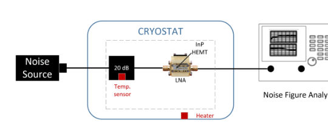
<figcaption class="paper-figure-caption"><b>Fig 1.</b> Fig. 1. Schematic of the cryogenic noise measurement setup using an LNA module equipped with the InP HEMTs. The LNA is cooled to a temperature between 4 and 40 K inside a cryostat.</figcaption>
</figure>
<figure class="paper-figure-card">

<figcaption class="paper-figure-caption"><b>Fig 2.</b> Fig. 2. Schematic of the on-wafer noise measurement setup in a cryogenic probe station. The InP HEMT is probed on-wafer at temperatures from 40 to 300 K. The room-temperature measurement chain consists of (1) HMC-T2100 local oscillator, (2) M1-0220-P mixer, (3)–(4) low-noise amplification and attenuation, (5)–(8) bandpass filters, (9) variable attenuator, and (10) U8481A power sensor.</figcaption>
</figure>
<figure class="paper-figure-card">
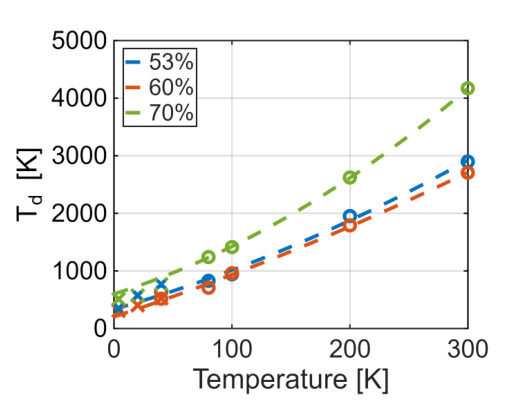
<figcaption class="paper-figure-caption"><b>Fig 3.</b> Fig. 3. Equivalent drain noise temperature Td versus ambient temperature for InP HEMTs with channel indium content of 53%, 60%, and 70%, biased at Vds = 0.5 V and Id = 5 mA. Circles and crosses represent Td values extracted from on-wafer and LNA noise measurements, respectively. Dashed lines are parabolic fits to the on-wafer data above 40 K, extrapolated to 4 K. The absence of on-wafer data below 80 K for the 70% indium channel InP HEMT was due to oscillations occurring during probing.</figcaption>
</figure>
<figure class="paper-figure-card">
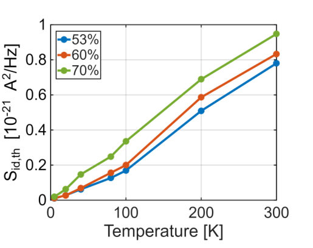
<figcaption class="paper-figure-caption"><b>Fig 4.</b> Fig. 5. Thermal noise current PSD Sid,th = 4kBTagds0 versus ambient temperature for InP HEMTs with channel indium content of 53%, 60%, and 70%.</figcaption>
</figure>
<figure class="paper-figure-card">
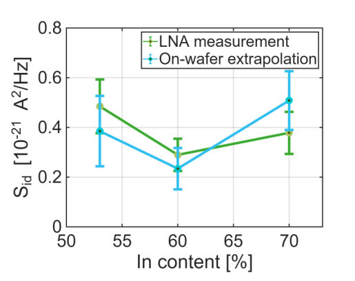
<figcaption class="paper-figure-caption"><b>Fig 5.</b> Fig. 4. Channel current noise spectral density Sid at 4 K as a function of indium content x in InxGa1−xAs channel InP HEMTs. Green points show values extracted from LNA noise measurements. Blue points show values extrapolated to 4 K from the Td model fitted to on-wafer measurements (Fig. 3); Error bars represent the combined measurement uncertainties and fitting errors.</figcaption>
</figure>

**Summary.** This work investigates the temperature dependence of channel noise in InP HEMTs with $\mathrm{In_{x}Ga_{1-x}As}$ channels. By measuring noise from 4 K to 300 K, the authors decompose the total noise into thermal and excess components. They conclude that the excess noise is dominated by impact ionization and real-space transfer effects, not just shot noise, guiding material optimization for low-noise applications.

**Why it may be interesting.** While focused on semiconductor device physics rather than fundamental quantum dynamics, understanding noise sources in high-frequency transistors is crucial for developing low-noise components required in quantum measurement and sensing applications.

Detailed structure

**Main problem.** The study aims to fully characterize the physical mechanisms responsible for noise generation in $\mathrm{In_{x}Ga_{1-x}As}$ channels within InP HEMTs across a wide temperature range (4 K to 300 K).

**Main result.** The excess channel noise at cryogenic temperatures is found to originate not only from shot noise but also significantly from impact ionization and real-space transfer (RST) noise, with the 60% indium composition yielding the lowest overall noise.

**Method.** Noise was quantified by extracting the equivalent drain noise temperature ($T_d$) using both on-wafer characterization at higher temperatures and LNA-based measurements at lower temperatures.

**Model / system.** The physical system is a 100-nm gate-length InP HEMT utilizing an $\mathrm{In_{x}Ga_{1-x}As}$ channel. The noise analysis decomposes the total current noise into temperature-dependent thermal and excess components.

**Key observables.** Equivalent drain noise temperature ($T_d$), channel current noise power spectral density ($\mathrm{S_{id}}$), and the ratio of thermal to excess noise contributions.

**Important parameters / regimes.** Temperature range (4 K to 300 K); Indium content in the channel ($x=53\%, 60\%, 70\%$); Bias conditions ($V_{ds} = 0.5$ V, $I_d = 5$ mA).

**Assumptions / limitations.** The analysis assumes that differences in channel thickness are negligible due to the 2DEG location near the interface.

**Figures summary.** Figures compare $T_d$ vs. temperature for different indium contents (on-wafer vs. LNA), and show $\mathrm{S_{id}}$ at 4 K versus indium content, illustrating the noise dependence on composition.

**Paper structure.** The paper systematically measures channel noise across varying temperatures using two complementary setups (on-wafer and LNA). It models the total noise as a sum of thermal and excess terms, analyzes the temperature dependence, and finally attributes the excess noise to specific hot-electron mechanisms based on composition variation.

Abstract

The InP high-electron-mobility transistor (HEMT) is indispensable for low-noise amplifiers (LNAs) in radio astronomy and quantum computing. The composition of the $\mathrm{In_{x}Ga_{1-x}As}$ channel in InP HEMT is known to influence the LNA noise performance. However, the various physical mechanisms responsible for noise generation are not fully characterized and understood. Here, we investigate the $\mathrm{In_{x}Ga_{1-x}As}$ channel noise from 4 K to 300 K for 100-nm gate-length InP HEMTs with channel indium content of 53\%, 60\% and 70\%. Channel noise was quantified by extracting the equivalent drain noise temperature $\mathit{T}_{d}$ using both on-wafer and LNA-based measurements, covering 40-300 K and 4-40 K, respectively. The 60\% indium channel InP HEMT exhibited the lowest channel noise across the full temperature range. The $\mathit{T}_{d}$ extracted from on-wafer characterization was found to obey a parabolic temperature dependence which predicted the $\mathit{T}_{d}$ at 4 K for all InP HEMTs in good agreement with LNA-based measurements. By expressing the channel noise as the sum of one thermal and one excess noise term, it was found that the former increased linearly with ambient temperature and dominated at 300 K. The channel noise at 4 K was determined by the excess noise term and exhibited a non-monotonic dependence on the channel indium content in the InP HEMT. The results suggest that the excess noise in the InP HEMT originates not only from temperature-independent shot noise but also from impact ionization and real-space transfer noise.

[↑ back to top](#top)

### [$H-T$ Phase diagram of CeRh$_{2}$As$_{2}$: Refinement of the parity-switch scenario](http://arxiv.org/abs/2607.04928v1)

**Authors:** Changhee Lee, P. M. R. Brydon  
**Type:** both · **Category:** strongly correlated electrons · **PDF:** <https://arxiv.org/pdf/2607.04928v1>  
**Analysis basis:** full PDF text, analyzed in chunks
**Topic relevance:** `Keldysh / 2PI / non-Gaussian methods` **1/5**

↔ Scroll figures horizontally

<figure class="paper-figure-card">

<figcaption class="paper-figure-caption"><b>Fig 1.</b> Figure 1. Schematic field-temperature (H −T) phase dia- grams of CeRh2As2 in magnetic fields along c-axis. (a) Trans- port phase diagram of the superconducting phases. The dot- ted line denotes the first order phase transition occurring at H = H∗ 1 . The dashed line is an extrapolation of the phase boundary in H &gt; H∗ 1 . The green line depicts a fictitious ex- ample of the phase boundary in H &lt; H∗ 1 which is consistent with the usual parity-switch scenario. (b) Thermodynamic phase diagram of the superconducting phases along with the AFM phase. H∗ 2 indicated by the orange dashed line is the critical field above which the AFM order vanishes.</figcaption>
</figure>
<figure class="paper-figure-card">
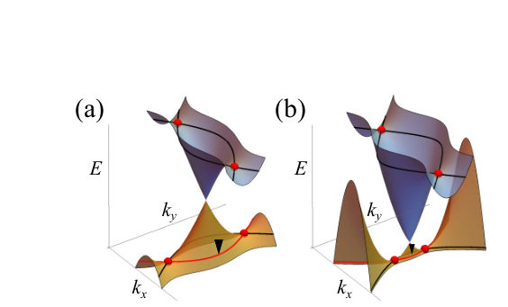
<figcaption class="paper-figure-caption"><b>Fig 2.</b> Figure 2. Fermi surfaces of the conduction and the valence bands. (a) (t⊥, α) = (2, 5)t0 and (b) (t⊥, α) = (5, 2)t0 are used. The red points highlight the Van Hove saddle points. The curves passing through the red points represent the Fermi surfaces of the valence (conduction) band at µ = µv (µ = µc). The black arrows mark the midpoints of the red curves and correspond to the origin of the figures in Fig. 3.</figcaption>
</figure>
<figure class="paper-figure-card">

<figcaption class="paper-figure-caption"><b>Fig 3.</b> Figure 3. The integrands of K(p) 0 and a(p) 0 over the Fermi surface (red curve in Fig. 2) for the B1g- and B2u-type gap functions. (a) and (b) show the integrands when (t⊥, α) = (2, 5) and µ = µv in Eq. (7) with a = b = 1. The red (blue) line corresponds to the case with B1g(B2u)-type gap function. (c) and (d) show the integrands when (t⊥, α) = (5, 2) in Eq. (7) with a = b = 1. The Fermi surface is parameterized by using ky. ky,vVHS denotes the position of the valence band Van Hove singularity.</figcaption>
</figure>
<figure class="paper-figure-card">

<figcaption class="paper-figure-caption"><b>Fig 4.</b> Figure 5. Phase diagram obtained from Eqs. (14-16). The orange diamonds represent the resistivity measurement in Ref. [8], while the other symbols correspond to the thermo- dynamic data presented in Ref. [10]. The black dashed lines represent the phase boundaries between the normal phase and the eSC and oSC states, and the first order transition line between two SC states in the absence of the AFM or- der. The red and blue lines are the phase boundaries ob- tained by using Eqs. (15-16) which take account of the AFM order. The red dashed line is the first order transition line be- tween two SC states in the presence of the AFM order. Here we use (T (e) c,0 , χ(e) O , χ(e) P ) = (0.393, 0.04,...</figcaption>
</figure>

**Summary.** This paper refines the understanding of superconductivity in CeRh2As2 by addressing conflicts between transport and thermodynamic measurements. The authors propose that anisotropic band structures near specific points in the Brillouin zone explain slope discrepancies, while coupling SC order with coexisting antiferromagnetism accounts for unusual phase boundaries.

**Why it may be interesting.** Although focused on heavy fermions, the detailed analysis of symmetry-enforced electronic structure (nonsymmorphic symmetries) and pairing mechanisms in strongly correlated materials provides advanced insights into how crystal structure dictates quantum ground states, relevant to understanding complex many-body Hamiltonians.

Detailed structure

**Main problem.** The study aims to reconcile experimental discrepancies in the H-T phase diagram of CeRh2As2, particularly concerning the superconducting (SC) state's dependence on magnetic fields and temperature.

**Main result.** Anisotropic band structure near the X point explains the anomalous initial slope of the odd-parity SC phase, while coexisting antiferromagnetism provides a mechanism for the nearly vertical thermodynamic phase boundary.

**Method.** The work combines theoretical modeling using k.p Hamiltonians and Landau free energy formalisms with analysis of experimental transport and thermodynamic measurements.

**Model / system.** The system is the heavy fermion superconductor CeRh2As2, modeled by considering nonsymmorphic band structure features (Dirac nodes, Van Hove singularities) and incorporating coexisting antiferromagnetic order parameters into a Landau theory framework.

**Key observables.** H-T phase boundaries for SC phases (even/odd parity), initial slopes of the superconducting transition lines in transport measurements, and thermodynamic signatures like specific heat anomalies.

**Important parameters / regimes.** Interlayer hopping amplitude ($t_{\perp}$), anisotropy ratio ($\alpha$), magnetic field strength (H), and temperature (T).

**Assumptions / limitations.** The standard Ginzburg-Landau theory is insufficient due to anisotropic band structure; the analysis relies on incorporating coexisting AFM order into a phenomenological Landau free energy.

**Figures summary.** Figures illustrate schematic H-T phase diagrams comparing transport and thermodynamic measurements, and show Fermi surfaces highlighting Van Hove singularities near the X point in the Brillouin zone boundary.

**Paper structure.** The paper first identifies experimental discrepancies between SC phases. It then uses k.p modeling to explain the anisotropic band structure causing slope anomalies. Finally, it employs a phenomenological Landau theory incorporating AFM order to account for the vertical thermodynamic phase boundary.

Abstract

The superconductivity of CeRh$_2$As$_2$ has drawn attention due to its first-order transition in magnetic fields. At first glance, the multiple superconducting (SC) phases as well as the first-order transition appear consistent with the parity-switch scenario, which emphasizes the role of strong Rashba spin-orbit coupling enabled by the locally non-centrosymmetric crystal structure. However, experimental phase diagrams exhibit notable deviations from this simple picture: thermodynamic measurements reveal a nearly vertical phase boundary of the high-field SC phase despite the orbital depairing effect, while transport measurements show that the initial slope of the high-field SC phase is steeper than that of the low-field SC phase. Here, we show that these discrepancies can be understood by considering the combined effects of nonsymmorphic band structure and coexisting antiferromagnetic order. We demonstrate that the symmetry-enforced electronic structure around the Dirac node and type-II Van Hove saddle points near the X point in the Brillouin zone boundary becomes more anisotropic with increased interlayer hopping amplitude, and this anisotropic band structure naturally accounts for the anomalous initial slope of the odd-parity SC phase. Meanwhile, a phenomenological theory incorporating coexisting antiferromagnetism explains the nearly vertical thermodynamic phase boundary as a consequence of field-enhanced odd-parity superconductivity enabled by the over-suppression of Pauli depairing.

[↑ back to top](#top)

### [Dielectric function in WSe2](http://arxiv.org/abs/2607.05371v1)

**Authors:** Tiberius O. Cheche, Yia-Chung Chang  
**Type:** theory · **Category:** strongly correlated electrons · **PDF:** <https://arxiv.org/pdf/2607.05371v1>  
**Analysis basis:** full PDF text, analyzed in chunks
**Topic relevance:** `Keldysh / 2PI / non-Gaussian methods` **1/5**

↔ Scroll figures horizontally

<figure class="paper-figure-card">

<figcaption class="paper-figure-caption"><b>Fig 1.</b> Figure 1: Hexagonal first Brillouin zone of the triangular Wigner-crystal lattice. The irreducible Γ–K–M wedge used for the Brillouin-zone sampling is indicated.</figcaption>
</figure>
<figure class="paper-figure-card">
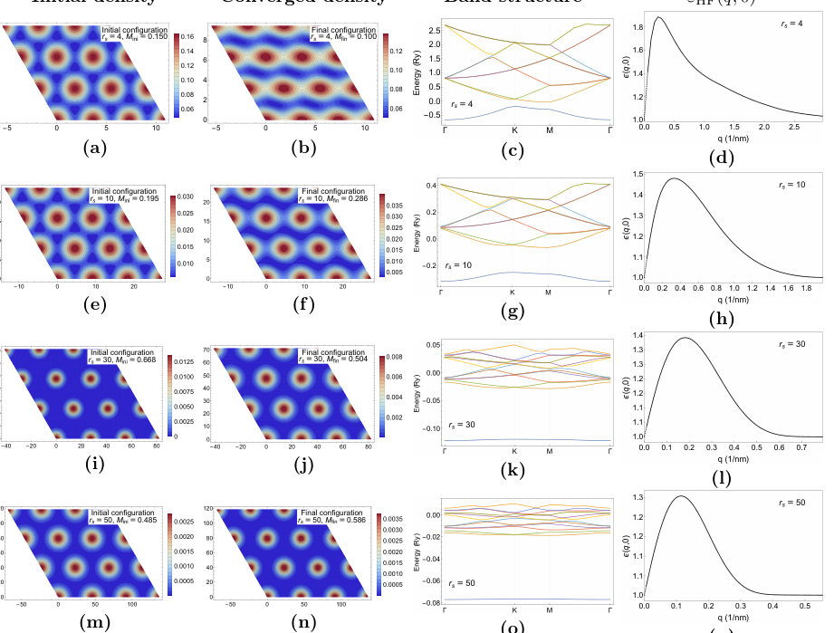
<figcaption class="paper-figure-caption"><b>Fig 2.</b> Figure 2: Evolution of the fully spin-polarized Hartree–Fock Wigner-crystal solution with the density parameter rs. The four rows correspond to rs = 4, 10, 30, and 50, as indicated inside the panels. The columns show, from left to right, the initial charge-density configuration, the converged Hartree–Fock charge density, the same-spin Hartree–Fock band structure along Γ–K–M–Γ, and the static dielectric function εHF(q, 0) along Γ–K direction. The charge-density panels also indicate the first-star order parameter of the initial and converged configurations, denoted by Mini and Mfin, respectively. The sequence illustrates the evolution from a weakly crystalline solution at small rs toward...</figcaption>
</figure>

**Summary.** This work develops and applies a Hartree-Fock numerical method to study Wigner crystal formation in 2D transition metal dichalcogenides like WSe2. It calculates the static dielectric function, providing a quantitative measure of electronic screening within this highly correlated, insulating state. The results offer theoretical insight into how electron-electron interactions reconstruct band structure and govern charge response.

**Why it may be interesting.** While focused on solid-state screening, the use of advanced many-body techniques like HF within a periodic supercell structure is relevant to understanding correlation effects beyond simple mean-field treatments common in AMO physics.

Detailed structure

**Main problem.** The primary goal is to calculate the static dielectric function of a Wigner-crystal state formed in monolayer WSe2.

**Main result.** The method successfully computes $\epsilon(\mathbf{q}, 0)$, showing that the system exhibits strong electronic screening characterized by a maximum at finite momentum transfer $q_{	ext{max}}$.

**Method.** A self-consistent Hartree–Fock (HF) numerical method is employed to determine quasiparticle band structure and then calculate the static polarizability using a Lindhard-type sum over occupied and empty bands.

**Model / system.** The system modeled is a two-dimensional electron gas forming a Wigner crystal in monolayer WSe2, treated as an insulating state with a periodic triangular lattice structure. The theory uses HF approximations to solve the electronic structure problem.

**Key observables.** Static dielectric function $\epsilon(\mathbf{q}, 0)$, single-particle excitation spectra, and density harmonics ($\eta_{	ext{W}}(\mathbf{Q})$).

**Important parameters / regimes.** Zero temperature ($T=0$), dimensionless Wigner-Seitz radius ($r_s$), momentum transfer $q$, and the lattice constant/periodicity.

**Assumptions / limitations.** The ground state is assumed to be fully spin-polarized, and the calculations rely on the Hartree-Fock approximation for electron interactions.

**Figures summary.** Figures illustrate the hexagonal first Brillouin zone of the triangular Wigner-crystal lattice, which dictates the momentum sampling ($\Gamma–K–M$ wedge).

**Paper structure.** The paper develops from general Wigner crystal theory to establishing a self-consistent HF framework for crystalline states. It details the solution procedure (including initial guesses) and culminates in calculating the static dielectric response as a microscopic probe.

Abstract

We develop a Hartree-Fock numerical method for computing the band structure of a two-dimensional Wigner crystal in an electron gas at zero temperature. The ground state is assumed to be fully spin-polarized. Single-particle excitation spectra are evaluated in spin-conserving channel. As an application, we use the developed code to compute the static dielectric function epsilon(q,0) of a Wigner-crystal state formed in a two-dimensional transition-metal dichalcogenide, specifically monolayer WSe2. The dielectric response is obtained from the Hartree-Fock band structure and eigenfunctions through a static Lindhard-type polarizability. The method provides a theoretical tool for investigating screening, band-structure reconstruction, and interaction effects in low-density two-dimensional systems, with possible relevance for future experimental studies.

[↑ back to top](#top)

### [Quantum Geometric Friedel Oscillations](http://arxiv.org/abs/2607.04654v1)

**Authors:** Xing-Lei MA, Jinchao Zhao, Bo-Qing Wu, K. T. Law  
**Type:** theory · **Category:** other · **PDF:** <https://arxiv.org/pdf/2607.04654v1>  
**Analysis basis:** full PDF text, analyzed in chunks
**Topic relevance:** `Keldysh / 2PI / non-Gaussian methods` **1/5**

↔ Scroll figures horizontally

<figure class="paper-figure-card">
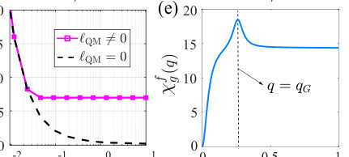
<figcaption class="paper-figure-caption"><b>Fig 1.</b> FIG. 1. Emergence and thermodynamic stability of quan- tum geometric Friedel oscillations (QGFOs) . (a) Schematic band structure in a flat-band metal. The color of the central band represents the quantum metric distribution Gf(k), as zoomed in on the right side. The momentum-space separa- tion between quantum metric hot spots defines the character- istic geometric wavevector qG. The Fermi level (dashed line) cuts through the flat band, with two Fermi points separated by wavevector 2kF . W f and ∆g denotes the flat-band band- width and the band gap, respectively. (b) Normalized real- space density modulations δρnorm(x) ≡δρ(x)/ρ0 induced by a local impurity. At low temperatures (blue curve),...</figcaption>
</figure>
<figure class="paper-figure-card">
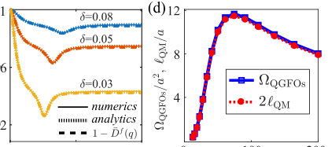
<figcaption class="paper-figure-caption"><b>Fig 2.</b> FIG. 2. (a) Band structure of the 1D flat-band model. In- set: Zoom-in of the flat band. The dashed line indicates the Fermi level; 2kF is the zero-temperature scattering wavevec- tor. Parameters are the same as Fig. 1 except δ = 0.05. These parameters are used throughout unless otherwise stated. (b) Quantum distance dk,k′ in the k-k′ plane. The red dashed lines mark the cut q = qG corresponding to the peak of ¯D(q). (c) Fourier transform of the LDOS variations δρnorm(q) for different δ. Solid lines: real-space diagonalization (numerics); dotted lines: full-band formalism in Eq. (2) with T = I (an- alytics). All curves match reasonably well with 1 −¯Df(q). A single impurity U0 = t is placed...</figcaption>
</figure>
<figure class="paper-figure-card">

<figcaption class="paper-figure-caption"><b>Fig 3.</b> FIG. 3. (a) Comparison of QGFOs with distinct low-energy quantum geometric structures: Quantum metric hot spots living within (Blue curves) versus far above (Red curves) the smeared Fermi surface. Inset: corresponding Fourier spec- trum. (b) Partially averaged quantum distance ¯Df p(q) for the two regimes. Parameters for the blue curves are the same as Fig. 1 except kBT = Ef F = 0.4t, U0 = 10t, and Λc = 3.5kBT. The red curve has the same parameters as the blue one except t taking a minus sign.</figcaption>
</figure>
<figure class="paper-figure-card">

<figcaption class="paper-figure-caption"><b>Fig 4.</b> FIG. 4. Real-space lattice and hopping structure of the 1D model. The dashed square denotes an unit cell.</figcaption>
</figure>
<figure class="paper-figure-card">

<figcaption class="paper-figure-caption"><b>Fig 5.</b> FIG. 5. (a) Band structure of the 2D model. (b) Fermi surface of the third band. Parameters: J = 1, t = 10−4J, δ′ = 5δ, µ = −0.48W f with bandwidth W f = 8t.</figcaption>
</figure>

**Summary.** This work introduces Quantum Geometric Friedel Oscillations (QGFOs), showing they arise when the quantum geometry of Bloch wavefunctions is non-trivial. Unlike conventional oscillations whose decay is temperature-sensitive, QGFOs are governed by a robust 'quantum metric length.' Measuring these oscillations provides a novel tool to probe fundamental geometric properties of electronic band structures.

**Why it may be interesting.** The concept of 'quantum metric protection' suggests a fundamental, geometry-derived robustness in electronic responses that is independent of thermal smearing or simple Fermi surface arguments, which has implications for topological materials physics.

Detailed structure

**Main problem.** The conventional theory of Friedel oscillations is incomplete when considering Bloch wavefunctions with nontrivial quantum geometry, necessitating the characterization of a new oscillation type.

**Main result.** Quantum Geometric Friedel Oscillations (QGFOs) exist, characterized by a period set by momentum space hot spot separations and possessing a decay length protected by the quantum metric, allowing them to persist at higher temperatures than conventional oscillations.

**Method.** The analysis involves decomposing the total susceptibility into conventional and quantum geometric parts ($\chi_f = \chi^c_f + \chi^g_f$) and calculating the induced density modulation $\delta
ho(r)$ using flat-band susceptibility formulas.

**Model / system.** The study uses models of metals, specifically focusing on systems exhibiting isolated (nearly) flat bands at the Fermi energy. Calculations are performed using tight-binding models in 1D and 2D lattices.

**Key observables.** QGFOs (oscillations), quantum metric length ($\ell_{QM}$), momentum space separation of hot spots ($q_G$), and the decay length $\xi$.

**Important parameters / regimes.** Temperature ($T$) relative to bandwidth ($W_f$), impurity strength ($U_0$), and topological invariants like the Chern number ($|C|$).

**Assumptions / limitations.** The theory assumes weak impurities, allowing for certain approximations in the susceptibility calculation.

**Figures summary.** Figures illustrate schematic band structures, real-space density modulations ($\delta
ho(x)$) at varying temperatures, and Fourier spectra showing both conventional ($2k_F$) and QGFO peaks. The decay length vs. T plots show a transition from thermal to quantum metric control.

**Paper structure.** The paper progresses by first identifying the theoretical gap in conventional theory, then deriving the quantum geometric susceptibility ($\chi^g_f$), demonstrating its distinct characteristics (periodicity $q_G$, temperature-independent decay $\ell_{QM}$), and finally confirming these predictions using 1D and 2D lattice models.

Abstract

In conventional Friedel oscillations, the real-space charge density oscillations induced by an impurity are characterized by an oscillation period set by the Fermi momentum. In this work, we show that the conventional theory is incomplete when the Bloch wavefunctions carry nontrivial quantum geometry. We demonstrate that in metals with an isolated (nearly) flat band at the Fermi energy, quantum geometry induces a distinct type of oscillations, which we call the \emph{quantum geometric Friedel oscillations} (QGFOs). The period of the QGFOs is set by the momentum space separation of the quantum metric hot spots of the flat band. The conventional and quantum metric-induced oscillations coexist at low temperatures. At higher temperatures, the conventional Friedel oscillations away from the impurity site are set by the thermal length such that the oscillations can be easily washed out by temperature effects. Remarkably, the QGFOs decay length is set by the quantum metric length which is defined by the integration of the quantum metric of the flat band. As a result, the QGFOs can persist even at temperatures much larger than the bandwidth of the flat band. Moreover, the decay length is independent of temperature for a wide range of temperatures which is a manifestation of the quantum metric protection. In conclusion, we show that the quantum metric induces novel Friedel oscillations. Our work suggests that the measurement of the QGFOs is a powerful way to detect the quantum metric length (which is associated with the integral of the quantum metric) and the quantum metric hot spot separations (which are associated with the distribution of the quantum metric in the momentum space).

[↑ back to top](#top)

### [Topological Electronic States and Phonon Mediated Superconductivity in Ru Based Ternary Pnictides: ZrRuAs and HfRuP](http://arxiv.org/abs/2607.04651v1)

**Authors:** Jubair Hossan Abir, Tanvir Khan, Tauhidur Rahman, Md. Kamrul Hassan, Sraboni Saha Moly, Mst. Maskura Khatun, Raihana Shams Islam, Saleh Hasan Naqib  
**Type:** theory · **Category:** other · **PDF:** <https://arxiv.org/pdf/2607.04651v1>  
**Analysis basis:** full PDF text, analyzed in chunks
**Topic relevance:** `Keldysh / 2PI / non-Gaussian methods` **1/5**

↔ Scroll figures horizontally

<figure class="paper-figure-card">

<figcaption class="paper-figure-caption"><b>Fig 1.</b> Figure 1. Schematic 3D representation of layered Crystal structures of ZrRuAs and HfRuP.</figcaption>
</figure>
<figure class="paper-figure-card">
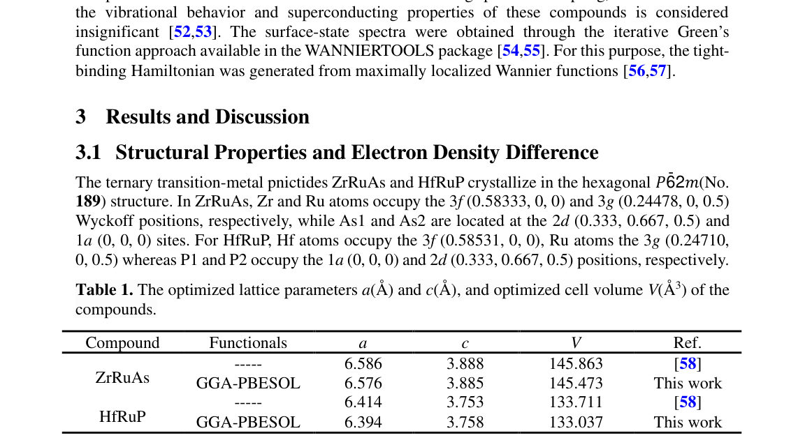
<figcaption class="paper-figure-caption"><b>Fig 2.</b> Figure 2. (a) and (b) illustrate the 2D electron density difference (EDD) contour maps of the Ru- Zr-As and Ru-Hf-P systems, respectively. The color scale represents the degree of electron accumulation and depletion within the crystal structure. In the contour maps, the blue regions correspond to electron accumulation, whereas the yellow/red regions indicate electron depletion, demonstrating the redistribution of charge caused by chemical bonding and orbital hybridization among the constituent atoms.</figcaption>
</figure>
<figure class="paper-figure-card">

<figcaption class="paper-figure-caption"><b>Fig 3.</b> Figure 2. The electron density difference maps for (a) ZrRuAs and (b) HfRuP.</figcaption>
</figure>
<figure class="paper-figure-card">
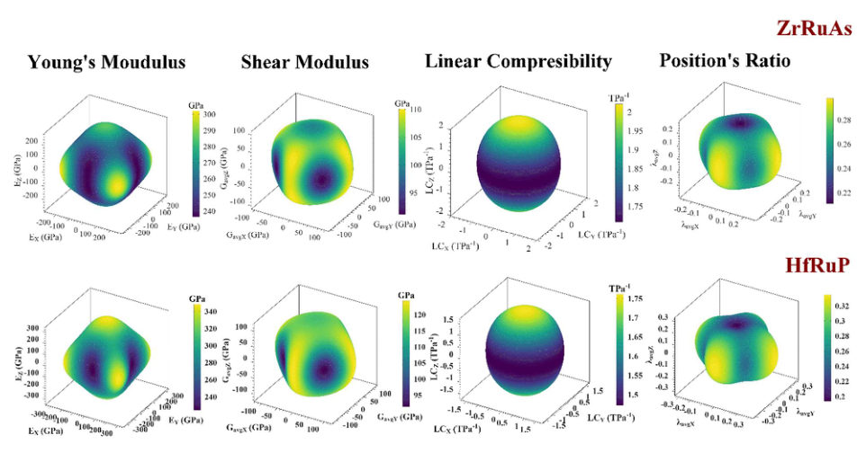
<figcaption class="paper-figure-caption"><b>Fig 4.</b> Figure 3. 3D representation of the mechanical properties of ZrRuAs and HfRuP in terms of Young’s modulus, Shear modulus, Linear compressibility and Poisson’s ratio.</figcaption>
</figure>
<figure class="paper-figure-card">

<figcaption class="paper-figure-caption"><b>Fig 5.</b> Figure 4. Calculated electronic band Structure of ZrRuAs and HfRuP without and with SOC.</figcaption>
</figure>

**Summary.** This paper computationally analyzes the structural, electronic, and superconducting properties of ZrRuAs and HfRuP. Using DFT, the authors confirm their topological semimetallic nature and ductile mechanical behavior. The study successfully predicts moderate critical temperatures, suggesting these materials are promising candidates for topological superconductors.

**Why it may be interesting.** While focused on condensed matter solid-state physics rather than AMO systems, the use of advanced DFT methods to predict multiple coupled physical phenomena (topology, elasticity, superconductivity) is methodologically relevant for complex quantum material modeling.

Detailed structure

**Main problem.** The study investigates the comprehensive physical properties, including electronic structure, mechanical stability, and superconductivity, of two ternary pnictides: ZrRuAs and HfRuP.

**Main result.** Both compounds exhibit topological semimetallic behavior and are predicted to be ductile with excellent machinability. They show evidence of conventional superconductivity with transition temperatures around 9-10 K.

**Method.** The research relies heavily on first-principles calculations using Density Functional Theory (DFT) for electronic, structural, mechanical, and superconducting property predictions.

**Model / system.** The physical systems are the crystalline materials ZrRuAs and HfRuP, which are analyzed across multiple facets: band structure, elastic constants, electron density difference maps, and electron-phonon coupling calculations.

**Key observables.** Topological semimetallic behavior, superconducting transition temperatures (Tc), Pugh's ratio, Poisson’s ratio, bulk/shear moduli, and electronic charge redistribution patterns.

**Important parameters / regimes.** The calculation utilized PBE-GGA functional within DFT framework; the predicted Tc values are 9.75 K for ZrRuAs and 9.03 K for HfRuP.

**Assumptions / limitations.** Phonon calculations were performed without including spin-orbit coupling, assuming its effect on vibrational properties is negligible.

**Figures summary.** Figure 1 shows the layered crystal structures; Figure 2 displays Electron Density Difference (EDD) maps illustrating charge bonding character; Tables summarize optimized lattice parameters and mechanical constants.

**Paper structure.** The paper follows a structure of initial structural/electronic analysis, followed by detailed investigation into mechanical properties using elastic constants, and concluding with the determination of superconducting characteristics via electron-phonon coupling calculations.

Abstract

This study investigates the structural, electronic, mechanical, optical, thermodynamic, and superconducting properties of ZrRuAs and HfRuP. Electronic band structure calculations reveal topological semimetallic behavior in both compounds with several bands crossing the Fermi level. The inclusion of spin orbit coupling lifts band degeneracies in both compounds. The Fermi surface shows both electron and hole segments. The estimated Pugh ratio, Poisson ratio and machinability index indicate that both compounds are ductile in nature and exhibit excellent machinability. Optical results show metallic reflectivity and notable absorption in the ultraviolet region. Thermodynamic analysis indicates stable behavior. The estimated superconducting transition temperatures are 9.75 K for ZrRuAs and 9.03 K for HfRuP that indicates strong coupling conventional superconductivity. The results provide a detailed view of the physical and superconducting properties of ZrRuAs and HfRuP and help to close the existing research gaps in these topological superconducting materials.

[↑ back to top](#top)

### Other secondary papers (2)

Show other secondary papers

### [Correlated-Electron Theory of Triplet-Triplet Multiexciton States in Polypentacene](http://arxiv.org/abs/2607.03706v1)

**Authors:** Rupali Jindal, Alok Shukla, Sumit Mazumdar  
**Type:** theory · **Category:** strongly correlated electrons · **PDF:** <https://arxiv.org/pdf/2607.03706v1>  
**Analysis basis:** full PDF text, analyzed in chunks

↔ Scroll figures horizontally

<figure class="paper-figure-card">
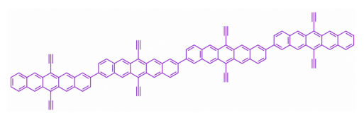
<figcaption class="paper-figure-caption"><b>Fig 1.</b> FIG. 2. Pentacene tetramer 4Pc with the anti-anti-anti inter- monomer bonding motif.</figcaption>
</figure>
<figure class="paper-figure-card">
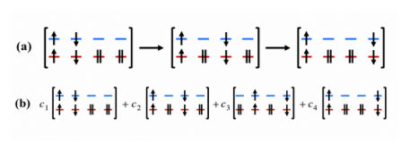
<figcaption class="paper-figure-caption"><b>Fig 2.</b> FIG. 1. Schematics of two different conceptualizations of triplet-triplet eigenstates of 4Pc (see text). Red and blue horizontal bars correspond to HOMO and LUMO of Pc monomers, doubly or singly occupied by electrons. Arrows on singly occupied MOs indicate electron spins. Bonding (antibonding) MOs not shown are completely filled (empty). (a) Individual configurations are eigenstates, and triplet sep- aration occurs along the indicated path. (b) Eigenstates are quantum superpositions of configurations with different rela- tive weights ci.</figcaption>
</figure>
<figure class="paper-figure-card">
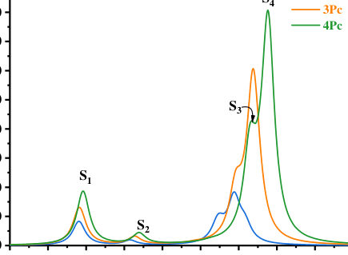
<figcaption class="paper-figure-caption"><b>Fig 3.</b> FIG. 3. Calculated ground state absorption spectra of nPc, n = 2-4. Si, i=1-4, label the different absorption bands (see Fig. 4)</figcaption>
</figure>
<figure class="paper-figure-card">
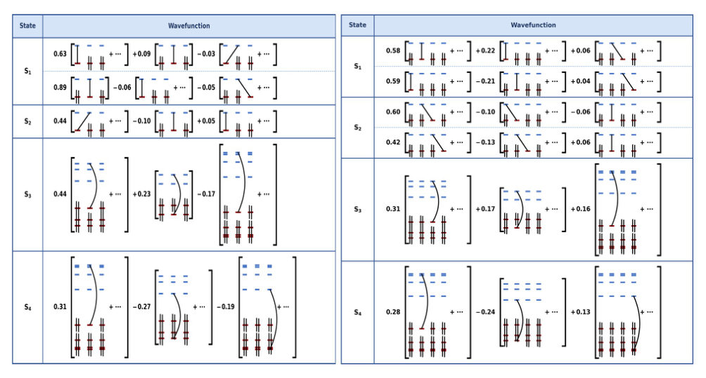
<figcaption class="paper-figure-caption"><b>Fig 4.</b> FIG. 4. Normalized exciton basis wavefunctions of final eigenstates to which ground state absorption occurs in 3Pc (left) and 4Pc (right). S1 - S4 correspond to the absorption bands labeled in Fig. 3. Red and blue horizontal bars represent bonding and antibonding MOs, respectively, which can be doubly or singly occupied by electrons. Straight or curved lines connecting MOs represent spin-singlet excitations. Ellipses correspond to configurations related by spatial and charge-conjugation symmetries. Filled (empty) bonding (antibonding) MOs are not shown.</figcaption>
</figure>
<figure class="paper-figure-card">
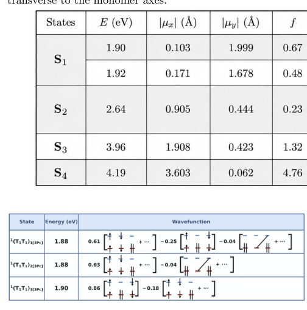
<figcaption class="paper-figure-caption"><b>Fig 5.</b> FIG. 5. 1(T1T1) eigenstates of 3Pc.</figcaption>
</figure>

**Summary.** The authors theoretically analyze the multiexciton states in polypentacene oligomers using sophisticated correlated-electron calculations. They demonstrate that the triplet-triplet excited states are highly delocalized quantum superpositions rather than localized pairs. This finding explains why experimental measurements suggest no discrete intramolecular triplet diffusion, challenging previous models of exciton behavior.

**Why it may be interesting.** This work directly addresses excited-state dynamics in organic semiconductors using advanced correlated electron methods, providing insights into charge/exciton localization and transport mechanisms relevant to molecular electronics and quantum energy conversion.

Detailed structure

**Main problem.** The study investigates the nature of triplet-triplet multiexciton states (1(T1T1)) in acene oligomers to determine if intramolecular triplet separation is physically possible.

**Main result.** The 1(T1T1) eigenstates are quantum superpositions of configurations spanning all accessible intertriplet separations, explaining the apparent absence of discrete intramolecular triplet diffusion.

**Method.** Correlated-electron calculations using the Pariser-Parr-Pople (PPP) Hamiltonian solved via Multiple-Reference Singles and Doubles Configuration Interaction (MRSDCI).

**Model / system.** The model uses three- and four-unit pentacene oligomers as microscopic representations of polypentacene. The calculations employ a molecular exciton basis to resolve different excitation types.

**Key observables.** Optical spin-singlet and triplet-triplet multiexciton states; Excited State Absorption (ESA) spectra from 1(T1T1) eigenstates; Triplet binding energy.

**Important parameters / regimes.** Onsite Hubbard repulsion U = 6.7 eV; The system size varies from 2 to 4 pentacene units.

**Assumptions / limitations.** Electron-vibration interactions are neglected, and the MRSDCI method approximates the inclusion of necessary quadruple excitations.

**Figures summary.** Figures schematically compare localized-pair vs. configuration-mixed descriptions of eigenstates; specific figures illustrate intermonomer Charge Transfer (CT) channels responsible for labeled ESA peaks in 4Pc.

**Paper structure.** The paper develops by first establishing the theoretical framework using PPP/MRSDCI, then calculating and analyzing the nature of the 1(T1T1) eigenstates, comparing these findings to experimental TA data, and finally concluding on the implications for triplet diffusion and singlet fission.

Abstract

We present correlated-electron calculations of optical spin-singlet and triplet-triplet multiexciton states in three- and four-unit pentacene oligomers as microscopic models for polypentacene. The calculations use the Pariser-Parr-Pople Hamiltonian, multiple-reference singles and doubles configuration interaction, and a molecular exciton basis that resolves Frenkel, charge-transfer, and triplet-pair (T1T1) configurations in real space. We find that the complete set of 1(T1T1) eigenstates lies in a narrow, nearly degenerate energy window near the lowest optical exciton and that no eigenstate can be identified with a single localized triplet-pair configuration. Instead, each triplet-pair eigenstate is a quantum superposition of configurations containing all accessible intertriplet separations. This electronic structure explains the perceived absence of intramolecular triplet diffusion in pentacene oligomers, polypentacene, and polytetracene solutions, while leaving open the possibility of intermolecular singlet fission in films with appreciable interchain interactions.

[↑ back to top](#top)

### [Tuning Superconductivity by Isovalent Antimony Substitution in PrFeAs(O,F)](http://arxiv.org/abs/2607.03712v1)

**Authors:** Priya Singh, Konrad Kwatek, Tatiana Zajarniuk, Taras Palasyuk, Cezariusz Jastrzębski, Michał Wierzbicki, Tomasz Cetner, Andrzej Szewczyk, Shiv J. Singh  
**Type:** both · **Category:** strongly correlated electrons · **PDF:** <https://arxiv.org/pdf/2607.03712v1>  
**Analysis basis:** full PDF text, analyzed in chunks

↔ Scroll figures horizontally

<figure class="paper-figure-card">

<figcaption class="paper-figure-caption"><b>Fig 1.</b> Low-resolution page preview, page 2</figcaption>
</figure>
<figure class="paper-figure-card">
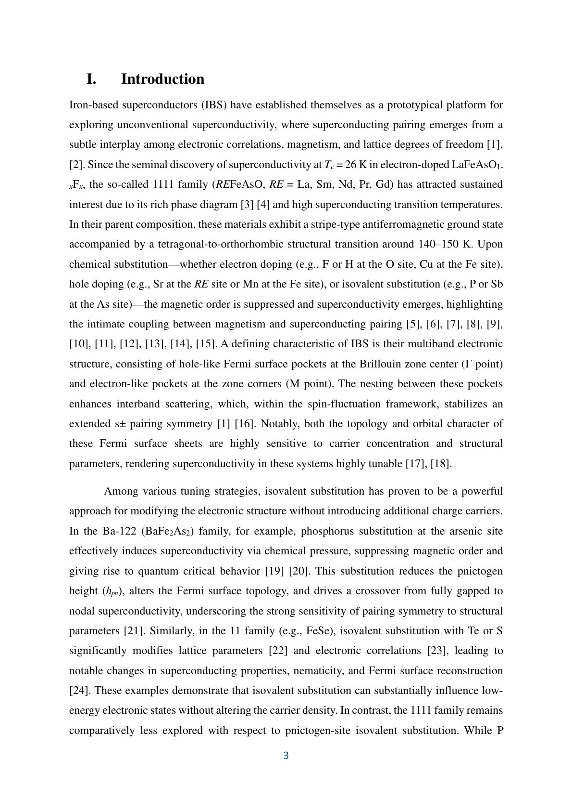
<figcaption class="paper-figure-caption"><b>Fig 2.</b> Low-resolution page preview, page 3</figcaption>
</figure>
<figure class="paper-figure-card">
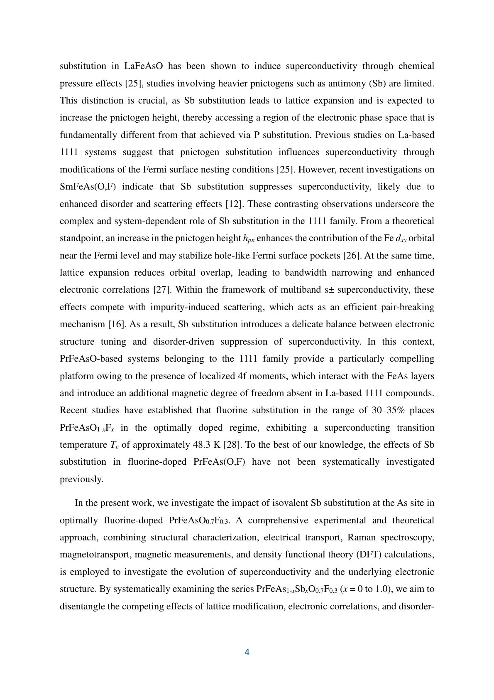
<figcaption class="paper-figure-caption"><b>Fig 3.</b> Low-resolution page preview, page 4</figcaption>
</figure>
<figure class="paper-figure-card">
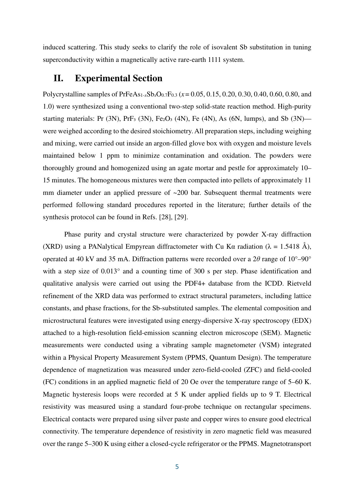
<figcaption class="paper-figure-caption"><b>Fig 4.</b> Low-resolution page preview, page 5</figcaption>
</figure>
<figure class="paper-figure-card">
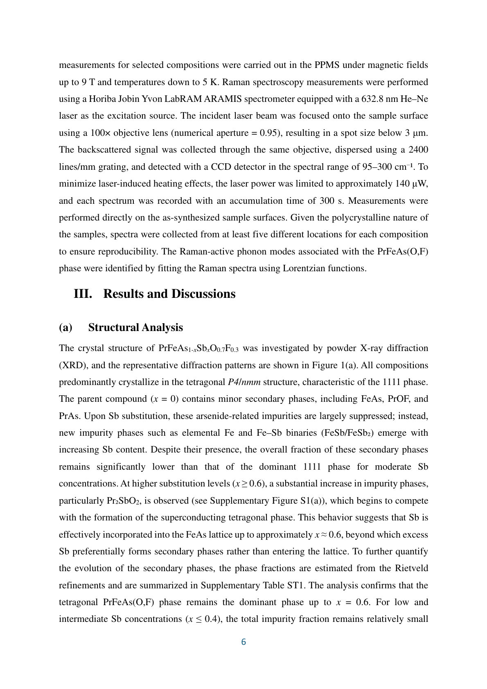
<figcaption class="paper-figure-caption"><b>Fig 5.</b> Low-resolution page preview, page 6</figcaption>
</figure>

**Summary.** This work systematically investigates how substituting Antimony (Sb) into the As site of $	ext{PrFeAs}(	ext{O},	ext{F})$ affects superconductivity. Using combined techniques like magnetotransport, Raman spectroscopy, and DFT, the researchers map out a doping phase diagram showing that while Sb substitution initially tunes superconducting properties, excessive doping leads to disorder-dominated suppression of $T_c$. It highlights the complex interplay between lattice modification and electronic pairing mechanisms in these materials.

**Why it may be interesting.** The study provides a detailed experimental roadmap for tuning superconductivity in strongly correlated iron-based superconductors by controlling disorder via isovalent substitution. The competition between electronic tuning and structural/disorder effects is a key theme in condensed matter physics.

Detailed structure

**Main problem.** The study investigates how isovalent Antimony (Sb) substitution affects superconductivity in iron pnictides, specifically $	ext{PrFeAs}(	ext{O},	ext{F})$. The goal is to understand the interplay between electronic tuning and structural disorder.

**Main result.** Superconductivity exhibits a crossover from an electronically tuned state at low doping to a regime dominated by disorder scattering as Sb concentration increases. While upper critical fields are enhanced, the overall superconducting performance degrades due to increasing lattice disorder and secondary phases.

**Method.** The research employs a comprehensive multiscale approach combining structural characterization (XRD), vibrational analysis (Raman spectroscopy), electrical transport measurements (magnetotransport up to 9 T), magnetic measurements, and theoretical calculations (DFT).

**Model / system.** The physical system is the iron pnictide superconductor $	ext{PrFeAs}_{1-x}	ext{Sb}_x	ext{O}_{0.7}	ext{F}_{0.3}$, which crystallizes in a tetragonal structure. The study systematically varies the Sb concentration ($x$) to probe doping effects.

**Key observables.** Superconducting transition temperature ($T_c$), upper critical fields ($H_{c2}$), vortex activation energy, lattice parameters (especially $c$-axis expansion), and phonon mode softening.

**Important parameters / regimes.** Doping concentration ($x$ of Sb substitution), magnetic field strength ($	ext{up to } 9 	ext{ T}$), and temperature range ($	ext{down to } 5 	ext{ K}$).

**Assumptions / limitations.** The primary limitation noted is the low critical current density, attributed to poor intergranular connectivity. The analysis assumes that structural changes (lattice expansion) and electronic effects are separable tuning mechanisms.

**Figures summary.** Figures summarize XRD results showing lattice parameter evolution; Raman spectra track phonon softening related to Sb incorporation; transport measurements show $T_c$ dependence on doping and magnetic field; and TAFF analysis quantifies vortex pinning energy.

**Paper structure.** The paper follows a systematic investigation: first, structural characterization (XRD/EDX) establishes the phase purity and lattice changes with doping. Second, Raman spectroscopy probes vibrational modes to understand local bonding changes. Finally, transport and magnetic measurements quantify the superconducting response ($T_c$, $H_{c2}$, $J_c$) across the doped series.

Abstract

We investigate the effects of isovalent Sb substitution at the As site in fluorine-doped PrFeAs1-xSbxO0.7F0.3 (x = 0 to 1.0) through structural, Raman spectroscopy, density functional theory (DFT), transport, magnetotransport, and magnetic measurements. The superconducting transition temperature decreases gradually from ~48 K for the parent compound to ~44 K up to x = 0.3, followed by a rapid suppression at higher Sb concentrations due to increasing disorder and secondary phase formation. Raman spectroscopy and DFT reveal lattice expansion and pronounced softening of pnictogen related vibrational modes upon Sb substitution. Magnetotransport measurements up to 9 T show enhanced upper critical fields and increased vortex activation energy for moderate Sb doping, indicating stronger vortex pinning. However, the critical current density remains low because of poor intergranular connectivity. The results demonstrate a crossover from an electronically tuned superconducting state to a disorder-dominated regime in isovalently substituted iron pnictides.

[↑ back to top](#top)

