
# arxiv digest (quant-ph + cond-mat) — 2026-07-09

*119 papers · 37 relevant · 3 highlighted*

## 🔥 Most relevant (37)

*Every paper with at least one nonzero topic score, sorted by best-matching score. 🔥 marks scores ≥4/5. Click the title to jump to the full entry below; click [arXiv] to open the paper page. `(secondary)` marks papers from de-prioritized cond-mat archives.*

Show 37 relevant papers

- [Calculating strongly correlated ground states from the non-Markovian dissipative dynamics of Gaussian fermions](#paper-2607.06293) [[arXiv]](http://arxiv.org/abs/2607.06293v1) — 🔥 `methods for driven-dissipative` **5/5** · 🔥 `non-equilibrium dynamics` **4/5** · `Keldysh / 2PI / non-Gaussian methods` **3/5** · `driven-dissipative phase transition` **3/5** · `quantum measurements` **3/5** · `Kondo & dissipative impurity` **2/5** · `measurement-induced transitions` **2/5** · `analog quantum simulation` **1/5** · `correlated / nonlocal dissipation` **1/5** · `correlated cavity matter` **1/5** · `non-equilibrium universality` **1/5**
- [Spontaneous emission of light by non-equilibrium phonons](#paper-2607.06399) [[arXiv]](http://arxiv.org/abs/2607.06399v1) `(secondary)` — 🔥 `non-equilibrium dynamics` **5/5** · 🔥 `non-equilibrium universality` **4/5** · `correlated / nonlocal dissipation` **3/5** · `driven-dissipative phase transition` **3/5** · `methods for driven-dissipative` **3/5** · `Keldysh / 2PI / non-Gaussian methods` **1/5** · `quantum optics experiment` **1/5**
- [Genuine Multi-Entropy in the Toric Code](#paper-2607.06050) [[arXiv]](http://arxiv.org/abs/2607.06050v1) — 🔥 `entanglement & information structure` **5/5** · `analog quantum simulation` **3/5** · `exotic spin models in light-matter` **1/5** · `non-equilibrium dynamics` **1/5**
- ⭐ [Continuous Narrow-Linewidth Superradiance in Waveguide QED](#paper-2607.06556) [[arXiv]](http://arxiv.org/abs/2607.06556v1) — 🔥 `Dicke superradiance` **4/5** · 🔥 `methods for driven-dissipative` **4/5** · 🔥 `superradiant laser` **4/5** · `Tavis-Cummings & cavity-many-emitter` **3/5** · `correlated / nonlocal dissipation` **3/5** · `correlated cavity matter` **3/5** · `driven-dissipative phase transition` **3/5** · `non-equilibrium dynamics` **3/5** · `Keldysh / 2PI / non-Gaussian methods` **2/5** · `analog quantum simulation` **2/5** · `non-equilibrium universality` **2/5** · `entanglement & information structure` **1/5** · `free-space correlated emission` **1/5** · `interference shaping light` **1/5** · `quantum measurements` **1/5**
- [Many-body quantum optics in a cascaded chiral network](#paper-2607.05760) [[arXiv]](http://arxiv.org/abs/2607.05760v1) — 🔥 `analog quantum simulation` **4/5** · 🔥 `correlated / nonlocal dissipation` **4/5** · 🔥 `methods for driven-dissipative` **4/5** · `Tavis-Cummings & cavity-many-emitter` **3/5** · `correlated cavity matter` **3/5** · `driven-dissipative phase transition` **3/5** · `entanglement & information structure` **3/5** · `non-equilibrium dynamics` **2/5** · `non-equilibrium universality` **2/5** · `quantum optics experiment` **2/5** · `Keldysh / 2PI / non-Gaussian methods` **1/5** · `QC/QI experiment` **1/5** · `exotic spin models in light-matter` **1/5** · `interference shaping light` **1/5** · `quantum measurements` **1/5**
- [Nonlocal transfer of quantized toroidal magnetic flux](#paper-2607.05581) [[arXiv]](http://arxiv.org/abs/2607.05581v1) — 🔥 `measurement-induced transitions` **4/5** · `Keldysh / 2PI / non-Gaussian methods` **3/5** · `correlated / nonlocal dissipation` **3/5** · `driven-dissipative phase transition` **3/5** · `methods for driven-dissipative` **3/5** · `quantum measurements` **3/5** · `entanglement & information structure` **2/5** · `non-equilibrium universality` **2/5** · `spintronics-quantum-optics interface` **2/5** · `Kondo & dissipative impurity` **1/5** · `QC/QI experiment` **1/5** · `analog quantum simulation` **1/5** · `correlated cavity matter` **1/5** · `exotic spin models in light-matter` **1/5** · `non-equilibrium dynamics` **1/5**
- [Coherence Estimation Beyond the Liouvillian Gap in a Finite Nonequilibrium System](#paper-2607.06215) [[arXiv]](http://arxiv.org/abs/2607.06215v1) — 🔥 `methods for driven-dissipative` **4/5** · `Tavis-Cummings & cavity-many-emitter` **3/5** · `correlated cavity matter` **3/5** · `driven-dissipative phase transition` **3/5** · `non-equilibrium dynamics` **3/5** · `correlated / nonlocal dissipation` **2/5** · `entanglement & information structure` **2/5** · `non-equilibrium universality` **2/5** · `Keldysh / 2PI / non-Gaussian methods` **1/5** · `analog quantum simulation` **1/5** · `measurement-induced transitions` **1/5** · `scars & prethermalization` **1/5**
- [Floquet polaritons in optically driven materials](#paper-2607.05857) [[arXiv]](http://arxiv.org/abs/2607.05857v1) `(secondary)` — 🔥 `methods for driven-dissipative` **4/5** · 🔥 `non-equilibrium dynamics` **4/5** · `Keldysh / 2PI / non-Gaussian methods` **3/5** · `driven-dissipative phase transition` **3/5** · `non-equilibrium universality` **2/5** · `analog quantum simulation` **1/5** · `correlated / nonlocal dissipation` **1/5** · `correlated cavity matter` **1/5** · `interference shaping light` **1/5** · `spintronics-quantum-optics interface` **1/5**
- [Low-depth simulation of non-Markovianity under quantum hardware noise](#paper-2607.05519) [[arXiv]](http://arxiv.org/abs/2607.05519v1) — 🔥 `methods for driven-dissipative` **4/5** · `correlated / nonlocal dissipation` **3/5** · `non-equilibrium dynamics` **3/5** · `driven-dissipative phase transition` **2/5** · `quantum measurements` **2/5** · `Keldysh / 2PI / non-Gaussian methods` **1/5** · `Kondo & dissipative impurity` **1/5** · `entanglement & information structure` **1/5** · `measurement-induced transitions` **1/5** · `non-equilibrium universality` **1/5**
- [Towards Quantum Network Performance Metrics: Challenges and Demonstration](#paper-2607.05642) [[arXiv]](http://arxiv.org/abs/2607.05642v1) — 🔥 `QC/QI experiment` **4/5** · `quantum measurements` **3/5** · `quantum optics experiment` **3/5** · `measurement-induced transitions` **2/5** · `analog quantum simulation` **1/5** · `correlated / nonlocal dissipation` **1/5** · `correlated cavity matter` **1/5** · `driven-dissipative phase transition` **1/5** · `entanglement & information structure` **1/5** · `methods for driven-dissipative` **1/5** · `non-equilibrium dynamics` **1/5**
- [Unbiased Estimation of Conditional Covariance for Quantum Optomechanics](#paper-2607.06431) [[arXiv]](http://arxiv.org/abs/2607.06431v1) — 🔥 `quantum measurements` **4/5** · `measurement-induced transitions` **3/5** · `methods for driven-dissipative` **3/5** · `quantum optics experiment` **3/5** · `Keldysh / 2PI / non-Gaussian methods` **1/5** · `correlated / nonlocal dissipation` **1/5** · `driven-dissipative phase transition` **1/5** · `entanglement & information structure` **1/5** · `non-equilibrium dynamics` **1/5**
- [Uncertainty relations for arbitrary currents in coherent transport](#paper-2607.06190) [[arXiv]](http://arxiv.org/abs/2607.06190v1) — 🔥 `non-equilibrium dynamics` **4/5** · `non-equilibrium universality` **3/5** · `Keldysh / 2PI / non-Gaussian methods` **2/5** · `driven-dissipative phase transition` **2/5** · `Kondo & dissipative impurity` **1/5** · `analog quantum simulation` **1/5** · `correlated / nonlocal dissipation` **1/5** · `entanglement & information structure` **1/5** · `measurement-induced transitions` **1/5** · `methods for driven-dissipative` **1/5** · `quantum measurements` **1/5**
- [Autoencoder-Based Unsupervised Identification of Nonequilibrium Phases in Sheared Binary Colloids](#paper-2607.05860) [[arXiv]](http://arxiv.org/abs/2607.05860v1) — 🔥 `non-equilibrium dynamics` **4/5** · `driven-dissipative phase transition` **3/5** · `methods for driven-dissipative` **3/5** · `non-equilibrium universality` **3/5** · `Frenkel-Kontorova` **1/5** · `Keldysh / 2PI / non-Gaussian methods` **1/5** · `analog quantum simulation` **1/5**
- [Composite-Fermion Study of Cavity-Modified Fractional Quantum Hall Excitation Gaps](#paper-2607.06298) [[arXiv]](http://arxiv.org/abs/2607.06298v1) — 🔥 `analog quantum simulation` **4/5** · 🔥 `correlated cavity matter` **4/5** · `Tavis-Cummings & cavity-many-emitter` **3/5** · `Keldysh / 2PI / non-Gaussian methods` **1/5** · `correlated / nonlocal dissipation` **1/5** · `driven-dissipative phase transition` **1/5** · `exotic spin models in light-matter` **1/5** · `methods for driven-dissipative` **1/5**
- [Magnetotransport of tomographic electrons in a Corbino disk](#paper-2607.05540) [[arXiv]](http://arxiv.org/abs/2607.05540v1) — 🔥 `non-equilibrium dynamics` **4/5** · `Keldysh / 2PI / non-Gaussian methods` **3/5** · `non-equilibrium universality` **3/5** · `driven-dissipative phase transition` **2/5** · `Kondo & dissipative impurity` **1/5** · `analog quantum simulation` **1/5** · `correlated / nonlocal dissipation` **1/5** · `methods for driven-dissipative` **1/5**
- [Thermodynamic phase transitions in lattice spin systems with severe kinetic constraints: Numerical simulation results](#paper-2607.06205) [[arXiv]](http://arxiv.org/abs/2607.06205v1) — 🔥 `scars & prethermalization` **4/5** · `non-equilibrium universality` **3/5** · `driven-dissipative phase transition` **2/5** · `non-equilibrium dynamics` **2/5** · `Frenkel-Kontorova` **1/5** · `analog quantum simulation` **1/5** · `correlated / nonlocal dissipation` **1/5** · `exotic spin models in light-matter` **1/5** · `methods for driven-dissipative` **1/5**
- [Engineering nonlinear magnon scattering in artificial spin ice via vertex dipolar control](#paper-2607.05797) [[arXiv]](http://arxiv.org/abs/2607.05797v1) `(secondary)` — 🔥 `analog quantum simulation` **4/5** · `exotic spin models in light-matter` **3/5** · `spintronics-quantum-optics interface` **3/5** · `non-equilibrium dynamics` **2/5** · `correlated / nonlocal dissipation` **1/5** · `driven-dissipative phase transition` **1/5** · `methods for driven-dissipative` **1/5**
- [Epitaxial single T centres in silicon-on-insulator](#paper-2607.06272) [[arXiv]](http://arxiv.org/abs/2607.06272v1) — 🔥 `QC/QI experiment` **4/5** · `quantum optics experiment` **3/5** · `spintronics-quantum-optics interface` **3/5** · `analog quantum simulation` **1/5** · `exotic spin models in light-matter` **1/5** · `interference shaping light` **1/5** · `quantum measurements` **1/5**
- [Bose Einstein Condensation of Magnons in BaCuSi$_{2}$O$_{6}$: An experimental perspective](#paper-2607.06028) [[arXiv]](http://arxiv.org/abs/2607.06028v1) — 🔥 `analog quantum simulation` **4/5** · `exotic spin models in light-matter` **3/5** · `spintronics-quantum-optics interface` **3/5** · `driven-dissipative phase transition` **1/5** · `entanglement & information structure` **1/5** · `non-equilibrium dynamics` **1/5**
- [Learning to Reconstruct Wigner Functions in Phase Space](#paper-2607.06232) [[arXiv]](http://arxiv.org/abs/2607.06232v1) — 🔥 `QC/QI experiment` **4/5** · `quantum measurements` **3/5** · `quantum optics experiment` **3/5** · `Tavis-Cummings & cavity-many-emitter` **1/5** · `measurement-induced transitions` **1/5** · `methods for driven-dissipative` **1/5**
- [Single-photon polarization tomography with an integrated metal-superconductor nanowire array](#paper-2607.06047) [[arXiv]](http://arxiv.org/abs/2607.06047v1) — 🔥 `QC/QI experiment` **4/5** · `quantum measurements` **3/5** · `quantum optics experiment` **3/5** · `interference shaping light` **1/5** · `measurement-induced transitions` **1/5** · `spintronics-quantum-optics interface` **1/5**
- [Chiral Graviton Modes in Non-Abelian lattice Fractional Quantum Hall states](#paper-2607.06267) [[arXiv]](http://arxiv.org/abs/2607.06267v1) — 🔥 `analog quantum simulation` **4/5** · `methods for driven-dissipative` **3/5** · `non-equilibrium dynamics` **2/5** · `Keldysh / 2PI / non-Gaussian methods` **1/5** · `driven-dissipative phase transition` **1/5** · `entanglement & information structure` **1/5**
- [Correlated Insulating States in Twisted Double Bilayer Graphene Enhanced by Interfacial Effect on CrOCl](#paper-2607.06492) [[arXiv]](http://arxiv.org/abs/2607.06492v1) `(secondary)` — 🔥 `analog quantum simulation` **4/5** · `exotic spin models in light-matter` **3/5** · `spintronics-quantum-optics interface` **3/5** · `Kondo & dissipative impurity` **1/5** · `non-equilibrium dynamics` **1/5**
- [Design and Benchmarking of a Quantum Photonic Chip](#paper-2607.06488) [[arXiv]](http://arxiv.org/abs/2607.06488v1) — 🔥 `QC/QI experiment` **4/5** · `quantum optics experiment` **3/5** · `analog quantum simulation` **2/5** · `entanglement & information structure` **1/5** · `interference shaping light` **1/5** · `non-equilibrium dynamics` **1/5**
- [Higher-dimensional chaotic features and random matrix signatures following a local quench](#paper-2607.05512) [[arXiv]](http://arxiv.org/abs/2607.05512v1) — 🔥 `non-equilibrium dynamics` **4/5** · `non-equilibrium universality` **3/5** · `Keldysh / 2PI / non-Gaussian methods` **1/5** · `driven-dissipative phase transition` **1/5** · `entanglement & information structure` **1/5** · `methods for driven-dissipative` **1/5**
- [Universal self-similar evolution of two-dimensional Bose-Einstein condensates in the acoustic regime](#paper-2607.06062) [[arXiv]](http://arxiv.org/abs/2607.06062v1) — 🔥 `non-equilibrium universality` **4/5** · `non-equilibrium dynamics` **3/5** · `Keldysh / 2PI / non-Gaussian methods` **1/5** · `analog quantum simulation` **1/5** · `driven-dissipative phase transition` **1/5** · `methods for driven-dissipative` **1/5**
- [Classical Reversible Computation by Quantum Coherence](#paper-2607.06219) [[arXiv]](http://arxiv.org/abs/2607.06219v1) — 🔥 `QC/QI experiment` **4/5** · `spintronics-quantum-optics interface` **3/5** · `exotic spin models in light-matter` **1/5** · `non-equilibrium dynamics` **1/5**
- [Exact flat bands in a 3D photonic crystal](#paper-2607.05942) [[arXiv]](http://arxiv.org/abs/2607.05942v1) `(secondary)` — 🔥 `analog quantum simulation` **4/5** · `correlated cavity matter` **3/5** · `driven-dissipative phase transition` **1/5** · `interference shaping light` **1/5**
- [Typical Entanglement of Superpositions](#paper-2607.06474) [[arXiv]](http://arxiv.org/abs/2607.06474v1) — 🔥 `entanglement & information structure` **4/5** · `analog quantum simulation` **1/5** · `methods for driven-dissipative` **1/5** · `non-equilibrium dynamics` **1/5** · `non-equilibrium universality` **1/5**
- [A Quantum-HPC Hybrid Workflow for Reaction-Center Electronic Dynamics: Application to a Cytochrome P450-Inspired Iron-Complex Model](#paper-2607.05786) [[arXiv]](http://arxiv.org/abs/2607.05786v1) — 🔥 `QC/QI experiment` **4/5** · `non-equilibrium dynamics` **2/5** · `methods for driven-dissipative` **1/5**
- [Entanglement Entropy of Free Fermions on Random Fractal Lattices](#paper-2607.05611) [[arXiv]](http://arxiv.org/abs/2607.05611v1) — 🔥 `entanglement & information structure` **4/5** · `analog quantum simulation` **1/5** · `non-equilibrium dynamics` **1/5** · `non-equilibrium universality` **1/5**
- [Simplified quantum key distribution implementation secure in the presence of state preparation flaws](#paper-2607.06038) [[arXiv]](http://arxiv.org/abs/2607.06038v1) — 🔥 `QC/QI experiment` **4/5** · `quantum optics experiment` **2/5** · `quantum measurements` **1/5**
- [Determination of thermodynamics from entanglement entropy in the finite-density O(N) model](#paper-2607.06286) [[arXiv]](http://arxiv.org/abs/2607.06286v1) — 🔥 `entanglement & information structure` **4/5** · `Keldysh / 2PI / non-Gaussian methods` **1/5** · `non-equilibrium dynamics` **1/5**
- [Entangled quantum clocks as operational probes of spacetime curvature](#paper-2607.05715) [[arXiv]](http://arxiv.org/abs/2607.05715v1) — 🔥 `entanglement & information structure` **4/5** · `quantum measurements` **2/5**
- [Radio frequency readout and control of Ge/SiGe hole spin qubits with a global accumulation gate](#paper-2607.06342) [[arXiv]](http://arxiv.org/abs/2607.06342v1) — 🔥 `QC/QI experiment` **4/5** · `quantum measurements` **1/5** · `spintronics-quantum-optics interface` **1/5**
- [Maximal coherence of quantum measurement and the resource theory of sharpness](#paper-2607.05847) [[arXiv]](http://arxiv.org/abs/2607.05847v1) — 🔥 `quantum measurements` **4/5** · `measurement-induced transitions` **1/5**
- [Lean-Quantum: Toward AI-Assisted Formalization of Quantum Information](#paper-2607.05492) [[arXiv]](http://arxiv.org/abs/2607.05492v1) — 🔥 `entanglement & information structure` **4/5**

## ⭐ Highlighted (3)

*Papers by authors on your watch list. Click the title to jump to the full entry below; click [arXiv] to open the paper page.*

Show 3 highlighted papers

- ⭐ [Differentially private quantum sensor networks](#paper-2607.06521) [[arXiv]](http://arxiv.org/abs/2607.06521v1) — Alexey V. Gorshkov
- ⭐ [Quantization of the classical Mpemba effect](#paper-2607.06071) [[arXiv]](http://arxiv.org/abs/2607.06071v1) — Giovanna Morigi
- ⭐ [Continuous Narrow-Linewidth Superradiance in Waveguide QED](#paper-2607.06556) [[arXiv]](http://arxiv.org/abs/2607.06556v1) — Susanne F. Yelin, Helmut Ritsch

## All papers (93, sorted by relevance)

*Papers from quant-ph and your primary cond-mat archives (quant-gas, stat-mech, str-el, dis-nn). Highlighted papers (⭐) come first, then everything else sorted by topic-relevance score, highest first.*

### ⭐ [Continuous Narrow-Linewidth Superradiance in Waveguide QED](http://arxiv.org/abs/2607.06556v1)

**Highlighted author(s):** Susanne F. Yelin, Helmut Ritsch  
**Authors:** Anna Bychek, Martin Fasser, Ivan Vybornyi, Klemens Hammerer, Susanne F. Yelin, Helmut Ritsch, Raphael Holzinger  
**Type:** theory · **Category:** other · **PDF:** <https://arxiv.org/pdf/2607.06556v1>  
**Analysis basis:** full PDF text, analyzed in chunks
**Topic relevance:** 🔥 `Dicke superradiance` **4/5** · 🔥 `methods for driven-dissipative` **4/5** · 🔥 `superradiant laser` **4/5** · `Tavis-Cummings & cavity-many-emitter` **3/5** · `correlated / nonlocal dissipation` **3/5** · `correlated cavity matter` **3/5** · `driven-dissipative phase transition` **3/5** · `non-equilibrium dynamics` **3/5** · `Keldysh / 2PI / non-Gaussian methods` **2/5** · `analog quantum simulation` **2/5** · `non-equilibrium universality` **2/5** · `entanglement & information structure` **1/5** · `free-space correlated emission` **1/5** · `interference shaping light` **1/5** · `quantum measurements` **1/5**

↔ Scroll figures horizontally

<figure class="paper-figure-card">
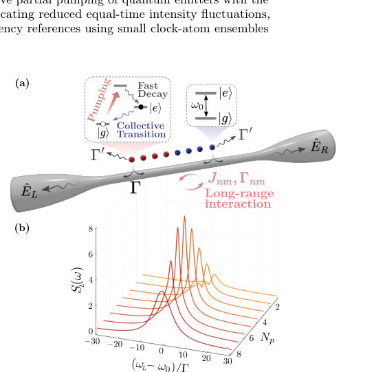
<figcaption class="paper-figure-caption"><b>Fig 1.</b> FIG. 1. Continuous narrow-linewidth collective emis- sion. (a) An ensemble of quantum emitters coupled to a single-mode waveguide reservoir. The emitters feature excited (|e⟩) and ground (|g⟩) states with coupling rates Γ to the reso- nant bidirectional waveguide mode and local loss with rates Γ′ (both assumed to be identical for all emitters). A subset (in red) is incoherently pumped with rate R, with the rest (in blue) providing collective feedback, resulting in collective emission into left- and right-propagating electric fields. (b) Emission spectrum from N = 8 emitters into the left direction, presented for different numbers of pumped emitters Np at rate R = 5Γ. The spectra show...</figcaption>
</figure>
<figure class="paper-figure-card">
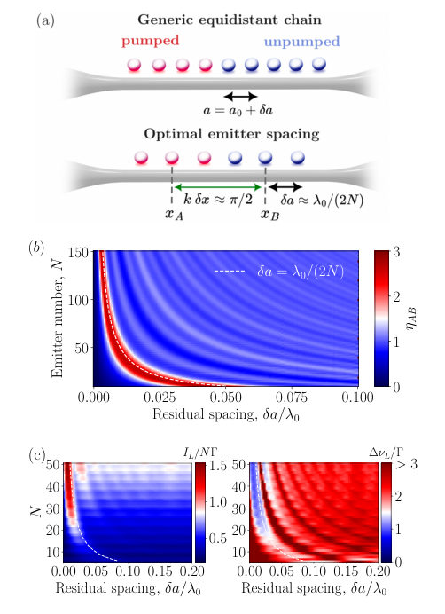
<figcaption class="paper-figure-caption"><b>Fig 2.</b> FIG. 2. Optimal emitter spacing and emission proper- ties of a regular chain under incoherent pumping of its left half: (a) Sketch of a chain with nearest-neighbor emitter spacing a = a0 + δa, where a0 = ℓλ0 is an integer-wavelength offset. For an optimized emitter spacing, center-to-center residual phase is approximately kδx ≈π/2 between the two sub-ensemble centers. (b) The ratio of coherent versus dis- sipative coupling between the pumped (A) and unpumped (B) ensembles is quantified by the parameter ηAB defined in Eq. (12) and plotted as a function of the residual spacing δa and total emitter number N. For Np = N/2, the optimal residual spacing follows δa ≈λ0/(2N) (white dashed line)...</figcaption>
</figure>
<figure class="paper-figure-card">
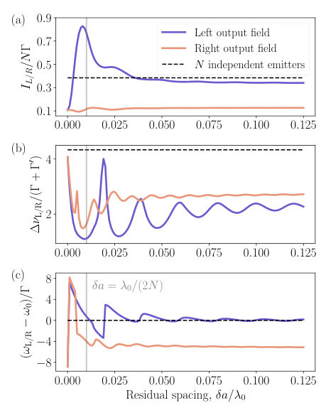
<figcaption class="paper-figure-caption"><b>Fig 3.</b> FIG. 3. Emission into left- and right-propagating waveg- uide modes. Emerging left/right asymmetry of steady-state emission properties for varying residual nearest-neighbor phase kδa. (a) Normalized steady-state photon emission IL/R is enhanced into the left and strongly suppressed into the right- propagating direction. (b) Full width at half maximum ∆νL/R of the spectral peak in units of the emitter spectral linewidth Γ + Γ′ decreases strongly toward the left output at optimal spacing. (c) The spectral peak position ωL/R is close to the emitter’s natural frequency for left propagation and strongly shifted for right propagation. Parameters: Np = N/2, N = 50, R = 10Γ, Γ′ = 2Γ.</figcaption>
</figure>
<figure class="paper-figure-card">
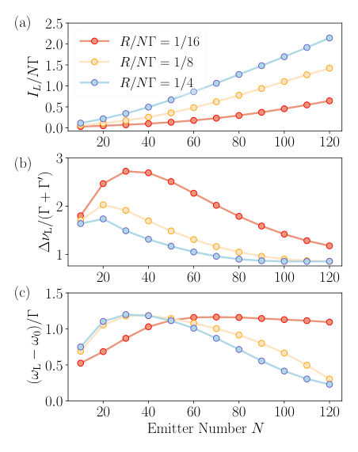
<figcaption class="paper-figure-caption"><b>Fig 4.</b> FIG. 5. Optimal emitter spacing. Emission characteristics are shown for the left-propagating field as a function of the total emitter number N for N-dependent pumping rates. (a) The steady-state emission rate IL exhibits a quadratic scaling IL ∼ΓN 2. (b) The full width at half maximum ∆νL of the spectral peak in units of Γ + Γ′ shows a decrease and eventually decreases below the single-emitter linewidth Γ + Γ′. (c) The spectral peak position ωL approaches the natural emitter frequency ω0 for increasing N. Parameters: Np = N/2, kδa = π/N, Γ′ = 3Γ.</figcaption>
</figure>
<figure class="paper-figure-card">
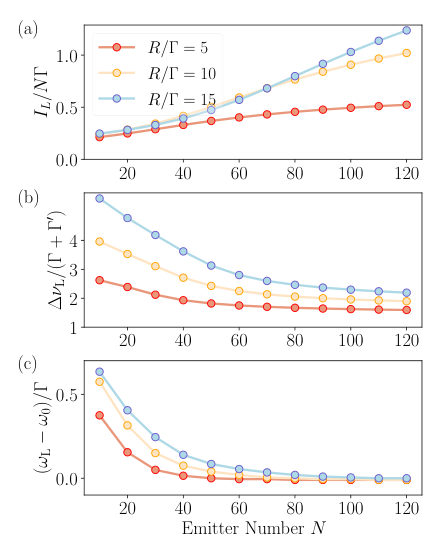
<figcaption class="paper-figure-caption"><b>Fig 5.</b> FIG. 4. Equidistant emitter chain. The emission properties are shown for the left-propagating field as a function of the total emitter number N for three different pumping rates. (a) The photon emission rate IL shows an increase and saturation above NΓ for sufficient pumping rates. (b) The spectral linewidth ∆νL shows a decrease and eventual saturation above Γ + Γ′. (c) The spectral peak position ωL approaches the natural emitter frequency ω0 for increasing N. Parameters: Np = N/2, kδa = π/5, Γ′ = 3Γ.</figcaption>
</figure>

**Summary.** The paper proposes using an array of quantum emitters coupled to a nanophotonic waveguide to create stable, narrow-linewidth optical frequency references. By selectively pumping only part of the ensemble, the unpumped atoms provide collective feedback that enhances coherence. This method demonstrates a route to chip-scale precision metrology by achieving superradiance in a continuous, controlled manner.

**Why it may be interesting.** This work provides a detailed theoretical framework for engineering quantum light sources by controlling emitter interactions via waveguide geometry and selective excitation, which is highly relevant to open quantum systems and cavity QED research.

Detailed structure

**Main problem.** The primary goal is to achieve continuous, narrow-linewidth coherent emission from an ensemble of quantum emitters, overcoming the limitations of transient superradiant bursts.

**Main result.** Selective partial pumping of a sub-ensemble of emitters allows for directional superradiant emission with a narrow output spectrum near the bare emitter resonance frequency.

**Method.** The analysis employs the Lindblad master equation and utilizes second-order cumulant expansions to model the non-equilibrium steady state dynamics of the coupled system.

**Model / system.** The system consists of $N$ two-level quantum emitters coupled to a single-mode, bidirectional nanophotonic waveguide reservoir. The dynamics are governed by an effective Hamiltonian incorporating dipole-dipole interactions mediated by the waveguide.

**Key observables.** Spectral linewidth (FWHM), zero-delay second-order correlation function ($g^{(2)}(0)$), and directional emission intensity asymmetry ($I_L/R$).

**Important parameters / regimes.** The optimal operating regime is achieved when the pumped and unpumped sub-ensembles are of comparable size, leading to specific residual phases ($\phi_{	ext{opt}}$).

**Assumptions / limitations.** Approximations include neglecting free-space dipole interactions ($a_0 \gg \lambda_0$) and using cumulant expansions for large ensembles.

**Figures summary.** Figures illustrate the spectral narrowing achieved via partial pumping, showing optimal performance when pumped fractions are near half the total emitters. Other figures detail directional emission asymmetry based on emitter spacing.

**Paper structure.** The paper builds from the general master equation description to analyzing specific coupling mechanisms (partial pumping), deriving analytical expressions for correlation functions, and finally presenting results demonstrating spectral narrowing and directional control.

Abstract

Superradiant lasers promise continuous, narrow-linewidth coherent emission at the bare atomic transition frequency, enabling frequency references of exceptional precision. Recent experiments have advanced the field, but achieving truly continuous operation remains technically challenging. Here we propose an alternative route to an active optical frequency reference with fewer emitters using all-to-all dipole-dipole interactions mediated by a nanophotonic waveguide. We show that selectively pumping only a sub-ensemble of emitters, rather than the full ensemble, substantially improves emission characteristics. The collective interactions with unpumped emitters provide narrowband frequency selection and establish an effective feedback mechanism analogous to the role of a macroscopic cavity. We find directional superradiant emission with strongly phase-synchronized emitter correlations and a narrow output spectrum close to the bare emitter resonance. Our results demonstrate a strong metrological gain from selective partial pumping of quantum emitters with the second-order intensity correlation $g^{(2)}(0)\simeq 1$, indicating reduced equal-time intensity fluctuations, and open a route to waveguide-based optical frequency references using small clock-atom ensembles for chip-scale precision metrology.

[↑ back to top](#top)

### ⭐ [Quantization of the classical Mpemba effect](http://arxiv.org/abs/2607.06071v1)

**Highlighted author(s):** Giovanna Morigi  
**Authors:** Jannis Melles, Hartmut Löwen, Benno Liebchen, Michael te Vrugt, Giovanna Morigi, Artur Widera, Alexander P. Antonov  
**Type:** theory · **Category:** statistical mechanics · **PDF:** <https://arxiv.org/pdf/2607.06071v1>  
**Analysis basis:** full PDF text, analyzed in chunks
**Topic relevance:** `methods for driven-dissipative` **3/5** · `non-equilibrium dynamics` **3/5** · `non-equilibrium universality` **2/5** · `Keldysh / 2PI / non-Gaussian methods` **1/5** · `correlated / nonlocal dissipation` **1/5** · `driven-dissipative phase transition` **1/5**

↔ Scroll figures horizontally

<figure class="paper-figure-card">
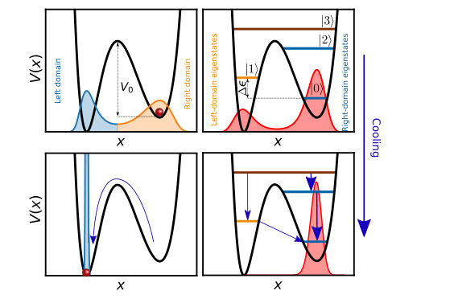
<figcaption class="paper-figure-caption"><b>Fig 1.</b> FIG. 1. Schematic representation of the cooling process in a double well potential. The classical and quantum processes are illustrated on the left and right panels, respectively. For a classical particle, escape from a metastable state (right do- main) to a global one (left domain) follows the Arrhenius law and generally requires thermal energies comparable to bar- rier height V0 to be achieved in a finite time. In the quan- tum regime, tunneling between bound quantum states enables transitions between the wells at energies ∆ϵ well below the barrier height, giving rise to additional relaxation channels. Fast and slow transitions in the lower panel are depicted by one-way arrows with a big...</figcaption>
</figure>
<figure class="paper-figure-card">
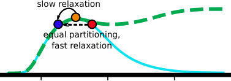
<figcaption class="paper-figure-caption"><b>Fig 2.</b> FIG. 2. Key ingredient for the Mpemba effect: non-monotonic temperature dependence of the thermal probability PL to oc- cupy a (left) domain. Both (a) classical (solid green) and (b) quantum (dashed green) systems exhibit such behavior, with the black dashed horizontal arrows highlighting pairs of temperatures with identical domain occupation probabilities (equal partitioning), associated with rapid relaxation from hotter system (marked by red circle) to a colder one (blue circle). When the domain occupations associated with the initial and target temperatures do not match (as e.g. for the orange and blue circles), relaxation must overcome a bottle- neck associated with redistributing the...</figcaption>
</figure>
<figure class="paper-figure-card">
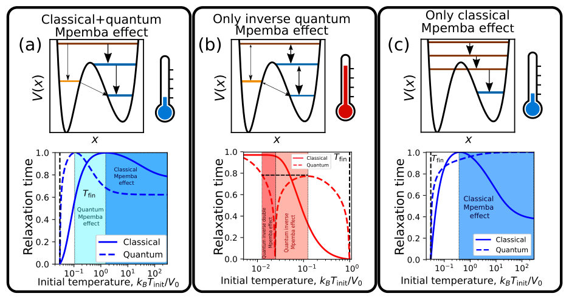
<figcaption class="paper-figure-caption"><b>Fig 3.</b> FIG. 3. (a) A Mpemba effect (reduction of the relaxation time upon increasing the initial temperature) for the cooling process is observed in both classical and quantum systems, where the latter emerges at a much colder temperature range compared to the classical counterpart. The temperature ranges over which the relaxation time decreases are indicated by rectangles (blue for the classical system, extended with a cyan region for the quantum system). (b) In the classical case, the inverse Mpemba effect (reduction of the relaxation time upon decreasing the initial temperature) is suppressed when the system is heated only up to a target temperature below the barrier height; however, a...</figcaption>
</figure>

**Summary.** The paper theoretically explores the quantization of the Mpemba effect using a bistable potential model. It demonstrates that moving from classical to quantum descriptions fundamentally alters the cooling dynamics, predicting novel effects like inverse and double inverse Mpemba behavior at ultra-low temperatures. This establishes quantization as a robust mechanism for observing anomalous thermal relaxation inaccessible classically.

**Why it may be interesting.** This work directly addresses non-equilibrium statistical mechanics in open quantum systems, providing concrete predictions for anomalous relaxation phenomena accessible only through quantum coherence or dissipation mechanisms.

Detailed structure

**Main problem.** The paper investigates the Mpemba effect—the counterintuitive phenomenon of faster cooling for initially hotter systems—by analyzing its behavior when quantized.

**Main result.** Quantization shifts the Mpemba effect to ultra-cold temperatures and generates novel quantum phenomena, such as inverse and double inverse Mpemba effects, absent in classical dynamics.

**Method.** The analysis compares classical thermal evolution (using Boltzmann weights) with quantum relaxation governed by Lindblad master equations and spectral decomposition of the Liouvillian operator.

**Model / system.** The study uses the paradigmatic benchmark of an asymmetric bistable potential, modeling both classical thermal states and quantum dissipative dynamics.

**Key observables.** Domain occupation probabilities ($P_L(T)$ or $P_1(T)$), relaxation time ($	au$), and the trace distance quantifying approach to steady state.

**Important parameters / regimes.** Temperature (especially ultra-cold regimes), potential barrier height ($V_0$), and coupling strength determining weak vs. strong coupling limits.

**Assumptions / limitations.** The analysis relies on single-mode approximations for relaxation dynamics and assumes the existence of weakly coupled states to observe quantum effects.

**Figures summary.** Figures illustrate the non-monotonic temperature dependence required for the Mpemba effect in both classical (Fig. 2) and quantum settings, showing different regimes like inverse or double inverse effects.

**Paper structure.** The paper progresses by establishing the classical benchmark using thermal barrier crossing, then introduces quantization via Lindblad dynamics, deriving the time evolution of population imbalance, and finally comparing the resulting temperature dependencies to highlight novel quantum regimes.

Abstract

The Mpemba effect refers to the counterintuitive phenomenon that an initially hot system can freeze faster than an initially warm one. Recent years have brought major advances in both classical and quantum realizations, with the asymmetric bistable potential emerging as the paradigmatic classical benchmark because its mechanism is especially transparent and controllable. Yet for precisely this benchmark problem, the impact of quantization remains unexplored. Here we show that quantization shifts Mpemba behavior to qualitatively new regimes, moving it to ultra-cold temperatures that are orders of magnitude lower than those relevant for classical thermal barrier crossing. In addition, quantization produces inverse and double inverse Mpemba effects that are absent in the corresponding classical dynamics. Our results establish quantization as a robust route to quantum-enabled Mpemba effects inaccessible in classical regimes.

[↑ back to top](#top)

### ⭐ [Differentially private quantum sensor networks](http://arxiv.org/abs/2607.06521v1)

**Highlighted author(s):** Alexey V. Gorshkov  
**Authors:** Daniel J. Spencer, Kaiyan Shi, Emil T. Khabiboulline, Gorjan Alagic, Alexey V. Gorshkov  
**Type:** theory · **Category:** quantum information and computing · **PDF:** <https://arxiv.org/pdf/2607.06521v1>  
**Analysis basis:** full PDF text, analyzed in chunks
**Topic relevance:** `entanglement & information structure` **1/5** · `quantum measurements` **1/5**

↔ Scroll figures horizontally

<figure class="paper-figure-card">
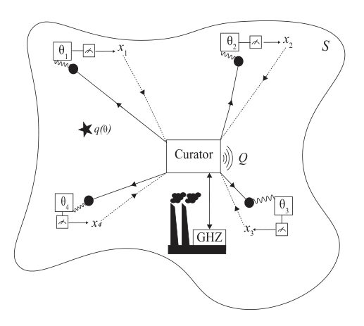
<figcaption class="paper-figure-caption"><b>Fig 1.</b> Figure 1. Schematic of the physical setup of the entangled sensor network. The nodes are embedded in some space S and the goal is to estimate a function q(θ), labeled with a star. Here, we show the “centralized setting,” in which a cen- tral curator administers the sensing protocol. This involves creating an n-qubit GHZ state and distributing the state to the network. Then, each qubit is coupled to the local param- eter θi at each node, evolved according to the Hamiltonian defining the problem, and measured. The measurement re- sults are then sent to the curator, from which the curator calculates an estimate Q for the function q and broadcasts the answer to the client (either a third party...</figcaption>
</figure>
<figure class="paper-figure-card">
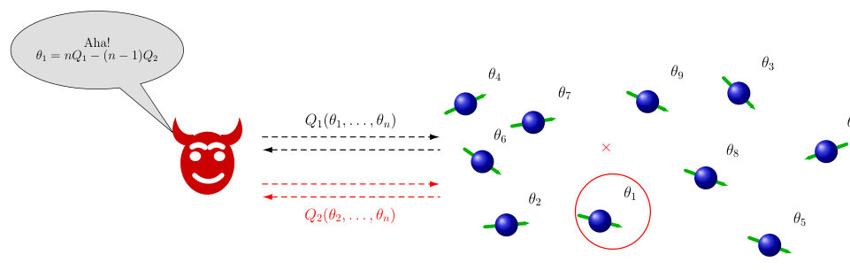
<figcaption class="paper-figure-caption"><b>Fig 2.</b> Figure 2. Schematic of the differencing attack, the primary attack considered in this paper. The adversary (either a malicious internal node of the network collaborating with other malicious nodes or a malicious third party delegating a sensing task to the network, where the third party either acts independently or collaborates with malicious nodes) can ask for any linear function estimation task to be run on the network and receive back an estimate Q. If the adversary asks for the task Q1(θ1, . . . , θn) = 1 n Pn i=1 θi including all of the nodes in the network and then Q2(θ2, . . . , θn) = 1 n−1 Pn i=2 θi excluding only θ1, then the adversary can effectively learn θ1 as θ1 = nQ1(θ1, . . ....</figcaption>
</figure>
<figure class="paper-figure-card">
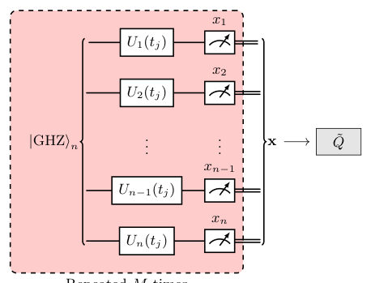
<figcaption class="paper-figure-caption"><b>Fig 3.</b> Figure 3. Centralized entangled sensor network protocol us- ing a global Laplace mechanism. The entangled sensor proto- col is run as normal with no privacy mechanism, and the ith node sends its M classical measurement results xi = (x(1) i , . . . , x(M) i ) to the trusted curator over a secure, classi- cal channel, who then collects all measurement results into a vector x = (x1, . . . , xn) and calculates the function esti- mate Q. Before the curator broadcasts the function estimate, though, it applies noise η drawn from the Laplace distribution to Q and then broadcasts this noisy value, ˜Q = Q + η.</figcaption>
</figure>
<figure class="paper-figure-card">
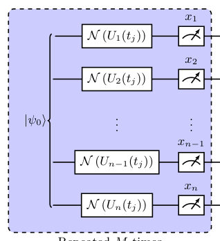
<figcaption class="paper-figure-caption"><b>Fig 4.</b> Figure 4. Decentralized entangled sensor network protocol using a local differential privacy mechanism. A GHZ state |ψ0⟩is generated by the nodes, where each node holds one qubit of the GHZ state. Each node evolves their qubit under a “noisy” unitary, denoted N(Ui(t)), measures their qubit in the Hadamard basis, and broadcasts the measurement results xi to all nodes in the network, each of which can then calculate the noisy function estimate ˜Q.</figcaption>
</figure>
<figure class="paper-figure-card">
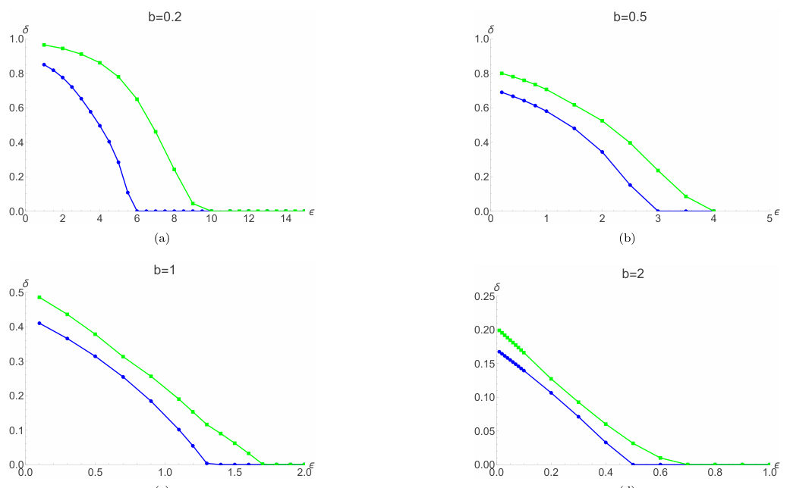
<figcaption class="paper-figure-caption"><b>Fig 5.</b> Figure 5. Probability of failure to achieve ε-differential privacy, δ, as a function of privacy level ε, for varying values of bits of precision K = 1 (blue), K = 2 (green) and noise level b = 0.2, 0.5, 1.0, 2.0.</figcaption>
</figure>

**Summary.** This paper addresses the critical need for privacy protection in high-precision quantum sensors. It develops novel protocols that successfully combine differential privacy guarantees with the superior Heisenberg scaling of measurement accuracy. The research provides a detailed understanding of the trade-offs, showing how to maintain optimal performance while rigorously hiding sensitive input data.

**Why it may be interesting.** This work is highly relevant as it merges quantum estimation theory (Heisenberg limit) with modern privacy techniques (Differential Privacy), providing a blueprint for secure quantum data processing that could be applied in sensitive fields like biomedical sensing.

Detailed structure

**Main problem.** The core problem is developing quantum sensing protocols that can estimate unknown functions with high precision while simultaneously guaranteeing strong privacy protection against adversaries.

**Main result.** The authors introduce secure, differentially private sensing protocols that successfully reconcile the Heisenberg-limited scaling of measurement error ($O(1/n^2)$) with constant differential privacy ($\epsilon=O(1)$) in local settings under specific assumptions.

**Method.** The work involves modifying quantum sensing Hamiltonians to inject controlled noise and applying advanced information-theoretic tools, such as analyzing the resulting probability distributions via Gamma functions, to bound the privacy leakage.

**Model / system.** The model is an entangled quantum sensor network (using qubits) designed for function estimation $q(	heta)$. The system evolution is governed by a Hamiltonian that includes both the sensing parameters ($	heta$) and injected noise terms ($\eta$).

**Key observables.** Mean-Squared Error ($\epsilon	ext{MSE}$) of the function estimate, $(\epsilon, \delta)$-differential privacy level, and the scaling factor $\alpha$ governing error decay.

**Important parameters / regimes.** The network size ($n$), the noise scale parameter ($b$), and the precision/number of bits ($K$) are critical parameters determining the trade-off between utility and privacy.

**Assumptions / limitations.** Key results rely on assuming a common source of randomness (CSR) and that a constant fraction of nodes are honest for local implementability. The analysis also distinguishes itself from prior work by focusing on sensing protocols rather than just state input privacy.

**Figures summary.** Figure 5 illustrates the relationship between failure probability ($\delta$) and privacy level ($\epsilon$) for different noise levels ($b$) and precision ($K$), showing how increasing precision increases the required $\epsilon$.

**Paper structure.** The paper follows a structure of defining necessary criteria, reviewing existing theory on classical/quantum DP, introducing centralized and decentralized protocols (including noisy Hamiltonian modifications), and concluding with detailed analysis of scaling laws.

Abstract

Quantum sensing is a promising technology capable of demonstrating clear advantage over comparable classical techniques for precise measurement. One application of quantum sensing is in function estimation, which can be done using a network of entangled quantum sensors, allowing for measurements with greater optimal sensitivity than unentangled sensing protocols. In cases where quantum sensor networks will be used to measure data that should remain private (e.g., biomedical data), it is imperative that these protocols include a privacy mechanism to hide sensitive information. In this work, we show that entangled sensor networks are vulnerable to certain privacy-violating attacks. To mitigate these attacks, we introduce secure sensing protocols endowed with differential privacy. We reconcile differential privacy with retaining Heisenberg-limited scaling, and introduce several protocols achieving varying balances between the two. We show that our main protocol, an $n$-node network sensing protocol that injects noise directly into the sensing Hamiltonian, exhibits a tradeoff between the desirable $O(1/n^2)$ Heisenberg scaling of the mean-squared error of the function estimate and the level of privacy attainable. Under assumptions on the network (a common source of randomness and a constant fraction of honest parties), we show that this protocol is locally implementable and achieves $(O(1), δ)$-differential privacy for arbitrarily small $δ$ while retaining Heisenberg scaling of the mean-squared error. We prove that our protocols are resilient to attacks by broad classes of classical and quantum adversaries, and find advantages in the privacy-utility tradeoff when using quantum techniques.

[↑ back to top](#top)

### [Calculating strongly correlated ground states from the non-Markovian dissipative dynamics of Gaussian fermions](http://arxiv.org/abs/2607.06293v1)

**Authors:** Giuliano Chiriacò  
**Type:** theory · **Category:** strongly correlated electrons · **PDF:** <https://arxiv.org/pdf/2607.06293v1>  
**Analysis basis:** full PDF text, analyzed in chunks
**Topic relevance:** 🔥 `methods for driven-dissipative` **5/5** · 🔥 `non-equilibrium dynamics` **4/5** · `Keldysh / 2PI / non-Gaussian methods` **3/5** · `driven-dissipative phase transition` **3/5** · `quantum measurements` **3/5** · `Kondo & dissipative impurity` **2/5** · `measurement-induced transitions` **2/5** · `analog quantum simulation` **1/5** · `correlated / nonlocal dissipation` **1/5** · `correlated cavity matter` **1/5** · `non-equilibrium universality` **1/5**

↔ Scroll figures horizontally

<figure class="paper-figure-card">
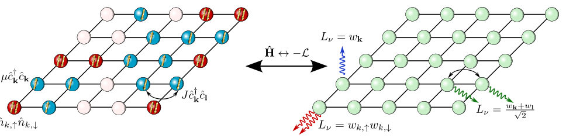
<figcaption class="paper-figure-caption"><b>Fig 1.</b> FIG. 1. Sketch of the model considered and of the mapping. To the left we have the standard depiction of a Fermi-Hubbard model of electrons, with on-site repulsion U, hopping J and chemical potential µ. To the right we have the mapping to the dissipative open quantum systems of Majorana fermions, where each Hamiltonian term maps to a dephasing noise (wavy arrows). The µ term maps to a single site noise, the J term maps to a superposition of dephasing noise on heighboring sites, the U term maps to correlated dephasing in time.</figcaption>
</figure>
<figure class="paper-figure-card">
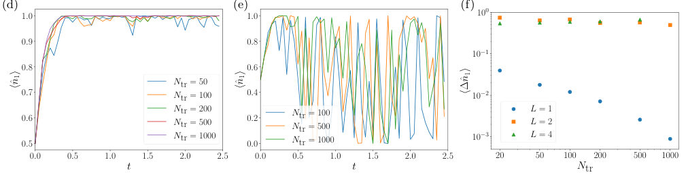
<figcaption class="paper-figure-caption"><b>Fig 2.</b> FIG. 2. Plot of ⟨ˆn1,↑(t)⟩as function of the trajectory time t. Panels (a)-(b) show the results for the Markovian regime (µ = −8, J = 0, U = −4) for L = 2 (a) and L = 4 (b). Panels (d)-(e) show the results for the non-Markovian regime (µ = 0, J = 0, U = −4, corresponding to an attractive correlated model) for L = 1 (d) and L = 2 (e). Panels (c) and (f) report the dependence of the fluctuations ∆n1,↑as function of L and Ntr for the Markovian regime (c) and for the physically realistic, non-Markovian (f) regime.</figcaption>
</figure>

**Summary.** The paper develops a method to calculate strongly correlated fermionic ground states by reformulating the problem as finding the steady state of an open quantum system governed by dissipative dynamics. By mapping the Hamiltonian onto Majorana fermion jump operators, they achieve efficient polynomial scaling for individual trajectories. However, the necessity of handling non-Markovian effects introduces a sign problem, leading to overall exponential computational complexity.

**Why it may be interesting.** This work provides a powerful, albeit computationally challenging, formal link between equilibrium many-body physics (ground states) and non-equilibrium open system dynamics. The use of Gaussian representations to simplify trajectory simulation is highly relevant for theoretical condensed matter modeling.

Detailed structure

**Main problem.** The paper addresses calculating the ground state of interacting fermionic Hamiltonians by mapping this problem onto finding the non-equilibrium steady state (NESS) of a purely dissipative open quantum system.

**Main result.** While individual quantum trajectories can be simulated efficiently using Gaussian representations, the overall computational cost remains exponentially hard due to the sign problem inherent in unravelling the necessary non-Markovian dynamics.

**Method.** The authors employ a mapping from fermionic Hamiltonians (like Fermi-Hubbard) to Lindblad jump operators acting on Majorana fermions. They utilize quantum trajectory methods adapted for non-Markovian processes, leveraging Gaussianity preservation along individual paths.

**Model / system.** The system models strongly correlated fermions using the Fermi-Hubbard Hamiltonian. The dynamics are treated as an open quantum system governed by a Lindblad master equation, which exhibits intrinsic non-Markovian behavior when particle number is finite.

**Key observables.** Expectation values of fermionic operators ($\langle \hat{O} 
angle$), the steady state density matrix ($
ho_\infty$), and the covariance matrix ($\Gamma_{kl}$) describing Gaussian states.

**Important parameters / regimes.** Negative dissipative rates (indicating non-Markovianity), system size ($L$), and particle number constraints.

**Assumptions / limitations.** The primary assumption enabling polynomial scaling for individual trajectories is that hopping and interaction terms map to jump operators preserving the Gaussianity of Majorana fermions. The main limitation noted is the exponential complexity arising from the required ensemble average over non-Markovian trajectories.

**Figures summary.** Figure 1 sketches the mapping from the Fermi-Hubbard model to a dissipative OQS of Majorana fermions, showing term mappings to jump operators. Table I details this Hamiltonian-to-Lindbladian operator mapping.

**Paper structure.** The paper establishes the theoretical mapping between ground states and NESSs. It then develops the quantum trajectory formalism for these non-Markovian dynamics, deriving evolution equations for correlation matrices and demonstrating the computational scaling challenges associated with convergence.

Abstract

We introduce a mapping between the ground state of interacting fermionic Hamiltonians and the non-equilibrium steady state of a purely dissipative open quantum system. Within the framework of third quantization, we map the Fermi-Hubbard Hamiltonian onto Lindblad jump operators acting on Majorana fermions. Remarkably, both hopping and interaction terms map onto jump operators that preserve the Gaussianity of Majorana fermions along individual quantum trajectories. As a result, the dynamics can be unravelled and each trajectory can be simulated efficiently using only two-point correlation functions, with a computational cost that scales polynomially with system size. We further show that finite particle number requires negative dissipative rates, leading to an intrinsically non-Markovian dynamics. The corresponding trajectory unravelling involves both positive and negative stochastic weights and exhibits a sign problem and large fluctuations, so that convergence requires an exponentially large number of trajectories. The overall computational cost remains exponential in system size despite the efficient Gaussian representation of individual trajectories, but is crucially dependent on the computational complexity of the non-Markovian unravelling, motivating further studies on the efficiency of such unravellings.

[↑ back to top](#top)

### [Genuine Multi-Entropy in the Toric Code](http://arxiv.org/abs/2607.06050v1)

**Authors:** Sriram Akella, Norihiro Iizuka, Akihiro Miyata  
**Type:** theory · **Category:** quantum information and computing · **PDF:** <https://arxiv.org/pdf/2607.06050v1>  
**Analysis basis:** full PDF text, analyzed in chunks
**Topic relevance:** 🔥 `entanglement & information structure` **5/5** · `analog quantum simulation` **3/5** · `exotic spin models in light-matter` **1/5** · `non-equilibrium dynamics` **1/5**

↔ Scroll figures horizontally

<figure class="paper-figure-card">
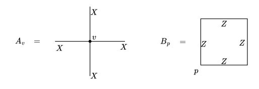
<figcaption class="paper-figure-caption"><b>Fig 1.</b> FIG. 1: Star and plaquette operators in the toric code.</figcaption>
</figure>
<figure class="paper-figure-card">
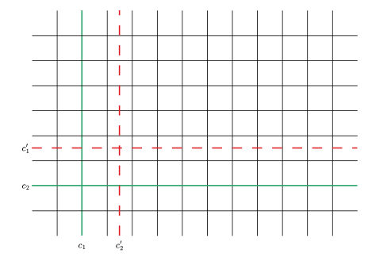
<figcaption class="paper-figure-caption"><b>Fig 2.</b> FIG. 2: The two non-contractible cycles of the torus. Solid green lines are the primal-lattice cycles c1, c2, defining W Z c1, W Z c2; dashed red lines are the dual-lattice cycles c′ 1, c′ 2, defining W X c′ 1 , W X c′ 2 .</figcaption>
</figure>
<figure class="paper-figure-card">
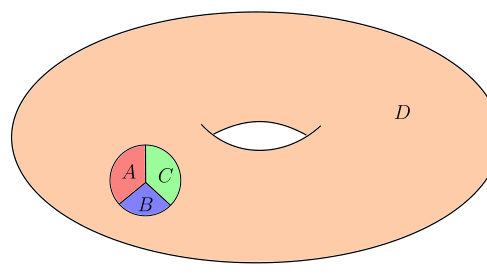
<figcaption class="paper-figure-caption"><b>Fig 3.</b> FIG. 3: Kitaev–Preskill disk partition [3] for subsystem A, B, and C.</figcaption>
</figure>
<figure class="paper-figure-card">
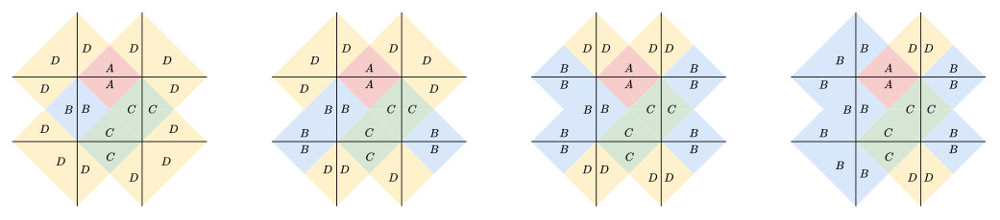
<figcaption class="paper-figure-caption"><b>Fig 4.</b> FIG. 4: Four-partite partitions of the 2 × 2 toric lattice. The first three panels are related by local deformations of subsystem B and give the same GM, 3/16 log(2). In the fourth panel, B wraps a non-contractible cycle, and the GM becomes zero.</figcaption>
</figure>
<figure class="paper-figure-card">
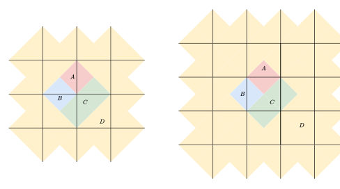
<figcaption class="paper-figure-caption"><b>Fig 5.</b> FIG. 5: In both cases, the GM is 3/16 log(2), demonstrating that changing the lattice size L does not affect the GM.</figcaption>
</figure>

**Summary.** The paper uses Genuine Multi-Entropy on the Toric Code to probe multipartite entanglement. It finds that while this measure often reduces to lower-order information for simple states, a specific high-order measurement ($n=4$) remains sensitive to the underlying topology, suggesting GM is a powerful diagnostic tool beyond TEE.

**Why it may be interesting.** This work directly addresses fundamental questions about entanglement structure in topologically ordered systems, providing new quantitative tools (GM) to distinguish between different types of multipartite correlations beyond standard entropy measures.

Detailed structure

**Main problem.** The study investigates genuine multi-entropy (GM) as a diagnostic tool to determine if it captures irreducible multipartite entanglement information beyond what is contained in conventional lower-party entropic measures like Topological Entanglement Entropy (TEE).

**Main result.** For the Toric Code stabilizer states, GM shows complex behavior: while low-$n$ indices ($n=2, 3$) collapse to lower-partite data proportional to $I_3$, the $n=4$ index reveals a genuine topological invariant that distinguishes itself from this reduction.

**Method.** The authors employ theoretical analysis on exactly solvable models (Toric Code) and calculate R\'enyi multi-entropies for various partitions, comparing results across different replica indices ($n$) to test for entanglement structure redundancy.

**Model / system.** The primary model is the Toric Code, a lattice realization of a topologically ordered phase. The analysis focuses on ground states (stabilizer and general superpositions) defined by local Pauli operators acting on a torus manifold.

**Key observables.** Genuine Multi-Entropy ($	ext{GM}(q=4)_n$), Topological Entanglement Entropy (TEE), Tripartite Information ($I_3$).

**Important parameters / regimes.** Replica index $n$, number of parties $q$ (specifically $q=4$), and the topological genus of the manifold.

**Assumptions / limitations.** The analysis relies on comparing results derived from stabilizer states versus general superpositions, and assuming that specific deformations do not cross non-contractible cycles when establishing topological invariance for $I_3$.

**Figures summary.** Figures illustrate the physical setup using star and plaquette operators on a torus, showing various partitions (e.g., Kitaev–Preskill disk) used to define entanglement boundaries.

**Paper structure.** The paper progresses by first defining GM in the context of topological order, analyzing its behavior for stabilizer states at different replica indices ($n$), contrasting this with general state superpositions, and finally establishing $I_3$ as a robust topological invariant via deformation arguments.

Abstract

We study genuine multi-entropy as a diagnostic of multipartite entanglement in the toric code, which provides a controlled setting for probing multipartite structures in topologically ordered states. Our main question is whether genuine multi-entropy captures information that is not reducible to conventional lower-party entropic data, such as topological entanglement entropy. We first analyze toric-code ground states that admit a stabilizer-state description, where the relevant quantities can be evaluated exactly. In this sector, genuine multi-entropy reflects the topological structure and symmetries of the toric code, while exhibiting highly constrained relations to lower-party multi-entropies. We conjecture that, for stabilizer states and ${q}\ge4$, the ${q}$-partite genuine multi-entropy at replica index $n<{q}$ collapses to a linear combination of multi-entropies involving at most ${q}-2$ parties. We establish this pattern explicitly for ${q}=4$ in the toric code stabilizer sector: for $n=2,3$, the genuine multi-entropy is proportional to the tripartite information $I_3$ and, for the Kitaev--Preskill partition, contains no independent genuine four-partite information beyond that captured by the topological entanglement entropy. At $n=4$, however, this reduction breaks down: the genuine multi-entropy is no longer proportional to $I_3$, but remains a topological invariant of the toric-code stabilizer ground states. For generic non-stabilizer superpositions within the ground-state manifold and for coherent superpositions of local excitations, the low-$n$ reduction also fails. These results show that genuine multi-entropy probes multipartite entanglement structure beyond the tripartite information, and hence beyond the topological entanglement entropy in the Kitaev--Preskill partition, whereas for stabilizer states at low replica index it reduces to lower-partite entropic data.

[↑ back to top](#top)

### [Many-body quantum optics in a cascaded chiral network](http://arxiv.org/abs/2607.05760v1)

**Authors:** Frank Yang, Parth S. Shah, Chaitali Joshi, Mohammad Mirhosseini  
**Type:** both · **Category:** other · **PDF:** <https://arxiv.org/pdf/2607.05760v1>  
**Analysis basis:** full PDF text, analyzed in chunks
**Topic relevance:** 🔥 `analog quantum simulation` **4/5** · 🔥 `correlated / nonlocal dissipation` **4/5** · 🔥 `methods for driven-dissipative` **4/5** · `Tavis-Cummings & cavity-many-emitter` **3/5** · `correlated cavity matter` **3/5** · `driven-dissipative phase transition` **3/5** · `entanglement & information structure` **3/5** · `non-equilibrium dynamics` **2/5** · `non-equilibrium universality` **2/5** · `quantum optics experiment` **2/5** · `Keldysh / 2PI / non-Gaussian methods` **1/5** · `QC/QI experiment` **1/5** · `exotic spin models in light-matter` **1/5** · `interference shaping light` **1/5** · `quantum measurements` **1/5**

↔ Scroll figures horizontally

<figure class="paper-figure-card">
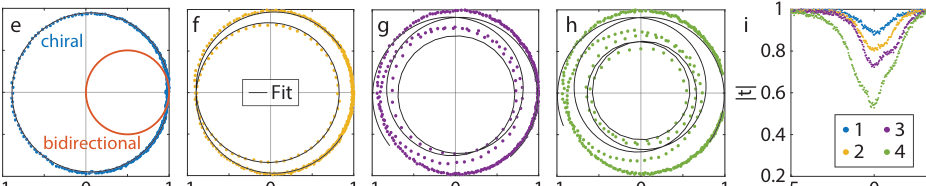
<figcaption class="paper-figure-caption"><b>Fig 1.</b> FIG. 1. Cascaded artificial atoms. (a) Schematic of cascaded chiral qubits coupled to a waveguide. The four-qubit chain is comprised of two device chips connected by a superconducting cable. (b) Diagram of qubit-waveguide coupling, showing an emitter E coupled to two adjacent couplers C with phases φL and φR. Couplers are embedded in a chain of coupled resonators R which comprise the waveguide. (c) Optical image of a device chip, which contains two emitter qubits (yellow; E1, E2), couplers (purple; C1L, C1R, C2L, C2R), and CCA waveguide (blue, WG). Each coupler has a dedicated flux line (green, Z1L, Z1R, Z2L, Z2R), and each emitter qubit is equipped with an XY line (green, XY1, XY2) and...</figcaption>
</figure>
<figure class="paper-figure-card">
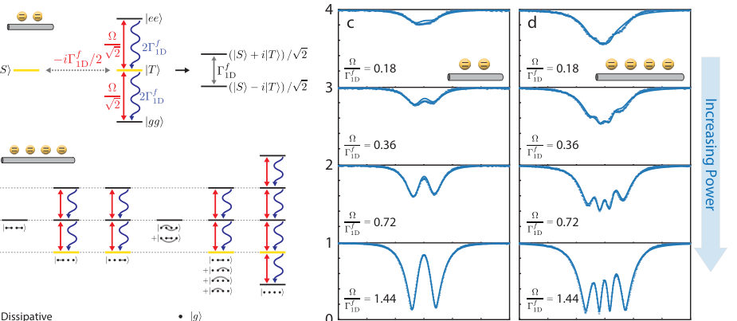
<figcaption class="paper-figure-caption"><b>Fig 2.</b> FIG. 2. Collective sub-radiant states. (a, b) Level structure for (a) two and (b) four cascaded qubits [9]. For two qubits, |S⟩= |ge⟩−|eg⟩ √</figcaption>
</figure>
<figure class="paper-figure-card">
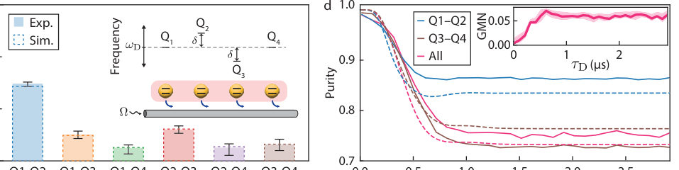
<figcaption class="paper-figure-caption"><b>Fig 3.</b> FIG. 3. Entanglement stabilization. The qubit chain is driven via the waveguide for variable time τD, after which qubit- waveguide couplings are turned off, and the state is measured (see Section A 3, Section A 5). Measured data are fit to master equation simulations, shown in dotted lines (see Section D 4). (a) Measured pair-wise concurrences showing dimerization, as evidenced by finite concurrence between qubits 1 and 2 and qubits 3 and 4, with all other concurrences ≈0. Inset: Dimerization schematic and detunings: δ1 = −δ2 = 0 MHz, δ3 = −δ4 = 2 MHz. (b) Measured purity of the four-qubit state and two dimers vs. time, showing preparation of upstream dimers prior to downstream dimers....</figcaption>
</figure>
<figure class="paper-figure-card">
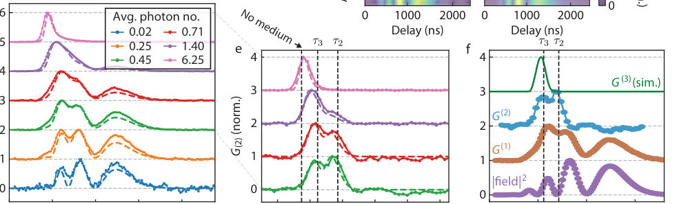
<figcaption class="paper-figure-caption"><b>Fig 4.</b> FIG. 4. Photon bound states. (a) Photon sorting schematic: number state components of a coherent pulse incident on the qubit chain are temporally separated at the output, with higher-order Fock states experiencing lower group delay. (b) Measured and (c) simulated output field amplitude, as a function of the input average photon number. Each trace is normalized against its own maximum for clarity. (d) Measured normalized G(1)(t, t). (e) Measured G(2)(t, t). τj represents the expected time of arrival for the j’th Fock-state (see Section D 6). (f) Comparison of different order correlators for average photon number of 0.45.</figcaption>
</figure>
<figure class="paper-figure-card">
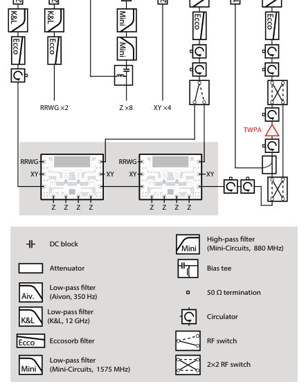
<figcaption class="paper-figure-caption"><b>Fig 5.</b> FIG. 5. Schematic of dilution fridge wiring.</figcaption>
</figure>

**Summary.** The research reports the experimental creation and characterization of a cascaded network of superconducting qubits designed to mimic chiral quantum emitters. By engineering directional coupling, the system accesses novel many-body physics regimes in light-matter interaction. This work is significant because it demonstrates entanglement and photon correlation signatures unattainable in standard, reciprocal quantum optical setups.

**Why it may be interesting.** This work provides a concrete experimental realization of chiral cavity QED systems, which are crucial testbeds for understanding non-reciprocal light-matter interactions that cannot be simulated by standard reciprocal waveguide models.

Detailed structure

**Main problem.** The core challenge is realizing and experimentally accessing many-body quantum light-matter interaction regimes mediated by photons in a highly directional, or chiral, manner.

**Main result.** The authors successfully demonstrated a cascaded superconducting qubit network exhibiting genuine multipartite entanglement and observing photon number sorting, confirming access to physics beyond reciprocal systems.

**Method.** The work combines theoretical modeling using master equations (Liouvillians) with experimental characterization of transmission coefficients and entanglement witnesses on the physical chip.

**Model / system.** The system is a cascaded chain of superconducting qubits coupled to a shared microwave waveguide, engineered to exhibit chirality by breaking time-reversal symmetry. The dynamics are modeled using master equations incorporating forward/backward decay channels.

**Key observables.** Complex transmission phase accumulation ($2\pi N$), genuine multipartite negativity (GMN), and temporal sorting of output photons based on photon number.

**Important parameters / regimes.** The system operates in a regime characterized by strong, directional coupling ($\eta_d \sim 100$) and is sensitive to the relative phases imparted by parametric drives.

**Assumptions / limitations.** Theoretical analysis often assumes perfect chirality (zero backward decay) or relies on low-power approximations using ABCD matrices for tractability.

**Figures summary.** Figures illustrate the four-qubit chain architecture, measured complex transmission showing phase accumulation with qubit number, and output light sorted in time according to photon number.

**Paper structure.** The paper progresses from establishing the physical platform (superconducting qubits) and demonstrating directional coupling signatures, to theoretically modeling the full quantum dynamics via master equations, and finally confirming advanced phenomena like entanglement stabilization and photon-photon interaction signatures.

Abstract

Chiral quantum emitters interact with light only in one propagation direction, allowing them to be linked into cascaded systems in which photons mediate ordered, long-range interactions. Such systems are predicted to host novel regimes of many-body physics of light and matter. Exploring these regimes requires arrays of identical quantum emitters with directional, low-loss coupling to guided photons, a combination that has thus far remained experimentally out of reach. Here we realize a cascaded network of superconducting qubits using an architecture that overcomes these bottlenecks. We implement a four-qubit chain spanning two modules, with separations ranging from millimeters to half a meter, and exploit the shared waveguide as a dissipative resource to stabilize reconfigurable entanglement, reaching a genuinely multipartite regime unavailable in reciprocal baths. By scattering weak pulses off the chain, we observe photons sorted in time by photon number, a signature of the strong photon-photon interactions mediated by the emitters. Together, these results provide experimental access to many-body light-matter regimes that are beyond the reach of reciprocal systems.

[↑ back to top](#top)

### [Nonlocal transfer of quantized toroidal magnetic flux](http://arxiv.org/abs/2607.05581v1)

**Authors:** Adel Ali, Alexey Belyanin  
**Type:** theory · **Category:** other · **PDF:** <https://arxiv.org/pdf/2607.05581v1>  
**Analysis basis:** full PDF text, analyzed in chunks
**Topic relevance:** 🔥 `measurement-induced transitions` **4/5** · `Keldysh / 2PI / non-Gaussian methods` **3/5** · `correlated / nonlocal dissipation` **3/5** · `driven-dissipative phase transition` **3/5** · `methods for driven-dissipative` **3/5** · `quantum measurements` **3/5** · `entanglement & information structure` **2/5** · `non-equilibrium universality` **2/5** · `spintronics-quantum-optics interface` **2/5** · `Kondo & dissipative impurity` **1/5** · `QC/QI experiment` **1/5** · `analog quantum simulation` **1/5** · `correlated cavity matter` **1/5** · `exotic spin models in light-matter` **1/5** · `non-equilibrium dynamics` **1/5**

↔ Scroll figures horizontally

<figure class="paper-figure-card">
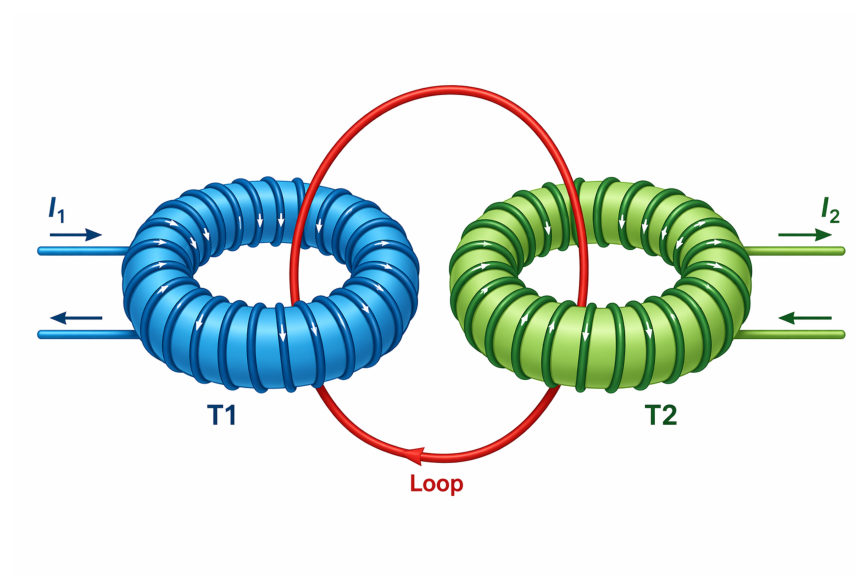
<figcaption class="paper-figure-caption"><b>Fig 1.</b> Figure 1: Schematic of two toroidal superconducting flux elements interlinked by a common superconducting loop. The magnetic field of each toroid is confined to its core, while the linking loop is sensitive to the collective fluxoid in Eq. (1). The nonlocal transfer of the toroidal flux is mediated by a global fluxoid constraint imposed by the superconducting loop. Local SQUID detectors measure the toroidal fluxes, and field probes placed between the toroids perform a null test for the magnetic-field leakage.</figcaption>
</figure>

**Summary.** This work proposes an experiment to transfer quantized magnetic flux nonlocally between superconducting toroids using only the global topological constraint. Theoretically, it develops a covariant master equation describing how long-range quantum coherence decays in such systems. It is significant because it connects measurable circuit physics to deep questions about wavefunction collapse and fundamental limits on quantum correlation.

**Why it may be interesting.** It bridges condensed matter physics (superconducting circuits) with foundational quantum foundations (collapse models), offering a tangible, measurable platform for testing abstract concepts like spatiotemporal coherence bounds.

Detailed structure

**Main problem.** The paper proposes a nonlocal experiment to coherently transfer quantized magnetic flux between separated superconducting toroids, while simultaneously developing a covariant framework to test fundamental questions about spatiotemporal quantum coherence and wavefunction collapse.

**Main result.** The interaction is mediated by the global topological fluxoid constraint, leading to coupled normal modes. The theoretical development provides a gauge-invariant master equation describing decoherence based on condensate current rather than simple mass density localization.

**Method.** The analysis combines solving classical equations of motion for coupled harmonic oscillators (flux qubits) with deriving and specializing a covariant collapse evolution equation from the Tomonaga–Schwinger formalism.

**Model / system.** The system involves two toroidal superconducting structures linked by a common loop, modeled using fluxoid variables ($\hat{\Phi}$). The theoretical framework extends to a general covariant collapse law applied to condensate density matrices on a spacelike hypersurface.

**Key observables.** Correlated, time-resolved flux exchange between remote toroids; null measurement of magnetic-field leakage in the intervening region; mode splittings ($\Omega_{\pm}$); and the one-body density matrix $G^{(1)}(	heta, 	heta'; t)$.

**Important parameters / regimes.** Inductance ($L$), coupling strength ($J_{zz}$), collapse parameters ($\gamma_0$, $\chi_{	ext{cov}}$), and characteristic length scales ($\ell$).

**Assumptions / limitations.** The nonlocal interaction is assumed to be mediated purely by the global fluxoid constraint, not local fields. The covariant collapse model is presented as a phenomenological extension of existing quantum mechanics.

**Figures summary.** Figure 1 schematically illustrates two toroids linked by a loop for flux measurement; other figures detail mathematical derivations related to normal modes and density matrix evolution.

**Paper structure.** The paper progresses from proposing the physical nonlocal experiment (flux transfer) using coupled harmonic oscillators, deriving the resulting Hamiltonian structure, and then generalizing this into a covariant quantum field theory framework to model coherence loss in the context of fundamental collapse mechanisms.

Abstract

We propose a nonlocal flux-transfer experiment in which a quantized magnetic-field excitation confined within one toroidal superconducting structure is coherently transferred to a spatially separated toroid without magnetic-field occupation of the intervening region. The transfer arises from quantized Aharonov-Bohm-type vector potential coupling mediated by a superconducting loop threading the toroids, which, however, remains in the ground state, acting only through a global fluxoid constraint. A direct experimental signature would be the observation of correlated, time-resolved flux exchange between remote toroids in a SQUID readout. We analyze an apparent signaling paradox related to this interaction as a probe of the broader question of whether spatiotemporal quantum coherence is fundamentally bounded. The proposed setup can provide an experimental testbed for addressing foundational questions such as the existence of an objective collapse of a wavefunction or the fundamental limits of macroscopic quantum coherence which is relevant to large scale quantum computers.

[↑ back to top](#top)

### [Coherence Estimation Beyond the Liouvillian Gap in a Finite Nonequilibrium System](http://arxiv.org/abs/2607.06215v1)

**Authors:** Sonali Brahma, Trishna Kalita, Himangshu Prabal Goswami  
**Type:** theory · **Category:** other · **PDF:** <https://arxiv.org/pdf/2607.06215v1>  
**Analysis basis:** full PDF text, analyzed in chunks
**Topic relevance:** 🔥 `methods for driven-dissipative` **4/5** · `Tavis-Cummings & cavity-many-emitter` **3/5** · `correlated cavity matter` **3/5** · `driven-dissipative phase transition` **3/5** · `non-equilibrium dynamics` **3/5** · `correlated / nonlocal dissipation` **2/5** · `entanglement & information structure` **2/5** · `non-equilibrium universality` **2/5** · `Keldysh / 2PI / non-Gaussian methods` **1/5** · `analog quantum simulation` **1/5** · `measurement-induced transitions` **1/5** · `scars & prethermalization` **1/5**

↔ Scroll figures horizontally

<figure class="paper-figure-card">
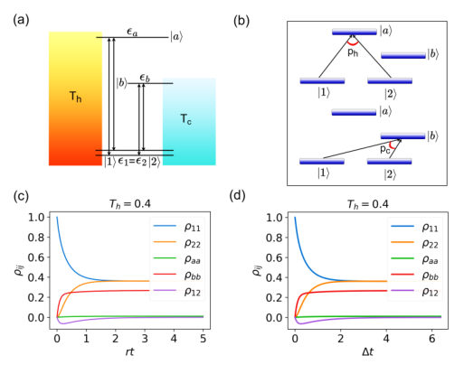
<figcaption class="paper-figure-caption"><b>Fig 1.</b> FIG. 1. (a) Schematic representation of the nonequilibrium four-level open quantum system. The degenerate ground states |1⟩and |2⟩are coupled to the excited states |a⟩and |b⟩through hot and cold thermal reservoirs at temperatures Th and Tc. System parameters are ϵ1 = ϵ2 = 0.1, ϵa = 1.5, ϵb = 0.4, Th = [0.4, 3], Tc = 1, Tl = 0.2, kB = 1, r = 1. (b) Schematic representation of the origin of the hot-bath coher- ence parameter ph, and cold bath coherence parameter pc. (c) Time evolution of the states ρ11, ρ22, ρaa, ρbb, and ℜρ12 in the regime. (d) Evolution of states as a function of rescaled time ∆t. In panel (c,d) parameters ph = 0.62, pc = 0.7. Natural units are used throughout, kB →1, ℏ→1.</figcaption>
</figure>
<figure class="paper-figure-card">
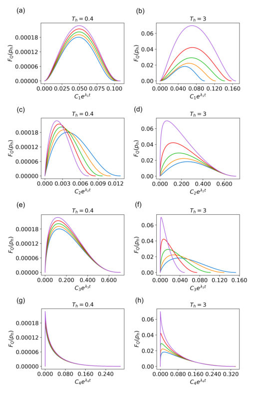
<figcaption class="paper-figure-caption"><b>Fig 2.</b> FIG. 3. FQ(ph) as a function of the weighted Liouvillian mode contribution cneλnt for the estimation of different hot-bath coherence ph with fixed pc = 0.7. (a,b), (c,d), (e,f), and (g,h) correspond to modes n = 1, 2, 3, and 4 respectively.</figcaption>
</figure>
<figure class="paper-figure-card">
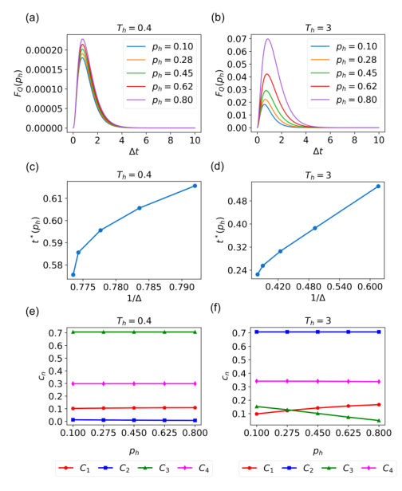
<figcaption class="paper-figure-caption"><b>Fig 3.</b> FIG. 2. (a,b) FQ(ph) as a function of rescaled time ∆t with fixed pc = 0.7. (c,d) Optimal estimation time t∗(ph) as a function of the inverse of Liouvillian gap ∆. In (c), one mode contributes and yet there is a nonlinearity. (e,f) cn as a func- tion of ph.</figcaption>
</figure>
<figure class="paper-figure-card">
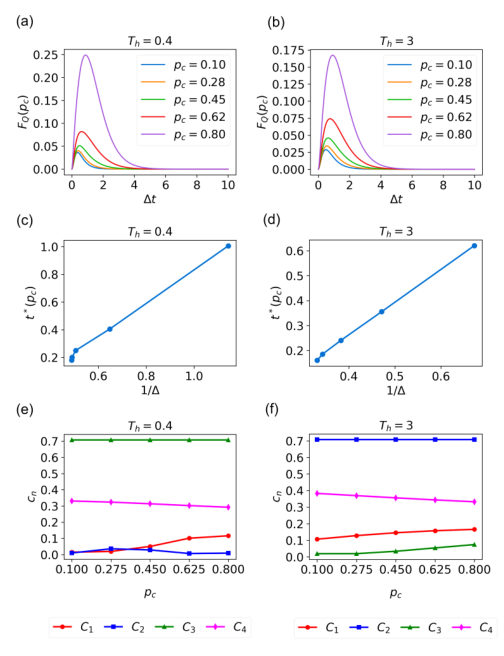
<figcaption class="paper-figure-caption"><b>Fig 4.</b> FIG. 4. (a,b) FQ(pc) as a function of rescaled time ∆t. (c,d) Optimal estimation time t∗(pc) as a function of the inverse of Liouvillian gap ∆. (e,f) cn as a function of pc.</figcaption>
</figure>
<figure class="paper-figure-card">
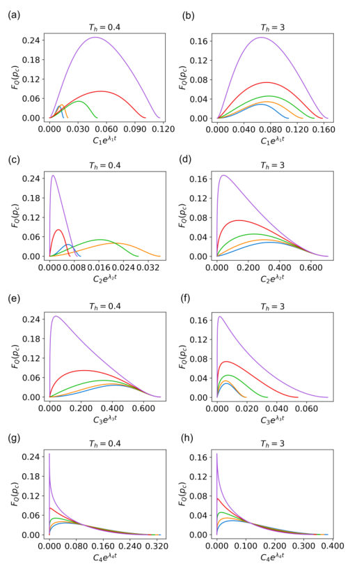
<figcaption class="paper-figure-caption"><b>Fig 5.</b> FIG. 5. FQ(pc) as a function of the weighted Liouvillian mode contribution cneλnt. (a,b), (c,d), (e,f), and (g,h) correspond to modes n = 1, 2, 3, and 4 respectively.</figcaption>
</figure>

**Summary.** The paper rigorously investigates coherence estimation in complex, non-equilibrium quantum systems, showing that simple scaling laws based on the Liouvillian gap are insufficient. By analyzing the full spectral decomposition of the QFIM, the authors prove that optimal sensing depends on a balance between mode relaxation and statistical weight. This work establishes new criteria for understanding metrological resources in open quantum dynamics.

**Why it may be interesting.** This work provides crucial theoretical insight into quantum metrology limits for open systems, moving beyond simplified gap estimates to account for the full complexity of non-equilibrium dynamics and multi-mode contributions, which is highly relevant for designing robust quantum sensors.

Detailed structure

**Main problem.** The study investigates how to accurately estimate bath-induced coherence (BIC) in a finite, non-equilibrium quantum system when the estimation precision is limited by dynamics beyond what is predicted by the simple Liouvillian gap.

**Main result.** Optimal coherence estimation time does not generally scale simply with the inverse of the Liouvillian gap; instead, it depends on the competition between the statistical weight and temporal relaxation rates of multiple contributing eigenmodes. Furthermore, coupling to a cavity can transform transient metrology into a sustained steady-state resource.

**Method.** The authors analyze the time evolution of the Quantum Fisher Information Matrix (QFIM) by performing spectral decomposition of the density matrix using the full Liouvillian eigenspectrum.

**Model / system.** The model is an open quantum V-type system interacting with thermal reservoirs (hot and cold baths), governed by a Markovian master equation ($\dot{
ho} = L
ho$). The analysis extends to include coupling with a quantum cavity.

**Key observables.** Quantum Fisher Information Matrix (QFIM) elements, coherence parameters ($p_c, p_h$), and the optimal interrogation time ($t^*$).

**Important parameters / regimes.** Liouvillian gap ($\Delta$), reservoir temperatures ($T_h, T_c$), and modal expansion coefficients ($c_n$) vs. relaxation rates ($\lambda_n$).

**Assumptions / limitations.** The analysis relies on the Born–Markov approximation to derive the master equation; spectral decomposition is used to separate temporal (Liouvillian) and statistical contributions.

**Figures summary.** Figures illustrate the schematic of the open system, time evolution of density matrix elements showing coherence survival, and plots comparing QFI vs. rescaled time for different temperatures, alongside optimal time vs. inverse Liouvillian gap.

**Paper structure.** The paper progresses by first establishing the physical model and observables (BIC, QFI). It then critiques the standard reliance on $\propto 1/\Delta$ scaling. The core is a detailed spectral analysis showing that transient optimization depends on mode competition, culminating in demonstrating how cavity coupling can stabilize this resource.

Abstract

We investigate the estimation of bath-induced coherence in a finite quantum system interacting with thermal reservoirs. Enhancement of coherence estimation is transient and the estimation precision totally disappears at the steady state despite the system retaining finite coherence. By analyzing the full Liouvillian eigenspectrum, we demonstrate that the optimal sensing window emerges from the competition between identifiable contributory modes' temporal relaxation and statistical importance. Neither is the linear inverse scaling of Liouvillian gap with transient optimal time a signature of unimodal contribution to optimal sensing, nor is the existence of multimodal dynamics a signature of nonlinear scaling. The inverse Liouvillian gap does not obey any general scaling with the optimal sensing time of coherence and we prove our numerical results analytically using a general Markovian framework. We further show that coupling the finite system to a quantum cavity and maintaining a thermal bias, transforms the transient metrological optimization into a sustained steady-state resource.

[↑ back to top](#top)

### [Low-depth simulation of non-Markovianity under quantum hardware noise](http://arxiv.org/abs/2607.05519v1)

**Authors:** Diana A. Chisholm  
**Type:** theory · **Category:** quantum information and computing · **PDF:** <https://arxiv.org/pdf/2607.05519v1>  
**Analysis basis:** full PDF text, analyzed in chunks
**Topic relevance:** 🔥 `methods for driven-dissipative` **4/5** · `correlated / nonlocal dissipation` **3/5** · `non-equilibrium dynamics` **3/5** · `driven-dissipative phase transition` **2/5** · `quantum measurements` **2/5** · `Keldysh / 2PI / non-Gaussian methods` **1/5** · `Kondo & dissipative impurity` **1/5** · `entanglement & information structure` **1/5** · `measurement-induced transitions` **1/5** · `non-equilibrium universality` **1/5**

↔ Scroll figures horizontally

<figure class="paper-figure-card">
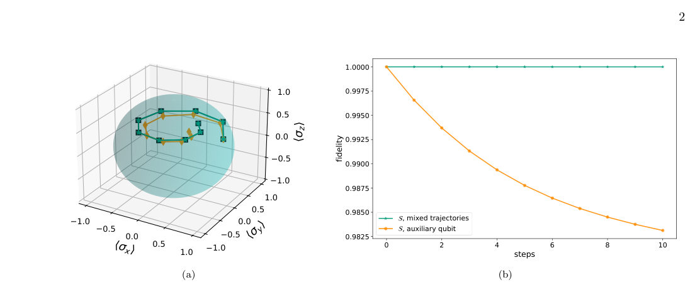
<figcaption class="paper-figure-caption"><b>Fig 1.</b> FIG. 1. Simple dephasing. (a) Dynamics in the bloch sphere for a qubit under pure dephasing, simulated using mixed trajectories (green stars), and using auxiliary qubits (orange diamonds) as well as the noisless dynamics (gray square). Notice how the mixed trajectory dynamics and the noiseless dynamics are almost overlapping with one another, while the auxiliary qubits dynamics is drifting more towards the centre of the sphere. This is further shown in (b), where we show that the dynamics simulated via mixed trajectories (green stars) retains much higher values of state fidelity with the noiseless dynamics, as opposed to the dynamics simulated via auxiliary qubits (orange diamonds).</figcaption>
</figure>
<figure class="paper-figure-card">
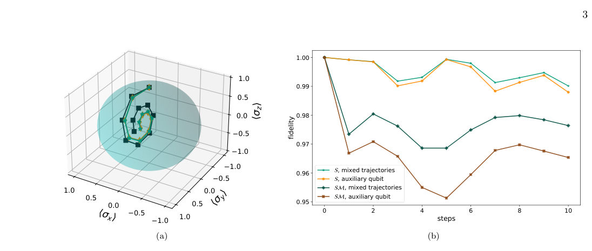
<figcaption class="paper-figure-caption"><b>Fig 2.</b> FIG. 2. Non-Markovian amplitude damping. (a) Dynamics in the bloch sphere for a qubit undergoing non-Markovian amplitude damping, simulated using mixed trajectories (green stars), and using auxiliary qubits (orange diamonds) as well as the noisless dynamics (gray square). Here, both the mixed trajectory and the auxiliary qubits dynamics are drifting more towards the centre of the sphere, compared to the noiseless dynamics. In (b) we compare the fidelity, with respect to the noiseless dynamics, of the mixed trajectories and the auxiliary qubits methods. We consider both the system alone (green stars and orange diamonds) and the system and memory together (dark green stars and dark orange...</figcaption>
</figure>
<figure class="paper-figure-card">
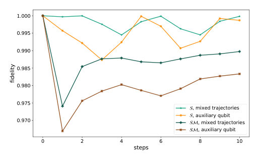
<figcaption class="paper-figure-caption"><b>Fig 3.</b> FIG. 3. Non-Markovian dephasing. Fidelity values with respect to the noiseless dynamics. Also in this case the mixed trajectories method offers better values of fidelity in general, but the auxiliary qubits method can occasionally perform better while looking at the system only.</figcaption>
</figure>
<figure class="paper-figure-card">
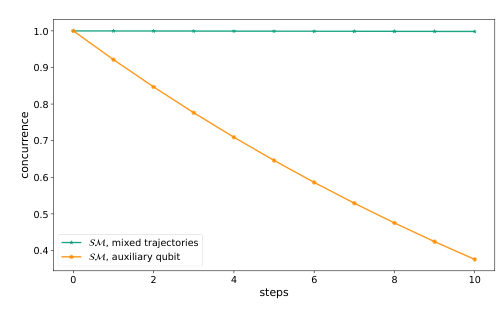
<figcaption class="paper-figure-caption"><b>Fig 4.</b> FIG. 4. Entanglement under memory channels. We show the concurrence of two qubits initially prepared in a bell state, under the repeated action of a memory channel. When the memory channel is simulated via mixed trajectories entanglement is highly preserved, while it decays considerably when the memory channel is simulated via auxiliary qubits.</figcaption>
</figure>
<figure class="paper-figure-card">
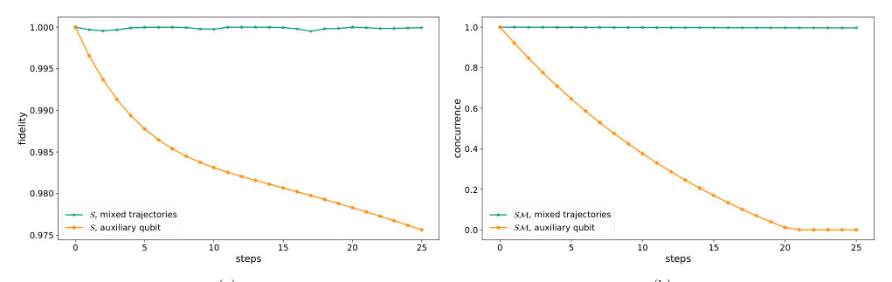
<figcaption class="paper-figure-caption"><b>Fig 5.</b> FIG. 5. Long time evolutions. Fidelity with respect to the noiseless dynamics for the simple dephasing (a) and concurrence under repeated action of a memory channel (b), simulated for 25 time steps. Even though we only simulate a fraction of all the possible trajectories, the mixed trajectories method performs significantly better than the auxiliary qubits one.</figcaption>
</figure>

**Summary.** This paper introduces trajectory mixing as an efficient alternative to standard auxiliary qubit methods for simulating open quantum systems. By statistically averaging over independent pure state trajectories, it drastically reduces circuit depth and gate overheads when modeling non-Markovian dynamics under realistic quantum noise models. This makes long-time simulation of complex quantum processes more feasible on near-term hardware.

**Why it may be interesting.** This work provides a crucial algorithmic improvement for quantum simulation, offering a resource-efficient pathway to model realistic open system dynamics that are otherwise computationally prohibitive due to noise overheads on current hardware.

Detailed structure

**Main problem.** The primary challenge is efficiently simulating non-Markovian dynamics of open quantum systems on near-term digital quantum computers while minimizing noise overheads from auxiliary qubits.

**Main result.** The method of trajectory mixing drastically reduces circuit depth compared to standard Stinespring dilation, yielding higher state fidelity for simulating complex, long-time non-Markovian evolutions.

**Method.** The authors employ trajectory mixing, which simulates the open channel as a statistical mixture of independent, pure state trajectories, avoiding the need for auxiliary qubits and associated high-overhead entangling gates.

**Model / system.** The work models open quantum systems undergoing non-Markovian dynamics or memory channels. Specific examples include dephasing and amplitude damping processes driven by stochastic Hamiltonians (like Random Telegraph Noise).

**Key observables.** State fidelity with respect to noiseless evolution, concurrence (for entanglement preservation), and the BLP measure (to confirm non-Markovianity).

**Important parameters / regimes.** Noise model parameters include single-qubit relaxation ($T_1$), phase loss ($T_2$), and CNOT depolarization rates. The method is restricted to mixed unitary channels.

**Assumptions / limitations.** The trajectory mixing approach assumes the channel is a statistical mix of unitaries with state-independent jump probabilities; furthermore, stochastic sampling (Monte Carlo) is used to circumvent the exponential scaling of total trajectories.

**Figures summary.** Figures compare dynamics and fidelity for dephasing/memory channels using mixed trajectories versus auxiliary qubits. Later figures show high fidelity maintenance over time steps when simulating non-Markovian evolution via a stochastic Hamiltonian.

**Paper structure.** The paper first introduces the limitations of standard simulation techniques (Stinespring dilation). It then proposes and demonstrates trajectory mixing for simple dephasing, extends this to memory channels using concurrence analysis, and finally applies it successfully to complex non-Markovian dynamics driven by a stochastic Hamiltonian.

Abstract

Simulating open quantum systems on digital quantum computers typically relies on the use of auxiliary qubits, resulting in overheads of noisy multi-qubit gates, that severely limit execution on near-term hardware. In this work, we explore the simulation of non-Markovian dynamics as well as memory channels leveraging the method of trajectory mixing, valid for mixed unitary channels. This allows to drastically reduce circuit depth, trading entangling gates for a statistical mixture of independent, pure state trajectories. Using a realistic noise model calibrated to modern quantum processors, we show the benefits of this approach, yielding higher state fidelity and better preservation of quantum correlations. This shows the possibility of simulating long-time non-Markovian evolutions with low noise and limited resources.

[↑ back to top](#top)

### [Towards Quantum Network Performance Metrics: Challenges and Demonstration](http://arxiv.org/abs/2607.05642v1)

**Authors:** Mohamed Shaban, Mariam Kiran, Muhammad Ismail  
**Type:** both · **Category:** quantum information and computing · **PDF:** <https://arxiv.org/pdf/2607.05642v1>  
**Analysis basis:** full PDF text, analyzed in chunks
**Topic relevance:** 🔥 `QC/QI experiment` **4/5** · `quantum measurements` **3/5** · `quantum optics experiment` **3/5** · `measurement-induced transitions` **2/5** · `analog quantum simulation` **1/5** · `correlated / nonlocal dissipation` **1/5** · `correlated cavity matter` **1/5** · `driven-dissipative phase transition` **1/5** · `entanglement & information structure` **1/5** · `methods for driven-dissipative` **1/5** · `non-equilibrium dynamics` **1/5**

↔ Scroll figures horizontally

<figure class="paper-figure-card">
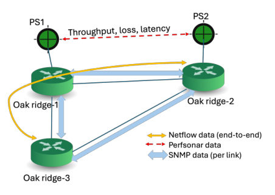
<figcaption class="paper-figure-caption"><b>Fig 1.</b> Figure 1: Monitoring in a classical network, showing a three- node topology instrumented with perfSONAR hosts (PS1 and PS2) to collect active measurement data, where NetFlow and SNMP denote flow-level traffic records exported by network devices and device/interface statistics, respectively.</figcaption>
</figure>
<figure class="paper-figure-card">
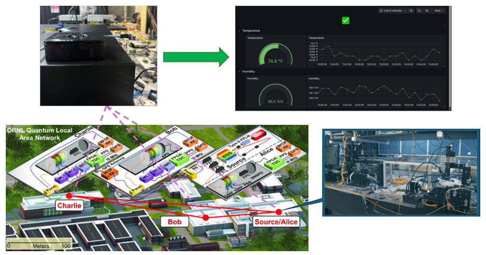
<figcaption class="paper-figure-caption"><b>Fig 2.</b> Figure 2: Illustration of the ORNL quantum local area network, spanning three interconnected quantum nodes labeled Alice, Bob, and Charlie. The central diagram illustrates the architectural layout and major components of each node. A zoomed-in laboratory image highlights the physical quantum optics setup at one site. Each laboratory includes a prototype monitoring system based on a Raspberry Pi 5 connected to an SHT35 digital sensor. These systems currently collect real-time temperature and humidity data, which are pushed to a Prometheus database and visualized on a Grafana dashboard.</figcaption>
</figure>
<figure class="paper-figure-card">
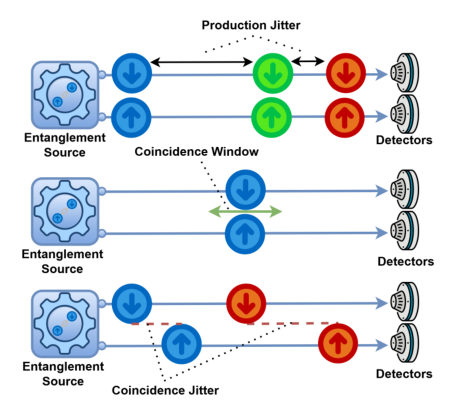
<figcaption class="paper-figure-caption"><b>Fig 3.</b> Figure 3: Illustration of timing metrics in quantum networks, showing an entanglement source emitting multiple photon pairs, each pair encoded with a distinct color to differentiate them, as they travel toward two detectors. This visualization highlights the differences between production jitter, coinci- dence jitter, and the coincidence window. Production jitter represents the variability in emission times between consecutive photon pairs. The coincidence window is the allowable time in- terval within which detection events are considered to originate from the same entangled pair. Coincidence jitter refers to the variation in arrival time differences between photons of the same pair at...</figcaption>
</figure>
<figure class="paper-figure-card">
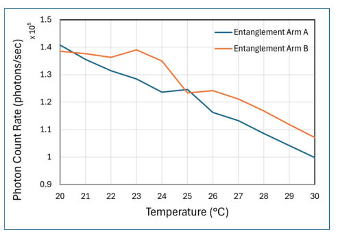
<figcaption class="paper-figure-caption"><b>Fig 4.</b> Figure 4: Effect of source temperature on photon detection rates in the two entanglement arms.</figcaption>
</figure>
<figure class="paper-figure-card">
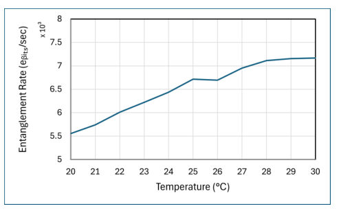
<figcaption class="paper-figure-caption"><b>Fig 5.</b> Figure 5: Effect of source temperature on entanglement rate measured through coincidence events between the two entanglement arms.</figcaption>
</figure>

**Summary.** This paper develops a comprehensive monitoring framework essential for making quantum networks practical. It defines metrics covering state quality (fidelity, QBER), data rates, timing jitter, and environmental factors. By demonstrating an integrated prototype, the authors lay the groundwork for autonomous control systems in future quantum internet infrastructure.

**Why it may be interesting.** It provides a blueprint for operationalizing quantum hardware by treating system performance as a measurable engineering problem, which is crucial for scaling up any quantum technology.

Detailed structure

**Main problem.** Standardized, comprehensive performance monitoring is necessary for quantum networks to move from research prototypes to practical deployment.

**Main result.** The authors propose a structured framework encompassing quality, throughput/latency, timing, and environmental metrics, validated by an integrated prototype system.

**Method.** They define specific metrics (e.g., fidelity, QBER) and implement a physical monitoring system using off-the-shelf components to collect both quantum and classical environmental data in real time.

**Model / system.** The work focuses on the operational quantum network infrastructure at Oak Ridge National Laboratory (ORNL), which uses entangled photon pairs generated via crystals for demonstration. The framework integrates this with external sensors (temperature, humidity) monitored by a Prometheus/Grafana stack.

**Key observables.** Entanglement fidelity ($F$), Quantum Bit Error Rate ($	ext{QBER}$), entanglement rate, link loss, dark count rate, coincidence jitter, temperature, and humidity.

**Important parameters / regimes.** The trade-off between detailed observability overhead and maintaining high system performance is a critical parameter space explored. Sub-nanosecond timing synchronization accuracy is also key.

**Assumptions / limitations.** It assumes that monitoring can be performed non-invasively without significantly degrading the quantum state or introducing excessive classical communication load.

**Figures summary.** Figure 1 illustrates common metrics from classical networks (perfSONAR); Figure 2 shows the ORNL quantum local area network setup involving Alice, Bob, and Charlie.

**Paper structure.** The paper establishes the need for standardized monitoring, details the comprehensive set of required metrics across four categories, presents an environmental monitoring prototype implementation, discusses diagnostic capabilities, and concludes by outlining challenges like overhead and control complexity.

Abstract

As quantum networks move toward practical deployment, standardized performance monitoring becomes essential. This article proposes a structured monitoring framework for quantum networks with performance metrics, including quality (e.g., entanglement fidelity, QBER, loss, dark count rate), throughput and latency (e.g., entanglement rate, waiting time), timing (e.g., coincidence window, production and coincidence jitter), and exogenous factors (e.g., temperature, humidity, vibrations). These measurements enable real-time observability, benchmarking, and control, supporting use cases such as fault diagnosis, adaptive timing, and entanglement routing. Additionally, we implement a non-invasive prototype environmental monitoring system integrated with the quantum network infrastructure at Oak Ridge National Laboratory, demonstrating practical feasibility of live data collection and alert generation. Furthermore, we discuss the challenges of real-time monitoring and the trade-offs between observability and system performance. This work establishes a foundation for developing advanced quantum network monitoring systems and lays the groundwork for future autonomous control and quantum software-defined networking.

[↑ back to top](#top)

### [Unbiased Estimation of Conditional Covariance for Quantum Optomechanics](http://arxiv.org/abs/2607.06431v1)

**Authors:** Katsuta Sakai, Nobuyuki Matsumoto  
**Type:** both · **Category:** other · **PDF:** <https://arxiv.org/pdf/2607.06431v1>  
**Analysis basis:** full PDF text, analyzed in chunks
**Topic relevance:** 🔥 `quantum measurements` **4/5** · `measurement-induced transitions` **3/5** · `methods for driven-dissipative` **3/5** · `quantum optics experiment` **3/5** · `Keldysh / 2PI / non-Gaussian methods` **1/5** · `correlated / nonlocal dissipation` **1/5** · `driven-dissipative phase transition` **1/5** · `entanglement & information structure` **1/5** · `non-equilibrium dynamics` **1/5**

↔ Scroll figures horizontally

<figure class="paper-figure-card">
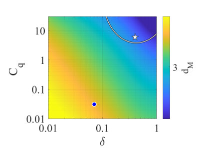
<figcaption class="paper-figure-caption"><b>Fig 1.</b> FIG. 1. Bias of the conventional retrodictive esti- mator. The color scale shows the covariance-space distance dM between the conventional two-trajectory covariance Vconv and the forward conditional covariance V , as a function of normalized detuning δ ≡∆/κ and quantum cooperativity Cq, namely the ratio of quantum back-action noise to ther- mal noise. The displayed map assumes the ideal normalized technical-noise level Nx = 0. The circle marks the experimen- tal operating point and the white star indicates representative parameters for measurement-based entanglement generation, with Cq slightly larger than that suggested in Ref. [9] due to the thermal-noise modeling. The solid curve denotes...</figcaption>
</figure>
<figure class="paper-figure-card">
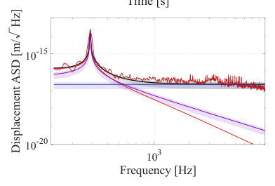
<figcaption class="paper-figure-caption"><b>Fig 2.</b> FIG. 2. Experimental record and validated spec- tral region. (a) A 10-s displacement record of the optically trapped 7.71-mg mirror. (b) Displacement spectra from the blue regions in (a), at normalized detunings δ = 0.07. The plotted region covers the band from 130 Hz to 9 kHz; the lowest violin mode near 10 kHz and a tail of an incidental broad peak at 90 Hz are excluded. Dark red line denotes the data, while the black curve is the theoretical prediction. Red, purple and blue curves indicate contributions from thermal noise, radiation pressure noise, and intensity noise, respec- tively. Shaded regions indicate the uncertainty.</figcaption>
</figure>
<figure class="paper-figure-card">
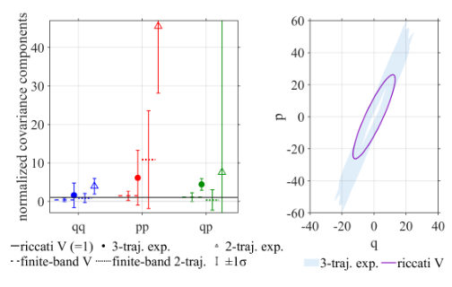
<figcaption class="paper-figure-caption"><b>Fig 3.</b> FIG. 3. Integrated covariance and phase-space el- lipses. Left: component-wise comparison of the covariance matrix. Each component is normalized by the corresponding full-band Riccati value Vij. The experimental three-trajectory estimates (dots) obtained from Eq. (3) agree with the finite- band Riccati prediction evaluated with the same integration band (dashed line). The full-band Riccati solution V is shown as a calibrated reference. The conventional two-trajectory es- timator is shown (triangle) for comparison and deviates most clearly in Vpp. Right: corresponding phase-space covariance ellipses. The blue shaded annulus is the 68.3% simultaneous confidence band for the experimentally...</figcaption>
</figure>
<figure class="paper-figure-card">
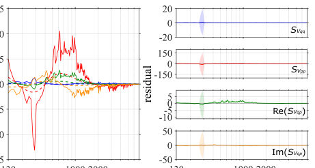
<figcaption class="paper-figure-caption"><b>Fig 4.</b> FIG. 4. Frequency-resolved covariance-closure test. The spectral estimator SV (ω) is formed from the same three pairwise trajectory-difference spectra whose integral gives Eq. (3). The left panels compare the four components of SV between experiment and the fixed-parameter model; the right panels show the corresponding experiment-minus- model residuals. Solid curves are experimental estimates and dashed curves are the fixed-parameter model; shaded bands denote pointwise one-sigma uncertainties, with the residual- panel bands evaluated from paired experiment–model resid- uals. Blue, red, green, and orange denote the qq, pp, Re qp, and Im qp components, respectively.</figcaption>
</figure>

**Summary.** The paper introduces an unbiased estimator for the conditional covariance of macroscopic mechanical oscillators measured via continuous monitoring. By combining forward, future-likelihood, and smoothed trajectories, it overcomes systematic biases inherent in conventional retrodictive methods. This advancement is crucial for accurately characterizing quantum states, such as entanglement, in tabletop and gravitational-wave scale optomechanical systems.

**Why it may be interesting.** This work directly addresses measurement backaction and state estimation in large-scale quantum systems (optomechanics), providing a rigorous tool to test non-classical features like entanglement that are otherwise obscured by measurement noise or flawed estimators.

Detailed structure

**Main problem.** Verifying the conditional covariance of macroscopic mechanical oscillators prepared via continuous measurements is difficult because conventional estimators can be biased due to physical dynamics like feedback damping.

**Main result.** The proposed three-trajectory estimator provides an exact unbiased estimate for the conditional covariance, showing a significant reduction in bias compared to conventional methods when applied to milligram-scale mirrors.

**Method.** The authors derive and apply an exact linear-Gaussian estimator by augmenting the retrodictive reconstruction with a smoothed trajectory, comparing it against standard two-trajectory estimators.

**Model / system.** The system involves macroscopic mechanical oscillators (e.g., milligram-scale mirrors) coupled to optical fields in optomechanics setups, modeled as a linear Gaussian process governed by state-space equations.

**Key observables.** Conditional Covariance ($V$), Logarithmic Negativity ($	ext{EN}$), and the covariance-space distance metric ($	ext{d}M$).

**Important parameters / regimes.** Milligram-scale mirror mass, gravitational-wave kg-scale test masses, feedback damping rates.

**Assumptions / limitations.** The method assumes a calibrated linear-Gaussian state-space model; it is not model-free tomography and relies on the structure of the underlying dynamics.

**Figures summary.** Figure 1 shows the bias ($	ext{d}M$) of conventional estimators vs. detuning/cooperativity. Figure 2 details an experimental record spectrum for a suspended mirror. Figure 3 compares three-trajectory estimates to Riccati predictions, and Figure 4 shows frequency-resolved covariance closure tests.

**Paper structure.** The paper establishes the difficulty with conventional estimators due to symmetry assumptions, introduces the novel three-trajectory estimator based on smoothing theory, validates it against known Riccati solutions using experimental data from an optomechanical cavity, and concludes by demonstrating its utility for entanglement testing.

Abstract

Continuous measurements can prepare macroscopic mechanical oscillators in conditional quantum states, but their covariance is difficult to verify. The conventional retrodictive estimator assumes a forward--backward covariance symmetry and can be biased, because physical dynamics such as feedback damping reduces the observability of the state from future records. Here, we derive an exact linear-Gaussian estimator from causal, retrodictive, and smoothed trajectories. For a milligram-scale mirror, it agrees with a Riccati prediction based on parameters fixed independently, while the conventional estimate exhibits a large bias in the covariance-space metric, $d_M \sim 5$. Our method paves the way toward unbiased testing of macroscopic entanglement within a calibrated linear-Gaussian model, which will be applicable to tabletop mirrors as well as gravitational-wave kg-scale test masses.

[↑ back to top](#top)

### [Uncertainty relations for arbitrary currents in coherent transport](http://arxiv.org/abs/2607.06190v1)

**Authors:** Ludovico Tesser, Janine Splettstoesser  
**Type:** theory · **Category:** statistical mechanics · **PDF:** <https://arxiv.org/pdf/2607.06190v1>  
**Analysis basis:** full PDF text, analyzed in chunks
**Topic relevance:** 🔥 `non-equilibrium dynamics` **4/5** · `non-equilibrium universality` **3/5** · `Keldysh / 2PI / non-Gaussian methods` **2/5** · `driven-dissipative phase transition` **2/5** · `Kondo & dissipative impurity` **1/5** · `analog quantum simulation` **1/5** · `correlated / nonlocal dissipation` **1/5** · `entanglement & information structure` **1/5** · `measurement-induced transitions` **1/5** · `methods for driven-dissipative` **1/5** · `quantum measurements` **1/5**

↔ Scroll figures horizontally

<figure class="paper-figure-card">
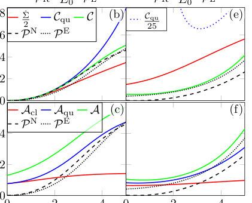
<figcaption class="paper-figure-caption"><b>Fig 1.</b> Figure 1. Precision limits in NN setup. (a,d) transmission τ and occupations fL,R as functions of energy at ∆µ = 2 ¯T. (b,c,e,f) Particle (PN) and energy (PE) current precision, with (b,e) thermodynamic costs from Eqs. (9, 18, 8) and (c,f) kinetic costs from Eqs. (14, 19, 13) as functions of ∆µ. In (a- c) ∆T = 0 and τ(E) = Θ[ w2</figcaption>
</figure>
<figure class="paper-figure-card">
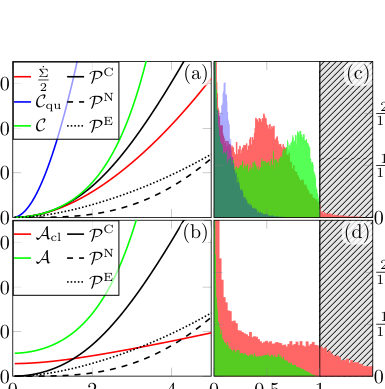
<figcaption class="paper-figure-caption"><b>Fig 2.</b> Figure 2. Precision limits in NS setup. (a,b) Charge (PC), quasiparticles (PN), energy (PE) current precision with (a) thermodynamic costs from Eqs. (9, 18, 8) and (b) kinetic costs from Eqs. (14, 13), as functions of ∆µ. (c,d) Sampling of precision PR of random energy-independent observable for τ ∈[0, 1], ∆µ ∈[0, 5 ¯T] divided by (c) thermodynamic costs of Eqs. (9, 18, 8) or (d) kinetic costs of Eqs. (14, 13). In (a,b) τ = 1. In (c,d) the hatched region highlights violations of classical TUR and KUR. In all plots ¯T = ∆, ∆T = 0.</figcaption>
</figure>

**Summary.** This work develops generalized uncertainty relations for quantifying the fundamental limits of precision when measuring various currents (energy, charge) in coherent quantum transport. By incorporating fluctuation theorems and analyzing strongly coupled regimes, the authors extend existing bounds to be valid far from equilibrium. This is crucial for understanding non-equilibrium energy dissipation and measurement constraints in advanced quantum devices like superconducting junctions.

**Why it may be interesting.** It provides rigorous, non-equilibrium bounds on measurement precision in quantum conductors, which is highly relevant for understanding energy/charge transport dynamics beyond simple linear response theory.

Detailed structure

**Main problem.** The paper derives generalized thermodynamic and kinetic uncertainty relations for quantifying precision limits associated with arbitrary currents flowing through coherent, strongly coupled quantum systems out of equilibrium.

**Main result.** New bounds (TUR, KUR, and a combined TKUR) are established that remain valid far from equilibrium and extend beyond previous limitations restricted to particle or charge currents. These bounds show higher-order fluctuation contributions when strong coupling is present.

**Method.** The derivation relies on applying the Cauchy-Schwarz inequality to transport statistics, specifically utilizing properties derived from fluctuation theorems (e.g., forward-backward stochastic entropy).

**Model / system.** The analysis focuses on coherent fermionic transport in linear systems, illustrated using normal-normal (NN) and normal-superconducting (NS) hybrid junctions.

**Key observables.** Average current ($\langle \dot{Q} 
angle$), zero-frequency noise ($	ext{Var}[q]$), entropy production rate ($	ilde{\sigma}$), and stochastic activity ($a$).

**Important parameters / regimes.** Strong coupling regime, far from equilibrium, superconducting leads (Andreev reflections).

**Assumptions / limitations.** The derivation assumes the current statistics can be analyzed via scattering theory and that particle-particle interactions are negligible or treated in a mean-field manner.

**Figures summary.** Figure 1 compares precision limits for NN setups using various cost functions (TUR vs. KUR). Figure 2 compares charge, quasiparticle, and energy current precision limits across different cost function formulations in NS setups.

**Paper structure.** The paper builds from establishing the general framework for uncertainty relations based on transport statistics, deriving specific forms for TUR and KUR applicable to arbitrary currents, introducing a generalized Thermokinetic Uncertainty Relation (TKUR), and finally validating these results using superconducting hybrid structures.

Abstract

We derive thermodynamic and kinetic uncertainty relations valid for arbitrary currents in coherent, strongly coupled, linear systems out of equilibrium. Exploiting properties of the transport statistics, in particular fluctuation theorems, we identify the relevant entropy production and activity that determine the cost of precision at the level of individual scattering events. The resulting bounds include higher-order fluctuations and remain valid far from equilibrium. We illustrate our results in normal and superconducting hybrid structures, and show that their predictiveness and validity range exceeds existing formulations.

[↑ back to top](#top)

### [Autoencoder-Based Unsupervised Identification of Nonequilibrium Phases in Sheared Binary Colloids](http://arxiv.org/abs/2607.05860v1)

**Authors:** Yoshitaka Miyahara, Taiki Haga  
**Type:** theory · **Category:** disordered systems and neural networks · **PDF:** <https://arxiv.org/pdf/2607.05860v1>  
**Analysis basis:** full PDF text, analyzed in chunks
**Topic relevance:** 🔥 `non-equilibrium dynamics` **4/5** · `driven-dissipative phase transition` **3/5** · `methods for driven-dissipative` **3/5** · `non-equilibrium universality` **3/5** · `Frenkel-Kontorova` **1/5** · `Keldysh / 2PI / non-Gaussian methods` **1/5** · `analog quantum simulation` **1/5**

↔ Scroll figures horizontally

<figure class="paper-figure-card">
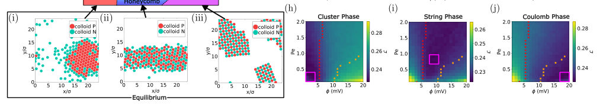
<figcaption class="paper-figure-caption"><b>Fig 1.</b> FIG. 1. (a) Schematic phase diagram as a function of the shear strength Pe and Coulomb interaction ϕ. The insets (i)-(vi) show representative snapshots of colloidal cconfigurations, where (i)-(iii) and (iv)-(vi) correspond to Pe = 0 (equilibrium) and Pe = 0.1, respectively. Within each row, the panels are arranged from left to right with increasing Coulomb interaction strength, ϕ = 3, 7, and 18 mV. (b), (c) Comparison of the RDFs for the Cluster and String phases at Pe = 0.5, corresponding to ϕ = 3 mV and 8 mV, respectively. In the Cluster phase, the first peak of gpp(r) at r/σ = 1.0 (indicated by a black arrow) exceeds that of gpn(r), whereas the opposite trend is observed in the String...</figcaption>
</figure>
<figure class="paper-figure-card">
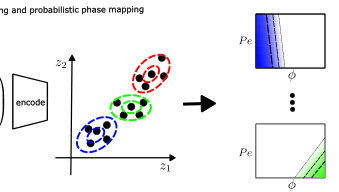
<figcaption class="paper-figure-caption"><b>Fig 2.</b> FIG. 2. Schematic illustration of our method. First, we cal- culate the amplitudes of the Fourier coefficients from sampled configurations and assemble them into feature vectors. After repeating this procedure for all configurations, dimensionality reduction is performed using an autoencoder, and the encoded latent space is clustered with a GMM. Finally, the phase di- agram is constructed from the probabilities that data points at each parameter set belong to each cluster.</figcaption>
</figure>
<figure class="paper-figure-card">
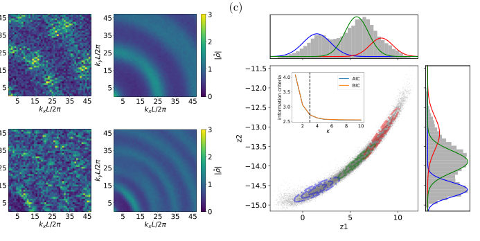
<figcaption class="paper-figure-caption"><b>Fig 3.</b> FIG. 3. (a), (b) Comparison of the original and reconstructed Fourier data at a fixed Pe = 0.1 for ϕ = 1 mV and 20 mV, respectively. (c) Latent space representation shown as scatter points, accompanied by one-dimensional histograms projected onto each axis. The colored contours in the main plot and solid curves in the projected histograms denote the Gaussian components derived from the GMM. The inset shows the Akaike and Bayesian information criteria (AIC and BIC) as a function of the number of clusters K.</figcaption>
</figure>
<figure class="paper-figure-card">

<figcaption class="paper-figure-caption"><b>Fig 4.</b> FIG. 4. Potential energy U/kB as a function of time t/t0 for Pe = 0.1 and ϕ = 1 mV, 10 mV, and 20 mV, shown in panels (a), (b), and (c), respectively. The potential energy is averaged over five independent initial conditions, and solid lines represent exponential fits.</figcaption>
</figure>
<figure class="paper-figure-card">
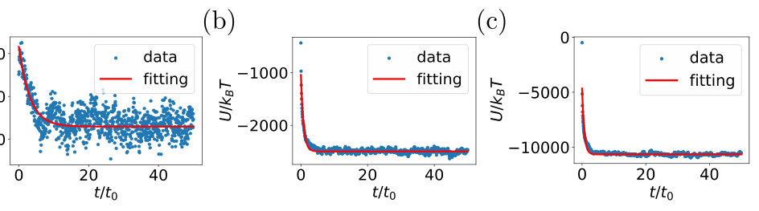
<figcaption class="paper-figure-caption"><b>Fig 5.</b> Figure 5 presents the reconstruction error of the autoencoder trained on the Fourier-preprocessed data. The training and test losses are evaluated using 100 and 50 independent Fourier-transformed data samples, respectively, for each</figcaption>
</figure>

**Summary.** This work presents an unsupervised machine learning framework to classify nonequilibrium phases in sheared colloidal systems. By preprocessing raw structural data using Fourier transforms and feeding the results into an autoencoder followed by GMM, the authors successfully map out a robust phase diagram. This demonstrates that ML can effectively analyze complex, non-equilibrium many-body physics when guided by physically motivated representations.

**Why it may be interesting.** While focused on classical colloids, the methodology—using deep learning to extract low-dimensional representations of complex, non-equilibrium many-body states—is highly relevant for analyzing quantum dynamics simulations where phase space sampling is difficult.

Detailed structure

**Main problem.** The primary challenge is unsupervised identification of nonequilibrium phases in particle systems, which are characterized by complex, spatially heterogeneous structures lacking long-range order.

**Main result.** The proposed autoencoder framework, when combined with Fourier preprocessing and GMM clustering, successfully maps the system's structural variations into distinct, robust clusters corresponding to known physical phases.

**Method.** The method involves transforming global spatial configurations into Fourier space, using these amplitudes as input features for an autoencoder for dimensionality reduction, followed by Gaussian Mixture Model (GMM) analysis on the latent space.

**Model / system.** The study uses a 2D binary charged colloidal system simulated under linear shear flow. Interactions are modeled by a DLVO-like potential combining WCA, screened Coulomb, and van der Waals forces.

**Key observables.** Fourier amplitudes ($\hat{
ho}_{m,n}$), latent space coordinates, cluster membership probabilities ($p_i$), Radial Distribution Functions (RDFs), and autoencoder reconstruction loss.

**Important parameters / regimes.** Coulomb interaction strength ($\phi$) and Peclet number ($Pe$, related to shear rate).

**Assumptions / limitations.** The crucial assumption is that preprocessing via Fourier transformation is necessary for the autoencoder to effectively capture phase-specific structural features, as direct application to raw data fails.

**Figures summary.** Figures illustrate the resulting nonequilibrium phase diagram vs. $(\phi, Pe)$, comparing machine learning cluster assignments with boundaries derived from RDF analysis and anomaly detection heatmaps.

**Paper structure.** The paper details the physical model (colloids under shear), introduces the ML framework (Fourier $
ightarrow$ Autoencoder $
ightarrow$ GMM), validates its results by showing consistency with traditional diagnostics (RDFs, loss), and compares different autoencoder architectures (FCNN vs. CNN).

Abstract

Identifying nonequilibrium phases in particle systems remains a major challenge because they often exhibit complex and spatially heterogeneous structures without long-range order. Here, we develop an unsupervised machine-learning framework for classifying such nonequilibrium phases by integrating Fourier-based preprocessing, an autoencoder, and a Gaussian mixture model (GMM). Specifically, we transform global spatial configurations into Fourier space and use the amplitudes of Fourier coefficients as inputs to the autoencoder. This preprocessing suppresses spatial noise while preserving phase-specific structural features and physical interpretability. We demonstrate the effectiveness of this framework using a binary charged colloidal system under steady shear flow, where the competition between Coulomb interactions and shear gives rise to three nonequilibrium phases characterized by distinct local structures. The encoded latent space reveals well-separated clusters that are robustly identified by the GMM, enabling the construction of a nonequilibrium phase diagram based on cluster membership probabilities. The resulting phase boundaries are consistent with those independently obtained from radial distribution function analysis and unsupervised anomaly detection. These results demonstrate that autoencoder-based unsupervised learning provides an effective framework for identifying nonequilibrium phases in complex particle systems.

[↑ back to top](#top)

### [Composite-Fermion Study of Cavity-Modified Fractional Quantum Hall Excitation Gaps](http://arxiv.org/abs/2607.06298v1)

**Authors:** Dalin Boriçi, Nicolas Regnault, Cristiano Ciuti  
**Type:** theory · **Category:** strongly correlated electrons · **PDF:** <https://arxiv.org/pdf/2607.06298v1>  
**Analysis basis:** full PDF text, analyzed in chunks
**Topic relevance:** 🔥 `analog quantum simulation` **4/5** · 🔥 `correlated cavity matter` **4/5** · `Tavis-Cummings & cavity-many-emitter` **3/5** · `Keldysh / 2PI / non-Gaussian methods` **1/5** · `correlated / nonlocal dissipation` **1/5** · `driven-dissipative phase transition` **1/5** · `exotic spin models in light-matter` **1/5** · `methods for driven-dissipative` **1/5**

↔ Scroll figures horizontally

<figure class="paper-figure-card">
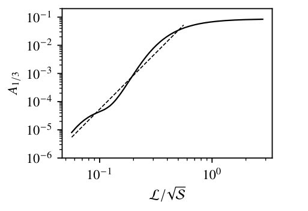
<figcaption class="paper-figure-caption"><b>Fig 1.</b> FIG. 2. Dependence of the dimensionless coefficient 𝐴1/3, which quantifies the cavity-induced enhancement of the charge gap accord- ing to Eq. (9), on the scaled interaction range L/ √</figcaption>
</figure>
<figure class="paper-figure-card">
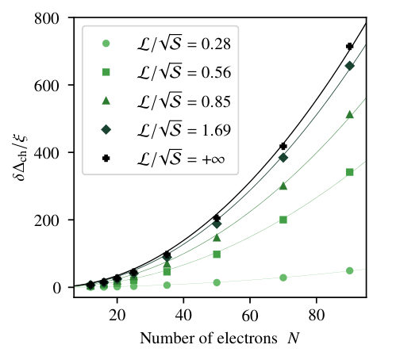
<figcaption class="paper-figure-caption"><b>Fig 2.</b> FIG. 1. Cavity-induced correction to the charge gap, 𝛿Δch/𝜉, normal- ized to the characteristic interaction energy scale 𝜉defined in Eq. (5), which is proportional to the fourth power of the cavity-mode spatial gradient. The correction is shown as a function of the number of elec- trons 𝑁for the 𝜈= 1/3 Laughlin state and for several values of the dimensionless interaction range L/ √</figcaption>
</figure>
<figure class="paper-figure-card">
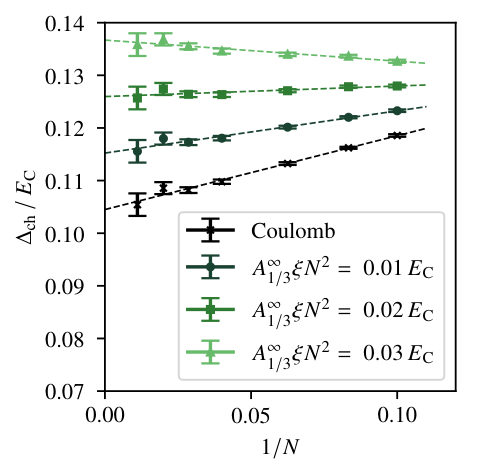
<figcaption class="paper-figure-caption"><b>Fig 3.</b> FIG. 3. Thermodynamic extrapolation of the charge gap of the Laughlin 𝜈= 1/3 state for the limiting case L/ √</figcaption>
</figure>
<figure class="paper-figure-card">
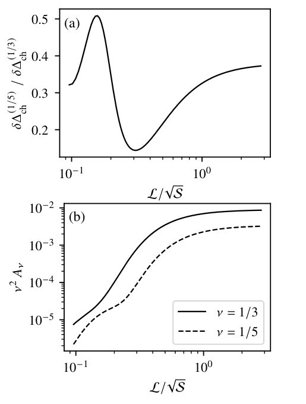
<figcaption class="paper-figure-caption"><b>Fig 4.</b> FIG. 4. (a) Ratio of the cavity-induced charge-gap enhancements for the Laughlin 𝜈= 1/5 and 𝜈= 1/3 states as a function of the scaled interaction range L/ √</figcaption>
</figure>
<figure class="paper-figure-card">
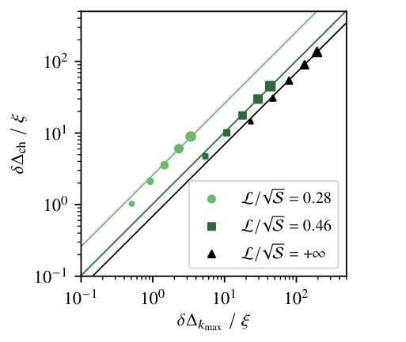
<figcaption class="paper-figure-caption"><b>Fig 5.</b> FIG. 5. Scatter plot of the cavity-induced correction to the charge gap 𝛿Δch versus that of the neutral excitation at the largest quasielectron- quasihole separation 𝛿Δ𝑘max for the 𝜈= 1/3 Laughlin state. The data are obtained for 𝑁= 12, 16, 20, 25, and 30 electrons, with larger markers corresponding to larger number of electrons, and for different values of the scaled interaction range L/ √</figcaption>
</figure>

**Summary.** This paper theoretically examines the effect of attractive, cavity-mediated interactions on the excitation gaps of Fractional Quantum Hall liquids. Using the composite-fermion framework, the authors calculate both neutral and charged gap shifts for $
u=1/3$ and $
u=1/5$. The key finding is a robust enhancement of the transport gap that scales predictably with system size and cavity field strength.

**Why it may be interesting.** This work directly bridges concepts from cavity QED (cavity coupling) into strongly correlated electron physics (FQH states), providing a quantitative prediction for how external electromagnetic environments can tune fundamental many-body properties like excitation gaps.

Detailed structure

**Main problem.** The study investigates how attractive electron-electron interactions mediated by a cavity modify the excitation gaps of Fractional Quantum Hall (FQH) states.

**Main result.** Finite-size scaling analysis shows that the transport gap is enhanced quadratically with the electron number and the fourth power of the vacuum-field gradient. The high-$k$ magnetoroton gap also exhibits enhancement.

**Method.** The calculations utilize the composite-fermion (CF) framework, analyzing both neutral magnetoroton spectra and charged excitation gaps relevant to transport experiments.

**Model / system.** The system is a spin-polarized lowest-Landau-level model of FQH liquids ($
u=1/3, 1/5$) coupled to a single quantized cavity mode. The effective interaction potential modifies the Coulomb pseudopotentials.

**Key observables.** Neutral magnetoroton excitation spectrum and charged excitation gap (relevant to transport).

**Important parameters / regimes.** Filling factors ($
u=1/3, 1/5$), electron number ($N$), cavity vacuum-field gradient ($G$), and interaction range parameter ($L$).

**Assumptions / limitations.** The analysis assumes a spatially uniform cavity-field gradient; the CF framework is used as an approximation for the strongly interacting system.

**Figures summary.** Figures demonstrate quadratic scaling of the charge gap with $N$ (Fig. 1, 9), confirm the dependence on interaction range ($L/\sqrt{S}$) (Fig. 2, 11), and show thermodynamic extrapolation confirming finite limits for the gap shift (Fig. 3, 10).

**Paper structure.** The paper develops the effective Hamiltonian using CF theory, calculates expectation values of the cavity interaction, analyzes both neutral and charged excitation gaps, and employs finite-size scaling to extrapolate results to the thermodynamic limit.

Abstract

We investigate how cavity-mediated attractive electron-electron interactions modify the excitation gaps of fractional quantum Hall states within the composite-fermion framework. We compute both the neutral magnetoroton excitation spectrum and the charged excitation gap relevant to transport experiments for the Laughlin $ν=1/3$ and $ν=1/5$ states. We consider a spin-polarized lowest-Landau-level model in which the interaction is mediated by a cavity mode with a spatially uniform vacuum-field gradient and a finite interaction range controlled by a long-distance cutoff. Finite-size scaling reveals that the transport gap is consistently enhanced by the cavity-induced interaction, with the gap enhancement scaling quadratically with the electron number and with the fourth power of the vacuum-field gradient. By contrast, the magnetoroton spectrum exhibits a richer dependence on the interaction range. The high-$k$ magnetoroton gap is enhanced for all interaction ranges considered, consistent with its close connection to the charged excitation gap, even with the long-range character of the interaction.

[↑ back to top](#top)

### [Magnetotransport of tomographic electrons in a Corbino disk](http://arxiv.org/abs/2607.05540v1)

**Authors:** Nitay Ben-Shachar, Johannes Hofmann  
**Type:** theory · **Category:** statistical mechanics · **PDF:** <https://arxiv.org/pdf/2607.05540v1>  
**Analysis basis:** full PDF text, analyzed in chunks
**Topic relevance:** 🔥 `non-equilibrium dynamics` **4/5** · `Keldysh / 2PI / non-Gaussian methods` **3/5** · `non-equilibrium universality` **3/5** · `driven-dissipative phase transition` **2/5** · `Kondo & dissipative impurity` **1/5** · `analog quantum simulation` **1/5** · `correlated / nonlocal dissipation` **1/5** · `methods for driven-dissipative` **1/5**

↔ Scroll figures horizontally

<figure class="paper-figure-card">
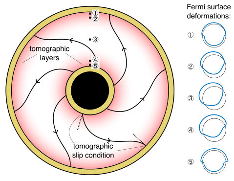
<figcaption class="paper-figure-caption"><b>Fig 1.</b> FIG. 1. Left: Schematic of transport in a Corbino disk with electrodes shown in gold. Tomographic boundary layers are shaded red. Streamlines (black lines) emanate from the elec- trodes at a nonzero angle from the radial direction (dotted) due to the velocity slip conditions [Eq. (13)]. Right: Exagger- ated Fermi-surface deformations across the flow domain, with thin black circles indicating the equilibrium Fermi surface.</figcaption>
</figure>
<figure class="paper-figure-card">
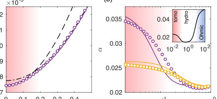
<figcaption class="paper-figure-caption"><b>Fig 2.</b> FIG. 3. (a) Resistance as a function of the magnetic field strength for G →∞, ke = 0.1, ko = 3, r1 = 3. Open circles show numerical solutions. The solid purple line is the asymp- totic solution (shifted by a constant). The dashed line shows the tomographic magnetoresistance curvature that applies at weak magnetic fields, and the dash-dotted line shows the hy- drodynamic result valid at higher fields. (b) Quadratic mag- netoresistance coefficient α for ko = 3 (purple) and ko = 1 (yellow). The main panel highlights the crossover from tomo- graphic to hydrodynamic scaling at weak fields 1/rc ≃1/ko. Inset: Full magnetic-field dependence of α for G = 1, ko = 3, including the Ohmic regime at...</figcaption>
</figure>
<figure class="paper-figure-card">
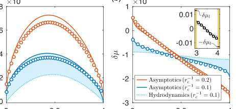
<figcaption class="paper-figure-caption"><b>Fig 3.</b> FIG. 2. Profiles of the (a) azimuthal velocity and (b) electro- chemical potential in the Corbino disk with G →∞, ke = 0.1, ko = 3, p = 0, r1 = 3 and 1/rc = 0.1 (blue) and 1/rc = 0.2 (red). Open circles are numerical solutions of Eq. (1) with p = 0 and solid lines are the asymptotic theory. The hydrody- namic solution is shown for 1/rc = 0.1 (dotted line), and the difference between this and the asymptotic theory is shaded. The inset in (b) shows the full voltage profile for 1/rc = 0.5 in- cluding the potential in the electrodes (shaded gold) at ±δµl.</figcaption>
</figure>
<figure class="paper-figure-card">
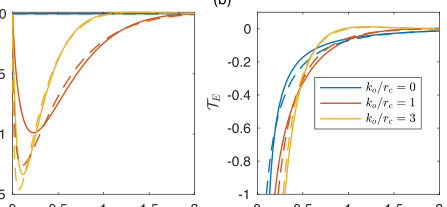
<figcaption class="paper-figure-caption"><b>Fig 4.</b> FIG. 4. Tomographic layer functions (a) YE and (b) TE for p = 4 and ko/rc ∈{0, 1, 3}, with γ′/γe = 0 (solid lines) and γ′/γe = 1 (dashed lines).</figcaption>
</figure>

**Summary.** This work develops a kinetic theory framework to describe magnetotransport in electron gases within a Corbino disk. It identifies 'tomographic transport' as an anomaly arising from long-lived odd-parity Fermi surface modes, which modifies standard hydrodynamic predictions. The resulting theoretical description predicts distinct crossover regimes for magnetoresistance dependent on the magnetic field strength.

**Why it may be interesting.** While focused on condensed matter transport, the use of non-equilibrium statistical mechanics (kinetic theory) and the derivation of anomalous scaling laws provide rigorous theoretical tools applicable to understanding far-from-equilibrium dynamics in quantum systems.

Detailed structure

**Main problem.** The study addresses 'tomographic transport' in clean electron gases, an anomalous transport mechanism not captured by standard hydrodynamic models.

**Main result.** Tomographic flow induces superballistic current injection at electrodes and enhances the magnetoresistance coefficient, which exhibits a non-monotonic dependence on magnetic field strength across three distinct regimes.

**Method.** The analysis employs matched asymptotic expansions of the kinetic equation, distinguishing between bulk behavior and near-electrode boundary layers.

**Model / system.** The system is an electron gas confined in a Corbino disk geometry. The theory models quasiparticle distribution functions using Fermi-liquid equations linearized around equilibrium.

**Key observables.** Magnetoresistance coefficient, azimuthal velocity profile u_theta(r), and electrode conductance G_e.

**Important parameters / regimes.** Odd-mode mean free path (l_o), even-mode mean free path (l_e), cyclotron radius (r_c), and the ratio of these lengths to device size L.

**Assumptions / limitations.** The analysis relies on systematic expansions in Knudsen numbers ($k_e, k_o$) and assumes that tomographic corrections are responsible for observed anomalous scaling.

**Figures summary.** Figures illustrate schematic transport paths showing boundary layers, profiles of velocity and potential across different magnetic field regimes (tomographic, hydrodynamic, Ohmic), and the non-monotonic dependence of magnetoresistance curvature on $1/r_c$.

**Paper structure.** The paper builds from the general kinetic equation by linearizing it and expanding in Knudsen numbers. It then solves for the bulk flow using matched asymptotic expansions, incorporating specific boundary conditions at the electrodes to derive corrections to transport coefficients like viscosity.

Abstract

In clean electron gases at low-to-moderate temperatures, odd-parity modes of the Fermi surface are anomalously long-lived due to Pauli blocking, giving rise to ``tomographic transport'' that is not captured by a hydrodynamic model. Here we show that tomographic flow in a Corbino disk induces an extended boundary layer near electrodes with superballistic transport and enhanced slip velocity, which leads to a parametric enhancement of the quadratic magnetoresistance coefficient. The enhancement depends explicitly on the electrode curvature, allowing its strength to be controlled by the device geometry. The magnetoresistance coefficient reveals three distinct regimes as a function of magnetic field: a tomographic regime at weak fields; a hydrodynamic regime at intermediate fields, reached when the cyclotron radius becomes comparable to a large odd-mode mean free path; and a conventional Ohmic regime at large fields, reached when the cyclotron radius becomes comparable to the short even-mode mean free path. The tomographic regime is characterized by an anomalous dependence of the magnetoresistance on temperature and density, which may account for recent experimentally observed anomalous scaling of the electron viscosity.

[↑ back to top](#top)

### [Thermodynamic phase transitions in lattice spin systems with severe kinetic constraints: Numerical simulation results](http://arxiv.org/abs/2607.06205v1)

**Authors:** Ruifeng Liu, Jianwen Zhou, Yejia Chen, Jiahang Chen, Hai-Jun Zhou  
**Type:** theory · **Category:** statistical mechanics · **PDF:** <https://arxiv.org/pdf/2607.06205v1>  
**Analysis basis:** full PDF text, analyzed in chunks
**Topic relevance:** 🔥 `scars & prethermalization` **4/5** · `non-equilibrium universality` **3/5** · `driven-dissipative phase transition` **2/5** · `non-equilibrium dynamics` **2/5** · `Frenkel-Kontorova` **1/5** · `analog quantum simulation` **1/5** · `correlated / nonlocal dissipation` **1/5** · `exotic spin models in light-matter` **1/5** · `methods for driven-dissipative` **1/5**

↔ Scroll figures horizontally

<figure class="paper-figure-card">
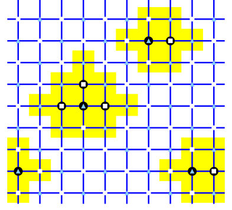
<figcaption class="paper-figure-caption"><b>Fig 1.</b> FIG. 1. The Fredrickson-Andersen model with hyperparameter K = 1, on a square lattice of side</figcaption>
</figure>
<figure class="paper-figure-card">
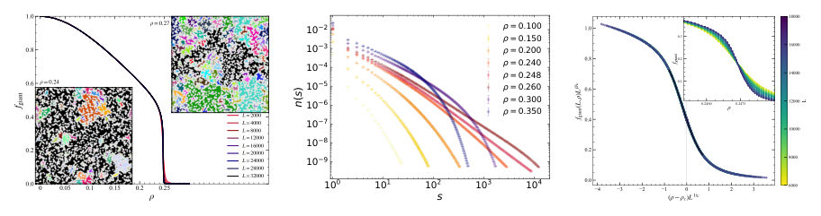
<figcaption class="paper-figure-caption"><b>Fig 2.</b> FIG. 2. Collapse transition in the periodic square lattice. (a) Relative size fgiant of the giant</figcaption>
</figure>
<figure class="paper-figure-card">
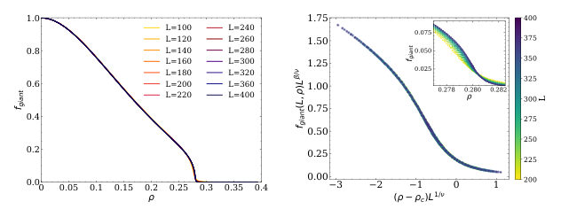
<figcaption class="paper-figure-caption"><b>Fig 3.</b> FIG. 3. Same as Figs. 2(a) and 2(c), but for the periodic cubic lattices (D = 3) of various side</figcaption>
</figure>
<figure class="paper-figure-card">
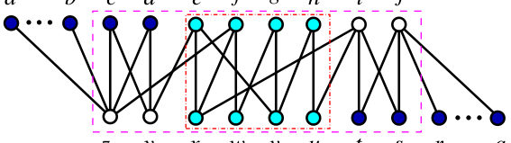
<figcaption class="paper-figure-caption"><b>Fig 4.</b> FIG. 4. An example small bipartite graph. The top and bottom rows correspond to sublattices A</figcaption>
</figure>
<figure class="paper-figure-card">
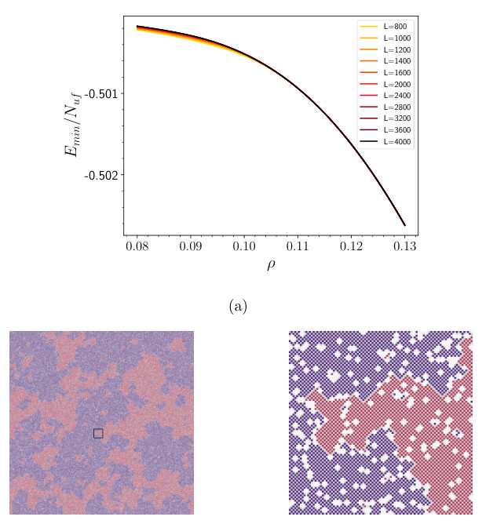
<figcaption class="paper-figure-caption"><b>Fig 5.</b> FIG. 5. (a) The ground-state energy density Emin/Nuf versus the initial density ρ of occupied</figcaption>
</figure>

**Summary.** This paper analyzes phase transitions in lattice spin models governed by severe kinetic constraints, such as the Fredrickson-Andersen model at K=1. Using numerical simulations, the authors determine critical densities where the system's connected structure collapses (percolation) and identify a separate crystal-to-glass transition in the ground states. The work provides quantitative results for these transitions on 2D and 3D lattices.

**Why it may be interesting.** While focused on classical statistical mechanics, the concept of quenched disorder and constrained dynamics shares conceptual links with studying decoherence or localization effects in open quantum systems.

Detailed structure

**Main problem.** The study investigates thermodynamic phase transitions occurring in lattice spin systems that are subjected to severe, site-dependent kinetic constraints.

**Main result.** The giant connected component of the unfrozen subsystem collapses at critical initial densities ($
ho_c$), belonging to the universality class of site percolation. Additionally, a crystal-to-glass transition is found for ground states in 3D.

**Method.** The research relies on extensive numerical simulations and finite-size scaling analysis applied to analyze connectivity and ground state properties.

**Model / system.** The model is the Fredrickson-Andersen (FA) lattice spin system, specifically analyzed for the severely constrained case $K=1$. The system's dynamics are governed by local rules that freeze sites based on occupied nearest neighbors, leaving an 'unfrozen subsystem' whose properties are studied.

**Key observables.** Connectivity of the unfrozen subsystem (giant component fraction), size distribution of connected components ($n(s)$), and ground state order parameters.

**Important parameters / regimes.** Initial packing density ($
ho$), kinetic constraint parameter ($K=1$), and critical densities ($
ho_c$ for percolation, $
ho^*$ for crystal-glass transition).

**Assumptions / limitations.** The analysis is primarily restricted to the $K=1$ case; generalizations to higher $K$ or finite temperature are noted as future work.

**Figures summary.** Figure 2(a) shows the percolation transition of the giant component fraction vs. $
ho$, and Figure 2(b) illustrates the power-law size distribution of unfrozen sites near criticality.

**Paper structure.** The paper analyzes the system by first defining the kinetic constraints leading to frozen/unfrozen subsystems, then applying percolation theory to find the connectivity collapse ($
ho_c$), followed by analyzing ground state structural transitions (crystal-to-glass).

Abstract

The Fredrickson-Andersen model with hyperparameter $K=1$ is a severely constrained kinetic lattice spin system, such that any site is temporarily blocked from changing its packing state (empty or occupied) if there is one or more occupied nearest neighbors. Starting from a completely random initial configuration with a fraction $ρ$ of sites being occupied, some of the sites may be permanently frozen to their initial state under this severe kinetic constraint. The remaining sites can switch states at least occasionally, and they form the unfrozen subsystem associated with the given initial configuration. In the present work we investigate thermodynamic phase transitions in such unfrozen subsystems of the two-dimensional square lattice and the three-dimensional cubic lattice by extensive numerical simulations. We demonstrate that the giant connected component of the unfrozen subsystem collapses at certain critical value $ρ_{c}$ of initial packing density, with $ρ_c = 0.2475$ for the square lattice and $ρ_c = 0.2809$ for the cubic lattice. This phase transition belongs to the same universality class of the conventional site percolation. We also observe that the ground states (densest packing configurations) experience a continuous crystal-to-glass phase transition at the critical value $ρ^* = 0.1423$ of initial packing density for the cubic lattice. For the two-dimensional square lattice we argue that long-range crystalline order is destroyed in the ground states as long as the initial packing density $ρ$ is positive.

[↑ back to top](#top)

### [Epitaxial single T centres in silicon-on-insulator](http://arxiv.org/abs/2607.06272v1)

**Authors:** Christian H. Christiansen, Kasper H. Nielsen, Alisha Nanwani, Sebastiano Guaraldo, E. Laurits Piehorsch, Arnulf J. Snedker-Nielsen, Magnus L. Madsen, David R. Gongora, Emanuele Brusaschi, Rodrigo A. Thomas, Ian Farrer, D. Hieu Nguyen, Georgios Kountouris, Beñat M. d. A. Jokisch, Mohammad Khalifa, Claudia Piccinini, Mathias Ø. Augustesen, Hugo Laurell, Kokeb B. Benti, Maria S. Gonzalez, Amedeo Carbone, Elvedin Memisevic, Sangeeth Kallatt, Mark K. Svendsen, Marianne E. Bathen, Lasse Vines, Peter Granum, Peter Krogstrup, Stefano Paesani  
**Type:** experiment · **Category:** quantum information and computing · **PDF:** <https://arxiv.org/pdf/2607.06272v1>  
**Analysis basis:** full PDF text, analyzed in chunks
**Topic relevance:** 🔥 `QC/QI experiment` **4/5** · `quantum optics experiment` **3/5** · `spintronics-quantum-optics interface` **3/5** · `analog quantum simulation` **1/5** · `exotic spin models in light-matter` **1/5** · `interference shaping light` **1/5** · `quantum measurements` **1/5**

↔ Scroll figures horizontally

<figure class="paper-figure-card">
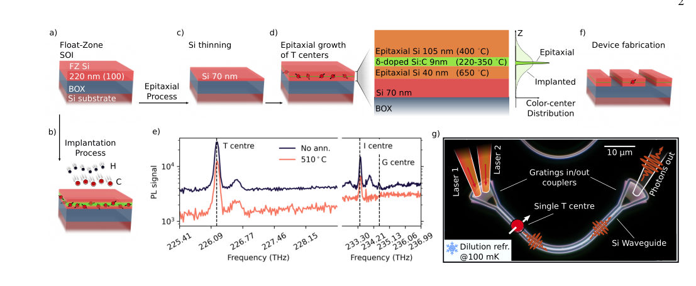
<figcaption class="paper-figure-caption"><b>Fig 1.</b> FIG. 1. Epitaxial generation of colour centres in SOI. a) Cross-section of the initial SOI wafer with a top layer of 220 nm float-zone (FT) silicon. b) Standard implantation of T centres is performed through ion implantation of hydrogen (H) and carbon (C), causing damage to the silicon crystal, which can result in additional unwanted defects in the device. The process for growth-based generation of T centres in SOI starts with (c) thinning the FZ Si layer by back-etching, followed by (d) epitaxial growth of a stack of silicon layers. Inset of d): Schematic of the epitaxial process for growth-based generation of T centres. Colour centres are incorporated through a low-temperature growth of a...</figcaption>
</figure>
<figure class="paper-figure-card">
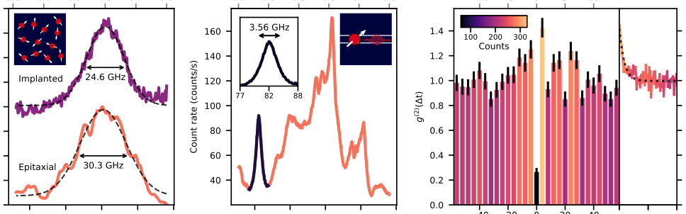
<figcaption class="paper-figure-caption"><b>Fig 2.</b> FIG. 2. Optical characterisation of epitaxial T centres. a) Resonant photoluminescence spectra for ensembles of T centres in an epitaxially grown sample (orange), as well as from a standard implanted sample (purple). An offset along the vertical axis has been added to the implanted spectrum to facilitate visualisation. b) Resonant excitation spectrum collected in transmission from a single waveguide device in an epitaxially grown SOI sample. The emission of a single T centre can be spectrally resolved. The peak is highlighted in dark colour. The rest of the spectrum, in orange, is from other T centres in the approximately 100 µm-long waveguide, spectrally separated from the single emitter...</figcaption>
</figure>
<figure class="paper-figure-card">
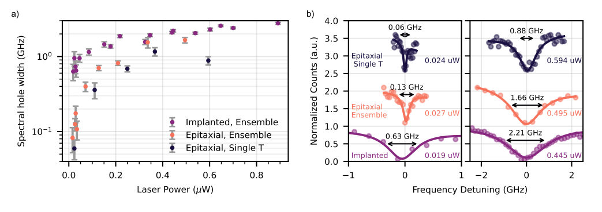
<figcaption class="paper-figure-caption"><b>Fig 3.</b> FIG. 3. Characterisation of the homogeneous broadening of the optical linewidth. a) Instantaneous homogeneous optical linewidths for waveguide-integrated T centres measured through hole-burning. Data collected from devices with epitaxially grown T centres are shown in black for a single emitter and in orange for an ensemble of emitters. Data collected from an ensemble of implanted T centres are shown in purple for comparison. Error bars represent the 1 σ uncertainties on the Lorentzian widths obtained from the fits. Markers are measured data, and solid lines represent fits to the data. b) Dips in the photoluminescence spectra for the hole-burning measurements used to characterise the...</figcaption>
</figure>

**Summary.** The research demonstrates a method using molecular-beam epitaxy (MBE) to create single T centres in silicon-on-insulator wafers. This epitaxial approach significantly improves the coherence of photon emission from these defects by narrowing the optical linewidth down to 30 MHz. These results establish a highly promising, scalable platform for developing quantum photonic devices.

**Why it may be interesting.** This work directly addresses the engineering challenge of creating high-quality quantum light sources on CMOS-compatible silicon platforms by controlling material defects epitaxially, which is central to solid-state quantum networking and computing architectures.

Detailed structure

**Main problem.** The primary challenge is achieving coherent photon emission from spin-photon interfaces based on silicon quantum emitters for scalable quantum computing.

**Main result.** Epitaxially incorporating single T centres in silicon-on-insulator yields significantly narrower optical linewidths (as low as 30 MHz) compared to standard ion-implanted samples, establishing a robust platform for coherent spin-photon interfaces.

**Method.** The authors utilized high-purity molecular-beam epitaxy (MBE) to grow and incorporate single T centres into SOI wafers, followed by advanced optical characterization techniques like hole-burning and second-order correlation measurements.

**Model / system.** The physical system is a single T centre defect engineered epitaxially within silicon-on-insulator (SOI) wafers, coupled to nanophotonic waveguides. The T centre acts as the quantum emitter whose spin state couples to emitted photons.

**Key observables.** Optical linewidths (homogeneous: 30 MHz vs. hundreds of MHz for implanted), single-photon emission confirmation ($g^{(2)}(0) = 0.26(3)$), and spectral diffusion decay times ($\sim 34 \mu	ext{s}$).

**Important parameters / regimes.** The epitaxial process involves specific MBE growth steps (e.g., $\delta$-doping, low-temperature deposition) to achieve nanometer-scale defect control.

**Assumptions / limitations.** It is assumed that the tailored MBE process successfully mitigates material imperfections responsible for spectral wandering and homogeneous broadening compared to implantation methods.

**Figures summary.** Figures compare PL spectra (ensemble vs. single emitter), show $g^{(2)}(\Delta t)$ measurements confirming single-photon emission, and present hole-burning results comparing linewidths between epitaxial and implanted samples.

**Paper structure.** The paper details the MBE growth process for T centres in SOI, presents characterization using PL and $g^{(2)}$ measurements to confirm single emitters, and critically compares the resulting optical coherence properties (linewidths) against previously achieved ion-implanted samples.

Abstract

Spin-photon interfaces based on silicon quantum emitters offer a scalable platform for quantum computing and networking. However, achieving coherent photon emission remains a primary challenge due to stringent material quality requirements. To overcome this, we utilise high-purity molecular-beam epitaxy (MBE) to epitaxially incorporate single T centres in silicon-on-insulator (SOI) wafers. We demonstrate single T-centre emission coupled to a nanophotonic waveguide and observe significant suppression of homogeneous broadening, yielding optical linewidths as narrow as 30 MHz using natural silicon for crystal growth. These results establish epitaxial T centres as a robust foundation for coherent spin-photon interfaces in silicon quantum photonics.

[↑ back to top](#top)

### [Bose Einstein Condensation of Magnons in BaCuSi$_{2}$O$_{6}$: An experimental perspective](http://arxiv.org/abs/2607.06028v1)

**Authors:** Marcelo Jaime, Franziska Weickert  
**Type:** both · **Category:** strongly correlated electrons · **PDF:** <https://arxiv.org/pdf/2607.06028v1>  
**Analysis basis:** full PDF text, analyzed in chunks
**Topic relevance:** 🔥 `analog quantum simulation` **4/5** · `exotic spin models in light-matter` **3/5** · `spintronics-quantum-optics interface` **3/5** · `driven-dissipative phase transition` **1/5** · `entanglement & information structure` **1/5** · `non-equilibrium dynamics` **1/5**

↔ Scroll figures horizontally

<figure class="paper-figure-card">
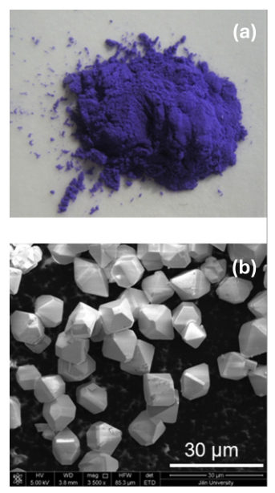
<figcaption class="paper-figure-caption"><b>Fig 1.</b> Fig. 1 (a) Han purple BaCuSi2O6 powder synthesized by the hydrothermal route at 250𝑜C for 48 hrs. (b) SEM image showing 10𝜇m big crystals. Reprinted from Chen et al. [27] copyright ©2014 with permission from Elsevier. (c) Single crystal sample grown using the flux technique. Depending on the flux used, the crystal size range is 1 - 10 mm. Reprinted from van Well et al., [28] copyright ©2016 American Chemical Society. (d) 60 mm long crystalline rod, often consisting of a few single crystals inter-grown together, obtained with the traveling molten floating zone method. Reprinted with permission from S.E. Sebastian, PhD. Thesis, [17](Copyright ©2006, Suchitra E. Sebastian)</figcaption>
</figure>
<figure class="paper-figure-card">
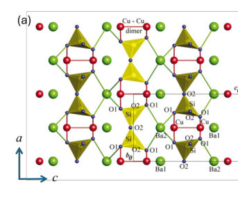
<figcaption class="paper-figure-caption"><b>Fig 2.</b> Fig. 2 (a) Room-temperature structure of BaCuSi2O6 in the originally/incorrectly assigned space group I¯4m2, according to Finger et al. [9] in a projection onto the ac-plane. Here, all Cu dimers are identical, and the unit cell indicated by the thin line is small. (b) Projection of a Cu2Si4O12 layer onto the ab-plane. The green spheres represent the Ba atoms, the yellow tetrahedra the SiO4 groups, and the red planar squares the CuO4 groups. Model in the now widely accepted room temperature space group I41/acd, with doubling of the unit cell. Reprinted with permission from Ref. [11]. (Copyright ©2004 International Union of Crystallography)</figcaption>
</figure>
<figure class="paper-figure-card">
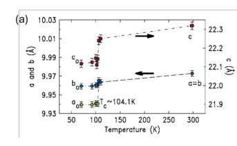
<figcaption class="paper-figure-caption"><b>Fig 3.</b> Fig. 3 (a) Lattice parameters of BaCuSi2O6 vs temperature on warming. Reproduced with permis- sion from [21] (Copyright copyright2006 American Physical Society). (b) Schematic representation of the crystal structure of the low-temperature phase with only the Cu-Cu dimers shown. For the interlayer coupling paths, Cu1-Cu2 (shown in thin lines in the right figure), there are always two pairs of slightly inequivalent bond distances. Reproduced with permission from [35] (Copyright ©2012 American Physical Society).</figcaption>
</figure>
<figure class="paper-figure-card">
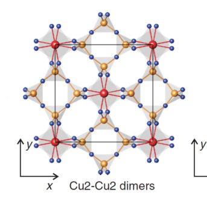
<figcaption class="paper-figure-caption"><b>Fig 4.</b> Fig. 4 Two types of Cu-Cu dimer layers at low temperature as refined from the neutron data taken at 13 K. The Cu2-Cu2 distance is 2.701(6) ˚A; the Cu1-Cu1 distance is 2.774(6) ˚A. Red and blue spheres are copper, small blue spheres are oxygen, orange spheres are Si, Ba atoms, the spacer between copper bilayers, are not displayed. Reproduced with permission from [35] (Copyright ©2012 American Physical Society).</figcaption>
</figure>
<figure class="paper-figure-card">
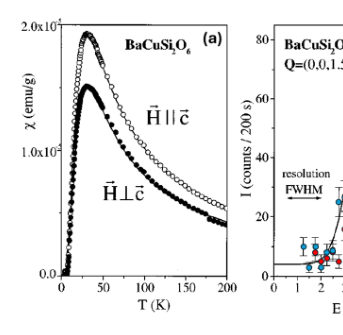
<figcaption class="paper-figure-caption"><b>Fig 5.</b> Fig. 5 (a) Magnetic susceptibility of a BaCuSi2O6 single crystal (symbols). The solid lines rep- resent theoretical fits based on the isolated dimer model. (b) Representative constant-Q scans in BaCuSi2O6, showing the magnetic gap excitation centered at ℏ𝜔= 4.5 meV. Solid lines are Gaus- sian fits to the data. (c) Dispersion of the gap excitation measured along the (ℎ, 0, 1.5) direction. The solid lines are fits to the experimental data, following the model described by Sasago et al. [10]. Reproduced with permission from [10] (Copyright ©1997 American Physical Society)</figcaption>
</figure>

**Summary.** This work explores the magnetic properties of BaCuSi2O6, focusing on its transition into an easy-plane antiferromagnetic state under high magnetic fields. This ordered state is theoretically interpreted as a Bose-Einstein Condensate of magnons. The research highlights how this material serves as a crucial experimental playground for testing advanced concepts in quantum many-body physics.

**Why it may be interesting.** It provides a concrete solid-state platform where quantum many-body phenomena like BEC can be accessed and tested using extreme external fields, bridging condensed matter magnetism with fundamental quantum physics concepts relevant to AMO systems.

Detailed structure

**Main problem.** The study investigates the Bose-Einstein Condensation (BEC) of magnons in the magnetic insulator BaCuSi2O6 under high external magnetic fields.

**Main result.** The material exhibits a transition into an easy-plane XY antiferromagnetic state, which is modeled as a realization of magnon BEC. The dimensionality of this condensation depends on doping (3D vs 2D limit).

**Method.** The research combines experimental techniques like high-field magnetometry and diffraction with theoretical modeling to analyze quantum many-body physics.

**Model / system.** The system is BaCuSi2O6, a layered cyclosilicate containing magnetic Cu2+ dimers ($S=1/2$). Its magnetic behavior transitions from a quantum paramagnet to an ordered state under high fields.

**Key observables.** Magnetic ordering transition, easy-plane (XY) antiferromagnetic state, magnon condensation signature, lattice parameters, and structural phase transitions.

**Important parameters / regimes.** High magnetic fields (23–49 Tesla), sub-liquid Helium temperatures, and doping levels (e.g., Sr substitution).

**Assumptions / limitations.** The material's behavior is successfully modeled by treating the magnon condensation as an ideal Bose gas in the XY limit.

**Figures summary.** Not specified by notes; focus is on phase diagrams and structural/magnetic transitions across various fields and temperatures.

**Paper structure.** The paper reviews decades of work, starting from material synthesis (solid-state, flux methods) to detailed characterization (XRD, INS), culminating in the theoretical framework for magnon BEC and its dimensional analysis via doping.

Abstract

Han Purple, a pigment first obtained in ancient China, is one of the earliest known synthetic pigments. Also naturally occurring, as a mineral, it is known as colinowensite (Cwn). Its chemical formula is BaCuSi$_{2}$O$_{6}$, and its structure is a layered cyclosilicate in which magnetic Cu$^{2+}$ ions (S = 1/2) form dimers arranged on a square lattice, making it also the first known synthetic metal dimer compound. Most interesting magnetic properties arise from a strong intradimer spin coupling, accompanied by weaker interdimer interactions within and between Cu-dimer layers. In zero or small magnetic fields, BaCuSi$_{2}$O$_{6}$ remains a quantum paramagnet. However, under high magnetic fields between 23 and 49 Tesla -- about a million times stronger than Earth's magnetic field -- it undergoes magnetic ordering at subliquid Helium temperatures into an almost ideal easy-plane (XY) antiferromagnetic state regarded as a realization of a Bose-Einstein condensate of magnons. Within this experimentally accessible field range, BaCuSi$_{2}$O$_{6}$ serves as an extraordinary playground for testing predictions of quantum many-body physics.

[↑ back to top](#top)

### [Learning to Reconstruct Wigner Functions in Phase Space](http://arxiv.org/abs/2607.06232v1)

**Authors:** Xinyu Tang, Yi-hsin Lin, Yan Zhu, Tailong Xiao, Yuxuan Du, Giulio Chiribella, Qiongyi He, Ya-dong Wu  
**Type:** both · **Category:** quantum information and computing · **PDF:** <https://arxiv.org/pdf/2607.06232v1>  
**Analysis basis:** full PDF text, analyzed in chunks
**Topic relevance:** 🔥 `QC/QI experiment` **4/5** · `quantum measurements` **3/5** · `quantum optics experiment` **3/5** · `Tavis-Cummings & cavity-many-emitter` **1/5** · `measurement-induced transitions` **1/5** · `methods for driven-dissipative` **1/5**

↔ Scroll figures horizontally

<figure class="paper-figure-card">
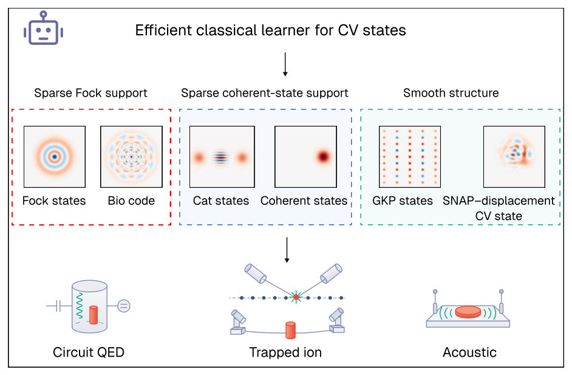
<figcaption class="paper-figure-caption"><b>Fig 1.</b> FIG. 1. Illustration of various types of CV quantum states whose Wigner functions can be efficiently learned by our learning models. For each type of state, typical examples are provided. The Wigner function learning protocols can be widely performed on various physical platforms, including circuit-QED, trapped ions and acoustic systems.</figcaption>
</figure>
<figure class="paper-figure-card">
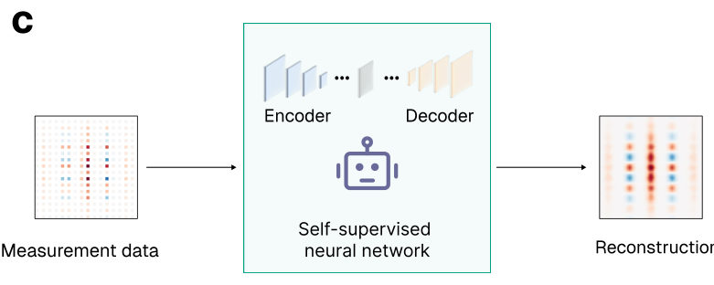
<figcaption class="paper-figure-caption"><b>Fig 2.</b> FIG. 2. Schematic diagram of the learning model used to reconstruct Wigner functions of quantum states in phase space. Subfigure a illustrates the learning protocol. Using Wigner function measurement data collected at a sparse set of phase-space points (e.g., randomly sampled from a probability distribution over phase space or a predetermined grid), we train a model to learn the quantum state’s Wigner function. After training, the model can predict the Wigner function value at any arbitrary point in phase space. Subfigure b presents a regression model that fits the measurement data by a linear combination of independent features. Subfigure c presents a neural network with an encoder-decoder...</figcaption>
</figure>
<figure class="paper-figure-card">
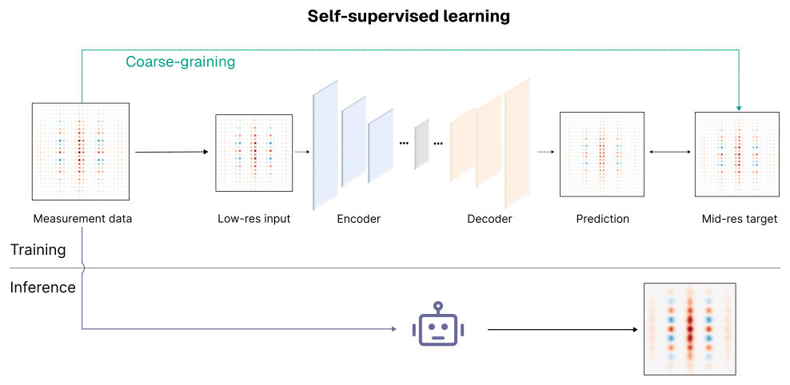
<figcaption class="paper-figure-caption"><b>Fig 3.</b> FIG. 3. The learning scheme for our DNN model is inspired by high-resolution image reconstruction. During training, the model parameters are optimized in a self-supervised manner to minimize estimation errors in the mid-resolution Wigner function reconstructed from low-resolution input. During inference, the trained model is applied to reconstruct high-resolution Wigner functions.</figcaption>
</figure>
<figure class="paper-figure-card">
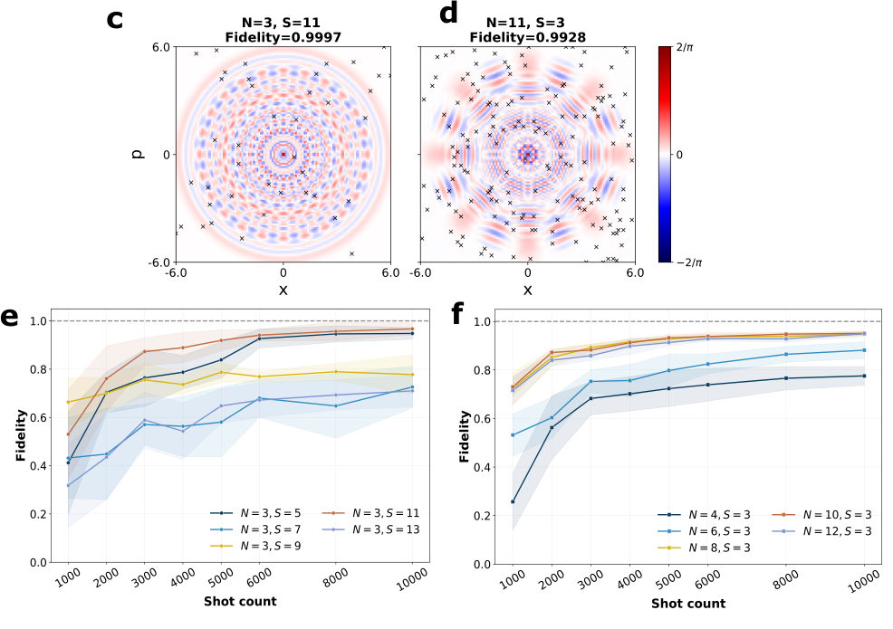
<figcaption class="paper-figure-caption"><b>Fig 4.</b> FIG. 4. Reconstruction of Wigner functions for simulated binomial code states. In Subfig. a, the number of phase-space points required to achieve a fidelity of 0.99 is shown with respect to the truncation dimension for binomial code states with fixed N = 3 and increasing values of S. In Subfig. b, the number of phase-space points required to achieve a fidelity of 0.99 is shown with respect to the truncation dimension for binomial code states with fixed S = 3 and increasing values of N. In both Subfigs. a and b, the scaling required for information completeness in conventional Wigner tomography (d2 −1) is shown as a reference. Each point represents the mean over five independent random...</figcaption>
</figure>
<figure class="paper-figure-card">
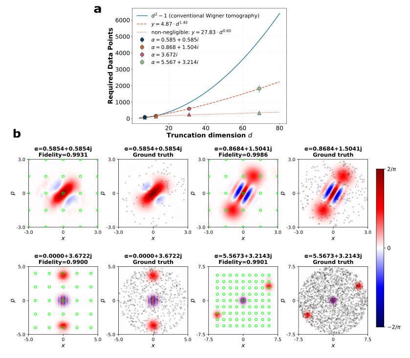
<figcaption class="paper-figure-caption"><b>Fig 5.</b> FIG. 5. Reconstruction of Wigner functions for simulated cat states. In Subfig. a, the number of phase-space points required to achieve a fidelity &gt; 0.99 with respect to the truncation dimension d is shown for cat states with varying complex amplitudes α. The scaling required for information completeness in conventional Wigner tomography (d2 −1) is shown as a reference. The dashed and dotted lines indicate the empirical scaling of the total and non-zero required points, respectively. Each point represents the mean over five independent random realizations of the phase-space sampling pattern, and the error bars indicate one standard deviation. In Subfig. b, example reconstructions of the...</figcaption>
</figure>

**Summary.** The paper presents a novel machine learning framework designed to reconstruct the Wigner function of continuous variable quantum states from limited measurement data. By developing specialized regression models and deep neural networks, the authors overcome the computational bottleneck associated with dense phase-space sampling. This method is successfully demonstrated on both simulated and real experimental data from circuit-QED systems, showing superior performance for characterizing complex states like GKP code states.

**Why it may be interesting.** This work provides a powerful, scalable tool for characterizing complex quantum states in CV systems that are difficult to measure fully, directly impacting error correction verification and state characterization in quantum optics experiments.

Detailed structure

**Main problem.** The core challenge is reconstructing continuous Wigner functions of CV quantum states from sparse, finite-point measurements in phase space.

**Main result.** A deep learning framework was developed that accurately reconstructs Wigner functions for complex states like GKP code states using significantly fewer measurements than conventional estimation techniques, even on experimental data.

**Method.** The authors propose a machine learning approach, utilizing both specialized regression models (for sparse-support states) and general Deep Neural Networks (DNNs) to act as continuous function surrogates for the Wigner function.

**Model / system.** The work focuses on Continuous Variable (CV) quantum systems, characterized by bosonic harmonic oscillators. Experimental demonstrations are performed using superconducting circuit quantum electrodynamics (circuit-QED) platforms, particularly characterizing GKP code states.

**Key observables.** Wigner function $W_
ho(\alpha)$ and the characteristic function $C_
ho(\alpha)$.

**Important parameters / regimes.** The effective Hilbert-space dimension ($d$), measurement complexity scaling ($\mathcal{O}(\log d)$), and reconstruction overlap (e.g., $>0.98$).

**Assumptions / limitations.** Measurements only provide finite pointwise samples of a continuous function; the regression model assumes state sparsity in a known basis.

**Figures summary.** Figures illustrate various CV states whose Wigner functions can be learned, and show comparisons between DNN predictions versus traditional regression models when reconstructing measured Wigner functions for GKP code states.

**Paper structure.** The paper introduces the problem of phase-space reconstruction, details two primary ML frameworks (sparse regression vs. general DNN), demonstrates efficiency gains on simulated data (GKP states), and validates the method using experimental measurements from a circuit-QED system.

Abstract

Wigner function learning is a central tool for characterizing continuous variable quantum systems. A fundamental challenge in this setting is to infer a continuous phase-space function from sparse pointwise measurement data, a task that becomes increasingly demanding as the effective dimension enlarges. Here, we develop a general machine learning framework to reconstruct Wigner functions directly as continuous functions from sparse phase-space data. For states with sparse Fock-space or coherent-state representations, such as binomial code states and cat states, we devise provably efficient regression models whose measurement complexity scales only logarithmically with the effective Hilbert-space dimension. For more general states, such as the Gottesman-Kitaev-Preskill (GKP) states, we design a deep learning model that reconstructs the Wigner function from sparse measurements and generalizes to arbitrary phase-space resolution. We demonstrate the broad applicability of our framework on both simulated data and experimental data from a circuit quantum electrodynamic (circuit-QED) system. Interestingly, on experimental data, we find that our model reconstructs Wigner functions of GKP code states across multiple rounds of quantum error correction and identifies the dominant error process using significantly fewer measurements than conventional estimation techniques.

[↑ back to top](#top)

### [Single-photon polarization tomography with an integrated metal-superconductor nanowire array](http://arxiv.org/abs/2607.06047v1)

**Authors:** Pierre Brosseau, Jiawei Wang, Giorgio Adamo, Anton N. Vetlugin, Cesare Soci  
**Type:** experiment · **Category:** quantum information and computing · **PDF:** <https://arxiv.org/pdf/2607.06047v1>  
**Analysis basis:** full PDF text, analyzed in chunks
**Topic relevance:** 🔥 `QC/QI experiment` **4/5** · `quantum measurements` **3/5** · `quantum optics experiment` **3/5** · `interference shaping light` **1/5** · `measurement-induced transitions` **1/5** · `spintronics-quantum-optics interface` **1/5**

↔ Scroll figures horizontally

<figure class="paper-figure-card">
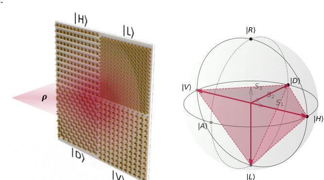
<figcaption class="paper-figure-caption"><b>Fig 1.</b> Fig. 1. Monolithic metal-superconductor nanowire single photon detector array for polarization state tomography. An incident single photon state 𝜌 illuminates a four-pixel M-SNSPD array, where each pixel implements a distinct polarization projection. Three pixels comprise U-shaped gold nanowires oriented to project onto |H⟩, |V⟩, and |D⟩ while a fourth pixel with an S-shaped chiral meander projects onto |L⟩. Each pixel is mapped to its corresponding point on the Poincaré sphere, with the Stokes axes 𝑆1 , 𝑆2 , 𝑆3 indicated. Together, the four projections form an informationally complete measurement basis for reconstruction of an arbitrary polarization qubit, without sequential measurements,...</figcaption>
</figure>
<figure class="paper-figure-card">
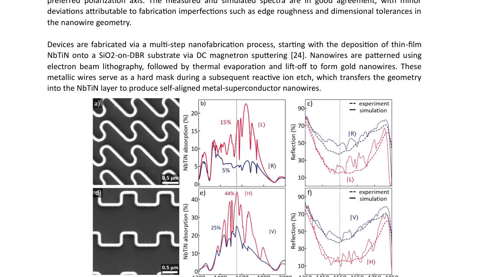
<figcaption class="paper-figure-caption"><b>Fig 2.</b> Fig. 2. Geometry-engineered polarization selectivity. (a) SEM image of the chiral S-shaped nanowires enabling circular polarization discrimination. (b) Simulated NbTiN absorption for right and left-handed circular polarizations. (c) Measured (dashed line) and simulated (solid line) reflection spectra confirming helicity-dependent optical response. (d) SEM image of the U-shaped nanowires designed for linear polarization sensitivity. (e) Simulated NbTiN absorption for horizontal and vertical polarizations. (f) Measured (dashed line) and simulated (solid line) reflection spectra showing polarization-dependent response.</figcaption>
</figure>
<figure class="paper-figure-card">
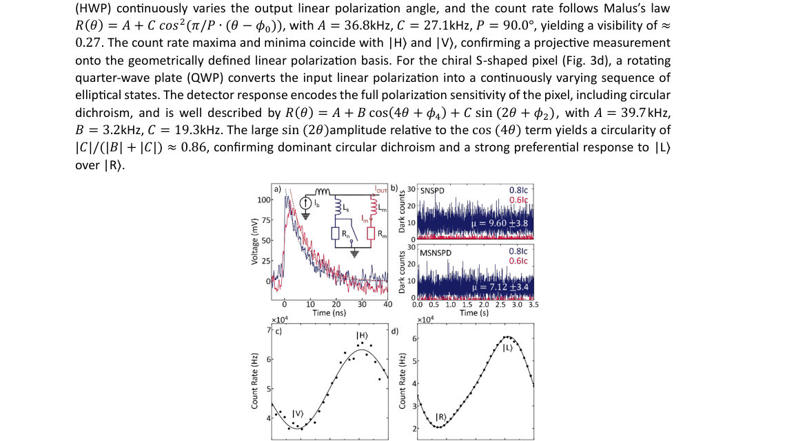
<figcaption class="paper-figure-caption"><b>Fig 3.</b> Fig. 3. Electrical performance and polarization-resolved single photon response of hybrid detectors. (a) Electrical pulse traces measured from the reference SNSPD (blue) and M-SNSPD (red). The inset shows the equivalent circuit model including the kinetic inductance 𝐿𝑘 and the metallic branch (𝑅𝑚, 𝐿𝑚). (b) Dark count time traces at 0.6𝐼𝑐 and 0.8𝐼𝑐 for the M-SNSPD (top) and reference SNSPD (bottom), showing comparable noise performance. (c) Photon count rate versus HWP angle for the U-shaped linear pixel, fitted with Malus’s law (solid line); count rate extrema correspond to |H⟩ and |V⟩. (d) Count rate versus QWP angle for the S-shaped chiral pixel, fitted with a three-component model (solid...</figcaption>
</figure>
<figure class="paper-figure-card">
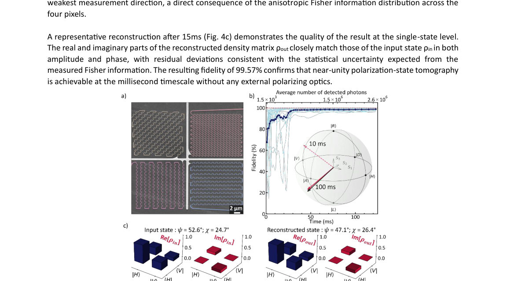
<figcaption class="paper-figure-caption"><b>Fig 4.</b> Fig. 4. Experimental demonstration of continuous, spatially multiplexed quantum state tomography. (a) Scanning electron micrograph of the polarization selective four-pixel array. (b) Experimental fidelity convergence for 19 input states, achieving an ensemble average &gt;98% within 100ms; inset shows state convergence on the Poincaré sphere at 10 and 100ms. (c) Representative high-fidelity (99.57%) density matrix</figcaption>
</figure>
<figure class="paper-figure-card">
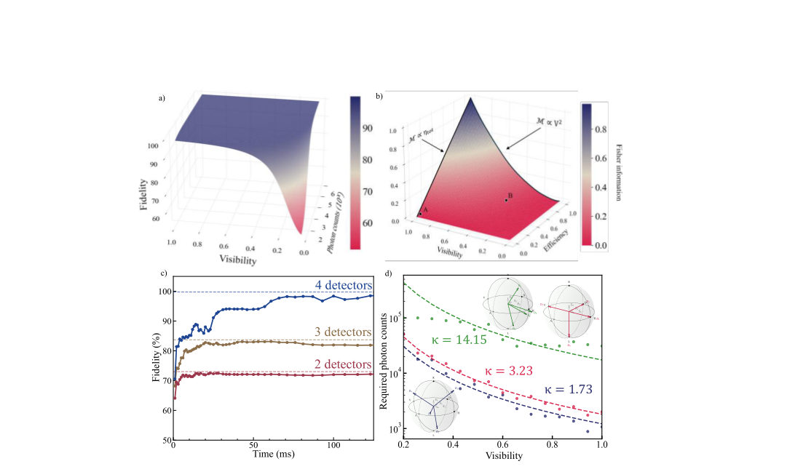
<figcaption class="paper-figure-caption"><b>Fig 5.</b> Fig. 5. Theoretical limits of polarization state tomography with the M-SNSPD array. (a) Analytical fidelity surface showing the transition from shot-noise to visibility-limited regimes. (b) Fisher information figure of merit ℳ = 𝜂𝑡𝑜𝑡𝑉2 as a function of visibility and efficiency; points A and B compare a high-extinction and a high-absorption detector design, illustrating the quadratic penalty of reduced visibility and the non-linear compensation required to maintain a constant information rate. (c) Fidelity plateaus demonstrating the limits of incomplete measurements when using 2, 3 or 4 detectors. (d) Required photon budget for 99% fidelity across different POVM geometries, confirming 𝑉−2...</figcaption>
</figure>

**Summary.** The paper presents a novel, monolithic metal-superconductor nanowire detector array that integrates polarization selectivity directly into the detector structure using plasmonic metamaterials. By arranging four specialized pixels, the device performs on-chip, high-fidelity quantum state tomography of single photons' polarization states. This breakthrough removes reliance on external optics, paving the way for scalable photonic quantum circuits.

**Why it may be interesting.** This work directly addresses hardware limitations in quantum optics by integrating complex quantum measurement functionality (polarization analysis) onto the detector chip itself, which is crucial for building scalable photonic quantum processors.

Detailed structure

**Main problem.** The scaling of photonic quantum networks requires precise, integrated characterization of single-photon polarization states without bulky external optics.

**Main result.** The developed monolithic detector array achieves intrinsic full polarization selectivity, enabling continuous polarization state tomography with an ensemble average fidelity exceeding 98%.

**Method.** The authors fabricated a four-pixel metal-superconductor nanowire array where co-fabricated gold plasmonic metamaterials induce polarization-dependent resonant absorption in the superconducting nanowires.

**Model / system.** The system is a monolithic, self-aligned M-SNSPD array containing U-shaped and S-shaped nanowires. These structures act as integrated polarizers by exploiting structural anisotropy (linear) and chirality (circular).

**Key observables.** Ensemble average fidelity (>98%), count rates following Malus's law, divergence in reflection spectra for different polarization components, and the reconstructed density matrix ($
ho_{out}$).

**Important parameters / regimes.** High-count rate operation, low dark count rates, visibility ($V$), and the required complete basis set size (four pixels).

**Assumptions / limitations.** The approach assumes that the gold overlayer acts as a hard etch mask for self-alignment, and minor deviations are attributed to fabrication imperfections.

**Figures summary.** Figures illustrate the four-pixel array mapping to the Poincaré sphere; SEM images confirm polarization-dependent absorption mechanisms (U/S shapes); and theoretical plots show fidelity convergence limited by visibility ($V^{-2}$) and dimensionality constraints.

**Paper structure.** The paper progresses from identifying the need for integrated polarimetry, detailing the M-SNSPD design using plasmonics, demonstrating single-pixel polarization measurements (linear/circular), scaling up to a four-pixel array, and finally quantifying state tomography fidelity convergence across various input states.

Abstract

Light polarization is a primary degree of freedom for encoding quantum information. The scaling up of photonic quantum networks and computer architecture depends crucially on its precise characterization. This is typically achieved by placing external waveplates, polarizers, moving mounts, and recently metasurfaces, on top of the detectors. All these solutions complicate integration and scaling. Here we break convention with traditional architecture and present a monolithic, self-aligned metal-superconductor nanowire single photon detector (M-SNSPD) possessing intrinsic full polarization selectivity. Gold nanowires, co-fabricated atop NbTiN superconducting nanowires within the same lithographic footprint, act as polarization-selective plasmonic metamaterials inducing resonant absorption in the NbTiN. U-shaped wires provide linear polarization selectivity, while S-shaped meanders distinguish circular polarization, while retaining the high-count rates and low dark count rates of conventional SNSPDs. By arranging them into a four-pixel array we realize simultaneous projection onto four polarizations and demonstrate continuous polarization state tomography with an ensemble average fidelity exceeding 98%. Our approach opens new avenues towards scalable detector arrays with integrated plasmonic functionalities, for single photon polarimetry, imaging and spectroscopy.

[↑ back to top](#top)

### [Chiral Graviton Modes in Non-Abelian lattice Fractional Quantum Hall states](http://arxiv.org/abs/2607.06267v1)

**Authors:** Zeno Bacciconi, Min Long, Hernan Xavier, Hongyu Lu, Marcello Dalmonte, Zi Yang Meng  
**Type:** theory · **Category:** strongly correlated electrons · **PDF:** <https://arxiv.org/pdf/2607.06267v1>  
**Analysis basis:** full PDF text, analyzed in chunks
**Topic relevance:** 🔥 `analog quantum simulation` **4/5** · `methods for driven-dissipative` **3/5** · `non-equilibrium dynamics` **2/5** · `Keldysh / 2PI / non-Gaussian methods` **1/5** · `driven-dissipative phase transition` **1/5** · `entanglement & information structure` **1/5**

↔ Scroll figures horizontally

<figure class="paper-figure-card">
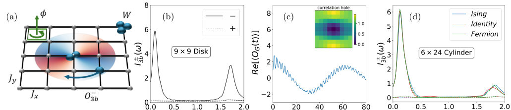
<figcaption class="paper-figure-caption"><b>Fig 1.</b> FIG. 1. Pfaffian state graviton mode and geometric quench. (a) Sketch of the interacting bosonic Harper-Hofstadter system and the graviton operator O− 3b used to track the dynamics of the graviton mode. (b) Graviton spectrum from MPS simulations on an open disk geometry (flux ϕ = 1/6, W = ∞and N = 5 particles). (c) Real-time dynamics of graviton displacement ⟨OG(t)⟩/⟨OG(0)⟩after a geometric quench (anisotropy α = 0.8 →1.). Same parameters as (b) Inset: 3-body correlation C3 ij in Eq. (4) measured at η = 0.8. (d) Graviton spectrum from MPS simulations in cylinder geometry, for different topological sectors (in different colors) and chirality (in solid or dashed lines); the system size is 6 ×...</figcaption>
</figure>
<figure class="paper-figure-card">
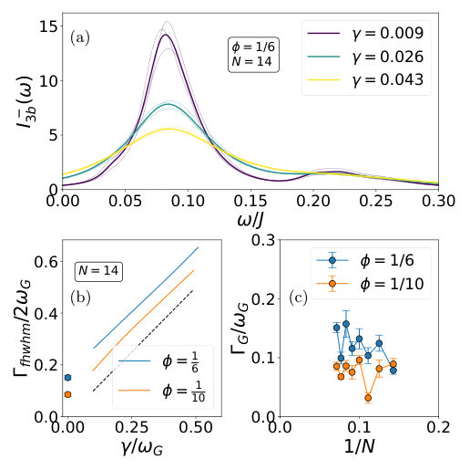
<figcaption class="paper-figure-caption"><b>Fig 2.</b> FIG. 2. Life time analysis on the Graviton mode (a) Graviton spectra at different regularization parameters γ. Different ground states are shown as thin lines, while the thicker line correspond to the averaged spectra. (b) Rescaled Full width half maxima Γfwhm vs. γ for different fluxes ϕ. The dashed black line represents the infinite lifetime scenario Γfwhm(γ) = 2γ, while the γ = 0 points are extrapolations. (c) Graviton intrinsic decay rate ΓG relative to its energy ωG as a function of ϕ and particle number. All results are ob- tained with pED at W = 5</figcaption>
</figure>
<figure class="paper-figure-card">
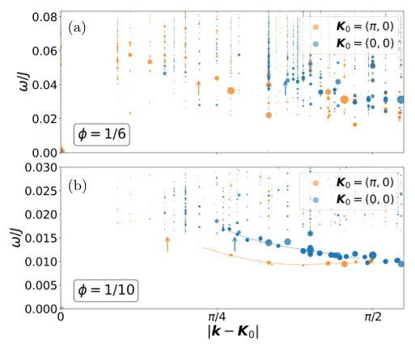
<figcaption class="paper-figure-caption"><b>Fig 3.</b> FIG. 3. Magneto-roton mode and neutral fermion mode. Neutral modes dispersion for a high flux nϕ = 1/6 (panel (a)) and a low flux nϕ = 1/10 (panel (b)) obtained with pED. Points correspond to eigenstates |n⟩with a weight (marker area) corresponding to | ⟨n| nk |0⟩|. As explained in the text, the relative momenta |k −K0| reveal the magne- toroton mode (blue) (all sizes N = 6, .., 13) and the neu- tral fermion mode (orange and only odd sizes). Arrows in- dicate where the corresponding continuum mode enters the two-particle continuum; dashed lines are a guide to the eye.</figcaption>
</figure>

**Summary.** The paper investigates the collective excitations of non-Abelian lattice FQH states, focusing on the chiral graviton mode. Using advanced numerical simulations like MPS and ED, the authors successfully demonstrate the existence of this long-lived excitation using 3-body correlators. This work provides a key diagnostic tool for characterizing exotic topological phases relevant to modern quantum simulation experiments.

**Why it may be interesting.** This bridges concepts from topological quantum matter (FQH states) with measurable excitation signatures (graviton modes), providing concrete predictions for experimental realization in cold atom platforms.

Detailed structure

**Main problem.** The study aims to investigate key excitation properties, specifically the existence of a chiral graviton mode (CGM), in non-Abelian lattice Fractional Quantum Hall (FQH) states beyond just their ground state characteristics.

**Main result.** The authors demonstrated the first observation of a long-lived chiral graviton mode using chiral 3-body correlators on lattice non-Abelian states, showing robustness across different geometries and topological sectors.

**Method.** A combination of advanced numerical techniques was employed, including full exact diagonalization (fED), band-projected ED (pED), and Matrix Product State (MPS) simulations to calculate spectral densities from 3-body correlators.

**Model / system.** The system models non-Abelian FQH states using the bosonic Harper–Hofstadter model realized on a square lattice, specifically targeting the $
u=1$ Moore–Read ground state. The Hamiltonian includes hopping terms and three-body onsite interactions.

**Key observables.** Chiral graviton mode (CGM) spectrum, 3-body correlators ($O^{\pm}_{3b}$), spectral density $I^{\pm}_{3b}(\omega)$, and the intrinsic decay rate ($\Gamma_G$).

**Important parameters / regimes.** Low flux per plaquette ($\phi$), finite droplet sizes ($9 	imes 9$ disk), three-body interaction strength ($W$), and lattice geometry (disk, cylinder, torus).

**Assumptions / limitations.** The analysis relies on projecting the continuum stress tensor onto lattice operators and making approximations in spectral function analysis due to finite interactions or computational limits.

**Figures summary.** Figures illustrate the setup involving the graviton operator, show the resolved CGM spectrum from MPS simulations on open disks, demonstrate real-time dynamics after geometric quenches, and compare spectra across different topological sectors.

**Paper structure.** The work progresses by first establishing the theoretical framework using lattice Hamiltonians, then applying advanced numerical methods (ED/MPS) to calculate 3-body correlators, demonstrating the CGM signal's existence and robustness, and finally analyzing its lifetime via quench dynamics.

Abstract

Synthetic quantum matter provides a highly tunable route to fractional quantum Hall physics beyond the constraints of conventional electronic materials. However, previous theoretical studies have mostly focused on their ground state properties. It remains unclear to what extent such platforms could reveal key excitation properties of fractional quantum Hall states. Here, we study charge-neutral collective excitations in a non-abelian lattice fractional quantum Hall state realized in the bosonic Harper-Hofstadter model at unity filling factior, realizing a Moore-Read ground state. Combining full exact diagonalization, band-projected exact diagonalization, and matrix-product-state simulations, we demonstrate the existence of a long-lived chiral graviton mode, probed by chiral 3-body correlators, for the first time on lattice non-Abelian states. The graviton signal is topological sector-independent and could be observed via geometric quenches in small open droplets directly relevant to current cold-atom experiments, while other neutral modes, such as the magnetoroton and neutral fermion, are less resolved at presently achievable volumes.

[↑ back to top](#top)

### [Design and Benchmarking of a Quantum Photonic Chip](http://arxiv.org/abs/2607.06488v1)

**Authors:** Gabriele De Angelis, Nicolò Leone, Alessandro Luongo, Alberto Montanaro, Matteo Sanna, Roberto Siagri, Vito Sorianello, Luigi Tallone, Fabrizio Tamburini, Marco Venere  
**Type:** experiment · **Category:** quantum information and computing · **PDF:** <https://arxiv.org/pdf/2607.06488v1>  
**Analysis basis:** full PDF text, analyzed in chunks
**Topic relevance:** 🔥 `QC/QI experiment` **4/5** · `quantum optics experiment` **3/5** · `analog quantum simulation` **2/5** · `entanglement & information structure` **1/5** · `interference shaping light` **1/5** · `non-equilibrium dynamics` **1/5**

↔ Scroll figures horizontally

<figure class="paper-figure-card">
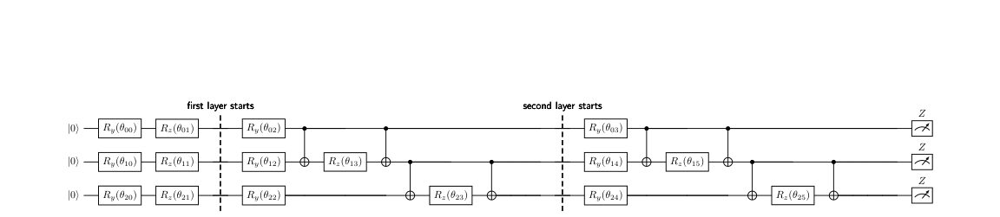
<figcaption class="paper-figure-caption"><b>Fig 1.</b> Fig. 1: The Ansatz implemented by RP000 which we consider in our experiments. It consists of a layered architecture, where a series of Ry and Rz rotations alternate and CNOT gates generate entanglement.</figcaption>
</figure>
<figure class="paper-figure-card">
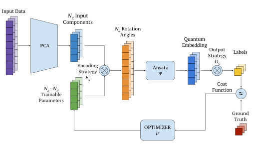
<figcaption class="paper-figure-caption"><b>Fig 2.</b> Fig. 2: Description of the training pipeline for our quantum Ansatz. First, data is pre-processed via PCA; then, the ex- tracted NC components are combined with trainable param- eters via an encoding strategy ES, to produce Nθ rotation angles that feed the Ansatz. The expectation values of the 3 Pauli Z measurement operators will determine our quantum embedding of data. After the labels are derived, we evaluate the considered angles and invoke the Adam optimizer.</figcaption>
</figure>
<figure class="paper-figure-card">
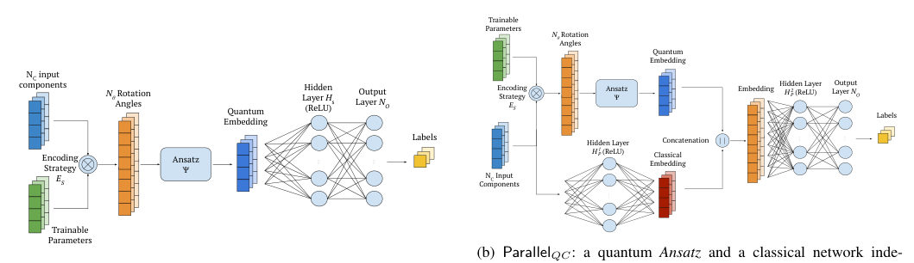
<figcaption class="paper-figure-caption"><b>Fig 3.</b> Fig. 3: Description of the hybrid models considered by our experimental analysis, integrating a quantum Ansatz into a more extended neural network. The quantum embedding is fed as input to a classical neural network, to provide higher capabilities in feature extraction and class separation in the embedding space.</figcaption>
</figure>
<figure class="paper-figure-card">
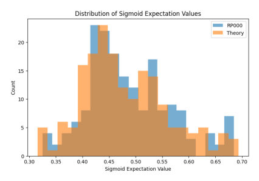
<figcaption class="paper-figure-caption"><b>Fig 4.</b> Fig. 4: Comparison between the frequencies of the value of the sigmoids obtained by the numerical simulation (Theory) and the quantum chip (RP000) for the test set of YEAST.</figcaption>
</figure>

**Summary.** The paper details the design and rigorous benchmarking of RP000, a silicon-based photonic quantum chip. By applying it to machine learning tasks using hybrid quantum-classical models, the authors demonstrated that the platform achieves high accuracy while showing superior noise resilience compared to superconducting alternatives. This establishes a scalable pathway for efficient quantum computation.

**Why it may be interesting.** This work provides concrete experimental evidence for scalable, room-temperature quantum computation using photonics, directly addressing the engineering challenges of building practical quantum hardware.

Detailed structure

**Main problem.** The authors designed and benchmarked a room-temperature quantum photonic processor to demonstrate its viability for quantum machine learning tasks.

**Main result.** The photonic chip achieved higher accuracy than classical networks of comparable size and exhibited superior noise tolerance compared to superconducting processors in benchmarking tests.

**Method.** They implemented various hybrid quantum-classical architectures (SerialQC, ParallelQC) on the hardware platform and benchmarked them against theoretical simulations and superconducting devices using ML datasets.

**Model / system.** The system is RP000, a three-qubit photonic processor built on CMOS-compatible silicon photonics. It encodes quantum information in single-photon degrees of freedom and operates via Parametric Quantum Circuits (PQCs).

**Key observables.** Test accuracy for classification tasks (e.g., STATLOG, YEAST), Mean Absolute Error (MAE), and Root Mean Square Error (RMSE) when comparing chip results to theory.

**Important parameters / regimes.** The system uses a $(\mathbb{Z}_2)^3$-graded Lie algebra structure; key hyperparameters tuned include the number of classical components ($N_C$) and encoding strategy ($	ext{ES}$).

**Assumptions / limitations.** The comparison assumes that statevector tomography can be performed on hardware, and superconducting comparisons used matched sampling statistics.

**Figures summary.** Figures illustrate the layered Ansatz circuit structure (Fig. 1) and detail the entire quantum ML training pipeline involving PCA, encoding, and optimization (Fig. 2).

**Paper structure.** The paper follows a progression from hardware design/calibration to implementing hybrid QML models (QuantumNN $
ightarrow$ SerialQC $
ightarrow$ ParallelQC), culminating in comprehensive benchmarking against classical and superconducting baselines.

Abstract

We present the design and benchmarking of RP000, a quantum photonic processor capable of encoding a quantum system in the degrees of freedom of single photons, based on standard CMOS-compatible manufacturing processes, and working at room temperature. We benchmark it against machine learning tasks, evaluating three quantum-classical architectures of increasing complexity. Our experimental results and simulations show that RP000 achieves higher accuracy than classical networks of comparable size in multiple use cases. Compared to a superconducting quantum processor, RP000 exhibits superior noise tolerance. These findings demonstrate that RP000 can provide a scalable route toward efficient quantum applications.

[↑ back to top](#top)

### [Higher-dimensional chaotic features and random matrix signatures following a local quench](http://arxiv.org/abs/2607.05512v1)

**Authors:** Dmitry S. Ageev, Jacob Sonnenschein  
**Type:** theory · **Category:** statistical mechanics · **PDF:** <https://arxiv.org/pdf/2607.05512v1>  
**Analysis basis:** full PDF text, analyzed in chunks
**Topic relevance:** 🔥 `non-equilibrium dynamics` **4/5** · `non-equilibrium universality` **3/5** · `Keldysh / 2PI / non-Gaussian methods` **1/5** · `driven-dissipative phase transition` **1/5** · `entanglement & information structure` **1/5** · `methods for driven-dissipative` **1/5**

↔ Scroll figures horizontally

<figure class="paper-figure-card">
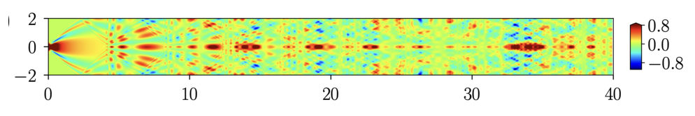
<figcaption class="paper-figure-caption"><b>Fig 1.</b> Figure 1: The two-point correlation function defined via (2.15) for the strip size L = 4, mass m = 10, α = 0.05.</figcaption>
</figure>
<figure class="paper-figure-card">
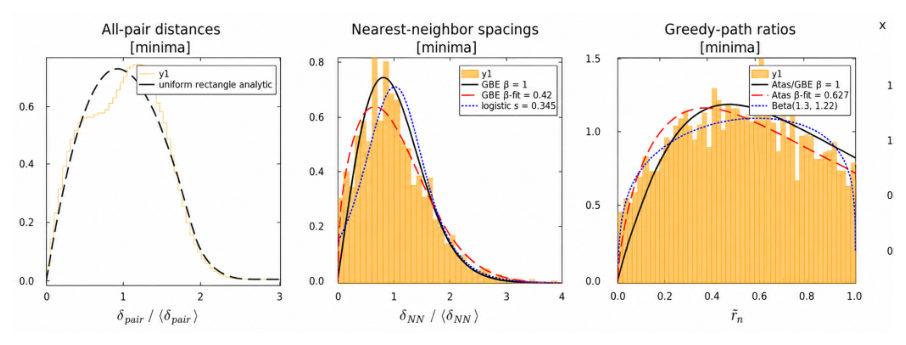
<figcaption class="paper-figure-caption"><b>Fig 2.</b> Figure 2: Axis-rescaled, non-density-unfolded analysis of the refined minima cloud. The left panel shows the histogram of all pair distances together with the analytic uniform-rectangle reference curve (3.6). The middle panel shows the nearest-neighbor spacing distribution and its Gaussian-β and logistic fits. The right panel shows the greedy-path ratio distribution together with the ABGR-type β fit and the ordinary Beta fit.</figcaption>
</figure>
<figure class="paper-figure-card">
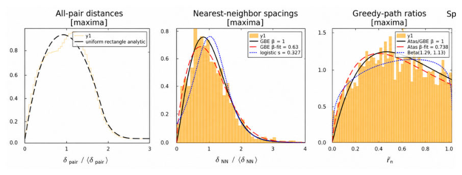
<figcaption class="paper-figure-caption"><b>Fig 3.</b> Figure 3: Axis-rescaled, non-density-unfolded analysis of the refined maxima cloud, orga- nized as in Fig. 2.</figcaption>
</figure>
<figure class="paper-figure-card">
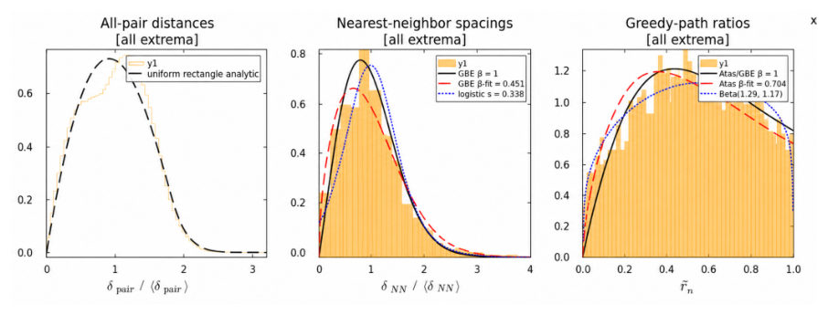
<figcaption class="paper-figure-caption"><b>Fig 4.</b> Figure 4: Axis-rescaled, non-density-unfolded analysis of the refined combined cloud of all extrema, organized as in Fig. 2.</figcaption>
</figure>
<figure class="paper-figure-card">
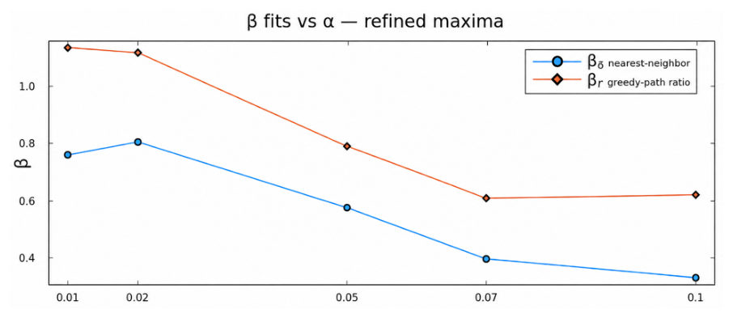
<figcaption class="paper-figure-caption"><b>Fig 5.</b> Figure 5: Dependence of the fitted effective β parameters on the Euclidean smearing scale α for the refined maxima cloud in the Neumann-Neumann interval sector, using the axis- rescaled metric and no density unfolding. The blue curve is the Gaussian-β nearest-neighbor fit βδ, while the orange curve is the ABGR-type greedy-path ratio fit βr.</figcaption>
</figure>

**Summary.** This paper analyzes the statistical patterns of extrema found in two-point correlation functions following a local quench in free scalar field theories. By applying advanced point process diagnostics, the authors test whether these chaotic features adhere to standard random matrix theory predictions or reveal deeper geometric organization dictated by the dimensionality of the system.

**Why it may be interesting.** It applies sophisticated tools from quantum chaos and random matrix theory—typically used for energy spectra—to analyze non-equilibrium correlation functions in condensed matter systems, providing a new diagnostic tool for quench dynamics.

Detailed structure

**Main problem.** The study investigates the multidimensional erratic structure of correlation functions generated by local operator quenches in quantum field theory.

**Main result.** Extremum statistics show behavior approaching $\beta=1$ random-matrix benchmarks in 1+1 dimensions, while higher dimensions reveal geometry-controlled features via the all-pair extremum spatial form factor.

**Method.** The analysis employs advanced statistical diagnostics—including all-pair distance distributions, nearest-neighbor spacings, and greedy-path ratios—applied to the point cloud formed by the extrema of the two-point correlation function.

**Model / system.** The system is a free massive scalar field theory undergoing a local operator quench in finite volume (analyzed first in 1+1D, then generalized to 2+1D). The observable is the subtracted equal-time two-point function.

**Key observables.** Extrema of the correlation function; All-pair distance distribution; Nearest-neighbor spacing statistics; Greedy-path ratio statistics; All-pair extremum spatial form factor (ExFF).

**Important parameters / regimes.** Euclidean smearing scale ($\alpha$); Dimensionality (1D vs 2D space); Comparison benchmarks ($\beta=1$, GOE).

**Assumptions / limitations.** The analysis treats the extrema as a point process whose statistics can be mapped onto known random matrix ensembles or geometric laws.

**Figures summary.** Not specified, but diagnostics are compared against theoretical curves for uniform intervals, rectangles, and cuboids in the form factor analysis.

**Paper structure.** The paper systematically defines the physical model (local quench), introduces the statistical framework using multiple point-process diagnostics, analyzes results sequentially from 1+1D to 2+1D, and concludes by interpreting the role of geometry versus universal RMT laws.

Abstract

We study the multidimensional erratic structure of correlation functions produced by local operator quenches in finite-volume free massive scalar field theory in dimensions 2 and 3. The basic observable is the subtracted equal-time two-point function in the locally excited state and its spatiotemporal patterns of extrema. We analyze these extrema by the multidimensional diagnostics recently introduced for chaotic scattering amplitudes and related problems: all-pair distance distributions, nearest-neighbor spacings, greedy-path spacing ratios, and the extrema form factor. For the $1+1$-dimensional local quench we find that, in the regime of small Euclidean smearing, the fitted extremum statistics move close to the $β=1$ random-matrix benchmark, while increasing the smearing scale softens the effective repulsion and moves the distributions away from the GOE-like value. For the $2+1$-dimensional local quench we find that the nearest-neighbor statistics of the refined extrema are close to, or above, the $β=1$ benchmark, and the greedy-path ratio statistics are described by even larger effective $β$ values. Finally we studied the all-pair extrema spatial form factor and found that, in the one-, two-, and three-dimensional cases, its main structure is controlled by the corresponding uniform interval, rectangle, or cuboid geometry of the extrema cloud and found the dip-ram-plateau structure in the last two cases. Thus the form factor provides a complementary global diagnostic of how the extrema fill their effective metric support, while the genuinely nontrivial local and mesoscopic organization is carried by the nearest-neighbor and greedy-path statistics.

[↑ back to top](#top)

### [Universal self-similar evolution of two-dimensional Bose-Einstein condensates in the acoustic regime](http://arxiv.org/abs/2607.06062v1)

**Authors:** Guillaume Costa, Sergey Nazarenko, Giorgio Krstulovic  
**Type:** theory · **Category:** quantum gases · **PDF:** <https://arxiv.org/pdf/2607.06062v1>  
**Analysis basis:** full PDF text, analyzed in chunks
**Topic relevance:** 🔥 `non-equilibrium universality` **4/5** · `non-equilibrium dynamics` **3/5** · `Keldysh / 2PI / non-Gaussian methods` **1/5** · `analog quantum simulation` **1/5** · `driven-dissipative phase transition` **1/5** · `methods for driven-dissipative` **1/5**

↔ Scroll figures horizontally

<figure class="paper-figure-card">
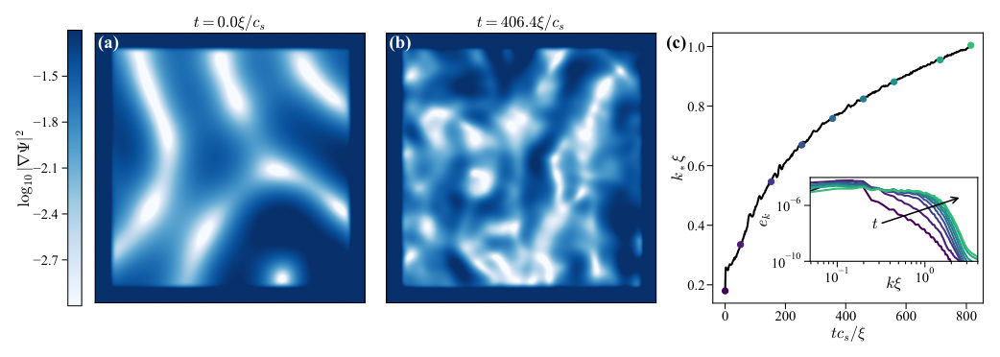
<figcaption class="paper-figure-caption"><b>Fig 1.</b> FIG. 1: (a) &amp; (b) Snapshots of GPE simulations with trap confinement of size 75ξ highlighting the formation of finer and finer structures during the time evolution. (c) Main panel: Time evolution of k∗supporting the formation of smaller and smaller scale structures. Inset: Time evolution of the energy spectrum for the GPE with trap, highlighting the propagation of a front in Fourier space.</figcaption>
</figure>
<figure class="paper-figure-card">
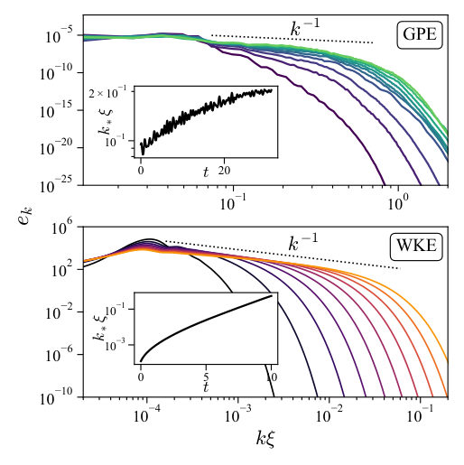
<figcaption class="paper-figure-caption"><b>Fig 2.</b> FIG. 2: Snapshots of the energy spectrum for the GPE (top) and WKE (bottom) highlighting the propagation of a front leaving a KZ spectrum ek ∝k−1 in its wake. The insets show their respective k∗(t) from Eq. (2)</figcaption>
</figure>
<figure class="paper-figure-card">
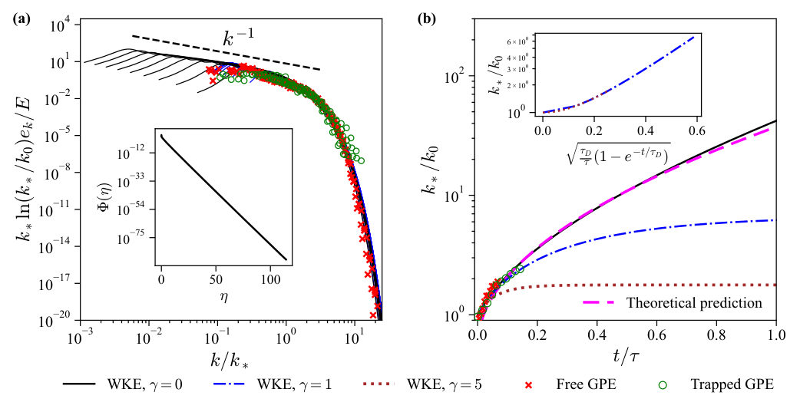
<figcaption class="paper-figure-caption"><b>Fig 3.</b> FIG. 3: (a) Collapsed self-similar energy spectra. The inset highlights asymptotical behavior of Φ as η →∞ confirming the exponential prediction of Eq. (9). (b) Universal behavior of the front propagation confirming the</figcaption>
</figure>
<figure class="paper-figure-card">
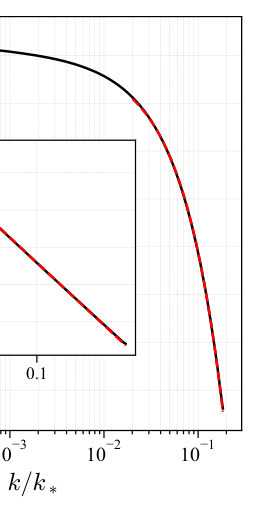
<figcaption class="paper-figure-caption"><b>Fig 4.</b> FIG. 4: Exponential asymptotical behavior of the self-similar spectrum Φ(η).</figcaption>
</figure>

**Summary.** This paper analyzes the turbulent decay of two-dimensional Bose-Einstein condensates by studying their energy spectrum evolution. Using both GPE simulations and the derived Wave Kinetic Equation, the authors prove that the system reaches a universal self-similar state. This finding quantifies how nonlinear wave interactions efficiently transfer energy to smaller length scales in these quantum gases.

**Why it may be interesting.** This work provides deep insights into non-equilibrium dynamics in quantum many-body systems, specifically characterizing how energy cascades in BECs through turbulence, which is crucial for understanding nonlinear wave physics in cold atom experiments.

Detailed structure

**Main problem.** The study investigates the nonstationary, turbulent evolution of density waves in two-dimensional Bose-Einstein condensates (BECs) when driven out of equilibrium.

**Main result.** The dynamics exhibit universal self-similar behavior characterized by a single constant $\beta$, suggesting that energy transfer towards small scales follows predictable scaling laws regardless of minor details.

**Method.** The authors employ numerical simulations on the Gross-Pitaevskii Equation (GPE) and derive/solve the corresponding Wave Kinetic Equation (WKE) using self-similar ansatz solutions.

**Model / system.** The system is a 2D BEC, modeled by the GPE. The analysis focuses on wave turbulence dynamics in the acoustic regime, where energy cascades from large to small scales.

**Key observables.** Energy spectrum $e_k$, the characteristic wavevector scale $k^*(t)$, and the universal constant $\beta$.

**Important parameters / regimes.** The system operates in the acoustic regime ($\xi \ll 1$), and the dynamics are characterized by initial energy $E_0$ and damping rates $\gamma$.

**Assumptions / limitations.** Key assumptions include the validity of Weak Wave Turbulence Theory (WWTT) for this geometry, and approximations made when simplifying the collision integral in the WKE.

**Figures summary.** Figures illustrate snapshots showing structure formation, time evolution of $k^*$, and confirmation of self-similar dynamics by collapsing spectra onto master curves.

**Paper structure.** The paper progresses from analyzing GPE simulations to deriving the WKE, then solving for a self-similar ansatz solution $\Phi(\eta)$, leading to simplified differential equations whose asymptotic solutions yield the universal constant $\beta$.

Abstract

When driven out of equilibrium, a Bose-Einstein condensate develops nonlinearly interacting density waves that trigger a turbulent cascade, transferring energy toward small scales. In this article, we investigate the nonstationary evolution of solutions to the two-dimensional Gross-Pitaevskii equation. Through numerical simulations of both the GPE and the corresponding Wave Kinetic Equation, we identify self-similar solutions relevant to atomic and polariton Bose-Einstein Condensates. These solutions exhibit characteristics of both first and second kind self-similarity. In particular, we show that the dynamics of the propagating front is universal, governed by a dimensionless universal constant $β$, which we determine numerically.

[↑ back to top](#top)

### [Classical Reversible Computation by Quantum Coherence](http://arxiv.org/abs/2607.06219v1)

**Authors:** Daniel Loss  
**Type:** both · **Category:** quantum information and computing · **PDF:** <https://arxiv.org/pdf/2607.06219v1>  
**Analysis basis:** full PDF text, analyzed in chunks
**Topic relevance:** 🔥 `QC/QI experiment` **4/5** · `spintronics-quantum-optics interface` **3/5** · `exotic spin models in light-matter` **1/5** · `non-equilibrium dynamics` **1/5**

↔ Scroll figures horizontally

<figure class="paper-figure-card">
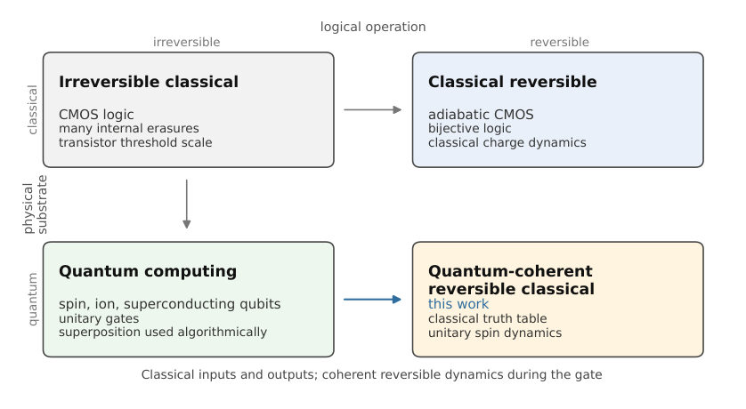
<figcaption class="paper-figure-caption"><b>Fig 1.</b> Figure 1: Device regimes for classical and quantum information processing. Conven- tional CMOS (irreversible classical), adiabatic CMOS (classical reversible by quasi-adiabatic charge motion), quantum processors (unitary, using superposition), and the present proposal (classical re- versible truth tables by coherent spin dynamics, basis-state inputs and outputs).</figcaption>
</figure>
<figure class="paper-figure-card">
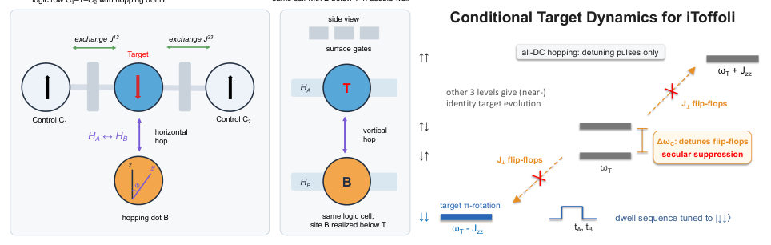
<figcaption class="paper-figure-caption"><b>Fig 2.</b> Figure 2: Hopping iToffoli cell and conditional target dynamics. a, Four-dot C1–T–C2 cell: the target spin hops between dots A and B under DC detuning pulses; the two target dots have local quantisation axes separated by angle Φ. The auxiliary dot may be lateral or vertical; vertical hole double dots have been demonstrated in strained Ge double wells [25]. Arrows denote charge- adiabatic, spin-diabatic transfers. b, In the Ising limit, the conserved controls define four sectors with target precession frequencies ωT + Jzz, ωT , ωT , and ωT −Jzz. The dwell sequence is chosen so that only the | ↓↓⟩sector receives an odd-π rotation. For finite J⊥, finite ∆ωC suppresses flip-flop mixing away...</figcaption>
</figure>
<figure class="paper-figure-card">
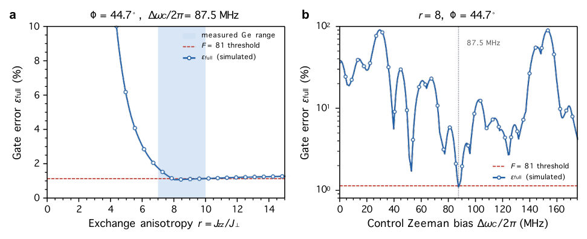
<figcaption class="paper-figure-caption"><b>Fig 3.</b> Figure 3: Error landscape. a, iToffoli gate error εfull (maximum over all eight classical inputs) versus exchange anisotropy r = Jzz/J⊥, at fixed control Zeeman bias ∆ωC/2π = 87.5 MHz and Φ = 44.7◦; the gate requires strong anisotropy (r ≳8), and the measured Ge-hole range r ≃7–10 (shaded) brackets the operating point at the F = 81 threshold (εfull ≤1.13%, dashed). b, εfull versus control Zeeman bias ∆ωC/2π at r = 8; the native operating point (87.5 MHz, marked) sits in a sharp local minimum εfull = 1.10% on the Ising-shifted resonance. The truth table is correct for all eight classical inputs at the operating point; detailed tables are in the SI (§§7, 11) and off-diagonal-tensor effects in...</figcaption>
</figure>
<figure class="paper-figure-card">
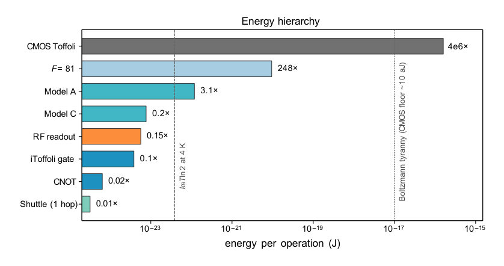
<figcaption class="paper-figure-caption"><b>Fig 4.</b> Figure 4: Energy hierarchy. Cold-device energies at 4 K for spin operations. For reference, the dotted vertical line marks the asymptotic ∼10 aJ per-transistor switching floor set by the Vdd ≥500 mV ‘Boltzmann tyranny’ [6], and the grey bar marks a CMOS Toffoli built from ∼16 such switches (∼1.6 × 10−16 J in total, SI §26). The gate-to-CMOS energy ratio is ∼4 × 107× (system-level reductions in text). Spin energies are in units of the 4 K Landauer scale kBT ln 2; the dielectric-loss iToffoli gate sits at ≃0.10 kBT ln 2 (SI §14). The readout bar uses Pauli spin blockade for spin-to-charge conversion with dispersive RF detection; the same detector performs initialisation. The F = 81 bar folds...</figcaption>
</figure>

**Summary.** This work proposes implementing reversible classical computation by harnessing coherent spin dynamics in semiconductor quantum dots. By using unitary spin rotations instead of irreversible switching, they achieve gate energies far below current thermodynamic limits. The resulting hardware is dual-use, supporting both quantum algorithms and ultra-low-power classical logic.

**Why it may be interesting.** It provides a concrete, solid-state realization pathway for quantum-coherent classical computation, bridging the gap between purely quantum algorithms and energy-efficient classical logic using spin dynamics.

Detailed structure

**Main problem.** The paper addresses the high energy dissipation of classical computation by proposing a method for reversible logic that utilizes quantum coherence.

**Main result.** They demonstrate that coherent spin dynamics in semiconductor quantum dots can implement universal, low-energy reversible gates (like iToffoli) using only classical basis states for I/O.

**Method.** The core mechanism involves implementing unitary gate operations via controlled spin precession and exchange coupling within a spin quantum-dot array, avoiding irreversible switching.

**Model / system.** The physical platform is a spin quantum-dot array utilizing Ge/Si hole spins. The dynamics are governed by a general spin Hamiltonian, with gates realized through time-dependent unitary evolution derived from specific hopping Hamiltonians.

**Key observables.** Gate energy (shown to be orders of magnitude below the Landauer limit), gate fidelity ($\sim 99.97\%$), and the error landscape ($\epsilon_{	ext{full}}$).

**Important parameters / regimes.** The system relies on anisotropic exchange coupling ($J_{zz}$), DC voltage pulses, and operating temperatures near 4 K.

**Assumptions / limitations.** Assumes the spin-diabatic limit for angle changes and that coherence time ($T_1$) is much longer than the gate operation time.

**Figures summary.** Figures compare different computing regimes (CMOS vs. quantum/reversible), show the structure of the iToffoli cell, and illustrate the error landscape dependence on anisotropy or bias.

**Paper structure.** The paper introduces the problem of energy dissipation in computation, details the physical model using spin dynamics for reversible gates, presents simulation results showing gate fidelity and low energy costs, and concludes by emphasizing the dual-use nature of the hardware.

Abstract

Rising energy demand from data-centre and AI applications has renewed interest in reversible computation, where logic need not dissipate heat at every step if information is uncomputed. Implementations have so far been classical: adiabatic CMOS reduces dissipation by slowing charge motion but is still limited by the threshold physics of transistors. Here we propose classical reversible logic implemented by coherent spin dynamics in a spin quantum-dot array, with inputs and outputs in classical basis states and no algorithmic use of superposition. The same spin stores, transports, and computes, with unitary rotation replacing irreversible switching. The universal building block is an iToffoli gate driven by DC voltage pulses and anisotropic exchange in Ge/Si hole spins. Simulations with experimental parameters reproduce the Toffoli truth table and yield a testable error landscape. Because shuttling transports the bit without measurement, logic and data movement remain reversible until readout. Millivolt pulses on femtofarad gates yield a gate energy below the 4~K Landauer scale, about five (eight) orders of magnitude below a room-temperature CMOS Toffoli with (without) 4 K cooling overhead. The same semiconductor hardware is therefore dual-use, supporting quantum algorithms when superposition is used and classical reversible logic otherwise.

[↑ back to top](#top)

### [Typical Entanglement of Superpositions](http://arxiv.org/abs/2607.06474v1)

**Authors:** Damien Quinn, Joshuah T. Heath, Graham Kells  
**Type:** theory · **Category:** quantum information and computing · **PDF:** <https://arxiv.org/pdf/2607.06474v1>  
**Analysis basis:** full PDF text, analyzed in chunks
**Topic relevance:** 🔥 `entanglement & information structure` **4/5** · `analog quantum simulation` **1/5** · `methods for driven-dissipative` **1/5** · `non-equilibrium dynamics` **1/5** · `non-equilibrium universality` **1/5**

↔ Scroll figures horizontally

<figure class="paper-figure-card">
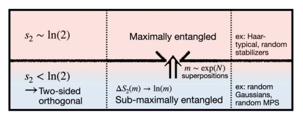
<figcaption class="paper-figure-caption"><b>Fig 1.</b> Figure 1. Schematic of the two entanglement classes for typ- ical superpositions. On the bottom is the sub-maximally en- tangled class, defined by a 2nd Rényi entanglement entropy s2 &lt; ln(2). These systems are shown to be constrained to be two-sided orthogonal [19]. Canonical examples of this entan- glement class include random Gaussian states and random matrix-product states (MPS). On the top is the maximally entangled class, defined by s2 ∼ln(2). These systems are not two-sided orthogonal, and canonical examples include Haar- typical and random stabilizer states. An exponential number of superpositions m ∼exp(N) is required to “break free” from the sub-maximally entangled class to the...</figcaption>
</figure>
<figure class="paper-figure-card">
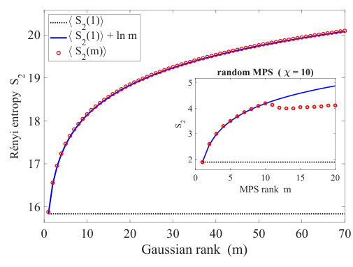
<figcaption class="paper-figure-caption"><b>Fig 2.</b> Figure 2. The 2nd Rényi entanglement entropy ⟨S2(m)⟩ver- sus number of Gaussian components m for a system size of N = 100 at equal bipartition. The dashed baseline is the single-component average ⟨S2(1)⟩. The ln(m) growth pre- dicted by Eq. (1) is confirmed up to m = 70. (Inset) S2 entan- glement entropy of superpositions of m random MPS (d = 2, N = 100, χ = 10) with total bond-dimension cutoff χmax = 100. The ln(m) scaling holds while mχ ≤χmax. Beyond this regime, the entropy plateaus at S2 ≈ln(dχmax/(d+1)).</figcaption>
</figure>
<figure class="paper-figure-card">
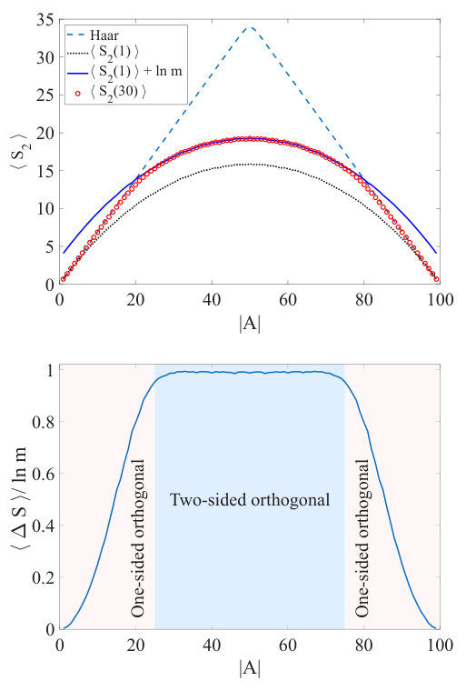
<figcaption class="paper-figure-caption"><b>Fig 3.</b> Figure 3. Entanglement profile across all partitions for su- perpositions of Gaussian states (N = 100). (Top) ⟨S2⟩ver- sus partition size for single components (black dotted) and m = 30-component superpositions (red), compared against the Haar value (dashed blue). The excess ⟨S2(1)⟩+ ln(m) is also shown (solid blue). (Bottom) The excess (⟨S2(m)⟩− ⟨S2(1)⟩)/(ln(m)), saturating at unity for bulk partitions and falling off near the edges, where the smaller subsystem is the binding constraint for two-sided orthogonality. The excess plotted in this figure may therefore be interpreted as a metric for two-sided orthogonality for m-superpositions.</figcaption>
</figure>
<figure class="paper-figure-card">
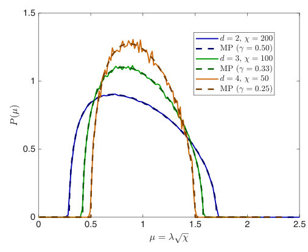
<figcaption class="paper-figure-caption"><b>Fig 4.</b> Figure 4. Schmidt spectrum for a random MPS for a few example bond dimensions and aspect ratios. The spectrum collapses to a Marchenko–Pastur (MP) distribution for local dimensions d = 2, 3, 4 (γ = 1/d, σ2 = 1; dashed curves). As d increases, the distribution concentrates, reflecting the fourth moment κ = (d+1)/d →1.</figcaption>
</figure>
<figure class="paper-figure-card">
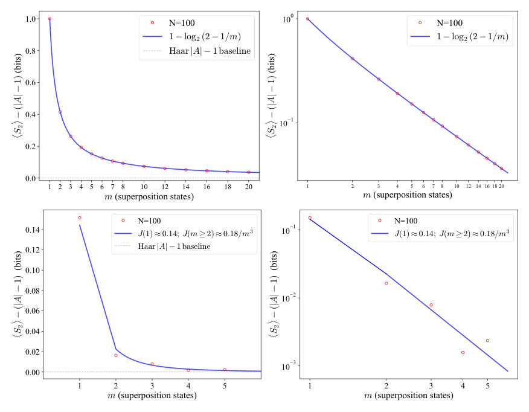
<figcaption class="paper-figure-caption"><b>Fig 5.</b> Figure 5. (Top) Numerical calculations of the maximally entangled ∼1/m relaxation of ⟨S2⟩to the Haar average. (Bottom) The relaxation of the fully random Clifford ensemble 1/m3 relaxation to the Haar average. The log-log scalings of both ⟨S2⟩deviations are shown on the right-hand side. Numerical calculations completed at large system sizes using the stabilizer representation of [58] and the SWAP method to compute the 2nd Rényi entanglement entropy.</figcaption>
</figure>

**Summary.** This work characterizes how the total entanglement scales when forming superpositions of randomized quantum states. It finds a sharp transition: if the components are sub-maximally entangled, the superposition exhibits a universal logarithmic enhancement ($\ln m$) in its entanglement. The analysis uses Rényi entropy and purity calculations to distinguish this behavior from other scaling regimes.

**Why it may be interesting.** It provides rigorous theoretical tools (like $s_2$ classification) to distinguish between different scaling laws of entanglement growth when combining multiple quantum resources, which is fundamental for understanding quantum computation limits.

Detailed structure

**Main problem.** The paper investigates universal entanglement properties inherent to forming superpositions of randomized quantum states.

**Main result.** It establishes that the entanglement enhancement scales universally as $\Delta S(m) = \ln(m)$ in the sub-maximally entangled regime, contrasting with other scaling behaviors observed in different state ensembles.

**Method.** The analysis uses second Rényi entropy density ($s_2$) to classify entanglement regimes and calculates purity fluctuations using tensor network formalisms and random matrix theory techniques.

**Model / system.** The study considers superpositions of randomized states, including Gaussian states, Matrix Product States (MPS), and stabilizer states, in the context of many-body quantum systems.

**Key observables.** Second Rényi entropy density ($s_2$), total entanglement $\langle S_2(m) 
angle$, and the logarithmic enhancement $\Delta S_2(m)$.

**Important parameters / regimes.** The classification depends on $s_2$ relative to $\ln(2)$, and scaling is analyzed for varying numbers of components, $m$.

**Assumptions / limitations.** Key results rely on assuming one-sided orthogonality of reduced density matrices in the sub-maximal regime, or averaging over random phases/Haar ensembles.

**Figures summary.** Figures illustrate the two entanglement classes based on $s_2$, show $\langle S_2(m) 
angle$ vs. Gaussian rank for MPS confirming $\ln(m)$ growth, and display purity fluctuations scaling as $1/m^3$.

**Paper structure.** The paper progresses by defining the problem using Rényi entropy, deriving the universal logarithmic enhancement ($\ln m$) in the sub-maximal regime via orthogonality constraints, and then applying this framework to specific models like Gaussian states and MPS.

Abstract

We investigate universal entanglement properties inherent to superpositions of randomized states. We find that an $m$-fold superposition of typical states may be classified into two distinct entanglement classes via the 2nd Rényi entropy density $s_2$. The maximally entangled regime is defined by $s_2 \sim \ln (2)$, for which superposition adds no additional entanglement. The sub-maximally entangled regime, $s_2<\ln 2$, instead constrains the reduced density matrices of independent components to be orthogonal in the thermodynamic limit, which fixes the entanglement of the superposition to a logarithmic enhancement $ΔS(m)=\ln (m)$. As a consequence, an exponentially large number of superpositions is required to transition from the sub-maximally entangled class to maximal entanglement. We explicitly calculate $s_2$ and the logarithmic enhancement, and demonstrate orthogonality for two canonical examples of the sub-maximally entangled regime (superpositions of pure Gaussian states and of random matrix-product states). We also examine the entanglement of superpositions of random stabilizer states, and discuss their relaxation to the Haar limit.

[↑ back to top](#top)

### [A Quantum-HPC Hybrid Workflow for Reaction-Center Electronic Dynamics: Application to a Cytochrome P450-Inspired Iron-Complex Model](http://arxiv.org/abs/2607.05786v1)

**Authors:** Shintaro Maekawa, Takao Otsuka, Riku Masui, Juan W. Pedersen, David Muñoz Ramo, Yasushi Okuno, Kentaro Yamamoto  
**Type:** both · **Category:** other · **PDF:** <https://arxiv.org/pdf/2607.05786v1>  
**Analysis basis:** full PDF text, analyzed in chunks
**Topic relevance:** 🔥 `QC/QI experiment` **4/5** · `non-equilibrium dynamics` **2/5** · `methods for driven-dissipative` **1/5**

↔ Scroll figures horizontally

<figure class="paper-figure-card">
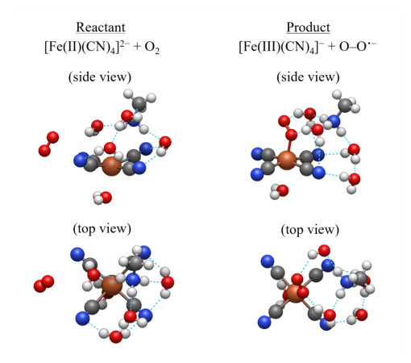
<figcaption class="paper-figure-caption"><b>Fig 1.</b> FIG. 1. Molecular structures of the geometry-optimized reactant and product Fe complexes at the ROHF level.</figcaption>
</figure>
<figure class="paper-figure-card">
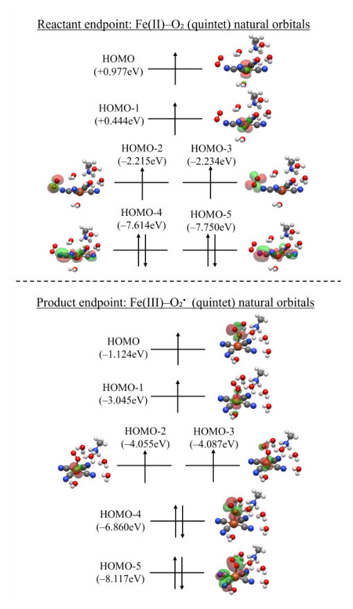
<figcaption class="paper-figure-caption"><b>Fig 2.</b> FIG. 2. Active-space natural orbitals (HOMO–HOMO–5) and their orbital energies used to construct the SA-CASSCF (8e,6o) description at the Fe(II)–O2 reactant and Fe(III)–O•− 2 product minima.</figcaption>
</figure>
<figure class="paper-figure-card">
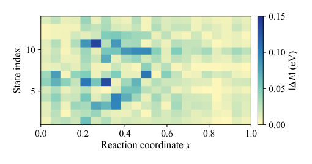
<figcaption class="paper-figure-caption"><b>Fig 3.</b> FIG. 4. Hamiltonian validation by spectrum-level com- parison between adiabatic eigenvalues of H(x) and the SA- CASSCF reference energies, shown as absolute deviations |∆E| after sorted eigenvalue matching at each x.</figcaption>
</figure>
<figure class="paper-figure-card">
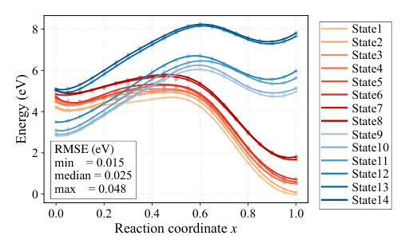
<figcaption class="paper-figure-caption"><b>Fig 4.</b> FIG. 3. Quasi-diabatic potentials Ei(x): reference points (markers) and fitted curves (lines). Warm colors denote product-side states (State 1–State 8) and cool colors denote reactant-side states (State 9–State 14).</figcaption>
</figure>
<figure class="paper-figure-card">
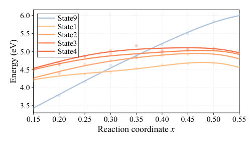
<figcaption class="paper-figure-caption"><b>Fig 5.</b> FIG. 5. Key state energies (tracked labels) in the near- degeneracy region. Markers are SA-CASSCF reference points; solid lines are fitted Ei(x).</figcaption>
</figure>

**Summary.** The authors present a novel Quantum-HPC hybrid workflow to simulate electronic dynamics in enzyme active sites using a Fe-complex model. They derive an effective Hamiltonian from CASSCF calculations and map it onto quantum circuits suitable for trapped-ion hardware. By measuring the product population, they demonstrate that current quantum computers can reproduce key chemical trends, establishing a powerful diagnostic tool for reduced quantum models.

**Why it may be interesting.** This work directly bridges high-level quantum chemistry calculations with near-term quantum hardware capabilities by providing a physically motivated, observable-based diagnostic (population transfer) to validate complex electronic structure simulations.

Detailed structure

**Main problem.** Developing a reliable quantum-hybrid workflow to simulate electronic dynamics in complex, multi-state biomolecular reaction centers.

**Main result.** The quantum hardware successfully reproduced the key trend of product population transfer identified by classical models, validating the use of reduced Hamiltonians for chemically interpretable dynamics on current trapped-ion platforms.

**Method.** A Quantum-HPC hybrid workflow combining state-averaged CASSCF calculations to derive a reduced Hamiltonian, mapping it to a quantum circuit, and simulating time evolution on a trapped-ion quantum computer.

**Model / system.** The study uses a Cytochrome P450-inspired Fe-complex model. The dynamics are governed by an effective, reaction-coordinate-dependent Hamiltonian derived from SA-CASSCF calculations across multiple electronic states.

**Key observables.** Product-manifold population $p_P(t)$ as a function of the reaction coordinate ($x$), which serves as the primary diagnostic observable for state mixing.

**Important parameters / regimes.** Coupling cutoff ($\epsilon = 0.02$ eV) and Trotterization steps ($M=30$) are critical parameters used to adapt the simulation for current NISQ hardware constraints.

**Assumptions / limitations.** The primary assumptions involve constructing a reduced Hamiltonian from an active space, which inherently involves approximations regarding state completeness and neglecting environmental coupling beyond the defined subspace.

**Figures summary.** Figures compare the product-manifold population $p_P$ measured on the Reimei trapped-ion hardware against its emulator counterpart across varying reaction coordinates ($x$), demonstrating agreement in the characteristic maximum near $x=0.3$.

**Paper structure.** The paper establishes a methodology by first deriving an effective Hamiltonian from high-level electronic structure calculations (SA-CASSCF). It then addresses NISQ constraints via circuit optimization (pruning/Trotterization) before demonstrating the full workflow end-to-end on trapped-ion hardware, validating the dynamics using population transfer observables.

Abstract

We introduce population-transfer dynamics as a practical validation observable for active-space-derived reduced Hamiltonians in multistate reaction-center chemistry. Using a cytochrome P450-inspired Fe-complex model, we construct a reaction-coordinate-dependent effective Hamiltonian from state-averaged complete active-space self-consistent field (SA-CASSCF) calculations, map it to a quantum-circuit representation suitable for current hardware, and propagate dynamics from the reactant-side ground state. The reduced Hamiltonian reproduces the SA-CASSCF reference with an RMS deviation of 0.030 eV and a maximum absolute deviation of 0.143 eV. As a dynamics-based diagnostic, the product-manifold population p_P(t) identifies a pronounced near-degeneracy region around x = 0.3, where state mixing is strongest. Classical exact time evolution yields a product population of 0.488 at x = 0.3 after 10 fs, compared with 7.26 x 10^-2 at x = 0.2 and 5.90 x 10^-3 at x = 0.0. To enable execution on current trapped-ion hardware, we examine the trade-off between dynamical fidelity and circuit resources through coupling pruning and first-order Trotterization. A coupling cutoff of 0.02 eV reduces the non-zero coupling set from 32 to 7 while preserving the dominant transfer pathways, and M = 30 provides the best practical operating point. Finally, we demonstrate the workflow on Quantinuum's trapped-ion quantum computer Reimei. The hardware reproduces the key reaction-coordinate trend identified by the classical model, including the maximum at x = 0.3, where the measured product population is 0.42 on hardware and 0.43 on the matched emulator. This work establishes a dynamics-based framework for assessing active-space-derived reduced Hamiltonians and demonstrates chemically interpretable multistate electronic dynamics on current trapped-ion hardware.

[↑ back to top](#top)

### [Entanglement Entropy of Free Fermions on Random Fractal Lattices](http://arxiv.org/abs/2607.05611v1)

**Authors:** Arkadiusz Kosior, Jia Wang  
**Type:** theory · **Category:** disordered systems and neural networks · **PDF:** <https://arxiv.org/pdf/2607.05611v1>  
**Analysis basis:** full PDF text, analyzed in chunks
**Topic relevance:** 🔥 `entanglement & information structure` **4/5** · `analog quantum simulation` **1/5** · `non-equilibrium dynamics` **1/5** · `non-equilibrium universality` **1/5**

↔ Scroll figures horizontally

<figure class="paper-figure-card">
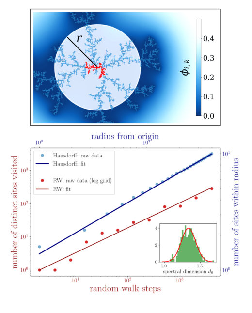
<figcaption class="paper-figure-caption"><b>Fig 1.</b> FIG. 1. (top panel) Example random fractal lattice gener- ated by the growth algorithm. The shaded region indicates the ball of graph radius r around the origin; counting the number of enclosed sites gives the volume V (r) used to extract the Hausdorff dimension dH. The red sites mark distinct sites Ωvisited during a random walk, which is used to estimate the spectral dimension. (bottom panel) Example log–log fits used to extract fractal dimensions from a single lattice realiza- tion. Blue and red points show V (r) ∼rdH and Ω(t) ∼tds/2, respectively. To reduce finite-size effects and stochastic fluc- tuations, the walk is run up to 212 steps and repeated about 500 times; fitted slopes are...</figcaption>
</figure>
<figure class="paper-figure-card">
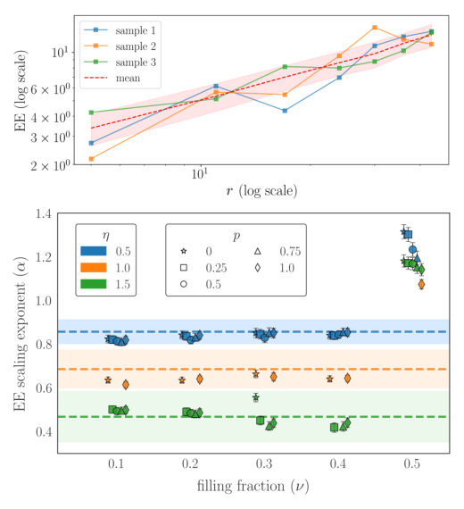
<figcaption class="paper-figure-caption"><b>Fig 2.</b> FIG. 2. (top panel) Although the entanglement entropy (EE) shows strong sample-to-sample variability, its disorder aver- age exhibits clear power-law behavior. (bottom panel) Scal- ing exponent for the EE as a function of filling ν for different (η, p) pairs. For each parameter set, we fit S versus subsystem radius r on log–log axes and extract an effective power-law ex- ponent; symbols show averages over 100 independent realiza- tions. Dashed lines indicate area-law scaling α = dH −1, and shaded regions denote one standard deviation across samples.</figcaption>
</figure>
<figure class="paper-figure-card">
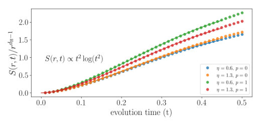
<figcaption class="paper-figure-caption"><b>Fig 3.</b> FIG. 4. Short-time entanglement growth after the global quench from the checkerboard product state on random frac- tal lattices. The entropy S(r, t) is shown in the early-time regime for representative subsystem radii and fractal param- eters. At these times, the dynamics have not yet resolved the underlying fractal geometry, so the growth is governed pri- marily by local hopping processes and follows the expected universal short-time form s(t) ∼t2 log(t2). This behavior is independent of both the Hausdorff and spectral dimen- sions within the numerical accuracy of our data. Symbols denote disorder-averaged results over independent lattice re- alizations, and solid curves show nonlinear...</figcaption>
</figure>
<figure class="paper-figure-card">
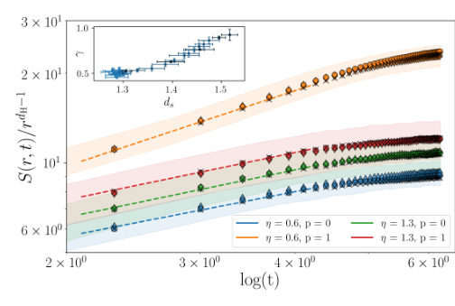
<figcaption class="paper-figure-caption"><b>Fig 4.</b> FIG. 3. Entanglement-entropy growth following a global quench from the checkerboard product state on random frac- tal lattices. The entropy S(r, t) is shown for subsystems of graph radius r in the intermediate-time regime, after the mi- croscopic short-time regime and before finite-size effects be- come important. The data are consistent with the scaling form S(r, t) ∝a(r)s(t), with a(r) = rdH−1 and a logarithmi- cally slow temporal growth s(t) ∼[log(t)]γ. Symbols show disorder averages over 100 independent realizations for sev- eral subsystem radii r close to half the system size. (inset) The exponent γ as a function of the spectral dimension, ob- tained from numerical fitting. The color...</figcaption>
</figure>
<figure class="paper-figure-card">
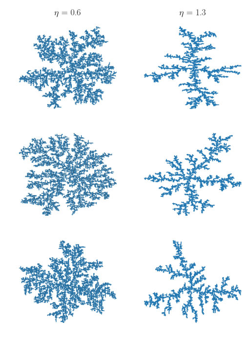
<figcaption class="paper-figure-caption"><b>Fig 5.</b> FIG. 5. Representative random fractal lattice realizations generated by the dielectric-breakdown growth algorithm for two values of the growth parameter η. The left column shows samples for η = 0.6, which produce denser clusters with larger Hausdorff dimension, while the right column shows samples for η = 1.3, where growth is more strongly concentrated at the tips and the resulting clusters are more branched. Each row corresponds to an independent realization.</figcaption>
</figure>

**Summary.** The authors study the entanglement properties of noninteracting fermions on geometrically disordered random fractal lattices. They find that both ground-state and time-evolving entanglement are governed by two distinct geometric dimensions: the Hausdorff dimension ($d_H$) controls spatial scaling, while the spectral dimension ($d_s$) dictates slow logarithmic temporal dynamics. This demonstrates that geometry alone can induce complex quantum correlations.

**Why it may be interesting.** This work provides a concrete example of how purely geometric constraints (fractal structure) can dictate universal scaling laws for quantum information measures like entanglement entropy in free fermionic systems, connecting geometry directly to many-body physics.

Detailed structure

**Main problem.** Investigating how entanglement properties of free fermions are shaped by geometric disorder, specifically on random fractal lattices.

**Main result.** The ground-state entanglement entropy scales with the Hausdorff dimension ($d_H$), while dynamic entanglement growth exhibits a characteristic logarithmic time dependence governed by the spectral dimension ($d_s$).

**Method.** Theoretical calculation of bipartite entanglement entropy (von Neumann entropy) for noninteracting fermions, combined with numerical simulation of fractal lattice generation and analysis of scaling laws.

**Model / system.** Noninteracting spinless fermions described by a tight-binding Hamiltonian on Random Fractal Lattices (RFLs). These lattices are generated via a stochastic growth algorithm, allowing tuning of geometric ($d_H$) and connectivity ($d_s$) dimensions independently of onsite disorder.

**Key observables.** Bipartite Entanglement Entropy ($	ext{EE}$), Hausdorff dimension ($d_H$), Spectral dimension ($d_s$), and entanglement scaling exponents.

**Important parameters / regimes.** Growth parameter ($\eta$), missing link probability ($p$), filling fraction ($
u$), subsystem size ($L$), and time ($t$).

**Assumptions / limitations.** The system is modeled using noninteracting spinless fermions; results are derived by averaging over an ensemble of stochastic lattice realizations.

**Figures summary.** Figures illustrate the fractal growth process, show scaling relations for dimension extraction (Volume vs. radius, $\Omega$ vs. time), and plot entanglement entropy versus subsystem size or time to confirm power-law/logarithmic scaling governed by $d_H$ and $d_s$.

**Paper structure.** The paper first establishes the physical model on RFLs, then calculates ground-state EE scaling ($\propto r^{d_H}$), followed by analyzing dynamic entanglement growth after a global quench ($S(r, t) \propto r^{d_H-1} [\log t]^\gamma$).

Abstract

Random fractal lattices provide a geometrically disordered setting in which quantum correlations can be shaped by noninteger dimensionality rather than onsite randomness. We investigate the entanglement properties of noninteracting fermions on random fractal lattices generated by a stochastic growth algorithm. By varying the growth parameter and adding missing links with probability $p$, we tune the Hausdorff and spectral dimensions while keeping the system free of onsite disorder. For ground states at different fillings, we compute the bipartite entanglement entropy of subregions defined by graph distance and analyze its scaling with subsystem size. Over a broad parameter range, we find robust power-law behavior governed primarily by the Hausdorff dimension, consistent with a generalized area law and without the logarithmic enhancement familiar from Euclidean free fermions. We also study entanglement growth following a global quench from an uncorrelated checkerboard state and uncover an asymptotic scaling collapse in which the subsystem-size dependence is governed by the Hausdorff dimension, while the temporal evolution is governed by the spectral dimension. The resulting dynamics are logarithmically slow over an extended intermediate-time window. These results show that geometric randomness alone can generate both nontrivial ground-state entanglement structure and slow quantum-information spreading in free-fermion systems.

[↑ back to top](#top)

### [Simplified quantum key distribution implementation secure in the presence of state preparation flaws](http://arxiv.org/abs/2607.06038v1)

**Authors:** Ainhoa Agulleiro, Fadri Grünenfelder, Raphaël Houlmann, Ana Blázquez, Hugo Zbinden, Davide Rusca  
**Type:** experiment · **Category:** quantum information and computing · **PDF:** <https://arxiv.org/pdf/2607.06038v1>  
**Analysis basis:** full PDF text, analyzed in chunks
**Topic relevance:** 🔥 `QC/QI experiment` **4/5** · `quantum optics experiment` **2/5** · `quantum measurements` **1/5**

↔ Scroll figures horizontally

<figure class="paper-figure-card">
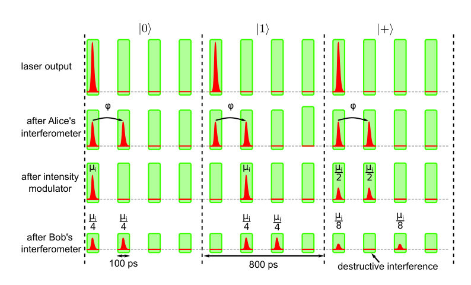
<figcaption class="paper-figure-caption"><b>Fig 1.</b> FIG. 1: Schematic drawing showing the states at different stages of the protocol when there is no interference from Eve nor imperfections in the transmitter and receiver.</figcaption>
</figure>
<figure class="paper-figure-card">
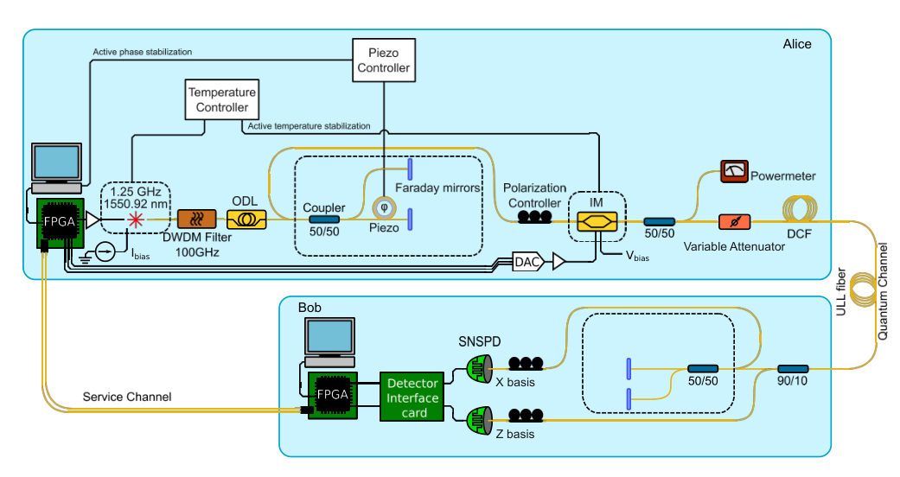
<figcaption class="paper-figure-caption"><b>Fig 2.</b> FIG. 2: Schematic representation of the experimental setup. The black lines indicate electrical connections. The yellow lines represent single-mode optical fiber. The boxes with a dashed outline indicate thermally isolated environments. The boxes containing the laser and IM have active temperature stabilization. However, the boxes containing the interferometers are not temperature controlled. Instead, their relative phase is stabilized through the action of the piezoelectric element in Alice’s interferometer. FPGA: field-programmable gate array. DWDM: dense wavelength division multiplexer. ODL: optical delay line. IM: intensity modulator. DAC: Digital to analogue converter. DCF: dispersion...</figcaption>
</figure>
<figure class="paper-figure-card">
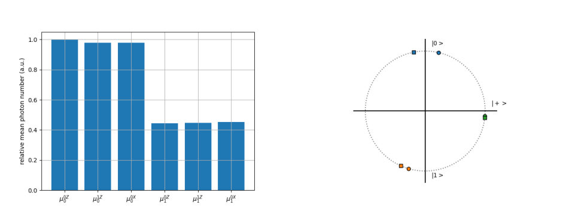
<figcaption class="paper-figure-caption"><b>Fig 3.</b> FIG. 3: (a) Plot of the relative mean photon number of each state using µ0Z 0 as a reference. (b) Projection of the characterized states to the XZ plane of the Bloch sphere. The circles represent the states at the signal level (µ0), while the squares are the states at the decoy level (µ1). Both plots are from the statistics using 101.4km QC length.</figcaption>
</figure>
<figure class="paper-figure-card">
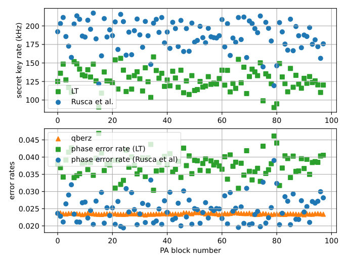
<figcaption class="paper-figure-caption"><b>Fig 4.</b> FIG. 4: Performance with 101.4km. The curves denoted as Rusca et al. use the results of [20], whereas the ones denoted as LT use a combination of [12, 20]. For the LT results we assume θ0z = 0.222rad, θ1z = 3.425rad and θ0x = 1.66rad.</figcaption>
</figure>
<figure class="paper-figure-card">
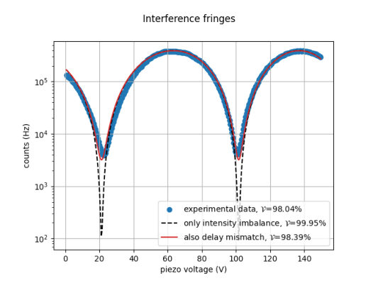
<figcaption class="paper-figure-caption"><b>Fig 5.</b> FIG. 5: Counts plotted in logarithmic scale against the applied voltage on the piezo. The blue points correspond to the experimental data. The dashed black line corresponds to using Eq. (A2). The solid red line corresponds to using Eq. (A3) with V∆τ = 0.984. For both curves, the measured n(X0) and n(X2) were used.</figcaption>
</figure>

**Summary.** This paper presents an experimental implementation of a three-state BB84 Quantum Key Distribution protocol designed to be secure despite common State Preparation Flaws. By adapting the Loss-Tolerant method and characterizing these flaws using decoy states, the authors demonstrate key rate security over long distances while accounting for non-ideal hardware performance.

**Why it may be interesting.** This work provides a highly practical, experimentally validated framework for assessing QKD security under real-world imperfections like state preparation flaws, which is crucial for advancing quantum communication technology.

Detailed structure

**Main problem.** The primary goal is to implement a Quantum Key Distribution (QKD) protocol that maintains security guarantees even when accounting for realistic State Preparation Flaws (SPFs).

**Main result.** The work successfully adapts the Loss-Tolerant method to ensure secret key distribution remains secure against collective attacks over 150km of fiber without assuming perfect state preparation.

**Method.** The authors use a three-state BB84 protocol with time-bin encoding and adapt the Loss-Tolerant method to incorporate measurements derived from decoy states, allowing for security analysis under imperfect conditions.

**Model / system.** The system is an experimental QKD setup using superconducting nanowire single-photon detectors (SNSPDs) and a three-state BB84 protocol. Alice's side uses time-bin encoding, while Bob employs passive basis choice for measurement.

**Key observables.** Phase error rate ($\phi_Z$) and secret key rate (SKR).

**Important parameters / regimes.** Fiber length (up to 151km), detector efficiency ($\eta=90\%$), mean photon numbers ($\mu_0, \mu_1$).

**Assumptions / limitations.** The security analysis is limited to collective attacks; the characterization method incorporates visibility due to delay mismatch naturally.

**Figures summary.** Figure 1 shows the schematic of states at different stages. Figure 2 details the experimental setup on Alice's and Bob's sides, while subsequent figures plot measured state angles ($	heta, \phi$) and simulate error rates/SKR dependence on these angles.

**Paper structure.** The paper progresses from describing the physical implementation (Alice/Bob setups) to detailing the measurement diagnostics (SPFs characterization), culminating in the theoretical adaptation of security bounds (Loss-Tolerant method) for finite-key analysis.

Abstract

We present an implementation of a three-state BB84 protocol with time-bin encoding, one decoy state and a simplified measurement scheme that uses passive basis choice. Our system simplifies the state characterization with respect to previous iterations. We also adapt the loss-tolerant method to our protocol, thus dealing with the measured state preparation flaws. We compare the obtained phase error rate and secret key rate when including the state imperfections and when assuming perfect states. Our results highlight the importance of characterization and implementation security.

[↑ back to top](#top)

### [Determination of thermodynamics from entanglement entropy in the finite-density O(N) model](http://arxiv.org/abs/2607.06286v1)

**Authors:** Niko Jokela, Aatu Rajala, Tobias Rindlisbacher  
**Type:** theory · **Category:** statistical mechanics · **PDF:** <https://arxiv.org/pdf/2607.06286v1>  
**Analysis basis:** full PDF text, analyzed in chunks
**Topic relevance:** 🔥 `entanglement & information structure` **4/5** · `Keldysh / 2PI / non-Gaussian methods` **1/5** · `non-equilibrium dynamics` **1/5**

↔ Scroll figures horizontally

<figure class="paper-figure-card">
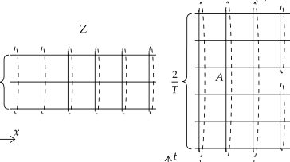
<figcaption class="paper-figure-caption"><b>Fig 1.</b> Figure 1. Sketches demonstrating the temporal topologies of the systems described by the two partition functions Z and ˜Z(ℓ, r) used in the replica method (2). On the left, we have the ordinary finite temperature partition function Z at some temperature T, so that field configurations are 1/T periodic in the Euclidean time direction. On the right is the system de- scribed by ˜Z(ℓ, r), consisting of two regions, A and B, where region A is a slab of width ℓalong the x axis, and B is the complement of A. In A the fields are r/T periodic, while in B the total Euclidean time domain r/T splits into r dis- joint parts, in each of which the fields are 1/T periodic. In the sketch we used r = 2 to...</figcaption>
</figure>
<figure class="paper-figure-card">
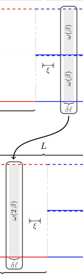
<figcaption class="paper-figure-caption"><b>Fig 2.</b> Figure 2. Illustration of how the dimensionless free energy (14) changes in a replicated system with r = 2 and an entan- gling region of width ℓ. The variation corresponds to increas- ing ℓby an infinitesimal amount δℓat fixed total size L in the regime ξ ≪ℓ≪L, where ξ denotes the longest correla- tion length. The red and blue horizontal lines illustrate the different temporal boundary conditions over the entangling region A and its complement B: dashed and solid lines with the same label are identified. The process of increasing ℓby δℓcan be thought of as removing a slice of width δℓfrom deep within the bulk of region B while adding a slice of width δℓ to the bulk of region A. Since we...</figcaption>
</figure>
<figure class="paper-figure-card">
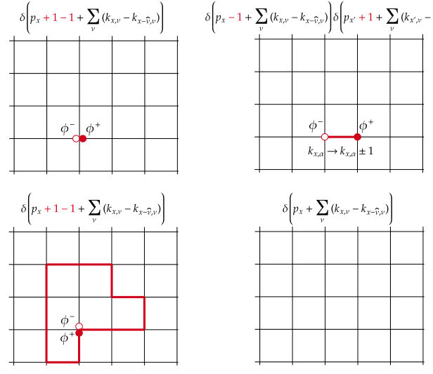
<figcaption class="paper-figure-caption"><b>Fig 3.</b> Figure 3. An illustration of the worm update in the k-sector. The first step is the insertion of the external source-sink pair ϕ+ϕ−. Then the head ϕ+ is moved to a neighboring site x′ = x + bα and kx,α is shifted by ±1 to compensate. This is continued until the head and tail are again on the same site when they can be removed. Alternatively, if ϕ−had been chosen as the head, the process would be the same except the signs would be reversed.</figcaption>
</figure>
<figure class="paper-figure-card">
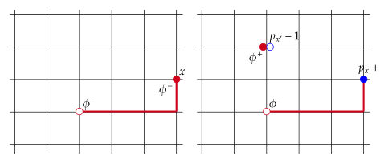
<figcaption class="paper-figure-caption"><b>Fig 4.</b> Figure 4. A diagram of a disconnected worm move. By shift- ing px and px′ in the k-sector or n(i) x and n(i) x′ in the χi sector, the worm head can be removed and reinserted into any site on the lattice. The variable shifted at the new site x′ can also be of a different type than the one at x, which allows for changing the head type.</figcaption>
</figure>
<figure class="paper-figure-card">
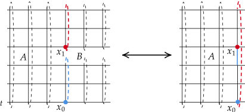
<figcaption class="paper-figure-caption"><b>Fig 5.</b> Figure 5. The figure shows how the endpoints of temporal links ending at the bottom corners of the replicas x0,1 are swapped when the boundary conditions over the correspond- ing spatial point are changed. This can lead to violations of the delta function and evenness constraints in the partition function (65).</figcaption>
</figure>

**Summary.** The paper develops a method to calculate entanglement entropy in the finite-density O(4) model using advanced lattice techniques. It establishes a key theoretical result showing that the rate of change of entanglement entropy with respect to region size directly measures the system's thermal entropy density. This offers a novel, nonperturbative pathway to study thermodynamics using quantum information metrics.

**Why it may be interesting.** This work provides a powerful theoretical tool showing that fundamental thermodynamic quantities like entropy can be extracted purely from quantum information measures (entanglement), which is highly relevant for understanding many-body physics beyond standard thermal measurements.

Detailed structure

**Main problem.** The central goal is to establish a quantitative, nonperturbative relationship between entanglement entropy (EE) and the thermal entropy density ($s$) in Quantum Field Theories (QFTs), especially at finite chemical potential.

**Main result.** The derivative of the entanglement entropy with respect to the size of the entangling region ($\partial 	ext{SEE}/\partial \ell$) is shown to directly yield the thermal entropy density ($s$) in the limit of large subregions, satisfying a generalized Maxwell relation.

**Method.** The authors use lattice field theory techniques on the O(4) model, employing a dual variable representation and a tailored worm algorithm to compute Rényi entropies nonperturbatively while circumventing the sign problem at finite density.

**Model / system.** The study focuses on the three-dimensional O(4) model simulated on a lattice at finite chemical potential ($\mu$). The analysis is generalizable to other interacting quantum field theories.

**Key observables.** Rényi entropies, Entanglement Entropy (SEE), Thermal entropy density ($s$), and the derivative of SEE with respect to subregion size ($\ell$).

**Important parameters / regimes.** Finite density regime (chemical potential $\mu$), large subregions limit ($\ell 	o \infty$), and the replica parameter $r 	o 1$.

**Assumptions / limitations.** The derivation assumes that in the appropriate thermodynamic limit, bulk properties are governed by free energy densities, allowing the derivative of EE to isolate thermal quantities.

**Figures summary.** Figure 2 illustrates how increasing the subregion size ($\ell$) changes the dimensionless free energy ($	ilde{\Omega}$), relating this change directly to adding or removing slices from the entangled regions A and B.

**Paper structure.** The paper first establishes a general framework connecting EE derivatives to thermodynamic potentials using replica methods. It then applies these techniques nonperturbatively to the O(4) model on the lattice at finite density, culminating in the demonstration of the Maxwell relation equivalence.

Abstract

We nonperturbatively compute Rényi entropies for strip-shaped subregions in the three-dimensional O(4) model at finite density on the lattice. By using a dual variable representation and a tailored worm algorithm, we circumvent the sign problem when sampling the grand canonical ensemble. In the limit of large subregions, we also establish a direct, quantitative relationship between the derivative of entanglement entropy with respect to the size of the entangling region and the thermal entropy density for general quantum field theories, providing a new way to study their thermodynamics. We corroborate this argument with our lattice results by demonstrating that, in the appropriate limit, the derivative of entanglement entropy satisfies the same Maxwell relation as the thermal entropy density.

[↑ back to top](#top)

### [Entangled quantum clocks as operational probes of spacetime curvature](http://arxiv.org/abs/2607.05715v1)

**Authors:** Ivana Đorđević, Aleksandra Gočanin, Dragoljub Gočanin  
**Type:** theory · **Category:** other · **PDF:** <https://arxiv.org/pdf/2607.05715v1>  
**Analysis basis:** full PDF text, analyzed in chunks
**Topic relevance:** 🔥 `entanglement & information structure` **4/5** · `quantum measurements` **2/5**

↔ Scroll figures horizontally

<figure class="paper-figure-card">
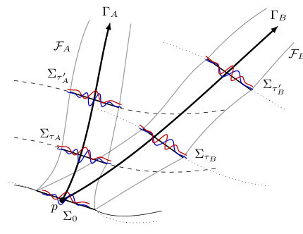
<figcaption class="paper-figure-caption"><b>Fig 1.</b> FIG. 1. Two-particle setup. The timelike worldlines ΓA and ΓB emanate from a common point p. Each worldline has its own Fermi tube, FA and FB, with local Fermi slices like ΣτA, Στ′ A and ΣτB, Στ′ B. The initial Fermi slice Σ0 is common, and it is contained by the initial global slices of the two separate global foliations that contain Fermi slices as their parts. The two wave profiles schematically represent the propagation of the two localized wave packets initially prepared on Σ0 and subsequently evolved along the two worldlines within Fermi tubes with the corresponding Hamiltonians.</figcaption>
</figure>
<figure class="paper-figure-card">
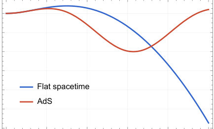
<figcaption class="paper-figure-caption"><b>Fig 2.</b> FIG. 2. Peres-time covariance in flat spacetime and AdS2. The two curves start to markedly differ at about ωτ = 1.</figcaption>
</figure>

**Summary.** This theoretical paper proposes that entangled quantum clocks can serve as sensitive operational probes for measuring the curvature of spacetime. By analyzing the violation of a Bell inequality derived from time measurements, the authors show that the presence of curvature induces a measurable correction to the expected quantum correlations. This suggests a novel avenue for testing gravitational theories using quantum resources.

**Why it may be interesting.** This connects fundamental concepts from quantum information theory (Bell tests) directly to general relativity and spacetime geometry, providing a concrete physical mechanism for testing gravity using quantum resources.

Detailed structure

**Main problem.** The study investigates using entangled quantum clocks as operational probes to detect and quantify spacetime curvature.

**Main result.** Spacetime curvature modifies operationally defined quantum correlations, allowing a Bell-like parameter derived from clock measurements to exceed the classical bound in curved backgrounds for entangled states.

**Method.** The authors analyze the covariance of Peres-time observables by formulating the protocol as a Bell-like experiment and calculating the resulting Bell parameter using perturbation theory in the weak-curvature limit.

**Model / system.** The system consists of two localized nonrelativistic quantum particles propagating along timelike geodesics in a curved spacetime background, each coupled to an internal quantum clock (SWP model). The dynamics are governed by Hamiltonians incorporating gravitational redshift and tidal corrections.

**Key observables.** Covariance of Peres-time observables ($	ext{Cov}(T_A, T_B)$) and the curvature-corrected Bell parameter ($S_{	ext{curv}}^{\Phi+}$).

**Important parameters / regimes.** Curvature scalar $R(	au)$, oscillator frequency $\omega_0$, and the weak-curvature expansion parameters ($\xi, \epsilon_A, \epsilon_B$).

**Assumptions / limitations.** The analysis relies on a weak-curvature expansion ($|R|/\omega_0^2 \ll 1$) and uses approximations such as the weak-clock limit.

**Paper structure.** The paper builds upon previous work, first analyzing the general covariance of time observables. It then reformulates this into a Bell-like test, deriving the curvature correction to the Bell parameter for specific backgrounds like AdS$_2$. The final steps focus on calculating the violation condition based on these derived parameters.

Abstract

Building on the framework developed by Perche [Phys. Rev. D 106, 025018 (2022)], we study two localized nonrelativistic quantum particles propagating along timelike geodesics in a curved spacetime background. Each particle is coupled to a quantum clock that operationally records the time spent in a prescribed spatial region. We compute the covariance of the resulting time observables for separable and entangled two-particle states, comparing flat and curved backgrounds. We then reformulate the protocol as a Bell-like experiment and show that the Bell parameter can acquire a curvature-induced correction. In particular, a protocol calibrated to saturate the classical bound in flat spacetime can be driven above this bound in curved spacetime for entangled states. We focus on two-dimensional curved backgrounds in which the local tidal term induces an effective harmonic potential in the Fermi-frame description. Our results show that spacetime curvature can modify operationally defined quantum correlations and suggest entangled quantum clocks as probes of spacetime curvature.

[↑ back to top](#top)

### [Radio frequency readout and control of Ge/SiGe hole spin qubits with a global accumulation gate](http://arxiv.org/abs/2607.06342v1)

**Authors:** Tien-Ho Chang, Chi-Wei Lee, Jian-Chang Zeng, Chia-Hao Wei, Ching-Shiang Wang, Fu-Yuan Gu, Guan-Yu Yang, Ruei-Syuan Chiang, Ho-Chun Wu, Ming-Hao Lee, Ming-Wen Chu, Guang Li Luo, Ta-Chun Cho, Shawn S. H. Hsu, Tzu-Kan Hsiao  
**Type:** experiment · **Category:** quantum information and computing · **PDF:** <https://arxiv.org/pdf/2607.06342v1>  
**Analysis basis:** full PDF text, analyzed in chunks
**Topic relevance:** 🔥 `QC/QI experiment` **4/5** · `quantum measurements` **1/5** · `spintronics-quantum-optics interface` **1/5**

↔ Scroll figures horizontally

<figure class="paper-figure-card">
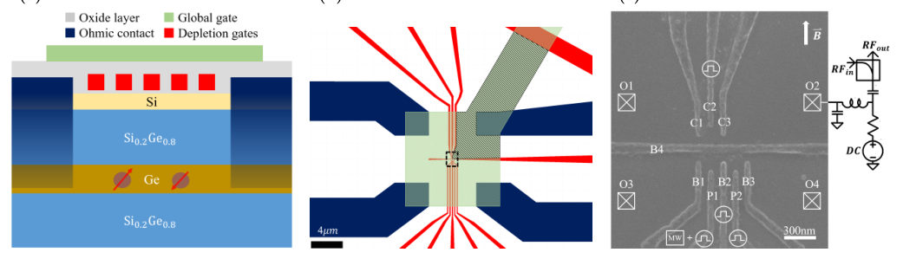
<figcaption class="paper-figure-caption"><b>Fig 1.</b> FIG. 1: (a) Schematic cross section of the gate stack and a Ge/SiGe quantum well structure. The gate stack consists of annealed Pt ohmic contacts, depletion Al gates, and a global Al gate. Oxide layers are grown in between metal layers. Hole spins are confined in the quantum well. Colors for each gate layer are shown in the legend. (b) Top view of the gate layout near the active region. Gate layers with different functions are drawn according to the same colors in (a). The shaded area indicates the 2DHG which contributes additional capacitance when performing RF reflectometry via O2 ohmic. (c) Scanning electron microscope image showing the ebeam-defined depletion gates in the white...</figcaption>
</figure>
<figure class="paper-figure-card">
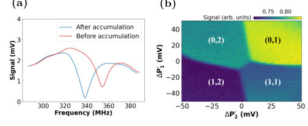
<figcaption class="paper-figure-caption"><b>Fig 2.</b> FIG. 2: (a) resonance frequency of the LC tank circuit before and after the 2DHG accumulation. The frequency shift corresponds to a gate-2DHG capacitance of 73 fF (b) Charge stability diagram near the few-hole regime measured using RF reflectometry.</figcaption>
</figure>
<figure class="paper-figure-card">
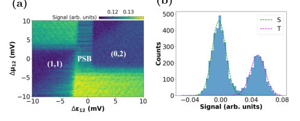
<figcaption class="paper-figure-caption"><b>Fig 3.</b> FIG. 3: (a) PSB readout region on the charge stability diagram near the (1,1)-(0,2) transition. (b) PSB readout histogram showing singlet and triplet distributions with a SNR of 4.6 using an integration time of 10 µs.</figcaption>
</figure>
<figure class="paper-figure-card">
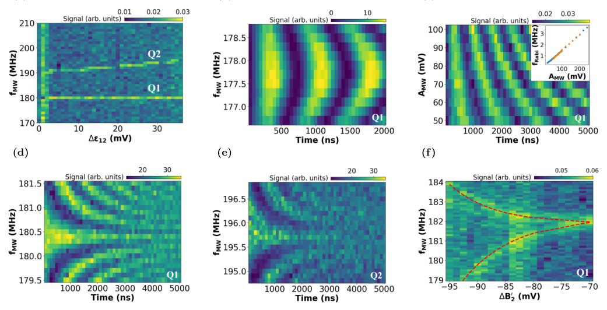
<figcaption class="paper-figure-caption"><b>Fig 4.</b> FIG. 4: (a) MW-excited spin energy spectroscopy as function of ϵ12 = P ′ 1 −P ′ 2 and fMW. The horizontal lines near fMW = 180 MHz and 190 MHz correspond to the resonance frequencies of Q1 and Q2, respectively. The vertical line near zero detuning is the (1,1)-(0,2) transition. (b) MW-driven Rabi oscillation of Q1 near the resonance frequency. (c) Rabi oscillation of Q1 as a function of AMW. Inset shows the AMW dependence of fRabi of Q1 (blue) and Q2 (orange). (d) Ramsey chevron of Q1. (e) Ramsey chevron of Q2. (f) Exchange energy splitting of Q1 as a function of ∆B′ 2. The dashed lines are fitting of the exchange splitting to an exponential function, which yields an exchange tunability of...</figcaption>
</figure>

**Summary.** The paper reports on hole spin qubits in Ge/SiGe structures using a novel global accumulation gate design to simplify device fabrication. They successfully demonstrated single-shot readout and coherent microwave control of two qubits while maintaining performance metrics comparable to complex, overlapping-gate devices. This work paves the way for more scalable solid-state quantum computing architectures.

**Why it may be interesting.** This work directly addresses hardware limitations in solid-state quantum computing platforms. The successful integration of advanced qubit control (Rabi oscillations, entanglement tuning) into a simpler fabrication scheme makes the platform more accessible for broader research efforts.

Detailed structure

**Main problem.** The primary challenge is overcoming fabrication bottlenecks associated with conventional overlapping-gate devices when building few-qubit spin quantum processors.

**Main result.** The authors demonstrated single-shot spin readout and coherent control of two qubits using a simplified global accumulation gate design, achieving performance comparable to state-of-the-art methods.

**Method.** They fabricated Ge/SiGe hole spin qubit devices using a novel global-gate structure and employed RF reflectometry for readout and microwave (MW) pulses for coherent manipulation.

**Model / system.** The system utilizes hole spin qubits confined in undoped Ge/SiGe quantum well structures. The key innovation is the use of a global accumulation gate combined with single-layer depletion fine gates, significantly simplifying the required lithography compared to traditional overlapping-gate designs.

**Key observables.** Single-shot spin readout (Pauli Spin Blockade histogram), Rabi oscillation amplitudes/frequencies, and spin coherence times ($T_2^*$).

**Important parameters / regimes.** Global gate capacitance ($\sim 73$ fF); Coherence times ($T_2^*$ up to $\sim 3 \mu	ext{s}$); Exchange tunability (quantified by energy splitting).

**Assumptions / limitations.** The global-gate design is assumed to maintain the necessary electrical coupling and performance metrics required for high-fidelity quantum operations.

**Figures summary.** Figures illustrate the device schematic, charge stability diagrams from RF readout, histograms showing singlet/triplet populations (SNR=4.6), and spectroscopy plots detailing spin energy levels, Rabi oscillations, and coherence measurements.

**Paper structure.** The paper progresses by first introducing the simplified global-gate architecture, then demonstrating single-shot readout via PSB, followed by characterizing coherent control through MW driving, and concluding with measurements of coherence times and exchange coupling tunability.

Abstract

Hole spin qubits in undoped Ge/SiGe quantum well structures have advanced rapidly in performance and scalability. However, stringent multi-layer patterning and overlay requirements of conventional overlapping-gate devices create a bottleneck for academic proof-of-concept experiments involving few-qubit devices. Here we present fabrication and measurements of Ge/SiGe spin qubit devices with a global accumulation gate and single-layer depletion fine gates, which substantially reduce fabrication complexity. With careful design of the gate-2DHG capacitance, we demonstrate RF-based single-shot spin readout and coherent control of two single-spin qubits. We also characterize the spin coherence times and exchange tunability, which are similar to those reported in recent overlapping-gate Ge/SiGe spin qubit devices. By simplifying fabrication without sacrificing performance, our approach offers a more accessible device design for spin-based quantum technology research.

[↑ back to top](#top)

### [Maximal coherence of quantum measurement and the resource theory of sharpness](http://arxiv.org/abs/2607.05847v1)

**Authors:** Kyunghyun Baek, Yonggi Jo, Hyunchul Nha  
**Type:** theory · **Category:** quantum information and computing · **PDF:** <https://arxiv.org/pdf/2607.05847v1>  
**Analysis basis:** full PDF text, analyzed in chunks
**Topic relevance:** 🔥 `quantum measurements` **4/5** · `measurement-induced transitions` **1/5**

↔ Scroll figures horizontally

<figure class="paper-figure-card">
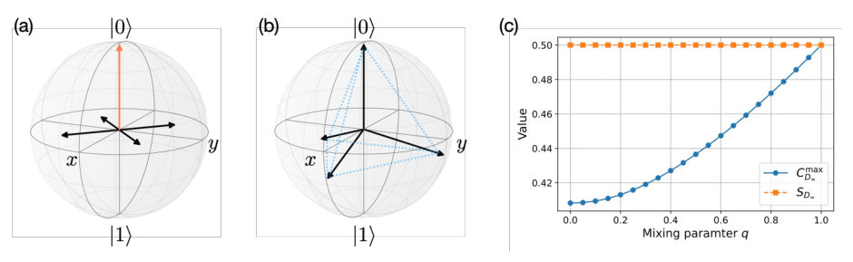
<figcaption class="paper-figure-caption"><b>Fig 1.</b> Figure 1. Comparison of the sharpness SD and the maximal coherence of measurement Cmax D . (a) Bloch-sphere representation of the joint X–Y POVM MXY ; all four rank-one elements have eigenbases lying in the xy-plane of the Bloch sphere; the incoherent basis {|0⟩, |1⟩} along z-axis (orange arrows) is mutually unbiased to every such eigenbasis, so the common-MUB condition of Corollary 3 is satisfied. (b) Bloch-sphere representation of a tetrahedral SIC qubit POVM MSIC; its four rank-one elements have neither a common eigenbasis nor a common MUB. (c) SD and Cmax D as a function of the mixing parameter p for the convex combination q MXY + (1 −q) MSIC. The two quantities coincide at q = 1, in...</figcaption>
</figure>
<figure class="paper-figure-card">
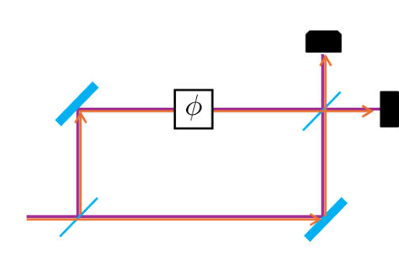
<figcaption class="paper-figure-caption"><b>Fig 2.</b> Figure 2. Schematic of a single-photon Mach–Zehnder phase- sensing experiment. The unknown phase ϕ is imprinted on one arm; an imperfect interferometer (visibility ν) realizes the binary POVM (40).</figcaption>
</figure>
<figure class="paper-figure-card">
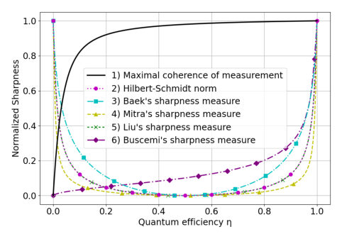
<figcaption class="paper-figure-caption"><b>Fig 3.</b> Figure 3. Comparison of sharpness measures for the imperfect PNRD as a function of quantum efficiency η. All measures are normalized to the unit interval, and unsharpness measures are converted to sharpness via 1 −US. The HS norm and the measures of Baek, Mitra, and Liu–Luo are non-monotonic in η, reaching a maximum at both η = 0 (vacuum-projecting trivial measurement) and η = 1 (ideal PNRD). Only Buscemi et al.’s measure and the maximal coherence of measurement are monotonic, vanishing on the trivial measurement and in- creasing to the maximum on the ideal PNRD, hence both qualify as valid sharpness monotones in the resource theory of sharpness.</figcaption>
</figure>

**Summary.** This paper develops a resource theory linking quantum coherence and measurement sharpness for POVMs. It proves that these two quantities coincide when the measurement elements share specific structural properties (like a common eigenbasis). The work provides operational diagnostics, showing how maximal coherence can quantify phase sensitivity in interferometers and correctly characterize imperfect detectors.

**Why it may be interesting.** It provides a rigorous mathematical framework connecting two fundamental concepts in quantum measurement theory—coherence and sharpness—using resource theories, which is highly relevant for understanding measurement limitations in quantum optics and sensing.

Detailed structure

**Main problem.** To establish a precise quantitative relationship between two resource quantities associated with quantum measurements: quantum coherence and measurement sharpness.

**Main result.** Maximal coherence of measurement ($C_{\max}^D$) is shown to coincide exactly with the corresponding distance-based sharpness monotone ($S_D$) under specific structural conditions, providing an analogue to state purity correspondences.

**Method.** The authors define both quantities using resource theory frameworks based on minimizing distances (like the diamond distance) over sets of trivial or reference measurements.

**Model / system.** The study analyzes general quantum measurements described by Positive Operator-Valued Measures (POVMs) $\{A_x\}_{x=1}^n$ acting on a $d$-dimensional Hilbert space. Physical examples include Mach-Zehnder interferometers and noisy photon-number resolving detectors.

**Key observables.** Maximal Coherence of Measurement ($C_{\max}^D$), Distance-based Sharpness Monotone ($S_D$), Fisher Information ($I(\phi)$), and visibility ($
u$).

**Important parameters / regimes.** The equivalence holds when POVM elements share a common eigenbasis or admit a common mutually unbiased basis (MUB) structure.

**Assumptions / limitations.** The equivalence theorems rely on the structural assumption that the POVM elements share a common eigenbasis or MUB structure; otherwise, $C_{\max}^D$ and $S_D$ may diverge.

**Figures summary.** Figures illustrate the comparison between sharpness measures ($	ext{SD}$) and maximal coherence ($	ext{C}_{\max}^D$) for both joint X–Y POVMs and imperfect PNRDs, showing agreement under ideal conditions but divergence otherwise.

**Paper structure.** The paper develops resource theories for measurement, defining $C_{\max}^D$ via basis optimization and $S_D$ via fuzzifying operations. It then proves the equivalence theorems under specific structural assumptions and validates these results using physical examples like interferometry.

Abstract

A resource theory of quantum measurement can be addressed in terms of quantum coherence and measurement sharpness, respectively. The former analyzes the off-diagonal structure of POVM elements in a predetermined basis while the latter analyzes the deviation from trivial, state-independent, measurements. We establish a direct connection between the two resource theories by identifying measurement sharpness as the maximal coherence that is achievable under all possible unitary changes of the reference basis. For a broad class of POVMs whose elements share a common eigenbasis, we show that the maximal distance-based coherence of measurement coincides exactly with the corresponding distance-based sharpness monotone. We further extend this equivalence, with element-additive distances, to POVMs whose elements admit a common mutually unbiased basis structure. These results provide a measurement-theoretic analogue of the maximal-coherence \& purity correspondence for quantum states. We also show that the maximal coherence of measurement is faithful with respect to trivial measurements and is monotonic under fuzzifying operations for dichotomic measurements, as well as under mixed-unitary and unitarily covariant preprocessing channels. Finally, we illustrate the operational meaning and limitations of the equivalence through qubit POVMs, single-photon phase sensing, and noisy photon-number resolving detection. In particular, the maximal Fisher information in a Mach-Zehnder interferometer is shown to be determined by the squared maximal coherence of the measurement, while in an imperfect photon-number resolving detector the maximal coherence behaves as a proper sharpness monotone, unlike conventional PVM-based unsharpness measures.

[↑ back to top](#top)

### [Lean-Quantum: Toward AI-Assisted Formalization of Quantum Information](http://arxiv.org/abs/2607.05492v1)

**Authors:** Kazumi Kasaura, Kei Tsukamoto, Kento Mori, Risa Mizuno, Takahiro Namatame, Yuta Oriike, Masaya Taniguchi, Sho Sonoda, Hayata Yamasaki  
**Type:** theory · **Category:** quantum information and computing · **PDF:** <https://arxiv.org/pdf/2607.05492v1>  
**Analysis basis:** full PDF text, analyzed in chunks
**Topic relevance:** 🔥 `entanglement & information structure` **4/5**

↔ Scroll figures horizontally

<figure class="paper-figure-card">
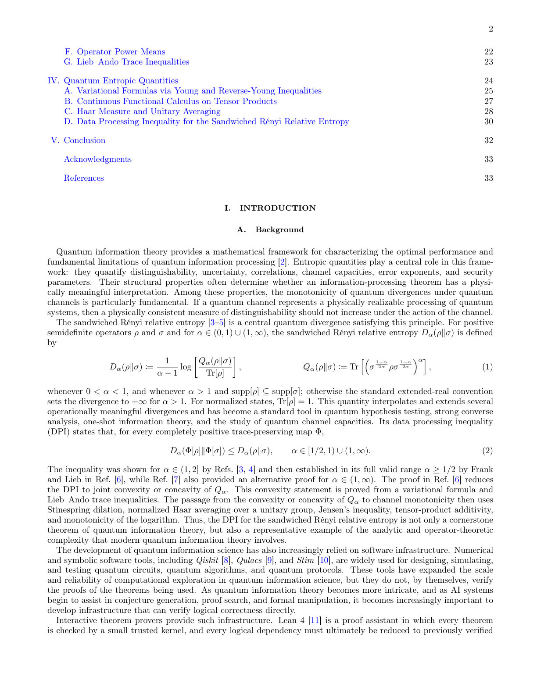
<figcaption class="paper-figure-caption"><b>Fig 1.</b> Low-resolution page preview, page 2</figcaption>
</figure>
<figure class="paper-figure-card">
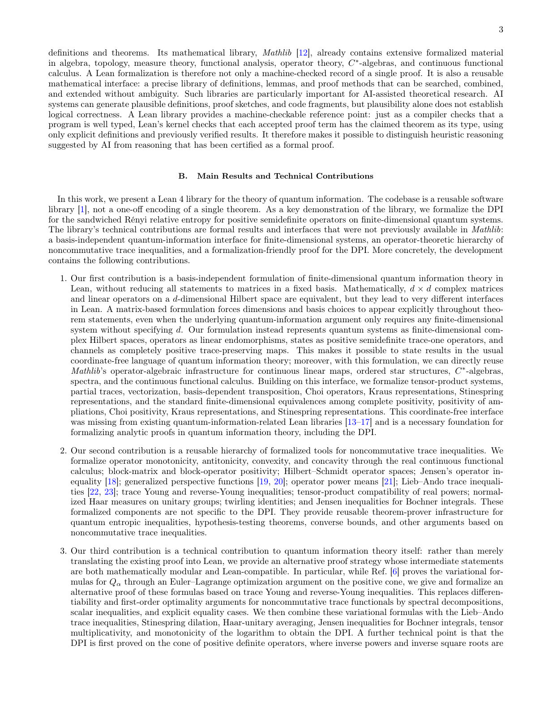
<figcaption class="paper-figure-caption"><b>Fig 2.</b> Low-resolution page preview, page 3</figcaption>
</figure>
<figure class="paper-figure-card">
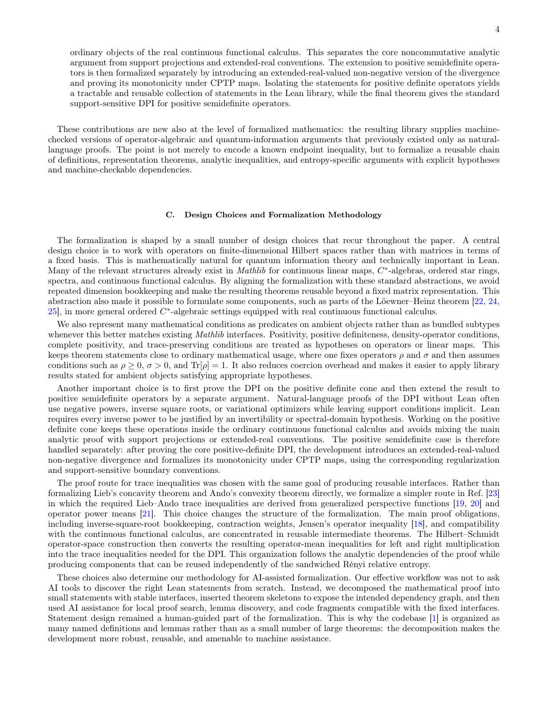
<figcaption class="paper-figure-caption"><b>Fig 3.</b> Low-resolution page preview, page 4</figcaption>
</figure>
<figure class="paper-figure-card">
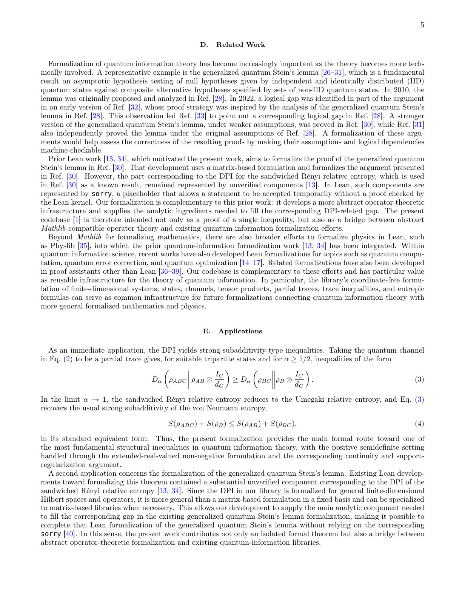
<figcaption class="paper-figure-caption"><b>Fig 4.</b> Low-resolution page preview, page 5</figcaption>
</figure>
<figure class="paper-figure-card">
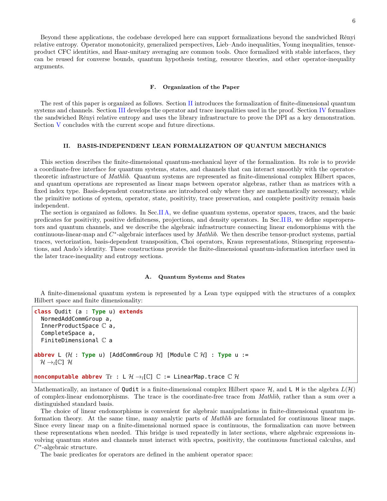
<figcaption class="paper-figure-caption"><b>Fig 5.</b> Low-resolution page preview, page 6</figcaption>
</figure>

**Summary.** This work develops a comprehensive Lean 4 library to formally verify core concepts in quantum information theory. The central achievement is the machine-checkable proof of the Data Processing Inequality for the sandwiched Rényi relative entropy. By formalizing these foundational theorems, the paper establishes a robust platform for future theoretical and AI-assisted research.

**Why it may be interesting.** While focused on abstract theory, the rigorous formalization of fundamental quantum resource theorems like the DPI provides a powerful mathematical toolkit applicable to understanding information flow and correlations in any physical system described by quantum channels.

Detailed structure

**Main problem.** The primary goal is to provide a machine-checkable, formal infrastructure for quantum information theory, specifically by formalizing the Data Processing Inequality (DPI) for the sandwiched Rényi relative entropy.

**Main result.** The authors successfully derive a Lean 4 formalization of the DPI and establish strong subadditivity as a direct corollary. This provides foundational, machine-verified tools for future AI-assisted research in the field.

**Method.** The methodology involves developing a reusable, basis-independent operator-theoretic framework within the Lean 4 proof assistant. Key mathematical techniques include utilizing real continuous functional calculus and formalizing complex noncommutative trace inequalities.

**Model / system.** The theory applies to finite-dimensional quantum systems described by positive semidefinite operators ($
ho$, $\sigma$) and governed by completely positive trace-preserving (CPTP) quantum channels ($\Phi$).

**Key observables.** Sandwiched Rényi relative entropy ($D_\alpha(
ho\|\sigma)$), quasi-entropy, von Neumann entropy ($S(
ho)$), and various noncommutative trace inequalities.

**Important parameters / regimes.** The parameter $\alpha$ governing the Rényi divergence ($\alpha \in [1/2, 1) \cup (1, \infty)$); the limit $\alpha 	o 1$.

**Assumptions / limitations.** The framework requires careful handling of support conditions and necessitates separating proofs for positive definite versus positive semidefinite operators.

**Paper structure.** The paper builds a comprehensive Lean 4 library, first establishing the operator-theoretic foundation (states, channels, traces). It then tackles noncommutative inequalities (monotonicity, convexity) before culminating in the formal proof of the DPI by combining variational formulas with Haar averaging techniques.

Abstract

Quantum information theory is built on entropic quantities; among them, the sandwiched Rényi relative entropy is a fundamental divergence with various applications, and its data processing inequality (DPI) under quantum channels is a cornerstone result. In this work, we present a Lean 4 library for quantum information, designed as a reusable formal infrastructure for theoretical analysis. As a central demonstration of the library, we formalize the DPI for the sandwiched Rényi relative entropy for positive semidefinite operators on finite-dimensional quantum systems. The library provides a basis-independent operator-theoretic framework for finite-dimensional quantum mechanics compatible with the standard mathematical library Mathlib, including reusable interfaces for finite-dimensional systems, states, channels, tensor products, partial traces, Choi operators, Kraus representations, and Stinespring representations. It also builds infrastructure for noncommutative trace inequalities, including operator monotonicity and convexity via the real continuous functional calculus, block-operator positivity, Hilbert-Schmidt operator spaces, Jensen's operator inequality, generalized perspectives, operator power means, and Lieb-Ando trace inequalities. On top of this framework, we formalize entropy-specific ingredients for the DPI: variational formulas for the sandwiched quasi-entropy via Young and reverse-Young inequalities, tensor-product compatibility of real powers, and Haar measures on unitary groups. Together, these components yield a Lean formalization of the DPI, give strong subadditivity as a corollary, and provide the last missing component needed to complete the Lean formalization of the generalized quantum Stein's lemma. More broadly, the development provides machine-checkable foundations for future formalized and AI-assisted research in quantum information theory.

[↑ back to top](#top)

### [Quantum state localization in dipole-dipole interacting disordered networks](http://arxiv.org/abs/2607.06539v1)

**Authors:** Pritam Chattopadhyay, Saikat Sur, Avijit Misra, David Petrosyan, Arti Garg, Gershon Kurizki  
**Type:** theory · **Category:** disordered systems and neural networks · **PDF:** <https://arxiv.org/pdf/2607.06539v1>  
**Analysis basis:** full PDF text, analyzed in chunks
**Topic relevance:** `analog quantum simulation` **3/5** · `correlated / nonlocal dissipation` **3/5** · `driven-dissipative phase transition` **3/5** · `entanglement & information structure` **3/5** · `methods for driven-dissipative` **3/5** · `Tavis-Cummings & cavity-many-emitter` **2/5** · `non-equilibrium dynamics` **2/5** · `non-equilibrium universality` **2/5** · `Keldysh / 2PI / non-Gaussian methods` **1/5** · `Kondo & dissipative impurity` **1/5** · `correlated cavity matter` **1/5** · `exotic spin models in light-matter` **1/5** · `interference shaping light` **1/5** · `scars & prethermalization` **1/5**

↔ Scroll figures horizontally

<figure class="paper-figure-card">
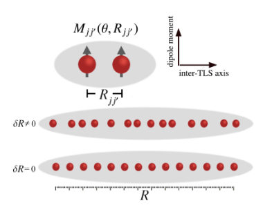
<figcaption class="paper-figure-caption"><b>Fig 1.</b> FIG. 1. A schematic of ordered (δR = 0) and disordered (δR , 0) chains of interacting atoms arranged in one-dimension. Each atom is charge-neutral and associated with a dipole moment aligned perpen- dicularly with the inter-TLS axis. The average distance between two adjacent atoms is R irrespective of the disorder present in the system.</figcaption>
</figure>
<figure class="paper-figure-card">
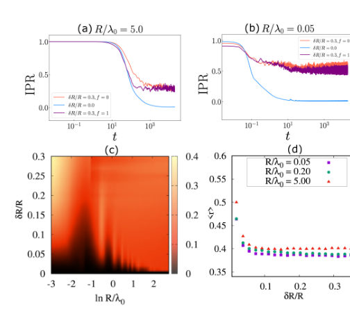
<figcaption class="paper-figure-caption"><b>Fig 2.</b> FIG. 2. Dynamic IPR as a function of t (in units of γ−1) with and without disorder in M for the (a) near-zone and (b) far-zone RDDI in the presence ( f = 1) and absence ( f = 0) of dissipation. The ini- tial state of the combined field-atom system in the single-excitation sector is, |ψ(0)⟩= PN j=2 |1, g j⟩. (c) The static IPR for the off-diagonal disorder averaged over all eigenvectors with log(R/λ0) for N = 1000 without dissipation for f = 0. The color plot describes the varia- tion of IPR for different randomness strengths, and (d) the average value of level spacing ratio r as a function of disorder for differ- ent inter-atomic distances computed from the one excitation sector...</figcaption>
</figure>
<figure class="paper-figure-card">
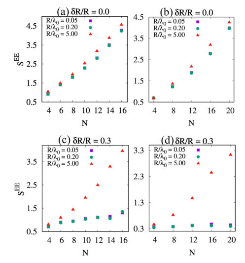
<figcaption class="paper-figure-caption"><b>Fig 3.</b> FIG. 4. The bipartite entanglement entropy averaged over all eigen- states as a function of system size: (a) without disorder δR/R = 0.0 for the excitation sector N/2, (b) without disorder δR/R = 0.0 for the excitation sector N/4, (c) with disorder δR/R = 0.3 for the excitation sector N/2, (d) with disorder δR/R = 0.3 for the excitation sector N/4. The plots are generated after averaging the data from a hundred independent disorder configurations.</figcaption>
</figure>
<figure class="paper-figure-card">
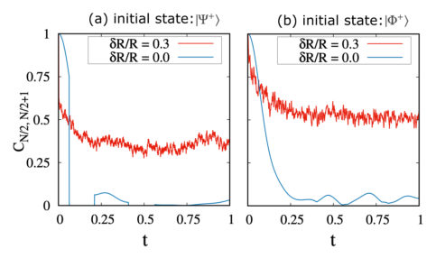
<figcaption class="paper-figure-caption"><b>Fig 4.</b> FIG. 3. The concurrence between N/2 th and (N/2 + 1) th atom as a function of time (f=1). The system is initiated in a Bell state at the middle of the chain. (a) A Bell state in a linear superposition of single excitations |Ψ+⟩= 1√</figcaption>
</figure>
<figure class="paper-figure-card">
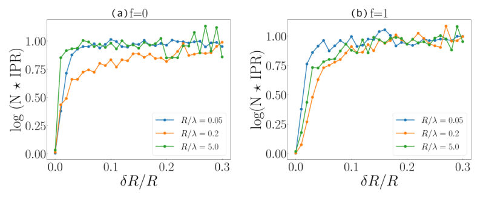
<figcaption class="paper-figure-caption"><b>Fig 5.</b> FIG. 5. The variation of the log(N ∗IPR) with the system size log N with the off-diagonal disorder indicates the transition from the extended state to the localized state for (a) f = 0, dispersive RDDI, where switching on the randomness results in the transition, and for (b) f = 1, dissipative RDDI, where the transition is more smooth than the case without the dissipation.</figcaption>
</figure>

**Summary.** The paper investigates how positional disorder localizes excitations in networks coupled by the realistic dipole-dipole interaction (RDDI). By analyzing diagnostics like IPR and entanglement entropy, the authors establish that structural randomness drives a transition from extended to localized dynamics. This finding is significant because it applies localization theory to complex, dissipative quantum optical systems with direct technological relevance.

**Why it may be interesting.** This work bridges quantum optics (dipole-dipole interaction) with condensed matter physics concepts like Anderson localization in disordered media. The inclusion of realistic radiative dissipation makes it highly relevant for modeling open quantum systems in photonic or solid-state devices.

Detailed structure

**Main problem.** The study investigates how positional disorder affects the localization of quantum excitations within a network coupled by the realistic resonant dipole-dipole interaction (RDDI). This is crucial because RDDI coupling differs significantly from conventional short or long-range models.

**Main result.** Positional disorder in RDDI networks leads to strong spatial localization of excitations, even despite the partially long-ranged and radiative nature of the interaction. A key finding is a photon wavelength-induced transition between extended and localized dynamics.

**Method.** The analysis employs single-excitation subspace evolution, utilizing diagnostics like the Dynamic Inverse Participation Ratio (IPR) and entanglement entropy to quantify localization. Perturbation theory is used to analyze disorder effects on the Hamiltonian terms.

**Model / system.** The system consists of N two-level systems (TLSs) coupled via the RDDI, described by a Hamiltonian containing both coherent ($V_{jj'}$) and dissipative ($F_{jj'}$) coupling terms. Disorder is introduced as structural positional fluctuations ($\delta X_j$) in the atomic positions.

**Key observables.** Dynamic Inverse Participation Ratio (IPR), Level Spacing Ratio ($\langle r 
angle$), Bipartite Entanglement Entropy (EE), and excitation probability $| \alpha_1(t)|^2$.

**Important parameters / regimes.** The ratio of the lattice spacing to the photon wavelength ($R/\lambda_0$) defines distinct regimes: near-zone, far-zone, and transitional regions.

**Assumptions / limitations.** The analysis often relies on first-order perturbation theory for disorder effects ($\delta R_{j_1 j_2}$) and analyzes dynamics in the single-excitation subspace, though extensions to higher subspaces are mentioned.

**Figures summary.** Figures illustrate the transition from extended to localized states using IPR scaling ($\log(N \cdot 	ext{IPR})$ vs. $\log N$), show energy-resolved spectral statistics via the gap ratio ($\langle r 
angle$), and demonstrate wavefunction concentration over few sites as disorder increases.

**Paper structure.** The paper systematically analyzes localization diagnostics (IPR, EE) across different coupling regimes defined by $R/\lambda_0$. It contrasts the effects of structural positional disorder versus energy/frequency disorder, confirming that both lead to localization transitions. The role of dissipation is also analyzed relative to coherent interactions.

Abstract

We study the localization of excitations in positionally disordered spin or atom networks coupled via the realistic resonant dipole-dipole interaction (RDDI), which does not conform to a simple power law, as the spatial dependence and dissipative character distinguish it from conventional short or long-range models. Despite its partially long-ranged and radiative nature, positional disorder in the RDDI coupling leads to strong spatial localization of excitations. The interplay between coherent and dissipative couplings gives rise to nontrivial interference effects that stabilize localized modes even in open geometries. Our results uncover a photon wavelength-induced transition from extended to localized excitation dynamics, establishing RDDI networks as a unique setting to explore the emergence of localization in realistic quantum optical systems. Our analysis of the localized modes induced by RDDI has potential applications in coherent photovoltaics, excitonic circuits, quantum memory, and quantum sensors.

[↑ back to top](#top)

### [Hidden Entropy Production at Mechanical Stall: Exact Reconstruction in a Reciprocal Brownian Motor](http://arxiv.org/abs/2607.06131v1)

**Authors:** Mesfin Mesfin Taye  
**Type:** theory · **Category:** statistical mechanics · **PDF:** <https://arxiv.org/pdf/2607.06131v1>  
**Analysis basis:** full PDF text, analyzed in chunks
**Topic relevance:** `methods for driven-dissipative` **3/5** · `non-equilibrium dynamics` **3/5** · `non-equilibrium universality` **3/5** · `quantum measurements` **3/5** · `driven-dissipative phase transition` **2/5** · `measurement-induced transitions` **2/5** · `Frenkel-Kontorova` **1/5** · `Keldysh / 2PI / non-Gaussian methods` **1/5** · `correlated / nonlocal dissipation` **1/5**

↔ Scroll figures horizontally

<figure class="paper-figure-card">
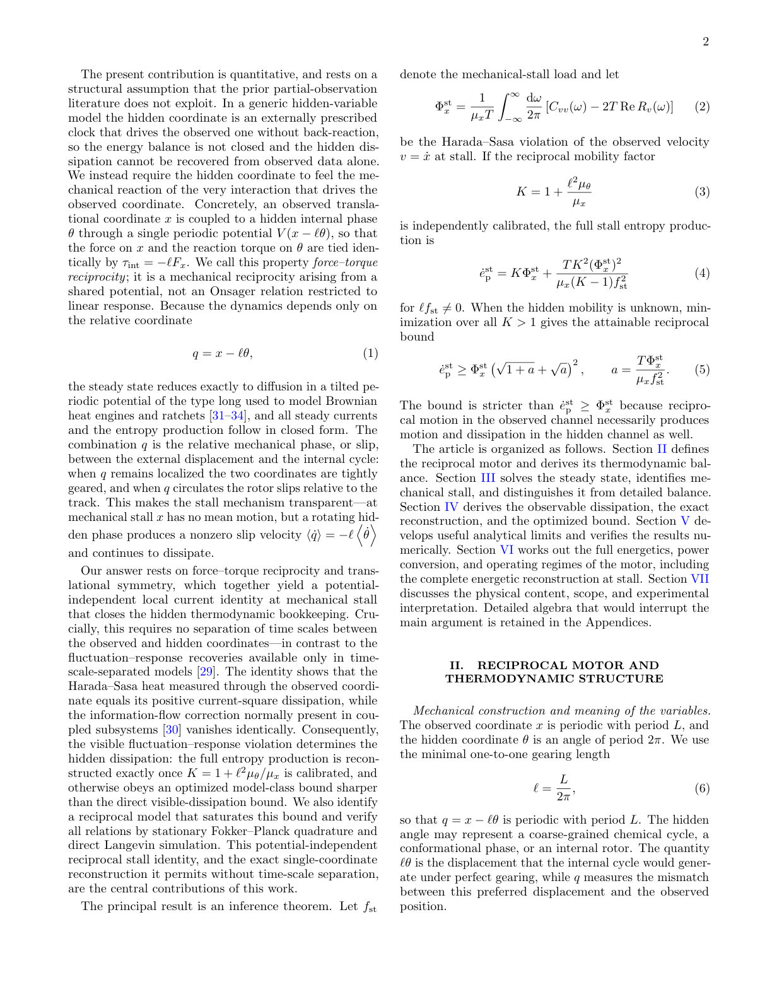
<figcaption class="paper-figure-caption"><b>Fig 1.</b> Low-resolution page preview, page 2</figcaption>
</figure>
<figure class="paper-figure-card">
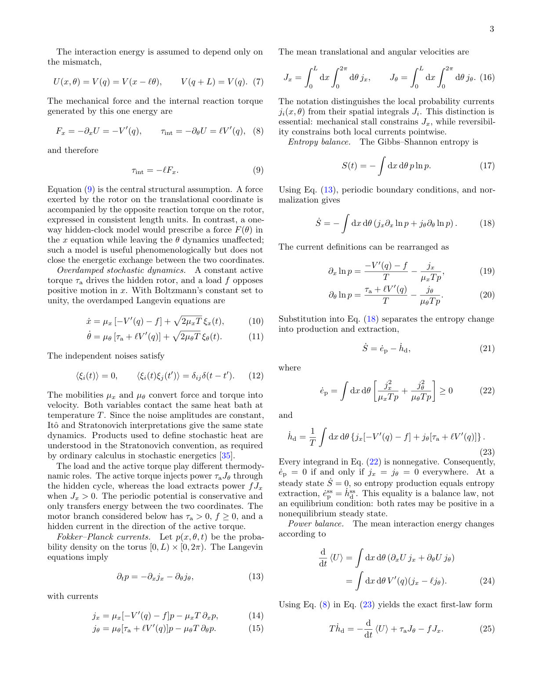
<figcaption class="paper-figure-caption"><b>Fig 2.</b> Low-resolution page preview, page 3</figcaption>
</figure>
<figure class="paper-figure-card">
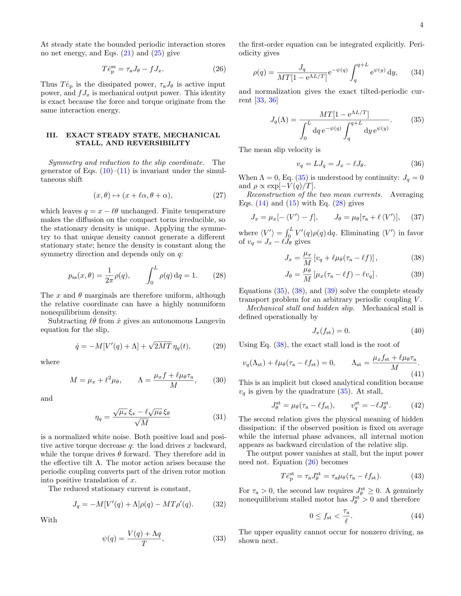
<figcaption class="paper-figure-caption"><b>Fig 3.</b> Low-resolution page preview, page 4</figcaption>
</figure>
<figure class="paper-figure-card">
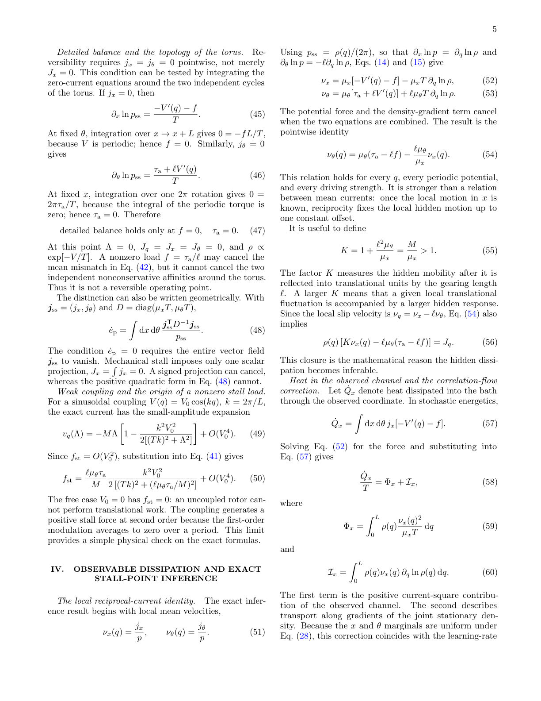
<figcaption class="paper-figure-caption"><b>Fig 4.</b> Low-resolution page preview, page 5</figcaption>
</figure>
<figure class="paper-figure-card">
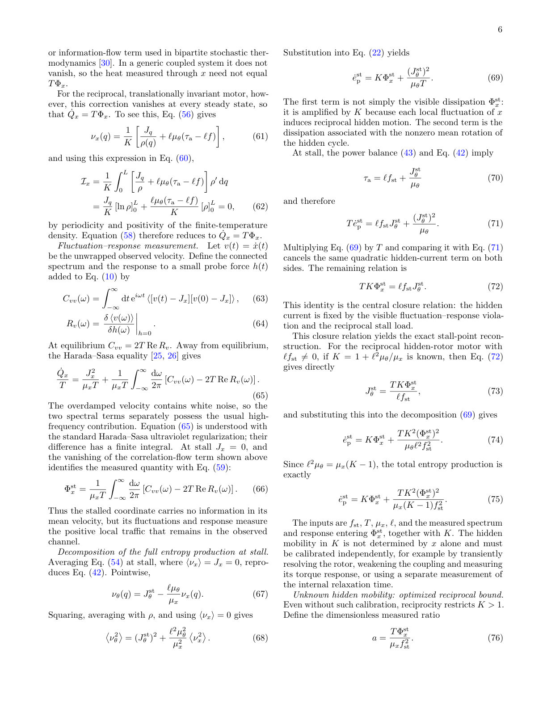
<figcaption class="paper-figure-caption"><b>Fig 5.</b> Low-resolution page preview, page 6</figcaption>
</figure>

**Summary.** The paper develops an exact method to calculate hidden entropy production in coupled stochastic motors when the system is mechanically stalled. By exploiting force-torque reciprocity within a minimal model, the authors show that this total entropy cost can be precisely reconstructed using only measurements of the observed coordinate's dissipation and stall load. This offers a significant theoretical advance for analyzing energy flow in complex, partially observable non-equilibrium systems.

**Why it may be interesting.** This work provides a powerful theoretical tool for analyzing non-equilibrium thermodynamics in systems where internal degrees of freedom are unobservable, linking measurable fluctuations directly to fundamental thermodynamic costs.

Detailed structure

**Main problem.** The core problem is reconstructing hidden entropy production ($\dot{s}_{est}$) at mechanical stall when measurements are restricted to a single, observed coordinate ($x$) in a coupled stochastic system.

**Main result.** The authors derive an exact inference theorem showing that $\dot{s}_{est}$ can be calculated solely from the measured visible dissipation ($\Phi_{	ext{st}, x}$) and the stall load ($f_{	ext{st}}$).

**Method.** The derivation relies on exploiting force–torque reciprocity relations inherent to the specific motor model, which allows for a local current identity that closes the thermodynamic bookkeeping.

**Model / system.** The system is a minimal, analytically solvable Langevin motor coupling an observed translational coordinate ($x$) to a hidden internal rotor ($	heta$) via a single periodic potential $V(x - \ell	heta)$.

**Key observables.** Harada–Sasa heat measured through $x$ ($\Phi_{st}^x$), full entropy production ($\dot{s}_{est}$), and mean currents ($J_x, J_	heta$).

**Important parameters / regimes.** The reciprocal mobility factor ($K$) and the stall load ($f_{	ext{st}}$) are crucial parameters in the reconstruction formulas.

**Assumptions / limitations.** The model requires strict force–torque reciprocity ($	au_{int} = -\ell F_x$) and translational symmetry, crucially allowing for calculations without assuming time scale separation.

**Figures summary.** Not specified by notes; the analysis involves deriving several key equations (e.g., Equations 4, 5, D12) that provide quantitative relationships between different thermodynamic quantities at stall.

**Paper structure.** The paper builds from establishing the coupled Langevin dynamics and energy/entropy balance laws to applying symmetry reductions, culminating in the derivation of the final reconstruction identity for hidden entropy production at steady-state stall conditions.

Abstract

We show that in a reciprocal Brownian motor the entropy production hidden behind a mechanically stalled coordinate can be reconstructed exactly from measurements of that coordinate alone. We introduce a minimal, analytically solvable Langevin motor in which an observed translational coordinate is coupled reciprocally to a hidden internal rotor: a single periodic potential $V(x-\ellθ)$ generates both the force on the observed coordinate and the reaction torque on the hidden one, so that $τ_{\rm int}=-\ell F_x$ holds identically. Force--torque reciprocity together with translational symmetry produces a local current identity that closes the hidden thermodynamic bookkeeping. From it we prove that the Harada--Sasa heat measured through the observed coordinate equals the positive current-square dissipation of that coordinate, with the information-flow correction vanishing identically. eciprocal class. ries in that it requires no separation of time scales.

[↑ back to top](#top)

### [Identifying Non-Ideal Reaction-Diffusion Systems Unable to Maintain Diffusion Out-of-Equilibrium](http://arxiv.org/abs/2607.06030v1)

**Authors:** Francesco Avanzini, Timur Aslyamov, Massimiliano Esposito  
**Type:** theory · **Category:** statistical mechanics · **PDF:** <https://arxiv.org/pdf/2607.06030v1>  
**Analysis basis:** full PDF text, analyzed in chunks
**Topic relevance:** `methods for driven-dissipative` **3/5** · `non-equilibrium dynamics` **3/5** · `non-equilibrium universality` **3/5** · `Keldysh / 2PI / non-Gaussian methods` **2/5** · `correlated / nonlocal dissipation` **2/5** · `driven-dissipative phase transition` **2/5** · `Kondo & dissipative impurity` **1/5** · `analog quantum simulation` **1/5** · `entanglement & information structure` **1/5** · `scars & prethermalization` **1/5**

↔ Scroll figures horizontally

<figure class="paper-figure-card">
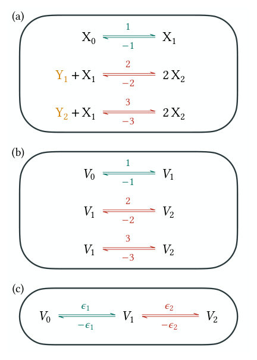
<figcaption class="paper-figure-caption"><b>Fig 1.</b> FIG. 1. Illustration of a pseudo-detailed balanced CRN. (a) A CRN interconverting the internal species {X0, X1, X2} and the chemostat- ted species {Y1, Y2} (in amber) via the reactions {±1, ±2, ±3}. (b) Graph of complexes obtained by identifying the complexes 𝑉0 = X0, 𝑉1 = X1, 𝑉2 = 2 X2. (c) Graph of complexes where the reactions are aggregated in lumped reactions. The reactions 1 and −1 (in teal) correspond to the lumped reactions 𝜖1 = (𝑉0,𝑉1) and −𝜖1 = (𝑉1,𝑉0), respectively. The reactions {2, 3} and {−2, −3} (in red) correspond to the lumped reactions 𝜖2 = (𝑉1,𝑉2) and −𝜖2 = (𝑉2,𝑉1), respec- tively. Crucially, the cycle corresponding to the sequence of reac- tions {2, −3} (or,...</figcaption>
</figure>
<figure class="paper-figure-card">
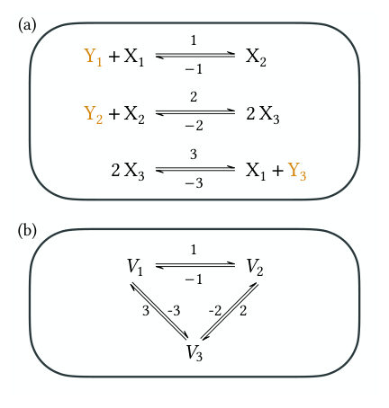
<figcaption class="paper-figure-caption"><b>Fig 2.</b> FIG. 2. Illustration of a complex balanced CRN. (a) A CRN inter- converting the internal species {X1, X2, X3} and the chemostatted species {Y1, Y2, Y3} (in amber) via the reactions {±1, ±2, ±3}. (b) Graph of complexes obtained by identifying the complexes 𝑉1 = X1, 𝑉2 = X2, and 𝑉3 = 2 X3. Crucially, the only cycle of the CRN in (a) corresponding to the sequence of reactions {1, 2, 3} (or, equivalently, {−1, −2, −3}) is the loop featuring the graph of complexes in (b).</figcaption>
</figure>

**Summary.** This paper establishes a general theoretical method using a kinetic potential to determine when diffusion reaches equilibrium in complex reaction-diffusion systems. It proves that equilibration occurs if the system's underlying chemical network possesses specific topological properties (pseudo-detailed or complex balance) and satisfies associated flux constraints. This work advances non-equilibrium statistical mechanics by providing necessary conditions for steady-state homogeneity.

**Why it may be interesting.** While focused on classical non-equilibrium thermodynamics, the rigorous mathematical framework involving Lyapunov functions and detailed balance conditions is highly relevant to understanding steady states in open quantum systems or complex chemical dynamics.

Detailed structure

**Main problem.** To develop a general method determining when diffusion necessarily equilibrates in non-ideal reaction-diffusion (RD) systems driven by autonomous chemostats.

**Main result.** Diffusion equilibration is proven for RD systems whose underlying Chemical Reaction Network (CRN) is either pseudo-detailed balanced or complex balanced, provided specific constraints on the reaction fluxes are met.

**Method.** The method constructs a kinetic potential acting as a Lyapunov function to analyze the time evolution of system free energy and entropy production rates.

**Model / system.** Open, non-ideal RD systems in solution at constant T and V, governed by deterministic equations incorporating diffusion, chemical reactions, and external chemostat exchange. The analysis heavily utilizes Chemical Reaction Network (CRN) theory.

**Key observables.** Entropy production rates ($\sum_{	ext{rct}} [\mathbf{c}]$ and $\sum_{	ext{diff}} [\mathbf{c}]$), the kinetic potential ($\hat{F}[\mathbf{c}]$), and the chemical work rate ($\mathcal{W}_{	ext{chm}}$).

**Important parameters / regimes.** Temperature (T), volume (V), and the stoichiometric properties of the reaction network.

**Assumptions / limitations.** The analysis is performed in the macroscopic limit. Initial assumptions regarding chemostatted species being ideal are relaxed throughout the work.

**Figures summary.** Figure 1 illustrates a pseudo-detailed balanced CRN, while Figure 2 illustrates a complex balanced CRN, relating network cycles to chemical graph loops.

**Paper structure.** The paper proceeds by detailing the basic setup (Section II), introducing topological classifications of CRNs (Section III), deriving the main results based on these classes (Section IV), and concluding with discussions and comparisons (Section V).

Abstract

We develop a general method, based on the construction of a kinetic potential acting as a Lyapunov function, to establish when diffusion necessarily equilibrates in non-ideal reaction-diffusion systems, under arbitrary driving by autonomous homogeneous chemostats. Using this method, we generalize the results of J. Chem. Phys. 161, 174108 (2024) by relaxing some of the underlying assumptions. Specifically, we show that diffusion equilibrates in reaction-diffusion systems whose chemical reaction network is either pseudo-detailed balanced, with reaction fluxes controlled by the stoichiometry of reactants and products, or complex balanced, with reaction fluxes controlled only by the stoichiometry of the reactants. The different constraints on the reaction fluxes are shown to originate from the distinct stoichiometric properties of the two classes of networks.

[↑ back to top](#top)

### [On stochastic realism and CP bias in diffractive dissociations](http://arxiv.org/abs/2607.06152v1)

**Authors:** A. Y. Klimenko  
**Type:** theory · **Category:** statistical mechanics · **PDF:** <https://arxiv.org/pdf/2607.06152v1>  
**Analysis basis:** full PDF text, analyzed in chunks
**Topic relevance:** `Keldysh / 2PI / non-Gaussian methods` **3/5** · `correlated / nonlocal dissipation` **3/5** · `driven-dissipative phase transition` **3/5** · `methods for driven-dissipative` **3/5** · `non-equilibrium dynamics` **2/5** · `non-equilibrium universality` **2/5** · `measurement-induced transitions` **1/5** · `quantum measurements` **1/5**

↔ Scroll figures horizontally

<figure class="paper-figure-card">
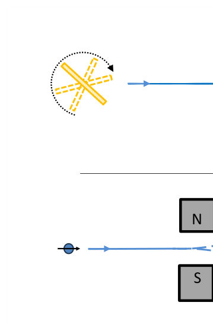
<figcaption class="paper-figure-caption"><b>Fig 1.</b> Figure 1. Stochastic epistemicism illustrated by coin toss and stochastic realism illustrated by wave function collapse</figcaption>
</figure>
<figure class="paper-figure-card">
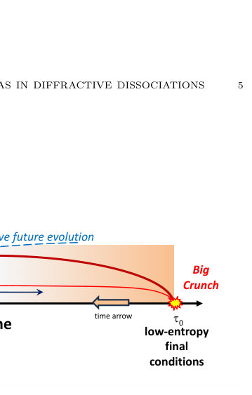
<figcaption class="paper-figure-caption"><b>Fig 2.</b> Figure 2. Schematic of dual temporal boundary conditions im- posed on the universe. The dashed line shows an alternative evo- lution without final conditions (or with more remote final condi- tions). Large arrows indicate local time arrows, while lines with arrows show systems travelling into “antiworld” and antisystems emerging in our time window.</figcaption>
</figure>
<figure class="paper-figure-card">
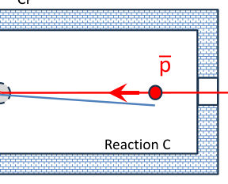
<figcaption class="paper-figure-caption"><b>Fig 3.</b> Figure 3. Proton–antiproton collisions producing diffractive dis- sociation reactions (B) and (C), shown as CP transformations of one another.</figcaption>
</figure>
<figure class="paper-figure-card">
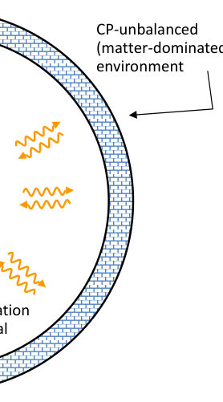
<figcaption class="paper-figure-caption"><b>Fig 4.</b> Figure 4. A quantum system placed within matter-dominated surroundings and interacting with its environment through a radi- ation bath.</figcaption>
</figure>

**Summary.** This work investigates the apparent nature of CP violation observed in particle collisions by modeling the system as an open quantum system. It develops a framework using stochastic realism to distinguish between fundamental symmetry breaking and effects arising from environmental interactions or intrinsic randomness. The paper concludes that while time asymmetry is mathematically permitted, further experiments are needed to pinpoint the exact physical source of any measured bias.

**Why it may be interesting.** It provides a deep theoretical link between fundamental symmetries (CPT) and emergent phenomena in complex, non-equilibrium systems, which is crucial for understanding measurement processes in AMO physics.

Detailed structure

**Main problem.** The paper interprets the observed CP bias in proton–antiproton diffractive dissociation by analyzing how symmetries are affected when quantum evolution is non-unitary.

**Main result.** The observed CP bias is argued to be apparent, stemming from non-unitary effects (intrinsic stochasticity or environmental interactions) rather than fundamental violations of CP symmetry arising from unitary dynamics.

**Method.** The analysis combines philosophical frameworks (stochastic realism vs. epistemicism) with rigorous quantum mechanical treatments of open systems using Redfield equations and stochastic differential equations.

**Model / system.** The primary system is proton–antiproton diffractive dissociation, analyzed through the lens of open quantum systems interacting with environmental baths or undergoing intrinsic stochastic evolution.

**Key observables.** Statistically significant CP bias in cross-section ratios and dephasing rates; comparison between fundamental (unitary) vs. apparent (non-unitary) symmetry violations.

**Important parameters / regimes.** The distinction between unitary Hamiltonian dynamics and non-unitary contributions from environmental or intrinsic stochasticity.

**Assumptions / limitations.** It assumes that the observed bias can be modeled by considering both environmental coupling (radiation bath) and inherent system randomness, while also utilizing concepts like CPT invariance constraints.

**Figures summary.** Figure 1 contrasts stochastic epistemicism with stochastic realism; Figure 2 schematically illustrates dual temporal boundary conditions for time-asymmetry analysis.

**Paper structure.** The paper moves from interpreting the observed CP bias using philosophical lenses, to analyzing general time asymmetry in stochastic systems (dual boundaries), and finally applying these concepts to open quantum system dynamics via Redfield equations to determine symmetry preservation under decoherence.

Abstract

CP bias in proton--antiproton diffractive dissociation can be viewed from several philosophical perspectives, notably stochastic realism and stochastic epistemicism. When combined with the presumption of temporal symmetry, stochastic realism suggests that the laws of physics allow the possibility of thermodynamic antisystems, although whether antisystemic characteristics can be physically realised in nature remains an open question.   Here, this bias is interpreted as apparent, indicating significant non-unitary contributions and a distinction from fundamental CP violations arising from unitary Hamiltonian dynamics. Such apparent effects may arise from intrinsic stochasticity, from environmental interactions, or from interference between the two. This work investigates the relevant mechanisms and determines conditions for creating, transmitting, or screening a CP bias.   In the environmental branch, an equilibrated radiation bath may transmit a CP bias from matter-dominated surroundings, although causality constraints may limit this possibility. In the intrinsic branch, the observed bias is consistent with subleading antisystemic effects required by CPT invariance. Further experiments are needed to distinguish between these mechanisms.

[↑ back to top](#top)

### [Reduced Quantum-Reference-Frame Channels for Open Quantum Systems](http://arxiv.org/abs/2607.05578v1)

**Authors:** Paolo Luppi, Viktoria Kabel, Flaminia Giacomini, Andrea Smirne  
**Type:** theory · **Category:** other · **PDF:** <https://arxiv.org/pdf/2607.05578v1>  
**Analysis basis:** full PDF text, analyzed in chunks
**Topic relevance:** `correlated / nonlocal dissipation` **3/5** · `measurement-induced transitions` **3/5** · `methods for driven-dissipative` **3/5** · `Keldysh / 2PI / non-Gaussian methods` **2/5** · `non-equilibrium dynamics` **2/5** · `quantum measurements` **2/5** · `driven-dissipative phase transition` **1/5** · `entanglement & information structure` **1/5** · `non-equilibrium universality` **1/5**

↔ Scroll figures horizontally

<figure class="paper-figure-card">
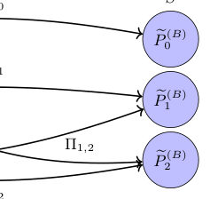
<figcaption class="paper-figure-caption"><b>Fig 1.</b> Figure 1: Block preservation. A block population p(B) n in frame B may receive contributions from different blocks m of S in frame A, with the dependence on inaccessible degrees of freedom encoded in the effects Πnm. Inter-block coherences of S in frame A do not contribute to these populations. A one-to-one permutation correspondence between input and output blocks gives the stronger condition of strong block-preservation. Edges are illustrative.</figcaption>
</figure>
<figure class="paper-figure-card">
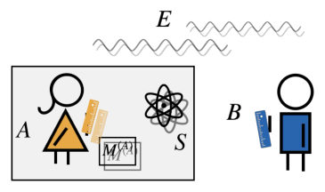
<figcaption class="paper-figure-caption"><b>Fig 2.</b> Figure 2: Same physical interferometer. Alice performs a Ramsey experiment M (A) on system S. Bob has access to A’s phase record and outcomes and describes the same physical interferometer from his point of view. The operational Ramsey visibility (and the associated rate) is frame-invariant: γ(B | access A) nm = γ(A) nm. The shadowed images represent possible superpositions of relative configurations between the systems and the reference frame.</figcaption>
</figure>
<figure class="paper-figure-card">
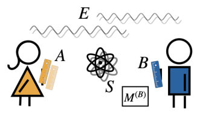
<figcaption class="paper-figure-caption"><b>Fig 3.</b> Figure 3: Local Ramsey (different phase standards). Observers Alice and Bob perform Ramsey experiments M (A) resp. M (B) using their own phase references A and B. The inferred decoherence rates can differ. In the Hamiltonian-symmetric regime, the difference is captured by a frame factor, i.e. VB(t) = |Fnm(t)| VA(t).</figcaption>
</figure>
<figure class="paper-figure-card">
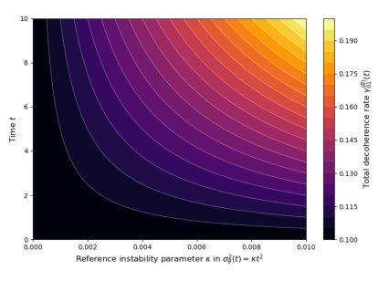
<figcaption class="paper-figure-caption"><b>Fig 4.</b> Figure 4: Reference-induced contributions to the locally inferred decoherence rate in the gravity-motivated pure- dephasing case study. Left: for linear phase-reference degradation, σ2 θ(t) = ΓBt, the reference adds a constant contribution γfr 01 = ΓB/2, so that γ(B) 01 = γ(A) 01 + γfr 01. Right: for ballistic phase spreading, σ2 θ(t) = κBt2, the reference-induced contribution is time dependent, γfr 01(t) = κBt, and the inferred rate grows with both time and the instability parameter κB.</figcaption>
</figure>
<figure class="paper-figure-card">
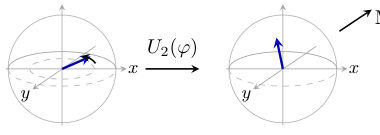
<figcaption class="paper-figure-caption"><b>Fig 5.</b> Figure 5: Ramsey protocol on the effective qubit {|n⟩, |m⟩} (σ(nm) z = |n⟩⟨n| −|m⟩⟨m|). The pulses U1, U2(φ) and the free evolution Ufree,SE(t) map the coherence ρnm onto a measurable population imbalance; the transverse Bloch-vector length equals the Ramsey visibility Vnm = 2|ρnm|, from which the decoherence rate is obtained.</figcaption>
</figure>

**Summary.** This paper develops a theory for describing open quantum systems when viewed from different Quantum Reference Frames (QRFs). It introduces 'reduced QRF channels' to account for inaccessible degrees of freedom. The key finding is that decoherence rates can be mathematically split into contributions arising separately from the environment and the reference frame itself.

**Why it may be interesting.** This work is highly relevant as it provides a rigorous theoretical framework for understanding how environmental coupling and measurement context (the reference frame) fundamentally alter the perceived dynamics of quantum systems, which has implications for quantum sensing and gravity.

Detailed structure

**Main problem.** The paper investigates which dynamical properties of open quantum systems remain invariant when viewed from a different Quantum Reference Frame (QRF). It addresses the fundamental question of subsystem relativity in quantum dynamics.

**Main result.** It derives reduced quantum-reference-frame channels and shows that decoherence rates can split into distinct environmental and reference-induced contributions, which is operationally testable via Ramsey interferometry.

**Method.** The analysis employs a formal framework involving QRF transformations, partial tracing over inaccessible degrees of freedom (environment/reference frame), and characterizing the resulting reduced quantum channels.

**Model / system.** The study models open quantum systems interacting with an environment, extending to include reference frames. Specific applications include pure-dephasing dynamics and a gravity-motivated dephasing model.

**Key observables.** Reduced entropy conservation law, decoherence rates (split into environmental and reference-induced parts), population preservation conditions, and Ramsey visibility.

**Important parameters / regimes.** The structure of the QRF symmetry representation; the nature of the coupling between system, environment, and reference frame.

**Assumptions / limitations.** The analysis relies on the perspectival approach to QRFs and assumes that only operationally accessible degrees of freedom are retained after tracing out inaccessible ones.

**Figures summary.** Figure 5 illustrates a Ramsey interferometer protocol implemented on an effective qubit subspace, showing how outcome probabilities and decoherence rates can be calculated in different reference frames.

**Paper structure.** The paper first establishes the general framework for QRF transformations in open systems. It then characterizes the reduced channels, derives conservation laws, applies these concepts to pure dephasing dynamics (showing rate splitting), and concludes with an illustration using a gravity-motivated model.

Abstract

When reference frames are treated quantum mechanically, the subsystem structure of quantum systems is no longer absolute, but depends on the choice of the quantum reference frame (QRF). This raises a basic question: which dynamical properties are preserved across QRFs, and which depend on the physical reference used to define the system? We study this question in the general setting of open quantum systems. At the operational level, after a QRF transformation, the old reference frame and environmental degrees of freedom may be inaccessible and must therefore be traced out. This motivates the definition of reduced quantum-reference-frame channels: maps that connect the joint description in one frame to the accessible subsystem in another. We characterize their symmetry-constrained structure and define a regime in which a reduced entropy-coherence conservation law holds. We also identify when the induced reduced action on the open system admits a classical interpretation as random frame misalignment, and when it instead reflects quantum reduced-frame effects. We then apply the framework to pure-dephasing dynamics and derive a necessary and sufficient compatibility condition for population preservation. When the frame symmetry commutes with the open system's free Hamiltonian, coherences acquire a multiplicative frame factor, so that locally inferred decoherence rates split into environmental and reference-induced contributions. Ramsey interferometry gives this split a direct operational meaning. Finally, a gravity-motivated dephasing model illustrates how degradation of a phase reference can mimic signatures usually attributed to intrinsic decoherence mechanisms.

[↑ back to top](#top)

### [2D Transport in an in-plane magnetic field](http://arxiv.org/abs/2607.06561v1)

**Authors:** Aryaman Babbar, Sankar Das Sarma  
**Type:** theory · **Category:** disordered systems and neural networks · **PDF:** <https://arxiv.org/pdf/2607.06561v1>  
**Analysis basis:** full PDF text, analyzed in chunks
**Topic relevance:** `Keldysh / 2PI / non-Gaussian methods` **3/5** · `spintronics-quantum-optics interface` **3/5** · `analog quantum simulation` **2/5** · `driven-dissipative phase transition` **2/5** · `methods for driven-dissipative` **2/5** · `Kondo & dissipative impurity` **1/5** · `exotic spin models in light-matter` **1/5** · `non-equilibrium dynamics` **1/5** · `non-equilibrium universality` **1/5**

↔ Scroll figures horizontally

<figure class="paper-figure-card">
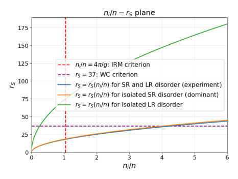
<figcaption class="paper-figure-caption"><b>Fig 1.</b> FIG. 1: The horizontal and vertical lines represent the WC and IRM criterion respectively. We plot rS as a function of ni/n for the experiment [21, 22]. The various curves in the figure indicate how changing carrier density in a sample tunes interaction (rS) and disorder (ni/n) with the top green curve indicating the highest quality sample and the lower curves (blue and orange) indicating lower quality samples of higher impurity density.</figcaption>
</figure>
<figure class="paper-figure-card">
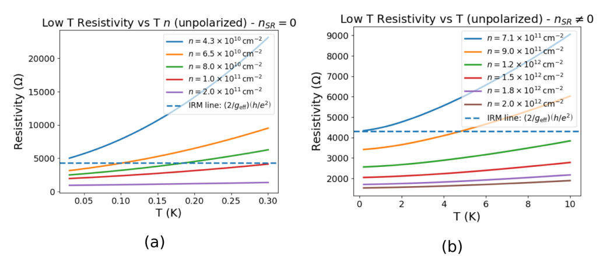
<figcaption class="paper-figure-caption"><b>Fig 2.</b> FIG. 2: B = 0 resistivities for varying n (a) Resistivity at B = 0 (nSR = 0) and (b) Resistivity at B = 0 (nSR ̸= 0).</figcaption>
</figure>
<figure class="paper-figure-card">
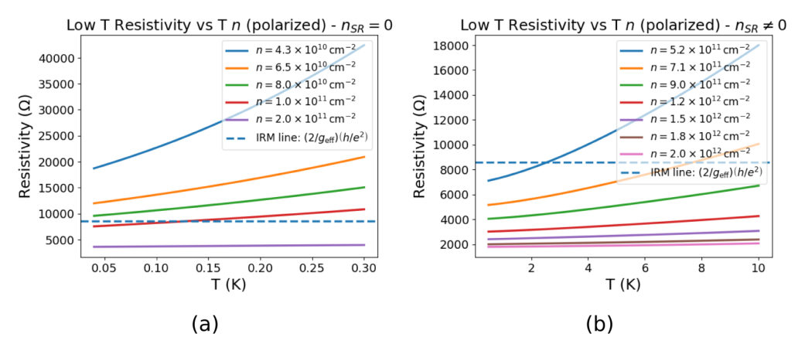
<figcaption class="paper-figure-caption"><b>Fig 3.</b> FIG. 3: Resistivities for varying n when B is just enough to polarize all n at T = 0 (a) Resistivity when B is just enough to polarize all n at T = 0 (nSR = 0) and (b) Resistivity when B is just enough to polarize all n at T = 0 (nSR ̸= 0).</figcaption>
</figure>
<figure class="paper-figure-card">
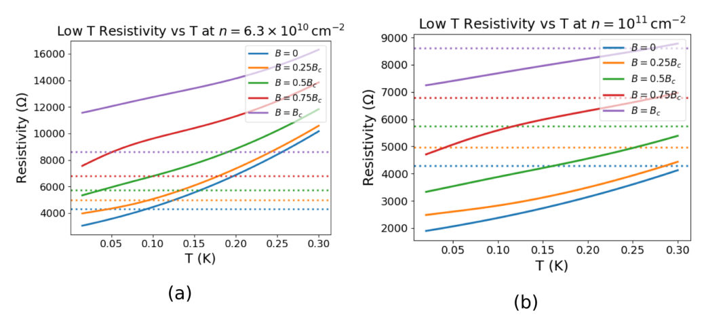
<figcaption class="paper-figure-caption"><b>Fig 4.</b> FIG. 4: ρ for B = 0, Bc/4, Bc/2, 3Bc/4, Bc for (a) n = 6.3 × 1010 cm−2 (b) n = 1011 cm−2, with the corresponding IRM criterion for each B. The solid curves represent ρ(T) for each B and the dotted lines of the same color give the corresponding IRM criterion  ρ =  h/e2 (2/geff)  .</figcaption>
</figure>
<figure class="paper-figure-card">
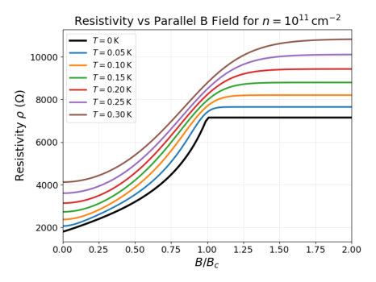
<figcaption class="paper-figure-caption"><b>Fig 5.</b> FIG. 6: ρ (B) for various fixed low T for n = 1011 cm−2 and nLR = 1.6 × 1011 cm−2.</figcaption>
</figure>

**Summary.** This paper develops a theoretical framework to use an in-plane magnetic field to distinguish between Wigner crystallization and Anderson localization as the cause of a 2D metal-insulator transition. By analyzing how the critical density changes with the applied field, the authors show that the dependence reveals whether disorder or electron correlation dominates the insulating state.

**Why it may be interesting.** The work provides a clear diagnostic tool using external fields ($B$) to probe the fundamental nature (disorder vs. correlation) of an electronic phase transition, which is highly relevant for understanding strongly correlated and disordered quantum materials.

Detailed structure

**Main problem.** The primary goal is to distinguish between two competing mechanisms—Wigner crystallization (WC) or Anderson localization—responsible for the density-tuned Metal-Insulator Transition (MIT) in 2D electron systems.

**Main result.** Applying a parallel in-plane magnetic field ($B_{||}$) allows differentiation: if the critical density changes with $B$, it suggests disorder-driven localization; if it remains unchanged, it favors WC pinning.

**Method.** The authors develop general theory using Random Phase Approximation (RPA) and Boltzmann transport equations to calculate spin-polarized conductivity ($\sigma$) under an in-plane field.

**Model / system.** The system is a 2D doped semiconductor layer with parabolic dispersion, subjected to an in-plane magnetic field that lifts the spin degeneracy via Zeeman coupling. The analysis compares theoretical predictions for WC and Anderson localization criteria.

**Key observables.** Critical density ($n_{MIT}$), resistivity ($
ho$) as a function of $B$ and carrier density ($n$), and the effective degeneracy ($g_{	ext{eff}}$).

**Important parameters / regimes.** In-plane magnetic field strength ($B_{||}$), disorder type (short-range vs. long-range Coulomb impurities), and dimensionless Wigner-Seitz radius ($r_S$).

**Assumptions / limitations.** The analysis assumes the in-plane field only couples via Zeeman coupling, neglecting orbital effects; approximations like strong screening ($\Pi_0$) are used for calculations.

**Figures summary.** Figures illustrate resistivity vs. $n$ at various fields and disorder strengths, comparing calculated $
ho(B)$ curves against the Ioffe-Regel-Mott (IRM) localization criterion boundary.

**Paper structure.** The paper builds from establishing the theoretical framework for spin polarization effects on screening to deriving transport equations that yield a field dependence of resistivity ($
ho(B)$), which is then used diagnostically to distinguish between WC and Anderson MIT mechanisms based on how $n_{MIT}$ responds to $B$.

Abstract

A parallel in-plane magnetic field could, in principle, distinguish between two competing physical scenarios for the experimentally observed density-tuned 2D metal-insulator transition (where decreasing the carrier density leads to a crossover from an effective metal to an effective insulator): Wigner crystallization or Anderson localization. Since the main scattering mechanism in 2D doped semiconductors arises from screened random charged impurities and screening in turn depends on the electronic density of states, the in-plane magnetic field could distinguish between the two by decreasing screening through spin polarization and this enhances the effective critical density for Anderson localization compared with Wigner crystallization. We give the general theory and provide results for the quantitative magnitudes of the spin polarization effect on the transition density by focusing on two recent experiments [Z. Ge, et al, arXiv:2510.12009, T. Han, et al, arXiv:2604.00113], noting that the critical density may actually decrease if the dominant scattering is by short-ranged defects instead of long-ranged charged impurities. The difference between the two cases arises from whether spin polarization dominates screening (enhanced critical density) or the Fermi surface (suppressed critical density).

[↑ back to top](#top)

### [Conditional Residence Times and Sequential Transition Dynamics of an Overdamped Dimere](http://arxiv.org/abs/2607.06110v1)

**Authors:** Dhruv Agrawal, W. L. Reenbohn  
**Type:** theory · **Category:** statistical mechanics · **PDF:** <https://arxiv.org/pdf/2607.06110v1>  
**Analysis basis:** full PDF text, analyzed in chunks
**Topic relevance:** `driven-dissipative phase transition` **3/5** · `methods for driven-dissipative` **3/5** · `non-equilibrium dynamics` **3/5** · `non-equilibrium universality` **2/5** · `Frenkel-Kontorova` **1/5** · `Keldysh / 2PI / non-Gaussian methods` **1/5** · `analog quantum simulation` **1/5** · `correlated / nonlocal dissipation` **1/5**

↔ Scroll figures horizontally

<figure class="paper-figure-card">
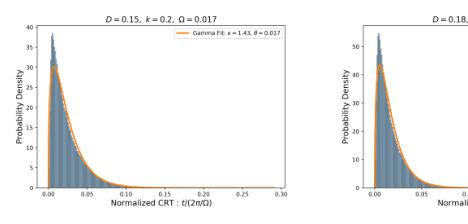
<figcaption class="paper-figure-caption"><b>Fig 1.</b> FIG. 1: Conditional residence time distribution for k = 0.2 and Ω= 0.017</figcaption>
</figure>
<figure class="paper-figure-card">
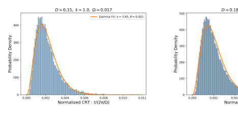
<figcaption class="paper-figure-caption"><b>Fig 2.</b> FIG. 2: Conditional residence time distribution for k = 1.0 and Ω= 0.017.</figcaption>
</figure>
<figure class="paper-figure-card">
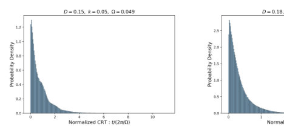
<figcaption class="paper-figure-caption"><b>Fig 3.</b> FIG. 3: Conditional residence time distribution for k = 0.05 and Ω= 0.049.</figcaption>
</figure>
<figure class="paper-figure-card">
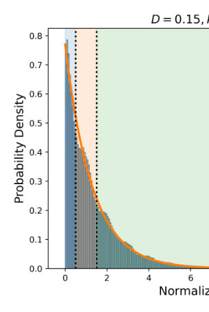
<figcaption class="paper-figure-caption"><b>Fig 4.</b> FIG. 4: CRT distribution showing different windows of transition</figcaption>
</figure>
<figure class="paper-figure-card">
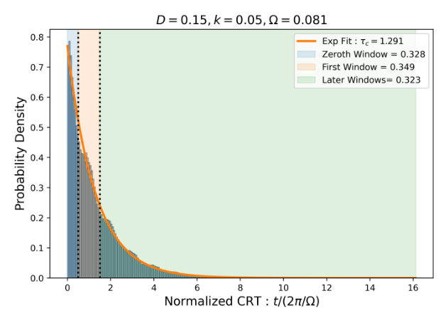
<figcaption class="paper-figure-caption"><b>Fig 5.</b> Fig. 4 shows the different regions of transition. We have calculated the probability that</figcaption>
</figure>

**Summary.** This work analyzes how two coupled particles (a dimer) transition across a barrier under external periodic driving and thermal noise. By introducing the Conditional Residence Time (CRT), the authors show that the time delay between the two monomers crossing the barrier is highly sensitive to the drive frequency. This establishes CRT as a key measure for understanding sequential, rate-limiting steps in coupled stochastic systems.

**Why it may be interesting.** While focused on classical stochastic dynamics, the concept of analyzing sequential transitions (initiation vs. completion) using a specialized time delay metric like CRT is highly relevant to understanding decoherence or multi-step quantum tunneling processes in open quantum systems.

Detailed structure

**Main problem.** The study investigates the completion dynamics of an overdamped dimer moving in a bistable potential under thermal fluctuations and a weak periodic force.

**Main result.** The mean Conditional Residence Time (CRT) exhibits a non-monotonic dependence on the external drive frequency, demonstrating that transition initiation and completion are distinct sequential processes.

**Method.** The authors use the Conditional Residence Time (CRT) as a diagnostic tool to quantify the delay between successive barrier crossings of two coupled monomers.

**Model / system.** The system is an overdamped dimer modeled by coupled Langevin equations in a one-dimensional double well potential, incorporating harmonic and Lennard-Jones interactions, thermal noise, and a weak sinusoidal external force.

**Key observables.** Conditional Residence Time (CRT), Mean First Passage Times (MFPTs), Escape rates, Probability distributions of transition windows.

**Important parameters / regimes.** Coupling strength ($k$), external drive frequency ($\Omega$), Noise strength ($D$), and the competition between escape times and the driving period.

**Assumptions / limitations.** The analysis assumes that the process can be partitioned into distinct time windows (immediate, first cycle, later cycles) to analyze sequential dynamics.

**Figures summary.** Figures illustrate CRT distributions for varying coupling strengths and drive frequencies, showing how the mean CRT changes non-monotonically with $\Omega$, especially in the weak coupling regime.

**Paper structure.** The paper introduces the physical model and Langevin equations, defines the CRT diagnostic tool, analyzes the dynamics by partitioning the process into three time windows, and concludes by establishing CRT's utility for sequential barrier crossing analysis.

Abstract

We investigate the completion dynamics of an overdamped dimer moving in a bistable potential under thermal fluctuations and a weak periodic force. Both monomers start in one of the two wells separated by a barrier. The transition is initiated when the monomer closer to the barrier makes a jump across it. The completion dynamics refers to the next part of the dynamics where the second monomer has to wait for some time before it can follow up. We use the Conditional Residence Time (CRT) to study the delay between the successive barrier crossing of the two monomers. The CRT distributions highlight qualitatively different regimes formed by the competition between the escape times of the lagging monomer and the time period of the external drive. The effect is strongest in the weak coupling regime where the delayed completion is spread across multiple forcing cycles. By partitioning this process into three windows, i.e. the immediate, first cycle and later cycles, we show that the probability that the lagging monomer will make a transition in the said cycle is redistributed among these pathways as we change the frequency of the drive. This leads to a non-monotonic dependence of the mean CRT on the frequency of the drive. Our results demonstrate that transition initiation and completion in a coupled system are two separate processes and establish CRT as a useful measure to quantify the sequential barrier crossing dynamics in coupled stochastic systems.

[↑ back to top](#top)

### [Robust Topologically Protected Edge Transport in Doubly Chiral Active Particles](http://arxiv.org/abs/2607.06193v1)

**Authors:** Tristan Edwards, Maxim Nikolaev, Jaime Agudo-Canalejo  
**Type:** both · **Category:** statistical mechanics · **PDF:** <https://arxiv.org/pdf/2607.06193v1>  
**Analysis basis:** full PDF text, analyzed in chunks
**Topic relevance:** `driven-dissipative phase transition` **3/5** · `methods for driven-dissipative` **3/5** · `non-equilibrium dynamics` **3/5** · `non-equilibrium universality` **2/5** · `Frenkel-Kontorova` **1/5** · `Keldysh / 2PI / non-Gaussian methods` **1/5** · `analog quantum simulation` **1/5** · `correlated / nonlocal dissipation` **1/5**

↔ Scroll figures horizontally

<figure class="paper-figure-card">
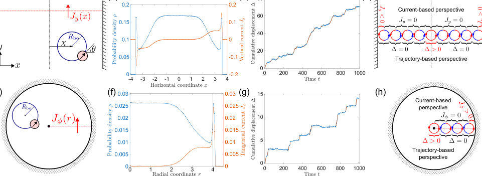
<figcaption class="paper-figure-caption"><b>Fig 1.</b> FIG. 1. Absence of edge transport in cABPs. Schematics of the (a) channel and (e) circular arena geometries. (b,f) Steady state probability density (blue) and vertical current (red) along the horizontal (channel) or radial (arena) coordinates, showing local net currents at the boundaries with the same counterclockwise chirality as the bulk orbits. (c,g) Evolution of the signed cumulative displacement in the vertical (channel) or tangential (arena) direction over time in the same simulations, which shows net drift (in the positive direction) only when the particle is within one bulk orbit radius from the channel or arena center (red segments). (d,h) Duality in the apparent origin of the...</figcaption>
</figure>
<figure class="paper-figure-card">
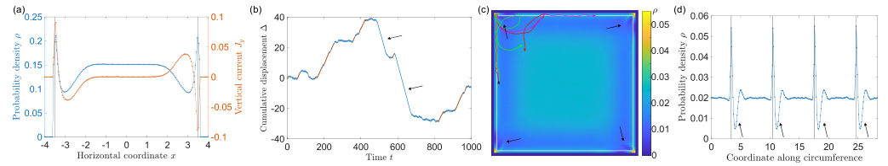
<figcaption class="paper-figure-caption"><b>Fig 2.</b> FIG. 2. Backscattering of chiral active rods or self-aligning cABPs. (a) Steady state probability density (blue) and vertical current (red) along the horizontal coordinate in channel geometry, showing local currents with opposite chirality to bulk orbits at the boundaries. (b) Evolution of the signed cumulative displacement in the vertical direction over time in the same simulation, which shows net drift in the positive direction when the particle is within one bulk orbit radius from the channel centerline (red segments) and in the negative direction when the particle enters a transport-inducing sliding mode along the boundaries (black arrows). (c) Steady state probability density in square...</figcaption>
</figure>
<figure class="paper-figure-card">
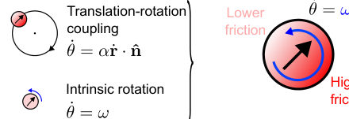
<figcaption class="paper-figure-caption"><b>Fig 3.</b> FIG. 3. (a) Discrete lattice stochastic model introduced in Ref. 25, which was shown to develop topologically protected edge currents in the regime γex &gt; γin. The internal states U,R,D,L stand for up, right, down, left. (b) External cycles in this model can be interpreted as causing simultaneous translation and rotation, and are thus analogous to translation-rotation coupling in the continuum limit. Internal cycles in the discrete model cause rotation without translation, and are thus analogous to intrinsic rotation in the continuum limit. (c) A doubly chiral ABP (dcABP) includes both sources of rotation, where translation-rotation coupling can arise from asymmetric friction. Analogy to the...</figcaption>
</figure>
<figure class="paper-figure-card">
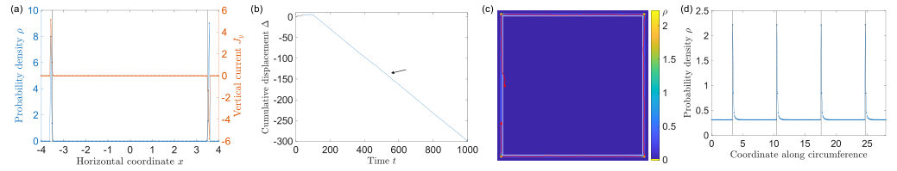
<figcaption class="paper-figure-caption"><b>Fig 4.</b> FIG. 4. Robust topologically protected edge currents in dcABPs. (a) Steady state probability density (blue) and vertical current (red) along the horizontal coordinate in channel geometry, showing strong accumulation and local currents with opposite chirality to bulk orbits at the boundaries. (b) Evolution of the signed cumulative displacement in the vertical direction over time in the same simulation, which shows net drift in the positive direction when the particle is within one bulk orbit radius from the channel centerline (red segments) and in the negative direction when the particle enters a long-lived transport-inducing sliding mode along the boundaries (black arrows). (c) Steady state...</figcaption>
</figure>
<figure class="paper-figure-card">
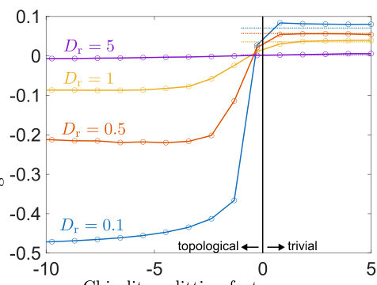
<figcaption class="paper-figure-caption"><b>Fig 5.</b> FIG. 5. Integrated current Φ obtained in stochastic simu- lations in a channel geometry, as a dcABP crosses from the trivial to the topological regime, for several values of rota- tional noise. The total angular velocity of the particle in the bulk is fixed to ωtot = 1, so that the bulk orbit radius is con- stant throughout the transition, while we set ω = ωtotχ and αv = ωtot(1−χ), where χ is a chirality splitting factor. In the trivial regime (no sliding mode, χ ≥0), Φ plateaus to the ‘spu- rious’ (non-transport-related) value given by Eq. (3) (dotted lines). In the topological regime (with sliding mode, χ &lt; 0), Φ develops opposite chirality to bulk orbits and reflects true transport. For...</figcaption>
</figure>

**Summary.** This paper introduces doubly chiral active particles (dcABPs) that exhibit a unique form of topologically protected transport along boundaries. By rigorously contrasting this behavior with simpler models, the authors establish a new physical mechanism for directed motion in active matter. The work bridges theoretical derivation, simulation, and experimental realization using vibrobots.

**Why it may be interesting.** While focused on classical active matter, the concept of 'topological protection' in non-equilibrium systems is highly relevant to understanding robust edge states in quantum materials or engineered quantum circuits where dissipation and noise are present.

Detailed structure

**Main problem.** To determine the conditions under which robust, topologically protected boundary-induced transport can occur in active particles, contrasting this with edge currents observed in simpler chiral models.

**Main result.** Doubly chiral active Brownian Particles (dcABPs) exhibit robustly protected directed motion along boundaries, unlike simple cABPs or chiral rods which either lack protection or backscatter at corners.

**Method.** The work combines theoretical analysis of steady-state probability currents with detailed numerical simulations and the design/testing of a physical vibrobot realization.

**Model / system.** The primary model is the doubly chiral active Brownian particle (dcABP), characterized by two sources of chirality: an intrinsic angular velocity and a translation-rotation coupling arising from asymmetric friction. The analysis extends to simple cABPs and chiral rods in confined geometries (channels, arenas).

**Key observables.** Edge currents ($J_y(x)$ or $J_\phi(r)$), integrated net transport ($\Phi$), and the persistence of directed motion around corners.

**Important parameters / regimes.** The relative strengths of intrinsic rotation versus translation-rotation coupling, and the presence/absence of boundary curvature are critical parameters determining topological protection.

**Assumptions / limitations.** Initial analyses often assume overdamped dynamics for cABPs; later work rigorously derives transport using stochastic averaging techniques applicable to various noise regimes.

**Figures summary.** Figures illustrate schematics comparing current distributions and cumulative displacement for different particle types (cABP vs. dcABP) in confined geometries, demonstrating the failure of simple models to achieve true boundary-induced transport.

**Paper structure.** The paper first establishes that simple cABPs do not exhibit true boundary-induced transport ($\Phi$ arises from bulk orbits). It then contrasts this with chiral rods showing backscattering. Finally, it introduces and proves the topological protection mechanism for dcABPs using theory (Appendix A) and simulation/experimentation.

Abstract

Using theory, simulation, and experiment, we introduce a new class of active particle which we term doubly chiral active Brownian particles (dcABPs), which show robust topologically protected transport along boundaries without backscattering at corners. Their double chirality stems from the coexistence of an intrinsic angular velocity, which can cause rotation independently of translation, and a translation-rotation coupling inducing cross-alignment to the instantaneous velocity, which causes rotation only concomitantly with translation. A mechanically detailed model shows that the latter effect can arise from an asymmetric friction distribution in the direction perpendicular to the self-propulsion direction. We show that topologically protected modes emerge when the two sources of chirality have opposite sign and the intrinsic rotation is weaker than the translation-rotation coupling. In the deterministic limit, we characterize the emergence of these modes not only along straight boundaries, but also along curved boundaries and during interparticle interactions. We provide a proof-of-principle experimental realization by building a doubly chiral vibrobot. While setting the work into context, we moreover show that the topologically protected boundary-induced transport of dcABPs stands in contrast to the edge currents observed for simple chiral ABPs, which we demonstrate are not associated with boundary-induced transport, as well as to those observed for chiral active rods or self-aligning chiral ABPs, which we show to be associated with boundary-induced transport but to backscatter at corners, implying lack of topological protection.

[↑ back to top](#top)

### [Free Multiplicative Convolution and Erlang Moments in Monitored Quantum Transport](http://arxiv.org/abs/2607.05693v1)

**Authors:** Joon Hyung Lee  
**Type:** theory · **Category:** statistical mechanics · **PDF:** <https://arxiv.org/pdf/2607.05693v1>  
**Analysis basis:** full PDF text, analyzed in chunks
**Topic relevance:** `Keldysh / 2PI / non-Gaussian methods` **3/5** · `non-equilibrium dynamics` **2/5** · `non-equilibrium universality` **2/5** · `analog quantum simulation` **1/5** · `correlated / nonlocal dissipation` **1/5** · `driven-dissipative phase transition` **1/5** · `entanglement & information structure` **1/5** · `measurement-induced transitions` **1/5** · `methods for driven-dissipative` **1/5** · `quantum measurements` **1/5**

↔ Scroll figures horizontally

<figure class="paper-figure-card">
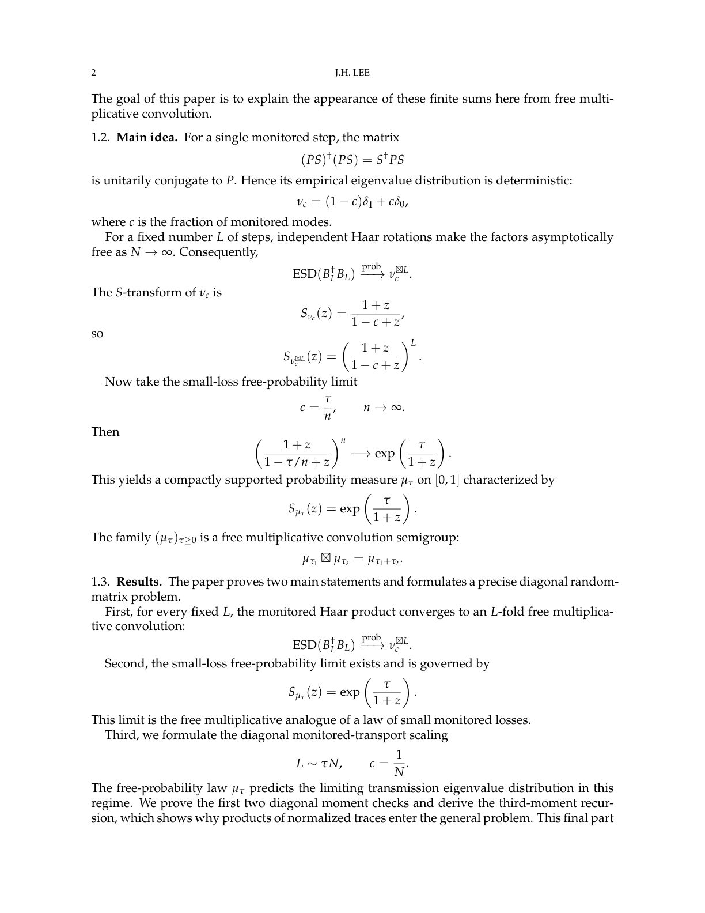
<figcaption class="paper-figure-caption"><b>Fig 1.</b> Low-resolution page preview, page 2</figcaption>
</figure>
<figure class="paper-figure-card">
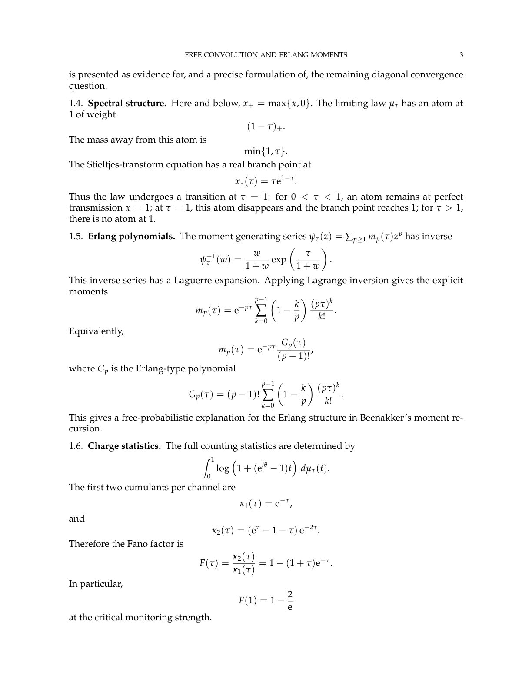
<figcaption class="paper-figure-caption"><b>Fig 2.</b> Low-resolution page preview, page 3</figcaption>
</figure>
<figure class="paper-figure-card">
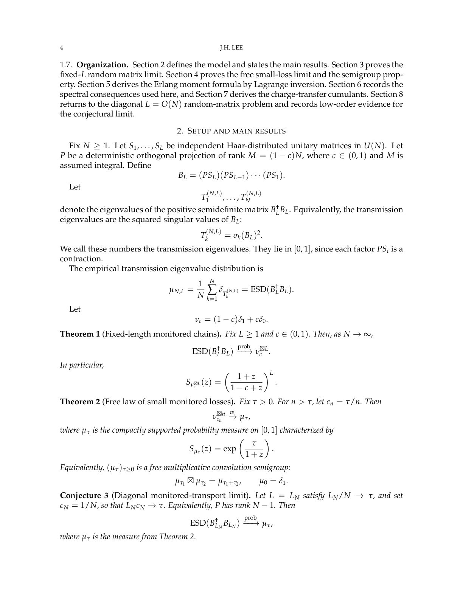
<figcaption class="paper-figure-caption"><b>Fig 3.</b> Low-resolution page preview, page 4</figcaption>
</figure>
<figure class="paper-figure-card">
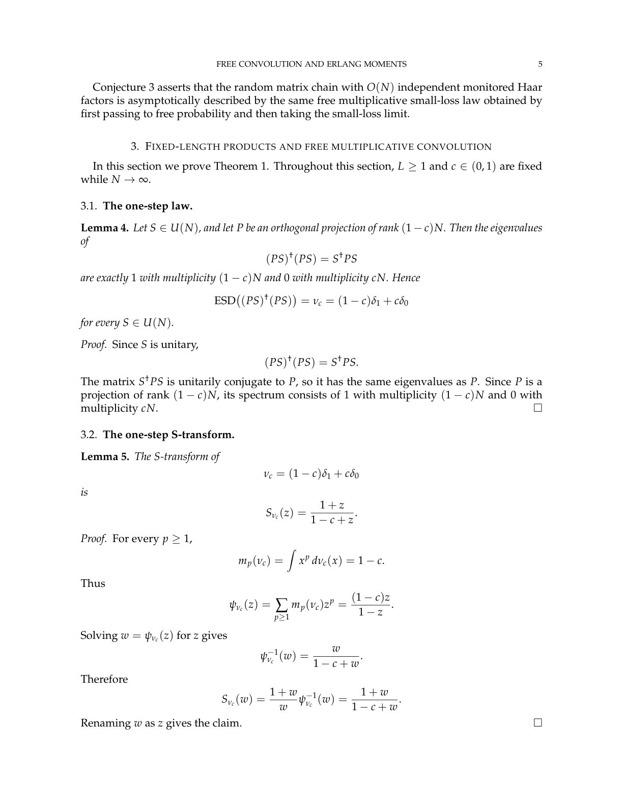
<figcaption class="paper-figure-caption"><b>Fig 4.</b> Low-resolution page preview, page 5</figcaption>
</figure>
<figure class="paper-figure-card">
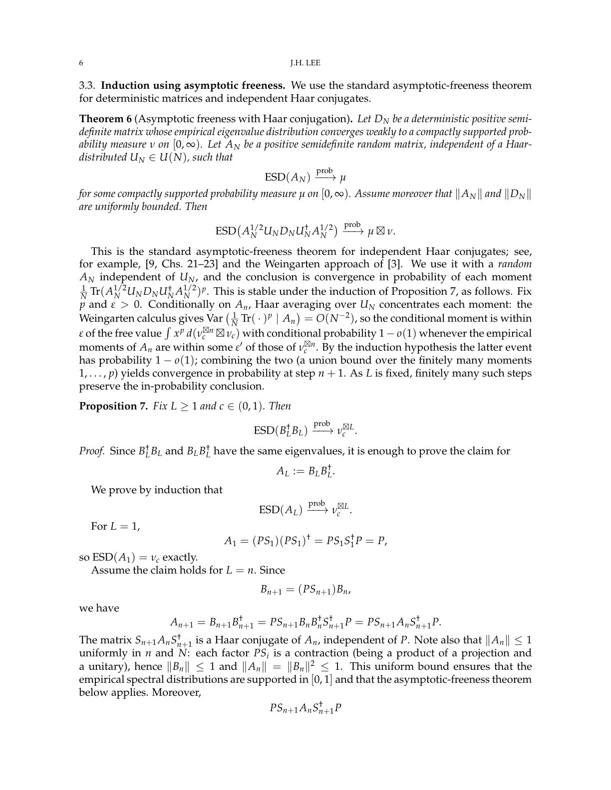
<figcaption class="paper-figure-caption"><b>Fig 5.</b> Low-resolution page preview, page 6</figcaption>
</figure>

**Summary.** This paper uses free probability theory to analyze the transmission eigenvalues in monitored quantum transport. It proves that under specific limiting conditions (the small-loss limit), the eigenvalue distribution converges to a measure $\mu_	au$ governed by an exponential S-transform. This reveals underlying algebraic structures, such as the semigroup property of the limiting process.

**Why it may be interesting.** The connection between random matrix theory (Haar unitaries) and free probability tools provides a powerful framework for analyzing transport phenomena in mesoscopic systems, which is relevant to open quantum systems dynamics.

Detailed structure

**Main problem.** To determine the limiting distribution and associated moments for transmission eigenvalues in a monitored quantum transport system undergoing repeated free multiplicative convolutions.

**Main result.** The empirical eigenvalue distribution converges to $\mu_	au$, characterized by the S-transform $S_{\mu_	au}(z) = \exp\left(rac{	au}{1+z}
ight)$, which exhibits a semigroup property ($\mu_{	au_1} oxtimes \mu_{	au_2} = \mu_{	au_1+	au_2}$).

**Method.** The analysis heavily relies on Free Probability Theory, utilizing S-transforms and applying Lagrange inversion to derive explicit formulas for the moments and cumulants of the limiting measure.

**Model / system.** The model is monitored quantum transport described by a chain of Kraus operators $B_L = (PS_L)\cdots(PS_1)$, where $S_i$ are independent Haar unitaries and $P$ is a projection. The eigenvalues of $B^\dagger_L B$ represent the transmission eigenvalues.

**Key observables.** Transmission eigenvalues, empirical eigenvalue distribution ($	ext{ESD}$), charge-transfer cumulants ($\kappa_r(	au)$), and Fano factor ($F(	au)$).

**Important parameters / regimes.** Number of steps $L$, monitoring fraction $c$, and the small-loss limit parameter $	au$. Key regimes include fixed-$L$ and diagonal scaling ($L \sim 	au N, c=1/N$).

**Assumptions / limitations.** The convergence of empirical spectral distributions to the limiting measure $\mu_	au$ is assumed or proven in specific limits.

**Paper structure.** The paper first establishes the fixed-$L$ limit using free multiplicative convolution, then analyzes the small-loss limit ($	ext{Theorem 2}$) to find the limiting measure $\mu_	au$. Finally, it investigates the diagonal scaling regime by calculating higher-order cumulants and confirming moment convergence.

Abstract

We study the transmission eigenvalues of monitored Haar products \[   B_L=(PS_L)(PS_{L-1})\cdots(PS_1), \] where the $S_i$ are independent Haar unitaries and $P$ is a deterministic projection. For fixed $L$, we prove that the empirical eigenvalue distribution of $B_L^\dagger B_L$ converges to $ν_c^{\boxtimes L}$, where $ν_c=(1-c)δ_1+cδ_0$. We then take the free small-loss limit and identify the limiting law by \[   S_{μ_τ}(z)=\exp\left(\fracτ{1+z}\right). \] Lagrange inversion gives explicit Erlang-type moments, explaining the polynomials appearing in Beenakker's recursion. We also record spectral consequences, including the atom $μ_τ(\{1\})=(1-τ)_+$ and the real branch point $τ\mathrm{e}^{1-τ}$, and formulate the diagonal scaling $L\simτN$, $c=1/N$, as a quantitative convergence problem supported by low-order moment checks.

[↑ back to top](#top)

### [Modern view of activated rate processes: unidirectional fluxes at equilibrium, correlation functions, and splitting probabilities](http://arxiv.org/abs/2607.05672v1)

**Authors:** Alexander M. Berezhkovskii, Kevin Song, Dmitrii E. Makarov  
**Type:** theory · **Category:** statistical mechanics · **PDF:** <https://arxiv.org/pdf/2607.05672v1>  
**Analysis basis:** full PDF text, analyzed in chunks
**Topic relevance:** `Keldysh / 2PI / non-Gaussian methods` **3/5** · `methods for driven-dissipative` **3/5** · `non-equilibrium dynamics` **3/5** · `non-equilibrium universality` **2/5** · `correlated / nonlocal dissipation` **1/5** · `driven-dissipative phase transition` **1/5** · `quantum measurements` **1/5**

↔ Scroll figures horizontally

<figure class="paper-figure-card">
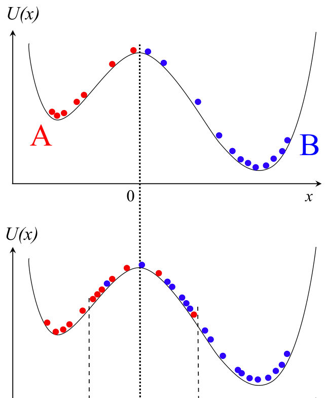
<figcaption class="paper-figure-caption"><b>Fig 1.</b> Figure 1. Mapping of continuous dynamics in a potential of mean force U(x) onto two states. Each</figcaption>
</figure>
<figure class="paper-figure-card">
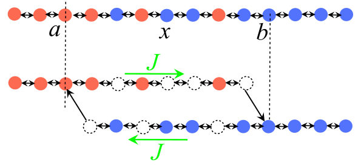
<figcaption class="paper-figure-caption"><b>Fig 2.</b> Figure 2. Classifying individual members of the equilibrium ensemble into two types, A and B.</figcaption>
</figure>

**Summary.** This perspective paper rigorously re-derives the theory of activated rate processes, showing how continuous Brownian motion maps onto discrete chemical kinetics. It resolves ambiguities in defining reaction rates by introducing a concept of unidirectional flux based on trajectory history rather than simple spatial partitioning. This provides a unified and robust theoretical tool for studying barrier crossing phenomena.

**Why it may be interesting.** This work provides advanced theoretical tools for calculating rates in complex systems where dynamics are governed by free energy landscapes, which is foundational knowledge for understanding relaxation processes in many quantum or mesoscopic physical systems.

Detailed structure

**Main problem.** The paper aims to develop a rigorous theoretical framework for mapping continuous, diffusive dynamics (like Brownian motion) onto discrete-state chemical kinetics describing activated barrier crossing.

**Main result.** It establishes that the rate constant can be calculated robustly by considering unidirectional fluxes between sub-ensembles defined by trajectory history, yielding results consistent with established theories like Kramers' theory and correlation function methods.

**Method.** The authors use concepts from non-equilibrium statistical mechanics, analyzing fluxes in phase space and comparing different mathematical formulations (e.g., conditional probabilities vs. relaxation modes) to ensure physical consistency.

**Model / system.** The model is a particle undergoing Brownian motion between two potential wells ('reactant' and 'product') separated by an activation barrier $U(x)$. The dynamics are governed by the Langevin or Smoluchowski equation.

**Key observables.** Reaction rate coefficients ($k_{A	o B}$), equilibrium populations, and the unidirectional reactive flux ($J_{A 	o B}$).

**Important parameters / regimes.** The barrier height relative to thermal energy ($U(0) - U(a) \gg k_BT$) is a crucial parameter for simplifying assumptions.

**Assumptions / limitations.** Naive state separation based only on position fails; the analysis requires considering the full trajectory history and assuming high barriers allow flux independence from boundary placement.

**Figures summary.** Figure 1 illustrates two methods of mapping continuous dynamics to discrete states (position cut vs. trajectory history). Figure 2 conceptually shows the cycle of ensemble members leading to a net unidirectional flux.

**Paper structure.** The paper progresses by reviewing Kramers' theory, identifying the mathematical shortcomings of simple state separation, and then rigorously constructing an internally consistent mapping using fluxes derived from both conditional probabilities and time-evolution operator analysis.

Abstract

More than 80 years ago Kramers published a paper calculating how fast a Brownian particle escapes from a potential well over an activation barrier. Since then Kramers' model has been widely adopted by nuclear physics, biophysics and chemical physics communities as a description of activated barrier crossing. From a chemical kinetics perspective, Kramers' theory provides a mapping from continuous dynamics to discrete-state chemical kinetics. Motivated by recent developments, this Perspective provides a rigorous way of performing such a mapping, explaining why and how Kramers' theory works from several points of view. Specifically, we consider transitions of a Brownian particle between two potential wells corresponding to the ``reactant'' and the ``product'' of a chemical reaction. A central unifying idea is to divide the equilibrium ensemble of possible states of the system into two sub-ensembles corresponding to the reactant and product states and then to consider fluxes between these sub-ensembles. Importantly, naive separation based on the location measured relative to the barrier top does not result in a mapping that is physically tenable, and instead the past of the trajectory should be considered. Thus constructed reactant and product ensembles provide an internally consistent description of the problem when also viewed from two different perspectives: one based on the definition of the rate as a conditional transition probability per unit time and the other based on the relaxation modes of the time-evolution operator governing the dynamics.

[↑ back to top](#top)

### [Anomalous suppression of quantum chaos between two integrable limits](http://arxiv.org/abs/2607.05506v1)

**Authors:** Roopayan Ghosh, Henry Davenport, Frank Schindler  
**Type:** theory · **Category:** other · **PDF:** <https://arxiv.org/pdf/2607.05506v1>  
**Analysis basis:** full PDF text, analyzed in chunks
**Topic relevance:** `analog quantum simulation` **3/5** · `driven-dissipative phase transition` **2/5** · `non-equilibrium dynamics` **2/5** · `non-equilibrium universality` **2/5** · `Frenkel-Kontorova` **1/5** · `entanglement & information structure` **1/5** · `methods for driven-dissipative` **1/5** · `scars & prethermalization` **1/5**

↔ Scroll figures horizontally

<figure class="paper-figure-card">
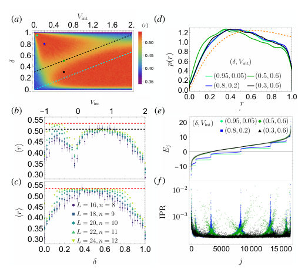
<figcaption class="paper-figure-caption"><b>Fig 1.</b> FIG. 1. (a) Adjacent gap ratio ⟨r⟩for the model in Eq. (3) for a L = 22, half filled chain with n = 11 electrons over a broad parameter regime, exhibiting a pronounced anomalous dip. The black dashed line indicates an approximate linear fit through this anomalous region, while the cyan dashed line is drawn parallel to it through a representative generic region. (b) ⟨r⟩along the cut δ = 1/3 + Vint/3 (black dashed line in the left panel). (c) ⟨r⟩along the cut δ = Vint/3 (cyan dashed line). Different colors denote system sizes L = 16–24 at half filling. (d) Probability distribution of consecutive level spac- ing ratio r comparing four representative points from Fig. 1(a) for L = 24 at half...</figcaption>
</figure>
<figure class="paper-figure-card">
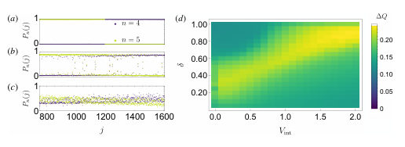
<figcaption class="paper-figure-caption"><b>Fig 2.</b> FIG. 2. (a), (b), (c) Expectation of the jth eigenstate in the projector onto the nth dimerised limit MB band (denoted Pn(j)) for n = 4, 5. Eigenstates calculated for L = 22, V = 0.6 and (a) δ = 0.95, (b) δ = 0.45 and (c) δ = 0.05. (d) Standard deviation ∆Q of Q = Q(j) defined by Eq. (11) showing a rise approximately at regions of anomalously low ⟨r⟩.</figcaption>
</figure>

**Summary.** The paper reveals an unexpected suppression of quantum chaos ($\langle r 
angle$) in the interacting SSH model deep within the non-integrable regime. This effect is fundamentally linked to incomplete hybridization between many-body band states rather than simple spectral overlap or localization. The findings challenge conventional assumptions linking non-integrability directly to fully chaotic level statistics.

**Why it may be interesting.** This work provides a detailed mechanism for spectral statistics deviations that are purely structural (band geometry) rather than arising from standard sources like disorder or integrability breaking, which is highly relevant for understanding quantum dynamics in engineered lattices.

Detailed structure

**Main problem.** The study investigates an anomalous suppression of quantum chaos, evidenced by reduced level repulsion ($\langle r 
angle$), in non-integrable many-body systems.

**Main result.** This anomaly is attributed not to integrability or disorder, but specifically to incomplete hybridization between distinct many-body band states inherited from the underlying single-particle structure.

**Method.** The authors use exact diagonalization and semi-analytical perturbation theory to calculate level statistics ($\langle r 
angle$) across varying interaction strengths and hopping parameters.

**Model / system.** The system is the interacting Su-Schrieffer-Heeger (SSH) chain model, described by a Hamiltonian combining non-interacting SSH terms with nearest-neighbor density-density interactions. The analysis probes transitions between integrable limits.

**Key observables.** Mean level-spacing ratio ($\langle r 
angle$), Inverse Participation Ratio (IPR), and the fluctuation measure $\Delta Q$ quantifying hybridization strength.

**Important parameters / regimes.** Alternating hopping parameter ($\delta$), interaction strength ($V_{	ext{int}}$), and symmetry breaking terms like staggered potential ($h$).

**Assumptions / limitations.** The analysis relies on resolving symmetries to benchmark against GOE statistics, and the mechanism is linked to the geometry of many-body minibands.

**Figures summary.** Figures show $\langle r 
angle$ dipping anomalously in non-integrable regimes compared to GOE expectations; other figures map out the closing of MB band gaps and the correlation between minimal $\langle r 
angle$ and maximal hybridization fluctuations ($\Delta Q$).

**Paper structure.** The paper systematically analyzes the system by first establishing the expected chaotic behavior (GOE), then identifying the anomalous dip in $\langle r 
angle$, attributing it to incomplete hybridization, and finally using advanced techniques like perturbation theory and symmetry analysis to quantify this geometric origin.

Abstract

Level statistics in non-integrable quantum many-body systems with time reversal symmetry are expected to follow the Gaussian Orthogonal Ensemble (GOE), a hallmark of quantum chaos. However, we show that the interacting Su-Schrieffer-Heeger model exhibits a clear suppression of the mean level-spacing ratio $\langle r\rangle$ from the GOE value $\approx 0.535$, persisting deep in the nonintegrable regime. This challenges the conventional association between non-integrability and fully chaotic spectral statistics. Using exact diagonalization supported by semi-analytical arguments, we trace this anomaly to incomplete hybridization of many-body band states inherited from the noninteracting band structure. The resulting restructuring of the spectrum weakens level repulsion without restoring integrability. We show the robustness of this mechanism in extensions of the model which break chiral and inversion symmetry.

[↑ back to top](#top)

### [Quantum decoherence: a study applied to quarkonium-like bound states in strongly interacting matter](http://arxiv.org/abs/2607.06137v1)

**Authors:** Gabriele Coci, Salvatore Plumari, Giuseppe Falci  
**Type:** theory · **Category:** statistical mechanics · **PDF:** <https://arxiv.org/pdf/2607.06137v1>  
**Analysis basis:** full PDF text, analyzed in chunks
**Topic relevance:** `methods for driven-dissipative` **3/5** · `non-equilibrium dynamics` **3/5** · `non-equilibrium universality` **2/5** · `Keldysh / 2PI / non-Gaussian methods` **1/5** · `correlated / nonlocal dissipation` **1/5** · `driven-dissipative phase transition` **1/5** · `entanglement & information structure` **1/5**

↔ Scroll figures horizontally

<figure class="paper-figure-card">
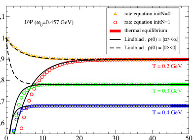
<figcaption class="paper-figure-caption"><b>Fig 1.</b> FIG. 1: (color online): Population of J/Ψ ground state as function of time in static heat bath at indicated tempera- ture T = 0.2, 0.3, 0.4 GeV. The black curves are the ρ00(t) elements obtained from the Lindblad equation for two ini- tial conditions: ground state |0⟩(dashed), coherent state |α⟩ (solid) with α = 1. Lindblad evolution is compared with re- sults from rate equations. Both cases evolve asymptotically to thermal equilibrated values neq(ω0, T) indicated with the thick colored strips and labeled with the T values.</figcaption>
</figure>
<figure class="paper-figure-card">
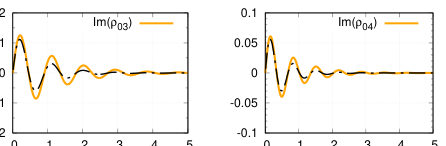
<figcaption class="paper-figure-caption"><b>Fig 2.</b> FIG. 3: Time evolution of imaginary part of coherence ele- ments ρ0n with n = 1, 2, 3, 4 (from top left to bottom right). The thick solid orange line is the numerical result from the Lindblad equation and the dash-dotted black line is the ap- proximate analytic behavior in Eq. (30). The model parame- ters are the same reported in the caption of Fig. 2.</figcaption>
</figure>
<figure class="paper-figure-card">
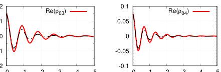
<figcaption class="paper-figure-caption"><b>Fig 3.</b> FIG. 2: Time evolution of the real part of coherence ele- ments ρ0n with n = 1, 2, 3, 4 (from top left to bottom right). The thick solid red line is the result obtained by numeri- cally solving the Lindblad equation with initial density ma- trix ρ(0) = |α⟩⟨α| with α = 1, frequency ω0 = 0.457 GeV and bath temperature T = 0.3 GeV. The dash-dotted black line corresponds to the analytic trend given by Eq. (30) with an coefficient from Eq. (32) assuming n ≫1.</figcaption>
</figure>
<figure class="paper-figure-card">
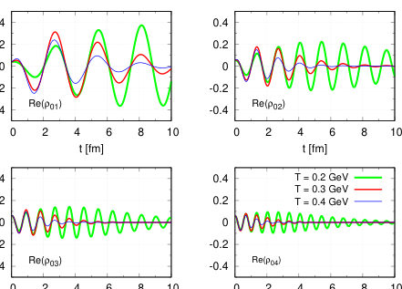
<figcaption class="paper-figure-caption"><b>Fig 4.</b> FIG. 4: (color online): Time evolution of the real part of coherence elements for three different heat bath temperatures T = 0.2 −0.4 GeV. The frequency of the system is set to ω0 = 0.457 GeV.</figcaption>
</figure>
<figure class="paper-figure-card">
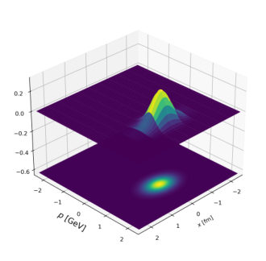
<figcaption class="paper-figure-caption"><b>Fig 5.</b> FIG. 5: Contour plot of Wigner distribution for initial coher- ent state |α⟩with α = 2.</figcaption>
</figure>

**Summary.** This paper models how quarkonium bound states lose their quantum coherence when passing through the hot, expanding medium created in heavy-ion collisions. Using an open quantum system framework and the Lindblad equation, the authors show that while decoherence occurs rapidly at high initial temperatures, the specific hydrodynamic expansion profile is crucial for accurately predicting this loss of quantum information.

**Why it may be interesting.** This work bridges fundamental concepts from open quantum systems theory with high-energy nuclear physics phenomenology, providing a quantitative tool to study non-equilibrium quantum dynamics in extreme matter states.

Detailed structure

**Main problem.** The study investigates quantum decoherence of quarkonium-like bound states as they propagate through a hot, strongly interacting medium like the Quark-Gluon Plasma (QGP). The goal is to quantify how environmental interactions cause the loss of quantum coherence.

**Main result.** The rate and manner of decoherence are significantly influenced by the temperature evolution of the expanding medium; however, viscous effects were found not to substantially alter the decoherence process compared to ideal hydrodynamics.

**Method.** The analysis employs an open quantum systems approach, modeling the system's time evolution using the Lindblad master equation for the reduced density matrix. This is extended to incorporate time-dependent coupling strengths simulating hydrodynamic expansion.

**Model / system.** The system is modeled as a 1D damped harmonic oscillator (representing quarkonium) coupled to an environment reservoir representing the QGP degrees of freedom. The evolution is governed by the Lindblad equation derived under Born-Markov approximations.

**Key observables.** Loss of quantum coherence, quantified by analyzing the reduced density matrix elements ($	ext{Im}(
ho_{n0})$), and the Wigner function profile $W(x, p, t)$.

**Important parameters / regimes.** Initial temperature ($T_0$), time scale ($	au \sim 1-5$ fm), coupling strength ($\kappa$), and the ratio of shear viscosity to entropy density ($\eta/s$).

**Assumptions / limitations.** The primary assumptions include using the Born-Markov approximation, assuming weak system-reservoir coupling, and modeling the environment dynamics via ideal or viscous hydrodynamics.

**Figures summary.** Figures illustrate the time evolution of coherence elements (e.g., $	ext{Im}(
ho_{n0})$) comparing static vs. expanding baths, and contour plots show the Wigner function evolving from quantum fringes toward a classical Gaussian profile in an expanding QGP medium.

**Paper structure.** The paper establishes the open quantum system framework using the Lindblad equation for quarkonium decoherence. It then extends this model to include time-dependent coupling strengths mimicking QGP expansion, comparing results across different hydrodynamic models (ideal vs. viscous) and analyzing the resulting loss of coherence.

Abstract

We study the quantum decoherence of a bound state interacting with a reservoir of strongly interacting matter within the framework of open quantum systems. The bound state is modeled as a quantum harmonic oscillator whose parameters are tuned to reproduce the root-mean-square radius of $J/Ψ$ particle. The surrounding medium, representing the many degrees of freedom of strongly interacting matter, acts as an environment that induces dissipation and decoherence through system-reservoir coupling. By analyzing the time evolution of the reduced density matrix, we quantify the loss of quantum coherence and its dependence on medium properties. Subsequently, we extend the model by introducing a time dependence in the system-thermal bath coupling, thereby simulating a temperature evolution similar to that occurring during the expansion of a fireball in the central region of heavy-ion collisions. We find that a temperature evolution has a relevant impact on the way the system loses coherence through the coupling with the expanding medium. Finally, we estimate the impact of the time-dependent temperature on the decoherence process, also analyzing a scenario that includes viscous effects without finding a significant change with respect to ideal hydrodynamical evolution.

[↑ back to top](#top)

### [Quantum Probabilistic Local Differential Privacy: Structural Properties and Sample Complexity Bounds](http://arxiv.org/abs/2607.06307v1)

**Authors:** Xian Shi  
**Type:** theory · **Category:** quantum information and computing · **PDF:** <https://arxiv.org/pdf/2607.06307v1>  
**Analysis basis:** full PDF text, analyzed in chunks
**Topic relevance:** `quantum measurements` **3/5** · `entanglement & information structure` **2/5** · `measurement-induced transitions` **2/5** · `methods for driven-dissipative` **2/5** · `Keldysh / 2PI / non-Gaussian methods` **1/5** · `correlated / nonlocal dissipation` **1/5** · `driven-dissipative phase transition` **1/5**

↔ Scroll figures horizontally

<figure class="paper-figure-card">
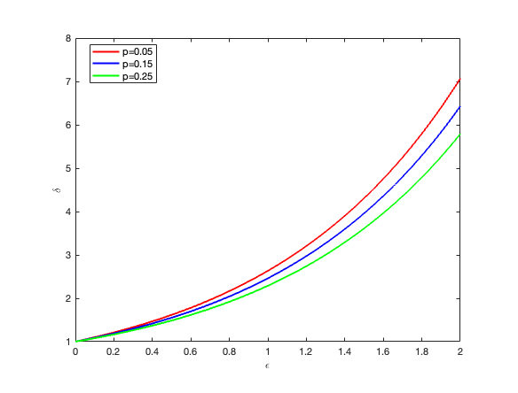
<figcaption class="paper-figure-caption"><b>Fig 1.</b> FIG. 1: The QPrDP for the global depolarizing noise. Here ρ and σ are states with E1(ρ||σ) = χ = 0.01. The red line, blue line and green line denote the function δ = f(ϵ) when p = 0.05, p = 0.15 and p = 0.25, respectively.</figcaption>
</figure>
<figure class="paper-figure-card">
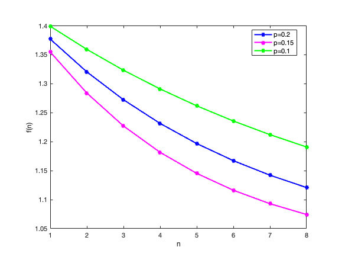
<figcaption class="paper-figure-caption"><b>Fig 2.</b> FIG. 2: The QPrDP for the n compositions of the global depolarizaing noise. Here ϵ = 0.2, ρ and σ are states with E1(ρ||σ) = 0.1. The blue line, red line and green line denote the function δ = f(n) when p = 0.1, p = 0.15 and p = 0.2, respectively.</figcaption>
</figure>

**Summary.** This paper establishes Quantum Probabilistic Local Differential Privacy (QPrLDP) as a relaxed framework for quantifying privacy loss in quantum data analysis. It analyzes the structural properties of this notion and applies it to derive concrete sample complexity bounds for private quantum hypothesis testing. This provides essential theoretical tools for ensuring privacy guarantees when performing statistical inference using quantum resources.

**Why it may be interesting.** While focused on privacy theory, the rigorous mathematical tools developed—especially those involving divergences and channel analysis—are highly relevant to characterizing information leakage or distinguishability in open quantum systems.

Detailed structure

**Main problem.** The paper introduces and rigorously studies Quantum Probabilistic Local Differential Privacy (QPrLDP), a relaxation of quantum local differential privacy.

**Main result.** It derives sample complexity bounds for probabilistically privatized asymmetric and symmetric quantum hypothesis testing, providing a systematic foundation for probabilistic privacy guarantees in quantum inference.

**Method.** The study involves defining QPrLDP based on spectral violation probabilities and connecting it to statistical inference via the hockey-stick divergence. Structural properties are analyzed using tensor products and unitary post-processing.

**Model / system.** The analysis is conducted within the framework of quantum information processing, involving quantum states ($
ho, \sigma$), superoperators (channels), and measurements characterized by POVMs. The context includes depolarizing noise models.

**Key observables.** Trace distance $T(
ho||\sigma)$, Quantum hockey-stick divergence $	ext{E}_\gamma(
ho||\sigma)$, Sample complexity measures ($	ext{SC}, 	ext{ASC}$), and error probabilities ($\alpha, eta$).

**Important parameters / regimes.** Privacy parameters $(\epsilon, \delta)$ and the noise parameter $p$ (for depolarizing noise).

**Assumptions / limitations.** The work builds upon existing concepts of classical and quantum differential privacy, QLDP, and various quantum divergences.

**Figures summary.** Figures illustrate the relationship between $\delta$ and $\epsilon$ for global depolarizing noise, showing how $\delta$ scales with the number of compositions ($n$).

**Paper structure.** The paper systematically defines QPrLDP, investigates its structural properties (composition, post-processing), characterizes specific noise models (depolarizing noise), and culminates in deriving explicit lower and upper bounds for sample complexity in quantum hypothesis testing.

Abstract

Differential privacy provides a rigorous framework for quantifying privacy leakage in data analysis, while its quantum extensions have become increasingly relevant with the development of quantum computing and quantum machine learning. In this work, we introduce and study quantum probabilistic local differential privacy, a relaxation of quantum local differential privacy in which the privacy constraint is allowed to fail on a spectral violation event with low probability. This quantity can be interpreted as the probability under the quantum superoperation of a quantum privacy-loss violation, and is closely related to the acceptance probability of the quantum Neyman-Pearson test at a small threshold. We investigate the basic structural properties of this privacy notion and clarify its relationship with existing forms of quantum differential privacy. We show the properties of quantum probabilistic local differential privacy under tensor-product composition and unitary post-processing, while it is in general neither convex nor closed under post-processing by arbitrary quantum channels. We further characterize when depolarizing noise satisfies quantum probabilistic local differential privacy under several representative scenarios. Finally, we connect quantum probabilistic privacy constraints with statistical inference by deriving a lower bound on probabilistically privatized contraction coefficients in terms of the hockey-stick divergence. As an application, we obtain sample complexity bounds of probabilistically privated asymmetric and symmetric quantum hypothesis testing. These results provide a systematic foundation for studying probabilistic privacy guarantees in quantum information processing and their operational consequences for private quantum statistical inference.

[↑ back to top](#top)

### [Skyrmion Phase Control by Magnetic Dipole-Dipole Interaction and Electric Field in Centrosymmetric Materials](http://arxiv.org/abs/2607.06419v1)

**Authors:** Raz Rivlis, Alexander Petrović, Yuri Dahnovsky  
**Type:** theory · **Category:** other · **PDF:** <https://arxiv.org/pdf/2607.06419v1>  
**Analysis basis:** full PDF text, analyzed in chunks
**Topic relevance:** `analog quantum simulation` **3/5** · `exotic spin models in light-matter` **3/5** · `spintronics-quantum-optics interface` **3/5** · `driven-dissipative phase transition` **1/5** · `methods for driven-dissipative` **1/5**

↔ Scroll figures horizontally

<figure class="paper-figure-card">
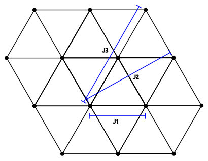
<figcaption class="paper-figure-caption"><b>Fig 1.</b> FIG. 1. Schematic illustrating the triangular crystal sym- metry at the core of our theoretical model. J1, J2, and J3 are the exchange interaction constants between first, second, and third nearest neighbor pairs, respectively.</figcaption>
</figure>
<figure class="paper-figure-card">
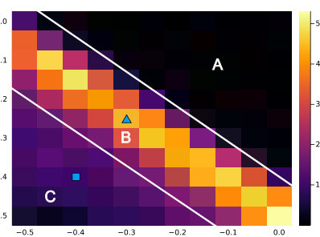
<figcaption class="paper-figure-caption"><b>Fig 2.</b> FIG. 2. Phase diagram illustrating the magnetic phase evo- lution as a function of the second and third nearest neighbor exchange interactions. The plot is calculated at Bz/J1 = 0.3 in the zero temperature limit. Phase A is a ferromagnetic phase. Phase B is a high skyrmion density phase, with mixed skyrmion types. Phase C is a helical phase, which features metastable skyrmions close to the boundary with phase B. Due to the presence of strong fluctuations between neighbor- ing phases, all phase boundaries (white lines) in this work are qualitatively defined and serve as guides to the eye. The blue triangle and square denote the coordinates at which the spin textures shown in Fig. 3(a) and...</figcaption>
</figure>
<figure class="paper-figure-card">
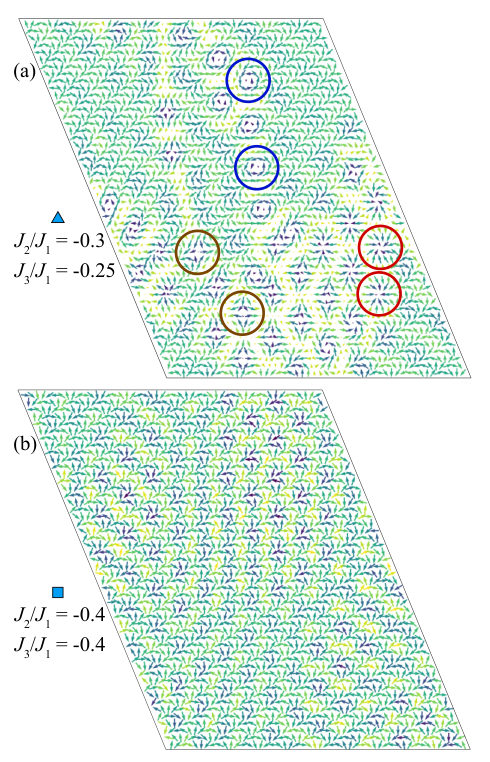
<figcaption class="paper-figure-caption"><b>Fig 3.</b> FIG. 3. Real-space spin textures evaluated at zero temper- ature, from the phase diagram shown in Fig. 2. (a) Phase B (high-density skyrmions), illustrating the mixture of dif- ferent skyrmion helicities and topological charges. The blue circles highlight several Bloch skyrmions, the red circles show N´eel skyrmions, and the brown circles indicate antiskyrmions. (Not all skyrmions are highlighted, to preserve clarity). (b) Phase C (helical phase). Bz/J1 is fixed at 0.3 for both phases.</figcaption>
</figure>
<figure class="paper-figure-card">
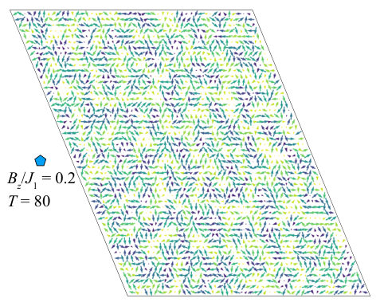
<figcaption class="paper-figure-caption"><b>Fig 4.</b> FIG. 5. Spin configuration in the high temperature param- agnetic phase (blue pentagon in Fig. 4), evaluated at J2/J1 = −0.3, J3/J1 = −0.25.</figcaption>
</figure>
<figure class="paper-figure-card">
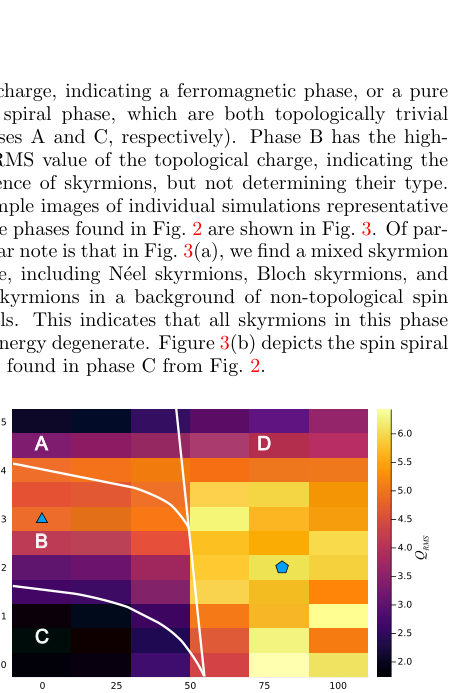
<figcaption class="paper-figure-caption"><b>Fig 5.</b> FIG. 4. Phase diagram illustrating the magnetic phase distribution as a function of temperature and perpendicular magnetic field. The plot is calculated at J2/J1 = −0.3 and J3/J1 = −0.25. Phase A is a ferromagnetic phase. Phase B is a high skyrmion density phase, with mixed skyrmion types. Phase C is a helical phase exhibiting metastable skyrmions close to the boundary with phase B. Phase D is a high tem- perature paramagnetic phase; its high topological charge orig- inates from short timescale chiral spin fluctuations. The ap- pearance of the high density skyrmion phase B is in good agreement with the phase diagram in Ref. [38]. The magnetic ordering in phases A and C is qualitatively...</figcaption>
</figure>

**Summary.** The research explores controlling magnetic skyrmions in centrosymmetric lattices by manipulating dipole-dipole interactions and external electric fields. Key findings include the ability of electric fields to continuously tune the skyrmion helicity, providing a mechanism for tuning qubits. This work advances the understanding of topological spin control crucial for next-generation quantum devices.

**Why it may be interesting.** This work directly addresses fundamental control mechanisms (electric fields) over topological spin textures, which is highly relevant to developing robust quantum memory elements based on magnetic materials.

Detailed structure

**Main problem.** The primary goal is establishing precise control over the helicity and spatial configuration of magnetic skyrmions for use in advanced computational applications.

**Main result.** The study shows that electric fields can continuously tune the skyrmion helicity, offering a novel control handle for tuning two-level systems within skyrmion qubits. Furthermore, dipole-dipole interactions stabilize Bloch helicity and induce new lattice phases even at zero magnetic field.

**Method.** Theoretical modeling using classical spin vector models solved via Monte Carlo simulations (Metropolis-Hastings algorithm) to map out phase diagrams.

**Model / system.** The system is a skyrmion host on a triangular lattice, modeled by an extended Heisenberg Hamiltonian incorporating nearest-neighbor, next-nearest-neighbor, and third-nearest-neighbor exchange interactions. The model explicitly includes magnetic dipole-dipole interactions and external electric fields.

**Key observables.** Topological charge (Q), Root Mean Square of the topological charge ($	ext{QRMS}$), and the balance between skyrmion/antiskyrmion populations ($ar{Q}/	ext{QRMS}$).

**Important parameters / regimes.** Dipole-dipole coupling strength ($C$), external electric field strength, magnetic field ($B_z$), and lattice exchange couplings ($J_2, J_3$).

**Assumptions / limitations.** The analysis is based on a classical spin vector model ($\mathbf{S}$), and phase boundaries are qualitatively defined due to strong thermal fluctuations.

**Figures summary.** Figures illustrate the evolution of magnetic phases (Ferromagnetic, Skyrmion Crystal, Helical) across parameter space ($J_2$ vs $J_3$) and show real-space spin textures corresponding to different helicity types (Bloch vs. Néel).

**Paper structure.** The paper systematically investigates the influence of dipole-dipole interactions on skyrmion stability, demonstrating phase transitions at zero field. It then analyzes how applied electric fields mediate a continuous transition between Bloch and Néel skyrmion states.

Abstract

Establishing precise control over the helicity and spatial configuration of magnetic skyrmions will be essential to realize their promise in classical, analog and quantum computation applications. In this work, we explore the role of magnetic dipole-dipole interactions, external electric fields, and magnetic fields in controlling these parameters within a triangular lattice centrosymmetric skyrmion host. We demonstrate that dipole-dipole interactions strongly favor Bloch helicity. Notably, a zero magnetic field skyrmion phase appears upon raising the dipole-dipole coupling strength, with substantial potential for cost-effective quantum device applications. We also report the emergence of a meron/antimeron lattice phase, in the absence of any Dzyaloshinskii-Moriya interaction. In contrast, applied electric fields stabilize high density Néel skyrmion crystals. The interplay between dipole-dipole interactions and external electric fields creates a continuous transition between the two skyrmion types, rather than an abrupt switch. Applied electric fields can therefore be used as a continuous tuning mechanism for skyrmion helicity, and hence a control handle for tuning two-level systems in skyrmion qubits.

[↑ back to top](#top)

### [Contractivity of the Hilbert--Schmidt Speed in Unital Quantum Channels: Foundation for Witnessing Non-Markovianity and Discriminating Unital from Non-Unital Markovian Dynamics](http://arxiv.org/abs/2607.05619v1)

**Authors:** Hossein Rangani Jahromi  
**Type:** theory · **Category:** other · **PDF:** <https://arxiv.org/pdf/2607.05619v1>  
**Analysis basis:** full PDF text, analyzed in chunks
**Topic relevance:** `methods for driven-dissipative` **3/5** · `correlated / nonlocal dissipation` **2/5** · `non-equilibrium dynamics` **2/5** · `Keldysh / 2PI / non-Gaussian methods` **1/5** · `driven-dissipative phase transition` **1/5** · `entanglement & information structure` **1/5**

↔ Scroll figures horizontally

<figure class="paper-figure-card">
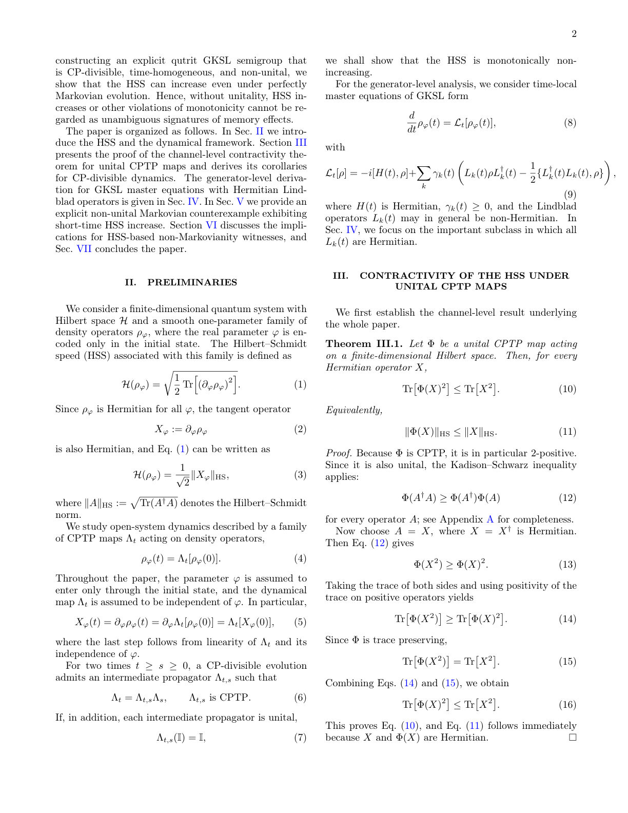
<figcaption class="paper-figure-caption"><b>Fig 1.</b> Low-resolution page preview, page 2</figcaption>
</figure>
<figure class="paper-figure-card">
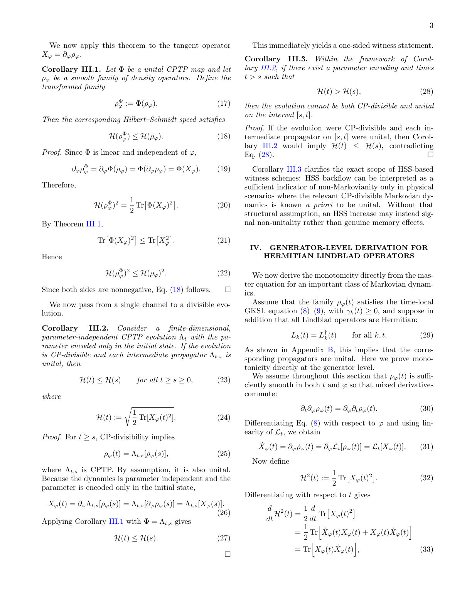
<figcaption class="paper-figure-caption"><b>Fig 2.</b> Low-resolution page preview, page 3</figcaption>
</figure>
<figure class="paper-figure-card">
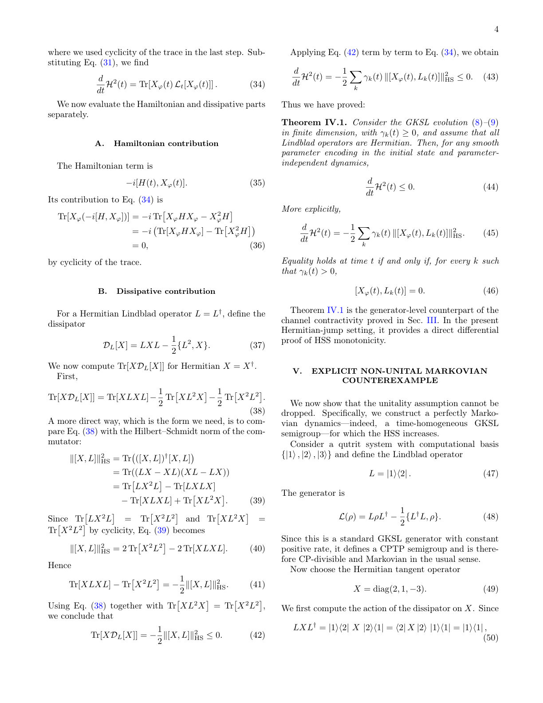
<figcaption class="paper-figure-caption"><b>Fig 3.</b> Low-resolution page preview, page 4</figcaption>
</figure>
<figure class="paper-figure-card">
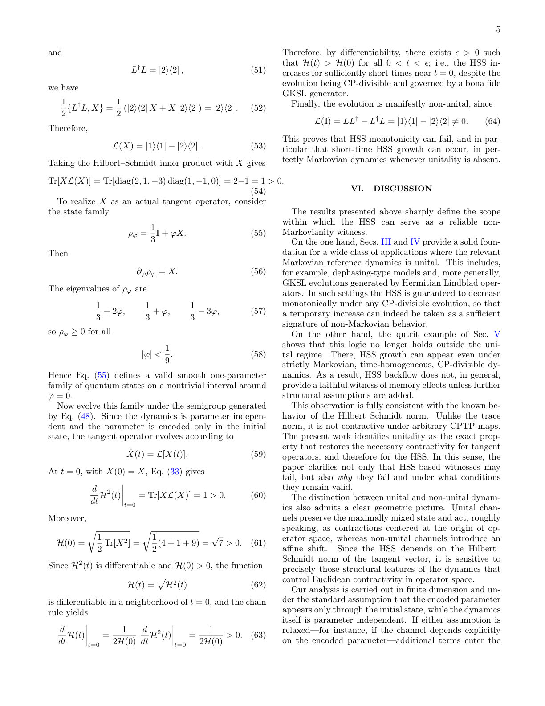
<figcaption class="paper-figure-caption"><b>Fig 4.</b> Low-resolution page preview, page 5</figcaption>
</figure>
<figure class="paper-figure-card">
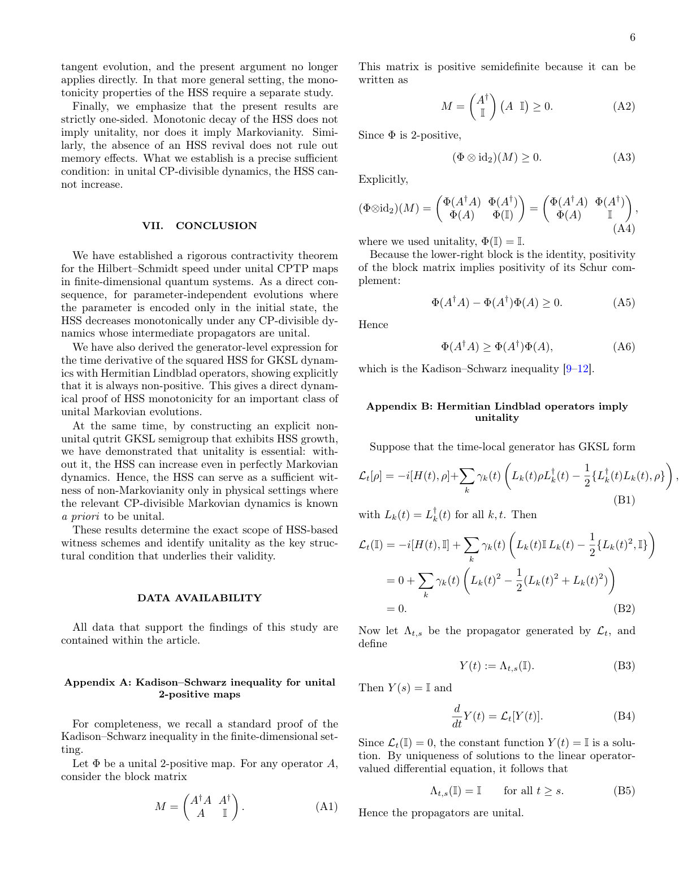
<figcaption class="paper-figure-caption"><b>Fig 5.</b> Low-resolution page preview, page 6</figcaption>
</figure>

**Summary.** This paper rigorously analyzes the Hilbert-Schmidt speed (HSS) as a diagnostic tool for non-Markovianity in open quantum systems. It proves that HSS decay is guaranteed only when the system's evolution channels are unital. Crucially, it demonstrates via counterexample that if the dynamics are not unital, HSS can increase even when the process remains perfectly Markovian.

**Why it may be interesting.** This work provides a precise mathematical criterion—unitality—for using geometric measures like HSS backflow as reliable witnesses of memory effects in open quantum systems dynamics.

Detailed structure

**Main problem.** The paper investigates the contractivity of the Hilbert-Schmidt speed (HSS) under open quantum system dynamics to establish a rigorous diagnostic tool for non-Markovianity.

**Main result.** HSS is guaranteed to be monotonically non-increasing only if the underlying CPTP maps are unital; otherwise, HSS can increase even in perfectly Markovian dynamics.

**Method.** The authors use geometric analysis on the space of quantum states, deriving differential equations for the time evolution of the squared HSS at both the channel and generator levels.

**Model / system.** The study concerns open quantum systems evolving via CPTP maps or GKSL master equations. The dynamics are analyzed by parameterizing the initial state ($
ho_\varphi$) while keeping the map itself independent of $\varphi$.

**Key observables.** Hilbert-Schmidt speed (HSS), $H(
ho_\varphi) = rac{1}{\sqrt{2}} \|\partial_\varphi 
ho_\varphi\|_{HS}$, and its time derivative.

**Important parameters / regimes.** Unitality of the CPTP map ($\Lambda(I)=I$) is the crucial structural parameter determining HSS behavior.

**Assumptions / limitations.** The analysis assumes that the parameter $\varphi$ enters only through the initial state, and for generator-level proofs, it requires Lindblad operators to be Hermitian.

**Figures summary.** Not specified by notes; the structure relies on mathematical derivations (e.g., deriving $rac{d}{dt}H^2(t) \le 0$ or constructing a counterexample).

**Paper structure.** The paper first proves HSS contractivity under unital CPTP maps, establishing monotonicity for divisible evolutions. It then extends this to the generator level for Hermitian Lindblad operators. Finally, it provides a qutrit counterexample demonstrating that non-unitality breaks the monotonic decay property.

Abstract

We investigate the Hilbert--Schmidt speed (HSS), a geometric indicator defined through the Hilbert--Schmidt norm of the tangent vector to a parametrized family of quantum states, under general open-system dynamics. Working in the framework of finite-dimensional, parameter-independent completely positive trace-preserving (CPTP) evolution where the parameter is encoded solely in the initial state, we prove that the HSS is contractive under every unital CPTP map. Consequently, for any CP-divisible evolution whose intermediate propagators are unital, the HSS is monotonically non-increasing in time. We then establish the generator-level counterpart for Markovian dynamics governed by a Gorini--Kossakowski--Sudarshan--Lindblad (GKSL) master equation with Hermitian Lindblad operators, deriving an explicit non-positive expression for the time derivative of the squared HSS. These results provide a rigorous foundation for using HSS backflow as a sufficient witness of non-Markovianity in physical settings where the relevant CP-divisible Markovian dynamics is known \emph{a priori} to be unital. Conversely, we show by an explicit qutrit counterexample that HSS can increase even in perfectly Markovian but non-unital dynamics, demonstrating that HSS non-monotonicity is not, in general, a faithful indicator of memory effects unless unitality is guaranteed. Our findings clarify the exact scope of HSS-based diagnostics and identify unitality as the crucial structural ingredient underlying their validity.

[↑ back to top](#top)

### [Correlation of maximum superconducting critical temperature with copper-oxygen energy distance and oxygen hole content in the Emery model](http://arxiv.org/abs/2607.06460v1)

**Authors:** Eleanor M. O'Callaghan, Nicolas Kowalski, A. -M. S. Tremblay, Giovanni Sordi  
**Type:** theory · **Category:** strongly correlated electrons · **PDF:** <https://arxiv.org/pdf/2607.06460v1>  
**Analysis basis:** full PDF text, analyzed in chunks
**Topic relevance:** `Keldysh / 2PI / non-Gaussian methods` **3/5** · `driven-dissipative phase transition` **2/5** · `methods for driven-dissipative` **2/5** · `Kondo & dissipative impurity` **1/5** · `analog quantum simulation` **1/5** · `correlated cavity matter` **1/5**

↔ Scroll figures horizontally

<figure class="paper-figure-card">
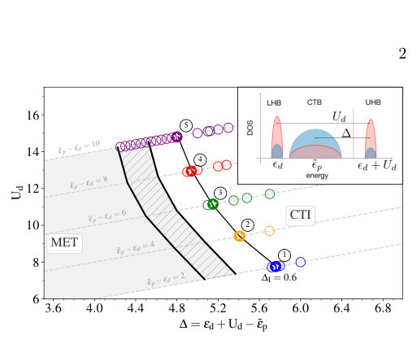
<figcaption class="paper-figure-caption"><b>Fig 1.</b> FIG. 1. Zaanen-Sawatzky-Allen diagram Ud vs ∆= ϵd +Ud − ˜ϵp for the Emery model. All data (circles) are at ntot = 5, i.e. δ = 0, and T = 1/50. The gray dashed lines indicate constant values of the bare Cu-O energy distance ˜ϵp −ϵd. The shaded gray area denotes the metallic state (MET). The unshaded area denotes the charge-transfer insulating state (CTI). The metal to insulator boundary is first-order and accompanied by hysteresis (hatched region within thick black lines). The thin black line indicates the contour of constant charge gap size ∆I = 0.6. Circles with star indicate the closest data points to that contour and are labeled by circled numbers. The super- conducting state emerging...</figcaption>
</figure>
<figure class="paper-figure-card">
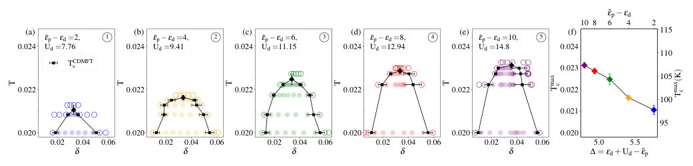
<figcaption class="paper-figure-caption"><b>Fig 2.</b> FIG. 2. (a)-(e) Superconducting temperature T CDMFT c (black line) versus hole doping δ = 5 −ntot. T CDMFT c (δ) is defined as the line where the superconducting order parameter changes from zero (open circles) to nonzero (shaded circles). The model parameters (˜ϵp −ϵd, Ud) are labeled and yield the same charge gap size ∆I = 0.6 in the parent (δ = 0) insulating state across all panels. These parameters are labeled by circled numbers that correspond to those in Fig. 1. (f) T max c versus bare charge-transfer energy ∆, or ˜ϵp −ϵd (secondary x axis), for the constant value of charge gap size ∆I = 0.6 in the undoped state. Temperature is converted into Kelvin using tpp = 0.4 eV.</figcaption>
</figure>
<figure class="paper-figure-card">
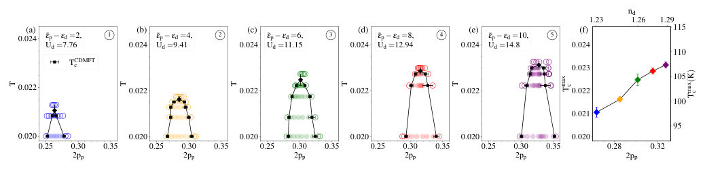
<figcaption class="paper-figure-caption"><b>Fig 3.</b> FIG. 3. (a)-(e) Same as Fig. 2, but using oxygen hole content 2pp instead of hole doping δ on the x-axis. (f) T max c versus its corresponding oxygen hole content 2pp, or copper occupancy nd (secondary x axis), for the constant charge gap size ∆I = 0.6 in the parent insulating state. Temperature is converted into Kelvin using tpp = 0.4 eV.</figcaption>
</figure>

**Summary.** This work uses the Emery model and CDMFT calculations to investigate what controls the maximum superconducting critical temperature in high-Tc cuprates. The key finding is that Tcmax increases with increasing the copper-oxygen energy distance, suggesting a mechanism for optimizing superconductivity by tuning orbital interactions. This provides new theoretical guidelines for understanding cuprate pairing.

**Why it may be interesting.** While focused on cuprates, the use of advanced many-body techniques like CDMFT to map phase diagrams based on orbital energy differences provides valuable theoretical insight into how local electronic structure dictates macroscopic quantum phenomena.

Detailed structure

**Main problem.** The primary goal is identifying microscopic parameters within the Emery model that optimize the maximum superconducting critical temperature (Tcmax) in cuprate superconductors.

**Main result.** The study finds that Tcmax unexpectedly increases with increasing the copper-oxygen energy distance, suggesting new pathways for optimizing superconductivity beyond previous models.

**Method.** Calculations utilize Cellular Dynamical Mean-Field Theory (CDMFT) at finite temperature to solve the cluster quantum impurity problem using Continuous-Time Quantum Monte Carlo (CT-HYB).

**Model / system.** The research focuses on the Emery model, which describes electron hopping between Cu $3d_{x^2-y^2}$ and O $2p\alpha$ orbitals, relevant for cuprate superconductors. The analysis is performed within the framework of the Zaanen-Sawatzky-Allen charge-transfer diagram.

**Key observables.** Superconducting critical temperature (Tcmax), charge gap size ($\Delta_I$), and doping level ($\delta$).

**Important parameters / regimes.** Cu-O energy distance ($	ilde{\epsilon}_p - \epsilon_d$), onsite Coulomb repulsion ($U_d$), and fixed charge gap size ($\Delta_I = 0.6$ eV).

**Assumptions / limitations.** The study assumes a fixed charge gap size ($\Delta_I$) and that the CDMFT result is representative, while acknowledging it neglects Kosterlitz-Thouless physics.

**Figures summary.** Figures show Tc vs doping (dome shape), Tcmax vs bare charge-transfer energy ($	ilde{\epsilon}_p - \epsilon_d$), and Tcmax vs oxygen hole content ($2pp$), all demonstrating characteristic superconducting dome behavior.

**Paper structure.** The paper systematically analyzes the dependence of Tcmax on various parameters—specifically $	ilde{\epsilon}_p - \epsilon_d$ and oxygen hole content—while keeping the charge gap size constant, mapping out optimal regimes in parameter space.

Abstract

Identifying microscopic parameters that optimize the maximum superconducting critical temperature $T_c^{\rm max}$ in the canonical model of the copper-oxygen plane of cuprates, the Emery model, remains challenging. Using cellular dynamical mean-field theory at finite temperature, we find that for a fixed charge gap size in the parent charge-transfer insulating state, $T_c^{\rm max}$ unexpectedly increases with increasing the copper-oxygen energy distance, as this favors the transfer of electrons from oxygen to copper orbitals. We show that these findings emerge naturally in the Zaanen-Sawatzky-Allen scheme and capture observed trends in hole-doped cuprates. Overall, our study uncovers that $T_c^{\rm max}$ is optimized in the Emery model under three conditions: upon doping a charge-transfer insulator, close to the charge-transfer insulator to metal boundary, and deep into the charge-transfer regime. This finding indicates new paths for optimizing $T_c^{\rm max}$.

[↑ back to top](#top)

### [Enhanced phase estimation with coherently boosted two-mode squeezed beams and its application to optical gyroscopes](http://arxiv.org/abs/2607.05732v1)

**Authors:** Xiao-Qi Xiao, Elisha S. Matekole, Jiankang Zhao, Guihua Zeng, Jonathan P. Dowling, Hwang Lee  
**Type:** theory · **Category:** other · **PDF:** <https://arxiv.org/pdf/2607.05732v1>  
**Analysis basis:** full PDF text, analyzed in chunks
**Topic relevance:** `interference shaping light` **3/5** · `quantum measurements` **2/5** · `Keldysh / 2PI / non-Gaussian methods` **1/5** · `correlated / nonlocal dissipation` **1/5** · `driven-dissipative phase transition` **1/5** · `entanglement & information structure` **1/5** · `methods for driven-dissipative` **1/5**

↔ Scroll figures horizontally

<figure class="paper-figure-card">
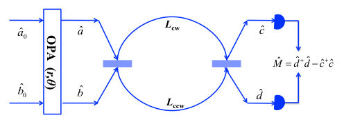
<figcaption class="paper-figure-caption"><b>Fig 1.</b> FIG. 1. The equivalent optical network diagram of the Sagnac interferometer for the coherent-boosted two-mode squeezed light field, where the first and second beam splitters are meant to be one and the same in the Sagnac interferometer. The two-mode squeezed light fields in ˆa and ˆb, which are gener- ated by the OPA (with the parameters r and θ), are injected into the gyroscope from the beam splitter. After traveling in the clockwise and counter-clockwise directions, respectively, the two light fields combine at the beam splitter again, and then leave the gyroscope. Then, immediately, the intensity difference ⟨ˆ M⟩between the two output fields is detected to estimate the phase difference...</figcaption>
</figure>
<figure class="paper-figure-card">
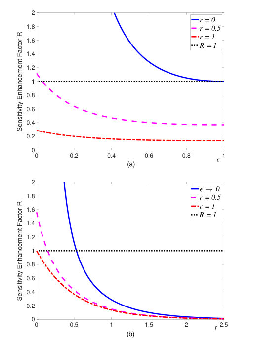
<figcaption class="paper-figure-caption"><b>Fig 2.</b> FIG. 2. For case II, the sensitivity enhancement factor R between the variance of the phase ∆φ2 and shot-noise limit ∆φ2 SN varies with (a) the parameter ϵ and (b) the parametric gain coefficient r. R = 1 (the black dot line) means the phase sensitivity reaches the shot-noise limit.</figcaption>
</figure>
<figure class="paper-figure-card">

<figcaption class="paper-figure-caption"><b>Fig 3.</b> Figure 2 describes the dependence of the enhance- ment factor R on ϵ and the parametric gain co- efficient r, respectively. When ϵ = 1, we have R = e−2r, which corresponds to case I. As shown in Fig. 2(a), with the decrease of the parameter ϵ, the factor R increases, which means the uncertainty of phase ∆φ increases and is generally close to or larger than the shot-noise limit ∆φSN. However, we notice that even in the case of ϵ →0, i.e., |α| ≫|β| (R → cosh 2r | sinh 2r|2 in this condition), the phase vari- ance below the shot-noise limit is also obtained if the parametric gain coefficient r satisfies the condi- tion cosh 2r/ sinh2 2r &lt; 1 [see Fig. 2(b)].</figcaption>
</figure>
<figure class="paper-figure-card">
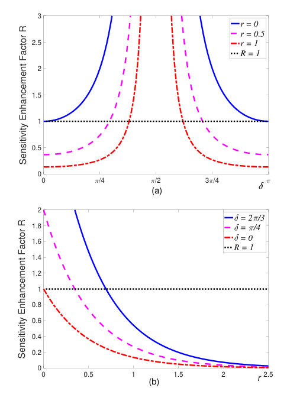
<figcaption class="paper-figure-caption"><b>Fig 4.</b> FIG. 3. For case III, the ratio R between the variance of the phase ∆φ2 and shot-noise limit ∆φ2 SN varies with (a) the parameter δ and (b) the parametric gain coefficient r . R = 1 (the black dot line) means the phase sensitivity reaches the shot-noise limit.</figcaption>
</figure>
<figure class="paper-figure-card">
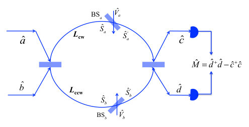
<figcaption class="paper-figure-caption"><b>Fig 5.</b> FIG. 4. The Sagnac interferometer in presence of loss in light propagation process, where the loss is modeled by the ficti- tious beam splitters.</figcaption>
</figure>

**Summary.** This paper presents a theoretical study on enhancing the sensitivity of optical gyroscopes by employing two-mode squeezed beams generated via OPA. The authors show that measuring the intensity difference allows for sub-shot-noise measurements, achieving phase sensitivities approaching the quantum Cramér-Rao bound. This demonstrates a robust quantum metrology technique applicable to high-precision sensing.

**Why it may be interesting.** This work is highly relevant to quantum optics and open quantum systems, as it pushes measurement precision beyond classical limits using non-classical light states (squeezed beams) in a practical sensing platform like an optical gyroscope.

Detailed structure

**Main problem.** The primary goal is to theoretically demonstrate a metrology method for improving the sensitivity of an interferometric optical gyroscope beyond the classical shot-noise limit while maintaining robustness against propagation loss.

**Main result.** The proposed scheme achieves sub-shot-noise sensitivity, with the phase uncertainty approaching the quantum Cramér-Rao bound as the photon number increases. The enhancement factor relative to the shot-noise limit is analyzed in detail.

**Method.** The analysis uses theoretical derivations based on intensity difference measurements ($\hat{M} = \hat{d}^\dagger \hat{d} - \hat{c}^\dagger \hat{c}$) applied to light sources generated via Optical Parametric Amplification (OPA) seeded by coherent inputs.

**Model / system.** The system is an optical gyroscope implemented using a Sagnac interferometer setup. The quantum resource utilized is the two-mode squeezed beam, which is modeled as the output of an OPA process.

**Key observables.** Phase shift ($\varphi = \mu - 
u$), phase uncertainty ($\Delta\varphi^2$), minimum detectable angular velocity ($\Omega_{\min}$), and the Noise Reduction Factor (NRF).

**Important parameters / regimes.** Parametric gain ($r$), initial coherent field amplitudes ($\alpha, eta$), and propagation loss.

**Assumptions / limitations.** The analysis relies on linear error propagation for uncertainty calculation and assumes specific approximations regarding the input coherent light fields in different cases (e.g., $\langle \hat{a} 
angle^2$, $\langle \hat{b} 
angle^2 \gg \sinh^2 r$).

**Figures summary.** Figure 1 illustrates the optical network diagram for the Sagnac interferometer using coherent-boosted two-mode squeezed light. Other figures analyze the dependence of the enhancement factor ($R$) on parameters like gain ($r$) and phase difference ($\delta$).

**Paper structure.** The paper develops the theoretical framework by modeling the OPA output, deriving the measurement observable $\hat{M}$, calculating the expected signal $\langle \hat{M} 
angle_E$, and finally determining the phase uncertainty $\Delta\varphi^2$ relative to the shot-noise limit across various input field configurations.

Abstract

Quantum techniques, developed in recent decades, provide new approaches to achieving high-precision measurements beyond the classical bounds. In this paper, we theoretically demonstrate a metrology method for improving the sensitivity of the interferometric optical gyroscope, robust against the loss, by using coherent-light stimulated two-mode squeezed beams as the light source. The detection protocol is based on a simple intensity measurement, and the quantum noise is far below the shot-noise limit. The enhancement factors for different coherent light fields are analyzed in detail. Additionally, the influence of loss during the propagation in the optical path is studied, and the conditions for achieving sub-shot-noise measurement sensitivity are obtained. We also find that the phase sensitivity of the proposed gyroscope scheme becomes closer to the quantum Cramér-Rao bound with increasing of the photon number of the coherent beams.

[↑ back to top](#top)

### [Local moment magnon spectrum in conduction electron tunnelling](http://arxiv.org/abs/2607.05858v1)

**Authors:** Peter Thalmeier, Alireza Akbari  
**Type:** theory · **Category:** strongly correlated electrons · **PDF:** <https://arxiv.org/pdf/2607.05858v1>  
**Analysis basis:** full PDF text, analyzed in chunks
**Topic relevance:** `Keldysh / 2PI / non-Gaussian methods` **3/5** · `spintronics-quantum-optics interface` **3/5** · `methods for driven-dissipative` **2/5** · `Kondo & dissipative impurity` **1/5** · `exotic spin models in light-matter` **1/5**

↔ Scroll figures horizontally

<figure class="paper-figure-card">
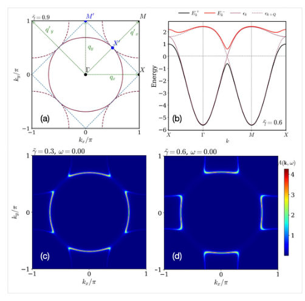
<figcaption class="paper-figure-caption"><b>Fig 1.</b> FIG. 1. (a) Fermi surface of bare (˜γ = 0) conduction band ϵk (Γ- centered) and shifted bands ϵk+Q (M-centered) which correspond to bare dispersion in (b). For finite ˜γ an AF gap opens at the crossing point X’ at the Fermi energy ϵF leading to reconstructed bands and their spectral functions (c,d) (for ω = ϵF ). The original BZ and antiferromagnetic BZ (AFBZ) correspond to full black and dashed blue lines in (a), with momentum coordinates (qx, qy) and (q′ x, q′ y), respectively, having symmetry points Γ (0,0), X(π, 0), M(π, π) and X′( π</figcaption>
</figure>
<figure class="paper-figure-card">
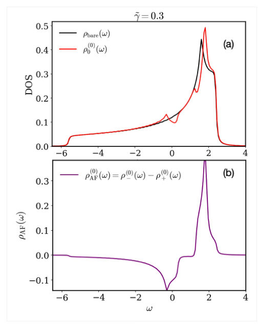
<figcaption class="paper-figure-caption"><b>Fig 2.</b> FIG. 2. (a) Normal k- integrated spectral function (DOS) in Eq. (21) for moderate (˜γ = 0.3) exchange coupling including only static band reconstruction setting Σ = 0. Black curve corresponds to bare band spectrum (˜γ = 0) for comparison. b) Anomalous spectral contribu- tion in Eqs. (17,21) induced at ±Q wave vectors by AF order param- eter. For larger ˜γ see Fig. 7.</figcaption>
</figure>
<figure class="paper-figure-card">
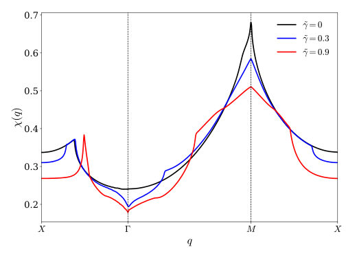
<figcaption class="paper-figure-caption"><b>Fig 3.</b> FIG. 3. Static susceptibility χ(q) for bare bands (˜γ = 0, black line) in the paramagnetic state with the maximum located at the M point corresponding to ordering vector Q=(π, π). In the AF ordered case with reconstructed conduction bands by nonzero ˜γ the maximum rests at Q but is progressively diminished due to the AF gap opening and corresponding suppressed nesting property (see Fig. 1).</figcaption>
</figure>
<figure class="paper-figure-card">
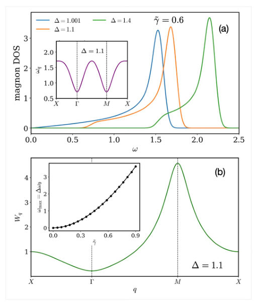
<figcaption class="paper-figure-caption"><b>Fig 4.</b> FIG. 4. (a) Inset shows the magnon dispersion in the original BZ for ˜γ = 0.6, ∆= 1.1 leading to |J| = I2 ex = 0.77χ(Q), ω0 = 1.54 and ωmax = ∆ω0 = 1.7. Main figure presents corresponding magnon DOS shifting progressively to higher energy with increasing ∆. (b) Coherence factor of electron-magnon interaction. It strongly peaks at the M-point where the magnon dispersion has its minimum with corresponding low DOS at this energy ω = ω0(∆2 −1) 1 2 . Note that the dispersion is periodic with ωq+Q = ωq while the coherence factor is not since Wq+Q = 1/Wq.</figcaption>
</figure>
<figure class="paper-figure-card">
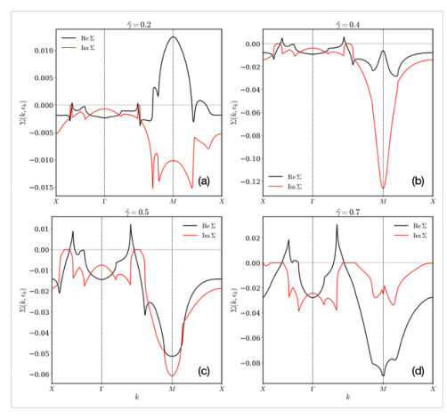
<figcaption class="paper-figure-caption"><b>Fig 5.</b> FIG. 5. Conduction electron self energies Σ(k, ϵk) along XΓMX BZ path (real and imaginary parts) caused by scattering from magnons according to Eq. (27) for weak, intermediate and strong exchange couplings. As ˜γ is increased a shift of weight from the M- point to the AF equivalent Γ -point is observed for the imaginary part and the real part at the M point changes sign.</figcaption>
</figure>

**Summary.** The paper theoretically investigates how conduction electrons tunnel through a material with localized antiferromagnetic moments. It distinguishes between spectral features caused by the static magnetic order and those arising dynamically from magnon excitations. By calculating electron self-energies due to magnon scattering, the authors predict that dynamic effects manifest as distinct 'sidebands' in the tunneling spectrum.

**Why it may be interesting.** This work provides a concrete theoretical framework for interpreting spectroscopic measurements (like STM) in magnetically ordered materials by separating static magnetic effects from dynamic quantum fluctuations (magnons), which is crucial for understanding strongly correlated magnetism.

Detailed structure

**Main problem.** The study investigates whether dynamic effects arising from local moment magnon excitations leave a distinct, measurable fingerprint on the conduction electron tunneling spectrum beyond the spectral changes caused by static magnetic ordering.

**Main result.** Dynamic magnon scattering introduces characteristic 'sidebands' into the tunneling conductance spectrum via self-energy corrections, which must be accounted for when interpreting STM measurements of magnetically ordered materials.

**Method.** The analysis employs Green's function techniques to calculate the conduction electron self-energy ($\Sigma$) due to coupling with magnons (derived from an XXZ model). This self-energy is then used to correct the spectral density of states, $
ho(\omega)$.

**Model / system.** The system is a dual model comprising itinerant conduction electrons coupled via an on-site exchange interaction ($H_{ex}$) to localized spins exhibiting Antiferromagnetic (AF) order. The Hamiltonian includes terms for conduction electrons ($H_c$), magnons ($H_m$), and their coupling ($H_{cm}$).

**Key observables.** Tunneling surface conductance ($rac{dI}{dV}$), which maps to the conduction electron Density of States (DOS); specifically, the appearance and magnitude of magnon sidebands relative to static reconstruction features.

**Important parameters / regimes.** Exchange coupling strength ($I_{ex}$ or $	ilde{\gamma}$), anisotropy parameter ($\Delta$), and the magnon wave vector ($\mathbf{q}$).

**Assumptions / limitations.** The calculations rely on perturbation theory (second order in $I_0$) for the self-energy, assuming slow variation of the tunneling matrix element with energy, and focusing on a simplified model system.

**Figures summary.** Figures illustrate Fermi surface reconstruction due to static coupling ($\pm \mathbf{Q}$ gaps), the magnon dispersion relation ($\omega_{\mathbf{q}}$) dependence on anisotropy, and crucially, the spectral function $
ho(\omega)$ showing weight shifts from main peaks into distinct sidebands due to dynamic self-energy corrections.

**Paper structure.** The paper first establishes the static picture (band reconstruction at $\pm \mathbf{Q}$), then introduces the full Hamiltonian including magnon dynamics. The core is the calculation of the electron self-energy ($\Sigma$) via magnon scattering, leading to renormalized quasiparticle bands and the prediction of sidebands in the tunneling spectrum.

Abstract

The surface tunnelling spectrum of a dual system consisting of localised moments with antiferromagnetic order coupled to conduction electrons by on-site exchange interaction is investigated. In the static approximation of the local moment order it is known that magnetic band reconstruction leads to an anomalous tunnelling spectrum at the magnetic ordering vector of local moments although the latter cannot contribute directly. In this work we consider dynamic effects by including the scattering of conduction electrons from the local moment magnon excitations. They lead to self energies and renormalisation of conduction states which in turn appreciably modify the tunnelling spectrum beyond the influence of static order, interpreted as the appearance of magnon sidebands.

[↑ back to top](#top)

### [Machine learning prediction of the convergence criterion for a topological invariant of finite non-Hermitian chains](http://arxiv.org/abs/2607.05900v1)

**Authors:** Raghav Chaturvedi, Viktor Könye, Ewelina M. Hankiewicz  
**Type:** theory · **Category:** disordered systems and neural networks · **PDF:** <https://arxiv.org/pdf/2607.05900v1>  
**Analysis basis:** full PDF text, analyzed in chunks
**Topic relevance:** `methods for driven-dissipative` **3/5** · `Kondo & dissipative impurity` **2/5** · `analog quantum simulation` **2/5** · `correlated / nonlocal dissipation` **1/5** · `driven-dissipative phase transition` **1/5** · `non-equilibrium dynamics` **1/5**

↔ Scroll figures horizontally

<figure class="paper-figure-card">
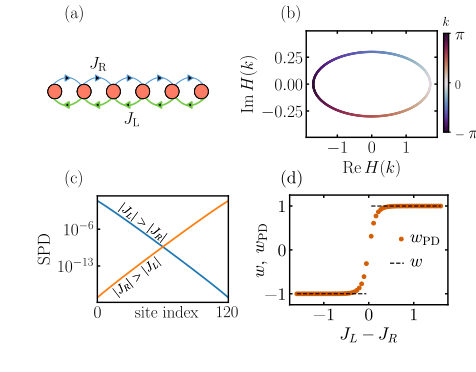
<figcaption class="paper-figure-caption"><b>Fig 1.</b> Figure 1. (a) Finite-size HN chain with asymmetric nearest- neighbor hoppings JR and JL. (b) Spectrum of the Bloch Hamiltonian H(k) [Eq. (8)] in the complex-energy plane. The color scale follows the momentum (k) across the Brillouin zone, tracing an ellipse. Here (JR, JL) = (1, 0.6). (c) Summed probability density (SPD) of the open chain plotted on a log-linear scale against the site index. The non-Hermitian skin effect occurs at opposite boundaries for |JL| &gt; |JR| and |JR| &gt; |JL|. (d) Real-space polar-decomposition invariant wPD across the topological phase transition compared with the exact clean winding number w. Here ℓ= 10 and the chain length is N = 120.</figcaption>
</figure>
<figure class="paper-figure-card">
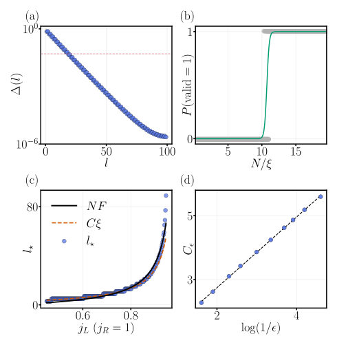
<figcaption class="paper-figure-caption"><b>Fig 2.</b> Figure 2. (a) Convergence of the real-space polar- decomposition invariant with boundary crop-length ℓ. The plotted quantity is ∆(ℓ) = |wPD(ℓ) −w|, where w is the clean momentum-space winding. The horizontal dashed line marks the tolerance ϵ = 0.05. (b) Binary valid-crop labels as a func- tion of the scaling variable x = N/ξ. Grey points show the raw valid/invalid labels, and the green curve shows the one- feature logistic fit Pvalid(x). (c) Fixed-size crop-length ℓ⋆as a function of JL for JR = 1 and N = 200. Blue points de- note numerical values, the black curve shows the finite-size fit ℓ⋆= NF(x) with F(x) = a/(x + b) + c, and the orange dashed curve shows the asymptotic guide ℓ⋆= Cϵξ....</figcaption>
</figure>
<figure class="paper-figure-card">
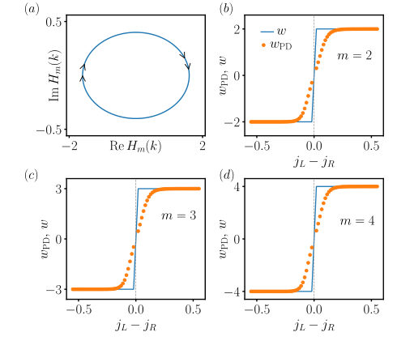
<figcaption class="paper-figure-caption"><b>Fig 3.</b> Figure 3. (a) Complex spectrum of Hm(k) for m = 2. The spectrum is an ellipse in the complex-energy plane, but it winds two times around the base point EB = 0. (b-d) Real- space polar-decomposition invariant wPD across the point-gap transition for m = 2, 3, 4, compared with the exact clean winding w.</figcaption>
</figure>
<figure class="paper-figure-card">
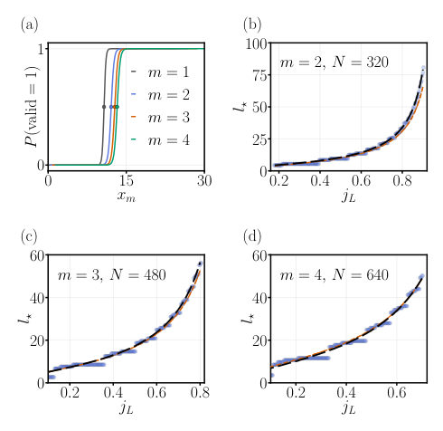
<figcaption class="paper-figure-caption"><b>Fig 4.</b> Figure 4. (a) One-feature logistic fits for the valid-crop classification problem for m = 1, 2, 3, 4, plotted against xm = N/ξm. Filled circles indicate the fitted Pvalid = 1/2 threshold points. (b-d) Integer crop-length ℓ⋆as a func- tion of JL for m = 2, 3, 4, with JR = 1. The displayed cuts use (m, N) = (2, 320), (3, 480), (4, 640). Blue points are the numerical values of ℓ⋆. The orange dashed curves show ℓcont ⋆ = Cϵξm. The black curves show ℓcont ⋆ = NF(xm), with F(xm) = a/(xm + b) + c. Integer predictions are obtained by rounding the continuous curves.</figcaption>
</figure>
<figure class="paper-figure-card">
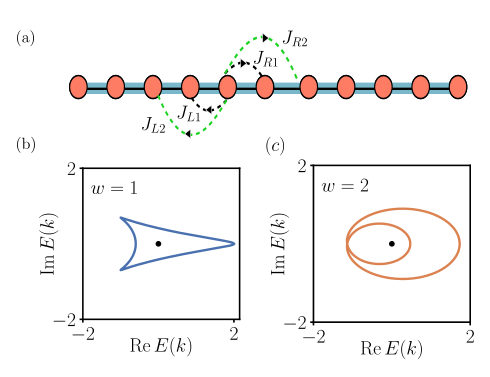
<figcaption class="paper-figure-caption"><b>Fig 5.</b> Figure 5. (a) Schematic of the open chain with first- and second-neighbor non-reciprocal hoppings. (b-c) Point-gapped spectral loops of the Bloch Hamiltonian in the complex-energy plane. The black point marks the base energy EB = 0. The winding number w is computed from the phase winding of H(k) (see Eq. (46) and Eq. (1)) around this base point.</figcaption>
</figure>

**Summary.** This paper introduces a machine learning approach to solve the practical problem of determining the correct 'crop-length' needed for calculating topological invariants in finite non-Hermitian quantum chains. By training Random Forest models on system parameters, the authors successfully predict this convergence criterion, demonstrating that it is governed by the underlying physical decay lengths associated with the non-Hermitian skin effect.

**Why it may be interesting.** This work bridges advanced condensed matter topology (non-Hermitian physics) with modern data science techniques. For AMO/open systems, understanding how finite boundaries or measurement limitations affect bulk topological properties is crucial, making the ML prediction of $\ell^\star$ highly relevant for experimental interpretation.

Detailed structure

**Main problem.** The primary goal is to develop a practical, physically interpretable method to determine the necessary 'crop-length parameter' ($\ell$) for a real-space topological invariant in finite non-Hermitian chains.

**Main result.** Machine learning models (Random Forest) can accurately predict this required crop-length ($\ell^\star$), showing that it is fundamentally controlled by physical decay lengths associated with the non-Hermitian skin effect.

**Method.** The authors employ Random Forest regression and classification, training ML predictors on system parameters to automate the selection of $\ell$ needed for convergence.

**Model / system.** The study analyzes finite one-dimensional non-Hermitian chains, including Hatano-Nelson type models (nearest-neighbor) and general $m$-hop hopping systems. The topology is diagnosed using a real-space invariant derived from the polar decomposition of the Hamiltonian matrix.

**Key observables.** Topological Invariant ($w_{PD}(\ell)$), clean momentum-space winding number ($w$), required crop-length ($\ell^\star$), and localization/decay lengths ($\xi, \xi_m$).

**Important parameters / regimes.** Non-reciprocity parameters ($J_R, J_L$), system size ($N$), disorder strength ($r_W$), and the ratio $x = N/\xi$.

**Assumptions / limitations.** The convergence of the real-space invariant is assumed to be governed by physical decay lengths ($\xi$ or $\xi_m$) derived from the spectral properties.

**Figures summary.** Figures illustrate the non-Hermitian skin effect, the comparison between $w_{PD}$ and $w$, and show how ML predictions generalize across phase diagrams and under disorder.

**Paper structure.** The paper first establishes the physical problem of finite-size effects in topological invariants. It then develops an ML framework using decay lengths as key features to predict the convergence parameter $\ell^\star$. Finally, it validates this approach by testing generalization and stability under disorder for various hopping models.

Abstract

A topological invariant based on polar-decomposition of matrices correctly captures the topology of finite non-Hermitian chains exhibiting the non-Hermitian skin effect, provided that an appropriate crop-length parameter is chosen. This parameter, which sets the cutoff used in the calculation of the invariant, is usually chosen empirically and becomes especially important near topological phase transitions, where finite-size effects are strongest. Here we show that the required crop-length is controlled by physical decay (localization) lengths. For nearest-neighbor and pure longer-range hopping Hatano-Nelson-type chains, the crop-length is set mainly by a single localization length and is well approximated by a scalar multiple of that length. For more general longer-range hopping models, it is governed instead by a multichannel root structure of the characteristic polynomial. Random-forest regression captures finite-size and near-boundary corrections while preserving this decay-length interpretation. Trained on one set of Hamiltonians, the predictor accurately generalizes to unseen Hamiltonians and complex base energies, reproducing crop-lengths across full phase diagrams. We further show that the predictions learned from clean nearest-neighbor hopping chains remain stable under moderate hopping disorder. These results provide a practical and physically interpretable way to choose the crop-length, which in turn determines when the real-space invariant can reliably capture the topology of finite non-Hermitian chains.

[↑ back to top](#top)

### [Weak-coupling altermagnetism and chiral magnetic excitations in a checkerboard lattice](http://arxiv.org/abs/2607.06106v1)

**Authors:** Abhigya Rangari, Manna Paul, Sayandip Ghosh  
**Type:** theory · **Category:** strongly correlated electrons · **PDF:** <https://arxiv.org/pdf/2607.06106v1>  
**Analysis basis:** full PDF text, analyzed in chunks
**Topic relevance:** `analog quantum simulation` **3/5** · `exotic spin models in light-matter` **3/5** · `spintronics-quantum-optics interface` **3/5** · `Keldysh / 2PI / non-Gaussian methods` **1/5**

↔ Scroll figures horizontally

<figure class="paper-figure-card">
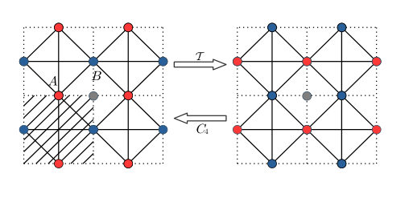
<figcaption class="paper-figure-caption"><b>Fig 1.</b> FIG. 1: The checkerboard lattice with sublattices A and B marked by red and blue circles, respectively (left panel). The shaded area denotes the unit cell. The oper- ation of time-reversal and C4 real-space rotation around the plaquette center (gray circle) converts it to the dual lattice in the right panel. The lattice constant is taken to be unity.</figcaption>
</figure>
<figure class="paper-figure-card">
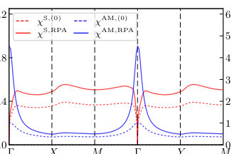
<figcaption class="paper-figure-caption"><b>Fig 2.</b> FIG. 2: (a) The static bare altermagnetic susceptibil- ity χAM,(0)(q) vs q. (b) The static bare and RPA sus- ceptibilities in the spin and altermagnetic channels for U = 1.5 and T = 0.01 along BZ symmetry directions (0, 0) →(π, 0) →(π, π) →(0, 0) →(0, π) →(π, π). Note the differing vertical scales.</figcaption>
</figure>
<figure class="paper-figure-card">
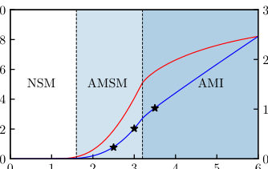
<figcaption class="paper-figure-caption"><b>Fig 3.</b> FIG. 3: The order parameter (red) and exchange field (blue) at half-filling from the self-consistent Hartree-Fock calculation, showing normal semimetal (NSM), altermag- netic semimetal (AMSM), and altermagnetic insulator (AMI) phases.</figcaption>
</figure>
<figure class="paper-figure-card">
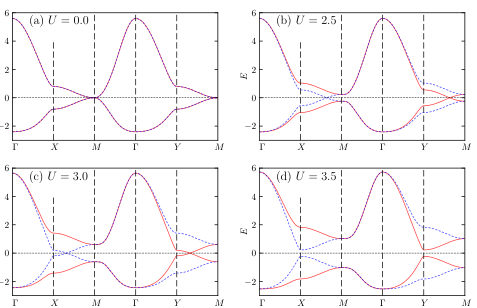
<figcaption class="paper-figure-caption"><b>Fig 4.</b> FIG. 4: Spin-resolved band structure from Eq. (2) for U = 0 (a), U = 2.5 (b), U = 3.0 (c), and U = 3.5 (d) with solid red and dashed blue lines denoting ↑and ↓- spins, respectively.</figcaption>
</figure>
<figure class="paper-figure-card">
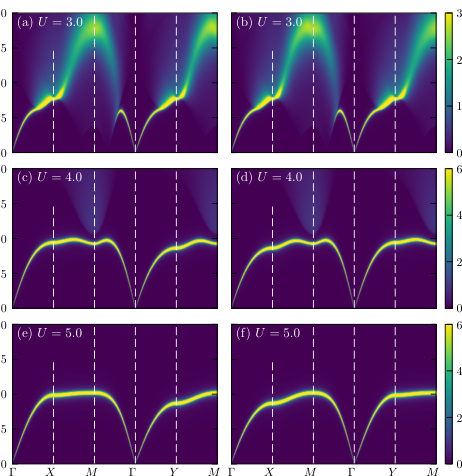
<figcaption class="paper-figure-caption"><b>Fig 5.</b> FIG. 5: Imaginary part of RPA transverse susceptibilities (χ+−in the left panel and χ−+ in the right panel) for U = 3.0 (a)-(b), U = 4.0 (c)-(d), and U = 5.0 (e)-(f).</figcaption>
</figure>

**Summary.** This work theoretically explores altermagnetism in a checkerboard lattice using the Hubbard model. By analyzing susceptibility divergences and performing RPA calculations, the authors map out phase transitions to novel magnetic states. The key finding is the observation of chirality-dependent magnon excitations that confirm the unique nature of altermagnetic order.

**Why it may be interesting.** While focused on magnetism, the study of spin excitations (magnons) derived from Hubbard models provides insights into collective quantum dynamics that can be relevant for understanding strongly correlated quantum materials studied in AMO physics or condensed matter theory.

Detailed structure

**Main problem.** The study investigates weak-coupling altermagnetism and the associated chiral magnetic excitations within a checkerboard lattice structure.

**Main result.** The research predicts phase transitions from nonmagnetic to altermagnetic semimetal and insulating phases, showing that magnetic excitations exhibit a characteristic alternating chirality splitting mirroring the electronic band splitting.

**Method.** Theoretical calculations employing mean-field treatments of the Hubbard repulsion combined with Random-Phase Approximation (RPA) for analyzing dynamical spin susceptibilities.

**Model / system.** The system is modeled using a minimal one-band Hubbard model applied to electrons on a checkerboard lattice. The analysis explores how electron interactions drive the material into an altermagnetic state characterized by spin-split bands.

**Key observables.** Altermagnetic susceptibility ($\chi_{AM}$), spin susceptibility ($\chi_S$), electronic band structure ($E_\pm(\mathbf{k})$), and magnon excitation spectra ($	ext{Im}(\chi)$).

**Important parameters / regimes.** Interaction strength ($U$) relative to hopping parameters ($t_1, t_2, t_3$); filling level (half-filling).

**Assumptions / limitations.** The analysis is conducted within a weak-coupling framework and relies on the Random-Phase Approximation (RPA) for excitations.

**Figures summary.** Figures illustrate the lattice structure, static and RPA susceptibilities ($\chi_{AM}$ vs $\mathbf{q}$), phase diagrams showing transitions between different magnetic/electronic phases, spin-resolved band structures, and magnon spectral functions ($	ext{Im}(\chi)$).

**Paper structure.** The paper proceeds by establishing the model on the checkerboard lattice, using mean-field theory to map out phase transitions based on $U$, and finally applying RPA techniques to calculate the magnetic excitation spectra in the resulting altermagnetic phases.

Abstract

Altermagnets, characterized by spin-split electronic bands with compensated magnetic moments, have emerged as a new class of magnetic materials garnering attention in recent years. Here, using a minimal one-band Hubbard model, we show that the checkerboard lattice serves as a natural platform for altermagnetism for electrons. The instability towards altermagnetic order is denoted by diverging altermagnetic susceptibility at weak-coupling. Carrying out mean-field treatment of the Hubbard repulsion, we show phase transitions from the nonmagnetic to altermagnetic semimetal and then to altermagnetic insulating phase, allowing clear identification of spin-split states. We then examine magnetic excitations in the altermagnetic phases using a random-phase approximation treatment of the dynamical spin susceptibility. The altermagnetic order is found to be stable against spin-fluctuations with the excitation spectra showing well-defined magnon excitations, which decay into single-particle excitations with decreasing interaction strength. Remarkably, the magnetic excitations exhibit strong dependence on both chirality and direction, showing an alternating chirality splitting, similar to the alternating spin splitting of the electronic bands, which serves as a salient feature of altermagnetism.

[↑ back to top](#top)

### [Quantum Channel Polynomial Processing](http://arxiv.org/abs/2607.06557v1)

**Authors:** Tianhan Liu, Fedor Simkovic, Martin Leib  
**Type:** theory · **Category:** quantum information and computing · **PDF:** <https://arxiv.org/pdf/2607.06557v1>  
**Analysis basis:** full PDF text, analyzed in chunks
**Topic relevance:** `analog quantum simulation` **3/5** · `correlated / nonlocal dissipation` **1/5** · `correlated cavity matter` **1/5** · `driven-dissipative phase transition` **1/5** · `entanglement & information structure` **1/5** · `methods for driven-dissipative` **1/5** · `non-equilibrium dynamics` **1/5**

↔ Scroll figures horizontally

<figure class="paper-figure-card">
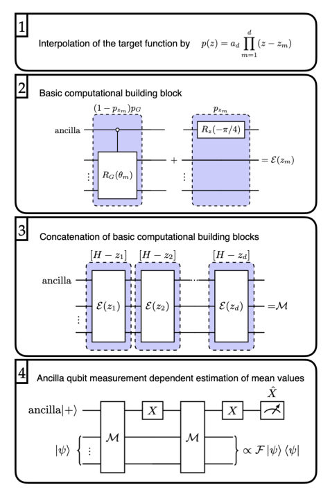
<figcaption class="paper-figure-caption"><b>Fig 1.</b> FIG. 1. Workflow of the Quantum Channel Polynomial Pro- cessing (QCPP) method: (1) A target function f is interpo- lated by a order-d polynomial p. (2) The basic computational building block of QCPP then corresponds to stochastically sampling unitary circuits, c.f. (3) Every basic computational building block corresponds to a root of the interpolating poly- nomial. To encode the entire polynomial one needs to con- catenate d basic computational building blocks probabilities to construct the channel M (4) Channel M needs to repeated twice with interleaved application of a X gate on the ancilla qubit. (5) Measurements on the computational register in- formed by the measurement result on the...</figcaption>
</figure>

**Summary.** The paper introduces Quantum Channel Polynomial Processing (QCPP), an algorithm designed to implement functions of Hermitian operators on quantum states. By replacing complex coherent unitaries with stochastic probabilistic mixtures, QCPP significantly simplifies the circuit requirements compared to existing techniques like QSVT. This advancement makes simulating complex Hamiltonians more feasible for near-term and intermediate-scale quantum hardware.

**Why it may be interesting.** This work directly addresses algorithmic efficiency in quantum simulation, offering a hardware-friendly alternative to complex unitary encodings required by standard QSVT methods for simulating Hamiltonians relevant to AMO physics.

Detailed structure

**Main problem.** Developing a quantum algorithmic framework to efficiently apply arbitrary functions of Hermitian operators, $f(H)
ho f(H)^\dagger$, on an initial quantum state.

**Main result.** The proposed Quantum Channel Polynomial Processing (QCPP) method achieves a favorable tradeoff between sample and query complexity, allowing for polynomial sample scaling with respect to the required precision.

**Method.** QCPP replaces coherent block encoding used in QSVT with stochastic encodings of Hamiltonian commutators/anti-commutators at the channel level, utilizing probabilistic mixtures of unitary channels.

**Model / system.** The framework operates on an n-qubit computational register and one ancillary qubit. The target process approximates applying a function $f$ to a Hermitian operator $H$, which is constructed from Pauli operators.

**Key observables.** Sample Complexity ($\Gamma(p)$), Query Complexity ($d$), and the resulting quantum channel $\mathcal{F}$.

**Important parameters / regimes.** The tradeoff between sample complexity (related to polynomial coefficients) and query complexity (number of basic blocks $d$).

**Assumptions / limitations.** It assumes the ability to implement the probabilistic building block $E$, and it relies on polynomial interpolation techniques for approximating the target function $f$.

**Figures summary.** Figure 1 illustrates the workflow: polynomial interpolation, construction of the basic computational building block via stochastic sampling, concatenation of blocks corresponding to roots, and the final measurement sequence.

**Paper structure.** The paper builds from defining the problem (applying $f(H)$) to introducing QCPP as a replacement for QSVT's coherent encoding. It details the mathematical structure using probabilistic mixtures and analyzes the resulting complexity trade-offs by constructing specific polynomials that yield polynomial sample scaling.

Abstract

We introduce a quantum algorithmic framework based on probabilistic mixtures of unitary channels that, similar to the framework of quantum singular value transformations, enables the application of arbitrary polynomials of hermitian operators onto arbitrary initial states. We show that our framework supports a flexible tradeoff between sample- and query complexity ranging from optimal query complexity, meaning logarithmic in the error, and exponentially scaling sample complexity to sub-polynomial query complexity in the error and polynomial sample complexity. Combined with the considerably lower quantum circuit complexity, compared to quantum singular value transformations with a linear combination of unitaries block encoding, we argue that our framework can be seamlessly scaled from NISQ to fault-tolerant quantum computing.

[↑ back to top](#top)

### [Interplay Between Quantum Coherence and Multiparameter Quantum Estimation in Graphene](http://arxiv.org/abs/2607.05661v1)

**Authors:** Younes Moqine, Brahim Adnane, Abdelilah El Rhazali, and Rachid Houça  
**Type:** theory · **Category:** other · **PDF:** <https://arxiv.org/pdf/2607.05661v1>  
**Analysis basis:** full PDF text, analyzed in chunks
**Topic relevance:** `quantum measurements` **3/5** · `Keldysh / 2PI / non-Gaussian methods` **1/5** · `analog quantum simulation` **1/5** · `entanglement & information structure` **1/5** · `measurement-induced transitions` **1/5**

↔ Scroll figures horizontally

<figure class="paper-figure-card">
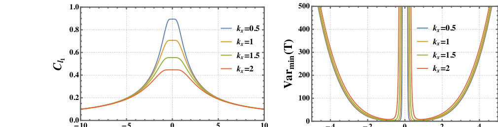
<figcaption class="paper-figure-caption"><b>Fig 1.</b> Figure 1 – Temperature dependence of quantum coherence and minimum estimation variance for different values of the wave vector kx, with kz = 1.</figcaption>
</figure>
<figure class="paper-figure-card">
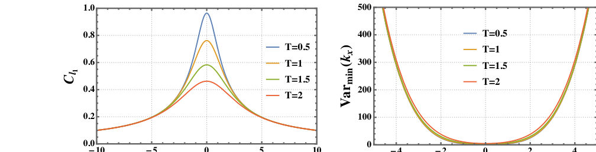
<figcaption class="paper-figure-caption"><b>Fig 2.</b> Figure 2 – Quantum coherence and minimum estimation variance in terms of the wave vector kx for different values of the temperature T, with kz = 1.</figcaption>
</figure>
<figure class="paper-figure-card">
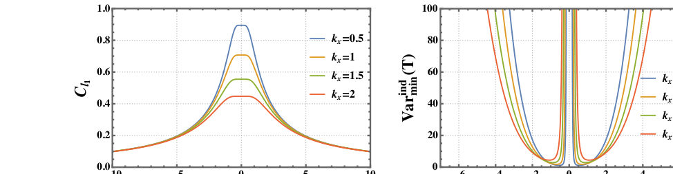
<figcaption class="paper-figure-caption"><b>Fig 3.</b> Figure 3 – Temperature dependence of quantum coherence C and the individual minimum estimation variance Varind min(T) for different values of the wave vector kx, with kz = 1.</figcaption>
</figure>
<figure class="paper-figure-card">

<figcaption class="paper-figure-caption"><b>Fig 4.</b> Figure 4 – Wave-vector dependence of quantum coherence C and the minimum variance Varmin ind (kx) in the independent estimation scheme for different values of the temperature T.</figcaption>
</figure>
<figure class="paper-figure-card">
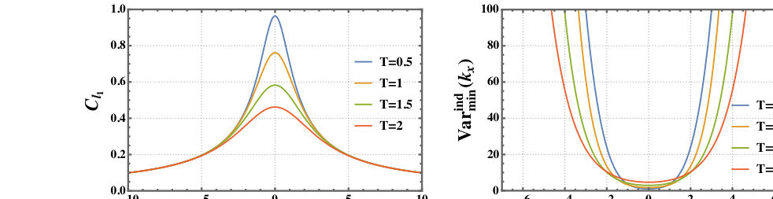
<figcaption class="paper-figure-caption"><b>Fig 5.</b> Figure 4 illustrates the dependence of the quantum coherence C and the minimum variance Varind min(kx) on the wave vector kx for different values of the temperature T. As shown in the left panel, the coherence reaches its maximum around kx = 0, indicating that the system preserves stronger quantum coherence in the low-wave-vector region. When |kx| increases, the coherence gradually decreases, showing that large values of the wave vector weaken the quantum superposition properties of the system. Moreover, increasing the temperature reduces the maximum value of coherence. The highest coherence is obtained for the lowest temperature, while higher temperatures lead to a progressive suppression...</figcaption>
</figure>

**Summary.** This theoretical study examines the interplay between quantum coherence and the precision limits of estimating temperature and wave vector in a graphene system. Using the Quantum Fisher Information Matrix, the authors find that while coherence peaks near $k_x=0$, the best estimation precision requires considering parameter correlations via a ratio $\Gamma$. The results highlight that optimal metrology depends on more than just maximizing quantum coherence.

**Why it may be interesting.** This work bridges quantum metrology (a key area in quantum information) with condensed matter physics by applying advanced estimation theory to the electronic properties of graphene, showing that resource quantification (coherence) is not sufficient for optimal measurement design.

Detailed structure

**Main problem.** The study investigates how quantum coherence influences the precision achievable when estimating multiple physical parameters, specifically temperature (T) and wave vector ($k_x$), in a graphene system.

**Main result.** Optimal estimation precision does not necessarily coincide with regions of maximal quantum coherence; furthermore, the relationship between independent versus simultaneous estimation strategies is quantified by a ratio $\Gamma$.

**Method.** The analysis employs the Quantum Fisher Information Matrix (QFIM) and the quantum Cramér–Rao bound to establish lower limits on parameter uncertainty for both joint and separate estimations.

**Model / system.** The system modeled is graphene, treated using an effective Dirac-like Hamiltonian. The thermal state density matrix $
ho$ is derived based on this Hamiltonian, which depends on $k_x$ and $T$.

**Key observables.** Quantum coherence ($C_{\ell_1}$), minimum variances ($	ext{Var}_{\min}(T)$, $	ext{Var}_{\min}(k_x)$), and the comparison ratio $\Gamma$.

**Important parameters / regimes.** Temperature ($T$) and wave vector component ($k_x$). Key regimes include low temperatures and $k_x \approx 0$.

**Assumptions / limitations.** The analysis uses the $\ell_1$-norm for coherence, which is basis-dependent. It also notes that while the bound can be calculated, attainability depends on specific commutation relations between derived operators.

**Figures summary.** Figures illustrate the dependence of coherence and minimum variance on $k_x$ (for fixed $T$) and the ratio $\Gamma$ as a function of both $k_x$ and $T$.

**Paper structure.** The paper first defines the physical model and quantifies coherence. It then develops the theoretical framework using QFIM for multiparameter estimation, calculating bounds for independent and simultaneous schemes. Finally, it analyzes how coherence relates to these minimum variances across different parameter regimes.

Abstract

In this work, we investigate the relationship between quantum coherence and multiparameter quantum estimation in a graphene-based system. We focus on the estimation of two relevant physical parameters, namely the temperature $T$ and the wave vector $k_x$, and analyze how their variations affect both quantum coherence and the achievable metrological precision. The minimum variances associated with the estimation process are evaluated through the quantum Cramér--Rao bound within both simultaneous and independent estimation schemes. Our results show that quantum coherence is enhanced in the low-temperature regime and around $k_x=0$, while it decreases progressively as either the temperature or the wave vector increases. However, the regions where coherence is maximal do not necessarily coincide with those of optimal estimation precision. In particular, the variance associated with temperature estimation exhibits a divergent behavior near $T=0$, indicating that the system becomes weakly sensitive to small temperature variations in this regime. By contrast, the estimation of the wave vector $k_x$ is more directly related to the coherence properties of the system, with improved precision obtained near $k_x=0$. Furthermore, we introduce the ratio $Γ$ to compare the total variances obtained from the independent and simultaneous estimation schemes. This quantity provides a useful measure of the relative difference between the two strategies when the parameters are estimated separately or jointly.

[↑ back to top](#top)

### [Three-point density correlations in a weakly interacting 2D Fermi liquid](http://arxiv.org/abs/2607.05747v1)

**Authors:** C. L. Kane  
**Type:** theory · **Category:** quantum gases · **PDF:** <https://arxiv.org/pdf/2607.05747v1>  
**Analysis basis:** full PDF text, analyzed in chunks
**Topic relevance:** `Keldysh / 2PI / non-Gaussian methods` **3/5** · `analog quantum simulation` **3/5** · `methods for driven-dissipative` **1/5**

↔ Scroll figures horizontally

<figure class="paper-figure-card">
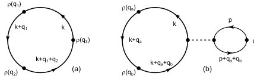
<figcaption class="paper-figure-caption"><b>Fig 1.</b> FIG. 1. Feynman diagrams for sρ 3 to (a) zeroth order and (b) first order in the interaction u.</figcaption>
</figure>
<figure class="paper-figure-card">
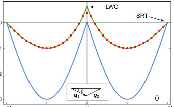
<figcaption class="paper-figure-caption"><b>Fig 2.</b> FIG. 2. First order perturbative correction to the three-point correla- tion s(1) 3 (q1, q2) for |q1| = |q2| = .2kF as a function of the angle θ between q1 and q2. The red dots are the numerical integration of the exact first order correction (20,21), and the green curve is the |q1,2| ≪kF asymptotic limit (25). The blue curve is the first order Fermi liquid theory prediction (17), which describes the singularity in the LWC limit.</figcaption>
</figure>
<figure class="paper-figure-card">
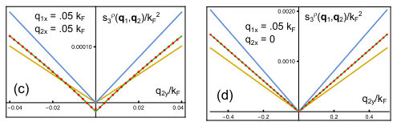
<figcaption class="paper-figure-caption"><b>Fig 3.</b> FIG. 3. Three-point total density correlation function sρ 3(q1xˆx, q2xˆx + q2y ˆy) as a function of q2y for different con- figurations of fixed q1x and q2x. The gold lines show the exact non-interacting prediction (10,11), while the other data show ap- proximations for a moderately weak attractive interaction I = −0.2. The blue line shows the Fermi liquid theory prediction (17) ex- trapolated beyond the LWC limit. The red dots are the numerical integration of the exact first order theory (21,22), while the green lines are the analytic formula (25) derived for |q1|, |q2| ≪kF .</figcaption>
</figure>
<figure class="paper-figure-card">
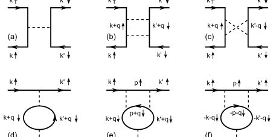
<figcaption class="paper-figure-caption"><b>Fig 4.</b> FIG. 4. Feynman diagrams for the vertex function Γ↑↓ kk′ (a,b,c) and Γ↑↑ kk′ (d,e,f). The diagrams are to be evaluated with the four external legs removed. (e) and (f) are counted twice to account for diagrams related by reflection.</figcaption>
</figure>
<figure class="paper-figure-card">
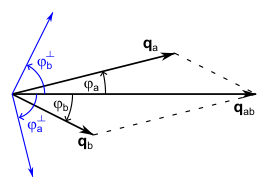
<figcaption class="paper-figure-caption"><b>Fig 5.</b> FIG. 6. Definition of angles characterizing qa, qb and qab = qa + qb. For this configuration φa, φ⊥ b &gt; 0 and φb, φ⊥ a &lt; 0.</figcaption>
</figure>

**Summary.** This paper theoretically calculates the three-point density correlations in a weakly interacting 2D Fermi liquid. Using perturbative methods, it derives interaction corrections for both total and same-spin density correlators. The results are highly relevant for interpreting upcoming experimental measurements using quantum gas microscopy on atomic Fermi gases.

**Why it may be interesting.** This work provides highly detailed theoretical predictions for correlation functions in ultracold atomic Fermi gases, directly connecting fundamental many-body theory (Fermi liquid parameters) to measurable quantities accessible via quantum gas microscopy.

Detailed structure

**Main problem.** The study focuses on calculating the three-point equal-time density correlations ($
ho^3$) in a weakly interacting two-dimensional Fermi liquid.

**Main result.** The authors derive explicit, perturbative results for both the total and same-spin density three-point correlators, providing corrections beyond the standard long-wavelength collinear limit.

**Method.** The calculations employ a systematic perturbative expansion in the interaction parameter ($I$) using diagrammatic techniques (Feynman diagrams) within the framework of Fermi liquid theory.

**Model / system.** The system is modeled as a spin 1/2 Fermi gas confined to two dimensions, interacting via an attractive contact potential. The analysis uses Hamiltonian formulations and correlation functions derived from quantum field theory methods.

**Key observables.** Total density three-point correlator ($s_{
ho}^3(q_1, q_2)$) and same-spin three-point correlator ($s_{\uparrow}^3(q_1, q_2)$).

**Important parameters / regimes.** The dimensionless interaction parameter $I = -1/\log k_F a$, the Fermi momentum $k_F$, and various wave vectors ($\mathbf{q}_i$). The Long-Wavelength Collinear (LWC) limit is a key regime analyzed.

**Assumptions / limitations.** The theory relies on perturbative expansions in weak interactions ($N_0|u| \ll 1$) and assumes the validity of Fermi liquid theory, although results are extended beyond its strict limits.

**Figures summary.** Figures illustrate Feynman diagrams for correlation functions at different orders, compare exact calculations against asymptotic approximations and standard Fermi liquid predictions across various momentum configurations (e.g., isosceles triangles).

**Paper structure.** The paper proceeds by defining the observables, calculating the zeroth-order non-interacting case, and then systematically deriving the first-order interaction corrections ($L_1$ or $s^{(1)}$) through complex integral evaluations in momentum space.

Abstract

We study the three-point equal-time correlations of the density in a weakly interacting spin 1/2 Fermi gas and present two new results. First, we compute the three-point correlation for the total density $ρ= ρ_\uparrow + ρ_\downarrow$ exactly as a function of momentum to first order in a dimensionless interaction parameter ${\cal I}$. This generalizes a previous result that related the three-point function to the Landau Fermi liquid parameters $F_0^s$ and $F_0^a$ and applied in a certain long-wavelength collinear limit. Second, we compute the leading order ${\cal O}({\cal I}^3)$ interaction correction to the same-spin three-point correlation function in the long-wavelength collinear limit. These results are directly relevant to current experiments on atomic Fermi gases using quantum gas microscopy.

[↑ back to top](#top)

### [Attosecond metrology of bright quantum light](http://arxiv.org/abs/2607.06395v1)

**Authors:** P. Stammer, J. Rivera-Dean, E. Pisanty, M. Lewenstein  
**Type:** theory · **Category:** other · **PDF:** <https://arxiv.org/pdf/2607.06395v1>  
**Analysis basis:** full PDF text, analyzed in chunks
**Topic relevance:** `quantum optics experiment` **3/5** · `quantum measurements` **2/5** · `interference shaping light` **1/5**

↔ Scroll figures horizontally

<figure class="paper-figure-card">
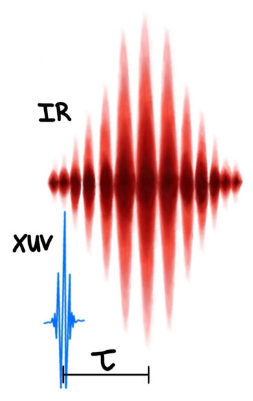
<figcaption class="paper-figure-caption"><b>Fig 1.</b> FIG. 1. Streaking of a bright squeezed vacuum field. Schematic illustration of the quantum optical attosecond streaking, where the IR streaking field consists of quantum light such as a bright squeezed vacuum and is delayed by τ with respect to the coherent XUV pulse. The distinct subcycle modulations in the streaking trace reveal the field fluctuations and allow for measurement of quadrature squeezing.</figcaption>
</figure>
<figure class="paper-figure-card">
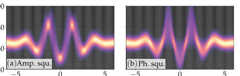
<figcaption class="paper-figure-caption"><b>Fig 2.</b> FIG. 3. Attosecond streaking trace of bright quantum light. Quantum optical streaking trace for a displaced squeezed state D(α) |ξ⟩with amplitude squeezing in (a) and phase squeezing in (b). The squeezing intensity of Isq = 5 × 10−5 a.u. is the same for all cases. For the amplitude and phase squeezed state we considered the ratio of Icoh/Isq ∼6, for the intensity from the coherent and the squeezed contribution.</figcaption>
</figure>
<figure class="paper-figure-card">
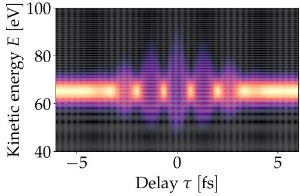
<figcaption class="paper-figure-caption"><b>Fig 3.</b> FIG. 2. Attosecond streaking a bright squeezed vacuum field. Quantum optical streaking trace of a BSV field show- ing distinct sub-cycle 2ω oscillations around a vanishing mean value of the streaking field with prominent quantum fluctu- ations. Here, we set the squeezing intensity of the streaking field (ω = 0.057 a.u.) to Isqu = 5 × 10−5 a.u., using helium (Ip = 0.904 a.u.) for the atomic system, and used a coherent XUV pulse of Ω= 3.3 a.u. and IR pulse duration (FWHM) of 5 fs.</figcaption>
</figure>
<figure class="paper-figure-card">
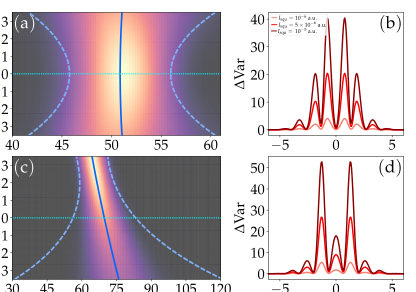
<figcaption class="paper-figure-caption"><b>Fig 4.</b> FIG. 4. Physical origin of the variance distribution for anti- squeezed light. Streaking trace at fixed time-delay τ for the classical fields resembling the amplitude and phase-squeezed vector potential. For (a) and (b) the field Aam(t), while for (c) and (d) the field Aph(t) was considered.</figcaption>
</figure>

**Summary.** The paper introduces a method to measure quantum fluctuations in bright light by adapting attosecond streaking spectroscopy. By analyzing the Quantum Optical Streaking Trace, researchers can detect signatures of field squeezing that are invisible to classical measurement techniques. This opens a new avenue for performing quantum optical metrology with attosecond temporal precision.

**Why it may be interesting.** This work directly bridges advanced concepts in quantum optics (squeezing, non-Gaussian states) with ultrafast time resolution techniques (attosecond metrology), providing a novel diagnostic tool for fundamental quantum physics research.

Detailed structure

**Main problem.** To extend attosecond metrology from classical field measurements to accurately quantify quantum fluctuations present in bright quantum light.

**Main result.** The developed Quantum Optical Streaking Trace (QOST) serves as a certification method capable of measuring quantum squeezing below the shot noise limit, overcoming limitations of conventional state tomography.

**Method.** The authors utilize an attosecond streaking measurement scheme where photoionization by an XUV pulse followed by interaction with a quantized Infrared (IR) field allows for the calculation of the QOST via trace operations over the joint light-matter quantum state.

**Model / system.** The system involves an electron interacting with an intense XUV burst and an arbitrary IR streaking field, which is modeled as a quantized electromagnetic field capable of being in squeezed vacuum states. The evolution is governed by unitary operators derived from the interaction Hamiltonian.

**Key observables.** Quantum Optical Streaking Trace (QOST), $	ext{SQ}(p, 	au)$, and its sensitivity to quadrature squeezing properties of the IR field.

**Important parameters / regimes.** Attosecond temporal resolution ($	au$), quantum squeezing parameters, and measurement regimes below the shot noise limit.

**Assumptions / limitations.** The formalism is derived for an arbitrary light field (classical or quantum); approximations are made when comparing to quasi-classical limits, though the full quantum treatment is emphasized.

**Figures summary.** Figures illustrate the QOST for bright squeezed vacuum fields, showing distinct sub-cycle modulations revealing field fluctuations and allowing quadrature squeezing measurement; comparisons are drawn between amplitude vs. phase squeezed states.

**Paper structure.** The paper establishes the gap in current metrology (classical limitation), develops the quantum formalism using the QOST, derives mathematical expressions comparing full quantum traces to semi-classical limits, and finally demonstrates how specific field fluctuations manifest as measurable modulations in the trace.

Abstract

Attosecond metrology is the ability to measure ultrafast optical light-wave oscillations, yet its approach has been limited to classical fields. Hence, the influence of the fluctuations of a quantum field on attosecond measurements has remained unexplored. Here, we close this gap by showing that the attosecond streaking measurement of bright quantum light is sensitive to quantum fluctuations of the optical field on the attosecond timescale. The distinct sub-cycle modulations allow to extract the properties of the squeezed field quadrature in regimes where conventional state tomography approaches reach their limitation. With the full quantum optical attosecond streaking scheme developed here, we provide a certification method that can measure quantum squeezing below the shot noise limit, thereby overcoming the problem of tomographically measuring bright quantum light. This opens the way towards quantum optical metrology of field fluctuations with attosecond temporal resolution.

[↑ back to top](#top)

### [Half state at $ν_{tot}$ = -1/2 and its transition in Decoupled Twisted Double Bilayer Graphene](http://arxiv.org/abs/2607.06547v1)

**Authors:** Ning Ma, Kenji Watanabe, Takashi Taniguchi, Mitali Banerjee  
**Type:** experiment · **Category:** strongly correlated electrons · **PDF:** <https://arxiv.org/pdf/2607.06547v1>  
**Analysis basis:** full PDF text, analyzed in chunks
**Topic relevance:** `analog quantum simulation` **3/5** · `driven-dissipative phase transition` **1/5** · `methods for driven-dissipative` **1/5** · `non-equilibrium dynamics` **1/5**

↔ Scroll figures horizontally

<figure class="paper-figure-card">
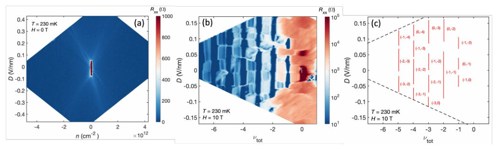
<figcaption class="paper-figure-caption"><b>Fig 1.</b> FIG. 1. Electrical measurement of 8° twisted double bilayer graphene device. (a) The longitudinal resistance of the measured device as a function of both total carrier density n and displacement field D at 230 mK. The typical dual gate map of large-angle twisted double bilayer graphene devices is consistent with the previous results in the literature. Highly resistive state along the vertical line at zero carrier density is attributed to the gapped states of both layers of bilayer graphene. The full map is divided into several regions by lines indicating the resistive states of bilayer graphene. (b,c) The longitudinal resistance of the measured device on hole-doped side, as a function of...</figcaption>
</figure>
<figure class="paper-figure-card">
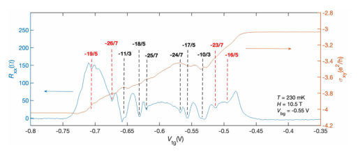
<figcaption class="paper-figure-caption"><b>Fig 2.</b> FIG. 3. Jain sequences of both the 2-flux and 4-flux com- posite fermion states. The longitudinal resistance and Hall conductivity are plot as a function of top gate at 230 mK and 10.5 T. Different fractional filling factors corresponding to the 2-flux (4-flux) states are labeled and marked by black (red) dashed lines. All the states are observed under an unzero dis- placement field.</figcaption>
</figure>
<figure class="paper-figure-card">
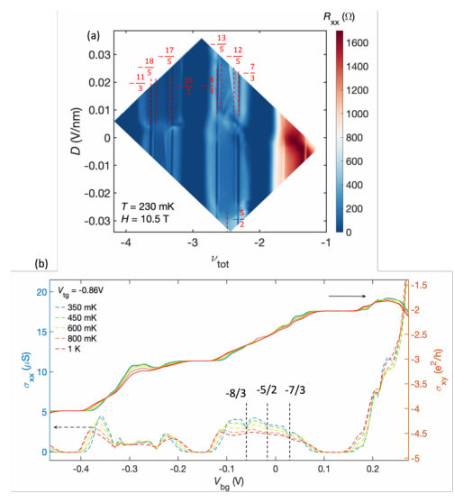
<figcaption class="paper-figure-caption"><b>Fig 3.</b> FIG. 2. Sequences of fractional states near total filling factor -2 and -3. (a) The longitudinal resistance near filling fac- tor -2 and -3, as a function of both total carrier density and displacement field at 230 mK and 10.5 T. Fractional states of Jain sequence ν = -(n/2n+1) emerge when tuning total carrier density at around ff = -2 and -3. The correspond- ing Hall conductivity maps of these states can be found in Supplementary Materials. In addition to these Jain states, when increasing displacement field, there occurs the transi- tion from Jain states to even denominator states at ff = -2. As shown in Fig.2(a), Half state of ν = -5/2 can be found when displacement field |D| is larger...</figcaption>
</figure>
<figure class="paper-figure-card">
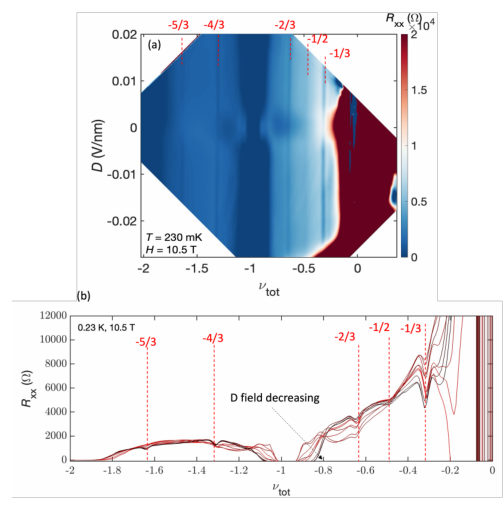
<figcaption class="paper-figure-caption"><b>Fig 4.</b> FIG. 4. Excitonic states of fractional fillings near νtot = - 1. (a) The longitudinal resistance of TDBG as a function of both total filling factors and displacement field at 230 mK and 10.5 T. 1/3 and 2/3 states can be observed on both side of νtot = -1, as indicated by the red dashed lines in Fig.4(a). Besides, the -1/2 state is found to coexist with the Jain states even at zero displacement field. Interestingly, the -1/3 state at zero displacement field is attributed to an excitonic ground state which is the fractional analogy to the excitonic states at odd integer filling factors in bilayer quantum Hall systems. Moreover, the -1/2 state is also found to be robust at zero displacement...</figcaption>
</figure>
<figure class="paper-figure-card">
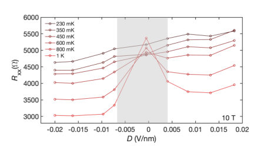
<figcaption class="paper-figure-caption"><b>Fig 5.</b> FIG. 5. Displacement field and temperature dependence of the longitudinal resistance at νtot = -1/2. The Rxx as a function of displacement field is measured at different tem- peratures, with total filling factor fixed at -1/2. At small D field region, denoted by the gray shading in the figure, the re- sistance follows strong D field-dependence especially at high temperature, in contrast to the rest of the diagram, where the state shows robustness against D field, indicating the robust- ness against the charge distribution asymmetry.</figcaption>
</figure>

**Summary.** This work reports magnetotransport measurements on decoupled twisted double bilayer graphene to investigate fractional quantum Hall states. The key finding is the observation of a controllable transition at half-filling ($
u_{tot}=-1/2$) from a two-component Abelian state to a one-component non-Abelian state by tuning an external displacement field. This demonstrates that TDBG is a tunable platform for studying fundamental correlated electron physics.

**Why it may be interesting.** The ability to tune between different topological ground states (Abelian vs. non-Abelian) using an external electric field ($D$) in a solid-state system like graphene makes this highly relevant for realizing and controlling exotic quantum phases of matter.

Detailed structure

**Main problem.** The study aims to resolve the long-standing debate regarding the origin of the half-filling fractional quantum Hall state ($
u_{tot} = -1/2$) in double quantum Hall systems, specifically distinguishing between two-component (Halperin) and one-component (Pfaffian) origins.

**Main result.** The authors observed that at zero displacement field ($D=0$), the $
u_{tot}=-1/2$ state is consistent with a two-component Halperin-Laughlin state, which undergoes a transition to a one-component non-Abelian state when a finite displacement field is applied.

**Method.** Magnetotransport measurements (longitudinal resistance) were performed as a function of total carrier density and an out-of-plane magnetic field, supplemented by temperature dependence measurements to extract activation gaps.

**Model / system.** The physical platform utilized is Decoupled Twisted Double Bilayer Graphene (TDBG), which serves as a tunable model for double quantum Hall systems due to its controllable interlayer coupling and orbital degrees of freedom.

**Key observables.** Resistive minima in $
u_{tot}-D$ maps, thermal activation gaps ($\Delta$), and the transition between 2C and 1C state signatures.

**Important parameters / regimes.** Total filling factor ($
u_{tot}$), displacement field ($D$), magnetic field strength ($B \approx 10 	ext{ T}$), and temperature range (350 mK to 1 K).

**Assumptions / limitations.** The analysis assumes that the observed transitions are governed by polarization induced by the displacement field, which breaks interlayer coherence between different correlated states.

**Figures summary.** Figures show $
u_{tot}-D$ maps revealing integer and fractional Hall states; temperature dependence plots confirm distinct activation gaps for various fillings ($
u=-8/3, -7/3, -5/2$); and specific plots illustrate the transition of the half-filling state with applied $D$.

**Paper structure.** The paper systematically presents magnetotransport measurements across varying filling factors and displacement fields. It first establishes the observation of various fractional states (Jain sequence) and then focuses on the $
u_{tot}=-1/2$ state, detailing its transition from a 2C to a 1C non-Abelian state as $D$ is tuned.

Abstract

The origin of the fractional state at $ν$ = 1/2 observed in double-layer quantum Hall systems has been under debate for decades. Because of the variation of bilayer charge distribution and interlayer tunneling strength, the half-filling state can be attributed to a two-component(2C) or a one-component(1C) origin, which corresponds to Halperin state and Pffafian state, respectively. Here we report the magnetotransport measurement in decoupled twisted double bilayer graphene(TDBG), which has been proved to be a promising platform for double quantum Hall system. Fractional quantum hall states in both odd and even denominator fillings are observed. We also found that the half-filling state occurs at zero displacement field at $ν_{tot}$ = -1/2, which is theoretically consistent with two-component Halperin-Laughlin (Ψ331) state. Moreover, we report the transition from two-component state at zero D field to one-component non-Abelian state by tunning displacement field. Our observation of the half filling state and its transition from 2C to 1C state provides the tunability of decoupled twisted double bilayer graphene and shed light on the understanding of the ground states at half-filling factor in the double quantum Hall system.

[↑ back to top](#top)

### [Magnon-Mediated Superconductivity in a 2D Itinerant Ferromagnet with Weak Easy-plane Magnetic Anisotropy](http://arxiv.org/abs/2607.05754v1)

**Authors:** Vladimir Calvera, Heqiu Li, Yijie Wang, B. Andrei Bernevig, Andrey V. Chubukov  
**Type:** theory · **Category:** strongly correlated electrons · **PDF:** <https://arxiv.org/pdf/2607.05754v1>  
**Analysis basis:** full PDF text, analyzed in chunks
**Topic relevance:** `Keldysh / 2PI / non-Gaussian methods` **3/5** · `analog quantum simulation` **1/5** · `exotic spin models in light-matter` **1/5** · `spintronics-quantum-optics interface` **1/5**

↔ Scroll figures horizontally

<figure class="paper-figure-card">
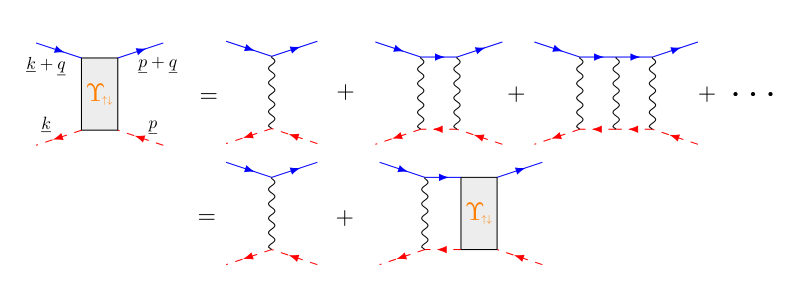
<figcaption class="paper-figure-caption"><b>Fig 1.</b> FIG. 1. The effective interaction (Υ↑↓) between spin-up (blue solid lines) and spin-down electrons (red dashed lines) in the Ladder approximation. The Wavy lines denote the bare interaction and the underlined symbols denote frequency-momentum vectors, e.g., k = (iω, k).</figcaption>
</figure>
<figure class="paper-figure-card">
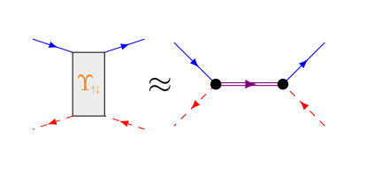
<figcaption class="paper-figure-caption"><b>Fig 2.</b> FIG. 2. Magnon-propagator approximation: we approximate the 4-fermion interaction, given by the series of ladder diagrams in Fig. 1, as the effective interaction mediated by a magnon. Double (purple) line denotes the magnon propagator, and black dots represent electron-magnon vertices. Blue and red solid lines denote spin-up and spin-down electrons, respectively.</figcaption>
</figure>
<figure class="paper-figure-card">
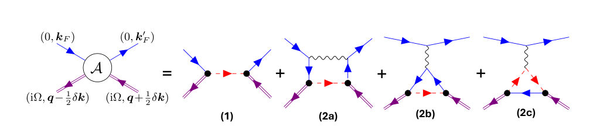
<figcaption class="paper-figure-caption"><b>Fig 3.</b> FIG. 3. Effective electron-magnon interaction. Solid blue lines denote spin-up electrons; red line dashed lines denote spin- down electrons; purple double lines denote magnon propagator; wavy lines denote bare interaction, and solid dot denotes bare electron-electron-magnon vertex. Diagrams (2a) and (2b) are present in the diagrammatic technique but cancel exactly for a contact interaction as an implementation of the Pauli principle.</figcaption>
</figure>
<figure class="paper-figure-card">
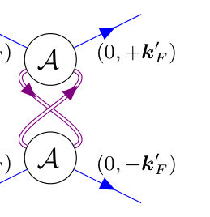
<figcaption class="paper-figure-caption"><b>Fig 4.</b> FIG. 4. Diagrammatic expansion of the magnon-mediated electron-electron interaction.</figcaption>
</figure>
<figure class="paper-figure-card">
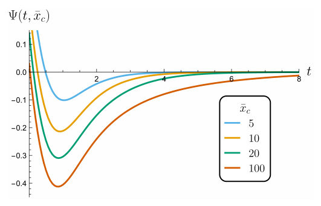
<figcaption class="paper-figure-caption"><b>Fig 5.</b> FIG. 5. Scaling function Ψ(t, ¯xc) (Eq. 27) for the effective electron-electron interaction mediated by two magnons. The two variables are t = 4z sin(ϕ/2)2 and ¯xc = 4zc ≈4z, where ϕ is the angle between the incoming and the outgoing momenta on the Fermi surface and z is defined in Eq. 25.</figcaption>
</figure>

**Summary.** This theoretical work explores how weak magnetic anisotropy can induce p-wave superconductivity in a 2D itinerant ferromagnet. The authors show that while perfect symmetry suppresses pairing, the small anisotropy generates an attractive interaction mediated by magnons. This mechanism predicts a high $T_c$ peaked near the onset of ferromagnetism.

**Why it may be interesting.** While focused on magnetism/superconductivity, the detailed diagrammatic approach to pairing interactions in a correlated electron system is highly relevant to understanding unconventional superconductivity mechanisms beyond simple BCS theory.

Detailed structure

**Main problem.** The study investigates the mechanism of superconductivity mediated by magnons in a two-dimensional itinerant ferromagnet, specifically addressing how weak magnetic anisotropy enables pairing.

**Main result.** A small easy-plane magnetic anisotropy breaks SU(2) symmetry, generating an attractive p-wave pairing interaction whose strength is enhanced near the ferromagnetic transition, leading to a sizable superconducting critical temperature ($T_c$).

**Method.** The analysis uses diagrammatic techniques (ladder approximation) applied to electron Green's functions and spin susceptibility to derive the effective electron-magnon coupling constant.

**Model / system.** The system is a single-valley model of itinerant 2D electrons with Hubbard-type interactions, modeled as an isotropic ferromagnet that undergoes a first-order Stoner transition. The key perturbation is a weak easy-plane magnetic anisotropy ($\Omega_0$).

**Key observables.** Superconducting critical temperature ($T_c$), pairing coupling constant ($\lambda_p$), and the spin-flip susceptibility $\Pi^{\uparrow\downarrow}$.

**Important parameters / regimes.** The ratio of anisotropy to Fermi energy ($\Omega_0/E_F$) and the proximity to the ferromagnetic transition ($c-1$).

**Assumptions / limitations.** The analysis relies on approximations such as restricting calculations to the ladder approximation, neglecting higher-order vertex corrections in certain limits, and assuming a single-band model.

**Figures summary.** Figures illustrate the effective electron-magnon interaction ($\Upsilon\uparrow\downarrow$) derived via ladder diagrams and detail the structure of the vertex correction $A$, showing diagrammatic cancellations due to Pauli exclusion principles.

**Paper structure.** The paper progresses by establishing the model in the isotropic limit, calculating the magnon pole from susceptibility divergence, introducing the anisotropy to break symmetry, deriving the effective interaction vertex corrections, and finally solving the linearized gap equation for $T_c$.

Abstract

Motivated by recent observations of superconductivity in a quarter-metal state of spin- and valley- polarized graphene multilayers, we investigate pairing within a ferromagnetic phase of a single-valley model of itinerant two-dimensional (2D) electrons with Hubbard-type interaction and no artificial high-energy cutoff. In 2D, the Stoner transition is first-order into a fully-polarized state wherein the only gapless collective excitations are transverse magnons. We find that in a spin-SU(2) symmetric model, this magnon-mediated pairing interaction between equal-spin fermions vanishes at $T=0$. We show that a small easy-plane magnetic anisotropy $Ω_0 \ll E_F$, where $E_F$ is the Fermi energy, breaks the SU(2) symmetry and generates an attractive interaction for equal-spin $p-$wave pairing. We explicitly derive the corresponding coupling constant $λ_p$ as the scaling function of both the relative strength of the easy-plane anisotropy, $Ω_0/E_F$, and the proximity to the ferromagnetic transition. While $λ_p$ is parametrically small in $Ω_0/E_F$ deep inside the ferromagnetic phase, it becomes enhanced near the ferromagnetic transition, reaching order unity regardless of how small $Ω_0/E_F$ is. This mechanism yields a sizable $T_c$, peaked near the onset of ferromagnetism.

[↑ back to top](#top)

### [Spin-1 teleportation-based quantum state tomography](http://arxiv.org/abs/2607.05621v1)

**Authors:** Gustavo Rigolin  
**Type:** theory · **Category:** quantum information and computing · **PDF:** <https://arxiv.org/pdf/2607.05621v1>  
**Analysis basis:** full PDF text, analyzed in chunks
**Topic relevance:** `quantum measurements` **3/5** · `entanglement & information structure` **2/5** · `measurement-induced transitions` **1/5**

↔ Scroll figures horizontally

<figure class="paper-figure-card">
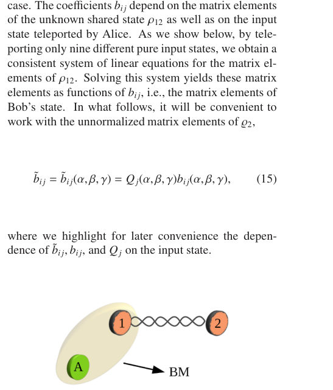
<figcaption class="paper-figure-caption"><b>Fig 1.</b> Figure 1: (color online) Schematic view of the teleportation-based QST protocol, whose goal is to fully reconstruct the two-qutrit state ρ12 (orange disks 1 and 2). One run of the protocol works as fol- lows. First, Alice prepares an input state ρA (green disk A), choosing among nine possible input states as explained in the main text. Sec- ond, she implements onto qutrits A and 1 a Bell measurement (BM), informing Bob of her measurement result and which qutrit A she tele- ported. After receiving these two pieces of information, Bob is sure that ̺2 [Eq. (14)] describes his qutrit. This procedure is repeated sev- eral times using the nine different input states that Alice should be able to...</figcaption>
</figure>
<figure class="paper-figure-card">
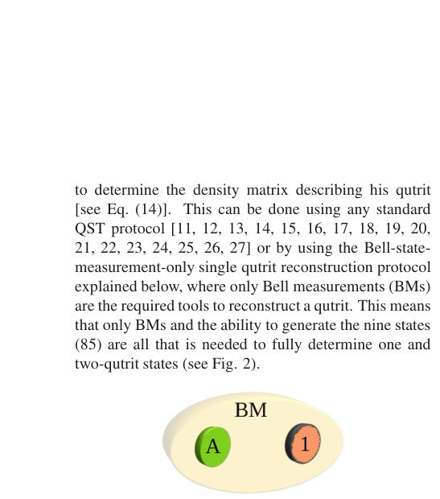
<figcaption class="paper-figure-caption"><b>Fig 2.</b> Figure 2: (color online) The one-qutrit Bell-state-measurement-only reconstruction protocol. The picture shows schematically the key in- gredient to its functioning: Bell measurements. By properly project- ing the unknown qutrit ̺1 (orange disk) and a set of known qutrits ρA (green disk) onto Bell states, we can express the matrix elements of ̺1 as a function of the probabilities to measure Bell states. See text for more details.</figcaption>
</figure>
<figure class="paper-figure-card">
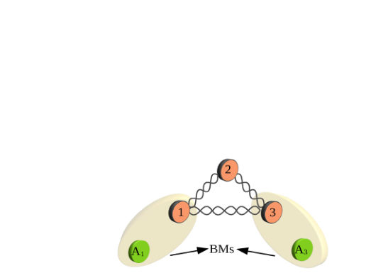
<figcaption class="paper-figure-caption"><b>Fig 3.</b> Figure 3: (color online) The three-qutrit teleportation-based QST pro- tocol. Two input states ρA1 and ρA3 (green disks) are prepared by Alice. Each input state, together with one qutrit of the state we want to determine (orange disks), are projected onto Bell states as shown in the figure. Bob then is informed by Alice of the results of those BMs and of the input states she prepared (qutrits A1 and A3). With these pieces of information Bob is sure that his qutrit is ̺2 [Eq. (102)], from which he can reconstruct ρ123, the unknown three-qutrit state (orange disks). See text for details.</figcaption>
</figure>

**Summary.** This paper extends the teleportation-based Quantum State Tomography protocol from qubits to qutrits (spin-1 systems). It demonstrates that by performing multiple quantum teleportation experiments using nine distinct input states, one can fully reconstruct the density matrix of a two-qutrit system. The method is shown to scale systematically to $n$-qutrits, providing a powerful theoretical tool for characterizing high-dimensional quantum states.

**Why it may be interesting.** This work is highly relevant as it develops a concrete, scalable protocol for characterizing multi-partite quantum states in higher-dimensional systems (qutrits), which are crucial testbeds for understanding entanglement beyond simple qubit models.

Detailed structure

**Main problem.** The primary goal is extending the quantum state tomography protocol, originally designed for qubits (spin-1/2), to reconstruct arbitrary states of qutrits (spin-1 systems). This extends to higher dimensions ($n$-qutrits) as well.

**Main result.** The protocol successfully determines the density matrix $\rho_{12}$ (for two qutrits) by performing multiple quantum teleportation experiments using nine distinct known input states. The method scales to $n$-qutrits, requiring $9^{n-1}$ such experiments.

**Method.** The reconstruction relies on measuring the resulting single-qutrit state ($
ho_2$) at Bob's end after Alice performs a Bell measurement on her two qubits (the unknown system and an auxiliary qubit). A consistent set of linear equations is solved using these measurements to determine the density matrix elements.

**Model / system.** The physical system involves qutrits, which are spin-1 systems ($	ext{dim}=3$). The process models quantum state tomography on a two-qutrit system $\rho_{12}$ by leveraging the principles of quantum teleportation.

**Key observables.** The matrix elements ($m_{ij}$) of the unknown density matrix $\rho_{12}$, and the probabilities ($Q_j$) associated with various Bell measurement outcomes.

**Important parameters / regimes.** The number of required input states scales exponentially, $9^{n-1}$, for an $n$-qutrit system. The reconstruction requires at least nine distinct teleportation measurements for two qutrits.

**Assumptions / limitations.** It is assumed that Bob can experimentally reconstruct his single-qutrit density matrix ($
ho_2$) using standard QST methods, and the protocol assumes specific measurement outcomes (e.g., measuring $|B_1\rangle$ initially).

**Figures summary.** Figure 1 schematically illustrates the general teleportation-based QST protocol for two qutrits. Figure 3 extends this concept to three qutrits, showing Alice preparing and projecting pairs of states onto Bell bases.

**Paper structure.** The paper first establishes the extension from qubits to qutrits, detailing the required measurements (nine input states). It then provides explicit formulas relating the unknown density matrix elements ($\rho_{12}$) to Bob's measured single-qutrit states. Finally, it discusses the general scaling of this method to $n$-qutrits.

Abstract

We show that the teleportation-based quantum state tomography (QST) protocol, originally built to reconstruct qubits (spin-1/2 systems), can be extended to deal with qutrits (spin-1 systems) as well. Similarly to the original proposal, only two resources are needed to implement the spin-1 teleportation-based QST protocol: (1) Alice should be able to implement the analog of Bell measurements for spin-1 systems; and (2) she should be able to prepare a few different single qutrit states that will be teleported to Bob.

[↑ back to top](#top)

### [High-Precision Method for Characterizing Degree of Collimation and Beam Quality for Application in Cold Atom Gravimeter System](http://arxiv.org/abs/2607.05940v1)

**Authors:** Nawaz Sarif Mallick, Anju, Aishik Acharya  
**Type:** experiment · **Category:** other · **PDF:** <https://arxiv.org/pdf/2607.05940v1>  
**Analysis basis:** full PDF text, analyzed in chunks
**Topic relevance:** `interference shaping light` **3/5** · `quantum measurements` **1/5** · `quantum optics experiment` **1/5**

↔ Scroll figures horizontally

<figure class="paper-figure-card">
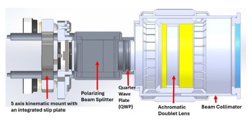
<figcaption class="paper-figure-caption"><b>Fig 1.</b> FIG. 2. Three-dimensional mechanical model of the complete beam collimator. The overall length of the beam collimator is 250 mm.</figcaption>
</figure>
<figure class="paper-figure-card">
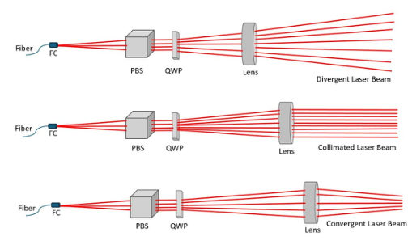
<figcaption class="paper-figure-caption"><b>Fig 2.</b> FIG. 1. Schematic representation of collimated and uncollimated laser beams. FC: Fiber Coupler, PBS: Polarizing Beam Splitter, QWP: Quarter Wave Plate.</figcaption>
</figure>
<figure class="paper-figure-card">
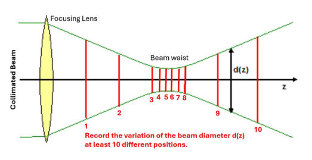
<figcaption class="paper-figure-caption"><b>Fig 3.</b> FIG. 4. Schematic diagram of the experimental setup used to mea- sure the beam waist, divergence angle, Rayleigh length, and the beam quality factor M2. Collimated laser beam passes through a focusing lens of focal length, f = 250 mm and beam diameter decreases as it approaches the len’s focal point.</figcaption>
</figure>
<figure class="paper-figure-card">
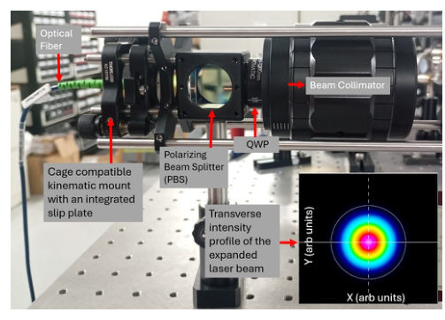
<figcaption class="paper-figure-caption"><b>Fig 4.</b> FIG. 3. (a) Optical design of the experimental beam expander setup. (b) Transverse intensity profile of the expanded laser beam. (c) Nor- malised intensity profile of the laser beam.</figcaption>
</figure>
<figure class="paper-figure-card">
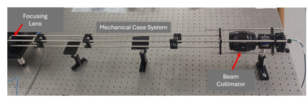
<figcaption class="paper-figure-caption"><b>Fig 5.</b> FIG. 5. A tabletop experimental setup is used to achieve high preci- sion beam alignment. A high precision opto-mechanical caging and alignment platform system with a length of 1050 mm is integrated with the beam collimator unit.</figcaption>
</figure>

**Summary.** This paper details the design and rigorous characterization of a high-precision laser beam collimator specifically for use in cold-atom Gravimeter systems. By employing ISO 11146 compliant measurements, the authors demonstrated achieving microradian level collimation accuracy. This robust methodology provides a crucial tool for minimizing systematic errors in long-baseline quantum sensing experiments.

**Why it may be interesting.** This work is highly relevant as it addresses the critical experimental bottleneck—laser beam stability and characterization—for advanced quantum sensing platforms like atom interferometers, which are central to modern AMO physics research.

Detailed structure

**Main problem.** The core challenge is maintaining highly collimated laser beams with excellent spatial quality, as residual beam divergence introduces systematic errors that degrade the precision of quantum sensing experiments like cold-atom gravimeters.

**Main result.** The developed high-precision collimator successfully achieved microradian level collimation accuracy, demonstrating stable and well-controlled beam propagation essential for advanced atom interferometry.

**Method.** Characterization involved ISO 11146 compliant beam propagation measurements combined with Gaussian beam analysis to determine key parameters like divergence angle and the beam quality factor ($M^2$).

**Model / system.** The physical system is a custom, high-precision laser beam collimator designed for cold-atom Gravimeter systems. It incorporates a five-degree-of-freedom adjustment mechanism and utilizes optical components to control beam divergence over long distances.

**Key observables.** Measured divergence angles ($0.006^\circ$ x, $0.007^\circ$ y), Beam Waist Asymmetry (BWA = 1.33), and the beam quality factor ($M^2$).

**Important parameters / regimes.** Target output diameter of 16 mm; microradian level collimation accuracy; $\lambda = 780.241 	ext{ nm}$.

**Assumptions / limitations.** The analysis relies on Gaussian beam theory and the ISO 11146 standard for beam propagation measurement.

**Figures summary.** Figures illustrate the schematic of the collimator, its mechanical model, intensity profiles (transverse and normalized), and detailed setups for both coarse and fine alignment procedures.

**Paper structure.** The paper details the necessity of high-quality beams, presents the design of the 5-DOF collimator, outlines the ISO 11146 measurement methodology using beam profilers, reports quantitative measurements of divergence and $M^2$, and concludes by validating its use in a cold-atom Gravimeter setup.

Abstract

Highly collimated laser beam with excellent spatial quality is essential for quantum sensing experiments, where even small residual beam divergence can accumulate over distance and introduce significant systematic errors. In this article, we present the design and detailed characterization of a high precision laser beam collimator developed for a cold-atom Gravimeter system, capable of producing an expanded laser beam with a diameter of 16 mm while achieving microradian level collimation accuracy through a five-degree-of-freedom (5-DOF) adjustment mechanism. The beam quality is evaluated using an ISO11146 compliant beam propagation measurement combined with Gaussian beam analysis to extract key parameters, including the beam waist, divergence angle, Rayleigh length, and beam quality factor $M^{2}$. The measured divergence angles of 0.006° (105 micro-radian) along the $x$ axis and 0.007° (122 micro-radian) along the $y$ axis confirm stable and well controlled collimation over long propagation distances. The demonstrated collimation architecture and characterization methodology provide a robust and scalable solution for cold-atom Gravimetry and other precision optical applications that require stable, high quality laser beams maintained over extended distances.

[↑ back to top](#top)

### [CE-antiferromagnetic electronic structure in LaSr$_2$Mn$_2$O$_7$ revealed by micro-focused angle-resolved photoemission spectroscopy and tight-binding models](http://arxiv.org/abs/2607.05949v1)

**Authors:** Yasutaka Sawata, Yudai Hirai, Rintaro Miyabayashi, Goro Shibata, Hideki Kuwahara, Miho Kitamura, Koji Horiba, Kenichi Ozawa, Noriaki Hamada, Tomohiko Saitoh  
**Type:** both · **Category:** strongly correlated electrons · **PDF:** <https://arxiv.org/pdf/2607.05949v1>  
**Analysis basis:** full PDF text, analyzed in chunks
**Topic relevance:** `spintronics-quantum-optics interface` **3/5** · `exotic spin models in light-matter` **1/5**

↔ Scroll figures horizontally

<figure class="paper-figure-card">
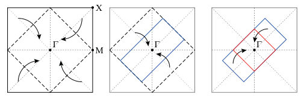
<figcaption class="paper-figure-caption"><b>Fig 1.</b> FIG. 2. Comparisons of various BZs. Arrows show BZ-folding processes (a) The CO BZ (dashed square) compared with the A-AFM BZ (black square). (b) The COO BZ (blue rectangle) compared with the CO BZ. (c) The CE-AFM BZ (red square) compared with the COO BZ.</figcaption>
</figure>
<figure class="paper-figure-card">
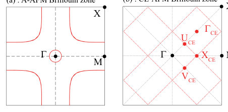
<figcaption class="paper-figure-caption"><b>Fig 2.</b> FIG. 3. (a) Brillouin zone of the A-AFM state with the cal- culated Fermi surface of the A-AFM state at x = 0.5. (b) Brillouin zones of the CE-AFM state (red) shown in Fig. 1(a) compared to that of A-AFM (black). For more details, see text.</figcaption>
</figure>
<figure class="paper-figure-card">
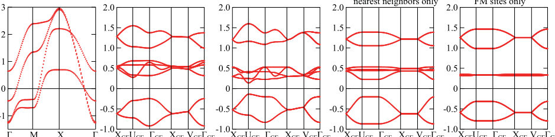
<figcaption class="paper-figure-caption"><b>Fig 3.</b> FIG. 4. (a) Tight-binding majority-spin band structure of the bilayer FM state in Model 1 that reproduces the calculations in Ref. 43. (b) and (c) Tight-binding band structure of the CE-AFM state in Model 1 [(b)] and Model 2 [(c)]. (d) The same calculation as (b) including the nearest-neighbor hoppings only. (e) The same calculation as (c) considering the FM sites only.</figcaption>
</figure>
<figure class="paper-figure-card">
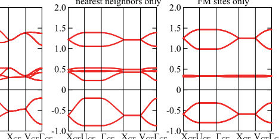
<figcaption class="paper-figure-caption"><b>Fig 4.</b> Figure 5 shows the result of our µ-ARPES measure- ments of the x = 0.5 sample along the two symmetry lines together with the result of the x=0.4 sample along the Γ−X line. Again, please note that the Γ−M and the Γ−X lines in the A-AFM Brillouin zone correspond to the Γ(ΓCE)−XCE−ΓCE and Γ(ΓCE)−UCE−ΓCE−UCE−ΓCE lines in the CE-AFM Brillouin zone, respectively (see also Fig. 3). Figure 5(a) shows the µ-ARPES intensity plot along the Γ−XCE−ΓCE (Γ−M) direction. A shallow parabolic- like band with the vertex at ∼1.5 eV at the Γ point can be observed. In addition, one can observe significant spectral intensity around the two ΓCE(M) points on the both sides of Γ (highlighted by white dashed circles)....</figcaption>
</figure>
<figure class="paper-figure-card">
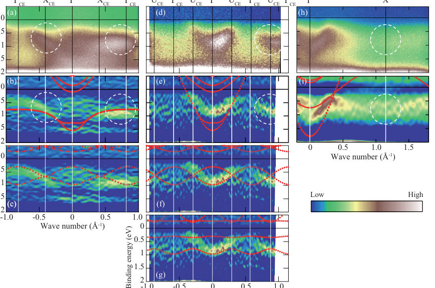
<figcaption class="paper-figure-caption"><b>Fig 5.</b> FIG. 5. (a) The µ-ARPES intensity plot of the x=0.50 sample along the Γ−XCE−ΓCE (Γ−M) direction. White dashed circles show significant intensity around the right ΓCE (M) and the left XCE points. (b) A second-derivative plot of Panel (a) compared with the band-structure calculation of the A-AFM state at x=0.50 (red dotted lines). (c) The second-derivative plot compared with the tight-binding calculation in Model 1 (red dotted lines). (d) The µ-ARPES intensity plot of the x=0.50 sample along the Γ−V/UCE−ΓCE (Γ−X) direction. A white dashed circle shows a hot spot around the ΓCE(X) point. (e) A second-derivative plot of Panel (d) compared with the band-structure calculation of the A-AFM state at...</figcaption>
</figure>

**Summary.** This work investigates the electronic structure of LaSr2Mn2O7 in its CE-antiferromagnetic state by combining $\mu$-ARPES experiments with tight-binding theory. The authors successfully demonstrate that the observed band dispersions are best explained by a model incorporating the CE-AFM magnetic ordering, distinguishing it from simpler A-AFM structures. This provides crucial experimental evidence for understanding charge and orbital ordering in these complex manganites.

**Why it may be interesting.** The detailed comparison between different magnetic ordering states (CE-AFM vs. A-AFM) using spectroscopic techniques provides deep insight into how electronic structure is intrinsically linked to complex magnetic ground states in strongly correlated oxides.

Detailed structure

**Main problem.** The study aims to experimentally and theoretically reveal the electronic structure of LaSr2Mn2O7 when it is in its CE-type antiferromagnetic (CE-AFM) state.

**Main result.** The $\mu$-ARPES measurements revealed a dispersive intensity around the X point, which was successfully explained by the CE-AFM tight-binding model for the first time. This confirms the electronic signature of the CE-AFM phase in this material.

**Method.** The research combines experimental micro-focused angle-resolved photoemission spectroscopy ($\mu$-ARPES) with theoretical analysis using detailed tight-binding models derived from LDA+U calculations.

**Model / system.** The physical system is LaSr2Mn2O7, focusing on the CE-AFM state characterized by charge and orbital ordering. Theoretical modeling involves single-layered (2D) tight-binding Hamiltonians incorporating both FM and AF hopping integrals to capture the complex magnetic structure.

**Key observables.** Electronic band dispersion relations measured via $\mu$-ARPES intensity plots, particularly at high-symmetry points like X and M in the folded Brillouin Zone ($\Gamma_{	ext{CE}}$).

**Important parameters / regimes.** The analysis compares CE-AFM vs. A-AFM states; key energy scales include hopping integrals (e.g., $	ilde{t}_{dd\sigma} = -0.652 	ext{ eV}$) and the magnetic ordering type.

**Assumptions / limitations.** It is assumed that the observed features are governed by the CE-AFM band structure, although some near-Fermi level intensity mapping might suggest A-AFM contributions; the domain size is estimated to be $\lesssim 20 \mu	ext{m}$.

**Figures summary.** Figures compare ARPES data (intensity and second derivative) along specific high-symmetry directions ($\Gamma-	ext{V}/	ext{UCE}-\Gamma	ext{CE}$), showing that the CE-AFM model successfully reproduces band features at both $\Gamma_{	ext{CE}}$ points, unlike the A-AFM structure.

**Paper structure.** The paper establishes the scientific problem by comparing different magnetic states (CE-AFM vs. A-AFM). It details the theoretical framework using tight-binding models and presents experimental $\mu$-ARPES results that are then used to validate the CE-AFM model over the A-AFM model, concluding with a discussion of domain size.

Abstract

We have investigated the electronic structure of LaSr$_2$Mn$_2$O$_7$ in the CE-type antiferromagnetic (CE-AFM) state below the Néel temperature using micro-focused angle-resolved photoemission spectroscopy ($μ$-ARPES) and tight-binding models. In agreement with the tight-binding calculations, we found a dispersive intensity around the X point in the $μ$-ARPES spectra, where the A-type antiferromagnetic (A-AFM) phase has no bands experimentally and theoretically, demonstrating that we have successfully captured the signatures of the CE-AFM band structure for the first time. Many observed features can be explained by the CE-AFM tight-binding bands, although some of them and the overall near-Fermi level intensity mapping can be explained by the A-AFM band structure. This indicates that the CE-AFM domain size would be no larger than the beam footprint size of a $\sim\!20$~{\textmu}m scale.

[↑ back to top](#top)

### [Entanglement as a Structural Complexity Axis: A PAC-Bayesian View of Generalization in Quantum Policies and Value Functions](http://arxiv.org/abs/2607.06230v1)

**Authors:** Jian Xu, Delu Zeng, John Paisley, Qibin Zhao  
**Type:** both · **Category:** quantum information and computing · **PDF:** <https://arxiv.org/pdf/2607.06230v1>  
**Analysis basis:** full PDF text, analyzed in chunks
**Topic relevance:** `entanglement & information structure` **3/5**

↔ Scroll figures horizontally

<figure class="paper-figure-card">
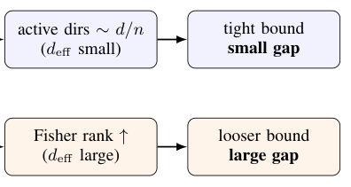
<figcaption class="paper-figure-caption"><b>Fig 1.</b> Figure 1: The mechanism. At a fixed parameter count, entangling gates enlarge the backward light- cone of the readout observable (Lemma 2), which raises the rank and hence the effective dimension deff = log det(I +γ ˆF) of the Fisher geometry (Proposition 1). A larger deff enlarges the complexity term of the PAC-Bayes bound equation 3 and thus the generalization gap—an effect invisible to a parameter-counting analysis, since d is unchanged.</figcaption>
</figure>
<figure class="paper-figure-card">
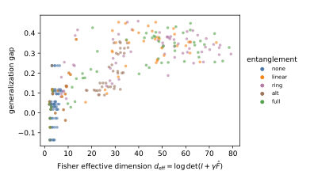
<figcaption class="paper-figure-caption"><b>Fig 2.</b> Figure 2: Left: the empirical gap (solid) and the certified PAC-Bayes bound of Eq. equation 3 (dashed) versus training-set size N, per circuit. The bound upper-bounds the gap, decays with N at the same rate, and—driven by deff—orders the circuits none &lt; linear &lt; full at every N, all at identical parameter count: the figure shows the bound acting as a ranking certificate, which no table entry conveys. Right: across all circuits the gap increases with the Fisher effective dimension deff = log det(I +γ ˆF) (Spearman ρ = 0.82); colour encodes entangling connectivity, which drives deff up at fixed parameter count.</figcaption>
</figure>
<figure class="paper-figure-card">
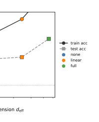
<figcaption class="paper-figure-caption"><b>Fig 3.</b> Figure 3: The accuracy–complexity trade-off (N=64, single-observable readout). As the Fisher effective dimension deff grows with entanglement (colour), train accuracy rises but test accuracy does not, so the gap—the vertical distance between the curves—widens. Entanglement buys training fit that the test distribution does not reward.</figcaption>
</figure>
<figure class="paper-figure-card">
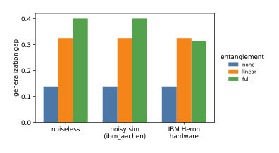
<figcaption class="paper-figure-caption"><b>Fig 4.</b> Figure 6: Left: the entangled-&gt;-none gap ordering survives three controls at N=64—matched training accuracy, a different readout observable, and a different optimizer—so the gap is not a mere optimization or trainability artifact. Right: the ordering is reproduced by a noise-model simulator of ibm aachen and by execution on the ibm aachen Heron processor itself under real noise; calibration and shot-noise details are in Appendix B.</figcaption>
</figure>
<figure class="paper-figure-card">
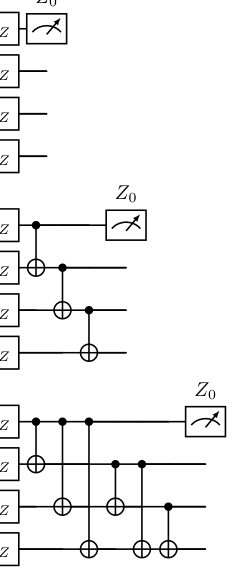
<figcaption class="paper-figure-caption"><b>Fig 5.</b> Figure 7: The three ans¨atze at n=4 (one layer of the repeated block shown; the block repeats L times, here between the encoding RY (xi) and the ⟨Z0⟩readout). All three use the same RY , RZ rotations—hence the same parameter count d=2nL—and differ only in the entangling block: none (no CNOTs), a linear CNOT chain, or all-to-all CNOTs. This is the “fixed parameter count, vary only entanglement” comparison.</figcaption>
</figure>

**Summary.** The paper introduces the Fisher effective dimension as the true measure of complexity governing generalization in quantum circuits used for machine learning tasks. By showing that entanglement inflates this dimension independently of parameter count, it establishes a clear entanglement-generalization trade-off. This reframes quantum policy design away from mere expressivity towards structural complexity control.

**Why it may be interesting.** This work provides a theoretical framework connecting geometric properties (Fisher information/entanglement) directly to generalization bounds in quantum machine learning models. This is crucial for designing efficient and provably generalizable quantum algorithms.

Detailed structure

**Main problem.** The core problem is determining a rigorous measure of generalization complexity for quantum policies ($\pi_	heta$) and value functions used in Quantum Reinforcement Learning (QRL). The authors aim to move beyond simple parameter counting to understand the role of entanglement.

**Main result.** Generalization capability is governed by the effective dimension of the Fisher geometry, which quantifies structural complexity. Entanglement acts as an independent axis of complexity, causing circuits with high entanglement but fixed parameters to generalize worse than non-entangled counterparts.

**Method.** The authors derive and apply a PAC-Bayesian generalization bound based on the Fisher Information Matrix ($\hat{F}$). They analyze how varying entanglement connectivity inflates the effective dimension ($	ext{deff} = \log \det(I + \gamma \hat{F})$) while keeping parameter count constant.

**Model / system.** The model utilizes Parameterized Quantum Circuits (PQCs) trained for tasks like supervised classification and value estimation. The circuits are systematically varied by controlling the entangling connectivity pattern (e.g., none, linear chain, full coupling) across a fixed number of qubits and parameters.

**Key observables.** Generalization gap (test vs. train performance), Fisher effective dimension ($	ext{deff}$), entanglement connectivity, and correlation coefficients ($
ho$) between $	ext{deff}$ and the gap.

**Important parameters / regimes.** The generalization constant $\gamma$ used in the bound; fixed number of trainable rotations/parameters ($d$); sample size ($N$).

**Assumptions / limitations.** The analysis is primarily focused on controlled decision models (single-observable readout) to isolate the entanglement effect. The results are claimed to be a 'ranking certificate' rather than a numerically tight bound.

**Figures summary.** Figures illustrate that increasing entangling connectivity monotonically increases the rank of the Fisher matrix and thus $	ext{deff}$, which correlates strongly with an increased generalization gap, even when parameter count is held fixed.

**Paper structure.** The paper establishes the need for a better complexity measure than raw parameters. It derives the PAC-Bayesian bound using the Fisher geometry, proves that entanglement inflates this effective dimension by enlarging the light-cone of the readout observable, and validates this mechanism across multiple quantum learning tasks.

Abstract

Parameterized quantum circuits (PQCs) are increasingly used as policies and value functions in quantum reinforcement learning, yet it remains unclear when and why quantum policies generalize. We give a PAC-Bayesian account in which generalization is governed not by the raw number of circuit parameters, but by the effective dimension of the Fisher geometry induced by the circuit. This quantity is inflated by entanglement, making entangling connectivity an independent axis of complexity.In controlled experiments that fix the number of trainable rotations and vary only entanglement, we find that circuits with larger Fisher effective dimension exhibit larger train-test gaps, while parameter count is a weak predictor. The resulting bound acts primarily as a ranking certificate: it correctly orders circuits with identical parameter count, which parameter-counting bounds cannot do. We validate this mechanism across supervised classification, quantum contextual bandits, and value-function generalization, where entangled circuits consistently generalize worse than non-entangled circuits of equal parameter count, with gaps shrinking as sample size increases.Our strongest evidence comes from low-variance decision models, including single-observable classifiers, value heads, and one-step policies. In end-to-end multi-step policy learning, entanglement effects remain statistically significant but high return variance leaves the full ordering only partially resolved. Partial-correlation analysis shows that Fisher effective dimension screens off entangling pattern, and controls for training accuracy, readout, and optimizer rule out major optimization confounders. The effect also persists on an IBM Heron quantum processor under real noise. Overall, our results reframe quantum policy design around an entanglement--generalization trade-off rather than expressivity alone.

[↑ back to top](#top)

### [Static vacancies as parametrized conformal defects in the critical $J_1$--$J_2$ transverse-field Ising chain](http://arxiv.org/abs/2607.06511v1)

**Authors:** R. L. Silva, R. C. Silva, R. J. C. Lopes, A. R. Pereira  
**Type:** theory · **Category:** statistical mechanics · **PDF:** <https://arxiv.org/pdf/2607.06511v1>  
**Analysis basis:** full PDF text, analyzed in chunks
**Topic relevance:** `analog quantum simulation` **2/5** · `driven-dissipative phase transition` **2/5** · `methods for driven-dissipative` **2/5** · `non-equilibrium universality` **2/5** · `Frenkel-Kontorova` **1/5** · `correlated / nonlocal dissipation` **1/5** · `entanglement & information structure` **1/5** · `exotic spin models in light-matter` **1/5** · `non-equilibrium dynamics` **1/5**

↔ Scroll figures horizontally

<figure class="paper-figure-card">
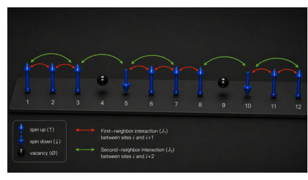
<figcaption class="paper-figure-caption"><b>Fig 1.</b> FIG. 1. The J1–J2 transverse-field Ising chain of Eq. (1) with two static nonmagnetic vacancies a distance r apart. Black spheres are vacant sites; the remaining spins interact via J1 (red) and J2 (green). The J2 bond bridging across each va- cancy (orange) keeps the chain connected and is the channel that gives the defect its J2-dependent transmission.</figcaption>
</figure>
<figure class="paper-figure-card">
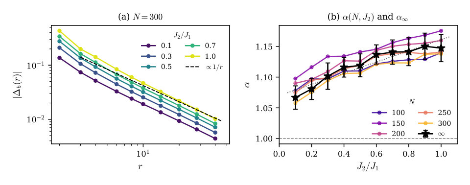
<figcaption class="paper-figure-caption"><b>Fig 2.</b> FIG. 2. (a) The vacancy-vacancy binding energy |∆b(r)| on the critical line, N = 300, for representative J2/J1 values. The behavior is power-law to high precision (linear in log-log over more than a decade in r); 1/r is shown for reference. The fits in the window r ∈[4, 32] all have R2 ≥0.996. (b) The fitted exponent α(N, J2) for the five sizes (colored symbols) and the 1/N-extrapolated α∞(J2) (black stars, error bars from the standard error of the linear extrapolation). The dotted line is the linear fit of Eq. (4); the dashed line marks α = 1.</figcaption>
</figure>
<figure class="paper-figure-card">
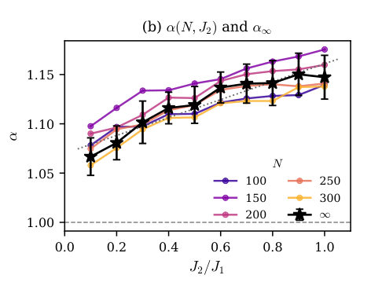
<figcaption class="paper-figure-caption"><b>Fig 3.</b> Figure 2(a) shows |∆b(r)| for N = 300 at five represen- tative values of J2/J1. The data exhibits a clear linear behaviour in log-log over more than a decade in r, demon- strating that the vacancy-vacancy interaction along the critical line is genuinely algebraic, in sharp contrast to the exponential decay found in the gapped regime in Ref. [1]. This is the qualitative change in the vacancy physics in- duced by quantum criticality. A power-law fit in the window r ∈[4, 32] gives, for each (N, J2), an effective exponent α(N, J2) with R2 ranging from 0.996 to 1.000. The values are shown in Fig. 2(b). At fixed J2, α varies by at most ≈0.04 between N = 100 and N = 300; the dependence on 1/N is...</figcaption>
</figure>
<figure class="paper-figure-card">
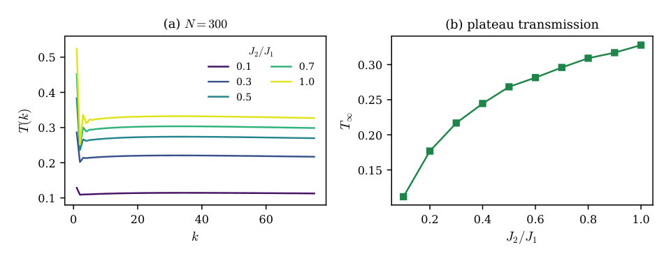
<figcaption class="paper-figure-caption"><b>Fig 4.</b> FIG. 3. (a) Transmission ratio T(k) across a single central vacancy for N = 300 in some representative J2/J1 values. After a short transient at small k, T(k) saturates to a J2-dependent plateau. (b) The 1/N-extrapolated plateau value T∞(J2) (error bars from the extrapolation are smaller than the symbols). The defect is strongly reflective at small J2 (T∞≃0.11) and becomes substantially more transmissive at J2/J1 = 1.0 (T∞≃0.33).</figcaption>
</figure>
<figure class="paper-figure-card">
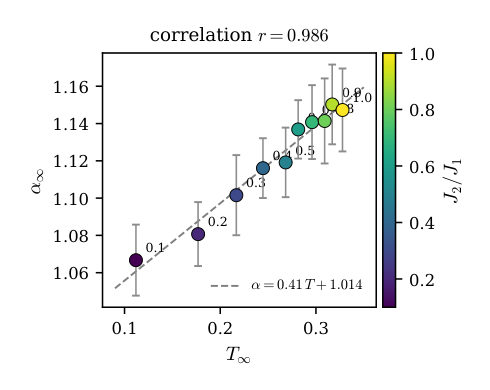
<figcaption class="paper-figure-caption"><b>Fig 5.</b> FIG. 5. The Casimir exponent α∞versus the transmission plateau T∞, with point color encoding J2/J1 and error bars showing the α∞extrapolation uncertainty. The two quanti- ties trace a smooth, nearly linear curve, α∞≃0.41 T∞+1.014. Because both are monotonic functions of the single tuning parameter J2, they move together coherently as J2 is varied, with no abrupt features.</figcaption>
</figure>

**Summary.** This paper uses DMRG simulations on the critical $J_1$-$J_2$ Ising chain to characterize static vacancies as tunable conformal defects. By analyzing the algebraic decay of vacancy interactions, the transmission ratio, and boundary entropy, the authors demonstrate that these three observables vary smoothly with the coupling ratio $J_2/J_1$. This establishes a quantitative link between microscopic parameters and universal defect properties in quantum critical systems.

**Why it may be interesting.** The work connects concepts from quantum criticality (Ising universality class) to boundary physics via conformal field theory (CFT), providing quantitative evidence for how defect parameters can be continuously tuned by microscopic couplings ($J_2/J_1$).

Detailed structure

**Main problem.** The study investigates how static nonmagnetic vacancies act as parametrized conformal defects within the critical $J_1$-$J_2$ transverse-field Ising chain.

**Main result.** The vacancy defect forms a continuous, one-parameter family of partially transmissive conformal defects controlled by the ratio $J_2/J_1$, evidenced by the smooth variation of three key observables ($\alpha_\infty$, $T_\infty$, $\log g_\infty$).

**Method.** Density-Matrix Renormalization Group (DMRG) calculations were performed on open chains, analyzing power-law decay exponents and boundary entropy.

**Model / system.** The system is the transverse-field Ising chain with first ($J_1$) and second ($J_2$) neighbor couplings, $H = -\sum_{i} J_1 \sigma^x_i \sigma^x_{i+1} - \sum_{i} J_2 \sigma^x_i \sigma^x_{i+2} - \sum_{i} b \sigma^z_i$, with vacancies acting as defects.

**Key observables.** Vacancy-vacancy binding energy decay exponent ($\alpha$), spin correlator transmission ratio ($T_\infty$), and Affleck-Ludwig boundary entropy ($\log g_\infty$).

**Important parameters / regimes.** The tuning parameter is the ratio $J_2/J_1$, which controls the defect's properties across the quantum critical line.

**Assumptions / limitations.** The vacancy is treated as a bulk defect preserving connectivity, and the critical line location is robustly fixed by matching the bulk spin-correlator exponent $\eta=1/4$.

**Figures summary.** Figures illustrate the power-law decay of binding energy $|\Delta b(r)| \sim r^{-\alpha}$ (Fig. 2a), plot the dependence of the fitted exponent $\alpha_\infty$ and transmission $T_\infty$ on $J_2/J_1$, and show the extraction method for boundary entropy ($\log g$) (Fig. 6).

**Paper structure.** The paper establishes the physical model, applies DMRG to calculate three key observables ($\Delta b(r)$, $T(k)$, $\log g$), analyzes how these observables vary with $J_2/J_1$ along the critical line, and concludes that this variation confirms a continuous family of conformal defects.

Abstract

We revisit the problem of two static nonmagnetic vacancies in the transverse-field Ising chain with first- and second-neighbor couplings $J_1$ and $J_2$, now on the critical line, using density-matrix renormalization-group (DMRG) calculations in open chains of up to $N=300$ sites. In contrast to the gapped regime studied previously, where the vacancy-vacancy interaction decays exponentially, along the entire quantum critical line the interaction becomes algebraic, $|Δ_b(r)|\sim r^{-α}$, with $α$ close to the universal Casimir value of unity and a weak but systematic dependence on the second-neighbor coupling, $α_\infty \simeq 1.070 + 0.091\, J_2/J_1)$ across $J_2/J_1\in[0.1,1.0]$. The transmission ratio of the spin correlator across a vacancy approaches a $J_2$-dependent plateau $T_\infty(J_2)$ that grows from $0.11$ to $0.33$ over the same range, and the Affleck-Ludwig boundary entropy is small and approximately constant, $\log g_\infty \approx -0.073$, well above the Ising fixed-BC value $-\ln\sqrt{2}$ and close to the free-boundary value. The three observables vary smoothly and monotonically with $J_2$, consistent with a one-parameter family of partially transmissive conformal defects controlled by $J_2$. Throughout, the critical line is located using the bulk spin-correlator exponent $η=1/4$, the order-parameter exponent of the Ising universality class, which provides a robust criterion in this open geometry.

[↑ back to top](#top)

### [The Ramsey community number as a renormalization-group crossing](http://arxiv.org/abs/2607.05954v1)

**Authors:** Alexei Vazquez  
**Type:** theory · **Category:** statistical mechanics · **PDF:** <https://arxiv.org/pdf/2607.05954v1>  
**Analysis basis:** full PDF text, analyzed in chunks
**Topic relevance:** `Keldysh / 2PI / non-Gaussian methods` **2/5** · `analog quantum simulation` **2/5** · `driven-dissipative phase transition` **2/5** · `methods for driven-dissipative` **2/5** · `correlated / nonlocal dissipation` **1/5** · `correlated cavity matter` **1/5** · `entanglement & information structure` **1/5** · `non-equilibrium dynamics` **1/5** · `non-equilibrium universality` **1/5**

↔ Scroll figures horizontally

<figure class="paper-figure-card">
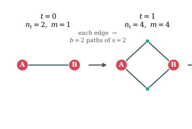
<figcaption class="paper-figure-caption"><b>Fig 1.</b> Figure 1: Construction of the diamond hierarchical lattice for b = s = 2 by edge replace- ment. Starting from a single bond between the poles A, B (t = 0), each generation replaces every edge by b = 2 parallel paths of s = 2 edges, adding one interior vertex per path; iterating gives m = 4t edges and nt = (2 · 4t + 4)/3 nodes [Eq. (3)]. Node area ∝degree, so the two poles emerge as the permanent degree-2t hubs.</figcaption>
</figure>
<figure class="paper-figure-card">
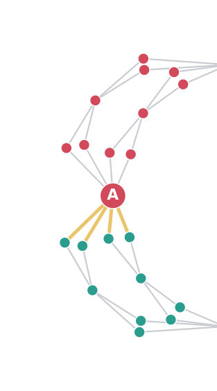
<figcaption class="paper-figure-caption"><b>Fig 2.</b> Figure 2: Diamond lattice G3 (nt = 44) with the self-similar bundle cut. Red: bundle 0 together with the poles A, B; teal: bundle 1; gold: the e12 = 2t = 8 seam edges, every one incident on a pole. Node area ∝degree, exposing the two degree-2t hubs.</figcaption>
</figure>
<figure class="paper-figure-card">
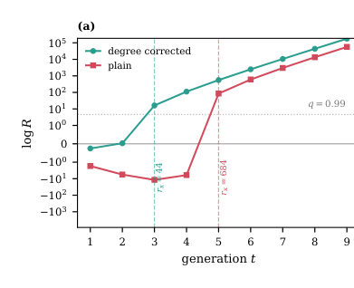
<figcaption class="paper-figure-caption"><b>Fig 3.</b> Figure 3: (a) Log evidence of the bundle split versus generation (symlog scale). The degree-corrected model clears the detection threshold ln[q/(1−q)] (dotted, q = 0.99) at t = 3, giving rκ = n3 = 44; the plain model only at t = 5, rκ = n5 = 684. The lattice exists only at the discrete sizes nt, so the crossing—and hence rκ—is a generation index. (b) Renormalization-group flow of the block densities Eq. (9) to the community fixed point (uin, u×) = (K, 0) = (2, 0); the seam density decays geometrically as (λseam/λvol)t = (1/s)t</figcaption>
</figure>
<figure class="paper-figure-card">
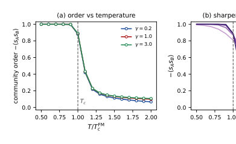
<figcaption class="paper-figure-caption"><b>Fig 4.</b> Figure 4: Exact community-ordered phase of the q = 2 Reichardt–Bornholdt model on the diamond. Order parameter −⟨σAσB⟩(hub anti-alignment: 1 when the two hubs occupy opposite communities). (a) Versus temperature at t = 6 (nt = 2732) for three resolutions γ: the community order switches off at the ferromagnetic critical temperature T FM c , essentially independent of γ. (b) As the lattice grows the transition sharpens into a step at T FM c ; below it the order is persistent, −⟨σAσB⟩→1 as n →∞. (c) The (γ, T) phase diagram: a community-ordered region for all γ &gt; 0 below T FM c (dashed).</figcaption>
</figure>
<figure class="paper-figure-card">
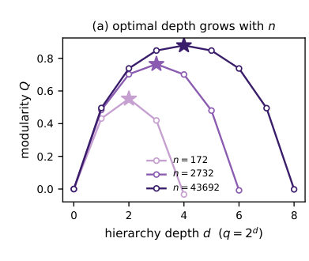
<figcaption class="paper-figure-caption"><b>Fig 5.</b> Figure 5: Hierarchical community structure with a growing number of states. (a) Modularity Q of the depth-d nested partition (q = 2d communities), Eq. (22), versus depth for three sizes; stars mark the optimum, which moves to finer resolution as n grows. (b) The optimal number of communities qopt = 2d⋆tracks √n (dashed), Eq. (23), over t ≤9.</figcaption>
</figure>

**Summary.** This work establishes that the statistical concept of community detection, quantified by the Ramsey number, has a deep physical underpinning. By mapping network structure onto renormalization group flow and analyzing it with spin Hamiltonians, the authors prove that the detected community pattern is not merely an artifact but represents a genuine, thermodynamically ordered phase in the system.

**Why it may be interesting.** While focused on network science metrics, the rigorous application of RG flow and phase transition theory (Potts model) to determine intrinsic structural order provides powerful analogies for understanding emergent phases in complex quantum many-body systems or disordered quantum materials.

Detailed structure

**Main problem.** The paper determines when a network's community structure becomes an 'objective fact,' quantified by the Ramsey community number ($r_\kappa$), and establishes its thermodynamic stability.

**Main result.** The Ramsey community number is shown to be an exact renormalization-group crossing, and the optimal partition forms a persistent, thermodynamically ordered hierarchy of communities.

**Method.** The analysis combines Bayesian model comparison (evidence ratio) with Renormalization Group (RG) techniques applied to lattice models and spin Hamiltonians.

**Model / system.** The study uses the diamond hierarchical lattice structure and analyzes community ordering via a generalized Potts Hamiltonian, which is related to modularity maximization.

**Key observables.** Ramsey community number ($r_\kappa$), block-pair sufficient statistics eigenvalues ($\lambda_{	ext{vol}}, \lambda_{	ext{seam}}$), evidence density flow, and the critical temperatures ($T_c(q)$) for phase transitions.

**Important parameters / regimes.** The detection threshold $q$, lattice parameters $(b, s)$, and community depth/number ($q_{	ext{opt}} \sim \sqrt{n}$).

**Assumptions / limitations.** The analysis relies on the exact nature of real-space decimation on the diamond lattice to map RG steps precisely.

**Figures summary.** Figures illustrate the construction of the lattice, the flow of block densities towards a fixed point, and phase diagrams showing community order vs. temperature for different hierarchy depths.

**Paper structure.** The paper progresses from defining $r_\kappa$ via RG analysis on the diamond lattice to deriving closed-form expressions for $r_\kappa$, culminating in placing the structure into a thermodynamic framework using a Potts Hamiltonian to prove persistent, level-by-level ordering.

Abstract

The Ramsey community number $r_k$ is the smallest size at which a network is better described by communities than by none, under a Bayesian detection rule. On the diamond hierarchical lattice we show that $r_k$ is an exact renormalization-group crossing: the block-model sufficient statistics obey a linear map with eigenvalues $\{bs,b\}$, the degree-corrected evidence density flows to $\ln K$ at a community fixed point, and $r_k$ is the generation at which the running evidence clears the detection threshold. Degree correction advances detection by two generations. We derive $r_k(b,s;q)$ in closed form for the whole family. Finally, placing on the lattice the Reichardt--Bornholdt community Hamiltonian -- whose ground state is the partition itself -- we find an exact community-ordered phase: below the ferromagnetic critical temperature the two hubs lock into opposite communities for any resolution $γ>0$, a staggered order that persists as $n\to\infty$. Allowing each nested sub-community its own label, the optimal partition is a hierarchy of $q_{\rm opt}\sim\sqrt{n}$ communities, so the number of Potts states that best describes the network grows with the network. This hierarchy orders thermally level by level, through a cascade of first-order transitions whose temperatures fall as $1/\ln q$, so every stable level persists as $n\to\infty$: the emergent partition is detectable, optimal, and thermodynamically ordered.

[↑ back to top](#top)

### [Wilczek-Zee Realization of Uhlmann Parallel Transport](http://arxiv.org/abs/2607.05591v1)

**Authors:** Yu-Huan Huang, Xu-Yang Hou, Jia-Chen Tang, Hao Guo  
**Type:** theory · **Category:** quantum information and computing · **PDF:** <https://arxiv.org/pdf/2607.05591v1>  
**Analysis basis:** full PDF text, analyzed in chunks
**Topic relevance:** `analog quantum simulation` **2/5** · `entanglement & information structure` **2/5** · `non-equilibrium dynamics` **2/5** · `Keldysh / 2PI / non-Gaussian methods` **1/5** · `correlated / nonlocal dissipation` **1/5** · `driven-dissipative phase transition` **1/5** · `methods for driven-dissipative` **1/5**

↔ Scroll figures horizontally

<figure class="paper-figure-card">
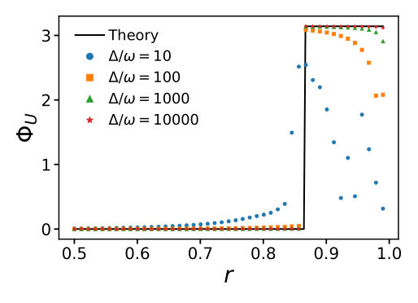
<figcaption class="paper-figure-caption"><b>Fig 1.</b> Figure 1: Uhlmann phase ΦU versus the purity parameter r. The solid black line is the theoretical prediction, while the symbols show numerical results obtained from adiabatic evo- lution under the parent Hamiltonian for ∆/ω = 10 (circles), 100 (squares), 1000 (triangles), and 10000 (stars).</figcaption>
</figure>

**Summary.** The paper solves the challenge of simulating mixed-state geometric phases (Uhlmann phase) using only standard, Hermitian Hamiltonian evolution. By embedding the system into an enlarged four-level model, they prove that this complex phase can be exactly reproduced by the Wilczek-Zee connection in 1D parameter spaces. This offers a purely quantum mechanical framework for studying topological invariants of mixed states.

**Why it may be interesting.** This work provides a powerful theoretical tool by mapping a complex, non-Hermitian geometric phase problem onto standard, well-understood Hermitian Hamiltonian dynamics, which is crucial for quantum simulation and topological characterization.

Detailed structure

**Main problem.** The primary goal is to find a purely Hermitian, Hamiltonian-based method to simulate the mixed-state geometric phase (Uhlmann phase), which is otherwise complicated by non-Hermitian dynamics.

**Main result.** For one-dimensional parameter loops, they prove that the Uhlmann connection exactly matches the Wilczek-Zee connection derived from an auxiliary four-level Hermitian Hamiltonian. This establishes a purely quantum mechanical route to calculating mixed-state geometric phases.

**Method.** The authors construct an enlarged, Hermitian parent Hamiltonian whose degenerate ground state subspace is used to calculate the WZ connection and compare it directly to the definition of the Uhlmann connection.

**Model / system.** The system involves qubit density matrices undergoing adiabatic cyclic evolution along a 1D loop. This dynamics is embedded into an auxiliary four-level Hermitian Hamiltonian $H(t) = \Delta (I - P(t))$.

**Key observables.** Uhlmann phase ($\Phi_U$), Uhlmann holonomy matrix ($\mathcal{U}_U$), and the comparison between $	ext{AWZ}$ and $	ext{AU}$.

**Important parameters / regimes.** The purity parameter ($r$) of the density matrix, and the gap ratio ($\Delta/\omega$) used in the adiabatic approximation.

**Assumptions / limitations.** The construction is rigorously proven only for one-dimensional parameter spaces; extension to 2D requires satisfying a Frobenius integrability condition, which is generally violated.

**Figures summary.** Figure 1 compares the calculated Uhlmann phase ($\Phi_U$) versus purity ($r$), showing numerical convergence onto theoretical predictions across varying gap ratios ($\Delta/\omega$).

**Paper structure.** The paper first establishes the problem of simulating mixed-state phases. It then constructs the auxiliary Hamiltonian and derives the equivalence for 1D loops, confirming adiabatic reproduction. Finally, it analyzes the failure of this construction in higher dimensions due to integrability constraints.

Abstract

The Uhlmann phase extends geometric phases to mixed quantum states via a parallel-transport condition on purification amplitudes, yet its direct implementation under standard Hamiltonian dynamics is obstructed by the non-Hermitian nature of the purification. We establish that for any smooth one-dimensional closed loop of full-rank qubit density matrices, there exists a four-level Hermitian parent Hamiltonian whose doubly degenerate ground-state subspace carries a Wilczek--Zee connection exactly equal to the Uhlmann connection. Consequently, the Uhlmann holonomy is faithfully reproduced by adiabatic evolution in the enlarged system. We further prove that this auxiliary-field construction is obstructed in generic two-dimensional parameter spaces by a Frobenius integrability condition, which we derive explicitly. The one-dimensional Uhlmann phase is thus placed on the same footing as the non-Abelian Berry phase, offering a purely Hermitian, Hamiltonian-based route to simulating mixed-state geometric phases. Numerical integration of the adiabatic dynamics confirms the exact correspondence and validates the convergence to the Uhlmann holonomy in the large-gap limit.

[↑ back to top](#top)

### [Coherent Control of Channel Dilations Activate Temporal Bell Nonclassicality](http://arxiv.org/abs/2607.05643v1)

**Authors:** H S Karthik, Akshata Shenoy H, A R Usha Devi, Marcin Pawłowski  
**Type:** theory · **Category:** quantum information and computing · **PDF:** <https://arxiv.org/pdf/2607.05643v1>  
**Analysis basis:** full PDF text, analyzed in chunks
**Topic relevance:** `correlated / nonlocal dissipation` **2/5** · `entanglement & information structure` **2/5** · `quantum measurements` **2/5** · `driven-dissipative phase transition` **1/5** · `methods for driven-dissipative` **1/5** · `non-equilibrium dynamics` **1/5**

↔ Scroll figures horizontally

<figure class="paper-figure-card">
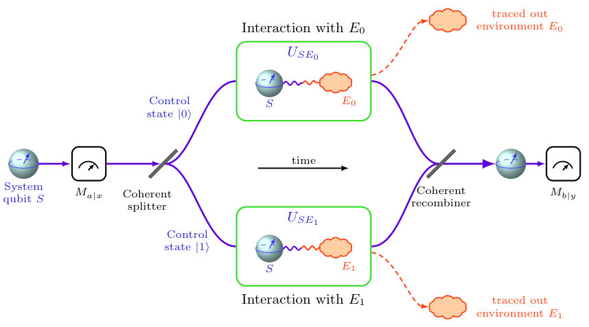
<figcaption class="paper-figure-caption"><b>Fig 1.</b> FIG. 1. Schematic of a temporal CHSH inequality experiment using sequential measurements and coherently controlled interaction of the system with independent environments: First, an initial quantum state is measured. Next, the state undergoes noisy evolution resulting from the unitary interaction with independent environments E1 and E2. A control qubit C (acting as the which path qubit) coherently controls the choice of this interaction. After the coherent evolution, the environments are traced out and the branches are coherently recombined (control post-selection and trace out). Finally, the effectively evolved system undergoes a second measurement. Time runs from left to right.</figcaption>
</figure>
<figure class="paper-figure-card">
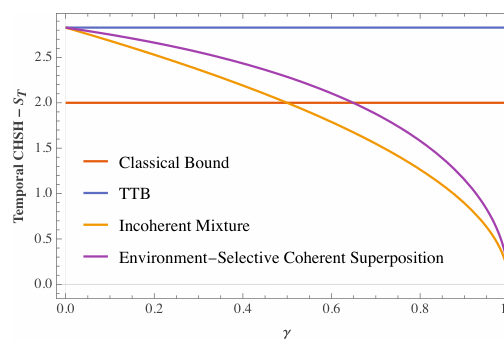
<figcaption class="paper-figure-caption"><b>Fig 2.</b> FIG. 2. The temporal CHSH inequality as a function of the damp- ing parameter γ: The red and the blue lines represent the classical bound and the temporal Tsirelson bound (TTB) respectively. The orange curve corresponds to the case where the action of the envi- ronments are incoherently controlled. The purple curve represents the coherent control of the channel implementations using indepen- dent environments. It is observed that the violation of the temporal CHSH inequality is activated beyond the incoherently controlled (or the deterministic) ADC threshold and persists up to γ ≈0.65.</figcaption>
</figure>
<figure class="paper-figure-card">
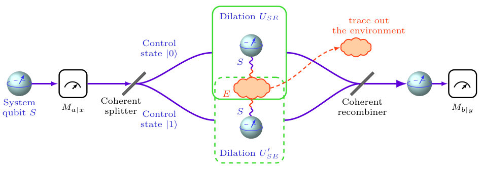
<figcaption class="paper-figure-caption"><b>Fig 3.</b> FIG. 3. Schematic of a temporal CHSH inequality experiment using sequential measurements and coherently controlled Stinespring dilations of the noise channel acting on the system : First, an initial quantum state is measured. Following which, the state undergoes noisy evolution resulting from the unitary interaction with an environment E. A control qubit C (acting as the which path qubit) coherently controls the choice of Stinespring dilations. After this coherent evolution, the environment is traced out and the branches are coherently recombined (control post-selection and trace out). Lastly, the effectively evolved system undergoes the second measurement. Time runs from left to right.</figcaption>
</figure>
<figure class="paper-figure-card">
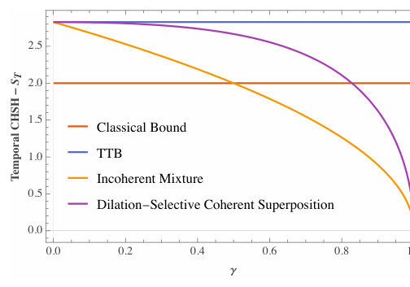
<figcaption class="paper-figure-caption"><b>Fig 4.</b> FIG. 4. A plot of the variation in the temporal CHSH inequality as a function of γ is shown. The orange curve represents the case when Stinespring dilations are incoherently chosen. The purple curve is due to coherent selection of the unitarily equivalent dilations. Notice that the violation of the temporal CHSH inequality shows activation beyond the ADC threshold and up to γ ≈0.83.</figcaption>
</figure>
<figure class="paper-figure-card">
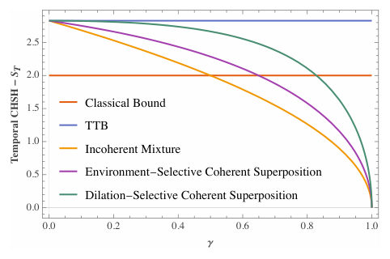
<figcaption class="paper-figure-caption"><b>Fig 5.</b> FIG. 5. The temporal CHSH inequality as a function of γ under dif- ferent considerations: (1) The orange curve denotes the case where the choice of the dilation is deterministic or incoherent (classical) mixture, (2) The purple is due to coherent control of the channels with independent environments and (3) The green corresponds to the coherent control of unitary equivalent dilations with the same envi- ronment.</figcaption>
</figure>

**Summary.** The paper addresses how environmental noise degrades temporal quantum correlations, measured by the CHSH inequality. It compares two ways to model controlled noise: independent environments versus equivalent Stinespring dilations. The key finding is that coherently controlling the dilation structure allows for a much broader revival of Bell nonclassicality than previously thought possible.

**Why it may be interesting.** This work provides a concrete, measurable resource (the choice of dilation) to enhance quantum tests in noisy environments, which is crucial for developing robust protocols in open quantum systems theory relevant to AMO physics.

Detailed structure

**Main problem.** The research investigates how coherent control over noisy quantum evolutions can revive the violation of the temporal Clauser-Horne-Shimony-Holt (CHSH) inequality, which is otherwise degraded by environmental noise.

**Main result.** Coherent control using equivalent Stinespring dilations significantly extends the range of temporal CHSH violation compared to independent environment models or deterministic scenarios. This highlights that the choice of dilation realization is an operationally relevant resource in testing quantum correlations.

**Method.** The authors compare two physical implementations—independent environmental interactions versus unitarily equivalent Stinespring dilations—by calculating the temporal CHSH parameter ($S_T$) using joint probability distributions derived from these controlled evolutions.

**Model / system.** The system analyzed is a single qubit undergoing sequential measurements separated by an intermediate dynamical evolution modeled by a quantum channel, specifically focusing on the amplitude-damping channel (ADC). The dynamics are explored via Stinespring dilations and Choi–Jamiołkowski representations.

**Key observables.** Temporal CHSH parameter ($S_T$), which must exceed 2 to witness nonclassicality; violation of the temporal CHSH inequality.

**Important parameters / regimes.** Noise strength ($\gamma$, related to damping), and the specific choice between independent environments versus equivalent Stinespring dilations.

**Assumptions / limitations.** The analysis relies on assumptions derived from Macrorealism (MR) regarding physical properties existing independently of observation, and non-invasive measurements.

**Figures summary.** Figures compare temporal CHSH violation vs. damping strength ($\gamma$) for various control methods: Classical Bound, Incoherent Mixture, Environment-Selective Superposition, and Dilation-Selective Superposition, showing the superior activation range of the latter.

**Paper structure.** The paper establishes the problem using the temporal CHSH inequality under noise. It then develops mathematical frameworks comparing independent environment models against equivalent Stinespring dilation controls. The core argument is built by calculating $S_T$ for both control types and demonstrating that coherent control at the dilation level yields superior results.

Abstract

The temporal Clauser-Horne-Shimony-Holt (CHSH) inequality witnesses the nonclassicality of temporal correlations, but its violation is generally degraded by environmental noise. Here, we show that violation of the temporal CHSH inequality can be revived through coherent control of noisy quantum evolutions. We compare two physically distinct implementations: coherent control of noisy evolutions induced by interaction of the system with independent environments, and coherent control of two physically distinct, unitarily equivalent Stinespring dilations of the same noisy channel. Although these constructions generate identical deterministic system dynamics, they induce distinctly different post-selected evolutions. With a focus on the amplitude damping channel (ADC), we show that coherent control of equivalent dilations extend the range of temporal CHSH inequality violation well beyond both the incoherently controlled, or deterministic, scenario and what is achievable with independent environments. Under setting-independent post-selection of the coherent control implementation, the resulting violation further certifies that the channel is not strongly CHSH nonlocality-breaking. Our results identify the choice of Stinespring dilation as an operationally relevant resource in coherently controlled tests of temporal quantum correlations.

[↑ back to top](#top)

### [Electron-Phonon Dephasing in Ultrathin Disordered Films: From Power Laws to Diagnostic Maps](http://arxiv.org/abs/2607.05951v1)

**Authors:** Eugeniy Yu. Beliayev  
**Type:** both · **Category:** disordered systems and neural networks · **PDF:** <https://arxiv.org/pdf/2607.05951v1>  
**Analysis basis:** full PDF text, analyzed in chunks
**Topic relevance:** `non-equilibrium universality` **2/5** · `Keldysh / 2PI / non-Gaussian methods` **1/5** · `analog quantum simulation` **1/5** · `correlated / nonlocal dissipation` **1/5** · `driven-dissipative phase transition` **1/5** · `methods for driven-dissipative` **1/5** · `non-equilibrium dynamics` **1/5**

↔ Scroll figures horizontally

<figure class="paper-figure-card">
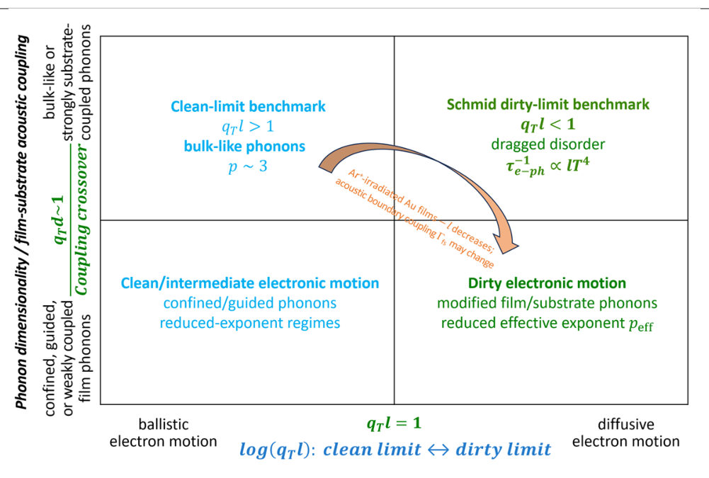
<figcaption class="paper-figure-caption"><b>Fig 1.</b> Fig. 1. Diagnostic map for electron–phonon dephasing in ultrathin films. The horizontal axis represents 𝑞𝑇𝑙, while the vertical axis represents phonon confinement and film-substrate acoustic coupling. The arrow indicates that Ar+-ion irradiation may simultaneously reduce the electronic mean free path 𝑙 and modify the acoustic boundary condition 𝛤𝑓𝑠.</figcaption>
</figure>
<figure class="paper-figure-card">
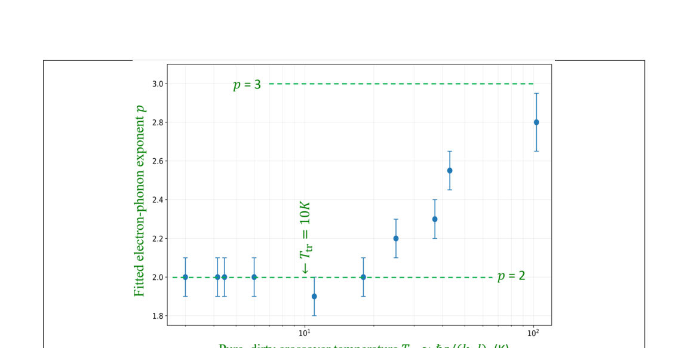
<figcaption class="paper-figure-caption"><b>Fig 2.</b> Fig. 2. Ar+-ion-irradiated Au films as a controlled-disorder series. The fitted electron–phonon exponent 𝑝 is replotted as a function of the pure–dirty crossover temperature 𝑇tr ≃ℏ𝑠/(𝑘𝐵𝑙). Data points are digitized from Ref. [5]; the lines are guides to the eye. The exponent remains close to 2 for 𝑇tr ≲10 K and increases toward 2.8 as 𝑇tr enters and exceeds the experimental temperature window. This representation emphasizes the crossover character of the fitted exponent rather than treating 𝑝 as a universal constant.</figcaption>
</figure>
<figure class="paper-figure-card">
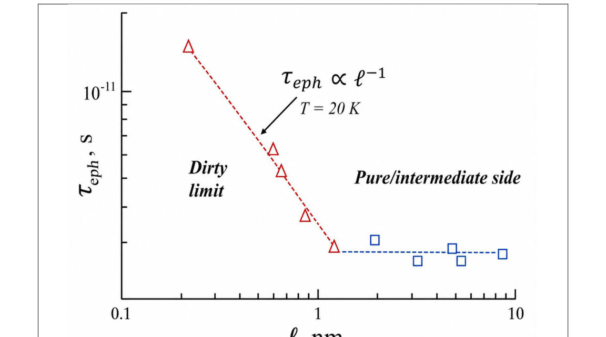
<figcaption class="paper-figure-caption"><b>Fig 3.</b> Fig. 3. Approximate reconstruction of 𝜏𝑒−𝑝ℎ(20 𝐾) versus mean free path l in Ar+-ion-irradiated Au films. The reconstruction is based on digitized coordinates from the published figure [5] and is intended as an illustrative replot, not as primary data. The short-l branch shows a pronounced increase of 𝜏𝑒−𝑝ℎ as l decreases, corresponding to suppression of 𝜏𝑒−𝑝ℎ</figcaption>
</figure>

**Summary.** This paper argues that electron-phonon dephasing exponents in thin disordered metals are not universal constants but rather 'crossover observables.' By analyzing controlled disorder series, the authors propose a diagnostic map framework that requires considering multiple parameters—like clean-to-dirty ratios and phonon confinement—for accurate physical interpretation.

**Why it may be interesting.** While focused on condensed matter, the concept of mapping complex physical behavior onto a diagnostic space based on multiple interacting parameters (like $qT l$ and confinement) is analogous to constructing feature spaces in advanced machine learning models.

Detailed structure

**Main problem.** The electron-phonon dephasing rate in ultrathin disordered metallic films is often modeled by a simple power law, but the exponent varies widely, suggesting it is not a universal constant.

**Main result.** The exponent must be treated as a crossover observable whose interpretation requires considering multiple physical coordinates, such as the clean-to-dirty parameter and phonon confinement effects.

**Method.** The authors analyze data across a controlled-disorder series using $	ext{Ar}^+$-ion irradiation to map out how the dephasing exponent changes relative to other system parameters.

**Model / system.** The study focuses on electron-phonon dephasing ($	au_{e-	ext{ph}}^{-1}$) in ultrathin metallic films, specifically demonstrating results using $	ext{Ar}^+$-ion-irradiated Au films as a controlled-disorder platform.

**Key observables.** Electron-phonon exponent ($p$), prefactor $A(l)$, and the pure-dirty crossover temperature ($T_{	ext{tr}}$).

**Important parameters / regimes.** Clean-to-dirty parameter ($qT l$), phonon confinement, film thickness, and disorder character (dragged vs. static scattering potentials).

**Assumptions / limitations.** The exponent $p$ is not a universal constant but an effective crossover observable dependent on multiple coupled physical parameters.

**Figures summary.** Figures illustrate the dependence of the fitted exponent $p$ on the crossover temperature $T_{	ext{tr}}$ for irradiated Au films, and propose a diagnostic map correlating $p$ with other system coordinates.

**Paper structure.** The paper establishes the problem by noting the variability of the power law exponent; it then develops a multi-parameter 'diagnostic map' framework using controlled disorder series data to show that simple single-variable fits are insufficient for interpretation.

Abstract

Electron-phonon dephasing in ultrathin disordered metallic films is often summarized by a power law, $τ_{e-ph}^{-1}=AT^p$. However, thin metals, alloys, and superconducting films exhibit effective exponents close to 2, 3, and 4, as well as intermediate nonuniversal values. We argue that in ultrathin supported films, the exponent should be treated not as a universal material constant, but as a crossover observable. Its interpretation requires several coordinates: the clean-to-dirty parameter $q_T l$, phonon confinement and film-substrate acoustic coupling, and the microscopic character of disorder.   The diagnostic picture is illustrated using Ar-ion-irradiated Au films as a controlled-disorder series. In these films, the fitted electron-phonon exponent remains near $p\simeq 2$ for low values of the pure-dirty crossover temperature $T_{tr}\simeq \hbar s/(k_B l)$ and increases toward $p\simeq 2.8$ as disorder increases. At the same time, the prefactor trend indicates suppression of electron-phonon scattering with decreasing mean free path, consistent with dirty-limit weakening rather than static-disorder enhancement. The persistence of $p<4$ points to the role of thin-film or film-substrate phonon effects. The resulting diagnostic map provides a compact framework for comparing electron-phonon dephasing data in ultrathin disordered films.

[↑ back to top](#top)

### [Bockstein Braiding Statistics Versus Three-Loop Braiding](http://arxiv.org/abs/2607.06279v1)

**Authors:** Hanyu Xue  
**Type:** theory · **Category:** strongly correlated electrons · **PDF:** <https://arxiv.org/pdf/2607.06279v1>  
**Analysis basis:** full PDF text, analyzed in chunks
**Topic relevance:** `analog quantum simulation` **2/5** · `Keldysh / 2PI / non-Gaussian methods` **1/5** · `driven-dissipative phase transition` **1/5** · `entanglement & information structure` **1/5** · `methods for driven-dissipative` **1/5**

↔ Scroll figures horizontally

<figure class="paper-figure-card">
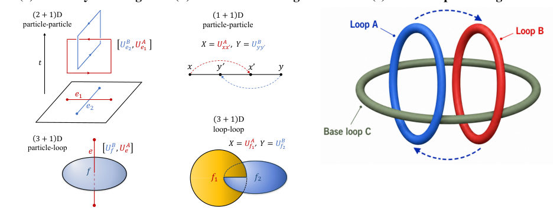
<figcaption class="paper-figure-caption"><b>Fig 1.</b> Figure 1: Comparison of ordinary braiding, Bockstein braiding, and three-loop braiding. Operator 𝑈Δ is the creation (hopping) operator of an excitation on 𝜕Δ. (a) Ordinary braiding is represented by the commutator  𝑈𝐵,𝑈𝐴 = (𝑈𝐵)−1(𝑈𝐴)−1𝑈𝐵𝑈𝐴. The examples depict particle-particle braiding in (2+1) dimensions and particle-loop braiding in (3+1) dimensions. (b) Bockstein braiding is represented by 𝑊𝑁(𝑋,𝑌) = 𝑌−1𝑋−1 𝑁(𝑌𝑋)𝑁for hopping operators whose supports have a staggered one-dimensional overlap. The examples depict particle-particle statistics in (1+1) dimensions and loop-loop statistics in (3+1) dimensions. (c) In three-loop braiding, two loops braid while both are linked with a third...</figcaption>
</figure>
<figure class="paper-figure-card">
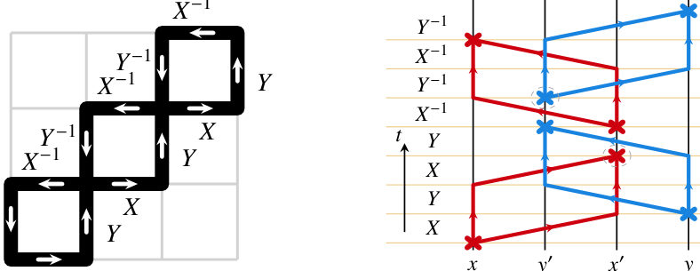
<figcaption class="paper-figure-caption"><b>Fig 2.</b> Figure 2: Two complementary pictures of the Bockstein braiding process. In (a), the lattice point (𝑖, 𝑗) represents the state with 𝑖units of the 𝐴-type excitation and 𝑗units of the 𝐵-type excitation, with 𝑖, 𝑗∈Z𝑁, for 𝑁= 3. Horizontal and vertical edges correspond to the actions of 𝑋and 𝑌, respectively, and the diagonal staircase compares the two alternating histories (𝑌𝑋)𝑁and (𝑋𝑌)𝑁. In (b), we draw the spacetime history of two Z𝑁particles for 𝑁= 2. The fusion of particles is drawn as a 0-dimensional event in spacetime and is linked by the worldline of the other particle species, producing a nontrivial topology analogous to braiding.</figcaption>
</figure>

**Summary.** This theoretical work rigorously compares two types of braiding statistics: Bockstein braiding ($W_N$) and conventional three-loop braiding. The authors show that $W_N$ exhausts all loop statistics arising from Abelian fusion rules, but the more complex three-loop braiding must possess non-Abelian features. This advances the understanding of topological order by providing a precise mathematical distinction between different types of quantum entanglement statistics.

**Why it may be interesting.** While the focus is abstract topology, the rigorous mathematical machinery developed—relating quantum phases to cohomology groups and local cancellation criteria—is highly relevant for understanding topological order in condensed matter systems like fractional quantum Hall states or superconducting qubits.

Detailed structure

**Main problem.** The paper compares Bockstein braiding statistics with conventional three-loop braiding for topological excitations to determine if they are mathematically equivalent.

**Main result.** Conventional three-loop braiding goes beyond the classification of loop statistics derived from Abelian fusion rules, suggesting it requires non-Abelian fusion rules or exotic particle-loop interactions.

**Method.** The authors use algebraic methods involving local cancellation criteria and cohomology theory to define and classify topological braiding processes ($W_N$).

**Model / system.** The study analyzes topological excitations in $p$- and $q$-dimensional settings, using lattice models based on $\mathbb{Z}_N^2$ toric-code-type ground states.

**Key observables.** Braiding phase (a value in U(1)), the Bockstein response $\tilde{\beta}(B)$, and the statistical process $W_N(X,Y)$.

**Important parameters / regimes.** The finite order $N$ of the excitations is crucial for the quantization of the statistics.

**Assumptions / limitations.** The classification relies on assuming Abelian fusion rules when deriving the cohomology bounds, which is then used to contrast with three-loop braiding.

**Figures summary.** Figure 1 compares ordinary, Bockstein, and three-loop braiding in different dimensions. Figure 2 illustrates the Bockstein braiding process using lattice configurations and spacetime histories.

**Paper structure.** The paper develops a general framework for classifying topological statistics via an 'Excitation Complex,' applies this to define $W_N$, proves its quantization on a lattice model, and finally contrasts this result with three-loop braiding theory.

Abstract

Braiding statistics of $p$- and $q$-dimensional topological excitations is conventionally defined in $p+q+2$ spatial dimensions. We find a novel statistical process $W_N(X,Y)=(Y^{-1}X^{-1})^N(YX)^N$ for two order-$N$ excitations in $p+q+1$ dimensions, detecting the Bockstein response $A\smile β(B)$. This new statistics and fermionic loop statistics exhaust all loop statistics in three dimensions whose fusion rules form an Abelian group $G$, classified by $H^5(B^2G,U(1))$. Surprisingly, conventional three-loop braiding goes beyond this classification, so it must have non-Abelian fusion rules. We suggest viewing three-loop braiding as particle-loop braiding together with exotic fusion rules between loops and point-like defects. We also try to clarify the relationship between statistics and symmetry anomaly.

[↑ back to top](#top)

### [Fixing Divergence in Carleman Linearization via Analytical Continuation](http://arxiv.org/abs/2607.05873v1)

**Authors:** Mingshuo Zhu, Hayato Higuchi, Hokuto Iwakiri, Kouki Nakamura, Naohisa Sueishi, Shih-Yen Tseng, Shoichiro Tsutsui  
**Type:** theory · **Category:** quantum information and computing · **PDF:** <https://arxiv.org/pdf/2607.05873v1>  
**Analysis basis:** full PDF text, analyzed in chunks
**Topic relevance:** `non-equilibrium dynamics` **2/5** · `Keldysh / 2PI / non-Gaussian methods` **1/5** · `analog quantum simulation` **1/5** · `driven-dissipative phase transition` **1/5** · `methods for driven-dissipative` **1/5**

↔ Scroll figures horizontally

<figure class="paper-figure-card">
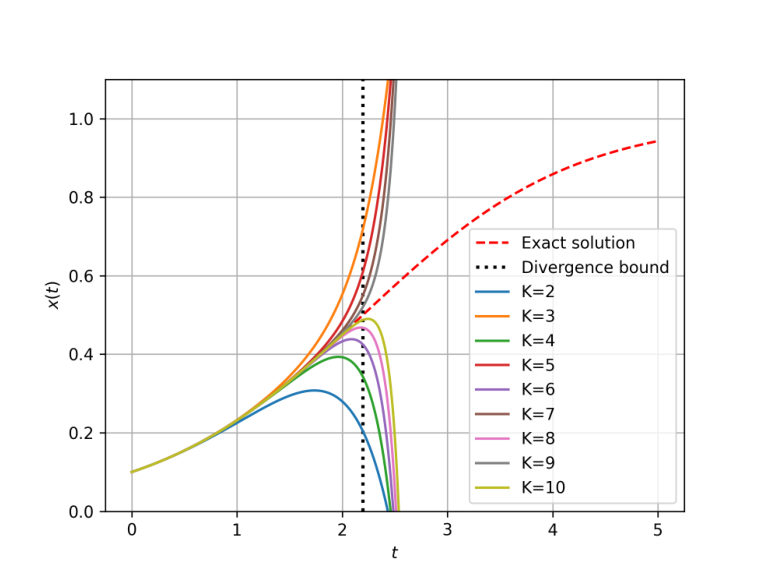
<figcaption class="paper-figure-caption"><b>Fig 1.</b> FIG. 1: Comparison of Carleman linearization with the exact solution of the logistic equation, a</figcaption>
</figure>
<figure class="paper-figure-card">
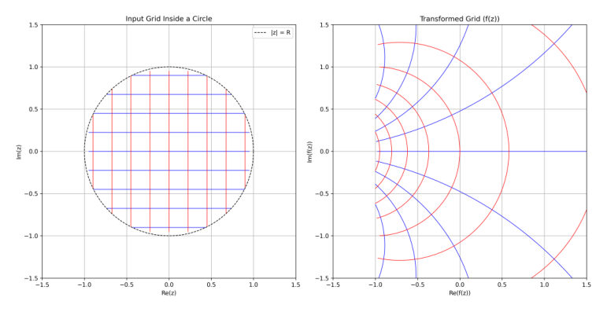
<figcaption class="paper-figure-caption"><b>Fig 2.</b> FIG. 2: Conformal mapping between the ω-plane and the ζ-plane. The unit disc (left) represents</figcaption>
</figure>
<figure class="paper-figure-card">

<figcaption class="paper-figure-caption"><b>Fig 3.</b> FIG. 3: Comparison of heatmaps for the regularized incomplete beta function I1−w(t)(k, M −k + 1)</figcaption>
</figure>
<figure class="paper-figure-card">
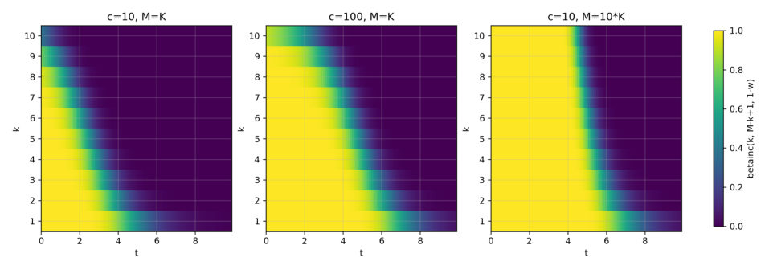
<figcaption class="paper-figure-caption"><b>Fig 4.</b> Figure 4 presents numerical results for several values of the scale parameter c, illustrating how c</figcaption>
</figure>
<figure class="paper-figure-card">
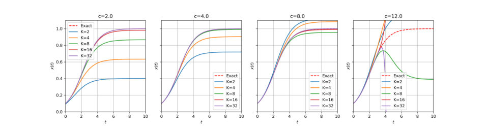
<figcaption class="paper-figure-caption"><b>Fig 5.</b> FIG. 4: Time evolution of the logistic solution after conformal mapping for x0 = 0.1 and several</figcaption>
</figure>

**Summary.** This paper tackles the fundamental issue of exponential divergence when using Carleman linearization to solve nonlinear differential equations. The authors introduce an advanced regularization method based on analytical continuation and conformal mapping to stabilize the solution over long times. They validate this approach both classically and by detailing a concrete implementation pathway using quantum algorithms like LCU.

**Why it may be interesting.** This work directly addresses the computational bottleneck of simulating complex nonlinear dynamics by providing a mathematically rigorous technique to extend the time horizon achievable via linearization methods, which is crucial for quantum simulation feasibility.

Detailed structure

**Main problem.** The core problem is overcoming the exponential divergence inherent when using Carleman linearization to solve nonlinear differential equations over long time scales.

**Main result.** The authors propose a regularization technique based on analytical continuation via conformal mapping, successfully correcting the divergence for models like the logistic and KPP-Fisher equations.

**Method.** They employ analytic continuation using Möbius transformations (conformal maps) to map the infinite domain of time evolution into a region where the series converges, followed by regularizing the resulting divergent factor.

**Model / system.** The method is tested on classical nonlinear models such as the logistic equation and KPP-Fisher reaction-diffusion equations. For quantum implementation, it uses the Linear Combination of Unitaries (LCU) algorithm applied to the linearized system matrix.

**Key observables.** Convergence behavior across time ($t$), stability regimes determined by parameters $c$ and initial conditions ($x_0$).

**Important parameters / regimes.** The regularization parameter $c$, truncation orders $M$ and $K$, and the scale parameter derived from the conformal map.

**Assumptions / limitations.** The method assumes that setting the regularization order $M$ proportional to the matrix size $K$ ($M \approx K$) is appropriate for convergence. The quantum implementation relies on embedding non-unitary matrices into unitary ones via block encoding.

**Figures summary.** Figures compare Carleman linearization against exact solutions, showing divergence over time; they also present phase diagrams classifying convergence regimes based on parameters like $c$ and $x_0$ for various models.

**Paper structure.** The paper first establishes the failure of naive Carleman expansion due to divergence. It then introduces the analytical continuation via conformal mapping (Möbius map) as a fix, regularizing the solution using a specific function. Finally, it validates this corrected method on multiple physical models and details its implementation using quantum algorithms like LCU.

Abstract

Nonlinear differential equations play a crucial role in modeling a wide range of phenomena, yet their solutions remain notoriously difficult to obtain. With the rapid development of quantum computing, quantum algorithms for efficiently solving such equations are actively being explored. One promising approach is based on Carleman linearization, which transforms nonlinear differential equations into linear systems. However, this method suffers from exponential divergence beyond a certain time scale. By reformulating the solutions in terms of eigenvalues and eigenvectors, we identify that this divergence originates from the Laurent expansion outside its neighborhood of convergence. To address this issue, we insert a regularized function to the divergent solution hinted by analytical continuation. We validate this divergence-correction method on both the logistic equation and some other partial differential equations like KPP-Fisher equations and Phase-Field models under periodic conditions. We implement our method for the logistic equation using the Linear Combination of Unitaries (LCU) quantum algorithm, providing a detailed complexity and error analysis.

[↑ back to top](#top)

### [Leveraging Metrologically Useful States in Quantum Reservoir Networks](http://arxiv.org/abs/2607.06500v1)

**Authors:** Erik L. Connerty, Margarite LaBorde, Ethan N. Evans  
**Type:** theory · **Category:** quantum information and computing · **PDF:** <https://arxiv.org/pdf/2607.06500v1>  
**Analysis basis:** full PDF text, analyzed in chunks
**Topic relevance:** `non-equilibrium dynamics` **2/5** · `driven-dissipative phase transition` **1/5** · `entanglement & information structure` **1/5** · `methods for driven-dissipative` **1/5** · `non-equilibrium universality` **1/5**

↔ Scroll figures horizontally

<figure class="paper-figure-card">
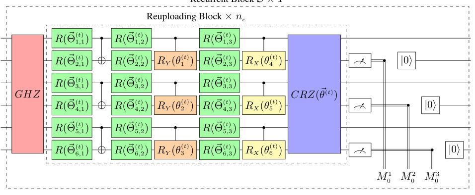
<figcaption class="paper-figure-caption"><b>Fig 1.</b> Figure 1: The GHZ QRN Circuit. As before, the inner block named the “Reuploading Block” is repeated nc = 3 times in all experiments, as this reuploadng procedure has been shown to improve performance. The outer “Recurrent Block” is repeated for every time-step of the input data. A “GHZ” unitary is performed at the start of every “Recurrent Block” and serves to create an optimal reservoir-like state. The “CRZ” operation at the end of each “Reuploading Block” has been modified to have only adjacent connections, allowing for no SWAP operations when mapping to an IBM Heron R2 QPU. At the end of each “Recurrent Block”, a measurement is taken on half of the qubits, and those qubits are reset to...</figcaption>
</figure>
<figure class="paper-figure-card">
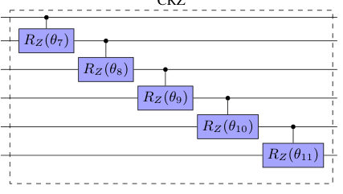
<figcaption class="paper-figure-caption"><b>Fig 2.</b> Figure 2: Circuit depiction of the cascaded CRZ gate used in the QRN.</figcaption>
</figure>
<figure class="paper-figure-card">
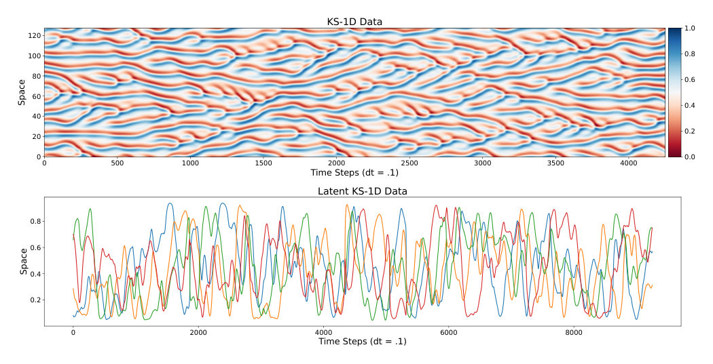
<figcaption class="paper-figure-caption"><b>Fig 3.</b> Figure 4: 1-D Kuramoto Sivashinsky data. The top data is the original data with n = 128 degrees of freedom, the bottom is the latent space representation with only n = 4.</figcaption>
</figure>
<figure class="paper-figure-card">
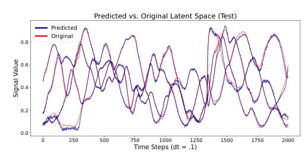
<figcaption class="paper-figure-caption"><b>Fig 4.</b> Figure 5: Latent space test data performance of the QRN with GHZ block.</figcaption>
</figure>
<figure class="paper-figure-card">
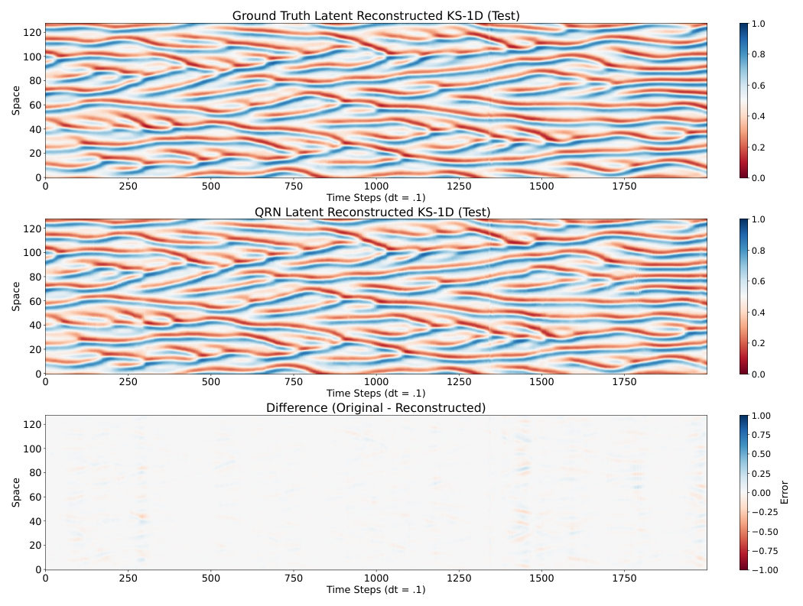
<figcaption class="paper-figure-caption"><b>Fig 5.</b> Figure 6: Decoded latent space representation of the KS-1D system compared to the ground truth decoded latents for (t + 1) predictions. The top figure denotes the decoded ground truth latent. The middle figure shows the output after being passed through the QRN for time-series prediction and then through the decoder for reconstruction. The bottom figure shows the residual between the reconstructed ground truth and the reconstructed prediction. Notably, the autoencoder itself introduces some small errors to the reconstruction, but the results of the QRN are close to the original with the (t + 1) prediction task.</figcaption>
</figure>

**Summary.** The paper proposes using an enhanced Quantum Reservoir Network (QRN) architecture to predict the behavior of chaotic PDEs like the Kuramoto-Sivashinsky system. By incorporating metrologically-useful GHZ states into the circuit design, the authors achieve superior prediction accuracy compared to standard QRN implementations or classical methods. This demonstrates a powerful pathway for leveraging quantum entanglement in machine learning for complex physical modeling.

**Why it may be interesting.** This work directly addresses applying quantum resources to model complex, non-equilibrium dynamics found in fluid physics and chaos theory, which is a major frontier for quantum simulation.

Detailed structure

**Main problem.** The core problem is predicting chaotic partial differential equations (PDEs) using quantum computation.

**Main result.** The proposed Quantum Reservoir Network (QRN) utilizing metrologically-useful GHZ state preparation significantly outperforms alternative QRN implementations and classical benchmarks in predicting the latent space of the Kuramoto-Sivashinsky system.

**Method.** A hybrid approach combining a quantum reservoir network with a classical autoencoder is used to map high-dimensional time-series data into a low-dimensional, predictable latent space representation.

**Model / system.** The model targets the 1-D Kuramoto-Sivashinsky (KS) system, a high-dimensional chaotic PDE. The quantum circuit uses recurrent blocks and incorporates GHZ state preparation to enhance entanglement and measurement sensitivity.

**Key observables.** Root Mean Square Error (RMSE) on the test set latent space KS system; Quantum Fisher Information (QFI); expectation values of readout qubits over time steps.

**Important parameters / regimes.** The number of qubits ($n_q$), the depth of the circuit, and the number of measurement shots ($	ext{nshots}$) are critical parameters analyzed for scaling behavior.

**Assumptions / limitations.** The method assumes that embedding the data into a quantum state space using specific unitary transformations (like those generating GHZ states) can capture the necessary dynamics for accurate prediction.

**Figures summary.** Figures illustrate the full GHZ QRN Circuit structure, compare latent space test performance across different circuit types (GHZ vs. random/none), and show reconstructed PDE output compared to ground truth data.

**Paper structure.** The paper introduces the problem of chaotic PDE prediction, details the hybrid QRN methodology incorporating metrologically-useful states (GHZ unitary), presents rigorous simulations comparing performance against baselines, and concludes with analysis of scaling laws and potential limitations.

Abstract

Interest in using quantum computers for the purpose of predicting chaotic partial differential equations (PDEs) has been growing with the advent of newer low-error quantum computers and robust simulation tools. In this paper, we present a method that utilizes a quantum reservoir network (QRN) to predict latent space representations of the high-dimensional chaotic 1-D Kuramoto-Sivashinksy (KS) system. This hybrid approach takes advantage of advancements in classical machine learning (ML) through the use of a classical autoencoder as well as techniques from quantum metrology through the use of a unitary that creates metrologically-useful states. Through rigorous simulation and analysis, we show that the proposed method outperforms alternative QRN implementations without this metrologically-useful state preparation, and also show better performance than classical echo-state networks when weight regularization is not used. Finally, we bring to light potential issues that can arise when using autoencoders within QRC pipelines.

[↑ back to top](#top)

### [Provable learning separation for predicting time-evolution of quantum many-body systems](http://arxiv.org/abs/2607.06472v1)

**Authors:** Rahul Bandyopadhyay, Riccardo Molteni, Jens Eisert, Vedran Dunjko, Sofiene Jerbi  
**Type:** theory · **Category:** quantum information and computing · **PDF:** <https://arxiv.org/pdf/2607.06472v1>  
**Analysis basis:** full PDF text, analyzed in chunks
**Topic relevance:** `analog quantum simulation` **2/5** · `driven-dissipative phase transition` **1/5** · `entanglement & information structure` **1/5** · `methods for driven-dissipative` **1/5** · `non-equilibrium dynamics` **1/5**

↔ Scroll figures horizontally

<figure class="paper-figure-card">
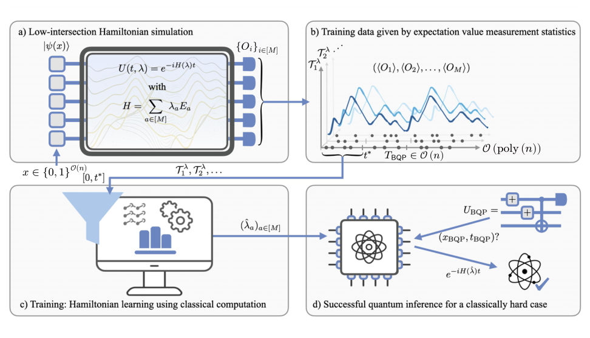
<figcaption class="paper-figure-caption"><b>Fig 1.</b> FIG. 1: A visualization of the key ideas of the present work. (a) Our training samples are generated by the time-evolution of a low-intersection Hamiltonian H (λ) for randomly chosen times t ∼Unif ([0, T]) acting on some initial probe state vector |ψ (x)⟩. (b) We consider as our labels a vector of expectation values evaluated on a set of certain pre-determined observables. This has been schematically depicted in the above figure as a collection of measurement samples. (c) We filter out the short-time samples from our training data and use them to identify the underlying data-generating Hamiltonian via a simple Hamiltonian learning algorithm that is classical. (d) Finally, we use a quantum...</figcaption>
</figure>

**Summary.** The paper establishes a provable learning separation for predicting the time evolution of quantum many-body systems. By formulating this as a PAC-learning problem, they show that while quantum computers can efficiently learn the underlying Hamiltonian from short-time data, classical algorithms face an exponential computational barrier unless BQP is classically easy. This rigorously connects quantum simulation difficulty to fundamental complexity theory.

**Why it may be interesting.** This work provides a rigorous complexity-theoretic boundary for quantum simulation tasks within QML, directly connecting fundamental questions about computational complexity (BQP vs P/poly) to practical challenges in simulating complex physical systems.

Detailed structure

**Main problem.** To establish provable learning separations for physically motivated Quantum Machine Learning (QML) tasks involving predicting the time-evolution of quantum many-body systems.

**Main result.** The authors demonstrate an exponential learning separation, showing that while a quantum procedure can efficiently learn the underlying Hamiltonian from short-time samples and perform inference, no classical polynomial-time algorithm can solve this task unless BQP is contained in P/poly.

**Method.** The work uses PAC-learning theory applied to a supervised learning problem where training data consists of expectation values of observables on time-evolved states. Classical hardness is proven by embedding a BQP-complete computation into the dynamics using specific Hamiltonian constructions.

**Model / system.** The system is a quantum many-body system whose dynamics are governed by an unknown Hamiltonian H. The learning task involves inferring H from measurements of expectation values $\langle \hat{O}(t) 
angle$ at various time points $t$.

**Key observables.** Expectation values of observables ($\langle \hat{O} 
angle$), the underlying Hamiltonian coefficients ($\lambda_a$).

**Important parameters / regimes.** The evolution time interval $[0, T]$ (polynomially large), the desired precision $\epsilon$, and the confidence parameter $\delta$.

**Assumptions / limitations.** The separation relies on the complexity-theoretic assumption BQP $
ot\subseteq 	ext{P/poly}$. The analysis also assumes access to 'sufficiently rich' training data enabling Hamiltonian learning.

**Figures summary.** Figure 1 illustrates the process: (a) Training samples are generated by time-evolution of H over random times t. (b) Labels are a vector of expectation values on pre-determined observables. (c) Short-time samples are used classically to identify H. (d) A quantum computer performs inference, potentially predicting a BQP-complete computation.

**Paper structure.** The paper systematically analyzes the learning task by formulating it in PAC terms, deriving error bounds for Hamiltonian estimation using short-time data, and then constructing a classically hard instance based on embedding BQP-complete computations into the time dynamics to prove the separation.

Abstract

Given that quantum computers are naturally suited to simulate the behavior of quantum many-body systems, an immediate question arises: can one formulate physically motivated quantum machine learning (QML) tasks that exhibit learning separations? We address this problem by studying the learnability of quantum many-body dynamics from the perspective of probably approximately correct (PAC)-learning. Concretely, we devise a supervised learning problem where the training set consists of specifications of randomized stabilizer probe states, evolution times sampled uniformly from a polynomially large time interval $[0,T]$, coupled with expectation values of certain observables evaluated on the resulting time-evolved state under an unknown Hamiltonian. For this learning task, we provide an efficient quantum procedure whose training phase learns the underlying Hamiltonian from short-time training samples, and whose deployment phase combines Hamiltonian simulation with the classical shadows protocol to perform inference on a newly given data point. By contrast, the existence of $O(\mathsf{poly}(n))$-time instances ensures classical hardness: by embedding a $\mathsf{BQP}$-complete computation into the polynomially long time-dynamics of a low-intersection variant of the Feynman-Kitaev clock Hamiltonian construction, we show that, for a certain family of input distributions, no randomized classical polynomial-time algorithm can fulfill our learning condition, unless $\mathsf{BQP}\subseteq\mathsf{P/poly}$. Furthermore, we show that the classically hard instance maintains quantum learnability. We also give an interpretation of our results in learning-assisted certified quantum simulation. Taken together, our results demonstrate a rigorous learning separation for a natural ML task based on Hamiltonian evolution, while building connections between quantum learning theory, quantum simulation, and QML.

[↑ back to top](#top)

### [Robust q-negative Multifractal Detrended Cross-Correlation Coefficient](http://arxiv.org/abs/2607.06324v1)

**Authors:** Thiago B. Murari, José Fernando F. Mendes, Hernane B. B. Pereira, Marcelo A. Moret  
**Type:** both · **Category:** statistical mechanics · **PDF:** <https://arxiv.org/pdf/2607.06324v1>  
**Analysis basis:** full PDF text, analyzed in chunks
**Topic relevance:** `non-equilibrium dynamics` **2/5** · `analog quantum simulation` **1/5** · `driven-dissipative phase transition` **1/5** · `methods for driven-dissipative` **1/5** · `non-equilibrium universality` **1/5**

↔ Scroll figures horizontally

<figure class="paper-figure-card">
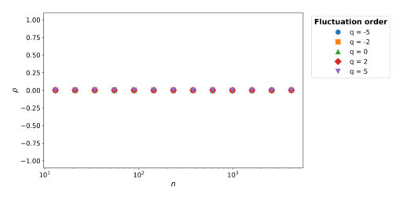
<figcaption class="paper-figure-caption"><b>Fig 1.</b> FIG. 1. Evaluation of ρSMFDCCA(n, q), using two indepen- dent fractional Gaussian noise time series generated by the exact Davies–Harte method with Hurst exponent H = 0.5 and 20,000 samples each. For all investigated scales n and fluctuation orders q ∈[−10, 10], the coefficient remains close to zero, indicating the absence of cross-correlations between the signals. The residual fluctuations around zero are consis- tent with finite-sample effects and demonstrate the numerical stability of the proposed coefficient for both positive and neg- ative values of q.</figcaption>
</figure>
<figure class="paper-figure-card">
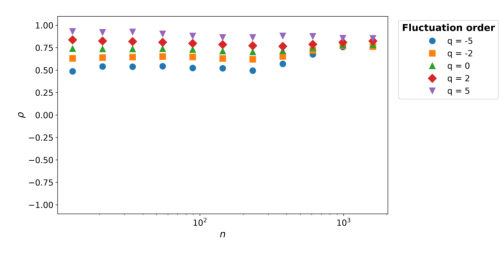
<figcaption class="paper-figure-caption"><b>Fig 2.</b> FIG. 2. ρSMFDCCA(n, q) between the daily logarithmic returns of the Dow Jones Industrial Average and NASDAQ Composite Index from January 2, 1992 to May 8, 2026 (N = 8649). The coefficient is shown for fluctuation orders q ∈[−5, 5] as a func- tion of the window size n. Positive values of ρSMFDCCA(n, q) across all scales indicate persistent cross-correlations between the two U.S. equity markets. The increase of ρSMFDCCA(n, q) with q reveals strong synchronized co-movements for large- amplitude fluctuations than for small fluctuations, evidencing q-dependent asymmetry in the correlation structure.</figcaption>
</figure>
<figure class="paper-figure-card">
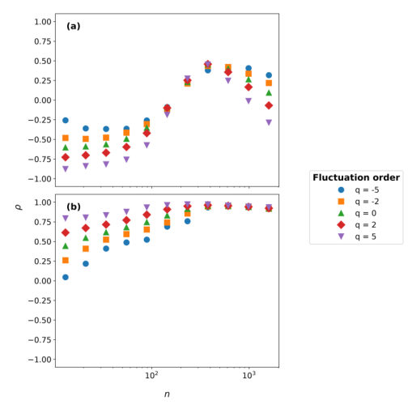
<figcaption class="paper-figure-caption"><b>Fig 3.</b> FIG. 3. ρSMFDCCA(n, q), for meteorological variables in São Paulo, Brazil. (a) Mean temperature versus mean relative hu- midity in São Paulo. (b) Maximum versus minimum temper- ature in São Paulo. The dependence on the fluctuation order q ∈[−5, 5] reveals heterogeneous cross-correlation structures across scales.</figcaption>
</figure>

**Summary.** This paper introduces a novel Signed Multifractal Detrended Cross-Correlation Coefficient ($
ho_{SMFDCCA}$) designed to overcome numerical instabilities associated with analyzing negative fluctuation orders in multifractal analysis. By conditioning the correlation on local fluctuation amplitudes, the observable remains bounded within [-1, 1] for all q. It successfully characterizes how cross-correlations change based on both temporal scale and the magnitude of fluctuations across diverse real-world datasets.

**Why it may be interesting.** While not directly about quantum systems, the rigorous statistical framework developed for analyzing complex, non-stationary time series (like those found in quantum measurements or open system dynamics) provides advanced tools for characterizing multi-scale correlations that could be adapted to analyze noise spectra from quantum experiments.

Detailed structure

**Main problem.** The standard Multifractal Detrended Cross-Correlation Coefficient fails for negative fluctuation orders due to numerical instabilities and unbounded values.

**Main result.** The proposed Signed Multifractal Detrended Cross-Correlation Coefficient remains strictly bounded within [-1, 1] and successfully characterizes scale- and amplitude-dependent cross-correlations in diverse datasets.

**Method.** It introduces an amplitude-conditioned observable by using locally normalized detrended correlations weighted by a fluctuation amplitude term to ensure mathematical stability for all orders q.

**Model / system.** The method is applied to analyzing time series data from various physical and financial systems, including stock market indices (DJIA/NASDAQ) and meteorological records (temperature/humidity).

**Key observables.** Signed Multifractal Detrended Cross-Correlation Coefficient ($
ho_{SMFDCCA}(n, q)$), local detrended correlation coefficient ($r_v(n)$), and local fluctuation amplitude ($A_v(n)$).

**Important parameters / regimes.** Fluctuation order $q$ (ranging from negative to positive values); temporal scale $n$; regularization constant $\epsilon$.

**Assumptions / limitations.** The method assumes that the cross-correlation structure can be robustly captured by an amplitude-conditioned weighted average, and a small regularization parameter ($\epsilon$) is necessary for numerical stability when $q < 0$.

**Figures summary.** Figures illustrate $
ho_{SMFDCCA}(n, q)$ dependence on $q$ for meteorological variables (e.g., max vs min temperature), showing complex evolution across scales.

**Paper structure.** The paper first identifies the limitations of existing correlation coefficients for negative orders; it then rigorously derives and proposes the $
ho_{SMFDCCA}$; validation is performed using fractional Gaussian noise, followed by empirical applications to financial and climate data.

Abstract

The multifractal detrended cross-correlation coefficient $ρ_q(n)$ is widely used to investigate scale-dependent interactions, but its application to negative fluctuation orders is affected by numerical instabilities, unbounded values, and interpretational difficulties. We propose a Signed Multifractal Detrended Cross-Correlation Coefficient, $ρ_{\mathrm{SMFDCCA}}(n,q)$, an amplitude-conditioned correlation observable for multifractal detrended analysis, based on locally normalized detrended correlations and regularized fluctuation amplitudes. The proposed coefficient preserves the sign of local interactions, remains strictly bounded within $[-1,1]$ for both positive and negative values of $q$, and eliminates the corrective procedures required by previous approaches. Validation using independent fractional Gaussian noise confirms the absence of spurious cross-correlations and the numerical stability of the method. Applications demonstrate that the proposed observable resolves how cross-correlations evolve jointly with temporal scale and fluctuation amplitude, revealing scale- and amplitude-dependent correlation structures, including stronger synchronization during large fluctuations in stock-market indices and heterogeneous coupling patterns in temperature records.

[↑ back to top](#top)

### [Separating transient leakage exposure from endpoint cancellation in fast transmon single-qubit gates](http://arxiv.org/abs/2607.05779v1)

**Authors:** Haoran Yang, Fudong Liu, Weilong Wang, Yangyang Fei, Zheng Shan  
**Type:** theory · **Category:** quantum information and computing · **PDF:** <https://arxiv.org/pdf/2607.05779v1>  
**Analysis basis:** full PDF text, analyzed in chunks
**Topic relevance:** `QC/QI experiment` **2/5** · `Keldysh / 2PI / non-Gaussian methods` **1/5** · `correlated / nonlocal dissipation` **1/5** · `driven-dissipative phase transition` **1/5** · `methods for driven-dissipative` **1/5**

↔ Scroll figures horizontally

<figure class="paper-figure-card">
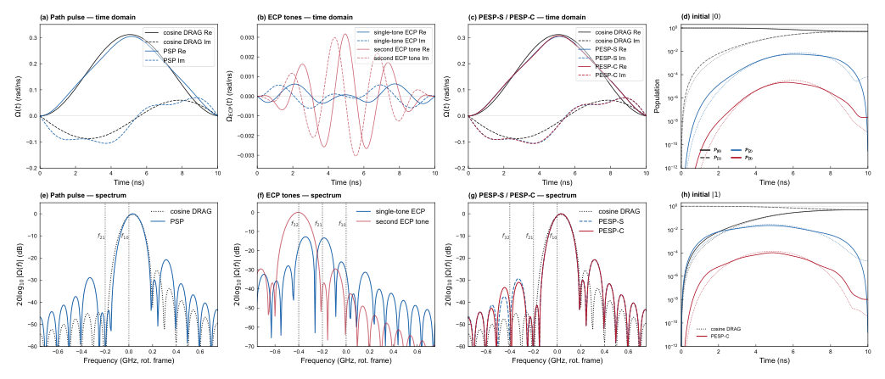
<figcaption class="paper-figure-caption"><b>Fig 1.</b> FIG. 1. PESP construction: waveforms, spectra, and leakage trajectories. (a) Time-domain drive waveform Ω(t) for cosine DRAG (gray dotted) and the PSP (blue solid); real (solid) and imaginary (dashed) components. (b) Isolated endpoint-cancellation tones: single-tone ECP (blue) and second ECP tone (red); real and imaginary components as in (a). (c) Time-domain waveforms for cosine DRAG (black dotted), PESP-S (blue dashed), and PESP-C (red solid). (d) Leakage trajectories for initial |0⟩: per- level populations P|0⟩, P|1⟩, P|2⟩, P|3⟩for cosine DRAG (dotted) and PESP-C (solid). (e)–(g) Corresponding amplitude spectra |Ω(ω)| (dB scale); dashed vertical lines mark the computational frequency...</figcaption>
</figure>
<figure class="paper-figure-card">
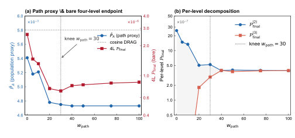
<figcaption class="paper-figure-caption"><b>Fig 2.</b> FIG. 2. Four-level leakage-floor knee. (a) Path proxy ¯PA (left axis, blue) and bare four-level Pfinal (right axis, red) ver- sus wpath; basin occupancy shown at each point; the knee at wpath = 30 is marked. (b) Per-level decomposition into P |2⟩ final (|2⟩back-action, falling) and P |3⟩ final (|3⟩cascade, rising); the crossing governs the knee.</figcaption>
</figure>
<figure class="paper-figure-card">
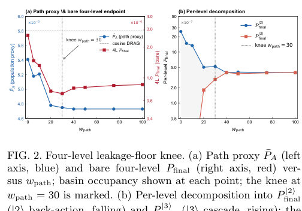
<figcaption class="paper-figure-caption"><b>Fig 3.</b> Figure 2 summarizes the path-weight sweep for the PSP with a single-tone ECP. The proxy path is the three- level design quantity used by Stage 1, while the bare four- level endpoint floor is that of the same completed pulse before the second ECP tone. The four-level floor is non- monotonic: it falls from 2.6 × 10−6 at the endpoint-only point wpath = 0 to 7.0 × 10−7 near wpath = 30, then rises toward 8.6 × 10−7 as the path penalty is over-weighted. The competition has a simple origin in the first-order cascade amplitude c3(T) ≃ −i R T 0 Λ23(t) c2(t) ei2ηt dt (Sec. IV): as wpath grows, the reshaping of c2(t) that lowers its time average increases the net overlap feed- ing the |3⟩channel, so P...</figcaption>
</figure>
<figure class="paper-figure-card">
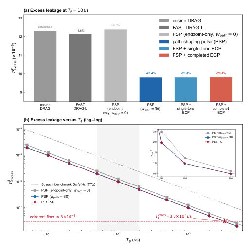
<figcaption class="paper-figure-caption"><b>Fig 4.</b> FIG. 3. Four-level Lindblad pure-dephasing validation and staged pulse construction. (a) Four-level pure-dephasing ex- cess leakage at Tϕ = 10 µs, normalized by the cosine-DRAG value. The endpoint-only and FAST-class baselines remain near the cosine value, whereas the path-shaping pulse reduces the excess by about 20%. Adding the single-tone or completed ECP leaves this reduction unchanged, confirming that the ECP acts on endpoint amplitudes rather than on the tran- sient path. (b) Schematic of the staged PESP construction. The main pulse controls the transient leakage path, the first ECP tone cancels the |2⟩endpoint amplitude, and the second ECP tone completes the four-level endpoint...</figcaption>
</figure>
<figure class="paper-figure-card">
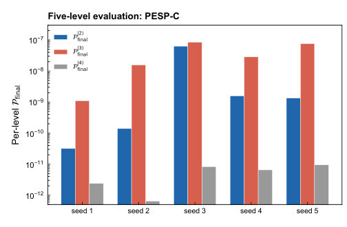
<figcaption class="paper-figure-caption"><b>Fig 5.</b> FIG. 4. Five-level per-level decomposition of the completed PESP design (completed ECP) at wpath = 30, evaluated seed by seed. P |2⟩ final, P |3⟩ final, and P |4⟩ final on a log scale. The |4⟩compo- nent is three to four orders of magnitude below the dominant |3⟩channel and firmly negligible.</figcaption>
</figure>

**Summary.** This paper introduces the Path–Endpoint Separation Pulse (PESP) technique to improve fast single-qubit gates on transmon qubits by treating transient leakage exposure and final state leakage as separate control problems. By applying a path-shaping pulse and an endpoint-cancellation pulse sequentially, the method achieves superior suppression of both dephasing-induced errors and coherent residual errors compared to standard techniques.

**Why it may be interesting.** This work provides a highly modular and interpretable framework for quantum control in superconducting qubits, moving beyond monolithic optimization to address distinct physical error channels (coherent vs. incoherent).

Detailed structure

**Main problem.** Fast single-qubit gates on weakly anharmonic transmons are limited by leakage to noncomputational states, and standard mitigation techniques fail to address both transient exposure and endpoint errors independently.

**Main result.** The proposed Path–Endpoint Separation Pulse (PESP) successfully decouples these two control objectives, significantly reducing dephasing-induced leakage ($\sim 20\%$) and the residual endpoint floor ($7	imes10^{-7}$ to $3	imes10^{-8}$) independently.

**Method.** The authors developed a staged pulse sequence combining a Path-Shaping Pulse (PSP) to suppress time-integrated exposure and an Endpoint-Cancellation Pulse (ECP) to null the final drive spectrum amplitude.

**Model / system.** The system is based on transmon qubits modeled as weakly anharmonic oscillators, analyzed using a rotating-frame Kerr-oscillator truncation Hamiltonian. Leakage analysis involves tracking populations in higher energy levels ($|2
angle, |3
angle$).

**Key observables.** Endpoint Leakage ($|	ilde{\Lambda}(\eta)|^2$), Transient Leakage Exposure ($ar{P}_A$), Dephasing-induced Excess Leakage ($P_{\phi}^{	ext{excess}}$), and Gate Fidelity ($F_{	ext{comp}}$).

**Important parameters / regimes.** Gate time (e.g., $10 	ext{ ns}$ for $R_X(\pi/2)$), anharmonicity ($\eta$), dephasing rate ($\gamma_\phi$), and the relative weights assigned to path vs. endpoint control.

**Assumptions / limitations.** The primary assumption is that endpoint leakage and transient exposure are mathematically distinct control objectives, allowing for modular optimization; hardware limitations like ZOH sampling and LP filtering are also analyzed as constraints.

**Figures summary.** Figures illustrate pulse waveforms, spectral components, and leakage trajectories comparing PESP to standard DRAG. Tables quantify path reduction across parameter grids and detail the sensitivity of the final error floor to various hardware imperfections (amplitude mismatch, sampling rate).

**Paper structure.** The paper establishes the limitations of existing methods by distinguishing between endpoint and transient leakage sources. It then introduces the PESP protocol, detailing the PSP for path shaping and the ECP for endpoint cancellation. Finally, it validates the method through extensive numerical simulations testing robustness against noise, sampling artifacts, and parameter variations.

Abstract

Fast single-qubit gates on weakly anharmonic transmons are limited by leakage to noncomputational states, and standard mitigations such as DRAG (derivative removal by adiabatic gate) act on the leakage amplitude at the end of the gate. We show that this endpoint amplitude and the transient leakage exposure accumulated during the gate are two distinct control objectives that can be assigned to separate modules. The endpoint is a single sample of the drive spectrum, $|\tildeΛ(η)|^2$; the exposure is a band integral about $η$ and governs leakage under dephasing, and the spectral-null condition $\tildeΛ(η)=0$ constrains only the former. We realize this split in a path--endpoint separation pulse (PESP): a path-shaping pulse suppresses the exposure, and a two-tone endpoint-cancellation pulse cancels the residual amplitude. For a $10$ ns $R_{X}(π/2)$ gate at $η/2π=0.2$ GHz, in numerical simulations the path-shaping pulse reduces the dephasing exposure by ${\sim}21\%$ relative to cosine DRAG and the independently simulated Lindblad excess leakage by ${\sim}20\%$, consistent with $P_{\mathrm{excess}}^φ\simeqγ_φT\bar{P}_{A}^{\mathrm{deph}}$, whereas matched-budget endpoint-only and spectral-null controls leave it essentially unchanged. The residual endpoint floor splits exactly into a $|2\rangle$ back-action and a $|3\rangle$ cascade, which the two tones cancel one-to-one, driving the floor at the path-exposure knee from ${\sim}7\times10^{-7}$ to ${\sim}3\times10^{-8}$ without perturbing the path. By separating transient exposure from endpoint leakage, PESP turns leakage suppression in fast weakly anharmonic gates into a modular, interpretable control problem: dephasing-induced leakage and the coherent residual error are reduced by separate, individually verifiable modules.

[↑ back to top](#top)

### [Geometric obstructions to quadratic time scaling in multiparameter quantum estimation](http://arxiv.org/abs/2607.06410v1)

**Authors:** Eoin O'Connor, Jiayu He, Matteo G. A. Paris, Marco G. Genoni  
**Type:** theory · **Category:** other · **PDF:** <https://arxiv.org/pdf/2607.06410v1>  
**Analysis basis:** full PDF text, analyzed in chunks
**Topic relevance:** `entanglement & information structure` **2/5** · `analog quantum simulation` **1/5** · `quantum measurements` **1/5**

↔ Scroll figures horizontally

<figure class="paper-figure-card">
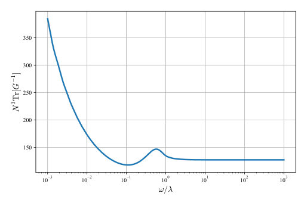
<figcaption class="paper-figure-caption"><b>Fig 1.</b> FIG. 1. Trace of the inverse Gram matrix Tr h G−1i of the traceless diagonal generators ˆ Dµ for the LMG model as a function of ω/λ with N = 128.</figcaption>
</figure>

**Summary.** This paper establishes a universal geometric obstruction proving that simultaneous quadratic scaling in multiparameter quantum estimation fails if the commuting components of the Hamiltonian derivatives are linearly dependent. The failure manifests as a bottleneck limiting precision to $O(t^0)$ rather than the desired $O(t^{-2})$. This diagnostic tool is crucial for designing high-precision quantum sensors.

**Why it may be interesting.** It provides a rigorous, computable diagnostic tool (the Gram matrix) to predict fundamental limitations in quantum sensing protocols before extensive numerical simulation is required.

Detailed structure

**Main problem.** The paper investigates the fundamental geometric conditions under which multiparameter quantum estimation can achieve the optimal quadratic scaling ($t^{-2}$) in precision.

**Main result.** A universal obstruction exists: linear dependence among the commuting components of the Hamiltonian derivatives limits the achievable precision to $O(t^0)$ scaling, regardless of ancilla assistance.

**Method.** The analysis uses geometric tools like the Gram matrix and asymptotic analysis of the Quantum Fisher Information Matrix (QFIM) derived from unitary evolution.

**Model / system.** The framework is general for time-independent Hamiltonians $\hat{H}(\mathbf{g})$, applicable to discrete systems (e.g., spin magnets) and continuous variable setups (e.g., quantum harmonic oscillator).

**Key observables.** Quantum Fisher Information Matrix (QFIM), SLD bound, Gram matrix of diagonal generators ($G_{\mu
u}$), and the minimum eigenvalue ($\lambda_{\min}$) of the QFIM.

**Important parameters / regimes.** Time $t$, number of parameters $\mu$, and the structure of the Hamiltonian derivatives decomposed into commuting ($\hat{D}_\mu$) and non-commuting ($\hat{O}_\mu$) parts.

**Assumptions / limitations.** The analysis relies on decomposing parameter dependence into commuting/non-commuting parts, and in some examples (like the QHO), assumes Gaussian states for covariance matrix calculations.

**Figures summary.** Not specified by notes; the structure revolves around deriving diagnostic criteria based on linear algebra applied to generator components.

**Paper structure.** The paper establishes the general framework using Hamiltonian decomposition, derives the geometric obstruction condition via the Gram matrix, analyzes specific physical examples (spin systems, QHO), and discusses potential workarounds like nuisance parameter treatment or adaptive control.

Abstract

Unitary encoding of a single parameter provides quadratic enhancement in precision, with the quantum Fisher information scaling quadratically with the encoding time. However, when estimating multiple parameters simultaneously, this fundamental scaling is not guaranteed. Here, we establish a universal geometric obstruction that dictates when multiparameter quantum metrology fails to achieve simultaneous $t^{-2}$ scaling. By decomposing the Hamiltonian derivatives into components that commute and do not commute with the system Hamiltonian, we prove that linear dependence among the commuting components inevitably generates a slow parameter direction whose Fisher information remains bounded as O$(t^0)$, limiting the overall estimation precision. We demonstrate this mechanism in both discrete- and continuous-variable setups, including collective spin magnetometry and a generalized quantum harmonic oscillator, and contrast it with the Lipkin--Meshkov--Glick model where $t^{-2}$ decay is preserved. Remarkably, while the slow direction fundamentally limits the achievable precision, the measurement incompatibility between fast and slow directions decays as $1/t$, rendering the symmetric logarithmic derivative bound asymptotically saturable. Our framework provides a readily computable diagnostic, given by the Gram matrix of the diagonal generators, for identifying such obstructions in arbitrary multiparameter estimation problems. We further show that the bottleneck can be circumvented by relegating slow directions to nuisance parameters or by employing adaptive quantum control.

[↑ back to top](#top)

### [Onnes: A Physics-Grounded Multi-Agent LLM Simulator for Cryogenic Fault Diagnosis in Quantum Computing Infrastructure](http://arxiv.org/abs/2607.05805v1)

**Authors:** Praneeth Narisetty, Uday Kumar Reddy Kattamanchi, Shiva Nagendra Babu Kore  
**Type:** both · **Category:** other · **PDF:** <https://arxiv.org/pdf/2607.05805v1>  
**Analysis basis:** full PDF text, analyzed in chunks
**Topic relevance:** `QC/QI experiment` **2/5** · `driven-dissipative phase transition` **1/5** · `methods for driven-dissipative` **1/5**

↔ Scroll figures horizontally

<figure class="paper-figure-card">
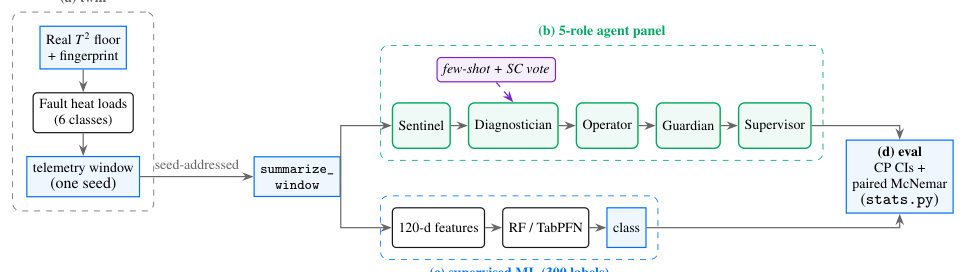
<figcaption class="paper-figure-caption"><b>Fig 1.</b> Figure 1: End-to-end system. The twin (a) renders a telemetry window from one seed; a single summarize_window feeds the identical window to both the 5-role agent panel (b) and the supervised ML path (c). Because both methods see the same seed-addressed scenarios, the head-to-head uses the exact paired McNemar test (d). The same panel runs as a continuous monitor (e) over a rolling window at a fixed poll cadence. Dashed violet: the optional few-shot/self-consistency levers (Section 7).</figcaption>
</figure>
<figure class="paper-figure-card">
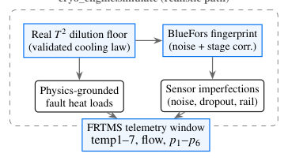
<figcaption class="paper-figure-caption"><b>Fig 2.</b> Figure 2: Data flow of the twin. Physics sets the mean trajec- tory; a fingerprint learned from real BlueFors logs supplies fluctuations and cross-stage correlation; faults are heat-load perturbations; sensor imperfections are layered last.</figcaption>
</figure>
<figure class="paper-figure-card">
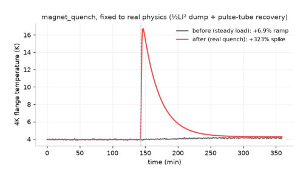
<figcaption class="paper-figure-caption"><b>Fig 3.</b> Figure 3: Quench physics, corrected. Steady-load model: +6.9% ramp (grey). Real 1</figcaption>
</figure>
<figure class="paper-figure-card">
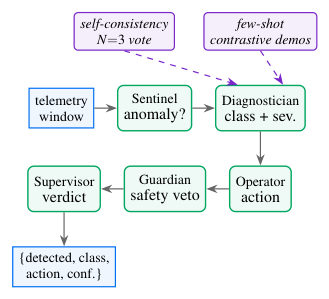
<figcaption class="paper-figure-caption"><b>Fig 4.</b> Figure 5: The five-role pipeline. Solid: the fixed zero-shot path. Dashed (violet): the two optional, evidence-backed levers attached to the Diagnostician (Section 7). Defaults pre- serve exact zero-shot behavior.</figcaption>
</figure>
<figure class="paper-figure-card">
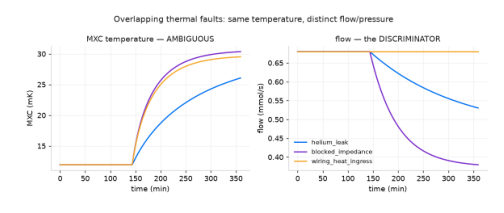
<figcaption class="paper-figure-caption"><b>Fig 5.</b> Figure 4: Three thermal faults overlap on MXC temperature (left, ambiguous) but separate on the flow channel (right, dis- criminative). A static temperature snapshot cannot classify them; a supervised model can still reach macro-F1 0.983 from temperature trajectory features alone (Table 1), so the over- lap is a difficulty for snapshot- and zero-shot reasoning, not an information-theoretic barrier. Flow and pressure are the physically direct, noise-robust discriminators, and are what the engineered baseline (Section 5) exploits.</figcaption>
</figure>

**Summary.** This paper introduces 'Onnes,' a digital-twin simulator of dilution refrigerators used in quantum computing. It compares a multi-agent LLM diagnostic system against supervised ML classifiers for identifying complex cryogenic faults. The key finding is that by incorporating physics knowledge and few-shot examples, the LLM agent can achieve near state-of-the-art classification accuracy without explicit retraining.

**Why it may be interesting.** While focused on AI/ML for infrastructure, the reliance on a detailed physics model (digital twin) to constrain and validate an advanced AI agent is highly relevant for building trustworthy quantum hardware control systems.

Detailed structure

**Main problem.** The core problem is improving cryogenic fault diagnosis for superconducting quantum computers, moving beyond simple threshold alarms to specific diagnoses.

**Main result.** A physics-grounded LLM agent, enhanced with few-shot demonstrations, achieved classification accuracy matching supervised ML classifiers (0.990 vs 0.985) on challenging, confusable faults.

**Method.** The study uses a head-to-head comparison between a multi-agent LLM simulator and a supervised ML classifier operating on simulated cryogenic telemetry data.

**Model / system.** The system is 'Onnes,' a physics-grounded digital twin of a dilution refrigerator, simulating temperature, flow, and pressure across multiple stages using real noise fingerprints from BlueFors logs.

**Key observables.** Fault classification accuracy, false-alarm rate (FAR), detection capability, and structured diagnostic output (e.g., class / severity / action).

**Important parameters / regimes.** Operating temperatures down to mK; 1000-turn evaluation length; six distinct physics-grounded fault classes.

**Assumptions / limitations.** The LLM agent's performance gain is attributed almost entirely to the curated contrastive few-shot demonstrations, not inherent multi-agent debate mechanisms.

**Figures summary.** Figures illustrate the end-to-end system architecture comparing the LLM panel vs. ML path, and show how different faults overlap on temperature but separate on flow/pressure.

**Paper structure.** The paper introduces the physical problem (cryo fault diagnosis), details the Onnes digital twin simulator, compares zero-shot LLM performance against supervised ML benchmarks, and concludes with sim-to-real validation results.

Abstract

Dilution refrigerators are the enabling infrastructure of superconducting quantum computers, yet their fault diagnosis is still dominated by threshold alarms that report that something is wrong, not what. We present Onnes, a physics-grounded digital-twin simulator of a dilution refrigerator (a forward physics model with a learned real-fridge noise fingerprint) that drives a live multi-agent LLM operations layer, and use it for a controlled head-to-head between a zero-shot LLM agent panel and a supervised ML classifier on cryogenic fault diagnosis. The twin couples a real dilution-cooling floor, a noise-and-correlation fingerprint learned from real BlueFors logs, and six physics-grounded fault classes, three engineered to overlap on temperature but separate on flow and pressure. Across a 1000-turn evaluation the zero-shot panel shows no significant difference from the classifier on detection but trails on classification, its errors concentrating on the confusable faults. Curated contrastive few-shot demonstrations and self-consistency voting then raise classification accuracy from 0.685 to 0.990, matching the supervised classifier (0.985) with no parameter updates and six labeled demonstrations; an ablation attributes the gain almost entirely to the demonstrations. Run as a continuous monitor across a nine-run fault-by-seed sweep, the agent catches every developing fault within one poll interval, and a confidence gate suppresses pre-onset false alarms whose rate is backend-dependent. As a first sim-to-real check, a detector trained purely on real BlueFors telemetry posts a real-hardware false-alarm rate of 6.4% and 100% recall on physics faults injected onto real held-out windows. All numbers are drawn verbatim from released run logs.

[↑ back to top](#top)

### [Verifiable blind quantum computing: Comparative analysis and design considerations for client architectures](http://arxiv.org/abs/2607.05650v1)

**Authors:** Janice van Dam, Jeroen Grimbergen, Stephanie D. C. Wehner  
**Type:** theory · **Category:** quantum information and computing · **PDF:** <https://arxiv.org/pdf/2607.05650v1>  
**Analysis basis:** full PDF text, analyzed in chunks
**Topic relevance:** `QC/QI experiment` **2/5** · `quantum measurements` **1/5** · `quantum optics experiment` **1/5**

↔ Scroll figures horizontally

<figure class="paper-figure-card">
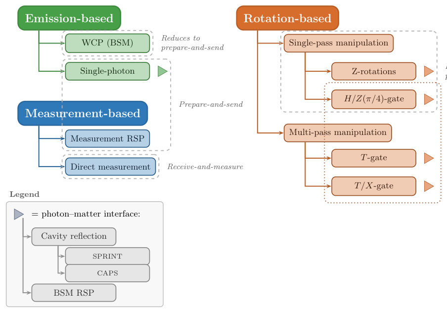
<figcaption class="paper-figure-caption"><b>Fig 1.</b> FIG. 1: Overview of client architecture taxonomy. Three categories based on client capabilities: Emission-based (green), measurement-based (blue) and rotation-based (orange). The clients within these categories can belong to sub categories, such as prepare-and-send and receive-and-measure, indicating the role they play in the VBQC protocol. Additionally, the rotation-based clients are separated by how often a signal needs to travel between the client and the server (single-pass vs multi-pass), and by the hardware that implements them (‘fixed-gate’ vs non-fixed). Triangles indicate alternative photon-matter interfaces available for the corresponding client, as shown in the legend in the...</figcaption>
</figure>
<figure class="paper-figure-card">
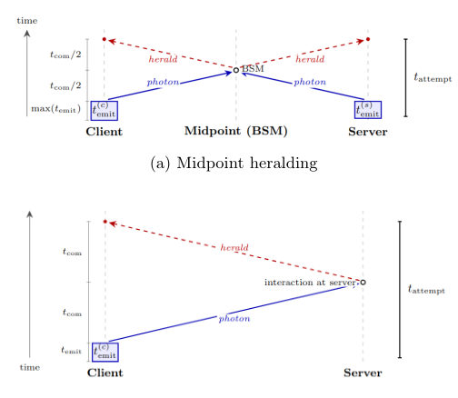
<figcaption class="paper-figure-caption"><b>Fig 2.</b> FIG. 2: The time per attempt (tattempt) depends on the location of the heralding. When heralding is done at the midpoint between the client and the server (a), less communication is required compared to the situation in (b), where heralding is done at an end-point.</figcaption>
</figure>
<figure class="paper-figure-card">
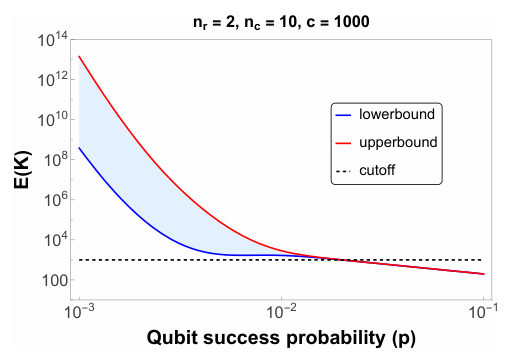
<figcaption class="paper-figure-caption"><b>Fig 3.</b> FIG. 3: Upper and lower bounds to expected number of attempts for generating brickwork graph state with cutoffs. The upper and lower bounds on the expected number of attempts to generate a brickwork graph state with qubitwise cutoffs are evaluated numerically for a brickwork graph of dimensions nr = 2 and nc = 10 with cutoff c = 1000 attempts in the regime p ∈[10−3, 10−1]. The cutoff is shown as a horizontal dashed line. For p ≳10−2 the expected number of attempts is less than or on the order of the cutoff. In this regime the upper- and lower bound are tight. For p ≲10−2 the upper bound blows up. The lower bound initially stays around the cutoff when decreasing p below 10−2, but then blows...</figcaption>
</figure>
<figure class="paper-figure-card">
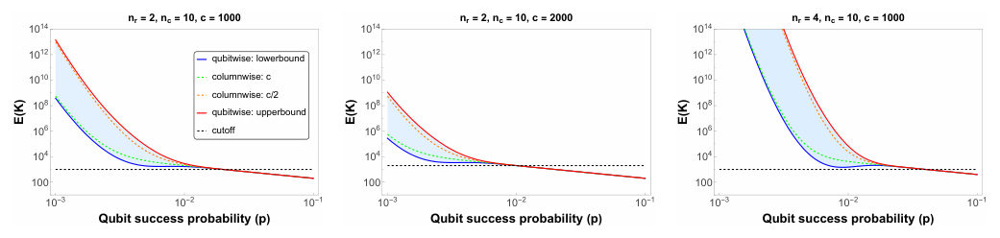
<figcaption class="paper-figure-caption"><b>Fig 4.</b> FIG. 4: Expected number of attempts for generating brickwork graph state with cutoffs. Legend of (a) applies to (b) and (c) as well. (a) We show the upper and lowerbounds to the expected number of attempts to generate the brickwork graph state with qubitwise cutoffs nr = 2 and nc = 10 with cutoff c = 1000 in the regime p ∈[10−3, 10−1], as in fig. 3. The cutoff c is shown as a horizontal dashed line. We also include the expected number of attempts for columnwise cutoffs with cutoff c and c/2 explicitly. It can be seen that as p decreases the upperbound becomes similar to a columnwise cutoff of c/2 and the lowerbound becomes similar to a columnwise cutoff of c. In (b) the cutoff is increased...</figcaption>
</figure>

**Summary.** This work conducts a comprehensive comparison of client device architectures designed for Verifiable Blind Quantum Computing (VBQC). By analyzing emission-based, measurement-based, and rotation-based approaches using photonic qubits against a matter-qubit server, it establishes a framework to guide the selection of the most suitable architecture based on specific security or performance requirements.

**Why it may be interesting.** It directly compares hardware implementations for quantum computation protocols, offering guidance on selecting optimal architectures based on practical constraints like error rates and required fidelity.

Detailed structure

**Main problem.** The paper addresses Verifiable Blind Quantum Computing (VBQC), which allows a client to delegate quantum computations while ensuring privacy and verifying the server's correct execution.

**Main result.** It provides a comparative analysis of three main client architectures—emission-based, measurement-based, and rotation-based—for VBQC with a matter-qubit server.

**Method.** The authors compare these architectures across security guarantees, derived rate equations, error behavior, and hardware cost using information-theoretic security models.

**Model / system.** The analysis is restricted to single-server, single-client protocols based on measurement-based quantum computation (MBQC), utilizing photonic qubits for communication with a matter-qubit server.

**Key observables.** Security guarantees, protocol execution rates, error behavior, and hardware cost/design considerations.

**Important parameters / regimes.** Single-server/single-client protocols; information-theoretic security requirements.

**Assumptions / limitations.** The analysis assumes the use of matter qubits for the server and photonic qubits for communication, focusing on single-user scenarios.

**Figures summary.** Figure 1 depicts a taxonomy classifying client architectures into emission-based, measurement-based, and rotation-based categories.

**Paper structure.** The paper systematically classifies client capabilities (Emission, Measurement, Rotation) by detailing the physical mechanisms for state transfer within each category, followed by a comparative evaluation across multiple performance dimensions.

Abstract

Blind quantum computing (BQC) allows a client to delegate quantum computations to a remote server without revealing the input, computation, or output. In addition to being blind, the client can sometimes also verify that the server has performed their instructions correctly, a property known as verifiability. A key part of realizing such verifiable BQC (VBQC) is choosing the design of the client device: many architectures have been proposed, each with different hardware requirements, security properties, and performance characteristics, making it difficult to identify which is most suitable for a given implementation. In this work, we present a comparative analysis of client architectures for VBQC with a matter-qubit server. We restrict our analysis to single-server, single-client protocols with information-theoretic security based on measurement-based quantum computation. We identify three main categories of client: emission-based, measurement-based, and rotation-based, each with multiple variants depending on how the client interacts with the server. We evaluate each across different dimensions: we compare guarantees of existing corresponding security proofs, we derive equations for the rate at which each client can execute a protocol, we provide an overview of each architecture's error behaviour, and discuss hardware cost and design considerations. Client architectures implementing measurement-based remote state preparation and reflection-based teleportation emerge as strong default candidates, but as the right choice remains context-dependent, we provide a framework for navigating considerations to guide the selection of the most suitable architecture for a given setting.

[↑ back to top](#top)

### [Enumeration of Laplacian integral and {-1,0,1}-diagonalizable graphs](http://arxiv.org/abs/2607.06336v1)

**Authors:** Nathaniel Johnston, Sarah Plosker, Luis M. B. Varona  
**Type:** theory · **Category:** other · **PDF:** <https://arxiv.org/pdf/2607.06336v1>  
**Analysis basis:** full PDF text, analyzed in chunks
**Topic relevance:** `analog quantum simulation` **2/5** · `non-equilibrium dynamics` **1/5**

↔ Scroll figures horizontally

<figure class="paper-figure-card">
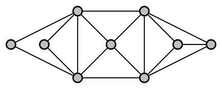
<figcaption class="paper-figure-caption"><b>Fig 1.</b> Figure 1: A graph with spectrum St8,9u6 9, thus providing a counterexample to [HT23, Conjecture 5.4].</figcaption>
</figure>

**Summary.** This paper provides a deep structural characterization and extensive enumeration of graphs whose Laplacian matrices have integer eigenvalues or possess specific $\{-1, 0, 1\}$-valued eigenvector bases. By linking these graph properties to underlying algebraic structures, the authors advance both pure graph theory and provide tools relevant for analyzing quantum walks on networks.

**Why it may be interesting.** While the core subject is graph theory, the explicit mention of Laplacian matrices and their connection to Continuous-Time Quantum Walks (CTQWs) makes it highly relevant for theoretical physicists studying open quantum systems dynamics on structured lattices or graphs.

Detailed structure

**Main problem.** The paper focuses on characterizing and enumerating two specific families of graphs: Laplacian integral graphs (where Laplacian eigenvalues are integers) and $\{-1, 0, 1\}$-diagonalizable graphs.

**Main result.** They developed structure theorems for these graphs of prime order and provided extensive computational enumeration results up to moderate orders. They also established an exponential lower bound on the number of connected $\{-1, 0, 1\}$-diagonalizable graphs.

**Method.** The methods combine algebraic graph theory with advanced linear algebra techniques, including developing structure theorems based on properties like 'balanced vectors' and using computational tools (like QR factorization) to verify eigenvector bases.

**Model / system.** The mathematical model is the graph $G$, analyzed via its Laplacian matrix $L$. The concepts are related to Continuous-Time Quantum Walks (CTQWs), suggesting a connection to quantum dynamics on graphs.

**Key observables.** Integer eigenvalues of the Laplacian matrix, and the existence of an eigenvector basis whose entries belong only to $\{-1, 0, 1\}$.

**Important parameters / regimes.** The order $n$ of the graph (especially prime orders), and the structure of the associated eigenspaces.

**Assumptions / limitations.** For some results, the analysis assumes considering sorted, non-increasing entries for balanced vectors. Computationally, the methods become infeasible for graphs exceeding $n \approx 19$.

**Figures summary.** The notes mention Figure 1 showing a graph realizing a specific spectrum that serves as a counterexample to an earlier conjecture.

**Paper structure.** The paper develops structure theorems (especially for prime order) and then applies novel computational techniques, including DFS searches over balanced vectors and rank checks on eigenvector basis matrices, to enumerate graphs in the two specified classes.

Abstract

A graph with Laplacian matrix $L$ is called Laplacian integral if the eigenvalues of $L$ are all integers, and it is called $\{-1,0,1\}$-diagonalizable if $L$ has a full set of eigenvectors with entries from $\{-1,0,1\}$. We herein develop a structure theorem for both Laplacian integral graphs and $\{-1,0,1\}$-diagonalizable graphs of prime order, and combine it with some novel computational techniques to characterize all such graphs for orders larger than was previously possible. For example, we enumerate all Laplacian integral and $\{-1,0,1\}$-diagonalizable graphs of order $13$ or less, all $\{-1,0,1\}$-diagonalizable graphs of prime order $23$ or less, all regular integral graphs of order $15$ or less, and all regular $\{-1,0,1\}$-diagonalizable graphs of prime order $53$ or less. As an immediate byproduct of our work, we show that the $S_{n,n}$ conjecture for Laplacian integral graphs is true when $n = 12$, thus making $n = 16$ the smallest open case; additionally, we disprove two related conjectures regarding Laplacian spectra. We also establish an exponential lower bound on the number of connected $\{-1,0,1\}$-diagonalizable graphs of order $n$, thus beating the previously best-known (subexponential) lower bound. Finally, we show that every bipartite $\{-1,0,1\}$-diagonalizable graph is regular (a fact that fails to generalize to Laplacian integral graphs).

[↑ back to top](#top)

### [Low-Overhead Error-Corrected QCNNs Using Bivariate Bicycle Codes](http://arxiv.org/abs/2607.05724v1)

**Authors:** Alejandro Rosales, Animesh Yadav  
**Type:** theory · **Category:** quantum information and computing · **PDF:** <https://arxiv.org/pdf/2607.05724v1>  
**Analysis basis:** full PDF text, analyzed in chunks
**Topic relevance:** `QC/QI experiment` **2/5** · `methods for driven-dissipative` **1/5**

↔ Scroll figures horizontally

<figure class="paper-figure-card">
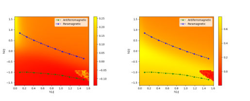
<figcaption class="paper-figure-caption"><b>Fig 1.</b> Fig. 1: (a) Points show a 64 × 64 test set of ground states over h1 and h2 for a Hamiltonian with J = 1. Phase- boundary points (blue and red diamonds) come from infinite- size density-matrix renormalization group (DMRG). Colors indicate the circuit’s expectation values found via evolutionary search for N = 4 spins using initial, untrained weights. (An artifact can be seen, possibly because of the low qubit spin state.) (b) Uses the same test set and with trained weights after 100 iterations.</figcaption>
</figure>
<figure class="paper-figure-card">
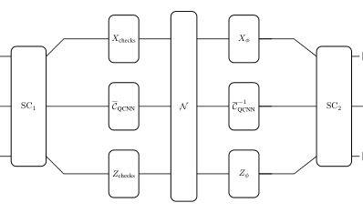
<figcaption class="paper-figure-caption"><b>Fig 2.</b> Fig. 2: QEC-QCNN circuit.</figcaption>
</figure>
<figure class="paper-figure-card">
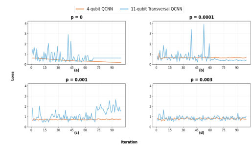
<figcaption class="paper-figure-caption"><b>Fig 3.</b> Fig. 3: Statevector training loss vs iteration for 4-qubit QCNN and 11-qubit transversal QCNN.</figcaption>
</figure>
<figure class="paper-figure-card">
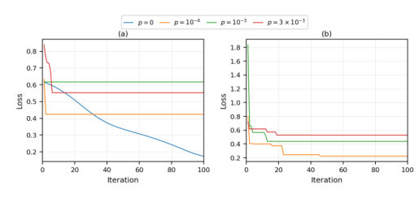
<figcaption class="paper-figure-caption"><b>Fig 4.</b> Fig. 4: Training loss versus iteration (a) the 4-qubit QCNN and (b) the 11-qubit transversal QCNN.</figcaption>
</figure>
<figure class="paper-figure-card">
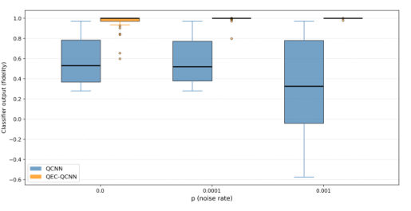
<figcaption class="paper-figure-caption"><b>Fig 5.</b> Fig. 6: 4-qubit QCNN prediction of an antiferromagnetic and paramagnetism phase with the trained model. The QCNN (blue) and the QEC-QCNN (orange) are shown.</figcaption>
</figure>

**Summary.** The paper tackles the challenge of making Quantum Convolutional Neural Networks practical by integrating them with Bivariate Bicycle (BB) quantum error correction. By implementing a transversal encoding scheme, the authors demonstrate that their low-overhead QEC technique significantly enhances the network's ability to train and maintain performance under realistic hardware noise compared to unprotected methods.

**Why it may be interesting.** This work directly addresses the critical gap between theoretical quantum computation models (like QCNNs) and near-term hardware limitations (NISQ noise). The focus on low-overhead, structured codes like BB codes is highly relevant for experimentalists building fault-tolerant quantum processors.

Detailed structure

**Main problem.** The primary challenge is enabling practical Quantum Convolutional Neural Networks (QCNNs) by mitigating high noise levels inherent in current quantum hardware while avoiding the prohibitive qubit overhead of existing error correction codes.

**Main result.** The authors successfully demonstrate that integrating a low-overhead, distance-4 Bivariate Bicycle (BB) code via a transversal architecture significantly improves QCNN trainability and convergence compared to unprotected or standard implementations under realistic noise conditions.

**Method.** They propose embedding the QCNN operations within the protective subspace defined by the BB quantum error-correcting code. The training process involves simulating noisy evolution using transversal gates that map logical operations onto physical qubits, allowing for direct comparison of performance metrics like loss convergence.

**Model / system.** The system models a QCNN applied to tasks like Quantum Phase Recognition (QPR) in 1D spin systems. Error correction is achieved using the Bivariate Bicycle (BB) code, which offers a favorable balance between high error threshold and low qubit overhead compared to surface codes.

**Key observables.** Training loss convergence, learning rate, error rates ($p$), and classification accuracy for quantum phases (e.g., SPT phase).

**Important parameters / regimes.** Code distance $d=4$, noise probability $p \in \{0.0001, 0.001\}$, and the structure of the BB code defined over $\mathbb{F}_2[x, y]/(x^\ell-1, y^m-1)$.

**Assumptions / limitations.** The analysis assumes that transversal operations can successfully encode QCNN logic while respecting the locality constraints of the underlying quantum error-correcting code structure.

**Figures summary.** Figures compare prediction values (violin plots) between standard and transversal QCNNs across varying Pauli noise levels, showing superior resilience for the transversal approach. Other figures illustrate phase boundaries or circuit expectation values.

**Paper structure.** The paper first establishes the need to improve QCNNs against hardware noise. It then introduces the BB code as a solution, detailing the integration via transversal operations. The core of the work involves simulating and comparing standard vs. transversal QCNN performance under increasing levels of Pauli noise ($p$), culminating in validation of the low-overhead error correction scheme.

Abstract

Quantum convolutional neural networks (QCNNs) combine the power of quantum computing and classical CNN for computational speedup in classification tasks. However, noise levels on state-of-the-art quantum devices remain too high for practical QCNN execution. In addition, despite the reliable surface code providing a method for error rates below a threshold value, they have a prohibitively large qubit cost. Recently introduced bivariate bicycle (BB) codes are of particular interest for their high error threshold, constant encoding rate, and linear code distance. Through simulation with realistic hardware noise sources, we demonstrate that a 4-qubit unprotected QCNN fails to converge and exhibits a worse learning rate compared to numerical simulations. Addressing both limitations, we propose a distance-4 BB quantum error-correction (QEC) technique for QCNNs. In doing so, we validate that our low-overhead QEC technique for QCNNS represents a step toward practical QCNNs.

[↑ back to top](#top)

### [Engineering Disordered Many-particle Plasmonic Nanoclusters for Wafer-scale Uniform and Giant Electromagnetic Field Enhancement](http://arxiv.org/abs/2607.06003v1)

**Authors:** Minjun Kim, Vasanthan Devaraj, Hyeon-Seok Seo, Seongjae Eom, Jeong-Su Lee, Donghan Lee, Min Yong Jeon, Thomas Zentgraf, Jong-Min Lee  
**Type:** both · **Category:** disordered systems and neural networks · **PDF:** <https://arxiv.org/pdf/2607.06003v1>  
**Analysis basis:** full PDF text, analyzed in chunks
**Topic relevance:** `analog quantum simulation` **1/5** · `correlated / nonlocal dissipation` **1/5** · `correlated cavity matter` **1/5** · `driven-dissipative phase transition` **1/5** · `methods for driven-dissipative` **1/5** · `non-equilibrium dynamics` **1/5** · `non-equilibrium universality` **1/5**

↔ Scroll figures horizontally

<figure class="paper-figure-card">
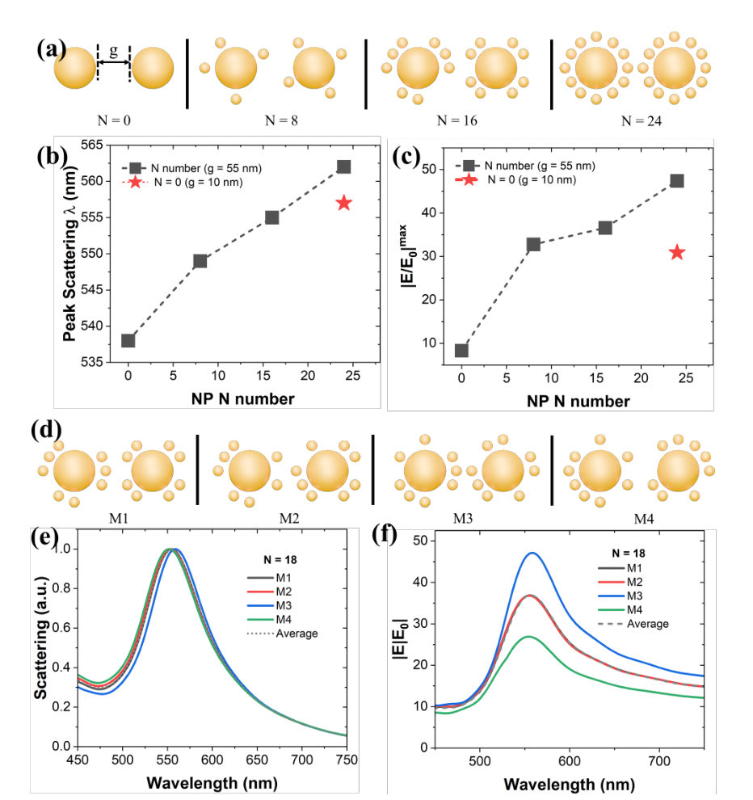
<figcaption class="paper-figure-caption"><b>Fig 1.</b> Figure 1. (a) Many-body plasmonic cluster architecture with varied N number of satellite</figcaption>
</figure>
<figure class="paper-figure-card">
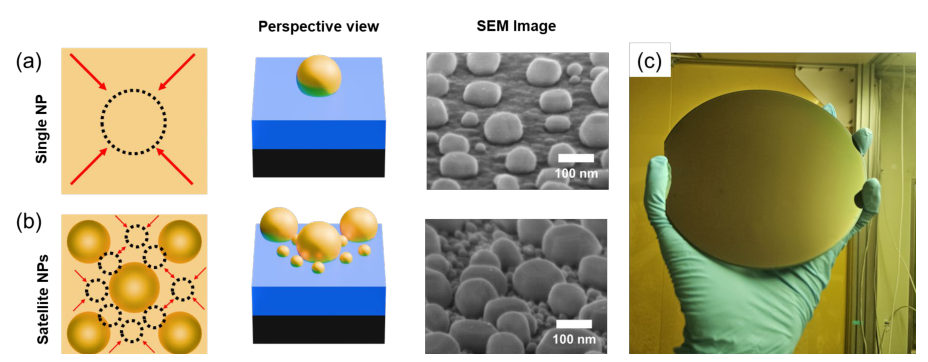
<figcaption class="paper-figure-caption"><b>Fig 2.</b> Figure 2. Schematic illustrations and corresponding scanning electron microscopy (SEM)</figcaption>
</figure>
<figure class="paper-figure-card">
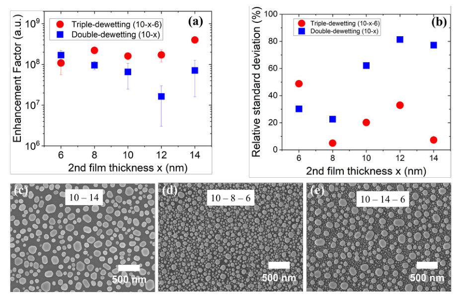
<figcaption class="paper-figure-caption"><b>Fig 3.</b> Figure 3. (a) Experimental SERS enhancement factors and (b) relative standard deviation</figcaption>
</figure>
<figure class="paper-figure-card">
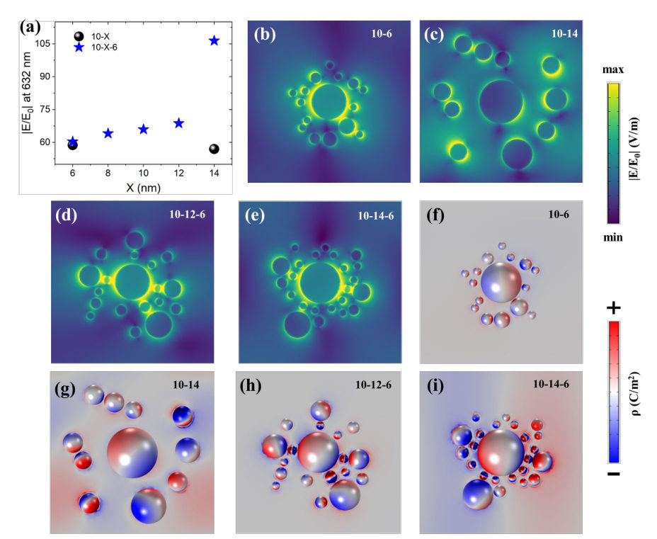
<figcaption class="paper-figure-caption"><b>Fig 4.</b> Figure 4. Simulation analysis of double and triple dewetting plasmonic nanostructure models.</figcaption>
</figure>
<figure class="paper-figure-card">
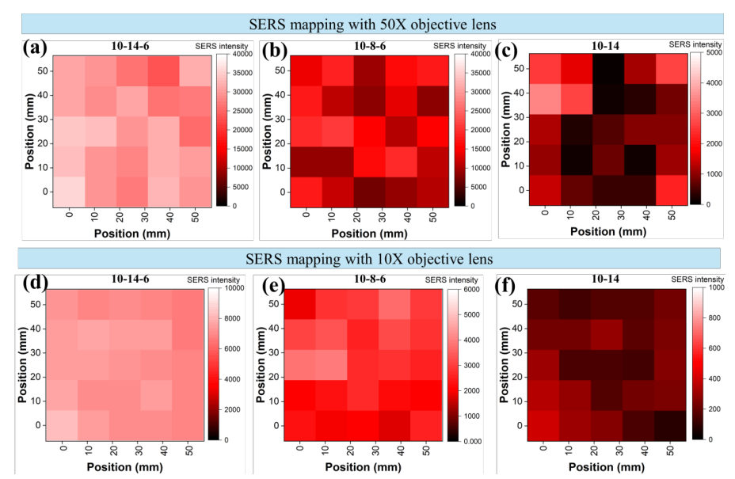
<figcaption class="paper-figure-caption"><b>Fig 5.</b> Figure 5. Mapping results of benzenethiol 1072 cm-1 of large-area samples (a) 10-14-6, (b) 10-</figcaption>
</figure>

**Summary.** The research introduces a novel, scalable method for creating high-performance plasmonic nanostructures by forming many-body clusters through controlled dewetting. By leveraging statistical averaging over particle disorder, the system achieves superior electromagnetic field enhancement and unprecedented uniformity compared to traditional few-particle designs. This establishes a practical platform for next-generation sensing and quantum technologies.

**Why it may be interesting.** This work directly addresses how collective behavior in disordered media (plasmonics) can be modeled using statistical averaging principles to achieve robust performance, which has parallels in understanding complex condensed matter systems like spin glasses or amorphous materials.

Detailed structure

**Main problem.** The core challenge is achieving wafer-scale, uniform, and giant electromagnetic field enhancement in plasmonic nanostructures while overcoming the inherent trade-off between high-enhancement few-body designs (sensitive to flaws) and low-enhancement scalable methods.

**Main result.** By engineering a many-body plasmonic architecture using controlled dewetting, the system achieves high collective enhancement that surpasses optimized few-body systems while maintaining exceptional uniformity across large areas.

**Method.** The authors combine lithography-free, multi-step dewetting fabrication with advanced electromagnetic simulations (FDTD) and characterization techniques like SERS spectroscopy to validate the statistical averaging principle.

**Model / system.** The system is a plasmonic nanocluster formed by gold nanoparticles on a substrate. The model leverages statistical mechanics principles, treating the structure as approaching a continuum limit ($N \gg 1$) where local disorder averages out, enabling high performance despite geometric imperfections.

**Key observables.** Near-field enhancement ($	ext{NFE} |E/E_0|$), Surface-Enhanced Raman Scattering (SERS) enhancement factor, and the Relative Standard Deviation ($	ext{RSD}$) quantifying uniformity.

**Important parameters / regimes.** The number of satellite nanoparticles ($N$), gap size, and the specific dewetting sequence used to control particle density are critical parameters.

**Assumptions / limitations.** The primary assumption is that optical performance can be decoupled from precise nanoscale positioning by relying instead on the statistical consistency of nanoparticle distribution across the wafer.

**Figures summary.** Figures illustrate the evolution of nanocluster formation via dewetting, compare SERS enhancement factors and RSD for different cluster architectures (e.g., 10-14-6 vs 10-8-8), and show simulated near-field profiles confirming high, uniform field localization.

**Paper structure.** The paper progresses from identifying the scalability/enhancement trade-off to proposing a statistical mechanics-inspired many-body solution. It details the dewetting fabrication process, presents simulation results showing enhancement scaling with particle count, and validates uniformity using SERS measurements across wafer areas.

Abstract

Scalable plasmonic technologies face a critical trade-off: few-body architectures offer high enhancement but are sensitive to fabrication flaws, while scalable methods like solid-state dewetting yield large, low-enhancement gaps. We introduce a paradigm shift using a many-body plasmonic architecture inspired by statistical mechanics. By moving toward the continuum limit (N>>1), local geometric variations are statistically averaged out, effectively decoupling optical performance from microscopic disorder. We implement this concept via a lithography- and etching-free, multi-step dewetting strategy, creating wafer-scale nanoclusters. This process strategically forms a robust many-body system by introducing numerous small satellite nanoparticles between larger particles. Crucially, this design achieves a high collective enhancement that surpasses even optimized few-body systems, despite having larger individual gaps. Under optimized conditions, these substrates exhibit a surface-enhanced Raman scattering enhancement factor approaching 4 x 108 with unprecedented reproducibility (RSD of ~10%). This scalable, low-cost concept establishes a practical route toward reproducible wafer-scale nanophotonic platforms for sensing, spectroscopy, and quantum technologies.

[↑ back to top](#top)

### [Bosonic quantum error-correcting codes with finite stellar rank](http://arxiv.org/abs/2607.06404v1)

**Authors:** Rui Wang, Adithi Udupa, Timo Hillmann, Ulysse Chabaud, Alessandro Ferraro, Giulia Ferrini  
**Type:** theory · **Category:** quantum information and computing · **PDF:** <https://arxiv.org/pdf/2607.06404v1>  
**Analysis basis:** full PDF text, analyzed in chunks
**Topic relevance:** `Keldysh / 2PI / non-Gaussian methods` **1/5** · `correlated / nonlocal dissipation` **1/5** · `driven-dissipative phase transition` **1/5** · `entanglement & information structure` **1/5** · `methods for driven-dissipative` **1/5**

↔ Scroll figures horizontally

<figure class="paper-figure-card">
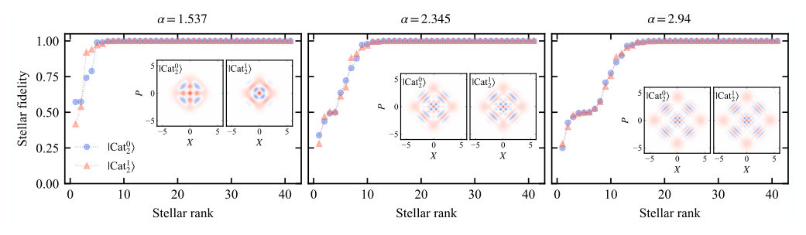
<figcaption class="paper-figure-caption"><b>Fig 1.</b> FIG. 1. Stellar fidelity as a function of stellar rank k for the logical |Cat0 2⟩(circles) and |Cat1 2⟩(triangles) states of cat codes with rotational symmetry order N = 2. Results are shown for three cat-state amplitudes at the sweet spots α = 1.537, α = 2.345, and α = 2.94. For larger α, the convergence with stellar rank becomes slower and plateau-like features appear, reflecting the increasing non-Gaussian resources required to resolve more separated coherent-state components. The insets show the Wigner functions of the target states being approximated. A detailed discussion of the plateau behavior is provided in Appendix C.</figcaption>
</figure>
<figure class="paper-figure-card">
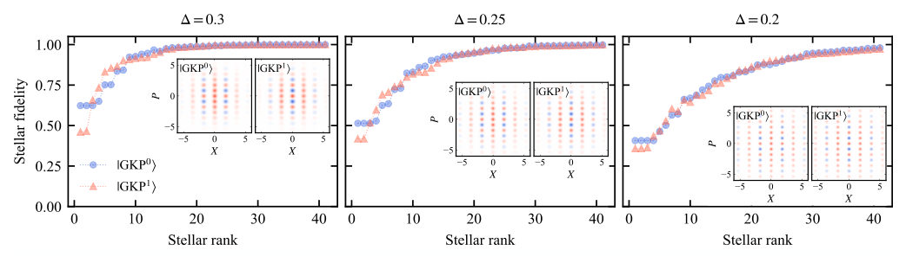
<figcaption class="paper-figure-caption"><b>Fig 2.</b> FIG. 2. Approximation of GKP codewords with finite stellar rank. The optimized stellar fidelity is plotted versus stellar rank k for the logical |GKP0⟩(circles) and |GKP1⟩(triangles) states with regularization parameters ∆= 0.3, 0.25, and 0.2. Smaller ∆produces sharper grid peaks and a more extended phase-space structure, requiring higher stellar rank to reach comparable fidelity. The insets show the Wigner functions of the target GKP states.</figcaption>
</figure>
<figure class="paper-figure-card">
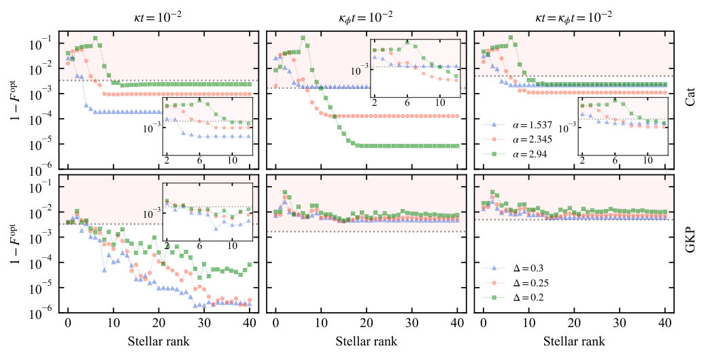
<figcaption class="paper-figure-caption"><b>Fig 3.</b> FIG. 3. Error-correcting performance of finite-stellar-rank approximations of cat and GKP codewords. The optimal channel infidelity 1−F opt</figcaption>
</figure>
<figure class="paper-figure-card">
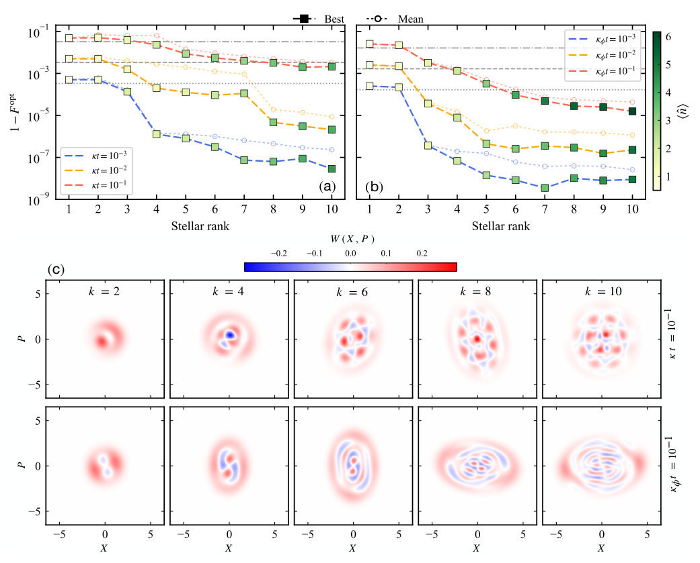
<figcaption class="paper-figure-caption"><b>Fig 4.</b> FIG. 4. Optimized error-correction performance, average photon number, and phase-space structure of finite-stellar-rank bosonic encodings under photon-loss and dephasing noise. (a) Optimal-recovery channel infidelity (1 −F opt) as a function of stellar rank k for encodings optimized under photon loss with κt ∈{10−3, 10−2, 10−1}.The Petz-recovery fidelity is used as the surrogate objective during the encoding search, while the plotted infidelities are computed using optimal recovery for the final codewords. Square markers show the best result over independent numerical runs, while open circles show the mean over runs. Marker colors indicate the mean photon number ⟨ˆn⟩of the corresponding...</figcaption>
</figure>
<figure class="paper-figure-card">
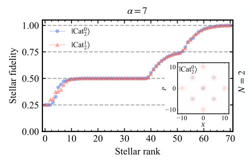
<figcaption class="paper-figure-caption"><b>Fig 5.</b> FIG. 5. Stellar fidelity as a function of stellar rank k for large- amplitude cat states with α = 7 and N = 2. The blue circles and red triangles correspond to the two logical codewords |Cat0 2⟩ and |Cat1 2⟩, respectively. In the large-amplitude regime, the coher- ent components are well separated in phase space, leading to visible plateau structures in the stellar-fidelity profile. For N = 2, the ex- pected plateau values are 1/4, 1/2, 3/4, and 1, corresponding to the effective capture of one, two, three, and four coherent components within the finite-rank approximation. The gray dotted lines indicate the plateau values. And the inset shows the phase-space locations of the coherent...</figcaption>
</figure>

**Summary.** This paper develops a resource measure called stellar rank to analyze bosonic quantum error-correcting codes under finite preparation constraints. It demonstrates that these physical limitations force a trade-off between ideal code properties and achievable performance against noise like photon loss or dephasing. The findings establish stellar rank as a crucial, operationally relevant metric for designing robust continuous-variable quantum information protocols.

**Why it may be interesting.** It provides a rigorous resource theory framework (stellar rank) for analyzing bosonic QEC performance in realistic settings where perfect state preparation is impossible, bridging abstract theory with practical quantum optics limitations.

Detailed structure

**Main problem.** The work addresses the practical challenge of designing bosonic quantum error-correcting (QEC) codes when limited by finite resources for preparing non-Gaussian states.

**Main result.** Finite stellar rank imposes a trade-off among state approximability, energy, and logical protection; optimized encodings reveal noise-adapted structures, establishing stellar rank as an operationally meaningful resource measure.

**Method.** The authors use stellar rank as a resource measure to benchmark bosonic codes (like Cat/GKP) under finite preparation constraints, optimizing directly within these constrained variational classes.

**Model / system.** The system involves continuous-variable bosonic modes used for QEC. The analysis considers noise channels such as photon loss and photon-number dephasing acting on encoded states.

**Key observables.** Stellar fidelity ($f^\star_k$), channel fidelity, Wigner functions of optimized codewords.

**Important parameters / regimes.** Stellar Rank ($k$), Photon Loss rate ($\kappa$), Dephasing strength ($\kappa_\phi$).

**Assumptions / limitations.** The primary assumption is that the optimal recovery map can be found, and the analysis relies on approximating ideal states using finite stellar rank resources.

**Figures summary.** Figure 1 illustrates how stellar fidelity increases with increasing stellar rank for Cat codes. Figure 9 shows Wigner functions of optimized states revealing grid-like or rotationally symmetric structures depending on the noise type and stellar rank.

**Paper structure.** The paper first establishes the problem by noting that finite resources constrain ideal QEC codewords, then develops methods using stellar fidelity to quantify approximation quality, and finally optimizes encodings directly under these constraints to reveal noise-adapted code geometries.

Abstract

Bosonic quantum error correction (QEC) relies on non-Gaussian bosonic encodings whose preparation cost is a central practical constraint. In this work, we use stellar rank as a resource measure to design and benchmark bosonic codes under finite non-Gaussian resources. For fixed cat and Gottesman--Kitaev--Preskill (GKP) code families, we show that finite stellar rank creates a trade-off among state approximability, energy, and logical protection under photon loss and photon-number dephasing, evaluated with optimal recovery. This trade-off implies that codewords with better ideal error-correction properties need not be optimal once finite-rank preparation constraints are imposed. Going beyond fixed-target codewords, we directly optimize bosonic encodings at fixed stellar rank, revealing noise-adapted code structures and concrete resource thresholds. Grid-like encodings emerge under photon loss, whereas approximately rotation-symmetric encodings arise under dephasing. In the optimized search, stellar rank k=2 suffices to surpass break-even for all dephasing strengths considered, while under photon loss the required rank increases with the loss rate. These results establish stellar rank as an operationally meaningful resource measure for bosonic QEC under practical state-preparation constraints.

[↑ back to top](#top)

### [Hybrid quantum floating-point method for sharp arithmetic](http://arxiv.org/abs/2607.06040v1)

**Authors:** Gabriele Agliardi, Enrico Prati  
**Type:** theory · **Category:** quantum information and computing · **PDF:** <https://arxiv.org/pdf/2607.06040v1>  
**Analysis basis:** full PDF text, analyzed in chunks
**Topic relevance:** `analog quantum simulation` **1/5** · `entanglement & information structure` **1/5** · `methods for driven-dissipative` **1/5** · `non-equilibrium dynamics` **1/5**

↔ Scroll figures horizontally

<figure class="paper-figure-card">
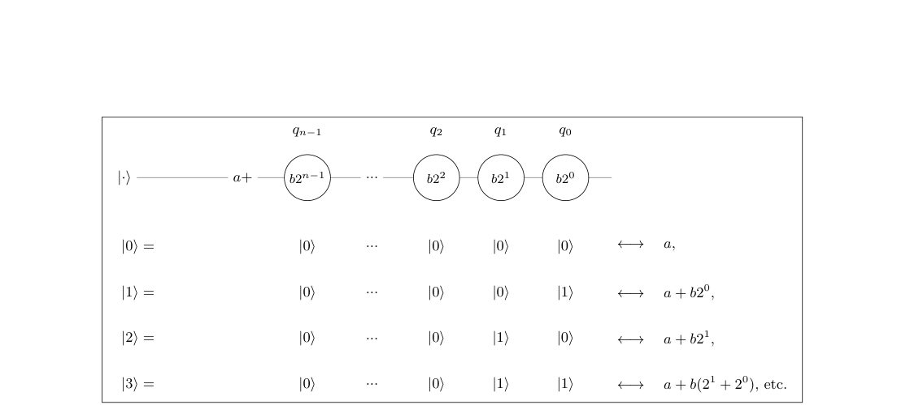
<figcaption class="paper-figure-caption"><b>Fig 1.</b> Figure 1: The top row contains a visual representation of a CEFV. In the rows below, some examples of the floating-point number represented by the CEFV, when the quantum state belongs to the computa- tional basis. States in the computational basis follow the usual bit string decomposition, thus providing a representation of any x ∈Dfp a,b.</figcaption>
</figure>
<figure class="paper-figure-card">
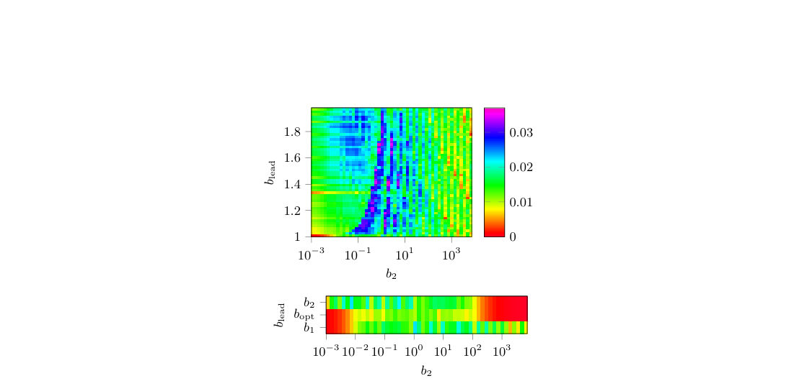
<figcaption class="paper-figure-caption"><b>Fig 2.</b> Figure 2: Effect of the choice of blead on errors, for the sum of two CEFVs of size n, in an output register of same size n = 8. In the top plot, b1 is kept equal to 1, b2 varies from 10−3 to 104, and blead in [1, 2]. The color intensity represents the relative error, namely ϵ++ϵ− b12n+b22n . In the bottom plot, a focus on three specific choices of blead, namely b1 (i.e., 1), b2, and the optimal bopt.</figcaption>
</figure>
<figure class="paper-figure-card">

<figcaption class="paper-figure-caption"><b>Fig 3.</b> Figure 3: Cumulative distribution function for repeated applications of the sum. Left plot: the initial random variable (providing 6 or 7, both with 50% probability), which can be encoded exactly in 3 qubits both with or without offset. Right plot: after 6 applications of the sum of the initial random variable with itself, the target random variable (in dashed green) compared to the approximating random variable (namely the one encoded in the quantum states), as well as the approximation region (defined as the approximating random variable +/- tolerances). Vertical grids show the values which can be perfectly represented by the quantum variables. The advantage of offsets is clearly visible,...</figcaption>
</figure>
<figure class="paper-figure-card">
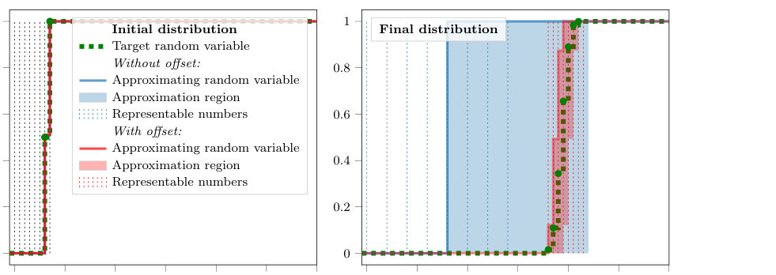
<figcaption class="paper-figure-caption"><b>Fig 4.</b> Figure 3 contains a visualization of the repeated application of the sum of a random variable with itself,</figcaption>
</figure>

**Summary.** This paper proposes a novel hybrid quantum-classical method, the CEFV, to represent floating-point numbers in quantum states while preserving high arithmetic precision. By classically tracking global information like range and tolerance, it significantly reduces error accumulation during repeated operations compared to purely quantum approaches. This advancement is crucial for implementing complex numerical algorithms on near-term quantum hardware.

**Why it may be interesting.** While focused on arithmetic circuits, the rigorous management of state representation fidelity and resource optimization (depth vs. accuracy) is highly relevant to designing complex quantum simulations for condensed matter systems.

Detailed structure

**Main problem.** The primary challenge is mitigating precision degradation when performing repeated arithmetic operations on quantum floating-point variables while maintaining low circuit depth.

**Main result.** A hybrid quantum-classical representation, the Classically-Enriched Floating Point Variable (CEFV), was introduced, which significantly reduces approximation error compared to previous methods.

**Method.** The method combines a quantum register for values with a classical register storing global parameters like range and tolerance, allowing arithmetic operations (sum/product) to be defined while managing overflow and tracking precision loss.

**Model / system.** The model uses quantum registers to encode random variables, extending the concept of basis encoding to handle fractional numbers via the CEFV structure. It explicitly accounts for compatibility with potentially continuous random variables using tolerance parameters ($\epsilon_\pm$).

**Key observables.** Approximation error ($\epsilon_{	ext{approx}}^\pm$), circuit depth (measured in $[	ext{u}3, 	ext{cx}]$ basis), and the required number of output qubits.

**Important parameters / regimes.** The scaling factor ($b$) and offset are critical parameters that determine the achievable precision and the complexity of the arithmetic circuits.

**Assumptions / limitations.** The method assumes that global properties (like range or exponent) can be efficiently stored classically to guide quantum operations, and it relies on defining compatible error bounds ($\epsilon_\pm$).

**Figures summary.** Figures illustrate the CEFV structure mapping basis states to values; heat maps compare relative errors for addition based on scaling factor choices; CDFs show the benefit of using offsets during repeated summation; and other figures compare circuit depth and error reduction across different algorithmic implementations.

**Paper structure.** The paper develops the theoretical framework by first introducing the hybrid CEFV representation, defining compatible sum/product operations that manage overflow and tolerance propagation. It then rigorously analyzes the impact of scaling factors ($	ext{blead}$) and offsets on error accumulation, concluding with comparisons of circuit depth improvements from algorithmic refinements.

Abstract

There are several possible ways to encode random variables in a quantum state. The basis encoding of bit strings has paramount importance because it allows to load the values of a random variable through the superposition of corresponding basis states, and to then exploit quantum parallelism in processing algorithms. The basis encoding offers a natural way to represent an unsigned integer random variable, and extends to signed integers, as well as to fixed-point and floating-point variables. Each quantum representation of fractional numbers, however, involves a trade-off between accuracy and depth of manipulation circuits. Here, an efficient hybrid quantum-classical representation of quantum floating points is introduced. It combines a quantum register containing the values, with a classical register storing global information about the variable, namely the range and approximation tolerances. The sum and product operations are defined, in such a way as to ensure they are performed without overflow. By taking advantage of the stored classical information, the precision degradation that occurs due to rounding after repeated data manipulations, can be significantly reduced compared to known strategies. Ad hoc examples show up to around $90\%$ reduction in approximation, compared to previous techniques, after repeated additions. The method finds application in many algorithms of practical relevance and constitutes a significant advance in the design of arithmetic circuits with low depth and high accuracy.

[↑ back to top](#top)

### [Charge-transfer gap size and oxygen hole content as two mechanisms controlling $T_c$ in the Emery model](http://arxiv.org/abs/2607.06462v1)

**Authors:** Eleanor M. O'Callaghan, Nicolas Kowalski, A. -M. S. Tremblay, Giovanni Sordi  
**Type:** theory · **Category:** strongly correlated electrons · **PDF:** <https://arxiv.org/pdf/2607.06462v1>  
**Analysis basis:** full PDF text, analyzed in chunks
**Topic relevance:** `Keldysh / 2PI / non-Gaussian methods` **1/5** · `analog quantum simulation` **1/5** · `driven-dissipative phase transition` **1/5**

↔ Scroll figures horizontally

<figure class="paper-figure-card">
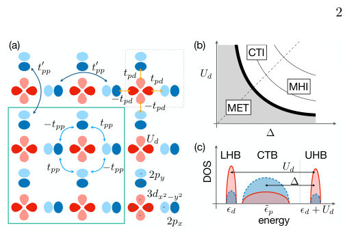
<figcaption class="paper-figure-caption"><b>Fig 1.</b> FIG. 1. (a) Sketch of the Emery model. The dotted gray square indicates the lattice unit cell, which consists of a Cu 3dx2−y2 orbital (red) of onsite energy ϵd and the O 2px, 2py or- bitals (blue) of onsite energy ϵp. We use bright and pale colors to denote the positive and negative signs of the orbital lobes. We use the convention that the overlap between orbital lobes of opposite (equal) sign yields to a positive (negative) hopping amplitude. There are three hopping amplitudes: tpd (between the nearest-neighbor Cu-O orbitals) [orange arrows], tpp and t′ pp (between nearest-neighbor and next-nearest-neighbor O 2px and 2py orbitals, respectively) [light blue and dark blue arrows,...</figcaption>
</figure>
<figure class="paper-figure-card">
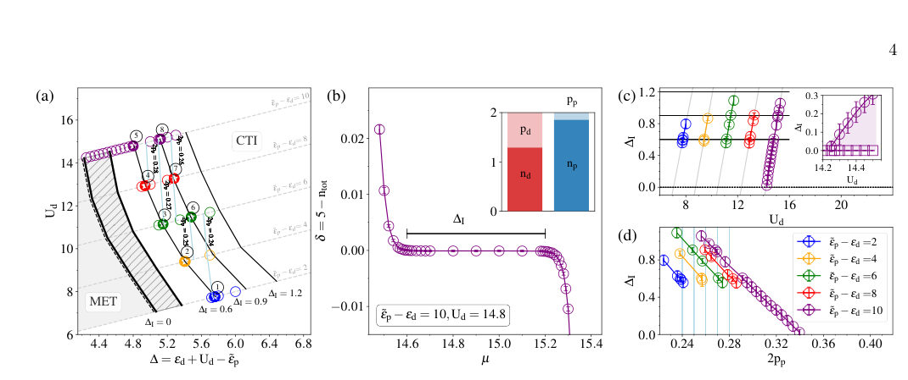
<figcaption class="paper-figure-caption"><b>Fig 2.</b> FIG. 2. (a) Zaanen-Sawatzky-Allen diagram Ud vs ∆= ϵd + Ud −˜ϵp of the Emery model, computed with CDMFT. Open circles indicate the parameters (∆, Ud) investigated in our work. All data are at ntot = 5, i.e. zero doping, and T = 1/50. Gray dashed lines denote constant values of the bare Cu-O energy distance ˜ϵp −ϵd. The data along each of these lines are assigned a different color. The hatched region bounded by thick black lines denotes the coexistence associated with the first-order metal-insulator transition. Thin black lines are lines of constant charge gap size ∆I. The data that is closest to the lines of constant ∆I are marked by circles with a star, and labeled 1 to 8. The dashed black...</figcaption>
</figure>
<figure class="paper-figure-card">
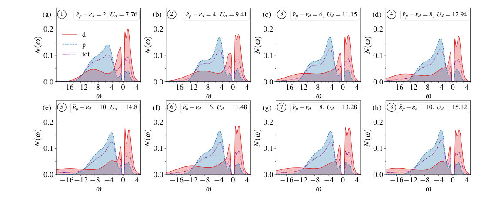
<figcaption class="paper-figure-caption"><b>Fig 3.</b> FIG. 3. (a)-(h) Partial density of states N(ω) of the Cu 3dx2−y2 orbital (red solid line) and of the degenerate O 2px, 2py orbitals (blue dashed line), along with the total density of states Ntot = [Nd(ω) + 2Np(ω)]/3 (purple dotted line). Each density of states is normalised to unity. The Fermi level is at ω = 0. Each panel corresponds to the parameters (˜ϵp −ϵd, Ud). These parameters are labeled by circled numbers, which are also indicated in the Ud −∆diagram of Fig. 2(a). Data are for T = 1/50. We perform the analytical continuation from imaginary to real frequencies with the software of Ref. [51].</figcaption>
</figure>
<figure class="paper-figure-card">
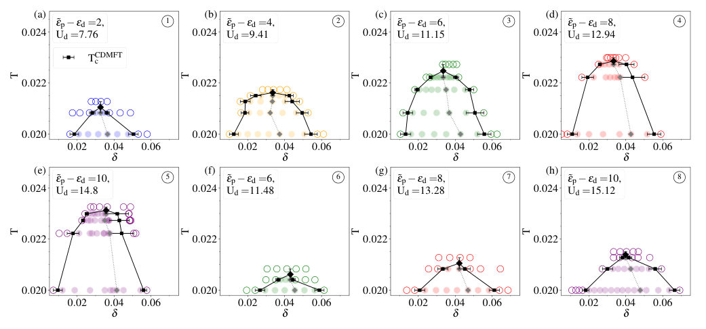
<figcaption class="paper-figure-caption"><b>Fig 4.</b> FIG. 4. (a)-(h) Superconducting critical temperature T CDMFT c (black line with filled squares) vs hole doping δ = 5 −ntot. T CDMFT c (δ) is the line where the superconducting order parameter Φ changes from zero (open circles) to nonzero (shaded circles) [as determined in Fig. 5]. The dotted gray line with diamonds connects the values of doping that maximize Φ at each temperature. A black diamond marks the maximum superconducting critical temperature T max c . Each panel corresponds to the parameters (˜ϵp −ϵd, Ud). These parameters are labeled by circled numbers. The parent (δ = 0) insulating state from which the superconducting state emerges is indicated in the Zaanen-Sawatzky-Allen...</figcaption>
</figure>
<figure class="paper-figure-card">
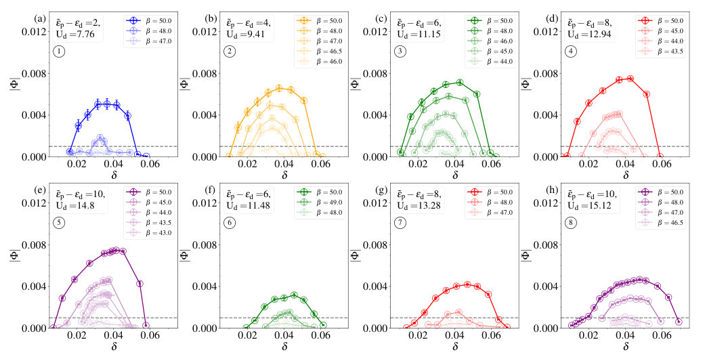
<figcaption class="paper-figure-caption"><b>Fig 5.</b> FIG. 5. (a)-(h) Superconducting order parameter Φ vs doping δ for different values of the inverse temperature β = 1/T. Each panel corresponds to coordinates (˜ϵp −ϵd, Ud). The horizontal dashed line at Φ = 0.001 marks the threshold above which we consider the system to be superconducting.</figcaption>
</figure>

**Summary.** This work analyzes the Emery model for cuprates to understand what drives high-temperature superconductivity. Using advanced quantum many-body theory (CDMFT), the authors find that $T_c$ is primarily controlled by how much charge resides on the oxygen sites (oxygen hole content) and the size of the charge-transfer gap. This provides a crucial theoretical map for understanding cuprate physics.

**Why it may be interesting.** The explicit connection drawn between model parameters (like charge gap) and macroscopic properties ($T_c$) provides a concrete theoretical framework that can be tested against experimental measurements, including those from ultracold atoms simulations.

Detailed structure

**Main problem.** The study investigates the fundamental mechanisms controlling the superconducting critical temperature ($T_c$) trends observed in high-temperature cuprate superconductors.

**Main result.** The maximum $T_c$ is controlled by two key electronic structure parameters: the charge-transfer gap size ($\Delta_I$) and the oxygen hole content, with the latter being identified as the dominant variable.

**Method.** The research employs cellular dynamical mean-field theory (CDMFT) to solve the model Hamiltonian at finite temperature, guided by the Zaanen-Sawatzky-Allen diagram.

**Model / system.** The system is modeled using the Emery model, which describes the copper-oxygen plane in cuprates. This model incorporates onsite repulsion ($U_d$) on Cu and hopping terms between Cu and O orbitals.

**Key observables.** Superconducting critical temperature ($T_{max}^c$), charge-transfer gap size ($\Delta_I$), and oxygen hole content.

**Important parameters / regimes.** Copper-oxygen energy distance ($\Delta$), onsite repulsion on Cu orbital ($U_d$), and the doping level (related to hole content).

**Assumptions / limitations.** The analysis focuses on the charge-transfer insulating regime ($U_d > \Delta$) and utilizes CDMFT approximations.

**Figures summary.** Figures illustrate the Zaanen-Sawatzky-Allen diagram mapping out constant lines for $\Delta_I$ and oxygen hole content, alongside isotherms used to determine the gap size.

**Paper structure.** The paper first establishes the theoretical framework using the Emery model and CDMFT. It then systematically maps the parameter space using the Zaanen-Sawatzky-Allen diagram to quantify how $T_c^{
m max}$ depends on $\Delta$ and $U_d$, culminating in identifying the roles of gap size and hole content.

Abstract

Investigating the drivers of superconducting critical temperature trends in cuprates is crucial for uncovering the mechanism of high-temperature superconductivity. Here we study this problem in the canonical model of the copper-oxygen plane, the Emery model, with cellular dynamical mean-field theory. Using the Zaanen-Sawatzky-Allen diagram as a guiding framework, we systematically quantify how the maximum superconducting critical temperature $T_c^{\rm max}$ depends on the copper-oxygen energy distance and on the local repulsion on the copper orbital. Unexpectedly, $T_c^{\rm max}$ is optimized not only near the charge-transfer insulator to metal boundary, consistent with previous findings, but also deep in the charge-transfer regime, revealing an unexplored mechanism. Then we link model parameters to physical observables, identifying the charge-transfer gap size and the oxygen hole content as two mechanisms controlling $T_c^{\rm max}$. $T_c^{\rm max}$ increases monotonically as the oxygen hole content increases and the charge gap size decreases. The oxygen hole content is the dominant variable in varying $T_c^{\rm max}$. Our work provides predictions for proposed realizations of the Emery model with ultracold atoms and a theoretical framework for understanding key experimental trends in hole-doped cuprates.

[↑ back to top](#top)

### [Latency-Constrained Hardware-Aware Quantum Error Correction Co-Design with Adaptive Confidence-Gated Neural Decoding for the Rotated Surface Code](http://arxiv.org/abs/2607.05814v1)

**Authors:** Sumit Chongder  
**Type:** both · **Category:** quantum information and computing · **PDF:** <https://arxiv.org/pdf/2607.05814v1>  
**Analysis basis:** full PDF text, analyzed in chunks
**Topic relevance:** `QC/QI experiment` **1/5** · `methods for driven-dissipative` **1/5**

↔ Scroll figures horizontally

<figure class="paper-figure-card">
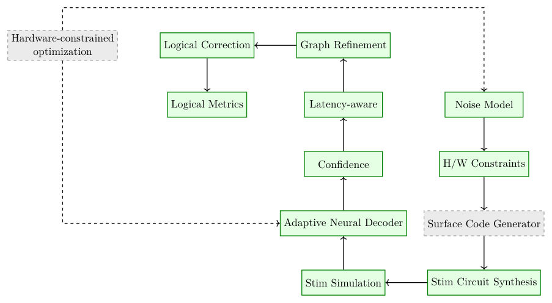
<figcaption class="paper-figure-caption"><b>Fig 1.</b> Figure 1: Hardware-aware quantum error correction co-design framework. Green solid boxes denote components implemented and empirically evaluated in this paper (noise model, circuit synthesis via Stim, adaptive confidence-gated decoder, and logical-metric evaluation). Grey dashed boxes denote the hardware-constrained code-generation and closed-loop latency-constrained optimisation components that are specified architecturally as the target of ongoing and future work (Section 7) and are not evaluated empirically here.</figcaption>
</figure>
<figure class="paper-figure-card">
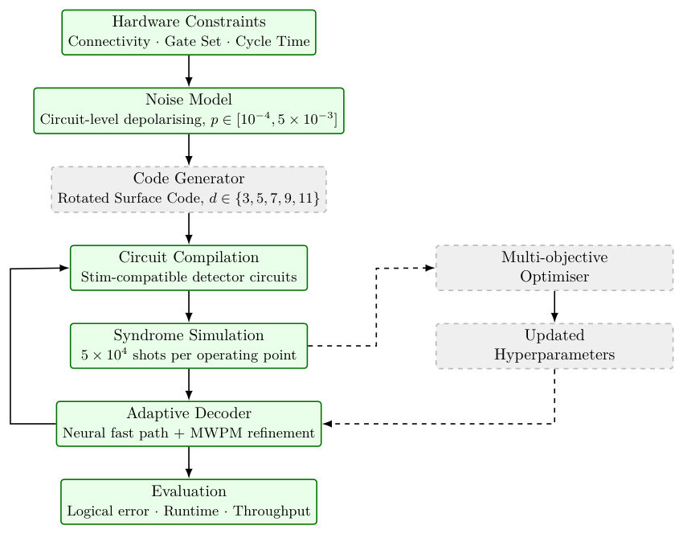
<figcaption class="paper-figure-caption"><b>Fig 2.</b> Figure 2: Hardware-aware co-design optimisation pipeline. The vertical chain (noise model, circuit compilation, syndrome simulation, adaptive decoding, evaluation) is the pipeline implemented and benchmarked in this paper. The hardware-constrained code generator and the multi-objective optimisation loop that would close the search over code candidates (right, dashed) are specified as the target architecture for the next phase of this research programme and are not exercised in the current experiments.</figcaption>
</figure>
<figure class="paper-figure-card">
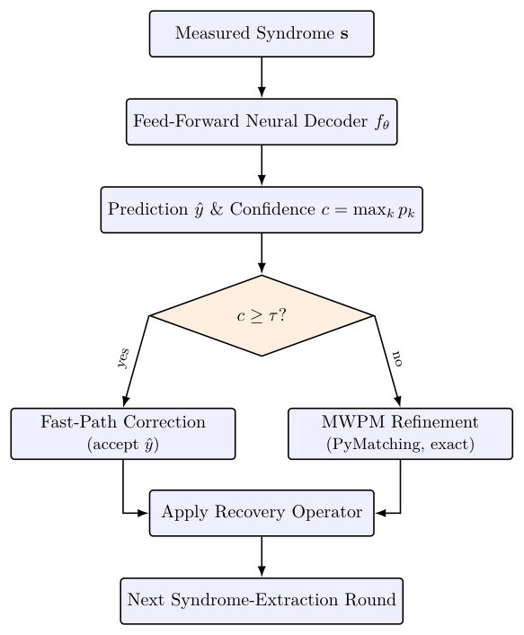
<figcaption class="paper-figure-caption"><b>Fig 3.</b> Figure 3: Decision flow of the adaptive, confidence-gated decoder. Every measured syndrome is first passed through the fast feed-forward decoder; syndromes with confidence at or above the operating threshold τ are corrected on the fast path, while low-confidence syndromes are escalated to exact minimum- weight perfect matching refinement before recovery is applied.</figcaption>
</figure>
<figure class="paper-figure-card">
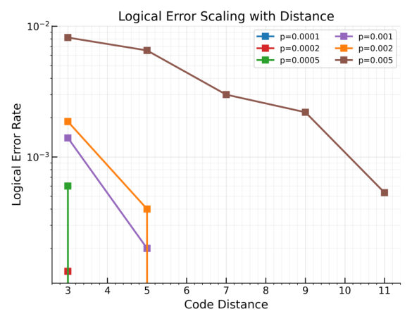
<figcaption class="paper-figure-caption"><b>Fig 4.</b> Figure 4: Fast-path logical accuracy versus code distance at fixed physical error rate p = 10−3 (data as in Table 1). Accuracy degrades as decoding-graph complexity grows with d at fixed noise strength, motivating the confidence-gated escalation mechanism evaluated in Section 5.3.</figcaption>
</figure>
<figure class="paper-figure-card">
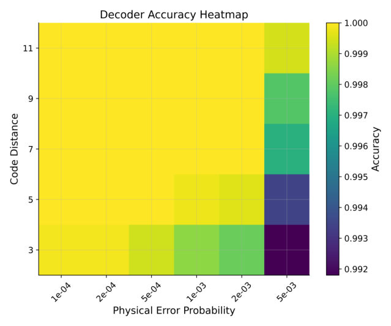
<figcaption class="paper-figure-caption"><b>Fig 5.</b> Figure 5: Decoder accuracy as a joint function of code distance and physical error probability. Full numerical values are given in Table 6.</figcaption>
</figure>

**Summary.** The paper introduces an adaptive, hardware-aware decoding framework for the Rotated Surface Code designed to overcome the bottleneck of real-time QEC. It uses a fast neural network path supplemented by a computationally intensive MWPM refinement stage only when necessary. This approach significantly boosts logical accuracy while maintaining high throughput suitable for scaling quantum processors.

**Why it may be interesting.** This work directly addresses the operational feasibility of fault-tolerant quantum computing by optimizing the classical post-processing step (decoding) to meet stringent real-time latency requirements.

Detailed structure

**Main problem.** Real-time decoding is a major bottleneck preventing the scaling of Quantum Error Correction (QEC) from NISQ devices to fault-tolerant quantum computation.

**Main result.** The adaptive framework significantly improves logical accuracy (e.g., 99.21% to 99.81%) by selectively routing only low-confidence syndromes to a computationally expensive refinement stage, with minimal overhead.

**Method.** It proposes an adaptive, two-stage decoding inference: a fast path using a lightweight neural network for most measurements, and a refinement stage using Minimum-Weight Perfect Matching (MWPM) for uncertain cases.

**Model / system.** The work is implemented on the Rotated Surface Code, simulating performance under circuit-level depolarizing noise across various code distances ($d=3$ to $11$).

**Key observables.** Logical accuracy, confidence-controlled accuracy–latency trade-offs, decoding throughput (up to $4.6 	imes 10^5$ samples s$^{-1}$), and per-shot latency.

**Important parameters / regimes.** Code distances ($d$), physical error rates ($p$), and the adaptive confidence threshold ($	au$).

**Assumptions / limitations.** The quantitative results are limited to the rotated surface code family and independent circuit-level depolarizing noise, with no generalization claimed for correlated or coherent noise.

**Figures summary.** Tables summarize joint performance metrics (accuracy, error rate, runtime, throughput) across a grid of code distances and noise probabilities; Figure 1 outlines the overall hardware-aware co-design framework.

**Paper structure.** The paper introduces the bottleneck problem, details the adaptive neural/MWPM decoding methodology, presents comprehensive benchmarking results across multiple parameters (Table 10), and concludes by outlining future architectural directions beyond the current scope.

Abstract

Real-time decoding is a major bottleneck in scaling quantum error correction (QEC) from noisy intermediate-scale quantum (NISQ) devices to fault-tolerant quantum computing. We present an adaptive confidence-gated decoding framework for the rotated surface code that treats decoding as a two-stage inference problem. A lightweight feed-forward neural network performs fast-path decoding for the majority of syndrome measurements, while only low-confidence predictions are escalated to a minimum-weight perfect matching (MWPM) refinement stage. We benchmark the framework on rotated surface codes with distances $d \in \{3,5,7,9,11\}$ under circuit-level depolarising noise using the Stim stabiliser simulator. The evaluation characterises logical accuracy, confidence-controlled accuracy-latency trade-offs, decoding throughput, per-shot latency, and decoding-graph resource scaling. Routing only 3.3%-6.2% of syndromes to the refinement stage improves logical accuracy from 99.21% for the neural-only baseline to 99.81% at a confidence threshold of 0.95 while incurring only a bounded increase in average decoding cost. Neural-decoder throughput saturates near $4.6 \times 10^{5}$ samples s$^{-1}$ at batch size 512 on commodity CPU hardware, indicating that the neural fast path is not the dominant throughput bottleneck beyond code distance $d=7$. We release the complete benchmarking pipeline, trained models, raw benchmark data, and source code, and explicitly distinguish the experimentally validated contributions from the broader hardware-aware QEC co-design roadmap, including hardware-constrained code discovery, GPU-accelerated inference, and multi-noise optimisation, which remain directions for future work.

[↑ back to top](#top)

### [Quantum Resources and Performance in the Initialization-Free Bernstein-Vazirani Algorithm](http://arxiv.org/abs/2607.06033v1)

**Authors:** Haesol Han, Alexander Streltsov, Soojoon Lee  
**Type:** theory · **Category:** quantum information and computing · **PDF:** <https://arxiv.org/pdf/2607.06033v1>  
**Analysis basis:** full PDF text, analyzed in chunks
**Topic relevance:** `entanglement & information structure` **1/5** · `quantum measurements` **1/5**

↔ Scroll figures horizontally

<figure class="paper-figure-card">
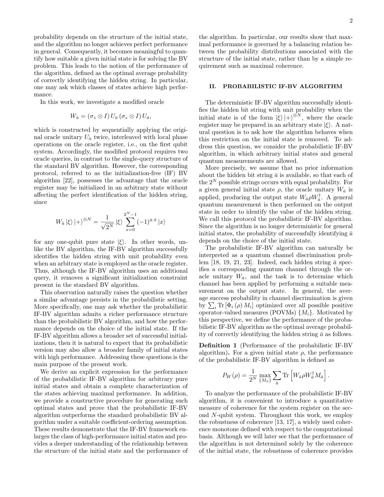
<figcaption class="paper-figure-caption"><b>Fig 1.</b> Low-resolution page preview, page 2</figcaption>
</figure>
<figure class="paper-figure-card">
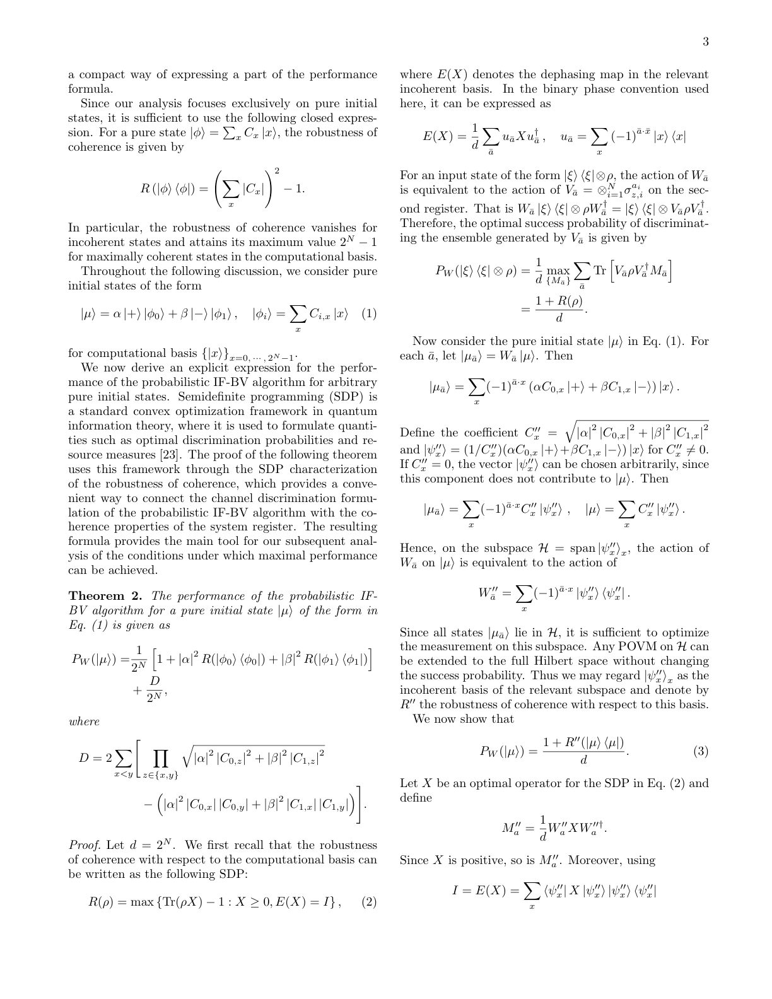
<figcaption class="paper-figure-caption"><b>Fig 2.</b> Low-resolution page preview, page 3</figcaption>
</figure>
<figure class="paper-figure-card">
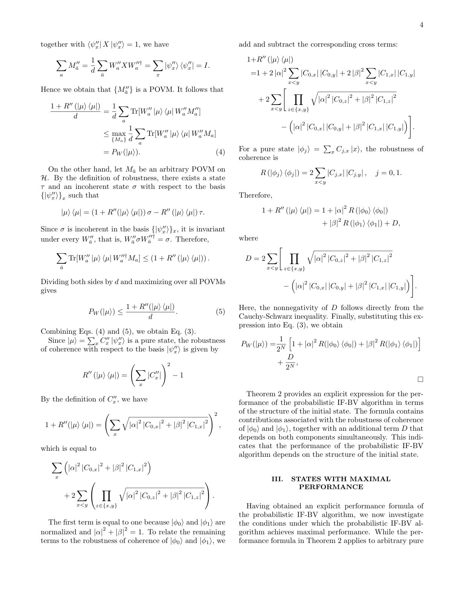
<figcaption class="paper-figure-caption"><b>Fig 3.</b> Low-resolution page preview, page 4</figcaption>
</figure>
<figure class="paper-figure-card">
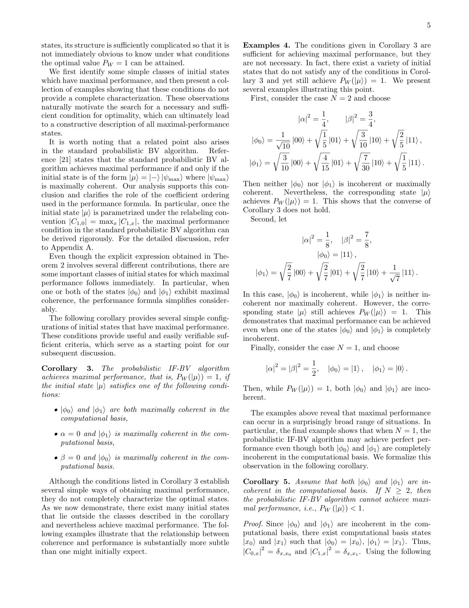
<figcaption class="paper-figure-caption"><b>Fig 4.</b> Low-resolution page preview, page 5</figcaption>
</figure>
<figure class="paper-figure-card">
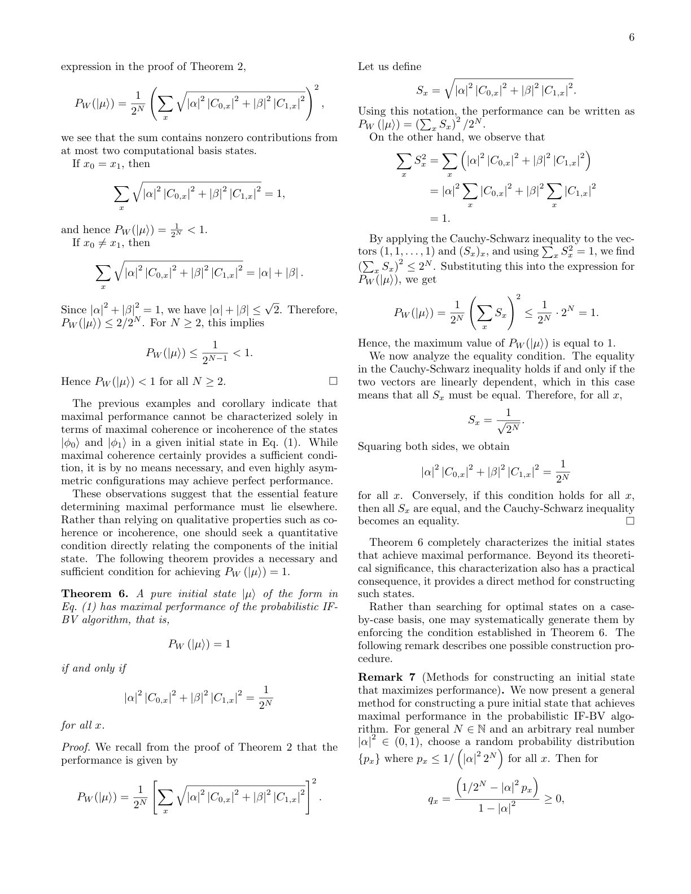
<figcaption class="paper-figure-caption"><b>Fig 5.</b> Low-resolution page preview, page 6</figcaption>
</figure>

**Summary.** This work rigorously analyzes the performance limits of an initialization-free variant of the Bernstein-Vazirani algorithm. By deriving explicit formulas based on initial state coherence, the authors prove that this IF-BV method generally surpasses the standard BV algorithm. The findings provide deep insights into which quantum resources are essential for achieving optimal computational success probabilities.

**Why it may be interesting.** The rigorous mathematical characterization of quantum advantage in specific quantum algorithms, particularly how modifying initial state preparation can boost computational power, is highly relevant to understanding resource theories in quantum computation.

Detailed structure

**Main problem.** The paper analyzes the performance of an initialization-free variant of the Bernstein-Vazirani (BV) quantum algorithm compared to its standard probabilistic counterpart.

**Main result.** It derives explicit formulas showing that the IF-BV algorithm generally outperforms the standard BV algorithm, and it establishes necessary and sufficient conditions for achieving maximal success probability.

**Method.** The analysis employs techniques from quantum channel discrimination theory, utilizing Semidefinite Programming (SDP) characterization to derive performance bounds based on initial state coherence properties.

**Model / system.** The model is the probabilistic IF-BV algorithm applied to an oracle problem, considering pure initial states $|\mu
angle = \alpha |+
angle|\phi_0
angle + eta |-
angle|\phi_1
angle$ for the ancilla register.

**Key observables.** Performance ($P_W$) of the IF-BV algorithm and its comparison to the standard BV performance ($P$).

**Important parameters / regimes.** The coefficients $\alpha, eta$, and the coherence properties (Robustness of Coherence $R$) of the initial states $|\phi_0
angle$ and $|\phi_1
angle$.

**Assumptions / limitations.** The analysis focuses on pure initial states for deriving closed-form expressions; comparisons often rely on a specific relabeling convention for the standard BV algorithm characterization.

**Paper structure.** The paper progresses by first defining the IF-BV performance, deriving explicit formulas relating it to coherence (Chunk 2), then establishing necessary and sufficient conditions for maximal performance (Theorem 6), and finally proving that IF-BV generally outperforms standard BV under certain assumptions (Theorem 8).

Abstract

Naseri et al. [Phys. Rev. A 106, 062429 (2022); arXiv:2205.13610] studied which quantum resources in initial states are essential for the probabilistic Bernstein-Vazirani (BV) algorithm, defining its performance as the optimal average success probability over all measurements. In this work, we consider a variant of BV algorithm, which is called the initialization-free (IF) BV algorithm, in which an arbitrary ancilla state as the oracle register is allowed, to improve the performance. We derive an explicit formula for the performance of the probabilistic IF-BV algorithm and obtain a necessary and sufficient condition for an initial state to achieve maximal performance. We further prove that, under a suitable ordering assumption on the coefficients of the initial state, the probabilistic IF-BV algorithm outperforms the standard probabilistic BV algorithm.

[↑ back to top](#top)

### [SQGen: Structured Quantum Image Generation with Latent-Modulated Quantized Tensor Trains](http://arxiv.org/abs/2607.06058v1)

**Authors:** Guang Lin, Qibin Zhao  
**Type:** both · **Category:** numerical methods · **PDF:** <https://arxiv.org/pdf/2607.06058v1>  
**Analysis basis:** full PDF text, analyzed in chunks
**Topic relevance:** `entanglement & information structure` **1/5** · `methods for driven-dissipative` **1/5**

↔ Scroll figures horizontally

<figure class="paper-figure-card">
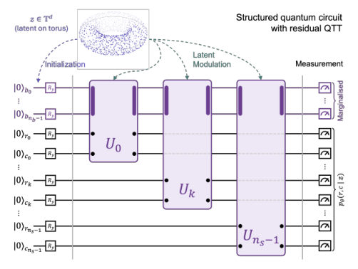
<figcaption class="paper-figure-caption"><b>Fig 1.</b> Figure 1: The illustration of the SQGen with latent- modulated quantized tensor train skeleton.</figcaption>
</figure>
<figure class="paper-figure-card">
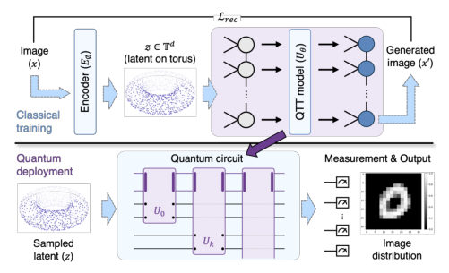
<figcaption class="paper-figure-caption"><b>Fig 2.</b> Figure 2: The illustration of classical training and quantum deployment pipelines.</figcaption>
</figure>
<figure class="paper-figure-card">
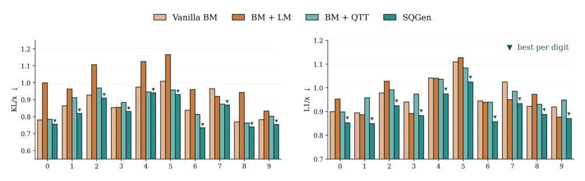
<figcaption class="paper-figure-caption"><b>Fig 3.</b> Figure 3: MNIST image generation on per digit. Side-by-side bars compare the four configurations on KL/x (left) and L1/x (right); ∇marks the winner per digit.</figcaption>
</figure>
<figure class="paper-figure-card">
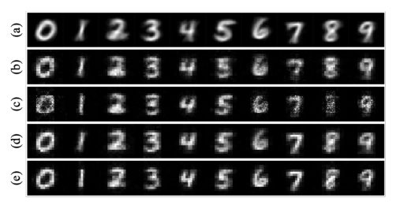
<figcaption class="paper-figure-caption"><b>Fig 4.</b> Figure 4: The generated MNIST samples across the four configurations. (a) empirical class mean (target prototype); (b) Vanilla BM; (c) BM+LM; (d) BM+QTT; (e) SQGen.</figcaption>
</figure>
<figure class="paper-figure-card">
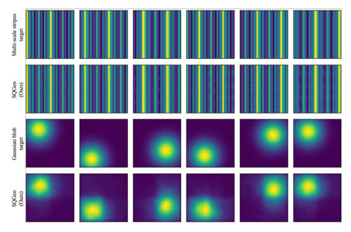
<figcaption class="paper-figure-caption"><b>Fig 5.</b> Figure 5: Synthetic controlled targets and SQGen outputs. Top (rows 1, 2): a multi-scale cosine sum on the column axis; Bottom (rows 3, 4): 2-D Gaussian blobs on z ∈T2.</figcaption>
</figure>

**Summary.** This paper introduces SQGen, a novel quantum generator that uses a Quantized Tensor Train structure enhanced by latent modulation to generate images directly on quantum hardware. By training classically and ensuring the inference path is purely quantum, it overcomes major hurdles like decoder dependency and circuit depth limitations for end-to-end quantum machine learning.

**Why it may be interesting.** While focused on image generation, the rigorous use of tensor network structures (QTT) combined with advanced conditioning techniques (latent modulation) provides a powerful framework for modeling complex quantum correlations in structured physical systems beyond simple state preparation.

Detailed structure

**Main problem.** The core challenge is generating high-fidelity, image-scale data directly from quantum circuits on NISQ hardware without relying on a classical decoder to maintain end-to-end quantum advantage.

**Main result.** SQGen successfully trains stably and generates images end-to-end using a shallow circuit structure that incorporates latent modulation, achieving state-of-the-art reconstruction quality metrics.

**Method.** The authors propose a full quantum generator built on a Quantized Tensor Train (QTT) skeleton, enhanced with latent modulation to condition the generation process. Training is performed classically by optimizing a differentiable model compatible with native quantum gates.

**Model / system.** The model uses a QTT structure where bond indices are mapped onto ancilla qubits. Latent variables are injected into rotation angles via an exact additive factorization, allowing for structured conditioning while keeping the inference path purely quantum.

**Key observables.** Per-sample reconstruction quality (KL divergence and L1 distance), sample diversity, and circuit complexity metrics.

**Important parameters / regimes.** Bond rank ($\chi$), latent dimension ($d$), noise strength ($p$), and the torus prior $	ext{T}^d$ for the latent variable $z$.

**Assumptions / limitations.** The model assumes that the quantum process can be accurately represented by a QTT structure, and it relies on classical training to establish parameters that map one-to-one onto native quantum gates.

**Figures summary.** Figures illustrate the SQGen architecture using latent modulation within the QTT skeleton; comparison tables (e.g., Table 3) benchmark performance against various quantum image generation families.

**Paper structure.** The paper introduces the problem, details the novel QTT structure and latent modulation mechanism, describes the classical training pipeline with a torus prior, and validates the end-to-end process through extensive numerical experiments on MNIST and synthetic data.

Abstract

Generating images directly from quantum systems is an attractive but unresolved goal on NISQ hardware. Existing quantum generators face several coupled obstacles: barren plateaus that block trainability, expensive quantum circuit preparation, and hardware noise that erodes quantum information with depth. A further difficulty is producing image-scale output without a classical decoder, whose use would otherwise break the end-to-end quantum advantage. We propose SQGen, a full quantum generator built on a quantized tensor train (QTT) with a latent modulation architecture. Specifically, SQGen promotes the QTT bond index of the target pixel distribution to ancilla bond qubits, so that each circuit site operates locally on a bond register plus the two physical qubits that carry the row- and column-bit of one image scale. We further introduce latent modulation: each re-uploading rotation is factorized at the angle level into a trainable main path plus an additive latent term, reducing to the trainable main path when the latent term is disabled. During training, we create a differentiable model in the classical system under gate-compatibility constraints, with a torus prior as the latent distribution. After training, every operator maps one-to-one to a native quantum gate, yielding a compact, deployable quantum circuit with no classical decoder in the inference path. Together, these design choices address the obstacles raised above. Extensive experiments on image datasets and synthetic data demonstrate that SQGen trains stably, generates images end-to-end from a shallow circuit with no classical decoder, and shows promising feasibility on real quantum hardware.

[↑ back to top](#top)

### [Strictly Local Tile-Code Architectures on Two-Dimensional Planar Lattices](http://arxiv.org/abs/2607.05897v1)

**Authors:** Yoonjin Bae, Chae-Yeun Park  
**Type:** theory · **Category:** quantum information and computing · **PDF:** <https://arxiv.org/pdf/2607.05897v1>  
**Analysis basis:** full PDF text, analyzed in chunks
**Topic relevance:** `QC/QI experiment` **1/5** · `methods for driven-dissipative` **1/5**

↔ Scroll figures horizontally

<figure class="paper-figure-card">
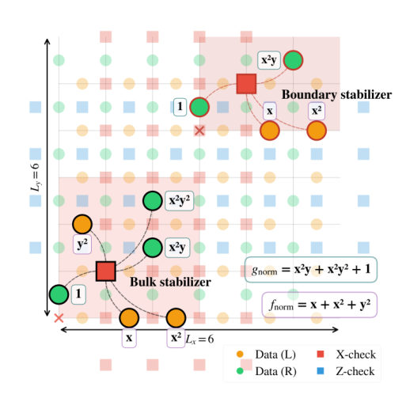
<figcaption class="paper-figure-caption"><b>Fig 1.</b> FIG. 1. Illustration of the [[288, 8, 12]] tilecode family with Lx = Ly = 6 and distance d = 4. The lattice structure shows data qubits (circles) positioned on edges: Data L qubits (or- ange) on horizontal edges and Data R qubits (green) on verti- cal edges. Check operators (squares) are positioned at vertices and faces: X-check operators (red) and Z-check operators (blue). Two representative X-type stabilizers are highlighted: a bulk stabilizer with weight 6 (black border) and a bound- ary stabilizer with weight 4 (red border), each connected to its support qubits via dashed curves. The semi-transparent shaded regions indicate the 3×3 lattice support areas, with X markers denoting the...</figcaption>
</figure>
<figure class="paper-figure-card">
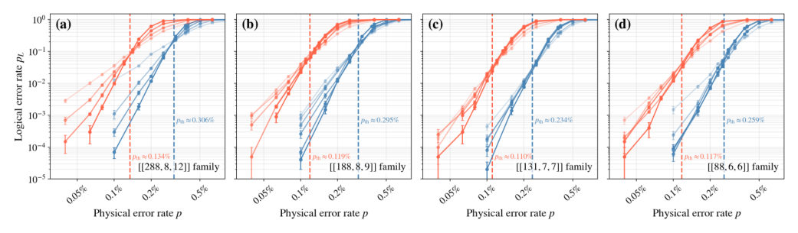
<figcaption class="paper-figure-caption"><b>Fig 2.</b> FIG. 2. Logical error rate pL versus physical error rate p for the (a) [[288, 8, 12]], (b) [[188, 8, 9]], (c) [[131, 7, 7]], and (d) [[88, 6, 6]] code families under the SI1000 noise model. Blue curves correspond to results without locality constraints, and red curves to results with SWAP routing, where two-qubit gates are only allowed between nearest-neighbor qubits. Within each panel, lighter shades indicate smaller code distances (see Table I). Dashed vertical lines indicate the threshold for each family obtained from the finite-size scaling.</figcaption>
</figure>
<figure class="paper-figure-card">
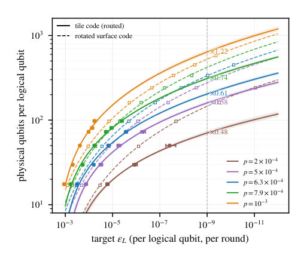
<figcaption class="paper-figure-caption"><b>Fig 3.</b> FIG. 3. The number of physical qubits per logical qubit needed to reach a target error rate ϵL under the SI1000 model, for the routed [[288, 8, 12]] family (solid) and the rotated sur- face code (dashed). Colors denote the physical error rate p, and bands are bootstrap 1σ ranges. Circles and squares are directly simulated instances. Labels give the tile-to-surface ratio at ϵL = 10−9 (dashed vertical line).</figcaption>
</figure>
<figure class="paper-figure-card">
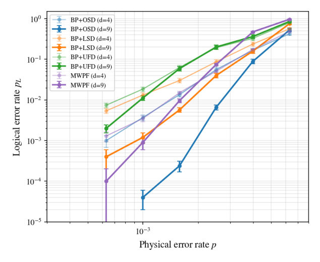
<figcaption class="paper-figure-caption"><b>Fig 4.</b> FIG. 4. Logical error rate pL as a function of the physical error rate p for the [[288, 8, 12]] tile code under the standard depolarizing noise model, for code distances d = 4 (lighter) and d = 9 (darker). Four decoding algorithms are compared: BP+OSD, BP+LSD, BP+UFD (BeliefFind), and MWPF. All BP-based decoders use the same front-end (min-sum, scaling factor 0.5, max 2000 iterations). MWPF uses cluster_node_limit = 500 for d = 4 and limit = 200 for d = 9.</figcaption>
</figure>
<figure class="paper-figure-card">
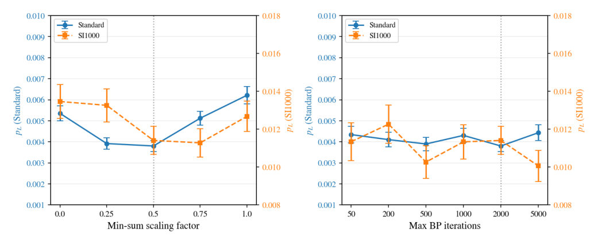
<figcaption class="paper-figure-caption"><b>Fig 5.</b> FIG. 5. Hyperparameter sweep for the BP+OSD decoder applied to the no-routing [[288, 8, 12]] circuit (d = 4) at p = 10−3</figcaption>
</figure>

**Summary.** This paper analyzes Tile Codes for fault-tolerant quantum computation on 2D lattices, focusing on implementing syndrome extraction using only local interactions. By developing optimized routing schemes, they show that while locality imposes a threshold penalty, the resulting codes offer superior qubit efficiency compared to surface codes at low physical error rates. The work validates planar qLDPC codes as a viable alternative for near-term quantum hardware.

**Why it may be interesting.** This work provides concrete, hardware-aware comparisons of quantum error correcting codes, directly addressing the practical constraints (like nearest-neighbor connectivity) that limit theoretical proposals in superconducting or solid-state quantum computing platforms.

Detailed structure

**Main problem.** The paper aims to develop and analyze strictly local Tile-Code Architectures for fault-tolerant quantum computation on 2D planar lattices, seeking to improve encoding efficiency over the surface code.

**Main result.** Routing syndrome extraction circuits significantly reduces the error threshold of tile codes when nearest-neighbor connectivity is enforced. Furthermore, routed tile codes become more qubit-efficient than the surface code below a critical physical error rate ($p^* \approx 0.08\%$).

**Method.** The authors developed an exhaustive search algorithm for SWAP-based routing schemes to implement syndrome extraction circuits and compared performance using various decoding algorithms like BP+OSD.

**Model / system.** The study focuses on Tile Codes, a family of planar quantum low-density parity-check (qLDPC) codes, implemented on a two-dimensional square lattice. The analysis involves simulating error correction under the SI1000 noise model and standard depolarizing noise.

**Key observables.** Circuit-level thresholds ($p_{th}$), resource footprint (physical qubits per logical qubit), and logical error rate ($p_L$) vs. physical error rate ($p$).

**Important parameters / regimes.** The encoding efficiency $kd^2/n$, the crossover physical error rate $p^* \approx 0.08\%$, and the noise model parameters (SI1000).

**Assumptions / limitations.** The analysis assumes that SWAP gates are native operations, and optimal routing schedules are found within a specific class of uniform SWAP direction assignments.

**Figures summary.** Figures illustrate code constructions on lattices, compare $p_L$ vs. $p$ for different decoders (e.g., BP+OSD vs. others), and show the resource efficiency comparison between routed tile codes and surface codes.

**Paper structure.** The paper progresses by first defining the local architecture and developing routing schemes; it then analyzes the resulting circuit-level thresholds under noise models; finally, it compares decoding performance across multiple algorithms and assesses qubit resource efficiency against established codes like the surface code.

Abstract

Tile codes are a family of planar quantum low-density parity-check (qLDPC) codes with weight-6 stabilizers and open boundary conditions, offering an encoding efficiency $kd^2/n$ of up to four times that of the surface code. In this work, we develop an exhaustive search algorithm for finding SWAP-based routing schemes that implement syndrome extraction for four tile-code families using only nearest-neighbor interactions on a two-dimensional square lattice, matching the connectivity of the surface code. Using explicitly constructed routed syndrome-extraction circuits decoded with BP+OSD, we estimate the circuit-level thresholds of these code families. For the SI1000 noise model, the threshold without such a connectivity constraint is obtained in a range 0.23%-0.31%, while it decreases to 0.11%-0.13% with routing, representing a reduction factor of around two to three. Despite this threshold penalty, our resource-footprint analysis shows that routed tile codes require fewer physical qubits per logical qubit than the surface code at sufficiently low physical error rates: Under the SI1000 noise model, we find a crossover near $p^*\approx 0.08\%$, below which routed tile codes become more qubit-efficient, with an advantage that grows monotonically as the physical error rate decreases.

[↑ back to top](#top)

### [Universal quantum cloning beyond noncontextual theory](http://arxiv.org/abs/2607.05959v1)

**Authors:** Min Namkung, Hyang-Tag Lim  
**Type:** theory · **Category:** quantum information and computing · **PDF:** <https://arxiv.org/pdf/2607.05959v1>  
**Analysis basis:** full PDF text, analyzed in chunks
**Topic relevance:** `entanglement & information structure` **1/5** · `quantum measurements` **1/5**

↔ Scroll figures horizontally

<figure class="paper-figure-card">
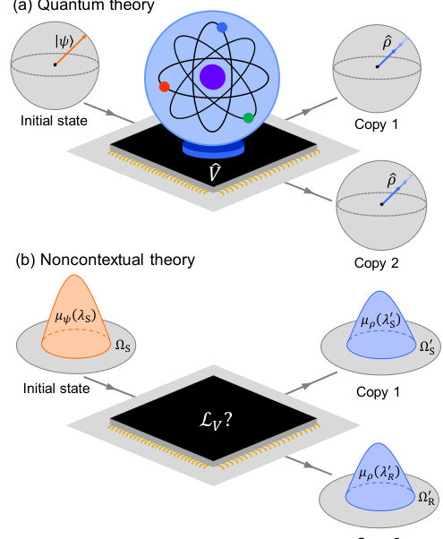
<figcaption class="paper-figure-caption"><b>Fig 1.</b> FIG. 1. Conceptual figure of a deterministic universal cloning scheme within both quantum and noncontextual theories. (a) Description of the scheme within quantum theory, where ap- proximated copies ˆρ are produced from an unknown pure (qubit) state |ψ⟩via a unitary operation ˆU, together with ancilla systems. (b) Description of the scheme within noncon- textual theory, where the unknown epistemic state µψ(λS) is copied via a transformation L.</figcaption>
</figure>
<figure class="paper-figure-card">
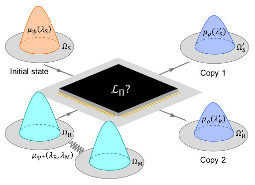
<figcaption class="paper-figure-caption"><b>Fig 2.</b> FIG. 2. Conceptual figure of postselection-based universal cloning within noncontextual theory. First, an unknown state µψ(λS) and µΨ+(λR, λM) of Eq. (13) is prepared, and a non- determinstic transformation LΠ is performed on ΩS and ΩR, yielding two approximated copies µρ(λ′ S) and µρ(λ′ R).</figcaption>
</figure>

**Summary.** This paper rigorously proves that universal quantum cloning is fundamentally contextual. By contrasting the process with an idealized 'noncontextual theory,' the authors show that any attempt to model cloning using non-contextual probabilities leads to mathematical contradictions or trivial, meaningless results. This highlights a deep structural difference between quantum mechanics and classical probability theories.

**Why it may be interesting.** This work provides a foundational test case for quantum theory's non-classical features, showing how fundamental processes like state copying necessitate contextuality when viewed through the lens of classical probability models.

Detailed structure

**Main problem.** The work aims to theoretically prove that universal quantum cloning, which is possible in standard quantum mechanics, cannot be replicated within the framework of a noncontextual theory.

**Main result.** Universal quantum cloning exhibits an intrinsically contextual nature, as demonstrated by mathematical contradictions arising when assuming its existence in a noncontextual model. Specifically, attempts to model it yield only maximally mixed partial states or violate necessary conditions for preserving distinguishability (confusability).

**Method.** The analysis involves comparing the unitary operations of quantum mechanics with analogous transformations derived from an operational statistical model called 'noncontextual theory.' Key mathematical tools include analyzing 'confusability' and deriving constraints on these noncontextual transformations.

**Model / system.** The system under study is the process of cloning unknown quantum states (qubits), specifically examining $N 	o M$ scenarios. The theoretical comparison is between standard quantum mechanics and an operational statistical model that assumes context-independent probabilities.

**Key observables.** Fidelity ($f$), Confusability ($c_{\psi, e\psi}$), and the resulting partial states after cloning attempts.

**Important parameters / regimes.** The number of input to output copies ($N 	o M$) and the fidelity parameter $f$.

**Assumptions / limitations.** The analysis assumes that if a process cannot be described by preserving 'confusability' within the noncontextual framework, it must be fundamentally contextual.

**Figures summary.** Figure 1 conceptually compares deterministic universal cloning in quantum theory (unitary $\hat{U}$) versus noncontextual theory ($L$). Figure 2 illustrates postselection-based universal cloning in the noncontextual model.

**Paper structure.** The paper develops by first establishing the theoretical framework of noncontextuality, then applying this framework to the $1 	o 2$ and general $N 	o M$ cloning scenarios. It uses specific mathematical calculations involving confusability preservation conditions to derive contradictions that prove contextuality.

Abstract

Quantum theory fundamentally forbids the perfect copying of an arbitrary unknown quantum state, according to a principle known as the no-cloning theorem. Nevertheless, it is possible to construct a deterministic quantum map that produces multiple approximate copies of an unknown quantum state. This task is referred to as universal quantum cloning, further facilitating numerous quantum technologies such as quantum cryptography and quantum communication. In this work, we theoretically verify that the universal quantum cloning cannot be realized within a noncontextual theory, highlighting its intrinsically nonclassical nature. Our verification first {focuses on revealing that} $1\rightarrow2$ cloning scenario {is fully contextual}, and {further covers general examples to observe the contextual behavior of} $N\rightarrow M$ scenario. We believe that our results regarding quantum cloning serve a key role for understanding both quantum foundation and application.

[↑ back to top](#top)

### [Anomalously high quasiparticle thermal conductivity in the underdoped cuprate superconductor HgBa$_{2}$CuO$_{4+δ}$](http://arxiv.org/abs/2607.06332v1)

**Authors:** Jordan Baglo, Quentin Barthélemy, Étienne Lefrançois, Anne Forget, Dorothée Colson, Cyril Proust, Louis Taillefer  
**Type:** experiment · **Category:** strongly correlated electrons · **PDF:** <https://arxiv.org/pdf/2607.06332v1>  
**Analysis basis:** full PDF text, analyzed in chunks
**Topic relevance:** `non-equilibrium dynamics` **1/5**

↔ Scroll figures horizontally

<figure class="paper-figure-card">
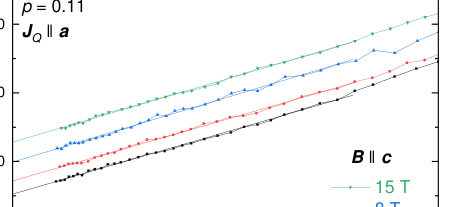
<figcaption class="paper-figure-caption"><b>Fig 1.</b> FIG. 1. Low temperature thermal conductivity of Hg1201 at p = 0.11 measured at several magnetic field values as indicated, plotted as κ/T vs T. The observed linear low- temperature behavior is used to extrapolate to T = 0 (solid lines) to provide the κ0(B)/T data shown in Fig. 2.</figcaption>
</figure>
<figure class="paper-figure-card">
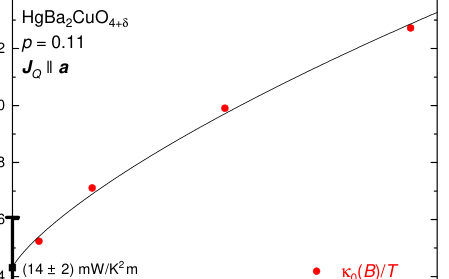
<figcaption class="paper-figure-caption"><b>Fig 2.</b> FIG. 2. Extrapolated T →0 thermal conductivity data κ0(B)/T resulting from the fits in Fig. 1, plotted as κ0/T vs B. The solid line is a fit to the K¨ubert-Hirschfeld model [27] (Eq. 2). The resulting extrapolation to B = 0 gives κ0/T = 14 ± 2 mW/K2m (this error includes the uncertainty in sam- ple geometry).</figcaption>
</figure>
<figure class="paper-figure-card">
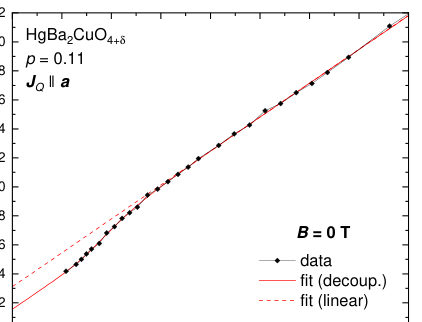
<figcaption class="paper-figure-caption"><b>Fig 3.</b> FIG. 4. (a) Low temperature thermal conductivity of Hg1201 at p = 0.11 measured at three magnetic field values, including B = 0 T (black points), plotted as κ/T vs T; lines are linear fits in the interval from 0.1 to 0.8 K. (b) Zoom on the zero- field data: The clear low-temperature downturn suggests the onset of electron-phonon decoupling, here fit to Eq. A.1 (red solid line), with a simple linear fit shown for comparison (red dashed line); for higher fields this decoupling is not discernible down to 100 mK (see panel (a) and Fig. 1).</figcaption>
</figure>

**Summary.** This work measures the low-temperature thermal conductivity in the underdoped cuprate $	ext{HgBa}_2	ext{CuO}_{4+\delta}$ to probe its nodal quasiparticle structure. By analyzing the field dependence of the residual thermal conductivity, the authors extract a large velocity ratio ($v_F/v_\Delta$). This result strongly suggests that the Fermi surface is more complex than previously assumed, likely involving multiple electronic pockets contributing to the heat transport.

**Why it may be interesting.** The investigation of thermal transport provides a highly sensitive probe into the gap structure and electronic dimensionality of strongly correlated materials like cuprates, offering insights complementary to ARPES or quantum oscillation measurements.

Detailed structure

**Main problem.** To investigate anomalous properties of high-Tc cuprate superconductors, specifically determining the nodal quasiparticle velocity ratio ($v_F / v_\Delta$) using thermal conductivity measurements.

**Main result.** The measured residual linear thermal conductivity ($\kappa_0/T$) yields an anomalously large quasiparticle velocity ratio ($v_F / v_\Delta = 23 \pm 3$), suggesting the presence of more than one Fermi surface sheet crossing the nodal line.

**Method.** Measuring in-plane longitudinal thermal conductivity ($\kappa$) at very low temperatures and extrapolating the field dependence using the K¨ubert-Hirschfeld model to extract the zero-field residual term $\kappa_0/T$.

**Model / system.** The study focuses on the single-layer cuprate superconductor $	ext{HgBa}_2	ext{CuO}_{4+\delta}$ ($	ext{Hg1201}$). The analysis uses theoretical models for nodal d-wave superconductors relating $\kappa_0/T$ to the ratio of Fermi and gap velocities.

**Key observables.** In-plane longitudinal thermal conductivity ($\kappa$), the residual linear term $\kappa_0(B)/T$, and the velocity ratio $v_F / v_\Delta$.

**Important parameters / regimes.** $T_c = 76 	ext{ K}$, doping $p = 0.11$, low temperatures (down to $0.1 	ext{ K}$), magnetic field dependence ($B$).

**Assumptions / limitations.** The analysis assumes contributions from only a single line node per quadrant when calculating the velocity ratio, though this assumption is challenged by other experimental results.

**Figures summary.** Figures show $\kappa/T$ vs. $T$ at various magnetic fields, and the extrapolation of $\kappa_0(B)/T$ vs. $B$, which are fitted to theoretical models.

**Paper structure.** The paper establishes the physical system and measurement technique (thermal conductivity). It applies a theoretical model relating $\kappa_0/T$ to nodal properties, derives an anomalously large velocity ratio from the data, and concludes by suggesting that this implies multiple Fermi surface sheets are present in the material.

Abstract

The single-layer cuprate superconductor HgBa$_{2}$CuO$_{4+δ}$ (Hg1201) is an ideal candidate for investigating many properties of cuprates with minimal disorder and without the complication of multiple CuO$_2$ layers. Here we measure the in-plane longitudinal thermal conductivity $κ$ of underdoped Hg1201 ($T_c$ = 76 K, $p$ = 0.11) at dilution refrigerator temperatures to extract the nodal quasiparticle velocity ratio $v_F/v_Δ$. Assuming contributions from only a single line node per quadrant on the Fermi surface leads to a value of $v_F/v_Δ$ = $23 \pm 3$, anomalously large compared to other cuprates at similar dopings. In conjunction with the anomalously high quasiparticle specific heat of Hg1201 in the normal state reported previously at a similar doping, this points to more than one Fermi surface sheet crossing the nodal line, suggesting the presence of more than the single small electron pocket detected by quantum oscillations.

[↑ back to top](#top)

### [Complete local expansion of the availability function in random sequential adsorption of aligned squares at low density: Termination at fourth order](http://arxiv.org/abs/2607.05634v1)

**Authors:** F. Tolea, M. Tolea  
**Type:** theory · **Category:** statistical mechanics · **PDF:** <https://arxiv.org/pdf/2607.05634v1>  
**Analysis basis:** full PDF text, analyzed in chunks
**Topic relevance:** `Keldysh / 2PI / non-Gaussian methods` **1/5**

↔ Scroll figures horizontally

<figure class="paper-figure-card">
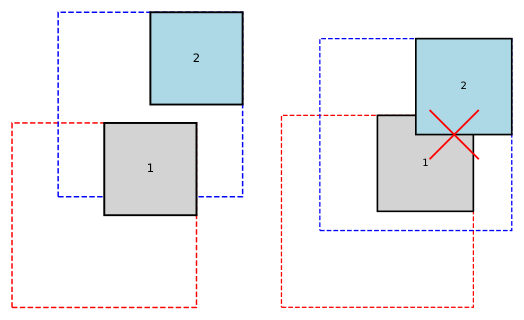
<figcaption class="paper-figure-caption"><b>Fig 1.</b> FIG. 2: (a) Two exclusion zones can overlap; the overlapping area must be added back to the availability, as it has been subtracted twice at first order (single-square contribution). (b) The squares themselves cannot overlap.</figcaption>
</figure>
<figure class="paper-figure-card">
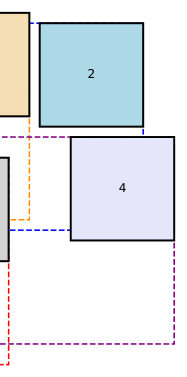
<figcaption class="paper-figure-caption"><b>Fig 2.</b> FIG. 4: Example of overlap between four exclusion zones. The common region corresponds to the fourth-order correction.</figcaption>
</figure>

**Summary.** This paper provides a detailed theoretical derivation for the low-density behavior of the availability function during Random Sequential Adsorption (RSA) of squares. By employing an inclusion-exclusion expansion based on geometric overlaps, the authors derive the polynomial coefficients up to fourth order. The work is significant because it establishes the exact local overlap hierarchy for this physical process and validates its results against numerical simulations.

**Why it may be interesting.** While focused on classical packing problems, the rigorous application of inclusion-exclusion principles to calculate system properties based on local geometric constraints is a powerful technique applicable to understanding correlation functions in many-body quantum systems or open quantum dynamics where local approximations are used.

Detailed structure

**Main problem.** The authors derive the low-coverage expansion of the availability function, $\alpha(q)$, for Random Sequential Adsorption (RSA) of aligned squares.

**Main result.** They establish that this local overlap hierarchy terminates exactly at fourth order due to geometric constraints, yielding a complete polynomial approximation for low densities.

**Method.** The derivation systematically uses the inclusion-exclusion principle applied to the overlapping exclusion regions created by deposited squares.

**Model / system.** The model is Random Sequential Adsorption (RSA) of aligned squares on a surface or lattice. The process is irreversible, leading to a jammed state characterized by coverage $q$.

**Key observables.** The availability function $\alpha(q)$, which measures the fraction of positions available for an additional square insertion.

**Important parameters / regimes.** Low-density regime (low coverage $q$), and the geometric overlap structure involving up to four squares.

**Assumptions / limitations.** The analysis is restricted to the low-density limit, assuming that only local overlaps (up to four bodies) contribute significantly to the expansion coefficients.

**Figures summary.** Figures illustrate the exclusion zone of a single square and show how the overlap regions for two and three squares are geometrically accounted for in the inclusion-exclusion corrections.

**Paper structure.** The paper builds the expansion $\alpha(q)$ term by term, starting with the first order (single block), then systematically correcting for double overlaps ($C_2$), triple overlaps ($C_3$), and finally confirming the termination at fourth order ($C_4$) using both analytical geometry and numerical simulation.

Abstract

We consider random sequential adsorption (RSA) of aligned squares and derive the low-coverage expansion of the availability function alpha(q), the fraction of positions accessible to an additional square, up to fourth order in the coverage q. At low coverage, the reduction of available space can be understood in terms of geometric overlap between exclusion regions created by previously deposited squares. A single square blocks a finite area; pairs of squares may have overlapping exclusion zones, reducing the total blocked area; similarly, three and four squares can share a common overlap region, leading to higher-order corrections. These contributions can be systematically accounted for through an inclusion-exclusion expansion based on the geometry of overlapping exclusion regions, with alternating signs dictated by inclusion-exclusion. The expansion terminates exactly at fourth order, since no more than four deposited squares can simultaneously overlap the exclusion region of a trial insertion. The coefficients are obtained by explicit enumeration of all such geometrically admissible configurations and are further confirmed by numerical simulations on a discrete lattice, showing agreement within statistical uncertainty.

[↑ back to top](#top)

### [Instabilities of Fermi Liquids with Arbitrary Forward Scattering: Exact Approach](http://arxiv.org/abs/2607.06430v1)

**Authors:** Dmitry Miserev, Joel Hutchinson, Herbert Schoeller, Jelena Klinovaja, Daniel Loss  
**Type:** theory · **Category:** strongly correlated electrons · **PDF:** <https://arxiv.org/pdf/2607.06430v1>  
**Analysis basis:** full PDF text, analyzed in chunks
**Topic relevance:** `Keldysh / 2PI / non-Gaussian methods` **1/5**

↔ Scroll figures horizontally

<figure class="paper-figure-card">
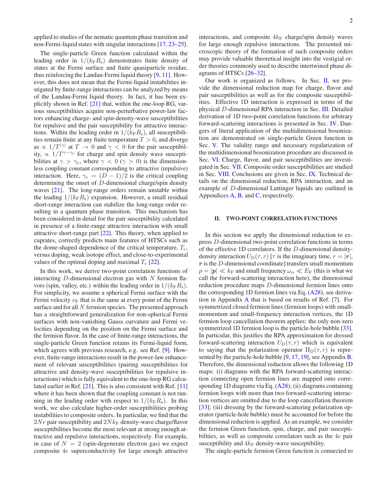
<figcaption class="paper-figure-caption"><b>Fig 1.</b> Low-resolution page preview, page 2</figcaption>
</figure>
<figure class="paper-figure-card">
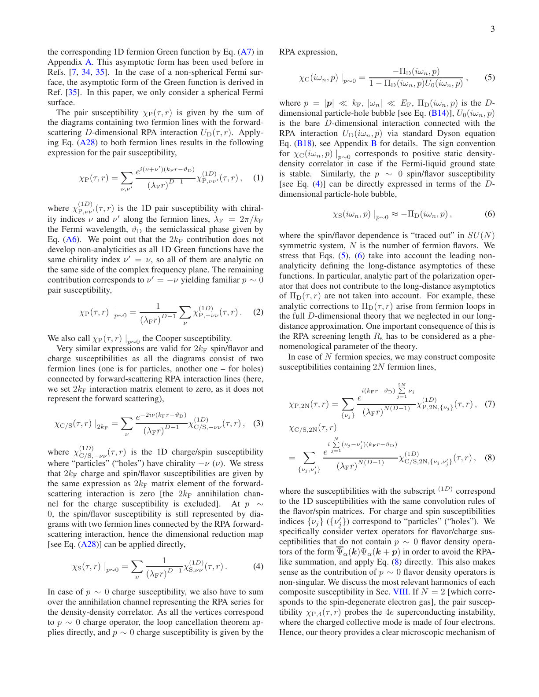
<figcaption class="paper-figure-caption"><b>Fig 2.</b> Low-resolution page preview, page 3</figcaption>
</figure>
<figure class="paper-figure-card">
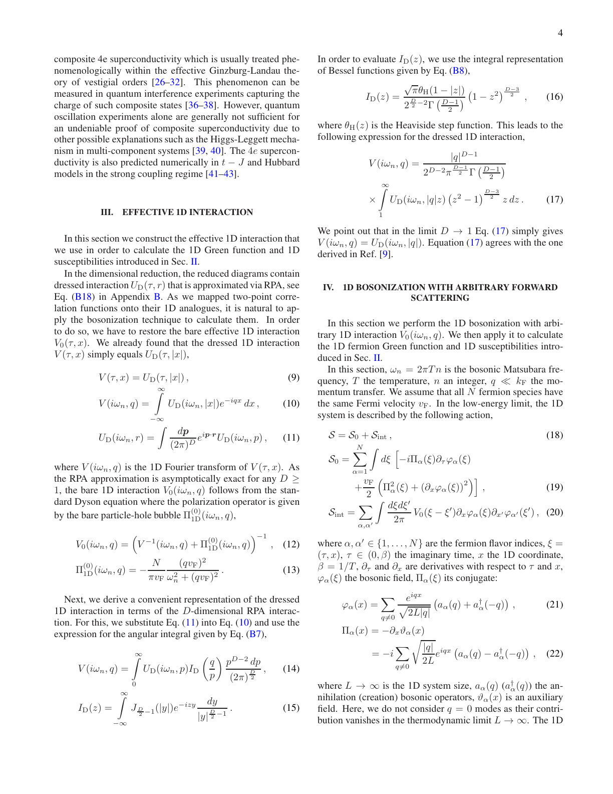
<figcaption class="paper-figure-caption"><b>Fig 3.</b> Low-resolution page preview, page 4</figcaption>
</figure>
<figure class="paper-figure-card">
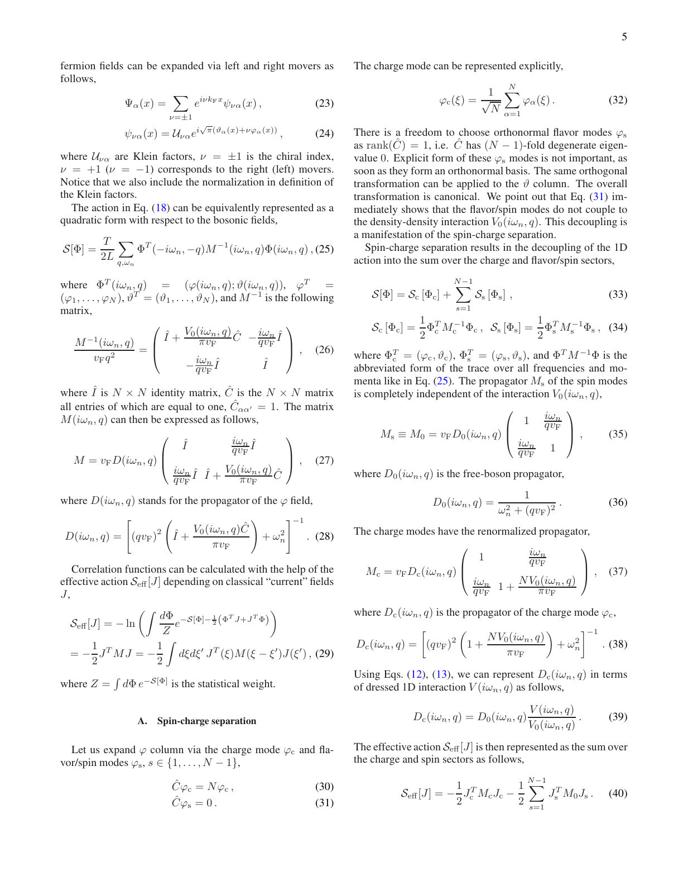
<figcaption class="paper-figure-caption"><b>Fig 4.</b> Low-resolution page preview, page 5</figcaption>
</figure>
<figure class="paper-figure-card">
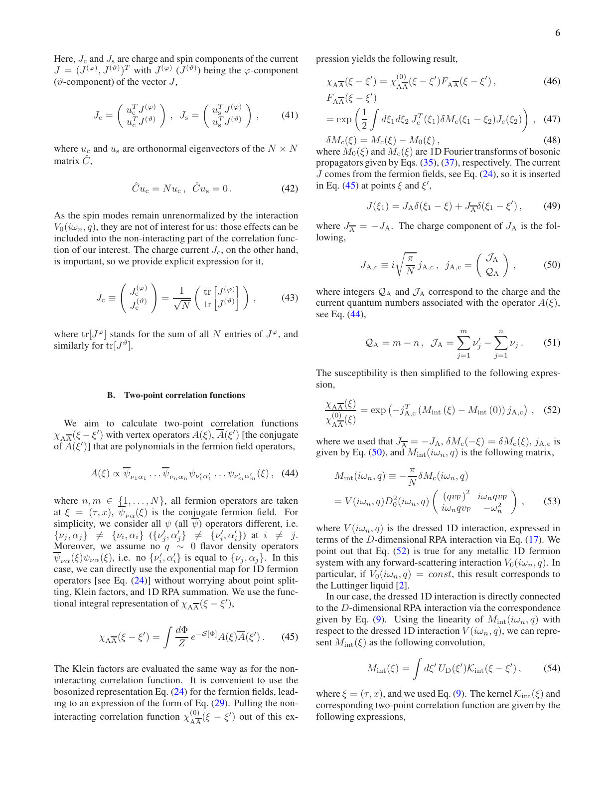
<figcaption class="paper-figure-caption"><b>Fig 5.</b> Low-resolution page preview, page 6</figcaption>
</figure>

**Summary.** This paper develops an exact theoretical framework using dimensional reduction to analyze interacting Fermi liquids with forward scattering. By mapping the problem onto solvable 1D bosonic theories, the authors show that while single-particle physics remains stable, many-body instabilities are enhanced by interactions, predicting specific superconducting or density wave instabilities in certain regimes.

**Why it may be interesting.** The rigorous application of dimensional reduction and bosonization techniques to study correlation functions in higher dimensions provides powerful analytical tools applicable to strongly correlated electron models where mean-field or simple RPA approaches fail.

Detailed structure

**Main problem.** The work investigates the instabilities of Fermi liquids when subjected to arbitrary forward-scattering density-density interactions in D dimensions.

**Main result.** While single-particle properties remain Fermi-liquid-like, many-body channels are significantly dressed by finite-range interactions, leading to singular power-law scaling for relevant susceptibilities at low temperatures. Stable long-range order is generally not possible from forward scattering alone.

**Method.** The authors employ a dimensional reduction technique, mapping D-dimensional correlation functions onto effective 1D correlators which are then evaluated exactly using a 1D bosonizable (Gaussian) theory.

**Model / system.** The system is an N-fold degenerate D-dimensional electron gas with a spherical Fermi surface, interacting via small momentum transfer forward-scattering interactions. The analysis extends to finite-range interactions ($R_{\mathrm{s}} \gg 1/k_{\mathrm{F}}$).

**Key observables.** Fermion Green function, pair susceptibility ($\chi_{2e}$), charge/flavor susceptibilities ($\chi_{2k_F}$, $\chi_{2N k_F}$), and the single-particle spectral function.

**Important parameters / regimes.** Temperature ($T 	o 0$), interaction range ($R_{\mathrm{s}}$), dimensionality ($D$), and degeneracy ($N$).

**Assumptions / limitations.** The analysis relies on dimensional reduction techniques equivalent to Haldane patch construction, assuming a spherical Fermi surface, and performing calculations in the leading order of $(kR_s)^{-1}$.

**Paper structure.** The paper systematically applies dimensional reduction to map D-dimensional correlation functions onto 1D bosonizable theories. It first confirms single-particle Fermi liquid behavior, then analyzes how many-body susceptibilities are dressed by interactions, concluding with specific predictions for composite instabilities like $4e$ superconductivity.

Abstract

In this work, we consider $N$-fold degenerate $D$-dimensional electron gas with spherical Fermi surface and arbitrary forward-scattering density-density interaction transferring small momentum compared to the Fermi momentum $k_{\mathrm{F}}$. The dimensional reduction that is mathematically equivalent to the Haldane patch construction and similar multidimensional bosonization techniques, provides a natural map of two-point $D$-dimensional correlation functions (fermion Green function, susceptibilities etc.) onto effective one-dimensional (1D) correlators with the same diagrammatic structure, which can be evaluated exactly within a 1D bosonizable (Gaussian) theory. We then apply this formalism to evaluate the fermion Green function, pair and charge/flavor susceptibilities, as well as the composite correlation functions for the case of a finite-range interaction, where the interaction range $R_{\mathrm{s}} \gg 1/k_{\mathrm{F}}$ is large compared to the Fermi wavelength. First, we find that the single-particle spectral function remains Fermi-liquid-like which is fully consistent with the previous research. In contrast to the single-particle sector, the many-body channels are efficiently dressed by finite-range interactions, and this dressing is fully equivalent to the one-loop renormalization group (RG), which is also in line with previous multidimensional bosonization results. Within the forward-scattering model, stable long-range order is not possible, and relevant susceptibilities demonstrate singular power-law scaling with temperature $T$ at $T \to 0$. The rest of the abstract is in the PDF.

[↑ back to top](#top)

### [Quantum Density of States and Integer Partitions: A Semiclassical Approach](http://arxiv.org/abs/2607.06146v1)

**Authors:** M. V. N. Murthy, Matthias Brack  
**Type:** theory · **Category:** statistical mechanics · **PDF:** <https://arxiv.org/pdf/2607.06146v1>  
**Analysis basis:** full PDF text, analyzed in chunks
**Topic relevance:** `Keldysh / 2PI / non-Gaussian methods` **1/5**

↔ Scroll figures horizontally

<figure class="paper-figure-card">
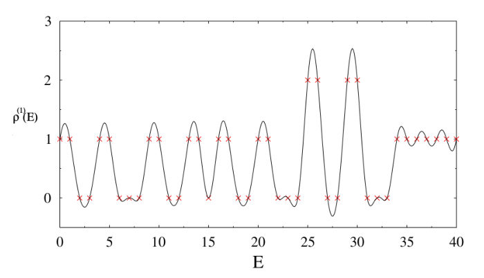
<figcaption class="paper-figure-caption"><b>Fig 1.</b> Figure 1. An example of the Bessel-smoothed partition density ρ(1)(E). The crosses(red) show the exact values of partitions P(n) when E = n expressed as a sum of distinct squares (see section (5) for more details).</figcaption>
</figure>
<figure class="paper-figure-card">
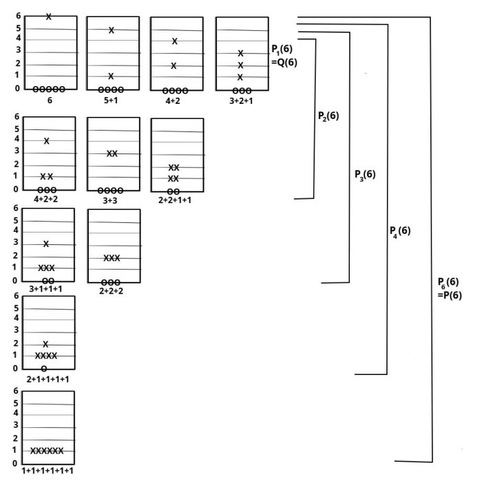
<figcaption class="paper-figure-caption"><b>Fig 2.</b> Figure 2. Identical bosons in an oscillator potential. Number of possibilities with excitation energy E = 6.</figcaption>
</figure>
<figure class="paper-figure-card">
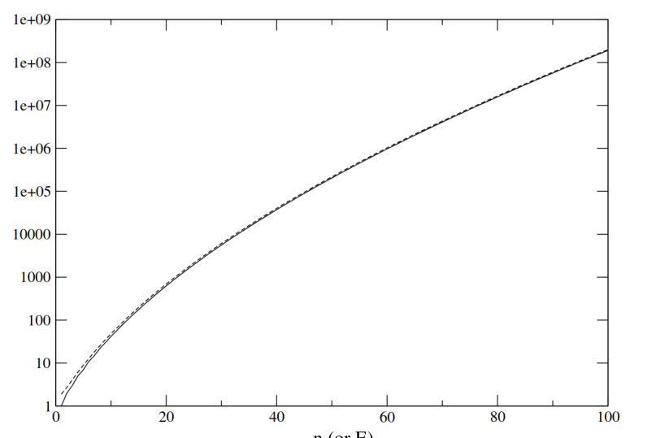
<figcaption class="paper-figure-caption"><b>Fig 3.</b> Figure 3. Comparison of the exact P(n) (solid line) and the asymptotic density of states ρ(E), where E is a continuous parameter (dashed line). Here and in all other following figures, we have joined the points cor- responding to n by a continuous curve for comparison with the asymptotic behaviour. The error decreases exponentially as E increases so that the asymptotic density approaches the exact density for all E = n.</figcaption>
</figure>
<figure class="paper-figure-card">
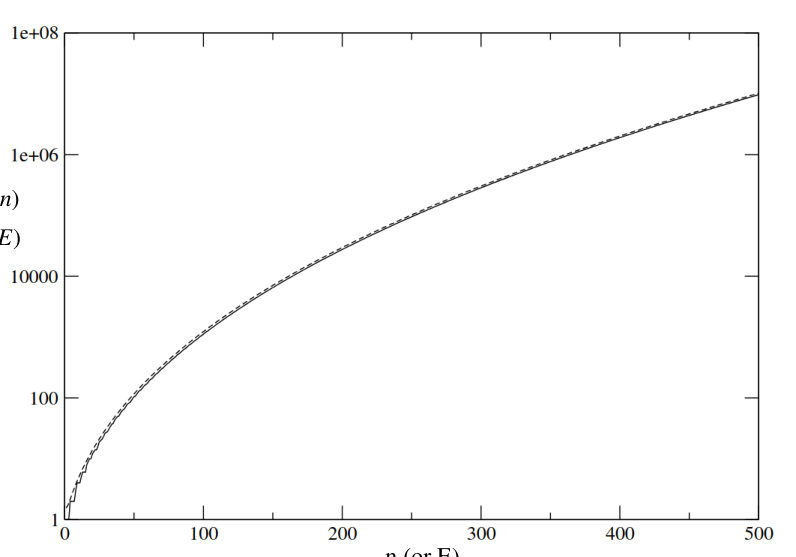
<figcaption class="paper-figure-caption"><b>Fig 4.</b> Figure 4. Comparison of the s = 2 exact P(2)(n) (solid line) and the asymptotic density of states ρ(2)(E), where E is a continuous parameter (dashed line).</figcaption>
</figure>
<figure class="paper-figure-card">
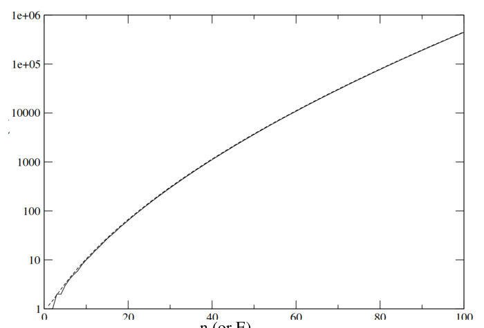
<figcaption class="paper-figure-caption"><b>Fig 5.</b> Figure 5. Comparison of the exact Q(n) (solid line) and the asymptotic density of states ρ(E), where E is a continuous parameter (dashed line). The error decreases exponentially as E increases so that the asymptotic density approaches the exact density for all E = n.</figcaption>
</figure>

**Summary.** This review bridges the gap between quantum statistical mechanics and analytic number theory by showing that the density of states for many-body quantum systems mathematically mirrors the counting function for integer partitions. Using semiclassical methods like trace formulas and saddle-point approximations, the authors derive asymptotic formulas connecting these two seemingly disparate fields.

**Why it may be interesting.** It provides a powerful mathematical framework showing how fundamental concepts in quantum statistical mechanics (like energy distribution) can yield deep insights into pure number theory problems, suggesting underlying physical principles govern arithmetic structures.

Detailed structure

**Main problem.** The paper explores a deep mathematical analogy between calculating the quantum density of states for many-body systems and determining the number of ways an integer can be partitioned into smaller integers.

**Main result.** It establishes that the asymptotic, smooth part of the quantum level density reproduces the known formulas for integer partitions (like the Hardy-Ramanujan formula), while specific oscillations relate to classical periodic orbits.

**Method.** The primary method involves using semiclassical trace formulas and saddle-point approximations on partition functions derived from statistical mechanics principles.

**Model / system.** The analysis considers non-interacting quantum systems whose energy levels dictate the density of states. The mathematical model is generalized to include various statistics (Bose, Fermi) and specific spectral forms, such as those leading to prime partitions.

**Key observables.** Quantum Density of States ($
ho(E)$), Number of Partitions ($P(n)$), Entropy ($S$), and the smooth/oscillating parts of $
ho(E)$.

**Important parameters / regimes.** Temperature (or inverse temperature $eta$), Energy $E=n$, Spectral exponent $s$, and occupancy parameter $k$.

**Assumptions / limitations.** The derivation relies heavily on semiclassical approximations, such as the saddle-point method, to extract asymptotic behavior from complex sums.

**Figures summary.** Figure 22 compares the exact partition function count ($P(1)_k(n)$) with its derived asymptotic density of states ($
ho(1)_k(E)$) for a specific spectral case.

**Paper structure.** The paper progresses by first establishing the connection via single-particle spectra and trace formulas, then extending this to many-body systems using partition functions, and finally applying these techniques to derive advanced asymptotic results for prime partitions.

Abstract

In this review we discuss semi-classical methods that are traditionally used to describe many-body systems in physics, but may also be used to describe partitions of integers in analytic number theory. Specifically, we explore the connection between the methods of statistical mechanics and number partitions. Though the two fields appear very different, their fundamental issues bear a close resemblance. In the former case it is the distribution of a given amount of energy among the particles in an ensemble at a given temperature with well defined properties, while in the latter case it is the way an integer is partitioned into other integers, with or without restrictions. We begin with a discussion of the single-particle quantum density of states, also called the level density, in which we illustrate the connection between the density of states and the classical periodic orbits through the semiclassical trace formula. This is then extended to many particle systems. We show that the asymptotic number partition is reproduced by the average (smooth) part of the level density at discrete integer values of the argument. In the especially interesting case of distinct square partitions, pronounced oscillations are well reproduced by the periodic orbit theory in terms of a few orbits characterised by Pythagorean number triples. We speculate on the connection to Fermat's theorem as to why such regular oscillations (though vanishing asymptotically) exist only in this special case. Finally, we discuss some new results for integer partitions of primes, both unrestricted and distinct.

[↑ back to top](#top)

## Other papers (5)

*Papers from primary archives without highlighted authors or any topic match. Click to expand.*

Show other papers

### [Hidden Complex Structure in Quotient-Space Real Quantum Mechanics](http://arxiv.org/abs/2607.05865v1)

**Authors:** Jeongho Bang, Kyoungho Cho, Kyunghyun Baek  
**Type:** theory · **Category:** other · **PDF:** <https://arxiv.org/pdf/2607.05865v1>  
**Analysis basis:** full PDF text, analyzed in chunks

↔ Scroll figures horizontally

<figure class="paper-figure-card">
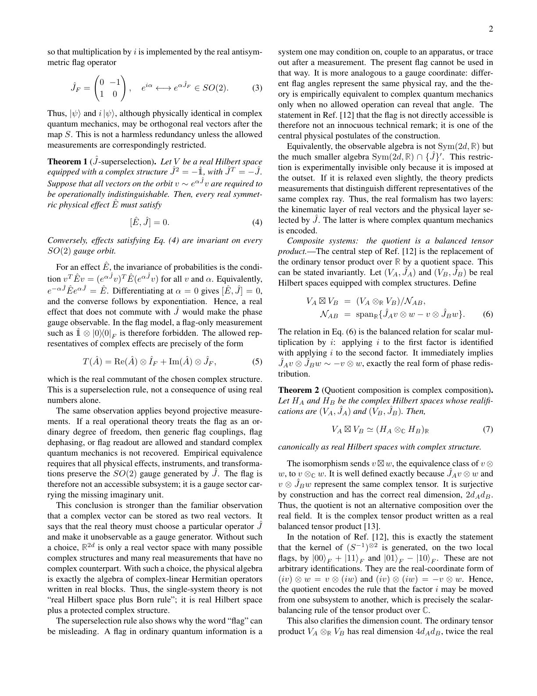
<figcaption class="paper-figure-caption"><b>Fig 1.</b> Low-resolution page preview, page 2</figcaption>
</figure>
<figure class="paper-figure-card">
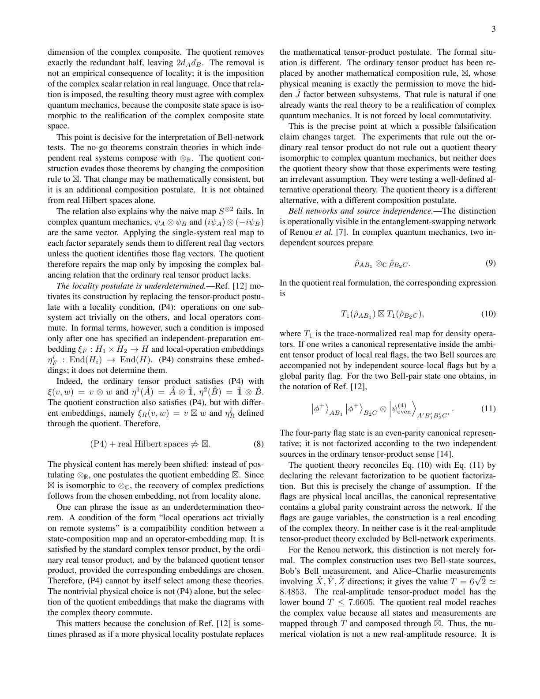
<figcaption class="paper-figure-caption"><b>Fig 2.</b> Low-resolution page preview, page 3</figcaption>
</figure>
<figure class="paper-figure-card">
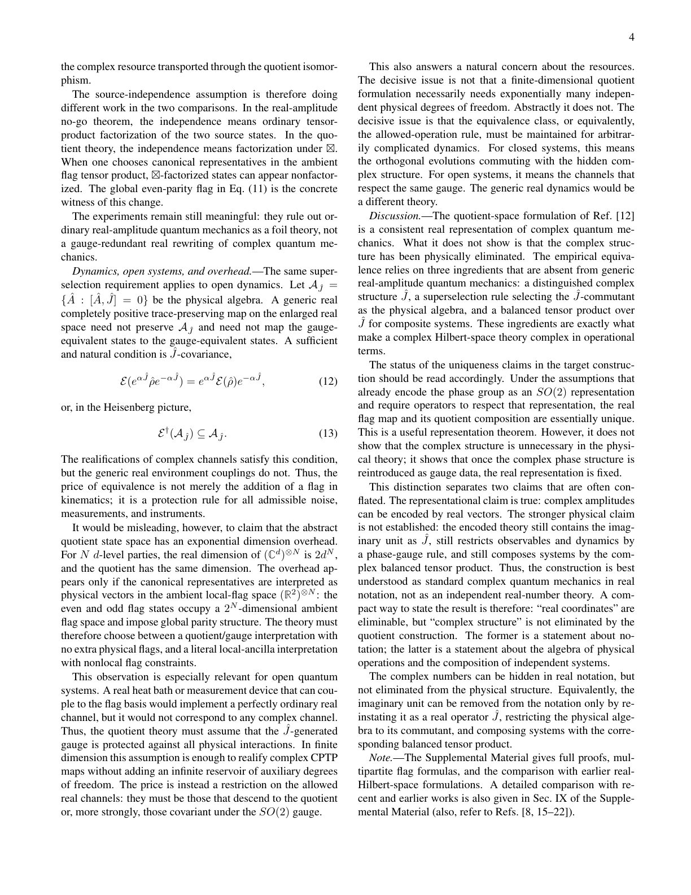
<figcaption class="paper-figure-caption"><b>Fig 3.</b> Low-resolution page preview, page 4</figcaption>
</figure>
<figure class="paper-figure-card">
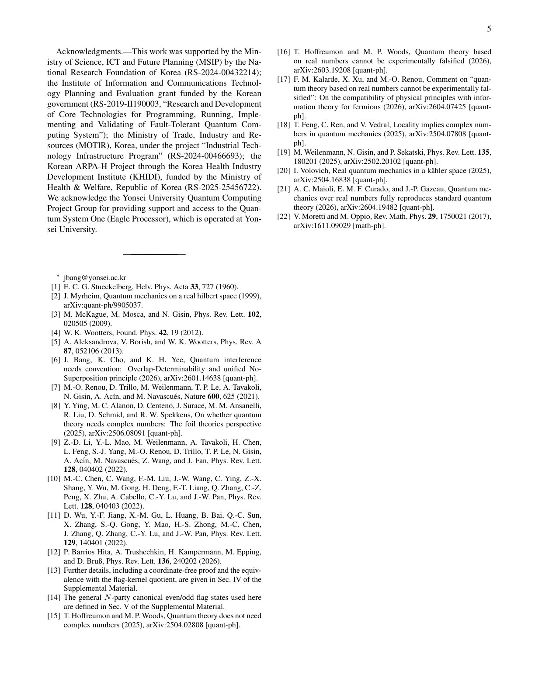
<figcaption class="paper-figure-caption"><b>Fig 4.</b> Low-resolution page preview, page 5</figcaption>
</figure>
<figure class="paper-figure-card">
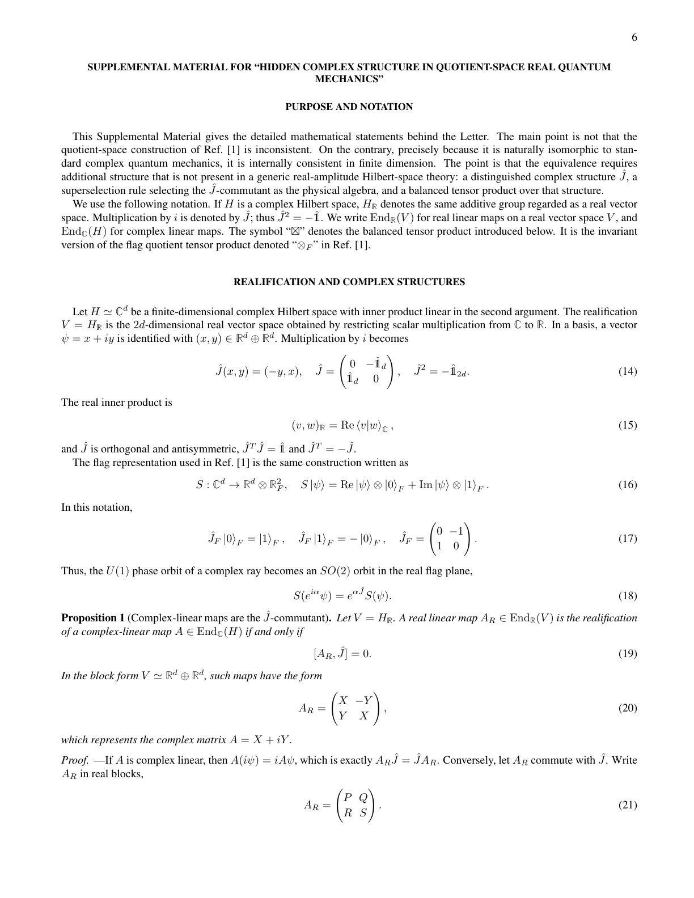
<figcaption class="paper-figure-caption"><b>Fig 5.</b> Low-resolution page preview, page 6</figcaption>
</figure>

**Summary.** The paper investigates if quantum mechanics can be formulated purely over real numbers while remaining empirically equivalent to standard complex QM. It demonstrates that achieving this equivalence necessitates imposing strong constraints, such as gauge invariance and a specialized 'balanced' tensor product rule. Ultimately, the authors argue that the theory is mathematically equivalent to complex QM written in a redundant real notation.

**Why it may be interesting.** This work directly addresses foundational questions about the mathematical structure of quantum theory, which underpins all applications in AMO physics and quantum information.

Detailed structure

**Main problem.** The central question is whether complex numbers are fundamentally necessary for quantum mechanics, or if a formulation over real numbers ($\mathbb{R}$) can be empirically equivalent.

**Main result.** The authors conclude that any operational equivalence to standard complex QM requires imposing constraints (like gauge invariance and specific composition rules) such that the theory is best understood as complex QM written in a redundant real notation, not an independent real-amplitude theory.

**Method.** The analysis involves comparing predictions from quotient-space constructions over $\mathbb{R}$ against established results from standard complex quantum mechanics ($\mathbb{C}$) using algebraic diagnostics like tensor product structures and gauge invariance requirements.

**Model / system.** The model is the mathematical structure of quantum theory itself, specifically analyzing state spaces formulated over real Hilbert spaces versus those naturally defined by complex amplitudes. The focus is on single-system states and composite systems (e.g., in network scenarios).

**Key observables.** Physical effects ($\hat{E}$) must preserve an $SO(2)$ gauge generated by the operator $\hat{J}$; violation of source independence under ordinary tensor products.

**Important parameters / regimes.** The structure is governed by the distinguished real linear operator $\hat{J}$ such that $\hat{J}^2 = -\mathbb{1}$.

**Assumptions / limitations.** Equivalence requires assuming that all physical dynamics and measurements preserve the $SO(2)$ gauge generated by $\hat{J}$, which restricts the observable algebra.

**Figures summary.** Not specified, but the notes reference comparisons of dimensions ($	ext{dim}_{\mathbb{R}}$) and numerical violations in Bell-network tests comparing standard vs. quotient factorization.

**Paper structure.** The paper systematically compares various real formulations (including those based on quotients) against complex QM predictions, establishing necessary constraints—such as superselection rules and the balanced tensor product ($\otimes_B$)—to achieve empirical equivalence.

Abstract

Barrios Hita et al. [Phys. Rev. Lett. $\bf{136}$, 240202 (2026)] argued that quantum mechanics can be formulated over the real numbers by replacing the tensor-product postulate with a quotient-space construction, and concluded that complex numbers are therefore a matter of convenience. We show that the operational content of this construction is not that of a generic real Hilbert-space theory. Empirical equivalence requires a distinguished real linear operator $J$ with $J^2 = -\mathbb{1}$, and all physical effects, instruments, and dynamics must preserve the corresponding $SO(2)$ gauge. Moreover, the composite-system rule is a balanced tensor product over this hidden complex structure, not the ordinary tensor product over $\mathbb{R}$. In multipartite network scenarios, this changes the meaning of source independence: canonical real representatives are not source-factorizable in the usual tensor-product sense. Thus, the construction is best understood as standard complex quantum mechanics written in real notation, not as an independent real-amplitude theory. This clarifies what is, and is not, excluded by experiments testing the necessity of complex numbers.

[↑ back to top](#top)

### [Packet Routing for the Quantum Internet](http://arxiv.org/abs/2607.06075v1)

**Authors:** Robert Malaney  
**Type:** theory · **Category:** quantum information and computing · **PDF:** <https://arxiv.org/pdf/2607.06075v1>  
**Analysis basis:** full PDF text, analyzed in chunks

↔ Scroll figures horizontally

<figure class="paper-figure-card">
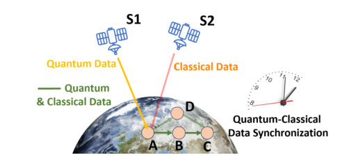
<figcaption class="paper-figure-caption"><b>Fig 1.</b> Fig. 1. System Model. A typical system set up where IP routing will be required. Satellite S1 wishes to transmit quantum information to node C via nodes A and B. Here a second satellite S2 sends classical data (header information) synchronized to reach node A just ahead of the quantum information from S1 (systems where S1 also sends the classical information are also possible). Node D may be used, as quantum mechanics allows for a superposition of paths ABC and ADC. The network is assumed perfectly synchronized.</figcaption>
</figure>
<figure class="paper-figure-card">
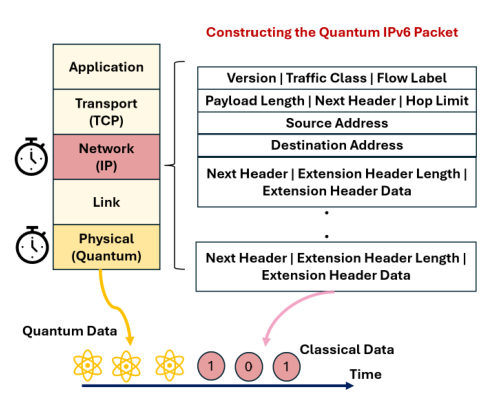
<figcaption class="paper-figure-caption"><b>Fig 2.</b> Fig. 2. The Quantum IP Stack. For direct transmission, classical data from the Base IPv6 Header and the Extension Headers are synchronized so that classical data arrives at the next router’s physical layer just prior to the quantum data. The quantum data is then stored in memory whilst the classical data is propagated up through the stack to the IP layer (teleportation involves a different transmission strategy). If the destination address corresponds to that router, the encapsulated TCP/UDP data is propagated to the Transport layer. Shown here are the standard fields in the IPv6 packet as per the standard [4]. Here, the top three layers of the OSI model are encapsulated into an application...</figcaption>
</figure>
<figure class="paper-figure-card">
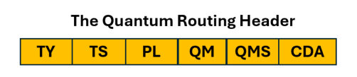
<figcaption class="paper-figure-caption"><b>Fig 3.</b> Fig. 3. Quantum Routing Header. A proposed new IPv6 Extension Header that allows for various path superposition outcomes.</figcaption>
</figure>
<figure class="paper-figure-card">
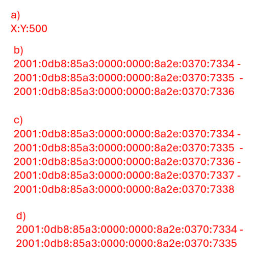
<figcaption class="paper-figure-caption"><b>Fig 4.</b> Fig. 4. Quantum Routing Format. The IPv6 Quantum Routing format for various scenarios.</figcaption>
</figure>
<figure class="paper-figure-card">
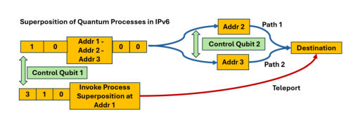
<figcaption class="paper-figure-caption"><b>Fig 5.</b> Fig. 6. Quantum Superposition of Quantum Processes. One superposition of Quantum Routing and Quantum Teleportation where the hardware at a router located at Addr 1 invokes a superposition of the processes, triggered by Control Qubit 1. Here, the path su- perposition is triggered by Control Qubit 2 transmitting the quantum information to the destination in superposition via addresses Addr 1 and Addr 2. The information in the quantum Routing Header (top left) is copied and transmitted classically along the two paths in blue. The information in the Teleportation Header (bottom left) is transmitted classically to the destination. Different teleportation maps and control qubits could be added to...</figcaption>
</figure>

**Summary.** This paper proposes a novel architectural modification to the IPv6 protocol stack to facilitate quantum networking functions, such as teleportation and path superposition. By utilizing unused features like Extension Headers, it outlines a pathway for integrating quantum information transfer into existing classical internet infrastructure. The work provides a theoretical blueprint for building the Quantum Internet at the network layer.

**Why it may be interesting.** While focused on network protocols, the theoretical framework of encoding complex quantum operations (like superposition) into structured data packets is highly relevant for understanding the physical implementation challenges of distributed quantum computation and communication architectures.

Detailed structure

**Main problem.** The core problem is designing a modified Internet Protocol (IP) packet format to enable quantum teleportation, quantum routing (superposition of routes), and superpositions of these processes within the emerging Quantum Internet.

**Main result.** The authors propose an architecture utilizing IPv6 Extension Headers to incorporate quantum functionality at the network layer, enabling path superposition while maintaining a minimalist approach to standard alterations.

**Method.** The methodology involves adapting the layered structure of the OSI model by proposing new 'Quantum Extension Headers' for IPv6 that carry instructions necessary for quantum operations like teleportation and routing superposition.

**Model / system.** The system model is based on modifying the IPv6 packet format (Layer 3) to create a hybrid classical-quantum data stream. It assumes the availability of quantum memory at routers and models information arrival sequentially: classical header first, followed by quantum payload.

**Key observables.** Quantum teleportation success, path superposition outcomes, and the successful transmission of quantum states via modified IP headers.

**Important parameters / regimes.** The use of IPv6 Extension Headers; the requirement that no router action destroys a requested path superposition (avoiding 'which-way' information leakage).

**Assumptions / limitations.** Assumes quantum memory is available on all routers, and that information arrives sequentially in pulses (classical header followed by quantum data). The design is explicitly stated as non-optimal.

**Figures summary.** Figure 1 illustrates a system model demonstrating path superposition using nodes A, B, C, and D. Figure 2 shows the Quantum IP Stack for direct transmission synchronization. Figure 3 proposes the structure of a new IPv6 Extension Header for 'Quantum Routing' to support path superposition.

**Paper structure.** The paper builds upon existing networking standards by proposing modifications at the IP layer (IPv6). It details the necessary header additions ('Quantum Routing' Header) and outlines how quantum processes like teleportation are scheduled relative to classical control data within this extended stack.

Abstract

We present a new design for quantum packet routing within the emerging Quantum Internet, highlighting how a little-used feature of Internet Protocol Version 6 (IPv6), namely Extension Headers, can lead to a significant amount of quantumness within the IP layer. Taking a minimalist approach to alterations of established standards, we outline the changes required in order for quantum teleportation, quantum routing, and superpositions of these processes to be enabled. Relative to other proposals for routing within the Quantum Internet, the architecture we propose enables a wider range of outcomes allowed by quantum mechanics. We do not claim any optimally in our design, but rather a pathway to invoke new quantum routing outcomes via small additions to the current IPv6.

[↑ back to top](#top)

### [QUBO Modeling of Module Learning With Errors: Stability and Scaling in Post-Quantum Cryptography](http://arxiv.org/abs/2607.05973v1)

**Authors:** Ruturaj Khamitkar, Durga Pritam Suggisetti, Soujanya Chatti, Varsha Sambhaje, Durga Dasari  
**Type:** both · **Category:** quantum information and computing · **PDF:** <https://arxiv.org/pdf/2607.05973v1>  
**Analysis basis:** full PDF text, analyzed in chunks

↔ Scroll figures horizontally

<figure class="paper-figure-card">
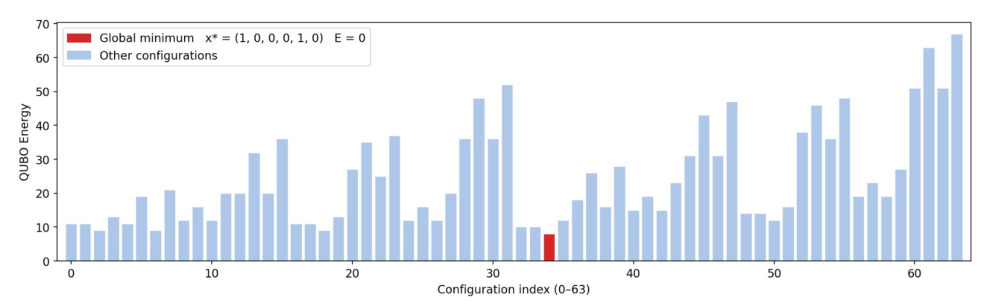
<figcaption class="paper-figure-caption"><b>Fig 1.</b> Figure 1: Case (i), e = 0. Exhaustive evaluation of all 26 configurations of the corrected QUBO energy for the toy benchmark. The minimum-energy configuration corresponds to x∗= [1, 0, 0, 0, 1, 0], decoding to s = (1, 0, 1) with zero residual energy.</figcaption>
</figure>
<figure class="paper-figure-card">
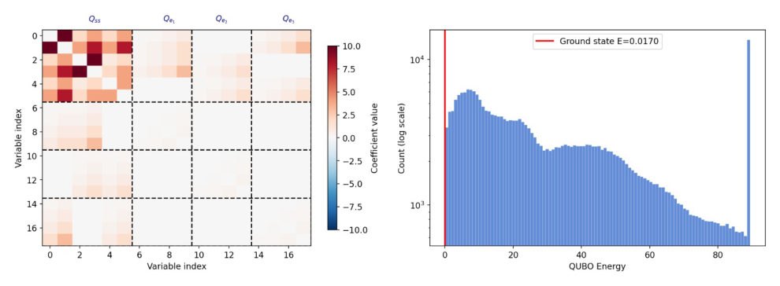
<figcaption class="paper-figure-caption"><b>Fig 2.</b> Figure 2: Case (ii), e ̸= 0. Left: 18 × 18 interaction matrix Q showing block structure between secret and noise variables. Right: exhaustive energy distribution over 218 configurations, showing a unique global minimum.</figcaption>
</figure>
<figure class="paper-figure-card">
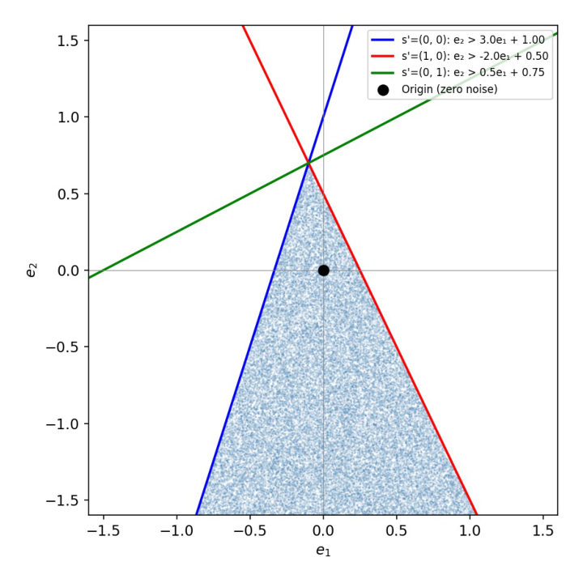
<figcaption class="paper-figure-caption"><b>Fig 3.</b> Figure 3: Two-dimensional stability region for the MLWE instance with s = (0.6, −0.2). Each boundary line corresponds to a competing candidate secret and defines a half-space constraint in the noise variables (e1, e2). The intersection of these half-spaces forms a convex polytope representing all perturbations that preserve correct recovery of the true secret.</figcaption>
</figure>
<figure class="paper-figure-card">
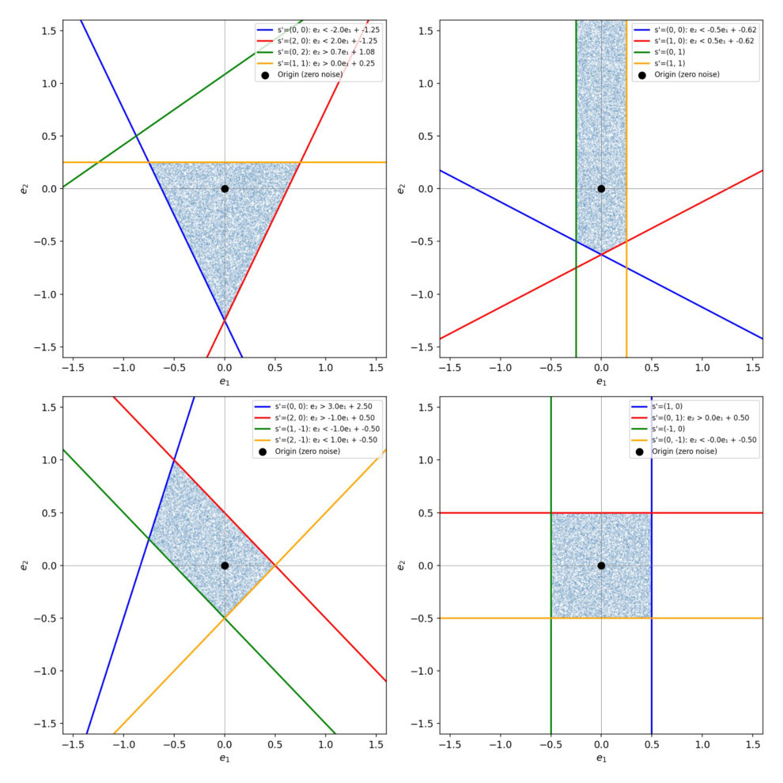
<figcaption class="paper-figure-caption"><b>Fig 4.</b> Figure 4: Stability polytopes for four different true secrets constructed using the same half-space formulation. The shaded regions represent the intersection of linear constraints induced by competing candidate secrets, forming convex polytopes that characterize recovery stability. Larger or more symmetric polytopes correspond to increased tolerance to perturbations before a change in the optimal decoded solution occurs.</figcaption>
</figure>
<figure class="paper-figure-card">
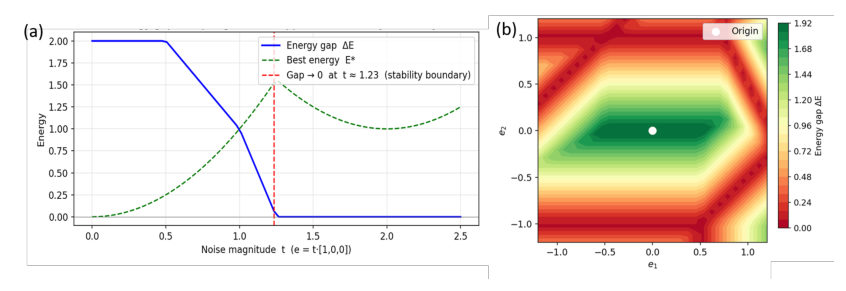
<figcaption class="paper-figure-caption"><b>Fig 5.</b> Figure 5: (a) Energy-gap evolution under increasing noise magnitude t, showing gap closure at a critical threshold and loss of correct recovery. (b) Energy-gap heatmap in the (e1, e2) plane with e3 = 0, where the zero-gap contour is consistent with the geometric stability region.</figcaption>
</figure>

**Summary.** This paper constructs a systematic framework to encode the Module Learning With Errors (MLWE) problem into a QUBO model solvable by quantum annealers. It analyzes the robustness of this encoding by linking geometric stability regions in the solution space to the energy gap of the resulting optimization landscape. The work establishes a rigorous theoretical basis for studying lattice problems on quantum hardware, while cautioning about current scaling limitations.

**Why it may be interesting.** While not directly about AMO physics, this work is highly relevant to quantum computation theory as it provides a structured method for translating hard mathematical problems into physical optimization models suitable for near-term quantum hardware benchmarking.

Detailed structure

**Main problem.** The work develops a framework to encode Module Learning With Errors (MLWE) problems, central to post-quantum cryptography, into Quadratic Unconstrained Binary Optimization (QUBO) models suitable for quantum annealing.

**Main result.** The methodology successfully maps MLWE instances to QUBOs, allowing the joint recovery of secret coefficients and error vectors. It establishes a formal link between cryptographic hardness, geometric stability regions, and the energy gap in the optimization landscape.

**Method.** The core method involves formulating the minimization problem as minimizing a quadratic objective function, which is then mapped onto the Hamiltonian structure of a quantum annealer (QUBO). Stability is analyzed using both geometric polytope definitions and the energy gap between the ground state and first excited state.

**Model / system.** The model is based on lattice-based cryptography problems (MLWE) solved via optimization. The physical system utilized for analysis is Quantum Annealing, which seeks the minimum energy configuration of a QUBO Hamiltonian ($\min \mathbf{x}^	op Q\mathbf{x} + \mathbf{c}^	op \mathbf{x}$).

**Key observables.** The primary observables are the QUBO energy gap ($\Delta E$), the geometric stability region (a convex polytope), and the scaling of logical variables ($N_{	ext{logical}}$) versus physical hardware connectivity.

**Important parameters / regimes.** Key parameters include the modulus $q$, the noise regularization parameter $\lambda$, and the dimensionality of the MLWE instance. Scaling is limited by computational complexity ($\approx N=30$) and quantum annealer connectivity overhead.

**Assumptions / limitations.** The primary limitations are that current quantum annealing hardware lacks sufficient connectivity for cryptographically relevant parameters, and exact simulation/brute-force search quickly becomes infeasible due to exponential scaling.

**Figures summary.** Figures illustrate the block structure of the QUBO matrix ($Q$), the geometric stability region as a convex polytope defined by half-space constraints, and comparisons showing how the energy gap closes or the brute-force runtime explodes as noise increases or dimensions grow.

**Paper structure.** The paper introduces the MLWE to QUBO encoding, details the joint representation of secrets and errors into a block matrix $Q$, develops stability analysis using both geometric (polytope) and energetic (energy gap) viewpoints, validates these concepts with low-dimensional numerical experiments, and concludes by analyzing scaling limitations.

Abstract

Lattice-based post-quantum cryptography relies on the hardness of the Learning With Errors (LWE) and Module Learning With Errors (MLWE) problems. This work introduces a constructive framework for encoding small MLWE instances as Quadratic Unconstrained Binary Optimization (QUBO) models suitable for quantum annealing. The formulation jointly represents secret coefficients and explicit error variables within a unified binary optimization structure, enabling their simultaneous recovery from the ground-state solution. Beyond the encoding, we develop a stability analysis of the resulting optimization landscape under additive perturbations. We show that the admissible noise region forms a convex polytope defined by competing candidate secrets, and establish an equivalent characterization in terms of the QUBO energy gap between the optimal and second-best solutions. Numerical experiments on low-dimensional benchmark instances using exact simulation demonstrate correct recovery of both secret and discretized error vectors, and confirm consistency between geometric stability regions and energy-gap behavior. We further quantify the scaling of logical variables and embedding overhead with increasing MLWE dimensions to assess feasibility on quantum annealing architectures. The results establish a systematic connection between MLWE problems and quantum optimization while providing a framework for analyzing robustness properties of QUBO formulations. Although current quantum annealing hardware remains insufficient for cryptographically relevant parameters, the proposed methodology offers a structured basis for studying lattice-based problems in quantum optimization settings without implying a practical threat to standardized post-quantum schemes.

[↑ back to top](#top)

### [Towards Lattice Surgery Compilation for the Color Code Using Pipe Diagrams](http://arxiv.org/abs/2607.05501v1)

**Authors:** Laura S. Herzog, Gilad Kishony, Robert Wille, Austin Fowler  
**Type:** theory · **Category:** quantum information and computing · **PDF:** <https://arxiv.org/pdf/2607.05501v1>  
**Analysis basis:** full PDF text, analyzed in chunks

↔ Scroll figures horizontally

<figure class="paper-figure-card">
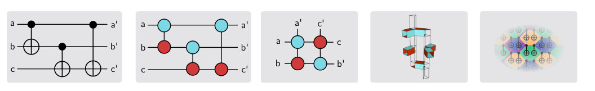
<figcaption class="paper-figure-caption"><b>Fig 1.</b> FIG. 1. Overview of steps in compilation using pipe diagrams. Starting with a logical circuit (i) it is translated into a ZX diagram (ii). A ZX diagram can be optimized in different ways and made more compact with diagrammatic reasoning (iii). Afterwards, this ZX diagram is embedded in 3D spacetime as a color code pipe diagram (iv). The distance-independent pipe diagram can be translated into specific stabilizers for given d alongside its explicit correlation surfaces from which one can receive a syndrome extraction circuit and perform simulations (v). Figure (v) displays an example cutout and timestep within the syndrome extraction.</figcaption>
</figure>
<figure class="paper-figure-card">
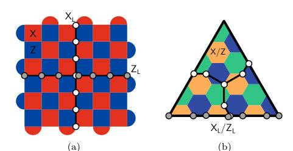
<figcaption class="paper-figure-caption"><b>Fig 2.</b> FIG. 2. (a) d = 7 rotated surface code, where X stabilizers are red faces and Z stabilizers are blue faces. A representative of the XL and ZL are displayed with white and gray nodes respectively. Note that the logical operators are perpendicular to each other. (b) d = 7 color code on a hexagonal tiling with data qubits on the vertices. Each face defines both an X and Z stabilizer on the incident qubits. Both XL and ZL logical operators are supported on the boundaries of the triangular region, with an example displayed with gray nodes. An instance of an equivalent “star-shaped” XL or ZL operator is displayed by white nodes.</figcaption>
</figure>
<figure class="paper-figure-card">
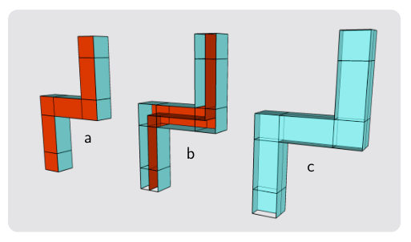
<figcaption class="paper-figure-caption"><b>Fig 3.</b> FIG. 3. Surface code pipe diagram representing the movement of a logical qubit (a). X-type walls and correlation surfaces are shown in red (dark), and Z-type are shown in blue (light). For better visibility, the front walls are removed from the figure to display the X-type correlation surface (b) and the Z-type correlation surface (c).</figcaption>
</figure>
<figure class="paper-figure-card">
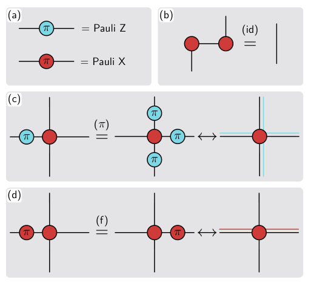
<figcaption class="paper-figure-caption"><b>Fig 4.</b> FIG. 4. ZX rules for pipe diagrams. (a) Representation of Pauli X and Z matrices within the ZX calculus. Blue (light) nodes are Z spiders, and red (dark) nodes are X spiders. (b) ZX diagram of Fig. 3 with open ports. (c,d) Propagation of Pauli operators through a red rank-4 junction. ZX Rules follow the labels as established in [37].</figcaption>
</figure>
<figure class="paper-figure-card">
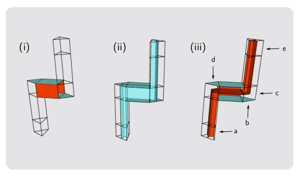
<figcaption class="paper-figure-caption"><b>Fig 5.</b> FIG. 6. Pipe diagram representing a logical movement in the color code (i). For better visibility, the front wall is removed from the figure to display the Z-type correlation surface (ii) and the X-type correlation surface (iii).</figcaption>
</figure>

**Summary.** This paper develops a comprehensive framework using pipe diagrams to compile logical computations onto the triangular color code. It establishes this representation by linking it to ZX calculus and demonstrates that the color code offers geometric advantages over the surface code for fault-tolerant operations. The results provide a foundation for automated, efficient quantum circuit compilation.

**Why it may be interesting.** This work provides a concrete theoretical blueprint for implementing fault-tolerant quantum computation using advanced topological codes like the Color Code, which is highly relevant to understanding physical implementations of quantum information processing.

Detailed structure

**Main problem.** The work aims to develop automated lattice surgery compilation techniques for the Color Code, extending successful methods previously established for the Surface Code.

**Main result.** They successfully developed a distance-independent pipe diagram representation for the triangular color code on the 6.6.6 lattice, enabling both macroscopic spacetime optimization and microscopic circuit construction.

**Method.** The authors utilize Pipe Diagrams as an intermediate representation, establishing its correspondence with ZX-diagrammatic descriptions to map logical computations onto physical syndrome extraction circuits.

**Model / system.** The study compares two topological quantum error-correcting codes: the Surface Code and the Color Code. The color code is implemented on a triangular lattice (6.6.6), offering advantages like reduced qubit overhead and transversal single-qubit Clifford gates compared to the surface code.

**Key observables.** Logical error rates, spacetime embedding efficiency, correlation surfaces ($\lambda_X, \lambda_Z$), and syndrome extraction circuit structure.

**Important parameters / regimes.** Code distance ($d$), lattice type (triangular), and gate set (restricted to Clifford operations).

**Assumptions / limitations.** The current framework is restricted to Clifford gates; incorporating T gates is identified as a necessary next step for universal computation. Decoder performance also plays a significant role in error rate comparisons.

**Figures summary.** Figures illustrate the compilation pipeline from logical circuits through ZX diagrams to color code pipe diagrams, comparing stabilizer placements and showing syndrome extraction mechanisms (folding/superdense) for both codes.

**Paper structure.** The paper progresses by first introducing the general framework of lattice surgery using pipe diagrams. It then details the specific adaptation of this framework to the triangular color code, contrasting its geometric advantages over the surface code in terms of logical connectivity and gate implementation. Finally, it presents simulations comparing error rates for various operations.

Abstract

Pipe diagrams have emerged as a powerful framework for flexible lattice surgery compilation and spacetime optimization for the surface code. In contrast, analogous compilation techniques for color code architectures remain largely unexplored, despite the color code's favorable properties, including reduced qubit overhead and transversal single-qubit Clifford gates. In this work, we develop a pipe diagram representation for the triangular color code on the 6.6.6 lattice and establish its correspondence to ZX-diagrammatic descriptions of computation. We present distance-independent constructions of color code pipe diagrams together with explicit realizations of correlation surfaces, stabilizers, and syndrome extraction circuits. This framework enables both macroscopic optimization of logical computations in spacetime and microscopic compilation to executable syndrome extraction circuits. We demonstrate the potential for compact spacetime embeddings with the color code's geometry. These results provide a foundation for automated lattice surgery compilation and diagrammatic optimization in color code architectures.

[↑ back to top](#top)

### [Using Tanner Spectral Reduction to Improve Multi-Layer Optical Lattice Routing for Hypergraph-Product and Bivariate Bicycle qLDPC Codes](http://arxiv.org/abs/2607.06177v1)

**Authors:** Joshua M. Courtney  
**Type:** theory · **Category:** quantum information and computing · **PDF:** <https://arxiv.org/pdf/2607.06177v1>  
**Analysis basis:** full PDF text, analyzed in chunks

↔ Scroll figures horizontally

<figure class="paper-figure-card">
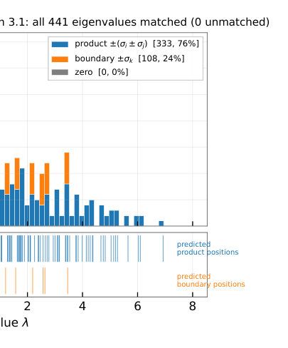
<figcaption class="paper-figure-caption"><b>Fig 1.</b> Figure 1: Spectrum decomposition of the HGP code [[225, 9, 4]] (seed 1, full-rank base H). Top: histogram of all 441 Tanner graph eigenvalues, stacked by Proposition 3.1 classification, as product modes ±(σi ± σj) (blue, 333 eigenvalues, 76%) and boundary modes ±σk (orange, 108 eigenvalues, 24%). Zero unmatched eigenvalues. Bottom: the predicted multiset positions as tick marks, aligned with the top-panel histogram.</figcaption>
</figure>
<figure class="paper-figure-card">
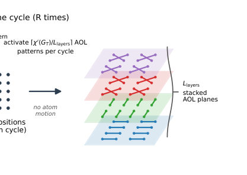
<figcaption class="paper-figure-caption"><b>Fig 2.</b> Figure 2: Multi-layer 3D AOL routing protocol (Algorithm 1, Sec. 4.1). A. Setup phase: atoms initialized in arbitrary positions are Valiant-routed on the multi-layer overlay Gunion = SLlayers ℓ=1 Gℓto canonical 2D-grid positions supporting Tanner graph GT chromatic decomposition. One-time cost TValiant = O(log N) atom motions (Theorem 4.1). B. Syndrome cycle (repeated R times): from the canonical positions, each of χ′(GT ) chromatic colors of a GT edge coloring is loaded into one of Llayers stacked AOL planes. The Llayers planes fire simultaneously, completing all χ′ colors in ⌈χ′(GT )/Llayers⌉serial AOL pattern activations. No atom motion in this phase. For Llayers ≥χ′ the per-cycle cost...</figcaption>
</figure>
<figure class="paper-figure-card">
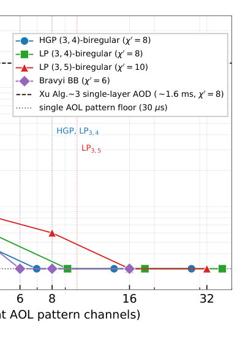
<figcaption class="paper-figure-caption"><b>Fig 3.</b> Figure 3: Per-cycle wall-clock vs. number of stacked AOL pattern channels Llayers, for four qLDPC code families: HGP and LP from (3, 4)-biregular bases (χ′ = 8), LP from (3, 5)-biregular bases (χ′ = 10), and Bravyi BB codes (χ′ = 6, Sec. 6.1). Markers are measured per-cycle counts ⌈χ′/Llayers⌉converted to wall-clock at the conservative τAOL = 30 µs per pre-stored pattern from Bluvstein et al. Methods. The two horizontal references are Xu et al. Algorithm 3’s ∼1.6 ms / cycle on single-layer AOD (8 × 200 µs short-range moves; dashed) and the single-AOL-pattern floor at 30 µs (dotted). Saturation cliffs at Llayers = χ′ are marked with colored vertical lines: BB (χ′ = 6) saturates first, then...</figcaption>
</figure>

**Summary.** This paper develops a novel multi-layer routing protocol for qLDPC codes designed for future optical quantum hardware. It uses advanced spectral graph theory to simplify the analysis of complex Tanner graphs associated with HGP and BB codes. The resulting architecture promises substantial improvements in per-cycle operation speed compared to existing single-layer methods.

**Why it may be interesting.** This work directly addresses the physical implementation challenges of large-scale quantum computation by providing theoretical speedups and architectural blueprints for qubit connectivity.

Detailed structure

**Main problem.** The primary goal is to improve qubit routing efficiency for quantum low-density parity check (qLDPC) codes by analyzing their underlying Tanner graph structure.

**Main result.** The authors propose a multi-layer optical lattice routing protocol that achieves significant per-cycle wall-clock speedups ($\sim 50-300	imes$) compared to single-layer methods, contingent on advanced hardware.

**Method.** The work employs spectral analysis (SVD and Fourier transforms) to characterize the Tanner graph spectrum of HGP and BB codes, leading to simplified routing depth calculations for a multi-layer architecture.

**Model / system.** The model involves three-dimensional reconfigurable qubit architectures utilizing optical lattices (AOL/AOD) to implement qLDPC codes like Hypergraph-Product (HGP) and Bivariate Bicycle (BB).

**Key observables.** Spectral ratio ($eta$), Tanner graph diameter ($D_T$), chromatic index ($\chi'$), and per-cycle syndrome extraction depth.

**Important parameters / regimes.** Number of layers ($L_{	ext{layers}}$), base matrix singular values ($\sigma_k$), and the setup cost $T_{Valiant} = O(\log N)$.

**Assumptions / limitations.** The results are contingent on the availability of multi-layer AOL hardware, and some theoretical bounds rely on unverified hypotheses (H1–H3).

**Figures summary.** Not specified in detail; notes reference spectral visualizations for HGP codes showing eigenvalue matching.

**Paper structure.** The paper progresses by first characterizing the spectra of HGP/LP and BB codes using advanced spectral techniques, deriving simplified formulas for routing depth bounds. It then constructs a multi-layer 3D AOL routing protocol based on these findings, culminating in performance estimates compared to single-layer baselines.

Abstract

We characterize the Tanner graph spectrum of hypergraph-product (HGP) / lifted-product (LP) codes and bivariate-bicycle (BB) codes, informing qubit routing for three-dimensional reconfigurable qubit architectures. Syndrome-extraction routing depth on HGP/LP Tanner graphs reduces to a single SVD on the base parity-check matrix, using a spectral ratio $β_\text{HGP} = (1 + β_\text{base})/2$ where $β_\text{base} = σ_2(H)/σ_1(H)$ for the base parity-check matrix, and a diameter identity $D_T = 2 D_\text{base}$ where $D_\text{base}$ is the base Tanner graph diameter. Fourier spectral reduction reveals that the BB Tanner graph spectrum equals the union, over the $l \times m$ grid of characters of $\mathbb{Z}_l \times \mathbb{Z}_m$, of the singular values of a single $2 \times 2$ symbol matrix built from the two defining polynomials. This reduces spectral analysis from an $O((lm)^3)$ diagonalization of the $4lm$-node Tanner graph to $lm$ independent $2 \times 2$ SVDs. These results compose into a multi-layer three-dimensional AOL routing protocol with one-time setup cost $T_\text{Valiant} = O(\log N)$ atom rearrangements amortizable over a memory experiment of $R$ rounds. For a Tanner graph chromatic index $χ'$ and $L_\text{layers}$ stacked AOL planes, the per-syndrome-cycle depth is $\lceil χ'/L_\text{layers} \rceil$ AOL pattern activations with no atom motion, an $8\times$ step-count reduction at $L_\text{layers} \geq χ' = 8$. Contingent on multi-layer AOL hardware, this yields an estimated $\sim50-300\times$ per-cycle wall-clock advantage over a single-layer AOD baseline (degrading to $\sim5-100\times$ under AOD-crosstalk overhead), reducing to equality in the single-layer limit. This paper therefore presents a route toward practical routing improvement for future quantum hardware incorporating multi-layer reconfigurable qubit architectures.

[↑ back to top](#top)

## Secondary cond-mat archives

*Papers from cond-mat.mtrl-sci, mes-hall, other, soft, supr-con. These archives are de-prioritized — they appear at the end regardless of relevance score.*

### Relevant in secondary archives (20)

### [Spontaneous emission of light by non-equilibrium phonons](http://arxiv.org/abs/2607.06399v1)

**Authors:** J. Plo, P. Valvin, M. Moret, T. Taliercio, J. Batista, T. Sohier, A. Vasanelli, C. Sirtori, B. Gil, W. Desrat, G. Cassabois  
**Type:** both · **Category:** statistical mechanics · **PDF:** <https://arxiv.org/pdf/2607.06399v1>  
**Analysis basis:** full PDF text, analyzed in chunks
**Topic relevance:** 🔥 `non-equilibrium dynamics` **5/5** · 🔥 `non-equilibrium universality` **4/5** · `correlated / nonlocal dissipation` **3/5** · `driven-dissipative phase transition` **3/5** · `methods for driven-dissipative` **3/5** · `Keldysh / 2PI / non-Gaussian methods` **1/5** · `quantum optics experiment` **1/5**

↔ Scroll figures horizontally

<figure class="paper-figure-card">
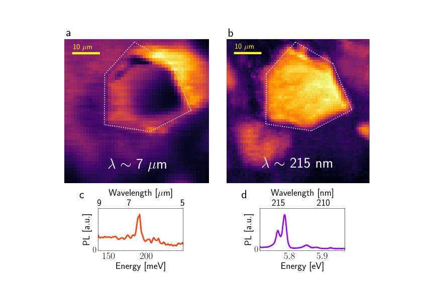
<figcaption class="paper-figure-caption"><b>Fig 1.</b> Figure 1: IR-UV dual-band imaging. Photoluminescence (PL) spectroscopy in rhombohedral</figcaption>
</figure>
<figure class="paper-figure-card">
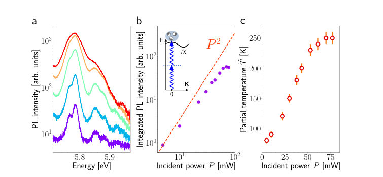
<figcaption class="paper-figure-caption"><b>Fig 2.</b> Figure 2: Excitonic photoluminescence. Power-dependent two-photon excitation of the excitonic</figcaption>
</figure>
<figure class="paper-figure-card">
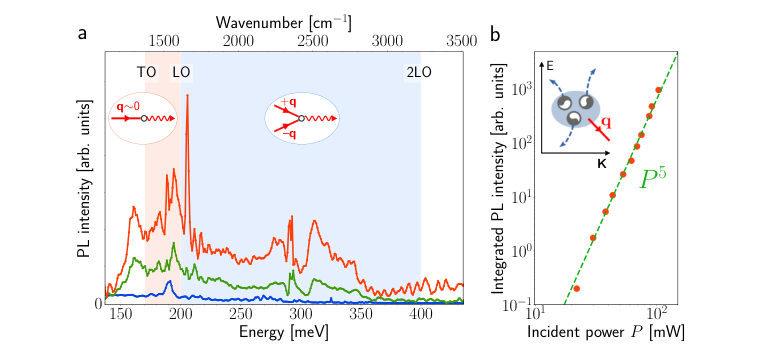
<figcaption class="paper-figure-caption"><b>Fig 3.</b> Figure 3: Phononic photoluminescence. Power-dependent two-photon excitation of the phononic</figcaption>
</figure>
<figure class="paper-figure-card">
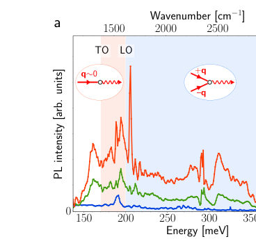
<figcaption class="paper-figure-caption"><b>Fig 4.</b> Fig.1, which can be unambiguously attributed to the PL of phonons.</figcaption>
</figure>
<figure class="paper-figure-card">
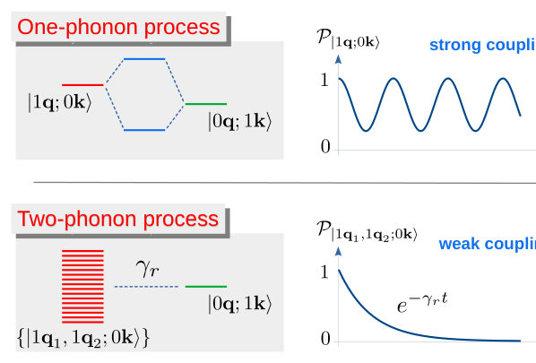
<figcaption class="paper-figure-caption"><b>Fig 5.</b> Figure 4: Strong and weak couplings of phonons to the electromagnetic field in vacuum.</figcaption>
</figure>

**Summary.** This research demonstrates that spontaneous light emission from non-equilibrium phonons can be a major energy dissipation channel in materials like boron nitride. By using ultrafast spectroscopy and theory, the authors distinguish this radiative process from purely anharmonic decay, opening new avenues for understanding out-of-equilibrium physics and infrared optoelectronics.

**Why it may be interesting.** This work directly addresses non-equilibrium dynamics and energy relaxation mechanisms beyond simple thermal models, which is highly relevant for understanding open quantum systems where coupling to a bath (phonons) dictates the system's evolution.

Detailed structure

**Main problem.** The study investigates spontaneous light emission from non-equilibrium phonons, proposing this radiative decay as a significant relaxation pathway competing with intrinsic anharmonic phonon decay processes.

**Main result.** The authors report the first detection of mid-infrared photoluminescence originating from these non-equilibrium phonons in boron nitride, demonstrating that radiation can be an efficient out-of-equilibrium energy dissipation mechanism.

**Method.** The work combines ultrafast optical spectroscopy (femtosecond two-photon excitation) with theoretical calculations (DFT) to model phonon decay pathways and measure spectral signatures.

**Model / system.** The physical system is boron nitride (BN), particularly rhombohedral BN microcrystallites, which are used as a platform for observing light-matter interactions under non-equilibrium conditions. The physics involves the relaxation of excited states generating non-thermal phonon populations.

**Key observables.** Photoluminescence (PL) signal in the mid-infrared spectral range ($\lambda \sim 7 \mu	ext{m}$), excitonic PL ($\lambda \sim 215 	ext{ nm}$), and the partial temperature ($eT$) derived from power dependence.

**Important parameters / regimes.** Femtosecond excitation timescales, cryogenic temperatures ($T \sim 25$ K), and spectral regimes distinguishing one-phonon (strong coupling) vs. two-phonon (weak coupling) decay.

**Assumptions / limitations.** The analysis distinguishes between intrinsic (two-phonon) and extrinsic (one-phonon) radiative decay based on established coupling regimes, and the $eT$ estimate assumes negligible exciton collisional broadening.

**Figures summary.** Figures show IR-UV dual-band imaging contrasting phononic PL ($\lambda \sim 7 \mu	ext{m}$) with excitonic PL ($\lambda \sim 215 	ext{ nm}$), and power dependence measurements confirming Auger processes and the transition between one-phonon and two-phonon decay regimes.

**Paper structure.** The paper progresses from initial experimental observation of MIR photoluminescence in BN, to detailed analysis distinguishing radiative pathways (one- vs. two-phonon), culminating in theoretical calculations matching these intrinsic two-phonon decay signatures.

Abstract

When a system is brought out of equilibrium by an external excitation, its relaxation to thermodynamic equilibrium generates phonons. These non-equilibrium phonons degrade via cascaded anharmonic decay processes, progressively leading to a thermal population of phonons following a Bose-Einstein distribution at the system temperature. Preceding heat dissipation by convection, conduction and incandescence, this early phase of the relaxation dynamics is commonly assumed to be exclusively non-radiative. Here, we demonstrate that the radiative emission by phonons can be an efficient relaxation pathway competing with the intrinsic anharmonic decay. Optical spectroscopy under femtosecond two-photon excitation in boron nitride unveils a photoluminescence signal in the mid-infrared spectral range, stemming from the spontaneous emission of light by non-equilibrium phonons. This observation of non-thermal radiation from phonons introduces a new paradigm for out-of-equilibrium physics, mid-infrared optics, and thermal management.

[↑ back to top](#top)

### [Floquet polaritons in optically driven materials](http://arxiv.org/abs/2607.05857v1)

**Authors:** Tsan Huang, Teng Xiao, Jiahua Duan, Haoliang Qian, Zhiyuan Sun  
**Type:** theory · **Category:** other · **PDF:** <https://arxiv.org/pdf/2607.05857v1>  
**Analysis basis:** full PDF text, analyzed in chunks
**Topic relevance:** 🔥 `methods for driven-dissipative` **4/5** · 🔥 `non-equilibrium dynamics` **4/5** · `Keldysh / 2PI / non-Gaussian methods` **3/5** · `driven-dissipative phase transition` **3/5** · `non-equilibrium universality` **2/5** · `analog quantum simulation` **1/5** · `correlated / nonlocal dissipation` **1/5** · `correlated cavity matter` **1/5** · `interference shaping light` **1/5** · `spintronics-quantum-optics interface` **1/5**

↔ Scroll figures horizontally

<figure class="paper-figure-card">
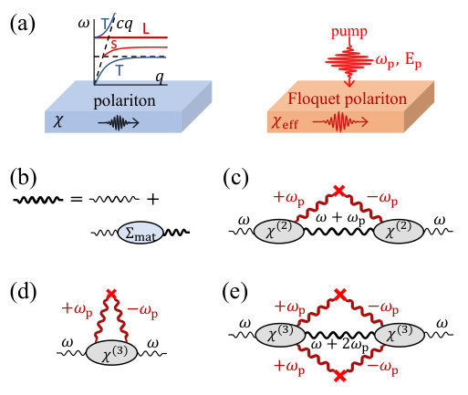
<figcaption class="paper-figure-caption"><b>Fig 1.</b> FIG. 1. (a) Left: polaritons in a solid state material in equilibrium with the optical susceptibility χ. The plot is a schematic dispersion of the bulk and surface polaritons in a three dimensional isotropic po- lar insulator, with “T”, “L” and “s” labeling transverse bulk modes, longitudinal bulk modes and surface modes, respectively. Right: a strong pump field (red wavy line) drives the system and modifies the susceptibility to χeff via optical nonlinearity, transforming the po- laritons to Floquet polaritons. (b) The thick/thin black wavy lines denote the bare polariton propagator G0/photon propagator. The material corrections are incorporated through a Dyson expansion by contributing a...</figcaption>
</figure>
<figure class="paper-figure-card">
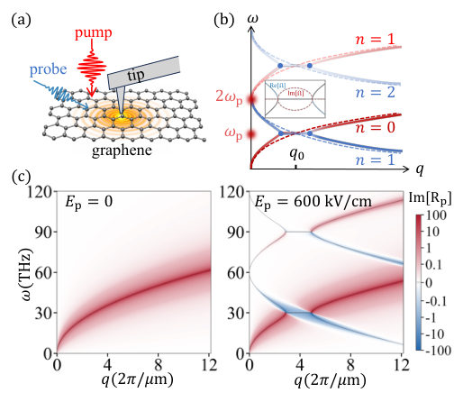
<figcaption class="paper-figure-caption"><b>Fig 2.</b> FIG. 2. Floquet plasmons in graphene. (a) Schematic of the near- field pump-probe setup for creating and measuring Floquet plasmons in graphene. (b) Schematic dispersion of Floquet 2D plasmons under strong optical pumping with the photon frequency ωp. The original branch (black dashed curve labeled by n = 0) and its Floquet repli- cas (dashed curves labeled by indices n = 0, 1, 2) shifted by 2nωp intersect and hybridize into the Floquet plasmons (solid curves). The blue dots are exceptional points. The inset is the schematic be- havior of the real and imaginary parts of the plasmon frequency relative to ωp as a function of momentum near the band-crossing point. (c) Imaginary parts of the...</figcaption>
</figure>
<figure class="paper-figure-card">
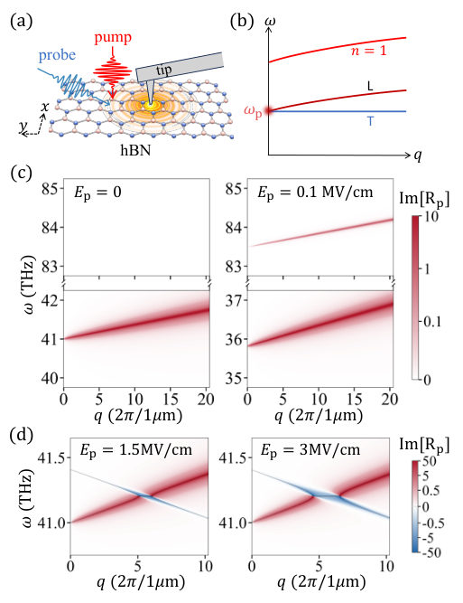
<figcaption class="paper-figure-caption"><b>Fig 3.</b> FIG. 3. Floquet phonon polaritons in monolayer hBN. (a) Schematic of the near-field pump-probe measurement of Floquet phonon po- laritons in monolayer hBN. (b) Schematic dispersion of the Flo- quet phonon polaritons. (c) Near-field reflection coefficient Rp of monolayer hBN on the frequency-momentum plane computed from Eq. (25) in equilibrium (left) and with a pump field Ep = 0.1 MV/cm at frequency ωp = ωTO = 41 THz (right). In the right panel, the pump induces a new polariton branch around 83.5 THz, and also leads to a red shift of the principal branch. (d) Same as (c) but with the pump frequency ωp = 2.01ωTO = 82.41 THz at the pump field Ep = 1.5 MV/cm (left) and Ep = 3 MV/cm (right). The...</figcaption>
</figure>
<figure class="paper-figure-card">
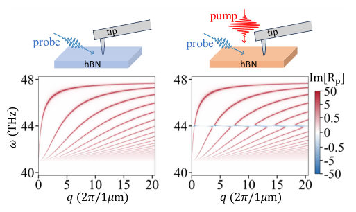
<figcaption class="paper-figure-caption"><b>Fig 4.</b> FIG. 4. Floquet phonon polaritons in hBN thin flakes. The left panel is the near field reflection coefficient Im[Rp] of an equilibrium hBN thin flake plotted on the frequency-momentum plane. The right panel is the same but under uniform pump field with the frequency ωp = 2.07ωTO = 85 THz and field strength Ep = 8 MV/cm, within the reach of modern table top lasers [86]. The parameters used include the flake thickness d = 100 nm, the phononic damping rate γ = 0.1 THz [20, 22], the interlayer distance a0 = 0.33 nm, the high frequency asymptotic in-plane dielectric ϵ⊥,∞= 4.87. The out-of- plane dielectric is set as ϵz = 3.0 which is a good approximation to hBN in this frequency range. The pump...</figcaption>
</figure>
<figure class="paper-figure-card">
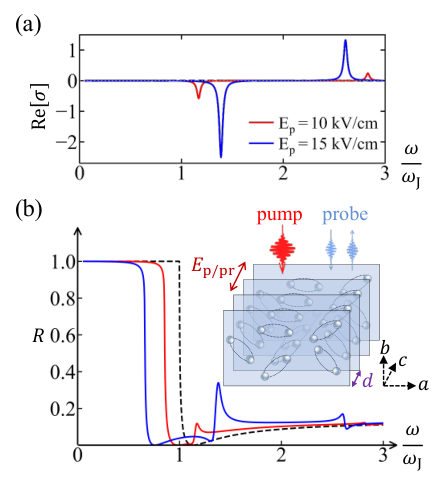
<figcaption class="paper-figure-caption"><b>Fig 5.</b> FIG. 5. Floquet Josephson plasmons in layered superconductors. (a) Real part of the optical conductivity σ = −iω(ϵeff−1)/(4π) in units of ϵ∞ωJ/4π along the out-of-plane direction of a pumped layered superconductor plotted from Eq. (32). The black dashed curve cor- responds to equilibrium. The red (blue) solid curve is that under the pump field Ep = 10 kV/cm (15 kV/cm) with the frequency ωp = ωJ. The peaks at nonzero frequencies are induced by the pump. (b) The corresponding optical reflectivity R = |(1−√ϵeff)/(1+√ϵeff)|2</figcaption>
</figure>

**Summary.** The paper presents a general and practical theoretical framework to model Floquet polaritons—light-matter excitations driven by strong external fields. By calculating an effective susceptibility incorporating material nonlinearities, the authors predict novel plasmonic and phonon modes in materials like graphene and hBN. This work is significant for understanding how time-periodic driving can engineer exotic quantum states in condensed matter systems.

**Why it may be interesting.** This work bridges quantum optics (polaritons) with non-equilibrium physics (Floquet engineering) in solid-state materials, providing concrete, experimentally measurable predictions based on standard nonlinear optical coefficients rather than requiring complex Hamiltonian derivations.

Detailed structure

**Main problem.** The paper aims to theoretically describe Floquet polaritons, which are coupled light-matter excitations whose properties are dramatically altered by strong, time-periodic optical driving fields (pump pulses).

**Main result.** They successfully predict the existence and characteristics of novel Floquet plasmon bands in graphene, phonon polariton bands in hBN, and Josephson plasmons in superconductors using a generalized susceptibility approach.

**Method.** A practical theoretical framework is developed by calculating an effective linear optical susceptibility ($\chi_{	ext{eff}}$) that incorporates nonlinear material susceptibilities ($\chi^{(2)}, \chi^{(3)}$) induced by the pump field. This involves solving modified Maxwell's equations via Dyson-like self-energy corrections.

**Model / system.** The study applies this method to diverse quantum materials, including graphene (using $\chi^{(3)}$), hexagonal boron nitride ($	ext{hBN}$) (via phononic nonlinearity), and layered superconductors (exhibiting Josephson-type nonlinearity).

**Key observables.** Floquet polariton spectra (dispersion relations), THz reflectivity measurements, and the observation of exceptional points near plasmonic band crossings.

**Important parameters / regimes.** The strength and frequency of the external pump field ($\omega_p$), and the material's nonlinear optical susceptibilities ($\chi^{(2)}, \chi^{(3)}$).

**Assumptions / limitations.** The primary approximation is using a classical treatment for Green functions, although the full Keldysh formalism exists. The method assumes that the relevant physics can be captured by calculating the self-energy $\Sigma$ from nonlinear susceptibilities.

**Figures summary.** Figure 1 conceptually illustrates the transition from equilibrium polaritons ($\chi$) to Floquet polaritons ($\chi_{	ext{eff}}$) via Dyson expansion, showing how self-energies are incorporated using nonlinear susceptibilities.

**Paper structure.** The paper establishes the general formalism by deriving $\chi_{	ext{eff}}$ from Maxwell's equations and incorporating pump effects via self-energy diagrams. It then applies this framework sequentially to three distinct physical systems: graphene, hBN, and layered superconductors, detailing the specific nonlinear mechanism for each.

Abstract

Polaritons are coupled collective modes of light and matter in quantum materials. In modern pump-probe experiments, a pump light pulse may dramatically alter the properties of the polaritons, rendering them Floquet polaritons that can be detected by a probe pulse. We present a practical framework to describe Floquet polaritons in terms of the linear and nonlinear optical properties of the material. The central quantity that yields the spectra of Floquet polaritons is an effective linear optical susceptibility contributed by the pump through nonlinear optical susceptibilities. We apply this method to graphene and show that via its third-order optical nonlinearity, infrared pump leads to Floquet plasmon bands. Notably, near plasmonic band crossings, parametric instability leads to flat bands with unstable modes and exceptional points that closely resemble those of non-Hermitian systems. As a second example, we show that in hexagonal boron nitride pumped by mid-infrared laser, the pump induces Floquet phonon polariton bands via phononic nonlinearity, which can be detected with either far-field or near-field optical technique. Finally, in layered superconductors pumped by THz light polarized along the out-of-plane direction, the Josephson-type optical nonlinearity leads to Floquet Josephson plasmons, which manifest as new peaks in the THz reflectivity of a probe pulse.

[↑ back to top](#top)

### [Engineering nonlinear magnon scattering in artificial spin ice via vertex dipolar control](http://arxiv.org/abs/2607.05797v1)

**Authors:** Waleed I. Waseer, Peng Yan  
**Type:** theory · **Category:** other · **PDF:** <https://arxiv.org/pdf/2607.05797v1>  
**Analysis basis:** full PDF text, analyzed in chunks
**Topic relevance:** 🔥 `analog quantum simulation` **4/5** · `exotic spin models in light-matter` **3/5** · `spintronics-quantum-optics interface` **3/5** · `non-equilibrium dynamics` **2/5** · `correlated / nonlocal dissipation` **1/5** · `driven-dissipative phase transition` **1/5** · `methods for driven-dissipative` **1/5**

↔ Scroll figures horizontally

<figure class="paper-figure-card">
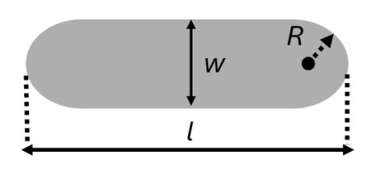
<figcaption class="paper-figure-caption"><b>Fig 1.</b> FIG. 1. Schematic diagram of a single nano island. Here W indicate the width and l is the total length of the nano island. R is radius of semi circle.</figcaption>
</figure>
<figure class="paper-figure-card">
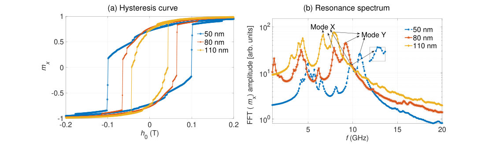
<figcaption class="paper-figure-caption"><b>Fig 2.</b> FIG. 2. Hysteresis loops (a) and resonance spectra (b) for nano islands of widths w = 50, 80, 110 nm and fixed length l = 260 nm.</figcaption>
</figure>
<figure class="paper-figure-card">
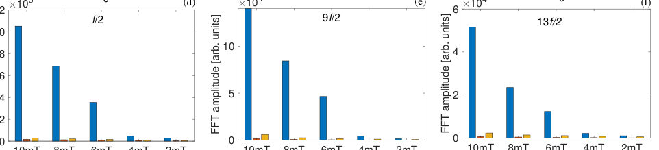
<figcaption class="paper-figure-caption"><b>Fig 3.</b> FIG. 3. Harmonic and subharmonic amplitudes generated under microwave excitation for wide, narrow, and asymmetric kagome artificial spin ice. The wide geometry produces the strongest nonlinear response because its larger volume enhances dipolar interactions, whereas asymmetric leg length distorts the vertex configuration and suppresses coherent collective dynam- ics.</figcaption>
</figure>
<figure class="paper-figure-card">
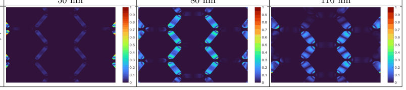
<figcaption class="paper-figure-caption"><b>Fig 4.</b> FIG. 4. Parametric excitation of mode X for kagome nano islands with widths 50, 80 and 110 nm (length = 260 nm). The mode red-shifts with increasing width (fX = 9.7, 7.9, 6.76 GHz for 50, 80 and 110 nm) while the applied field strength decreases (h0 = 75, 40, 30 mT). The 110 nm islands thus reach the largest, most spatially coherent amplitude at the smallest drive, indicating that island width both tunes the eigen-frequency and lowers the parametric threshold for nonlinear amplification.</figcaption>
</figure>
<figure class="paper-figure-card">
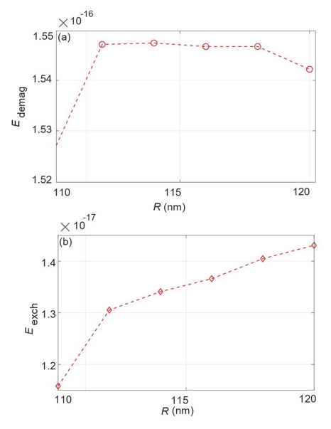
<figcaption class="paper-figure-caption"><b>Fig 5.</b> FIG. 5. Effect of nanoisland edge-radius variation on the de- magnetization and exchange energies is shown. A 1.16 % energy difference in Edemag and 23.6 % energy difference in Eexch is visible when edge radius changes from 0-10nm.</figcaption>
</figure>

**Summary.** The research demonstrates that by manipulating the edge curvature of nanoislands in Artificial Spin Ice, one can precisely engineer nonlinear magnon scattering. This finding establishes tip curvature as an independent control knob, allowing researchers to tune complex magnetic responses like subharmonic generation without compromising the fundamental lattice structure.

**Why it may be interesting.** This work provides a concrete example of controlling complex many-body dynamics (magnon interactions) in a solid-state system using precise geometric engineering, which has parallels to designing quantum metamaterials or artificial lattices for wave manipulation.

Detailed structure

**Main problem.** The primary goal is engineering nonlinear magnon scattering in Artificial Spin Ice (ASI) by identifying a geometric control parameter that allows tuning of nonlinearity independently from the linear spectrum and lattice density.

**Main result.** Edge curvature has been established as a key, footprint-preserving design parameter; dumbbell shapes promote subharmonic spectra, while field orientation controls the second harmonic amplitude in an experimentally accessible way.

**Method.** The study relies on micromagnetic simulations solving the Landau–Lifshitz-Gilbert equation to model spin dynamics under microwave excitation.

**Model / system.** The system is Artificial Spin Ice (ASI), a geometrically frustrated array of interacting nanoislands, modeled using micromagnetics. The energy includes exchange and demagnetization contributions.

**Key observables.** Spin wave resonance spectra, harmonic/subharmonic generation amplitudes, and the angular dependence of the second harmonic amplitude.

**Important parameters / regimes.** Edge curvature (e.g., sharp vs. dumbbell tips), nanoisland width ($w$), applied microwave field angle ($	heta$), and lattice spacing.

**Assumptions / limitations.** Previous geometric controls suffer from an intrinsic trade-off between modifying nonlinearity and altering the overall island footprint or dipolar coupling.

**Figures summary.** Figures show resonance spectra for varying widths, hysteresis loops demonstrating switching behavior, and harmonic spectra confirming subharmonic generation promoted by specific tip curvatures (dumbbell vs. sharp).

**Paper structure.** The paper systematically investigates how changing geometric parameters like width and curvature affects the magnon spectrum. It contrasts previous methods with the new finding that curvature decouples nonlinearity from footprint changes, detailing angular dependence measurements.

Abstract

Artificial spin ice (ASI), composed of geometrically frustrated arrays of interacting nanoislands, provides a versatile platform for reprogrammable magnonic functionality. However, the commonly used geometric control parameters such as island length, width, and aspect ratio simultaneously modify the island footprint, inter island dipolar spacing, and shape anisotropy, making it difficult to tune the nonlinear response independently of the linear spectrum and lattice density. Using micromagnetic simulations of kagome ASI under strong microwave drive, we identify edge curvature as a geometric degree of freedom that separates nonlinear magnon scattering from the island footprint. Sharp tipped islands predominantly generate integer harmonics, whereas dumbbell shaped tips produce a transition toward subharmonic rich spectra by concentrating demagnetizing and exchange fields near the island ends without changing the overall island volume or lattice spacing. By mapping the curvature and drive parameter space, we identify a continuous threshold for subharmonic onset controlled by tip curvature. We further show that the angular dependence of the second harmonic amplitude reverses between sharp and dumbbell geometries, providing an experimentally accessible signature of curvature localized nonlinearity. Width and leg length asymmetry can also modify harmonic amplitudes, but they do not remove the intrinsic trade off between footprint and coupling. These results establish tip curvature as a footprint preserving design parameter for engineering nonlinear magnon scattering in ASI, with implications for reconfigurable magnonic devices.

[↑ back to top](#top)

### [Correlated Insulating States in Twisted Double Bilayer Graphene Enhanced by Interfacial Effect on CrOCl](http://arxiv.org/abs/2607.06492v1)

**Authors:** Ning Ma, Zekang Zhou, Chiara Cocchi, Maurice Bal, Maarten van Delft, Kenji Watanabe, Takashi Taniguchi, Steffen Wiedmann, Jian-Hao Chen, Mitali Banerjee  
**Type:** experiment · **Category:** strongly correlated electrons · **PDF:** <https://arxiv.org/pdf/2607.06492v1>  
**Analysis basis:** full PDF text, analyzed in chunks
**Topic relevance:** 🔥 `analog quantum simulation` **4/5** · `exotic spin models in light-matter` **3/5** · `spintronics-quantum-optics interface` **3/5** · `Kondo & dissipative impurity` **1/5** · `non-equilibrium dynamics` **1/5**

↔ Scroll figures horizontally

<figure class="paper-figure-card">
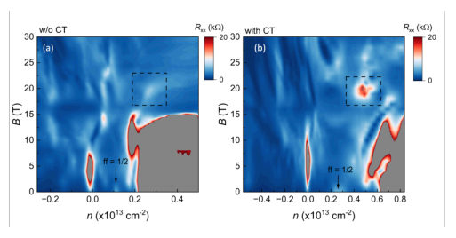
<figcaption class="paper-figure-caption"><b>Fig 1.</b> FIG. 2. Charge transfer-enhanced correlated states at half filling factor under high magnetic field. (a) and (b) The Lan- dau fan diagrams of longitudinal resistance at D = 0.5 V/nm and 0.26 V/nm, corresponding to the regions without or with charge-transfer effect, respectively. The insulating states at ultrahigh magnetic field are shown in the black boxes. The insulating states in the ”charge-transfer” region is enchanced, compared with the one in Fig. 2(a).</figcaption>
</figure>
<figure class="paper-figure-card">
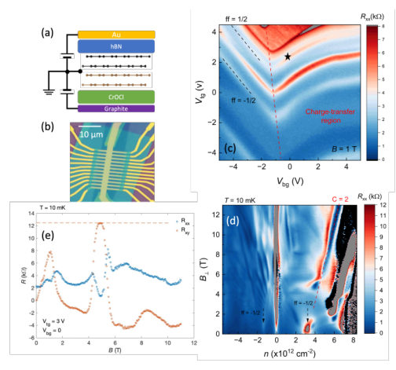
<figcaption class="paper-figure-caption"><b>Fig 2.</b> FIG. 1. Electrical measurement of TDBG-COC heterostruc- ture under the charge-transfer effect. (a) Illustration of the structure of TDBG-COC sample. (b) Optical image of the device measured in the main text, which has been etched into Hall bar geometry by using O2 and SF6 plasma. The inset scale bar is 10 µm. (c) Longitudinal resistance as a function of dual gates measured at 10 mK and 1 T. The boundary of the region influenced by charge-transfer effect is indicated by red dashed line. Resistance peaks of filling factor(ff) = 1/2 and -1/2 are illustrated as the two black dashed lines. (d) Landau fan diagram measured at 10 mK, with D fixed at 0.26 V/nm. Half-filling states at zero field are...</figcaption>
</figure>
<figure class="paper-figure-card">
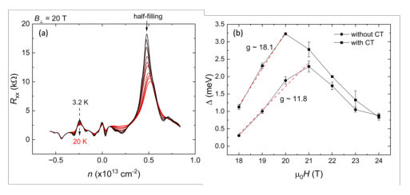
<figcaption class="paper-figure-caption"><b>Fig 3.</b> FIG. 3. Valley polarized correlated insulating state at half- filling factor under high magnetic field. (a) Temperature de- pendence of the correlated states at different carrier densities under 20 T. The resistance of the half-filling state with charge- transfer effect decreases with elevated temperature from 3.2 K to 20 K. (b) Estimation of the thermal activation gap of the insulating state at half-filling with or without the effect of charge transfer, respectively. The g factors of half-filling state with (18.1) or without (11.8) charge-transfer(CT) effect, re- spectively, are extracted from the slope of the relationship ∆ versus out-of-plane magnetic field.</figcaption>
</figure>
<figure class="paper-figure-card">
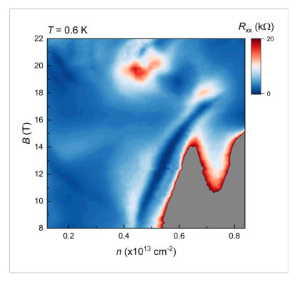
<figcaption class="paper-figure-caption"><b>Fig 4.</b> FIG. 5. Zoom-in Landau fan diagram measured at 0.6 K, with a gate-sweeping step of 0.02 V. Compared with the fea- tures in Fig.2(b), the enchanced insulating state occurred at the same carrier density and magnetic field. Besides, the re- sistance of the enhanced insulating state in both figures are comparable. It proves the enhanced insulating state is repro- ducible under different scanning rates of gate.</figcaption>
</figure>
<figure class="paper-figure-card">
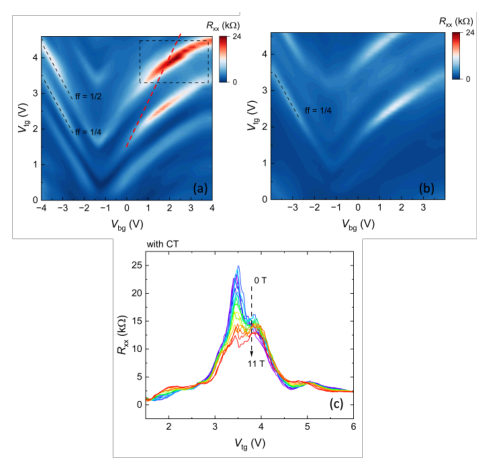
<figcaption class="paper-figure-caption"><b>Fig 5.</b> FIG. 4. In-plane field dependence of insulating states under high magnetic field. (a) Dual gate map measured at 4.2 K and 20 T of perpendicular field. (b) Same dual gate map as (a) measured at 4.2 K, but under 20 T and 11 T of in-plane field. Half and quarter-filling states are indicated by the black dashed lines in (a) and (b).(c) The evolution of resistance of half-filling state in the black dahsed box in (a), with increasing in-plane field from 0 to 11 T. Gate voltages are scanning along the red dashed line indicated in fig.4 (a).</figcaption>
</figure>

**Summary.** This experiment explores correlated insulating states in TDBG interfaced with $	ext{CrOCl}$. By measuring transport properties under high magnetic fields, the authors conclude that charge-transfer effects at the interface are responsible for enhancing these correlated states. This demonstrates a powerful method of interfacial engineering to control exotic electronic phases in moiré graphene systems.

**Why it may be interesting.** The work provides direct experimental evidence of how interfacial chemistry (charge transfer) can be used as a tuning knob to manipulate strongly correlated electronic phases in 2D materials, which is highly relevant for designing novel quantum devices.

Detailed structure

**Main problem.** The study investigates the emergence and nature of correlated insulating states in twisted double bilayer graphene (TDBG) when interfaced with an antiferromagnetic substrate ($	ext{CrOCl}$). The core question is whether the observed effects are due to magnetic proximity or charge-transfer interactions.

**Main result.** The enhanced correlated insulating state at half-filling is primarily attributed to a charge-transfer effect between TDBG and $	ext{CrOCl}$, rather than direct magnetic exchange. This interfacial engineering opens a new route for controlling correlated states in moiré systems.

**Method.** Transport measurements were performed using ultrahigh magnetic fields and low temperatures, analyzing longitudinal/Hall resistance, Landau fan diagrams, and temperature dependence of the insulating state.

**Model / system.** The physical system is Twisted Double Bilayer Graphene (TDBG) placed on a $	ext{CrOCl}$ substrate. The analysis focuses on correlated electron behavior in this moiré heterostructure under external magnetic fields.

**Key observables.** Enhanced resistance at half-filling, thermal activation gap ($\Delta$), and the effective g-factor derived from temperature dependence measurements.

**Important parameters / regimes.** Ultrahigh magnetic field (up to 20 T), low temperatures ($10 	ext{ mK}$), and the charge-transfer doping regime.

**Assumptions / limitations.** The primary assumption is that the observed enhancement stems from a charge-related reconstruction of the band structure due to interfacial coupling, distinguishing it from purely magnetic effects.

**Figures summary.** Figures show gate maps indicating the charge-transfer boundary, Landau fan diagrams comparing states with and without CT effect, and plots demonstrating how the insulating gap ($\Delta$) and g-factor change with temperature and applied magnetic field.

**Paper structure.** The paper progresses by first establishing the experimental platform and observing the correlated state. It then systematically analyzes the dependence of this state on external fields (B) and temperature (T), using quantitative diagnostics like $\Delta$ and $g$-factors to confirm the role of charge transfer over magnetism.

Abstract

Interaction between different two dimensional materials can give rise to many exotic physical phenomena which are rarely observed in intrinsic materials. Recently, several theoretical and experimental works have revealed that magnetic proximity effect between pristine graphene and magnetic substrates can lead to the emergence of quantum anomalous Hall states and quantum spin Hall states. However, interplay between correlated states in graphene-based systems and magnetic materials has seldom been studied. Here we perform the transport measurement at ultrahigh magnetic field of twisted double bilayer graphene (TDBG) on CrOCl (COC) substrate, which is an antiferromagnetic material. Instead of a magnetic-exchange effect on graphene, we observe an enhanced correlated insulating state at half-filling factor of TDBG as a result of the charge-transfer process between TDBG and COC. The temperature and magnetic field dependence of this enhanced state are further studied. Our results demonstrate the influence of charge-related effect at the interface, and shed a light on a new route for manipulating the correlated states in graphene-based moiré systems using interfacial engineering.

[↑ back to top](#top)

### [Exact flat bands in a 3D photonic crystal](http://arxiv.org/abs/2607.05942v1)

**Authors:** Kin Hung Fung, Yan-Long Chen, C. T. Chan, Qinghua Guo  
**Type:** theory · **Category:** other · **PDF:** <https://arxiv.org/pdf/2607.05942v1>  
**Analysis basis:** full PDF text, analyzed in chunks
**Topic relevance:** 🔥 `analog quantum simulation` **4/5** · `correlated cavity matter` **3/5** · `driven-dissipative phase transition` **1/5** · `interference shaping light` **1/5**

↔ Scroll figures horizontally

<figure class="paper-figure-card">
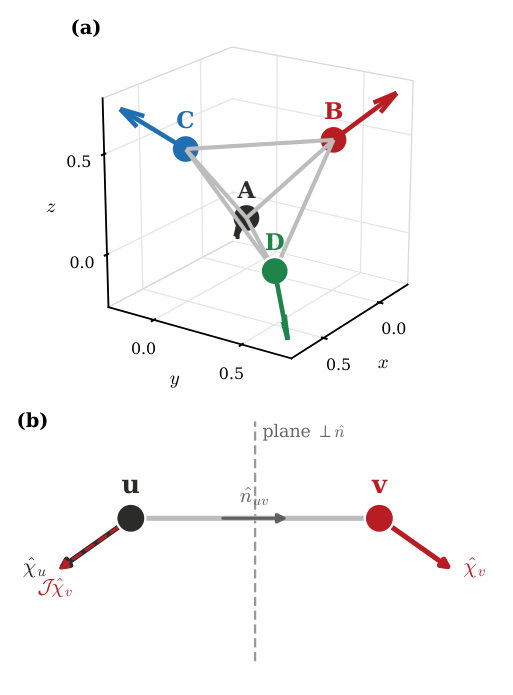
<figcaption class="paper-figure-caption"><b>Fig 1.</b> FIG. 1. (a) The metallic space-group-224 network: four cav- ities A, B, C, D at the ¯43m Wyckoff sites of Pn¯3m in the cubic cell, six face-diagonal channels, and the self-adaptive radial dipole axes ˆχu of Eq. (4) (arrows). (b) Exchange mechanism at the balance JL = −JT . There the bond ten- sor J (ˆn) = JT (I3 −2ˆnˆnT) is JT times the Householder re- flection about the plane ⊥ˆn; because the radial axes obey ˆχv −ˆχu = 2 p</figcaption>
</figure>
<figure class="paper-figure-card">
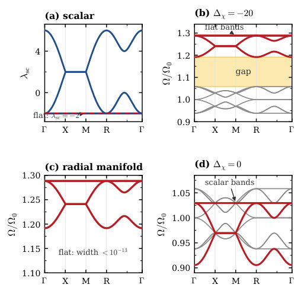
<figcaption class="paper-figure-caption"><b>Fig 2.</b> FIG. 2. Scalar reference and exact vector flat bands of the space-group-224 network along Γ →X →M →R →Γ. (a) The scalar four-band Hamiltonian Hsc(k) in its eigen- value λsc: two flat bands at λsc = −2 (dashed) and two dispersive bands. It is plotted with the same coupling sign as the realized radial sector (Jχ = JT at balance); because the frequency map Ω/Ω0 = √1 −gλ is decreasing, the cor- responding vector radial bands in (b),(c) appear with the flat pair at the top. (b) Full twelve-band vector spectrum at ∆χ = −20 and the balance JL = −JT : four radial bands (crimson, = ∆χI4 + Hsc(k) of Eq. (11)) detach above the eight remaining vector bands (grey) across a frequency gap (shaded), and...</figcaption>
</figure>
<figure class="paper-figure-card">
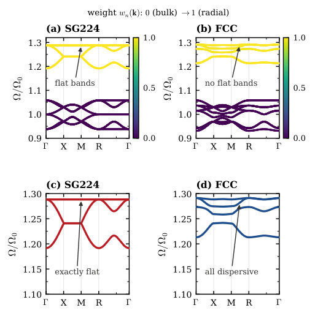
<figcaption class="paper-figure-caption"><b>Fig 3.</b> FIG. 3. Symmetry origin of the exact scalar sector, shown through band physics (∆χ = −20, g = 0.03, JL = −JT ). (a) Vector bands with the Pn¯3m (¯43m) radial axes of Eq. (4), colored by radial weight wn(k) = ∥QTψn(k)∥2: four radial bands of unit weight detach above the gap and two of them are exactly flat—the projected scalar sector realized as full- vector eigenstates. (b) The same crystal with a single com- mon (FCC-equivalent) radial axis on every site: the detached sector disperses and its weights are no longer quantized, so no exact scalar band survives. (c) Zoom on the SG224 radial manifold of (a): two exactly flat bands (residual bandwidth &lt; 10−13) and two dispersive bands. (d) Zoom...</figcaption>
</figure>

**Summary.** The paper shows how to engineer exact flat energy bands in a 3D photonic crystal by exploiting its underlying symmetry. By analyzing the vector nature of Maxwell's equations and projecting the problem onto a radial subspace, the authors derive a necessary coupling balance condition ($J_L = -J_T$). Satisfying this condition allows the system to host an exactly solvable scalar sector with flat bands.

**Why it may be interesting.** This work provides a powerful, symmetry-based design rule for realizing robust flat bands in complex electromagnetic structures, which is highly relevant to quantum simulation platforms using photonic lattices or metamaterials.

Detailed structure

**Main problem.** The primary challenge addressed is engineering exact flat bands in a fully vectorial photonic crystal, overcoming the obstruction posed by Maxwell's equations which typically prevents simple scalar-based band engineering.

**Main result.** The authors demonstrate that an exact scalar sector carrying flat bands can be realized in a 3D metallic network if the coupling constants satisfy a specific symmetry condition: $J_L = -J_T$.

**Method.** The analysis involves projecting the full twelve-band vector Hamiltonian onto a radial subspace using analytical identities, leading to an effective scalar problem whose solvability dictates the flat band existence.

**Model / system.** The system is a 3D metallic network structured as a space-group-224 lattice, modeled by a coupled-dipole Hamiltonian. The physics is analyzed via projecting the vector dynamics onto a radial subspace to find an effective scalar Hamiltonian.

**Key observables.** Flat band frequency ($\lambda$), energy gap opening, and the ratio of longitudinal ($J_L$) to transverse ($J_T$) coupling constants.

**Important parameters / regimes.** The anisotropy parameter ($\Delta\chi$), which controls spectral separation; the critical balance condition $J_L = -J_T$.

**Assumptions / limitations.** The analysis relies on deriving an effective Hamiltonian by assuming that the radial subspace forms an invariant subspace of the full vector Hamiltonian, requiring the specific coupling balance.

**Figures summary.** Figures illustrate the geometry (space-group-224), compare band structures for scalar vs. vector systems, and show how the exact flat bands appear only when the coupling achieves a Householder reflection symmetry ($J_L = -J_T$).

**Paper structure.** The paper establishes the difficulty of vectorial flatness, derives an effective Hamiltonian by projection onto the radial subspace, identifies the necessary symmetry condition ($J_L = -J_T$) for exact decoupling, and confirms this analytically and numerically.

Abstract

Photonic flat bands are hard to engineer because Maxwell's equations are vectorial: transversality obstructs the localized scalar-like bases that generate destructive-interference flat bands in tight-binding models. We show that a three-dimensional metallic network of dipolar cavities joined by waveguide channels--a fully vectorial photonic crystal belonging to space group No. 224--hosts an exact scalar sector, carrying exact flat bands. The twelve-band vector problem contains one self-adaptive radial dipole axis per site whose projection is exactly the scalar four-band Hamiltonian of the same network. A microwave-scale coupled-dipole calculation confirms this scalar-vectorial duality. The result is a symmetry-based design rule for scalar-like flat bands in reciprocal vector media.

[↑ back to top](#top)

### [Effect of charge-imbalance potential relaxation on the high-frequency vortex dynamics and kinetic inductance of superconducting circuits](http://arxiv.org/abs/2607.06390v1)

**Authors:** R. I. Kinzibaev, V. S. Stolyarov, A. S. Mel'nikov  
**Type:** theory · **Category:** other · **PDF:** <https://arxiv.org/pdf/2607.06390v1>  
**Analysis basis:** full PDF text, analyzed in chunks
**Topic relevance:** `Keldysh / 2PI / non-Gaussian methods` **3/5** · `correlated / nonlocal dissipation` **3/5** · `driven-dissipative phase transition` **3/5** · `methods for driven-dissipative` **3/5** · `non-equilibrium dynamics` **2/5** · `non-equilibrium universality` **2/5** · `Frenkel-Kontorova` **1/5** · `Kondo & dissipative impurity` **1/5**

↔ Scroll figures horizontally

<figure class="paper-figure-card">
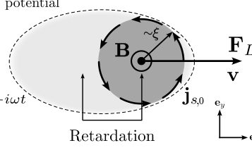
<figcaption class="paper-figure-caption"><b>Fig 1.</b> FIG. 1. Schematic illustration of a moving vortex with the core radius of the order of coherence length ξ and velocity v. The region with the induced charge-imbalance potential is shown by the dashed line. Here js,∞is the ac transport cur- rent producing the Lorentz force FL, js,0 is superfluid current circulating around the vortex core, B = Bzez is magnetic field (Bz &gt; 0).</figcaption>
</figure>

**Summary.** This theoretical work analyzes vortex motion in superconductors by incorporating the crucial role of charge-imbalance potential relaxation into the time-dependent Ginzburg-Landau framework. It derives an advanced equation of motion that captures retardation effects, showing how these mechanisms fundamentally alter the kinetic inductance observed in superconducting circuits at high frequencies.

**Why it may be interesting.** While focused on superconductivity, the inclusion of dynamic potential relaxation and resulting frequency-dependent inertia/damping mechanisms provides a rich model for understanding dissipative dynamics in complex quantum systems near phase transitions.

Detailed structure

**Main problem.** The study investigates how the relaxation of the charge-imbalance potential influences the high-frequency dynamics of Abrikosov vortices in superconducting circuits.

**Main result.** Retardation effects, governed by this potential relaxation, significantly alter the vortex equation of motion and consequently modify the kinetic inductance of superconducting devices at high frequencies.

**Method.** The analysis utilizes the time-dependent Ginzburg-Landau (TDGL) equations, employing perturbation theory and Fourier transforms to derive frequency-domain equations for vortex velocity and supercurrent density.

**Model / system.** The system is a Type-II superconducting sample carrying a microwave current. The model is based on extending the TDGL framework to account for charge-imbalance potential dynamics, which governs the retarded response of vortices.

**Key observables.** Kinetic inductance ($L_k$), vortex velocity ($	ilde{v}(\omega)$), and the total dynamic impedance contribution from vortices ($z_v$).

**Important parameters / regimes.** Characteristic timescales like the Ginzburg-Landau relaxation time ($	au_E$) and frequency regimes relative to $\omega	au_E$.

**Assumptions / limitations.** The analysis is primarily restricted to gapless superconductors in the dirty limit, and approximations are made regarding the averaging over the vortex lattice.

**Figures summary.** Figure 1 schematically illustrates a moving vortex, detailing related quantities like core radius, induced charge-imbalance potential, and various supercurrent components.

**Paper structure.** The paper builds from the fundamental TDGL equations to derive an effective equation of motion for vortex dynamics that incorporates both Ohmic dissipation and retardation effects arising from the charge-imbalance relaxation. This leads to a frequency-dependent impedance calculation affecting $L_k$.

Abstract

We show that relaxation of the charge-imbalance potential plays a key role in the retarded dynamics of Abrikosov vortices in a type-II superconducting sample carrying a microwave current. Starting from the time-dependent Ginzburg--Landau equations we derive the vortex equation of motion accounting both the dissipation and retardation effects. The retardation is governed by the dynamics of the charge-imbalance potential and reveals itself at characteristic timescales diverging near the superconducting critical temperature $T_{c}$. These retardation effects in vortex dynamics strongly affect the kinetic inductance of superconducting circuits being, thus, responsible for the magnetic field dependence of characteristics of different superconducting devices in the high frequency range.

[↑ back to top](#top)

### [Breathing k-Gap Events and Instability on Instability in Nonlinear Photonic Time Crystals](http://arxiv.org/abs/2607.06077v1)

**Authors:** Liang Zhang, Chenhao Pan, Yiming Pan  
**Type:** theory · **Category:** other · **PDF:** <https://arxiv.org/pdf/2607.06077v1>  
**Analysis basis:** full PDF text, analyzed in chunks
**Topic relevance:** `driven-dissipative phase transition` **3/5** · `non-equilibrium dynamics` **3/5** · `non-equilibrium universality` **2/5** · `Frenkel-Kontorova` **1/5** · `Keldysh / 2PI / non-Gaussian methods` **1/5** · `analog quantum simulation` **1/5** · `correlated / nonlocal dissipation` **1/5** · `correlated cavity matter` **1/5** · `interference shaping light` **1/5** · `methods for driven-dissipative` **1/5**

↔ Scroll figures horizontally

<figure class="paper-figure-card">
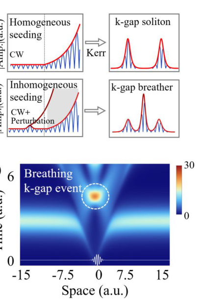
<figcaption class="paper-figure-caption"><b>Fig 1.</b> Figure 1| From k-gap amplification to a breathing k-gap event in nonlinear</figcaption>
</figure>
<figure class="paper-figure-card">
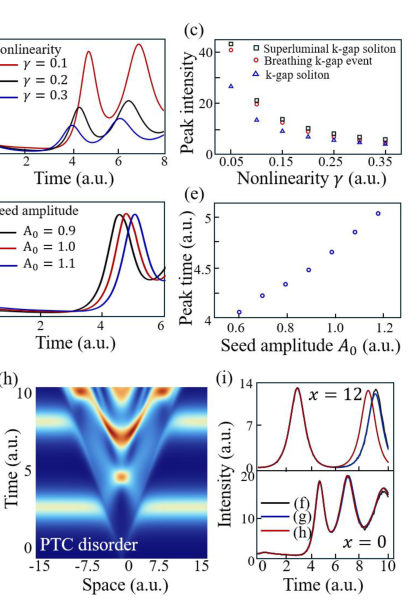
<figcaption class="paper-figure-caption"><b>Fig 2.</b> Figure 2| Parameter control and robustness of breathing k-gap events. (a)</figcaption>
</figure>
<figure class="paper-figure-card">
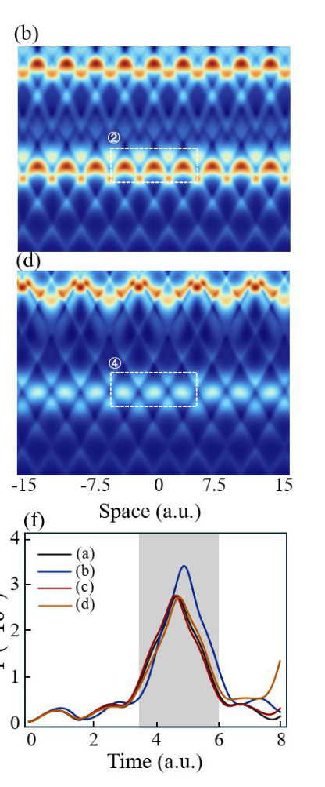
<figcaption class="paper-figure-caption"><b>Fig 3.</b> Figure 3| Phase-engineered collective patterns of breathing k-gap events. (a)</figcaption>
</figure>

**Summary.** The paper investigates the physics of photonic time crystals where energy gaps (k-gaps) are opened by temporal modulation. It demonstrates that perturbing the resulting nonlinear soliton background triggers a unique 'breathing k-gap event.' This mechanism, termed instability on instability, allows for deterministic control over extreme spatiotemporal wave generation using engineered seeding techniques.

**Why it may be interesting.** This work bridges nonlinear optics with condensed matter concepts of bandgaps and instability, providing a clear mechanism (instability on instability) for generating complex wave phenomena in periodically structured media, which is highly relevant to advanced photonics and metamaterials research.

Detailed structure

**Main problem.** The study investigates the generation and control of transient spatiotemporal wave excitations, termed 'breathing k-gap events,' within nonlinear photonic time crystals (PTCs). It specifically addresses the underlying mechanism identified as an 'instability on instability.'

**Main result.** These breathing events are shown to be robust against noise and disorder and can be deterministically controlled by engineering the initial seeding phase or amplitude. This establishes k-gap engineering as a powerful method for controlling extreme spatiotemporal waves in time-varying media.

**Method.** The analysis uses coupled-mode equations derived from Maxwell's equations, modeling the nonlinear wave propagation using a slowly-varying envelope approximation and Floquet-Bloch theory.

**Model / system.** The system is Nonlinear Photonic Time Crystals (PTCs) characterized by periodically modulated permittivity ($\epsilon_1(t)$). The dynamics are governed by coupled nonlinear evolution equations for forward ($A_f$) and backward ($A_b$) propagating envelopes, incorporating Kerr nonlinearity.

**Key observables.** Breathing k-gap event peak intensity, temporal shift of the excitation, spatially integrated intensity $P(t)$, and collective breathing patterns.

**Important parameters / regimes.** Kerr coefficient ($\gamma$), modulation depth ($\delta$), initial seed amplitude ($A_0$), and phase engineering parameters.

**Assumptions / limitations.** The derivation relies on the assumption of small modulation depth ($\delta \ll 1$) and the use of the slowly-varying envelope approximation for deriving the coupled nonlinear equations.

**Figures summary.** Figures illustrate the PTC setup, the formation of k-gap soliton trains, and the resulting breathing event. They also show parameter dependence (e.g., intensity vs $\gamma$ or time delay vs $A_0$) and examples of phase-engineered collective patterns.

**Paper structure.** The paper first derives the governing coupled nonlinear equations for the forward and backward envelopes using a coupled-mode framework based on Floquet theory. It then analyzes the dynamics, showing k-gap soliton formation followed by triggering the breathing event via localized perturbation. Finally, it demonstrates control over this event using varying nonlinearity or engineered seeding phases.

Abstract

Photonic time crystals (PTCs) host momentum bandgaps, or k gaps, that enable parametric amplification and lasing of seeded fields. In nonlinear PTCs, Kerr saturation dynamically suppresses the exponential growth, reshaping k-gap amplification into an active, spatially homogeneous k gap soliton train. Here, we show that a localized perturbation on this unstable background then nucleates a transient spatiotemporal excitation: the breathing k gap event. Unlike Peregrine breathers emerging from modulational instability on a planewave background, this event extracts energy from competing host k gap solitons and remains sustained by their interaction. We identify this process as an instability on instability mechanism intrinsic to nonlinear k gap dynamics. The event is robust against noise and disorder, and can be deterministically reshaped into collective breathing patterns by periodic and phase engineered seeding. These results establish k gap engineering as a route to generating and controlling extreme spatiotemporal waves in photonic time varying media.

[↑ back to top](#top)

### [Multi-Knob Switchable Chiral Superconductivity Quartet in Rhombohedral Graphene](http://arxiv.org/abs/2607.06520v1)

**Authors:** Zhenqi Hua, Shenyong Ye, Phatthanon Pattanakanvijit, Gang Shi, Tonghang Han, Emily Aitken, Jixiang Yang, Junseok Seo, Haoyang Liu, Ran Hao, Kaitai Xiao, Jiaxing Guo, Vo Tien Phong, Kenji Watanabe, Takashi Taniguchi, Chunli Huang, Cyprian Lewandowski, Long Ju, Peng Xiong, Zhengguang Lu  
**Type:** experiment · **Category:** strongly correlated electrons · **PDF:** <https://arxiv.org/pdf/2607.06520v1>  
**Analysis basis:** full PDF text, analyzed in chunks
**Topic relevance:** `analog quantum simulation` **3/5** · `driven-dissipative phase transition` **3/5** · `exotic spin models in light-matter` **3/5** · `spintronics-quantum-optics interface` **2/5** · `Kondo & dissipative impurity` **1/5** · `QC/QI experiment` **1/5** · `methods for driven-dissipative` **1/5** · `non-equilibrium dynamics` **1/5**

↔ Scroll figures horizontally

<figure class="paper-figure-card">

<figcaption class="paper-figure-caption"><b>Fig 1.</b> Fig. 1 | Chiral superconductivity (CSC) in rhombohedral hexalayer graphene (R6G). a,</figcaption>
</figure>
<figure class="paper-figure-card">
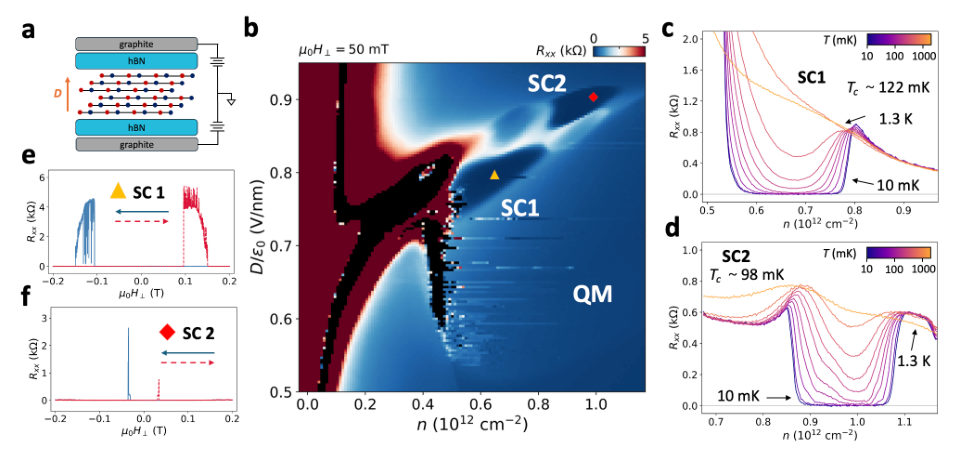
<figcaption class="paper-figure-caption"><b>Fig 2.</b> Figure 1b shows the longitudinal resistance 𝑅$$ of device D1 measured at base temperature (10</figcaption>
</figure>
<figure class="paper-figure-card">
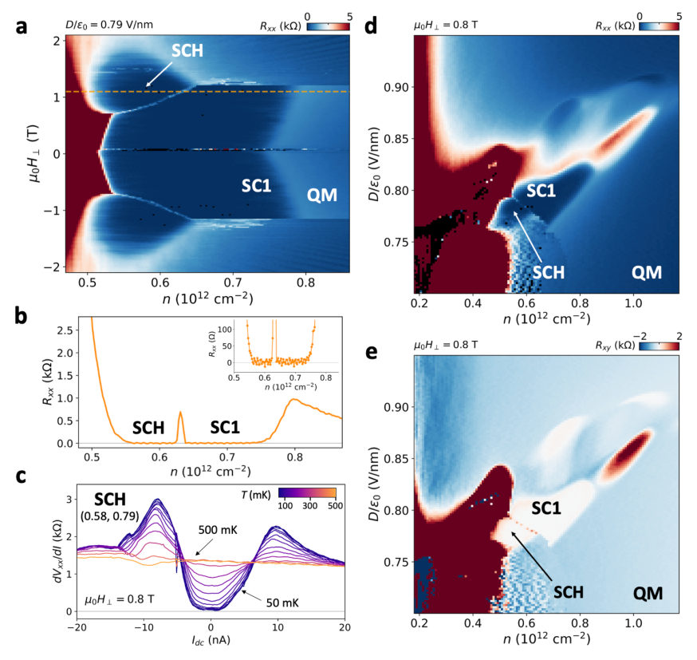
<figcaption class="paper-figure-caption"><b>Fig 3.</b> Fig. 2 | Out-of-plane magnetic field induced superconductivity. a, 𝑅$$ as a function of 𝑛 and 𝐻!</figcaption>
</figure>
<figure class="paper-figure-card">
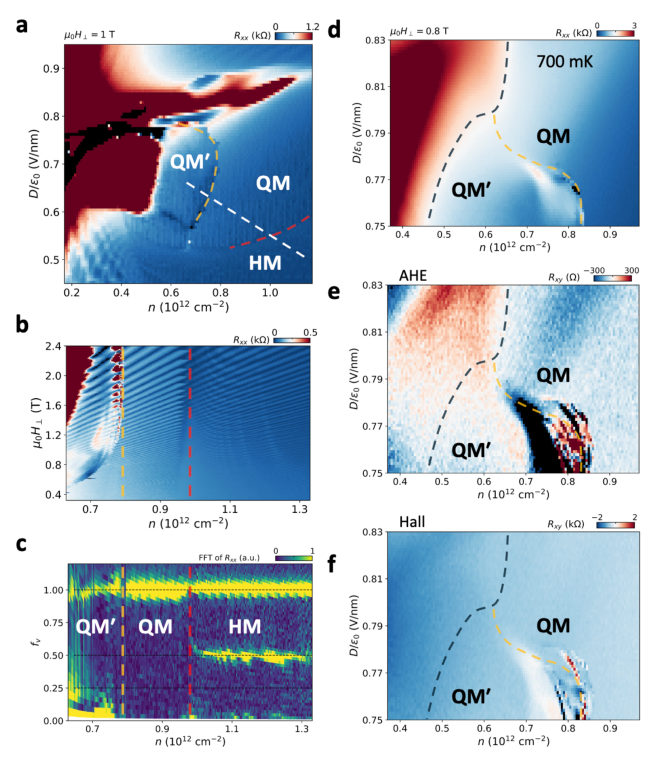
<figcaption class="paper-figure-caption"><b>Fig 4.</b> Fig. 3 | Fermiology of neighboring QM and valley polarization of SCH parent state. a, Base</figcaption>
</figure>
<figure class="paper-figure-card">
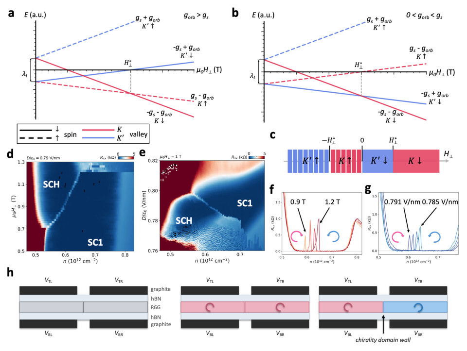
<figcaption class="paper-figure-caption"><b>Fig 5.</b> Fig. 4 | Magnetic-field selection and electrostatic programming of SC1 and SCH. a-b, Schematic</figcaption>
</figure>

**Summary.** This work demonstrates that rhombohedral graphene acts as a highly tunable platform capable of hosting a switchable quartet of chiral superconductors. By controlling the carrier density, gate voltage, and magnetic field, researchers can programmatically access different spin-valley polarized superconducting states. This establishes $	ext{R}6	ext{G}$ for potential applications in topological quantum electronics.

**Why it may be interesting.** The ability to engineer multiple, distinct topological superconducting phases using external electric and magnetic fields in a single 2D material platform is highly relevant for building quantum circuits or studying exotic pairing mechanisms beyond simple BCS theory.

Detailed structure

**Main problem.** The goal is to explore and control all spin-valley flavors of superconductivity in rhombohedral graphene ($	ext{R}6	ext{G}$) to realize programmable superconducting networks.

**Main result.** The authors report the realization of a switchable chiral-superconductor quartet in $	ext{R}6	ext{G}$ by tuning external fields, establishing the material as a multi-knob platform for novel topological devices.

**Method.** Transport measurements, including resistance mapping ($R_{xx}$, $R_H$), anomalous Hall measurements, and quantum oscillation analysis, were performed across varying magnetic fields and gate voltages.

**Model / system.** The physical system is rhombohedral hexalayer graphene ($	ext{R}6	ext{G}$), which possesses multiple degrees of freedom (spin, valley, layer) allowing for the study of spin-valley-polarized superconductivity. The physics involves competition between Kane-Mele-like spin-orbit coupling and magnetic field coupling.

**Key observables.** Zero-resistance states ($	ext{SC}1$, $	ext{SCH}$), anomalous Hall resistance sign reversal, quantum oscillation frequencies, and the ability to switch superconducting phases using external knobs.

**Important parameters / regimes.** Carrier density ($n$), gate displacement field ($D$), and out-of-plane magnetic field ($H_{\perp}$).

**Assumptions / limitations.** The parent state switching ($	ext{QM} 	o 	ext{QM}'$) is interpreted as arising from the competition between SOC and magnetic coupling; the existence of Majorana modes at domain walls is a potential consequence.

**Figures summary.** Figures illustrate superconducting phase diagrams in $(n, D)$ space showing $	ext{SC}1$ and $	ext{SCH}$ regions. They also map out the emergence of $	ext{SCH}$ above $0.8 	ext{ T}$ and demonstrate programmable switching between states using gate voltage or magnetic field tuning.

**Paper structure.** The paper systematically maps superconducting phases in the $(n, D, H_{\perp})$ parameter space. It first identifies low-field chiral superconductivity ($	ext{SC}1$, $	ext{SC}2$), then reports the emergence of a high-field state ($	ext{SCH}$), and finally argues that tuning all three knobs allows access to a full quartet of spin-valley polarized superconducting states.

Abstract

Chiral superconductors break orbital time-reversal symmetry and may host topological quasiparticles with non-Abelian statistics. In rhombohedral graphene, superconductivity develops from a spin-valley-polarized quarter-metal (QM) parent state and features unique magnetic hysteresis of resistance that indicates orbital time-reversal-symmetry-breaking. Exploring and controlling the full spin-valley flavors of such superconductivity could enable novel superconducting and topological devices, but have remained unexplored. Here we report transport measurements on rhombohedral hexalayer graphene (R6G), which reveal a new superconducting state (SCH) that is induced by an out-of-plane magnetic field, in addition to chiral superconductivity (CSC) similar to those observed in thinner layers. This SCH state emerges above 0.8 T, persists up to 1.6 T and can be switched on/off by magnetic field $H_\perp$, carrier density $n$, and gate displacement field $D$. Quantum oscillations and anomalous Hall measurements show that SCH stems from a field-induced quarter-metal (QM$'$) parent phase, which carries orbital magnetization opposite to that of the zero-field QM. Across the full $(n, D, H_\perp)$ parameter space, superconductivity can be realized from all four spin-valley isospin flavors, establishing a switchable chiral-superconductor quartet in R6G. We interpret the parent-state switching as arising from competition between a Kane-Mele-like spin-valley splitting and magnetic-field coupling to spin-valley-dependent magnetic moments. Our work establishes rhombohedral graphene as a multi-knob platform for different isospin-polarized superconductivities, which enables programmable superconducting networks with possible Majorana modes along domain walls.

[↑ back to top](#top)

### [Effect of pressure on the magnetic properties of (Co$_{0.5}$Fe$_{0.5}$)$_5$GeTe$_2$](http://arxiv.org/abs/2607.05548v1)

**Authors:** Tamás Prok, Zoltán Kovács-Krausz, Harvey Stanfield, Bing Zhao, Michael Leonárd Morgan, Bálint Fülöp, Marcos H. D. Guimarães, Ivan J. Vera-Marun, Saroj Prasad Dash, Szabolcs Csonka, Péter Makk, Endre Tóvári  
**Type:** both · **Category:** other · **PDF:** <https://arxiv.org/pdf/2607.05548v1>  
**Analysis basis:** full PDF text, analyzed in chunks
**Topic relevance:** `exotic spin models in light-matter` **3/5** · `spintronics-quantum-optics interface` **3/5** · `Frenkel-Kontorova` **2/5** · `analog quantum simulation` **2/5** · `Keldysh / 2PI / non-Gaussian methods` **1/5**

↔ Scroll figures horizontally

<figure class="paper-figure-card">
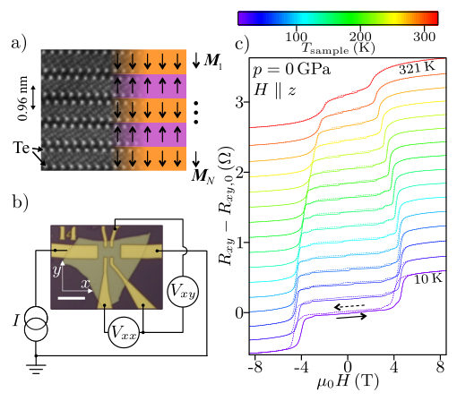
<figcaption class="paper-figure-caption"><b>Fig 1.</b> FIG. 1. a) Scanning transmission electron microscope image of a CFGT crystal. The brightest spots are Te atoms. The alternating magnetization in neighboring layers in the AFM state is illustrated. The thickness of a molecular layer and its magnetization are indicated. b) Optical image of 90-nm-thick sample A and a diagram of the measurement setup. The scale bar is 10 µm. c) The Hall resistance of the sample at a series of selected temperatures. Solid (dotted) lines indicate data for up (down) sweeps of the field. A zero-field value Rxy,0, which is a result of the mixing of a longitudinal voltage drop, has been removed. The curves are plotted with offsets that are proportional to T.</figcaption>
</figure>
<figure class="paper-figure-card">
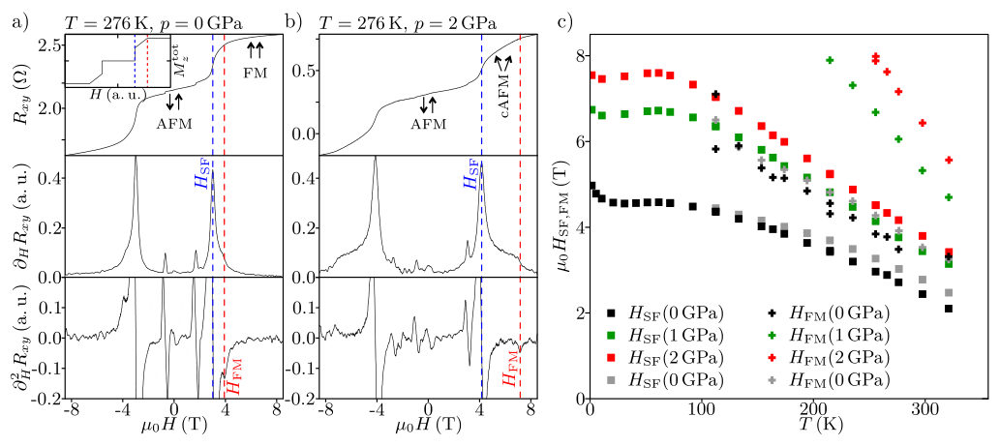
<figcaption class="paper-figure-caption"><b>Fig 2.</b> FIG. 2. a-b) Examples of the raw Hall data and its derivatives on sample A at 276 K as a function of increasing H at p = 0 and 2 GPa, respectively. The vertical blue and red lines mark the HSF and HFM fields, respectively. Arrows illustrate the AFM, canted AFM and FM phases. The peaks in the derivatives within the AFM phase are due to the steps of the small hystereses. Inset: simulation of the total out-of-plane magnetization using the two-sublattice model. c) The values of the HSF (solid squares) and the HFM (crosses) fields as a function of T at different pressures.</figcaption>
</figure>
<figure class="paper-figure-card">
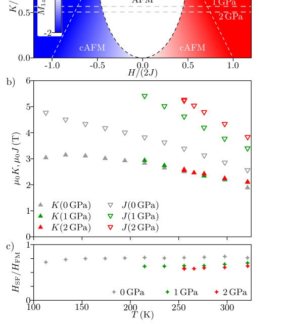
<figcaption class="paper-figure-caption"><b>Fig 3.</b> FIG. 3. a) Phase diagram of the two-sublattice system ac- cording to the numerically calculated global minimum of Eq. 1. The black dashed line shows the analytical first-order spin-flop/flip phase transition at ±HSF, given by Eq. 2a for K/J &lt; 1 and ±J for K/J &gt; 1. The white dashed lines are the second-order phase transition from the cAFM to the FM phase at ±HFM, from Eq. 2b. Both fields are rescaled by 2J. The grey dashed lines are the K/J values determined from ex- perimental HSF/HFM data for sample A at different pressures. b) The effective K (solid triangles) and J (empty triangles) values as a function of temperature, extracted using Eq. 2 and experimental HSF, HFM. c) The measured...</figcaption>
</figure>
<figure class="paper-figure-card">
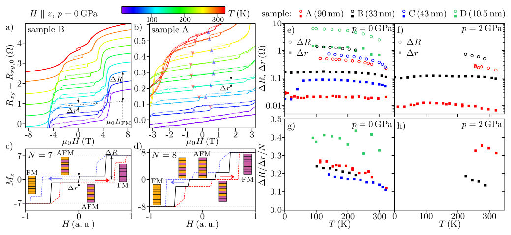
<figcaption class="paper-figure-caption"><b>Fig 4.</b> FIG. 4. a,b) Fine structure of the anomalous Hall resistance in the AFM phase in samples B and A, respectively. The step and small loop heights ∆R, ∆r are illustrated. In b), red and blue triangles highlight the coercive fields closest to H = 0 of the double hysteresis loops. c,d) Simulations of the magnetization Mz for 7 and 8 layers following the global energy minimum of Eq. 4 (black lines), and simulations following the local energy minima for up and down sweeps (red and blue dashed lines). Stacks of rectangles indicate the magnetization Miz of the individual layers in the global energy minimum at each H, with purple for positive and orange for negative. e,f) ∆R, ∆r in multiple samples...</figcaption>
</figure>

**Summary.** This work experimentally and theoretically investigates how hydrostatic pressure modifies the complex magnetic order of (Co$_{0.5}$Fe$_{0.5}$)$_5$GeTe$_2$. By analyzing magnetoresistance, the researchers quantified that pressure strongly enhances interlayer coupling while successfully modeling subtle AFM hysteresis using a linear chain approach, suggesting surface effects dominate over bulk FM coexistence.

**Why it may be interesting.** The ability to tune magnetic interactions ($J$) by external pressure, combined with modeling layer-by-layer magnetism using concepts from quantum many-body physics (like chain models), provides insights into emergent quantum phenomena in 2D materials.

Detailed structure

**Main problem.** The study investigates how external pressure tunes the magnetic properties of (Co$_{0.5}$Fe$_{0.5}$)$_5$GeTe$_2$, specifically focusing on understanding the nature of its magnetic order within the Antiferromagnetic (AFM) state.

**Main result.** Applying pressure significantly enhances the interlayer exchange coupling ($J$) by about 50% at 2 GPa, and the small hysteresis loops observed in the AFM phase are explained by surface layer behavior modeled via a linear chain approach rather than coexisting ferromagnetic order.

**Method.** The research combines magnetoresistance measurements (Hall effect) under varying pressures with theoretical modeling using both two-sublattice and linear chain models to extract magnetic parameters.

**Model / system.** The physical system is the 2D magnet (Co$_{0.5}$Fe$_{0.5}$)$_5$GeTe$_2$. The analysis employs the two-sublattice model for bulk behavior and a linear chain model to describe layer-dependent phenomena, such as surface layer switching.

**Key observables.** Magnetoresistance ($R_{xy}$) vs. magnetic field ($H$), Spin-flop transition field ($	ext{H}_{	ext{SF}}$), small hysteresis loops within the AFM state, and interlayer exchange coupling ($J$).

**Important parameters / regimes.** Applied pressure ($p$) up to 2 GPa; anisotropy constant ($K$); interlayer exchange coupling ($J$); layer number ($N$).

**Assumptions / limitations.** The small hysteresis loops are attributed solely to surface layer switching described by the linear chain model, avoiding the need for a coexisting FM phase. The analysis often involves fitting data using simplified two-sublattice approximations.

**Figures summary.** Figures show SEM/optical images and $R_{xy}$ vs. $H$ curves at various pressures and temperatures; subsequent figures plot derived fields ($	ext{H}_{	ext{SF}}$) versus pressure or temperature, and analyze the ratio of hysteresis features ($\Delta R / \Delta r / N$).

**Paper structure.** The paper progresses from presenting experimental measurements of magnetoresistance under pressure to applying theoretical models (two-sublattice and linear chain) to fit the data. It systematically analyzes phase transitions ($	ext{SF}$ vs $	ext{FM}$) and finally uses the chain model to explain fine details like small hysteresis loops.

Abstract

Cobalt-doped Fe$_5$GeTe$_2$ possesses a rich magnetic phase diagram as a function of Co concentration. The nature of magnetic order in (Co$_{0.5}$Fe$_{0.5}$)$_5$GeTe$_2$ is especially interesting, as it has been shown to exhibit ferromagnetic order, A-type antiferromagnetic (AFM) order, or potentially both at the same time. Here we present magnetoresistance measurements on antiferromagnetic (Co$_{0.5}$Fe$_{0.5}$)$_5$GeTe$_2$ at a series of pressures and extract the anisotropy and interlayer exchange fields using the two-sublattice model. We show a 50 % increase of the interlayer exchange at 2 GPa, highlighting the sensitivity of magnetic properties to interlayer distance. In addition, we find that the sharp hysteretic transitions observed within the AFM state can be qualitatively described by a linear chain model, which suggests an even-odd effect as a function of layer number instead of a coexisting ferromagnetic phase.

[↑ back to top](#top)

### [From Valley Filtering to Superconducting Diode Effect in Spin-Orbit Coupled Graphene Junctions](http://arxiv.org/abs/2607.06303v1)

**Authors:** F. Bonasera, G. A. Falci, E. Paladino, F. M. D. Pellegrino  
**Type:** theory · **Category:** other · **PDF:** <https://arxiv.org/pdf/2607.06303v1>  
**Analysis basis:** full PDF text, analyzed in chunks
**Topic relevance:** `spintronics-quantum-optics interface` **3/5** · `non-equilibrium dynamics` **2/5** · `Keldysh / 2PI / non-Gaussian methods` **1/5** · `driven-dissipative phase transition` **1/5** · `exotic spin models in light-matter` **1/5** · `methods for driven-dissipative` **1/5**

↔ Scroll figures horizontally

<figure class="paper-figure-card">
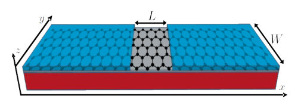
<figcaption class="paper-figure-caption"><b>Fig 1.</b> FIG. 1. Schematic of the system. A graphene Josephson junction consists of a graphene layer (gray) on a substrate (red), with superconducting electrodes (light blue) covering the |x| &gt; L/2 regions.</figcaption>
</figure>
<figure class="paper-figure-card">
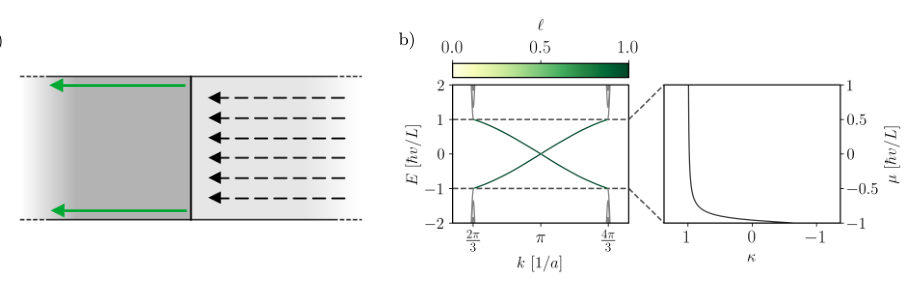
<figcaption class="paper-figure-caption"><b>Fig 2.</b> FIG. 2. a) schematic of a single junction where the left sector is made of zigzag graphene ribbon in the QSH phase with λKM = ℏv/L, and the right sector is made of pristine graphene with Fermi level µR = 0.2t; in green we highlighted the left-moving helical edge states, while the current is injected from the right sector and pictorially represented by black dashed arrows. The width of the junction is W = 295a. b) the left panel shows the electronic band structure of a QSH graphene ribbon, where the scale of greens represents the degree of localization of the helical edge states, as defined in Eqs. (12)-(13), and the dashed black horizontal lines highlight the energy gap; the energies are...</figcaption>
</figure>
<figure class="paper-figure-card">
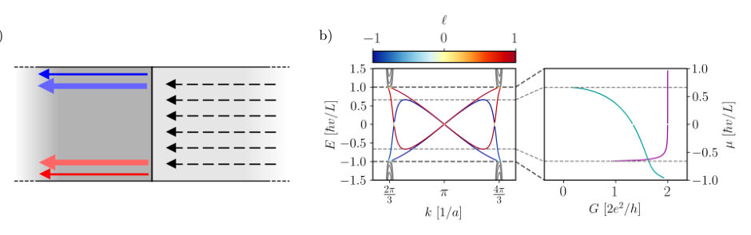
<figcaption class="paper-figure-caption"><b>Fig 3.</b> FIG. 3. a) schematic of a single junction where the left sector is made of a zigzag graphene ribbon in the QVSH phase with λVZ = ℏv/L and λR = 5 ℏv/L, in red (blue) the electron modes of the bottom (top) edge, with solid [pale] color indicating the pseudohelical [valley] edge states. The right sector is made of pristine graphene with Fermi level µR = 0.2t, and the current is injected from the right side and pictorially represented by black dashed arrows. The width of the junction is W = 295a. In b) the left panel shows the band structure of the QVSH phase graphene ribbon: the color scale indicates the degree of edge localization, defined in Eqs. (12) and (16), in red (blue) for the bottom...</figcaption>
</figure>
<figure class="paper-figure-card">
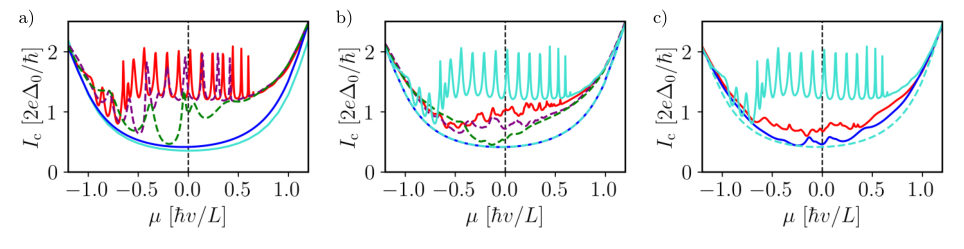
<figcaption class="paper-figure-caption"><b>Fig 4.</b> FIG. 4. a) critical current Ic (in units of 2e∆0/ℏ) of the GJJ as a function of the Fermi level µ (in units of ℏv/L) of the QVSH graphene region; the parameters used are λR = 5 ℏv/L, λVZ = ℏv/L and a junction length and width of L = 59a and W = 5L. In red the results for a pure zigzag ribbon with (m, n) = (1, 0), in purple (green) those for a (m, n) = (2, 1) ((m, n) = (1, 2)) termination and in blue the ones for a pure armchair ribbon, (m, n) = (0, 1). As a reference, we show in cyan the results of a previous work where the critical current is computed analytically using periodic boundary conditions [81], effectively corresponding to the limit of an infinite W. b) same as in a) but for...</figcaption>
</figure>
<figure class="paper-figure-card">
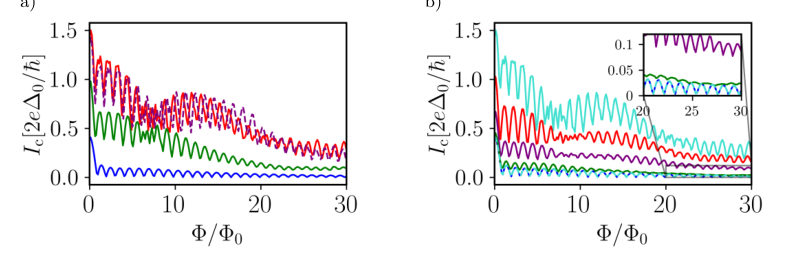
<figcaption class="paper-figure-caption"><b>Fig 5.</b> FIG. 5. Critical supercurrent Ic (in units of 2e∆0/ℏ) as a function of the magnetic flux Φ (in units of the superconducting magnetic flux quantum Φ0 = h/2e), produced by a perpendicular magnetic field threading the junction. The parameters used are λR = 5 ℏv/L, λVZ = ℏv/L, µ = 0 and a junction length and width of L = 59a and W = 5L. In a) we show the clean edge case with different edge terminations; in red the results for a pure zigzag ribbon with (m, n) = (1, 0), in purple (green) those for a (m, n) = (2, 1) ((m, n) = (1, 2)) termination, and in blue the ones for a pure armchair ribbon, (m, n) = (0, 1). In b) we show the same plot as in a) but for junction with disordered edges; in...</figcaption>
</figure>

**Summary.** This work theoretically examines spin-orbit coupled graphene junctions, demonstrating that the junction's edge structure dictates its transport properties. Key findings include robust valley filtering in the normal state and a significant Josephson Diode Effect (JDE) in the superconducting state due to broken mirror symmetry at zigzag edges. This highlights how engineered symmetries can control quantum electronic functionalities.

**Why it may be interesting.** The strong dependence of macroscopic quantum effects (like SDE) on microscopic symmetries (edge termination leading to broken mirror symmetry) is highly relevant for designing novel quantum electronic devices.

Detailed structure

**Main problem.** The study investigates transport properties, including valley filtering and superconducting diode effects, in graphene junctions that acquire spin-orbit coupling (SOC) via proximity to a substrate.

**Main result.** The system exhibits strong non-reciprocal supercurrents leading to a significant Josephson Diode Effect (JDE), which is strongly dependent on the edge termination symmetry of the junction.

**Method.** Theoretical analysis using tight-binding models solved in the ballistic and zero temperature limits, employing scattering formalism and analyzing Andreev Bound States (ABS).

**Model / system.** The physical system is a graphene Josephson Junction (GJJ) where SOC is induced by proximity. The model uses a tight-binding Hamiltonian incorporating Rashba and intrinsic SOC terms.

**Key observables.** Valley polarization ($\kappa$), supercurrent ($I(\phi)$), non-reciprocal supercurrent ($\Delta I_c$), and magnetic interference patterns.

**Important parameters / regimes.** SOC strengths ($\lambda_R, \lambda_{VZ}$), junction width/length ratios, perpendicular magnetic field strength ($B$).

**Assumptions / limitations.** Calculations are performed in the ballistic and short junction approximations at zero temperature.

**Figures summary.** Figures illustrate band structures showing valley polarization gaps (QSH/QVSH phases) and show the dependence of valley polarization ($\kappa$) on junction length, alongside superconducting current analysis vs. magnetic flux.

**Paper structure.** The paper progresses from analyzing normal state transport to demonstrate valley filtering in QSH/QVSH phases, and then extends this analysis to superconducting junctions to reveal non-reciprocal supercurrents causing the JDE.

Abstract

We study the transport properties of proximitized graphene, which can acquire a spin-orbit coupling by the proximity effect with a substrate. We focus on the ballistic and zero temperature limits, making use of a tight-binding procedure based on the KWANT Python package. We first find key results on valley-filtering properties and asymmetric edge transport in spin-orbit coupled graphene single junctions, and then move to the analysis of the superconducting transport in a graphene Josephson junction, in the short junction limit. We study the relative contribution of edge modes for different edge terminations and some degree of edge disorder, and also analyze the magnetic interference pattern that arises when threading the junction with a perpendicular magnetic field. We find residual supercurrent at high magnetic fluxes, due to the localized nature of transport in the junction, and a strong non-reciprocal transport that leads to a significant Josephson diode effect.

[↑ back to top](#top)

### [Interfacial Noncollinear Filtering of Spin Hall Currents](http://arxiv.org/abs/2607.05912v1)

**Authors:** Dan-Yang Han, Zi-An Wang, Hong-Liang Chen, Bo Li, Wen-Jian Lu, Yu-Ping Sun, Liang Liu, Shu-Hui Zhang, Ding-Fu Shao  
**Type:** theory · **Category:** other · **PDF:** <https://arxiv.org/pdf/2607.05912v1>  
**Analysis basis:** full PDF text, analyzed in chunks
**Topic relevance:** `spintronics-quantum-optics interface` **3/5** · `non-equilibrium dynamics` **2/5** · `Keldysh / 2PI / non-Gaussian methods` **1/5** · `correlated / nonlocal dissipation` **1/5** · `driven-dissipative phase transition` **1/5** · `methods for driven-dissipative` **1/5**

↔ Scroll figures horizontally

<figure class="paper-figure-card">
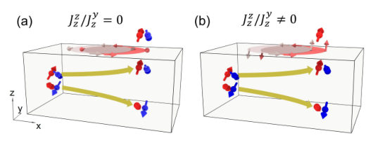
<figcaption class="paper-figure-caption"><b>Fig 1.</b> Fig. 1: Physical picture of interfacial noncollinear filtering of a spin Hall current. The yellow arrows indicate the flow direction of the bulk spin Hall current, while the large red and blue arrows denote spin Hall channels carrying different spin components. Although these channels may contain different spin directions, the symmetry-averaged bulk spin Hall current has only a net y-spin polarization. The top surface represents the emitting interface, where the small arrows on the Fermi surfaces denote the interfacial spin texture; its electric-field-induced nonequilibrium spin accumulation acts as the spin-orbit filtering field. (a) At a high-symmetry interface, the filtering field lies...</figcaption>
</figure>
<figure class="paper-figure-card">
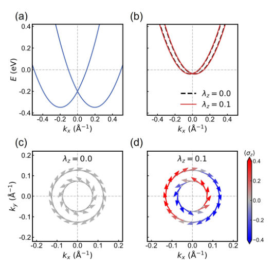
<figcaption class="paper-figure-caption"><b>Fig 2.</b> Fig. 2: Minimal model for interfacial noncollinear filtering. (a) Bulk band structure of the high-symmetry Dirac spin Hall source. (b) Interface dispersion for the conventional Rashba case and for the generalized Rashba model with finite 𝜆𝜆𝑧𝑧. (c) In-plane spin texture of the conventional Rashba interface. (d) Noncollinear interfacial spin texture generated by finite 𝜆𝜆𝑧𝑧.</figcaption>
</figure>
<figure class="paper-figure-card">
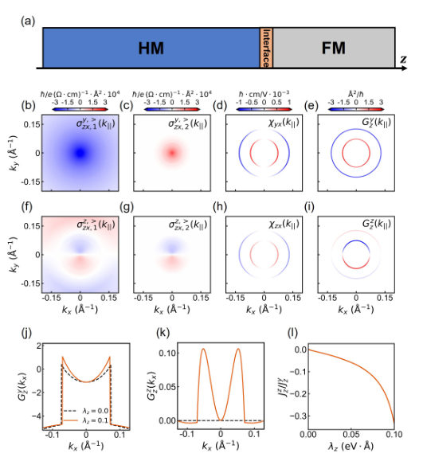
<figcaption class="paper-figure-caption"><b>Fig 3.</b> Fig. 3: Momentum-resolved generation of an unconventional emitted spin current by interfacial noncollinear filtering. (a) The schematic of a SOT device supporting interfacial noncollinear filtering. (b,c) k∥-resolved conventional spin Hall conductivity 𝜎𝜎𝑧𝑧𝑧𝑧,𝑛𝑛 𝑦𝑦,&gt; (k∥) for 𝑛𝑛=1 (b) and 𝑛𝑛=2 (c). (d) In-plane component 𝜒𝜒𝑦𝑦𝑦𝑦(k∥) of the interfacial spin-orbit filtering texture. (e) Momentum resolved contribution 𝐺𝐺𝑧𝑧 𝑦𝑦(k∥) to the emitted conventional spin current. (f,g) k∥-resolved unconventional spin Hall conductivity 𝜎𝜎𝑧𝑧𝑧𝑧,𝑛𝑛 𝑧𝑧,&gt; (k∥) for 𝑛𝑛=1 (f) and 𝑛𝑛=2 (g). (h) Out-of-plane component 𝜒𝜒𝑧𝑧𝑧𝑧(k∥) of the interfacial spin-orbit filtering texture. (i) Momentum resolved contribution...</figcaption>
</figure>
<figure class="paper-figure-card">
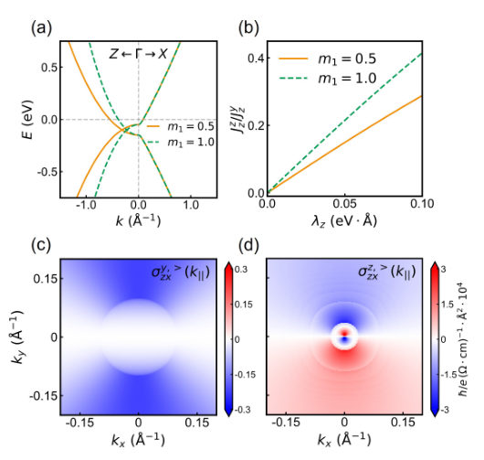
<figcaption class="paper-figure-caption"><b>Fig 4.</b> Fig. 4: Interfacial noncollinear filtering based on the Cd3As2 Hamiltonian. (a) Low-energy band structure of Cd3As2 for representative values of the mass parameter 𝑚𝑚1. Dirac points appear along the 𝛤𝛤–𝑍𝑍 direction, and the dispersion near the Dirac points is tuned by 𝑚𝑚1. (b) Emitted spin-current ratio 𝐽𝐽𝑧𝑧𝑧𝑧/𝐽𝐽𝑧𝑧 𝑦𝑦 as a function of the out-of-plane interfacial spin-orbit coupling 𝜆𝜆𝑧𝑧. The ratio increases nearly linearly with 𝜆𝜆𝑧𝑧 and is enhanced for larger 𝑚𝑚1. (c,d) k∥-resolved spin Hall conductivities 𝜎𝜎𝑧𝑧𝑧𝑧,𝑛𝑛 𝑦𝑦,&gt; (k∥) and 𝜎𝜎𝑧𝑧𝑧𝑧,𝑛𝑛 𝑧𝑧,&gt; (k∥). The hidden out-of- plane component is much larger than the conventional component near the Dirac points, providing an efficient k∥-resolved...</figcaption>
</figure>

**Summary.** This work introduces interfacial noncollinear filtering as a mechanism to reprogram spin-current polarization in spintronic materials. By treating the emitted current as a hybrid bulk-interface response, the authors show that even high-symmetry sources can generate unconventional out-of-plane spin currents if the interface possesses sufficient low symmetry. This shifts control from intrinsic material symmetry to engineered interfacial quantum selection.

**Why it may be interesting.** While focused on condensed matter transport, the concept of engineered boundary conditions controlling quantum response echoes principles used in open quantum systems where environment coupling dictates observable dynamics.

Detailed structure

**Main problem.** The conventional view treats Spin Hall currents as bulk responses constrained by crystal symmetry, limiting the achievable spin polarization direction.

**Main result.** Interfacial noncollinear filtering allows for generating unconventional emitted spin currents from high-symmetry sources by selectively transmitting hidden momentum-resolved spin components at the interface.

**Method.** The authors establish the emitted spin current as a bulk–interface hybrid response, modeling the effect using interfacial spin-orbit fields that impose spin-dependent transmission probabilities.

**Model / system.** The study analyzes heterostructures involving high-symmetry spin sources (like Dirac semimetals) coupled to low-symmetry interfaces, modeled using effective Hamiltonians incorporating Rashba-type coupling terms.

**Key observables.** Emitted out-of-plane spin current ($J_{zzz}$), the ratio $J_z/J_y$, and $\mathbf{k}_{\|}$-resolved hidden spin Berry-curvature components ($\Omega$).

**Important parameters / regimes.** The strength of the interfacial low-symmetry coupling ($\lambda_z$) is crucial, as it breaks symmetry and enables the unconventional current.

**Assumptions / limitations.** The emitted current is treated as a hybrid response combining bulk texture and interfacial transmission; analysis often focuses on states with positive group velocity normal to the interface.

**Figures summary.** Figures illustrate that low-symmetry interfaces lead to noncollinear filtering, resulting in finite out-of-plane spin currents ($J_{zzz} 
eq 0$), whereas high symmetry leads to cancellation ($J_{zzz}=0$).

**Paper structure.** The paper progresses from identifying the limitation of bulk symmetry constraints to proposing the hybrid bulk-interface mechanism. It develops models using minimal and realistic Dirac semimetal systems to calculate how interfacial coupling selectively transmits hidden spin components, demonstrating a quantitative increase in unconventional current with interface asymmetry.

Abstract

Spin Hall currents generated in nonmagnetic materials are conventionally regarded as bulk responses whose polarization is fixed by crystal symmetry. This view has motivated the search for intrinsically low-symmetry spin sources when unconventional spin polarizations are required. Here we point out that, in realistic heterostructures, the device-relevant quantity is not the fully symmetry-averaged bulk spin Hall current, but the emitted spin current transmitted across the interface. We therefore establish emitted spin currents as bulk-interface hybrid responses and propose interfacial noncollinear filtering as a mechanism to bypass the bulk-symmetry constraint. A low-symmetry interfacial spin-orbit field, generally noncollinear with the momentum-resolved spin polarization of the incident spin Hall current, imposes spin-dependent transmission and converts hidden momentum-resolved spin-polarization components into an observable unconventional emitted spin current. Using both a rotationally symmetric minimal model and a realistic high-symmetry Dirac-semimetal model, we show that conventional spin Hall sources can emit sizable out-of-plane spin currents when their hidden bulk spin Hall textures are selectively transmitted by the interfacial spin-orbit field. Our results reveal that spin-current polarization emerges from the cooperative action of bulk and interfacial responses, providing a strategy for reprogramming spin-current polarization in high-efficiency, CMOS-compatible spin Hall materials without relying on intrinsically low-symmetry bulk crystals or external symmetry-breaking schemes.

[↑ back to top](#top)

### [Layer-selective chirality switch in bilayer graphene intercalated by Janus monolayers](http://arxiv.org/abs/2607.06159v1)

**Authors:** Marko Milivojević  
**Type:** theory · **Category:** other · **PDF:** <https://arxiv.org/pdf/2607.06159v1>  
**Analysis basis:** full PDF text, analyzed in chunks
**Topic relevance:** `spintronics-quantum-optics interface` **3/5** · `Kondo & dissipative impurity` **1/5** · `analog quantum simulation` **1/5** · `exotic spin models in light-matter` **1/5** · `non-equilibrium dynamics` **1/5**

↔ Scroll figures horizontally

<figure class="paper-figure-card">
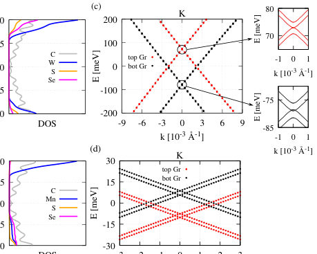
<figcaption class="paper-figure-caption"><b>Fig 1.</b> Figure 2. Atom-projected density of states of (a) Gr/WSSe/Gr and (b) Gr/MnSSe/Gr heterostructures. In both cases, the carbon states reside inside the semiconduct- ing gap of the Janus monolayer, confirming the absence of hybridization between graphene and substrate states near the Fermi level. Layer-resolved fatband structure of (c) Gr/WSSe/Gr and (d) Gr/MnSSe/Gr in the vicinity of the K point, with the top (red) and bottom (black) graphene layer contributions given. The inset in (c) shows a zoom around the Dirac points of both the top and bottom graphene lay- ers, showing spin splitting due to proximity-induced spin-orbit coupling.</figcaption>
</figure>
<figure class="paper-figure-card">
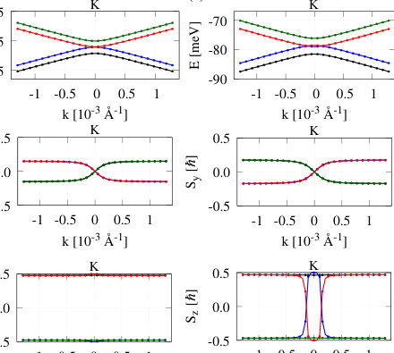
<figcaption class="paper-figure-caption"><b>Fig 2.</b> Figure 3. Comparison of the DFT electronic band structure and spin expectation values Sy and Sz near the Dirac K point with the tight-binding model Hamiltonian (6) for the top (a) and bottom (b) graphene layers within the Gr/WSSe/Gr het- erostructure. The tight-binding parameters are given in Ta- ble I. Solid lines represent the tight-binding fit, while circles denote DFT data. The k-path is taken along the kx direction (ky = 0), centered at the K point. By symmetry, Sx vanishes along this path.</figcaption>
</figure>
<figure class="paper-figure-card">
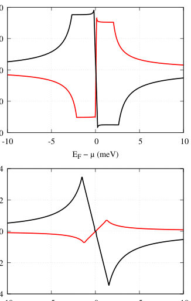
<figcaption class="paper-figure-caption"><b>Fig 3.</b> Figure 5. Calculated dependence of the conventional Rashba–Edelstein charge-to-spin conversion efficiency param- eter αREE as a function of doping for both top and bottom graphene within the (a) Gr/WSSe/Gr and (b) Gr/MnSSe/Gr heterostructures.</figcaption>
</figure>

**Summary.** This theoretical study predicts that sandwiching bilayer graphene between Janus monolayers like WSSe or MnSSe creates a platform for advanced spintronics. The key mechanism involves the monolayer inducing opposite signs of Rashba SOC in the top and bottom layers, allowing researchers to independently switch spin current directions by applying gate voltages.

**Why it may be interesting.** While focused on condensed matter spintronics, the concept of using engineered interfaces (Janus materials) to induce controllable, layer-specific spin-orbit coupling is relevant to understanding topological phenomena in low-dimensional quantum systems.

Detailed structure

**Main problem.** The goal is to design gate-tunable, layer-selective spintronic devices by independently controlling the spin current direction in the top and bottom layers of bilayer graphene.

**Main result.** Intercalating bilayer graphene with Janus monolayers (WSSe or MnSSe) induces opposite signs of proximity-induced Rashba SOC in each layer, enabling independent control over spin currents via electrostatic gating.

**Method.** The study uses first-principles DFT calculations to derive parameters for an effective tight-binding model, followed by linear response theory and Rashba-Edelstein conversion calculations.

**Model / system.** The system is bilayer graphene ($	ext{Gr}$) sandwiched between a Janus monolayer ($	ext{WSSe}$ or $	ext{MnSSe}$). The low-energy physics is modeled using two independent, proximitized graphene layers described by effective Hamiltonians incorporating orbital, intrinsic SOC, and Rashba SOC terms.

**Key observables.** Rashba-Edelstein coefficient ($\alpha_{	ext{REE}}$), spin current direction, layer-resolved band structure, and chemical potential shifts.

**Important parameters / regimes.** The proximity-induced Rashba SOC signs, the exchange coupling parameters ($\Delta_A, \Delta_B$) for magnetic cases, and gate voltages applied to individual layers.

**Assumptions / limitations.** The low-energy physics is assumed to be described by two independent graphene layers due to the decoupling effect; the $	ext{MnSSe}$ magnetic configuration uses an out-of-plane antiferromagnetic model case.

**Figures summary.** Figure 1 schematically shows how a charge current generates spin accumulations in opposite directions. Figure 2 confirms decoupled Dirac cones and layer-resolved band structures for both heterostructures.

**Paper structure.** The paper proceeds by establishing the physical system (Janus intercalation), deriving effective Hamiltonians incorporating proximity effects, calculating key transport coefficients like $\alpha_{	ext{REE}}$, and demonstrating that opposite SOC signs lead to independent spin current control via gating.

Abstract

We predict that intercalating bilayer graphene with nonmagnetic WSSe or magnetic MnSSe Janus monolayers induces a layer-selective switch of the in-plane Rashba spin texture, resulting in opposite spin current directions in the top and bottom graphene layers. First-principles calculations reveal that both Janus monolayers decouple the two graphene layers while simultaneously inducing opposite signs of the proximity-induced Rashba spin-orbit coupling in each. Tight-binding modeling of the proximitized layers, combined with Rashba-Edelstein charge-to-spin conversion calculations, confirms that the spin current direction can be independently controlled by gating the top or bottom graphene layer. Bilayer graphene intercalated by Janus monolayers thus represents a promising platform for gate-tunable, layer-selective spintronic devices.

[↑ back to top](#top)

### [Raman spectroscopy of the van der Waals altermagnet Co$_{1/4}$NbSe$_2$](http://arxiv.org/abs/2607.05616v1)

**Authors:** Dushyanthini Balasundaram, Bishal Thapa, Resham Regmi, Nirmal J. Ghimire, Igor I. Mazin, Patrick M. Vora  
**Type:** both · **Category:** other · **PDF:** <https://arxiv.org/pdf/2607.05616v1>  
**Analysis basis:** full PDF text, analyzed in chunks
**Topic relevance:** `exotic spin models in light-matter` **3/5** · `spintronics-quantum-optics interface` **3/5**

↔ Scroll figures horizontally

<figure class="paper-figure-card">
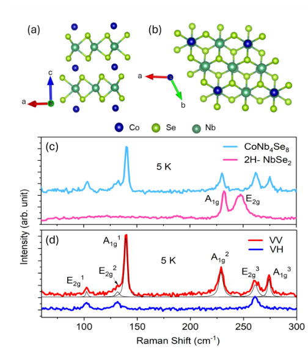
<figcaption class="paper-figure-caption"><b>Fig 1.</b> FIG. 1. Lattice structure of Co1/4NbSe2 viewed along the (a) b axis and (b) c axis. (c) 5 K unpolarized Raman spectra for Co1/4NbSe2 and NbSe2 illustrating the impact of Co inter- calation. (d) 5 K polarized Raman spectra for Co1/4NbSe2 in the VV and VH configurations. These data facilitate the identification of mode symmetry as E2g modes are visible in both VV and VH, but A1g is only active in VV.</figcaption>
</figure>
<figure class="paper-figure-card">
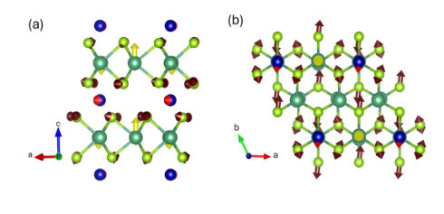
<figcaption class="paper-figure-caption"><b>Fig 2.</b> FIG. 2. E2u phonon mode exhibiting the vibration associated with the Co superlattice at 133 cm−1 along the a) b-axis and b) c-axis.</figcaption>
</figure>
<figure class="paper-figure-card">
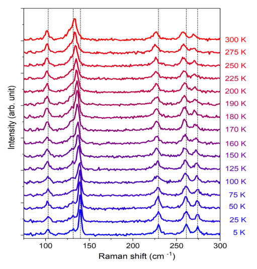
<figcaption class="paper-figure-caption"><b>Fig 3.</b> FIG. 3. Temperature evolution of Raman spectra from 5 K to 300 K, offset for clarity.</figcaption>
</figure>
<figure class="paper-figure-card">
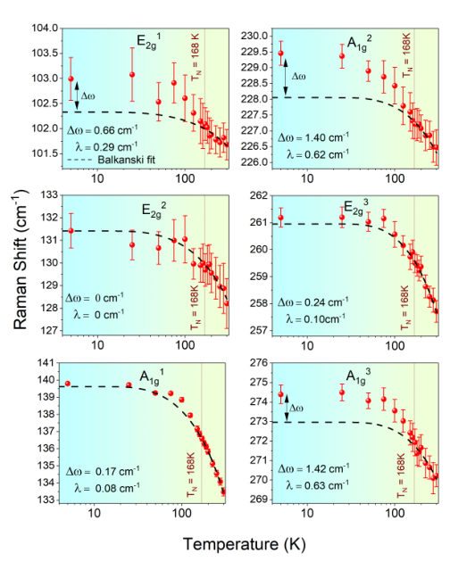
<figcaption class="paper-figure-caption"><b>Fig 4.</b> FIG. 4. Temperature dependence of Raman frequency shifts for different phonon modes of Co1/4NbSe2. Dashed lines show fits using the Balkanski anharmonic model in Eq. (6). ∆ω values are obtained as described in the text</figcaption>
</figure>

**Summary.** The study uses advanced Raman spectroscopy and DFT calculations to characterize the vibrational properties of the altermagnetic material $	ext{Co}_{1/4}	ext{NbSe}_2$. It reveals that Co intercalation reconstructs the phonon spectrum while confirming the existence of spin-phonon coupling in specific modes. This work advances understanding of how magnetic ordering influences lattice dynamics in transition metal dichalcogenides.

**Why it may be interesting.** This work provides a detailed spectroscopic probe into emergent magnetic phenomena (altermagnetism) in 2D materials, linking electronic order directly to lattice vibrations via measurable Raman shifts. This type of magneto-vibrational coupling is highly relevant for designing novel quantum materials.

Detailed structure

**Main problem.** The study investigates how Co intercalation and altermagnetic ordering affect the lattice dynamics of the layered van der Waals material $	ext{Co}_{1/4}	ext{NbSe}_2$. The goal is to identify vibrational signatures and evidence for spin-phonon coupling.

**Main result.** Intercalation causes significant reconstruction of the phonon spectrum via zone folding, while temperature measurements reveal indirect spin-phonon coupling in specific $	ext{A}_{1g}$ symmetry modes. Furthermore, Co atoms do not contribute to any Raman-active modes by symmetry.

**Method.** The research combines polarization-resolved Raman spectroscopy with Density Functional Theory (DFT) calculations to model phonon dispersion and analyze temperature dependence across the altermagnetic transition.

**Model / system.** The physical system is $	ext{Co}_{1/4}	ext{NbSe}_2$, an altermagnet, which is a layered van der Waals material. The analysis models lattice vibrations using DFT for various magnetic states (NM, FM, AFM) and examines temperature evolution via the Balkanski anharmonic model.

**Key observables.** Raman-active phonon frequencies ($	ext{cm}^{-1}$), mode symmetry ($	ext{A}_{1g}, 	ext{E}_{2g}$, etc.), spectral weight changes due to zone folding, and spin-phonon coupling constants ($\lambda$).

**Important parameters / regimes.** Altermagnetic transition temperature ($T_N \approx 168 	ext{ K}$), magnetic moment ($\mu_B$), and the coupling constant $\lambda$.

**Assumptions / limitations.** The analysis assumes that spin-phonon coupling can be quantified by analyzing frequency shifts ($\Delta\omega$) relative to zero-temperature fits, despite the itinerant nature of Co electrons.

**Figures summary.** Figures illustrate lattice structures, polarization-resolved Raman spectra showing selection rules, and temperature evolution plots demonstrating phonon frequency shifts across multiple samples.

**Paper structure.** The paper systematically presents structural details, analyzes the spectral reconstruction due to intercalation using DFT calculations for various symmetry modes, examines temperature dependence relative to $T_N$, and finally quantifies spin-phonon coupling constants ($\lambda$) based on mode eigenvectors.

Abstract

We investigate the influence of Co intercalation and altermagnetic order on the lattice dynamics of the layered compound Co$_{1/4}$NbSe$_2$. Polarization-resolved Raman spectroscopy, supported by density-functional theory, enables identification of six Raman-active phonons. Co intercalation drives a substantial reconstruction of the vibrational spectrum through zone folding of NbSe$_2$ phonons, producing hybridized modes with mixed zone-center and zone-boundary character. Despite this, Co atoms do not participate in any Raman-active modes by symmetry, which is in marked contrast to related 1/3 compounds where intercalant modes do contribute to the Raman spectrum. Temperature-dependent Raman measurements across the altermagnetic transition show no discontinuities, which is consistent with short-range spin correlations in the quasi-one-dimensional Co chains. However, we find evidence for spin-phonon coupling in A$_{1g}$ symmetry modes owing to their out-of-plane Se displacements. Our work demonstrates the substantial impact of intercalation on the vibrational properties of transition metal dichalcogenides and the presence of spin-phonon interactions in a newly discovered altermagnetic material.

[↑ back to top](#top)

### [Microscopic theory of the lower critical field in superconducting thin-film strips](http://arxiv.org/abs/2607.05890v1)

**Authors:** Takayuki Kubo  
**Type:** theory · **Category:** other · **PDF:** <https://arxiv.org/pdf/2607.05890v1>  
**Analysis basis:** full PDF text, analyzed in chunks
**Topic relevance:** `Keldysh / 2PI / non-Gaussian methods` **3/5** · `driven-dissipative phase transition` **1/5** · `methods for driven-dissipative` **1/5**

↔ Scroll figures horizontally

<figure class="paper-figure-card">
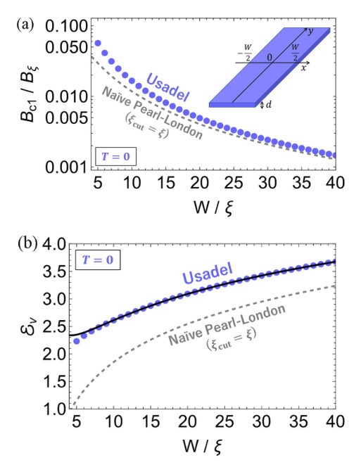
<figcaption class="paper-figure-caption"><b>Fig 1.</b> FIG. 1. (a) Lower critical field Bc1 of a narrow dirty su- perconducting strip at T = 0, normalized by Bξ := φ0/ξ2, as a function of w := W/ξ. Blue symbols show the self- consistent two-dimensional Usadel results. The gray dashed curve is the naive Pearl-London estimate with ξcut = ξ. (b) The same data expressed as the vortex self-energy factor Ev, defined by Bc1 = (2φ0/πW 2)Ev. The gray dashed curve is the naive Pearl-London estimate, E L v = ln[2w/π]. The black curve is a Pearl–London-type fit, E fit v = ln[2w/(πc1)] + c2/w, with w = W/ξ. Equivalently, this fit can be written in the Pearl–London form by introducing a width-dependent cutoff ξcut = c1ξ exp(−c2/w).</figcaption>
</figure>
<figure class="paper-figure-card">
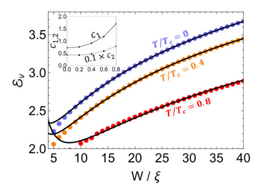
<figcaption class="paper-figure-caption"><b>Fig 2.</b> FIG. 2. Finite-temperature behavior of the vortex self- energy factor Ev. Symbols are the self-consistent two- dimensional Usadel results for T/Tc = 0, 0.4, and 0.8, from top to bottom. The horizontal axis is w := W/ξ, where ξ = p</figcaption>
</figure>

**Summary.** This paper provides a microscopic theory for calculating the lower critical magnetic field (B_c1) in superconducting thin films by solving the 2D Usadel equations. It overcomes limitations of older models by self-consistently resolving the vortex core structure, demonstrating that the resulting energy scale differs significantly from simple London predictions. This work establishes a robust theoretical basis for predicting superconducting behavior in nanoscale devices across various temperatures.

**Why it may be interesting.** While focused on superconductivity, the rigorous application of advanced continuum field theories (Usadel equations) to resolve fundamental physical quantities like core structure without ad-hoc cutoffs is a valuable methodological contribution applicable to other strongly coupled quantum systems where approximations are common.

Detailed structure

**Main problem.** The primary goal is to develop a microscopic theory for determining the lower critical field (B_c1) in superconducting thin-film strips, addressing shortcomings in standard phenomenological models.

**Main result.** The microscopic calculation resolves the vortex core structure without needing an arbitrary cutoff, showing that the resulting vortex self-energy significantly deviates from naive Pearl-London estimates.

**Method.** The authors solve the two-dimensional Usadel equations self-consistently for both vortex and Meissner states at fixed magnetic fields to calculate B_c1 via Gibbs energy differences.

**Model / system.** The system is a narrow superconducting thin-film strip. The theory uses the dirty limit approximation solved via 2D Usadel equations, incorporating the applied magnetic field directly into the momentum terms.

**Key observables.** Lower critical field (B_c1), dimensionless vortex self-energy factor (E_v), and edge barrier field (B_s).

**Important parameters / regimes.** Dirty-limit coherence length (xi), Pearl length (Lambda), normalized strip width (w = W/xi), and temperature (T < Tc).

**Assumptions / limitations.** The film is assumed thin enough that superconducting parameters are uniform across the thickness dimension; magnetic screening by the strip itself is neglected.

**Figures summary.** Figure 1 compares self-consistent Usadel results for B_c1 vs. width (w) against the naive Pearl-London estimate. Figure 2 shows the temperature dependence of E_v, comparing Usadel results to empirical fits derived from the theory.

**Paper structure.** The paper establishes the physical problem and limitations of existing theories; it then details the microscopic framework using the Usadel equations solved self-consistently for vortex/Meissner states; finally, it presents quantitative comparisons showing the deviation from simple London models across varying temperatures and widths.

Abstract

The lower critical field \(B_{c1}\) of a narrow superconducting thin-film strip sets the thermodynamic scale for vortex-free operation in a perpendicular magnetic field. The standard Pearl--London estimate requires a phenomenological vortex-core cutoff, because the London theory does not resolve the core. We formulate a microscopic theory for a dirty strip by solving the two-dimensional Usadel equations in the film plane, with the applied field included directly in the gauge-invariant momentum. Self-consistent vortex and Meissner solutions are computed at fixed field, and \(B_{c1}\) is obtained from their Gibbs-energy difference. The calculation resolves the vortex core and its finite-width deformation without introducing a cutoff. The resulting vortex self-energy is larger than the naive Pearl--London estimate and cannot, in general, be represented by a London logarithm with a single width-independent cutoff. The formulation applies at any \(T<T_c\) and provides a microscopic basis for predicting \(B_{c1}\) in superconducting nanostrips and related thin-film devices.

[↑ back to top](#top)

### [Sedimentation equilibrium and gravity dependent stiffness coefficients of colloidal hard-spheres](http://arxiv.org/abs/2607.06510v1)

**Authors:** Luis G. MacDowell, Eva G. Noya  
**Type:** both · **Category:** statistical mechanics · **PDF:** <https://arxiv.org/pdf/2607.06510v1>  
**Analysis basis:** full PDF text, analyzed in chunks
**Topic relevance:** `non-equilibrium dynamics` **2/5** · `analog quantum simulation` **1/5** · `driven-dissipative phase transition` **1/5** · `methods for driven-dissipative` **1/5** · `non-equilibrium universality` **1/5**

↔ Scroll figures horizontally

<figure class="paper-figure-card">
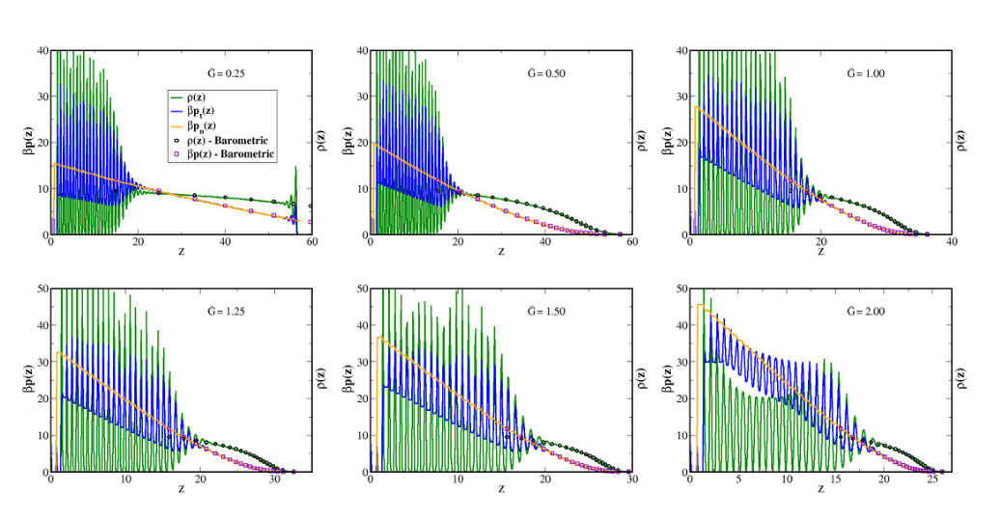
<figcaption class="paper-figure-caption"><b>Fig 1.</b> FIG. 1. Pressure and density profiles. The black and orange lines are the zz component of the pressure tensor by IK and MOP methods, which overlap one on top of the other. The red and blue are xx and yy components, which also overlap. Oscillations about the zz component suggest equilibrium. The system always crystallizes very close to the intersection of pzz(z) with the equilibrium coexistence pressure, as displayed by the dashed black line in the figures for βpσ3 = 11.65, the estimated coexistence pressure of PHS.</figcaption>
</figure>
<figure class="paper-figure-card">
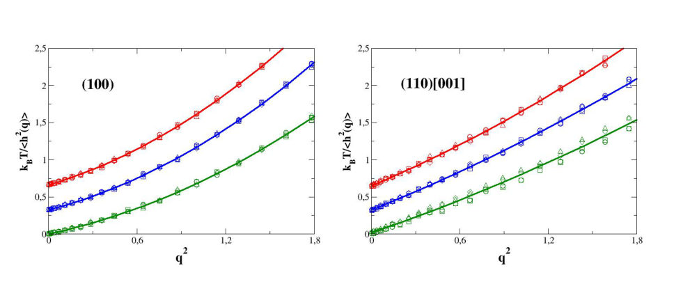
<figcaption class="paper-figure-caption"><b>Fig 2.</b> FIG. 2. Capillary wave spectrum for interfaces under gravity. Results are shown for surface fluctuations on the (100) interface (left) and the (110) interface along the [001] direction (right), with ˜G = 0 (green), ˜G = 0.75 (blue) and ˜G = 1.50 (red). The symbols are average simulation results from four independent runs. The lines are fits to the 20 first wave-vectors to Eq.6. For ease of view, the results for ˜G = 0.75 and ˜G = 1.5 are shifted by 0.25 and 0.50 along the y axis, respectively.</figcaption>
</figure>
<figure class="paper-figure-card">
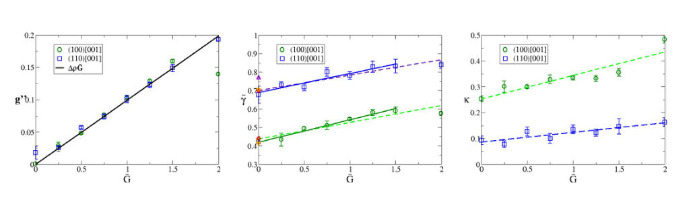
<figcaption class="paper-figure-caption"><b>Fig 3.</b> FIG. 3. Coefficients of the spectrum of fluctuations as obtained form simulation. Results for the (100)[001] direction are shown as circles, while those for the (100)[001] direction are shown as squares. For g′′, the line corresponds to the prediction g′′ = ∆ρ ˜G from capillary wave theory with no fitting parameters. For the other figures, lines are linear fits to the data. The middle panel also shows stiffness coefficients in zero gravity obtained from Ref.45 (red diamons), Ref.47 (violet triangles up) and Ref.51 (orange triangles down).</figcaption>
</figure>
<figure class="paper-figure-card">
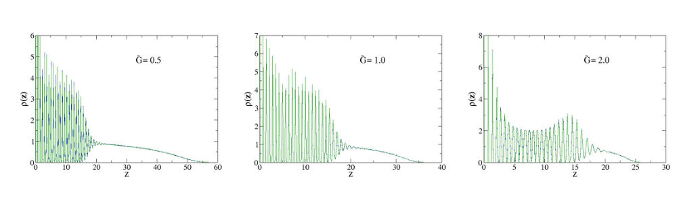
<figcaption class="paper-figure-caption"><b>Fig 4.</b> FIG. 4. Comparison of density profiles for HS and p-HS. Bluelines are density profiles from the pseudo-Hard Spheres, simulated by MD with Lammps. Green lines are results for HS, simulated with MC. The results do not show any difference in the scale of the plot.</figcaption>
</figure>

**Summary.** This work investigates the interfacial properties of colloidal hard spheres under gravity, focusing on a discrepancy in the crystal-melt stiffness coefficient. Using computer simulations, the authors demonstrate that this missing physics arises from an explicit, previously overlooked dependence of the stiffness coefficient on the external gravitational field. This provides a general result for how external fields affect interface thermodynamics.

**Why it may be interesting.** While focused on classical colloidal systems, the rigorous treatment of external field effects (gravity) modifying fundamental thermodynamic coefficients like stiffness is relevant to understanding non-equilibrium or externally driven many-body dynamics.

Detailed structure

**Main problem.** The study addresses an enigmatic discrepancy concerning the crystal-melt stiffness coefficient of colloidal hard spheres, particularly when external gravity is considered.

**Main result.** The authors show that this long-standing discrepancy can be traced to a previously unrecognized, explicit dependence of the interfacial stiffness coefficient on the applied gravitational field.

**Method.** Computer simulations (Monte Carlo) are used to calculate density profiles and analyze the capillary wave spectrum at fluid-crystal interfaces under tunable buoyant mass and gravity.

**Model / system.** The system modeled is colloidal hard spheres, which serve as an experimental analog for studying bulk and interfacial properties of simple fluids undergoing phase transitions into crystalline solids.

**Key observables.** Interfacial stiffness coefficient ($	ilde{\gamma}$), density profiles ($
ho(z)$), pressure tensor components ($P_{zz}, P_{xx}, P_{yy}$), and the mean squared amplitude of surface Fourier modes ($\langle h^2_q 
angle$).

**Important parameters / regimes.** Buoyant mass, external gravity ($	ilde{G}$), reduced temperature/pressure parameters (e.g., $eta p\sigma^3 = 11.65$).

**Assumptions / limitations.** The analysis relies on relating interfacial properties to the capillary wave spectrum and uses simplified ansätze for density profiles in some theoretical derivations.

**Figures summary.** Figures illustrate density and pressure profiles showing stratification due to gravity, and compare simulated vs. fitted capillary wave spectra across varying gravity strengths ($	ilde{G}$).

**Paper structure.** The paper progresses from establishing the physical model (colloidal hard spheres) and identifying the discrepancy, through detailed simulation analysis of equilibrium states under gravity, culminating in deriving the functional form showing $	ilde{\gamma}$'s dependence on $	ilde{G}$.

Abstract

Spherical colloids with harsh repulsive forces have long been used as experimental analogs of the hard sphere model, with demonstrated good agreement with computer simulations for bulk and structural properties of the fluid, glass and crystal phases. However, an enigmatic discrepancy remains for the crystal-melt stiffness coefficient. Here we perform computer simulations of colloidal hard spheres under tunable buoyant mass and show that the long-standing discrepancy can be traced to a hitherto unrecognized gravity dependent contribution of the stiffness coefficient. This effect is one practical realization of a more general result for the external field dependence of stiffness coefficients of arbitrary interfaces.

[↑ back to top](#top)

### [Decoupling Josephson Coupling and Supercurrent Nonreciprocity in Twisted NbSe2/NbSe2 van der Waals Junctions](http://arxiv.org/abs/2607.06304v1)

**Authors:** Seung-Gi Lee, Kwon-Neong Jung, Jae-Kuen Kim, Jae-Chun Jeon, Jiho Yoon, Stuart S. P. Parkin, Kun-Rok Jeon  
**Type:** experiment · **Category:** other · **PDF:** <https://arxiv.org/pdf/2607.06304v1>  
**Analysis basis:** full PDF text, analyzed in chunks
**Topic relevance:** `Keldysh / 2PI / non-Gaussian methods` **1/5** · `Kondo & dissipative impurity` **1/5** · `QC/QI experiment` **1/5** · `non-equilibrium dynamics` **1/5**

↔ Scroll figures horizontally

<figure class="paper-figure-card">
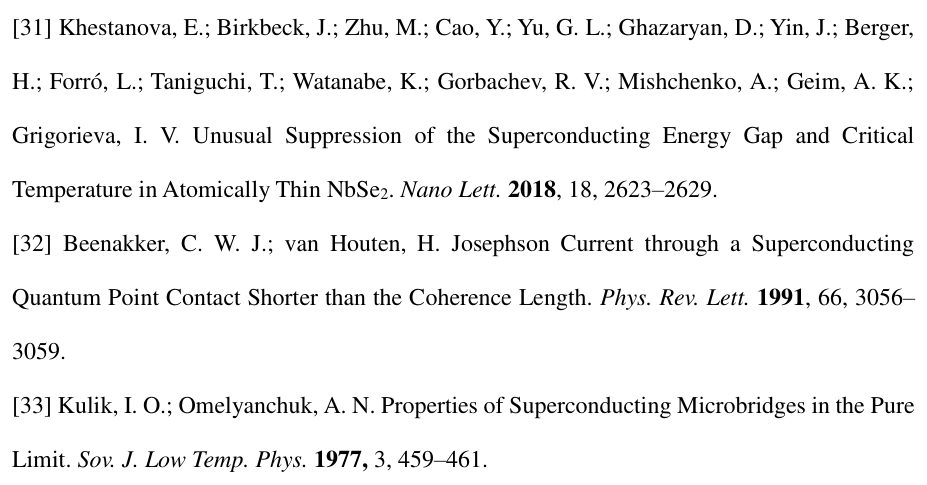
<figcaption class="paper-figure-caption"><b>Fig 1.</b> Figure 1. Structural characterization and electrical transport properties of NbSe₂/NbSe₂</figcaption>
</figure>
<figure class="paper-figure-card">
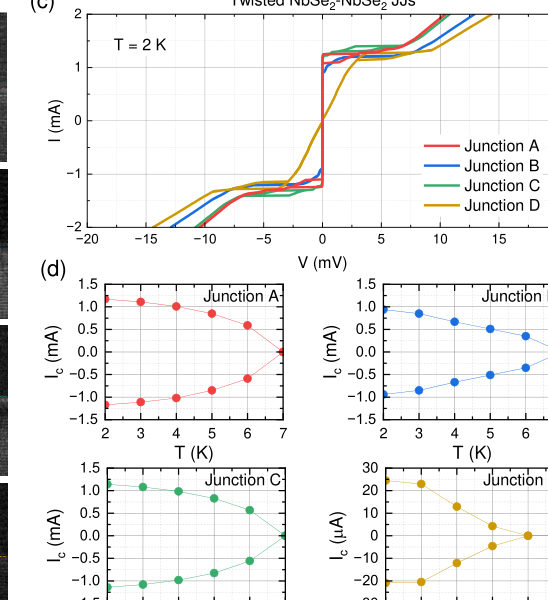
<figcaption class="paper-figure-caption"><b>Fig 2.</b> Fig. 1</figcaption>
</figure>
<figure class="paper-figure-card">
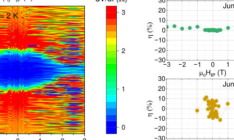
<figcaption class="paper-figure-caption"><b>Fig 3.</b> Fig. 2</figcaption>
</figure>
<figure class="paper-figure-card">
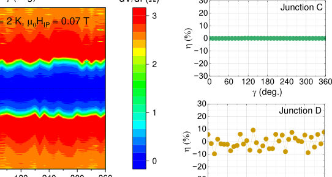
<figcaption class="paper-figure-caption"><b>Fig 4.</b> Fig. 3</figcaption>
</figure>
<figure class="paper-figure-card">
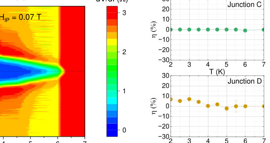
<figcaption class="paper-figure-caption"><b>Fig 5.</b> Fig. 4</figcaption>
</figure>

**Summary.** The authors investigated twisted $	ext{NbSe}_2/	ext{NbSe}_2$ junctions to determine if crystal alignment controls supercurrent diode effects. They found that while the primary Josephson coupling strength strongly depends on the twist angle due to momentum matching, the non-reciprocity remains negligible unless interface disorder is intentionally introduced. This decisively decouples the two phenomena, identifying interfacial quality as the source of apparent diode behavior.

**Why it may be interesting.** This work provides a crucial experimental benchmark for understanding superconducting transport in engineered heterostructures, directly addressing how structural control (twist angle) relates to macroscopic quantum phenomena like non-reciprocity, which is relevant for Josephson circuits and quantum devices.

Detailed structure

**Main problem.** The study aims to decouple Josephson coupling strength from supercurrent nonreciprocity (diode effect) in twisted van der Waals superconducting junctions, resolving debates on the role of twist angle engineering.

**Main result.** Josephson coupling shows a clear dependence on twist angle due to momentum matching, but the diode response is found to be negligible unless significant interface disorder is introduced. This establishes that interface disorder, not crystal alignment, dominates non-reciprocity.

**Method.** The research uses electrical transport measurements (I-V curves) combined with structural characterization (HR-TEM) on fabricated twisted NbSe2/NbSe2 junctions.

**Model / system.** The physical system is a vertical Josephson junction formed by stacking two layers of Niobium Diselenide ($	ext{NbSe}_2$) with controlled twist angles. Analysis involves comparing measurements to the Ambegaokar-Baratoff relation and using the RCSJ model for dynamics.

**Key observables.** Josephson coupling strength ($I_c$), supercurrent diode efficiency ($\eta$), critical current ($I_{c\pm}$), and characteristic voltage $V_c$ as functions of twist angle, magnetic field, and temperature.

**Important parameters / regimes.** Twist angle ($	heta_{	ext{twist}}$), in-plane magnetic field ($\mu_0H_{\parallel}$), junction capacitance ($C_{	ext{eff}}$), and interface disorder level.

**Assumptions / limitations.** The analysis relies on the RCSJ model for dynamic characterization, and it assumes that deviations from ideal behavior can be attributed to specific physical mechanisms like interface degradation or momentum mismatch.

**Figures summary.** Figures detail $V-I$ and $dV/dI$ contour maps showing field and angle dependence; Figure 5 specifically plots the distinct $	heta_{	ext{twist}}$ dependence of coupling strength versus nonreciprocity ($\eta$).

**Paper structure.** The paper systematically investigates transport properties by first establishing the twist-angle dependence of Josephson coupling, then measuring supercurrent nonreciprocity under varying magnetic fields and angles, and finally contrasting these results with junctions deliberately degraded to isolate the source of any observed diode effect.

Abstract

The microscopic origin of supercurrent nonreciprocity in van der Waals Josephson junctions remains under active debate, particularly regarding the role of twist-angle engineering in layered superconductors. Here, we investigate superconducting transport in twisted NbSe2/NbSe2 vertical Josephson junctions fabricated by dry transfer with controlled crystallographic alignment and chemically clean interfaces. High-resolution transmission electron microscopy is employed to directly determine the twist angle and assess interface quality. While the Josephson coupling strength exhibits a pronounced dependence on twist angle, with characteristic voltages maximized near crystallographically equivalent orientations and suppressed at intermediate angles, the supercurrent diode efficiency remains negligibly small and shows no systematic twist-angle dependence. In contrast, enhanced diode-like responses emerge only in weakly coupled junctions exhibiting interfacial disorder and reduced transparency. Deliberate interface degradation further amplifies the apparent nonreciprocity, yielding diode efficiencies approaching 30% together with an irregular magnetic-field-strength dependence. These results establish a clear decoupling between Josephson coupling and supercurrent nonreciprocity in twisted NbSe2/NbSe2 junctions. Our findings identify interface disorder, rather than twist-angle-controlled momentum matching, as the dominant origin of the observed diode response and provide a critical benchmark for interpreting nonreciprocal superconducting transport in van der Waals Josephson devices.

[↑ back to top](#top)

### [Local spin magnetization in itinerant non-collinear magnets: The local spin Berry curvature](http://arxiv.org/abs/2607.06253v1)

**Authors:** Doru Sticlet, Frédéric Piéchon  
**Type:** theory · **Category:** other · **PDF:** <https://arxiv.org/pdf/2607.06253v1>  
**Analysis basis:** full PDF text, analyzed in chunks
**Topic relevance:** `Keldysh / 2PI / non-Gaussian methods` **1/5** · `analog quantum simulation` **1/5** · `exotic spin models in light-matter` **1/5** · `spintronics-quantum-optics interface` **1/5**

↔ Scroll figures horizontally

<figure class="paper-figure-card">
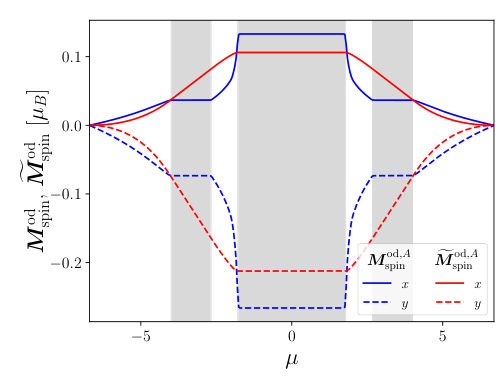
<figcaption class="paper-figure-caption"><b>Fig 1.</b> FIG. 1. Off-diagonal (interband) local spin magnetization as a function of the chemical potential in the conventional theory M od spin (blue) and the thermodynamic one f M od spin (red) for the ferrimagnet described by Eq. (13). The plot shows only the x (continuous line) and y (dashed line) components of the off-diagonal magnetization on the A sublattice (for the B sublattice it takes the opposite values). The results are in the strong-coupling regime with effective exchange fields hA = (4, 0, 0)t and hB = (0, 2, 0)t for a temperature T = 0.01t. The gray regions mark the energy gaps.</figcaption>
</figure>
<figure class="paper-figure-card">
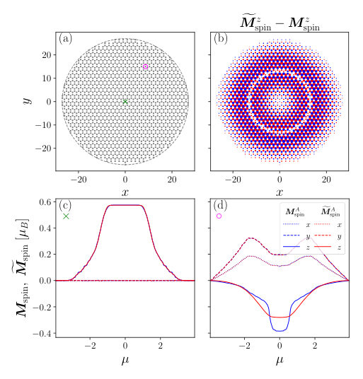
<figcaption class="paper-figure-caption"><b>Fig 2.</b> FIG. 2. (a) The sites of the honeycomb lattice circumscribed by a circle of radius R = 27a (1724 sites). The symbols × and ◦mark the A sites at which the local spin magnetization is computed for all µ in panels (c) and (d), respectively. (b) The difference between the z components of the local spin magnetization in the thermodynamic and conventional theo- ries, for all sites in the lattice and µ = 0. Blue and red colors indicate negative and positive values, respectively, while the size of the markers is proportional to the magnitude of the difference. The local spin magnetization as a function of µ at the central A site (c) and an arbitrary A site (d), respectively. In (d), the difference...</figcaption>
</figure>
<figure class="paper-figure-card">
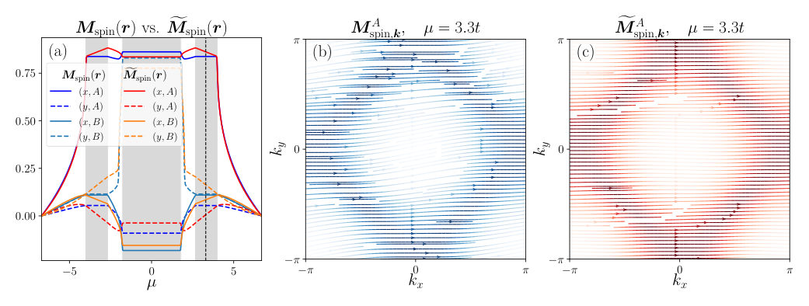
<figcaption class="paper-figure-caption"><b>Fig 3.</b> FIG. 1. Comparison between the total local spin magnetization in the conventional theory [Mspin(r)] and the thermodynamic one [f Mspin(r)] for the same parameters as in the Fig. 1 from the main text, hA = (4, 0, 0)t, hB = (0, 2, 0)t, and temperature T = 0.01t. (a) Shows the dependence on the chemical potential for all nonzero magnetization components (x and y) and both sublattices (A and B). Panels (b) and (c) show the momentum-resolved local spin magnetization from Eq. (17) in the conventional theory and the thermodynamic one, respectively, at chemical potential µ = 3.3t inside the gap, marked by the black dashed line in (a).</figcaption>
</figure>
<figure class="paper-figure-card">
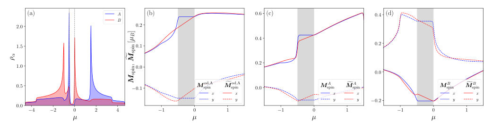
<figcaption class="paper-figure-caption"><b>Fig 4.</b> FIG. 2. Effect of an alternating potential on (a) the local density of states ρα on sites α, A (blue) and B (red), with dashed lines marking the spectral gap. Panels (b), (c), and (d) zoom near the gap (marked by the gray band) to show different components of the local spin magnetization in the conventional theory Mspin against the thermodynamic one f Mspin. Panel (b) represents the off-diagonal magnetization on A sites, while (c) and (d), the total magnetization on A and B sites, respectively. The exchange fields are hA = (1, 0, 0)t and hB = (0, 0.5, 0)t, with an alternating potential V = 0.5t, and temperature T = 0.01t.</figcaption>
</figure>
<figure class="paper-figure-card">
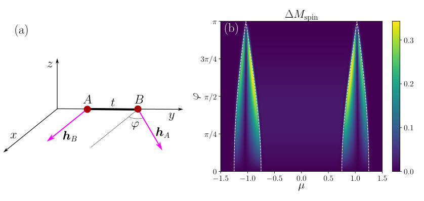
<figcaption class="paper-figure-caption"><b>Fig 5.</b> FIG. 3. (a) Sketch of the magnetic dimer (19) with intersite hopping t and exchange fields hA and hB canted by an angle φ. (b) Scalar difference ∆Mspin (60) between the local spin magnetization predicted in the conventional and thermodynamic theory as a function of chemical potential µ and canting angle φ in units of µB. The energy levels are denoted by white dashed lines. The parameters in dimensionless units read M = 1, t = 1/4, and temperature T = 0.01.</figcaption>
</figure>

**Summary.** This work rigorously compares two theoretical definitions of local spin magnetization in complex magnetic materials. It demonstrates that while both theories agree for simple collinear systems, non-collinear textures reveal a significant discrepancy due to an emergent 'local spin Berry curvature' term derived from field response. This suggests that precise measurement techniques must account for this novel contribution.

**Why it may be interesting.** The introduction of a Berry curvature term derived from thermodynamic response provides a powerful, unifying framework that extends concepts typically associated with orbital magnetism into the spin sector for itinerant magnets.

Detailed structure

**Main problem.** The paper compares two methods—conventional (equilibrium density) versus thermodynamic (field response)—for calculating local spin magnetization in itinerant non-collinear magnets.

**Main result.** For non-collinear systems, the thermodynamic approach predicts a novel contribution analogous to a local spin Berry curvature, leading to qualitatively different results (e.g., linear vs. plateau behavior) compared to conventional theory when probed locally.

**Method.** The analysis involves deriving and comparing formulas for local spin magnetization using Green's functions and response theory, particularly focusing on the off-diagonal contributions arising from field perturbations.

**Model / system.** The study uses tight-binding models applied to non-collinear ferrimagnets on lattices like square or hexagonal lattices. The Hamiltonian incorporates hopping terms, onsite potentials, and exchange fields that induce spin textures like skyrmions.

**Key observables.** Local spin magnetization ($M_{	ext{spin}}(r)$), the difference between the two theoretical calculations ($\Delta M_{	ext{spin}}$), and the local density of states (LDOS).

**Important parameters / regimes.** Non-collinearity angle ($\phi$), chemical potential ($\mu$), external magnetic field ($B$), and lattice geometry (square/hexagonal).

**Assumptions / limitations.** The analysis often assumes zero temperature ($T 	o 0$) and examines specific limits, such as the antiferromagnetic limit or when onsite potentials are strongly alternating.

**Figures summary.** Figures compare off-diagonal local spin magnetization components for ferrimagnets on square/hexagonal lattices, explicitly contrasting the linear dependence predicted by the thermodynamic theory against the flat plateau of the conventional theory inside spectral gaps.

**Paper structure.** The paper introduces the problem by defining both theoretical approaches; it then develops the mathematical framework using Green's functions and Hamiltonian models for various lattice types; finally, it presents detailed comparisons across different physical regimes (e.g., collinear vs. non-collinear) to highlight the quantitative discrepancies.

Abstract

Conventionally, the local spin magnetization in itinerant magnets is determined from the equilibrium local spin density. Here, we propose a thermodynamic approach in which the local spin magnetization is defined from the response of the system to an infinitesimal external magnetic field. The predictions of the two theories are identical for collinear magnets, but differ qualitatively and quantitatively for non-collinear magnets. In the present thermodynamic approach, the spin coherences determine an alternative distribution of local spin magnetization due to the field-induced deformation of the energy eigenstates. This effect is captured by a Berry-curvature-like contribution reminiscent of orbital magnetization and has several distinct observable consequences. We explore the differences between the conventional and thermodynamic approaches in several test cases.

[↑ back to top](#top)

### [Separation of Homogeneous and Inhomogeneous Broadening using Two-Dimensional Coherent Spectroscopy](http://arxiv.org/abs/2607.05564v1)

**Authors:** Adam Alfrey, Cole Tait, Joshua R. Hendrickson, Steven T. Cundiff  
**Type:** experiment · **Category:** other · **PDF:** <https://arxiv.org/pdf/2607.05564v1>  
**Analysis basis:** full PDF text, analyzed in chunks
**Topic relevance:** `driven-dissipative phase transition` **1/5** · `interference shaping light` **1/5** · `methods for driven-dissipative` **1/5** · `quantum optics experiment` **1/5**

↔ Scroll figures horizontally

<figure class="paper-figure-card">
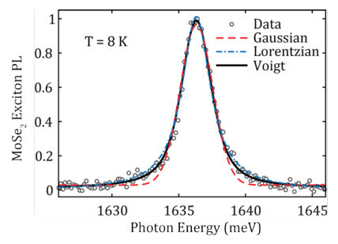
<figcaption class="paper-figure-caption"><b>Fig 1.</b> Fig. 1. MoSe2 exciton photoluminescence lineshape is best described by a Voigt profile. Normalized 8 K MoSe2 exciton PL spectrum (open circles), excited by a HeNe laser (632.8 nm, 20 μW average power), overlaid with best-fit Gaussian (red dashed), Lorentzian (blue dashed), and Voigt (black solid) models. The Voigt profile captures both the peaked core and the extended wings more accurately than either single-component model, motivating its use as the phenomenological description for the PL spectrum.</figcaption>
</figure>
<figure class="paper-figure-card">
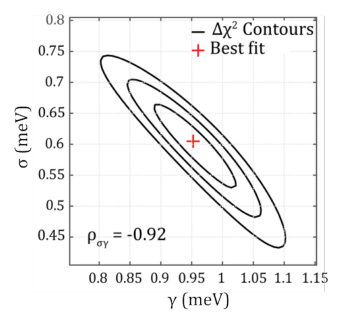
<figcaption class="paper-figure-caption"><b>Fig 2.</b> Fig. 2. Linear Voigt fits exhibit strong (𝝈𝝈, 𝜸𝜸) covariance. Uncertainty-weighted Δ𝜒𝜒2(𝜎𝜎,𝛾𝛾) landscape for Voigt fits to the PL spectrum in Fig. 1, constructed by scanning a (𝜎𝜎, 𝛾𝛾) grid while optimizing the nuisance parameters (𝐴𝐴, 𝜔𝜔𝑋𝑋, 𝐵𝐵) at each point. Contours indicate the 68.27%, 95.45%, and 99.73% joint confidence regions for two parameters; the best-fit point is marked by the red +. The elongated, diagonally oriented contours show that many (𝜎𝜎, 𝛾𝛾) pairs fit the one- dimensional spectrum equally well, so the linear measurement constrains only the total linewidth while leaving the homogeneous– inhomogeneous partition poorly determined.</figcaption>
</figure>
<figure class="paper-figure-card">
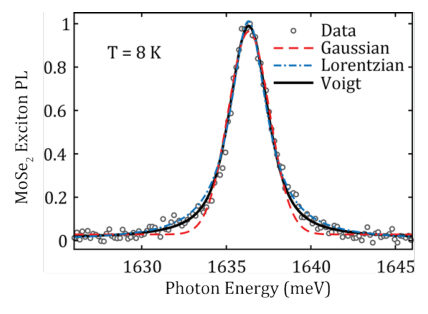
<figcaption class="paper-figure-caption"><b>Fig 3.</b> Figure 2 plots the contours of Δ𝜒𝜒PL 2 (𝜎𝜎, 𝛾𝛾) = 𝜒𝜒PL 2 (𝜎𝜎, 𝛾𝛾) − 𝜒𝜒PL,min 2 corresponding to standard confidence regions for two parameters. The resulting contours are elongated and diagonally oriented, demonstrating that the one-dimensional spectrum constrains only the total linewidth; an increase in 𝜎𝜎 can be compensated by a decrease in 𝛾𝛾 at nearly constant 𝜒𝜒2, rendering the</figcaption>
</figure>
<figure class="paper-figure-card">
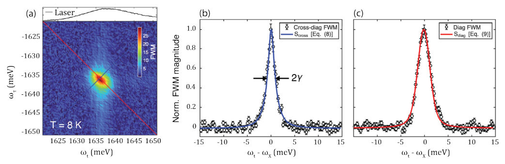
<figcaption class="paper-figure-caption"><b>Fig 4.</b> Fig. 3. Two-dimensional coherent spectrum and extracted lineshape slices of the MoSe₂ exciton at 8 K. (a) Amplitude of the 2DCS spectrum at waiting time T = 200 fs. The linear reflection spectrum of the laser is shown along the top. The blue line indicates the cross-diagonal slice, and the red line indicates the diagonal slice through the peak. (b) Cross-diagonal slice and best fit to Eq. (8) (blue curve). The full width at half maximum 2𝛾𝛾, reflecting homogeneous dephasing, is indicated. (c) Diagonal slice and best fit to Eq. (9) (red curve), showing the broader Voigt linewidth that includes both homogeneous and inhomogeneous contributions.</figcaption>
</figure>
<figure class="paper-figure-card">
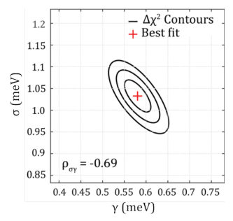
<figcaption class="paper-figure-caption"><b>Fig 5.</b> Fig. 4. Joint 2DCS analysis yields more compact confidence regions with reduced (𝝈𝝈, 𝜸𝜸) correlation. Δ𝜒𝜒2𝐷𝐷𝐷𝐷𝐷𝐷 2 (𝜎𝜎, 𝛾𝛾) landscape from Eq. (10), with contours indicating 68.27%, 95.45%, and 99.73% joint confidence regions (best-fit point: red +).</figcaption>
</figure>

**Summary.** The paper introduces two-dimensional coherent spectroscopy (2DCS) as an advanced technique to overcome the ambiguity in separating homogeneous dephasing ($\gamma$) from inhomogeneous broadening ($\sigma$) in optical spectra. By analyzing orthogonal spectral slices, 2DCS provides independent constraints that significantly reduce parameter correlation compared to traditional one-dimensional fitting methods. This allows for a more accurate microscopic understanding of excitonic linewidths in semiconductor quantum dots.

**Why it may be interesting.** This work provides a powerful spectroscopic tool for characterizing open quantum systems by disentangling intrinsic decoherence mechanisms ($\gamma$) from static disorder effects ($\sigma$), which is crucial for understanding solid-state emitters and quantum materials.

Detailed structure

**Main problem.** The primary challenge is separating the contributions of homogeneous dephasing ($\gamma$) from inhomogeneous broadening ($\sigma$) in measured spectral linewidths, as standard linear fits suffer from parameter degeneracy.

**Main result.** Two-dimensional coherent spectroscopy (2DCS) provides orthogonal constraints that significantly reduce the covariance between $\sigma$ and $\gamma$, leading to more reliable and distinct estimates for both parameters compared to one-dimensional photoluminescence (PL) analysis.

**Method.** The authors compare parameter estimation using standard 1D Voigt fitting against a joint fit of two orthogonal spectral slices—cross-diagonal ($S_{	ext{cross}}$) and diagonal ($S_{	ext{diag}}$)—obtained via 2DCS.

**Model / system.** The study investigates the exciton resonance in hBN-encapsulated $	ext{MoSe}_2$ at low temperature (8 K). The spectral lineshape is modeled as a convolution of Lorentzian (homogeneous) and Gaussian (inhomogeneous) components, forming a Voigt profile.

**Key observables.** Linewidth components ($\sigma$, $\gamma$), parameter covariance metrics (Pearson correlation coefficient $
ho_{\sigma\gamma}$), and confidence region shapes derived from $\chi^2$ profiling.

**Important parameters / regimes.** Exciton resonance energy, temperature (8 K), homogeneous dephasing rate ($\gamma$), inhomogeneous broadening width ($\sigma$).

**Assumptions / limitations.** The analysis assumes symmetric Voigt lineshapes; the method relies on the assumption that physical parameters $(\sigma, \gamma)$ are shared across both 2DCS slices in the joint fit.

**Figures summary.** Figures illustrate the failure of 1D fits (showing highly elongated covariance contours) versus the success of 2DCS analysis, which yields more compact confidence regions and reduced parameter correlation. The comparison quantifies this improvement using covariance metrics.

**Paper structure.** The paper first establishes the physical necessity of separating $\sigma$ and $\gamma$. It then details the methodology comparing 1D PL fitting to joint 2DCS fitting across orthogonal spectral slices, culminating in a quantitative comparison of parameter uncertainty reduction.

Abstract

Separating the contributions of homogeneous dephasing from inhomogeneous broadening in spectral linewidths is essential for connecting optical spectra to microscopic dissipation and disorder mechanisms. Voigt fits to one-dimensional spectra, such as photoluminescence, yield strongly correlated Gaussian and Lorentzian widths, so that neither width can be determined independently with confidence. We quantitatively show that two-dimensional coherent spectroscopy (2DCS) reduces this degeneracy by providing orthogonal spectral slices, diagonal and cross-diagonal, with complementary sensitivity to homogeneous and inhomogeneous broadening processes. As a demonstration, we measure the exciton resonance in hBN-encapsulated MoSe$_2$ at 8 K. A joint uncertainty-weighted fit maps the full $χ^2(σ,γ)$ landscape to quantify parameter covariance. Compared with linear Voigt analysis, 2DCS yields more compact confidence regions and markedly reduced parameter correlation, enabling reliable separation of the contributions to the excitonic linewidth.

[↑ back to top](#top)

### [Chiral-Structured Superconductors TrX4 (Tr = Rh, Ir; X = Ge, Si): A Platform for Mixed-Parity Pairing and Topological States](http://arxiv.org/abs/2607.05881v1)

**Authors:** Zhenhai Yu, Yunguan Ye, Yuwei Zhou, Chaoyang Chu, Congcong Le, Lin Wu, Jian Yuan, Tong Shi, Qingxin Dong, Jinggeng Zhao, Wei Xia, Xiangqi Liu, Xia Wang, Bosen Wang, Jinguang Cheng, Yanhang Ma, Xianxin Wu, Xiangang Wan, Huiqiu Yuan, Yanfeng Guo  
**Type:** both · **Category:** other · **PDF:** <https://arxiv.org/pdf/2607.05881v1>  
**Analysis basis:** full PDF text, analyzed in chunks
**Topic relevance:** `analog quantum simulation` **1/5** · `driven-dissipative phase transition` **1/5**

↔ Scroll figures horizontally

<figure class="paper-figure-card">
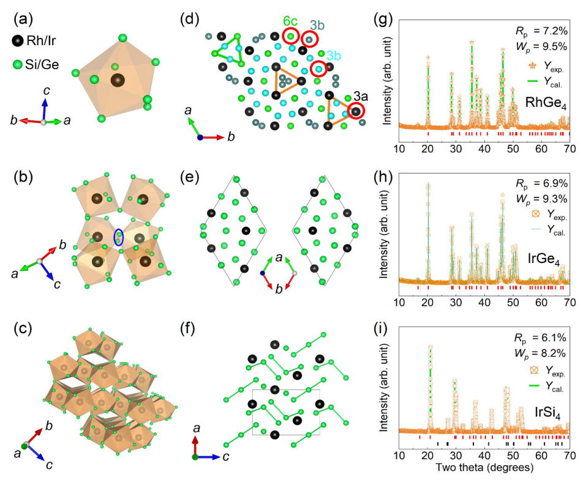
<figcaption class="paper-figure-caption"><b>Fig 1.</b> FIG. 1. (a) Distorted [RhGe8], [IrGe8] and [IrSi8] dodecahedral coordination polyhedra. (b) Connectivity</figcaption>
</figure>
<figure class="paper-figure-card">
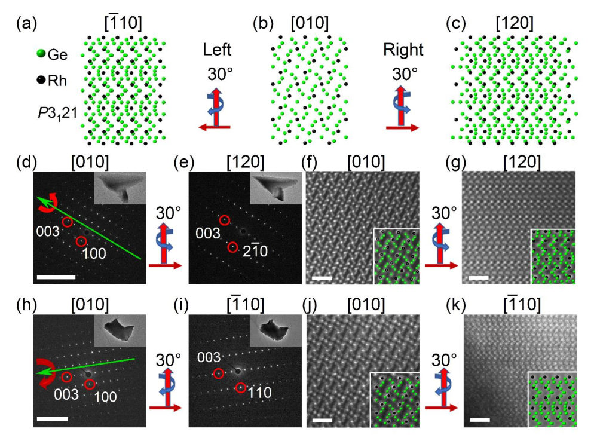
<figcaption class="paper-figure-caption"><b>Fig 2.</b> FIG. 2. (a)-(c) Projections of the P3121 structural models of RhGe4 with right-handedness along different</figcaption>
</figure>
<figure class="paper-figure-card">
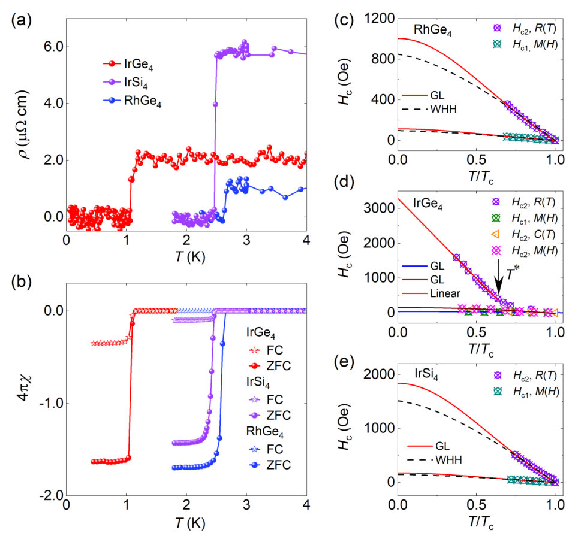
<figcaption class="paper-figure-caption"><b>Fig 3.</b> FIG. 3. (a) Temperature-dependent resistivity ρ(T) of RhGe4, IrGe4, and IrSi4 near the superconducting</figcaption>
</figure>
<figure class="paper-figure-card">
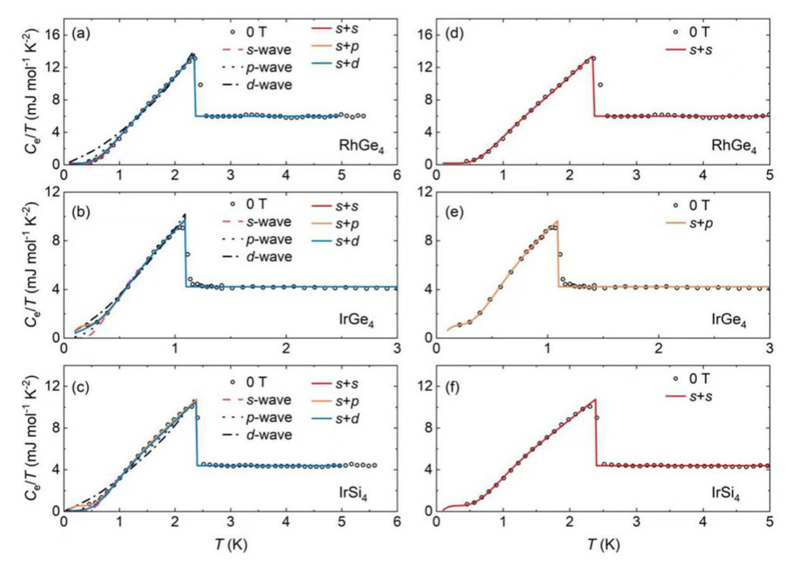
<figcaption class="paper-figure-caption"><b>Fig 4.</b> FIG. 4. Further characterization of the superconductivity. (a)-(c) Cel/T versus T as well as the fitting</figcaption>
</figure>
<figure class="paper-figure-card">
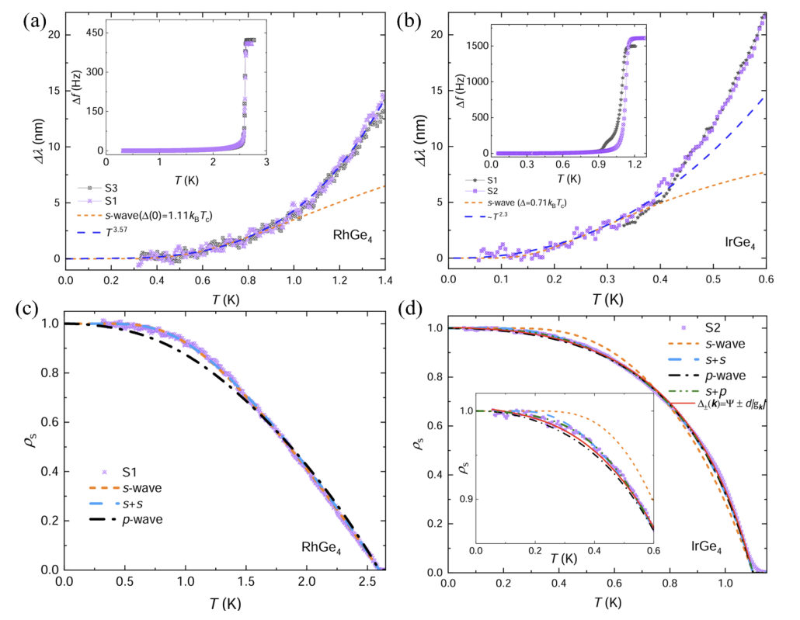
<figcaption class="paper-figure-caption"><b>Fig 5.</b> FIG. 5. Temperature dependence of the low-temperature Δλ(T) for (a) RhGe4 and (b) IrGe4. The orange</figcaption>
</figure>

**Summary.** This work reports on three novel chiral-structured superconductors ($	ext{RhGe}_4$, $	ext{IrGe}_4$, $	ext{IrSi}_4$), using advanced STEM to confirm their unique crystal structure. The research establishes these materials as a platform where structural chirality and strong SOC induce mixed-parity superconductivity, alongside predicted topological Weyl points.

**Why it may be interesting.** While focused on condensed matter superconductivity, the explicit link between structural chirality, broken symmetries, and topological features (Weyl points) provides a rich platform for understanding emergent quantum states that could be relevant in engineered superconducting circuits or topological quantum computing architectures.

Detailed structure

**Main problem.** The research aims to explore the complex interplay between structural chirality, strong spin-orbit coupling (SOC), mixed-parity superconductivity, and topological quantum phenomena in novel superconducting materials.

**Main result.** The authors successfully synthesized and characterized three chiral superconductors ($	ext{RhGe}_4$, $	ext{IrGe}_4$, and $	ext{IrSi}_4$), confirming their structure using STEM and demonstrating evidence for mixed-parity pairing and symmetry-protected Weyl points.

**Method.** The study combines high-pressure synthesis, advanced structural characterization (atomic-resolution STEM), detailed superconducting measurements ($
ho(T)$, $M(T)$, specific heat), and first-principles electronic structure calculations.

**Model / system.** The physical system consists of chiral-structured superconductors $	ext{TrX}_4$ ($	ext{RhGe}_4$, $	ext{IrGe}_4$, $	ext{IrSi}_4$), which possess broken mirror and inversion symmetries, leading to unconventional pairing mechanisms.

**Key observables.** Superconducting critical temperatures ($T_c \approx 1.1-2.6 	ext{ K}$), magnetic penetration depth ($\lambda(T)$), specific heat jump ($\Delta C/T$), and the presence of Weyl points in electronic structure calculations.

**Important parameters / regimes.** The enhancement of SOC is a key parameter driving mixed parity pairing; structural chirality ($P3_121$ space group) dictates the superconducting behavior.

**Assumptions / limitations.** Traditional diffraction methods are insufficient for unambiguous chiral assignment, necessitating real-space STEM imaging. Superconductivity analysis relies on fitting specific heat and penetration depth data to various gap models (s-wave, p-wave, etc.).

**Figures summary.** Figures detail structural motifs, layered arrangements, temperature dependence of resistivity and magnetization curves, and analyses comparing superconducting gap fits from different symmetry models.

**Paper structure.** The paper follows a structure moving from material synthesis and definitive chiral structure confirmation (STEM) to detailed measurements of superconducting properties ($
ho(T)$, $M(T)$), followed by theoretical analysis using specific heat and penetration depth data to constrain the pairing symmetry.

Abstract

Chiral-structured superconductors, with simultaneous broken mirror and inversion symmetries, promote unconventional superconductivity through parity-mixing mechanisms. Yet a few bulk chiral-structured superconductors are known, partly due to the difficulty in directly determining their atomic-scale chirality. Here we report three chiral-structured superconductors, , RhGe4, IrGe4, and IrSi4, synthesized under high pressure, with Tc values of about 1.6 K, 1.1 K, and 2.5 K, respectively.Using atomic resolution Cs-corrected scanning transmission electron microscopy (STEM) combined with X-ray diffraction characterizations, we directly confirm their chiral structure (space group P3121). This real space imaging approach overcomes ambiguities in traditional diffraction based methods. These materials exhibit type-II superconductivity, and the enhancement of spin-orbit coupling (SOC) leads to the emergence of mixed parity pairing. Calculations also reveal symmetry protected Weyl points near the Fermi level, which is robust against the SOC. Our work not only expands the family of chiral-structured superconductors but also demonstrates the indispensable role of STEM in directly determining chiral crystal structures. These materials thus offer a clean platform to explore the interplay among structural chirality, SOC, mixed parity superconductivity, and topological quantum phenomena.

[↑ back to top](#top)

### [Phonon-Mediated Thermal Transport in Nanocrystalline Silicon Using Machine-Learning Interatomic Potentials](http://arxiv.org/abs/2607.06470v1)

**Authors:** Houssem Rezgui, Catalina Coll Benejam, Miguel Pruneda, Clivia M. Sotomayor Torres  
**Type:** theory · **Category:** numerical methods · **PDF:** <https://arxiv.org/pdf/2607.06470v1>  
**Analysis basis:** full PDF text, analyzed in chunks
**Topic relevance:** `methods for driven-dissipative` **1/5** · `non-equilibrium dynamics` **1/5**

↔ Scroll figures horizontally

<figure class="paper-figure-card">
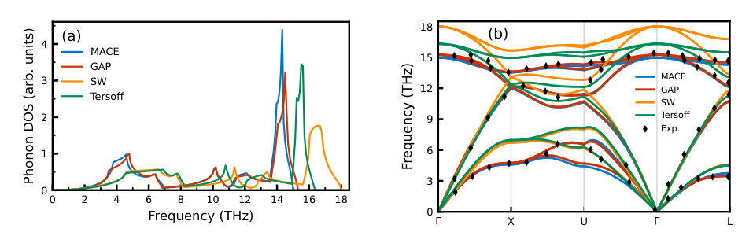
<figcaption class="paper-figure-caption"><b>Fig 1.</b> FIG. 1: Bulk silicon phonon properties computed using different interatomic potentials: (a)</figcaption>
</figure>
<figure class="paper-figure-card">
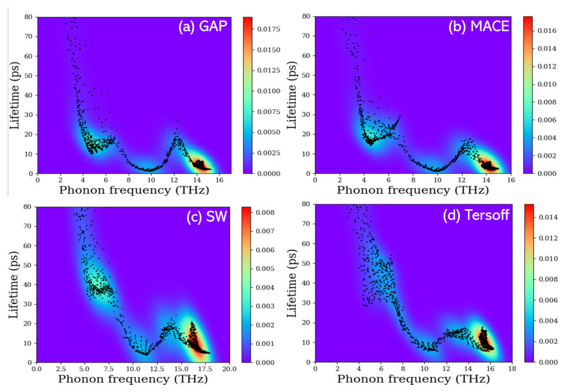
<figcaption class="paper-figure-caption"><b>Fig 2.</b> FIG. 2: Phonon lifetimes of bulk silicon as a function of phonon frequency predicted by</figcaption>
</figure>
<figure class="paper-figure-card">
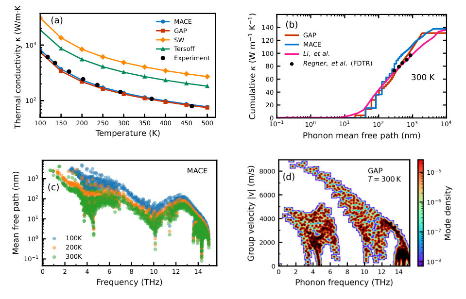
<figcaption class="paper-figure-caption"><b>Fig 3.</b> FIG. 3: Bulk silicon thermal transport properties: (a) thermal conductivity compared with</figcaption>
</figure>
<figure class="paper-figure-card">
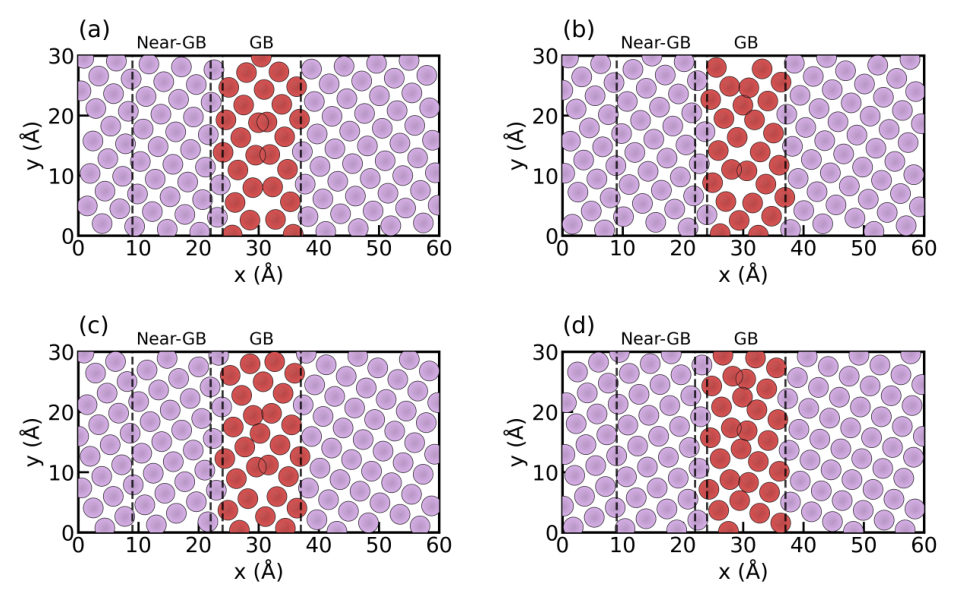
<figcaption class="paper-figure-caption"><b>Fig 4.</b> FIG. 4: Atomistic structures of symmetric tilt grain boundaries in silicon for misorientation</figcaption>
</figure>
<figure class="paper-figure-card">
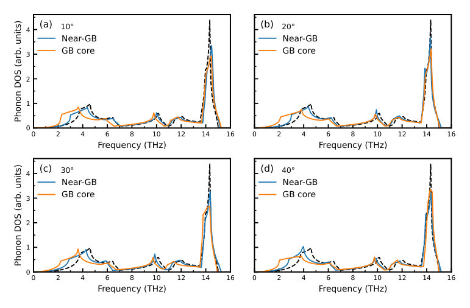
<figcaption class="paper-figure-caption"><b>Fig 5.</b> FIG. 5: Phonon density of states of near-GB and grain-boundary core regions for different</figcaption>
</figure>

**Summary.** This work establishes a robust machine-learning framework using potentials like GAP and MACE to simulate phonon-mediated heat transport in silicon. By applying this to nanocrystalline structures, the authors demonstrate that MLIPs accurately capture bulk vibrational properties while quantifying how grain boundary disorder limits thermal conductivity via NEMD simulations.

**Why it may be interesting.** While focused on condensed matter physics, the core methodology—developing and applying MLIPs for calculating complex many-body dynamics (phonons/heat flow)—is a prime example of advanced classical simulation techniques that bridge quantum mechanical accuracy with computational feasibility, relevant to numerical methods in AMO physics.

Detailed structure

**Main problem.** Understanding phonon-mediated heat transport in complex materials, particularly where grain boundaries limit thermal dissipation for nanoscale devices.

**Main result.** Machine-learning interatomic potentials (MLIPs) provide a more accurate and internally consistent description of bulk and interfacial phonon transport compared to classical potentials. These MLIPs successfully model the temperature dependence of thermal conductivity across various structural defects.

**Method.** The study develops and applies a comprehensive framework combining machine-learning potentials (GAP, MACE) with lattice dynamics calculations and Non-Equilibrium Molecular Dynamics (NEMD). This allows for the calculation of phonon properties and heat flow across interfaces.

**Model / system.** The system studied is silicon (Si), examined in both bulk form and nanocrystalline/bicrystal structures featuring controlled grain boundaries. The methodology relies on training MLIPs using DFT data to accurately capture interatomic forces, enabling simulations of vibrational dynamics.

**Key observables.** Phonon dispersions, phonon lifetimes, lattice thermal conductivity ($\kappa$), thermal boundary resistance (TBR), and temperature profiles across interfaces.

**Important parameters / regimes.** Grain boundary misorientation angles ($10^\circ$ to $40^\circ$), interface roughness amplitudes ($A=1 	ext{ Å}, 2 	ext{ Å}, 3 	ext{ Å}$), and simulation temperatures (up to $350 	ext{ K}$).

**Assumptions / limitations.** The accuracy of the thermal transport modeling hinges on the MLIPs providing an internally consistent description of vibrational properties derived from both bulk and interfacial regions.

**Figures summary.** Figures compare phonon DOS and dispersion relations between different potentials (MLIP vs. classical) against experiment, show $\kappa$ vs. T curves, and illustrate temperature profiles across interfaces with varying roughness amplitudes.

**Paper structure.** The paper progresses from validating the MLIP framework in bulk silicon by comparing vibrational properties to established methods, then extends this validation to model structural disorder at grain boundaries using RDFs, culminating in NEMD simulations to quantify heat transfer limitations due to these interfaces.

Abstract

Understanding phonon-mediated heat transport in structurally complex materials remains a central challenge for next-generation electronic and nanomechanical devices, where grain boundaries and interfacial disorder strongly limit thermal dissipation. Although classical interatomic potentials enable large-scale simulations, their limited transferability can lead to inaccuracies in vibrational properties and interfacial phonon scattering. In this work, we develop a machine-learning based framework for modeling thermal transport in bulk and nanocrystalline silicon by combining Gaussian approximation potential (GAP) and multi-atomic cluster expansion (MACE) models with lattice-dynamical calculations and non-equilibrium molecular dynamics (NEMD). Harmonic and anharmonic force constants derived from machine-learning interatomic potentials (MLIPs) are used within a unified Phonopy/Phono3py workflow to compute phonon dispersions, lifetimes, and lattice thermal conductivity, providing an internally consistent description of vibrational properties. In nanocrystalline silicon, NEMD simulations directly quantify the thermal boundary resistance associated with grain boundaries and reveal its sensitivity to interfacial roughness and the underlying interatomic description. Compared with the Stillinger-Weber and Tersoff potentials, the MLIPs provide a more accurate and internally consistent description of bulk and interfacial phonon transport, enabling more predictive modeling of nanoscale thermal transport in low-dimensional materials.

[↑ back to top](#top)

### Other secondary papers (1)

Show other secondary papers

### [Equivalence between the Axion Invariant and the $S_4$ Symmetry Indicator](http://arxiv.org/abs/2607.05719v1)

**Authors:** Mengyao Zhang  
**Type:** theory · **Category:** other · **PDF:** <https://arxiv.org/pdf/2607.05719v1>  
**Analysis basis:** full PDF text, analyzed in chunks

↔ Scroll figures horizontally

<figure class="paper-figure-card">
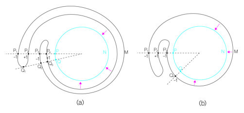
<figcaption class="paper-figure-caption"><b>Fig 1.</b> FIG. 1. Map between two circles M and N. The mapping degree is 0 in (a) and 1 in (b). The number ±1 beside each preimage point is the sign of the Jacobian at that point. The counting must be performed at a regular value; point Q in (a) is not regular. Adapted from [5].</figcaption>
</figure>
<figure class="paper-figure-card">
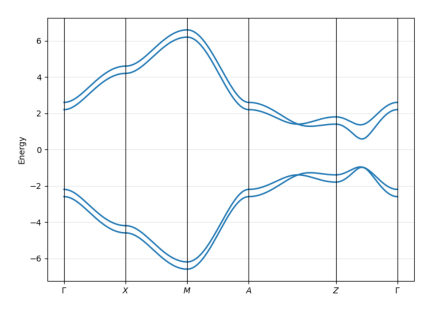
<figcaption class="paper-figure-caption"><b>Fig 2.</b> FIG. 2. Band structure of the tight-binding model, with u = v = 1.0, mz = δ = 0.2, and ϵ0 = 2.4.</figcaption>
</figure>
<figure class="paper-figure-card">
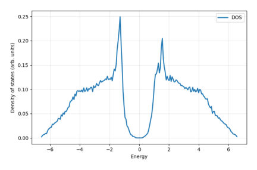
<figcaption class="paper-figure-caption"><b>Fig 3.</b> FIG. 3. Density of states (DOS) of the tight-binding model, with u = v = 1.0, mz = δ = 0.2, and ϵ0 = 2.4.</figcaption>
</figure>

**Summary.** This paper establishes a rigorous mathematical equivalence between the quantized magnetoelectric response (the axion invariant $2P_3$) and the symmetry indicator ($z_2$) for a specific class of topological insulators possessing $S_4$ symmetry. By connecting these two seemingly different theoretical frameworks, it provides a powerful new tool to classify and predict topological properties in condensed matter systems.

**Why it may be interesting.** This work is highly relevant for theoretical physicists studying topological phases of matter, particularly those bridging continuum field theory descriptions (like axion electrodynamics) with discrete band structure calculations using crystalline symmetries.

Detailed structure

**Main problem.** The paper establishes a mathematical equivalence between two distinct topological invariants characterizing axion insulators: the Chern-Simons derived magnetoelectric polarizability ($2P_3$) and a symmetry indicator ($z_2$). This bridges concepts from topological field theory (response) and band theory (symmetry classification).

**Main result.** The authors prove that for $S_4$-symmetric axion insulators with zero Chern numbers, the quantized magnetoelectric response $2P_3$ is exactly equal to the symmetry indicator $z_2$. This extends known equivalences to unitary, orientation-reversing symmetries.

**Method.** The analysis involves rewriting the Chern-Simons expression using an $S_4$ sewing matrix, reducing the problem to calculating the degree of a map from the Brillouin zone to SU(2), and comparing this result with the calculation of $z_2$ based on eigenvalues at high-symmetry momenta.

**Model / system.** The study focuses on three-dimensional axion insulators possessing $S_4$ symmetry. A specific tight-binding Hamiltonian is introduced for verification, allowing numerical confirmation of the theoretical equivalence.

**Key observables.** Axion invariant ($2P_3$), Symmetry Indicator ($z_2$), and the $S_4$ sewing matrix eigenvalues at high-symmetry points.

**Important parameters / regimes.** The symmetry group $S_4$, vanishing three-dimensional Chern numbers, and the modulo two arithmetic used in degree calculations.

**Assumptions / limitations.** The derivation relies on stable reduction to determinant-one two-band blocks and assumes that the system has vanishing three-dimensional Chern numbers.

**Figures summary.** Figure 1 illustrates mapping degrees between circles; Figure 2 shows the band structure of the model; and Figure 3 displays the Density of States (DOS) for the model, with captions detailing specific matrix values at high-symmetry points.

**Paper structure.** The paper progresses by first defining the problem using the Chern-Simons form, then mathematically transforming this into a degree calculation involving the $S_4$ sewing matrix. It details the reduction to two-band blocks and finally proves the equivalence with the symmetry indicator via eigenvalue counting and numerical verification.

Abstract

The equivalence between the axion invariant and the $S_4$ symmetry indicator is established for three-dimensional $S_4$-symmetric axion insulators with vanishing three-dimensional Chern numbers. Starting from the Chern-Simons expression for the magnetoelectric polarizability, $2P_3=θ/π$ is rewritten in terms of the $S_4$ sewing matrix. After stable reduction to determinant-one two-band blocks, the invariant is expressed as the degree of a map from the Brillouin zone to $SU(2)$. The degree modulo two is then evaluated from the $S_4$ eigenvalues at the four $S_4$-invariant momenta and is shown to coincide with the symmetry indicator $z_2$. A minimal tight-binding model verifies the correspondence between $2P_3$ and $z_2$. The result closes a gap between the topological-field-theory description of the axion response and the topological-band-theory classification by symmetry indicators. It also extends the known response-indicator equivalence from antiunitary settings such as $C_nT$ symmetry to the unitary, orientation-reversing rotoinversion symmetry $S_4$.

[↑ back to top](#top)

