
# arxiv digest (quant-ph + cond-mat) — 2026-07-10

*131 papers · 49 relevant · 3 highlighted*

## 🔥 Most relevant (49)

*Every paper with at least one nonzero topic score, sorted by best-matching score. 🔥 marks scores ≥4/5. Click the title to jump to the full entry below; click [arXiv] to open the paper page. `(secondary)` marks papers from de-prioritized cond-mat archives.*

Show 49 relevant papers

- [Room-temperature inversionless diamond nitrogen-vacancy electronic spin maser](#paper-2607.07124) [[arXiv]](http://arxiv.org/abs/2607.07124v1) — 🔥 `spintronics-quantum-optics interface` **5/5** · 🔥 `QC/QI experiment` **4/5** · 🔥 `methods for driven-dissipative` **4/5** · `Keldysh / 2PI / non-Gaussian methods` **3/5** · `Tavis-Cummings & cavity-many-emitter` **3/5** · `driven-dissipative phase transition` **3/5** · `exotic spin models in light-matter` **3/5** · `quantum optics experiment` **3/5** · `analog quantum simulation` **2/5** · `correlated cavity matter` **2/5** · `non-equilibrium dynamics` **2/5** · `non-equilibrium universality` **2/5** · `quantum measurements` **2/5** · `superradiant laser` **2/5** · `correlated / nonlocal dissipation` **1/5** · `entanglement & information structure` **1/5** · `measurement-induced transitions` **1/5**
- [Multi-channel collective dissipation via the symmetric irreducible representation of SU(4)](#paper-2607.07701) [[arXiv]](http://arxiv.org/abs/2607.07701v1) — 🔥 `Dicke superradiance` **5/5** · 🔥 `correlated / nonlocal dissipation` **4/5** · 🔥 `superradiant laser` **4/5** · `Tavis-Cummings & cavity-many-emitter` **3/5** · `correlated cavity matter` **3/5** · `driven-dissipative phase transition` **3/5** · `analog quantum simulation` **2/5** · `free-space correlated emission` **2/5** · `methods for driven-dissipative` **2/5** · `non-equilibrium dynamics` **2/5** · `non-equilibrium universality` **2/5** · `Keldysh / 2PI / non-Gaussian methods` **1/5** · `entanglement & information structure` **1/5** · `quantum measurements` **1/5**
- [Universal purification dynamics of monitored Clifford circuits](#paper-2607.06683) [[arXiv]](http://arxiv.org/abs/2607.06683v1) — 🔥 `measurement-induced transitions` **5/5** · 🔥 `entanglement & information structure` **4/5** · 🔥 `non-equilibrium universality` **4/5** · `correlated / nonlocal dissipation` **3/5** · `driven-dissipative phase transition` **3/5** · `methods for driven-dissipative` **3/5** · `non-equilibrium dynamics` **3/5** · `Keldysh / 2PI / non-Gaussian methods` **2/5** · `quantum measurements` **2/5** · `scars & prethermalization` **1/5**
- [A neural-network Maxwell's demon learns cold damping for work extraction](#paper-2607.06822) [[arXiv]](http://arxiv.org/abs/2607.06822v1) — 🔥 `quantum measurements` **5/5** · 🔥 `measurement-induced transitions` **4/5** · `driven-dissipative phase transition` **3/5** · `methods for driven-dissipative` **3/5** · `non-equilibrium dynamics` **3/5** · `non-equilibrium universality` **2/5** · `Frenkel-Kontorova` **1/5** · `Keldysh / 2PI / non-Gaussian methods` **1/5** · `correlated / nonlocal dissipation` **1/5**
- [Macroscopic position-position entanglement by photon recoil in Rydberg atoms](#paper-2607.07167) [[arXiv]](http://arxiv.org/abs/2607.07167v1) — 🔥 `Rydberg arrays` **5/5** · 🔥 `analog quantum simulation` **4/5** · `QC/QI experiment` **3/5** · `entanglement & information structure` **3/5** · `quantum measurements` **2/5** · `quantum optics experiment` **2/5** · `correlated / nonlocal dissipation` **1/5** · `correlated cavity matter` **1/5** · `non-equilibrium dynamics` **1/5**
- [Non-Abelian Thouless pumping based on the global adiabatic criterion in Rydberg synthetic lattices](#paper-2607.07223) [[arXiv]](http://arxiv.org/abs/2607.07223v1) — 🔥 `Rydberg arrays` **5/5** · 🔥 `analog quantum simulation` **4/5** · `methods for driven-dissipative` **3/5** · `non-equilibrium dynamics` **3/5** · `driven-dissipative phase transition` **2/5** · `Keldysh / 2PI / non-Gaussian methods` **1/5** · `correlated / nonlocal dissipation` **1/5** · `entanglement & information structure` **1/5** · `non-equilibrium universality` **1/5**
- [Tomography of a Macroscopic Quantum State influenced by Classical Self-Gravity](#paper-2607.06967) [[arXiv]](http://arxiv.org/abs/2607.06967v1) — 🔥 `quantum measurements` **5/5** · 🔥 `measurement-induced transitions` **4/5** · `methods for driven-dissipative` **3/5** · `quantum optics experiment` **3/5** · `non-equilibrium dynamics` **2/5** · `Keldysh / 2PI / non-Gaussian methods` **1/5** · `correlated / nonlocal dissipation` **1/5** · `driven-dissipative phase transition` **1/5**
- [Correlation Localization in Waveguide QED with Delayed Interactions](#paper-2607.06888) [[arXiv]](http://arxiv.org/abs/2607.06888v1) — 🔥 `analog quantum simulation` **4/5** · 🔥 `correlated / nonlocal dissipation` **4/5** · `Tavis-Cummings & cavity-many-emitter` **3/5** · `correlated cavity matter` **3/5** · `driven-dissipative phase transition` **3/5** · `methods for driven-dissipative` **3/5** · `non-equilibrium dynamics` **3/5** · `Keldysh / 2PI / non-Gaussian methods` **2/5** · `non-equilibrium universality` **2/5** · `entanglement & information structure` **1/5** · `exotic spin models in light-matter` **1/5** · `scars & prethermalization` **1/5**
- [Driven square lattice of quantum dots in a magnetic field coupled to a cylindrical FIR-photon cavity](#paper-2607.06812) [[arXiv]](http://arxiv.org/abs/2607.06812v1) `(secondary)` — 🔥 `analog quantum simulation` **4/5** · 🔥 `driven-dissipative phase transition` **4/5** · `Tavis-Cummings & cavity-many-emitter` **3/5** · `correlated cavity matter` **3/5** · `methods for driven-dissipative` **3/5** · `non-equilibrium dynamics` **3/5** · `spintronics-quantum-optics interface` **3/5** · `non-equilibrium universality` **2/5** · `Keldysh / 2PI / non-Gaussian methods` **1/5** · `correlated / nonlocal dissipation` **1/5** · `entanglement & information structure` **1/5** · `exotic spin models in light-matter` **1/5** · `interference shaping light` **1/5**
- [Entanglement-assisted remote energy transfer](#paper-2607.06837) [[arXiv]](http://arxiv.org/abs/2607.06837v1) — 🔥 `methods for driven-dissipative` **4/5** · `correlated / nonlocal dissipation` **3/5** · `correlated cavity matter` **3/5** · `driven-dissipative phase transition` **3/5** · `entanglement & information structure` **3/5** · `non-equilibrium dynamics` **3/5** · `Keldysh / 2PI / non-Gaussian methods` **2/5** · `analog quantum simulation` **2/5** · `non-equilibrium universality` **2/5** · `Tavis-Cummings & cavity-many-emitter` **1/5** · `exotic spin models in light-matter` **1/5** · `scars & prethermalization` **1/5**
- ⭐ [A "squeezed polaron" variational wavefunction for the spin boson model](#paper-2607.06850) [[arXiv]](http://arxiv.org/abs/2607.06850v1) — 🔥 `methods for driven-dissipative` **4/5** · 🔥 `non-equilibrium universality` **4/5** · `Keldysh / 2PI / non-Gaussian methods` **3/5** · `correlated / nonlocal dissipation` **3/5** · `driven-dissipative phase transition` **3/5** · `Kondo & dissipative impurity` **2/5** · `exotic spin models in light-matter` **2/5** · `non-equilibrium dynamics` **2/5** · `analog quantum simulation` **1/5** · `correlated cavity matter` **1/5** · `spintronics-quantum-optics interface` **1/5**
- [Anyon-induced non-Hermitian topological phases](#paper-2607.06934) [[arXiv]](http://arxiv.org/abs/2607.06934v1) — 🔥 `analog quantum simulation` **4/5** · 🔥 `driven-dissipative phase transition` **4/5** · `correlated / nonlocal dissipation` **3/5** · `methods for driven-dissipative` **3/5** · `non-equilibrium universality` **3/5** · `Kondo & dissipative impurity` **2/5** · `non-equilibrium dynamics` **2/5** · `Frenkel-Kontorova` **1/5** · `Keldysh / 2PI / non-Gaussian methods` **1/5** · `entanglement & information structure` **1/5**
- [Horizon-Restricted Leading Soft QED as Open Quantum System](#paper-2607.07342) [[arXiv]](http://arxiv.org/abs/2607.07342v1) — 🔥 `quantum measurements` **4/5** · `correlated / nonlocal dissipation` **3/5** · `entanglement & information structure` **3/5** · `measurement-induced transitions` **3/5** · `methods for driven-dissipative` **3/5** · `Keldysh / 2PI / non-Gaussian methods` **2/5** · `driven-dissipative phase transition` **2/5** · `non-equilibrium dynamics` **2/5** · `interference shaping light` **1/5** · `non-equilibrium universality` **1/5**
- [Local Markov Order and Global Inference in Many-Body Dynamics](#paper-2607.06689) [[arXiv]](http://arxiv.org/abs/2607.06689v1) — 🔥 `entanglement & information structure` **4/5** · 🔥 `measurement-induced transitions` **4/5** · 🔥 `quantum measurements` **4/5** · `non-equilibrium dynamics` **3/5** · `non-equilibrium universality` **3/5** · `driven-dissipative phase transition` **2/5** · `correlated / nonlocal dissipation` **1/5** · `methods for driven-dissipative` **1/5** · `scars & prethermalization` **1/5**
- [Time domain Stokes mechanism of pair correlated k gap solitons in nonlinear photonic time crystal slabs](#paper-2607.07340) [[arXiv]](http://arxiv.org/abs/2607.07340v1) `(secondary)` — 🔥 `driven-dissipative phase transition` **4/5** · `methods for driven-dissipative` **3/5** · `non-equilibrium dynamics` **3/5** · `quantum optics experiment` **3/5** · `entanglement & information structure` **2/5** · `non-equilibrium universality` **2/5** · `Keldysh / 2PI / non-Gaussian methods` **1/5** · `analog quantum simulation` **1/5** · `correlated / nonlocal dissipation` **1/5** · `correlated cavity matter` **1/5** · `interference shaping light` **1/5** · `quantum measurements` **1/5**
- [Enhanced two-photon sources in a cavity-coupled two-atom system](#paper-2607.06932) [[arXiv]](http://arxiv.org/abs/2607.06932v1) — 🔥 `analog quantum simulation` **4/5** · 🔥 `correlated cavity matter` **4/5** · `Tavis-Cummings & cavity-many-emitter` **3/5** · `methods for driven-dissipative` **3/5** · `correlated / nonlocal dissipation` **2/5** · `driven-dissipative phase transition` **1/5** · `entanglement & information structure` **1/5** · `interference shaping light` **1/5** · `non-equilibrium dynamics` **1/5** · `quantum optics experiment` **1/5**
- [High-frequency nonlinear conductivity of a Wigner crystal](#paper-2607.06846) [[arXiv]](http://arxiv.org/abs/2607.06846v1) `(secondary)` — 🔥 `driven-dissipative phase transition` **4/5** · `Frenkel-Kontorova` **3/5** · `methods for driven-dissipative` **3/5** · `non-equilibrium dynamics` **3/5** · `analog quantum simulation` **2/5** · `non-equilibrium universality` **2/5** · `Keldysh / 2PI / non-Gaussian methods` **1/5** · `correlated / nonlocal dissipation` **1/5**
- [Spin Textures and Eigenstate Evolution of Isospectrally Patterned Lattices](#paper-2607.07502) [[arXiv]](http://arxiv.org/abs/2607.07502v1) — 🔥 `analog quantum simulation` **4/5** · `exotic spin models in light-matter` **3/5** · `spintronics-quantum-optics interface` **3/5** · `driven-dissipative phase transition` **2/5** · `non-equilibrium dynamics` **2/5** · `Frenkel-Kontorova` **1/5** · `correlated cavity matter` **1/5** · `entanglement & information structure` **1/5** · `methods for driven-dissipative` **1/5** · `non-equilibrium universality` **1/5**
- [Floquet-Weyl states at one-photon resonances in three-dimensional topological insulators](#paper-2607.07199) [[arXiv]](http://arxiv.org/abs/2607.07199v1) — 🔥 `non-equilibrium dynamics` **4/5** · `analog quantum simulation` **3/5** · `driven-dissipative phase transition` **3/5** · `methods for driven-dissipative` **3/5** · `non-equilibrium universality` **2/5** · `Keldysh / 2PI / non-Gaussian methods` **1/5** · `interference shaping light` **1/5** · `spintronics-quantum-optics interface` **1/5**
- [How thermal is a filtered state?](#paper-2607.06847) [[arXiv]](http://arxiv.org/abs/2607.06847v1) — 🔥 `non-equilibrium dynamics` **4/5** · `entanglement & information structure` **3/5** · `scars & prethermalization` **3/5** · `methods for driven-dissipative` **2/5** · `non-equilibrium universality` **2/5** · `Keldysh / 2PI / non-Gaussian methods` **1/5** · `analog quantum simulation` **1/5** · `correlated / nonlocal dissipation` **1/5** · `driven-dissipative phase transition` **1/5**
- [Hyperuniform systems are maximally irreversible](#paper-2607.07411) [[arXiv]](http://arxiv.org/abs/2607.07411v1) — 🔥 `non-equilibrium dynamics` **4/5** · 🔥 `non-equilibrium universality` **4/5** · `driven-dissipative phase transition` **3/5** · `methods for driven-dissipative` **3/5** · `correlated / nonlocal dissipation` **2/5** · `Frenkel-Kontorova` **1/5** · `Keldysh / 2PI / non-Gaussian methods` **1/5**
- [Spectral Chaos Does Not Determine Quantum Mpemba Crossings](#paper-2607.07081) [[arXiv]](http://arxiv.org/abs/2607.07081v1) — 🔥 `non-equilibrium dynamics` **4/5** · `entanglement & information structure` **3/5** · `non-equilibrium universality` **3/5** · `driven-dissipative phase transition` **2/5** · `Keldysh / 2PI / non-Gaussian methods` **1/5** · `analog quantum simulation` **1/5** · `correlated / nonlocal dissipation` **1/5** · `exotic spin models in light-matter` **1/5** · `methods for driven-dissipative` **1/5** · `scars & prethermalization` **1/5**
- [Taming nonlinear energy diffusion: The case of time-crystal energy condensates](#paper-2607.07325) [[arXiv]](http://arxiv.org/abs/2607.07325v1) — 🔥 `driven-dissipative phase transition` **4/5** · `methods for driven-dissipative` **3/5** · `non-equilibrium dynamics` **3/5** · `non-equilibrium universality` **3/5** · `analog quantum simulation` **2/5** · `Frenkel-Kontorova` **1/5** · `Keldysh / 2PI / non-Gaussian methods` **1/5** · `correlated / nonlocal dissipation` **1/5**
- [Turing mechanisms in a multimode open quantum system](#paper-2607.07449) [[arXiv]](http://arxiv.org/abs/2607.07449v1) — 🔥 `driven-dissipative phase transition` **4/5** · `correlated / nonlocal dissipation` **3/5** · `methods for driven-dissipative` **3/5** · `non-equilibrium dynamics` **3/5** · `non-equilibrium universality` **2/5** · `Frenkel-Kontorova` **1/5** · `Keldysh / 2PI / non-Gaussian methods` **1/5** · `analog quantum simulation` **1/5**
- [Unveiling the Spin-Valley Structure of Dipolar Exciton Ladders in R-stacked WSe$_2$/WS$_2$ Moiré Heterobilayers](#paper-2607.07590) [[arXiv]](http://arxiv.org/abs/2607.07590v1) `(secondary)` — 🔥 `analog quantum simulation` **4/5** · 🔥 `spintronics-quantum-optics interface` **4/5** · `exotic spin models in light-matter` **3/5** · `quantum optics experiment` **2/5** · `correlated / nonlocal dissipation` **1/5** · `correlated cavity matter` **1/5** · `driven-dissipative phase transition` **1/5** · `entanglement & information structure` **1/5** · `non-equilibrium dynamics` **1/5**
- [Density-Induced Reentrant Coarsening in a Two-Temperature System](#paper-2607.07113) [[arXiv]](http://arxiv.org/abs/2607.07113v1) — 🔥 `non-equilibrium dynamics` **4/5** · 🔥 `non-equilibrium universality` **4/5** · `driven-dissipative phase transition` **3/5** · `methods for driven-dissipative` **3/5** · `Keldysh / 2PI / non-Gaussian methods` **1/5** · `analog quantum simulation` **1/5** · `correlated / nonlocal dissipation` **1/5**
- [Does Born Rule Imply Unitarity of Time Evolution in Quantum Mechanics?](#paper-2607.07560) [[arXiv]](http://arxiv.org/abs/2607.07560v1) — 🔥 `quantum measurements` **4/5** · `measurement-induced transitions` **3/5** · `driven-dissipative phase transition` **2/5** · `Keldysh / 2PI / non-Gaussian methods` **1/5** · `Kondo & dissipative impurity` **1/5** · `analog quantum simulation` **1/5** · `correlated / nonlocal dissipation` **1/5** · `entanglement & information structure` **1/5** · `methods for driven-dissipative` **1/5** · `non-equilibrium dynamics` **1/5**
- [Quantum simulation of real-world nonlinear dynamics via Koopman method](#paper-2607.07338) [[arXiv]](http://arxiv.org/abs/2607.07338v1) — 🔥 `QC/QI experiment` **4/5** · `methods for driven-dissipative` **3/5** · `non-equilibrium dynamics` **3/5** · `analog quantum simulation` **2/5** · `driven-dissipative phase transition` **2/5** · `correlated / nonlocal dissipation` **1/5** · `non-equilibrium universality` **1/5**
- [Spin singlets are useful](#paper-2607.06672) [[arXiv]](http://arxiv.org/abs/2607.06672v1) — 🔥 `entanglement & information structure` **4/5** · `spintronics-quantum-optics interface` **3/5** · `analog quantum simulation` **2/5** · `quantum measurements` **2/5** · `QC/QI experiment` **1/5** · `exotic spin models in light-matter` **1/5** · `methods for driven-dissipative` **1/5** · `non-equilibrium dynamics` **1/5**
- [Dynamical structure factor with a pumping approach on a trapped-ion quantum computer](#paper-2607.07138) [[arXiv]](http://arxiv.org/abs/2607.07138v1) — 🔥 `QC/QI experiment` **4/5** · 🔥 `analog quantum simulation` **4/5** · `non-equilibrium dynamics` **2/5** · `Frenkel-Kontorova` **1/5** · `entanglement & information structure` **1/5** · `exotic spin models in light-matter` **1/5** · `quantum measurements` **1/5**
- [Entanglement Asymmetry in Random Quantum Automata](#paper-2607.07556) [[arXiv]](http://arxiv.org/abs/2607.07556v1) — 🔥 `entanglement & information structure` **4/5** · `non-equilibrium dynamics` **3/5** · `non-equilibrium universality` **2/5** · `Keldysh / 2PI / non-Gaussian methods` **1/5** · `correlated / nonlocal dissipation` **1/5** · `driven-dissipative phase transition` **1/5** · `methods for driven-dissipative` **1/5** · `scars & prethermalization` **1/5**
- [Phase-Selected Efficient Single-Photon Frequency Conversion via Local Fano Resonance in a Two-Giant-Atom Waveguide-QED System](#paper-2607.07093) [[arXiv]](http://arxiv.org/abs/2607.07093v1) — 🔥 `interference shaping light` **4/5** · `correlated cavity matter` **3/5** · `Tavis-Cummings & cavity-many-emitter` **2/5** · `Keldysh / 2PI / non-Gaussian methods` **1/5** · `analog quantum simulation` **1/5** · `correlated / nonlocal dissipation` **1/5** · `driven-dissipative phase transition` **1/5** · `methods for driven-dissipative` **1/5**
- [Universal spin-squeezing dynamics in spinor condensates](#paper-2607.06842) [[arXiv]](http://arxiv.org/abs/2607.06842v1) — 🔥 `analog quantum simulation` **4/5** · `entanglement & information structure` **3/5** · `exotic spin models in light-matter` **3/5** · `correlated / nonlocal dissipation` **1/5** · `methods for driven-dissipative` **1/5** · `non-equilibrium dynamics` **1/5**
- ⭐ [Variational Learning with Sparse Long-range Entangling Gates](#paper-2607.07547) [[arXiv]](http://arxiv.org/abs/2607.07547v1) — 🔥 `analog quantum simulation` **4/5** · `entanglement & information structure` **3/5** · `QC/QI experiment` **2/5** · `Rydberg arrays` **1/5** · `exotic spin models in light-matter` **1/5** · `non-equilibrium dynamics` **1/5**
- [The NISQ Trap: Eight Years of Demonstrations the Hardware Was Built to Lose](#paper-2607.07530) [[arXiv]](http://arxiv.org/abs/2607.07530v1) — 🔥 `QC/QI experiment` **4/5** · `entanglement & information structure` **2/5** · `analog quantum simulation` **1/5** · `correlated / nonlocal dissipation` **1/5** · `driven-dissipative phase transition` **1/5** · `methods for driven-dissipative` **1/5** · `non-equilibrium dynamics` **1/5**
- [Ab Initio Investigation of Pressure Effects in the Spin-Liquid Candidate Y-Kapellasite](#paper-2607.07341) [[arXiv]](http://arxiv.org/abs/2607.07341v1) — 🔥 `analog quantum simulation` **4/5** · `exotic spin models in light-matter` **3/5** · `Keldysh / 2PI / non-Gaussian methods` **1/5** · `entanglement & information structure` **1/5** · `spintronics-quantum-optics interface` **1/5**
- ⭐ [Covariant Approximate Quantum Codes for Protected Analog Computation](#paper-2607.07607) [[arXiv]](http://arxiv.org/abs/2607.07607v1) — 🔥 `analog quantum simulation` **4/5** · `entanglement & information structure` **2/5** · `correlated / nonlocal dissipation` **1/5** · `correlated cavity matter` **1/5** · `driven-dissipative phase transition` **1/5** · `non-equilibrium dynamics` **1/5**
- [Emergent superconductivity upon disordering a topological insulator](#paper-2607.07163) [[arXiv]](http://arxiv.org/abs/2607.07163v1) — 🔥 `analog quantum simulation` **4/5** · `Kondo & dissipative impurity` **2/5** · `Keldysh / 2PI / non-Gaussian methods` **1/5** · `driven-dissipative phase transition` **1/5** · `methods for driven-dissipative` **1/5**
- [Multistage development of short-range spin correlations and weak magnetic order in the two coupled trillium lattices of K2Fe2(MoO4)(PO4)2](#paper-2607.07681) [[arXiv]](http://arxiv.org/abs/2607.07681v1) — 🔥 `analog quantum simulation` **4/5** · `exotic spin models in light-matter` **3/5** · `entanglement & information structure` **1/5** · `spintronics-quantum-optics interface` **1/5**
- [Quantum Computing : A New Frontier for Science and Society](#paper-2607.07222) [[arXiv]](http://arxiv.org/abs/2607.07222v1) — 🔥 `QC/QI experiment` **4/5** · `analog quantum simulation` **2/5** · `correlated / nonlocal dissipation` **1/5** · `entanglement & information structure` **1/5** · `methods for driven-dissipative` **1/5**
- [Critical SO(5) scaling of entanglement entropy at honeycomb lattice deconfined criticality](#paper-2607.07248) [[arXiv]](http://arxiv.org/abs/2607.07248v1) — 🔥 `entanglement & information structure` **4/5** · `analog quantum simulation` **2/5** · `exotic spin models in light-matter` **1/5** · `non-equilibrium universality` **1/5**
- [Majorana physics in a Luttinger liquid with attractive interactions](#paper-2607.06751) [[arXiv]](http://arxiv.org/abs/2607.06751v1) — 🔥 `analog quantum simulation` **4/5** · `Keldysh / 2PI / non-Gaussian methods` **1/5** · `Kondo & dissipative impurity` **1/5** · `entanglement & information structure` **1/5** · `non-equilibrium dynamics` **1/5**
- [QANTIS: Hardware-Calibrated Sequential POMDP Belief Updates on IBM Heron](#paper-2607.06760) [[arXiv]](http://arxiv.org/abs/2607.06760v1) — 🔥 `QC/QI experiment` **4/5** · `quantum measurements` **2/5** · `methods for driven-dissipative` **1/5** · `non-equilibrium dynamics` **1/5**
- [Vectorizing Quantum Control: A RISC-V Vector Extension Architecture for Scalable Qubit Systems](#paper-2607.07372) [[arXiv]](http://arxiv.org/abs/2607.07372v1) — 🔥 `QC/QI experiment` **4/5** · `quantum measurements` **3/5** · `measurement-induced transitions` **1/5**
- [Phase transitions and uberholography of holographic pure-state geometries](#paper-2607.06870) [[arXiv]](http://arxiv.org/abs/2607.06870v1) — 🔥 `entanglement & information structure` **4/5** · `driven-dissipative phase transition` **1/5** · `non-equilibrium dynamics` **1/5** · `non-equilibrium universality` **1/5**
- [Quantum error correction of a grid-state qubit with state preparation and measurement errors below $10^{-3}$](#paper-2607.06718) [[arXiv]](http://arxiv.org/abs/2607.06718v1) — 🔥 `QC/QI experiment` **4/5** · `quantum measurements` **2/5** · `methods for driven-dissipative` **1/5**
- [Visualizing modified spin-wave wavefronts near magnetic defects and domains using nitrogen-vacancy centers](#paper-2607.06941) [[arXiv]](http://arxiv.org/abs/2607.06941v1) — 🔥 `spintronics-quantum-optics interface` **4/5** · `QC/QI experiment` **1/5** · `methods for driven-dissipative` **1/5** · `quantum measurements` **1/5**
- [Localized Thermometry via Dayem Bridges Integrated on Superconducting Qubit Chips](#paper-2607.06670) [[arXiv]](http://arxiv.org/abs/2607.06670v1) — 🔥 `QC/QI experiment` **4/5** · `quantum measurements` **1/5**
- [Analytical Landscape of Maximal Magic for Two-Qutrit States and Beyond](#paper-2607.07197) [[arXiv]](http://arxiv.org/abs/2607.07197v1) — 🔥 `entanglement & information structure` **4/5**

## ⭐ Highlighted (3)

*Papers by authors on your watch list. Click the title to jump to the full entry below; click [arXiv] to open the paper page.*

Show 3 highlighted papers

- ⭐ [Covariant Approximate Quantum Codes for Protected Analog Computation](#paper-2607.07607) [[arXiv]](http://arxiv.org/abs/2607.07607v1) — Susanne F. Yelin
- ⭐ [A "squeezed polaron" variational wavefunction for the spin boson model](#paper-2607.06850) [[arXiv]](http://arxiv.org/abs/2607.06850v1) — Nigel Cooper
- ⭐ [Variational Learning with Sparse Long-range Entangling Gates](#paper-2607.07547) [[arXiv]](http://arxiv.org/abs/2607.07547v1) — Andrew J. Daley

## All papers (101, sorted by relevance)

*Papers from quant-ph and your primary cond-mat archives (quant-gas, stat-mech, str-el, dis-nn). Highlighted papers (⭐) come first, then everything else sorted by topic-relevance score, highest first.*

### ⭐ [A "squeezed polaron" variational wavefunction for the spin boson model](http://arxiv.org/abs/2607.06850v1)

**Highlighted author(s):** Nigel Cooper  
**Authors:** Diego Barberena, Nigel Cooper  
**Type:** theory · **Category:** disordered systems and neural networks · **PDF:** <https://arxiv.org/pdf/2607.06850v1>  
**Analysis basis:** full PDF text, analyzed in chunks
**Topic relevance:** 🔥 `methods for driven-dissipative` **4/5** · 🔥 `non-equilibrium universality` **4/5** · `Keldysh / 2PI / non-Gaussian methods` **3/5** · `correlated / nonlocal dissipation` **3/5** · `driven-dissipative phase transition` **3/5** · `Kondo & dissipative impurity` **2/5** · `exotic spin models in light-matter` **2/5** · `non-equilibrium dynamics` **2/5** · `analog quantum simulation` **1/5** · `correlated cavity matter` **1/5** · `spintronics-quantum-optics interface` **1/5**

↔ Scroll figures horizontally

<figure class="paper-figure-card">
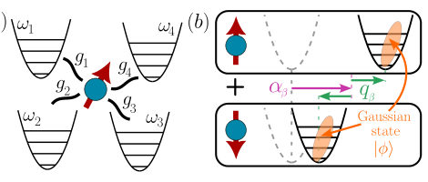
<figcaption class="paper-figure-caption"><b>Fig 1.</b> FIG. 1. (a) The spin boson model describes a single two-level system interacting with an environment of bosonic modes. (b) Graphical depiction of our ansatz wavefunction as a superpo- sition which involves correlated (qβ) and uncorrelated (αβ) displacements of bosonic modes in a gaussian state |ϕ⟩and a rotation of the two-level system (not shown, manifests in the relative weights of the two states).</figcaption>
</figure>
<figure class="paper-figure-card">
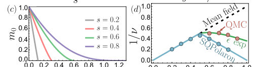
<figcaption class="paper-figure-caption"><b>Fig 2.</b> FIG. 3. (a) Critical points αc ∆predicted by the coherent state polaron [22] and the squeezed polaron vs. numerical results from a variational multipolaron ansatz (MPA) [19] at ∆/ωc = 0.1. (b) Function m(y) as a function of its argu- ment y (y = ω/D in the delocalized phase), for s = 0.8 and b = 0.01, 0.2, 0.4 and b = bc = 1.28. (c) Zero frequency value m0 as a function of b for different s = 0.2, 0.4, 0.6, 0.8. (d) Exponent ν as a function of s of the squeezed polaron (blue dots are numerical), two loop ϵ expansion [37] and Quantum Monte Carlo [38].</figcaption>
</figure>
<figure class="paper-figure-card">
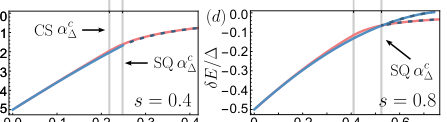
<figcaption class="paper-figure-caption"><b>Fig 3.</b> FIG. 2. Coherence ⟨ˆsx⟩and ground state energy gain δE/∆ as a function of scaled coupling α∆= α(ωc/∆)1−s for s = 0.4 [(a),(b)] and s = 0.8 [(c), (d)]. We show the results from Refs. [21, 22] at ωc/∆= 10 in solid red (coherent state po- laron, CS Polaron for short) and our results (squeezed po- laron, SQ Polaron) in solid blue (delocalized branch) and dashed blue (localized branch). Vertical grey lines are the critical points αc ∆predicted by the CS and SQ polarons.</figcaption>
</figure>
<figure class="paper-figure-card">
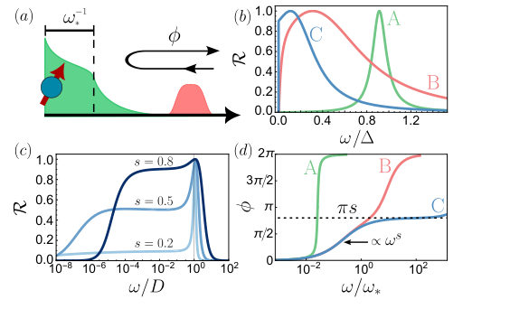
<figcaption class="paper-figure-caption"><b>Fig 4.</b> FIG. 4. (a) Scattering of bosons in the half-line. (b) We show the full-line reflection coefficient R = sin(ϕ/2)2 as a function of ω/∆for s = 0.8 and α∆= 0.05, 0.5 and 0.7, denoted A, B and C, respectively. These correspond to m0 = 0.9, 0.16, 0.002 and ω∗/∆= 35, 0.07, 5 × 10−5. (c) R for s = 0.2, 0.6, 0.8 near criticality, all with ω∗/D = 5 × 10−6 (corresponding to α∆= 0.121, 0.4297, 1.15). (d) Phase shift ϕ at (low) frequencies comparable to ω∗for same parameters as in (b).</figcaption>
</figure>

**Summary.** The paper develops and applies a 'squeezed polaron' variational wavefunction to study the localization transition in the spin-boson model. This advanced ansatz successfully captures complex boson bath correlations missed by simpler methods, leading to accurate predictions of critical exponents and energy scaling near the quantum critical point.

**Why it may be interesting.** This work provides a sophisticated theoretical tool (squeezed polaron) to analyze quantum criticality in open systems, yielding quantitative results on universal scaling behavior that are crucial for understanding decoherence and environmental coupling effects.

Detailed structure

**Main problem.** The localization transition of the sub-Ohmic spin-boson model generates bath correlations inaccessible to standard variational ansatzes.

**Main result.** A 'squeezed polaron' wavefunction correctly captures critical power-law scaling near the localization transition and accurately determines the critical coupling constant across different regimes.

**Method.** The authors employ a generalized variational principle using a 'squeezed polaron' wavefunction that incorporates Gaussian boson-boson correlations to minimize the ground state energy.

**Model / system.** The study analyzes the Spin-Boson Model, describing an impurity spin coupled to a bosonic bath with a sub-Ohmic spectral function $J(\omega) \propto \omega^{1-s}$. The system exhibits a localization transition governed by the coupling strength $\alpha$.

**Key observables.** Ground state energy gain ($\delta E$), renormalized coherence ($\langle\hat{s}_x
angle$), and scattering phase shifts for bosons.

**Important parameters / regimes.** Bath exponent $s$ (controls sub-Ohmic nature), coupling strength $\alpha$, and the critical coupling constant $\alpha_c^\Delta$.

**Assumptions / limitations.** The use of a 'squeezed polaron' wavefunction, which assumes Gaussian boson-boson correlations, and approximations involving low-frequency expansions for scattering calculations.

**Figures summary.** Figures compare the coherence and energy gain using the new ansatz versus standard coherent-state polarons; other figures show numerical collapse of scaling functions $m(y)$ near criticality.

**Paper structure.** The paper introduces the model and the improved wavefunction, derives key observables like energy and coherence, analyzes low-frequency scaling laws for bath correlations, and finally uses scattering phase shifts to confirm critical exponents derived from the variational approach.

Abstract

The localization transition of the sub-Ohmic spin-boson model generates boson bath correlations that are, at low frequencies, analytically inaccessible to standard coherent-state-polaron variational ansatzes. In this paper, we introduce a ``squeezed polaron'' wavefunction incorporating generic Gaussian boson-boson correlations induced by the spin impurity. This gives the correct critical power-law scaling of bath observables near the localization transition together with a systematically improved ground state energy and a more accurate determination of the critical coupling. Our wavefunction captures the correct mean-field nature of the transition in the deep sub-Ohmic region. It also displays non-mean-field critical exponents in the shallow sub-Ohmic regime. Using the squeezed polaron as a starting point, we derive scattering phase shifts for bosons, and show how they encode the emergent energy scale that vanishes at the localization transition.

[↑ back to top](#top)

### ⭐ [Variational Learning with Sparse Long-range Entangling Gates](http://arxiv.org/abs/2607.07547v1)

**Highlighted author(s):** Andrew J. Daley  
**Authors:** Helene M. Lösl, Aydin Deger, Andrew J. Daley  
**Type:** theory · **Category:** other · **PDF:** <https://arxiv.org/pdf/2607.07547v1>  
**Analysis basis:** full PDF text, analyzed in chunks
**Topic relevance:** 🔥 `analog quantum simulation` **4/5** · `entanglement & information structure` **3/5** · `QC/QI experiment` **2/5** · `Rydberg arrays` **1/5** · `exotic spin models in light-matter` **1/5** · `non-equilibrium dynamics` **1/5**

↔ Scroll figures horizontally

<figure class="paper-figure-card">
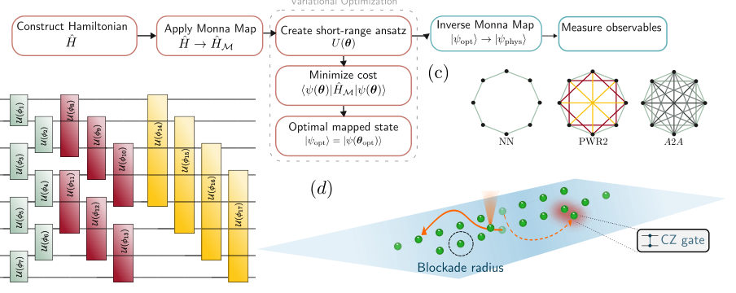
<figcaption class="paper-figure-caption"><b>Fig 1.</b> FIG. 1. (a) parametrized quantum circuit for eight qubits, different colors represent distances between entangled qubits d = 20 = 1 (green),21 = 2 (red), 22 = 4 (yellow) (b) Flowchart showing the Monna variational pipeline that allows solving a variational problem in a localized representation before accessing the solution via inverting the unitary map. Red indicates steps that can be performed classically, and blue indicates steps executed on quantum hardware. (c) Coupling graphs considered in the main text, from left to right, the nearest neighbor (NN), power-of-two (PWR2), and all-to-all (A2A) connected graph. Edges connecting qubits separated by the same distance are shown in the same...</figcaption>
</figure>
<figure class="paper-figure-card">
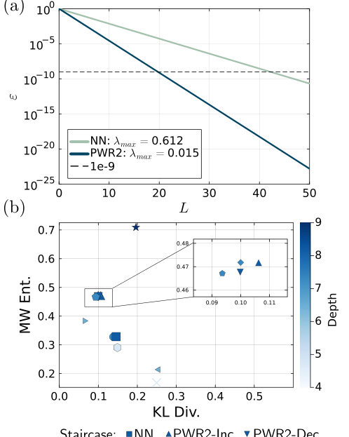
<figcaption class="paper-figure-caption"><b>Fig 2.</b> FIG. 2. (a)Distance of an ensemble of PQC on n = 16 qubits from forming an ε-approximate 2-design, or equiva- lently, the circuit depth L needed to reach a particular dis- tance of a 2-design by evaluating the bound of [38, Theorem 2] for brickwork circuits defined on the NN and the PWR2 coupling graph, respectively. For a given ε, the depths for the PWR2 circuit are substantially lower than for the NN cir- cuit. (b)Expressibility and entangling capability of NN and PWR2 graphs for n = 4 qubits. Expressibility is quantified through the KL divergence Eq. 16 and entangling capability through the Meyer-Wallach measure Eq. 19. The color of the markers indicates the depth of the circuit, ranging...</figcaption>
</figure>
<figure class="paper-figure-card">
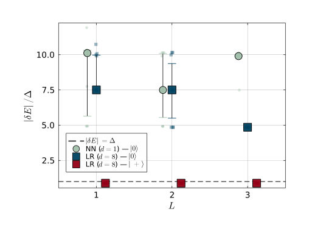
<figcaption class="paper-figure-caption"><b>Fig 3.</b> FIG. 3. Median relative energy error |δE|/∆= |EVQE − EGS|/∆as a function of the number of layers L, for the Hamil- tonian variational RX-RZZ ansatz with two gate-range pat- terns: nearest-neighbor (NN, green circles, d = 1) and long- range (LR, blue/red squares, d = 8). Large filled markers are medians over 10 random initializations with error bars indi- cating the interquartile range; faint markers show individual seeds. Results are n = 16 qubits at B/J = 0.05 with s = +5, |0⟩⊗n and |+⟩⊗n initial states. We use the L-BFGS optimizer with 480 iterations. For the LR ansatz, we include both ini- tializations.</figcaption>
</figure>
<figure class="paper-figure-card">
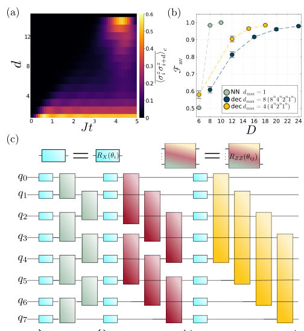
<figcaption class="paper-figure-caption"><b>Fig 4.</b> FIG. 4. Learning the late-time state of a nearest-neighbor TFIM quench. (a) Connected two-point correlator ⟨σz i σz i+d⟩c of the target state vs separation d and quench time Jt for the NN TFIM at n = 16, showing the light-cone spread of cor- relations.(b) Average fidelity Fav of the variational state vs total depth D (in Trotter blocks of depth 2) for three ans¨atze: NN (d = 1 only, green), decreasing-distance with dmax = 4 (pattern 4k2k1k yellow), and the full power-of-two pattern with dmax = 8, 8k4k2k1k, blue). One full Trotter step cor- responds to 1, 3, and 4 blocks, respectively. (c) Schematic of the decreasing-distance ansatz on n = 8 illustrating the dmax −4 pattern: single-qubit RX...</figcaption>
</figure>
<figure class="paper-figure-card">
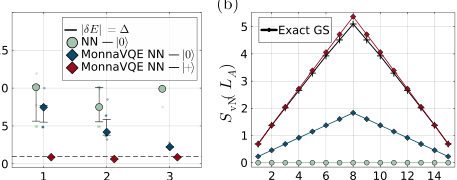
<figcaption class="paper-figure-caption"><b>Fig 5.</b> FIG. 5. Monna-mapped VQE results for n = 16 qubits at s = 5. Short-range NN ans¨atze fail when trained directly on the physical Hamiltonian H, but succeed when trained on the Monna-mapped Hamiltonian HM. (a) Median relative energy error |δE|/∆= |EVQE −EGS|/∆as a function of the number of layers L for direct NN VQE(green circles) with |0⟩⊗n initialization and MonnaVQE (diamonds) NN for VQE with |0⟩⊗n (blue) and |+⟩⊗n (red) initialization. Large mark- ers are medians over 10 seeds with interquartile error bars; faint dots show individual seeds.(b) Averaged von-Neumann entanglement entropy ⟨SvN⟩of the optimized variational state for the best seed at L = 2. The black line marks the exact...</figcaption>
</figure>

**Summary.** This paper rigorously analyzes how the physical connectivity of qubits impacts the performance of Variational Quantum Algorithms (VQAs). By comparing local versus structured long-range couplings (like PWR2), the authors show that specific geometries enhance the accessible operator space and improve VQE convergence. They conclude by proposing methods to effectively utilize these long-range interactions, making circuit geometry a key design parameter for quantum hardware.

**Why it may be interesting.** This work directly addresses hardware limitations by providing a quantitative framework for selecting optimal qubit connectivity patterns for variational quantum algorithms, which is crucial for scaling up trapped-ion or neutral-atom quantum simulators.

Detailed structure

**Main problem.** The study investigates whether structured long-range connectivity provides a computational advantage for Variational Quantum Algorithms (VQAs) compared to standard local couplings.

**Main result.** Structured long-range coupling graphs, like the PWR2 graph, can offer an improved balance between circuit expressibility and depth for VQEs on systems like the TFIM. Furthermore, mapping hierarchical Hamiltonians to geometrically local ones via techniques like the Monna map is a viable optimization strategy.

**Method.** The authors employ advanced diagnostics including dynamical Lie-algebra analysis, approximate unitary-design measurements ($\lambda_G$), finite-depth measures of expressibility (KL divergence), and variational schemes for Hamiltonian mapping.

**Model / system.** The work models quantum systems using neutral atoms and trapped ions, which naturally support long-range entangling gates. The primary testbed is the Transverse-Field Ising Model (TFIM) solved via VQE, comparing Nearest Neighbor (NN), Power-of-Two (PWR2), and All-to-All (A2A) connectivity.

**Key observables.** Expressibility, entanglement capability (Meyer-Wallach entropy), commutator depth required to generate target algebras ($\mathfrak{so}(2n)$), and energy error $|\delta E|/\Delta$ in VQE simulations.

**Important parameters / regimes.** Circuit depth ($L$), connectivity graph structure (NN vs. PWR2), transverse field strength ($B/J$), and the size of the system ($n$).

**Assumptions / limitations.** The analysis assumes that circuit geometry and qubit reconfigurability are task-dependent resources for VQAs, though they caution that high expressibility does not guarantee trainability.

**Figures summary.** Figures compare coupling graphs (NN, PWR2, A2A), illustrate the Monna variational pipeline, show energy error vs. depth comparing NN and LR gates, and demonstrate mutual information localization after applying the Monna map.

**Paper structure.** The paper progresses by first establishing the physical motivation for long-range connectivity in trapped ion platforms. It then uses rigorous mathematical tools (Lie algebra analysis) to compare the algebraic reach of different graph structures. Finally, it validates these theoretical findings through numerical VQE simulations and proposes practical mapping techniques.

Abstract

The performance of variational quantum algorithms depends in general on the structure of the parametrized quantum circuit, but the most common ansätze are typically based on local couplings. Motivated by the extended connectivity available with neutral atoms and trapped ions, we examine when structured long-range connectivity provides a useful resource, focusing on sparse power-of-two (PWR2) coupling graphs. Using dynamical Lie-algebra analysis, approximate unitary-design diagnostics, and finite-depth measures of expressibility and entanglement, we examine how these geometries enlarge the accessible operator space. This enlarged space alone is not sufficient to ensure trainability of the parameterized circuit for given target problems, and we explore performance across example problems with and without long-range coupling, identifying where sparse coupling graphs are or are not likely to provide an advantage. We also introduce a variational scheme that maps hierarchical long-range Hamiltonians to geometrically local ones that can be optimized with short-range circuits. Together, these results identify circuit geometry and qubit reconfigurability as task-dependent resources for variational algorithms, relevant to ongoing developments in quantum hardware with long-range connectivity.

[↑ back to top](#top)

### ⭐ [Covariant Approximate Quantum Codes for Protected Analog Computation](http://arxiv.org/abs/2607.07607v1)

**Highlighted author(s):** Susanne F. Yelin  
**Authors:** Mariia Elovenkova, Hong-Ye Hu, Susanne F. Yelin  
**Type:** theory · **Category:** quantum information and computing · **PDF:** <https://arxiv.org/pdf/2607.07607v1>  
**Analysis basis:** full PDF text, analyzed in chunks
**Topic relevance:** 🔥 `analog quantum simulation` **4/5** · `entanglement & information structure` **2/5** · `correlated / nonlocal dissipation` **1/5** · `correlated cavity matter` **1/5** · `driven-dissipative phase transition` **1/5** · `non-equilibrium dynamics` **1/5**

↔ Scroll figures horizontally

<figure class="paper-figure-card">
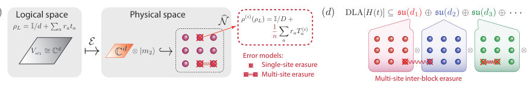
<figcaption class="paper-figure-caption"><b>Fig 1.</b> Figure 1. Overview of the covariant encoding construction and its applications. (a) Covariance relates the logical SU(d) action to a physical transversal action. The logical generator iH is represented physically as a sum of local generators acting on the n physical subsystems, each carrying the same single-site representation λ0. (b) The encoding isometry embeds the logical space Vω1 ∼= Cd into the physical Hilbert space. After decomposing the physical space into isotypic components Vλ ⊗Mλ, covariance forces the code to lie inside the component Vω1 ⊗Mω1. Thus, choosing the covariant code reduces to choosing a multiplicity vector |m⟩∈Mω1, which selects one embedded copy of the logical...</figcaption>
</figure>
<figure class="paper-figure-card">
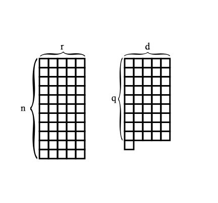
<figcaption class="paper-figure-caption"><b>Fig 2.</b> Figure 2. Young diagrams of the representation S(q+1,qd−1)V and the representation  S(1r)V ⊗n, where nr = dq + 1.</figcaption>
</figure>
<figure class="paper-figure-card">
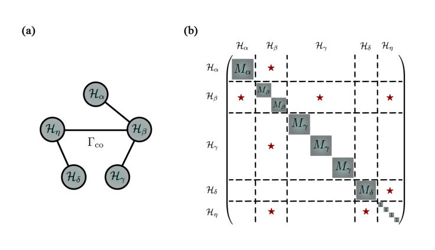
<figcaption class="paper-figure-caption"><b>Fig 3.</b> Figure 3. Schematic illustration of objects, used in the proof of Theorem E.12. (a) The coupling graph Γco from Definition E.8. (b) Complexified Invariant algebra su(H)G, meaning lC, is shown in blue blocks on diagonal (see Eq. (E3)); red stars represent blocks Hom(Hα, Hβ), where Gbr has non-zero support, corresponding to the coupling graph Γco on the left.</figcaption>
</figure>

**Summary.** The paper develops a theoretical framework for creating highly robust quantum codes compatible with continuous symmetries to enable reliable analog quantum simulation. By constructing Covariant Approximate Quantum Codes, the authors overcome fundamental limitations imposed by theorems like Eastin-Knill. This methodology provides explicit building blocks for simulating complex dynamics while maintaining protection against local errors.

**Why it may be interesting.** This work directly addresses the intersection of quantum error correction and Hamiltonian simulation, which is crucial for building fault-tolerant quantum simulators. The explicit construction of non-Abelian covariant codes provides concrete tools for implementing complex dynamics robustly in physical platforms.

Detailed structure

**Main problem.** The core problem is designing Quantum Error Correcting Codes (QECCs) that can maintain compatibility with continuous symmetries for robust analog quantum simulation, circumventing the Eastin-Knill theorem.

**Main result.** The authors construct explicit Covariant Approximate Quantum Codes (AQECCs) achieving near-optimal error scaling ($\Theta(1/N)$) for multi-qudit erasures and provide a framework to generate universal dynamics using symmetry-preserving Hamiltonians augmented by controlled symmetry-breaking terms.

**Method.** The approach combines quantum information theory concepts like reduced-state analysis with group representation theory, utilizing permutation symmetry to construct codes that embed logical operations transversally while maintaining covariance under the continuous symmetry group SU(d).

**Model / system.** The model is a general quantum system undergoing analog simulation governed by Hamiltonians. The framework uses an isometry $V$ embedding a logical space $\mathcal{H}_L$ into a physical space $\mathcal{H}_P$, and the analysis focuses on protecting against erasure noise and local errors.

**Key observables.** Purified-distance scaling ($\Theta(1/N)$), reduced state $
ho(S)(
ho_L)$, and the connectivity of the coupling graph $\Gamma_{co}$.

**Important parameters / regimes.** The number of physical qubits ($N$), the degree of symmetry (e.g., SU(d)), and the type/number of local errors (single, two, or three-qudit erasures).

**Assumptions / limitations.** For universal control, it is assumed that adding controlled symmetry-breaking terms allows the generated Lie algebra to span the full symmetry algebra $\mathfrak{su}(H)$, provided graph connectivity and specific 'Full First-Factor Span' conditions are met.

**Figures summary.** Figure 1 illustrates the construction of covariant codes relating logical SU(d) action to physical transversal action, while Figure 3 schematically depicts the coupling graph $\Gamma_{co}$ used in the Lie algebra generation analysis.

**Paper structure.** The paper first addresses error correction by constructing AQECCs for continuous symmetries. It then extends this framework to analog dynamics, showing how symmetry-preserving Hamiltonians generate block-structured algebras, and finally details the necessary conditions (connectivity and span condition) using representation theory to ensure universal control.

Abstract

Quantum error correction compatible with continuous symmetries is a fundamental problem in quantum information and a possible route to robust analog quantum simulation. Because the Eastin-Knill theorem forbids exact codes with continuous transversal symmetries, we construct explicit $SU(d)$-covariant approximate codes that exploit permutation symmetry to spread logical information uniformly across all physical subsystems. For one-, two-, and three-qudit erasures at known locations, we prove worst-case purified-distance scaling $Θ(1/N)$, matching approximate Eastin-Knill lower bounds up to constants, and we extend the reduced-state analysis to general flagged local noise. For single-qudit erasure, we construct an explicit near-optimal decoder from the Petz recovery map. We then use these codes as building blocks for encoded analog dynamics. Symmetry-preserving Hamiltonians generate block-structured dynamical Lie algebras implementable transversally, while controlled symmetry-breaking terms serve as non-transversal resources for universal dynamics. These results provide explicit non-Abelian covariant codes and a framework for robust analog quantum simulation.

[↑ back to top](#top)

### [Room-temperature inversionless diamond nitrogen-vacancy electronic spin maser](http://arxiv.org/abs/2607.07124v1)

**Authors:** Ali Fawaz, Sarath Raman Nair  
**Type:** theory · **Category:** other · **PDF:** <https://arxiv.org/pdf/2607.07124v1>  
**Analysis basis:** full PDF text, analyzed in chunks
**Topic relevance:** 🔥 `spintronics-quantum-optics interface` **5/5** · 🔥 `QC/QI experiment` **4/5** · 🔥 `methods for driven-dissipative` **4/5** · `Keldysh / 2PI / non-Gaussian methods` **3/5** · `Tavis-Cummings & cavity-many-emitter` **3/5** · `driven-dissipative phase transition` **3/5** · `exotic spin models in light-matter` **3/5** · `quantum optics experiment` **3/5** · `analog quantum simulation` **2/5** · `correlated cavity matter` **2/5** · `non-equilibrium dynamics` **2/5** · `non-equilibrium universality` **2/5** · `quantum measurements` **2/5** · `superradiant laser` **2/5** · `correlated / nonlocal dissipation` **1/5** · `entanglement & information structure` **1/5** · `measurement-induced transitions` **1/5**

↔ Scroll figures horizontally

<figure class="paper-figure-card">
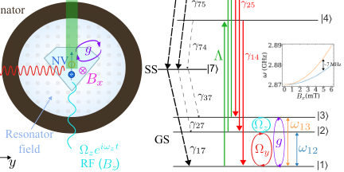
<figcaption class="paper-figure-caption"><b>Fig 1.</b> FIG. 1. Proposed inversionless masing scheme. (a) Schemat- ics of the inversionless diamond NV maser model. A Carte- sian coordinate system used in the model is defined by the NV spin axis (z-axis) and resonator B-field direction (x-axis). (b) Simplified seven-level scheme of NV spins used in our model, and the seven levels are labeled as |1⟩, |2⟩, ..., and |7⟩. All drivings on the ground-state transitions are indicated using the same color coding as in (a). The non-resonant optical excitation and direct radiative relaxation between the ground and excited states (GS and ES) are shown in green and red arrows. The simplified inter-system crossing (ISC) transitions from ES to GS through SS are...</figcaption>
</figure>
<figure class="paper-figure-card">
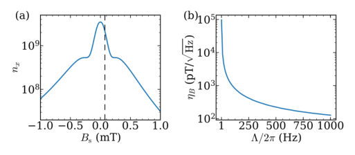
<figcaption class="paper-figure-caption"><b>Fig 2.</b> FIG. 3. Magnetic field sensing. (a) Photon number nx as a function of additional Bx field denoted by Bs, evaluated at driving field strengths Ωy/2π = 33.5 kHz, Ωz/2π = 628 kHz, pump rate Λ/2π = 500 Hz (optimal driving strength for sensi- tivity, refer to [20] for more details). The maximum slope |R0| occurs near Bs = 0.06 mT, indicated by the vertical dashed line. (b) Magnetic sensitivity as a function of pump rate at the operating point in (a).</figcaption>
</figure>
<figure class="paper-figure-card">
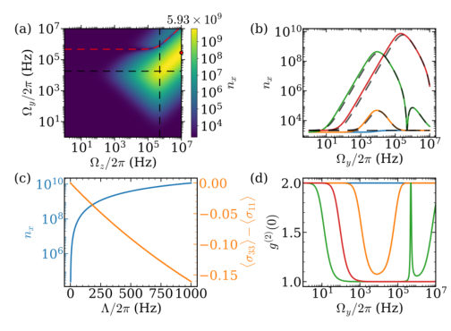
<figcaption class="paper-figure-caption"><b>Fig 3.</b> FIG. 2. Numerical results. (a) Steady-state photon number nx as a function of Ωy and Ωz for Λ/2π = 500 Hz. The max- imum nx occurs at Ωz/2π = 10 MHz and Ωy/2π = 282 kHz, indicated by the red dot. The black horizontal and vertical dashed lines indicate the driving strengths at Ωy/2π = 18 kHz and Ωz/2π = 500 kHz, respectively. A minimum nx region is observed along the dashed red line, where the gain effects due to the double driving scheme are minimum (see [20] for more details) (b) nx using second-order correlation equations as a function of Ωy for different Ωz/2π = 10 Hz (blue), 1 kHz (orange), 100 kHz (green), 10 MHz (red), showing agreement with the first-order equations from (a)...</figcaption>
</figure>

**Summary.** The paper details a theoretical model for an inversionless maser using NV spins in diamond at room temperature. By applying perpendicular magnetic fields and coupling the system to microwave resonators, they show that lasing can occur without population inversion. This technique enables highly sensitive magnetic field sensing with minimal external bias requirements.

**Why it may be interesting.** This work is highly relevant as it combines cavity QED principles with solid-state spin systems (NV centers), addressing open quantum system dynamics under strong coherent driving fields to achieve a practical quantum measurement device.

Detailed structure

**Main problem.** The authors propose a method to create a room-temperature maser using nitrogen-vacancy (NV) spins in diamond without requiring population inversion.

**Main result.** They demonstrate that inversionless masing can be achieved, leading to a magnetic field sensing sensitivity on the order of 100 pT/sqrt(Hz).

**Method.** The analysis involves solving coupled differential equations for spin and cavity operators using quantum cumulants in the steady-state limit.

**Model / system.** The system is an ensemble of NV spins in diamond, modeled by a seven-level structure driven optically, via near-resonant microwave (MW) and radio-frequency (RF) fields, and coupled to a microwave resonator.

**Key observables.** Photon number ($n_x$), spin polarization ($\langle\hat{\sigma}_{ii}
angle$), second-order coherence function ($g^{(2)}(0)$), and magnetic field sensitivity ($\eta_B$).

**Important parameters / regimes.** DC magnetic field of a few mT, MW/RF driving frequencies (e.g., $\Omega_y/2\pi \approx 10$ MHz), and cooperativity $C$.

**Assumptions / limitations.** The analysis uses weak correlation approximations and linear expansions in the small magnetic field deviation ($B_s$).

**Figures summary.** Figures illustrate the schematic setup, energy level diagrams, numerical results for photon number vs. driving parameters, and sensitivity plots showing improvements with second-order treatments.

**Paper structure.** The paper progresses from establishing the physical model (seven-level system) to deriving equations of motion using quantum cumulants, solving these equations in the steady state, and finally analyzing the resulting magnetic field sensing performance by optimizing driving detunings.

Abstract

We propose a method to create a room-temperature maser operating at approximately 2.9~GHz frequency using an ensemble of negatively charged nitrogen-vacancy electronic spins (NV) in diamond, without requiring population inversion. Our method considers a DC magnetic field of a few milli-Tesla (mT) applied along the perpendicular direction of an ensemble of NV spins aligned along a common axis. This perpendicular magnetic-field creates superposition states of $|m_{\mathrm{s}}=-1\rangle$ and $|m_{\mathrm{s}}=+1\rangle$ of the NV spin's ground state triplet levels and thereby makes it possible to drive all three transitions in the NV spin ground state. We model the system by including optical pumping of the NV spins, near-resonant driving of two transitions, and coupling the third transition to a near-resonant microwave resonator. Numerical estimates using experimentally realizable parameters show that inversionless masing can be achieved inside the microwave resonator using our method. As an application, we show that the output intensity of an inversionless maser ($1.1\times10^{14}$ spins) can be used for magnetic field sensing with a DC sensitivity on the order of a hundred pT/$\sqrt{\mathrm{Hz}}$. Our study opens a new direction in room-temperature diamond NV maser devices for quantum technological applications without the requirement of a strong bias magnetic field, as in conventional NV diamond masers.

[↑ back to top](#top)

### [Multi-channel collective dissipation via the symmetric irreducible representation of SU(4)](http://arxiv.org/abs/2607.07701v1)

**Authors:** M. Lutsukh, M. Bazarsana, T. Begzjav, G. O. Ariunbold  
**Type:** theory · **Category:** other · **PDF:** <https://arxiv.org/pdf/2607.07701v1>  
**Analysis basis:** full PDF text, analyzed in chunks
**Topic relevance:** 🔥 `Dicke superradiance` **5/5** · 🔥 `correlated / nonlocal dissipation` **4/5** · 🔥 `superradiant laser` **4/5** · `Tavis-Cummings & cavity-many-emitter` **3/5** · `correlated cavity matter` **3/5** · `driven-dissipative phase transition` **3/5** · `analog quantum simulation` **2/5** · `free-space correlated emission` **2/5** · `methods for driven-dissipative` **2/5** · `non-equilibrium dynamics` **2/5** · `non-equilibrium universality` **2/5** · `Keldysh / 2PI / non-Gaussian methods` **1/5** · `entanglement & information structure` **1/5** · `quantum measurements` **1/5**

↔ Scroll figures horizontally

<figure class="paper-figure-card">
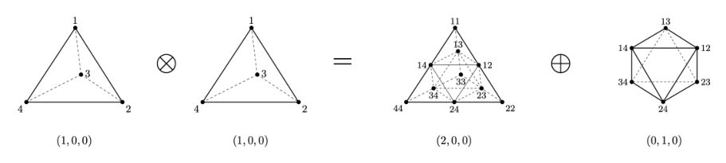
<figcaption class="paper-figure-caption"><b>Fig 1.</b> Figure 2.1: Tensor-product decomposition of two fundamental SU(4) representations, (1, 0, 0)⊗(1, 0, 0) = (2, 0, 0)⊕(0, 1, 0). The four vertices labeled 1, 2, 3, 4 represent the one-particle basis states {|1⟩, |2⟩, |3⟩, |4⟩} of the fundamental representation (1, 0, 0). The representation (2, 0, 0) corresponds to the fully symmetric subspace: labels 11, 22, 33, 44 denote two particles in the same internal state, while labels 𝑖𝑗with 𝑖&lt; 𝑗denote symmetrized states (|𝑖⟩|𝑗⟩+ |𝑗⟩|𝑖⟩)∕ √</figcaption>
</figure>
<figure class="paper-figure-card">
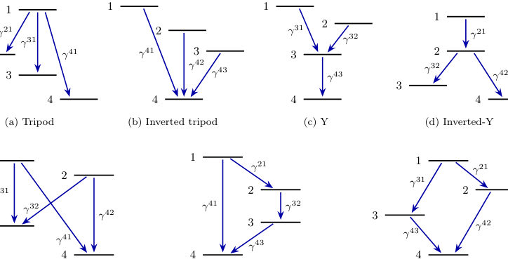
<figcaption class="paper-figure-caption"><b>Fig 2.</b> Figure 4.1: The seven dipole-allowed four-level interaction topologies selected by parity: tripod, inverted tripod, Y, inverted Y, double-Λ, closed cascade, and diamond. Arrows mark the open decay channels 𝛾𝑛𝑚in each configuration.</figcaption>
</figure>
<figure class="paper-figure-card">
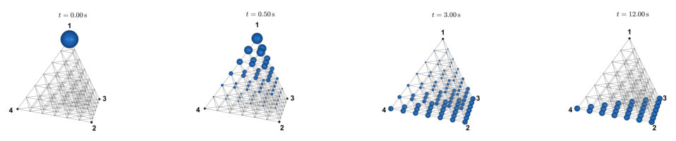
<figcaption class="paper-figure-caption"><b>Fig 3.</b> Figure 5.1: Tripod configuration for 𝑁= 6 with the initial condition 𝑝(6, 0, 0, 0; 𝑡= 0) = 1 at the top vertex, panel (a). During the evolution, the probability flows along the three allowed transitions 1 →2, 1 →3, and 1 →4 toward the lower face of the tetrahedron. At late times, it remains on the 𝑞1 = 0 plane because level 1 has emptied and no further decay is possible in the tripod scheme.</figcaption>
</figure>
<figure class="paper-figure-card">
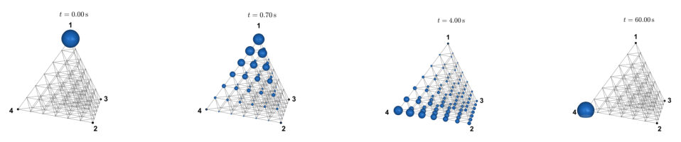
<figcaption class="paper-figure-caption"><b>Fig 4.</b> Figure 5.2: Closed-cascade configuration for 𝑁= 6 with all probability initially placed at the top vertex, 𝑝(6, 0, 0, 0; 𝑡= 0) = 1, panel (a). The probability flows through both the stepwise cascade 1 →2 →3 →4 and the direct transition 1 →4. As time increases, population is transferred toward level 4, and the distribution finally concentrates near the 𝑞4 = 𝑁vertex.</figcaption>
</figure>
<figure class="paper-figure-card">
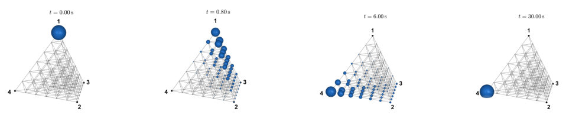
<figcaption class="paper-figure-caption"><b>Fig 5.</b> Figure 5.3: Diamond configuration for 𝑁= 6 with all probability initially placed at the top vertex, 𝑝(6, 0, 0, 0; 𝑡= 0) = 1, panel (a). The probability first flows from level 1 into the two intermediate levels through the transitions 1 →2 and 1 →3. It then continues to the lowest level through 2 →4 and 3 →4. At late times, the population accumulates at level 4, so the distribution concentrates near the 𝑞4 = 𝑁vertex of the tetrahedron.</figcaption>
</figure>

**Summary.** This paper unifies the theoretical description of collective spontaneous emission in four-level atomic ensembles using the mathematical framework of SU(4) symmetry. By solving derived Pauli rate equations for seven distinct physical topologies, the authors predict that the emitted light intensity will exhibit a delayed cooperative burst scaling superlinearly with atom number ($N^p$). This provides a comprehensive geometric and quantitative tool for studying multi-level quantum coherence.

**Why it may be interesting.** This work provides a powerful generalization of superradiance theory (Dicke/Agarwal) into higher symmetry groups (SU(4)), offering quantitative predictions for complex multi-level quantum emitters relevant to cavity QED and atomic physics experiments.

Detailed structure

**Main problem.** The work develops a unified theoretical framework for modeling multi-channel collective spontaneous emission in atomic ensembles containing four internal energy levels.

**Main result.** The emitted intensity exhibits a delayed cooperative burst whose peak height scales superlinearly with the number of atoms ($I_{	ext{peak}} \propto N^p$ with $1.81 \lesssim p \lesssim 1.92$).

**Method.** The dynamics are derived by specializing Agarwal's multi-level formalism to the four-level case, utilizing the fully symmetric irreducible representation of SU(4) and solving resulting Pauli-type rate equations numerically.

**Model / system.** The system consists of $N$ identical atoms with a four-level structure ($\mathcal{H}_1 \cong \mathbb{C}^4$). The collective dynamics are mapped onto the fully symmetric representation $(N, 0, 0)$ of SU(4), whose weight space forms a tetrahedral lattice.

**Key observables.** Total emitted intensity $I(t)$, peak emitted intensity ($I_{	ext{peak}}$), and time evolution of level populations $\langle q_k(t) 
angle/N$.

**Important parameters / regimes.** Atom number $N$ (up to 50); seven specific dipole-allowed four-level topologies (e.g., tripod, Y, diamond).

**Assumptions / limitations.** The dynamics are governed by the diagonal part of the master equation, allowing for a closed Pauli-type rate equation description.

**Figures summary.** Figures illustrate $I(t)$ for various topologies at different $N$, confirm power-law scaling of $I_{	ext{peak}}$ vs $N^2$, and show normalized population dynamics across the seven studied configurations.

**Paper structure.** The paper establishes the SU(4) mathematical framework, derives the compact Pauli rate equation from the master equation, specializes this formalism to seven physical four-level topologies, solves these equations numerically for various N, and analyzes the resulting power-law scaling of the emitted intensity burst.

Abstract

We specialize Agarwal's multi-level collective spontaneous-emission formalism to the four-level case by formulating it in the fully symmetric \SU(4) representation of $N$ identical atoms. In the irreducible representation $(N,0,0)$, the occupation-number basis forms a tetrahedral weight lattice on which the six embedded $\mathfrak{su}(2)$ transition subalgebras act as ladder operators. From these algebraic factors we obtain a compact Pauli-type population-rate equation and a closed-form expression for the total emitted intensity that apply to any combination of open dipole channels. The formalism is then specialized to the seven dipole-allowed four-level topologies -- tripod, inverted tripod, Y, inverted Y, double-$Λ$, closed cascade, and diamond -- and the resulting rate equations are solved numerically for atom numbers up to $N=50$. In every case the emitted intensity develops a delayed cooperative burst whose peak height obeys a power law $I_{\mathrm{peak}}=aN^{p}$ with topology-dependent parameters $(a,p)$; the fitted exponents lie in the range $1.81\lesssim p\lesssim 1.92$, indicating a superlinear. The \SU(4) tetrahedral flow and the seven configuration-dependent transients together provide a unified geometric picture of multi-channel collective dissipation in four-level atomic ensembles.

[↑ back to top](#top)

### [Universal purification dynamics of monitored Clifford circuits](http://arxiv.org/abs/2607.06683v1)

**Authors:** Beatrice Magni, Federico Gerbino, Xhek Turkeshi, Andrea De Luca  
**Type:** theory · **Category:** statistical mechanics · **PDF:** <https://arxiv.org/pdf/2607.06683v1>  
**Analysis basis:** full PDF text, analyzed in chunks
**Topic relevance:** 🔥 `measurement-induced transitions` **5/5** · 🔥 `entanglement & information structure` **4/5** · 🔥 `non-equilibrium universality` **4/5** · `correlated / nonlocal dissipation` **3/5** · `driven-dissipative phase transition` **3/5** · `methods for driven-dissipative` **3/5** · `non-equilibrium dynamics` **3/5** · `Keldysh / 2PI / non-Gaussian methods` **2/5** · `quantum measurements` **2/5** · `scars & prethermalization` **1/5**

↔ Scroll figures horizontally

<figure class="paper-figure-card">
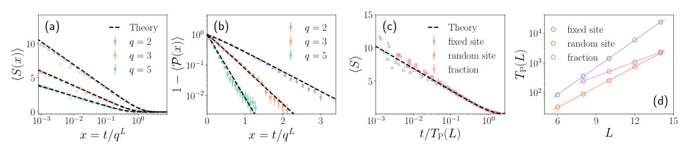
<figcaption class="paper-figure-caption"><b>Fig 1.</b> FIG. 1. Exact stabilizer numerics against the theory prediction (dashed), i.e. the death process (8) evaluated through its first-passage representation (9). (a) Global protocol: average entropy ⟨S(x)⟩, in units of log q, versus x = t/qL, for q = 2 (blue) at L ∈{8, 12}, q = 3 (orange) at L ∈{4, 8}, and q = 5 (green) at L ∈{3, 6}, the bigger size represented by circles, and the smaller one represented by crosses; the data collapse with no fitting parameter, the smaller sizes departing only in the entrance regime. (b) Purity deficit 1 −⟨P(x)⟩, same data; the late-time slopes are the spectral gaps γ1 = q −q−1 and the amplitudes (q2 + 1)/q2, cf. (19). Error bars are smaller at the smaller sizes...</figcaption>
</figure>
<figure class="paper-figure-card">
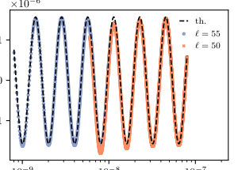
<figcaption class="paper-figure-caption"><b>Fig 2.</b> FIG. 2. Log-periodic modulation of ⟨S(x)⟩for q = 2. The dashed black represents Eq. (39) while markers display finite- ℓdata for the discrete-time Markov process.</figcaption>
</figure>

**Summary.** This work analyzes the purification of monitored Clifford circuits by showing the dynamics simplify dramatically compared to generic systems. The process reduces to a pure-death Markov chain whose scaling functions are universal and exactly solvable. This bypasses complex mathematical machinery like the replica trick, offering deep insights into quantum information decay rates.

**Why it may be interesting.** The finding that a complex quantum process simplifies to an exactly solvable classical death process is highly valuable for understanding non-equilibrium dynamics in open quantum systems, providing concrete analytical tools beyond standard replica methods.

Detailed structure

**Main problem.** The paper investigates the universal dynamics of quantum state purification for monitored Clifford circuits, aiming to bypass complex mathematical tools like the replica trick.

**Main result.** For these specific circuits, purification reduces to an exactly solvable death process governing the decay of the density matrix rank, leading to universal scaling functions for Rényi entropies.

**Method.** The analysis maps the dynamics onto a pure-death Markov process and uses techniques involving moment generating functions, Laplace transforms, and analyzing periodic modulations in the scaling limit.

**Model / system.** The system is monitored quantum many-body dynamics on Clifford circuits acting on L qudits of prime dimension q. The evolution involves alternating unitary steps (random Clifford elements) and projective measurements of Pauli strings.

**Key observables.** Rényi entropies ($\langle S(x) 
angle$), purity ($\langle P(x) 
angle$), the decay rate of the density-matrix rank, entropy fluctuations, and temporal modulations periodic in $\log_q x$.

**Important parameters / regimes.** The purification time $T_P$ (exponentially long), the scaled time $x = t/T_P$, and the qudit dimension $q$ (especially prime dimensions).

**Assumptions / limitations.** The analysis relies on taking specific scaling limits ($L 	o \infty, x 	o 0$) and comparing results derived from integer moments versus analytic continuation methods.

**Figures summary.** Figures illustrate the data collapse of $\langle S(x) 
angle$ and $1 - \langle P(x) 
angle$ onto universal curves for various qudit dimensions ($q=2, 3, 5$), and show log-periodic modulations in entropy.

**Paper structure.** The paper progresses by first establishing the reduction to a death process (Chunk 1), deriving the master equation and solving it via moment generating functions (Chunk 2), then analyzing the fine structure of the small-$x$ limit, including log-periodicity (Chunk 3), and finally rigorously characterizing the variance and moments in the $q 	o \infty$ limit (Chunk 4).

Abstract

Quantum circuits under sufficiently weak monitoring purify on a timescale $T_P$ exponentially long in the system size. This slowness underlies a universal purification dynamics, whose quantitative description has so far required the replica trick, with a delicate analytic continuation. We show that monitored Clifford circuits on $L$ qudits of prime dimension $q$ bypass this construction entirely: in the scaling limit at fixed $x = t/T_P(L)$, purification reduces to the Markovian decay of the density-matrix rank, an exactly solvable death process descending from infinity. We compute the full scaling functions in compact form: all Rényi entropies collapse onto a universal curve $\langle S(x) \rangle$. Exact stabilizer simulations at $q=2,3,5$ confirm the predictions, with no fitting parameter for the global model and $T_P$ as the only fitted scale for local brick-wall circuits. Also, the replica problem amounts to a tilted version of the same Markov process, in agreement with exact computations from the Clifford commutant. Finally, the quantization of the rank leaves two hallmarks that distinguish Clifford dynamics from generic monitored circuits: the entropy fluctuations saturate at short scaled times $x\to0$ to an $O(1)$ variance, instead of vanishing, and observables develop a temporal modulation periodic in $\log_q x$, which cannot be captured by the replica approach.

[↑ back to top](#top)

### [A neural-network Maxwell's demon learns cold damping for work extraction](http://arxiv.org/abs/2607.06822v1)

**Authors:** Stephen Whitelam, Sergio Ciliberto, Ludovic Bellon  
**Type:** theory · **Category:** statistical mechanics · **PDF:** <https://arxiv.org/pdf/2607.06822v1>  
**Analysis basis:** full PDF text, analyzed in chunks
**Topic relevance:** 🔥 `quantum measurements` **5/5** · 🔥 `measurement-induced transitions` **4/5** · `driven-dissipative phase transition` **3/5** · `methods for driven-dissipative` **3/5** · `non-equilibrium dynamics` **3/5** · `non-equilibrium universality` **2/5** · `Frenkel-Kontorova` **1/5** · `Keldysh / 2PI / non-Gaussian methods` **1/5** · `correlated / nonlocal dissipation` **1/5**

↔ Scroll figures horizontally

<figure class="paper-figure-card">
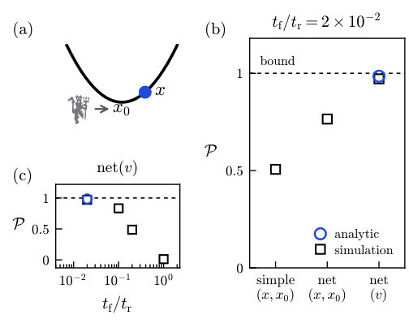
<figcaption class="paper-figure-caption"><b>Fig 1.</b> FIG. 1. (a) Schematic of an underdamped oscillator with posi- tion x in a harmonic trap centered at x0. The trap position x0 is updated periodically by a Maxwell’s demon that enacts one of three feedback-control protocols, defined by Eqs. (2), (3), or (4). (b) Average power P (in units of kBT/tr) extracted by the three protocols (squares). The neural-network protocol that takes the oscillator velocity v as input almost saturates the bound given by Eq. (8) (dotted line). This protocol enacts cold damping, leading to an analytic estimate for power ex- traction for continuous feedback given by Eq. (14) (circle). (c) Power as a function of feedback time for the neural-network v-protocol (each...</figcaption>
</figure>
<figure class="paper-figure-card">
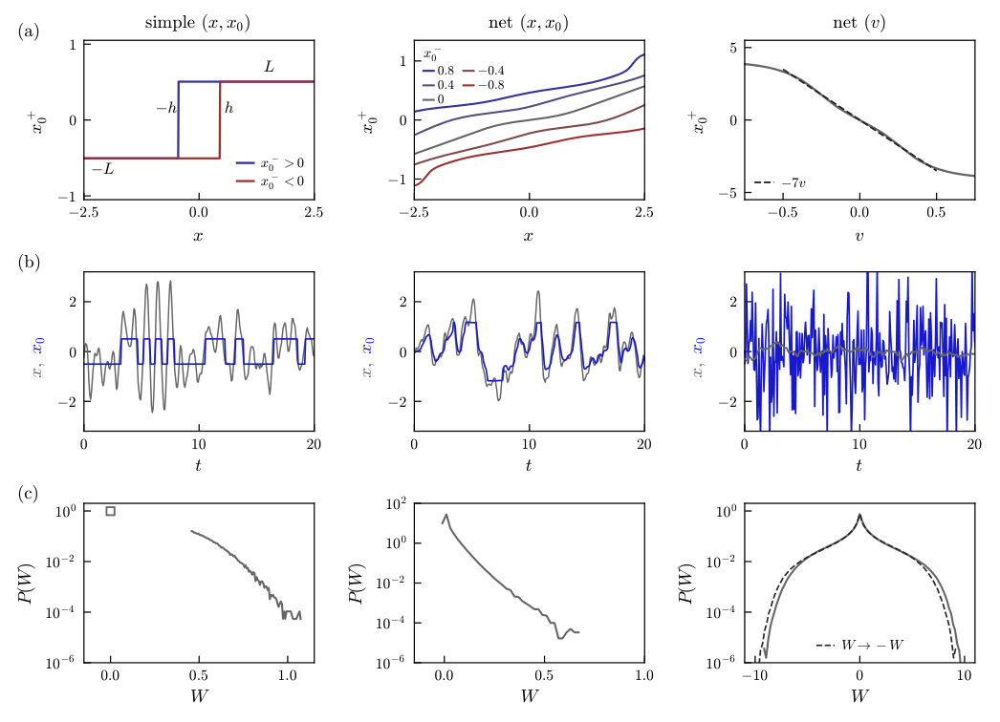
<figcaption class="paper-figure-caption"><b>Fig 2.</b> FIG. 2. For the three feedback-control protocols, Eq. (2) (left panels), Eq. (3) (center panels), and Eq. (4) (right panels), we show (a) the protocol, i.e. the new value of the trap position x0 as a function of the protocol inputs; (b) time traces of oscillator position x and trap position x0; and (c) probability distributions of work W for each feedback event. In (c, right) the black dashed line shows the reflection in the vertical axis of the probability distribution, revealing its slight asymmetry. In this figure x and x0 are shown in units of σ, v is shown in units of σω0, t is shown in units of ω−1 0 , and W is shown in units of kBT.</figcaption>
</figure>
<figure class="paper-figure-card">
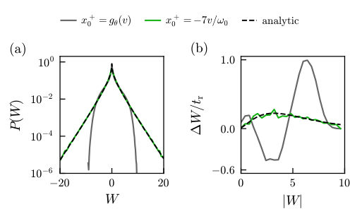
<figcaption class="paper-figure-caption"><b>Fig 3.</b> FIG. 3. (a) Work distribution P(W) for the learned proto- col x+ 0 = gθ(v) (gray) and the linear protocol x+ 0 = −7v/ω0 (green) that is suggested by the net protocol, compared with the analytic variance-gamma form (black dashed). The ana- lytic prediction (and the numerics derived from the linear pro- tocol) describe a Bessel-function core and exponential tails. (b) Work asymmetry ∆W/tr, Eq. (15), versus |W|. Work W is shown in units of kBT.</figcaption>
</figure>
<figure class="paper-figure-card">
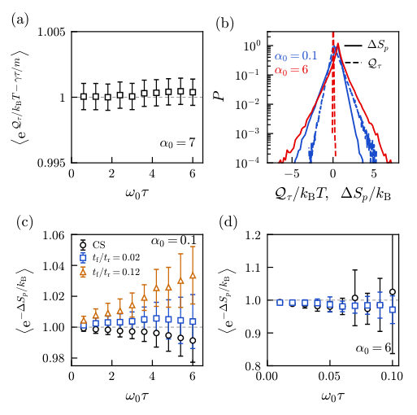
<figcaption class="paper-figure-caption"><b>Fig 4.</b> FIG. 4. Fluctuation theorems for the cold-damped dynamics, with dimensionless time ω0τ on the horizontal axes. (a) Inte- gral fluctuation theorem (IFT) for the heat Qτ at α0 = 7 and tf = 2 × 10−2tr. (b) Distributions P(Qτ/kBT) (dashed) and P(∆Sp/kB) (solid) at α0 = 0.1, ω0τ = 6 (blue) and α0 = 6, ω0τ = 0.1 (red), chosen so that the pumping entropy Spu is equal in the two cases. (c) IFT for the entropy production ∆Sp at α0 = 0.1, for continuous sampling (CS) and two finite feedback times tf. (d) Same as (c) at α0 = 6, for CS and one finite tf; the fluctuations are so large that no conclusion about the role of tf can be drawn.</figcaption>
</figure>

**Summary.** This work uses a neural network to train a Maxwell's demon on an underdamped oscillator, aiming to maximize extracted work from thermal noise. The NN discovers that the optimal control strategy corresponds physically to 'cold damping,' effectively cooling the system and achieving near-maximum theoretical power extraction. This demonstrates how ML can uncover fundamental physical principles governing energy harvesting.

**Why it may be interesting.** It provides a concrete example where machine learning can reveal deep underlying physics—the specific cooling mechanism (cold damping)—governing non-equilibrium energy conversion in mesoscopic systems.

Detailed structure

**Main problem.** The study investigates how a neural-network controlled Maxwell's demon can optimally extract work from thermal fluctuations in an underdamped mechanical oscillator.

**Main result.** The optimal strategy discovered by the NN, which uses velocity as input, implements 'cold damping,' achieving near-theoretical limits of work extraction and effectively cooling the system below ambient temperature.

**Method.** The authors trained a neural network to learn feedback control protocols that adjust an external harmonic trap position ($x_0$) based on system measurements (position or velocity).

**Model / system.** The model is an underdamped micromechanical cantilever subjected to thermal noise, governed by the Langevin equation. The work extraction process involves periodic feedback updates.

**Key observables.** Average extracted power ($\langle P 
angle$), effective damping coefficient ($\gamma_{eff}$), effective temperature ($T_{eff}$), and satisfaction of fluctuation theorems (e.g., IFT for heat current).

**Important parameters / regimes.** The theoretical upper bound on extractable power ($k_B T / t_r$) and the feedback time interval ($\Delta t_f$).

**Assumptions / limitations.** Key approximations include linearizing the optimal feedback force ($x_0 \approx -\alpha v$) for analytical progress, and assuming periodic feedback updates at fixed intervals.

**Figures summary.** Figures compare extracted power across different protocols (position vs. velocity input) against theoretical bounds; others show work distributions and verify fluctuation theorems like IFTs for heat current and entropy production.

**Paper structure.** The paper progresses by first establishing the problem of optimal work extraction, comparing simple vs. NN-derived protocols, identifying the physical mechanism as cold damping when using velocity input, and finally verifying these results by checking consistency with stochastic fluctuation theorems under finite feedback time.

Abstract

We train a neural-network Maxwell's demon to extract work from a model of an underdamped micromechanical cantilever subject to thermal noise. The demon, which periodically adjusts the position of a harmonic trap, is trained to maximize the power extracted under steady-state operation. When the demon is given the cantilever position and trap position as inputs it learns a refined version of an existing hand-designed protocol, yielding a substantial improvement in performance. When the demon receives the oscillator velocity as input it discovers a qualitatively different strategy that extracts substantially more work, close to the theoretical power bound. Analysis of the protocol shows that it implements {\em cold damping}: the trap position is displaced approximately linearly with velocity, producing an effective increase of the oscillator's damping coefficient and a reduction of its effective temperature. Thus a neural-network Maxwell's demon rediscovers a well-known cooling strategy from optomechanics, revealing a simple physical mechanism underlying near-optimal work extraction from thermal fluctuations in an underdamped system.

[↑ back to top](#top)

### [Macroscopic position-position entanglement by photon recoil in Rydberg atoms](http://arxiv.org/abs/2607.07167v1)

**Authors:** Xiao-Feng Shi  
**Type:** experiment · **Category:** other · **PDF:** <https://arxiv.org/pdf/2607.07167v1>  
**Analysis basis:** full PDF text, analyzed in chunks
**Topic relevance:** 🔥 `Rydberg arrays` **5/5** · 🔥 `analog quantum simulation` **4/5** · `QC/QI experiment` **3/5** · `entanglement & information structure` **3/5** · `quantum measurements` **2/5** · `quantum optics experiment` **2/5** · `correlated / nonlocal dissipation` **1/5** · `correlated cavity matter` **1/5** · `non-equilibrium dynamics` **1/5**

↔ Scroll figures horizontally

<figure class="paper-figure-card">
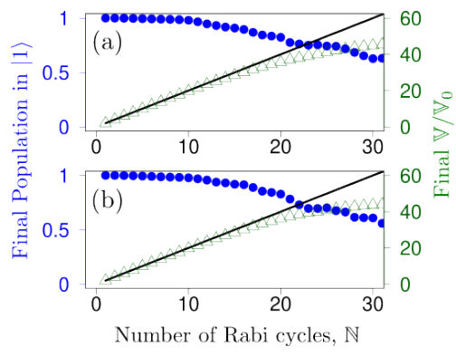
<figcaption class="paper-figure-caption"><b>Fig 1.</b> FIG. 1. Influence of Doppler effect on the restoration of the internal states before free flight by using multiple Rabi cycles with 87Rb. The round and triangular symbols in (a) and (b) show the final population in the internal state |1⟩and the final kick-induced atomic velocity V, where V0 is the velocity gain of the atom in one transition of |0⟩→|1⟩, and (a) and (b) are for the target and control atoms, respectively. The tilted line shows the desired total number of momentum kick, which should be 2N since there are two momentum kicks in one full Rabi oscillation. Here, the data in (b) is with ten Rabi cycles for exciting the target atom, and perfect blockade and absence of Rydberg-state...</figcaption>
</figure>

**Summary.** This paper reports a method to generate position-position entangled states between two spatially separated neutral atoms. The technique relies on exploiting photon recoil during Rydberg excitation, which imparts a measurable momentum kick leading to macroscopic separation ($\ell$). This work advances the use of atomic arrays for quantum state engineering beyond internal qubit degrees of freedom.

**Why it may be interesting.** This work directly addresses creating macroscopic quantum correlations (position entanglement) using established AMO tools (Rydberg blockade), pushing the boundaries from internal-state qubits to spatial degrees of freedom in cold atom systems.

Detailed structure

**Main problem.** The primary goal is generating macroscopic entanglement between two spatially separated neutral atoms.

**Main result.** The authors successfully demonstrate the deterministic generation of position-position entangled states between two atoms, with separations reaching the micron scale via photon recoil during Rydberg excitation.

**Method.** The process utilizes controlled Rydberg blockade interactions in two separate atoms to induce a momentum kick on one atom. This kick translates into measurable spatial separation after free flight and subsequent recapture by optical traps.

**Model / system.** The system involves two spatially separated neutral atoms (e.g., Rubidium) trapped in optical tweezers, leveraging the strong, state-dependent interactions mediated by Rydberg excitation. The dynamics are governed by time-dependent Hamiltonians incorporating blockade potentials and photon recoil momentum kicks.

**Key observables.** Position separation ($\ell$), Entanglement Fidelity ($F$), Population Restoration ($p(t)$), and the resulting entangled state $|\Psi_{ct}
angle$.

**Important parameters / regimes.** The achievable position separation $\ell$ can reach several microns, with enhancements possible using lighter atoms like ${^3	ext{He}^*}$. The process efficiency is limited by internal state coherence time ($T_1$).

**Assumptions / limitations.** Key assumptions include the unit efficiency of recapturing the atomic wavepacket and analyzing the impact of Doppler dephasing and Rydberg-state decay.

**Figures summary.** Not specified in the notes, but the context implies figures showing entanglement fidelity vs. time/cycles, and position distributions demonstrating spatial separation.

**Paper structure.** The paper details the physical mechanism involving Rydberg blockade to generate momentum kicks, analyzes the resulting entangled state evolution over free flight time $T$, discusses enhancements via multiple Rabi cycles ($N$), and evaluates performance against decoherence sources like Doppler effects.

Abstract

Entanglement between two spatially separate matter particles can be generated via many means and often resides in the internal states of particles. Here, via Rydberg blockade in two spatially separate neutral atoms, we find that the photon recoil in Rydberg excitation can push one atom microns away provided the other atom exerts a state-dependent Rydberg-mediated blockade. When the atoms are recaptured by optical traps, a position-position entangled state between two spatially separate atoms can emerge. This realizes a Bell state of two atoms, where the entanglement exists in the position of each atom and the distance between the two possible locations of each atom can be in the hundred-micron regime.

[↑ back to top](#top)

### [Non-Abelian Thouless pumping based on the global adiabatic criterion in Rydberg synthetic lattices](http://arxiv.org/abs/2607.07223v1)

**Authors:** Jin-Kang Guo, Jin-Lei Wu, Chuan-Cun Shu  
**Type:** theory · **Category:** other · **PDF:** <https://arxiv.org/pdf/2607.07223v1>  
**Analysis basis:** full PDF text, analyzed in chunks
**Topic relevance:** 🔥 `Rydberg arrays` **5/5** · 🔥 `analog quantum simulation` **4/5** · `methods for driven-dissipative` **3/5** · `non-equilibrium dynamics` **3/5** · `driven-dissipative phase transition` **2/5** · `Keldysh / 2PI / non-Gaussian methods` **1/5** · `correlated / nonlocal dissipation` **1/5** · `entanglement & information structure` **1/5** · `non-equilibrium universality` **1/5**

↔ Scroll figures horizontally

<figure class="paper-figure-card">
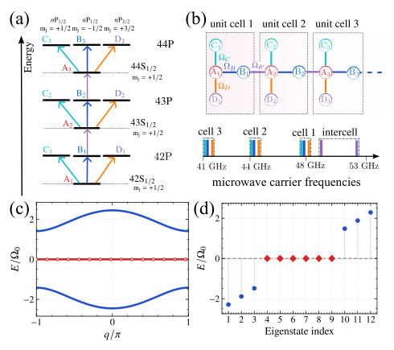
<figcaption class="paper-figure-caption"><b>Fig 1.</b> FIG. 1. Rydberg level construction forming a finite synthetic Lieb lattice. (a) Selected 39K Rydberg levels used to encode the four states in each unit cell, with three neighboring princi- pal quantum numbers forming the finite lattice. (b) Effective three-cell Lieb connectivity generated by microwave-induced couplings, together with the corresponding microwave carrier- frequency groups used to address cell-resolved and intercell transitions. (c) Bulk spectrum of the corresponding periodic Lieb lattice, showing two degenerate zero-energy flat bands separated from the bright branches. (d) Spectrum of the fi- nite three-cell lattice, where the six zero-energy states form the working subspace...</figcaption>
</figure>
<figure class="paper-figure-card">
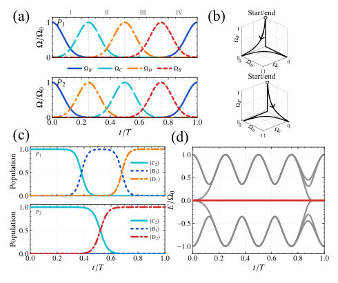
<figcaption class="paper-figure-caption"><b>Fig 2.</b> FIG. 2. Elementary single-cycle pumping protocols. (a) Gaussian microwave-coupling sequences for the two cycles P1 and P2. Both cycles use the same four coupling channels ΩB, ΩC, ΩD, and ΩB′; P2 is obtained from P1 by exchanging the temporal order of the ΩC and ΩD pulses. (b) Corresponding closed trajectories in the projected (ΩC, ΩD, ΩB′) parameter space. The two cycles have the same start and end point but follow different intermediate paths. (c) Representative closed-system population dynamics for the same initial state |C2⟩. In P1, the population is transferred mainly to |D1⟩ through intermediate occupation of |B1⟩, whereas in P2 it is transferred mainly to |D2⟩. (d) Representative...</figcaption>
</figure>
<figure class="paper-figure-card">
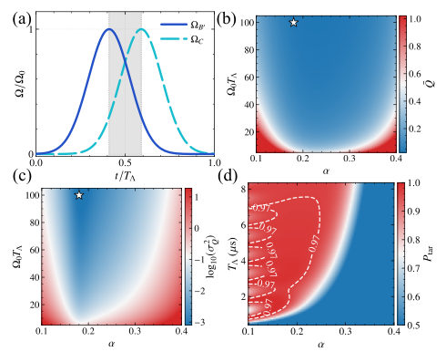
<figcaption class="paper-figure-caption"><b>Fig 3.</b> FIG. 3. GAC-guided timing selection for local Gaussian mi- crowave couplings. (a) Gaussian coupling envelopes ΩB′ and ΩC for the representative local adiabatic-passage step. The shaded region indicates the pulse overlap controlled by the delay parameter α. (b) Mean nonadiabaticity Q as a function of α and the dimensionless local duration Ω0TΛ. (c) Temporal fluctuation of the nonadiabaticity, shown as log10(σ2 Q), over the same parameter space. (d) Target-state population Ptar obtained from the Lindblad master-equation calculation for the same local step, with input state |C2⟩and target state |B1⟩, plotted as a function of α and the local duration TΛ.</figcaption>
</figure>
<figure class="paper-figure-card">
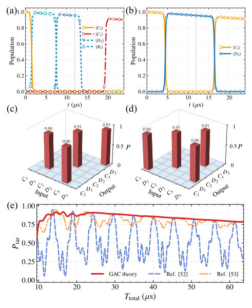
<figcaption class="paper-figure-caption"><b>Fig 4.</b> FIG. 4. Order-dependent response of composed pumping cycles with Lindblad master-equation simulations. Time- resolved populations for the temporal orders (a) ˆU2 ˆU1 and (b) ˆU1 ˆU2, starting from the same input state |C3⟩. Projected transfer maps for (c) ˆU2 ˆU1 and (d) ˆU1 ˆU2, respectively, in the computational basis {|C1⟩, |D1⟩, |C2⟩, |D2⟩, |C3⟩, |D3⟩}. The bar height gives the final projected population for each input- output pair. (e) Target-state population Ptar as a function of the full two-cycle duration Ttotal, averaged over the two tem- poral orders and the two input states |C3⟩and |D3⟩, with the target state chosen according to the corresponding composed- cycle mapping. The...</figcaption>
</figure>
<figure class="paper-figure-card">
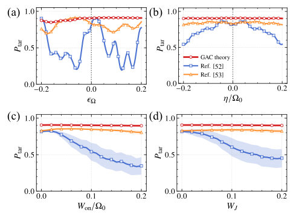
<figcaption class="paper-figure-caption"><b>Fig 5.</b> FIG. 5. Open-system response of the composed pumping protocol to representative imperfections. (a) Global Rabi- amplitude error ϵΩ. (b) Deterministic detuning gradient η/Ω0. (c) Zero-mean static random on-site disorder Won/Ω0. (d) Static relative coupling disorder WJ. In (c,d), the shaded regions denote ±1 standard deviation over Nreal = 200 disor- der realizations. More details are given in Appendix C.</figcaption>
</figure>

**Summary.** The research demonstrates non-Abelian Thouless pumping using Rydberg synthetic lattices to realize order-dependent quantum operations. A novel Global Adiabatic Criterion (GAC) is introduced to optimize the relative timing of microwave pulses, significantly improving target state fidelity in finite time compared to existing methods. This work advances geometric control and holonomic computation in solid-state analogues.

**Why it may be interesting.** This work directly tackles the practical limitations of adiabatic quantum control by providing a rigorous criterion (GAC) for optimizing pulse timing in complex open systems like Rydberg arrays, which is crucial for realizing robust topological quantum gates.

Detailed structure

**Main problem.** The paper addresses the challenge of implementing non-Abelian Thouless pumping, which is sensitive to operation order, while mitigating leakage errors inherent in finite-time quantum evolution.

**Main result.** The proposed Global Adiabatic Criterion (GAC) for pulse timing successfully guides the system to achieve higher target-state populations compared to literature schedules, confirming robust non-Abelian behavior.

**Method.** The authors derive and apply a GAC based on bounding the nonadiabatic transition probability ($\epsilon$) using time-integrated nonadiabatic factors ($Q$ and $\sigma_Q^2$). Dynamics are simulated via the Lindblad master equation.

**Model / system.** The system utilizes Rydberg synthetic lattices, encoding a three-cell Lieb lattice structure within microwave-coupled Rydberg levels. The dynamics are confined to a six-dimensional zero-energy subspace for pumping operations.

**Key observables.** Projected output state (sensitive to operation order), target-state population ($P_{tar}$), and the nonadiabatic transition probability ($\epsilon$).

**Important parameters / regimes.** The relative timing of Gaussian microwave pulses, which is optimized by the GAC; finite evolution time $T$.

**Assumptions / limitations.** The GAC provides a conservative upper bound on leakage, neglecting potential phase cancellations. The simulation incorporates state-dependent Rydberg loss.

**Figures summary.** Figures illustrate the lattice structure and zero-energy subspace (Fig. 1); show Gaussian pulse sequences for two pumping cycles ($P_1, P_2$) with different temporal orders (Fig. 2); detail the GAC derivation using nonadiabatic factors $Q$ and $\sigma^2_Q$ (Fig. 3); and compare time-resolved populations showing order dependence (Fig. 4).

**Paper structure.** The paper first establishes the physical model (Rydberg lattice, zero-energy subspace) and the pumping mechanism. It then introduces the GAC theory to manage finite-time leakage. Finally, it simulates the full dynamics using the Lindblad equation, comparing GAC-optimized schedules against standard ones.

Abstract

We study a quantum implementation of non-Abelian Thouless pumping in Lieb lattices using Rydberg synthetic dimensions. The lattice is encoded in twelve selected microwave-coupled Rydberg levels, forming a three-cell structure with six degenerate zero-energy states. These zero-energy states define the working subspace for cyclic modulation of the microwave couplings, while the remaining bright states provide the dominant leakage channels at finite evolution time. To choose the relative timing of the Gaussian pulses, we introduce a global adiabatic criterion (GAC), which evaluates the mean value and temporal fluctuation of a nonadiabatic factor obtained from a representative $Λ$-type transfer paradigm. With the resulting timing applied to the full twelve-level pumping dynamics, composing two elementary pumping cycles in opposite temporal orders produces distinct projected population maps. It is exactly consistent with noncommuting matrix-valued adiabatic operations in the zero-energy subspace. We numerically simulate the non-Abelian Thouless pumping using the Lindblad master equation with state-dependent Rydberg loss and representative perturbations. The results show that the GAC-selected timing within the same Gaussian pulse family gives higher target-state population than two literature-adapted Gaussian pulse schedules over the simulated parameter ranges. This quantum implementation of non-Abelian Thouless pumping, enabled by the GAC, marks a major milestone in finite-time geometric control and paves the way for transformative applications in holonomic quantum computing with Rydberg synthetic lattices.

[↑ back to top](#top)

### [Tomography of a Macroscopic Quantum State influenced by Classical Self-Gravity](http://arxiv.org/abs/2607.06967v1)

**Authors:** Wenjie Zhong, Yubao Liu, Yanbei Chen, Haixing Miao, Yiqiu Ma  
**Type:** theory · **Category:** other · **PDF:** <https://arxiv.org/pdf/2607.06967v1>  
**Analysis basis:** full PDF text, analyzed in chunks
**Topic relevance:** 🔥 `quantum measurements` **5/5** · 🔥 `measurement-induced transitions` **4/5** · `methods for driven-dissipative` **3/5** · `quantum optics experiment` **3/5** · `non-equilibrium dynamics` **2/5** · `Keldysh / 2PI / non-Gaussian methods` **1/5** · `correlated / nonlocal dissipation` **1/5** · `driven-dissipative phase transition` **1/5**

↔ Scroll figures horizontally

<figure class="paper-figure-card">
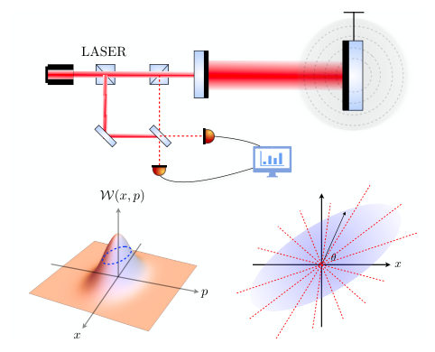
<figcaption class="paper-figure-caption"><b>Fig 1.</b> FIG. 1. Concept of tomography for a self-gravitating mechanical oscillator. The displacement of a suspended mirror is continuously encoded in the outgoing optical field and read out with variable-angle homodyne detection. The resulting measurement records provide noisy projections of the mechanical phase-space distribution.</figcaption>
</figure>
<figure class="paper-figure-card">
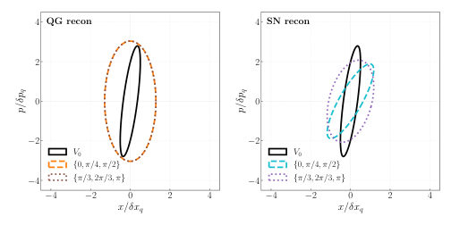
<figcaption class="paper-figure-caption"><b>Fig 2.</b> FIG. 2. Dependence of the reconstructed covariance on the choice of tomographic angles. In the QG reconstruction (left), the two angle sets ΘA = {0,π/4,π/2} and ΘB = {π/3,2π/3,π} lead to the same uncertainty ellipse. In the SN reconstruction (right), the correction to the tomographic noise depends on the conditional covariance tra- jectory associated with each homodyne angle, so the same two angle sets produce different uncertainty ellipses. The black ellipse denotes the initial covariance V0; here Ωq/2π = 0.1 Hz and T = 0.3 mK.</figcaption>
</figure>
<figure class="paper-figure-card">
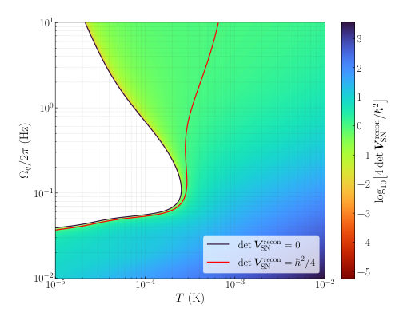
<figcaption class="paper-figure-caption"><b>Fig 3.</b> FIG. 3. Gaussian-covariance consistency of the SN reconstruction obtained with the QG tomographic map. The color scale shows the magnitude of detV recon SN . The dark contour marks detV recon SN = 0, while the cyan contour marks the standard Gaussian determinant boundary detV recon SN = ¯h2/4. Crossing these contours identifies pa- rameter regions where the QG-filtered SN covariance is either non- positive or below the usual Gaussian covariance bound.</figcaption>
</figure>
<figure class="paper-figure-card">
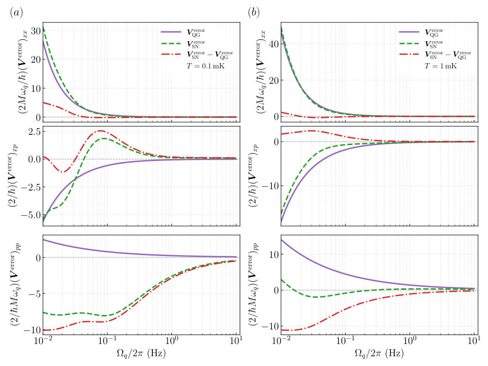
<figcaption class="paper-figure-caption"><b>Fig 4.</b> FIG. 4. Tomographic error-matrix components at two different temperatures. Panel (a) shows the low-temperature T = 0.1 mK case: the three panels show the xx, xp, and pp components as functions of the measurement strength Ωq/2π. Purple solid curves give the QG error, green dashed curves give the SN error, and red dot-dashed curves give the SN-induced correction V error SN −V error QG . At low temperature this correction is comparable to the QG tomographic noise over part of the scan and can drive the xp and pp components negative. Panel (b) shows the relatively high-temperature T = 1 mK case with the same notation and line styles. Compared with the low-temperature case, thermal force noise...</figcaption>
</figure>
<figure class="paper-figure-card">
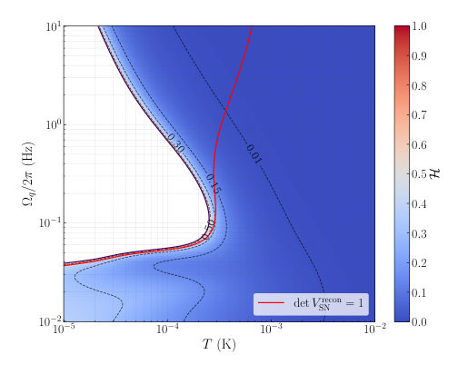
<figcaption class="paper-figure-caption"><b>Fig 5.</b> FIG. 5. Distinguishability of the QG and SN reconstructions in the (T,Ωq) plane. The color scale gives the Hellinger distance H = H (V recon QG ,V recon SN ), with dashed contours indicating selected values of H . The red curve marks the determinant threshold for the reconstructed SN covariance in the dimensionless plotting con- vention. White regions correspond to parameter points for which the QG-filtered SN reconstruction lies outside the standard Gaussian- covariance domain.</figcaption>
</figure>

**Summary.** The paper investigates how classical self-gravity modifies the measurement process for a macroscopic quantum oscillator compared to standard quantum mechanics. By comparing state reconstructions derived from both theories using continuous tomography data, the authors show that the model mismatch leads to observable signatures, such as violating fundamental uncertainty bounds when using the wrong reconstruction map.

**Why it may be interesting.** This is highly relevant as it tackles fundamental questions about the nature of gravity at the quantum level, utilizing advanced techniques from open quantum systems theory (continuous monitoring) to probe deviations from standard QM predictions.

Detailed structure

**Main problem.** The work aims to distinguish between quantum gravity (QG) effects and classical self-gravity (Schrödinger-Newton, SN theory) when performing continuous quantum state tomography on a macroscopic mechanical oscillator.

**Main result.** Applying the standard QG reconstruction map to data generated under SN dynamics introduces model-dependent corrections that can cause the reconstructed covariance to violate the Heisenberg uncertainty principle or become dependent on the chosen measurement angles.

**Method.** The authors compare quantum state reconstructions derived from two different dynamical models (QG vs. SN) by deliberately applying the QG reconstruction filter to SN-generated measurement records, quantifying the mismatch using the Hellinger distance.

**Model / system.** The system is a macroscopic optomechanical oscillator whose dynamics are modeled under both standard quantum mechanics and Schrödinger-Newton theory, which incorporates state-dependent self-gravity into the Hamiltonian. Measurement occurs via continuous homodyne detection of an output optical field.

**Key observables.** Reconstructed covariance matrix, Hellinger distance quantifying distinguishability, and quadrature variance ($\sigma^2_{YY}$).

**Important parameters / regimes.** Measurement strength, temperature, and the specific choice of tomography angles.

**Assumptions / limitations.** The analysis relies on deliberately using the QG reconstruction map as a fixed filter to expose model incompatibility between the two theories.

**Figures summary.** Figure 1 illustrates the process: continuous encoding of mirror displacement into an outgoing optical field read out via variable-angle homodyne detection, providing noisy projections of the mechanical phase-space distribution.

**Paper structure.** The paper establishes the physical setup (optomechanics), details the dynamics under both QG and SN theories, develops the measurement formalism using continuous quantum state tomography, and concludes by comparing the reconstruction results to highlight model discrepancies.

Abstract

Macroscopic optomechanical systems offer a promising testbed for distinguishing whether gravity acts as a quantum interaction or as a classical field. Schrodinger-Newton (SN) theory is the nonrelativistic limit of semi-classical gravity where quantum matter couples to classical gravity. Based on SN theory, this work investigates how classical self-gravity affects continuous quantum state tomography of a macroscopic mechanical oscillator monitored by variable-angle homodyne detection. In the Schrodinger-Newton (SN) theory, the measurement record arises from a different conditional test mass dynamics from that in quantum-gravity (QG)/standard quantum mechanics, consequently, applying the QG-optimised reconstruction map introduces an additional state-dependent contribution. We show that this contribution makes the reconstructed covariance depend on the chosen set of tomography angles and can drive the SN covariance--after QG filtering--outside the standard Gaussian-covariance domain set by the Heisenberg uncertainty principle. We quantify the resulting QG-SN distinguishability via the Hellinger distance and analyse its dependence on measurement strength and temperature. We then formulate the same issue in the broader setting of nonlinear quantum mechanics: when the system's conditional dynamics during the readout process depends on the state being inferred, the tomographic map acquires nonlinear, model-dependent corrections to the usual Radon or Gaussian reconstruction map.

[↑ back to top](#top)

### [Correlation Localization in Waveguide QED with Delayed Interactions](http://arxiv.org/abs/2607.06888v1)

**Authors:** N. Vera, F. M. Quinteros, P. Barberis-Blostein, P. Solano  
**Type:** theory · **Category:** other · **PDF:** <https://arxiv.org/pdf/2607.06888v1>  
**Analysis basis:** full PDF text, analyzed in chunks
**Topic relevance:** 🔥 `analog quantum simulation` **4/5** · 🔥 `correlated / nonlocal dissipation` **4/5** · `Tavis-Cummings & cavity-many-emitter` **3/5** · `correlated cavity matter` **3/5** · `driven-dissipative phase transition` **3/5** · `methods for driven-dissipative` **3/5** · `non-equilibrium dynamics` **3/5** · `Keldysh / 2PI / non-Gaussian methods` **2/5** · `non-equilibrium universality` **2/5** · `entanglement & information structure` **1/5** · `exotic spin models in light-matter` **1/5** · `scars & prethermalization` **1/5**

↔ Scroll figures horizontally

<figure class="paper-figure-card">
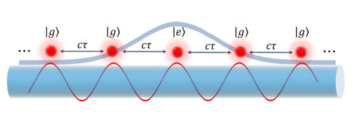
<figcaption class="paper-figure-caption"><b>Fig 1.</b> FIG. 1. Schematic of an atomic array coupled to a waveguide under the Bragg condition, where all atoms are spaced by a distance vτ, with v representing the group velocity and τ the delayed interaction time. The central atom is initially excited, whereas all other atoms are in the ground state. The waveg- uide mediates photon exchange among the atoms, enabling collective dynamics that lead to localization of steady-state atom-atom correlations for large delays.</figcaption>
</figure>
<figure class="paper-figure-card">
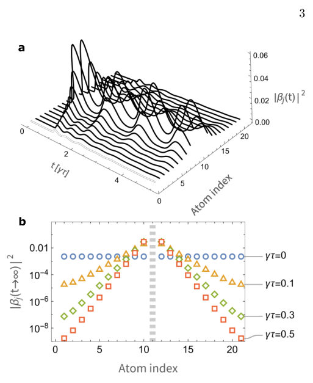
<figcaption class="paper-figure-caption"><b>Fig 2.</b> FIG. 3. a Dynamics of the excitation probability for all neigh- boring atoms (excluding the central atom) as a function of time for γτ = 0.1 and N = 21 atoms. b Steady-state excita- tion probability of the neighboring atoms versus atom index for different values of γτ, illustrating the spatial localization of the remaining excitation around the initially excited atom.</figcaption>
</figure>
<figure class="paper-figure-card">
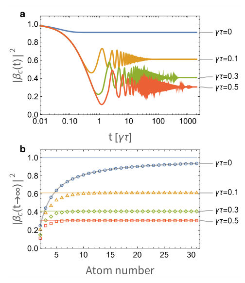
<figcaption class="paper-figure-caption"><b>Fig 3.</b> FIG. 2. a Decay dynamics of the central (initially excited) atom for various delayed interaction times τ and N = 21 atoms. Each curve shows how the excitation probability evolves to a steady state. b Steady-state excitation probabil- ity of the central atom as a function of the number of atoms in the system for different delay times. Curves correspond to distinct delays; the gray curve is the analytic Markovian so- lution and the horizontal dashed line marks its infinite-atom limit.</figcaption>
</figure>
<figure class="paper-figure-card">
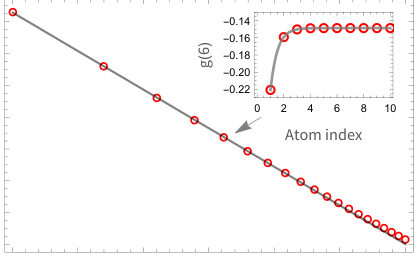
<figcaption class="paper-figure-caption"><b>Fig 4.</b> FIG. 4. Correlation length ξ as a function of the delayed interaction parameter γτ shown in a log-log plot. The gray curve illustrates a linear fit, showing that ξ ∼(γτ)−0.48, which suggests that the correlation length scales with the delay ac- cording to a power law. The inset shows the exponential fit to the spin-spin correlation function for the point indicated by an arrow as an example. By employing a sequence of 21 atoms, the simulation ensures that the solution converges and that boundary effects are eliminated.</figcaption>
</figure>
<figure class="paper-figure-card">
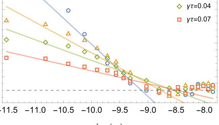
<figcaption class="paper-figure-caption"><b>Fig 5.</b> FIG. 5. Correlation length ξ as a function of the disorder pa- rameter σ shown in a log-log plot. The curves illustrate linear fits, serving as a visual aid, given by ξσ ∼σ−0.75, σ−0.5, σ−0.3, and σ−0.2 with increasing τ. The gray dashed line indicates the approximatzed localization threshold of disorder.</figcaption>
</figure>

**Summary.** This paper analyzes excitation dynamics in an atomic array coupled to a waveguide when interactions are delayed (non-Markovian). The key finding is that this delay causes the initially spread excitation to partially localize near the source atom. This localization effect suppresses long-range quantum correlations, with the correlation length scaling inversely with the square root of the interaction delay.

**Why it may be interesting.** This work is highly relevant as it explores how retardation effects fundamentally alter quantum transport and coherence preservation in solid-state or waveguide QED systems, providing quantitative scaling laws for correlation decay.

Detailed structure

**Main problem.** The study investigates how delayed, non-Markovian interactions affect the atom-atom correlation length within an array of atoms coupled to a waveguide under Bragg conditions.

**Main result.** Increased interaction delay causes the excitation probability to localize near the initially excited atom, leading to a power-law decrease in the correlation length ($\xi \propto 	au^{-1/2}$).

**Method.** The authors solve the system dynamics by deriving and numerically solving complex delay differential equations governing the atomic coefficients.

**Model / system.** The model is an array of N atoms coupled to a one-dimensional waveguide (wQED) operating in the single-excitation manifold under Bragg conditions. The interactions are non-Markovian due to finite photon propagation time ($	au$).

**Key observables.** Atom-atom correlation length ($\xi$), steady-state excitation probability of central vs. neighboring atoms, and spin-spin correlation function $g(j)$.

**Important parameters / regimes.** Interaction delay ($	au$ or $\gamma	au$), system size (N), disorder strength ($\sigma$), and the Bragg condition.

**Assumptions / limitations.** The analysis is restricted to the single-excitation manifold, and derivations rely on approximations like extending frequency integration over negative frequencies in the RWA for the delay equation.

**Figures summary.** Figures illustrate schematic setups under Bragg conditions, decay dynamics of excitation probability vs. atom index for varying delays, and log-log plots showing power-law scaling relationships between $\xi$ and both delay ($\gamma	au$) and disorder ($\sigma$).

**Paper structure.** The paper progresses from defining the physical system and Hamiltonian to deriving the governing delay differential equations (avoiding Born-Markov), analyzing the Markovian limit, and finally solving for the steady-state localization properties in the non-Markovian regime, including disorder effects.

Abstract

We study the atom-atom correlation length in an atomic array coupled to a waveguide under the Bragg condition with delayed non-Markovian interactions caused by a finite photon propagation time. Starting from a single excited atom, the excitation partially spreads among all atoms, reaching a steady state. The remaining excitation localizes near the initially excited atom, and the atom-atom correlation length decreases as a power law with the interaction delay. This localization phenomenon reveals how the delay-induced non-Markovian behavior affects the correlation transport in waveguide QED systems.

[↑ back to top](#top)

### [Entanglement-assisted remote energy transfer](http://arxiv.org/abs/2607.06837v1)

**Authors:** Bashir Mojaveri, Rasoul Jafarzadeh Bahrbeig, Mohammad Ali Fasihi, Nasrin Abdi  
**Type:** theory · **Category:** other · **PDF:** <https://arxiv.org/pdf/2607.06837v1>  
**Analysis basis:** full PDF text, analyzed in chunks
**Topic relevance:** 🔥 `methods for driven-dissipative` **4/5** · `correlated / nonlocal dissipation` **3/5** · `correlated cavity matter` **3/5** · `driven-dissipative phase transition` **3/5** · `entanglement & information structure` **3/5** · `non-equilibrium dynamics` **3/5** · `Keldysh / 2PI / non-Gaussian methods` **2/5** · `analog quantum simulation` **2/5** · `non-equilibrium universality` **2/5** · `Tavis-Cummings & cavity-many-emitter` **1/5** · `exotic spin models in light-matter` **1/5** · `scars & prethermalization` **1/5**

↔ Scroll figures horizontally

<figure class="paper-figure-card">
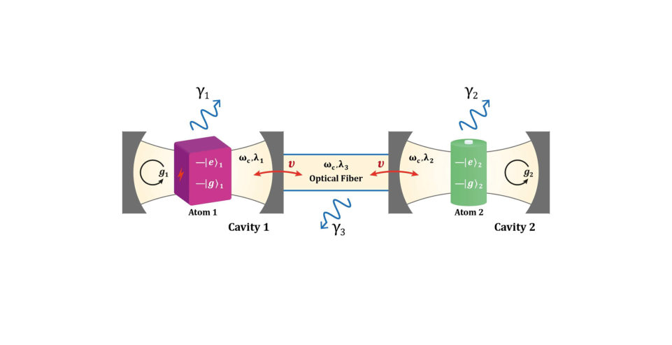
<figcaption class="paper-figure-caption"><b>Fig 1.</b> Figure 1: Schematic illustration of charging process of a remote battery. The battery and charger qubits are located separately at two distant cavities, which are connected by a short- length optical fiber.</figcaption>
</figure>
<figure class="paper-figure-card">
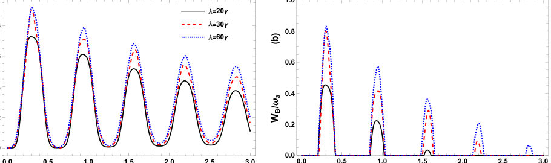
<figcaption class="paper-figure-caption"><b>Fig 2.</b> Figure 2: Dynamics of (a) the normalized stored energy ∆EB(t)/ωa and (b) normalized ergotropy WB/ωa for the different values of λ by setting η = 10γ and ν = 0.</figcaption>
</figure>
<figure class="paper-figure-card">
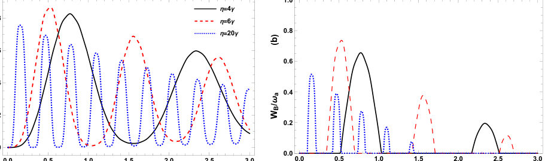
<figcaption class="paper-figure-caption"><b>Fig 3.</b> Figure 3: Dynamics of (a) the normalized stored energy ∆EB(t)/ωa and (b) normalized ergotropy WB/ωa for the different values of η by setting λ = 40γ and ν = 0.</figcaption>
</figure>
<figure class="paper-figure-card">
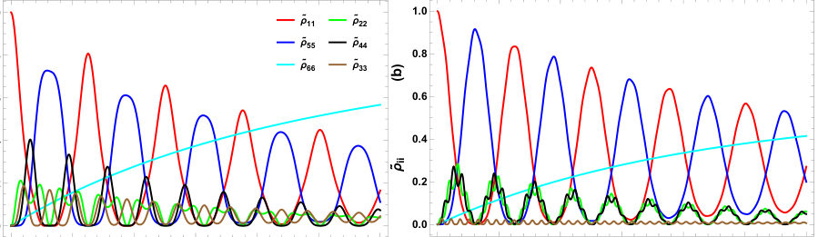
<figcaption class="paper-figure-caption"><b>Fig 4.</b> Figure 4: Dynamics of population distribution ˜ρii for (a) λ = 20γ and (b) λ = 60γ by setting η = 10γ and ν = 0.</figcaption>
</figure>
<figure class="paper-figure-card">
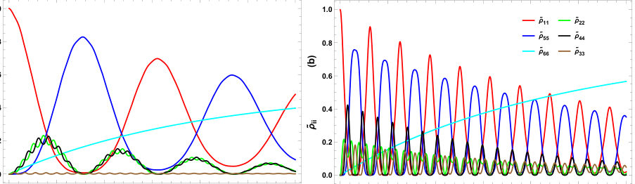
<figcaption class="paper-figure-caption"><b>Fig 5.</b> Figure 5: Dynamics of population distribution ˜ρii for (a) η = 4γ and (b) η = 20γ by setting λ = 40γ and ν = 0.</figcaption>
</figure>

**Summary.** The paper presents a novel protocol for remotely charging a quantum battery using entanglement assistance across two cavities connected by an optical fiber. By employing parity deformation of the cavity fields, the researchers suppress environmental dissipation while demonstrating that initial entanglement acts as a consumable resource to maximize stored energy. This offers new insights into harnessing decoherence effects in quantum thermodynamics.

**Why it may be interesting.** This work directly addresses advanced topics in open quantum systems, specifically leveraging non-standard algebraic structures (para-Bose algebra) to control decoherence and enhance energy transfer—a critical area in quantum thermodynamics and cavity QED.

Detailed structure

**Main problem.** The work proposes a protocol for entanglement-assisted remote energy transfer between two distant atoms (charger and battery) coupled to separate optical cavities.

**Main result.** High-efficiency charging is achieved by introducing parity deformation of the cavity fields, which suppresses dissipation. Furthermore, initial charger-battery entanglement is shown to be a consumable resource necessary to maintain increased stored energy in the battery.

**Method.** The analysis uses the para-Bose algebra formalism and solves the open system dynamics governed by a Markovian master equation under Born-Markov approximations.

**Model / system.** The physical model consists of two distant two-level atoms, each coupled to an optical cavity, with the cavities linked by a fiber. The entire setup is treated as an open quantum system interacting with bosonic reservoirs (baths).

**Key observables.** Energy Transfer Efficiency, Stored Energy ($\Delta E_B$), Extractable Work (Ergotropy), and the degree of entanglement.

**Important parameters / regimes.** Parity Deformation Parameter ($
u$), coupling strengths ($\lambda$), and damping rates ($\gamma$).

**Assumptions / limitations.** The analysis relies on the short fiber limit, the Born-Markov approximation, and the use of the para-Bose algebra to model cavity field interactions.

**Figures summary.** Figure 1 schematically illustrates the remote battery charging setup. Figure 2 shows normalized dynamics of stored energy ($\Delta E_B$) and ergotropy ($W_B$) over time for varying coupling strengths.

**Paper structure.** The paper introduces the physical system, develops the Hamiltonian using parity-deformed fields, derives the master equation, solves the resulting differential equations for key observables, and finally analyzes how entanglement consumption drives enhanced energy storage.

Abstract

Currently, remote energy transfer and immunity to dissipation are hot topics in quantum batteries (QBs). In this work, we propose a protocol to realize energy transfer between two remote atoms (a quantum charger and a quantum battery) each coupled to a separate optical cavity with the cavities connected by a fiber. The cavities and fiber are coupled to their individual baths. After optimizing inter-system couplings to achieve an efficient transfer, we uncover the effect of suppressing dissipation by introducing parity deformation of the cavities fields. We also prove that the charger-battery entanglement is a consumable resource for energy storage: it is initially stored until the charger and battery reach energy balance, and then subsequently consumed to maintain the increase in energy stored in the battery. The present scheme is the first execution of energy transfer to a distant battery assisted by entanglement, which may help better understand quantum thermodynamics and open new possibilities toward harnessing decoherence as a resource to improve the charging performance of QBs.

[↑ back to top](#top)

### [Anyon-induced non-Hermitian topological phases](http://arxiv.org/abs/2607.06934v1)

**Authors:** Yi-An Wang, Kun Ding, Linhu Li  
**Type:** theory · **Category:** quantum gases · **PDF:** <https://arxiv.org/pdf/2607.06934v1>  
**Analysis basis:** full PDF text, analyzed in chunks
**Topic relevance:** 🔥 `analog quantum simulation` **4/5** · 🔥 `driven-dissipative phase transition` **4/5** · `correlated / nonlocal dissipation` **3/5** · `methods for driven-dissipative` **3/5** · `non-equilibrium universality` **3/5** · `Kondo & dissipative impurity` **2/5** · `non-equilibrium dynamics` **2/5** · `Frenkel-Kontorova` **1/5** · `Keldysh / 2PI / non-Gaussian methods` **1/5** · `entanglement & information structure` **1/5**

↔ Scroll figures horizontally

<figure class="paper-figure-card">
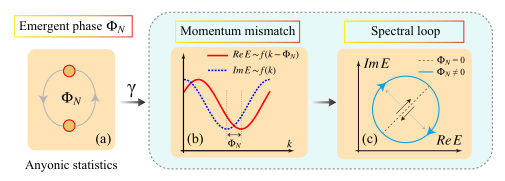
<figcaption class="paper-figure-caption"><b>Fig 1.</b> FIG. 1. Schematic mechanism of the anyon-induced non- Hermitian topology. (a) Fractional exchange statistics en- dows an N-particle bound state with a many-body statisti- cal phase ΦN = N(N −1)θ/2. (b) With non-Hermiticity (γ in our explicit model below), ΦN affects the real and imagi- nary energies of the bound state differently, so that ReE (red line) and ImE (blue line) become misaligned as k varies. (c) This ΦN-induced Re-Im misalignment transforms the spec- trum into a closed spectral loop (opening a point gap). The black and cyan arrows show the energy trajectory for ΦN = 0 and ΦN ̸= 0, respectively, as k varies.</figcaption>
</figure>
<figure class="paper-figure-card">
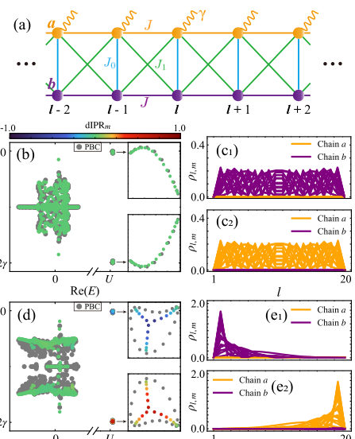
<figcaption class="paper-figure-caption"><b>Fig 2.</b> FIG. 2. Emergence of the anyonic NHSE in the two-particle bound-state clusters. (a) Schematic of the non-Hermitian ladder model. (b) Complex spectra for N = 2 and θ = 0 (bosons), with dIPRm ≈0 for all eigenstates. The PBC and OBC spectra for bound states with Re(E) ≈U form nearly identical curves. (c) State distributions in the two bound- state clusters, which are both extended. (d) and (e) the same as (b) and (c), but with θ = π/2 (anyons). The bound-state clusters develop loop spectra under PBCs [after applying the transformation in Eq. (5)], and opposite skin localizations un- der OBCs. Other parameters are L = 20, N = 2, J0 = J1 = 3, J = 1, γ = 2, and U = 100.</figcaption>
</figure>
<figure class="paper-figure-card">
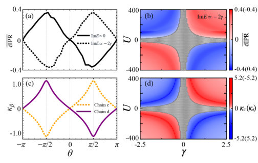
<figcaption class="paper-figure-caption"><b>Fig 3.</b> FIG. 3. (a) dIPR of the upper- and lower-imaginary-energy bound-state clusters as a function of the statistical angle θ, with U = 100 and γ = 2. The two clusters exhibit opposite NHSE, indicated by nonzero dIPR with opposite signs when θ ̸∈{0, π}. (b) Phase diagram of dIPR for the lower cluster in the (γ, U) plane with θ = π/2. (c) Effective non-reciprocity κβ (β = c or d) [see Eq. (11)] as a function of θ for the two transformed chains with the same parameters as for (a), which shows the same trend as the dIPR. (d) Phase diagram of κc,d in the (γ, U) plane with θ = π/2. In (b) and (d), the cen- tral gray area corresponds to energy-mixture between bound states and scattering states (the two...</figcaption>
</figure>
<figure class="paper-figure-card">
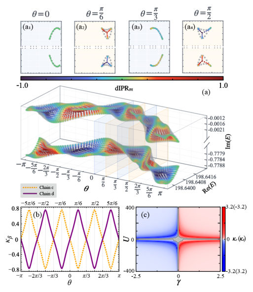
<figcaption class="paper-figure-caption"><b>Fig 4.</b> FIG. 4. Anyon-induced non-Hermitian topology for N = 3, (a) Complex spectra of the three-particle bound-state clusters at Re(E) ≈3U, versus the statistical angle θ. OBC eigen- states are colored by dIPRm; representative cuts are shown for θ = 0, π/6, π/3, π/2. Nontrivial point-gap loops appear except when Φ3 = 3θ = mπ. (b) Effective non-reciprocity κ(3) c,d as a function of θ, showing the accelerated oscillation governed by Φ3 = 3θ and the opposite signs of the two ef- fective chains. (c) Phase diagram of κ(3) c,d in the (γ, U) plane at θ = π/6. Data at small U (γ) are omitted as eigenen- ergies are mixed between bound states and scattering states (the two bound-state clusters). For (a) and...</figcaption>
</figure>
<figure class="paper-figure-card">
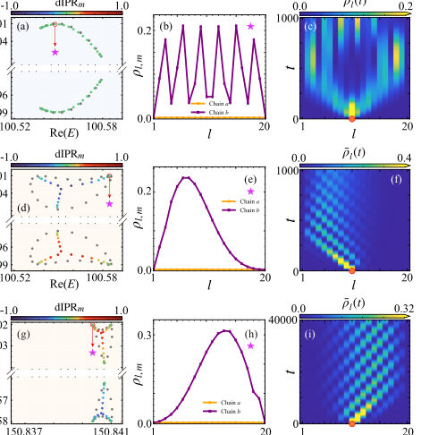
<figcaption class="paper-figure-caption"><b>Fig 5.</b> FIG. 5. Dynamics of the bound-state. (a) to (c) Bosonic limit, θ = 0, with N = 2, U = 100, and γ = 2: (a) Com- plex bound-state spectra, with PBC eigenvalues shown as gray points, OBC eigenvalues colored by dIPRm, and the magenta star marking the eigenstate with the largest Im(E); (b) density distribution ρl,m = ⟨ψm|ˆnβ,l|ψm⟩of the marked state; (c) evolution of ¯ρl(t) from |ψ(0)⟩= |b10, b10⟩. Or- ange dot marks the initial state. (d) to (f) Anyonic case at θ = π/2, with the same parameters and initial state. (g) to (i) N = 3 anyonic case at θ = π/6, U = 50, and γ = 0.22, with |ψ(0)⟩= |b10, b10, b10⟩. Other parameters are L = 20, J = 1, and J0 = J1 = 3.</figcaption>
</figure>

**Summary.** The paper demonstrates that the fractional exchange statistics of anyons can act as a resource to activate non-trivial non-Hermitian topology in otherwise simple lattice models. By analyzing the resulting effective Hamiltonians, the authors show that this activation manifests as a point-gap opening and a measurable Non-Hermitian Skin Effect. This establishes a clear link between quantum statistics and engineered topological phases in open systems.

**Why it may be interesting.** This work directly connects exotic quantum statistics (anyon exchange) to fundamental concepts in open quantum systems (non-Hermiticity and topological phases), providing a mechanism for engineering topological properties using particle interactions.

Detailed structure

**Main problem.** The study investigates whether incorporating anyonic exchange statistics can activate non-Hermitian point-gap topology in physical systems that are otherwise topologically trivial.

**Main result.** Fractional statistics ($	heta 
eq 0, \pi$) successfully induce a non-trivial non-Hermitian topological phase and associated Non-Hermitian Skin Effect (NHSE) by creating spectral mismatches. The magnitude of this effect increases with the number of anyons ($N$).

**Method.** The analysis uses projection onto $N$-particle bound states to derive an effective single-particle Hamiltonian, which is then analyzed using Bloch form techniques and topological invariants like signed spectral area.

**Model / system.** The model is a 1D non-Hermitian two-chain ladder lattice loaded with Abelian anyons. The system's dynamics are governed by a Hamiltonian incorporating hopping terms, interaction terms, and dissipation ($\gamma$).

**Key observables.** Non-Hermitian Skin Effect (NHSE) diagnosed via the Directional Inverse Participation Ratio ($	ext{dIPR}$), point-gap topology characterized by non-zero signed spectral area ($S_{\pm}$), and effective non-reciprocity ($\kappa^{(N)}$).

**Important parameters / regimes.** The statistical phase $	heta$ (where $	heta=0$ is bosonic and $	heta=\pi$ is pseudofermionic) and the particle number $N$ are crucial parameters controlling the topological features.

**Assumptions / limitations.** The analysis relies on projecting the full many-body problem onto a basis of $N$-particle bound states, and some sections use perturbative expansions for decoupling chains.

**Figures summary.** Figures illustrate the opening of point gaps due to fractional statistics ($	heta 
eq 0, \pi$), show the vanishing $	ext{dIPR}$ at bosonic/pseudofermionic limits, and depict how non-reciprocity changes with $N$ and $	heta$.

**Paper structure.** The paper proceeds by defining the physical model (anyons on a ladder lattice), deriving effective Hamiltonians for bound states, analyzing the resulting spectrum to identify point-gap topology via spectral invariants, and finally examining diagnostics like non-reciprocity and dynamical evolution.

Abstract

We show that anyonic exchange statistics can activate non-Hermitian point-gap topology in models that are topologically trivial in its absence. The emergent topology oscillates more rapidly with the statistical phase as the anyon number increases, and exhibits a parity dependence on the particle number. A perturbative analysis reveals the mechanism: fractional statistics induces a mismatch between momentum terms that, combined with sublattice-dependent dissipation, produces particle-number-dependent non-reciprocity and complex spectral winding. As these effects rely on the formation and exchange of interaction-bound anyons, our results establish exchange statistics as a resource for enabling non-Hermitian topology under programmed dissipation.

[↑ back to top](#top)

### [Horizon-Restricted Leading Soft QED as Open Quantum System](http://arxiv.org/abs/2607.07342v1)

**Authors:** Soo-Jong Rey  
**Type:** theory · **Category:** other · **PDF:** <https://arxiv.org/pdf/2607.07342v1>  
**Analysis basis:** full PDF text, analyzed in chunks
**Topic relevance:** 🔥 `quantum measurements` **4/5** · `correlated / nonlocal dissipation` **3/5** · `entanglement & information structure` **3/5** · `measurement-induced transitions` **3/5** · `methods for driven-dissipative` **3/5** · `Keldysh / 2PI / non-Gaussian methods` **2/5** · `driven-dissipative phase transition` **2/5** · `non-equilibrium dynamics` **2/5** · `interference shaping light` **1/5** · `non-equilibrium universality` **1/5**

↔ Scroll figures horizontally

<figure class="paper-figure-card">
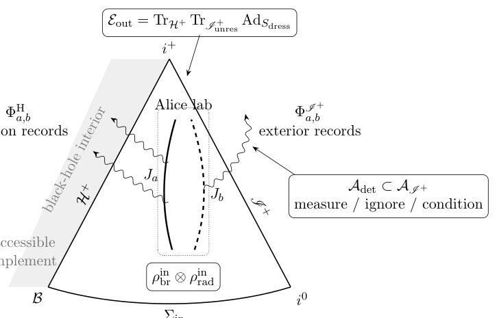
<figcaption class="paper-figure-caption"><b>Fig 1.</b> Figure 1: Penrose-diagram illustrating the horizon-restricted open-system channel. The branch currents Ja and Jb are localized within Alice’s exterior laboratory and act as sources for branch-dependent radiative records. Records reaching I + constitutes, subject to detector resolution, the exterior measurement algebra; these records are subsequently measured, disregarded, or employed in a feed-forward recovery proto- col. Conversely, radiation traversing H+ correspond to the complementary channel relative to the exterior observer, which modulates the off-diagonal element of the charged sector by the horizon Gram factor GH ab = ⟨ΦH b |ΦH a ⟩. Consequently, the di- agram does not depict a...</figcaption>
</figure>
<figure class="paper-figure-card">
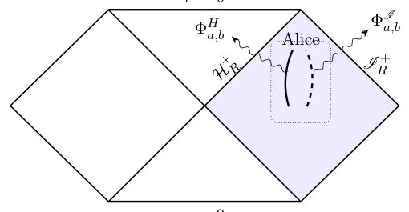
<figcaption class="paper-figure-caption"><b>Fig 2.</b> Figure 2: Planar (r, t) Penrose diagram of the fully extended eternal Schwarzschild geometry, drawn in the conventional hexagon form. The thick upper and lower hori- zontal segments represent the spacelike singularities r = 0. The diagonal line labelled H+ R is the future event horizon bounding the right exterior region occupied by Alice. Branch-dependent radiative records reaching I + R are, up to detector resolution, ac- cessible exterior records, whereas branch-dependent records crossing H+ R are assigned to the complementary horizon channel. The left exterior, the white-hole region, and most other labels are omitted because they are spectators for the open-system con- struction.</figcaption>
</figure>
<figure class="paper-figure-card">
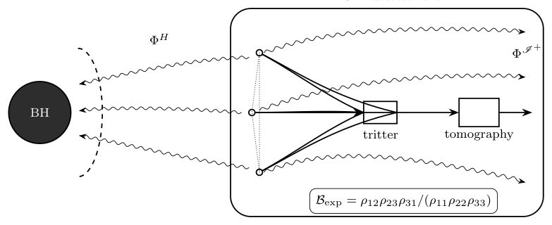
<figcaption class="paper-figure-caption"><b>Fig 3.</b> Figure 3: Minimal three-arm charged-qutrit interferometer designed to measure the Bargmann invariant. A charged particle is split by a tritter into three adiabati- cally controlled current histories J1, J2, J3 localized at a small triangular separation d outside the black hole, and subsequently recombined for qutrit tomography. The wavy lines propagating to the detector shell represent accessible exterior soft records at I +; the wavy lines crossing the dashed horizon represent the complementary horizon records. The reconstructed cyclic invariant is Bexp = ρ12ρ23ρ31/(ρ11ρ22ρ33). Under ideal exterior monitoring and feed-forward erasure, the residual invariant is Bresidual exp = BH,(0) 123 ,...</figcaption>
</figure>

**Summary.** This theoretical paper models black-hole decoherence by treating the interaction as an open quantum system governed by leading-soft QED. It derives a specific Schur channel that quantifies how coherence is lost due to monitoring the horizon environment. The results yield new, testable constraints on quantum information processing in curved spacetime.

**Why it may be interesting.** This work bridges quantum information theory (Schur channels, coherence bounds) with fundamental aspects of general relativity and QED near horizons, providing novel diagnostics for gravitational decoherence.

Detailed structure

**Main problem.** The paper formulates black-hole-horizon-induced decoherence of charged branch codes within an open quantum system framework, treating the interaction as a leading-soft QED process.

**Main result.** It derives a completely positive Schur channel characterizing coherence loss due to horizon monitoring and establishes falsifiable tests for this decoherence beyond simple two-path visibility.

**Method.** The analysis employs an Open Quantum System (OQS) approach, utilizing the fixed-history Feynman–Vernon identity and analyzing the system's evolution via a Schur multiplier derived from the horizon output algebra.

**Model / system.** The model involves charged bodies near black hole horizons or Killing horizons, where decoherence is induced by coupling to an external, soft radiative environment. The formalism uses 'branch currents' ($J_\mu^a$) and defines the system via algebraic bipartitions of the radiation algebra.

**Key observables.** Gram-positivity constraints, exterior quantum-eraser bound, finite-time non-Markovianity tests, and a leading-soft Bargmann holonomy phase (symplectic area).

**Important parameters / regimes.** Black hole mass ($M$), charge ($q$), separation ($d$), time ($T$), and the soft/hard scaling criteria.

**Assumptions / limitations.** The analysis assumes an initial product state ($
ho_{	ext{in}}^{	ext{tot}} = 
ho_{	ext{in}}^{	ext{br}} \otimes 
ho_{	ext{in}}^{	ext{rad}}$) and relies on defining the environment via a complementary horizon output algebra.

**Figures summary.** Figure 1 illustrates the 'horizon-restricted open-system channel' using an algebraic bipartition diagram, while Figure 2 shows a Penrose diagram for eternal Schwarzschild geometry relevant to the construction.

**Paper structure.** The paper progresses by first establishing the OQS framework for horizon decoherence, deriving the Schur channel in the eikonal limit, and then applying this formalism to derive specific physical constraints like non-Markovianity tests and geometric invariants (holonomy).

Abstract

I formulate black-hole-horizon-induced decoherence of charged branch codes as the leading-soft QED restricted to an exterior algebra, formulated as an open quantum system. The fixed-history Feynman--Vernon identity ${\cal F}[J,J]=1$ remains exact. Decoherence enters through the unequal-history influence factor that survives exterior monitoring and belongs to the complementary horizon output. In the coherent eikonal regime, I derive the completely positive Schur channel $({\cal E}_H^{(0)}ρ)_{ab}=\langleΦ_b^{H,(0)}|Φ_a^{H,(0)}\rangle \, ρ_{ab}$. The leading soft input is the eikonal factor, projected onto the horizon radiative algebra. The channel yields Gram-positivity constraints, an exterior quantum-eraser bound, finite-time non-Markovianity tests, soft/hard scaling criteria, and a charged-qutrit interferometer measuring a leading-soft Bargmann holonomy. The holonomy phase is the rephasing-invariant symplectic area of a triangle in horizon soft phase space. I show that its orientation, common-mode, triangulation, and completely positive determinant identities render falsifiable tests beyond pairwise two-path visibility.

[↑ back to top](#top)

### [Local Markov Order and Global Inference in Many-Body Dynamics](http://arxiv.org/abs/2607.06689v1)

**Authors:** Thomas Iadecola  
**Type:** theory · **Category:** statistical mechanics · **PDF:** <https://arxiv.org/pdf/2607.06689v1>  
**Analysis basis:** full PDF text, analyzed in chunks
**Topic relevance:** 🔥 `entanglement & information structure` **4/5** · 🔥 `measurement-induced transitions` **4/5** · 🔥 `quantum measurements` **4/5** · `non-equilibrium dynamics` **3/5** · `non-equilibrium universality` **3/5** · `driven-dissipative phase transition` **2/5** · `correlated / nonlocal dissipation` **1/5** · `methods for driven-dissipative` **1/5** · `scars & prethermalization` **1/5**

↔ Scroll figures horizontally

<figure class="paper-figure-card">
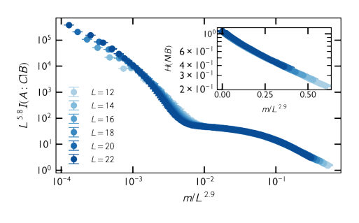
<figcaption class="paper-figure-caption"><b>Fig 1.</b> FIG. 2. Decay of the CMI in the unmonitored SEP for an initial charge distribution spread over sectors N = L/2 and L/2 ± 1 with vertical and horizontal axes scaled to collapse the late-time tail. Inset: Decay of the posterior entropy (9) with horizontal axis rescaled as in the main panel.</figcaption>
</figure>
<figure class="paper-figure-card">
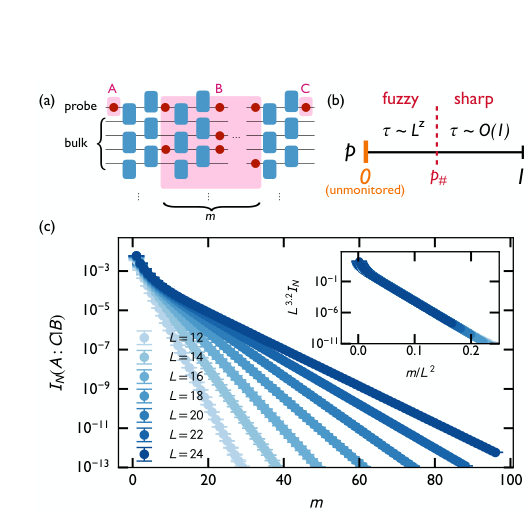
<figcaption class="paper-figure-caption"><b>Fig 2.</b> FIG. 1. (a) Schematic of the model and measurement proto- col. Blue boxes represent local SEP updates, and red circles represent measurements. Measurements in the highlighted regions A, B, and C are used in computing the CMI. (b) Schematic phase diagram of the monitored SEP as a func- tion of p, the measurement probability per time step. A charge sharpening (learning) transition between charge-fuzzy (unlearnable) and charge-sharp (learnable) phases occurs at p = p♯≈0.4. We show that this transition manifests in a change in the scaling with system size L of the Markovianiza- tion timescale τ. (c) Decay of CMI in the unmonitored SEP as a function of temporal record length m in a fixed charge...</figcaption>
</figure>
<figure class="paper-figure-card">
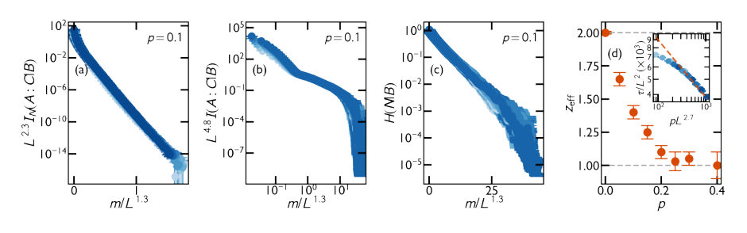
<figcaption class="paper-figure-caption"><b>Fig 3.</b> FIG. 3. Markovianization and charge learning in the monitored SEP. (a) Decay of the CMI at half filling for bulk measurement rate p = 0.1. (b) Decay of the hidden-charge CMI at p = 0.1 with the same initial charge distribution as Fig. 2. (c) Decay of the posterior entropy for the same initial charge distribution as in panel (b). (d) Flow of the effective dynamical exponent zeff for the half-filling CMI from 2 to 1 as a function of p ≤0.4 ≈p♯. zeff is extracted using the same χ2 analysis and sequences of system sizes as in Figs. 1 and 2. Inset: Finite-size flow of the exponential decay time scale τ(p, L) for system sizes L = 16, . . . , 24 and p = 0.0, 0.05, . . . , 0.2, collapsed according...</figcaption>
</figure>
<figure class="paper-figure-card">
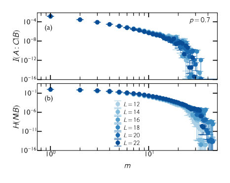
<figcaption class="paper-figure-caption"><b>Fig 4.</b> FIG. 4. Decay of the hidden-charge CMI (a) and the pos- terior entropy (b) for p = 0.7, with the same initial charge distribution as in Figs. 2 and 3.</figcaption>
</figure>
<figure class="paper-figure-card">
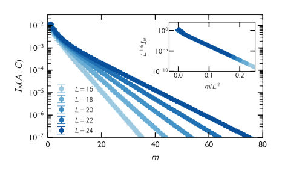
<figcaption class="paper-figure-caption"><b>Fig 5.</b> FIG. 5. Decay of the unconditioned MI in the unmonitored SEP at half filling. Inset: Finite-size scaling collapse of the same data.</figcaption>
</figure>

**Summary.** The paper analyzes how local measurements affect memory in charge-conserving many-body systems like the SEP. It finds that when the global charge is unknown, the system's memory decays slowly, tracking the time required for the observer to learn this hidden conserved quantity. This establishes a fundamental link between information acquisition and dynamical relaxation timescales.

**Why it may be interesting.** This work provides a powerful information-theoretic lens to study non-equilibrium dynamics, directly linking the rate of information acquisition (learning) to the relaxation timescale (memory), which has analogues in quantum measurement theory and open quantum systems.

Detailed structure

**Main problem.** The study investigates how conserved charges influence memory (Markovianity) in a classical stochastic process when only local measurements are available to an observer.

**Main result.** The system's memory timescale tracks the rate at which the global charge can be learned from local measurements; this leads to distinct 'charge-fuzzy' and 'charge-sharp' phases.

**Method.** Information-theoretic diagnostics, specifically analyzing the decay of Conditional Mutual Information (CMI) in relation to the measurement record.

**Model / system.** The Symmetric Exclusion Process (SEP), a classical model for charge-conserving dynamics on a 1D lattice with hardcore particles. The analysis compares scenarios where the total particle number (charge) is fixed versus when it is unknown/hidden from the observer.

**Key observables.** Conditional Mutual Information (CMI), Posterior Entropy $H(N|B)$, and the effective dynamical exponent ($z_{	ext{eff}}$).

**Important parameters / regimes.** Measurement probability per time step ($p$), system size ($L$), and the transition point $p^\#$ marking charge learnability.

**Assumptions / limitations.** The analysis relies on relating memory decay to information acquisition, assuming that learning the global conserved quantity dictates the long-time dynamics.

**Figures summary.** Figures illustrate CMI decay plots showing scaling collapses for both fixed and hidden charge sectors. They also map out a phase diagram based on measurement probability $p$, demonstrating the flow of the effective dynamical exponent $z_{	ext{eff}}$ across the transition point $p^\#$.

**Paper structure.** The paper develops the theoretical framework by analyzing CMI decay for both known and hidden global charges. It establishes that memory loss is governed by charge learnability, showing a divergence in memory time when the charge is unknown but finite when it can be learned.

Abstract

We consider how the presence of conserved charges affects memory in a classical stochastic process, the symmetric exclusion process, with an observer constantly measuring a single site. We find that the observer's measurement record becomes Markovian (i.e., loses memory) on a timescale that depends on their knowledge of the global charge, namely the total particle number. In particular, when the global charge is unknown a priori, the observer's time series Markovianizes on a timescale constrained by their ability to learn it from their measurement record. Augmenting the observer's record with bulk measurements drives a charge-learnability transition between charge-fuzzy and -sharp phases. We show that the memory timescale tracks the learnability timescale, diverging in the fuzzy phase and remaining finite in the sharp phase.

[↑ back to top](#top)

### [Enhanced two-photon sources in a cavity-coupled two-atom system](http://arxiv.org/abs/2607.06932v1)

**Authors:** Zhicai Chen, Jun Xu, Deyi Kong, Xiangming Hu, Fei Wang  
**Type:** both · **Category:** other · **PDF:** <https://arxiv.org/pdf/2607.06932v1>  
**Analysis basis:** full PDF text, analyzed in chunks
**Topic relevance:** 🔥 `analog quantum simulation` **4/5** · 🔥 `correlated cavity matter` **4/5** · `Tavis-Cummings & cavity-many-emitter` **3/5** · `methods for driven-dissipative` **3/5** · `correlated / nonlocal dissipation` **2/5** · `driven-dissipative phase transition` **1/5** · `entanglement & information structure` **1/5** · `interference shaping light` **1/5** · `non-equilibrium dynamics` **1/5** · `quantum optics experiment` **1/5**

↔ Scroll figures horizontally

<figure class="paper-figure-card">
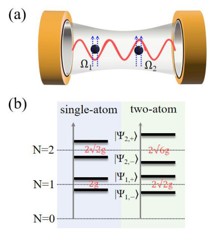
<figcaption class="paper-figure-caption"><b>Fig 1.</b> FIG. 1: (a) Schematic of the cavity-coupled two-atom sys- tem. A single cavity mode interacts with two two-level atoms, which are coherently driven by external classical fields of the same frequency with Rabi frequencies Ω1 and Ω2, respectively. (b) Dressed-state energy ladders of the single-atom Jaynes– Cummings model (left) and the symmetric two-atom bright subspace (right). Here, |ΨN,±⟩denote the upper and lower bright dressed states in the N-excitation manifold.</figcaption>
</figure>
<figure class="paper-figure-card">
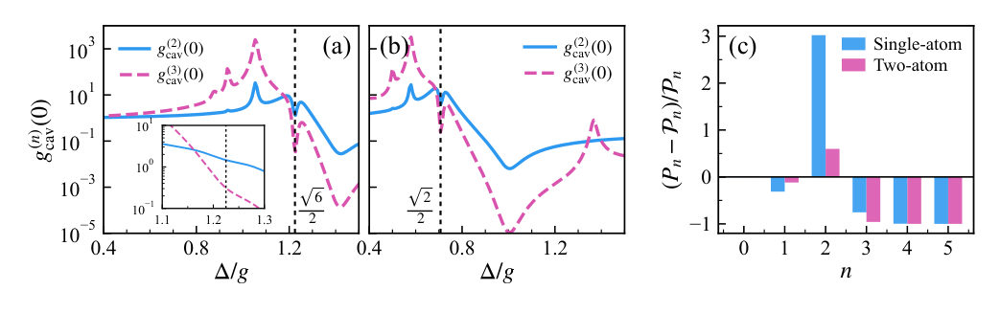
<figcaption class="paper-figure-caption"><b>Fig 2.</b> FIG. 2: Equal-time correlation functions g(2) cav(0) and g(3) cav(0) as functions of the normalized detuning ∆/g for (a) two- atom system and (b) single-atom system. The inset in (a) shows the corresponding two-atom result for larger dissipation κ = γ1 = γ2 = 0.1g and stronger drive Ω= 0.1g. (c) Relative deviation of the photon-number distribution from the Poisson distribution with the same mean photon number, (Pn −Pn)/Pn, at the analytical two-photon resonance points. Other parameters are κ = γ1 = γ2 = 0.01g, and Ω= 0.04g. For the two-atom system, the total driving strength is fixed by setting Ω1 = Ω2 = Ω/ √</figcaption>
</figure>
<figure class="paper-figure-card">
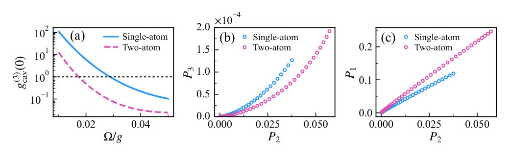
<figcaption class="paper-figure-caption"><b>Fig 3.</b> FIG. 3: (a) Third-order correlation function g(3) cav(0) as a function of the normalized total driving strength Ω/g. (b) Three- photon probability P3 as a function of the two-photon probability P2. (c) Single-photon probability P1 as a function of P2. The data in (b) and (c) are obtained from the same drive-strength scan as in (a). For the single-atom system, ∆= √</figcaption>
</figure>
<figure class="paper-figure-card">
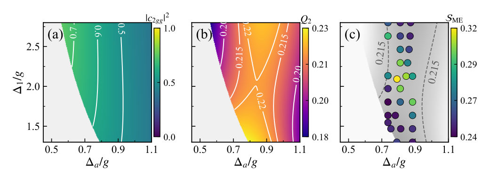
<figcaption class="paper-figure-caption"><b>Fig 4.</b> FIG. 4: Parameter-selection procedure for the optimized two-photon blockade. For each point in the (∆a, ∆1) plane, the two- photon resonance condition det(H2) = 0 is used to determine ∆2, and the resonant branch with the larger two-cavity-photon weight is selected. Blank regions indicate parameter points for which the resonance condition gives no real solution of ∆2 within the chosen range 0 ≤∆2/g ≤4; solutions outside this range correspond to far-detuned branches and are not retained. (a) Two-cavity-photon weight |c2gg|2 of the resonant eigenstate as a function of detunings ∆a and ∆1. (b) The indicator Q2 as a function of the detunings ∆a and ∆1. (c) Full master-equation validation for...</figcaption>
</figure>
<figure class="paper-figure-card">
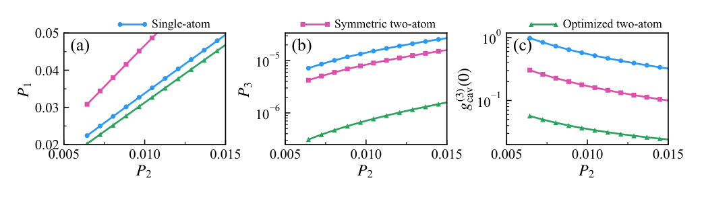
<figcaption class="paper-figure-caption"><b>Fig 5.</b> FIG. 5: (a) Single-photon probability P1, (b) three-photon probability P3, and (c) third-order correlation function g(3) cav(0) as functions of the two-photon probability P2 for the single-atom, symmetric two-atom, and optimized two-atom systems. The curves are compared at the same P2 by adjusting the driving strength in each case. The single-atom and symmetric two-atom systems are evaluated at their analytical two-photon resonances, ∆= √</figcaption>
</figure>

**Summary.** The paper proposes a component-selective scheme for enhancing two-photon sources in a cavity coupled to two atoms. By precisely controlling atomic detunings and driving phases, the system can be tuned to exhibit optimized two-photon blockade or generate strongly correlated fluorescence photon pairs. This offers a versatile route for high-quality quantum light sources.

**Why it may be interesting.** This work provides a sophisticated example of using engineered light-matter interactions (cavity QED) to achieve highly controlled nonclassical light sources, which is central to quantum optics and quantum information processing.

Detailed structure

**Main problem.** The goal is to improve two-photon sources by achieving component-selective control in a cavity-coupled two-atom system, moving beyond simple blockade realization.

**Main result.** The authors demonstrate that controlling atomic detunings and the relative driving phase allows for optimized cavity-field two-photon blockade or the generation of strongly correlated fluorescence photon pairs independently.

**Method.** Theoretical analysis involves diagonalizing Hamiltonians in fixed excitation number subspaces, coupled with numerical simulation of correlation functions using the Lindblad master equation.

**Model / system.** The system is a single cavity mode interacting with two two-level atoms, driven by phase-controlled classical fields. The Hamiltonian includes terms for detuning, atom-cavity interaction, and driving fields.

**Key observables.** Two-photon blockade ($g^{(2)}_{cav}(0) > 1$ and $g^{(3)}_{cav}(0) < 1$), strongly correlated fluorescence photon pairs ($g^{(2)}_{12}(0)$), and the double-atomic-excitation probability ($	ext{Pee}$).

**Important parameters / regimes.** Atomic detunings ($\Delta_j$) and relative driving phase ($\phi$); resonance conditions derived from $\det(H_2) = 0$.

**Assumptions / limitations.** The analysis relies on component-selective control by tuning parameters to optimize specific excitation components, distinguishing between cavity photon blockade and fluorescence pair generation.

**Figures summary.** Figures illustrate correlation functions ($g^{(2)}, g^{(3)}$) vs. detuning, showing blockade regimes; other figures map the interplay between $g^{(2)}_{12}(0)$ and $	ext{Pee}$ across different detuning cuts to find optimal operating points.

**Paper structure.** The paper first establishes the general Hamiltonian and methods for analyzing photon statistics in two-atom systems. It then details how component selectivity is achieved by tuning parameters to optimize either cavity blockade or fluorescence pair generation, comparing these distinct physical mechanisms.

Abstract

We propose a component-selective scheme for improving two-photon sources in a cavity-coupled two-atom system, where a single cavity mode interacts with two two-level atoms driven by phase-controlled classical fields of the same frequency. By controlling the atomic detunings and driving phase, the system can be tailored toward optimized cavity-field two-photon blockade or strongly correlated fluorescence photon-pair emission. When the two-cavity-photon component is enhanced, the cavity field exhibits optimized two-photon blockade with simultaneous suppression of unwanted one- and three-photon components at a comparable two-photon population. In another parameter regime, strongly correlated fluorescence photon pairs can also be generated from the two atoms by selecting the double-atomic-excitation component in the same two-excitation manifold. This approach provides a route toward high-quality and versatile two-photon sources, with potential applications in few-photon quantum optics and quantum information processing.

[↑ back to top](#top)

### [Spin Textures and Eigenstate Evolution of Isospectrally Patterned Lattices](http://arxiv.org/abs/2607.07502v1)

**Authors:** Peter Schmelcher  
**Type:** theory · **Category:** other · **PDF:** <https://arxiv.org/pdf/2607.07502v1>  
**Analysis basis:** full PDF text, analyzed in chunks
**Topic relevance:** 🔥 `analog quantum simulation` **4/5** · `exotic spin models in light-matter` **3/5** · `spintronics-quantum-optics interface` **3/5** · `driven-dissipative phase transition` **2/5** · `non-equilibrium dynamics` **2/5** · `Frenkel-Kontorova` **1/5** · `correlated cavity matter` **1/5** · `entanglement & information structure` **1/5** · `methods for driven-dissipative` **1/5** · `non-equilibrium universality` **1/5**

↔ Scroll figures horizontally

<figure class="paper-figure-card">
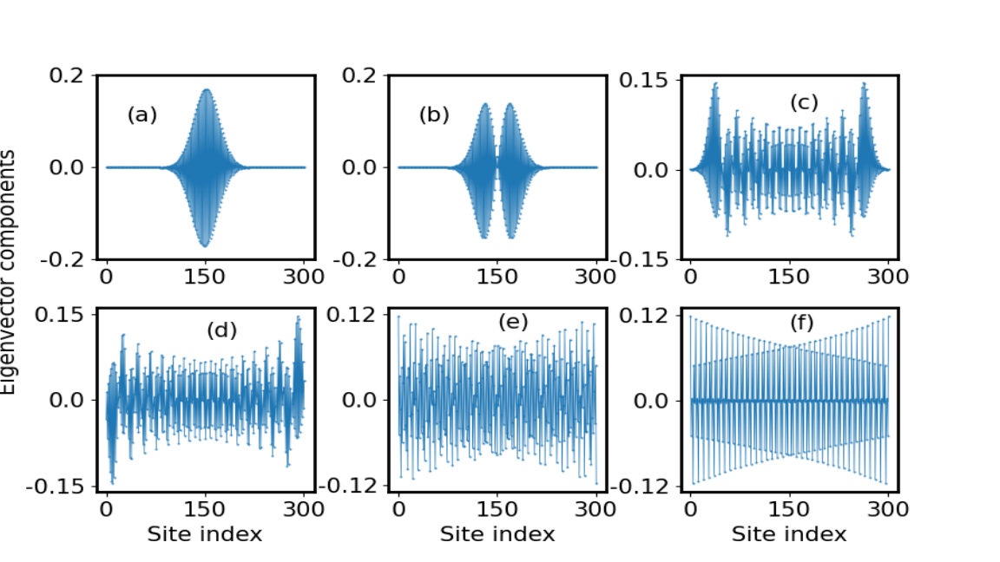
<figcaption class="paper-figure-caption"><b>Fig 1.</b> Figure 1: Individual eigenstates of the IPL for d1 = 1, d2 = 2, ϵ = 0.01, Ns = 302 with open boundary conditions, placed symmetrically around π</figcaption>
</figure>
<figure class="paper-figure-card">
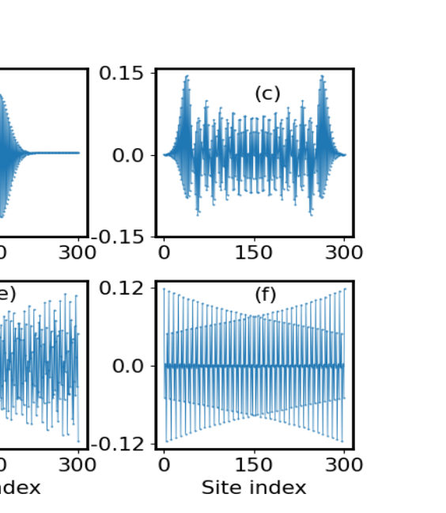
<figcaption class="paper-figure-caption"><b>Fig 2.</b> Fig.3 shows the amplitude distributions in Fourier space for the 6, 70, 130, 213, 302, 416, 480, 550, 600-th eigen- states corresponding to subfigures (a-i): they are rep- resentative examples covering the first band. For the energetically low-lying localized eigenstates, and in par- ticular for the eigenstate 6 (see Subfig. 3(a)) we observe two well-separated frequency distributions of finite width being located at the edges of the finite frequency window i.e. neighboring to the minimal and maximal possible fre- quencies. The frequency distribution close to 0.5 consists of a sequence of peaks with a small non-constant spacing</figcaption>
</figure>
<figure class="paper-figure-card">
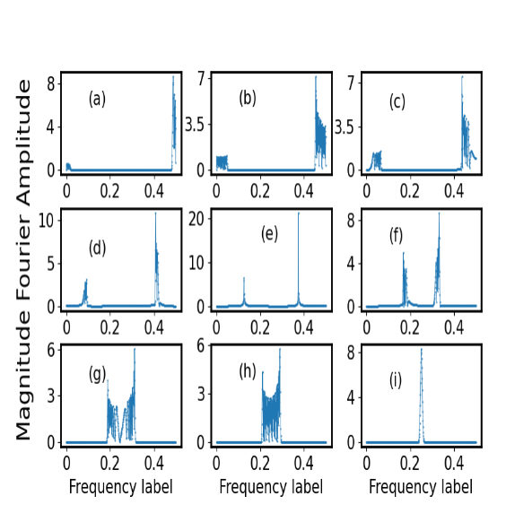
<figcaption class="paper-figure-caption"><b>Fig 3.</b> Figure 3: Absolute values of the ampli- tudes in frequency space for the individual 6, 70, 130, 213, 302, 416, 480, 550, 600-th eigenstate corresponding to subfigures (a-i) for an equidistant ϕ lattice for d1 = 1, d2 = 2, ϵ = 0.01, Ns = 1202 with open boundary conditions, placed symmetrically around π</figcaption>
</figure>
<figure class="paper-figure-card">
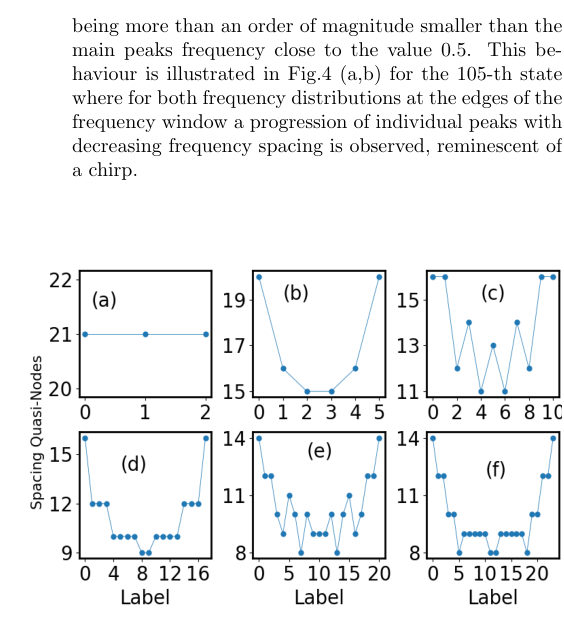
<figcaption class="paper-figure-caption"><b>Fig 4.</b> Figure 2: The lattice distances between neighboring quasi-nodes versus their consecutive labeling for indi- vidual selected eigenstates. (a-f) correspond to the 4, 7, 12, 19, 22, 25-th eigenstate, respectively, of the first band. The underlying lattice is for d1 = 1, d2 = 2, ϵ = 0.01, Ns = 302 with open boundary conditions, placed symmetrically around π</figcaption>
</figure>
<figure class="paper-figure-card">
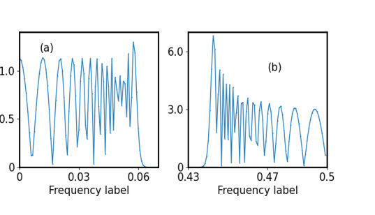
<figcaption class="paper-figure-caption"><b>Fig 5.</b> Figure 4: Windows of the frequency distribution (Fourier transformation) for the low and high frequency domains for the individual 105-th eigenstate (this is a state close to the transition from localized to delocalized behaviour) for an equidistant ϕ lattice for d1 = 1, d2 = 2, ϵ = 0.01, Ns = 1202 with open boundary conditions, placed symmetri- cally around π</figcaption>
</figure>

**Summary.** This paper analyzes the exotic quantum behavior of isospectrally patterned lattices by studying how their eigenstates evolve with excitation energy. The research reveals a systematic transition between localized and delocalized regimes, accompanied by complex rearrangements in the underlying spin texture. These findings demonstrate that engineered lattice potentials offer tunable control over spectral properties useful for quantum simulation.

**Why it may be interesting.** This work directly models quantum dynamics in engineered periodic potentials, which is highly relevant for controlling spin states and coherence in cold atom or superconducting qubit platforms.

Detailed structure

**Main problem.** The study investigates the complex spin textures and eigenstate evolution within isospectrally patterned lattices (IPLs). This analysis tracks how quantum states transition between localized and delocalized regimes as excitation energy changes.

**Main result.** The system exhibits a rich spectral evolution, characterized by the transformation of the Fourier spectrum from bimodal to a single narrow peak. Furthermore, spin textures undergo quantifiable rearrangement transitions marked by variations in local spin fluctuations.

**Method.** The analysis involves detailed eigenstate calculations, Fourier spectral analysis, and quantifying spin correlations using metrics like Total Variation (TVS) across different energy bands.

**Model / system.** The model is an IPL described by a Hamiltonian interpreted as a single spin subjected to a spatially varying, rotating magnetic field with spin-dependent hopping. This system can be realized using ultracold fermions in optical lattices or double well superlattices.

**Key observables.** Tunable ratio of localized/delocalized eigenstates, quasi-nodes (where eigenstate amplitude is near zero), Fourier spectrum width and peak location, and Total Variation (TVS) of local spin fluctuations.

**Important parameters / regimes.** The degree of excitation energy, the underlying phase gradient controlling isospectrality, and the hopping coupling strength ($\epsilon$).

**Assumptions / limitations.** The analysis is primarily restricted to a 'special' case of IPLs involving two-site cells; generalizations to higher dimensions are noted as future work.

**Figures summary.** Figures illustrate selected localized/delocalized eigenstates, the dependence of quasi-node spacing on node number, and the evolution of frequency distributions in Fourier space across different excitation levels.

**Paper structure.** The paper systematically defines the IPL Hamiltonian (Section II), analyzes eigenstate properties including quasi-nodal structure (Section III), examines local spin structures via TVS (Section IV), discusses stronger couplings (Section V), and concludes by summarizing spectral variety (Section VI).

Abstract

Isospectrally patterned lattices exhibit a composite band structure with a tunable ratio of localized versus delocalized eigenstates that is controlled by the underlying phase gradient. We show that the lattice Hamiltonian can be interpreted as that of a single spin exposed to a rotating magnetic field which is allowed to hop with a spin-flip across the lattice. In the low- and high-energy part of the band the localized states show an envelope of oscillatory character separated by quasi-nodes. Spin peaks occur at the locations of these quasi-nodes and provide a unique spin texture to the eigenstates which becomes increasingly complex with increasing degree of excitation. The crossover from localization to delocalization and vice versa leaves its fingerprints in the Fourier spectrum of the eigenstates: the original bimodal frequency distribution widens with increasing degree of excitation, moves across the spectral window and finally culminates in an extremely narrow frequency peak. In the course of this evolution the spin texture undergoes a rearrangement transition involving different characteristic (ir)regular patterns which we quantify by considering the total variation of the local spin fluctuations. Our results demonstrate the variety of the spectral properties of isospectrally patterned lattices which holds great prospect in particular when considering higher lattice or cell dimensions.

[↑ back to top](#top)

### [Floquet-Weyl states at one-photon resonances in three-dimensional topological insulators](http://arxiv.org/abs/2607.07199v1)

**Authors:** Keiya Uehara, Ryo Okugawa, Takami Tohyama, Shun Okumura  
**Type:** theory · **Category:** strongly correlated electrons · **PDF:** <https://arxiv.org/pdf/2607.07199v1>  
**Analysis basis:** full PDF text, analyzed in chunks
**Topic relevance:** 🔥 `non-equilibrium dynamics` **4/5** · `analog quantum simulation` **3/5** · `driven-dissipative phase transition` **3/5** · `methods for driven-dissipative` **3/5** · `non-equilibrium universality` **2/5** · `Keldysh / 2PI / non-Gaussian methods` **1/5** · `interference shaping light` **1/5** · `spintronics-quantum-optics interface` **1/5**

↔ Scroll figures horizontally

<figure class="paper-figure-card">
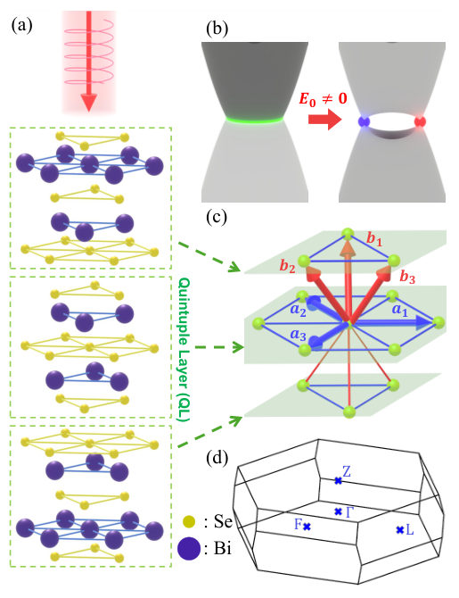
<figcaption class="paper-figure-caption"><b>Fig 1.</b> FIG. 1. Schematics of (a) the crystal structure of Bi2Se3 ir- radiated by the circularly polarized light, (b) a nodal ring between the original and Floquet-replica bands, turning to the Weyl points with a finite electric field E0, and (c) the simplified triangular lattice model. The dashed boxes in (a) represent the units of quintuple layers, which are reduced to the green sheets in (c). In (c), the green spheres de- note each unit cell, and the blue (red) arrows are the intra- (inter-)layer translational vectors al (bl). (d) The first Bril- louin zone of the rhombohedral lattice. The four inequivalent time-reversal-invariant momenta (TRIM) are marked by blue crosses: Γ, Z, F, and L.</figcaption>
</figure>
<figure class="paper-figure-card">
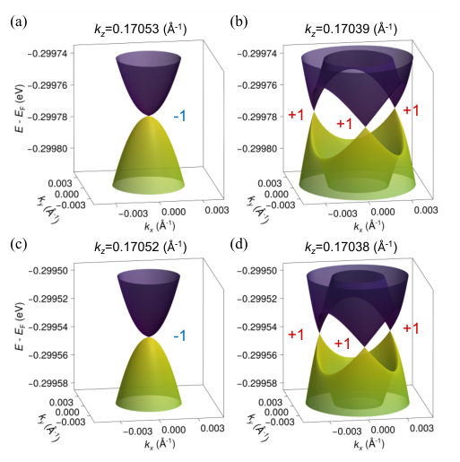
<figcaption class="paper-figure-caption"><b>Fig 2.</b> FIG. 3. Energy dispersion obtained from (a)(b) the one- photon-resonant model in Eq. (3), corresponding to the fourth and fifth bands in Fig. 2(b), and (c)(d) the effective two-band model in Eq. (4) for slightly different kz(&gt; 0) around the Weyl points. The Weyl point on the Γ-Z line in (a) and (c) has the negative topological charge −1, while the three Weyl points around the Γ point in (b) and (d) have the positive charge +1.</figcaption>
</figure>
<figure class="paper-figure-card">
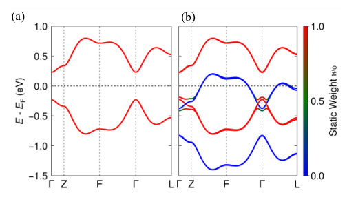
<figcaption class="paper-figure-caption"><b>Fig 3.</b> FIG. 2. Band structures of Bi2Se3 calculated from (a) the tight-binding model in equilibrium and (b) the one-photon- resonant model driven by the circularly polarized light with photon energy Ω= 0.6 eV and an electric field amplitude E0 = 2.4 MV/cm. The color scale encodes the static weight w0, in which w0 = 1 and 0 correspond to the 0- and −1- photon states, respectively.</figcaption>
</figure>
<figure class="paper-figure-card">
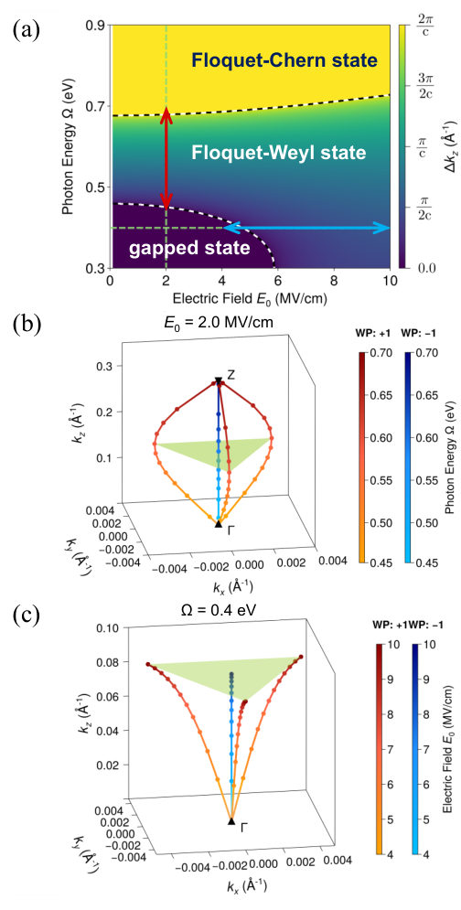
<figcaption class="paper-figure-caption"><b>Fig 4.</b> FIG. 4. (a) Topological phase diagram for the photon en- ergy Ωand the electric field E0, colored by the distance of the four Weyl pairs in the kz direction, ∆kz, which con- tains the gapped state (∆kz = 0), the Floquet-Weyl state (0 &lt; ∆kz &lt; 2π</figcaption>
</figure>
<figure class="paper-figure-card">
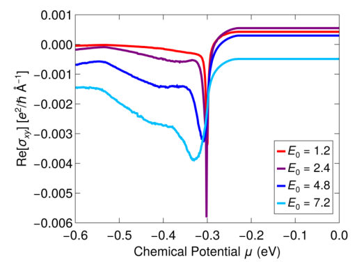
<figcaption class="paper-figure-caption"><b>Fig 5.</b> FIG. 6. Chemical potential µ dependence of the anomalous Hall conductivity σxy calculated by the one-photon-resonant model at Ω= 0.6 eV for several electric fields E0.</figcaption>
</figure>

**Summary.** The paper theoretically examines how driving a 3D Topological Insulator with circularly polarized light at one-photon resonance generates exotic Floquet-Weyl semimetallic phases. By analyzing the hybridization of electronic bands, the authors predict the emergence of Weyl points and show that this topological feature can be experimentally detected through a large anomalous Hall conductivity signal.

**Why it may be interesting.** This work connects topological band theory with non-equilibrium quantum dynamics induced by light, which is highly relevant for understanding engineered quantum states in optical systems.

Detailed structure

**Main problem.** The study investigates the emergence of Floquet-Weyl states in three-dimensional topological insulators when driven by circularly polarized light at a one-photon resonance.

**Main result.** Four pairs of Floquet-Weyl points are found to emerge due to hybridization between original and one-photon-resonant bands, leading to a large anomalous Hall conductivity tunable via hole doping.

**Method.** The research employs Floquet theory combined with tight-binding modeling and numerical calculations to track the topological features in the quasienergy spectrum.

**Model / system.** The system is based on $	ext{Bi}_2	ext{Se}_3$-type 3D Topological Insulators, modeled by an effective tight-binding Hamiltonian. The analysis utilizes Floquet theory for periodic driving by circularly polarized light (CPL).

**Key observables.** Floquet-Weyl points, anomalous Hall conductivity ($\sigma_{xy}$), and the topological phase diagram.

**Important parameters / regimes.** One-photon resonance condition, CPL amplitude ($E_0$), photon energy ($\Omega$), and chemical potential tuning via hole doping.

**Assumptions / limitations.** The analysis focuses on the one-photon resonance mechanism, contrasting with high-frequency expansions; approximations are made in deriving the effective two-band Hamiltonian.

**Figures summary.** Figures illustrate schematics of CPL irradiation effects, nodal ring collapse to Weyl points, and comprehensive topological phase diagrams mapping out different Floquet states based on driving parameters.

**Paper structure.** The paper progresses from establishing the physical system ($	ext{Bi}_2	ext{Se}_3$ under CPL) to applying Floquet theory, deriving an effective Hamiltonian via canonical transformations, calculating the resulting Weyl points, and finally demonstrating the measurable consequence (AHC).

Abstract

Quantum materials exhibit exotic phases and electronic responses under irradiation by circularly polarized light, which breaks time-reversal symmetry and generates Floquet replica bands. Recently, Floquet topological states arising from direct resonances have attracted much attention, e.g., the emergence of Floquet-Weyl points at a one-photon resonance, rather than topological features within the modulated original bands via high-frequency expansion. In this study, we investigate the effects of a one-photon resonance in a representative three-dimensional topological insulator, Bi$_2$Se$_3$, applying Floquet theory under circularly polarized light. We find that four pairs of Floquet-Weyl points emerge in the intermediate-frequency regime, mediated by hybridization between the original and one-photon-resonant Floquet bands, preserving the threefold rotational symmetry of the crystalline structure. Our numerical calculations demonstrate that tuning the chemical potential via hole doping yields a large anomalous Hall conductivity, directly associated with these Floquet-Weyl points. This work provides a highly accessible route toward the experimental realization of one-photon-resonant Floquet-Weyl semimetals.

[↑ back to top](#top)

### [How thermal is a filtered state?](http://arxiv.org/abs/2607.06847v1)

**Authors:** Yilun Yang, J. Ignacio Cirac, Mari Carmen Bañuls  
**Type:** theory · **Category:** statistical mechanics · **PDF:** <https://arxiv.org/pdf/2607.06847v1>  
**Analysis basis:** full PDF text, analyzed in chunks
**Topic relevance:** 🔥 `non-equilibrium dynamics` **4/5** · `entanglement & information structure` **3/5** · `scars & prethermalization` **3/5** · `methods for driven-dissipative` **2/5** · `non-equilibrium universality` **2/5** · `Keldysh / 2PI / non-Gaussian methods` **1/5** · `analog quantum simulation` **1/5** · `correlated / nonlocal dissipation` **1/5** · `driven-dissipative phase transition` **1/5**

↔ Scroll figures horizontally

<figure class="paper-figure-card">
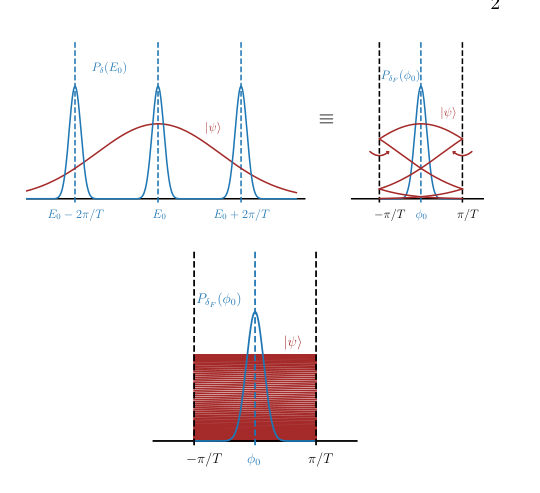
<figcaption class="paper-figure-caption"><b>Fig 1.</b> FIG. 1. Action of the cosine filtered state Pδ(E0) on an initial state |ψ⟩in the Floquet regime. The brown curves represent the local density of states of |ψ⟩, and the blue ones represent the Gaussian filters. Upper: When 2π/T is smaller than the width of the initial state |ψ⟩, the spectrum will be effectively wrapped around the interval [−π/T, π/T). Lower: When T is a constant, in the thermodynamic limit the folded spectrum becomes flat and different initial energy scales are sufficiently mixed.</figcaption>
</figure>
<figure class="paper-figure-card">
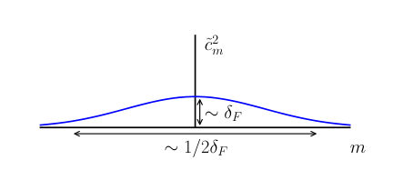
<figcaption class="paper-figure-caption"><b>Fig 2.</b> FIG. 2. The normalized filter coefficients ecm. ecm is approxi- mately a Gaussian function in m, whose width is 1/2δF . ec2 0 is approximately proportional to δF . A similar scaling holds for normalized filter coefficients in the Hamiltonian case (see Appendix A for details).</figcaption>
</figure>
<figure class="paper-figure-card">
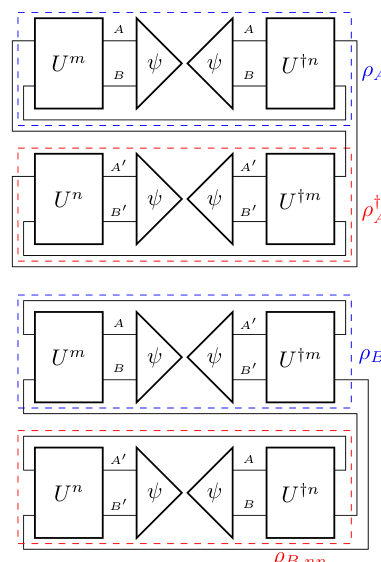
<figcaption class="paper-figure-caption"><b>Fig 3.</b> FIG. 3. Diagram for Eq. (20). We swap the upper and lower blocks in the right hand side.</figcaption>
</figure>
<figure class="paper-figure-card">
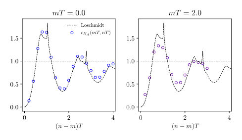
<figcaption class="paper-figure-caption"><b>Fig 4.</b> FIG. 4. Overlap between diagonal blocks m and n of the RDM as a function of the time difference, for the non-integrable Ising model defined in Eq. (22). The system size N = 20, subsystem size NA = 10, and T = 0.2. Circles represent the correlation rate in Eq. (23), defined as the logarithm of the overlap rescaled by the subsystem size. The black dashed line corresponds to f(t), the return rate in Eq. (14), computed for N = 20. Numerical data were obtained via matrix product state (MPS) simulations.</figcaption>
</figure>
<figure class="paper-figure-card">
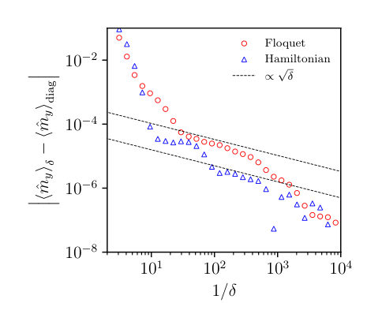
<figcaption class="paper-figure-caption"><b>Fig 5.</b> FIG. 5. The difference between filtered state and diagonal ensemble expectation values of observable ˆmy = PN i=1 σy i /N in the nonintegrable Ising chain. The initial state is chosen to</figcaption>
</figure>

**Summary.** This paper investigates the conditions under which energy-filtered pure states approximate true thermal states in many-body quantum systems. By analyzing both Hamiltonian and Floquet filtering regimes, the authors prove that the deviation from thermal behavior decays rapidly with the filter width ($\delta$). The results provide quantitative benchmarks for understanding quantum thermalization dynamics.

**Why it may be interesting.** This work provides rigorous quantitative estimates (e.g., $O(\sqrt{\delta})$ bound) for how quickly non-equilibrium states approach thermal equilibrium via filtering, which is crucial for understanding quantum thermalization dynamics in complex systems.

Detailed structure

**Main problem.** The core problem is determining the necessary narrowness of an energy filter ($\delta$) required for a quantum state, prepared from simple pure states, to accurately approximate a true thermal state.

**Main result.** Under the Floquet eigenstate thermalization hypothesis (ETH), the trace distance between filtered states and thermal states decays at a rate bounded by the square root of the filter width ($O(\sqrt{\delta})$).

**Method.** The analysis uses both continuous-time Hamiltonian filtering and discrete-time Floquet dynamics, showing that in the small $\delta$ limit, the filtered state's reduced density matrix behaves like a weighted time average.

**Model / system.** The study analyzes quantum many-body systems using local Hamiltonians. It employs two primary frameworks: conventional Hamiltonian filtering and its discrete-time analog in the Floquet regime ($U(T) = e^{-iHT}$).

**Key observables.** Trace distance between filtered states and thermal states; Rényi-$\alpha$ entanglement entropies ($S_\alpha$).

**Important parameters / regimes.** Filter width ($\delta_H$ or $\delta_F$), time step $T$, system size $N$.

**Assumptions / limitations.** The analysis heavily relies on the Floquet eigenstate thermalization hypothesis (ETH) for the Floquet case, and approximations are made regarding the block-diagonal structure of the reduced density matrix.

**Figures summary.** Figures illustrate the action of cosine filtered states compared to Gaussian filters in both Hamiltonian and Floquet settings. Tables summarize the distinct scaling laws for Rényi entanglement entropies across different filtering regimes ($\alpha=1$, $\alpha>1$, $0<\alpha<1$).

**Paper structure.** The paper first establishes the equivalence between filtered states and time averages in the Floquet regime. It then derives bounds on the trace distance using ETH, extends these results to the Hamiltonian setting, and finally calculates entanglement entropy scalings for various $\alpha$ values.

Abstract

Quantum many-body states with sufficiently low energy variance can serve as approximations to thermal states, and they may be prepared by energy filtering simple pure states. In this work, we examine how narrow the filter width must be to guarantee thermal behavior. To this end, we analyze the problem in the Floquet regime, where filtered states are found to be equivalent to time averages. This equivalence allows us to reproduce the distinct Rényi-$α$ entropy scalings as reported in [Morettini et al., Physical Review Letters 133, 240401 (2024)]. Crucially, we show that under the Floquet eigenstate thermalization hypothesis, the trace distance between Floquet-filtered states and thermal states is bounded by the square root of filter width. We further demonstrate that these results extend naturally to the conventional Hamiltonian setting by mapping Hamiltonian-filtered states to their Floquet counterparts.

[↑ back to top](#top)

### [Hyperuniform systems are maximally irreversible](http://arxiv.org/abs/2607.07411v1)

**Authors:** Mathias Casiulis, Satyam Anand, Stefano Martiniani  
**Type:** theory · **Category:** statistical mechanics · **PDF:** <https://arxiv.org/pdf/2607.07411v1>  
**Analysis basis:** full PDF text, analyzed in chunks
**Topic relevance:** 🔥 `non-equilibrium dynamics` **4/5** · 🔥 `non-equilibrium universality` **4/5** · `driven-dissipative phase transition` **3/5** · `methods for driven-dissipative` **3/5** · `correlated / nonlocal dissipation` **2/5** · `Frenkel-Kontorova` **1/5** · `Keldysh / 2PI / non-Gaussian methods` **1/5**

↔ Scroll figures horizontally

<figure class="paper-figure-card">
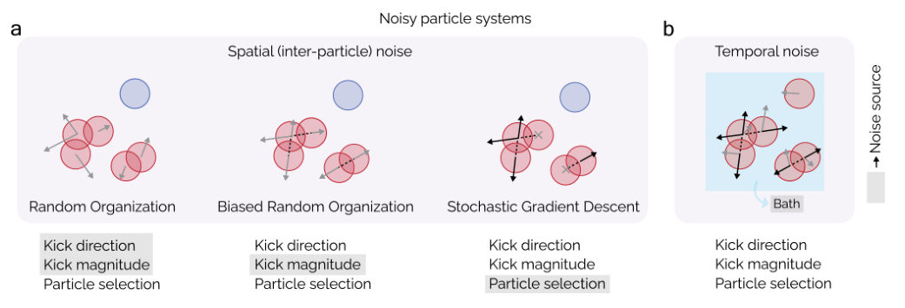
<figcaption class="paper-figure-caption"><b>Fig 1.</b> FIG. 1. Noisy particle systems. (a) Schematics of systems having spatial (inter-particle) noise—RO, BRO, and SGD (left to right). Particles shown in blue are free of overlaps, while those in red overlap with at least one particle. Gray crosses in SGD denote particles that are not selected for update. In the RO dynamics, both the direction and magnitude of particle displacements are stochastic; in BRO, randomness is only in the kick magnitude; and in SGD, noise enters solely through the selection of particles that are updated. (b) Schematic of a system having temporal noise. In this system, interacting passive particles are immersed in a non-equilibrium bath (light blue), modeled as a...</figcaption>
</figure>
<figure class="paper-figure-card">
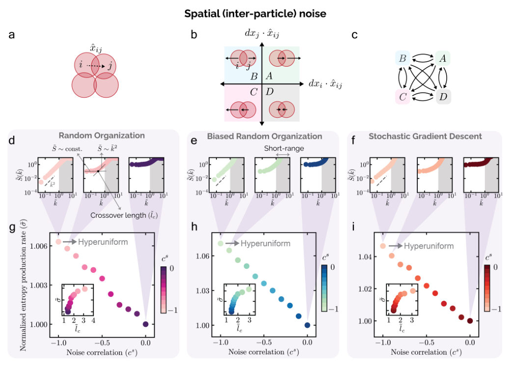
<figcaption class="paper-figure-caption"><b>Fig 2.</b> FIG. 2. Time-irreversibility and hyperuniformity in systems with spatial noise. To measure the EPR, we track overlapping particle pairs (a). We coarse-grain the dynamics into four states (A, B, C, D) based on the relative direction of motion within each particle pair (b). We then compute the EPR of the resulting four-state Markov process (c). The normalized, radially averaged structure factor eS(ek) plotted as a function of the normalized wavenumber ek for RO (d), BRO (e), and SGD (f). Here, eS = S(k)/S0(2π/L), where S0(2π/L) denotes the structure factor evaluated at k = 2π/L in the case of uncorrelated noise (cs = 0), and L is the system size. The dimensionless wavenumber is defined as ek...</figcaption>
</figure>
<figure class="paper-figure-card">
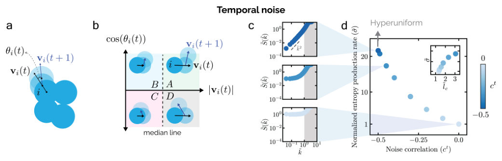
<figcaption class="paper-figure-caption"><b>Fig 3.</b> FIG. 3. Time-irreversibility and hyperuniformity in systems with temporal noise. To measure the EPR, we track the dynamics of particles across two consecutive time steps, t and t + 1. We coarse-grain the dynamics into four states (A, B, C, D) based on particle speed (fast or slow) and the angle between the velocities at t and t + 1 (persistent or reversing), and compute the corresponding EPR (b). (c) The normalized, radially averaged structure factor eS(ek) plotted as a function of the normalized wavenumber ek. Here, eS = S(k)/S0(2π/L), where S0(2π/L) denotes the structure factor evaluated at k = 2π/L in the case of uncorrelated noise (ct = 0), and L is the system size. The dimensionless...</figcaption>
</figure>
<figure class="paper-figure-card">
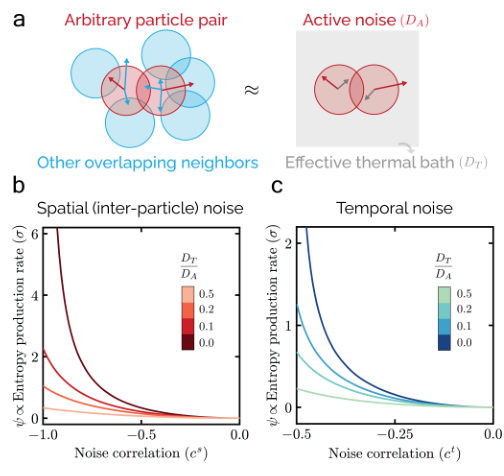
<figcaption class="paper-figure-caption"><b>Fig 4.</b> FIG. 4. Analytical entropy production rate. (a) Schematic depicting an arbitrarily chosen pair of particles (red) surrounded by several other overlapping particles (blue). The effect of the neighboring blue particles can be approxi- mated by a thermal bath. (b) The prefactor ψ ∼D−1 ij of the EPR plotted as a function of the inter-particle noise correla- tion coefficient cs (Eq. 5). (c) The prefactor ψ = σ/β ˙Wt of the EPR plotted as a function of the temporal noise correla- tion coefficient ct (Eq. 6).</figcaption>
</figure>

**Summary.** The paper investigates the energetic cost of forming hyperuniform structures in various noisy particle systems. By calculating the Entropy Production Rate (EPR) using advanced path integral methods, the authors demonstrate a universal finding: these ordered states are maximally irreversible. This establishes a quantitative link between emergent long-range structure and time asymmetry.

**Why it may be interesting.** This work provides a powerful, quantitative link between geometric order (long-range structure/hyperuniformity) and thermodynamic irreversibility ($	ext{EPR}$), which is highly relevant for understanding non-equilibrium steady states in complex physical systems.

Detailed structure

**Main problem.** The study aims to determine the energetic cost associated with self-assembling hyperuniform systems and establish a fundamental link between emergent long-range structure and time irreversibility.

**Main result.** All studied noisy particle systems exhibit maximal time-irreversibility, quantified by the Entropy Production Rate (EPR), precisely when they achieve a hyperuniform state. This establishes a direct energetic cost for maintaining this ordered, non-equilibrium structure.

**Method.** The authors combine numerical simulations with theoretical derivations, developing a path integral formulation to calculate the EPR directly from microscopic dynamics across various noise correlation structures.

**Model / system.** The models include noisy particle systems drawn from soft matter and machine learning contexts (e.g., RO, SGD), covering both inter-particle spatial noise correlations and active bath temporal noise correlations.

**Key observables.** Hyperuniformity (suppression of large-scale density fluctuations); Entropy Production Rate (EPR or $\sigma(t)$); Correlation coefficients ($c_s$ for space, $c_t$ for time).

**Important parameters / regimes.** Noise correlation coefficients ($	ext{cs}, 	ext{ct}$), which tune the system from equilibrium towards non-equilibrium steady states (NESS).

**Assumptions / limitations.** The analysis assumes that hyperuniformity can be induced by tuning noise correlations and focuses on quantifying the EPR as the measure of energetic cost.

**Figures summary.** Figures illustrate schematics for spatial noise systems (RO, BRO, SGD) and temporal noise systems in an active bath, setting up the physical models under investigation.

**Paper structure.** The paper progresses by first defining the problem—quantifying the energy cost of hyperuniformity. It then develops theoretical tools (path integral formulation for EPR) to analyze distinct noisy particle systems, culminating in the universal finding that maximal irreversibility coincides with hyperuniform structure.

Abstract

Hyperuniform systems, defined by the anomalous suppression of large-scale density fluctuations, are a paradigm of non-equilibrium self-assembly. While mechanisms underlying the self-assembly of hyperuniform states have been widely studied, the energetics of this process remain unexplored. This raises a fundamental question: what is the energetic cost of self-assembling a hyperuniform system? Here, we address this question across several noisy particle systems drawn from soft matter and machine learning, in which hyperuniformity can be induced by tuning noise correlations. Despite their distinct microscopic dynamics, we uncover a universal behavior across all systems: hyperuniform states are maximally irreversible, as quantified by the entropy production rate. Further, we develop a path integral formulation of the entropy production rate directly from the microscopic dynamics, which explains our observations. Our work establishes a direct link between emergent long-range structure and time irreversibility and opens a new avenue of probing the energetic cost of hyperuniform self-assembly, ubiquitous across physics, biology, and materials science.

[↑ back to top](#top)

### [Spectral Chaos Does Not Determine Quantum Mpemba Crossings](http://arxiv.org/abs/2607.07081v1)

**Authors:** Ri-Hua Zheng, Yang Xiao, Yu Wang, Ye-Hong Chen, Yan Xia  
**Type:** theory · **Category:** statistical mechanics · **PDF:** <https://arxiv.org/pdf/2607.07081v1>  
**Analysis basis:** full PDF text, analyzed in chunks
**Topic relevance:** 🔥 `non-equilibrium dynamics` **4/5** · `entanglement & information structure` **3/5** · `non-equilibrium universality` **3/5** · `driven-dissipative phase transition` **2/5** · `Keldysh / 2PI / non-Gaussian methods` **1/5** · `analog quantum simulation` **1/5** · `correlated / nonlocal dissipation` **1/5** · `exotic spin models in light-matter` **1/5** · `methods for driven-dissipative` **1/5** · `scars & prethermalization` **1/5**

↔ Scroll figures horizontally

<figure class="paper-figure-card">
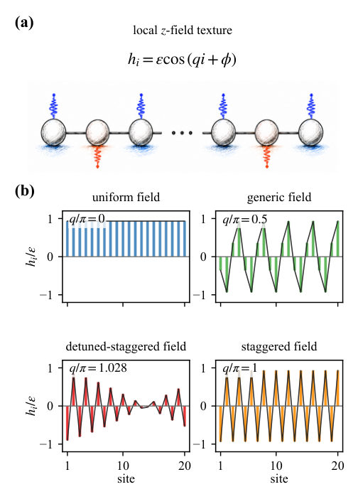
<figcaption class="paper-figure-caption"><b>Fig 1.</b> FIG. 1. Model and field textures. (a) Schematic of the structured longitudinal z-field hi applied to a clean U(1)- conserving XXZ chain. The upward blue and downward red arrows indicate the sign and spatial pattern of the local field bias; q sets its wave number, ϵ its amplitude, and ϕ a fixed offset relative to the open-chain boundaries. Because the per- turbation is longitudinal, it preserves total Sz. (b) Repre- sentative N = 20 field textures used throughout this work: uniform field (q = 0, same sign and magnitude on all sites), generic field (q/π = 0.5, non-staggered spatial modulation), detuned-staggered field (shown here with q/π = 1.028, near- staggered but incommensurate), and...</figcaption>
</figure>
<figure class="paper-figure-card">

<figcaption class="paper-figure-caption"><b>Fig 2.</b> FIG. 3. Selective relation between spectral chaos and raw quantum-Mpemba crossings. Each point combines ⟨r⟩and fcross for the same Hamiltonian at fixed ϵ = 1. Colors denote field texture and markers denote system size; all four textures are included at N = 20. Detuned-staggered fields remain without sustained crossings even in the GOE-like regime, while staggered fields cross away from it. Symmetry reso- lution and clean-window checks are detailed in the Supple- mental Material, Sec. S3 [50].</figcaption>
</figure>
<figure class="paper-figure-card">
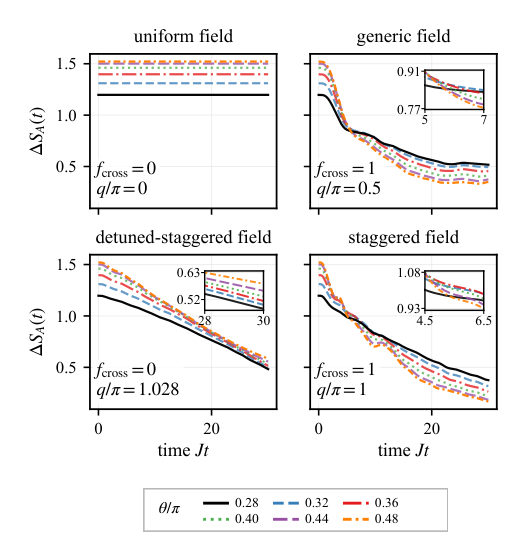
<figcaption class="paper-figure-caption"><b>Fig 3.</b> FIG. 2. Representative N = 20 entanglement-asymmetry dynamics. Lines correspond to tilted ferromagnetic product states with the six initial angles indicated by the discrete color legend; all four panels use the exchange-scale field strength ϵ = 1. The generic and staggered fields have fcross = 1, while the detuned-staggered control has fcross = 0. The insets magnify the crossing windows in the generic and staggered panels and the late-time window where the detuned-staggered curves are closest but remain ordered.</figcaption>
</figure>
<figure class="paper-figure-card">
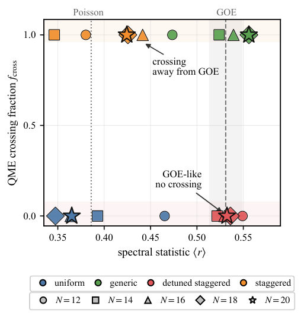
<figcaption class="paper-figure-caption"><b>Fig 4.</b> Figure 3 compares the spectral and QME responses at fixed ϵ = 1. The raw crossing response is texture- selective, not controlled by a universal threshold in ⟨r⟩: generic and staggered textures form the crossing class, while uniform and detuned-staggered textures do not. These classes nevertheless overlap spectrally. The generic and detuned-staggered sets both include GOE-like spec- tra despite opposite crossing responses, and the stag- gered set crosses away from the GOE reference. The generic texture therefore provides a positive structured- field benchmark and the detuned-staggered texture the corresponding negative control. No single ⟨r⟩separates the two responses; the field texture...</figcaption>
</figure>
<figure class="paper-figure-card">
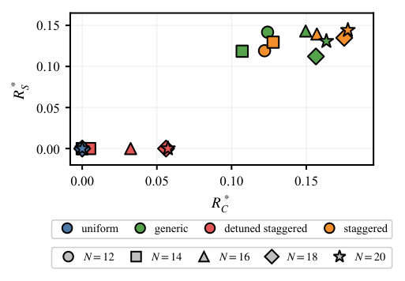
<figcaption class="paper-figure-caption"><b>Fig 5.</b> FIG. 4. Local charge-coherence inversion versus entropic or- dering. Each point combines R∗ C and R∗ S for the same Hamil- tonian at fixed ϵ = 1; colors denote texture and markers de- note size. Uniform points lie at the origin, generic and stag- gered points are nonzero on both axes, and detuned-staggered points retain R∗ S = 0 as R∗ C grows. Total charge-coherence inversion is therefore not sufficient for an entanglement- asymmetry Mpemba crossing.</figcaption>
</figure>

**Summary.** This theoretical work examines the relationship between spectral chaos and the quantum Mpemba effect in a spin chain model. The authors demonstrate that while spectral statistics can be calculated, they fail to predict whether an initial local ordering reversal (Mpemba crossing) will occur. Instead, the crossing behavior is shown to depend specifically on how local charge-sector coherence evolves within the reduced density matrix.

**Why it may be interesting.** It provides a detailed, quantitative separation between global spectral properties (chaos) and local, state-dependent dynamics (coherence flow), which is crucial for understanding non-equilibrium quantum thermalization.

Detailed structure

**Main problem.** The study investigates whether spectral chaos, diagnosed by level statistics, is a sufficient condition to determine the occurrence of a quantum Mpemba crossing during symmetry restoration.

**Main result.** Spectral chaos alone does not dictate the existence of Mpemba crossings; instead, the crossing response is governed by how local charge-sector coherence enters the reduced density matrix.

**Method.** The authors compare two distinct diagnostics—global spectral level statistics (adjacent-gap ratio) against state-resolved measures like entanglement asymmetry and charge-sector coherence inversion depth.

**Model / system.** The system analyzed is a clean U(1)-conserving spin chain, modeled by an XXZ Hamiltonian perturbed by a longitudinal field texture ($h_i = \epsilon \cos(qi + \phi)$).

**Key observables.** Quantum Mpemba Crossing fraction ($f_{cross}$), Entanglement Asymmetry ($\Delta S_A$), and the adjacent-gap ratio ($\langle r 
angle$).

**Important parameters / regimes.** System size $N$ (up to 20), field texture parameters ($q, \phi$), and time evolution duration $T$.

**Assumptions / limitations.** The analysis compares results across various field textures (generic vs. detuned-staggered) to isolate the controlling physical mechanism.

**Figures summary.** Figures compare $\langle r 
angle$ against $f_{cross}$ for different field types, showing that distinct patterns emerge depending on whether the coherence or asymmetry is tracked.

**Paper structure.** The paper systematically compares three diagnostics ($\langle r 
angle$, total coherence $C_A(t)$, and entropy-weighted asymmetry $\Delta S_A$) across various field textures to establish a hierarchy of control over the Mpemba crossing phenomenon.

Abstract

In a symmetry-restoration quantum Mpemba effect, an initial state with stronger local symmetry breaking can lose that memory faster than a state that starts closer to the symmetric manifold. We test whether this local ordering reversal is organized by chaotic thermalization in a clean U(1)-conserving spin chain, comparing spectral level statistics with crossings of the entanglement asymmetry for the same Hamiltonians. We find that Gaussian orthogonal ensemble (GOE)-like level statistics alone do not determine whether Mpemba crossings occur. Across field textures, GOE-like spectra can occur with or without entanglement-asymmetry crossings, and crossings can also appear away from the GOE reference. A near-staggered detuned control further shows that even an inversion of the total charge-sector coherence need not produce an entanglement-asymmetry crossing. Thus the crossing response is controlled not by spectral chaos alone, but by how local charge-sector coherence enters the reduced density matrix.

[↑ back to top](#top)

### [Taming nonlinear energy diffusion: The case of time-crystal energy condensates](http://arxiv.org/abs/2607.07325v1)

**Authors:** P. I. Hurtado, G. Cortés-Guillén  
**Type:** theory · **Category:** statistical mechanics · **PDF:** <https://arxiv.org/pdf/2607.07325v1>  
**Analysis basis:** full PDF text, analyzed in chunks
**Topic relevance:** 🔥 `driven-dissipative phase transition` **4/5** · `methods for driven-dissipative` **3/5** · `non-equilibrium dynamics` **3/5** · `non-equilibrium universality` **3/5** · `analog quantum simulation` **2/5** · `Frenkel-Kontorova` **1/5** · `Keldysh / 2PI / non-Gaussian methods` **1/5** · `correlated / nonlocal dissipation` **1/5**

↔ Scroll figures horizontally

<figure class="paper-figure-card">
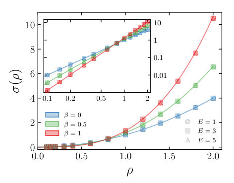
<figcaption class="paper-figure-caption"><b>Fig 1.</b> FIG. 1. Main panel: Mobility transport coefficient σ(ρ) as a function of the density, measured in kinetic Monte Carlo simulations of the driven nonlinear energy diffu- sion model on a periodic 1d lattice with L = 200 sites. Different symbols correspond to external fields E = 1 (⃝), E = 3 (□) and E = 5 (△), while different colors indicate the nonlinearity exponent β = 0, 0.5 and 1. In- set: the same data in log-log scale, to highlight the power law behavior σ(ρ) ∼ρβ+2.</figcaption>
</figure>
<figure class="paper-figure-card">
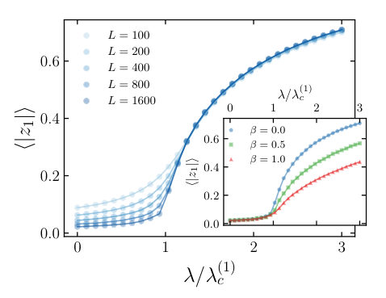
<figcaption class="paper-figure-caption"><b>Fig 2.</b> FIG. 2. Main: Packing order parameter ⟨|z1|⟩as a func- tion of the reduced coupling λ/λ(1) c measured in simula- tions for β = 0, ρ0 = 1/3, E0 = 10 and different values of L. Inset: ⟨|z1|⟩vs λ/λ(1) c measured for L = 1600, vary- ing β = 0, 0.5, 1.0 and the same ρ0 = 1/3 and E0 = 10. Error bars smaller than symbol sizes in all cases.</figcaption>
</figure>
<figure class="paper-figure-card">
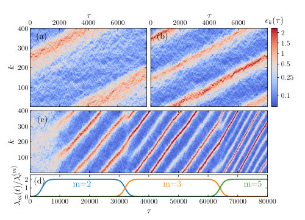
<figcaption class="paper-figure-caption"><b>Fig 3.</b> FIG. 4. Spatiotemporal raster plots illustrating the dy- namics of the energy field for the nonlinear energy dif- fusion model driven by different packing fields. All pan- els correspond to steady-state trajectories for ρ0 = 1/3, β = 0 and L = 400. Panels (a) and (b) show the system response to m = 1, 2 packing fields, respectively, with reduced coupling λ/λ(m) c = 2 for constant field E0 = 20. Panel (c) displays the system response to a dynamic su- perposition of different packing fields, see Eq. (32), with reduced amplitudes modulated in time as shown in panel (d), for E0 = 10.</figcaption>
</figure>
<figure class="paper-figure-card">
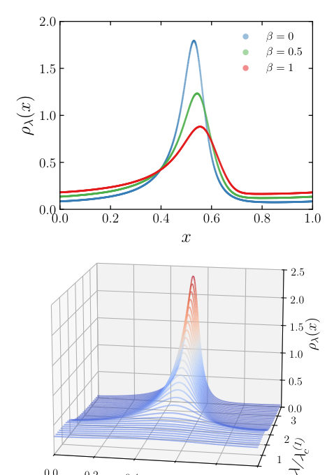
<figcaption class="paper-figure-caption"><b>Fig 4.</b> FIG. 3. Top panel: Average energy density field ρλ(x) around the center of mass for supercritical coupling λ/λ(1) c = 2.379 and different nonlinearity exponents β = 0, 0.5, 1.0, as measured in simulations for L = 1600, ρ0 = 1/3 and E0 = 10. Error bars are smaller than sym- bol sizes. Bottom panel: Evolution of the average energy density field (centered around the instantaneous center of mass) with the reduced coupling λ/λ(1) c measured for β = 0, L = 800, ρ0 = 1/3 and E0 = 10.</figcaption>
</figure>

**Summary.** This paper develops a theoretical framework to study nonlinear energy diffusion driven internally within a many-body system, using a modified KMP model. By applying an engineered bulk driving field, the authors show they can actively control energy transport and induce stable, time-crystalline condensates. This offers a powerful tool for understanding and engineering non-equilibrium dynamics in complex physical media.

**Why it may be interesting.** The connection between controlled non-equilibrium driving (the 'packing field') and the emergence of long-range temporal order (time crystals) provides a powerful analogy for engineering coherent quantum states or controlling dissipation in open quantum systems.

Detailed structure

**Main problem.** The study focuses on controlling nonlinear energy diffusion in stochastic many-body systems by implementing a bulk driving mechanism, moving beyond traditional boundary-driven approaches.

**Main result.** The work demonstrates that appropriately designed external fields can induce the spontaneous formation of traveling energy condensates exhibiting robust long-range temporal order, characteristic of continuous time crystals.

**Method.** The analysis derives the hydrodynamic description from a microscopic master equation using a local equilibrium approximation and validates findings via kinetic Monte Carlo simulations.

**Model / system.** The system is a bulk-driven nonlinear variant of the Kipnis-Marchioro-Presutti (KMP) model for stochastic energy diffusion on a 1D lattice, where collisions are biased to induce a net energy flow in the bulk.

**Key observables.** Energy current, diffusivity $D(
ho)$, mobility $\sigma(
ho)$, and the formation/evolution of traveling energy condensates.

**Important parameters / regimes.** The external driving field strength ($\chi$ or $E$), local energy density ($
ho$), and parameters controlling the packing fields ($\lambda_m$).

**Assumptions / limitations.** The derivation relies on the local equilibrium approximation, and the hydrodynamic limit ($L 	o \infty$) is taken for macroscopic descriptions.

**Figures summary.** Figures illustrate condensate profile evolution under varying driving strengths ($eta$), showing critical points signaling structure emergence, and spatiotemporal raster plots demonstrating steady-state trajectories with multiple packing fields applied.

**Paper structure.** The paper progresses from establishing the microscopic master equation for bulk-driven diffusion to deriving macroscopic transport coefficients via local equilibrium approximation. It then applies this framework to show how engineered driving fields can stabilize time-crystalline phases, culminating in a discussion of systematic control over energy dynamics.

Abstract

We study a bulk-driven nonlinear variant of the Kipnis-Marchioro-Presutti model of stochastic energy diffusion in which local collisions are biased to induce a net energy flow, resembling the effect of an external field. Starting from the microscopic master equation, we derive the hydrodynamic description of the driven system via a local equilibrium approximation, obtaining explicit expressions for the energy current and the associated diffusivity and mobility transport coefficients, which are nonlinear functions of the local energy density. We test our findings in kinetic Monte Carlo simulations of the model and, as a proof of concept, we demonstrate the versatility of this driving mechanism to control nonlinear energy transport by inducing time-crystalline phases. In particular, we show that appropriately designed packing fields induce the spontaneous formation of traveling energy condensates, exhibiting robust long-range temporal order reminiscent of continuous time crystals. Our results provide a simple yet powerful framework to study bulk-driven nonlinear energy diffusion in stochastic many-body systems, offering a bridge between microscopic dynamics, macroscopic transport, and controlled spatiotemporal order.

[↑ back to top](#top)

### [Turing mechanisms in a multimode open quantum system](http://arxiv.org/abs/2607.07449v1)

**Authors:** Giorgia Comparato, Francesco Gargano, Rosario Lo Franco  
**Type:** theory · **Category:** statistical mechanics · **PDF:** <https://arxiv.org/pdf/2607.07449v1>  
**Analysis basis:** full PDF text, analyzed in chunks
**Topic relevance:** 🔥 `driven-dissipative phase transition` **4/5** · `correlated / nonlocal dissipation` **3/5** · `methods for driven-dissipative` **3/5** · `non-equilibrium dynamics` **3/5** · `non-equilibrium universality` **2/5** · `Frenkel-Kontorova` **1/5** · `Keldysh / 2PI / non-Gaussian methods` **1/5** · `analog quantum simulation` **1/5**

↔ Scroll figures horizontally

<figure class="paper-figure-card">
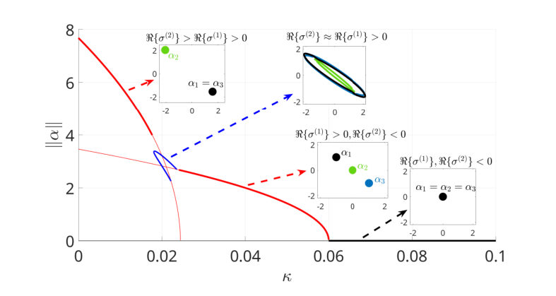
<figcaption class="paper-figure-caption"><b>Fig 1.</b> Figure 1. Bifurcation diagram of the deterministic model of Eq. (6) for N = 3 sites, obtained by numerical continuation in the parameter κ in the squeezing-dominant regime η ≥|∆|/2. System parameters: ∆= 0.05, γ1 = 0.03, γ2 = 0.005, θ = π, η = 0.025, λ = 0.08. The vertical axis represents the norm ∥α∥of the stationary solution. Thick (thin) black lines denote stable (unstable) null equilibrium, whereas red curves represent stationary non–homogeneous solutions emerging via Turing instability. The blue branch indicates a time–periodic (oscillatory) spatial pattern arising when two non-uniform eigenmodes have similar positive growth rates. The inset shows representative spatial configurations...</figcaption>
</figure>
<figure class="paper-figure-card">
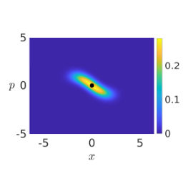
<figcaption class="paper-figure-caption"><b>Fig 2.</b> Figure 2. Reduced Wigner functions in the phase space (x, p) = (Re{α}, Im{α}) for the three–site quantum system in the absence of nonlocal couplings (λ = κ = 0). Since the sites are dynamically decoupled, the reduced Wigner functions coincide, W1 = W2 = W3. The parameters are ∆= 0.05, γ1 = 0.03, γ2 = 0.005, θ = π, and η = 0.025. The black dot marks the homogeneous null solution for the deterministic model.</figcaption>
</figure>
<figure class="paper-figure-card">
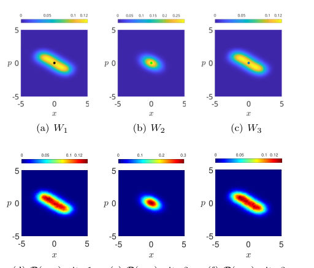
<figcaption class="paper-figure-caption"><b>Fig 3.</b> Figure 3. (a)-(c) Reduced Wigner functions for the three- site quantum system for the system parameters ∆= 0.05, γ1 = 0.03, γ2 = 0.005, θ = π, η = 0.025, λ = 0.08, κ = 0.08, corresponding to the stable homogeneous stationary branch of the deterministic bifurcation diagram in Fig. 1. The distributions W1 and W3 almost coincide and exhibit a barely visible bimodal structure precursor of the nearby patterned solution obtained for lower values of κ. The distribution function W2 remains unimodal and concentrated at α2 = 0. (d)-(f) Density distributions P(x, p) derived from the SDE for each site.</figcaption>
</figure>
<figure class="paper-figure-card">
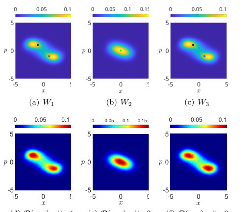
<figcaption class="paper-figure-caption"><b>Fig 4.</b> Figure 4. (a)-(c) Reduced Wigner functions for the three- site quantum system for the system parameters ∆= 0.05, γ1 = 0.03, γ2 = 0.005, θ = π, η = 0.025, λ = 0.08, κ = 0.04, corresponding to the first non-uniform stationary branch of the deterministic bifurcation diagram in Fig. 1. The distributions W1 and W3 almost coincide and exhibit a bimodal structure with peaks located near the deterministic stationary values α1 = −α3 = ±(−1+1i), reflecting the underlying Z2 symmetry of the dynamics. The reduced Wigner function W2 remains unimodal and centered at α2 = 0. The deterministic values are represented by the black, green, and blue dots. (d)-(f) Density distributions P(x, p) derived from the...</figcaption>
</figure>
<figure class="paper-figure-card">
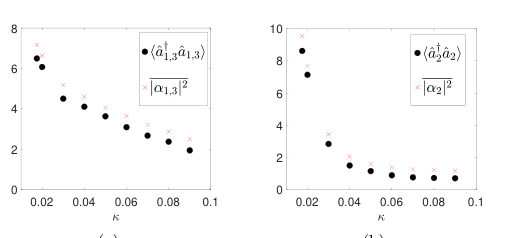
<figcaption class="paper-figure-caption"><b>Fig 5.</b> Figure 6. (a) The quantum mean phonon number for sites 1 and 3 (denoted by ⟨ˆa† 1,3ˆa1,3⟩, black dots) plotted alongside the semiclassical averaged squared amplitude determined from the SDE (|α1,3|2, red crosses). (b) A similar comparison for site 2. In both cases, the numerical results show a constant shift of approximately 1/2, confirming that the SDE provides a good approximation of the full QME in the weak quantum regime. The fixed parameters used for the simulations are ∆= 0.05, γ1 = 0.03, γ2 = 0.005, θ = π, η = 0.025, and λ = 0.08, while κ is varied.</figcaption>
</figure>

**Summary.** This paper analyzes pattern formation in an open quantum system modeled as a bosonic chain subject to local and nonlocal dissipation. By deriving mean-field equations from the GKSL master equation, the authors show that Turing instabilities can emerge, allowing for the selection of stable spatial patterns. This connects nonlinear dynamics theory with dissipative quantum mechanics.

**Why it may be interesting.** This work provides a crucial theoretical bridge by demonstrating how classical pattern formation mechanisms (Turing instabilities) can be rigorously mapped onto the dynamics of open quantum systems, which is highly relevant for understanding dissipative quantum matter.

Detailed structure

**Main problem.** The study investigates pattern formation, specifically Turing instabilities, within a multimode open quantum system.

**Main result.** The analysis successfully extends the concept of Turing instability and mode competition to open quantum systems, showing that spatial self-organization can emerge from dissipative quantum dynamics.

**Method.** The approach involves deriving mean-field equations for field amplitudes ($\langle \hat{a}_j 
angle$) from the full GKSL master equation, followed by linear stability analysis of these resulting reaction-diffusion-like systems.

**Model / system.** The system is a finite chain of bosonic modes (at least three sites) whose dynamics are governed by a GKSL master equation incorporating local parametric driving and both short-range ($\lambda$) and long-range ($\kappa$) nonlinear dissipative couplings.

**Key observables.** Field amplitudes ($\alpha_j$), reduced Wigner functions, and the stability eigenvalues of the linearized system.

**Important parameters / regimes.** Nonlocal coupling strengths ($\lambda, \kappa$), detuning ($\Delta$), and parametric drive ($\eta$).

**Assumptions / limitations.** The analysis relies on deriving a semiclassical mean-field approximation from the full quantum master equation; comparisons are made between this deterministic limit and the full quantum evolution.

**Paper structure.** The paper progresses by defining the complex open quantum system dynamics via the GKSL master equation, deriving the corresponding reaction-diffusion mean-field equations, performing linear stability analysis to identify Turing instability conditions, and finally comparing these deterministic results with full quantum simulations using Wigner functions.

Abstract

We investigate pattern formation in a finite chain of bosonic modes whose dynamics is governed by a Gorini-Kossakowski-Sudarshan-Lindblad (GKSL) master equation. The model combines local parametric driving and nonlinear damping with nonlocal dissipative couplings between modes that work on different discrete spatial scales. In the classical limit, these mechanisms generate a reaction-diffusion-like dynamics, allowing the emergence of Turing-type instabilities. The key aspect of the analysis is the coexistence and competition of different unstable spatial modes. Depending on the range of parameters, the system may select different stationary nonuniform configurations, oscillatory wave-like states, or regimes in which multiple modes interact before a dominant pattern is established, thus providing a mechanism for pattern selection. We compare the deterministic bifurcation scenario, generated by a reaction-diffusion-like system derived from semiclassical drift dynamics, with the quantum dynamics, derived via the GKSL master equation, using phase-space methods and reduced Wigner functions. The results show how Turing instabilities, mode competition, and pattern selection can be extended to multimode open quantum systems, providing a bridge between nonlinear dynamical systems, dissipative quantum mechanics, and spatial self-organization.

[↑ back to top](#top)

### [Density-Induced Reentrant Coarsening in a Two-Temperature System](http://arxiv.org/abs/2607.07113v1)

**Authors:** Partha Sarathi Mondal, Anish Kumar, Nayana Venkatareddy, Prabal K. Maiti, Shradha Mishra  
**Type:** theory · **Category:** statistical mechanics · **PDF:** <https://arxiv.org/pdf/2607.07113v1>  
**Analysis basis:** full PDF text, analyzed in chunks
**Topic relevance:** 🔥 `non-equilibrium dynamics` **4/5** · 🔥 `non-equilibrium universality` **4/5** · `driven-dissipative phase transition` **3/5** · `methods for driven-dissipative` **3/5** · `Keldysh / 2PI / non-Gaussian methods` **1/5** · `analog quantum simulation` **1/5** · `correlated / nonlocal dissipation` **1/5**

↔ Scroll figures horizontally

<figure class="paper-figure-card">
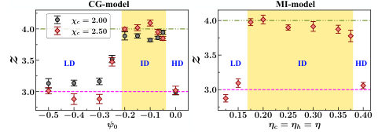
<figcaption class="paper-figure-caption"><b>Fig 1.</b> FIG. 1. The variation of the late time growth exponent zLT from the CG-model in (a) and the MI-model in (b).</figcaption>
</figure>
<figure class="paper-figure-card">
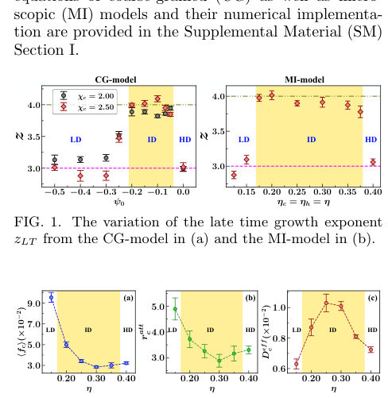
<figcaption class="paper-figure-caption"><b>Fig 2.</b> FIG. 2. Average fraction of cold particles outside the clus- ters, ⟨fc⟩in (a), average attachment rate of cold particles from outside the clusters to the cluster interface, ratt c in (b), and effective diffusivity Deff c in (c) as functions of the packing fraction η obtained from microscopic simulations.</figcaption>
</figure>
<figure class="paper-figure-card">
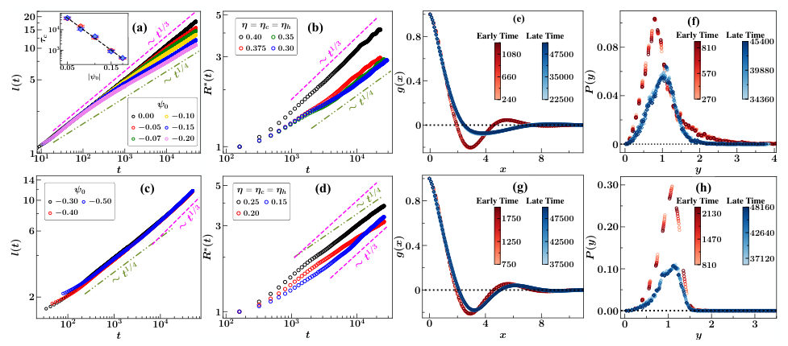
<figcaption class="paper-figure-caption"><b>Fig 3.</b> FIG. 3. (a) l(t) vs. t from the CG-model for different off-criticalities ψ0 at χc = 2.50 in the HD →ID regime. (Inset) Crossover time τc vs. |ψ0|; dashed line indicates the power-law fit τc ∼|ψ0|3.30; (b) R∗(t) vs. t from the MI-model for different densities at χm = 16.60 in the HD →ID regime; (c) l(t) vs. t from the CG-model for various ψ0 at χc = 2.00 in the ID →LD regime; (d) R∗(t) vs. t from the MI-model for different densities at χm = 16.60 in the ID →LD regime. The standard deviation in the value of l(t) and R∗(t) obtained over independent realizations is of the size of the symbols in the respective cases. Scaled two-point correlation function g(x) vs x = r/l(t) [(e),(g)] and scaled...</figcaption>
</figure>
<figure class="paper-figure-card">
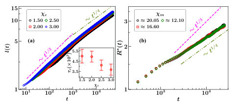
<figcaption class="paper-figure-caption"><b>Fig 4.</b> FIG. 4. (a) Plot of l(t) vs. t plot for different activity χc from the CG-model at ψ0 = −0.10 in the ID regime. (inset) plot of crossover time τc vs. activity χc; (b) shows the R∗(t) vs. t for different activity χm from the MI-model at η = 0.30 in the ID regime. The rest of the parameters for the CG and MI models are the same as in Fig.3.</figcaption>
</figure>
<figure class="paper-figure-card">
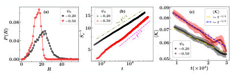
<figcaption class="paper-figure-caption"><b>Fig 5.</b> FIG. 5. Comparison of morphological characteristics from the CG-model for different off-criticality ψ0 = −0.20, and −0.50 for activity χ = 2.00. (a) shows the plot of cluster size distribution P(R) vs. R. (b) shows time evolution of S−1 v . Panel (c) shows the time evolution of mean curvature ⟨K⟩. The rest of the parameters for the CG and MI models are the same as in Fig.3.</figcaption>
</figure>

**Summary.** This work analyzes phase separation kinetics in a two-temperature system, revealing that the coarsening rate depends critically on particle density. The study finds a reentrant behavior where the growth exponent changes from $t^{1/3}$ to $t^{1/4}$ and back, dictated by whether transport is limited by diffusion or attachment kinetics.

**Why it may be interesting.** The concept of density controlling the universality class of domain growth in a non-equilibrium setting provides insights into how external parameters can fundamentally alter many-body dynamics, which is relevant for understanding driven quantum systems.

Detailed structure

**Main problem.** The study investigates how non-equilibrium driving modifies phase-separation kinetics, specifically focusing on density control over domain coarsening pathways.

**Main result.** The system exhibits a striking density-induced reentrant coarsening behavior, where the growth exponent cycles through $t^{1/3} 
ightarrow t^{1/4} 
ightarrow t^{1/3}$ as density changes.

**Method.** The research employs both coarse-grained field-theoretic modeling and microscopic Brownian dynamics simulations to analyze domain evolution.

**Model / system.** The system is a two-temperature mixture undergoing phase separation, modeled using coupled dynamics for 'hot' and 'cold' species. The analysis tracks the interplay between particle diffusivity, availability, and attachment kinetics.

**Key observables.** Characteristic domain size growth law $L(t) \sim t^{1/z}$, structure factor $S(k, t)$, and various transport metrics like effective diffusivity ($D_{	ext{eff}, c}$) and attachment rate ($	ext{ratt}_c$).

**Important parameters / regimes.** Density ($\psi_0$) acts as the key control parameter, defining three distinct regimes: High Density (HD), Intermediate Density (ID), and Low Density (LD).

**Assumptions / limitations.** The analysis is primarily conducted in an overdamped limit; future work may incorporate inertial effects.

**Figures summary.** Figures illustrate the reentrant growth exponent dependence on density, showing distinct scaling regimes for correlation functions and cluster statistics corresponding to different physical mechanisms (diffusion-limited vs. attachment-rate limited).

**Paper structure.** The paper systematically analyzes coarsening kinetics across varying densities, identifying three distinct transport-governed regimes (HD $
ightarrow$ ID $
ightarrow$ LD) that dictate the growth exponent sequence.

Abstract

Understanding how nonequilibrium driving modifies phase-separation kinetics remains a fundamental challenge. Here we show that phase separation in a two-temperature system exhibits a striking density-induced reentrant coarsening behavior. Using Brownian dynamics simulations and a coarse-grained field-theoretic model, we find that the characteristic domain size grows as $L(t)\sim t^{1/z}$, displaying a reentrant sequence $(t^{1/3} \rightarrow t^{1/4}\rightarrow t^{1/3})$ with increasing density. While the low- and high-density regimes are governed by classical curvature-driven bulk diffusion, the intermediate-density regime exhibits anomalously slow growth. We show that this slowdown originates from a transport bottleneck arising from the interplay of particle diffusivity, particle availability, and attachment kinetics, which suppresses the effective mass flux between domains. Unlike equilibrium phase separation, where density primarily affects morphology and crossover scales, the two-temperature drive renders density a key control parameter for coarsening pathways. Our results uncover a nonequilibrium mechanism for anomalous domain growth in two-temperature systems.

[↑ back to top](#top)

### [Does Born Rule Imply Unitarity of Time Evolution in Quantum Mechanics?](http://arxiv.org/abs/2607.07560v1)

**Authors:** Ali Mostafazadeh  
**Type:** theory · **Category:** other · **PDF:** <https://arxiv.org/pdf/2607.07560v1>  
**Analysis basis:** full PDF text, analyzed in chunks
**Topic relevance:** 🔥 `quantum measurements` **4/5** · `measurement-induced transitions` **3/5** · `driven-dissipative phase transition` **2/5** · `Keldysh / 2PI / non-Gaussian methods` **1/5** · `Kondo & dissipative impurity` **1/5** · `analog quantum simulation` **1/5** · `correlated / nonlocal dissipation` **1/5** · `entanglement & information structure` **1/5** · `methods for driven-dissipative` **1/5** · `non-equilibrium dynamics` **1/5**

↔ Scroll figures horizontally

<figure class="paper-figure-card">
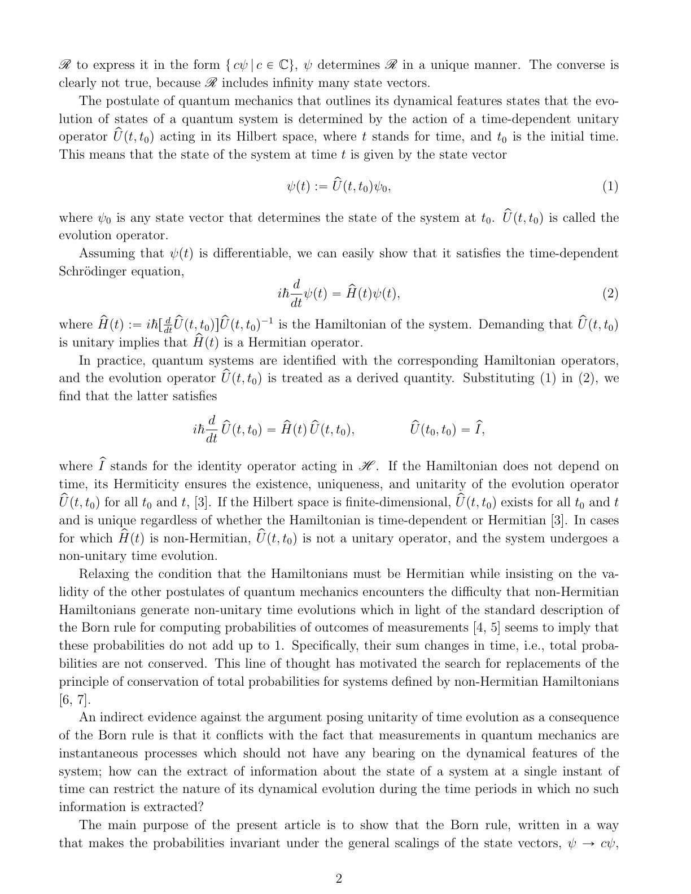
<figcaption class="paper-figure-caption"><b>Fig 1.</b> Low-resolution page preview, page 2</figcaption>
</figure>
<figure class="paper-figure-card">
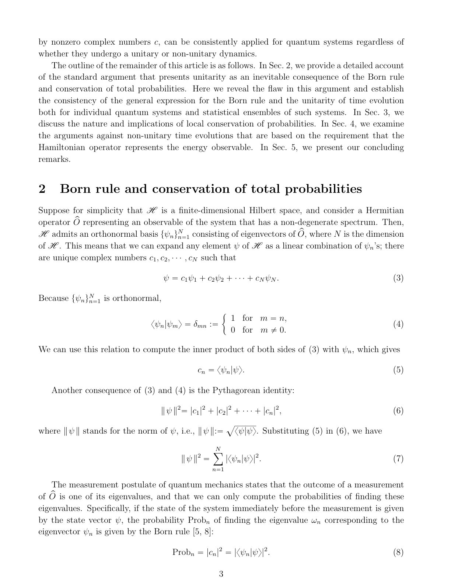
<figcaption class="paper-figure-caption"><b>Fig 2.</b> Low-resolution page preview, page 3</figcaption>
</figure>
<figure class="paper-figure-card">
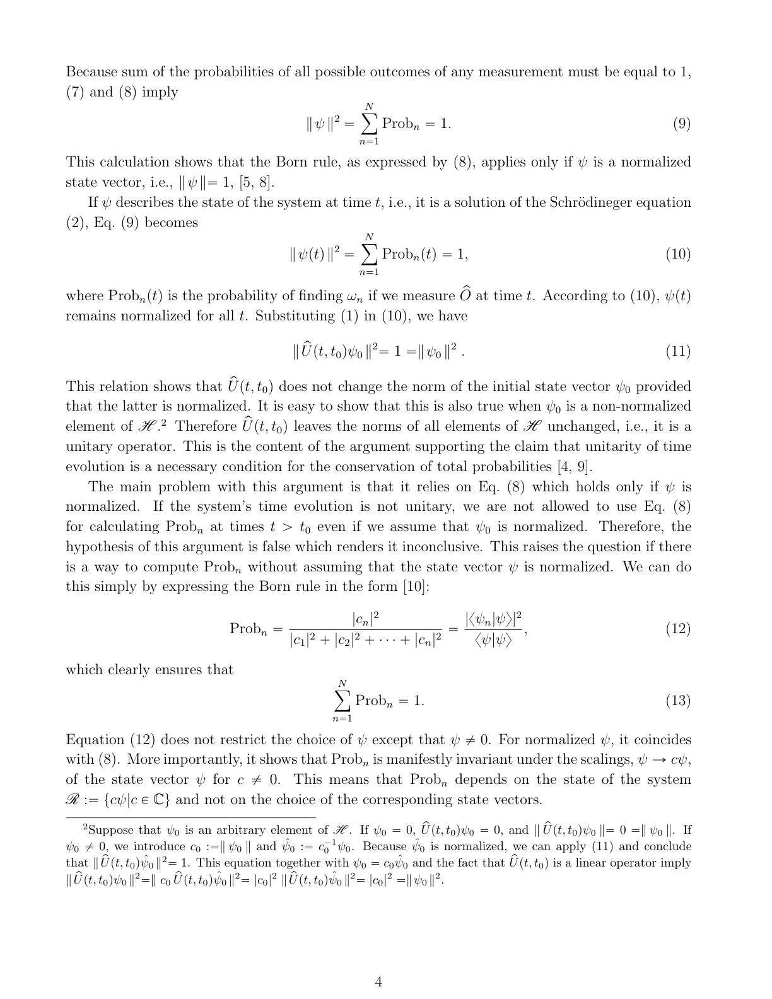
<figcaption class="paper-figure-caption"><b>Fig 3.</b> Low-resolution page preview, page 4</figcaption>
</figure>
<figure class="paper-figure-card">
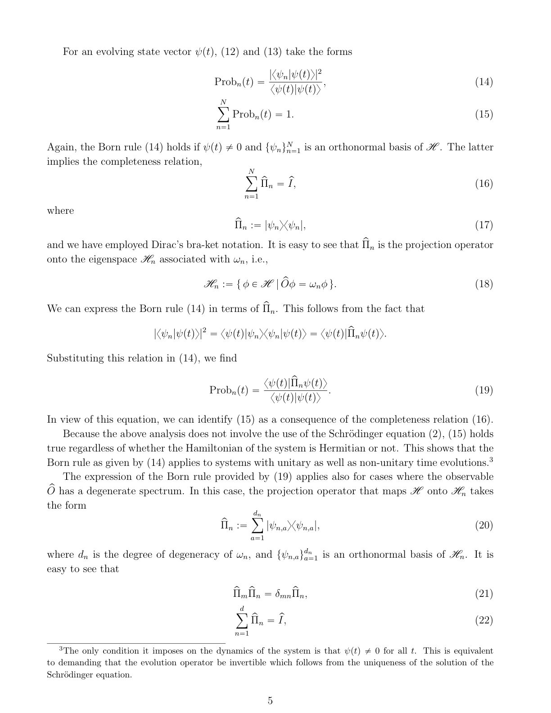
<figcaption class="paper-figure-caption"><b>Fig 4.</b> Low-resolution page preview, page 5</figcaption>
</figure>
<figure class="paper-figure-card">
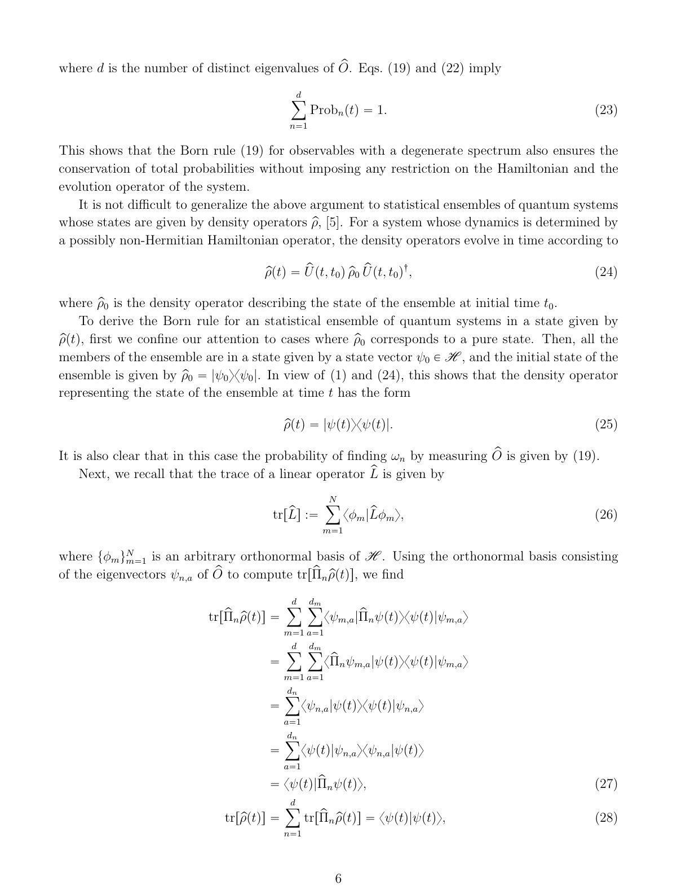
<figcaption class="paper-figure-caption"><b>Fig 5.</b> Low-resolution page preview, page 6</figcaption>
</figure>

**Summary.** This paper investigates whether the Born rule inherently requires that quantum time evolution be unitary. It demonstrates that the standard textbook argument is flawed because probability conservation can hold even for non-unitary dynamics when a generalized form of the Born rule is employed. The findings suggest a necessary distinction between local probability conservation and global probability normalization in open or non-Hermitian systems.

**Why it may be interesting.** This work is highly relevant as it tackles foundational issues regarding the measurement postulate and time evolution structure, which underpin all quantum dynamics models used in AMO physics and open system descriptions.

Detailed structure

**Main problem.** The central question is whether the Born rule, which governs measurement probabilities, necessitates that quantum time evolution must be unitary.

**Main result.** The standard argument linking the Born rule to unitarity is flawed; probability conservation can be maintained even with non-unitary dynamics by using a generalized form of the Born rule. The requirement for local probability conservation in position space suggests Hermiticity but does not prove it.

**Method.** The analysis involves deriving and comparing different forms of the Born rule for pure and mixed states, extending to non-Hermitian Hamiltonians, and analyzing continuity equations for probability densities.

**Model / system.** The paper considers general quantum mechanical systems in a complex Hilbert space, ranging from pure state evolution governed by $\psi$ to ensemble dynamics described by density operators $
ho$. It examines the implications of measurement probabilities across both unitary and non-unitary time evolutions.

**Key observables.** Probability of measuring eigenvalue $P_{Born}$, total probability conservation ($\sum P = 1$), localization probability density $\varrho_{px, tq}$, and expectation values of observables $\langle \psi | p_O | \psi 
angle$.

**Important parameters / regimes.** The analysis is sensitive to whether the Hamiltonian is Hermitian or if the state vector/density operator is normalized.

**Assumptions / limitations.** The standard argument assumes a normalized state vector ($\|\psi\|=1$) and that all physical observables must have real expectation values, which leads to assumptions about Hermiticity.

**Figures summary.** Not specified in the notes; the analysis relies on mathematical derivations of probability formulas (Eq. 12, Eq. 19, Eq. 29) and continuity equations (Eq. 52).

**Paper structure.** The paper progresses by first presenting the standard flawed argument linking Born rule to unitarity. It then generalizes the Born rule for non-unitary dynamics using scaling factors. Finally, it contrasts this with local conservation laws in position space, which suggest Hermiticity but are shown to be distinct from the general probability conservation.

Abstract

The Born rule for computing probabilities of the outcomes of measurements is an indispensable ingredient of quantum mechanics. The standard textbook description of this rule gives the impression that it implies the unitarity of time evolution. This view relies on the argument that unless the dynamics is unitary, the probabilities of finding all possible outcomes of a measurement do not add up to 1, i.e., the total probability is not conserved. We show that this argument is flawed, and that the general expression for the Born rule ensures the conservation of total probabilities even when the dynamics of a quantum system is not unitary. This applies to the dynamics of ensembles of quantum systems in both pure and mixed states. We discuss the status of the local conservation of probabilities and the arguments against the plausibility of non-unitary time evolutions that are based on the identification of the Hamiltonian operator with the energy observable.

[↑ back to top](#top)

### [Quantum simulation of real-world nonlinear dynamics via Koopman method](http://arxiv.org/abs/2607.07338v1)

**Authors:** Baoyang Zhang, Dong An, Zhaoyuan Meng, Yefei Yu, Xiaoxiao Xiao, Zhen Lu, Yue Yang  
**Type:** both · **Category:** numerical methods · **PDF:** <https://arxiv.org/pdf/2607.07338v1>  
**Analysis basis:** full PDF text, analyzed in chunks
**Topic relevance:** 🔥 `QC/QI experiment` **4/5** · `methods for driven-dissipative` **3/5** · `non-equilibrium dynamics` **3/5** · `analog quantum simulation` **2/5** · `driven-dissipative phase transition` **2/5** · `correlated / nonlocal dissipation` **1/5** · `non-equilibrium universality` **1/5**

↔ Scroll figures horizontally

<figure class="paper-figure-card">
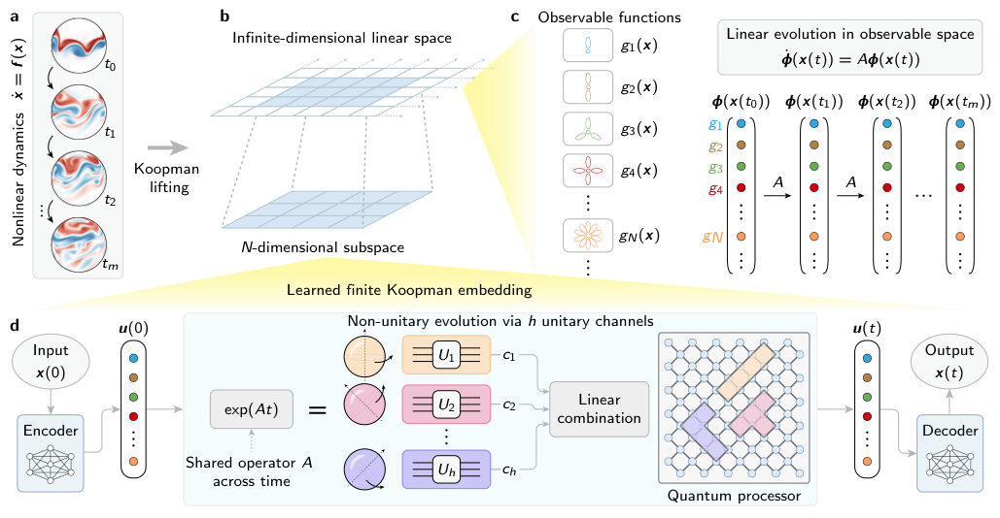
<figcaption class="paper-figure-caption"><b>Fig 1.</b> FIG. 1. Schematic of the QKM framework for simulating nonlinear dynamics on a superconducting quantum processor. a, A nonlinear dynamical system ¤𝒙= 𝒇(𝒙) generates discrete spatiotemporal snapshots 𝒙(𝑡0), 𝒙(𝑡1), · · · , 𝒙(𝑡𝑚). b, The nonlinear dynamics are mapped to an infinite-dimensional linear observable space via Koopman lifting in c, and are subsequently projected onto a finite 𝑁-dimensional subspace spanned by learned observables in d, yielding the linear evolution ¤𝒖= 𝐴𝒖. c, In full Koopman theory, this infinite-dimensional space comprises all observables 𝑔𝑗(𝒙) acting on the physical state, such that 𝝓(𝒙) = (𝑔1(𝒙), 𝑔2(𝒙), · · · )T. Although the physical field 𝒙(𝑡) evolves...</figcaption>
</figure>
<figure class="paper-figure-card">
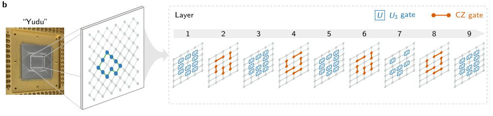
<figcaption class="paper-figure-caption"><b>Fig 2.</b> FIG. 2. Hardware-efficient quantum circuit of the QKM. a, The non-unitary propagator e𝐴𝑡for nonlinear dynamics is first reformulated as a spectral integral of diagonal unitary operators (Theorem 1). Each of the ℎindependent PQCs implements a single spectral component 𝑉(𝑘)eiΛ(𝑘)𝑡𝑉†(𝑘) of the diagonalized LCHS decomposition (Theorem 2). Each 𝑛-qubit circuit comprises two functional blocks. The state- preparation block utilizes 𝑅alternating layers of parameterized 𝑈3 gates with rotation angles {𝛼𝑗,𝑙,ℓ, 𝛽𝑗,𝑙,ℓ, 𝛾𝑗,𝑙,ℓ} generated by the classical encoder, and CZ pairs that alternate between odd layers {(𝑛, 1), (2, 3), . . . , (4, 5)} and even layers {(1, 2), (3, 4), . . . , (𝑛−1, 𝑛)}, forming a...</figcaption>
</figure>
<figure class="paper-figure-card">
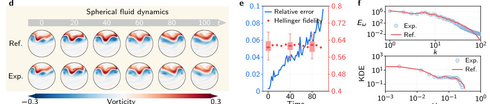
<figcaption class="paper-figure-caption"><b>Fig 3.</b> FIG. 3. Assessment of the QKM framework on benchmark nonlinear dynamical systems. a, Quantum simulation of a 3D reaction-diffusion system using the QKM on the superconducting processor “Yudu”. Volume renderings compare the experimental reactant-concentration fields 𝑢with the reference solutions at 𝑡= 100, 200, and 300. The QKM result accurately captures the temporal evolution of the total energy ⟨𝑢2⟩/2 in b, where ⟨·⟩denotes volume average. The relative error 𝜀𝐿2 remains small, and the median Hellinger fidelity stays close to unity in c, demonstrating quantitative agreement with the nonlinear dynamics. d, Quantum simulation of spherical fluid dynamics using the QKM on the superconducting...</figcaption>
</figure>
<figure class="paper-figure-card">
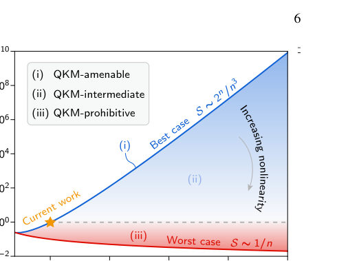
<figcaption class="paper-figure-caption"><b>Fig 4.</b> FIG. 5. Quantum-speedup regimes of the QKM. The quantum speedup S as a function of the number of qubits 𝑛. The upper blue curve represents the best-case scaling, S ∼2𝑛/𝑛3, achieved when a first-order circuit ansatz corresponding to a single 𝑅𝑧layer already provides sufficient accuracy. Problems in this limit are classified as QKM-amenable. With increasing nonlinearity of the target dy- namics, higher-order QKM representations and more retained terms are required, thereby increasing the quantum cost and lowering the achievable speedup. The region between the best-case curve and the threshold S = 1 defines the QKM-intermediate regime, where the first-order approximation is insufficient, yet...</figcaption>
</figure>
<figure class="paper-figure-card">
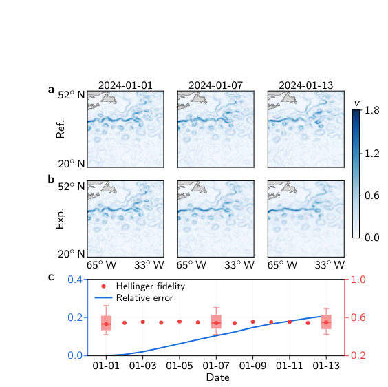
<figcaption class="paper-figure-caption"><b>Fig 5.</b> FIG. 4. Quantum simulation of real-world Gulf Stream ocean currents on the superconducting processor “Yudu”. a, Surface geostrophic velocity 𝑣derived from satellite observations on three dates spanning January 1 to 13, 2024. b, Corresponding QKM results simulated by the “Yudu” processor. c, Temporal evolution of the relative error 𝜀𝐿2 and the median Hellinger fidelity, with box plots showing the fidelity distribution across circuit instances on January 1, 7, and 13, 2024.</figcaption>
</figure>

**Summary.** The paper introduces the Quantum Koopman Method (QKM) to overcome the limitation of unitary evolution when simulating nonlinear physical processes. By mapping these dynamics into a linear observable space, it implements the evolution using shallow, parallel quantum circuits on superconducting hardware. This approach successfully simulates complex fluid and reaction-diffusion systems while quantifying the theoretical limits imposed by finite representation size.

**Why it may be interesting.** This work provides a concrete, hardware-aware pathway for simulating complex, non-Hamiltonian dynamics that are central to many areas of AMO physics and open quantum systems research.

Detailed structure

**Main problem.** The core challenge is simulating real-world nonlinear dynamics, which are fundamentally incompatible with the unitary evolution constraints of current quantum hardware.

**Main result.** The Quantum Koopman Method (QKM) successfully simulates complex systems like fluid dynamics and reaction-diffusion processes on superconducting processors, establishing a practical boundary for near-term quantum simulation.

**Method.** It uses the QKM to map nonlinear dynamics into an infinite-dimensional linear observable space, projects this onto a finite subspace, and implements the resulting non-unitary evolution using shallow, parallel quantum circuits.

**Model / system.** The method is tested on three benchmarks: 3D reaction-diffusion systems (Gray-Scott), shallow-water dynamics on a sphere, and real-world Gulf Stream current observations. The implementation uses superconducting transmon qubits.

**Key observables.** Relative $L_2$ error ($\ell$), enstrophy spectrum, vorticity field ($\omega$) evolution, and training/validation losses ($\ell_{train}, \ell_{val}$).

**Important parameters / regimes.** The simulation scales with grid resolution ($D$), number of qubits per circuit ($n = O(\log D)$), and the number of parallel spectral channels ($h=O(n)$).

**Assumptions / limitations.** The method assumes that the dynamics can be accurately captured by a finite-dimensional Koopman subspace, and it relies on hybrid classical/quantum processing where an NN encoder prepares initial states.

**Figures summary.** Figures illustrate the QKM schematic, the hardware-efficient quantum circuit structure (using $R_z$ layers), and comparisons of simulated dynamics against reference solutions for fluid motion and reaction-diffusion systems.

**Paper structure.** The paper introduces the QKM framework by linearizing nonlinear evolution. It details the quantum implementation using spectral decomposition into parallel circuits. Validation is performed on three physical benchmarks, followed by ablation studies to quantify sources of error (spectral sampling vs. ansatz structure).

Abstract

Nonlinear dynamics is ubiquitous in nature, ranging from chemical pattern formation to ocean circulation, yet its simulation on quantum computers is fundamentally limited by the unitary nature of quantum evolution. We propose the quantum Koopman method, a data-driven framework that embeds nonlinear dynamics into a learned linear representation and implements the resulting evolution using shallow quantum circuits. This method learns Koopman observables from trajectory data, projects the lifted dynamics onto a finite-dimensional subspace, and decomposes the corresponding non-unitary propagator into parallel spectral channels. We utilize the Koopman method on a superconducting processor to simulate three distinct nonlinear systems, comprising reaction-diffusion dynamics, fluid motion on a sphere, and satellite-derived observations of Gulf Stream currents, employing up to 32 parallel circuits of 10 qubits. These quantum simulations capture the dominant multiscale patterns and statistical signatures of the underlying dynamics, and reveal a transition from performance limited by hardware noise in weakly nonlinear systems to performance limited by finite-dimensional Koopman representations as nonlinear scale interactions increase. This transition identifies a practical boundary for quantum-amenable nonlinear dynamics, establishing a hardware-validated route for simulating moderately nonlinear dynamics on near-term quantum hardware.

[↑ back to top](#top)

### [Spin singlets are useful](http://arxiv.org/abs/2607.06672v1)

**Authors:** Silas Hoffman, Edward H. Chen, Matthew Brooks, Stephen Carr, Daniel Volya, Alan Tran, Tyler Keating, Thaddeus D. Ladd, Charles Tahan  
**Type:** theory · **Category:** quantum information and computing · **PDF:** <https://arxiv.org/pdf/2607.06672v1>  
**Analysis basis:** full PDF text, analyzed in chunks
**Topic relevance:** 🔥 `entanglement & information structure` **4/5** · `spintronics-quantum-optics interface` **3/5** · `analog quantum simulation` **2/5** · `quantum measurements` **2/5** · `QC/QI experiment` **1/5** · `exotic spin models in light-matter` **1/5** · `methods for driven-dissipative` **1/5** · `non-equilibrium dynamics` **1/5**

↔ Scroll figures horizontally

<figure class="paper-figure-card">
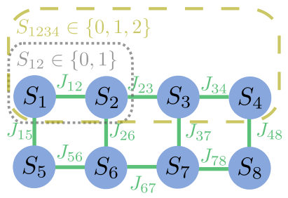
<figcaption class="paper-figure-caption"><b>Fig 1.</b> FIG. 1. Layout of a 2 × 4 spin array and coupling with quan- tum numbers labeling the spin-zero manifold.</figcaption>
</figure>
<figure class="paper-figure-card">
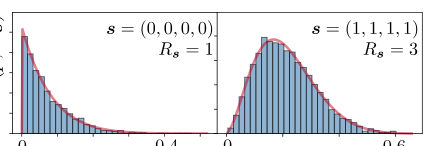
<figcaption class="paper-figure-caption"><b>Fig 2.</b> FIG. 4. Simulated probability distributions of the all-singlet readout (left panel) and all-triplet readout (right panel) of a 2×4 array using 2000 circuits each with 100 randomly chosen exchange gates.Red envelopes show the exact Beta distribu- tion.</figcaption>
</figure>
<figure class="paper-figure-card">
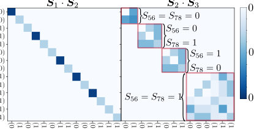
<figcaption class="paper-figure-caption"><b>Fig 3.</b> FIG. 3. Magnitude of the elements of the unitary matrices S1 · S2 (left) and S2 · S3 (right) in the fusion-tree basis of a 2 × 4 array of spins.</figcaption>
</figure>
<figure class="paper-figure-card">
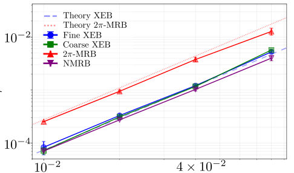
<figcaption class="paper-figure-caption"><b>Fig 4.</b> FIG. 6. Average error per gate, γ, as a function of charge noise variance, σ, extracted from numerical simulations using fine XEB (circles), coarse XEB (squares), 2π-MRB (up-triangles), and NMRB (down-triangles). Theoretical prediction of γ for fine XEB, coarse XEB, and NMRB (dashed curve) and 2π- MRB (dotted curve).</figcaption>
</figure>

**Summary.** This paper demonstrates that restricting the dynamics of an exchange-coupled spin array to its total spin-zero manifold ($	ext{S}_0$) provides a computationally advantageous subspace compared to standard encoding methods. By adapting advanced quantum benchmarks like XEB and OTOCs, the authors show that this physical constraint can accelerate the path toward demonstrating quantum advantage using semiconductor spin qubits.

**Why it may be interesting.** This work directly bridges solid-state physics (quantum dots/spins) with advanced quantum information protocols by showing how inherent physical symmetries ($	ext{S}_0$) can be leveraged as a computational resource, providing concrete benchmarking tools for realizing fault-tolerant computation in spin arrays.

Detailed structure

**Main problem.** The paper evaluates how utilizing the spin-zero manifold ($	ext{S}_0$) of an exchange-coupled spin array can enhance computational space for quantum simulation and computation beyond limitations imposed by traditional modular qubit encoding.

**Main result.** Operating within the $	ext{S}_0$ manifold allows for a significantly larger accessible Hilbert space compared to standard methods, and benchmarking metrics like XEB and OTOCs confirm that this subspace supports realizing deep circuits necessary for quantum advantage demonstrations in semiconductor spin qubits.

**Method.** The authors generalize established quantum benchmarking techniques—Cross-Entropy Benchmarking (XEB), Mirror Randomized Benchmarking (MRB), and Out-of-Time-Ordered Correlators (OTOCs)—to the specific constraints of the total spin-zero subspace dynamics.

**Model / system.** The system is modeled using an array of $N$ electron spins in semiconducting quantum dots, governed by Heisenberg exchange interactions. The focus is restricted to the $	ext{S}_0$ manifold, which preserves the total spin zero state exactly.

**Key observables.** Coarse-grained measurement probabilities ($p_s$), XEB fidelity ($F$), MRB fidelity ($F_{	ext{MRB}}$), and Out-of-Time-Ordered Correlators ($	ext{OTOC}_k$).

**Important parameters / regimes.** System size $N$, noise variance $\sigma^2$ (for error scaling), and the ratio of coupling strengths ($\phi = J_2/J_1$) for lattice structures.

**Assumptions / limitations.** The analysis proceeds despite the coarse-grained nature of readout measurements (Pauli Spin Blockade) and assumes that local error correction can be addressed within the highly entangled $	ext{S}_0$ states.

**Figures summary.** Figures illustrate the spin array layout, the construction of basis states in the fusion-tree basis for the $	ext{S}_0$ manifold, and simulated probability distributions showing how readout measurements follow an Erlang distribution rather than a standard Porter–Thomas distribution.

**Paper structure.** The paper first establishes the physical utility of the $	ext{S}_0$ manifold over modular encoding. It then details the generalization of benchmarking metrics (XEB, MRB) to this subspace, providing theoretical predictions based on Beta distributions for measurement probabilities. Finally, it extends the analysis using OTOCs to probe complex dynamics and potential quantum advantage.

Abstract

We evaluate the utility of the spin-zero manifold of an exchange-coupled array of $N$ spins for tasks in quantum computation and quantum simulation. Since pairs of electrons can be readily initialized into a product state of singlets in semiconducting quantum dot arrays, the full spin-zero manifold is available with exchange-only control, providing a Hilbert space of approximate dimension $2^N/(N/2)^{3/2}$, asymptotically close to the $2^N$ dimension of the full spin Hilbert space. Leveraging the spin-zero manifold enables larger computational space in a given array compared to traditional exchange-only control, in which spin arrays are organized into modular units of $n$ spins comprising $N/n$ encoded qubits, limiting to the exponentially smaller Hilbert dimension $2^{N/n}$. Here we focus on benchmarking metrics for this resource utilization by generalizing cross-entropy benchmarking, mirror benchmarking, and out-of-time-ordered correlators to this system. We show that operating in the spin-zero manifold can accelerate the realization of computational quantum advantage applications in semiconductor-based spin qubits.

[↑ back to top](#top)

### [Dynamical structure factor with a pumping approach on a trapped-ion quantum computer](http://arxiv.org/abs/2607.07138v1)

**Authors:** Etienne Granet, Keisuke Murota, Henrik Dreyer, Kentaro Yamamoto, Juan Pedersen, Hidemaro Suwa  
**Type:** both · **Category:** other · **PDF:** <https://arxiv.org/pdf/2607.07138v1>  
**Analysis basis:** full PDF text, analyzed in chunks
**Topic relevance:** 🔥 `QC/QI experiment` **4/5** · 🔥 `analog quantum simulation` **4/5** · `non-equilibrium dynamics` **2/5** · `Frenkel-Kontorova` **1/5** · `entanglement & information structure` **1/5** · `exotic spin models in light-matter` **1/5** · `quantum measurements` **1/5**

↔ Scroll figures horizontally

<figure class="paper-figure-card">
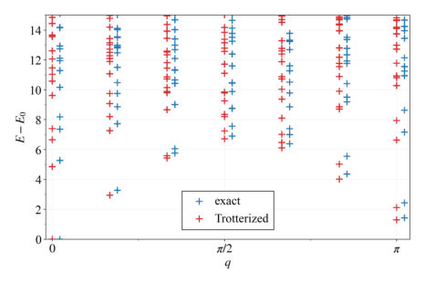
<figcaption class="paper-figure-caption"><b>Fig 1.</b> FIG. 1. Influence of the approximate time evolution. The position in the energy-momentum space of the excitation en- ergies of the 1D Heisenberg model in size L = 12, from the exact Hamiltonian H (blue), and from the corresponding Flo- quet Hamiltonian HF in (16) with dt = 0.24 (red). The mo- menta of the exact Hamiltonian are slightly shifted for better visibility.</figcaption>
</figure>
<figure class="paper-figure-card">
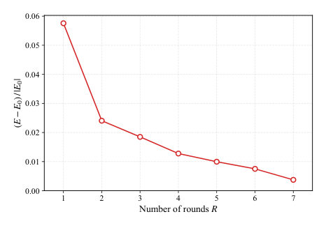
<figcaption class="paper-figure-caption"><b>Fig 2.</b> FIG. 2. Ground state preparation. Relative energy differ- ence (E −E0)/|E0| between the energy E of the optimized ansatz (18) and the exact ground-state energy E0 of the L = 20 Heisenberg chain, as a function of the number of rounds R.</figcaption>
</figure>
<figure class="paper-figure-card">
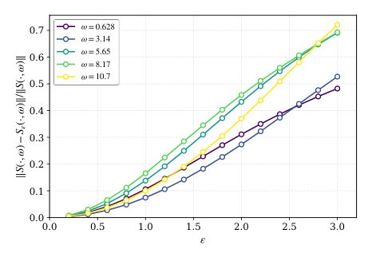
<figcaption class="paper-figure-caption"><b>Fig 3.</b> FIG. 3. Influence of the coupling ϵ. Relative distance ||S(·, ω) −Sϵ(·, ω)||/||S(·, ω)|| between the DSF in the limit ϵ →0 and the one computed at finite coupling ϵ, as a func- tion of ϵ for several target frequencies ω. Here Sϵ(·, ω) denotes the vector of momentum components S(q, ω) at fixed ω, with q = 2πk</figcaption>
</figure>
<figure class="paper-figure-card">
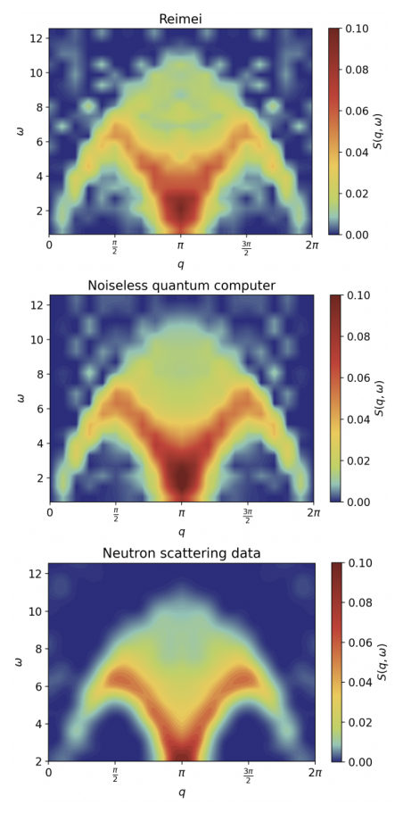
<figcaption class="paper-figure-caption"><b>Fig 4.</b> FIG. 4. Comparison between DSFs. Color plot for S(q, ω), as measured on Quantinuum Reimei ion-trapped quantum com- puter (top panel), on an ideal noiseless quantum computer using the same circuits (middle panel), and obtained from neutron scattering experiments (bottom panel). The data for the neutron scattering experiment panel was numerically ex- tracted from the plots of Ref. [41], with the overall arbitrary scale of S(q, ω) being chosen so that the maximal value is 0.1.</figcaption>
</figure>

**Summary.** This paper presents a novel 'pumping approach' to calculate the Dynamical Structure Factor, $S(q, \omega)$, which is vital for understanding material structure from neutron scattering. The technique is demonstrated using a trapped-ion quantum computer platform to simulate models like the 1D Heisenberg chain. It shows that this method efficiently targets specific frequencies and yields results matching both simulations and experimental expectations.

**Why it may be interesting.** This work directly bridges fundamental condensed matter physics observables (like DSF) with cutting-edge quantum hardware capabilities (trapped ions), offering a concrete roadmap for simulating complex many-body dynamics on NISQ devices.

Detailed structure

**Main problem.** The primary goal is computing Dynamical Structure Factors (DSF), $S(q, \omega)$, which are crucial for interpreting neutron-scattering experiments on materials.

**Main result.** The authors successfully demonstrated the feasibility of calculating DSF using a novel 'pumping approach' directly on a trapped-ion quantum computer platform.

**Method.** They introduce a pumping technique that uses time evolution with a source term oscillating at the target frequency $\omega$ to measure $S(q, \omega)$, significantly reducing overhead compared to older methods.

**Model / system.** The study applies this method to model systems like the 1D Heisenberg chain (relevant to copper sulfate) and tests it on the Quantinuum Reimei trapped-ion quantum computer.

**Key observables.** Dynamical Structure Factor, $S(q, \omega)$; relative energy difference between ansatz and ground state; error metrics related to $\epsilon$ and time truncation $T$.

**Important parameters / regimes.** System size ($L=20$), Trotter step ($dt=0.24$), total evolution time ($T=2.4$), and the coupling parameter ($\epsilon$).

**Assumptions / limitations.** The method relies on approximating the infinite-time limit via finite truncation (introducing sinc function artifacts) and uses an adiabatic-inspired ansatz for state preparation.

**Figures summary.** Figures illustrate the influence of time evolution approximations on excitation energies, track the convergence of the optimized ansatz energy to the ground state energy, and compare measured DSF results against noiseless simulations and experimental data.

**Paper structure.** The paper introduces the physical problem (DSF), details the novel pumping methodology for quantum computation, describes the implementation using trapped-ion hardware, presents comparisons with theoretical benchmarks, and concludes with validation of the approach.

Abstract

Dynamical structure factors (DSF) measured with neutron-scattering experiments provide key insights into the structure of materials. Their computation requires both the preparation of an equilibrium state and the implementation of Hamiltonian dynamics. We demonstrate the feasibility of computing DSF on the Quantinuum Reimei trapped-ion quantum computer, comparing the DSF of 1D Heisenberg model on $20$ sites, and that of the copper sulfate crystal. To that end, we introduce a pumping approach for computing the DSF $S(q,ω)$ on quantum computers that enables targeting specific arbitrary values of frequencies $ω$. This method time-evolves the initial state using a time-dependent Hamiltonian perturbed by a source term oscillating at the target frequency $ω$. When targeting only a few frequency values, this approach provides a significant reduction in shot overhead compared to previous methods.

[↑ back to top](#top)

### [Entanglement Asymmetry in Random Quantum Automata](http://arxiv.org/abs/2607.07556v1)

**Authors:** Olalla A. Castro-Alvaredo, Dávid Szász-Schagrin, Michele Mazzoni  
**Type:** theory · **Category:** statistical mechanics · **PDF:** <https://arxiv.org/pdf/2607.07556v1>  
**Analysis basis:** full PDF text, analyzed in chunks
**Topic relevance:** 🔥 `entanglement & information structure` **4/5** · `non-equilibrium dynamics` **3/5** · `non-equilibrium universality` **2/5** · `Keldysh / 2PI / non-Gaussian methods` **1/5** · `correlated / nonlocal dissipation` **1/5** · `driven-dissipative phase transition` **1/5** · `methods for driven-dissipative` **1/5** · `scars & prethermalization` **1/5**

↔ Scroll figures horizontally

<figure class="paper-figure-card">
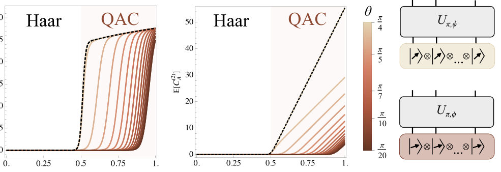
<figcaption class="paper-figure-caption"><b>Fig 1.</b> FIG. 1. Schematic depiction of our main results. We apply a global random permutation of basis states followed by a random phase transformation to a homogeneous product state |ψ0⟩= (cos(θ)|0⟩+ sin(θ)|1⟩)⊗L (colored lines). For θ = π/4, the spread of the average R´enyi-2 asymmetry and R´enyi-2 subsystem coherence is akin to that of Haar random states (black dashed line), with both quantities being zero for subsystems with LA &lt; L/2. Decreasing θ results in a much more localized state in the Hilbert space and the onset of the averaged R´enyi-2 asymmetry and R´enyi-2 subsystem coherence cannot occur at LA = L/2 because it is prevented by a too small participation entropy. The same is obtained...</figcaption>
</figure>
<figure class="paper-figure-card">
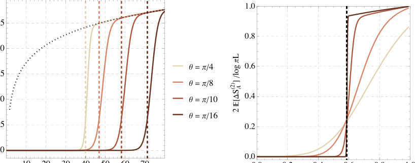
<figcaption class="paper-figure-caption"><b>Fig 2.</b> FIG. 2. Left: The entanglement asymmetry Page curve (22) averaged over the global quantum automaton ensemble starting from an initial product state |ψ0⟩(27) for various values of the tilting angle θ. The dashed lines denote the onset values L∗ A as defined in Eq. (25). The black dotted curve corresponds to (1/2) log(πLA) as given in Eq. (31). We take L = 80. Right: The finite size scaling of entanglement asymmetry Page curve (22) averaged over the global quantum automaton ensemble starting from an initial product state |ψ0⟩(27) with θ = π/8 for increasing system sizes L. The dashed line denote the onset value L∗ A/L as defined in Eq. (25).</figcaption>
</figure>
<figure class="paper-figure-card">
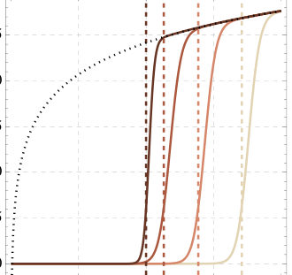
<figcaption class="paper-figure-caption"><b>Fig 3.</b> FIG. 3. The entanglement asymmetry Page curve (22) averaged over the global quantum automaton ensemble starting from an initial Dicke-state |Dk⟩(29) for different values of k. The dashed lines denote the onset values L∗ A as defined in Eq. (25). The black dotted curve corresponds to (1/2) log(πLA) as given in Eq. (31). We take L = 80.</figcaption>
</figure>
<figure class="paper-figure-card">
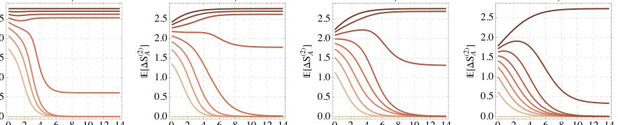
<figcaption class="paper-figure-caption"><b>Fig 4.</b> FIG. 4. The averaged entanglement asymmetry under 2-local random quantum automaton circuit evolution starting from an initial product state |ψ0⟩(27) for various values of the tilting angle θ. We take L = 80.</figcaption>
</figure>
<figure class="paper-figure-card">
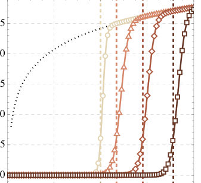
<figcaption class="paper-figure-caption"><b>Fig 5.</b> FIG. 5. The entanglement asymmetry Page curve averaged over the 2-local quantum automaton ensemble (markers) starting from an initial product state |ψ0⟩(27) for various values of the tilting angle θ. The global ensemble results are shown in solid lines. The dashed lines denote the onset values L∗ A as defined in Eq. (25). The black dotted curve corresponds to (1/2) log(πLA). We take L = 80.</figcaption>
</figure>

**Summary.** This paper analyzes subsystem entanglement asymmetry and coherence in systems evolving under Random Quantum Automata. It finds that the approach to equilibrium differs significantly from standard random unitary models because the dynamics conserve participation entropy. This leads to initial state dependence in the onset of local symmetrization, offering insights into how conservation laws shape quantum information spreading.

**Why it may be interesting.** It provides a detailed theoretical comparison of entanglement dynamics in structured random quantum circuits (QACs) versus unstructured ones (Haar), highlighting how underlying conservation laws modify expected thermalization/scrambling behaviors relevant to many-body physics.

Detailed structure

**Main problem.** The study investigates subsystem entanglement asymmetry in random quantum automaton ensembles (QAEs) compared to established models like Haar-random circuits.

**Main result.** Unlike Haar-random circuits, the scale at which local symmetrization occurs in QACs depends on the initial state due to the interplay between conserved participation entropy and charge sector exploration.

**Method.** The authors compute ensemble averages of subsystem entanglement asymmetry using techniques involving replica vectorization formalism and asymptotic analysis for large system sizes.

**Model / system.** The model involves Random Quantum Automata (QA gates), which operate by applying a random permutation of the computational basis followed by global phase shifts to a bipartite quantum system S=A U B.

**Key observables.** Subsystem entanglement asymmetry ($	ext{U}(1)$ symmetry related), participation entropy, and subsystem coherence are key observables analyzed across different subsystem sizes.

**Important parameters / regimes.** The analysis focuses on the late-time limit, varying subsystem sizes ($L_A$), and comparing results to Haar-random circuit limits.

**Assumptions / limitations.** The analysis assumes self-averaging properties hold for ensemble averages and relies on approximations derived from the Choi-Jamiołkowski representation.

**Figures summary.** Figure 1 schematically contrasts $	ext{R\'enyi-2}$ asymmetry and coherence in QAEs versus Haar states, showing initial state dependence. Figure 7 shows time evolution of average coherence for varying tilting angles under 2-local circuit dynamics.

**Paper structure.** The paper progresses by defining the observables (asymmetry, purity) within the QAE framework, deriving formulas using advanced mathematical tools, establishing key relationships between different measures (e.g., coherence and purity), and finally analyzing the asymptotic behavior and time evolution in specific regimes.

Abstract

We investigate the subsystem entanglement asymmetry in random quantum automaton ensembles, which are generated by permuting the basis states in the Hilbert space and applying global phase shifts. We compute the ensemble average of the $U(1)$ subsystem asymmetry in different connectivity geometries, showing that the late-time limit of the ensemble associated to a 2-local circuit geometry coincides with the all-to-all ensemble average. By focusing on different subsystem sizes, we demonstrate that, similarly to Haar-random circuits, the system locally symmetrizes. However, in sharp contrast to the Haar-random setting, the scale at which symmetrization happens depends on the initial state, a phenomenon we associate with the interplay of conservation of the participation entropy and the uniform exploration of charge sectors. Additionally, we connect the growth of the subsystem asymmetry to the subsystem coherence and show that their growth is characterized by the same symmetrization scale.

[↑ back to top](#top)

### [Phase-Selected Efficient Single-Photon Frequency Conversion via Local Fano Resonance in a Two-Giant-Atom Waveguide-QED System](http://arxiv.org/abs/2607.07093v1)

**Authors:** Qing-Ao Xiang, Yan Liu, Xin-Yuan Yang, Ya-Ju Song  
**Type:** theory · **Category:** other · **PDF:** <https://arxiv.org/pdf/2607.07093v1>  
**Analysis basis:** full PDF text, analyzed in chunks
**Topic relevance:** 🔥 `interference shaping light` **4/5** · `correlated cavity matter` **3/5** · `Tavis-Cummings & cavity-many-emitter` **2/5** · `Keldysh / 2PI / non-Gaussian methods` **1/5** · `analog quantum simulation` **1/5** · `correlated / nonlocal dissipation` **1/5** · `driven-dissipative phase transition` **1/5** · `methods for driven-dissipative` **1/5**

↔ Scroll figures horizontally

<figure class="paper-figure-card">
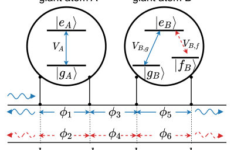
<figcaption class="paper-figure-caption"><b>Fig 1.</b> FIG. 1. Schematic of the waveguide-QED system. A two-level giant atom A and a Λ-type three-level giant atom B couple to a common waveguide at points d1,2 and d3,4, respectively. The blue solid and red dashed lines denote the g- and f-channel photons, with propagation phases ϕ2n−1 = kg(dn+1 −dn) and ϕ2n = kf(dn+1 −dn), n = 1, 2, 3.</figcaption>
</figure>
<figure class="paper-figure-card">
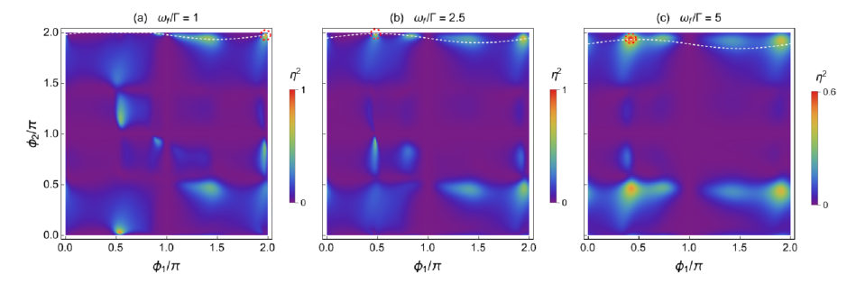
<figcaption class="paper-figure-caption"><b>Fig 2.</b> FIG. 2. Distribution of the single-pole resonance weight η2 in the phase plane for varying ωf. Bright regions indicate optimal phase-selection zones for efficient forward conversion. The white dashed line traces the approximate phase relation derived from the local-background suppression condition near ϕ2 ≃2π.</figcaption>
</figure>
<figure class="paper-figure-card">
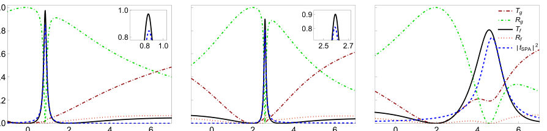
<figcaption class="paper-figure-caption"><b>Fig 3.</b> FIG. 3. Exact four-channel scattering probabilities and the local single-pole approximation |tSPA|2 for bright-region phases. The approximation accurately captures the target inelastic peak Tf within the target window and confirms the suppression of elastic (Tg, Rg) and inelastic reflection (Rf) channels.</figcaption>
</figure>
<figure class="paper-figure-card">
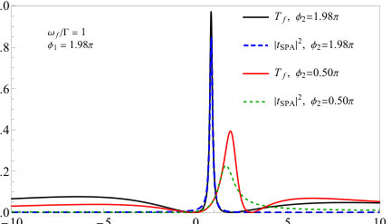
<figcaption class="paper-figure-caption"><b>Fig 4.</b> FIG. 4. Comparison between the exact Tf (solid) and the local single-pole approximation |tSPA|2 (dashed) for ωf/Γ = 1 and ϕ1 = 1.98π. Black and blue curves: bright-region phase ϕ2 = 1.98π, validating the approximation; red and green curves: reference phase ϕ2 = 0.50π, where deviations arise from non-target resonances and background.</figcaption>
</figure>
<figure class="paper-figure-card">
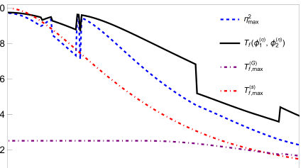
<figcaption class="paper-figure-caption"><b>Fig 5.</b> FIG. 6. Advantage of the two-giant-atom scheme over the single Λ-type giant-atom and small-atom models. The similar trends of η2 max and Tf(ϕ(η) 1 , ϕ(η) 2 ) validate η2 as an effective phase-selection criterion.</figcaption>
</figure>

**Summary.** The paper theoretically investigates single-photon frequency conversion in a two-giant-atom waveguide QED system. By employing a local single-pole approximation, the complex spectral response is mapped onto a tunable Fano resonance. The key finding is that precise phase control over the atomic coupling points allows for background suppression, leading to highly efficient and robust frequency conversion superior to simpler quantum systems.

**Why it may be interesting.** This work provides a detailed mechanism for engineering resonant light-matter interactions using structured quantum systems, specifically demonstrating how internal phase control can maximize conversion efficiency by manipulating interference terms into a controllable Fano profile.

Detailed structure

**Main problem.** The primary goal is achieving highly efficient single-photon frequency conversion using quantum interference effects.

**Main result.** The two-giant-atom system enables enhanced, phase-controlled frequency conversion by engineering a local Fano resonance structure. This surpasses the efficiency of simpler single-atom or small-atom models.

**Method.** The analysis uses a real-space approach and applies a local single-pole approximation to simplify complex scattering amplitudes into an analytically tractable Fano lineshape model.

**Model / system.** The system is a waveguide Quantum Electrodynamics (QED) setup involving two giant atoms—a two-level atom and a $\Lambda$-type three-level atom—coupled to a 1D waveguide. The interaction Hamiltonian governs the coupling dynamics.

**Key observables.** Inelastic transmission spectrum ($T_f$), local Fano lineshape, single-pole resonance weight ($\eta^2$).

**Important parameters / regimes.** Photon propagation phase between atoms' coupling points ($\phi_1, \phi_2$); detuning ($\omega_f/\Gamma$); loss parameter ($\kappa/\Gamma$).

**Assumptions / limitations.** The analysis relies on the Markovian approximation and assumes specific symmetric-coupling conditions for simplification.

**Figures summary.** Figures illustrate the phase plane mapping of $\eta^2$, comparing exact scattering probabilities to the local single-pole approximation, and showing $T_f$ vs. $\omega_f$ across different atomic models.

**Paper structure.** The paper progresses from deriving complex four-channel scattering amplitudes to applying a local single-pole approximation, identifying the Fano structure, establishing phase-selection criteria via background suppression, and finally comparing the resulting efficiency against established theoretical limits.

Abstract

Efficient single-photon frequency conversion is investigated in a two-giant-atom waveguide-QED system, where a two-level giant atom and a $Λ$-type three-level giant atom couple to a common one-dimensional waveguide. While the $Λ$-type atom provides the inelastic channel, the two-level atom induces secondary coherent coupling, creating multi-path interference for the converted photon. Using the real-space approach and within the Markovian approximation, we derive analytical four-channel scattering amplitudes and reveal that the inelastic transmission spectrum, governed by three complex resonance poles, exhibits a multi-peak interference pattern. By introducing a local single-pole approximation, we reduce this complex spectrum to a local Fano lineshape, decomposing it into a coherent superposition of a local background term and a single-pole resonant term. The interplay between these two terms-controlled by the photon propagation phase between the giant atoms' coupling points-determines the conversion efficiency, with the background suppression condition leading to a Lorentzian reduction. Based on the single-pole resonance weight, we formulate a phase-selection criterion for highly efficient conversion. Compared with both the small-atom and single $Λ$-type giant-atom models, the two-giant-atom scheme achieves substantially enhanced inelastic transmission over a broader frequency-conversion range. This work reveals how phase-controlled local Fano resonance enables high-efficiency frequency conversion, establishing a general paradigm for engineering resonant light-matter interactions in structured quantum systems.

[↑ back to top](#top)

### [Universal spin-squeezing dynamics in spinor condensates](http://arxiv.org/abs/2607.06842v1)

**Authors:** Nikolaos Giovanoudis, Navid Kazemiseresht, Fabio Mezzacapo, Emilia Witkowska, Tommaso Roscilde  
**Type:** theory · **Category:** quantum gases · **PDF:** <https://arxiv.org/pdf/2607.06842v1>  
**Analysis basis:** full PDF text, analyzed in chunks
**Topic relevance:** 🔥 `analog quantum simulation` **4/5** · `entanglement & information structure` **3/5** · `exotic spin models in light-matter` **3/5** · `correlated / nonlocal dissipation` **1/5** · `methods for driven-dissipative` **1/5** · `non-equilibrium dynamics` **1/5**

↔ Scroll figures horizontally

<figure class="paper-figure-card">
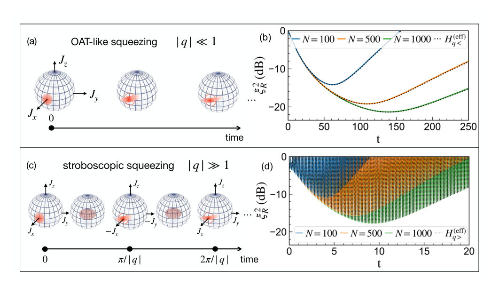
<figcaption class="paper-figure-caption"><b>Fig 1.</b> FIG. 1: Spin squeezing dynamics in spinor condensates. (a) In the case |q| ≪1 the system realizes an OAT-like dynamics; the state of the system is depicted schematically as an uncertainty region on the collective Bloch sphere for a spin of length J = N, although this length is not conserved for the model of Eq. (1) and the state leaks into the volume of the Bloch sphere. (b) Exact data for the squeezing dynamics with q = 0.1, compared to the prediction of the effective Hamiltonian Eq. (2); (c) for |q| ≫1 the spinor gas realizes instead a stroboscopic squeezing dynamics, in which OAT-like squeezing with a large collective spin occurs in rapid alternation with dynamics that makes the total...</figcaption>
</figure>
<figure class="paper-figure-card">
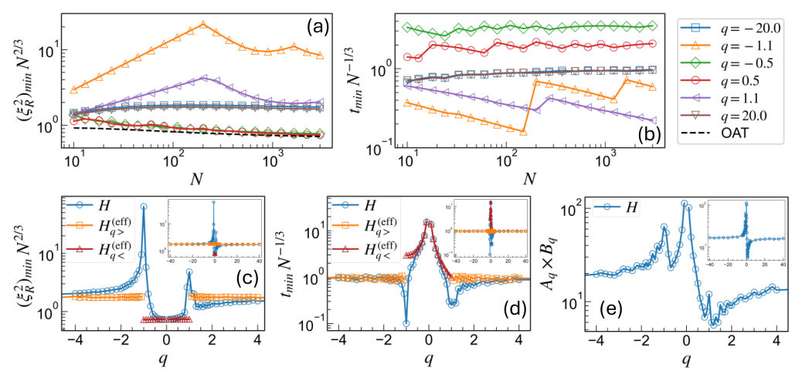
<figcaption class="paper-figure-caption"><b>Fig 2.</b> FIG. 2: Universal scaling properties. (a)-(b) Scaling of the best squeezing (ξ2 R)min and the best squeezing time tmin with system size N obtained from exact diagonalization, demonstrating the OAT scaling (ξ2 R)min ∼N −2/3 and tmin ∼N 1/3 across the explored values of N. In panel (a), the dashed line indicates the scaling of optimal squeezing achieved with one-axis-twisting dynamics for N spins S = 1; (c)-(d) Dependence of the corresponding prefactors Aq and Bq on q, revealing strong variations of the best squeezing and the best squeezing time across parameter space. (e) Optimal compromise between achievable squeezing and preparation time versus q, the lowest value is observed for |q| ∼O(1).</figcaption>
</figure>
<figure class="paper-figure-card">
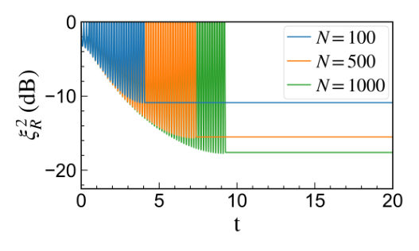
<figcaption class="paper-figure-caption"><b>Fig 3.</b> FIG. 3: Freezing of squeezed states. If q is turned off abruptly, the remaining Hamiltonian is SU(2) symmetric, so that the ensuing dynamics does not evolve the collective-spin properties, including squeezing. This allows to freeze the op- timal squeezing – here for q = 20 (up to the optimal time tmin) and increasing system size.</figcaption>
</figure>
<figure class="paper-figure-card">
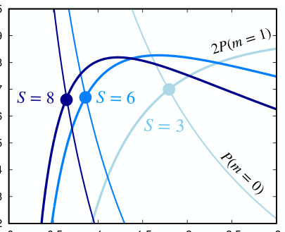
<figcaption class="paper-figure-caption"><b>Fig 4.</b> FIG. 5: Preparing a state close to the S = 1 CSSx using S &gt; 1 atoms. The probabilities P(m = 0) and 2P(m = 1) in the ground state of the Hamiltonian Eq. (12) cross at an S- dependent Rabi field Ω/q. For this field, more that 90% of the atomic population is concentrated on the states m = 0, ±1, so that the system approximates an ensemble of effective S = 1 atoms.</figcaption>
</figure>
<figure class="paper-figure-card">
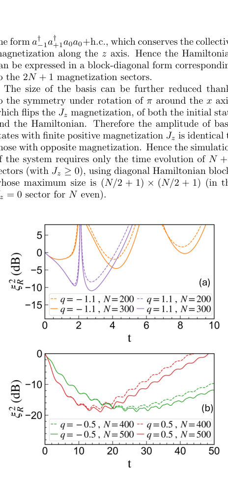
<figcaption class="paper-figure-caption"><b>Fig 5.</b> FIG. 4: Details on the scaling of optimal squeezing. Evolution of the spin squeezing parameter for (a) q = ±1.1 and N = 200, 300 and (b) q = ±0.5 and N = 400, 500. In both cases, upon increasing the system size the optimal squeezing is found to advance abruptly in time from one local minimum to the next in the oscillations of the squeezing parameter.</figcaption>
</figure>

**Summary.** This paper demonstrates how spinor Bose-Einstein condensates can generate scalable spin squeezing using native spin interactions combined with a quadratic Zeeman shift. The dynamics are shown to follow universal paradigms, exhibiting different behaviors depending on the relative strength of the applied magnetic field parameter ($q$). This control mechanism is highly valuable for developing advanced quantum sensors.

**Why it may be interesting.** This work provides a detailed, controllable mechanism for generating high levels of entanglement in an ultracold atomic system, offering significant potential for quantum metrology beyond standard qubit platforms.

Detailed structure

**Main problem.** The primary goal is generating large-scale entangled states for quantum sensing using ultracold spinor Bose-Einstein condensates.

**Main result.** Spin squeezing can be generated universally in these condensates, exhibiting distinct dynamics depending on the relative strength of spin-dependent interactions versus the quadratic Zeeman shift (OAT vs. stroboscopic regimes).

**Method.** The authors employ theoretical analysis using perturbation theory (Schrieffer-Wolff transformation) and exact numerical diagonalization to model the system's evolution.

**Model / system.** The physical platform is a spinor Bose-Einstein condensate of atoms with large internal spin ($S>1/2$). The dynamics are governed by an effective Hamiltonian incorporating both spin-dependent contact interactions and a quadratic Zeeman shift term.

**Key observables.** Spin squeezing parameter ($\xi_R^2$), which quantifies entanglement, and the optimal time for achieving minimum $\xi_R^2$.

**Important parameters / regimes.** The ratio of the quadratic Zeeman shift ($q$) to interaction strengths, leading to distinct regimes: $|q| \ll 1$ (OAT-like) and $|q| \gg 1$ (stroboscopic).

**Assumptions / limitations.** The analysis often relies on projecting dynamics onto a restricted subspace (e.g., the Dicke subspace) using perturbation theory, which is valid under specific parameter limits.

**Figures summary.** Figures illustrate spin squeezing dynamics across different $q$ regimes, showing OAT-like evolution for small $|q|$ and stroboscopic behavior for large $|q|$. Scaling laws are also presented.

**Paper structure.** The paper systematically analyzes the system by deriving effective Hamiltonians for different limits of the quadratic Zeeman shift ($|q| \ll 1$ vs. $|q| \gg 1$), comparing theoretical predictions with exact numerical simulations to map out universal squeezing dynamics.

Abstract

The production of large-scale entangled states is one of the main goals of next-generation quantum technologies, with an immediate potential for applications in the context of entanglement-assisted quantum sensing. A very promising platform to achieve this goal is offered by ultracold spinor gases, made of atoms with a large internal spin sensitive to magnetic fields. Here we show that the native spin-changing collisions in a spinor Bose-Einstein condensate, combined with an arbitrary quadratic Zeeman shift, can generate scalable spin squeezing in the collective spin of the ensemble, following the universal paradigm of the celebrated one-axis-twisting model. Squeezing dynamics is driven by the quadratic Zeeman shift when this shift is small; and by the spin-changing collisions for large shifts, in the form of stroboscopic squeezing. Turning off the Zeeman shift freezes out the collective-spin dynamics, so that the ensuing collective spin dynamics can be uniquely governed by an external field to be sensed. Our theoretical results pave the way for the use of spinor Bose gases with a large spin in fundamental studies of entanglement, as well as in advanced metrological applications.

[↑ back to top](#top)

### [The NISQ Trap: Eight Years of Demonstrations the Hardware Was Built to Lose](http://arxiv.org/abs/2607.07530v1)

**Authors:** Amit Hagar  
**Type:** theory · **Category:** quantum information and computing · **PDF:** <https://arxiv.org/pdf/2607.07530v1>  
**Analysis basis:** full PDF text, analyzed in chunks
**Topic relevance:** 🔥 `QC/QI experiment` **4/5** · `entanglement & information structure` **2/5** · `analog quantum simulation` **1/5** · `correlated / nonlocal dissipation` **1/5** · `driven-dissipative phase transition` **1/5** · `methods for driven-dissipative` **1/5** · `non-equilibrium dynamics` **1/5**

↔ Scroll figures horizontally

<figure class="paper-figure-card">
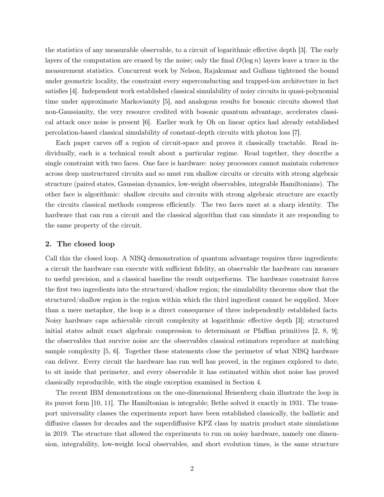
<figcaption class="paper-figure-caption"><b>Fig 1.</b> Low-resolution page preview, page 2</figcaption>
</figure>
<figure class="paper-figure-card">
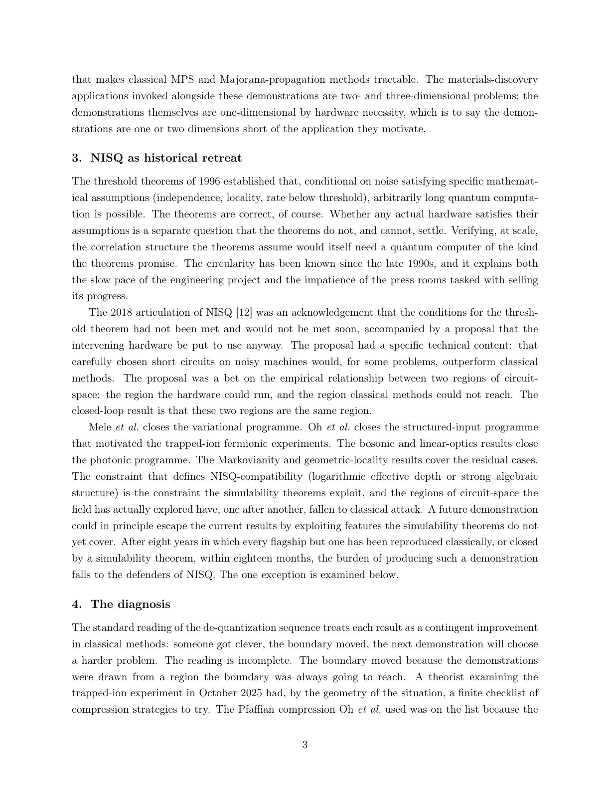
<figcaption class="paper-figure-caption"><b>Fig 2.</b> Low-resolution page preview, page 3</figcaption>
</figure>
<figure class="paper-figure-card">
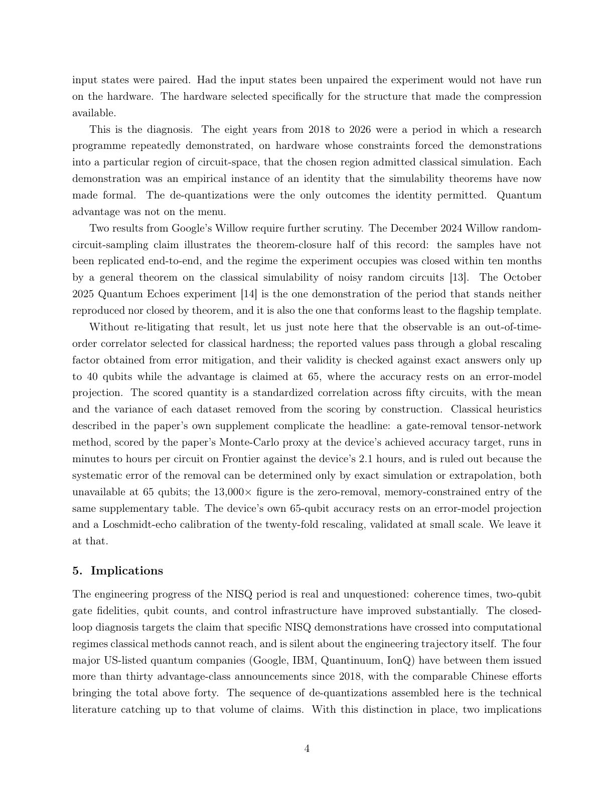
<figcaption class="paper-figure-caption"><b>Fig 3.</b> Low-resolution page preview, page 4</figcaption>
</figure>
<figure class="paper-figure-card">
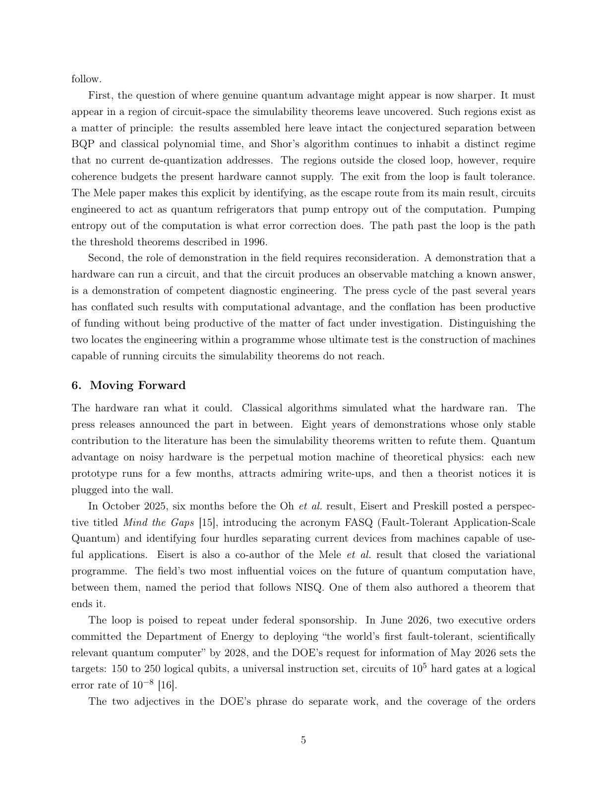
<figcaption class="paper-figure-caption"><b>Fig 4.</b> Low-resolution page preview, page 5</figcaption>
</figure>
<figure class="paper-figure-card">
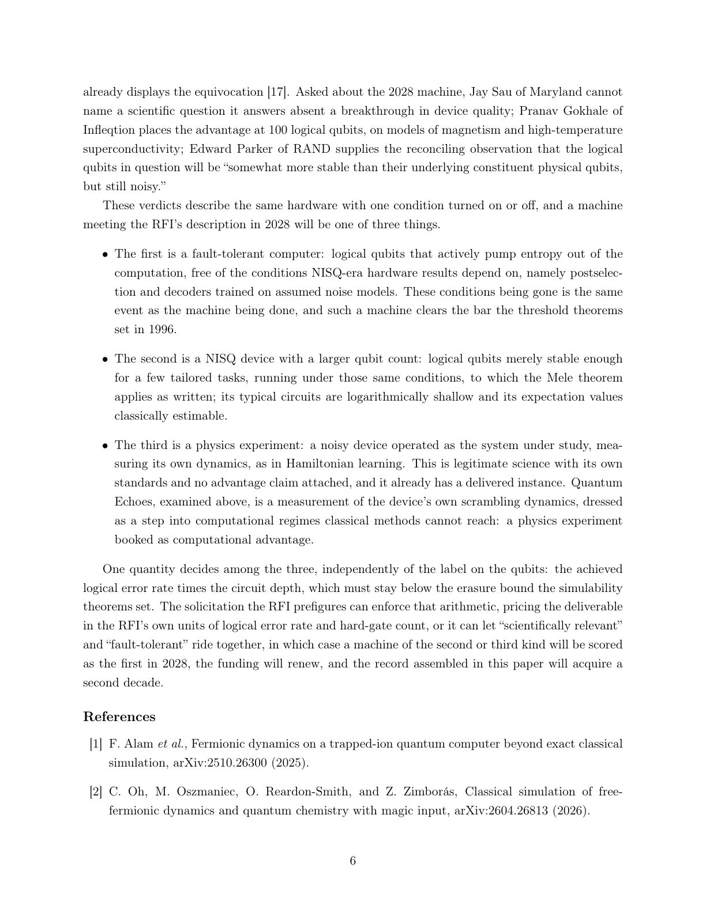
<figcaption class="paper-figure-caption"><b>Fig 5.</b> Low-resolution page preview, page 6</figcaption>
</figure>

**Summary.** This paper argues that eight years of NISQ demonstrations have shown hardware operating only in regimes already efficiently simulated by classical computers. The author frames this as a 'closed loop' problem, asserting that genuine quantum advantage can only be achieved by reaching the fault-tolerant regime originally predicted decades ago.

**Why it may be interesting.** It provides a critical theoretical framework for assessing current experimental claims across various quantum platforms, directly impacting research directions in open quantum systems and error correction.

Detailed structure

**Main problem.** The paper argues that recent claims of quantum advantage from NISQ hardware are systematically reproducible or simulable by classical algorithms.

**Main result.** It posits that the current NISQ era is trapped in a 'closed loop' where demonstrations only explore regions already efficiently simulated classically, suggesting fault tolerance is the necessary exit point.

**Method.** The analysis involves comparing experimental claims against known theoretical limits set by simulability theorems for various quantum circuit structures and noise models.

**Model / system.** The discussion covers general NISQ hardware platforms (trapped ions, superconducting circuits) operating under noise constraints, contrasting them with the idealized requirements of fault-tolerant computation.

**Key observables.** Quantum advantage claims, logical error rates, circuit depth, and fidelity measurements are key diagnostics used to test computational boundaries.

**Important parameters / regimes.** The critical parameters involve the effective depth of circuits and the comparison against classical simulation complexity bounds (e.g., Pfaffian polynomials).

**Assumptions / limitations.** The core assumption is that if a quantum process can be mapped onto a structure efficiently handled by known classical algorithms, it does not constitute true computational advantage.

**Paper structure.** The paper establishes the historical context (1996 threshold theorems), details the pattern of recent failures to achieve advantage due to simulability, and concludes by locating the necessary breakthrough in fault tolerance.

Abstract

With a single contested exception, every NISQ-era flagship demonstration of "quantum advantage" has been classically reproduced, or closed by a simulability theorem, within eighteen months of its announcement. Six theoretical results from 2024 through April 2026 explain the pattern: the regions of circuit-space NISQ hardware can run with sufficient fidelity coincide with the regions classical algorithms compress efficiently, because the features that admit one (low effective depth, strong algebraic structure, geometric locality) are the features that admit the other. This reading dates the NISQ programme from its 2018 articulation as an interim retreat from the unmet conditions of the 1996 threshold theorems, characterises the eight years that followed as a closed loop in which the demonstrations the hardware could run were drawn from the only regions classical methods could already attack, and locates the exit from the loop where the threshold theorems originally located it: in fault tolerance. The empirical pattern could in principle break with a demonstration that escapes the current simulability results. After eight years and more than thirty advantage-class announcements, the burden of producing such a demonstration falls to the defenders of NISQ.

[↑ back to top](#top)

### [Ab Initio Investigation of Pressure Effects in the Spin-Liquid Candidate Y-Kapellasite](http://arxiv.org/abs/2607.07341v1)

**Authors:** Federico Abbruciati, Aleksandar Razpopov, Joao Elias F. S. Rodrigues, Gaston Garbarino, Matthieu Le Tacon, Roser Valenti, Pascal Puphal, Björn Wehinger  
**Type:** theory · **Category:** strongly correlated electrons · **PDF:** <https://arxiv.org/pdf/2607.07341v1>  
**Analysis basis:** full PDF text, analyzed in chunks
**Topic relevance:** 🔥 `analog quantum simulation` **4/5** · `exotic spin models in light-matter` **3/5** · `Keldysh / 2PI / non-Gaussian methods` **1/5** · `entanglement & information structure` **1/5** · `spintronics-quantum-optics interface` **1/5**

↔ Scroll figures horizontally

<figure class="paper-figure-card">
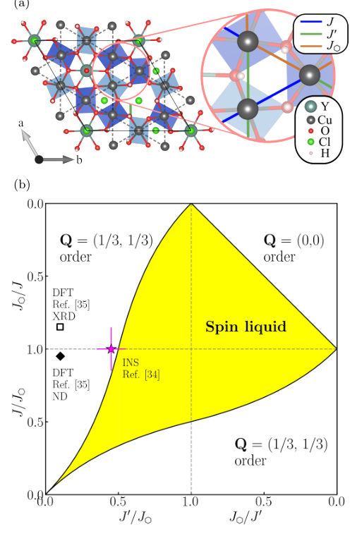
<figcaption class="paper-figure-caption"><b>Fig 1.</b> FIG. 1. (a) A top view of Y-kapellasite showing the kagome lattice in the ab plane with a zoom on the local geometry of the three main magnetic interactions J′, J9, and J. The two non-equivalent copper positions Cu1 and Cu2 are represented by the blue and light-blue environment. The superexchange coupling is mediated by the non magnetic hydroxide ion be- tween the magnetic Cu. (b) Phase diagram of the classical J1 −J2 −J3 (denoted J′, J9, and J in this work) kagome [35], predicted by classical Monte Carlo simulations. The sys- tem features two coplanar states with ordering vectors Q = (1/3, 1/3, 0) and Q = (0, 0), and a spin liquid state accord- ing to the ratio of the first three...</figcaption>
</figure>
<figure class="paper-figure-card">
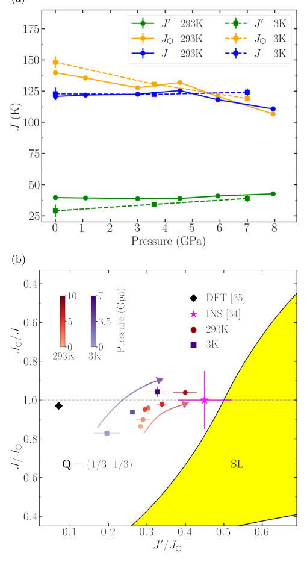
<figcaption class="paper-figure-caption"><b>Fig 2.</b> FIG. 2. (a) Pressure evolution of the magnetic exchange cou- plings as calculated by DFT on structures measured by XRD at 293 K and 3 K. (b) Pressure evolution of J/J9 and J′/J9 in the Y-kapellasite phase diagram for 293K and 3K. Color gradient indicate the increase in pressure. Black square on the left represent DFT calculations from Ref. [35] on struc- ture of Ref. [31]. Magenta star represents the couplings from INS at 1.5 K and ambient pressure in Ref. [34].</figcaption>
</figure>
<figure class="paper-figure-card">
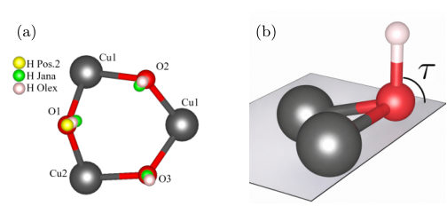
<figcaption class="paper-figure-caption"><b>Fig 3.</b> FIG. 3. (a) a-b plane view of the different hydrogen position considered in this study. The naming of the oxygens reflect the nearest-neighbor couplings, hence O1 is associated with J′, O2 with J9 and O3 with J [see also Fig. 1]. In Pos.2 only H1 is manually moved, while the other H are left in the Olex2 position The different position are defined in terms of the out-of-plane angle τ. (b) Visualization of out-of-plane angle τ. The angle is defined as the complementary angle to that formed between the plane normal and the vector representing the O–H direction.</figcaption>
</figure>
<figure class="paper-figure-card">
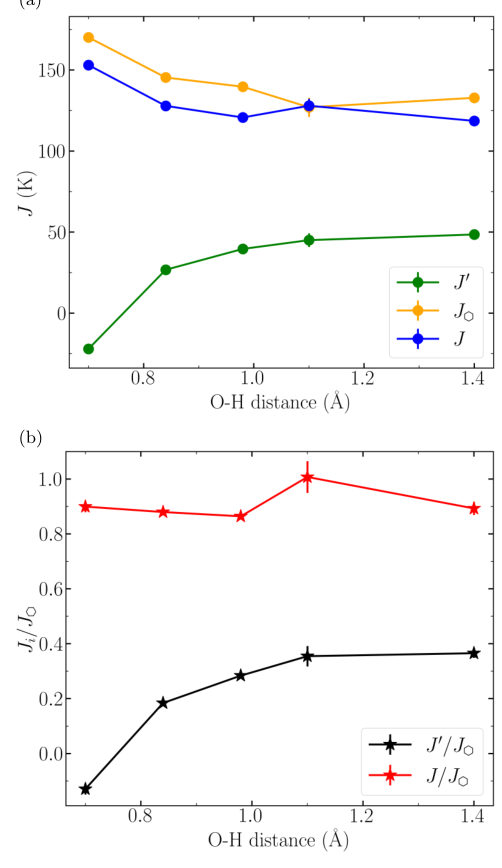
<figcaption class="paper-figure-caption"><b>Fig 4.</b> FIG. 4. (a) Exchange coupling behavior as a function of the O-H distance and (b) ratio of the exchange couplings as a function of the O-H distance, on the room temperature and ambient pressure structure. These ratios represent the x and y axis in the phase diagram.</figcaption>
</figure>
<figure class="paper-figure-card">
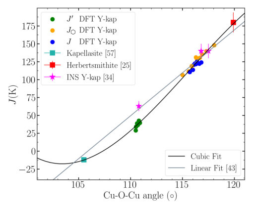
<figcaption class="paper-figure-caption"><b>Fig 5.</b> FIG. 5. Exchange coupling vs Cu-O-Cu angle. The data points include the DFT calculated coupling of this manuscript, the three couplings extracted from INS [34] and the result for Herbertsmithite [25] and Kapellasite [57]. INS J′ coupling (pink star around 110◦) is larger than the DFT calculated ones, while INS J9 and J have perfect agreement. Gray line is the linear fit of Ref. [40] via the INS data points, while black line is the cubic fit proposed in this work based on the DFT values.</figcaption>
</figure>

**Summary.** This work uses DFT calculations to microscopically explain how applying hydrostatic pressure tunes the magnetic interactions in Y-kapellasite, driving it toward a spin-liquid state. The study emphasizes that structural details, particularly Cu–O–Cu bond angles and hydrogen geometry, are the dominant physical controls governing this quantum phase transition.

**Why it may be interesting.** While focused on solid-state magnetism, the methodology—using first principles to map structural changes into effective low-energy Hamiltonians and predicting quantum ground states (spin liquids)—is highly relevant to understanding strongly correlated quantum materials.

Detailed structure

**Main problem.** The study investigates how hydrostatic pressure drives the magnetic exchange interactions in Y-kapellasite, a spin-liquid candidate, towards a quantum spin-liquid regime.

**Main result.** Pressure efficiently tunes the magnetic Hamiltonian by altering the Cu–O–Cu bond geometry, confirming that hydrogen positioning and bond angles are crucial microscopic controls for frustration enhancement.

**Method.** Ab initio Density Functional Theory (DFT) calculations were employed using Total Energy Mapping Analysis (TEMA) to calculate isotropic magnetic exchange couplings ($J', J_9, J$) under varying pressures and structural perturbations.

**Model / system.** The system is the anisotropic kagome antiferromagnet Y-kapellasite. The magnetic behavior is modeled by an effective Heisenberg Hamiltonian involving three primary exchange couplings ($J'$, $J_9$, $J$).

**Key observables.** Magnetic exchange couplings ($J', J_9, J$), their pressure dependence, and the ratios of these couplings ($rac{J'}{J_9}$, $rac{J}{J_9}$) relative to a theoretical phase diagram.

**Important parameters / regimes.** Hydrostatic pressure (up to 7.9 GPa), Cu–O–Cu bond angle, O–H bond length, and hydrogen out-of-plane angle ($	au$).

**Assumptions / limitations.** The analysis primarily focuses on the first three nearest-neighbor exchange parameters; certain calculations assume a constant value for the Hubbard U parameter calibrated to ambient $\theta_{CW}$.

**Figures summary.** Figures illustrate the pressure evolution of coupling ratios onto a phase diagram, and other figures map the dependence of couplings on structural parameters like bond angles and hydrogen positions.

**Paper structure.** The paper systematically analyzes the effect of external tuning parameters (pressure, structure) on the magnetic Hamiltonian derived from DFT calculations, mapping the resulting state onto established theoretical phase diagrams for kagome magnets.

Abstract

Motivated by recent experiments showing pressure-induced suppression of magnetic order and the emergence of a dynamical ground state in the anisotropic kagome antiferromagnet Y-kapellasite Y3Cu9(OH)19Cl8, we perform ab initio density functional theory (DFT)calculations to investigate the evolution of magnetic exchange interactions under hydrostatic pressure. We show that pressure efficiently tunes the magnetic Hamiltonian by altering the CuOCu bond geometry, thereby driving the system towards a spin-liquid regime. This evolution is governed by a nonlinear dependence of the dominant exchange coupling on the CuOCu bond angle. We further examine the influence of hydrogen positions and find that both the OH bond length and the hydrogen out-of-plane angle strongly affect the magnetic interactions. Our results provide a microscopic explanation for the experimentally observed pressure-induced enhancement of frustration and highlight the key role of hydrogen geometry.

[↑ back to top](#top)

### [Emergent superconductivity upon disordering a topological insulator](http://arxiv.org/abs/2607.07163v1)

**Authors:** Carlos Eduardo S. P. Corsino, Hermann Freire, Anurag Banerjee  
**Type:** theory · **Category:** strongly correlated electrons · **PDF:** <https://arxiv.org/pdf/2607.07163v1>  
**Analysis basis:** full PDF text, analyzed in chunks
**Topic relevance:** 🔥 `analog quantum simulation` **4/5** · `Kondo & dissipative impurity` **2/5** · `Keldysh / 2PI / non-Gaussian methods` **1/5** · `driven-dissipative phase transition` **1/5** · `methods for driven-dissipative` **1/5**

↔ Scroll figures horizontally

<figure class="paper-figure-card">
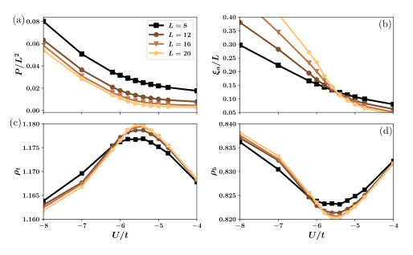
<figcaption class="paper-figure-caption"><b>Fig 1.</b> FIG. 2. Results from AFQMC simulations for the BHZ-Hubbard model with impurity density f = 1/16 (a) Pairing correlations as a function of U for different system sizes. (b) Pairing correlation length as a function of interaction strength for different system sizes, where the crossing point is Uc. The modulus of the critical |Uc| for the disordered system is significantly lower than that of the clean system. (c) and (d) Average electron density for the top and bottom layers, respectively. Near the critical U, the electron density reaches a maximum in the top layer and a minimum in the bottom layer.</figcaption>
</figure>
<figure class="paper-figure-card">
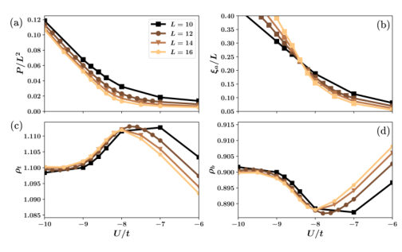
<figcaption class="paper-figure-caption"><b>Fig 2.</b> FIG. 1. Results from AFQMC simulations for the BHZ-Hubbard model without impurity. (a) Pairing correlations as a function of U for different system sizes. Beyond a critical value of |U|, s-wave SC emerges in the bulk of the topological insulator. (b) Pairing correla- tion length as a function of interaction strength for different system sizes. The crossing point identifies the critical Uc. (c) and (d) Aver- age electron density for the top and bottom layers, respectively. Near the critical U, the electron density reaches a maximum in the top layer and a minimum in the bottom layer.</figcaption>
</figure>
<figure class="paper-figure-card">
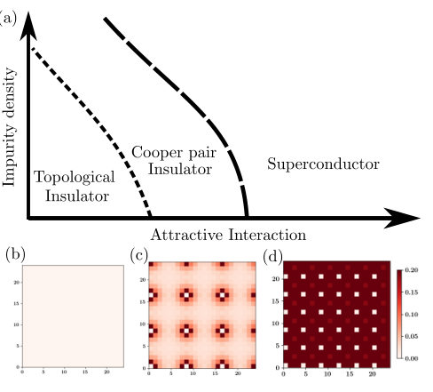
<figcaption class="paper-figure-caption"><b>Fig 3.</b> FIG. 4. (a) Schematic phase diagram of the attractive BHZ-Hubbard model in the interaction strength and impurity density plane. In the clean limit, the system undergoes a transition from a quantum spin Hall insulator to a superconducting phase at a critical interaction strength |Uc|. Increasing the impurity density systematically lowers |Uc|. Self-consistent BdG calculations further suggest the emergence of a Cooper-pair insulating regime, in which local pairing develops around impurity-induced subgap states before the establishment of global phase coherence. (b) Spatial profile of the pairing ampli- tude in the topological insulator with SC pairing absent. (c) Same for Cooper-pair...</figcaption>
</figure>
<figure class="paper-figure-card">
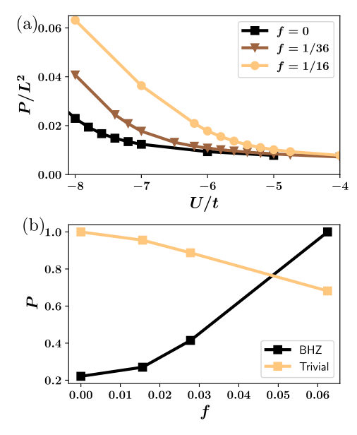
<figcaption class="paper-figure-caption"><b>Fig 4.</b> FIG. 3. (a) Dependence of the superconducting correlations on the interaction strength U for different impurity densities f (where f = 0 is the impurity free system). (b) Superconducting correlations as a function of impurity density f for systems with topological bands at U = −6t and trivial bands U = −4t. In the topological phase, the superconducting correlations are enhanced with increasing impurity density, whereas in the trivial bands they are reduced with increasing impurity density.</figcaption>
</figure>
<figure class="paper-figure-card">
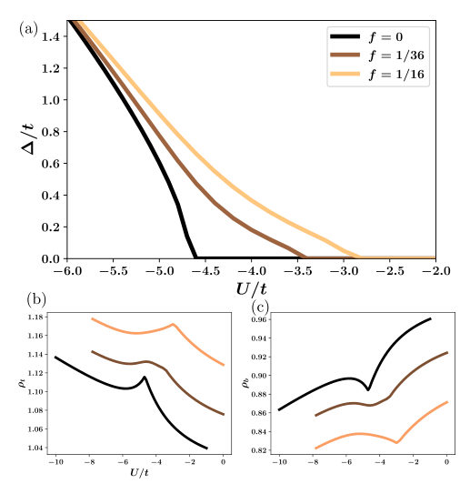
<figcaption class="paper-figure-caption"><b>Fig 5.</b> FIG. 5. (a) Mean-field SC pairing amplitude as a function of U for different impurity concentrations. As the impurity concentration in- creases, the absolute value of the critical interaction strength |Uc|, required for the onset of superconductivity, is significantly reduced compared to the clean system. (b) Average electron density in the top layer as a function of U. (c) Average electron density in the bottom layer as a function of U. The minima in the electron density identify the critical interaction strength at which the system undergoes the transition into the superconducting phase.</figcaption>
</figure>

**Summary.** This work explores how introducing impurities into a topological insulator can unexpectedly enhance superconductivity. Using advanced quantum simulations, the authors show that disorder creates local bound states which act as nucleation centers for Cooper pairs. This mechanism suggests that impurity-induced physics can drive superconducting order in systems governed by strong quantum geometry.

**Why it may be interesting.** The finding that disorder can *promote* superconductivity via localized states is a non-trivial many-body effect relevant to understanding unconventional superconductors in engineered quantum materials like moiré heterostructures.

Detailed structure

**Main problem.** The study investigates how disordering a topological insulator affects the emergence of superconductivity, specifically looking for disorder-driven enhancement mechanisms.

**Main result.** Strong impurities significantly enhance superconductivity by lowering the critical interaction strength required for pairing. This occurs because Cooper pairing first nucleates in impurity-generated subgap ring states before achieving global coherence.

**Method.** The research employs Auxiliary-field Quantum Monte Carlo (AFQMC) simulations and Bogoliubov-de Gennes (BdG) calculations to study the superconducting order parameter.

**Model / system.** The system is a quantum spin Hall insulator modeled by the attractive Bernevig-Hughes-Zhang (BHZ) Hubbard model, incorporating both interaction terms ($U$) and impurity potentials ($V$).

**Key observables.** Equal-time s-wave pairing correlation function ($\langle \Delta 
angle$), superconducting order parameter, and superconducting correlation length ($\xi_{sc}$).

**Important parameters / regimes.** Interaction strength $|U|$, impurity density ($f$), and the orbital polarization parameter ($M$).

**Assumptions / limitations.** The analysis assumes attractive interactions are symmetric and that the mechanism of SC enhancement is driven by localized, impurity-induced bound states.

**Figures summary.** Figures illustrate the emergence of SC in clean vs. impure systems (showing lower critical $|U|$ with disorder), compare pairing correlations across different regimes, and contrast SC ordering against CDW instabilities.

**Paper structure.** The paper systematically analyzes the transition to superconductivity using AFQMC for bulk properties, then uses BdG calculations to resolve the spatial structure of pairing around impurities, concluding by comparing this mechanism to charge density wave instabilities.

Abstract

We study the emergence of superconductivity in a quantum spin Hall insulator and identify a disorder-driven enhancement of pairing arising from quantum geometry. Using sign-problem-free quantum Monte Carlo simulations of the attractive Bernevig-Hughes-Zhang (BHZ) Hubbard model, we obtain a quantum phase transition as a function of interaction strength for different impurity densities. In the clean limit, the system develops bulk superconductivity for Hubbard interaction $\vert U \vert$ above a finite critical strength. Interestingly, strong impurities significantly reduce such $\vert U \vert$ required for the onset of superconductivity. Our calculations indicate that Cooper pairing first nucleates in subgap ring states surrounding the impurities and then evolves into a globally coherent superconducting phase. Our results demonstrate that impurity-generated bound states can promote superconductivity in systems with strong quantum geometry. This mechanism is expected to be relevant in nearly flat-band systems like moiré materials where quantum geometry plays a dominant role.

[↑ back to top](#top)

### [Multistage development of short-range spin correlations and weak magnetic order in the two coupled trillium lattices of K2Fe2(MoO4)(PO4)2](http://arxiv.org/abs/2607.07681v1)

**Authors:** J. Khatua, Sritharan Krishnamoorthi, Changhyun Koo, Gyungbin Ban, Taeyun Kim, Yugo Oshima, Marc Uhlarz, John Wilkinson, Peter J. Baker, Kyeong Jun Lee, Mani Shankar, Seo Hyoung Chang, R. Sankar, Kwang-Yong Choi  
**Type:** experiment · **Category:** strongly correlated electrons · **PDF:** <https://arxiv.org/pdf/2607.07681v1>  
**Analysis basis:** full PDF text, analyzed in chunks
**Topic relevance:** 🔥 `analog quantum simulation` **4/5** · `exotic spin models in light-matter` **3/5** · `entanglement & information structure` **1/5** · `spintronics-quantum-optics interface` **1/5**

↔ Scroll figures horizontally

<figure class="paper-figure-card">
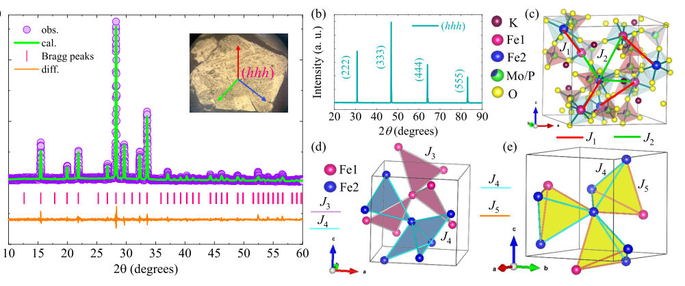
<figcaption class="paper-figure-caption"><b>Fig 1.</b> FIG. 1. (a) Rietveld refinement of the powder X-ray diffraction pattern collected at room temperature. The colored curves correspond to the observed, calculated, and difference diffraction profiles, while the vertical pink bars indicate the Bragg reflection positions, as shown in the legend. The inset (top right) shows a photo of a single crystal of K2Fe2(MoO4)(PO4)2, with the top surface indicating to the (hhh) plane. (b) X-ray diffraction pattern of a single crystal of the (hhh) plane. (c) Crystal structure of one unit cell of K2Fe2(MoO4)(PO4)2, consisting of FeO6 octahedra that share corners with Mo/P tetrahedra. (d) Schematic illustration of the double trillium lattice formed by each...</figcaption>
</figure>
<figure class="paper-figure-card">
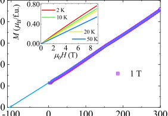
<figcaption class="paper-figure-caption"><b>Fig 2.</b> FIG. 2. (a) Temperature dependence of the magnetic susceptibility χ(T) at several magnetic fields. The bottom inset shows an enlarged view of χ(T) below 20 K. The dashed vertical lines indicate the characteristic temperatures TH = 34 K, TL = 10 K, and T ∗= 3.2 K, which signify changes in spin correlations, while TN indicates the onset of weak magnetic ordering. (b) Temperature dependence of the derivative of χ(T) at 300 Oe. The top inset shows the temperature dependence of the real part of the ac χ(T) at three different frequencies. (c) Zero-field-cooled (ZFC) and field-cooled (FC) χ(T) as a function of temperature at different magnetic fields. (d) Temperature dependence of the inverse χ(T)...</figcaption>
</figure>
<figure class="paper-figure-card">
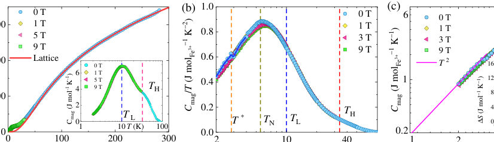
<figcaption class="paper-figure-caption"><b>Fig 3.</b> FIG. 3. (a)Temperature dependence of the specific heat at several magnetic fields. The solid orange line represents the lattice contribution, as described in the text. The inset shows the magnetic specific heat (Cmag) as a function of temperature for different fields. An inflection point around TH ≈34 K and a broad maximum at TL ≈10 K are indicated by the red and blue dashed vertical lines, respectively. (b) Temperature dependence of Cmag/T that highlights two additional features; a broad peak of weak magnetic ordering at TN ≈5.2 K and a crossover to distinct spin correlations below T ∗= 3.2 K, indicated by dark yellow and orange vertical lines, respectively. The solid blue line below 4 K...</figcaption>
</figure>
<figure class="paper-figure-card">
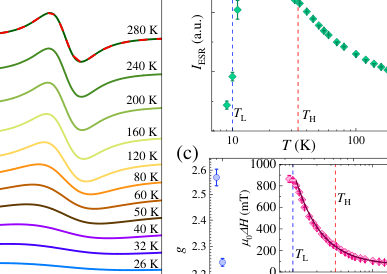
<figcaption class="paper-figure-caption"><b>Fig 4.</b> FIG. 4. (a) Selected ESR spectra at f = 9.12 GHz at vari- ous temperatures with the magnetic field applied to the [111] crystal orientation. Spectra are vertically offset for clarity. The dashed red line on the spectrum at T = 280 K represents the fitting using a derivative Lorentzian function. Tempera- ture dependence of (b) the integrated ESR intensity, (c) the g-factor, and the peak-to-peak linewidth (in the inset) ob- tained from the fittings of the ESR spectra shown in (a). The black solid curve in the inset corresponds to a power-law fit (see the text in detail). (b) and (c) are semi-log plots. The dashed vertical lines in (b) and (c) are at TH and TL, as in Fig. 3.</figcaption>
</figure>

**Summary.** This work experimentally characterizes the magnetic behavior of $	ext{K}_2	ext{Fe}_2(	ext{MoO}_4)(	ext{PO}_4)_2$, a material built from coupled trillium lattices. Measurements reveal multiple distinct temperature scales marking the development of short-range spin correlations, culminating in weak antiferromagnetic order. The results suggest this system is an excellent platform for studying field-induced quantum spin liquid behavior.

**Why it may be interesting.** The study provides experimental evidence of hierarchical spin correlations across multiple energy scales in a geometrically frustrated lattice, which is highly relevant for understanding complex many-body ground states beyond simple mean-field theories.

Detailed structure

**Main problem.** The study investigates the development of short-range spin correlations and weak magnetic order within a specific, geometrically frustrated magnetic material.

**Main result.** The material exhibits multiple distinct temperature scales for correlation development ($T_H=34	ext{ K}, T_L=10	ext{ K}$) followed by weak long-range antiferromagnetic ordering at $T_N=5.2	ext{ K}$, suggesting complex magnetic interactions.

**Method.** The research employed a combination of bulk measurements, including magnetization, specific heat, Electron Spin Resonance (ESR), and Muon Spin Relaxation ($\mu$SR).

**Model / system.** The physical system is the single crystal $	ext{K}_2	ext{Fe}_2(	ext{MoO}_4)(	ext{PO}_4)_2$, which features two coupled trillium lattices of magnetic $	ext{Fe}^{3+}$ ions, forming a complex, frustrated 3D magnetic network.

**Key observables.** Magnetic susceptibility ($\chi(T)$), specific heat anomalies ($\lambda$-like), muon spin relaxation rate enhancement, and ESR signal changes.

**Important parameters / regimes.** $T_N = 5.2	ext{ K}$ (Néel temperature), $T_H = 34	ext{ K}$, $T_L = 10	ext{ K}$, and applied magnetic fields ($\mu_0H \geq 2	ext{ T}$).

**Assumptions / limitations.** The weak magnetic order is attributed to residual interactions atop dominant Heisenberg exchange, and the system shows signs of field-induced spin-liquid behavior.

**Figures summary.** Figures detail crystal structure analysis (XRD) confirming phase purity and lattice details, alongside measurements showing temperature dependence of susceptibility and anomalies related to spin correlations and ordering.

**Paper structure.** The paper proceeds by first establishing the structural framework using XRD, then characterizing the magnetic interactions via $\chi(T)$ and specific heat to identify multiple correlation temperatures ($T_H, T_L$), followed by detailed probes ($\mu$SR) confirming dynamic fluctuations even in the ordered state.

Abstract

Trillium lattices, where magnetic ions form a chiral network of corner-sharing triangles, offer a three-dimensional magnetic framework that can host fragile classical spin-liquid states. Herein, we report on the magnetization, specific heat, electron spin resonance (ESR), and muon spin relaxation ($μ$SR) of K$_{2}$Fe$_{2}$(MoO$_{4}$)(PO$_{4}$)$_{2}$ single crystals. Magnetization measurements reveal strong antiferromagnetic interactions coexisting with weak magnetic order at $T_{\rm N} = 5.2$~K, as evidenced by a $λ$-like anomaly observed in the magnetic susceptibility, a critical enhancement of the muon spin relaxation rate and the wipeout of the ESR signal as the temperature approaches $T_{\rm N}$. Above $T_{\rm N}$, two distinct developments of short-range spin correlations are identified at $T_{\rm H} = 34$~K and $T_{\rm L} = 10$~K, supported by magnetic specific heat anomalies and the temperature dependence of the ESR linewidth and $g$-factor. Upon cooling below $T_{\rm N}$, an anomaly appears at $T^{*} = 3.2$~K in thermodynamic observables and the muon spin relaxation rate, indicative of spin reorientation driven by residual interactions. Despite the presence of magnetic order, $μ$SR experiments reveal dynamically fluctuating spins persisting even in the ordered state. Moreover, the suppression of $T_{\rm N}$ under applied magnetic fields ($μ_{0}H \geq 2$~T) suggests that K$_{2}$Fe$_{2}$(MoO$_{4}$)(PO$_{4}$)$_{2}$ constitutes a promising candidate for exploring field-induced spin-liquid behavior in three-dimensionally coupled trillium lattices.

[↑ back to top](#top)

### [Quantum Computing : A New Frontier for Science and Society](http://arxiv.org/abs/2607.07222v1)

**Authors:** Giuseppe Di Molfetta  
**Type:** both · **Category:** quantum information and computing · **PDF:** <https://arxiv.org/pdf/2607.07222v1>  
**Analysis basis:** full PDF text, analyzed in chunks
**Topic relevance:** 🔥 `QC/QI experiment` **4/5** · `analog quantum simulation` **2/5** · `correlated / nonlocal dissipation` **1/5** · `entanglement & information structure` **1/5** · `methods for driven-dissipative` **1/5**

↔ Scroll figures horizontally

<figure class="paper-figure-card">
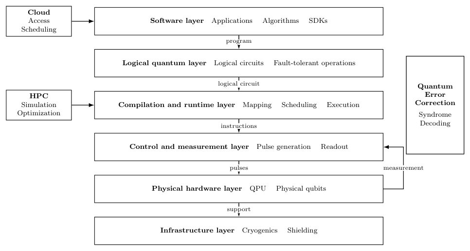
<figcaption class="paper-figure-caption"><b>Fig 1.</b> Figure 1: Layered architecture of a quantum computing system showing the interaction between the software stack, compilation and runtime layers, control electronics, and the quantum processor operating within a cryogenic infrastructure. Quantum error correction spans several layers, while HPC and cloud resources provide classical support.</figcaption>
</figure>

**Summary.** This report surveys the current landscape of quantum technologies, analyzing the complex, multi-layered architecture required for practical quantum computation. It compares leading hardware platforms—such as trapped ions, superconducting circuits, and neutral atoms—while detailing critical challenges like decoherence and the necessity of robust Quantum Error Correction. The paper emphasizes that future progress relies on integrating these physical systems with advanced classical control electronics.

**Why it may be interesting.** It provides an excellent overview of the state-of-the-art across multiple quantum computing modalities, detailing the specific physical control mechanisms (lasers, microwaves) and error correction techniques relevant to open quantum systems research.

Detailed structure

**Main problem.** Developing quantum technologies capable of solving problems intractable for classical computation, while managing inherent hardware limitations like decoherence.

**Main result.** The field is rapidly advancing across multiple platforms (superconducting, trapped ion, neutral atom), demonstrating progress towards fault-tolerant logical qubits and achieving early forms of quantum advantage in specific tasks.

**Method.** The report reviews the entire technological stack, from physical qubit implementation to high-level software compilation, emphasizing error correction codes and hybrid classical-quantum control loops.

**Model / system.** It compares several hardware modalities: superconducting circuits (transmons), trapped ions ($	ext{Yb}^+, 	ext{Ca}^+$), neutral atoms in optical lattices, photonic systems, and silicon spin qubits. The discussion heavily features quantum error correction codes like the surface code.

**Key observables.** Decoherence time, Gate Fidelity, Logical Error Rate, Quantum Volume, and qubit connectivity.

**Important parameters / regimes.** Cryogenic temperatures ($\sim 10-20 	ext{ mK}$), gate operation timescales ($\mu	ext{s}$ to ns), and physical overhead required for error correction.

**Assumptions / limitations.** The primary assumption is that the complex, multi-layered architecture (QPU $
ightarrow$ Control $
ightarrow$ Compiler $
ightarrow$ Software) can be successfully integrated and scaled.

**Figures summary.** Figure 1 illustrates the layered architecture of a quantum computer stack, progressing from software down to the physical QPU layer.

**Paper structure.** The paper is structured as a comprehensive review, moving systematically from foundational concepts (superposition, entanglement) to hardware platforms (Superconducting, Trapped Ion, etc.), and culminating in advanced topics like Quantum Error Correction codes and system integration challenges.

Abstract

This short report explores the (non exhaustive) current state of quantum technologies, their potential applications, and the challenges that must be addressed to harness their full potential. In particular we will focus on the quantum computer architecture and its ecosystem. Such architecture represents a complex, multi-layered system that integrates quantum and classical components to enable the execution of quantum algorithms. This manuscript is then organized as follows : first we will introduce the quantum processing unit, the lowest layer of a quantum computer. Then we will progress from the lowest to the higher layer of the system architectures : measurement, circuit control, error correction and mitigation system, the quantum compiler and finally the software stack, with particular emphasis on the interactions between these components

[↑ back to top](#top)

### [Critical SO(5) scaling of entanglement entropy at honeycomb lattice deconfined criticality](http://arxiv.org/abs/2607.07248v1)

**Authors:** Sankalp Kumar, Jonathan D'Emidio, Sumiran Pujari  
**Type:** both · **Category:** statistical mechanics · **PDF:** <https://arxiv.org/pdf/2607.07248v1>  
**Analysis basis:** full PDF text, analyzed in chunks
**Topic relevance:** 🔥 `entanglement & information structure` **4/5** · `analog quantum simulation` **2/5** · `exotic spin models in light-matter` **1/5** · `non-equilibrium universality` **1/5**

↔ Scroll figures horizontally

<figure class="paper-figure-card">
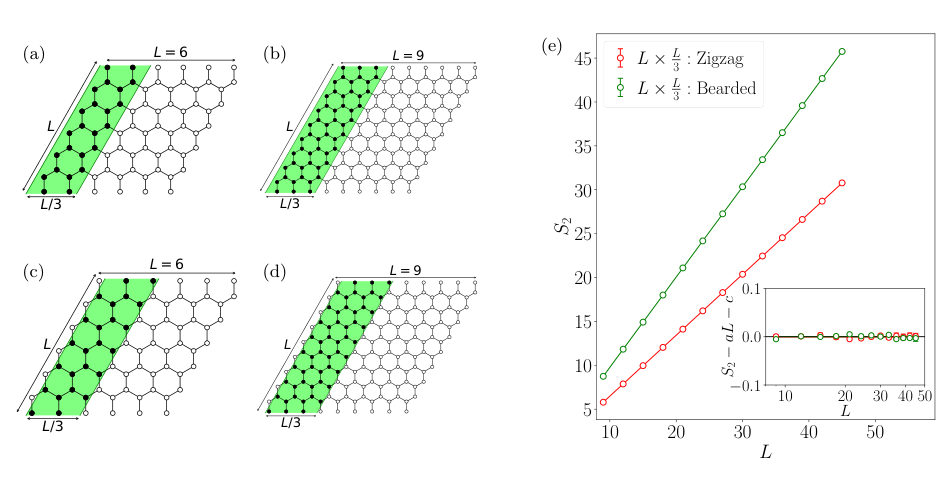
<figcaption class="paper-figure-caption"><b>Fig 1.</b> FIG. 1. (a–d) Two types of smooth bipartitions of size L × L/3 illustrated on honeycomb lattices with L = 6 and L = 9: (a,b) zigzag edges for all L, and (c,d) bearded edges for all L. We follow this nomenclature for the edge types in the rest of the figures. (e) Measured EE for both types of smooth bipartitions (red: zigzag, green: bearded). All data have been fitted to the CFT scaling form in Eq. 1 (solid lines). Inset: EE after subtraction of the area-law and constant terms as obtained in our fits plotted versus log L. The fits yield bzigzag = 0.000(9) and bbearded = 0.000(6) for the zigzag and bearded edged smooth bipartition, respectively, demonstrating the absence of logarithmic...</figcaption>
</figure>
<figure class="paper-figure-card">
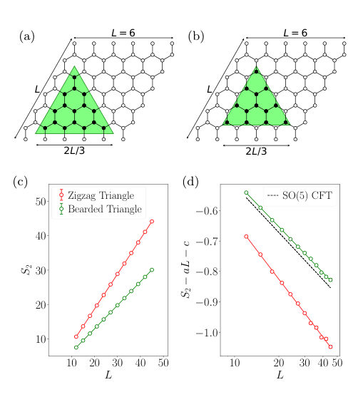
<figcaption class="paper-figure-caption"><b>Fig 2.</b> FIG. 2. (a,b) Triangular bipartitions of size 2L/3 illus- trated on a honeycomb lattice with L = 6: (a) all edges of zigzag type and (b) all edges of bearded type. (c) Measured EE data for zigzag (red points) and bearded (green points) triangular bipartitions, fitted separately to the CFT scaling form in Eq. 1 (solid lines). (d) The same data after sub- tracting the fitted area-law and constant terms and plotted versus log L. The fits yield b60◦= 0.091(3) for the zigzag case and b60◦= 0.072(3) for the bearded case. The bearded result is in excellent agreement with the 5-component predic- tion b60◦= 0.074. The dotted line shows the expected slope using the 5-component value as a guide. The...</figcaption>
</figure>
<figure class="paper-figure-card">
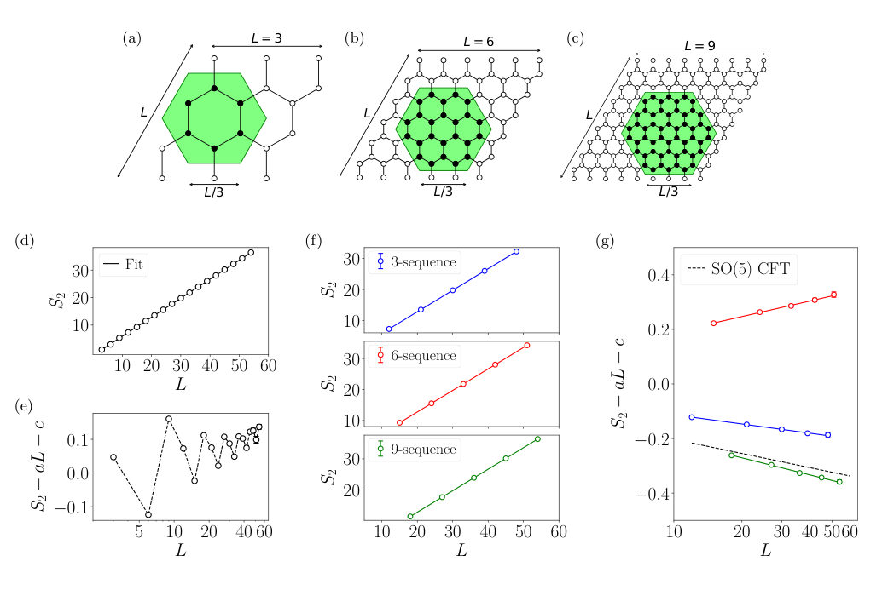
<figcaption class="paper-figure-caption"><b>Fig 3.</b> FIG. 3. (a–c)Hexagonal bipartition of size L/3 illustrated on honeycomb lattices with L = 3, 6, 9. All edges of the bipartition are of zigzag type and remain unchanged as L varies. (d) Measured EE data (points) together with fits to the CFT scaling form in Eq. 1 (solid lines). (e) The same EE data after subtracting the area-law and constant contributions obtained from the fits, plotted on a log scale in L. The subtracted data does not exhibit the expected purely logarithmic behavior; instead, it shows an approximate period-3 oscillation. This demonstrates that the full data set cannot be consistently fitted to the scaling form. (f) EE data grouped into three system-size sequences, L = 9m +...</figcaption>
</figure>
<figure class="paper-figure-card">
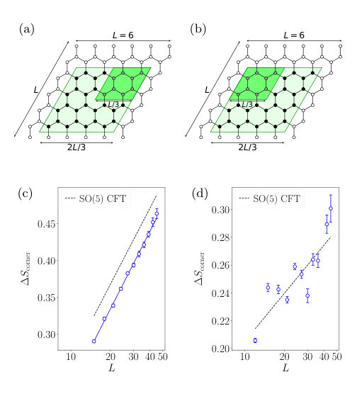
<figcaption class="paper-figure-caption"><b>Fig 4.</b> FIG. 4. (a) Subsystems used to isolate the 60◦corner con- tribution to the EE based on a subtraction scheme shown through the case of L = 6 system size. By subtracting the EE of these two subsystems with identical perimeters, the edge related contributions would cancel out leaving only the contribution from the two 60◦corners (Eq. A1). (b) Sub- systems used to isolate the 120◦corner contribution using an analogous construction. (c) The subtracted EE (∆Scorner) for the construction in panel (a) plotted as a function of log L, along with a linear fit used to extract the corner coefficient. The fit gives b60◦= 0.076(1) which is consistent with the 5-component prediction (b60◦= 0.074). The...</figcaption>
</figure>

**Summary.** This work uses Quantum Monte Carlo simulations on a honeycomb lattice model to study the entanglement entropy scaling at a Deconfined Quantum Critical Point. By analyzing corner contributions using a subtraction scheme, the authors successfully extracted coefficients consistent with an emergent SO(5) Conformal Field Theory prediction. This demonstrates that geometric details of the bipartition can reveal deep universal symmetries governing quantum critical behavior.

**Why it may be interesting.** The use of entanglement entropy as a diagnostic tool to probe exotic critical points like DQCPs is highly relevant to understanding quantum phase transitions in strongly correlated systems, bridging concepts from quantum information theory into condensed matter physics.

Detailed structure

**Main problem.** The study investigates how entanglement entropy scaling at a Deconfined Quantum Critical Point (DQCP) depends on the geometry of the bipartition cut.

**Main result.** The authors found strong agreement between extracted corner coefficients ($b_{60^\circ}$) and predictions from an emergent SO(5) Conformal Field Theory, while also noting complex oscillatory behavior in other subsystems.

**Method.** Large-scale Quantum Monte Carlo simulations were used to compute Rényi entanglement entropy for various bipartitions, employing a subtraction scheme to isolate corner contributions.

**Model / system.** The system is an S=1/2 quantum antiferromagnet on a honeycomb lattice, modeled by the J-Q Hamiltonian, which undergoes a transition between Néel and Valence-Bond-Solid states relevant to DQCP physics.

**Key observables.** Rényi entanglement entropy ($S_2$), universal logarithmic contributions from corners ($\ln L$ terms), and corner coefficients ($b_{60^\circ}, b_{120^\circ}$).

**Important parameters / regimes.** The critical point parameters (J, Q) defining the Néel-VBS transition; geometric angles of the bipartition cut ($60^\circ, 120^\circ$).

**Assumptions / limitations.** The analysis assumes that universal critical physics dictates entanglement scaling, and for corner contributions, it relies on an approximation from O(N) Wilson-Fisher theory.

**Figures summary.** Figures illustrate the geometry of smooth vs. corner bipartitions; Figure 4 specifically shows the subtraction method isolating $60^\circ$ corner contributions, yielding a linear fit consistent with CFT predictions.

**Paper structure.** The paper progresses by contrasting results from previous square lattice studies, detailing the honeycomb model setup and QMC methodology, presenting evidence for SO(5) scaling via corner analysis, and concluding with discussions on geometric dependence and anomalies like period-three oscillations.

Abstract

The deconfined quantum critical point (DQCP) in square lattice S=1/2 quantum antiferromagnets has been extensively studied with a large body of evidence pointing to a weakly first-order transition scenario. Recent studies, which focused on entanglement at this nearly continuous DQCP in square lattice J-Q models, have observed conflicting bipartite entanglement entropy (EE) scaling behavior. One bipartition choice gave scaling coefficients in remarkable agreement with predictions from the unitary CFT corresponding to the putative DQCP. While another equally natural choice gave scaling coefficients in complete violation of unitary CFT that may be attributed to lack of scale invariance at the known weakly first-order behavior of the model. This motivates the exploration of DQCP behavior via entanglement measures in lattice models with distinct crystalline symmetries. Here we study a S=1/2 honeycomb model that hosts a nearly continuous transition between Néel and valence-bond-solid ground states relevant to probing DQCP. Using large-scale quantum Monte Carlo simulations, we compute the Rényi EE for a variety of bipartitions and test the CFT based description of the DQCP on the honeycomb lattice. For smooth bipartitions, we find no evidence of logarithmic corrections, in accordance with CFT, thereby essentially ruling out contributions from Goldstone modes. For subsystems with corners, CFT predicts universal logarithmic contributions, which we extract for corners with 60 and 120 degree angles and find close agreement with an emergent SO(5) CFT. While we observe scaling consistent with a critical system in the majority of cases, we also demonstrate an intriguing counterexample of the hexagon subsystem that exhibits a subtle period three oscillation. This results in three separate finite-size series, where the sign of the logarithmic term apparently changes depending on the series.

[↑ back to top](#top)

### [Majorana physics in a Luttinger liquid with attractive interactions](http://arxiv.org/abs/2607.06751v1)

**Authors:** Francesco Debortoli, Nitya Cuzzuol, Luca Barbiero, Fabian Grusdt  
**Type:** both · **Category:** quantum gases · **PDF:** <https://arxiv.org/pdf/2607.06751v1>  
**Analysis basis:** full PDF text, analyzed in chunks
**Topic relevance:** 🔥 `analog quantum simulation` **4/5** · `Keldysh / 2PI / non-Gaussian methods` **1/5** · `Kondo & dissipative impurity` **1/5** · `entanglement & information structure` **1/5** · `non-equilibrium dynamics` **1/5**

↔ Scroll figures horizontally

<figure class="paper-figure-card">
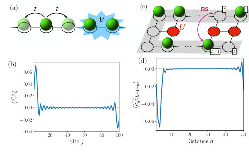
<figcaption class="paper-figure-caption"><b>Fig 1.</b> FIG. 1. (a) Schematic representation of the model in Eq. (1). The model describes spin-polarized fermions hopping on a one-dimensional lattice with nearest-neighbor attrac- tive interactions. (b) Two-point correlator ⟨ˆc† 1ˆcj⟩evaluated on the ground state of the model in Eq. (1) at half-filling N = 50, L = 100 for strong attractive interactions V = −1.9. The correlator goes to zero as j is moved into the bulk, but revives to a finite value when j approaches the opposite edge of the chain. (c) Schematic representation of the proposed ex- perimental setup to measure the revival using beam-splitter interferometry. The spin-polarized fermions can hop along a one-dimensional horseshoe...</figcaption>
</figure>
<figure class="paper-figure-card">
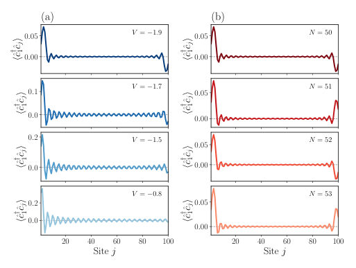
<figcaption class="paper-figure-caption"><b>Fig 2.</b> FIG. 2. (a) Two-point correlator ⟨ˆc† 1ˆcj⟩evaluated on the ground state of the model in Eq. (1) at half-filling N = 50, L = 100 for different values of the interaction strength V . The correlator goes to zero as j is moved into the bulk, but revives to a finite value when j is located at the opposite edge of the chain and V is sufficiently large. (b) Two-point correlator ⟨ˆc† 1ˆcj⟩evaluated on the ground state of the model in Eq. (1) at strong interaction strength V = −1.9 and L = 100, for different values of the total fermion number N. The re- vival is robust to adding fermions to the half-filled chain, but its sign depends on the parity of the number of fermions N in the system.</figcaption>
</figure>
<figure class="paper-figure-card">
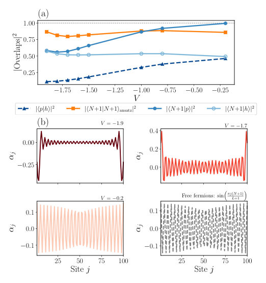
<figcaption class="paper-figure-caption"><b>Fig 3.</b> FIG. 3. (a) Squared overlap | ⟨N + 1|N + 1⟩ansatz |2 of the ansatz in Eq. (5) with the exact ground state |N + 1⟩of the system with N + 1 fermions (N = 50, L = 100). The squared overlap is very high | ⟨N + 1|N + 1⟩ansatz |2 ≈0.85 for a wide range of interaction strengths V . (b) Coefficients αi used in the ansatz in Eq. (5) as a function of interaction strength V . The coefficients αi are localized at the edges of the chain for strong attractive interactions, while they are delocalized in the bulk of the system for weak attractive in- teractions, smoothly interpolating between the Majorana and free-fermion limits. The analytical expression for the coeffi- cients αi in the free-fermion limit...</figcaption>
</figure>
<figure class="paper-figure-card">
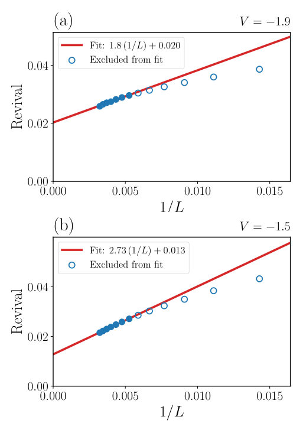
<figcaption class="paper-figure-caption"><b>Fig 4.</b> FIG. 4. (a) Revival as a function of the system size 1/L at half-filling N/L = 1/2 for strong attractive interactions V = −1.9. The revival is quantified as the maximum value of the two-point correlator ⟨ˆc† 1ˆcj⟩for j in the range [L/2, L], which corresponds to the right half of the chain. The data is fitted with a function of the form y = m/L + q, and from the fit we extract the asymptotic value q = 0.020 of the revival in the thermodynamic limit L →∞. (b) Same scaling analysis as in Fig. 4a, but for weaker attractive interactions V = −1.5. From the fit we extract the asymptotic value q = 0.013 of the revival in the thermodynamic limit.</figcaption>
</figure>
<figure class="paper-figure-card">
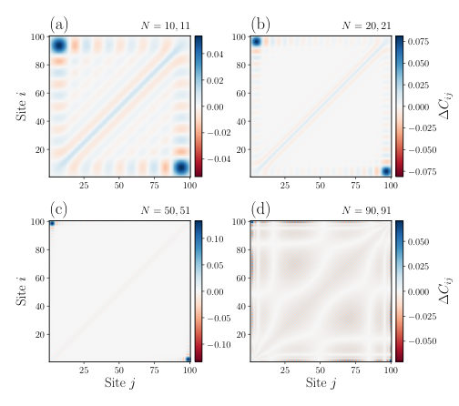
<figcaption class="paper-figure-caption"><b>Fig 5.</b> FIG. 5. Matrix ∆Cij = ⟨N + 1| ˆc† i ˆcj |N + 1⟩−⟨N| ˆc† i ˆcj |N⟩for different fillings N/L at strong attractive interactions V = −1.9 and L = 100. The edge-to-edge revival is visible as a blue peak in the bottom-right and top-left corners of the ∆Cij matrices. The spatial size of the revival shrinks as the filling is increased and its contrast over the bulk oscillations is enhanced at half-filling N/L = 1/2.</figcaption>
</figure>

**Summary.** This paper shows that Majorana-like edge physics can exist in gapless Luttinger liquids of spinless fermions with attractive interactions. The key diagnostic is a robust 'edge-to-edge revival' in the two-point correlator, which survives even when moving to excited states. The authors propose realizing and detecting this phenomenon using ultracold dipolar atoms in an optical lattice.

**Why it may be interesting.** It bridges topological physics (Majorana modes) into gapless, interacting systems relevant to ultracold atomic setups, providing a concrete detection scheme via interferometry.

Detailed structure

**Main problem.** The work demonstrates that signatures of Majorana edge physics can persist in a number-conserving, gapless Luttinger liquid, contrasting with conventional gapped models.

**Main result.** A sharp, robust edge-to-edge revival is found in the two-point correlator, whose sign depends on fermion-number parity, confirming topological signatures beyond gapped superconductors.

**Method.** Theoretical analysis using Luttinger liquid theory, particle-hole ansatz construction, and comparison with exact results from related models like the Kitaev chain.

**Model / system.** The model is spinless fermions in one dimension with short-range attractive interactions, described by a Hamiltonian. It proposes realization using ultracold dipolar molecules or atoms in an optical lattice.

**Key observables.** Two-point correlator $\langle \hat{c}^\dagger_1 \hat{c}_j 
angle$, edge-to-edge revival magnitude, and the overlap $|\langle N+1|N+1
angle_{	ext{ansatz}}|^2$.

**Important parameters / regimes.** Interaction strength $V$ (especially near $-2$), fermion number parity, and system size $L$ (analyzed in the thermodynamic limit).

**Assumptions / limitations.** The analysis assumes particle number conservation, which distinguishes it from standard gapped models like the Kitaev chain.

**Figures summary.** Figures illustrate the bulk decay versus the edge revival via interferometry measurements and show how the revival persists robustly across different interaction strengths and fillings.

**Paper structure.** The paper establishes the model in a number-conserving framework, calculates key correlators showing the edge revival, develops an ansatz for the ground state, confirms robustness in excited states using bosonization, and concludes with an experimental protocol.

Abstract

Majorana zero modes are the hallmark of topological superconductivity. In one-dimensional systems, these zero modes are usually introduced in the context of gapped, mean-field models that do not conserve particle number, such as the Kitaev chain. By non-locally encoding a conventional fermion across spatially separated Majorana zero modes, these systems become inherently immune to local decoherence. In this work, we show that signatures of Majorana edge physics persist in a number-conserving, gapless Luttinger liquid of spinless fermions with short-range attractive interactions. We identify the two-point correlator as a sharp diagnostic, revealing an edge-to-edge revival whose sign depends on the fermion-number parity. This revival is robust in the thermodynamic limit, and persists in the excited states of the system and at different fillings. A simple particle-hole ansatz for the ground state of the system with an odd number of fermions captures the physics of the system for a wide range of interaction strengths, interpolating between the free-fermion limit and the strongly interacting Majorana regime. Finally, we propose a concrete protocol to realize this model with ultracold dipolar molecules or atoms in an optical lattice, and to detect the revival via beam-splitter interferometry, opening an experimental route to Majorana physics beyond the conventional gapped-superconductor paradigm.

[↑ back to top](#top)

### [QANTIS: Hardware-Calibrated Sequential POMDP Belief Updates on IBM Heron](http://arxiv.org/abs/2607.06760v1)

**Authors:** Bayram Yuksel Eker, Suayb S. Arslan, Ozgur Nazli, Mustafa Serhat Demirgil, Furkan Deligoz  
**Type:** experiment · **Category:** quantum information and computing · **PDF:** <https://arxiv.org/pdf/2607.06760v1>  
**Analysis basis:** full PDF text, analyzed in chunks
**Topic relevance:** 🔥 `QC/QI experiment` **4/5** · `quantum measurements` **2/5** · `methods for driven-dissipative` **1/5** · `non-equilibrium dynamics` **1/5**

↔ Scroll figures horizontally

<figure class="paper-figure-card">
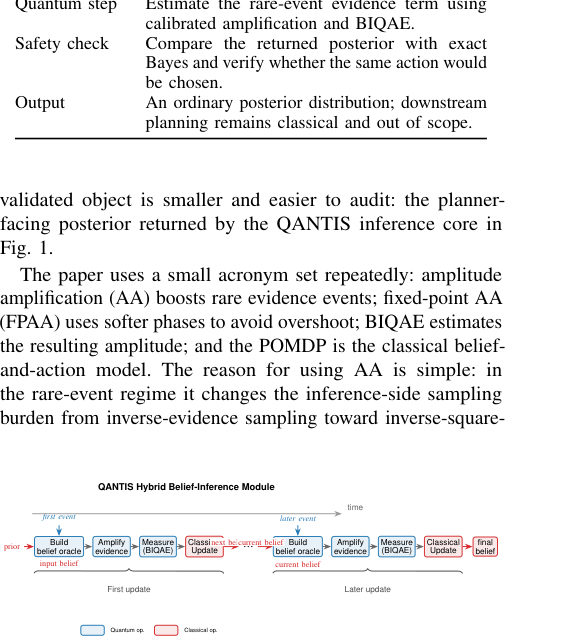
<figcaption class="paper-figure-caption"><b>Fig 1.</b> Fig. 1. QANTIS inference core studied in this paper. Quantum amplitude amplification and boundary-aware BIQAE replace the sampling-intensive evidence update; policy optimization, tracking, and MTDA remain classical context rather than hardware-validated claims.</figcaption>
</figure>
<figure class="paper-figure-card">
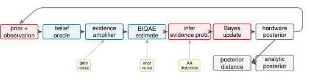
<figcaption class="paper-figure-caption"><b>Fig 2.</b> Fig. 2. Hardware posterior extraction and per-step error budget.</figcaption>
</figure>
<figure class="paper-figure-card">
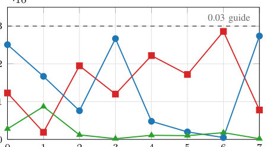
<figcaption class="paper-figure-caption"><b>Fig 3.</b> Fig. 3. Per-step Hellinger distance on the shared 8-step decision-step path. The revised arXiv figure plots No-AA, guarded Grover-AA, and all-step FPAA together instead of forcing the comparison into a dense table.</figcaption>
</figure>
<figure class="paper-figure-card">
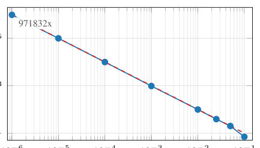
<figcaption class="paper-figure-caption"><b>Fig 4.</b> Fig. 4. Rare-observation envelope for Grover–Brassard iterates on a one- qubit logical oracle. The plot reports the best measured row at each evidence probability; full per-depth rows, raw counts, and backend manifests remain in the artifact bundle.</figcaption>
</figure>
<figure class="paper-figure-card">
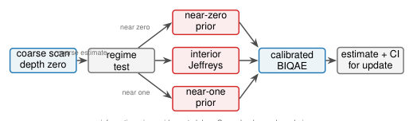
<figcaption class="paper-figure-caption"><b>Fig 5.</b> Fig. 5. Two-phase boundary-aware BIQAE calibration.</figcaption>
</figure>

**Summary.** This paper validates a novel 'hardware-calibrated' primitive for updating beliefs in partially observable systems using quantum processors. It shows that by carefully applying amplitude amplification and boundary calibration techniques on IBM Heron, the quantum routine can reliably maintain posterior accuracy across multiple sequential decision steps. The result defines an operational envelope for this belief update service rather than claiming overall computational speedup.

**Why it may be interesting.** While focused on AI/Control Theory, the reliance on amplitude estimation techniques like BIQAE to stabilize estimates near boundaries (0 or 1) is highly relevant for quantum simulation of physical systems where observables might approach saturation limits.

Detailed structure

**Main problem.** The core challenge is determining if a quantum-enhanced belief update primitive can be reliably reused across sequential steps of a Partially Observable Markov Decision Process (POMDP) on current NISQ hardware without corrupting the posterior passed to a classical planner.

**Main result.** The authors demonstrated that an all-step Fixed-Point Amplitude Amplification protocol successfully preserves the POMDP posterior across multiple decision steps, and the quantum output consistently selects the same immediate action as the exact Bayesian calculation.

**Method.** The work uses Quantum Amplitude Estimation (via AA/FPAA) to estimate rare-event evidence terms within a belief update loop, which is then fed into an ordinary classical Bayes update for planning.

**Model / system.** The experiment is conducted on the IBM Heron quantum processor using the Tiger POMDP as a case study. The process involves treating the quantum computer as a calibrated service that estimates evidence amplitudes.

**Key observables.** Posterior fidelity (comparing hardware vs. exact Bayes), immediate action agreement, and Hellinger distance measuring posterior divergence across sequential steps.

**Important parameters / regimes.** The operational envelope is defined by circuit depth per belief update; the primary constraint identified is the coherence limit of deeper circuits.

**Assumptions / limitations.** The study explicitly limits its claims to the stability of the *belief-update stage* itself, separating it from end-to-end autonomy or wall-clock speedup guarantees.

**Figures summary.** Figures illustrate the QANTIS inference core diagram and show how boundary-aware calibration stabilizes amplitude estimation near zero and one across different hardware backends.

**Paper structure.** The paper establishes the problem (sequential belief tracking), details the quantum primitive (AA/BIQAE for evidence update), validates its stability over multiple steps using controlled case studies, and concludes by defining an operational envelope rather than a general speedup claim.

Abstract

Autonomous systems under partial observability act on beliefs, not raw sensor events. QANTIS treats the quantum processor as a calibrated belief-update service in that loop: it receives a prior and an observation model, estimates the rare-event evidence term, and returns an ordinary posterior to a classical planner. This paper asks whether that service can be reused across a sequential Tiger POMDP horizon on present IBM Heron hardware without corrupting the planner-facing posterior. We answer with a controlled hardware case study rather than an end-to-end autonomy or wall-clock speedup claim. The study compares no amplification, guarded Grover amplification, and all-step fixed-point amplification on the same trajectory, then checks whether the returned posterior would change the downstream action. All-step FPAA preserves the Tiger posterior across the reported 8-step and 12-step primary runs, and the 20-step and 32-step controls remain inside the same operating band. In every reported decision check, the hardware posterior and the exact Bayes posterior select the same immediate action. Boundary-aware BIQAE stabilizes amplitude estimation near zero and near one, while a rare-event sweep maps the logical sample-complexity envelope for one-in-a-million evidence. The result is an operating envelope for a hardware-calibrated belief-update primitive, not a standalone hardware-advantage claim.

[↑ back to top](#top)

### [Vectorizing Quantum Control: A RISC-V Vector Extension Architecture for Scalable Qubit Systems](http://arxiv.org/abs/2607.07372v1)

**Authors:** Xiaorang Guo, Kun Qin, Yanbin Chen, Carsten Trinitis, Martin Schulz  
**Type:** experiment · **Category:** quantum information and computing · **PDF:** <https://arxiv.org/pdf/2607.07372v1>  
**Analysis basis:** full PDF text, analyzed in chunks
**Topic relevance:** 🔥 `QC/QI experiment` **4/5** · `quantum measurements` **3/5** · `measurement-induced transitions` **1/5**

↔ Scroll figures horizontally

<figure class="paper-figure-card">
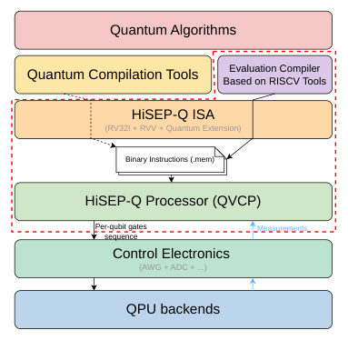
<figcaption class="paper-figure-caption"><b>Fig 1.</b> Fig. 1: HiSEP-Q 2.0 in the quantum software stack. The dashed boundary marks the components contributed by this work.</figcaption>
</figure>
<figure class="paper-figure-card">
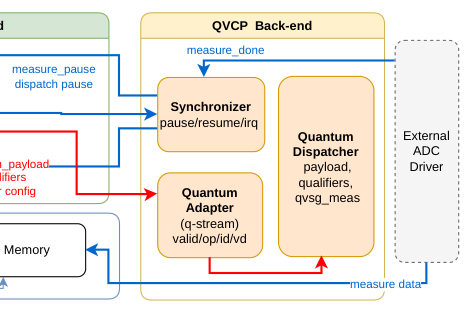
<figcaption class="paper-figure-caption"><b>Fig 2.</b> Fig. 2: Overall architecture of the Ibex-coupled quantum vector engine and its execution back end.</figcaption>
</figure>
<figure class="paper-figure-card">
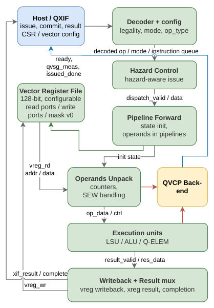
<figcaption class="paper-figure-caption"><b>Fig 3.</b> Fig. 3: Main blocks of QVCP Core. Quantum instructions use a dedicated sideband export path to expose the quantum elements to the QVCP Back-end.</figcaption>
</figure>
<figure class="paper-figure-card">
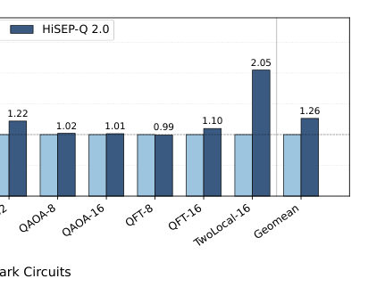
<figcaption class="paper-figure-caption"><b>Fig 4.</b> Fig. 4: Execution time speedup compared to HiSEP-Q 1.0 (Baseline)</figcaption>
</figure>
<figure class="paper-figure-card">
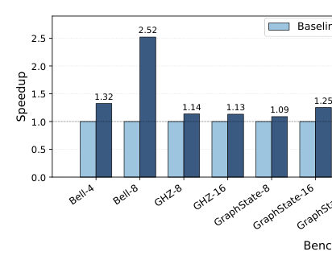
<figcaption class="paper-figure-caption"><b>Fig 5.</b> Figure 5a shows that, at SEW=8, the observed latency of QV.SINGLE, QV.ROT.G, and QV.ROT.V tracks the useful event count almost one-to-one, indicating nearly one emitted event per cycle in steady state. QV.PAIR and QV.ROT.G incur a small excess latency at larger qubit counts due to fixed stream-framing and pipeline-alignment overheads. Grouping factors of m4 and m8 are illegal for QV.ROT.V and therefore are not shown. In general, the observed latency is roughly linear with the number of encoded qubits; however, there are several configuration instructions before the system triggers the actual quantum event stream. It depends on the grouping</figcaption>
</figure>

**Summary.** The paper presents HiSEP-Q 2.0, a novel Quantum Control Processor architecture built by extending the RISC-V Vector (RVV) ISA. This design overcomes limitations of custom hardware by achieving high parallelism to address up to 128 qubits per instruction and supporting fast mid-circuit measurement feedback. It demonstrates significant speedups and excellent scalability for controlling large quantum systems.

**Why it may be interesting.** This work directly addresses the classical control bottleneck in scaling quantum processors, which is crucial for implementing complex algorithms like Quantum Error Correction (QEC) that require massive qubit counts and rapid feedback loops.

Detailed structure

**Main problem.** The classical control hardware stack is a critical scalability bottleneck for quantum systems, requiring efficient parallel instruction dispatching and low-latency feedback handling.

**Main result.** The proposed RISC-V Vector Extension Architecture (HiSEP-Q 2.0) achieves up to 2.52x speedup over baseline designs while supporting scalable control up to 128 qubits.

**Method.** The authors designed a quantum extension built upon the RISC-V Vector (RVV) engine, implementing specialized instructions for gate operations and incorporating a hardware halt-resume protocol for mid-circuit measurements.

**Model / system.** The work focuses on designing a Quantum Control Processor (QCP) that acts as a programmable bridge between compilers and physical qubit manipulation hardware, tested using FPGA prototypes targeting superconducting qubits.

**Key observables.** Program execution time speedup (2.52x), measurement resume latency (within 80 ns), and resource utilization on FPGAs.

**Important parameters / regimes.** Scalability up to 128 qubits addressed in a single instruction; the use of RVV's length-agnostic SIMD semantics.

**Assumptions / limitations.** The design assumes that leveraging the open RISC-V ecosystem is superior to relying on custom Instruction Set Architectures (ISAs) for future scalability.

**Figures summary.** Figures illustrate the overall architecture, the scaling of hardware resource usage (LUT/FF) linearly with qubit count N up to 128 qubits, and the integration of the quantum extension into the software stack.

**Paper structure.** The paper introduces the bottleneck in QCPs, proposes HiSEP-Q 2.0 leveraging RVV for vectorization and parallelism, details the ISA extensions (including rotation instructions), describes the hardware implementation with MCM support, and validates performance and scalability on FPGA prototypes.

Abstract

The Quantum Control Processor (QCP) bridges the gap between compiler toolchains and control electronics, and is responsible for translating compiled quantum circuits into executable instructions that directly manipulate qubits and handle measurement feedback. However, existing designs rely primarily on customized instruction sets, limiting design reuse and requiring significant effort to build supporting toolchains. Furthermore, efficiently addressing qubits and scheduling operations in highly scalable scenarios remains a critical challenge. In this work, we present a vectorized quantum control approach built upon the RISC-V Vector (RVV) engine with a quantum-oriented extension. Leveraging the high parallelism of RVV, our approach can address up to 128 qubits in a single instruction. We also embed parameterized rotation information into the instruction set, enabling dynamic tuning of gate rotations in hybrid quantum-classical programs. To support mid-circuit measurements, we design a hardware-based halt-resume protocol that resumes pipeline execution within 80 $ns$ of receiving the measurement result. Comprehensive evaluation using both RISC-V toolchains and FPGA prototypes demonstrates that our design achieves up to 2.52$\times$ speedup over the baseline in program execution time, with excellent scalability.

[↑ back to top](#top)

### [Phase transitions and uberholography of holographic pure-state geometries](http://arxiv.org/abs/2607.06870v1)

**Authors:** Ning Bao, Keiichiro Furuya, Jacob March  
**Type:** theory · **Category:** statistical mechanics · **PDF:** <https://arxiv.org/pdf/2607.06870v1>  
**Analysis basis:** full PDF text, analyzed in chunks
**Topic relevance:** 🔥 `entanglement & information structure` **4/5** · `driven-dissipative phase transition` **1/5** · `non-equilibrium dynamics` **1/5** · `non-equilibrium universality` **1/5**

↔ Scroll figures horizontally

<figure class="paper-figure-card">
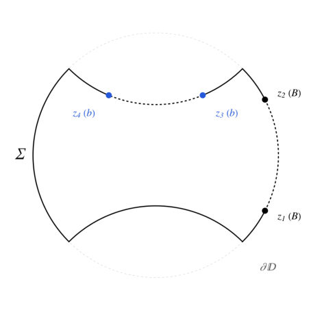
<figcaption class="paper-figure-caption"><b>Fig 1.</b> Figure 1: A pure-state geometry Σ in D after a bipartite partial trace. Anchors are labeled in cyclic counter-clockwise order. B-type anchors lie on ∂D, b-type anchors lie on RT-boundary geodesics. Dashed segments indicate traced-out regions where holes have been punched.</figcaption>
</figure>
<figure class="paper-figure-card">
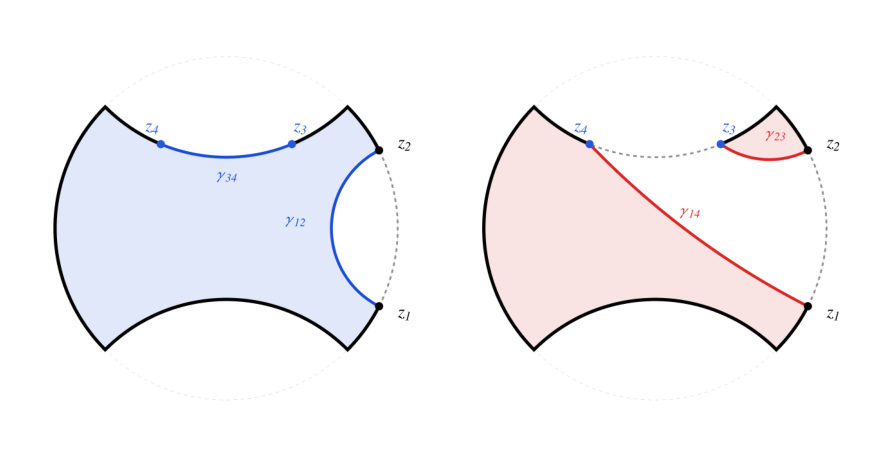
<figcaption class="paper-figure-caption"><b>Fig 2.</b> Figure 2: The two non-crossing pairings and their bulk wedge topologies. Left panel: connected channel Lconn = d(z1, z2)+d(z3, z4), with both geodesics bridging the un-punched arcs. In this panel geodesic γ12 is BB while γ34 is bb. Right panel: disconnected channel Ldisc = d(z1, z4) + d(z2, z3), with each geodesic capping one un-punched arc. Here both geodesics are Bb.</figcaption>
</figure>
<figure class="paper-figure-card">
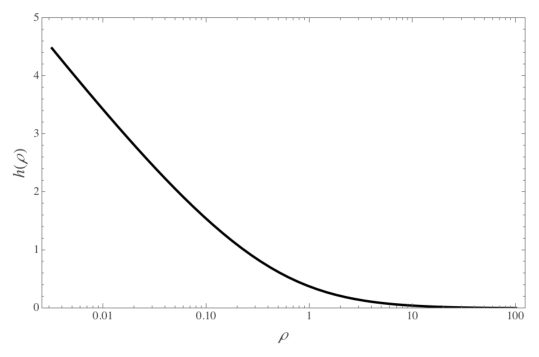
<figcaption class="paper-figure-caption"><b>Fig 3.</b> Figure 3: The function h(ρ) = arccosh(1 + 2ρ) −log(4ρ), the difference between the hyperbolic distance and its large-ρ asymptote. Strictly positive and strictly decreasing on (0, ∞), with asymptote h(ρ) →0 as ρ →∞and divergence as ρ →0+.</figcaption>
</figure>
<figure class="paper-figure-card">
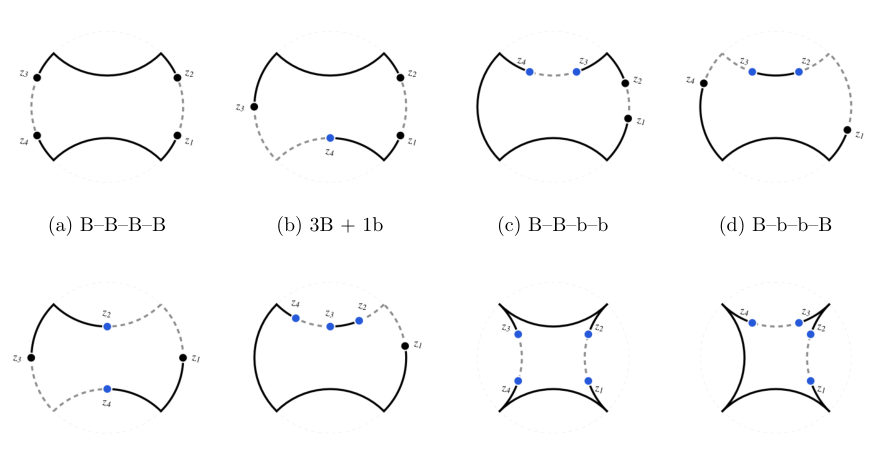
<figcaption class="paper-figure-caption"><b>Fig 4.</b> Figure 4: Cyclic anchor-type patterns at four marks on Σ. Each loop shows the cyclic anchor sequence and the hole-pair assignment {z1, z2} ∪{z3, z4}. The sign of ∆H for each pattern is collected in table 1.</figcaption>
</figure>
<figure class="paper-figure-card">
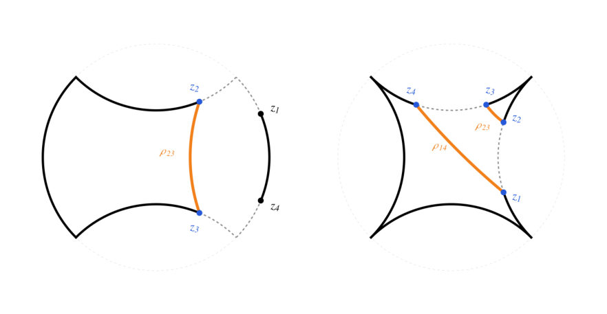
<figcaption class="paper-figure-caption"><b>Fig 5.</b> Figure 5: Two examples with bb geodesics shown in orange. Left: B–b–b–B, with holes straddling corners. Right: the entanglement arena, with holes on adjacent RT-boundary geodesics sharing a corner. In both configurations as drawn, the disconnected channel inherits the short bb geodesic γ23, supplying the dominant contribution to ∆H.</figcaption>
</figure>

**Summary.** This paper explores the phase transitions and error-correcting properties of holographic geometries by analyzing pure-state systems derived from the surface/state correspondence. Key findings include a specific cross-ratio threshold relation governing entanglement wedge connectivity and demonstrating that fractalization processes yield universal fractal dimensions. It advances the understanding of how quantum information concepts manifest in gravitational dualities.

**Why it may be interesting.** While highly theoretical, the connection between entanglement structure (a key concept in quantum information) and geometric phase transitions provides deep insights into how correlations are encoded in spacetime geometry, relevant for understanding complex many-body ground states.

Detailed structure

**Main problem.** The study investigates the error-correcting properties and phase structure of pure-state holographic geometries by analyzing how entanglement wedges are modified via the surface/state correspondence.

**Main result.** A cross-ratio threshold relation ($\eta'/\eta = e\Delta H/2$) is derived for connected/disconnected transitions, and fractalizing asymptotic boundaries yields tighter upper bounds on price and distance than tracing out RT-boundaries first.

**Method.** The authors use techniques from AdS/CFT correspondence, analyzing hyperbolic geometry in the Poincaré disk to derive threshold relations based on cross-ratios ($\eta, \eta'$).

**Model / system.** The model is pure-state holographic geometries within the $	ext{AdS}_3/	ext{CFT}_2$ framework. The analysis involves replacing mixed boundary subregions with Ryu–Takayanagi (RT) geodesics bounding entanglement wedges.

**Key observables.** Cross-ratio threshold relation ($\eta'/\eta = e\Delta H/2$), fractal dimension ($\alpha \approx 0.786$), Price, and distance upper bounds.

**Important parameters / regimes.** The shift parameter $\Delta H$, which is sourced by geodesics ending on RT boundaries; the standard two-interval threshold $\eta=1/2$.

**Assumptions / limitations.** The analysis relies on the surface/state correspondence generalizing holography, and it is noted that resulting upper bounds are procedure dependent.

**Figures summary.** Figures illustrate the structure of entanglement wedges ($\Sigma$) after partial traces, showing connected vs. disconnected topologies; other figures plot functions related to cross-ratios and boundary evolution over discrete steps ($m$).

**Paper structure.** The paper develops by first establishing the phase transition condition using cross-ratios in $	ext{AdS}_3/	ext{CFT}_2$, then generalizing this analysis to code properties via recursive hole-punching (uberholography), and finally comparing boundary evolution procedures.

Abstract

We study the error-correcting properties of pure-state holographic geometries, in which mixed boundary subregions are replaced, via the surface/state correspondence, by the Ryu--Takayanagi (RT) geodesic bounding their entanglement wedges. In AdS$_3$/CFT$_2$ we derive a cross-ratio threshold relation $η'/η= e^{ΔH/2}$ for the connected/disconnected transition of the entanglement wedge when two holes are punched in such a geometry. The quantity $ΔH$ is sourced entirely by geodesics ending on RT boundaries. It shifts the standard two-interval threshold $η= 1/2$, and we classify when its sign is fixed by the pattern of hole endpoints. Turning to code properties, we show that the recursive hole-punching underlying uberholography cannot start within an RT-boundary, while an untouched asymptotic boundary can still fractalize, and we find numerically that in the configurations we study it does so with the universal fractal dimension $α\approx 0.786$. The resulting upper bounds on price and distance are nevertheless procedure dependent. In the configurations we study, punching holes on the asymptotic boundary while retaining the RT-boundary yields strictly tighter bounds than first tracing out the RT-boundary and then fractalizing.

[↑ back to top](#top)

### [Quantum error correction of a grid-state qubit with state preparation and measurement errors below $10^{-3}$](http://arxiv.org/abs/2607.06718v1)

**Authors:** Sara Turcotte, Lucas St-Jean, Amélie L. Pessonneaux, Ross Shillito, Bohdan Kulchytskyy, Eliott Ouellet, Jean Olivier Simoneau, Florian Hopfmueller, Matthew Hamer, Pascal Lemieux, Dany Lachance-Quirion, Baptiste Royer, Nicholas E. Frattini  
**Type:** experiment · **Category:** quantum information and computing · **PDF:** <https://arxiv.org/pdf/2607.06718v1>  
**Analysis basis:** full PDF text, analyzed in chunks
**Topic relevance:** 🔥 `QC/QI experiment` **4/5** · `quantum measurements` **2/5** · `methods for driven-dissipative` **1/5**

↔ Scroll figures horizontally

<figure class="paper-figure-card">
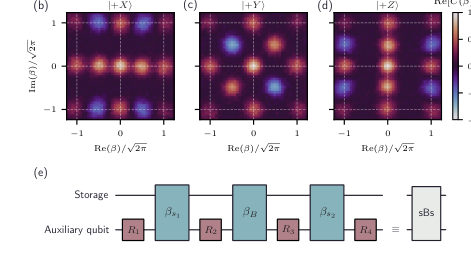
<figcaption class="paper-figure-caption"><b>Fig 1.</b> FIG. 1. Experimental system. (a) Schematic of experi- mental device. The single-mode grid code is encoded in one of the fundamental modes of a double-post microwave cavity. The storage is dispersively coupled to an auxiliary transmon qubit. The auxiliary qubit is also dispersively coupled to an on-chip resonator and Purcell filter used for reset and read- out. (b)-(d) Measured characteristic function (Re[C(β)]) to- mography of three cardinal states with ∆= 0.38 through a postselected stabilization protocol starting from the storage mode in vacuum. (e) sBs stabilization conditional displace- ments and auxiliary qubit rotations used for quantum error correction.</figcaption>
</figure>
<figure class="paper-figure-card">
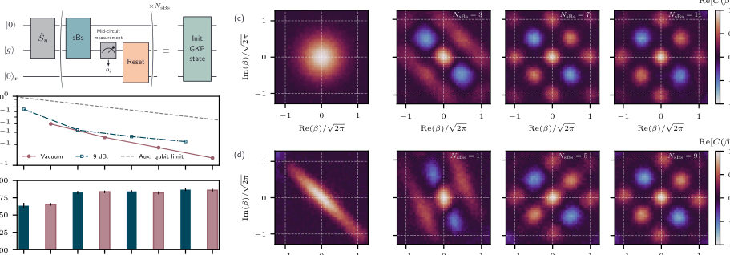
<figcaption class="paper-figure-caption"><b>Fig 2.</b> FIG. 2. State preparation from postselected stabilization. (a) State preparation protocol from postselected stabilization. Each round corresponds to sBs stabilization unitary followed by a mid-circuit measurement and an auxiliary qubit reset. ˆ Sη refers to the squeezing operation performed using an optimized sequence of ECD and auxiliary qubit rotations. Mid-circuit measurement outcomes {bi} are used to perform postselection based on a all-agree to |g⟩policy. (b) Starting from vacuum (pink) or 9 dB squeezed (blue) state, experimental results for preparation of |+Y ⟩with ∆= 0.38 versus the number of stabilization rounds NsBs. Top panel shows measured survival probability with all auxiliary...</figcaption>
</figure>
<figure class="paper-figure-card">
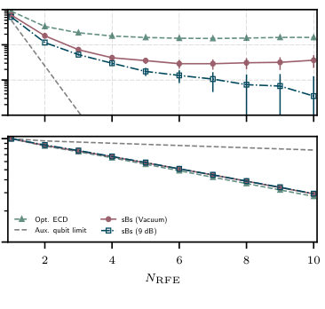
<figcaption class="paper-figure-caption"><b>Fig 3.</b> FIG. 3. Repeated finite-energy measurement. (a) Re- peated finite-energy measurement protocol that implements a single-shot logical Pauli measurement of ˆPi. The ECD amplitude βB selects the desired ˆPi ∈{ ˆ X, ˆY , ˆZ}, and the finite-energy parameter is set to ∆= 0.38. To maximize fi- delity, an all-agree policy on the set of NRFE measurements {mk} is applied and results in a sub-unity shot-survival prob- ability. (b) Total state preparation and measurement error (ϵSPAM = 1 −FL) averaged over all six prepared cardinal states as function of the number of tomography rounds NRFE for three different state preparation protocols. Here, Opt. ECD corresponds to an optimized ECD with a depth of 7....</figcaption>
</figure>
<figure class="paper-figure-card">
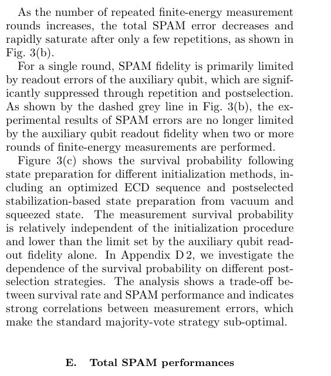
<figcaption class="paper-figure-caption"><b>Fig 4.</b> Figure 4(a) provides a summary of the SPAM im- provement protocols investigated in this work. As dis- cussed above, results without repeated finite-energy are primarly limited by the auxiliary qubit readout fidelity. Nonetheless, a slight increase of performance is observed for stabilization-based state preparation. When combin- ing this state preparation protocol with repeated finite- energy measurements, performance is further improved. The results of state preparation from postselected stabi- lization, starting from a squeezed state, and eight rounds of finite-energy measurement show a large reduction of the total SPAM errors reaching 7(7) × 10−4. For state preparation and measurement...</figcaption>
</figure>
<figure class="paper-figure-card">
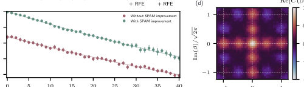
<figcaption class="paper-figure-caption"><b>Fig 5.</b> FIG. 4. SPAM improvement, QEC performances and magic state preparation. (a) Total state preparation and measurement error (ϵSPAM = 1 −FL) as function of the different combination of state preparation and measurement strategies. For state preparation from stabilization protocol, the total SPAM error is obtained after 5 (8) rounds of repeated finite-energy (RFE) measurements starting from vacuum (9 dB squeezing). Postselection is performed based on an all-agree policy. (b) Evolution of the single-mode grid state. The lines show fits used to extract the logical error per round under stabilization, yielding values of 0.0081(2) (green) and 0.0085(2) (pink) for QEC with and without SPAM...</figcaption>
</figure>

**Summary.** The research presents an advanced method to achieve high-fidelity quantum error correction on grid-state qubits using superconducting circuits. By integrating sophisticated stabilization protocols with improved measurement techniques, the authors dramatically reduced state preparation and measurement errors below $10^{-3}$. This breakthrough brings this hardware platform into parity with established transmon qubit performance metrics.

**Why it may be interesting.** This work directly tackles a critical hardware bottleneck—SPAM errors—in superconducting quantum computing platforms, providing concrete experimental benchmarks that advance fault tolerance feasibility.

Detailed structure

**Main problem.** The primary challenge addressed is mitigating State Preparation and Measurement (SPAM) errors, which significantly limit the performance of quantum error correction (QEC) on grid-state qubits.

**Main result.** By combining high-performance QEC with improved measurement protocols, the authors achieved a combined SPAM error below $10^{-3}$, representing a two orders-of-magnitude improvement over previous state-of-the-art results.

**Method.** The work employs postselected stabilization protocols within a superconducting circuit architecture to prepare and measure grid states, coupled with advanced measurement error mitigation techniques.

**Model / system.** The system utilizes superconducting circuits in a cQED architecture, encoding logical information in a single-mode grid state. An auxiliary transmon qubit is coupled to the storage mode for implementing stabilization protocols like $sB_s$.

**Key observables.** Total SPAM error ($\epsilon_{SPAM}$), survival probabilities (for preparation and measurement), and Pauli expectation values ($\langle \hat{Y} 
angle$).

**Important parameters / regimes.** The target performance metric is an SPAM error below $10^{-3}$. Key physical parameters include storage mode coherence times ($T_{1,s}, T_{2,s}$) and the finite-energy envelope parameter $\Delta$.

**Assumptions / limitations.** Standard QEC alone cannot fix SPAM errors, necessitating the combined protocol. The analysis also explores trade-offs based on postselection policies (e.g., 'all-agree' vs. 'majority-vote').

**Figures summary.** Figures illustrate the experimental device setup and the $sB_s$ stabilization sequence. Other figures show characteristic function tomography of prepared states and plots detailing the dependence of survival probability and Pauli expectation values on the number of stabilization rounds.

**Paper structure.** The paper progresses by first establishing the need to overcome SPAM errors, then detailing the use of postselected stabilization protocols for state preparation (Chunk 2), followed by an analysis of measurement back-action and optimal postselection policies (Chunk 3), culminating in the demonstration of achieving low error rates experimentally (Chunk 1).

Abstract

Grid state qubits offer a hardware-efficient approach to large-scale fault-tolerant quantum computing. They access the information redundancy required for quantum error correction by exploiting the large Hilbert space naturally available in harmonic oscillators. Superconducting architectures are particularly suitable to implement grid state qubits due to their fast and high-fidelity operations. Grid states in superconducting circuits enable quantum error correction (QEC) with performance beyond break-even. However, the state preparation and measurements (SPAM) errors of grid states has been a significant limitation to computational performances. In this work, we leverage high-performance QEC to enable repeat-until-success state preparation of both cardinal and magic states of the single-mode grid-state qubit. We combine this with an improved measurement protocol that corrects for both finite-energy envelope and auxiliary qubit readout errors, and increases robustness to photon loss. Our experiments, using both techniques, achieve a combined state-preparation and measurement error below $10^{-3}$. This represents two orders-of-magnitude improvement over the state of the art, bringing this platform on par with standard SPAM error levels measured in transmon qubits.

[↑ back to top](#top)

### [Visualizing modified spin-wave wavefronts near magnetic defects and domains using nitrogen-vacancy centers](http://arxiv.org/abs/2607.06941v1)

**Authors:** Wenxin Cheng, Chang Liu, Dekun Shen, Jiaxin Li, Shangyuan Wang, Hongyu Wang, Miming Cai, Jihao Xia, Peng Chen, Caihua Wan, Ka Shen, Xiufeng Han, Yuelin Zhang, Jinxing Zhang, Yangmu Li  
**Type:** both · **Category:** other · **PDF:** <https://arxiv.org/pdf/2607.06941v1>  
**Analysis basis:** full PDF text, analyzed in chunks
**Topic relevance:** 🔥 `spintronics-quantum-optics interface` **4/5** · `QC/QI experiment` **1/5** · `methods for driven-dissipative` **1/5** · `quantum measurements` **1/5**

↔ Scroll figures horizontally

<figure class="paper-figure-card">
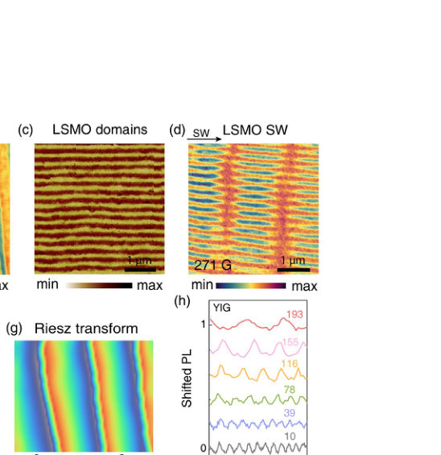
<figcaption class="paper-figure-caption"><b>Fig 1.</b> Fig. 1. Representative spin-wave and magnetic domain images of YIG and LSMO. (a) Schematic of the experimental setup. SW and MW label the spin-wave signal and microwave, respectively. (b) PL image of spin waves in the YIG film, acquired at a resonance frequency of external field, approximately 2335 MHz. (c) LSMO antiferromagnetically coupled stripe domains measured by a magnetic force microscope. (d) PL image of spin waves in the LSMO film, acquired at a resonance frequency of external field, approximately 2111 MHz. Both antiferromagnetically coupled stripe domains and spin waves are observed. (e-g) Images of magnetic field variations along the NV-axis, contrast at 𝜔𝜔local , and the Riesz...</figcaption>
</figure>
<figure class="paper-figure-card">
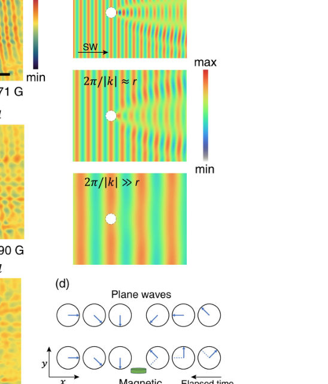
<figcaption class="paper-figure-caption"><b>Fig 2.</b> Fig. 2. Images of spin waves in the YIG film near magnetic point scatterers. (a) Spin waves with varied incident wavelengths near a single magnetic scatterer. Measured at frequencies of approximately 2321, 2267, 2158 MHz. (b) Spin waves with varied incident wavelengths near two magnetic scatterers. Measured at frequencies of approximately 2392, 2338, 2282 MHz. Dashed circles indicate the positions of the scatterers. Black bars indicate 5 𝜇𝜇m. (c) Calculations for scattering of spin waves by a magnetic defect. (d) An illustration of the spin-wave phase modified by a magnetic defect. The total phase shift near a magnetic defect depends on the amplitudes of the incident and scattered wave...</figcaption>
</figure>
<figure class="paper-figure-card">
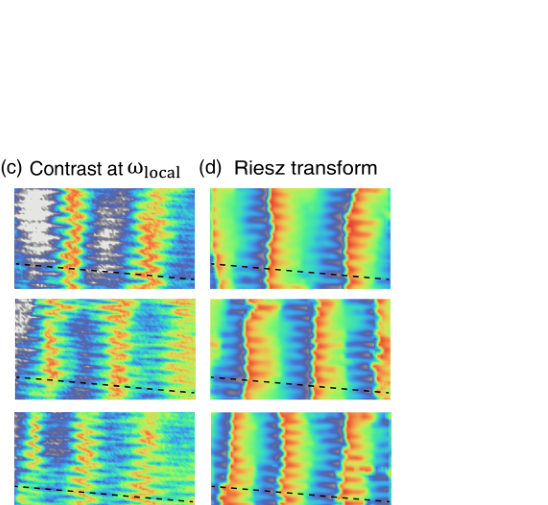
<figcaption class="paper-figure-caption"><b>Fig 3.</b> Fig. 3. NV measurements of antiferromagnetically coupled stripe domains and spin waves in LSMO. (a) PL contrast at the NV resonance frequency under different external magnetic fields, 271 G, 281 G, and 290 G (top to bottom panels). Measured at frequencies of approximately 2111, 2083, and 2057 MHz. (b) Corresponding maps of the magnetic field shift along the NV-axis caused by stripe domains. Measured by a frequency scan at each pixel. (c) Contrast at 𝜔𝜔local. (d) Results of the Riesz transform applied to the spin-wave wavefront. Black dashed lines are guides to the eye.</figcaption>
</figure>
<figure class="paper-figure-card">
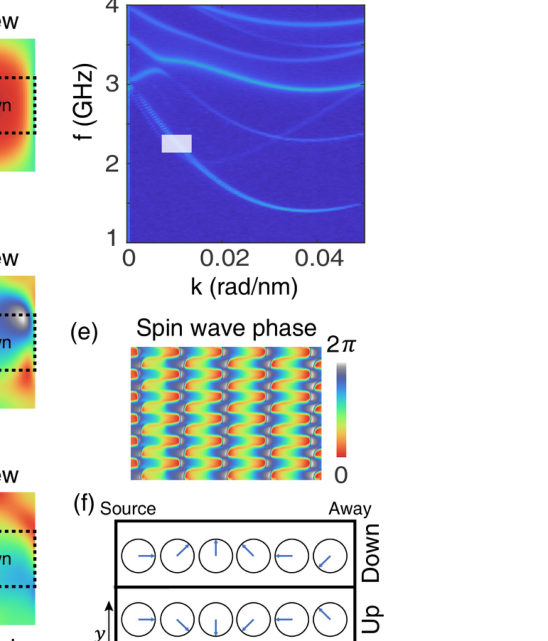
<figcaption class="paper-figure-caption"><b>Fig 4.</b> Fig. 4. Micromagnetic simulation and calculations. (a) Simulated ground state magnetization 𝑀𝑀Z, showing the formation of stripe domains. (b, c) Simulated dynamic</figcaption>
</figure>

**Summary.** The research demonstrates the use of nitrogen-vacancy center spectroscopy to visualize spin waves in complex magnetic materials like YIG and LSMO. By analyzing PL contrast and applying advanced phase retrieval techniques, the authors mapped unique phenomena such as wavelength-dependent filtering and characteristic zig-zag wavefront distortions near magnetic domains. This advances spintronics by enabling fine control over spin wave propagation near structural defects.

**Why it may be interesting.** This work bridges quantum sensing (NV centers) with condensed matter magnetism, providing spatially resolved dynamics crucial for understanding how local magnetic structure dictates wave propagation—a key area for designing functional spintronic devices.

Detailed structure

**Main problem.** Direct, real-space imaging of spin-wave propagation and wavefronts in magnetic materials with complex nanoscale structures is challenging.

**Main result.** The study successfully visualized wavelength-dependent filtering effects near scatterers and observed modified, zig-zagging spin wave wavefronts within antiferromagnetically coupled stripe domains.

**Method.** Scanning nitrogen-vacancy (NV) center spectroscopy combined with micromagnetic simulations was used to map local magnetic fields and spin-wave phase structure.

**Model / system.** The system involves spin waves in archetypal magnetic films like YIG and LSMO, exhibiting complex domain structures stabilized by interactions like the Dzyaloshinskii-Moriya interaction. The measurement relies on NV center resonance spectroscopy.

**Key observables.** PL contrast, local spin-wave phase (extracted via Riesz transform), field shifts ($\pm 7$ G), and wavefront bending/modification.

**Important parameters / regimes.** Wavelength dependence of scattering effects; comparison between uniform vs. patterned magnetic media; external magnetic fields controlling resonance frequencies.

**Assumptions / limitations.** The standard PL contrast equation neglects continuous laser pumping effects, and phase extraction in inhomogeneous backgrounds requires advanced techniques like the Riesz transform.

**Figures summary.** Figures show spin-wave PL contrast images in YIG and LSMO; Figure 2 illustrates wavefront bending near point scatterers; Figure 3 details domain structure analysis in LSMO using frequency scans and Riesz transforms; Figure 4 presents micromagnetic simulations of magnetization and dispersion relations.

**Paper structure.** The paper progresses from establishing the challenge of real-space imaging to presenting NV spectroscopy measurements on YIG (scatterer effects) and then tackling the complexity of LSMO stripe domains, culminating in detailed simulation comparisons.

Abstract

Direct, real-space imaging of spin-wave propagation and wavefronts in magnetic materials is crucial for advancing both fundamental understanding of spin dynamics and the development of functional devices. This, however, remains a significant challenge, especially in materials with complex magnetic characteristics at the nanoscale. Here, we employ scanning nitrogen-vacancy center spectroscopy to achieve visualization of spin waves in two archetypical magnetic films: yttrium-iron-garnet and lanthanum strontium manganese oxide. We reveal a wavelength-dependent spin-wave filtering effect near point-like magnetic scatterers and a modified spin wavefront in antiferromagnetically coupled stripe domains. The spin-wave characteristics are explained using micromagnetic simulations and analytical calculations. These findings point to possible fine control of spin-wave propagation near complex magnetic structures and extend the scope of spin-wave imaging based on nitrogen-vacancy centers beyond uniform magnets.

[↑ back to top](#top)

### [Localized Thermometry via Dayem Bridges Integrated on Superconducting Qubit Chips](http://arxiv.org/abs/2607.06670v1)

**Authors:** Ella O. Lachman, Dave P. Pappas, Jayss Marshall, Josh Y. Mutus  
**Type:** experiment · **Category:** quantum information and computing · **PDF:** <https://arxiv.org/pdf/2607.06670v1>  
**Analysis basis:** full PDF text, analyzed in chunks
**Topic relevance:** 🔥 `QC/QI experiment` **4/5** · `quantum measurements` **1/5**

↔ Scroll figures horizontally

<figure class="paper-figure-card">
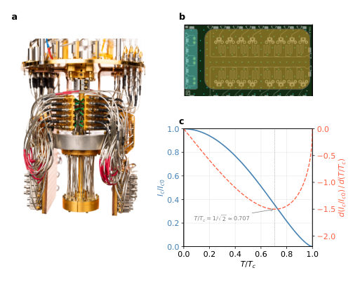
<figcaption class="paper-figure-caption"><b>Fig 1.</b> FIG. 1. (a) An image of a standard Rigetti setup, illus- trating the multiple interfaces and components between the MXC (fridge plate seen at the top of the image) and where the qubit chip is located (cylindrical package in the center, bottom of the image). (b) Chip schematic: qubits (high- lighted yellow) and Dayem bridges (highlighted teal) on the same substrate in close proximity. (c) An illustration of the Dayem bridge’s temperature-dependent critical current Ic(T) (Eq. 1). In dashed lines, we also show the derivative of the dependence with an arrow marking the maximal point of the derivative. This point is the maximal temperature sensitivity of Ic(T), where the temperature is equal to...</figcaption>
</figure>
<figure class="paper-figure-card">
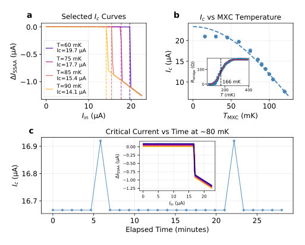
<figcaption class="paper-figure-caption"><b>Fig 2.</b> FIG. 2. (a) Different Dayem bridge response curves for dif- ferent temperatures. The low current flat branch is where no change is measured in the SSAA current, meaning all the current flows through the DB thermometer. The sharp jump is where Ic is detected, followed by a resistive response where the majority of the current flows through the shunt resistor and the SSAA part of the circuit. (b) DB ther- mometer Ic as a function of MXC temperature. Data (dots) and the Bardeen equation (dashed line) with the parameters: Tc = 166 mK and Ic(0) = 23.34 µA. Inset: independent Tc measurement performed in an Adiabatic Demagnetization Re- frigeration (ADR) system with a current of 10 nA. The criti-...</figcaption>
</figure>
<figure class="paper-figure-card">
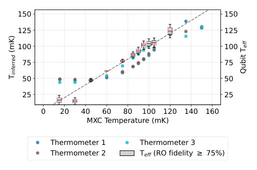
<figcaption class="paper-figure-caption"><b>Fig 3.</b> FIG. 4. Effective qubit temperature from 2 qubits (right y-axis) and inferred temperature from 3 DB thermometers (left y-axis) as a function of fridge MXC temperature. Qubit data is presented as box plots, showing the median and the distribution of values. It can be seen that Thermometer 3 is following the MXC temperature as well as the qubits’ effec- tive temperature to lower temperatures than the other two thermometers. This can be attributed to a closer fit of the Ic(0) used in the conversion curve (Fig. 2b) to the actual Ic(0) of the device, and is plausible, as the room-temperature resis- tance of Thermometer 3 deviates from the other thermometer resistances.</figcaption>
</figure>
<figure class="paper-figure-card">
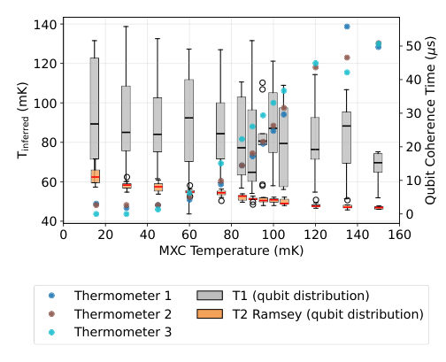
<figcaption class="paper-figure-caption"><b>Fig 4.</b> FIG. 3. T1 and T2 Ramsey data from 10 qubits (right y-axis) and inferred temperature from 3 DB thermometers (left y-axis) as a function of fridge MXC temperature. Qubit data is presented as box plots, showing the median and the distribution of values. As expected, T1 is less affected by in- creased temperatures than T2 Ramsey. An inverse correlation is observed between the DB-inferred temperature and the T2 Ramsey mean values; this trend confirms the utility of DB thermometers as a proxy for evaluating qubit coherence and dephasing.</figcaption>
</figure>
<figure class="paper-figure-card">
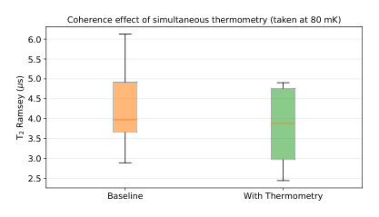
<figcaption class="paper-figure-caption"><b>Fig 5.</b> FIG. 5. T2 Ramsey distribution of a single qubit taken at 80 mK acquired both actively during thermometer sweeps and independently as a baseline measurement. These are pre- liminary measurements with a modest sample size (baseline n = 15, thermometry n = 8). While a larger dataset is re- quired for a definitive scaling analysis, these initial trials serve as an essential a priori validation, demonstrating no imme- diate incompatibility or catastrophic crosstalk between the concurrent operations. Statistical comparison via Welch’s t- test and Mann-Whitney U test yields p-values well above 0.05, indicating that the active thermometer readout does not in- troduce immediate, severe thermal or...</figcaption>
</figure>

**Summary.** The authors present an integrated method using superconducting Dayem Bridges as local thermometers directly on qubit chips. By measuring the temperature dependence of the bridge's critical current, they achieve a simple and non-invasive way to monitor chip temperature at cryogenic levels. This technique successfully validates against standard qubit measurements and proves its utility for diagnosing temperature-dependent decoherence mechanisms in quantum processors.

**Why it may be interesting.** This work provides a direct, hardware-level diagnostic tool for characterizing the thermal environment of quantum processors, which is crucial input data for theoretical models predicting decoherence sources in solid-state qubits.

Detailed structure

**Main problem.** Accurate, localized temperature knowledge is critical for optimizing superconducting qubit performance at millikelvin temperatures.

**Main result.** The integration of Dayem Bridges (DBs) on the same chip allows for a simple, non-invasive, and scalable measurement of local chip temperature that correlates well with established qubit thermometry methods.

**Method.** Temperature is determined by measuring the superconducting critical current ($I_c$) of an integrated DB bridge via I-V measurements, avoiding complex microwave calibration protocols.

**Model / system.** The system involves transmon qubits fabricated on a chip alongside superconducting Dayem Bridges. The thermometry relies on the temperature dependence of $I_c(T)$, which follows the Bardeen relation.

**Key observables.** Local chip temperature, critical current ($I_c$), qubit energy relaxation times ($T_1$) and dephasing times ($T_2$).

**Important parameters / regimes.** Temperature range from 10 mK to 150 mK; superconducting transition temperature ($T_c$); coherence time decay rates.

**Assumptions / limitations.** The method assumes that measuring $I_c$ is sufficient to determine the local chip temperature using known material parameters and the Bardeen relation.

**Figures summary.** Figures illustrate the co-location of qubits and DBs on a chip, show characteristic $I$-$V$ curves for DBs at different temperatures, and compare qubit coherence times ($T_1$, $T_2$) against inferred temperature from multiple DB thermometers versus the external Mixing Chamber (MXC) temperature.

**Paper structure.** The paper introduces the problem of on-chip thermometry, details the fabrication and principle of the DB thermometer using $I_c(T)$, validates its readings by comparing them to qubit measurements ($T_{	ext{eff}}$), and finally demonstrates its utility by correlating measured temperature variations with changes in qubit decoherence times.

Abstract

Accurate knowledge of the on-chip temperature is essential for understanding and optimizing the performance of superconducting qubits, yet direct thermometry at millikelvin temperatures remains challenging. While qubits themselves are sensitive to the temperature of their environment, other factors may affect the qubits` effective temperature, and using them as thermometers with any accuracy requires specialized measurement protocols and qubit designs, limiting their practicality for routine diagnostics and adding complex infrastructure to any hardware testing apparatus. Here we demonstrate a complementary on-chip thermometry method based on superconducting Dayem bridges that are integrated on the same chip as transmon qubits. By extracting the critical current of the Dayem bridge from I-V measurements, we obtain a local, quantitative measure of the chip temperature without the need for microwave calibration or qubit-specific control sequences. To demonstrate the utility of the Dayem bridges as thermometers, we fabricate them in-situ with qubits on the same chip, calibrate the Dayem bridge critical current as a function of temperature, and characterize its resolution and stability at cryogenic temperatures. We additionally perform simultaneous measurements of the Dayem bridge thermometer and qubit excited-state population, and show agreement over the relevant temperature range, validating the method against established qubit thermometry. Furthermore, we correlate the independently measured chip temperature with qubit energy relaxation and dephasing times, demonstrating the utility of this approach for diagnosing temperature-dependent decoherence mechanisms. These results establish integrated Dayem bridges as a simple, non-invasive, and scalable tool for cryogenic hardware development, and on chip thermometry in superconducting quantum circuits.

[↑ back to top](#top)

### [Analytical Landscape of Maximal Magic for Two-Qutrit States and Beyond](http://arxiv.org/abs/2607.07197v1)

**Authors:** Marco Knipfer, Alexander Roman, Katia Matcheva, Konstantin T. Matchev  
**Type:** theory · **Category:** quantum information and computing · **PDF:** <https://arxiv.org/pdf/2607.07197v1>  
**Analysis basis:** full PDF text, analyzed in chunks
**Topic relevance:** 🔥 `entanglement & information structure` **4/5**

↔ Scroll figures horizontally

<figure class="paper-figure-card">
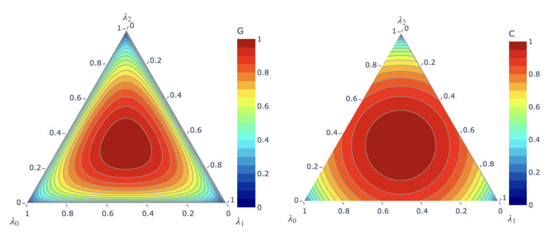
<figcaption class="paper-figure-caption"><b>Fig 1.</b> FIG. 1. The G-concurrence (left) and the I-concurrence (right) as a function of λ0, λ1 and λ2.</figcaption>
</figure>
<figure class="paper-figure-card">
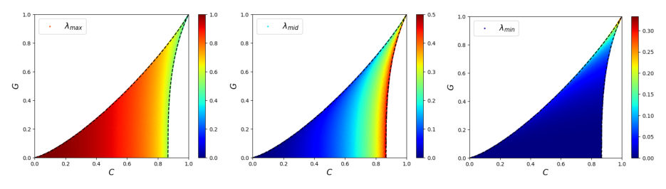
<figcaption class="paper-figure-caption"><b>Fig 2.</b> FIG. 2. The Schmidt coefficients (27) as a function of the I-concurrence C and the G-concurrence G:</figcaption>
</figure>
<figure class="paper-figure-card">
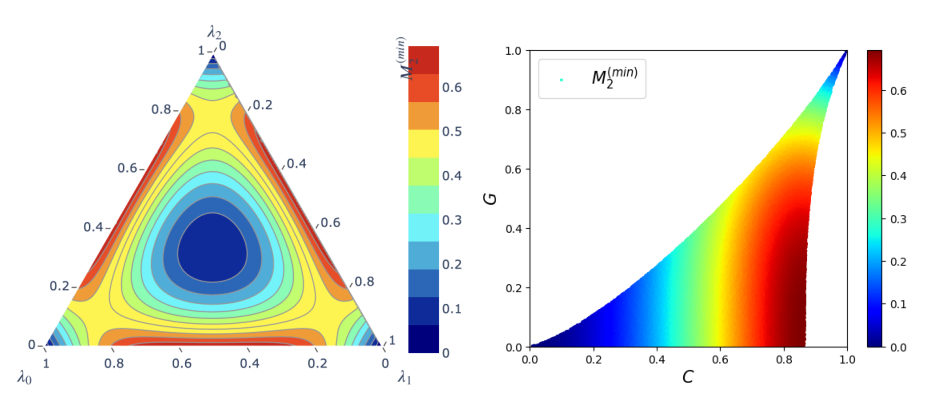
<figcaption class="paper-figure-caption"><b>Fig 3.</b> FIG. 3. Plots of the minimal magic M(min) 2 defined in eq. (30) as a function of λ (left panel) or as</figcaption>
</figure>
<figure class="paper-figure-card">
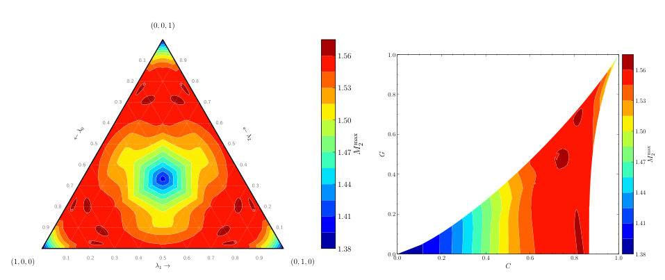
<figcaption class="paper-figure-caption"><b>Fig 4.</b> FIG. 4. The same as Figure 3, but for the numerically optimized maximal magic Mmax 2 as a</figcaption>
</figure>
<figure class="paper-figure-card">
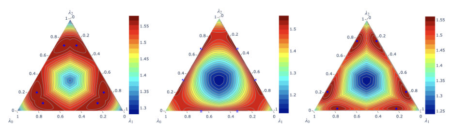
<figcaption class="paper-figure-caption"><b>Fig 5.</b> FIG. 5. The maximal magic M(i) 2 , i = 1, 2, 3, given by the corresponding analytical expression</figcaption>
</figure>

**Summary.** This paper theoretically characterizes the maximal 'magic' resource for bipartite quantum states involving qutrits and ququints. It establishes a general conjectured bound relating this magic to the dimension $d$ of the qudits. The work is significant for quantifying non-classical resources beyond standard entanglement measures.

**Why it may be interesting.** It provides rigorous theoretical bounds on non-classical resources (magic) that are crucial for understanding the limits of classical simulation capabilities for quantum systems.

Detailed structure

**Main problem.** The paper investigates the interplay between entanglement and 'magic' (nonstabilizerness) to characterize the Pareto frontiers of extreme magic for multi-qutrit quantum states.

**Main result.** A conjectured general bound for two qudits with prime dimension $d$ is $\max(M_2) \le \ln[ d^4 / (2d^2 - 1) ]$, which was successfully tested and confirmed for $d=2, 3,$ and $5$.

**Method.** The analysis involves deriving analytical expressions for the minimal and maximal magic surfaces by parameterizing the state space using Schmidt coefficients and optimizing over local unitaries.

**Model / system.** The study focuses on bipartite quantum states of two qutrits ($d=3$) and two ququints ($d=5$), generalizing to arbitrary prime-dimensional qudits. The state is analyzed via its Schmidt decomposition.

**Key observables.** Magic (quantified by stabilizer Rényi entropy $M_2$), Entanglement (measured by concurrence and negativity), and the purity $\Pi_2$.

**Important parameters / regimes.** The dimension of the qudits ($d=3, 5$) and the Schmidt coefficients ($\lambda_i$).

**Assumptions / limitations.** The analysis relies on using the Schmidt decomposition parametrization for the state manifold; the conjectured bound is not formally proven beyond tested cases.

**Figures summary.** Figures illustrate how the maximal magic is found by taking the upper envelope of curves generated by fixing local unitaries across the Schmidt simplex, showing the optimal path through the parameter space.

**Paper structure.** The paper progresses from establishing the necessity of both entanglement and magic for quantum advantage to analyzing the 2D parameter space of two qutrits using multiple entanglement measures, culminating in a general conjecture for prime-dimensional qudits.

Abstract

Achieving a genuine quantum advantage relies on two distinct non-classical resources that restrict efficient classical simulation: entanglement and magic (nonstabilizerness). We investigate the interplay between these resources by characterizing the Pareto frontiers of extreme magic at fixed entanglement for systems of two qutrits ($d=3$) and two ququints ($d=5$). Unlike the case of two qubits, the Schmidt spectrum for two qutrits features two independent entanglement parameters, resulting in two-dimensional Pareto surfaces. For the lower frontier, we recast the minimal magic as a compact function of concurrence and negativity, with a maximal value of $\ln 2$. For the upper frontier, we determine the maximal stabilizer Rényi entropy to be $M_2 = \ln(81/17) \approx 1.561$, which tightens the previous theoretical bound of $\ln 5\approx 1.609$ and improves on earlier numerical estimates. The maximum magic is achieved at eighteen distinct maxima categorized into three families of six permutation-equivalent spectra. We provide analytical expressions for the maximal magic in the neighborhood of each maximum and for the corresponding maximally magical states which turn out to be Weyl-Heisenberg-covariant fiducial states for mutually unbiased bases. Finally, numerical analysis of two ququints ($d=5$) reveals six permutation-inequivalent maxima with a peak magic value of $M_2 = \ln(625/49) \approx 2.546$. Based on these findings, we conjecture that the maximal magic for a bipartite system of two qudits with prime dimension $d$ is given by $\ln [ d^4 / (2d^2 - 1) ]$, which reproduces the previously known value for qubits, as well as the values derived here for qutrits and ququints.

[↑ back to top](#top)

### [Geometric Interpretation of Sum Photon Blockade](http://arxiv.org/abs/2607.07591v1)

**Authors:** Timur Khudaiberganov  
**Type:** theory · **Category:** other · **PDF:** <https://arxiv.org/pdf/2607.07591v1>  
**Analysis basis:** full PDF text, analyzed in chunks
**Topic relevance:** `Tavis-Cummings & cavity-many-emitter` **3/5** · `correlated cavity matter` **3/5** · `driven-dissipative phase transition` **3/5** · `methods for driven-dissipative` **3/5** · `correlated / nonlocal dissipation` **2/5** · `entanglement & information structure` **2/5** · `non-equilibrium universality` **2/5** · `Dicke superradiance` **1/5** · `Keldysh / 2PI / non-Gaussian methods` **1/5** · `analog quantum simulation` **1/5** · `exotic spin models in light-matter` **1/5** · `interference shaping light` **1/5** · `non-equilibrium dynamics` **1/5** · `superradiant laser` **1/5**

↔ Scroll figures horizontally

<figure class="paper-figure-card">
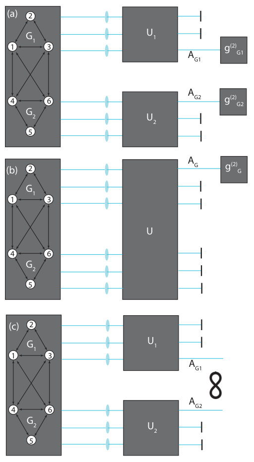
<figcaption class="paper-figure-caption"><b>Fig 1.</b> Figure 1. Scheme.</figcaption>
</figure>
<figure class="paper-figure-card">

<figcaption class="paper-figure-caption"><b>Fig 2.</b> Figure 2. We can imaging the manifold of system param- eters in the continuous regime for the collective supermode as a kind of ”bowl” that protects quantum correlations from ”leakage”—that is, from decoherence processes.</figcaption>
</figure>
<figure class="paper-figure-card">
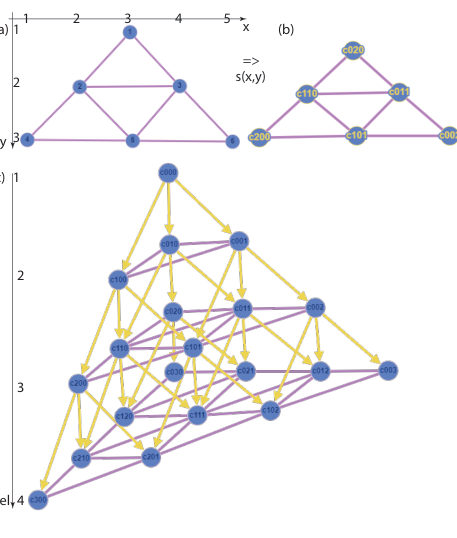
<figcaption class="paper-figure-caption"><b>Fig 3.</b> Figure 3. (a) The n-level triangular graph with T(n+1) with vertices numbered from left to right, top to bottom, each y coordinate corresponds to a certain level at each level n indices are determined by a set of numbers v(n); (b) A sketch of the Fock two-particle tensor state space of a trion.(c) Part of the Fock space of states of the trion. Nodes correspond to different states, graphs with purple edges correspond to n- particle tensor states, yellow arrows show transitions between different tensor states.</figcaption>
</figure>

**Summary.** The paper develops a geometric framework to understand and enhance photon blockade effects in large multimode quantum optical systems. It introduces the concept of 'dark-state typicality,' demonstrating that increasing system complexity leads to macroscopically robust non-classical light generation. By analyzing these correlations as invariant manifolds, it provides theoretical tools for designing scalable quantum devices resilient to decoherence.

**Why it may be interesting.** This work provides a powerful generalization beyond traditional Decoherence-Free Subspaces (DFS) by framing robustness in terms of invariant *manifolds* defined by correlation invariants. This geometric approach is highly relevant for designing stable quantum devices operating far from ideal conditions.

Detailed structure

**Main problem.** The primary challenge is developing a scalable method to generate robust non-classical light (sub-Poissonian statistics) in complex, multimode quantum optical systems while mitigating decoherence effects.

**Main result.** The paper introduces 'dark-state typicality,' showing that as the number of modes increases, the blockade subspace asymptotically occupies a unit fraction of the total Hilbert space, leading to macroscopic robustness.

**Method.** The work employs geometric interpretations using high-dimensional vector analysis (dot products) and extends this to continuous mode operators defined over functional spaces. It analyzes stability via Liouvillian spectral gaps.

**Model / system.** The system is modeled as multimode quantum optical systems, such as semiconductor microresonators, described by bosonic operators ($\hat{a}_i$). The theory develops from discrete graph structures to continuous mode functions $\phi(x)$ over a domain $\Omega$.

**Key observables.** Second-order correlation function ($g^{(2)}_\Sigma$), the blockade condition (e.g., $\mathbf{c}^{(n)} \cdot \mathbf{v} = 0$), and entanglement witnesses ($	ext{CEHZ}$).

**Important parameters / regimes.** The number of modes ($M$) in the large $M$ limit, the Liouvillian spectral gap ($\Delta$), and the order of correlation ($n$).

**Assumptions / limitations.** In the continuum case, it assumes that the set of states satisfying blockade forms an invariant manifold under Liouvillian dynamics. In the discrete case, approximations are made regarding weak pumping limits.

**Figures summary.** Figures illustrate schemes for correlation zeros and blockade conditions in both discrete (graph-based) and continuous mode settings, visualizing the protected 'bowl' manifold against decoherence.

**Paper structure.** The paper progresses from analyzing discrete blockade mechanisms on graphs to establishing a general geometric framework using continuum operators. It then analyzes the stability of these blockaded states by relating them to invariant manifolds governed by the Liouvillian spectral gap, ultimately showing how this leads to robust non-classical light.

Abstract

We present a geometric interpretation of the sum photon blockade effect in multimode quantum optical systems, such as semiconductor microresonators. The blockade condition \(c^{(n)} \cdot v = 0\) reflects the orthogonality of the \(n\)-photon amplitude vector to a target mode vector in an \(N\)-dimensional Hilbert space, visualized as the confinement of the state to a hyperplane.   A key result is the calculation of the maximum probability of the system remaining in the blockade subspace under the influence of decoherence processes (in particular, dephasing), which determines the practical feasibility and robustness of the effect. This approach extends to higher-order correlators \(g^{(2)}_Σ\) and cross-correlations, enabling the design of scalable quantum devices.   We introduce the concept of "dark-state typicality": as the number of modes \(M\) increases, the dark subspace annihilated by the collective mode operator asymptotically occupies a unit fraction of the \(n\)-boson Hilbert space. This allows the transition from fragile, finely tuned mechanisms to macroscopically robust non-classical light in large multimode bosonic architectures.   We consider continuum collective modes, hypotheses on correlation zeros and invariant manifolds, as well as the relationship between blockade and entanglement.

[↑ back to top](#top)

### [Spectral-width limit on non-Hermitian quantum metrology](http://arxiv.org/abs/2607.07434v1)

**Authors:** Jiaxin Liu, Zuoxian Wang, Danyue Ma  
**Type:** theory · **Category:** quantum information and computing · **PDF:** <https://arxiv.org/pdf/2607.07434v1>  
**Analysis basis:** full PDF text, analyzed in chunks
**Topic relevance:** `Keldysh / 2PI / non-Gaussian methods` **3/5** · `driven-dissipative phase transition` **3/5** · `methods for driven-dissipative` **3/5** · `correlated / nonlocal dissipation` **2/5** · `entanglement & information structure` **2/5** · `non-equilibrium universality` **2/5** · `quantum measurements` **2/5** · `Kondo & dissipative impurity` **1/5** · `Tavis-Cummings & cavity-many-emitter` **1/5** · `analog quantum simulation` **1/5** · `correlated cavity matter` **1/5** · `measurement-induced transitions` **1/5** · `non-equilibrium dynamics` **1/5**

↔ Scroll figures horizontally

<figure class="paper-figure-card">
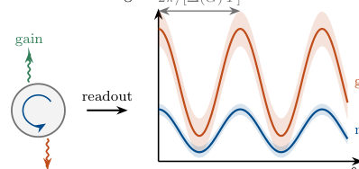
<figcaption class="paper-figure-caption"><b>Fig 1.</b> FIG. 1. Non-Hermiticity amplifies the signal, not the information. The probe superposes the highest- and lowest- energy eigenstates of the generator G = ∂θH, separated by the spectral width ∆(G). Coherent encoding e−iθGT produces a Ramsey fringe in θ of period 2π/[∆(G)T]. The central disk is the open device, drawn as a circulator carrying engineered gain (green), loss (orange), and non-reciprocal routing (blue), all of it θ-independent and applied between the encoding (left arrow) and the fixed readout (right arrow); the shaded band around each fringe is the readout noise. The θ-independent loss, gain, and non-reciprocity make the fringe taller but proportionally noisier (its noise band...</figcaption>
</figure>
<figure class="paper-figure-card">
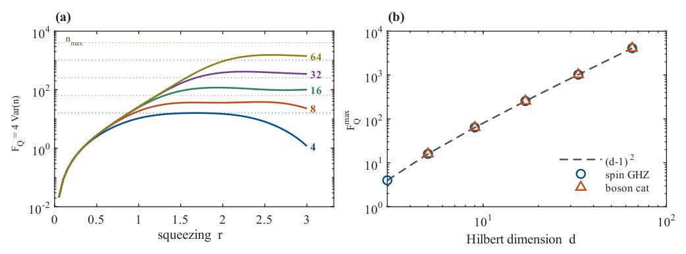
<figcaption class="paper-figure-caption"><b>Fig 2.</b> FIG. 2. Finite spectral width caps the amplified Fisher information. (a) QFI FQ = 4 Var(ˆn) of a squeezing-amplified bosonic probe versus squeezing r, for several Fock cutoffs nmax. The QFI grows as amplification predicts but cannot exceed the cap FQ = (d −1)2, d = nmax+1 (dotted). Each curve touches the cap where the truncated probe coincides with the extremal superposition (|0⟩+ |nmax⟩)/ √</figcaption>
</figure>
<figure class="paper-figure-card">
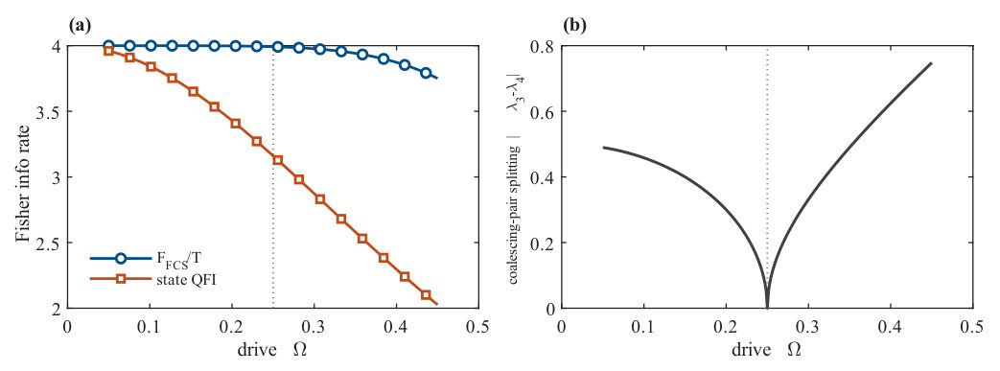
<figcaption class="paper-figure-caption"><b>Fig 3.</b> FIG. 3. The Fisher information is analytic through the Liouvillian exceptional point. In both panels the dotted line marks the exceptional point at Ω= γ/4 (γ = 1). (a) For estimating the drive Ω, the reduced-state QFI (squares) and the long-time emission-current Fisher rate FFCS/T (circles) are both smooth and monotone through the singularity, with the optimum at a scan boundary. (b) By contrast the coalescing-pair splitting |λ3 −λ4| ∝ p</figcaption>
</figure>
<figure class="paper-figure-card">
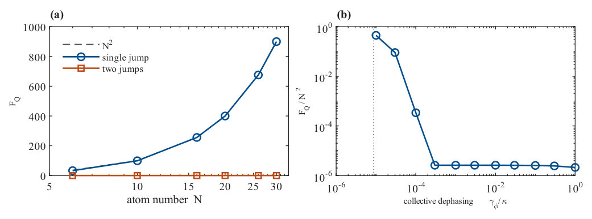
<figcaption class="paper-figure-caption"><b>Fig 4.</b> FIG. 4. Population is localized, coherence is not generated. (a) Frequency-estimation QFI versus atom number N for two ways of writing the same non-reciprocal drive (dashed line: the Heisenberg scaling FQ = N 2). In the single-operator drive of Eq. (4) the raising and lowering pathways are summed inside one jump operator, so no which-path information leaks, the extremal coherence survives, and the steady state is a pure Heisenberg cat (circles, FQ = N 2). Splitting it into two operators lets the environment distinguish which pathway fired and dephases the extremal coherence, so the identical populations form an incoherent mixture with FQ = 0 (squares). (b) The cat occupies a two-dimensional...</figcaption>
</figure>

**Summary.** This work establishes a spectral-width limit on the Quantum Fisher Information for non-Hermitian quantum sensors. The authors prove that while engineered loss and gain can dramatically amplify the sensor's output signal, this amplification does not enhance the fundamental measurement precision beyond a bound set by the generator's energy spread. This has significant implications for designing high-precision quantum measurements in realistic open systems.

**Why it may be interesting.** It provides a rigorous theoretical framework quantifying the fundamental limits of precision in complex, realistic quantum systems that inherently involve dissipation (e.g., cavity QED or optical sensing).

Detailed structure

**Main problem.** The core problem is determining whether enhanced signal amplification observed in non-Hermitian quantum sensors translates into genuine, measurable improvements in the achievable precision (Quantum Fisher Information).

**Main result.** The Quantum Fisher Information is fundamentally capped by a spectral width limit ($	ext{QFI} \le [\Delta(G) T]^2$), demonstrating that non-Hermiticity amplifies the response but does not source the ultimate measurement information.

**Method.** The authors prove an upper bound on the QFI using techniques involving the dilation of open evolution to a unitary description and analyzing the generator's spectral properties.

**Model / system.** The analysis focuses on open quantum sensors whose parameter ($	heta$) is imprinted coherently via a Hamiltonian generator $G = \partial_	heta H$, incorporating engineered loss, gain, and non-reciprocity.

**Key observables.** Quantum Fisher Information ($F_Q$), Spectral Width ($\Delta(G)$), Attainable Dwell Time ($	au_{\max}$)

**Important parameters / regimes.** Spectral width of the generator $\Delta(G)$, Interrogation Time $T$, Photon-number cutoff.

**Assumptions / limitations.** The parameter must enter coherently through a Hamiltonian generator ($G = \partial_	heta H$), and loss/gain rates must be independent of $	heta$.

**Figures summary.** Figures illustrate that non-Hermiticity amplifies the signal response but leaves the QFI bounded by $[\Delta(G) T]^2$, and finite spectral cutoffs restore this cap.

**Paper structure.** The paper establishes a general bound on QFI for open sensors, proves its independence from specific dissipative mechanisms, and then applies this limit to specialized cases like photonic scattering channels using dwell-time operators.

Abstract

Engineered loss, gain, and non-reciprocity can sharply amplify a sensor's response, and exceptional points and the skin effect are widely proposed as routes to more precise quantum sensors. Some predict an exponentially large quantum Fisher information, the quantity that sets the best achievable precision, yet whether this amplified response is genuine measurement information has remained unsettled. We prove that it is not. For any open sensor whose parameter is imprinted coherently by a Hamiltonian, with loss, gain, non-reciprocity, and readout held fixed, the quantum Fisher information is capped by a single quantity, the spread between the largest and smallest energy the generator can impart, independent of the non-Hermitian dynamics. Amplification enlarges the response but not the information. The reported exponential gains arise only when that spread is unbounded, and any finite spread, such as a photon-number cutoff, restores the cap. The same limit governs dissipative probe preparation and spectral singularities. For photonic sensors the cap takes an operator form in which the information of any probe, classical or entangled, is set by the photon's dwell time at the perturbation, and it contains the recently derived scattering limits as special cases. Non-Hermiticity thus shapes a sensor's dynamics but does not source its precision, and the generator's spread and the attainable dwell time benchmark future non-Hermitian sensing proposals.

[↑ back to top](#top)

### [Lecture notes on classical and quantum non-Markovianity](http://arxiv.org/abs/2607.07332v1)

**Authors:** Graeme Pleasance  
**Type:** theory · **Category:** other · **PDF:** <https://arxiv.org/pdf/2607.07332v1>  
**Analysis basis:** full PDF text, analyzed in chunks
**Topic relevance:** `correlated / nonlocal dissipation` **3/5** · `methods for driven-dissipative` **3/5** · `non-equilibrium dynamics` **3/5** · `Keldysh / 2PI / non-Gaussian methods` **2/5** · `driven-dissipative phase transition` **2/5** · `entanglement & information structure` **2/5** · `non-equilibrium universality` **2/5** · `Kondo & dissipative impurity` **1/5** · `analog quantum simulation` **1/5** · `scars & prethermalization` **1/5**

↔ Scroll figures horizontally

<figure class="paper-figure-card">
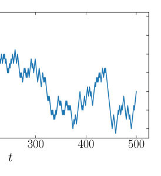
<figcaption class="paper-figure-caption"><b>Fig 1.</b> Figure 1: Trajectory of an unbiased random walk on Z where T = {0, 1, ..., 500}.</figcaption>
</figure>
<figure class="paper-figure-card">
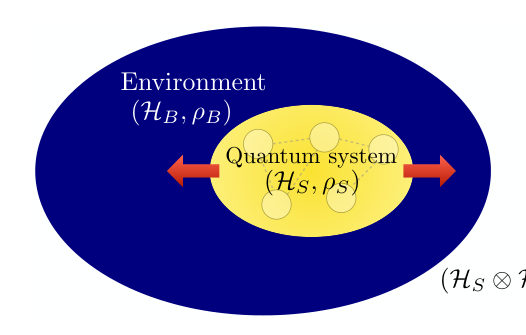
<figcaption class="paper-figure-caption"><b>Fig 2.</b> Figure 2: General framework for open quantum systems. The composite space H on which all physical states of S + B are defined has the tensor product structure H = HS ⊗HB. If ρ belongs to the set of physical states S(H), then the marginal states of S and B can be obtained via the partial trace. The reduced density matrices ρS and ρB fully characterize the one-point statistics of the respective subsystems.</figcaption>
</figure>
<figure class="paper-figure-card">
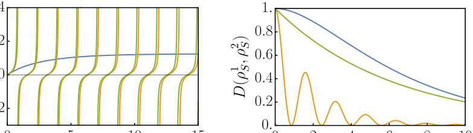
<figcaption class="paper-figure-caption"><b>Fig 3.</b> Figure 3: (a) Decay rate γ(t) for parameters g = 0.2Γ (blue) and g = 2Γ (orange). The blue line corresponds to the Markovian regime where the decay rate converges to γ0 = 4g2/Γ in the long time limit t →∞; see (110). Conversely, the green line shows the approximate form (108) derived in the strong coupling limit for g = 2Γ. (b) Trace distance for parameters g = 0.2Γ (blue), g = 2Γ (orange), and ρ1 S = |1⟩⟨1|, ρ2 S = |0⟩⟨0|. The green line shows (111) derived from the GKSL master equation (80) for g = 0.2Γ, which closely matches the blue line at times t ≫1/Γ.</figcaption>
</figure>
<figure class="paper-figure-card">

<figcaption class="paper-figure-caption"><b>Fig 4.</b> Figure 3 displays the behavior of the decay rate γ(t) and trace distance for different values of the coupling strength g with ∆ρ11 = 1 and ∆ρ10 = 0. For moderately strong coupling g = 2Γ, the system displays non-Markovian behavior since the decay rate is periodic and clearly takes negative values. This behavior is also reflected in the trace distance insofar that σ(ρ1,2 S , t) is positive during the same time intervals where γ(t) &lt; 0. For weak coupling g = 0.2Γ, the decay rate is always positive and can be well-approximated by (110) on the system time scale τR ∼1/γ0. In parallel, by substituting the decay rate γ(t) ≈γ0 and propagator (85) into (100), the trace distance in the weak coupling...</figcaption>
</figure>

**Summary.** This lecture notes serve as an introduction to quantifying quantum non-Markovianity by drawing parallels between classical stochastic processes and their quantum mechanical counterparts. It details rigorous criteria based on concepts like CP-divisibility and state distinguishability. The paper provides theoretical tools to analyze memory effects in open quantum systems, which is vital for understanding realistic decoherence dynamics.

**Why it may be interesting.** This is highly relevant for AMO physics and open quantum systems as it provides a comprehensive theoretical toolkit for diagnosing when memory effects (non-Markovianity) are present in system evolution, which is crucial for understanding decoherence mechanisms.

Detailed structure

**Main problem.** The core problem is developing rigorous methods to characterize quantum non-Markovianity, as classical definitions are insufficient for quantum dynamics.

**Main result.** The paper establishes an introduction by linking classical concepts (like stochastic matrices) to their quantum analogs using criteria such as CP-divisibility and state distinguishability. It shows that Markov processes satisfy specific mathematical structures related to time evolution.

**Method.** The analysis employs theoretical derivations, comparing classical probability theory with quantum dynamical maps ($\Phi_t$). Specific diagnostics include checking for complete positivity (CP) via the Choi matrix and analyzing the trace norm of difference density matrices.

**Model / system.** The general setting is open quantum systems interacting with an environment. Models range from abstract stochastic processes to specific physical examples like pure dephasing dynamics in qubits or particle-fluid collisions approximated by random walks.

**Key observables.** Quantum non-Markovianity, CP-divisibility, state distinguishability, Choi matrix eigenvalues, and the trace norm of the difference density matrix ($\|\Delta
ho_S(t)\|_1$).

**Important parameters / regimes.** Time ($t$), coupling strengths ($\gamma(t)$), and system size (e.g., qubits).

**Assumptions / limitations.** The notes focus on intrinsic Markovianity criteria, restricting classical analysis to finite sample spaces $\Omega$, and making approximations for continuous processes like Brownian motion.

**Figures summary.** Figure 1 illustrates a trajectory of an unbiased random walk on the integer lattice ($\mathbb{Z}$) over time steps $T = \{0, 1, ..., 500\}$.

**Paper structure.** The notes proceed by first reviewing classical stochastic processes and establishing hierarchies (Markov $\subset$ CKE $\subset$ P-divisible). They then transition to quantum systems, focusing on CP conditions using the Choi matrix and analyzing non-Markovianity via state distinguishability measures.

Abstract

The study of non-Markovian quantum processes has attracted significant interest in recent decades, giving rise to several competing notions of quantum non-Markovianity. These notes serve as an introduction to the topic for graduate students familiar with quantum mechanics and probability theory. Owing to the vastness of the literature, we focus on two prominent characterizations of quantum Markovianity based on the divisibility of quantum channels and monotonically decreasing state distinguishability. The correspondence between classical concepts (stochastic matrices, Chapman-Kolmogorov equation) and their quantum analogs (dynamical maps, CP-divisibility) is emphasized throughout.

[↑ back to top](#top)

### [Feller diffusion in an interval: Inhomogeneous fluctuation-induced asymmetric escape](http://arxiv.org/abs/2607.07649v1)

**Authors:** Prashanta Bauri, Debasish Mondal  
**Type:** theory · **Category:** statistical mechanics · **PDF:** <https://arxiv.org/pdf/2607.07649v1>  
**Analysis basis:** full PDF text, analyzed in chunks
**Topic relevance:** `methods for driven-dissipative` **3/5** · `non-equilibrium dynamics` **3/5** · `Keldysh / 2PI / non-Gaussian methods` **2/5** · `driven-dissipative phase transition` **2/5** · `non-equilibrium universality` **2/5** · `Frenkel-Kontorova` **1/5** · `analog quantum simulation` **1/5** · `correlated / nonlocal dissipation` **1/5** · `measurement-induced transitions` **1/5** · `quantum measurements` **1/5**

↔ Scroll figures horizontally

<figure class="paper-figure-card">
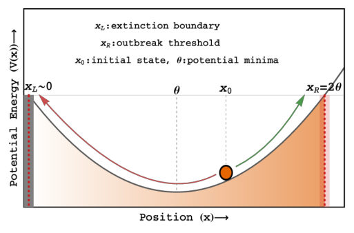
<figcaption class="paper-figure-caption"><b>Fig 1.</b> FIG. 1. Schematic diagram of the potential energy set-up and location of the absorbing boundaries of the Feller process under study. Two absorbing boundaries are located at xL (left) and xR (right).</figcaption>
</figure>
<figure class="paper-figure-card">
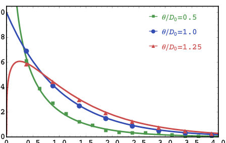
<figcaption class="paper-figure-caption"><b>Fig 2.</b> FIG. 2. Variation of the stationary probability distribution function, pst(x) as a function of space coordinate x for three different regimes of θ D0 ratio. If θ D0 ≤1, then the origin is accessible (green and blue lines). In the case of θ D0 &gt; 1, the origin is not accessible (red colored line). Lines are obtained analytically following Eq. 6 and the points are obtained from the Langevin dynamics simulation of Eq. 2.</figcaption>
</figure>
<figure class="paper-figure-card">
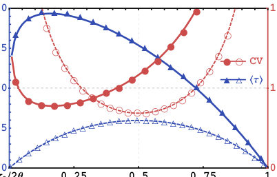
<figcaption class="paper-figure-caption"><b>Fig 3.</b> FIG. 3. Comparison plot between homogeneous (open mark- ers) and inhomogeneous (filled markers) noise strength show- ing the dependence of MFPT (left Y −axis) and CV (right Y −axis) as a function of scaled initial position x0 = x0</figcaption>
</figure>
<figure class="paper-figure-card">
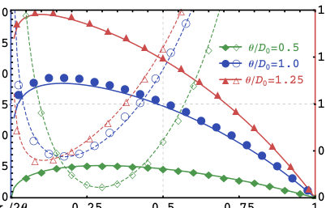
<figcaption class="paper-figure-caption"><b>Fig 4.</b> FIG. 4. Variation of ⟨τ⟩(left side of Y −axis) and coefficient of variation (CV ) (right side of Y −axis) for three different drift-to-noise strength ratios (θ/D0) as a function of scaled initial position x0. Two fixed absorbing boundaries are taken at xL = 10−4 and xR = 2θ, respectively. Solid and dashed lines represent the analytical variation of ⟨τ⟩and CV , re- spectively. Filled and open markers denote the associated numerical simulated results from the Langevin Eq. 2. Grey colored vertical dashed line is a reference line for x0 = 0.5.</figcaption>
</figure>
<figure class="paper-figure-card">
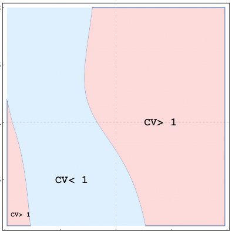
<figcaption class="paper-figure-caption"><b>Fig 5.</b> FIG. 5. Phase diagram of coefficient of variation (CV ) with θ/D0 and x0 = x0</figcaption>
</figure>

**Summary.** This paper analyzes escape dynamics for a Feller diffusion process characterized by inhomogeneous fluctuations within a bounded interval. It calculates key metrics like mean exit time and splitting probabilities, demonstrating that the spatial variation of noise fundamentally alters stochastic outcomes compared to standard models. The results highlight how these non-uniform fluctuations bias system trajectories toward one absorbing state over another.

**Why it may be interesting.** The study provides a detailed theoretical framework for analyzing stochastic decision-making under spatially varying noise, which has direct analogies in quantum measurement theory or open quantum systems where dissipation/noise is non-uniform across parameter space.

Detailed structure

**Main problem.** The study investigates inhomogeneous fluctuation-induced asymmetric escape from a Feller diffusion confined within a finite interval with two competing absorbing boundaries.

**Main result.** Inhomogeneous noise leads to non-trivial asymmetries in escape rates, causing the mean exit time to exhibit complex dependence on initial conditions and drift-to-noise ratios.

**Method.** The analysis involves solving the Fokker-Planck Equation (FPE) for the process, utilizing Laplace transforms to calculate mean first-passage times ($\langle	au
angle$), and comparing results against known homogeneous models like the Ornstein-Uhlenbeck process.

**Model / system.** The model is an overdamped Brownian motion in a shifted harmonic potential with state-dependent diffusivity, described by a Langevin equation. The system is confined between two absorbing boundaries: an extinction site ($x_L$) and an outbreak point ($x_R$).

**Key observables.** Mean exit time ($\langle	au
angle$), splitting probabilities ($\epsilon_{xL}, \epsilon_{xR}$), and the Coefficient of Variation (CV) of the escape time.

**Important parameters / regimes.** The drift-to-noise strength ratio ($	heta/D_0$) is crucial, determining whether the origin boundary is accessible or an entrance boundary for the Feller process.

**Assumptions / limitations.** The analysis relies on the applicability of the Feller process framework and assumes that the comparison to homogeneous systems (like OU) provides a useful benchmark for understanding noise effects.

**Figures summary.** Figures illustrate the stationary PDF variation with $	heta/D_0$, compare mean escape times ($\langle	au
angle$) and CVs between homogeneous and inhomogeneous noise, and map out phase diagrams showing asymmetries in splitting probabilities ($\epsilon_{xR} - \epsilon_{xL}$).

**Paper structure.** The paper establishes the Feller diffusion model via its SDE/FPE, derives analytical solutions for observables like $\langle	au
angle$ using special functions (Kummer's equation), and systematically compares these results against established benchmarks from homogeneous processes (OU) to highlight the unique effects of inhomogeneous noise.

Abstract

We present an inhomogeneous fluctuation-induced asymmetric escape event of a Feller diffusion confined to a finite interval with two competing absorbing boundaries. The dynamics correspond to an overdamped Brownian motion in a shifted harmonic potential with state-dependent diffusivity. We set two exit points (equal potential energies), equidistant from the potential minima: an extinction site near the origin and an outbreak point. The multiplicative fluctuations are suppressed near the extinction boundary, biasing trajectories toward the outbreak state. The mean exit time exhibits a non-monotonic dependence on the initial condition and the drift-to-noise strength ratio, attaining a maximum when the particle is initialized toward the extinction (low-noise) site. The outbreak possibility is more likely even if the process started with a small initial bias towards the low-noise boundary. The spatial location of the lowest coefficient of variation (CV) is nicely corroborated by the maximum exit time, which is the hallmark of a stochastic escape from an interval. The fluctuation in escape time is found to dominate its mean as a non-trivial function of the drift-to-noise strength and the initial spatial bias. The observed asymmetries in escape also shape the speed-accuracy trade-off in stochastic decision-making events.

[↑ back to top](#top)

### [Anomalous Hall and Nernst effects driven by static and fluctuating spin chiralities on Kagome lattice](http://arxiv.org/abs/2607.06966v1)

**Authors:** He-Lin Li, Zhen-Gang Zhu, Gang Su  
**Type:** theory · **Category:** strongly correlated electrons · **PDF:** <https://arxiv.org/pdf/2607.06966v1>  
**Analysis basis:** full PDF text, analyzed in chunks
**Topic relevance:** `analog quantum simulation` **3/5** · `methods for driven-dissipative` **3/5** · `Keldysh / 2PI / non-Gaussian methods` **2/5** · `Kondo & dissipative impurity` **2/5** · `non-equilibrium dynamics` **2/5** · `driven-dissipative phase transition` **1/5** · `exotic spin models in light-matter` **1/5** · `non-equilibrium universality` **1/5** · `spintronics-quantum-optics interface` **1/5**

↔ Scroll figures horizontally

<figure class="paper-figure-card">
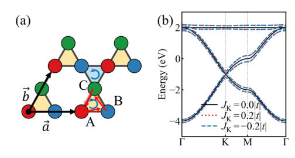
<figcaption class="paper-figure-caption"><b>Fig 1.</b> FIG. 1. (a) Schematic illustration of the Kagome lattice. The black arrows denote the lattice basis vectors a and b, while the red, blue, and green spheres represent the three sublattices. A representative noncoplanar magnetic configuration with nonzero scalar spin chirality is indicated by red arrows, de- fined as SA = (sin θ, 0, cos θ), SB = (−1</figcaption>
</figure>
<figure class="paper-figure-card">
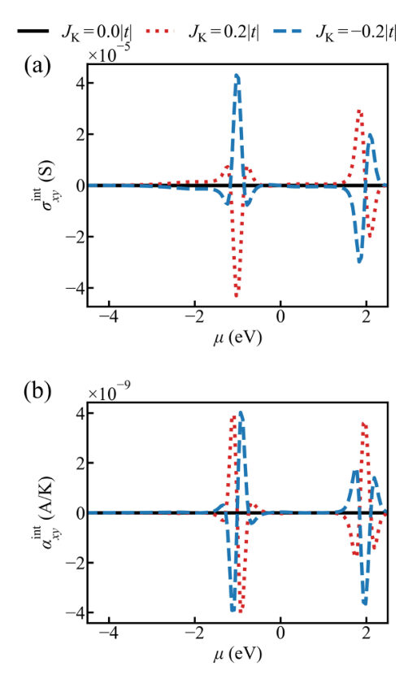
<figcaption class="paper-figure-caption"><b>Fig 2.</b> FIG. 2. (a) Intrinsic anomalous Hall conductivity σint xy as a function of the chemical potential calculated for various exchange couplings JK with a hopping integral t = −1 eV. The black solid, red dotted, and blue dashed lines represent JK = 0, 0.2|t|, and −0.2|t|, respectively. (b) Corresponding intrinsic anomalous Nernst conductivity αint xy for the same set of parameters. The horizontal axis in both panels denotes the chemical potential.</figcaption>
</figure>
<figure class="paper-figure-card">
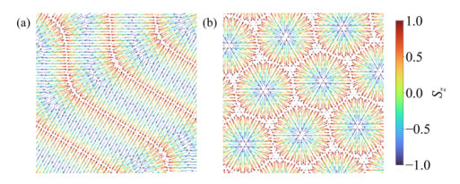
<figcaption class="paper-figure-caption"><b>Fig 3.</b> FIG. 4. Snapshots of the real space spin configurations obtained from Monte Carlo simulations at a low tempera- ture T = 0.001JH. (a) A representative spin pattern at Bz = 0.01JH, extracted from the full simulation lattice, show- ing the characteristic helical phase. (b) A representative spin pattern at Bz = 0.068JH, showing a well defined SkX phase. In both panels, the arrows represent the local spin directions. The color scale indicates the out of plane spin component Sz.</figcaption>
</figure>
<figure class="paper-figure-card">
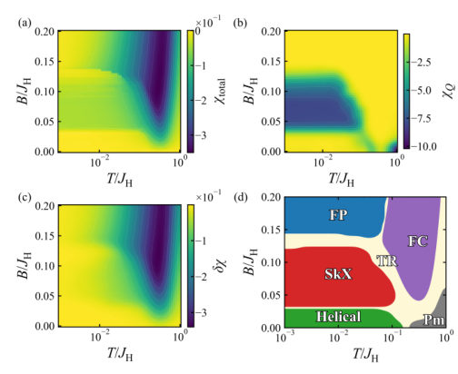
<figcaption class="paper-figure-caption"><b>Fig 4.</b> FIG. 3. (a) Total scalar spin chirality averaged over a sin- gle triangle χtotal = ⟨Si · (Sj × Sk)⟩calculated via Monte Carlo (MC) simulations across the T-B parameter space. (b) Macroscopic topological charge χQ (static topological back- ground) evaluated using the lattice based solid angle ap- proach. (c) Fluctuation driven scalar spin chirality δχ, ob- tained by subtracting the static background from the total chirality, representing the pure thermal fluctuation contribu- tion. (d) Comprehensive magnetic phase diagram established from the MC results. The identified regions include: the he- lical phase, the SkX phase, the field polarized (FP) phase, the paramagnetic (Pm) phase, and the...</figcaption>
</figure>
<figure class="paper-figure-card">
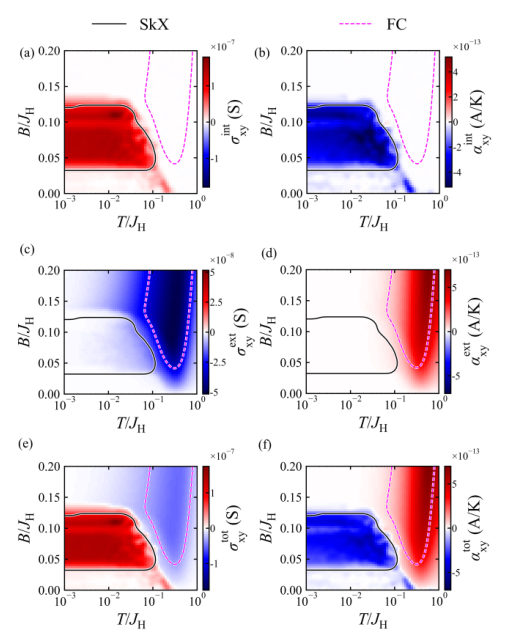
<figcaption class="paper-figure-caption"><b>Fig 5.</b> FIG. 5. Distribution of the anomalous transport coefficients across the T-B parameter space, calculated with t = −1 eV and JK = 0.2t. (a) Intrinsic AHC σint xy and (b) intrinsic ANC αint xy , calculated by incorporating the thermally aver- aged static spin configurations ⟨Si⟩from the MC simulations into an expanded 12 × 12 tight binding supercell. (c) Extrin- sic AHC σext xy and (d) extrinsic ANC αext xy originating from the skew scattering mechanism, calculated using the analyt- ical expressions driven by the dynamical chiral fluctuations δχ. (e) Total AHC σtot xy and (f) total ANC αtot xy , representing the summation of the respective intrinsic and extrinsic con- tributions. In all...</figcaption>
</figure>

**Summary.** This theoretical work analyzes anomalous Hall and Nernst effects in a Kagome lattice by separating their origins into contributions from static spin chirality (intrinsic) and dynamic spin fluctuations (extrinsic). The key finding is the identification of a phase crossover where thermal fluctuations suppress topological responses, allowing dynamical chiral fluctuations to dominate transport behavior.

**Why it may be interesting.** While focused on condensed matter magnetism, the rigorous separation of intrinsic (topological/Berry curvature) versus extrinsic (scattering-rate dependent) responses mirrors general principles used in analyzing non-equilibrium transport in complex quantum systems.

Detailed structure

**Main problem.** The study investigates the distinct roles of static versus fluctuating spin chiralities in driving anomalous Hall and Nernst effects in a frustrated magnetic lattice.

**Main result.** A pronounced mechanistic crossover is demonstrated: intrinsic transport is governed by Berry curvature in ordered phases, while dynamic fluctuations dominate near the order-disorder critical regime.

**Method.** The authors combine Monte Carlo simulations with semiclassical Boltzmann transport theory to calculate anomalous scattering rates using perturbation expansions up to the second Born approximation.

**Model / system.** The system is a two-dimensional Kagome lattice hosting itinerant electrons coupled to localized magnetic moments via an s-d exchange interaction. The analysis uses a Kondo-type Hamiltonian framework.

**Key observables.** Anomalous Hall Conductivity (AHC, $\sigma_{xy}$) and Anomalous Nernst Effect ($\alpha_{xy}$), decomposed into intrinsic (Berry curvature) and extrinsic (skew scattering) contributions.

**Important parameters / regimes.** Temperature ($T$), chemical potential ($\epsilon$), magnetic order parameters, and the strength of the exchange coupling ($J_K$).

**Assumptions / limitations.** The analysis employs a low-energy effective mass approximation for band dispersion and utilizes the relaxation time approximation within the Boltzmann equation.

**Figures summary.** Figures illustrate phase diagrams showing topological quantities ($\chi_{total}$, $\chi_Q$, etc.) across T-B parameter space, and show real-space spin configurations corresponding to different magnetic phases (e.g., skyrmion crystal).

**Paper structure.** The paper proceeds by deriving the general expressions for anomalous transport coefficients using scattering theory, then applying these formalisms to the Kagome lattice to explicitly separate and analyze the contributions from static vs. dynamic chiralities across various magnetic phase regimes.

Abstract

We theoretically investigate the anomalous Hall and Nernst effects (AHE and ANE) in a two dimensional Kagome lattice to uncover the distinct roles of static and fluctuating scalar spin chi ralities. Employing Monte Carlo simulations incorporating with a tight binding Hamiltonian via the s-d exchange interaction, we explicitly evaluate the anomalous transport coefficients. A key finding is the systematic disentanglement of the macroscopic responses into an intrinsic contribu tion, governed by momentum space Berry curvature induced by static chirality, and an extrinsic skew scattering contribution driven by real space dynamical spin fluctuations. We demonstrate a pronounced mechanistic crossover: deep in magnetically ordered phases like the skyrmion crystal, the intrinsic Berry curvature dictates the transport behavior. However, approaching the magnetic order-disorder critical regime, strong thermal fluctuations disrupt static noncoplanar spin configu rations, drastically suppressing intrinsic responses. Here, dynamical chiral fluctuations emerge as the dominant driving force. By delineating the phase regimes governed by static versus fluctuating chiralities, this work elucidates the distinct microscopic mechanisms dictating anomalous transport in frustrated magnetic systems.

[↑ back to top](#top)

### [Quantum Boomerang Effect in Time-Crystalline Structures](http://arxiv.org/abs/2607.07225v1)

**Authors:** Qi-wen Peng, Krzysztof Sacha, Chu-hui Fan  
**Type:** theory · **Category:** disordered systems and neural networks · **PDF:** <https://arxiv.org/pdf/2607.07225v1>  
**Analysis basis:** full PDF text, analyzed in chunks
**Topic relevance:** `driven-dissipative phase transition` **3/5** · `methods for driven-dissipative` **3/5** · `non-equilibrium dynamics` **3/5** · `non-equilibrium universality` **2/5** · `Frenkel-Kontorova` **1/5** · `Keldysh / 2PI / non-Gaussian methods` **1/5** · `Kondo & dissipative impurity` **1/5** · `analog quantum simulation` **1/5** · `scars & prethermalization` **1/5**

↔ Scroll figures horizontally

<figure class="paper-figure-card">
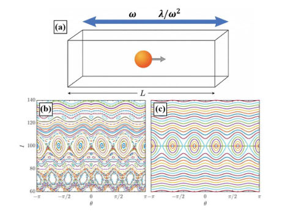
<figcaption class="paper-figure-caption"><b>Fig 1.</b> FIG. 1. (a) A particle moves freely within a box of length L,</figcaption>
</figure>
<figure class="paper-figure-card">
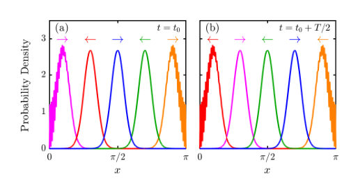
<figcaption class="paper-figure-caption"><b>Fig 2.</b> FIG. 2. Probability densities of the s = 5 Floquet-Wannier</figcaption>
</figure>
<figure class="paper-figure-card">
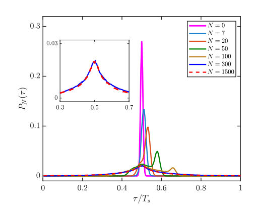
<figcaption class="paper-figure-caption"><b>Fig 3.</b> FIG. 3. Probability density PN(τ) for the detection of the</figcaption>
</figure>
<figure class="paper-figure-card">
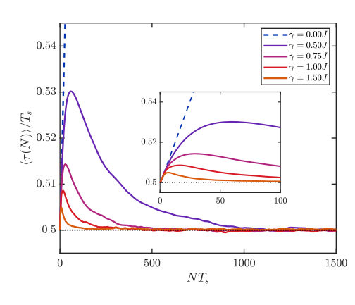
<figcaption class="paper-figure-caption"><b>Fig 4.</b> FIG. 4. Temporal center of mass ⟨τ(N)⟩/Ts as a function of</figcaption>
</figure>
<figure class="paper-figure-card">
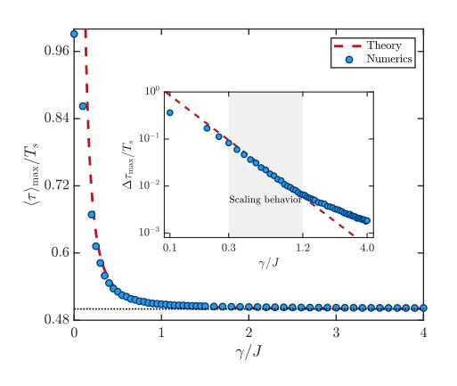
<figcaption class="paper-figure-caption"><b>Fig 5.</b> FIG. 5. Maximum temporal shift ∆τmax/Ts [Eq. (16)] as a</figcaption>
</figure>

**Summary.** The authors theoretically prove the existence of the Quantum Boomerang Effect in time-crystalline structures by analyzing wavepacket dynamics. They map the complex Floquet evolution onto a disordered tight-binding model, showing that temporal disorder causes the probability density to initially drift but ultimately return to its starting point. This demonstrates that disorder can stabilize quantum coherence in periodically driven systems.

**Why it may be interesting.** This work connects concepts from Anderson localization (a hallmark of disorder) to time-periodic systems (time crystals), providing a novel mechanism for understanding coherence revival in driven quantum matter.

Detailed structure

**Main problem.** To theoretically establish and quantitatively characterize the Quantum Boomerang Effect (QBE) entirely within the time domain using a periodically driven system.

**Main result.** The QBE is confirmed in the time domain, showing that temporal disorder can induce a counterintuitive 'drift-and-return' behavior, stabilizing the mean arrival time through mechanisms analogous to Anderson localization.

**Method.** The continuous Floquet dynamics are mapped onto a discrete disordered tight-binding lattice using maximally localized Floquet-Wannier states and analyzed via secular approximation techniques.

**Model / system.** A quantum particle in a 1D potential well subjected to periodic time driving, modeled by an effective Hamiltonian that incorporates temporal disorder ($\gamma$).

**Key observables.** Mean temporal center of mass of the probability density $\langle	au(N)
angle$, and the maximum temporal shift $\Delta	au_{	ext{max}}$.

**Important parameters / regimes.** The ratio of hopping strength to disorder strength ($J/\gamma$), and the resonance condition ($\omega = s\Omega$).

**Assumptions / limitations.** The secular approximation is used to derive effective Hamiltonians, which are local descriptions valid near specific resonances.

**Figures summary.** Figures compare phase-space portraits (Fig. 1) and show probability densities $P_N(	au)$ demonstrating the drift and return behavior over time steps (Fig. 3).

**Paper structure.** The paper progresses from establishing the QBE in a general Floquet context, deriving effective Hamiltonians via secular approximation, mapping to a disordered tight-binding model, and finally analyzing the role of disorder strength ($\gamma$) on the temporal dynamics.

Abstract

The quantum boomerang effect (QBE) is a unique dynamical signature of Anderson localization, characterized by a launched wavepacket that initially drifts but ultimately returns to its initial position due to fundamental quantum interference. In this work, we theoretically establish and quantitatively characterize the QBE in a time-crystalline structure using a periodically driven quantum particle in a one-dimensional potential well. By constructing maximally localized Floquet-Wannier states and introducing temporal disorder, we rigorously map the continuous Floquet dynamics onto a discrete disordered tight-binding lattice. By positioning a detector at a fixed spatial coordinate, we monitor the temporal evolution of the wavepacket, to extract the mean temporal center of mass of the probability density in a time-crystalline structure. This mean temporal center of mass exhibits an initial ballistic expansion, followed by a pronounced U-turn, and ultimately returns to its initial temporal position after long-time evolution. These results confirm the existence of the complete QBE in the time domain. They also demonstrate that non-trivial dynamics can be explored within time-crystalline systems, even though these structures already possess an inherent temporal periodicity.

[↑ back to top](#top)

### [Control Protocols for Entangling Gates for Group-IV Color-Centers in Diamond](http://arxiv.org/abs/2607.07549v1)

**Authors:** Jurek Frey, Frank K. Wilhelm, Matthias M. Müller  
**Type:** theory · **Category:** quantum information and computing · **PDF:** <https://arxiv.org/pdf/2607.07549v1>  
**Analysis basis:** full PDF text, analyzed in chunks
**Topic relevance:** `spintronics-quantum-optics interface` **3/5** · `QC/QI experiment` **2/5** · `methods for driven-dissipative` **2/5** · `quantum measurements` **2/5** · `Keldysh / 2PI / non-Gaussian methods` **1/5** · `correlated / nonlocal dissipation` **1/5** · `driven-dissipative phase transition` **1/5** · `entanglement & information structure` **1/5** · `exotic spin models in light-matter` **1/5** · `non-equilibrium dynamics` **1/5**

↔ Scroll figures horizontally

<figure class="paper-figure-card">
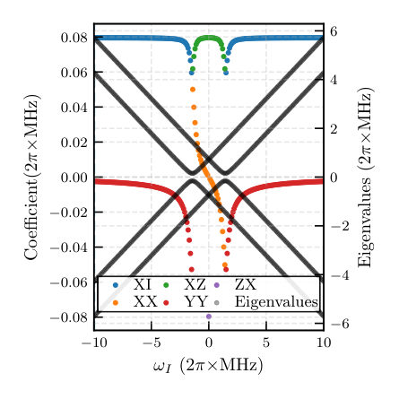
<figcaption class="paper-figure-caption"><b>Fig 1.</b> FIG. 1. Shown in color is the Pauli decomposition of the Hamiltonian from Eq. (13), where the order of the eigenvec- tors was the same as in the original Hamiltonian’s diagonal. The gray dots show the eigenvalues of the Hamiltonian, two avoided crossings and a real degeneracy at ωI = 0 are visible.</figcaption>
</figure>
<figure class="paper-figure-card">
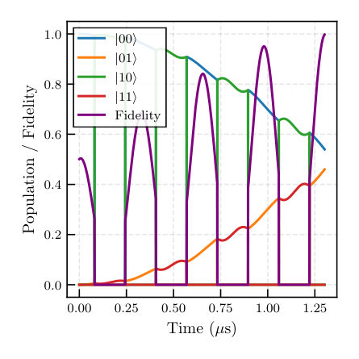
<figcaption class="paper-figure-caption"><b>Fig 2.</b> FIG. 2. Population dynamics during a dynamical decoupling gate implemented with n = 8 instantaneous π-pulses and a Larmor frequency of ωI = 16Azx</figcaption>
</figure>
<figure class="paper-figure-card">
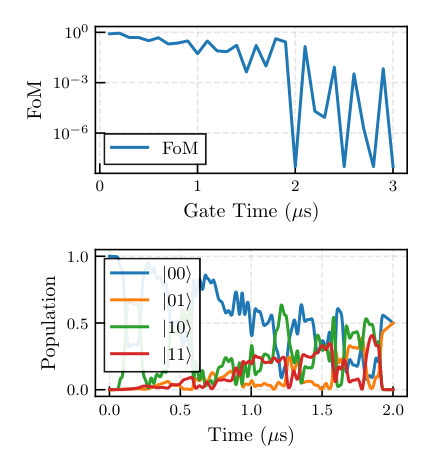
<figcaption class="paper-figure-caption"><b>Fig 3.</b> FIG. 3. Optimization of a ZX/2 gate with the dCRAB optimal control method. The top plot shows the resulting FoM with control pulses which were amplitude-limited to |Ωmax| = 2π ×15 MHz to ensure experimental feasibility. The pulse was multiplied by a Gaussian envelope function ensur- ing that it starts and ends at zero power (see Sec. II B). The lower plot shows the population of the two-qubit system dur- ing the applied pulses for a gate time of T = 2 µs. The gate reached a gate fidelity of 1 −F &lt; 10−8, while we set the Lar- mor frequency to ωI = 2π × 3 MHz.</figcaption>
</figure>
<figure class="paper-figure-card">
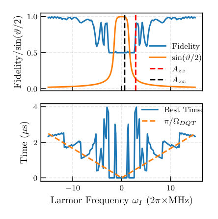
<figcaption class="paper-figure-caption"><b>Fig 4.</b> FIG. 4. Performance of the double-quantum transition (DQT) gate as a function of the nuclear Larmor frequency ωI. Top panel: maximum gate fidelity obtained using rectan- gular MW pulses with a Rabi frequency of Ω= 2π × 10 MHz, while varying the gate duration between 0 and 4 µs. Bottom panel: corresponding gate times at which the optimal fidelity was achieved. The orange line indicates a theoretical speed estimation derived in Sec. II, showing good agreement with the observed 1/ωI scaling of Eq. (32).</figcaption>
</figure>
<figure class="paper-figure-card">
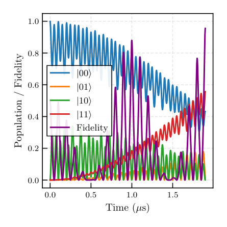
<figcaption class="paper-figure-caption"><b>Fig 5.</b> FIG. 5. Time evolution of a two-qubit system under DQT driving, shown in the rotating frame of the electron spin after applying the RWA. The control field is of the form Ω(t) = Ω0 cos(ωIt) cos(ωet), with Ω0 = 11 MHz and a gate time of T = 1.9 µs , leading to coherent population oscilla- tions between |00⟩= |↑e↑n⟩and |11⟩= |↓e↓n⟩mediated by the Azx coupling. In this plot we set the Larmor frequency to ωI = 2π × 10 MHz.</figcaption>
</figure>

**Summary.** This paper tackles the critical challenge of controlling entangling gates in diamond color-centers by analyzing the system's hyperfine interactions. Using advanced quantum control methods like QOC and dynamical decoupling, the authors derive protocols for realizing three types of entanglement gates. The results confirm feasibility while highlighting limitations related to nuclear spin splittings, advancing the roadmap for solid-state quantum computing.

**Why it may be interesting.** This work provides detailed theoretical blueprints for implementing fundamental quantum gates in a solid-state platform, directly relevant to building scalable quantum processors.

Detailed structure

**Main problem.** The primary challenge addressed is achieving accurate control over entangling gates for quantum applications using solid-state spin qubits.

**Main result.** The authors demonstrate that three distinct types of entangling gates can be realized in the system, and they provide rigorous protocols to achieve these gates with high fidelity.

**Method.** The study employs advanced quantum control techniques, including Quantum Optimal Control (QOC), dynamical decoupling, and analyzing the Quantum Speed Limit (QSL).

**Model / system.** The physical platform is a group-IV color-center in diamond (specifically involving a Germanium vacancy defect) coupled to nearby nuclear spins. The system dynamics are governed by an effective Hamiltonian incorporating hyperfine couplings ($A_{zz}, A_{zx}$) and Zeeman splittings ($\omega_e, \omega_I$).

**Key observables.** Gate fidelity ($F$), gate time ($T$), population dynamics, and the achievable entanglement strength.

**Important parameters / regimes.** Hyperfine coupling constants ($A_{zz}, A_{zx}$), nuclear Larmor frequency ($\omega_I$), microwave pulse amplitude ($\Omega_{\max}$), and the ratio of couplings to $\omega_I$.

**Assumptions / limitations.** The analysis focuses on coherent Hamiltonian evolution, and approximations like the Schrieffer-Wolff transformation are used in certain derivations.

**Figures summary.** Figures illustrate population dynamics for dynamical decoupling (DD) gates and show how gate fidelity is optimized by varying parameters like $\omega_I$.

**Paper structure.** The paper systematically analyzes the Hamiltonian, derives effective interaction terms using transformations, compares multiple control protocols (QOC vs. DD), determines the QSL, and concludes with experimental applicability discussions.

Abstract

Accurately controlling entangling gates remains a major challenge for quantum technology applications with solid-state spin qubits. Here, we study a group-IV color-center with a strongly-coupled nuclear spin and approach the problem from a quantum control perspective. We show that there are three different types of entangling gates where the entanglement is mediated by the parallel hyperfine-coupling component, the orthogonal one or both. We derive the respective quantum speed limits (QSL) and show by means of dynamical decoupling, resonant driving of single- and double-quantum transitions, quantum optimal control and algebraic gate decomposition how these gates can be realized. We finally discuss the experimental applicability.

[↑ back to top](#top)

### [Mesoscopic routers and single-pole double-throw switches for electronic heat](http://arxiv.org/abs/2607.06716v1)

**Authors:** José Balduque, Rafael Sánchez  
**Type:** theory · **Category:** other · **PDF:** <https://arxiv.org/pdf/2607.06716v1>  
**Analysis basis:** full PDF text, analyzed in chunks
**Topic relevance:** `methods for driven-dissipative` **3/5** · `non-equilibrium dynamics` **3/5** · `driven-dissipative phase transition` **2/5** · `non-equilibrium universality` **2/5** · `Keldysh / 2PI / non-Gaussian methods` **1/5** · `Kondo & dissipative impurity` **1/5** · `correlated / nonlocal dissipation` **1/5** · `interference shaping light` **1/5**

↔ Scroll figures horizontally

<figure class="paper-figure-card">
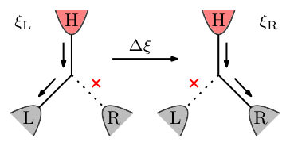
<figcaption class="paper-figure-caption"><b>Fig 1.</b> FIG. 1. Sketch of an ideal thermal single-probe double- throw switch: tuning an external parameter ξ between two polarities, ξL and ξR, simultaneously opens and closes the thermally driven transport between a hot input terminal and two output ones.</figcaption>
</figure>
<figure class="paper-figure-card">
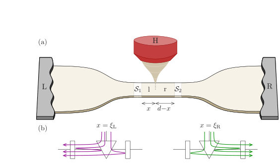
<figcaption class="paper-figure-caption"><b>Fig 2.</b> FIG. 2. Sketch of a tunable three terminal conductor. (a) A scattering region connects two terminals, L and R, and is coupled to a third terminal, H, via a scanning tip. The scat- tering region is composed of two resonant tunneling barriers described by scattering matrices Sα and separated by a bal- listic channel of length d. The tip position, x, divides the separation between barriers in two branches, l and r. (b) For particular positions of the tip (x = ξL and x = ξR) heat flows into only one output terminal (L or R, respectively) due to the destructive interference of trajectories ending in the other one.</figcaption>
</figure>
<figure class="paper-figure-card">
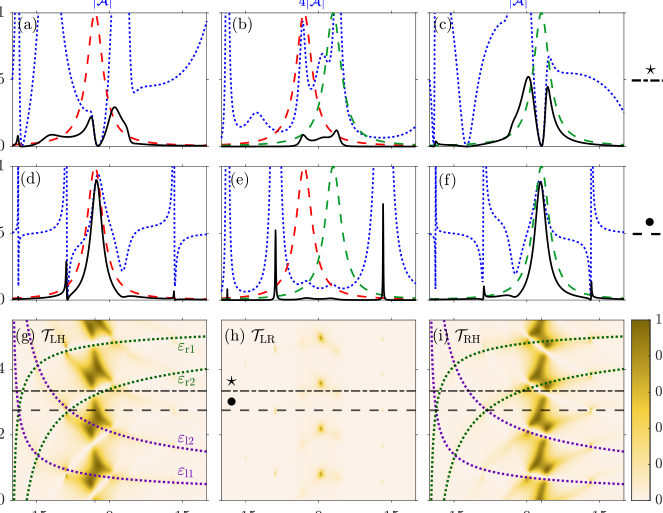
<figcaption class="paper-figure-caption"><b>Fig 3.</b> FIG. 3. Transmission probabilities between (a),(d) terminals L and H, (b),(e) terminals L and R and (c),(f) terminals R and H as a function of the energy of the scattered electrons for tip positions marked in panels (g)-(i) with ⋆and • symbols. The total transmission (black full line) can be decomposed as suggested in Eqs. (4) and (5) into the contribution of the resonant tunneling barriers, |τ1|2 (red-dashed lines) and |τ2|2 (green-dashed lines), and the contribution due to the multiple internally reflected trajectories between scattering regions and the tip (blue-dotted lines). (g)-(i) Color maps of the previous as a function of also the tip position. Dotted purple and green lines mark...</figcaption>
</figure>
<figure class="paper-figure-card">
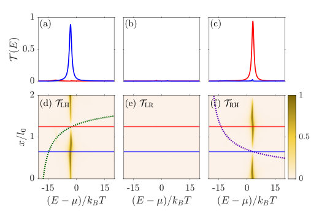
<figcaption class="paper-figure-caption"><b>Fig 4.</b> FIG. 4. Transmission probabilities between (a) terminals L and H, (b) terminals L and R and (c) terminals R and H as a function of the energy of the scattered electrons, and for two different tip positions indicated by red and blue horizontal lines in panels (d)-(f). (d)-(f) Color maps of the previous as a function of also the tip position. Dotted purple and green lines mark the partial resonance conditions (n = 1) for internal branches l and r, respectively, as given by Eqs. (8) and (9). Parameters: d = 2l0, ϵ = 0.5, ε1 −µ = −3kBT, ε2 −µ = 3kBT, Γ = 0.5kBT, µ = 20kBT.</figcaption>
</figure>
<figure class="paper-figure-card">
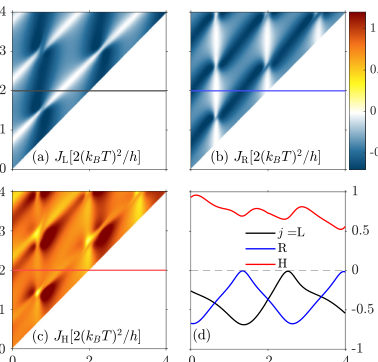
<figcaption class="paper-figure-caption"><b>Fig 5.</b> FIG. 5. (a)-(c) Heat currents in reservoirs j =L,R,H, when the temperature of reservoir H is increased by ∆T/T = 1, as a function of the separation between scatterers d and the tip position x. Panel (d) shows cuts of the previous for fixed distance d = 2l0, indicated with horizontal lines. Parameters: ε1 −µ = −3kBT, ε2 −µ = 3kBT, ϵ = 0.5, Γ = 0.5kBT and µ = 20kBT.</figcaption>
</figure>

**Summary.** This paper proposes using mesoscopic junctions as active thermal routers or switches to manage waste heat in nanoelectronics. By exploiting quantum interference effects via tunable barriers or scanning tips, the device can selectively direct heat flow between output terminals. This offers a pathway for energy-efficient nanoscale devices operating at low temperatures.

**Why it may be interesting.** This work directly addresses non-equilibrium energy transport in nanoscale devices, which is highly relevant to open quantum systems theory, thermalization dynamics, and the study of heat flow beyond simple electrical conductance measurements.

Detailed structure

**Main problem.** The core problem is controlling and redirecting unavoidable heat dissipation in electronic nanostructures, especially critical for low-temperature operation.

**Main result.** The authors propose using three-terminal junctions that function as thermal routers or single-pole double-throw switches by exploiting quantum interference effects. They find that ideal filtering can bound the heat flow to one-fourth of the open conductor current.

**Method.** The analysis employs scattering theory, calculating both particle and heat currents using the scattering matrix S(E) for various boundary conditions (e.g., short circuit vs. open circuit).

**Model / system.** The system is a three-terminal junction (L, R, H) modeled with resonant tunneling barriers ($\alpha=1, 2$) and tunable coupling via a scanning tip or gate voltage. This structure acts as an electronic Fabry-Pérot interferometer.

**Key observables.** Heat currents ($J$), particle currents ($I_j$), transmission probabilities ($T_{ij}(E)$), and the relative output current ratios between L and R.

**Important parameters / regimes.** Tip position ($x$) controlling quantum interference, gate voltage tuning ($\epsilon$), resonance energies ($\varepsilon_{ln}, \varepsilon_{rn}$), and the coupling strength $\epsilon$.

**Assumptions / limitations.** The analysis assumes single-channel leads for electron injection and initially focuses on fully coherent transport regimes.

**Figures summary.** Figures illustrate the sketch of the tunable junction, showing how tip position controls interference patterns to achieve switching. Other figures map energy dependence of transmission probabilities and plot heat currents versus tuning parameters.

**Paper structure.** The paper progresses by first defining the problem (thermal routing/switching), then detailing two physical models—one based on scanning-tip quantum interference and another using gate-voltage tunable filters. It concludes with a comparison of different operational regimes and theoretical bounds.

Abstract

The unavoidable dissipation of heat in electronic nanostructures is a crucial problem, specially when their operation requires low temperatures. It demands finding devices able to control and redirect the excess heat, ideally without perturbing the electrostatic environment. We propose three-terminal junctions working either as thermal routers or as thermal single-pole double-throw switches controlled by a single external knob. Two models are discussed based on resonant tunneling energy filters and different couplings to the heat source: (i) Phase-coherent contact via a scanning tip modulates the relative amount of the two output currents via position-dependent quantum interference; (ii) Coupling via a gate voltage tunable filter selectively switches one of the currents in the presence of dephasing. In the later case, we find that the heat flow using ideal filtering is bounded by fourth the open conductor current.

[↑ back to top](#top)

### [Relativistic Quantum Thermometry in AdS Spacetime via Non-Markovian Temperature Sensing](http://arxiv.org/abs/2607.07562v1)

**Authors:** Anass Hminat, Abdallah Slaoui, Rachid Ahl Laamara  
**Type:** theory · **Category:** statistical mechanics · **PDF:** <https://arxiv.org/pdf/2607.07562v1>  
**Analysis basis:** full PDF text, analyzed in chunks
**Topic relevance:** `non-equilibrium dynamics` **3/5** · `Keldysh / 2PI / non-Gaussian methods` **2/5** · `correlated / nonlocal dissipation` **2/5** · `driven-dissipative phase transition` **2/5** · `entanglement & information structure` **2/5** · `methods for driven-dissipative` **1/5** · `non-equilibrium universality` **1/5** · `quantum measurements` **1/5**

↔ Scroll figures horizontally

<figure class="paper-figure-card">
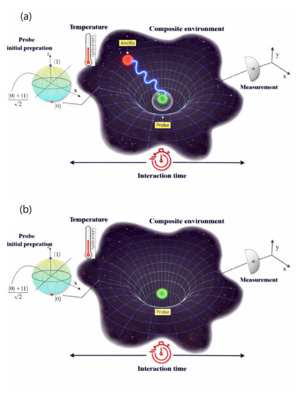
<figcaption class="paper-figure-caption"><b>Fig 1.</b> FIG. 1: Estimation theory is concerned with extracting an unknown parameter T from a set of measurement outcomes while minimizing the associated estimation error. In the con- text of quantum thermometry, a quantum probe is employed to infer the temperature of an Ads space-time. The thermo- metric protocol considered here can be naturally divided into three fundamental stages. First, the probe is prepared in an ap- propriately chosen quantum state ρ. The probe is shielded by a protective bubble that prevents thermal exchanges with the spacetime background , and acquires temperature information through its interaction with an ancillary Unruh–DeWitt detec- tor which effectively encodes the...</figcaption>
</figure>
<figure class="paper-figure-card">
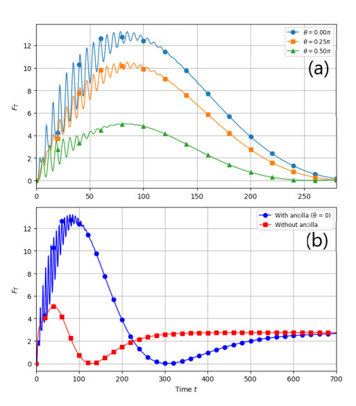
<figcaption class="paper-figure-caption"><b>Fig 2.</b> FIG. 2: We perform a comparative study of the optimal prepa- ration state θ of the auxiliary Unruh–DeWitt (UDW) system and assess its impact on thermometric efficiency, comparing it with the case where no auxiliary system is present.Top panel: Quantum Fisher information (QFI) FT computed from the re- duced state of the probe qubit , for several initial preparations of the ancilla. Parameters: T = 0.4, ζ = 1,κ = 0.25 and η = 1. Bottom panel: QFI of the probe in the absence of the ancilla (red, solid) and in the presence of the ancilla (blue, dashed) for T = 0.4, ζ = 1 and η = 1. All frequencies and energies are expressed in units of ωA = ωP = 1.</figcaption>
</figure>
<figure class="paper-figure-card">
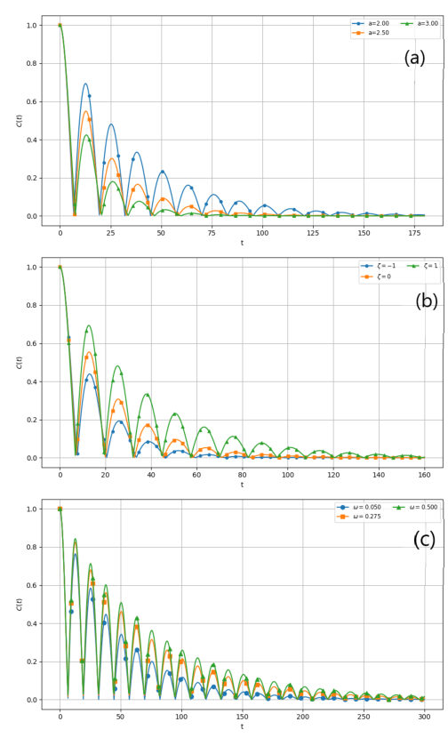
<figcaption class="paper-figure-caption"><b>Fig 3.</b> FIG. 3: Top panel: Effects of acceleration and boundary con- ditions on quantum coherence. Left panels: Time evolu- tion of the quantum coherence CAdS in AdS spacetime for different values of the temperature T, detector energy gap ω, and initial-state parameter θ=0. Distinct coloured curves correspond to different detector accelerations: the blue solid line denotes the inertial case a = 2, the orange line corre- sponds to a = 2.5, and the green line represents a = 3. medium panels: Quantum coherence CAdS in AdS space- time under varying temperature T, energy gap ω, curvature k. The coloured curves indicate different boundary conditions: Dirichlet (ζ = 1, green solid line), transparent (ζ =...</figcaption>
</figure>
<figure class="paper-figure-card">
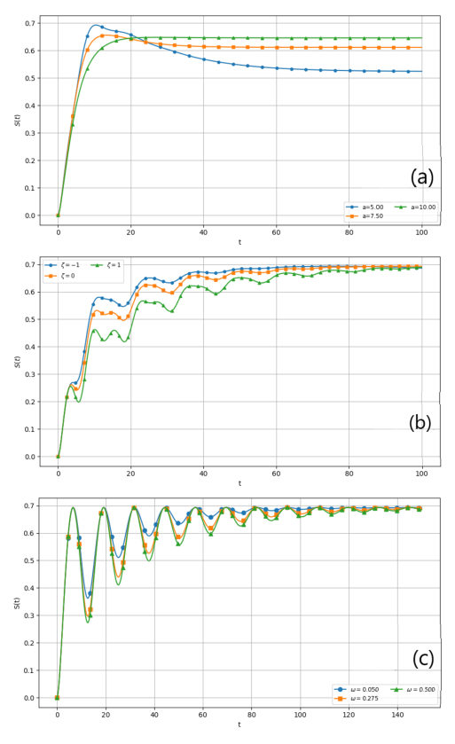
<figcaption class="paper-figure-caption"><b>Fig 4.</b> FIG. 4: Top panel: The von Neumann entropy S(t) as func- tions of the interaction time t for different energy gaps ω , accelerations a and boundary conditions ζ on the probe. Left panels: Time evolution of the Von Neumann entropy SAdS in AdS spacetime for different values of the temperature T, detector energy gap ω, and initial-state parameter θ=0. Dis- tinct coloured curves correspond to different detector acceler- ations: the green solid line denotes the inertial case a = 10, the orange line corresponds to a = 7, and the blue line repre- sents a = 5.in the medium panel the coloured curves indicate different boundary conditions: Dirichlet (ζ = 1, green solid line), transparent (ζ = 0,...</figcaption>
</figure>
<figure class="paper-figure-card">
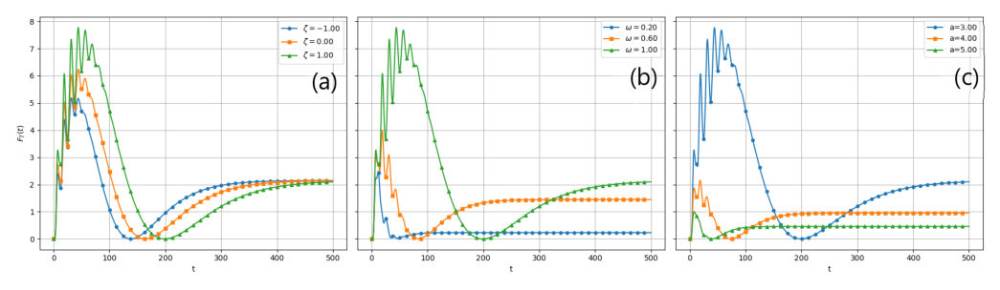
<figcaption class="paper-figure-caption"><b>Fig 5.</b> FIG. 5: A gallery of representative time evolutions of the QFI AdS4 for different boundary condition (ζ = 1) , energy gap ω and acceleration a.</figcaption>
</figure>

**Summary.** This work develops a theoretical framework to estimate the temperature of an Anti-de Sitter spacetime using single-qubit sensors. By incorporating an ancillary detector and analyzing non-Markovian effects, the authors derive fundamental limits on measurement precision using the Quantum Fisher Information. The findings show that non-Markovian dynamics can enhance sensing accuracy, particularly at low temperatures.

**Why it may be interesting.** It directly addresses open quantum systems and thermalization processes (non-Markovianity) within a curved spacetime background, which is highly relevant for understanding realistic quantum sensing in cosmology or high-energy physics settings.

Detailed structure

**Main problem.** The primary goal is to characterize the fundamental limits of precision for estimating the temperature ($T$) of a cosmological Anti-de Sitter (AdS) spacetime using quantum thermometry.

**Main result.** The study establishes that non-Markovian dynamics can enhance sensing efficiency, and optimal performance ($	ext{QSNR}$) is achieved in the low-temperature regime by maximizing coherence.

**Method.** The analysis employs quantum estimation theory, utilizing the Quantum Fisher Information (QFI) to set the ultimate precision bound on temperature estimation.

**Model / system.** The system involves a single-qubit sensor interacting with a thermal bath generated by AdS spacetime. Sensitivity is enhanced using an ancillary Unruh-DeWitt detector coupled to a massless scalar field.

**Key observables.** Quantum Fisher Information (QFI), Quantum Signal-to-Noise Ratio (QSNR), and the information-flow measure ($N$) characterizing non-Markovianity.

**Important parameters / regimes.** Temperature ($T$), spacetime curvature ($\ell$), detector acceleration ($a$), coupling constant ($\kappa$), and interaction time ($t$).

**Assumptions / limitations.** The local quantum estimation framework assumes prior, coarse knowledge of the parameter value $T$. The analysis distinguishes between transient effects and long-time stationary values.

**Figures summary.** Not specified (Notes mention Figure 9 showing QSNR dependence on temperature).

**Paper structure.** The paper develops a theoretical framework for quantum metrology in curved spacetime, deriving the QFI using detector response functions calculated from Wightman two-point functions specific to AdS space. It then analyzes how non-Markovian dynamics modify this estimation bound.

Abstract

Quantum thermometry based on single-qubit sensor configurations enables the precise estimation of the temperature of a cosmological Anti-de Sitter (AdS) spacetime. In this work, we characterize the achievable estimation accuracy using the Quantum Fisher Information (QFI) and the associated quantum signal-to-noise ratio. For the first time, we introduce an ancillary Unruh-DeWitt detector between the sensor and the thermal bath, enhancing thermometric sensitivity by channeling temperature-dependent information into the probe qubit's coherence. We examine how detector acceleration in AdS space and the choice of boundary conditions modify the probe's thermal sensitivity. Despite the differing geometries, a unified phenomenology emerges: we characterize the scaling of the QFI with respect to temperature, detector energy gap, spacetime curvature, and interaction time. Finally, we identify optimal state preparation and measurement strategies that maximize the QFI, thereby establishing the fundamental limits of precision for non-Markovian sensing in curved spacetime.

[↑ back to top](#top)

### [Explaining the magnitude of Chirality-Induced Spin Selectivity via electron-electron exchange](http://arxiv.org/abs/2607.06858v1)

**Authors:** Bence Csakany, Alex J. W. Thom  
**Type:** theory · **Category:** other · **PDF:** <https://arxiv.org/pdf/2607.06858v1>  
**Analysis basis:** full PDF text, analyzed in chunks
**Topic relevance:** `Keldysh / 2PI / non-Gaussian methods` **3/5** · `methods for driven-dissipative` **3/5** · `spintronics-quantum-optics interface` **3/5** · `non-equilibrium dynamics` **2/5** · `Kondo & dissipative impurity` **1/5** · `exotic spin models in light-matter` **1/5**

↔ Scroll figures horizontally

<figure class="paper-figure-card">
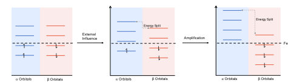
<figcaption class="paper-figure-caption"><b>Fig 1.</b> FIG. 1. Schematic diagram showing the change in en- ergy of each electron in a molecule due to an external influence. Each electron is in an approximate single particle state, a molecular orbital. The energy of these orbitals is per- turbed slightly by an external effect such as chiral phonons or spin-orbit coupling, along with breaking of time-reversal symmetry. Once the symmetry is broken, electron–electron exchange effects amplify the symmetry breaking leading to a much larger effect.</figcaption>
</figure>
<figure class="paper-figure-card">
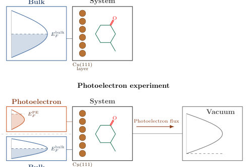
<figcaption class="paper-figure-caption"><b>Fig 2.</b> FIG. 2. Schematic of the Green’s-function mod- els used to study photoelectron transport through 3- methylcyclohexanone (3-MCHO) adsorbed on Cu(111). Top: ‘equilibrium’ setup comprising a semi-infinite bulk Cu lead coupled to the explicit Cu(111)+3-MCHO system. Bottom: ‘photoelectron’ setup, where additional photoelectron and vacuum leads are introduced to model excited-electron injec- tion and photoelectron emission, respectively. Shaded regions indicate occupied states below the corresponding Fermi lev- els.</figcaption>
</figure>
<figure class="paper-figure-card">
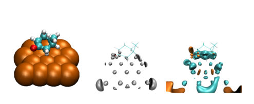
<figcaption class="paper-figure-caption"><b>Fig 3.</b> FIG. 3. The photelectron (spin) density of the sys- tem. Left: The system of interest, 3-R-MCHO adsorbed into Cu(111). Middle: Photoelectron density (equation 17). Right: Photoelectron spin density resolved along the di- rection normal to the plane. Cyan/Orange is spin paral- lel/antiparallel to the surface normal respectively. The sur- face parallel components are zero, Figure SI-1.</figcaption>
</figure>
<figure class="paper-figure-card">

<figcaption class="paper-figure-caption"><b>Fig 4.</b> FIG. 4. The magnitude and polarisation of the resul- tant photoelectrons. Left: Incoming photoelectron and outgoing (scattering) current. The variation in the current is due to the location of the virtual orbitals of the molecule. Most of the current does not make it across the interface. This is due to the limited delocalisation across the interface, as is typical for physisorbed molecules. The bulk copper was biased by 4% as described in the main text. Right: The spin polarisation of the resultant current. The bias creates an inherent 4% polarisation in the incoming electrons. The outgoing electrons do not have this and all variation is due to the spin-symmetry broken molecular orbitals....</figcaption>
</figure>
<figure class="paper-figure-card">
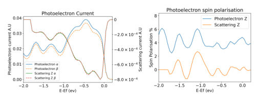
<figcaption class="paper-figure-caption"><b>Fig 5.</b> Figure 3 shows the distribution of the non-equilibrium density and spin density. The non-equilibrium compo- nent of the density matrix is defined by:</figcaption>
</figure>

**Summary.** The paper investigates Chirality-Induced Spin Selectivity (CISS) using theoretical simulations on a molecule adsorbed on copper. It proposes that the magnitude of this spin polarization is not solely due to structural chirality or SOC, but rather emerges as an amplification effect driven by electron-electron exchange interactions within the Hartree-Fock framework. This offers a new physical pathway to explain observed spin phenomena in molecular junctions.

**Why it may be interesting.** This work directly addresses spin transport and correlation effects in nanoscale systems, which is highly relevant for understanding spintronics and molecular electronics where weak coupling to magnetic moments can be amplified by many-body interactions.

Detailed structure

**Main problem.** The primary goal is to theoretically explain the magnitude of Chirality-Induced Spin Selectivity (CISS), a spin polarization effect arising from molecular chirality, particularly when relativistic effects like SOC are weak.

**Main result.** The study demonstrates that electron-electron exchange interactions within the Hartree-Fock approximation can significantly amplify a small initial spin bias ($\sim 0.0014\%$) to yield a measurable spin polarization ($\sim 2\%$), providing a new mechanism for understanding CISS magnitude.

**Method.** The research employs Non-Equilibrium Green's Functions (NEGF) formalism solved via Dyson equations, incorporating the Hartree-Fock approximation for electron interactions.

**Model / system.** The model simulates a chiral molecule (3-methylcyclohexanone) adsorbed onto a metallic surface (Cu(111)), analyzed under conditions mimicking UV photoelectron spectroscopy.

**Key observables.** Spin polarization of photoelectrons, spin density difference resolved in different spatial directions (X, Y, Z), and the dependence of polarization on initial spin bias.

**Important parameters / regimes.** The calculation relies on setting parameters for leads ($\gamma_{bulk}, \gamma_{vacuum}, \gamma_{photoelectron}$) and simulating a specific incoming photon energy (210nm).

**Assumptions / limitations.** Key approximations include using the Hartree-Fock method, employing the wide-band limit for lead self-energies, and assuming that electron-electron exchange is the dominant source of spin amplification.

**Figures summary.** Figures illustrate the schematic mechanism where small initial energy splits are amplified by exchange effects; subsequent figures show energy-resolved photoelectron spin polarization spectra comparing scenarios with and without bulk spin bias.

**Paper structure.** The paper builds from defining the CISS problem to setting up the NEGF framework using Dyson equations. It then analyzes how electron-electron exchange acts as an amplifier, culminating in quantitative results showing the magnitude of the effect.

Abstract

Chiral molecular structure can couple to electron spin, leading to unexpected spin polarization effects. This Chirality-Induced Spin Selectivity (CISS) was first reported for DNA molecules adsorbed on gold but its microscopic origin remains unclear. We demonstrated though simulation that the exchange arising from electron-electron Coulomb interactions within the self-consistent mean field (Hartree--Fock) approximation can yield significant ($\sim 2\%$) spin polarisation for $3$-methylcyclohexanone adsorbed on Cu(111) amplifying a much smaller ($\sim 0.0014\%$) initial bias, consistent with experiment. Symmetry considerations ensure the result is physically meaningful, while its ab-initio nature ensures all parameters are physically realistic. This amplification is connected to existing studies on spin-symmetry breaking in Hartree--Fock, providing a new pathway for understanding the magnitude of CISS as an emergent phenomenon of interacting electrons.

[↑ back to top](#top)

### [Operational Collapse Region in Repeaterless Loss-Dephasing Quantum Channels](http://arxiv.org/abs/2607.07603v1)

**Authors:** Ufuk Korkmaz, S. Elham Mousavigharalari, Deniz Türkpençe  
**Type:** theory · **Category:** quantum information and computing · **PDF:** <https://arxiv.org/pdf/2607.07603v1>  
**Analysis basis:** full PDF text, analyzed in chunks
**Topic relevance:** `entanglement & information structure` **3/5** · `methods for driven-dissipative` **3/5** · `correlated / nonlocal dissipation` **2/5** · `driven-dissipative phase transition` **2/5** · `non-equilibrium dynamics` **1/5** · `non-equilibrium universality` **1/5** · `quantum optics experiment` **1/5**

↔ Scroll figures horizontally

<figure class="paper-figure-card">
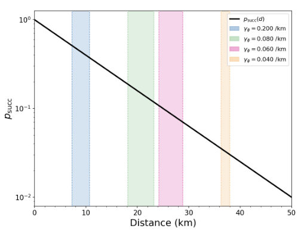
<figcaption class="paper-figure-caption"><b>Fig 1.</b> Fig. 2. Post-selection success probability psucc(d) (black curve) for a symmetric telecom channel with α = 0.2 dB/km (κ ≈0.046 km−1). Colored bands indicate Rdead for four values of the dephasing rate: γφ ∈{0.20, 0.08, 0.06, 0.04} km−1. Each band spans [dF , dE], where dF is defined by Ftele(dF ) = 2/3 + δF (δF = 10−3) and dE by EN (dE) = εEN (εEN = 10−4). The gap width ∆d reaches a maximum of 5.1 km at γφ = 0.08 km−1 and contracts at both higher and lower dephasing rates.</figcaption>
</figure>
<figure class="paper-figure-card">
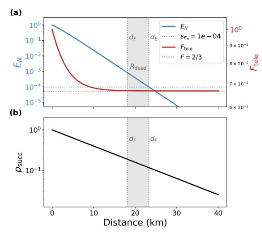
<figcaption class="paper-figure-caption"><b>Fig 2.</b> Fig. 1. Distance-resolved dynamics of a dual-rail Bell state in a telecom C-band channel (α = 0.2 dB/km, γφ = 0.08 km−1). Left axis (blue): unconditional logarithmic negativity EN ; dotted line marks εEN = 10−4. Right axis (red): post-selected teleportation fidelity Ftele; dotted line marks the classical benchmark F = 2/3. The grey shaded band is Rdead (∆d ≈ 5.1 km), bounded by dF ≈18.2 km and dE ≈23.2 km. Panel (b): post- selection success probability psucc(d).</figcaption>
</figure>

**Summary.** This paper analyzes the degradation of entanglement in optical fiber links by comparing two metrics: physical entanglement ($\mathcal{E}_N$) and practical utility ($F_{tele}$). It identifies an 'operational collapse region' where quantum correlations exist but cannot be exploited by standard detectors. The findings reveal that this operational gap width depends non-monotonically on the environmental phase noise, guiding future designs for robust quantum communication links.

**Why it may be interesting.** This work provides concrete guidelines on channel limitations in quantum networking, showing that optimizing one noise source (like minimizing dephasing) is insufficient if it exacerbates another operational bottleneck related to detection schemes.

Detailed structure

**Main problem.** The study investigates the critical gap between the physical survival of quantum entanglement and its actual usability in standard communication protocols over lossy optical fibers.

**Main result.** A distinct 'operational collapse region' exists where true entanglement persists but coincidence-based detection fails to provide a quantum advantage, and this gap width depends non-monotonically on phase noise.

**Method.** The authors numerically analyze the evolution of entangled states using Lindblad master equations, comparing two metrics: unconditional logarithmic negativity ($\mathcal{E}_N$) and post-selected teleportation fidelity ($F_{tele}$).

**Model / system.** The system models dual-rail polarization entanglement transmitted through standard telecom C-band optical fibers, incorporating amplitude damping (photon loss) and pure dephasing noise.

**Key observables.** Unconditional logarithmic negativity ($\mathcal{E}_N$), post-selected teleportation fidelity ($F_{tele}$), and the width of the operational collapse region ($\Delta d$).

**Important parameters / regimes.** Photon loss rate ($\alpha$), phase noise rate ($\gamma_\phi$), and critical thresholds for entanglement/fidelity.

**Assumptions / limitations.** The analysis assumes standard coincidence-based detection architectures, which limits the measurable quantum advantage.

**Figures summary.** Figure 1 shows distance-resolved dynamics comparing $\mathcal{E}_N$ (blue) and $F_{tele}$ (red), highlighting the shaded 'operational collapse region' ($R_{dead}$). Figure 2 illustrates how the width of this gap ($\Delta d$) changes non-monotonically with the phase noise rate ($\gamma_\phi$).

**Paper structure.** The paper establishes the physical model using a Lindblad equation, defines two distinct metrics for entanglement survival and operational utility, calculates the resulting 'operational collapse region' ($R_{dead}$), and finally analyzes how varying the dephasing rate causes this gap width to change non-monotonically.

Abstract

The distribution of entangled photon pairs over standard optical fiber is a fundamental requirement for the realization of the quantum internet. However, real-world deployment is severely bottlenecked by the interplay of amplitude damping (photon loss) and phase noise (birefringence). In this paper, we numerically investigate the degradation of dual-rail polarization entanglement in telecom C-band fiber links. We demonstrate a critical disparity between the physical survival of quantum correlations and their practical utility in standard communication protocols. By evaluating the unconditional logarithmic negativity against the post-selected teleportation fidelity, we identify a distinct ``operational collapse region'' -- a distance window where the channel retains true quantum entanglement, yet standard coincidence-based detection architectures fail to provide any advantage over classical strategies. Furthermore, we reveal that the width of this inaccessible region exhibits a non-monotonic dependence on the phase noise rate, implying that simply minimizing fiber dephasing does not necessarily optimize the operational efficiency of the network. These findings provide vital guidelines for the design of practical quantum communication links.

[↑ back to top](#top)

### [Invariant Measures for Soliton Systems Generated by Mealy Automata](http://arxiv.org/abs/2607.06942v1)

**Authors:** Takahiro Kanazawa, Yutaro Nakabayashi  
**Type:** theory · **Category:** statistical mechanics · **PDF:** <https://arxiv.org/pdf/2607.06942v1>  
**Analysis basis:** full PDF text, analyzed in chunks
**Topic relevance:** `methods for driven-dissipative` **3/5** · `non-equilibrium dynamics` **3/5** · `driven-dissipative phase transition` **2/5** · `non-equilibrium universality` **2/5** · `Frenkel-Kontorova` **1/5** · `Keldysh / 2PI / non-Gaussian methods` **1/5**

↔ Scroll figures horizontally

<figure class="paper-figure-card">
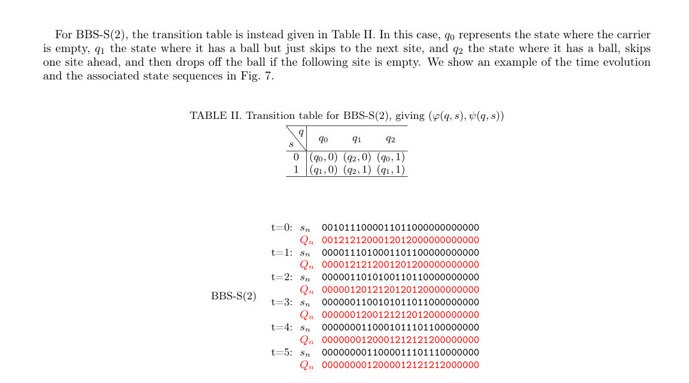
<figcaption class="paper-figure-caption"><b>Fig 1.</b> FIG. 7. Example of the time evolution of BBS-S(2) together with the corresponding sequence of states. We display sn and Qn for n = 1, 2, . . . , 28 with Q0 = q0 at each time step. For Qn, we show the index i of the state qi with Qn = qi (i = 0, 1, 2)</figcaption>
</figure>

**Summary.** This paper develops a mathematical framework to analyze invariant measures in soliton systems driven by Mealy automata. By applying this theory to variants of the box-ball system, the authors prove conditions under which key probability distributions remain stationary. This work advances the understanding of generalized hydrodynamics and ensemble theory for such automaton-driven physical models.

**Why it may be interesting.** The connection between discrete automaton rules, which are inherently non-linear and deterministic, and the statistical mechanics of interacting particles provides a powerful framework for modeling complex many-body dynamics beyond standard Hamiltonian approaches.

Detailed structure

**Main problem.** The study focuses on determining the invariant measures for complex soliton systems whose dynamics are governed by Mealy automata.

**Main result.** For specific models (BBS-S(2) and BBS-V(2)), Bernoulli product measures were shown to be invariant under certain conditions, while a more general Markov distribution invariance was established for another model.

**Method.** The authors formulate the time evolution on bi-infinite configuration spaces and derive sufficient mathematical conditions for the invariance of various probability distributions (Bernoulli and Markov).

**Model / system.** The system models soliton dynamics using Mealy automata acting on bi-infinite binary sequences, which are applied to variants of the box-ball system (BBS). The state space is defined by the automaton's transitions.

**Key observables.** Invariant measures (Bernoulli product measures, Markov distributions), phase shift upon soliton interaction, and isolated soliton velocity.

**Important parameters / regimes.** The transition probabilities ($p$ and $r$) governing the output sequence $	ilde{\eta}$ are crucial for determining invariance conditions.

**Assumptions / limitations.** A key limitation noted is that the configuration space ($\Omega_{	ext{ext}}$) for some models is not closed under time evolution, which affects the applicability of certain results.

**Figures summary.** Figure 1 illustrates soliton interactions in BBS; Figure 2 shows the action of the Mealy automaton $(\varphi, \psi)$. Tables detail transition probabilities and patterns across different cases.

**Paper structure.** The paper first establishes general mathematical conditions for measure invariance under Mealy automata dynamics. It then applies these results to three specific box-ball system variants (BBS-S(2), BBS-V(2), BBS-C(2)), proving invariance for the respective models and calculating fundamental soliton characteristics.

Abstract

We study invariant measures for soliton systems described by Mealy automata. Motivated by recently introduced soliton models associated with 2-letter, 3-state Mealy automata, we formulate the time evolution induced by Mealy automata on bi-infinite configuration spaces. We provide sufficient conditions for the invariance of Bernoulli product measures and derive a criterion for the invariance of two-sided space-homogeneous Markov distributions. We then apply these general results to three soliton models, which can be interpreted as variants of the box-ball system (BBS). For two of these models, BBS-S(2) and BBS-V(2), we prove that Bernoulli product measures are invariant. For the remaining model, BBS-C(2), we establish a more general result: the invariance of two-sided space-homogeneous Markov distributions, which include Bernoulli product measures as a special case. Furthermore, for all three models, we compute the phase shift associated with the interaction of two solitons, as well as the velocity of an isolated soliton. Although the latter has already been studied previously, both quantities constitute fundamental characteristics for understanding the generalized hydrodynamics of these systems. These results provide a foundation for the study of invariant measures, generalized Gibbs ensembles, and generalized hydrodynamic behavior in Mealy-automaton soliton systems.

[↑ back to top](#top)

### [Multi-stage Quantum Amplifier Readout Chain](http://arxiv.org/abs/2607.07614v1)

**Authors:** Logan Howe, Andrea Giachero, Michael Vissers, Corwin Shiu, Shannon Duff, Jason Austermann, Johannes Hubmayr, Joel Ullom  
**Type:** experiment · **Category:** other · **PDF:** <https://arxiv.org/pdf/2607.07614v1>  
**Analysis basis:** full PDF text, analyzed in chunks
**Topic relevance:** `quantum measurements` **3/5** · `measurement-induced transitions` **2/5** · `quantum optics experiment` **2/5** · `Keldysh / 2PI / non-Gaussian methods` **1/5** · `QC/QI experiment` **1/5** · `driven-dissipative phase transition` **1/5** · `methods for driven-dissipative` **1/5**

↔ Scroll figures horizontally

<figure class="paper-figure-card">
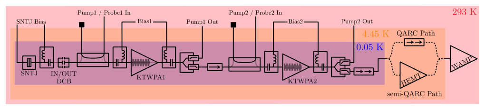
<figcaption class="paper-figure-caption"><b>Fig 1.</b> FIG. 1. Simplified experimental schematics for the QARC and semi-QARC which we characterize in separate cooldowns in a dilution refrigerator. Each KTWPA is individually biased and pumped for maximum tunability and both individual and in-tandem performance optimization. Diplexers are used at the output of each KTWPA to pick off the residual pump and avoid compression of the upstream amplifier. 4 GHz to 12 GHz isolators are used between each stage to enforce directionality in the readout chain. A single-stage isolator is located at the KTWPA1 output, a double stage at the KTWPA2 output and, in the case of the QARC setup, the HEMT is replaced with an additional double-stage isolator to...</figcaption>
</figure>
<figure class="paper-figure-card">
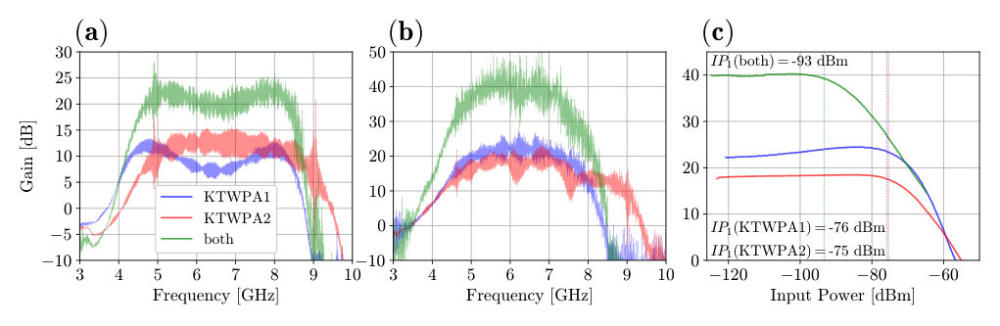
<figcaption class="paper-figure-caption"><b>Fig 2.</b> FIG. 2. Amplifier chain basic performance metrics. (a) Semi-QARC separate and in-tandem gain. Each KTWPA is tuned in this case to yield the largest possible total-chain gain-bandwidth-product (GBP); resulting in the bandwidth-optimized nQL operating point. (b) QARC gain optimized to produce maximum gain rather than GBP – necessary to overwhelm the WAMP- added-noise over an appreciable bandwidth and realize nQL system noise using the QARC – which is more difficult without a HEMT. Example QARC input compression (IP1) power measurement at 6.5 GHz when operated at maximum gain as in (b). This is the minimum IP1 achievable by the QARC and will increase should the QARC be operated at a...</figcaption>
</figure>
<figure class="paper-figure-card">
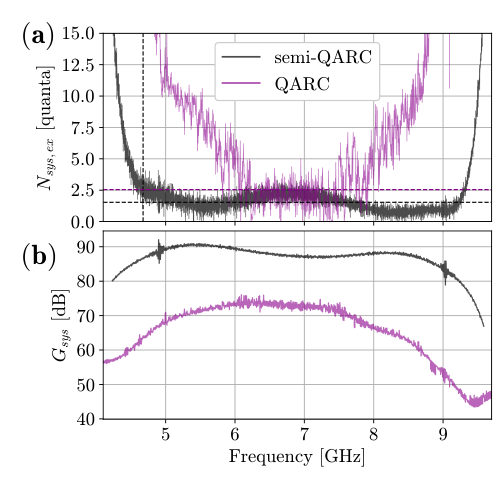
<figcaption class="paper-figure-caption"><b>Fig 3.</b> FIG. 3. SNTJ-assisted noise measurement of the semi-QARC and QARC. (a) System excess noise, Nsys,ex. (b) Extracted system gain, Gsys. Note that the QARC gain is not exactly the semi-QARC gain minus the HEMT gain due to the differ- ent choices in KTPWA tunings – i.e. the semi-QARC case maximizes the bandwidth where the chain operates below 2 quanta of excess noise, while the QARC requires pure maxi- mum KTWPA gain optimization to reach similar excess noise.</figcaption>
</figure>
<figure class="paper-figure-card">
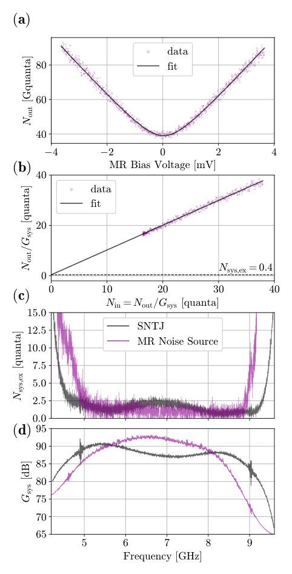
<figcaption class="paper-figure-caption"><b>Fig 4.</b> FIG. 4. Operation of the MR noise source and semi-QARC noise measurement using both the SNTJ and MR noise source. a Semi-QARC output power as a function of the ap- plied MR bias voltage with the spectrum analyzer frequency set to 7 GHz. The noise curve allows for accurate extrac- tion of Gsys, which in turn enables determination of Nin. (b) Establishing the linear relation between Nin and Nout. The y-intercept of the fit to this relation yields the semi-QARC excess noise of 0.4 quanta. (c) Full system excess noise, Nsys,ex = N1,ex + N2,ex, frequency sweep. In the MR case the two KTWPAs are tuned to produce the symmetric, max- imum peak gain profiles of the QARC tuning presented in the...</figcaption>
</figure>
<figure class="paper-figure-card">
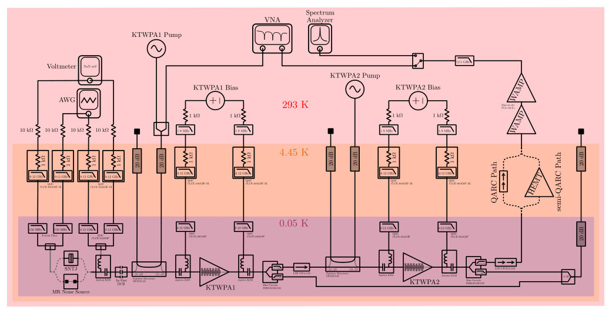
<figcaption class="paper-figure-caption"><b>Fig 5.</b> FIG. 5. Complete experimental schematic for all configurations and measurements detailed in the main body. All connections both outside and inside the cryostat are made using coaxial cables; including dc bias lines. Connections indicated in gray (SNTJ and MR noise source bias and voltage leads) are made using cables where continuity in the outer cable shield is broken to permit differential biasing of the SNTJ.</figcaption>
</figure>

**Summary.** The paper presents a novel Quantum-Amplifier-Based Readout Chain (QARC) that replaces power-hungry semiconductor amplifiers with cascaded Kinetic Inductance TWPAs. This design drastically reduces cryogenic power dissipation while maintaining near-quantum-limited noise performance, making large-scale quantum detector arrays more feasible for demanding environments like space applications.

**Why it may be interesting.** This work is highly relevant to open quantum systems and quantum optics as it pushes the boundaries of measurement sensitivity in solid-state quantum devices by minimizing classical noise contributions from amplifiers.

Detailed structure

**Main problem.** Developing low-dissipation, wide bandwidth, and near-quantum-limited readout chains for superconducting detectors where traditional semiconductor amplifiers cause excessive cryogenic power dissipation.

**Main result.** The proposed Quantum-Amplifier-Based Readout Chain (QARC) using two stages of Kinetic Inductance TWPAs achieves sufficient gain while dissipating three orders of magnitude less power than semiconductor-containing alternatives.

**Method.** Experimental characterization and noise measurement comparing QARCs against semi-QARCs, utilizing various quantum noise sources like tunnel junctions and diffusive resistors.

**Model / system.** The system is a multi-stage cryogenic readout chain built from Traveling-Wave Parametric Amplifiers (TWPAs) based on kinetic inductance technology. It compares the performance of this pure quantum amplifier chain (QARC) against chains incorporating semiconductor amplifiers (semi-QARC).

**Key observables.** System excess noise ($	ext{N}_{	ext{sys,ex}}$), system gain ($	ext{G}_{	ext{sys}}$), and power dissipation.

**Important parameters / regimes.** Noise added must be less than 2 quanta over a 1 GHz bandwidth; QARC dissipates $\sim$ three orders of magnitude less power than HEMT chains.

**Assumptions / limitations.** The analysis assumes that eliminating semiconductor amplifiers significantly reduces the cryogenic cooling burden, enabling scalability for large detector arrays or space applications.

**Figures summary.** Figures illustrate schematics comparing QARC and semi-QARC setups; performance plots show system excess noise ($	ext{N}_{	ext{sys,ex}}$) vs. frequency using different noise sources (SNTJ, MR); power vs. bias voltage curves validate the measurement techniques.

**Paper structure.** The paper first establishes the problem of cryogenic cooling limits in large detector arrays. It then introduces and characterizes the QARC using KTWPAs, demonstrating its low dissipation and high performance compared to existing methods. Finally, it validates the noise measurements by cross-referencing multiple quantum noise sources.

Abstract

Multi-stage cryogenic readout chains with a wide bandwidth and added noise within a few quanta of the quantum limit are frequently constructed using traveling-wave parametric amplifiers (TWPAs) as the first stage, and a semiconductor amplifier as the second stage. Unfortunately for highly-scaled superconducting detector arrays, or quantum information systems, and space-based observatories, the power dissipation of the semiconductor amplifier becomes problematic from the perspective of available cryogenic cooling power at \mbox{3~K to 4~K}. Here we demonstrate a readout chain based on a two-stage kinetic inductance TWPA (KTWPA). This quantum-amplifier-based-readout-chain (QARC) provides sufficient gain that a cryogenic semiconductor follow-on amplifier can be eliminated without degradation of the system noise. In this way, the QARC dissipates approximately three orders of magnitude less power than readout chains containing semiconductor amplifiers while adding noise of less than 2~quanta over a 1~GHz bandwidth. In addition, by leveraging the high power handling of kinetic inductance technology, the QARC maintains an input compression point of -93~dBm, which exceeds that of many contemporary Josephson-junction-based parametric amplifiers.

[↑ back to top](#top)

### [Crossover and Changeover in Spin-1 Kitaev-$Γ$ Chain with Uniaxial Single-ion Anisotropy](http://arxiv.org/abs/2607.07501v1)

**Authors:** Qiang Luo, Shijie Hu, Wang Yang, Yuhai Liu, Jinbin Li, Jize Zhao, Xiaoqun Wang  
**Type:** theory · **Category:** other · **PDF:** <https://arxiv.org/pdf/2607.07501v1>  
**Analysis basis:** full PDF text, analyzed in chunks
**Topic relevance:** `exotic spin models in light-matter` **3/5** · `analog quantum simulation` **2/5** · `entanglement & information structure` **2/5** · `Frenkel-Kontorova` **1/5** · `Keldysh / 2PI / non-Gaussian methods` **1/5** · `methods for driven-dissipative` **1/5**

↔ Scroll figures horizontally

<figure class="paper-figure-card">
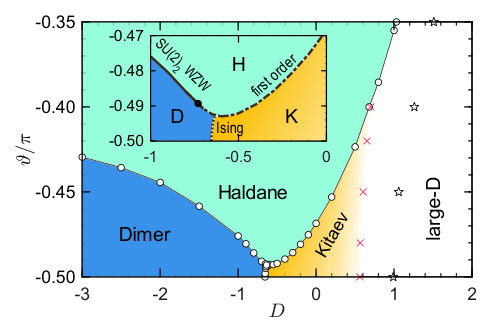
<figcaption class="paper-figure-caption"><b>Fig 1.</b> FIG. 1: Quantum phase diagram of the spin-1 Kitaev-Γ chain with a uniaxial SIA, featuring dimerized, Haldane, Kitaev, and large-D phases. Open circles denote phase boundaries; crosses (×) (from order-parameter intersections) and penta- grams (⋆) (from specific-heat double peaks) mark crossovers between the Kitaev and large-D regimes. The inset magnifies the region −1 ≤D ≤0; line styles (dotted, dotted-dashed, solid) distinguish Ising, first-order, and SU(2)2 WZW transi- tions.</figcaption>
</figure>
<figure class="paper-figure-card">
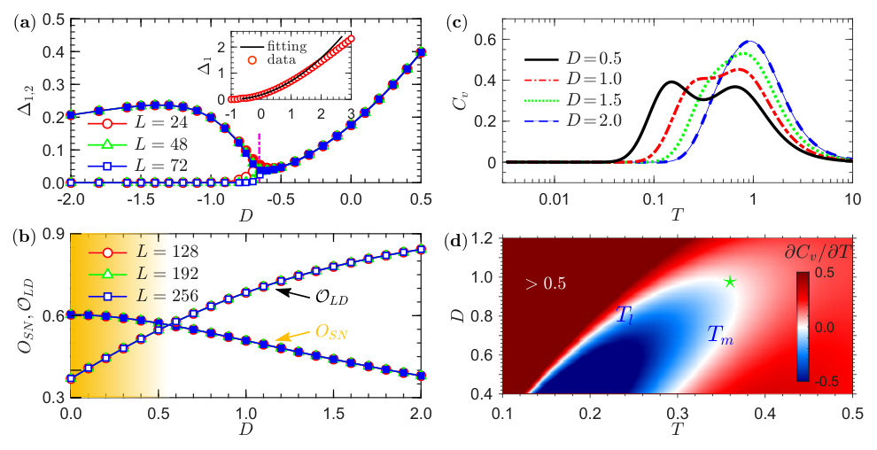
<figcaption class="paper-figure-caption"><b>Fig 2.</b> FIG. 2: Analysis of the crossover between the Kitaev phase and the large-D phase in the Kitaev-Γ spin chain with SIA D at ϑ/π = −1/2. (a) Excitation gaps ∆1,2 as a function of D for different chain lengths L = 24 (red circles), 48 (green triangles), and 72 (blue squares) under PBC. The inset shows the biquadratic fitting of ∆1 at small D. (b) Spin-nematic order parameter OSN (filled symbols) and string order parameter OLD (open symbols) for Kitaev phase and large-D phase, respectively, as a function of D for different chain lengths L = 128 (red circles), 192 (green triangles), and 256 (blue squares) under OBC. (c) Specific heat Cv as a function of temperature T for selected SIA parameters D...</figcaption>
</figure>
<figure class="paper-figure-card">
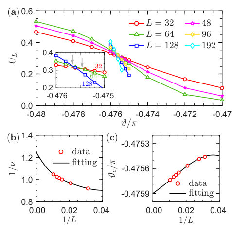
<figcaption class="paper-figure-caption"><b>Fig 3.</b> FIG. 3: (a) Binder cumulant UL for different chain lengths L ranging from 32 to 192 in the Kitaev-Γ spin chain with SIA D = −1.0. The inset shows the zoom-in near the quantum critical points for chain lengths L = 32 (red circle), L = 64 (green triangle), and L = 128 (blue square). (b)-(c) Estimates of inverse critical exponent 1/ν [cf. Eq. (2)] and critical point ϑc from pairs of chain lengths (L, 2L).</figcaption>
</figure>
<figure class="paper-figure-card">
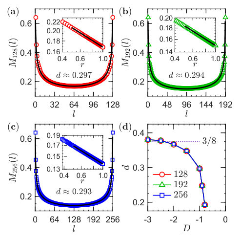
<figcaption class="paper-figure-caption"><b>Fig 4.</b> FIG. 4: Site dependence of local dimerization ML(l) in the Kitaev-Γ spin chain with SIA D = −1.0 for chain lengths (a) L = 128 (red circle), (b) L = 192 (green triangle), and (c) L = 256 (blue square). The inset in each panel shows the extraction of scaling dimension d. (d) The scaling dimension d along the critical line as a function of D.</figcaption>
</figure>
<figure class="paper-figure-card">
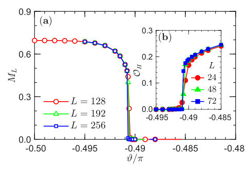
<figcaption class="paper-figure-caption"><b>Fig 5.</b> FIG. 5: (a) Dimer order parameter ML as a function of ϑ in the Kitaev-Γ spin chain with SIA D = −0.7 for different chain lengths L = 128 (red circles), 192 (green triangles), and 256 (blue squares) under OBC. (b) String order parameter OH as a function of ϑ for different chain lengths L = 24 (red circles), 48 (green triangles), and 72 (blue squares) under PBC.</figcaption>
</figure>

**Summary.** This paper investigates how uniaxial single-ion anisotropy controls quantum phase transitions and crossovers in a spin-1 Kitaev-$\Gamma$ chain. Using DMRG and bosonization, the authors distinguish between smooth crossovers (Kitaev to large-D) and true changeovers (dimerized to Haldane). The key finding is identifying a continuous transition belonging to the SU(2)2 WZW universality class for negative anisotropy.

**Why it may be interesting.** This work is highly relevant because it uses advanced quantum many-body techniques (DMRG, bosonization) to precisely characterize non-trivial phase transitions (changeovers) in geometrically constrained spin systems, providing benchmarks for critical theories like the SU(2)2 WZW model.

Detailed structure

**Main problem.** The study investigates crossover and changeover phenomena occurring in quantum spin chains characterized by bond-directional interactions and uniaxial single-ion anisotropy (SIA). The research aims to map out the phase boundaries between different magnetic ground states.

**Main result.** A smooth crossover is found from the Kitaev phase to the large-D phase for positive SIA, while negative SIA reveals a changeover in the dimerized-Haldane transition, belonging to the SU(2)2 WZW universality class with central charge c=3/2.

**Method.** The analysis employs advanced theoretical techniques including large-scale Density-Matrix Renormalization Group (DMRG) calculations and bosonization analysis. Finite-size scaling is used extensively to determine critical exponents and central charges.

**Model / system.** The system modeled is the spin-1 Kitaev-$\Gamma$ chain, whose Hamiltonian incorporates bond-directional exchange couplings and a uniaxial single-ion anisotropy term (D). The model's behavior is controlled by tuning the strength of this SIA parameter D.

**Key observables.** Excitation gap ($\Delta$), spin-nematic order parameter ($O_{SN}$), string order parameter ($O_{LD}$), specific heat ($C_v$), and entanglement entropy scaling (for central charge $c$).

**Important parameters / regimes.** The SIA strength D is the primary tuning parameter, explored in both positive (crossover) and negative (changeover) regimes. The coupling angle $\vartheta$ also controls the underlying Kitaev interactions.

**Assumptions / limitations.** The analysis relies on mapping spin models to effective continuum theories using bosonization techniques and assuming applicability of finite-size scaling methods near critical points.

**Figures summary.** Figures illustrate quantum phase diagrams, temperature dependence of specific heat ($C_v$) showing peak smearing, and the finite-size scaling of order parameters like $M_L$ to determine critical exponents for different SIA strengths D.

**Paper structure.** The paper systematically analyzes the Hamiltonian structure, first addressing the crossover regime (positive D) using gap analysis and order parameter evolution. It then focuses on the changeover regime (negative D), utilizing finite-size scaling and entanglement entropy to pinpoint the continuous transition belonging to a specific WZW universality class.

Abstract

Recent advances in bond-directional spin chains have revealed extensive emergent phenomena and unconventional criticality. Here we investigate the spin-1 Kitaev-$Γ$ chain with uniaxial single-ion anisotropy (SIA) using large-scale density-matrix renormalization group calculations and bosonization analysis. Tuning the SIA strength reveals a crossover from the Kitaev phase to the large-$D$ phase, evidenced by the excitation gap changing from quadratic to linear, the coexistence and smooth evolution of spin-nematic and string order parameters, and the suppression of the double-peak specific heat. For negative SIA, we uncover a changeover from a first-order transition to a continuous one between the dimerized and Haldane phases. The continuous transition belongs to the \textrm{SU(2)$_2$} Wess-Zumino-Witten universality class with central charge $c=3/2$, a rare instance in a system without continuous symmetry. Our results establish the Kitaev-$Γ$ chain as a minimal platform for controlling crossover and changeover phenomena.

[↑ back to top](#top)

### [Microscopic Dynamical Entropy I: Quantifying Hamiltonian Irreversibility in Large and Small Systems](http://arxiv.org/abs/2607.06787v1)

**Authors:** Mingnan Ding, Michael E. Cates  
**Type:** theory · **Category:** statistical mechanics · **PDF:** <https://arxiv.org/pdf/2607.06787v1>  
**Analysis basis:** full PDF text, analyzed in chunks
**Topic relevance:** `non-equilibrium dynamics` **3/5** · `non-equilibrium universality` **2/5** · `Keldysh / 2PI / non-Gaussian methods` **1/5** · `correlated / nonlocal dissipation` **1/5** · `driven-dissipative phase transition` **1/5** · `entanglement & information structure` **1/5** · `methods for driven-dissipative` **1/5**

↔ Scroll figures horizontally

<figure class="paper-figure-card">
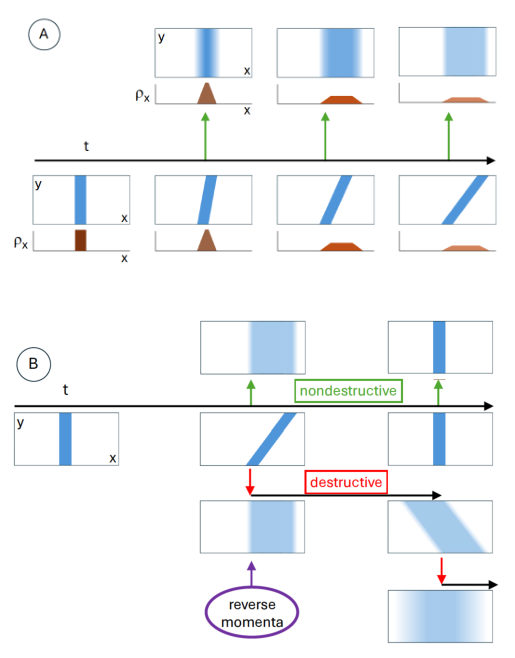
<figcaption class="paper-figure-caption"><b>Fig 1.</b> FIG. 1: Schematic evolution of full and coarse-grained den- sities in phase space. (A) Evolution of the full density ρXY (blue) and marginal ρX (brown) in the phase space of an XY system. In this simple example, time evolution shears the distribution under Hamiltonian dynamics, preserving to- tal entropy but increasing the correlations encoded in ρY |X. Our nondestructive coarse-graining (green arrows) homoge- nizes ρY |X without altering ρX or the dynamics. (B) Echo protocol. The middle column shows the same final state as in (A); velocity reversal then restores the initial state under exact Hamiltonian dynamics. Nondestructive coarse-graining (green) preserves the echo; destructive...</figcaption>
</figure>
<figure class="paper-figure-card">
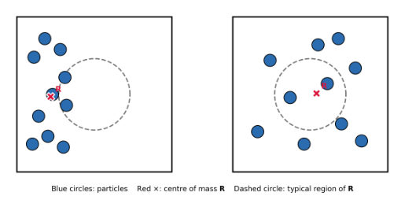
<figcaption class="paper-figure-caption"><b>Fig 2.</b> FIG. 2: Of these two configurations in a gas of particles (col- liding elastically with box walls in a closed system), intuition may suggest the right one is a more probable state. How- ever, they are both single points in phase space, and hence equiprobable. What distinguishes them is typicality of collec- tive X-observables such as the centre-of-mass coordinate R: there are many more configurations with the same R when it is near the center. Such typicality is quantitatively described by ΩY (R).</figcaption>
</figure>
<figure class="paper-figure-card">
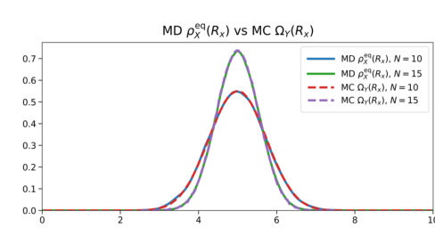
<figcaption class="paper-figure-caption"><b>Fig 3.</b> FIG. 3: For the box diffusion problem, we compare the long time distribution ρeq(Rx) and the numerical calculation of ΩY (Rx). The latter has been normalized to allow direct com- parison. This shows how a fully deterministic Hamiltonian dynamics of the XY system leads to an equilibrium distribu- tion for the slow variable Rx ∈X.</figcaption>
</figure>
<figure class="paper-figure-card">
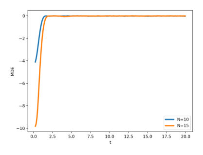
<figcaption class="paper-figure-caption"><b>Fig 4.</b> FIG. 4: Time-evolution of the MDE (measured relative to its equilibrium value) for the box-diffusion problem with N = 10 and 15. The X system is chosen as (Rx, Ry), the slow centre- of-mass coordinates. The MDE evolves monotonically during the relaxation process towards equilibrium. Although N is not large and time-scale separation is not perfect, the MDE shows an almost monotonic increase.</figcaption>
</figure>
<figure class="paper-figure-card">
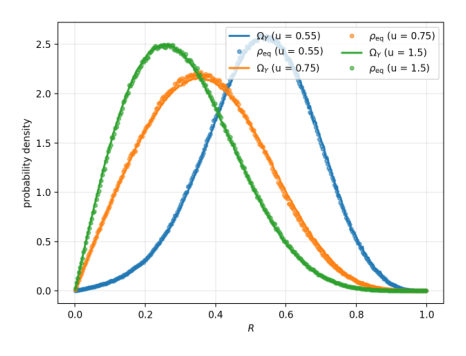
<figcaption class="paper-figure-caption"><b>Fig 5.</b> FIG. 5: Comparison of normalized conditional phase-space volume ∝ΩY (R) and the equilibrium distribution ρeq X (R) for different average energies u in the Hamiltonian synchroniza- tion model with N = 10. The latter is obtained by analysing the long time visiting frequency.</figcaption>
</figure>

**Summary.** This work introduces the Microscopic Dynamical Entropy (MDE) to provide a microscopic definition of non-equilibrium thermal entropy for Hamiltonian systems. By utilizing the conditional phase-space volume, MDE successfully recovers established thermodynamic relations like $dS = dQ/T$ while remaining consistent with exact dynamics. It offers a powerful tool to understand how irreversibility emerges naturally from system-bath interactions without resorting to explicit stochastic assumptions.

**Why it may be interesting.** It offers a rigorous, purely Hamiltonian framework to derive thermodynamic irreversibility, which is crucial for understanding open quantum systems where standard entropy definitions fail out of equilibrium.

Detailed structure

**Main problem.** The paper addresses the lack of a universally applicable entropy definition that correctly describes irreversible relaxation processes within the framework of exact Hamiltonian dynamics.

**Main result.** It introduces the Microscopic Dynamical Entropy (MDE), which provides a microscopically derived, consistent measure of non-equilibrium thermal entropy under Hamiltonian evolution.

**Method.** The MDE is constructed using the conditional phase-space volume (CPV) associated with an environment Y, effectively discarding microscopic information while retaining exact dynamics.

**Model / system.** The system consists of a total Hamiltonian $H_{XY}$ partitioned into a system X and an environment Y. The analysis focuses on the evolution of the reduced density matrix $
ho_X(t)$ governed by joint Hamiltonian dynamics.

**Key observables.** Microscopic Dynamical Entropy (MDE), Conditional Phase-space Volume ($\Omega_Y$), Gibbs entropy ($S_G$).

**Important parameters / regimes.** Time-scale separation between X and Y, system size N, energy shell E.

**Assumptions / limitations.** The construction is valid without assuming weak coupling or stochastic dynamics; strict monotonicity requires time-scale separation alongside mixing.

**Paper structure.** The paper develops the MDE functional by defining it based on CPV, demonstrating its recovery of $dS = dQ/T$, and analyzing its behavior in regimes ranging from general relaxation to strict time-scale separation.

Abstract

We introduce a Microscopic Dynamical Entropy (MDE) for Hamiltonian systems, defined with respect to a chosen partition of degrees of freedom into a system X and its environment Y. The construction is based on the conditional phase-space volume (CPV), or conditional Boltzmann entropy, associated with the unmonitored degrees of freedom Y. The MDE is a microscopically defined entropy functional of the marginal distribution $ρ_X(t)$, obtained by discarding conditional microscopic information associated with Y from the Gibbs entropy of the joint XY system, while retaining exact Hamiltonian dynamics. This construction clarifies the microscopic origin of thermal entropy. The dependence of MDE solely on $ρ_X(t)$ is consistent with the thermodynamic assumption that the entropy increment of a heat bath Y depends on its heat content and temperature, not on details of its probability distribution. Indeed, the MDE recovers dS = dQ/T connecting entropy increments to heat flow between system and environment. More generally, it provides a consistent description of irreversible relaxation under exact Hamiltonian dynamics, while permitting transient entropy decreases in small systems and in spin-echo type protocols. Under time-scale separation between X and Y, the MDE becomes strictly monotonic in time, recovering the familiar structure of irreversible thermodynamics. The MDE can foreshadow thermodynamics even in a small isolated Hamiltonian system, if X is a well chosen subset of its degrees of freedom. An example is the centre of mass of interacting particles confined to a box. Even for as few as N=10 particles, the MDE increases during relaxation towards a maximum at equilibrium, with increasing monotonicity at larger N. Taken together, our results show that the MDE offers a microscopic interpretation of nonequilibrium thermal entropy and its time dependence within exact Hamiltonian dynamics.

[↑ back to top](#top)

### [Quantum Software Engineering in Practice: FPGA and AI Integration for Quantum Certification](http://arxiv.org/abs/2607.07597v1)

**Authors:** Marcos Guillermo Lammers, José Manuel Suárez, Adrián Pousa, Luis Mariano Bibbó, Alejandro Fernández  
**Type:** both · **Category:** quantum information and computing · **PDF:** <https://arxiv.org/pdf/2607.07597v1>  
**Analysis basis:** full PDF text, analyzed in chunks
**Topic relevance:** `entanglement & information structure` **3/5** · `QC/QI experiment` **2/5** · `quantum measurements` **2/5** · `measurement-induced transitions` **1/5** · `methods for driven-dissipative` **1/5** · `quantum optics experiment` **1/5**

↔ Scroll figures horizontally

<figure class="paper-figure-card">
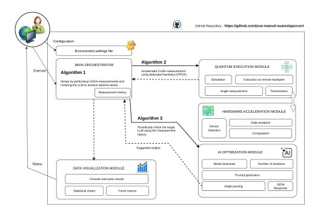
<figcaption class="paper-figure-caption"><b>Fig 1.</b> Figure 1. Hybrid architecture of QAccCert.</figcaption>
</figure>
<figure class="paper-figure-card">
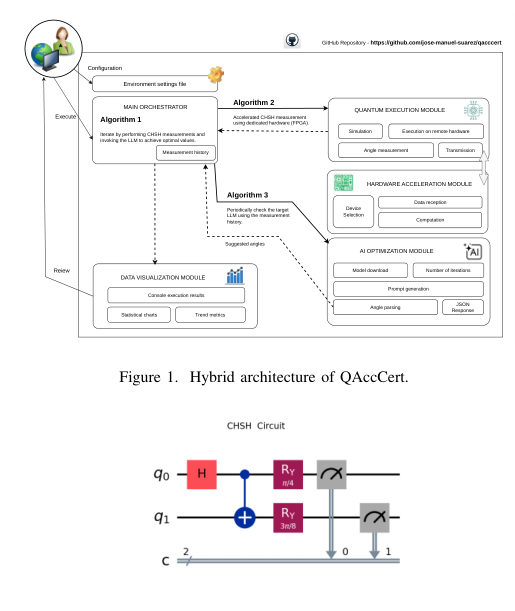
<figcaption class="paper-figure-caption"><b>Fig 2.</b> Figure 2. Quantum circuit for measuring non-locality in entangled states with some of the Ry gate rotations.</figcaption>
</figure>
<figure class="paper-figure-card">

<figcaption class="paper-figure-caption"><b>Fig 3.</b> Figure 3. FPGA acceleration scalability. Top: Total execution time for 41 iterations on a logarithmic scale. The CPU (red) scales linearly with the number of correlations (tCP U = ncorr × 41 × 0.00197 ms), while FPGA+USB 3.0 (blue) maintains a constant time (tF P GA = 41 × 0.00084 ms) thanks to parallel processing. The green area represents the cumulative FPGA advantage. Bottom: Resulting speedup, from 9.4× for CHSH (4 correlations) to &gt;2,400× for systems with 1024 correlations.</figcaption>
</figure>
<figure class="paper-figure-card">
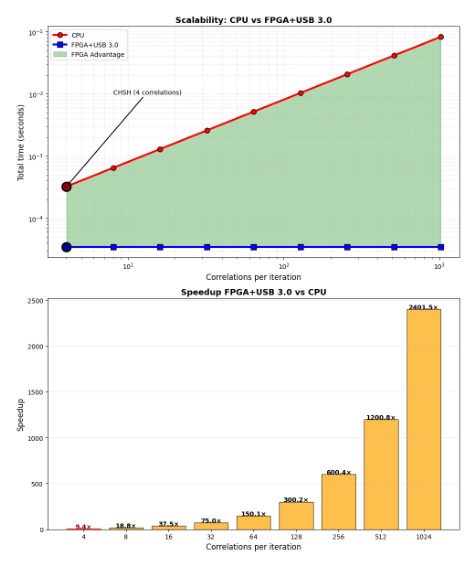
<figcaption class="paper-figure-caption"><b>Fig 4.</b> Figure 4 shows a snippet of the Verilog 6 code implemented on the FPGA, evidencing hardware-level optimization as part of the QSE architecture.</figcaption>
</figure>
<figure class="paper-figure-card">
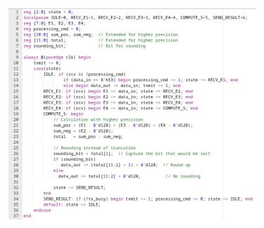
<figcaption class="paper-figure-caption"><b>Fig 5.</b> Figure 4. Verilog code snippet for correlation computation on the FPGA.</figcaption>
</figure>

**Summary.** This paper introduces QAccCert, a novel framework that addresses the challenge of certifying entangled states on imperfect quantum hardware. It achieves this by systematically integrating Artificial Intelligence (LLMs) as an adaptive optimizer with FPGA acceleration to efficiently calculate entanglement measures like CHSH violation. The work demonstrates a practical methodology for advancing quantum software engineering toward real-world NISQ applications.

**Why it may be interesting.** It provides a concrete engineering roadmap for validating fundamental quantum properties (entanglement) in noisy devices by merging advanced computational techniques (AI/HPC) into the quantum software stack, which is crucial for future experimentalists.

Detailed structure

**Main problem.** The core challenge is developing systematic, quantifiable methods (QSE) to certify quantum devices' ability to produce valid entangled states despite hardware noise and imperfections.

**Main result.** The proposed hybrid framework achieves high fidelity in entanglement certification by integrating AI optimization with FPGA acceleration, significantly improving efficiency over random search.

**Method.** It employs a hybrid architecture (QAccCert) that uses Large Language Models (LLMs) to guide the search for optimal measurement parameters, while FPGAs accelerate the computation of quantum correlations like the CHSH value.

**Model / system.** The work focuses on certifying entanglement using the violation of the CHSH inequality ($S$) in simulated ideal quantum circuits, with explicit goals for deployment on real NISQ hardware.

**Key observables.** CHSH inequality violation value ($S$), which must approach the theoretical maximum of $2\sqrt{2}$.

**Important parameters / regimes.** The theoretical CHSH limit ($2\sqrt{2}$), and performance metrics like speedup factors (e.g., FPGA acceleration).

**Assumptions / limitations.** The primary assumption is that combining QSE principles with heterogeneous technologies (AI/FPGA) provides a scalable solution for practical quantum certification.

**Figures summary.** Figures illustrate the hybrid architecture of QAccCert, detailing modules like state preparation and AI optimization, and show performance comparisons demonstrating massive speedups achieved by FPGA acceleration over CPU computation.

**Paper structure.** The paper introduces the need for QSE in quantum certification, details the QAccCert framework integrating FPGAs and LLMs, presents results showing superior performance metrics (fidelity and speed), and concludes with a discussion of scalability to real NISQ hardware.

Abstract

The emergence of Quantum Software Engineering (QSE) responds to the need for systematic, disciplined, and quantifiable approaches to the development, operation, and maintenance of quantum software. Within this context, quantum computer certification represents a significant challenge: verifying that quantum devices produce valid entangled states despite hardware imperfections, noise, and decoherence. This paper presents QAccCert, a hybrid certification framework developed following QSE principles, demonstrating how heterogeneous technologies like FPGAs and Artificial Intelligence can be integrated for quantum processing. The framework implements entanglement certification through CHSH inequality violation in ideal quantum simulations using Qiskit AerSimulator. Through LLM-guided optimization, the system achieves 99.94% of the theoretical maximum of $2\sqrt{2}$, evidencing more efficient parameter space exploration than random search. These simulated results illustrate how QSE methodologies, combined with strategic technology interconnection, can be applied for practical and scalable quantum certification on real NISQ hardware in future work. This study provides a concrete case study of systematic quantum software development.

[↑ back to top](#top)

### [Wavelength-resolved small-angle neutron spectroscopy of spin waves in MnSi under pressure](http://arxiv.org/abs/2607.07660v1)

**Authors:** E. V. Altynbaev, D. O. Skanchenko, Z. Xie, Y. Ke, Y. Bao, A. V. Tsvyashchenko  
**Type:** experiment · **Category:** strongly correlated electrons · **PDF:** <https://arxiv.org/pdf/2607.07660v1>  
**Analysis basis:** full PDF text, analyzed in chunks
**Topic relevance:** `exotic spin models in light-matter` **3/5** · `spintronics-quantum-optics interface` **3/5** · `analog quantum simulation` **2/5** · `methods for driven-dissipative` **1/5** · `non-equilibrium dynamics` **1/5**

↔ Scroll figures horizontally

<figure class="paper-figure-card">
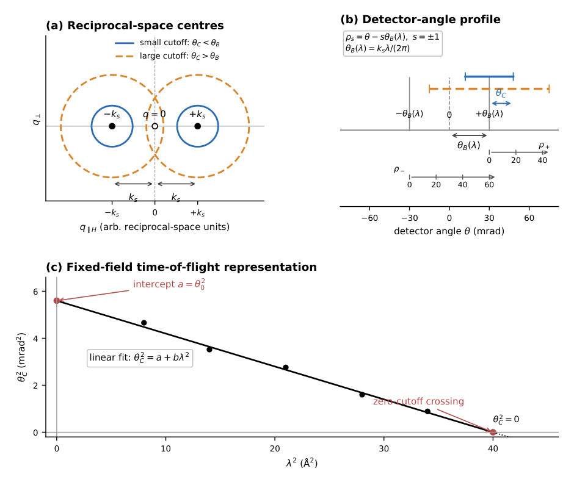
<figcaption class="paper-figure-caption"><b>Fig 1.</b> FIG. 1. Principle of wavelength-resolved SWSANS at a pulsed neutron source. (a) The inelastic SWSANS intensity is centered at the helimagnetic wave-vector positions ±ks in reciprocal space; both small- and large-cutoff cases are possible, corresponding to θC &lt; θB and θC &gt; θB. (b) For each wavelength slice the profile is analyzed in the local detector-angle coordinate ρs = θ−sθB(λ), with θB(λ) = ksλ/(2π); θC is the fitted cutoff-edge position in this local coordinate. (c) In the fixed-field time-of-flight representation, the extracted cutoff positions are fitted as θ2 C = a + bλ2. The intercept and the zero-cutoff crossing are the key quantities used to determine the cutoff-derived spin-wave...</figcaption>
</figure>
<figure class="paper-figure-card">
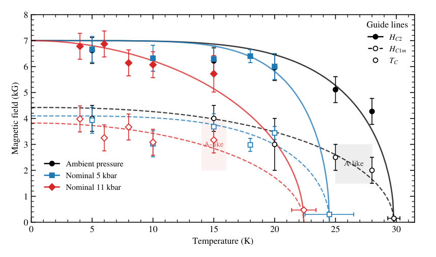
<figcaption class="paper-figure-caption"><b>Fig 2.</b> FIG. 2. Structural verification of the magnetic field scale for the ambient-pressure, nominal 5 kbar, and nominal 11 kbar powder datasets. Filled symbols show HC2(T), extracted from the disappearance of the elastic Bragg intensity, and open symbols show HC1m(T), defined as the field of maximum along-field Bragg intensity. Smooth monotonic root-like curves are guides to the eye constrained to vanish at the corresponding TC; they are not independent fits to the magnetic equation of state. Open markers at the baseline indicate TC anchors from zero-field temperature scans. Hatched colored boxes mark A-phase-like regions used as structural consistency checks.</figcaption>
</figure>
<figure class="paper-figure-card">
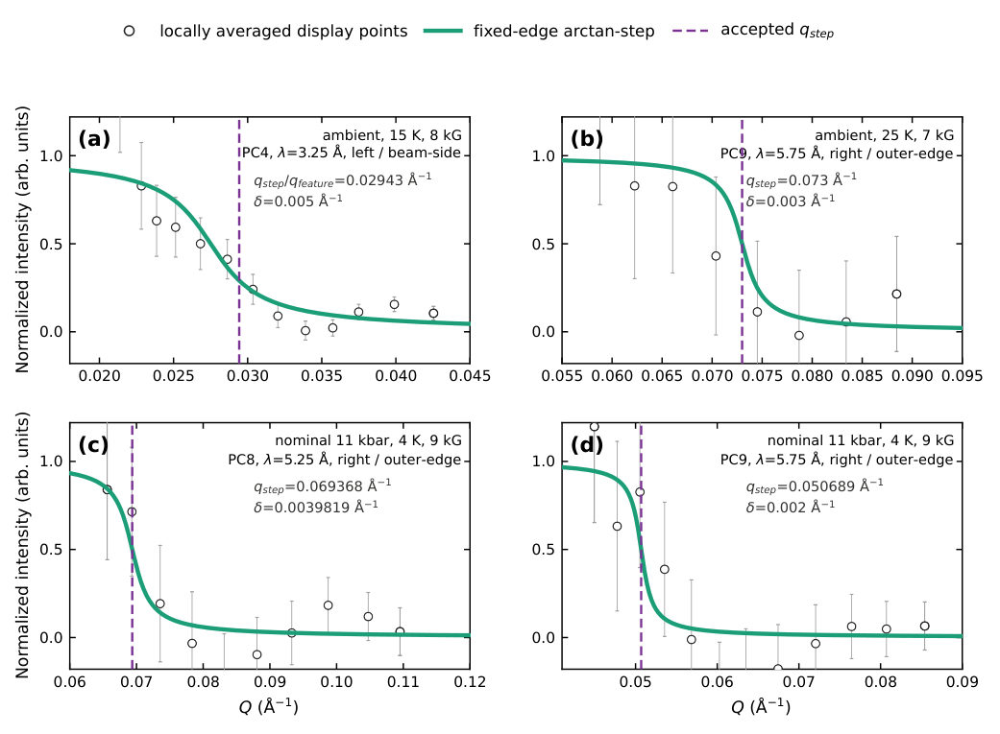
<figcaption class="paper-figure-caption"><b>Fig 3.</b> FIG. 3. Representative cutoff-edge fits used in the wavelength-resolved SWSANS analysis. (a,b) Ambient-pressure MnSi: a 15 K, 8 kG left/beam-side example from PC4 (λ = 3.25 ˚A), and a 25 K, 7 kG right/outer-edge example from PC9 (λ = 5.75 ˚A). (c,d) Nominal 11 kbar MnSi at 4 K and 9 kG: right/outer-edge examples from PC8 (λ = 5.25 ˚A) and PC9 (λ = 5.75 ˚A). Symbols show locally averaged display points used only for readability, green curves show representative phenomenological arctan-step fits, and dashed vertical lines mark the accepted edge positions in the instrument q coordinate before conversion to θC.</figcaption>
</figure>
<figure class="paper-figure-card">
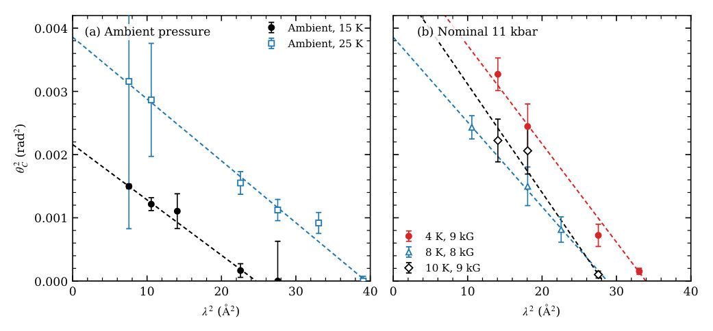
<figcaption class="paper-figure-caption"><b>Fig 4.</b> FIG. 4. Linear θ2 C(λ2) plots. (a) Ambient-pressure MnSi at 15 and 25 K. (b) Nominal 11 kbar MnSi at 4 K, 9 kG; 8 K, 8 kG; and 10 K, 9 kG. Symbols show θ2 C values and dashed lines show linear fits; the 8 K, 8 kG fit is extended to its θ2 C = 0 crossing.</figcaption>
</figure>
<figure class="paper-figure-card">
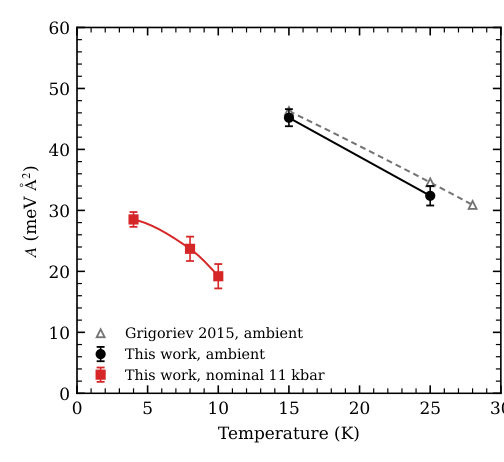
<figcaption class="paper-figure-caption"><b>Fig 5.</b> FIG. 5. Temperature dependence of the cutoff-derived spin- wave stiffness A. Filled symbols show the present wavelength- resolved SWSANS results at ambient pressure and at nominal 11 kbar. Open gray symbols and the dashed gray guide show the ambient-pressure reference scale from Ref. [11]. Solid curves are smooth monotonic guides to the eye through the present data, not additional fits.</figcaption>
</figure>

**Summary.** This work pioneers the use of wavelength-resolved small-angle neutron scattering ($	ext{SWSANS}$) to measure spin-wave stiffness ($A$) in $	ext{MnSi}$ under high pressure. By comparing dynamically measured $A$ values with structural predictions, the authors demonstrate a significant discrepancy at 11 kbar. This highlights that simple extrapolations from static magnetic parameters are insufficient for accurately characterizing quantum material properties under extreme conditions.

**Why it may be interesting.** While focused on magnetism, the technique itself—using advanced neutron scattering kinematics (wavelength-resolved measurement) to probe collective excitations under extreme conditions—is highly relevant for understanding many-body dynamics in strongly correlated quantum materials.

Detailed structure

**Main problem.** The study aims to determine how spin-wave stiffness ($A$) in $	ext{MnSi}$ changes under hydrostatic pressure, specifically testing the reliability of structural parameters versus direct dynamic measurements.

**Main result.** At high pressure (11 kbar), the directly measured spin-wave stiffness ($A$) is substantially reduced compared to ambient pressure, demonstrating that $A$ cannot be reliably inferred solely from static structural magnetic parameters like the critical field ($H_{C2}$).

**Method.** Wavelength-resolved small-angle neutron scattering ($	ext{SWSANS}$) was employed using a time-of-flight instrument on a pulsed source to measure spin-wave dynamics across a range of wavelengths.

**Model / system.** The system is $	ext{MnSi}$, a benchmark B20 helimagnet exhibiting chiral magnetic order. The analysis relies on fitting the cutoff angle ($	heta_C$) derived from the intensity profile's edge position to extract the spin-wave stiffness $A$ via the relation $	heta_C^2 \propto \lambda^2$.

**Key observables.** Cutoff angle ($	heta_C$), spin-wave stiffness ($A$), structural critical field ($H_{C2}$), and transition temperature ($T_C$).

**Important parameters / regimes.** Ambient pressure values validate the method; at 11 kbar, $A$ is significantly reduced compared to ambient measurements.

**Assumptions / limitations.** The analysis assumes a local linear dispersion relation for spin waves ($\varepsilon(q) \propto A q^2$) and that the measured $	heta_C(\lambda)$ follows a predictable quadratic dependence on wavelength squared ($	heta_C^2 = a + b\lambda^2$).

**Figures summary.** Figures illustrate the principle of wavelength-resolved SANS, show structural verification of magnetic fields ($H_{C2}$) at various pressures, and present linear fits comparing ambient vs. high-pressure measurements.

**Paper structure.** The paper first establishes the methodology by adapting fixed-wavelength SANS to a time-of-flight, wavelength-resolved geometry. It validates this method using ambient pressure data before applying it to measure spin dynamics at 5 kbar and 11 kbar, culminating in a comparison between dynamic ($A$) and static ($	ext{H}_{C2}$) measurements.

Abstract

We report wavelength-resolved spin-wave small-angle neutron scattering (SWSANS) on the time-of-flight SANS instrument BL01 at the China Spallation Neutron Source and extend the method to pressure-cell measurements of MnSi. MnSi is used as a benchmark B20 helimagnet because its helimagnetic order and spin-wave stiffness are well characterized at ambient pressure. In a fixed magnetic field, the time-of-flight measurement provides a spectrum of neutron wavelengths. For each detector branch $s=\pm1$, the intensity profile is recentered relative to the wavelength-dependent Bragg angle $θ_B (λ) = k_s λ/ 2π$, and the cutoff angle $θ_C (λ)$ is extracted in the local branch coordinate. The cutoff-derived spin-wave stiffness $A$ is obtained from a linear fit of $θ_C^2$ as a function of $λ^2$. Ambient-pressure measurements reproduce the known stiffness scale of MnSi. Structural SANS at ambient pressure and at nominal 5 and 11 kbar verifies the magnetic state and provides an internal pressure-state check for the pressure-cell measurements. At nominal 11 kbar, within the present cutoff model, the cutoff-derived stiffness is substantially reduced, whereas the structural field scale $H_{C2}$ remains high. This contrast shows that $A$ cannot be inferred from static structural parameters alone under pressure. To our knowledge, these measurements constitute the first SWSANS implementation on a pulsed neutron source and the first SWSANS determination of spin-wave stiffness under pressure. The experiment also shows that reliable high-pressure SWSANS on a pulsed source requires high source brilliance, stable wavelength-dependent normalization, and sufficient statistics in each wavelength window.

[↑ back to top](#top)

### [A low-energy effective Hamiltonian for Landau quasiparticles: II Application to the contact Fermi gas](http://arxiv.org/abs/2607.07041v1)

**Authors:** Pierre-Louis Taillat, Hadrien Kurkjian  
**Type:** theory · **Category:** quantum gases · **PDF:** <https://arxiv.org/pdf/2607.07041v1>  
**Analysis basis:** full PDF text, analyzed in chunks
**Topic relevance:** `Keldysh / 2PI / non-Gaussian methods` **3/5** · `analog quantum simulation` **3/5** · `non-equilibrium dynamics` **2/5** · `methods for driven-dissipative` **1/5**

↔ Scroll figures horizontally

<figure class="paper-figure-card">
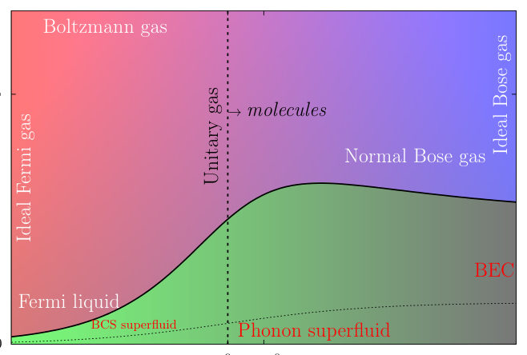
<figcaption class="paper-figure-caption"><b>Fig 1.</b> FIG. 1. Equilibrium phase diagram of the spin-1/2 Fermi gas with contact interactions. The</figcaption>
</figure>
<figure class="paper-figure-card">
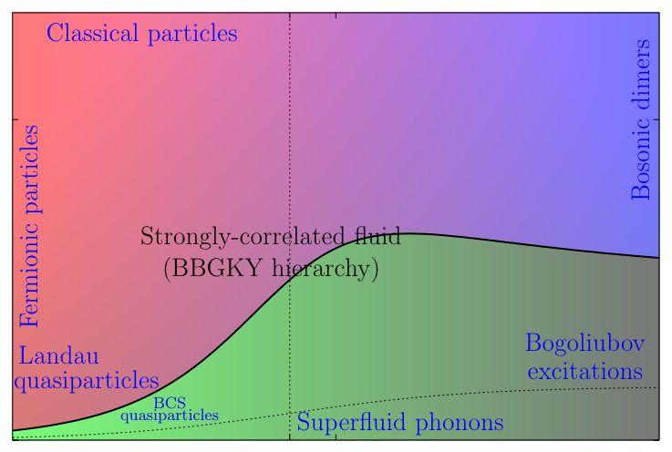
<figcaption class="paper-figure-caption"><b>Fig 2.</b> FIG. 2. The phase diagram showing (in blue) the microscopic degrees of freedom that support a</figcaption>
</figure>
<figure class="paper-figure-card">
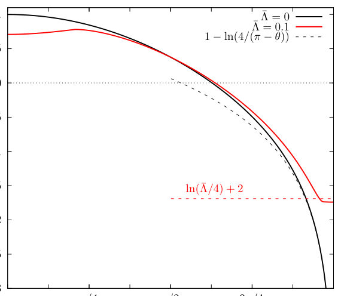
<figcaption class="paper-figure-caption"><b>Fig 3.</b> FIG. 3. Angular dependence of the function IΛ appearing in A↑↓and f↑↓. For ¯Λ = 0 (black</figcaption>
</figure>
<figure class="paper-figure-card">
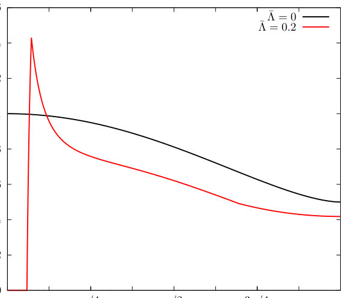
<figcaption class="paper-figure-caption"><b>Fig 4.</b> FIG. 4. Angular dependence of the function JΛ appearing in both A↑↓, f↑↓and Aσσ, fσσ. As ¯Λ →0, the function converges pointwise to J(θ) (black curve) on (0, π]. It is however cancelled in</figcaption>
</figure>
<figure class="paper-figure-card">
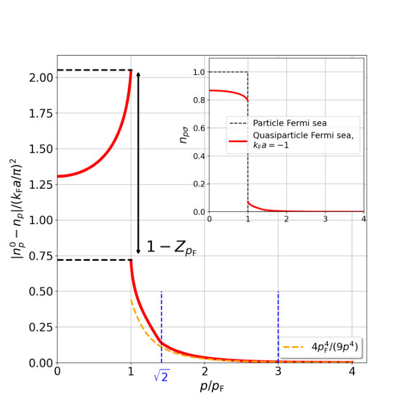
<figcaption class="paper-figure-caption"><b>Fig 5.</b> FIG. 5. (Main pannel) Difference between the particle momentum distribution n|FS⟩ p =</figcaption>
</figure>

**Summary.** This paper applies a sophisticated low-energy effective Hamiltonian formalism to study the physics of an interacting Fermi gas. It systematically calculates static properties and predicts corrections to dynamic quantities like zero sound velocity by analyzing the crossover between collisionless and hydrodynamic regimes. The methodology is crucial for understanding strongly correlated quantum gases near unitarity.

**Why it may be interesting.** This work provides rigorous theoretical tools (effective Hamiltonians, systematic expansions) to calculate finite-temperature quantum many-body dynamics in ultracold atomic gases, bridging weak-coupling theory with complex transport phenomena.

Detailed structure

**Main problem.** To develop and apply a low-energy effective Hamiltonian formalism for Landau quasiparticles to study the static and dynamic properties of a contact Fermi gas at low temperatures.

**Main result.** The theory successfully recovers known static results (e.g., LHY expansion) and predicts a preexponential correction to the zero sound velocity, while also providing a numerical method to map the crossover between collisionless and hydrodynamic regimes.

**Method.** The authors use perturbative renormalization techniques, including Schrieffer-Wolff unitary transformations, applied to the contact interaction potential. They solve transport equations numerically to analyze dynamic response functions.

**Model / system.** The system is a two-component gas of ultracold fermionic atoms interacting via a short-range (contact) potential. The analysis focuses on the low-temperature regime and utilizes an effective Hamiltonian approach derived from renormalization group techniques.

**Key observables.** Equation of state, momentum distribution, critical temperature ($T_c$), zero sound velocity ($c_0$), density and spin response functions ($	ext{Im}[ar{\chi}_p]$).

**Important parameters / regimes.** Low temperatures, scattering length $a$, Fermi wave vector $k_F$, collision time $	au$. The analysis is perturbative in the limit $a 	o 0$.

**Assumptions / limitations.** The calculations rely on a perturbative expansion (e.g., second order in $k_F a$), which limits controlled results to weak coupling regimes.

**Figures summary.** Figures illustrate phase diagrams (BEC-BCS crossover), the angular dependence of calculated integrals ($I_\Lambda, J_\Lambda$), and numerical crossovers of response functions ($	ext{Im}[ar{\chi}_p]$) between hydrodynamic and collisionless limits.

**Paper structure.** The paper first establishes the renormalization scheme for constructing the effective Hamiltonian. It then benchmarks this theory against known static properties before moving to dynamic calculations, focusing on zero sound velocity corrections and solving the transport equation across different dynamical regimes.

Abstract

This article follows up on arxiv:2511.15938, in which we developed a new renormalization scheme to construct a quantized theory of Fermi liquids. Here, we apply this formalism to a low-temperature atomic Fermi gas where the short-range interactions are fully parametrized by the s-wave scattering length $a$. We benchmark our renormalized theory by recovering known perturbative results on the static properties of the Fermi gas, such as the Lee-Huang-Yang expansion of the equation of state, the Galitskii expansion of the momentum distribution, and the Gor'kov- Melik Barkhudarov preexponential correction to the critical temperature. We then turn to the transport dynamics and demonstrate the presence of a preexponential correction to the speed of zero sound when including corrections of second order in $a$. Finally, we develop an efficient numerical method to solve the transport equation exactly, and we apply to study the crossover from the collisionless to the hydrodynamic regime in the density and polarisation response functions.

[↑ back to top](#top)

### [Disorder signatures in coherent electronic waveguides](http://arxiv.org/abs/2607.06866v1)

**Authors:** Alejandro Lopez-Bezanilla  
**Type:** theory · **Category:** disordered systems and neural networks · **PDF:** <https://arxiv.org/pdf/2607.06866v1>  
**Analysis basis:** full PDF text, analyzed in chunks
**Topic relevance:** `methods for driven-dissipative` **3/5** · `driven-dissipative phase transition` **2/5** · `Keldysh / 2PI / non-Gaussian methods` **1/5** · `Kondo & dissipative impurity` **1/5** · `analog quantum simulation` **1/5** · `non-equilibrium dynamics` **1/5**

↔ Scroll figures horizontally

<figure class="paper-figure-card">
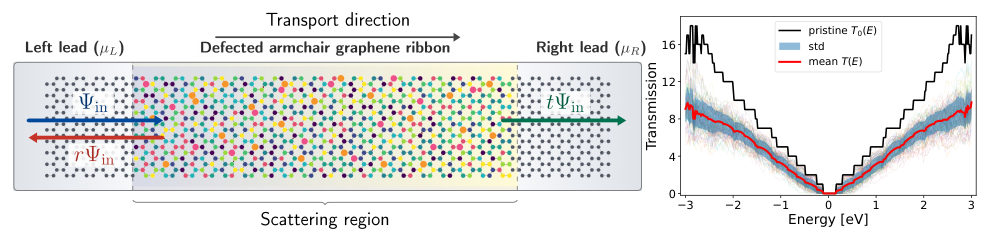
<figcaption class="paper-figure-caption"><b>Fig 1.</b> FIG. 1. Schematic transport setup and transmission statistics for a defected armchair graphene ribbon. The left panel shows a disordered scattering region connected to left and right defect-free leads with electrochemical potentials µL and µR. An incoming mode Ψin from the left lead is partially reflected, rΨin, and partially transmitted, tΨin, through the defected channel; colored sites indicate spatial disorder in the ribbon. The right panel shows the corresponding ensemble transmission T(E) as a function of energy. Thin curves denote individual disorder realizations, the red curve is the ensemble-averaged transmission ⟨T(E)⟩, the blue band indicates the standard deviation, and the black...</figcaption>
</figure>
<figure class="paper-figure-card">
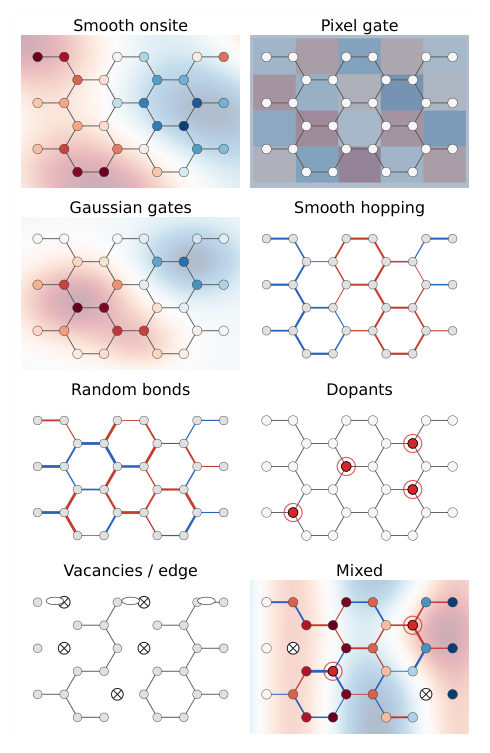
<figcaption class="paper-figure-caption"><b>Fig 2.</b> FIG. 2. Catalog of disorder mechanisms used in the conductance-balanced transport ensemble. The panels schematically represent scalar onsite perturbations, gate- defined potentials, hopping-amplitude disorder, localized dopants, vacancies and edge roughness, and mixed perturba- tions. The figure provides a schematic overview of the Hamil- tonian modifications applied to the finite scattering region, rather than a literal microscopic realization from the dataset; the semi-infinite leads remain pristine.</figcaption>
</figure>
<figure class="paper-figure-card">
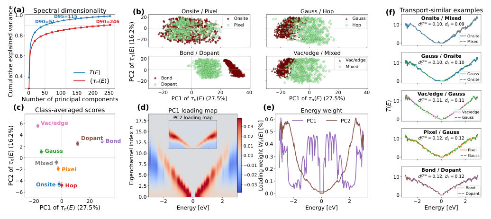
<figcaption class="paper-figure-caption"><b>Fig 3.</b> FIG. 3. Principal-component analysis of the conductance-balanced transport ensemble. (a) Cumulative explained variance for the scalar transmission T(E) and the transmission-eigenvalue spectrum {τn(E)}. (b) Individual disorder realizations projected onto the first two principal components of {τn(E)}, showing the overlap and separation of representative classes in transport space. (c) Class-averaged PC1-PC2 scores for {τn(E)}; error bars denote the standard error of the mean. (d,e) Loading maps of the first two principal components, u1(E, n) and u2(E, n), resolved by energy and sorted transmission-eigenvalue index n. (f) Energy-resolved loading weights Wα(E) = P</figcaption>
</figure>
<figure class="paper-figure-card">
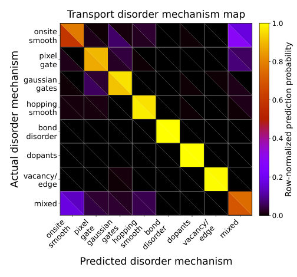
<figcaption class="paper-figure-caption"><b>Fig 4.</b> FIG. 4. Transport distinguishability map for the conductance-balanced disorder ensemble. Rows denote the actual disorder mechanism and columns the predicted mech- anism. The plotted entries are row-normalized prediction probabilities, Eq. (20). Each square is split by input represen- tation: lower-left triangles use the total transmission T(E), while upper-right triangles use the transmission-eigenvalue spectra {τn(E)}. Large diagonal entries indicate disorder mechanisms whose spectra are assigned to their own class, whereas off-diagonal entries reveal disorder classes with simi- lar conductance-balanced transport responses.</figcaption>
</figure>
<figure class="paper-figure-card">
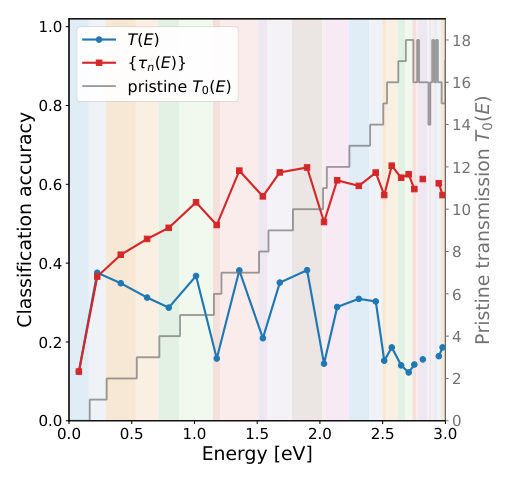
<figcaption class="paper-figure-caption"><b>Fig 5.</b> FIG. 5. Spectral-shape controls for the conductance- balanced disorder ensemble. The figure compares disorder- class classification after transformations that suppress abso- lute conductance scale: raw spectra, area-normalized spec- tra, per-spectrum standardized spectra, and finite-difference spectra for the scalar transmission. Robust performance un- der area normalization and standardization indicates that the learned fingerprints are carried by spectral shape and channel redistribution rather than by average transmission.</figcaption>
</figure>

**Summary.** This paper introduces a novel, AI-driven protocol to diagnose the underlying physical mechanism of disorder in coherent electronic waveguides. By comparing detailed spectral features—specifically transmission eigenvalues rather than just average conductance—the authors show that distinct types of microscopic disorder leave unique, measurable fingerprints. This establishes a powerful metrological tool for interpreting complex quantum transport measurements.

**Why it may be interesting.** This work bridges condensed matter theory (quantum transport in disordered systems) with modern machine learning techniques (AI-assisted pattern recognition), providing new diagnostic tools for analyzing complex many-body scattering data that might be relevant to open quantum system characterization.

Detailed structure

**Main problem.** To develop a robust method for identifying specific microscopic disorder mechanisms within coherent electronic waveguides, overcoming the challenge that different physical disorders can yield similar average conductance.

**Main result.** The analysis establishes a controlled AI-assisted protocol showing that mechanism-specific fingerprints of disorder persist in the spectral shape and eigenchannel redistribution, even when total average conductance is artificially matched across different disorder classes.

**Method.** The authors use a conductance-balanced learning framework, comparing scalar transmission spectra with transmission-eigenvalue spectra using supervised classification and Principal Component Analysis (PCA).

**Model / system.** The primary model uses armchair graphene nanoribbons as controlled multi-channel tight-binding waveguides. Disorder is introduced via onsite potential variations, hopping changes, or discrete defects.

**Key observables.** Total transmitted weight $T(E)$, transmission eigenvalues $\{	au_n(E)\}$, and PCA loadings identifying energy/eigenchannel sectors responsible for spectral deformations.

**Important parameters / regimes.** Energy ($E$), disorder strength (controlled via specific mechanisms like onsite vs. hopping), and the number of active channels (multichannel regime).

**Assumptions / limitations.** The analysis relies on controlling the average conductance ($\langle T(E) 
angle$) to isolate mechanism-specific spectral features, acknowledging that a unique reconstruction from external observables is generally impossible.

**Figures summary.** Figures schematically illustrate the setup comparing ensemble transmission $T(E)$ versus $\langle T(E) 
angle$, and the core analysis involves comparing scalar vs. eigenvalue spectra using various diagnostic tools.

**Paper structure.** The paper progresses by first defining the physical model (disordered waveguides), then developing a controlled comparison framework (conductance balancing), applying advanced diagnostics (eigenvalue/PCA analysis), and concluding with the establishment of a general, mechanism-specific metrological protocol for quantum transport data.

Abstract

Microscopic disorder in a coherent conductor is encoded in the magnitude of the transmitted current and in the energy- and channel-resolved structure of the scattering response. We develop a conductance-balanced learning framework for identifying microscopic disorder mechanisms from coherent quantum-transport spectra. Using armchair graphene nanoribbons as controlled multichannel tight-binding waveguides, we generate ensembles in which distinct disorder classes occupy the same intervals of integrated transmission, removing the dominant shortcut associated with average conductance. Within this constrained setting, we compare scalar transmission spectra with transmission-eigenvalue spectra, and use supervised classification, scale-normalizing controls, plateau-resolved tests, and principal-component analysis to identify the spectral structures that remain informative. The learned distinctions persist after normalization of the conductance envelope and are strongest in multichannel energy windows, where mode mixing and channel redistribution shape the scattering response. Principal components provide interpretable transport coordinates whose loadings identify the energy and eigenchannel sectors responsible for the dominant spectral deformations. The results establish a controlled AI-assisted protocol for learning disorder signatures from nonlinear quantum-scattering data.

[↑ back to top](#top)

### [Vacuum polarization and renormalized stress-energy tensor of spherical thin shells](http://arxiv.org/abs/2607.07583v1)

**Authors:** Julio Arrechea, Cormac Breen, Adrian Ottewill, Lorenzo Pisani, Peter Taylor  
**Type:** theory · **Category:** other · **PDF:** <https://arxiv.org/pdf/2607.07583v1>  
**Analysis basis:** full PDF text, analyzed in chunks
**Topic relevance:** `Keldysh / 2PI / non-Gaussian methods` **3/5** · `correlated / nonlocal dissipation` **1/5** · `driven-dissipative phase transition` **1/5** · `entanglement & information structure` **1/5** · `methods for driven-dissipative` **1/5** · `non-equilibrium dynamics` **1/5** · `non-equilibrium universality` **1/5**

↔ Scroll figures horizontally

<figure class="paper-figure-card">
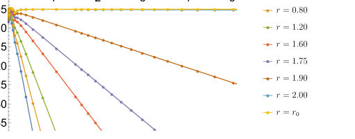
<figcaption class="paper-figure-caption"><b>Fig 1.</b> FIG. 3: Analysis of the convergence of gωl(r) −k(0) ωl (r) for a massless scalar field on the Minkowski interior of the thin shell at different radial points for fixed l and large ω. Results obtained with the set of parameters: r0 = 2.001M and l = 1. The figure shows how the order of convergence decreases as r →r0. On the surface, the function gωl(r0) −k(0) ωl (r0) scales as ω−2 at large ω</figcaption>
</figure>
<figure class="paper-figure-card">
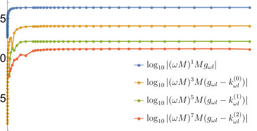
<figcaption class="paper-figure-caption"><b>Fig 2.</b> FIG. 1: Analysis of the convergence of gωl(r) −k(m) ωl (r) for a massless scalar field on the exterior of the thin shell for r ≫r0 at different orders of expansion m for fixed l and large ω. Results obtained with the set of parameters: r0 = 2.001M, r = 5M and l = 1.</figcaption>
</figure>
<figure class="paper-figure-card">
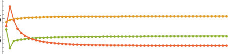
<figcaption class="paper-figure-caption"><b>Fig 3.</b> FIG. 2: Analysis of the convergence of gωl(r) −k(m) ωl (r) for a massless scalar field on the exterior of the thin shell for r ≫r0 at different orders of expansion m for fixed ω and large l. Results obtained with the set of parameters: r0 = 2.001M, r = 5M and ωM = 0.01.</figcaption>
</figure>
<figure class="paper-figure-card">
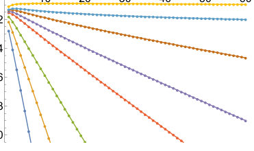
<figcaption class="paper-figure-caption"><b>Fig 4.</b> FIG. 4: Analysis of the convergence of gωl(r) −k(0) ωl (r) for a massless scalar field on the Minkowski interior of the thin shell at different radial points for fixed ω and large l. Results obtained with the set of parameters: r0 = 2.001M and ωM = 0.01. The figure shows how the order of convergence decreases as r →r0. On the surface, the function gωl(r0) −k(0) ωl (r0) scales as l−1 at large l.</figcaption>
</figure>
<figure class="paper-figure-card">
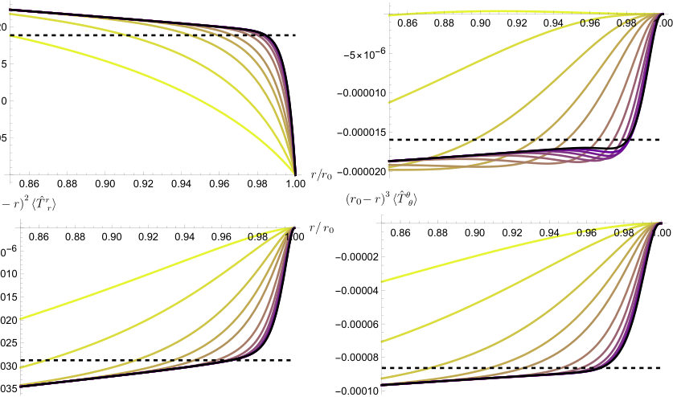
<figcaption class="paper-figure-caption"><b>Fig 5.</b> FIG. 5: Renormalized vacuum polarization and renormalized stress-energy tensor of a massless, minimally coupled scalar field inside a spherical thin shell of radius r0 = 3M. The colored curves are purely numerical results obtained by summing up to increasing ℓvalues and integrating up to ωM = 20. The black dashed lines correspond to the coefficient of the leading-order analytic divergence estimated through the WKB approximation. A tendency to approximate these values is visible for the vacuum polarization and all RSET components.</figcaption>
</figure>

**Summary.** This paper provides a detailed theoretical investigation into how quantum fields behave near a spherical thin shell. By calculating the renormalized stress-energy tensor, it addresses technical challenges in curved spacetime QFT and suggests that vacuum effects outside highly compact objects might exhibit universal behavior resembling those of a Schwarzschild black hole.

**Why it may be interesting.** While focused on general relativity/QFT in curved spacetime, the rigorous handling of vacuum expectation values and renormalization procedures is foundational for understanding quantum field theory near boundaries or horizons, which has parallels in open quantum systems.

Detailed structure

**Main problem.** The study calculates the renormalized vacuum polarization and stress-energy tensor for quantum fields in the curved spacetime generated by a spherical, static thin shell.

**Main result.** The calculations show that outside the shell, the vacuum observables approach those of a Schwarzschild black hole in the appropriate limit, suggesting a universality principle.

**Method.** The authors employ advanced techniques including the extended-coordinate prescription and mode-sum renormalization to handle divergences in curved spacetime quantum field theory.

**Model / system.** The system is a spherical thin shell separating a Minkowski interior from an exterior geometry that approaches a black hole background. The fields considered are massless scalar fields.

**Key observables.** Renormalized vacuum polarization (RVP) and the renormalized stress-energy tensor ($\langle \hat{T}_{\alphaeta} 
angle^{	ext{ren}}$).

**Important parameters / regimes.** Shell compactness, field couplings, and the approach to the black hole limit.

**Assumptions / limitations.** The analysis relies on approximations like the weak-field expansion near the shell surface and assumes the validity of the extended-coordinate prescription for renormalization.

**Paper structure.** The paper develops the formalism using the extended-coordinate method, analyzes singular behavior near the shell surface using multiple approximation techniques, computes non-local Casimir-like contributions at the center, and finally applies semiclassical Einstein equations to compute backreaction effects.

Abstract

We provide a thorough study of the properties of the Boulware vacuum in the spacetime of a spherical, static thin shell with a Minkowski interior. To this end, we calculate the renormalized vacuum polarization and stress-energy tensor of massless scalar fields via the extended-coordinate prescription, paying particular attention to their scaling as the shell approaches the black hole limit. Near the surface of the thin shell, we obtain the expected leading-order singular behavior of both quantities via two independent methods: a high-frequency approximation for the modes, and a weak-field approximation. At the center of the shell we find non-local, Casimir-like contributions that remain finite in the black hole limit, and whose backreaction effects we compute via the semiclassical Einstein equations. Away from these regions amenable to analytic treatment, we obtain numerical results for a wide range of shell compactnesses and field couplings. In the black hole limit, we show that the vacuum polarization and renormalized stress-energy tensor outside the shell quickly approach the ones generated by a Schwarzschild black hole, suggesting a possible universality in the vacuum outside highly compact horizonless objects. This work addresses the conceptual and technical aspects necessary for computing renormalized expectation values in matter configurations, laying the foundations for future explorations on the subject.

[↑ back to top](#top)

### [Feynman's clock and hierarchy-informed sampling for quantum error mitigation](http://arxiv.org/abs/2607.06752v1)

**Authors:** Theo Saporiti  
**Type:** theory · **Category:** quantum information and computing · **PDF:** <https://arxiv.org/pdf/2607.06752v1>  
**Analysis basis:** full PDF text, analyzed in chunks
**Topic relevance:** `methods for driven-dissipative` **3/5** · `quantum measurements` **2/5** · `Keldysh / 2PI / non-Gaussian methods` **1/5** · `correlated / nonlocal dissipation` **1/5** · `driven-dissipative phase transition` **1/5**

↔ Scroll figures horizontally

<figure class="paper-figure-card">
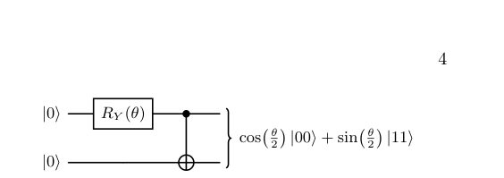
<figcaption class="paper-figure-caption"><b>Fig 1.</b> FIG. 1. The tunable Bell state preparation circuit U = U(θ), acting on NQ = 2 qubits |ϕ⟩D = |00⟩and composed of NG = 2 gates, U1 = RY (θ) and U2 = CNOT. Both first- and second- qubit Z-measurements have value cos(θ/2)2 −sin(θ/2)2 = cos(θ).</figcaption>
</figure>
<figure class="paper-figure-card">
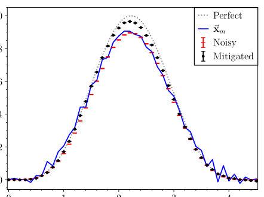
<figcaption class="paper-figure-caption"><b>Fig 2.</b> FIG. 2. Mitigation of the first (5) quantity representing the first-qubit Z-measurement of U(θ = 0) with r = 3. The dot- ted gray line is the analytical evolution computed with (2), the red data points are obtained with the Hadamard test re- sults as explained in Sec. II B, the black data points are the final results of the mitigation, and the blue line represents an example of a configuration in the Simulated Annealing pro- cedure outlined in Sec. II C.</figcaption>
</figure>
<figure class="paper-figure-card">
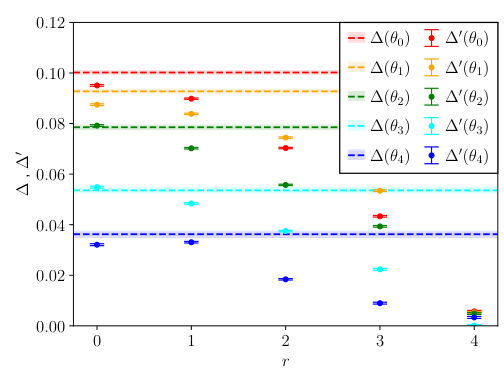
<figcaption class="paper-figure-caption"><b>Fig 3.</b> FIG. 3. Quantum error reduction of all first-qubit Z- measurements for different choices of r and θ = θk. Each dashed line and data points color is associated to a corre- sponding θk.</figcaption>
</figure>
<figure class="paper-figure-card">
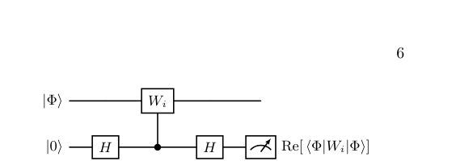
<figcaption class="paper-figure-caption"><b>Fig 4.</b> FIG. 4. Hadamard test for the real part of ⟨Φ|Wi|Φ⟩.</figcaption>
</figure>

**Summary.** This paper introduces an advanced quantum error mitigation technique called BBGKY-ISM, which adapts the scheme from spin chains to work on any quantum circuit. It achieves this by mapping circuit evolution onto Hamiltonian dynamics using a Feynman clock and estimating necessary expectation values via Hadamard tests. The method systematically reduces noise in simulations of quantum circuits, offering a controllable post-processing tool for near-term quantum computation.

**Why it may be interesting.** It provides a powerful, general framework (BBGKY-ISM) that extends beyond specific physical models like spin chains to mitigate noise in arbitrary quantum circuits relevant to NISQ devices.

Detailed structure

**Main problem.** Developing an efficient quantum error mitigation technique for near-term quantum computers operating under noisy intermediate-scale quantum (NISQ) conditions.

**Main result.** The proposed BBGKY-ISM method systematically reduces quantum noise in arbitrary circuits, with the error reduction being controllable by increasing the self-consistency radius $r$.

**Method.** It maps circuit execution to Hamiltonian dynamics using a Feynman clock and applies the BBGKY-ISM scheme, which uses Hadamard tests over partial executions to estimate expectation values.

**Model / system.** The method is generalized from spin chains to arbitrary quantum circuits ($U$), utilizing a Feynman clock Hamiltonian $H$ to track time evolution. The analysis is demonstrated on tunable Bell state preparation circuits.

**Key observables.** $\langle g|\sigma^3_i|g'
angle_D$, $\Delta(	heta)$ (noisy error), and $\Delta'(	heta)$ (mitigated error).

**Important parameters / regimes.** Circuit size, number of qubits ($N_Q$), gate count ($N_G$), and the self-consistency radius $r$.

**Assumptions / limitations.** The method is presented as a post-processing technique; it assumes $|ar{x}_{qs}| < 1$ in one analysis section.

**Figures summary.** Figures illustrate the tunable Bell state preparation circuit, and show comparisons of noisy versus mitigated measurements ($\Delta'$ vs $\Delta$) across different radii $r$.

**Paper structure.** The paper introduces the problem, details mapping circuits to Hamiltonian dynamics via a clock register, describes using Hadamard tests for expectation values, and then applies the BBGKY-ISM scheme with simulated annealing sampling to demonstrate systematic error reduction.

Abstract

Near-term physical implementations of quantum algorithms require efficient quantum error mitigation schemes to reduce quantum noise. In this letter we propose a new mitigation technique, by extending the applicability of our BBGKY-ISM scheme from quantum simulations of spin chains to arbitrary quantum circuits. We map executions of quantum circuits using Feynman's clock Hamiltonian to the Hamiltonian dynamics of a corresponding quantum system, whose time evolution obeys a BBGKY-like hierarchy of equations informing the BBGKY-ISM mitigation. We show that the method's classical and quantum overheads are polynomial in the circuit size and in the number of qubits. We apply our method to numerical simulations of tunable Bell state preparation circuits under state-of-the-art quantum noise, and numerically demonstrate its systematic and controllable quantum error reduction capability.

[↑ back to top](#top)

### [Quantitative DFT+DMFT description of spectra and transport in the moderately correlated metal SrVO$_3$](http://arxiv.org/abs/2607.07378v1)

**Authors:** Gurshidali P., N. S. Vidhyadhiraja  
**Type:** theory · **Category:** strongly correlated electrons · **PDF:** <https://arxiv.org/pdf/2607.07378v1>  
**Analysis basis:** full PDF text, analyzed in chunks
**Topic relevance:** `Keldysh / 2PI / non-Gaussian methods` **3/5** · `analog quantum simulation` **2/5** · `Kondo & dissipative impurity` **1/5** · `methods for driven-dissipative` **1/5** · `non-equilibrium dynamics` **1/5**

↔ Scroll figures horizontally

<figure class="paper-figure-card">
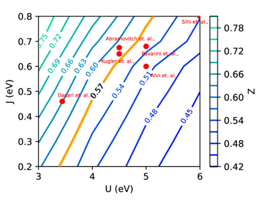
<figcaption class="paper-figure-caption"><b>Fig 1.</b> FIG. 1. Contour map of the quasiparticle weight Z in the U–J plane for SrVO3, computed within DFT+DMFT using the MO-IPT impurity solver. The solid curves denote iso-Z contours, with the corresponding quasiparticle weights indi- cated by the legend and the color bar.</figcaption>
</figure>
<figure class="paper-figure-card">
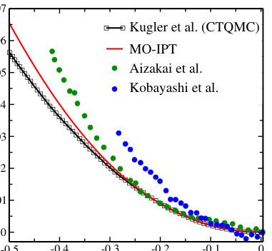
<figcaption class="paper-figure-caption"><b>Fig 2.</b> FIG. 2. Comparison of the real-frequency self-energy of SrVO3 obtained from DFT+DMFT using the MO-IPT im- purity solver (red line) with the CTQMC results of Ref. [26] (black squares) for U = 4.5 eV, J = 0.65 eV, and T = 116 K. Also shown are the self-energies from the experimen- tal ARPES momentum distribution curve from Refs. [10, 54] (green and blue symbols), measured below 20 K.</figcaption>
</figure>
<figure class="paper-figure-card">
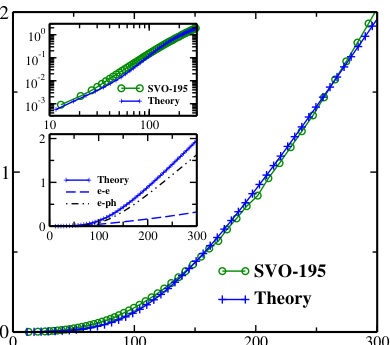
<figcaption class="paper-figure-caption"><b>Fig 3.</b> FIG. 3. Comparison of the measured dc resistivity of ul- traclean SrVO3 (green circles) with the calculated resistiv- ity (plus symbols), showing good agreement over the entire temperature range. The upper inset replots the same data on a log–log scale to emphasize the low-temperature behav- ior. The lower inset decomposes the calculated resistivity into electron–electron (e–e, dashed line) and electron–phonon (e– ph, dash–dot–dot line) contributions, together with the to- tal resistivity (solid line). The two scattering mechanisms contribute equally near ∼80 K, marking the crossover from electron–electron- to electron–phonon-dominated transport.</figcaption>
</figure>
<figure class="paper-figure-card">
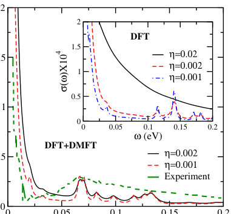
<figcaption class="paper-figure-caption"><b>Fig 4.</b> FIG. 4. Optical conductivity of SrVO3 calculated within DFT+DMFT using the MO-IPT impurity solver for U = 4.5 eV and J = 0.65 eV at T ≈6 K. Results for broadening parameters η = 0.002 (black solid line) and η = 0.001 (red dashed line) are compared with the experimental spectrum (green dashed line) of a highly stoichiometric sample with residual resistivity ratio RRR = 130, digitized from Ref. [24]. Inset: Non-interacting optical conductivity calculated from the DFT Wannier Hamiltonian for several values of the broad- ening parameter η.</figcaption>
</figure>
<figure class="paper-figure-card">
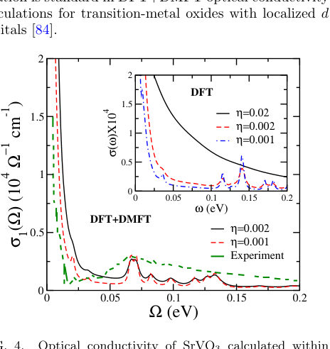
<figcaption class="paper-figure-caption"><b>Fig 5.</b> Fig. 4 displays the optical conductivity computed us- ing Eq. (20) within the DFT+DMFT (MO-IPT) frame- work for the interaction parameters U = 4.5 eV and J = 0.65 eV [26]. The fully interacting theoretical opti- cal conductivities obtained using broadening parameters η = 0.002 (black line) and η = 0.001 (red dashed line) are compared directly with the high-resolution experimen- tal data digitized from Ref. [24] for a very clean sample with residual resistivity ratio RRR = 130 measured at T ≈6 K. The optical conductivity profile is characterized by two distinct low-energy features. In the limit Ω≪W, the spectrum is dominated by a coherent Drude response arising from intraband transitions...</figcaption>
</figure>

**Summary.** This paper applies the powerful DFT+DMFT method to study the electronic and transport properties of SrVO3, a moderately correlated metal. By using an advanced MO-IPT solver, the authors achieve quantitative agreement between theory and experiment for both resistivity and optical conductivity across various conditions. The work demonstrates that low-energy physics in this material is well-described by quasiparticle coherence within the $t_{2g}$ manifold.

**Why it may be interesting.** While focused on solids, the rigorous application of advanced many-body techniques like DMFT to predict measurable quantities (like optical response) provides a model for understanding strongly interacting quantum systems whose dynamics are governed by local correlations.

Detailed structure

**Main problem.** The central challenge is achieving a quantitative, material-specific description of both spectral and transport properties in strongly correlated materials.

**Main result.** The DFT+DMFT framework successfully provides a unified scheme showing good agreement between calculated observables (resistivity, optical conductivity) and experimental measurements for SrVO3 across relevant temperature and frequency ranges.

**Method.** The study combines Density Functional Theory with Dynamical Mean-Field Theory ($	ext{DFT}+	ext{DMFT}$), utilizing a real-frequency multi-orbital iterative perturbation theory ($	ext{MO-IPT}$) solver.

**Model / system.** The system is SrVO3, treated as a prototypical, moderately correlated metal whose low-energy physics is governed by the degenerate $t_{2g}$ active space. The calculation uses a Wannier-projected multi-orbital Hubbard model derived from DFT inputs.

**Key observables.** Single-particle spectra, dc resistivity ($
ho$), and optical conductivity ($\sigma(\omega)$).

**Important parameters / regimes.** The low-frequency, low-temperature regime; the quasiparticle weight is noted as a key parameter governing the low-energy physics.

**Assumptions / limitations.** Approximations include neglecting vertex corrections for transport calculations and using the single-site DMFT approximation. The $	ext{MO-IPT}$ solver avoids analytical continuation to real frequencies.

**Paper structure.** The paper establishes the need for quantitative theory, details the DFT+DMFT methodology (including Wannierization and MO-IPT), presents calculations of spectral functions and transport properties ($
ho$, $\sigma(\omega)$) for SrVO3, and concludes by interpreting the agreement with experiment.

Abstract

A quantitative, material-specific account of spectral and transport properties remains a central challenge in the theory of strongly correlated materials. Combining density functional theory with dynamical mean-field theory (DFT+DMFT) has proven to be a powerful approach for treating electron correlation effects and material specificity on an equal footing. Here, we examine the single-particle spectra and the dc and optical conductivity of SrVO$_3$, a prototypical, moderately correlated metal, within this framework. The degenerate $t_{2g}$ active space of SrVO$_3$, together with its well-established Fermi-liquid behavior, admits an effective-mass description governed by a single quasiparticle weight, yielding a nearly universal picture of the low-frequency, low-temperature regime. Employing a computationally efficient, real-frequency multi-orbital iterative perturbation theory (MO-IPT) impurity solver, we find reasonable agreement with experimental measurements of dc resistivity and optical conductivity across the entire experimentally relevant $(ω, T)$ range within a single, unified scheme. The agreement is shown to not depend on specific interaction parameters provided the quasiparticle weight is kept constant. These results indicate that, in SrVO$_3$, the $\mathbf{k}$-dependence of the self-energy may be weak, and vertex corrections may not dominate the dc and optical transport in this material.

[↑ back to top](#top)

### [Microscopic Dynamical Entropy II: Statistical and Stochastic Thermodynamics of Hamiltonian Systems](http://arxiv.org/abs/2607.06814v1)

**Authors:** Mingnan Ding, Michael E. Cates  
**Type:** theory · **Category:** statistical mechanics · **PDF:** <https://arxiv.org/pdf/2607.06814v1>  
**Analysis basis:** full PDF text, analyzed in chunks
**Topic relevance:** `non-equilibrium dynamics` **3/5** · `non-equilibrium universality` **2/5** · `Keldysh / 2PI / non-Gaussian methods` **1/5** · `driven-dissipative phase transition` **1/5**

↔ Scroll figures horizontally

<figure class="paper-figure-card">
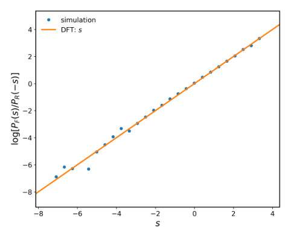
<figcaption class="paper-figure-caption"><b>Fig 1.</b> FIG. 1: Numerical verification of the endpoint-CPV detailed fluctuation theorem for the driven particle gas. The blue sym- bols show the measured value of log[PF (s)/PR(−s)], where s = ∆smd is computed from Eq. (4.10). The orange line shows the theoretical prediction log[PF (s)/PR(−s)] = s. The agreement confirms that the detailed fluctuation theorem is controlled by the endpoint CPVs, while the intermediate in- teraction and driving only affect the trajectory statistics.</figcaption>
</figure>

**Summary.** The paper introduces the Microscopic Dynamical Entropy (MDE) to quantify entropy production in finite, closed Hamiltonian systems. It extends this framework to handle time-dependent driving and variable total energy by reducing the description to observed coordinates ($x$) and instantaneous energy ($E$). The key achievement is deriving fluctuation theorems that connect macroscopic irreversibility directly to geometric properties of the unobserved phase space volume.

**Why it may be interesting.** This work provides a rigorous, microscopic foundation for non-equilibrium thermodynamics directly within Hamiltonian mechanics, bypassing the need for large bath approximations common in standard stochastic treatments.

Detailed structure

**Main problem.** The paper develops a microscopic framework to derive thermodynamic irreversibility (the second law) for finite, closed Hamiltonian systems by analyzing the entropy associated with coarse-graining the full phase space.

**Main result.** It successfully derives detailed and integral fluctuation theorems connecting non-equilibrium work/heat exchange to changes in the conditional phase-space volume ($\Omega_Y$), confirming that irreversibility emerges from the choice of observation variables.

**Method.** The core method involves defining the Microscopic Dynamical Entropy (MDE) based on partitioning degrees of freedom into observed ($x$) and unobserved ($y$) parts, allowing for extensions to time-dependent Hamiltonians and variable energy distributions.

**Model / system.** The system is a finite closed Hamiltonian system $XY$, where dynamics are governed by $H_{XY}(t)$. The analysis reduces the description from $(x, y)$ to $(x, E)$, treating the unobserved variables $y$ as an effective bath whose volume $\Omega_Y(x, E)$ dictates the entropy contribution.

**Key observables.** Microscopic Dynamical Entropy (MDE), Conditional Phase-Space Volume ($\Omega_Y$), Fluctuation Ratios ($P_F/P_R$), and Energy Distribution $E$.

**Important parameters / regimes.** The system size (e.g., 10 or 20 degrees of freedom for numerical tests) and the time dependence of external driving forces are key parameters.

**Assumptions / limitations.** The derivation relies on assuming Hamiltonian reversibility and making a non-destructive coarse-graining from $(x, y)$ to $(x, E)$.

**Figures summary.** Numerical simulations confirm the detailed fluctuation theorem by showing that the ratio of forward to reverse probabilities matches the theoretical prediction derived from endpoint phase-space volumes.

**Paper structure.** The paper builds conceptually by first establishing the MDE for fixed energy (Paper I), then extending it to time-dependent Hamiltonians and variable energy distributions, culminating in the derivation and numerical verification of trajectory-level fluctuation theorems.

Abstract

The Microscopic Dynamical Entropy (MDE) introduced in Ref. [1] describes irreversible relaxation of selected variables x within a finite closed Hamiltonian system of fixed total energy E. Here we extend the framework to arbitrary total-energy distributions and time-dependent Hamiltonians. This allows work interactions with external agents or protocols, crucial in stochastic and classical thermodynamics, and driven systems more generally, to be addressed directly. The central step is to reduce the full microscopic description in terms of selected variables x and unmonitored variables y to one in terms of the selected variables and the instantaneous total energy (x,E). The unmonitored degrees of freedom y in Y enter through their conditional phase-space volume (CPV) $Ω_Y(x,E,t)$. This construction allows work and heat to be defined directly for finite Hamiltonian composites, including cases where Y is so small that its temperature is not well defined. We demonstrate monotonic MDE growth, corresponding to the macroscopic second law, under mixing and time-scale separation even for driven systems with arbitrary energy distributions. At trajectory level, we derive detailed and integral fluctuation relations for the MDE, generalising standard large-bath results. We verify these numerically in a driven few-particle Hamiltonian system, showing the emergence of stochastic thermodynamics for collective coordinates, such as the centre-of-mass position, even in closed systems with only ten or twenty degrees of freedom. Physically, these fluctuation relations connect irreversibility to the change in the number of unmonitored microstates compatible with initial and final data for the observed coordinates. Together, our results provide a finite-system Hamiltonian foundation for the emergence of classical and stochastic thermodynamics and extend their applicability to surprisingly small heat baths.

[↑ back to top](#top)

### [Acoustic-phonon-driven spin-lattice relaxation of the hBN boron vacancy in the sub-THz regime](http://arxiv.org/abs/2607.07642v1)

**Authors:** Priyo Adhikary, Pramey Upadhyaya  
**Type:** theory · **Category:** other · **PDF:** <https://arxiv.org/pdf/2607.07642v1>  
**Analysis basis:** full PDF text, analyzed in chunks
**Topic relevance:** `spintronics-quantum-optics interface` **3/5** · `correlated / nonlocal dissipation` **1/5** · `exotic spin models in light-matter` **1/5** · `non-equilibrium dynamics` **1/5**

↔ Scroll figures horizontally

<figure class="paper-figure-card">
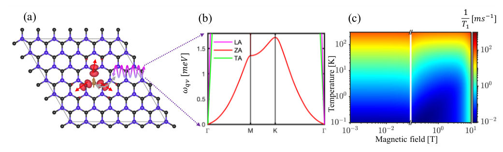
<figcaption class="paper-figure-caption"><b>Fig 1.</b> FIG. 1. Structural, vibrational, and spin relaxation overview of the VB−center in monolayer hBN. (a) Relaxed atomic structure of the VB−center in a 6 × 6 × 1 hBN supercell. Nitrogen atoms are shown in black and boron atoms in blue. The brown sphere with an arrow represents the vacancy site. The wavy line schematically depicts phonon coupled with the defect spin. The red isosurface shows the magnetization density is concentrated on the three nearest-neighbor Nitrogen atoms of the defect spin (S = 1) as visualized using VESTA [22]. (b) Low-energy acoustic phonon dispersion of the defect supercell along the high-symmetry path Γ −M −K −Γ, with the three acoustic branches color coded,...</figcaption>
</figure>
<figure class="paper-figure-card">
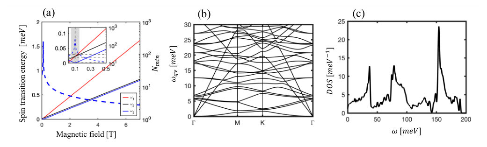
<figcaption class="paper-figure-caption"><b>Fig 2.</b> FIG. 2. (a) Magnetic field dependence of the spin transition energies ω1, ω2, and ω3 (solid lines, left axis) up to B = 7 T. The blue dashed curve (right axis) shows the estimated minimum in-plane Brillouin zone mesh size (Nmin) as the transition energy approaches zero. Horizontal gray lines indicate reference mesh sizes of 11×11, 21×21 and 31×31 used in the calculations of T1. The inset shows low-field region ( B ≤0.5 T), highlighting the ground state level anti-crossing at Bcross ≈0.1 T (vertical dashed line), indicating that direct one-phonon relaxation near Bcross requires very dense phonon sampling. The shaded region indicates the interval where the spin transition energy drops below...</figcaption>
</figure>
<figure class="paper-figure-card">
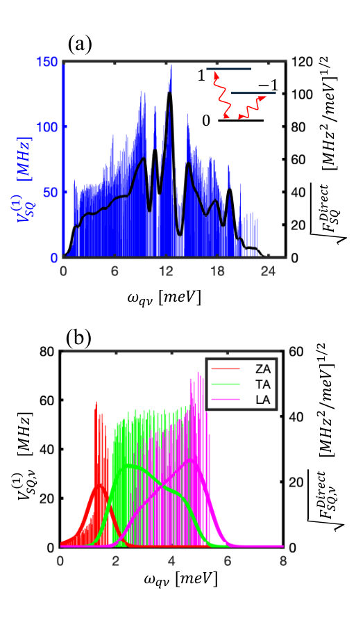
<figcaption class="paper-figure-caption"><b>Fig 3.</b> FIG. 3. First order spin-phonon coupling of the VB−center for single quantum transitions (SQ). (a) Discrete vertical lines denote spin-phonon coupling for discrete phonon frequencies, and the solid curve shows the corresponding spectral func- tion. Inset: schematic of the direct one-phonon process driv- ing the SQ transition, with the wavy line denoting the emit- ted/absorbed phonon resonant with the spin transition ener- gies. (b) V (1) SQ,ν represents the first order mode-resolved spin- phonon coupling for the three low-energy acoustic branches: ZA (red), TA (green), and LA (magenta). Vertical lines de- note the discrete coupling magnitude for the branch selected at each phonon momenta q,...</figcaption>
</figure>
<figure class="paper-figure-card">
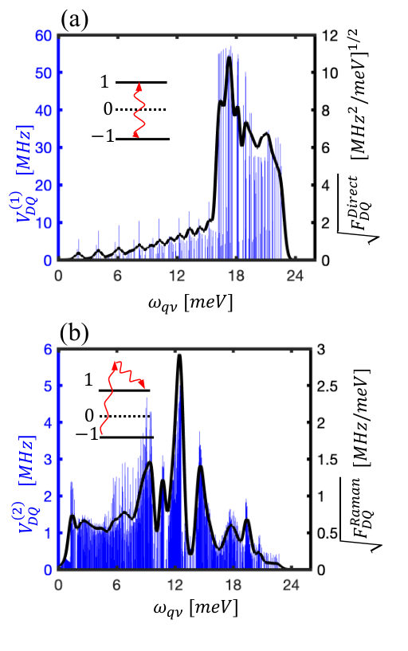
<figcaption class="paper-figure-caption"><b>Fig 4.</b> FIG. 4. Spin-phonon coupling for double quantum transition (DQ). (a) First order spin–phonon coupling, shown as discrete vertical lines, while solid curve represents the corresponding spectral function. Inset: schematic of the direct one-phonon process driving the DQ transition, with the wavy line de- noting the emitted/absorbed phonon resonant with the spin transition energy. (b) Second order spin–phonon coupling, shown as discrete vertical lines and the solid curve represent- ing the spectral function of the VB−center. Inset: schematic of the two-phonon Raman process for the DQ transition with the wavy line denoting the emitted and absorbed phonon be- tween two spin states. The SQ...</figcaption>
</figure>
<figure class="paper-figure-card">
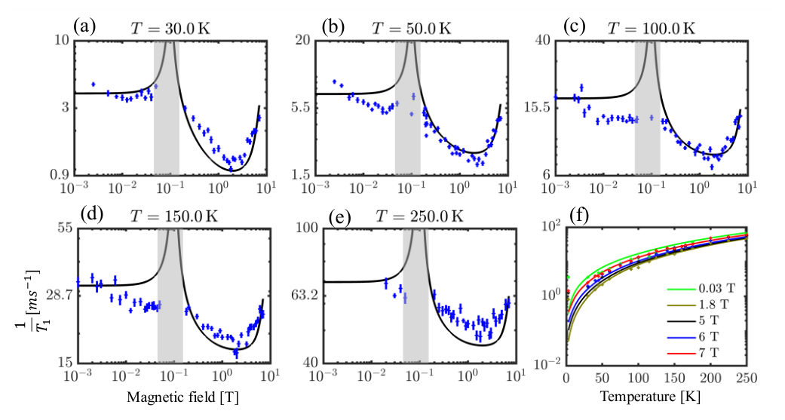
<figcaption class="paper-figure-caption"><b>Fig 5.</b> FIG. 5. Magnetic field and temperature dependence of the spin-lattice relaxation rate 1 T1 of the VB−center. (a)-(e) Field dependence of 1 T1 at T = 30, 50, 100, 150, 250 K. Experimental data are shown as blue points [12] and solid lines denote the calculated total rate. (f) Temperature dependence of 1 T1 at fixed magnetic fields B = 0.03, 1.8, 5, 6, 7 T. The shaded region highlights the field interval in which the spin transition energy falls below the DFT resolution limit.</figcaption>
</figure>

**Summary.** The paper develops an *ab initio* theory to explain spin relaxation in the $	ext{V}_{	ext{B}}^-$ defect center within hBN. By modeling the coupling between electronic spins and acoustic phonons, they identify the flexural phonon branch as the dominant source of decoherence. The resulting theoretical predictions quantitatively match experimental measurements of $T_1$ dependence on magnetic field and temperature.

**Why it may be interesting.** This work provides a detailed, first-principles mechanism for decoherence in solid-state quantum defects, directly linking lattice dynamics (acoustic phonons) to qubit coherence times ($T_1$), which is crucial knowledge for designing robust quantum sensors.

Detailed structure

**Main problem.** The study aims to microscopically understand the longitudinal spin-lattice relaxation time ($T_1$) of the boron vacancy ($	ext{V}_{	ext{B}}^-$) center in hexagonal boron nitride ($	ext{hBN}$) in the high magnetic field/sub-THz regime.

**Main result.** The authors demonstrate that acoustic phonons, specifically the out-of-plane flexural branch (ZA), drive spin relaxation via a direct one-phonon process resonant with the Zeeman splitting. The theory successfully reproduces the measured field and temperature dependence of $T_1$ without empirical fitting.

**Method.** They apply an *ab initio* acoustic mode spin-phonon relaxation theory, calculating coupling terms using DFT results and applying Fermi's golden rule to determine the spectral function for the relaxation rate.

**Model / system.** The system is the negatively charged boron vacancy ($	ext{V}_{	ext{B}}^-$) in $	ext{hBN}$, modeled as an $S=1$ triplet manifold. The Hamiltonian includes Zeeman and Zero Field Splitting (ZFS) terms, coupled to lattice vibrations via spin-phonon coupling derived from DFT.

**Key observables.** Longitudinal spin-lattice relaxation time ($T_1$), phonon dispersion ($\omega_{q
u}$), spectral functions for one-phonon transitions.

**Important parameters / regimes.** Sub-THz regime, high magnetic fields (up to 7 T), low temperatures (30-250 K).

**Assumptions / limitations.** The primary approximations include using the harmonic approximation for phonons and replacing the singular Dirac delta function in the spectral function with a Gaussian broadening kernel for numerical convergence.

**Figures summary.** Figures illustrate acoustic phonon dispersions, the evolution of spin transition energies with magnetic field, and most critically, comparisons between calculated and experimental $T_1$ vs. B-field/Temperature curves.

**Paper structure.** The paper establishes the physical problem (limited $T_1$), details the theoretical framework using DFT for ZFS and phonon calculations, derives the spin-phonon coupling terms, and finally calculates and compares the resulting relaxation rates against experimental data across varying fields and temperatures.

Abstract

The negatively charged boron vacancy center in hexagonal boron nitride is a premier candidate for quantum sensing, yet its performance is critically limited by longitudinal spin-lattice relaxation time ($T_1$). A microscopic understanding of spin relaxation in the high magnetic field regime remains elusive, as the relevant Zeeman transitions lie far below the optical phonon energies typically invoked to describe the relaxation process. Here, we apply an \textit{ab initio} acoustic mode spin-phonon relaxation theory to this problem and quantitatively reproduce the experimental magnetic field and temperature dependence of $T_1$ without empirical fitting parameters. We demonstrate that the relaxation dynamics are driven by a direct one-phonon emission and absorption process resonant with the Zeeman splitting. Furthermore, we identify the out-of-plane flexural phonon branch which is unique to two-dimensional hosts, as the primary source of decoherence, creating a distinct low-energy spectral function that facilitates spin relaxation. Our results provide a microscopic interpretation of the experimentally observed non-monotonic field and temperature dependence in two-dimensional quantum defect centers.

[↑ back to top](#top)

### [Fidelity Analysis of Adiabatically Driven Donor Spins as Two-Qubit and Ququart Systems](http://arxiv.org/abs/2607.07586v1)

**Authors:** Brian Michon, James Keppens, Ashutosh Kinikar, George Simion, Kristof Moors, Bart Sorée  
**Type:** theory · **Category:** quantum information and computing · **PDF:** <https://arxiv.org/pdf/2607.07586v1>  
**Analysis basis:** full PDF text, analyzed in chunks
**Topic relevance:** `spintronics-quantum-optics interface` **3/5** · `QC/QI experiment` **2/5** · `exotic spin models in light-matter` **1/5**

↔ Scroll figures horizontally

<figure class="paper-figure-card">
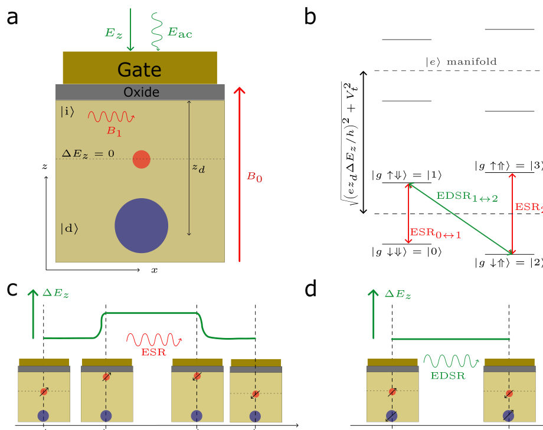
<figcaption class="paper-figure-caption"><b>Fig 1.</b> FIG. 1. Donor spin device schematic and operation. (a) Schematic visualization of the Si:P donor spin system. The excess electron is drawn in red whereas the phosphorus donor nucleus is shown in blue (not to scale). A straight red arrow indicates the Zeeman field B0. The implantation depth of the phosphorus atom is denoted by zd and dotted lines indicate the ionization point, which is the average position of the electron when ∆Ez = 0. (b) Energy level landscape for the donor spin system. Indicated in black are the computational basis states approximated by product states of the degrees of freedom and carrying the computational basis-state labels. Colored arrows indicate ESR (red) and EDSR...</figcaption>
</figure>
<figure class="paper-figure-card">
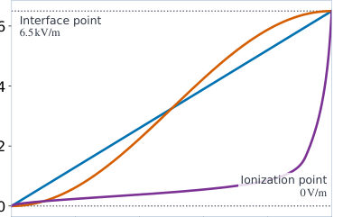
<figcaption class="paper-figure-caption"><b>Fig 2.</b> FIG. 2. (a) Detuning field profile as a function of time for all ramp types in which the total ramp duration is kept fixed at τ = 50 ns. (b) Initial state survival probability as a function of total ramp duration τ for all ramp types after averaging over all states after a round trip displacement. A frame update is applied before measurement in order to cancel accumulated phase.</figcaption>
</figure>
<figure class="paper-figure-card">
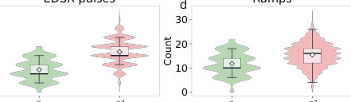
<figcaption class="paper-figure-caption"><b>Fig 3.</b> FIG. 3. Violin distributions indicating the resource counts for the C4 and C⊗2 2 gate sets. (a) Distribution for the number of required generators (width indicates relative frequency). (b) Distribution for the number of used ESR pulses. (c) Distri- bution for the number of used EDSR pulses. (d) Distribution for the number of used displacement operations.</figcaption>
</figure>
<figure class="paper-figure-card">
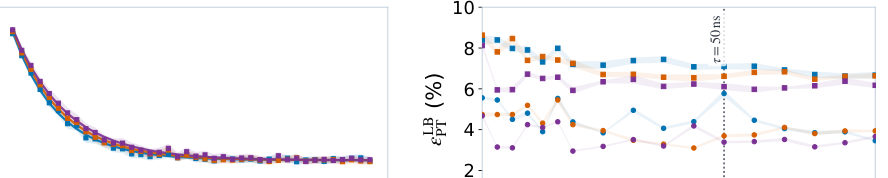
<figcaption class="paper-figure-caption"><b>Fig 4.</b> FIG. 4. Overview of RB results. Numerical metrics for leakage-aware RB are reported in Table I. All simulations use nseeds = 10, ntrials = 150, ATLF = 10 V/m, and fRTN = 10 Hz. Shaded regions denote 99% confidence intervals; dots show simulated data and solid lines the fitted decay curves. For ramped RB, the ramp duration is τ = 50 ns unless stated otherwise. (a) Leakage- aware survival probability SPT,4(m) without adiabatic ramps. (b),(c) Leakage-aware survival probabilities SPT(m) for ramped RB experiments with adiabatic ramps using (b) ququart (C4) encoding and (c) two-qubit (C⊗2 2 ) encoding. (d) Absolute lower- bound error εLB PT = 1 −(1 + 3rPT)/4 for C4 (circles) and C⊗2 2 (squares)...</figcaption>
</figure>

**Summary.** This work investigates using donor spins as qudits, comparing the performance of native ququart gate operations against those encoded from two qubits. Using leakage-aware randomized benchmarking, the authors demonstrate that the native ququart structure offers significantly lower error rates and is more resource-efficient than its qubit-encoded counterpart under realistic charge noise conditions.

**Why it may be interesting.** It provides concrete evidence for utilizing higher-dimensional quantum systems (qudits) in solid-state quantum computing architectures by demonstrating superior error resilience compared to standard qubit encodings under realistic noise models.

Detailed structure

**Main problem.** The study analyzes the fidelity of adiabatic driving protocols for donor spins when utilized as higher-dimensional quantum systems (qudits), comparing native ququart operation against standard encoded two-qubit operations.

**Main result.** Leakage-aware randomized benchmarking shows that the native ququart ($	ext{C}_4$) consistently achieves significantly lower error rates (40–50% better) compared to the encoded two-qubit system ($	ext{C}^{\otimes 2}_2$).

**Method.** The fidelity is quantified using leakage-aware Randomized Benchmarking (RB), which accounts for state leakage outside the computational basis during adiabatic driving sequences.

**Model / system.** The physical platform is a Si:P donor spin system, whose native Hilbert space allows it to function as a ququart ($d=4$). The control involves implementing Clifford group gates using both Electron Dipole Spin Resonance (EDSR) and Electron Spin Resonance (ESR) pulses.

**Key observables.** Average gate fidelity ($F$), lower-bound error rate ($\epsilon_{	ext{LB}}^{	ext{PT}}$), and survival probability $S(m)$ measured via leakage-aware RB.

**Important parameters / regimes.** The comparison is made between the native ququart group ($	ext{C}_4$) and the encoded two-qubit group ($	ext{C}^{\otimes 2}_2$), across varying adiabatic ramp durations ($	au$).

**Assumptions / limitations.** Leakage outside the computational basis is suppressed by using sufficiently long displacement ramps, and charge noise is modeled as quasistatic with rare switching events.

**Figures summary.** Figures compare resource counts (pulse requirements) and show decay curves for fidelity metrics ($	ext{SPT}(m)$ vs. $	au$), demonstrating superior performance for the native ququart implementation.

**Paper structure.** The paper first introduces the physical system and driving mechanisms, then details the use of leakage-aware RB to quantify gate errors, culminating in a direct comparison proving the structural advantage of using genuine qudit operations over qubit encoding.

Abstract

Donor spin systems host a native Hilbert space whose dimension exceeds that of a qubit, meaning they can be used as qudits. Here we study a \ce{Si{:}P} donor spin system through leakage-aware randomized benchmarking (RB) of native ququart $\mathcal{C}_4$ and encoded two-qubit $\mathcal{C}_2^{\otimes 2}$ Clifford groups. We implement adiabatic ramps to operate electron dipole spin resonance (EDSR) pulses at the ionization point, where the electron is shared halfway between the donor and the interface, and to operate electron spin resonance (ESR) pulses near the interface, motivated by the sensitivity of the effective magnetic field to charge noise at the ionization point. By placing the electron near the ionization point only during EDSR control and using sufficiently long displacement ramp durations, leakage outside the computational basis is strongly suppressed, which is crucial for optimized qudit control. We find in our analysis based on leakage RB that $\mathcal{C}_4$ consistently achieves $\sim 40$--$50\%$ lower (lower-bound) error rates $\varepsilon^{\mathrm{LB}}_\mathrm{PT}$ with respect to $\mathcal{C}_2^{\otimes 2}$, due to its reduced circuit complexity. These results indicate that donor spin qudits benefit from genuine qudit operation as opposed to imposed encoded qubit operation.

[↑ back to top](#top)

### [Bayesian Gill-Massar Bound: An Attainable Lower Bound for Qubit Parameter Estimation](http://arxiv.org/abs/2607.07031v1)

**Authors:** Ke-Han Zhao, Koichi Yamagata, Jun Suzuki  
**Type:** theory · **Category:** quantum information and computing · **PDF:** <https://arxiv.org/pdf/2607.07031v1>  
**Analysis basis:** full PDF text, analyzed in chunks
**Topic relevance:** `quantum measurements` **3/5** · `entanglement & information structure` **1/5** · `measurement-induced transitions` **1/5**

↔ Scroll figures horizontally

<figure class="paper-figure-card">
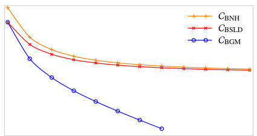
<figcaption class="paper-figure-caption"><b>Fig 1.</b> Fig. 2. Numerical results of CBNH, CBGM and CBSLD for the prior distribution in (30), and the dimension 푑= 3, . . . , 14. Values of CBGM for 푑≥11 are not shown, as the bound becomes negative and is no longer valid.</figcaption>
</figure>
<figure class="paper-figure-card">

<figcaption class="paper-figure-caption"><b>Fig 2.</b> Fig. 1. Numerical results of CBNH, CBGM and CBSLD for the prior distribution in (28), and the dimension 푑= 2, 3, . . . , 14.</figcaption>
</figure>
<figure class="paper-figure-card">
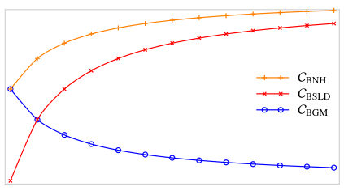
<figcaption class="paper-figure-caption"><b>Fig 3.</b> Figure 1 shows that the B-NH bound and the B-SLD-type bound increase as 푑increases, whereas the B-GM bound decreases. In particular, we have CBNH = CBGM at 푑= 2, and CBGM = CBSLD at 푑= 3. The coincidence of the B-SLD- type and B-GM bounds arises from the symmetry of the prior, which can be verified by modifying the prior. Additionally, the curve of the B-NH bound is always tighter than that of the B- SLD-type bound, which is consistent with Ref. [11]. Finally, CBGM ≤CBSLD for 푑≥4, indicating a limitation of the B-GM bound in higher-dimensional settings.</figcaption>
</figure>

**Summary.** This paper introduces the Bayesian Gill-Massar (B-GM) bound, a new theoretical lower limit for estimating parameters in quantum systems. The authors prove this bound is attainable specifically for qubits by identifying the optimal measurement strategy as a simple projection-valued measure. This advances the field by providing an explicit solution to determining achievable bounds in quantum estimation theory.

**Why it may be interesting.** It provides a concrete, analytically derived lower bound that is proven to be achievable in the fundamental qubit regime, solving an open problem in quantum metrology theory.

Detailed structure

**Main problem.** The central problem is establishing computable, attainable lower bounds for the Bayes risk in Bayesian quantum parameter estimation.

**Main result.** The authors introduce the novel Bayesian Gill-Massar (B-GM) bound, proving it is attainable for any qubit model and providing an explicit construction for the optimal measurement strategy.

**Method.** The derivation extends classical point estimation bounds to the quantum setting using extended Fisher information matrices and deriving a specific inequality (Bayesian Gill-Massar inequality).

**Model / system.** The analysis focuses on general qubit models, though it is applied to specific two-parameter Pauli models for numerical comparison.

**Key observables.** Bayes risk ($R[\hat{\Pi}]$), the B-GM bound ($	ext{CBGM}$), and the Fisher Information Matrix ($K$).

**Important parameters / regimes.** The dimension of the Hilbert space ($	ext{dim}(H)$) and the number of parameters being estimated.

**Assumptions / limitations.** The primary assumption is the applicability of extending classical bounding techniques to the quantum domain; a noted limitation is that the B-GM bound can become negative or worse than other bounds in high dimensions.

**Figures summary.** Numerical comparisons are provided showing how the B-GM, B-NH, and B-SLD-type bounds relate across different model dimensions, highlighting where equality holds and where limitations appear.

**Paper structure.** The paper reviews existing quantum estimation bounds (B-SLD, B-NH), introduces the B-GM bound via an extended parameter space approach, derives its attainability for qubits, and concludes with numerical comparisons and a discussion of high-dimensional limitations.

Abstract

We study lower bounds for Bayesian quantum parameter estimation, with a particular focus on qubit models. While several lower bounds on the Bayes risk have been proposed, including the Bayesian symmetric logarithmic derivative (B-SLD) type bound and the Bayesian Nagaoka-Hayashi (B-NH) bound, there is no definite proof available to show they are attainable except for special cases. Thus, identifying attainable bounds together with their corresponding optimal measurement strategies remains a central open problem in Bayesian quantum estimation. In this work, we introduce a new Bayesian lower bound, referred to as the Bayesian Gill-Massar (B-GM) bound, inspired by the logic of Gill-Massar bound in point estimation. We derive an analytical closed-form expression of the bound and show that it is attainable for any qubit model. In particular, we prove that the optimal Bayesian strategy can be realized by a projection-valued measure associated with a single effective direction determined by the weight matrix and the B-SLD-type Fisher information matrix. We provide numerical comparisons between the B-GM, B-NH, and B-SLD-type bounds in higher-dimensional models. Our results show that the B-GM bound has a limitation in high-dimensional models with few parameters, since it can be negative.

[↑ back to top](#top)

### [First constraint on Born-rule violations at high-energy colliders](http://arxiv.org/abs/2607.06938v1)

**Authors:** Antony Valentini, Mira Varma  
**Type:** experiment · **Category:** other · **PDF:** <https://arxiv.org/pdf/2607.06938v1>  
**Analysis basis:** full PDF text, analyzed in chunks
**Topic relevance:** `quantum measurements` **3/5** · `measurement-induced transitions` **1/5**

↔ Scroll figures horizontally

<figure class="paper-figure-card">
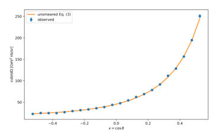
<figcaption class="paper-figure-caption"><b>Fig 1.</b> FIG. 1. HRS Bhabha scattering data with O(α3) effects re- moved (Table XII of Ref. [5]) compared with the standard (unsmeared) O(α2) Born-rule prediction (3).</figcaption>
</figure>
<figure class="paper-figure-card">
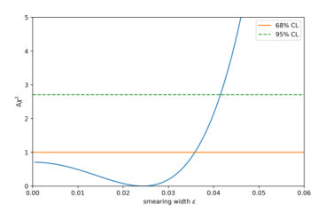
<figcaption class="paper-figure-caption"><b>Fig 2.</b> FIG. 2. ∆χ2 scan for the smeared expression (4) (with a = 0.4). The best fit occurs at ε = 0.024. The full orange and dashed green lines respectively represent the one-sided 68% and 95% confidence limits.</figcaption>
</figure>
<figure class="paper-figure-card">
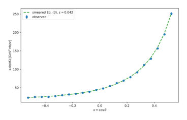
<figcaption class="paper-figure-caption"><b>Fig 3.</b> FIG. 3. HRS Bhabha scattering data with O(α3) effects removed (Table XII of Ref. [5]) compared with the O(α2) smeared prediction (4) at the 95% confidence limit with ε = 0.042.</figcaption>
</figure>

**Summary.** This paper derives an experimental constraint on potential violations of the Born rule by analyzing Bhabha scattering data from the PEP collider. The authors model deviations as an angular smearing parameter ($\epsilon$) and use statistical fitting techniques to set an upper bound of $\epsilon < 0.042$. This provides a rigorous, model-independent test of quantum mechanics at high energies.

**Why it may be interesting.** While not directly focused on AMO systems, this work tests fundamental principles of quantum mechanics (the Born rule) using high-energy particle collision data, which is a core area of theoretical physics relevant to understanding measurement processes.

Detailed structure

**Main problem.** The primary goal is to experimentally constrain potential violations of the Born rule, a fundamental postulate of quantum mechanics, using high-energy collider data.

**Main result.** The analysis sets an upper bound on the smearing parameter ($\epsilon$) due to Born-rule violations at $\epsilon < 0.042$ at 95% confidence level.

**Method.** The authors model potential violations as a Gaussian angular smearing of the differential scattering cross section for Bhabha scattering, fitting this smeared prediction against existing experimental data.

**Model / system.** The study focuses on large-angle Bhabha ($e^+e^- 	o e^+e^-$) scattering at $\sqrt{s}=29$ GeV, using data from the PEP collider. The deviation is parameterized by a smearing width $\epsilon$.

**Key observables.** Differential scattering cross section ($rac{d\sigma}{d\Omega}$) as a function of $x = \cos	heta$.

**Important parameters / regimes.** The upper bound on the smearing parameter, $\epsilon < 0.042$; the center-of-mass energy $\sqrt{s}=29$ GeV; and the intrinsic experimental bin width $\Delta x = 0.05$.

**Assumptions / limitations.** The constraint is model-independent, assuming that any deviation from the Born rule manifests as an angular smearing described by a Gaussian function.

**Figures summary.** Figure 1 compares measured Bhabha scattering data against the standard QED prediction. Figure 2 shows the $\Delta\chi^2$ scan used to determine confidence limits on the smearing parameter $\epsilon$.

**Paper structure.** The paper introduces the theoretical motivation for testing the Born rule, details the phenomenological method using Gaussian smearing applied to Bhabha scattering cross sections, presents the statistical fitting procedure (likelihood/chi-squared minimization), and concludes with the derived upper bound on $\epsilon$.

Abstract

We obtain an experimental constraint on possible Born-rule violations at high-energy colliders. We model Born-rule violations with differential scattering cross sections $dσ/dΩ$ subject to an angular smearing by a narrow Gaussian of width $\varepsilon$ (with respect to $x=\cosθ$ for scattering angle $θ$). For large-angle Bhabha ($e^{+}e^{-} \rightarrow e^{+}e^{-}$) scattering, at a centre-of-mass energy $\sqrt{s}=29\, \mathrm{GeV}$, data from the PEP collider at SLAC allow us to set an upper bound of $\varepsilon<0.042$ at $95\%$ confidence. This corresponds to a Gaussian smearing over an angular range of twice the experimental bin width, and hence provides a physically meaningful limit on deviations from the Born rule. Future prospects for improving this limit are discussed.

[↑ back to top](#top)

### [Thermodynamic description of worldwide distribution of energy and carbon emission](http://arxiv.org/abs/2607.07315v1)

**Authors:** Klaus M. Frahm, Dima L. Shepelyansky  
**Type:** theory · **Category:** statistical mechanics · **PDF:** <https://arxiv.org/pdf/2607.07315v1>  
**Analysis basis:** full PDF text, analyzed in chunks
**Topic relevance:** `non-equilibrium dynamics` **2/5** · `non-equilibrium universality` **2/5** · `Keldysh / 2PI / non-Gaussian methods` **1/5** · `analog quantum simulation` **1/5** · `correlated / nonlocal dissipation` **1/5** · `driven-dissipative phase transition` **1/5** · `methods for driven-dissipative` **1/5**

↔ Scroll figures horizontally

<figure class="paper-figure-card">
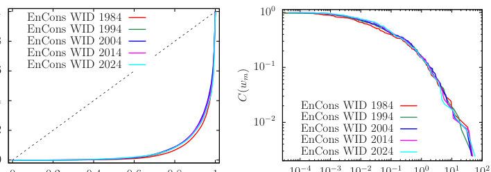
<figcaption class="paper-figure-caption"><b>Fig 1.</b> Figure 1: Left: Lorenz curves of energy consumption of countries from WID data [4–6] for 5 years from 1984 to 2024. The x-axis corresponds to the cumulated fraction of households/countries (h) and the y-axis to the cumulated fraction of wealth/energy consumption (w). The dashed black line corresponds to the line of perfect equipartition w = h. The Gini coefficients for the years 1984 to 2024 are G = 0.894, 0.876, 0.872, 0.875, 0.879. Right: Pareto curves C(wm) for the same data where C(wm) represents the fraction of countries with an energy consumption larger than wm (analogous to wealth). The x-axis corresponds to rescaled values wm/⟨wm⟩where ⟨wm⟩= ws is the average energy consumption for...</figcaption>
</figure>
<figure class="paper-figure-card">
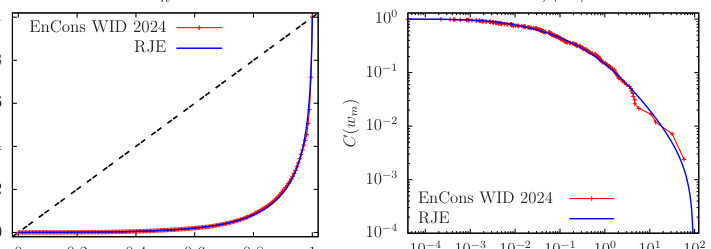
<figcaption class="paper-figure-caption"><b>Fig 2.</b> Figure 2: Lorenz curves (left panels) and Pareto curves (right panels) for the country energy consumption of the years 1994 (top) and 2024 (bottom) in the same style as in Fig. 1. Red data points correspond to the WID data [4–6] for 204 (209) countries for 1994 (2024) and blue curves correspond to the theoretical RJE curves obtained by matching Gini coefficients to determine ε and an optimal Lorenz curve fit to determine the parameter a. The parameters for 1994 are G = 0.875, ε = ⟨wm⟩RJE = 0.0166, a = 3.44 and ⟨wm⟩1994−data = 484 TWh. The parameters for 2024 are G = 0.879, ε = ⟨wm⟩RJE = 0.0105, a = 4.23 and ⟨wm⟩2024−data = 841 TWh.</figcaption>
</figure>
<figure class="paper-figure-card">
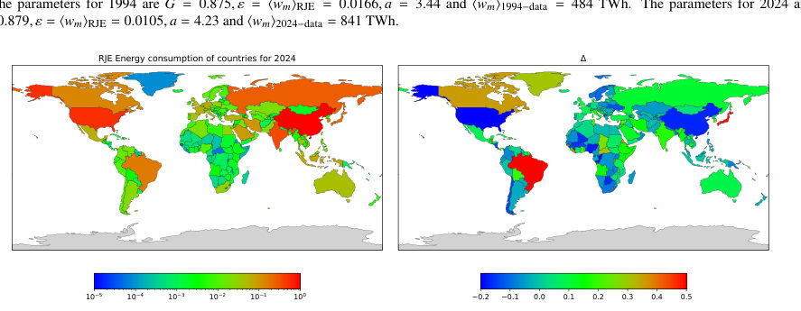
<figcaption class="paper-figure-caption"><b>Fig 3.</b> Figure 3: Left: World map of effective RJE energy consumption values w(RJE) m for 209 countries computed from the blue RJE Lorenz curve (in left bottom panel) of Fig. 2 at a = 4.23, ε = 0.0105 corresponding to the best RJE fit of real 2024 WID energy consumption data [6] (see text and Fig. 13 of [11] for details). The color values shown in the color bar correspond to the ratio w(RJE) m /w(RJE) max where the maximal value corresponds to China. The blue color for the minimal value has been attributed to 10−5 for an optimal visibility and only a few very small countries have values in the interval [10−6, 10−5] which are also shown as blue. Right: Logarithmic (or relative) difference ∆=...</figcaption>
</figure>
<figure class="paper-figure-card">
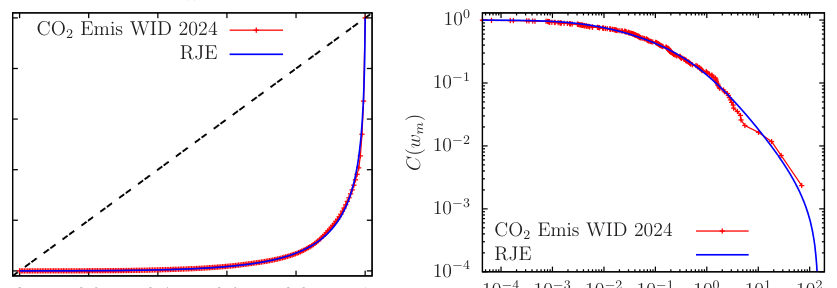
<figcaption class="paper-figure-caption"><b>Fig 4.</b> Figure 4: As Fig. 2 but for the cases of annual CO2 emission in 1984 (top, 200 countries) and 2024 (bottom, 213 countries) using WID data [4–6]. The RJE fit parameters for 1984 (2024) are G = 0.878 (G = 0.893), ε = ⟨wm⟩RJE = 0.0128 (ε = ⟨wm⟩RJE = 0.00672) and a = 3.88 (a = 4.76). The real data country CO2 emission averages are ⟨wm⟩1984−data = 9.55 × 107 tons and ⟨wm⟩2024−data = 1.76 × 108 tons.</figcaption>
</figure>

**Summary.** This paper applies advanced concepts from statistical mechanics, specifically Rayleigh-Jeans thermalization, to model the global distribution of energy and carbon emissions. It finds that these distributions exhibit persistent, high levels of inequality, which are accurately described by a universal thermodynamic hypothesis. This suggests that macro-scale resource allocation follows fundamental physical laws governing energy condensation.

**Why it may be interesting.** While applied to macro-economics, the core methodology—mapping complex societal inequalities onto established physical concepts like thermalization and condensation—is a powerful analogy that touches upon non-equilibrium statistical mechanics principles relevant to open quantum systems or energy dissipation models.

Detailed structure

**Main problem.** The paper analyzes the worldwide distribution of energy and carbon emission across countries over decades to determine the underlying physical principles governing global inequality.

**Main result.** The Energy Thermalization Hypothesis (ENTH), based on Rayleigh-Jeans (RJ) thermalization, provides an excellent description for the observed Lorenz and Pareto curves for energy and carbon emissions. This suggests that global resource distribution follows universal thermodynamic laws characterized by strong inequality.

**Method.** The authors use statistical mechanics concepts, specifically applying RJ thermal distributions to model socio-economic data like energy consumption and $	ext{CO}_2$ emissions.

**Model / system.** The system models world countries as interacting agents whose energy/carbon distribution is governed by principles analogous to thermalization (RJ condensation). The analysis compares theoretical predictions derived from the RJE model against real World Input-Output Database (WID) data.

**Key observables.** Lorenz curves, Pareto distributions, Gini coefficient ($G$), and relative differences ($\Delta$) between modeled and observed energy/carbon emissions.

**Important parameters / regimes.** The Gini coefficients are consistently high ($G \approx 0.87-0.90$), indicating strong inequality; the RJE model parameters include $a$ and $\varepsilon$.

**Assumptions / limitations.** It is assumed that only collective interactions at the country level affect global energy distribution, and the analysis relies on public datasets for energy/carbon emissions.

**Figures summary.** Figures show Lorenz and Pareto curves for energy/$	ext{CO}_2$ over 40-50 years demonstrating stable Gini coefficients. World maps compare model predictions ($w(	ext{RJE})_m$) to real data, highlighting relative differences ($\Delta$).

**Paper structure.** The paper introduces the problem by analyzing historical energy/carbon distributions using Lorenz/Pareto curves. It then proposes and tests the ENTH based on RJ thermalization, showing agreement with empirical data for multiple resources over decades.

Abstract

Based on public data, we analyze the distributions of energy and carbon emission over world countries on a scale of the last 40-50 years using their presentation via Lorenz and Pareto curves. These curves in rescaled format remain remarkably stable on this time period being characterized by high values of the Gini coefficient indicating a strong inequality of energy distribution. To explain these distributions, we introduce the ENergy Thermalization Hypothesis (ENTH) according to which these distributions result from the Rayleigh-Jeans (RJ) thermalization and condensation of agents representing different countries. We show that this hypothesis provides an excellent description of Lorenz and Pareto curves obtained from data on the above time period. It also gives natural grounds for inequality relating it to the RJ condensation at low energy states. We additionally trace parallels with the wealth inequality in the world.

[↑ back to top](#top)

### [Reconnection diagnostics for vortex tangles in Bose-condensed and superfluid dark matter halos](http://arxiv.org/abs/2607.07121v1)

**Authors:** Kazım Yavuz Ekşi  
**Type:** theory · **Category:** quantum gases · **PDF:** <https://arxiv.org/pdf/2607.07121v1>  
**Analysis basis:** full PDF text, analyzed in chunks
**Topic relevance:** `non-equilibrium dynamics` **2/5** · `Keldysh / 2PI / non-Gaussian methods` **1/5** · `analog quantum simulation` **1/5** · `correlated / nonlocal dissipation` **1/5** · `driven-dissipative phase transition` **1/5** · `methods for driven-dissipative` **1/5** · `non-equilibrium universality` **1/5**

↔ Scroll figures horizontally

<figure class="paper-figure-card">
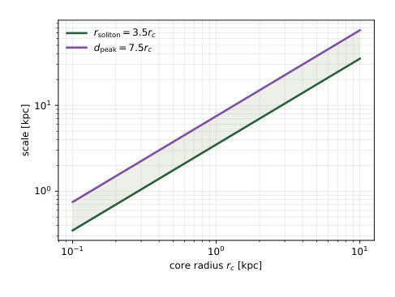
<figcaption class="paper-figure-caption"><b>Fig 1.</b> Figure 1. Halo-scale orientation used in the calculation. We take 𝑟soliton = 3.5𝑟c for the core size and 𝑑peak = 7.5𝑟c for the spectral peak scale in Mocz et al. The vortex-line density is not measured by this figure; throughout the calculation we write L = 𝜂vLM with LM = 𝑑−2 peak.</figcaption>
</figure>
<figure class="paper-figure-card">
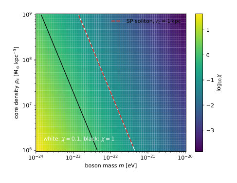
<figcaption class="paper-figure-caption"><b>Fig 2.</b> Figure 2. Fixed-radius semi-analytical scan for 𝐶rec = 1, 𝑟c = 1 kpc, and the Mocz-scale upper-bound proxy 𝜂v = 1. The color shows log10 𝜒, where 𝜒= 𝑡dyn/𝑡rec. The white and black contours mark 𝜒= 0.1 and 𝜒= 1. The dashed red curve shows the non-interacting soliton relation of Eq. (27) at 𝑟c = 1 kpc; it tracks the white contour because the soliton relation gives 𝜒≃0.10 for 𝜂v = 1. For smaller line densities, Δ log10 𝜒= (5/2) log10 𝜂v &lt; 0, so the contours move toward smaller 𝜒; the values in Table 1 should be rescaled in the same way.</figcaption>
</figure>
<figure class="paper-figure-card">

<figcaption class="paper-figure-caption"><b>Fig 3.</b> Figure 2 shows log10 𝜒in the (𝑚, 𝜌c) plane for𝐶rec = 1 and 𝜂v = 1. The white curve marks 𝜒= 0.1 and the black curve marks 𝜒= 1. The dashed red curve marks the non-interacting soliton relation evaluated at 𝑟c = 1 kpc. Its near-overlap with the white contour is expected: imposing the soliton relation cancels the explicit 𝑚and 𝜌c dependence of 𝜒and gives the Mocz-normalized value 𝜒≃0.10. For the fixed-radius scan at 𝜂v = 1 we find 1.4 × 10−4 ≲𝜒≲ 4.4 × 101. The threshold 𝜒= 1 occurs near 𝑚≃4 × 10−23 eV at 𝜌c = 106𝑀⊙kpc−3, but near 𝑚≃4×10−24 eV at 𝜌c = 108𝑀⊙kpc−3. The displayed contours shift as 𝐶rec𝜂5/2 v . The fixed-radius energetic diagnostics sharpen the interpretation. Across the same scan,...</figcaption>
</figure>
<figure class="paper-figure-card">
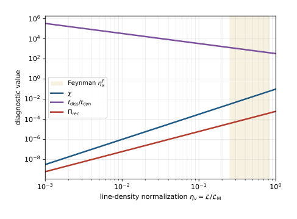
<figcaption class="paper-figure-caption"><b>Fig 4.</b> Figure 3. Dependence of the soliton-branch diagnostics on the unknown line-density normalization 𝜂v = L/LM. The curves in the panel correspond to the soliton branch evaluated at 𝐶rec = 1. The shaded band marks the Feynman normalization 𝜂F v ≃0.25 −0.84 for 𝜂Ω = 0.03 −0.1. A smaller true vortex-line density rapidly suppresses the reconnection count and virial- impact diagnostic while increasing the reservoir depletion time.</figcaption>
</figure>

**Summary.** This paper analyzes how quantized vortex reconnections within superfluid dark matter halos can dissipate kinetic energy into various waves. By comparing the reconnection timescale to the halo's dynamical time using diagnostic ratios, the authors determine that this process is only dynamically important when the core is externally perturbed, not in relaxed equilibrium states.

**Why it may be interesting.** This work bridges concepts from superfluid dynamics (vortex physics, GPE) with astrophysics (dark matter halos), providing a quantitative framework for energy dissipation in quantum many-body systems far from equilibrium.

Detailed structure

**Main problem.** The study investigates the dynamical and energetic importance of vortex reconnections occurring within Bose-Einstein-condensed (BEC) and superfluid dark matter (SFDM) halos.

**Main result.** Reconnection heating is only dynamically significant if the halo core is perturbed by mergers or tides, as relaxed cores show negligible energy release. The released energy remains in the dark sector, requiring additional physics for visible signals.

**Method.** The authors combine a local reconnection law (derived from GPE theory) with a halo-scale vortex-line density calibrated against prior Schrödinger-Poisson simulations to calculate diagnostic ratios.

**Model / system.** The system models dark matter halos as coherent bosonic media supporting quantized vortices, governed by principles related to the Gross-Pitaevskii equation. The dynamics are analyzed using concepts of vortex reconnection and energy dissipation into phonons/waves.

**Key observables.** Diagnostic parameters include $\chi = t_{	ext{dyn}}/t_{	ext{rec}}$, $t_{	ext{diss}}$ (dissipation time), and $\Pi_{	ext{rec}}$ (virial impact parameter).

**Important parameters / regimes.** Circulation quantum ($\kappa$), vortex-line density ($L$), dynamical time ($t_{	ext{dyn}}$), and core virial energy ($u_{	ext{vir}}$).

**Assumptions / limitations.** The analysis relies on a local reconnection law and uses Mocz et al. (2017) results as an upper-bound proxy for the unknown vortex line density ($\eta_v$).

**Paper structure.** The paper establishes the physical context of vortices in SFDM halos, derives local reconnection scaling laws, applies these laws to a halo-scale model using calibrated densities, and finally calculates diagnostic ratios ($\chi, t_{	ext{diss}}, \Pi_{	ext{rec}}$) to determine if reconnection heating is dynamically relevant.

Abstract

Bose-Einstein-condensed (BEC) and superfluid dark-matter (SFDM) halos can contain coherent, wave-supported cores whose angular momentum is carried by quantized vortices. When vortices form a tangle, reconnections convert part of the vortex kinetic energy into dark phonons, density waves, Kelvin waves, and vortex loops, providing a microscopic channel by which SFDM vortex structure can affect halo-core evolution. We estimate the dynamical importance of this channel by combining the local Gross-Pitaevskii reconnection law with a halo-scale vortex-line density calibrated against Schrödinger-Poisson simulations. In the minimal model the released energy stays in the dark sector, and standard-model luminosity requires additional portal physics.

[↑ back to top](#top)

### [Monodromy defects in Chern-Simons theory and Holography](http://arxiv.org/abs/2607.06669v1)

**Authors:** Federico Ambrosino, Jaume Gomis, Suriyah Rajalingam Kannagi  
**Type:** theory · **Category:** strongly correlated electrons · **PDF:** <https://arxiv.org/pdf/2607.06669v1>  
**Analysis basis:** full PDF text, analyzed in chunks
**Topic relevance:** `entanglement & information structure` **2/5** · `Keldysh / 2PI / non-Gaussian methods` **1/5** · `analog quantum simulation` **1/5** · `correlated / nonlocal dissipation` **1/5** · `driven-dissipative phase transition` **1/5** · `methods for driven-dissipative` **1/5**

↔ Scroll figures horizontally

<figure class="paper-figure-card">
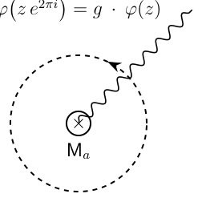
<figcaption class="paper-figure-caption"><b>Fig 1.</b> Figure 1: A g-monodromy defect Ma imposing g-twisted boundary conditions. z is a complex coordinate in the plane transverse to the codimension-two defect. The wavy line is a branch cut implementing the action of g.</figcaption>
</figure>
<figure class="paper-figure-card">
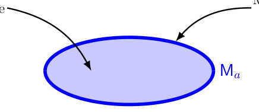
<figcaption class="paper-figure-caption"><b>Fig 2.</b> Figure 3: Monodromy defect supported on a knot that is the boundary of a topological surface.</figcaption>
</figure>
<figure class="paper-figure-card">
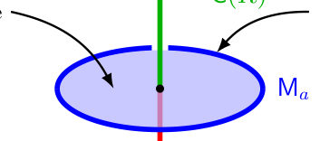
<figcaption class="paper-figure-caption"><b>Fig 3.</b> Figure 5: Topological defect implementing the action of charge conjugation on a Wilson line.</figcaption>
</figure>
<figure class="paper-figure-card">
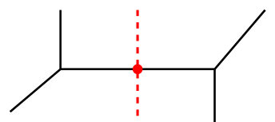
<figcaption class="paper-figure-caption"><b>Fig 4.</b> Figure 7: Geometric transition for the ΩσSO/Sp + orientifold. On the deformed conifold side, the orientifold plane O∓intersects the stack of N Lagrangian branes along S1 ⊂S3. After the transition, the branes are replaced by flux, and the resolved conifold contains an orientifold plane O∓at the fixed locus of σ+, shown as the dashed red line.</figcaption>
</figure>
<figure class="paper-figure-card">
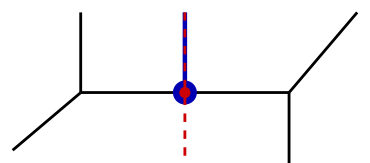
<figcaption class="paper-figure-caption"><b>Fig 5.</b> Figure 8: ΩσSO + ⊕B orientifold of resolved conifold: there is a brane stuck at the midpoint of the internal edge, on top of the O-plane (red dashed line).</figcaption>
</figure>

**Summary.** This work extends the observable set in Chern-Simons theory by introducing monodromy defects, which are labeled by twisted affine algebras. These new defects provide a rigorous test of the theory's holographic dual, showing that they map onto specific orientifold backgrounds in topological string theory.

**Why it may be interesting.** While focused on high-energy QFT/String Theory, the study of topological order, defect operators, and symmetry protection (like $\mathbb{Z}_2$ grading) provides deep mathematical structures relevant to understanding fractionalization and exotic phases in strongly correlated electron systems.

Detailed structure

**Main problem.** To determine if Wilson loop operators are the only observables in Chern-Simons theory, and to find their holographic dual description by introducing new codimension-two monodromy defects.

**Main result.** The spectrum of line defects realizes every algebra in Kac's classification; furthermore, the insertion of a monodromy defect transforms the dual string background from an oriented to an unoriented orientifold.

**Method.** Algebraic and geometric characterization of new observables (monodromy defects) and comparison of correlation functions between Chern-Simons theory and its proposed topological string/holographic duals.

**Model / system.** Chern-Simons theory with gauge group G at level k, particularly focusing on theories possessing charge conjugation symmetry. The holographic dual is a topological string theory living on resolved conifold geometries.

**Key observables.** Wilson loop operators ($	ext{WR}(K)$) and new codimension-two monodromy defects ($\mathcal{M}_a$), whose correlation functions are calculated using modular $S$-matrices.

**Important parameters / regimes.** Gauge group G, level k, the $\mathbb{Z}_2$ symmetry related to charge conjugation, and string coupling constants ($g_s$).

**Assumptions / limitations.** The validity of the holographic duality (Gopakumar–Vafa correspondence) and the ability to extend observables beyond standard Wilson loops.

**Figures summary.** Figure 1 illustrates a g-monodromy defect imposing g-twisted boundary conditions, while other figures illustrate orientifold projections ($\Omega_{\sigma\pm}$) on conifolds.

**Paper structure.** The paper establishes the algebraic framework for monodromy defects, calculates their correlation functions relative to Wilson loops, and then applies these findings to test and refine the holographic duality by identifying the corresponding brane content in the dual string theory background.

Abstract

Wilson loop operators in Chern-Simons theory have revealed profound links between quantum field theory, the fractional quantum Hall effect, topology, conformal field theory, and string theory. In Chern-Simons theories with charge conjugation symmetry, we construct a new class of observables: codimension-two monodromy defects around which fields return to themselves up to charge conjugation. Whereas Wilson loops are labeled by integrable representations of an untwisted affine Lie algebra, monodromy defects are labeled by those of the corresponding twisted affine algebra. The modular and fusion data of these two algebras determine the exact correlation functions of Wilson lines and monodromy defects, which together furnish a $\mathbb{Z}_2$-crossed braided tensor category. The spectrum of line defects in Chern-Simons theory thus gives a physical realization of every algebra in Kac's classification of affine Lie algebras: untwisted for Wilson loops, twisted for monodromy defects. We also determine the exact 't Hooft expansion of monodromy defects in $SU(N)_k$ Chern-Simons theory and identify their holographic duals in topological string theory. The insertion of the lightest monodromy defect has a striking effect: it replaces the resolved conifold background of the Gopakumar-Vafa duality by a specific orientifold of the resolved conifold, transmuting the dual theory of oriented strings into one of unoriented strings. Each excited monodromy defect is then realized as a collection of branes in the orientifold background, with the brane content determined by the representation of the twisted affine algebra that labels the defect.

[↑ back to top](#top)

### [A Dynamic Multiplexing Policy for a Quantum Repeater](http://arxiv.org/abs/2607.07539v1)

**Authors:** Jeroen Grimbergen, Sounak Kar, Michal van Hooft, Conor Bradley, Stephanie Wehner  
**Type:** theory · **Category:** quantum information and computing · **PDF:** <https://arxiv.org/pdf/2607.07539v1>  
**Analysis basis:** full PDF text, analyzed in chunks
**Topic relevance:** `non-equilibrium dynamics` **2/5** · `correlated / nonlocal dissipation` **1/5** · `driven-dissipative phase transition` **1/5** · `entanglement & information structure` **1/5** · `methods for driven-dissipative` **1/5**

↔ Scroll figures horizontally

<figure class="paper-figure-card">
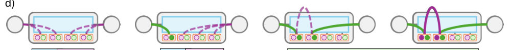
<figcaption class="paper-figure-caption"><b>Fig 1.</b> FIG. 1 Overview of many-quantum-chip repeater connecting two end nodes. a) A many-quantum-chip repeater node connecting two end nodes. Quantum chips are depicted as rectangles with communication qubit (purple, left) and memory qubit (green, right). Quantum chips on the end nodes are not shown. A reconfigurable router can connect the quantum chips on the repeater node to remote entanglement generation interfaces between the repeater and either of the end nodes for which a single entanglement generation attempt has success probability p. It can also connect two chips on the repeater to a local entanglement generation interface where each attempt succeeds with probability plocal. The local...</figcaption>
</figure>
<figure class="paper-figure-card">
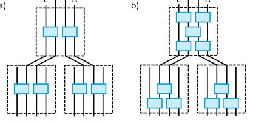
<figcaption class="paper-figure-caption"><b>Fig 2.</b> FIG. 2 Switching layouts for optical routers for a) FxdMux and b) DynMux. Inputs of the router are at the bottom and outputs at the top. Outputs labeled L and R connect to left and right end nodes, respectively, and outputs B1 and B2 connect to the two arms of the lo- cal entanglement generation interface. Optical switches are represented by the blue rectangles. Unit cells indi- cated by the dashed rectangles fan out into a binary tree. At each stage, the center two outputs of a unit cell are connected to the two left most or two right most inputs of the unit cell in the stage above it. See also Assumption A7.</figcaption>
</figure>
<figure class="paper-figure-card">
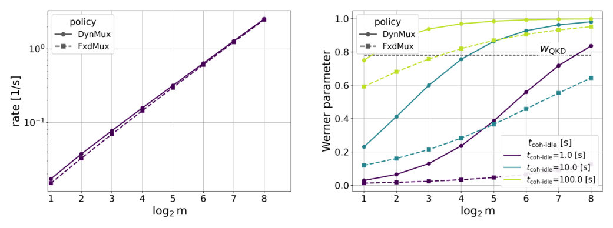
<figcaption class="paper-figure-caption"><b>Fig 3.</b> FIG. 3 Dynamic multiplexing can significantly improve the fidelity of end-to-end links generated in steady-state, while also yielding a marginally higher rate. (a) The steady-state rate and (b) steady-state Werner parameter (which is a measure for the fidelity) for dynamic multiplexing (circles connected by solid line) are compared to those for fixed multiplexing (squares connected by dashed line) for increasing numbers of chips on the repeater node in the range 2m = 4, . . . , 512 (log2(m) = 1, . . . , 8) and coherence times tcoh−idle = 1 s, 10 s, 100 s. Other parameter values have been set to p = 10−5, tlong = 1 ms, and tlocal = 1 µs. To isolate the effect of dynamic multiplexing on...</figcaption>
</figure>
<figure class="paper-figure-card">
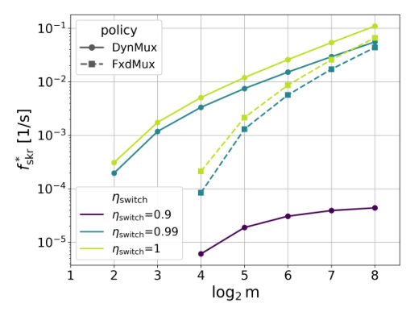
<figcaption class="paper-figure-caption"><b>Fig 4.</b> FIG. 4 Heuristic estimates to the maximum achievable secret key rate with non-ideal local en- tanglement generation and lossy switches. The heuristic estimate f ∗ skr of the maximum achievable se- cret key rate for DynMux and FxdMux is compared for increasing number of chips on the repeater node in the range 2m = 4, . . . , 512 (log2(m) = 1, . . . , 8) and switch- ing efficiencies ηswitch ∈{0.9, 0.99, 1}, at a remote en- tanglement generation probability p = 10−5, idle coher- ence of tcoh−idle = 100 s, and Sync-Gen cycle duration tlong = 1 ms. Local entanglement generation is non-ideal with parameters plocal = 10−3, ncoh−active = 1000, and tlocal = 1 µs. Points where f ∗ skr = 0 are not...</figcaption>
</figure>
<figure class="paper-figure-card">
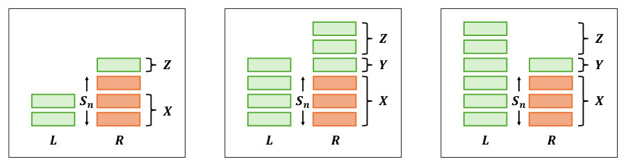
<figcaption class="paper-figure-caption"><b>Fig 5.</b> FIG. 5 Examples of X-pairs, Y -pairs and Z-links in a time step starting with signed queue length Sn = 3. The links that were already in queue are indicated by dark orange rectangles, and the new links, by light green rectangles. Subfigures (a), (b), and (c) are representatives for three different types of link generation events over the segments L and R.</figcaption>
</figure>

**Summary.** This work proposes a dynamic multiplexing policy for enhancing entanglement distribution in large, many-chip quantum repeaters. By dynamically reassigning available chips after establishing one link, the policy significantly boosts fidelity and secret key rates compared to fixed assignment strategies. This makes it highly relevant for designing robust, near-term quantum communication networks.

**Why it may be interesting.** It directly addresses practical limitations of quantum network scaling by proposing an optimized operational protocol (dynamic multiplexing) that maximizes achievable secure communication rates under realistic low-rate conditions.

Detailed structure

**Main problem.** The paper compares dynamic versus fixed multiplexing policies for distributing entanglement across a quantum repeater node.

**Main result.** In the near-term regime, the dynamic policy significantly improves fidelity over a fixed policy and achieves substantially higher secret key rates, even with increased router losses.

**Method.** The analysis uses Markov chain theory (including ergodic theorems) combined with discrete-event simulations to compare performance metrics.

**Model / system.** The system is a multiplexed quantum repeater node connecting two end nodes, built from many interconnected quantum chips, each containing communication and memory qubits, managed by a reconfigurable router.

**Key observables.** Steady-state rate, fidelity, and secret key rate (and the Werner parameter).

**Important parameters / regimes.** The relevant regime is characterized by generating an average of less than one entangled link per end-to-end communication cycle.

**Assumptions / limitations.** Assumes a symmetrically placed repeater node; the dynamic policy requires a deeper, and thus more lossy, router than the fixed policy.

**Figures summary.** Figures compare performance metrics (rate, Werner parameter) for Dynamic vs. Fixed policies using exact analysis, approximations, and NetSquid simulations, showing agreement under certain conditions.

**Paper structure.** The paper introduces the physical model and problem setup, develops the dynamic policy, performs analytical comparisons against fixed policies, validates results with simulation, and analyzes performance metrics like fidelity and key rates in the near-term regime.

Abstract

We consider a multiplexed quantum repeater that distributes entanglement between two end nodes. Multiplexing is achieved through optical integration of many quantum chips. Each chip hosts an optically addressable communication qubit and a separate memory qubit. The communication qubit serves as an entanglement generation interface between different quantum chips, and the memory qubit can be used to store entanglement. The quantum chips on the repeater are interconnected using a reconfigurable router, which makes it possible to dynamically assign quantum chips for entanglement generation with either of the two end nodes in every end-to-end communication cycle. We propose a dynamic multiplexing policy in which after an entangled link has been established with one of the end nodes, all remaining quantum chips are assigned to the opposite end node. We compare this dynamic policy to a policy in which the assignment of quantum chips to end nodes is fixed. We consider a parameter regime where on average less than one entangled link is generated per end-to-end communication cycle, which is the relevant regime for near-term quantum networks. We show that in this regime, the dynamic multiplexing policy can lead to a significant improvement in fidelity over a fixed policy, while marginally improving the rate. Moreover, even though the dynamic multiplexing policy requires a deeper, and hence, more lossy, router than the fixed policy, it can still achieve higher secret key rates in the parameter regime studied. This makes dynamic multiplexing with a many-quantum-chip repeater especially relevant for the development of near-term quantum networks.

[↑ back to top](#top)

### [An analytical solution of a quantum system with non-Markovian behavior: The Bixon-Jortner system in time domain](http://arxiv.org/abs/2607.07546v1)

**Authors:** Osman Cevheroğlu, Arkadaş Özakın  
**Type:** theory · **Category:** other · **PDF:** <https://arxiv.org/pdf/2607.07546v1>  
**Analysis basis:** full PDF text, analyzed in chunks
**Topic relevance:** `non-equilibrium dynamics` **2/5** · `Keldysh / 2PI / non-Gaussian methods` **1/5** · `correlated / nonlocal dissipation` **1/5** · `driven-dissipative phase transition` **1/5** · `methods for driven-dissipative` **1/5**

↔ Scroll figures horizontally

<figure class="paper-figure-card">
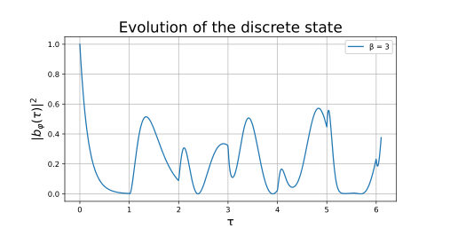
<figcaption class="paper-figure-caption"><b>Fig 1.</b> Figure 2. The time evolution of the probability of the discrete state in the BJ model as a function of dimensionless time, starting with the initial condition bϕ(0) = 1. Until τ = 1, the probability decays exponentially. Thereafter, it gets a “kick” at each integer time.</figcaption>
</figure>
<figure class="paper-figure-card">
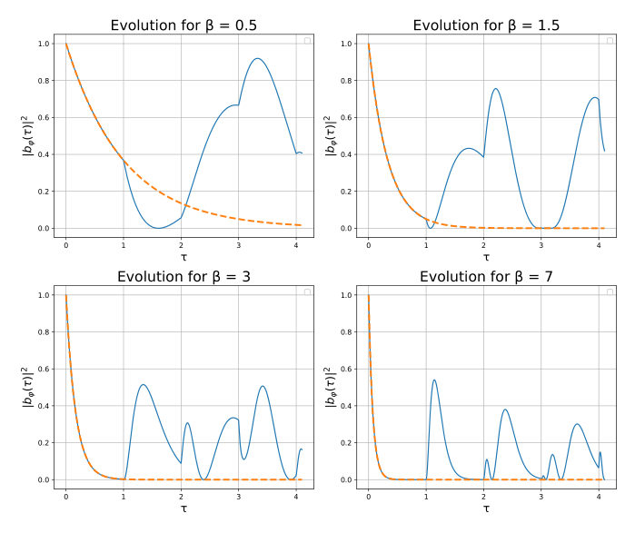
<figcaption class="paper-figure-caption"><b>Fig 2.</b> Figure 3. The time evolution of the probability |bϕ(τ)|2 of the discrete state as a function the dimensionless time τ , starting with the initial condition bϕ(0) = 1. The four plots correspond to different values of the dimensionless parameter β given by (20). In each case, a dashed orange curve represents the exponential decay of the Markovian approximation, the decay rate being given by the Fermi golden rule.</figcaption>
</figure>

**Summary.** This paper tackles the challenge of finding exact solutions for quantum systems exhibiting non-Markovian dynamics using the Bixon-Jortner model. The authors transform the complex evolution equation into a delay differential equation and solve it analytically. This yields an explicit time-domain solution that clearly demonstrates characteristic decay and revival features arising from memory effects.

**Why it may be interesting.** This work provides an explicit, non-perturbative analytical solution for non-Markovian effects in a well-defined model system, offering deeper physical insight (the 'kicks') compared to standard master equation approaches.

Detailed structure

**Main problem.** The primary goal is to obtain an exact analytical solution for the time evolution of a quantum system exhibiting non-Markovian dynamics directly in the time domain.

**Main result.** The authors derive an explicit, analytic form for the time-domain equation, demonstrating decay and revival behaviors characterized by periodic 'kicks' at integer time intervals.

**Method.** The core method involves transforming the initial integro-differential equation into a delay differential equation using the Poisson summation formula, which is then solved via an intuitive ansatz leading to recurrence relations.

**Model / system.** The study uses the Bixon-Jortner (BJ) model, a simple system structured as a direct sum of a discrete state and an infinite ladder of states. The dynamics are governed by coupling between these two components.

**Key observables.** The time evolution of the probability $|\langle \phi | \Psi(t) 
angle|^2$ associated with the discrete state, which exhibits decay-revival behavior.

**Important parameters / regimes.** The dimensionless parameter $eta$, and the characteristic energy scale related to the ladder spacing ($\Delta$).

**Assumptions / limitations.** The analysis aims for an exact solution without relying on approximations like first-order perturbation theory or assuming a Markovian limit, although these are used for comparison.

**Figures summary.** Figure 2 and Figure 3 illustrate the time evolution of the probability $|\langle \phi | \Psi(t) 
angle|^2$, clearly showing the initial exponential decay followed by distinct periodic 'kicks' at integer times $	au=n$.

**Paper structure.** The paper establishes the physical context (non-Markovianity), derives the governing integro-differential equation for the discrete state, transforms it into a delay differential equation using mathematical tools, and finally solves this delay equation analytically to reveal the time-domain dynamics.

Abstract

Non-Markovian behavior in quantum systems is often studied in the context of bipartite systems consisting of a system of interest and an environment -- tracing over the environment results in non-Markovian behavior for the subsystem of interest. One may get a Markovian limit in certain regimes, which is studied using the Lindblad master equation, and corrections to this behavior can be obtained by techniques such as the Nakajima-Zwanzig formalism. In this paper, we obtain an exact non-Markovian equation for the dynamics of a simple model system that consists of a direct sum rather than a tensor product of two pieces, namely, a discrete state and an infinite ladder. This system, called the Bixon-Jortner model, was first developed in the quantum chemistry literature but has been utilized by the quantum optics community as a model system with interesting behavior, including a Wigner-Weisskopf limit of exponential decay. We attack the time evolution problem of this system directly in time-domain, and start with an integrodifferential equation describing the time evolution of the discrete state. Using tools from mathematical physics, we transform this equation to a delay differential equation, which makes the non-Markovianity completely transparent, and then we solve the delay equation using an intuitive ansatz. This allows us to obtain the analytic form of the dynamics directly in time domain, and demonstrate decay and revival behaviors coming from the aforementioned delay differential equation. We believe the explicit form of the time-domain non-Markovian equation we obtain and the accessibility the solution techniques we use make our results a useful case study of non-Markovianity in quantum systems.

[↑ back to top](#top)

### [Moiré Phonon Condensation in Magic-Angle Twisted Bilayer Graphene](http://arxiv.org/abs/2607.06711v1)

**Authors:** Zhanghao Zhouyin, Jyun-jie Jiang, Xianghua Kong, Hong Guo  
**Type:** theory · **Category:** strongly correlated electrons · **PDF:** <https://arxiv.org/pdf/2607.06711v1>  
**Analysis basis:** full PDF text, analyzed in chunks
**Topic relevance:** `driven-dissipative phase transition` **2/5** · `Frenkel-Kontorova` **1/5** · `Keldysh / 2PI / non-Gaussian methods` **1/5** · `analog quantum simulation` **1/5**

↔ Scroll figures horizontally

<figure class="paper-figure-card">
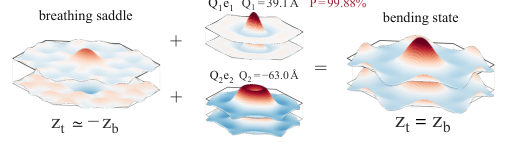
<figcaption class="paper-figure-caption"><b>Fig 1.</b> FIG. 1. Overview of Moir´e Phonon Condensation. The breathing-to-bending reconstruction at θ = 1.08◦is shown as a finite condensation of two unstable layer-symmetric A1 modes. From left to right, it shows the breathing saddle, the two-mode A(1) 1 and A(2) 1 landscape, and the bending endpoint in the same moir´e cell; The breathing saddle is layer anti- symmetric zt ≃−zb, while the bending state has zt ≃zb. The two-mode projection captures 99.881% of the REBO+KC endpoint displacement and 99.539% in the MLFF calculation.</figcaption>
</figure>
<figure class="paper-figure-card">
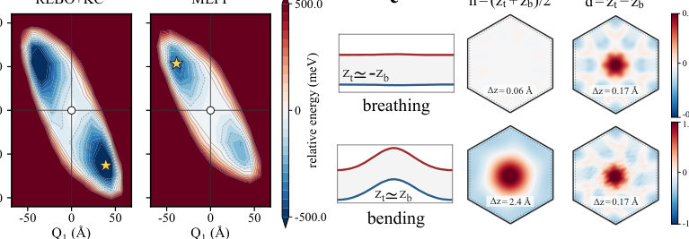
<figcaption class="paper-figure-caption"><b>Fig 2.</b> FIG. 2. Atomistic signature of Moir´e Phonon Condensation. Panel (a) shows the layer-symmetric height patterns of the unstable modes; mode A(1) 1 and A(2) 1 are highlighted because they form the condensing subspace. Panel (b) shows the energy landscape of the magic angle moir´e graphene system along the two collapsed phonon branches as R = R′ breathing +Q1e1 +Q2e2. Here, the initial breathing structure is corrected by the &lt; 0.5% of residual amplitude, denoted as R′ breathing. Panel (c) separates the relaxed structures into layer-antisymmetric spacing modulation d = zt −zb and layer-symmetric mid-surface height h = (zt + zb)/2. The bending endpoint creates only small vortex in d(r) and...</figcaption>
</figure>
<figure class="paper-figure-card">
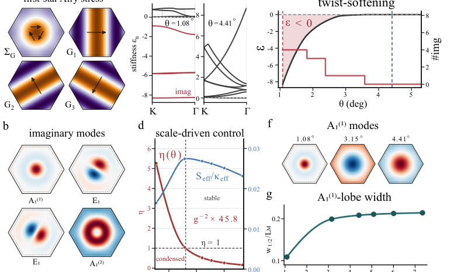
<figcaption class="paper-figure-caption"><b>Fig 3.</b> FIG. 3. First-harmonic continuum theory of Moir´e Phonon Condensation. The layer-symmetric height field w(r) is governed by a bending term and an Airy-stress term generated by the breathing-relaxed moir´e texture as in Panel (a). Panel (b) shows unstable Γ-point modes at 1.08◦twisted graphene bilayer, predicted by the first-harmonic continuum elasticity theory model. Panel (c) is the predicted phonon band structure on two representative twisted angles. Panel (d) shows the extracted control parameter η = Seff/(κeffg2), it decreases from 5.27 at 1.08◦to 0.52 at 4.41◦, while the factor Seff/κeff varies smoothly. Panel (e) also shows the reduction of imaginary mode numbers and the increase of...</figcaption>
</figure>
<figure class="paper-figure-card">
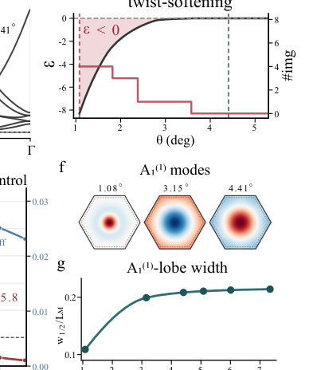
<figcaption class="paper-figure-caption"><b>Fig 4.</b> Fig. 3(f-g) provides a mechanical aspect of the role played by the moir´e length scale. The monotonic de- crease of A(1) 1 mode’s AA area toward small twist angle shows it becomes increasingly confined to the AA-centred stress pocket. This confinement concentrates the local stress-induced negative stiffness, overcoming the bending penalty, making the flexural mode easier to destabilize</figcaption>
</figure>
<figure class="paper-figure-card">
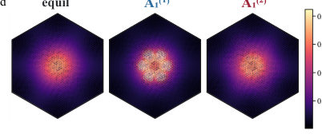
<figcaption class="paper-figure-caption"><b>Fig 5.</b> FIG. 4. Electronic response to condensed moir´e phonons. The band panels (a,b) compare result computed from the breathing reference (gray), with the structures displaced along A(1) 1 (blue) and A(2) 1 (red) mode. The energies are mea- sured from the half-filled flat-band Fermi level. The DOS and diffusion-derived Fermi velocity in (c) shows A(1) 1 broadens the flat-band peak and increases metallic dispersion, whereas A(2) 1 leaves the bandwidth nearly intact. In panel (d), the LDOS is plotted at the Fermi-level, showing the clear electron redistribution by the A(1) 1 mode, forming a six-fold hexagon shape around the AA-region, while under the A(2) 1 mode it is only slightly renormalised.</figcaption>
</figure>

**Summary.** This work proposes Moiré Phonon Condensation (MPC) as the mechanism driving structural reconstruction in magic-angle twisted bilayer graphene. By showing that layer-symmetric flexural phonons soften and condense, the authors link a purely mechanical instability to profound electronic changes, suggesting MPC is a tunable order parameter for correlated electron physics.

**Why it may be interesting.** While focused on condensed matter structure, the concept of an emergent 'structural order parameter' controlling correlated electronic states is highly relevant to understanding quantum phase transitions in engineered systems.

Detailed structure

**Main problem.** The study aims to elucidate the physical origin of the structural crossover between weak breathing corrugation and large common bending observed in twisted bilayer graphene near the magic angle.

**Main result.** This crossover is identified as Moiré Phonon Condensation (MPC), a soft-mode condensation driven by layer-symmetric $A_1$ flexural phonons acting as a twist-controlled structural order parameter.

**Method.** The research employs continuum theory, first-harmonic analysis, and mode-resolved tight-binding calculations to model the phonon softening and subsequent electronic consequences.

**Model / system.** The system is magic-angle twisted bilayer graphene. The physics is modeled by analyzing the energy functional of layer-symmetric height fluctuations ($w(r, t)$) and coupling these structural changes to $	ext{p}_z$-orbital tight-binding Hamiltonians.

**Key observables.** Phonon mode spectral weight (showing $>99.5\%$ capture by two $A_1$ modes), flat-band width, electronic gap size, and real-space LDOS texture.

**Important parameters / regimes.** Twist angle ($	heta$), the magic angle ($1.08^\circ$), and a dimensionless control parameter $\eta(	heta)$ governing stress-stiffness balance.

**Assumptions / limitations.** The analysis assumes that the structural instability can be reduced to a soft-mode condensation within a low-dimensional phonon subspace, simplifying the complex atomic displacements.

**Figures summary.** Figures illustrate the transition from breathing saddle to bending state via MPC, showing atomistic signatures and energy landscapes along the two active collapsed phonon branches.

**Paper structure.** The paper progresses by first identifying the structural problem (crossover), then developing a continuum theory for the soft modes, calculating the electronic response upon freezing these modes, and finally proposing MPC as the governing order parameter.

Abstract

Twisted bilayer graphene reconstructs from weak breathing corrugation to large common bending near the magic angle, but the origin of this collective crossover has remained unclear. Here we show that the crossover is a soft-mode condensation of layer-symmetric $A_1$ moiré flexural phonons: these modes soften on the breathing branch, lose stiffness near the magic angle, and freeze into the bending morphology. We call this mechanism Moiré Phonon Condensation (MPC). At $θ=1.08^\circ$, it is extremely surprising that displacements of all 11164 atoms in the moiré supercell, with a maximum atomic position shift of 2.30 Angstrom, is captured by only two $A_1$ phonon modes at more than $99.5\%$ spectral weight. A first-harmonic continuum theory identifies a dimensionless control parameter of the phenomenon, showing that as the twist approaches the magic angle, the growing moiré length scale amplifies a smooth stress-bending competition until the flexural stiffness changes sign. Mode-resolved tight-binding calculations further show that the condensed phonon coordinates are electronically active. This work identifies MPC as a twist-controlled structural order parameter for moiré reconstruction.

[↑ back to top](#top)

### [RL-Guided Quantum-ALNS for Constrained VRP](http://arxiv.org/abs/2607.07550v1)

**Authors:** Farzan Moosavi, Bilal Farooq  
**Type:** both · **Category:** other · **PDF:** <https://arxiv.org/pdf/2607.07550v1>  
**Analysis basis:** full PDF text, analyzed in chunks
**Topic relevance:** `QC/QI experiment` **2/5** · `methods for driven-dissipative` **1/5**

↔ Scroll figures horizontally

<figure class="paper-figure-card">
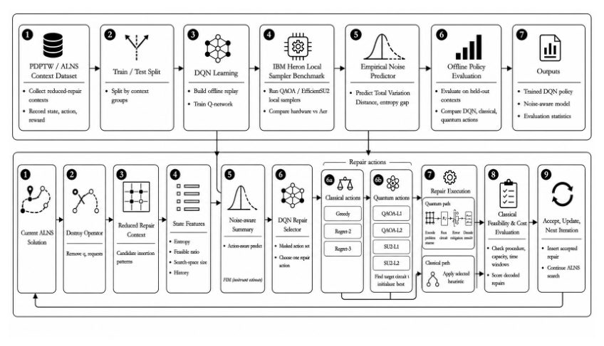
<figcaption class="paper-figure-caption"><b>Fig 1.</b> Fig. 1. Overview of the proposed DQN-guided quantum–classical ALNS framework. The upper panel shows offline data collection, DQN training, IBM Heron sampler benchmarking, empirical calibration of the noise predictor, and held-out policy evaluation. The lower panel shows the online ALNS rollout, where the learned controller selects between classical and quantum repair actions using structural repair-context features and noise-aware reliability-cost estimates.</figcaption>
</figure>
<figure class="paper-figure-card">
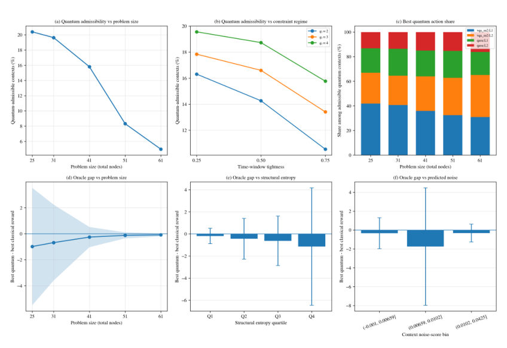
<figcaption class="paper-figure-caption"><b>Fig 2.</b> Fig. 2. Offline action-space analysis over the reduced-repair dataset. (a) Fraction of contexts with at least one admissible quantum action versus problem size. (b) Quantum-admissible fraction across time-window regimes and destroy sizes qt. (c) Share of the strongest admissible quantum action among quantum- admissible contexts. (d) Oracle reward gap between the best admissible quantum action and the best admissible classical action versus problem size. (e) Oracle reward gap versus structural-entropy quartile. (f) Oracle reward gap versus predicted reliability-cost-score bin. Error bars in (d)–(f) denote one standard deviation.</figcaption>
</figure>
<figure class="paper-figure-card">
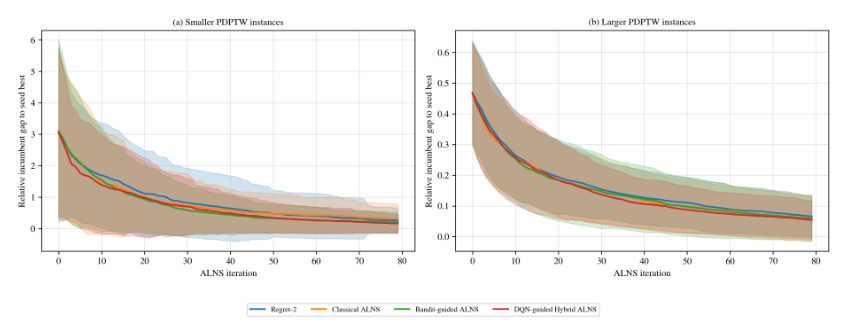
<figcaption class="paper-figure-caption"><b>Fig 3.</b> Fig. 3. Convergence profiles of four ALNS variants on two PDPTW scales. The vertical axis reports the relative incumbent gap to the seed-best final objective; lower values are better. Solid lines show the mean across matched runs, and shaded bands denote one standard deviation. (a) Smaller PDPTW instances. (b) Larger PDPTW instances.</figcaption>
</figure>
<figure class="paper-figure-card">
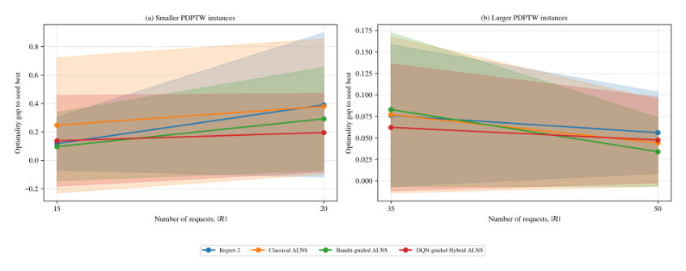
<figcaption class="paper-figure-caption"><b>Fig 4.</b> Fig. 4. Final relative gap to the seed-best solution versus the number of requests |R|. Lower values are better. Solid lines show the mean across matched runs, and shaded bands denote one standard deviation. (a) Smaller PDPTW instances. (b) Larger PDPTW instances.</figcaption>
</figure>
<figure class="paper-figure-card">
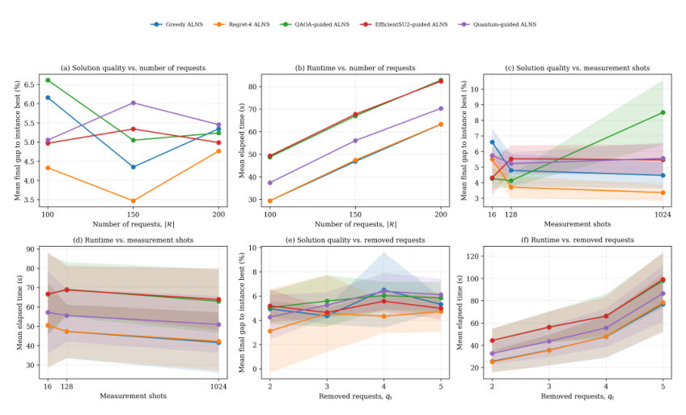
<figcaption class="paper-figure-caption"><b>Fig 5.</b> Fig. 5. Comparison of repair policies under (tw tightness, capacity slack) = (0.15, 0.15). Curves report the mean over instance-level averages, and shaded bands show one standard deviation across instances. (a) Mean final gap to the best objective found for each instance versus the number of requests |R|. (b) Mean elapsed time versus |R|. (c) Mean final gap versus the number of measurement shots. (d) Mean elapsed time versus the number of measurement shots. (e) Mean final gap versus destroy size qt. (f) Mean elapsed time versus qt. Lower values are better in all panels.</figcaption>
</figure>

**Summary.** This work proposes using a hybrid quantum-classical approach to solve difficult routing problems like PDPTW. It employs a DQN controller to intelligently decide when to use shallow quantum samplers within an ALNS framework for local repairs. The findings suggest that near-term quantum methods are best utilized as selective, context-aware enhancements rather than wholesale replacements for classical optimization heuristics.

**Why it may be interesting.** While not directly focused on AMO physics, the paper demonstrates a sophisticated application of quantum computation concepts (Hamiltonian encoding, sampling) to complex combinatorial optimization problems, which often requires understanding underlying physical constraints or energy landscapes.

Detailed structure

**Main problem.** The study develops a hybrid quantum-classical framework to solve constrained Vehicle Routing Problems (VRP), specifically the pickup-and-delivery problem with time windows (PDPTW). The goal is to determine when near-term quantum sampling can selectively enhance classical heuristic search.

**Main result.** Quantum repair was not superior on average, being admissible in only about 16% of states. However, under specific matched repair budgets, the quantum-enabled approach reduced the final solution gap compared to standard ALNS in a significant number of tested settings.

**Method.** It embeds shallow quantum samplers within the repair phase of an Adaptive Large Neighbourhood Search (ALNS) heuristic. A Deep Q-Network (DQN) controller learns to decide whether to use classical heuristics or quantum sampling for local subproblems.

**Model / system.** The problem is modeled as minimizing a cost Hamiltonian derived from a binary reduced objective function, which is mapped onto an Ising cost Hamiltonian ($H(t)$). The approach targets NISQ hardware using circuits like QAOA and EfficientSU2.

**Key observables.** Mean final gap (optimization quality), elapsed time, entropy descriptors ($H_{ins}^{(t)}, H_{conf}^{(t)}$, etc.), and the action-specific reliability score ($
u_t(u)$).

**Important parameters / regimes.** The analysis varies constraint regimes (e.g., (0.15, 0.15) vs (0.85, 0.85)), instance size ($|R|$), and the measurement shot budget.

**Assumptions / limitations.** Quantum repair is treated as a selective local enhancement rather than a full replacement for classical heuristics; the reduced objective function is an approximation of the true PDPTW cost.

**Figures summary.** Figures compare mean final gap and elapsed time across various repair policies (e.g., Regret-k ALNS vs DQN-guided Hybrid) under different constraint settings, showing context-dependent performance gains.

**Paper structure.** The paper details the hybrid framework: first, defining the VRP/PDPTW problem; second, describing the quantum mapping to an Ising Hamiltonian and the use of shallow samplers; third, detailing the DQN controller's state space (entropy, feasibility) and action selection process; finally, presenting empirical results comparing performance across different regimes.

Abstract

This study develops a hybrid quantum-classical framework for constrained vehicle routing problems, focusing on the pickup-and-delivery problem with time windows. Instead of casting the full routing problem as a stand-alone quantum optimization task, we embed shallow quantum samplers inside the repair phase of an Adaptive Large Neighbourhood Search (ALNS) heuristic. A Deep Q-Network controller decides whether each reduced repair subproblem should be handled by a classical repair heuristic or by a quantum sampler, using features that describe the local repair structure and predicted hardware reliability. IBM Heron experiments are used to calibrate an empirical noise-aware model for local quantum repair circuits. Across the tested instances, quantum repair is admissible in only about 16% of reduced repair states and is not superior on average. However, under selected matched repair budgets, quantum-enabled repair reduces the final gap relative to standard ALNS in 29 of 36 tested settings. These results suggest that near-term quantum sampling is most useful as a selective local repair mechanism rather than as a replacement for classical routing heuristics.

[↑ back to top](#top)

### [Bayesian Optimization of Genetic Algorithm Hyperparameters in a Multi-Fidelity Framework for Efficient Lattice Material Design](http://arxiv.org/abs/2607.07289v1)

**Authors:** Sergei Zorkaltsev, Maciej Haranczyk, Christina Schenk  
**Type:** theory · **Category:** disordered systems and neural networks · **PDF:** <https://arxiv.org/pdf/2607.07289v1>  
**Analysis basis:** full PDF text, analyzed in chunks
**Topic relevance:** `analog quantum simulation` **1/5** · `driven-dissipative phase transition` **1/5** · `methods for driven-dissipative` **1/5** · `non-equilibrium dynamics` **1/5**

↔ Scroll figures horizontally

<figure class="paper-figure-card">
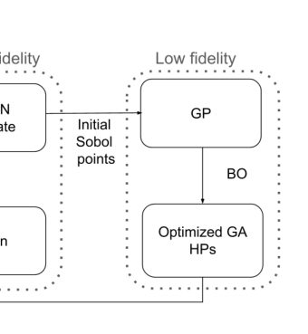
<figcaption class="paper-figure-caption"><b>Fig 1.</b> Fig. 1: Three-level multi-fidelity optimization framework. FFT homogenization provides high-fidelity mechanical evaluations, a CNN surrogate accelerates lattice- property prediction at the medium-fidelity level, and BO with a GP surrogate guides GA hyperparameter selection at the low-fidelity level. Information flows hierarchically from physical simulations to surrogate-assisted optimization.</figcaption>
</figure>
<figure class="paper-figure-card">
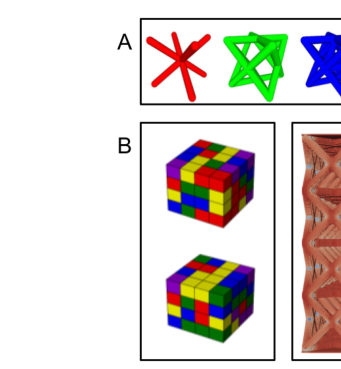
<figcaption class="paper-figure-caption"><b>Fig 2.</b> Fig. 2: Overview of the lattice representation used throughout the optimization frame- work. (A) Unit cell types used to construct 4 × 4 × 4 lattices (BCC, FCC, OT, SC, DIA). (B) Lattice encoding used by GA. (C) Voxelized lattice used in FFT simula- tions. Adapted from Zorkaltsev et al. (2026).</figcaption>
</figure>
<figure class="paper-figure-card">
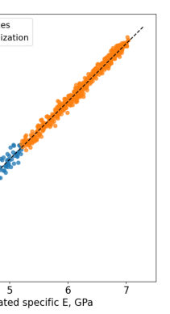
<figcaption class="paper-figure-caption"><b>Fig 3.</b> Fig. 3: Calculated versus predicted specific elastic modulus values for the test subset.</figcaption>
</figure>
<figure class="paper-figure-card">
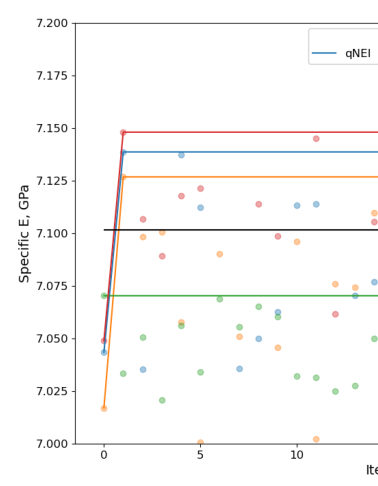
<figcaption class="paper-figure-caption"><b>Fig 4.</b> Fig. 4: Evolution of the best specific elastic modulus during BO for different acquisi- tion functions (UCB, NEI, qNEI, and logNEI). All optimizations were initialized with the same 25 Sobol points and run for 30 iterations.</figcaption>
</figure>
<figure class="paper-figure-card">
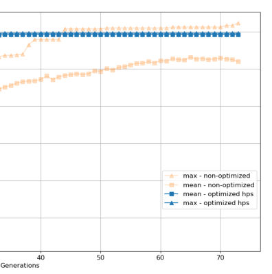
<figcaption class="paper-figure-caption"><b>Fig 5.</b> Fig. 5: Maximum and mean values of specific elastic modulus in each generation with optimized and non-optimized hyperparameters.</figcaption>
</figure>

**Summary.** This paper introduces a multi-fidelity framework that uses Bayesian Optimization to efficiently tune the hyperparameters of Genetic Algorithms for designing lattice materials. By combining fast CNN surrogates with rigorous FFT validation, the authors drastically reduce computational time while maintaining high mechanical performance. This demonstrates a powerful, generalizable methodology for accelerating complex structure optimization in materials science.

**Why it may be interesting.** While focused on materials science optimization rather than quantum physics directly, the core methodology—using ML surrogates (CNN, GP) within an active learning loop (BO)—is highly relevant to modeling complex, high-dimensional systems where direct simulation is intractable, a common challenge in many-body quantum simulations.

Detailed structure

**Main problem.** The study aims to efficiently optimize the hyperparameters of a Genetic Algorithm (GA) used for designing lattice materials.

**Main result.** The proposed multi-fidelity framework significantly reduces computational cost by 24% while achieving mechanical performance comparable to much longer, unoptimized runs.

**Method.** It employs Bayesian Optimization (BO) guided by Gaussian Process (GP) surrogates to tune GA hyperparameters, using a CNN surrogate for rapid property evaluation and FFT for high-fidelity validation.

**Model / system.** The physical system is architectured lattice materials whose mechanical properties are determined by their unit cell arrangement. The optimization process treats the hyperparameter tuning as a black-box problem guided by ML surrogates.

**Key observables.** Specific elastic modulus (GPa), computational time, and convergence rate of the GA.

**Important parameters / regimes.** GA hyperparameters such as population size, crossover probability, and mutation rate; fidelity levels (FFT, CNN, GP).

**Assumptions / limitations.** The performance of the surrogate models (CNN/GP) accurately reflects the true underlying physics, and that the multi-fidelity approach provides a reliable trade-off between accuracy and computational cost.

**Figures summary.** Figure 1 illustrates the three-level workflow (FFT $
ightarrow$ CNN $
ightarrow$ BO/GP). Figure 2 shows the lattice representation used for encoding into the optimization process. Figure 5 compares modulus evolution with optimized vs. non-optimized hyperparameters.

**Paper structure.** The paper first defines the goal of optimizing GA parameters for material design, then details the multi-fidelity architecture (FFT/CNN/GP), describes the BO implementation using acquisition functions like logNEI, presents results showing cost reduction and performance maintenance, and concludes with implications for future lattice studies.

Abstract

This study presents a multi-fidelity framework for the systematic optimization of genetic algorithm (GA) hyperparameters. The framework integrates three fidelity levels: high-fidelity Fast Fourier Transform (FFT) homogenization for validation, a medium-fidelity 3D convolutional neural network surrogate for rapid property evaluation, and a low-fidelity Gaussian process (GP) surrogate within a Bayesian optimization (BO) framework to guide the hyperparameter search. Various acquisition functions are evaluated, with logNEI achieving the best performance by effectively accounting for the noise inherent in GA evaluations. The proposed framework identifies hyperparameter configurations that enable a 25-generation GA run to achieve elastic modulus values comparable to those obtained in a full 75-generation optimization. Furthermore, introducing a penalized BO objective significantly reduces the number of required lattices with only minor decreases in absolute achieved elastic modulus, revealing a practical trade-off between performance and the number of structures that must be evaluated. High-fidelity FFT validation verifies the effectiveness of the surrogate-driven optimization strategy. The optimized hyperparameters allow for rapid convergence, eliminate the need for lattice mutation, and reduce the overall computational cost by 24% (from 225 to 171 hours) while preserving mechanical performance. These results demonstrate the potential of multi-fidelity optimization as an efficient and practical approach for GA hyperparameter tuning and future experimental lattice design studies.

[↑ back to top](#top)

### [Circuit Depth Reduction of One-Ancilla Quantum Differential Equation Solver via Extrapolation](http://arxiv.org/abs/2607.07389v1)

**Authors:** Di Fang, Justin Park  
**Type:** theory · **Category:** quantum information and computing · **PDF:** <https://arxiv.org/pdf/2607.07389v1>  
**Analysis basis:** full PDF text, analyzed in chunks
**Topic relevance:** `Keldysh / 2PI / non-Gaussian methods` **1/5** · `correlated / nonlocal dissipation` **1/5** · `driven-dissipative phase transition` **1/5** · `methods for driven-dissipative` **1/5**

↔ Scroll figures horizontally

<figure class="paper-figure-card">

<figcaption class="paper-figure-caption"><b>Fig 1.</b> Figure 1: Hatano-Nelson model with edge observable. Both panels are semilogy plots: the y-axis is the absolute deterministic bias on a logarithmic scale, while the x-axis is linear. Panel (a) plots the data against 𝑅max, and panel (b) plots the same data against √</figcaption>
</figure>
<figure class="paper-figure-card">
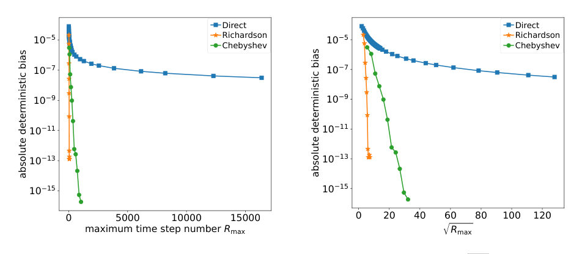
<figcaption class="paper-figure-caption"><b>Fig 2.</b> Fig. 1 shows the deterministic-bias reduction at fixed data points. The 𝑥axis is 𝑅max = max𝑗𝑅𝑗, the maximum number of time steps among the finite-step circuits used in the extrapolation, where 𝑠𝑗= 𝑇∕𝑅𝑗. The actual maximum single-run circuit depth is</figcaption>
</figure>
<figure class="paper-figure-card">
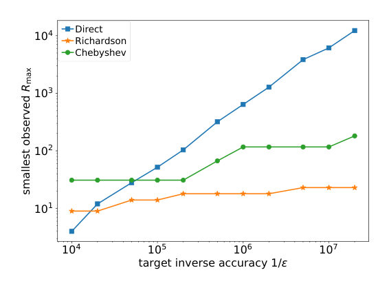
<figcaption class="paper-figure-caption"><b>Fig 3.</b> Figure 2: Hatano-Nelson edge observable. This is a log-log plot: the x-axis is the target inverse accuracy 1∕𝜖, and the y-axis is the smallest observed maximum step number 𝑅max needed to reach the target deterministic bias. The direct method follows the expected inverse-accuracy trend, while the extrapolated methods require much smaller maximum depths over the tested accuracy range. The final upward step in the Chebyshev curve is a discrete degree-selection effect.</figcaption>
</figure>
<figure class="paper-figure-card">
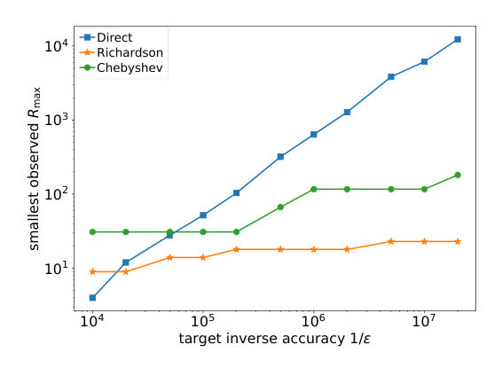
<figcaption class="paper-figure-caption"><b>Fig 4.</b> Fig. 2 inverts the previous comparison. For each target accuracy 𝜖, we record the smallest observed 𝑅max such that this precision is reached. The direct curve grows quickly as 1∕𝜖increases, consistent with first-order accuracy. The Richardson and Chebyshev curves do not change much. In particular, they are step-like because both 𝑚and 𝑅are integer-valued, but they remain far below the direct curve in the high-accuracy regime. The last visible upward step in the Chebyshev curve is a degree-selection effect. In the Hatano-Nelson data, the 𝑚= 4 Chebyshev interpolant has</figcaption>
</figure>
<figure class="paper-figure-card">
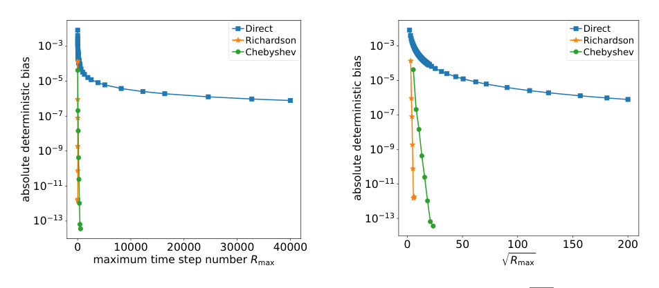
<figcaption class="paper-figure-caption"><b>Fig 5.</b> Figure 3: Convection-diffusion low-Fourier-shell observable. Both panels are semilogy plots: the y-axis is the absolute deterministic bias on a logarithmic scale, while the x-axis is linear. Panel (a) plots the data against 𝑅max, and panel (b) plots the same data against √</figcaption>
</figure>

**Summary.** The paper presents a method to drastically reduce the computational resources needed to solve linear differential equations using a one-ancilla quantum computer. By integrating classical extrapolation techniques with the quantum solver, the required circuit depth scales logarithmically with the inverse of the target accuracy. This breakthrough makes simulating complex physical dynamics, especially non-unitary ones, much more feasible for near-term quantum hardware.

**Why it may be interesting.** This work directly tackles resource optimization for quantum simulation algorithms, which is critical for realizing fault-tolerant quantum computation by reducing required circuit depth for solving fundamental physical equations.

Detailed structure

**Main problem.** The primary goal is to reduce the circuit depth required for a one-ancilla quantum solver of linear differential equations.

**Main result.** By combining the quantum solver with classical step-size postprocessing techniques like extrapolation, the circuit depth scales down from $\mathcal{O}(1/\epsilon)$ to $\mathcal{O}(	ext{polylog}(1/\epsilon))$.

**Method.** The approach uses Richardson or Chebyshev extrapolation on estimates derived from running the quantum solver at a logarithmic number of finite time steps. This requires advanced mathematical tools like holomorphic adjoint lifts for non-unitary dynamics.

**Model / system.** The work addresses solving linear differential equations, including dissipative and non-unitary systems modeled by operators like $A = -iH - \sum D_j$. Examples include the Hatano-Nelson model (ODE) and convection-diffusion PDEs.

**Key observables.** The observable estimated is an unnormalized expectation value $\langle\psi(T)| O|\psi(T)
angle$, specifically measuring low-Fourier-shell content for PDE examples.

**Important parameters / regimes.** Target accuracy ($\epsilon$) and the required circuit depth (the resource being minimized).

**Assumptions / limitations.** The reduction relies on obtaining necessary regularity estimates through a holomorphic adjoint lift, which is crucial for non-unitary evolution maps. The one-step block underlying the algorithm is assumed to be first-order accurate in step size.

**Figures summary.** Figures compare resource scaling: direct simulation requires depth $\sim 1/\epsilon$, while extrapolation methods achieve much smaller depths ($	ext{polylog}(1/\epsilon)$), demonstrating superior convergence rates for accuracy improvement.

**Paper structure.** The paper introduces the problem, details the one-ancilla solver structure, develops the theoretical framework using classical postprocessing (extrapolation) to mitigate discretization errors, and validates the improved scaling with numerical examples on ODEs and PDEs.

Abstract

Solving linear differential equations is a fundamental task in scientific computing and an important primitive for quantum computing. A recent one-ancilla quantum differential equation solver provides a hardware-friendly and locality-preserving approach with provable performance guarantees, making it highly suitable for the early fault-tolerant and near-term regimes. Its simple circuit structure comes with a natural trade-off: the maximum single-run circuit depth scales as $O (1/ε)$ in the target accuracy $ε$. In this work, we reduce this depth by combining the solver with classical step-size postprocessing. By running the one-ancilla solver at a logarithmic number of finite time step sizes and using classical post-processing to cancel leading discretization errors, we reduce the maximum single-run circuit depth to $O(\mathrm{polylog}(1/ε))$ without adding quantum ancillae or sacrificing locality. Technically, extending extrapolation ideas beyond Hamiltonian and Lindbladian dynamics requires regularity estimates for observable maps under nonunitary evolution, which we obtain through a holomorphic extension of the adjoint evolution. Numerical experiments on the Hatano-Nelson model (ODE) and the convection-diffusion equation (PDE) demonstrate the effectiveness of the approach.

[↑ back to top](#top)

### [Operator-frame geometry of non-compact quantum systems with frame-vacuum phase transitions](http://arxiv.org/abs/2607.06994v1)

**Authors:** Satoshi Tanaka, Gonzalo Ordonez, Masatoshi Kubota, Hiroto Nakano, Kazuki Kanki  
**Type:** theory · **Category:** other · **PDF:** <https://arxiv.org/pdf/2607.06994v1>  
**Analysis basis:** full PDF text, analyzed in chunks
**Topic relevance:** `Keldysh / 2PI / non-Gaussian methods` **1/5** · `correlated / nonlocal dissipation` **1/5** · `driven-dissipative phase transition` **1/5** · `methods for driven-dissipative` **1/5**

↔ Scroll figures horizontally

<figure class="paper-figure-card">
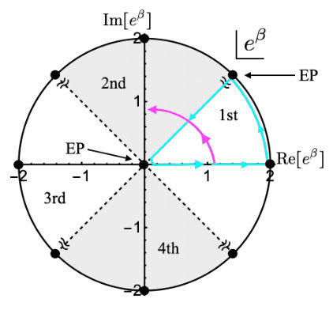
<figcaption class="paper-figure-caption"><b>Fig 1.</b> FIG. 1. Stable-unstable domain phase diagram in the com- plex eβ plane. The blank regions represent stable domains in which the frame vacuum is normalizable, while the shaded regions correspond to unstable domains where the Hilbert- space norm is no longer real positive. The norm diverges on the Stokes lines. The dotted lines indicate the Stokes lines separating different analytic sectors. The exceptional points are indicated by the black dots. The Stokes lines divide the complex plane into four Riemann sheets, labeled in the fig- ure. Representative trajectories connecting stable and unsta- ble domains are also shown (blue and magenta curves); the physical realization constructing the...</figcaption>
</figure>
<figure class="paper-figure-card">
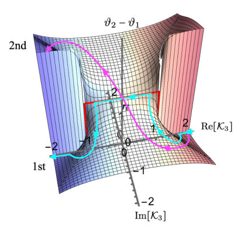
<figcaption class="paper-figure-caption"><b>Fig 2.</b> FIG. 3. (Color online) Continuous trajectories in the com- plex K3 plane encircling the exceptional points at K3 = ±k∥ on the first Riemann sheet: the blue curve runs on the first Riemann sheet, and the magenta curve runs from the first to the second Riemann sheets crossing over the Stokes line. A finite imaginary part ImK3, induced by dissipation, allows the system to bypass the exceptional points and cross the Stokes lines smoothly. The corresponding trajectories are also drawn in Fig. 1.</figcaption>
</figure>
<figure class="paper-figure-card">
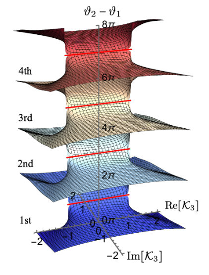
<figcaption class="paper-figure-caption"><b>Fig 3.</b> FIG. 2. (Color online) Argument of the complex squeezing parameter eβ, 4 Imβ = ϑ2 −ϑ1, plotted on the complex K3 plane for k∥= 1. The exceptional points at K3 = ±k∥appear as branch points, around which the phase of eβ exhibits a four- cycle (Z4) monodromy. Each sector corresponds to a distinct Riemann sheet in the analytically continued parameter space. The Stokes lines shown by the red lines, located at ϑ2 −ϑ1 = π(2l + 1) (l ∈Z), emanate from the exceptional points and become branch cuts separating stable and unstable domains.</figcaption>
</figure>

**Summary.** This paper develops an operator-based formulation of quantum geometry designed specifically for non-compact bosonic systems undergoing vacuum instability. By constructing the 'operator-frame bundle' and defining a Quantum Geometric Tensor (QGT), the authors successfully extend geometric concepts like Berry curvature across phase transitions where standard state-space methods break down. This provides a universal tool for analyzing quantum dynamics in highly unstable or open environments.

**Why it may be interesting.** This work provides a powerful, mathematically rigorous framework for analyzing quantum dynamics and geometry in regimes (like vacuum decay or strong coupling) where standard quantum field theory tools fail due to state non-normalizability.

Detailed structure

**Main problem.** The primary challenge is developing a robust geometric description of quantum systems when vacuum instability renders conventional state-space quantum geometry ill-defined.

**Main result.** The authors introduce the operator-space Quantum Geometric Tensor (QGT), which provides a consistent, analytically continuous description of quantum geometry across phase transitions involving vacuum instabilities.

**Method.** They reformulate quantum geometry by analyzing the structure of canonical operator frames and defining an Ehresmann connection on the associated principal bundle, bypassing reliance on normalizable state vectors.

**Model / system.** The work applies to non-compact bosonic quantum systems, initially focusing on a single mode but extending to coupled systems using Feshbach projection techniques. The geometry is analyzed in terms of operator commutation relations rather than state expectation values.

**Key observables.** Operator-space Quantum Geometric Tensor (QGT), Berry connection/curvature, and the effective Liouvillian $\mathcal{L}_{	ext{eff}}(z)$.

**Important parameters / regimes.** Complexified squeezing-parameter plane; coupling constants ($k_1, k_2, k_3, g$); system parameters $z$.

**Assumptions / limitations.** The formulation assumes that the underlying algebraic structure defined by canonical operator frames remains well-defined even when the physical state space collapses or becomes non-normalizable.

**Figures summary.** Figure 3 illustrates continuous trajectories in the complex K3 plane showing smooth passage across Stokes lines via controlled dissipation, demonstrating QGT analyticity.

**Paper structure.** The paper progresses from establishing the breakdown of standard quantum geometry (Chunk 1) to analyzing the underlying operator algebra and its principal bundle structure using an Ehresmann connection (Chunk 2). It then details the derivation of the QGT in rigged Hilbert spaces (Chunk 3), concluding with applications to open systems via Feshbach projection methods (Chunk 4).

Abstract

We formulate the geometric structure of non-compact bosonic quantum systems in regimes where vacuum instability renders the relevant quantum states non-normalizable, causing conventional state-space quantum geometry -- described by the Berry connection, curvature, and quantum metric -- to become ill-defined. To overcome this breakdown, we develop a formulation of quantum geometry at the level of canonical operator frames, allowing for complexified Bogoliubov-Valatin transformations that lift the requirement that creation operators be Hermitian conjugates of annihilation operators. Canonical operator frames are defined as choices of bosonic creation and annihilation operators realizing the canonical commutation relations. A natural equivalence relation among such frames generalizes the phase ambiguity of quantum states and determines a parameter space that analytically extends the stable-regime parameter space. The space of canonical operator frames forms a principal bundle over parameter space -- the operator-frame bundle -- equipped with a natural Ehresmann connection that defines parallel transport while preserving the canonical commutation relations. In the stable regime, this construction reduces to the Berry connection, while more generally it yields a well-defined operator-space quantum geometric tensor (QGT) that remains valid across vacuum instabilities. Using the framework of rigged Hilbert spaces, we define a notion of quantum frame vacuum and obtain a consistent state-space QGT. Focusing on a single bosonic mode, we demonstrate analyticity of the QGT across the quantum frame-vacuum phase transition and present the corresponding phase diagram on the complexified squeezing-parameter plane. We further introduce a realistic physical setting that allows continuous paths connecting stable and unstable regimes, along which the QGT evolves smoothly across Stokes lines.

[↑ back to top](#top)

### [Strain-tunable charge localization coupled to complex magnetic orders in EuAl$_4$](http://arxiv.org/abs/2607.07544v1)

**Authors:** M. Baumgartner, Xunyang Hong, Tianren Wang, Fazhi Yang, Yuetong Wu, Junzhang Ma, Tian Shang, J. Oppliger, J. Küspert, M. Hücker, O. Ivashko, F. Igoa Saldaña, M. v. Zimmermann, S. Pyon, K. Kudo, M. Nohara, P. Sačer, A. Akrap, N. Barišić, M. Novak, Qisi Wang, J. Chang  
**Type:** experiment · **Category:** strongly correlated electrons · **PDF:** <https://arxiv.org/pdf/2607.07544v1>  
**Analysis basis:** full PDF text, analyzed in chunks
**Topic relevance:** `Frenkel-Kontorova` **1/5** · `analog quantum simulation` **1/5** · `exotic spin models in light-matter` **1/5** · `spintronics-quantum-optics interface` **1/5**

↔ Scroll figures horizontally

<figure class="paper-figure-card">
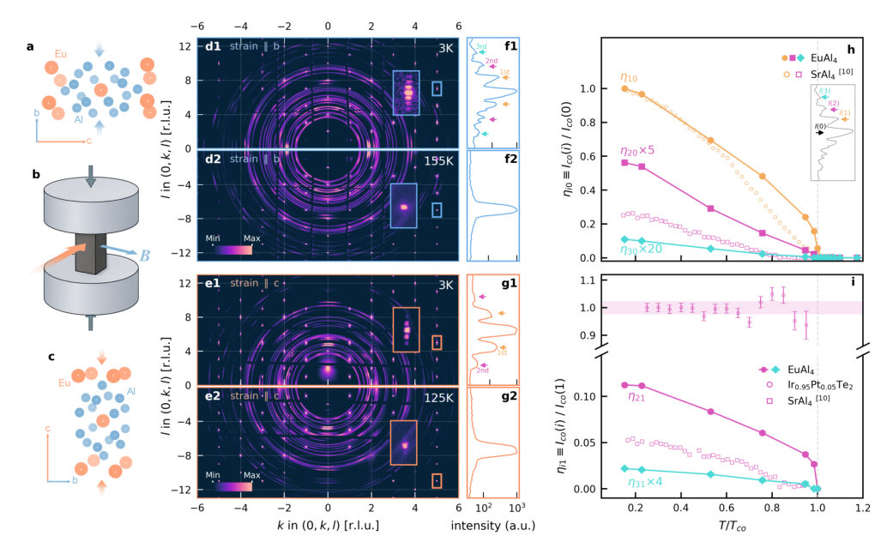
<figcaption class="paper-figure-caption"><b>Fig 1.</b> FIG. 1. Charge ordering in EuAl4. (a, c) Sketch of the EuAl4 crystal structure and the vertical applied uniaxial pressure from the strain cell shown in (b). Orange arrow depicts the in-coming beam, with horizontal magnetic field B (blue arrow) perpendicular to it. (d1, d2, e1, e2) Reconstructed X-ray diffraction intensity within the (0, k, ℓ) plane at indicated temperatures, with crystal orientation and applied pressure depicted in (a, c) respectively. The insets display the raw diffraction data zoomed in around fundamental Bragg reflections at indicated regions. Charge order manifests through incommensurate reflections along the reciprocal c-axis direction. (f1, f2, g1, g2) Line profiles...</figcaption>
</figure>
<figure class="paper-figure-card">
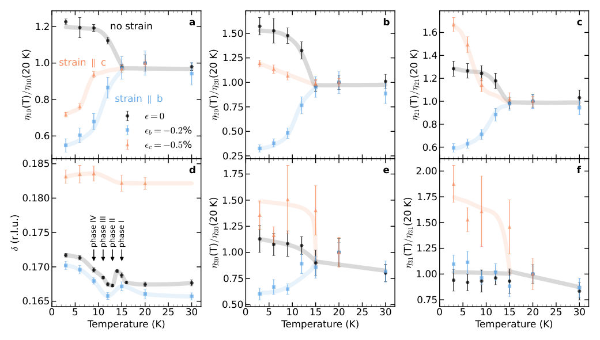
<figcaption class="paper-figure-caption"><b>Fig 2.</b> FIG. 2. Charge localization inside the magnetic phases of EuAl4. (a-c,e,f) Temperature dependence of η10, η20, η30, η21 and η31 for strains (see method section) as indicated, normalized to their respective values at 20 K in the normal state. An increase (decrease) in η21 and η31 corresponds to stronger (weaker) charge localization. (d) Charge incommensurability, in reciprocal lattice units (r.l.u.), as a function of temperature for the applied strain as indicated in (a). The arrows show the temperatures where the system enters specific magnetic phases (see main text for description). Solid lines are guides to the eye. Error bars denote the standard error of the mean (SEM) extracted from...</figcaption>
</figure>
<figure class="paper-figure-card">
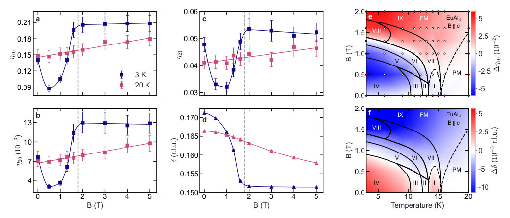
<figcaption class="paper-figure-caption"><b>Fig 3.</b> FIG. 3. Coupling of spin and charge order under magnetic field. (a-c) Magnetic field (B ∥c) dependence of the charge localization parameter η10, η20 and η21 at representative temperatures of 3 K and 20 K. (d) Field evolution of the charge order incommensurability δ for temperatures as indicated. Error bars in (a-d) represent the standard error of the mean. The vertical dashed line marks the onset of the ferromagnetic ground state. (e,f) display the charge ordering η10 and the charge incommensurability δ normalized at 20 K and 0 T, across the temperature-field parameter space, respectively. The false-color profiles are obtained from linear interpolation of a discrete data grid indicated by...</figcaption>
</figure>

**Summary.** This work comprehensively studies the interplay between charge localization and complex magnetic orders in EuAl4 using high-energy X-ray diffraction. By applying uniaxial strain and magnetic fields, the researchers demonstrated that this coupling is highly sensitive to the symmetry of the applied stress. The findings reveal a new route for controlling electronic states by manipulating the underlying spin structure.

**Why it may be interesting.** The direct tunability of charge/spin coupling via mechanical strain provides an experimental playground to study emergent quantum phases, which is relevant for understanding correlated electron physics in novel materials.

Detailed structure

**Main problem.** The study investigates how charge localization couples to complex magnetic orders, such as skyrmion lattices or chiral spin structures, in the material EuAl4.

**Main result.** The coupling between spin and charge order is highly tunable by external stimuli; uniaxial strain along the charge-order propagation direction enhances localization, while perpendicular strain weakens it.

**Method.** High-energy X-ray diffraction (XRD) measurements were performed under applied magnetic fields and controlled uniaxial pressures to probe structural changes related to electronic ordering.

**Model / system.** The physical system is the compound EuAl4, which exhibits both charge density wave (CDW) behavior and rich sequences of antiferromagnetic spin structures. The analysis focuses on quantifying the degree of charge localization through harmonic satellite reflections.

**Key observables.** Charge localization parameters ($\eta_{21}, \eta_{31}$), charge incommensurability ($\delta$), and structural Bragg peak shifts used to quantify strain.

**Important parameters / regimes.** Applied uniaxial pressure (along/perpendicular to CDW propagation) and external magnetic field strength ($B$).

**Assumptions / limitations.** The coupling mechanism is assumed to be rooted in degrees of freedom residing on the same Eu site, suggesting it goes beyond conventional electron-phonon coupling.

**Figures summary.** Figures illustrate temperature dependence of charge ordering harmonics ($\eta_{i0}$) under varying strain and magnetic fields, demonstrating how external parameters modulate the spin-charge coupling strength.

**Paper structure.** The paper establishes the experimental methodology using XRD to measure structural changes (strain) and electronic order (CDW satellites). It then systematically explores the interplay by measuring charge localization as a function of temperature, uniaxial strain, and magnetic field, concluding with implications for designing symmetry-breaking states.

Abstract

Charge localization is particularly interesting when coupled to antiferromagnetic spin structures. Coupled spin-charge orders are well established in elemental chromium and correlated oxide superconductors, yet the interplay between charge order and more complex magnetic textures -- such as skyrmion lattices and chiral spin structures -- remains largely unexplored. Here we report a comprehensive study of how charge localization couples to the unusually rich sequence of magnetic phases in EuAl$_4$. Using x-ray diffraction under applied magnetic field and uniaxial pressure, we demonstrate a direct coupling between the charge and spin order parameters. In the absence of external stimuli, charge localization is markedly enhanced upon entering the magnetically ordered phases. Strikingly, this effect is highly susceptible to strain: uniaxial pressure applied along the charge-order propagation direction further enhances localization, whereas pressure applied perpendicular to it weakens it. Application of magnetic field reveals both competitive and possible collaborative interactions between spin and charge ordering.This flexible coupling between spin and charge ordering opens a new route to designing symmetry-breaking states. Chiral charge order may for example be patterned from spin structures with that symmetry.

[↑ back to top](#top)

### [Analysis of polarization drift of optical signals over deployed aerial-inground fiber connections](http://arxiv.org/abs/2607.07629v1)

**Authors:** Aneesh Ramaswamy, Nageswara S. V. Rao, Joseph C. Chapman, Muneer Alshowkan  
**Type:** both · **Category:** quantum information and computing · **PDF:** <https://arxiv.org/pdf/2607.07629v1>  
**Analysis basis:** full PDF text, analyzed in chunks
**Topic relevance:** `entanglement & information structure` **1/5** · `interference shaping light` **1/5** · `quantum optics experiment` **1/5**

↔ Scroll figures horizontally

<figure class="paper-figure-card">
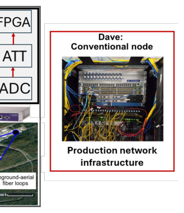
<figcaption class="paper-figure-caption"><b>Fig 1.</b> Fig. 1. Polarized signal measurement and data collection setup (Top left inset). Map of the ORNL fiber infrastructure (bottom inset) that the laser traverses. The setup is housed in the server node Dave and the FPGA is connected to a Linux host. Blue lines: communication channels carrying the laser. Red lines: analog signals. Dotted lines: digital signals. CW: continuous-wave laser. AMP: amplifier. PBS: Fiber polarization beam splitter. PM: optical power meter. ADC: analog-to-digital converter. ATT: electrical attenuator.</figcaption>
</figure>
<figure class="paper-figure-card">
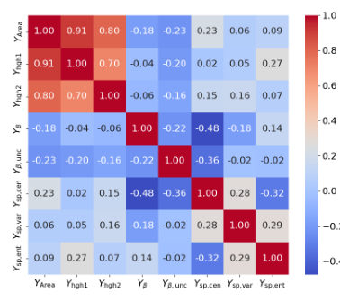
<figcaption class="paper-figure-caption"><b>Fig 2.</b> Fig. 2. Seasonal trends of polarization drift FFT variables 𝑌shown using calculations of Pearson’s correlation.</figcaption>
</figure>
<figure class="paper-figure-card">
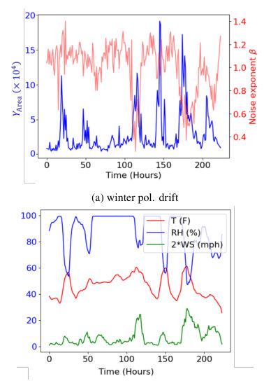
<figcaption class="paper-figure-caption"><b>Fig 3.</b> Fig. 3. A week of polarization drift in winter (a) and summer (b) showing the FFT spectral height 𝑌Area and the beta-coefficient 𝛽. Corresponding weather measurements (𝑋= 𝑇, 𝐻, 𝑊) are also shown for winter (c) and summer (d).</figcaption>
</figure>
<figure class="paper-figure-card">
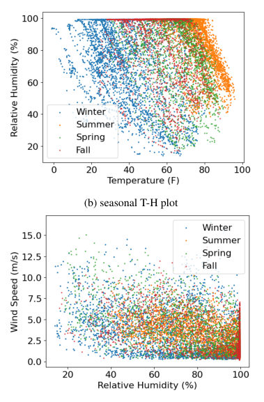
<figcaption class="paper-figure-caption"><b>Fig 4.</b> Fig. 4. (a) Log plot of the exponentially weighted means of temperature, relative humidity, and wind speed measurements from 12/18/24 to 11/20/2025. (b-d) Weather feature space plots for different seasons.</figcaption>
</figure>
<figure class="paper-figure-card">
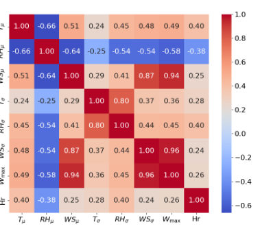
<figcaption class="paper-figure-caption"><b>Fig 5.</b> Fig. 5. Seasonal trends of weather variables 𝑋∈{𝑇𝑟, 𝐻𝑟, 𝑊𝑟, Hr} shown using calculations of Pearson’s correlation.</figcaption>
</figure>

**Summary.** This research analyzes polarization drift in long-haul optical fibers by correlating high-resolution spectral features extracted from 1550-nm signals with environmental data like temperature and humidity. By combining extensive field measurements, machine learning regression, and advanced theoretical modeling of birefringence accumulation, the authors provide a robust framework for predicting link degradation, which is critical for deploying quantum communication networks.

**Why it may be interesting.** This work directly addresses the practical limitations of deploying quantum communication networks over real-world infrastructure by quantifying and predicting environmental noise sources affecting polarization states. The combination of advanced signal processing (FFT features) with rigorous fiber optics theory is highly relevant to open quantum systems in noisy environments.

Detailed structure

**Main problem.** The primary challenge addressed is polarization drift of optical signals over deployed aerial-inground fiber connections, which severely degrades the performance and fidelity of quantum communication links.

**Main result.** The study established strong diurnal and seasonal correlations between measurable spectral features (like spectral area) and environmental factors ($T$, $H$, $W$), providing a framework for weather-aware prediction of polarization drift. The theoretical work also provided explicit mathematical tools using BCH formulas to model drift accumulation across fiber segments.

**Method.** The approach combines extensive field measurements analyzed via Fast-Fourier Transform (FFT) feature extraction with advanced statistical modeling, including Random Forest regression and Principal Component Analysis (PCA), alongside rigorous theoretical derivations using stochastic differential equations and the Magnus expansion.

**Model / system.** The system is a 15-km hybrid aerial-inground fiber connection transmitting a classical 1550-nm signal used to characterize quantum link quality. The underlying physics models polarization drift as unitary rotations governed by birefringence ($\zeta_t$), which depends on temperature and mechanical stress.

**Key observables.** Spectral area, spectral centroid, spectral variance, spectral entropy, $eta$-exponent of the power spectrum, entanglement throughput, and fidelity.

**Important parameters / regimes.** Temperature ($T$), relative humidity ($H$), wind speed ($W$), 15-km link length, and measurement time scales (diurnal/seasonal variations).

**Assumptions / limitations.** Assumptions include negligible Polarization Dependent Loss (PDL) and the use of stochastic treatments to manage multi-segment complexity in the theoretical modeling.

**Figures summary.** Figures illustrate the measurement setup, seasonal trends of polarization drift FFT variables correlated with environment, and residual plots showing multiplicative bias in spectral area estimation.

**Paper structure.** The paper progresses from empirical data analysis (measuring spectral features vs. weather) to developing a complex theoretical model for birefringence accumulation across fiber segments using rotation operators, culminating in a predictive framework for quantum link state estimation.

Abstract

Polarization measurements of a classical 1550-nm signal are collected and analyzed on 15-km hybrid aerial-inground fiber connections over 11 months. The spectral area and spectral moments9 of mHz-resolution Fast-Fourier-Transform (FFT) of these measurements are extracted, and related to temperature, humidity, wind speed, and time of day. Spectral area correlations show a strong11 diurnal structure: daytime maxima align with temperatures/wind speed peaks and humidity dips, with lower levels during the night. These diurnal patterns also show seasonality, with higher13 mean and variance in summer than winter. A random forest regressor is used to estimate FFT features from environmental measurements, informed by a theoretical model

[↑ back to top](#top)

### [Bayesian Learning of Distance Metrics Beyond RMSD for Biomolecule Alignment, Clustering, and Domain Identification](http://arxiv.org/abs/2607.07352v1)

**Authors:** Saumyak Mukherjee, Gerhard Hummer  
**Type:** theory · **Category:** statistical mechanics · **PDF:** <https://arxiv.org/pdf/2607.07352v1>  
**Analysis basis:** full PDF text, analyzed in chunks
**Topic relevance:** `Keldysh / 2PI / non-Gaussian methods` **1/5** · `driven-dissipative phase transition` **1/5** · `methods for driven-dissipative` **1/5**

↔ Scroll figures horizontally

<figure class="paper-figure-card">
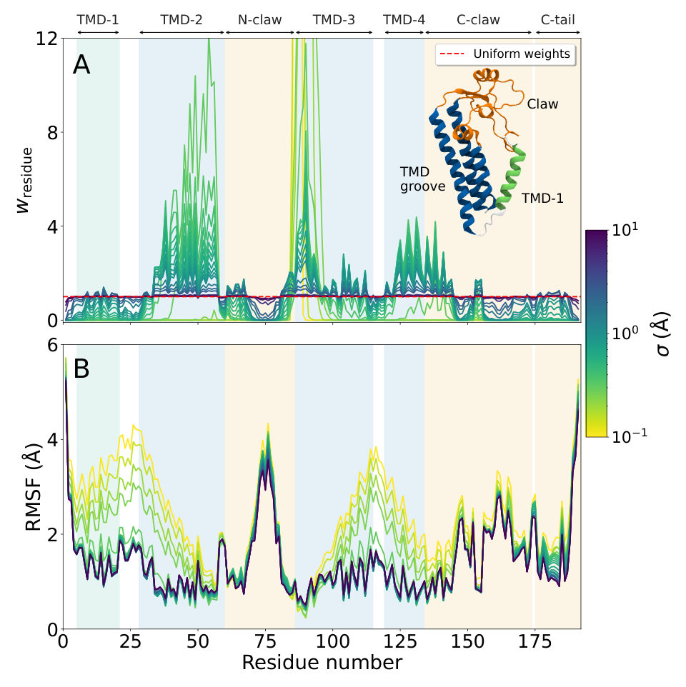
<figcaption class="paper-figure-caption"><b>Fig 1.</b> Figure 1: The σ sweep for SND3 structural alignment is shown in two panels. (A) Per- residue weight wresidue (mean atom weight of a residue, scaled so a uniform weight equals one) as a function of residue number for σ = 0.1–10.0 ˚A, colored by σ (colorbar). Do- main shading indicates TMD-1 (green), TMD-2/TMD-3/TMD-4 (blue, TM groove), and N-claw/C-claw/C-tail (orange). The SND3 structure (PDB: 9I78), colored according to the domains, is shown as an inset. As σ decreases, weight concentrates progressively in the TM groove. (B) Per-residue RMSF for the same σ values. The profile is independent of σ (other than at very low σ, due to over-regularization), confirming that the weight...</figcaption>
</figure>
<figure class="paper-figure-card">
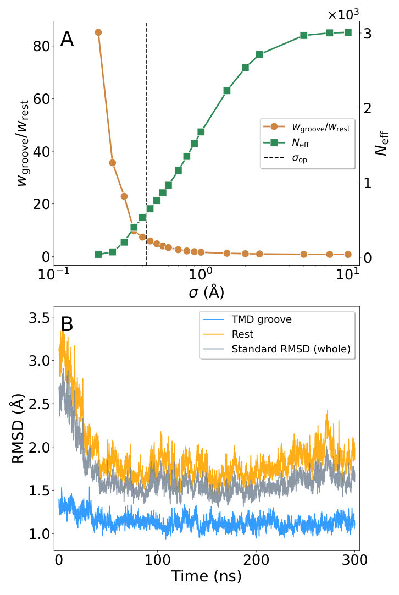
<figcaption class="paper-figure-caption"><b>Fig 2.</b> Figure 2: Optimal σ selection and alignment quality are shown in two panels. (A) Weight ratio wgroove/wrest (red, left axis) and effective atom count neff (green, right axis) are plotted versus σ (log scale). At σop = 0.43 ˚A (dashed line), the ratio is 6.5 and neff = 604. (B) RMSD time series over the 300 ns trajectory for the TM groove (blue), the non-groove region (orange), and overall standard RMSD (gray). The groove RMSD is substantially lower and less variable than the others.</figcaption>
</figure>
<figure class="paper-figure-card">
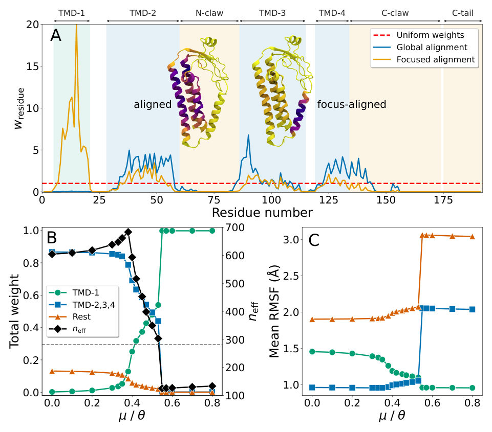
<figcaption class="paper-figure-caption"><b>Fig 3.</b> Figure 3: Results of focused alignment of SND3 onto TMD-1 are shown in three panels. (A) Per-residue weights are plotted against residue numbers. Global alignment at σop = 0.43 ˚A (blue) and focused alignment at (µ/θ)op = 0.53 (orange) are shown simultaneously along with the uniform baseline (red dashed line). The average structures from each alignment are colored by the weights on each atom, with darker shades denoting higher weights. (B) Total weight fractions on TMD-1 (green), TM groove (blue), and the rest (orange) are plotted as functions of µ/θ. The effective atom count neff (black, right axis) and the TMD-1 size |D| = 281 (dashed) are overlaid. (C) Mean RMSF of each segment from the...</figcaption>
</figure>
<figure class="paper-figure-card">
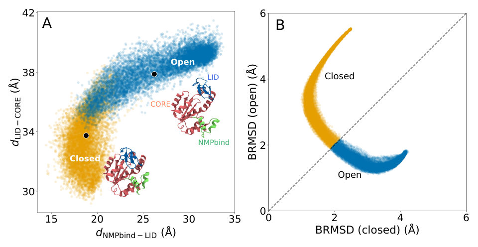
<figcaption class="paper-figure-caption"><b>Fig 4.</b> Figure 4: Conformational clustering of the 19,691-frame ADK DIMS ensemble (K = 2, τop = 5.0 ˚A2, σ = 4.0 ˚A). (A) Each frame placed by its order parameters dNMPbind−LID and dLID−CORE, colored by hard cluster assignment: orange (closed) and blue (open). Black circles mark the two cluster centers, shown colored by domain (CORE red, LID blue, NMPbind green). (B) The same frames placed by their weighted BRMSD to the closed center (abscissa) and to the open center (ordinate), each computed with that cluster’s own weight vector. The dashed line marks equal BRMSD from both clusters.</figcaption>
</figure>
<figure class="paper-figure-card">
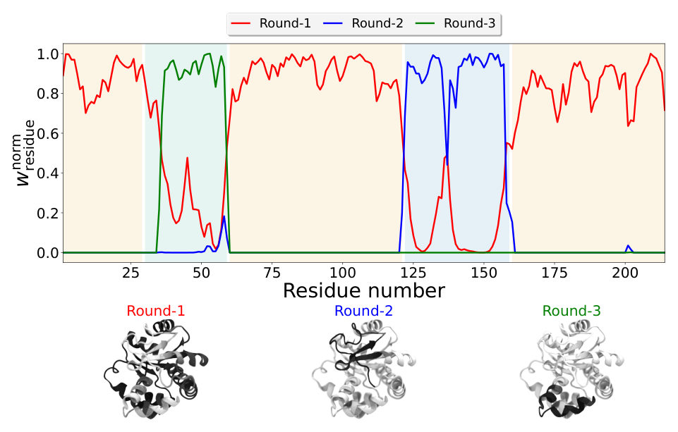
<figcaption class="paper-figure-caption"><b>Fig 5.</b> Figure 5: Rigid domain identification for ADK by sequential peeling on 28,282 FRODA backbone frames (856 atoms, σop = 3.0 ˚A). The per-residue weight profiles wnorm residue (mean atom weight of a residue, normalized within each round to its maximum) for the three peeling steps are overlaid: Round-1 (red, CORE), Round-2 (blue, LID), and Round-3 (green, NMPbind), with domain shading. The corresponding average structures, colored by weight, are shown below. Domains are detected in order of decreasing global rigidity.</figcaption>
</figure>

**Summary.** This paper develops the Bayes-optimal RMSD (BRMSD) metric to overcome the limitations of standard structural comparison metrics for biomolecules. By optimizing per-atom weights using a Bayesian framework, BRMSD effectively down-weights highly flexible regions and concentrates analysis power on the stable, rigid functional core of proteins. This provides robust tools for alignment, clustering, and domain identification in molecular dynamics simulations.

**Why it may be interesting.** While primarily applied to biophysics, the underlying mathematical machinery—optimizing weights based on local fluctuation statistics via free energy minimization and entropy regularization—shares conceptual links with statistical mechanics approaches used in analyzing complex many-body systems or disordered materials.

Detailed structure

**Main problem.** Standard RMSD fails for biomolecules because it weights all atoms equally, allowing flexible regions to dominate the metric while ignoring rigid functional cores.

**Main result.** The proposed Bayes-optimal RMSD (BRMSD) significantly reduces structural deviation metrics compared to standard RMSD on benchmark systems like SND3. It successfully identifies and focuses analysis on the stable, rigid core of proteins.

**Method.** The authors introduce a Bayesian framework that optimizes per-atom weights by maximizing a posterior derived from minimizing an effective free energy functional combining Mean-Square Deviation (MSD) and relative entropy regularization.

**Model / system.** The methods are applied to biomolecules studied via Molecular Dynamics (MD) simulations, specifically benchmarking on the SND3 translocon protein and adenylate kinase. The framework is designed for structural alignment, clustering, and domain identification within these systems.

**Key observables.** BRMSD value, per-atom weights ($w_\alpha$), cluster responsibilities ($q(a|i)$), and the Calinski–Harabasz (CH) index for clustering quality.

**Important parameters / regimes.** The position-fluctuation parameter $\sigma$ controls the weight suppression threshold; parameters like $\mu/	heta$ control domain focusing strength, and window size $W_{op}$ is used for trajectory smoothing.

**Assumptions / limitations.** Minimizing the free energy functional $G$ may only yield a local minimum, necessitating multiple random restarts. The method assumes that weight optimization can effectively separate rigid core contributions from flexible noise.

**Figures summary.** Figures show BRMSD significantly lower than standard RMSD over time; they also illustrate the anticorrelation between high-RMSF residues and low optimized weights, confirming domain identification via weight concentration.

**Paper structure.** The paper introduces the BRMSD framework by defining the free energy functional $G$. It then details specialized modules for focused alignment (adding a concentration penalty), trajectory smoothing (using windowed sums), soft K-means clustering (introducing responsibilities), and rigid domain identification (via sequential peeling).

Abstract

Root-mean-square deviation (RMSD) is the standard metric of structural comparison in molecular dynamics (MD) simulations. In its conventional form, RMSD assigns equal weight to all atoms regardless of mobility. Hence, flexible loops and disordered regions can dominate a global RMSD, while the rigid functional core contributes negligibly to the overall metric. To address this issue, we introduce the Bayes-optimal RMSD (BRMSD), which optimizes per-atom weights jointly with structural averages by maximizing a Bayesian posterior. In a trade-off between low RMSD and weight uniformity, a position-fluctuation parameter $σ$ controls the transition from classical RMSD ($σ\to \infty$) to a progressive focus on a rigid core ($σ\to 0$). The BRMSD framework supports analysis modules for structural alignment, focused alignment onto a user-specified domain, trajectory smoothing, soft $K$-means conformational clustering, and rigid-domain identification. These modules are implemented in the open-source Python package BRMSD (https://github.com/bio-phys/BRMSD) and benchmarked on two MD systems, the endoplasmic reticulum translocon-associated protein SND3 and the phosphotransferase adenylate kinase.

[↑ back to top](#top)

### [Magnetocaloric properties of centered molecular quantum spin systems](http://arxiv.org/abs/2607.07307v1)

**Authors:** H. Meel, J. Schnack  
**Type:** theory · **Category:** other · **PDF:** <https://arxiv.org/pdf/2607.07307v1>  
**Analysis basis:** full PDF text, analyzed in chunks
**Topic relevance:** `analog quantum simulation` **1/5** · `exotic spin models in light-matter` **1/5** · `spintronics-quantum-optics interface` **1/5**

↔ Scroll figures horizontally

<figure class="paper-figure-card">
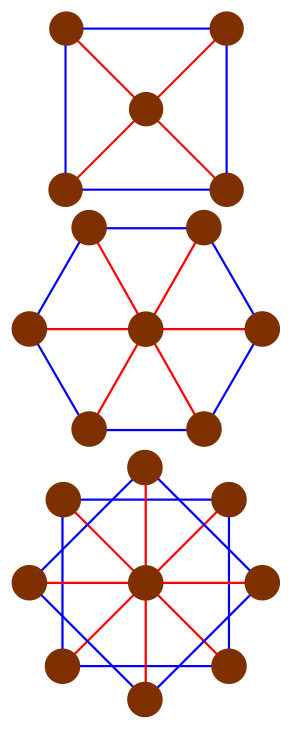
<figcaption class="paper-figure-caption"><b>Fig 1.</b> Figure 1. Investigated molecular structures: centered square, centered hexagon, centered double pyramid. Spins interact via two Heisenberg exchange interactions: J1 (blue) on the squares and the hexagon, J2 (red) center spin with all other spins.</figcaption>
</figure>
<figure class="paper-figure-card">
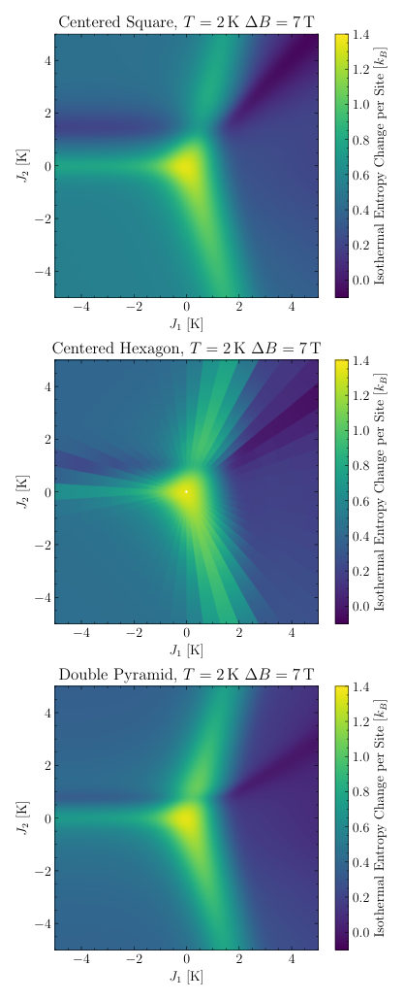
<figcaption class="paper-figure-caption"><b>Fig 2.</b> Figure 3. Isothermal entropy change per site when going from B = 7 T to B = 0 at a temperature of 2 K for all three topologies. Each site has spin 3/2.</figcaption>
</figure>
<figure class="paper-figure-card">
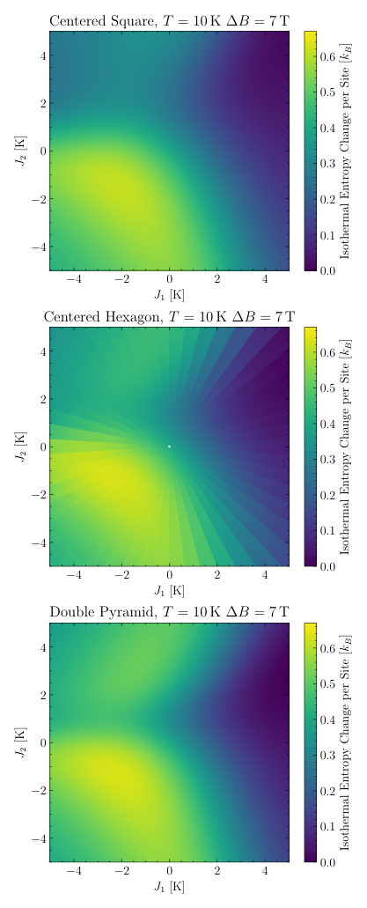
<figcaption class="paper-figure-caption"><b>Fig 3.</b> Figure 2. Isothermal entropy change per site when going from B = 7 T to B = 0 at a temperature of 10 K for all three topologies. Each site has spin 3/2.</figcaption>
</figure>
<figure class="paper-figure-card">

<figcaption class="paper-figure-caption"><b>Fig 4.</b> Figure 4. Isentropes of the double pyramid with spins 3/2 and J1 = 3.5 K and J2 = 2 K. The point (J1, J2) lies on the negative band of Fig. 3.</figcaption>
</figure>
<figure class="paper-figure-card">
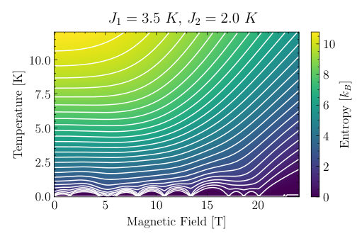
<figcaption class="paper-figure-caption"><b>Fig 5.</b> Fig. 4. Level crossings induce “hilly” isentropes for low entropy (and hence low temperature). Around 2 K, this results in the isentropes being “pulled down” and hence the negative entropy change. Notice also that the ab- solute value of the change is small because in the range 2 K ≲T ≲5 K and B ≲10 T the isentropes are remark- ably flat. The yellow bands of Fig. 3 can also be explained by looking at isentropes. Fig. 5 shows the isentropes for the three yellow bands for the example of the double- pyramid. The isentropes crossing the neighborhood of B = 7 T, T = 2 K are close to those of a paramagnet, i.e. straight lines passing through the origin, which explains why they behave similarly to...</figcaption>
</figure>

**Summary.** This paper theoretically examines how centered molecular quantum spin systems behave magnetocalorically by modeling them with a Heisenberg exchange Hamiltonian. The authors calculate key metrics like entropy change and achievable cold temperatures across different coupling regimes. The findings suggest that while ferromagnetic interactions are generally favorable, the system's magnetic structure dictates its potential for use in advanced cooling technologies.

**Why it may be interesting.** This work directly addresses quantum magnetism and thermal response in molecular materials, which is highly relevant to understanding energy storage and cooling mechanisms at the nanoscale, bridging condensed matter theory with potential applications in AMO physics.

Detailed structure

**Main problem.** The study investigates the magnetocaloric properties of various centered molecular quantum spin systems.

**Main result.** Ferromagnetic interactions are generally preferential for achieving large entropy changes, though sub-Kelvin cooling can be achieved under specific conditions by tuning exchange parameters and central spins.

**Method.** Theoretical calculations using the canonical ensemble to determine thermodynamic quantities like isothermal entropy change ($\Delta S$) and adiabatic demagnetization temperature ($T_{cold}$).

**Model / system.** The systems are centered magnetic molecules (square, hexagon, double pyramid) modeled by a Heisenberg exchange Hamiltonian involving two primary exchange parameters ($J_1$ and $J_2$). All sites are assumed to have spin 3/2.

**Key observables.** Isothermal entropy change ($\Delta S$), adiabatic temperature change, and the final cold temperature ($T_{cold}$) after demagnetization from a field of 7 T.

**Important parameters / regimes.** External magnetic field change ($\Delta B = 7 	ext{ T}$), temperatures studied (2 K to 10 K), and the ratio/sign of exchange parameters $J_1$ and $J_2$.

**Assumptions / limitations.** The analysis relies on calculating eigenvalues for specific topologies; limitations include restricting the search for maximum $\Delta S$ to a certain temperature range.

**Figures summary.** Figures illustrate isentropic curves, the dependence of $\Delta S_{max}$ on interaction parameters, and the resulting cold temperatures after demagnetization for different molecular geometries.

**Paper structure.** The paper systematically analyzes the magnetocaloric response across three distinct molecular topologies by varying the exchange coupling constants ($J_1, J_2$) within the Hamiltonian framework. It compares results across various temperature regimes to identify optimal conditions for magnetic refrigeration.

Abstract

We investigate the magnetocaloric properties of a class of centered magnetic molecules that are very similar in their magnetic properties. In particular, we study the magnetocaloric response of these molecules in the space of two exchange parameters and as function of the spin quantum numbers. Major figures of merit such as adiabatic temperature change and isothermal entropy change as well as theoretically achievable low temperatures show that overall ferromagnetic interactions are preferential as long as this does not lead to dipolar ordering.

[↑ back to top](#top)

### [Magnetotransport Properties of Iron-Based Ladder Compounds BaFe2S3 and BaFe2Se3 under High Pressure](http://arxiv.org/abs/2607.07326v1)

**Authors:** Takuya Aoyama, Kenya Ohgushi  
**Type:** both · **Category:** strongly correlated electrons · **PDF:** <https://arxiv.org/pdf/2607.07326v1>  
**Analysis basis:** full PDF text, analyzed in chunks
**Topic relevance:** `Kondo & dissipative impurity` **1/5** · `analog quantum simulation` **1/5** · `non-equilibrium dynamics` **1/5**

↔ Scroll figures horizontally

<figure class="paper-figure-card">
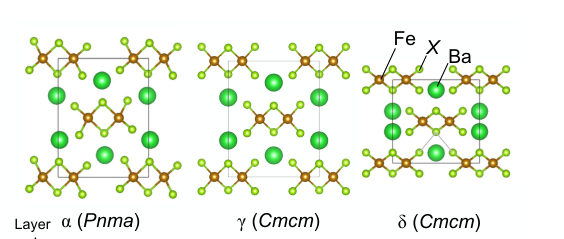
<figcaption class="paper-figure-caption"><b>Fig 1.</b> FIG. 1. (color online) Crystal structures of BaFe2X3 (X = S and Se) viewed from the leg direction. In the α struc- ture, the ladder is buckled layer by layer, resulting in the Pnma space group. The γ structure has the highest symme- try (Cmcm). In the δ structure, the layer direction is greatly compressed, without any symmetry breaking from the space group of Cmcm.</figcaption>
</figure>
<figure class="paper-figure-card">
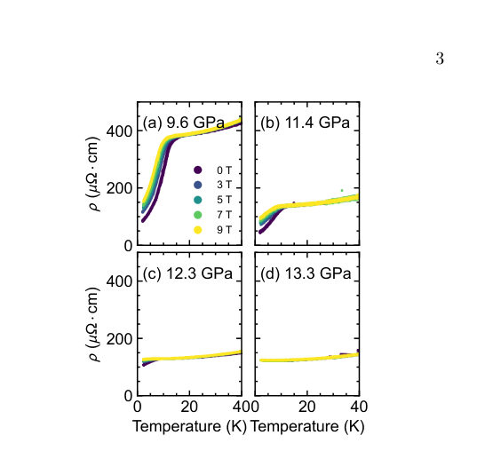
<figcaption class="paper-figure-caption"><b>Fig 2.</b> FIG. 3. (color online) Temperature dependence of BaFe2S3 electrical resistivity (ρ) under several constant magnetic fields. (a)-(d) Electrical resistivity ρ measured at (a) 9.6 GPa, (b) 11.4 GPa, (c) 12.3 GPa, and (d) 13.3 GPa. Each panel displays data obtained under static magnetic fields up to 9 T applied perpendicular to the layer.</figcaption>
</figure>
<figure class="paper-figure-card">

<figcaption class="paper-figure-caption"><b>Fig 3.</b> FIG. 2. (color online) (a) Temperature dependence of BaFe2S3 electrical resistivity (ρ) under high pressures (log- scale). (b) Metallic temperature dependence of BaFe2S3 elec- trical resistivity above 9.6 GPa (linear scale). Solid lines are fits with the power law, ρ = ρ0 + AT n.</figcaption>
</figure>
<figure class="paper-figure-card">
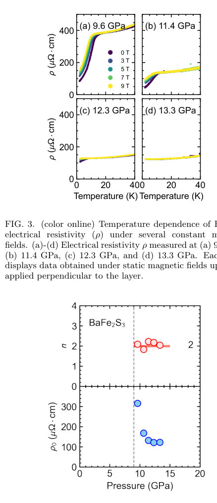
<figcaption class="paper-figure-caption"><b>Fig 4.</b> FIG. 4. (color online) Pressure dependence of n and ρ0, where n and ρ0 are the exponent of T for electrical resistivity and the residual resistivity in BaFe2S3. The vertical dotted line indicates the pressure of the insulator-metal transition.</figcaption>
</figure>
<figure class="paper-figure-card">
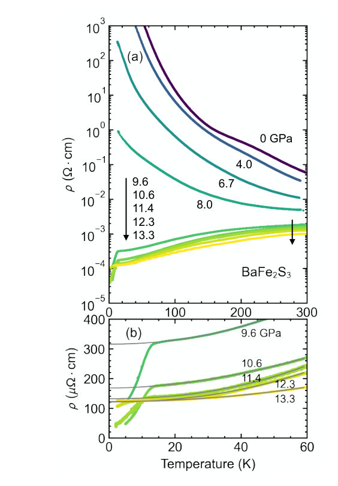
<figcaption class="paper-figure-caption"><b>Fig 5.</b> Figure 5 plots the magnetoresistance and the Hall re- sistivity in the metallic phase of BaFe2S3 at various pres- sures. The data were acquired in a transverse configura- tion with the current applied in the leg direction and the magnetic field applied along the layer direction (see inset of Fig.5(a)). Above 9.6 GPa, which shows the metal- lic temperature dependence in resistivity, the resistivity increased in proportion to the square of the applied mag- netic field, and its amplitude tended to increase at lower</figcaption>
</figure>

**Summary.** This work investigates how magnetotransport properties change in iron-based ladder compounds ($	ext{BaFe}_2	ext{X}_3$) when subjected to high pressure. By analyzing the temperature and field dependence of resistivity, the authors distinguish between Fermi-liquid behavior (in $	ext{BaFe}_2	ext{S}_3$) and non-Fermi-liquid behavior (in $	ext{BaFe}_2	ext{Se}_3$). The findings highlight how structural transitions can dramatically alter electronic transport near superconducting phases.

**Why it may be interesting.** The comparison between Fermi-liquid ($T^2$) and non-Fermi-liquid ($T^{3/2}$) scaling in relation to magnetic fluctuations is a canonical problem in strongly correlated electron physics, highly relevant to understanding unconventional superconductivity mechanisms.

Detailed structure

**Main problem.** The study investigates the magnetotransport properties of iron-based ladder compounds under high pressure, particularly focusing on their behavior near insulator-metal transitions.

**Main result.** BaFe2S3 exhibits Fermi-liquid-like behavior ($T^2$ resistivity) with normal magnetoresistance, while BaFe2Se3 shows non-Fermi-liquid characteristics ($T^{3/2}$ resistivity) and negative magnetoresistance, suggesting different underlying electronic states.

**Method.** The research combines electrical transport measurements (resistivity vs. T and B), magnetotransport analysis using the two-carrier model, and structural characterization via X-ray diffraction under high pressure.

**Model / system.** The physical system is iron-based ladder compounds ($	ext{BaFe}_2	ext{X}_3$, where $	ext{X}=	ext{S}$ or $	ext{Se}$). These materials are studied in the context of Mott insulating states and their evolution into metallic/superconducting phases under external pressure.

**Key observables.** Electrical resistivity ($
ho$) temperature dependence ($
ho \propto T^n$), magnetoresistance (MR), Hall resistivity ($
ho_{yx}$), and structural phase transitions ($\gamma 	o \delta$).

**Important parameters / regimes.** High pressures (up to 15 GPa), low temperatures, and magnetic fields.

**Assumptions / limitations.** The analysis relies on fitting resistivity data to power laws ($T^2$ vs $T^{3/2}$) to distinguish between Fermi-liquid and non-Fermi-liquid regimes; the two-carrier model is used for transport analysis.

**Figures summary.** Figures illustrate crystal structures, temperature dependence of resistivity under pressure for $	ext{BaFe}_2	ext{S}_3$, and general trends showing how resistivity changes with pressure and magnetic field.

**Paper structure.** The paper systematically compares the normal state transport properties of $	ext{BaFe}_2	ext{S}_3$ and $	ext{BaFe}_2	ext{Se}_3$. It analyzes temperature dependence to classify electronic behavior (FL vs NFL) and examines magnetotransport effects, linking these changes to pressure-induced structural transitions.

Abstract

The magnetotransport properties of the iron-based ladder compounds BaFe2S3 and BaFe2Se3 under various pressures were investigated. BaFe2S3 had a T^2 dependence in electrical resistivity and a normal magnetoresistance near an insulator-metal transition. Therefore, it had Fermi-liquid-like properties in the normal phase. However, BaFe2Se3 had a T^3/2 dependence in electrical resistivity and a negative magnetoresistance. This suggested that BaFe2Se3 had non-Fermi-liquid properties near the insulator-metal transition. For both materials, the Hall resistivities indicated a hole-dominant magnetic field dependence. During a pressure-induced insulator-metal transition, BaFe2Se3 had a rapid decrease in electrical resistivity above 15 GPa attributed to an isomorphic structural transition previously reported in X-ray diffraction experiments. This transition had a strong impact on the electronic properties.

[↑ back to top](#top)

### [Quantum Recurrence Plot Algorithm Based on Quantum Principal Component Analysis](http://arxiv.org/abs/2607.07056v1)

**Authors:** Hanhuai Zhu, Jingjing Huang, Zhi-Xi Wang, Shao-Ming Fei  
**Type:** theory · **Category:** quantum information and computing · **PDF:** <https://arxiv.org/pdf/2607.07056v1>  
**Analysis basis:** full PDF text, analyzed in chunks
**Topic relevance:** `entanglement & information structure` **1/5** · `methods for driven-dissipative` **1/5** · `non-equilibrium dynamics` **1/5**

↔ Scroll figures horizontally

<figure class="paper-figure-card">
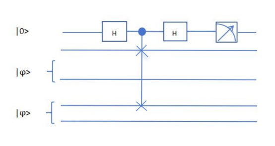
<figcaption class="paper-figure-caption"><b>Fig 1.</b> Figure 2 Quantum circuit diagram for computing the square of density operator using ST operator.</figcaption>
</figure>
<figure class="paper-figure-card">
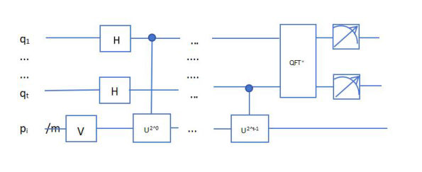
<figcaption class="paper-figure-caption"><b>Fig 2.</b> Figure 3 Quantum circuit diagram for computing eigenvalues of a density operator using quantum phase estimation.</figcaption>
</figure>
<figure class="paper-figure-card">
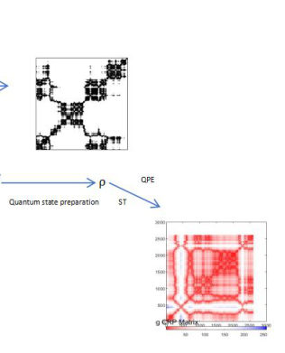
<figcaption class="paper-figure-caption"><b>Fig 3.</b> Figure 4 Algorithm flow of classical recurrence plots and quantum recurrence plots.</figcaption>
</figure>
<figure class="paper-figure-card">
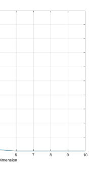
<figcaption class="paper-figure-caption"><b>Fig 4.</b> Figure 5 Embedding dimension analysis.</figcaption>
</figure>
<figure class="paper-figure-card">
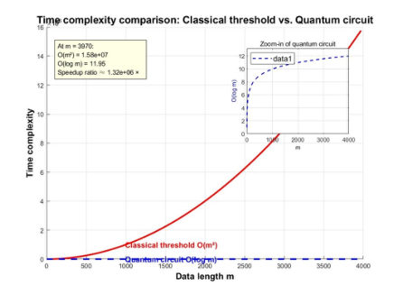
<figcaption class="paper-figure-caption"><b>Fig 5.</b> Figure 8 Time complexity comparison: Classical recurrence plot (O(m2)) vs. Quantum recurrence plot (O(logm))</figcaption>
</figure>

**Summary.** This work introduces a Quantum Recurrence Plot (QRP) algorithm that enhances the analysis of complex system periodicity and chaos. By replacing classical distance thresholding with quantum circuit calculations based on density matrices, QRP achieves superior diagnostic quality and theoretical computational efficiency compared to traditional methods. It shows how quantum computation can accelerate nonlinear time series analysis.

**Why it may be interesting.** It demonstrates a concrete application of quantum algorithms (QPE, QPCA) to analyze non-linear dynamics in classical physics problems, showing potential speedups over established numerical methods.

Detailed structure

**Main problem.** The paper aims to improve classical Recurrence Plot (RP) analysis, which characterizes complex system dynamics, by developing a Quantum Recurrence Plot (QRP) algorithm.

**Main result.** The QRP significantly outperforms classical RP by achieving better visualization (colored heatmaps), higher recurrence point density, and superior quantitative metrics like Determinism due to quantum circuit implementation.

**Method.** It integrates Quantum Principal Component Analysis (QPCA) with the Recurrence Plot framework, using quantum circuits (like Swap Test or QPE) to calculate necessary state correlations via density operators.

**Model / system.** The analysis is applied to complex dynamical systems represented by time series data reconstructed in a phase space using an embedding dimension. The core mathematical tool involves analyzing the covariance matrix through its associated density operator.

**Key observables.** Recurrence Rate (RR), Determinism (DET), Average Diagonal Length (L), Entropy (ENTR), and the structure of the recurrence plot itself.

**Important parameters / regimes.** Embedding dimension ($m$), time delay ($	au$), and the quantum circuit complexity scaling ($	ext{O}(\log m)$ vs $	ext{O}(m^2)$).

**Assumptions / limitations.** The speedup relies on ideal quantum hardware with sufficient coherence times; preprocessing steps like determining embedding dimension remain classical.

**Figures summary.** Figures compare structural patterns (mutation vs. periodic) and quantitative metrics (RQA) between the classical RP and the proposed QRP, alongside complexity comparisons.

**Paper structure.** The paper introduces the limitations of classical RPs, proposes using quantum methods via density operators derived from covariance matrices, details the implementation using quantum circuits for efficiency gains, and validates the improved diagnostics against real-world time series data.

Abstract

Recurrence Plot (RP) is a method employed to analyze the periodicity, chaoticity, and nonlinear characteristics of complex systems. Quantum Principal Component Analysis (QPCA), on the other hand, achieves dimensionality reduction of sample data using density matrices based on quantum circuits. We improve the distance threshold function of the recurrence plot algorithm using a density operator conceptually equivalent to the covariance matrix, integrate it with quantum circuits, and thereby develop a Quantum Recurrence Plot (QRP) algorithm. This algorithm achieves ultra-high efficiency in parallel computing, reduces computational costs, and simultaneously upgrades the traditional grayscale recurrence plot to colored heatmaps, enabling a better revelation of the system's dynamical characteristics.

[↑ back to top](#top)

### [Raman spectroscopic signature of Kitaev magnetism and complex spin-lattice coupling in S = 1/2 antiferromagnet SrLaCoNbO$_6$ double perovskite](http://arxiv.org/abs/2607.07630v1)

**Authors:** Ajay Kumar, Clemens Ulrich, Rajendra S. Dhaka  
**Type:** experiment · **Category:** strongly correlated electrons · **PDF:** <https://arxiv.org/pdf/2607.07630v1>  
**Analysis basis:** full PDF text, analyzed in chunks
**Topic relevance:** `analog quantum simulation` **1/5** · `exotic spin models in light-matter` **1/5** · `spintronics-quantum-optics interface` **1/5**

↔ Scroll figures horizontally

<figure class="paper-figure-card">
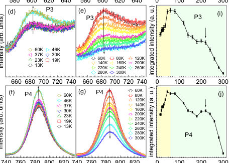
<figcaption class="paper-figure-caption"><b>Fig 1.</b> FIG. 1. (a) The Raman spectra of SrLaCoNbO6 measured between 13 and 300 K using the 514 nm line from an Ar-ion laser. Each spectrum is vertically offset for clarity. The solid black curves represent fits to the spectra in the 550–850 cm−1</figcaption>
</figure>
<figure class="paper-figure-card">
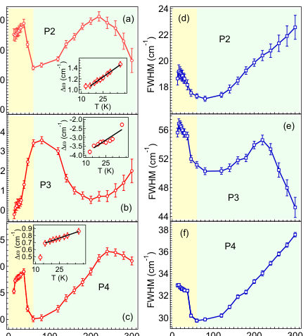
<figcaption class="paper-figure-caption"><b>Fig 2.</b> FIG. 2. Temperature dependence of the (a–c) phonon fre- quencies and (d–f) linewidths of modes P2–P4. The insets in (a–c) display the deviation of the mode frequency (∆ω) below ∼60 K. The solid black lines are guides to the eye.</figcaption>
</figure>
<figure class="paper-figure-card">
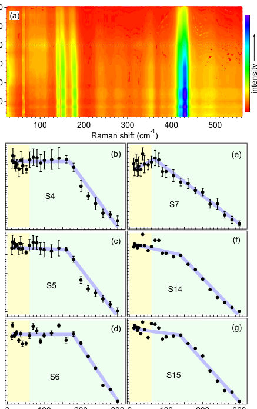
<figcaption class="paper-figure-caption"><b>Fig 3.</b> FIG. 3. (a) Contour plot of the Raman spectra of SrLaCoNbO6 recorded using the 633 nm laser line as the ex- citation source over the temperature range 12–300 K. The horizontal dashed line indicates a change in the intensity of the low-energy modes around 200 K. (b–g) Temperature de- pendence of the integrated intensities of the prominent modes. The blue lines are guides to the eye.</figcaption>
</figure>
<figure class="paper-figure-card">
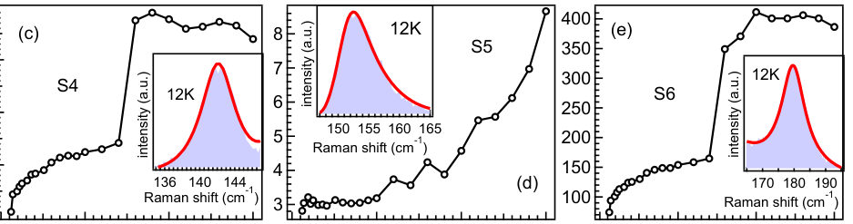
<figcaption class="paper-figure-caption"><b>Fig 4.</b> FIG. 4. Fits to the S4-S6 modes of the Raman spectrum at 12 K using the sum of (a) Voigt (b) Fano line shapes. (c–e) Temperature dependence of the Fano asymmetry parameter, q for the S4–S6 modes, respectively. The insets show individual Fano fits to the experimental data at 12 K.</figcaption>
</figure>
<figure class="paper-figure-card">
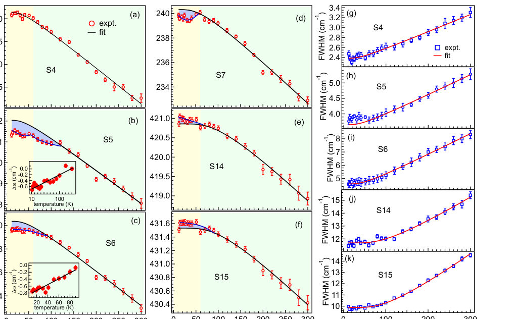
<figcaption class="paper-figure-caption"><b>Fig 5.</b> FIG. 5. (a–f) Temperature dependence of the phonon frequencies of modes S4–S7, S14, and S15, respectively. The solid black curves represent fits to the experimental data using the three-phonon anharmonic decay model [Eq. (2)], and the shaded blue regions highlight deviations from this model. The insets in (b) and (c) show the deviation from the anharmonic model (∆ω) in the low-temperature range; the black lines serve as guides to the eye. (g–k) Temperature dependence of the linewidth (FWHM) of these modes. The solid red curves represent fits using the anharmonic phonon decay model.</figcaption>
</figure>

**Summary.** This work uses Raman spectroscopy and EXAFS to probe spin-lattice coupling in the antiferromagnet $	ext{SrLaCoNbO}_6$. The key finding is that lattice vibrations show strong anomalies at temperatures well above the magnetic transition, suggesting that fluctuating magnetic moments interact intimately with the crystal structure. This provides experimental support for proximate Kitaev-like correlations in $3d$ transition metal oxides.

**Why it may be interesting.** The observation of lattice dynamics persisting and exhibiting strong anomalies far above the magnetic ordering temperature provides direct experimental evidence for fluctuating magnetic correlations influencing crystal structure, a key topic in quantum magnetism.

Detailed structure

**Main problem.** The study investigates the Raman spectroscopic signature of Kitaev magnetism and complex spin-lattice coupling mechanisms in an antiferromagnetic double perovskite.

**Main result.** Pronounced anomalies in lattice dynamics (phonon frequency, linewidth) are observed significantly above the long-range magnetic ordering temperature, suggesting strong coupling between fluctuating spins and the crystal lattice.

**Method.** The research employs a combination of temperature-dependent Raman spectroscopy and Co K-edge Extended X-ray Absorption Fine Structure (EXAFS).

**Model / system.** The system is $	ext{SrLaCoNbO}_6$, a B-site–ordered double perovskite hosting $S=1/2$ insulating antiferromagnet $	ext{Co}^{2+}$ ions. The analysis focuses on pseudo-spin-$	ilde{S}=1/2$ behavior relevant to Kitaev physics.

**Key observables.** Phonon frequency, linewidth, spectral weight anomalies; Fano asymmetry parameter ($q$); changes in bond distances and Debye-Waller factors (from EXAFS).

**Important parameters / regimes.** Anomalies are noted around 60 K and 160–180 K, both significantly above the long-range Néel temperature ($T_{
m N} \approx 15$ K).

**Assumptions / limitations.** The authors caution that a purely structural contribution cannot be definitively excluded when interpreting lattice renormalizations.

**Figures summary.** Figures illustrate the temperature dependence of various Raman modes' intensities and spectral parameters, showing distinct anomalies at multiple temperatures. EXAFS data confirm correlated changes in local structure near 60 K and 160 K.

**Paper structure.** The paper analyzes spectroscopic signatures across different temperature regimes: initial observations around 60 K show spin-lattice coupling; subsequent analysis of low-energy modes reveals Fano line shapes suggesting coupling to magnetic continua; finally, EXAFS confirms local structural distortions correlating with these thermal anomalies.

Abstract

We report a detailed analysis of temperature-dependent Raman spectroscopy and Co $K$-edge extended x-ray absorption fine structure (EXAFS) for a pseudospin-$\tilde{S}=1/2$ insulating antiferromagnet SrLaCoNbO$_6$, a B-site--ordered double perovskite hosting Co$^{2+}$ ($3d^7$) ions on an {\it f.c.c.} sublattice. Notably, pronounced anomalies in the phonon frequency, linewidth and spectral weight are observed around 60~K, well above the long-range antiferromagnetic transition at $T_{\rm N} \approx 15$~K. These renormalizations indicate a significant coupling between lattice and spin degrees of freedom, although a purely structural contribution cannot be excluded. Additional modifications of both high- and low-energy Raman modes are detected near 160-180 K, including changes in linewidth and intensity, variations of the Fano asymmetry parameter, and the emergence of an additional low-energy feature. The asymmetric Fano line shape of selected low-energy modes, together with a broad low-energy continuum and quasielastic response, suggests coupling between discrete phonons and fluctuating magnetic excitations. Moreover, the EXAFS analysis reveals correlated changes in bond distances and Debye-Waller factors around the Co ions near 60~K and 160~K, evidencing subtle local structural distortions and possible magnetostrictive effects. The persistence of anomalous lattice dynamics far above $T_{\rm N}$, combined with the excitation-energy--independent continuum, is consistent with fluctuating bond-directional interactions and proximate Kitaev-like correlations.

[↑ back to top](#top)

### [Surface-Reconstruction-Driven Insulating Behavior in Metallic Charge-Density-Wave 1T-TaSe$_{2}$](http://arxiv.org/abs/2607.06995v1)

**Authors:** Sung-Hoon Lee, Doohee Cho  
**Type:** theory · **Category:** strongly correlated electrons · **PDF:** <https://arxiv.org/pdf/2607.06995v1>  
**Analysis basis:** full PDF text, analyzed in chunks
**Topic relevance:** `Frenkel-Kontorova` **1/5** · `Keldysh / 2PI / non-Gaussian methods` **1/5** · `analog quantum simulation` **1/5**

↔ Scroll figures horizontally

<figure class="paper-figure-card">
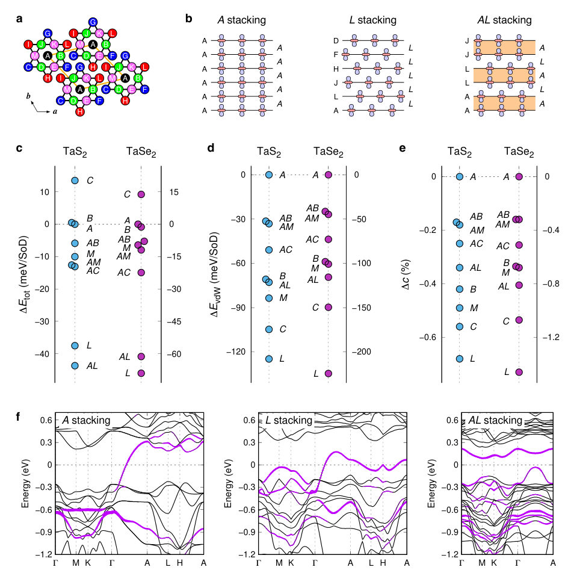
<figcaption class="paper-figure-caption"><b>Fig 1.</b> FIG. 1. CDW stacking order in bulk 1T-TaSe2. (a) Labeling convention for Ta atoms within a Star-</figcaption>
</figure>
<figure class="paper-figure-card">
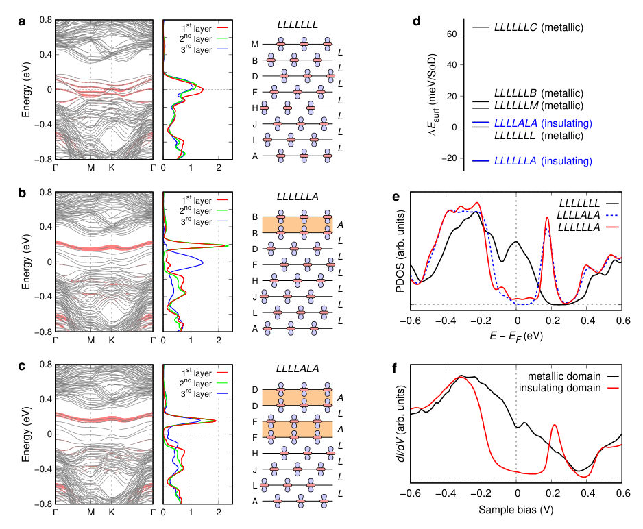
<figcaption class="paper-figure-caption"><b>Fig 2.</b> FIG. 2. Surface stacking–dependent electronic structures of 1T-TaSe2. (a–c) Left: Electronic band</figcaption>
</figure>
<figure class="paper-figure-card">
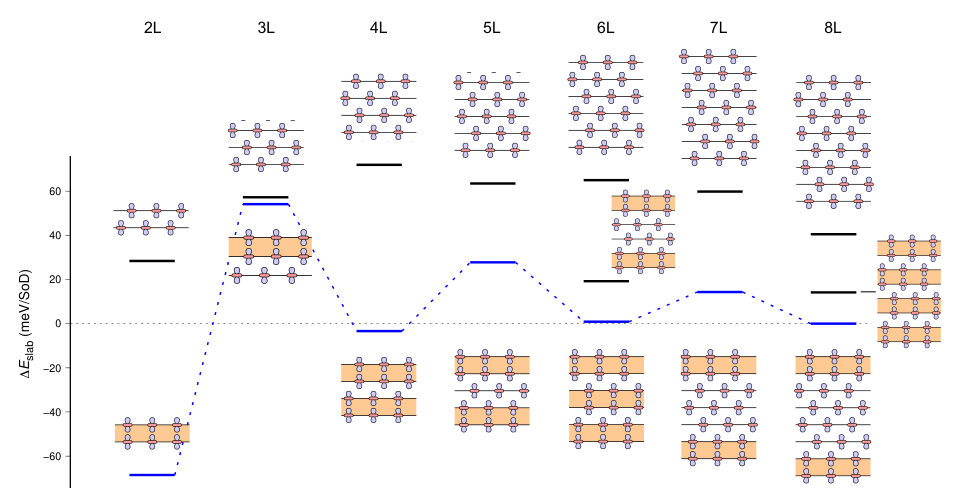
<figcaption class="paper-figure-caption"><b>Fig 3.</b> FIG. 3. Thickness-dependent energetics of 1T-TaSe2 slabs. Relative slab energies (∆Eslab, in</figcaption>
</figure>
<figure class="paper-figure-card">
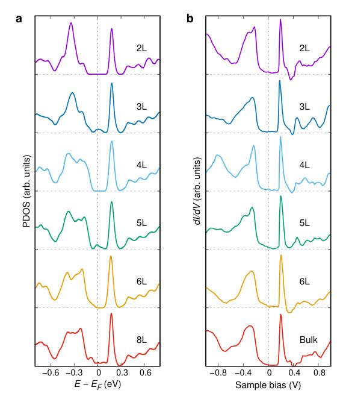
<figcaption class="paper-figure-caption"><b>Fig 4.</b> FIG. 4. Thickness-dependent surface electronic states of 1T-TaSe2 slabs. (a) Calculated PDOS of Ta dz2</figcaption>
</figure>

**Summary.** This theoretical study investigates the electronic structure of 1T-TaSe2, resolving whether its surface gap is due to electron correlations or structural effects. Using DFT calculations, the authors prove that the surface reconstructs into a bilayer structure which opens a band insulator gap via orbital hybridization. This finding establishes CDW reconstruction as the governing mechanism, rather than Mott physics.

**Why it may be interesting.** While focused on solid-state CDW physics, the clear distinction between correlation-driven (Mott) vs. structural/band-driven gaps provides a general framework for analyzing insulating states in strongly correlated materials relevant to quantum simulation platforms.

Detailed structure

**Main problem.** The study resolves the long-standing debate regarding the origin of an insulating surface gap observed on the metallic CDW material 1T-TaSe2.

**Main result.** The insulating state is not due to Mott physics, but rather arises from a structural reconstruction to an A-interface bilayer that opens a band insulator gap via interlayer hybridization.

**Method.** Density Functional Theory (DFT) calculations were employed to model the energetics and electronic structure of finite-thickness slabs.

**Model / system.** The system is the layered transition metal dichalcogenide 1T-TaSe2, modeled as varying slab thicknesses (2L to 8L) with different surface CDW stacking orders.

**Key observables.** Projected Density of States (PDOS), total energy differences ($\Delta E_{	ext{slab}}$), and comparison with Scanning Tunneling Spectroscopy (STS) spectra.

**Important parameters / regimes.** The gap magnitude ($\sim 0.4 	ext{ eV}$), the correlation parameter $U$ (where $U=0$ is favored for bulk/surface analysis), and slab thickness ($2	ext{L}$ to $8	ext{L}$).

**Assumptions / limitations.** The surface reconstruction is assumed to be driven by minimizing total energy, leading to an A-interface bilayer ground state.

**Figures summary.** Figures illustrate the energetic preference for the reconstructed A-interface bilayer over uniform L stacking across all thicknesses, and show PDOS calculations matching STS measurements for both insulating and metallic domains.

**Paper structure.** The paper systematically compares bulk (L stacking) vs. surface (A-interface reconstruction) electronic structures using DFT. It establishes the energetic stability of the reconstructed surface state and uses PDOS/STS comparisons to definitively rule out Mott physics in favor of a band insulator mechanism.

Abstract

Bulk 1T-TaSe$_2$ is metallic, yet its surface consistently exhibits an insulating gap -- a dichotomy long attributed to a surface Mott insulator driven by enhanced electron correlations. Here, using density functional theory calculations, we show that this insulating surface instead originates from a charge-density-wave (CDW) stacking reconstruction. Whereas the bulk stabilizes a single-layer CDW stacking that supports metallic transport, the surface energetically favors a bilayer stacking, in which interlayer hybridization of Ta $5d_{z^2}$ orbitals opens a $\sim$0.4 eV gap -- a band insulator requiring no on-site Coulomb repulsion. This reconstruction is the thermodynamic ground state for slab thicknesses from two to eight layers, and the calculated surface density of states quantitatively reproduces scanning tunneling spectra for both insulating and metallic domains. Our results establish CDW surface reconstruction, rather than Mott physics, as the mechanism governing the surface electronic structure of 1T-TaSe$_2$ and provide a unified explanation for the experimentally observed coexistence of metallic and insulating domains.

[↑ back to top](#top)

### [Absolute frequency measurement of the $^{176}$Lu$^+\,(^{3}\mathrm{D}_1)$ standard against the NRC-FCs2 fountain with $2.6\times10^{-16}$ uncertainty](http://arxiv.org/abs/2607.07044v1)

**Authors:** K. J. Arnold, Bin Jian, Zhao Zhang, Qi Zhao, Qin Qichen, N. Jayjong, M. D. K. Lee, Scott Beattie, M. D. Barrett  
**Type:** experiment · **Category:** other · **PDF:** <https://arxiv.org/pdf/2607.07044v1>  
**Analysis basis:** full PDF text, analyzed in chunks
**Topic relevance:** `QC/QI experiment` **1/5** · `quantum measurements` **1/5**

↔ Scroll figures horizontally

<figure class="paper-figure-card">
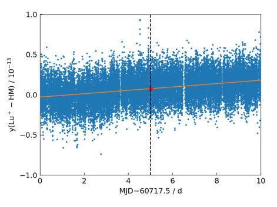
<figcaption class="paper-figure-caption"><b>Fig 1.</b> Figure 1. The fractional frequency offset between the Lu+</figcaption>
</figure>
<figure class="paper-figure-card">
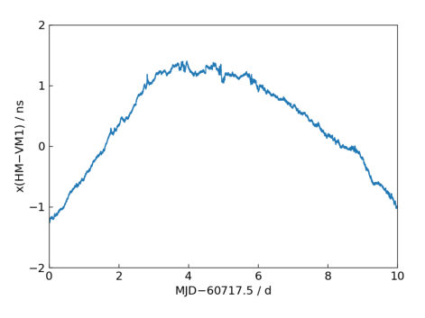
<figcaption class="paper-figure-caption"><b>Fig 2.</b> Figure 3. Phase difference of flywheel oscillator masers between the two labs. A constant linear fit (frequency offset) has been removed.</figcaption>
</figure>
<figure class="paper-figure-card">
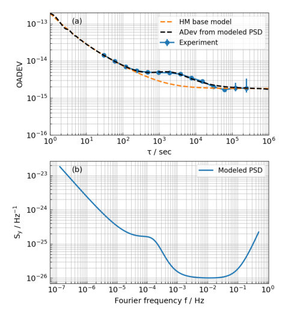
<figcaption class="paper-figure-caption"><b>Fig 3.</b> Figure 2. Noise model of the NUS HM as a flywheel oscillator for the Lu+ ion clock. (a) Allan deviation of the NUS HM showing the de-drifted frequency data (blue circles), base maser model (dashed orange line), and a modified noise model (dashed black line). (b) The single-sided PSD for the HM including a Lorentzian contribution accounting for the plateau in the Allan deviation.</figcaption>
</figure>
<figure class="paper-figure-card">
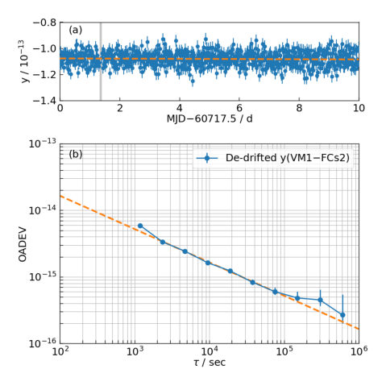
<figcaption class="paper-figure-caption"><b>Fig 4.</b> Figure 4. Frequency measurement of VM1 against NRC- FCs2. (a) Frequency offset between VM1 and NRC-FCs2, y(VM1 −FCs2). The systematic shifts of NRC-FCs2 have been corrected. The dashed line is a weighted linear fit to the data. The vertical gray line denotes the measurement downtime of 1.5 h due to scheduled maintenance. (b) Allan deviation of NRC- FCs2 as calculated from the data shown in (a), de-drifted. The first data point starts with τ0 of 1181 s as the duration of the high and low atomic densities for the fountain to extract the collisional cancellation frequency. The dashed line shows the modeled fountain instability of 1.65 × 10−13/√τ.</figcaption>
</figure>

**Summary.** The research reports an improved measurement of the $^{176}	ext{Lu}^+$ ion clock frequency by linking it to the NRC-FCs2 caesium fountain standard via GPS timing signals. The authors achieved an unprecedented fractional uncertainty of $2.6 	imes 10^{-16}$, confirming its high accuracy and reducing previous uncertainties significantly.

**Why it may be interesting.** This work represents state-of-the-art optical atomic clock metrology, pushing the limits of timekeeping accuracy by comparing two different types of primary standards (ion vs. fountain) over a global link.

Detailed structure

**Main problem.** To perform an improved absolute frequency measurement of the highly precise $^{176}	ext{Lu}^+ (3	ext{D}_1)$ optical clock standard by linking it to the established NRC-FCs2 caesium fountain primary frequency standard.

**Main result.** The authors determined the absolute frequency of the Lu$^+$ standard to be $353,638,794,073,800.33(9)	ext{ Hz}$, achieving a fractional uncertainty of $2.6 	imes 10^{-16}$. This significantly improves previous measurements by a factor of 3.6.

**Method.** The measurement utilized a remote link established via an ambiguity-resolved precise point positioning (PPP-AR) connection over GPS, comparing the ion clock to the caesium fountain standard over a 10-day period.

**Model / system.** The experiment involves two primary atomic clocks: a single $^{176}	ext{Lu}^+$ ion trapped in a Paul trap and the NRC-FCs2 caesium fountain. The comparison is mediated by GPS timing links connecting local hydrogen masers to both standards.

**Key observables.** Absolute frequency of $^{176}	ext{Lu}^+ (3	ext{D}_1)$, frequency difference $y(	ext{Lu}^+ - 	ext{FCs2})$, and the overall fractional uncertainty ($\sigma/f$).

**Important parameters / regimes.** Fractional uncertainty limit of $2.6 	imes 10^{-16}$; comparison against the CIPM recommended value; systematic uncertainties from gravitational redshift and clock stability.

**Assumptions / limitations.** The final measurement is limited by the instability of the NRC-FCs2 standard, which dominates the total systematic uncertainty budget.

**Figures summary.** Figures illustrate frequency offsets between various local oscillators (e.g., Lu$^+$ vs NUS HM) and noise models (Allan deviation), while tables detail the systematic uncertainty budget for the FCs2 standard.

**Paper structure.** The paper details the experimental setup, including the ion clock interrogation technique (Hyper-Ramsey spectroscopy) and the link establishment via GPS PPP-AR. It then presents a detailed analysis of systematic uncertainties from both clocks before reporting the final frequency comparison and absolute value.

Abstract

We report an improved absolute frequency measurement of the $^{176}$Lu$^+\,(^{3}\mathrm{D}_1)$ optical frequency standard, evaluated via a remote link to the NRC-FCs2 caesium fountain primary frequency standard. Operating a single ion clock with 94.2% uptime over 10 days, and using an ambiguity-resolved precise point positioning (PPP-AR) link over the Global Positioning System (GPS), we determine an absolute frequency of $353\,638\,794\,073\,800.33(9)\,$Hz at a fractional uncertainty of $2.6 \times 10^{-16}$. This agrees with our previous result, which underpins the CIPM recommended frequency value, and reduces the uncertainty by a factor of 3.6.

[↑ back to top](#top)

### [Analysis of the sample complexity for PAC-learning functions defined over quantum states](http://arxiv.org/abs/2607.07572v1)

**Authors:** Jordi Pérez-Guijarro  
**Type:** theory · **Category:** quantum information and computing · **PDF:** <https://arxiv.org/pdf/2607.07572v1>  
**Analysis basis:** full PDF text, analyzed in chunks
**Topic relevance:** `Keldysh / 2PI / non-Gaussian methods` **1/5** · `entanglement & information structure` **1/5**

↔ Scroll figures horizontally

<figure class="paper-figure-card">
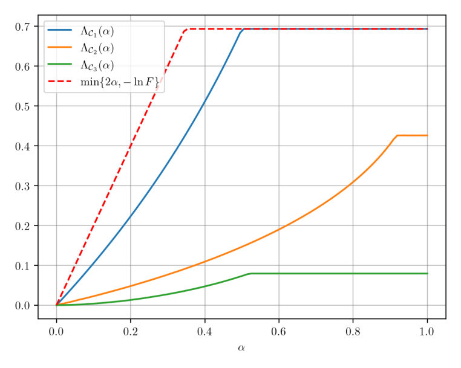
<figcaption class="paper-figure-caption"><b>Fig 1.</b> Figure 1: Plot of the function ΛC for the concept classes C1 = 2{|0⟩,|+⟩}, C2 = 2{|0⟩,|+⟩,|+y⟩}, and C3 = 2{|0⟩,|1⟩,|+⟩,|+y⟩}, along with the upper bound min{−ln F, 2α}. The code used to generate this figure is available at [22].</figcaption>
</figure>

**Summary.** This paper develops a theory to determine how many quantum examples are needed to reliably learn a function defined over quantum states. It proves that classical measures like VC-dimension fail in this setting, establishing new bounds dependent on state overlaps and linear independence. This advances the theoretical understanding of quantum machine learning complexity.

**Why it may be interesting.** This work provides fundamental theoretical tools for quantifying learnability when the input data is inherently quantum mechanical, which is crucial for developing robust quantum machine learning protocols.

Detailed structure

**Main problem.** The paper analyzes the sample complexity required for PAC-learning functions defined over quantum states, aiming to characterize this complexity beyond classical measures.

**Main result.** It demonstrates that the VC-dimension is insufficient to characterize the quantum sample complexity; instead, bounds involve parameters related to state overlaps and linear independence of the quantum states.

**Method.** The analysis involves deriving rigorous lower and upper bounds on the required number of samples using concepts like the quantum Chernoff distance and relating the problem to classical learning theory via auxiliary concepts.

**Model / system.** The model considers concept classes $C$ whose functions act on quantum states $|\psi
angle$ within a Hilbert space $\mathcal{H}$. Learning occurs from examples provided as pairs $(|\phi
angle, c(|\phi
angle))$.

**Key observables.** Sample complexity ($	ext{t}(\epsilon, \delta)$), VC-dimension ($d$), and the minimum eigenvalue of the state overlap matrix ($\lambda_{\min}(G)$).

**Important parameters / regimes.** The fidelity/overlap parameter $F = \sup |\langle\psi|\psi'
angle|^2$, and the error tolerance $\epsilon$ and confidence $\delta$.

**Assumptions / limitations.** A key result (Theorem 2) assumes that the quantum states $\{|\psi_i
angle\}$ are linearly independent.

**Figures summary.** Figure 1 illustrates how a complexity measure $\Lambda_C(\alpha)$ is bounded by constants related to state overlaps, showing its relationship to classical bounds.

**Paper structure.** The paper progresses from establishing the inadequacy of VC-dimension in the quantum setting, deriving specific lower and upper bounds using concepts like opposite pairs, and finally presenting a general bound for linearly independent states that resembles classical PAC-learning results.

Abstract

A fundamental question in PAC learning is determining the number of labeled examples required to learn a concept class to a desired accuracy and confidence. In classical learning theory, this quantity is characterized by the VC-dimension, while several quantum generalizations have established analogous results when examples are provided in quantum superposition. In this work, we study a distinct quantum PAC-learning model in which concepts are functions acting on quantum states. We demonstrate that the VC-dimension, although still relevant, fails to fully capture the sample complexity of this model. To further characterize this setting, we develop a new lower bound on the required number of samples and establish an upper bound when the states in the domain are linearly independent. Remarkably, this upper bound has a form similar to the classical PAC-learning bound. We further examine a setting in which the learner receives more informative data and show that the limitations of the VC-dimension persist in this extended model.

[↑ back to top](#top)

### [Density effects in precision laser spectroscopy of exotic helium atoms](http://arxiv.org/abs/2607.07125v1)

**Authors:** Hubert J. Jóźwiak, Dimitar Bakalov, Michał Przybytek, Michail Stoilov, Piotr Wcisło  
**Type:** theory · **Category:** other · **PDF:** <https://arxiv.org/pdf/2607.07125v1>  
**Analysis basis:** full PDF text, analyzed in chunks
**Topic relevance:** `Keldysh / 2PI / non-Gaussian methods` **1/5** · `methods for driven-dissipative` **1/5**

↔ Scroll figures horizontally

<figure class="paper-figure-card">
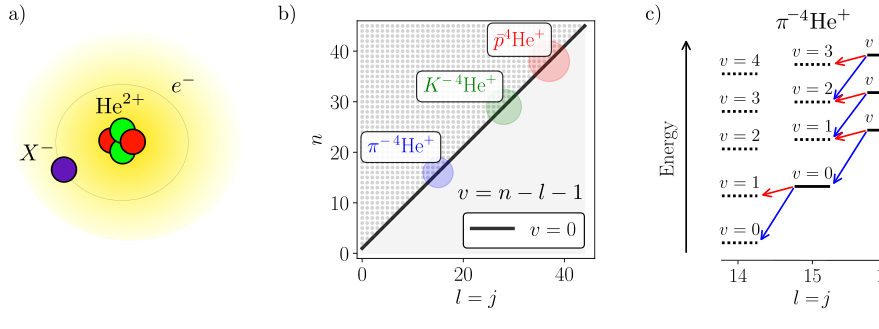
<figcaption class="paper-figure-caption"><b>Fig 1.</b> FIG. 1: Physical structure, states, and transitions in exotic helium atoms. (a) Schematic representation of an exotic helium atom. A heavy, negatively charged particle X−(X−= π−, K−, ¯p) is captured into a highly excited, near-circular orbit around the He2+ nucleus, while the remaining electron (gold cloud) occupies the 1s electronic orbital. (b) Overview of the state space in exotic atoms illustrating the exact correspondence between the atomic principal and orbital quantum numbers (n, l) and the molecular vibrational and rotational quantum numbers (v, j). Each grey dot represents a single (n, l) [(v, j)] state. States sharing vibrational quantum number are aligned along the diagonal, with...</figcaption>
</figure>
<figure class="paper-figure-card">
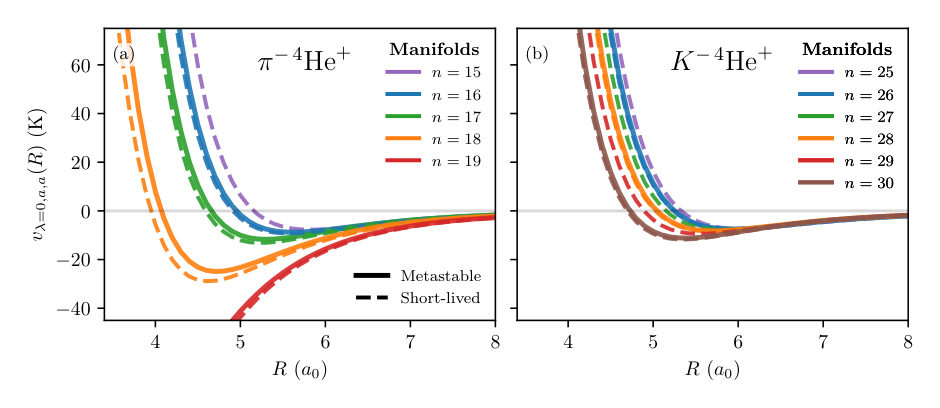
<figcaption class="paper-figure-caption"><b>Fig 2.</b> FIG. 2: Effective isotropic expansion coefficients, vλ=0,a,a(R), for the candidate states in (a) pionic helium (π−4He+) and (b) kaonic helium (K−4He+) interacting with an ordinary helium atom. Curves are grouped and color-coded by the principal quantum number n of the X−particle. Within each n-manifold, if present, solid lines denote the designated metastable state, while dashed lines represent the neighboring short-lived state participating in the transitions listed in Table I. The potential for the pionic (18, 17) state is omitted here to preserve visual clarity.</figcaption>
</figure>
<figure class="paper-figure-card">
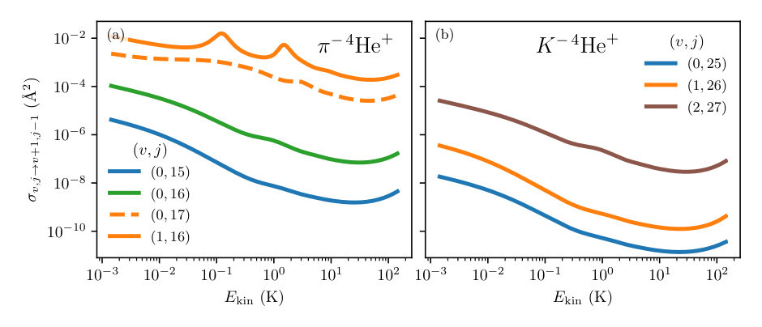
<figcaption class="paper-figure-caption"><b>Fig 3.</b> FIG. 3: Leading inelastic quenching cross sections, σ(v,j)→(v+1,j−1), originating from the three collisionally robust metastable states in (a) pionic helium and (b) kaonic helium. The color scheme matches the effective isotropic expansion coefficients of the PES presented in Fig. 2, where the initial metastable state for each transition corresponds to the solid line of the identical color. For the pionic n = 18 manifold (orange), we present cross-sections for both the metastable (v = 1, j = 16) state (solid line) and the experimentally relevant (v = 0, j = 17) state (dashed line), whose Auger lifetime is currently unavailable in the literature.</figcaption>
</figure>
<figure class="paper-figure-card">
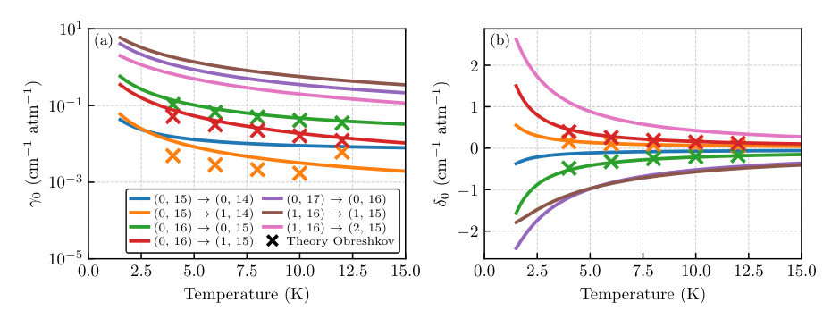
<figcaption class="paper-figure-caption"><b>Fig 4.</b> FIG. 4: Pressure broadening (γ0) and pressure shift (δ0) coefficients for the transitions in π−4He+ considered in this work. The transitions are denoted by their molecular (va, ja) →(vb, jb) descriptors; see Table I for their exact correspondence to the atomic (na, la) →(nb, lb) nomenclature. Markers denote previous theoretical results (×, Ref. [25]).</figcaption>
</figure>
<figure class="paper-figure-card">
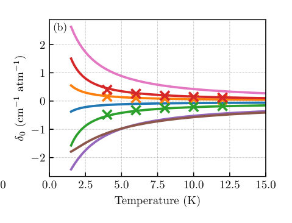
<figcaption class="paper-figure-caption"><b>Fig 5.</b> Fig. 4 also compares our results with the previous the- oretical calculations by Obreshkov et al. [25]. To ensure a direct comparison, we plot their calculations derived us- ing a coupled partial-wave approach on the “HN1” fit of the ab initio points (see Ref. [18] for details)—a method- ology conceptually equivalent to our own. We find over- all excellent agreement with these results. The only no- table discrepancy occurs in the pressure broadening of the (v = 0, j = 15) →(v = 1, j = 14) transition. We at- tribute this deviation to the refined ab initio grid of the new PES [20], which more accurately captures the molec- ular configurations relevant to the excited (v = 1, j = 14) state....</figcaption>
</figure>

**Summary.** This paper presents a comprehensive theoretical evaluation of density and collisional effects governing high-precision laser spectroscopy on exotic helium atoms, such as pionic and kaonic helium. Using advanced coupled-channel quantum scattering calculations, the authors derive essential benchmark values for pressure broadening and shifts. These results are crucial for future experiments aiming to test fundamental constants and determine the masses of particles like the pion and kaon.

**Why it may be interesting.** This work is highly relevant as it pushes the boundaries of precision spectroscopy by providing the necessary theoretical corrections for complex many-body interactions in exotic atomic systems. It directly informs experimental feasibility in AMO physics.

Detailed structure

**Main problem.** To provide a rigorous theoretical benchmark for high-precision laser spectroscopy on exotic helium atoms ($	ext{X}^-	ext{He}^+$) by calculating collisional and density effects.

**Main result.** The authors provide theoretical reference values for the pressure broadening and shift coefficients for targeted transitions in pionic and kaonic helium, essential for future mass determinations.

**Method.** The study employs coupled-channel quantum scattering calculations using an ab initio potential energy surface (PES) derived from super-molecular approaches.

**Model / system.** The system involves exotic helium atoms ($	ext{X}^-	ext{He}^+$ where $	ext{X}^-$ is a heavy negative particle like $\pi^-$ or $K^-$) interacting with a cryogenic helium buffer gas. The physics tests three-body quantum electrodynamics.

**Key observables.** Transition frequencies, pressure broadening coefficients ($\gamma_0$), and pressure shift coefficients ($\delta_0$).

**Important parameters / regimes.** The required accuracy for spectroscopy is extremely high (e.g., $	ext{P} \propto 100 	ext{ GHz}$ needed for $\pi^-	ext{He}^+$). Metastable states must survive Auger decay.

**Assumptions / limitations.** Calculations are performed within the Born–Oppenheimer approximation, and line-shape calculations often utilize a single-state basis due to convergence tests showing negligible impact from nearest neighbors on broadening/shift parameters.

**Figures summary.** Figures illustrate the physical state space of exotic helium atoms (Fig. 1) and show calculated pressure broadening ($	ext{Re}(\sigma_c)$) and shift ($	ext{Im}(\sigma_c)$) cross-sections for specific transitions in pionic and kaonic helium.

**Paper structure.** The paper systematically addresses the need for theoretical benchmarks, first evaluating collisional stability against quenching, and then calculating the necessary line-shape parameters (broadening/shift coefficients) using advanced quantum scattering methods.

Abstract

Exotic helium atoms act as unique atomic traps for heavy, negatively charged particles, protecting them from nuclear annihilation and nuclear capture on timescales long enough to enable high-precision laser spectroscopy. Such measurements serve as stringent tests of three-body quantum electrodynamics and offer a direct route to determining fundamental particle masses. Motivated by upcoming spectroscopic efforts targeting pionic ($π^{-\,4}\mathrm{He}^+$) and kaonic ($K^{-\,4}\mathrm{He}^+$) helium, we present a rigorous theoretical evaluation of the collisional and density effects governing these systems. Using an ab initio potential energy surface and coupled-channel quantum scattering calculations, we study the collisional stability of the candidate metastable states against inelastic quenching in a cryogenic helium buffer gas. Furthermore, we provide theoretical reference values for the pressure broadening and pressure shift coefficients of the targeted transitions. These results establish an essential benchmark for future experiments, paving the way for refined determinations of the pion and kaon masses.

[↑ back to top](#top)

### [RubriQ: Rubric-Guided Group Relative Policy Optimization for Constraint-Aware Quantum Circuit Synthesis](http://arxiv.org/abs/2607.07554v1)

**Authors:** Ziqing Guo, Ziwen Pan  
**Type:** both · **Category:** quantum information and computing · **PDF:** <https://arxiv.org/pdf/2607.07554v1>  
**Analysis basis:** full PDF text, analyzed in chunks
**Topic relevance:** `QC/QI experiment` **1/5** · `methods for driven-dissipative` **1/5**

↔ Scroll figures horizontally

<figure class="paper-figure-card">
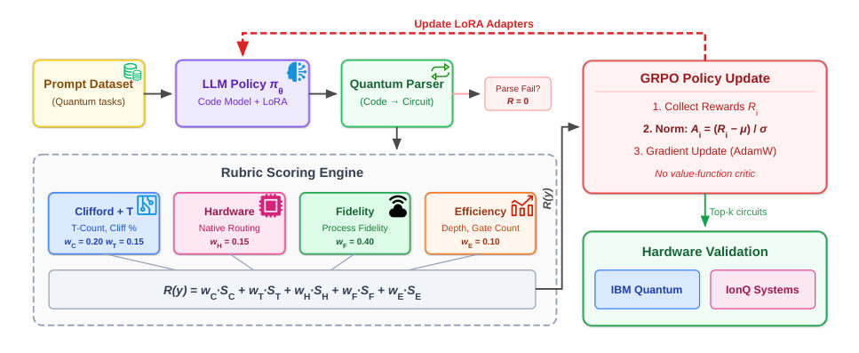
<figcaption class="paper-figure-caption"><b>Fig 1.</b> Fig. 1. RubriQ system architecture. The three-stage pipeline converts a natural-language prompt (1. system with user prompt encoding) into executable circuit code (2. autoregressive LLM generation with low-rank adaptation (LoRA) [33]) and a validated quantum circuit object (3. multi-strategy extraction). The rubric scoring engine (grey dashed box) supplies dense, bounded, deterministic rewards across five dimensions and GRPO policy update (pink box) enables critic-free, scalable policy gradients using group normalization. The circuits are validated on IBM and IonQ hardware; the full pipeline runs on NERSC Perlmutter A100 clusters.</figcaption>
</figure>
<figure class="paper-figure-card">
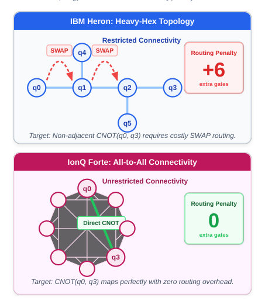
<figcaption class="paper-figure-caption"><b>Fig 2.</b> Fig. 2. Hardware topology comparison driving RubriQ compatibility score SH. Top: IBM Eagle/Heron heavy-hex lattice (degree ≤3); a CNOT between non-adjacent qubits q0 and q3 requires two SWAPs (6 extra two-qubit gates). Bottom: IonQ Forte/Aria all-to-all connectivity (degree = N−1); the same CNOT maps directly with zero routing overhead. RubriQ takes the maximum SH over backends, allowing the policy to discover backend-specific optimization strategies.</figcaption>
</figure>
<figure class="paper-figure-card">
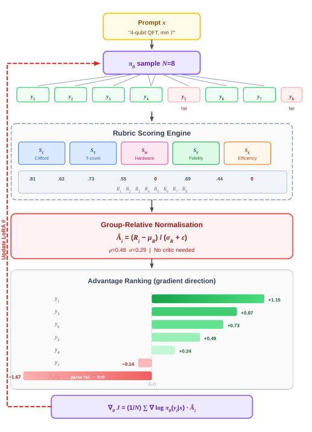
<figcaption class="paper-figure-caption"><b>Fig 3.</b> Fig. 3. Per-step GRPO training flow. A prompt yields N=8 completions; parse failures receive R=0. The rubric engine scores each valid circuit across five dimensions and aggregates Ri. Group-relative normalization produces advantages ˆ Ai without a learned critic. The bar chart shows how GRPO amplifies high-reward circuits (green, right) and suppresses failures (red, left); dense rubric scoring keeps within-group dispersion high, enabling accurate ranking.</figcaption>
</figure>
<figure class="paper-figure-card">
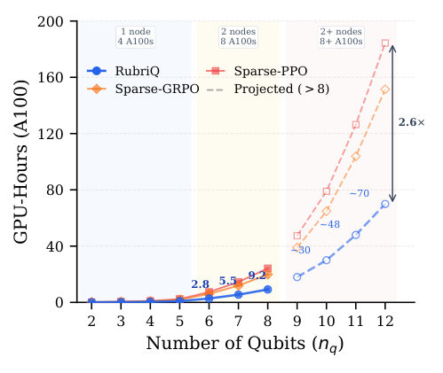
<figcaption class="paper-figure-caption"><b>Fig 4.</b> Fig. 4. GPU-hours (A100) for a full training run as a function of circuit width, comparing RubriQ against Sparse-GRPO and Sparse-PPO. Solid lines: measured (nq≤8); dashed: projected (nq&gt;8). Background bands indicate HPC configuration: 1 node with 4 A100s (nq=2–5), 2 nodes with 8 A100s (nq=6–8), 2+ nodes with 8+ A100s (nq&gt;8). All three methods share the same per-epoch cost (dominated by O(4nq) fidelity simulation); the 2.6× gap reflects RubriQ faster convergence (15 vs. 40 epochs), directly translating to proportional GPU-hour savings at every qubit scale.</figcaption>
</figure>
<figure class="paper-figure-card">
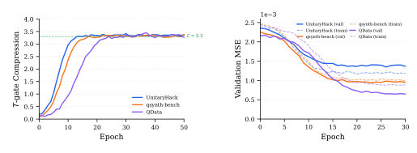
<figcaption class="paper-figure-caption"><b>Fig 5.</b> Fig. 5. (a) T-gate compression C=T0/T(c) vs. epoch by dataset. (b) Train- ing and validation MSE; overlap indicates LoRA regularization rather than overfitting.</figcaption>
</figure>

**Summary.** This paper introduces RubriQ, a novel framework that uses Large Language Models guided by a multi-dimensional programmatic rubric to synthesize hardware-ready, fault-tolerant quantum circuits. By optimizing via Group Relative Policy Optimization (GRPO) and incorporating metrics like T-gate count and hardware topology directly into the reward function, it significantly outperforms existing methods in efficiency and fidelity.

**Why it may be interesting.** While focused on quantum computation, the rigorous integration of physical constraints (topology, gate type) into an automated optimization loop provides a blueprint for designing complex quantum control sequences that must respect underlying physics.

Detailed structure

**Main problem.** The primary challenge is designing fault-tolerant quantum circuits that are simultaneously algorithmically correct and compatible with specific physical hardware constraints.

**Main result.** RubriQ achieves a significant mean T-gate compression of 3.31x compared to baselines, converges faster, and maintains low hardware constraint violations on real quantum processors.

**Method.** The authors developed RubriQ, which frames circuit synthesis as an LLM code-generation task optimized using Group Relative Policy Optimization (GRPO). The reward signal is derived from a programmatic rubric evaluating multiple physical constraints.

**Model / system.** The system targets quantum circuits for fault-tolerant computation on platforms like superconducting qubits (IBM) and trapped ions (IonQ). It uses an LLM fine-tuned via LoRA to generate OpenQASM/Qiskit code, which is then parsed into a circuit.

**Key observables.** T-gate count compression ratio, hardware compliance score ($S_H$), Process Fidelity ($S_F$), Clifford fraction ($S_C$), and overall convergence speed (epochs).

**Important parameters / regimes.** The optimization uses five weighted components in the rubric reward function; $N=8$ is selected as the optimal group size for GRPO.

**Assumptions / limitations.** The method assumes that a multi-dimensional, programmatic rubric can effectively guide policy learning without relying on complex learned critics. Theoretical analysis suggests weight adaptation might be needed at high circuit complexity ($T_0 > 140$).

**Figures summary.** Figures illustrate the full system architecture (three stages: prompt encoding, LLM generation, parsing) and compare hardware topologies to show how routing constraints impact the reward score.

**Paper structure.** The paper details the three-stage pipeline (LLM $
ightarrow$ Parser $
ightarrow$ Rubric Evaluation), introduces GRPO for policy updates using a weighted sum of five component scores ($R = w_C S_C + \dots$), and validates performance against baselines on real hardware backends.

Abstract

Designing fault-tolerant quantum circuits that are both algorithmically correct and hardware compatible remains a major bottleneck in the transition to scalable quantum computing. We introduce RubriQ, a scalable framework that formulates circuit synthesis as a large language model (LLM) code-generation task, optimized via group relative policy optimization (GRPO). Unlike conventional black-box neural critics, RubriQ employs a domain-grounded programmatic rubric as the reinforcement learning reward function, evaluating circuits for T-gate reduction, hardware topology compliance, and unitary fidelity. To support high-throughput training, RubriQ integrates GPU-accelerated CUDA-Q simulation directly into the reinforcement learning (RL) loop and is deployed on NERSC Perlmutter using DeepSpeed ZeRO2 across multinode NVIDIA A100 clusters. On benchmark tasks, RubriQ achieves a mean T-gate compression of 3.31x, significantly outperforming sparse-reward RL baselines (2.05x), converging 2-3x faster, and maintaining less than 1\% hardware-constraint violations. Validated on IBM and IonQ quantum processors, RubriQ establishes an automated, high-performance computing (HPC)-driven pipeline for generating hardware-ready, fault-tolerant quantum circuits at scale.

[↑ back to top](#top)

### [Semi-Device-Independent Quantum Key Distribution from Operational Assumptions](http://arxiv.org/abs/2607.06682v1)

**Authors:** Anubhav Chaturvedi, Giuseppe Viola, Ekta Panwar, Tushita Prasad, Debashis Saha  
**Type:** theory · **Category:** quantum information and computing · **PDF:** <https://arxiv.org/pdf/2607.06682v1>  
**Analysis basis:** full PDF text, analyzed in chunks
**Topic relevance:** `entanglement & information structure` **1/5** · `quantum measurements` **1/5**

↔ Scroll figures horizontally

<figure class="paper-figure-card">
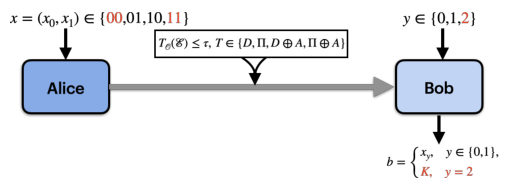
<figcaption class="paper-figure-caption"><b>Fig 1.</b> FIG. 1. Three-setting retained-key protocol under an opera- tional source assumption. Alice emits one of four preparations satisfying TO(E) ≤τ, with T ∈{D, Π, D ⊕A, Π ⊕A}; in the security analysis O = Q. Bob uses y = 0, 1 for RAC testing, where the target is xy, and y = 2 for retained-key rounds on the branch xZ(0) = 00, xZ(1) = 11, where the target is the raw key bit K.</figcaption>
</figure>
<figure class="paper-figure-card">
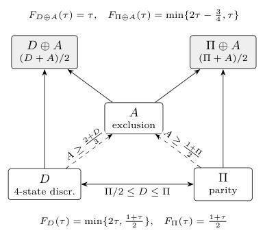
<figcaption class="paper-figure-caption"><b>Fig 2.</b> FIG. 2. Operational source tasks and their relations. Boxes are the three optimized information-retrieval tasks on Alice’s four- preparation ensemble; shaded boxes are the two-setting com- posites used as exclusion-assisted source assumptions. Solid double arrow: coarse-graining relations between four-state and parity discrimination. Dashed arrows: the induced exclusion strategies of Eq. (3); all displayed relations are tight. By Proposition 1, A is not a function of (D, Π). The annotations give the exact classical RAC frontier of Theorem 1 for each source assumption on its stated domain.</figcaption>
</figure>
<figure class="paper-figure-card">
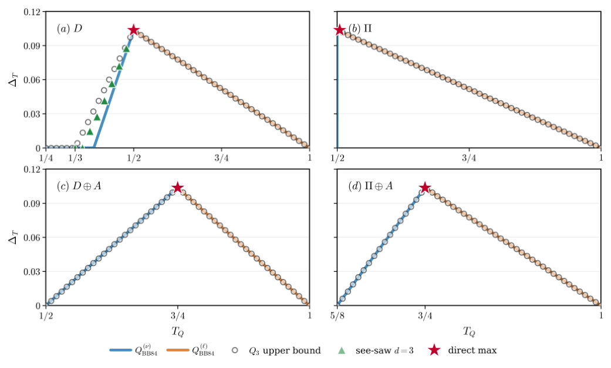
<figcaption class="paper-figure-caption"><b>Fig 3.</b> FIG. 3. Quantum deviation from the exact classical frontiers. Gray circles are level-Q3 upper bounds on ∆max T (t). Blue and orange curves are feasible preparation-depolarized and direct-sum leakage families; red stars mark ideal BB84. Green triangles in panel (a) are feasible d = 3 see-saw points, with the source-task value recomputed by its exact semidefinite program for the final ensemble.</figcaption>
</figure>
<figure class="paper-figure-card">
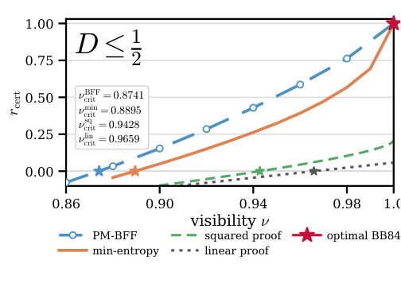
<figcaption class="paper-figure-caption"><b>Fig 4.</b> FIG. 4. Fixed distinguishability benchmark D ≤1/2. Gray and green curves are the earlier RAC-key Csiszár–Körner rates obtained from the RAC-output guessing bounds stated in the text. Orange and blue curves use the present retained- key protocol under the same operational source assumption: orange is the min-entropy certificate and blue is PM-BFF. The critical visibilities are νlin crit = 0.9659, νsq crit = 0.9428, νmin crit = 0.8895, and νBFF crit = 0.8741; the red star marks ideal BB84.</figcaption>
</figure>
<figure class="paper-figure-card">
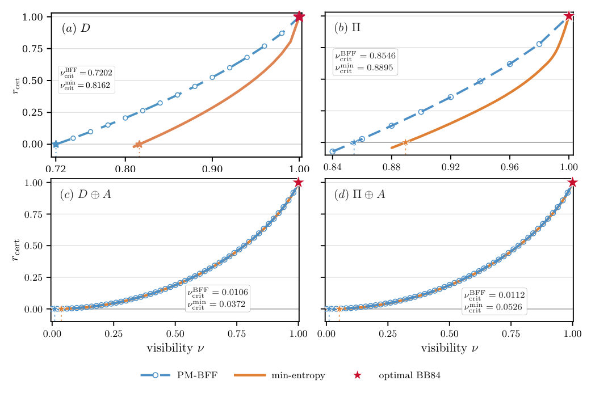
<figcaption class="paper-figure-caption"><b>Fig 5.</b> FIG. 5. Source-depolarized BB84 key-rate lower bounds under four operational source assumptions. Dashed blue curves with open circles are PM-BFF bounds; solid orange curves are min-entropy bounds. The blue and orange axis stars are linear root estimates from the nearest validated samples of opposite sign and are not additional SDP evaluations. Lines connect accepted certificates; the red star marks ideal BB84.</figcaption>
</figure>

**Summary.** This paper develops a framework for Semi-Device-Independent Quantum Key Distribution by bounding the source preparation using operational assumptions rather than full device characterization. By analyzing four distinct task bounds, including exclusion-assisted measures, the authors derive strong security certificates that prove key rates remain positive even under significant imperfections. This advances the practical feasibility of QKD in realistic, imperfect quantum hardware.

**Why it may be interesting.** The work provides rigorous, information-theoretic security proofs for QKD that are applicable even when device imperfections are partially unknown, which is crucial for practical quantum networking implementations.

Detailed structure

**Main problem.** The research aims to advance Semi-Device-Independent Quantum Key Distribution (SDI-QKD) by relaxing the stringent requirements of full device characterization.

**Main result.** The authors derive two dimension-independent security certificates using operational source assumptions, showing that exclusion-assisted bounds significantly improve key rates compared to identification-only methods.

**Method.** They formulate source assumptions operationally as scalar bounds on four physically motivated tasks (e.g., full-label guessing, parity guessing) and employ prepare-and-measure semidefinite relaxations (PM-BFF) for entropy bounding.

**Model / system.** The protocol is analyzed using a two-bit Random-Access Code (RAC) implemented over three settings: one pair for RAC testing and an additional setting for key generation. The security analysis focuses on the source preparation ensemble of Alice.

**Key observables.** Conditional min-entropy, conditional von Neumann entropy, optimal success probabilities for four-state discrimination ($D$), parity discrimination ($\Pi$), and state exclusion ($A$).

**Important parameters / regimes.** Preparation visibility ($
u$), dimension bounds (e.g., $d/4$ or $	au \le 1/2$), and the specific operational source assumption used.

**Assumptions / limitations.** The core assumption is placing a trusted, operational bound on Alice's quantum source preparation ensemble, rather than requiring full characterization of all devices.

**Figures summary.** Figure 1 illustrates the three-setting protocol structure. Figure 2 summarizes the relationships between the four tasks ($D, \Pi, A$) and their composite bounds.

**Paper structure.** The paper establishes the operational framework by defining source assumptions via task bounds (e.g., $D$, $\Pi$). It then derives exact classical frontiers for a two-bit RAC. Finally, it extends this to a three-setting protocol to yield robust security certificates using advanced entropy bounding techniques.

Abstract

Semi-device-independent quantum key distribution leaves the measurement devices uncharacterized while placing a trusted assumption on Alice's source. We formulate this source assumption operationally on Alice's four-preparation ensemble as a scalar bound on one of four physically motivated source tasks: full-label guessing, parity guessing, or their normalized composites with label exclusion. For the two-bit random-access code, we derive the exact classical frontier for each of the four source assumptions. Numerically, the BB84 strategy attains the maximal quantum deviation from all four frontiers, while the preparation-depolarized BB84 family and the direct-sum label-leakage family trace complementary branches of the arbitrary-dimensional quantum boundary for the two exclusion-assisted assumptions. Because all four task values are monotone under input-independent quantum channels, the same scalar source bound constrains every Bob--Eve extension compatible with the complete observed behavior. Using a three-setting extension that separates RAC testing from key generation, we obtain two dimension-independent security certificates over this feasible set: lower bounds on the conditional min-entropy and conditional von Neumann entropy, obtained respectively by direct optimization of Eve's key-guessing probability and by prepare-and-measure semidefinite relaxations based on the Brown--Fawzi--Fawzi variational bound. The exclusion-assisted assumptions certify positive key rates down to nearly vanishing preparation visibility, far beyond full-label or parity guessing alone. Under direct-sum label leakage, all four independently optimized rate bounds remain positive at every sampled incomplete-leakage point and vanish only at complete label revelation. These results show that robust semi-device-independent security depends not only on what Eve can identify, but also on what she can exclude.

[↑ back to top](#top)

### [Wall tension of a Bose-Einstein condensate: Effects of quantum fluctuations and finite-range interactions](http://arxiv.org/abs/2607.07203v1)

**Authors:** Pham Duy Thanh, Nguyen Van Thu  
**Type:** theory · **Category:** quantum gases · **PDF:** <https://arxiv.org/pdf/2607.07203v1>  
**Analysis basis:** full PDF text, analyzed in chunks
**Topic relevance:** `Keldysh / 2PI / non-Gaussian methods` **1/5** · `analog quantum simulation` **1/5**

↔ Scroll figures horizontally

<figure class="paper-figure-card">

<figcaption class="paper-figure-caption"><b>Fig 1.</b> FIG. 1. Condensate wave functions as functions of the reduced coordinate ˜x at αs = 10−3. The</figcaption>
</figure>
<figure class="paper-figure-card">
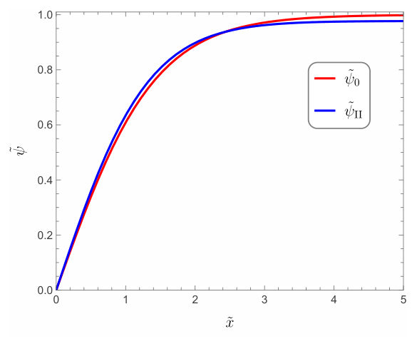
<figcaption class="paper-figure-caption"><b>Fig 2.</b> FIG. 2. Condensate wave functions as functions of the reduced coordinate ˜x at αs = 10−3 and re =</figcaption>
</figure>
<figure class="paper-figure-card">

<figcaption class="paper-figure-caption"><b>Fig 3.</b> Fig. 2 also shows the MGPII wave function at αs = 5 × 10−3 with re = 2as/3, corre-</figcaption>
</figure>

**Summary.** This paper theoretically examines how quantum fluctuations and finite interaction ranges affect the wall tension of a Bose-Einstein condensate confined by a hard boundary. By extending the Gross-Pitaevskii equation, the authors predict that QFs increase the tension while finite-range effects partially reduce it. These predictions offer an experimentally accessible method to probe advanced many-body physics in ultracold atomic gases.

**Why it may be interesting.** This work provides a detailed theoretical roadmap for interpreting high-precision measurements of BEC interfaces, linking measurable quantities like wall tension directly to fundamental many-body physics beyond the standard mean-field theory (LHY and finite range).

Detailed structure

**Main problem.** The study investigates how quantum fluctuations (QFs) and finite-range interatomic interactions modify the ground state properties, specifically the wall tension, of a Bose-Einstein condensate (BEC).

**Main result.** QFs stiffen the BEC near a hard wall, increasing the wall tension above the mean-field prediction. Finite-range corrections partially counteract this enhancement, leading to an experimentally measurable ordering $\gamma_0 < \gamma_{II} < \gamma_I$.

**Method.** The analysis employs successive approximations by modifying the Gross-Pitaevskii equation (GP) using formalisms like CJT for QFs and adding gradient terms for finite-range effects.

**Model / system.** The system is a dilute gas of bosonic atoms forming a BEC confined by a hard wall at zero temperature. The theoretical framework evolves from the standard GP equation to modified versions incorporating LHY terms (QFs) and higher-order spatial derivatives (finite range).

**Key observables.** Wall tension ($\gamma$), density profile ($n(x)$), healing length ($\xi$), and quantum depletion fraction.

**Important parameters / regimes.** Gas parameter ($\alpha_s = na^3/s \ll 1$), effective range ratio ($r_e / 2a_s$), and the LHY correction parameter $\alpha_{1/2s}$.

**Assumptions / limitations.** The analysis relies on perturbative expansions in the gas parameter and assumes specific functional forms for incorporating QFs and finite-range corrections.

**Figures summary.** Figure 1 compares wave functions from GP vs. MGPI, showing a density notch change; Figure 2 likely compares wave functions across GP, MGPI, and MGPII solutions.

**Paper structure.** The paper builds theoretically by first establishing the mean-field (GP) baseline, then incorporating QFs via the Modified GP Equation (MGPI), and finally refining this model with finite-range corrections leading to MGPII. The results are presented through quantitative comparisons of derived wall tension formulas.

Abstract

We investigate the effects of quantum fluctuations (QFs) and finite-range interatomic interactions on the ground state and wall tension of a Bose-Einstein condensate (BEC) at zero temperature by means of modified Gross-Pitaevskii equations. The QFs are shown to stiffen the condensate near the hard wall, narrowing the density profile and raising the wall tension above its mean-field value by an amount proportional to square-root of the gas parameter. Finite-range corrections always reduces the wall tension relative to the QFs correction value regardless of the effective range. We find the ordering $γ_0 < γ_{\rm II} < γ_{\rm I}$ in the dilute regime and identify a crossover condition under which the two beyond-mean-field contributions mutually cancel. These results provide an experimentally accessible way for probing beyond-LHY physics through precision measurements of the wall tension in ultracold Bose gases.

[↑ back to top](#top)

### [Ab initio thermodynamic statistical modeling of the miscibility gap and the metal-insulator phase transition in SrTi$_{1-x}$V$_x$O$_{3}$](http://arxiv.org/abs/2607.07067v1)

**Authors:** Luka Wibmer, Chiara Ostendorf, Dominik Spath, Christoph Heil, Pedro N. Ferreira, Markus Aichhorn  
**Type:** theory · **Category:** strongly correlated electrons · **PDF:** <https://arxiv.org/pdf/2607.07067v1>  
**Analysis basis:** full PDF text, analyzed in chunks
**Topic relevance:** `Keldysh / 2PI / non-Gaussian methods` **1/5**

↔ Scroll figures horizontally

<figure class="paper-figure-card">
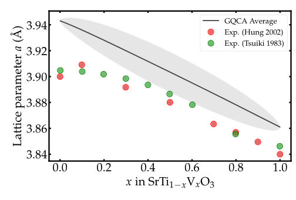
<figcaption class="paper-figure-caption"><b>Fig 1.</b> Figure 1. Lattice parameter a of SrTi1−xVxO3 as a function of com- position. Both the GQCA average and experimental measurements [8–10] are depicted. The gray shaded area shows the GQCA stan- dard deviation.</figcaption>
</figure>
<figure class="paper-figure-card">
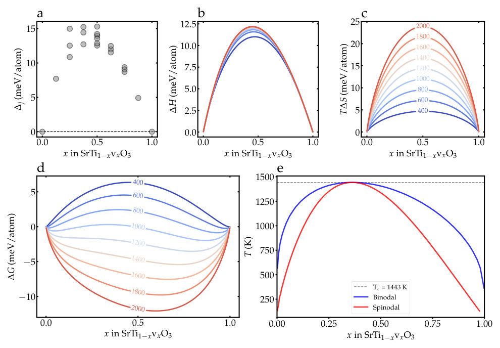
<figcaption class="paper-figure-caption"><b>Fig 2.</b> Figure 2. Thermodynamic properties of SrTi1−xVxO3 as a function of composition. (a) Excess enthalpies ∆j. (b) Mixing enthalpy ∆H, (c) configurational entropy T∆S and (d) Gibbs mixing free energy ∆G at different Temperatures from 400 K to 2000 K. (e) The miscibility gap with binodal and spinodal lines.</figcaption>
</figure>
<figure class="paper-figure-card">
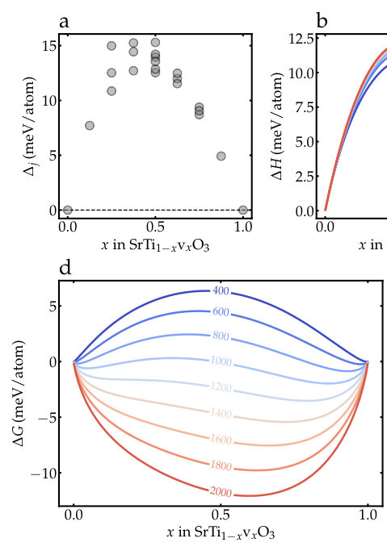
<figcaption class="paper-figure-caption"><b>Fig 3.</b> Fig. 2(e) shows the calculated miscibility gap for SrTi1−xVxO3. We predict a critical temperature of 1443 K. Experimental information on the phase equilibria of this sys- tem is rather limited. As far as we could identify, no thermo- dynamic assessment or phase diagram has been reported for the Sr–Ti–V–O quaternary system. SrTi1−xVxO3 solid solu- tions have been synthesized using several different methods, including powders treated at 1250 K under flowing H2 fol- lowed by hydrostatic pressing [8], solid-state synthesis of pel- lets heated at T ≈1800 K [9], and different thin-film growth techniques [10–12].</figcaption>
</figure>
<figure class="paper-figure-card">
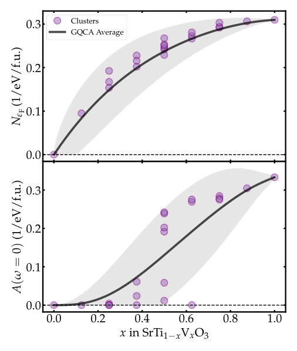
<figcaption class="paper-figure-caption"><b>Fig 4.</b> Figure 3. Electronic density of states at the Fermi level taken from the DFT calculation and the spectral function A(ω) at ω = 0 of SrTi1−xVxO3 as a function of composition. Both the GQCA aver- age and the individual cluster values are plotted. The gray shaded area shows the GQCA standard deviation.</figcaption>
</figure>
<figure class="paper-figure-card">
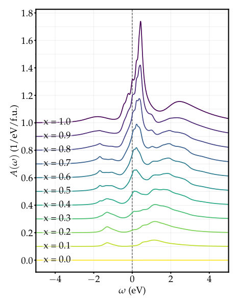
<figcaption class="paper-figure-caption"><b>Fig 5.</b> Figure 4. Vanadium-projected GQCA averaged spectral function A(ω) for different compositions x in SrTi1−xVxO3. Each spectral function is shifted vertically by 0.1 eV−1 for better visibility. Note that only the vanadium-projected part is shown, that is why for x = 0.0 the spectral function is identically zero.</figcaption>
</figure>

**Summary.** This work develops a thermodynamically rigorous framework, the Generalized Quasi-Chemical Approximation (GQCA), to model disordered alloys like SrTi1-xV xO3. By averaging properties over all possible atomic arrangements, the authors accurately predict both the miscibility gap and the composition-driven metal-insulator transition using DMFT and percolation theory.

**Why it may be interesting.** The methodology of using statistical thermodynamics (GQCA) to correctly average over local chemical disorder when modeling correlated electron systems is highly relevant for understanding complex materials where structural randomness dictates electronic behavior, bridging concepts from condensed matter stat-mech and strongly correlated physics.

Detailed structure

**Main problem.** The study addresses the composition-driven metal-insulator transition (MIT) and miscibility gap in the disordered perovskite alloy SrTi1-xV xO3.

**Main result.** The authors successfully reproduce the MIT using a thermodynamically consistent, configuration-averaged framework, finding the transition onset near x=0.4 via percolation analysis.

**Method.** They employ the Generalized Quasi-Chemical Approximation (GQCA) combined with Dynamical Mean-Field Theory (DMFT) to average properties over all possible atomic configurations.

**Model / system.** The system is the substitutional solid solution SrTi1-xV xO3, which interpolates between a band insulator (SrTiO3) and a correlated metal (SrVO3). The model treats disorder by averaging cluster properties weighted by Gibbs free energy minimization.

**Key observables.** Miscibility gap critical temperature (1443 K), density of states at the Fermi level, and system-spanning conduction onset via site percolation.

**Important parameters / regimes.** The Hubbard interaction parameters (U=4 eV, J=0.65 eV) are used in the DMFT calculation; the analysis spans the full composition range x from 0 to 1.

**Assumptions / limitations.** The primary assumption is that material properties can be accurately calculated as an ensemble average over statistically weighted clusters using the GQCA framework, which overcomes limitations of single supercell calculations.

**Figures summary.** Figures illustrate the lattice parameter following Vegard's law and show the miscibility gap boundaries derived from $\Delta G(x, T)$ analysis. Partial density of states plots demonstrate bandwidth changes as composition varies.

**Paper structure.** The paper first establishes the need for a configuration-averaged approach (GQCA) to model disorder. It then calculates thermodynamic properties ($\Delta G$) revealing the miscibility gap. Finally, it combines this ensemble average with DMFT and percolation theory to track the electronic transition across the composition range.

Abstract

The substitutional alloy SrTi$_{1-x}$V$_x$O$_3$ interpolates between the band insulator SrTiO$_3$ and the correlated metal SrVO$_3$, exhibiting a composition-driven metal--insulator transition whose origin combines Mott physics with local chemical disorder. Previous first-principles studies relied on individual supercells, which cannot capture the thermally disordered solid solution, since configurations of identical composition can display very different electronic properties. Here we treat the alloy within a generalized quasi-chemical approximation, a thermodynamically consistent statistical framework in which every property is obtained as an ensemble average over all symmetry-inequivalent clusters, weighted by occurrence probabilities that minimize the Gibbs mixing free energy. This provides a well-defined procedure to average over different supercells, and places the structural and electronic descriptions on an equal footing. From the mixing thermodynamics we obtain a miscibility gap with a critical temperature of 1443 K, consistent with experimental evidence. Combining the cluster ensemble with dynamical mean-field theory, we track the density of states at the Fermi level across the full composition range: whereas density-functional theory alone predicts a metal for all $x>0$, the correlated spectral function reproduces the transition, evolving from insulating below $x\approx0.3$ to metallic near $x=1$. Finally, classifying clusters as metallic or insulating and performing site percolation on a simple cubic lattice yields a sharp onset of system-spanning conduction near $x\approx0.4$. These results establish a thermodynamically consistent, configuration--averaged framework applicable to the broader class of correlated materials.

[↑ back to top](#top)

### [Faster quantum linear system solver beyond the condition number](http://arxiv.org/abs/2607.07691v1)

**Authors:** Alexander M. Dalzell, Jianqiang Li, Yuan Su  
**Type:** theory · **Category:** quantum information and computing · **PDF:** <https://arxiv.org/pdf/2607.07691v1>  
**Analysis basis:** full PDF text, analyzed in chunks
**Topic relevance:** `analog quantum simulation` **1/5**

↔ Scroll figures horizontally

<figure class="paper-figure-card">
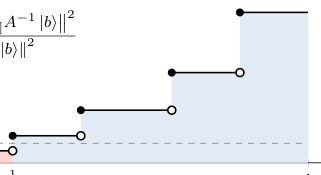
<figcaption class="paper-figure-caption"><b>Fig 1.</b> Figure 1: Illustration of the definition of effective condition number. The step function represents the cumulative distribution of the squared inverse singular values of A weighted by the initial state |b⟩. The effective condition number κeff is defined so that the total weight below 1/κeff (red region) is at most ϵ2.</figcaption>
</figure>
<figure class="paper-figure-card">
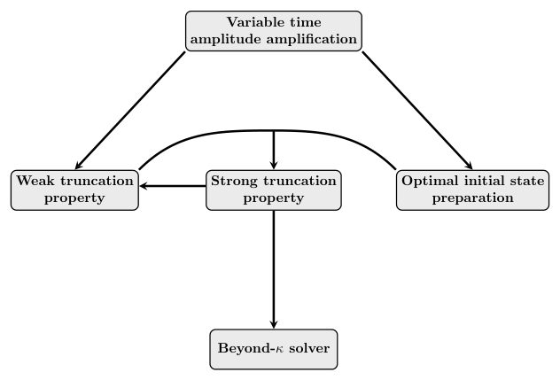
<figcaption class="paper-figure-caption"><b>Fig 2.</b> Figure 2: Illustration of the algorithmic template for constructing beyond-κ solvers based on effective trun- cation of the linear system.</figcaption>
</figure>
<figure class="paper-figure-card">
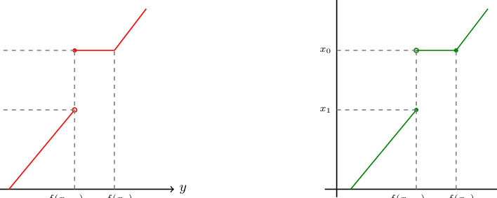
<figcaption class="paper-figure-caption"><b>Fig 3.</b> Figure 3: A non-decreasing function and its generalized inverses. Plateaus of f become jumps, and jumps of f become plateaus. The only difference between f + and f −is the one-sided continuity at discontinuities.</figcaption>
</figure>
<figure class="paper-figure-card">
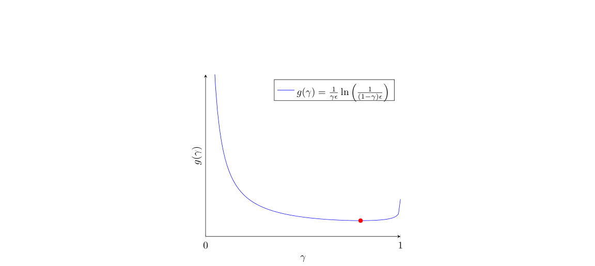
<figcaption class="paper-figure-caption"><b>Fig 4.</b> Figure 5: Qualitative behavior of g(γ) for constant-prefactor optimization for the filtering-based solver.</figcaption>
</figure>

**Summary.** This paper introduces two novel quantum algorithms designed to solve the linear system $Ax=|b
angle$ with computational complexity that bypasses the limitations imposed by the spectral condition number $\kappa$. By introducing and utilizing an 'effective condition number' ($\kappa_{	ext{eff}}$), the solvers achieve significantly faster query scaling, representing a major algorithmic improvement for quantum simulation applications.

**Why it may be interesting.** This work provides fundamental algorithmic advances in quantum linear algebra, which is a core subroutine for many physical simulations (e.g., solving Hamiltonians or finding ground states) relevant to AMO physics and condensed matter theory.

Detailed structure

**Main problem.** The primary goal is developing quantum algorithms to solve linear systems of equations, $Ax=|b
angle$, that achieve a computational complexity independent of the spectral condition number $\kappa$.

**Main result.** Two new solvers—one truncation-based and one filtering-based—are presented, achieving query complexities that scale with an 'effective condition number' ($\kappa_{	ext{eff}}$) or vector norms, thereby overcoming the traditional $\kappa$-barrier.

**Method.** The authors introduce advanced quantum techniques involving effective truncation of the linear system and eigenstate filtering over the unit circle. They derive rigorous upper bounds for $\kappa_{	ext{eff}}$ to quantify this improved scaling.

**Model / system.** The problem is framed within quantum computation models, analyzed under two input representations: the standard block encoding model and a more general affine dilation model that jointly encodes $A$ and $|b
angle$.

**Key observables.** Effective condition number ($\kappa_{	ext{eff}}$), solution vector norm ($\|x\|$ ), and the required computational query complexity.

**Important parameters / regimes.** Target accuracy $\epsilon$, spectral condition number $\kappa$, and various derived parameters like $\alpha$ used in truncation bounds.

**Assumptions / limitations.** The analysis relies on defining and bounding $\kappa_{	ext{eff}}$ through specific mathematical transformations of the singular values, and assumes availability of relative approximations for the solution norm $\|x\|$ to achieve optimal scaling.

**Figures summary.** Figure 1 illustrates the concept of $\kappa_{	ext{eff}}$ using cumulative distribution weights; Table 1 compares the query complexities of various quantum solvers against this new work.

**Paper structure.** The paper reviews existing solvers dependent on $\kappa$, introduces the concept and bounds for $\kappa_{	ext{eff}}$, details two novel algorithms (truncation-based and filtering-based), proves their complexity improvements, and concludes by comparing them to prior state-of-the-art methods.

Abstract

The spectral condition number is a widely adopted measure of worst-case cost for quantum linear system solvers. Yet it can significantly overestimate the actual runtime for a typical problem instance. We present two quantum algorithms that produce the normalized solution $|x\rangle$ of linear system $Ax=| b \rangle$ to accuracy $ε$ with complexity independent of the condition number $κ=\lVert A^{-1}\rVert$. We focus on the standard input model where $A$ is accessed through a block encoding and $| b \rangle$ is prepared by a unitary. But we also introduce an affine dilation model that encodes $A$ and $| b \rangle$ jointly, allowing further refinements of the query complexity. Our truncation-based solver makes an optimal number of queries to $| b \rangle$ and $\operatorname{\mathbf{O}}\left(κ_{\mathrm{eff}}\operatorname{polylog}\left(\frac{κ_{\mathrm{eff}}}ε\right)\right)$ queries to $A$. We prove a family of upper bounds on the effective condition number, including $κ_{\mathrm{eff}}\leq\frac{\lVert(A^\dagger A)^{-t/2}|x\rangle\rVert^{1/t}}{ε^{1/t}}$ for positive even integer $t$ and $κ_{\mathrm{eff}}\leq\frac{\lVert A^{-1\dagger}(A^\dagger A)^{-(t-1)/2}|x\rangle\rVert^{1/t}}{ε^{1/t}}$ for positive odd $t$, overcoming the $κ$-barrier. Our filtering-based solver is extremely simple with a favorable runtime prefactor. In particular, the solver has query complexity $6\frac{\lVert A^{-1\dagger}|x\rangle\rVert}ε\ln\left(\frac{1}ε\right)$ to leading order when the solution norm is known. We then present a similarly simple solution norm estimator with the same asymptotic cost up to logarithmic factors. Our quantum linear system solvers thus substantially improve a recent algorithm of Li, enabling faster quantum linear system solving beyond the condition number.

[↑ back to top](#top)

### [Pressure-induced PT Symmetry Breaking in LaMnSi](http://arxiv.org/abs/2607.07310v1)

**Authors:** Takuya Aoyama, Hikaru Taneoka, Takemi Yamada, Hiroshi Tanida, Kenya Ohgushi  
**Type:** both · **Category:** strongly correlated electrons · **PDF:** <https://arxiv.org/pdf/2607.07310v1>  
**Analysis basis:** full PDF text, analyzed in chunks
**Topic relevance:** `driven-dissipative phase transition` **1/5**

↔ Scroll figures horizontally

<figure class="paper-figure-card">
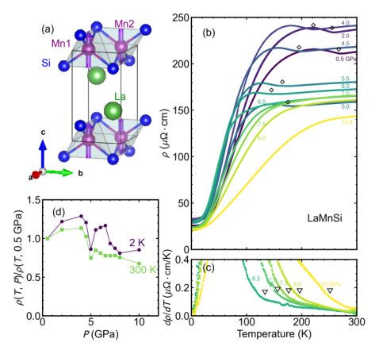
<figcaption class="paper-figure-caption"><b>Fig 1.</b> FIG. 1. (a) Crystal and magnetic structures of LaMnSi visu- alized using the VESTA tool [20]. Temperature (T) depen- dence of (b) the electrical resistivity (ρxx) and (c) dρ dT above 6.5 GPa, under high pressures. Open diamonds and triangles indicate the antiferromagnetic and ferromagnetic transitions, respectively. (d) Pressure dependence of electrical resistivity scaled by the value at 0.5 GPa, ρ(T, P)/ρ(T, 0.5 GPa).</figcaption>
</figure>
<figure class="paper-figure-card">
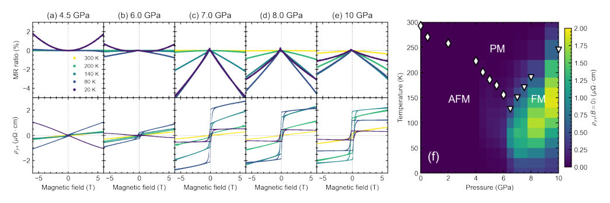
<figcaption class="paper-figure-caption"><b>Fig 2.</b> FIG. 2. Magnetoresistance (upper) and Hall resistivity (lower) at selected pressures of (a) 4.5, (b) 6.0, (c) 7.0, (d) 8.0, and (e) 10 GPa (Run 1). The electric current was applied along the 100 axis, and the magnetic field was applied along the 001 axis. The data were collected after field cooling with 9 T from room temperature. (f) Temperature–pressure phase diagram for LaMnSi. The open diamonds and triangles indicate TN and Tc, respectively. The Hall resistivity at B = 0 is superimposed as a contour plot. PM, AFM, and FM indicate the paramagnetic, antiferromagnetic, and ferromagnetic states, respectively.</figcaption>
</figure>
<figure class="paper-figure-card">
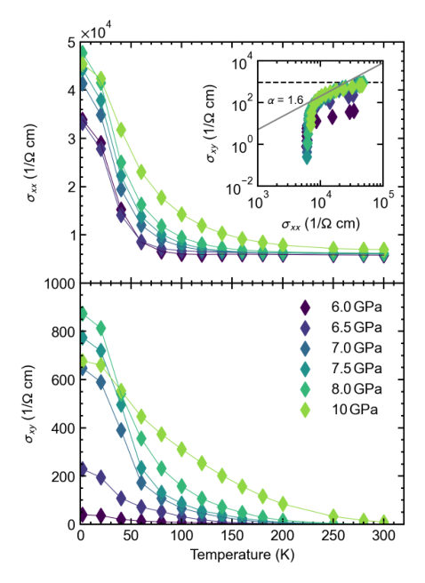
<figcaption class="paper-figure-caption"><b>Fig 3.</b> FIG. 3. Temperature dependence of the electrical conductiv- ity and Hall conductivity collected under several pressures. The inset shows a plot of σxx versus σxy. The gray lines indicate the power law of σxy ∝σα xx, with α = 1.6. The hor- izontal broken line indicates σxy = e2/(ha) = 926 Ω−1cm−1, with a = 4.18 ˚A</figcaption>
</figure>
<figure class="paper-figure-card">
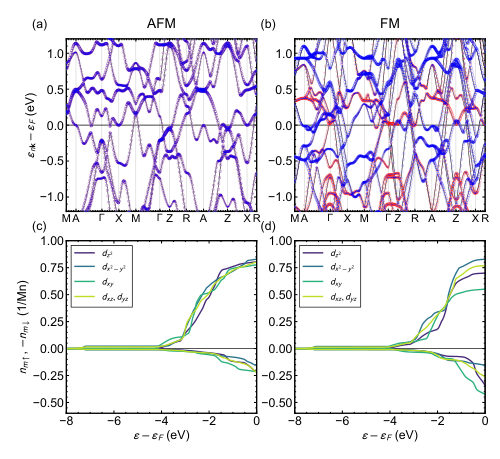
<figcaption class="paper-figure-caption"><b>Fig 4.</b> FIG. 4. Band structures (upper) and energy-dependent spin orbital occupancy of Mn 3d states below the Fermi level (lower) for LaMnSi. In the band structures, the up- and down- spin components of the Mn1 atom are represented by the sizes of the red and blue circles, respectively. Only the Mn1 atom is shown because the relations Mn2↑= Mn1↑and Mn2↓= Mn1↓hold in the FM state, whereas Mn2↑= Mn1↓and Mn2↓ = Mn1↑hold in the AFM state. Calculations assume the (a, c) AFM (B1u) and (b, d) FM (A2g) states.</figcaption>
</figure>

**Summary.** This work explores how applying high pressure forces a quantum phase transition in LaMnSi, moving it from a PT-symmetric antiferromagnetic state to a PT-broken ferromagnetic state. This transition is experimentally marked by the emergence of a large anomalous Hall effect, which is theoretically linked to changes in spin polarization within the Mn $3d$ electronic bands.

**Why it may be interesting.** The explicit connection drawn between external tuning (pressure) and fundamental symmetries ($	ext{PT}$ symmetry breaking) in determining electronic transport properties makes this highly relevant to understanding topological phases in condensed matter systems.

Detailed structure

**Main problem.** The study investigates how applying high pressure drives a quantum phase transition in the antiferromagnetic metal LaMnSi, specifically focusing on the breaking of combined PT symmetry.

**Main result.** High pressure suppresses the initial PT-symmetric AFM state, inducing a transition to a PT-broken FM state characterized by a large anomalous Hall effect (AHE).

**Method.** The research combines electrical transport measurements (magnetotransport) under varying pressure and temperature with first-principles DFT calculations for electronic structure analysis.

**Model / system.** The physical system is the antiferromagnetic metal LaMnSi, which undergoes a structural/magnetic transition driven by external pressure. The analysis models the magnetic order using symmetry group theory ($	ext{B}_{1u}$ vs $	ext{A}_{2g}$) and electronic properties via DFT band structure calculations.

**Key observables.** Anomalous Hall Effect (AHE), magnetotransport coefficients ($
ho_{yx}$, $\sigma_{xy}$), resistivity anomalies, and the magnetic ordering state (AFM to FM).

**Important parameters / regimes.** High pressure ($P \ge 5 	ext{ GPa}$), temperature ($T$), and the in-plane Mn–Mn interatomic distance.

**Assumptions / limitations.** The analysis assumes that transport anomalies correlate directly with symmetry breaking, and DFT calculations are used to model the electronic consequences of proposed magnetic structures.

**Figures summary.** Figures show phase diagrams mapping $(	ext{PM}, 	ext{AFM}, 	ext{FM})$ regions based on $
ho_{yx}$ vs $B$, alongside plots detailing temperature/pressure dependence of conductivity ($\sigma_{xx}$, $\sigma_{xy}$) and band structure asymmetry.

**Paper structure.** The paper proceeds by first characterizing the ambient-pressure PT-symmetric AFM state via transport measurements, then demonstrating that increasing pressure drives a transition to a symmetry-broken FM phase evidenced by AHE. This is supported by theoretical DFT calculations confirming orbital-dependent spin polarization changes across the transition.

Abstract

We investigate the magnetotransport properties of the antiferromagnetic metal LaMnSi, in which the collinear magnetic order breaks both spatial inversion (P) and time-reversal (T) symmetry yet preserves their combined PT symmetry. High pressure is found to suppress this PT-symmetric antiferromagnetic phase, inducing a transition into a PT-broken state characterized by a large anomalous Hall effect. Based on symmetry analysis, we propose a candidate magnetic structure for the high-pressure phase. Subsequent band calculations for this structure reveal the emergence of band splitting and orbital-dependent spin polarization. Our results establish LaMnSi as an ideal platform for controlling PT symmetry breaking via external parameters.

[↑ back to top](#top)

### [QCNN with Rough Path Signature Kernels](http://arxiv.org/abs/2607.07634v1)

**Authors:** Leonardo Nogueira Falabella, Vasily Sazonov  
**Type:** both · **Category:** quantum information and computing · **PDF:** <https://arxiv.org/pdf/2607.07634v1>  
**Analysis basis:** full PDF text, analyzed in chunks
**Topic relevance:** `QC/QI experiment` **1/5**

↔ Scroll figures horizontally

<figure class="paper-figure-card">
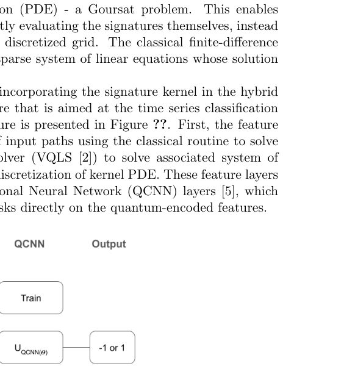
<figcaption class="paper-figure-caption"><b>Fig 1.</b> Figure 1: Schematic diagram for the hybrid quantum-classical classification pipeline.</figcaption>
</figure>
<figure class="paper-figure-card">
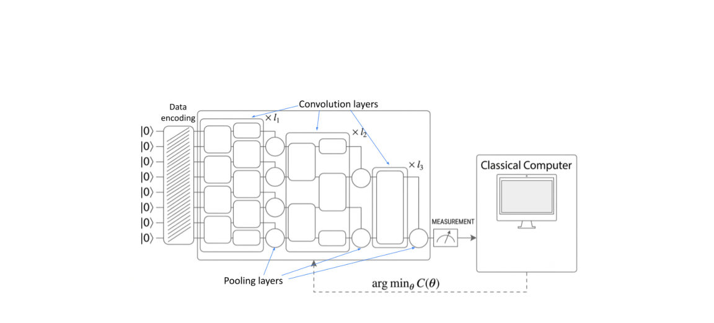
<figcaption class="paper-figure-caption"><b>Fig 2.</b> Figure 2: Schematic representation of the QCNN architecture applied to an 8-qubit system. The pipeline integrates a fixed quantum data encoding stage followed by three alternating layers of parameterized convolutional filters (li denotes the number of filters in layer i) and pooling operations executed in a translationally invariant manner.</figcaption>
</figure>
<figure class="paper-figure-card">
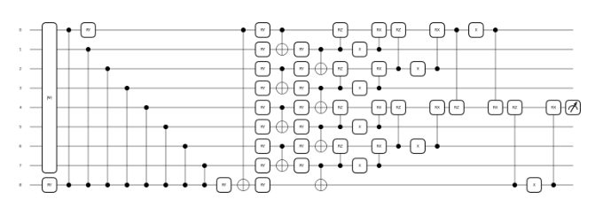
<figcaption class="paper-figure-caption"><b>Fig 3.</b> Figure 3: Circuit scheme of the extra qubit kernel architecture, exemplified with RY and CNOT gates as convolutional filters and parametrized pooling layers, corresponding to the architecture extended U15, described above.</figcaption>
</figure>
<figure class="paper-figure-card">
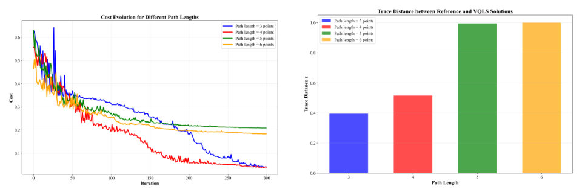
<figcaption class="paper-figure-caption"><b>Fig 4.</b> Figure 4: Scalability benchmarks for the VQLS framework across varying path compression levels: (a) Optimization trajectories of the local cost function CL(θ), and (b) The corresponding evolution of the overlap fidelity as a function of the system dimension.</figcaption>
</figure>
<figure class="paper-figure-card">
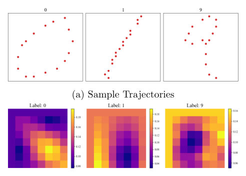
<figcaption class="paper-figure-caption"><b>Fig 5.</b> Figure 5: Visual analysis of the MNIST sequence dataset: (a) Characteristic downsampled pen-tip trajectories for the binary classification task, (b) Full signature kernel matrices generated by the SigKernel architecture, evaluated against a fixed reference sample Xref representing a digit 0.</figcaption>
</figure>

**Summary.** The paper proposes a novel hybrid approach combining path signature kernels—a mathematical tool invariant to time reparameterization—with Quantum Convolutional Neural Networks (QCNNs) for classifying time series data. While the full implementation relies on Variational Quantum Linear Solvers (VQLS), scalability issues limit its use, leading the authors to compare architectural designs using classical kernel computation alongside quantum feature extraction.

**Why it may be interesting.** This work is interesting because it attempts to bridge advanced geometric/topological data analysis (rough paths) with near-term quantum machine learning models (QCNNs), providing a concrete, albeit challenged, roadmap for applying quantum computation to complex physical time series data.

Detailed structure

**Main problem.** The core challenge is performing time series classification while overcoming the inherent difficulty posed by time reparametrization invariance in the data.

**Main result.** The authors demonstrate that a hybrid quantum-classical architecture using path signature kernels followed by QCNNs shows potential, although current VQLS implementations are limited by scalability issues on near-term hardware.

**Method.** They propose integrating the mathematically robust signature kernel (which handles time reparametrization) into a Quantum Convolutional Neural Network (QCNN) framework. The kernel evaluation is attempted using Variational Quantum Linear Solvers (VQLS).

**Model / system.** The system involves analyzing time series data, such as handwritten digits, by first calculating the signature kernel between input paths and then feeding these features into a QCNN structure.

**Key observables.** Classification accuracy for binary tasks (e.g., 0-vs-1), Overlap Fidelity ($\epsilon$), and matrix condition number ($\kappa$) related to VQLS performance.

**Important parameters / regimes.** The complexity scales are noted: QCNN depth/parameters scale as $O(\log n)$, while VQLS struggles with large system sizes ($N 	imes N$ matrices) derived from long trajectories.

**Assumptions / limitations.** Key limitations include the impracticality of using VQLS for realistic, long-trajectory data due to $\kappa$ inflation and hardware constraints; thus, classical computation is often used for final benchmarks.

**Figures summary.** Figures illustrate the hybrid pipeline (Fig 1), the QCNN circuit structure (Fig 2), the auxiliary qubit kernel architecture (Fig 3), VQLS scalability issues (Fig 4), and comparative classification results across different architectural setups (Fig 6).

**Paper structure.** The paper introduces the problem of time series invariance, details the mathematical tool (signature kernel) derived from solving a PDE, proposes the hybrid QCNN-Signature architecture, discusses implementing the kernel via VQLS on quantum circuits, and concludes with experimental results comparing various architectural configurations.

Abstract

Time series analysis plays a vital role across a wide range of scientific and engineering domains but poses substantial computational challenges. A major difficulty arises from the time reparameterization invariance of time series data, which complicates the extraction of meaningful temporal features. In this work, we address the problem of time series classification by exploring the application of quantum computation techniques. We propose a hybrid quantum-classical architecture that integrates recent advances in quantum neural networks with the mathematical framework of path signatures, mitigating the impact of time reparametrization invariance. The architecture employs feature layers that compute a signature kernel between pairs of input paths, consisting of a reference path and a target path for classification, using either classical or quantum variational linear solvers (VQLS). These feature layers are followed by a Quantum Convolutional Neural Network (QCNN) to perform downstream learning tasks. We evaluate several realizations of the proposed architecture, differing in QCNN configurations, on a binary classification task involving time series representations of handwritten digits. Our experiments demonstrate the potential advantages of implementing path signature kernel layers within quantum circuits and provide an analysis of the computational limitations associated with the VQLS component.

[↑ back to top](#top)

### [Secret Key Rate Analysis of Distribution Matching Algorithms for Discrete-Modulated CV-QKD](http://arxiv.org/abs/2607.06783v1)

**Authors:** Micael Dias, Caroline Alves, Gabrielly Roman, Søren Forchhammer  
**Type:** theory · **Category:** quantum information and computing · **PDF:** <https://arxiv.org/pdf/2607.06783v1>  
**Analysis basis:** full PDF text, analyzed in chunks
**Topic relevance:** `interference shaping light` **1/5**

↔ Scroll figures horizontally

<figure class="paper-figure-card">
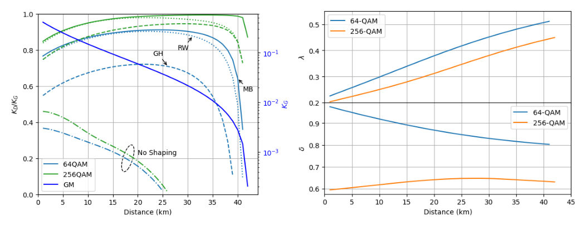
<figcaption class="paper-figure-caption"><b>Fig 1.</b> Fig. 1: (a) SKR for discrete modulation formats normalized to the Gaussian modulated protocol with optimized modulation variance at each distance point. The solid blue line corresponds to the absolute SKR value for continuous Gaussian modulation (right vertical axis). Normalized SKRs for QAM constellations of sizes 64 and 256 are represented by light blue, red and green lines. The probabilistic shaping formats MB, RW and GH are represented by solid, dotted and dashed lines, respectively. Dotted-dashed lines correspond to QAM constellations with no shaping. (b) Optimized λ and δ parameters for the MB probabilistic shaping. The calculations considered β = 0.95, detection efficiency η = 0.8,...</figcaption>
</figure>
<figure class="paper-figure-card">
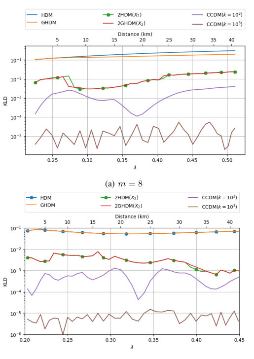
<figcaption class="paper-figure-caption"><b>Fig 2.</b> Fig. 2: Kullback–Leibler divergence between matched distri- butions and the optimized MB distribution supports of size m = {8, 16} for the Huffman matchers (symbol and pairwise) and the CCDM with different block of lengths.</figcaption>
</figure>
<figure class="paper-figure-card">
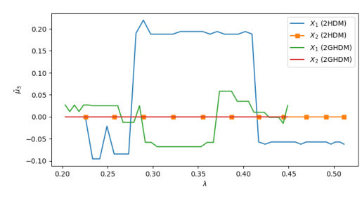
<figcaption class="paper-figure-caption"><b>Fig 3.</b> Fig. 3: Skewness of the marginal distributions obtained from pairwise Huffman and geometric Huffman matching from Fig. 2a.</figcaption>
</figure>
<figure class="paper-figure-card">
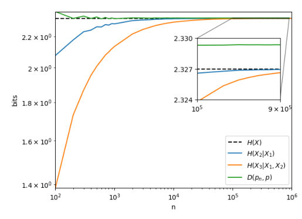
<figcaption class="paper-figure-caption"><b>Fig 4.</b> Fig. 4: Conditional entropy ˆH(Xi|Xi−1) and ˆH(Xi|Xi−1, Xi−2) for the sequences output by the CCDM with different block lengths.</figcaption>
</figure>
<figure class="paper-figure-card">
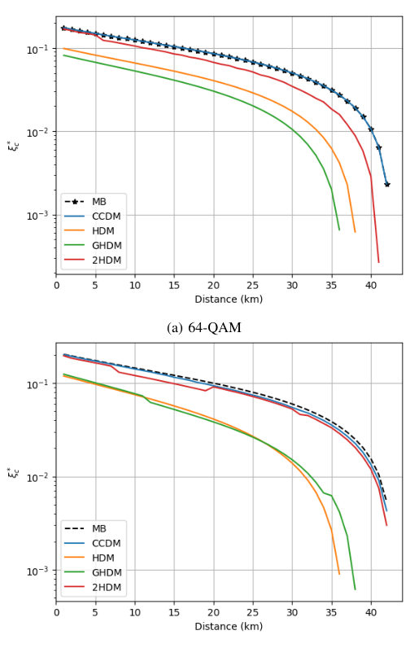
<figcaption class="paper-figure-caption"><b>Fig 5.</b> Fig. 6: Maximal Excess Noise for a SKR threshold of Kth = 10−4 of probabilistically shaped (a) 64-QAM and (b) 256- QAM constellations considering the optimal MB distributions and the matched distribution from the Huffman and CCDM approaches.</figcaption>
</figure>

**Summary.** This paper investigates the security limits of CV-QKD when using discrete modulation formats shaped probabilistically. It compares various distribution matching algorithms, finding that Constant Composition Distribution Matching (CCDM) provides the most accurate approximation to optimal distributions. This confirms that careful implementation of PCS is crucial for maximizing key rates and maintaining noise tolerance in practical quantum communication links.

**Why it may be interesting.** It provides rigorous theoretical bounds on achievable secure key rates when practical digital signal processing techniques (like discrete constellation shaping via DM) are used in quantum communication systems.

Detailed structure

**Main problem.** The paper analyzes how using Distribution Matching (DM) algorithms for Probabilistic Constellation Shaping (PCS) affects the Secret Key Rate (SKR) in Continuous Variable Quantum Key Distribution (CV-QKD) protocols with discrete modulation.

**Main result.** Constant Composition Distribution Matching (CCDM) performs significantly better than symbol-by-symbol Huffman matching, achieving SKRs that closely match the theoretical optimum and maintaining high excess noise tolerance.

**Method.** The analysis involves calculating the SKR using established CV-QKD security formulas, comparing results from different DM techniques (HDM vs. CCDM), and quantifying statistical dependence on finite block lengths.

**Model / system.** The system is a CV-QKD protocol transmitting light field quadratures through a quantum channel characterized by transmittance ($	au$) and excess noise ($\xi_c$). The modulation uses discrete constellations shaped probabilistically.

**Key observables.** Secret Key Rate (SKR), maximum tolerable excess noise ($\xi^*_c$), and the performance degradation relative to ideal Gaussian modulation.

**Important parameters / regimes.** Constellation size (e.g., 64-QAM, 256-QAM), channel parameters ($	au$, $\xi_c$), and block lengths ($10^3$ or $10^5$ symbols).

**Assumptions / limitations.** The analysis compares the performance of finite-length approximations (HDM/CCDM) against the ideal, continuous Maxwell-Boltzmann distribution.

**Figures summary.** Figures compare SKR vs. distance for various shaping methods and show $\xi^*_c$ values, demonstrating CCDM's superior noise tolerance compared to other matching techniques.

**Paper structure.** The paper progresses by establishing the need for PCS in CV-QKD, detailing the mathematical framework for SKR calculation, comparing multiple DM algorithms (HDM, GHDM, CCDM) against the optimal MB benchmark, and concluding with performance metrics like noise tolerance.

Abstract

Continuous variable quantum key distribution protocols (CV-QKD) with discrete modulation have been intensively investigated to bridge the gap between ideal Gaussian modulation and modern coherent optical communication systems. To mitigate the penalty of discrete modulation, probabilistic constellation shaping (PCS) is applied to the modulation format and is typically performed by distribution matching (DM) algorithms. In this paper, we address the application of DM algorithms to perform PCS in CV-QKD protocols. We investigate the impact of approximating optimized Maxwell-Boltzman distributions with DM algorithms based on Huffman (HDM) and constant composition (CCDM) codes on the protocol's secret key rate (SKR) and tolerance to excess noise. Our results show that specifically symbol-by-symbol HDM degrades the SKR by at least 30\%, whereas CCDM matches the optimal SKR with code length of $10^3$ or more symbols. Furthermore, we also provide a statistical analysis of symbol dependence for both approaches, showing that CCDM must operate with blocks of at least $10^5$ symbols for the correlations become negligible. Finally, we propose an algorithm to generate independent symbols following near-optimal distributions.

[↑ back to top](#top)

## Other papers (5)

*Papers from primary archives without highlighted authors or any topic match. Click to expand.*

Show other papers

### [A quantum model for synchronizing finite state transition systems](http://arxiv.org/abs/2607.06953v1)

**Authors:** Martin Lukac, Khaled El-Fakih, Uraz Turker  
**Type:** theory · **Category:** quantum information and computing · **PDF:** <https://arxiv.org/pdf/2607.06953v1>  
**Analysis basis:** full PDF text, analyzed in chunks

↔ Scroll figures horizontally

<figure class="paper-figure-card">
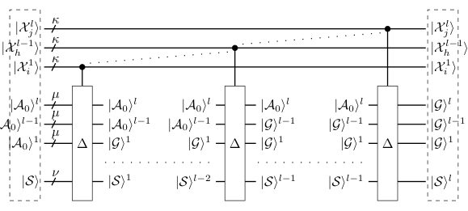
<figcaption class="paper-figure-caption"><b>Fig 1.</b> Figure 2: Circuit representing the l−times application of ∆to a sequence of l inputs encoded by |X l j⟩· · · |X 1 i ⟩ starting from an FA state encoded by S⟩. This represents the evolution, according to ∆, from QTS |Q⟩to |Q⟩l leading to the FA state encoded by S⟩l.</figcaption>
</figure>
<figure class="paper-figure-card">
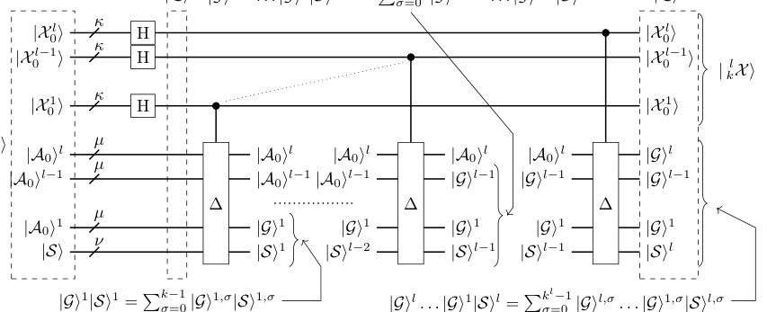
<figcaption class="paper-figure-caption"><b>Fig 2.</b> Figure 3: Circuit representing the applications of all input sequences of length l in supposition; namely, applying in order the first, second, .., l −th inputs of these sequences starting from a single FA state |S⟩ leading the to the FA states encoded by |S⟩l.</figcaption>
</figure>
<figure class="paper-figure-card">
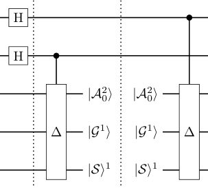
<figcaption class="paper-figure-caption"><b>Fig 3.</b> Figure 4: Circuit corresponding to the FA built from the specifications in Table 1, superposed input qubits |X 2 0 , X 1 0 ⟩, and two ancillae qubits, one for each sequential input</figcaption>
</figure>
<figure class="paper-figure-card">
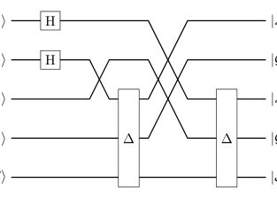
<figcaption class="paper-figure-caption"><b>Fig 4.</b> Figure 5: Circuit showing how the qubits are routed to each of the ∆operator when used as in circuit in Figure 4</figcaption>
</figure>
<figure class="paper-figure-card">
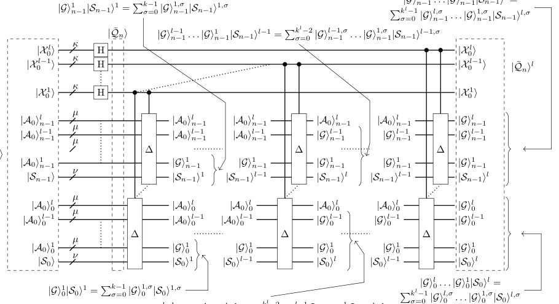
<figcaption class="paper-figure-caption"><b>Fig 5.</b> Figure 6: A circuit representing the applications of all input sequences of length l in supposition; namely, applying in order the first, second, .., l −th inputs of these sequences to all state of the FA encoded in quantum states |S0⟩,..., |Sn−1⟩.</figcaption>
</figure>

**Summary.** This paper develops a quantum model to solve the synchronization problem for Finite State Transition Systems. By encoding the system dynamics into unitary operators and employing Grover search on superpositions of input sequences, it finds a Resetting Input Sequence (RS). The approach offers a significant quadratic speedup over known classical brute-force methods.

**Why it may be interesting.** This work demonstrates applying advanced quantum search techniques (Grover's algorithm) to solve a classically hard problem in automata theory, providing a clear computational complexity advantage relevant to quantum computation theory.

Detailed structure

**Main problem.** The core problem is finding a Resetting Input Sequence (RS) for a Finite State Transition System (FA) that forces the system into a specific state regardless of its initial condition.

**Main result.** The authors propose a quantum algorithm achieving a quadratic speedup over classical brute-force methods for solving this computationally hard synchronization problem.

**Method.** They encode the FA dynamics into unitary operators and utilize superposition, followed by Amplitude Amplification and Grover search to efficiently locate the required synchronizing sequence.

**Model / system.** The system models an FA using quantum registers for states ($|S
angle$) and inputs ($|X
angle$), embedding the transition function into global unitary matrices ($\Delta$).

**Key observables.** The primary observable is finding a collection of reached states that are all identical, corresponding to the target synchronizing state.

**Important parameters / regimes.** Complexity scales are compared: classical brute-force complexity vs. quantum search complexity (e.g., $\sqrt{M}$ steps).

**Assumptions / limitations.** The method assumes the ability to embed non-permutative transition matrices into unitary permutative matrices using ancilla qubits.

**Figures summary.** Figures illustrate circuits for applying single inputs, sequences of length $l$, and the overall evolution on a Quantum Total State (QTS).

**Paper structure.** The paper first defines the NP-Hard/PSPACE-Complete problem, then constructs the quantum model by encoding transitions into unitaries ($\Delta$), simulates state evolution via superposition, and finally applies Grover search to find the RS.

Abstract

We propose a quantum model for finding a resetting input sequence (RS) which can take a finite state transition system (FA), to particular state independent of its current state. The complexity of finding such sequences for various types of FA can be NP-Hard or even PSPACE-Complete. To this end, we represent the FA states, inputs, and transition function in quantum space. Accordingly, we propose a model to represent the execution of an input sequence of a particular length $l$ starting form an initial FA state. The model is extended considering the application in superposition of all input sequences of length $l$ to an initial state of the FA. The model is further extended considering the application of all input sequences to all initial states of the FA capturing for every input sequence the collection (ordered list) of states reached by applying the sequence to all states of the FA. The amplitude amplification algorithm is then used as it combines similar collections of reached states while preserving all input sequences that reach these collections. A Grover search for a reached collection where its elements correspond to the same FA state provides a RS for the FA. Our approach offers a quadratic gain over the exponential complexity of traditional brute-force method, which is the only method that can be applied to a general FA class. As a proof of concept we provide results of several simulated FAs on a quantum simulator.

[↑ back to top](#top)

### [Error bounds for the truncated Baker--Campbell--Hausdorff and Zassenhaus formulas in unitary problems](http://arxiv.org/abs/2607.07692v1)

**Authors:** A. Arnal, F. Casas, J. L. Ruiz-Benito  
**Type:** theory · **Category:** other · **PDF:** <https://arxiv.org/pdf/2607.07692v1>  
**Analysis basis:** full PDF text, analyzed in chunks

↔ Scroll figures horizontally

<figure class="paper-figure-card">

<figcaption class="paper-figure-caption"><b>Fig 1.</b> Figure 1: Actual error (32) committed by the truncated second-order BCH formula, together with the bounds (33) for two skew-adjoint 20 × 20 matrices 𝐴and 𝐵. The difference between 𝐵[2] 1 and 𝐵[2] 2 is almost negligible in this case, and they overestimate the actual error by less than a factor 3.</figcaption>
</figure>
<figure class="paper-figure-card">
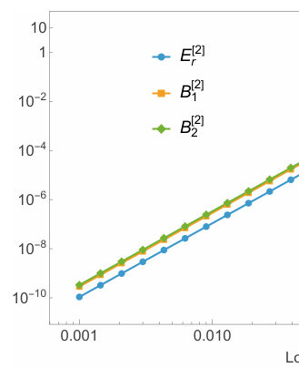
<figcaption class="paper-figure-caption"><b>Fig 2.</b> Figure 2 corresponds to the truncated BCH formula after 𝑚= 3 terms. Specifically, we represent the actual error 𝐸[3] 𝑟 ≡‖e𝑡𝐴e𝑡𝐵−e𝑍[3]‖ as a function of 𝑡, together with the bound 𝐵[3] 1 collected in the Appendix, eq. (48), and the corresponding expression 𝐵[3] 2 obtained from 𝐵[3] 1 by applying the triangle inequality to each term 𝐶[3] 𝑗. Again,</figcaption>
</figure>
<figure class="paper-figure-card">
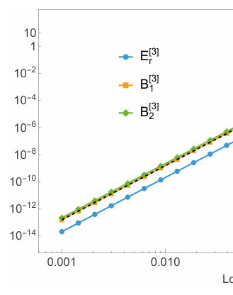
<figcaption class="paper-figure-caption"><b>Fig 3.</b> Figure 2: Actual error 𝐸[3] 𝑟 committed by the truncated second-order BCH formula, together with the theoretical bounds obtained in this work for two skew-adjoint 20 × 20 matrices 𝐴and 𝐵. The dashed line corresponds to the leading term in the theoretical bound (26).</figcaption>
</figure>

**Summary.** This paper develops a rigorous mathematical framework to calculate precise error bounds when approximating complex unitary time evolution operators using truncated versions of the Baker-Campbell-Hausdorff and Zassenhaus formulas. By bounding the error in terms of nested commutators, it provides crucial theoretical guarantees for numerical quantum simulation techniques.

**Why it may be interesting.** This work provides essential mathematical tools for quantum simulation algorithms (like Trotterization or product formulas) by quantifying exactly how much error is introduced when truncating the necessary exponential series expansions.

Detailed structure

**Main problem.** The core problem is deriving rigorous, general error bounds for approximating the logarithm of operator products (BCH) or the exponential of sums (Zassenhaus) when these infinite series must be truncated for practical computation.

**Main result.** The authors provide a general strategy and explicit formulas showing that the truncation error can be bounded by linear combinations of nested commutators, which exhibit a predictable scaling property.

**Method.** The analysis relies on comparing two representations of the evolution operator (e.g., $e^A e^B$ vs. $e^{\Phi(A, B)}$) and using differential equations satisfied by time-dependent unitary operators to bound the difference.

**Model / system.** The context is general unitary problems in quantum physics where the evolution operator is expressed as a product or sum of exponentials of non-commuting, skew-adjoint operators (e.g., $e^{tA}e^{tB}$).

**Key observables.** The error norm, $\| 	ext{Exact Evolution} - 	ext{Truncated Approximation} \|$, which is shown to be related to the $(m+1)$-th order term in the expansion.

**Important parameters / regimes.** The truncation order ($m$ or $q$) and the norms of the involved operators ($\|A\|, \|B\|$).

**Assumptions / limitations.** The operators $A$ and $B$ are assumed to be skew-adjoint, which is typical for quantum evolution problems.

**Figures summary.** Figures illustrate that the theoretically derived error bounds closely match the actual computed errors for small truncation orders ($m=2, 3$), confirming the accuracy of the established bounds.

**Paper structure.** The paper systematically develops the general theory by first establishing the framework using differential equations, then deriving specific, increasingly complex error bounds for both the BCH and Zassenhaus formulas in terms of nested commutators.

Abstract

The Baker--Campbell--Hausdorff (BCH) formula plays a critical role in many branches of mathematics and physics. It expresses the logarithm of the product of exponentials of non-commuting operators as an infinite series of nested commutators of the operators involved. The Zassenhaus formula is the dual of the BCH formula: the exponential of a sum of operators is written as an infinite product of exponentials involving the operators and their commutators. In practical computations, however, one typically has to truncate the expansions, and so understanding the error committed by the resulting approximations and eventually providing suitable bounds for this error is of paramount interest. In this work we present a general strategy to derive rigorous error bounds and explicit error constants for the BCH and Zassenhaus formulas when the operators involved are skew-adjoint, as is the case for quantum evolution problems.

[↑ back to top](#top)

### [Resource-Efficient Hybrid Quantum Neighborhood Selection for Large-Scale Molecular Diversity Optimization](http://arxiv.org/abs/2607.07336v1)

**Authors:** Nicolas Mendes de Araujo, Lester de Abreu Faria  
**Type:** theory · **Category:** quantum information and computing · **PDF:** <https://arxiv.org/pdf/2607.07336v1>  
**Analysis basis:** full PDF text, analyzed in chunks

↔ Scroll figures horizontally

<figure class="paper-figure-card">
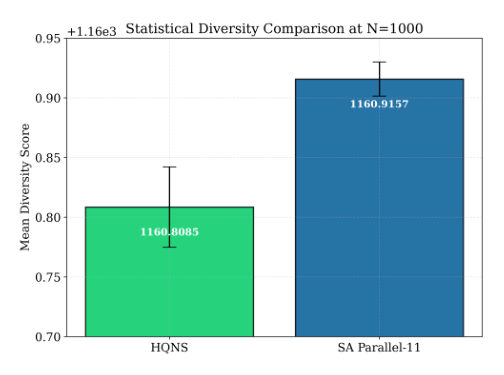
<figcaption class="paper-figure-caption"><b>Fig 1.</b> FIGURE 1. Statistical diversity comparison at N = 1000 over ten independent runs. Error bars indicate one standard deviation. SA Parallel-11 achieves the higher mean diversity score, while HQNS preserves 99.9908% of the SA mean diversity.</figcaption>
</figure>
<figure class="paper-figure-card">
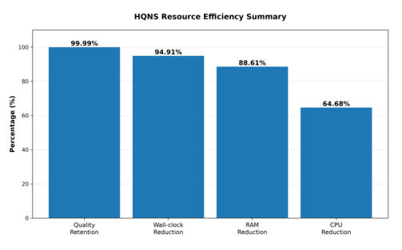
<figcaption class="paper-figure-caption"><b>Fig 2.</b> FIGURE 2. Quality-retention and resource-efficiency summary at N = 1000. HQNS preserves 99.9908% of the SA Parallel-11 mean diversity score while reducing wall-clock time, peak CPU utilization, and peak memory usage.</figcaption>
</figure>
<figure class="paper-figure-card">
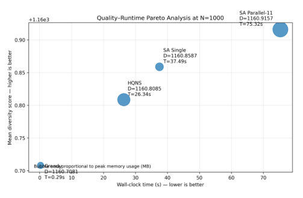
<figcaption class="paper-figure-caption"><b>Fig 3.</b> FIGURE 4. Pareto Analysis of Solution Quality versus Computational Cost at N = 1000. The horizontal axis reports wall-clock execution time, while the vertical axis reports mean diversity score over ten independent runs. Bubble area is proportional to peak memory usage. HQNS occupies an intermediate operational region: it is substantially faster than SA Single and SA Parallel-11, while preserving near-baseline diversity relative to the strongest parallel classical baseline.</figcaption>
</figure>
<figure class="paper-figure-card">
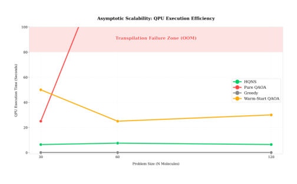
<figcaption class="paper-figure-caption"><b>Fig 4.</b> FIGURE 3. QPU execution-time stability across problem scales. HQNS maintains a bounded QPU execution envelope because each quantum stage operates on a compact active frontier rather than the full N-variable QUBO.</figcaption>
</figure>

**Summary.** This paper introduces Hybrid Quantum Neighborhood Selection (HQNS) to tackle large combinatorial optimization problems formulated as dense QUBOs. By decomposing the problem into small, manageable quantum subproblems via frontier selection, HQNS significantly reduces computational resource demands compared to classical methods. This demonstrates a practical, resource-aware pathway for utilizing near-term quantum hardware in complex scientific simulations.

**Why it may be interesting.** It provides a concrete, resource-efficient architectural blueprint for integrating quantum processors into complex optimization pipelines, which is highly relevant for developing algorithms applicable to molecular simulation or material design using near-term hardware.

Detailed structure

**Main problem.** Solving large-scale combinatorial optimization problems, specifically those formulated as dense QUBO instances like Maximum Diversity Subset Selection.

**Main result.** The proposed HQNS framework achieves near-baseline solution quality while drastically reducing computational resource consumption (time, CPU, memory) compared to strong classical baselines on large problem sizes ($N=1000$).

**Method.** HQNS decomposes the large QUBO instance into smaller, bounded-width quantum subproblems by selecting a stochastic 'frontier' of active variables for local optimization on the QPU.

**Model / system.** The problem is modeled using QUBO formulations derived from pairwise similarity matrices. The context is Near-Term Intermediate-Scale Quantum (NISQ) processors, which struggle with monolithic encoding of large interactions.

**Key observables.** Diversity score retention (99.9908% vs baseline), wall-clock time reduction (94.91%), peak CPU utilization reduction (64.68%), and QPU execution time stability ($\sim 6-7$ seconds).

**Important parameters / regimes.** Problem size $N$ up to 1000; Frontier size $F \ll N$; QUBO formulation complexity.

**Assumptions / limitations.** The quantum component's workload is bounded by the fixed frontier size ($F$), decoupling it from the global dimension ($N$) for practical NISQ deployment.

**Paper structure.** The paper establishes the computational bottleneck of large QUBO problems, introduces HQNS as a resource-aware hybrid solution, evaluates its performance against state-of-the-art classical solvers (SA), and concludes by demonstrating its practical utility for NISQ hardware.

Abstract

Large-scale combinatorial optimization remains demanding for classical heuristics, particularly when dense Quadratic Unconstrained Binary Optimization (QUBO) formulations induce large memory footprints, high CPU utilization, and long execution times. While near-term quantum processors cannot yet deliver unconditional quantum advantage, hybrid architectures can provide practical value by reducing the resource burden. This paper presents a resource-efficiency study of Hybrid Quantum Neighborhood Selection (HQNS), a framework that decomposes large dense QUBO instances into bounded-width quantum subproblems via stochastic frontier selection. We evaluate HQNS on the Maximum Diversity Subset Selection Problem (MDSSP), focusing on the trade-off between solution quality retention and resource consumption. Benchmarks up to N=1000 candidates show that HQNS preserves 99.9908% of the mean diversity score of an 11-restart parallel Simulated Annealing baseline, while reducing wall-clock time by 94.91%, peak CPU utilization by 64.68%, and peak memory usage by 88.61%. The QPU execution time remains bounded within a 6-7 second envelope across scales, indicating that the quantum component is decoupled from the global QUBO dimension when the frontier size is fixed. These results suggest that HQNS provides a resource-aware pathway for deploying hybrid quantum optimization in practical large-scale settings, serving as an efficient architecture for incorporating near-term quantum processors into classical optimization pipelines.

[↑ back to top](#top)

### [Spectral Born machines: classically trainable quantum generative models for discrete data](http://arxiv.org/abs/2607.06675v1)

**Authors:** Austin Huang, William Maxwell, Vasilis Belis, Evan Peters, Jason Pye, Soran Jahangiri, Joseph Bowles  
**Type:** theory · **Category:** quantum information and computing · **PDF:** <https://arxiv.org/pdf/2607.06675v1>  
**Analysis basis:** full PDF text, analyzed in chunks

↔ Scroll figures horizontally

<figure class="paper-figure-card">
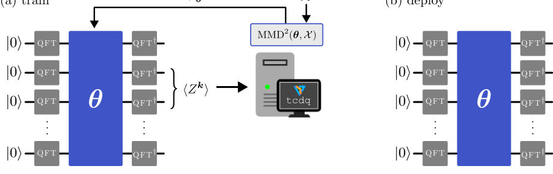
<figcaption class="paper-figure-caption"><b>Fig 1.</b> FIG. 1. (a) A spectral Born machine consists of a diagonal parameterized unitary sandwiched between two layers of quantum Fourier transforms acting on qudits. For these circuits, expectation values of Heisenberg-Weyl observables can be classically estimated in order to train the maximum mean discrepancy loss function between the output distribution of the circuit and the empirical data distribution, which we make available via the PennyLane module tcdq. (b) Once training is complete, the trained circuit can be deployed on quantum hardware and used to sample new data, where genuine computational advantages may be present.</figcaption>
</figure>
<figure class="paper-figure-card">
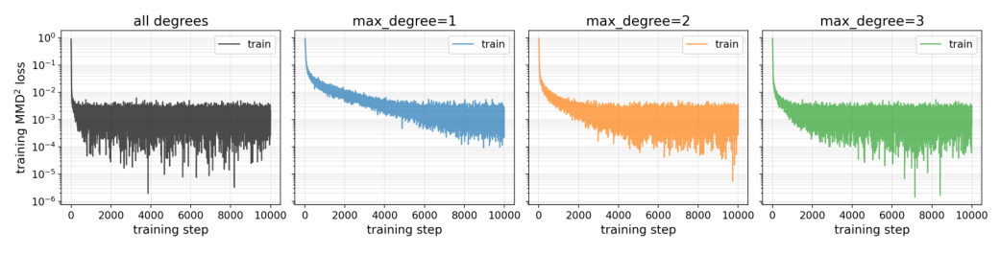
<figcaption class="paper-figure-caption"><b>Fig 2.</b> FIG. 2. The four spectral Born machines (with varying parameter counts) used for Potts model experiments achieve similar training loss, suggesting that the models converge towards similar test performance regardless of model complexity.</figcaption>
</figure>
<figure class="paper-figure-card">
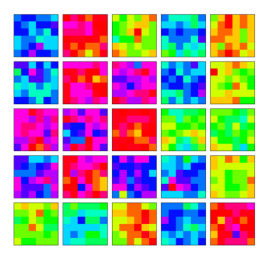
<figcaption class="paper-figure-caption"><b>Fig 3.</b> FIG. 3. Example configurations from the Potts model on a 6 × 6 lattice. Colours represent each of the 16 possible values the variables can take.</figcaption>
</figure>
<figure class="paper-figure-card">
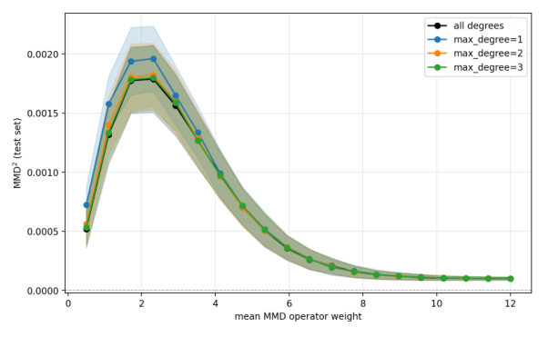
<figcaption class="paper-figure-caption"><b>Fig 4.</b> FIG. 4. The inductive bias of the spectral Born machine allows small models to achieve comparable performance compared to significantly larger models. Curves show test loss values for the four models used in the Potts experiment as a function of the mean operator weight of the complete graph MMD loss (shaded areas denote 1 standard deviation of the estimated MMD2).</figcaption>
</figure>
<figure class="paper-figure-card">
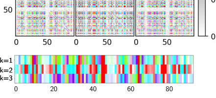
<figcaption class="paper-figure-caption"><b>Fig 5.</b> FIG. 5. Comparing visualizations of the Fourier coefficients of the complete dataset (left) versus trained spectral Born machine (right) suggests that the models learn broadly similar features to the data. The panels below show the values of the Fourier coefficients with vectors k of weight 2, where the (i, j)th elements of k take one of the nine possible values (ki, kj). For instance, the first row of the panel below shows the first order Fourier coefficients (diagonal elements) of the k1 = k2 = 1 subplot of the figure above. Since coefficients are complex, the hue shows the magnitude (with scale given to the right of the plots) and the colour shows the phase.</figcaption>
</figure>

**Summary.** This paper introduces spectral Born machines, a class of quantum generative models designed specifically for learning discrete, integer-structured data. By leveraging the Quantum Fourier Transform over $\mathbb{Z}_n^d$, these models gain an inductive bias that is both powerful and classically trainable via MMD loss minimization. The work demonstrates scalability by successfully training large models on complex biological sequences like rRNA.

**Why it may be interesting.** The focus on using group theory (Fourier analysis) to impose structure on quantum models is highly relevant for building physically motivated and efficiently trainable quantum circuits beyond simple binary encoding schemes.

Detailed structure

**Main problem.** Developing quantum generative models capable of learning complex, discrete data structures (like integers) while remaining classically trainable for practical implementation.

**Main result.** The spectral Born machine provides a general framework that uses group Fourier analysis to create an inductive bias suitable for integer-structured data, enabling scalable training on classical hardware.

**Method.** Training is achieved using the Maximum Mean Discrepancy (MMD) loss derived from graph spectral analysis, which allows efficient estimation of quantum expectation values via classical sampling techniques.

**Model / system.** The model generalizes IQP Born machines by employing the Quantum Fourier Transform over $\mathbb{Z}_n^d$. It utilizes parameterized unitary gates constructed from generalized Pauli/Heisenberg-Weyl observables acting on qudits.

**Key observables.** Expectation values of Heisenberg-Weyl observables, $\langle D(k, m) \rangle_{\theta}$, and the Mean Maximum Discrepancy (MMD) loss function used for training.

**Important parameters / regimes.** The dimension $d$ and length $n$ of the discrete group $\mathbb{Z}_d^n$; model size up to 190 qubits with over 1 million parameters.

**Assumptions / limitations.** Classical trainability relies on the expectation values of specific observables being estimable via classical algorithms, and efficient computation of the phase function $\Phi_{\theta}(z)$ is assumed.

**Figures summary.** Figure 1 illustrates the structure of a spectral Born machine, showing its construction using diagonal parameterized unitaries sandwiched between QFT layers for both classical training visualization and quantum deployment.

**Paper structure.** The paper first introduces the model by generalizing IQP Born machines via group Fourier analysis. It then details the mathematical framework, including generalized observables (HW) and the explicit formulas for calculating expectation values classically. Finally, it focuses on developing efficient, batched estimators for these expectations and the MMD loss.

Abstract

We present \emph{spectral Born machines}, a class of quantum generative models that results from viewing and generalizing the class of IQP Born machines through the lens of group Fourier analysis. These quantum models exploit the quantum Fourier transform to create an inductive bias that make them naturally suited to learning integer-structured data, while remaining classically hard to sample from in general. Similar to IQP Born machines, spectral Born machines can be trained efficiently at scale on classical hardware via a maximum mean discrepancy loss based on graph spectral analysis, which we make available in a new \emph{tcdq} module of the PennyLane software platform. In numerical experiments, we show how the spectral bias of the model leads to significantly reduced parameter counts compared to unstructured approaches, and demonstrate the scalability of the software by training a 190-qubit model with over 1 million parameters to successfully learn a distribution of 93 nucleotide-long ribosomal RNA. Our results suggest that highly over-parameterized spectral Born machines may be immune to overfitting, even in strongly data-scarce regimes.

[↑ back to top](#top)

### [XOR Games at Full Tilt: The Hardness of Binary Nonlocal Games](http://arxiv.org/abs/2607.06876v1)

**Authors:** Richard Cleve, Eric Culf, Aviv Taller  
**Type:** theory · **Category:** quantum information and computing · **PDF:** <https://arxiv.org/pdf/2607.06876v1>  
**Analysis basis:** full PDF text, analyzed in chunks

↔ Scroll figures horizontally

<figure class="paper-figure-card">
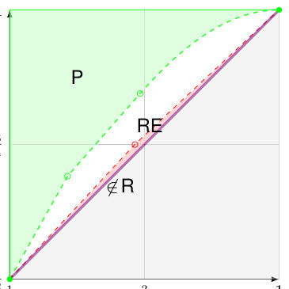
<figcaption class="paper-figure-caption"><b>Fig 1.</b> Figure 1: Hardness of tilted XOR games. The P regions (green) are problems solvable in polynomial time, the triangular regions (red) are hard instances, and the white regions are where the complexity is unknown. The problem is undefined below the diagonal (gray). The RE-complete region is not to scale (though it is the interior of a triangle with positive area). The diagonal line labelled ̸∈R (purple) is a region where the problem is not decidable (but not known to be RE-hard).</figcaption>
</figure>
<figure class="paper-figure-card">
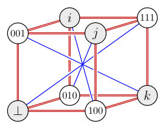
<figcaption class="paper-figure-caption"><b>Fig 2.</b> Figure 3: Gadgets for E3-LIN equations of the form vi ⊕vj ⊕vk = b.</figcaption>
</figure>

**Summary.** This paper analyzes the difficulty of approximating the quantum value for a specific class of nonlocal games called tilted XOR games. By reducing known hard computational problems like E3-LIN and the halting problem to these games, the authors prove that approximation is RE-complete. This result establishes a deep link between quantum information theory and high levels of computational complexity.

**Why it may be interesting.** This work connects fundamental concepts in computational complexity theory (RE-completeness) directly to the physical limitations of quantum correlations, providing theoretical boundaries on what can be efficiently verified or simulated using quantum resources.

Detailed structure

**Main problem.** The core problem is determining the computational complexity of approximating the quantum value for a generalized class of nonlocal games called 'tilted XOR games.'

**Main result.** The authors prove that approximating the quantum value of tilted XOR games to constant precision is RE-complete, implying that general binary nonlocal games are hard to approximate.

**Method.** The hardness result is established via a polynomial-time reduction from E3-LIN games (linear constraint systems) and later extended using reductions involving the halting problem for tracial strategies.

**Model / system.** The study focuses on quantum nonlocal games, specifically 'tilted XOR games,' which are binary games whose winning condition is a slight variation of simple XOR constraints. The analysis extends to quantum tracial strategies ($\omega^*_{tr}(G)$).

**Key observables.** The primary observable is the quantum value (or approximation thereof) of the game, $\omega^*(G)$ or $\omega^*_{tr}(G)$.

**Important parameters / regimes.** The complexity depends on parameters like completeness probability ($c$) and soundness probability ($s$), which define the decision problem thresholds.

**Assumptions / limitations.** The analysis relies on reductions from known hard problems (E3-LIN, halting problem) and utilizes characterizations of optimal strategies for XOR games.

**Figures summary.** Figure 1 summarizes complexity regions for classical and quantum values ($	ext{TXOR}_{c,s}$ vs $	ext{TXOR}^*_{c,s}$), highlighting a red triangular region labeled RE indicating the hardness boundary.

**Paper structure.** The paper progresses by first establishing the general RE-completeness result for tilted XOR games. It then refines this analysis using specific parameters ($c, s$) and extends the hardness proof to quantum tracial strategies ($\omega^*_{tr}(G)$) via a reduction from the halting problem.

Abstract

It is well known that the quantum value of an XOR nonlocal game, where the winning condition depends only on the XOR of the two players' output bits, may be approximated in polynomial time. We study a variant of the XOR game model, which we call tilted XOR games, where the winning condition can additionally depend on only one of the output bits. We show that this dramatically increases the expressive power: the computational complexity of the problem of approximating the quantum value of tilted XOR games to constant precision is RE-complete. Also, our result extends to succinct versions of tilted XOR games, where the questions can be polynomial-length binary strings, generated by a polynomial-time verifier.   For classical strategies, the distinction between XOR games and tilted XOR games is inconsequential. Håstad (J. ACM, 2001) shows that they are both NP-complete to approximate, by using a reduction from linear systems to XOR games. Our approach is to show that this is also quantum-sound, but as a reduction from linear system games to tilted XOR games.   Since titled XOR games are a special case of binary games (where each party outputs a single bit), our result implies that binary games are RE-hard to approximate.

[↑ back to top](#top)

## Secondary cond-mat archives

*Papers from cond-mat.mtrl-sci, mes-hall, other, soft, supr-con. These archives are de-prioritized — they appear at the end regardless of relevance score.*

### Relevant in secondary archives (24)

### [Driven square lattice of quantum dots in a magnetic field coupled to a cylindrical FIR-photon cavity](http://arxiv.org/abs/2607.06812v1)

**Authors:** Vidar Gudmundsson, Vram Mughnetsyan, Hsi-Sheng Goan, Jeng-Da Chai, Nzar Rauf Abdullah, Chi-Shung Tang, Wen-Hsuan Kuan, Valeriu Moldoveanu, Andrei Manolescu  
**Type:** theory · **Category:** other · **PDF:** <https://arxiv.org/pdf/2607.06812v1>  
**Analysis basis:** full PDF text, analyzed in chunks
**Topic relevance:** 🔥 `analog quantum simulation` **4/5** · 🔥 `driven-dissipative phase transition` **4/5** · `Tavis-Cummings & cavity-many-emitter` **3/5** · `correlated cavity matter` **3/5** · `methods for driven-dissipative` **3/5** · `non-equilibrium dynamics` **3/5** · `spintronics-quantum-optics interface` **3/5** · `non-equilibrium universality` **2/5** · `Keldysh / 2PI / non-Gaussian methods` **1/5** · `correlated / nonlocal dissipation` **1/5** · `entanglement & information structure` **1/5** · `exotic spin models in light-matter` **1/5** · `interference shaping light` **1/5**

↔ Scroll figures horizontally

<figure class="paper-figure-card">
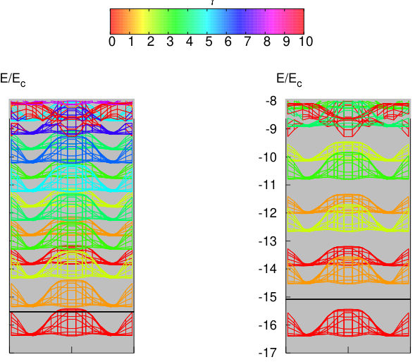
<figcaption class="paper-figure-caption"><b>Fig 1.</b> FIG. 1. Energy bandstructure projected on the θ1 axis in reciprocal space for (left) Eγ = 0.7 meV, (right) Eγ = 1.3 meV. The photon content of the energy bands is color coded according to the scale at the top. The black horizontal line indicates the chemical potential. The vertical colored lines correspond to the axis θ2 which is perpendicular to the axis θ1. Ne = 1, gγ = 0.06, pq = 1 corresponding to Ec = ℏωc = 0.7145 meV, V0 = 16.0 meV, L = 100 nm, and T = 1 K.</figcaption>
</figure>
<figure class="paper-figure-card">
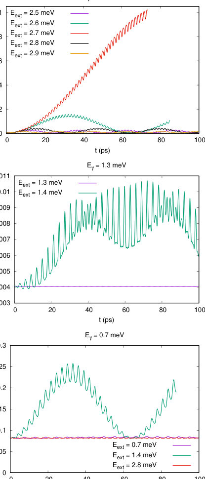
<figcaption class="paper-figure-caption"><b>Fig 2.</b> FIG. 2. The mean photon number Nγ as function of time for various values of the photon energy Eγ = ℏωγ and modulation frequency Eext = ℏωext of the electron-photon interaction. Ne = 1, gγ = 0.06, pq = 1, V0 = 16.0 meV, L = 100 nm, Vt/ℏωc = 0.5, and T = 1 K.</figcaption>
</figure>
<figure class="paper-figure-card">
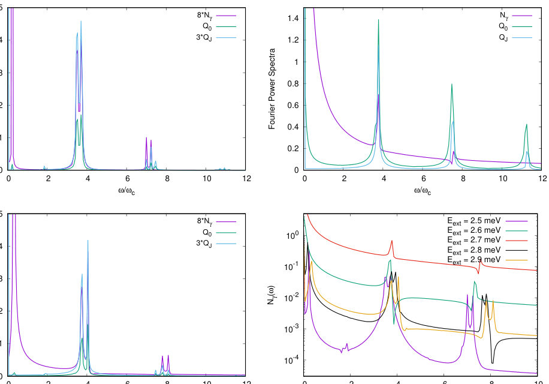
<figcaption class="paper-figure-caption"><b>Fig 3.</b> FIG. 3. The Fourier power spectra Nγ(ω), Q0(ω), and QJ(ω) for Eext = ℏωext = 2.5 meV (top left), 2.7 meV (top right), and 2.9 meV (bottom left), and Nγ(ω) compared for several values of Eext on a logarithmic scale. Ne = 1, Eγ = 1.3 meV, gγ = 0.06, pq = 1, corresponding to Ec = ℏωc = 0.7145 meV, Vt/ℏωc = 0.5, and T = 1 K.</figcaption>
</figure>
<figure class="paper-figure-card">
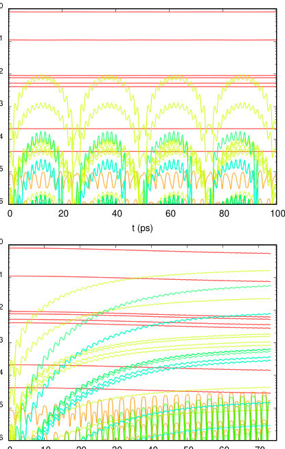
<figcaption class="paper-figure-caption"><b>Fig 4.</b> FIG. 4. The occupation of the states |αθnσ⟩versus time for (top) Eext = 2.5 meV, and (bottom) Eext = 2.7 meV. The photon content of the states is color coded according to the scale used in Fig. 1. Ne = 1, Eγ = 1.3 meV, gγ = 0.06, pq = 1, corresponding to Ec = ℏωc = 0.7145 meV, Vt/ℏωc = 0.5, and T = 1 K.</figcaption>
</figure>
<figure class="paper-figure-card">
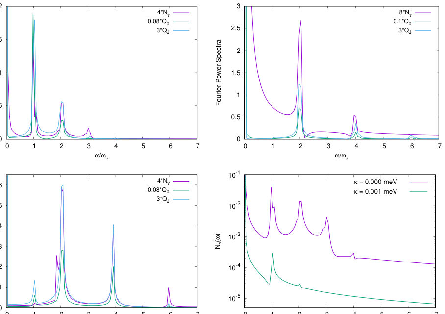
<figcaption class="paper-figure-caption"><b>Fig 5.</b> FIG. 5. The Fourier power spectra Nγ(ω), Q0(ω), and QJ(ω) for Eext = ℏωext = 0.7 meV (top left), 1.4 meV (top right), and 2.8 meV (bottom left), and Nγ(ω) compared for two values of the dissipation κ on a logarithmic scale (bottom right) for Eγ = 0.7 meV and Eext = 0.7 meV corresponding to the upper left panel. Ne = 1, Eγ = 0.7 meV, gγ = 0.06, pq = 1, corresponding to Ec = ℏωc = 0.7145 meV, Vt/ℏωc = 0.5, and T = 1 K.</figcaption>
</figure>

**Summary.** This computational study analyzes driven quantum dot arrays coupled to an FIR photon cavity under a magnetic field. By applying harmonic modulation to the electron-photon interaction, the researchers demonstrate that resonant driving conditions allow for efficient pumping of photons and the excitation of collective electronic modes. This establishes a controllable platform for manipulating photonic states in nanostructures.

**Why it may be interesting.** This work is highly relevant as it combines cavity QED principles with many-body physics in low-dimensional systems, providing a controllable mechanism for manipulating photons using external driving fields—a core theme in advanced AMO research.

Detailed structure

**Main problem.** The study investigates how driving a quantum dot array coupled to an FIR photon cavity can manipulate photonic states by controlling the interplay between harmonic modulation, magnetic confinement, and electron-photon interactions.

**Main result.** The system exhibits resonant behavior when the driving frequency approaches twice the cavity photon frequency, enabling efficient photon pumping and activating collective radial Coulomb breathing modes.

**Method.** The research employs a Quantum Electrodynamical Density Functional Theory (QED-DFT-TP) approach solved via time evolution equations in a tensor product basis.

**Model / system.** The system models a 2DEG confined in a square lattice of quantum dots, subjected to an external magnetic field and coupled to a cylindrical FIR photon cavity mode. The Hamiltonian includes electron kinetic/interaction terms, the cavity photon term, and a time-dependent modulation term applied to the electron-photon coupling.

**Key observables.** Mean photon number ($N_\gamma(t)$), dynamical orbital magnetization ($Q_J(t)$), collective radial Coulomb breathing modes, and energy spectrum showing 'photon replica bands'.

**Important parameters / regimes.** Driving frequency ($\omega_{ext}$), cavity photon frequency ($\omega_\gamma$), electron occupation number per dot, and magnetic field strength (e.g., $B = 0.4138 	ext{ T}$).

**Assumptions / limitations.** The TE$_{011}$ cavity mode is utilized; the calculation treats electron-electron interactions via DFT and models electron-photon coupling using a many-body configuration interaction approach.

**Figures summary.** Figures illustrate energy bandstructures showing photon replica bands, mean photon content mapping, and time evolution plots of $N_\gamma$ and collective oscillation diagnostics ($Q_0$, $Q_J$).

**Paper structure.** The paper progresses from defining the full Hamiltonian (including external modulation) to solving the dynamics using QED-DFT-TP. Key analyses focus on identifying resonant driving conditions that maximize photon pumping and observing resulting collective electronic excitations.

Abstract

We present a comprehensive computational study of driven quantum dot arrays in a square lattice configuration, subject to an external magnetic field and coupled to a cylindrical far-infrared photon cavity. The driving is introduced through a harmonic modulation of the full electron-photon interaction, therefore including both paramagnetic and diamagnetic contributions. The electron-electron Coulomb interactions are treated within density functional theory, while the electron-photon coupling is modeled using a many-body configuration interaction approach at each iteration of the density functional. By exploiting the unique properties of the cylindrical TE$_{011}$ cavity mode, we demonstrate selective enhancement of diamagnetic two-photon transitions. Our results reveal that the effectiveness of harmonic modulation of the electron-photon interaction is strongly dependent on both the driving frequency and the electron occupation number per dot. When the driving frequency approaches twice the cavity photon frequency, the system exhibits resonant behavior characterized by efficient photon pumping, occupation of higher-order photon replicas, and activation of collective radial Coulomb breathing modes. These findings establish a controllable mechanism for manipulating photon states in coupled quantum dot-cavity systems and provide insights into the interplay among harmonic modulation, photonic excitations, magnetic confinement, and many-body electron correlations in dimensionally reduced nanostructures.

[↑ back to top](#top)

### [Time domain Stokes mechanism of pair correlated k gap solitons in nonlinear photonic time crystal slabs](http://arxiv.org/abs/2607.07340v1)

**Authors:** Jiaxiang Sun, Guowei Chen, Liang Zhang, Yiming Pan  
**Type:** both · **Category:** other · **PDF:** <https://arxiv.org/pdf/2607.07340v1>  
**Analysis basis:** full PDF text, analyzed in chunks
**Topic relevance:** 🔥 `driven-dissipative phase transition` **4/5** · `methods for driven-dissipative` **3/5** · `non-equilibrium dynamics` **3/5** · `quantum optics experiment` **3/5** · `entanglement & information structure` **2/5** · `non-equilibrium universality` **2/5** · `Keldysh / 2PI / non-Gaussian methods` **1/5** · `analog quantum simulation` **1/5** · `correlated / nonlocal dissipation` **1/5** · `correlated cavity matter` **1/5** · `interference shaping light` **1/5** · `quantum measurements` **1/5**

↔ Scroll figures horizontally

<figure class="paper-figure-card">
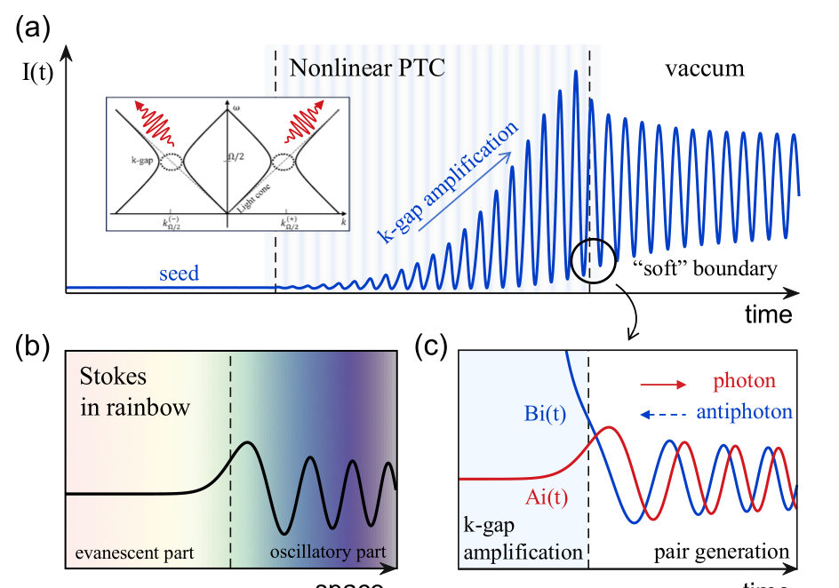
<figcaption class="paper-figure-caption"><b>Fig 1.</b> FIG. 1. The time-domain Stokes phenomenon and photon pair generation in a finite-time photonic time-crystal (PTC) slab. (a) Macroscopic temporal scattering dynamics. An incident seed pulse undergoes exponential amplification within the PTC 𝑘-gap (inset) and subsequently scatters at the exit boundary into oscillatory output modes. (b) Spatial Stokes analogy, illustrating the classical transition from an evanescent to an oscillatory regime across a turning point. (c) Microscopic Airy/Stokes mode conversion at the second temporal boundary. The localized growing branch [𝐵𝑖(𝑡)] abruptly bifurcates into two counter-propagating oscillatory states (photon and antiphoton), physically dictating the...</figcaption>
</figure>
<figure class="paper-figure-card">
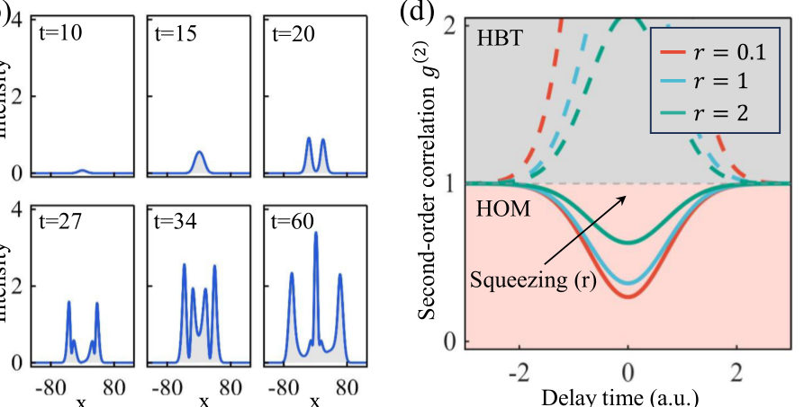
<figcaption class="paper-figure-caption"><b>Fig 2.</b> FIG. 2. Spatiotemporal dynamics and quantum statistical verification of heralded k-gap soliton pairs. (a),(b) Full-wave FDTD simulation (a) and corresponding intensity snapshots (b) of a finite-time nonlinear PTC slab acting as a superluminal pulse propagator. An incident seed undergoes localized amplification, reorganizes into a counter-propagating soliton pair, and experiences a secondary Stokes splitting at the exit boundary to emit four spatially resolvable branches. (c) Proposed four-port measurement topology. The outermost branches are designated for Hanbury Brown–Twiss (HBT) cross-correlation, while the inner branches are routed for Hong– Ou–Mandel (HOM) interferometry. The proposed...</figcaption>
</figure>
<figure class="paper-figure-card">
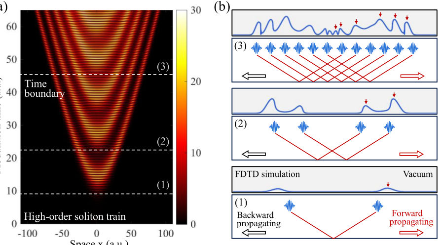
<figcaption class="paper-figure-caption"><b>Fig 3.</b> FIG. 3. Generation of entangled light pulse trains via higher-order 𝑘-gap solitons. The spatiotemporal dynamics (left) and output schematics (right) illustrate the dependence of soliton splitting on the PTC modulation depth. (1) Weak modulation limits the system to fundamental 𝑘- gap amplification, emitting a single pair of light pulses. (2) Moderate modulation excites second- order k-gap soliton dynamics, cascading the boundary scattering into two distinct pairs of pulse trains. (3) Strong modulation drives the formation of higher-order 𝑘-gap solitons, producing a dense, multiplexed cascade of entangled pulses. This amplitude-dependent scaling provides an on- demand mechanism for...</figcaption>
</figure>

**Summary.** The research shows that nonlinear photonic time crystals can generate entangled photon pairs by exploiting the time-domain Stokes phenomenon. This process involves k-gap soliton formation followed by secondary splitting at the slab's exit boundary. By measuring quantum correlations, they confirm this mechanism provides a route for ultrafast, heralded sources of nonclassical light.

**Why it may be interesting.** This work is highly relevant as it bridges classical wave asymptotics (Stokes theory) with quantum light generation mechanisms (parametric amplification), offering a pathway for on-demand entangled photon sources using engineered periodic media.

Detailed structure

**Main problem.** The paper aims to establish a unified connection between two mechanisms of pair generation—time reflection at temporal boundaries and parametric amplification within momentum k-gaps—using the time-domain Stokes phenomenon.

**Main result.** They demonstrate that in nonlinear photonic time crystal slabs, the secondary Stokes conversion occurring at the exit boundary splits stable k-gap solitons into four spatially separated, entangled pulse branches.

**Method.** The study combines theoretical analysis using Airy functions to model Stokes asymptotics with numerical simulations (FDTD) and quantum characterization via second-order correlation measurements (HBT/HOM).

**Model / system.** The system is a nonlinear Photonic Time Crystal (PTC) slab governed by an electrodynamic wave equation incorporating Kerr nonlinearity. The dynamics are analyzed through the lens of the Stokes phenomenon, connecting linear Floquet theory to nonlinear soliton formation.

**Key observables.** Second-order correlation functions ($g_{HBT}^{(2)}, g_{HOM}^{(2)}$), which confirm nonclassical correlations and entanglement; detection of backward-propagating pulses heralding forward partners.

**Important parameters / regimes.** Kerr nonlinearity strength ($eta$), modulation depth ($	ilde{\delta}$ or $r$), and the time duration of the active PTC window.

**Assumptions / limitations.** The analysis relies on mapping the system dynamics to the Airy equation near turning points, treating the process as a temporal analogue of standard Stokes scattering theory.

**Figures summary.** Figures illustrate the macroscopic time-domain Stokes phenomenon leading to pair generation, showing spatiotemporal splitting into four branches, and demonstrating the dependence of entanglement on the PTC modulation depth.

**Paper structure.** The paper develops from establishing the theoretical link via the Stokes phenomenon (Airy connection) to simulating nonlinear dynamics in a finite-time slab, culminating in quantum characterization using HBT/HOM measurements to confirm nonclassical pair correlations.

Abstract

Pair generation in time-varying media is commonly attributed to time reflection at temporal boundaries or to amplification inside momentum k gaps. Here we show that these two processes are connected by the time domain Stokes phenomenon. A finite duration photonic time crystal (PTC) slab provides the necessary Stokes connection between the incident vacuum mode, transient k gap amplification, and time boundary scattering. With Kerr nonlinearity, the otherwise unbounded amplification is arrested, spawning Kerr stabilized k gap solitons. When these solitons cross the exit boundary of the time slab, Stokes induced mode conversion produces a secondary pair generation process, yielding four spatially separated and entangled pulse branches. Detection of a backward propagating light pulse therefore heralds its forward propagating partner. We further propose combined Hanbury Brown Twiss and Hong Ou Mandel measurements to test their nonclassical correlations. These results reveal a link between asymptotic Stokes physics and quantum temporal scattering in PTCs, and suggest a route toward ultrafast heralded quantum light sources.

[↑ back to top](#top)

### [High-frequency nonlinear conductivity of a Wigner crystal](http://arxiv.org/abs/2607.06846v1)

**Authors:** A. J. Schleusner, M. T. Elewa, N. R. Beysengulov, C. A. Mikolas, J. Pollanen  
**Type:** both · **Category:** other · **PDF:** <https://arxiv.org/pdf/2607.06846v1>  
**Analysis basis:** full PDF text, analyzed in chunks
**Topic relevance:** 🔥 `driven-dissipative phase transition` **4/5** · `Frenkel-Kontorova` **3/5** · `methods for driven-dissipative` **3/5** · `non-equilibrium dynamics` **3/5** · `analog quantum simulation` **2/5** · `non-equilibrium universality` **2/5** · `Keldysh / 2PI / non-Gaussian methods` **1/5** · `correlated / nonlocal dissipation` **1/5**

↔ Scroll figures horizontally

<figure class="paper-figure-card">
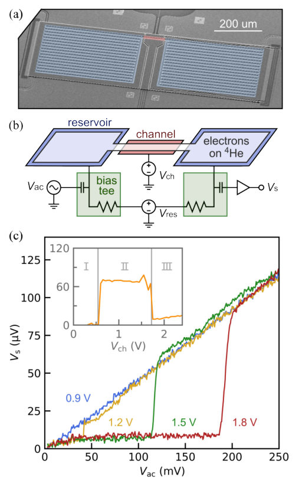
<figcaption class="paper-figure-caption"><b>Fig 1.</b> FIG. 1. (a) A false-color scanning electron microscope im- age of the device showing the central electron confining mi- crochannel (red) and electron reservoir (blue) regions. (b) Schematic of the electron system, electrodes, and voltages used to control the electron density and conduct trans- port measurements. (c) Electron transport as a func- tion of the driving field amplitude Vac at a frequency of 300 kHz for increasing central channel bias voltages (Vch = 0.9, 1.2, 1.5, 1.8 V). Inset: Transport signal as a function of Vch for Vac = 150 mV. The transport regimes correspond to an empty channel (I), a high conductivity electron state (II), and a low-conductivity Wigner crystal (III).</figcaption>
</figure>
<figure class="paper-figure-card">
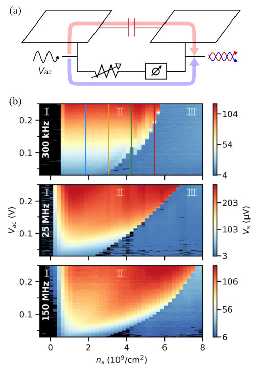
<figcaption class="paper-figure-caption"><b>Fig 2.</b> FIG. 2. (a) Schematic of the compensation line approach employed to measure the high frequency transport of the microchannel-confined electron system. A voltage tunable attenuator and phase shifter are used to interferometrically reduce the parasitic crosstalk inherent to the device geome- try. (b) The induced transport voltage Vs as a function of the central microchannel bias Vch and the ac driving voltage Vac for f = 0.3, 25, 150 MHz driving fields. The blue, gold, green, and red vertical lines in the top plot correspond to the line-cuts shown in Fig. 1c.</figcaption>
</figure>
<figure class="paper-figure-card">
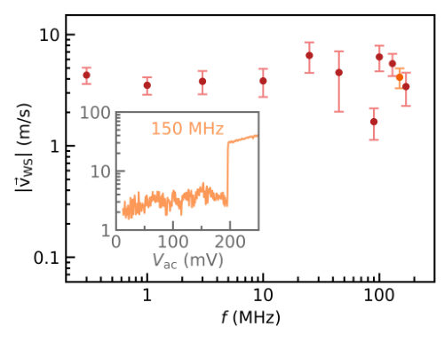
<figcaption class="paper-figure-caption"><b>Fig 3.</b> FIG. 3. Velocity of a Wigner solid moving along the cen- tral microchannel. For these data, the electron density in the channel is 7.1 × 109/cm2. Inset: Velocity of the Wigner solid as a function of the driving voltage amplitude at a frequency of 150 MHz. The data trace shows the saturated velocity re- sponse when the electrons in the microchannel are crystallized as well as a sharp transition to a non-equilibrium state of the electron system that moves at a higher velocity.</figcaption>
</figure>
<figure class="paper-figure-card">
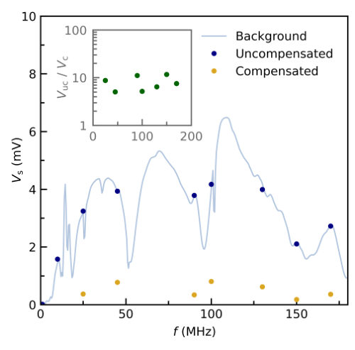
<figcaption class="paper-figure-caption"><b>Fig 4.</b> FIG. 4. The experimentally measured parasitic background for Vac = 0.2 V both with (yellow) and without (blue) com- pensation for the parasitic background signal. The dots are associated with the transport measurements described in the main text while the solid line corresponds to a characteri- zation of the entire background signal when the channel is devoid of electrons. Inset: Ratio of the uncompensated-to- compensated background signal, VUC/VC, as a function of drive frequency, showing an approximately tenfold decrease in the parasitic background.</figcaption>
</figure>

**Summary.** The research measures the electrical conductivity of a Wigner crystal on helium at very high frequencies. It finds that the electron solid exhibits nonlinear pinning due to coupling with higher-order ripplon overtones, extending beyond the standard low-frequency Cherenkov mechanism. This demonstrates how collective excitations mediate transport dynamics in strongly correlated quantum systems.

**Why it may be interesting.** This work explores non-equilibrium dynamics in an interacting electron solid driven far from equilibrium, providing insights into dynamical friction and phase transitions (melting) mediated by bosonic excitations (ripplons), which is relevant to open quantum systems modeling.

Detailed structure

**Main problem.** The study investigates the high-frequency nonlinear conductivity of a Wigner crystal formed by electrons on superfluid helium.

**Main result.** The experiment reveals strong nonlinear transport response at frequencies much higher than conventional Bragg-Cherenkov effects, attributed to coupling with ripplon overtones via higher-order Bragg vectors.

**Method.** Transport measurements are performed in a microchannel geometry using AC driving fields and phase-sensitive lock-in techniques, supplemented by an interferometric compensation line to suppress background noise.

**Model / system.** The system is a low-dimensional Wigner solid (electron crystal) suspended above superfluid helium. Its dynamics are governed by the interaction between the electrons and the ripplon surface waves.

**Key observables.** Transport voltage ($V_s$) as a function of driving field amplitude ($V_{ac}$) and bias voltages, showing transitions between liquid and solid states.

**Important parameters / regimes.** High-frequency driving fields (up to 150 MHz), ripplon frequencies ($\omega_{G1}/2\pi \simeq 10$ MHz), and the ratio of Coulomb interaction energy to kinetic energy.

**Assumptions / limitations.** The conventional Bragg-Cherenkov effect is treated in a quasi-static limit, but the high-frequency analysis extends this by considering higher-order Bragg vectors. The measurement relies on successful background signal cancellation via interference.

**Figures summary.** Figures show SEM images of the device setup, schematics of electrode biasing, and $V_s$ vs. $V_{ac}$ curves demonstrating conductivity transitions at various frequencies (e.g., 0.3 MHz to 150 MHz).

**Paper structure.** The paper establishes the physical system and low-frequency background theory (Bragg-Cherenkov), details the high-frequency experimental setup including noise mitigation, presents measurements across a wide frequency range, and concludes by interpreting the high-frequency response via higher-order coupling mechanisms.

Abstract

Electrons trapped above the surface of superfluid helium are a disorder-free platform for investigating the formation and dynamics of low-dimensional Wigner crystals. A characteristic nonlinear transport feature of this electronic solid suspended above the helium surface is the Bragg-Cherenkov effect, in which the mobility of the smoothly moving crystal is limited by the coherent emission of helium surface waves (ripplons). The effect has been understood in the conventional Cherenkov setting in which the crystal moves at a constant speed. Here we report on transport measurements of electrons on helium confined in a microchannel geometry to investigate the non-equilibrium response of the Wigner solid when it is subjected to a high-frequency driving field. Surprisingly, the experiments reveal a strongly nonlinear transport response of the confined Wigner solid at frequencies nearly an order of magnitude larger than the ripplon frequencies contributing to the conventional Bragg-Cherenkov effect. We relate this observation to the coupling of the Wigner solid to ripplons with higher-order Bragg vectors, which gives rise to a dynamical friction that provides a mechanism for the observed high-frequency pinning.

[↑ back to top](#top)

### [Unveiling the Spin-Valley Structure of Dipolar Exciton Ladders in R-stacked WSe$_2$/WS$_2$ Moiré Heterobilayers](http://arxiv.org/abs/2607.07590v1)

**Authors:** Byeong Wook Cho, Tatyana V. Ivanova, Zhe Li, Takashi Taniguchi, Kenji Watanabe, Brian D. Gerardot, Mauro Brotons-Gisbert  
**Type:** experiment · **Category:** other · **PDF:** <https://arxiv.org/pdf/2607.07590v1>  
**Analysis basis:** full PDF text, analyzed in chunks
**Topic relevance:** 🔥 `analog quantum simulation` **4/5** · 🔥 `spintronics-quantum-optics interface` **4/5** · `exotic spin models in light-matter` **3/5** · `quantum optics experiment` **2/5** · `correlated / nonlocal dissipation` **1/5** · `correlated cavity matter` **1/5** · `driven-dissipative phase transition` **1/5** · `entanglement & information structure` **1/5** · `non-equilibrium dynamics` **1/5**

↔ Scroll figures horizontally

<figure class="paper-figure-card">
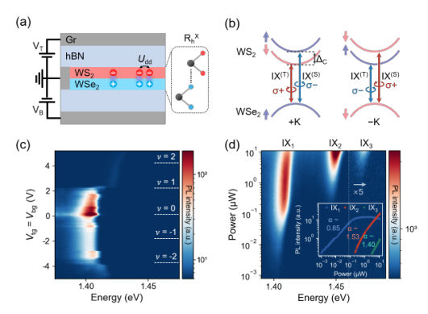
<figcaption class="paper-figure-caption"><b>Fig 1.</b> FIG. 1. (a) Schematic of the hBN-encapsulated dual-gated heterobilayer, where moir´e-confined IXs carry out-of-plane electric dipoles and interact through on-site dipolar repulsion Udd. (b) Spin–valley configurations and helicity-dependent optical selection rules for triplet IX(T) and singlet IX(S) tran- sitions, separated by the WS2 conduction-band spin splitting ∆C. (c) Filling-dependent PL spectra measured at 10 nW un- der linearly polarized 1.680 eV excitation, showing systematic modulation of the IX emission with moir´e lattice filling. (d) Excitation-power-dependent PL spectra at charge neutrality under the same excitation energy, showing the emergence of IX2 and IX3 above IX1. The...</figcaption>
</figure>
<figure class="paper-figure-card">
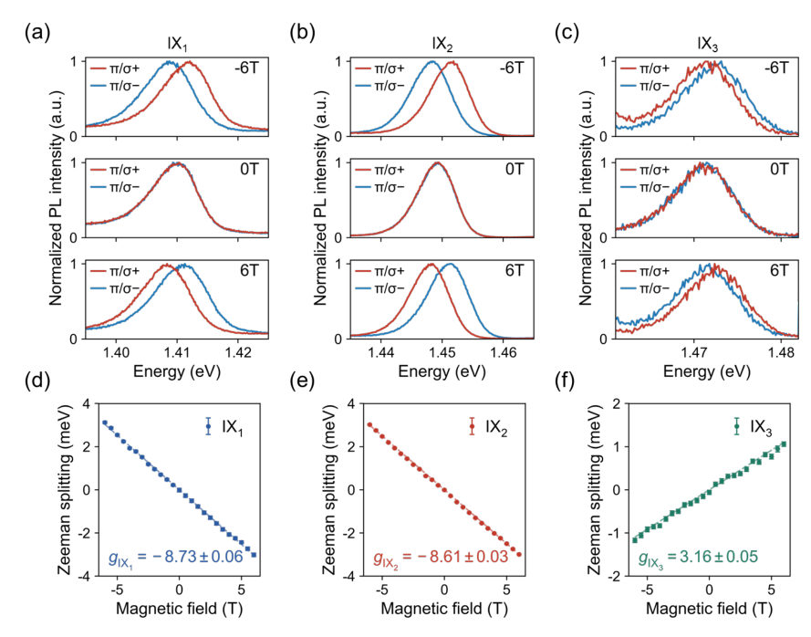
<figcaption class="paper-figure-caption"><b>Fig 2.</b> FIG. 2. (a–c) Helicity-resolved PL spectra of IX1, IX2, and IX3 at representative magnetic fields (B = −6, 0, and +6 T), under linearly polarized 1.72 eV excitation with a power of 20 µW. (d–f) Extracted Zeeman splitting, defined as ∆E = Eσ+ −Eσ−, as a function of magnetic field for IX1, IX2, and IX3. Dashed lines are linear fits using ∆E = gµBB.</figcaption>
</figure>
<figure class="paper-figure-card">
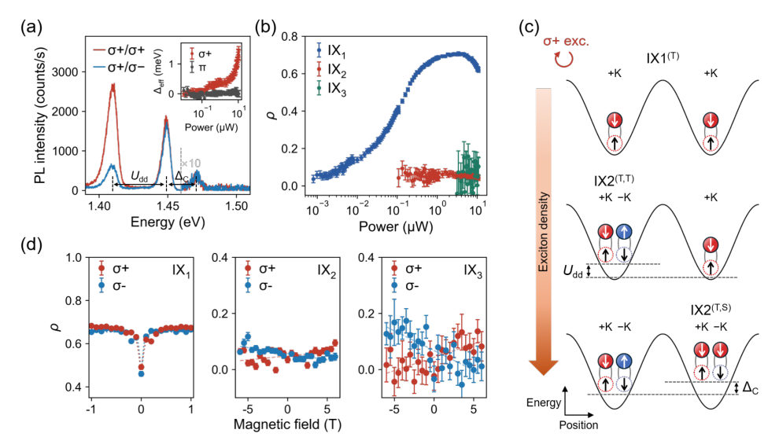
<figcaption class="paper-figure-caption"><b>Fig 3.</b> FIG. 3. (a) Helicity-resolved PL spectra measured under σ+ excitation with a power of 7 µW. The high-energy IX3 region is multiplied by a factor of 10 for clarity. The inset compares the IX1 splitting under linearly polarized and σ+ excitation, highlighting the excitation-helicity-induced energy splitting. (b) Degree of circular polarization (ρ) of IX1, IX2, and IX3 as a function of excitation power. (c) Schematic potential-energy landscape of the IX population dynamics under σ+ excitation at charge neutrality. Increasing excitation density enhances the valley imbalance of IX(T) 1 and is accompanied by the formation of intervalley two-exciton states, yielding IX(T,T) 2 and IX(T,S) 2 with...</figcaption>
</figure>
<figure class="paper-figure-card">
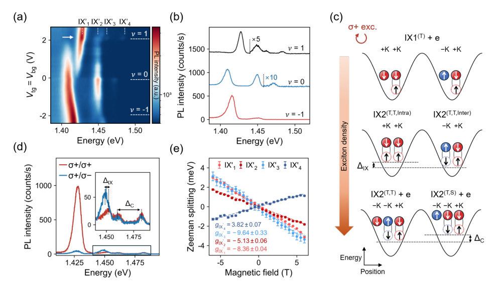
<figcaption class="paper-figure-caption"><b>Fig 4.</b> FIG. 4. (a) Filling-dependent PL spectra measured at 7 µW under linearly polarized 1.680 eV excitation, showing the evolution of the IX emission from hole to electron filling. Additional resonances IX′ 1–IX′ 4 emerge prominently near ν = 1. (b) Represen- tative linecuts at ν = −1, 0, and 1. The high-energy spectral region is multiplied for clarity. (c) Schematic potential-energy landscape of the IX population dynamics under σ+ excitation at ν = 1. (d) Helicity-resolved PL spectra at ν = 1 under σ+</figcaption>
</figure>

**Summary.** The authors used helicity-resolved magnetophotoluminescence on WSe2/WS2 moiré heterobilayers to map the internal structure of dipolar exciton ladders. They successfully assigned the ladder's components ($	ext{IX}1, 	ext{IX}2, 	ext{IX}3$) by analyzing their spin and valley polarization responses under magnetic fields. The results provide a fundamental understanding of how excitonic interactions are governed by both geometry (R-stacking) and external doping.

**Why it may be interesting.** This work provides a highly detailed spectroscopic fingerprint of interacting excitons in 2D van der Waals heterostructures, directly mapping spin and valley degrees of freedom using magneto-optics—a key area for quantum simulation platforms.

Detailed structure

**Main problem.** The study aims to resolve the internal spin-valley structure of dipolar exciton ladders formed by localized interlayer excitons in R-stacked WSe2/WS2 moiré heterobilayers.

**Main result.** They established a detailed spin-valley picture, identifying the ladder components as $	ext{IX1}(	ext{T}) 
ightarrow 	ext{IX2}(	ext{T},	ext{T}) 
ightarrow 	ext{IX3}(	ext{T},	ext{S})$, and showed that resident carriers significantly modify this structure.

**Method.** Helicity-resolved magneto-photoluminescence (PL) spectroscopy was used, combined with analysis of Zeeman splitting and circular polarization ($
ho$) as a function of magnetic field and carrier density.

**Model / system.** The system is R-stacked WSe2/WS2 moiré heterobilayers hosting localized interlayer excitons (IXs). The physics involves dipolar interactions ($U_{dd}$) and spin-valley coupling, which are probed by measuring the energy and polarization of emitted photons.

**Key observables.** PL peak energies ($	ext{IX}1, 	ext{IX}2, 	ext{IX}3$), Zeeman splitting ($\Delta E_Z(B)$), degree of circular polarization ($
ho$), and PL intensity scaling exponents with carrier density ($
u$).

**Important parameters / regimes.** Charge neutrality ($
u=0$) and one-electron filling ($
u=1$); the on-site dipolar interaction ($38 	ext{ meV}$) and $	ext{WS}_2$ conduction-band spin splitting ($\Delta_C$) are key energy scales.

**Assumptions / limitations.** The analysis relies on optical selection rules linking valley transitions to specific polarizations, and fitting Zeeman splittings to determine effective exciton g-factors.

**Figures summary.** Figures illustrate PL spectra showing the emergence of discrete ladder peaks ($	ext{IX}2$ at $38 	ext{ meV}$ above $	ext{IX}1$), magnetic field dependence used for Zeeman splitting, and filling-dependent spectral evolution across different doping regimes.

**Paper structure.** The paper systematically analyzes the exciton ladder structure first at charge neutrality ($
u=0$) using magneto-PL to assign spin/valley states. It then investigates the effect of electron doping ($
u=1$), observing changes in interaction strength, and finally examines hole doping ($
u=-1$) to map out the full phase diagram.

Abstract

Localized interlayer excitons in moiré heterobilayers can form dipolar exciton ladders, yet their internal spin-valley structure remains unresolved. Here, we use helicity-resolved magneto-photoluminescence to identify the microscopic origin of the ladder in R-stacked WSe$_2$/WS$_2$ at charge neutrality and one-electron filling of the moiré lattice. At charge neutrality, the first two emission peaks correspond to a spin-triplet interlayer exciton and a triplet-triplet two-exciton state separated by 38 meV, reflecting the on-site dipolar interaction. The opposite Zeeman response of the apparent third rung of the ladder rules out its assignment as a spin-conserving three-exciton state and instead identifies it as a triplet-singlet two-exciton configuration with a 22 meV offset set by the WS$_2$ conduction-band spin splitting. At one-electron filling, the correlated electronic background gives rise to charged one- and two-exciton states and intervalley/intravalley two-exciton configurations, while reducing the effective exciton-exciton interaction. Our results establish a spin-valley-resolved picture of dipolar exciton ladders beyond simple occupation-number physics in moiré heterobilayers.

[↑ back to top](#top)

### [Fluctuation-Driven Enhancement of Spin-Orbit Torque near the Curie Temperature of Ultrathin Ferromagnets](http://arxiv.org/abs/2607.06703v1)

**Authors:** Mateusz Szurek, Sergei Ivanov, Sergei Urazhdin  
**Type:** both · **Category:** statistical mechanics · **PDF:** <https://arxiv.org/pdf/2607.06703v1>  
**Analysis basis:** full PDF text, analyzed in chunks
**Topic relevance:** `Keldysh / 2PI / non-Gaussian methods` **3/5** · `driven-dissipative phase transition` **3/5** · `non-equilibrium universality` **3/5** · `methods for driven-dissipative` **2/5** · `non-equilibrium dynamics` **2/5** · `spintronics-quantum-optics interface` **2/5** · `analog quantum simulation` **1/5** · `correlated / nonlocal dissipation` **1/5** · `exotic spin models in light-matter` **1/5**

↔ Scroll figures horizontally

<figure class="paper-figure-card">
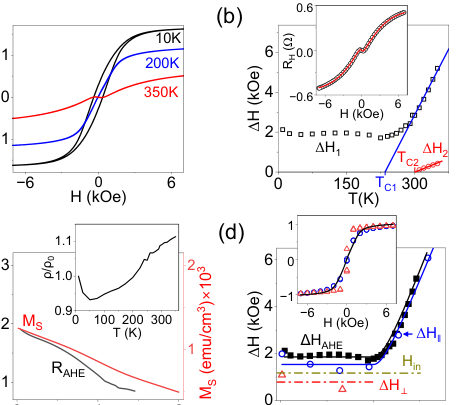
<figcaption class="paper-figure-caption"><b>Fig 1.</b> FIG. 2. Magnetic characterization of the CoFeB(0.65)/Pt(2.5) Hall bar. (a) Hall resistance vs out-of-plane field at the labeled temper- atures. (b) Broadening ∆H of RH(H) vs T extracted from two- sigmoid fits, with extrapolated critical temperatures TC1 and TC2 ob- tained from the Curie–Weiss law for the respective sigmoids. Inset: example two-sigmoid fit at T = 350 K. (c) Saturation magnetiza- tion Ms from SQUID magnetometry (red) and AHE amplitude RAHE (black) vs T/TC. Inset: normalized resistivity ρ/ρ0 vs T; the up- turn at low T is attributed to the Kondo effect. (d) Broadening ∆H of the AHE and M(H) curves obtained from the sigmoid fits for in- plane and out-of-plane fields. Inset:...</figcaption>
</figure>
<figure class="paper-figure-card">
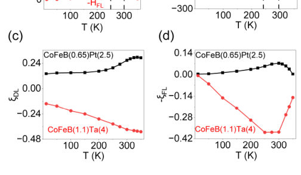
<figcaption class="paper-figure-caption"><b>Fig 2.</b> FIG. 4. Temperature dependence of the (a,b) damping-like and field-like effective fields and (c,d) SOT efficiencies for CoFeB(0.65)/ Pt(2.5) (black) and CoFeB(1.1)/Ta(4) (red), extracted with the GMS method at H = 1 kOe. Efficiencies ξDL,FL are computed from Eq. (12) using M(H,T) evaluated as described in Sec. IV. Dashed vertical lines mark TC1 and TC2.</figcaption>
</figure>
<figure class="paper-figure-card">
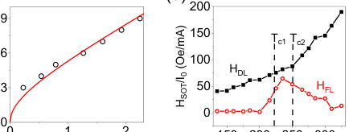
<figcaption class="paper-figure-caption"><b>Fig 3.</b> FIG. 5. ST-FMR characterization of a Ta(1.5)/CoFeB(0.65)/Pt(2.5) Hall bar. (a) Mixing voltage Vmix vs H at T = 275 K for rf driv- ing frequencies f = 3–6 GHz in steps of 1 GHz (symbols), fit to the sum of symmetric and antisymmetric Lorentzians (curves). (b) Gilbert damping α vs T obtained from linear fits of the linewidth ∆ vs f (inset). (c) Resonance field H0 vs f fit to the Kittel formula Eq. (16), yielding the effective anisotropy field Ha. (d) Effective SOFs HDL (closed symbols) and HFL (open symbols) vs T extracted as described in the text.</figcaption>
</figure>

**Summary.** This paper analyzes how magnetic thermal fluctuations near the Curie Temperature ($T_C$) drastically alter Spin-Orbit Torque in ultrathin ferromagnets. Using advanced susceptibility methods, the authors demonstrate that enhanced damping-like SOT arises from fluctuation mixing, offering a pathway for novel spintronic devices.

**Why it may be interesting.** While focused on condensed matter magnetism, the core physics involves non-equilibrium statistical mechanics (fluctuations near a critical point) and how these fluctuations modify transport coefficients, which has parallels to open quantum systems dynamics.

Detailed structure

**Main problem.** The study investigates how thermal magnetic fluctuations near the Curie Temperature ($T_C$) anomalously enhance the damping-like component of Spin-Orbit Torque (SOT) while suppressing the field-like component in ultrathin ferromagnets.

**Main result.** Fluctuation-driven mixing between longitudinal and transverse interfacial spin conductances is responsible for this anomalous SOT behavior, suggesting a spintronic mechanism analogous to heat-assisted magnetic recording.

**Method.** The authors employ Generalized Magnetoelectronic Susceptibilities (GMS) theory to analyze the system response, complementing experimental magnetotransport measurements like $V_{2\omega}(\phi)$.

**Model / system.** The physical system is ultrathin-film magnetic heterostructures (e.g., CoFeB/Pt bilayers) whose Curie temperature is suppressed by confinement. The analysis models the effect of thermal fluctuations on spin transport coefficients.

**Key observables.** Spin-Orbit Torques ($H_{FL}$ and $H_{DL}$), second-harmonic voltage ($V_{2\omega}(\phi)$), and generalized magnetic susceptibilities derived from Hall resistance measurements.

**Important parameters / regimes.** Temperature relative to $T_C$ ($T/T_C$), film thickness, and applied magnetic fields ($H$).

**Assumptions / limitations.** The GMS approach is used to bypass the need for magnetic saturation assumptions inherent in standard analyses near $T_C$. The analysis relies on averaging over fluctuating local magnetization orientations.

**Figures summary.** Figures show magnetotransport measurements ($V_{2\omega}$ vs $\phi$) and comparisons between results obtained using GMS versus standard methods, illustrating the temperature dependence of SOT components.

**Paper structure.** The paper progresses from establishing the limitations of standard analysis near $T_C$ to introducing the robust GMS framework. It then presents theoretical derivations based on fluctuation mixing mechanisms, culminating in experimental validation and discussion of device implications.

Abstract

We investigate how magnetic fluctuations influence spin-orbit torque in ultrathin-film magnetic heterostructures whose Curie temperature $T_C$ is suppressed by confinement. Above $T_C$, the damping-like contribution to spin-orbit field is significantly enhanced while the field-like contribution is suppressed, with the two contributions exhibiting opposite field dependencies. We show that these behaviors are consistent with fluctuation driven mixing between the longitudinal and transverse interfacial spin conductances, which enhances absorption of transversely polarized spin current by the ferromagnet. This mechanism can be activated below $T_C$ by engineering the microscopic magnetic state and by harnessing spin current-generated short-wavelength magnons, suggesting a spintronic analog of heat-assisted magnetic recording.

[↑ back to top](#top)

### [Non-Hermitian Edge State Endocytosis](http://arxiv.org/abs/2607.07703v1)

**Authors:** Si-Yu Yuan, Wen-Tan Xue, Ching Hua Lee  
**Type:** theory · **Category:** other · **PDF:** <https://arxiv.org/pdf/2607.07703v1>  
**Analysis basis:** full PDF text, analyzed in chunks
**Topic relevance:** `driven-dissipative phase transition` **3/5** · `methods for driven-dissipative` **3/5** · `non-equilibrium dynamics` **3/5** · `Kondo & dissipative impurity` **2/5** · `non-equilibrium universality` **2/5** · `Frenkel-Kontorova` **1/5** · `Keldysh / 2PI / non-Gaussian methods` **1/5** · `analog quantum simulation` **1/5** · `correlated / nonlocal dissipation` **1/5**

↔ Scroll figures horizontally

<figure class="paper-figure-card">
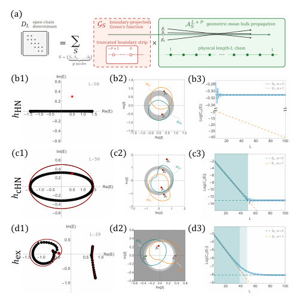
<figcaption class="paper-figure-caption"><b>Fig 1.</b> FIG. 2. Root-subset interpretation of Theorem I. (a) Each subset S selects roots, carries a bulk factor AL+P S , and has boundary prefactor GS. (b1)–(b3) Single Hatano–Nelson chain hHN(β) = β + t/β with t = 1/2. (c1)–(c3) Coupled Hatano– Nelson model hcHN(β) with t = 1/2 and ∆= 1/1000. (d1)– (d3) Main model hex in Eq. (7). Panels (b1)–(d1) show finite-L OBC spectra as black dots, and panels (c) and (d) use subset labels S0, S1. The five-pointed star in (b1)–(d1) identifies the energy for root panels (b2)–(d2) and competition panels (b3)–(d3). In (b3)–(d3), dashed curves show log |Cα| for the competing subset contributions, while blue open circles show the corresponding full finite-chain...</figcaption>
</figure>
<figure class="paper-figure-card">
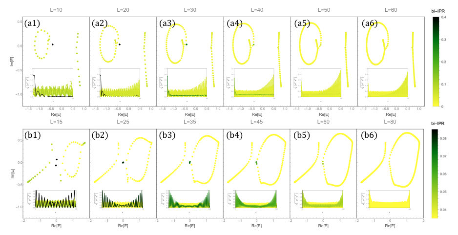
<figcaption class="paper-figure-caption"><b>Fig 2.</b> FIG. 3. The endocytosis process: OBC spectra at a sequence of system sizes L, colored by bi-IPR. Panel (a) uses model hex in</figcaption>
</figure>
<figure class="paper-figure-card">
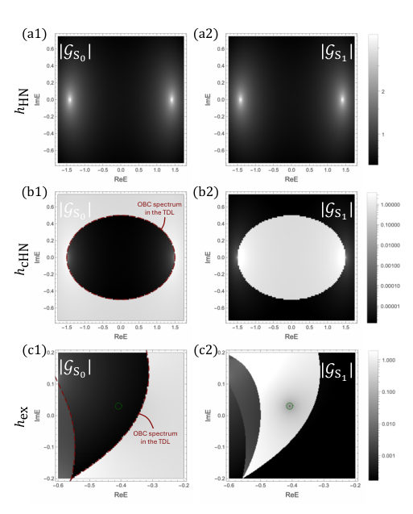
<figcaption class="paper-figure-caption"><b>Fig 3.</b> FIG. 4. Uncovering the anatomy of subset-resolved boundary- prefactors through Green’s functions. (a1)–(a2) |GS0(E)| and |GS1(E)| for the two one-root subsets of the single-chain Hatano–Nelson model hHN with t = 1/2, serving as basic ex- amples. (b1)–(b2) Corresponding diagnostic for representative two-root subsets of the coupled Hatano–Nelson model hcHN with t = 1/2 and ∆= 1/1000. (c1)–(c2) Main-text model hex in Eq. (7), where νi ≡νSi(Γ) and the green loop Γ in (c1) and (c2) gives the nontrivial relative winding ∆ν10 ≡ν1 −ν0 = 1. Dashed red curves in (b1) and (c1) denote the OBC bulk spectrum in the TDL. The zeros diagnose the TDL fate of edge states, as detailed in Table I.</figcaption>
</figure>
<figure class="paper-figure-card">
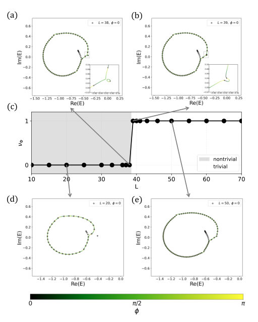
<figcaption class="paper-figure-caption"><b>Fig 4.</b> FIG. 5. Length-dependent flux response of endocytosis model hex in Eq. (7). (a)–(b) Critical cases at L = 38, 39, where the isolated eigenenergy is absorbed by the OBC bulk spectrum at those lengths. (c) The flux winding νΦ(L) defined in Eq. (12) is computed with the small regulator ξ = 0.006. (d) At L = 20 the edge state is fully isolated; (e) at L = 50 it is fully endocytosed. As the effective flux is e2iΦ per plaquette, 0 ≤Φ ≤π is one full pumping cycle.</figcaption>
</figure>

**Summary.** The paper introduces 'edge state endocytosis,' describing how isolated edge states in non-Hermitian chains disappear into the bulk spectrum as system size grows. This phenomenon is mathematically derived using a Widom expansion, showing that it arises from hidden zeros in subleading spectral contributions rather than standard TDL mechanisms.

**Why it may be interesting.** This work provides a mathematically rigorous, platform-independent mechanism for understanding how finite-size effects can fundamentally alter topological edge state behavior in non-Hermitian systems, which is highly relevant to open quantum devices.

Detailed structure

**Main problem.** The paper introduces 'edge state endocytosis,' a novel phenomenon where an isolated edge-localized eigenstate in a non-Hermitian system persists at finite sizes before being absorbed by the bulk continuum as the system size increases.

**Main result.** This absorption mechanism is fundamentally traced to hidden zeros originating from subleading subsets of the Widom expansion, distinguishing it from standard Thermodynamic Limit (TDL) edge states.

**Method.** The analysis employs a Widom-type determinant expansion applied to the energy dispersion equation for finite open chains, decomposing the problem into boundary-projected Green's function determinants and bulk propagation factors.

**Model / system.** The study analyzes one-dimensional lattices under Open Boundary Conditions (OBCs) using non-Hermitian Hamiltonians, exemplified by models like the Hatano–Nelson chain. The framework is general for any isolated edge state subject to non-Hermitian couplings.

**Key observables.** Edge localized eigenstates, Bound States in the Continuum (BIC), and the spectral determinant $D_L(E)$.

**Important parameters / regimes.** System size ($L$), critical scale ($L_c$), and the relative suppression rates derived from subleading subset contributions.

**Assumptions / limitations.** The mathematical framework relies on a Widom expansion of the characteristic determinant, assuming non-singular extreme hoppings for the decomposition to hold.

**Figures summary.** Figure 1 schematically illustrates an edge mode being 'swallowed up' by the bulk spectrum as $L$ increases through a BIC. Figure 2 visualizes how different subsets contribute to the finite-L OBC spectra via root selection.

**Paper structure.** The paper builds from establishing the mathematical tools (Widom expansion) to defining the spectral regimes (Bulk, TDL Edge State, Endocytosis), culminating in the derivation and prediction of the endocytosis scale based on subleading subset contributions.

Abstract

An isolated edge state observed in a finite open chain is usually expected to survive the thermodynamic limit (TDL), with a localization mechanism distinct from non-Hermitian skin accumulation, which localizes the \emph{entire} bulk continuum. We show that scale-sensitive non-Hermitian systems can generically admit a different fate: as we scale up the system size, a detached edge-localized eigenstate can remain sharply visible over a broad window until a critical scale is reached, where it forms an ephemeral bound state in the continuum (BIC) of the open-boundary bulk before being absorbed (entocytosed) at even larger system sizes. We call this phenomenon edge state endocytosis. Its mechanism is fundamentally traced to the Widom expansion of the open-chain characteristic determinant (energy dispersion equation) into contributions corresponding to admissible non-Bloch mode subsets. Each subset contribution factorizes into a boundary-projected Green's function (proj-GF) determinant, which encodes lattice truncation, and a subset-resolved bulk propagation factor, which encodes the system size dependence. We uncover the fundamental distinction: TDL edge states are zeros of the leading-subset proj-GF determinant, whereas endocytosed states are a hitherto-ignored class of hidden proj-GF zeros from subleading subsets that control the spectrum at finite sizes. Due to its fundamental mathematical origin, the endocytosis mechanism is completely platform-independent, occurring generically without fine-tuning when isolated edge states, topological or otherwise, are subject to non-Hermitian couplings that generate the requisite non-locality. Our new framework quantitatively predicts the endocytosis scale and sheds light on how its intricate competitive mechanism can be revealed through experimentally relevant Green's functions.

[↑ back to top](#top)

### [Thermodynamic Limits on Reliable Signaling by Biochemical Traveling Waves](http://arxiv.org/abs/2607.06997v1)

**Authors:** Shengyao Luo, Yuping Chen, Yuansheng Cao  
**Type:** both · **Category:** statistical mechanics · **PDF:** <https://arxiv.org/pdf/2607.06997v1>  
**Analysis basis:** full PDF text, analyzed in chunks
**Topic relevance:** `driven-dissipative phase transition` **3/5** · `methods for driven-dissipative` **3/5** · `non-equilibrium universality` **3/5** · `correlated / nonlocal dissipation` **2/5** · `non-equilibrium dynamics` **2/5** · `Frenkel-Kontorova` **1/5** · `Keldysh / 2PI / non-Gaussian methods` **1/5** · `analog quantum simulation` **1/5**

↔ Scroll figures horizontally

<figure class="paper-figure-card">
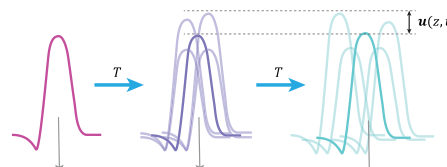
<figcaption class="paper-figure-caption"><b>Fig 1.</b> FIG. 1. Fluctuations of a traveling wave can be decomposed into a translational mode, described by the wave-position dis- placement X(t) in the comoving frame z = x −ct, and shape fluctuations u(z, t). The translational mode exhibits diffusive dynamics, Var(X) = 2DXt, whereas the shape fluctuations remain bounded.</figcaption>
</figure>
<figure class="paper-figure-card">
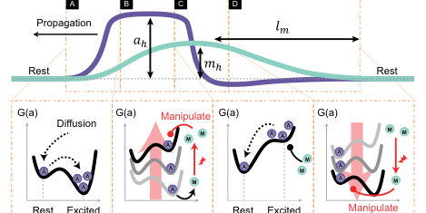
<figcaption class="paper-figure-caption"><b>Fig 2.</b> FIG. 2. Schematic of propagation and dissipation in an ex- citable trigger wave. Top: Activator (a, purple) and inhibitor (m, green) profiles during propagation, with amplitudes ah and mh. Bottom: One propagation cycle: diffusion-driven excitation of the activator, inhibitor response, inhibitor- mediated reshaping of the effective landscape G(a), and re- fractory relaxation. The slow inhibitor field remains elevated over the extended refractory tail behind the waveback (with characteristic length of lm) and dominates the propagation dissipation.</figcaption>
</figure>
<figure class="paper-figure-card">
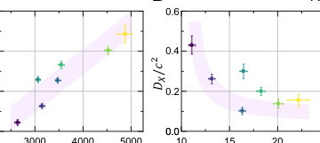
<figcaption class="paper-figure-caption"><b>Fig 3.</b> FIG. 4. Experimental test of wave-position diffusion and en- ergetics in mitotic trigger waves in Xenopus egg extracts. (A). Mitotic trigger waves arise from the coupled feedback network involving Cyclin B-Cdk1, Cdc25, Wee1/Myt1, and APC/C; the propagating wave is read out by the SiR-tubulin signal. (B). Wave positional variance σ2 X grows approximately lin- early with propagation time, allowing extraction of a wave- position diffusion constant DX. Data are grouped into differ- ent aging stages of the extract (color bar). (C). The protein- synthesis-rate proxy, obtained from the maximal wavefront rising slope, is positively correlated with the speed-amplitude product, consistent with the...</figcaption>
</figure>
<figure class="paper-figure-card">
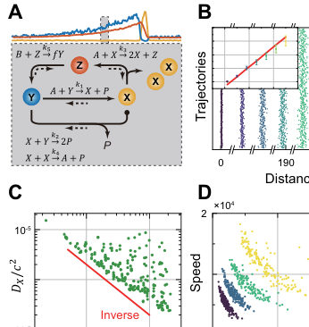
<figcaption class="paper-figure-caption"><b>Fig 4.</b> FIG. 3. Numerical validation in the reversible BZ reaction– diffusion model. (A). Reversible BZ model with microscopic reactions. The network is driven by chemostatted species (A and B). Representative spatial profiles of a propagating wave are shown in the top. (B). Peak positions from repeated realizations at different times (color bar); the positional vari- ance grows linearly with time, defining the diffusion constant DX (inset). (C). Normalized diffusion constant DX/c2 versus baseline-subtracted propagation dissipation rate ˙Wprop across sampled parameter sets, showing the inverse lower bound pre- dicted by Eq.(4). (D). Wave speed versus inhibitor peak am- plitude for different ˙Wprop,...</figcaption>
</figure>

**Summary.** This work establishes a fundamental thermodynamic constraint linking noise (wave diffusion) to energy cost (dissipation) for signal propagation via biochemical waves. By developing a stochastic framework and testing it on both simulated BZ systems and live Xenopus experiments, the authors show that reliable signaling requires a minimum energetic investment proportional to wave fluctuations.

**Why it may be interesting.** While focused on biochemistry, the mathematical machinery—deriving bounds from non-equilibrium thermodynamics applied to pattern formation—is highly relevant to understanding energy dissipation in any driven, fluctuating physical system, including those studied in AMO physics.

Detailed structure

**Main problem.** The central goal is determining the fundamental thermodynamic cost associated with maintaining reliable signal propagation via biochemical traveling waves.

**Main result.** A rigorous thermodynamic bound links the wave's positional diffusion constant ($D_X$) to the dissipation rate ($\dot{W}_{	ext{prop}}$), suggesting that energy expenditure dictates noise resilience in biological signaling.

**Method.** The authors developed a stochastic thermodynamic framework, projecting noisy field dynamics onto an adjoint translational mode to derive effective random walk statistics and calculate entropy production rates.

**Model / system.** The study uses reaction-diffusion systems exhibiting excitable traveling waves, modeled by FitzHugh-Nagumo or Belousov-Zhabotinsky (BZ) kinetics. Validation is performed using both stochastic simulations of the BZ system and live imaging of mitotic trigger waves in Xenopus egg extracts.

**Key observables.** Wave position diffusion constant ($D_X$), propagation dissipation rate ($\dot{W}_{	ext{prop}}$), wave speed ($c$), and inhibitor amplitude.

**Important parameters / regimes.** The bound itself, $D_X \dot{W}_{	ext{prop}} / c^2 \geq 1$, and the timescale separation parameter $\varepsilon$ in quasi-static approximations.

**Assumptions / limitations.** The analysis relies on weak noise regimes and assumes that the system can be accurately described by projecting dynamics onto a collective coordinate (the wave position).

**Figures summary.** Figures conceptually decompose wave fluctuations into diffusive positional modes, show schematic relationships between propagation and dissipation in FHN models, and present quantitative comparisons of $D_X/c^2$ vs $\dot{W}_{	ext{prop}}$ for both simulated BZ waves and experimental Xenopus data.

**Paper structure.** The paper establishes the general stochastic thermodynamic framework, derives the key bound by analyzing the adjoint translational mode, applies this to simplified models (like FHN), validates it using controlled simulations (BZ), and finally tests the predictions against complex biological systems (Xenopus).

Abstract

Biochemical traveling waves transmit signals across cells and tissues, but the thermodynamic cost of reliable propagation remains unclear. We develop a stochastic thermodynamic framework for reaction--diffusion systems with stable traveling waves and show that diffusion of the wave position is bounded by the dissipation specifically associated with propagation. The bound follows by projecting noisy field dynamics onto the adjoint translational mode, which maps the wave position to an effective biased random walk. Its tightness is controlled by the non-self-adjoint part of the linearized dynamics, with finite wave speed and antisymmetric reaction dynamics generically producing deviations from equality. For excitable trigger waves in a FitzHugh--Nagumo model, we show that the slow inhibitor dominates the propagation cost, yielding a trade-off among wave speed, inhibitor amplitude, and dissipation. We test these predictions in stochastic simulations of a microscopic Belousov--Zhabotinsky reaction--diffusion system and find consistent signatures in mitotic trigger-wave experiments in \textit{Xenopus} egg extracts. The same relation further imposes an annihilation-limited bound on the reliable signaling rate of wave trains.

[↑ back to top](#top)

### [Phenomena in the kink-antikink Collisions of $φ^8$ Theory](http://arxiv.org/abs/2607.07495v1)

**Authors:** Yun Feng, Yunguo Jiang  
**Type:** theory · **Category:** other · **PDF:** <https://arxiv.org/pdf/2607.07495v1>  
**Analysis basis:** full PDF text, analyzed in chunks
**Topic relevance:** `non-equilibrium dynamics` **3/5** · `Keldysh / 2PI / non-Gaussian methods` **2/5** · `driven-dissipative phase transition` **2/5** · `non-equilibrium universality` **2/5** · `Frenkel-Kontorova` **1/5** · `analog quantum simulation` **1/5** · `correlated / nonlocal dissipation` **1/5** · `entanglement & information structure` **1/5** · `methods for driven-dissipative` **1/5** · `scars & prethermalization` **1/5**

↔ Scroll figures horizontally

<figure class="paper-figure-card">
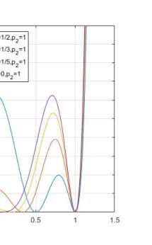
<figcaption class="paper-figure-caption"><b>Fig 1.</b> Figure 1: Different potentials in the ϕ8 theory</figcaption>
</figure>
<figure class="paper-figure-card">
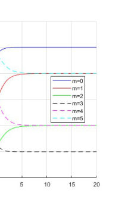
<figcaption class="paper-figure-caption"><b>Fig 2.</b> Figure 2: Kinks and antikinks when n = 2 in the ϕ8 theory for p1 = 0.5 and p2 = 1.</figcaption>
</figure>
<figure class="paper-figure-card">
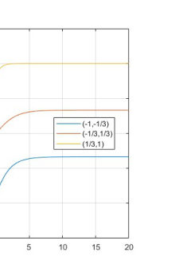
<figcaption class="paper-figure-caption"><b>Fig 3.</b> Figure 3: Kinks (no antikinks) when n = 3 in the ϕ8 theory</figcaption>
</figure>
<figure class="paper-figure-card">

<figcaption class="paper-figure-caption"><b>Fig 4.</b> Figure 4: 2D plot of the ϕK ¯ K at x = 0. From left to right panels, the initial velocities are v = 0.06, v = 0.0762 and v = 0.04, respectively.</figcaption>
</figure>
<figure class="paper-figure-card">
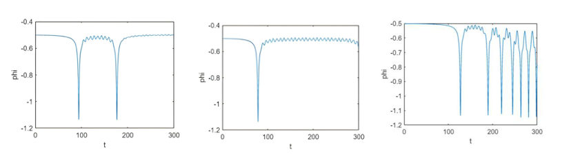
<figcaption class="paper-figure-caption"><b>Fig 5.</b> Figure 4 illustrates the evolutions of ϕK ¯ K at x = 0 for t ∈[0, 300]. It can be seen that the number of bounces are 2, 1 and 7 at the left, middle and right panels, respectively. The corresponding 3D plots are presented in Figure 5. For v = 0.04, the soliton pair</figcaption>
</figure>

**Summary.** This paper rigorously analyzes kink-antikink collisions in a complex phi^8 scalar field theory with multiple vacua. The authors report novel dynamical features, including complete annihilation regimes and intricate fractal resonance structures across different topological sectors. They propose that the classification of the effective potential serves as a universal predictive tool for understanding all collision outcomes.

**Why it may be interesting.** While focused on classical field theory, the study's emphasis on energy exchange, resonance structures, and phase space topology provides rich analogies for understanding non-linear dynamics in quantum many-body systems or open quantum systems where effective potentials govern transitions.

Detailed structure

**Main problem.** The study investigates the complex dynamics of kink-antikink collisions within a (1+1)-dimensional phi^8 scalar field theory possessing multiple degenerate vacua.

**Main result.** The authors discovered a complete annihilation regime in specific topological sectors and mapped out fractal cartographies of multi-bounce resonance windows, suggesting that potential structure dictates collision outcomes.

**Method.** The research combines analytical derivation of soliton solutions (using BPS equations) with extensive numerical simulations employing methods like Runge-Kutta and pseudospectral techniques.

**Model / system.** The system is a phi^8 scalar field theory defined by the potential V(phi) = 1/2(phi^2 - p_1^2)^2(phi^2 - p_2^2)^2, featuring four degenerate vacua. The dynamics are governed by the corresponding Euler-Lagrange equation.

**Key observables.** Collision outcomes (escape, bion formation, sector change, annihilation), fractal structure in velocity parameter space, and the effective potential U(x).

**Important parameters / regimes.** The ratio n = p2/p1, initial collision velocities (v_in), and specific topological sectors defined by vacuum limits.

**Assumptions / limitations.** The analysis is confined to the phi^8 model; comparisons are drawn with lower-order theories like phi^4 and phi^6.

**Figures summary.** Figures illustrate potential profiles, 3D plots of kink-antikink configurations during collision at various velocities, and phase space diagrams revealing fractal resonance windows across different topological sectors.

**Paper structure.** The paper progresses from establishing static soliton solutions for specific parameters (n=2, n=3) to modeling the time-dependent Lorentz-transformed collisions. It then systematically analyzes dynamics in multiple topological sectors, mapping out collision phenomena and developing a predictive framework based on potential changes.

Abstract

We investigated kink-antikink collisions in a $(1+1)$-dimensional $φ^8$ scalar field theory with multiple degenerate vacua. We presented explicit soliton solutions for different vacuum structures characterized by the ratio $n = p_2/p_1$. We focused on the cases $n=2$ and $n=3$ with four distinct vacua, and performed systematic numerical simulations across all topological sectors. We revealed that there is a complete annihilation regime in the $(1/2,\,1)$ sector, where kink-antikink pairs annihilate for all initial velocities. Up to our knowledge, such phenomenon is first reported in the kink antikink collisions. We revealed a comprehensive fractal cartography of multi-bounce resonance windows across sectors $(-1,\,-1/2)$, $(-1,\,-1/3)$, and $(-1/3,\,1/3)$. Given the kink antikink ($K\bar{K}$, or $\bar{K}K$) ordering, the effective potential and the spectrum of the Schrödinger like equation were presented. By collecting all the effective potential and collision phenomena, we proposed that the effective potential classification scheme provides a predictive framework for collision outcomes including escape, bion formation, sector change, and annihilation. Especially, it is identified that, when soliton pairs pass through each other, the abrupt changes of the potential type could explain both the sector-change and annihilation phenomena. Our work highlight novel dynamical features of the $φ^8$ model absent in lower-order field theories, and establish connections between topological structure, vibrational modes, and effective potentials.

[↑ back to top](#top)

### [Scanning tunneling microscopy of resonant-impurity in altermagnets: dual Fano resonance and Landau-quantization-induced nodal spin contrast](http://arxiv.org/abs/2607.06885v1)

**Authors:** Yuan Hong, Zhigang Wang, Zhen-Guo Fu, Feng Chi, Cong Wang, Wei Zhang, Ping Zhang  
**Type:** theory · **Category:** other · **PDF:** <https://arxiv.org/pdf/2607.06885v1>  
**Analysis basis:** full PDF text, analyzed in chunks
**Topic relevance:** `Keldysh / 2PI / non-Gaussian methods` **3/5** · `Kondo & dissipative impurity` **3/5** · `methods for driven-dissipative` **2/5** · `spintronics-quantum-optics interface` **2/5** · `analog quantum simulation` **1/5** · `correlated / nonlocal dissipation` **1/5** · `driven-dissipative phase transition` **1/5** · `exotic spin models in light-matter` **1/5** · `non-equilibrium dynamics` **1/5**

↔ Scroll figures horizontally

<figure class="paper-figure-card">
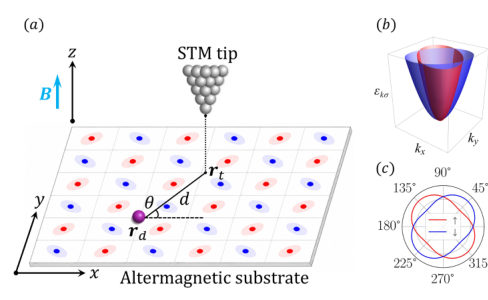
<figcaption class="paper-figure-caption"><b>Fig 1.</b> FIG. 1: (a) Schematic illustration of the STM/STS setup on an altermagnetic substrate in an out-of-plane magnetic field. The impurity is shown as a purple sphere, and the red and blue dots denote substrate atoms with opposite spin moments. The surrounding ellipses indicate anisotropic spin- dependent charge-density contours related by the ˆC4 ˆT sym- metry. (b) Dispersion of the d-wave altermagnetic substrate. Red and blue surfaces represent the two spin branches. (c) Spin-dependent anisotropy factor κσ(θ) for J = 0.4.</figcaption>
</figure>
<figure class="paper-figure-card">
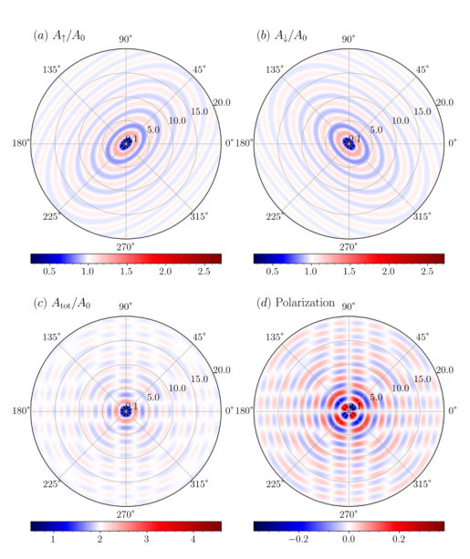
<figcaption class="paper-figure-caption"><b>Fig 2.</b> FIG. 2: (a)–(c) Spin-up, spin-down, and total local spectral functions in the zero-field regime. The radial and angular coordinates denote kF d and the tip angle θ, respectively. (d) Corresponding spin polarization. The impurity-level detuning is set to ∆/Γ = 0.</figcaption>
</figure>
<figure class="paper-figure-card">
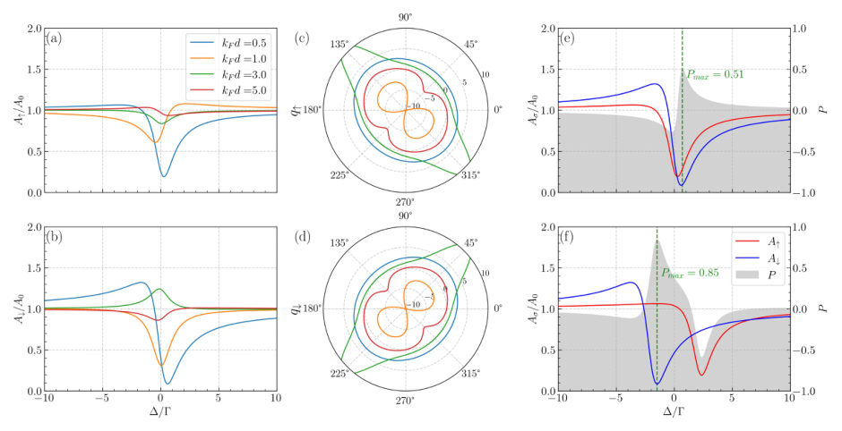
<figcaption class="paper-figure-caption"><b>Fig 3.</b> FIG. 3: (a), (b) Spin-up and spin-down local spectral functions as functions of the tip-impurity separation kF d. (c), (d) Corresponding Fano q factors. (e) Local spectral functions and spin polarization at kF d = 0.5. (f) Results with an optimized impurity Zeeman splitting εd/Γ = −2.07 that maximizes the spin polarization. For the local-spectral-function panels, the orientation is fixed at θ = 3π/4.</figcaption>
</figure>
<figure class="paper-figure-card">
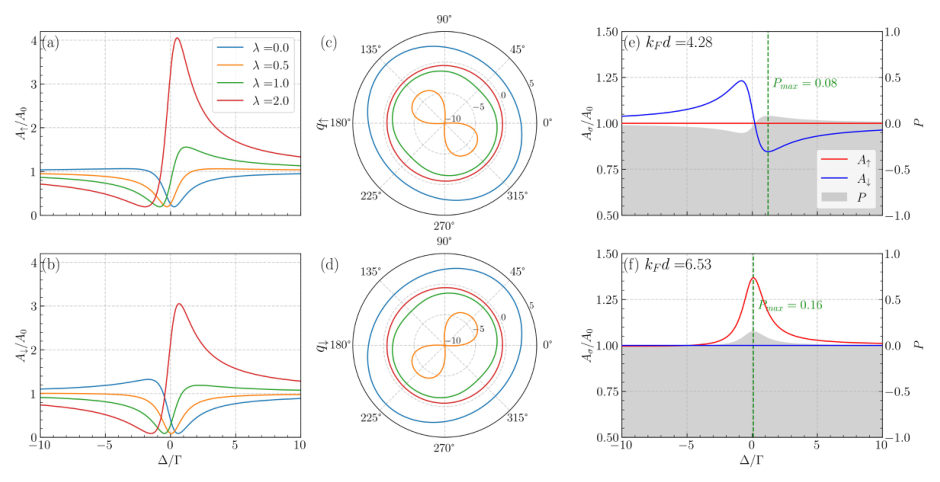
<figcaption class="paper-figure-caption"><b>Fig 4.</b> FIG. 4: (a), (b) Spin-up and spin-down local spectral functions as functions of the direct tunneling parameter λ. (c), (d) Corresponding Fano q factors. (e) Local spectral functions and spin polarization at kF d = 4.28 and λ = 0.34, where the spin-up branch satisfies the interference-zero condition. (f) Corresponding results for the spin-down interference zero, with kF d = 6.53 and λ = 0.34. For panels (a)–(d), kF d = 0.5 and θ = 3π/4.</figcaption>
</figure>
<figure class="paper-figure-card">
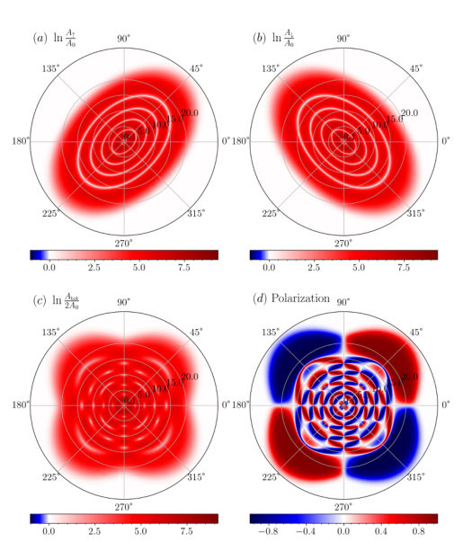
<figcaption class="paper-figure-caption"><b>Fig 5.</b> FIG. 5: (a)–(c) Logarithm of the spin-up, spin-down, and averaged total local spectral functions, respectively, in the Landau-quantized regime. The logarithm is plotted because the local spectral function varies over a wide range. Radial and angular coordinates denote kF d and θ, respectively. (d) Corresponding spin polarization with Pmax ≈0.99. Param- eters are ∆/Γ = 0, η = 10−3EF , and ζ = 5, corresponding to the Fermi level lying midway between the fifth and sixth Landau levels.</figcaption>
</figure>

**Summary.** This theoretical work uses Green's function methods to model how resonant impurities scatter electrons on altermagnetic substrates using STM/STS. It predicts distinct spectral signatures, such as dual Fano resonances at zero field and pronounced spin-dependent nodal patterns under a magnetic field. This confirms the technique's capability to map out subtle band anisotropies in these exotic magnetic materials.

**Why it may be interesting.** While focused on condensed matter magnetism, the use of quantum scattering theory (Green's functions) to probe subtle electronic structure anisotropies via local probes like STM is relevant to understanding open quantum systems dynamics in solid-state contexts.

Detailed structure

**Main problem.** To establish Scanning Tunneling Microscopy/Spectroscopy (STM/STS) as a phase-sensitive local probe to characterize the band anisotropy in altermagnetic materials via resonant impurity scattering.

**Main result.** The study predicts dual Fano resonance in zero field and reveals a large, measurable local spin contrast pattern in real space when subjected to a strong magnetic field with Landau quantization.

**Method.** The analysis employs a Green's-function formalism applied to a resonant impurity coupled to a 2D d-wave altermagnetic substrate.

**Model / system.** The system models an STM tip tunneling onto a resonant impurity embedded in a two-dimensional $d$-wave altermagnetic substrate. The physics is governed by the interplay between direct tunneling and substrate-mediated scattering effects.

**Key observables.** Dual Fano resonance (zero field); Anisotropic spin-dependent oscillation of LDOS/Fano factor; Real-space nodal mismatch leading to local spin contrast (magnetic field).

**Important parameters / regimes.** Altermagnetic splitting strength ($J$); Fermi energy ($E_F$); Magnetic field strength ($B$) leading to Landau quantization ($\hbar\omega_L$).

**Assumptions / limitations.** The analysis uses a noninteracting resonant-level model and assumes the substrate Zeeman splitting is negligible compared to other energy scales.

**Figures summary.** Figures illustrate schematics of the STM setup, the $d$-wave altermagnetic dispersion, spin-dependent anisotropy factors ($\kappa_\sigma$), and calculated spectral functions showing beating patterns in real space.

**Paper structure.** The paper develops the theory by calculating the local spectral function using Green's functions, first analyzing the zero-field interference leading to Fano resonance, and then extending the formalism to include Landau quantization effects for magnetic field analysis.

Abstract

Using a Green's-function formalism, we study the spin-resolved local spectral function of a resonant impurity coupled to a two-dimensional $d$-wave altermagnetic substrate. It is found that the interplay between the direct impurity-STM tip tunneling and altermagnet-mediated tunneling leads to dual Fano resonance in the absence of external magnetic field. Moreover, the anisotropic spin-dependent oscillation of the local density of states and/or Fano factor provide the information of the altermagnetic splitting strength from the local/global perspective. In addition, spin-selective tunneling can be achieved by tuning the Fermi energy and the tip position. In the presence of strong magnetic field with Landau level quantization, the dominant STS signature becomes a spin-dependent nodal structure of the real-space pattern: the nodal mismatch between opposite spin channels produces a large local spin contrast. These results establish resonant-impurity STM/STS as a phase-sensitive local probe of altermagnetic band anisotropy.

[↑ back to top](#top)

### [Connecting Microseismicity to Lithology via a Model of Slip Avalanches](http://arxiv.org/abs/2607.06886v1)

**Authors:** Ethan A. Mullen, Yanbo Wang, Jordan J. Sickle, Frank W. DelRio, Pania Newell, Anastasia G. Ilgen, Karin A. Dahmen  
**Type:** both · **Category:** statistical mechanics · **PDF:** <https://arxiv.org/pdf/2607.06886v1>  
**Analysis basis:** full PDF text, analyzed in chunks
**Topic relevance:** `non-equilibrium universality` **3/5** · `driven-dissipative phase transition` **2/5** · `entanglement & information structure` **2/5** · `non-equilibrium dynamics` **2/5** · `Frenkel-Kontorova` **1/5** · `Keldysh / 2PI / non-Gaussian methods` **1/5** · `analog quantum simulation` **1/5** · `correlated / nonlocal dissipation` **1/5** · `methods for driven-dissipative` **1/5**

↔ Scroll figures horizontally

<figure class="paper-figure-card">
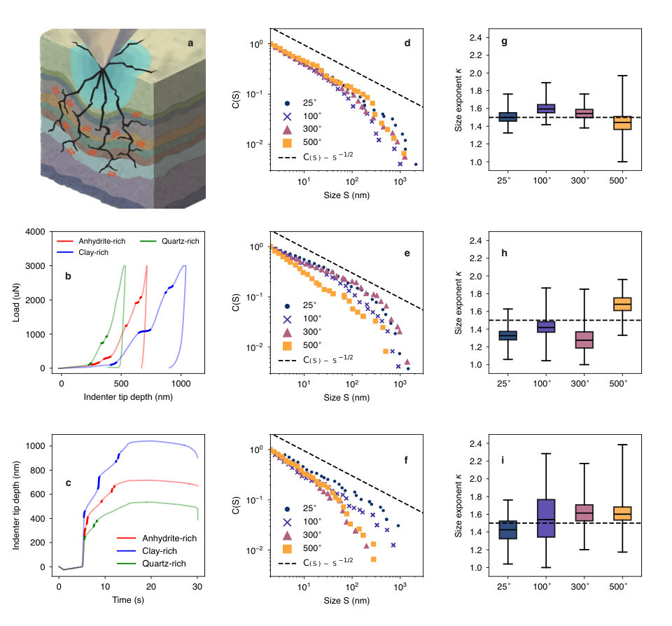
<figcaption class="paper-figure-caption"><b>Fig 1.</b> Figure 1: Nanoindentation of Cane Creek Shale. a, Schematic of nanoindentation. A Berkovich tip is driven at constant loading rate perpendicular to the surface of a polished shale sample. b, Load vs. tip depth curves for all three shale samples. Highlighted are pop-in events greater than 2 nm. c, Tip depth vs. time curves for all three shale samples. Highlighted are the same pop-in events shown in panel (b). d-f, C(𝑆) for the shale samples ((d) anhydrite-rich, (e) clay-rich, and (f) quartz-rich) across all four temperatures. The mean-field prediction C(𝑆) ∼𝑆!(#!$) is shown as a reference slope on each panel. g-i, Box-and-whisker plots showing fitted exponents for the shale samples ((g)...</figcaption>
</figure>
<figure class="paper-figure-card">
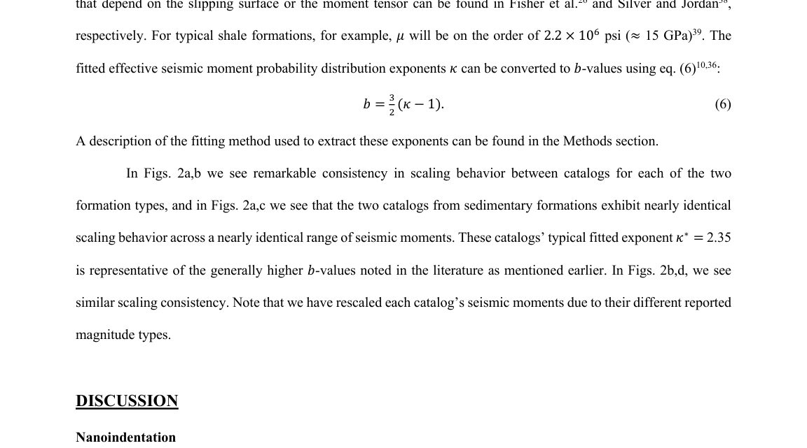
<figcaption class="paper-figure-caption"><b>Fig 2.</b> Fig. 1d-f show that the distributions of pop-in sizes obtained during nanoindentation experiments are consistent with</figcaption>
</figure>
<figure class="paper-figure-card">
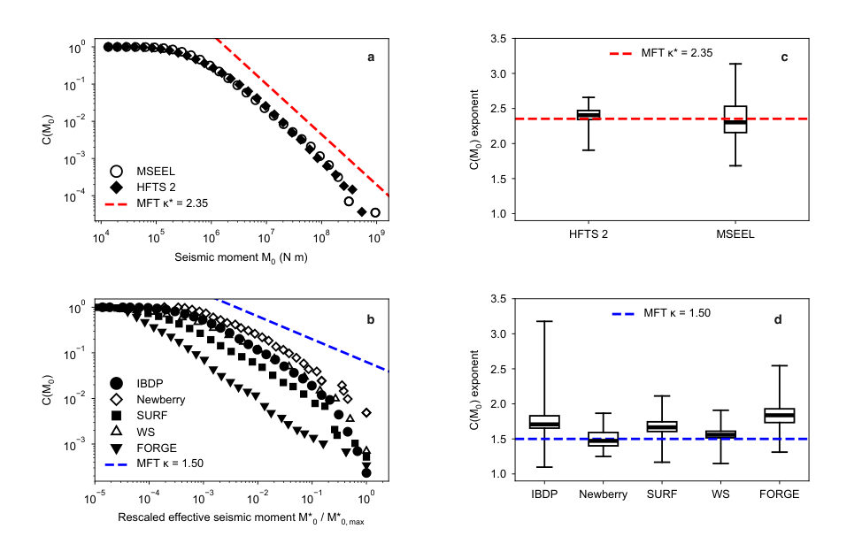
<figcaption class="paper-figure-caption"><b>Fig 3.</b> Figure 2: Microseismic event distributions. Scalar seismic moment CCDFs for all microseismic catalogs used in this article. a, CCDF of microseismic events extracted from operations targeting sedimentary formations. Reference slope shows the MFT prediction for the seismic moment CCDF exponent 𝜅∗ when stress- and length-scale effects are accounted for (see Discussion section for more details). b, CCDF of microseismic events extracted from operations targeting non- sedimentary formations. Reference slope shows the MFT prediction for the seismic moment CCDF exponent 𝜅. c, Box- and-whisker plot showing fitted exponents for distributions found in panel a. Red horizontal dashed line shows the...</figcaption>
</figure>
<figure class="paper-figure-card">
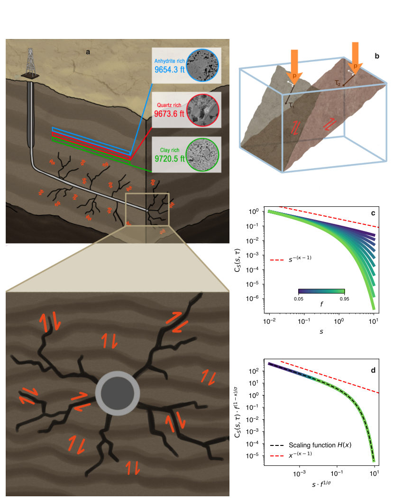
<figcaption class="paper-figure-caption"><b>Fig 4.</b> Figure 3: Local stress and length scale effects on microseismicity. a, Example hydraulic fracturing schematic. High- pressure fluid injection forces fractures to grow away from the wellbore, inducing slips in the surrounding rock. SEM images and extraction depths of the Cane Creek shale samples used in this study included. b, Two shear planes at different shear stresses 𝜏&#x27; &gt; 𝜏$ under an identical vertical force 𝑝. c, CCDF form of eq. (7) referenced in the main text evaluated at various reduced stresses 𝑓= (𝜏( −𝜏)/𝜏(. d, Scaling collapse of the curves in panel c. MFT predicts the universal scaling function 𝐻(𝑥).</figcaption>
</figure>

**Summary.** This research develops a micromechanical model of slip avalanches to predict earthquake statistics induced by fluid injection into underground rock formations. By comparing observed event size distributions from both lab nanoindentation tests on shale and real-world microseismic catalogs, the authors demonstrate that these statistics are universal but sensitive enough to reveal the underlying lithological structure of the rock.

**Why it may be interesting.** While applied to geophysics, the core methodology relies heavily on analyzing power-law scaling in non-equilibrium systems (avalanches), which shares mathematical parallels with critical phenomena studied in statistical mechanics and disordered systems.

Detailed structure

**Main problem.** Predicting the sizes and temporal occurrences of small earthquakes induced by fluid injection into the Earth's crust for safe industrial operations.

**Main result.** The slip statistics (like the b-value) are universal, depending only on basic properties, and can distinguish between different lithologies (e.g., layered vs. non-layered sedimentary rocks).

**Method.** Comparing observed power-law scaling exponents from microseismic catalogs and nanoindentation experiments against predictions from a mean-field model of slip avalanches.

**Model / system.** The study uses a micromechanical model of slip avalanches in slowly deforming solids, applying concepts from statistical physics to analyze event size distributions across vastly different spatial scales (nanometers to meters).

**Key observables.** Size distribution exponents ($\kappa$ or $\alpha$), the Gutenberg-Richter b-value, and cumulative distribution functions of seismic moments.

**Important parameters / regimes.** Lithology type (layered vs. non-layered), temperature range ($25^\circ	ext{C}$ to $500^\circ	ext{C}$), and material composition (mineralogy).

**Assumptions / limitations.** The slip statistics are governed by a mean-field theory, which simplifies complex interactions but successfully predicts scaling behavior across materials.

**Figures summary.** Figures illustrate nanoindentation load/displacement traces on different shale types at various temperatures, and plots show the comparison of microseismic event distributions for sedimentary versus non-sedimentary formations.

**Paper structure.** The paper establishes the problem (induced seismicity hazard), introduces the mean-field model for slip avalanches, applies this model to analyze both nanoindentation data on shale and large-scale microseismic catalogs from different geological settings, concluding that event statistics reveal underlying structural information about the rock.

Abstract

Fluid injection into the earth's crust can induce small and frequent earthquakes in the subsurface. Predicting their sizes and temporal occurrences via statistical analysis is crucial for safe operations in unconventional oil and gas recovery, enhanced geothermal systems, and geologic carbon storage. Here we show that a simple micromechanical model of slip avalanches in slowly deforming solids predicts the slip statistics observed over drastically different spatial scales, namely meter-scale microseismic observations and nanometer- to micrometer-scale nanoindentation experiments can be described with this model. Microseismic catalogs extracted from high-pressure fluid injection operations into geological basins with various lithologies and nanoindentation experiments on shale across a wide range of temperatures and mineral compositions yield statistics consistent with model predictions. This universality across materials, temperatures, and scales is consistent with the prediction that the slip statistics result from only a few basic properties. Previously debated deviations of the statistics in layered sedimentary formations are explained by finite-size and stress-integrative effects resulting from mechanically weak bedding planes. The slip statistics therefore provide important information about the structure and scales of the bedding planes. Conversely, the basin structure can also be used to predict the probability distribution for the sizes of triggered microseismic events.

[↑ back to top](#top)

### [Tunnel-rate controlled local heat distribution in mesoscopic circuits](http://arxiv.org/abs/2607.07559v1)

**Authors:** Parvathy Gireesan, Umang Soni, Harikrishnan Sundaresan, Giorgio Biasiol, Madhu Thalakulam  
**Type:** experiment · **Category:** statistical mechanics · **PDF:** <https://arxiv.org/pdf/2607.07559v1>  
**Analysis basis:** full PDF text, analyzed in chunks
**Topic relevance:** `Kondo & dissipative impurity` **3/5** · `non-equilibrium dynamics` **3/5** · `driven-dissipative phase transition` **2/5** · `Keldysh / 2PI / non-Gaussian methods` **1/5** · `analog quantum simulation` **1/5** · `correlated / nonlocal dissipation` **1/5** · `methods for driven-dissipative` **1/5** · `non-equilibrium universality` **1/5** · `quantum measurements` **1/5**

↔ Scroll figures horizontally

<figure class="paper-figure-card">
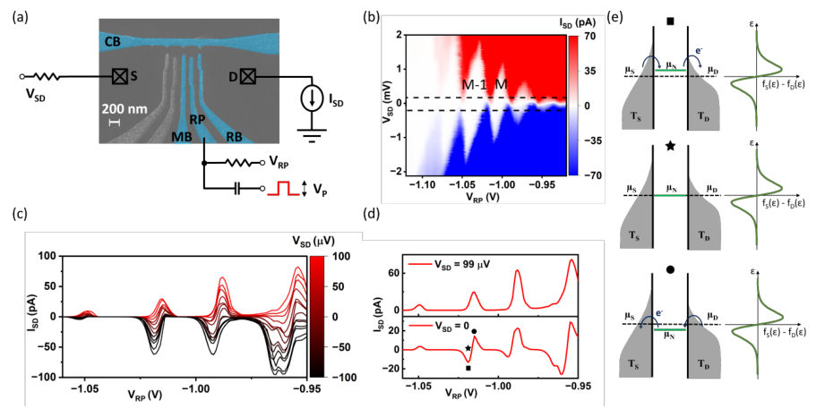
<figcaption class="paper-figure-caption"><b>Fig 1.</b> FIG.1. Observation of thermoelectric current in the device: (a) SEM image of the gate structure, with</figcaption>
</figure>
<figure class="paper-figure-card">
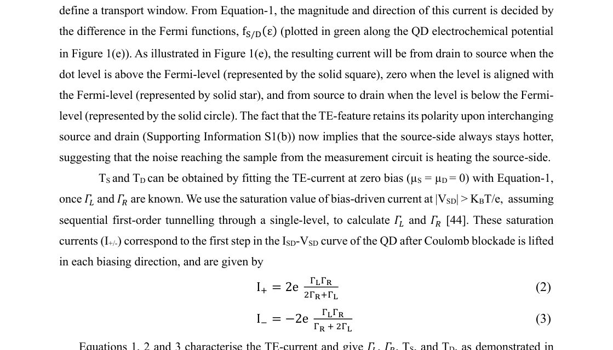
<figcaption class="paper-figure-caption"><b>Fig 2.</b> Figure 2 for the charge transition shown in Figure 2(a). Figures 2(b, c) show the ISD-VSD curves for</figcaption>
</figure>
<figure class="paper-figure-card">
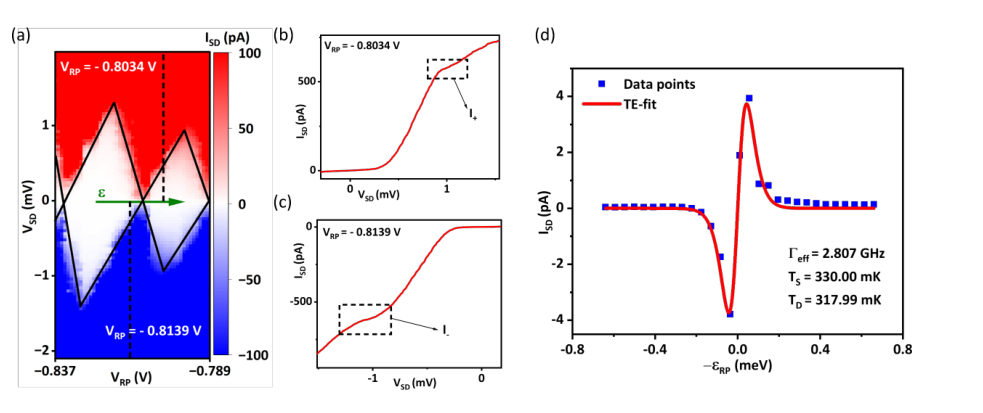
<figcaption class="paper-figure-caption"><b>Fig 3.</b> FIG. 2: Characterising the TE-current: (a) The CBO feature in between the two Coulomb diamonds is</figcaption>
</figure>
<figure class="paper-figure-card">
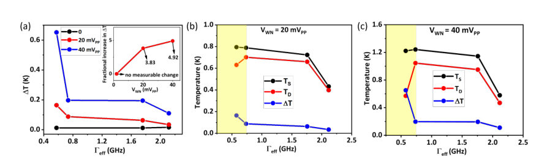
<figcaption class="paper-figure-caption"><b>Fig 4.</b> FIG. 3: Γeff controls the heat flow to drain-side: (a) ΔT as a function of Γeff, for three different VWN</figcaption>
</figure>
<figure class="paper-figure-card">
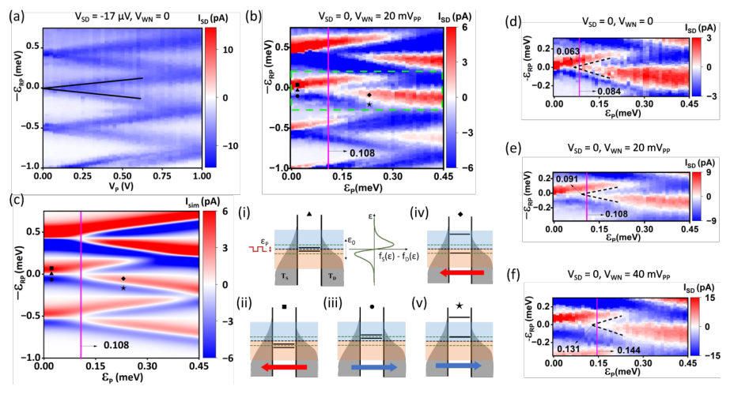
<figcaption class="paper-figure-caption"><b>Fig 5.</b> FIG. 4: Thermoelectric effect as seen in pulsed gate spectroscopy: Pulsed gate spectroscopy of charge</figcaption>
</figure>

**Summary.** The paper investigates using a gated quantum dot to actively control heat flow in nanoscale electronic circuits operating near absolute zero. By manipulating the tunnel coupling rates between the dot and its leads, researchers successfully demonstrated the ability to maintain large, controlled temperature differences across the device. This work establishes a pathway for building highly efficient quantum refrigerators based on solid-state mesoscopic components.

**Why it may be interesting.** This work provides an experimental realization of non-equilibrium thermodynamics in a solid-state quantum system, directly addressing energy dissipation and thermal management—a key area for open quantum systems research.

Detailed structure

**Main problem.** The core problem is controlling local heat distribution within mesoscopic circuits operating at milli-Kelvin temperatures, where conventional cooling methods are insufficient.

**Main result.** By tuning the tunnel rates of a gated quantum dot, researchers demonstrated precise control over the polarity and magnitude of the thermoelectric current, enabling localized heat management.

**Method.** The study combines electrical transport measurements (source-drain current) with advanced techniques like gate pulsing to directly measure electron temperature differences across the device.

**Model / system.** The physical system is a gated quantum dot (QD) fabricated on a GaAs/AlGaAs two-dimensional electron gas (2DEG). The physics relies on analyzing thermally driven electrical transport through the QD's discrete energy spectrum.

**Key observables.** Thermoelectric current ($I_{SD}$), temperature difference ($\Delta T$), and direct measurements of source ($T_S$) and drain ($T_D$) electron temperatures.

**Important parameters / regimes.** Tunnel rates ($\Gamma_L, \Gamma_R$), gate voltage pulses ($\epsilon_P, \epsilon_{RP}$), and the achieved temperature difference ($\sim 650 	ext{ mK}$).

**Assumptions / limitations.** The analysis assumes that controlling tunnel barriers allows for local heat control, which is crucial for developing efficient quantum refrigerators.

**Figures summary.** Figures show SEM images of the gate structure, Coulomb blockade oscillations (CBO) maps, and line-profiles illustrating how $\Delta T$, $T_S$, and $T_D$ vary as a function of effective tunnel rate ($\Gamma_{	ext{eff}}$).

**Paper structure.** The paper progresses from establishing the need for local heat control to detailing measurements using QD spectroscopy. It then analyzes how varying tunnel rates controls $\Delta T$, culminating in demonstrating that these tunable barriers enable advanced quantum refrigeration concepts.

Abstract

Solid-state quantum technologies, including qubits and quantum metrology circuits, demand milli-Kelvin operation to preserve fragile quantum states from classical noise. While the negligible electron-phonon coupling is the major impediment, reaching 50 mK electron temperature is further suffered by the high electrical resistance and sub-micron-scale dimensions of typical devices, limiting conventional heat dissipation. Though the phonons are effectively frozen, thermoelectric techniques could offer a viable path for heat management.This work explores thermally driven electrical transport in a gated quantum dot (QD) on a GaAs-AlGaAs two-dimensional electron gas (2DEG), to control heat flow between the source and drain reservoirs.By exploiting the QD's discrete energy spectrum and tuneable tunnel rates, a precise control over the polarity and magnitude of the resulting thermoelectric current is demonstrated. A temperature difference of 650 mK is maintained across the QD, a separation of 400 nm, by tuning the tunnel-rates. An experimental gate pulsing method is also introduced to directly measure the electron temperature differences across the QD, bypassing the need for any theoretical fits. The results presented here show that tuneable tunnel barriers can be used for local heat control, and could lead to advanced quantum refrigerators that work efficiently in mesoscopic circuits.

[↑ back to top](#top)

### [Dzyaloshinskii-Moriya Gradients Unlock Topological Dimensional Reduction in Magnetic Hopfions](http://arxiv.org/abs/2607.07048v1)

**Authors:** Kui Yuan, Hailong Shen, Jiawei Dong, Xin Zhang, Longqing Chen, Yihan Wang, Bo Liu, Qing Zhang, Zhengshang Wang, Wenbin Qiu, Xiaoyi Wang, Bing Han, Yang Qiu, Kun Zhang, Xudong Cui  
**Type:** both · **Category:** other · **PDF:** <https://arxiv.org/pdf/2607.07048v1>  
**Analysis basis:** full PDF text, analyzed in chunks
**Topic relevance:** `spintronics-quantum-optics interface` **3/5** · `driven-dissipative phase transition` **2/5** · `Frenkel-Kontorova` **1/5** · `analog quantum simulation` **1/5** · `correlated / nonlocal dissipation` **1/5** · `exotic spin models in light-matter` **1/5** · `methods for driven-dissipative` **1/5** · `non-equilibrium dynamics` **1/5** · `non-equilibrium universality` **1/5**

↔ Scroll figures horizontally

<figure class="paper-figure-card">
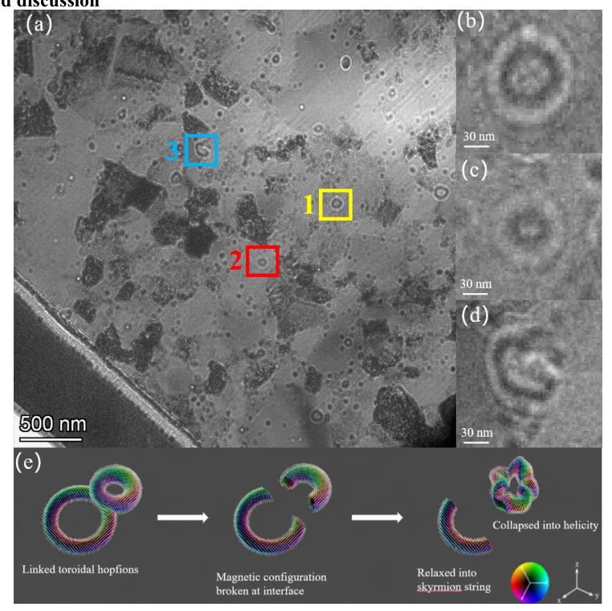
<figcaption class="paper-figure-caption"><b>Fig 1.</b> FIG. 1. Overview and proposed mechanism for DMI-gradient-assisted hopfion-ring breakdown. (a) Fresnel-mode LTEM overview of TiO₂ nanoparticles embedded in a FeCrNiMn high-entropy-alloy matrix, showing the three investigated regions: pristine TiO₂ (region 1), uniformly Y-doped TiO₂ (region 2), and nonuniformly Y-doped TiO₂</figcaption>
</figure>
<figure class="paper-figure-card">
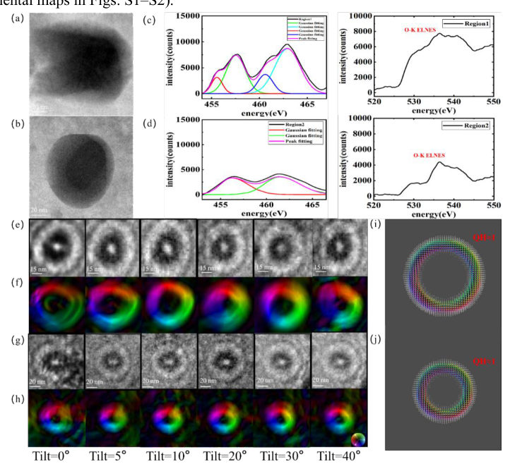
<figcaption class="paper-figure-caption"><b>Fig 2.</b> FIG. 2. Electronic structure and simulation-assisted assignment of closed toroidal textures in pristine and uniformly Y-doped TiO₂. (a,b) LTEM images of pristine and uniformly Y-doped TiO₂ regions. (c,d) Ti L₂,₃-edge spectra (left) and O K-edge spectra (right), with corresponding fits, acquired from the pristine and uniformly Y-doped regions. (e,f) Tilt-dependent LTEM images and reconstructed magnetic-domain maps of pristine TiO₂. (g,h) Tilt-dependent LTEM images and reconstructed magnetic-domain maps of uniformly Y-doped TiO₂. (i,j) Effective MuMax3-simulated closed-ring states with QH close to 1 in pristine and uniformly Y-doped TiO₂, respectively.</figcaption>
</figure>
<figure class="paper-figure-card">
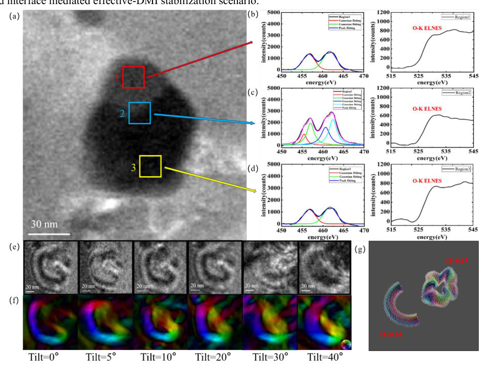
<figcaption class="paper-figure-caption"><b>Fig 3.</b> FIG. 3. Electronic and magnetic structure of a nonuniformly Y-doped TiO₂ nanoparticle. (a) HRTEM image showing the upper domain (region 1), interfacial boundary (region 2), and lower domain (region 3). (b)-(d) Ti L₂,₃-edge spectra (left) and O K-edge spectra (right), with fits, acquired from the upper domain, boundary, and lower domain. (e,f) Tilt- dependent LTEM images and reconstructed magnetic-domain maps of the same nanoparticle. (g) MuMax3-simulated post-breakdown state, showing a low-DMI skyrmion-string-like remnant and a high-DMI helicity-rich topologically trivial branch.</figcaption>
</figure>
<figure class="paper-figure-card">
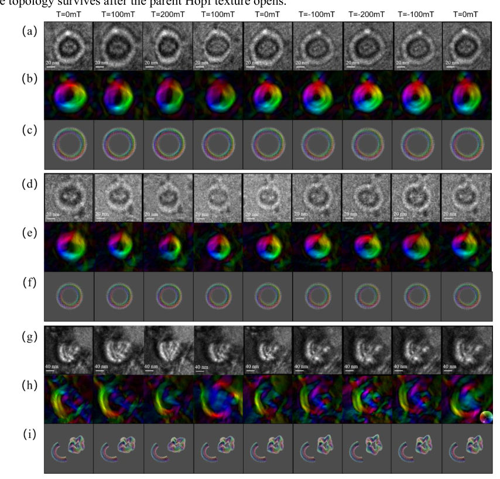
<figcaption class="paper-figure-caption"><b>Fig 4.</b> FIG. 4. Field response of closed and post-breakdown magnetic textures during a representative hysteresis-like field sweep at zero tilt. (a)-(c) LTEM images, reconstructed magnetic-domain maps, and MuMax3 simulations of the pristine TiO₂ region under varying fields. (d)-(f) Corresponding images, reconstructions, and simulations of the uniformly Y-doped region. (g)-(i) Corresponding images, reconstructions, and simulations of the nonuniformly Y-</figcaption>
</figure>

**Summary.** This work demonstrates that chemical disorder (Y doping) can be used as a tool to manipulate the topology of magnetic structures in $	ext{TiO}_2$ nanoparticles. By creating sharp gradients, the system forces a transition from stable 3D Hopfions into lower-dimensional skyrmion strings. This provides a mechanism for controlling topological states using material engineering.

**Why it may be interesting.** While focused on condensed matter magnetism, the concept of controlled defect engineering to induce a specific symmetry breaking or dimensionality reduction in a topologically protected state shares conceptual parallels with engineered quantum interfaces or boundary effects studied in AMO physics.

Detailed structure

**Main problem.** The study investigates how controlled chemical inhomogeneity can break the topological protection of three-dimensional magnetic solitons (Hopfions), causing them to reduce dimensionality into effectively two-dimensional skyrmion strings.

**Main result.** Nonuniform Y doping creates a sharp gradient in the effective Dzyaloshinskii–Moriya interaction parameter ($q$), leading to the asymmetric splitting of the toroidal texture into stable skyrmion string remnants and topologically trivial branches.

**Method.** The research combines experimental characterization using Tilt-dependent Lorentz TEM and EELS with theoretical modeling via micromagnetic simulations.

**Model / system.** The system involves disordered TiO2 nanoparticles embedded in an FeCrNiMn host, where magnetism arises from localized Ti3+/oxygen-vacancy centers. The model analyzes the competition between interfacial mismatch energy (due to gradients) and elastic curvature energy.

**Key observables.** Topological invariants like Hopf invariant ($	ext{QH}$) and Skyrmion charge ($Q$); magnetic domain maps; electronic states ($	ext{Ti}^{3+}$ vs $	ext{Ti}^{4+}$).

**Important parameters / regimes.** The ratio $q=D/(2A)$; the degree of Y doping (uniform vs. nonuniform); local spin continuity.

**Assumptions / limitations.** Effective micromagnetic parameters are used for defect-induced textures; simulations introduce confinement barriers to suppress artificial topological leakage.

**Figures summary.** Figures compare LTEM images and spectra across pristine, uniformly doped, and nonuniformly doped samples, illustrating the transition from stable rings to bifurcated skyrmion strings under varying magnetic fields.

**Paper structure.** The paper progresses by first establishing the baseline (pristine/uniform doping) showing robust 3D textures, then introducing the gradient via nonuniform doping, which is shown experimentally and simulated to cause the topological splitting mechanism.

Abstract

Three-dimensional magnetic solitons retain topological protection only while their spin field remains continuous. Here we show that chemical inhomogeneity can break this protection in a controlled way, converting a hopfion-like toroidal texture into an effectively two-dimensional skyrmion string. Tilt-dependent Lorentz transmission electron microscopy, electron energy-loss spectroscopy, and micromagnetic simulations of pristine, uniformly Y-doped, and nonuniformly Y-doped disordered TiO2 nanoparticles embedded in a FeCrNiMn host reveal two regimes. Uniform Y doping enriches Ti3+/oxygen-vacancy localization centers and stabilizes closed rings with Hopf invariant QH approximately 1. Nonuniform Y doping forms a Ti4+-rich, vacancy-depleted boundary that creates a sharp q=D/(2A) gradient and a weak-moment leakage channel. This coupled mismatch torque and continuity leakage split the ring, leaving a skyrmion-string remnant and a field-sensitive helicity texture.

[↑ back to top](#top)

### [Nonlinear Dynamics of Hopfion for Frequency Multiplication](http://arxiv.org/abs/2607.07499v1)

**Authors:** Waleed I. Waseer, Yunshan Cao, Peng Yan  
**Type:** theory · **Category:** other · **PDF:** <https://arxiv.org/pdf/2607.07499v1>  
**Analysis basis:** full PDF text, analyzed in chunks
**Topic relevance:** `spintronics-quantum-optics interface` **3/5** · `non-equilibrium dynamics` **2/5** · `analog quantum simulation` **1/5** · `driven-dissipative phase transition` **1/5** · `exotic spin models in light-matter` **1/5** · `methods for driven-dissipative` **1/5** · `non-equilibrium universality` **1/5**

↔ Scroll figures horizontally

<figure class="paper-figure-card">
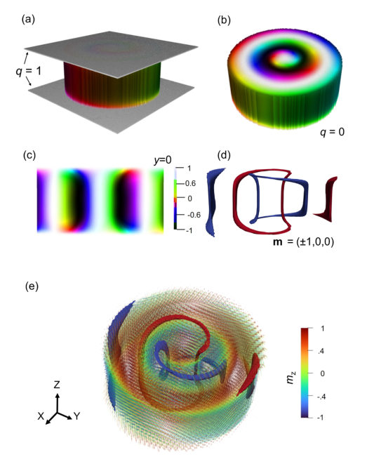
<figcaption class="paper-figure-caption"><b>Fig 1.</b> FIG. 1. (a) Schematic of a Hopfion stabilized in a chiral ferromagnetic disk sandwiched between two PMA layers. (b) mz component of a numerically computed Hopfion for D = 395 µJ/m2 in a cylinder of height h and diameter of 200.2 nm. (c) Cross section of Hopfion at y = 0. (d) The two isosurface at m = (±1, 0, 0) are linked once, as required by the unit Hopf charge. (e) Plot of mz with two isosurface drawn m = (±1, 0, 0) representing the Hopf charge.</figcaption>
</figure>
<figure class="paper-figure-card">
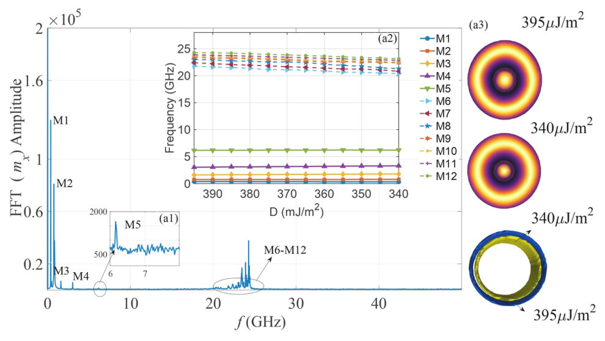
<figcaption class="paper-figure-caption"><b>Fig 2.</b> FIG. 2. Spin-wave resonance spectrum in response to an in-plane excitation. Inset (a1) shows a magnified view of the magnon spectrum, highlighting the labeled localized state M5. The inset (a2) illustrates the behavior of localized states in response to DMI. Modes M6-M12 corresponds to 21.8,22.4 ,23,23.45,23.7,23.9 and 24.275 GHz respectively. The inset (a3) illustrates the effect of varying DMI on the Hopfion profile along with the contour drawn at m = (0, 0, −1).</figcaption>
</figure>
<figure class="paper-figure-card">
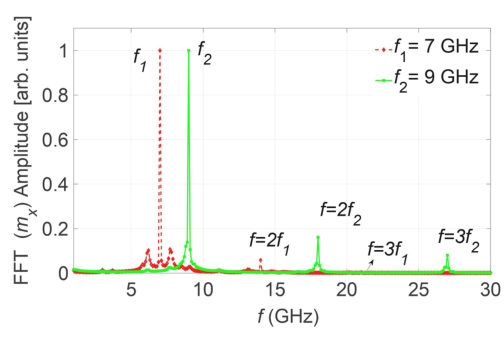
<figcaption class="paper-figure-caption"><b>Fig 3.</b> FIG. 3. An illustrative example of frequency multiplication by Hopfion configuration. Under the out-of-plane excitation with field of frequency f1 = 7 GHz and f2 = 9 GHz and ampli- tude 2 mT. Close-by small features near 7 GHz are nonlinear sidebands (finite-amplitude modulation / mode coupling) and they disappear in the small-drive limit</figcaption>
</figure>
<figure class="paper-figure-card">
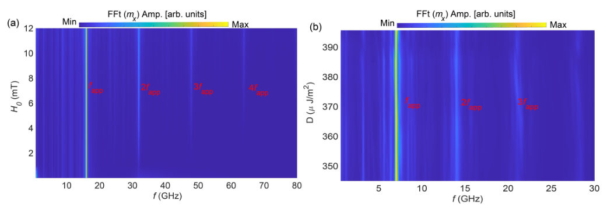
<figcaption class="paper-figure-caption"><b>Fig 4.</b> FIG. 4. (a) Field-frequency map of the magnetization response under an in–plane microwave excitation Bext(t) = H0 sin(2πfappt) ˆx. Here applied frequecny is fapp = 16 GHz. The color scale shows the normalized FFT amplitude of the magnetization as a function of the frequency f and the microwave field amplitude H0. (b) DMI–frequency phase diagram of the magnetization response under a microwave excitation with frequency fapp = 7 GHz. The color scale shows the normalized FFT amplitude of the spatially averaged mx component as a function of frequency and DMI strength. Clear vertical features appear at the fundamental frequency fapp and its higher harmonics indicate nonlinear frequency...</figcaption>
</figure>
<figure class="paper-figure-card">
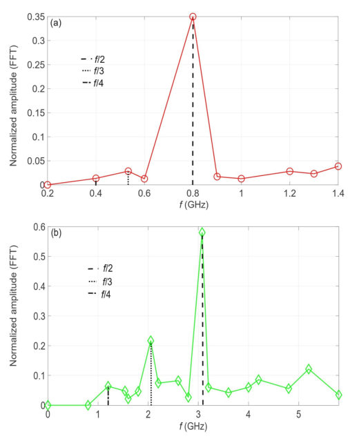
<figcaption class="paper-figure-caption"><b>Fig 5.</b> FIG. 5. Illustrative examples of eigenmode excitation by mi- crowave with fractional frequency. (a) In-plane excitation of eigenmode by applied frequencies that are fraction of localized mode f = 1.6 GHz. (b) Out-of-plane excitation of eigenmode by applied frequencies that are fraction of localized mode at f = 6.15 GHz. In both examples we have normalized the recorded amplitude of FFT at the corresponding eigenfre- quencies by dividing the amplitude of applied frequency, i.e., FFT amplitude at 1.6 GHz, by the FFT amplitude at applied frequency.</figcaption>
</figure>

**Summary.** This paper simulates the nonlinear behavior of magnetic Hopfion spin textures when subjected to microwave driving fields. The authors demonstrate that these topological solitons can efficiently generate higher harmonics of the input frequency, a process termed frequency multiplication. This work highlights the potential of engineered magnetic structures for advanced nonlinear magnonic applications.

**Why it may be interesting.** While focused on classical magnetism, the study involves complex topological structures (Hopfions) exhibiting highly non-linear wave dynamics and resonance phenomena, which shares mathematical parallels with nonlinear wave propagation studied in quantum optics or AMO systems.

Detailed structure

**Main problem.** The study investigates the nonlinear response of magnetic Hopfion spin textures when driven by external microwave fields, aiming to demonstrate efficient frequency multiplication.

**Main result.** Hopfions exhibit strong harmonic generation, and tuning the driving frequency to fractional resonances significantly enhances this effect, showing promise for nonlinear magnonics.

**Method.** The research employs systematic micromagnetic simulations solving the Landau-Lifshitz-Gilbert (LLG) equation using MuMax3.

**Model / system.** The physical system is a magnetic Hopfion—a 3D topological soliton structure in a chiral ferromagnetic nanodisk. The dynamics are governed by an energy density functional and simulated via the LLG equation.

**Key observables.** Power spectra showing second- and third-harmonic generation, localized magnon modes (breathing/gyration), and harmonic amplitudes ($2f, 3f$, etc.).

**Important parameters / regimes.** Material parameters like saturation magnetization ($M_s$), exchange stiffness ($A$), and the driving frequency relative to fractional resonance points ($f_{drive} = f_{mode}/n$).

**Assumptions / limitations.** The analysis assumes specific material constants and models the system's dynamics using classical micromagnetics, contrasting isolated vs. bulk topological states.

**Figures summary.** Figures illustrate Hopfion schematics, spin-wave resonance spectra showing localized modes (M5-M12), and examples of frequency multiplication achieved via in-plane or out-of-plane excitation.

**Paper structure.** The paper progresses from establishing the physical model and basic harmonic generation to analyzing directional coupling ($\hat{x}$ vs. $\hat{z}$), then explores robustness against temperature and disorder, concluding with a comparison of nonlinear response between isolated and bulk Hopfion assemblies.

Abstract

Hopfions, associated with higher-dimensional topology through the Hopf fibration, exhibit {exotic} features like {complex knot} and improved stability compared to skyrmions, enhancing their appeal for innovative applications. In this paper, we study the nonlinear response of magnetic Hopfion to microwave fields. {We observe the emergence of higher-order harmonics of the driving microwave field as it interacts with the Hopfion}. By carefully selecting the {driving frequency, the corresponding harmonic can efficiently excite localized magnon state of a Hopfion. Our results demonstrate the promising potential of hopfions in nonlinear magnonics.

[↑ back to top](#top)

### [Thermal-response Functions and the Peierls-Boltzmann Equation for Second Sound and Phonon Hydrodynamics in Graphene](http://arxiv.org/abs/2607.07644v1)

**Authors:** Antonio Martinez-Margolles, Patrick K. Schelling  
**Type:** theory · **Category:** statistical mechanics · **PDF:** <https://arxiv.org/pdf/2607.07644v1>  
**Analysis basis:** full PDF text, analyzed in chunks
**Topic relevance:** `non-equilibrium dynamics` **3/5** · `non-equilibrium universality` **2/5** · `Keldysh / 2PI / non-Gaussian methods` **1/5** · `correlated / nonlocal dissipation` **1/5** · `driven-dissipative phase transition` **1/5** · `interference shaping light` **1/5** · `methods for driven-dissipative` **1/5**

↔ Scroll figures horizontally

<figure class="paper-figure-card">
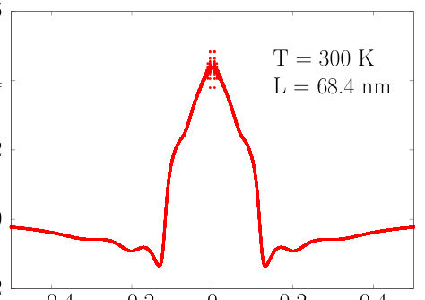
<figcaption class="paper-figure-caption"><b>Fig 1.</b> Figure 1: Real part 퐾′ 풒(휔) of the response function as a function of frequency 휔 2휋at 푇= 300퐾. Calculation for excitation vector 풒, with 퐿= 2휋</figcaption>
</figure>
<figure class="paper-figure-card">
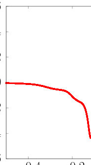
<figcaption class="paper-figure-caption"><b>Fig 2.</b> Figure 2: Imaginary part 퐾′′ 풒(휔) of the response function as a function of frequency 휔</figcaption>
</figure>
<figure class="paper-figure-card">
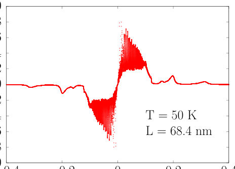
<figcaption class="paper-figure-caption"><b>Fig 3.</b> Figure 3: Imaginary component 퐾′′ 풒(휔) determined at 푇= 50K. In contrast to the 푇= 300K results, sharp peaks are evident in the spectra, potentially consistent with “ballistic” transport. Calculation for excitation vector 풒, with 퐿= 2휋</figcaption>
</figure>
<figure class="paper-figure-card">
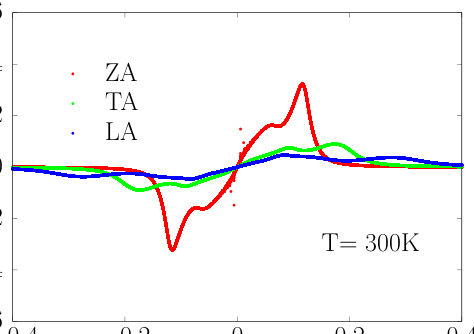
<figcaption class="paper-figure-caption"><b>Fig 4.</b> Figure 4: Contributions of the acoustic modes to 퐾′′ 풒(휔) determined at 푇= 300K for excitation vector 풒, with 퐿= 2휋</figcaption>
</figure>
<figure class="paper-figure-card">
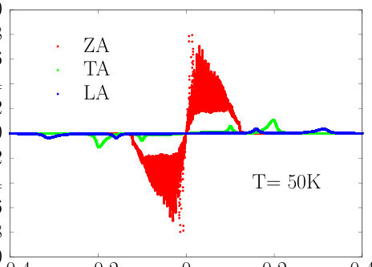
<figcaption class="paper-figure-caption"><b>Fig 5.</b> Figure 5: Contributions of the acoustic modes to 퐾′′ 풒(휔) determined at 푇= 50K. Calculation done for excitation vector 풒, where 퐿= 2휋</figcaption>
</figure>

**Summary.** This paper develops a comprehensive theory connecting phonon hydrodynamics and second sound phenomena in Graphene using the Peierls-Boltzmann Equation. It calculates thermal response functions derived from microscopic physics, demonstrating how interference effects manifest as 'second phonons.' The work is crucial for understanding when simple theoretical models fail due to scattering or short length scales.

**Why it may be interesting.** This work provides advanced theoretical tools for non-equilibrium thermal transport in low-dimensional materials like graphene, which is highly relevant to understanding energy dissipation and heat management in nanoscale devices.

Detailed structure

**Main problem.** The paper aims to connect phonon phase-space distribution functions to the microscopic physics of heat wave evolution, specifically addressing interference effects in transient thermal grating experiments for second sound.

**Main result.** The theory successfully relates PBE solutions to 'second phonons' as elementary excitations and provides a framework to understand when these approximations break down due to short length scales or strong scattering.

**Method.** It develops thermal response functions by solving the Peierls-Boltzmann equation (PBE) in the relaxation-time approximation (RTA), using DFT data for input parameters.

**Model / system.** The study focuses on phonon hydrodynamics and second sound propagation in Graphene. The theoretical framework involves analyzing the evolution of phonon distribution functions ($	ilde{n}_{\mathbf{q}
u}$) governed by the PBE.

**Key observables.** Phonon distribution function ($	ilde{n}_{\mathbf{q}
u}$), thermal response function $	ilde{\chi}_{\mathbf{q}}(\omega)$, and the ratio $R_{\mathbf{q},\omega}$ which indicates scattering strength relative to coherent oscillation.

**Important parameters / regimes.** Temperature ($T=300$ K vs $T=50$ K), excitation wave vector ($\mathbf{q}$), system length scale ($\ell$), and phonon branch (ZA, TA, LA).

**Assumptions / limitations.** The analysis starts with the PBE in the RTA; later sections extend this by assuming a harmonic Hamiltonian approximation.

**Figures summary.** Figures show the real and imaginary parts of the response function $\chi_{\mathbf{q}}(\omega)$ at different temperatures, illustrating spectral features related to second sound poles. A key diagnostic is the ratio $R_{\mathbf{q},\omega}$, which determines if scattering invalidates the elementary excitation concept.

**Paper structure.** The paper progresses from establishing the connection between PBE and heat wave evolution (Chunk 1), deriving explicit thermal response functions using DFT data to predict second sound poles (Chunk 2), analyzing the validity of the 'second phonon' concept via a scattering ratio $R$ across different length scales (Chunk 3), and finally, extending the formalism beyond RTA within the harmonic approximation (Chunk 4).

Abstract

We connect expressions for phonon phase-space distribution functions to microscopic physics of the evolution of heat waves. The role of interference effects that arise as a result of a periodic heating source typically encountered in transient thermal grating (TTG) experiments is then explored. The distribution functions are evaluated as solutions to the Peierls-Boltzmann equation (PBE) in the relaxation-time approximation (RTA). Starting from the PBE, we next develop thermal response functions. The response functions are computed using data from density-functional theory (DFT) calculations. Using this approach, it is shown how solutions to the PBE can be related to the propagation of second phonons as elementary excitations, and within this perspective the necessary conditions for the propagation and observation of second sound is elucidated. The approach developed therefore shows how PBE theory for phonon hydrodynamics and second sound can be modified to properly describe interference and phonon decoherence effects that are likely important at shorter length scales. Finally, we then discuss how many-body theory can be extended to include coupled scattering channels and hence provide a quantitative theory beyond the RTA.

[↑ back to top](#top)

### [Effective Field Theories for Material Media](http://arxiv.org/abs/2607.06666v1)

**Authors:** Angelo Esposito, Alberto Nicolis, Riccardo Penco  
**Type:** theory · **Category:** other · **PDF:** <https://arxiv.org/pdf/2607.06666v1>  
**Analysis basis:** full PDF text, analyzed in chunks
**Topic relevance:** `Keldysh / 2PI / non-Gaussian methods` **3/5** · `analog quantum simulation` **1/5** · `correlated / nonlocal dissipation` **1/5** · `correlated cavity matter` **1/5** · `driven-dissipative phase transition` **1/5** · `methods for driven-dissipative` **1/5** · `non-equilibrium dynamics` **1/5**

↔ Scroll figures horizontally

<figure class="paper-figure-card">
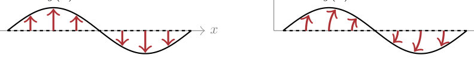
<figcaption class="paper-figure-caption"><b>Fig 1.</b> Figure 1: The equilibrium configuration (dashed line) of a string in two spatial dimensions spontaneously breaks three symmetries: boosts along y, translations along y and rotations in the xy-plane. A given perturbation (solid line) can be seen as generated by the action of locally modulated translations along y (left panel), locally modulated rotations in the xy-plane (right panel) or locally modulated boosts (not shown). As a consequence, despite the breaking of these three symmetries, the perturbation can be described by a single Goldstone mode, δy(x), corresponding to the vertical displacement of the string.</figcaption>
</figure>
<figure class="paper-figure-card">
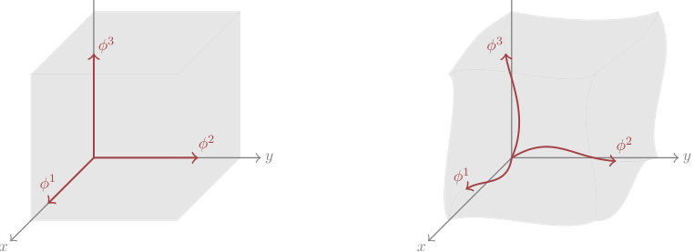
<figcaption class="paper-figure-caption"><b>Fig 2.</b> Figure 2: Left panel: Relation between physical and comoving coordinates for a solid at equilibrium, Eq. (3.2). Right panel: Same relation but for a solid slightly away from equilibrium, Eq. (3.34).</figcaption>
</figure>
<figure class="paper-figure-card">
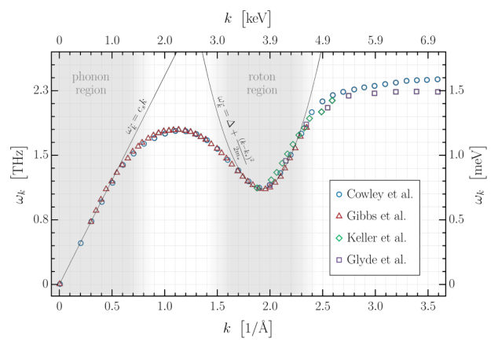
<figcaption class="paper-figure-caption"><b>Fig 3.</b> Figure 3: Measured spectrum of collective modes in superfluid 4He, as report in [223]. In particular, blues circles are taken from [224], red triangles from [225], green diamonds from [226], and purple squares from [227]. The phonon region corresponds to the lowest momentum one, k ≲ΛUV ≃1.5 keV, where the lowest order linear dispersion relation is also plotted.</figcaption>
</figure>
<figure class="paper-figure-card">
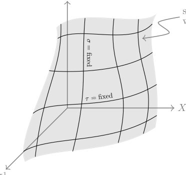
<figcaption class="paper-figure-caption"><b>Fig 4.</b> Figure 4: Parametrization of the vortex line configuration, Xµ(t, σ), in the τ = X0 = t gauge. Every slice with τ = fixed represents a spatial configuration of the string at a given instant in time. Every σ = fixed slice, instead, follows the motion of a given infinitesimal chunk of string through time.</figcaption>
</figure>
<figure class="paper-figure-card">
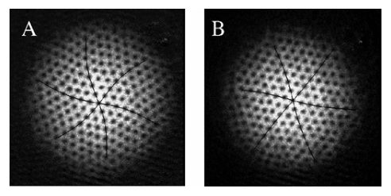
<figcaption class="paper-figure-caption"><b>Fig 5.</b> Figure 5: Experimental image of a vortex lattice featuring a Tkachenko mode (black lines), as reported in [262]. The two panels correspond to the same lattice, imaged a two different instant of times after the excitation of the mode.</figcaption>
</figure>

**Summary.** This review unifies the study of condensed matter physics by applying tools from high-energy field theory, specifically Effective Field Theories. It demonstrates that collective excitations in solids, fluids, and superfluids are often described by Goldstone bosons resulting from spontaneously broken symmetries. The work aims to bridge conceptual gaps between particle physics and material science using a systematic theoretical framework.

**Why it may be interesting.** It provides a powerful, unifying theoretical lens—the EFT framework—to analyze many-body dynamics in condensed matter systems, drawing direct parallels between particle physics symmetry breaking and macroscopic material properties like sound propagation.

Detailed structure

**Main problem.** The paper reviews how high-energy field theory concepts, particularly Effective Field Theories (EFTs) and symmetry breaking, can be used to systematically describe the low-energy dynamics of various condensed matter systems.

**Main result.** It argues that many phenomena in solids, fluids, and superfluids are governed by gapless Goldstone excitations arising from spontaneously broken symmetries, unifying language across subfields.

**Method.** The primary method is theoretical review, employing EFT techniques to analyze collective excitations (like phonons) in different media while comparing results derived under relativistic versus nonrelativistic approximations.

**Model / system.** The scope covers general condensed matter systems, including solids, fluids, and superfluids. The analysis focuses on the medium's ground state properties defined by broken spacetime symmetries, such as Lorentz boosts.

**Key observables.** Goldstone boson spectra, phonon scattering rates, superfluid dynamics (e.g., Hall viscosity), and low-energy excitation modes.

**Important parameters / regimes.** Low energy/long distance limit ($\vec{k} 	o 0$), temperature, density, and the nature of broken symmetries (e.g., boost invariance).

**Assumptions / limitations.** The approach assumes that the low-energy physics can be captured by an EFT derived from underlying microscopic interactions; it often treats systems as being in a state where certain spacetime symmetries are spontaneously broken.

**Paper structure.** The paper is structured systematically by medium: Solids (Section 3), Fluids (Section 4), and Superfluids (Section 5), providing specialized derivations for each class of matter.

Abstract

We review recent progress in understanding certain aspects of condensed matter systems from a high energy theory perspective. We discuss effective field theories that describe collective bulk and localized excitations in a variety of solid and fluid systems. Particular emphasis is placed on the role played by spacetime symmetries and their spontaneous breaking. The resulting Goldstone dynamics can be seen as underlying a wide variety of phenomena. We attempt to bridge the language gap between subfields while underscoring the numerous conceptual similarities.

[↑ back to top](#top)

### [Non-Hermitian control of helicity-selective antiferromagnetic resonance](http://arxiv.org/abs/2607.07488v1)

**Authors:** Masato Todani, Satoshi Iihama, Yuto Moritake, Takeo Kato  
**Type:** theory · **Category:** other · **PDF:** <https://arxiv.org/pdf/2607.07488v1>  
**Analysis basis:** full PDF text, analyzed in chunks
**Topic relevance:** `spintronics-quantum-optics interface` **3/5** · `non-equilibrium dynamics` **2/5** · `Keldysh / 2PI / non-Gaussian methods` **1/5** · `correlated / nonlocal dissipation` **1/5** · `driven-dissipative phase transition` **1/5** · `methods for driven-dissipative` **1/5**

↔ Scroll figures horizontally

<figure class="paper-figure-card">
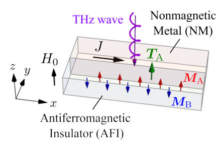
<figcaption class="paper-figure-caption"><b>Fig 1.</b> FIG. 1. Schematic illustration of the antiferromagnetic insu- lator (AFI)/nonmagnetic metal (NM) junction considered in this study. The antiferromagnet consists of two sublattices, A and B, and is assumed to couple to the NM only through sublattice A. A charge current J flowing in the NM along the x direction induces a damping-like spin-orbit torque TA acting on the interfacial sublattice A. A static magnetic field H0 is applied along the z direction. The antiferromagnetic resonance driven by a circularly polarized THz wave is stud- ied.</figcaption>
</figure>
<figure class="paper-figure-card">
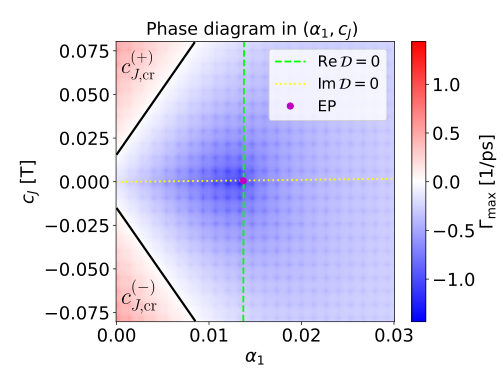
<figcaption class="paper-figure-caption"><b>Fig 2.</b> FIG. 2. Stability diagram in the (α1, cJ) plane for H0 = 0 and α2 = 0.002. The color map shows Γmax = max [Im ω+, Im ω−]. The black line indicates the threshold condition Γmax = 0. The dashed and dotted lines represent Re D = 0 and Im D = 0, and their intersection (red dot) in- dicates the exceptional point (EP).</figcaption>
</figure>
<figure class="paper-figure-card">

<figcaption class="paper-figure-caption"><b>Fig 3.</b> FIG. 3. Real and imaginary parts of the two resonance frequencies as a function of α1 for (a,b) cJ = 6.4×10−4 T and (c,d) cJ = 0.04 T. The point where the eigenvalues coalesce in (a) and (b) corresponds to the exceptional point (EP). The remaining parameters are set to H0 = 0 and α2 = 0.002.</figcaption>
</figure>
<figure class="paper-figure-card">
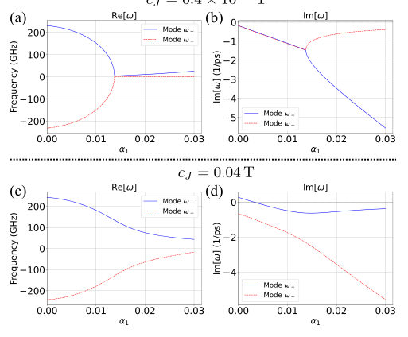
<figcaption class="paper-figure-caption"><b>Fig 4.</b> Figure 4(a) shows the absorption spectra for cJ = 0.04 T as α1 approaches the stability threshold from the stable side (α1 &gt; 0.0032). Far from the stability thresh- old, the absorption peaks have broad linewidths and rel- atively small peak intensities. In contrast, as the system approaches the stability boundary from the stable side, one peak becomes narrower and stronger, reflecting the approach of Im ω+ to zero. This peak narrowing occurs only on the positive-frequency branch, corresponding to one helicity of the circularly polarized sub-THz ac mag- netic field. This demonstrates that the absorption en-</figcaption>
</figure>
<figure class="paper-figure-card">
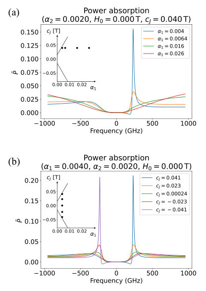
<figcaption class="paper-figure-caption"><b>Fig 5.</b> FIG. 4. Frequency dependence of the normalized absorption rate (a) for several values of α1 at fixed spin-orbit torque cJ and (b) for several values of cJ at fixed damping constant α1. The insets indicate the corresponding parameter sets in the (α1, cJ) diagram.</figcaption>
</figure>

**Summary.** The authors analyze antiferromagnetic resonance in an AFI/NM junction by treating the dynamics as a non-Hermitian eigenvalue problem. They demonstrate that maximizing absorption and achieving helicity selectivity requires tuning parameters near the stability threshold, which is distinct from the exceptional point. This establishes the stability boundary as the key control mechanism for developing polarization-selective sub-THz devices.

**Why it may be interesting.** This work applies concepts from non-Hermitian physics (EPs, stability boundaries) to classical magnetism, providing a framework for engineering highly controllable, polarization-selective THz devices using magnetic materials.

Detailed structure

**Main problem.** The study investigates non-Hermitian control mechanisms governing helicity-selective antiferromagnetic resonance (AFMR) in magnetic junctions.

**Main result.** Strong resonant absorption enhancement and polarization selectivity are maximized by tuning the system parameters towards the stability threshold, rather than necessarily at the exceptional point. Reversing the spin-orbit torque can switch this helicity dependence.

**Method.** The dynamics are analyzed by linearizing the Landau-Lifshitz-Gilbert (LLG) equation into a 2x2 non-Hermitian eigenvalue problem to derive complex resonance frequencies and stability criteria.

**Model / system.** The system is an antiferromagnetic insulator/nonmagnetic metal junction, modeled using sublattice-dependent damping and spin-orbit torque acting on one sublattice. The dynamics are governed by the linearized LLG equation.

**Key observables.** Complex resonance frequencies ($\omega_{\pm}$), stability threshold ($\Gamma_{max}=0$), absorption power ($P(\omega)$), and degree of circular polarization ($C(\omega)$).

**Important parameters / regimes.** Spin-orbit torque strength ($c_J$), damping parameters, and the proximity to the stability threshold.

**Assumptions / limitations.** The analysis relies on approximations such as $\alpha_1, \alpha_2 \ll 1$ and $H_J \gg H_0, H_D, c_J$.

**Figures summary.** Figures illustrate the junction setup, stability diagrams showing the boundary ($\Gamma_{max}=0$) relative to the Exceptional Point (EP), and resonance spectra demonstrating enhancement near the threshold.

**Paper structure.** The paper proceeds by formulating the problem as a non-Hermitian eigenvalue problem, deriving conditions for EP and stability thresholds, analyzing absorption enhancement near these points, and finally confirming the results via full LLG dynamics to show gain/oscillation upon crossing the threshold.

Abstract

We study non-Hermitian antiferromagnetic resonance in an antiferromagnetic insulator/nonmagnetic metal junction with sublattice-dependent damping and spin-orbit torque. By formulating the linearized Landau-Lifshitz-Gilbert (LLG) equation as a 2x2 non-Hermitian eigenvalue problem, we derive the complex resonance frequencies, the exceptional-point condition, and the stability-threshold condition. We show that the largest absorption response is maximized by approaching the stability threshold from the stable side. Near the threshold on the stable side, the absorption spectrum exhibits strong enhancement and linewidth narrowing, together with pronounced helicity dependence in the sub-THz regime that can be switched by reversing the spin-orbit torque. We also confirm by solving the full LLG dynamics that crossing the threshold leads to gain and self-oscillation. These results identify the stability threshold as the key control principle for enhancing absorption and achieving polarization selectivity in the sub-THz/THz regime.

[↑ back to top](#top)

### [Rayleigh Bound States in the Continuum](http://arxiv.org/abs/2607.07228v1)

**Authors:** Ilya Karavaev, Mingzhao Song, Andrey Bogdanov  
**Type:** theory · **Category:** other · **PDF:** <https://arxiv.org/pdf/2607.07228v1>  
**Analysis basis:** full PDF text, analyzed in chunks
**Topic relevance:** `interference shaping light` **3/5** · `correlated / nonlocal dissipation` **1/5** · `correlated cavity matter` **1/5** · `driven-dissipative phase transition` **1/5** · `methods for driven-dissipative` **1/5**

↔ Scroll figures horizontally

<figure class="paper-figure-card">
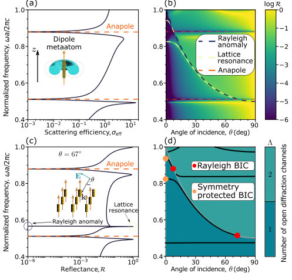
<figcaption class="paper-figure-caption"><b>Fig 1.</b> FIG. 1. Optical response in the framework of the dipole ap- proximation. Panel (a) shows individual particle scattering efficiency as a function of the incident wave normalized fre- quency, panel (b) demonstrates reflection coefficient spectrum at all angles of incidence for square lattice built with afore- mentioned scatterers, and panel (c) displays the cross-section of this map at θ = 67◦. Panel (d) reveals BIC positions and resonance curves with a different number of open diffraction channels.</figcaption>
</figure>
<figure class="paper-figure-card">
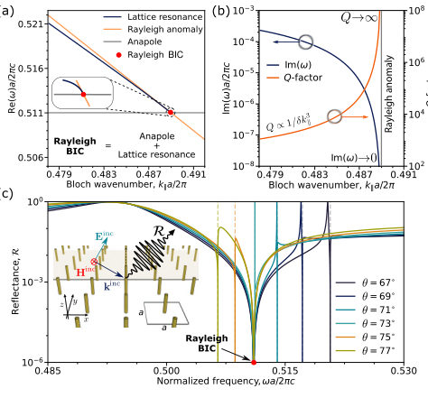
<figcaption class="paper-figure-caption"><b>Fig 2.</b> FIG. 2. Panels (a) and (b) show the dimensionless real and imaginary parts of lattice resonance frequency, respectively, as a function of the in-plane Bloch wavenumber k∥as well as anapole and Rayleigh anomaly. Red dot indicates the fre- quency and coordinates in reciprocal space where the Rayleigh BIC is formed. Panel (c) shows the reflection coefficient as a function of the incident wave frequency at fixed angles θ. Dashed lines of the corresponding colors indicate the opening of the first diffraction channel.</figcaption>
</figure>
<figure class="paper-figure-card">
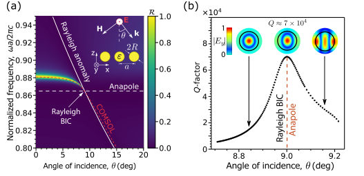
<figcaption class="paper-figure-caption"><b>Fig 3.</b> FIG. 4. (a) Reflection map for a periodic array of parallel dielectric rods under TE-polarized oblique incidence. The ar- ray parameters are √εR/a = √</figcaption>
</figure>
<figure class="paper-figure-card">
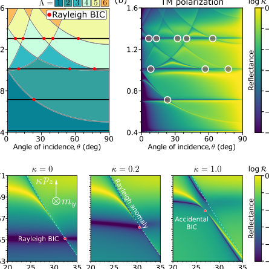
<figcaption class="paper-figure-caption"><b>Fig 4.</b> FIG. 3. (a) Dispersion of the Rayleigh anomalies (gray solid lines). Λ encodes the number of open diffraction channels. Black horizontal lines denote anapole frequencies. Red dots at the intersections of anapole lines and Rayleigh anomalies mark the Rayleigh BICs. (b) Reflectance map for TM polar- ization, with white circles marking the Rayleigh-BIC points. Panel (c) shows the transition from a Rayleigh BIC to an accidental BIC upon inclusion of the magnetic-dipole contri- bution with relative weight κ = 0, 0.2, 1, as illustrated in the inset.</figcaption>
</figure>

**Summary.** The paper introduces Rayleigh BICs, a new mechanism for creating nonradiating states in periodic metasurfaces operating beyond the subwavelength limit. These states arise from the coupling of lattice resonances with anapole frequencies exactly at diffraction anomalies. The key finding is that these BICs possess a unique cubic scaling of their quality factor, offering a robust design route for optical engineering.

**Why it may be interesting.** This work provides a powerful theoretical framework for engineering high-quality optical cavities in structured materials, which is highly relevant to quantum optics applications like low-loss waveguides or enhanced sensing platforms.

Detailed structure

**Main problem.** The research aims to predict and engineer a novel class of Bound States in the Continuum (BICs) that remain nonradiating even when multiple diffraction channels are open, specifically operating beyond the subwavelength regime.

**Main result.** A distinct class of Rayleigh BICs is predicted to emerge at the intersection of collective lattice resonances and Rayleigh anomalies. These states exhibit a unique cubic scaling of the quality factor ($Q \propto 1/k^3$), confirming their robustness beyond conventional BIC mechanisms.

**Method.** The analysis employs multiple-scattering theory within the dipole approximation, focusing on the analytic structure of the reflection coefficient to identify conditions for nonradiating poles.

**Model / system.** The study models non-subwavelength periodic metasurfaces using a lattice of lossless point electric dipoles arranged on a square lattice. The physics involves coupling between lattice resonances, anapole states, and the opening of diffraction channels at Rayleigh anomalies.

**Key observables.** Reflectance ($R$), Quality factor ($Q$ factor), and the frequency/momentum dependence of the BIC location.

**Important parameters / regimes.** The periodicity ($a$) relative to the wavelength, the incidence angle ($	heta$), and the degree of coupling between lattice resonances and anapole frequencies.

**Assumptions / limitations.** The analysis relies on the dipole approximation initially, though extensions consider higher-order multipoles. The BIC condition requires simultaneous vanishing of both numerator and denominator of the reflection coefficient.

**Figures summary.** Figures illustrate single dipole scattering efficiency (showing Mie/anapole resonances), the reflectance spectrum showing transparency at anapole frequencies, and detailed plots pinpointing the Rayleigh BIC location where $Q$ diverges.

**Paper structure.** The paper builds by first defining BICs in metasurfaces, then identifying the specific mechanism—the interplay between lattice resonance crossing the anapole frequency precisely at a Rayleigh anomaly. It contrasts this with conventional BICs and quantifies its unique $Q$-factor scaling.

Abstract

We predict a class of bound states in the continuum (BICs) in non-subwavelength periodic metasurfaces -- Rayleigh BICs -- that emerge precisely at Rayleigh anomalies, where diffraction channels open. In contrast to conventional symmetry-protected and accidental BICs, which are typically engineered in the subwavelength regime with only a few radiation channels, Rayleigh BICs remain nonradiating far beyond this limit, even when multiple diffraction channels are open. Their formation originates from the interplay between collective lattice resonances, Rayleigh anomalies, and anapole states of the constituent metaatoms. We show that Rayleigh BICs are characterized by an unusual cubic scaling of the quality factor in reciprocal space, ($Q \propto 1/k^3$), an asymptotic behavior that is not characteristic of either symmetry-protected or accidental BICs. Our results establish a constructive route for engineering nonradiating states in metasurfaces beyond the subwavelength regime.

[↑ back to top](#top)

### [Spin-polarized electron transport for the altermagnet CrSb](http://arxiv.org/abs/2607.07334v1)

**Authors:** V. D. Esin, D. Yu. Kazmin, A. V. Timonina, N. N. Kolesnikov, E. V. Deviatov  
**Type:** experiment · **Category:** other · **PDF:** <https://arxiv.org/pdf/2607.07334v1>  
**Analysis basis:** full PDF text, analyzed in chunks
**Topic relevance:** `spintronics-quantum-optics interface` **3/5** · `exotic spin models in light-matter` **1/5** · `non-equilibrium dynamics` **1/5**

↔ Scroll figures horizontally

<figure class="paper-figure-card">
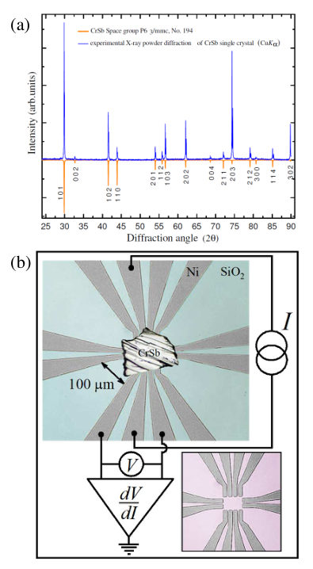
<figcaption class="paper-figure-caption"><b>Fig 1.</b> FIG. 1. (Color online) (a) The X-ray powder diffraction pat- tern (Cu Kα radiation), which is obtained for the crushed CrSb single crystal. The single-phase CrSb is confirmed with the space group P63/mmc (No. 194). (b) Optical image of the sample with a 1 µm thick CrSb flake on the ferromagnetic Ni leads with scheme of electrical connections for one of two Hall configurations. The leads pattern is shown in the inset: 100 nm thick, 5 µm separated leads allow to realize the cor- rect Hall (xy-) configuration for two orientations in respect to the CrSb flake. The depicted Hall configuration is specially designed to exclude possible admixture of the thermoelectric effects for reliable NLHE...</figcaption>
</figure>
<figure class="paper-figure-card">
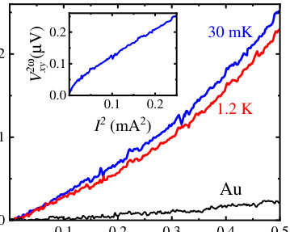
<figcaption class="paper-figure-caption"><b>Fig 2.</b> FIG. 3. (Color online) Non-linear Hall effect25–29 for the ferro- magnetic Ni contacts as a quadratic second-harmonic Hall-like response V 2ω xy ∼I2 to ac excitation current I. The curves are depicted for two 30 mK and 1.2 K temperatures as blue and red ones, respectively. V 2ω xy ∼I2 law is confirmed in the inset as strictly linear V 2ω xy (I2) dependence for high ac excitation values. The second-harmonic Hall voltage V 2ω xy is one order of magnitude smaller for the reference sample with Au contacts for the same contact configuration, as depicted by the black curve. The data are obtained in zero magnetic field.</figcaption>
</figure>
<figure class="paper-figure-card">
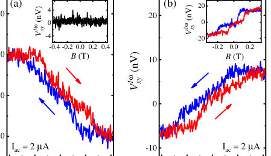
<figcaption class="paper-figure-caption"><b>Fig 3.</b> FIG. 2. (Color online) Anomalous Hall effect for the CrSb sample with ferromagnetic Ni contacts. (a) AHE hysteresis is depicted as the magnetic field dependence of the transverse voltage V 1ω xy for two field sweep directions for the contacts configuration from Fig. 1 (b). Inset shows V 1ω xy (B) curves for the reference sample with normal gold contacts, no AHE can be seen in this case. (b) V 1ω xy (B) hysteresis for another Hall configuration, which is 90◦rotated in respect to the one in (a). The AHE slope is inverted in this case for the same CrSb flake and for the same magnetic field orientation. For both Hall configurations, V 1ω xy (B) curves strongly resemble bow- tie magnetization hysteresis...</figcaption>
</figure>
<figure class="paper-figure-card">

<figcaption class="paper-figure-caption"><b>Fig 4.</b> Fig. 2 (a) shows typical AHE signal as the magnetic field dependence of the transverse voltage V 1ω xy for the sample with ferromagnetic Ni contacts. The data are obtained for the contacts configuration from Fig. 1 (b) at T = 30 mK temperature. The ac current amplitude Iac = 2µA guarantees the linear regime, e.g. it do not lead to the sample overheating for the low characteristic longitudinal (xx-) sample resistance ≈0.5Ω. The maxi- mum Hall resistance is 5 mΩin Fig. 2 (a), it corresponds to Hall resistivity 0.5 µΩ·cm for 1 µm thick CrSb flake, which is at least one order of magnitude smaller than the usual values in magnetic materials11,12,54. To improve the signal to noise ratio for low V 1ω...</figcaption>
</figure>
<figure class="paper-figure-card">
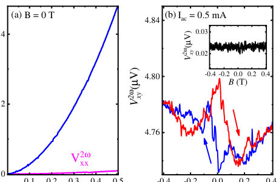
<figcaption class="paper-figure-caption"><b>Fig 5.</b> FIG. 4. (Color online) (a) Non-linear Hall effect for another sample with ferromagnetic Ni contacts in zero magnetic field. The magenta curve shows the longitudinal second-harmonic voltage V 2ω xx , which is one order of magnitude smaller. (b) Hysteresis in V 2ω xy for two magnetic field sweep directions at Iac = 0.5 mA for spin-polarized transport. Inset shows no V 2ω xy (B) field dependence for the reference sample with gold contacts. The data are obtained at T = 30 mK temperature.</figcaption>
</figure>

**Summary.** This work experimentally investigates spin-polarized electron transport in the altermagnet CrSb by measuring anomalous and non-linear Hall effects. By comparing results from ferromagnetic versus non-magnetic contacts, the authors confirm that these unique signatures require spin polarization. The findings strongly suggest that the interplay between bulk magnetism and topological surface states dictates the material's electronic response.

**Why it may be interesting.** While focused on condensed matter magnetism/topology, the study's reliance on measuring quantized responses (like harmonic generation) under controlled spin injection provides a highly sensitive probe into electronic band structure symmetries relevant to advanced quantum materials research.

Detailed structure

**Main problem.** To experimentally investigate spin-polarized electron transport, specifically observing anomalous and non-linear Hall effects, in the centrosymmetric altermagnet CrSb.

**Main result.** Pronounced AHE and NLHE were observed using ferromagnetic Ni contacts, which are absent with non-magnetic Au contacts. The results suggest these effects arise from the joint influence of bulk spin splitting and topological surface states.

**Method.** Transport measurements were performed on single-crystal CrSb flakes at very low temperatures (30 mK) by measuring transverse Hall voltages using both first ($	ext{V}_{1\omega}^{xy}$) and second ($	ext{V}_{2\omega}^{xy}$) harmonic lock-in techniques.

**Model / system.** The physical system is the altermagnet CrSb, which is studied as a single crystal flake. The experiment compares measurements using ferromagnetic Ni contacts (inducing spin polarization) against non-magnetic Au reference contacts.

**Key observables.** Anomalous Hall Effect (AHE) hysteresis loops, sign inversion of AHE slope, and Non-linear Hall Effect ($	ext{V}_{2\omega}^{xy}$) with magnetic field dependence.

**Important parameters / regimes.** Low temperature ($T = 30 	ext{ mK}$), applied magnetic field ($	ext{B}$), and the nature of the contacts (ferromagnetic vs. non-magnetic).

**Assumptions / limitations.** The observed effects are attributed to spin-polarized current injection from the ferromagnetic Ni contacts, and the geometry is designed to exclude thermoelectric contributions.

**Figures summary.** Figures show AHE hysteresis loops ($	ext{V}_{1\omega}^{xy}(	ext{B})$) comparing CrSb with Ni leads versus reference samples with Au leads. Another figure compares NLHE signals ($	ext{V}_{2\omega}^{xy} \sim I^2$) for both contact types.

**Paper structure.** The paper proceeds by presenting the experimental setup and measurements, demonstrating the distinct signatures (AHE/NLHE) when using spin-polarized contacts versus non-magnetic controls. The interpretation then links these unique transport features to the theoretical concepts of altermagnetism and topological surface states.

Abstract

We experimentally investigate spin-polarized electron transport for the centrosymmetric altermagnet CrSb, which is known to reveal both altermagnetic and topological features. We demonstrate pronounced first-harmonic anomalous and second-harmonic non-linear Hall effects for a single-crystal CrSb flake with ferromagnetic nickel contacts, while both effects can not be seen for the reference samples with non-magnetic gold ones. For the anomalous Hall effect, we demonstrate bow-tie hysteresis loop in Hall voltage, which is usually ascribed to surface spin textures in magnetic materials. The slope of the Hall curve changes a sign for two orientations of the Hall-bar contact configuration for the same sample, i.e. for the same sign of the charge carriers. We interpret the observed sign inversion and bow-tie hysteresis as the joint effect of the alternating bulk spin splitting and spin-polarized topological surface states in CrSb. The pronounced non-linear Hall effect with hysteresis in magnetic field confirms finite Berry curvature dipole under injection of spin-polarized electrons, i.e. the topological features for the altermagnetic candidate CrSb.

[↑ back to top](#top)

### [Perspectives on inverse design for AI magnonics](http://arxiv.org/abs/2607.07324v1)

**Authors:** Franz Vilsmeier, Florian Bruckner, Claas Abert, Dieter Suess, Andrii V. Chumak  
**Type:** theory · **Category:** disordered systems and neural networks · **PDF:** <https://arxiv.org/pdf/2607.07324v1>  
**Analysis basis:** full PDF text, analyzed in chunks
**Topic relevance:** `driven-dissipative phase transition` **2/5** · `methods for driven-dissipative` **2/5** · `Keldysh / 2PI / non-Gaussian methods` **1/5** · `analog quantum simulation` **1/5** · `exotic spin models in light-matter` **1/5** · `non-equilibrium dynamics` **1/5** · `non-equilibrium universality` **1/5** · `spintronics-quantum-optics interface` **1/5**

↔ Scroll figures horizontally

<figure class="paper-figure-card">
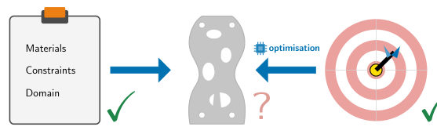
<figcaption class="paper-figure-caption"><b>Fig 1.</b> Figure 1. Inverse design as a paradigm shift in magnonics. Both workflows share the same three elements—a set of specifications, a device geometry, and a target performance (shown as a dartboard). (a) In direct design, a researcher converts the specifications into a geometry guided by physical intuition, and the resulting performance is only evaluated afterwards, with no guarantee that it meets the target (the dart may miss). (b) In inverse design, the target performance is instead prescribed up front and an optimisation algorithm works backward to the device geometry (note the reversed arrow), reliably reaching the target, often through non-intuitive geometries that outperform...</figcaption>
</figure>
<figure class="paper-figure-card">
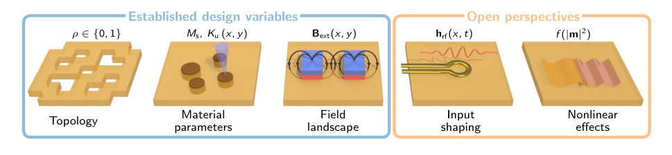
<figcaption class="paper-figure-caption"><b>Fig 2.</b> Figure 2. Design variables in inverse-design magnonics. From left to right: topology (binary or level-set material distribution), material parameters (spatially varying Ms, Ku, α), and magnetic field landscape (reconfigurable stray-field or current-loop patterns) constitute the three established design variables. Input shaping (excitation waveforms and antenna geometry) and nonlinear effects (frequency shifts or multi-magnon interactions as a design resource) are discussed as open perspectives in Sec. 4.</figcaption>
</figure>
<figure class="paper-figure-card">
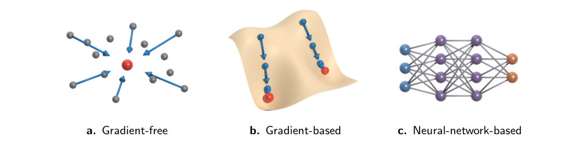
<figcaption class="paper-figure-caption"><b>Fig 3.</b> Figure 3. The algorithmic toolbox of inverse-design magnonics. (a) Gradient-free methods evaluate a population of candidate designs (grey) directly, iteratively converging on the best candidate found (red) without using any derivative information—for example direct binary search [24], genetic algorithms, and direct search [32]. (b) Gradient-based methods follow the gradient of the objective downhill across a non-convex landscape, converging to a minimum (red) while risking entrapment in local minima; examples include the adjoint method [27] and backpropagation through a differentiable solver [25,30,31]. (c) Neural-network-based methods employ a trained network—as a differentiable surrogate...</figcaption>
</figure>
<figure class="paper-figure-card">
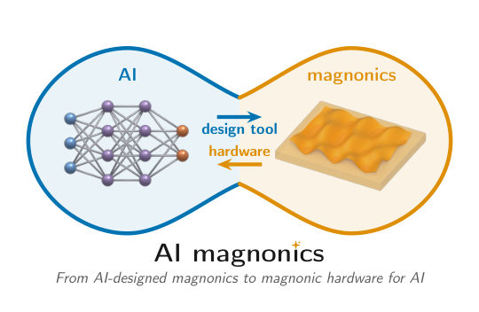
<figcaption class="paper-figure-caption"><b>Fig 4.</b> Figure 4. AI magnonics: the convergence of inverse design and neuromorphic magnonics. In the emerging AI magnonics paradigm, the two fields converge from two directions—machine- learning tools design the device, while the magnonic spin-wave medium itself performs neuromorphic computation, depicted here as two interpenetrating lobes—an artificial neural network and a propagating spin-wave medium—that meet and fuse at the point where the two disciplines converge (from AI-designed magnonics to magnonic hardware for AI ).</figcaption>
</figure>

**Summary.** This paper surveys the rapidly growing field of inverse design for magnonic devices, treating it as a powerful paradigm shift from traditional engineering. It organizes the research by design variables and computational algorithms, proposing 'AI magnonics' to describe the synergy between machine learning tools and magnetic hardware for advanced applications like neuromorphic computing.

**Why it may be interesting.** While focused on classical magnetism, the methodology heavily relies on integrating advanced computational optimization (gradient-based methods) with physical systems, mirroring techniques used in designing quantum circuits or simulating complex many-body Hamiltonians where parameter space exploration is key.

Detailed structure

**Main problem.** The primary goal is to develop a systematic, computational framework for designing magnonic devices by specifying desired functionalities and allowing an algorithm to determine the optimal physical structure.

**Main result.** The authors propose 'AI magnonics' as the emerging paradigm describing the convergence of machine learning tools for device design and magnonic devices used for neuromorphic computation.

**Method.** The review surveys inverse design techniques, categorizing them by design variables (topology, material parameters, field landscape) and algorithmic toolboxes (gradient-free, gradient-based, NN-based methods).

**Model / system.** The system under study is magnonics, which involves spin waves propagating in magnetic thin films. The physics is governed by the nonlinear Landau–Lifshitz–Gilbert (LLG) equation.

**Key observables.** Spin-wave response, filter characteristics, logic gate operation, and pattern recognition capability.

**Important parameters / regimes.** Design variables include topology ($
ho$), material parameters ($M_s, K_u, \alpha$), and the external magnetic field landscape ($B_{ext}(x, y)$).

**Assumptions / limitations.** The work assumes that inverse design can overcome the limitations of intuition-guided, direct device engineering.

**Figures summary.** Figure 1 contrasts direct vs. inverse design workflows; Figure 2 schematically maps out the five key design variables (Topology, Material parameters, Field landscape, Input shaping, Nonlinear effects); Table 2 organizes literature by optimization class and variable type.

**Paper structure.** The paper is structured as a comprehensive survey, first defining the problem via direct vs. inverse design, then systematically organizing the field along two axes: design variables and algorithmic toolboxes, before concluding with open frontiers and proposing the 'AI magnonics' concept.

Abstract

Inverse design - specifying a desired functionality and letting a computational algorithm find the optimal structure - has emerged as a powerful paradigm for magnonic device engineering. In this article, we survey the rapidly growing field of inverse-design magnonics, organising it along two axes: the design variables (topology, material parameters, and magnetic field landscape) and the algorithmic toolbox (gradient-free, gradient-based, and neural-network-based methods) together with the differentiable micromagnetic solvers that enable them. We then identify open frontiers that we consider most promising for the next phase of the field: sensitivity analysis and robust design to bridge the gap between simulation and experiment; input shaping and transducer optimisation; the incorporation of nonlinear spin-wave effects as an explicit design resource; spatially structured amplification; self-adapting media and machine-learning-based design; and the long-term vision of a universal, reconfigurable magnonic platform. We argue that magnonics and artificial intelligence are converging from two directions - machine-learning tools for designing magnonic devices, and magnonic devices as hardware for neuromorphic computation - and propose the term AI magnonics to describe this emerging paradigm.

[↑ back to top](#top)

### [Spin-current-controlled anisotropic deformation of magnetic lump solitons](http://arxiv.org/abs/2607.07345v1)

**Authors:** Xiao-Qi Cui, Xin-Wei Jin, Shiyi Wang, Xiao-Yong Wen, Zhan-Ying Yang  
**Type:** theory · **Category:** other · **PDF:** <https://arxiv.org/pdf/2607.07345v1>  
**Analysis basis:** full PDF text, analyzed in chunks
**Topic relevance:** `driven-dissipative phase transition` **2/5** · `non-equilibrium universality` **2/5** · `Frenkel-Kontorova` **1/5** · `analog quantum simulation` **1/5** · `exotic spin models in light-matter` **1/5** · `non-equilibrium dynamics` **1/5** · `spintronics-quantum-optics interface` **1/5**

↔ Scroll figures horizontally

<figure class="paper-figure-card">
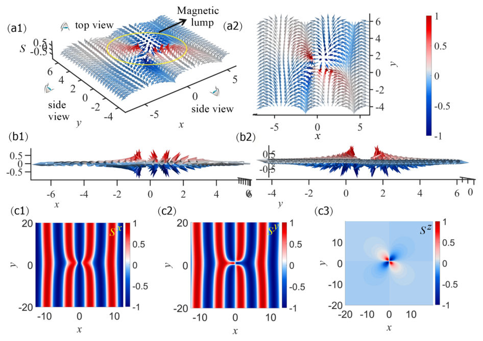
<figcaption class="paper-figure-caption"><b>Fig 1.</b> FIG. 1. (Color online) Spatial spin texture of the fundamental magnetic lump at t = 0 and ν1 = 0. (a1) Three- dimensional spin texture of the magnetic lump represented by the spin vector ⃗S = (Sx, Sy, Sz). (a2) Top view of the three-dimensional spin texture of the magnetic lump. (b1)-(b2) Side views along the x- and y-directions, illustrating their doubly localized spatial morphology. (c1)-(c3) Spatial distributions of the three spin components Sx, Sy, and Sz, respectively. The stripe-like patterns in Sx and Sy originate from the rotating spin background, while their local bending around the core reflects the localized lump deformation. The Sz component provides a clearer signature of the...</figcaption>
</figure>
<figure class="paper-figure-card">
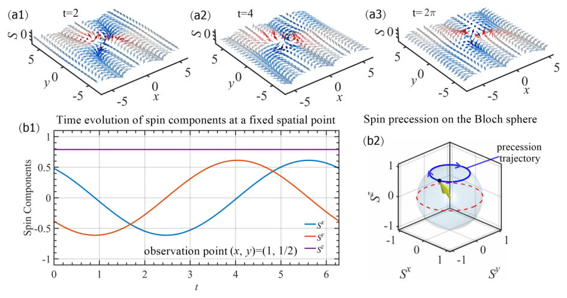
<figcaption class="paper-figure-caption"><b>Fig 2.</b> FIG. 2. (Color online) Dynamical evolution and spin-precession behavior of the magnetic lump state at ν1 = 0. (a1)- (a3) Time evolution of the spin configuration, showing that the lump remains spatially localized while the surrounding background undergoes continuous rotation. (b1) Time evolution of Sx, Sy, and Sz at a fixed spatial point, where Sx</figcaption>
</figure>
<figure class="paper-figure-card">
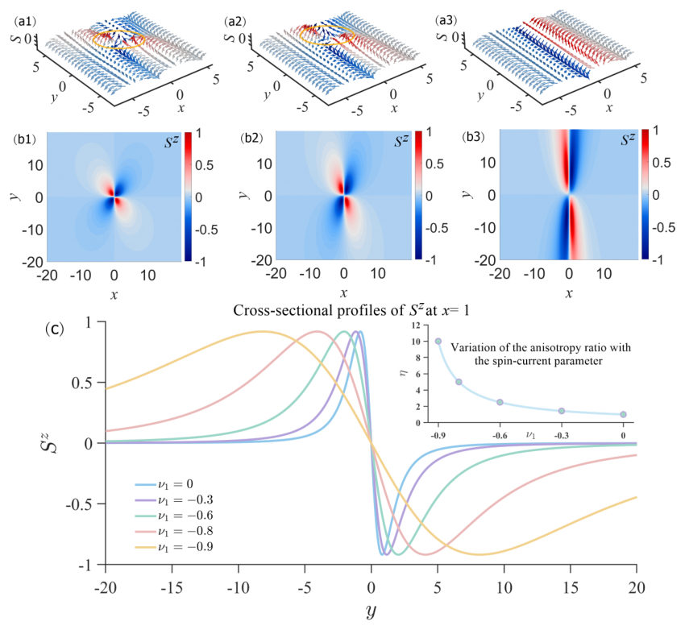
<figcaption class="paper-figure-caption"><b>Fig 3.</b> FIG. 3. (Color online) Spin-current-controlled structural modulation of the magnetic lump state for different values of the spin-current parameter ν1. When t = 0, (a1)-(a3) Three-dimensional spin configurations for ν1 = −0.3, −0.6, and −0.9, respectively, showing simultaneous translation and anisotropic expansion of the lump structure along the y- direction, and the yellow circle is clearly seen moving along the y axis. (b1)-(b3) After introducing the shifted coordinate ey, corresponding density distributions of Sz, the center remains fixed and only the anisotropic broadening survives. (c) Cross-sectional profiles of Sz at x = 1 for different values of ν1. The progressive broadening of the...</figcaption>
</figure>
<figure class="paper-figure-card">
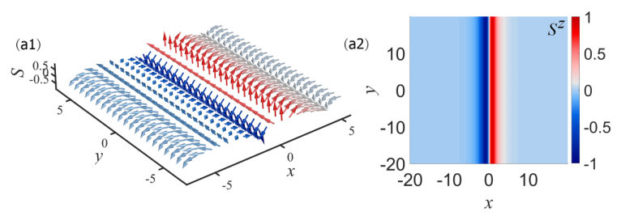
<figcaption class="paper-figure-caption"><b>Fig 4.</b> FIG. 4. (Color online) Line-localized limiting state at the critical point ν1 = −c. (a1) Spatial spin-texture distribution of the resulting quasi-one-dimensional localized state. (a2) Density distribution of the out-of-plane spin component Sz, showing complete delocalization along the y-direction.</figcaption>
</figure>
<figure class="paper-figure-card">
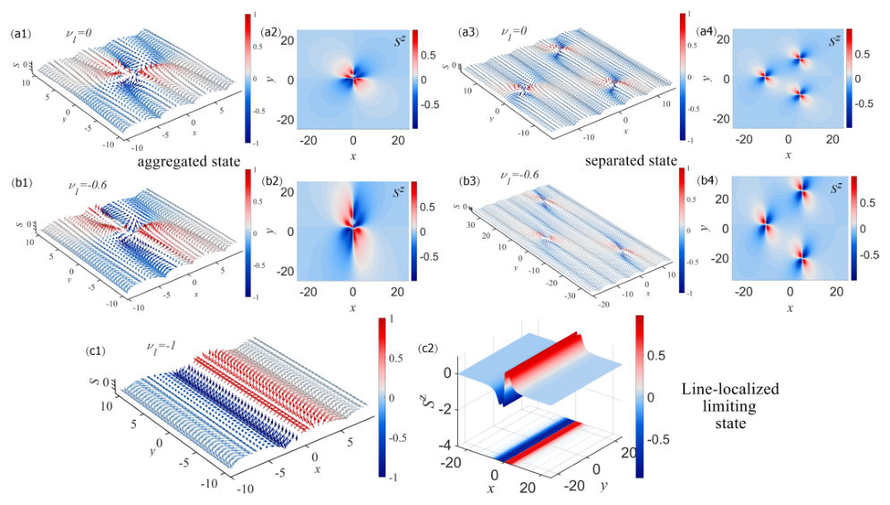
<figcaption class="paper-figure-caption"><b>Fig 5.</b> FIG. 5. (Color online) Universality of spin-current-induced modulation in higher-order magnetic lump structures. They still exhibit intrinsic spin precession phenomena. When t = 0, (a1)-(a2) Aggregated-state magnetic lump and the corresponding density distribution of the out-of-plane spin component Sz for ν1 = 0 and ej = dj = 0, (j = 0, 1). (a3)-(a4) Separated-state magnetic lump and the corresponding Sz distribution for ν1 = 0 and e1 = 200, ej = dj = 0, (j = 0, 1). (b1)-(b2) Aggregated-state magnetic lump and its Sz distribution for ν1 = −0.6 and ej = dj = 0, (j = 0, 1), showing pronounced anisotropic broadening along the y direction under spin-current modulation. (b3)-(b4) Separated-state...</figcaption>
</figure>

**Summary.** This paper analytically investigates how an effective spin-current term dictates the geometry and stability of magnetic lump solitons in a nonlinear spin system. By employing integrable methods, the authors demonstrate that the spin current acts as a universal control parameter, inducing anisotropic deformation that can drive the localized structure from two dimensions toward one dimension. This provides a powerful theoretical example of geometric control over complex quantum-like excitations.

**Why it may be interesting.** While focused on classical nonlinear PDEs, the concept of geometric control parameters governing structural transitions (like dimension crossover) is highly relevant to understanding topological defects or emergent order parameters in quantum field theories or condensed matter models.

Detailed structure

**Main problem.** The study investigates how an effective spin-current term controls the anisotropic deformation and structural transitions of two-dimensional magnetic lump solitons in nonlinear spin systems.

**Main result.** Spin current induces a universal, anisotropic deformation mechanism that drives localized excitations toward quasi-one-dimensional soliton-like states across different hierarchical structures.

**Method.** The authors construct exact solutions using the Darboux transformation applied to an integrable (2+1)-dimensional nonlinear spin system, analyzing the dependence on the spin-current parameter.

**Model / system.** The model is a (2+1)-dimensional nonlinear spin system containing an effective spin-current transport term. It describes localized magnetic lump solitons whose dynamics are governed by an integrable structure.

**Key observables.** Anisotropic deformation ratio ($\eta$), localization widths ($W_x, W_y$), and the transition to quasi-one-dimensional states.

**Important parameters / regimes.** The effective spin-current coefficient ($
u_1$) acts as a geometric control parameter; specific regimes include $
u_1=0$ (reference) and the singular limit $
u_1 	o -1$.

**Assumptions / limitations.** The analysis relies on the integrable structure of the nonlinear spin system, allowing for exact solutions via generalized Darboux transformations.

**Figures summary.** Figures illustrate the doubly localized structure at zero current ($
u_1=0$) with internal precession, and show how varying $
u_1$ causes anisotropic expansion along $y$, leading to a breakdown of 2D confinement as $
u_1 	o -1$.

**Paper structure.** The paper establishes the model using an integrable framework, constructs exact solutions via Darboux transformations, analyzes the role of the spin-current parameter ($
u_1$) in controlling spatial anisotropy and dimensional crossover, and finally generalizes this mechanism to higher-order lump structures.

Abstract

We investigate a (2+1)-dimensional nonlinear spin system containing an effective spin-current transport term. Based on its integrable structure, exact magnetic lump solutions are constructed on a rotating spin background, including both fundamental and higher-order configurations generated via the Darboux transformation. The obtained excitations are doubly localized in spatial directions, while their temporal evolution is characterized by intrinsic spin precession rather than translational motion of the localized envelope. It is shown that the effective spin-current contribution enters the localization coordinate and acts as a geometric control parameter for the spatial structure of the solutions. In particular, spin current induces anisotropic deformation of the localized profile, leading to a continuous transition toward a quasi-one-dimensional soliton-like state under specific parameter regimes. More importantly, this deformation mechanism is found to be universal across different hierarchical lump structures, including both fundamental and higher-order solutions, indicating that spin current governs a unified structural modulation law for the entire family of localized spin excitations. These results provide an analytically tractable example of spin-current-controlled anisotropic deformation and dimensional crossover in nonlinear spin systems, and further reveal a universal mechanism for geometric control of localized spin textures beyond individual solution types.

[↑ back to top](#top)

### [Scalar-Wave Dispersion in Vectorial Photonic Crystals via Site-Adapted p Orbitals](http://arxiv.org/abs/2607.07224v1)

**Authors:** Yan-Long Chen, Kin Hung Fung, C. T. Chan, Qinghua Guo  
**Type:** both · **Category:** other · **PDF:** <https://arxiv.org/pdf/2607.07224v1>  
**Analysis basis:** full PDF text, analyzed in chunks
**Topic relevance:** `analog quantum simulation` **2/5** · `Keldysh / 2PI / non-Gaussian methods` **1/5** · `driven-dissipative phase transition` **1/5** · `methods for driven-dissipative` **1/5**

↔ Scroll figures horizontally

<figure class="paper-figure-card">
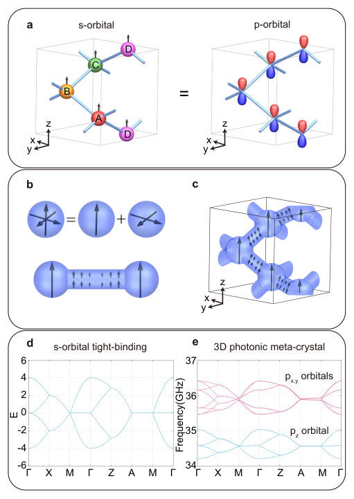
<figcaption class="paper-figure-caption"><b>Fig 1.</b> FIG. 1. Orbital-selective scalarization of vectorial photonic modes. a Left: tight-binding model on the Wyckoff posi- tions (4a) of space group No. 92. Right: corresponding p- orbital construction obtained by replacing the s-orbital at each Wyckoff position with a selected local p-orbital. Within our framework, the p-orbital Hamiltonian reproduces the scalar s-orbital tight-binding model. b A spherical cavity supports a dipolar triplet which generates a three-component dipolar p-like manifold and symmetry-compatible anisotropy or coupling to the channel network can be used to isolate one component from the other two. c In a 3D network, the 4a Wyckoff positions [A = (−1</figcaption>
</figure>
<figure class="paper-figure-card">
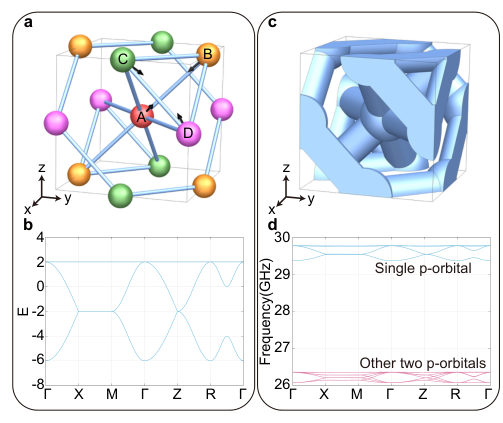
<figcaption class="paper-figure-caption"><b>Fig 2.</b> FIG. 2. Cubic orbital scalarization manifold in SG 224. a Four-site scalar tight-binding network on the 4b Wyck- off orbit [A = (0, 0, 0), B = (0, 1</figcaption>
</figure>
<figure class="paper-figure-card">
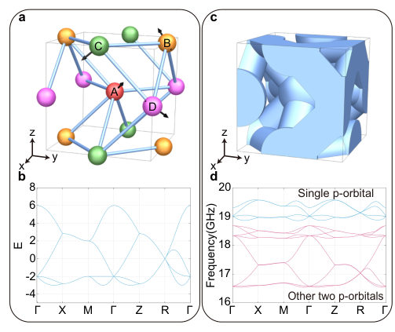
<figcaption class="paper-figure-caption"><b>Fig 3.</b> FIG. 3. Chiral orbital scalarization manifold in SG 198. a Four-site scalar tight-binding network on the 4a Wyckoff orbit [A = (0, 0, 0), B = (0, 1</figcaption>
</figure>
<figure class="paper-figure-card">
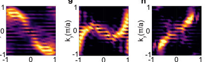
<figcaption class="paper-figure-caption"><b>Fig 4.</b> FIG. 4. Experimental observation of the orbital-selective scalar-like manifold in the SG 198 meta-crystal. a,b Numer- ically simulated and experimentally reconstructed bulk- and surface-projected spectra on the (001) termination. Red and blue indicate modes localized on opposite surfaces in the cal- culation. c–e Simulated iso-frequency contours at 19.09 GHz, 19.15 GHz, and 19.23 GHz. f–h Corresponding experimen- tally measured contours.</figcaption>
</figure>

**Summary.** The paper presents a method to achieve scalar-like band structure engineering in inherently vectorial 3D photonic crystals by utilizing site-adapted p-orbitals. By leveraging group theory and symmetry constraints, the authors show that the complex electromagnetic dynamics can be effectively modeled by a simple scalar Hamiltonian while preserving polarization control as an active design knob. This offers a robust pathway for designing novel photonic materials based purely on crystal symmetry.

**Why it may be interesting.** This work provides a powerful symmetry-based tool to engineer photonic band structures. For AMO/Quantum Optics, it shows how complex vectorial degrees of freedom can be effectively mapped onto simpler scalar models using local symmetries, which is analogous to engineering effective Hamiltonians in open quantum systems.

Detailed structure

**Main problem.** The core challenge is realizing scalar-wave dispersion descriptions for electromagnetic waves, which are inherently vectorial, within three-dimensional photonic crystals.

**Main result.** Site-adapted p-orbitals can induce an effective scalar band structure that remains isomorphic to the true elementary band representation up to a twist, allowing polarization control via symmetry.

**Method.** The authors employ tight-binding theory combined with group theory (Mackey's theorem) to project the full vectorial Hamiltonian onto a selected one-dimensional, site-adapted orbital sector.

**Model / system.** The system involves 3D photonic meta-crystals analyzed using a tight-binding model derived from local p-orbitals. The method is tested in specific space groups like P41212 and Pn3m.

**Key observables.** Band structure dispersion relations, iso-frequency contours, and measured surface-projected momentum spectra (e.g., at 19.09 - 19.23 GHz).

**Important parameters / regimes.** The local p-orbital axes adapt site-by-site according to the crystal symmetry; the analysis focuses on isolating a one-dimensional irreducible representation.

**Assumptions / limitations.** The method assumes that the local p-orbital representation is restricted from a one-dimensional representation of the point group, allowing for an effective scalar Hamiltonian description.

**Figures summary.** Figures illustrate orbital-selective scalarization in P41212 and cubic scalarization in Pn3m, showing isolated scalar-like manifolds (cyan bands) separated from complementary sectors. Figure 4 compares simulated and measured spectra confirming the manifold signature.

**Paper structure.** The paper establishes the theoretical necessity of overcoming the vectorial nature of light fields; it develops the site-adapted p-orbital tight-binding model using group theory; key results demonstrate scalarization in specific crystal symmetries (P41212, Pn3m); and finally, these concepts are validated through full-wave spectrum calculations and microwave measurements.

Abstract

Electromagnetic waves are intrinsically vectorial and require description via polarization, unlike scalar fields such as acoustic pressure or electronic wavefunctions. In three dimensions, the transversality constraint further prevents any globally smooth transverse-polarization frame at the $Γ$ point, which would apparently rule out a simple scalar band structure for three-dimensional (3D) photonic crystals. We show here that site-adapted $p$-orbitals can realize scalar-wave dispersion: the induced band representation is isomorphic to the scalar elementary band representation up to a one-dimensional character twist, so the symmetry-enforced degeneracies and compatibility relations are the same. We demonstrate this mechanism experimentally in 3D photonic meta-crystals, where the local $p$-orbital axes adapt from site to site according to symmetry. In contrast to a fixed-polarization reduction (e.g., in 2D), our construction preserves site-polarization textures while simultaneously supporting a scalar network with one amplitude per site. Thus, it offers a pathway from vectorial photonic degrees of freedom to scalar band engineering, keeping polarization as an active design knob.

[↑ back to top](#top)

### [Force-Isosurface Simulations Probe the Limits of High-Resolution AFM on Three-Dimensional Molecules](http://arxiv.org/abs/2607.07363v1)

**Authors:** Edward J Dunn, Robert J Young, Samuel P Jarvis  
**Type:** theory · **Category:** other · **PDF:** <https://arxiv.org/pdf/2607.07363v1>  
**Analysis basis:** full PDF text, analyzed in chunks
**Topic relevance:** `methods for driven-dissipative` **1/5** · `non-equilibrium dynamics` **1/5**

↔ Scroll figures horizontally

<figure class="paper-figure-card">
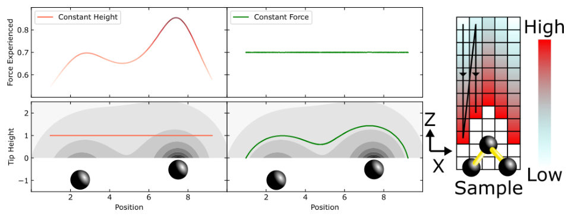
<figcaption class="paper-figure-caption"><b>Fig 1.</b> Figure 1: A schematic comparison of constant-height and constant-force imaging in an arbitrary force field. The upper panels show the force experienced by a tip following constant-height (top left) and constant-force (top centre) trajectories, with the corresponding paths shown on force contour maps below. The right panel illustrates the extraction of a constant-force image from a three-dimensional force field. At each x-y position, the algorithm follows a vertical column towards the sample and records the highest z value at which the selected force threshold is exceeded. Higher regions of the sample reach this threshold at larger z values, producing a force isosurface that follows the...</figcaption>
</figure>
<figure class="paper-figure-card">
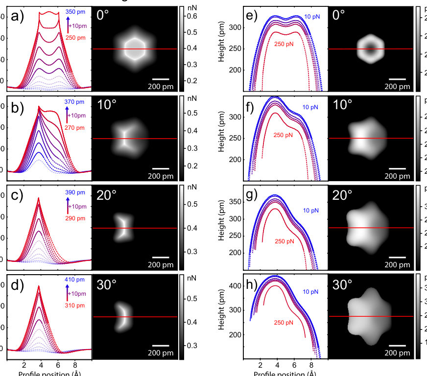
<figcaption class="paper-figure-caption"><b>Fig 2.</b> Figure 2: Simulated constant-height and constant-force images of benzene tilted by 0◦, 10◦, 20◦and 30◦, shown in rows 1–4, respectively. Line profiles show the dependence of the apparent features on the selected height or force threshold. Constant-height profiles were calculated at height increments of 0.1 ˚A, while constant-force profiles were calculated at 10, 20, 50, 75, 100 and 250 pN. Pale regions of the profiles indicate values outside the colour scale used for the corresponding image. A series of constant height and constant force images are shown at fixed values 2.6 ˚A and 250 pN, respectively, to provide a visual comparison for molecular tilt. For flat-lying benzene, the...</figcaption>
</figure>
<figure class="paper-figure-card">
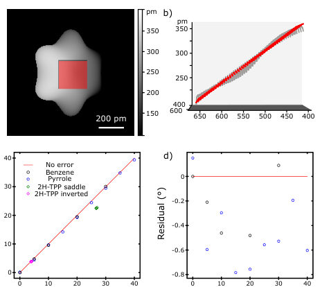
<figcaption class="paper-figure-caption"><b>Fig 3.</b> Figure 3: Plane fitting of simulated force isosurfaces for benzene, pyrrole and 2H-TPP. A plane was fitted to a selected region of each force isosurface to de- termine the molecular tilt angle. Panels (a) and (b) show the fit for benzene tilted by 30◦, with the grey points representing the simulated force isosurface and the red points representing the fitted plane. The mea- sured tilt angles for benzene (black hexagons) and pyrrole (blue pentagons) closely follow the true input angles (c), with errors below 1◦across the full range studied (d). The inverted geometry of 2H-TPP (green diamonds) follows the same trend, whereas the saddle geometry (magenta diamonds) gives a systematically lower...</figcaption>
</figure>
<figure class="paper-figure-card">
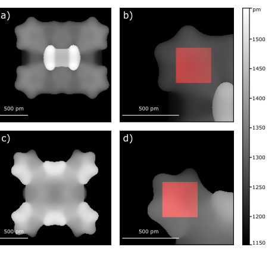
<figcaption class="paper-figure-caption"><b>Fig 4.</b> Figure 4: Constant-force images of 2H-TPP in the ‘inverted’ (a) and ‘saddle’ (c) adsorption geometries. In the inverted geometry, the pyrrole-like units at the centre of the molecule protrude strongly from an otherwise near-planar structure. Plane fitting to the phenyl-ring region indicated in (b) gives an angle of approximately 4◦. In the saddle geometry, the same analysis gives a phenyl-ring angle of approximately 22.5◦(d).</figcaption>
</figure>
<figure class="paper-figure-card">
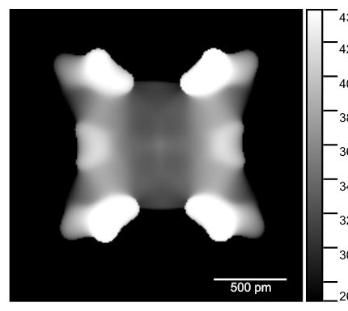
<figcaption class="paper-figure-caption"><b>Fig 5.</b> Figure 5: Constant-force image of ZnTPP in the ‘saddle’ adsorption geometry. The zinc atom occu- pies the centre of the porphyrin macrocycle and pro- duces a raised cross-like feature extending towards the surrounding nitrogen atoms.</figcaption>
</figure>

**Summary.** This work uses computational simulations to test how well different AFM imaging techniques can map the structure of molecules adsorbed on surfaces. By comparing constant-height scans to force isosurface scans, the authors demonstrate that recording a constant force threshold allows researchers to resolve deep, submolecular details and molecular orientation in complex, non-planar systems where simple height measurements fail.

**Why it may be interesting.** While the subject is surface science/nanomaterials, the methodology involves simulating physical interactions (force fields) and extracting contrast from a complex potential energy landscape, which shares conceptual overlap with modeling quantum potentials or interaction Hamiltonians in condensed matter theory.

Detailed structure

**Main problem.** The primary challenge is extending high-resolution Atomic Force Microscopy (AFM) imaging from planar to non-planar molecular systems, where structural information can be distributed across varying heights above the surface.

**Main result.** Constant-force force isosurface images successfully retain submolecular and three-dimensional structural information for complex molecules, which is often lost when using conventional constant-height measurements.

**Method.** The study uses probe-particle-model simulations to predict and extract characteristic force isosurfaces from simulated 3D force fields above adsorbed molecules.

**Model / system.** The research models molecular adsorption on surfaces, simulating interactions between a tip particle (e.g., CO-like) and various organic molecules like benzene, pyrrole, porphyrins (TPP), and C60.

**Key observables.** Force isosurface contrast, constant-height images vs. constant-force images, quantitative recovery of molecular orientation/tilt angles.

**Important parameters / regimes.** Adsorption angle ($	ext{e.g.} 0^\circ 	ext{ to } 30^\circ$), selected force threshold for isosurface extraction.

**Assumptions / limitations.** Electrostatic interactions were omitted in the primary comparison; constant-force images are not direct topographic maps but reflect the full tip-sample interaction field.

**Figures summary.** Figures compare simulated constant-height and constant-force images for tilted benzene, show force isosurfaces distinguishing adsorption geometries (e.g., 2H-TPP), and illustrate submolecular contrast in cores obscured at higher heights ($	ext{CO-FePc}$).

**Paper structure.** The paper progresses by first establishing the limitation of constant-height imaging on non-planar molecules, then demonstrating that constant-force isosurfaces retain structural detail for simple tilted systems (benzene), and finally applying this technique to complex, curved, or multi-component systems ($	ext{2H-TPP}$, $	ext{C}_{60}$) to prove its general utility.

Abstract

High-resolution atomic force microscopy has transformed molecular imaging by revealing intramolecular structure directly in real space. A major remaining challenge is to extend this capability from largely planar molecules to non-planar molecular systems, where the most important structural information may be distributed across different heights above the surface. Here we use probe-particle-model simulations to predict the constant-force contours expected above molecules with increasing structural complexity. By extracting force isosurfaces from simulated three-dimensional force fields, we compare the molecular information retained in constant-height and constant-force images. For tilted benzene and pyrrole, constant-force images preserve the molecular framework across a range of adsorption angles and allow the molecular orientation to be recovered quantitatively. For larger non-planar and three-dimensional systems, simulations identify characteristic force-isosurface contrast associated with adsorption geometry, lower-lying molecular structure and curved molecular surfaces. These results provide target contrasts for force isosurfaces that could be extracted from three-dimensional force-mapping experiments, evaluating the molecular information retained by ideal force-isosurface imaging across progressively non-planar systems.

[↑ back to top](#top)

### [Synthesis of Bulk Superconducting LiNbO$_2$ Crystals through CaH$_2$ Reduction](http://arxiv.org/abs/2607.06819v1)

**Authors:** Ryan Paxson, Stephanie J. Hong, Bicky Moirangthem, Parham Kabirifar, Saya Takeuchi, Tianyu Li, Chih-Yu Lee, Haotong Liang, Keenan Avers, Kamal Joshi, Amlan Datta, Makariy Tanatar, Shanta Saha, Peter Zavalij, Ruslan Prozorov, Alexander J. Grutter, Efrain E. Rodriguez, Ichiro Takeuchi  
**Type:** experiment · **Category:** other · **PDF:** <https://arxiv.org/pdf/2607.06819v1>  
**Analysis basis:** full PDF text, analyzed in chunks
**Topic relevance:** `analog quantum simulation` **1/5** · `driven-dissipative phase transition` **1/5**

↔ Scroll figures horizontally

<figure class="paper-figure-card">
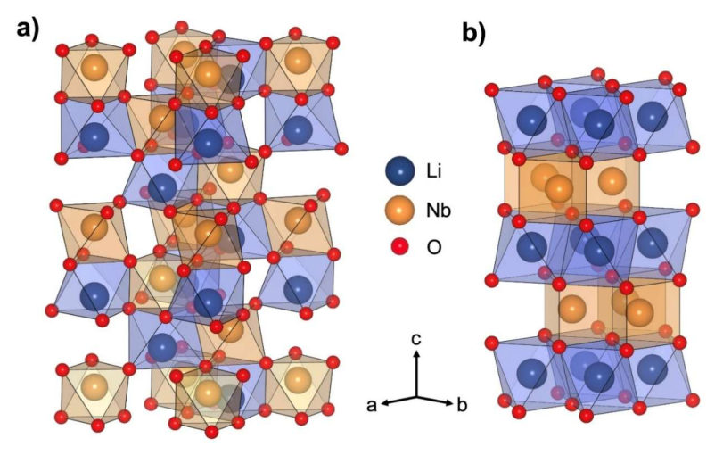
<figcaption class="paper-figure-caption"><b>Fig 1.</b> Figure 1. Crystal structures of (a) LiNbO3 and (b) LiNbO2 with the CsPrS2 structure type. While past theoretical and experimental work suggest a wealth of exciting physics in LiNbO2, including possible unconventional two-dimensional superconductivity in NbO2 layers mediated through strong electron correlations, detailed investigations have been inhibited by the lack of bulk crystal samples.[35,36] Thus far, superconductivity in LiNbO2 has only been reported in powders and thin films.[24-27] In this work, we demonstrate the utility of CaH2 reduction to induce bulk superconductivity at scale, reducing crystals with masses approaching 200 mg. We observe the onset temperature, Tconset, of the...</figcaption>
</figure>
<figure class="paper-figure-card">
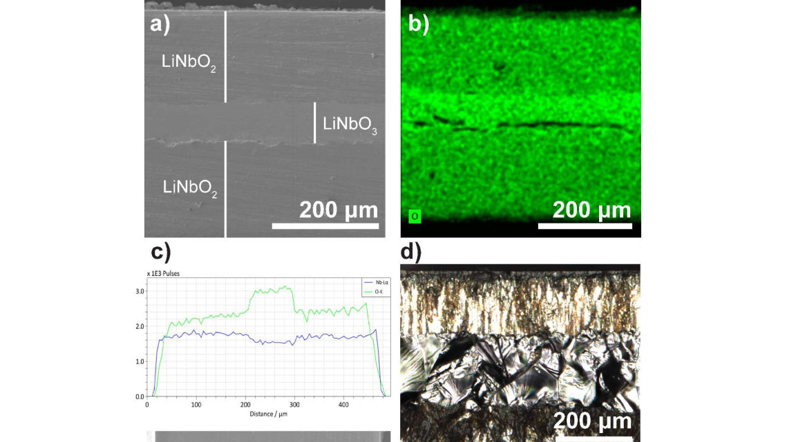
<figcaption class="paper-figure-caption"><b>Fig 2.</b> Figure 2. (a) Cross-sectional SEM image of LiNbO3 sample which was CaH2 reduced for 480 hours at 650 °C. (b) Oxygen Energy Dispersive X-ray Spectroscopy (EDS) mapping shows the regions formed from the CaH2 reaction are oxygen reduced. (c) EDS line scans, indicate the LiNbO2 regions are uniform in oxygen stoichiometry and gradients in oxygen content are not observed. (d) Optical image of reduced sample cross section using digital microscope. Figure 3 shows the powder X-ray diffraction pattern of the LiNbO2 crystal region, which was removed from the surfaces of a naturally formed LiNbO2/LiNbO3/LiNbO2 bulk heterostructure and crushed into a polycrystalline form. This sample was reduced from...</figcaption>
</figure>
<figure class="paper-figure-card">
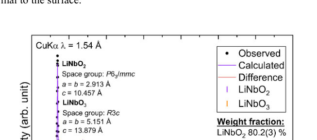
<figcaption class="paper-figure-caption"><b>Fig 3.</b> Figure 3. Rietveld refinement with powder XRD (CuK⍺ λ = 1.54 Å) data of LiNbO3 sample which was CaH2 reduced for 20 days at 650 °C.</figcaption>
</figure>
<figure class="paper-figure-card">
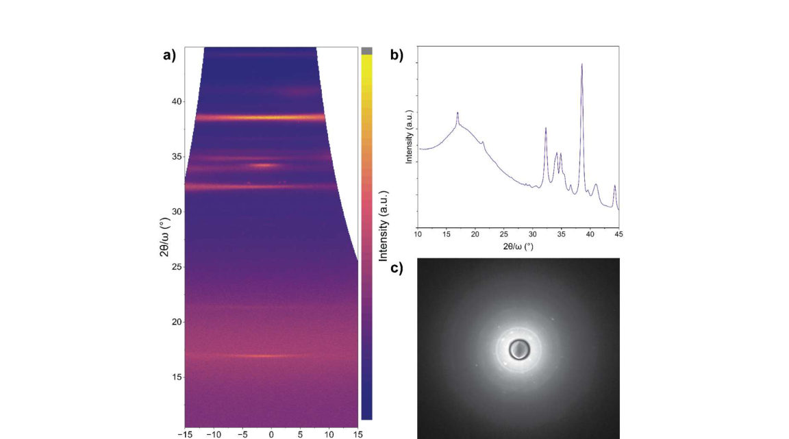
<figcaption class="paper-figure-caption"><b>Fig 4.</b> Figure 4. Two-dimensional HRXRD scan (a), showing structural anisotropy of reduced sample. The 2D HRXRD scan is integrated and plotted in one dimension shown in (b). Laue diffraction image of reduced sample (c) showing some Bragg reflection along with diffuse scattering. Quantitatively determining the lithium and hydrogen stoichiometry of LiNbO2 is challenging, so to investigate qualitative changes in lithium and hydrogen stoichiometry after CaH2 reduction, secondary ion mass spectroscopy (SIMS) was performed on the as-reduced LiNbO2 “surface” region as well as an unreduced LiNbO3 crystal (as a control) (Figure 5). For the analysis, the lithium and hydrogen species were normalized to...</figcaption>
</figure>
<figure class="paper-figure-card">
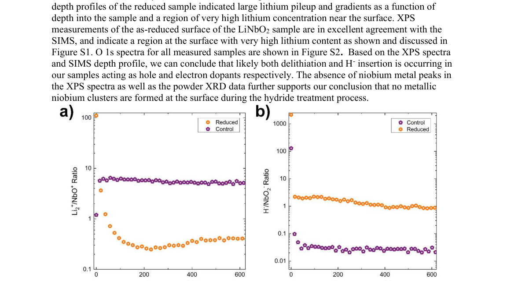
<figcaption class="paper-figure-caption"><b>Fig 5.</b> Figure 5. Semi log plots of SIMS depth profiles of an unreduced, control LiNbO3 sample and a reduced LiNbO2 sample. (a) Lithium stoichiometry is compared through changes in the Li2+/NbO+ ratio. (b) Differences in hydrogen concentration after reduction is evident by looking at the H-/NbO2-</figcaption>
</figure>

**Summary.** This work reports synthesizing bulk superconducting LiNbO2 crystals from LiNbO3 single crystals using CaH2 reduction. The process induces a structural phase change accompanied by metallic behavior and superconductivity up to 14.4 K. Comprehensive characterization confirms the bulk nature of this high-temperature superconductor.

**Why it may be interesting.** While focused on oxides, the study's use of controlled chemical reduction to induce novel electronic states (superconductivity) in a crystalline solid is relevant to understanding emergent quantum phases driven by stoichiometry control, which has parallels in correlated electron systems.

Detailed structure

**Main problem.** The study aims to synthesize bulk superconducting LiNbO2 crystals by inducing a phase transformation from parent LiNbO3 single crystals using CaH2 reduction.

**Main result.** The reduction successfully yields superconducting LiNbO2 with an onset critical temperature up to 14.4 K and confirms robust, bulk superconductivity via the Meissner effect measurements.

**Method.** Synthesis involves controlled hydride reduction of single crystals, followed by extensive characterization using techniques like XPS, SIMS, AC susceptibility, and magnetization measurements.

**Model / system.** The physical system is the solid-state phase transformation from layered LiNbO3 to superconducting LiNbO2. The process involves valence state changes (Nb 5+ to Nb 3+) and stoichiometry modification via de-lithiation and hydrogenation.

**Key observables.** Superconducting transition temperature ($T_c$ onset $\approx 14.4 	ext{ K}$), superconducting volume fraction ($\approx 77\%$), upper critical field ($H_{c2} \approx 26 	ext{ T}$), and oxidation states derived from XPS ($	ext{Nb}^{3+}$).

**Important parameters / regimes.** Reduction temperature range ($350^\circ	ext{C}$ to $700^\circ	ext{C}$) and reaction time (up to 720 hours); the stoichiometry of the resulting phase.

**Assumptions / limitations.** The reduction process is modeled as a reconstructive, non-topotactic phase transformation driven by extreme hydride chemistry.

**Figures summary.** Figures show cross-sectional SEM/EDS mapping confirming bulk conversion; XRD confirms $	ext{LiNbO}_2$ presence; and magnetic measurements confirm the Meissner effect and high $H_{c2}$.

**Paper structure.** The paper details the synthesis procedure, followed by comprehensive characterization using multiple techniques (SIMS, XPS, Magnetometry) to prove phase transformation, doping mechanisms, and superconducting properties.

Abstract

We have synthesized layered superconducting LiNbO$_2$ crystals through a bulk phase transformation from LiNbO$_3$ single crystals via CaH$_2$ reduction. As the Nb valence is reduced from 5+ to 3+, the material undergoes a structural transformation to the resulting product, LiNbO$_2$, which is accompanied by metallic behavior and a superconducting transition, Tc onset, as high as 14.4 K. Secondary ion mass spectroscopy (SIMS) and X-ray photoelectron spectroscopy (XPS) show that the resulting phase is hole-doped through de-lithiation during the reduction. Magnetization and AC susceptibility measurements from a tunnel diode resonator confirm the bulk nature of superconductivity with a superconducting volume fraction of approximately 77% and an upper critical field approaching 26 T. Our study demonstrates extreme hydride reduction as an effective method to induce phase transformations with non-topotactic pathways and can be used to synthesize bulk materials with exotic properties.

[↑ back to top](#top)

### [Nucleation and Enhancement of Superconductivity under Tip-Induced Strain Fields](http://arxiv.org/abs/2607.07210v1)

**Authors:** Ghulam Mohmad, Vishal Tripathi, Goutam Sheet  
**Type:** theory · **Category:** other · **PDF:** <https://arxiv.org/pdf/2607.07210v1>  
**Analysis basis:** full PDF text, analyzed in chunks
**Topic relevance:** `Keldysh / 2PI / non-Gaussian methods` **1/5**

↔ Scroll figures horizontally

<figure class="paper-figure-card">
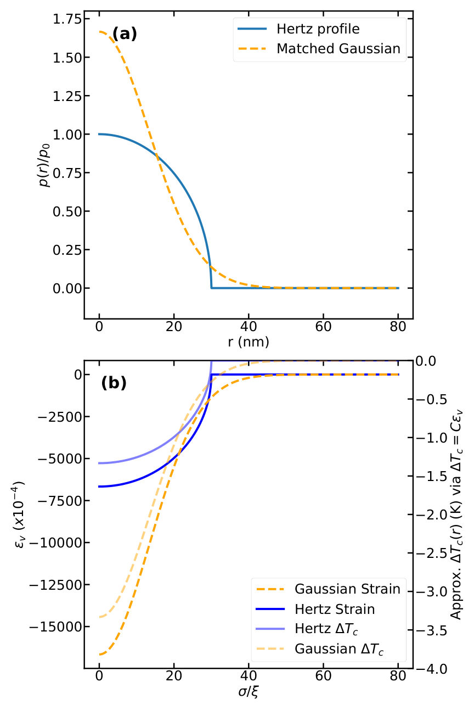
<figcaption class="paper-figure-caption"><b>Fig 1.</b> Figure 1: (a) Hertzian pressure profile and matched Gaussian (σ ≈0.447 a). (b) Axial strain εzz(r)</figcaption>
</figure>
<figure class="paper-figure-card">
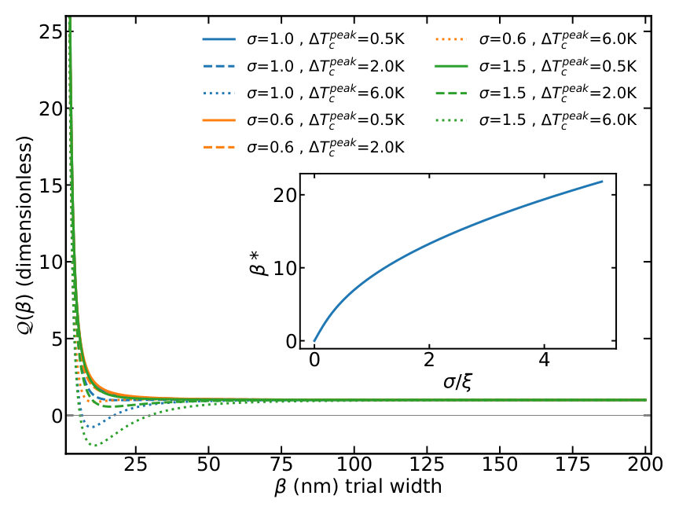
<figcaption class="paper-figure-caption"><b>Fig 2.</b> Figure 2: Rayleigh-Ritz functional Q(β) for several σ/ξ ratios; nucleation sets in when Q = 0.</figcaption>
</figure>
<figure class="paper-figure-card">
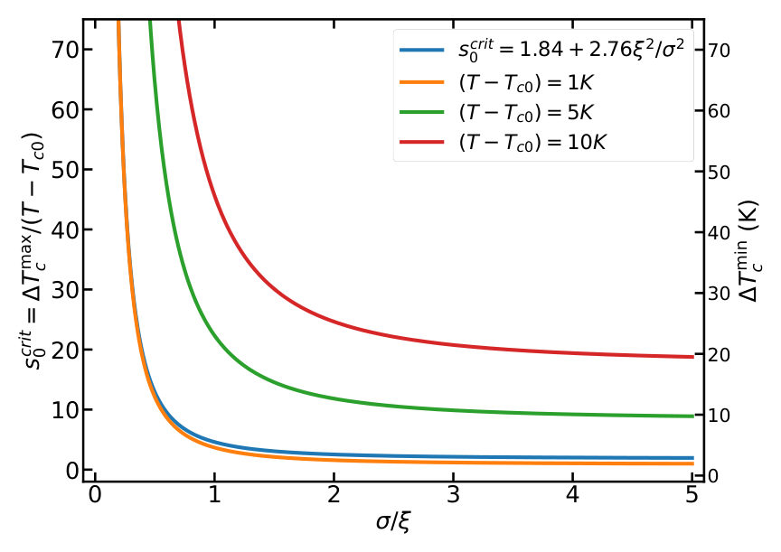
<figcaption class="paper-figure-caption"><b>Fig 3.</b> Figure 3: Nucleation threshold scrit 0 = ∆T max c /(T −Tc0) vs. σ/ξ (Eq. (10)); other lines show ∆T max c</figcaption>
</figure>

**Summary.** This paper develops a unified theory explaining how localized stress fields from point contacts can induce or enhance superconductivity. By merging Hertzian contact mechanics with Ginzburg-Landau analysis, the authors derive a quantitative nucleation criterion dependent on an experimentally measurable uniaxial coupling scale ($C^{\mathrm{exp}}$). This framework successfully predicts superconducting behavior in various materials, including elemental Sb and Y.

**Why it may be interesting.** The work provides a highly structured, predictive theoretical framework linking macroscopic mechanical measurements (contact pressure) directly to microscopic quantum phenomena (superconductivity), which is valuable for understanding strain-mediated quantum effects in condensed matter systems.

Detailed structure

**Main problem.** The lack of a unified theoretical description for superconductivity nucleation or enhancement induced by localized, inhomogeneous strain fields generated under metallic point contacts.

**Main result.** A quantitative criterion derived from combining Hertzian contact mechanics and Ginzburg-Landau theory establishes the necessary conditions for tip-induced superconductivity (TISC/TESC). The framework successfully predicts critical temperatures for elemental Sb and Y.

**Method.** The authors combine continuum mechanics (Hertzian theory) to model strain fields with a variational analysis of the Ginzburg-Landau free energy functional to determine the superconducting order parameter's stability.

**Model / system.** The system involves a metallic tip creating a spatially inhomogeneous, predominantly uniaxial stress field ($\sigma_{zz}$) on a superconductor. The theoretical framework models superconductivity nucleation by solving for bound states in an effective potential well derived from the strain coupling to the electronic structure.

**Key observables.** Critical temperature enhancement ($\Delta T_c$), the experimentally measurable uniaxial coupling scale ($C^{\mathrm{exp}}$), and the superconducting order parameter $\psi(r)$.

**Important parameters / regimes.** The uniaxial coupling scale $C^{\mathrm{exp}}$, the contact radius ($a$), maximum pressure ($p_{max}$), and the dimensionless local enhancement strength ($s_0$).

**Assumptions / limitations.** The stress field is predominantly uniaxial, allowing for a simplified strain-coupling model. The analysis relies on approximating the complex physics using Ginzburg-Landau theory coupled with Hertzian contact mechanics.

**Figures summary.** Figure 1 compares theoretical and measured profiles of pressure/strain; Figure 2 uses the Rayleigh-Ritz functional to define the nucleation threshold ($Q=0$); Figure 3 plots calculated nucleation criteria across different material regimes.

**Paper structure.** The paper first establishes the physical necessity of uniaxial strain for TISC/TESC. It then develops a quantitative criterion using GL theory and contact mechanics, classifying materials based on how $C^{\mathrm{exp}}$ relates to theoretical coupling scales ($C_{th}$ vs $C_{vol}$). Finally, it applies this framework to predict specific material outcomes.

Abstract

A metallic point contact formed on a non-superconducting or weakly superconducting material often nucleates or enhances superconductivity confined under the contact. However, no unified theoretical description of the phenomenon exists. We show that the spatially inhomogeneous, predominantly uniaxial nature of the stress field under a point contact is fundamental for such tip-induced and tip-enhanced superconductivity (TISC/TESC). We also show that the coupling of such a stress field to the electronic structure can be estimated through an experimentally measurable uniaxial coupling scale $C^{\mathrm{exp}}$. Combining Hertzian contact mechanics with a Ginzburg-Landau variational analysis, we derive a criterion for the nucleation of TISC/TESC and determine $C^{\mathrm{exp}}$ for twenty-one materials. For topological semimetals with ungapped band crossings, the framework explains observed critical temperatures with no free parameters and for all others, $C^{\mathrm{exp}}$ provides a direct experimental determination of the uniaxial strain sensitivity and a target scale for microscopic theories.The work predicts TISC in elemental Sb and Y with $T_c \approx 2.8$\,K and $T_c \approx 12$\,K respectively.

[↑ back to top](#top)

### Other secondary papers (1)

Show other secondary papers

### [Pressure-induced Structural Phase Transition, Metallization, and Superconductivity in layered metalloid dichalcogenide 1T-SiTe$_2$](http://arxiv.org/abs/2607.07569v1)

**Authors:** Ying-Jie Zhang, Heng Xu, Zhe-Ning Xiang, Zong-Hui Wu, Qing Li, Hai-Hu Wen  
**Type:** experiment · **Category:** other · **PDF:** <https://arxiv.org/pdf/2607.07569v1>  
**Analysis basis:** full PDF text, analyzed in chunks

↔ Scroll figures horizontally

<figure class="paper-figure-card">
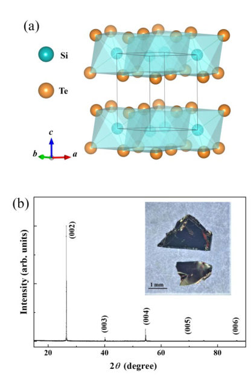
<figcaption class="paper-figure-caption"><b>Fig 1.</b> Fig. 1: Characterization of 1T-SiTe2 at ambient pressure.</figcaption>
</figure>
<figure class="paper-figure-card">
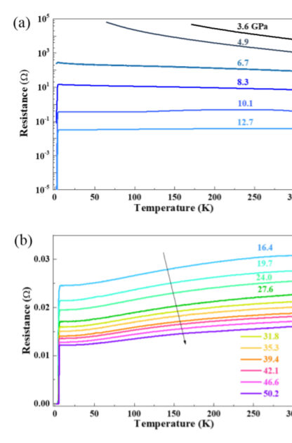
<figcaption class="paper-figure-caption"><b>Fig 2.</b> Fig. 2: Temperature-dependent resistance of SiTe2 under pressure.</figcaption>
</figure>
<figure class="paper-figure-card">
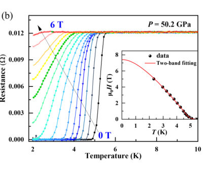
<figcaption class="paper-figure-caption"><b>Fig 3.</b> Fig. 3: Superconducting transitions under different magnetic fields and upper critical fields.</figcaption>
</figure>
<figure class="paper-figure-card">
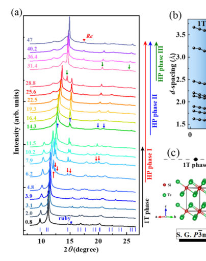
<figcaption class="paper-figure-caption"><b>Fig 4.</b> Fig. 4: High-pressure synchrotron X-ray diffraction data and evolution of structural transition.</figcaption>
</figure>
<figure class="paper-figure-card">
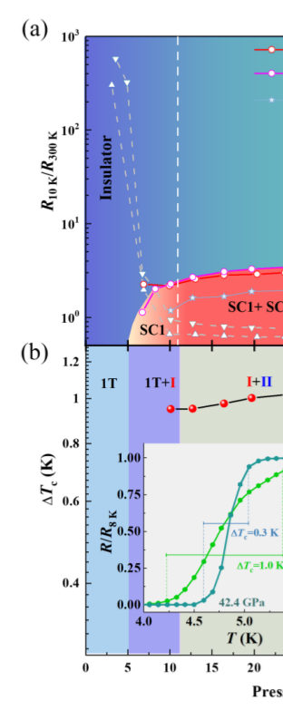
<figcaption class="paper-figure-caption"><b>Fig 5.</b> Fig. 5: Phase diagrams of SiTe2 under pressure.</figcaption>
</figure>

**Summary.** This work reports on the discovery of superconductivity in 1T-SiTe2, a layered metalloid dichalcogenide. By applying high pressure, the material undergoes structural phase transitions that drive it from an ambient semiconducting state into a superconducting metallic phase. The findings establish a new platform for studying superconductivity outside traditional transition-metal systems.

**Why it may be interesting.** While primarily experimental, the strong correlation between external tuning parameters (pressure) causing structural changes and emergent quantum phenomena (superconductivity) provides a model for understanding pressure-induced electronic state control relevant to condensed matter theory.

Detailed structure

**Main problem.** The study investigates how applying high pressure affects the structural phase transitions, metallization, and emergence of superconductivity in the layered metalloid dichalcogenide 1T-SiTe2.

**Main result.** Superconductivity emerges under pressure, with the critical temperature (Tc) increasing continuously up to a saturation value of approximately 5.5 K above 30 GPa. The superconducting behavior is strongly correlated with multiple structural phase transitions observed during compression.

**Method.** The research employed high-pressure measurements using a Diamond Anvil Cell (DAC), combining electrical transport measurements (resistivity vs. temperature/field) with in-situ synchrotron X-ray Diffraction (XRD).

**Model / system.** The physical system is the layered metalloid dichalcogenide 1T-SiTe2, which was characterized at ambient pressure and subjected to pressures up to 50 GPa. The study tracks structural changes through multiple identified phases (e.g., Phase I, II, III).

**Key observables.** Electrical resistivity ($
ho$), superconducting transition temperature ($T_c$), magnetic susceptibility ($\chi$-$T$), and crystal structure parameters derived from high-pressure XRD.

**Important parameters / regimes.** Pressure range up to 50 GPa; $T_c$ saturation at $\sim 5.5 	ext{ K}$; ambient semiconducting behavior transitioning to metallic/superconducting states under pressure.

**Assumptions / limitations.** The changes in transport properties are assumed to be structurally driven by the observed phase transitions, and the superconducting mechanism is suggested to potentially involve phonon mediation based on $H_{c2}$ analysis.

**Figures summary.** Figures detail ambient characterization (XRD, $
ho$-$T$), high-pressure resistance curves showing superconductivity onset, in-situ XRD confirming three structural phases under pressure, and phase diagrams mapping $T_c$ vs. Pressure.

**Paper structure.** The paper follows a standard materials physics structure: initial ambient characterization of the semiconducting state; application of high pressure to induce metallization and observe superconductivity; detailed analysis linking specific structural transitions (via XRD) to anomalous transport responses ($
ho$-$T$ curves).

Abstract

Layered transition-metal dichalcogenides (TMDs) have attracted considerable attention as promising platforms for exploring emergent physics and potential device applications. In contrast, metalloid-based dichalcogenide counterparts remain largely underexplored. Here, we report the pressure-induced structural phase transition, metallization, and superconductivity in the layered metalloid dichalcogenide 1T-SiTe$_2$. At ambient pressure, 1T-SiTe$_2$ crystallizes in a trigonal crystal structure (space group: $P\bar{3}m1$) and exhibits intrinsic semiconducting transport characteristics. Upon pressurization, in concomitant with the suppression of semiconducting behavior in resistance, superconductivity emerges at around 6.7 GPa. The superconducting transition temperature (T$_c$) rises continuously with increasing pressure and finally saturates at approximately 5.5 K for pressures above 30 GPa. During the compression, 1T-SiTe$_2$ experiences three structural phase transitions, and the phase transition pressures are highly consistent with the anomalous transport responses observed experimentally, indicating that the changes of transport behavior of 1T-SiTe$_2$ under pressure are structurally-driven. Our work extends TMD superconductors into the realm of metalloid systems and provides a new platform for exploring novel physics in quasi two-dimensional materials without transition-metal elements.

[↑ back to top](#top)

