
# arxiv digest (quant-ph + cond-mat) — 2026-07-11

*128 papers · 44 relevant · 3 highlighted*

## 🔥 Most relevant (44)

*Every paper with at least one nonzero topic score, sorted by best-matching score. 🔥 marks scores ≥4/5. Click the title to jump to the full entry below; click [arXiv] to open the paper page. `(secondary)` marks papers from de-prioritized cond-mat archives.*

Show 44 relevant papers

- [Super-Logarithmic Entanglement Scaling in a Monitored Superconducting Chain](#paper-2607.07835) [[arXiv]](http://arxiv.org/abs/2607.07835v1) — 🔥 `measurement-induced transitions` **5/5** · 🔥 `Keldysh / 2PI / non-Gaussian methods` **4/5** · 🔥 `entanglement & information structure` **4/5** · 🔥 `non-equilibrium universality` **4/5** · 🔥 `quantum measurements` **4/5** · `correlated / nonlocal dissipation` **3/5** · `driven-dissipative phase transition` **3/5** · `methods for driven-dissipative` **3/5** · `non-equilibrium dynamics` **3/5** · `Kondo & dissipative impurity` **1/5** · `analog quantum simulation` **1/5** · `exotic spin models in light-matter` **1/5**
- ⭐ [Fourier imaging of collective spontaneous emission modes in superradiant cold atomic clouds](#paper-2607.08421) [[arXiv]](http://arxiv.org/abs/2607.08421v1) — 🔥 `Dicke superradiance` **5/5** · 🔥 `correlated / nonlocal dissipation` **4/5** · 🔥 `free-space correlated emission` **4/5** · 🔥 `superradiant laser` **4/5** · `interference shaping light` **3/5** · `quantum optics experiment` **3/5** · `Tavis-Cummings & cavity-many-emitter` **2/5** · `driven-dissipative phase transition` **2/5** · `methods for driven-dissipative` **2/5** · `Keldysh / 2PI / non-Gaussian methods` **1/5** · `analog quantum simulation` **1/5** · `correlated cavity matter` **1/5** · `non-equilibrium dynamics` **1/5** · `non-equilibrium universality` **1/5**
- [Universality of Measurement-Induced Criticality under Symmetry-Breaking Measurements](#paper-2607.08589) [[arXiv]](http://arxiv.org/abs/2607.08589v1) — 🔥 `measurement-induced transitions` **5/5** · 🔥 `non-equilibrium universality` **4/5** · `driven-dissipative phase transition` **3/5** · `entanglement & information structure` **3/5** · `methods for driven-dissipative` **3/5** · `non-equilibrium dynamics` **3/5** · `quantum measurements` **3/5** · `correlated / nonlocal dissipation` **2/5** · `Keldysh / 2PI / non-Gaussian methods` **1/5** · `analog quantum simulation` **1/5**
- [Efficient Pauli-decomposition and multistage state-refinement for tensor network based differential equation solver](#paper-2607.08166) [[arXiv]](http://arxiv.org/abs/2607.08166v1) — 🔥 `methods for driven-dissipative` **5/5** · 🔥 `analog quantum simulation` **4/5** · `non-equilibrium dynamics` **2/5** · `Keldysh / 2PI / non-Gaussian methods` **1/5** · `correlated / nonlocal dissipation` **1/5** · `driven-dissipative phase transition` **1/5** · `entanglement & information structure` **1/5**
- [Efficient photo-ionizing elimination of detrimental electric fields for Rydberg atoms](#paper-2607.08418) [[arXiv]](http://arxiv.org/abs/2607.08418v1) — 🔥 `Rydberg arrays` **5/5** · 🔥 `analog quantum simulation` **4/5** · `QC/QI experiment` **3/5** · `methods for driven-dissipative` **1/5** · `quantum measurements` **1/5** · `quantum optics experiment` **1/5**
- [Approaching Carnot Efficiency at Finite Power in an Experimentally Feasible Quantum Heat Engine](#paper-2607.08713) [[arXiv]](http://arxiv.org/abs/2607.08713v1) — 🔥 `QC/QI experiment` **4/5** · 🔥 `methods for driven-dissipative` **4/5** · `Tavis-Cummings & cavity-many-emitter` **3/5** · `correlated cavity matter` **3/5** · `driven-dissipative phase transition` **3/5** · `quantum optics experiment` **3/5** · `analog quantum simulation` **2/5** · `correlated / nonlocal dissipation` **2/5** · `non-equilibrium dynamics` **2/5** · `non-equilibrium universality` **2/5** · `Keldysh / 2PI / non-Gaussian methods` **1/5** · `entanglement & information structure` **1/5** · `quantum measurements` **1/5**
- [Experimental demonstration of entanglement sudden death induced by natural dissipation](#paper-2607.08078) [[arXiv]](http://arxiv.org/abs/2607.08078v1) — 🔥 `correlated / nonlocal dissipation` **4/5** · 🔥 `entanglement & information structure` **4/5** · `driven-dissipative phase transition` **3/5** · `methods for driven-dissipative` **3/5** · `quantum optics experiment` **3/5** · `Tavis-Cummings & cavity-many-emitter` **2/5** · `analog quantum simulation` **2/5** · `correlated cavity matter` **2/5** · `non-equilibrium dynamics` **2/5** · `non-equilibrium universality` **2/5** · `Keldysh / 2PI / non-Gaussian methods` **1/5** · `QC/QI experiment` **1/5** · `measurement-induced transitions` **1/5**
- [Topology from Decoherence](#paper-2607.07801) [[arXiv]](http://arxiv.org/abs/2607.07801v1) — 🔥 `driven-dissipative phase transition` **4/5** · 🔥 `methods for driven-dissipative` **4/5** · `analog quantum simulation` **3/5** · `correlated / nonlocal dissipation` **3/5** · `non-equilibrium dynamics` **3/5** · `non-equilibrium universality` **3/5** · `Keldysh / 2PI / non-Gaussian methods` **2/5** · `measurement-induced transitions` **2/5** · `Kondo & dissipative impurity` **1/5** · `entanglement & information structure` **1/5** · `exotic spin models in light-matter` **1/5** · `scars & prethermalization` **1/5**
- [Stochastic dynamics of particles in correlated fields](#paper-2607.08627) [[arXiv]](http://arxiv.org/abs/2607.08627v1) — 🔥 `Keldysh / 2PI / non-Gaussian methods` **4/5** · `correlated / nonlocal dissipation` **3/5** · `driven-dissipative phase transition` **3/5** · `methods for driven-dissipative` **3/5** · `non-equilibrium dynamics` **3/5** · `Frenkel-Kontorova` **2/5** · `non-equilibrium universality` **2/5** · `Kondo & dissipative impurity` **1/5** · `analog quantum simulation` **1/5** · `scars & prethermalization` **1/5**
- [The Langevin-equation description of optomechanics with the dispersive and dissipative optomechanical coupling](#paper-2607.08530) [[arXiv]](http://arxiv.org/abs/2607.08530v1) — 🔥 `methods for driven-dissipative` **4/5** · `Keldysh / 2PI / non-Gaussian methods` **3/5** · `correlated / nonlocal dissipation` **3/5** · `driven-dissipative phase transition` **3/5** · `correlated cavity matter` **2/5** · `non-equilibrium dynamics` **2/5** · `non-equilibrium universality` **2/5** · `quantum measurements` **2/5** · `interference shaping light` **1/5** · `measurement-induced transitions` **1/5**
- [Shortcuts to Adiabaticity for non-Hermitian systems in Krylov Space](#paper-2607.07802) [[arXiv]](http://arxiv.org/abs/2607.07802v1) — 🔥 `driven-dissipative phase transition` **4/5** · 🔥 `methods for driven-dissipative` **4/5** · `correlated / nonlocal dissipation` **3/5** · `non-equilibrium universality` **3/5** · `Kondo & dissipative impurity` **2/5** · `analog quantum simulation` **2/5** · `non-equilibrium dynamics` **2/5** · `Keldysh / 2PI / non-Gaussian methods` **1/5**
- [Operational meaning of Markov gap in tripartite entanglement of quantum dynamics](#paper-2607.08615) [[arXiv]](http://arxiv.org/abs/2607.08615v1) — 🔥 `entanglement & information structure` **4/5** · 🔥 `non-equilibrium dynamics` **4/5** · `non-equilibrium universality` **3/5** · `analog quantum simulation` **2/5** · `driven-dissipative phase transition` **2/5** · `Keldysh / 2PI / non-Gaussian methods` **1/5** · `correlated / nonlocal dissipation` **1/5** · `methods for driven-dissipative` **1/5** · `scars & prethermalization` **1/5**
- [Vortex Dynamics in Magic-Angle Twisted Graphene](#paper-2607.08585) [[arXiv]](http://arxiv.org/abs/2607.08585v1) `(secondary)` — 🔥 `non-equilibrium dynamics` **4/5** · `driven-dissipative phase transition` **3/5** · `methods for driven-dissipative` **3/5** · `correlated / nonlocal dissipation` **2/5** · `non-equilibrium universality` **2/5** · `Keldysh / 2PI / non-Gaussian methods` **1/5** · `Kondo & dissipative impurity` **1/5** · `QC/QI experiment` **1/5** · `quantum measurements` **1/5** · `scars & prethermalization` **1/5**
- [Environmental Memory Effects and Quantum Resource Hierarchies in Polarized Hyperon--Antihyperon Systems](#paper-2607.07902) [[arXiv]](http://arxiv.org/abs/2607.07902v1) — 🔥 `entanglement & information structure` **4/5** · `correlated / nonlocal dissipation` **3/5** · `methods for driven-dissipative` **3/5** · `non-equilibrium dynamics` **3/5** · `Keldysh / 2PI / non-Gaussian methods` **2/5** · `driven-dissipative phase transition` **2/5** · `non-equilibrium universality` **1/5**
- [Scalable Simulation of Strongly Correlated Electron-Phonon Systems via Non-Gaussian Matrix Product States](#paper-2607.08176) [[arXiv]](http://arxiv.org/abs/2607.08176v1) — 🔥 `methods for driven-dissipative` **4/5** · `Keldysh / 2PI / non-Gaussian methods` **3/5** · `analog quantum simulation` **3/5** · `driven-dissipative phase transition` **2/5** · `entanglement & information structure` **2/5** · `Kondo & dissipative impurity` **1/5** · `correlated / nonlocal dissipation` **1/5** · `non-equilibrium dynamics` **1/5** · `non-equilibrium universality` **1/5**
- [Low-latency FPGA-based electronic control system for fast preparation of defect-free atom arrays](#paper-2607.08687) [[arXiv]](http://arxiv.org/abs/2607.08687v1) — 🔥 `QC/QI experiment` **4/5** · 🔥 `quantum measurements` **4/5** · `measurement-induced transitions` **3/5** · `analog quantum simulation` **2/5** · `Rydberg arrays` **1/5** · `methods for driven-dissipative` **1/5** · `non-equilibrium dynamics` **1/5** · `quantum optics experiment` **1/5**
- [Robust Quantum Learning through Hamiltonian Reservoir Computing](#paper-2607.08037) [[arXiv]](http://arxiv.org/abs/2607.08037v1) — 🔥 `analog quantum simulation` **4/5** · `QC/QI experiment` **3/5** · `methods for driven-dissipative` **3/5** · `driven-dissipative phase transition` **2/5** · `non-equilibrium dynamics` **2/5** · `correlated / nonlocal dissipation` **1/5** · `entanglement & information structure` **1/5** · `non-equilibrium universality` **1/5**
- [Temperature Beyond Equilibrium in Isolated Quantum Many-Body Systems and Their Subsystems](#paper-2607.08655) [[arXiv]](http://arxiv.org/abs/2607.08655v1) — 🔥 `non-equilibrium dynamics` **4/5** · `non-equilibrium universality` **3/5** · `analog quantum simulation` **2/5** · `entanglement & information structure` **2/5** · `scars & prethermalization` **2/5** · `Keldysh / 2PI / non-Gaussian methods` **1/5** · `correlated / nonlocal dissipation` **1/5** · `driven-dissipative phase transition` **1/5** · `methods for driven-dissipative` **1/5**
- [Complex spacing ratio statistics in the partially open asymmetric quantum baker map](#paper-2607.07878) [[arXiv]](http://arxiv.org/abs/2607.07878v1) — 🔥 `methods for driven-dissipative` **4/5** · `Keldysh / 2PI / non-Gaussian methods` **3/5** · `driven-dissipative phase transition` **3/5** · `non-equilibrium universality` **2/5** · `Kondo & dissipative impurity` **1/5** · `correlated / nonlocal dissipation` **1/5** · `non-equilibrium dynamics` **1/5**
- [No off-diagonal quantum focusing for Rényi divergences](#paper-2607.07799) [[arXiv]](http://arxiv.org/abs/2607.07799v1) — 🔥 `entanglement & information structure` **4/5** · `Keldysh / 2PI / non-Gaussian methods` **3/5** · `non-equilibrium dynamics` **2/5** · `non-equilibrium universality` **2/5** · `analog quantum simulation` **1/5** · `correlated / nonlocal dissipation` **1/5** · `driven-dissipative phase transition` **1/5** · `methods for driven-dissipative` **1/5**
- [Extracting conformal data from Loschmidt echoes after critical quenches](#paper-2607.08649) [[arXiv]](http://arxiv.org/abs/2607.08649v1) — 🔥 `non-equilibrium universality` **4/5** · `non-equilibrium dynamics` **3/5** · `entanglement & information structure` **2/5** · `Keldysh / 2PI / non-Gaussian methods` **1/5** · `analog quantum simulation` **1/5** · `correlated / nonlocal dissipation` **1/5** · `driven-dissipative phase transition` **1/5** · `methods for driven-dissipative` **1/5**
- [Monte-Carlo solution of the Kondo model](#paper-2607.07797) [[arXiv]](http://arxiv.org/abs/2607.07797v1) — 🔥 `Kondo & dissipative impurity` **4/5** · `methods for driven-dissipative` **3/5** · `non-equilibrium dynamics` **2/5** · `non-equilibrium universality` **2/5** · `Keldysh / 2PI / non-Gaussian methods` **1/5** · `correlated / nonlocal dissipation` **1/5** · `driven-dissipative phase transition` **1/5**
- [Theoretical exploration of Be Ag(II) F phases and their magnetic properties using learning algorithms](#paper-2607.08372) [[arXiv]](http://arxiv.org/abs/2607.08372v1) — 🔥 `analog quantum simulation` **4/5** · `exotic spin models in light-matter` **3/5** · `spintronics-quantum-optics interface` **3/5** · `Kondo & dissipative impurity` **1/5** · `correlated cavity matter` **1/5** · `entanglement & information structure` **1/5** · `non-equilibrium dynamics` **1/5**
- [A crystal-field route to THz-driven magnetization](#paper-2607.08519) [[arXiv]](http://arxiv.org/abs/2607.08519v1) `(secondary)` — 🔥 `spintronics-quantum-optics interface` **4/5** · `exotic spin models in light-matter` **3/5** · `non-equilibrium dynamics` **2/5** · `Keldysh / 2PI / non-Gaussian methods` **1/5** · `driven-dissipative phase transition` **1/5** · `methods for driven-dissipative` **1/5** · `quantum optics experiment` **1/5**
- [Quantifying randomness with measurement incompatibility](#paper-2607.08697) [[arXiv]](http://arxiv.org/abs/2607.08697v1) — 🔥 `quantum measurements` **4/5** · `measurement-induced transitions` **3/5** · `entanglement & information structure` **2/5** · `Keldysh / 2PI / non-Gaussian methods` **1/5** · `correlated / nonlocal dissipation` **1/5** · `driven-dissipative phase transition` **1/5** · `methods for driven-dissipative` **1/5**
- [Efficiently simulable quantum circuits with large entanglement, magic, and non-Gaussianity via code-compiled tensor networks](#paper-2607.08396) [[arXiv]](http://arxiv.org/abs/2607.08396v1) — 🔥 `entanglement & information structure` **4/5** · `methods for driven-dissipative` **3/5** · `QC/QI experiment` **2/5** · `analog quantum simulation` **1/5** · `correlated cavity matter` **1/5** · `non-equilibrium dynamics` **1/5**
- [QSCOUT's Qubit-Boson Gate Set](#paper-2607.08560) [[arXiv]](http://arxiv.org/abs/2607.08560v1) — 🔥 `QC/QI experiment` **4/5** · `quantum measurements` **2/5** · `quantum optics experiment` **2/5** · `analog quantum simulation` **1/5** · `measurement-induced transitions` **1/5** · `methods for driven-dissipative` **1/5** · `spintronics-quantum-optics interface` **1/5**
- [Irreducible Geometry of Higher-Order Correlator Families](#paper-2607.08761) [[arXiv]](http://arxiv.org/abs/2607.08761v1) — 🔥 `entanglement & information structure` **4/5** · `analog quantum simulation` **2/5** · `non-equilibrium dynamics` **2/5** · `Keldysh / 2PI / non-Gaussian methods` **1/5** · `methods for driven-dissipative` **1/5** · `non-equilibrium universality` **1/5**
- [Robust Ion-Photon Entanglement via Polarization-to-Time-Bin Conversion](#paper-2607.07805) [[arXiv]](http://arxiv.org/abs/2607.07805v1) — 🔥 `QC/QI experiment` **4/5** · `interference shaping light` **3/5** · `quantum optics experiment` **3/5** · `entanglement & information structure` **1/5**
- [Typicality of Steering for Two-qubit States](#paper-2607.08762) [[arXiv]](http://arxiv.org/abs/2607.08762v1) — 🔥 `entanglement & information structure` **4/5** · 🔥 `quantum measurements` **4/5** · `measurement-induced transitions` **3/5**
- [Competing Chern states revealed by quasiparticle charging in moiré rhombohedral graphene](#paper-2607.08710) [[arXiv]](http://arxiv.org/abs/2607.08710v1) — 🔥 `analog quantum simulation` **4/5** · `driven-dissipative phase transition` **2/5** · `Kondo & dissipative impurity` **1/5** · `correlated cavity matter` **1/5** · `entanglement & information structure` **1/5** · `non-equilibrium dynamics` **1/5**
- [Measurement-Based Quantum Computing on a Photonic Chip](#paper-2607.07890) [[arXiv]](http://arxiv.org/abs/2607.07890v1) — 🔥 `QC/QI experiment` **4/5** · `quantum measurements` **2/5** · `quantum optics experiment` **2/5** · `entanglement & information structure` **1/5** · `measurement-induced transitions` **1/5**
- [Smoothing Exponents and Decoupling in Semifinite von Neumann Algebras](#paper-2607.07997) [[arXiv]](http://arxiv.org/abs/2607.07997v1) — 🔥 `entanglement & information structure` **4/5** · `Keldysh / 2PI / non-Gaussian methods` **1/5** · `correlated / nonlocal dissipation` **1/5** · `driven-dissipative phase transition` **1/5** · `methods for driven-dissipative` **1/5** · `non-equilibrium dynamics` **1/5** · `non-equilibrium universality` **1/5**
- [Center-of-Mass Bounds and Harmonic Extremality](#paper-2607.08096) [[arXiv]](http://arxiv.org/abs/2607.08096v1) — 🔥 `analog quantum simulation` **4/5** · `non-equilibrium dynamics` **2/5** · `Frenkel-Kontorova` **1/5** · `Keldysh / 2PI / non-Gaussian methods` **1/5** · `entanglement & information structure` **1/5**
- [Distributed Monogamy of Entanglement limits Quantum Channel Simulation](#paper-2607.08591) [[arXiv]](http://arxiv.org/abs/2607.08591v1) — 🔥 `entanglement & information structure` **4/5** · `Keldysh / 2PI / non-Gaussian methods` **1/5** · `correlated / nonlocal dissipation` **1/5** · `driven-dissipative phase transition` **1/5** · `methods for driven-dissipative` **1/5**
- [Metropolitan entanglement distribution between an atom and a near-visible photon](#paper-2607.08513) [[arXiv]](http://arxiv.org/abs/2607.08513v1) — 🔥 `QC/QI experiment` **4/5** · `quantum optics experiment` **3/5** · `interference shaping light` **1/5**
- [Quantum-Geometric Design of Lattice Generalized Landau Levels](#paper-2607.08702) [[arXiv]](http://arxiv.org/abs/2607.08702v1) — 🔥 `analog quantum simulation` **4/5** · `entanglement & information structure` **3/5** · `non-equilibrium dynamics` **1/5**
- [Entanglement Wedge Reconstruction without Holographic Quantum Error Correction](#paper-2607.08684) [[arXiv]](http://arxiv.org/abs/2607.08684v1) — 🔥 `entanglement & information structure` **4/5** · `correlated / nonlocal dissipation` **1/5** · `non-equilibrium dynamics` **1/5**
- [GroverFigureOfMerit: An Agnostic Figure of Merit for Quantum Backend Characterization in the NISQ Era](#paper-2607.08636) [[arXiv]](http://arxiv.org/abs/2607.08636v1) — 🔥 `QC/QI experiment` **4/5** · `methods for driven-dissipative` **1/5** · `non-equilibrium dynamics` **1/5**
- [Non-Local Magic from the Entanglement Spectrum](#paper-2607.07808) [[arXiv]](http://arxiv.org/abs/2607.07808v1) — 🔥 `entanglement & information structure` **4/5** · `analog quantum simulation` **1/5** · `non-equilibrium dynamics` **1/5**
- [Observation of coherent flux-charge interaction in a gate-tunable fluxonium](#paper-2607.07798) [[arXiv]](http://arxiv.org/abs/2607.07798v1) — 🔥 `QC/QI experiment` **4/5** · `quantum measurements` **2/5**
- [Möbius-Guided Diagonal-Gate Compilation with Native Multiqubit Controlled-Phase Gates on Neutral-Atom Processors](#paper-2607.08212) [[arXiv]](http://arxiv.org/abs/2607.08212v1) — 🔥 `Rydberg arrays` **4/5** · `QC/QI experiment` **1/5**
- [Unveiling Semiclassical Structures in Quantum Chaotic Eigenstates Using Neural Networks](#paper-2607.07874) [[arXiv]](http://arxiv.org/abs/2607.07874v1) — 🔥 `scars & prethermalization` **4/5** · `methods for driven-dissipative` **1/5**
- [A majorization relation for a sum of two tensor products of positive semidefinite operators](#paper-2607.07913) [[arXiv]](http://arxiv.org/abs/2607.07913v1) — 🔥 `entanglement & information structure` **4/5**

## ⭐ Highlighted (3)

*Papers by authors on your watch list. Click the title to jump to the full entry below; click [arXiv] to open the paper page.*

Show 3 highlighted papers

- ⭐ [Quantum Sensors for Chemistry and Materials Science](#paper-2607.07848) [[arXiv]](http://arxiv.org/abs/2607.07848v1) — Mikhail D. Lukin
- ⭐ [Fourier imaging of collective spontaneous emission modes in superradiant cold atomic clouds](#paper-2607.08421) [[arXiv]](http://arxiv.org/abs/2607.08421v1) — Antoine Browaeys, Igor Ferrier-Barbut
- ⭐ [Symmetry as a route to generalized bosonic Kitaev chains](#paper-2607.08638) [[arXiv]](http://arxiv.org/abs/2607.08638v1) — Aashish A. Clerk

## All papers (107, sorted by relevance)

*Papers from quant-ph and your primary cond-mat archives (quant-gas, stat-mech, str-el, dis-nn). Highlighted papers (⭐) come first, then everything else sorted by topic-relevance score, highest first.*

### ⭐ [Fourier imaging of collective spontaneous emission modes in superradiant cold atomic clouds](http://arxiv.org/abs/2607.08421v1)

**Highlighted author(s):** Antoine Browaeys, Igor Ferrier-Barbut  
**Authors:** Adrien Gavalda, Guillaume Tremblier, Martin Poitrinal, Sara Pancaldi, Antoine Browaeys, Igor Ferrier-Barbut  
**Type:** both · **Category:** other · **PDF:** <https://arxiv.org/pdf/2607.08421v1>  
**Analysis basis:** full PDF text, analyzed in chunks
**Topic relevance:** 🔥 `Dicke superradiance` **5/5** · 🔥 `correlated / nonlocal dissipation` **4/5** · 🔥 `free-space correlated emission` **4/5** · 🔥 `superradiant laser` **4/5** · `interference shaping light` **3/5** · `quantum optics experiment` **3/5** · `Tavis-Cummings & cavity-many-emitter` **2/5** · `driven-dissipative phase transition` **2/5** · `methods for driven-dissipative` **2/5** · `Keldysh / 2PI / non-Gaussian methods` **1/5** · `analog quantum simulation` **1/5** · `correlated cavity matter` **1/5** · `non-equilibrium dynamics` **1/5** · `non-equilibrium universality` **1/5**

↔ Scroll figures horizontally

<figure class="paper-figure-card">
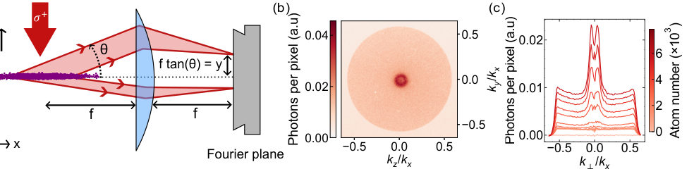
<figcaption class="paper-figure-caption"><b>Fig 1.</b> FIG. 1. (a) Simplified schematics of the experiment. The light emitted by an initially inverted elongated cloud of two-level Rb atoms is collected on an EMCCD camera placed in the Fourier plane of the imaging system: the position in this plane is related to the wavevector components by (y, z) = (ky, kz)f/kx with tan θ = ky,z/kx. (b) Fourier plane image of the emission pattern of a cloud of 5000 atoms, integrated over a superradiant burst. (c) One-dimensional azimuthal averages of the Fourier plane image for various atom numbers.</figcaption>
</figure>
<figure class="paper-figure-card">
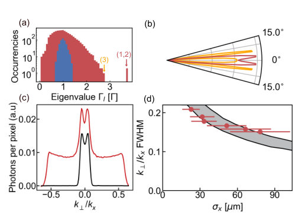
<figcaption class="paper-figure-caption"><b>Fig 2.</b> FIG. 2. Collective modes of a cloud with σx = 78 µm and σr = 1.7 µm. (a) Distribution of Γl’s for N = 5000 atoms (red) and N = 500 atoms (blue). (b) Normalized angular emission pattern for the most superradiant mode (red), and the third mode (orange). (c) Azimuthal average of the emis- sion pattern comparing experiment in red (σx = 78(20) µm and σr = 2.2(5) µm) and the theoretical pattern of the most superradiant mode (black). (d) FWHM of the superradiant emission pattern (experiment in red) and the corresponding theoretical values (in black) as a function of rms length σx of the cloud. The error region (gray area) in the theoretical prediction accounts for the experimental uncertainty on...</figcaption>
</figure>
<figure class="paper-figure-card">
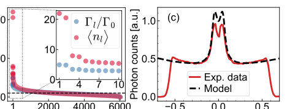
<figcaption class="paper-figure-caption"><b>Fig 3.</b> FIG. 3. (a) Schematic representation of superradiant cas- cade in the bosonic model (see text). (b) Calculated number of photons emitted per mode using the bosonic model, com- pared to the eigenvalues Γl/Γ0 for a cloud with σx = 78 µm, σr = 1.7 µm. (c) Calculated emission pattern integrated over the duration of the decay (dotted line), compared to the ex- perimental data.</figcaption>
</figure>
<figure class="paper-figure-card">
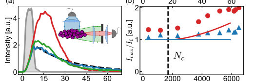
<figcaption class="paper-figure-caption"><b>Fig 4.</b> FIG. 4. (a) Superradiant temporal emission measured after a π-pulse, with various collection schemes. Red: selection of the most superradiant mode. Blue: direction orthogonal to the cloud’s axis. Green: Axial emission, blocking the super- radiant cone of light . (b) Maximum intensity Imax, relative to the intensity I0 at t = 6 ns. We choose this time because at high atom number superradiance begins before the pulse end (9 ns). Solid lines correspond to the toy model (see text). The dashed vertical line shows the theoretical critical atom number for both cases as defined in the text.</figcaption>
</figure>

**Summary.** The study experimentally investigates superradiant emission from cold atomic clouds using Fourier imaging to map out the spatial structure of emitted light. By comparing these measurements with theoretical models, the authors successfully demonstrate that collective spontaneous decay is governed by specific, measurable jump operators. This work advances our understanding of how mode competition dictates the macroscopic dynamics in interacting quantum many-body systems.

**Why it may be interesting.** This work provides crucial experimental validation for advanced theoretical frameworks describing open quantum systems, specifically demonstrating how collective decay dynamics can be mapped onto measurable spectral properties (eigenvalues/decay rates) of the system's environment coupling.

Detailed structure

**Main problem.** The study aims to experimentally measure and theoretically characterize the collective spontaneous emission modes associated with superradiant decay in cold atomic clouds.

**Main result.** The authors successfully measured a highly directional, ring-shaped emission pattern corresponding to the most superradiant mode, confirming theoretical predictions regarding the dominance of specific collective jump operators.

**Method.** The research combines Fourier imaging of emitted light with advanced quantum optical modeling using master equations and diagonalization of decay matrices.

**Model / system.** The system involves cold $^{87}	ext{Rb}$ atoms in an optical dipole trap, whose superradiant emission is governed by a master equation incorporating collective jump operators derived from the vacuum Green's function. Theoretical analysis models mode competition using bosonic and Lindblad approximations.

**Key observables.** Spatial pattern of emitted light in the far field (Fourier plane), superlinear scaling of intensity with atom number ($N$), and decay rates ($\Gamma_l$) associated with collective modes.

**Important parameters / regimes.** Cloud sizes ($\sigma_x, \sigma_r$), Rabi frequencies ($\Omega$), and critical atom numbers ($N_c$). The Fresnel number $F$ governs the dependence on cloud geometry.

**Assumptions / limitations.** The analysis relies on approximating the system using master equations and diagonalizing decay matrices; limitations include discrepancies between bosonic model predictions (e.g., peak intensity scaling) and experimental observations.

**Figures summary.** Figures illustrate the measured ring-shaped emission pattern, compare calculated vs. initial probability distributions of superradiant modes, and show how the spectral gap ($\Gamma_1/\Gamma_3$) depends on cloud geometry parameters like $\sigma_r$ and $\sigma_x$.

**Paper structure.** The paper progresses from measuring the spatial patterns of emission to analyzing mode competition using bosonic approximations, refining the model with a detailed Lindblad operator, and finally deriving theoretical conditions for superradiance based on eigenvalue analysis.

Abstract

We measure the spatial pattern associated with the superradiant emission from a cloud of cold 87Rb atoms using Fourier imaging. We observe a highly directional, ring-shaped emission structure, which corresponds to a single collective jump operator associated to the most superradiant mode of the ensemble. Using spatial filtering, we isolate this channel and find the typical superradiant burst with superlinear scaling of the intensity with atom number. We compare our results to two models that describe the competition between the various decay channels, finding good agreement. Our work shows that the collective jump operators introduced by Carmichael et al. [Optics Communications 179, 417 (2000)] can be measured and manipulated.

[↑ back to top](#top)

### ⭐ [Quantum Sensors for Chemistry and Materials Science](http://arxiv.org/abs/2607.07848v1)

**Highlighted author(s):** Mikhail D. Lukin  
**Authors:** Piotr Put, Arjun Pillai, Xuan Hoang Le, Mikhail D. Lukin, Hongkun Park  
**Type:** both · **Category:** other · **PDF:** <https://arxiv.org/pdf/2607.07848v1>  
**Analysis basis:** full PDF text, analyzed in chunks
**Topic relevance:** `spintronics-quantum-optics interface` **3/5** · `QC/QI experiment` **2/5** · `quantum measurements` **2/5** · `exotic spin models in light-matter` **1/5** · `quantum optics experiment` **1/5**

↔ Scroll figures horizontally

<figure class="paper-figure-card">
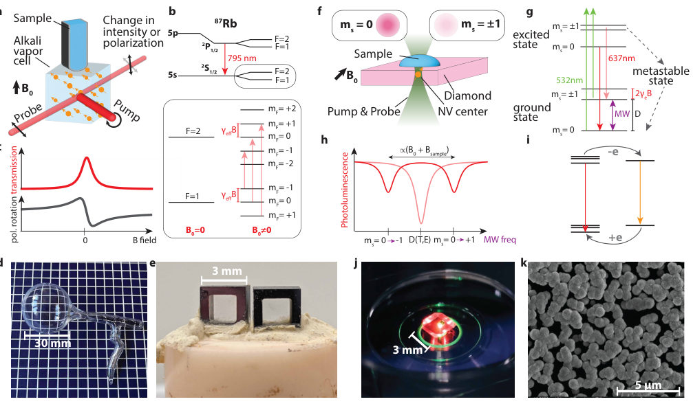
<figcaption class="paper-figure-caption"><b>Fig 1.</b> Figure 1 Quantum sensors. (a) Principle of OPM-based sensing. Sample is brought close to glass cell hosting alkali-metal vapor. Atoms in the vapor are optically polarized by a pump laser beam. Sample magnetic field leads to spin evolution, changing the absorption or polarization rotation which is probed with a weak laser beam. (b) Energy-level structure of alkali atoms (here 87Rb) used in OPMs. A laser tuned to (or near) an optical transition in the fine structure of the atom is used as a pump and probe. External magnetic field lifts the degeneracy of the energy levels within the hyperfine manifolds. The population and coherence between these Zeeman sublevels are then optically probed. (c)...</figcaption>
</figure>
<figure class="paper-figure-card">
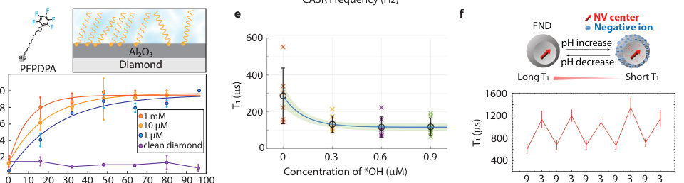
<figcaption class="paper-figure-caption"><b>Fig 2.</b> Figure 2 Chemical identification using quantum sensors. (a) NMR chemical fingerprinting using OPM detection. A compact OPM (top left) records the NMR signal from a liquid sample hyperpolarized with parahydrogen under zero magnetic field, yielding a chemically specific zero-field spectrum (bottom) and enabling relaxometry measurements (top right). The spectrum reflects J-couplings between nuclear spins in the investigated molecule (2-13C ethanol). Adapted from Ref. (Van Dyke et al., 2022). (b) Chemically specific proton NMR with NVs. High spectral resolution and micron-scale spatial resolution is achieved via hyperpolarization of 15N-labeled pyridine. ∼10 Hz J-coupling between 15N and 1H...</figcaption>
</figure>
<figure class="paper-figure-card">
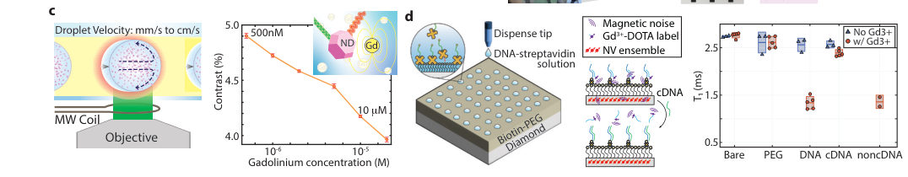
<figcaption class="paper-figure-caption"><b>Fig 3.</b> Figure 3 Chemical assays and high-throughput analysis (a) In-line detection of MNPs in flowing liquids. The magnetic field generated by passing MNPs is detected by an OPM (left). The corresponding magnetic-field variance plotted as a function of particle concentration (right) exhibits linear scaling over several orders of magnitude, with a LOD of ∼10 ppb. Adapted from Ref. (Bougas et al., 2018). (b) Multiplexed chemical detection using an OPM array. ZF NMR signals from different molecular species are recorded at distinct spatial locations, enabling simultaneous measurement of multiple samples. Adapted from Ref. (Andrews et al., 2025). (c) High-throughput paramagnetic ion sensing....</figcaption>
</figure>
<figure class="paper-figure-card">
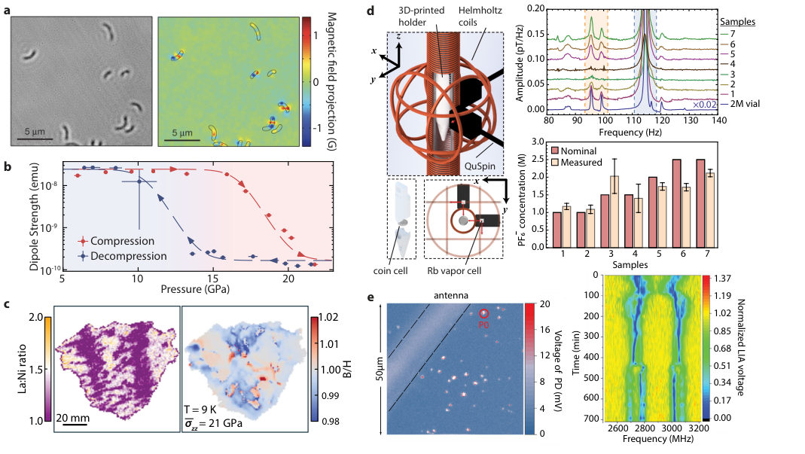
<figcaption class="paper-figure-caption"><b>Fig 4.</b> Figure 4 Quantum sensors for studying materials (a) Widefield optical (left) and magnetic (right) imaging of MTB. MNPs inside magnetosomes of MTB produce stray fields detectable by NVs in the diamond chip on which the bacteria are placed. Adapted from Ref. (Le Sage et al., 2013). (b) Probing structural phase transitions in iron. Under high pressure, iron undergoes α →ϵ phase transition from bcc to hcp crystal structure, leading to a change of effective dipole field the sample produces. Using NV centers in a DAC, this dipole field can be extracted by measuring the full vector magnetic field profile. Adapted from Ref. (Hsieh et al., 2019). (c) Correlating local stoichiometric composition with...</figcaption>
</figure>
<figure class="paper-figure-card">
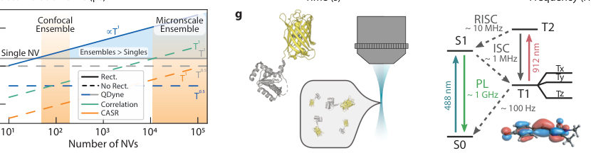
<figcaption class="paper-figure-caption"><b>Fig 5.</b> Figure 5 Advancements in quantum sensing for chemical applications (a) Gradiometric configuration for enhanced OPM performance. Magnetic sensitivity of two OPMs operating in a differential gradiometric configuration is compared under unshielded environmental conditions. The gradiometric approach significantly improves noise rejection, enabling quantum sensing in demanding settings. Adapted from Ref. (Xiao et al., 2023). (b) Large-scale OPM system demonstrating the scalability of quantum sensing platforms. Adapted from Ref. (Hill et al., 2024). (c) Quantum-enhanced metrology with OPMs. Magnetic sensitivity is shown as a function of atomic density for coherent (blue) and squeezed (green)...</figcaption>
</figure>

**Summary.** This review surveys the use of advanced quantum sensors, specifically Optically Pumped Magnetometers and NV centers in diamond, to revolutionize chemical and materials analysis. It contrasts OPMs' high bulk sensitivity with NVs' superior nanoscale resolution for applications ranging from battery monitoring to detecting free radicals. The paper argues that these technologies are poised to solve complex real-world analytical challenges.

**Why it may be interesting.** This work bridges quantum physics (spin dynamics, coherence) directly into applied chemistry and materials science diagnostics. The detailed comparison between ensemble averaging (OPMs) and localized defects (NVs) provides a rich case study in translating fundamental quantum measurements to macroscopic engineering problems.

Detailed structure

**Main problem.** The primary challenge addressed is overcoming the inherent limitations of conventional analytical tools—specifically regarding sensitivity, spatial resolution, and throughput—in modern chemistry and materials science.

**Main result.** Quantum sensors, particularly OPMs and NV centers, are shown to be transformative platforms capable of performing highly sensitive molecular and material diagnostics in real-world settings.

**Method.** The review contrasts two main quantum sensing modalities: Optically Pumped Magnetometers (OPMs) for bulk measurements and Nitrogen-Vacancy (NV) centers in diamond for nanoscale, localized probing.

**Model / system.** The core physical systems are alkali-metal vapor ensembles used in OPMs and point defects ($	ext{N}$ and vacancy) within the diamond lattice forming NV centers. Sensing relies on monitoring spin states via light absorption/fluorescence (ODMR for NVs).

**Key observables.** Magnetic field strength, concentration of free radicals ($	ext{ROS}$), $	ext{pH}$, temperature, and spectroscopic signatures (e.g., $	ext{NMR}$ signals) at various spatial scales.

**Important parameters / regimes.** Magnetic sensitivity reaching femtotesla levels; atomic-scale resolution ($\sim 10 	ext{ nm}$) for NVs; operation in zero-to-ultralow magnetic fields ($	ext{ZULF}$).

**Assumptions / limitations.** The field is maturing toward commercial viability, allowing quantum sensors to routinely address complex analytical challenges previously deemed impossible.

**Figures summary.** Figures illustrate the distinct setups for OPM sensing (using alkali vapors) and NV center sensing (showing energy levels and ODMR measurements), alongside physical examples of their deployment.

**Paper structure.** The paper is structured as a review, first introducing the limitations of current analytical techniques, then detailing the physics and capabilities of OPMs, followed by an in-depth comparison with the multi-modal sensing capabilities of NV centers, concluding with diverse applications like *operando* monitoring.

Abstract

The advancement of chemistry and materials science relies on transformative analytical tools which can overcome the sensitivity, spatial resolution, and throughput limitations of conventional techniques. This review explores the application of quantum sensors - specifically optically pumped magnetometers (OPMs) and nitrogen-vacancy (NV) centers in diamond - as robust platforms for molecular and materials analysis. We contrast the extreme magnetic sensitivity of macroscopic OPM ensembles with the atomic-scale resolution and multimodal capabilities of solid-state NV centers. We highlight their deployment in zero- to ultralow-field and nanoscale NMR spectroscopy, real-time reaction monitoring, and transient radical and pH detection. Furthermore, we discuss their integration into high-throughput chemical assays and non-destructive materials diagnostics, such as operando battery monitoring. With the ongoing commercialization of these technologies and advances in quantum-enhanced sensitivities, quantum sensors are poised to routinely address complex real-world analytical challenges.

[↑ back to top](#top)

### ⭐ [Symmetry as a route to generalized bosonic Kitaev chains](http://arxiv.org/abs/2607.08638v1)

**Highlighted author(s):** Aashish A. Clerk  
**Authors:** Gideon Lee, Tony Jin, Aashish A. Clerk  
**Type:** theory · **Category:** other · **PDF:** <https://arxiv.org/pdf/2607.08638v1>  
**Analysis basis:** full PDF text, analyzed in chunks
**Topic relevance:** `analog quantum simulation` **3/5** · `driven-dissipative phase transition` **2/5** · `Frenkel-Kontorova` **1/5** · `correlated cavity matter` **1/5** · `methods for driven-dissipative` **1/5** · `non-equilibrium dynamics` **1/5**

↔ Scroll figures horizontally

<figure class="paper-figure-card">
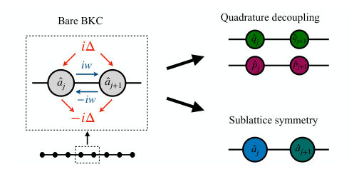
<figcaption class="paper-figure-caption"><b>Fig 1.</b> Figure 1. Left: Schematic of the bosonic Kitaev chain (BKC), a one-dimensional model with hopping iw and pairing i∆on each bond. Despite being Hermitian, it exhibits a number of striking features typically associated with non-Hermitian topology. Right: Two symmetries of the BKC relevant to its exceptional behaviour: decoupling of q and p quadrature dynamics (which can be mapped to a particle hole type sym- metry), and a sublattice or chiral symmetry (which becomes an effective time-reversal symmetry). More general BKC-like models can be constructed by retaining one or both of these symmetries.</figcaption>
</figure>
<figure class="paper-figure-card">
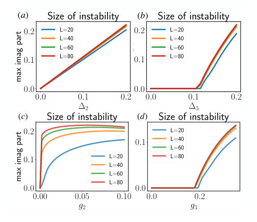
<figcaption class="paper-figure-caption"><b>Fig 2.</b> Figure 2. Plot of the maximum imaginary part of any eigen- value of (a) ∆2-BKC, (b) ∆3-BKC, against the value of ∆2,3, and (c) g2-BKC, (d) g3-BKC, against the value of g1,2. The other (underlying bare BKC) parameters are set to w = 1, ∆= 0.25, and all values are computed under OBC for a range of system sizes L = 20, 40, 60, 80. The perturba- tions depicted in the left column break sublattice symmetry; accordingly the BKC under OBC is immediately unstable against such perturbations. Conversely, the perturbations depicted in the right column preserve sublattice symmetry; accordingly the stability of BKC under OBC is protected against such perturbations.</figcaption>
</figure>
<figure class="paper-figure-card">
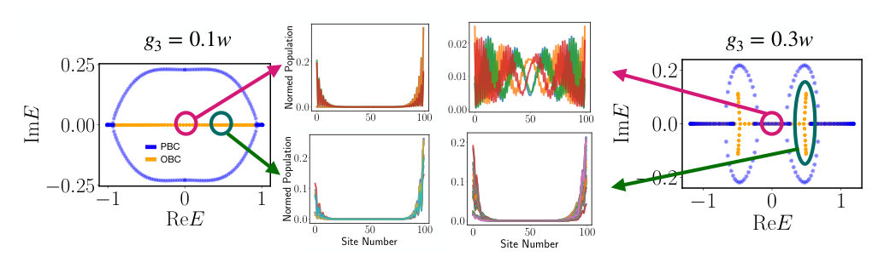
<figcaption class="paper-figure-caption"><b>Fig 3.</b> Figure 3. Plot depicting the localization-delocalization transition (or lack thereof) of particular sets of eigenstates in the spectrum of the g3-BKC. The left-most figure depicts the spectrum of the g3-BKC for w = 1, ∆= 0.25w, g = 0.1w, with the OBC spectrum in orange and the PBC spectrum in blue. In this case, both states around E = 0 and E = ±w sin(π/6) are localized; in the second column of plots we plot a selection of such states. These are the states corresponding to eigenvalues whose real part is less than 0.05w away from E = 0(E = w sin π/6). The quantity being plotted is the normalized population supported on each lattice site. The left-most figure depicts the spectrum of the...</figcaption>
</figure>
<figure class="paper-figure-card">
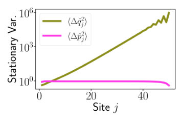
<figcaption class="paper-figure-caption"><b>Fig 4.</b> Figure 5. Steady-state position-dependent quadrature vari- ances of the ∆2-BKC subject to background loss, w = 1, ∆= 0.25, ∆2 = 0.2, L = 50. The effect of the loss is uniformly translate the spectra down by ImE →ImE −0.3 (this corresponds to dissipators of the form √κˆaj, κ = 0.5). Plotted are the diagonal covariance matrix elements ⟨∆ˆq2 j ⟩ and ⟨∆ˆp2 j⟩for an OBC chain. The q quadrature covariance is exponentially amplified toward the right boundary, while the p quadrature remains uniform across the chain.</figcaption>
</figure>
<figure class="paper-figure-card">
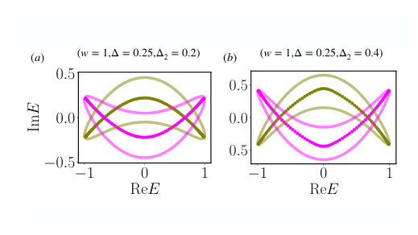
<figcaption class="paper-figure-caption"><b>Fig 5.</b> Figure 4. Spectra for the ∆2-BKC (see Eq. (71)). The olive curves depict the q band, and the magenta curves depict the p band. The solid points are the eigenvalues under OBC and the translucent lines are for PBC. In both (a), (b), the underlying BKC has parameters w = 1, ∆= 0.25w. The plots (a), (b) differ only by the size of the parameter ∆2 = 0.2w and ∆2 = 0.4w. In both panels, the PBC version of the q (p) band winds around the entirety of the OBC version of the q(p) band only, but not the other p (q) band. In (a), both bands wind around E = 0, whereas in (b), neither band does.</figcaption>
</figure>

**Summary.** This work analyzes the symmetries governing the Bosonic Kitaev Chain and related quadratic pairing Hamiltonians. It demonstrates that two distinct types of effective symmetries—sublattice symmetry and particle-hole symmetry—govern different topological features like skin effects. The findings provide a comprehensive classification scheme for these 1D bosonic systems, extending to interacting models via mean-field theory.

**Why it may be interesting.** The detailed symmetry analysis provides a powerful theoretical toolkit for understanding topological phases in bosonic quantum systems, which is crucial for designing novel superconducting or cavity QED circuits.

Detailed structure

**Main problem.** The paper investigates how symmetries dictate non-trivial topological phenomena, such as skin effects, in bosonic pairing Hamiltonians beyond the basic Kitaev model.

**Main result.** It establishes that two distinct symmetries—sublattice (chiral) symmetry and effective particle-hole symmetry from quadrature decoupling—can independently be used to construct generalized, stable bosonic pairing models with non-trivial topology.

**Method.** The analysis relies on deriving the dynamics via a dynamical matrix in the quadrature basis and applying topological diagnostics like winding numbers or specialized invariants for bosonic systems.

**Model / system.** The primary model is the Bosonic Kitaev Chain (BKC), a quadratic pairing Hamiltonian for bosons. The study extends to general 1D translationally-invariant quadratic bosonic Hamiltonians, including interactions treated at mean-field level.

**Key observables.** Non-Hermitian Skin Effect (NHSE), topological invariants derived from symmetries, and the spectral stability of the system's dynamical matrix eigenvalues.

**Important parameters / regimes.** Hopping ($w$), pairing ($\Delta$), interaction strengths ($U$, $g$), and momentum ($k$).

**Assumptions / limitations.** The analysis often relies on approximations (e.g., leading order in 1/N) or mean-field treatments when considering interacting terms.

**Figures summary.** Figure 1 schematically illustrates the BKC and highlights the two key symmetries: quadrature decoupling linked to particle-hole symmetry, and sublattice symmetry linked to an effective time-reversal symmetry.

**Paper structure.** The paper first analyzes the basic BKC model by identifying its inherent symmetries. It then develops generalized models based on preserving only one of these symmetries. The structure progresses through classifying all 1D quadratic systems and finally discusses extending the framework to interacting, non-quadratic Hamiltonians using mean-field theory.

Abstract

The bosonic Kitaev chain (BKC) model is a deceptively simple looking quadratic pairing Hamiltonian. Despite being purely Hermitian, it exhibits a number of striking non-Hermitian topological phenomena, including skin effects. We show here how symmetries play a key role in this model, and how identifying these allows one to develop generalized BKC-like models. We emphasize the surprising fact that any quadratic bosonic pairing Hamiltonian with a sublattice (chiral) symmetry necessarily has a dynamical matrix with an effective time reversal symmetry. This symmetry is unrelated to physical time-reversal, but enables non-trivial topological invariants. We also discuss how this symmetry is unrelated to another key property of the BKC, the decoupling of quadrature dynamics. This feature can instead be connected to a distinct symmetry, namely an effective particle-hole symmetry of the dynamical matrix. We discuss non-trivial generalized BKC models that only keep one of these two effective symmetries intact. We also provide a classification of all translationally-invariant 1D pairing Hamiltonians, and show connections between the BKC and a well-studied non-Hermitian fermionic system, the symplectic Hatano-Nelson model.

[↑ back to top](#top)

### [Super-Logarithmic Entanglement Scaling in a Monitored Superconducting Chain](http://arxiv.org/abs/2607.07835v1)

**Authors:** Rui-Jing Guo, Zhi-Yuan Wei  
**Type:** theory · **Category:** statistical mechanics · **PDF:** <https://arxiv.org/pdf/2607.07835v1>  
**Analysis basis:** full PDF text, analyzed in chunks
**Topic relevance:** 🔥 `measurement-induced transitions` **5/5** · 🔥 `Keldysh / 2PI / non-Gaussian methods` **4/5** · 🔥 `entanglement & information structure` **4/5** · 🔥 `non-equilibrium universality` **4/5** · 🔥 `quantum measurements` **4/5** · `correlated / nonlocal dissipation` **3/5** · `driven-dissipative phase transition` **3/5** · `methods for driven-dissipative` **3/5** · `non-equilibrium dynamics` **3/5** · `Kondo & dissipative impurity` **1/5** · `analog quantum simulation` **1/5** · `exotic spin models in light-matter` **1/5**

↔ Scroll figures horizontally

<figure class="paper-figure-card">
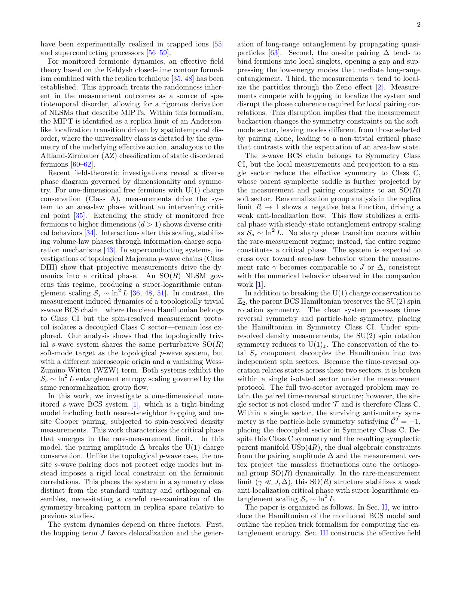
<figcaption class="paper-figure-caption"><b>Fig 1.</b> Low-resolution page preview, page 2</figcaption>
</figure>
<figure class="paper-figure-card">
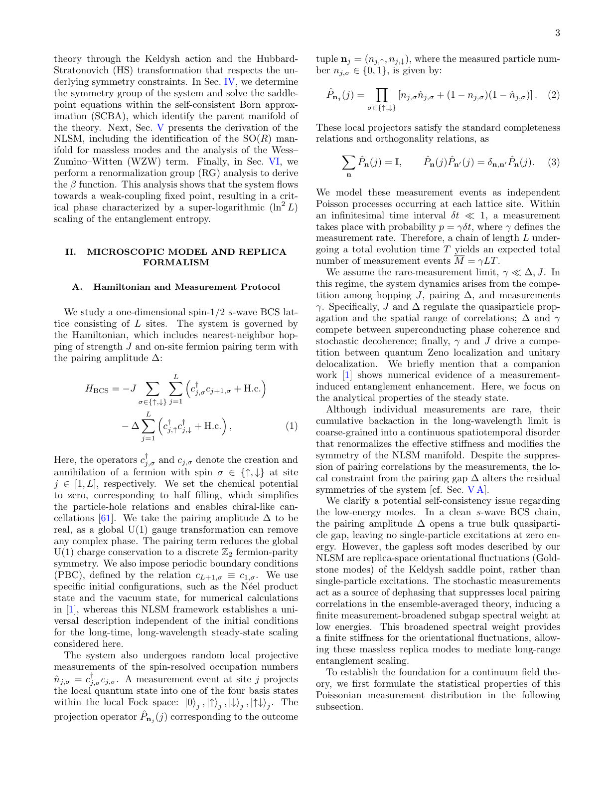
<figcaption class="paper-figure-caption"><b>Fig 2.</b> Low-resolution page preview, page 3</figcaption>
</figure>
<figure class="paper-figure-card">
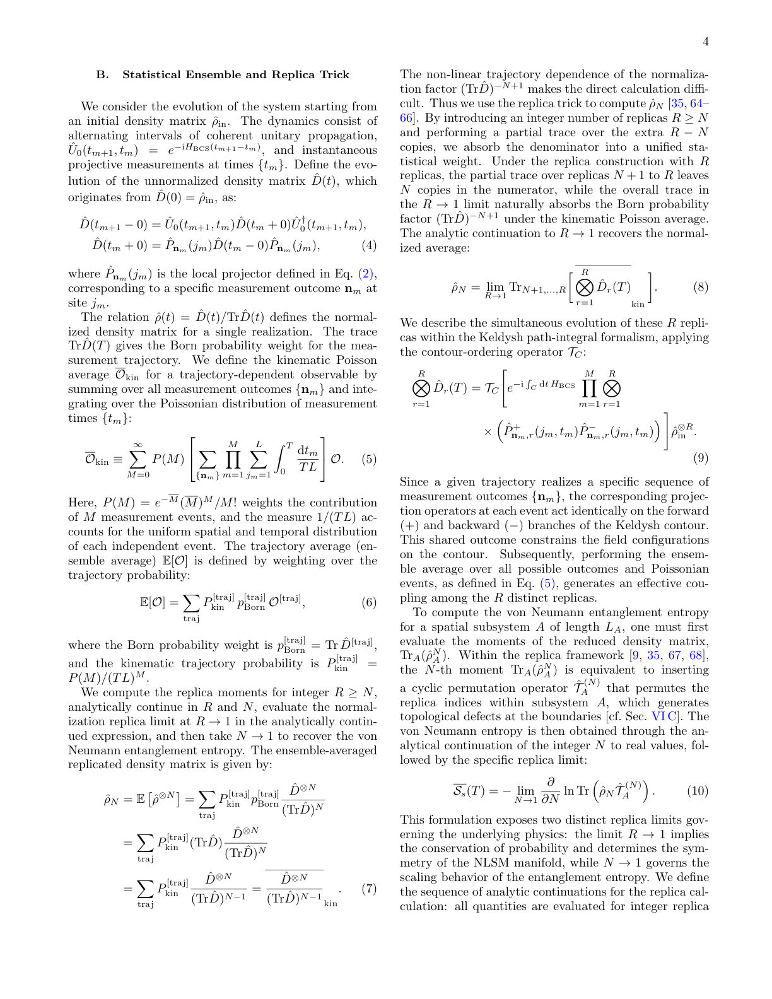
<figcaption class="paper-figure-caption"><b>Fig 3.</b> Low-resolution page preview, page 4</figcaption>
</figure>
<figure class="paper-figure-card">
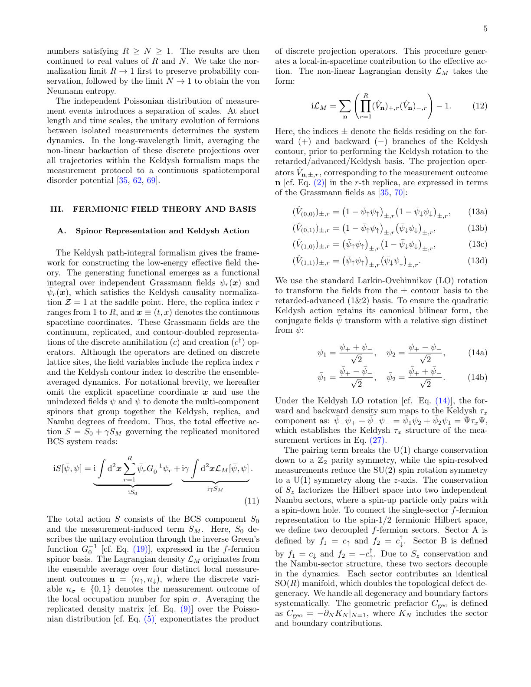
<figcaption class="paper-figure-caption"><b>Fig 4.</b> Low-resolution page preview, page 5</figcaption>
</figure>
<figure class="paper-figure-card">
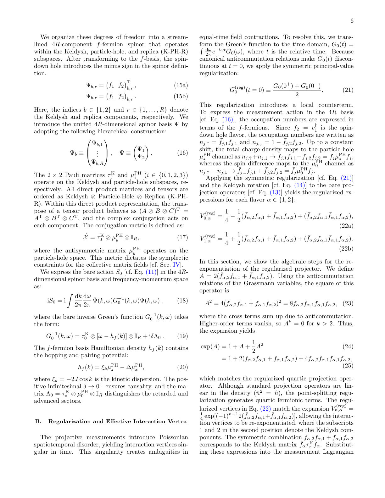
<figcaption class="paper-figure-caption"><b>Fig 5.</b> Low-resolution page preview, page 6</figcaption>
</figure>

**Summary.** This work develops an effective field theory description using the Keldysh-replica NLSM for entanglement dynamics in a monitored BCS superconductor. By analyzing the RG flow of this model, the authors predict that the system settles into a critical phase characterized by super-logarithmic entanglement scaling ($\ln^2 L$). This result explains numerical findings without invoking topological terms.

**Why it may be interesting.** It provides a field-theoretic understanding of non-equilibrium steady states in superconducting systems under continuous monitoring, linking concepts from critical phenomena (RG flow) to quantum information measures (entanglement entropy).

Detailed structure

**Main problem.** The study investigates entanglement dynamics in a monitored superconducting chain, focusing on characterizing the critical phase established by the interplay between unitary evolution and projective measurements.

**Main result.** The system exhibits super-logarithmic steady-state entanglement scaling, $S(L) \sim \ln^2 L$, driven by a weak-anti-localization flow in the effective field theory description.

**Method.** The analysis employs the Keldysh-replica non-linear sigma model (NLSM) formalism combined with one-loop renormalization group (RG) calculations to analyze the low-energy fluctuations.

**Model / system.** The system is a one-dimensional spinful s-wave BCS chain subjected to rare, spin-resolved projective measurements ($\gamma \ll J, \Delta$). The effective dynamics are mapped onto an SO(R) target manifold in replica space.

**Key observables.** Entanglement entropy scaling $S_s(L)$, and the running coupling constant $g(\ell)$ derived from RG flow.

**Important parameters / regimes.** Rare-measurement regime ($\gamma \ll J, \Delta$), Replica limit ($R	o 1$), and the system size $L$.

**Assumptions / limitations.** The analysis assumes a rare-measurement limit and relies on projecting fluctuations onto an SO(R) manifold after applying saddle point approximations.

**Figures summary.** Not specified by notes, but the core results concern scaling laws derived from RG flow equations.

**Paper structure.** The paper develops the Keldysh-replica NLSM for entanglement dynamics. It analyzes how measurement backaction constrains the system to an SO(R) manifold. Finally, a one-loop RG analysis of this model yields the super-logarithmic scaling result.

Abstract

We develop a Keldysh-replica non-linear sigma model (NLSM) for the entanglement dynamics of a monitored one-dimensional spinful $s$-wave BCS chain in the rare-measurement regime, $γ\ll J,Δ$. Although the clean spinful $s$-wave BCS Hamiltonian belongs to symmetry class CI, spin-resolved measurements and projection to a conserved $f$-sector reduce the effective problem to class C. Starting from the corresponding parent symplectic saddle, we show that measurement backaction and the pairing amplitude impose complementary mass constraints that gap out different fluctuation channels. Their interplay dynamically projects the surviving massless modes onto an $\textrm{SO(R)}$ target manifold in replica space. A one-loop renormalization group analysis of this $\textrm{SO(R)}$ NLSM shows that, in the replica limit $R\to1$, the beta function becomes negative, producing a weak-anti-localization flow. This flow yields a super-logarithmic steady-state entanglement scaling $S(L)\sim \ln^2 L$ in the rare-measurement regime. Our field-theoretic result explains the numerical evidence reported in the companion Letter [arXiv:2604.04375] and shows that a topologically trivial monitored $s$-wave superconductor can realize an $\textrm{SO(R)}$ weak-anti-localizing critical phase without relying on a Wess-Zumino-Witten term.

[↑ back to top](#top)

### [Universality of Measurement-Induced Criticality under Symmetry-Breaking Measurements](http://arxiv.org/abs/2607.08589v1)

**Authors:** Angelo Russotto, Filiberto Ares, Pasquale Calabrese  
**Type:** theory · **Category:** statistical mechanics · **PDF:** <https://arxiv.org/pdf/2607.08589v1>  
**Analysis basis:** full PDF text, analyzed in chunks
**Topic relevance:** 🔥 `measurement-induced transitions` **5/5** · 🔥 `non-equilibrium universality` **4/5** · `driven-dissipative phase transition` **3/5** · `entanglement & information structure` **3/5** · `methods for driven-dissipative` **3/5** · `non-equilibrium dynamics` **3/5** · `quantum measurements` **3/5** · `correlated / nonlocal dissipation` **2/5** · `Keldysh / 2PI / non-Gaussian methods` **1/5** · `analog quantum simulation` **1/5**

↔ Scroll figures horizontally

<figure class="paper-figure-card">
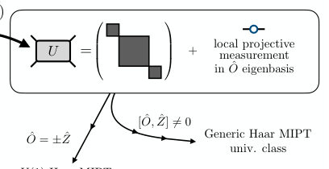
<figcaption class="paper-figure-caption"><b>Fig 1.</b> Figure 1: (a) Sketch of the monitored random quantum circuit model considered in this paper. It has a brickwork structure in which each two-qubit gate U conserves the magnetization ˆ Zj + ˆZj+1. Therefore, the gates have a block-diagonal structure in which the blocks, corresponding to fixed magnetization sectors, are independently drawn from the Haar unitary ensemble, as illustrated in the box. After a layer of unitary gates, the sites are projectively measured with probability p in the eigenbasis of a local operator ˆO. The sites measured during the time evolution are represented by blue dots on the links between unitary gates. The system is initialized in the pure state |Ψ(0)⟩, and its...</figcaption>
</figure>
<figure class="paper-figure-card">
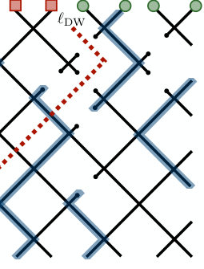
<figcaption class="paper-figure-caption"><b>Fig 2.</b> Figure 2: Two dimensional statistical model describing the average Rényi-n entropy of the monitored circuit of Sec. 2 in the limit of large local Hilbert space dimension. The lattice vertices correspond to the averaged replicated unitary gates and bonds rep- resent the sites of the quantum system. Broken bonds correspond to local projective measurements. On each vertex is defined a permutation degree of freedom σ ∈Sn. The bipartition into subsystems A∪B imposes specific boundary conditions on the top layer, indicated by the red squares and green circles. Red squares represent the cyclic permuta- tion, while green circles denote the identity permutation. The vertices are constrained to be in...</figcaption>
</figure>
<figure class="paper-figure-card">
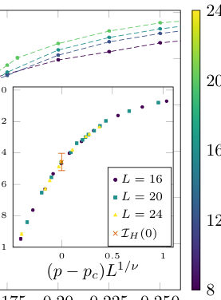
<figcaption class="paper-figure-caption"><b>Fig 3.</b> Figure 3: Trajectory-averaged tripartite mutual information E[I3,1], for n = 1, in the stationary state at t ∼2L of the U(1)-symmetric Haar random circuit with measure- ments in the X basis, as a function of the measurement rate p and for increasing system size L. We average over ∼2 × 103 quantum trajectories. The errorbars correspond to one standard deviation of the mean. For L ≥16, the data develop a clear crossing as the system size increases, signaling the presence of an MIPT at that measurement rate. Inset: Finite-size scaling of E[I3,1] according to the scaling ansatz in Eq. (32), using the optimal pc and ν from Eq. (33), obtained as described in App. C. For L ≥16, we observe that the...</figcaption>
</figure>
<figure class="paper-figure-card">
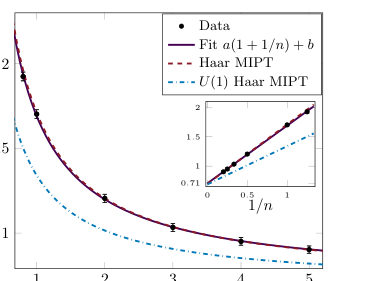
<figcaption class="paper-figure-caption"><b>Fig 4.</b> Figure 4: Half-system Rényi-n entanglement entropy E[Sn] averaged over ∼103 quan- tum trajectories at the estimated critical point pc = 0.143 in the U(1)-symmetric Haar random circuit with symmetry-breaking measurements in the X basis. Left panel: Log- arithmic growth of E[Sn(pc)] as a function of the system size L for various Rényi indices. The symbols are the exact numerical results, while dashed lines represent the fits of the function Sn(L) = α(n) log L + β(n) to the data. The errorbars are of the order of the symbol size and correspond to one standard deviation of the mean. Right panel: Sym- bols represent the values of the coefficient α(n) obtained from the fits as a function of the...</figcaption>
</figure>
<figure class="paper-figure-card">
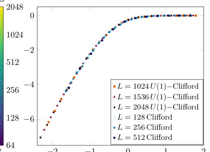
<figcaption class="paper-figure-caption"><b>Fig 5.</b> Figure 5: Left panel: Tripartite mutual information I3,1, for n = 1, averaged over ∼6 × 103 quantum trajectories, in the stationary state at t ∼2L, of the symmetric random stabilizer circuit with projective measurements in the X basis, as a function of the measurement rate p and different system sizes L. The errorbars are of the order of the symbol size and correspond to one standard deviation of the mean. Inset: Zoom of the data around the critical point. We observe a drift of the crossing, signaling the MIPT, toward larger values of p up to L ∼512. For this reason, we perform the finite- size scaling using the data for L ≥768. Right panel: Finite-size scaling of E[I3,1] using the ansatz...</figcaption>
</figure>

**Summary.** The paper analyzes the critical physics of quantum circuits subjected to measurements that break a global U(1) symmetry. By mapping the dynamics to a classical exclusion process in the large dimension limit, the authors prove that this symmetry breaking drives the system to a universal critical point identical to non-symmetric cases. This contrasts sharply with symmetry-preserving measurements and provides insights into how measurement protocols control quantum criticality.

**Why it may be interesting.** This work directly addresses non-equilibrium quantum dynamics in open systems, showing how measurement back-action dictates universal critical behavior, which is highly relevant for understanding decoherence and information scrambling in physical platforms like superconducting qubits or trapped ions.

Detailed structure

**Main problem.** The study investigates how local projective measurements that explicitly break a global U(1) symmetry affect the critical properties of random quantum circuits.

**Main result.** Symmetry-breaking measurements act as relevant perturbations, driving the system to the same universal critical behavior as generic monitored circuits. Furthermore, this process prevents a charge-sharpening transition by keeping the charge correlation length finite.

**Method.** The analysis uses the large local Hilbert-space limit ($d 	o \infty$) to map the quantum dynamics onto an exactly solvable classical statistical mechanics model (a symmetric simple exclusion process).

**Model / system.** The system is a monitored random quantum circuit with U(1) symmetry, involving two-qubit gates and local projective measurements. The analysis compares this to circuits with non-symmetric unitary dynamics.

**Key observables.** Entanglement entropy, charge correlation length ($\xi_{charge}$), and the universality class of the Measurement-Induced Phase Transition (MIPT).

**Important parameters / regimes.** Measurement rate ($p$), local Hilbert-space dimension ($d 	o \infty$ limit), and the symmetry-breaking nature of the measurement operator.

**Assumptions / limitations.** The primary analytical tool relies on taking the large local Hilbert-space dimension limit to map the problem onto a classical statistical model; numerical support is given for finite dimensions.

**Figures summary.** Figure 1 sketches the monitored random quantum circuit structure, illustrating how symmetry breaking leads to the generic MIPT universality class, while preserving symmetry leads elsewhere. Other figures detail the mapping to the SSEP and numerical scaling results.

**Paper structure.** The paper first establishes the model (U(1)-symmetric circuits with local measurements). It then analyzes the large $d$ limit by mapping entanglement entropy to a classical process. The core result proves the relevance of symmetry breaking, contrasting it with symmetry-preserving cases and providing numerical verification.

Abstract

We study the critical properties of random quantum circuits with a $U(1)$ symmetry subject to local projective measurements that explicitly break this symmetry. We find that, at the measurement-induced phase transition, symmetry-breaking measurements act as a relevant perturbation at large scales, leading to the same universal critical properties as the corresponding monitored random circuit with non-symmetric unitary dynamics. In particular, we consider monitored $U(1)$-symmetric Haar-random circuits in the limit of large local Hilbert-space dimension, where the trajectory-averaged entanglement entropy can be exactly obtained in terms of a classical statistical mechanics model. In this model, the charge associated with the conservation law follows a symmetric simple exclusion process, in which symmetry-breaking measurements correspond to disordered defects that create and destroy charges. We prove that the charge correlation length remains finite for any measurement rate, ruling out a charge-sharpening transition, in contrast to the case of symmetry-preserving measurements. We further support our predictions at finite local Hilbert-space dimension through numerical finite-size scaling analyses of the entanglement transition in monitored $U(1)$-symmetric Haar and stabilizer random circuits.

[↑ back to top](#top)

### [Efficient Pauli-decomposition and multistage state-refinement for tensor network based differential equation solver](http://arxiv.org/abs/2607.08166v1)

**Authors:** Vishwabhushan Suresh Gholap, Himadri Shekhar Dhar, Siddhartha Santra  
**Type:** theory · **Category:** numerical methods · **PDF:** <https://arxiv.org/pdf/2607.08166v1>  
**Analysis basis:** full PDF text, analyzed in chunks
**Topic relevance:** 🔥 `methods for driven-dissipative` **5/5** · 🔥 `analog quantum simulation` **4/5** · `non-equilibrium dynamics` **2/5** · `Keldysh / 2PI / non-Gaussian methods` **1/5** · `correlated / nonlocal dissipation` **1/5** · `driven-dissipative phase transition` **1/5** · `entanglement & information structure` **1/5**

↔ Scroll figures horizontally

<figure class="paper-figure-card">
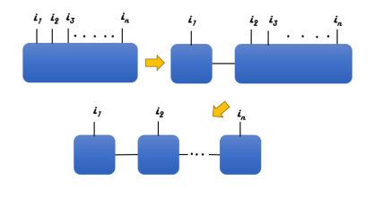
<figcaption class="paper-figure-caption"><b>Fig 1.</b> FIG. 1. Successive SVD truncations used to obtain the MPS representation of the coefficient tensor. Only the first trun- cation step is shown explicitly; the downward arrow shows repetition of same decomposition for each remaining sites.</figcaption>
</figure>
<figure class="paper-figure-card">
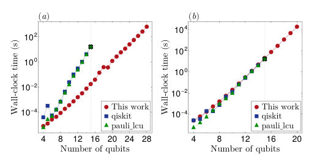
<figcaption class="paper-figure-caption"><b>Fig 2.</b> FIG. 2. Wall-clock time scaling of the Pauli-basis expansion as a function of the number of qubits 𝑛for the (a) Laplacian and (b) Legendre operators. Red circles (solid line) denote the present approach, navy squares (dashed line) denote the Qiskit and green triangles (dotted line) denote pauli lcu [42] implementations. The × marker indicates the point beyond which Qiskit and pauli lcu exhausts available memory (𝑛&gt; 15), while the present approach continues to function.</figcaption>
</figure>
<figure class="paper-figure-card">
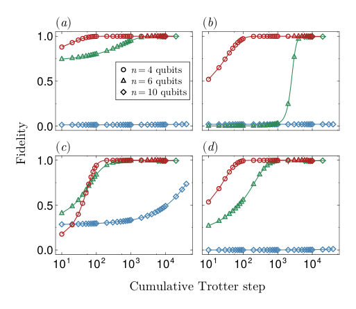
<figcaption class="paper-figure-caption"><b>Fig 3.</b> FIG. 4. Fidelity vs. cumulative number of Trotter step for the (a) ground, (b) first, (c) second, and (d) third excited states of the Laplacian operator. Colors indicate the multistage state- refinement strategy (𝑛= 4 →6 →10 (red), 6 →10 (green), or 10 directly (blue)); markers indicate the qubit count 𝑛(see legend, panel a). Trotter step size is kept constant at 0.1.</figcaption>
</figure>
<figure class="paper-figure-card">
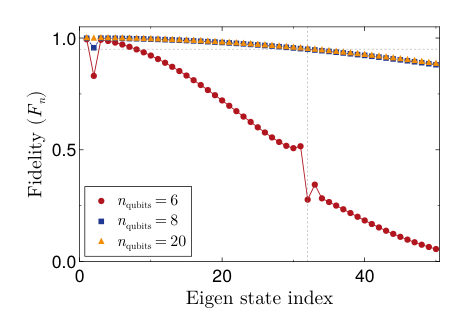
<figcaption class="paper-figure-caption"><b>Fig 4.</b> FIG. 3. Fidelity of first 50 eigenstate of the Dirichlet Lapla- cian on [−1, 1] obtained via multistage imaginary time evolu- tion on 6, 8 and 20 qubits (see legend). For 20 qubits, first 32 states have 𝐹≥0.95 with 𝐹= 0.9511 for state 32.</figcaption>
</figure>
<figure class="paper-figure-card">
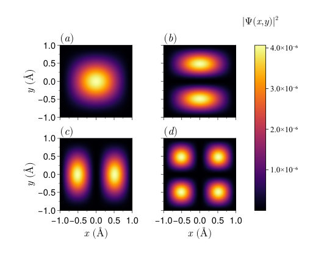
<figcaption class="paper-figure-caption"><b>Fig 5.</b> FIG. 5. Probability density |Ψ|2 of the first four eigenstates of the separable 2𝐷anharmonic oscillator confined in a box.(𝑎) Ground state, (𝑏) first, (𝑐) second and (𝑑) third excited states.</figcaption>
</figure>

**Summary.** This paper presents novel computational techniques to solve large-scale differential equations by mapping them onto tensor network representations. It overcomes memory bottlenecks in operator construction using Pauli decomposition and significantly accelerates convergence during imaginary time evolution. These advancements allow accurate computation of eigenstates for high-dimensional quantum systems previously deemed intractable.

**Why it may be interesting.** It provides advanced numerical tools for simulating quantum Hamiltonians derived from continuous physics (PDEs), which is highly relevant for studying open quantum systems or lattice approximations of continuum theories.

Detailed structure

**Main problem.** Solving Partial Differential Equations (PDEs) numerically, which becomes computationally expensive as the dimension of the discretized operator increases.

**Main result.** The authors developed techniques to efficiently construct Matrix Product Operators (MPOs) via Pauli-string decomposition and accelerated convergence using a multistage state-refinement heuristic.

**Method.** The core methods involve representing differential operators as MPOs, constructing these MPOs by expanding the operator in the Pauli basis with memory reduction techniques, and accelerating imaginary time evolution through multi-stage refinement.

**Model / system.** The work applies to solving eigensystems arising from Sturm–Liouville problems (e.g., Laplacian on a 1D lattice or 2D anharmonic oscillator), mapping them onto quantum systems solvable via tensor networks.

**Key observables.** Eigenvalues and eigenvectors of the differential operator; fidelity of computed eigenstates.

**Important parameters / regimes.** The dimension of the discretized operator ($N$), the number of qubits ($n=\log_2 N$), and the bond dimension ($\chi$).

**Assumptions / limitations.** The method assumes the underlying operators can be efficiently decomposed into a polynomial number of Pauli strings; accuracy degrades for disordered systems due to increased entanglement.

**Figures summary.** Not specified, but mathematical propositions (e.g., Proposition 1-7) and an algorithm (Algorithm 1) are central to the derivation.

**Paper structure.** The paper builds from establishing the computational bottleneck of large PDEs, proposing MPO construction via Pauli decomposition with memory optimization, accelerating imaginary time evolution, and validating these techniques on specific physical models like the Laplacian.

Abstract

Classical numerical techniques for solving partial differential equations (PDEs) become computationally expensive as the dimension of the discretized differential operator increases. For PDEs giving rise to Sturm--Liouville problems, tensor network (TN) methods can be highly productive: an operator of dimension $N\times N$ can be represented as a matrix product operator (MPO) using only $n=\log_2(N)$ qubits, enabling computation of eigenvalues and eigenvectors via imaginary time evolution (ITE). However, this remains computationally challenging. First, most methods for generating MPOs of large operators without explicit tensor-product structure require prohibitively large memory. Second, the number of Trotterization steps for convergence in conventional ITE increases rapidly with $n$. We present techniques to mitigate both challenges for certain sparse, structured differential operators. To address the first, we construct the MPO by expanding the operator in the Pauli-string basis, enabled by an analytical expression for the Pauli basis coefficients that reduces the memory requirement from $\mathcal{O}(2^{n+1})$ to $\mathcal{O}(2n)$. To address the second, we propose a multistage state-refinement heuristic that accelerates ITE convergence, reducing convergence time by up to two orders of magnitude. Using this TN framework, we compute the first 32 eigenstates of a Laplacian of dimension exceeding $10^6$ with fidelity above $0.95$ using a 20-qubit MPO. We further validate the method on the 2D anharmonic oscillator and investigate disordered systems, where increasing random potential strength degrades accuracy and limits the approach.

[↑ back to top](#top)

### [Efficient photo-ionizing elimination of detrimental electric fields for Rydberg atoms](http://arxiv.org/abs/2607.08418v1)

**Authors:** Zhou-Chen Deng, Hao-Nan Lin, Yu-Cheng Duan, Qi Zhang, Xiang-Can Cheng, Yang Liu, Zhao-Yang Yuan, Jie Li, Peng Liu, Zhan Wu, Chao-Yang Lu, Jun Rui, Jian-Wei Pan  
**Type:** experiment · **Category:** other · **PDF:** <https://arxiv.org/pdf/2607.08418v1>  
**Analysis basis:** full PDF text, analyzed in chunks
**Topic relevance:** 🔥 `Rydberg arrays` **5/5** · 🔥 `analog quantum simulation` **4/5** · `QC/QI experiment` **3/5** · `methods for driven-dissipative` **1/5** · `quantum measurements` **1/5** · `quantum optics experiment` **1/5**

↔ Scroll figures horizontally

<figure class="paper-figure-card">
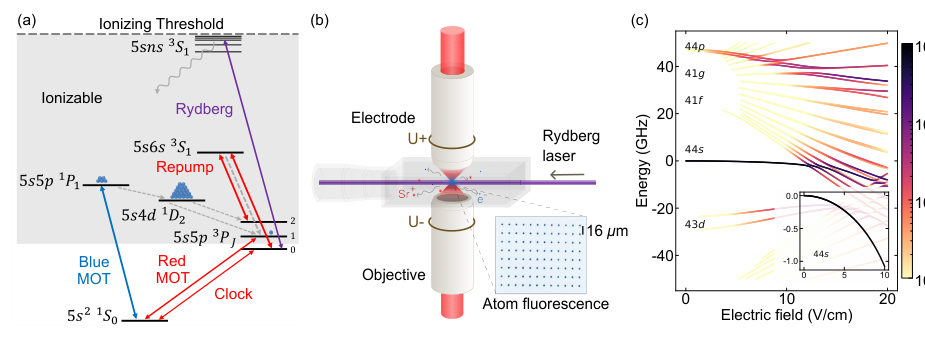
<figcaption class="paper-figure-caption"><b>Fig 1.</b> FIG. 1. Illustration of the neutralization protocol by ionizing laser-cooled atoms. (a) Relevant energy levels of 88Sr atoms. The Rydberg laser can directly photo-ionize atoms in states within the shaded region, which are continuously populated during the blue-MOT operation. The blue spheres correspond to their approximate steady-state population ratio. (b) Experimental layout. A Rydberg laser from the side can ionize atoms captured in a blue-MOT inside a Fused-silica glass cell. In addition to the stray electric field, a controlled field can be generated by applying static voltages over external loop wires wound around the objective to benchmark the neutralization effects. (Inset) Average...</figcaption>
</figure>
<figure class="paper-figure-card">
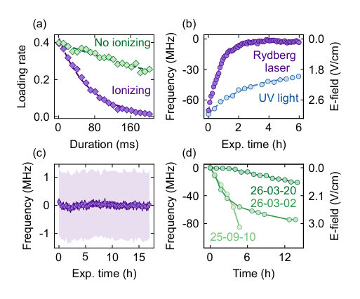
<figcaption class="paper-figure-caption"><b>Fig 2.</b> FIG. 3. Efficient stray electric field removal with photo- ionization of laser-cooled atoms in a MOT monitored with the 44s Rydberg state. (a) Lifetime of the atoms in the blue-MOT after interrupting the pre-cooled atom flux. The tweezer loading rate indicates how many atoms remain in the MOT, showing that the Rydberg laser rapidly depletes them. (b) Reduction in the stray electric field under a fixed ioniza- tion duration by either the Rydberg laser or the UV light starting from the same stray field. (c) Stability in the Ryd- berg resonance frequency after field neutralization, which is better than ±0.1 MHz. The grey background corresponds to the full width at half maximum (FWHM) of the...</figcaption>
</figure>
<figure class="paper-figure-card">
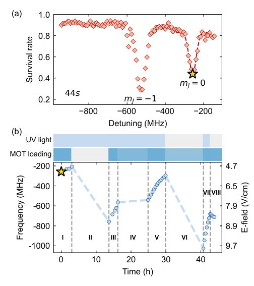
<figcaption class="paper-figure-caption"><b>Fig 3.</b> FIG. 2. Monitoring the drifts of the 5s5p 3P0 ↔5s44s 3S1 transition frequency under stray electric field. (a) First clearly resolved resonances of the target transition. The splitting be- tween the observed resonances matched the expected Zeeman splitting of the 3S1 Rydberg state under a magnetic field of 100 G. (b) Drifts in the resonance frequency of the mJ = 0 state under different conditions. Each data point corresponds to a single spectroscopic scan; for time intervals without data points, no spectroscopic scan was performed. The grayness of the UV light or MOT loading indicates whether the light is on or off, or the sequence’s duty cycle. One can clearly observe that when MOT loading...</figcaption>
</figure>
<figure class="paper-figure-card">
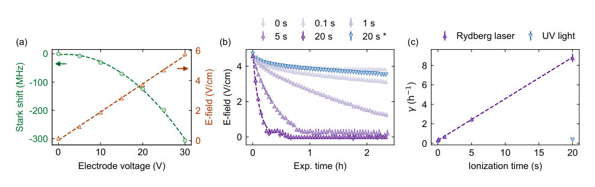
<figcaption class="paper-figure-caption"><b>Fig 4.</b> FIG. 4. Benchmark of the photo-ionization neutralization of an externally applied electric field using the 5s5p 3P0 ↔5s44s 3S1 Rydberg transition. (a) Calibration of the electric field strength using the Stark shift of the Rydberg transition frequency. (b) In a fixed external electric field, we compared the neutralization effects across variable ionization durations at a fixed repetition rate for each spectrum measurement. The triangle with an asterisk shows the measurement with UV light illumination for comparison. (c) Exponential decrease rate in the electric field versus photo-ionization time in (b). The neutralization rate shows a nicely linear dependence on the Rydberg laser duration....</figcaption>
</figure>
<figure class="paper-figure-card">
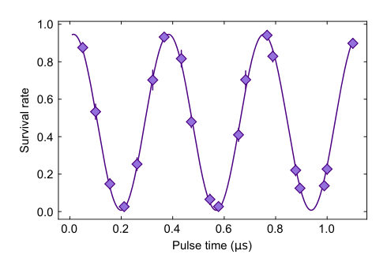
<figcaption class="paper-figure-caption"><b>Fig 5.</b> FIG. 5. Single-atom Rabi oscillation on the 5s5p 3P0 ↔ 5s61s 3S1 transition after eliminating the stray electric field. The atoms were randomly loaded into a 1D tweezer array with 12 sites, spaced 16 µm apart, arranged along the direction of the Rydberg excitation beam. The error bar denotes the standard deviation from 20 measurements.</figcaption>
</figure>

**Summary.** The research addresses the critical challenge of stray electric fields corrupting measurements on highly sensitive Rydberg atoms. The authors introduce and experimentally validate a novel method that uses photo-ionization to generate an in-vacuum plasma capable of neutralizing these detrimental fields. This technique restores spectral coherence, enabling reliable quantum control experiments on trapped Rydberg arrays.

**Why it may be interesting.** This work provides a crucial, practical technique for mitigating environmental noise (static/DC electric fields) in advanced Rydberg quantum simulations, directly impacting the feasibility of high-fidelity quantum control experiments.

Detailed structure

**Main problem.** Uncontrolled stray electric fields severely degrade quantum control experiments involving highly sensitive Rydberg atoms.

**Main result.** The authors demonstrated a universal method using in-vacuum plasma generation to efficiently eliminate detrimental stray electric fields, restoring stable and coherent excitation of individual Rydberg states.

**Method.** They employ photo-ionization by laser-cooled atoms to create an in-vacuum plasma source that neutralizes the ambient electric field, which is then verified by monitoring spectroscopic shifts.

**Model / system.** The experiment uses Strontium (Sr) Rydberg atoms trapped in an optical tweezer array platform. The system's sensitivity arises from the large dipole moments of highly excited Rydberg states ($n \gg 1$).

**Key observables.** Rydberg state resonance frequency shifts, Rabi oscillation frequencies, and spectral homogeneity across the atom array.

**Important parameters / regimes.** Stray electric field strength (initially $>10 	ext{ V/cm}$), ionization rates ($\sim 10^3$ ion-electron pairs per ms), and coherence time constants.

**Assumptions / limitations.** The initial stray fields are attributed to material properties of the vacuum cell, and the plasma generation mechanism is robustly controllable for field neutralization.

**Figures summary.** Figures illustrate the experimental setup (Rydberg laser ionizing atoms in a MOT), show resonance frequency shifts confirming field dependence, and finally display uniform site-resolved spectra after successful field elimination.

**Paper structure.** The paper progresses from identifying the problem of stray fields causing spectral distortion to presenting the novel plasma neutralization protocol. It then validates this by showing recovery of coherent Rabi oscillations and achieving highly homogeneous excitation across the array.

Abstract

Rydberg atoms are highly sensitive to external electric fields due to their exaggerated electronic properties. This unique feature lays the foundation for many of their applications in quantum science. However, an uncontrolled stray electric field can be detrimental, severely degrading their quantum control. In this work, we demonstrate a universal scheme that relies on the efficient creation of an in-vacuum plasma source by photo-ionizing laser-cooled atoms to eliminate detrimental electric fields in a Rydberg-atom tweezer array platform, requiring only readily available resources. With this method, we began with a Stark-ionized Rydberg continuum spectrum caused by a large, unknown stray electric field and ultimately recovered stable, coherent excitation of an individual Rydberg state after fully eliminating the field. Our method is directly applicable to existing Rydberg-atom platforms and can also be useful in other experiments sensitive to stray electric fields.

[↑ back to top](#top)

### [Approaching Carnot Efficiency at Finite Power in an Experimentally Feasible Quantum Heat Engine](http://arxiv.org/abs/2607.08713v1)

**Authors:** Shogo Toma, Atsushi Noguchi, Ken Funo, Hiroyasu Tajima  
**Type:** both · **Category:** statistical mechanics · **PDF:** <https://arxiv.org/pdf/2607.08713v1>  
**Analysis basis:** full PDF text, analyzed in chunks
**Topic relevance:** 🔥 `QC/QI experiment` **4/5** · 🔥 `methods for driven-dissipative` **4/5** · `Tavis-Cummings & cavity-many-emitter` **3/5** · `correlated cavity matter` **3/5** · `driven-dissipative phase transition` **3/5** · `quantum optics experiment` **3/5** · `analog quantum simulation` **2/5** · `correlated / nonlocal dissipation` **2/5** · `non-equilibrium dynamics` **2/5** · `non-equilibrium universality` **2/5** · `Keldysh / 2PI / non-Gaussian methods` **1/5** · `entanglement & information structure` **1/5** · `quantum measurements` **1/5**

↔ Scroll figures horizontally

<figure class="paper-figure-card">
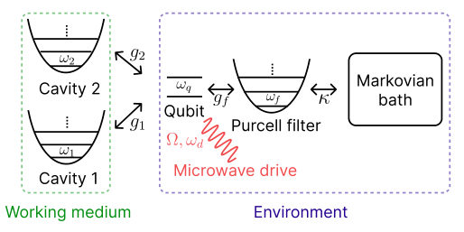
<figcaption class="paper-figure-caption"><b>Fig 1.</b> FIG. 1. Schematic illustration of the experimental setup.</figcaption>
</figure>
<figure class="paper-figure-card">
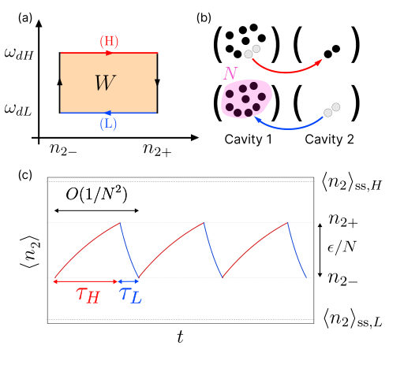
<figcaption class="paper-figure-caption"><b>Fig 2.</b> FIG. 2. Two-stroke cycle of the CAS-2 engine. (a) Di- agram of the cycle in the (⟨n2⟩, ωd) plane. The area en- closed by the loop gives the work output per cycle, W = (ℏ/2)(ωdH −ωdL) ∆⟨n2⟩H [cf. Eq. (12)]. (b) Schematic of the photon exchange realized by the CAS-2 process. Two photons are transferred from cavity 1 to cavity 2 during stroke (H) (red arrow) and back during stroke (L) (blue arrow), while the to- tal photon number N = n1 + n2 is conserved. (c) Dynamics of ⟨n2⟩during the first three cycles for N = 2. Red and blue segments correspond to strokes (H) and (L), respectively.</figcaption>
</figure>
<figure class="paper-figure-card">
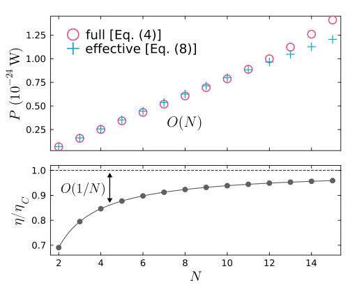
<figcaption class="paper-figure-caption"><b>Fig 3.</b> FIG. 3. Numerical calculations of the CAS-2 engine perfor- mance, obtained by directly integrating the full master equa- tion [Eq. (4)]. Power and efficiency, evaluated after ten cy- cles, as functions of the total photon number N = 2, 3, . . . , 15. They exhibit the predicted scalings P = O(N) and ηC −η = O(1/N), respectively. The magenta markers show the power obtained from the full master equation [Eq. (4)], while the light-blue markers show the power obtained from the effective dynamics [Eq. (8)] based on the Schrieffer–Wolff transforma- tion up to fifth order. The efficiency η is fixed by the choice of ωqν [Eq. (14)] and is therefore common to both descriptions. All parameters,...</figcaption>
</figure>

**Summary.** This paper shows that by engineering collective enhancement mechanisms in a superconducting circuit heat engine, one can circumvent the classical power-efficiency trade-off. The authors demonstrate that the engine can approach Carnot efficiency while still producing finite power, confirming theoretical predictions using an implementable quantum platform.

**Why it may be interesting.** This work directly connects abstract thermodynamic bounds in finite-time physics to a concrete, experimentally realizable platform (circuit-QED), providing a blueprint for designing quantum devices based on enhanced dissipative processes.

Detailed structure

**Main problem.** The research addresses the fundamental question of whether a quantum heat engine can approach Carnot efficiency while operating at finite power, overcoming limitations faced by classical Markovian engines.

**Main result.** The authors demonstrate that using a superconducting-circuit platform and exploiting collective enhancement mechanisms allows the engine to achieve $\eta = \eta_C - O(1/N)$ while maintaining $P = O(N)$.

**Method.** The work combines theoretical derivation of thermodynamic quantities (heat, work) with numerical simulation on an effective quantum master equation describing the working medium.

**Model / system.** The system is a superconducting-circuit heat engine utilizing two coupled cavities and a qubit, emulating collective enhancement via a coupler-assisted swap (CAS-$c$) interaction. The dynamics are modeled using the GKSL equation under various approximations.

**Key observables.** Efficiency ($\eta$), Power ($P$), Heat current ($J$), Work rate ($\dot{W}$), and Entropy production ($\Sigma$).

**Important parameters / regimes.** The scaling parameter $N$ (total photon number) is crucial, as the result holds in the limit where $\eta - \eta_C = O(1/N)$ and $P = O(N)$.

**Assumptions / limitations.** Key approximations include the Born–Markov approximation, adiabatic elimination of auxiliary cavities, and operating within specific dispersive parameter regimes.

**Figures summary.** Figures illustrate the setup (cavities, qubit), the two-stroke cycle protocol in phase space, and numerical confirmation showing $P \propto N$ and $\eta_C - \eta \propto 1/N$.

**Paper structure.** The paper progresses from establishing the classical power-efficiency trade-off to proposing a quantum mechanism (CAS-$c$), deriving an effective master equation for the working medium, and finally demonstrating analytically and numerically that this mechanism achieves the desired scaling limits.

Abstract

Whether a heat engine can approach Carnot efficiency while maintaining finite power is a fundamental question in finite-time thermodynamics. For classical Markovian heat engines with local interactions, the power-efficiency trade-off forbids an asymptotic approach to Carnot efficiency at finite power. In quantum systems, by contrast, degeneracy, symmetry, and collective jumps have been theoretically predicted to enable such an asymptotic attainment by enhancing activity. It has remained open, however, whether this mechanism can be realized in an experimentally implementable heat engine. In this Letter, we propose a superconducting-circuit heat engine that emulates the collective enhancement, thereby enabling an asymptotic approach to Carnot efficiency at finite power. This result demonstrates that, in an implementable model, such an enhanced dissipative mechanism circumvents the power-efficiency trade-off of classical Markovian engines. Our work connects abstract bounds in finite-time thermodynamics to a concrete circuit-QED platform and suggests a route toward quantum-device design based on collectively enhanced dissipative processes.

[↑ back to top](#top)

### [Experimental demonstration of entanglement sudden death induced by natural dissipation](http://arxiv.org/abs/2607.08078v1)

**Authors:** Yan Wang, Hao-Long Zhang, Jia-Hao Lü, Ken Chen, Wen Ning, Li-Hua Lin, Zhen-Biao Yang, Shi-Biao Zheng  
**Type:** experiment · **Category:** other · **PDF:** <https://arxiv.org/pdf/2607.08078v1>  
**Analysis basis:** full PDF text, analyzed in chunks
**Topic relevance:** 🔥 `correlated / nonlocal dissipation` **4/5** · 🔥 `entanglement & information structure` **4/5** · `driven-dissipative phase transition` **3/5** · `methods for driven-dissipative` **3/5** · `quantum optics experiment` **3/5** · `Tavis-Cummings & cavity-many-emitter` **2/5** · `analog quantum simulation` **2/5** · `correlated cavity matter` **2/5** · `non-equilibrium dynamics` **2/5** · `non-equilibrium universality` **2/5** · `Keldysh / 2PI / non-Gaussian methods` **1/5** · `QC/QI experiment` **1/5** · `measurement-induced transitions` **1/5**

↔ Scroll figures horizontally

<figure class="paper-figure-card">
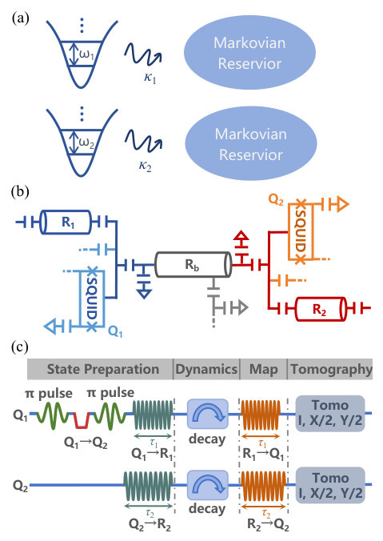
<figcaption class="paper-figure-caption"><b>Fig 1.</b> FIG. 1. (color online). (a) Schematic of the naturally dissipa- tive dynamics. Each of the two initially entangled photonic modes is individually coupled to a Markovian reservoir. The dissipation process is characterized by an irreversible pho- tonic decay with the rate κj. (b) Experimental system. The disentanglement dynamics is tested with a circuit, where the readout resonators of two superconducting qubits Q1 and Q2, denoted as R1 and R2, act as the system photonic modes. Q1 and Q2, connected by a bus resonator (Rb), serve as an- cilla qubits for preparing the initial entangled state of R1 and R2, and for measuring their output state. (c) Experimental pulse. The experiment involves...</figcaption>
</figure>
<figure class="paper-figure-card">
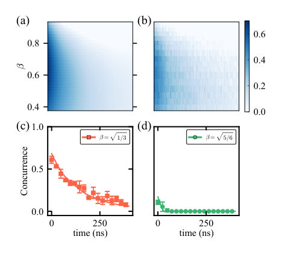
<figcaption class="paper-figure-caption"><b>Fig 2.</b> FIG. 2. (color online). (a) Simulated concurrence versus β and t. (b) Measured concurrence versus β and t. (c), (d) Evolutions of the measured concurrence for β = p</figcaption>
</figure>
<figure class="paper-figure-card">
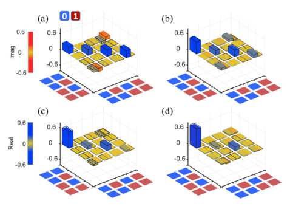
<figcaption class="paper-figure-caption"><b>Fig 3.</b> FIG. 3. (color online). (a)-(d) R1-R2 density matrices mea- sured for disentanglement times t = 100, 200, 300, and 400 ns. The results are obtained for β = p</figcaption>
</figure>
<figure class="paper-figure-card">
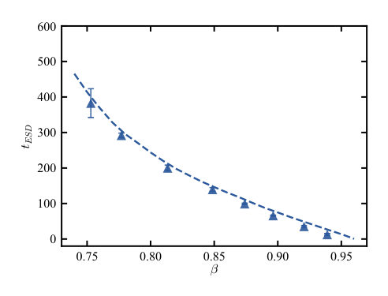
<figcaption class="paper-figure-caption"><b>Fig 4.</b> FIG. 5. (color online). ESD time (tESD) versus β. For each value of β, tESD is equal to the transverse coordinate of the cross point between the observed |ρ00,11| and ρ01,01 10,10 as func- tions of t. The dashed lines are the results calculated with the master equation.</figcaption>
</figure>
<figure class="paper-figure-card">
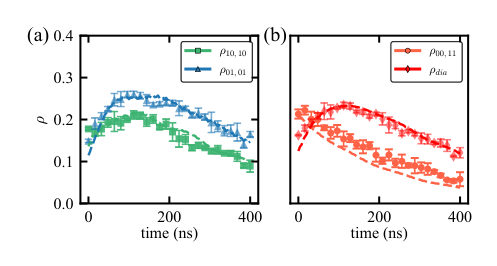
<figcaption class="paper-figure-caption"><b>Fig 5.</b> FIG. 4. (color online). (a) Observed evolutions of the diag- onal elements ρ10,10 and ρ01,01. (b) Observed evolutions of |ρ00,11| and ρdia = √ρ10,10ρ01,01. The results are obtained for β = p</figcaption>
</figure>

**Summary.** The authors experimentally demonstrated Entanglement Sudden Death (ESD) for two photonic qubits using superconducting circuit resonators. By monitoring entanglement decay under natural dissipation from leaky environments, they confirmed that entanglement can vanish in finite time even when the underlying photon loss is asymptotic. This work validates a key theoretical prediction regarding decoherence in realistic quantum hardware.

**Why it may be interesting.** This work provides a crucial experimental confirmation of a non-trivial quantum phenomenon (ESD) in a realistic, naturally dissipative environment, advancing the field of open quantum systems beyond idealized artificial channels.

Detailed structure

**Main problem.** The primary goal was to experimentally demonstrate Entanglement Sudden Death (ESD) induced by natural environmental dissipation in a quantum system.

**Main result.** The experiment successfully demonstrated that the entanglement between two photonic qubits decays completely to zero within a finite time due to coupling with natural leaky resonators, confirming ESD.

**Method.** The researchers used a circuit QED platform involving superconducting qubits and leaky microwave resonators to prepare entangled states and monitor their decay dynamics.

**Model / system.** The system consists of two photonic qubits stored in leaky resonators coupled to superconducting circuits. The evolution is governed by a Lindblad master equation, modeling interaction with a Markovian reservoir.

**Key observables.** Concurrence ($C$), which quantifies entanglement; density matrix elements ($
ho_{10,10}, 
ho_{01,01}$); and the time-dependent decay of these quantities.

**Important parameters / regimes.** Photonic decay rates ($\kappa_1, \kappa_2$); resonator frequencies ($\omega_{r1}, \omega_{r2}$); and the initial entanglement strength parameter ($eta$).

**Assumptions / limitations.** The analysis relies on the Born-Markov approximation for modeling environmental coupling.

**Figures summary.** Figures illustrate schematics of the setup, pulse sequences, measured concurrence decay showing a sudden drop to zero (ESD), and time evolution plots of density matrix elements.

**Paper structure.** The paper details the physical setup using superconducting circuits, describes state preparation via controlled coupling, models the dynamics using master equations, measures entanglement decay over time, and compares results against theoretical predictions for ESD.

Abstract

Any quantum system inevitably interacts with its natural environment, which can be modeled as a Markovian reservoir consisting of a continuum of electromagnetic field modes. The quantum coherence of qubits in a zero-temperature natural reservoir decays asymptotically, whereas the quantum entanglement of two qubits coupled to such reservoirs may disappear in a finite time. This phenomenon, referred to as entanglement sudden death (ESD), has been simulated with artificially engineered dissipative channels, but ESD induced by natural dissipative channels has not been confirmed. We here present the first demonstration of natural-dissipation-induced ESD for two photonic qubits, each stored in a leaky resonator of a superconducting circuit. The disentanglement dynamics of the two photonic qubits is monitored with two ancilla superconducting qubits, which can be controllably coupled to the corresponding leaky resonators. The techniques developed in our experiment pave the way for experimental exploration of entanglement dynamics in natural environments.

[↑ back to top](#top)

### [Topology from Decoherence](http://arxiv.org/abs/2607.07801v1)

**Authors:** Alexandre Chaduteau, Derek Lee, Frank Schindler, Abhinav Prem  
**Type:** theory · **Category:** other · **PDF:** <https://arxiv.org/pdf/2607.07801v1>  
**Analysis basis:** full PDF text, analyzed in chunks
**Topic relevance:** 🔥 `driven-dissipative phase transition` **4/5** · 🔥 `methods for driven-dissipative` **4/5** · `analog quantum simulation` **3/5** · `correlated / nonlocal dissipation` **3/5** · `non-equilibrium dynamics` **3/5** · `non-equilibrium universality` **3/5** · `Keldysh / 2PI / non-Gaussian methods` **2/5** · `measurement-induced transitions` **2/5** · `Kondo & dissipative impurity` **1/5** · `entanglement & information structure` **1/5** · `exotic spin models in light-matter` **1/5** · `scars & prethermalization` **1/5**

↔ Scroll figures horizontally

<figure class="paper-figure-card">
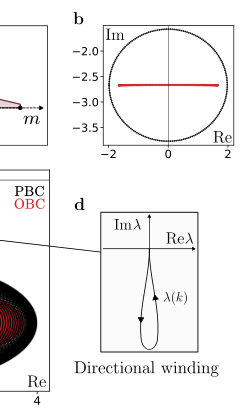
<figcaption class="paper-figure-caption"><b>Fig 1.</b> FIG. 1. Decoherence-induced topology in a lattice model. a. Schematic of the proposed model [see Eq. (1)]. The Hamiltonian drives reciprocal coherent hopping with strength t. The jumps are Km = Anm + Bjm, with on-site density nm at site m and current jm between sites m and m + 1. b. Complex eigenspectrum of the single-particle sector generator Θ for t = 1, A = 2.2, B = 0.5 and N = 100. In PBC (black), the spectrum displays a point gap [20, 21], causing a non-Hermitian skin effect in the single- particle eigenstates of the Lindbladian. c. Eigenspectrum of the two-particle sector generator ˆC for the same parameters. We observe two parts: the “continuous” spectrum [22] corresponding to...</figcaption>
</figure>
<figure class="paper-figure-card">
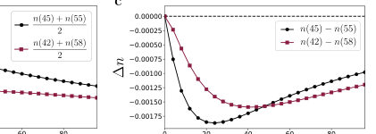
<figcaption class="paper-figure-caption"><b>Fig 2.</b> FIG. 2. Robust asymmetric diffusion. a. At time τ = 0, we perturb the steady state’s correlation matrix with a diagonal matrix that forms a Gaussian profile, with center at the middle of the chain (N = 100 here). We then numerically time-evolve according to Eq. (3). b. Corresponding time evolution for average densities located symmetrically from the middle. These relax back toward the same steady-state value. c. Time evolution of the difference between the same densities. We observe asymmetric diffusion, which is a consequence of the decohered band. The large characteristic timescale matches the ˆC point gap being connected to the steady state. The scale of asymmetric diffusion does not...</figcaption>
</figure>
<figure class="paper-figure-card">
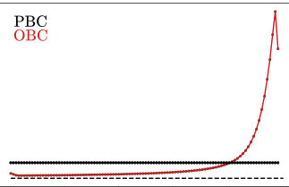
<figcaption class="paper-figure-caption"><b>Fig 3.</b> FIG. 3. Decoherence-induced skin effect. a. Schematic of the PBC point gap (black) of the ˆC spectrum for our model [see Eq. (1)]. The spectrum winds against k in the complex plane. In semi-infinite bound- ary conditions (i.e. with one edge), the bulk-boundary correspondence [21] guarantees the existence of a “boundary” mode (blue point), with density localized at the edge, at any point λ ∈C around which the PBC winding ν(λ) ̸= 0. Decohered states are most localized at the bottom of the point gap, as reflected by the color gradient. b. Localization P</figcaption>
</figure>
<figure class="paper-figure-card">
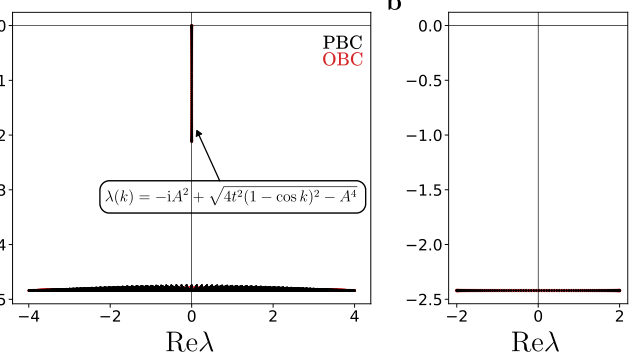
<figcaption class="paper-figure-caption"><b>Fig 4.</b> FIG. 1. Spectrum of the model without current measurements. a. Spectrum of ˆC for t = 1, A = 2.2, B = 0. When B = 0, the model obeys inversion symmetry [Eq. (39)] and the point gap is closed. Focusing on decohered-state eigenvalues, these match exactly the ones derived via Green’s functions [Sec. III B]. b. Spectrum of Θ, for which the point gap is closed as well, as expected from its hoppings involving t ± AB</figcaption>
</figure>
<figure class="paper-figure-card">
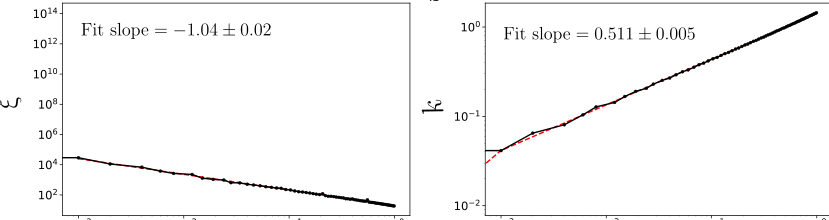
<figcaption class="paper-figure-caption"><b>Fig 5.</b> FIG. 2. Numerical fits of the localization length ξ (a) and the oscillation wavevector k (b) of decohered eigenmodes near the steady state in OBC. Parameters are the same as in Fig. 1 of the main text, i.e. t = 1, A = 2.2, B = 0.5. We fit the spatial profile of eigenmodes via the density ni. The fit slopes roughly match the second-order predictions from Eq. (63).</figcaption>
</figure>

**Summary.** The authors demonstrate that decoherence, usually viewed as detrimental, can actually induce robust topological phases in interacting many-body systems. By analyzing the evolution of correlation matrices under a Lindblad master equation, they show that the noise generates spectral features like point gaps and winding numbers. This leads to observable physical consequences, such as asymmetric diffusion whose direction is dictated by the system's topology.

**Why it may be interesting.** This work provides a concrete theoretical mechanism showing that non-Hermitian physics and topological invariants can emerge purely from open system dynamics (stochastic noise) rather than being imposed by an effective Hamiltonian, which is highly relevant for understanding realistic quantum devices subject to dissipation.

Detailed structure

**Main problem.** To investigate whether decoherence, conventionally seen as an obstacle to topology, can instead induce topological phenomena in interacting many-body systems.

**Main result.** The noise-averaged dynamics realize a topological phase characterized by a winding number and the non-Hermitian skin effect. This is manifested dynamically through asymmetric diffusion fixed by the system's interactions.

**Method.** Analysis involves solving the equation of motion for two-particle correlation matrices derived from the Lindblad master equation, utilizing momentum-space representations and spectral analysis (winding numbers).

**Model / system.** The model is a 1D lattice system of spinless fermions whose time evolution is governed by a Lindblad equation incorporating both coherent Hamiltonian dynamics and environment-induced dephasing jumps. The complexity arises from the interaction terms in the noise operators.

**Key observables.** Asymmetric diffusion, winding number ($
u$), non-Hermitian skin effect, and the spectrum of the superoperator $\hat{C}$.

**Important parameters / regimes.** Interaction strength (related to $B$ parameter), lattice hopping ($t$), and system size ($N$).

**Assumptions / limitations.** The analysis relies on tracking correlation matrices via a linear evolution equation in the superoperator space, requiring various truncations of the infinite-dimensional problem.

**Figures summary.** Figures illustrate the spectral structure (point gaps) in both single-particle and two-particle sectors, demonstrating how non-zero winding numbers guarantee boundary modes (skin effect) and asymmetric diffusion in time evolution.

**Paper structure.** The paper progresses from establishing the general framework using the Lindblad equation for correlation matrices to analyzing symmetries and spectral properties in momentum space. It then details how breaking inversion symmetry opens a point gap, leading to the prediction of skin effects and finally demonstrating the resulting asymmetric diffusion in long-time dynamics.

Abstract

Decoherence is conventionally regarded as an obstacle to realizing topological quantum phases. This has motivated extensive efforts to suppress noise in candidate topological materials and devices. Here, we show that decoherence can instead induce topological phenomena. We demonstrate this in a lattice system subject to environment-induced dephasing. The noise-averaged dynamics, governed by an interacting quantum master equation, realize a topological phase characterized by a winding number and the non-Hermitian skin effect. The dynamical consequence is striking: the correlated nature of the stochastic noise yields asymmetric diffusion, whose direction is fixed by the winding number and is reversible only through a topological phase transition. This effect is induced purely by interactions, distinguishing it from previous studies of free, effectively single-particle systems. It also disappears upon postselecting measurement outcomes, confirming that it is a genuinely open-system phenomenon with no effective Hamiltonian description. Remarkably, the model remains analytically tractable. Our results establish correlated quantum noise as a route to topology in open many-body systems, beyond free-particle and non-Hermitian Hamiltonian paradigms.

[↑ back to top](#top)

### [Stochastic dynamics of particles in correlated fields](http://arxiv.org/abs/2607.08627v1)

**Authors:** Andrea Gambassi  
**Type:** theory · **Category:** statistical mechanics · **PDF:** <https://arxiv.org/pdf/2607.08627v1>  
**Analysis basis:** full PDF text, analyzed in chunks
**Topic relevance:** 🔥 `Keldysh / 2PI / non-Gaussian methods` **4/5** · `correlated / nonlocal dissipation` **3/5** · `driven-dissipative phase transition` **3/5** · `methods for driven-dissipative` **3/5** · `non-equilibrium dynamics` **3/5** · `Frenkel-Kontorova` **2/5** · `non-equilibrium universality` **2/5** · `Kondo & dissipative impurity` **1/5** · `analog quantum simulation` **1/5** · `scars & prethermalization` **1/5**

↔ Scroll figures horizontally

<figure class="paper-figure-card">
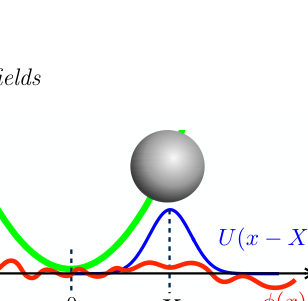
<figcaption class="paper-figure-caption"><b>Fig 1.</b> Figure 1. Left: Schematic representation of a colloidal probe confined by an optical harmonic trap and interacting with a fluctuating field ϕ, the fluctuations of which are correlated across a distance set by the correlation length ξ. Right: The colloidal probe at a certain position X is modelled by a particle (gray) in linear interaction with the field ϕ(x) (red) at position x via a potential U(x−X) (blue), see Eq. (7). The particle is also subject to a harmonic potential (green), with the minimum at X = 0. (The left panel is adapted from Ref. [18].)</figcaption>
</figure>
<figure class="paper-figure-card">
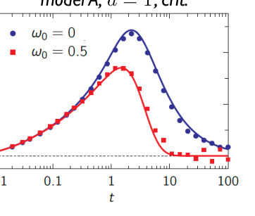
<figcaption class="paper-figure-caption"><b>Fig 2.</b> Figure 2. Left: Power spectral density S(ω) of the position of the particle in a field with model B dynamics in d = 3 and various values of the distance r from the critical point r = 0, as obtained analytically from a perturbative calculation at order λ2 (with λ = 0.05 for illustration). Upon approaching the critical point, the algebraic behaviour ∼ω−1+d/4 emerges for ω →0 (dashed line on the left) , while the behaviour ∼ω−2</figcaption>
</figure>
<figure class="paper-figure-card">
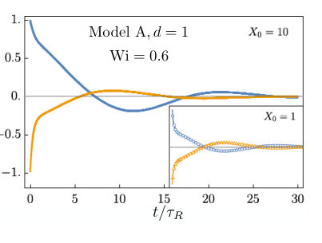
<figcaption class="paper-figure-caption"><b>Fig 3.</b> Figure 3. Relaxation of the average position ⟨X(t)⟩of the particle in the reference frame co-moving with the trap, after a displacement at t = 0 of amplitude X0 from the position of mechanical equilibrium in the steady state. The particle interacts with a critical Gaussian field in d = 1 and model A dynamics. Left: Dependence of the relaxation on the dimensionless velocity Wi ∝v of the trap. The symbols are the analytical predictions within the linearised dynamics, obtained by inverting the Laplace transform in Eq. (17), which are in good agreement with the result of numerical simulations, indicated by the solid lines. The parameters used in the simulations are λ = 5, R = 5, γ∞= 0.2, κ =...</figcaption>
</figure>
<figure class="paper-figure-card">
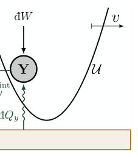
<figcaption class="paper-figure-caption"><b>Fig 4.</b> Figure 4. Sketch of the relevant degrees of freedom which intervene in the stochastic thermodynamics of the system consisting of the field ϕ in interaction with a particle Y subject to a time-dependent potential U, with the particle and the field in contact with an equilibrium thermal bath at temperature T. The field-particle interaction Hint (see the text) can store energy. In particular, the particle and the field exchange heats ¯dQy and ¯dQϕ with the thermal bath, while the external force exerts a work ¯dW on the particle. The particle and the field exchange energies ¯dW int y and ¯dW int ϕ , respectively, via their interaction, which may also change Hint. The modes of the field are...</figcaption>
</figure>
<figure class="paper-figure-card">
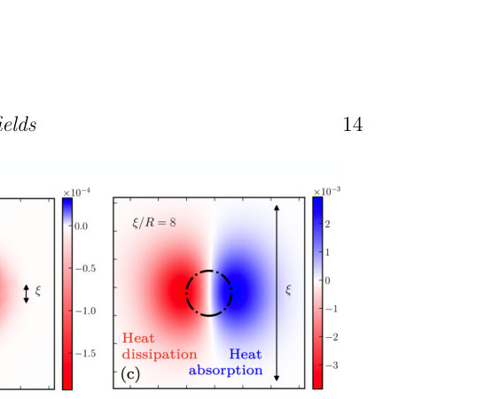
<figcaption class="paper-figure-caption"><b>Fig 5.</b> Figure 5. Spatial distribution of the heat absorption rate ⟨˙Qϕ(x)⟩of the field from the thermal bath, in a frame co-moving with the particle driven at velocity v along the horizontal direction, in spatial dimensions d = 2. The particle is driven horizontally to the right with velocity v, while the Gaussian field evolves with model A dynamics. The particle is assumed to have U(x) = exp  −x2/(2R)  with radius R = 4, indicated by the dash-dotted lines in the various panels. The heat map is the result of the numerical simulation of the dynamics of the system (see Ref. [23] for details), with an increasing value of the ratio ξ/R from 0.1 on the left to 8 on the right, where ξ is the...</figcaption>
</figure>

**Summary.** This work investigates the complex stochastic dynamics of particles in correlated fluctuating environments, showing that simple linear models fail due to memory effects. By deriving generalized Langevin equations, the authors characterize anomalous diffusion regimes—including superdiffusion and run-and-tumble motion—that arise from both external correlations and self-generated fields.

**Why it may be interesting.** It provides advanced theoretical tools for modeling open quantum systems where dissipation and memory effects are crucial, linking concepts from condensed matter (viscoelasticity) to particle transport phenomena.

Detailed structure

**Main problem.** The study addresses how the effective dynamics of mesoscopic particles deviate from simple linear models when immersed in complex, fluctuating, or correlated media.

**Main result.** The effective dynamics are generally non-linear and non-Markovian, exhibiting anomalous diffusion (e.g., superdiffusive behavior) depending on dimensionality and whether the field is self-generated or external.

**Method.** Theoretical derivation using projection operator formalisms (like Mori-Zwanzig) and analyzing spectral densities $S(\omega)$ to characterize memory effects in generalized Langevin equations.

**Model / system.** A probe particle interacting with a fluctuating, correlated Gaussian field $\phi(x)$. The system can be modeled by coupling the particle's motion to the bath dynamics, leading to non-Markovian friction kernels.

**Key observables.** Mean Square Displacement (MSD), Power Spectral Density $S(\omega)$, and deviation from simple exponential decay in relaxation dynamics.

**Important parameters / regimes.** Correlation length $\xi$, dimensionality $d$, coupling strength $\lambda$ (for self-interaction), and the memory kernel $\Gamma(t)$ or $F(t, x)$.

**Assumptions / limitations.** The field is treated as Gaussian in some derivations; approximations are made regarding the bath dynamics to derive effective equations of motion.

**Figures summary.** Figure 1 schematically shows a probe particle interacting with a correlated field $\phi$ confined by a trap. Figure 6 illustrates particle trajectories and associated field heatmaps for chemotaxis analysis.

**Paper structure.** The paper progresses from reviewing the failure of simple linear Langevin models to deriving generalized, non-Markovian dynamics in coupled systems, culminating in specific analyses of self-chemotactic motion exhibiting dimension-dependent anomalous diffusion.

Abstract

The effective dynamics of a colloidal particle immersed in a complex medium at equilibrium is usually described in terms of a linear overdamped Langevin equation, possibly with memory. However, numerical simulations and experiments have shown that this linear model fails, suggesting that the effective dynamics of the probe is actually nonlinear. Focusing on the case in which the medium is described by a fluctuating and correlated Gaussian field, linearly coupled to the colloid, we derive this effective dynamics and discuss its various consequences, including those on the stochastic thermodynamics of a driven particle. When the field is generated by the particle itself, with negligible fluctuations, the resulting self-chemotactic dynamics turns out to display anomalous diffusion and run-and-tumble motion in low spatial dimension, which we characterise analytically.

[↑ back to top](#top)

### [The Langevin-equation description of optomechanics with the dispersive and dissipative optomechanical coupling](http://arxiv.org/abs/2607.08530v1)

**Authors:** Alexander K. Tagantsev  
**Type:** theory · **Category:** other · **PDF:** <https://arxiv.org/pdf/2607.08530v1>  
**Analysis basis:** full PDF text, analyzed in chunks
**Topic relevance:** 🔥 `methods for driven-dissipative` **4/5** · `Keldysh / 2PI / non-Gaussian methods` **3/5** · `correlated / nonlocal dissipation` **3/5** · `driven-dissipative phase transition` **3/5** · `correlated cavity matter` **2/5** · `non-equilibrium dynamics` **2/5** · `non-equilibrium universality` **2/5** · `quantum measurements` **2/5** · `interference shaping light` **1/5** · `measurement-induced transitions` **1/5**

↔ Scroll figures horizontally

<figure class="paper-figure-card">
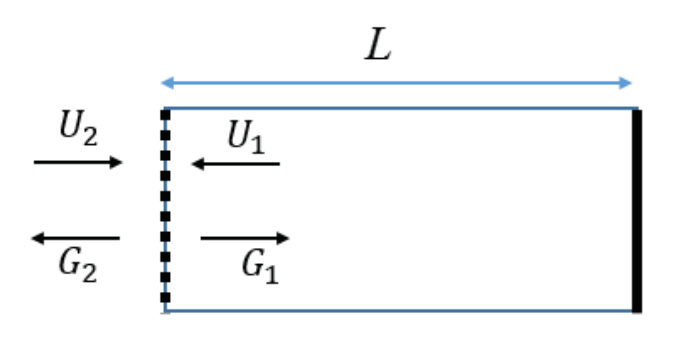
<figcaption class="paper-figure-caption"><b>Fig 1.</b> FIG. 1. Schematics of the one-sided Fabry-Perot cavity. The mirror shown with the dashed line is</figcaption>
</figure>
<figure class="paper-figure-card">
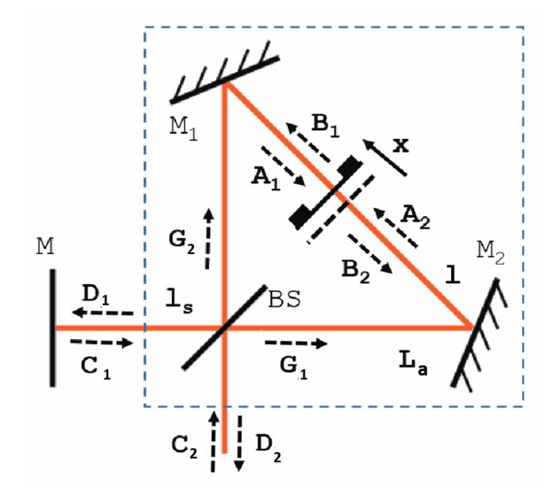
<figcaption class="paper-figure-caption"><b>Fig 2.</b> FIG. 2. Schematics of the modified Michelson-Sagnac interferometer. The running electromagnetic</figcaption>
</figure>

**Summary.** The paper compares the Input-Output (IO) approach with the Quantum Langevin equation formalism for optomechanical systems. It finds that while both methods describe dispersive coupling, the standard Langevin treatment incorrectly predicts dissipative coupling when decay rates depend on mechanical position. The authors conclude that a model-free IO analysis is necessary to correctly account for phase factors and the true physical origin of dissipation in these quantum optical setups.

**Why it may be interesting.** This work provides a rigorous theoretical check on established methods in quantum optics, highlighting where simplified or model-dependent approaches (like standard L-formalism) break down when moving to more complex physical regimes involving dissipation.

Detailed structure

**Main problem.** To critically assess the validity and range of applicability of the quantum Langevin equation formalism for describing optomechanical systems, especially when dissipative coupling is present.

**Main result.** The Input-Output (IO) approach reveals that standard Langevin formalisms incorrectly predict the generation of dissipative optomechanical coupling when only cavity decay rate dependence on length is considered. Furthermore, L-formalism may miss a crucial phase factor when dissipative coupling is active.

**Method.** The authors compare results derived from the model-free Input-Output (IO) relations approach (based on classical wave equations) against those obtained using the standard quantum Langevin equation formalism for various cavity setups.

**Model / system.** The study focuses on optomechanical systems, specifically utilizing an optomechanical Fabry-Perot cavity and a modified Michelson-Sagnac interferometer where one mirror acts as a mechanical oscillator. The comparison involves analyzing coupling mechanisms (dispersive vs. dissipative).

**Key observables.** Intracavity field ladder operator, stochastic back-action force spectral power density S(Omega), and the relation between input/output fields.

**Important parameters / regimes.** Dissipative optomechanical coupling strength ($g_\gamma$), cavity decay rate ($\gamma$), mechanical oscillator position dependence of $\gamma$, and phase factors.

**Assumptions / limitations.** The comparison relies on simplifying the IO-approach results to match the structure of the Langevin formalism, though discrepancies are found when dissipative effects are included.

**Paper structure.** The paper first introduces the problem by comparing L-formalism and IO-formalism. It then details the application of both formalisms to specific cavities (Fabry-Perot, MMSI), deriving equations for field operators and backaction forces in each framework before drawing comparative conclusions regarding dissipative coupling.

Abstract

The description of the optomechanical system is commonly based on the quantum Langevin equation formalism. This framework is introduced phenomenologically or based on a model Hamiltonian. However, once dealing with the optomechanical Fabry-Perot cavity or the modified Michelson-Sagnac interferometer with a semitransparent mechanically active membrane inside, a model-free consideration is also possible by using an alternative approach. Such an approach, which is based on the classical wave equations in the systems, is popular in the gravitational-wave community where it is termed as input-output relations approach. In this work, using the aforementioned approach, we derived the equations for the ladder operator of the intracavity field, stochastic back-action force, and the relation between the fields at the input mirror. Then we simplified the obtained results down to the range of applicability of the Langevin equation formalism and compared these with the corresponding predictions of the latter formalism. This enabled us to critically assess the validity of the Langevin equation formalism and rectify its range of applicability. In the case where the dissipative optomechanical coupling is involved we identified appreciable problems with this formalism. We found that, disregarding the fact that decay rate of the optomechanical Fabry-Perot cavity depends on its length, no dissipative optomechanical coupling is generated. This is in contrast with the prediction of the standard Langevin-equation based treatment. We found that, staying inside the range of applicability of the Langevin equation formalism, the relation between the fields at the input mirror may not be correct. We found that the Langevin equation formalism misses a phase factor at the input field, this factor turns out to be important for the situation involving the dissipative optomechanical coupling.

[↑ back to top](#top)

### [Shortcuts to Adiabaticity for non-Hermitian systems in Krylov Space](http://arxiv.org/abs/2607.07802v1)

**Authors:** Ankit W. Shrestha, Budhaditya Bhattacharjee, Adolfo del Campo  
**Type:** theory · **Category:** statistical mechanics · **PDF:** <https://arxiv.org/pdf/2607.07802v1>  
**Analysis basis:** full PDF text, analyzed in chunks
**Topic relevance:** 🔥 `driven-dissipative phase transition` **4/5** · 🔥 `methods for driven-dissipative` **4/5** · `correlated / nonlocal dissipation` **3/5** · `non-equilibrium universality` **3/5** · `Kondo & dissipative impurity` **2/5** · `analog quantum simulation` **2/5** · `non-equilibrium dynamics` **2/5** · `Keldysh / 2PI / non-Gaussian methods` **1/5**

↔ Scroll figures horizontally

<figure class="paper-figure-card">
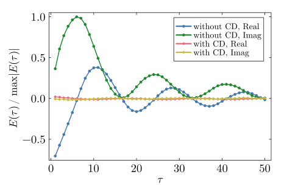
<figcaption class="paper-figure-caption"><b>Fig 1.</b> FIG. 1. Excess energy E(τ) at the end of different ramp time τ for the interacting Hatano-Nelson model for N = 10 with and without the counterdiabatic driving term (J = 1.0, U = 1.0, a = 1.0, and h0 = 0.1). AGP was truncated at M = 80, where the exact AGP would require M = 31626 terms (⌊K/2⌋ for D = 252).</figcaption>
</figure>
<figure class="paper-figure-card">
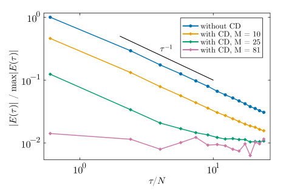
<figcaption class="paper-figure-caption"><b>Fig 2.</b> FIG. 2. Absolute value of the excess energy |E(τ)| plotted at the maxima points during the oscillation for different approx- imate AGPs (N = 10, D = 252). The exact AGP requires M = 31626 terms (⌊K/2⌋).</figcaption>
</figure>
<figure class="paper-figure-card">
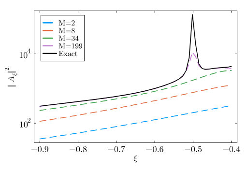
<figcaption class="paper-figure-caption"><b>Fig 3.</b> FIG. 3. AGP norm for the PT −symmetric Heisenberg chain (N = 9, D = 512) using finite number of Krylov basis vectors across the phase parameter ξ. Exact AGP would require M = 130816 terms (⌊K/2⌋).</figcaption>
</figure>
<figure class="paper-figure-card">

<figcaption class="paper-figure-caption"><b>Fig 4.</b> Figure 3 shows the AGP norm (Eq. (60)) for differ- ent approximate AGPs constructed using first M odd- indexed Krylov basis vectors. For the calculation, we fix χ ≈10−7 so that the Hamiltonian is non-Hermitian, but the spectrum is real up to the machine precision. We can see that it rapidly approaches the exact AGP norm in Eq. (58). Moreover, it also captures the phase transition at ξ = 1/2.</figcaption>
</figure>
<figure class="paper-figure-card">
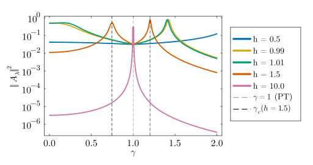
<figcaption class="paper-figure-caption"><b>Fig 5.</b> FIG. 4. Norm of the adiabatic gauge potential for the Non- Hermitian TFIM, as a function of the parameter γ. The Ising transition is shown for h = 1.5. The Krylov space dimension is taken to be dA = 50 for this result.</figcaption>
</figure>

**Summary.** This paper introduces a general, diagonalization-free method to calculate the Adiabatic Gauge Potential (AGP) required for Shortcuts to Adiabaticity in non-Hermitian quantum systems. By mapping the problem onto Krylov space using bi-Lanczos and Arnoldi algorithms, it reduces complex calculations to sparse matrix equations. This provides an accurate and practical route for controlling dynamics and diagnosing phase transitions in challenging many-body models.

**Why it may be interesting.** This work provides a powerful computational tool to analyze non-adiabatic dynamics and phase transitions in open or non-Hermitian quantum systems, which are central topics in modern AMO physics and condensed matter theory.

Detailed structure

**Main problem.** The core problem is developing a general, computationally feasible framework for engineering Shortcuts to Adiabaticity (STA) in complex non-Hermitian quantum systems.

**Main result.** The authors successfully recast the difficult-to-compute Adiabatic Gauge Potential (AGP) into a sparse matrix equation solvable via Krylov space methods, applicable across various non-Hermitian models.

**Method.** They utilize an integral representation of the counterdiabatic control and generate the necessary basis using bi-Lanczos and Arnoldi algorithms to reduce the AGP calculation to manageable linear algebra problems.

**Model / system.** The theory is applied to general non-Hermitian quantum systems, demonstrated on specific models like decaying two-level atoms, the interacting Hatano-Nelson model, and PT-symmetric Heisenberg chains.

**Key observables.** Adiabatic Gauge Potential (AGP) norm, which serves as a diagnostic tool for detecting phase transitions like PT-symmetry breaking.

**Important parameters / regimes.** The tuning parameter $\lambda$ governing the system's evolution; convergence relies on only a small fraction of the full Krylov space.

**Assumptions / limitations.** The primary assumption is that representing the AGP in the Krylov basis provides a practical and accurate alternative to direct diagonalization, even for complex many-body Hamiltonians.

**Figures summary.** Not specified by notes; the method involves deriving recurrence relations and solving matrix equations derived from bi-Lanczos/Arnoldi procedures.

**Paper structure.** The paper progresses from defining the challenge of STA in non-Hermitian settings, developing the general Krylov space framework using integral representations, detailing the algorithmic implementation (bi-Lanczos/Arnoldi), and concluding with physical demonstrations on multiple model systems.

Abstract

Shortcuts to adiabaticity (STA) reproduce adiabatic dynamics in finite time, but their counterdiabatic implementation relies on the adiabatic gauge potential (AGP), which is difficult to compute and implement in many-body systems and whose extension to open and non-Hermitian settings has remained largely model-specific. Here, we develop a general, diagonalization-free framework for engineering STA in non-Hermitian systems by representing the AGP in Krylov space. Starting from an integral representation of the counterdiabatic control, we recast the AGP as a nested-commutator series with controlled locality and generate the associated Krylov basis using the bi-Lanczos and Arnoldi algorithms. This reduces the exact or truncated AGP to a sparse tridiagonal or upper-Hessenberg matrix equation that generalizes the Hermitian construction. We demonstrate the method on a decaying two-level atom, where it recovers the exact drive and signals the exceptional point; on the interacting Hatano-Nelson model, where truncated controls rapidly suppress nonadiabatic excitations; and on a PT-symmetric Heisenberg chain, whose AGP norm detects the PT-symmetry-breaking transition. Throughout, the expansion converges with only a small fraction of the full Krylov space, offering a practical route to fast, accurate control of many-body non-Hermitian systems.

[↑ back to top](#top)

### [Operational meaning of Markov gap in tripartite entanglement of quantum dynamics](http://arxiv.org/abs/2607.08615v1)

**Authors:** Zongsheng Zhou, Riqiang Zhang, Yu-Xiang Zhang  
**Type:** theory · **Category:** statistical mechanics · **PDF:** <https://arxiv.org/pdf/2607.08615v1>  
**Analysis basis:** full PDF text, analyzed in chunks
**Topic relevance:** 🔥 `entanglement & information structure` **4/5** · 🔥 `non-equilibrium dynamics` **4/5** · `non-equilibrium universality` **3/5** · `analog quantum simulation` **2/5** · `driven-dissipative phase transition` **2/5** · `Keldysh / 2PI / non-Gaussian methods` **1/5** · `correlated / nonlocal dissipation` **1/5** · `methods for driven-dissipative` **1/5** · `scars & prethermalization` **1/5**

↔ Scroll figures horizontally

<figure class="paper-figure-card">
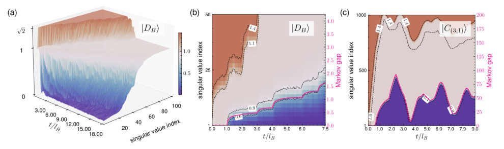
<figcaption class="paper-figure-caption"><b>Fig 1.</b> FIG. 1. (a) The singular value spectrum (only the smallest 100 singular values are displayed) of the null matrix N3(t) for the free fermion chain initialized in |DB⟩. The singular values cluster around 0, 1 and √</figcaption>
</figure>
<figure class="paper-figure-card">
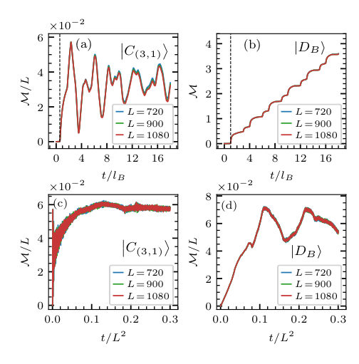
<figcaption class="paper-figure-caption"><b>Fig 2.</b> FIG. 2. Upper panels (a) and (b) show the early time dynamics of states |C(3, 1)⟩, and |DB⟩for different system sizes, respectively. For each of these states, there exist a threshold, marked by a vertical dashed line, below which the Markov gap is absent. This threshold is determined by the effective light cone speed v. Here, the time is rescaled by the length of subsystem B, under this scaling, the position of the threshold is given by 1/v. The vertical of state |C(3, 1)]⟩is rescaled by L to achieve data collapse. The lower panels (c) and (d) display long time behavior of the Markov gap. The results for different system sizes collapse onto a single curve when time is scaled by L2 and...</figcaption>
</figure>
<figure class="paper-figure-card">
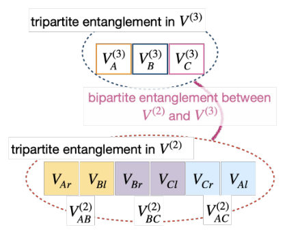
<figcaption class="paper-figure-caption"><b>Fig 3.</b> FIG. 3. Schematic diagram of tripartite entanglement structure of free fermion states. There are IrTE generated by ETFs in V (3), and IrTE in the “Fermi sea” of bipartite fermions generated by the projections of the ETFs in V (2). There are also bipartite entanglement with respect to them.</figcaption>
</figure>
<figure class="paper-figure-card">
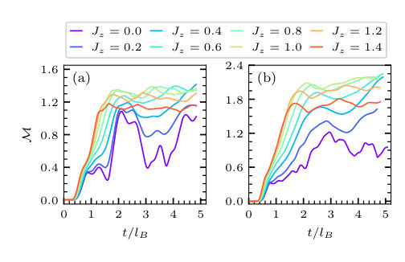
<figcaption class="paper-figure-caption"><b>Fig 4.</b> FIG. 4. Dynamics of Markov gap from Neel state quenched by XXZ Hamiltonian under various strength of anisotropy Jz. Left and right panels are the result for system size L = 12 and L = 18, respectively.</figcaption>
</figure>

**Summary.** The paper develops the concept of using the 'Markov gap' as a quantitative measure for irreducible tripartite entanglement (IrTE) in quantum many-body systems. By analyzing free-fermion chains and extending to interacting models, the authors show that this gap reveals distinct scaling behaviors ($t \sim L^2$) indicative of long-range correlation buildup. It offers a transparent physical interpretation by linking the gap's magnitude directly to the singular values of an associated tripartite null matrix.

**Why it may be interesting.** This work provides a concrete, measurable diagnostic tool (the Markov gap linked to ETF null matrices) for quantifying complex multipartite entanglement in non-equilibrium quantum dynamics, bridging abstract information theory concepts with observable physical scaling laws ($L^2$ vs $L$).

Detailed structure

**Main problem.** The study investigates the operational meaning of the Markov gap as a diagnostic tool for irreducible tripartite entanglement (IrTE) emerging from short-range quantum dynamics far from equilibrium.

**Main result.** The Markov gap exhibits distinct dynamical behaviors, showing volume-law saturation at $t \sim L^2$, which is significantly slower than ballistic bipartite correlation spreading. The gap's evolution is shown to track the singular values of a tripartite null matrix associated with essential tripartite fermions (ETFs).

**Method.** The analysis uses concepts from quantum information theory applied to free-fermion systems, calculating entanglement measures like reflected entropy and mutual information via two-point correlation matrices. The concept of ETFs and their associated null matrix $N_3(t)$ provides an operational interpretation.

**Model / system.** The primary model is the free-fermion chain, initially analyzed using a simple hopping Hamiltonian ($H_1$). Extensions are made to interacting systems like the XXZ spin chain. The dynamics are studied in quantum quench scenarios across three contiguous regions (A, B, C).

**Key observables.** Markov gap ($M$), Irreducible Tripartite Entanglement (IrTE), onset time of IrTE ($t^*$), and the singular value spectrum of the tripartite null matrix $N_3(t)$.

**Important parameters / regimes.** System size ($L$), initial state type (e.g., crystal, domain-filled, random filling), and anisotropy parameter ($J_z$) for the XXZ chain.

**Assumptions / limitations.** The analysis initially relies on free fermion approximations, though results are extended to interacting systems like the XXZ chain. The interpretation links Gaussian IrTE directly to the number of small singular values in $N_3$.

**Figures summary.** Figures illustrate Markov gap dynamics for various initial states (e.g., $|D_B
angle$), showing distinct early-time growth patterns (linear vs. jumps) and long-time volume-law scaling ($t \sim L^2$). Comparisons are made between the gap evolution and the singular value spectrum of $N_3$.

**Paper structure.** The paper systematically analyzes entanglement emergence by first establishing the Markov gap definition for free fermions, demonstrating its distinct dynamical signatures (quasi-linear/staircase jumps) based on initial states. It then introduces ETFs to provide an operational link between the gap and matrix singular values before extending these findings robustly to interacting models like the XXZ chain.

Abstract

We investigate how irreducible multipartite entanglement, a long-range correlation by nature, can emerge from short-range dynamics far from equilibrium. Focusing on the Markov gap as a probe of irreducible tripartite entanglement (IrTE) in free-fermion chains, we uncover qualitatively distinct dynamical behaviors: the Markov gap grows either quasi-linearly or in staircase-like jumps depending on the initial state. We also propose attainable upper and lower bounds for the onset time of IrTE based on the Lieb-Robinson bound. Strikingly, the Markov gap saturates to a volume-law value on a timescale $t\sim\! L^2$, much slower than the ballistic spreading of bipartite correlations. To understand what information about the wavefunctions is revealed by the Markov gap calculation, we introduce the concept of essential tripartite fermion (ETF) and an associated tripartite null matrix. The value of Markov gap closely tracks the number of small singular values of this tripartite null matrix, yielding a transparent, operational physical interpretation of the measure. We further demonstrate that several dynamical signatures persist in the interacting XXZ chain.

[↑ back to top](#top)

### [Environmental Memory Effects and Quantum Resource Hierarchies in Polarized Hyperon--Antihyperon Systems](http://arxiv.org/abs/2607.07902v1)

**Authors:** Omar Bachain, Mohamed Amazioug, Rachid Ahl Laamara  
**Type:** theory · **Category:** other · **PDF:** <https://arxiv.org/pdf/2607.07902v1>  
**Analysis basis:** full PDF text, analyzed in chunks
**Topic relevance:** 🔥 `entanglement & information structure` **4/5** · `correlated / nonlocal dissipation` **3/5** · `methods for driven-dissipative` **3/5** · `non-equilibrium dynamics` **3/5** · `Keldysh / 2PI / non-Gaussian methods` **2/5** · `driven-dissipative phase transition` **2/5** · `non-equilibrium universality` **1/5**

↔ Scroll figures horizontally

<figure class="paper-figure-card">
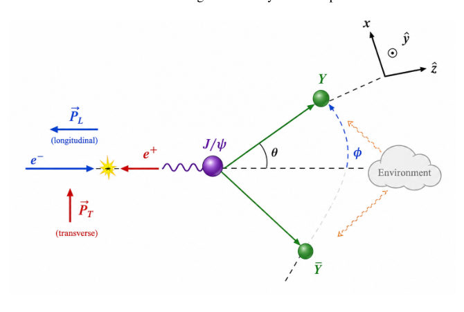
<figcaption class="paper-figure-caption"><b>Fig 1.</b> Fig. 1: Schematic illustration of the physical framework considered in this work. Polarized electron–positron beams produce the process e+e−→J/ψ →Y ¯Y, where Y = Λ, Σ+, Ξ−, Ξ0. The longitudinal (PL) and transverse (PT) beam polarizations, together with the production angles (θ, ϕ), determine the spin state of the hyperon pair. Environmental interactions are modeled through correlated dephasing channels with memory effects, allowing the investigation of the robustness of quantum correlations and coherence under both Markovian and non-Markovian dynamics.</figcaption>
</figure>
<figure class="paper-figure-card">
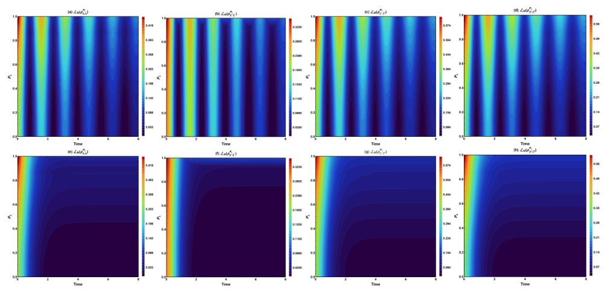
<figcaption class="paper-figure-caption"><b>Fig 2.</b> Fig. 2: Dynamical evolution of the logarithmic negativity LN(ρPL Y ¯Y) as a function of time and the longitudinal polarization degree PL for J/ψ →Y ¯Y with Y = Λ, Σ+, Ξ−, and Ξ0 at cos θ = 0.5. Panels (a)–(d) [(e)–(h)] correspond to the non-Markovian (Markovian) regime with τ = 5 (τ = 0.2) and µ = 0.4. The experimental parameters are taken from Table I.</figcaption>
</figure>
<figure class="paper-figure-card">
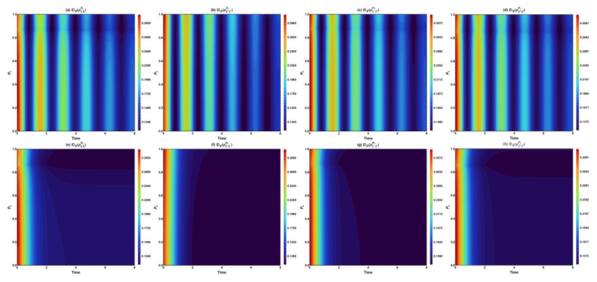
<figcaption class="paper-figure-caption"><b>Fig 3.</b> Fig. 3: Dynamical evolution of the geometric quantum discord DG(ρPL Y ¯Y) as a function of time and the longitudinal polarization degree PL for J/ψ →Y ¯Y with Y = Λ, Σ+, Ξ−, and Ξ0 at cos θ = 0.5. Panels (a)–(d) [(e)–(h)] correspond to the non-Markovian (Markovian) regime with τ = 5 (τ = 0.2) and µ = 0.4. The experimental parameters are taken from Table I.</figcaption>
</figure>
<figure class="paper-figure-card">
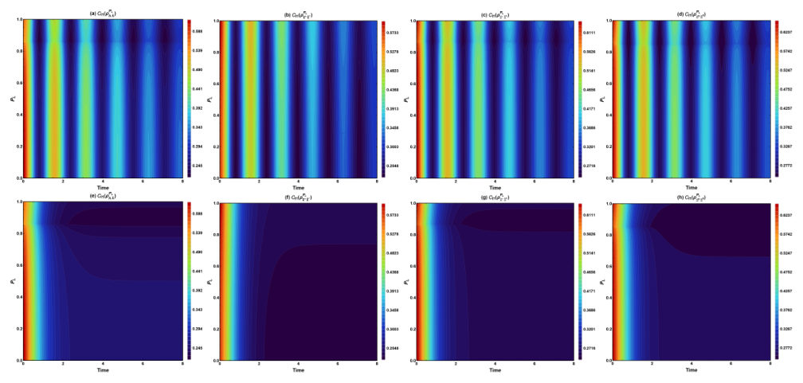
<figcaption class="paper-figure-caption"><b>Fig 4.</b> Fig. 4: Dynamical evolution of the l1-norm quantum coherence Cl1(ρPL Y ¯Y) as a function of time and the longitudinal polarization degree PL for J/ψ →Y ¯Y with Y = Λ, Σ+, Ξ−, and Ξ0 at cos θ = 0.5. Panels (a)–(d) [(e)–(h)] correspond to the non-Markovian (Markovian) regime with τ = 5 (τ = 0.2) and µ = 0.4. The experimental parameters are taken from Table I.</figcaption>
</figure>
<figure class="paper-figure-card">
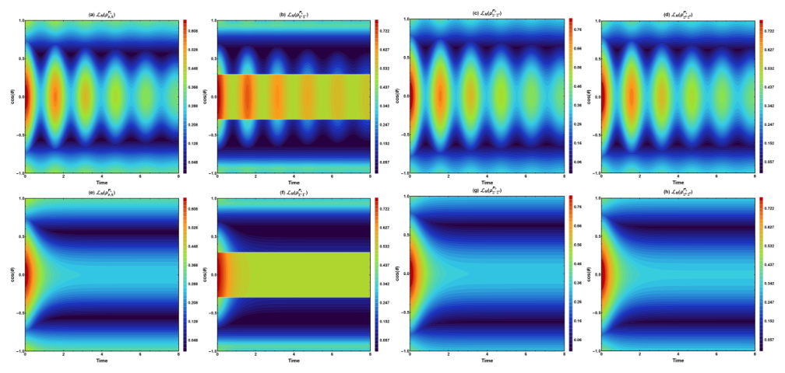
<figcaption class="paper-figure-caption"><b>Fig 5.</b> Fig. 5: Dynamical evolution of the logarithmic negativity LN(ρPL Y ¯Y) as a function of time and the production angle cos θ for J/ψ →Y ¯Y with Y = Λ, Σ+, Ξ−, and Ξ0 at PL = 0.8. Panels (a)–(d) [(e)–(h)] correspond to the non-Markovian (Markovian) regime with τ = 5 (τ = 0.2) and µ = 0.4. The experimental parameters are taken from Table I.</figcaption>
</figure>

**Summary.** This paper explores the persistence of quantum correlations in hyperon pairs produced in $e^+e^-$ collisions when subjected to environmental decoherence. It demonstrates that memory effects are vital, preventing complete loss of quantum information seen in Markovian models. The research establishes a robust hierarchy among different quantum resources, making polarized hyperons a unique laboratory for testing open quantum dynamics.

**Why it may be interesting.** This work bridges high-energy particle physics (hyperons) with fundamental concepts of open quantum systems and quantum information theory, providing testable predictions for future colliders.

Detailed structure

**Main problem.** The study investigates how correlated dephasing environments (environmental memory effects) affect various quantum resources within polarized hyperon-antihyperon systems.

**Main result.** Environmental memory is crucial, leading to information backflow in the non-Markovian regime; furthermore, a clear hierarchy of quantum resources exists: Coherence > Geometric Quantum Discord > Logarithmic Negativity.

**Method.** The analysis uses an open quantum system framework, comparing Markovian and non-Markovian dynamics by calculating time evolution using specific noise models.

**Model / system.** The physical platform is the production of hyperon-antihyperon pairs (Y∗∗) in $e^+e^-$ annihilation. The dynamics are modeled using a correlated dephasing channel incorporating memory effects.

**Key observables.** Logarithmic negativity, geometric quantum discord, l1-norm quantum coherence, entanglement, and Bell nonlocality.

**Important parameters / regimes.** Beam polarization (longitudinal/transverse), environmental memory parameter ($\mu$), and the Markovian vs. Non-Markovian regime.

**Assumptions / limitations.** The noise is modeled as correlated dephasing noise; the analysis utilizes experimental inputs from BESIII for validation.

**Figures summary.** Figure 1 schematically illustrates the entire process: Polarized $e^+e^-$ beams leading to $Yar{Y}$ pairs, incorporating polarization and memory effects.

**Paper structure.** The paper systematically analyzes quantum resources under varying conditions, comparing different quantifiers to establish a resource hierarchy while modeling open-system dynamics.

Abstract

Hyperon--antihyperon pairs produced in $e^{+}e^{-}\rightarrow J/ψ\rightarrow Y\bar{Y}$ ($Y=Λ,Σ^{+},Ξ^{-},Ξ^{0}$) constitute a unique high-energy platform for probing quantum correlations through experimentally accessible spin observables. We investigate the impact of correlated dephasing environments on the stationary and dynamical properties of logarithmic negativity, geometric quantum discord, and $l_{1}$-norm quantum coherence under both longitudinal and transverse beam polarizations. Our analysis reveals that environmental memory plays a crucial role in preserving quantum resources. In the non-Markovian regime, information backflow generates recurrent revivals of quantum correlations and significantly delays decoherence, whereas Markovian evolution drives the system toward asymptotic stationary states through an irreversible loss of quantum information. The influence of beam polarization is found to be strongly channel dependent and can substantially enhance the amount of accessible quantum correlations. A comparative investigation of different quantifiers uncovers a clear hierarchy of quantum resources. Quantum coherence remains robust over the widest parameter range, geometric quantum discord survives even in regions where entanglement is strongly reduced, while logarithmic negativity is the most sensitive to environmental degradation. This hierarchy persists for all considered hyperon channels and under both polarization configurations. The dependence of quantum resources on the production angle, azimuthal angle, polarization degree, and memory parameter is examined using experimental inputs from BESIII. The predicted effects are found to be compatible with the precision expected at BESIII and future high-luminosity facilities such as STCF and CEPC.

[↑ back to top](#top)

### [Scalable Simulation of Strongly Correlated Electron-Phonon Systems via Non-Gaussian Matrix Product States](http://arxiv.org/abs/2607.08176v1)

**Authors:** Siyuan Jiang, Tao Shi  
**Type:** theory · **Category:** strongly correlated electrons · **PDF:** <https://arxiv.org/pdf/2607.08176v1>  
**Analysis basis:** full PDF text, analyzed in chunks
**Topic relevance:** 🔥 `methods for driven-dissipative` **4/5** · `Keldysh / 2PI / non-Gaussian methods` **3/5** · `analog quantum simulation` **3/5** · `driven-dissipative phase transition` **2/5** · `entanglement & information structure` **2/5** · `Kondo & dissipative impurity` **1/5** · `correlated / nonlocal dissipation` **1/5** · `non-equilibrium dynamics` **1/5** · `non-equilibrium universality` **1/5**

↔ Scroll figures horizontally

<figure class="paper-figure-card">
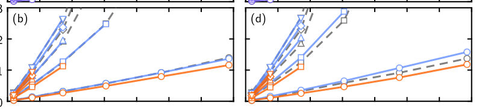
<figcaption class="paper-figure-caption"><b>Fig 1.</b> FIG. 1. Nearest-neighbor phonon-mediated attraction Vnn versus effective coupling λ = g2 0/(ωt) in the 1D generalized Hubbard– Holstein model at ω = 0.12t, u = 8 and glj = g0/ p</figcaption>
</figure>
<figure class="paper-figure-card">
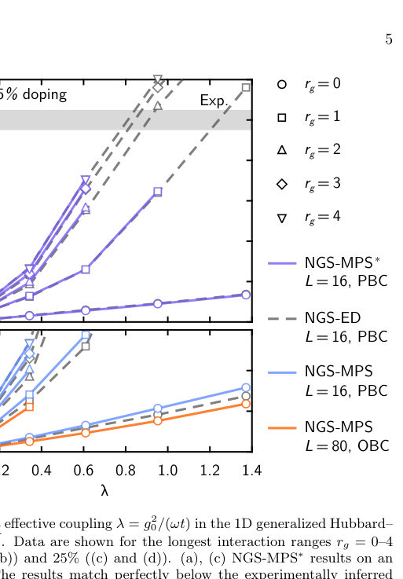
<figcaption class="paper-figure-caption"><b>Fig 2.</b> Figure 1 displays the benchmark results for the in- duced nearest-neighbor attraction Vnn, with elements (Vnn)j,j+δ = Vinst j,j+δ + Vret j,j+δ [Eq. (12)], at hole doping lev- els of 12.5% (Figs. 1(a) and 1(b)) and 25% (Figs. 1(c) and (d)). For a small system (L = 16 with PBC), NGS-MPS∗</figcaption>
</figure>
<figure class="paper-figure-card">
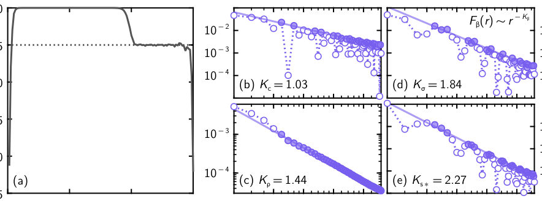
<figcaption class="paper-figure-caption"><b>Fig 3.</b> FIG. 2. Ground-state properties of the generalized Hubbard–Holstein model on an L = 120 chain at ω/t = 0.2, u = 8, and glj/t = 0.3δlj + 0.15δl,j±1. (a) Spatial profile of the charge density ⟨ni⟩for the 6.7%-doped system. The ground state exhibits macroscopic phase separation, segregating into a half-filled antiferromagnetic domain and a hole-rich domain with a local doping of approximately 15% (the dotted reference line indicates ⟨ni⟩= 0.85). (b)–(e) Real-space correlations evaluated for the homogeneous 15%-doped phase on an L = 120 chain, capturing the intrinsic bulk properties of the hole-rich domain shown in (a). The panels display correlations in the (b) single-particle (⟨c† icj⟩), (c)...</figcaption>
</figure>
<figure class="paper-figure-card">
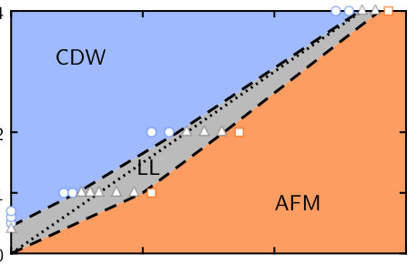
<figcaption class="paper-figure-caption"><b>Fig 4.</b> FIG. 3. Phase diagram of the half-filled Hubbard–Holstein model at a phonon frequency of ω = 5t, computed on a 48×4 cylinder in the (u, λ) plane. Three regimes are identified: a (π, π) charge-density-wave (CDW) phase (blue), an inter- mediate metallic phase corresponding to a 2D analog of the Luttinger liquid (LL) phase (gray), and a (π, π) antiferro- magnetic (AFM) phase (orange). Dashed lines indicate the approximate phase boundaries, whereas the dotted line marks the phase boundary (u = 2λ) in the anti-adiabatic limit.</figcaption>
</figure>
<figure class="paper-figure-card">
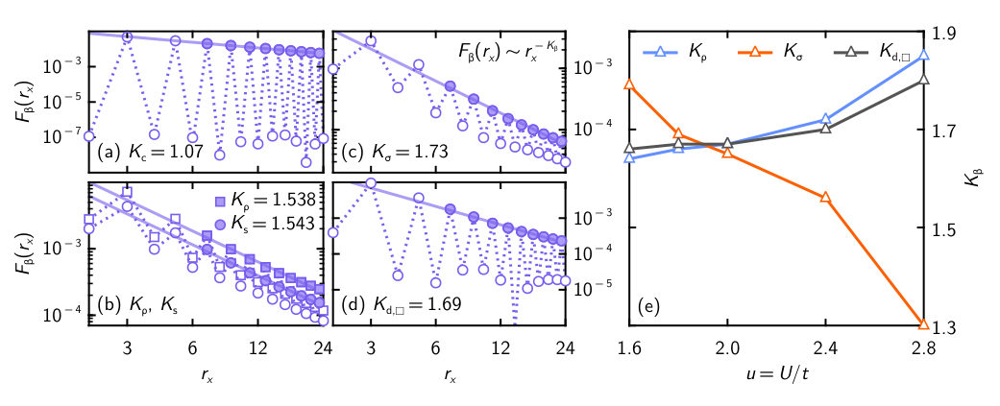
<figcaption class="paper-figure-caption"><b>Fig 5.</b> FIG. 4. Correlation functions and Luttinger exponents for the half-filled Hubbard–Holstein model on a 48 × 4 cylinder. (a)–(d) Spatial decay of correlation functions along the axial direction, Fβ(rx), in the Holstein limit (u = 0) at an electron-phonon coupling of λ = 0.4, extrapolated to the D →∞limit. The panels display correlations in the (a) single-particle (⟨c† i cj⟩), (b) charge-density-wave (⟨δniδnj⟩) alongside s-wave pairing (⟨P † s,iPs,j⟩), (c) spin-density-wave (⟨Si · Sj⟩), and (d) plaquette d-wave pairing (⟨P † d,□,iPd,□,j⟩) channels. Notably in (b), Ks is marginally lower than Kρ, reflecting the proximity to the SU(2)charge symmetry restoration in the high-frequency limit. (e)...</figcaption>
</figure>

**Summary.** This work develops a scalable Non-Gaussian Matrix Product State (NGS-MPS) method to simulate strongly correlated electron-phonon systems. By applying this technique to Hubbard-Holstein models, the authors map out complex phase diagrams, revealing how phonon interactions stabilize novel electronic phases like bipolaronic stripes crucial for understanding high-temperature superconductivity.

**Why it may be interesting.** While focused on condensed matter, the use of advanced tensor network methods like MPS/NGS for simulating coupled bosonic and fermionic degrees of freedom is highly relevant to open quantum systems modeling in AMO physics.

Detailed structure

**Main problem.** The paper investigates strongly correlated electron-phonon (e-ph) systems to decode the complex interplay between electronic correlations and lattice vibrations, which is crucial for understanding superconductivity.

**Main result.** In 2D models, they map a phase diagram showing a metallic phase emerging from competition effects, and in doped regimes, stabilize novel bipolaronic stripe phases via non-local retardation effects.

**Method.** They employ a Non-Gaussian Matrix Product State (NGS-MPS) method, which combines NGS with MPS to efficiently characterize the entanglement inherent in these complex e-ph systems.

**Model / system.** The study focuses on generalized Hubbard–Holstein (HH) models in 1D and 2D. The Hamiltonian includes electronic hopping ($H_e$), phonon propagation ($H_{ph}$), electron-phonon coupling ($H_{e-ph}$), and electron-electron repulsion ($H_{e-e}$).

**Key observables.** Phase diagram mapping, identification of metallic, antiferromagnetic (AFM), charge-density-wave (CDW), and bipolaronic stripe phases.

**Important parameters / regimes.** Doping concentration, phonon frequency ($\omega$), electron hopping ($t$), Hubbard repulsion ($U$), and coupling strength ($g$).

**Assumptions / limitations.** The method is designed to overcome limitations of QMC sign problems and standard TNS methods by using a variational ansatz that preserves key symmetries.

**Paper structure.** The paper introduces the problem, details the Hamiltonian components, presents the NGS-MPS methodology (including the variational ansatz and optimization workflow), and then systematically applies this method to analyze 1D and 2D HH models across different doping and filling regimes.

Abstract

We investigate strongly correlated electron-phonon (e-ph) systems via a non-Gaussian matrix product state method. By combining non-Gaussian states with matrix product states, our method efficiently characterizes the intractable entanglement between strongly correlated electrons and phononic modes of unbounded Hilbert space, enabling scalable simulations across broad parameter regimes. In one-dimensional generalized Hubbard--Holstein (HH) models, we identify a pronounced tendency toward phase separation (PS), an instability relevant to recent angle-resolved photoemission spectroscopy observations on doped cuprate chain. In two-dimensional HH models, we construct the phase diagram at half-filling featuring a metallic phase emerging from the competition between non-local phonon-mediated attraction and local Hubbard repulsion. Upon doping, we elucidate the role of soft phonons in stabilizing stripe phases. In the antiferromagnet, the stabilization of the fully filled stripe is attributed to a local retardation effect, wherein the charge order is pinned by phonons, leading to a diminished response to spin fluctuations. In the doped charge-density-wave regime, a novel bipolaronic stripe phase with an enlarged unit cell is stabilized via a non-local retardation effect, where long-range phonon-mediated interactions suppress PS. Our work establishes a systematic route to decoding the e-ph interplay that is crucial for superconductivity.

[↑ back to top](#top)

### [Low-latency FPGA-based electronic control system for fast preparation of defect-free atom arrays](http://arxiv.org/abs/2607.08687v1)

**Authors:** Ya-Dong Hu, Dong-Qi Ma, Tian-Yang Zhang, Liang Chen, Yi-Chen Zhang, Xiao-Kang Zhong, Wen-Yi Zhu, Hong-Jie Fan, Qing-Xuan Jie, Yan-Lei Zhang, Gang Li, Xi-Feng Ren, Xu-Liang Zhang, Guang-Can Guo, Zhu-Bo Wang, Chang-Ling Zou  
**Type:** experiment · **Category:** quantum information and computing · **PDF:** <https://arxiv.org/pdf/2607.08687v1>  
**Analysis basis:** full PDF text, analyzed in chunks
**Topic relevance:** 🔥 `QC/QI experiment` **4/5** · 🔥 `quantum measurements` **4/5** · `measurement-induced transitions` **3/5** · `analog quantum simulation` **2/5** · `Rydberg arrays` **1/5** · `methods for driven-dissipative` **1/5** · `non-equilibrium dynamics` **1/5** · `quantum optics experiment` **1/5**

↔ Scroll figures horizontally

<figure class="paper-figure-card">
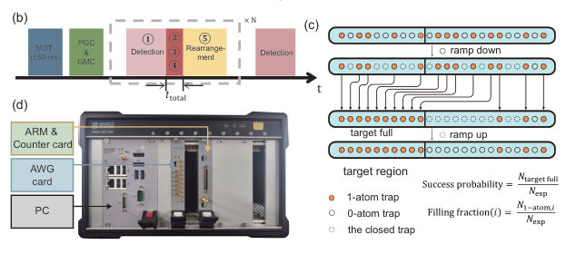
<figcaption class="paper-figure-caption"><b>Fig 1.</b> FIG. 1. Electronic control system and atom rearrangement scheme. (a) Experimental setup showing the optical path and electronic feedback loop. The one-dimensional (1D) atom array is generated by an acousto-optics deflector (AOD), and fluorescence is collected via optical channel mapping (OCM), fiber arrays (FAs), and SPD arrays (SPDAs). The counter card and ARM processor perform real-time detection and path planning; the arbitrary waveform generator (AWG) card drives the AOD for static tweezers and rearrangement. (b) Timing sequence of the rearrangement process, where ttotal is the total electronic latency. (c) Sketch of the 1D rearrangement process with definitions of success probability...</figcaption>
</figure>
<figure class="paper-figure-card">
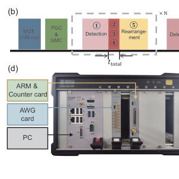
<figcaption class="paper-figure-caption"><b>Fig 2.</b> Figure 1(a) illustrates the experimental system, a proto- type quantum processing unit built around a single-atom ar- ray. The system separates into four modules: (i) the atomic array held in vacuum; (ii) a classical link that delivers the trapping and control light to the target atoms; (iii) a quantum</figcaption>
</figure>
<figure class="paper-figure-card">
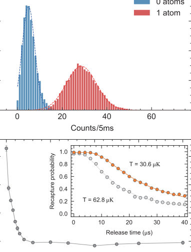
<figcaption class="paper-figure-caption"><b>Fig 3.</b> FIG. 2. The normalized histogram distribution of fluorescence counts and the atomic temperature. (a) The histogram distribu- tion of the channel 6 trap. (b) The atomic temperature varies with the GMC duration, and the saturated atomic temperature is 30.6µK when tGMC ≥2ms. Inset shows the results of the release and re- capture when no GMC (grey points and lines) and 2 ms GMC (or- ange points and lines), the atomic temperatures are 62.8(11)µK and 30.6(3)µK.</figcaption>
</figure>
<figure class="paper-figure-card">
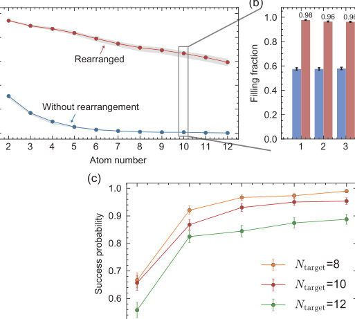
<figcaption class="paper-figure-caption"><b>Fig 4.</b> FIG. 3. Results of the single-round and the multi-round rearrangement. (a) Comparison of the success probability between single-round rearrangement and without rearrangement versus atom number (b) Comparison of filling fraction between single rearrangement and without rearrangement. (c). Multi-round rearrangement operations effectively enhance the success probability of generating defect-free atom arrays. At round = 5, the success probability is 99.01% for Ntarget = 8 (orange line), and reaching 95.38% and 88.78% for Ntarget = 10 (red line) and 12 (green line).</figcaption>
</figure>
<figure class="paper-figure-card">
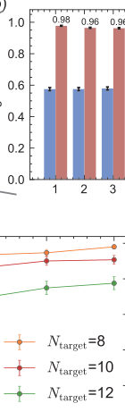
<figcaption class="paper-figure-caption"><b>Fig 5.</b> Figure 3(b) presents the results of rearranging atoms from a randomly loaded array of 24 optical tweezers into a target zone of N = 10 atoms. Following the 150ms MOT load- ing step, single atoms are stochastically loaded into the 24 tweezers, giving an initial single-atom filling fraction of ap- proximately 0.6 in the target region (blue bars). After rear- rangement, the single-site filling fraction increases to approxi- mately 0.96 (red bars), substantially enhancing the probability of generating defect-free arrays; this confirms that, in neutral- atom systems, rearrangement substantially mitigates the limi- tations imposed by stochastic loading.</figcaption>
</figure>

**Summary.** The paper introduces an FPGA-based electronic control system designed to overcome the slow data processing bottlenecks in large-scale neutral atom quantum computing experiments. By integrating all necessary functions onto a PXIe architecture, they achieved microsecond-level feedback latency. This breakthrough enables high-fidelity, iterative rearrangement protocols essential for building complex, defect-free quantum registers.

**Why it may be interesting.** This work directly addresses a critical engineering bottleneck—the control electronics—for scaling neutral atom quantum processors. The low latency achieved is crucial for implementing mid-circuit measurement and real-time Quantum Error Correction (QEC) protocols.

Detailed structure

**Main problem.** The scalability of neutral atom quantum computing requires integrated electronic control systems with low latency, modular architecture, and real-time feedback capability.

**Main result.** The developed FPGA-based system achieves a total feedback latency of $282\,\mathrm{\mu s}$ and successfully boosts the success probability for generating a 10-atom defect-free array from $65.7\%$ to $95.4\%$.

**Method.** The authors designed and implemented an FPGA-based electronic control system that integrates photon counting, real-time decision-making, and waveform generation into a unified PXIe architecture, eliminating the slow PC bottleneck.

**Model / system.** The physical platform is a 1D array of neutral atoms trapped in optical tweezers. The system uses fluorescence detection via Optical Channel Mapping (OCM) to Single Photon Detectors (SPDs) for real-time state readout and feedback control.

**Key observables.** Total feedback latency ($282\,\mathrm{\mu s}$), single-round filling fraction ($\sim 96\%$), success probability of defect-free array assembly ($95.4\%$ after five rounds).

**Important parameters / regimes.** Trap spacing ($4.5\,\mathrm{\mu m}$), trap depth ($\sim 0.8\,\mathrm{mK}$), state preparation/gate timescales ($\sim 1-2\,\mathrm{\mu s}$).

**Assumptions / limitations.** The primary bottleneck addressed is the latency of external PC control loops; the remaining single-round limit is set by atomic physics, not electronics.

**Figures summary.** Figures illustrate the experimental setup detailing the optical path and electronic feedback loop components (AOD, SPDs, FPGA cards). Timing sequences show the total electronic latency, and histograms/plots demonstrate success probability improvements through iterative rearrangement protocols.

**Paper structure.** The paper details the necessity of low-latency control for fault tolerance, presents the integrated FPGA architecture, characterizes the timing overheads of each subsystem (readout, calculation, transmission), and validates the system by demonstrating high-fidelity, multi-round assembly of defect-free atom arrays.

Abstract

The scalability of neutral atom quantum computing demands integrated electronic control systems with low latency, modular architecture, and real-time feedback capability. Here, we present an FPGA-based electronic control system that eliminates the PC from the feedback loop, integrating photon counting, real-time decision-making, and waveform generation within a unified PXIe architecture. The system achieves a total feedback latency of $282\,\mathrm{μs}$ and is validated in practical experiments by assembling defect-free atom arrays from 24 stochastically loaded optical tweezers. A single-round rearrangement achieves a filling fraction of $\sim96\%$, while feedback-controlled iterative rearrangement over five rounds boosts the success probability for generating a 10-atom defect-free array from $65.7\%$ to $95.4\%$. This system establishes the electronic infrastructure necessary for mid-circuit measurement and real-time quantum error correction on neutral-atom platforms.

[↑ back to top](#top)

### [Robust Quantum Learning through Hamiltonian Reservoir Computing](http://arxiv.org/abs/2607.08037v1)

**Authors:** Youya Xu, Chengyong Yu, Sanjib Ghosh  
**Type:** both · **Category:** disordered systems and neural networks · **PDF:** <https://arxiv.org/pdf/2607.08037v1>  
**Analysis basis:** full PDF text, analyzed in chunks
**Topic relevance:** 🔥 `analog quantum simulation` **4/5** · `QC/QI experiment` **3/5** · `methods for driven-dissipative` **3/5** · `driven-dissipative phase transition` **2/5** · `non-equilibrium dynamics` **2/5** · `correlated / nonlocal dissipation` **1/5** · `entanglement & information structure` **1/5** · `non-equilibrium universality` **1/5**

↔ Scroll figures horizontally

<figure class="paper-figure-card">
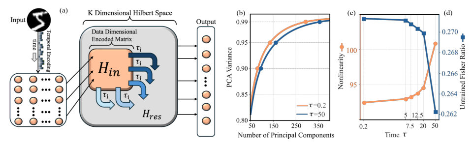
<figcaption class="paper-figure-caption"><b>Fig 1.</b> FIG. 1. Schematic diagram and expressivity analysis of the Hamiltonian Encoding Framework</figcaption>
</figure>
<figure class="paper-figure-card">
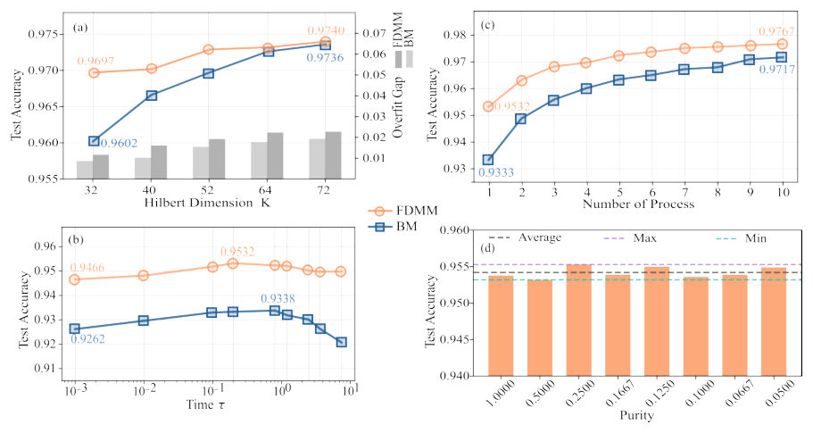
<figcaption class="paper-figure-caption"><b>Fig 2.</b> FIG. 2. Performance scaling and parameter optimization of the HEF framework. (a) MNIST</figcaption>
</figure>
<figure class="paper-figure-card">
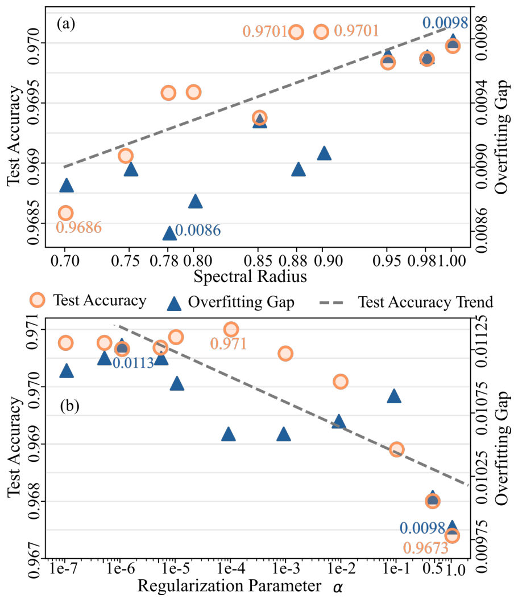
<figcaption class="paper-figure-caption"><b>Fig 3.</b> FIG. 3. Hyperparameter assessment for the HEF. (a) Impact of the spectral radius on classification</figcaption>
</figure>
<figure class="paper-figure-card">
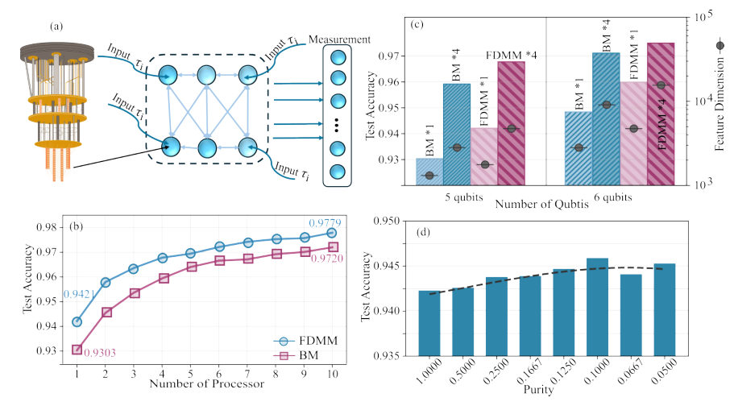
<figcaption class="paper-figure-caption"><b>Fig 4.</b> FIG. 4. Analog Superconducting Array Processor (ASAP) architecture and performance</figcaption>
</figure>
<figure class="paper-figure-card">
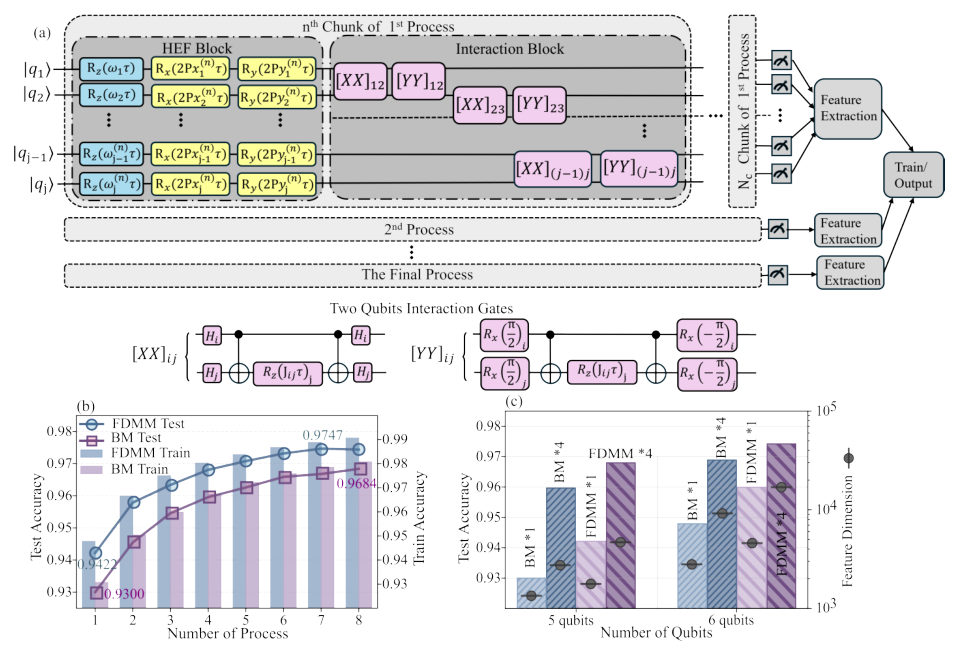
<figcaption class="paper-figure-caption"><b>Fig 5.</b> FIG. 5. Quantum Circuit Implementation (QCI) architecture and performance bechmarks. (a)</figcaption>
</figure>

**Summary.** This paper proposes using a Hamiltonian Encoding Framework for Quantum Reservoir Computing, allowing data inputs to drive the system's dynamics. This method bypasses common training pitfalls like barren plateaus while proving its efficacy across both analog superconducting processors and digital gate models. The work highlights that controlled environmental dissipation can constructively stabilize quantum learning processes.

**Why it may be interesting.** It directly connects concepts from open quantum systems (dissipation, Hamiltonian evolution) to machine learning theory by showing how controlled environmental interaction can stabilize and enhance computational utility in a physical quantum hardware setting.

Detailed structure

**Main problem.** The central challenge is developing a quantum learning paradigm that is robust, hardware-efficient, and trainable while overcoming issues like barren plateaus.

**Main result.** The Hamiltonian Encoding Framework (HEF) successfully establishes itself as a compact, expressive, and hardware-efficient method for quantum learning, demonstrating comparable performance on both analog superconducting arrays and digital gate circuits.

**Method.** Input data are mapped onto a fixed Hamiltonian ($H$), and feature extraction is achieved through controlled quantum dynamical evolution ($	ext{e}^{-iHt}$), bypassing variational optimization landscapes.

**Model / system.** The framework utilizes Quantum Reservoir Computing (QRC) implemented via an HEF. The dynamics are governed by the von Neumann equation, allowing for cross-platform testing on superconducting arrays and digital circuits.

**Key observables.** MNIST test accuracies ($\approx 98\%$ vs $\approx 97.5\%$), Principal Component Analysis explained variance ratios, mean local nonlinearity $\langle N 
angle$, and Fisher ratio ($F$).

**Important parameters / regimes.** Evolution time ($	au$), number of qubits/components ($K$), dissipation strength (finite environmental coupling).

**Assumptions / limitations.** The approach assumes that the dynamics generated by a fixed Hamiltonian provide sufficient nonlinear feature mapping, and it investigates the constructive role of finite dissipation.

**Figures summary.** Figure 1 illustrates the HEF schematic, PCA results showing high dimensionality retention, local nonlinearity strength evaluation, and class separability diagnostics.

**Paper structure.** The paper introduces the HEF for QRC, details its construction using input-dependent and base Hamiltonians, validates its expressivity via feature space analysis (PCA/nonlinearity), compares performance across analog and digital platforms, and discusses the role of environmental coupling.

Abstract

Quantum learning provides a versatile paradigm for information processing by exploiting the intrinsic representational capacity of high-dimensional Hilbert spaces. Here, we investigate a Hamiltonian-encoding framework for quantum reservoir computing that simultaneously addresses three key challenges in quantum learning: trainability, hardware efficiency, and information stability. In this framework, input data are directly mapped onto a fixed Hamiltonian and transformed into expressive nonlinear features through quantum dynamical evolution. By employing the reservoir-computing paradigm, the approach naturally circumvents the barren plateau problem in quantum learning landscapes. We validate the framework across two complementary platforms: an analog superconducting array processor and a digital gate-based quantum circuit implementation. Despite their fundamentally different realizations, both platforms exhibit comparable representational power and achieve competitive learning performance, establishing a unified framework for cross-platform quantum learning. While both implementations achieve comparable performance, the analog processor may offer a more hardware-efficient realization by bypassing the temporal overhead of gate-based decomposition and thereby making more effective use of finite coherence times, albeit at the expense of universality. Furthermore, we find that finite dissipation suppresses quantum-scrambling-induced instabilities at long evolution times and can enhance learning performance, revealing a constructive role for environmental coupling in stabilizing quantum learning dynamics. Collectively, these results establish Hamiltonian-encoded reservoir computing as a compact, expressive, and hardware-efficient paradigm for quantum learning on current-generation quantum platforms.

[↑ back to top](#top)

### [Temperature Beyond Equilibrium in Isolated Quantum Many-Body Systems and Their Subsystems](http://arxiv.org/abs/2607.08655v1)

**Authors:** Maurizio Fagotti  
**Type:** theory · **Category:** statistical mechanics · **PDF:** <https://arxiv.org/pdf/2607.08655v1>  
**Analysis basis:** full PDF text, analyzed in chunks
**Topic relevance:** 🔥 `non-equilibrium dynamics` **4/5** · `non-equilibrium universality` **3/5** · `analog quantum simulation` **2/5** · `entanglement & information structure` **2/5** · `scars & prethermalization` **2/5** · `Keldysh / 2PI / non-Gaussian methods` **1/5** · `correlated / nonlocal dissipation` **1/5** · `driven-dissipative phase transition` **1/5** · `methods for driven-dissipative` **1/5**

↔ Scroll figures horizontally

<figure class="paper-figure-card">
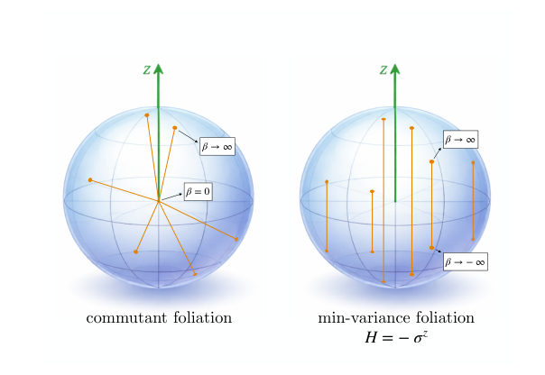
<figcaption class="paper-figure-caption"><b>Fig 1.</b> Figure 1. Two foliations of state space. The cartoon compares the commutant foliation and the minimum-variance foliation of the state space of a two-dimensional Hilbert space. The state space is represented by the Bloch ball. The commutant foliation is defined on the state space with the tracial state 1</figcaption>
</figure>
<figure class="paper-figure-card">
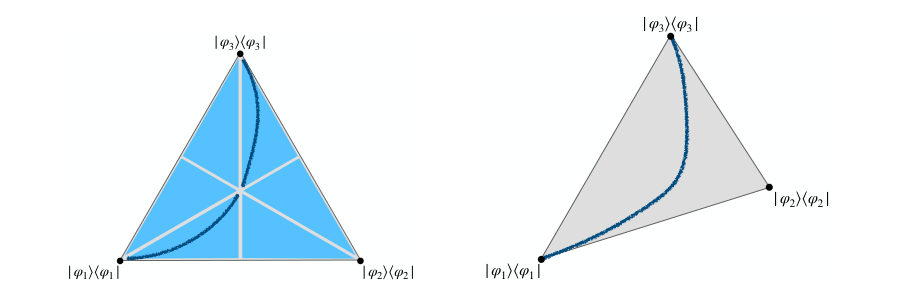
<figcaption class="paper-figure-caption"><b>Fig 2.</b> Figure 2. From foliations to thermodynamics. Left: The six leaves of the commutant foliation that contain stationary states of the Hamiltonian H3 = P3 i=1 Ei|φi⟩⟨φi| on a three-dimensional Hilbert space. Since each such leaf is two-dimensional, a generic state on it requires two coordinates. For local observables, however, the eigenstate thermalization hypothesis suggests an effective reduction of the relevant state space: in the thermodynamic limit, equilibrium states are characterized by the energy density alone, up to fluctuations that vanish with system size. In the cartoon, this reduced thermal manifold is represented by the rough thick curve joining the ground state of H3 to the...</figcaption>
</figure>
<figure class="paper-figure-card">
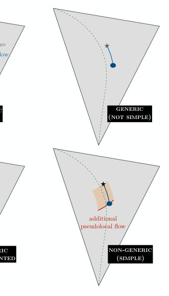
<figcaption class="paper-figure-caption"><b>Fig 3.</b> Figure 3. Schematic illustration of four possible types of leaves. The leaves are drawn as triangles, as if the state space were three-dimensional. The dashed curve represents the family of leaf-canonical ensembles connecting the extremal pure states. The filled circle marks the state under consideration, and the star denotes the β = 0 state reached along the pseudolocal flow, shown as a solid curve.</figcaption>
</figure>
<figure class="paper-figure-card">
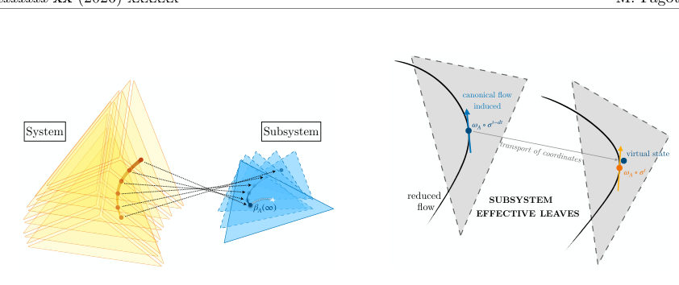
<figcaption class="paper-figure-caption"><b>Fig 4.</b> Figure 4. Geometric construction of subsystem temperature. Left: The global state evolves through the leaves of the full-system foliation, represented as tetrahedra as if the state space were four-dimensional. Reduction maps this trajectory to the subsystem state space, represented as three-dimensional, where the effective leaves are shown as triangles. The global canonical flow induces a local thermodynamic direction on the subsystem, fixing the time derivative of the subsystem inverse temperature. The actual value of the inverse temperature is then obtained by reading it relative to the reduced infinite-time state, whose effective leaf is a genuine weak leaf in the sense defined in the...</figcaption>
</figure>
<figure class="paper-figure-card">
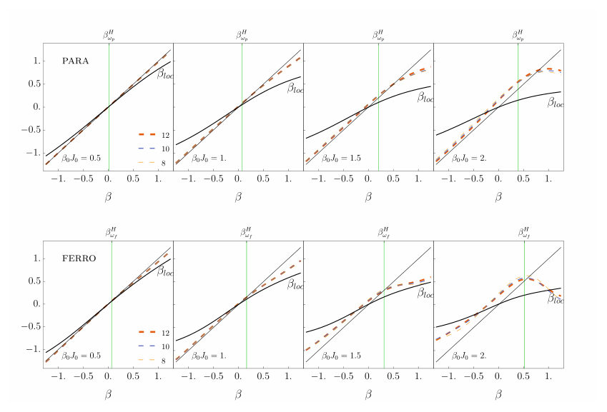
<figcaption class="paper-figure-caption"><b>Fig 5.</b> Figure 5. Temperature vs local temperature vs bare temperature. The stabilized late-time local inverse temperature βloc (black solid curves) as a function of the nonequilibrium inverse temperature β in the leaves across thermal states (with inverse temperatures β0) of the paramagnetic and ferromagnetic pre-quench Hamiltonians (67). The coupling constants of the Hamiltonian (68) are set to J = 1, γ = −2, h = 0.5, and D = 0.75. The dashed curves are the estimators β(I) bare(β) (bare inverse temperatures), defined in (48), for three spin chains of lengths L = 8, 10, 12 and periodic boundary conditions. The thin straight black line is just shown for reference, as it represents β 7→β.</figcaption>
</figure>

**Summary.** This paper tackles the fundamental challenge of defining temperature for isolated quantum systems evolving away from equilibrium. It introduces a novel mathematical structure based on the minimum-variance foliation to parameterize these non-equilibrium states. The result provides a generalized, physically meaningful definition of temperature applicable even when coherence effects dominate over simple energy population distributions.

**Why it may be interesting.** This work provides a rigorous theoretical framework for defining thermal concepts in non-equilibrium quantum dynamics, which is crucial for understanding quench dynamics or open system approximations where true equilibrium assumptions fail.

Detailed structure

**Main problem.** The central problem is defining a meaningful concept of 'temperature' for isolated quantum many-body systems when they are evolving unitarily and far from thermodynamic equilibrium.

**Main result.** The authors propose replacing the standard definition with one based on the minimum-variance foliation, which defines a canonical flow parameter acting as an out-of-equilibrium temperature in the thermodynamic limit.

**Method.** The approach involves reinterpreting energy fluctuations by separating population contributions from coherence contributions and utilizing geometric tools like state space foliations (specifically the minimum-variance foliation).

**Model / system.** The analysis focuses on isolated quantum many-body systems, modeled using quantum spin chains with local interactions governed by a Hamiltonian H(I). The theory is developed for both finite and infinite (thermodynamic) systems.

**Key observables.** Energy fluctuations (population vs. coherence), Quantum Fisher Information (QFI), correlation functions K_O(I), and the effective subsystem Hamiltonian H_A.

**Important parameters / regimes.** Inverse temperature ($eta$), system size ($L 	o \infty$ limit), and the separation parameter $\Deltaeta$.

**Assumptions / limitations.** The theory relies on establishing analytic properties of correlation functions in small neighborhoods around equilibrium, and for subsystems, it assumes that local observables can be characterized by an effective Hamiltonian.

**Figures summary.** Figure 1 compares two foliations (commutant vs. minimum-variance) of the state space; Figure 2 contrasts how these two foliations characterize thermal manifolds for both equilibrium and non-equilibrium states.

**Paper structure.** The paper progresses by first identifying the failure of standard temperature concepts out of equilibrium, then introducing the mathematical framework using state space foliations (minimum-variance foliation), establishing the resulting canonical flow parameter as the generalized temperature, and finally extending this definition to subsystems via effective Hamiltonians.

Abstract

Temperature is one of the central concepts of thermodynamics, yet its meaning away from equilibrium remains elusive. This problem is particularly acute in isolated quantum many-body systems: their states evolve unitarily, need not be close to equilibrium, and can retain energy coherence, a feature with no classical thermodynamic analogue. A non-stationary quantum state contains two kinds of energy fluctuations. One is associated with energy populations and has the usual thermodynamic interpretation; the other arises from coherence between energy sectors and drives time dependence. We propose that temperature, also out of equilibrium, locates the state within the family of regular states compatible with its energy-coherence structure. This leads to a natural definition of temperature for regular nonequilibrium states. The resulting inverse temperature is not generally the derivative of thermodynamic entropy with respect to energy. Indeed the principle of maximum entropy does not extend in its usual form; it is replaced by a principle of minimum discrimination information. We also develop the corresponding theory for subsystems, where temperature cannot in general be inferred from the reduced state alone. Instead, it is determined by the induced local thermodynamic structure, with boundary ambiguities removed in the thermodynamic limit.

[↑ back to top](#top)

### [Complex spacing ratio statistics in the partially open asymmetric quantum baker map](http://arxiv.org/abs/2607.07878v1)

**Authors:** Leonardo Ermann, Pablo Sesin, Alejandro M. F. Rivas, Pablo D. Bergamasco, Gabriel G. Carlo  
**Type:** theory · **Category:** statistical mechanics · **PDF:** <https://arxiv.org/pdf/2607.07878v1>  
**Analysis basis:** full PDF text, analyzed in chunks
**Topic relevance:** 🔥 `methods for driven-dissipative` **4/5** · `Keldysh / 2PI / non-Gaussian methods` **3/5** · `driven-dissipative phase transition` **3/5** · `non-equilibrium universality` **2/5** · `Kondo & dissipative impurity` **1/5** · `correlated / nonlocal dissipation` **1/5** · `non-equilibrium dynamics` **1/5**

↔ Scroll figures horizontally

<figure class="paper-figure-card">
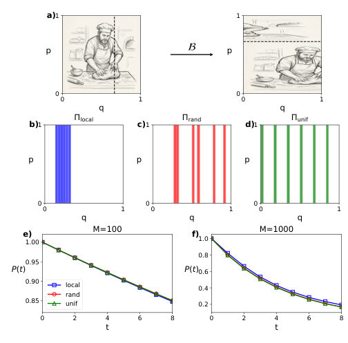
<figcaption class="paper-figure-caption"><b>Fig 1.</b> FIG. 1. Representation of the classical transformation, quan- tum opening configurations, and classical survival statistics. (a) Illustration of the classical asymmetric baker map B. The original domain (left) is divided by a vertical line at q = 2/3 (the map’s discontinuity). The transformation stretches and compresses these regions to form the transformed domain (right), where the boundary is at p = 2/3. (b-d) Schematic of the quantum openings in a phase space of N = 30 states, where colored regions indicate the open channels: (b) local- ized (Πlocal), (c) random (Πrand), (d) uniform (Πunif). (e- f) Classical survival probability P(t) as a function of time t for M = 100 (e) and M = 1000...</figcaption>
</figure>
<figure class="paper-figure-card">
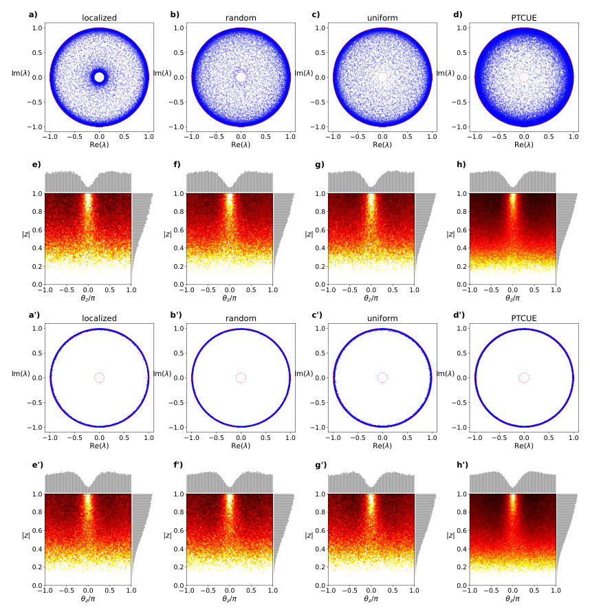
<figcaption class="paper-figure-caption"><b>Fig 2.</b> FIG. 2. Spectral properties and complex spacing ratio distributions for M = 100. Top block (ρ = 0, fully open): rows (a-d) show the eigenvalue distribution in the complex plane for localized (a), random (b), uniform (c), and PTCUE (d); rows (e-h) show the joint density of z in polar coordinates (θz/π, |z|) on a log color scale, with marginal distributions. Bottom block (ρ = 0.5, partial opening): same layout (a′-d′) and (e′-h′). In all panels the red dashed circle marks the unit circle and the dotted circle marks the filter threshold |λ| = 0.1. Data from 20 realizations (baker models) and 50 (PTCUE).</figcaption>
</figure>
<figure class="paper-figure-card">
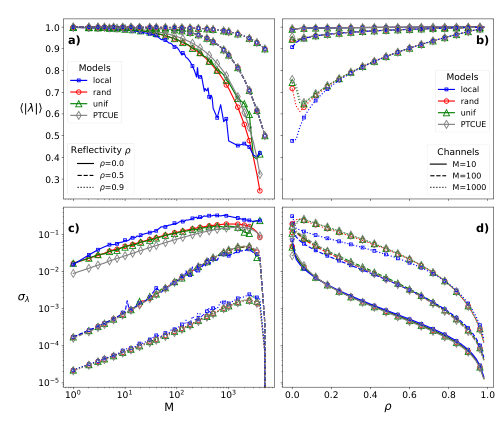
<figcaption class="paper-figure-caption"><b>Fig 3.</b> FIG. 3. Statistical properties of eigenvalues with |λ| ≥0.1 for the asymmetric open baker map with N = 5001. (a) Mean ⟨|λ|⟩vs. M (log scale). (b) Mean ⟨|λ|⟩vs. ρ (linear scale). (c) Standard deviation σ(|λ|) vs. M (log-log scale). (d) Stan- dard deviation σ(|λ|) vs. ρ (log-linear). Models: local (blue squares), rand (red circles), unif (green triangles), PTCUE (gray diamonds).</figcaption>
</figure>
<figure class="paper-figure-card">

<figcaption class="paper-figure-caption"><b>Fig 4.</b> Figure 3 shows the mean ⟨|λ|⟩(top row, panels a and b) and the standard deviation σ(|λ|) of the eigenvalue moduli as functions of the number of open channels M and the reflectivity parameter ρ. The results are pre- sented for the three baker map models and the PTCUE. The top row illustrates where the bulk of the spectrum is radially centered. For small openings (i.e., a small num- ber of channels, M →1), the spectrum behaves almost as a unitary ring, with ⟨|λ|⟩approaching 1. This clus- tering is also reflected in the standard deviation, which becomes very small for M values close to 1. Similarly, it is clear that as the reflectivity ρ increases, the mean eigenvalue moduli consistently...</figcaption>
</figure>
<figure class="paper-figure-card">
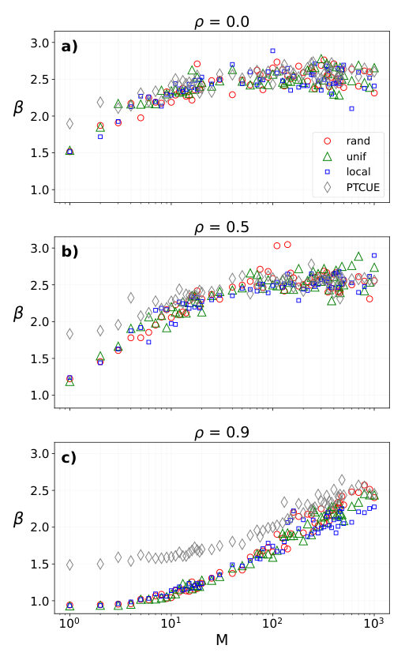
<figcaption class="paper-figure-caption"><b>Fig 5.</b> FIG. 4. Power-law exponent β of P(|z|) ∼|z|β as a function of M (log scale) for opening strengths (a) ρ = 0, (b) ρ = 0.5, (c) ρ = 0.9. Four models are compared in each panel: rand (red circles), unif (green triangles), local (blue squares), PTCUE (gray diamonds). The exponent is obtained by a linear regression in log-log scale for |z| ∈[0, 0.75].</figcaption>
</figure>

**Summary.** The paper analyzes how the complex eigenvalue statistics of a partially leaky quantum baker map transition between different spectral regimes. By using the complex spacing ratio and comparing results to Random Matrix Theory benchmarks, the authors demonstrate that this crossover is smoothly controlled by tunable parameters like leakage amplitude ($
ho$). This has implications for understanding wave chaos in realistic, dissipative open quantum systems.

**Why it may be interesting.** This work provides a detailed theoretical framework for characterizing spectral rigidity in open quantum systems where standard Hermitian assumptions break down, linking chaos diagnostics to non-Hermitian random matrix theory.

Detailed structure

**Main problem.** The study investigates the complex eigenvalue statistics of a partially open, asymmetric quantum baker map to understand spectral fluctuations in non-Hermitian systems.

**Main result.** A smooth crossover is observed between quasi-1D and 2D Ginibre-like spectral regimes, controlled universally by both the number of openings ($M$) and the reflectivity parameter ($
ho$).

**Method.** The analysis focuses on the joint distribution of the complex spacing ratio $z$, comparing results against the Partially Truncated Circular Unitary Ensemble (PTCUE) benchmark.

**Model / system.** The system is based on the classical asymmetric baker map, quantized and modified by introducing partial leakage via 'openings' in position space. The dynamics are controlled by a reflectivity parameter $
ho$ interpolating between fully open ($
ho=0$) and closed ($
ho=1$) limits.

**Key observables.** Complex spacing ratio $z$, joint probability density $P(|z|, 	heta_z)$, classical escape rate ($\gamma$), and fractal dimension ($d_I$).

**Important parameters / regimes.** $M$ (number of open channels), $
ho$ (reflectivity parameter), and the spectral regime (quasi-1D vs. 2D Ginibre).

**Assumptions / limitations.** The complex spacing ratio metric is used because standard unfolding techniques fail for non-Unitary operators; convergence to universal statistics is conjectured.

**Figures summary.** Figures illustrate classical survival probabilities, eigenvalue spectra, and the joint density plots of $z$ across different opening geometries and reflectivity values, showing crossover behavior.

**Paper structure.** The paper first establishes the physical model (baker map with openings) and diagnostics ($z$, PTCUE). It then analyzes classical dynamics ($\gamma, d_I$) before focusing on the quantum spectral statistics, demonstrating the smooth crossover controlled by $
ho$ and $M$.

Abstract

We study the complex eigenvalue statistics of the asymmetric quantum baker map with partial projective openings. The classical asymmetric baker map, with its discontinuity at $q=2/3$, is fully chaotic, has no reflection symmetry, and provides a clean setting with tunable escape rate and fractal repeller dimension. We consider three distinct opening geometries in position space: localized (contiguous channels), random, and uniform (equispaced channels), all controlled by a tunable amplitude reflectivity parameter $ρ$ that interpolates between the fully open ($ρ=0$) and the closed ($ρ=1$) limits. We use the partially truncated circular unitary ensemble (PTCUE) as the random matrix theory benchmark. The main focus is on the joint distribution of the complex spacing ratio $z$, defined as the ratio of the distances from an eigenvalue to its nearest and next-nearest neighbors in the complex plane. We find a smooth crossover from a quasi-1D spectral regime, where eigenvalues cluster near the unit circle and the phase distribution of $z$ is peaked, to a two-dimensional Ginibre-like regime, where the distribution becomes nearly uniform and level repulsion is fully developed. Both the number of open channels $M$ and the reflectivity $ρ$ modulate this crossover, and $ρ$ provides an additional continuous control even at fixed opening size. All three opening models converge to PTCUE statistics at large $M$, while differences are most pronounced for the localized model at small $M$. No evidence of an abrupt transition is found. This crossover which suggests a universal behavior, has deep consequences for open quantum and wave-chaotic experiments.

[↑ back to top](#top)

### [No off-diagonal quantum focusing for Rényi divergences](http://arxiv.org/abs/2607.07799v1)

**Authors:** Tanay Kibe, Pratik Roy  
**Type:** theory · **Category:** other · **PDF:** <https://arxiv.org/pdf/2607.07799v1>  
**Analysis basis:** full PDF text, analyzed in chunks
**Topic relevance:** 🔥 `entanglement & information structure` **4/5** · `Keldysh / 2PI / non-Gaussian methods` **3/5** · `non-equilibrium dynamics` **2/5** · `non-equilibrium universality` **2/5** · `analog quantum simulation` **1/5** · `correlated / nonlocal dissipation` **1/5** · `driven-dissipative phase transition` **1/5** · `methods for driven-dissipative` **1/5**

↔ Scroll figures horizontally

<figure class="paper-figure-card">
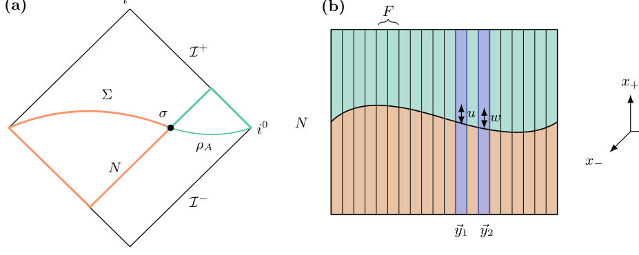
<figcaption class="paper-figure-caption"><b>Fig 1.</b> FIG. 1. (a) Penrose diagram of Minkowski spacetime with a Cauchy surface Σ that is split into two by the co-dimension two surface σ. N is a null hypersurface orthogonal to σ. The state ρA on the subregion A of Σ can be equivalently described on the green part of N together with the green part of future null infinity I+. (b) The null hypersurface N is divided into null pencils of infinitesimal width around the null generators of N. N is split into two parts (green and orange) by σ. The split is parametrized by a function V (⃗y) of the transverse coordinates. The two pencils of interest are colored blue and labeled by ⃗y1,2, with null deformation parameters u, w. F indicates a subset of the...</figcaption>
</figure>

**Summary.** This theoretical paper investigates whether a generalized 'quantum focusing' inequality holds for Rényi divergences in quantum field theory. By constructing a counterexample using specific divergence calculations, the authors prove that such an off-diagonal focusing statement does not hold universally for a broad class of information measures. This constrains the mathematical scope of generalizations of fundamental physical conjectures.

**Why it may be interesting.** While focused on QFT/Gravity analogies, the mathematical machinery involving divergences and information flow (like relative entropy generalizations) is highly relevant to understanding entanglement structure in many-body quantum systems far from equilibrium.

Detailed structure

**Main problem.** The authors investigate whether an off-diagonal quantum focusing inequality, analogous to those derived for diagonal Rényi divergences (RQNEC), holds universally for general Rényi-type divergences.

**Main result.** They show that for a broad class of Rényi divergences satisfying standard axioms, the required off-diagonal focusing statement fails in general, providing a negative answer to the question.

**Method.** The analysis constructs a counterexample using free quantum field theory on Minkowski spacetime and calculating the mixed variation ($\Delta_{12}D_\gamma$) of the Rényi divergence across different null generators.

**Model / system.** The model is a regulated Quantum Field Theory (QFT) setup involving spectator degrees of freedom and two active null pencils. The focus is on how entanglement/information divergences behave when considering correlations between distinct spatial regions.

**Key observables.** Off-diagonal variation $\Delta_{12}D^\gamma$, Rényi divergence $D_\gamma(\Psi\|\Omega)$, and the general structure of the focusing inequality.

**Important parameters / regimes.** The Rényi parameter $\gamma$ (or $\alpha$), which dictates the specific form of the divergence used in the analysis.

**Assumptions / limitations.** The results are restricted to divergences satisfying faithfulness, data processing inequality (DPI), tensor additivity, and matched classical-quantum conditioning rules.

**Figures summary.** Not specified by notes; the focus is on deriving algebraic counterexamples for the divergence variation.

**Paper structure.** The paper first reviews the context of quantum focusing conjectures, then develops calculations using specific block decompositions of states to compute the mixed variation $\Delta_{12}D_\gamma$ for various Rényi parameters, culminating in the explicit violation of the inequality.

Abstract

The quantum focusing conjecture is a mathematical expression of the idea that semiclassical gravity remains universally attractive. Its off-diagonal part is a monotonicity condition on the double null shape variation of relative entropy on distinct null generators, and has been argued to follow from strong subadditivity of entanglement entropy. Recent proof of a diagonal Rényi quantum null energy condition raises the question: does a full Rényi focusing statement also hold? We answer this question negatively for any Rényi-type divergence satisfying data processing, tensor additivity, and matched classical--quantum conditioning.

[↑ back to top](#top)

### [Extracting conformal data from Loschmidt echoes after critical quenches](http://arxiv.org/abs/2607.08649v1)

**Authors:** Aleix Bou-Comas, Stefano Carignano, Sergio Cerezo-Roquebrún, Esperanza Lopez, Luca Tagliacozzo  
**Type:** theory · **Category:** statistical mechanics · **PDF:** <https://arxiv.org/pdf/2607.08649v1>  
**Analysis basis:** full PDF text, analyzed in chunks
**Topic relevance:** 🔥 `non-equilibrium universality` **4/5** · `non-equilibrium dynamics` **3/5** · `entanglement & information structure` **2/5** · `Keldysh / 2PI / non-Gaussian methods` **1/5** · `analog quantum simulation` **1/5** · `correlated / nonlocal dissipation` **1/5** · `driven-dissipative phase transition` **1/5** · `methods for driven-dissipative` **1/5**

↔ Scroll figures horizontally

<figure class="paper-figure-card">
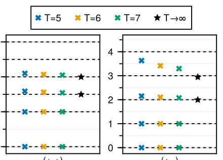
<figcaption class="paper-figure-caption"><b>Fig 1.</b> FIG. 1. Ratios of universal dynamical exponents obtained from the transverse transfer matrix of Loschmidt amplitudes in the critical Ising model. The (+, +) data correspond to the return amplitude ⟨+|U(T)|+⟩, while the (+, −) data correspond to the transition amplitude ⟨−|U(T)|+⟩. The black dashed lines indicate the exact CFT predictions. The crosses show numerical results for evolution times T = 5 (blue), T = 6 (orange), and T = 7 (green), while the black stars show the extrapolated values obtained from fits of the form ai,∞+ bi/T 2.</figcaption>
</figure>
<figure class="paper-figure-card">
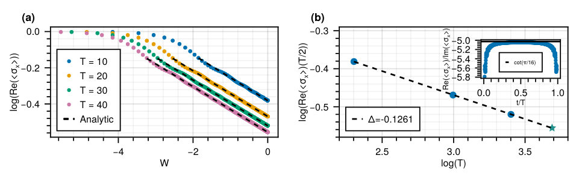
<figcaption class="paper-figure-caption"><b>Fig 2.</b> FIG. 2. (a) log (Re(⟨σx⟩)) as a function of the logarithmic chord coordinate W, with overlaid fits whose slope is consistent with the analytical prediction −h = −1/8. (b) log (Re (⟨σx⟩(T/2))) as a function of T, together with a fit whose exponent is consistent with the CFT prediction h = 1/8. The inset of panel (b) displays the ratio between the real and imaginary parts of ⟨σx⟩(t) at T = 40, consistent with the phase factor i−h.</figcaption>
</figure>
<figure class="paper-figure-card">
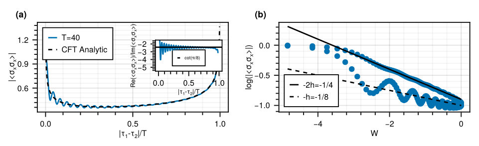
<figcaption class="paper-figure-caption"><b>Fig 3.</b> FIG. 3. Panel (a): | ⟨σxσx⟩| as a function of the normalized temporal distance |τ1 −τ2|/T between the two symmetric operator insertions. Black dashed lines correspond to CFT prediction on two symmetrically separated insertions on the strip, which follows Eq. (37). The inset shows the ratio of the real to the imaginary part of ⟨σxσx⟩at T = 40, consistent with the phase factor i−2h = i−1/4. Panel (b): log(Re ⟨σxσx⟩) as function of the chord distance W, defined in Eq. (31). The data show regimes compatible with power-law decay governed by exponents related to the scaling dimension of the spin field.</figcaption>
</figure>
<figure class="paper-figure-card">
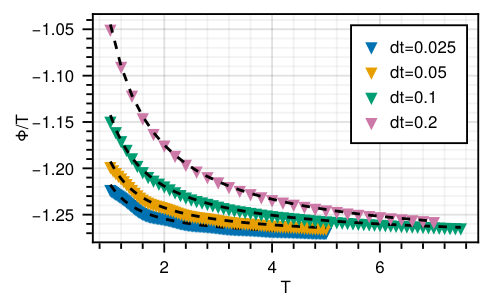
<figcaption class="paper-figure-caption"><b>Fig 4.</b> FIG. 4. Phase of the Loschmidt echo estimated through the phase-sensitive reconstruction protocol. In all simulations, we use dβ = 0.05, while different colors correspond to different choices of dt. The dashed black lines are fits to the expected form ϕ(T )</figcaption>
</figure>
<figure class="paper-figure-card">
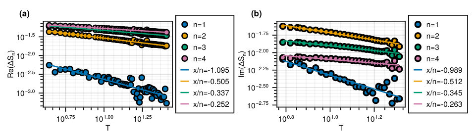
<figcaption class="paper-figure-caption"><b>Fig 5.</b> FIG. 5. Deviation of the real part (a) and imaginary part (b) of the generalized temporal R´enyi entropy from the leading CFT prediction at the center of the strip for the critical Ising model. The data correspond to different R´enyi indices, while the solid lines show fits to the expected power-law corrections governed by the exponent x/n.</figcaption>
</figure>

**Summary.** The paper develops a method to extract universal Conformal Field Theory data from real-time Loschmidt echoes following quantum quenches. By mapping the time evolution onto a boundary-CFT partition function, the authors show that ratios of spectral splittings encode fundamental CFT parameters like scaling dimensions and central charge. This provides a robust theoretical framework for analyzing out-of-equilibrium dynamics in critical systems.

**Why it may be interesting.** This work provides powerful theoretical tools to probe non-equilibrium quantum dynamics using measurable quantities (echoes) that bypass the need for complex state preparation, making it highly relevant for characterizing critical points in physical systems.

Detailed structure

**Main problem.** The goal is to develop a method to extract universal Conformal Field Theory (CFT) data from real-time quantum dynamics, specifically using Loschmidt echoes after critical quenches, without needing to prepare the difficult-to-access critical low-energy states.

**Main result.** Ratios of spectral splittings derived from finite-size dependence of Loschmidt echoes are shown to be universal and directly encode differences in boundary scaling dimensions ($\Delta_i - \Delta_j$), allowing for a practical extraction protocol.

**Method.** The analysis involves mapping the time evolution to a boundary-CFT partition function on a strip geometry, utilizing transverse transfer matrices whose spectra yield CFT data. Finite-size scaling protocols are developed by analyzing ratios of decay rates.

**Model / system.** The study focuses on one-dimensional quantum systems undergoing a quench from an initial product state $|\psi_0
angle$ to a critical Hamiltonian $H$. The dynamics are diagnosed using the Loschmidt amplitude, $A(T) = \langle\psi_0| e^{-iHT} |\psi_0
angle$, which is related to boundary-CFT partition functions.

**Key observables.** Loschmidt amplitude/echo ($L(T)$), transverse transfer matrix spectrum (eigenvalues $\lambda_i$), generalized temporal entropies, and ratios of dynamical exponents ($\Delta_{ii}/\Delta_{11}$).

**Important parameters / regimes.** System size dependence ($N_X$), quench time ($T$), central charge ($c$), and boundary scaling dimensions ($\xi$).

**Assumptions / limitations.** The analysis relies on analytic continuation from imaginary time (Euclidean) to real time, and the extraction protocols assume that finite-size effects can be systematically removed through ratios.

**Figures summary.** Figures illustrate the tensor network representation of the Loschmidt amplitude via transverse contraction. Plots show linear relationships between logarithms of observables versus scaled time/temperature, confirming power-law decays predicted by CFT theory (e.g., slope $-1/8$).

**Paper structure.** The paper builds from establishing the connection between Loschmidt echoes and boundary-CFT partition functions on a strip. It then details how spectral properties of the transverse transfer matrix encode universal data like central charge and scaling dimensions, culminating in proposing finite-size scaling protocols for experimental/simulation extraction.

Abstract

Conformal field theory provides universal predictions for Loschmidt amplitudes following quenches from product states to critical Hamiltonians. Building on this observation, we develop a route to extracting conformal data from real-time dynamics without preparing critical low-energy states. After analytic continuation, the Loschmidt amplitude is described by a boundary-CFT partition function on a strip, whose transverse transfer matrix encodes both the boundary operator spectrum and the central charge. Local space-time perturbations of the amplitude are governed by equilibrium correlation functions, and therefore provide access to critical exponents. In parallel, generalized temporal entropies exhibit scaling with time analogous to the equilibrium scaling of spatial entanglement entropy. We show that the low-lying boundary spectrum can be reconstructed from the system-size dependence of finite-chain Loschmidt echoes, whose damped oscillations encode differences of boundary scaling dimensions. Finally, we propose a finite-size scaling protocol that can extract these quantities from simulations or experiments on state-of-the-art quantum platforms.

[↑ back to top](#top)

### [Monte-Carlo solution of the Kondo model](http://arxiv.org/abs/2607.07797v1)

**Authors:** Nicolas Paris, Oscar Bouverot-Dupuis, Christophe Mora  
**Type:** theory · **Category:** strongly correlated electrons · **PDF:** <https://arxiv.org/pdf/2607.07797v1>  
**Analysis basis:** full PDF text, analyzed in chunks
**Topic relevance:** 🔥 `Kondo & dissipative impurity` **4/5** · `methods for driven-dissipative` **3/5** · `non-equilibrium dynamics` **2/5** · `non-equilibrium universality` **2/5** · `Keldysh / 2PI / non-Gaussian methods` **1/5** · `correlated / nonlocal dissipation` **1/5** · `driven-dissipative phase transition` **1/5**

↔ Scroll figures horizontally

<figure class="paper-figure-card">
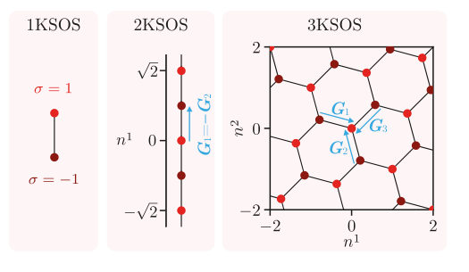
<figcaption class="paper-figure-caption"><b>Fig 1.</b> FIG. 1. Configuration space of the fields σ and n = (n1, . . . , nN−1) appearing in the NKSOS model for N = 1, 2, 3. The spin σ distinguishes two Bravais lattices with σ = 1 (red) and σ = −1 (brown). The reciprocal lattice vec- tors (in blue) are G1, . . . , GN.</figcaption>
</figure>
<figure class="paper-figure-card">
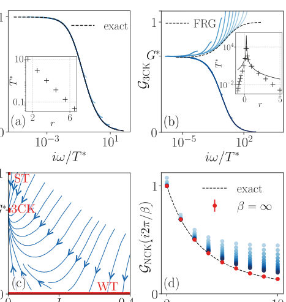
<figcaption class="paper-figure-caption"><b>Fig 2.</b> FIG. 2. (a) In blue, conductance of the 2CK model for J = 0 and for various values of r in terms of the rescaled frequency. The dashed black line corresponds to the Emery-Kivelson so- lution (7). The crossover temperature is displayed in inset. (b) Conductance of the 3CK model for J = 0. The black dashed line is the FRG result obtained in Ref. [42]. The y-tick G∗indicates the exact value at zero frequency. For r = 4, 5, the values of the conductance at the two lowest frequencies are not plotted as they suffer from finite size effects. The crossover temperature T ∗is displayed in inset and diverges at a finite value rc ≃0.26. Its behavior is compatible with the exact exponent given in Eq....</figcaption>
</figure>
<figure class="paper-figure-card">
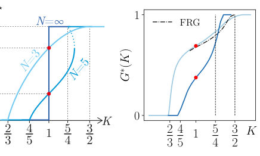
<figcaption class="paper-figure-caption"><b>Fig 3.</b> FIG. 3. Left: Conductance as a function of K as expected from perturbation theory and duality arguments [64]. The first order transition appears for N ≥5. Right: Conductance obtained from the NKSOS model with the multi-histogram method [74] as a function of K for the 3CK model (light blue) and the 5CK model (dark blue). The dashed and dotted black line indicates the FRG results from Ref. [42] for the 3CK model.</figcaption>
</figure>
<figure class="paper-figure-card">
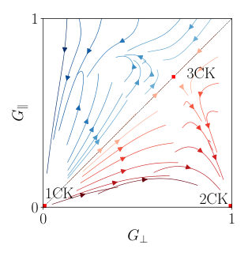
<figcaption class="paper-figure-caption"><b>Fig 4.</b> FIG. 4. Left: schematic interpretation of the 1CK, 2CK and 3CK fixed points in the 3KSOS model. Right: 3KSOS RG flow towards the 1CK, 2CK and 3CK fixed points. The lon- gitudinal conductance G∥(iω) is plotted as a function of the transverse conductance G⊥(iω).</figcaption>
</figure>
<figure class="paper-figure-card">

<figcaption class="paper-figure-caption"><b>Fig 5.</b> Fig. 3 left). The ST fixed point (G∗= 1) is stable for K &gt; N/(N −1) and the WT fixed point (G∗= 0) for K &lt; (N −1)/N. In the intermediate region, both are unstable, giving rise to a line of intermediate fixed points with 0 &lt; G∗&lt; 1. Our results confirm this scenario. The line of interme- diate fixed points of the 3CK model is recovered from the extrapolation of finite temperature results, as displayed in Fig. 3. Although extrapolating around K = 2/3 and K = 3/2 is made difficult by the presence of marginal operators, our results are consistent with perturbation theory in the vicinity of K = 2/3, the exact result at K = 1, and with recent FRG results [42] for K &gt; 1. From a qualitative...</figcaption>
</figure>

**Summary.** This paper develops an efficient Monte Carlo simulation technique using the NKSOS model to study the multichannel Kondo effect. It achieves a unified description, successfully modeling the transition between weak and strong electron-impurity coupling regimes. This work provides crucial quantitative predictions for transport properties in complex correlated quantum devices.

**Why it may be interesting.** The rigorous numerical treatment of crossover physics in a highly correlated impurity model provides advanced computational techniques applicable to open quantum systems where tunneling barriers or coupling strengths vary widely.

Detailed structure

**Main problem.** The central goal is establishing a unified theoretical description that connects different coupling regimes (weak vs. strong) for the Kondo effect, which is crucial for understanding strongly correlated electron systems.

**Main result.** The authors successfully use their model to describe the crossover between weak and strong tunneling regimes in the multichannel Kondo problem, predicting universal low-frequency conductance values.

**Method.** They employ cluster Monte Carlo algorithms on a discrete N-channel Kondo solid-on-solid (NKSOS) model, which efficiently simulates dynamics while eliminating critical slowing down.

**Model / system.** The study focuses on the multichannel Kondo model using the NKSOS model, derived from an anisotropic Kondo Hamiltonian. This system generalizes to arbitrary channel numbers ($N$) and incorporates features like anisotropy and interacting leads.

**Key observables.** Zero-frequency conductance ($G^*$), universal crossover functions, and transport properties across different coupling regimes.

**Important parameters / regimes.** Number of channels ($N$), temperature ($T$), and various coupling strengths defining the weak/strong tunneling limits.

**Assumptions / limitations.** The initial assumption of identical microscopic transparencies for all channels is noted as a potential limitation, though the method handles general asymmetry terms.

**Figures summary.** Figures compare simulated conductance values (e.g., 2CK and 3CK) against established theoretical solutions (like Emery-Kivelson), illustrating universal scaling and RG flow in parameter space.

**Paper structure.** The paper introduces the NKSOS model, details the cluster Monte Carlo simulation method to calculate transport properties, presents results showing agreement with known limits (1CK, 2CK), and finally extends the analysis to higher channel numbers ($N \geq 3$) to unify weak and strong coupling descriptions.

Abstract

The Kondo model is a paradigmatic quantum impurity problem realized in a wide variety of experimental platforms and central to the study of strongly correlated electrons. We introduce a discrete model that exactly reproduces the multichannel Kondo model and demonstrate that it can be simulated efficiently. Using cluster Monte Carlo algorithms, we completely eliminate critical slowing down, providing direct access to universal crossover functions and transport properties across a broad range of parameters. Remarkably, the same model captures both the weak- and strong-coupling regimes, unifying descriptions traditionally derived in complementary limits and revealing their common origin. Our method naturally accommodates large channel numbers, anisotropy, interacting one-dimensional leads, and channel asymmetry, yielding predictions for transport properties in charge-Kondo devices.

[↑ back to top](#top)

### [Theoretical exploration of Be Ag(II) F phases and their magnetic properties using learning algorithms](http://arxiv.org/abs/2607.08372v1)

**Authors:** Katarzyna Kuder, Wojciech Grochala  
**Type:** theory · **Category:** strongly correlated electrons · **PDF:** <https://arxiv.org/pdf/2607.08372v1>  
**Analysis basis:** full PDF text, analyzed in chunks
**Topic relevance:** 🔥 `analog quantum simulation` **4/5** · `exotic spin models in light-matter` **3/5** · `spintronics-quantum-optics interface` **3/5** · `Kondo & dissipative impurity` **1/5** · `correlated cavity matter` **1/5** · `entanglement & information structure` **1/5** · `non-equilibrium dynamics` **1/5**

↔ Scroll figures horizontally

<figure class="paper-figure-card">
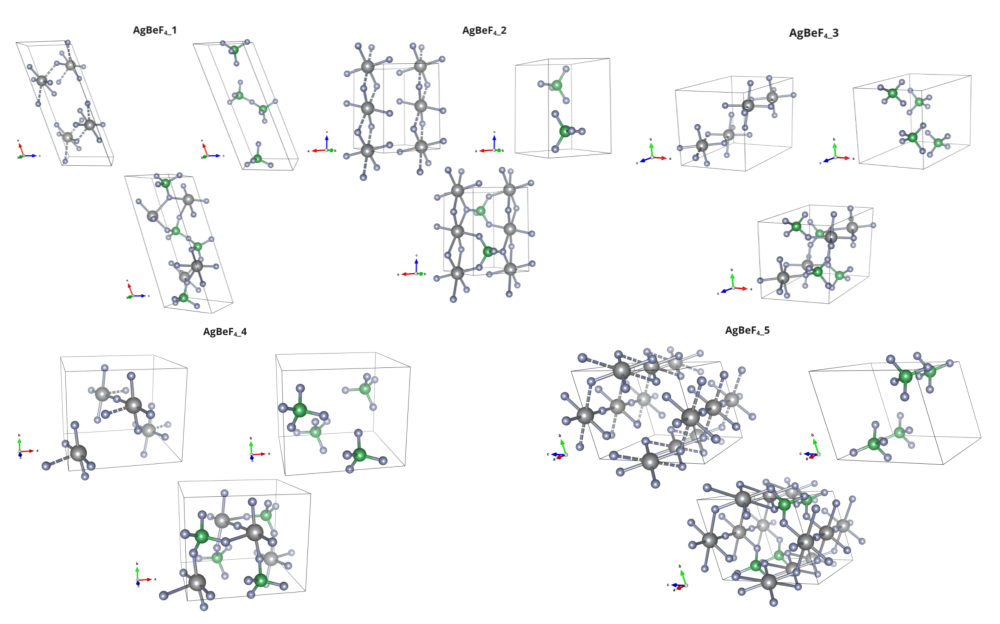
<figcaption class="paper-figure-caption"><b>Fig 1.</b> Figure 1. Coordination environments within the five proposed AgBeF4 polymorphs. For each structure, the coordination sphere of silver(II) is shown first, followed by the coordination sphere of beryllium, and finally a combined view illustrating both environments. Dark grey spheres represent Ag(2+), light grey spheres correspond to fluorine atoms, and green spheres denote beryllium atoms. Short and long Ag-F bonds are shown using solid and broken lines, respectively.</figcaption>
</figure>
<figure class="paper-figure-card">
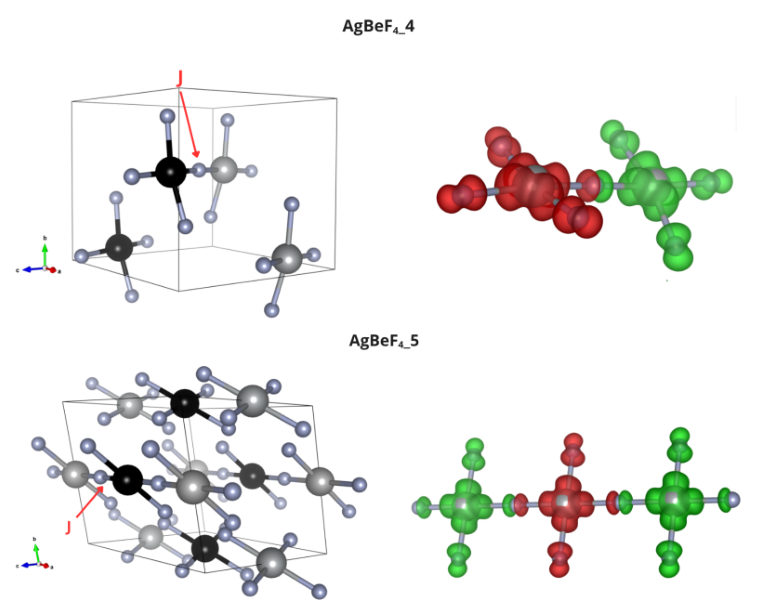
<figcaption class="paper-figure-caption"><b>Fig 2.</b> Figure 2. The ground state antiferromagnetic models investigated for the AgBeF4_4 and AgBeF4_5 polymorphs. Spin-up silver(II) cations are represented by grey spheres, while spin-down cations are shown as black spheres. To simplify the pictures, lithium cations and their coordination spheres were omitted. The visualization of the spin density within the infinite chain is also presented with the cutoff value of 0.005e/A3 [35].</figcaption>
</figure>
<figure class="paper-figure-card">
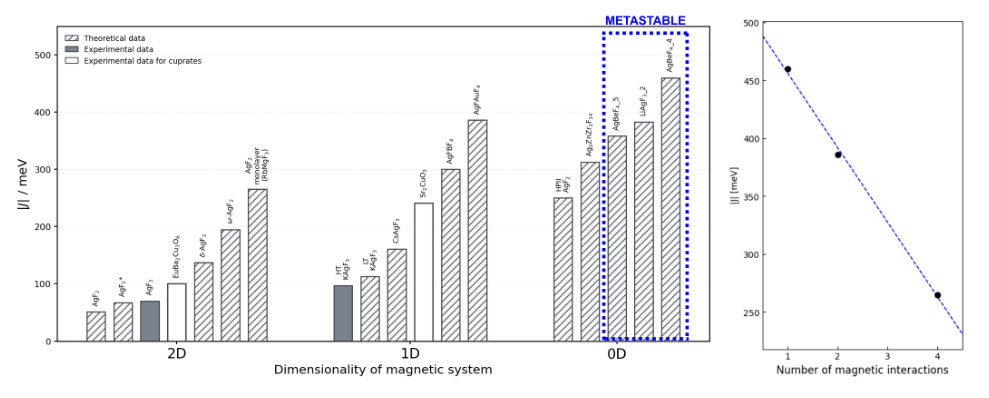
<figcaption class="paper-figure-caption"><b>Fig 3.</b> Figure 3. LEFT: Comparison of the absolute values of magnetic exchange coupling constants, |J|, for selected Ag(II)-based fluoride systems and representative cuprates, grouped according to the dimensionality of the magnetic lattice. Hatched bars denote theoretical data, filled bars denote experimental data, and open bars represent experimental data for cuprates. The dashed blue box highlights metastable compounds; RIGHT: Dependence of the largest absolute exchange coupling constant |J| on the number of magnetic interactions for Ag-F systems.</figcaption>
</figure>
<figure class="paper-figure-card">
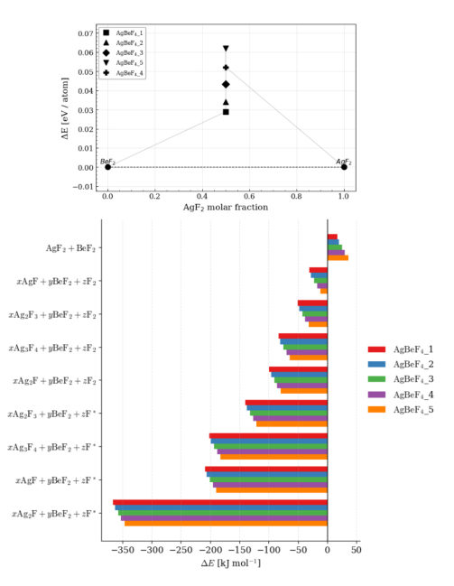
<figcaption class="paper-figure-caption"><b>Fig 4.</b> Figure 4. TOP: Convexhull for the proposed AgBeF4 polymorphs which shows the relative stability of the considered structures with respect to AgF2 and BeF2. BOTTOM: Calculated formation ener- gies of these structures from selected precursors in reactions involv- ing fluorine gas (F2) and fluorine radicals (F∗).</figcaption>
</figure>

**Summary.** This theoretical study explores five potential polymorphs of AgBeF4 as candidates for high-temperature superconducting materials. Using DFT calculations, the authors determined that these phases exhibit strong antiferromagnetic coupling, particularly in structures forming linear chains analogous to those found in cuprates. The work provides a computational roadmap for synthesizing and understanding novel magnetic fluorides.

**Why it may be interesting.** While focused on solid-state chemistry, the methodology of calculating strong magnetic exchange interactions ($J$) in novel fluorides directly parallels theoretical work done on cuprates and other strongly correlated Mott insulators relevant to AMO physics research.

Detailed structure

**Main problem.** The study aims to find novel silver(II) fluorides that could serve as electronic and magnetic analogues to high-temperature cuprate superconductors.

**Main result.** Five polymorphs of AgBeF4 were identified, with two exhibiting exceptionally strong antiferromagnetic superexchange interactions (J values up to -460 meV), suggesting potential superconducting pathways.

**Method.** The research combines global structure prediction algorithms with first-principles calculations (DFT+U) to determine structural stability and magnetic coupling constants.

**Model / system.** The system under investigation is the Be–Ag(II)–F chemical space, specifically focusing on various polymorphs of AgBeF4. The magnetic interactions are modeled using a Heisenberg Hamiltonian approach based on calculated superexchange couplings (J).

**Key observables.** Antiferromagnetic ground state confirmation, strong exchange coupling constants (J), electronic band gaps, and formation energies.

**Important parameters / regimes.** Exchange coupling constants ($|J|$ in meV), Band Gaps (eV), Reaction Enthalpies ($	ext{kJ/mol}$), and structural parameters like bond lengths and angles.

**Assumptions / limitations.** The phases are computationally found to be metastable, requiring synthesis via fluorine radicals; the calculations rely on DFT+U approximations for electronic structure.

**Figures summary.** Figures illustrate coordination environments, ground state magnetic models comparing results to cuprates, and convergence checks for energy and k-point sampling. Tables list lattice parameters, band gaps, and calculated J values.

**Paper structure.** The paper systematically explores five polymorphs using structure prediction, followed by detailed electronic (band structure, DOS) and magnetic (superexchange coupling calculation) analyses to characterize their potential as superconducting precursors.

Abstract

The search for novel silver(II) fluorides is driven by their potential as electronic and magnetic analogues to high temperature cuprate(II) superconductor precursors. Here, we explore the previously uncharted Be Ag(II) F chemical space using global structure prediction algorithms combined with first principles calculations. Focusing on the AgBeF4 stoichiometry, we identify the five lowest enthalpy polymorphs crystallizing in the C2, P minus 1, and P 21/c space groups. All polymorphs show an antiferromagnetic ground state, with AgBeF4_4 and AgBeF4_5 exhibiting unprecedented strong superexchange interactions of J equal circa to minus 460meV and J equal circa to minus 359meV respectively. Those high J values are due to the presence of either [Ag2F7] for AgBeF4_4, or related infinite [AgF2/2+2/1]2 minus chains for AgBeF4_5. Although the phases are found to be metastable with respect to binary difluorides, the thermodynamic analysis suggests that they could be targeted via synthetic routes employing fluorine radicals, with reaction enthalpies reaching minus 370 kJ/mol.

[↑ back to top](#top)

### [Quantifying randomness with measurement incompatibility](http://arxiv.org/abs/2607.08697v1)

**Authors:** Sebastian Schlösser, Pauli Jokinen, Martin Plávala, Leevi Leppäjärvi, Leonardo S. V. Santos, Roope Uola  
**Type:** theory · **Category:** quantum information and computing · **PDF:** <https://arxiv.org/pdf/2607.08697v1>  
**Analysis basis:** full PDF text, analyzed in chunks
**Topic relevance:** 🔥 `quantum measurements` **4/5** · `measurement-induced transitions` **3/5** · `entanglement & information structure` **2/5** · `Keldysh / 2PI / non-Gaussian methods` **1/5** · `correlated / nonlocal dissipation` **1/5** · `driven-dissipative phase transition` **1/5** · `methods for driven-dissipative` **1/5**

↔ Scroll figures horizontally

<figure class="paper-figure-card">
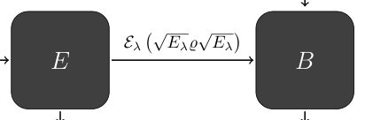
<figcaption class="paper-figure-caption"><b>Fig 1.</b> FIG. 1. A trusted quantum state enters a black box device (E) from which Eve obtains information λ. Eve can use channels Eλ as a decoy in order not to be detected. The quantum message enters Bob’s black-box device (B), the input y of which is not controlled by Eve.</figcaption>
</figure>
<figure class="paper-figure-card">
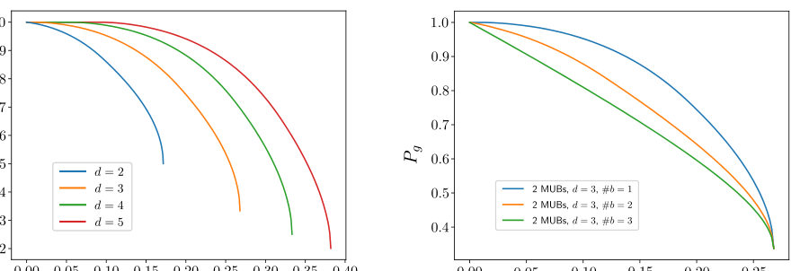
<figcaption class="paper-figure-caption"><b>Fig 2.</b> FIG. 2. Eve’s guessing probability as a function of the observed incompatibility robustness [Eq. (12)]. (a) Two mutually unbiased bases in dimensions 2 to 5. Since each of these sets of PVMs have different maximal incompatibility robustness, the lines stop at different points. (b) Two mutually unbiased bases in dimension 3 with multiple input states per basis.</figcaption>
</figure>

**Summary.** This work rigorously connects the concept of measurement incompatibility in quantum measurements to the ability to generate secret random bits. By formulating security bounds using semidefinite programming based on generalized robustness, the authors provide a powerful tool for quantifying device-independent randomness generation protocols.

**Why it may be interesting.** It provides rigorous, information-theoretic tools (SDPs) to quantify fundamental resource relations—namely, how much non-classicality (incompatibility) can be extracted into usable randomness against an adversary.

Detailed structure

**Main problem.** The paper establishes a quantitative trade-off between the observed measurement incompatibility of quantum measurements and the capabilities of an eavesdropper (Eve) in a prepare-and-measure setting.

**Main result.** Measurement incompatibility is shown to be equivalent to the security against Eve's knowledge, providing a direct link between geometric measures of incompatibility and randomness generation protocols.

**Method.** The authors utilize semidefinite programming (SDP) formulations involving generalized robustness witnesses to bound Eve's guessing probability ($P_g$) based on the joint measurability of Bob's measurements.

**Model / system.** The model is a prepare-and-measure quantum communication scenario where an eavesdropper intercepts the message and performs operations described by instruments, analyzed using POVMs and concepts like quantum steering.

**Key observables.** Measurement Incompatibility (quantified by generalized robustness), Eve's guessing probability ($P_g$), and the minimum entropy $H_{\min}$.

**Important parameters / regimes.** The rank of the input state ($\varrho$) is crucial; the analysis extends to scenarios with quantum memory for Eve.

**Assumptions / limitations.** Initial results rely on assuming full-rank input states, and later extensions involve bounding violations against qubit simulability.

**Figures summary.** Figure 2 illustrates the quantitative trade-off between Eve's guessing probability and observed incompatibility robustness for various measurement settings (MUBs).

**Paper structure.** The paper progresses from establishing the core equivalence (JM $\iff$ security) in simple cases, to developing SDP bounds using generalized robustness, extending this to quantum steering, and finally proving the mathematical equivalence between the initial SDP formulation and a steering-based SDP.

Abstract

We present a trade-off between the amount of observed measurement incompatibility and the capabilities of a classical Eavesdropper in a prepare-and-measure scenario. The result is based on a qualitative connection between measurement incompatibility and randomness generation together with the utilization of incompatibility witnesses as randomness certificates. This allows one to use a geometric measure of incompatibility, the generalised robustness, to bound Eve's strategies through a semi-definite program, while providing an explicit protocol for generating randomness from any set of incompatible measurements. By translating the result to quantum steering, we find a tight connection between steerability and randomness generation in a setting using any finite number of measurement inputs. We further show how our techniques can be generalised to scenarios where Eve has a quantum memory by using a dimensional generalisation of joint measurability.

[↑ back to top](#top)

### [Efficiently simulable quantum circuits with large entanglement, magic, and non-Gaussianity via code-compiled tensor networks](http://arxiv.org/abs/2607.08396v1)

**Authors:** Aydin Deger, Stergios Koutsioumpas, Mark Webster, Hasan Sayginel, Joschka Roffe, Dan E. Browne  
**Type:** theory · **Category:** quantum information and computing · **PDF:** <https://arxiv.org/pdf/2607.08396v1>  
**Analysis basis:** full PDF text, analyzed in chunks
**Topic relevance:** 🔥 `entanglement & information structure` **4/5** · `methods for driven-dissipative` **3/5** · `QC/QI experiment` **2/5** · `analog quantum simulation` **1/5** · `correlated cavity matter` **1/5** · `non-equilibrium dynamics` **1/5**

↔ Scroll figures horizontally

<figure class="paper-figure-card">
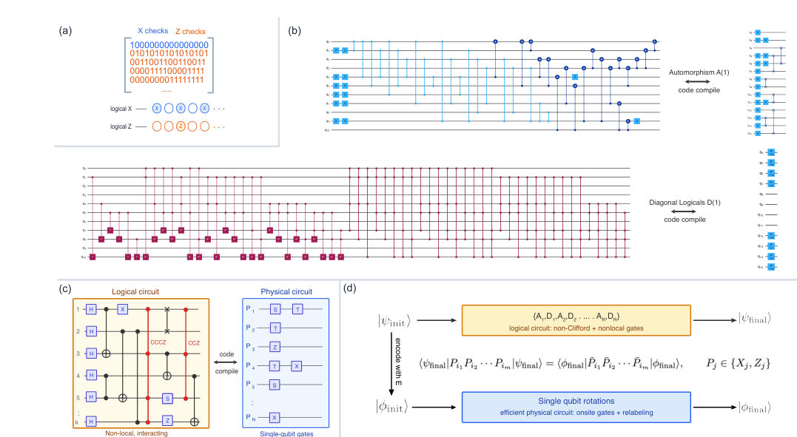
<figcaption class="paper-figure-caption"><b>Fig 1.</b> FIG. 1. Code-compilation framework. (a) X- and Z-check matrices, together with chosen logical ¯ X and ¯Z. (b) Two examples of matched physical/logical pairs. Top row: a single physical Clifford automorphism layer compiles to a dense, non-local logical Clifford circuit. Bottom row: a single physical transversal diagonal phase layer compiles to a non-trivial logical diagonal action containing two- and three-body phase terms. (c) Illustrative example: we randomly compose automorphism and diagonal matched pairs from the precomputed library. The resulting logical circuit (left, on k logical qubits) is highly nonlocal and contains both Clifford and non-Clifford gates such as CNOT, CZ, CS, CCZ,...</figcaption>
</figure>
<figure class="paper-figure-card">
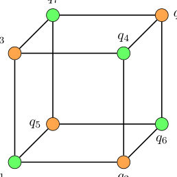
<figcaption class="paper-figure-caption"><b>Fig 2.</b> FIG. 3. Cube representation of the [[8, 3, 2]] code. The qubit labels match the stabilizers and logical operators writ- ten above. Green vertices carry T and orange vertices carry T † in the transversal phase layer.</figcaption>
</figure>
<figure class="paper-figure-card">
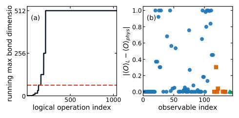
<figcaption class="paper-figure-caption"><b>Fig 3.</b> FIG. 5. Simulation for the polar l = 6 [[64, 57]] code family. (a) The solid black curve is the direct logical MPS running over 656 logical operations with maximum allowed bond di- mension ˜χ = 512. The dashed red curve is the compiled physical simulation, which uses a 64-qubit MPS. The physi- cal bond dimension remains fixed at 64. (b) For each observ- able O, we compare the capped logical MPS to the compiled physical reference using ∆O = |⟨¯O⟩−⟨O⟩phys|. Blue circles mark all single-qubit Xi and Zi observables on the 57 logical qubits, orange squares mark a sampled set of ten XX and ten ZZ pairs, and green triangles mark ten sampled four-X correlators.</figcaption>
</figure>
<figure class="paper-figure-card">
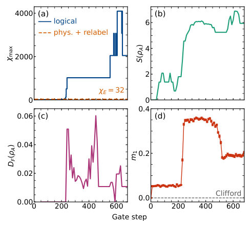
<figcaption class="paper-figure-caption"><b>Fig 4.</b> FIG. 4. Representative resource diagnostics for the polar l = 5 [[32, 26]] code family. (a) The physical simulation with classical relabeling stays pinned at the encoding cost χE = 32, while the direct logical simulation develops large bond-dimension spikes. (b) The maximal cut entropy grows substantially with depth. (c) The interaction distance shows departure from the free-fermion manifold. (d) The nonstabi- lizerness density m1 rises well above the Clifford baseline.</figcaption>
</figure>
<figure class="paper-figure-card">
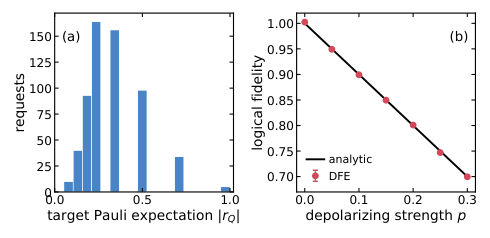
<figcaption class="paper-figure-caption"><b>Fig 5.</b> FIG. 6. Logical-DFE worked example for the polar l = 4, [[16, 11]] CCQC instance. (a) Distribution of the magnitudes of the target logical Pauli expectations |rQ| = | ⟨ψ| Q |ψ⟩| over the 600 sampled non-identity measurement requests at the 32- layer circuit. (b) Estimator validation on a simulated noisy device. A depolarizing channel σ = (1 −p) |ψ⟩⟨ψ| + pI/2k</figcaption>
</figure>

**Summary.** The paper introduces Code-Compiled Quantum Circuits (CCQCs) that allow the construction of deep quantum circuits exhibiting signs of classical hardness. By mapping these complex logical operations onto simple physical interactions using error-correcting codes, they show that simulation cost can be bounded by the encoder's bond dimension rather than entanglement growth. This provides a powerful theoretical benchmark for assessing the capabilities and limitations of near-term quantum hardware.

**Why it may be interesting.** This work provides a powerful theoretical tool to benchmark quantum hardware by creating complex logical circuits whose ideal reference state is efficiently computable classically, which is crucial for testing fault tolerance in AMO or quantum optics settings.

Detailed structure

**Main problem.** The goal is to determine when a quantum circuit becomes classically hard to simulate, challenging existing resource measures that define simulation boundaries.

**Main result.** The authors demonstrate that certain code-compiled circuits can exhibit indicators of classical hardness (high entanglement, magic) while remaining efficiently simulable via Matrix Product States (MPS). This shows standard resource measures are individually insufficient to predict simulation difficulty for some circuit families.

**Method.** They construct Code-Compiled Quantum Circuits (CCQCs) using high-rate CSS codes and simulate them by exploiting structural properties: diagonal transversal gates preserve the MPS bond dimension, and permutations are tracked classically. They use both MPS simulation and an exact phase-polynomial backend.

**Model / system.** The model involves mapping complex logical quantum circuits onto physical qubits via error-correcting codes (specifically polar CSS codes). The resulting physical evolution is shown to be equivalent to a simple, onsite interaction structure after encoding.

**Key observables.** Entanglement entropy, magic content, non-Gaussianity, and the MPS bond dimension ($\chi_E$).

**Important parameters / regimes.** The peak bond dimension of the encoder ($\chi_E$), which controls the simulation cost regardless of circuit depth for certain codes.

**Assumptions / limitations.** The method assumes that the encoded state retains an efficient MPS representation, and the structural properties regarding diagonal transversal gates and classical permutation tracking hold.

**Figures summary.** Figures illustrate the code-compilation framework, showing how logical nonlocal gates are compiled into simple onsite physical operations. Specific examples use the $[[16, 11]]$ polar code to show matched pairs of complex logical circuits versus their physically simulated counterparts.

**Paper structure.** The paper introduces the CCQC concept, details the simulation mechanism relying on structural properties (diagonal gates/relabeling), presents two complementary simulation backends (MPS and PhasePoly), demonstrates results using the infinite polar CSS code family, and concludes with a near-term application for fidelity estimation.

Abstract

We introduce a family of quantum circuits that possess standard indicators of classical simulation hardness including high entanglement entropy, magic, and non-Gaussianity, yet admit efficient classical simulation via matrix product states (MPS). Our construction uses logical circuits of high-rate Calderbank-Shor-Steane (CSS) codes with enhanced symmetries. Using code automorphisms and transversal diagonal gates from higher levels of the Clifford hierarchy, we realize nonlocal logical Clifford and non-Clifford gates, showing how error-correcting codes can compile complex logical circuits into simple physical operations. Simulation efficiency rests on two properties: (i) diagonal transversal gates do not increase bond dimension, and (ii) permutations are tracked classically via on-the-fly relabeling, avoiding costly SWAP networks. Unlike Clifford or matchgate simulation, our method accepts a broad class of initial states, including dense entangled, magic, and non-Gaussian inputs, provided the encoded state retains an efficient MPS representation. We also release an exact phase-polynomial backend for monomial subfamilies, whose cost is set by higher-degree phase terms rather than entanglement growth. We demonstrate the method on an infinite polar CSS code family, showing bond dimension stays bounded by the encoding cost regardless of circuit depth. These results show that for some circuit families, standard resource measures are individually insufficient to indicate simulation hardness. As a near-term application, we use the compiled MPS as a classical reference for direct fidelity estimation of a quantum device running nontrivial logical circuits. Pauli sampling on the encoded reference, with a Clifford pushback through the known encoder, provides the ideal expectation values, so the logical output fidelity can be estimated from local Pauli readout alone, without costly state tomography.

[↑ back to top](#top)

### [QSCOUT's Qubit-Boson Gate Set](http://arxiv.org/abs/2607.08560v1)

**Authors:** Edward C. Tortorici, Ethan C. McGarrigle, Brian K. McFarland, Wes L. Johnson, Daniel S. Lobser, Melissa C. Revelle, Brandon P. Ruzic, Susan M. Clark, Christopher G. Yale  
**Type:** both · **Category:** quantum information and computing · **PDF:** <https://arxiv.org/pdf/2607.08560v1>  
**Analysis basis:** full PDF text, analyzed in chunks
**Topic relevance:** 🔥 `QC/QI experiment` **4/5** · `quantum measurements` **2/5** · `quantum optics experiment` **2/5** · `analog quantum simulation` **1/5** · `measurement-induced transitions` **1/5** · `methods for driven-dissipative` **1/5** · `spintronics-quantum-optics interface` **1/5**

↔ Scroll figures horizontally

<figure class="paper-figure-card">
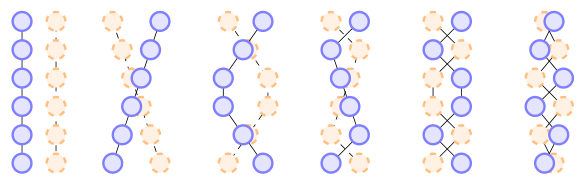
<figcaption class="paper-figure-caption"><b>Fig 1.</b> Figure 1: The flavors of radial modes for 6 ions labeled by mode index. Mode 0, the highest energy mode within a manifold, is the center of mass (COM) mode, and mode 1 is the the tilt mode. We refer to mode 2 as the drum mode, and the lowest energy mode (N −1) as the zig-zag mode (The remaining modes do not have strong naming conventions as they become more zig-zag-like in nature as the mode number increases). The qubits/ions are indexed starting from the center ion: they are labeled with increasing qubit number, alternating outward from the center, as seen on the left.</figcaption>
</figure>
<figure class="paper-figure-card">
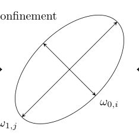
<figcaption class="paper-figure-caption"><b>Fig 2.</b> Figure 2: The radial confinement is elliptical, so that the two radial modes of the same mode index have different energies, such that ω0,i &gt; ω1,j for all i and all j, where i is the mode index for the upper manifold and j is the mode index for the lower manifold. The two beams driving Raman transitions are orthogonal to the axial direction, so they only project onto the radial modes.</figcaption>
</figure>
<figure class="paper-figure-card">
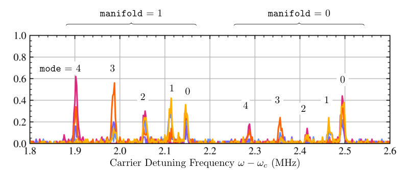
<figcaption class="paper-figure-caption"><b>Fig 3.</b> Figure 3: Motional sideband spectrum for 5 ions. The 5 flavors of radial modes each appear twice: one at a lower frequency (manifold = 1), and one at a higher frequency (manifold = 0). A qumode is then called out by specifying both a manifold and a mode index. The axial frequency manifold does not appear because the lasers do not project onto these modes.</figcaption>
</figure>
<figure class="paper-figure-card">
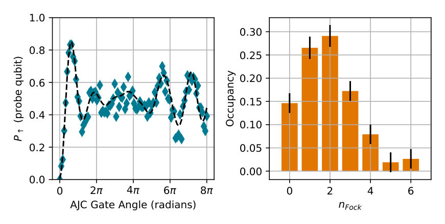
<figcaption class="paper-figure-caption"><b>Fig 4.</b> Figure 4: Example Fock State Occupancy Measurement. (left) The resultant beating oscillations from Fock occu- pation measurement via AJC gate. The oscillations are fit to eq. (43) to extract the Fock occupancies pn presented on the (right).</figcaption>
</figure>
<figure class="paper-figure-card">
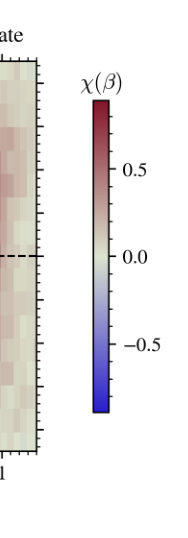
<figcaption class="paper-figure-caption"><b>Fig 5.</b> Figure 6: Example motional tomography data of a squeezed vacuum state.</figcaption>
</figure>

**Summary.** This paper describes the operational framework for performing hybrid continuous-discrete variable quantum computation on the QSCOUT trapped-ion system. It details how to use specific laser pulse sequences and a custom language, Jaqal, to implement advanced gates like Conditional Beamsplitter and Squeeze. The work is crucial for advancing hardware realization by providing rigorous protocols for gate execution and state verification.

**Why it may be interesting.** This work is highly relevant as it bridges theoretical quantum control techniques (Hamiltonian engineering) directly to a physical hardware platform (trapped ions), providing actionable recipes for implementing complex quantum circuits in the CV-DV regime.

Detailed structure

**Main problem.** The paper details how to implement a comprehensive qubit-boson gate set for hybrid continuous-discrete variable (CV-DV) quantum computation on the QSCOUT platform.

**Main result.** It provides specific pulse sequences and language commands (Jaqal) necessary to execute advanced gates like Conditional Beamsplitter and Conditional Squeeze, alongside methods for state preparation and measurement.

**Method.** The implementation relies on precisely timed laser pulses driving resonant sidebands (JC/AJC) and utilizing four-tone interactions to engineer complex quantum operations.

**Model / system.** The system is a trapped-ion quantum processor (QSCOUT) using Yb-171 ions, where qubits are encoded in internal spin states ($\sigma$) and motional modes ($a, a^\dagger$) act as bosonic degrees of freedom. The coupling allows for hybrid CV-DV operations.

**Key observables.** Fock state occupation probabilities ($p_n$), the characteristic function $\chi(eta)$, and the Wigner representation $W(\gamma)$ are key diagnostic tools used to verify gate fidelity and characterize motional states.

**Important parameters / regimes.** Gate parameters include rotation angles ($	heta$) and phases ($\phi$); squeezing is controlled by the complex parameter $\zeta$; detunings ($\Delta\omega, \delta$) govern sideband resonance.

**Assumptions / limitations.** The analysis assumes that motional modes can be truncated in the Fock basis (e.g., $|n=10
angle$), and state preparation relies on controlled sequential application of specific pulse sequences.

**Figures summary.** Figures illustrate fitting beating oscillations from AJC gates to extract Fock occupancies, and show circuits for probing $\chi(eta)$ using conditional displacement gates, alongside examples of tomography data.

**Paper structure.** The paper systematically introduces the platform (QSCOUT), defines fundamental gates (JC, AJC, CD, CR), details advanced gate implementations (BS, Squeeze) via specific Hamiltonians and pulse sequences, and concludes with measurement protocols for state characterization.

Abstract

The Quantum Scientific Computing Open User Testbed (QSCOUT) has developed a qubit-boson gate set for hybrid continuous-discrete variable (CV-DV) quantum computing. This document outlines how to utilize these gates on QSCOUT using Just Another Quantum Assembly Language, Jaqal\textsuperscript{TM}.

[↑ back to top](#top)

### [Irreducible Geometry of Higher-Order Correlator Families](http://arxiv.org/abs/2607.08761v1)

**Authors:** Kaito Kobayashi  
**Type:** theory · **Category:** strongly correlated electrons · **PDF:** <https://arxiv.org/pdf/2607.08761v1>  
**Analysis basis:** full PDF text, analyzed in chunks
**Topic relevance:** 🔥 `entanglement & information structure` **4/5** · `analog quantum simulation` **2/5** · `non-equilibrium dynamics` **2/5** · `Keldysh / 2PI / non-Gaussian methods` **1/5** · `methods for driven-dissipative` **1/5** · `non-equilibrium universality` **1/5**

↔ Scroll figures horizontally

<figure class="paper-figure-card">
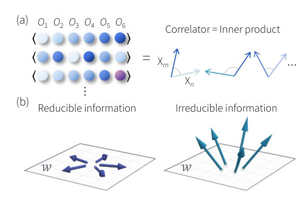
<figcaption class="paper-figure-caption"><b>Fig 1.</b> FIG. 1: (a) Schematic illustration of a family of correlators. A variety of higher-order correlators can be generated either by permuting the operators or by replacing some of them with others. Geometrically, these correlators can be viewed as inner products of operator words. (b) Correlator decomposition into the reducible part (the inner prod- uct of the projected components) and the irreducible part (the inner product of the residual components) relative to the conditioning sub- space W.</figcaption>
</figure>
<figure class="paper-figure-card">
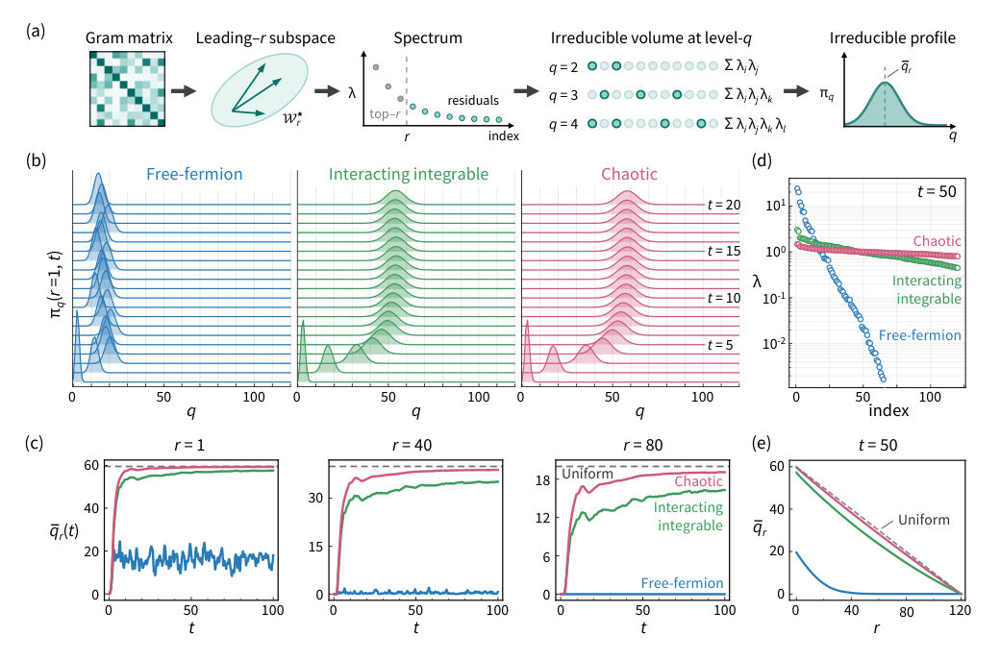
<figcaption class="paper-figure-caption"><b>Fig 2.</b> FIG. 2: (a) Schematic procedure for constructing the irreducible volume profile under canonical conditioning. (b) Time dependence of the irreducible volume profiles πq(r, t) = πq(Ω(t), W⋆ r (t)) for the operator word set in Eq. (47), shown at fixed conditioning rank r = 1. The three panels show free-fermion, interacting integrable, and chaotic dynamics at system size L = 9. Each ridge corresponds to a different base time t. (c) Time evolution of the mean irreducible level ¯qr(t) for representative conditioning ranks r. (d) Eigenvalue spectra of the Gram matrix G(Ω) at the representative late time t = 50. (e) Conditioning-rank dependence of the mean irreducible level ¯qr(t) at t = 50. The...</figcaption>
</figure>
<figure class="paper-figure-card">
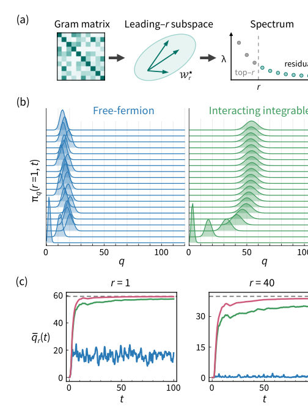
<figcaption class="paper-figure-caption"><b>Fig 3.</b> Figure 2(b) shows the time evolution of the irreducible vol- ume profile under canonical conditioning at r = 1. At early times, the profile is sharply concentrated near small q. The initially local operators have not yet spread significantly, and exchanging two operators within an operator word changes the word only slightly. Therefore, different orderings of the five operators remain highly redundant. Even a small canoni- cal sector then captures much of the correlator family, leav- ing only a low-dimensional irreducible geometry. As time increases, the operators spread, and their noncommutativity makes different operator words increasingly distinct. The</figcaption>
</figure>
<figure class="paper-figure-card">
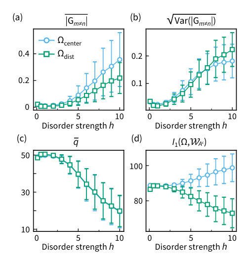
<figcaption class="paper-figure-caption"><b>Fig 4.</b> FIG. 3: (a) Disorder strength dependence of the mean absolute value of the off-diagonal correlators |Gm,n|, and (b) the corresponding stan- dard deviation √Var(|Gm,n|) for the MBL Hamiltonian in Eq. (51). The mean and standard deviation are first computed over all off- diagonal entries m , n of the Gram matrix, and these quantities are then averaged over disorder realizations. (c) Mean irreducible level ¯q and (d) first irreducible volume I1(Ω, WAc) as functions of disorder strength h. The conditioning sector is chosen as WAc, where A = {5} is the target region. In all panels, the blue and green curves show results for the operator families Ωcenter and Ωdist, respectively. Data are averaged...</figcaption>
</figure>
<figure class="paper-figure-card">
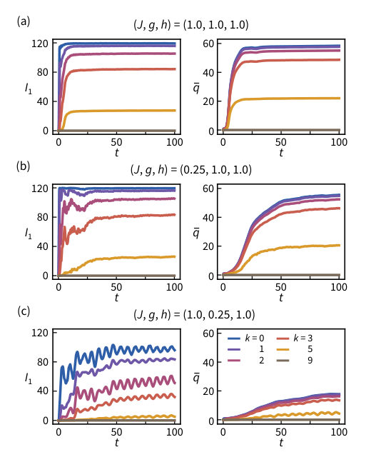
<figcaption class="paper-figure-caption"><b>Fig 5.</b> FIG. 4: Time evolution of the first irreducible volume I1(Ω, Wmeas ≤k ) and the mean irreducible level ¯q, obtained by conditioning with respect to the measurement-accessible subspace Wmeas ≤k for several off-diagonal depths k. The mixed-field Hamiltonian in Eq. (56) is employed with parameters (a) (J, g, h) = (1.0, 1.0, 1.0), (b) (0.25, 1.0, 1.0), and (c) (1.0, 0.25, 1.0). The operator word family Ω is constructed from the all σz probe in Eq. (57).</figcaption>
</figure>

**Summary.** This work establishes 'correlator geometry' as a theoretical tool for analyzing families of higher-order correlators in quantum many-body physics. By decomposing the geometry into reducible and irreducible parts, it quantifies genuinely novel information encoded in the system dynamics. This framework offers a systematic way to interpret complex data from programmable quantum simulators.

**Why it may be interesting.** It provides a powerful, systematic geometric language to interpret complex, high-dimensional data generated by modern quantum simulators studying strongly correlated systems, moving beyond simple correlation functions.

Detailed structure

**Main problem.** Developing a structured framework for the collective analysis of higher-order correlator families, as these are increasingly accessible from quantum simulators but their physical meaning is difficult to infer due to redundancy and interdependence.

**Main result.** The authors introduce 'correlator geometry' which allows quantifying irreducible information via volume profiles, revealing hidden structures in many-body dynamics inaccessible from individual measurements.

**Method.** The framework represents correlators as inner products between operator words in an abstract 'operator space,' decomposing the resulting geometry using conditioning subspaces to separate reducible and irreducible components.

**Model / system.** The theory is applied to general quantum many-body systems, analyzing families of higher-order out-of-time-ordered correlators (OTOCs) relevant for studying dynamics in condensed matter contexts like spin chains or lattice models.

**Key observables.** Correlator families, irreducible volume profiles ($\pi_q$), Gram matrix determinant ($\det G(\Omega)$), and the residual geometry $Q(W)$.

**Important parameters / regimes.** The conditioning rank ($r$) used to define the resolved sector; system size ($L$); and comparison between different dynamical regimes (e.g., free-fermion vs. chaotic).

**Assumptions / limitations.** The analysis assumes that correlator families can be systematically organized into a geometric structure amenable to subspace decomposition via conditioning.

**Figures summary.** Figures schematically illustrate the construction of correlator families as inner products and demonstrate the decomposition of the geometry into reducible (explained) and irreducible (residual) components.

**Paper structure.** The paper develops the formalism by first defining the geometric representation using the operator Gram matrix, then introducing various conditioning schemes (canonical, targeted, Krylov/cross), and finally applying this framework to diagnose differences between known quantum dynamics regimes.

Abstract

Programmable quantum simulators are beginning to access correlators of increasing complexity, ranging from four-point out-of-time-ordered correlators to even higher-order many-body correlators. The theoretical framework for interpreting such data, however, remains comparatively underdeveloped. Although a variety of higher-order correlators can be constructed straightforwardly, their physical meaning is often difficult to infer. A further complication is that different correlators are generally not independent: some may be mutually redundant, while others may encode genuinely distinct information. These features make it necessary to analyze correlators not as isolated quantities, but as a structured family. In this work, we develop a geometric framework for the collective analysis of higher-order correlator families. By representing correlators as inner products between operator words, we recast each family as a geometry in operator space. The key idea is to introduce conditioning subspaces that separate this geometry into reducible information, already explained by a chosen resolved sector, and irreducible information, encoded in the residual correlator geometry. Focusing on the latter component, we define irreducible volume profiles that quantify how broadly the unexplained part of a correlator family spreads over independent geometric directions. This perspective leads to several complementary forms of conditioning. Canonical conditioning optimally explains a correlator family. Targeted conditioning fixes the resolved sector to isolate a chosen physical feature. Krylov and cross conditioning extend the framework from a single correlator family to comparisons among correlator geometries. Our framework reveals irreducible structures hidden at the level of individual correlator values and establishes correlator geometry as a higher-level description of quantum many-body dynamics.

[↑ back to top](#top)

### [Robust Ion-Photon Entanglement via Polarization-to-Time-Bin Conversion](http://arxiv.org/abs/2607.07805v1)

**Authors:** Ana Luiza Ferrari, Denton Wu, Mika A. Zalewski, Norbert M. Linke  
**Type:** experiment · **Category:** quantum information and computing · **PDF:** <https://arxiv.org/pdf/2607.07805v1>  
**Analysis basis:** full PDF text, analyzed in chunks
**Topic relevance:** 🔥 `QC/QI experiment` **4/5** · `interference shaping light` **3/5** · `quantum optics experiment` **3/5** · `entanglement & information structure` **1/5**

↔ Scroll figures horizontally

<figure class="paper-figure-card">
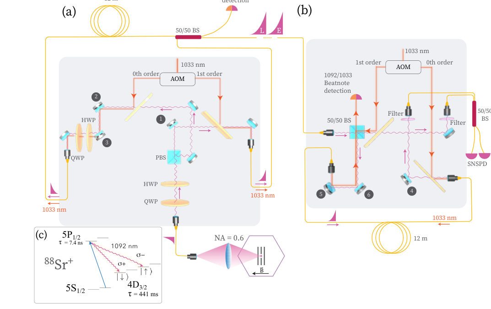
<figcaption class="paper-figure-caption"><b>Fig 1.</b> FIG. 1. (a–b) Encoder and decoder asymmetric Mach–Zehnder interferometers for the time-bin encoder (a) and decoder (b). (a) Waveplates set the polarization basis prior to conversion. A polarizing beam splitter separates the path of the horizontally and vertically polarized photons. The difference in length between the interferometer arms shifts the photons by 60 ns in time relative to each other. Waveplates before the 12 m delay line ensure the photons are identical in polarization degree of freedom when recombined at the 50/50 beam splitter, so the information is only encoded in time-bin. Piezos 2 and 3 are the 1033 nm lock actuators. Piezo 1 corrects for drift between the photon and 1033...</figcaption>
</figure>
<figure class="paper-figure-card">
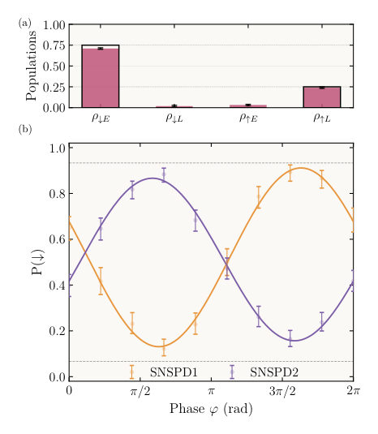
<figcaption class="paper-figure-caption"><b>Fig 2.</b> FIG. 2. Fidelity of the time-bin encoded ion-photon entangled state. (a) Populations of the time-bin encoded ion-photon state. Each column shows a measured diagonal term of the density matrix. The black boxes indicate the ideal popula- tions. (b) Diagonal basis correlations of the time-bin encoded ion-photon state. When the photons are in an early/late su- perposition, the probability of measuring a bright ion changes sinusoidally as a function of the phase of the ion analy- sis pulse. The dashed lines show the theoretical amplitude given our unbalanced ion-photon state. From (a) and (b), we calculate bounds on the converted ion-photon fidelity of 0.906 ± 0.011 ≤F ≤0.934 ± 0.011.</figcaption>
</figure>
<figure class="paper-figure-card">
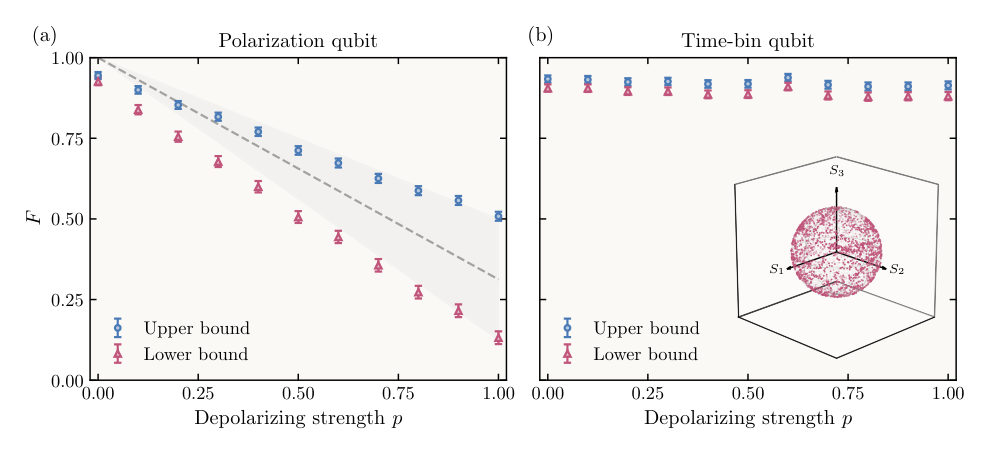
<figcaption class="paper-figure-caption"><b>Fig 3.</b> FIG. 3. Fidelity bounds for the polarization (a) and time-bin (b) encoded ion-photon state as a function of the depolarizing strength p. While the polarization-encoded ion-photon state fidelity degrades as a function of p, the time-bin state fidelity remains unaffected. Data at p = 0 and p = 1 are measured with the depolarizing channel off and on, respectively; intermediate points are statistical mixtures of the two datasets with weight p. Inset: Stokes parameters measured at the output of the fiber squeezer given a horizontally polarized input laser, recorded for one minute, showing depolarization at p = 1. Each point in (a) and (b) takes over one minute to acquire.</figcaption>
</figure>
<figure class="paper-figure-card">
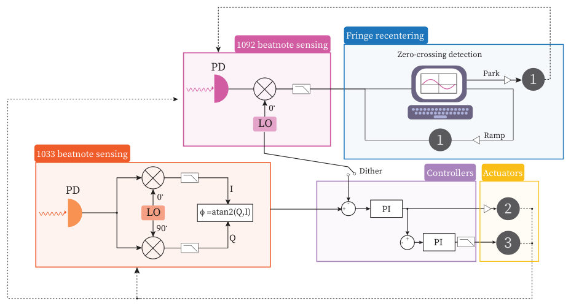
<figcaption class="paper-figure-caption"><b>Fig 4.</b> FIG. 4. Block diagram of the complete phase stabilization scheme. The piezo numbers 1–3 are the ones shown in Fig. 1(a) for the encoder board. The diagram is identical for the decoder board. The 1033 nm lock is engaged continuously, but holds its PI value for 200 ns during the photon detection time, when the stabilization beam is off. The beatnote is measured on a photodiode, and demodulated with analog mixer and low pass to extract the in-phase (I) and quadrature (Q) components. From them, an FPGA calculates the phase, which is the error signal for feeding back to actuator 2. Actuator 3 is a long-range piezo responsible for the rail control of actuator 2. Piezo-mirrors 2 and 3 affect the...</figcaption>
</figure>
<figure class="paper-figure-card">
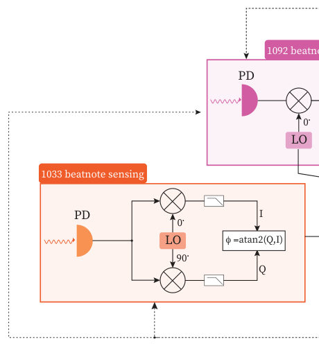
<figcaption class="paper-figure-caption"><b>Fig 5.</b> Fig. 5 shows the phase stabilization performance of each board during 500 s on the photon path. When no correction is applied, the phase undergoes uncontrolled drift. The 1033 nm lock suppresses oscillations but has a slow monotonic drift. By recentering the interferom- eter fringe every 10 s, this drift is suppressed. In the experiment, we conservatively recenter once per 30 s and observe no fidelity improvement from a higher recenter- ing frequency. We attribute the tolerance to infrequent recentering to the largely common-mode drift between the two boards, which sit next to each other on the same optical table.</figcaption>
</figure>

**Summary.** The research demonstrates an entanglement-preserving method to convert photonic qubits from polarization encoding to the more stable time-bin basis using trapped ${}^{88}	ext{Sr}^+$ ions. By implementing this conversion, the authors show that the resulting entangled state fidelity remains high and is robust against significant depolarizing noise, which is crucial for practical quantum communication networks.

**Why it may be interesting.** This work directly addresses a critical bottleneck in quantum networking—maintaining coherence over long distances where fiber polarization drift is common. The successful demonstration of robust entanglement transfer via time-bin encoding is highly relevant to building scalable quantum repeaters and networks.

Detailed structure

**Main problem.** The primary challenge is overcoming polarization instability inherent in quantum communication links when distributing entanglement between matter qubits (trapped ions) and photons.

**Main result.** The implementation of a polarization-to-time-bin conversion successfully preserves entanglement fidelity, proving robust against depolarizing noise even at full depolarization strength.

**Method.** The authors use an asymmetric Mach-Zehnder interferometer (MZI) as an encoder to convert the initial polarization encoding into a time-bin basis for the photonic qubit.

**Model / system.** The system involves trapped ${}^{88}	ext{Sr}^+$ ions acting as matter qubits, emitting photons at $1092 	ext{ nm}$. The process requires two interferometers (encoder and decoder) to map polarization states ($|H
angle, |V
angle$) onto time-bins ($|E
angle, |L
angle$).

**Key observables.** State fidelity bounds ($\approx 0.91 - 0.93$), conversion error ($< 0.028$), and the robustness of fidelity against depolarizing noise.

**Important parameters / regimes.** Time-bin separation (60 ns), ion transition wavelength (1092 nm), and depolarization strength parameter ($p$).

**Assumptions / limitations.** The analysis assumes that background counts are negligible for post-selected fidelity, and the phase error estimation is a conservative upper bound due to shared common-mode drift.

**Figures summary.** Figures detail the MZI encoder/decoder setups (Fig. 1), show population measurements and coherence fringes for time-bin encoding (Fig. 2), illustrate the phase stabilization scheme (Fig. 4, Fig. 5), and compare fidelity vs. noise strength for both encoding methods (Fig. 3).

**Paper structure.** The paper progresses by first establishing the need for robust entanglement distribution, detailing the physical implementation of the polarization-to-time-bin conversion using MZIs, quantifying the resulting state fidelity and error sources through detailed measurements, and finally demonstrating the superior noise resilience of the time-bin encoding.

Abstract

Time-bin photonic qubits are well-suited for quantum network applications due to their robustness to polarization instability in fiber links and potential for heterogeneous networks. In this work, we implement the first entanglement-preserving polarization-to-time-bin conversion of a photon qubit in an entangled state with a matter qubit. Photons initially generated with polarization encoding are converted to the time-bin basis through a polarization-discriminating asymmetric Mach-Zehnder interferometer. The photonic qubits are generated via the $1092$ nm transition of a $^{88}$Sr$^{+}$ ion. We measure state fidelity bounds of $0.906 \pm 0.011 \le \mathcal{F} \le 0.934\pm 0.011$, with conversion error $< 0.028$, and find this fidelity is unaffected by depolarizing noise even at full depolarization strength.

[↑ back to top](#top)

### [Typicality of Steering for Two-qubit States](http://arxiv.org/abs/2607.08762v1)

**Authors:** Gerard Anglès Munné, Paweł Cieśliński, Tamás Vértesi, Wiesław Laskowski  
**Type:** theory · **Category:** quantum information and computing · **PDF:** <https://arxiv.org/pdf/2607.08762v1>  
**Analysis basis:** full PDF text, analyzed in chunks
**Topic relevance:** 🔥 `entanglement & information structure` **4/5** · 🔥 `quantum measurements` **4/5** · `measurement-induced transitions` **3/5**

↔ Scroll figures horizontally

<figure class="paper-figure-card">
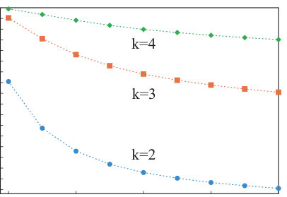
<figcaption class="paper-figure-caption"><b>Fig 1.</b> FIG. 1. Steering probability for SAB, SA, and S∅as a function of the number of measurement settings. Each color corresponds to a different random state ensemble Ek. Each data point is obtained by averaging the single-sample SDP output (see main text for details) over 106 independent realizations. For the Hilbert–Schmidt ensemble (k = 4), steering is almost negligible for SAB and SA at m = 2, but increases to approximately 10% and 7.5%, respectively, at m = 10. For k = 3, the steering probabilities grow rapidly with the number of measurements, reaching nearly 33% for the SAB scenario. The most pronounced effects are observed for the minimal coupling case of k = 2, where steering becomes the...</figcaption>
</figure>
<figure class="paper-figure-card">
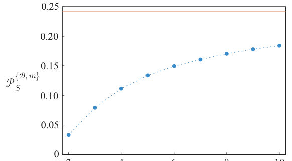
<figcaption class="paper-figure-caption"><b>Fig 2.</b> FIG. 2. Steering probability P{B,m} S for random Bell-diagonal states as a function of m Haar-random projective measurement settings. Initially, the steering probability is of the order of few percent. As expected, increasing m causes it to grow, and reach almost 20% for m = 10. In the limit m →∞, the steering probability approaches 24.15%, indicated by the horizontal line.</figcaption>
</figure>
<figure class="paper-figure-card">
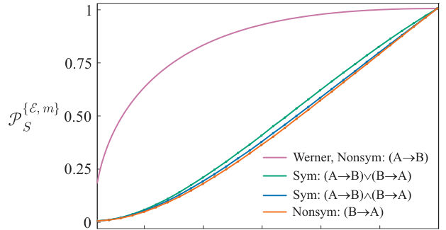
<figcaption class="paper-figure-caption"><b>Fig 3.</b> FIG. 3. Steering probability for depolarized states as a function of visibility for m = 2 Haar-random projective measurement settings. The steering probability PDv,m S for Haar-random depolarized two-qubit states is shown in green and blue and denoted as Sym. The corresponding probability for Werner states is plotted in green. The orange curve represents the probability of B →A steering for Haar-random states subjected to local separable noise (denoted as Nonsym), as defined in Eq. (16).</figcaption>
</figure>

**Summary.** This work quantifies the typicality of quantum steering—a measure of genuine quantum influence—in two-qubit systems subjected to multiple random measurements. By analyzing various state ensembles, the authors show that the probability of observing steering increases significantly with the number of measurements, suggesting that non-classical correlations are robust features of generic mixed states.

**Why it may be interesting.** It provides rigorous quantitative bounds on how robustly non-classical correlations like steering manifest in realistic random quantum systems, which is crucial for designing entanglement-based quantum protocols.

Detailed structure

**Main problem.** The paper investigates the 'typicality' of quantum steering—a non-classical correlation effect—for generic two-qubit states subjected to random projective measurements.

**Main result.** The probability of observing steering ($P_S$) increases systematically with the number of measurements ($m$), approaching genuine typicality ($P_S=100\%$) asymptotically for many random state ensembles.

**Method.** The authors use theoretical derivations, analytical expressions (for specific states like Werner states), and extensive numerical simulations employing Semi-Definite Programming (SDP) to calculate the steering probability integral over measurement settings.

**Model / system.** The system is a two-qubit state ($
ho_{AB}$), analyzed in terms of its entanglement properties. The study focuses on mixed-state ensembles generated via partial tracing from larger random states, contrasting this with pure Haar-random states.

**Key observables.** Steering probability ($P_S$), which quantifies the likelihood that observed conditional quantum states cannot be explained by a Local Hidden State (LHS) model.

**Important parameters / regimes.** Number of measurements ($m$), visibility parameter ($v$) for Werner states, and the structure/ensemble type of the initial two-qubit state.

**Assumptions / limitations.** The analysis distinguishes between finite $m$ detection and the asymptotic limit ($m 	o \infty$) required to claim typicality; specific calculations rely on assumptions about measurement settings (e.g., uniform choice on the Bloch sphere).

**Figures summary.** Figures illustrate the systematic growth of $P^S$ versus $m$ for different state ensembles (like Bell-diagonal and depolarized states), showing how steering becomes more probable with more measurements.

**Paper structure.** The paper progresses from defining quantum steering and its typicality, deriving analytical results for simple cases (Werner states), expanding to general mixed-state ensembles using numerical methods, and finally comparing the findings across various state families.

Abstract

Phenomena that slip beyond the grasp of our classical intuition reveal uniquely quantum effects that deepen our understanding of the physical world and enable advances in information processing, particularly in quantum communication and computation. One such phenomenon is quantum steering, whereby measurements performed by one party influence the conditional states of another when the two share an entangled quantum system. If the observed correlations cannot be explained by a local hidden state model, the state is said to be steerable. In this work, we investigate the typicality of this behavior: given a generic two-qubit state and $m$ Haar-random projective measurements, what is the probability of observing steering? We derive analytical expressions for the steering probability $\mathcal{P}_S$ of Werner states in two- and three-setting scenarios, the latter restricted to coplanar projective measurements on the Bloch sphere. For larger numbers of settings and various random states ensembles, we perform numerical analyses showing that $\mathcal{P}_S$ increases systematically with the number of measurements and substantially exceeds the corresponding probabilities associated with Bell nonlocality. Our results demonstrate that random states with minimal environmental coupling exhibit a high probability of steering for finite $m$ and approach genuine typicality, $\mathcal{P}_S=100\%$, as the number of settings increases. We provide a detailed characterization of $\mathcal{P}_S$ across different state ensembles and specific families, including Bell-diagonal and Werner states, identifying those with the greatest non-classical potential and highlighting their relevance for protocols in which steering serves as a key resource.

[↑ back to top](#top)

### [Competing Chern states revealed by quasiparticle charging in moiré rhombohedral graphene](http://arxiv.org/abs/2607.08710v1)

**Authors:** Hongyuan Li, Zuhan Geng, Junseok Seo, Chenxi Xu, Yifan Jiang, Shenyong Ye, Zhenqi Hua, Jiabin Xie, Lujin Min, Kenji Watanabe, Takashi Taniguchi, Kenji Yasuda, Xiaomeng Liu, Long Ju, Jie Shan, Kin Fai Mak  
**Type:** experiment · **Category:** strongly correlated electrons · **PDF:** <https://arxiv.org/pdf/2607.08710v1>  
**Analysis basis:** full PDF text, analyzed in chunks
**Topic relevance:** 🔥 `analog quantum simulation` **4/5** · `driven-dissipative phase transition` **2/5** · `Kondo & dissipative impurity` **1/5** · `correlated cavity matter` **1/5** · `entanglement & information structure` **1/5** · `non-equilibrium dynamics` **1/5**

↔ Scroll figures horizontally

<figure class="paper-figure-card">
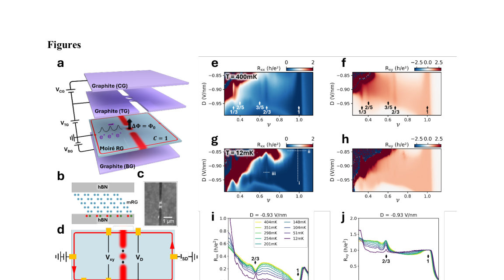
<figcaption class="paper-figure-caption"><b>Fig 1.</b> Figure 1 | Gate-defined antidot in moiré rhombohedral graphene. a,b, Schematic gate-defined antidot device (a) of pentalayer rhombohedral graphene (RG) angle-aligned with the bottom hBN to form a moiré lattice (b). CG, TG and BG denote the control gate, the lithographically patterned top gate and the bottom gate, respectively. 𝑉𝑉𝐶𝐶𝐶𝐶, 𝑉𝑉𝑇𝑇𝑇𝑇 and 𝑉𝑉𝐵𝐵𝐵𝐵 are the voltages applied to CG, TG and BG, respectively. The moiré sample is set to an integer Chern insulating state with Chern number 𝐶𝐶= 1 . Threading magnetic flux in units of the flux quantum ∆Φ = Φ0 pumps quasiparticles of charge 𝑒𝑒∗ to the antidot. c, An AFM image of the device near the antidot area. Scale bar denotes 1µm. d,...</figcaption>
</figure>
<figure class="paper-figure-card">
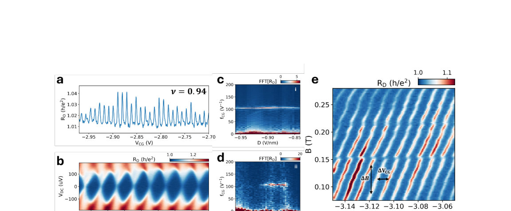
<figcaption class="paper-figure-caption"><b>Fig 2.</b> Figure 2 | Antidot resonance tunneling near 𝝂𝝂= 𝟏𝟏. a, The diagonal resistance 𝑅𝑅𝐷𝐷 (in units of ℎ</figcaption>
</figure>
<figure class="paper-figure-card">
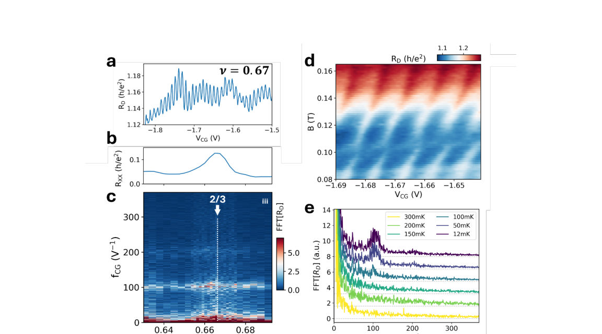
<figcaption class="paper-figure-caption"><b>Fig 3.</b> Figure 3 | Antidot resonant tunneling near 𝝂𝝂= 𝟐𝟐/𝟑𝟑. a, 𝑅𝑅𝐷𝐷 as a function of 𝑉𝑉𝐶𝐶𝐶𝐶 measured at 𝜈𝜈= 0.67 (𝐵𝐵= 50mT). b, 𝑅𝑅𝑥𝑥𝑥𝑥 line cut along the dashed line iii in Fig. 1g. c, Fourier transformed spectrum of 𝑅𝑅𝐷𝐷 (with respect to 𝑉𝑉𝐶𝐶𝐶𝐶) measured along the same dashed line as in b. The oscillation at 𝑓𝑓𝐶𝐶𝐶𝐶≈100V-1 peaks around 𝜈𝜈= 2/3. d, 𝑅𝑅𝐷𝐷 as a function of 𝑉𝑉𝐶𝐶𝐶𝐶 and 𝐵𝐵 at 𝜈𝜈= 0.67. e, The Fourier transformed spectrum of 𝑅𝑅𝐷𝐷 at 𝜈𝜈= 0.67 and different temperatures. The curves are vertically displaced for clarity. The oscillation at 𝑓𝑓𝐶𝐶𝐶𝐶≈100V-1 disappears at about 100mK. All measurements were acquired at 𝐷𝐷= −0.93V/nm and 𝑇𝑇= 12mK (except panel e for temperature).</figcaption>
</figure>
<figure class="paper-figure-card">
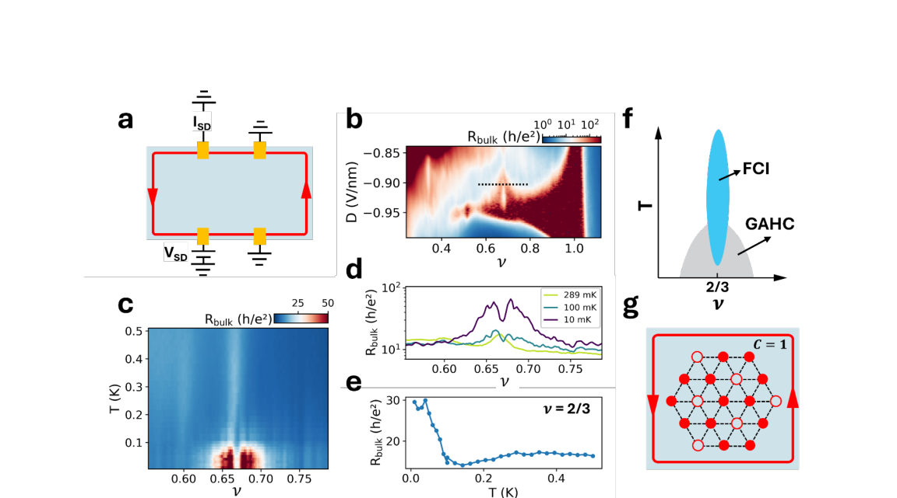
<figcaption class="paper-figure-caption"><b>Fig 4.</b> Figure 4 | Competing ground states probed by bulk resistance. a, Measurement schematics for the two-terminal quasi-bulk resistance 𝑅𝑅𝑏𝑏𝑏𝑏𝑏𝑏𝑏𝑏 of a Chern insulator. All electrodes downstream the source electrode (biased at 𝑉𝑉𝑆𝑆𝑆𝑆) are grounded; currents are collected only at the electrode immediately upstream the source electrode. b. 𝑅𝑅𝑏𝑏𝑏𝑏𝑏𝑏𝑏𝑏 (in units of ℎ</figcaption>
</figure>

**Summary.** The researchers investigated the nature of a phase change in moiré rhombohedral graphene between two topological states: an FCI and an anomalous Hall crystal. By using bulk-sensitive quasiparticle charging measurements, they definitively ruled out edge effects and established that the transition is a genuine thermodynamic phase transition occurring at very low temperatures.

**Why it may be interesting.** This work provides experimental confirmation of competing correlated ground states in moiré systems, which is highly relevant for understanding emergent topological order and fractionalized excitations in strongly interacting electron systems.

Detailed structure

**Main problem.** The study aims to resolve whether the observed transition from a Fractional Chern Insulator (FCI) to an extended quantum anomalous Hall background in moiré rhombohedral graphene is due to edge state equilibration failure or a genuine bulk phase transition.

**Main result.** Quasiparticle charging measurements and temperature-dependent bulk resistance strongly suggest that the system undergoes a thermodynamic phase transition from an FCI to a generalized anomalous Hall crystal at low temperatures, ruling out the edge state scenario.

**Method.** The research employs mesoscopic transport measurements, including quasiparticle tunneling spectroscopy (measuring diagonal resistance) and bulk longitudinal/Hall resistance mapping across varying filling factors and temperatures.

**Model / system.** The physical system is moiré rhombohedral graphene (mRG), fabricated into a mesoscopic antidot device structure. The physics explores competing topological ground states, specifically FCI versus generalized anomalous Hall crystal phases.

**Key observables.** Quasiparticle charge carried during tunneling ($e^*$), quantized resistance plateaus ($R_{xx}, R_{xy}$), and the temperature dependence of bulk resistance near critical filling factors ($
u=2/3$).

**Important parameters / regimes.** Low temperatures (down to 12 mK) are crucial for observing clear signatures; the transition occurs below $T \approx 150$ mK.

**Assumptions / limitations.** The use of bulk-sensitive antidot measurements is necessary to overcome ambiguities inherent in edge-state dominated Hall bar measurements.

**Figures summary.** Figures illustrate device schematics, resonant tunneling peaks (Coulomb oscillations) at specific fillings ($
u=1, 2/3$), and phase diagrams showing the competition between FCI and GAHC states as temperature changes.

**Paper structure.** The paper systematically presents evidence from quasiparticle charging measurements to establish charge quantization, followed by bulk resistance mapping that reveals a temperature-dependent transition between two distinct topological phases.

Abstract

Moiré materials realize a versatile platform for exploring the physics of fractional Chern insulators (FCIs). The recently observed evolution from FCIs to an extended quantum anomalous Hall background upon lowering the electronic temperature in moiré rhombohedral graphene (mRG)8 raises a fundamental question: Is it caused by a failure to equilibrate the edge states of an FCI or by a genuine phase transition in the bulk from an FCI to a generalized anomalous Hall crystal? Here we address this question by probing quasiparticle charging in a mesoscopic mRG antidot device and by bulk resistance measurements, both of which are bulk-sensitive and free from complications from edge states. Tunneling to the mRG antidot reveals quasiparticles carrying one electron charge for both Chern states at filling factors ν=1 and 2/3 at low temperatures. Temperature dependence measurements of the bulk resistance near ν=2/3 further suggest a thermodynamic phase transition from an FCI to a generalized anomalous Hall crystal at temperatures below about 150mK. The results clearly exclude the edge state equilibration scenario and favor the phase transition scenario. Our work establishes mesoscopic probes as a powerful approach to uncover competing ground states in moiré materials and provides a basis for probing fractionalized excitations in FCIs.

[↑ back to top](#top)

### [Measurement-Based Quantum Computing on a Photonic Chip](http://arxiv.org/abs/2607.07890v1)

**Authors:** Jeldrik Huster, Louis L. Hohmann, Kevin Edelmann, Stefanie Barz  
**Type:** experiment · **Category:** quantum information and computing · **PDF:** <https://arxiv.org/pdf/2607.07890v1>  
**Analysis basis:** full PDF text, analyzed in chunks
**Topic relevance:** 🔥 `QC/QI experiment` **4/5** · `quantum measurements` **2/5** · `quantum optics experiment` **2/5** · `entanglement & information structure` **1/5** · `measurement-induced transitions` **1/5**

↔ Scroll figures horizontally

<figure class="paper-figure-card">
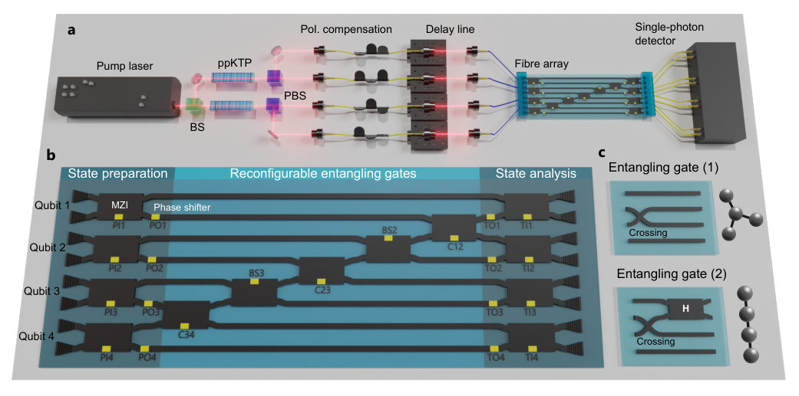
<figcaption class="paper-figure-caption"><b>Fig 1.</b> Figure 1. Experimental setup. a Two type-II SPDC sources generate single photons at 1550 nm wavelength. After temporal synchronisation using delay lines, the photons are coupled into the photonic integrated circuit via a polarisation-maintaining fibre array and on-chip grating couplers, a second fibre array routes the photons to superconducting nanowire single-photon detectors (SNSPDs). The circuit is an 8-mode reconfigurable silicon-on-insulator chip comprising multi-mode interferometers (MMIs) as balanced beam splitters and thermo-optic phase shifters. b Zoom-in of the chip, where yellow rectangles indicate phase shifters whilst black boxes denote Mach-Zehnder interferometers (MZIs)....</figcaption>
</figure>
<figure class="paper-figure-card">
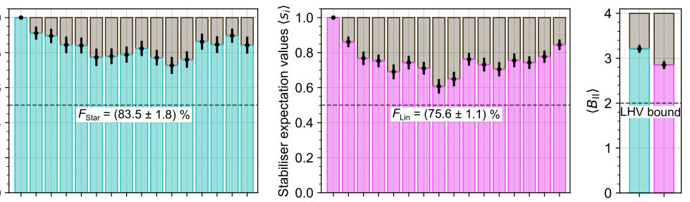
<figcaption class="paper-figure-caption"><b>Fig 2.</b> Figure 2. Graph state characterisation via stabiliser expectation values. a, b Stabiliser expectation values for the generated |Star4⟩and |Lin4⟩state. The dashed line marks the 50 % threshold for genuine multi-partite entanglement. c Verification of non- locality by violation of a two-setting Mermin-type Bell inequality, with |⟨BII⟩Star| = (3.21 ± 0.09) and |⟨BII⟩Lin| = (2.85 ± 0.09).</figcaption>
</figure>
<figure class="paper-figure-card">
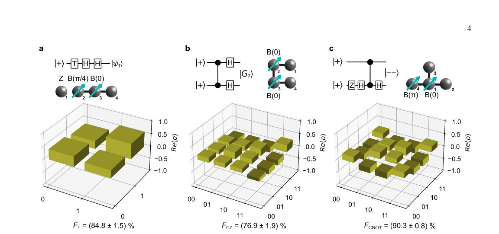
<figcaption class="paper-figure-caption"><b>Fig 3.</b> Figure 3. A set of implemented quantum gates, their implementation via MBQC and the resulting output states. The measurement bases are denoted by B(α) = {|+α⟩, |−α⟩} and Z = {|0⟩, |1⟩}. a, b T-gate operation T|+⟩= 1 √</figcaption>
</figure>
<figure class="paper-figure-card">
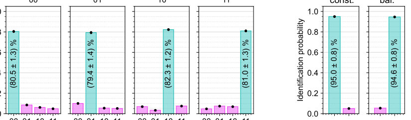
<figcaption class="paper-figure-caption"><b>Fig 4.</b> Figure 4. MBQC implementation of Grover’s search and Deutsch-Josza algorithm. a Circuit representation of the two-qubit Grover’s search algorithm and the four-qubit box graph state used for the MBQC implementation. b Measured identification probabilities for Grover’s algorithm (expected results in cyan). c Circuit and MBQC implementation for a one-bit Deutsch- Josza algorithm using a four-qubit star graph state. d Identification probabilities for the constant function and the balanced function. Expected outcomes in cyan.</figcaption>
</figure>
<figure class="paper-figure-card">
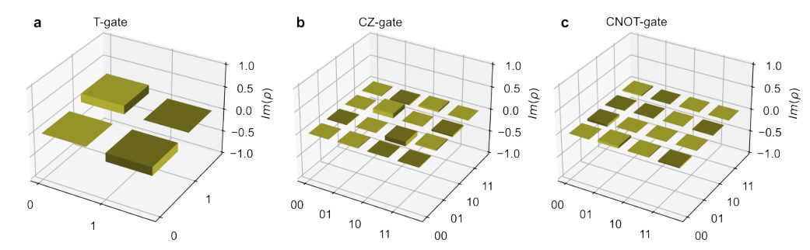
<figcaption class="paper-figure-caption"><b>Fig 5.</b> Figure 5. Imaginary parts of the density matrices ρ for the output states of the MBQC implemented single-qubit and two-qubit gates (real parts shown in Fig. 3 main text).</figcaption>
</figure>

**Summary.** The authors demonstrate Measurement-Based Quantum Computing using four-photon graph states generated on an integrated silicon photonic chip. They successfully implemented fundamental universal gates and tested algorithms like Grover's search, achieving high fidelities that confirm the feasibility of scaling this technology for future quantum computation.

**Why it may be interesting.** This work is highly relevant as it provides a concrete experimental realization of fault-tolerant quantum computation principles (MBQC) on a scalable solid-state platform, advancing the field of photonic quantum information processing.

Detailed structure

**Main problem.** The goal is to demonstrate Measurement-Based Quantum Computing (MBQC) on a scalable photonic platform, circumventing the need for deterministic photon-photon interactions.

**Main result.** The experiment successfully demonstrated reconfigurable four-photon MBQC using integrated silicon photonics, achieving high fidelities for graph state generation and implementing universal quantum gates like T, CZ, and CNOT.

**Method.** MBQC is implemented by performing adaptive measurements on highly entangled photonic graph states generated on an integrated chip. Quantum algorithms (Grover's, Deutsch-Jozsa) were also demonstrated using these resource states.

**Model / system.** The physical system is an integrated silicon photonic chip utilizing dual-rail encoding across eight modes to encode four photonic qubits. The computation relies on generating and measuring specific entangled graph states ($	ext{|Star4}
angle$, $	ext{|Lin4}
angle$).

**Key observables.** Fidelities for graph states ($F_{	ext{Star}} \approx 83.5\%$, $F_{	ext{Lin}} \approx 75.6\%$), gate fidelities ($F_{	ext{CNOT}} \approx 90.3\%$), and violation of Bell inequalities ($	ext{|}\langle B_{II} 
angle	ext{|}_{	ext{Star}} = (3.21 \pm 0.09)$).

**Important parameters / regimes.** The system operates with four photonic qubits, utilizing integrated silicon photonics components like thermo-optic phase shifters and grating couplers.

**Assumptions / limitations.** The work establishes feasibility for four-photon MBQC; limitations include noise sources from losses, non-perfect indistinguishability, and the need for deterministic single-photon sources for scaling.

**Figures summary.** Figures illustrate the experimental setup (SPDC sources coupled to the chip), confirm entanglement via stabilizer measurements and Bell inequality violation, and detail the implementation of quantum gates (T, CZ, CNOT) using MBQC principles.

**Paper structure.** The paper details the physical platform diagnostics (waveguide loss, coupling efficiency), characterizes the single-photon source quality (HOM visibility), demonstrates graph state generation and entanglement verification via Bell tests, and finally implements fundamental universal quantum gates and algorithms using these states.

Abstract

Integrated photonics provides a scalable platform for quantum information processing. In this context, measurement-based quantum computing (MBQC) offers an attractive approach in which quantum computation is realised by adaptive measurements on highly entangled graph states, circumventing the need for deterministic photon-photon interactions. Here, we demonstrate MBQC on an integrated silicon photonic chip capable of generating photonic graph states with up to four qubits. We achieve fidelities of $F_{Star} = (83.5 \pm 1.8)\,\%$ and $F_{Lin} = (75.6 \pm 1.1)\,\%$ for four-photon star and linear graph states, respectively. We use these resource states to implement MBQC-based single- and two-qubit gates and to demonstrate Grover's search algorithm and the Deutsch-Jozsa algorithm. These results establish the feasibility of reconfigurable four-photon MBQC on an integrated photonic platform and provide a foundation for future larger-scale implementations.

[↑ back to top](#top)

### [Smoothing Exponents and Decoupling in Semifinite von Neumann Algebras](http://arxiv.org/abs/2607.07997v1)

**Authors:** Zhiwen Lin, Hongsen Qiu, Xinyu Zhang  
**Type:** theory · **Category:** quantum information and computing · **PDF:** <https://arxiv.org/pdf/2607.07997v1>  
**Analysis basis:** full PDF text, analyzed in chunks
**Topic relevance:** 🔥 `entanglement & information structure` **4/5** · `Keldysh / 2PI / non-Gaussian methods` **1/5** · `correlated / nonlocal dissipation` **1/5** · `driven-dissipative phase transition` **1/5** · `methods for driven-dissipative` **1/5** · `non-equilibrium dynamics` **1/5** · `non-equilibrium universality` **1/5**

↔ Scroll figures horizontally

<figure class="paper-figure-card">
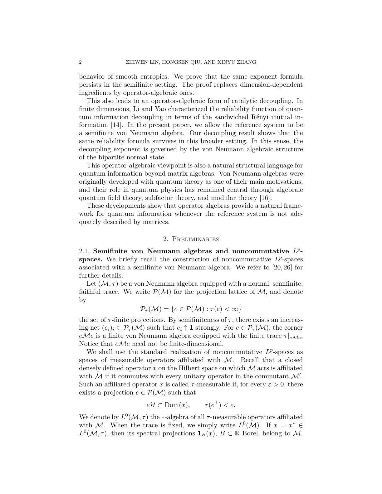
<figcaption class="paper-figure-caption"><b>Fig 1.</b> Low-resolution page preview, page 2</figcaption>
</figure>
<figure class="paper-figure-card">
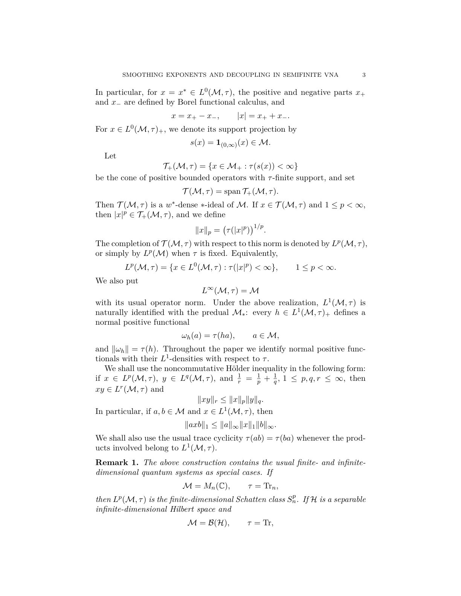
<figcaption class="paper-figure-caption"><b>Fig 2.</b> Low-resolution page preview, page 3</figcaption>
</figure>
<figure class="paper-figure-card">
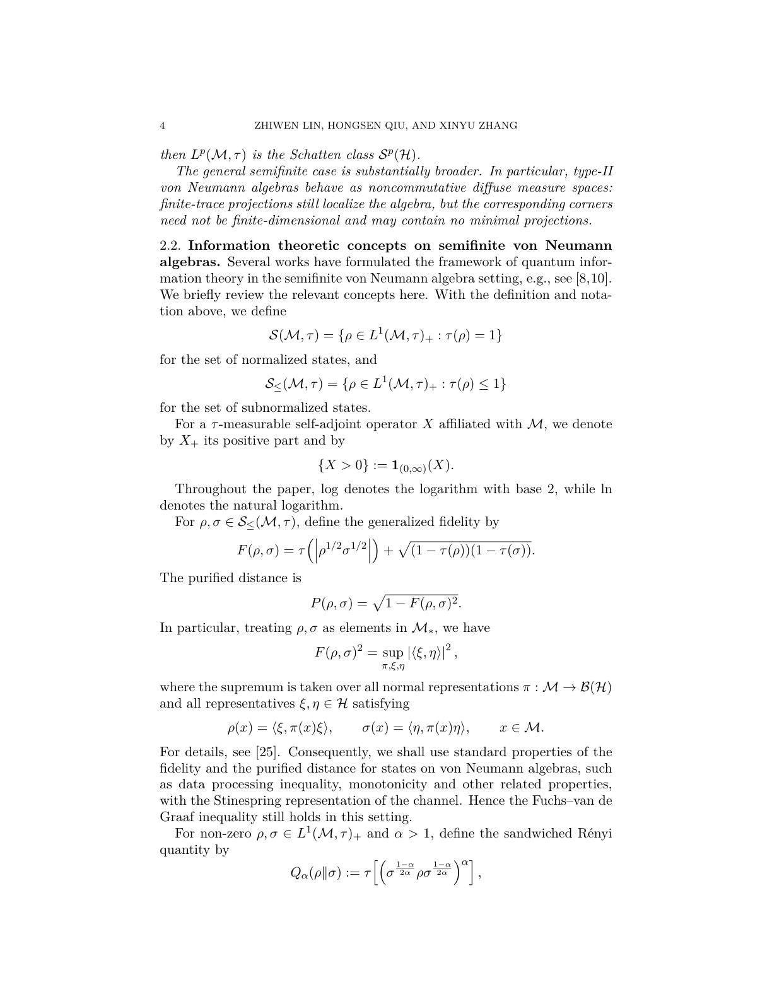
<figcaption class="paper-figure-caption"><b>Fig 3.</b> Low-resolution page preview, page 4</figcaption>
</figure>
<figure class="paper-figure-card">
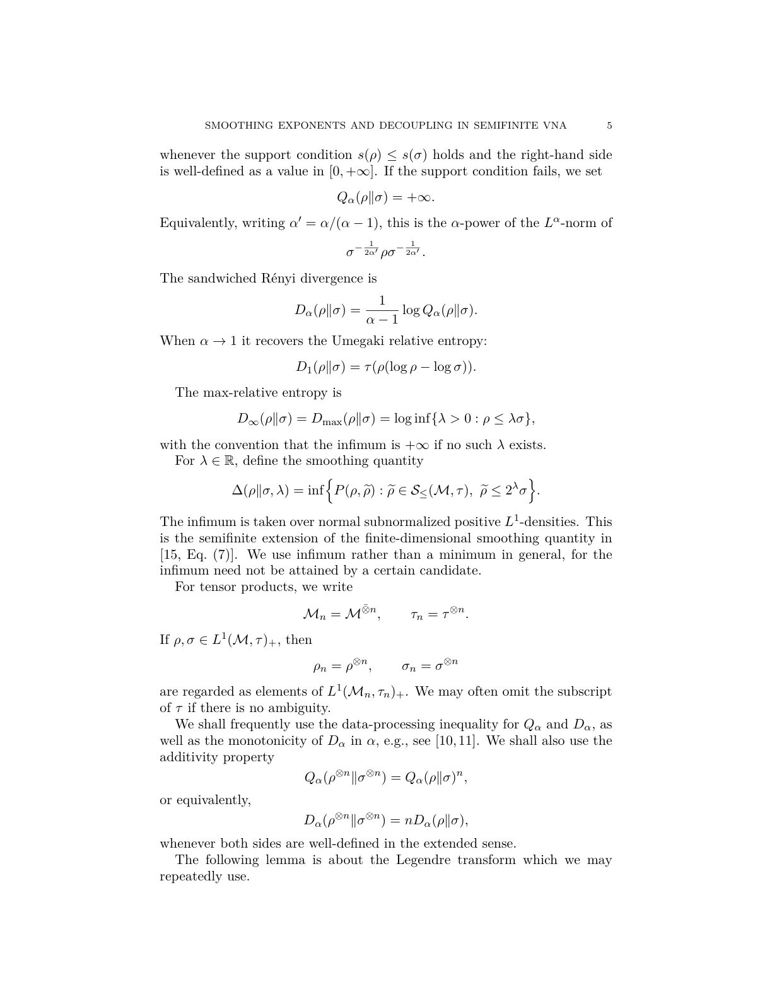
<figcaption class="paper-figure-caption"><b>Fig 4.</b> Low-resolution page preview, page 5</figcaption>
</figure>
<figure class="paper-figure-card">
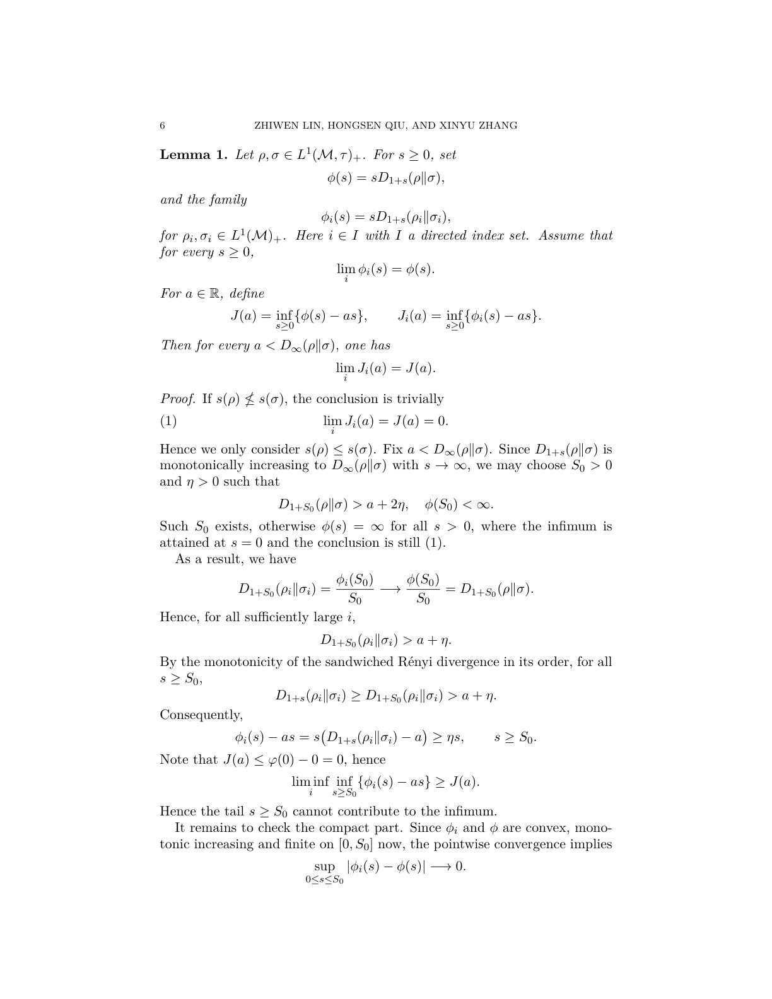
<figcaption class="paper-figure-caption"><b>Fig 5.</b> Low-resolution page preview, page 6</figcaption>
</figure>

**Summary.** This theoretical paper extends concepts from finite-dimensional quantum information theory—specifically smoothing exponents and decoupling bounds—to the general setting of semifinite von Neumann algebras. By developing new operator-algebraic tools, the authors establish exact formulas showing that these fundamental physical limits depend only on the underlying algebraic structure, not on artificial dimension truncations.

**Why it may be interesting.** This work provides rigorous mathematical tools to analyze quantum resource theories (like entanglement or coherence) in infinite-dimensional settings relevant to continuous variable systems or large quantum memories, which is highly relevant for advanced quantum information theory.

Detailed structure

**Main problem.** The paper investigates the smoothing exponent of the max-relative entropy and develops a framework for catalytic quantum information decoupling within the mathematical setting of semifinite von Neumann algebras.

**Main result.** They derive exact exponent formulas showing that these quantities are governed by the underlying algebraic structure rather than finite matrix dimension estimates, generalizing known results to infinite dimensions.

**Method.** The methodology involves developing operator-algebraic replacements for finite-dimensional tools and utilizing noncommutative L^p-spaces associated with semifinite von Neumann algebras.

**Model / system.** The theoretical framework is built upon general quantum systems described by semifinite von Neumann algebras (VNA), extending beyond simple matrix models. Concepts from quantum information theory, such as Rényi relative entropies and divergences, are central to the analysis.

**Key observables.** Smoothing exponent, max-relative entropy ($D_\infty$), decoupling reliability exponent, and sandwiched Rényi mutual information.

**Important parameters / regimes.** The parameter $s$ (related to the order of the divergence) is crucial for optimization; limits as dimension/index go to infinity are key.

**Assumptions / limitations.** The primary technical challenge overcome is moving from finite-dimensional arguments to the general semifinite setting, requiring intrinsic algebraic tools.

**Paper structure.** The paper progresses by establishing foundational $L^p$-space definitions on VNA, defining generalized information divergences, proving key continuity lemmas (like for Legendre transforms), and finally applying these results to derive the exponent formulas for decoupling and smoothing.

Abstract

We study the smoothing exponent of the max-relative entropy in semifinite von Neumann algebras. Our main result gives an exact exponent formula in this setting. The proof develops operator-algebraic replacements for the dimension-dependent tools used in finite-dimensional arguments. These ingredients show that the smoothing exponent is governed by the underlying von Neumann algebraic structure rather than by matrix dimension estimates. As an application, we formulate catalytic quantum information decoupling with a semifinite von Neumann algebraic reference system. We prove an intrinsic layer-cake lemma for von Neumann algebras, which removes the countable spectrum assumption in the finite-dimensional proof and yields the corresponding semifinite estimate. Consequently, the decoupling reliability exponent is described by the same sandwiched Rényi mutual information formula as in the finite-dimensional theory.

[↑ back to top](#top)

### [Center-of-Mass Bounds and Harmonic Extremality](http://arxiv.org/abs/2607.08096v1)

**Authors:** Arseny Pantsialei  
**Type:** theory · **Category:** other · **PDF:** <https://arxiv.org/pdf/2607.08096v1>  
**Analysis basis:** full PDF text, analyzed in chunks
**Topic relevance:** 🔥 `analog quantum simulation` **4/5** · `non-equilibrium dynamics` **2/5** · `Frenkel-Kontorova` **1/5** · `Keldysh / 2PI / non-Gaussian methods` **1/5** · `entanglement & information structure` **1/5**

↔ Scroll figures horizontally

<figure class="paper-figure-card">
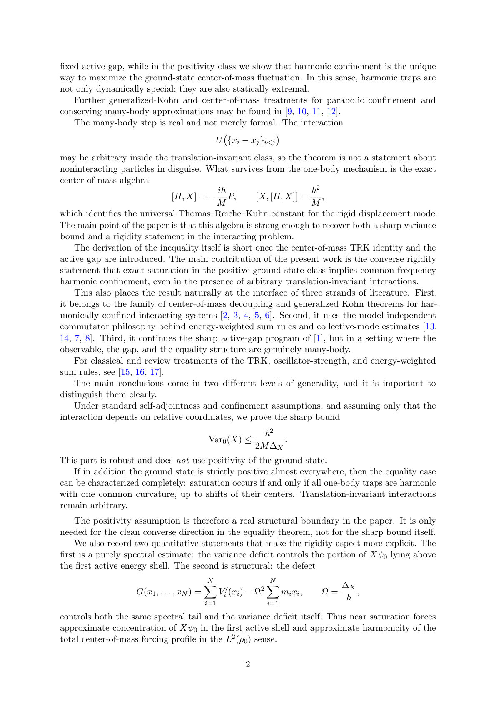
<figcaption class="paper-figure-caption"><b>Fig 1.</b> Low-resolution page preview, page 2</figcaption>
</figure>
<figure class="paper-figure-card">
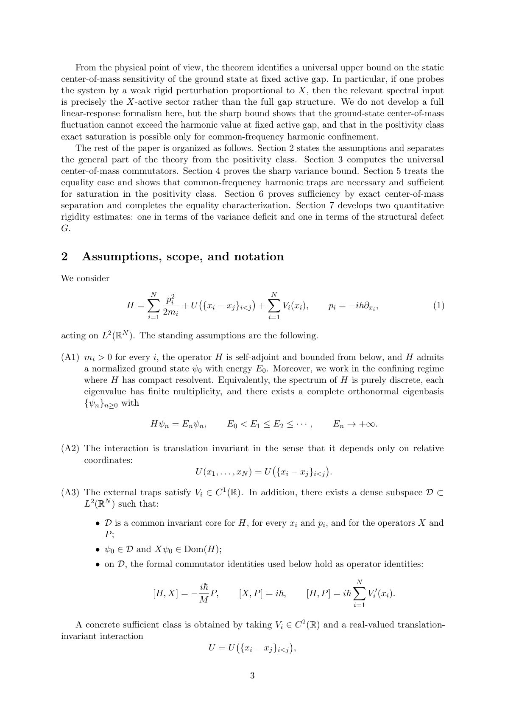
<figcaption class="paper-figure-caption"><b>Fig 2.</b> Low-resolution page preview, page 3</figcaption>
</figure>
<figure class="paper-figure-card">
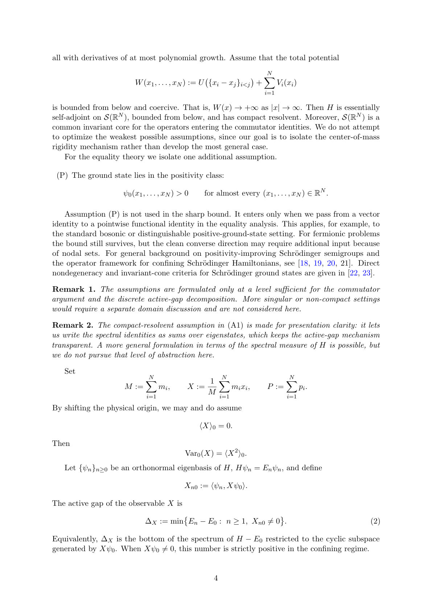
<figcaption class="paper-figure-caption"><b>Fig 3.</b> Low-resolution page preview, page 4</figcaption>
</figure>
<figure class="paper-figure-card">
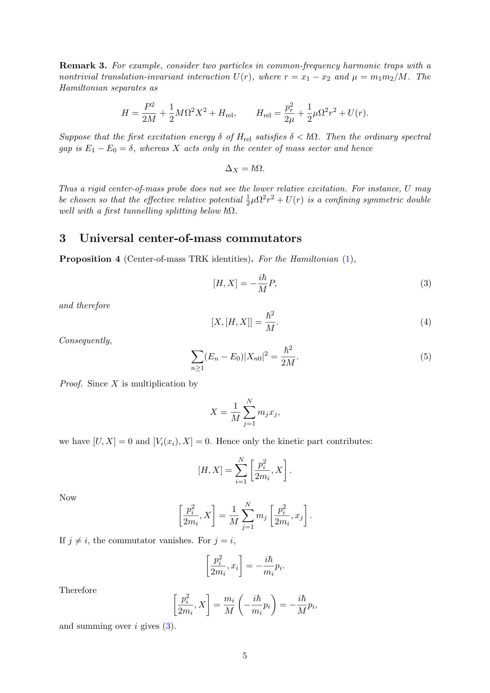
<figcaption class="paper-figure-caption"><b>Fig 4.</b> Low-resolution page preview, page 5</figcaption>
</figure>
<figure class="paper-figure-card">
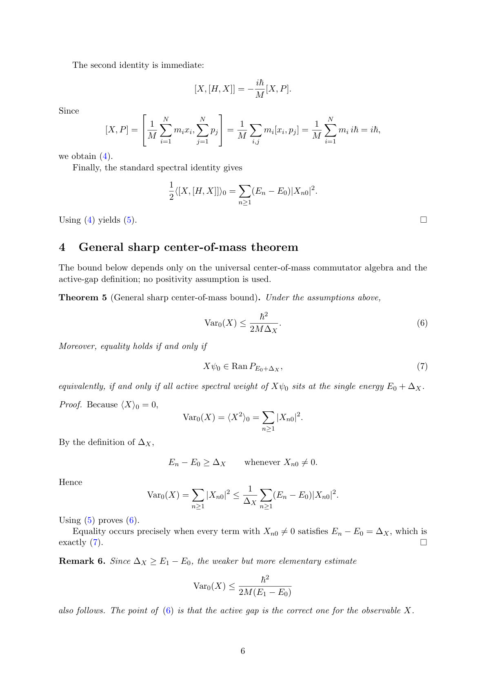
<figcaption class="paper-figure-caption"><b>Fig 5.</b> Low-resolution page preview, page 6</figcaption>
</figure>

**Summary.** This paper rigorously analyzes the center-of-mass dynamics in interacting 1D many-body quantum systems. It derives a sharp upper bound showing that the ground-state fluctuation of the center-of-mass is limited by the system's active spectral gap. Crucially, it proves that this maximum rigidity (saturation) is achieved if and only if the external trapping potentials are harmonic, establishing harmonic confinement as the unique static extremizer.

**Why it may be interesting.** This work provides powerful spectral tools—relating ground-state variances to energy gaps—that are highly relevant in AMO physics for understanding how trapping potentials dictate collective excitations and rigidity in systems like trapped atoms or quantum chains.

Detailed structure

**Main problem.** The paper extends the harmonic-rigidity mechanism, traditionally known for one-body systems, to analyze the center-of-mass observable in interacting many-body quantum systems.

**Main result.** It establishes a sharp upper bound on the ground-state center-of-mass fluctuation ($	ext{Var}_0(X)$) proportional to the active spectral gap ($\Delta X$), showing that equality holds if and only if the external trapping potentials are harmonic with a common frequency (under positivity assumptions).

**Method.** The analysis relies heavily on commutator identities involving the Hamiltonian ($H$) and the center-of-mass operator ($X$), leading to rigorous bounds derived from spectral properties.

**Model / system.** The system consists of one-dimensional many-body quantum particles with masses $m_i$ interacting via translation-invariant potentials, subject to external trapping potentials $V_i(x_i)$. The Hamiltonian is explicitly defined in terms of kinetic and potential energy terms.

**Key observables.** Center-of-mass fluctuation ($	ext{Var}_0(X)$), Active Spectral Gap ($\Delta X$), Structural Defect ($G$), Variance Deficit ($D_X$).

**Important parameters / regimes.** The ratio $\hbar^2/(2M)$ linking the variance bound to the gap, and the common frequency $\Omega$ characterizing harmonic confinement.

**Assumptions / limitations.** The primary results hold generally without assuming ground state positivity ($\psi_0 > 0$), but the complete characterization of the equality case requires this positivity assumption.

**Paper structure.** The paper builds from establishing fundamental commutator identities for $X$ and $H$, deriving a general sharp bound on $	ext{Var}_0(X)$, and then characterizing the necessary and sufficient conditions (especially under positivity) for this bound to be saturated, linking saturation directly to harmonic confinement.

Abstract

We study the center-of-mass observable in one-dimensional many-body systems with translation-invariant interactions and extend the harmonic-rigidity mechanism from the one-body setting to an interacting many-body problem. We prove a sharp upper bound on the ground-state center-of-mass fluctuation in terms of the active spectral gap associated with the center-of-mass probe, and show that this bound does not require any positivity assumption on the ground state. In the positivity class, we characterize the equality case completely. Exact saturation occurs if and only if the external one-body traps are harmonic with a common frequency, while the interaction may remain arbitrary within the translation-invariant class. We also identify a natural rigidity defect measuring deviation from the harmonic extremal situation and prove quantitative near-saturation estimates controlling both the variance deficit and the spectral weight outside the first active shell. In this way, the paper establishes harmonic confinement as the unique static extremizer for the rigid interacting center-of-mass mode at fixed active gap.

[↑ back to top](#top)

### [Distributed Monogamy of Entanglement limits Quantum Channel Simulation](http://arxiv.org/abs/2607.08591v1)

**Authors:** Rabsan Galib Ahmed, Graeme Smith  
**Type:** theory · **Category:** quantum information and computing · **PDF:** <https://arxiv.org/pdf/2607.08591v1>  
**Analysis basis:** full PDF text, analyzed in chunks
**Topic relevance:** 🔥 `entanglement & information structure` **4/5** · `Keldysh / 2PI / non-Gaussian methods` **1/5** · `correlated / nonlocal dissipation` **1/5** · `driven-dissipative phase transition` **1/5** · `methods for driven-dissipative` **1/5**

↔ Scroll figures horizontally

<figure class="paper-figure-card">
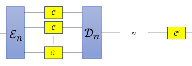
<figcaption class="paper-figure-caption"><b>Fig 1.</b> FIG. 1. Simulating one quantum channel (C′) with another (C). We use the trace distance between the Choi states of the channels in the figure to quantify the error of simulation. In the asymptotically many uses of C (n →∞), we require a vanishingly small error.</figcaption>
</figure>
<figure class="paper-figure-card">
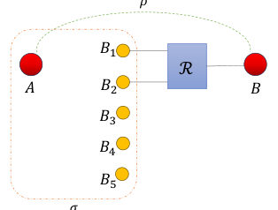
<figcaption class="paper-figure-caption"><b>Fig 2.</b> FIG. 2. A (3, 2)-extension, σAB[5]. Any two Bi’s can be jointly processed to output the (3, 2)-extendible state, ρAB.</figcaption>
</figure>

**Summary.** This paper develops advanced entanglement measures, such as fractional extendibility, and applies them alongside the concept of distributed monogamy of entanglement. Using these tools, the authors establish strict impossibility theorems showing that certain noisy quantum channels cannot simulate others if their noise parameters fall within specific ranges.

**Why it may be interesting.** This work provides rigorous mathematical tools (fractional extendibility) to quantify resource limitations in quantum communication protocols, which is central to understanding achievable rates and bounds in quantum information theory.

Detailed structure

**Main problem.** The paper investigates fundamental limits on quantum channel simulation, specifically determining when one noisy channel cannot be simulated by another.

**Main result.** They prove that a quantum erasure channel $N_\gamma$ with noise parameter $\gamma$ cannot simulate an erasure channel $N_\lambda$ if $\gamma < \lambda \le 1/2$, establishing quantitative bounds on simulation feasibility.

**Method.** The analysis relies on introducing and utilizing 'fractional extendibility' as a refined measure of quantum correlation, alongside the established 'distributed monogamy of entanglement'.

**Model / system.** The primary model is the quantum erasure channel $N_\lambda$, which transmits input perfectly with probability $\lambda$ and erases it otherwise. The analysis uses concepts from multi-partite entanglement on tensor product states.

**Key observables.** Fractional extendibility, Quantum Capacity ($Q(N_\lambda)$), and the average probability of extracting an EPR pair from random subsets of systems.

**Important parameters / regimes.** The erasure channel parameter $\lambda$ (and related noise parameters $\gamma$), and the ratio $k/n$ derived from distributed monogamy.

**Assumptions / limitations.** The proof for irrational parameters assumes that if simulation were possible, it would contradict results proven for rational numbers; also relies on vanishing trace distance implying entanglement constraints.

**Figures summary.** Figure 1 illustrates the concept of simulating one quantum channel using another via the trace distance between Choi states. Figure 2 depicts a specific $(3, 2)$-extension state $\sigma_{AB}[5]$.

**Paper structure.** The paper builds from defining fractional extendibility and proving its invariance properties; it then establishes the quantitative bound of distributed monogamy of entanglement; finally, these tools are combined to prove the impossibility of simulating noisier channels with less noisy ones.

Abstract

Entanglement is monogamous: if it is shared among more than two parties, the entanglement between any pair cannot be very strong. For an integer $k\geq 2$, $k$-extendibility of a state $ρ_{AB}$ quantifies this as the number of copies of $B$ that can be simulated by the state's environment. We introduce fractional extendibility, which gives a finer characterization of the quantum correlation that is leaked to the environment, and prove that it is invariant under tensor products and monotonic under local processing. We also establish the distributed monogamy of entanglement: for any state on $AB_1B_2\dots B_n$, the maximum average probability of extracting an EPR pair from a random subset of $k \leq n/2$ systems among the $B_i$'s is the fraction $k/n$. With these tools we show that any quantum erasure channel with erasure probability more than a half cannot simulate a less noisy erasure channel, even with asymptotically many uses of the more noisy channel.

[↑ back to top](#top)

### [Metropolitan entanglement distribution between an atom and a near-visible photon](http://arxiv.org/abs/2607.08513v1)

**Authors:** Maya Büki, Pooja Malik, Florian Fertig, Tobias Frank, Marvin Scholz, Tommy Block, Gianvito Chiarella, Yiru Zhou, Emanuele Distante, Pau Farrera, Gerhard Rempe, Harald Weinfurter  
**Type:** experiment · **Category:** quantum information and computing · **PDF:** <https://arxiv.org/pdf/2607.08513v1>  
**Analysis basis:** full PDF text, analyzed in chunks
**Topic relevance:** 🔥 `QC/QI experiment` **4/5** · `quantum optics experiment` **3/5** · `interference shaping light` **1/5**

↔ Scroll figures horizontally

<figure class="paper-figure-card">

<figcaption class="paper-figure-caption"><b>Fig 1.</b> FIG. 1. Metropolitan quantum link. Two laboratories in the greater Munich area are connected via a 24 km long fiber in order to distribute atom-photon entanglement. The Rb atom at LMU (node 1) is entangled with a photonic qubit (see level scheme) which is subsequently converted to a telecom wave- length at QFC1, propagates 24 km of fiber, is back-converted to 780 nm at QFC2, and after spectral filtering finally mea- sured in a photon projection measurement at MPQ (node 2). After communicating to LMU the arrival of the photon at MPQ, the atomic state is measured via florescence read- out using a micro-electro-mechanical systems (MEMS) switch and an avalanche photodetector (APD).</figcaption>
</figure>
<figure class="paper-figure-card">
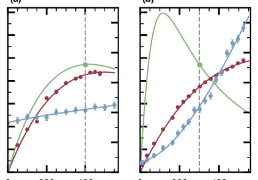
<figcaption class="paper-figure-caption"><b>Fig 2.</b> FIG. 2. Characterization of the QFCs. Measurement of the external conversion efficiency of QFC1 (a) and QFC2 (b) - in red - and noise at the end of the communication link when changing (a) the pump power of QFC1 (power of QFC2 is fixed at 300 mW) and (b) the pump power of QFC2 (power of QFC1 is fixed at 400 mW) - in blue. The ratio between the ef- ficiency and the noise clicks is proportional to the SNR, which is depicted in green. All solid lines are obtained from fits to experimental data using equations that are found in [47]. The vertical dashed grey lines indicate the pump powers used in the entanglement experiment for QFC1 and QFC2 respec- tively.</figcaption>
</figure>
<figure class="paper-figure-card">
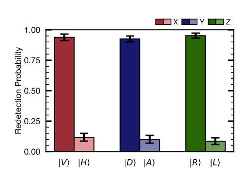
<figcaption class="paper-figure-caption"><b>Fig 3.</b> FIG. 4. Atom-photon state correlation at 780 nm after 24 km of fiber. Conditional redetection probability of the atom at maximum correlation points measured in three different basis combinations for both the atom (X,Y and Z) and the pho- ton measurement. The horizontal axis indicates the photon qubit polarization measurement result. The different values obtained for the VH, DA and LR bases lead to an average visibility of ¯V = 82.5 ± 2.0%. The photon detection rate for this measurement was 0.7 min−1. Error bars represent one standard deviation.</figcaption>
</figure>
<figure class="paper-figure-card">
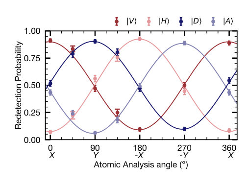
<figcaption class="paper-figure-caption"><b>Fig 4.</b> FIG. 3. Atom-photon state correlation at the telecom wave- length after 24 km of fiber. The conditional redetection prob- ability for different readout angles of the atom depending on the measured polarization state of the photon (horizontal and vertical (|H⟩, |V ⟩) or diagonal and antidiagonal linear polar- ization (|D⟩, |A⟩) ) as indicated in the legend shows fringes with the average visibility ¯V = 82.4 ± 0.8%. The measure- ment points at 45° and 135° are used for calculating the S- parameter, with result S = 2.30±0.08, clearly violating Bell’s inequality. Error bars represent one standard deviation, and the photon-detection window was set to 60 ns.</figcaption>
</figure>

**Summary.** The research demonstrates a functional metropolitan quantum network link by distributing entanglement between an atom and a photon over $24 	ext{ km}$ of standard optical fiber. This was achieved by employing specialized quantum frequency converters to shift the photon's wavelength between the atomic resonance (visible) and the telecom band. The success proves a crucial step toward integrating local quantum processors with existing long-distance communication infrastructure.

**Why it may be interesting.** This work is highly relevant as it tackles the critical engineering hurdle—wavelength conversion—necessary to connect atomic quantum memories (which operate at visible wavelengths) with existing, long-haul fiber infrastructure used for quantum communication networks.

Detailed structure

**Main problem.** The primary challenge addressed is overcoming the wavelength mismatch between quantum network nodes (operating at visible/near-visible wavelengths) and the telecom band required for long-distance fiber transmission to distribute entanglement.

**Main result.** The authors successfully demonstrated a metropolitan quantum link capable of distributing atom-photon entanglement over 24 km by implementing bidirectional frequency conversion, maintaining high fidelity ($F \geq 86.9\%$).

**Method.** The experiment utilizes quantum frequency converters (QFCs) based on periodically-poled lithium niobate to convert the photon wavelength between the atomic resonance ($\lambda = 780 	ext{ nm}$) and the telecom S-band ($	ext{1514 nm}$), enabling transmission through deployed fiber.

**Model / system.** The system is a metropolitan quantum link connecting two laboratories via $24 	ext{ km}$ of commercial optical fiber. It involves an atomic qubit (e.g., $	ext{Rb}$) entangled with a photon, which undergoes conversion at the ends of the fiber segment.

**Key observables.** Entanglement fidelity ($F$), visibility ($ar{V}$), Bell parameter ($S$), and overall entanglement distribution efficiency.

**Important parameters / regimes.** Fiber length ($24 	ext{ km}$), atomic wavelength ($780 	ext{ nm}$), telecom wavelength ($	ext{1514 nm}$), and achieved photon transfer efficiency ($1.7\%$).

**Assumptions / limitations.** The system relies on the functionality of quantum frequency converters and assumes stable operation despite environmental drifts, which are actively corrected using classical polarization monitoring.

**Figures summary.** Figures illustrate the setup showing entanglement generation at $780 	ext{ nm}$, conversion to $	ext{1514 nm}$ for fiber propagation, and back-conversion. Results show state correlations confirming entanglement violation of Bell's inequality both before and after full link transmission.

**Paper structure.** The paper details the experimental setup involving frequency conversion stages ($	ext{QFC}1$ and $	ext{QFC}2$) to bridge wavelength gaps, followed by long-distance propagation through fiber. Key results confirm high fidelity entanglement distribution over $24 	ext{ km}$, concluding with a discussion of future applications in quantum networking.

Abstract

Entanglement distribution is the overarching purpose of quantum networks. While communication over long distances can use deployed fiber infrastructure, it requires photons in the telecom band. However, advanced quantum network nodes do not operate at such wavelengths. Here we overcome this limitation with two tailor-made low-noise quantum-frequency converters to distribute entanglement between a single atom and a resonant photon over 14km line-of-sight via 24km of a deployed commercial fiber. The photon at wavelength 780nm is first entangled with the atom, then converted to the telecom S-band, and finally back-converted after propagation through the fiber. This link enables a photon transfer efficiency of 1.7% while affecting the atom-photon entanglement fidelity by less than 1%. This brings integration of atomic quantum nodes with existing long-distance fiber networks into reach, enabling novel applications in quantum information processing.

[↑ back to top](#top)

### [Quantum-Geometric Design of Lattice Generalized Landau Levels](http://arxiv.org/abs/2607.08702v1)

**Authors:** Bohao Li, Fengcheng Wu  
**Type:** theory · **Category:** strongly correlated electrons · **PDF:** <https://arxiv.org/pdf/2607.08702v1>  
**Analysis basis:** full PDF text, analyzed in chunks
**Topic relevance:** 🔥 `analog quantum simulation` **4/5** · `entanglement & information structure` **3/5** · `non-equilibrium dynamics` **1/5**

↔ Scroll figures horizontally

<figure class="paper-figure-card">
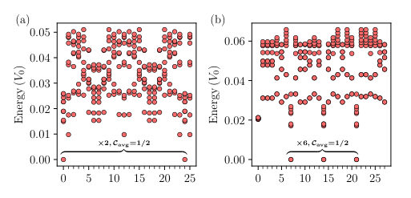
<figcaption class="paper-figure-caption"><b>Fig 1.</b> FIG. 2. (a,b) ED spectra at ν = 1/2 for the generalized 1LL band in the N = 4 model on clusters with Ns = 26 and 28, respectively. Energy is measured relative to the ground state.</figcaption>
</figure>
<figure class="paper-figure-card">
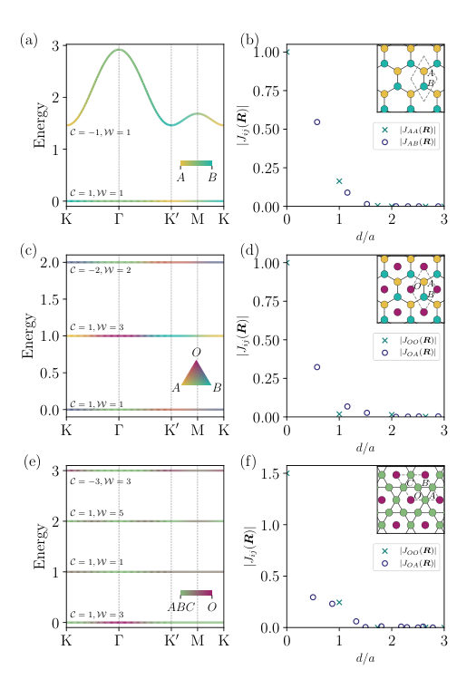
<figcaption class="paper-figure-caption"><b>Fig 2.</b> FIG. 1. Band structures (left panels) and hopping amplitudes (right panels) for the N = 2, 3, and 4 models. Left panels: Colors encode the sublattice weights. Right panels: The cor- responding hopping amplitudes as a function of distance d, measured in unit of the lattice constant a, are shown in (b), (d), and (f). Insets display the lattice structures, with dashed lines indicating the unit cells.</figcaption>
</figure>
<figure class="paper-figure-card">
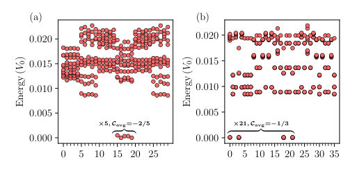
<figcaption class="paper-figure-caption"><b>Fig 3.</b> FIG. 4. (a,b) ED spectra at ν = 1/5 and 1/6 in the C = −2 band of the N = 3 model on clusters with Ns = 30 and 36, respectively. Energy is measured relative to the ground state.</figcaption>
</figure>
<figure class="paper-figure-card">
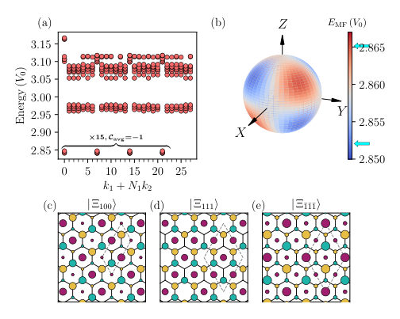
<figcaption class="paper-figure-caption"><b>Fig 4.</b> FIG. 3. (a) ED spectrum at ν = 1/2 for the C = −2 band in the N = 3 model, calculated on a cluster with Ns = 28. (b) Mean-field energy of Slater determinant states for the same system, parameterized on the Bloch sphere. Arrows indicate the range of the data. (c) Density variations of the Slater de- terminant states (represented by marker size) along the [100], [111], and [¯1¯1¯1] directions of the Bloch sphere. Dashed lines denote the charge-density-wave supercell.</figcaption>
</figure>

**Summary.** The paper details the quantum-geometric design of novel lattice models intended to host generalized Landau levels. By analyzing these structured systems using exact diagonalization and entanglement spectroscopy, the authors predict and confirm the realization of exotic correlated phases, including fractional Chern insulators and anomalous Hall crystal states.

**Why it may be interesting.** This work is highly relevant as it provides a concrete theoretical framework—using engineered lattice Hamiltonians—to model exotic many-body phenomena (like fractional quantum Hall states) that are central to condensed matter theory, bridging geometric design with strong correlation physics.

Detailed structure

**Main problem.** The research focuses on designing lattice models with tailored quantum geometry to realize physics analogous to Landau Levels (LLs) and higher-Chern bands, while also studying emergent fractionalized and charge-ordered states.

**Main result.** The authors successfully predict and confirm the existence of Abelian Fractional Chern Insulators (FCIs), Moore-Read states, and various anomalous Hall crystal phases in these engineered lattice models using exact diagonalization techniques.

**Method.** The primary methods involve constructing generalized LLs via quantum geometry analysis and then employing Exact Diagonalization (ED) coupled with Particle Entanglement Spectrum (PES) analysis to study interacting electron physics on the resulting flat bands.

**Model / system.** The models are lattice generalizations of Landau levels, constructed using $N=2, 3,$ and $4$ sublattices on lattices like honeycomb or kagome. The Hamiltonian is studied by projecting interactions onto selected bands derived from these engineered quantum geometries.

**Key observables.** Key observables include the Chern number ($C$), the quantum weight ($W$), the many-body average Chern number ($C_{	ext{avg}}$), and the analysis of entanglement gaps ($\xi_{AHC}$) to diagnose topological phases.

**Important parameters / regimes.** Important parameters include filling fractions $
u$ (e.g., $1/3, 1/2, 1/5$), the number of sublattices ($N=2, 3, 4$), and hopping decay rates (Gaussian or exponential).

**Assumptions / limitations.** Assumptions include the linear independence of basis states used in construction and that quantum geometry can be tailored to enforce specific topological properties.

**Figures summary.** Figures illustrate band structures for different $N$ values, ED spectra showing quasi-degenerate ground states at fractional fillings (e.g., $
u=1/2$), and PES plots confirming gaps associated with charge ordering.

**Paper structure.** The paper progresses from designing the lattice models based on quantum geometry to analyzing the resulting flat bands via ED for various filling fractions, culminating in the identification of specific correlated topological phases like FCIs and AHCs.

Abstract

We design lattice models with tailored quantum geometry, including generalized Landau levels (LLs) satisfying the integrated trace condition and higher-Chern bands with ideal quantum geometry. Our models with $N=2$, $3$, and $4$ sublattices include a generalized Haldane model ($N=2$ honeycomb lattice model) with Gaussian-decaying hoppings realizable in twisted bilayer MoTe$_2$, and $N \geq 3$ models with exponentially decaying hoppings. Exact diagonalization reveals fractional Chern insulators in the generalized zeroth LL bands of all three models, a Moore-Read state in the generalized first LL band of the $N=4$ model, and various interaction-driven topological phases$\unicode{x2013}$including integer and fractional anomalous Hall crystals and a multicomponent Halperin state$\unicode{x2013}$in the ideal higher-Chern band of the $N=3$ model. Informed by quantum geometry, our work provides a pathway for lattice realizations of Landau-level and beyond-Landau-level physics.

[↑ back to top](#top)

### [Entanglement Wedge Reconstruction without Holographic Quantum Error Correction](http://arxiv.org/abs/2607.08684v1)

**Authors:** Seiji Terashima  
**Type:** theory · **Category:** other · **PDF:** <https://arxiv.org/pdf/2607.08684v1>  
**Analysis basis:** full PDF text, analyzed in chunks
**Topic relevance:** 🔥 `entanglement & information structure` **4/5** · `correlated / nonlocal dissipation` **1/5** · `non-equilibrium dynamics` **1/5**

↔ Scroll figures horizontally

<figure class="paper-figure-card">
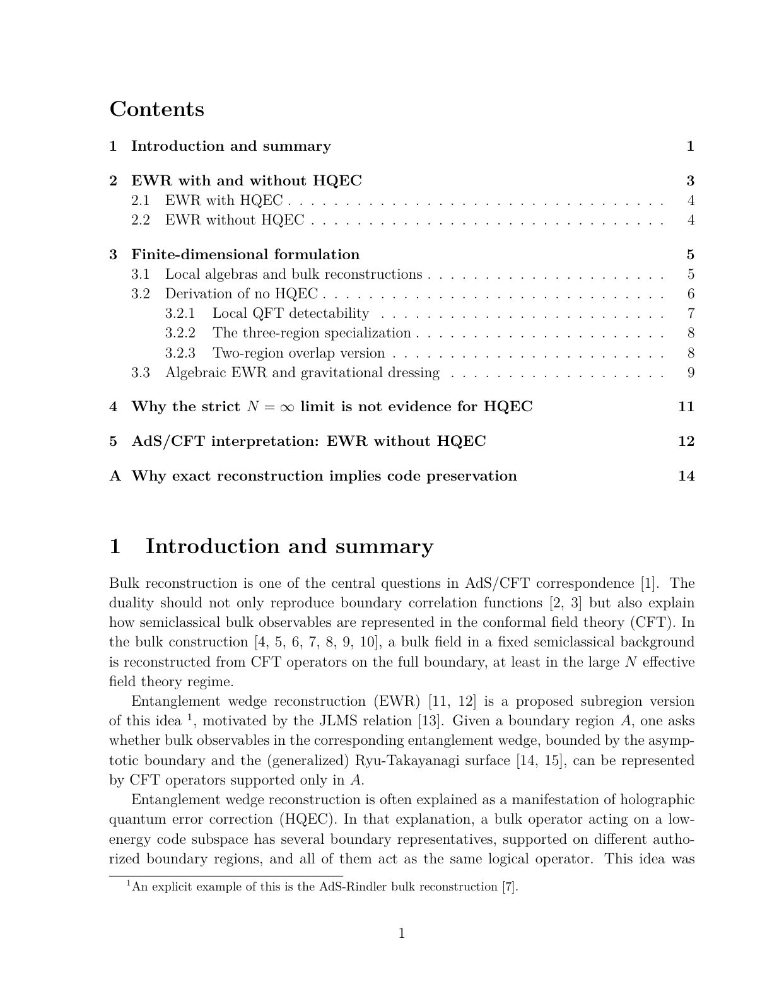
<figcaption class="paper-figure-caption"><b>Fig 1.</b> Low-resolution page preview, page 2</figcaption>
</figure>
<figure class="paper-figure-card">
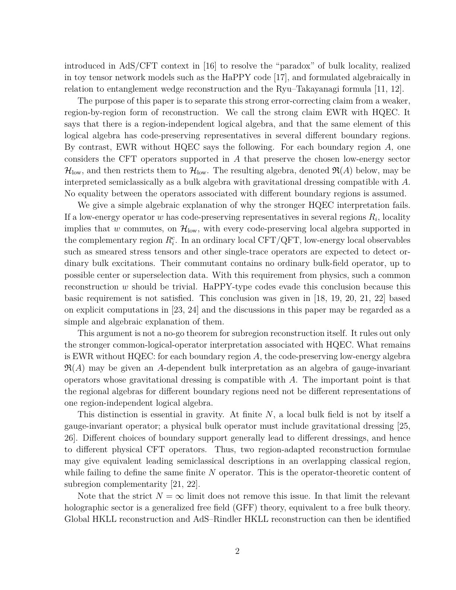
<figcaption class="paper-figure-caption"><b>Fig 2.</b> Low-resolution page preview, page 3</figcaption>
</figure>
<figure class="paper-figure-card">
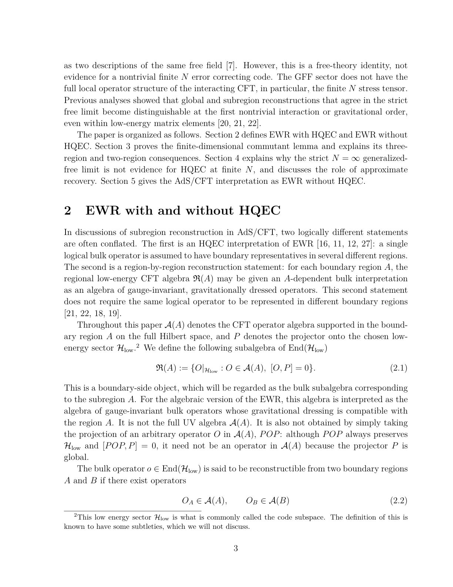
<figcaption class="paper-figure-caption"><b>Fig 3.</b> Low-resolution page preview, page 4</figcaption>
</figure>
<figure class="paper-figure-card">
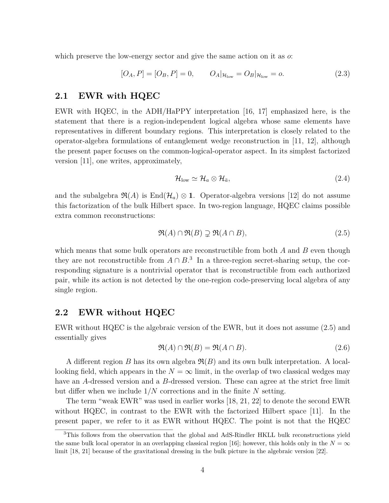
<figcaption class="paper-figure-caption"><b>Fig 4.</b> Low-resolution page preview, page 5</figcaption>
</figure>
<figure class="paper-figure-card">
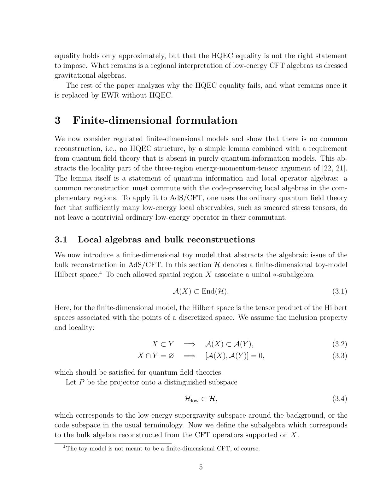
<figcaption class="paper-figure-caption"><b>Fig 5.</b> Low-resolution page preview, page 6</figcaption>
</figure>

**Summary.** This paper analyzes Entanglement Wedge Reconstruction within AdS/CFT, arguing that the strong interpretation requiring Holographic Quantum Error Correction (HQEC) is incompatible with ordinary local QFTs. By using locality arguments based on low-energy observables, the authors conclude that only a weaker, region-specific reconstruction (subregion complementarity) remains valid.

**Why it may be interesting.** While highly theoretical and related to quantum gravity, the core argument about local observables detecting differences in structure (the failure of global consistency) echoes themes relevant to understanding entanglement structure in complex many-body systems or open quantum systems where locality constraints are paramount.

Detailed structure

**Main problem.** The paper distinguishes between two interpretations of Entanglement Wedge Reconstruction (EWR) in AdS/CFT: the strong Holographic Quantum Error Correction (HQEC) interpretation versus a weaker, region-by-region reconstruction statement.

**Main result.** The authors argue that for ordinary local CFTs, the strong HQEC structure fails due to locality arguments involving low-energy observables. What remains is EWR without HQEC, where each boundary region has its own independent bulk interpretation.

**Method.** The analysis uses simple locality arguments and compares predictions from toy models (like HaPPY codes) against the expected behavior of local QFT observables, such as smeared stress tensors.

**Model / system.** The framework is AdS/CFT correspondence. The physics involves reconstructing bulk operators in Anti-de Sitter space from boundary Conformal Field Theory (CFT) algebras at low energies ($	ext{H}_{	ext{low}}$).

**Key observables.** Smeared stress tensors, local observables, and the structure of overlapping subalgebras $R(A) \cap R(B)$ vs. $R(A \cap B)$.

**Important parameters / regimes.** The large N limit ($N=\infty$) versus finite N corrections (interaction order $g$).

**Assumptions / limitations.** The argument relies on the assumption that low-energy observables (like smeared stress tensors) are capable of detecting physical support and gravitational dressing, which is violated by HQEC codes.

**Paper structure.** The paper systematically contrasts the strong HQEC claim with the weaker algebraic statement. It uses locality arguments to show that ordinary QFTs cannot support a common logical operator across multiple regions, leading to the conclusion of region-specific reconstruction.

Abstract

Bulk reconstruction is a central problem in AdS/CFT, and entanglement wedge reconstruction is its subregion version. We argue that this subregion statement should be separated from the stronger holographic quantum error correction interpretation, in which one region-independent logical bulk operator has code-preserving representatives in several boundary regions. A simple locality argument shows that such a common reconstruction must commute with the code-preserving local algebras in the complementary regions. This is the mechanism realized in HaPPY-type codes: the erased regions are blind to a protected logical algebra. An ordinary finite $N$ holographic CFT does not have such a protected invisible sector for supergravity fields. Its low-energy local observables, in particular, suitably smeared stress tensors, detect the physical support and gravitational dressing of ordinary bulk operators, up to possible center or superselection data. Thus, there is no such holographic quantum error correction and the $N=\infty$ agreement of global and subregion HKLL formulae is a free-theory statement. What remains is entanglement wedge reconstruction without holographic quantum error correction, or subregion complementarity: each boundary region has its own code-preserving low-energy algebra and its own region-adapted bulk interpretation, rather than a shared logical operator.

[↑ back to top](#top)

### [GroverFigureOfMerit: An Agnostic Figure of Merit for Quantum Backend Characterization in the NISQ Era](http://arxiv.org/abs/2607.08636v1)

**Authors:** Tiago Restucha, Marcos Guillermo Lammers, Alejandro Fernández  
**Type:** both · **Category:** quantum information and computing · **PDF:** <https://arxiv.org/pdf/2607.08636v1>  
**Analysis basis:** full PDF text, analyzed in chunks
**Topic relevance:** 🔥 `QC/QI experiment` **4/5** · `methods for driven-dissipative` **1/5** · `non-equilibrium dynamics` **1/5**

↔ Scroll figures horizontally

<figure class="paper-figure-card">
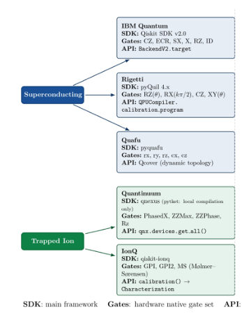
<figcaption class="paper-figure-caption"><b>Fig 1.</b> Fig. 1. Classification of quantum computing providers by physical architecture.</figcaption>
</figure>
<figure class="paper-figure-card">
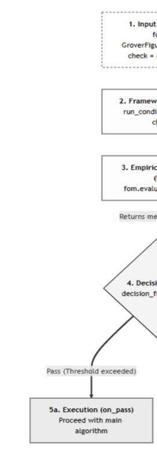
<figcaption class="paper-figure-caption"><b>Fig 2.</b> Fig. 2. Qonscious conditional execution flow. The FoM result (score) can feed the decision function to optimize quantum resource usage.</figcaption>
</figure>
<figure class="paper-figure-card">
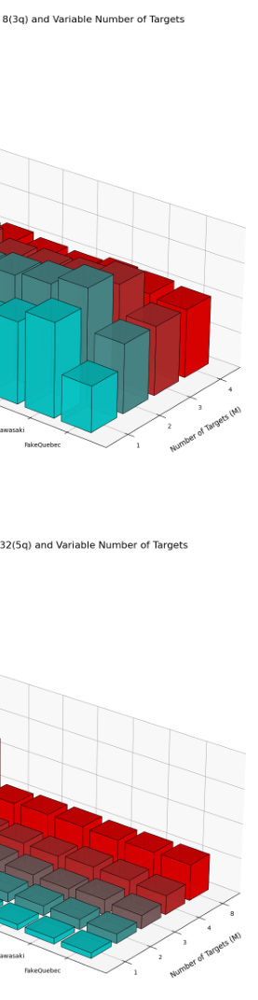
<figcaption class="paper-figure-caption"><b>Fig 3.</b> Fig. 3. Comparative benchmarking of the Grover Score with a variable number of targets. a) For N = 8, a performance peak is observed at M = 2 coinciding with the optimal theoretical rotation, and generalized degradation to ∼0.5 at M = 4 due to Grover’s algorithmic limit (M = N/2). b) For N = 32, ideal simulators maintain high fidelity, while Fake Providers suffer severe decoherence, relegating their scores to the probability of classical random guessing (M/N). Aria 1 demonstrates greater resilience to noise, significantly surpassing IBM models in this search space.</figcaption>
</figure>
<figure class="paper-figure-card">
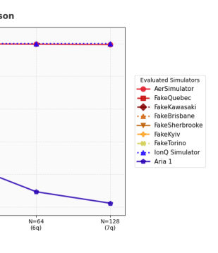
<figcaption class="paper-figure-caption"><b>Fig 4.</b> Fig. 4. Score comparison across different backends</figcaption>
</figure>

**Summary.** This paper introduces the GroverFigureOfMerit (FoM), an advanced metric designed to holistically characterize and compare performance across diverse Noisy Intermediate-Scale Quantum (NISQ) hardware platforms. By using Grover's algorithm as a stress test, it quantifies performance by accounting for dynamic noise, transpilation overhead, and topological limitations in a single, unified score.

**Why it may be interesting.** It provides a crucial benchmarking tool for assessing algorithmic feasibility on noisy hardware, which is vital for theorists designing complex quantum circuits that must account for physical constraints beyond simple gate fidelity.

Detailed structure

**Main problem.** The NISQ era suffers from hardware heterogeneity, where proprietary metrics and static characterizations fail to provide a unified way to select or compare quantum backends.

**Main result.** A novel Figure of Merit (GroverFigureOfMerit) based on Grover's algorithm provides a standardized, comparable score that captures dynamic noise, transpilation overhead, and topological constraints across different hardware architectures.

**Method.** The authors propose an algorithmic stress test using Grover's search, defining the FoM as a combination of success probability penalized by target state imbalance and leakage to non-marked states.

**Model / system.** The work analyzes various NISQ quantum backends (e.g., IBM, IonQ) across different physical architectures, utilizing the Qonscious framework for agnostic execution flow control.

**Key observables.** GroverFigureOfMerit score, probability of success on target states, non-uniform amplification penalties, and leakage to non-marked states.

**Important parameters / regimes.** Search space size (N), number of qubits (n), coherence times ($T_1/T_2$), and gate error rates are compared against the dynamic FoM score.

**Assumptions / limitations.** The primary assumption is that an algorithmic stress test can provide a unified, hardware-agnostic measure of performance superior to static component metrics. Validation on physical QPUs is noted as a future step.

**Figures summary.** Figures compare Grover Scores across different backends and scaling parameters (N), demonstrating score collapse due to decoherence or topological overhead on certain processors.

**Paper structure.** The paper first identifies the limitations of static characterization metrics in NISQ hardware. It then proposes the GroverFigureOfMerit, details its mathematical formulation incorporating penalties, and validates it by systematically analyzing performance across multiple simulated and real-world quantum providers.

Abstract

The Noisy Intermediate-Scale Quantum (NISQ) era poses a challenge for developers: hardware providers expose capabilities through heterogeneous interfaces with proprietary metrics varying widely across providers, hindering informed backend selection. Static characterization metrics - coherence times T1/T2, gate error rates - exhibit limitations: they fail to capture dynamic variability across successive executions, overlook the impact of transpilation, and lack architectural comparability across physically distinct technologies. We propose a Figure of Merit (FoM) based on Grover's algorithm as an algorithmic stress test evaluating quantum backend performance holistically. The metric combines success probability on target states with penalties for non-uniform amplification and leakage to non-marked states, yielding a unified score across hardware architectures. Implemented via the Qonscious framework - a conditional execution platform using polymorphic adapters, it executes agnostically on IBM, IonQ backends, and simulators. Main contributions: (1) proposal and validation of GroverFigureOfMerit, incorporating uniformity and leakage penalties (adapted from GRADE) with emphasis on noise, transpilation, and topological constraints; (2) systematic analysis of heterogeneity across nine quantum providers motivating agnostic metrics; and (3) experimental demonstration via ideal simulators and real-processor noise models, confirming sensitivity to noise, topology, and transpilation overhead. Results confirm the metric distinguishes backend performance under a unified score, capturing intrinsic algorithmic limits. Validation on physical QPUs is identified as a natural next step.

[↑ back to top](#top)

### [Non-Local Magic from the Entanglement Spectrum](http://arxiv.org/abs/2607.07808v1)

**Authors:** Gianpaolo Torre, Fabio Franchini, Salvatore Marco Giampaolo  
**Type:** theory · **Category:** quantum information and computing · **PDF:** <https://arxiv.org/pdf/2607.07808v1>  
**Analysis basis:** full PDF text, analyzed in chunks
**Topic relevance:** 🔥 `entanglement & information structure` **4/5** · `analog quantum simulation` **1/5** · `non-equilibrium dynamics` **1/5**

↔ Scroll figures horizontally

<figure class="paper-figure-card">
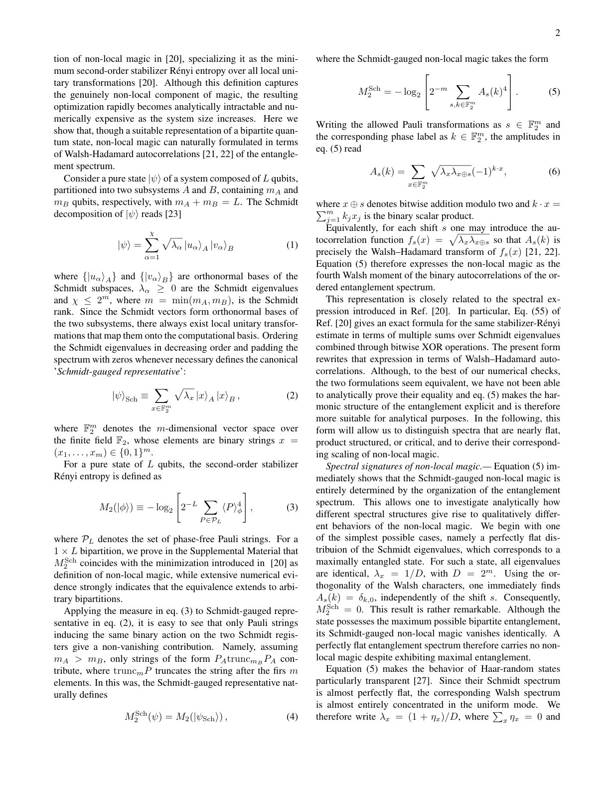
<figcaption class="paper-figure-caption"><b>Fig 1.</b> Low-resolution page preview, page 2</figcaption>
</figure>
<figure class="paper-figure-card">
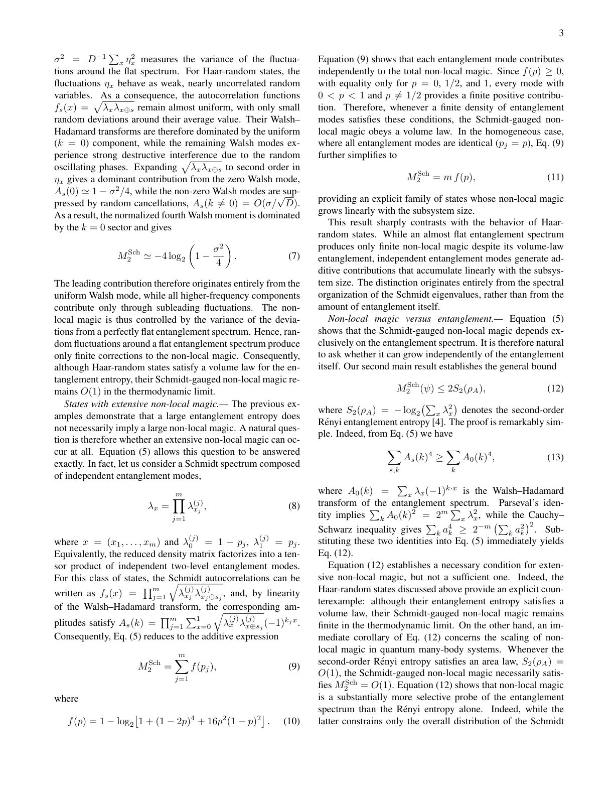
<figcaption class="paper-figure-caption"><b>Fig 2.</b> Low-resolution page preview, page 3</figcaption>
</figure>
<figure class="paper-figure-card">
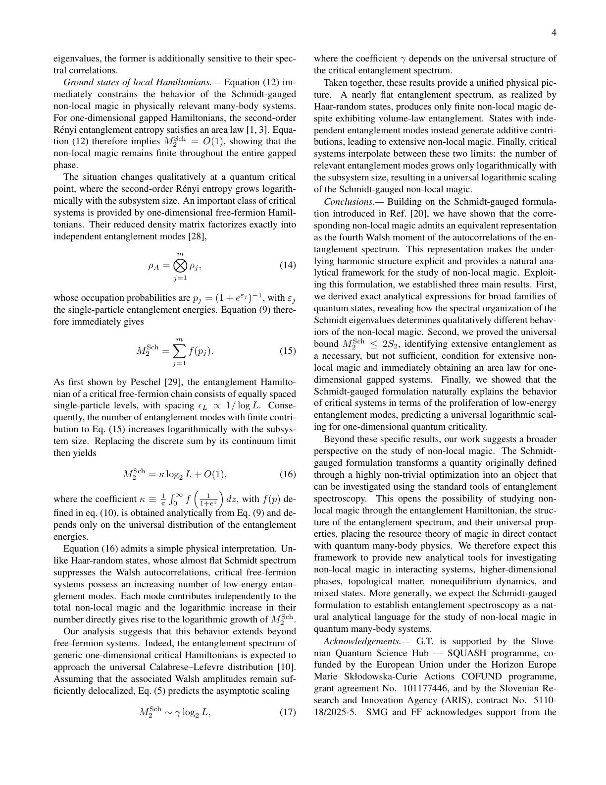
<figcaption class="paper-figure-caption"><b>Fig 3.</b> Low-resolution page preview, page 4</figcaption>
</figure>
<figure class="paper-figure-card">
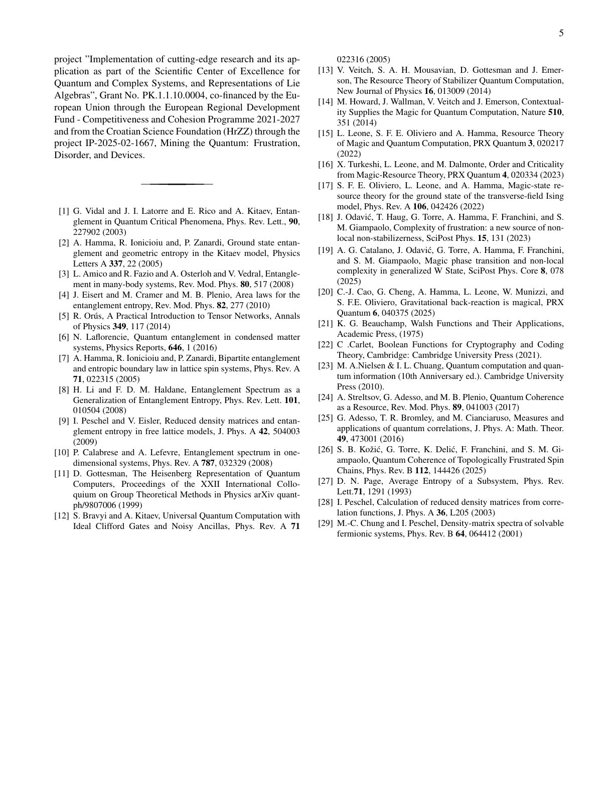
<figcaption class="paper-figure-caption"><b>Fig 4.</b> Low-resolution page preview, page 5</figcaption>
</figure>

**Summary.** This paper introduces a novel diagnostic tool by reformulating the calculation of 'non-local magic' using the Walsh–Hadamard autocorrelations of the entanglement spectrum. This representation makes the underlying harmonic structure explicit, allowing for systematic theoretical analysis. The results characterize how this non-local resource scales in different quantum regimes, linking it fundamentally to the organization of entanglement eigenvalues.

**Why it may be interesting.** It provides a powerful new spectroscopic tool—the entanglement spectrum—to diagnose complex quantum resources like non-local magic, linking it directly to spectral structure rather than just global measures like entropy.

Detailed structure

**Main problem.** The primary challenge is developing a tractable method to characterize 'non-local magic,' a resource quantifying genuinely non-local correlations, as its direct calculation is computationally intractable.

**Main result.** Non-local magic can be systematically represented using the Walsh–Hadamard autocorrelations of the entanglement spectrum. The scaling behavior of this resource is shown to depend critically on the spectral organization of the entanglement eigenvalues.

**Method.** The authors derive an equivalent representation for non-local magic involving fourth moments of autocorrelation functions derived from the entanglement spectrum, allowing for systematic analytical study.

**Model / system.** The analysis applies to pure quantum states $|\psi
angle$ partitioned into two subsystems (A and B), examining various theoretical limits such as Haar-random states, product-structured modes, gapped 1D systems, and critical free-fermion models.

**Key observables.** Non-local magic ($M_{	ext{Sch}}^2$), the entanglement spectrum eigenvalues ($\lambda_x$), and the second-order Rényi entanglement entropy ($S_2(
ho_A)$).

**Important parameters / regimes.** System size (L), spectral organization, and the nature of correlations (e.g., area law vs. logarithmic scaling regimes).

**Assumptions / limitations.** The analysis relies on mapping Schmidt vectors to $\mathbb{F}_2$ and uses approximations for random states; a key assumption is that spectral organization governs behavior more strongly than entropy alone.

**Paper structure.** The paper develops the mathematical framework by relating non-local magic to Walsh autocorrelations, then applies this framework to analyze scaling laws across different physical regimes (Haar random, gapped, critical) while establishing an upper bound using entanglement entropy.

Abstract

Non-local magic has recently emerged as a fundamental resource for characterizing genuinely non-local non-stabilizer correlations. However, its direct calculation is an intractable numerical problem, except for small systems, and its understanding remains limited. We derive a representation of non-local magic in terms of the Walsh--Hadamard autocorrelations of the entanglement spectrum. Our representation makes the underlying harmonic structure explicit and enables a systematic analysis of its behaviors for various scenarios. We prove that non-local magic can be upper-bounded by an entanglement entropy and we derive exact analytical results for broad classes of quantum states, characterizing the scaling of non-local magic for volume-law states, as well as ground states of one-dimensional gapped and critical systems. Our results identify the spectral organization of the entanglement spectrum as the key ingredient governing non-local magic and provide a framework for further systematic analytical investigation.

[↑ back to top](#top)

### [Observation of coherent flux-charge interaction in a gate-tunable fluxonium](http://arxiv.org/abs/2607.07798v1)

**Authors:** Brian D. Isakov, Shikhar Singh, Adrian Parra-Rodriguez, David Feldstein-Bofill, Zhenhai Sun, Anders Kringhøj, Svend Krøjer, Alexandre Blais, Morten Kjaergaard, András Gyenis  
**Type:** experiment · **Category:** quantum information and computing · **PDF:** <https://arxiv.org/pdf/2607.07798v1>  
**Analysis basis:** full PDF text, analyzed in chunks
**Topic relevance:** 🔥 `QC/QI experiment` **4/5** · `quantum measurements` **2/5**

↔ Scroll figures horizontally

<figure class="paper-figure-card">
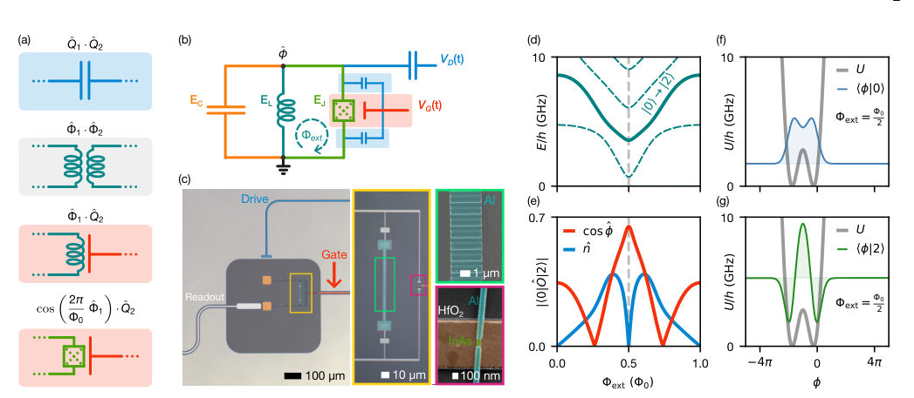
<figcaption class="paper-figure-caption"><b>Fig 1.</b> FIG. 1. Flux-charge coupling in a nanowire fluxonium. a, Different coupling methods in superconducting circuits. Capacitive or inductive interactions between two modes lead to charge-charge or flux-flux coupling operators, while a composite flux-charge interaction can be accessed by a hypothetical capacitor-inductor element. A gate-tunable Josephson junction with parametrically modulated gate voltage can provide such an interaction in practice. b, Circuit diagram of the superconductor-semiconductor hybrid nanowire fluxonium, where a drive line is capacitively coupled (blue), and a gate line placed underneath the junction provides the flux-charge coupling (red) in addition to parasitic...</figcaption>
</figure>
<figure class="paper-figure-card">
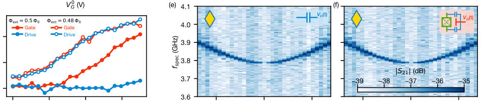
<figcaption class="paper-figure-caption"><b>Fig 2.</b> FIG. 2. Isolating flux-charge interaction in the fluxonium a, Two-tone spectroscopy of the second excited state as a function of gate voltage at Φext ≈0.48 Φ0. Two working points with the same Josephson energy are identified at a high-slope region (green star) and a flat region (yellow diamond). b, e, Two-tone spectroscopy as a function of external flux around half-flux quantum measured by purely capacitive excitation (through the drive line), at the high-slope and flat working points. The |0⟩→|2⟩transition exactly at half-flux quantum is forbidden. c, f, Two-tone spectroscopy as a function of external flux when the excitation is applied through the gate line. The |0⟩→|2⟩transition at...</figcaption>
</figure>
<figure class="paper-figure-card">
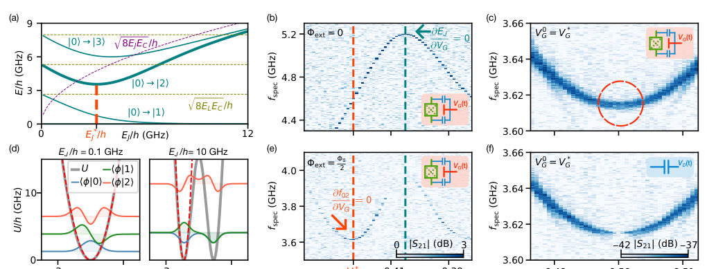
<figcaption class="paper-figure-caption"><b>Fig 3.</b> FIG. 3. The ChIVE transition in fluxonium a, Fluxonium transitions (cyan) as a function of Josephson energy at Φext = Φ0/2. The asymptotic transition frequencies are shown as gold and purple dashed lines, corresponding to the low and high Josephson energy limit, respec- tively. As EJ increases, the fluxonium transitions move between these asymptotic values. The Charge-Insensitive-with-Variable-EJ (ChIVE) point at E∗ J is identified as a local minimum in the |0⟩→|2⟩transition frequency, where ∂f02/∂EJ = 0 (red dashed line). d, Fluxonium potential and wavefunctions in the low (left) and high Josephson energy regime (right). The potential shifts from being approximated by a single harmonic...</figcaption>
</figure>
<figure class="paper-figure-card">
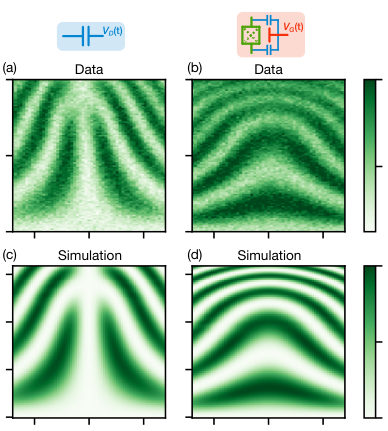
<figcaption class="paper-figure-caption"><b>Fig 4.</b> FIG. 4. Coherent control with flux-charge coupling on the |0⟩→|2⟩transition a, b, Amplitude Rabi measurement as a func- tion of external flux on the |0⟩→|2⟩transition at V ∗ G by applying the excitation through the gate and drive lines. The drive frequency of the Rabi pulse is kept fixed throughout the flux sweep at the transi- tion frequency measured at frustration. Exactly at the half-flux point, coherent Rabi oscillations appear through flux-charge coupling but disappear when purely capacitive coupling is used to excite the tran- sition. c, d, Numerical simulation of the Rabi experiments by apply- ing (c) only capacitive or (d) both capacitive and flux-charge drive terms. In the...</figcaption>
</figure>
<figure class="paper-figure-card">
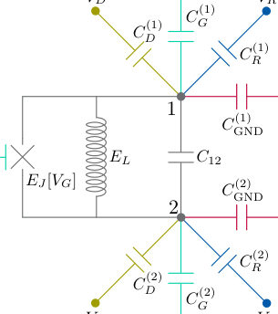
<figcaption class="paper-figure-caption"><b>Fig 5.</b> FIG. 5. Circuit schematic of the gate tunable fluxonium device.</figcaption>
</figure>

**Summary.** The research demonstrates the observation of a coherent flux-charge interaction within a gate-tunable fluxonium qubit. By exploiting parity selection rules in two-tone spectroscopy, the authors successfully isolate this coupling from standard capacitive interactions. This breakthrough provides superconducting circuits with a vital missing primitive for advanced quantum control.

**Why it may be interesting.** This work directly addresses a fundamental limitation in superconducting circuit design by engineering a previously inaccessible coupling term ($\hat{U}_{FC}$), which is crucial for building more complex quantum gates and readouts.

Detailed structure

**Main problem.** The primary challenge is demonstrating a direct flux-charge coupling interaction ($\hat{U}_{FC}$) in superconducting circuits, as native couplings are typically restricted to charge-to-charge or flux-to-flux interactions.

**Main result.** The authors successfully demonstrated this unconventional flux-charge coupling using a gate-tunable Josephson junction, enabling coherent control that is robust and scales linearly with the driving amplitude.

**Method.** They employed two-tone spectroscopy measurements combined with parity selection rules to isolate and confirm the presence of the desired $\hat{U}_{FC}$ term from parasitic capacitive couplings.

**Model / system.** The system is a hybrid superconducting-semiconductor fluxonium qubit. The Hamiltonian includes terms for capacitance, Josephson energy (tunable by gate voltage), and external flux bias. The coupling mechanism relies on modulating the junction's critical current via an applied gate voltage.

**Key observables.** Cross-quadrature coupling between flux ($\hat{\Phi}$) and charge ($\hat{Q}$); detection of $|0
angle 	o |2
angle$ transitions using two-tone spectroscopy as a function of external flux and gate voltage.

**Important parameters / regimes.** The coupling scales linearly with driving amplitude; the method identifies a 'Charge-Insensitive' sweet spot that protects the transition energy from first-order variations in gate voltage.

**Assumptions / limitations.** The analysis critically relies on exploiting parity selection rules to distinguish between different types of couplings, and simulations neglect relaxation/dephasing during pulse evolution.

**Figures summary.** Figures illustrate the physical setup showing the tunable junction; spectroscopy results compare forbidden transitions (capacitive only) versus detectable transitions (flux-charge coupling active) at half-flux quantum.

**Paper structure.** The paper progresses from identifying the theoretical necessity of $\hat{U}_{FC}$ to detailing the experimental platform and measurement techniques. It uses spectroscopic measurements comparing different driving mechanisms to isolate and quantify the unique flux-charge interaction, concluding with robustness analysis (ChIVE point).

Abstract

Interactions that mix conjugate variables, such as the flux through a circuit element and the charge across it, lie outside the reach of the elementary couplings of superconducting circuits. Capacitors connect charge to charge, and inductors connect flux to flux, while no two-terminal element couples flux to charge directly. A native flux-charge coupling would thus serve as a circuit primitive in its own right, opening direct routes to non-reciprocity, protected modes, and unconventional readout. In this work, we demonstrate a flux-charge coupling by harnessing a voltage-tunable Josephson junction with parametrically modulated critical current, which mediates the interaction between a classical charge variable and a quantum flux operator. Relying on parity-selection rules in a hybrid superconducting-semiconductor fluxonium, we isolate the flux-charge coupling from other parasitic capacitive contributions and perform cross-quadrature-activated coherent control of states. Critically, we realize a flux-charge coupling that scales linearly with driving amplitude while keeping the transition energy first-order-insensitive to gate voltage. Such unconventional interaction broadens the toolbox of superconducting circuits with a critical missing component that enables the coherent coupling of conjugate variables.

[↑ back to top](#top)

### [Möbius-Guided Diagonal-Gate Compilation with Native Multiqubit Controlled-Phase Gates on Neutral-Atom Processors](http://arxiv.org/abs/2607.08212v1)

**Authors:** Hairuo Huang, Yanwu Gu, Chen Huang, Xi Zhao, Meng-Jun Hu, Dong E. Liu, Jingbo Wang  
**Type:** theory · **Category:** quantum information and computing · **PDF:** <https://arxiv.org/pdf/2607.08212v1>  
**Analysis basis:** full PDF text, analyzed in chunks
**Topic relevance:** 🔥 `Rydberg arrays` **4/5** · `QC/QI experiment` **1/5**

↔ Scroll figures horizontally

<figure class="paper-figure-card">
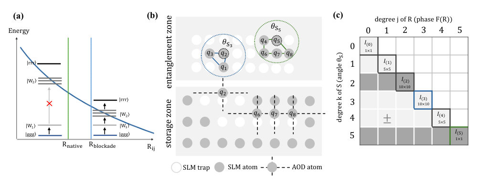
<figcaption class="paper-figure-caption"><b>Fig 1.</b> FIG. 1. (a) Schematic of interaction energies. Variation of the van der Waals frequency shift V (Rij) = C6/R6 ij (blue) with interatomic distance Rij for the ground state |ggg⟩, single-excited state |W1⟩, doubly excited state |W2⟩, and excited state |rrr⟩. (b) Neutral atom layout with separated storage and computation regions. The figure shows a three-atom support set S3 = {q1, q2, q3} (θS3, blue) and a five-atom support set S5 = {q4, . . . , q8} (θS5, green). (c) In the degree-graded basis, the M¨obius matrix M = ζ−1 = µ⊗n 1 takes a block lower-triangular form with identity diagonal blocks I(k) of size n k  .</figcaption>
</figure>
<figure class="paper-figure-card">
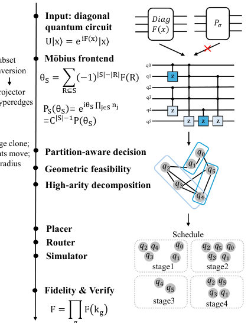
<figcaption class="paper-figure-caption"><b>Fig 2.</b> FIG. 2. The M¨obius Compiler for Atoms pipeline. A diag- onal algorithm is M¨obius-inverted into projector hyperedges, synthesized as native occupation-projector gates or decom- posed (Layer 1), ASAP-scheduled (Layer 2), routed on the storage/entanglement-zoned architecture (Layer 3), and ver- ified bit-exactly (Layer 4). The M¨obius-native and ZAP- decomposed strategies differ only at the synthesis step and share the scheduler, router, and fidelity model.</figcaption>
</figure>
<figure class="paper-figure-card">
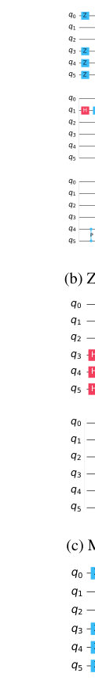
<figcaption class="paper-figure-caption"><b>Fig 3.</b> FIG. 3. Circuit decomposition comparison for the same compact 6-qubit 3-SAT oracle instance. Panels (a)–(c) show the original ZAP decomposition, the ZX no-insert-calculus decomposition, and the M¨obius-native decomposition, respectively. ZAP lowers the M¨obius projector terms to one- and two-qubit gates, ZX extracts a different no-insertion phase circuit from the standard input circuit, and the M¨obius-native path keeps the occupation-projector supports as native phase gates. In the drawing, single-qubit phases with angle ±π/4 are displayed as T and T † gates, RZ angles in panel (b) are shown modulo 2π for compactness, and projector phases are displayed as Z gates or filled-dot...</figcaption>
</figure>
<figure class="paper-figure-card">
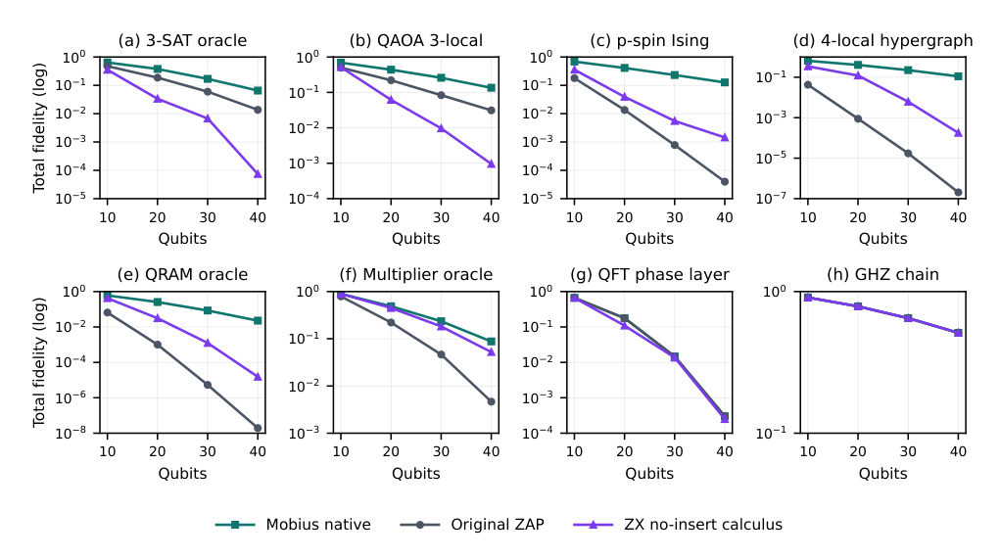
<figcaption class="paper-figure-caption"><b>Fig 4.</b> FIG. 4. Performance comparison for eight common algorithmic benchmark families. Each panel plots routed total fidelity on a logarithmic scale versus qubit count for the M¨obius-native compiler, the original ZAP decomposed baseline, and the ZX no-insert-calculus baseline. The first six panels are Hamiltonian or oracle benchmarks with explicit many-body interaction terms, where native multiqubit execution can reduce decomposed gate exposure and scheduled stages. The last two panels are two-body controls, where the three compilation paths are expected to be similar.</figcaption>
</figure>
<figure class="paper-figure-card">
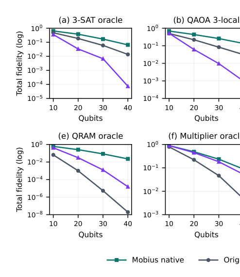
<figcaption class="paper-figure-caption"><b>Fig 5.</b> Figure 6 extends the comparison to larger systems us- ing timing quantities rather than final no-fault success. The top row plots total routed circuit duration for 3-SAT, p-spin Ising, and QRAM from 20 to 100 qubits. These benchmark families were chosen because they represent three different many-body sources: Boolean clause ora- cles, local diagonal Hamiltonian terms, and multi-control addressing. In all three cases, M¨obius-native compila- tion gives shorter routed duration. The reason is the same mechanism seen in Fig. 5 and Appendix D: the na- tive path reduces serialized decomposed work and often avoids repeated movement into the entanglement zone. The duration advantage is...</figcaption>
</figure>

**Summary.** This paper introduces a Möbius-guided compiler designed to efficiently compile diagonal phase gates for neutral-atom quantum processors. It uses subset-lattice Möbius inversion to represent these complex phases as a 'phase hypergraph,' preserving high-order structure. This allows the scheduler to optimally choose between executing native, hardware-efficient multiqubit controlled-phase operations or resorting to standard gate decompositions.

**Why it may be interesting.** It provides a rigorous mathematical bridge between abstract quantum circuit requirements (diagonal phases) and the specific physical capabilities of emerging hardware platforms like neutral atoms, which is crucial for advancing fault-tolerant quantum computation.

Detailed structure

**Main problem.** Standard quantum compilers fail to exploit native, high-order multiqubit controlled-phase gates available on neutral-atom hardware because they prematurely decompose diagonal gate structures.

**Main result.** A Möbius-guided compiler was developed that maps the phase function to a phase hypergraph, achieving improved estimated success and stage reduction for algorithms with exploitable three- or four-body phase terms.

**Method.** The method uses subset-lattice Möbius inversion to transform an arbitrary diagonal phase function into its irreducible projector-phase components, forming a phase hypergraph representation.

**Model / system.** The work is situated on neutral-atom processors utilizing Rydberg-mediated interactions. The core primitive is the occupation-projector phase $	ext{PS}(	heta) = \exp\left(i	heta \sum_{j\in S} n_j
ight)$.

**Key observables.** Estimated no-fault success, scheduled-stage count, and gate counts compared across compilation strategies (Möbius native vs. ZAP/ZX baselines).

**Important parameters / regimes.** The support set $S$ of the phase term, the angle $	heta$, and hardware constraints like atom motion and blockade feasibility.

**Assumptions / limitations.** The compiler assumes that if a high-order phase is mathematically recoverable via Möbius inversion, it can be physically routed as a native Rydberg-mediated controlled-phase gate when feasible.

**Figures summary.** Figures illustrate the schematic basis for Rydberg interactions ($V_{ij} \propto C_6/R_{ij}^6$), the physical layout showing support sets $S$ on neutral atoms, and the mathematical structure of the Möbius inverse transform in a degree-graded ordering.

**Paper structure.** The paper establishes the problem by noting compiler limitations, introduces the Möbius-guided compilation framework using subset-lattice inversion to generate a phase hypergraph, details how this maps onto native Rydberg gates, and validates the approach via benchmarks showing improved scheduling metrics.

Abstract

Diagonal gates are ubiquitous primitives in quantum algorithms, from phase oracles, hypergraph-state preparation, and multi-control logic to Hamiltonian simulation of spin models and digitized lattice field theories, where Ising interactions and local potential terms are diagonal in the encoded basis. Standard compilers, however, often lower diagonal structure into one- and two-qubit gates before neutral-atom hardware can exploit native Rydberg-mediated multiqubit controlled-phase operations. We propose a Möbius-guided compiler that maps a diagonal phase function to a phase hypergraph via subset-lattice Möbius inversion. The hypergraph retains the support and angle of each many-body phase term, allowing sparse or local high-order structure to be routed as native multiqubit controlled-phase candidates when feasible and decomposed otherwise. The neutral-atom scheduler accounts for atom motion, interaction-zone constraints, blockade feasibility, and error costs, enabling a direct comparison between native high-order execution and decomposed alternatives. Benchmarks against routed ZAP and ZX-calculus baselines show improved estimated success for algorithmic instances with exploitable three- and four-body phase terms, and comparable performance on predominantly two-body instances. These results provide a feasible compilation strategy for more fully exploiting the native capabilities of neutral-atom hardware, using atom reconfigurability and Rydberg-mediated multiqubit phase operations as practical resources for more efficient quantum computation.

[↑ back to top](#top)

### [Unveiling Semiclassical Structures in Quantum Chaotic Eigenstates Using Neural Networks](http://arxiv.org/abs/2607.07874v1)

**Authors:** J. Montes, F. Borondo, Gabriel G. Carlo  
**Type:** theory · **Category:** numerical methods · **PDF:** <https://arxiv.org/pdf/2607.07874v1>  
**Analysis basis:** full PDF text, analyzed in chunks
**Topic relevance:** 🔥 `scars & prethermalization` **4/5** · `methods for driven-dissipative` **1/5**

↔ Scroll figures horizontally

<figure class="paper-figure-card">
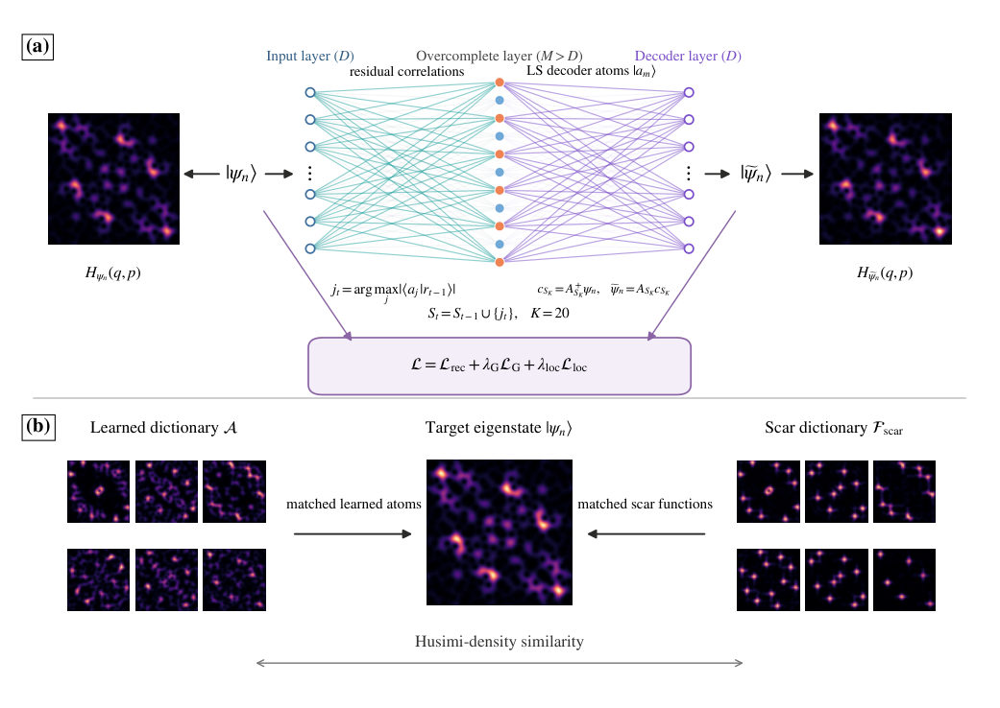
<figcaption class="paper-figure-caption"><b>Fig 1.</b> FIG. 1. Architecture and dictionary-comparison scheme. (a) A normalized quantum-baker eigenstate is represented by its complex components and its Husimi density. The sparse dictionary network has widths D →M →D, with M &gt; D. The active support is selected by residual correlations, as in complex orthogonal matching pursuit, and the decoder reconstructs the state by a least-squares recombination of the selected atoms. Training combines phase-insensitive reconstruction, dictionary-overlap diversity, and phase-space-localization losses. (b) The learned and independently constructed scar dictionaries provide two overcomplete representations of the same eigenstate. The six elements displayed on...</figcaption>
</figure>
<figure class="paper-figure-card">
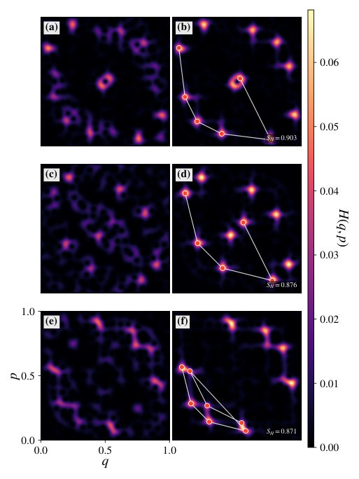
<figcaption class="paper-figure-caption"><b>Fig 2.</b> FIG. 3. Three learned atoms (left column) and the inde- pendently generated scar function selected after training by Husimi-density morphology, with substantial Hilbert-space overlap (right column). The associated periodic orbit is over- laid on each scar Husimi density. From top to bottom, the pairs are (m, r) = (90, 69), (128, 37), and (147, 186), with squared overlaps 0.6659, 0.5057, and 0.6893. The binary strings labeling the orbits are 000011, 00011, and 0001001, re- spectively. Their Husimi-density similarities are 0.903, 0.876, 000011, 00011, and 0001001, respectively. Their Husimi- density similarities are 0.903, 0.876, and 0.871, respectively.</figcaption>
</figure>
<figure class="paper-figure-card">
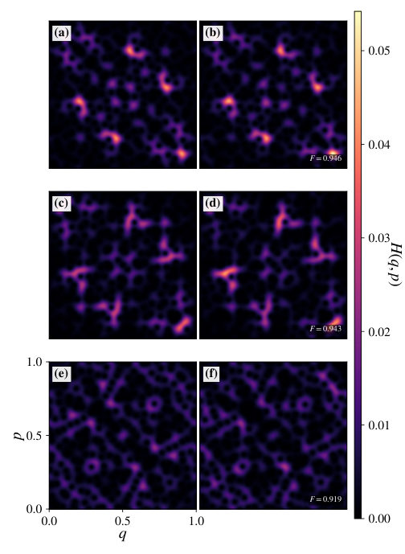
<figcaption class="paper-figure-caption"><b>Fig 3.</b> FIG. 2. Husimi densities of three validation eigenstates (left column) and their OMP+least-squares sparse reconstructions (right column). All six panels use one common color scale. The selected state indices are 63, 208, and 232; their fidelities are 0.9456, 0.9431, and 0.9187, respectively. Only K = 20 of the M = 290 learned atoms contribute to each reconstruction.</figcaption>
</figure>
<figure class="paper-figure-card">
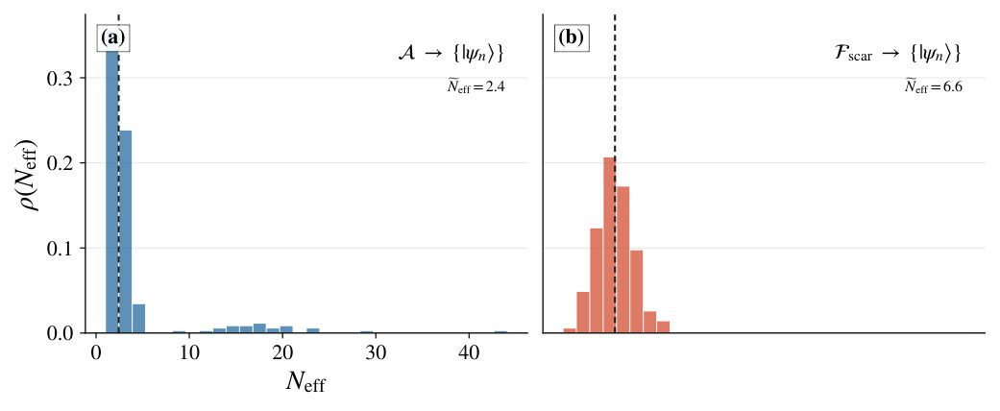
<figcaption class="paper-figure-caption"><b>Fig 4.</b> FIG. 4. Distribution, over all D = 242 quantum-baker eigenstates, of the effective projection participation Neff for (a) the learned dictionary and (b) the independently constructed scar dictionary. Dashed lines mark medians, 2.427 and 6.585, respectively. The corresponding means are 3.991 and 6.603. Keep in mind that dictionaries are nonorthogonal thus this measure does not reflect an exact expansion.</figcaption>
</figure>

**Summary.** The paper uses neural networks to learn an overcomplete dictionary representation for highly complex, chaotic quantum eigenstates. By constraining this learning process with phase-space localization, the model forces its learned building blocks (atoms) to spontaneously organize around structures corresponding to classical periodic orbits. This shows that simple geometric constraints can unlock deep semiclassical physics from purely spectral data.

**Why it may be interesting.** This work demonstrates a powerful data-driven method for extracting fundamental physical symmetries (like those dictated by classical periodic orbits) from raw quantum spectral data without explicit knowledge of the underlying Hamiltonian dynamics or symmetry operators.

Detailed structure

**Main problem.** The study investigates whether unsupervised learning can reveal the underlying semiclassical structure of quantum chaotic eigenstates.

**Main result.** By imposing phase-space localization constraints on a neural network dictionary, the learned atoms spontaneously localize onto periodic orbits and develop scar-like structures, confirming their fundamental role in chaos.

**Method.** The authors train an overcomplete autoencoder ('quantum dictionary') to sparsely represent eigenstates, comparing its learned structure against independently constructed semiclassical dictionaries based on periodic orbits.

**Model / system.** The analysis uses the quantum baker map as a model for a quantum chaotic system. States are analyzed using phase-space representations like the Husimi density.

**Key observables.** Reconstruction fidelity ($F$), Hilbert-space overlap ($\Omega_{mr}$), and Effective Participation Number ($N_{	ext{eff}}$).

**Important parameters / regimes.** The dictionary size ($M$) relative to the state dimension ($D$), and regularization weights ($\lambda_G, \lambda_{loc}$).

**Assumptions / limitations.** The primary assumption is that phase-space localization constraints are sufficient to recover nontrivial semiclassical organization from spectral data.

**Figures summary.** Figures compare learned atoms' Husimi densities against known scar functions, showing structural alignment and high overlap ($	ext{SH} \approx 0.9$).

**Paper structure.** The paper introduces the problem of characterizing chaotic eigenstates, details the autoencoder setup with localization constraints, presents the semiclassical dictionary construction, and concludes by comparing the learned structures to show emergent periodic orbit organization.

Abstract

Physics-informed neural networks and neural quantum states have consolidated a new paradigm to analyze and discover physical phenomena through constrained neural parametrizations. In this context, we investigate whether the semiclassical structure of the eigenfunctions of a quantum chaotic system can be unveiled through unsupervised learning. To this end, we train a "quantum dictionary", formulated as an overcomplete autoencoder, that sparsely represents the eigenstates of the system, using as an illustration the quantum baker map. The only explicit physical information imposed on the dictionary atoms is their localization in phase space, without providing any kind of information about the periodic orbits of the corresponding classical system. The model achieves high fidelity in reconstructing eigenstates not used during training. By comparing the learned atoms with an independently constructed "semiclassical dictionary", we find that they spontaneously localize on the periodic orbits and develop scar-like structures. This result is interesting in two ways: a localization constraint is sufficient to recover nontrivial semiclassical organization from spectral data and at the same time periodic orbits confirm their fundamental role in the structure of quantum chaotic eigenfunctions. More generally, our proposed architecture opens a new route to learning representations whose atoms optimize other chosen physical properties.

[↑ back to top](#top)

### [A majorization relation for a sum of two tensor products of positive semidefinite operators](http://arxiv.org/abs/2607.07913v1)

**Authors:** Mohammad A. Alhejji, Cole Kelson-Packer  
**Type:** theory · **Category:** quantum information and computing · **PDF:** <https://arxiv.org/pdf/2607.07913v1>  
**Analysis basis:** full PDF text, analyzed in chunks
**Topic relevance:** 🔥 `entanglement & information structure` **4/5**

↔ Scroll figures horizontally

<figure class="paper-figure-card">
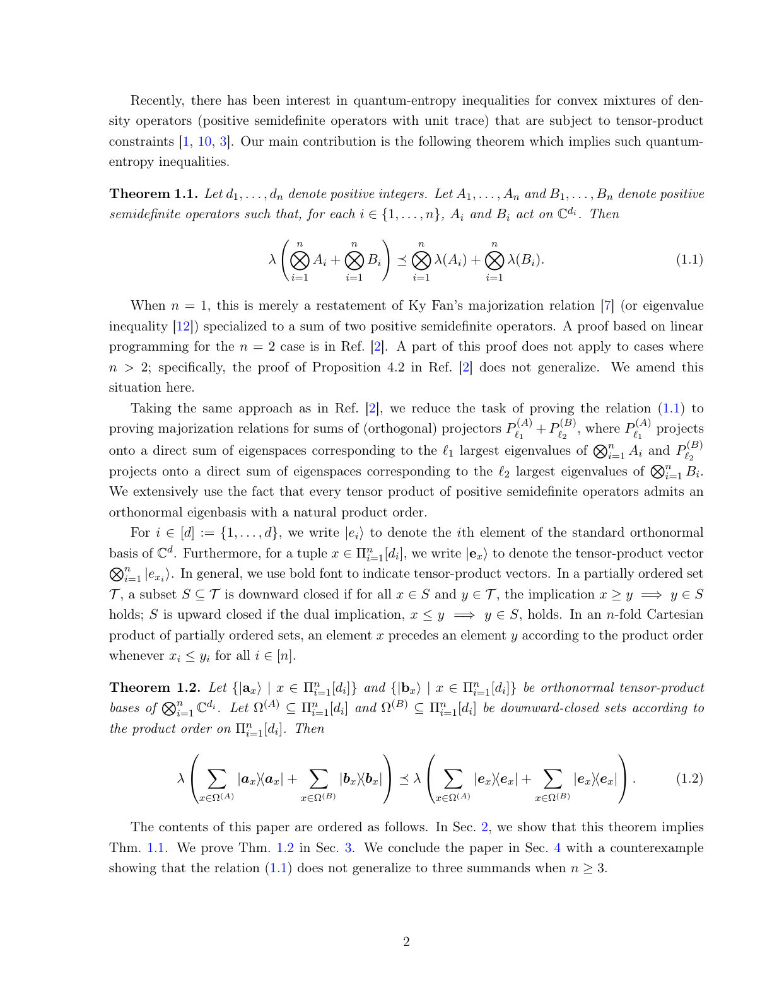
<figcaption class="paper-figure-caption"><b>Fig 1.</b> Low-resolution page preview, page 2</figcaption>
</figure>
<figure class="paper-figure-card">
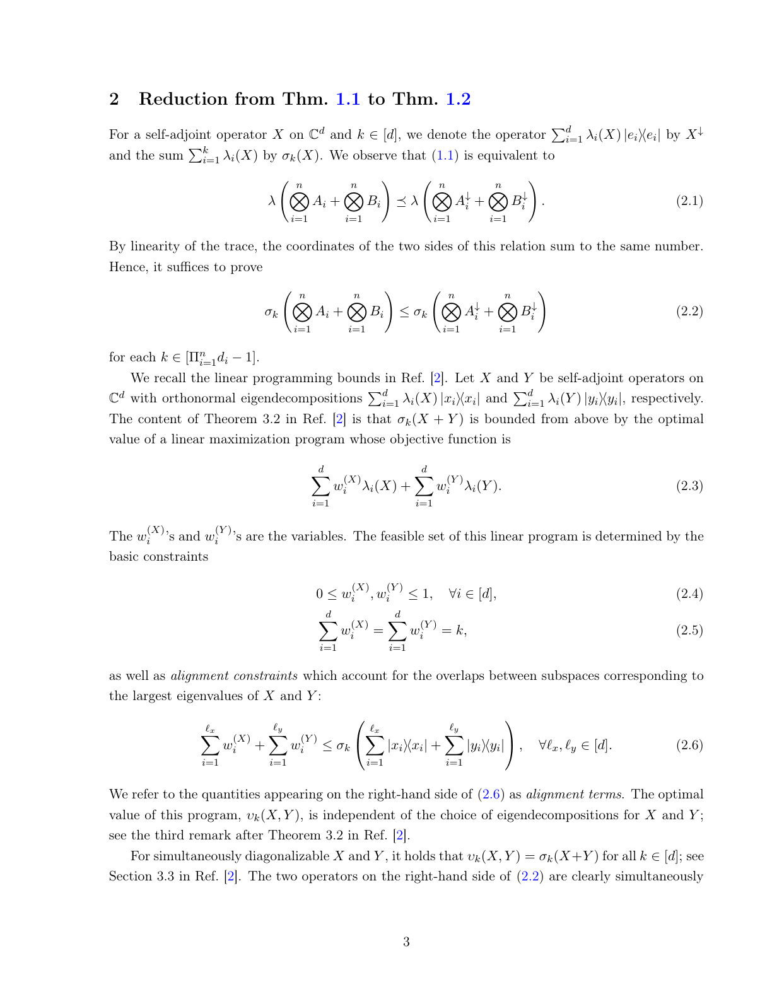
<figcaption class="paper-figure-caption"><b>Fig 2.</b> Low-resolution page preview, page 3</figcaption>
</figure>
<figure class="paper-figure-card">
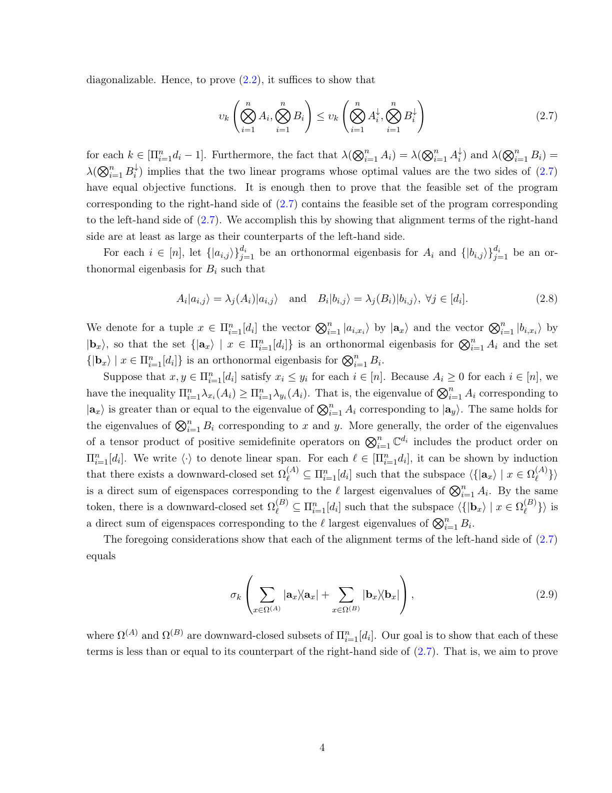
<figcaption class="paper-figure-caption"><b>Fig 3.</b> Low-resolution page preview, page 4</figcaption>
</figure>
<figure class="paper-figure-card">
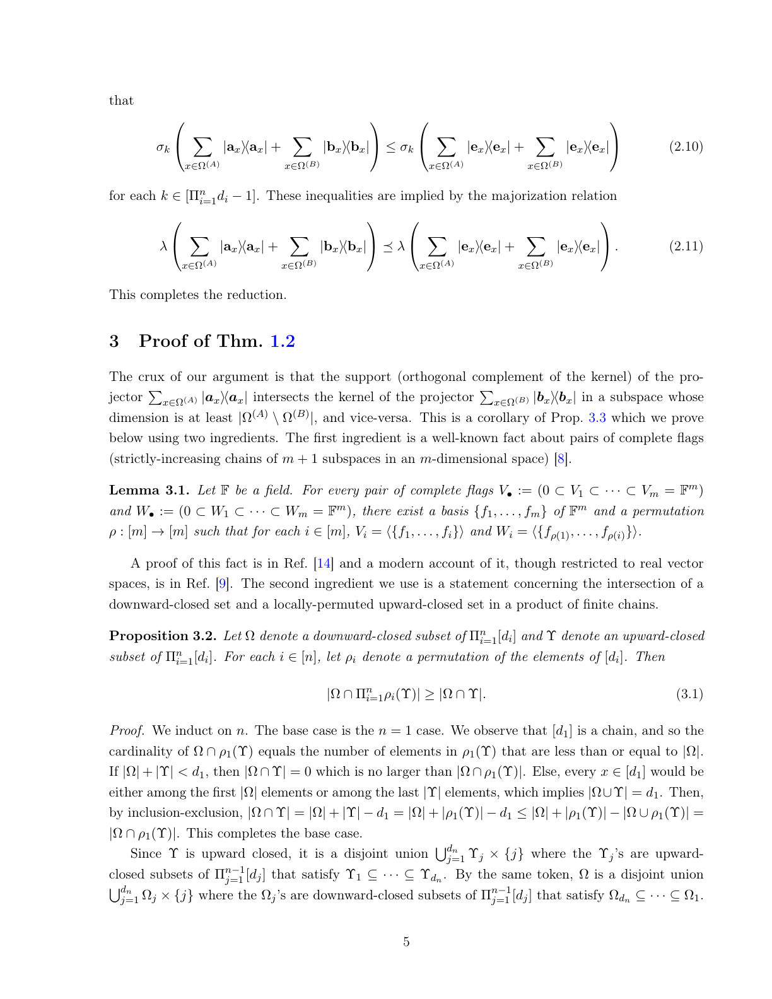
<figcaption class="paper-figure-caption"><b>Fig 4.</b> Low-resolution page preview, page 5</figcaption>
</figure>
<figure class="paper-figure-card">
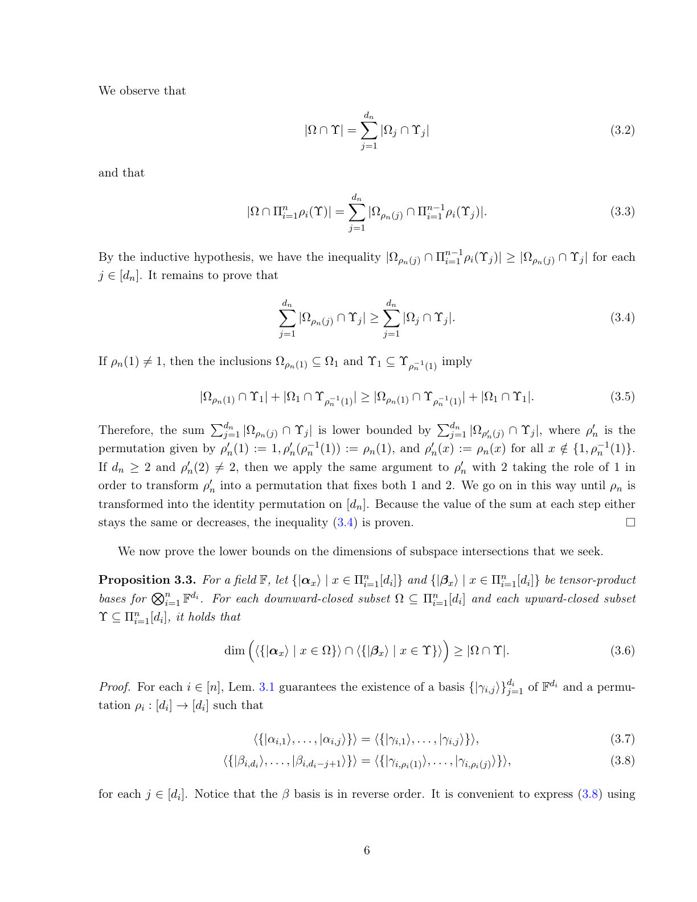
<figcaption class="paper-figure-caption"><b>Fig 5.</b> Low-resolution page preview, page 6</figcaption>
</figure>

**Summary.** This theoretical paper proves a majorization relation concerning the sum of two operators, each being a tensor product of multiple positive semidefinite components. The proof utilizes advanced linear programming techniques applied to index set combinatorics. It advances the mathematical understanding of operator inequalities in high-dimensional quantum systems while also mapping out the precise limits where these relations break down.

**Why it may be interesting.** Majorization relations are fundamental tools for comparing quantum states or operators (e.g., entanglement measures). Establishing such structural inequalities for tensor products is crucial for understanding multipartite quantum correlations and resource theories.

Detailed structure

**Main problem.** The paper aims to prove a separable version of Ky Fan's majorization relation for the sum of two operators, where each operator is constructed as a tensor product of multiple positive semidefinite (PSD) operators.

**Main result.** A specific majorization relation ($	ext{Theorem 1.1}$) is proven using linear programming techniques, although the authors also provide counterexamples showing that this relation fails for sums involving three or more tensor products.

**Method.** The proof heavily relies on linear programming methods and establishing inequalities related to the dimensions of intersections between subspaces defined by downward-closed and upward-closed sets in product index spaces.

**Model / system.** The mathematical framework involves operators acting on high-dimensional Hilbert spaces ($\mathbb{C}^{d_1 	imes \cdots 	imes d_n}$) that are structured as sums of tensor products of local PSD operators. This structure is relevant to analyzing quantum correlations or entanglement measures.

**Key observables.** The primary observables are the eigenvalues ($\lambda$) of the sum of projected operators, and the dimension of intersections between subspaces defined by index sets $\Omega$ and $\Upsilon$.

**Important parameters / regimes.** The number of tensor product factors ($n$), the number of summands (two in the main theorem), and the dimensions $d_i$ are key parameters.

**Assumptions / limitations.** The proof technique is established for a specific case ($n=2$) using linear programming, and counterexamples demonstrate limitations when generalizing to more terms or factors.

**Paper structure.** The paper introduces the majorization problem ($	ext{Theorem 1.1}$), reduces it to an inequality involving projectors ($	ext{Theorem 1.2}$), and proves this latter theorem using combinatorial inequalities derived from properties of product spaces, culminating in counterexamples showing limitations.

Abstract

We use linear programming to prove a separable version of Ky Fan's majorization relation for a sum of two operators that are each a tensor product of $n$ positive semidefinite operators. We give an example showing that such a relation does not hold in general for sums of three or more tensor products of three or more positive semidefinite operators.

[↑ back to top](#top)

### [Exactly solved Schrödinger equations with time-dependent Hamiltonians](http://arxiv.org/abs/2607.08450v1)

**Authors:** Michael Warnock, Antônio Francisco Neto, Pierre-Louis Giscard, Omid Faizy, Christian Joachim  
**Type:** theory · **Category:** other · **PDF:** <https://arxiv.org/pdf/2607.08450v1>  
**Analysis basis:** full PDF text, analyzed in chunks
**Topic relevance:** `exotic spin models in light-matter` **3/5** · `methods for driven-dissipative` **3/5** · `spintronics-quantum-optics interface` **3/5** · `Keldysh / 2PI / non-Gaussian methods` **2/5** · `analog quantum simulation` **2/5** · `non-equilibrium dynamics` **2/5** · `Tavis-Cummings & cavity-many-emitter` **1/5** · `correlated cavity matter` **1/5** · `driven-dissipative phase transition` **1/5** · `non-equilibrium universality` **1/5**

↔ Scroll figures horizontally

<figure class="paper-figure-card">
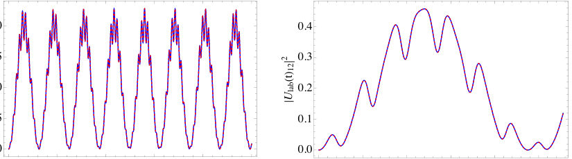
<figcaption class="paper-figure-caption"><b>Fig 1.</b> Figure 1. Evolution of the transition probability P|0yÑ|1yptq :“ |Ulabptq12|2 “ 1´|Ulabptq11|2 as a function of time as determined by a fully numerical solver (solid blue line) and exact analytical solution Eq. (32b) plotted from its truncation |Up3,2q 12 |2 (dashed red line). Parameters for the top figure: ω0{|S1 ´ S0| “ 10, g “ 0.1, e0 “ ω0. This is a high-frequency case since ω0 &quot; S1 ´ S0. Parameters for the bottom figure: ω0{|S1 ´ S0| “ 0.9, g “ 0.1, e0 “ ω0. Remark that the parameters of the up figure are not suited to the high-frequency approximation, as ω0 „ |S1 ´ S0|, and also lie beyond the RWA approximation. In both cases, the analytical results flawlessly match the fully...</figcaption>
</figure>
<figure class="paper-figure-card">
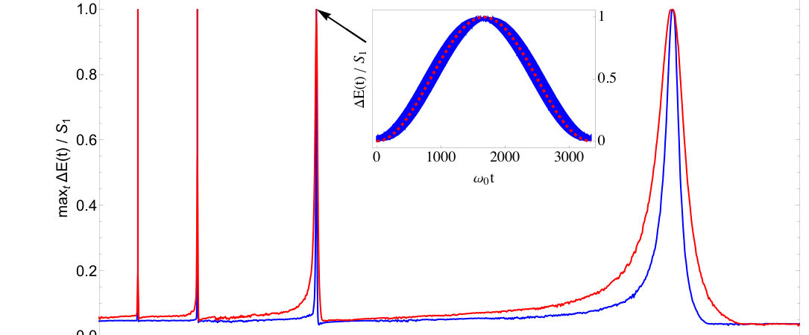
<figcaption class="paper-figure-caption"><b>Fig 2.</b> Figure 2. Numerical simulations of the quantity maxt ∆Eptq{S1 “ maxt P|0yÑ|1yptq as a function of ω0 for S0 “ Γ “ 0, S1 “ 1, ε0 “ S1 ´ S0 “ 1, g “ |S1 ´ S0|{10 and e0 “ |S1 ´ S0|{10 (blue line) or e0 “ |S1 ´ S0|{5 (red line). Parametric resonances occur very close to the low fractional frequencies ω0 » |S1 ´ S0|, ω0 » |S1 ´ S0|/2, ω0 » |S1 ´ S0|/3 etc. They are shifted from those exact values by Bloch-Siegert-like shifts. Further resonant peaks for m ě 5 are not shown here. Numerical simulations for those get harder as m increases: not only are those resonances narrower but the simulation times required to reliably evaluate maxt P|0yÑ|1yptq grow extremely fast with m. Indeed resonances at...</figcaption>
</figure>
<figure class="paper-figure-card">
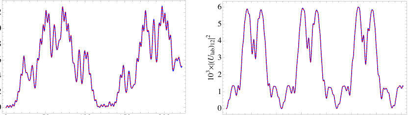
<figcaption class="paper-figure-caption"><b>Fig 3.</b> Figure 3. Evolution of the transition probability P|0yÑ|1yptq :“ |Ulabptq12|2 “ 1´|Ulabptq11|2 as a function of time as determined by a fully numerical solver (solid blue line) and analytical truncation |U p3,4q 12 |2 (top figure, dashed red line) or |U p2,2q 12 |2 (bottom figure, dashed red line) of the exact solution Eqs. (42a, 42b). Parameters for the top figure: ω0{|S1´S0| “ 0.45, ω{|S0´S1| “ 2, g “ 0.1, e0 “ 2ω0. In this situation, all three frequencies in the system are comparable, a regime unsuitable to both the RWA and the high-frequency expansion. The “erratic” behavior of the solution due to the mixing comparable system frequencies is perfectly captured by the analytical...</figcaption>
</figure>
<figure class="paper-figure-card">
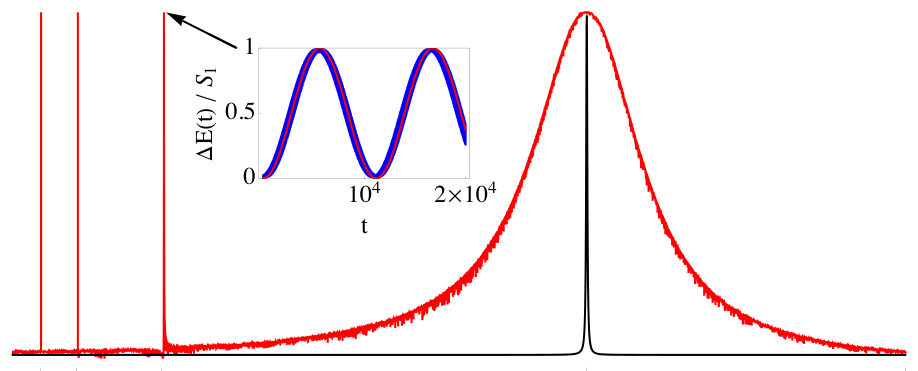
<figcaption class="paper-figure-caption"><b>Fig 4.</b> Figure 4. Profile of maxt ∆Eptq{S1 as a function of ω in the Bloch-Siegert Hamiltonian for g “ |S1 ´ S0|{10 (red curve) and g “ |S1 ´ S0|{1000 (black curve). Resonances occur whenever ε0 is an odd multiple of ω. In inset, numerical simulation of ∆Eptq{S1 “ P|0yÑ|1yptq as a function of t for ε0 “ ω{0.3371 (blue line) together with the prediction of Eq. (47a) (solid red line) for the long-time carrier. Parameters: S0 “ Γ “ 0, S1 “ 1, ε0 “ S0 ´ S1 ´ iΓ “ ´1 and e0 “ 0. Numerically, the resonances are located at ω{ε0 » 0.3371, 0.202068 and 0.1443048. These values are larger than 1{3, 1{5 and 1{7 due to ε0 ă 0.</figcaption>
</figure>
<figure class="paper-figure-card">
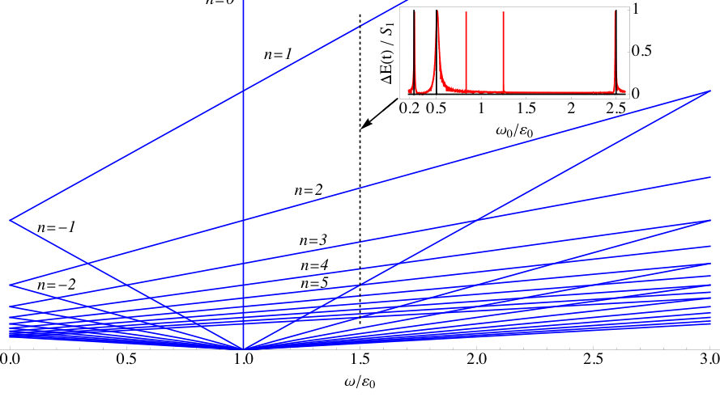
<figcaption class="paper-figure-caption"><b>Fig 5.</b> Figure 5. Location of the resonances (solid blue lines) in the pω, ω0q parameter space. As indicated by Eq. (53) the resonances are indexed by integer n P Z, here showing only ´10 ď n ď 10 for the sake of clarity. In inset, numerical simulations of maxt ∆Eptq{S1 at fixed ω{ε0 “ 3{2 as a function of ω0 for g “ |S1 ´ S0|{10 (red line) and g “ |S1 ´ S0|{1000 (black line). Note that resonances with n “ 4, 6, 7 and 8 are not visible owing to numerical issues (too narrow, required simulation times too long) and, as g diminishes, each resonance becomes narrower. Resonances at ω0{ε0 » 0.5 and 0.25 are strongly enhanced double resonances. For ω{ε0 “ 0.5, the n “ 5 line resonates with the `ω...</figcaption>
</figure>

**Summary.** This paper introduces a powerful, non-perturbative mathematical framework to find exact solutions for the evolution operators of quantum systems with time-varying Hamiltonians. By combining $\langle\cdot
angle$-algebra, path-sums, and Omega calculus, the authors overcome limitations inherent in standard approximations like Dyson series or RWA. This methodology offers a universal tool for analyzing complex dynamics in fields ranging from quantum spin batteries to general non-autonomous differential systems.

**Why it may be interesting.** This is highly relevant for AMO physics as it provides rigorous mathematical tools to solve time-dependent quantum dynamics, which is crucial for understanding driven systems in quantum optics and superconducting circuits.

Detailed structure

**Main problem.** The central problem is deriving analytical, exact, and assumption-free formulas for the evolution operators governing quantum systems driven by time-dependent Hamiltonians.

**Main result.** The authors provide these exact solutions using a novel combination of mathematical techniques that bypass traditional perturbative expansions or approximations.

**Method.** The methodology combines three advanced mathematical tools: the $\langle\cdot
angle$-algebra, path-sums (related to graph walks), and Omega calculus for systematic evaluation of resulting resolvents.

**Model / system.** The work focuses on 2-level quantum systems relevant to quantum spin batteries, governed by time-dependent Schrödinger equations. The Hamiltonian can be generalized but includes specific forms involving coupling terms $\epsilon(t)$ and $\Gamma$.

**Key observables.** Transition probabilities between spin states ($P_{|0
angle 	o |1
angle}(t)$) and the stored energy ($\Delta E(t)$) are key observables derived from the evolution operator $U(t,s)$.

**Important parameters / regimes.** The analysis is general, claiming validity across all parameter regimes, including cases where standard approximations (like RWA) might fail.

**Assumptions / limitations.** The primary strength claimed is the avoidance of assumptions; however, specific appendices discuss simplified scenarios like commuting Hamiltonians or using initial transformations for tractability.

**Figures summary.** Not specified in the provided notes. The discussion references mathematical derivations (Eqs. (31), (G1), etc.) rather than figure descriptions.

**Paper structure.** The paper builds from defining the general problem and introducing the novel $\langle\cdot
angle$-algebraic framework, then details how path-sums and Omega calculus evaluate the resulting resolvents. It applies this machinery to specific physical models like spin batteries (Bloch-Siegert) and Brownian motion.

Abstract

We present the analytical, exact, explicit, and assumption free formulas for the evolution operators corresponding to four instances of time-dependent Hamiltonians relevant to quantum spin batteries including two stochastic cases. We demonstrate how to recover and go beyond existing expansions and approximations directly from the exact solutions giving, for example, an explicit exact formula for Floquet Hamiltonians at all orders. The exact solutions are obtained through a completely novel combination of three mathematical techniques, the $\star$-algebra, path-sums and Omega calculus, which we briefly overview. These are widely applicable to other non-autonomous differential systems.

[↑ back to top](#top)

### [Interplay of Quasiperiodic Criticality and the Non-Hermitian Skin Effect](http://arxiv.org/abs/2607.08294v1)

**Authors:** Zhangyuan Chen, Xianqi Tong, Xiaosen Yang  
**Type:** theory · **Category:** other · **PDF:** <https://arxiv.org/pdf/2607.08294v1>  
**Analysis basis:** full PDF text, analyzed in chunks
**Topic relevance:** `analog quantum simulation` **3/5** · `driven-dissipative phase transition` **3/5** · `methods for driven-dissipative` **3/5** · `non-equilibrium universality` **3/5** · `Kondo & dissipative impurity` **2/5** · `non-equilibrium dynamics` **2/5** · `Frenkel-Kontorova` **1/5** · `Keldysh / 2PI / non-Gaussian methods` **1/5** · `correlated / nonlocal dissipation` **1/5**

↔ Scroll figures horizontally

<figure class="paper-figure-card">
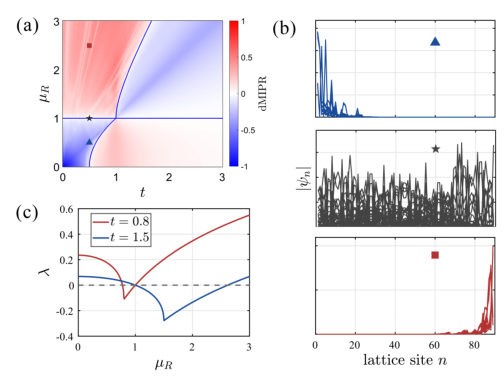
<figcaption class="paper-figure-caption"><b>Fig 1.</b> FIG. 1. (a) The dMIPR under OBC as a function of t and µR for N = 233 and θ = 0. The blue line represents the theoretical prediction from Eq. (10). The colored symbols mark the parameter points corresponding to the representa- tive eigenstates shown in (b). (b) Representative eigenstates under OBC at t = 0.5 for µR = 0.5, 1, and 2.5 from top to bottom, corresponding to the marked points in (a). (c) The analytical λ as a function of µR. The red line corresponds to t = 0.8, while the blue line represents t = 1.5.</figcaption>
</figure>
<figure class="paper-figure-card">
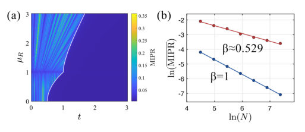
<figcaption class="paper-figure-caption"><b>Fig 2.</b> FIG. 2. (a) The MIPR under PBC as a function of t and µR for system size N = 233 and θ = 0. The white line marks the phase transition line between the extended and critical regimes. (b) Finite-size scaling of the MIPR versus system size N on a logarithmic scale. The red points correspond to the parameter set with t = 0.3 and µR = 2.5, while the blue points correspond to t = 2.5 and µR = 2. The solid lines represent power-law fits. The statistical average is performed over 103 random realizations of the global phase θ. β is the corresponding fractal dimension.</figcaption>
</figure>
<figure class="paper-figure-card">
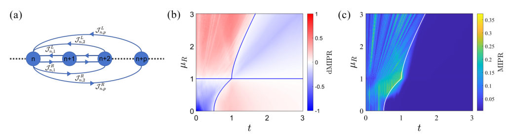
<figcaption class="paper-figure-caption"><b>Fig 3.</b> FIG. 3. (a) Schematic illustration of the HN model with long-range hoppings. (b) The dMIPR under OBC as a function of t and µR. (c) The MIPR under PBC as a function of t and µR. Panels (b) and (c) correspond to a lattice with nearest and next-nearest neighbor hoppings, for N = 233 and θ = 0.</figcaption>
</figure>
<figure class="paper-figure-card">
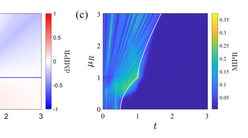
<figcaption class="paper-figure-caption"><b>Fig 4.</b> Figure 3(b) shows the dMIPR under OBC for a lattice with nearest- and next-nearest-neighbor hoppings. The phase structure is consistent with the analytical predic- tion. For comparison, the MIPR under PBC is shown in Fig. 3(c). The PBC phase diagram retains extended and critical regimes similar to those in Fig. 2(a), indicat- ing that the long-range hopping terms do not eliminate the quasiperiodic critical eigenstate structure. Combin- ing the OBC and PBC results, we find that parameter regimes hosting critical eigenstates under PBC can also exhibit the NHSE under OBC in the long-range model.</figcaption>
</figure>
<figure class="paper-figure-card">
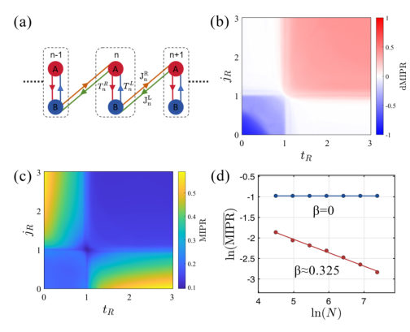
<figcaption class="paper-figure-caption"><b>Fig 5.</b> FIG. 4. (a) Schematic of the Rice-Mele model with nonrecip- rocal hopping. (b) The dMIPR under OBC as a function of jR and tR for N = 89, ∆= 1, and θ = 0. (c) The MIPR under PBC as a function of jR and tR for N = 89, ∆= 1, and θ = 0. (d) Finite-size scaling of the MIPR versus system size N on a logarithmic scale. The red points are obtained for tR = 2.5 and jR = 3, while the blue points are obtained for tR = 0.5 and jR = 2. The solid lines represent power-law fits, and the statistical average is performed over 103 realizations of the global phase θ.</figcaption>
</figure>

**Summary.** This theoretical paper explores how quasiperiodic order interacts with non-Hermiticity to govern the Non-Hermitian Skin Effect. By analyzing modulated Hatano–Nelson models, the authors show that critical states found under periodic boundary conditions can induce skin effects when open boundaries are imposed. The findings extend this understanding to complex systems like long-range and multi-band lattices.

**Why it may be interesting.** This work is highly relevant as it bridges concepts from topological physics (NHSE) with localization theory (quasiperiodicity), providing analytical control over how boundary conditions affect spectral properties in complex quantum systems, which has implications for photonic and cold-atom lattices.

Detailed structure

**Main problem.** The paper investigates the complex interplay between quasiperiodic criticality, non-Hermiticity, and boundary conditions in condensed matter models.

**Main result.** It demonstrates that parameter regimes exhibiting quasiperiodic critical states under periodic boundary conditions can also manifest the Non-Hermitian Skin Effect under open boundary conditions.

**Method.** The study employs analytical techniques like non-unitary gauge transformations to map non-Hermitian systems to Hermitian ones, alongside numerical diagnostics such as Lyapunov exponents and Inverse Participation Ratios (IPR) for localization analysis.

**Model / system.** The primary model is a quasiperiodically modulated Hatano–Nelson Hamiltonian. Extensions include long-range hopping terms and a two-band Rice–Mele model, all incorporating nonreciprocal hopping.

**Key observables.** Lyapunov exponent ($\lambda$), Directional Inverse Participation Ratio (dIPR), Mean Inverse Participation Ratio (MIPR), and the fractal dimension ($eta$) derived from finite-size scaling.

**Important parameters / regimes.** The modulation strengths ($\mu_R, \mu_L$), the irrational frequency $\alpha$, and the boundary conditions (PBC vs. OBC) are crucial parameters defining different physical regimes.

**Assumptions / limitations.** The analysis relies on mapping non-Hermitian systems to effective Hermitian forms via gauge transformations and analyzing the thermodynamic limit for analytical results.

**Figures summary.** Figures illustrate the dependence of MIPR/dMIPR on system size (N) to determine fractal dimensions ($eta$) under PBC, and show schematic comparisons between nearest-neighbor, long-range, and two-band models regarding skin effect signatures.

**Paper structure.** The paper progresses from analyzing the basic quasiperiodic Hatano–Nelson model using gauge transformations and Lyapunov exponents. It then extends the analysis to include long-range hoppings and multi-band systems (Rice-Mele), consistently applying PBC/OBC diagnostics to confirm the persistence of the NHSE in critical regimes.

Abstract

Quasiperiodic lattices can host critical eigenstates, whereas nonreciprocal hopping in non-Hermitian lattices can induce non-Hermitian skin effect. In this work, we investigate localization phenomena in a Hatano--Nelson model with quasiperiodically modulated hopping amplitudes, where nonreciprocity arises from unequal modulation strengths of the right and left hoppings. Using a non-unitary gauge transformation, we map the non-Hermitian system into a Hermitian quasiperiodic system and obtain an exact analytical expression for the Lyapunov exponent in the thermodynamic limit. Under periodic boundary conditions, inverse participation ratios and finite-size scaling analysis are used to identify the quasiperiodic critical regimes. The comparison shows that parameter regimes hosting quasiperiodic critical states under periodic boundary conditions can exhibit the non-Hermitian skin effect under open boundary conditions. Furthermore, the non-Hermitian skin effect associated with quasiperiodic critical regimes is also observed in representative long-range hopping models and multiband extensions. Our results provide an analytically controlled perspective on how quasiperiodicity, modulated nonreciprocity, and boundary conditions jointly shape the non-Hermitian skin effect in critical regimes.

[↑ back to top](#top)

### [The Geometry of Quantum Complexity in Open Systems](http://arxiv.org/abs/2607.08411v1)

**Authors:** Ezra Acalapati, Kausik Ghosh, Giuseppe Policastro  
**Type:** theory · **Category:** other · **PDF:** <https://arxiv.org/pdf/2607.08411v1>  
**Analysis basis:** full PDF text, analyzed in chunks
**Topic relevance:** `driven-dissipative phase transition` **3/5** · `methods for driven-dissipative` **3/5** · `non-equilibrium dynamics` **3/5** · `Keldysh / 2PI / non-Gaussian methods` **2/5** · `correlated / nonlocal dissipation` **2/5** · `entanglement & information structure` **2/5** · `non-equilibrium universality` **2/5** · `Kondo & dissipative impurity` **1/5** · `scars & prethermalization` **1/5**

↔ Scroll figures horizontally

<figure class="paper-figure-card">
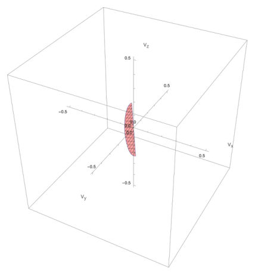
<figcaption class="paper-figure-caption"><b>Fig 1.</b> Figure 1: The indicatrices for the depolarizing dynamics without drift at base point x = (0.5, 0.3, 0.2) with Ct = 1 as boundaries of the surfaces shown. The four plots show how the indicatrix changes with respect to the control-cost-weights pγ, pγω, and pω.</figcaption>
</figure>
<figure class="paper-figure-card">
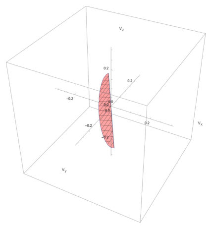
<figcaption class="paper-figure-caption"><b>Fig 2.</b> Figure 2: The indicatrices for the amplitude damping dynamics without drift at base point x = (0.5, 0.3, 0.2) with Ct = 1 as boundaries of the surfaces shown. The four plots show how the indicatrix changes with respect to the control-cost-weights pγ, pγω, and pω.</figcaption>
</figure>
<figure class="paper-figure-card">
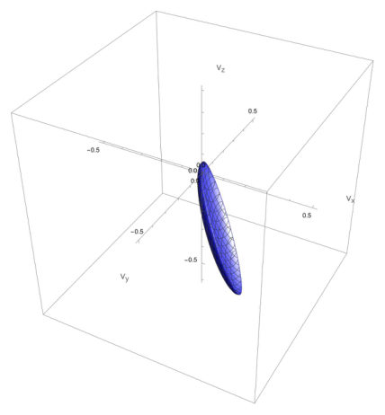
<figcaption class="paper-figure-caption"><b>Fig 3.</b> Figure 3: The indicatrices for the depolarizing dynamics with unitary drift at base point x = (0.5, 0.3, 0.2) with Ct = 1 and ∆= 1 as surfaces shown. The four plots show how the indicatrix changes with respect to the control-cost-weights pγ, pγω, and pω.</figcaption>
</figure>
<figure class="paper-figure-card">
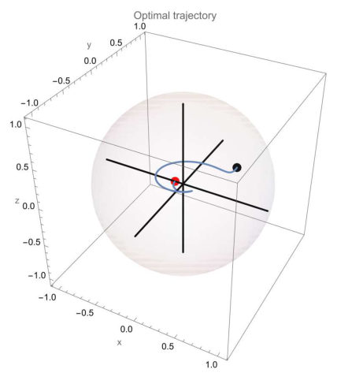
<figcaption class="paper-figure-caption"><b>Fig 4.</b> Figure 5: The optimal trajectories of the depolarizing with unitary drift computed numer- ically using the PMP approach with the initial point (black dot) at x = (0.9, 0.0, 0.0) and the final point (red dot) at x = (−0.1, 0.0, 0.0). The parameters are set to be Ct = 1 and ∆= 1. The four plots show how the trajectory changes with respect to the control-cost weights pγ, pγω, and pω.</figcaption>
</figure>
<figure class="paper-figure-card">
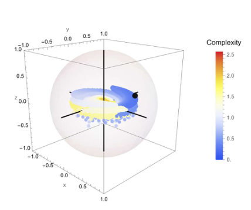
<figcaption class="paper-figure-caption"><b>Fig 5.</b> Figure 6: The trajectory costs gained from using the optimal trajectories for the depolar- izing with unitary drift from the initial point (black dot) x = (0.5, 0.3, 0.2) to final points reached by different initial velocities shown in color gradation. The parameters are set to be Ct = 1, ∆= 1 and two sets of control-cost weights.</figcaption>
</figure>

**Summary.** This paper extends the concept of quantum complexity from ideal closed systems to real-world open systems subject to dissipation. It reformulates complexity as an optimal control problem on the space of mixed states, revealing that the resulting geometry is sub-Finslerian rather than Riemannian. This provides a powerful geometric tool for quantifying information processing limits in noisy quantum devices.

**Why it may be interesting.** This work directly addresses the quantification of complexity in realistic, dissipative quantum systems, which is a major frontier connecting quantum information theory with open quantum dynamics.

Detailed structure

**Main problem.** The core problem is extending the geometric definition of quantum complexity, originally for closed systems, to open quantum systems governed by dissipation.

**Main result.** The geometry in open systems is fundamentally sub-Finslerian rather than Riemannian due to irreversible dissipation, providing a new framework to quantify complexity in realistic noisy environments.

**Method.** Complexity is defined via an optimal control problem on the space of mixed states, analyzed using tools from Finsler geometry and incorporating costs for both unitary and non-unitary generators.

**Model / system.** The analysis uses open quantum systems described by density matrices evolving under the Lindblad equation. Specific models include a single qubit with depolarizing/amplitude-damping channels and the damped harmonic oscillator.

**Key observables.** Complexity, flag curvature (Finslerian analog of sectional curvature), and non-reversibility of geodesics.

**Important parameters / regimes.** Penalty factors in the cost functional; dissipation rates ($\Gamma$); Hamiltonian parameters ($H$).

**Assumptions / limitations.** The dynamics are governed by the Lindblad equation (CPTP maps). The geometry is generally sub-Finslerian because the evolution is constrained by physical dissipation.

**Paper structure.** The paper builds from the known unitary case to the open system generalization, deriving the necessary optimal control formulation and analyzing how dissipation modifies the underlying geometric structure (Riemannian $	o$ sub-Finslerian).

Abstract

We extend Nielsen's geometric approach for quantum complexity from closed to open quantum systems, whose dynamics is governed by Lindbladian evolution. In this framework, complexity is defined through an optimal-control problem on the space of mixed states, with a cost assigned to both unitary and non-unitary generators. We show that the resulting geometric structure differs fundamentally from the Riemannian geometry that emerges in the case of unitary evolution. In the open-system setting, the natural geometry is typically sub-Finslerian. Dissipation makes the geodesics non-reversible, while the admissible tangent directions are restricted by the physically allowed controls. We analyze several physically motivated examples, including a single qubit subject to depolarizing and amplitude-damping channels, as well as the damped harmonic oscillator. We show that, similarly to the unitary case, varying the penalty factors in the cost functional modifies the geometric properties through changes in the flag curvature, the Finslerian analog of sectional curvature. Our results provide a geometric framework for quantifying the abstract notion of complexity in dissipative quantum systems, with potential connections to experimentally realizable setups.

[↑ back to top](#top)

### [Thermodynamic Structure and Composition in Nonlinear Convection-Diffusion](http://arxiv.org/abs/2607.07829v1)

**Authors:** J. J. Segura  
**Type:** theory · **Category:** statistical mechanics · **PDF:** <https://arxiv.org/pdf/2607.07829v1>  
**Analysis basis:** full PDF text, analyzed in chunks
**Topic relevance:** `Keldysh / 2PI / non-Gaussian methods` **3/5** · `methods for driven-dissipative` **3/5** · `correlated / nonlocal dissipation` **2/5** · `driven-dissipative phase transition` **2/5** · `non-equilibrium dynamics` **2/5** · `non-equilibrium universality` **2/5** · `Kondo & dissipative impurity` **1/5** · `analog quantum simulation` **1/5** · `entanglement & information structure` **1/5** · `scars & prethermalization` **1/5**

↔ Scroll figures horizontally

<figure class="paper-figure-card">
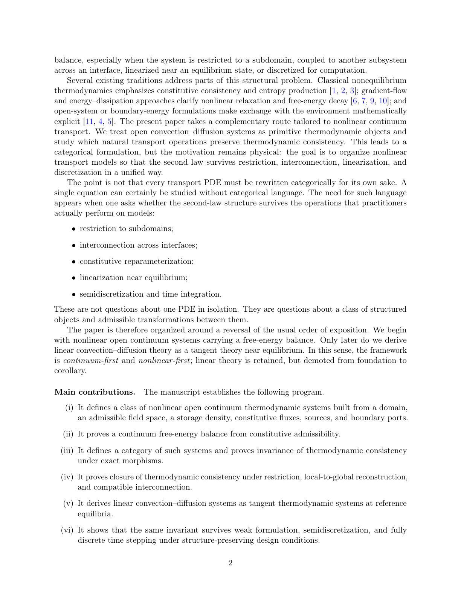
<figcaption class="paper-figure-caption"><b>Fig 1.</b> Low-resolution page preview, page 2</figcaption>
</figure>
<figure class="paper-figure-card">
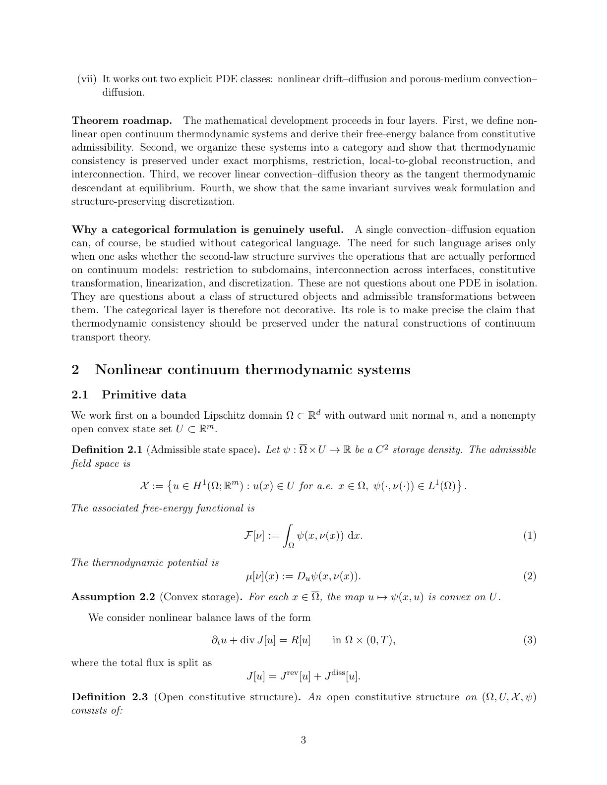
<figcaption class="paper-figure-caption"><b>Fig 2.</b> Low-resolution page preview, page 3</figcaption>
</figure>
<figure class="paper-figure-card">
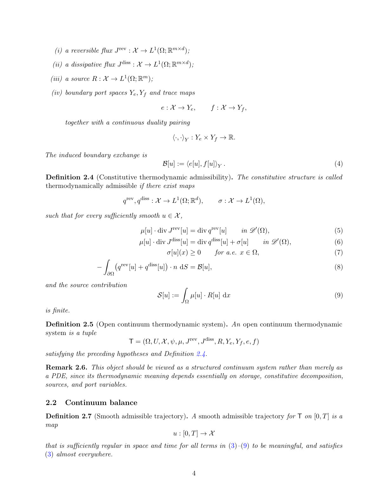
<figcaption class="paper-figure-caption"><b>Fig 3.</b> Low-resolution page preview, page 4</figcaption>
</figure>
<figure class="paper-figure-card">
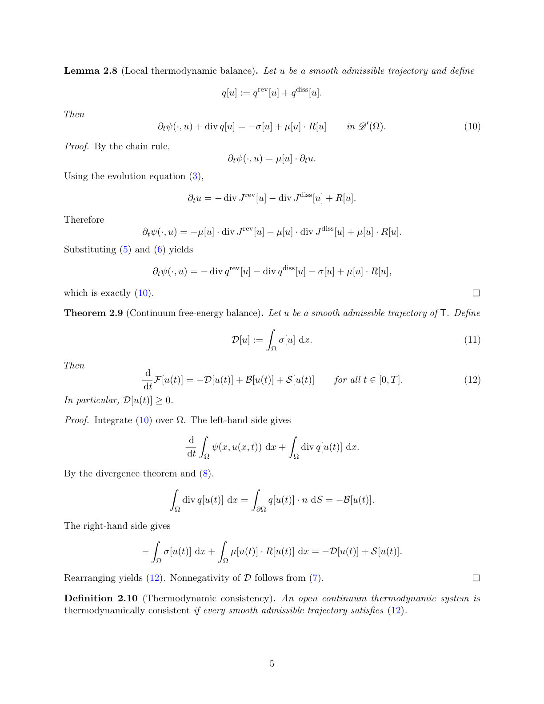
<figcaption class="paper-figure-caption"><b>Fig 4.</b> Low-resolution page preview, page 5</figcaption>
</figure>
<figure class="paper-figure-card">
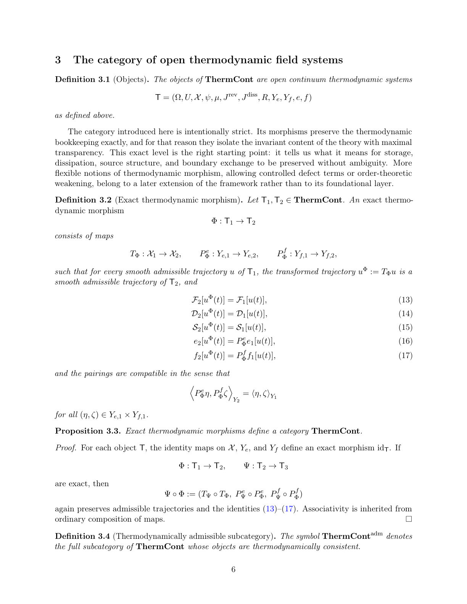
<figcaption class="paper-figure-caption"><b>Fig 5.</b> Low-resolution page preview, page 6</figcaption>
</figure>

**Summary.** This paper establishes a comprehensive framework to ensure that nonlinear convection-diffusion models rigorously obey the second law of thermodynamics. It achieves this by defining thermodynamic consistency as an invariant property preserved across continuum modeling, subsystem coupling, linearization, and numerical discretization. The work provides a powerful structural tool for building physically consistent computational models in transport physics.

**Why it may be interesting.** While focused on classical transport, the rigorous mathematical machinery—especially the emphasis on structure preservation under approximation/decomposition—is highly relevant for developing consistent quantum field theories or open quantum system dynamics where approximations are unavoidable.

Detailed structure

**Main problem.** Developing a rigorous mathematical framework for nonlinear convection-diffusion systems that guarantees the preservation of thermodynamic balance (the second law) across all modeling stages.

**Main result.** The authors prove that the free-energy balance is invariant under key operations like restriction to subdomains, interface coupling, and numerical discretization schemes.

**Method.** The work employs a continuum-first framework built on defining open constitutive structures using free-energy functionals and analyzing structural preservation via categorical methods.

**Model / system.** Open nonlinear convection-diffusion systems governing transport phenomena (mass/heat transfer) in fluids or porous media, modeled around a free-energy balance equation.

**Key observables.** Free energy functional ($F$), Dissipation term ($D \ge 0$), Boundary fluxes ($B$), and Source terms ($S$).

**Important parameters / regimes.** The system state field ($
u$) and the constitutive flux decomposition ($J = J_{	ext{rev}} + J_{	ext{diss}}$).

**Assumptions / limitations.** The existence of an admissible state field $\psi$ and the requirement that the thermodynamic balance must hold exactly across structural transformations.

**Figures summary.** Not specified (Notes focus on theorems, definitions, and mathematical structures rather than figure content).

**Paper structure.** The paper builds from defining the continuous free-energy balance (Theorem 2.9), extends this to local/global reconstruction via category theory (Theorems 3.5, 4.5, 4.13), and finally applies these structural invariants to ensure consistency across semidiscrete and fully discrete numerical schemes (Theorems 7.4, 7.7).

Abstract

Nonlinear convection--diffusion systems play a central role in transport phenomena, including mass transfer, heat transfer, porous-media transport, and coupled continuum processes with source, exchange, and interface effects. In such systems, the key question is often not only which governing partial differential equation is used, but whether the model preserves a consistent thermodynamic balance under the operations that arise naturally in transport analysis: restriction to subdomains, coupling across interfaces, linearization near equilibrium, and discretization for computation.   This paper develops a continuum-first framework for open nonlinear convection--diffusion systems in which thermodynamic consistency is formulated as a free-energy balance with nonnegative bulk dissipation and explicit boundary and source contributions. Within this setting, nonlinear transport systems are defined as structured objects built from admissible state fields, storage functionals, constitutive flux decompositions, sources, and boundary ports. We prove that the thermodynamic balance is preserved under exact structure-preserving transformations, restriction to subdomains, local-to-global reconstruction over compatible domain decompositions, and power-conserving interconnection of open subsystems. We then derive classical linear convection--diffusion models as tangent thermodynamic descendants at equilibrium and show that the same invariant survives weak formulation, semidiscretization, and fully discrete time stepping when the numerical design respects thermodynamic structure. Nonlinear drift--diffusion and porous-medium convection--diffusion are used as explicit examples. The resulting contribution is a compositional transport framework in which the second law remains visible across continuum modeling, subsystem coupling, linear approximation, and computation.

[↑ back to top](#top)

### [A hardware-efficient variational ansatz with an exact diagonal metric for real- and imaginary-time evolution and Haar sampling](http://arxiv.org/abs/2607.07942v1)

**Authors:** Dario Picozzi  
**Type:** theory · **Category:** strongly correlated electrons · **PDF:** <https://arxiv.org/pdf/2607.07942v1>  
**Analysis basis:** full PDF text, analyzed in chunks
**Topic relevance:** `analog quantum simulation` **3/5** · `methods for driven-dissipative` **3/5** · `non-equilibrium dynamics` **3/5** · `Keldysh / 2PI / non-Gaussian methods` **2/5** · `entanglement & information structure` **2/5** · `correlated / nonlocal dissipation` **1/5** · `correlated cavity matter` **1/5** · `driven-dissipative phase transition` **1/5** · `non-equilibrium universality` **1/5**

↔ Scroll figures horizontally

<figure class="paper-figure-card">
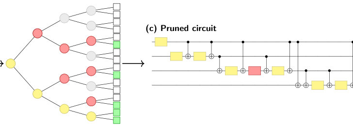
<figcaption class="paper-figure-caption"><b>Fig 1.</b> FIG. 1: End-to-end pipeline, illustrated on n = 4 qubits with k = |S| = 5 active basis states, S = {0000, 0001, 0010, 0110, 1010}. From the user-supplied active leaves (a) (green nodes in the tree), the compiler builds the binary tree and classifies each internal node as Active (yellow, free Ry angle), Fixed (red, Ry angle pinned to 0 or 1 in units of π/2) or Inactive (grey, gauge direction that does not affect the represented state) (b). Gauge-fixing the inactive parameters eliminates redundant elementary Ry gates in the cascade and exposes pairwise CNOT cancellations, yielding the pruned circuit (c) (shown stylised; coloured boxes mark Active/Fixed elementary Ry rotations in the same...</figcaption>
</figure>
<figure class="paper-figure-card">
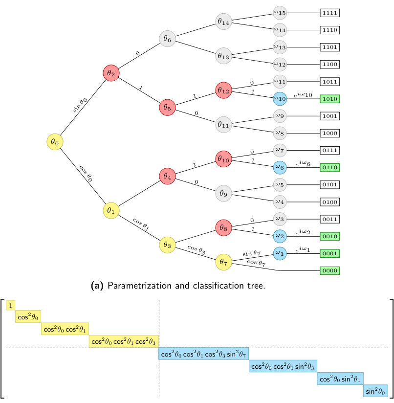
<figcaption class="paper-figure-caption"><b>Fig 2.</b> FIG. 2: Parametrization, classification, and the resulting diagonal metric for n = 4 and S = {0000, 0001, 0010, 0110, 1010}. (a) Each internal node carries one Ry parameter θi; each final-layer node carries one Rz parameter ωj, contributing the phase eiωj on its outgoing edge. Branch factors follow the convention of Sec. I A (cos θi on downward, sin θi on upward branches), labelled here along the leftmost path; the redundant global-phase coordinate ω0 is gauge-fixed to zero and drawn as a direct edge from θ7 to |0000⟩(no phase node). The metric weights wi and leaf probabilities pj are the squared path products of Sec. I B. Node colours follow the classification of Sec. I F: Active (yellow,...</figcaption>
</figure>
<figure class="paper-figure-card">
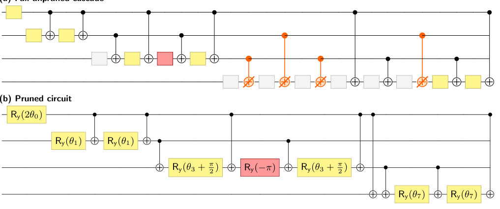
<figcaption class="paper-figure-caption"><b>Fig 3.</b> FIG. 3: End-to-end pruning walkthrough (Algorithm 1) for the running example n = 4, S = {0000, 0001, 0010, 0110, 1010}, with classified tree shown in Fig. 2. Classes: Active = {θ0, θ1, θ3, θ7} (4 free), Fixed = {θ2=0, θ4=1, θ5=1, θ8=0, θ10=0, θ12=0}, Inactive = {θ6, θ9, θ11, θ13, θ14}. (a) The full unpruned triangular circuit (15 Ry + 14 CNOT); each elementary Ry is coloured by the class of the tree parameter it serves – yellow = kept (active), red = kept as a constant ±π/2 or ±π (fixed), faded grey = removed by pruning – and the two bracketing-empty CNOT pairs that cancel after Ry removal are highlighted in orange. Block boundaries (left to right): position 0 the cascade on q3, positions...</figcaption>
</figure>
<figure class="paper-figure-card">
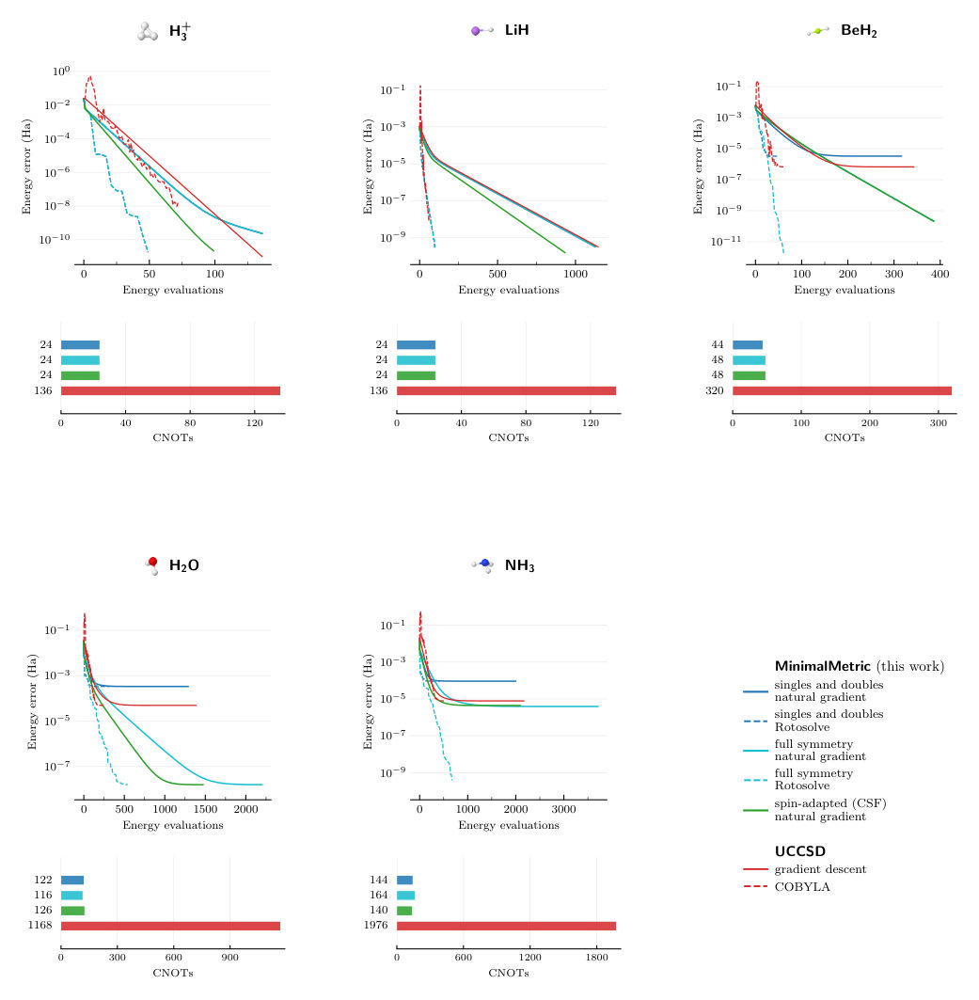
<figcaption class="paper-figure-caption"><b>Fig 4.</b> FIG. 4: Symmetry-adapted VQE benchmark in the STO-3G basis. Convergence at equilibrium geometry for five molecules: absolute energy error |E −Eref| versus the cumulative number of energy evaluations on a log scale, with Eref the CASCI (or FCI) reference. All curves share the same point-group-screened singles-and-doubles (S+D) parameter set unless noted. For MinimalMetric (MM, the symmetry-adapted pruned ansatz) two optimizers are compared on the identical ansatz, exact natural gradient (NG) and derivative-free Rotosolve, which reach the same S+D variational floor, confirming the residual error is the S+D truncation rather than an optimizer artefact; lifting MM to the full symmetry sector...</figcaption>
</figure>
<figure class="paper-figure-card">
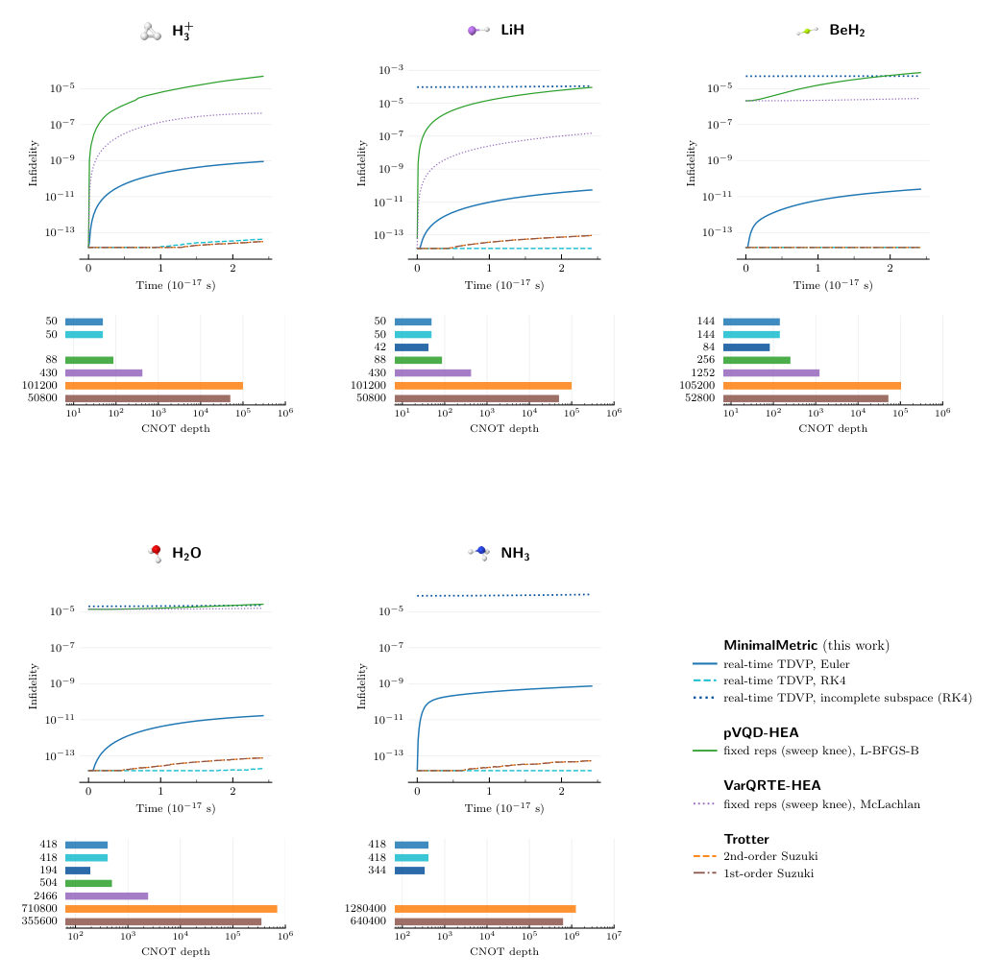
<figcaption class="paper-figure-caption"><b>Fig 5.</b> FIG. 5: Real-time molecular dipole-kick trajectories for H+ 3 , LiH, BeH2, H2O and NH3 at equilibrium geometry (κ = 0.05, T = 1; Euler and RK4 integrators). Each panel shows the trajectory infidelity against exact evolution on a log scale (top) over the coherent CNOT depth of each method (strip beneath, log scale). MinimalMetric (blue) tracks the exact trajectory to numerical precision; second-order Trotter (orange, dashed) is numerically exact; pVQD-HEA (green) and VarQRTE-HEA (purple), with per-molecule repetition count fixed at the knee of a dedicated sweep and the multistart L-BFGS state-preparation floor charged, plateau at ∼10−4–10−7 infidelity, orders of magnitude above...</figcaption>
</figure>

**Summary.** This paper presents a novel, hardware-efficient ansatz for variational quantum algorithms whose geometric metric is provably diagonal. This breakthrough eliminates the need for costly auxiliary measurements when calculating natural gradients or performing time evolution in quantum simulations. It achieves state-of-the-art performance on molecular and Hubbard models with significantly fewer gates than existing leading methods.

**Why it may be interesting.** For AMO physicists working on open quantum systems or many-body dynamics, this provides a highly efficient, geometrically sound framework to implement variational methods (like VQE) that can handle complex Hamiltonians while maintaining rigorous control over optimization landscapes and computational cost.

Detailed structure

**Main problem.** The primary challenge addressed is overcoming the computational overhead associated with calculating the Fubini-Study metric for variational quantum algorithms used in time evolution and optimization.

**Main result.** The authors introduce a hardware-efficient ansatz whose Fubini-Study pullback metric is diagonal in closed form, enabling natural gradient calculations and time evolution without costly auxiliary measurements or matrix inversions.

**Method.** They utilize a binary tree parameterization for the quantum state, deriving an exact, diagonal expression for the metric tensor that simplifies complex geometric computations into simple weight/probability tracking.

**Model / system.** The method is applied to simulating electronic structure calculations for small molecules and Hubbard quench dynamics. The ansatz is designed to be spin-adapted and applicable to general quantum many-body problems.

**Key observables.** Fubini-Study metric, two-qubit gate count, natural gradient signal magnitude, leakage $L(\phi)$, and energy expectation values ($E$).

**Important parameters / regimes.** The number of qubits ($n$), the dimension of the active subspace ($k$), and the required accuracy (reference-level).

**Assumptions / limitations.** The method assumes the target state is supported on a low-dimensional subspace $k \ll 2^n$ to enable parameter pruning; it also relies on the existence of structured dressings for quantum advantage.

**Figures summary.** Figures illustrate the end-to-end pipeline, showing how the binary tree structure classifies parameters and leads to a pruned circuit whose complexity scales favorably with the active subspace size $k$.

**Paper structure.** The paper builds from identifying the metric bottleneck in VQAs, proposing the diagonal ansatz structure via tree parameterization, deriving the closed-form metric for time evolution/gradient calculation, demonstrating pruning efficiency, and finally validating its use on molecular and Hubbard dynamics simulations.

Abstract

Variational quantum algorithms depend on the geometry of their parametrised circuits: metric-aware optimisation and time evolution require the Fubini-Study metric, which has hitherto demanded costly auxiliary measurements and ill-conditioned inversions. This work introduces a hardware-efficient $n$-qubit ansatz, which parametrises states by a binary tree and whose Fubini-Study pullback metric is diagonal in closed form. Quantum natural gradient on the tree parameters, variational imaginary- and real-time evolution, and exact unitary-invariant (Haar) sampling on a symmetry sector run with no auxiliary metric circuits or matrix inversion. When the target state is supported on a subspace of $k$ computational-basis states, the redundant tree parameters carry a gauge freedom a pruning compiler converts into circuits whose two-qubit count provably grows linearly in $k$; a variant reaches near-optimal $O(nk/\log n)$ scaling with the closed-form metric intact. On electronic-structure calculations for small molecules and half-filled Hubbard quench dynamics, the method reaches reference-level accuracy with one to three orders of magnitude fewer two-qubit gates than leading alternatives. Interchangeable constructions (a Schur-transform dressing or internal reparameterisations) make the ansatz exactly spin-adapted, with fixed total spin at every parameter and no penalty terms. The bare ansatz is an exactly controllable, well-conditioned and barren-plateau-free primitive for preparing and sampling sector states: on its own, it is classically simulable in $k$ (a boundary proved for a general class of sector-sparse ansätze); composed with a classically hard dressing, it yields molecular ground states, sector-Haar benchmarking, thermal correlators, and exact effective Hamiltonians trained from energy measurements alone, with the composed circuit carrying the potential for quantum advantage.

[↑ back to top](#top)

### [Tunable Emergent Gauge Fields from Skyrmions in a Quasicrystalline Lattice](http://arxiv.org/abs/2607.07948v1)

**Authors:** Leandro M. Chinellato, Flavia A. Gómez Albarracín, Cristian D. Batista, Pablo S. Cornaglia  
**Type:** theory · **Category:** other · **PDF:** <https://arxiv.org/pdf/2607.07948v1>  
**Analysis basis:** full PDF text, analyzed in chunks
**Topic relevance:** `analog quantum simulation` **3/5** · `exotic spin models in light-matter` **3/5** · `spintronics-quantum-optics interface` **3/5** · `driven-dissipative phase transition` **2/5** · `non-equilibrium dynamics` **2/5** · `Frenkel-Kontorova` **1/5** · `Keldysh / 2PI / non-Gaussian methods` **1/5** · `methods for driven-dissipative` **1/5** · `non-equilibrium universality` **1/5**

↔ Scroll figures horizontally

<figure class="paper-figure-card">
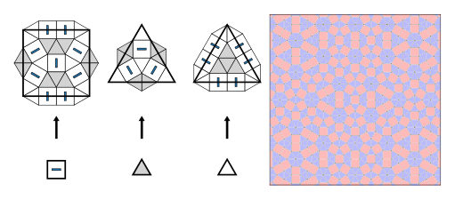
<figcaption class="paper-figure-caption"><b>Fig 1.</b> FIG. 1. Inflation rules used to generate the quasicrystalline structure [23]. The right panel shows a fragment of the qua- sicrystalline lattice.</figcaption>
</figure>
<figure class="paper-figure-card">
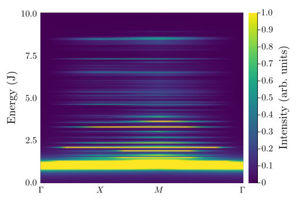
<figcaption class="paper-figure-caption"><b>Fig 2.</b> FIG. 2. Dynamical spin structure factor in the fully polarized phase, computed within LSWT using the kernel polynomial method (KPM) as implemented in Sunny.jl (v0.9) [24, 25]. The reciprocal-space path follows the Brillouin zone of the square supercell associated with the N = 2911-site approxi- mant under periodic boundary conditions.</figcaption>
</figure>
<figure class="paper-figure-card">
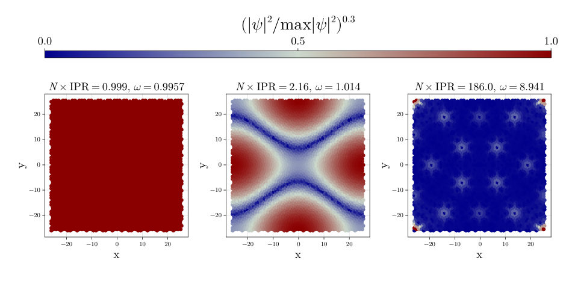
<figcaption class="paper-figure-caption"><b>Fig 3.</b> FIG. 3. Squared probability amplitude |⟨i|ψn⟩|2 for representative magnon eigenstates of the quasicrystal approximant at the critical magnetic field H = Hc. The amplitudes are displayed using the power-law color scale (|ψ|2/ max |ψ|2)0.3 to enhance the visibility of low-intensity features. Each panel is labeled by the eigenstate energy ω and the scaled participation ratio N ×IPR.</figcaption>
</figure>
<figure class="paper-figure-card">
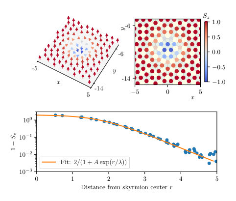
<figcaption class="paper-figure-caption"><b>Fig 4.</b> FIG. 4. Single skyrmion on the quasicrystalline lattice at magnetic field H = 0.994. The upper left panel shows the spin texture, with arrows indicating the magnetic moments and colors representing the out-of-plane magnetization component Sz. The lower panel shows shows the decay of the polarization disturbance,(1−Sz(r)), induced by the skyrmion as a function of the distance from its center. The solid line is fit to 1 − Sz(r) = 2 1+Aer/λ with parameters A = 0.0337, λ = 0.513.</figcaption>
</figure>
<figure class="paper-figure-card">
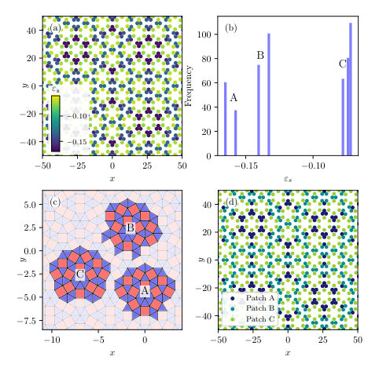
<figcaption class="paper-figure-caption"><b>Fig 5.</b> FIG. 5. (a) Single skyrmion energy as a function of the posi- tion for the fixed-spin boundary conditions patch at magnetic field H = 0.994 . (b) Histogram of single skyrmion energy. The three labeled peaks correspond to skyrmions located at the center of the patches shown in (c). (d) Locations of the A, B, and C patches, including their rotationally equivalent realizations within the quasicrystal.</figcaption>
</figure>

**Summary.** This work explores how magnetic skyrmions confined to a quasicrystalline lattice create an emergent, field-tunable gauge field. The unique quasiperiodic pinning landscape allows the skyrmion density—and thus the topological Hall conductivity—to be smoothly controlled by small changes in the external magnetic field. This suggests quasicrystals are promising platforms for advanced magnetoelectronic devices.

**Why it may be interesting.** The concept of emergent gauge fields controlled by topological textures (skyrmions) in a geometrically constrained system like a quasicrystal is highly relevant to understanding tunable electronic properties in novel magnetic materials.

Detailed structure

**Main problem.** The study investigates how magnetic skyrmions on a quasicrystalline lattice generate tunable emergent gauge fields, which can control the electronic Hall conductivity.

**Main result.** The quasiperiodic pinning landscape allows for a smooth, field-controlled suppression of skyrmion density near saturation, enabling continuous tuning of the topological Hall response to zero.

**Method.** Theoretical modeling using classical Heisenberg spin dynamics combined with linear spin-wave theory and effective particle models.

**Model / system.** The system is magnetic skyrmions governed by a classical Heisenberg model incorporating Dzyaloshinskii-Moriya interactions on a 2D quasicrystalline lattice structure.

**Key observables.** Hall conductivity ($\sigma_{xy}$), skyrmion density, magnon eigenstate localization (IPR), and topological charge ($Q$).

**Important parameters / regimes.** External magnetic field ($H$), Dzyaloshinskii-Moriya coupling strength ($D$), and the lattice structure itself.

**Assumptions / limitations.** The analysis often treats skyrmions as point-like particles confined to metastable pinning centers, and approximations like LSWT are employed.

**Figures summary.** Figures illustrate $\sigma_{xy}$ vs $H$ showing continuous tunability near saturation; IPR plots characterize magnon eigenstate localization (extended vs. critical); energy histograms show distinct skyrmion energy sectors.

**Paper structure.** The paper progresses from defining the Hamiltonian on the quasicrystal, analyzing the resulting magnon spectrum and state localization via LSWT/IPR, to deriving an effective model for skyrmion interactions, and finally calculating the field-dependent Hall conductivity ($\sigma_{xy}$).

Abstract

We study magnetic skyrmions in a two-dimensional quasicrystalline lattice using a classical Heisenberg model with Dzyaloshinskii-Moriya interactions and an external magnetic field. The competition between the skyrmion-skyrmion repulsion and an emergent quasiperiodic pinning landscape gives rise to a sequence of distinct skyrmion lattice configurations as a function of field. The resulting hierarchy of quasiperiodic pinning potentials, characterized by closely spaced quasi-degenerate minima, enables a quasi-continuous suppression of the skyrmion density as the saturation field is approached, in sharp contrast to the strongly first-order collapse of skyrmion crystals on periodic lattices. This provides a direct mechanism for controlling the topological charge and, consequently, the emergent gauge field for itinerant electrons. As a consequence, the Hall conductivity can be strongly modified with small changes in the magnetic field and driven smoothly to zero near saturation. This field-controlled tunability, rooted in the underlying multistability, identifies quasicrystalline magnets as a platform for tunable topological textures, with potential applications in magnetic memory and magnetoelectronic response.

[↑ back to top](#top)

### [Lecture notes on random matrix theory: the results, the applications, and the analytical tools](http://arxiv.org/abs/2607.07868v1)

**Authors:** Joseph W. Baron  
**Type:** theory · **Category:** disordered systems and neural networks · **PDF:** <https://arxiv.org/pdf/2607.07868v1>  
**Analysis basis:** full PDF text, analyzed in chunks
**Topic relevance:** `Keldysh / 2PI / non-Gaussian methods` **3/5** · `methods for driven-dissipative` **3/5** · `analog quantum simulation` **2/5** · `non-equilibrium dynamics` **2/5** · `correlated / nonlocal dissipation` **1/5** · `correlated cavity matter` **1/5** · `driven-dissipative phase transition` **1/5** · `entanglement & information structure` **1/5** · `non-equilibrium universality` **1/5**

↔ Scroll figures horizontally

<figure class="paper-figure-card">
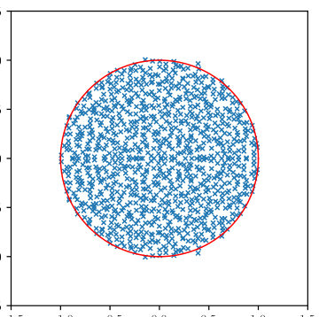
<figcaption class="paper-figure-caption"><b>Fig 1.</b> FIG. 1: The eigenvalues of a square matrix of size N = 1000 whose elements are all independent</figcaption>
</figure>
<figure class="paper-figure-card">
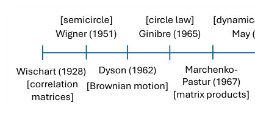
<figcaption class="paper-figure-caption"><b>Fig 2.</b> FIG. 2: A (vastly incomplete) timeline of random matrix theory.</figcaption>
</figure>
<figure class="paper-figure-card">
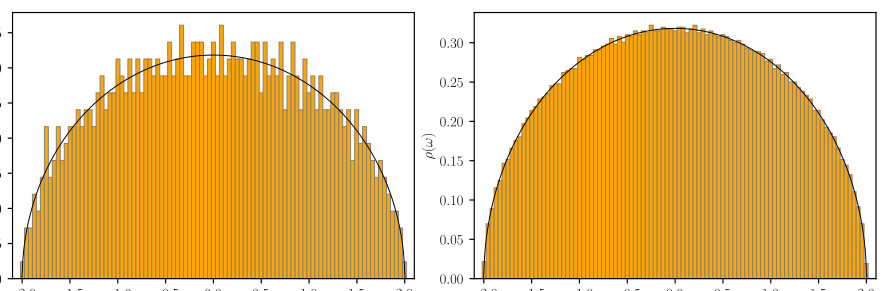
<figcaption class="paper-figure-caption"><b>Fig 3.</b> FIG. 3: Histograms of the eigenvalues for a single symmetric Gaussian random matrix with</figcaption>
</figure>
<figure class="paper-figure-card">
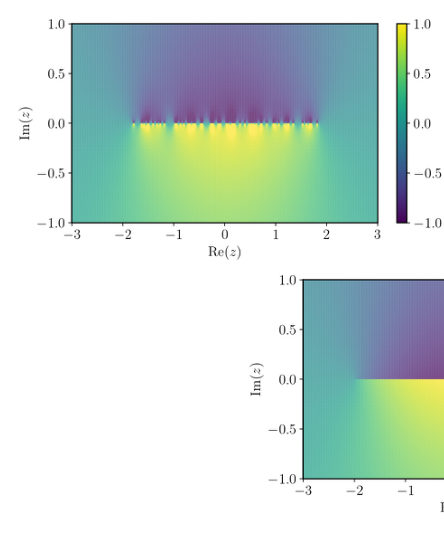
<figcaption class="paper-figure-caption"><b>Fig 4.</b> FIG. 4: Comparison of Im[G(z)] for a single realisation of the random matrix for N = 50</figcaption>
</figure>
<figure class="paper-figure-card">
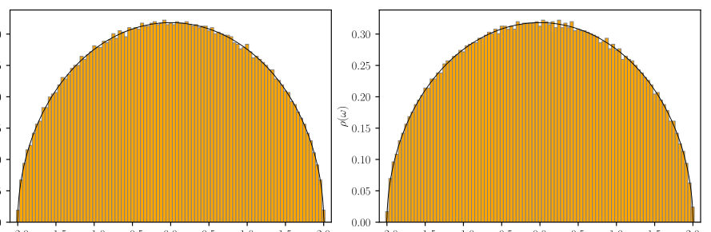
<figcaption class="paper-figure-caption"><b>Fig 5.</b> FIG. 5: Universality of the semicircle law. As long as the elements Jij have the statistics in</figcaption>
</figure>

**Summary.** This lecture notes guide provides a comprehensive overview of Random Matrix Theory (RMT), detailing how its core results are derived using both elementary and advanced mathematical tools. It establishes RMT as a powerful framework for predicting spectral statistics across diverse fields, including condensed matter physics and finance. The work is valuable for practitioners needing to master the analytical techniques required for disordered systems research.

**Why it may be interesting.** While focused on random matrices, the techniques (e.g., spectral analysis, localization theory) are highly relevant to understanding energy spectra in disordered quantum systems or analyzing noise/fluctuations in open quantum systems.

Detailed structure

**Main problem.** The primary goal is determining the statistical properties of eigenvalues and eigenvectors for large random matrices without direct calculation.

**Main result.** Classic results, such as Wigner's semicircle law for eigenvalue density, are derived using various advanced analytical techniques.

**Method.** The paper details pedagogical derivations using the cavity method, followed by introducing advanced formalisms like diagrammatic, replica, path-integral, and supersymmetric methods.

**Model / system.** The analysis focuses on large square random matrices (e.g., Gaussian Orthogonal Ensemble) whose entries are independent random variables scaled by $1/N$. Applications span nuclear physics, finance, spin glasses, and quantum chaos.

**Key observables.** Eigenvalue density $
ho(\omega)$, eigenvalue spacing distributions, and spectral correlations.

**Important parameters / regimes.** The system size $N$ is taken to infinity ($N 	o \infty$), and the analysis often involves taking limits in the complex plane ($\epsilon 	o 0$).

**Assumptions / limitations.** The core assumption is that ensemble averages are sufficient, and for spectral density extraction, the variance of matrix entries must scale as $1/N$.

**Figures summary.** Figures illustrate the convergence of eigenvalue histograms (for large N) towards a limiting distribution, such as the Wigner semicircle law.

**Paper structure.** The notes suggest a two-part structure: first, pedagogical derivation of classic results using simple methods; second, an advanced reference guide introducing and comparing complex analytical tools like replica and path-integral formalisms.

Abstract

Random matrix theory has established itself as a theoretical cornerstone of the mathematical sciences over the past century. It has undeniable utility in areas of research as diverse as nuclear physics, finance, ecology and disordered systems. The purpose of these notes is twofold. First, the most famous and widely used classic results are derived in a pedagogical manner, mostly using the comparatively elementary and transparent cavity method. The significance of each result is then demonstrated in the context of a particular application. There are also some select exercises at the end of each section. In the second part of these notes, a reference guide of analytical techniques for the random-matrix/disordered-systems practitioner is provided. Introducing the diagrammatic, replica, path-integral, and supersymmetric formalisms from first principles, we rederive some of the aforementioned classic results, particularly focussing on the simplest one -- the semicircle law. Innovations such as the population dynamics method and the tools of free probability theory are also included. We discuss the merits of each analytical approach, and we highlight the contexts in which each becomes particularly useful.

[↑ back to top](#top)

### [Rotation Sensing via Josephson-frequency Splitting in a Toroidal Superfluid](http://arxiv.org/abs/2607.08345v1)

**Authors:** Giulio Nesti, Luca Pezzè  
**Type:** theory · **Category:** quantum gases · **PDF:** <https://arxiv.org/pdf/2607.08345v1>  
**Analysis basis:** full PDF text, analyzed in chunks
**Topic relevance:** `Keldysh / 2PI / non-Gaussian methods` **3/5** · `analog quantum simulation` **3/5** · `driven-dissipative phase transition` **2/5** · `methods for driven-dissipative` **2/5** · `non-equilibrium dynamics` **2/5** · `Frenkel-Kontorova` **1/5** · `correlated cavity matter` **1/5** · `non-equilibrium universality` **1/5**

↔ Scroll figures horizontally

<figure class="paper-figure-card">
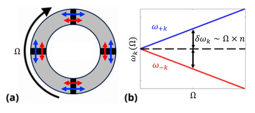
<figcaption class="paper-figure-caption"><b>Fig 1.</b> FIG. 1. (a) Schematic of a toroidal superfluid interrupted by n = 4 tunneling barriers (black rectangles) and rotating at angular frequency Ω. (b) Due to the Doppler shift, a monochromatic (at Ω= 0) Josephson mode is split in two frequency modes ω±k(Ω) [blue and red lines corresponding schematically to blue and red arrows in panel (a)]. The splitting ω+k(Ω) −ω−k(Ω) = 2δωk(Ω) is proportional to Ωand the number of barriers n.</figcaption>
</figure>
<figure class="paper-figure-card">
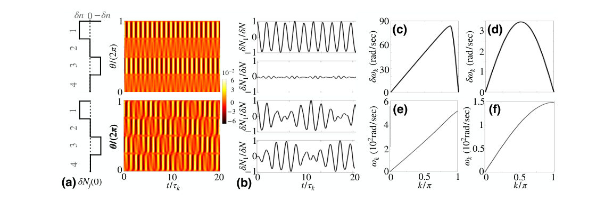
<figcaption class="paper-figure-caption"><b>Fig 2.</b> FIG. 2. Josephson oscillations from GPE simulations. (a) Azimuthal density profile as a function of the angle θ along the ring and of time, for Ω= 0 (top) and Ω= 2π rad/sec (bottom). The leftmost sketches show the initial population imbalance, δNj,k(0) for k = π/2. The color scale is the rescaled density around the equilibrium value (see Appendix for definition). (b) Corresponding population oscillations for lattice sites 1 and 2, normalized to the initial imbalance δN. In panels (a) and (b), time is rescaled by τk = 2π/ωk(0), with k = π/2. (c,d) Rotation-induced frequency splitting δωk(Ω) as a function of the quasi-momentum k. (e,f) Josephson frequency ωk(0) as a function of k. Left...</figcaption>
</figure>
<figure class="paper-figure-card">
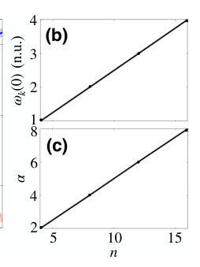
<figcaption class="paper-figure-caption"><b>Fig 3.</b> FIG. 3. (a) Oscillation frequencies ω+k(Ω) (blue dots) and ω−k(Ω) (red), normalized to ωk(0), as a function of the rotation frequency Ω, for n = 4. Results are obtained from GPE simulations; dashed lines are guides to the eye. The shaded regions indicate the Fourier width of the peaks at ω±k(Ω). (b) Josephson frequency ωk(0) at Ω= 0 as a function of the number of lattice sites n. Here ωk(0) is normalized to the value at n = 4. (c) Dimensionless coefficient α = 1</figcaption>
</figure>
<figure class="paper-figure-card">
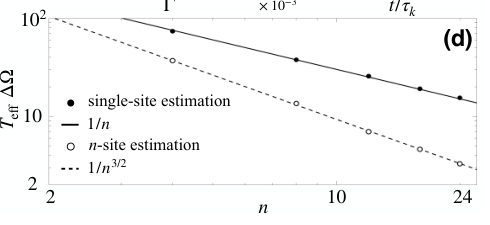
<figcaption class="paper-figure-caption"><b>Fig 4.</b> FIG. 4. Sensitivity to rotations obtained from fits of GPE oscillations. (a) Fit uncertainty ∆δωk as a function of the dimensionless damping parameter Γ, defined in the Appendix. The comparison between the different n is done at fixed Teff. Different symbols correspond to dif- ferent numbers of lattice sites n; solid lines are guides to the eye. (b,c) Damped population oscillations for n = 4 (b) and n = 16 (c), computed for Γ = 5 × 10−3. In both panels, time is rescaled by τk = 2π/ωk(0), with ωk(0) evaluated for the n = 4 case. Although the damping rate increases with n, the Josephson frequency also in- creases, allowing for a more accurate determination of δωk from the fit, as shown in...</figcaption>
</figure>

**Summary.** The authors demonstrate that a toroidal superfluid containing multiple Josephson junctions can function as a highly sensitive gyroscope. Rotation causes a measurable splitting in the natural oscillation frequencies, providing a direct signal proportional to $\Omega$. This method offers superior sensitivity scaling ($\Delta\Omega \sim n^{-3/2}$) compared to standard measurements.

**Why it may be interesting.** This work directly applies advanced many-body physics techniques (linearization of GPE) to create a novel quantum sensor concept, bridging fundamental superfluid dynamics with metrology.

Detailed structure

**Main problem.** Developing a compact, scalable rotation sensor using superfluid dynamics.

**Main result.** Rotation lifts the degeneracy of Josephson modes, creating a frequency splitting that grows linearly with both the rotation rate ($\Omega$) and the number of barriers ($n$), leading to an estimation uncertainty scaling as $\Delta\Omega \sim n^{-3/2}$.

**Method.** Analytical derivation of normal mode spectra via linearization around equilibrium, confirmed by full numerical simulations.

**Model / system.** The system is a toroidal superfluid (BEC) interrupted by $n$ tunneling barriers. Dynamics are modeled using the Gross-Pitaevskii equation in the rotating frame.

**Key observables.** Josephson-mode spectrum, frequency splitting ($\delta\omega_k(\Omega)$), and two-frequency beatings.

**Important parameters / regimes.** Rotation frequency ($\Omega$), number of barriers ($n$), tunneling coefficient ($J$), interaction strength ($U$).

**Assumptions / limitations.** The analysis focuses on the small-amplitude oscillation regime; nearest-neighbor contributions are kept in the derivation.

**Figures summary.** Figures illustrate the schematic setup, the Doppler splitting effect, and time evolution of density profiles showing both monochromatic ($\Omega=0$) and beating ($\Omega
eq 0$) oscillations.

**Paper structure.** The paper progresses from establishing the physical model (GPE in a ring) to deriving the normal mode spectrum analytically. It then uses this framework to show how rotation lifts degeneracies, leading to measurable frequency splittings that scale favorably with $n$.

Abstract

We show that a toroidal superfluid interrupted by $n$ tunneling barriers realizes a compact Josephson gyroscope with an $n$-enhanced response to rotation. In the small-amplitude regime, we derive analytically the normal mode spectrum of the coupled population-phase oscillations. In the absence of rotation, pairs of modes are degenerate: a finite angular velocity $Ω$ lifts this degeneracy through a Doppler shift, producing a frequency splitting that grows linearly with both $Ω$ and $n$. Full numerical simulations confirm this prediction and reveal long-lived two-frequency beatings, in sharp contrast with the monochromatic Josephson oscillations of the nonrotating system. These beatings provide a direct rotation signal with estimation uncertainty scaling as $ΔΩ\sim n^{-3/2}$, while remaining robust against imperfections and dynamical excitations. These results identify multi-junction toroidal superfluids as scalable, micrometer-size rotation sensors compatible with current experimental platforms.

[↑ back to top](#top)

### [Engineering Nonclassical States via the Dynamical Casimir Effect](http://arxiv.org/abs/2607.08275v1)

**Authors:** Maristella Crotti, Luca Razzoli, Giacomo Guarnieri, Luigi Giannelli, Giuseppe A. Falci, Giuliano Benenti  
**Type:** theory · **Category:** other · **PDF:** <https://arxiv.org/pdf/2607.08275v1>  
**Analysis basis:** full PDF text, analyzed in chunks
**Topic relevance:** `correlated cavity matter` **3/5** · `analog quantum simulation` **2/5** · `methods for driven-dissipative` **2/5** · `non-equilibrium dynamics` **2/5** · `Keldysh / 2PI / non-Gaussian methods` **1/5** · `Tavis-Cummings & cavity-many-emitter` **1/5** · `correlated / nonlocal dissipation` **1/5** · `driven-dissipative phase transition` **1/5** · `entanglement & information structure` **1/5**

↔ Scroll figures horizontally

<figure class="paper-figure-card">
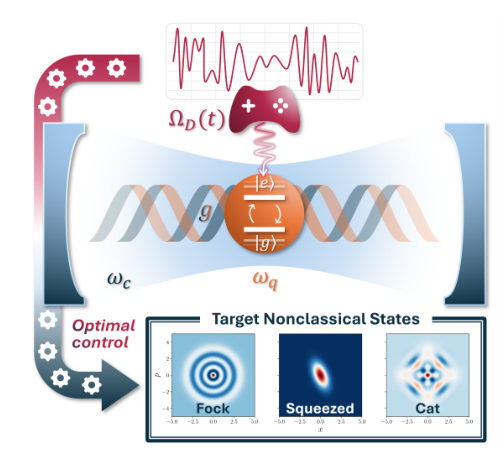
<figcaption class="paper-figure-caption"><b>Fig 1.</b> FIG. 1. Schematic representation of a single-mode cavity of frequency ωc coupled to a qubit of frequency ωq. An external drive ΩD(t) modulates the qubit frequency, inducing dynam- ical Casimir photon generation in the USC regime. By opti- mally shaping the drive, target nonclassical cavity states can be generated deterministically from the quantum vacuum.</figcaption>
</figure>
<figure class="paper-figure-card">
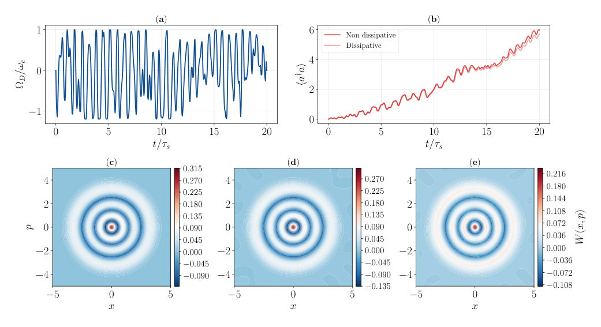
<figcaption class="paper-figure-caption"><b>Fig 2.</b> FIG. 2. Optimal control strategy for the generation of the Fock state |n = 6⟩. (a) Optimized control drive ΩD(t)/ωc obtained via CRAB optimization, GRAPE refinement, and final interpolation, and (b) corresponding cavity mean photon number ⟨a†a⟩(t). (c–e) Wigner functions of the cavity field comparing (c) the ideal target state |n = 6⟩with the state prepared by the optimized drive in (a) under (d) unitary dynamics (fidelity F = 0.995) and (e) open-system dynamics (fidelity F = 0.901). The phase-space distributions are plotted as a function of the field quadrature operators, defined as x = (a + a†)/ √</figcaption>
</figure>
<figure class="paper-figure-card">
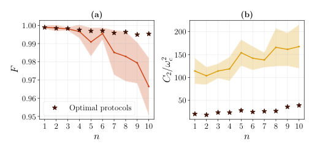
<figcaption class="paper-figure-caption"><b>Fig 3.</b> FIG. 3. Performance scaling of Fock-state generation with the target photon number n. Average (a) fidelity, and (b) control cost (4) as a function of n. Markers (mean value) and error bands (standard deviation) are obtained from 10 in- dependent unconstrained CRAB optimizations with different random seeds; the star markers indicate the performance of the optimal protocols obtained by refining the best CRAB so- lutions through a subsequent GRAPE optimization followed by a final pulse-smoothing interpolation step. The number of time intervals for the GRAPE refinement is Nt = 400, the other parameters are the same as those used in Fig. 2.</figcaption>
</figure>
<figure class="paper-figure-card">
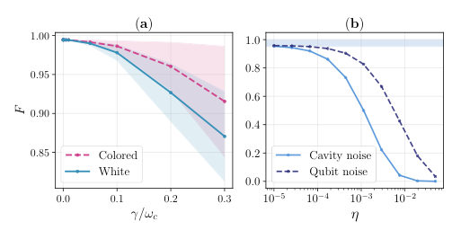
<figcaption class="paper-figure-caption"><b>Fig 4.</b> FIG. 4. Robustness of Fock-state generation against classi- cal and quantum noise. (a) Classical control noise: Fidelity as a function of the dimensionless noise amplitude γ/ωc for two additive noise models (white noise, and colored noise with finite correlation time τc = τs/3). Markers (mean value) and error bands (standard deviation) are obtained from 100 in- dependent realizations. (b) Quantum noise: Fidelity as a function of the system–bath coupling strength η for Lindblad operators acting on the cavity (solid curve) and on the qubit (dashed curve). The high-fidelity region (0.95 ≤F ≤1) is highlighted for reference. System parameters are the same as those used for the optimized control...</figcaption>
</figure>
<figure class="paper-figure-card">
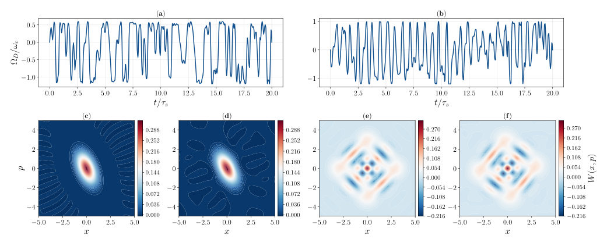
<figcaption class="paper-figure-caption"><b>Fig 5.</b> FIG. 5. Optimal control strategy for the generation of squeezed and cat states. (a, b) Optimized control drives ΩD(t)/ωc used for the generation of (a) the squeezed vacuum state and (b) the superposition of Schr¨odinger-cat states in Eq. (B4). (c–f) Wigner functions of the cavity field comparing the ideal target states (c, e) with the final states obtained via optimal control (d, f). Specifically, (c, d) refer to the squeezed vacuum state with squeezing strength r = 3 dB and squeezing angle θ = π/4, while (e, f) refer to the Schr¨odinger-cat state with α = 2. The number of time intervals for the GRAPE refinement is Nt = 400, the other parameters are the same as those used in Fig. 2.</figcaption>
</figure>

**Summary.** The paper shows how the Dynamical Casimir Effect, usually seen as an error mechanism in cavity-qubit systems, can be deliberately harnessed. By applying optimal quantum control techniques, the authors design precise driving pulses to deterministically generate high-fidelity nonclassical states like Fock and cat states. This demonstrates a powerful new paradigm for resource engineering in superconducting circuit QED.

**Why it may be interesting.** This work is highly relevant as it bridges fundamental cavity QED physics with advanced quantum control theory. Showing that a process typically viewed as decoherence (DCE) can be controlled to create useful resources (nonclassical states) is a major advance for quantum optics and circuit QED platforms.

Detailed structure

**Main problem.** To utilize the Dynamical Casimir Effect (DCE) not as an error source, but actively as a resource to deterministically engineer nonclassical states of light.

**Main result.** The authors successfully demonstrated high-fidelity generation of various nonclassical states, including Fock and Schrödinger-cat states, by optimizing driving protocols in cavity-qubit systems.

**Method.** Optimal quantum control techniques (CRAB and GRAPE) were employed to design time-dependent driving fields that steer the system evolution toward target quantum states.

**Model / system.** The physical platform is a single-mode electromagnetic cavity ultrastrongly coupled to a frequency-tunable qubit. The dynamics are modeled using Hamiltonians incorporating counter-rotating terms, and open-system evolution is treated via the GKLS master equation.

**Key observables.** State fidelity (F), control cost, and Wigner functions plotted in phase space.

**Important parameters / regimes.** The system operates in the Ultrastrong Coupling (USC) regime; key parameters include coupling strengths ($g/\omega_c$) and environmental spectral densities ($\eta$).

**Assumptions / limitations.** The analysis relies on optimal control theory, assuming that the GKLS master equation accurately describes dissipation under weak system-bath coupling.

**Figures summary.** Figures illustrate the optimized driving protocols for generating specific states (e.g., $|n=6
angle$), comparing Wigner functions across ideal, unitary, and open-system evolutions, and showing performance metrics versus noise levels or control parameters.

**Paper structure.** The paper introduces the problem of harnessing DCE, details the Hamiltonian and system setup in the USC regime, applies optimal quantum control methods (CRAB/GRAPE) to design protocols, and finally presents results demonstrating high-fidelity state preparation while analyzing robustness against various noise sources.

Abstract

Nonadiabatic driving in ultrastrongly coupled light--matter systems is commonly regarded as a source of errors, as counter-rotating interactions convert vacuum fluctuations into real excitations through the dynamical Casimir effect (DCE). Here we show that, instead, the DCE can be harnessed as a resource for engineering nonclassical states of light. Considering a cavity mode ultrastrongly coupled to a frequency-tunable qubit, we employ optimal quantum control to design driving protocols that convert vacuum fluctuations into targeted states. Numerical optimization reveals a versatile and robust approach for the deterministic preparation of a broad class of nonclassical states, illustrated here through Fock states, squeezed states, and Schrödinger-cat-state superpositions.

[↑ back to top](#top)

### [Layer-resolved Electronic Structure and Correlation of Low-$n$ Square-planar Nickelates: A DFT+DMFT Prediction of Superconducting Candidates](http://arxiv.org/abs/2607.08474v1)

**Authors:** Jian-Hong She, Rong-Qiang He, Zhong-Yi Lu  
**Type:** theory · **Category:** strongly correlated electrons · **PDF:** <https://arxiv.org/pdf/2607.08474v1>  
**Analysis basis:** full PDF text, analyzed in chunks
**Topic relevance:** `Keldysh / 2PI / non-Gaussian methods` **3/5** · `analog quantum simulation` **3/5** · `driven-dissipative phase transition` **2/5** · `methods for driven-dissipative` **2/5** · `Kondo & dissipative impurity` **1/5** · `correlated cavity matter` **1/5** · `entanglement & information structure` **1/5** · `non-equilibrium dynamics` **1/5**

↔ Scroll figures horizontally

<figure class="paper-figure-card">
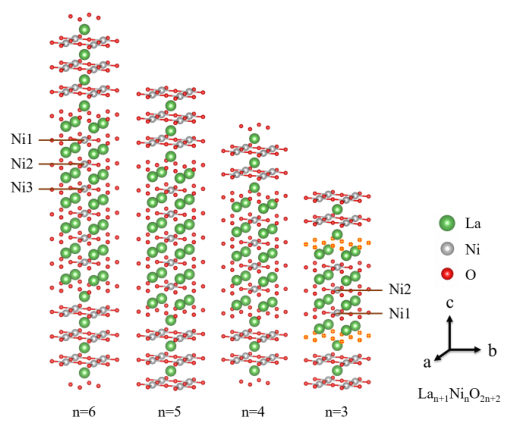
<figcaption class="paper-figure-caption"><b>Fig 1.</b> FIG. 1. Crystal structures of undoped Lan+1NinO2n+2 with n = 3, 4, 5, and 6. The structures consist of square-planar NiO2 blocks separated by spacer layers. Representative inequivalent Ni sites are labeled as Ni1, Ni2, and Ni3 from the outer to the inner NiO2 planes. For the n = 3 structure, the marked spacer-layer oxygen sites indicate the O sites used for O/Cl virtual-crystal substitution.</figcaption>
</figure>
<figure class="paper-figure-card">
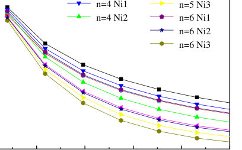
<figcaption class="paper-figure-caption"><b>Fig 2.</b> FIG. 2. Imaginary part of the Matsubara self-energy, ImΣ(iωn), for the Ni-dx2−y2 orbital in undoped Lan+1NinO2n+2 with n = 3–6. Only inequivalent Ni sites are shown.</figcaption>
</figure>
<figure class="paper-figure-card">
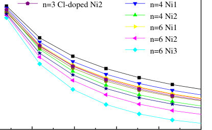
<figcaption class="paper-figure-caption"><b>Fig 3.</b> FIG. 3. Comparison of ImΣ(iωn) for the Ni-dx2−y2 orbital in se- lected undoped La compounds and Cl-doped low-n compounds. The undoped references include La4Ni3O8 (n = 3), La5Ni4O10 (n = 4), and La7Ni6O14 (n = 6). The Cl-doped compounds are treated within VCA and have the same average nominal Ni valence as the undoped n = 6 compound.</figcaption>
</figure>
<figure class="paper-figure-card">
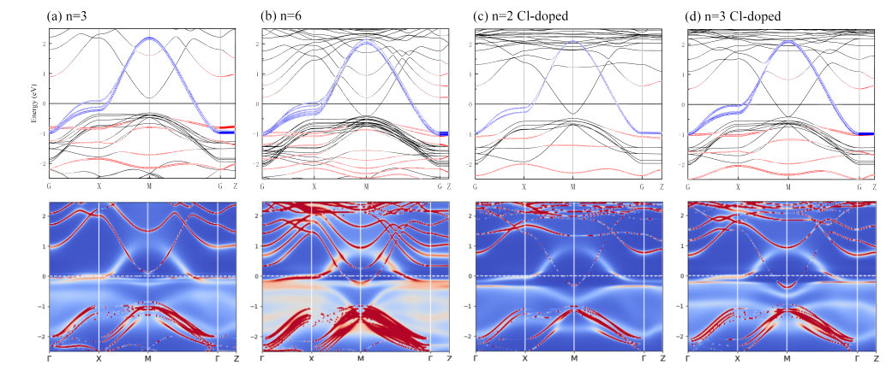
<figcaption class="paper-figure-caption"><b>Fig 4.</b> FIG. 4. DFT projected band structures and DFT+DMFT spectral functions of representative compounds. The four systems are undoped La4Ni3O8 (n = 3), undoped La7Ni6O14 (n = 6), Cl-doped La3Ni2O5.33Cl0.67, and Cl-doped La4Ni3O7.50Cl0.50. The projected band structures highlight the Ni-dz2 (red) and Ni-dx2−y2 (blue) orbital characters.</figcaption>
</figure>
<figure class="paper-figure-card">
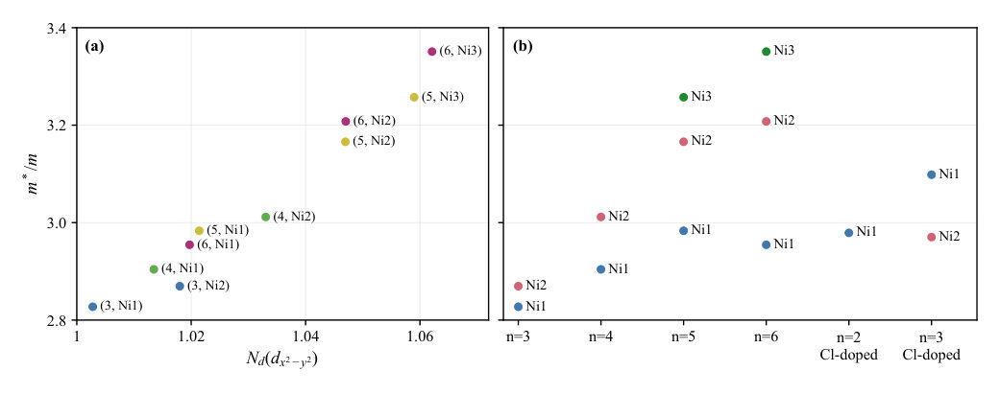
<figcaption class="paper-figure-caption"><b>Fig 5.</b> FIG. 5. Summary of the layer-resolved Ni-dx2−y2 mass enhancement. (a) Relation between the local Ni-dx2−y2 occupation Nd(dx2−y2) and the effective mass enhancement m∗/m for inequivalent Ni sites in undoped Lan+1NinO2n+2 with n = 3–6. The labels denote (n,Nim), where Ni1, Ni2, and Ni3 are ordered from the outer to the inner NiO2 planes. (b) Comparison of m∗/m across selected undoped and Cl-doped systems. The Cl-doped n = 2 and n = 3 compounds are treated within VCA and have the same average nominal Ni valence as the undoped n = 6 compound.</figcaption>
</figure>

**Summary.** This theoretical study proposes using spacer-layer Cl doping as a chemical method to induce superconductivity in low-layer number nickelates. By calculating layer-resolved electronic correlations using DFT+DMFT, the authors show that this doping strategy successfully tunes the material's correlation strength to match known superconducting compounds.

**Why it may be interesting.** While focused on solid-state physics, the use of advanced many-body techniques like DFT+DMFT to map out phase diagrams based on tuning parameters (like doping) shares conceptual overlap with controlling quantum phases in artificial quantum systems.

Detailed structure

**Main problem.** The study aims to design low-layer number ($n$) square-planar nickelates into superconducting candidates by tuning their electronic structure and correlation strength.

**Main result.** Spacer-layer Cl doping can drive low-$n$ compounds into a correlated regime comparable to higher-$n$ superconducting nickelates, suggesting it is a promising chemical strategy for material design.

**Method.** The research employs Density Functional Theory combined with Dynamical Mean-Field Theory (DFT+DMFT) calculations.

**Model / system.** The physical system is multi-layer square-planar nickelates ($	ext{R}_{n+1}	ext{Ni}_n	ext{O}_{2n+2}$), focusing on the $	ext{Ni-}d_{x^2-y^2}$ orbital. The model uses Cl doping to chemically tune the Ni valence in low-$n$ systems.

**Key observables.** Layer-resolved electronic structure, correlation strength (quantified by mass enhancement $m^*/m$), and the imaginary part of the Matsubara self-energy ($	ext{Im}\Sigma$).

**Important parameters / regimes.** The layer number ($n=2$ to $6$) and the doping level achieved via Cl substitution are critical parameters.

**Assumptions / limitations.** It is assumed that spacer-layer Cl substitution provides a chemically natural way to tune valence while keeping the active $	ext{NiO}_2$ planes largely intact.

**Figures summary.** Figures compare self-energies and mass enhancements across different $n$ values, demonstrating how doping shifts low-$n$ systems towards the correlation regime of high-$n$ superconductors.

**Paper structure.** The paper first establishes the correlation hierarchy in undoped nickelates. It then introduces Cl doping as a tuning mechanism to compensate electrons into low-$n$ compounds, showing that this process successfully induces strong $	ext{Ni-}d$ correlations necessary for superconductivity.

Abstract

Multi-layer square-planar nickelates provide a rare platform in which the nominal Ni valence, dimensionality, and layer-resolved electronic structure can be tuned within the same structural family. Recent experiments have found superconductivity in $n=4$--8 $R_{n+1}Ni_nO_{2n+2}$ compounds, with the highest $T_c$ near $n=6$, whereas the more heavily hole-doped $n=3$ member remains nonsuperconducting. Here we propose spacer-layer Cl doping as a route to convert low-$n$ nickelates into superconducting candidates. Compared with changing the layer number $n$, Cl substitution on the spacer-layer oxygen sites offers a chemically natural way to continuously tune the Ni valence while leaving the NiO$_2$ planes largely intact; the lower-$n$ compounds may also be more accessible for synthesis. Using density functional theory combined with dynamical mean-field theory, we show that electron-compensated $n=2$ and $n=3$ La-based nickelates, targeted to the nominal Ni valence of superconducting $n=6$, develop Ni-$d$ correlations comparable to those of superconducting higher-$n$ compounds while preserving the characteristic low-energy Ni-$d$ electronic structure. These results suggest spacer-layer Cl doping as a promising strategy for designing low-$n$ square-planar nickelate superconductors.

[↑ back to top](#top)

### [Global Precision Limits in Critical Quantum Metrology: From Cramér-Rao to Ziv-Zakai](http://arxiv.org/abs/2607.08431v1)

**Authors:** Neng Zeng, Tao Liu, Yu-Ran Zhang  
**Type:** theory · **Category:** statistical mechanics · **PDF:** <https://arxiv.org/pdf/2607.08431v1>  
**Analysis basis:** full PDF text, analyzed in chunks
**Topic relevance:** `analog quantum simulation` **3/5** · `entanglement & information structure` **2/5** · `non-equilibrium universality` **2/5** · `Keldysh / 2PI / non-Gaussian methods` **1/5** · `correlated / nonlocal dissipation` **1/5** · `driven-dissipative phase transition` **1/5** · `methods for driven-dissipative` **1/5** · `non-equilibrium dynamics` **1/5** · `quantum measurements` **1/5**

↔ Scroll figures horizontally

<figure class="paper-figure-card">
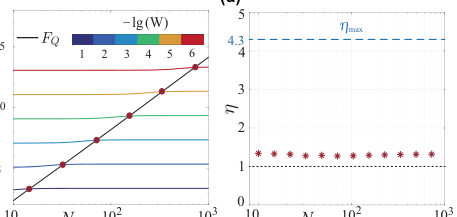
<figcaption class="paper-figure-caption"><b>Fig 1.</b> FIG. 1. 1D system with Stark localization (7). (a) QFI versus θ for the ground state with different system sizes N. (b) QFI versus the system size N for the ground state for θ = 10−9, 10−7, and 10−6. The data are well fitted by FQ ∝N β, where the scaling expo- nent β = 5.97. (c) Inverse QZZB Σ−1 z versus N for different prior widths W , compared to the QFI (black solid curve). (d) Enhance- ment factor η (red scatters) versus the system size N, evaluated at the points when the QZZB coincides with the QCRB [red dots in (c)], i.e., Σz = F −1 Q . The enhancement factor η is around 1.3, that is independent of the system size N. It demonstrates that the improve- ment in estimation precision over...</figcaption>
</figure>

**Summary.** The paper rigorously analyzes precision limits in critical quantum metrology by comparing the Cramér-Rao bound to the Ziv-Zakai bound. The key finding is that while QFI suggests super-Heisenberg scaling at criticality, incorporating prior knowledge via the QZZB reveals this enhancement is merely a constant factor relative to the initial uncertainty. This establishes fundamental limits for quantum sensing in many-body systems.

**Why it may be interesting.** This work provides a rigorous theoretical framework for quantum sensing in condensed matter systems near criticality. It refines existing understanding by quantifying the role of prior knowledge, which is crucial for designing practical quantum sensors.

Detailed structure

**Main problem.** The core problem is determining the fundamental limit on precision achievable in quantum metrology near a critical point, specifically distinguishing between genuine gains from criticality versus artifacts arising solely from prior knowledge.

**Main result.** By using the Quantum Ziv-Zakai Bound (QZZB), the authors show that for second-order phase transitions, the enhancement factor remains constant relative to the prior standard deviation, indicating that super-Heisenberg scaling is due to prior information rather than criticality itself.

**Method.** The study compares the standard Quantum Cramér-Rao Bound (QCRB) with the global QZZB, deriving lower bounds on the Mean-Square Error ($\Sigma$) by incorporating prior knowledge via a Gaussian distribution.

**Model / system.** The analysis is applied to quantum many-body systems undergoing second-order quantum phase transitions. Specific models analyzed include a 1D system with Stark localization and an anisotropic transverse-field XY chain.

**Key observables.** Mean-Square Error ($\Sigma$), Quantum Fisher Information (QFI), Enhancement factor ($\eta$), and the scaling exponent $G(N, W)$.

**Important parameters / regimes.** Critical exponents ($\alpha$, $
u$), system size ($N$), prior width ($W$ or $\sigma$), and the critical point location ($	heta_c$).

**Assumptions / limitations.** The QZZB provides a more general limit than the QCRB, which assumes unbiased estimation; the analysis focuses on regimes where the prior information is significant.

**Figures summary.** Figures illustrate how the inverse QZZB and the enhancement factor $\eta$ scale with system size $N$ for both studied models. They consistently show that $\eta$ approaches a constant value when analyzed using the QZZB, regardless of whether the tighter or looser bound is used.

**Paper structure.** The paper systematically derives the QZZB, applies it to two distinct physical models exhibiting second-order phase transitions, and analyzes the scaling behavior of the achievable precision limit ($\Sigma$) relative to the prior uncertainty ($W$).

Abstract

Critical quantum metrology with equilibrium states predicts quantum-enhanced sensitivity only in the vicinity of criticality, where large prior information about the parameter is required. By employing quantum Ziv-Zakai bounds, we derive a limit on the mean-square error in critical quantum metrology. For second-order quantum phase transitions, we show that the precision predicted by the Cramér-Rao bound offers no substantial improvement over the prior standard deviation. Thus, the critical quantum sensor's precision can only achieve a constant gain compared to the prior standard deviation, even without performing any measurement. We elucidate the fundamental limitation on the achievable precision in critical quantum metrology in the context of local sensing, even without considering state-preparation costs or noise. Thus, the super-Heisenberg-limited sensitivity at criticality arises from precise prior knowledge rather than a genuine gain due to criticality. Our work provides a practical framework for assessing critical quantum metrology and a routine for studying quantum sensing with many-body systems.

[↑ back to top](#top)

### [Non-Hermitian topology driven by an identity term: An exactly solvable paradigm](http://arxiv.org/abs/2607.08469v1)

**Authors:** Lingfang Li, Yating Wei, Yang Ruan, Gangzhou Wu, Jun Wang, Shihua Chen, Tong Lin, Ching Hua Lee, Zhenhua Ni  
**Type:** theory · **Category:** other · **PDF:** <https://arxiv.org/pdf/2607.08469v1>  
**Analysis basis:** full PDF text, analyzed in chunks
**Topic relevance:** `driven-dissipative phase transition` **3/5** · `methods for driven-dissipative` **3/5** · `non-equilibrium universality` **2/5** · `Keldysh / 2PI / non-Gaussian methods` **1/5** · `Kondo & dissipative impurity` **1/5** · `analog quantum simulation` **1/5** · `correlated / nonlocal dissipation` **1/5** · `non-equilibrium dynamics` **1/5**

↔ Scroll figures horizontally

<figure class="paper-figure-card">
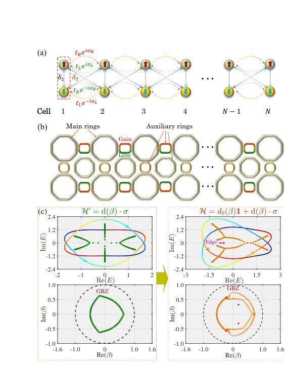
<figcaption class="paper-figure-caption"><b>Fig 1.</b> Figure 1. Topological phase transition induced by an identity term. (a) Schematic of a 1D non-Hermitian HN chain with SO coupling. (b) Optical implementation of such a chain using a microring resonator array. (c) Demonstration of how the identity term 푑0(훽)1 actively deforms the GBZ and induces topological edge states marked by red dots, for 푡퐿= 2, 푡푅= 0.6, 훼퐿= 휋/3, 훼푅= 휋/4, 훿1 = 1, 훿2 = 0.4, and 푁= 80. Supplemental Fig. 1 gives further examples and Fig. 5 in End Matter shows the full evolution of spectrum and GBZ with increasing 푑0(훽) strength.</figcaption>
</figure>
<figure class="paper-figure-card">
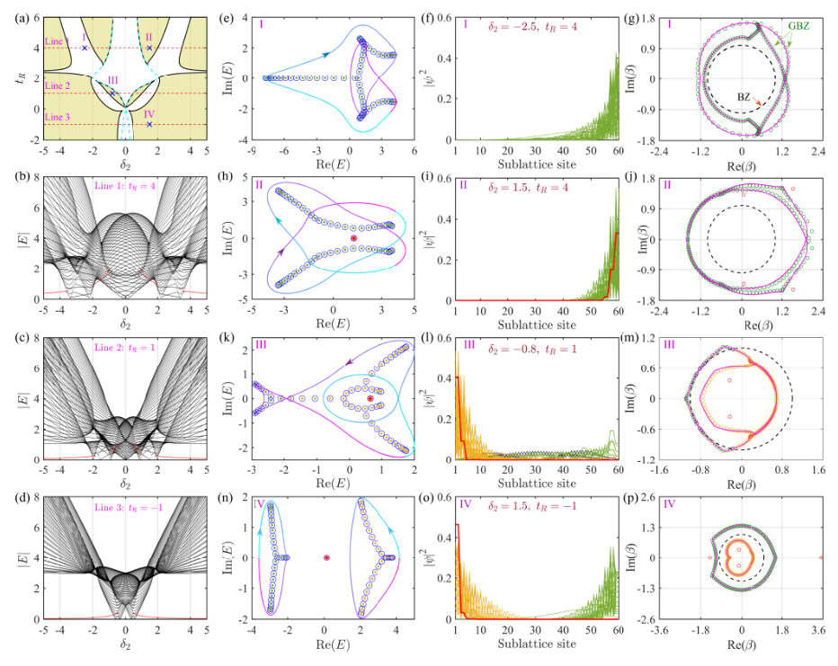
<figcaption class="paper-figure-caption"><b>Fig 2.</b> Figure 2. Analytically accessible phase diagram and topological edge states featuring distinct spectral morphologies. (a) Non-trivial phase diagram obtained directly from Eq. (10) in the (훿2, 푡푅) plane for 푡퐿= 2, 훼퐿= 휋/3, 훼푅= 휋/4, 훿1 = 1, with the topological regimes (yellow) emerging only when 훿2 ≠0. (b)-(d) Energy bands along the cut lines 1-3 in (a), where topological edge states are highlighted in red. Panels (e)-(p) validate the phase diagram at points I–IV. Point I (e-g) lies outside the topological regime and shows no edge states, whereas points II (h-j), III (k-m), and IV (n-p) are inside the regime and all host topological edge states. (e,h,k,n) Complex energy spectrum (푁= 30),...</figcaption>
</figure>
<figure class="paper-figure-card">
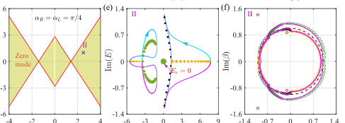
<figcaption class="paper-figure-caption"><b>Fig 3.</b> Figure 3. Exact topological zero modes under contrasting symmetries from Eq. (9). Top row: The 훿1 = 0 case, where a 휋-translation symmetry is present. (a) Phase diagram in the (훿2, 푡푅) plane for 푡퐿= 2, 훼퐿= 휋/3, 훼푅= 휋/4, with the topological regime shaded in yellow. (b) Energy spectrum at the marked point (훿2 = 0.9, 푡푅= 0) (blue cross) in (a), where solid circles denote OBC eigenvalues (푁= 30), with diameters proportional to eigenstate intensity and colors indicating localization direction (green: right-localized; yellow: left- localized). (c) GBZ at the same point, displayed as in Fig. 2 (here green curves denote the auxiliary GBZ lines). Bottom row: The 훼푅= 훼퐿case, where both chiral...</figcaption>
</figure>
<figure class="paper-figure-card">

<figcaption class="paper-figure-caption"><b>Fig 4.</b> Figure 4. Robustness of topological edge states against local per- turbations. (a, b) Response of a finite-energy topological edge state [from Fig. 2, point III] to a local disorder at the 15th unit cell, where only the 훼푅value is changed to 휋/2. (a) Energy spectrum: solid (open) circles denote the unperturbed (perturbed) case. (b) Spatial distribution of all eigenstates, where the analytical edge-state solution is marked by red circles (see inset). (c, d) Response of a zero mode [from Fig. 3(e)] to a different local disorder (훼퐿→휋/3, 훼푅→휋/6 at the 15th cell), displayed as in (a, b).</figcaption>
</figure>
<figure class="paper-figure-card">
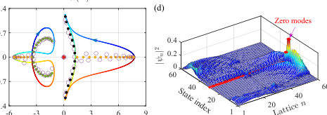
<figcaption class="paper-figure-caption"><b>Fig 5.</b> Figure 3 shows the emergence of topological zero modes un- der two distinct symmetry conditions. The top row (the 훿1 = 0 case) explores a regime that preserves 휋-translation symme- try but lacks chiral symmetry. Its phase diagram [Fig. 3(a)] defines a topological region supporting zero modes, and the spectrum at a chosen point (blue cross) confirms a topological edge state pinned at zero energy [Fig. 3(b)], accompanied by a symmetric GBZ [Fig. 3(c)]. In stark contrast, the 훼푅= 훼퐿 case shown in the bottom row breaks both chiral symmetry and 휋-translation symmetry via 훿2 ≠0. Strikingly, a topological zero mode persists even in this fully non-chiral setting, as evi- denced by its phase diagram...</figcaption>
</figure>

**Summary.** This paper develops an exactly solvable theoretical paradigm for non-Hermitian topology driven by momentum-dependent identity terms. By studying an SO-coupled Hatano-Nelson chain, the authors show that such terms actively deform the system's Brillouin Zone, leading to topological edge states and zero modes even when conventional symmetries are absent. This establishes a rigorous benchmark for testing topological invariants in complex open quantum systems.

**Why it may be interesting.** This work provides a powerful, generalizable framework for analyzing non-Hermitian systems where simple symmetry arguments fail due to complex momentum dependence in the identity term, which is crucial for understanding open quantum systems.

Detailed structure

**Main problem.** The paper challenges established topological criteria for non-Hermitian systems by showing that a momentum-dependent identity term can actively deform the Generalized Brillouin Zone (GBZ), invalidating fixed contour assumptions.

**Main result.** They establish an exactly solvable paradigm demonstrating that inter-cell spin-orbit coupling, combined with this identity term, induces robust topological edge states and zero modes even without chiral symmetry protection.

**Method.** The authors provide exact analytical solutions for the non-Hermitian eigensystem under open boundary conditions by solving characteristic polynomial equations derived from the Hamiltonian structure.

**Model / system.** The model is an SO-coupled 1D Hatano-Nelson (HN) chain, generalized to a fully generic two-band system. The Hamiltonian includes a momentum-dependent identity term $\epsilon_0(\mathbf{k})\mathbb{I}$ alongside spin-orbit coupling terms.

**Key observables.** Topological edge states, robust zero modes, and the deformation of the Generalized Brillouin Zone (GBZ).

**Important parameters / regimes.** Inter-cell SO coupling ($	ilde{t}_2$), identity term parameters ($\epsilon_0(\mathbf{k})$), and system size ($N$).

**Assumptions / limitations.** The analysis relies on deriving exact analytical solutions for the OBC spectrum, extending beyond previous criteria that required fixed GBZ contours or specific symmetries.

**Figures summary.** Figures illustrate the schematic of the SO-coupled HN chain showing GBZ deformation and induced edge states. Phase diagrams map out topological regimes based on coupling strengths, confirming bulk-boundary correspondence via energy band analysis.

**Paper structure.** The paper progresses by first introducing the physical model and identifying the failure point in standard topology theory. It then presents the exact analytical solution for the OBC spectrum using polynomial equations derived from the Hamiltonian. Finally, it analyzes the resulting topological phases and confirms robustness against disorder.

Abstract

An identity term in the Hamiltonian is conventionally regarded as spectrally inert-it shifts energies but does not alter eigenstate topology. We show that under non-Hermitian skin pumping, this paradigm fails: a momentum-dependent identity term actively deforms the generalized Brillouin zone, thereby challenging established topological criteria that rely on fixed complex contours. Here, by introducing spin-orbit coupling into a Hatano-Nelson chain, we present an exact analytical solution for the entire non-Hermitian eigensystem under open boundary conditions. Our solution reveals how inter-cell spin-orbit coupling, synergizing with this non-trivial identity term, induces topological edge states and robust zero modes in the complete absence of chiral symmetry. This work establishes an exactly solvable paradigm for non-Hermitian topology beyond symmetry protection, and provides a rigorous benchmark for testing topological invariants in systems with momentum-dependent identity terms.

[↑ back to top](#top)

### [Anisotropic vacancy-induced magnetization textures in altermagnets](http://arxiv.org/abs/2607.07789v1)

**Authors:** Ruben Burkard, Mathias S. Scheurer, Urban F. P. Seifert  
**Type:** theory · **Category:** strongly correlated electrons · **PDF:** <https://arxiv.org/pdf/2607.07789v1>  
**Analysis basis:** full PDF text, analyzed in chunks
**Topic relevance:** `Keldysh / 2PI / non-Gaussian methods` **3/5** · `spintronics-quantum-optics interface` **3/5** · `analog quantum simulation` **2/5** · `methods for driven-dissipative` **2/5** · `Kondo & dissipative impurity` **1/5** · `exotic spin models in light-matter` **1/5**

↔ Scroll figures horizontally

<figure class="paper-figure-card">
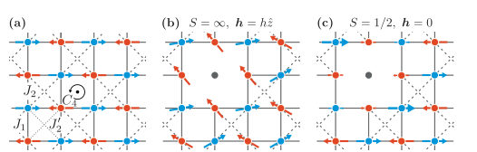
<figcaption class="paper-figure-caption"><b>Fig 1.</b> FIG. 1. (a) Illustration of checkerboard lattice Heisenberg model as a minimal model for an altermagnet. For visual clarity, we omit showing the dotted lines representing J′ 2 in all but one plaquette. (b) In the classical model (i.e. in the large-S limit), a vacancy leads to distortions in the local mo- ment’s canting towards an applied magnetic field h, resulting in a magnetization texture transverse to the ordering axis. (c) In quantum altermagnets, even at zero field, a vacancy induces inhomogeneities in fluctuation-induced local moment renormalizations, leading to longitudinal magnetization tex- tures.</figcaption>
</figure>
<figure class="paper-figure-card">
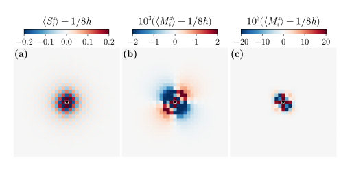
<figcaption class="paper-figure-caption"><b>Fig 2.</b> FIG. 2. The classical Heisenberg model with altermagnetic interactions and a single vacancy in a small perpendicular magnetic field. (a) Site-resolved spin component Sz i (along the field direction h = hˆz) for J2 = 0.6J1, J′ 2 = 0, and h = 0.6J1. The position of the vacancy is marked with an ’x’. The local magnetization around the vacancy is shown in (b) for the same parameters as in (a), and in (c) for h = 4J1 and J2 = 0.6J1, J′ 2 = 0.</figcaption>
</figure>
<figure class="paper-figure-card">
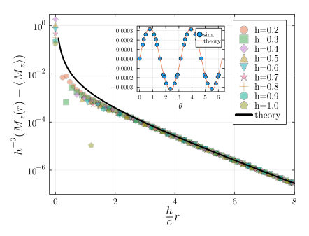
<figcaption class="paper-figure-caption"><b>Fig 3.</b> FIG. 3. Scaling collapse of the magnetization profile along the lattice diagonal, r = r(1, 1), compared to the theory predic- tion (solid line) from Eq. (8) for J2 = 0.3J1 and J′ 2 = 0. In the inset, we consider h = 0.6J1 and obtain Mz(r(θ)) −1/8h as a function of distance r away from the vacancy along various directions, labeled by θ, and fit the large-r asymptotics to the prefactor of K2(hr/(Sc)) and compare with the field-theory given in Eq. (8).</figcaption>
</figure>
<figure class="paper-figure-card">
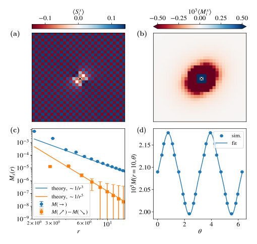
<figcaption class="paper-figure-caption"><b>Fig 4.</b> FIG. 4. The quantum model for spins of length S = 1/2 and h = 0. (a) The site dependent spin ⟨Sz i ⟩evaluated in linear-spin wave theory for the checkerboard lattice with J2 = 0.6J1. The position of the vacancy is marked with an ’x’. (b) The local magnetization around the vacancy, again for J2 = 0.6J1. We applied an additional Gaussian blur to Mx(r) to reduce short distance artifacts close to the vacancy. (c) Decay of the magnetization in horizontal direction (blue) and the difference Mx(r, r) −Mx(r, −r) (orange) as a func- tion of distance from the vacancy for J2 = 0.1J1 compared to the theory in Eq. (12). The errorbars indicate numerical uncertainties arising in finite-size scaling. (d)...</figcaption>
</figure>
<figure class="paper-figure-card">
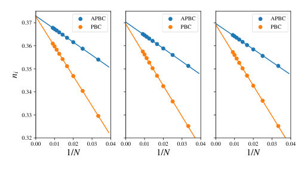
<figcaption class="paper-figure-caption"><b>Fig 5.</b> FIG. 5. Extrapolation to infinite system size of the bosonic occupation number ni = ⟨a† iai⟩on the checkerboard lattice. Shown are ni(1/L) at sites r = (0, 5), (0, 10) and (0, 20), from left to right. We use system sizes L ∈{30, 40, ..., 110}, J2 = 0.6 and compare imposing periodic and antiperiodic boundary conditions (along ˆx- and ˆy-axis) for the bosons.</figcaption>
</figure>

**Summary.** This work theoretically analyzes how vacancies perturb the magnetic order in altermagnets. By using continuum field theory on lattice models, the authors predict that these defects induce unique, symmetry-dictated anisotropic magnetization textures around them. This provides a powerful, local diagnostic tool for identifying altermagnetic quantum states.

**Why it may be interesting.** While focused on magnetism, the use of low-energy field theory expansions, symmetry analysis ($\Theta_{\sigma_d}$), and defect response calculations mirrors techniques used in analyzing boundary effects or impurities in complex many-body systems relevant to AMO physics.

Detailed structure

**Main problem.** The study investigates how non-magnetic vacancies induce anisotropic magnetization textures within altermagnets, providing a local probe for detecting this specific magnetic order.

**Main result.** Vacancies generate symmetry-protected, anisotropic magnetization distortions in the surrounding spins, with the decay laws differing between classical and quantum regimes (e.g., $1/r^5$ decay for quantum case).

**Method.** The analysis employs a combination of microscopic simulations for classical models and low-energy field theory expansions (including continuum limits) for both classical and quantum spin systems.

**Model / system.** The system is an altermagnet, modeled on checkerboard or honeycomb lattices using Heisenberg Hamiltonians. The key feature is the symmetry that allows for finite spatial multipoles of uniform magnetization despite zero net magnetization.

**Key observables.** Vacancy-induced anisotropic distortion of local moments, the resulting magnetization texture $M(\mathbf{r})$, and its long-distance decay laws (e.g., $\sin(2	heta)$ dependence).

**Important parameters / regimes.** External magnetic field strength ($h$), lattice couplings ($J_A$, $J_1$, etc.), and the spin magnitude ($S$).

**Assumptions / limitations.** The analysis relies on gradient expansions, assuming small deviations from homogeneous magnetization in the continuum limit, and treating the vacancy as a localized defect.

**Figures summary.** Figures illustrate the checkerboard lattice model and expected textures near vacancies for both classical (transverse field) and quantum (zero field) cases. Other figures show scaling collapses of magnetization profiles against theoretical predictions.

**Paper structure.** The paper develops theory by first establishing the altermagnetic nature, then applying continuum field theory to derive effective Hamiltonians incorporating vacancy terms. Results are presented for both classical (large-S limit) and quantum spin models on different lattices.

Abstract

We study magnetic textures induced by vacancies in altermagnets using microscopic simulations and low-energy field theory. We show that a vacancy generically produces a real-space anisotropic distortion of the magnetic order, whose structure encodes the symmetry of the underlying altermagnetic state. This impurity response offers a direct route to detecting altermagnetic order with locally resolved probes. We demonstrate this for both classical altermagnets, where vacancies generate anisotropic magnetization textures in a transverse magnetic field, and quantum models, where fluctuations induce longitudinal power-law decaying magnetic distortions even at zero field.

[↑ back to top](#top)

### [Triangulene-based diradicals as a blueprint for molecular quantum platforms with optical addressability and long spin coherence times](http://arxiv.org/abs/2607.08634v1)

**Authors:** Arup Sarkar, Cathal Hogan, Conor Ryan, Lorenzo A. Mariano, Alessandro Lunghi  
**Type:** theory · **Category:** quantum information and computing · **PDF:** <https://arxiv.org/pdf/2607.08634v1>  
**Analysis basis:** full PDF text, analyzed in chunks
**Topic relevance:** `exotic spin models in light-matter` **3/5** · `spintronics-quantum-optics interface` **3/5** · `Keldysh / 2PI / non-Gaussian methods` **1/5** · `analog quantum simulation` **1/5** · `correlated / nonlocal dissipation` **1/5** · `driven-dissipative phase transition` **1/5** · `methods for driven-dissipative` **1/5** · `non-equilibrium dynamics` **1/5**

↔ Scroll figures horizontally

<figure class="paper-figure-card">
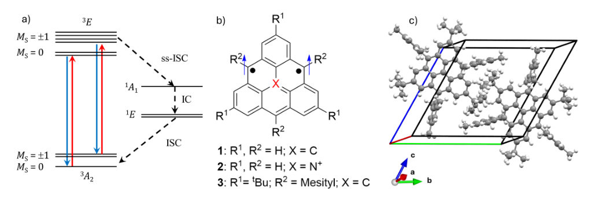
<figcaption class="paper-figure-caption"><b>Fig 1.</b> FIG. 1. Schematics of electronic processes and triangulene-based diradical structures. a) Schematic representation of the transitions involved in an NV−center’s optical cycle in zero magnetic field. Dashed lines represent ISC and Internal Conversion (IC). Continuous red and blue lines represent spin-preserving photon absorption and emission. States are labelled according to defect’s C3v point-group symmetry. b) Molecular representation of Compounds 1, 2 and 3. c) The experimental crystal structure of compound 3.</figcaption>
</figure>
<figure class="paper-figure-card">
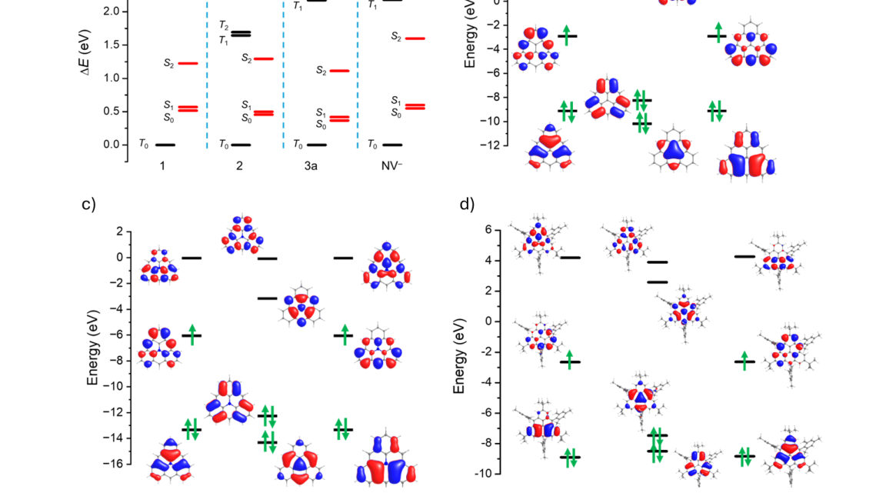
<figcaption class="paper-figure-caption"><b>Fig 2.</b> FIG. 2. Electronic structure of 1-3. a) Vertical Excitation Energies (VEE) of compounds 1-3a and comparison with the experimental VEE of NV−center in diamond[50, 51]. The degeneracies of the respective triplets/singlets are artificially lifted to aid visualization. b-d) State average canonical orbitals from CASSCF(10,10) calculations for 1-3a. The electronic occupation represents the dominant contribution to the ground-state triplet wavefunction.</figcaption>
</figure>
<figure class="paper-figure-card">
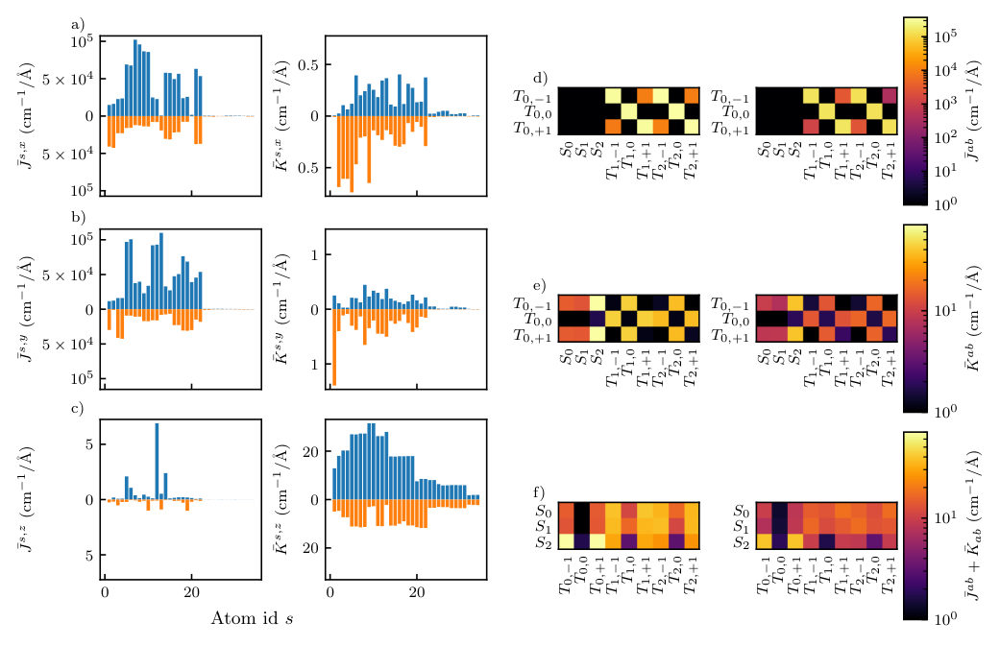
<figcaption class="paper-figure-caption"><b>Fig 3.</b> FIG. 3. Vibronic coupling for 1-2. Panels a-c) report the decomposition of J and K in atomic and Cartesian contributions. Atom IDs 1-22 correspond to C atoms and 23-34 to H atoms. Values are summed over all possible transitions between any of the three T0,MS states and all other excited states. Blue (orange) histograms report results for 1 (2). Panels d-f) report the value of J and K for different transitions after summing over atomic contributions. Left (right) panels report results for 1 (2).</figcaption>
</figure>
<figure class="paper-figure-card">
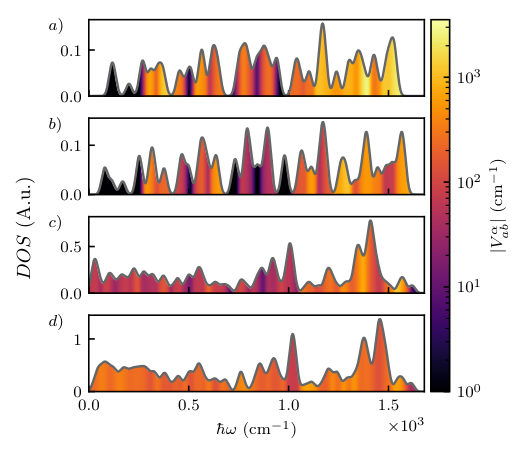
<figcaption class="paper-figure-caption"><b>Fig 4.</b> FIG. 4. Phonons’ density of states and vibronic cou- pling. Panels a-d) report the phonons’ density of states for 1, 2, 3c and 3a, respectively. In each case, the color reports the vibronic coupling between any of the three states T0,MS and any other excited state resolved by phonon frequency.</figcaption>
</figure>
<figure class="paper-figure-card">
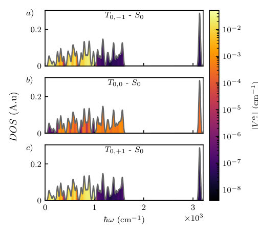
<figcaption class="paper-figure-caption"><b>Fig 5.</b> FIG. 5. Phonons’ density of states and spin-resolved vibronic coupling. Panels a-c) report the phonons’ density of states for 2 color-coded by the intensity of the vibronic coupling between each state T0,MS and the excited state S0.</figcaption>
</figure>

**Summary.** The authors propose using triangulene-based diradicals as novel molecular quantum platforms, drawing parallels to robust defects like $	ext{NV}^-$ centers. Using advanced theoretical methods, they calculate spin coherence times and demonstrate that these molecules exhibit optically addressable triplet states suitable for qubit applications. The findings establish a theoretical roadmap for designing highly coherent, room-temperature molecular qubits.

**Why it may be interesting.** This work directly addresses the theoretical design principles for solid-state molecular qubits by providing quantitative predictions for coherence times and optical control mechanisms based on first-principles calculations. It bridges fundamental quantum chemistry with applied quantum information science.

Detailed structure

**Main problem.** The primary goal is developing molecular quantum platforms that combine long spin coherence times with efficient, optically addressable interfaces for quantum computation.

**Main result.** The study predicts that triangulene-based diradicals possess a triplet ground state resembling $	ext{NV}^-$ centers and can exhibit highly spin-selective optical readouts. Theoretical modeling suggests pathways to achieve long coherence times ($T_2$) approaching the molecular core limit (up to $27 	ext{ ms}$ at $300 	ext{ K}$).

**Method.** The research employs advanced first-principles methods, including multireference quantum chemistry and spin-vibronic coupling calculations. Dynamics are modeled using quantum master equations for phonon and nuclear spin interactions.

**Model / system.** The physical systems studied are triangulene (1), its aza-cation derivative (2), and the crystal of 2,6,10-tri-tert-butyl-4,8,12-trimesityl-triangulene (3). The theoretical framework incorporates electronic ($\hat{H}_e$), phonon ($\hat{H}_{ph}$), and electron-phonon coupling ($\hat{H}_{e-ph}$) Hamiltonians.

**Key observables.** Spin coherence time ($T_2$), spin relaxation time ($T_1$), energy separation between triplet ground state and singlet excited state ($\approx 0.5 	ext{ eV}$), and the rate/selectivity of inter-system crossing (ISC).

**Important parameters / regimes.** $T_2 = 0.21 	ext{ ms}$ at $10 	ext{ K}$; estimated $T_1=27 	ext{ ms}$ at $300 	ext{ K}$; operation ideally at room temperature.

**Assumptions / limitations.** The calculations rely on expanding the vibronic coupling up to the quadratic term and modeling spin-spin dephasing via fluctuations in the effective magnetic field from nuclear spins.

**Figures summary.** Figure 1 schematically illustrates $	ext{NV}^-$ center transitions (ISC, IC) alongside molecular representations of Compounds 1, 2, and 3, including the crystal structure of compound 3.

**Paper structure.** The paper progresses by establishing the need for robust molecular qubits, analyzing the electronic structure of triangulene derivatives to show $	ext{NV}^-$ center analogies, calculating spin decoherence from phonons/nuclei, and finally demonstrating optically addressable, spin-selective processes like ISC at room temperature.

Abstract

The identification of molecules that combine long spin coherence times and efficient spin-optical interfaces, ideally at room temperature, is pivotal towards the development of molecular quantum technology. By means of advanced first-principles methods, we here unravel the electronic structure for triangulene (1), its aza-cation derivative (2), and the crystal of 2,6,10-tri-tert-butyl-4,8,12-trimesityl-triangulene (3), and show that these organic diradicals possess a triplet ground state well separated from the first singlet excited state approaching 0.5 eV, closely resembling solid-state defects like nitrogen vacancy centers. In addition, we compute spin decoherence times due to the interaction with phonons and surrounding nuclear spins, showing that a deuterated molecule of 3 in a nuclear spin-free environment would support $T_2 = 0.21$ ms at 10 K. Importantly, we show that the engineering of specific low-energy vibrations could significantly improve $T_2$ toward the limit imposed by the molecular core spin relaxation, here estimated to be as long as $T_1=27$ ms at 300 K for 2. Finally, we compute two-phonon contributions to inter-system crossing at 300 K for2 as a luminescent prototype, and find that it is highly spin-selective, supporting the possibility to engineer optical read out and spin initialization. These results advance a unified first-principles theoretical foundation of spin decoherence and spin-selective excited-state processes and point to novel chemical design strategies for optically addressable, highly coherent molecular qubits.

[↑ back to top](#top)

### [An exact information theory of generalization phase transitions in Bayesian diffusion models](http://arxiv.org/abs/2607.08041v1)

**Authors:** Henry Hunt, Mason Kamb, Surya Ganguli  
**Type:** both · **Category:** disordered systems and neural networks · **PDF:** <https://arxiv.org/pdf/2607.08041v1>  
**Analysis basis:** full PDF text, analyzed in chunks
**Topic relevance:** `driven-dissipative phase transition` **3/5** · `entanglement & information structure` **3/5** · `non-equilibrium universality` **2/5** · `Keldysh / 2PI / non-Gaussian methods` **1/5** · `methods for driven-dissipative` **1/5** · `non-equilibrium dynamics` **1/5**

↔ Scroll figures horizontally

<figure class="paper-figure-card">
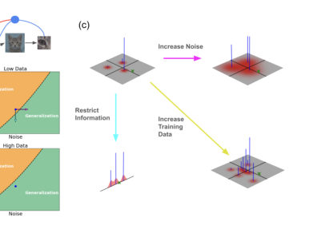
<figcaption class="paper-figure-caption"><b>Fig 1.</b> Figure 1: A schematic figure showing different transitions from memorizing to generalizing phases in BIRD models. (a) A depiction of the Bayesian guessing game performed by a pixel as it assigns posterior probabilities to training set images. The forward process starts with a training image of a cat, adds noise to it, then the pixel observes a local patch (e.g. the eye). Based on this restricted observation, the pixel must guess whether this noisy patch was generated from the truck or the cat. The pixel memorizes if the posterior con- centrates on the cat. (b) The phase diagram of the gener- alization/memorization transition for a BIRD model. Con- sider the blue point in the memorization...</figcaption>
</figure>
<figure class="paper-figure-card">
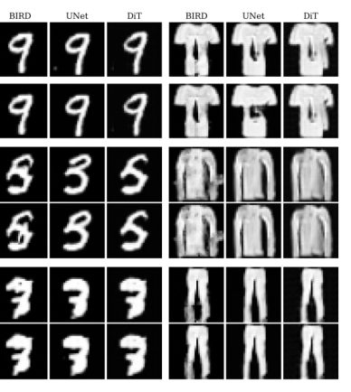
<figcaption class="paper-figure-caption"><b>Fig 2.</b> Figure 2: The consistent and robust generalization of diffusion models early in training, across various datasets and architectures, is well-predicted by spatially local BIRD models with a patch size near the critical scale, as described below. Here UNets and DiTs are trained on disjoint dataset subsets D1 and D2, but produce nearly identical images when fed the same noise input. These images are both similar to the corresponding BIRD model outputs. Many more such samples are shown in App. H.2 in figs. 7-11, along with details of the experiment and training procedure in App. H.</figcaption>
</figure>
<figure class="paper-figure-card">
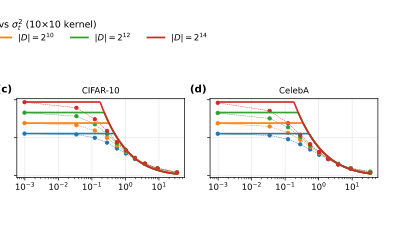
<figcaption class="paper-figure-caption"><b>Fig 3.</b> Figure 3: Comparison of theory and experiment for the memorization-generalization phase tran- sition. Experimental curves plot numerical estimates of the average entropy deficit (ln |D| − S[P(φ|ϕΩ)]) in a spatially local BIRD model with a patch size 5 × 5. σ2 t is the noise strength. Theory curves plot mutual information or its Gaussian upper bounds. As noise σ2 t decreases, the theoretically derived mutual information curves rise in the generalizing phase then saturate to ln |D| in the memorizing phase. Moreover the mutual information theory curves closely track, or upper bound the entropy deficit experimental curves. Each sub-figure corresponds to a different true data distribution: (a)...</figcaption>
</figure>
<figure class="paper-figure-card">
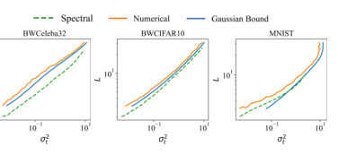
<figcaption class="paper-figure-caption"><b>Fig 4.</b> Figure 4: Effect of varying the patch scale L (for square patches) in a spatially local BIRD model. (a) The top (bottom) shows the outcome of denoising of a single test (train) image using BIRD models of different patch sizes L starting from noise σt = 1. Optimal denoising occurs when L = 7 (in general this optimal denoising scale coincides with Lc). For L = 5 &lt; Lc, from theory we know the denoiser is robust, but denoising performance is poor both on the training and test image. For L = 15 &gt; Lc, the model is in the memorization phase, and it poorly denoises the test image (compare rightmost to leftmost image in top row), but perfectly denoises (i.e. memorizes) the training image (compare...</figcaption>
</figure>
<figure class="paper-figure-card">
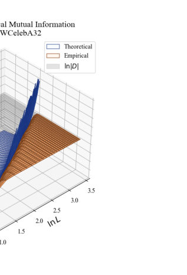
<figcaption class="paper-figure-caption"><b>Fig 5.</b> Figure 5: A plot of the mutual information I(ϕΩ; φ) on a Gaussianized version of the BWCeleba32 dataset, as a function of both the noise level σ2 and the patch length L, relative to the prior for a) the theoretical distribution b) a finite sample of 104 examples, as a function of noise level and patch scale. Plotted as well is the critical threshold I = ln |D|.</figcaption>
</figure>

**Summary.** This paper develops the Bayesian Information Restricted Diffusion (BIRD) model to theoretically understand how generative AI generalizes from limited data. It establishes a precise information-theoretic boundary separating memorization from true generalization based on mutual information. The findings reveal that successful generation requires operating precisely at this phase transition edge, providing fundamental insights into deep learning's capacity limits.

**Why it may be interesting.** The work provides a rigorous, information-theoretic lens (related to complexity measures used in statistical physics) to analyze generalization failure modes in modern deep learning models, connecting concepts of phase transitions to AI performance.

Detailed structure

**Main problem.** The paper addresses the fundamental mystery of how diffusion models generalize from finite data without memorizing the training set in high-dimensional spaces.

**Main result.** It identifies an information-theoretic phase boundary determining when a model transitions between memorization and generalization, showing that optimal generation occurs near this boundary.

**Method.** The authors introduce Bayesian Information Restricted Diffusion (BIRD) models and derive theoretical criteria based on mutual information to characterize the transition point.

**Model / system.** The core system is the BIRD model, which restricts pixel observations ($C_{x,t}$) during diffusion reversal. The analysis compares this analytical framework against empirical training of standard neural architectures like UNets and DiTs.

**Key observables.** Mutual Information ($	ext{MI}$), $r^2$ correlation coefficient, critical patch scale ($L_c(t)$).

**Important parameters / regimes.** Amount of training data, time/noise level in the reverse process ($t$), and amount of information restriction (patch size $L$).

**Assumptions / limitations.** The theoretical criterion relies on mild assumptions about the underlying data distribution; local approximations are used to model complex architectures.

**Figures summary.** Figures illustrate the phase diagram showing the transition boundary between memorization and generalization, and show quantitative comparisons of analytical models against early-training results for various datasets.

**Paper structure.** The paper moves from defining the problem (generalization mystery) to introducing the BIRD model framework. It then develops the information-theoretic criterion for the phase transition, validates this theory by comparing it to empirical training data across multiple architectures, and concludes by showing that optimal generation tracks this theoretical boundary.

Abstract

How diffusion models circumvent the curse of dimensionality to learn complex distributions over high dimensional spaces from a finite training set, instead of memorizing it, remains a fundamental mystery. To address this, we introduce analytically tractable Bayesian information restricted diffusion (BIRD) models, in which each pixel observes restricted information about noisy data. A BIRD model time-reverses diffusion by inferring which past training sample produced its current restricted observation using the Bayesian posterior. This model class generalizes existing analytical diffusion models that use spatially local information restriction. We show that spatially local BIRD models closely approximate trained diffusion models \textit{early in training}, across different architectures such as UNets and DiTs. Under minimal assumptions on the data distribution, we identify an information-theoretic phase boundary between memorization and generalization in the joint space of amount of training data, time in the reverse generative process, and amount of information restriction: a BIRD model memorizes when the mutual information between its restricted noisy observations and the training data exceeds the log number of training points, and it generalizes otherwise. Experiments across a range of datasets confirm our theoretically predicted location for the transition. We find that generation proceeds near the edge of memorization: both spatially local BIRD models and early-training diffusion models track the memorization-generalization phase boundary by increasingly restricting information over time. Overall, our results reveal a fundamental role for information restriction in generative AI to circumvent the curse of dimensionality.

[↑ back to top](#top)

### [Renormalization flows for 1D mixed states and a quantum Goursat lemma](http://arxiv.org/abs/2607.08568v1)

**Authors:** Léo Le-Nestour, David Pérez-García, Alberto Ruiz-de-Alarcón  
**Type:** theory · **Category:** other · **PDF:** <https://arxiv.org/pdf/2607.08568v1>  
**Analysis basis:** full PDF text, analyzed in chunks
**Topic relevance:** `methods for driven-dissipative` **3/5** · `Keldysh / 2PI / non-Gaussian methods` **1/5** · `analog quantum simulation` **1/5** · `correlated / nonlocal dissipation` **1/5** · `driven-dissipative phase transition` **1/5** · `entanglement & information structure` **1/5** · `exotic spin models in light-matter` **1/5** · `non-equilibrium dynamics` **1/5** · `non-equilibrium universality` **1/5**

↔ Scroll figures horizontally

<figure class="paper-figure-card">
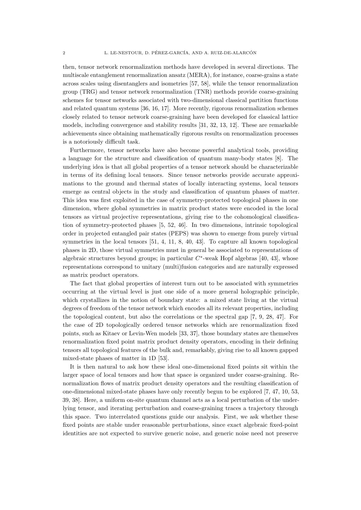
<figcaption class="paper-figure-caption"><b>Fig 1.</b> Low-resolution page preview, page 2</figcaption>
</figure>
<figure class="paper-figure-card">
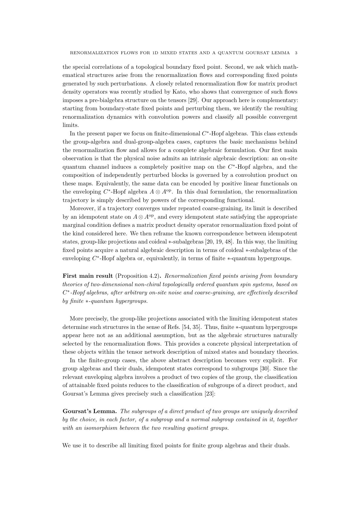
<figcaption class="paper-figure-caption"><b>Fig 2.</b> Low-resolution page preview, page 3</figcaption>
</figure>
<figure class="paper-figure-card">
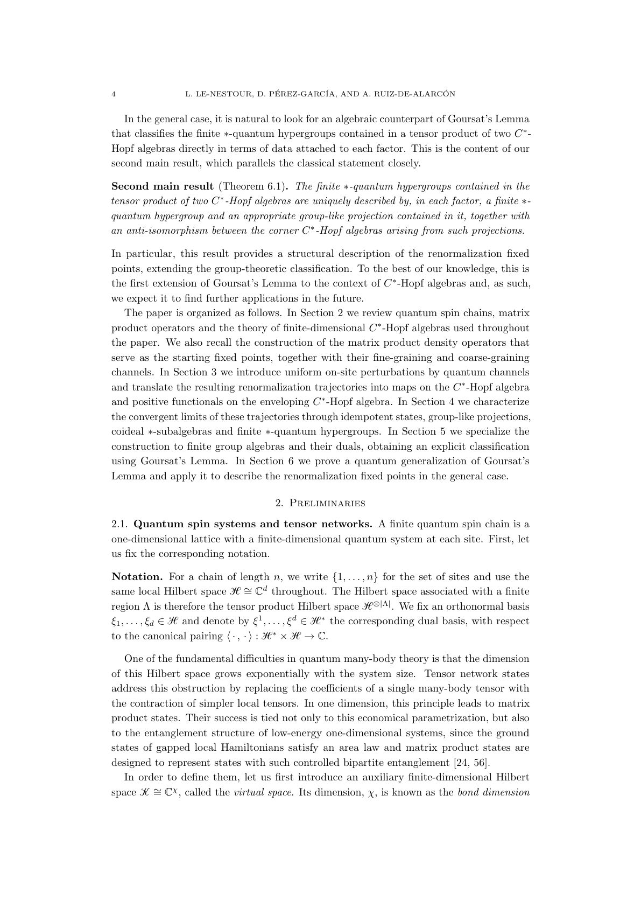
<figcaption class="paper-figure-caption"><b>Fig 3.</b> Low-resolution page preview, page 4</figcaption>
</figure>
<figure class="paper-figure-card">
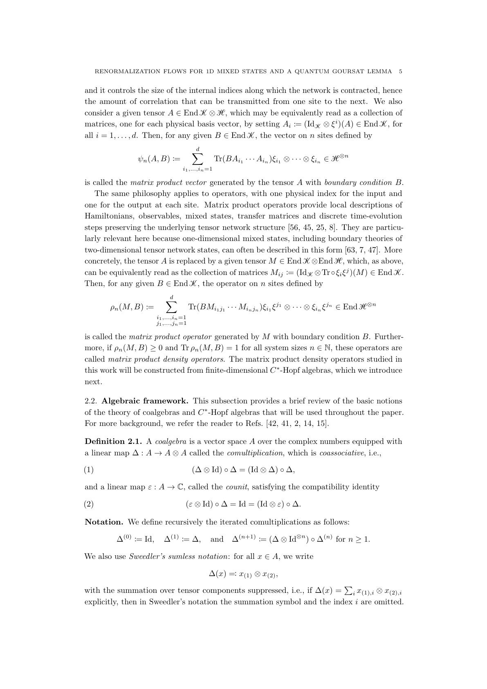
<figcaption class="paper-figure-caption"><b>Fig 4.</b> Low-resolution page preview, page 5</figcaption>
</figure>
<figure class="paper-figure-card">

<figcaption class="paper-figure-caption"><b>Fig 5.</b> Low-resolution page preview, page 6</figcaption>
</figure>

**Summary.** This theoretical paper develops an algebraic framework to analyze how physical systems evolve under renormalization group coarse-graining. It shows that the resulting fixed points are mathematically described by finite $*$-quantum hypergroups, generalizing classical classification theorems like Goursat's Lemma to the context of $C^*$-Hopf algebras relevant to quantum matter.

**Why it may be interesting.** This work provides a deep mathematical framework connecting topological order, renormalization group flow, and abstract algebra (Hopf algebras), which is crucial for understanding the structure of ground states in strongly correlated quantum materials.

Detailed structure

**Main problem.** The paper aims to provide an algebraic description for renormalization flows applied to 1D mixed states, culminating in a quantum generalization of Goursat's lemma.

**Main result.** Renormalization fixed points are characterized by finite $*$-quantum hypergroups, and the structure of these hypergroups within tensor products is classified analogously to classical group theory via a quantum Goursat's Lemma.

**Method.** The authors employ advanced algebraic techniques involving $C^*$-Hopf algebras, completely positive maps, and coarse-graining procedures derived from renormalization group theory.

**Model / system.** The study focuses on boundary states of non-chiral two-dimensional topologically ordered models, modeled using matrix product density operators (MPDOs) describing 1D mixed quantum spin chains.

**Key observables.** Renormalization fixed points, finite $*$-quantum hypergroups, and the structure constants derived from the Hopf algebra representations.

**Important parameters / regimes.** The analysis is restricted to finite-dimensional $C^*$-Hopf algebras; convergence depends on the noise channels applied during coarse-graining.

**Assumptions / limitations.** The primary assumption is that the renormalization flow can be rigorously described by completely positive maps and that convergent trajectories lead to idempotent states defining fixed points.

**Paper structure.** The paper progresses from characterizing the RG flow dynamics using $C^*$-Hopf algebras (Section 4), specializing the classification for finite group algebras using classical Goursat's Lemma (Section 5), and finally generalizing this structural result to arbitrary $C^*$-Hopf algebras (Theorem 6.1).

Abstract

Renormalization provides a framework for relating microscopic models of physical systems to effective descriptions at larger length scales. This procedure is studied for the boundary states of non-chiral two-dimensional topologically ordered models. The initial data consist of renormalization fixed points built from representations of finite-dimensional $C^*$-Hopf algebras, which are then perturbed by uniform on-site noise quantum channels and repeatedly coarse-grained. The resulting flows admit an intrinsic algebraic description in terms of completely positive maps on the $C^*$-Hopf algebra or, equivalently, positive linear functionals on its enveloping $C^*$-Hopf algebra. Their iteration is governed by convolution powers, and convergent trajectories yield new matrix product density operator fixed points, described by finite $*$-quantum hypergroups. This provides a concrete physical interpretation of such structures. For finite group algebras and their duals, we provide explicit classifications via Goursat's lemma for groups. Finally, we formulate and prove a quantum generalization of Goursat's lemma for finite-dimensional $C^*$-Hopf algebras, a result of independent interest, which gives an explicit structural description of all convergent renormalization trajectories.

[↑ back to top](#top)

### [Optimizing LZSM protocol for high-fidelity gates in open-system fluxonium](http://arxiv.org/abs/2607.07999v1)

**Authors:** Santiago Ferreyra, Valentın Reparaz, Maria Jose Sanchez, Leandro Tosi, Daniel Dominguez  
**Type:** theory · **Category:** quantum information and computing · **PDF:** <https://arxiv.org/pdf/2607.07999v1>  
**Analysis basis:** full PDF text, analyzed in chunks
**Topic relevance:** `methods for driven-dissipative` **3/5** · `QC/QI experiment` **2/5** · `non-equilibrium dynamics` **2/5** · `Keldysh / 2PI / non-Gaussian methods` **1/5** · `correlated / nonlocal dissipation` **1/5** · `driven-dissipative phase transition` **1/5**

↔ Scroll figures horizontally

<figure class="paper-figure-card">
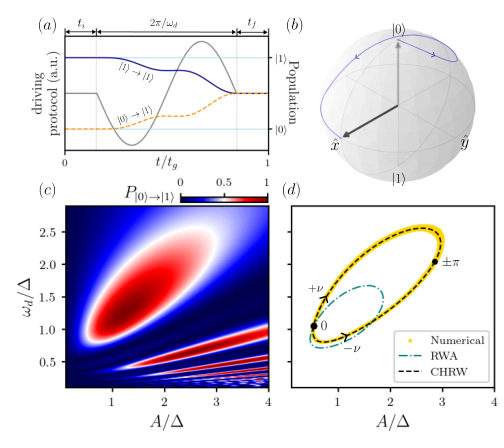
<figcaption class="paper-figure-caption"><b>Fig 1.</b> FIG. 1. LZSM dynamics in an ideal two-level system. (a) Driving protocol (left axis, grey line), consisting of two idle times ti, tf, and one single-period sinusoidal pulse. The driving parameters correspond to (A/∆, ωd/∆) = (1.02, 1.78). Blue and orange lines show the evolution of the population over time (right axis). (b) Evolution on the Bloch sphere of the initial state |0⟩(grey arrow), onto the final state (|0⟩+ |1⟩)/ √</figcaption>
</figure>
<figure class="paper-figure-card">
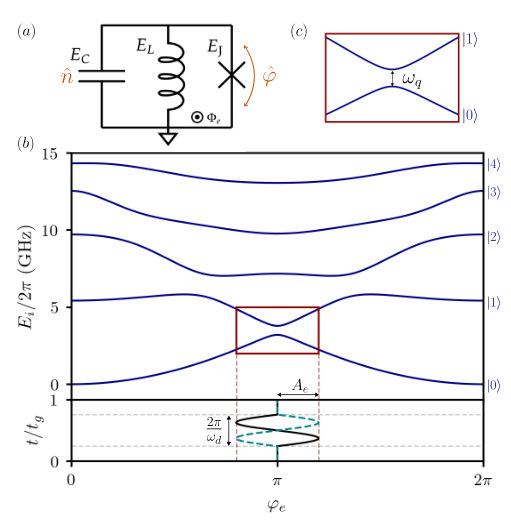
<figcaption class="paper-figure-caption"><b>Fig 2.</b> FIG. 2. (a) Superconducting fluxonium circuit, consisting of a capacitor, an inductor and a Josephson junction in par- allel. An external magnetic flux is threaded into the loop. (b) Upper panel: Low-energy spectrum of H0 as a func- tion of the control variable φe = 2πΦe/Φ0, in the case of {EJ, EC, EL} = {4, 1, 1} × 2π GHz. Lower panel: Driving protocol φe(t) including idle times, for the two possible sign choices for the amplitude Ae (solid and dashed lines, respec- tively). (c) Avoided crossing between states |0⟩and |1⟩near the sweet-spot φe = π, suitable for LZSM control.</figcaption>
</figure>
<figure class="paper-figure-card">
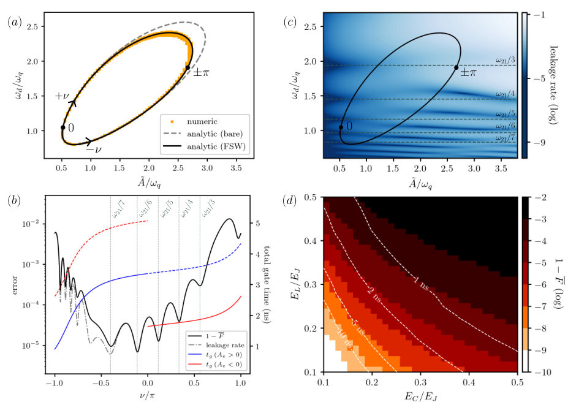
<figcaption class="paper-figure-caption"><b>Fig 3.</b> FIG. 3. Coherent error sources in the multi-level fluxonium circuit. (a) Region where P01 = 1/2 (orange) as a function of the driving parameters, compared with the analytical curves calculated from bare truncation (dashed line) and FSW effective two-level system (solid line). The architecture in (a, b, c) corresponds to {EJ, EC, EL} = {4, 1, 1} × 2π GHz. (b) Y (π/2) gate error calculated on the FSW analytical curve (dark line, left axis). The right axis shows the total gate time tg for both positive Ae (blue) and negative Ae (red). The solid segments correspond to the choice of minimal time for each value of ν. (c) Leakage rate L(tg) in log scale, as a function of the driving parameters....</figcaption>
</figure>
<figure class="paper-figure-card">
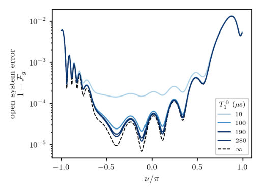
<figcaption class="paper-figure-caption"><b>Fig 4.</b> FIG. 4. Y (π/2) open-system gate error along the analyt- ical FSW curve, for the fluxonium circuit with parameters {EJ, EC, EL} = {4, 1, 1} × 2π GHz. The noise is modeled as dielectric loss in the capacitor, with an effective bath temper- ature Tb = 15 mK, and the different solid lines correspond to different values of T 0 1 (or system-bath coupling). The dashed line shows the closed-system calculation from Sec. IV.</figcaption>
</figure>
<figure class="paper-figure-card">
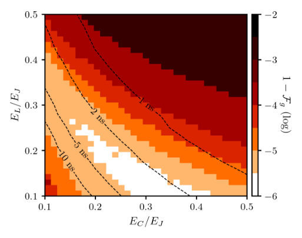
<figcaption class="paper-figure-caption"><b>Fig 5.</b> FIG. 5. Y (π/2) open-system gate error over architecture space within the fluxonium regime, taking the minimum value from ν ≥0. The noise is modeled as dielectric loss in the ca- pacitor, with bath temperature Tb = 15 mK and T 0 1 = 500 µs. The dashed contour lines show the total gate time for each architecture, with fixed EJ/2π = 4 GHz.</figcaption>
</figure>

**Summary.** The paper develops and optimizes fast quantum gates for fluxonium qubits using the Landau-Zener-Stückelberg-Majorana (LZSM) protocol. It rigorously models open system dynamics by incorporating multi-level effects and dissipation via a Floquet-Born-Markov master equation. The key finding is that minimizing gate error requires careful tuning of driving parameters to suppress leakage, leading to high-fidelity gates in the strong driving regime.

**Why it may be interesting.** This work is highly relevant as it tackles the practical limitations of superconducting qubits by providing rigorous theoretical tools (FBM master equation) to analyze gate errors beyond simple RWA, which is crucial for scaling quantum processors.

Detailed structure

**Main problem.** The primary goal is optimizing fast, high-fidelity quantum gates for low-frequency qubits while overcoming limitations imposed by standard resonant driving and accounting for multi-level structure and dissipation.

**Main result.** LZSM protocols provide a superior method for achieving fast gate operations in fluxonium circuits. The fidelity optimization shows that leakage errors dominate the error budget, suggesting mitigation through specific driving frequency choices.

**Method.** The authors employ advanced theoretical techniques including Landau-Zener-Stückelberg-Majorana (LZSM) driving protocols, Floquet theory, and deriving time-dependent master equations to model open-system dynamics.

**Model / system.** The physical system is a superconducting fluxonium circuit. The analysis moves from the full Hamiltonian to effective two-level systems using techniques like bare truncation and the Floquet-Schrieffer-Wolf (FSW) Hamiltonian, culminating in a Floquet-Born-Markov master equation for open dynamics.

**Key observables.** Gate fidelity ($ar{F}$), transition probability ($P_{01}$), leakage rate ($L$), and total gate time ($t_g$).

**Important parameters / regimes.** Driving parameters include drive frequency ($\omega_d$) and amplitude ($A$); system parameters involve superconducting energies ($E_J, E_C, L_L$). The strong driving regime is of particular interest.

**Assumptions / limitations.** Approximations include the Floquet-Born-Markov (FBM) master equation framework and using a 'moderated rotating-wave approximation' to simplify the time-dependent Liouvillian super-operator.

**Figures summary.** Figures illustrate LZSM dynamics in ideal TLS, parameter space mapping for gate operations ($P_{01}=1/2$), and comparisons between calculated gate error (including leakage) versus optimized results across various driving parameters ($
u$).

**Paper structure.** The paper builds from analyzing the basic LZSM protocol in an idealized two-level system to incorporating multi-level structure via FSW Hamiltonians, and finally developing a robust formalism using the Floquet-Born-Markov master equation to quantify open-system performance.

Abstract

Quantum gates based on resonant Rabi oscillations are inherently slow for small-frequency qubits. They are also prone to errors due to counter-rotating terms. However, when the anharmonicity is sufficiently high, as in the fluxonium architecture, alternative manipulation protocols can outperform standard resonant driving. In this work, we implement fast, high-fidelity quantum gates based on a one-period Landau-Zener-Stückelberg-Majorana (LZSM) driving protocol. We derive analytical expressions that simplify the exploration of the parameter space while accounting for the multi-level structure of the circuit. Furthermore, we analyze the role of leakage, discussing strategies to mitigate it and identifying regimes in which it becomes the dominant source of error. Finally, to evaluate the impact of dissipation on gate fidelity, we develop a robust formalism suitable for analyzing the open-system performance of quantum gates in the strong driving regime.

[↑ back to top](#top)

### [Associating Trajectories with Quantum Processes by Equivalent Spectra](http://arxiv.org/abs/2607.07970v1)

**Authors:** Elliott Tammaro, Sriram Gundla, Arunabh Pratik, Shyla Rathore  
**Type:** theory · **Category:** other · **PDF:** <https://arxiv.org/pdf/2607.07970v1>  
**Analysis basis:** full PDF text, analyzed in chunks
**Topic relevance:** `quantum measurements` **3/5** · `Keldysh / 2PI / non-Gaussian methods` **2/5** · `methods for driven-dissipative` **2/5** · `interference shaping light` **1/5** · `measurement-induced transitions` **1/5**

↔ Scroll figures horizontally

<figure class="paper-figure-card">
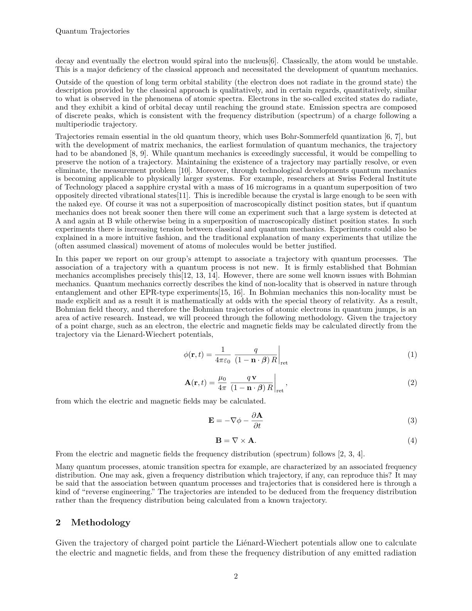
<figcaption class="paper-figure-caption"><b>Fig 1.</b> Low-resolution page preview, page 2</figcaption>
</figure>
<figure class="paper-figure-card">
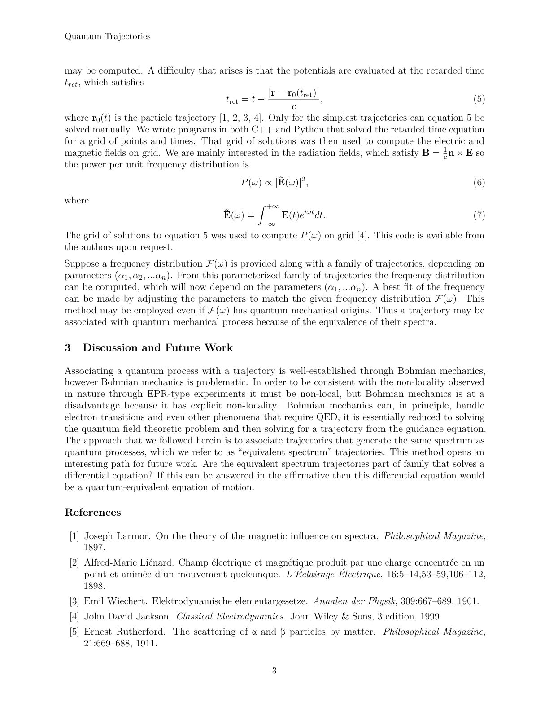
<figcaption class="paper-figure-caption"><b>Fig 2.</b> Low-resolution page preview, page 3</figcaption>
</figure>
<figure class="paper-figure-card">
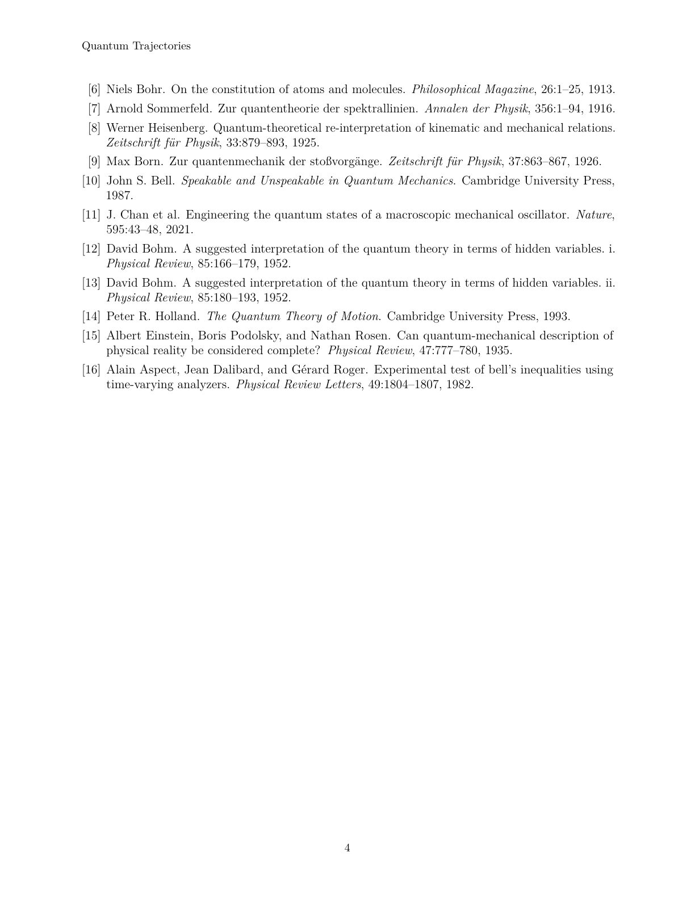
<figcaption class="paper-figure-caption"><b>Fig 3.</b> Low-resolution page preview, page 4</figcaption>
</figure>

**Summary.** This paper proposes a method to connect classical particle trajectories to quantum processes by matching their emitted radiation power spectra. Instead of using guidance equations like Bohmian mechanics, the authors calculate the spectrum from classical point charges and fit parameters until they reproduce known quantum spectral signatures. This offers a potentially less problematic theoretical avenue for understanding trajectory concepts in quantum physics.

**Why it may be interesting.** This approach offers an alternative theoretical framework to interpret quantum dynamics by grounding it in classical electrodynamics spectra, which could provide novel insights into semiclassical approximations or hidden variables theories without invoking explicit non-locality.

Detailed structure

**Main problem.** The paper addresses the conceptual challenge of associating classical particle trajectories with quantum mechanical processes, an issue that Bohmian mechanics tackles but introduces non-locality conflicts.

**Main result.** The authors propose a method to find 'equivalent spectrum' classical trajectories whose radiated power spectra match those derived from known quantum transitions, bypassing issues associated with standard guidance equations.

**Method.** They use the Liénard-Wiechert potentials to calculate the radiation power spectrum generated by a point charge moving along an arbitrary trajectory and then fit parameters to match target quantum frequency distributions.

**Model / system.** The model involves calculating electromagnetic fields ($\mathbf{E}$ and $\mathbf{B}$) from a classical point charge trajectory, using atomic transitions as the target quantum processes for spectral matching.

**Key observables.** The power spectrum of emitted radiation, $P(\omega)$, which is proportional to $|	ilde{\mathbf{E}}(\omega)|^2$.

**Important parameters / regimes.** The parameters defining the family of classical trajectories being fitted.

**Assumptions / limitations.** The core assumption is that a classical trajectory can be characterized solely by matching its radiated spectrum to a quantum process's known spectrum, rather than deriving it from a guiding equation.

**Paper structure.** The paper introduces the problem of trajectory association, details the spectral calculation using Liénard-Wiechert potentials for classical trajectories, presents the 'equivalent spectrum' matching technique, and concludes by discussing future work on deriving a governing differential equation.

Abstract

Quantum mechanics abandoned the classical notion of a particle trajectory, yet trajectories remain conceptually appealing for resolving foundational issues in quantum mechanics. Bohmian mechanics offers one route to associating trajectories with quantum processes, but it requires explicit non-locality to remain consistent with EPR-type experiments, placing it in tension with special relativity. We propose an alternative approach: rather than deriving trajectories from a quantum guidance equation, we search for classical trajectories whose radiated frequency spectra match those of quantum processes such as atomic transitions. Using the Liénard-Wiechert potentials, we compute the electric and magnetic fields generated by a point charge along a given trajectory, numerically solving the retarded-time and from these fields obtain the power spectrum of emitted radiation. By fitting the parameters of a chosen family of trajectories, we identify "equivalent spectrum" trajectories that reproduce a target frequency distribution, including ones of quantum mechanical origin. We discuss the implications of this method and propose future work to determine whether equivalent spectrum trajectories belong to a family governed by a differential equation, which would constitute a quantum-equivalent equation of motion.

[↑ back to top](#top)

### [Fluctuation theorems for autonomous work](http://arxiv.org/abs/2607.07843v1)

**Authors:** Christopher Jarzynski, Sebastian Deffner, Saar Rahav  
**Type:** theory · **Category:** statistical mechanics · **PDF:** <https://arxiv.org/pdf/2607.07843v1>  
**Analysis basis:** full PDF text, analyzed in chunks
**Topic relevance:** `non-equilibrium dynamics` **3/5** · `non-equilibrium universality` **2/5** · `Keldysh / 2PI / non-Gaussian methods` **1/5** · `correlated / nonlocal dissipation` **1/5** · `driven-dissipative phase transition` **1/5** · `methods for driven-dissipative` **1/5**

↔ Scroll figures horizontally

<figure class="paper-figure-card">
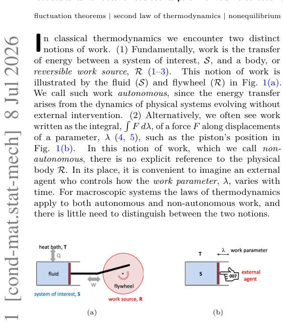
<figcaption class="paper-figure-caption"><b>Fig 1.</b> Fig. 1. (a) Autonomous work. A fluid, S, exchanges energy with a frictionless flywheel, R. The flywheel’s rotation couples to a piston that acts on the fluid. As R rotates, it performs positive or negative work on S, losing or gaining rotational kinetic energy in the process. (b) Non-autonomous work. An external agent performs work on the fluid by varying the piston’s position, λ. The work performed on S is R F dλ, where F is the force that the fluid exerts against the piston.</figcaption>
</figure>
<figure class="paper-figure-card">
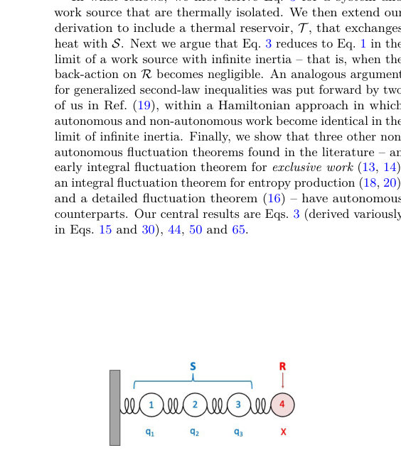
<figcaption class="paper-figure-caption"><b>Fig 2.</b> Fig. 2. Toy model illustrating our general setup. S consists of three particles of mass m, and R is a particle of mass M. The wall at the left is fixed, and springs denote harmonic couplings.</figcaption>
</figure>

**Summary.** This paper develops fluctuation theorems for work performed when a system interacts with a dedicated work source rather than an externally controlled parameter. By modeling the interaction using Hamiltonian dynamics involving a heat bath, the authors derive autonomous relations that generalize previous non-autonomous results. This provides a more fundamental understanding of energy dissipation and irreversibility in closed quantum or classical systems.

**Why it may be interesting.** This work provides rigorous theoretical tools to analyze non-equilibrium processes (like work extraction) in closed or semi-closed systems by explicitly treating the energy exchange mechanism between components, which is crucial for understanding thermodynamics beyond simple external driving protocols.

Detailed structure

**Main problem.** The primary goal is to derive fluctuation theorems for work performed in an autonomous setting, contrasting with existing results derived from non-autonomous frameworks.

**Main result.** Autonomous versions of standard fluctuation theorems for work and entropy production are obtained, showing that the theorem reduces to the non-autonomous case when the work source's inertia becomes infinite.

**Method.** The derivation uses Hamiltonian dynamics (or stochastic extensions) on a composite system ($RST$) and relies on analyzing probability distributions along deterministic trajectories to establish fluctuation relations.

**Model / system.** The model consists of a System of Interest ($S$), coupled to a reversible Work Source ($R$), which itself interacts with an explicit Heat Bath ($T$). The dynamics are governed by the total Hamiltonian $H_{RST}$.

**Key observables.** Autonomous Work ($W$), Free Energy Change ($\Delta F$), Stochastic Entropy Production ($\Delta \phi$), and Total Entropy Production ($\Sigma$).

**Important parameters / regimes.** Temperature ($eta^{-1}$), System/Source masses ($M$), and the limit of infinite inertia for $R$.

**Assumptions / limitations.** The analysis distinguishes between inclusive and exclusive conventions for energy counting, and in some derivations, assumes specific initial equilibrium distributions.

**Figures summary.** Figure 1 illustrates the conceptual difference between autonomous work (energy exchange between fluid S and flywheel R) and non-autonomous work (external parameter variation). Figure 2 shows a toy model setup coupling S to R.

**Paper structure.** The paper builds from establishing the Hamiltonian framework for $RST$, deriving conditional equilibrium states, defining various forms of work and entropy production based on conventions, and finally deriving the autonomous fluctuation theorems using these definitions.

Abstract

Classical fluctuation theorems for work have been obtained theoretically, and verified experimentally, within a non-autonomous framework in which work is performed on a system of interest, ${\cal S}$, by the external manipulation of a work parameter, such as a piston's position. Here we obtain fluctuation theorems within an autonomous framework in which ${\cal S}$ exchanges energy with a reversible work source, ${\cal R}$. The two subsystems, ${\cal R}$ and ${\cal S}$, interact with one another as they evolve under Hamiltonian or stochastic dynamics, without external intervention. In this setting, we must account for the back-action of ${\cal S}$ on ${\cal R}$, which is absent in the non-autonomous setting. We obtain autonomous versions of standard fluctuation theorems for work and entropy production. In each case, we argue, the autonomous fluctuation theorem reduces to its non-autonomous counterpart when ${\cal R}$'s inertia becomes infinitely large.

[↑ back to top](#top)

### [Hockey stick $f$-divergences](http://arxiv.org/abs/2607.08760v1)

**Authors:** Fumio Hiai, Milán Mosonyi, Marco Tomamichel  
**Type:** theory · **Category:** other · **PDF:** <https://arxiv.org/pdf/2607.08760v1>  
**Analysis basis:** full PDF text, analyzed in chunks
**Topic relevance:** `entanglement & information structure` **3/5** · `Keldysh / 2PI / non-Gaussian methods` **1/5** · `correlated / nonlocal dissipation` **1/5** · `driven-dissipative phase transition` **1/5** · `methods for driven-dissipative` **1/5** · `non-equilibrium dynamics` **1/5** · `non-equilibrium universality` **1/5**

↔ Scroll figures horizontally

<figure class="paper-figure-card">
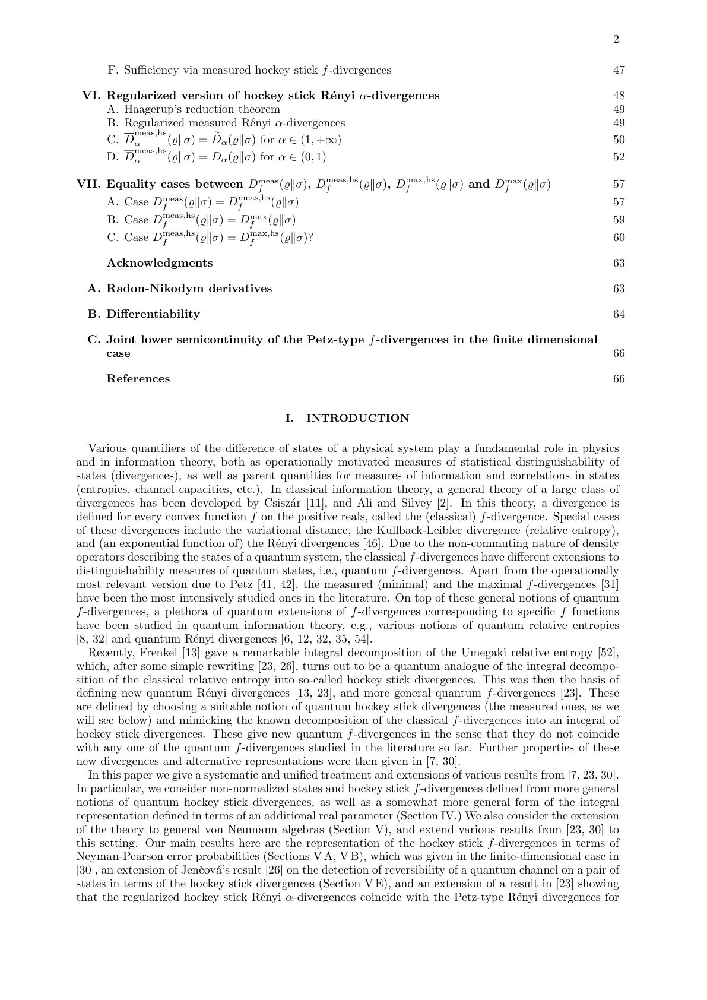
<figcaption class="paper-figure-caption"><b>Fig 1.</b> Low-resolution page preview, page 2</figcaption>
</figure>
<figure class="paper-figure-card">
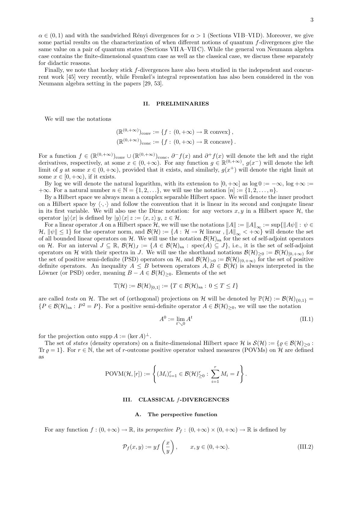
<figcaption class="paper-figure-caption"><b>Fig 2.</b> Low-resolution page preview, page 3</figcaption>
</figure>
<figure class="paper-figure-card">
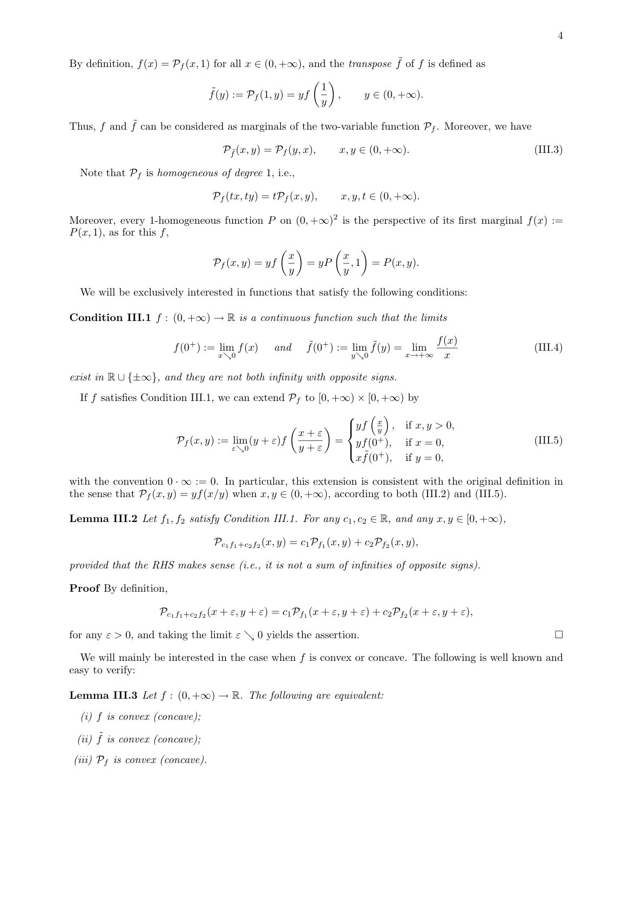
<figcaption class="paper-figure-caption"><b>Fig 3.</b> Low-resolution page preview, page 4</figcaption>
</figure>
<figure class="paper-figure-card">
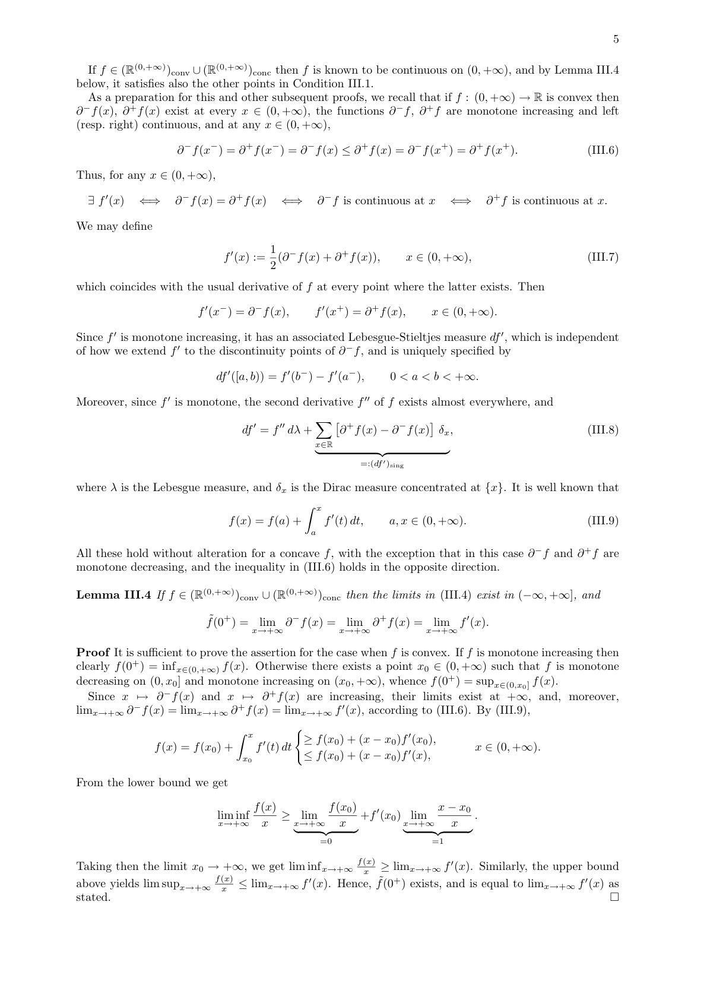
<figcaption class="paper-figure-caption"><b>Fig 4.</b> Low-resolution page preview, page 5</figcaption>
</figure>
<figure class="paper-figure-card">
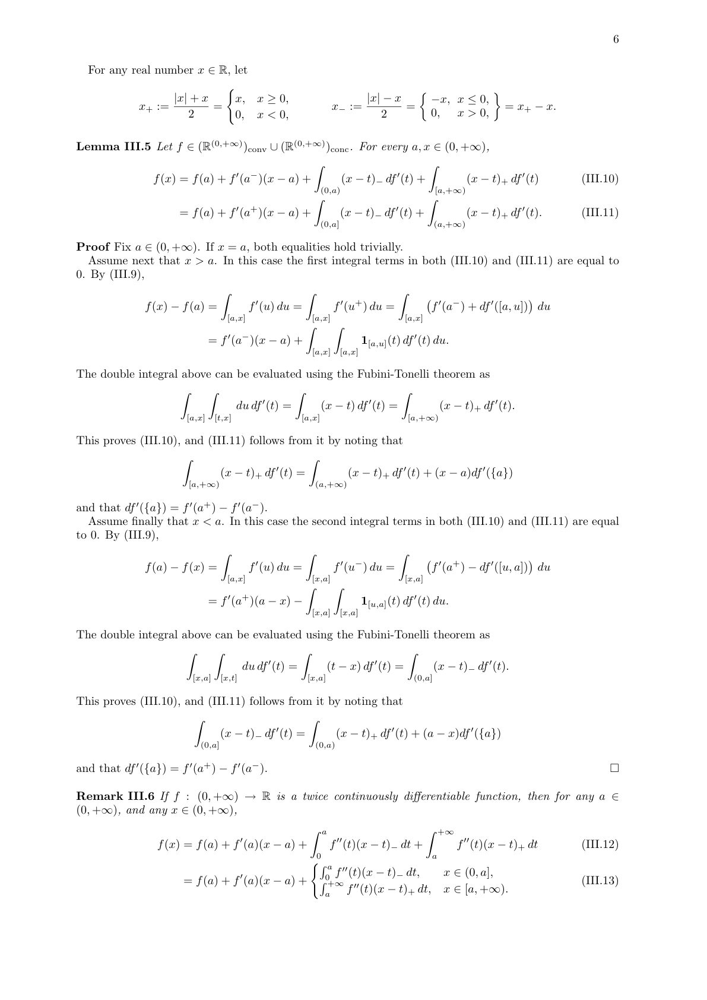
<figcaption class="paper-figure-caption"><b>Fig 5.</b> Low-resolution page preview, page 6</figcaption>
</figure>

**Summary.** This paper develops a comprehensive theory for novel quantum $f$-divergences based on 'quantum hockey stick divergences.' It unifies various results by connecting these measures to classical hypothesis testing error probabilities and establishing relationships between different forms of Rényi divergences. The work extends these powerful mathematical tools from finite dimensions to the abstract setting of general von Neumann algebras.

**Why it may be interesting.** While highly mathematical, the generalization of divergence measures (like relative entropy) is fundamental for quantifying distinguishability between quantum states, which is crucial in understanding open quantum systems dynamics and process characterization.

Detailed structure

**Main problem.** The paper aims to provide a systematic and unified treatment of quantum $f$-divergences, particularly those derived from 'quantum hockey stick divergences.'

**Main result.** Key results include representing these divergences using Neyman-Pearson error probabilities, extending detection criteria for quantum channel reversibility, and establishing connections between regularized Rényi $\alpha$-divergences and Petz/sandwiched Rényi divergences.

**Method.** The work employs advanced mathematical tools from measure theory, functional analysis (convexity/concavity properties), and operator algebras to generalize classical $f$-divergence concepts to quantum states.

**Model / system.** The theory applies to quantum states described by density operators ($\varrho, \sigma$) on a Hilbert space, with extensions formulated for general von Neumann algebras.

**Key observables.** Quantum $f$-divergences (measured and maximal), hockey stick $f$-divergences, and their representations in terms of Neyman-Pearson error probabilities.

**Important parameters / regimes.** The analysis involves a real parameter $\alpha$ for Rényi divergences, and the theory is developed across finite dimensions up to general von Neumann algebras.

**Assumptions / limitations.** The mathematical derivations rely on properties like positive homogeneity, existence of derivatives (left/right), and assumptions about the underlying measure spaces ($\nu \ll \mu$).

**Paper structure.** The paper progresses logically from reviewing classical $f$-divergences to tackling finite-dimensional quantum divergences using hockey stick methods, extending this theory to general von Neumann algebras, and finally analyzing regularized Rényi $\alpha$-divergences.

Abstract

In this paper we give a systematic and unified treatment and extensions of various results on a new notion of quantum $f$-divergences defined from quantum hockey stick divergences, the theory of which has been developed recently in \cite{BHT_fdiv,HircheTomamichel_integral,LiuHircheCheng2025}. In particular, we consider non-normalized states and hockey stick $f$-divergences defined from more general notions of quantum hockey stick divergences, as well as a somewhat more general form of the integral representation defined in terms of an additional real parameter. We also consider the extension of the theory to general von Neumann algebras, and extend various results from \cite{HircheTomamichel_integral,LiuHircheCheng2025} to this setting. Our main results here are the representation of the hockey stick $f$-divergences in terms of Neyman-Pearson error probabilities, which was given in the finite-dimensional case in \cite{LiuHircheCheng2025}, an extension of Jen\v cová's result \cite{Jencova2023} on the detection of reversibility of a quantum channel on a pair of states in terms of the hockey stick divergences, and an extension of a result in \cite{HircheTomamichel_integral} showing that the regularized hockey stick Rényi $α$-divergences coincide with the Petz-type Rényi divergences for $α\in(0,1)$ and with the sandwiched Rényi divergences for $α>1$. Moreover, we give some partial results on the characterization of when different notions of quantum $f$-divergences give the same value on a pair of quantum states.

[↑ back to top](#top)

### [Absence of quantum advantage for approximate spin glass optimization](http://arxiv.org/abs/2607.08708v1)

**Authors:** Dries Sels, Flaviano Morone  
**Type:** theory · **Category:** disordered systems and neural networks · **PDF:** <https://arxiv.org/pdf/2607.08708v1>  
**Analysis basis:** full PDF text, analyzed in chunks
**Topic relevance:** `Keldysh / 2PI / non-Gaussian methods` **3/5** · `exotic spin models in light-matter` **3/5** · `analog quantum simulation` **1/5** · `methods for driven-dissipative` **1/5**

↔ Scroll figures horizontally

<figure class="paper-figure-card">
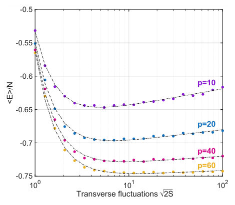
<figcaption class="paper-figure-caption"><b>Fig 1.</b> FIG. 1. Final energy reached by the semiclassical QAOA as a function of the effective spin, which controls the level of initial noise according to Eq. (3). Different depths p are shown, ranging from p = 10 (purple) to p = 60 (yellow). The QAOA parameters {γ}, {β} are taken directly from Ref. [9]. Dash-dotted lines show a simple heuristic fit, which capture both the small and large noise limits, i.e. the fitting function is a/S + b log(S) + d where a, b, d are free parameters, with a tending to a constant at large-p and b ∼1/p.</figcaption>
</figure>
<figure class="paper-figure-card">
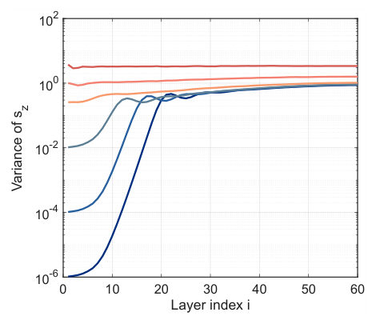
<figcaption class="paper-figure-caption"><b>Fig 2.</b> FIG. 2. Variance of the semiclassical z-magnetization during a p = 60 QAOA sequence. Different curves show different spin-S, which can be identified from the initial variance. For small S (red curves) we observe almost constant variance, while a pronounced regime of exponential growth appears at large S (blue curves).</figcaption>
</figure>
<figure class="paper-figure-card">
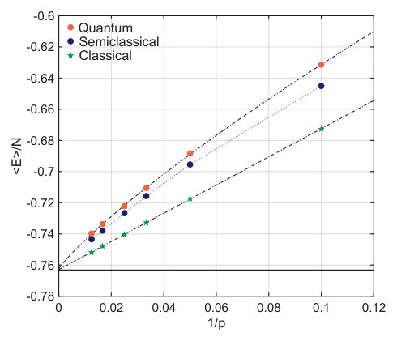
<figcaption class="paper-figure-caption"><b>Fig 3.</b> FIG. 3. Average energy of the SK model as a function of inverse circuit depth p. The quantum results (red dots) are taken from Ref. [9] , we use the same angles for the semiclassi- cal approximation (blue dots) and set the effective spin (noise) to S = 18. This value is close to the optimum S∗(p) over the displayed p-range. Moreover, since the minimum in Fig. 1 is broad, holding S = 18 fixed barely increases the energy above its optimum across p = 10, ..., 80. The green stars show the fully classical (noiseless) performance after re-optimizing the parameters as discussed in Ref. [18]. The (semi)classical re- sults were run on N = 16384 and averaged over 10 samples. The dash-dotted lines...</figcaption>
</figure>

**Summary.** This paper analyzes the performance of QAOA on the SK spin glass model using a semiclassical approximation. The research finds that while the algorithm converges towards the known Parisi value, it does not demonstrate a clear quantum advantage over classical scaling predictions. The study highlights the critical role of initial noise and parameter optimization in determining convergence rates.

**Why it may be interesting.** The work provides detailed insights into the limitations of quantum algorithms like QAOA when applied to complex disordered systems, offering benchmarks for understanding where quantum computation might fail or converge classically.

Detailed structure

**Main problem.** The study investigates whether the Quantum Approximate Optimization Algorithm (QAOA) provides a quantum advantage over classical methods for optimizing spin glass models.

**Main result.** The analysis suggests that QAOA does not exhibit a true quantum advantage on SK spin glasses, with convergence rates matching theoretical expectations derived from semiclassical approximations.

**Method.** The authors employ the Truncated Wigner Approximation (TWA) to perform a semiclassical analysis of QAOA applied to the Sherrington-Kirkpatrick model.

**Model / system.** The system analyzed is the Sherrington-Kirkpatrick (SK) spin glass model, characterized by all-to-all Gaussian random couplings. The optimization process uses the QAOA protocol depth $p$.

**Key observables.** Final expected energy $\langle E 
angle$, residual error $\delta = \langle H_c 
angle/N - E_P$, and spin fluctuations ($\sigma_z$-magnetization).

**Important parameters / regimes.** Circuit depth ($p$), effective spin parameter ($S$), and the Parisi value ($E_P$).

**Assumptions / limitations.** The primary approximation is the Truncated Wigner Approximation (TWA), which treats quantum dynamics semiclassically.

**Figures summary.** Figures illustrate the non-monotonic dependence of final energy on $S$ for fixed depths, and plot the residual error $\delta(S, p)$ comparing exact quantum results to semiclassical fits across varying circuit depths $p$.

**Paper structure.** The paper analyzes QAOA performance by first examining the scaling behavior of the residual error $\delta$ with respect to the effective spin parameter $S$, establishing optimal intermediate regimes. It then compares these findings against established theoretical limits, concluding that convergence follows a $\log(p)/p$ pattern.

Abstract

We perform a semiclassical, large-spin S, analysis of the quantum approximate optimization algorithm (QAOA) on the Sherrington-Kirkpatrick (SK) model, using the truncated Wigner approximation. Fixing the QAOA angles to their previously determined optimal S=1/2 values, we observe a non-monotonic dependence of the final energy on the spin. At small S the semiclassics is dominated by noise, while the large-S limit is constrained by the exponential growth of the initial fluctuations. For a depth-p QAOA one achieves the optimal balance at S of order p, resulting in a convergence of the final energy to the Parisi value like log(p)/p. We find that the semiclassics slightly outperforms the true spin-1/2 QAOA, and thus suggest they both converge to the Parisi value in the same way. Finally, removing all the initial noise, and re-optimizing the parameters to account for that change, results in superior performance with 1/p convergence.

[↑ back to top](#top)

### [Electron-Phonon Functional Renormalization Group of Fermi Liquid Instabilities](http://arxiv.org/abs/2607.07804v1)

**Authors:** C. Alexander Baum, Matteo Dürrnagel, Ronny Thomale, Lennart Klebl  
**Type:** theory · **Category:** strongly correlated electrons · **PDF:** <https://arxiv.org/pdf/2607.07804v1>  
**Analysis basis:** full PDF text, analyzed in chunks
**Topic relevance:** `Keldysh / 2PI / non-Gaussian methods` **3/5** · `analog quantum simulation` **2/5** · `correlated / nonlocal dissipation` **1/5** · `driven-dissipative phase transition` **1/5** · `methods for driven-dissipative` **1/5**

↔ Scroll figures horizontally

<figure class="paper-figure-card">
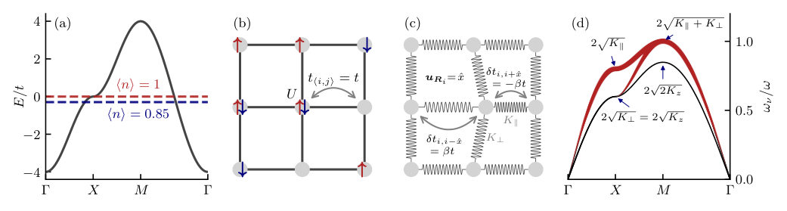
<figcaption class="paper-figure-caption"><b>Fig 1.</b> FIG. 1. The Hubbard model on the square lattice (b) with its band structure (a). We indicate the Fermi level at half filling ⟨n⟩= 1 as dashed red line, and the slightly doped case ⟨n⟩= 0.85 as dashed blue line. Panel (c) presents a schematic for the phonon spring model and the electron phonon coupling induced by a local perturbation at site Ri. The Phonon band structure is depicted in (d), showing how the spring constants K∥, K⊥, Kz influence the phonon dispersion. The modes with longitudinal component have non-zero electron-phonon coupling [red, line thickness corresponding to its strength s(ν) q = P</figcaption>
</figure>
<figure class="paper-figure-card">
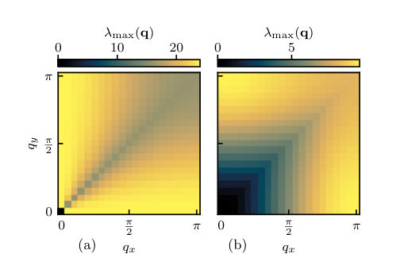
<figcaption class="paper-figure-caption"><b>Fig 2.</b> FIG. 2. Maximum eigenvalue of the phonon-mediated re- tarded interaction vertex Eq. (20) as a function of q in the top right corner of the Brillouin zone. For ωn = 0 (a), there is a discontinuity at q = 0 as the M →Γ and X →Γ lim- its differ. This discontinuity does not occur for any nonzero transfer frequency, such as ωn = 1 (b). The other parameters are given as λ = 1, ω = 1 and K⊥= K∥/2 (cf. Section IV for definitions).</figcaption>
</figure>
<figure class="paper-figure-card">
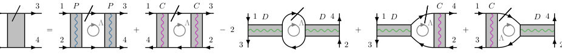
<figcaption class="paper-figure-caption"><b>Fig 3.</b> FIG. 3. The flow of the static vertex V S,Λ in channel decomposition. The wiggly lines indicate the phonon propagator contained in the retarded vertex which contributes to the static part of the renormalized vertex with different frequencies for each channel [cf. Eqs. (29) to (31)].</figcaption>
</figure>
<figure class="paper-figure-card">
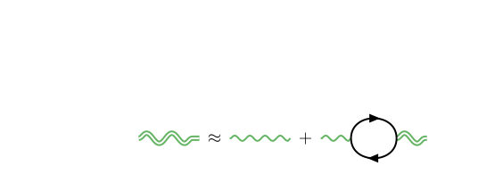
<figcaption class="paper-figure-caption"><b>Fig 4.</b> FIG. 4. The lowest order correction to the phonon propagator amounts to an RPA-like series through the Phonon Dyson Eq. (37).</figcaption>
</figure>
<figure class="paper-figure-card">
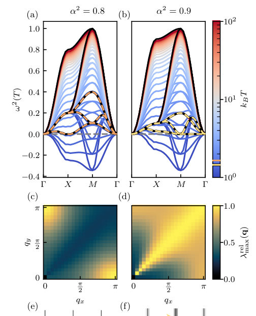
<figcaption class="paper-figure-caption"><b>Fig 5.</b> FIG. 5. (a,b): Renormalization of the phonon bands accord- ing to Eq. (39) for λ = 0.4, ω = 1 and α2 ∈{0.8, 0.9} (left to right) as the temperature is decreased. Renormalized phonon bands at the critical temperatures kBTc/t ≈1.65 (1.45) are given in orange (yellow). For low α there is an instability at q = X and for high α we have a simultaneous instability on the line between Γ and M. (c,d): Normalized leading eigen- values for each q of the effective electron-electron interaction for the same parameters and U = 0 in the D-RPA. The critical scales in the RPA Λc/t = 3.31 (2.83) have a roughly linear re- lationship to the critical temperatures here. Panels (e,f) show the real-space structure...</figcaption>
</figure>

**Summary.** This work develops an advanced Functional Renormalization Group (FRG) technique to treat correlated electron models that explicitly include electron-phonon coupling. By unifying these interactions, the method allows for a comprehensive analysis of competing electronic instabilities—such as charge density waves or superconductivity—in systems like the Hubbard model on a square lattice. It represents a significant theoretical advance for understanding emergent order in strongly coupled quantum materials.

**Why it may be interesting.** While focused on condensed matter correlations, the use of advanced many-body techniques like FRG for coupled quantum systems provides methodological insights applicable to open quantum systems where coupling to a bosonic bath (phonons/environment) is crucial.

Detailed structure

**Main problem.** The study aims to formulate a unified theoretical framework for correlated electron systems that treats electronic interactions and electron-phonon coupling (EPC) on equal footing when analyzing Fermi liquid instabilities.

**Main result.** The functional renormalization group (FRG) approach successfully analyzes the competition between various electronic orders (charge, spin, nematicity, superconductivity) driven by both electronic correlations and EPC in a single formalism.

**Method.** The core method is the Functional Renormalization Group (FRG), which allows for the simultaneous treatment of electronic and phononic degrees of freedom by integrating out phonons to derive retarded interactions.

**Model / system.** The primary model analyzed is the Hubbard model on a square lattice coupled to acoustic phonon bands. The Hamiltonian includes terms for electron hopping, on-site repulsion (Hubbard U), and EPC derived from interatomic force constants.

**Key observables.** Electronic order parameters related to charge, spin, nematicity, and superconducting pairing; phonon softening signatures.

**Important parameters / regimes.** The Hubbard interaction strength (U), the electron-phonon coupling constant (g), and lattice geometry/dispersion relations ($\omega_{n,\mathbf{q}}$).

**Assumptions / limitations.** Initial treatment assumes the harmonic approximation for phonons, and some derivations simplify by ignoring the renormalization of the retarded interaction ($V_{R,\Lambda}$).

**Figures summary.** Figures illustrate band structures (Hubbard model), schematic representations of EPC from lattice perturbations, and flow diagrams showing how the static vertex renormalizes across different coupling channels.

**Paper structure.** The paper develops the FRG ansatz for coupled electron-phonon systems, derives the necessary retarded interactions by integrating out phonons, analyzes the renormalization flow of the two-particle vertex in various channels (P, C, D), and applies this to the Hubbard model example.

Abstract

We formulate a functional renormalization group (FRG) ansatz for correlated electron models that incorporates electronic interactions as well as electron-phonon coupling (EPC) stemming from dispersive phonon bands. Particularizing to the RG flow of the electron-electron interaction vertex, we treat phonon- and electron-mediated Fermi liquid instabilities on equal footing as we analyze tentative electronic order parameters related to charge, spin, nematicity, and superconducting pairing. We illustrate the approach at the example of Peierls-type transitions we find for the Hubbard model on the square lattice coupled to acoustic phonon bands. Our method allows to incorporate full electronic and phononic ab initio input, and thus lends itself to the analysis of electronic order from intertwined electronic interactions and EPC at a microscopically most substantiated level.

[↑ back to top](#top)

### [Magic Gate Teleportation: Structure, Useful Resource States, and Simpler Feedforward](http://arxiv.org/abs/2607.08508v1)

**Authors:** Yunzhe Zheng, Allen Zang, Aleksander Kubica  
**Type:** theory · **Category:** quantum information and computing · **PDF:** <https://arxiv.org/pdf/2607.08508v1>  
**Analysis basis:** full PDF text, analyzed in chunks
**Topic relevance:** `quantum measurements` **3/5** · `entanglement & information structure` **2/5** · `measurement-induced transitions` **2/5** · `Keldysh / 2PI / non-Gaussian methods` **1/5**

↔ Scroll figures horizontally

<figure class="paper-figure-card">
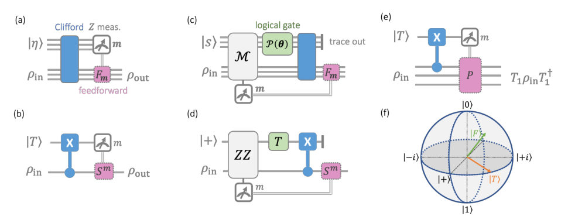
<figcaption class="paper-figure-caption"><b>Fig 1.</b> FIG. 1. (a) Magic gate teleportation (MGT) is a type of quantum gate teleportation that uses a non-stabilizer resource state |η⟩to implement a non-Clifford gate on an arbitrary input state ρin without revealing any information about it. MGT comprises a Clifford circuit, followed by Pauli Z measurements of all the qubits in the resource register; applying feedforward operators Fm for the measurement outcome m results in a deterministic MGT protocol. (b) The canonical MGT protocol that uses |T⟩= T |+⟩and implements the T gate. (c) Any MGT protocol using |η⟩= P(θ) |s⟩, where P(θ) commutes with the backpropagated measurements M, can be viewed as first encoding ρin into a stabilizer code...</figcaption>
</figure>
<figure class="paper-figure-card">
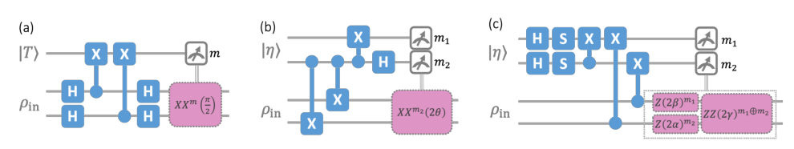
<figcaption class="paper-figure-caption"><b>Fig 2.</b> FIG. 2. Circuit implementation of deterministic MGT protocols obtained using Algorithm 1. Panels (a), (b) and (c) correspond to Exam- ples 2, 3 and 4, respectively.</figcaption>
</figure>
<figure class="paper-figure-card">
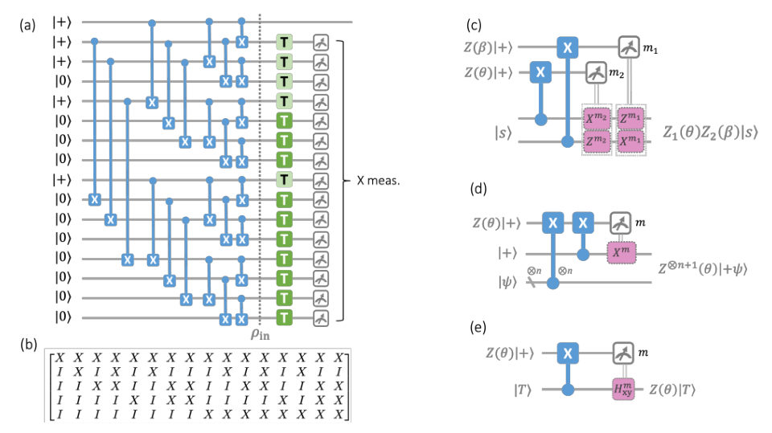
<figcaption class="paper-figure-caption"><b>Fig 3.</b> FIG. 3. (a) The 15-to-1 distillation circuit (adopted from Ref. [53]), with the stabilizer state ρin immediately before the layer of T gates. Qubits are labeled 1 through 16 from the top to the bottom. Five T gates indicated with black text can be implemented using deterministic MGT with Pauli feedforward operators. In (b), we specify five X-type stabilizers of ρin. (c) A two-qubit example illustrating a “simple” feedforward operator, i.e., for a suitably stabilized input state |s⟩a feedforward operator in the sequential teleportation of X1(θ) and Z1(β) can be implemented by an appropriate Pauli operator, yielding Z1(θ)Z2(β) |s⟩. (d) Ancilla-assisted MGT for an arbitrary n-qubit input state...</figcaption>
</figure>

**Summary.** This paper develops a comprehensive theory of Magic Gate Teleportation (MGT) protocols necessary for fault-tolerant quantum computing. It characterizes the required structure of resource states and proves that these states are highly constrained. Furthermore, it offers significant insights into simplifying the complex feedforward operations needed in these protocols by identifying conditions where they can be replaced by simpler Pauli operators.

**Why it may be interesting.** This work provides deep theoretical constraints on the resources needed for fault-tolerant quantum computation, specifically detailing how non-Clifford gates can be implemented while maintaining information privacy, which is crucial for resource optimization in physical implementations.

Detailed structure

**Main problem.** Developing a theoretical framework for Magic Gate Teleportation (MGT) protocols to implement non-Clifford quantum gates on arbitrary input states without revealing any information about those states.

**Main result.** The paper establishes that useful resource states for MGT must be Clifford-equivalent to diagonal states, and it provides structural insights into how these protocols can be efficiently synthesized or simplified using Pauli operators.

**Method.** The authors analyze the structure of MGT by backpropagating Pauli measurements, viewing the process as encoding the input state into a stabilizer code followed by a logical gate. They derive necessary conditions for information preservation and provide construction algorithms.

**Model / system.** The model involves quantum gate teleportation using resource states ($\vert\eta
angle$) to implement non-Clifford unitaries ($U_0$). The process relies on Clifford gates, Pauli Z measurements, and subsequent feedforward operations.

**Key observables.** The output state $
ho_{out}$, the structure of useful resource states (e.g., being Clifford-equivalent to diagonal states), and the feasibility of replacing non-Clifford feedforward operators with Pauli operators.

**Important parameters / regimes.** The specific form of the resource state $\vert\eta
angle$, the input state $
ho_{in}$, and the measurement outcomes $m$.

**Assumptions / limitations.** The primary assumption is that the input state $
ho_{in}$ must remain recoverable (no information revealed) throughout the teleportation process.

**Figures summary.** Figures illustrate MGT protocols, showing how non-stabilizer states can implement gates via Pauli measurements and feedforward. They also demonstrate the structural view of MGT as encoding into a stabilizer code and show examples where complex feedforward operations can be simplified to Pauli operators.

**Paper structure.** The paper develops the theory by first defining the protocol, then deriving structural theorems constraining useful resource states (e.g., Theorem 2 for single qubits). It progresses to analyzing deterministic implementation via feedforward operators ($F_m$) and concludes by identifying conditions under which these complex operations can be simplified using only Pauli operators.

Abstract

Quantum gate teleportation is a key technique in fault-tolerant quantum computation that uses resource states to implement logical gates. Here, we develop a theory of quantum gate teleportation protocols that implement non-Clifford gates on arbitrary input states without revealing any information about them; we refer to these protocols as magic gate teleportation (MGT). We uncover a hidden structure within MGT -- after backpropagating the Pauli measurements, MGT protocols can be viewed as encoding the input state into a stabilizer code heralded by the measurement outcomes, followed by a logical non-Clifford gate. Using this structure, we construct MGT protocols for any resource state obtained by applying commuting Pauli rotations to a stabilizer state, and provide an efficient algorithm for synthesizing their circuit implementations. Conversely, we prove that useful resource states for MGT, i.e., states that can be used for non-Clifford gates through MGT protocols, are necessarily Clifford-equivalent to diagonal states; in particular, the output state distilled from the $[\![5, 1, 3]\!]$ protocol is not useful for MGT. Finally, we identify conditions under which the feedforward operators can be implemented by Pauli operators, shedding light on the paradigm of algorithmic fault tolerance and simplifying the feedforward operations needed for quantum computing.

[↑ back to top](#top)

### [Magnetic control of Goos-Hänchen shifts and group delay time in monolayer WSe$_2$](http://arxiv.org/abs/2607.08315v1)

**Authors:** Youssef Fattasse, Rachid El Aitouni, Miloud Mekkaoui, Pablo Díaz, David Laroze, Ahmed Jellal  
**Type:** theory · **Category:** other · **PDF:** <https://arxiv.org/pdf/2607.08315v1>  
**Analysis basis:** full PDF text, analyzed in chunks
**Topic relevance:** `spintronics-quantum-optics interface` **3/5** · `Keldysh / 2PI / non-Gaussian methods` **1/5** · `Kondo & dissipative impurity` **1/5** · `exotic spin models in light-matter` **1/5** · `methods for driven-dissipative` **1/5** · `non-equilibrium dynamics` **1/5**

↔ Scroll figures horizontally

<figure class="paper-figure-card">
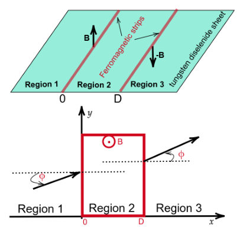
<figcaption class="paper-figure-caption"><b>Fig 1.</b> FIG. 1. The schematic of two ferromagnetic strips separated by a distance D, deposited on a tungsten diselenide sheet. This configuration defines three distinct regions induced by the presence of the two strips.</figcaption>
</figure>
<figure class="paper-figure-card">
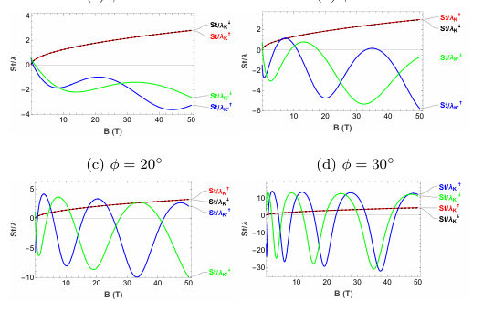
<figcaption class="paper-figure-caption"><b>Fig 2.</b> FIG. 2. The GH shifts in transmissions St/λ versus the mag- netic field B in the K and K′ valleys for four values of incident angles ϕ, with incident energy E = 2.2 eV, and barrier width d = 60 nm.</figcaption>
</figure>
<figure class="paper-figure-card">

<figcaption class="paper-figure-caption"><b>Fig 3.</b> Figure 3 shows what happens to the Goos–H¨anchen (GH) shifts versus the incident angle for spin-up and spin-down elec- trons separately, in both the K and K′ valleys, at energies of 1.3 and 1.4 eV Figs. (3a,3c) and Figs. (3b,3d), respectively, with barrier width 15 nm, and magnetic field B=10 T. It is found that the GH shift remains zero from normal inci- dence up to ϕ = 30◦. For this reason, the plots are shown starting from 30◦. The GH shifts vanish at normal incidence due to symmetry, and increase with the angle, reaching a maximum around ϕ ≈60◦as a result of enhanced interfer- ence within the barrier. For larger incident angles, the GH shifts decrease rapidly as reflection becomes...</figcaption>
</figure>
<figure class="paper-figure-card">
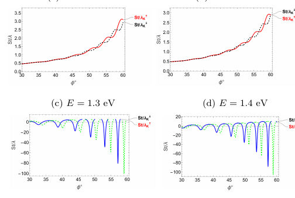
<figcaption class="paper-figure-caption"><b>Fig 4.</b> FIG. 3. The GH shifts versus the incident angle for spin-up and spin-down electrons in the K↑↓and K′ ↑↓valleys at E = 1.3 and 1.4 eV, with barrier width d = 15 nm, and magnetic field B = 10 T.</figcaption>
</figure>
<figure class="paper-figure-card">

<figcaption class="paper-figure-caption"><b>Fig 5.</b> Figure 4 illustrates the group delay time (GDT) τt/τ0 as a function of the magnetic field B for different barrier widths d = 15, 30, 45, and 60 nm shown in Figs. (4a, 4b, 4c, 4d), respectively, considering both valleys (K and K′) and spin configurations (spin-up and spin-down). The results reveal a pronounced oscillatory behavior associated with Fabry–P´erot- type resonances induced by quantum interference inside the barrier region. For the narrow barrier shown in Fig. 4a with d = 15 nm, the GDT exhibits relatively few oscillations with moderate amplitudes. The resonant peaks are well separated, indicating weak confinement within the barrier. Moreover, the oscillatory behavior differs...</figcaption>
</figure>

**Summary.** This theoretical study examines the magnetic control over electron wave packet dynamics (GH shift and GDT) in monolayer WSe2 through a magnetic barrier. By solving an effective Hamiltonian, the authors demonstrate that external magnetic fields induce strong oscillations and spin/valley selectivity in these transport properties. This offers a promising pathway for designing highly controllable nanoscale devices for spintronics and valleytronics.

**Why it may be interesting.** The ability to selectively manipulate spin and valley degrees of freedom via external fields in a 2D material is highly relevant for developing next-generation spintronic and valleytronic devices, connecting fundamental quantum transport theory to solid-state engineering.

Detailed structure

**Main problem.** The study investigates how an external magnetic field influences the Goos-Hänchen (GH) shift and group delay time (GDT) in monolayer WSe2 when a magnetic barrier is present.

**Main result.** The magnetic barrier strongly modulates both the GH shift and GDT, enabling selective control over the lateral shift and traversal time for individual spin and valley channels. This suggests a mechanism for tunable spatial and temporal separation of electronic wave packets.

**Method.** Transport properties are calculated by solving an effective low-energy continuum Hamiltonian and extracting the GH shift and GDT from the phase of the transmission coefficient.

**Model / system.** The system is monolayer WSe2 modeled using an effective low-energy Hamiltonian that incorporates spin-orbit coupling, Zeeman effects, and a magnetic barrier potential. The analysis treats charge carriers as Dirac-like fermions propagating through regions defined by this magnetic structure.

**Key observables.** Goos–Hänchen (GH) shift, Group Delay Time (GDT), transmission amplitudes, reflection/transmission probabilities.

**Important parameters / regimes.** Magnetic field strength ($B$), incident energy ($E$), angle of incidence ($\phi$), and barrier width ($D$ or $d$).

**Assumptions / limitations.** The model uses an effective continuum approach; the magnetic field is realized via ferromagnetic strips creating a defined barrier region.

**Figures summary.** Figures illustrate the dependence of normalized group delay time on the magnetic field for various incident energies and angles, showing oscillatory behavior.

**Paper structure.** The paper establishes the physical model using an effective Hamiltonian, derives transmission coefficients by solving boundary value problems across pristine and barrier regions, and finally analyzes the phase-dependent observables (GH shift and GDT) to demonstrate magnetic control.

Abstract

We study the influence of an external magnetic field on the Goos-Hänchen (GH) shift and the group delay time (GDT) in monolayer WSe$_2$ in the presence of a magnetic barrier. The transport properties of Dirac-like carriers are obtained by solving the effective low-energy Hamiltonian and evaluating the corresponding transmission amplitudes. The GH shift and the GDT are subsequently extracted from the phase of the transmission coefficient. We systematically analyze their dependence on the magnetic field strength, incident energy, angle of incidence, and barrier width, with particular emphasis on the spin and valley degrees of freedom associated with the $K$ and $K'$ valleys. Our results show that the magnetic barrier strongly modulates both the GH shift and the GDT, leading to oscillatory behavior and pronounced spin-valley-dependent transport characteristics. Remarkably, the magnetic field enables selective control of the lateral shift and traversal time of carriers for each spin and valley channel, allowing for tunable spatial and temporal separation of electronic wave packets. This provides a mechanism for manipulating fermionic trajectories after transmission through the barrier in a highly controllable manner. Such tunability opens promising avenues for designing nanoscale devices based on spin and valley filtering, as well as for potential applications in information storage and processing within spintronic and valleytronic platforms.

[↑ back to top](#top)

### [Multi-agent Autoformalization of Tensor Network Theory](http://arxiv.org/abs/2607.07857v1)

**Authors:** Sirui Lu, Erickson Tjoa, J. Ignacio Cirac  
**Type:** theory · **Category:** numerical methods · **PDF:** <https://arxiv.org/pdf/2607.07857v1>  
**Analysis basis:** full PDF text, analyzed in chunks
**Topic relevance:** `methods for driven-dissipative` **3/5** · `entanglement & information structure` **2/5** · `Keldysh / 2PI / non-Gaussian methods` **1/5** · `analog quantum simulation` **1/5** · `driven-dissipative phase transition` **1/5**

↔ Scroll figures horizontally

<figure class="paper-figure-card">
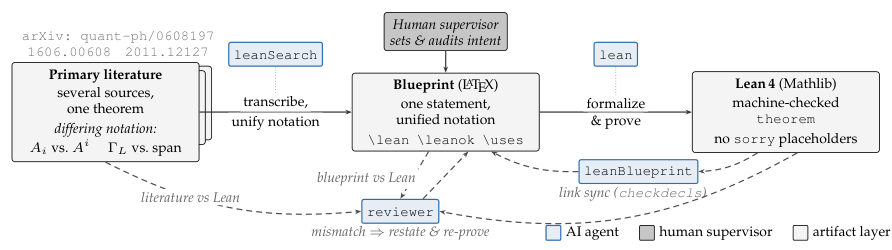
<figcaption class="paper-figure-caption"><b>Fig 1.</b> FIG. 1. Maintaining consistency across the literature, Lean, and the blueprint. A theorem stated in several sources under different notations (the matrices written Ai [28] or Ai [29, 30], injectivity phrased through the map ΓL [28] or as a spanning condition [29]) is transcribed once into the blueprint, in a single notation and with machine-readable links to the Lean declaration, and then proved in Lean (solid arrows; leanSearch scouts Mathlib, lean closes the proof; dotted lines attach each agent to the step it carries out). Two agents keep the layers consistent (dashed). leanBlueprint checks the mechanical links (every \lean reference resolves to a declaration and every \leanok to a...</figcaption>
</figure>
<figure class="paper-figure-card">
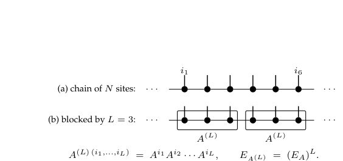
<figcaption class="paper-figure-caption"><b>Fig 2.</b> FIG. 2. Blocking in tensor networks. Given an MPS ten- sor A, grouping L consecutive sites yields a single coarse- grained tensor A(L) whose physical index is the composite in- dex (i1, . . . , iL) and whose transfer operator is the L-th power (EA)L of the transfer operator EA of A. The spectrum of (EA)L</figcaption>
</figure>
<figure class="paper-figure-card">
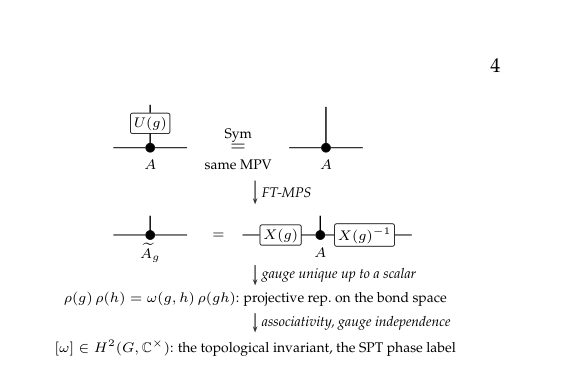
<figcaption class="paper-figure-caption"><b>Fig 3.</b> FIG. 3. From the fundamental theorem to the classification of symmetry protected topological phases. Top: the on-site symmetry U(g) acting on the physical leg of an injective MPS tensor A defines e Ag; the physical-layer assumption is that e Ag generates the same MPV family as A itself. Middle: FT-MPS turns this assumption into the virtual-layer gauge identity e Ai g = X(g) Ai X(g)−1 (Theorem 2; physical legs drawn up- ward, bond legs horizontal, as in Fig. 2). Bottom: X(g) is unique up to a scalar, so the gauges form a projective representation ρ with 2-cocycle ω; its class [ω] ∈H2(G, C×) is the gauge invari- ant labeling the symmetry-protected topological (SPT) phase, U(1)-valued after...</figcaption>
</figure>
<figure class="paper-figure-card">
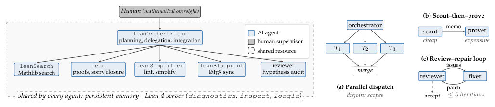
<figcaption class="paper-figure-caption"><b>Fig 4.</b> FIG. 4. System architecture and orchestration patterns. Left: a human supervisor sets mathematical intent; the orches- trator dispatches to four specialized interactive agents: a library scout (leanSearch), a proof writer (lean), a simplifier (leanSimplifier), and a blueprint synchronizer (leanBlueprint), together with an automated reviewer that also runs on each change proposed to the shared repository. All interactive agents (including the orchestrator) share a persistent memory and the Lean 4 server’s diagnostics, inspect, and loogle tools (Supplementary Material [42]), drawn as a single dashed region rather than one connection per agent per service. Right: the three recurring...</figcaption>
</figure>
<figure class="paper-figure-card">
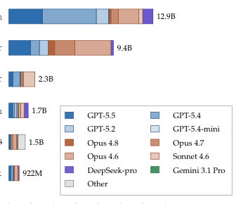
<figcaption class="paper-figure-caption"><b>Fig 5.</b> FIG. 5. Token usage by agent role, each bar broken down by the language models that role used. Proof writing and orchestration dominate, consistent with assigning the most capable models to the tasks where an error is most expensive.</figcaption>
</figure>

**Summary.** The paper introduces an agent-driven workflow using specialized LLMs to autoformalize advanced theorems in theoretical physics, demonstrated on Tensor Network Theory. By applying this system to the fundamental theorem of MPS and 1D topological phases, the authors showcase a powerful methodology for machine-checking complex physical mathematics. This effort establishes new computational libraries (TNLean) and highlights that controlling mathematical intent remains the key challenge in scaling such AI formalization efforts.

**Why it may be interesting.** This work provides a blueprint for how AI can tackle foundational theoretical physics problems by automating rigorous mathematical proof construction in systems like Lean, which is highly relevant for developing formal quantum field theory or condensed matter models.

Detailed structure

**Main problem.** The primary goal is the automated, research-level formalization of complex theorems from theoretical physics, specifically focusing on Tensor Network Theory.

**Main result.** The authors successfully demonstrated an agent-driven workflow that autoformalized the fundamental theorem of matrix-product states (FT-MPS) and extended it to classify 1D symmetry-protected topological phases.

**Method.** A multi-agent LLM system coordinates specialized agents using a structured mathematical blueprint, executing formal proofs within the Lean 4 proof assistant for machine verification.

**Model / system.** The theory centers on Matrix-Product States (MPS) used to describe quantum states on one-dimensional chains. The formalism connects these states to topological invariants derived from group representations.

**Key observables.** Topological invariant $[\omega] \in H^2(G, C^	imes)$, the MPS state $|\psi_N(A)
angle$, and the structure of the transfer operator $E_A$.

**Important parameters / regimes.** The bond dimension ($D$), chain length ($N$), and the nature of the symmetry group $G$ are critical parameters.

**Assumptions / limitations.** The main bottleneck identified is enforcing correct mathematical intent during autoformalization; furthermore, reliance on primary literature sources was necessary for full autonomy.

**Figures summary.** Figures illustrate multi-layered consistency checks across literature, blueprints, and Lean code. Another figure shows the flow from FT-MPS to SPT phase classification via a virtual-layer gauge identity.

**Paper structure.** The paper details the agent workflow (Blueprint $\leftrightarrow$ Lean), presents the formalization of FT-MPS (relating tensors via gauge transformations), extends this to 1D SPT phases, and concludes with a discussion on process limitations and infrastructure release.

Abstract

We build a team of specialized large language-model agents and present an agent-driven workflow for research-level formalization in theoretical physics, with the autoformalization of the fundamental theorem of matrix-product states as a demonstration. The agents, coordinated through a structured mathematical blueprint and periodic human review, orchestrated and executed the full formalization autonomously. For some statements, the agents were able to explore new proof routes that are not part of the standard literature. Along the way the agents produced extensive tensor-network and quantum-information libraries not previously available in Mathlib, Lean's mathematical library. As a physical application, the formalization also extends towards symmetry-protected topological phases in one dimension. We find that the main bottleneck in large-scale autoformalization is enforcing mathematical intent and we provide a detailed study of the full process and various subtleties involved. We release the codebase as the library \href{https://github.com/LionSR/TNLean}{TNLean}, together with a \nChapters{}-chapter \href{https://lionsr.github.io/TNLean/blueprint/}{blueprint} of the formalization effort.

[↑ back to top](#top)

### [Plaquette: A hardware-aware design platform for fault-tolerant quantum computers](http://arxiv.org/abs/2607.08767v1)

**Authors:** Raul Conchello Vendrell, Carlos Díaz López, Ish Dhand, Kshitij Kapoor, Davide Laureti, Marcello Massaro, Pranjal Nayak, Ivan Ogloblin, Martin B. Plenio, Shreya Prasanna Kumar, Matteo Santandrea, Varun Seshadri, Antal Száva, Trevor Vincent, Raphael Weber  
**Type:** theory · **Category:** quantum information and computing · **PDF:** <https://arxiv.org/pdf/2607.08767v1>  
**Analysis basis:** full PDF text, analyzed in chunks
**Topic relevance:** `methods for driven-dissipative` **3/5** · `QC/QI experiment` **2/5** · `Keldysh / 2PI / non-Gaussian methods` **1/5** · `correlated / nonlocal dissipation` **1/5** · `driven-dissipative phase transition` **1/5**

↔ Scroll figures horizontally

<figure class="paper-figure-card">
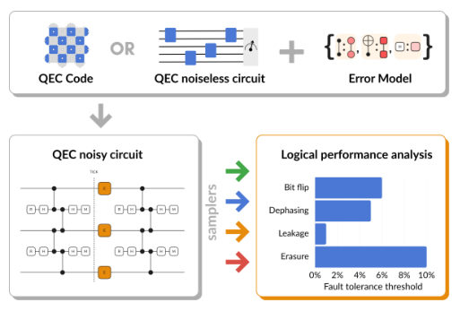
<figcaption class="paper-figure-caption"><b>Fig 1.</b> FIG. 1. Plaquette at a glance. A QEC code defines a noiseless circuit for extracting syndrome information; an er- ror model, specified once as CPTP channels, is compiled into a noisy circuit in the exact or approximate representation that the chosen sampler requires. This noisy circuit is sam- pled and decoded; the logical performance is returned as logical error rates, which are then aggregated into thresholds, sensitivities for different error sources, and physical-logical overheads.</figcaption>
</figure>
<figure class="paper-figure-card">
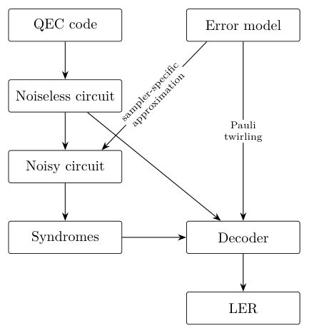
<figcaption class="paper-figure-caption"><b>Fig 2.</b> FIG. 2. Schematic of the Plaquette simulation workflow. A noiseless circuit is generated from a code. The noisy circuit is compiled from the noiseless circuit and the error model in the representation required by the chosen sampler. In parallel, a decoder model is compiled from the noiseless circuit and a Pauli-twirled version of the error model; the decoders included in Plaquette are initialized from the resulting detector error model. Sampling the noisy circuit produces syndromes, which are passed to the decoder; the decoder, in turn, yields the logical failure probability.</figcaption>
</figure>
<figure class="paper-figure-card">
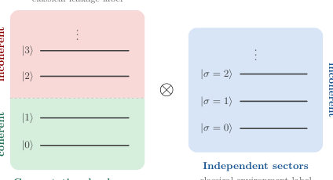
<figcaption class="paper-figure-caption"><b>Fig 3.</b> FIG. 3. State representation underlying the XPauli sampler. Each qubit carries an extended label rather than a bare two- level state. (i) Qubits in the computational subspace spanned by |0⟩and |1⟩(green) keep full coherence and are stored jointly as one stabilizer state; their level label reads comp, short for ‘computational’. (ii) A qubit in a leaked level (red) is instead tracked by a classical level label xi ∈{2, 3, . . . }. (iii) A separate sector label σi (blue) records the classical state of the qubit’s environment. Leaked levels and sectors are tracked classically: coherence is confined to the computational subspace, which is what keeps the simulation efficient. The explicit state...</figcaption>
</figure>
<figure class="paper-figure-card">
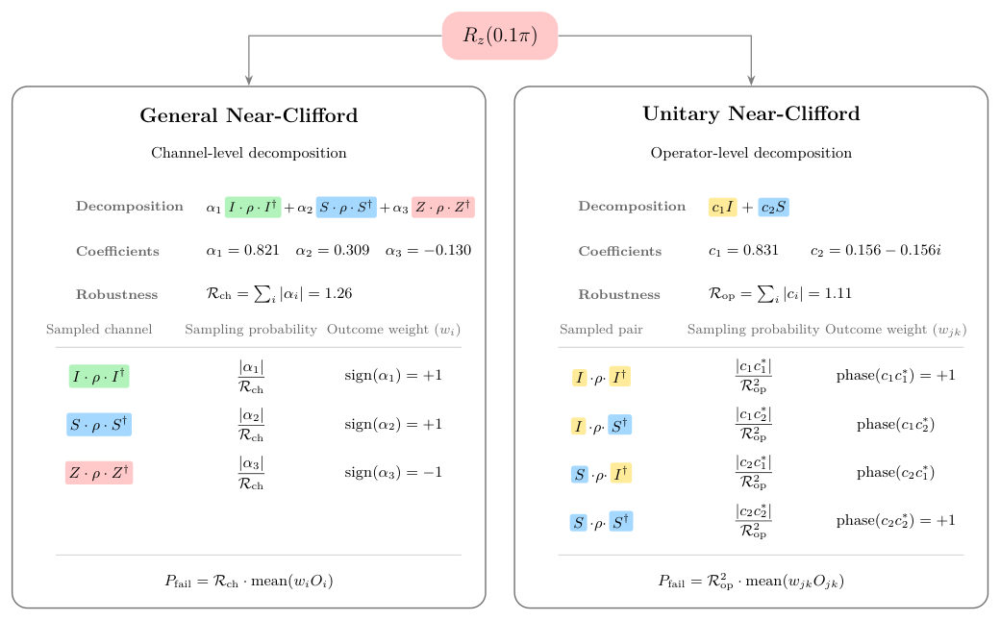
<figcaption class="paper-figure-caption"><b>Fig 4.</b> FIG. 4. The two quasiprobability near-Clifford samplers, illustrated on the coherent rotation Rz(0.1π). (Left) The general sampler decomposes the channel as E = P</figcaption>
</figure>
<figure class="paper-figure-card">
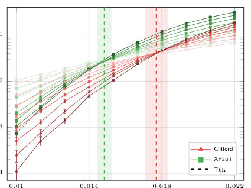
<figcaption class="paper-figure-caption"><b>Fig 5.</b> FIG. 7. Logical error probability of rotated planar codes of distance d = 5 −19 under the superconducting error model, as a function of the dimensionless noise strength γ controlling dephasing, heating, and cooling rates. Solid green curves show the leakage-aware XPauli estimates, while solid red curves show the Clifford-only Pauli-twirled approximation simulated with Stim; lighter to darker shades encode increasing code distance. The vertical dashed lines mark the finite- size-scaling threshold estimates, γth = 0.0148 ± 0.0004 for XPauli and γth = 0.0177 ± 0.0006 for Stim, with translucent bands showing the corresponding uncertainty intervals. These estimates show that the Pauli-twirled...</figcaption>
</figure>

**Summary.** The paper presents Plaquette, a novel software framework that allows researchers to calculate the true logical performance of fault-tolerant quantum computers directly from detailed physical noise models. By accepting general quantum channels derived from hardware imperfections (like leakage or heating), it moves beyond simplified Pauli approximations. This provides essential guidance for setting realistic error budgets and designing viable FTQC architectures.

**Why it may be interesting.** This is highly relevant as it bridges the gap between abstract QEC theory and messy, real-world open quantum system physics encountered in AMO/quantum optics experiments.

Detailed structure

**Main problem.** The core problem is determining the true logical performance of Fault-Tolerant Quantum Computers (FTQCs) when subjected to realistic, complex hardware noise that deviates from simple Pauli models.

**Main result.** The authors introduce Plaquette, a framework that provides a direct path from specifying open-system physics (as quantum channels) to calculating the logical error rates of an FTQC built on it.

**Method.** Plaquette accepts hardware noise models specified as Kraus operators or Lindblad dynamics and compiles them for various samplers: stabilizer sampling, XPauli sampler, near-Clifford samplers, and full-state simulation.

**Model / system.** The framework is designed to model physical imperfections across multiple platforms, including leakage in superconducting transmons, intermediate-state scattering in neutral atoms, and heating in trapped ions. The noise is generally modeled using CPTP quantum channels.

**Key observables.** Logical error rates, threshold surfaces, error budgets, and overhead estimates for fault tolerance.

**Important parameters / regimes.** The vector of physical parameters ($\eta$) defining the hardware noise (e.g., decay rates, detunings).

**Assumptions / limitations.** The framework highlights that relying only on Clifford-only simulations can lead to overly optimistic and inaccurate estimates compared to full channel analysis.

**Figures summary.** Figure 1 summarizes the Plaquette workflow: specifying device physics as a channel, compiling it for sampling, and outputting logical error rates. Table I details Plaquette's capabilities across codes, error models, and platforms.

**Paper structure.** The paper establishes the limitations of current noise models, introduces the Plaquette framework to accept general quantum channels, validates specialized samplers (XPauli, near-Clifford) against full simulation, and demonstrates its utility on three distinct physical hardware platforms.

Abstract

Hardware teams building fault-tolerant quantum computers (FTQCs) must decide which imperfections to suppress, and that decision requires the logical performance of the architecture under the device's actual noise. Hardware noise often departs from the stochastic Pauli models used by scalable stabilizer simulators: superconducting transmons leak out of the computational subspace, neutral atoms scatter through intermediate states, trapped ions heat as their motional modes absorb phonons, and miscalibrated controls over-rotate coherently. We present Plaquette, a theoretical framework and software suite that computes the logical performance of fault-tolerant architectures directly from the physics of such imperfections. In Plaquette, a hardware error model is specified once, as Kraus operators, Hamiltonian-Lindblad dynamics, or an experimentally reconstructed quantum channel, and is compiled automatically into the exact or approximate representation required by each of four sampler classes: stabilizer sampling for Pauli noise, the new XPauli sampler for leakage and environment sectors, near-Clifford samplers for coherent errors, and full-state simulation for exact reference calculations. We validate the XPauli and near-Clifford samplers against full-state simulation, which they can match within statistical uncertainty while Pauli twirling can fall short depending on the error model. We demonstrate the framework on three error models: leakage in superconducting qubits, intermediate-state scattering in neutral atoms, and heating in trapped ions. The size of the discrepancy between Plaquette and Clifford-only simulations varies with platform and noise process, so reliable thresholds, error budgets, and overhead estimates require the most accurate simulation available. Plaquette provides a direct path from the open-system physics of a device to the logical performance of the FTQC built on it.

[↑ back to top](#top)

### [Quantum Communication Lower Bounds for Search Problems via Matrix Discrepancy](http://arxiv.org/abs/2607.08517v1)

**Authors:** Minbo Gao, Chenghua Liu, Guangxu Yang, Tianyi Zhang  
**Type:** theory · **Category:** quantum information and computing · **PDF:** <https://arxiv.org/pdf/2607.08517v1>  
**Analysis basis:** full PDF text, analyzed in chunks
**Topic relevance:** `quantum measurements` **3/5** · `entanglement & information structure` **2/5** · `Keldysh / 2PI / non-Gaussian methods` **1/5** · `measurement-induced transitions` **1/5** · `methods for driven-dissipative` **1/5**

↔ Scroll figures horizontally

<figure class="paper-figure-card">
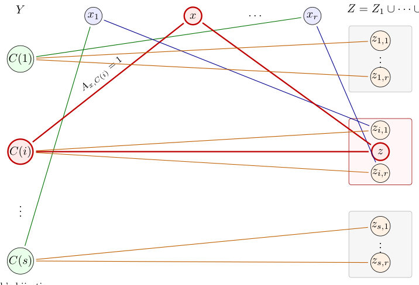
<figcaption class="paper-figure-caption"><b>Fig 1.</b> Figure 1: Visualization of the hard distribution in Definition 4.1. The set Z is partitioned into blocks Zi of size r. Each Fi is a bijection from X to Zi, and Bob’s bijection C makes the vertex C(i) adjacent to the whole block Zi. A valid output is a triangle {x, C(i), Fi(x)} for which the corresponding XY edge is present, i.e. Ax,C(i) = 1.</figcaption>
</figure>

**Summary.** This work develops a novel matrix discrepancy technique to derive lower bounds for one-way quantum communication required for search problems. By applying this method to collision finding and triangle finding, the authors establish new, tight quantum lower bounds surpassing previous results. This advances the understanding of quantum computational limits for fundamental combinatorial tasks.

**Why it may be interesting.** While focused on communication complexity, the rigorous mathematical techniques involving operator norms, PSD matrices, and concentration inequalities are highly relevant tools used in quantum information theory that can inform analyses of open quantum systems or resource theories.

Detailed structure

**Main problem.** The paper addresses establishing one-way quantum communication lower bounds for search problems, which are fundamentally more complex than decision problems due to their multiple valid outputs.

**Main result.** They establish a tight $\Omega(N^{1/4})$ one-way quantum communication lower bound for collision finding and derive an $\Omega(\sqrt{\Delta V})$ quantum streaming space lower bound for triangle finding in graphs.

**Method.** The core methodology involves developing a novel technique based on matrix discrepancy to analyze the success probability of quantum protocols by bounding associated Positive Operator-Valued Measures (POVMs) as PSD packings.

**Model / system.** The analysis is set within the model of one-way quantum communication, where Alice sends a state $
ho_a$ and Bob measures using a POVM $\{M(b)_z\}_{z\in Z}$. The applications involve theoretical search problems like collision finding and triangle finding in graph streams.

**Key observables.** Success probability ($	ext{psucc}$), quantum communication complexity ($k$), and streaming space requirements ($S$).

**Important parameters / regimes.** The size of the input set ($N$), the number of edges/triangles, and structural parameters like $\Delta_V$ (max triangles per vertex).

**Assumptions / limitations.** The method relies on decomposing validity indicators into factors leading to PSD operators that must satisfy packing constraints; it also uses matrix concentration arguments.

**Paper structure.** The paper introduces the problem of search lower bounds, develops the matrix discrepancy technique by analyzing POVMs as PSD packings, and applies this method sequentially to derive specific lower bounds for collision finding and triangle finding.

Abstract

We study one-way quantum communication lower bounds for search problems. Unlike decision problems, search problems can have many valid outputs, which pose a fundamental barrier to standard quantum lower-bound techniques. We overcome this by developing a novel method based on matrix discrepancy, which allows us to bound the output measurements of a quantum protocol jointly.   As applications of our method, we establish the first tight quantum lower bounds for two fundamental search problems in some natural parameter regimes: collision finding and triangle finding. For collision finding, we prove a tight $Ω(N^{1/4})$ one-way quantum communication lower bound. Previously, the best-known quantum communication lower bound for collision finding was $Ω(N^{1/12})$ due to Göös and Jain (RANDOM 2022), and no stronger bound was known even under the one-way restriction. For triangle finding in graph streams, we prove a one-pass quantum streaming space lower bound of $Ω\left(\sqrt{Δ_V}\right)$ for graphs with $m$ edges, $Θ(m)$ triangles, and constant $Δ_E$, where $Δ_V$ and $Δ_E$ denote the maximum number of triangles sharing a common vertex and edge, respectively, under the condition that $1\le Δ_V\le m^{2/3}$. This constitutes the first nontrivial quantum space lower bound in this regime, matching the classical upper bound of Jayaram and Kallaugher (RANDOM 2021) up to logarithmic factors. Notably, our method also recovers the classical lower bound of Kallaugher and Price (SODA 2017) through an entirely different argument, avoiding their Boolean-Hidden-Matching reduction that breaks down for quantum protocols.

[↑ back to top](#top)

### [Signature in sound-mode of the exciton bilayer two-dimensional superfluid transition](http://arxiv.org/abs/2607.08353v1)

**Authors:** Giovanni Midei, Filippo Pascucci, Milorad V. Milosevìc, Jacques Tempere, David Neilson, Andrea Perali  
**Type:** theory · **Category:** quantum gases · **PDF:** <https://arxiv.org/pdf/2607.08353v1>  
**Analysis basis:** full PDF text, analyzed in chunks
**Topic relevance:** `Keldysh / 2PI / non-Gaussian methods` **3/5** · `analog quantum simulation` **1/5** · `correlated cavity matter` **1/5** · `driven-dissipative phase transition` **1/5** · `methods for driven-dissipative` **1/5**

↔ Scroll figures horizontally

<figure class="paper-figure-card">
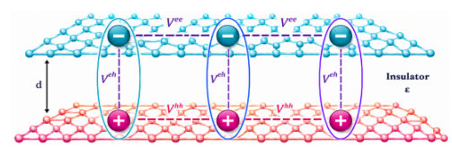
<figcaption class="paper-figure-caption"><b>Fig 1.</b> Figure 1. Schematic of the exciton bilayer system. Top layer of elec- trons, bottom layer of holes. Separated by an insulator of dielectric constant ε and thickness d.</figcaption>
</figure>
<figure class="paper-figure-card">
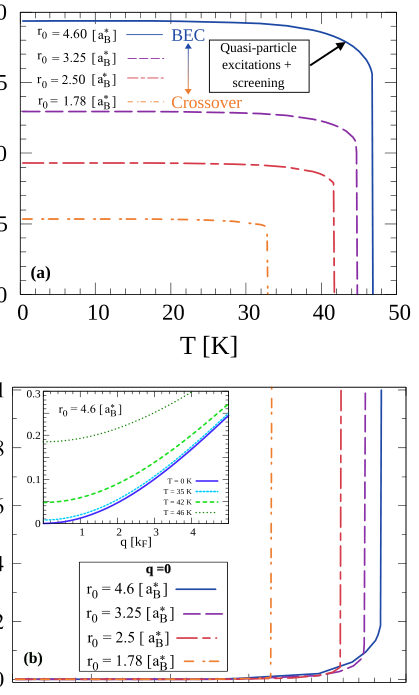
<figcaption class="paper-figure-caption"><b>Fig 2.</b> Figure 2. (a) Maximum gap energy ∆max as a function of the tem- perature T. The r0 are the inlayer interparticle distances for different densities. (b) Difference between the normal and anomalous polar- ization functions [ΠN −ΠA], normalized to ΠN, q = 0 as a func- tion of T. Inset: [ΠN −ΠA/ΠN] for r0 = 4.6a∗ B as a function of q for different T.</figcaption>
</figure>
<figure class="paper-figure-card">
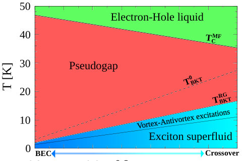
<figcaption class="paper-figure-caption"><b>Fig 3.</b> Figure 4. Temperature-density (T, n) phase-diagram for double- bilayer-graphene. T MF c : mean-field critical temperature. T 0 BKT and T RG BKT: BKT transition temperature without and with RG.</figcaption>
</figure>
<figure class="paper-figure-card">

<figcaption class="paper-figure-caption"><b>Fig 4.</b> Figure 3. Stiffness J0(T) (horizontal lines) and renormalized stiff- ness JRG(T) as a function of temperature T for interparticle dis- tances r0, as labeled.</figcaption>
</figure>
<figure class="paper-figure-card">
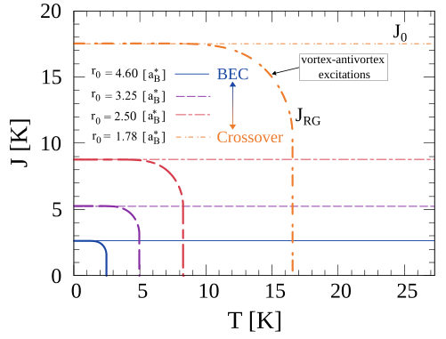
<figcaption class="paper-figure-caption"><b>Fig 5.</b> Figure 4 shows the temperature–density phase diagram for DBG. For T &lt; T RG BKT, the system is an exciton superfluid, while for T &gt; T MF c it is a normal electron–hole liquid. In the intermediate temperature interval, T RG BKT &lt; T &lt; T MF c , there is still local pairing but unbinding of the vortex–antivortex pairs has destroyed the superfluid phase [42–44]. We denote this regime in Fig. 4 as the pseudogap. The temperature- density window over which vortex excitations renormalize the stiffness is also indicated. T 0 BKT is the unrenormalized transi-</figcaption>
</figure>

**Summary.** This work develops a theoretical method to detect exciton superfluidity in electron-hole bilayers by monitoring the Anderson-Bogoliubov sound velocity. The authors show that this velocity exhibits a sharp, measurable drop precisely at the BKT transition point. By incorporating finite-temperature screening and RG analysis, they provide an experimentally accessible signature for this neutral quantum phase.

**Why it may be interesting.** It provides a concrete, measurable dynamical signature ($c_s(T)$ collapse) for an elusive quantum phase (exciton superfluidity), bridging complex many-body theory with potential experimental detection methods.

Detailed structure

**Main problem.** The primary challenge is obtaining definitive evidence of exciton superfluidity in electrically neutral electron-hole bilayers at zero magnetic field.

**Main result.** The Anderson-Bogoliubov sound velocity provides a measurable signature, showing a discontinuous drop to zero precisely at the Berezinskii-Kosterlitz-Thouless (BKT) transition temperature.

**Method.** Theoretical analysis using path integrals, Renormalization Group (RG) techniques for phase fluctuations, and solving gap equations incorporating finite-temperature screening.

**Model / system.** The system is an exciton bilayer formed by parallel electron-hole layers. The model spans the BCS-BEC crossover regime, allowing tuning between weakly coupled and strongly coupled superfluid states.

**Key observables.** Anderson-Bogoliubov sound velocity ($c_s(T)$), phase stiffness ($J_0(T)$), compressibility ($\kappa_0(T)$), and the transition temperature ($T_{	ext{BKT}}^{	ext{RG}}$).

**Important parameters / regimes.** Carrier density, temperature (especially near $T_{	ext{BKT}}$), and the ratio of interaction types (contact vs. dipolar).

**Assumptions / limitations.** The analysis often assumes low-density regimes where certain contributions (like spin-wave terms) can be neglected or approximated.

**Figures summary.** Figures illustrate the temperature dependence of various quantities, such as the maximum gap energy ($\Delta_{\max}$), polarization differences ($\Pi_N - \Pi_A$), and most critically, the sound velocity $c_s(T)$ tracking the superfluid transition.

**Paper structure.** The paper builds from establishing the diagnostic observable (sound velocity) to developing the theoretical framework (RPA screening, RG flow) necessary to predict the BKT transition in this specific neutral exciton system.

Abstract

Obtaining definitive evidence of exciton superfluidity in electron-hole bilayers in zero magnetic field remains a major longstanding challenge since the condensate is electrically neutral, making its phase coherence difficult to detect directly. We show that the Anderson-Bogoliubov sound velocity provides a dynamical signature of exciton superfluidity. Across the BCS-BEC crossover, the velocity is known to discontinuously drop to zero at the Berezinskii-Kosterlitz-Thouless (BKT) transition. The magnitude of the drop has a strong density dependence. We compute this behavior, with the inclusion of finite-temperature screening, and determine the BKT transition using a renormalization-group approach. We further identify a temperature window which is experimentally accessible, where vortex-antivortex excitations strongly renormalize both the sound velocity and the transition temperature.

[↑ back to top](#top)

### [Robust One-Sided Device-Independent Quantum Key Distribution via High-Dimensional Steering](http://arxiv.org/abs/2607.08709v1)

**Authors:** Monika Mothsara, Suraj Goel, Bohnishikha Ghosh, Vatshal Srivastav, Will McCutcheon, Mehul Malik, Gláucia Murta  
**Type:** both · **Category:** quantum information and computing · **PDF:** <https://arxiv.org/pdf/2607.08709v1>  
**Analysis basis:** full PDF text, analyzed in chunks
**Topic relevance:** `quantum optics experiment` **3/5** · `QC/QI experiment` **1/5** · `entanglement & information structure` **1/5** · `quantum measurements` **1/5**

↔ Scroll figures horizontally

<figure class="paper-figure-card">
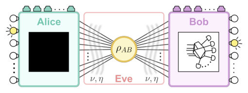
<figcaption class="paper-figure-caption"><b>Fig 1.</b> Figure 1: A schematic representation of a high-dimensional one-sided device-independent QKD (1sDI-QKD) scenario. An untrusted source distributes bipartite entangled states to Alice, who holds an untrusted device, and Bob. Both parties perform high-dimensional multi-outcome measurements, and the resulting correlations enable the demonstration of quan- tum steering. Higher dimensions are expected to provide im- proved robustness against noise (ν) and loss (η).</figcaption>
</figure>
<figure class="paper-figure-card">
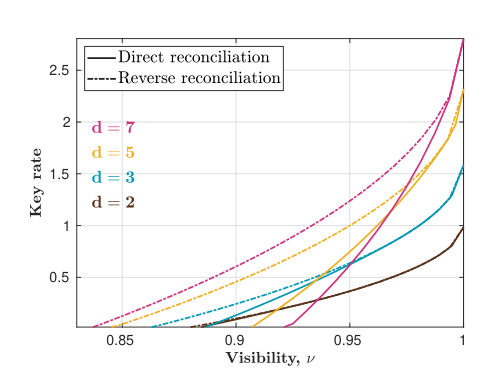
<figcaption class="paper-figure-caption"><b>Fig 2.</b> Figure 2: Direct versus reverse reconciliation key rates as a function of visibility. Colors correspond to dimensions d = 2 (brown), d = 3 (cyan), d = 5 (yellow), and d = 7 (magenta). Solid and dash-dot lines correspond to the direct reconciliation and reverse reconciliation key rates, respectively, for the spot-checking protocol with m = d + 1 measurement settings.</figcaption>
</figure>
<figure class="paper-figure-card">
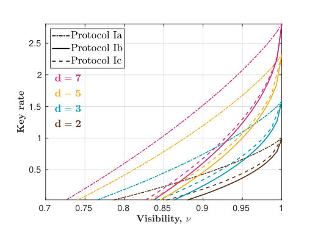
<figcaption class="paper-figure-caption"><b>Fig 3.</b> Figure 3: Comparison of key rates as a function of visibility ν under depolarizing noise, assuming ideal detection efficiency (η = 1). Colors correspond to dimen- sions d = 2 (brown), d = 3 (cyan), d = 5 (yellow), and d = 7 (magenta). Dash-dot, solid, and dashed lines corre- spond to Protocols Ia (two-basis), Ib (spot-checking), and Ic (multi-key-basis), respectively.</figcaption>
</figure>
<figure class="paper-figure-card">
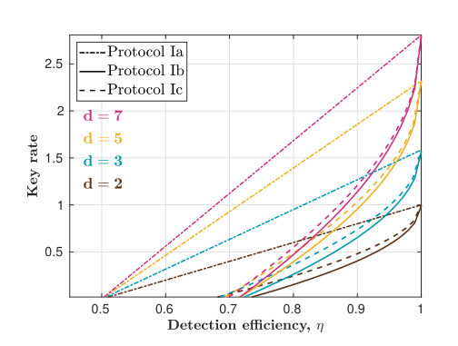
<figcaption class="paper-figure-caption"><b>Fig 4.</b> Figure 4: Comparison of key rates as a function of detection efficiency η under extra outcome strategy, assuming ideal visibility (ν = 1). Colors correspond to dimensions (brown), d = 3 (cyan), d = 5 (yellow), and d = 7 (magenta). Dash-dot, solid, and dashed lines correspond to Protocols Ia (two-basis), Ib (spot-checking), and Ic (multi- key-basis), respectively.</figcaption>
</figure>
<figure class="paper-figure-card">
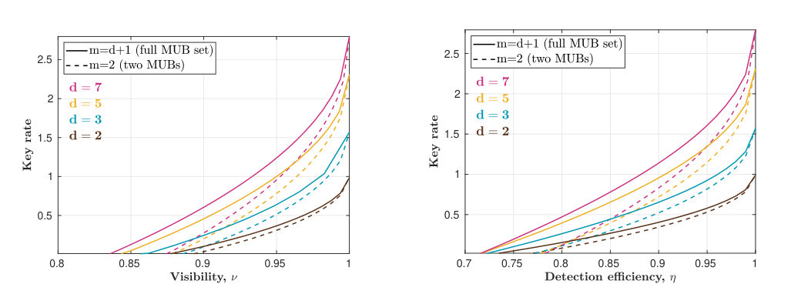
<figcaption class="paper-figure-caption"><b>Fig 5.</b> Figure 5: Key-rate advantage of using the full set of MUBs (m = d + 1) over two MUBs (m = 2) for d + 1-basis spot-checking protocol (Ib). (a) Key rate as a function of visibility ν under depolarizing noise, assuming ideal detection efficiency (η = 1). (b) Key rate as a function of detection efficiency η, assuming ideal visibility (ν = 1). Colors correspond to dimensions d = 2 (brown), d = 3 (cyan), d = 5 (yellow), and d = 7 (magenta). Solid lines correspond to steering correlations using m = d + 1 MUB measurement settings in dimension d, while dashed lines correspond to correlations using two MUB measurement settings (m = 2).</figcaption>
</figure>

**Summary.** The paper proposes and experimentally demonstrates a robust One-Sided Device-Independent Quantum Key Distribution (1sDI-QKD) protocol utilizing high-dimensional photonic entanglement. By leveraging quantum steering for security certification, the authors show that increasing the dimension enhances key rate robustness against noise and loss. This advances practical quantum communication by providing a scalable, device-independent method.

**Why it may be interesting.** This work directly addresses the practical realization of information-theoretically secure quantum communication by moving beyond qubit systems to higher dimensions, which inherently improves resilience against realistic noise sources.

Detailed structure

**Main problem.** The primary challenge is overcoming practical limitations of Quantum Key Distribution (QKD), such as noise, losses, and device imperfections.

**Main result.** The authors demonstrate that increasing the dimension ($d$) enhances robustness in One-Sided Device-Independent QKD (1sDI-QKD), achieving positive key rates up to $d=7$ in principle.

**Method.** They develop a systematic security analysis using quantum steering inequalities ($eta > eta_{	ext{LHS}}$) and evaluate achievable secret key rates via reverse reconciliation, complemented by a proof-of-principle experimental setup.

**Model / system.** The protocol uses high-dimensional (HD) entanglement encoded in the transverse-spatial degree-of-freedom of photons. The security analysis is framed around certifying non-local correlations using quantum steering to rule out Local Hidden State models.

**Key observables.** Steering violation ($eta$), secret key rates ($r_\infty$), guessing probability ($P_{	ext{guess}}$), and one-sided detection efficiency ($\eta_{	ext{exp}}$ vs. $\eta_{	ext{req}}$).

**Important parameters / regimes.** Dimension $d$ (up to 11), visibility ($
u$), noise/loss parameters, and the ratio of observed to required efficiencies.

**Assumptions / limitations.** The analysis relies on the fair-sampling assumption for Bob's side and explicitly accounts for Alice's no-click events to avoid loopholes. The experimental work assumes ideal components despite measured discrepancies.

**Figures summary.** Figures compare direct vs. reverse reconciliation key rates, show steering detection parameters ($\mu$) versus observed violations, and plot required vs. achieved one-sided detection efficiencies across various dimensions.

**Paper structure.** The paper progresses from theoretical security analysis (using quantum steering to bound key rates) to deriving the advantage of reverse reconciliation in 1sDI-QKD, culminating in a detailed description and results of a proof-of-principle experimental implementation using high-dimensional photonic entanglement.

Abstract

Quantum key distribution (QKD) brings the promise of communication with information-theoretic security but is limited in practice due to its susceptibility to noise, losses, and device imperfections. To address these challenges, we propose a robust high-dimensional (HD) one-sided device-independent QKD (1sDI-QKD) protocol and present a proof-of-principle experimental implementation using photons entangled in the transverse-spatial degree-of-freedom. We develop a systematic security analysis of HD 1sDI-QKD protocols, leveraging quantum steering to certify security, and evaluate achievable secret key rates for different measurement configurations and system dimensions using reverse reconciliation. Our analysis shows that increasing the dimension enhances robustness against both noise and loss. We then demonstrate the key experimental building blocks required for implementing the protocol: (a) a high-quality source of high-dimensional photonic entanglement, and (b) a fully programmable, high-dimensional multi-outcome measurement device operating in up to dimension 11. Using these components, we obtain positive key rates for all investigated dimensions under the fair-sampling assumption, with the highest key rates achieved for dimension d=7. Finally, we discuss the steps required for a practical, loophole-free implementation of 1sDI-QKD in realistic regimes of loss and noise.

[↑ back to top](#top)

### [Bright and Dark Excitons in CrSBr: Local Ligand-Field Character and Band-Coherent Optical Selection Rules](http://arxiv.org/abs/2607.08355v1)

**Authors:** Swagata Acharya, Jessica McDivitt, Dimitar Pashov, Mark van Schilfgaarde, Justin C. Johnson, Jeffrey L. Blackburn  
**Type:** theory · **Category:** strongly correlated electrons · **PDF:** <https://arxiv.org/pdf/2607.08355v1>  
**Analysis basis:** full PDF text, analyzed in chunks
**Topic relevance:** `interference shaping light` **3/5** · `Keldysh / 2PI / non-Gaussian methods` **1/5** · `spintronics-quantum-optics interface` **1/5**

↔ Scroll figures horizontally

<figure class="paper-figure-card">
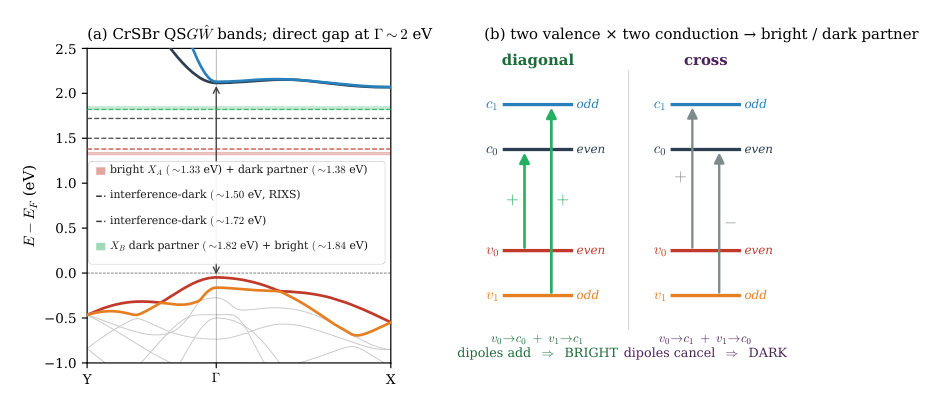
<figcaption class="paper-figure-caption"><b>Fig 1.</b> FIG. 1. The brightness mechanism in CrSBr. (a) QSGc W band structure along the Y-Γ-X cut, with the two topmost valence branches v0, v1 and the two lowest conduction branches c0, c1 highlighted in colour; the vertical arrow at Γ marks the direct quasiparticle (single-particle) gap of ∼2 eV. Solid coloured bands mark the bright XA (∼1.33 eV, red) and XB (∼1.84 eV, green) excitons, which sit below the gap by their respective binding energies. Dashed horizontal lines, identified in the in-panel key, mark the near-degenerate dark companions found in this work at ∼1.38 eV (the XA dark partner, dashed red), ∼1.50 and ∼1.72 eV (interference-dark states, dashed dark grey), and ∼1.82 eV (the XB dark...</figcaption>
</figure>
<figure class="paper-figure-card">
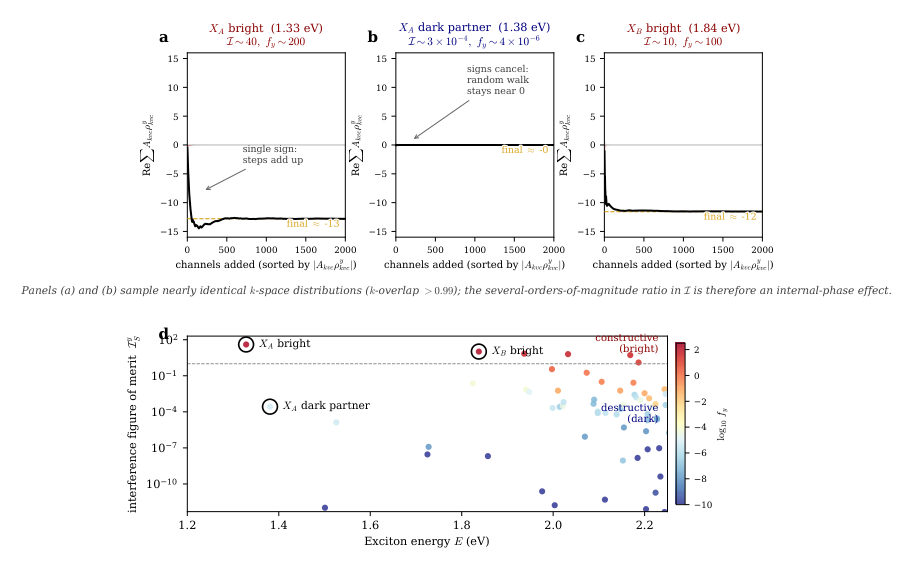
<figcaption class="paper-figure-caption"><b>Fig 2.</b> FIG. 2. Quantitative QSGc W verification of the bright/dark mechanism sketched in Fig. 1. (a-c) Running partial sum ReP</figcaption>
</figure>
<figure class="paper-figure-card">
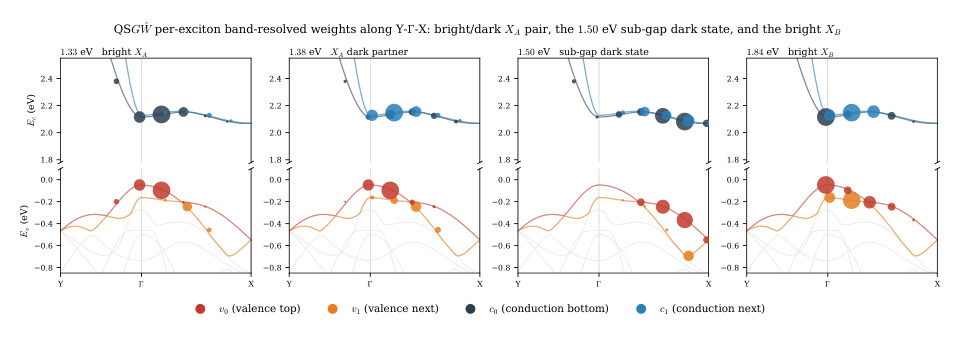
<figcaption class="paper-figure-caption"><b>Fig 3.</b> FIG. 3. Per-exciton band-resolved BSE weight for four representative excitons in Table I: the bright XA at 1.33 eV and its dark partner at 1.38 eV (left two panels), the 1.50 eV sub-gap dark state, and the bright XB at 1.84 eV (right). Each panel uses a broken energy axis: the upper sub-panel zooms on the two lowest conduction branches c0, c1, the lower one on the two topmost valence branches v0, v1. Markers are restricted to the {v0, v1, c0, c1} block, coloured by branch (v0 red, v1 orange, c0 navy, c1 blue), and split laterally (red/navy left of the k-point, orange/blue right) so the nearly degenerate c0, c1 pair is resolvable. Within each panel the weights are renormalised to the maximum...</figcaption>
</figure>

**Summary.** This work elucidates the origin of exciton optical brightness in magnetic van der Waals semiconductors like CrSBr. It demonstrates that excitonic visibility is not solely determined by local character but by a symmetry-enforced interference rule between transition dipoles. Bright states result from constructive superposition, while dark states arise from destructive cancellation.

**Why it may be interesting.** The concept that optical selection rules are governed by coherent superposition symmetries rather than just orbital composition is highly relevant for understanding light-matter interactions in complex quantum materials and artificial quantum emitters.

Detailed structure

**Main problem.** The primary challenge is explaining the coexistence of intense 'bright' excitons with much dimmer companion states, despite both originating from the same single-particle electronic manifold.

**Main result.** Brightness is determined by a symmetry-adapted interference rule between transition dipoles: bright states arise from constructive (sublattice-symmetric) superposition, while dark states result from destructive (sublattice-antisymmetric) cancellation.

**Method.** The study employs advanced many-body calculations, specifically the Bethe-Salpeter Equation (BSE) built upon a quasiparticle self-consistent GW framework, to analyze the bare exciton spectrum.

**Model / system.** The system is the magnetic van der Waals semiconductor CrSBr, which possesses an orthorhombic primitive cell containing two Cr atoms. The analysis treats the excitons as composite objects involving ligand-field, intersite, and ligand-assisted components.

**Key observables.** Exciton binding energies (e.g., XA near 1.34 eV), optical oscillator strengths, and the Interference Figure of Merit ($I_{\alpha}^S$).

**Important parameters / regimes.** Sublattice symmetry (symmetric vs. antisymmetric superposition); energy separation between bright/dark partners ($	ext{meV}$ scale).

**Assumptions / limitations.** The analysis focuses on the *bare* exciton spectrum derived from BSE, which is necessary to isolate the fundamental electronic response before coupling to magnons or phonons.

**Figures summary.** Figure 1 schematically shows that diagonal (sublattice-symmetric) dipole additions lead to bright states, while cross (sublattice-antisymmetric) additions cause destructive cancellation leading to dark states. Figure 2 quantitatively verifies this interference mechanism.

**Paper structure.** The paper establishes the electronic structure via QSGcW, then uses BSE to analyze exciton character. The core argument develops by introducing the symmetry rule governing dipole interference (the $I_{\alpha}^S$ diagnostic) to distinguish bright from dark states, culminating in a detailed analysis of how this symmetry dictates optical visibility.

Abstract

Magnetic van der Waals semiconductors such as CrSBr host an intricate exciton landscape whose physical interpretation has converged only recently. A many-body Feynman diagrammatic approach based on quasiparticle self-consistent GW with electron-hole ladder vertex corrections to the screened Coulomb interaction has established the electronic band gap, excitonic orbital character, real-space extent, binding energies, and bosonic-coupling signatures of the bright XA exciton near 1.34 eV and the higher XB manifold near 1.8 eV. These results agree well with ARPES and magneto-optical experiments and supersede the early Rydberg-like assignment of the excitons. What has remained unresolved is why these intense bright excitons coexist, within a few tens of meV, with companion states that are several orders of magnitude darker despite drawing from essentially the same single-particle transition manifold. Here we show that brightness is a band-coherent property of the excitonic eigenfunctions: bright and dark partners are sublattice-symmetric and sublattice-antisymmetric superpositions of the same ligand-field-like Bloch transitions across the two Cr atoms of the orthorhombic primitive cell. The commonly used Frenkel and Wannier-Mott labels describe what an exciton is made of, but brightness requires a symmetry-adapted interference rule between transition dipoles. Disentangling this bare excitonic structure is a prerequisite for interpreting the optical response of CrSBr once magnon, phonon, and photon couplings are included.

[↑ back to top](#top)

### [Gate induced strain on a two-dimensional hole gas in silicon](http://arxiv.org/abs/2607.07932v1)

**Authors:** D. van der Bovenkamp, C. S. A. Müller, B. D. Pantiru, I. Bošnjak, M. Cignoni, Q. Torrent Nicolau, M. E. Bal, S. Wiedmann, J. Ridderbos, F. A. Zwanenburg  
**Type:** both · **Category:** other · **PDF:** <https://arxiv.org/pdf/2607.07932v1>  
**Analysis basis:** full PDF text, analyzed in chunks
**Topic relevance:** `spintronics-quantum-optics interface` **3/5** · `Keldysh / 2PI / non-Gaussian methods` **1/5** · `non-equilibrium dynamics` **1/5**

↔ Scroll figures horizontally

<figure class="paper-figure-card">
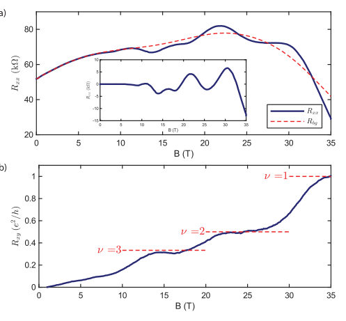
<figcaption class="paper-figure-caption"><b>Fig 1.</b> FIG. 2. (a) Longitudinal resistance Rxx versus magnetic field. The background magneto resistance fit is shown in the red dashed line. The background removed resistance is shown in the inset. (b) Hall resistance Rxy in units of e2/h as function of magnetic field. Red dashed lines are a guide to the eye to indicate the expected quantized values corresponding to filling factors ν = 1, 2, 3. Both measurements are obtained at T = 1.3 K with Vg = −1.95 V and for a gate thickness of 100 nm.</figcaption>
</figure>
<figure class="paper-figure-card">
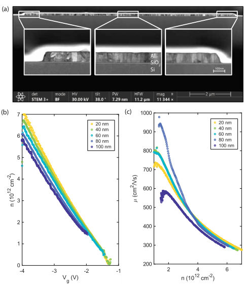
<figcaption class="paper-figure-caption"><b>Fig 2.</b> FIG. 1. (a) cross-sectional scanning transmission electron mi- croscopy image of the aluminum metal gate in the channel direction with insets of the sides and center. (b) Hall carrier density nH as function of gate voltage Vg for varying gate thicknesses from 20-100 nm. (c) Mobility µ as a function of carrier density for varying gate thicknesses from 20-100 nm. Both measurements are taken at a magnetic field of 9 T per- pendicular to the device. The device with a gate thickness of 100 nm is measured at T = 1.3 K while the other thicknesses are measured at T = 1.7 K.</figcaption>
</figure>
<figure class="paper-figure-card">
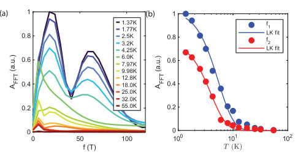
<figcaption class="paper-figure-caption"><b>Fig 3.</b> FIG. 3. (a) Temperature dependent discrete fast Fourier am- plitude AF F T of the SdH oscillations versus frequency for a gate thickness of 100 nm. (b) FFT amplitude as a function of temperature for f1 ≈19 T and f2 ≈66 T. The solid lines represent the fit of the Lifshitz-Kosevich thermal dampening factor.</figcaption>
</figure>
<figure class="paper-figure-card">
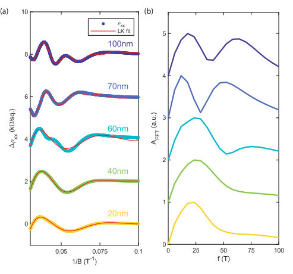
<figcaption class="paper-figure-caption"><b>Fig 4.</b> FIG. 4. (a) Normalized longitudinal resistivity after back- ground removal and smoothing as function of inverse magnetic field 1/B. The baseline subtracted resistivity ∆ρxx is shown for varying gate thicknesses from 20-100 nm and offset to im- prove visibility. Measurements are performed at T = 1.3 K and a gate voltage of −2.1 V corresponding to nH ≈1.7×1012. The red line presents the Lifshitz-Kosevich fit. (b) Normalized discrete fast Fourier transform amplitude AF F T as a function of frequency f. Colors denote the thickness of the metal gate corresponding to the color shown in (a).</figcaption>
</figure>
<figure class="paper-figure-card">
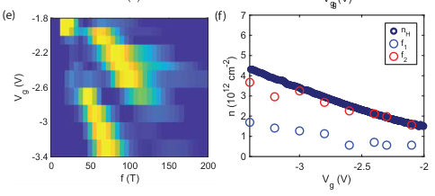
<figcaption class="paper-figure-caption"><b>Fig 5.</b> FIG. 5. FFT amplitude as function of frequency f and gate voltage Vg for an Al gate thickness of (a) 20 nm, (c) 60 nm and (e) 100 nm at T = 1.3K. The amplitude color scale is set from 0.3 to 1. The corresponding carrier densities obtained from the FFT peak positions are shown as circles in (b), (d), and (f), together with the Hall density nH obtained from Fig.1(b).</figcaption>
</figure>

**Summary.** This work demonstrates that strain induced by an aluminum gate can locally modify the valence band structure of a silicon two-dimensional hole gas. By analyzing Shubnikov-de Haas oscillations, the authors extract multiple cyclotron masses, proving that confinement and strain together dictate the electronic properties. This establishes a powerful method for engineering quantum material behavior using standard semiconductor fabrication techniques.

**Why it may be interesting.** While focused on condensed matter transport, the ability to use external fields/geometry (gate voltage/thickness) to tune fundamental electronic band structures in solid-state systems is highly relevant for designing quantum devices and controlling spin-orbit coupling effects.

Detailed structure

**Main problem.** To investigate how strain, locally induced by an aluminum gate, modifies the valence band structure of a two-dimensional hole gas (2DHG) in silicon.

**Main result.** The measured cyclotron masses deviate from simple heavy-hole/light-hole predictions, confirming that quantum confinement and strain combine to significantly alter the valence band structure. The technique allows for local engineering of electronic properties using standard semiconductor fabrication methods.

**Method.** The study combines transport measurements (Shubnikov-de Haas oscillations) analyzed via temperature dependence fitting (Lifshitz-Kosevich theory) with theoretical simulations (COMSOL finite-element solver) to model strain effects.

**Model / system.** The physical system is a 2DHG confined at the Si/SiO2 interface. The valence band structure is modeled using concepts like HH-LH mixing and incorporating strain tensors ($\epsilon_b$, $\epsilon_{rot}$) into the Hamiltonian formalism (Bir-Pikus context).

**Key observables.** Cyclotron masses ($m_c^* \approx 0.36 m_0$ and $0.49 m_0$), Shubnikov-de Haas oscillation frequencies/amplitudes, and simulated strain components ($\epsilon_b$).

**Important parameters / regimes.** Gate thickness (20–100 nm) acts as the tuning parameter for strain magnitude; cryogenic temperatures ($T \approx 1.3$ K); magnetic field ($B = 9$ T).

**Assumptions / limitations.** The analysis relies on fitting SdH oscillations using the Lifshitz-Kosevich factor, and initial modeling assumes a framework incorporating confinement and strain effects beyond simple bulk approximations.

**Figures summary.** Figures illustrate $\Delta
ho_{xx}$ vs $1/B$ and FFT amplitude vs frequency, showing how gate thickness controls the appearance of multiple oscillation peaks ($f_2$). Simulations map out the spatial variation of biaxial strain ($\epsilon_b$) near the gates.

**Paper structure.** The paper establishes the physical platform (Si 2DHG) and the tool (gate-induced strain). It presents transport measurements showing evidence of multiple subbands via SdH oscillations. Theoretical analysis confirms that simulated strains are sufficient to modify band structure on the meV scale, linking theory to experiment.

Abstract

We show the effect of gate-induced strain on the valence band of a silicon (Si) metal oxide semiconductor (MOS) confined two-dimensional hole gas (2DHG). Increasing aluminum gate thickness, and thereby the strain in the channel, results in the onset of a second subband contributing to Shubnikov-de Haas oscillations. Temperature-dependent magnetotransport measurements reveal distinct cyclotron masses of $m_c^*=(0.36\pm0.04)m_0$ and $m_c^*=(0.49\pm0.02)m_0$. The measured cyclotron masses differ from those expected for an idealized heavy-hole (HH)/light-hole (LH) picture, reflecting the combined influence of quantum confinement, strain, and HH-LH mixing on the valence band.

[↑ back to top](#top)

### [Parity Anomaly of Preformed Pairs Governs the Thermal Hall Effect above $T_c$](http://arxiv.org/abs/2607.07807v1)

**Authors:** Kumar Ghosh  
**Type:** theory · **Category:** strongly correlated electrons · **PDF:** <https://arxiv.org/pdf/2607.07807v1>  
**Analysis basis:** full PDF text, analyzed in chunks
**Topic relevance:** `Keldysh / 2PI / non-Gaussian methods` **3/5** · `methods for driven-dissipative` **1/5** · `non-equilibrium dynamics` **1/5**

↔ Scroll figures horizontally

<figure class="paper-figure-card">
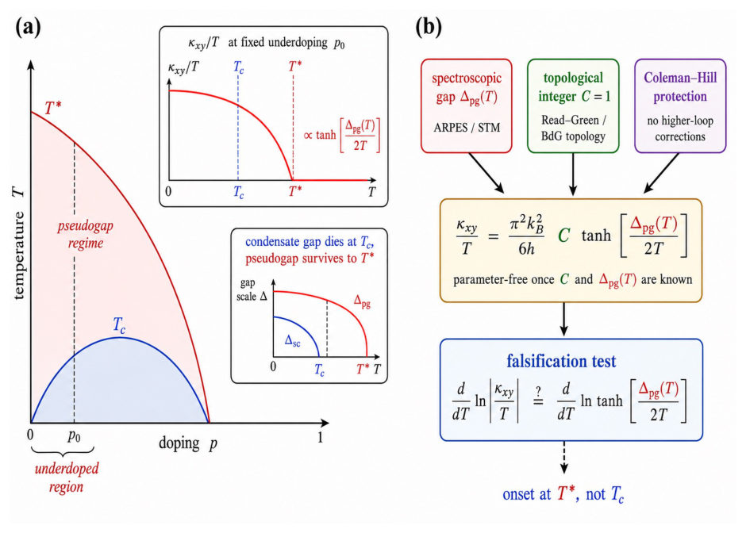
<figcaption class="paper-figure-caption"><b>Fig 1.</b> FIG. 1. Conceptual overview of the anomaly mechanism for thermal Hall transport in a chiral pseudogap phase. (a) Schematic phase diagram showing the superconducting dome bounded by Tc, the pseudogap onset line T ∗, and the chiral pseudogap regime in between. At fixed underdoping p0, the predicted thermal Hall response turns on at T ∗, not at Tc, and follows the anomaly factor tanh[∆pg(T)/(2kBT)]. The inset distinguishes the condensate gap ∆sc, which vanishes at Tc, from the pseudogap ∆pg, which survives up to T ∗. (b) Logical structure of the theory: an independently measured spectroscopic gap ∆pg(T), the BdG topological integer C, and Coleman-Hill protection together imply Eq. (2). The...</figcaption>
</figure>
<figure class="paper-figure-card">
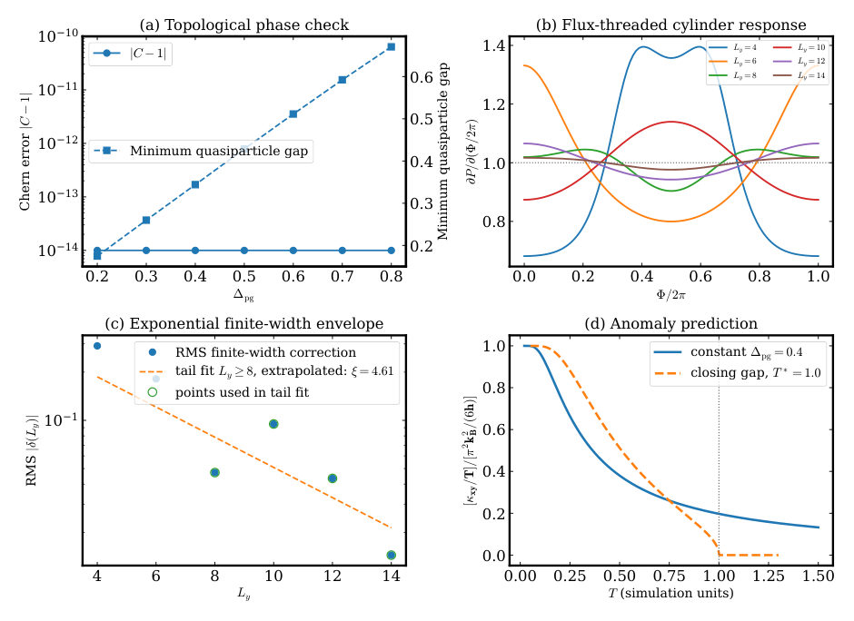
<figcaption class="paper-figure-caption"><b>Fig 2.</b> FIG. 2. The preformed-pair BdG system remains in a topologically protected C = 1 phase throughout the pseudogap pa- rameter range, with finite-size deviations that are purely exponential rather than power-law, consistent with c1 = 0. (a) The Fukui-Hatsugai-Suzuki Chern-number error |C −1| stays at machine precision (&lt; 6.5 × 10−15) across all seven ∆pg values while the quasiparticle gap grows, confirming the anomaly-mass interpretation. (b) The flux-threaded cylinder shows exactly quantized cycle winding ∆P = 1.000000 at all circumferences Ly = 4, 6, . . . , 14; the finite-width oscillations of the local response ∂P/∂(Φ/2π) around unity shrink rapidly with increasing Ly. (c) The RMS...</figcaption>
</figure>
<figure class="paper-figure-card">
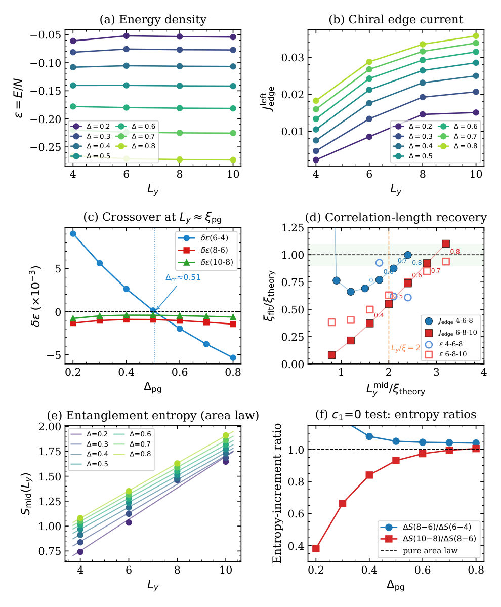
<figcaption class="paper-figure-caption"><b>Fig 3.</b> FIG. 3. DMRG on the p + ip cylinder confirms the four hallmarks of anomaly-controlled finite-size structure at the many-body level (Lx = 8, χmax = 512). (a) The energy density ε varies smoothly with Ly for each pseudogap value. (b) Chiral edge currents satisfy Jleft = −Jright to 10−8 across all 28 ground states, providing a many-body signature of C = 1 beyond the single-particle topology check. (c) The energy-density difference δε between consecutive cylinder sizes changes sign at ∆cross pg ≈0.51, giving a parameter-free confirmation of ξpg = vF /∆pg. (d) The correlation length extracted from edge currents (filled markers) reaches 99.8% agreement with ξ = vF /∆pg at ∆pg = 0.80; the energy...</figcaption>
</figure>

**Summary.** This work resolves the mystery of the thermal Hall effect above $T_c$ in cuprates by invoking the parity anomaly from $(2+1)$D QFT. It derives an exact formula linking $\kappa_{xy}/T$ directly to the independently measured pseudogap, $\Delta_{pg}(T)$. The theory is robustly confirmed by multiple numerical simulations and offers a falsifiable test for ARPES data.

**Why it may be interesting.** The paper provides a powerful example of how topological field theory concepts (parity anomaly) can yield exact, parameter-free predictions for transport properties in strongly correlated quantum materials like cuprates.

Detailed structure

**Main problem.** The paper addresses the discrepancy between theoretical predictions and experimental measurements of the thermal Hall effect ($\kappa_{xy}/T$) in cuprate superconductors within the pseudogap phase, where superconductivity has vanished.

**Main result.** It derives an exact, parameter-free formula for $\kappa_{xy}/T$ based on the parity anomaly of $(2+1)$-dimensional quantum field theory: $\kappa_{xy}/T = rac{\pi^2 k_B^2}{6h} C 	anh\left(rac{\Delta_{pg}(T)}{2k_B T}
ight)$.

**Method.** The derivation uses the parity anomaly of a chiral U(1) gauge theory, calculating the induced Chern-Simons term via integrating out massive Nambu fermions.

**Model / system.** The system is modeled using Bogoliubov-de Gennes (BdG) Hamiltonians for cuprates exhibiting $p+ip$ pairing. The analysis focuses on the pseudogap regime where $\Delta_{pg}(T)$ is non-zero even when the superconducting order parameter vanishes.

**Key observables.** Thermal Hall conductance ($\kappa_{xy}/T$), Pseudogap magnitude ($\Delta_{pg}(T)$), and the Chern number ($C$).

**Important parameters / regimes.** The pseudogap $\Delta_{pg}(T)$, which is directly measurable by ARPES/STM, dictates the temperature dependence via the hyperbolic tangent function.

**Assumptions / limitations.** The result relies on the Coleman-Hill non-renormalization theorem protecting the one-loop calculation and assumes the applicability of the parity anomaly mechanism in this condensed matter context.

**Figures summary.** Figure 1 illustrates the phase diagram ($T^*$ vs $T_c$) and shows the logical flow connecting the spectroscopic gap ($\Delta_{pg}(T)$), the topological integer ($C$), and the final formula for $\kappa_{xy}/T$.

**Paper structure.** The paper establishes the physical puzzle, develops the theoretical framework using parity anomaly calculations in a chiral U(1) gauge theory, derives the exact functional form linking $\kappa_{xy}/T$ to $\Delta_{pg}(T)$, and validates this result through multiple numerical tests (DMRG, Wilson loops).

Abstract

A large negative thermal Hall signal has been reported across multiple cuprate families in the pseudogap phase where the superconducting order parameter has vanished, with a magnitude that no existing microscopic theory reproduces without free parameters. Competing proposals based on chiral phonons, spinons, or loop currents each require undetermined coupling constants and do not predict the temperature dependence in terms of an independently measured spectroscopic gap. We show that the parity anomaly of $(2+1)$-dimensional quantum field theory resolves this long-standing puzzle: the preformed-pair pseudogap $Δ_{\rm pg}(T)$ enters the parity-odd fermion determinant identically to a condensate mass, yielding the exact parameter-free formula $κ_{xy}/T = (π^2 k_B^2/6h)\,C\,\tanh[Δ_{\rm pg}(T)/(2k_BT)]$, where $C$ is the Chern number of the chiral pairing channel and $Δ_{\rm pg}(T)$ is directly measurable by ARPES or STM. Coleman-Hill non-renormalization protects the result against higher-loop corrections, and two independent numerical tests, Wilson-loop flux threading and DMRG on $p+ip$ cylinders, confirm the anomaly correlation length to $0.2\%$ accuracy with no power-law finite-size corrections. The theory predicts thermal Hall onset at $T^*$ rather than $T_c$, provides a falsifiable logarithmic-derivative test against ARPES data, and yields a concrete quantitative target for magic-angle twisted bilayer graphene.

[↑ back to top](#top)

### [Dual-Platform Precision Measurement of the $3^2D_{5/2}$ to $4^2S_{1/2}$ $g$-Factor Ratio in $^{40}\text{Ca}^+$](http://arxiv.org/abs/2607.07929v1)

**Authors:** Brian J. McMahon, Vikram S. Sandhu, John M. Gray, Creston D. Herold, Kenton R. Brown, Brian C. Sawyer  
**Type:** experiment · **Category:** other · **PDF:** <https://arxiv.org/pdf/2607.07929v1>  
**Analysis basis:** full PDF text, analyzed in chunks
**Topic relevance:** `quantum measurements` **3/5** · `QC/QI experiment` **1/5**

↔ Scroll figures horizontally

<figure class="paper-figure-card">
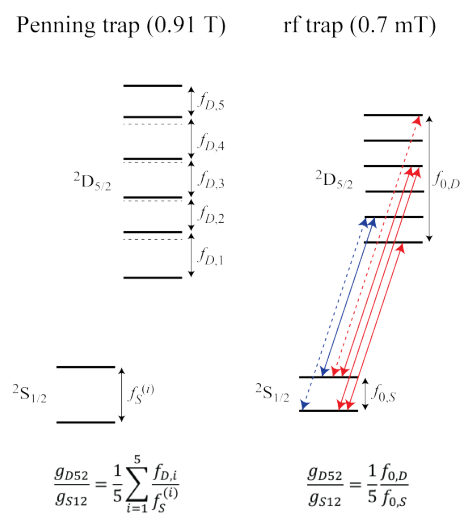
<figcaption class="paper-figure-caption"><b>Fig 1.</b> Figure 1. Illustration of the two spectroscopy techniques used for the dual-platform g-factor ratio measurement. (Left) In the 0.91 T magnetic field of the compact Penning trap, the  D5/2, |mJ| ≤3/2  sublevels experience strong nonlinear Zeeman shifts due to coupling of the D5/2 and D3/2 man- ifolds. Solid lines reflect the actual sublevel Zeeman shifts relative to the first-order approximation given by the dashed lines. (Right) In the 0.7 mT field of the rf trap, Ramsey experiments are used to measure the transition frequencies ∆f0,S and ∆f0,D. Sequences of 729 nm laser pulses, applied sequentially from left to right, are used prepare the desired superposition states within the S1/2...</figcaption>
</figure>
<figure class="paper-figure-card">
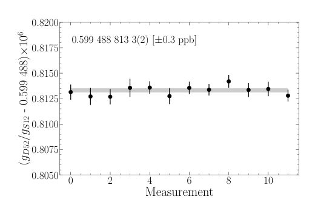
<figcaption class="paper-figure-caption"><b>Fig 2.</b> Figure 2. Repeated g-factor ratio measurements in the com- pact Penning trap with corresponding standard errors. The light gray region corresponds to the weighted standard er- ror bounds computed from all measurements. We report a g-factor ratio of 0.599 488 813 3(2), corresponding to a frac- tional statistical uncertainty of 0.34 ppb.</figcaption>
</figure>
<figure class="paper-figure-card">
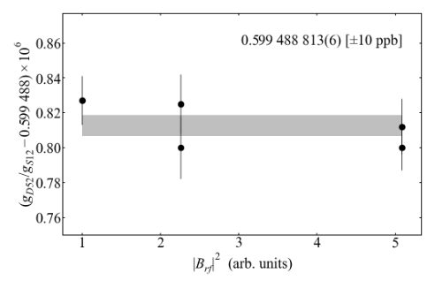
<figcaption class="paper-figure-caption"><b>Fig 3.</b> Figure 3. g-factor ratio measurements in the rf trap, taken at different trap rf amplitudes. The data is plotted versus the inferred AC magnetic field amplitude |Brf|2 at the ion location. Each data point is the mean of a measurement run consisting of &gt; 200 individual g-factor ratio measurements. The mean value 0.599 488 813(6) is the measured result for the rf trap.</figcaption>
</figure>

**Summary.** The authors report highly precise measurements of the $g$-factor ratio for a single $^{40}	ext{Ca}^+$ ion by employing two independent experimental setups: a cryogenic RF Paul trap and a room-temperature Penning trap. By comparing results from these dual platforms, they achieved an unprecedented reduction in measurement uncertainty, providing stringent tests of atomic theory.

**Why it may be interesting.** This work represents a state-of-the-art example of precision measurement in trapped ions, directly testing fundamental atomic structure constants ($g$-factors) using complementary quantum interrogation methods. The comparison between two vastly different physical platforms (RF vs. Penning) is particularly valuable for validating results.

Detailed structure

**Main problem.** The primary goal was to achieve a high-precision measurement of the ratio of Landé g-factors between the $3^2D_{5/2}$ and $4^2S_{1/2}$ states in a single trapped $^{40}	ext{Ca}^+$ ion.

**Main result.** The measurements, performed using two distinct traps (Penning and RF), yielded a highly precise ratio of approximately 0.599488813, reducing the uncertainty by over 40-fold compared to prior work.

**Method.** The experiment employed dual-platform spectroscopy: Rabi/Ramsey measurements in an RF Paul trap and frequency ratios derived from multiple transitions in a Penning trap.

**Model / system.** The physical system is a single trapped $^{40}	ext{Ca}^+$ ion. The measurement probes the energy levels of the $S_{1/2}$ and $D_{5/2}$ manifolds, utilizing techniques like Doppler cooling and resolved-sideband cooling.

**Key observables.** The ratio of Landé g-factors: $\frac{g_{3^2D_{5/2}}}{g_{4^2S_{1/2}}}$.

**Important parameters / regimes.** Penning trap field ($\sim 0.91 	ext{ T}$ axial); RF trap field ($0.7 	ext{ mT}$).

**Assumptions / limitations.** Systematic shifts from various sources (e.g., AC Stark, linear Zeeman drift) were estimated to be smaller than the statistical uncertainty in both measurement platforms.

**Figures summary.** Figure 1 illustrates the spectroscopy techniques used in both the Penning and RF traps. Figure 2 shows repeated measurements confirming the final reported value for the g-factor ratio using the Penning trap setup.

**Paper structure.** The paper details the experimental methodology, comparing results from two complementary trapping environments (Penning vs. RF). It presents the derived ratio values, analyzes systematic error mitigation techniques specific to each trap, and concludes by stating the combined high-precision result.

Abstract

We report precision measurements of the ratio of Landé $g$ factors between the $3^2D_{5/2}$ and $4^2S_{1/2}$ states of a single trapped $^{40}\text{Ca}^+$ ion. The measurements are performed in two distinct ion trap apparatus: a cryogenic surface electrode radiofrequency Paul trap and a room-temperature permanent magnet Penning trap. The Penning trap measurements yield a ratio of $0.599~488~813~3(2)$, which represents a more than 40-fold uncertainty reduction compared to previous work. The radiofrequency trap measurement yields a concurring value of $0.599~488~813(6)$. We estimate that systematic shifts for each system are well below the respective statistical uncertainty.

[↑ back to top](#top)

### [Heterostructuring as Gateway to Electron Doping of Nickelate Superconductors](http://arxiv.org/abs/2607.08553v1)

**Authors:** Chao Deng, Motoharu Kitatani, Guiwen Jiang, Siqi Guo, Niklas Witt, Ao Zhang, Wenfeng Wu, Mi Jiang, Karsten Held, Liang Si  
**Type:** theory · **Category:** strongly correlated electrons · **PDF:** <https://arxiv.org/pdf/2607.08553v1>  
**Analysis basis:** full PDF text, analyzed in chunks
**Topic relevance:** `Keldysh / 2PI / non-Gaussian methods` **3/5** · `methods for driven-dissipative` **1/5**

↔ Scroll figures horizontally

<figure class="paper-figure-card">
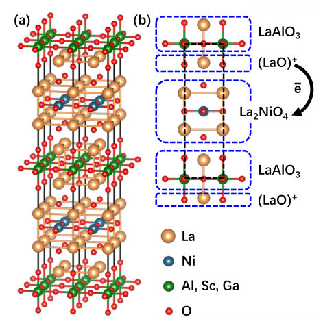
<figcaption class="paper-figure-caption"><b>Fig 1.</b> FIG. 1. (a) Structural schematic of La2NiO4:La2XO4 (X=Al, Sc, or Ga); (b) Mechanism of intrinsic electron doping in La2NiO4 realized by inserting additional (LaO)+ layers. The black dashed line in (b) denotes the unit cell used for the DFT and DMFT calculations shown in Figs. 2(b,d).</figcaption>
</figure>
<figure class="paper-figure-card">
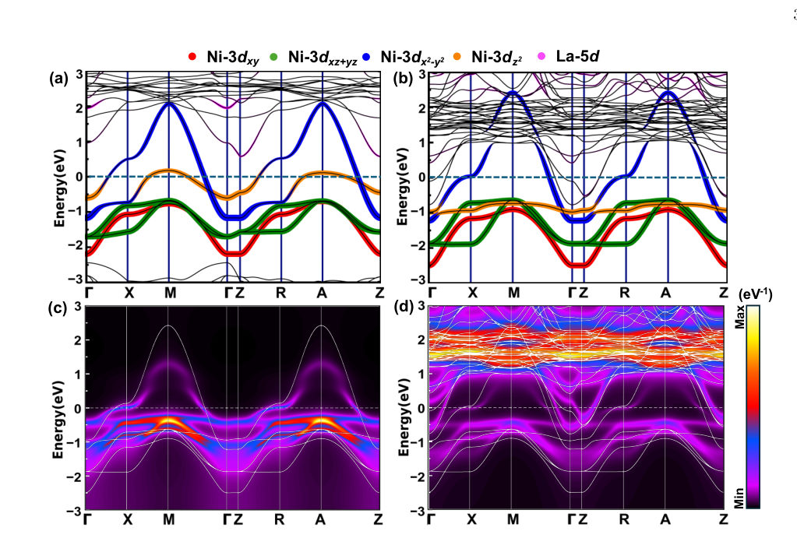
<figcaption class="paper-figure-caption"><b>Fig 2.</b> FIG. 2. Paramagnetic DFT band structure and orbital characters of (a) La2NiO4 and (b) La2NiO4:La2AlO4. Multiband DMFT k-resolved spectral functions A(k, ω) of La2NiO4:La2AlO4 with (c) Ni-3d-only model and (d) La-4f-5d+Ni-3d model.</figcaption>
</figure>
<figure class="paper-figure-card">
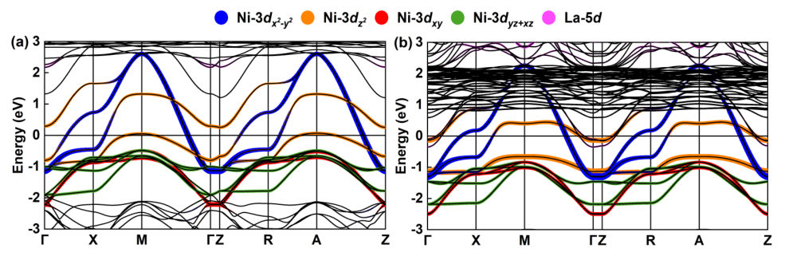
<figcaption class="paper-figure-caption"><b>Fig 3.</b> FIG. 3. Paramagnetic DFT band structure and orbital characters of (a) La3Ni2O7 and (b) La3Ni2O7:La3Al2O7.</figcaption>
</figure>
<figure class="paper-figure-card">
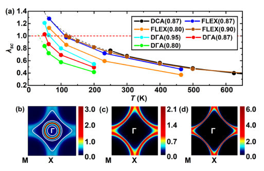
<figcaption class="paper-figure-caption"><b>Fig 4.</b> FIG. 4. (a) Leading d-wave superconducting λSC eigen- value as a function of temperature using fitting form of λSC ≈a −b ln(T) as in previous publications [83, 89, 96]; Fermi surface at kz=0 computed by (b) DFT (white lines) and DMFT (colorful spectra), (c) FLEX, and (d) DΓA. The FLEX and DΓA Fermi surface are computed by the momen- tum dependence of the imaginary part of the Green function [−Im G(k, ω0)/π] at lowest Matsubara frequency ω0=πkBT, T=53 K and n=0.87. Note that the DFT Fermi surfaces in (b) displays additional Γ-pockets that are taken into account in DΓA and FLEX only through a reduced filling.</figcaption>
</figure>

**Summary.** The authors propose using heterostructuring—specifically intercalating wide-band-gap insulators into nickelates—as a novel, disorder-free way to achieve electron doping. Theoretical calculations predict that this process drives the material into an optimal superconducting state, yielding high critical temperatures for these complex oxides.

**Why it may be interesting.** This work directly addresses fundamental questions in strongly correlated materials physics by proposing a chemically clean method to tune carrier concentration, which is crucial for understanding unconventional superconductivity mechanisms.

Detailed structure

**Main problem.** Electron-doping of nickelate superconductors remains an uncharted territory, and conventional substitutional doping methods have proven insufficient.

**Main result.** The intercalation of wide-band-gap insulators creates a disorder-free route to electron-doped nickelates, predicting high-$T_c$ $d_{x^2-y^2}$-wave superconductivity exceeding 50 K in $	ext{La}_2	ext{NiO}_4:	ext{La}_2	ext{AlO}_4$.

**Method.** The study relies heavily on first-principles calculations, including DFT and advanced many-body techniques like DMFT, D$\Gamma$A, and FLEX.

**Model / system.** The focus is on Ruddlesden–Popper nickelates ($	ext{R}_{n+1}	ext{Ni}_n	ext{O}_{3n+1}$) and their engineered heterostructures formed by intercalating insulating layers like $	ext{LaXO}_3$ into $	ext{La}_2	ext{NiO}_4$.

**Key observables.** Electron doping level (charge transfer), $d_{x^2-y^2}$-wave superconducting critical temperature ($T_c$), and orbital occupations ($	ext{Ni}-t_{2g}$ and $	ext{Ni}-e_g$).

**Important parameters / regimes.** $T_c > 50 	ext{ K}$ for the engineered heterostructures; ambient pressure stability.

**Assumptions / limitations.** The superconducting properties are predicted based on theoretical models (D$\Gamma$A) and assume structural/thermodynamic stability of the resulting superlattices.

**Figures summary.** Figures schematically illustrate the intercalation mechanism, showing charge transfer into $	ext{Ni}-3d$ orbitals, and present band structures confirming orbital shifts in the heterostructures.

**Paper structure.** The paper establishes the problem (electron doping difficulty), proposes the solution (heterostructuring via intercalation), details the theoretical framework using multiple advanced calculations, presents results showing successful electron doping and high $T_c$, and confirms structural stability.

Abstract

Despite enormous expenditures in the research field, the electron-doped side of nickelate superconductors remains uncharted territory. Substituting the trivalent rare-earth cations by a tetravalent one hitherto failed. Here, we demonstrate by first-principles calculations a disorder-free route to electron dope Ruddlesden-Popper nickelates. When intercalating wide-band-gap insulating layers such as La$X$O$_3$ ($X$=Al, Ga, Sc) into La$_2$NiO$_4$, the extra (LaO)$^+$ layers act as electron donors, releasing carriers into the Ni-3$d$ orbitals. This electron doping puts La$_2$NiO$_4$:La$_2$AlO$_4$ naturally in the optimal region for $d_{x^2-y^2}$-wave superconductivity with T$_c$ exceeding 50 K. The same concept also allows us to electron dope La$_3$Ni$_2$O$_7$, the superconductor in the limelight.

[↑ back to top](#top)

### [Simulation of exchange coupling effects in double quantum dot FinFET-like structures](http://arxiv.org/abs/2607.08447v1)

**Authors:** Ilan Bouquet, Alexander Maeder, Mathieu Luisier  
**Type:** theory · **Category:** quantum information and computing · **PDF:** <https://arxiv.org/pdf/2607.08447v1>  
**Analysis basis:** full PDF text, analyzed in chunks
**Topic relevance:** `spintronics-quantum-optics interface` **3/5**

↔ Scroll figures horizontally

<figure class="paper-figure-card">
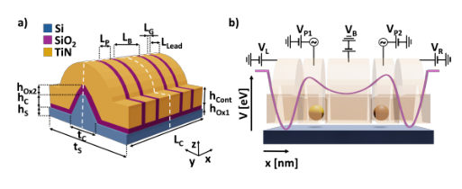
<figcaption class="paper-figure-caption"><b>Fig 1.</b> FIG. 1. (a) Illustration of the quantum device simulated in this work. It is a Si FinFET with a triangular channel sur- rounded by a SiO2 oxide layer and operated with five TiN metallic gates that are shown in yellow. The SiO2 layer is colored in purple and the Si regions in blue. The structure has the following dimensions: Lc = 95 nm, LLead = 14 nm, LP = 12 nm, LG = 4 nm, LB = 27 nm, hS = 8 nm, hOx1 = 4 nm, hOx2 = 8 nm, hCont = 20 nm, hC = 21 nm, tC = 34 nm, tc2 = 28 nm, and tS = 72 nm. (b) Side view of the device in (a) showing the Si channel (transparent), the gate-induced QDs (yellow and brown spheres), and the sub- strate (opaque blue). The purple curve represents the average valence...</figcaption>
</figure>
<figure class="paper-figure-card">
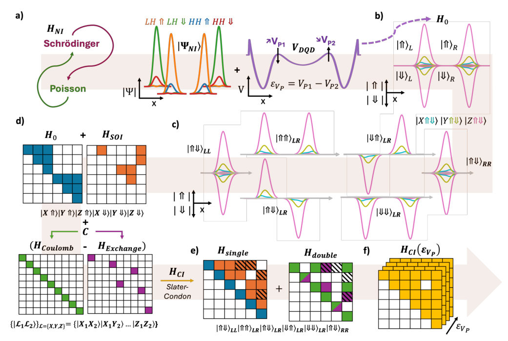
<figcaption class="paper-figure-caption"><b>Fig 2.</b> FIG. 2. Creation of a two-particle Hamiltonian through the CI method and a minimal single-particle basis set at zero magnetic field. (a) Self-consistent loop between the Schrödinger and Poisson equations. The first two doubly-degenerate hole eigenstates |Ψ0 NI⟩and |Ψ1 NI⟩with energy above the Fermi level obtained from diagonalizing Eq. (2b) are represented in terms of their band- mixing (SO contribution omitted for visibility), while the converged electrostatic potential VDQD is shown as purple line. (b) First two doubly-degenerate localized eigenstates (| ⇑⟩L/| ⇓⟩L and | ⇑⟩R/| ⇓⟩R) of Eq. (6) in absence of spin-orbit interaction, as obtained with our self-consistent SP solver. (c)...</figcaption>
</figure>
<figure class="paper-figure-card">

<figcaption class="paper-figure-caption"><b>Fig 3.</b> FIG. 3. Isosurface of the heavy-hole (blue) and light-hole (orange) contributions to the hole density in the device from Fig. 1 at VP 1/P 2 = 484 mV, VB = 690 mV and VL/R = 950 mV. The x-coordinates of the left and right dots are given on the horizontal axis. (a) Bonding (EεVP =0 mV=0.813 meV and EεV P =2 mV=1.067 meV) and anti-bonding state (EεVP =0 mV=0.797 meV and EεVP =2 mV=0.543 meV) in case of a symmetric DQD system (top) and with a finite detun- ing εVP =1 mV between both QDs (bottom). (b) Same as in (a), but for εVP =1.5 mV, including the first (Eε=4 mV=- 1.927 meV) and second (Eε=4 mV=-2.853 meV) excited states, which are situated below the Fermi level EF =0 eV. The omit- ted...</figcaption>
</figure>
<figure class="paper-figure-card">
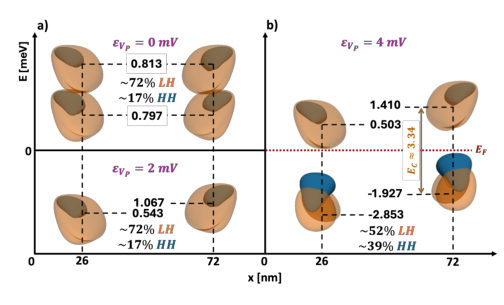
<figcaption class="paper-figure-caption"><b>Fig 4.</b> Fig. 3(a), in particular by the blue HH density that shows clear uneven distribution between the left and right dot. In all cases, the light-hole contribution to the bonding and anti-bonding states remains largely superior to the heavy-hole one (82% vs. 15%), with about 3% com- ing from the spin-orbit coupling. Such a distribution is indeed to be expected considering the presence of two strong directions of confinement and of cooling-induced compressive strain, both giving rise to a strong light-hole population [25, 52, 53]. We present in Fig. 4 the isosurface of the orthonor- mal basis set computed from the 3 × 3 Hamiltonian of Eq. (6) as a function of its |X⟩, |Y ⟩, and |Z⟩compo- nents as...</figcaption>
</figure>
<figure class="paper-figure-card">
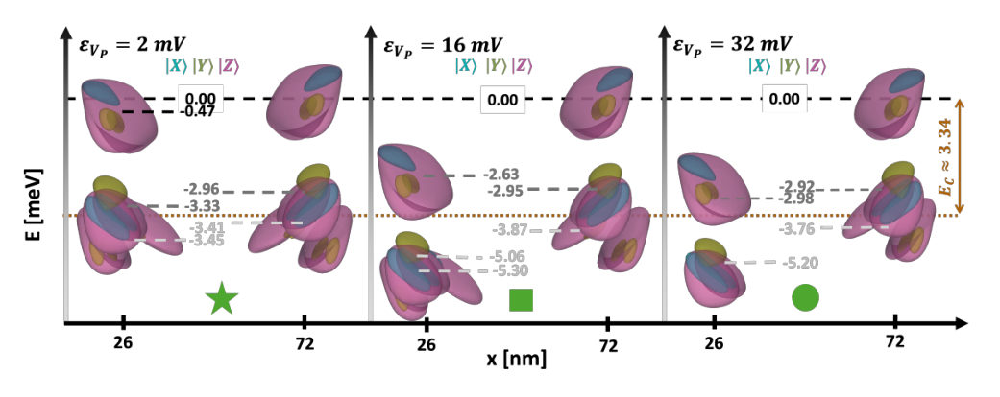
<figcaption class="paper-figure-caption"><b>Fig 5.</b> FIG. 4. Isosurface of the doubly degenerate X (cyan), Y (green), and Z (pink) components of the first six highest single- particle state, weighted by their relative probability, as obtained by solving Eq. (6) for VB = 690 mV, VL/R = 0.95 mV, and the following voltage pairs:VP 1/VP 2 = 485/483Bowen mV ⇐⇒εVP = 2 mV (star), VP 1/VP 2 = 492/476 mV ⇐⇒εVP = 16 mV (triangle), and VP 1/VP 2 = 500/468 mV ⇐⇒εVP = 32 mV (circle, sixth doubly-degenerate single-particle state not shown). The x-coordinates of the left and right dots are given on the horizontal axis. The energy of the ground state is fixed at 0 eV, whereas that of the excited states is shifted according to their energy separation to the...</figcaption>
</figure>

**Summary.** The paper develops and applies a GPU-accelerated simulation framework to model hole spin double quantum dots within silicon FinFETs. By combining self-consistent Poisson/Schrödinger solvers with Configuration Interaction theory, the authors accurately calculate exchange coupling. This work is crucial for designing and optimizing solid-state platforms for scalable two-qubit quantum logic gates.

**Why it may be interesting.** This work provides a detailed theoretical blueprint for realizing solid-state qubits by simulating complex many-body interactions (exchange coupling) in realistic semiconductor nanostructures, which is central to quantum computing hardware development.

Detailed structure

**Main problem.** The study aims to characterize exchange coupling effects within double quantum dot (DQD) systems hosted in FinFET-like structures for the purpose of implementing two-qubit quantum logic gates.

**Main result.** The simulation framework successfully reproduces the magneto-electrostatic behavior required for controlling qubits, allowing determination of optimal operating conditions for quantum logic gates like CZ and SWAP.

**Method.** The methodology involves a self-consistent Schrödinger-Poisson (SP) solver coupled with a Configuration Interaction (CI) method applied to a two-particle Hamiltonian derived from single-particle states.

**Model / system.** The system is a hole spin DQD confined in a 5-gate silicon FinFET, modeled using a Luttinger-Kohn $6	imes 6$ k.p Hamiltonian that accounts for strain and magnetic fields.

**Key observables.** Exchange coupling constant (J), gate-induced confined electronic states, electrostatic potential, and the energy spectrum of singlet/triplet states as a function of detuning.

**Important parameters / regimes.** Gate biases (detuning $\varepsilon_{	ext{VP}}$), magnetic field orientation, and device geometry parameters ($L_c$, $h_S$).

**Assumptions / limitations.** The simulation assumes hole wavefunctions do not penetrate oxide layers (Dirichlet boundary conditions) and uses a reduced basis set while maintaining accuracy.

**Figures summary.** Figures illustrate the simulated Si FinFET device geometry, the self-consistent loop between Schrödinger and Poisson equations yielding the DQD potential, and the construction of the two-particle Hamiltonian via Slater determinants.

**Paper structure.** The paper follows a structure detailing the physical platform (FinFET/DQD), outlining the multi-step simulation methodology (SP solver $
ightarrow$ single-particle states $
ightarrow$ CI diagonalization), presenting results on magneto-electrostatic behavior, and concluding with the determination of optimal gate operating conditions.

Abstract

By leveraging a GPU-accelerated Schrödinger-Poisson (SP) solver, we characterize exchange coupling in a hole spin double-qubit device involving a double quantum dot (DQD) system formed inside a 5-gate silicon fin field-effect transistor (FinFET) similar to real experimental structures. The self-consistent SP simulations rely on a finite difference discretization of the 3D volume and on a Luttinger-Kohn 6x6 kp Hamiltonian accounting for magnetic fields and strain distribution. They return the gate-induced confined electronic states and the corresponding electrostatic potential hosting the DQD. These quantities serve as inputs to a two-particle Hamiltonian that is constructed from single-particle Slater determinants through the configuration interaction (CI) method. By diagonalizing this two-particle Hamiltonian, the eigenstates and eigenenergies of the DQD system are obtained, together with their exchange coupling. We show that our simulation framework, using a reduced number of basis states, is capable of reproducing the magneto-electrostatic behavior of the devices of interest, as predicted from theory and observed experimentally. We finally leverage our approach to determine the optimal operating conditions of a two-qubit quantum logic gate implemented in a Si FinFET structure.

[↑ back to top](#top)

### [Equilibrium in a Reaction Network of Assemblies](http://arxiv.org/abs/2607.07959v1)

**Authors:** Giampaolo Folena, Germán Kruszewski  
**Type:** theory · **Category:** statistical mechanics · **PDF:** <https://arxiv.org/pdf/2607.07959v1>  
**Analysis basis:** full PDF text, analyzed in chunks
**Topic relevance:** `non-equilibrium dynamics` **2/5** · `non-equilibrium universality` **2/5** · `Keldysh / 2PI / non-Gaussian methods` **1/5** · `correlated / nonlocal dissipation` **1/5** · `driven-dissipative phase transition` **1/5** · `entanglement & information structure` **1/5** · `methods for driven-dissipative` **1/5**

↔ Scroll figures horizontally

<figure class="paper-figure-card">
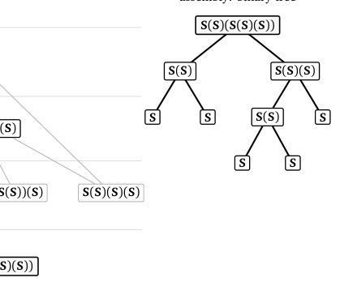
<figcaption class="paper-figure-caption"><b>Fig 1.</b> Figure 1: Layered embedding of the reaction network of assemblies up to length l = 4. The highlighted subnetwork (black edges) leads to a length-5 assembly, writ- ten as the parenthesized expression S(S)(S(S)(S)) and represented on the right as a binary tree. Light gray edges show the other ordered compositions available in the same local region of the combinatorial space.</figcaption>
</figure>
<figure class="paper-figure-card">
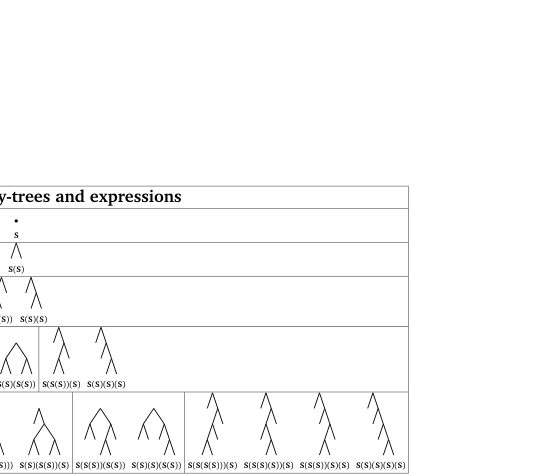
<figcaption class="paper-figure-caption"><b>Fig 2.</b> Figure 2: Binary-tree assemblies up to length l = 5. The ordered trees are arranged symmetrically, and thin vertical separators indicate left-right symmetry classes. Each tree is labeled by its parenthesized expression.</figcaption>
</figure>
<figure class="paper-figure-card">
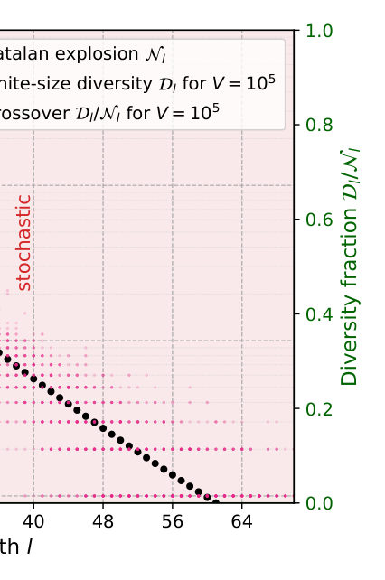
<figcaption class="paper-figure-caption"><b>Fig 3.</b> Figure 3: Finite-size diversity by length for V = 105 at r = 1. Black points show the expected diversity 〈Dl〉, the dashed gray curve gives the Catalan count Nl = Cl−1, and the dark-green curve shows the occupancy ratio Dl/Nl across the deterministic- to-stochastic crossover at lc. Purple dots show the diversity of 60 simulation samples for V = 105. The diversity peak lies close to the crossover scale lc.</figcaption>
</figure>
<figure class="paper-figure-card">
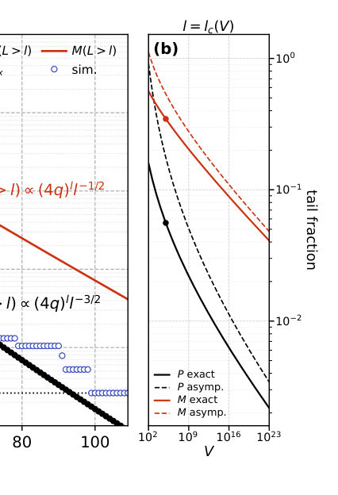
<figcaption class="paper-figure-caption"><b>Fig 4.</b> Figure 4: Tail probability, single-assembly probability, and tail mass at r = 1. (a) Tail probability P(L &gt; l) (black), single-assembly probability pl (dark green), and tail mass M(L &gt; l) (red dashed) plotted against the assembly length l. Blue open markers show a Gillespie snapshot V = 105. The horizontal dotted line marks the scale 1/(Vρ) = 1/N, and the labels indicate the corresponding large-l asymptotic forms. (b) Exact and asymptotic scaling of P(L &gt;lc) and M(L &gt;lc) with the volume V. The dot indicates the value for V = 105.</figcaption>
</figure>
<figure class="paper-figure-card">
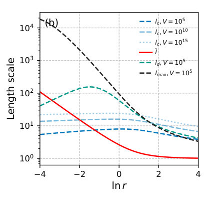
<figcaption class="paper-figure-caption"><b>Fig 5.</b> Figure 5: Characteristic finite-size lengths. (a) Volume scaling at r = 1. Solid curves show the occupancy crossover lc, the diversity peak l∗, the diversity cutoff ld, and the largest observed length lmax. Open symbols show measurements extracted from Gillespie snapshots at time t f = 50 for different volumes V; the empirical ld, lmax are systematically underestimated if t f is not long enough. The pair lc, l∗grows with slope −1/lnq, while ld and lmax share the larger slope −1/ln(4q). (b) Dependence on ln r at β = 1, compared with the expected equilibrium mean length l (volume independent) . The dashed curves use the same color code as in (a), with lc shown for V = 105,1010,1015 and ld,...</figcaption>
</figure>

**Summary.** This work analyzes a minimal model of assembly formation via reversible coagulation and fragmentation, treating assemblies as ordered binary trees. It establishes that the system reaches an equilibrium characterized by a Zipf-like distribution and features a crossover length scale $l_c$ dictated by finite volume effects. The paper provides rigorous thermodynamic descriptions for this neutral baseline, allowing researchers to measure deviations caused by selection or external driving forces.

**Why it may be interesting.** While focused on chemical kinetics/statistical mechanics, the concept of 'neutral baseline' for measuring selection mechanisms in complex systems is highly relevant to open quantum systems where environmental coupling or external driving fields are introduced.

Detailed structure

**Main problem.** The study investigates equilibrium properties, finite-size fluctuations, and scaling laws within a mean-field reaction network where species are complex assemblies built via reversible coagulation and fragmentation.

**Main result.** The system exhibits a crossover between deterministic (Zipf-like) and fluctuation-dominated regimes controlled by a length scale $l_c \sim \ln V$, and the equilibrium state admits a clear thermodynamic description.

**Method.** The analysis combines combinatorial counting (Catalan numbers), detailed balance conditions, generating functions for mass conservation, and asymptotic scaling theory to analyze entropy differences between statistical and thermodynamic ensembles.

**Model / system.** The model is a closed pool of identical atoms undergoing reversible coagulation ($x+y 
ightleftharpoons x(y)$) into ordered binary tree assemblies. The network dynamics are assumed to be dilute, loop-free, and atom-conserving.

**Key observables.** Diversity ($\langle D_l 
angle$), Shannon Entropy ($s_{Sh}$), Thermodynamic Entropy ($S_{th}^{	ext{pool}}$), and various assembly-weighted observables $A^{(i)}(V)$.

**Important parameters / regimes.** Finite volume $V$, crossover length $l_c \sim \ln V$, kinetic ratio $r = k_F/k_K$, bond energy ($\epsilon_B$), and chemical potential.

**Assumptions / limitations.** The system is dilute, reversible, loop-free, and the equilibrium state is governed by mass conservation constraints in finite volumes.

**Figures summary.** Figures illustrate the binary tree structure of assemblies (up to $l=5$) and show the scaling behavior of diversity ($\langle D_l 
angle$) relative to the volume-dependent crossover scale $l_c$.

**Paper structure.** The paper builds from defining the combinatorial nature of the species space, deriving the equilibrium concentrations via detailed balance, establishing the finite-size crossover governed by $l_c$, and finally comparing different entropy definitions (Shannon vs. Thermodynamic) to analyze scaling laws.

Abstract

We study a mean-field reaction network whose species are assemblies built from identical atoms by reversible coagulation and fragmentation. Each assembly is an ordered binary tree, so the number of species of a given length grows combinatorially, as the Catalan numbers. The model nonetheless admits an explicit equilibrium and tractable stochastic dynamics. A finite volume $V$ sets a crossover length $l_c \sim \ln V$ that splits the equilibrium into two sectors. Below $l_c$ each assembly occurs in many copies and the rank-frequency distribution is Zipf-like; above $l_c$ individual species are rare and fluctuation-dominated. The statistical weight of the rare sector decays slowly with volume, controlling the finite-size scaling of diversity, Shannon entropy, and other assembly-weighted observables. The equilibrium also admits a transparent grand-canonical description in terms of a bond energy and an atomic chemical potential. Together these results make the model a controlled neutral baseline against which selection and driving in richer assembly networks can be measured.

[↑ back to top](#top)

### [The charge density fluctuations and the Shrinking Fermi Liquid scenario for strange metallicity in cuprates](http://arxiv.org/abs/2607.08476v1)

**Authors:** Sergio Caprara, Sauri Bhattacharyya, Carlo Di Castro, Giovanni Mirarchi, Götz Seibold, Marco Grilli  
**Type:** both · **Category:** strongly correlated electrons · **PDF:** <https://arxiv.org/pdf/2607.08476v1>  
**Analysis basis:** full PDF text, analyzed in chunks
**Topic relevance:** `Kondo & dissipative impurity` **2/5** · `non-equilibrium dynamics` **2/5** · `Keldysh / 2PI / non-Gaussian methods` **1/5** · `correlated / nonlocal dissipation` **1/5** · `driven-dissipative phase transition` **1/5** · `methods for driven-dissipative` **1/5** · `non-equilibrium universality` **1/5**

↔ Scroll figures horizontally

<figure class="paper-figure-card">
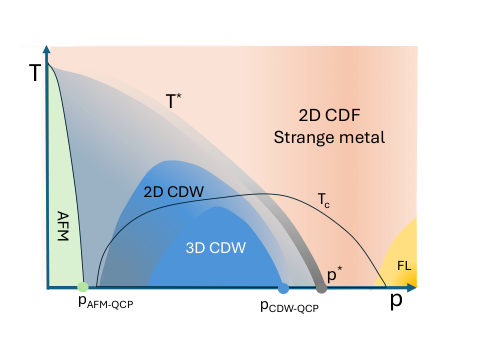
<figcaption class="paper-figure-caption"><b>Fig 1.</b> FIG. 1: Schematic phase diagram of the cuprates. p is the doping of the CuO2 planes. T ∗is the pseudogap crossover line ending at T = 0 at the doping p∗</figcaption>
</figure>
<figure class="paper-figure-card">
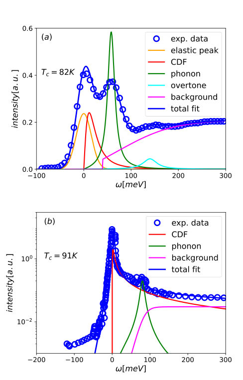
<figcaption class="paper-figure-caption"><b>Fig 2.</b> FIG. 2: High resolution RIXS spectrum (a) and EELS spec- trum (b) for Bi2212 with Tc indicated in the panels. RIXS data are from Ref. 37 whereas EELS data have been taken from Ref. 63. The experimental spectra (blue circles) are de- composed into the individual excitations (elastic peak, CDF, phonons, background) as described in the text.</figcaption>
</figure>
<figure class="paper-figure-card">

<figcaption class="paper-figure-caption"><b>Fig 3.</b> Fig.2(a) reports the RIXS response at q = qc obtained from Ref. 37 together with the CDF lineshape as a red line (the spectrum is broader since it is obtained by a convolution with an experimental resolution Gaussian of width 20 −30 meV). The magenta and the green curves</figcaption>
</figure>
<figure class="paper-figure-card">
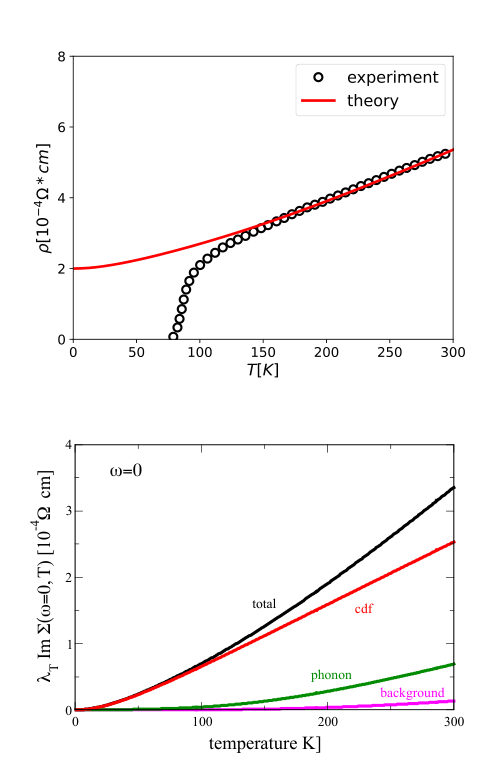
<figcaption class="paper-figure-caption"><b>Fig 4.</b> FIG. 3: Top panel: DC resistivity data (circles) for an opti- mally doped Bi2212 sample (Tc = 87K) from Ref. 72. The fit from Eq. (10) is shown by the red line with ˜λT = 0.172 · 10−4Ωcm and ρ0 = 2.0 · 10−4Ωcm. Lower panel: Individ- ual contributions from CDF (red), phonons (green) and back- ground (magenta) to the total inelastic part λT Σ′′(ω = 0, T) (black).</figcaption>
</figure>
<figure class="paper-figure-card">
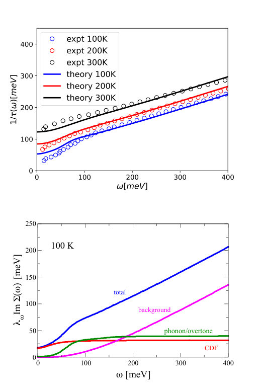
<figcaption class="paper-figure-caption"><b>Fig 5.</b> FIG. 4: Top panel: Optical scattering rate for an opti- mally doped BSCCO sample (Tc = 82 K) from Ref. 73 at 100K (black circles), 200K (red circles), and 300K (blue cir- cles) compared to the theoretical fits (lines). Parameters: λω = 2.25 meV, 1/τ0 = 35 meV. Lower panel: Individual contributions to the 100K fit of ˜λωΣ′′(ω, T)(blue) from CDF (red), phonons (green), and background (magenta).</figcaption>
</figure>

**Summary.** This paper proposes that the strange metal state in cuprates arises from itinerant fermions scattering off abundant, low-energy Charge Density Fluctuations (CDF). Using the Shrinking Fermi Liquid theory, the authors show this mechanism consistently explains linear-T resistivity and other anomalous transport properties by incorporating CDFs alongside phonons and paramagnons.

**Why it may be interesting.** The detailed coupling of fermionic quasiparticles to specific bosonic fluctuations (CDF) provides a concrete mechanism for emergent non-Fermi liquid behavior in strongly correlated materials, which is highly relevant to understanding quantum critical points.

Detailed structure

**Main problem.** The paper addresses the anomalous 'Strange Metal' (SM) state observed in slightly overdoped cuprates, characterized by resistivity linear in temperature, which defies standard Fermi Liquid theory.

**Main result.** The SM behavior is successfully described by interpreting transport properties as scattering between itinerant fermions and low-energy Charge Density Fluctuations (CDF), leading to a consistent model for various anomalous measurements.

**Method.** The authors combine theoretical modeling (Shrinking Fermi Liquid theory) with analysis of experimental data from RIXS and EELS spectroscopy.

**Model / system.** The system is the cuprate superconductor, modeled by considering itinerant fermions interacting with low-energy bosonic excitations, specifically Charge Density Fluctuations (CDF), phonons, and spin paramagnons.

**Key observables.** T-linear resistivity ($
ho \propto T$), specific heat coefficient ($\gamma(T)$), Seebeck coefficient ($S/T$), and magnetoresistance.

**Important parameters / regimes.** Low energy scale of CDF ($\omega_{	ext{CDF}} \sim 5-10$ meV) and the finite energy scale $M/\gamma$.

**Assumptions / limitations.** The core assumption for low-temperature behavior is that the CDF dissipation parameter ($\gamma$) grows logarithmically as temperature decreases when superconductivity is suppressed.

**Figures summary.** Figure 2 shows RIXS and EELS spectra of Bi2212, decomposing signals to identify elastic peaks, CDFs, phonons, and paramagnon continua.

**Paper structure.** The paper introduces the SM problem, identifies CDF as the key low-energy scatterer via experimental characterization (RIXS/EELS), develops the Shrinking Fermi Liquid theory framework for transport and optical properties, and finally applies this model to explain multiple anomalous thermodynamic and transport measurements across different doping regimes.

Abstract

We interpret the strange metal (SM) properties of slightly overdoped cuprates in terms of the recently proposed Shrinking Fermi Liquid theory. This is based on the pervading presence in the cuprate phase diagram of charge density fluctuations (CDF), which have been identified and characterized in RIXS. These fluctuations are abundant and have a low energy due to the proximity of the charge density wave quantum critical point hidden under the superconducting dome of cuprates, but have a short range and non-critical character with a finite energy M/γ~10 meV as measured above Tc. Here M~ ξ^-2 is determined by the short correlation length ξ, while γencodes the Landau damping ruling the lifetime of the charge fluctuations. Besides these low energy CDF, cuprates also display phonons and a broad continuum of particle-hole excitations, mostly due to spin paramagnons arising from their strongly correlated character. With these experimentally characterized ingredients we show that above Tc the SM properties in transport are well described in terms of fermionic Landau quasiparticles scattering with CDF and phonons. The optical properties can instead be interpreted by the combined effect of low energy CDF determining the temperature dependence, and of the paramagnon continuum determining a linear in frequency scattering rate. Remarkably, the combined effect of these simple ingredients also induces ω/T scaling properties for frequencies larger than M/γ. When superconductivity is suppressed by strong magnetic fields the SM properties extend down to a few Kelvin. By assuming that the CDF dissipation parameter γgrows logarithmically by lowering T, we account for all anomalous transport and thermodynamic properties of cuprates (specific heat, Seebeck, heat transport, resistivity, and magnetoresistance) thereby providing a consistent scenario for the SM phase of cuprates.

[↑ back to top](#top)

### [Chiral Tube Algebras I: Topological Defect Lines, Twisted Modules, and Finite Gauging](http://arxiv.org/abs/2607.07786v1)

**Authors:** Nathan Benjamin, Ho Tat Lam, Conghuan Luo  
**Type:** theory · **Category:** other · **PDF:** <https://arxiv.org/pdf/2607.07786v1>  
**Analysis basis:** full PDF text, analyzed in chunks
**Topic relevance:** `analog quantum simulation` **2/5** · `Keldysh / 2PI / non-Gaussian methods` **1/5** · `correlated / nonlocal dissipation` **1/5** · `driven-dissipative phase transition` **1/5** · `entanglement & information structure` **1/5** · `methods for driven-dissipative` **1/5**

↔ Scroll figures horizontally

<figure class="paper-figure-card">
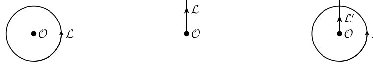
<figcaption class="paper-figure-caption"><b>Fig 1.</b> Figure 1: The left figure is the interpretation of a TDL as an operator acting on the local Hilbert space H. The middle figure is the interpretation of a TDL as a defect that twists the boundary condition and defines the defect Hilbert space HL. The right figure illustrates how a TDL maps between different defect Hilbert spaces. The bottom row is related to the top row by the conformal map z = ew, where z is the complex coordinate on the plane and w = τ + iϕ, with τ the Euclidean time and ϕ the angular coordinate on the cylinder.</figcaption>
</figure>

**Summary.** This paper introduces 'Chiral Tube Algebras' to create a unified mathematical framework bridging Chiral Algebras (local symmetries) and Topological Defect Lines (topological symmetries) within 2D CFTs. It shows how this new structure naturally describes the behavior of chiral algebras when subjected to processes like finite gauging or interaction with defects. This advances the understanding of symmetry in topological quantum field theories.

**Why it may be interesting.** While highly abstract, the concept of generalizing symmetry structures from local operators to defect lines is crucial for understanding boundary conditions and topological phases in condensed matter systems, which can inform models used in AMO physics or quantum simulation.

Detailed structure

**Main problem.** The paper aims to unify two complementary symmetry concepts in 2D Conformal Field Theories (CFTs): Chiral Algebras and symmetries associated with Topological Defect Lines (TDLs).

**Main result.** It introduces 'Chiral Tube Algebras' as a generalized framework that incorporates TDL effects, allowing for the description of chiral algebras under finite gauging.

**Method.** The authors use advanced algebraic techniques involving fusion categories, module theory, and generalizations of vertex operator algebras to construct and analyze these new algebras.

**Model / system.** The theoretical setting is 2D Conformal Field Theories (CFTs), which are studied using mathematical tools like chiral currents, defect Hilbert spaces ($\mathcal{H}_L$), and tensor categories.

**Key observables.** Irreducible modules of the algebras; fusion rules ($N^k_{ij}$); mapping between local and defect Hilbert spaces.

**Important parameters / regimes.** The dimensionality (2D) and the nature of the symmetry (local vs. topological/non-invertible).

**Assumptions / limitations.** The analysis often assumes unitary compact CFTs when dealing with chiral algebras, though the framework is designed to extend beyond these limits.

**Figures summary.** Figure 1 illustrates how a TDL can be interpreted as an operator acting on the local Hilbert space or as a defect defining a twisted defect Hilbert space ($\mathcal{H}_L$).

**Paper structure.** The paper progresses by first establishing the distinct roles of chiral algebras and TDLs, then proposing Chiral Tube Algebras to unify them, illustrating this unification with known examples (Kac-Moody, W algebras), and concluding with a roadmap for future work on non-local currents.

Abstract

Chiral algebras and topological defect lines (TDLs) represent two complementary notions of symmetry in 2d conformal field theories. In this paper, we introduce chiral tube algebras to unify and extend these two notions. Chiral tube algebras generalize chiral algebras in two ways. First, they extend the action of chiral algebras beyond the local Hilbert space to include defect Hilbert spaces twisted by TDLs. Second, they allow for non-local chiral currents attached by TDLs and thus can map between different defect Hilbert spaces, analogous to the tube algebras of TDLs. Since local chiral currents can become non-local after finite gauging, chiral tube algebras provide a natural framework for describing the image of chiral algebras under such gauging. We illustrate this framework through a variety of examples that generalize familiar chiral algebras, including Kac-Moody algebras, $\mathcal{W}$ algebras, superconformal algebras, and their orbifolds/bosonizations. We construct their irreducible modules, which are isomorphic to twisted modules of the corresponding chiral algebras, and use them to organize local and defect Hilbert spaces. In a subsequent paper, we will study chiral tube algebras generated by non-local chiral currents with fractional spins, which have no counterparts in chiral algebras.

[↑ back to top](#top)

### [Procrustes Tomography -- reconstructing noisy quantum channels made easy](http://arxiv.org/abs/2607.07988v1)

**Authors:** Josey Stevens, Reece Robertson, Sebastian Deffner  
**Type:** theory · **Category:** quantum information and computing · **PDF:** <https://arxiv.org/pdf/2607.07988v1>  
**Analysis basis:** full PDF text, analyzed in chunks
**Topic relevance:** `quantum measurements` **2/5** · `correlated / nonlocal dissipation` **1/5** · `driven-dissipative phase transition` **1/5** · `entanglement & information structure` **1/5** · `methods for driven-dissipative` **1/5** · `non-equilibrium dynamics` **1/5**

↔ Scroll figures horizontally

<figure class="paper-figure-card">
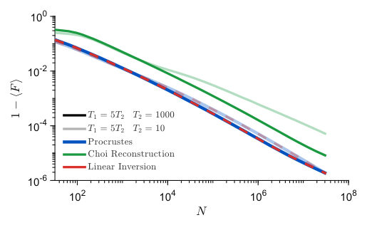
<figcaption class="paper-figure-caption"><b>Fig 1.</b> Fig. 1: Infidelity between the true and reconstructed two-qubit noisy gates as a function of the number of measurement shots with evenly distributed state measurement. Procrustes recon- struction (blue), Choi reconstruction (green), and Linear in- version (gold dashed) are plotted with high-fidelity gates for each reconstruction shown with full color saturation, and the low-fidelity implementation is plotted with reduced color satu- ration. Each method uses all 32 perfectly prepared input states required to compute the Choi reconstruction with Ni = Nj for all states.</figcaption>
</figure>
<figure class="paper-figure-card">
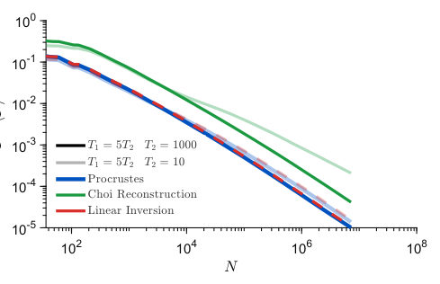
<figcaption class="paper-figure-caption"><b>Fig 2.</b> Fig. 2: Infidelity between the true and reconstructed two-qubit noisy gates as a function of the number of measurement shots with unevenly distributed state measurements. Procrustes re- construction (blue), Choi reconstruction (green), and Linear inversion (gold dashed) are plotted with high-fidelity gates for each reconstruction shown with full color saturation, and the low-fidelity implementation is plotted with reduced color satu- ration. Each method uses all 32 perfectly prepared input states required to compute the Choi reconstruction. States that have a preparation of |i⟩⟨i| are sampled at 10× the frequency than those representing |±⟩⟨±|, i.e. Ni = 10N±.</figcaption>
</figure>
<figure class="paper-figure-card">
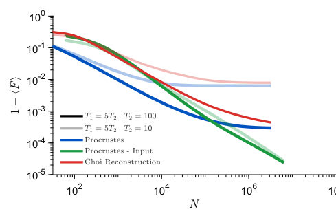
<figcaption class="paper-figure-caption"><b>Fig 3.</b> Fig. 3: Infidelity between the true and reconstructed two- qubit noisy gates as a function of the number of measurement shots with evenly distributed state measurement and imper- fect state preparation. Procrustes reconstruction (blue), Choi reconstruction (green), and Linear inversion (gold dashed) are plotted with high-fidelity gates for each reconstruction shown with full color saturation, and the low-fidelity implementation is plotted with reduced color saturation. In each case, the state preparation is performed via an efficient unitary Up that is implemented in an identical duration to the noisy process, i.e., τP = τ, and is subject to the same noisy process. Each method uses all 32...</figcaption>
</figure>
<figure class="paper-figure-card">
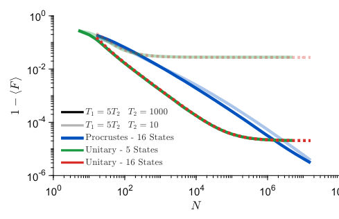
<figcaption class="paper-figure-caption"><b>Fig 4.</b> Fig. 4: Infidelity between the true and the Procrustes recon- structed two-qubit noisy gates as a function of the number of measurement shots of varying numbers of input preparations including projections onto the nearest unitary operator. Pro- crustes tomography with 16 input states is shown in blue, the unitary projected reconstruction from 5 input states (|i⟩and H⊗|0⟩) is shown in green, while the unitary projection from the reconstruction from 16 input sates is shown in gold with high fidelity gates for each reconstruction shown with full color saturation and the low fidelity implementation of plotted with reduced color saturation and their nearest unitary projection for each case...</figcaption>
</figure>

**Summary.** This paper introduces Procrustes tomography as an efficient method to characterize noisy quantum channels, addressing the computational bottleneck of quantum process tomography. By reformulating the problem as a simple least-squares minimization using input and output states, it outperforms established techniques under realistic noise conditions like uneven sampling or state preparation errors. This makes high-fidelity characterization more accessible for NISQ devices.

**Why it may be interesting.** It provides a computationally tractable and robust framework for characterizing open quantum systems on near-term hardware by simplifying the complex mathematical requirements of full process tomography.

Detailed structure

**Main problem.** Quantum process tomography, which characterizes noisy quantum channels, is computationally expensive, especially for NISQ devices.

**Main result.** Procrustes tomography is presented as an efficient alternative that matches or exceeds the performance of established methods like Choi reconstruction and linear inversion tomography.

**Method.** The method formulates channel reconstruction by minimizing the Frobenius norm between measured output states (B) and input states (A), solving for $\Lambda$ via $\Lambda = B A^+$.

**Model / system.** The study focuses on characterizing noisy quantum channels ($\Lambda$) acting on qubits, often modeled using dynamics governed by the Lindblad master equation.

**Key observables.** Infidelity ($1 - \langle F_{E} 
angle$), Process matrix ($\Lambda$), Choi-matrix ($
ho_{	ext{Choi}}$), and measurement probabilities.

**Important parameters / regimes.** Number of independent measurement samples ($N$), relaxation times ($T_1, T_2$), and the degree of state preparation error.

**Assumptions / limitations.** The analysis compares methods under conditions of finite-size sampling effects and imperfect input state preparation, requiring specific corrections for accurate results.

**Figures summary.** Figures compare infidelity vs. measurement shots ($N$) for different reconstruction techniques (Procrustes vs. Choi vs. Linear Inversion) under scenarios involving uneven state sampling or input state preparation errors.

**Paper structure.** The paper introduces the problem, reviews established tomography methods, develops and details Procrustes tomography, and then rigorously compares its performance against competitors using various realistic noise models (uneven sampling, state preparation errors).

Abstract

What is the most expensive part of quantum device characterization? Clearly, the answer is quantum process tomography. However, especially for noisy intermediate-scale quantum (NISQ) computers, a comprehensive understanding of the noisy quantum dynamics is essential in interpreting the computational output. In this work, we introduce an efficient method -- Procrustes tomography -- that outperforms established methods in a number of aspects. After a pedagogical and constructive introduction, we demonstrate the utility of the method for representative examples of noisy quantum channels.

[↑ back to top](#top)

### [(2,m)-threshold quantum data hiding](http://arxiv.org/abs/2607.08070v1)

**Authors:** Donghoon Ha, Jeong San Kim  
**Type:** theory · **Category:** quantum information and computing · **PDF:** <https://arxiv.org/pdf/2607.08070v1>  
**Analysis basis:** full PDF text, analyzed in chunks
**Topic relevance:** `entanglement & information structure` **2/5** · `quantum measurements` **2/5** · `measurement-induced transitions` **1/5**

↔ Scroll figures horizontally

<figure class="paper-figure-card">
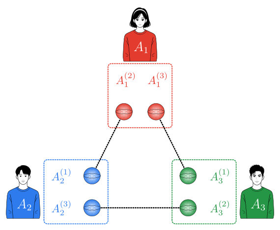
<figcaption class="paper-figure-caption"><b>Fig 1.</b> FIG. 1. Subsystems of each party when m = 3. The party A1 consists of the subsystems A(2) 1 and A(3) 1 , the party A2 consists of the subsystems A(1) 2 and A(3) 2 , and the party A3 consists of the subsystems A(1) 3 and A(2) 3 . Each pair of parties shares a two-party subsystem: A(2) 1 A(1) 2 between A1 and A2, A(3) 1 A(1) 3 between A1 and A3, and A(3) 2 A(2) 3 between A2 and A3.</figcaption>
</figure>
<figure class="paper-figure-card">
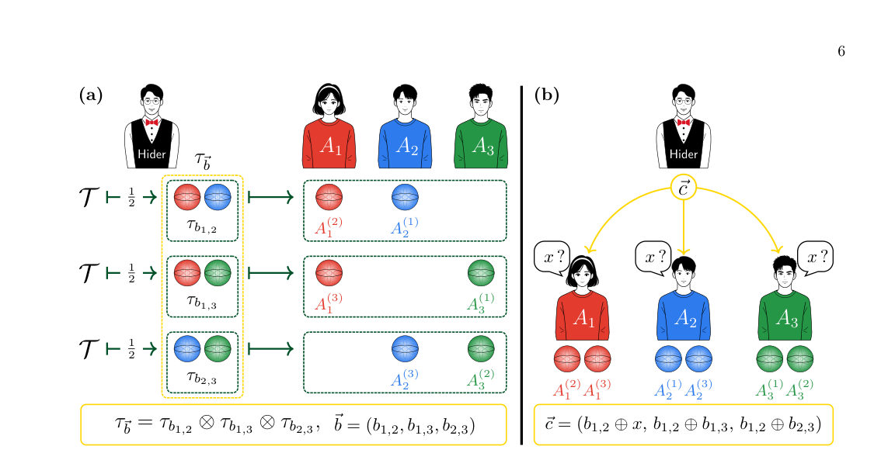
<figcaption class="paper-figure-caption"><b>Fig 2.</b> FIG. 2. (2, m)-threshold data-hiding scheme for the case m = 3 with (α, α′) = (1, 2). (a) The hider independently prepares the two-party quantum states τb1,2, τb1,3, and τb2,3 from the ensemble T , where each bit b1,2, b1,3, b2,3 ∈{0, 1} is chosen uniformly at random, and distributes the states to the corresponding pairs of parties (A1, A2), (A1, A3), and (A2, A3), respectively. (b) To hide a bit x ∈{0, 1}, the hider broadcasts the bit string ⃗c = (c1,2, c1,3, c2,3) to the parties A1, A2, and A3, where c1,2 = b1,2 ⊕x, c1,3 = b1,2 ⊕b1,3 and c2,3 = b1,2 ⊕b2,3.</figcaption>
</figure>

**Summary.** The paper introduces a $(2, m)$-threshold quantum data-hiding scheme to securely hide one classical bit among multiple parties. It proves that while any pair can perfectly recover the secret bit through joint measurement, local operations and classical communication reveal negligible information. The construction is notable because it only requires separable states, enhancing its practical feasibility.

**Why it may be interesting.** This work provides a concrete cryptographic primitive (quantum data hiding) that is physically realizable using only separable states, making it highly relevant for quantum communication protocols in AMO settings where entanglement generation might be difficult.

Detailed structure

**Main problem.** The paper proposes a $(2, m)$-threshold quantum data-hiding scheme for concealing one classical bit among $m$ parties.

**Main result.** It demonstrates that the hidden bit can be perfectly recovered by any pair of parties via joint measurement, while local operations and classical communication (LOCC) reveal only an arbitrarily small amount of information.

**Method.** The scheme is constructed using a building block ensemble based on orthogonal PPT states shared between pairs of parties, leveraging bounds derived from multipartite state discrimination theory.

**Model / system.** The model involves $m$ parties sharing quantum states in a tensor product Hilbert space. The security relies on the difference between joint measurements and LOCC measurements on these multipartite states.

**Key observables.** Discrimination probabilities, specifically $p_L(E)$ (LOCC) versus $p_{	ext{PPT}}(E)$, which quantifies the information leakage about the hidden bit.

**Important parameters / regimes.** The threshold parameter is $(2, m)$, meaning any pair of parties can succeed in recovery. The security relies on $\epsilon > 0$ being arbitrarily small.

**Assumptions / limitations.** The scheme is shown to be implementable using only separable states of low-dimensional quantum systems, avoiding the need for entanglement.

**Figures summary.** Figure 1 illustrates the subsystems shared between pairs of parties for $m=3$. Figure 2 details the state preparation and broadcast bits for the $m=3$ case.

**Paper structure.** The paper first establishes the general framework for multipartite quantum state discrimination, deriving bounds using PPT properties. It then constructs the $(2, m)$-threshold scheme by defining the shared states ($\vec{	au}_b$) and the classical broadcast bits ($\vec{c}$) necessary to achieve the desired security gap.

Abstract

We consider multiparty quantum state discrimination and present a multiparty quantum data-hiding scheme for one classical bit to be shared among multiple parties. In the proposed scheme, any pair of parties can collaborate to perfectly recover the hidden bit through a joint measurement, whereas measurements based on local operations and classical communication(LOCC) performed even by all parties reveal only an arbitrarily small amount of information. We further provide bounds on the optimal LOCC discrimination of multiparty quantum states. The proposed scheme can be implemented using only separable states of low-dimensional quantum systems, enhancing its practical feasibility.

[↑ back to top](#top)

### [Quantum Dot Moiré from Crossed MoS2 Nanoribbons](http://arxiv.org/abs/2607.07871v1)

**Authors:** Xinting Shuai, Hao Zhang, Wenjing Wu, Chongning Wu, Maryam Amiri, T. A. M. Ragib Shahriar, Dian Pan, Zhi Kai Ng, Tymofii Pieshkov, Leeza Dutta, Yijun Zhou, Rohith Narra, Luke Van Leeuwen, Jishnu Murukeshan, Luyao Shi, Jiawei Lai, Atin Pramanik, Bipin Kumar Gupta, Edwin Hang Tong Teo, Robert Vajtai, Xiang Zhang, Hanyu Zhu, Shengxi Huang, Aditya D. Mohite, Pulickel M. Ajayan  
**Type:** experiment · **Category:** other · **PDF:** <https://arxiv.org/pdf/2607.07871v1>  
**Analysis basis:** full PDF text, analyzed in chunks
**Topic relevance:** `analog quantum simulation` **2/5** · `driven-dissipative phase transition` **1/5** · `interference shaping light` **1/5** · `quantum optics experiment` **1/5**

↔ Scroll figures horizontally

<figure class="paper-figure-card">
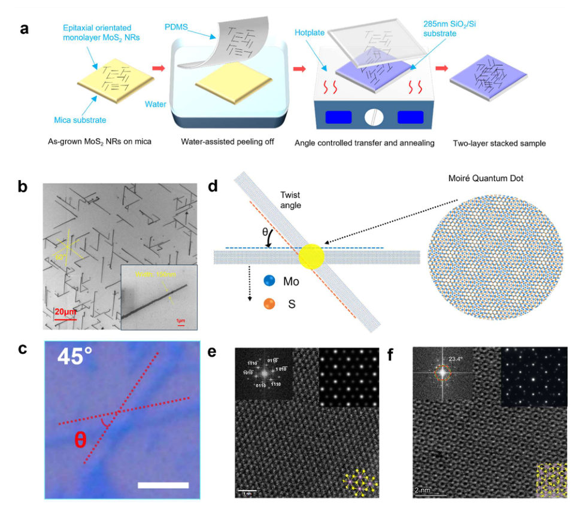
<figcaption class="paper-figure-caption"><b>Fig 1.</b> Fig. 1: Fabrication of MoS2 MQDs a, Schematic of MQDs creation through MoS2 NRs as- grown MoS2 NRs on mica, water-assisted peeling off, angle-controlled transfer and annealing and two-layer sample stack. b, SEM image of MoS2 grown on mica by CVD method, interconnected NRs have 60° or 120° angle. Inset is high magnification SEM image of single NR with 150nm width. c, Optical microscope (OM) image of MQD from two-layer NRs stacking and 45° twisting, scale bar is 2µm. d, Atomic schematic of (left) stacked MoS2 NRs and MQD with controlled twist angle θ, and (right) zoomed in Moiré pattern from MQD, blue and orange atoms are Mo and S separately. e,f, STEM image of corresponding atomic...</figcaption>
</figure>
<figure class="paper-figure-card">
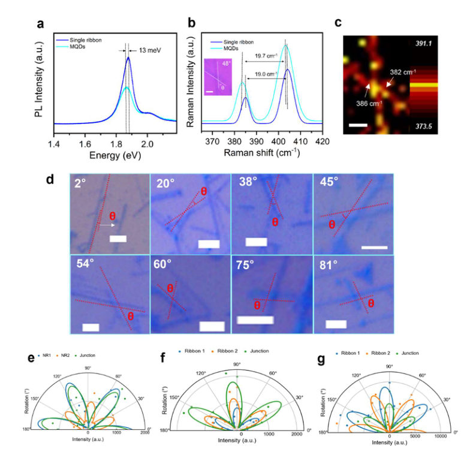
<figcaption class="paper-figure-caption"><b>Fig 2.</b> Fig. 2: Characterization of MoS2 MQDs a,b, Typical PL spectra (a) of monolayer single NR and 35° MQDs and Raman spectra (b) of monolayer single NR and 48° MQDs, showing different PL and Raman peak positions between single NR and MQDs (OM image of 48°C MDQ inset, scale bar is 1 µm). c, Raman position mapping ranges from 373 to 391.1 cm-1 with 48° MQDs, scale bar is 1µm. d, OM images of stacked MQDs from 0 to 90°, the red dashed line indicates the corresponding NR and twist angle, scale bar is 2µm. e-g, Polar plot of second harmonic generation (SHG) intensity of MQDs and NRs with 90° (e) and 53° (f) and 41° (g) twist angle; green, blue and orange colors indicate junction of MQDs, interconnect...</figcaption>
</figure>
<figure class="paper-figure-card">
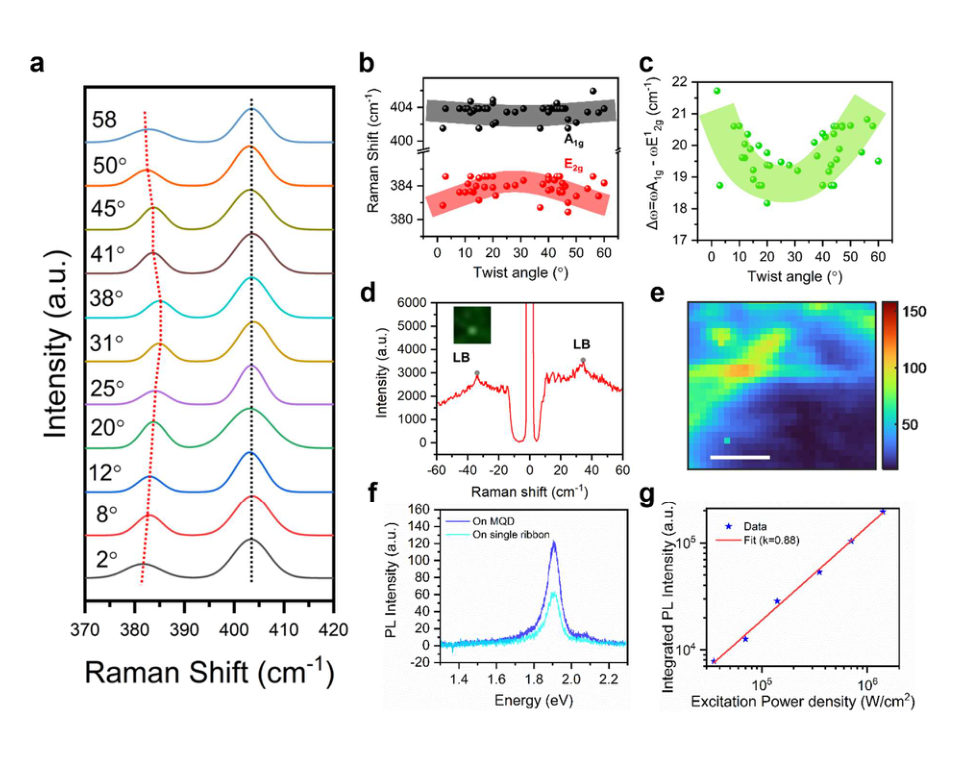
<figcaption class="paper-figure-caption"><b>Fig 3.</b> Fig. 3: Twist angle-dependence for spectroscopy of the MQDs a-c, Raman spectra (a), Raman position (𝐴ଵ௚ and 𝐸ଶ௚</figcaption>
</figure>
<figure class="paper-figure-card">
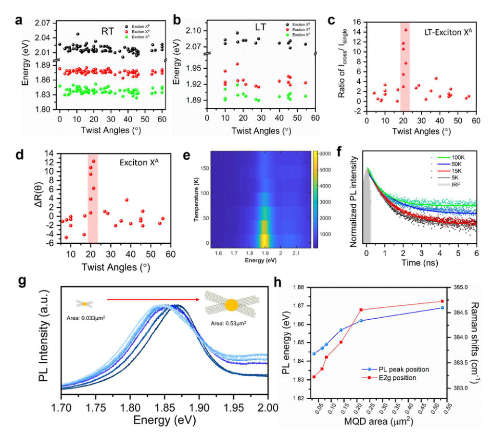
<figcaption class="paper-figure-caption"><b>Fig 4.</b> Fig. 4: Twist angle-dependence exciton behavior of the MQDs a,b, Fitted RT (a) and LT (b) PL energy position of exciton XA (red), XB (black) and trion XA- (green) as the function of twist angles (0° to 60°) on MQDs. c, Ratio of LT PL intensity on MQD and single layer (R(θ)) for exciton XA as the function of twist angles. d, Difference of PL intensity Ratio (Δ𝑅(θ)) for exciton XA on cross-section area between LT and RT as the function of twist angle. Pink columns in (c) and (d) indicate unique R(θ) and Δ𝑅(θ) values at 22±1° angle. e,f, Temperature dependent PL contour plot (e) from 3 to 170K and PL decay time (f) based in commensurate Moiré lattices at 22±1° MQD from 5 to 100 K, where XA...</figcaption>
</figure>

**Summary.** The research introduces a novel platform using stacked 1D $	ext{MoS}_2$ nanoribbons to create Moiré Quantum Dots (MQDs). By controlling the overlap angle and size, the authors demonstrate that the resulting exciton physics is highly tunable. This work advances the study of moiré phenomena by confining them to discrete quantum dot junctions.

**Why it may be interesting.** This work provides an experimental realization of highly confined, tunable moiré systems, allowing for the study of quantum phenomena in a controlled, quasi-zero-dimensional geometry relevant to solid-state quantum emitters.

Detailed structure

**Main problem.** To study Moiré physics in a confined geometry, moving beyond the limitations of extended 2D-2D twisted bilayers which lack intrinsic lateral confinement.

**Main result.** The authors demonstrated that precise overlapping of 1D $	ext{MoS}_2$ nanoribbons forms Moiré quantum dots (MQDs) whose exciton physics is tunable by controlling the overlap angle and size.

**Method.** The study involves synthesizing and deterministically stacking monolayer $	ext{MoS}_2$ nanoribbons using CVD growth followed by controlled transfer and annealing onto a substrate.

**Model / system.** The physical system is Moiré Quantum Dots (MQDs) formed at the intersection of stacked 1D $	ext{MoS}_2$ nanoribbons, creating a quasi-0D quantum dot structure with tunable moiré potentials.

**Key observables.** Angle-dependent exciton emission (enhanced at $22^\circ$), PL redshift dependent on size, and temperature-dependent fast radiative channels.

**Important parameters / regimes.** Twist angle ($	heta$), Moiré dot size, cryogenic temperature regime.

**Assumptions / limitations.** The system is treated as a quasi-0D quantum-dot system due to the 1D building blocks; edge-mediated lattice reconstruction deepens the local Moiré potential.

**Figures summary.** Figures illustrate the fabrication process (SEM images of NRs, OM image of stacked MQDs) and atomic schematics confirming the stacking geometry and resulting Moiré pattern.

**Paper structure.** The paper follows a structure detailing synthesis (CVD growth of 1D NRs), assembly (controlled stacking/transfer), and characterization using PL and structural microscopy to observe angle-dependent electronic properties.

Abstract

Twisted atomically thin layers have attracted much attention for Moiré potential and correlated quantum phenomena. However, existing Moiré superlattices have largely been limited to extensive wavefunction without lateral confinement. Here we introduce a new platform where 1D nanoribbons of 2D MoS2 grown by vapor deposition can be easily superposed at various angles from stacking and transferring, to form Moiré quantum dots at their intersections with unique exciton physics. Angle-dependent Moiré intersections show enhanced exciton emission at commensurate angle 22 deg, which demonstrates faster relaxation at the cryogenic temperature. A size-dependent study further exhibits a reduced exciton energy and soften out-of-plane interlayer coupling for smaller Moiré areas. Our results reveal exciton physics turnability via precise overlapping of 1D nanoribbons.

[↑ back to top](#top)

### [Communication Advantages from Quantum Dense Network Coding](http://arxiv.org/abs/2607.08133v1)

**Authors:** Ian George, Brian Doolittle  
**Type:** theory · **Category:** quantum information and computing · **PDF:** <https://arxiv.org/pdf/2607.08133v1>  
**Analysis basis:** full PDF text, analyzed in chunks
**Topic relevance:** `entanglement & information structure` **2/5** · `methods for driven-dissipative` **1/5** · `non-equilibrium dynamics` **1/5**

↔ Scroll figures horizontally

<figure class="paper-figure-card">
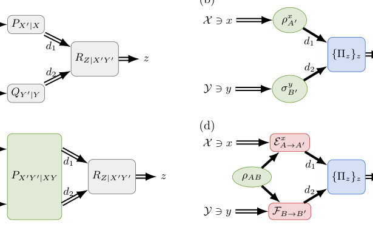
<figcaption class="paper-figure-caption"><b>Fig 1.</b> Figure 1: Examples of Multiaccess Networks with Classical Inputs and Outputs. Double-lined arrows denote classical communication and single-lined arrows denote quantum communication. Communication limited by signaling dimension di = 2ni is specified by the arrow being labeled by di. (a) Classical multiaccess network. (b) Quantum multiaccess network. (c) Nonsignaling-assisted classical multiaccess network. (d) Entanglement-assisted Quantum multiaccess network.</figcaption>
</figure>
<figure class="paper-figure-card">
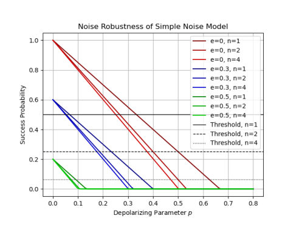
<figcaption class="paper-figure-caption"><b>Fig 2.</b> Figure 2: Noise Robustness of Communication Advantage with Heralded Loss and Depolarizing Noise. Bounds on the success probability of the receiver correctly guessing the value of ⊕2 2n are plotted. The colored lines show lower bounds on the success when each sender is allowed to send n qubits over a lossy, depolarizing channel of loss parameter e and depolarizing parameter p. These bounds follow from Theorem 3. The horizontal black lines show upper bounds on the probability of the receiver correctly guessing without both shared entanglement and quantum communication according to Theorem 2. For a chosen n, there is a quantum communication advantage so long as the colored line is above the...</figcaption>
</figure>
<figure class="paper-figure-card">
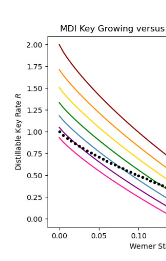
<figcaption class="paper-figure-caption"><b>Fig 3.</b> Figure 3: The asymptotic key rate of MDI QKG for Werner states ρλ = (1 −λ) Φ+ Φ+ + λ</figcaption>
</figure>
<figure class="paper-figure-card">
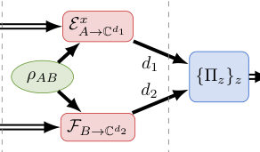
<figcaption class="paper-figure-caption"><b>Fig 4.</b> Figure 4: An example of a simultaneous message passing multiaccess network (Definition 10) with signaling dimension ⃗d = (d1, d2) as made explicit by the labeled arrows. In this case, senders 1 and 2 share entanglement through the state ρAB. They then process it conditioned on their respective inputs to send over the noiseless quantum channels to the receiver, who then measures the received joint state to output a value of z. This MN is simultaneous message passing as the two senders cannot interact and the receiver receives the entire joint state prior to having to process it.</figcaption>
</figure>
<figure class="paper-figure-card">
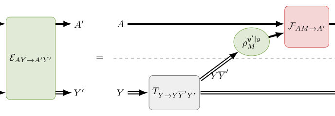
<figcaption class="paper-figure-caption"><b>Fig 5.</b> Figure 7: The channel decomposition of EAY →A′Y ′ with non-signaling restriction A ̸→Y proven in Proposition 35. The dotted grey line highlights that only classical communication needs to be transmitted.</figcaption>
</figure>

**Summary.** This paper introduces Quantum Dense Network Coding (DNC), a protocol demonstrating that quantum resources allow for significantly more efficient information transmission than classical methods. It proves this advantage is robust, requires shared entanglement and quantum links, and establishes a foundation for a new, secure quantum key growing scheme.

**Why it may be interesting.** While focused on abstract coding theory, the rigorous analysis of entanglement requirements and noise robustness provides general theoretical tools applicable to characterizing resource limitations in complex open quantum systems or communication channels.

Detailed structure

**Main problem.** The central problem is demonstrating how quantum resources can enable communication protocols, specifically 'quantum dense network coding' (DNC), to achieve superior efficiency compared to classical methods.

**Main result.** DNC transmits function outputs using provably half the qubits per sender than classically required, an advantage that requires both shared entanglement and quantum communication. This framework also yields a novel, information-theoretically secure key growing protocol.

**Method.** The authors analyze distributed computation success probabilities in various network models (Classical, Quantum, CE, QE) using MAC formalism and Weyl operators to quantify the resource advantage.

**Model / system.** The study uses abstract quantum communication models involving multiaccess networks computing functions like addition modulo $2^n$. The core mechanism relies on shared maximally entangled states and generalized Bell measurements.

**Key observables.** Success probability ($P_f^S$), communication advantage (quantified by success probability ratios), and the achievable key distillation rate ($R$).

**Important parameters / regimes.** The advantage scales exponentially with the number of senders ($n$); security is governed by error parameters $\epsilon$ and soundness/completeness bounds.

**Assumptions / limitations.** The quantum advantage critically depends on the availability of both shared entanglement and quantum communication channels; asymptotic rate calculations assume product states ($
ho_{AnBn} = 
ho^{\otimes n}_{AB}$).

**Figures summary.** Figure 1 illustrates four types of multiaccess networks. Figure 2 plots the achievable success probability bounds, showing a clear quantum advantage over classical limits. Figure 3 relates to key growing rate calculations.

**Paper structure.** The paper progresses from defining the communication efficiency problem (DNC) and proving its resource-dependent advantage using specific protocols ($\oplus_{2}^{2n}$), to establishing security definitions for distributed computation, and finally deriving asymptotic achievable rates for quantum key growth.

Abstract

A central problem in quantum information theory is understanding how quantum resources can be used to communicate information more efficiently than classical resources. We introduce quantum dense network coding -- a protocol that transmits the output of a non-Boolean function to a receiver using provably half as many qubits as bits for each sender by not transmitting the entirety of the function inputs. We show this advantage requires both shared entanglement and quantum communication, is robust to noise, and the gap in success probability between quantum and classical communication can be amplified exponentially in the number of senders. Finally, we show that dense network coding gives rise to a novel, information-theoretically secure, quantum cryptographic protocol, which we call measurement-device-independent quantum key growing.

[↑ back to top](#top)

### [Parallel QEC Decoding Applied to Distributed Quantum Computing](http://arxiv.org/abs/2607.08386v1)

**Authors:** Gabriele Incardona, Davide Ferrari, Michele Amoretti  
**Type:** theory · **Category:** quantum information and computing · **PDF:** <https://arxiv.org/pdf/2607.08386v1>  
**Analysis basis:** full PDF text, analyzed in chunks
**Topic relevance:** `entanglement & information structure` **2/5** · `QC/QI experiment` **1/5** · `methods for driven-dissipative` **1/5**

↔ Scroll figures horizontally

<figure class="paper-figure-card">
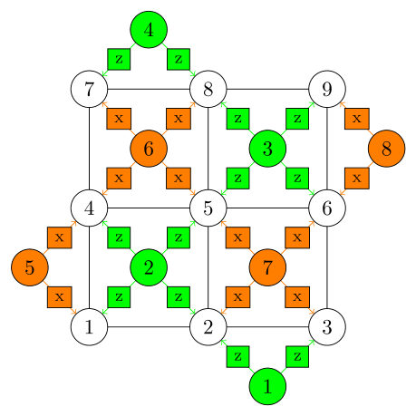
<figcaption class="paper-figure-caption"><b>Fig 1.</b> Figure 1: Distance-3 rotated planar code [2].</figcaption>
</figure>
<figure class="paper-figure-card">
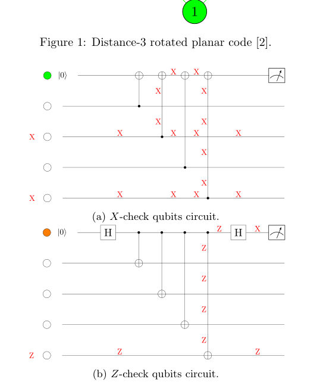
<figcaption class="paper-figure-caption"><b>Fig 2.</b> Figure 2: Stabilizing circuits for the check qubits. Error propagation examples are shown [2].</figcaption>
</figure>
<figure class="paper-figure-card">
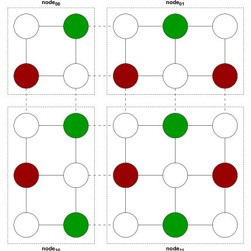
<figcaption class="paper-figure-caption"><b>Fig 3.</b> Figure 3: Representation of a 5 × 5 surface code dis- tributed across 4 QPUs. White circles are data qubits, red circles are Z-stabilizers and green circles are X- stabilizers. Solid line connections denote local interac- tions within the QPUs, while dashed lines denote non- local CNOT operations.</figcaption>
</figure>
<figure class="paper-figure-card">
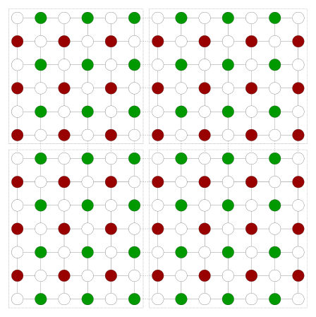
<figcaption class="paper-figure-caption"><b>Fig 4.</b> Figure 4: The 13 × 13 qubit used for most simulations.</figcaption>
</figure>
<figure class="paper-figure-card">
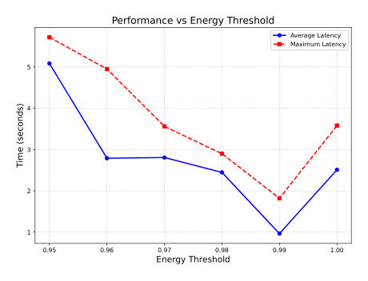
<figcaption class="paper-figure-caption"><b>Fig 5.</b> Figure 5: Execution time versus energy threshold.</figcaption>
</figure>

**Summary.** This paper proposes a novel parallel decoding strategy for QEC in distributed quantum computers by integrating Singular Value Decomposition (SVD) locally into the Belief Propagation and Ordered Statistics Decoding pipeline. The method significantly reduces computational complexity while maintaining high logical accuracy, proving that local compression is effective where global compression fails.

**Why it may be interesting.** While focused on quantum computation, the techniques of dimensionality reduction via SVD applied to structured matrices (like parity checks) are relevant for analyzing complex correlation structures in many-body systems or simulating highly entangled states.

Detailed structure

**Main problem.** The primary challenge is developing efficient, scalable decoding algorithms for Quantum Error Correction (QEC) when implemented on distributed quantum computing hardware.

**Main result.** Applying Singular Value Decomposition (SVD) as a *local* preprocessing filter significantly improves the computational complexity and maintains high logical accuracy compared to global or non-optimized decoding methods.

**Method.** The approach combines Belief Propagation (BP) for initial error estimation with Ordered Statistics Decoding (OSD), introducing SVD locally on sub-regions of the lattice to compress the error vector basis before final decoding.

**Model / system.** The work models quantum computation using stabilizer codes, specifically focusing on Surface Codes implemented across a distributed network of Quantum Processing Units (QPUs) connected by quantum links.

**Key observables.** Logical Accuracy (%) over 1000 trials; Computational Complexity ($O(m^3 + (n/r)^3)$); Execution Time (seconds).

**Important parameters / regimes.** SVD Energy Threshold ($\epsilon$); Physical Error Rate ($	ext{perr}$); Number of QPUs ($\#$ QPU); Code parameters $[[n, k, d]]$.

**Assumptions / limitations.** The core assumption is that local SVD compression retains sufficient topological information for accurate decoding, unlike global compression which fails due to loss of inter-qubit correlations.

**Figures summary.** Figures illustrate the planar code structure and circuits for syndrome extraction. Comparisons show performance vs. energy threshold (Table 2) and scalability vs. number of QPUs (Table 3).

**Paper structure.** The paper first introduces QEC decoding bottlenecks using BP/OSD on surface codes. It then proposes the novel local SVD pre-processing step, analyzes its complexity gains over centralized methods, and finally validates performance and scalability across varying error rates and node counts.

Abstract

A novel parallel approach is proposed for QEC decoding based on Belief Propagation with Ordered Statistics Decoding. The main idea is to pre-process the error vectors obtained from Belief Propagation by applying Singular Value Decomposition locally to sub-regions of the lattice. The proposed approach is applied to distributed quantum computers and evaluated in terms of complexity, accuracy, and scalability.

[↑ back to top](#top)

### [Routing Techniques for Error Corrected Silicon Spin Qubit Quantum Architectures](http://arxiv.org/abs/2607.07822v1)

**Authors:** Julian Shen, Ludwig Schmid, Robert Wille  
**Type:** theory · **Category:** quantum information and computing · **PDF:** <https://arxiv.org/pdf/2607.07822v1>  
**Analysis basis:** full PDF text, analyzed in chunks
**Topic relevance:** `QC/QI experiment` **2/5** · `exotic spin models in light-matter` **1/5** · `spintronics-quantum-optics interface` **1/5**

↔ Scroll figures horizontally

<figure class="paper-figure-card">
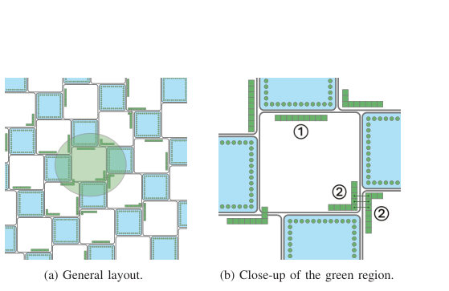
<figcaption class="paper-figure-caption"><b>Fig 1.</b> Fig. 1: Sketch of the snakes on a plane architecture [18].</figcaption>
</figure>
<figure class="paper-figure-card">
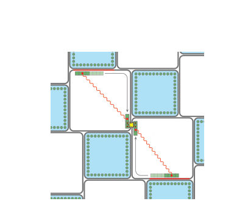
<figcaption class="paper-figure-caption"><b>Fig 2.</b> Fig. 2: Illustration of the snake surgery protocol [18].</figcaption>
</figure>
<figure class="paper-figure-card">
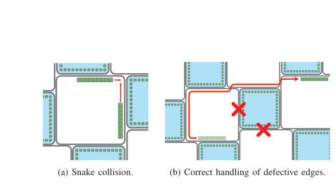
<figcaption class="paper-figure-caption"><b>Fig 3.</b> Fig. 3: Routing challenges in the snakes on a plane model [18].</figcaption>
</figure>
<figure class="paper-figure-card">
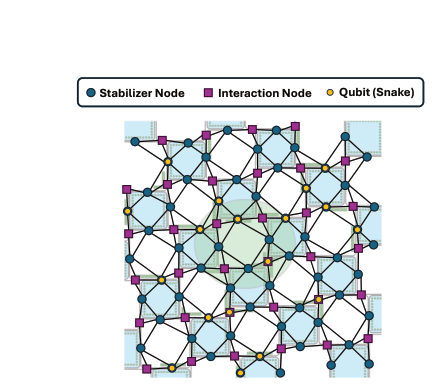
<figcaption class="paper-figure-caption"><b>Fig 4.</b> Fig. 4: The graph formalization process starting from the snakes on a plane model as shown in Fig. 1a.</figcaption>
</figure>
<figure class="paper-figure-card">
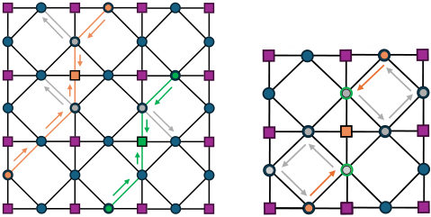
<figcaption class="paper-figure-caption"><b>Fig 5.</b> Fig. 5: Illustration of path and rotation schemes.</figcaption>
</figure>

**Summary.** This paper introduces a comprehensive framework for compiling quantum circuits onto error-corrected silicon spin qubit architectures using the 'snakes on a plane' model. It proposes and compares two novel routing algorithms—shortest-path and rotation-based—to solve the complex scheduling problem. The findings guide researchers by showing that the optimal algorithm choice depends entirely on whether the target hardware is sparse or highly dense.

**Why it may be interesting.** This work provides crucial algorithmic insights into scaling quantum computation by directly addressing the complex interplay between circuit compilation, physical connectivity constraints, and fault tolerance in solid-state qubits.

Detailed structure

**Main problem.** The core challenge is developing efficient compilation and routing techniques for quantum circuits onto error-corrected silicon spin qubit platforms, which must account for hardware constraints.

**Main result.** The authors propose two novel routing algorithms—shortest-path and rotation-based—showing that their performance depends critically on the underlying architecture's density (sparse vs. high-density).

**Method.** The work formalizes physical qubit routing as a graph path-finding problem, comparing explicit path planning against dynamic rotational scheduling techniques.

**Model / system.** The system is based on silicon spin qubits implemented using the 'snakes on a plane' model, which utilizes a 2D surface code for error correction and involves shuttling logical qubits along lattice edges.

**Key observables.** Mean Timesteps and Mean Movements required to execute quantum operations; scalability of runtime with increasing qubit density.

**Important parameters / regimes.** Qubit density (sparse vs. high-density), defect probability ($p_{	ext{defect}}$), and the type of initial mapping strategy used.

**Assumptions / limitations.** The architecture is modeled as a 2D latticework supporting surface code operations, and routing failures are handled via 'snake surgery' teleportation protocols.

**Figures summary.** Figures illustrate the 'snakes on a plane' architecture, the snake surgery protocol, graph formalization of routing challenges (collisions/defects), and performance comparisons showing path vs. rotation algorithm scaling.

**Paper structure.** The paper first establishes the physical model and problem gap; it then details the graph formalization and error handling protocols; finally, it compares shortest-path and rotation algorithms across various architectural settings to determine optimal routing strategies.

Abstract

Silicon spin qubits have emerged as a promising qubit technology due to their favorable scaling and fabrication properties. However, efficiently compiling quantum circuits onto spin qubit platforms remains challenging, particularly when accounting for hardware constraints and the high sensitivity to static defects. Existing compilation approaches for spin qubits either largely ignore error correction, despite its critical role for large-scale quantum computation, or focus on low-level schedule constructions, missing a high-level compilation and routing for logical, error-corrected algorithms. To address this gap, we introduce a compilation framework for spin qubits based on the recent snakes on a plane model, which utilizes a 2D surface code and qubit teleportation to mitigate errors. Building on this model, we propose shortest-path and rotation-based algorithms as two novel classes of qubit-routing techniques, along with additional defect-handling and initial-mapping strategies. We evaluate both algorithms across diverse architectural settings and problem sizes, demonstrating that shortest-path methods excel in sparse, low-defect scenarios, while rotation-based approaches perform better in high-density environments. The implementation is publicly available on GitHub as open source.

[↑ back to top](#top)

### [Emergent Topology from Nonlocal Electronic Correlations in One Dimension](http://arxiv.org/abs/2607.08278v1)

**Authors:** Félix Fossati, Erik Linnér, Evgeny A. Stepanov  
**Type:** theory · **Category:** strongly correlated electrons · **PDF:** <https://arxiv.org/pdf/2607.08278v1>  
**Analysis basis:** full PDF text, analyzed in chunks
**Topic relevance:** `analog quantum simulation` **2/5** · `Keldysh / 2PI / non-Gaussian methods` **1/5**

↔ Scroll figures horizontally

<figure class="paper-figure-card">
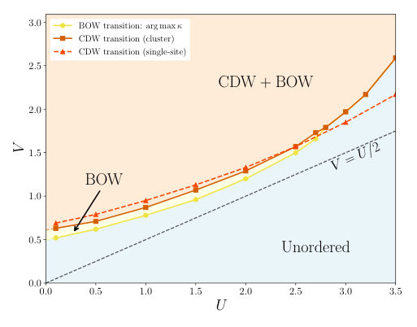
<figcaption class="paper-figure-caption"><b>Fig 1.</b> FIG. 1. The U-V phase diagram of the half-filled 1D extended Hub- bard model obtained at T = 0.1 using D-TRILEX. The CDW phase boundaries calculated within the single-site and dimer frameworks are shown in dashed and solid red curves, respectively. The mean- field estimate for the CDW transition V = U/2 is given by the dashed black line. The BOW phase boundary obtained in the dimer calcula- tion is depicted by the yellow curve.</figcaption>
</figure>
<figure class="paper-figure-card">
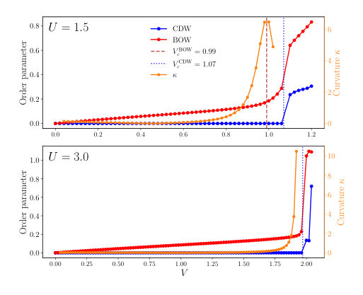
<figcaption class="paper-figure-caption"><b>Fig 2.</b> FIG. 2. Evolution of the CDW (blue markers) and BOW (red mark- ers) order parameters with nonlocal interaction V. The results are ob- tained within the dimer D-TRILEX approach for U = 1.5 (top panel) and U = 3.0 (bottom panel). The curvature κ of the BOW curve is shown in orange. VCDW c (dotted vertical blue line) marks the CDW onset. VBOW c (dashed vertical red line) corresponds to the maximum of κ(V) before the CDW sets in and is present only at U = 1.5.</figcaption>
</figure>
<figure class="paper-figure-card">
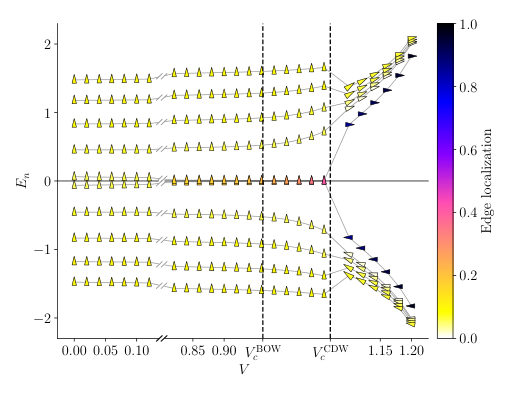
<figcaption class="paper-figure-caption"><b>Fig 3.</b> FIG. 3. Energy spectrum of Heff for a 64-site chain with open boundary conditions obtained as a function of V at U = 1.5. For clarity reasons, only a representative subset of the low-energy levels are shown and intermediate values of V are removed. Each triangle marker represents a single eigenstate: its orientation encodes the sub- lattice polarization P(n), and its color encodes the edge-localization weight |ϕ(n)|2 edge, from bulk-extended (yellow) to boundary-localized (red to black). Vertical dashed lines mark VBOW c and VCDW c .</figcaption>
</figure>

**Summary.** The authors demonstrate that nonlocal electronic correlations in 1D materials can spontaneously generate topological order by inducing Charge-Density-Wave (CDW) or Bond-Order-Wave (BOW) states. Using advanced cluster diagrammatic techniques, they map these interacting many-body phases onto effective Hamiltonians resembling the SSH and Rice-Mele models, confirming their nontrivial topological nature via edge state signatures.

**Why it may be interesting.** This work provides a concrete theoretical link between interaction-driven symmetry breaking in correlated electron models and the emergence of robust topological invariants, which is highly relevant for understanding novel quantum phases in condensed matter systems.

Detailed structure

**Main problem.** The study aims to establish a mechanism by which nonlocal electronic correlations can induce topological phases in low-dimensional systems, starting from an initially trivial noninteracting band structure.

**Main result.** Nonlocal interactions drive the system into Bond-Order-Wave (BOW) and Charge-Density-Wave (CDW) phases, both of which possess nontrivial topological character, evidenced by localized edge states.

**Method.** The research employs an advanced cluster-diagrammatic many-body approach (D-TRILEX framework) applied to the extended Hubbard model, mapping the interacting system onto effective noninteracting Hamiltonians for analysis.

**Model / system.** The physical system is modeled by the one-dimensional extended Hubbard model, characterized by hopping ($t$), local repulsion ($U$), and nearest-neighbor nonlocal repulsion ($V$). The analysis focuses on the emergence of BOW and CDW phases.

**Key observables.** BOW order parameter ($	ext{O}_{	ext{BOW}}$), staggered charge density ($	ext{O}_{	ext{CDW}}$), effective Hamiltonian parameters ($u_k, v_k, w_k$), and edge-localization weight $|\phi_j^{	ext{edge}}|^2$.

**Important parameters / regimes.** Nonlocal interaction strength ($V$) relative to local repulsion ($U$); temperature ($T=0.1$).

**Assumptions / limitations.** The single-site D-TRILEX approach fails for symmetry-broken phases due to the nonlocal nature of the order parameters, necessitating a dimer/cluster formulation.

**Figures summary.** Figures illustrate phase diagrams showing coexisting CDW+BOW regions; energy spectra demonstrate the evolution from bulk states to SSH-like edge modes (BOW) and finally to RM-like gapped states (CDW).

**Paper structure.** The paper progresses by first defining the model and using cluster methods to identify symmetry-broken phases. It then maps these interacting states onto effective single-particle Hamiltonians, analyzing the topological signatures (edge states) associated with both CDW and BOW order parameters.

Abstract

We demonstrate that electronic correlations in low-dimensional systems can induce topological phases starting from a topologically trivial noninteracting band structure. Using an advanced cluster-diagrammatic many-body approach applied to the one-dimensional extended Hubbard model, we show that tuning the nonlocal Coulomb interaction drives the emergence of bond-order-wave (BOW) and charge-density-wave (CDW) phases. Despite being interaction-driven and symmetry-broken, these states admit an effective low-energy single-particle description. In particular, the BOW phase maps onto an effective Su-Schrieffer-Heeger model, while the CDW phase, with subleading bond-order correlations, corresponds to a Rice-Mele model. Both phases exhibit a nontrivial topological character, manifested by the presence of localized edge states. Our results establish a mechanism by which nonlocal electronic correlations generate emergent topology in correlated systems.

[↑ back to top](#top)

### [Works on My QPU: Reproducibility in Quantum Computing Research](http://arxiv.org/abs/2607.08348v1)

**Authors:** Dominik Köster, Maja Franz, Benjamin Zec, Nicole Hoess, Ralf Ramsauer, Wolfgang Mauerer  
**Type:** theory · **Category:** quantum information and computing · **PDF:** <https://arxiv.org/pdf/2607.08348v1>  
**Analysis basis:** full PDF text, analyzed in chunks
**Topic relevance:** `analog quantum simulation` **1/5** · `correlated / nonlocal dissipation` **1/5** · `driven-dissipative phase transition` **1/5** · `entanglement & information structure` **1/5** · `methods for driven-dissipative` **1/5** · `non-equilibrium dynamics` **1/5**

↔ Scroll figures horizontally

<figure class="paper-figure-card">
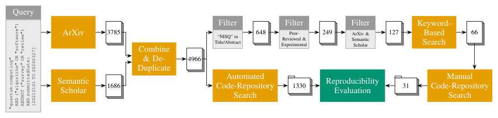
<figcaption class="paper-figure-caption"><b>Fig 1.</b> Fig. 1: Papers are retrieved via a structured query from arXiv and Semantic Scholar, merged and deduplicated. Subsequently resulting papers are either filtered through multiple stages, identified via keyword-based screening and finally subjected to manual validation, or directly submitted to automated screening for code-repositories. The results for the final reproducibility evaluation are summarised in Tab. II.</figcaption>
</figure>

**Summary.** This paper analyzes the reproducibility crisis in quantum computing research by systematically auditing thousands of published papers. It finds that code artifacts are scarce and often fail to run due to incomplete environment specifications, rather than just missing code. The authors recommend adopting declarative tools to enforce rigorous, reproducible computational environments.

**Why it may be interesting.** While focused on software best practices rather than physical Hamiltonians, the discussion of complex dependency management and required environmental rigor is highly relevant to simulating or analyzing open quantum systems that rely on specific numerical libraries.

Detailed structure

**Main problem.** The reproducibility of published results in quantum computing research is severely compromised by complex, evolving software stacks.

**Main result.** Reproducibility is not consistently achieved; only a small fraction of papers provide executable code artifacts with complete environment specifications.

**Method.** The authors conducted a combined manual and automated large-scale analysis across thousands of QC papers using a five-criterion framework (code availability, environment specification, etc.).

**Model / system.** The focus is on the software workflow surrounding quantum computing algorithms, which involve logical schedules transpiled to physical QPU circuits.

**Key observables.** Code availability rate (~25%), execution success rate among available code (low), and completeness of machine-readable environment specifications.

**Important parameters / regimes.** The analysis uses a five-question framework: Code Availability, Environment Specification, Documentation, Hardware Description, and Executability.

**Assumptions / limitations.** The study assumes that reproducibility requires capturing the full execution context, necessitating declarative environment specification tools like Nix.

**Figures summary.** Figure 1 details the pipeline from a large initial corpus (4966 papers) down to the final set of manually validated NISQ-era papers (127).

**Paper structure.** The paper first establishes the problem, presents the methodology involving both manual and automated screening against five criteria, quantifies the failure rates across these metrics, and concludes with practical recommendations for improvement.

Abstract

Quantum computing research increasingly depends on complex software stacks, yet the reproducibility of published results does not receive the priority and longevity mandated by recommendations of large international scientific bodies and best practices in software-centric systems research. In this paper, we present a combined manual and automated large-scale analysis of the reproducibility landscape in quantum computing research, quantify shortcomings, and derive actionable steps forward.   We manually evaluate a curated sample of 127 papers using a five-question framework that covers code availability, environment specification, documentation, hardware description, and executability. To place these findings in a broader context, we conduct an automated large-scale screening of nearly 5000 quantum computing papers for the same reproducibility indicators. Our manual analysis reveals that only 24.4% of the sampled papers provide code artefacts, and among those, 64.5% fail to execute successfully in a clean environment. This assessment is corroborated by a large-scale automated analysis that yields a consistent code availability rate of 26.8%. Further, it shows that approximately one-third of the papers with accessible code lack machine-readable environment specifications.   The results in this paper indicate that reproducibility is not yet consistently achieved in quantum computing research. In response, we outline a set of practical recommendations that address the observed failure modes and illustrate how reproducibility can be improved in practice.

[↑ back to top](#top)

### [Invariance Audits for Quantum Kernels and Variational Rewinding: A Real-to-Hermitian Taxonomy of Projector, Flag, Anchor, and Density Geometry](http://arxiv.org/abs/2607.07927v1)

**Authors:** Azadeh Alavi, Fatemeh Kouchmeshki, Hossein Akhoundi  
**Type:** theory · **Category:** other · **PDF:** <https://arxiv.org/pdf/2607.07927v1>  
**Analysis basis:** full PDF text, analyzed in chunks
**Topic relevance:** `Keldysh / 2PI / non-Gaussian methods` **1/5** · `driven-dissipative phase transition` **1/5** · `entanglement & information structure` **1/5** · `methods for driven-dissipative` **1/5**

↔ Scroll figures horizontally

<figure class="paper-figure-card">
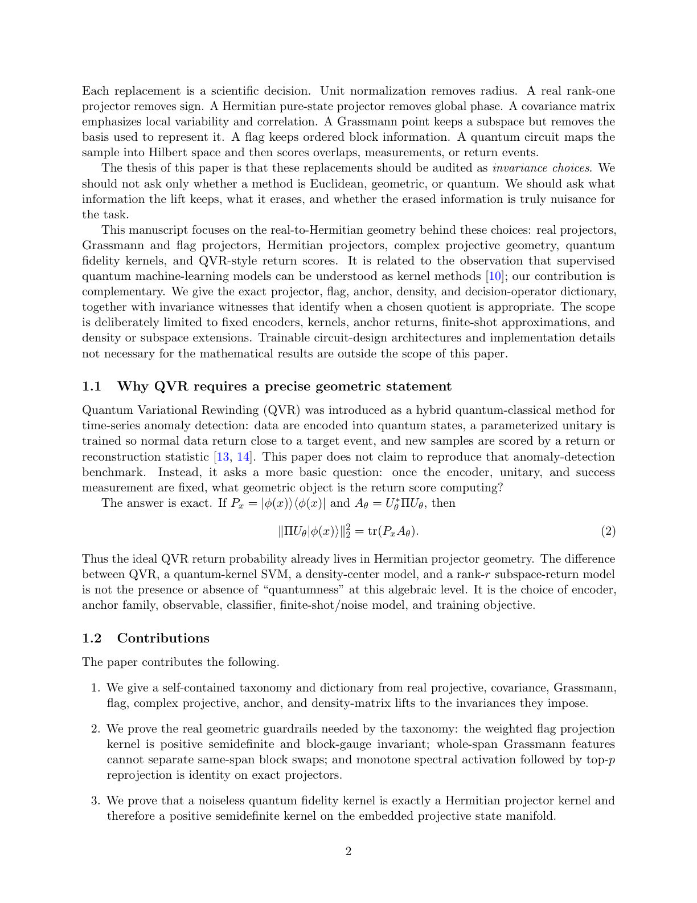
<figcaption class="paper-figure-caption"><b>Fig 1.</b> Low-resolution page preview, page 2</figcaption>
</figure>
<figure class="paper-figure-card">
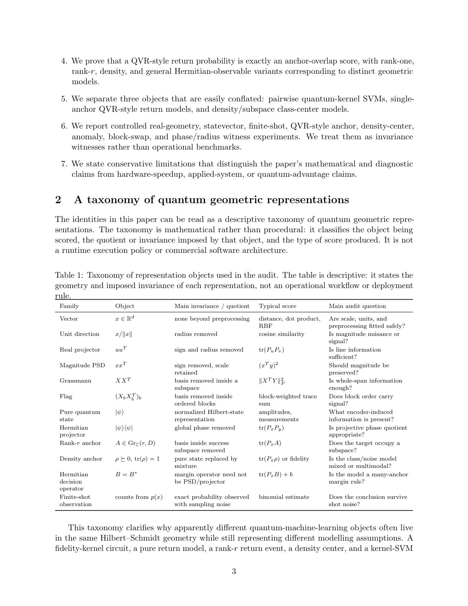
<figcaption class="paper-figure-caption"><b>Fig 2.</b> Low-resolution page preview, page 3</figcaption>
</figure>
<figure class="paper-figure-card">
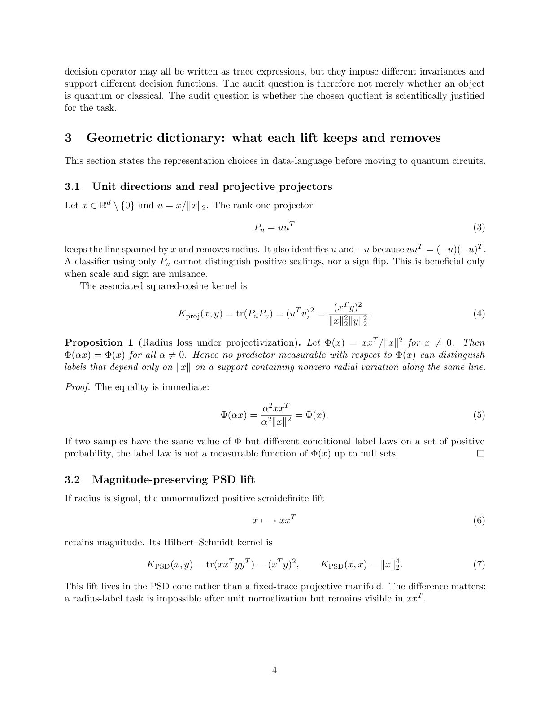
<figcaption class="paper-figure-caption"><b>Fig 3.</b> Low-resolution page preview, page 4</figcaption>
</figure>
<figure class="paper-figure-card">
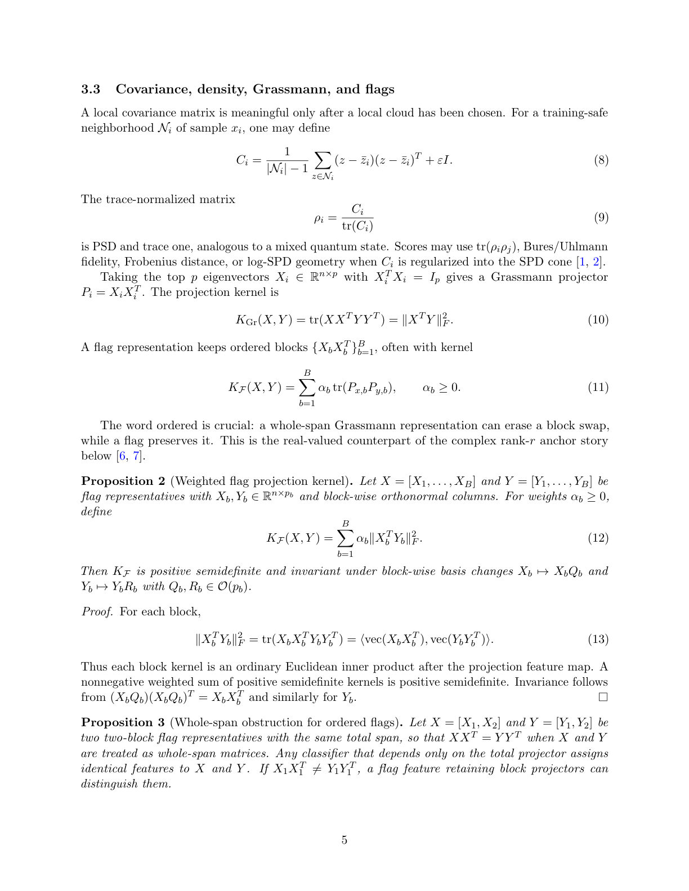
<figcaption class="paper-figure-caption"><b>Fig 4.</b> Low-resolution page preview, page 5</figcaption>
</figure>
<figure class="paper-figure-card">
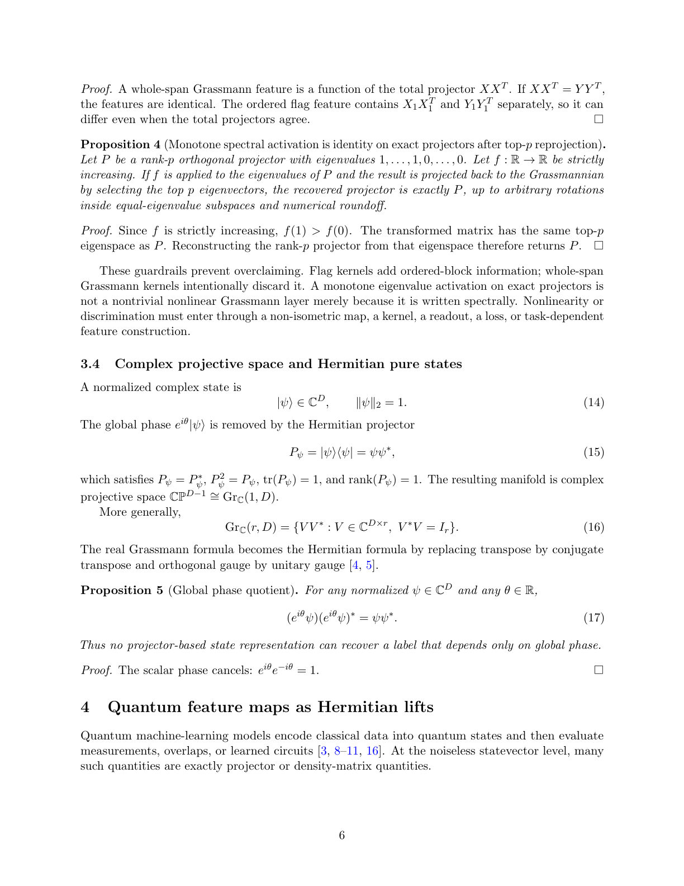
<figcaption class="paper-figure-caption"><b>Fig 5.</b> Low-resolution page preview, page 6</figcaption>
</figure>

**Summary.** This paper creates a formal taxonomy to audit the geometric assumptions made when using quantum representations (like projectors or subspaces) in machine learning. It proves that various complex quantum scoring methods are mathematically equivalent to simpler, traceable Hermitian projector overlaps. The work emphasizes that the utility of any quantum ML approach depends entirely on whether its inherent mathematical invariances match the physical symmetries of the problem being solved.

**Why it may be interesting.** While not directly about AMO dynamics, the rigorous geometric analysis of quantum information structures (projectors, density matrices) provides deep mathematical tools for understanding how physical constraints manifest as computational invariances in QML applications.

Detailed structure

**Main problem.** The paper addresses how machine learning models implicitly make 'invariance decisions' when replacing raw data vectors with geometric representations like projectors, subspaces, or density operators.

**Main result.** It develops a formal taxonomy showing that the choice of representation dictates the imposed invariance, proving key equivalences between quantum fidelity kernels and Hermitian projector traces.

**Method.** The authors develop a mathematical framework—a 'real-to-Hermitian taxonomy'—to audit these geometric lifts by comparing kernel methods (Grassmann/Flag) against variational return probability scoring mechanisms.

**Model / system.** The focus is on Quantum Machine Learning (QML) representations, analyzing geometries such as the Grassmannian manifold and complex projective space ($\mathbb{CP}^{D-1}$) using projectors ($P$), density operators ($
ho$), and learned anchor matrices ($A_	heta$).

**Key observables.** Invariance properties (e.g., block-gauge invariance), kernel values, QVR return probabilities ($p_	heta(x)$), and trace consistency between different scoring methods.

**Important parameters / regimes.** The dimensionality of the Hilbert space ($D$), the rank of projectors ($r$), and the number of measurement shots/noise levels are key parameters in the audits.

**Assumptions / limitations.** The paper explicitly states it makes no claim regarding hardware speedup or quantum advantage; all results are derived from statevector simulations using controlled, synthetic datasets as witnesses.

**Figures summary.** Tables summarize comparisons across various ML tasks (e.g., classwise anchor protocols, regression performance) and provide conceptual mappings between different geometric representations and their associated invariances.

**Paper structure.** The paper builds from defining the core problem of invariance decisions to developing mathematical proofs for specific kernels (Grassmann/Flag), establishing equivalences (Fidelity $\leftrightarrow$ Projector Trace), and concluding with a comprehensive taxonomy supported by multiple comparative audits.

Abstract

Machine-learning models often replace vectors by normalized directions, projectors, covariances, subspaces, ordered flags, quantum states, or density operators before any classifier is fitted. This replacement is an invariance decision: it determines which distinctions are kept and which are quotiented out. We develop a self-contained real-to-Hermitian taxonomy for auditing such representations in quantum machine learning. On the real side, we formalize Grassmann and flag projector kernels, prove positive semidefiniteness and block-gauge invariance of a weighted flag kernel, and give a same-span block-swap witness showing when whole-span Grassmann geometry must fail while ordered flags succeed. On the quantum side, we prove that a noiseless fidelity kernel is exactly the Hilbert--Schmidt inner product between the associated rank-one Hermitian projectors, and that a QVR-style return probability is exactly an overlap score between the input projector and a learned anchor operator. Rank-constrained returns correspond to complex Grassmann anchors, while mixed or multimodal class models are naturally represented by density or positive-semidefinite anchors. Controlled vector, subspace, statevector, anomaly, finite-shot, and quotient-witness experiments support the same conclusion: quantum and geometric lifts are useful when their invariances match the task, and fail correctly when discarded information is label-bearing. The paper makes no hardware-speedup or quantum-advantage claim.

[↑ back to top](#top)

### [Theoretical ab initio Evolution of Satellite Intensity near Threshold for Cu K-shell transitions](http://arxiv.org/abs/2607.07983v1)

**Authors:** Daniel Pinheiro, Gonçalo Baptista, César Godinho, André Fernandes, Jorge Machado, Pedro Amaro, Nancy Paul, Martino Trassinelli, Miguel Avillez, Paul Indelicato, José Paulo Santos, Mauro Guerra  
**Type:** theory · **Category:** other · **PDF:** <https://arxiv.org/pdf/2607.07983v1>  
**Analysis basis:** full PDF text, analyzed in chunks
**Topic relevance:** `Keldysh / 2PI / non-Gaussian methods` **1/5** · `correlated / nonlocal dissipation` **1/5** · `driven-dissipative phase transition` **1/5** · `methods for driven-dissipative` **1/5**

↔ Scroll figures horizontally

<figure class="paper-figure-card">
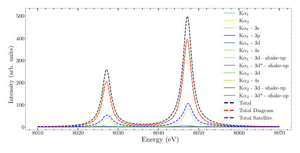
<figcaption class="paper-figure-caption"><b>Fig 1.</b> FIG. 2. Simulated Cu Kα1,2 synthetic spectrum. All satellite contributions have been included, however only the most in- tense were drawn for clarity. This simulation was performed for an infinite excitation energy.</figcaption>
</figure>
<figure class="paper-figure-card">
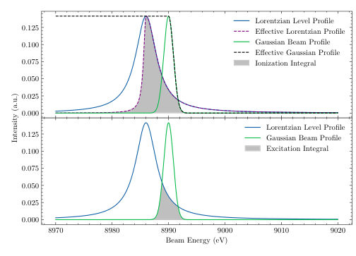
<figcaption class="paper-figure-caption"><b>Fig 2.</b> FIG. 1. Graphical representation of the overlap integral be- tween the beam Gaussian and initial level’s Lorentzian profiles calculated for the modulation of line intensity. The represen- tation for the ionization process is on the top and the excita- tion process on the bottom.</figcaption>
</figure>
<figure class="paper-figure-card">
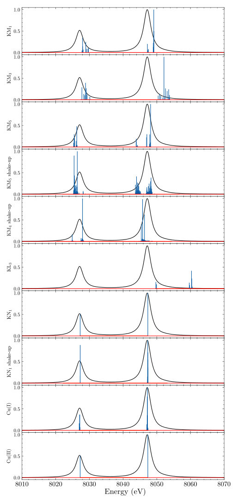
<figcaption class="paper-figure-caption"><b>Fig 3.</b> FIG. 3. Stem plots or stick spectra of some of the satellite transitions included in the simulations. Transitions for the Cu(I) and Cu(II) ions are also included, which will be impor- tant later in this work. The Cu Kα1,2 spectra is also shown in black.</figcaption>
</figure>
<figure class="paper-figure-card">
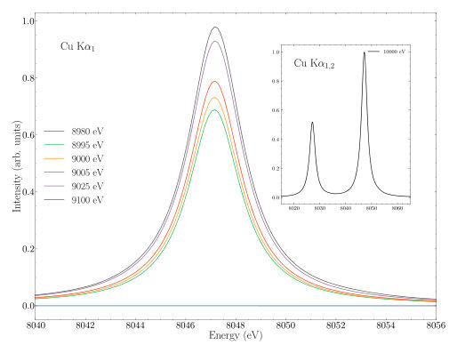
<figcaption class="paper-figure-caption"><b>Fig 4.</b> FIG. 4. Evolution of the line shape of the simulated K shell transitions, with excitation energy. The energies were chosen as the ones shown in [8].</figcaption>
</figure>
<figure class="paper-figure-card">
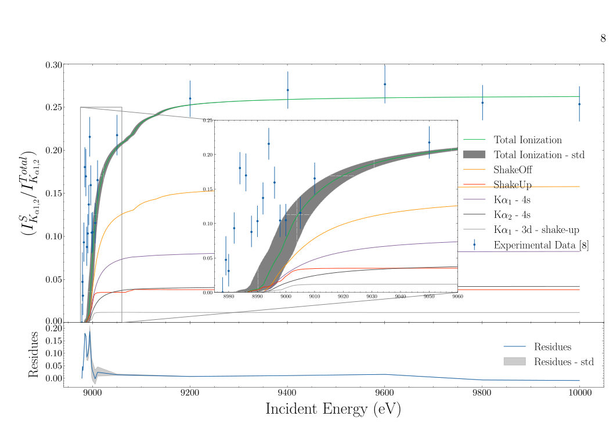
<figcaption class="paper-figure-caption"><b>Fig 5.</b> FIG. 5. Evolution of the intensity ratio of the satellite lines, respective to the total Kα1,2 intensity. The simulations were performed for experimental parameters of 0.2 eV for the beam width and 0.3 eV for the detector resolution, matching ref. [8]. Only the most intense contributions are shown for visual clarity.</figcaption>
</figure>

**Summary.** This paper theoretically models the evolution of satellite X-ray emission intensity near ionization thresholds for Copper K-shell transitions. Using sophisticated ab initio calculations, the authors demonstrate that their methods accurately predict spectral changes by accounting for shake processes originating from specific resonant excitations in oxide compounds. This provides a powerful tool for high-resolution spectroscopy.

**Why it may be interesting.** This work is highly relevant as it applies advanced quantum mechanical methods to model complex many-body dynamics (shake processes) in atomic/solid-state spectra, which shares mathematical techniques with open quantum systems modeling.

Detailed structure

**Main problem.** The study investigates how satellite X-ray emission intensity evolves near the ionization threshold for Cu K-shell transitions.

**Main result.** Standard ab initio methods successfully simulate this intensity evolution with good agreement to experiment, identifying below-threshold satellites originating from specific resonant excitations in oxide phases.

**Method.** The research employs state-of-the-art ab initio theoretical calculations using the Multiconfiguration Dirac-Fock code (MCDFGME) to model radiative and non-radiative decay processes.

**Model / system.** The system under study is Copper (Cu) atoms/ions, specifically examining K-shell transitions in $	ext{Cu(I)}$ and $	ext{Cu(II)}$ oxide phases. The theoretical framework models the transition intensity by incorporating shake probabilities derived from atomic structure calculations.

**Key observables.** Satellite intensity ($K\alpha_1$ and $K\alpha_2$), total decay width ($\Gamma_i$), shake probabilities (shake-off and shake-up), and spectral line shape modulation near thresholds.

**Important parameters / regimes.** Ionization threshold energy, excitation energies, binding energies, and the relative contributions of different excitation channels ($1s	o 3d$, $1s	o 4p$).

**Assumptions / limitations.** The calculations rely on the Sudden Approximation (SA) for shake processes; solid-state effects are noted as a potential source of discrepancy with experiment.

**Figures summary.** Figures illustrate the overlap integral between beam Gaussian profiles and initial level Lorentzian profiles, and show simulated synthetic spectra for Cu K$\alpha_{1,2}$ including all satellite contributions.

**Paper structure.** The paper progresses by detailing theoretical models (Thomas/Roy), implementing calculations using MCDFGME to determine transition rates and shake probabilities, modeling the energy dependence via overlap integrals, and finally comparing these simulations against experimental observations for Cu oxide species.

Abstract

In this work, we have investigated the evolution of satellite intensity near the ionization threshold for Cu K-shell transitions through theoretical methods. Employing standard state-of-the-art ab initio methods, we have calculated all Cu K-shell transitions and simulated the full K$α_1$ and K$α_2$ spectrum where all transition parameters, as well as shake probabilities were determined theoretically. Through these calculations we show that standard state-of-the-art ab initio methods achieve good agreement with experiment and enable us to simulate the intensity evolution near ionization thresholds within a good margin of error. Below-threshold satellite intensity was found to originate from resonant 1s$\rightarrow$3d and 1s$\rightarrow$4p excitations in Cu(I) and Cu(II) oxide phases respectively, which were included in our simulations.

[↑ back to top](#top)

### [Explaining Near-Zero Hessian Eigenvalues Through Approximate Symmetries in Neural Networks](http://arxiv.org/abs/2607.07845v1)

**Authors:** Marcel Kühn, Bernd Rosenow  
**Type:** theory · **Category:** disordered systems and neural networks · **PDF:** <https://arxiv.org/pdf/2607.07845v1>  
**Analysis basis:** full PDF text, analyzed in chunks
**Topic relevance:** `Keldysh / 2PI / non-Gaussian methods` **1/5** · `analog quantum simulation` **1/5** · `driven-dissipative phase transition` **1/5**

↔ Scroll figures horizontally

<figure class="paper-figure-card">
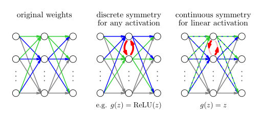
<figcaption class="paper-figure-caption"><b>Fig 1.</b> FIG. 1. Symmetries in fully connected layers. Left: original network, two hidden neurons highlighted. Middle: discrete permutation symmetry, swapping incoming and outgoing con- nections of two hidden units. Holds for any activation. Right: continuous symmetry of linear networks, an infinitesimal ro- tation of the incoming weights compensated on the outgoing weights. Preserves the output and generates a zero mode.</figcaption>
</figure>
<figure class="paper-figure-card">
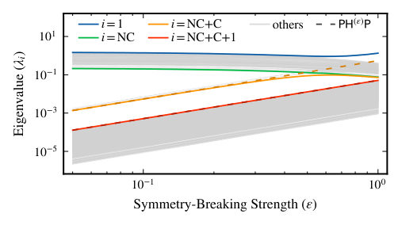
<figcaption class="paper-figure-caption"><b>Fig 2.</b> FIG. 2. Ranked Hessian eigenvalues of the two-layer Leaky- ReLU student–teacher model (N = 20, C = 3, single draw of Gaussian teacher weights W(k) ij ∼N(0, σ2) with σ2 = 1/N) as a function of the symmetry-breaking strength ε, from the linear network (ε →0) to ReLU (ε = 1). “NC+C” and “NC+C+1” are the modes bordering the gap. The bulk eigenvalues, zero at ε = 0, rise as ε2 and follow the eigen- values of the projected block PH(ε)P (dashed lines). The N rescaling zero modes stay at zero for all ε, below the plotted range. A small group of C modes (orange, the mean-gradient outliers) bends near ε ≈0.5 to merge with the large block. The clean ε2 trend without ε4 bending indicates eigenvectors...</figcaption>
</figure>
<figure class="paper-figure-card">
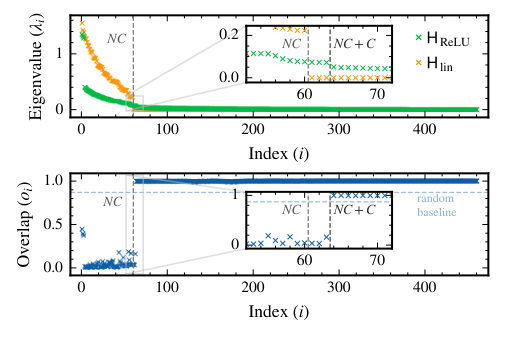
<figcaption class="paper-figure-caption"><b>Fig 3.</b> FIG. 3. Two-layer student–teacher model of Fig. 2, Hessian at the global minimum. Top: ReLU (green) and linear (orange) spectra. The linear network has NC = 60 finite eigenvalues, the ReLU network has C = 3 additional large eigenvalues due to nonzero ⟨∂θf ⊤⟩x. Bottom: overlap oi (8) between ReLU eigenvectors and the linear symmetry subspace. Small- eigenvalue modes have oi ≈1, revealing alignment with linear symmetry directions. The leading NC+C modes are strongly suppressed (random baseline orandom ≈0.87).</figcaption>
</figure>
<figure class="paper-figure-card">
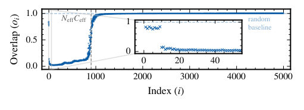
<figcaption class="paper-figure-caption"><b>Fig 4.</b> FIG. 4. Three-layer ReLU network trained on CIFAR-10, with effective dimensions Neff = 100, Ceff = 9. Overlap oi (8) between the largest 5,000 ReLU Hessian eigenvectors and the symmetry subspace P of the linear comparison model. Apart from Ceff = 9 leading outliers, only modes beyond the NeffCeff = 900 largest reach oi ≈1. The random base- line is orandom ≈0.998 (standard deviation ≈10−4), so the leading modes are suppressed by hundreds to thousands of standard deviations. The cumulative coverage (9) reaches O5000 ≈0.95, implying the unmeasured tail is almost entirely symmetric.</figcaption>
</figure>
<figure class="paper-figure-card">
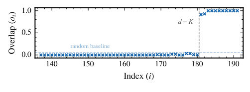
<figcaption class="paper-figure-caption"><b>Fig 5.</b> FIG. 5. Convolutional student–teacher network (10), input width 200, hidden width N = 190, kernel width K = 11, mean-squared error, Hessian at identical student/teacher pa- rameters drawn once from a Gaussian. Overlap between the eigenvectors of the nonperiodic-network Hessian and the K = 11 symmetry directions of the corresponding periodic network, for the 60 smallest eigenvalues. The random base- line is K/d ≈0.055 (dashed). Although the boundary condi- tions break the exact symmetry, the smallest K modes retain near-unity overlap.</figcaption>
</figure>

**Summary.** This work explains that the vast number of near-zero eigenvalues in neural network loss functions are not random artifacts but rather signatures of approximate continuous symmetries inherent in the network's structure. By analyzing how these symmetries are weakly broken by nonlinearities, the authors provide a deep physical understanding of low-curvature directions in ML optimization.

**Why it may be interesting.** It provides a powerful analogy linking concepts from condensed matter physics—specifically Goldstone theorems related to broken continuous symmetries—to the geometry of high-dimensional machine learning loss landscapes.

Detailed structure

**Main problem.** The paper addresses the mystery of near-zero eigenvalues in the Hessian matrix of a neural network's loss landscape.

**Main result.** It argues that this bulk of small eigenvalues originates from pseudo-Goldstone modes associated with continuous symmetries of the network parametrization, which are only weakly broken by nonlinearities like ReLU.

**Method.** The analysis involves studying the Hessian spectrum by constructing an adiabatic path between a perfectly symmetric linear limit and the full nonlinear model using perturbation theory and eigenvector overlap calculations.

**Model / system.** The system is deep neural networks, analyzed through their loss function's Hessian matrix. The study progresses from simple two-layer linear models to complex convolutional architectures trained on datasets like CIFAR-10.

**Key observables.** Hessian eigenvalues spectrum (large outliers vs. small bulk), overlap ($	ext{o}_i$) between eigenvectors and the symmetry subspace, and eigenvalue scaling laws ($\epsilon^2$).

**Important parameters / regimes.** The perturbation strength $\epsilon$ controlling the transition from linear to nonlinear regimes; network depth and architecture (e.g., convolutional layers).

**Assumptions / limitations.** The analysis assumes that symmetries are continuous and relies on comparing the Hessian at an endpoint of training rather than an exact critical point.

**Figures summary.** Figures illustrate the evolution of eigenvalues as symmetry is broken ($\epsilon^2$ scaling) and show eigenvector overlap measurements comparing periodic vs. nonperiodic boundary conditions in CNNs.

**Paper structure.** The paper builds its argument by first establishing exact zero modes in linear networks, then perturbing this system with ReLU to generate pseudo-Goldstone modes, and finally generalizing the diagnostic tool (overlap measurement) to complex convolutional architectures.

Abstract

The Hessian of the training loss governs the local geometry of the loss landscape, yet despite existing explanations for its largest eigenvalues, the origin of the vast multitude of vanishingly small eigenvalues remains elusive. We argue that the bulk consists of the weakly lifted pseudo-Goldstone modes of the continuous symmetries of the network parametrization. In deep linear networks these symmetries are exact: they generate flat directions and hence exact zero modes, whose eigenvectors we construct explicitly. Introducing a ReLU nonlinearity as a perturbation, we show that it breaks these symmetries weakly and explicitly. Resolving the spectrum at the level of eigenvectors, we find that the high-curvature directions are orthogonal to the symmetry subspace, while the bulk lies almost entirely within it. We demonstrate the mechanism in a two-layer ReLU student--teacher model and in a network trained on CIFAR-10. A convolutional example demonstrates that the same diagnostic extends beyond fully connected layers. Together, these results link the Hessian bulk to weakly broken symmetries and clarify the origin of near-zero modes.

[↑ back to top](#top)

### [Instability of the undecidable behavior of the spectral gap in 1D](http://arxiv.org/abs/2607.08686v1)

**Authors:** Laura Castilla-Castellano, Angelo Lucia  
**Type:** theory · **Category:** other · **PDF:** <https://arxiv.org/pdf/2607.08686v1>  
**Analysis basis:** full PDF text, analyzed in chunks
**Topic relevance:** `analog quantum simulation` **1/5** · `driven-dissipative phase transition` **1/5** · `exotic spin models in light-matter` **1/5**

↔ Scroll figures horizontally

<figure class="paper-figure-card">
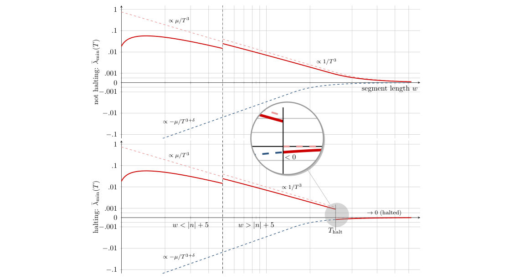
<figcaption class="paper-figure-caption"><b>Fig 1.</b> Figure 1: (Taken from [1, Section III]) Energy contribution ¯λmin(T) from a single segment of length w of the marker and TM Hamiltonian µHf + HT M shown in red, where T is the runtime of the encoded computation. The dashed red and blue lines are bounds on the contribution of both HT M and µHf, respectively.</figcaption>
</figure>
<figure class="paper-figure-card">
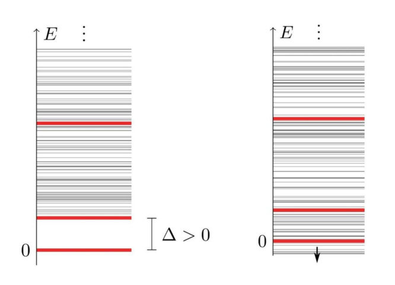
<figcaption class="paper-figure-caption"><b>Fig 2.</b> Figure 2: (Taken from [1]) Final spectrum of Hε N. The red lines represent the spectrum of H0, and the gray ones, from Hd. On the left, we have the gapped situation, where the gap of H0 shows. On the right, the gapless case.</figcaption>
</figure>

**Summary.** The paper investigates the decidability of the spectral gap problem for 1D quantum spin chains, building on prior work showing it could be undecidable. The authors demonstrate that this undecidability is highly unstable, proving that even an arbitrarily small, local perturbation can simplify the system such that determining if a gap exists becomes a computationally decidable problem.

**Why it may be interesting.** This work directly challenges the robustness of complexity results in condensed matter theory. Showing that undecidable behavior can be eliminated by a simple local term suggests that many theoretical barriers might be artifacts of specific, non-generic constructions.

Detailed structure

**Main problem.** The core problem addressed is determining whether the spectral gap (gapped vs. gapless) for a 1D lattice quantum spin system is decidable, contrasting with previous results showing undecidability.

**Main result.** The authors show that the previously constructed family of Hamiltonians exhibiting undecidable behavior is extremely fragile; adding any small, local perturbation renders the spectral gap problem decidable.

**Method.** The analysis involves constructing a specific 1-local, rank-1 perturbation and proving that this perturbation disrupts the fine-tuning energy coupling responsible for linking the spectral gap to an undecidable computation.

**Model / system.** The system is a 1D lattice quantum spin chain described by nearest-neighbor Hamiltonians. The analysis focuses on perturbing a specific Hamiltonian family previously shown to encode Universal Turing Machine computations.

**Key observables.** Spectral Gap ($\Delta$), Ground State Energy ($\lambda_0(H_N)$), and the sign of the ground state energy in the thermodynamic limit.

**Important parameters / regimes.** The perturbation strength $\epsilon > 0$, which is shown to be sufficient to restore decidability regardless of its smallness.

**Assumptions / limitations.** The undecidability proofs rely on boundary-induced structures (like marker symbols) that are sensitive to local perturbations, while the new result assumes a general 1D nearest-neighbor Hamiltonian structure.

**Figures summary.** Figure 2 illustrates the final spectrum of the perturbed Hamiltonian ($H_{\epsilon}^N$), showing distinct spectral features for both gapped and gapless scenarios.

**Paper structure.** The paper first reviews the undecidability result from [1], then details the energy amplification mechanism used in that construction, and finally introduces and analyzes a specific small perturbation to prove decidability by checking only up to a finite critical size $w_\epsilon$.

Abstract

The problem of determining the existence of a spectral gap in a lattice quantum spin system was previously shown to be undecidable for one [J. Bausch et al., "Undecidability of the spectral gap in one dimension", Physical Review X 10 (2020)] or more dimensions [T. S. Cubitt et al., "Undecidability of the spectral gap", Nature 528 (2015) and Forum of Mathematics Pi, 10 (2022)]. In this work, we focus on the 1-dimensional result, showing that the constructed family with undecidable behavior is extremely sensitive to perturbations. In particular, for any $\varepsilon > 0$, there exists a 1-local, rank 1, perturbation with norm $O(\varepsilon)$, such that the spectral gap problem for the family in [J. Bausch et al., "Undecidability of the spectral gap in one dimension", Physical Review X 10 (2020)] now becomes decidable.

[↑ back to top](#top)

### [Grokking and epoch-wise double descent in quantum neural networks](http://arxiv.org/abs/2607.08350v1)

**Authors:** Daniel Pranjić, Marco Roth, Christian Tutschku  
**Type:** both · **Category:** disordered systems and neural networks · **PDF:** <https://arxiv.org/pdf/2607.08350v1>  
**Analysis basis:** full PDF text, analyzed in chunks
**Topic relevance:** `driven-dissipative phase transition` **1/5** · `methods for driven-dissipative` **1/5**

↔ Scroll figures horizontally

<figure class="paper-figure-card">
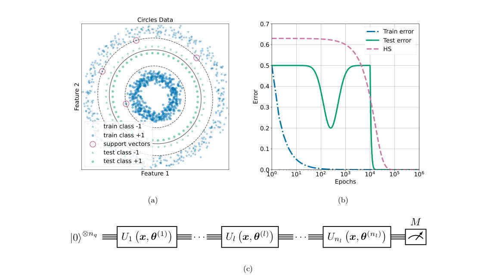
<figcaption class="paper-figure-caption"><b>Fig 1.</b> Figure 1: a) Diagram of the dataset described in Subsection 2.1 showing random training points in two concentric circles (blue) and a ring of test points sitting closely to the SVM-defined decision boundary (green). The support vectors are highlighted in red circles. b) Sketch of a characteristic grokking loss curve with epoch-wise double descent. The model fits the train data quickly and enters the memorization phase. While the loss is effectively constant, the model weights can still change and influence other metrics, i.e. the hypothesis stability (HS). After thousands of epochs in the memorization phase, the model can show an abrupt transition, where the test error drops. This is called...</figcaption>
</figure>
<figure class="paper-figure-card">
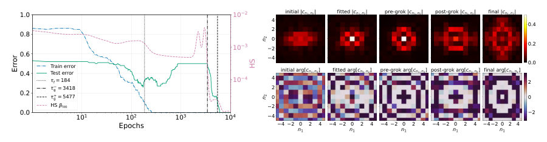
<figcaption class="paper-figure-caption"><b>Fig 2.</b> Figure 2: Empirical observation of grokking and post-transition stability. The training history for the model in Equation 3 trained on the dataset defined in Subsection 2.1 is shown in (a). Notably, the hypothesis stability βloo undergoes a sharp drop around the grokking transition from epoch 3000 to τ + g = 5477. Parameters nl = 3, |Dtest| = |Dtrain| = 100, ε = 0.1, learning rate η = 10−3, weight decay λW = 10−5, σθ = 1. (b) Heatmap of Fourier coefficients cn1,n2(θτ) during different stages of training, τ ∈  0, τf, τ ± g , 105 . τ − g is the last epoch of the memorization phase and τ + g is the first epoch where the test error drops below 0.1.</figcaption>
</figure>
<figure class="paper-figure-card">
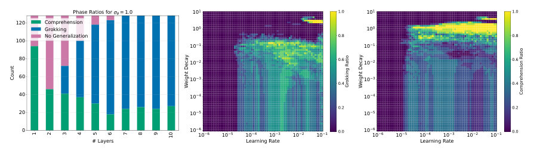
<figcaption class="paper-figure-caption"><b>Fig 3.</b> Figure 3: a) Barplot of the 128 independent training runs of the quantum learner for each number of layers nl ∈{1, . . . 10}. The weights θ are initialized according to a Gaussian with spread σθ = 1.0 and |Dtrain| = 100 = |Dtest|, ε = 0.1, λ = 0 and 105 epochs. For higher nl the ratio of runs with a successful generalization increases. For nl ≥7 no unsuccessful runs have been observed. b) Heatmap of the grokking ratio and c) heatmap of the comprehension ratio, both aggregated over 8 independent training runs of the quantum learner for nl = 3 and σθ = 2π, evaluated accross learning rates η ∈  10−6, 10−1</figcaption>
</figure>
<figure class="paper-figure-card">
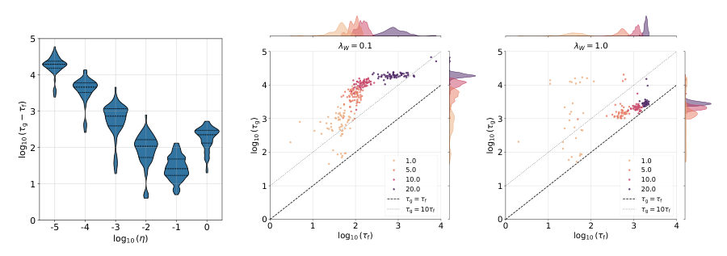
<figcaption class="paper-figure-caption"><b>Fig 4.</b> Figure 4: Temporal dynamics of the memorization-to-generalization transition. (a) Violin plot tracking the absolute time gap log10(τg −τf) across different learning rates log10(η) ∈{−5, . . . , 0}. Joint scatter and marginal density plots mapping generalization time log10(τg) against fitting time log10(τf) under varying weight initialization scales σθ ∈{1.0, 5.0, 10.0, 20.0} for (b) weak weight decay λW = 0.1 and (c) strong weight decay λW = 1.0. The dashed black line marks synchronous learning (τg = τf), while the dotted grey line marks the boundary threshold separating comprehension from grokking (τg = 10τf).</figcaption>
</figure>
<figure class="paper-figure-card">
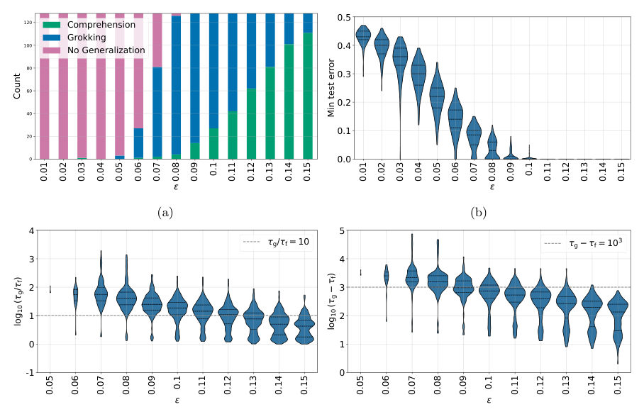
<figcaption class="paper-figure-caption"><b>Fig 5.</b> Figure 5: Behavior of the quantum learner evaluated over 128 independent training runs for each boundary distance parameter ε ∈{0.01, . . . 0.15} and 105 epochs. (a) Barplot detailing the distribution of learning phases. (b) Violin plot illustrating the distribution of the minimum test error from the whole training history. (c) Relative time gap ratio (τg/τf) and (d) absolute temporal delay (τg−τf) until the grokking transition, conditioned strictly on the subset of successfully generalizing runs. Note that the horizontal lines in panels (c) and (d) signify the threshold criteria distinguishing phases according to Table 1.</figcaption>
</figure>

**Summary.** This work examines grokking and double descent in Quantum Neural Networks using a 2-qubit model. The authors show that generalization relies on specific structural changes in the circuit weights, which can be mathematically tracked via Fourier analysis. By applying weak weight regularization, they provide a robust method to stabilize these quantum circuits after the initial generalization phase.

**Why it may be interesting.** It connects complex concepts like quantum circuit optimization and phase transitions (grokking) to rigorous theoretical frameworks from machine learning stability theory, providing insights into how physical constraints (like real coefficients) dictate optimal computational states.

Detailed structure

**Main problem.** The paper investigates grokking (delayed generalization) and epoch-wise double descent dynamics within Variational Quantum Machine Learning (QML). It seeks to understand the structural changes in quantum circuits that govern this transition.

**Main result.** Grokking is observed in a 2-qubit QNN, correlating with weight-norm increases away from sparse solutions. Weak explicit weight-norm regularization successfully stabilizes the post-grokking generalization phase.

**Method.** The study uses empirical observation on a 2-qubit QNN trained on concentric circle data and analyzes weight dynamics by tracking Fourier coefficients and algorithmic stability measures.

**Model / system.** The model is a two-qubit Quantum Neural Network (QNN) parameterized over the SU(4) manifold, trained to classify data points near an optimal decision boundary. The training involves minimizing a regularized loss function.

**Key observables.** Test error, weight-norm, algorithmic stability metric ($eta_{	ext{loo}}$), and Fourier coefficients ($c_{n1, n2}$).

**Important parameters / regimes.** Circuit depth (overparameterization), learning rate, weight decay ($\lambda$), and the data margin ($\epsilon$).

**Assumptions / limitations.** The analysis compares idealized mathematical constraints (e.g., purely real Fourier coefficients for step functions) with empirical training dynamics; some results rely on interpreting weight coefficient structures as indicators of generalization.

**Figures summary.** Figures illustrate characteristic grokking loss curves, the evolution of phase profiles in Fourier space across training stages, and comparisons of final test error distributions with and without regularization.

**Paper structure.** The paper progresses from initial empirical observation of grokking/double descent to detailed analysis using algorithmic stability theory. It then uses mathematical tools (Fourier coefficients) to characterize the structural changes underlying generalization, culminating in proposing weight-norm regularization to stabilize the final state.

Abstract

Grokking, the delayed transition from memorization to generalization, is a fundamental phenomenon in gradient-based learning, yet its dynamics within variational quantum machine learning (QML) remain largely unexamined. In this work, we report the empirical observation of both the grokking transition and epoch-wise double descent in a two-qubit quantum neural network (QNN) under a complete parameterization of the SU(4) manifold. We demonstrate that overparameterization via increased circuit depth improves the probability of successful generalization. Notably, these architectures frequently exhibit an epoch-wise double descent in test error, degrading at a critical epoch before recovering into a generalizing state. Crucially, we identify a generalization decay in late-stage training, where the test error increases significantly despite a stagnant training loss. Bridging this behavior with algorithmic stability theory, our analysis reveals that this decay correlates with an unconstrained increase of the weight-norm, drifting away from sparse, phase-aligned harmonic solutions toward overfitted solutions in the Hilbert space. We analyze the underlying temporal dynamics of this transition, demonstrating how the onset of generalization is linked to optimization hyperparameters such as learning rate and weight decay. Finally, to mitigate late-stage decay, we introduce a weak explicit weight-norm regularization into the loss function. We demonstrate that this structural anchor stabilizes the post-grokking phase and permanently preserves generalization gains, providing a robust framework for training overparameterized quantum circuits.

[↑ back to top](#top)

### [Improved GKP magic states from error-corrected non-Gaussian quantum states](http://arxiv.org/abs/2607.07833v1)

**Authors:** Sharon David, Jack Davis, Ulysse Chabaud, Francesco Arzani  
**Type:** theory · **Category:** quantum information and computing · **PDF:** <https://arxiv.org/pdf/2607.07833v1>  
**Analysis basis:** full PDF text, analyzed in chunks
**Topic relevance:** `Keldysh / 2PI / non-Gaussian methods` **1/5** · `entanglement & information structure` **1/5**

↔ Scroll figures horizontally

<figure class="paper-figure-card">
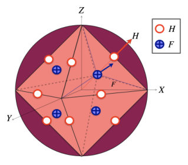
<figcaption class="paper-figure-caption"><b>Fig 1.</b> Figure 1. The Bloch sphere is a geometric representation of a qubit. Its antipodal points correspond to the 6 Pauli eigenstates, and their convex hull forms the stabilizer octa- hedron. There exist twelve H-type and eight F-type pure non-stabilizer “magic” states that are projections onto the surface of the sphere from the centers of the edges and faces of the octahedron, respectively.</figcaption>
</figure>
<figure class="paper-figure-card">
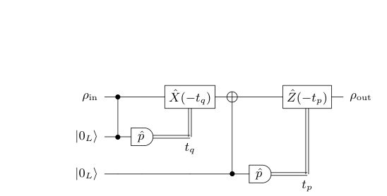
<figcaption class="paper-figure-caption"><b>Fig 2.</b> Figure 2. The GKP error-correction gadget corrects any ar- bitrary input state and projects it into the logical GKP code space.</figcaption>
</figure>
<figure class="paper-figure-card">
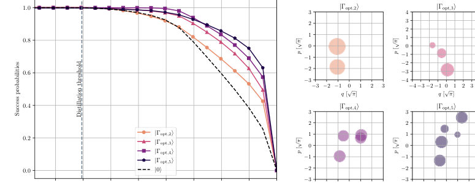
<figcaption class="paper-figure-caption"><b>Fig 3.</b> Figure 3. These figures are to be read as follows, the graphs on the left contain the success probabilities of cat states as a function of its minimum fidelity F ∗, the adjacent plots on the right are the respective positions of these cat states in phase space. (a) The success probabilities for two-legged cat states. Here we use the notation |q0, p0⟩± |q1, p1⟩to indicate the positions of the coherent states in phase space. In general the even-symmetric cat states have higher success probabilities, i.e., they have higher chances of projecting close to an H-type state. However the |2√π, 0⟩−|−2√π, 0⟩state on the GKP lattice has higher success probabilities than most odd cat states. It also...</figcaption>
</figure>
<figure class="paper-figure-card">
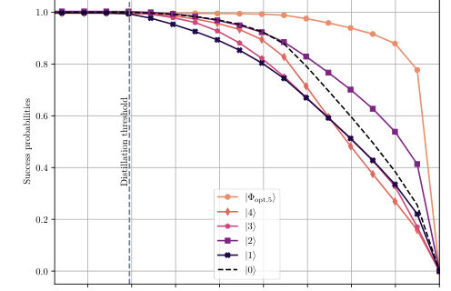
<figcaption class="paper-figure-caption"><b>Fig 4.</b> Figure 4. The success probability curves for Fock states. The Reed–Muller distillation threshold of F ∗&gt; 0.859, is main- tained for the protocol with Fock states. The best success probability is achieved by the optimized superposition state |Φopt,5⟩. Not only does |2⟩perform the best among the num- ber states, it also outperforms the vacuum state. The odd Fock states |1⟩and |3⟩have success probabilities lower than |0⟩. Notably, the even-symmetric |4⟩performs worse than the vacuum state, and worse than the odd-symmetric |1⟩in cer- tain regions.</figcaption>
</figure>
<figure class="paper-figure-card">
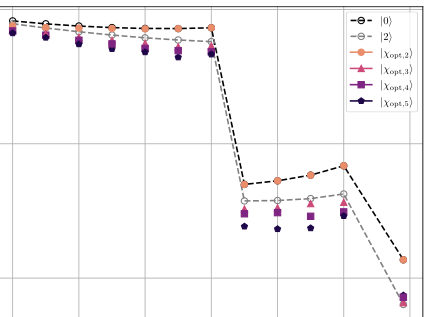
<figcaption class="paper-figure-caption"><b>Fig 5.</b> Figure 6. Log plot of NCV for different superpositions of Fock states. The superposition weights were found by minimiz- ing over the number of CV resources NCV for different min- imum fidelities F ∗. The target fidelity of the output state was set at Ftarget = 0.999. Here χopt,2 = ϕ0 |0⟩+ ϕ1 |1⟩, and χopt,3 = ϕ0 |0⟩+ ϕ1 |1⟩+ ϕ2 |2⟩, and so on. We assume per- fect syndrome extraction; therefore, experimental values are expected to differ.</figcaption>
</figure>

**Summary.** This paper investigates methods to enhance magic state generation, crucial for fault-tolerant quantum computing using bosonic systems. By applying error correction techniques designed for Gaussian states to simple non-Gaussian inputs like Fock or cat states, the authors demonstrate a significant improvement in resulting state quality. This research suggests that resource requirements can be substantially lowered by moving beyond purely Gaussian assumptions.

**Why it may be interesting.** It directly addresses resource optimization in quantum computation by showing that incorporating structured non-Gaussian resources can outperform standard Gaussian assumptions used in current theoretical models for bosonic QEC.

Detailed structure

**Main problem.** The research aims to improve the quality of magic states, which are essential resources for achieving fault-tolerant universal quantum computation in bosonic systems.

**Main result.** Applying error correction techniques designed for Gaussian states to simple non-Gaussian input states (like cat or Fock states) significantly boosts magic state fidelity, potentially reducing distillation resource requirements by a factor of three.

**Method.** The authors utilize the framework of Gottesman--Kitaev--Preskill (GKP) codes to encode logical information and then apply error correction protocols to non-Gaussian input states to generate high-fidelity magic states via distillation.

**Model / system.** The work is set in bosonic quantum computation, employing GKP codes within an infinite-dimensional bosonic Hilbert space. The analysis focuses on superpositions of coherent or Fock states as the input resources for error correction.

**Key observables.** Magic state fidelity (purity), required distillation cost (resource reduction factor), and Bloch vector coefficients characterizing the logical state output.

**Important parameters / regimes.** The improvement factor achieved in resource requirements (e.g., a factor of 3); the specific structure of non-Gaussian input states (superpositions of coherent/Fock states).

**Assumptions / limitations.** The analysis relies on applying established error correction frameworks to novel, simple non-Gaussian inputs; it assumes that avoiding projection near stabilizer states is key to improvement.

**Figures summary.** Figure 1 illustrates the Bloch sphere and the stabilizer octahedron formed by Pauli eigenstates. Figure 2 depicts the GKP error-correction gadget, showing how an arbitrary input state is projected into the logical code space.

**Paper structure.** The paper builds upon existing knowledge of gate teleportation and magic state distillation in bosonic systems. It introduces the methodology for using non-Gaussian states within the GKP framework to calculate improved fidelity metrics compared to purely Gaussian inputs, concluding with an analysis of the physical origin of these improvements.

Abstract

Gate teleportation, together with magic state distillation, is a promising route towards fault-tolerant, universal computation. In the context of bosonic quantum computation, Baragiola et al. PRL 123(20).200502 (2019) showed that within the framework of Gottesman--Kitaev--Preskill codes, encoded magic states suitable for distillation can be produced by error correcting Gaussian states, such as the vacuum. Here, we show that applying the same framework to simple non-Gaussian input states can significantly improve the quality of the magic states obtained, reducing the overall resources for the complete distillation procedure. We focus on superpositions of coherent states or Fock states, showing that many can lead to improvements in the generation of high-quality encoded magic states, which in some cases reduces the resources required for magic state distillation by about a factor $3$. We also investigate the primary source of these improvements and find that, unlike what was previously conjectured, the suitability of input states is not fully explained by symmetry arguments. Instead, the best states seem to avoid projection near stabilizer states as a result of the error correction procedure.

[↑ back to top](#top)

### [Large-scale first-principle simulations of amorphous indium oxide](http://arxiv.org/abs/2607.08617v1)

**Authors:** Matthew Bousquet, Francois Gygi, Giulia Galli  
**Type:** theory · **Category:** disordered systems and neural networks · **PDF:** <https://arxiv.org/pdf/2607.08617v1>  
**Analysis basis:** full PDF text, analyzed in chunks
**Topic relevance:** `methods for driven-dissipative` **1/5** · `non-equilibrium dynamics` **1/5**

↔ Scroll figures horizontally

<figure class="paper-figure-card">
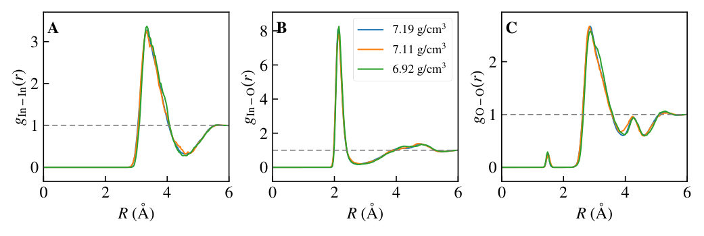
<figcaption class="paper-figure-caption"><b>Fig 1.</b> FIG. 1. Partial radial distribution functions, gIn−In(r) (A), gIn−O(r) (B), and gO−O(r) (C), computed with first principle molecular dynamics for 80 atom amorphous samples as a function of density. Standard deviations are reported in Figure ?? and coordination numbers in Table S1, showing that In-In coordination decreases to 5.48-5.42 from the value of 6 in the crystal, and In-O coordination to 3.65-3.61, from the value of 4 in the crystal, depending on the density.</figcaption>
</figure>
<figure class="paper-figure-card">
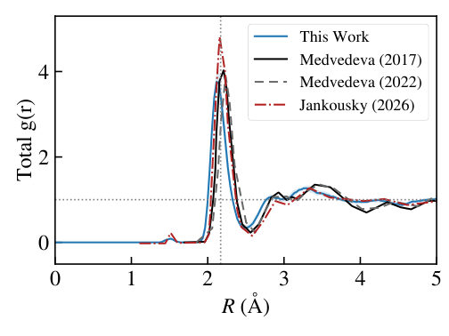
<figcaption class="paper-figure-caption"><b>Fig 2.</b> FIG. 2. Comparison of the computed total correlation func- tion with previous results, reported in references [10, 35, 36] at ρ=7.11 g cm−3.</figcaption>
</figure>
<figure class="paper-figure-card">
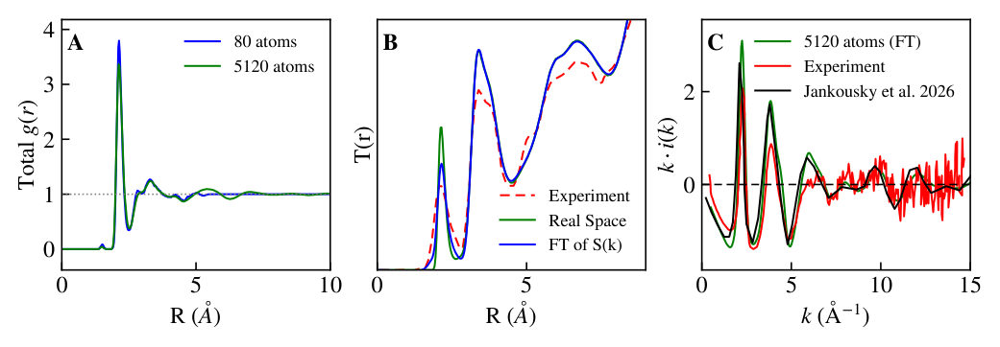
<figcaption class="paper-figure-caption"><b>Fig 3.</b> FIG. 3. A: Total radial distribution function (g(r)) of a-In2O3 computed with 80 and 5120 supercells. B: Comparison between experimental [38] and computed correlation function (T(r) = 4πρr · g(r)) obtained directly in real space and as a Fourier Transform (FT) of the structure factor S (k)C: Comparison between measured and computed interference functions (see Eq. 4) Results from Ref.[10] are also shown.</figcaption>
</figure>
<figure class="paper-figure-card">
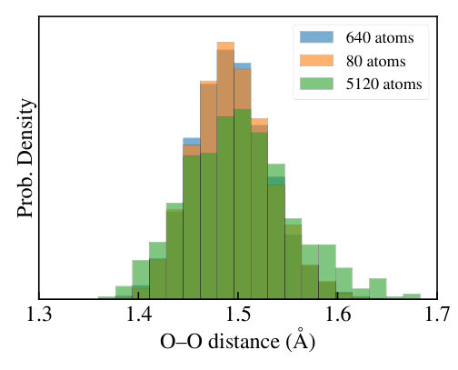
<figcaption class="paper-figure-caption"><b>Fig 4.</b> FIG. 4. Histogram of O-O bond lengths for samples generated by our MLIP at ρ = 7.11 g · cm −3. The mean distance is 1.49 ± 0.04 ˚A for 80 and 640 atom cells and 1.50 ± 0.05 ˚A for the 5120 cell.</figcaption>
</figure>
<figure class="paper-figure-card">
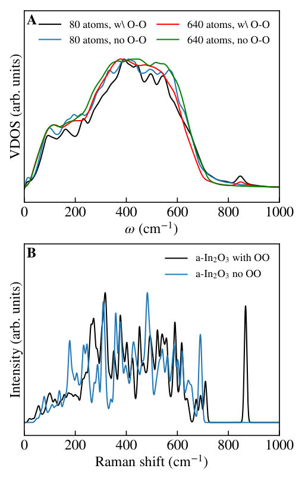
<figcaption class="paper-figure-caption"><b>Fig 5.</b> FIG. 6. Panel A shows the vibrational density of states (VDOS) for 80 atom samples of a-In2O3 with and without an O-O bond and the VDOS of a 640 atom sample with 4 O-O bonds and one without 0 O-O bonds. The peak around ∼850 cm−1 is attributed to the short (∼1.50 ˚A) peroxide bond. Panel B shows Raman spectra computed at the LDA level of theory for a 80 atom cell with and without an O-O bond. The mode near ∼850 cm−1 is Raman-active, and cor- responds to the O-O bond</figcaption>
</figure>

**Summary.** This work uses advanced machine learning interatomic potentials to simulate massive amorphous indium oxide structures. It reveals that structural features like edge-sharing polyhedra and peroxide-like O-O bonds are responsible for the material's high electron mobility and intrinsic n-type doping. The findings provide a detailed structure-property roadmap for improving its use in energy devices.

**Why it may be interesting.** While focused on solid-state physics, the use of machine learning potentials trained on first principles to simulate large disordered systems falls directly into the realm of ML-physics applied to complex materials, which is relevant for understanding emergent properties in disordered quantum matter.

Detailed structure

**Main problem.** The study aims to resolve the structural motifs responsible for the high electron mobility and the existence of peroxide-like bonds in amorphous indium oxide (a-In2O3).

**Main result.** The research establishes a comprehensive structure-property picture, showing that extended InOx chains and O-O peroxide-like bonds provide the basis for high electron mobility and intrinsic n-type doping.

**Method.** A MACE-based machine-learned interatomic potential was developed and used to simulate large amorphous supercells (up to 5120 atoms) via first-principles molecular dynamics.

**Model / system.** The physical system is amorphous indium oxide (a-In2O3), a high-electron-mobility semiconductor crucial for thin-film transistors. The simulations model the structural disorder and defect chemistry inherent in the amorphous state.

**Key observables.** X-ray structure factors, partial radial distribution functions (RDFs), vibrational spectra (Raman/IR), localized in-gap electronic states near the conduction band minimum.

**Important parameters / regimes.** Mean O-O bond length of 1.5 Å; supercell sizes up to 5120 atoms; energy differences between amorphous and crystalline phases.

**Assumptions / limitations.** The use of a MACE potential trained on first-principles data assumes the accuracy of the underlying DFT functionals (SCAN meta-GGA).

**Figures summary.** Figures likely compare calculated X-ray structure factors to experimental data, show RDFs confirming bond lengths, and display Raman spectra highlighting a distinct feature near 850 cm-1 associated with O-O bonds.

**Paper structure.** The paper progresses by first developing the large-scale ML potential, then using it for structural characterization (RDFs, structure factors), followed by electronic analysis to identify defect states, and finally correlating these structural/electronic findings with measurable optical signatures like Raman scattering.

Abstract

Amorphous indium oxide (a-In$_2$O$_3$) is a high-electron-mobility semiconductor of central importance in thin-film transistors and a promising photoanode for solar-driven water oxidation. Despite sustained experimental and computational investigations, the structural motifs underlying its unusual transport properties and the existence of O-O peroxide-like bonds within its network have remained unresolved. Here we develop a MACE-based machine-learned interatomic potential trained on first-principles molecular dynamics trajectories and use it to generate and analyze amorphous structures containing up to 5120 atoms, two orders of magnitude larger than those adopted in typical ab initio studies. We find X-ray structure factors in excellent quantitative agreement with experiment and we confirm that In$_2$O$_3$ is a poor glass former, with the likely presence of quasi-crystalline regions in amorphous samples. Our large-scale structural analysis reveals extended chains of edge-sharing InO$_k$ polyhedra providing a concrete structural basis for the high electron mobility of a-In$_2$O$_3$. Our results strongly support the formation of O-O peroxide-like bonds in the amorphous network, with a mean length of 1.5 Å. We show that these bonds introduce localized in-gap states near the conduction band minimum, acting as a source of intrinsic n-type self-doping and enhancing sub-gap optical absorption. These effects are detectable via a distinct Raman feature near 850 cm$^{-1}$ that is absent in the IR spectrum. Overall, our results establish a comprehensive structure-property picture of a-In$_2$O$_3$, provide directly testable experimental predictions, and suggest that controlled amorphization is a viable strategy for improving the photoelectrochemical activity of a-In$_2$O$_3$.

[↑ back to top](#top)

### [A Nonstabilizerness Resource Law for Universal Quantum State Purification](http://arxiv.org/abs/2607.08626v1)

**Authors:** Keming He, Enji Xiong, Xin Wang  
**Type:** theory · **Category:** quantum information and computing · **PDF:** <https://arxiv.org/pdf/2607.08626v1>  
**Analysis basis:** full PDF text, analyzed in chunks
**Topic relevance:** `entanglement & information structure` **1/5**

↔ Scroll figures horizontally

<figure class="paper-figure-card">
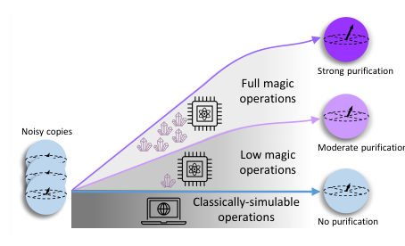
<figcaption class="paper-figure-caption"><b>Fig 1.</b> Fig 1. Schematic illustration of the role of magic in universal quantum state purification. Starting from noisy copies, clas- sically simulable operations remain at the zero-gain bound- ary, operations with limited magic yield moderate purifica- tion, and operations with larger magic can reach stronger fi- delity improvement.</figcaption>
</figure>
<figure class="paper-figure-card">
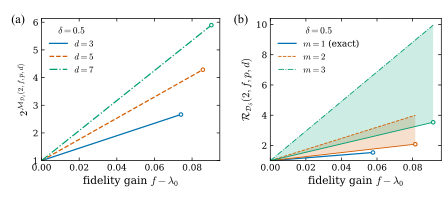
<figcaption class="paper-figure-caption"><b>Fig 2.</b> Fig 2. Resource laws for two-copy universal purification at δ = 0.5. The exponentiated mana and the robustness bounds grow linearly with the fidelity gain f −λ0. In panel (b), shaded regions indicate the intervals between lower and up- per robustness bounds.</figcaption>
</figure>
<figure class="paper-figure-card">
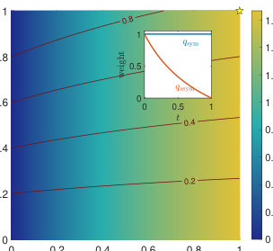
<figcaption class="paper-figure-caption"><b>Fig 3.</b> Fig 3. Parameter space structure of the successful purification map for odd-dimensional universal purification at δ = 0.5 and d = 3. The background color shows 2MDδ (2,f,p,3) −1, and the contour lines show the success probability p. The point (t, s) = (1, 1) is the preimage of the golden point. Inset: retained branch weights at s = 1, where qsym := 2(µ1+µ2) = s and qasym := 2(µ1−µ2) = s(1−t)/(1+t). Increasing t suppresses the antisymmetric branch and in- creases both the fidelity gain and the magic of the selected operation.</figcaption>
</figure>

**Summary.** This paper develops a quantitative theory showing that universal quantum state purification requires a specific amount of 'magic' resource. It proves exact linear laws connecting this required magic (measured by mana or robustness) directly to the achievable fidelity gain beyond what is possible classically. This establishes a fundamental, measurable resource constraint for fault-tolerant quantum information processing.

**Why it may be interesting.** The quantitative link between fundamental resource measures (magic/nonstabilizerness) and achievable performance metrics like fidelity is crucial for designing fault-tolerant quantum computation protocols, providing rigorous theoretical limits.

Detailed structure

**Main problem.** The paper establishes a quantitative resource law governing quantum state purification, aiming to determine the minimum 'magic' (nonstabilizerness) required to achieve high fidelity from noisy copies.

**Main result.** It proves exact linear laws relating the required mana (for odd dimensions) and robustness (for multi-qubit systems) to the achievable fidelity gain over the unpurified state.

**Method.** The analysis uses resource theories, specifically defining 'mana' and 'robustness,' and employs advanced mathematical techniques involving Semidefinite Programming formulations and structural decomposition of stabilizer states.

**Model / system.** The model involves purifying a quantum state $|\psi
angle$ corrupted by depolarizing noise ($	ext{D}_\delta$) using $n=2$ noisy copies. The analysis covers both odd-dimensional qudit systems and general multi-qubit systems.

**Key observables.** Fidelity ($f$), Success Probability ($p$), Mana ($	ext{M}$), Robustness ($	ext{R}$), and the fidelity gain ($f - \lambda_0$).

**Important parameters / regimes.** Number of copies ($n=2$), Noise parameter ($\delta$), System dimension ($d$ or qubit count).

**Assumptions / limitations.** The analysis assumes the use of depolarizing noise and focuses on probabilistic purification protocols modeled by CPTN maps.

**Figures summary.** Figures illustrate how magic resources govern purification performance, showing linear growth of mana and robustness bounds with the fidelity gain ($f - \lambda_0$).

**Paper structure.** The paper first introduces the problem using resource measures (mana/robustness) for two-copy purification. It then proves the exact linear law for odd dimensions (mana) and derives analogous bounding laws for multi-qubit systems (robustness), culminating in explicit bounds derived from stabilizer state analysis.

Abstract

Quantum state purification aims to recover higher-fidelity quantum states from multiple noisy copies and is a fundamental primitive for quantum information processing. Magic resources enable operations beyond classically simulable dynamics and are central to universal fault-tolerant quantum computation. Recent no-go results show that classically simulable operations cannot achieve a nontrivial universal fidelity gain. This motivates a quantitative theory of the magic required for purification at prescribed success probability and target fidelity. For universal purification with two input copies, we prove an exact linear mana law in odd dimensions and a two-sided linear robustness law for multi-qubit systems, which becomes exact for a single qubit. We also identify an explicit successful purification map that makes the tradeoff transparent. These results establish universal purification as a task obeying a quantitative magic-fidelity law and link magic resources to error mitigation and fault-tolerant quantum information processing.

[↑ back to top](#top)

### [A Quantum Reservoir Architecture for Chaotic Forecasting and a Test of Whether Its High Dimension Helps](http://arxiv.org/abs/2607.07978v1)

**Authors:** Tushar Pandey  
**Type:** both · **Category:** disordered systems and neural networks · **PDF:** <https://arxiv.org/pdf/2607.07978v1>  
**Analysis basis:** full PDF text, analyzed in chunks
**Topic relevance:** `non-equilibrium dynamics` **1/5**

↔ Scroll figures horizontally

<figure class="paper-figure-card">
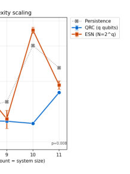
<figcaption class="paper-figure-caption"><b>Fig 1.</b> Fig. 1. Test teacher MSE for QRC (q qubits) and matched classical ESN (Nres = 2q) on Lorenz-96 with q = N ∈{5–11}. Mean ± std over 8 seeds per cell. QRC remains essentially flat; the ESN oscillates non-monotonically with feature dimension.</figcaption>
</figure>
<figure class="paper-figure-card">
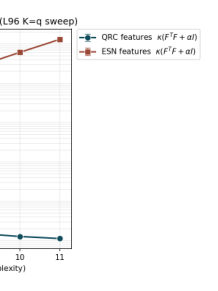
<figcaption class="paper-figure-caption"><b>Fig 2.</b> Fig. 2. Feature-Gram condition number κ(F ⊤F + αI) vs L96 dimension N = q for QRC and matched-feature ESN, 8 seeds per cell. QRC conditioning decreases toward 1; ESN conditioning grows monotonically. The ratio reaches ∼5 × 104 at N = 10.</figcaption>
</figure>
<figure class="paper-figure-card">
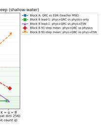
<figcaption class="paper-figure-caption"><b>Fig 3.</b> Fig. 3. Paired Wilcoxon p-values for the matched-complexity sweep on SWE Block A and Block B. Four of the five comparisons enter the significant region (p &lt; 0.05) as K = q grows; the fifth (91-step-mean physics+QRC vs. physics+ESN) does not.</figcaption>
</figure>

**Summary.** The paper proposes using Quantum Reservoir Computing (QRC) for predicting complex chaotic systems. It rigorously tests this approach against classical methods by analyzing the stability and conditioning of the learned feature space as complexity increases. The results demonstrate that QRC maintains superior, stable performance metrics compared to its classical counterparts.

**Why it may be interesting.** This work provides a concrete, quantifiable diagnostic tool—the condition number analysis—to validate the utility of high-dimensional feature spaces generated by quantum circuits in physical modeling tasks like chaotic forecasting.

Detailed structure

**Main problem.** The paper addresses how to use Quantum Reservoir Computing (QRC) for forecasting chaotic dynamical systems while rigorously diagnosing whether the high dimensionality of the quantum feature space provides a genuine advantage over classical methods.

**Main result.** On two chaotic test systems, QRC maintained a stable prediction error and superior feature conditioning compared to matched classical reservoirs as system size grew. This confirms that the quantum architecture's structure yields better stability in the learned feature space.

**Method.** The authors implement QRC using fixed quantum circuits for feature generation ($\phi_q(x_t)$) and train a linear readout via ridge regression. They employ a matched-complexity scaling protocol to ensure fair comparison with classical Echo State Networks (ESN).

**Model / system.** The methods are tested on chaotic dynamical systems, specifically the Lorenz-96 model and shallow-water fluid equations (SWE) simulated on large grids.

**Key observables.** Prediction Mean Squared Error (MSE), the condition number ($\kappa$) of the feature Gram matrix ($F^	op F + \alpha I$), and stability across increasing system/reservoir dimensions.

**Important parameters / regimes.** The comparison is made by growing both the prediction problem size ($K$) and the quantum reservoir dimension ($q$) together, ensuring $K=q$ for matched complexity.

**Assumptions / limitations.** The analysis assumes noiseless statevector evaluation; the paper also notes that the condition number bound controls conditioning but not the inherent bias of the ridge estimator.

**Figures summary.** Figures compare QRC vs. ESN test MSE (QRC flat, ESN oscillates) and plot the feature-Gram condition number ($\kappa$): $\kappa_{	ext{QRC}}$ saturates near 1 while $\kappa_{	ext{ESN}}$ grows significantly with dimension.

**Paper structure.** The paper first introduces QRC for chaotic forecasting. It then details the diagnostic protocol, comparing its spectral properties (condition number) against classical ESNs across varying dimensions using L96 and SWE models. Finally, it presents results showing superior stability and conditioning for the quantum approach.

Abstract

Quantum reservoir computing uses a fixed quantum circuit as a feature generator and trains only a simple linear readout on top of it. This makes it cheap to train and free of the optimisation problems that affect many quantum machine-learning models. A natural worry is that the very large feature space the circuit produces might inflate apparent performance without adding anything real. This paper provides two things. First, it gives a complete, reproducible recipe for one such reservoir applied to forecasting chaotic systems, including how data is fed in, how the circuit is built, and how the readout is trained. Second, it gives a way to tell whether the reservoir's high dimension is actually doing useful work. We grow the size of the prediction problem and the size of the quantum reservoir together, so that extra capacity cannot be the explanation for any improvement, and we track a single stability number that measures how well behaved the readout fit is. On two chaotic test systems, a spatiotemporal chain and a shallow-water fluid model, the quantum reservoir keeps a flat, stable error as both sizes grow, while a matched classical reservoir does not. We report where the classical baseline is in fact stronger, so the comparison is honest. The result is a clean specification plus a diagnostic that other groups can apply to any reservoir whose features have a known scale.

[↑ back to top](#top)

### [A Sparse and Truncated State Vector Simulator for Peaked Circuits](http://arxiv.org/abs/2607.07816v1)

**Authors:** Diogo R. Ferreira  
**Type:** theory · **Category:** numerical methods · **PDF:** <https://arxiv.org/pdf/2607.07816v1>  
**Analysis basis:** full PDF text, analyzed in chunks
**Topic relevance:** `methods for driven-dissipative` **1/5**

↔ Scroll figures horizontally

<figure class="paper-figure-card">
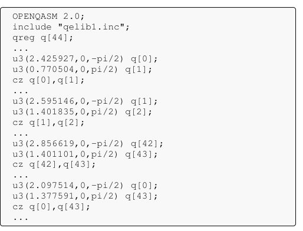
<figcaption class="paper-figure-caption"><b>Fig 1.</b> Fig. 1. Excerpt of BlueQubit’s sharp peak circuit.</figcaption>
</figure>
<figure class="paper-figure-card">
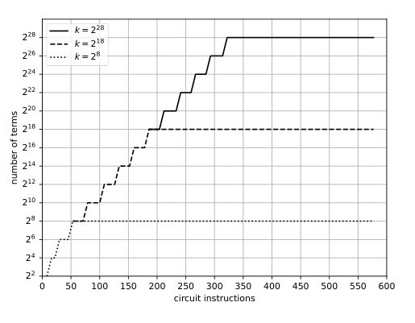
<figcaption class="paper-figure-caption"><b>Fig 2.</b> Fig. 3. Number of terms during circuit simulation with top-k truncation.</figcaption>
</figure>
<figure class="paper-figure-card">
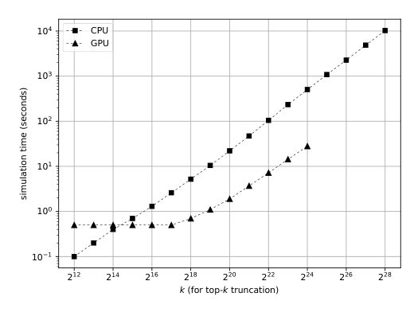
<figcaption class="paper-figure-caption"><b>Fig 3.</b> Fig. 2. Circuit simulation time when applying top-k truncation.</figcaption>
</figure>
<figure class="paper-figure-card">
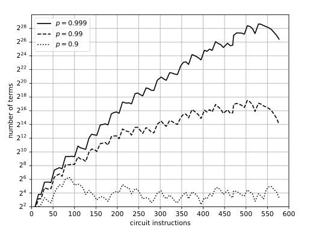
<figcaption class="paper-figure-caption"><b>Fig 4.</b> Fig. 4. Number of terms during circuit simulation with p-mass truncation.</figcaption>
</figure>
<figure class="paper-figure-card">

<figcaption class="paper-figure-caption"><b>Fig 5.</b> Fig. 3 illustrates how the number of terms increases during circuit simulation, for three different values of k. In an initial stage, some blocks of circuit instructions do not change the size of the state vector, while others cause the number of terms to double, so the staircase pattern in the plot is actually an exponential growth, up to the limit established by k. Naturally, the larger the number of terms becomes, the longer it will take to process each block of circuit instructions. With p-mass truncation, the situation is different. Here, the state vector is truncated after each block (as opposed to top-k truncation, where it is allowed to grow freely up to a point). However, if the...</figcaption>
</figure>

**Summary.** This paper presents an efficient classical simulation method for quantum circuits, particularly those with peaked output distributions. It achieves efficiency by using a sparse representation of the state vector and implementing controlled truncation via top-k or p-mass limits. This allows users to trade off computational resources against desired accuracy when exact simulation is infeasible.

**Why it may be interesting.** This work provides a concrete, resource-aware numerical technique for simulating quantum dynamics that goes beyond standard tensor network methods by directly managing state vector sparsity based on physical probability concentration, which is relevant for understanding complex many-body states.

Detailed structure

**Main problem.** To simulate quantum circuits efficiently when the state vector size grows exponentially, which exceeds classical computational memory.

**Main result.** The authors developed an open-source implementation that successfully simulates peaked circuits by combining sparse representation with controlled truncation (top-k or p-mass). This allows resource management while retaining high fidelity for specific circuit types.

**Method.** The simulation uses a sparse state vector representation and applies unitary operations in blocks, followed by mandatory truncation based on either the maximum number of non-zero terms ($k$) or the minimum retained probability mass ($p$).

**Model / system.** The model is general quantum circuits applied to an $n$-qubit system. The focus is on 'peaked circuits' where the output probability distribution is highly concentrated, allowing for significant state vector sparsity.

**Key observables.** Fidelity (approximated by retained total probability mass) and computational resources (runtime/memory usage controlled by $k$ or $p$).

**Important parameters / regimes.** The truncation parameters ($k$ for top-k, $p$ for p-mass), the number of qubits ($n$), and the structure of the unitary gates.

**Assumptions / limitations.** The approach assumes that the observable quantities are dominated by a small subset of basis states, allowing for effective truncation. The method can fail if probability mass is spread widely despite having a clear peak.

**Figures summary.** Figures illustrate the scaling of simulation time with $k$ (linear scaling) and show how the number of active terms grows during simulation under different truncation regimes ($k$ vs. $p$).

**Paper structure.** The paper progresses from introducing the problem of state vector growth, detailing the sparse representation, proposing the combined top-k/p-mass truncation strategy, describing the optimized implementation (vectorization, GPU acceleration), and finally analyzing performance scaling.

Abstract

In a class of quantum circuits known as peaked circuits, the goal is to predict the most probable bit string at the output of the circuit. Since these circuits are designed to have a sharp peak in their output distribution, in principle it should be possible to simulate them using a truncated state vector with a limited number of terms, or a fraction of the total probability mass. This approximate simulation can be carried out on a classical computer with a sparse representation that stores only the nonzero amplitudes of the state vector, in contrast to the dense representations that are common in most quantum simulators. For efficiency, all operations on the state vector should be vectorized to the furthest possible extent and, if available, hardware acceleration can also be used. This work describes how these requirements were met in an open-source implementation, and discusses its performance and limitations.

[↑ back to top](#top)

### [An edge-bicolored graph approach to the Ising model on random regular graphs](http://arxiv.org/abs/2607.07867v1)

**Authors:** Michael Borinsky, Shiyue Ren, Maximilian Wiesmann  
**Type:** theory · **Category:** statistical mechanics · **PDF:** <https://arxiv.org/pdf/2607.07867v1>  
**Analysis basis:** full PDF text, analyzed in chunks
**Topic relevance:** `analog quantum simulation` **1/5**

↔ Scroll figures horizontally

<figure class="paper-figure-card">
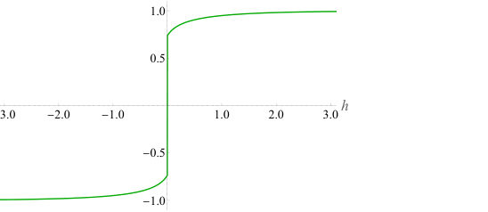
<figcaption class="paper-figure-caption"><b>Fig 1.</b> Figure 1: Magnetization m versus external field h for k = 4, J = 1 and a fixed β = 0.2 &lt; βtree c = 1 2 log 2 = 0.346 . . . (left) and β = 0.4 &gt; βtree c (right).</figcaption>
</figure>
<figure class="paper-figure-card">
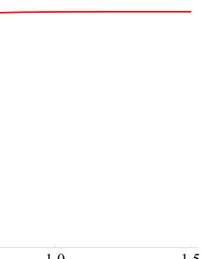
<figcaption class="paper-figure-caption"><b>Fig 2.</b> Figure 2: The curve represents the spontaneous magnetization m0 as a function of the inverse temperature β with the parameters k = 4 and J = 1. The vertical dashed line marks the second-order phase transition at βtree c = 1</figcaption>
</figure>

**Summary.** This paper provides an exact solution for the free energy of the Ising model on random regular graphs using advanced analytic combinatorics. It rigorously proves that the system undergoes a second-order phase transition at a specific critical temperature, confirming mean-field critical exponents. The methodology involves mapping the partition function to counting weighted edge-bicolored graphs in the thermodynamic limit.

**Why it may be interesting.** While focused on classical statistical mechanics, the rigorous mathematical tools developed—analytic combinatorics applied to large random structures—are highly relevant for analyzing complex quantum many-body systems where exact enumeration is intractable.

Detailed structure

**Main problem.** The primary goal is to find an exact solution for the free energy of the ferromagnetic Ising model defined on a random regular graph ensemble.

**Main result.** The model exhibits a second-order phase transition at a critical temperature $T_c$, and the critical exponents ($\alpha=0, eta_{mag}=1/2, \gamma=1, \delta=3$) match those of the mean-field universality class.

**Method.** The authors use analytic combinatorics by expressing the partition function as a generating function for labeled edge-bicolored graphs and calculating its asymptotic enumeration in the thermodynamic limit.

**Model / system.** The system is the Ising model ($	ext{Z}_2$ spin system) defined on a random $k$-regular graph ensemble. The Hamiltonian includes ferromagnetic coupling ($J>0$) and an external magnetic field ($h$).

**Key observables.** Free energy in the thermodynamic limit, spontaneous magnetization $m_0(eta)$, and critical exponents ($\alpha, eta_{mag}, \gamma, \delta$).

**Important parameters / regimes.** Inverse temperature $eta$, coupling constant $J$, external field $h$, and graph degree $k$. The critical point is defined by $eta_{	ext{tree}}^c = rac{1}{2J} \log\left(rac{k}{k-2}
ight)$.

**Assumptions / limitations.** The calculation yields an *annealed* free energy, and the analysis relies on identifying a unique global maximum of auxiliary functions derived from asymptotic enumeration.

**Figures summary.** Figure 1 shows magnetization vs. external field for fixed $eta$. Figure 2 illustrates spontaneous magnetization ($m_0$) versus inverse temperature ($eta$), clearly marking the second-order phase transition at $eta_{	ext{tree}}^c$.

**Paper structure.** The paper progresses from defining the partition function and using high-temperature expansions to deriving an identity involving subgraphs. It then uses asymptotic enumeration techniques (saddle point approximation) on these graph counts to determine the free energy in the thermodynamic limit, culminating in the calculation of critical exponents.

Abstract

We give an exact solution of the ferromagnetic Ising model on a random regular graph ensemble via analytic combinatorics. Expressing the partition function as the generating function of labeled edge-bicolored graphs, we obtain the free energy in the thermodynamic limit from the asymptotic enumeration of these graphs. A simple analysis of the resulting formula reveals a second-order phase transition with critical exponents of the mean-field universality class.

[↑ back to top](#top)

### [Continuous-Variable MIMO THz Quantum Secret Sharing: Gaussian-modulation and Passive-modulation](http://arxiv.org/abs/2607.08158v1)

**Authors:** Leixin Wu, Jiayu Pan, Fangzhe Chen, Lingtao Zhang, Bowen Zheng, Tie Qiu  
**Type:** theory · **Category:** quantum information and computing · **PDF:** <https://arxiv.org/pdf/2607.08158v1>  
**Analysis basis:** full PDF text, analyzed in chunks
**Topic relevance:** `interference shaping light` **1/5**

↔ Scroll figures horizontally

<figure class="paper-figure-card">
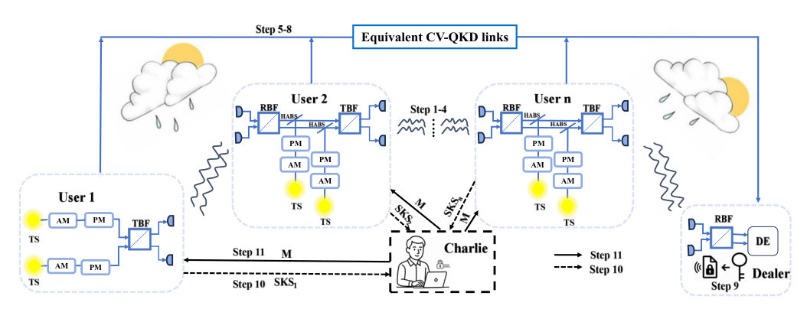
<figcaption class="paper-figure-caption"><b>Fig 1.</b> Fig. 1. Schematic diagram of the GMCS MIMO THz-QSS protocol. AM and PM: amplitude modulator and phase modulator, TBF and RBF: transmit and receive beamforming, DE: detection, TS: terahertz source, SKS: secret-key share.</figcaption>
</figure>
<figure class="paper-figure-card">
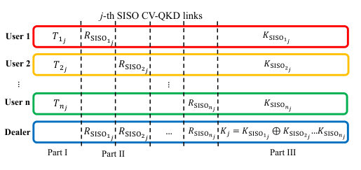
<figcaption class="paper-figure-caption"><b>Fig 2.</b> Fig. 2. The usage of raw data generated by 𝑛users and dealer in the 𝑗-th SISO channel.</figcaption>
</figure>
<figure class="paper-figure-card">

<figcaption class="paper-figure-caption"><b>Fig 3.</b> Figure 2 shows how raw data from each SISO subchannel are partitioned into parameter estimation, SKR calculation, and final key generation. The raw data are divided into three segments: Part I is used to estimate the channel transmittance 𝑇𝑘𝑗, Part II is used to compute 𝑅MIMO, and Part III is used for final key generation. The raw data of Part I and Part II are randomly selected by both the dealer and the user. After</figcaption>
</figure>
<figure class="paper-figure-card">
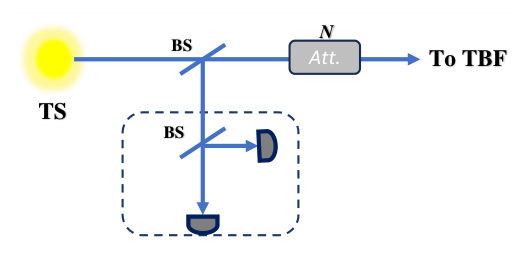
<figcaption class="paper-figure-caption"><b>Fig 4.</b> Fig. 3. The generation process of PMCS. TS: terahertz source, BS: beam splitter, 𝐴𝑡𝑡.: attenuator, 𝑁: the noise generated by 𝐴𝑡𝑡.</figcaption>
</figure>
<figure class="paper-figure-card">
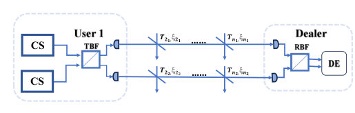
<figcaption class="paper-figure-caption"><b>Fig 5.</b> Fig. 4. Equivalent model for computing the SKR of MIMO THz QSS pro- tocol. CS: coherent state, TBF and RBF: transmit and receive beamforming, DE: detection.</figcaption>
</figure>

**Summary.** This paper proposes a novel Continuous-Variable Quantum Secret Sharing protocol leveraging a MIMO architecture operating in the THz band to overcome the limitations of point-to-point QKD. By decomposing the channel via beamforming and analyzing both Gaussian and passive modulation schemes, it derives theoretical benchmarks showing significant improvements in key rate and transmission distance for multi-user quantum communication.

**Why it may be interesting.** The work pushes quantum communication into high-frequency regimes (THz) using advanced MIMO techniques, which is crucial for realizing practical quantum networks in challenging wireless environments.

Detailed structure

**Main problem.** The paper addresses the limitation of Quantum Key Distribution (QKD) being point-to-point by proposing a multi-user Quantum Secret Sharing (QSS) protocol.

**Main result.** The proposed MIMO architecture significantly improves both the achievable Secret Key Rate (SKR) and transmission distance compared to conventional SISO schemes in the THz band.

**Method.** It utilizes transmit-receive beamforming to decompose the MIMO channel into parallel SISO subchannels, analyzing eight protocol variants under Gaussian collective attacks.

**Model / system.** The system is a Continuous-Variable (CV) QSS protocol operating over an atmospheric channel using a Multiple-Input Multiple-Output (MIMO) architecture in the Terahertz (THz) band. It compares Gaussian Modulation (GMCS) and Passive Modulation (PMCS).

**Key observables.** Secret Key Rate (SKR), transmission distance, and minimum net secure key bits shared per MIMO-QSS round.

**Important parameters / regimes.** Antenna configurations ($32 	imes 32$ or $1024 	imes 1024$), atmospheric channel parameters, and finite-size error correction probabilities ($\epsilon_{	ext{cor}}$).

**Assumptions / limitations.** Simulation results assume ideal conditions like perfect Channel State Information (CSI), phase synchronization, and beamforming; the analysis also incorporates thermal noise for physical realism.

**Figures summary.** Figure 1 schematically shows the GMCS MIMO THz-QSS protocol with AM/PM modulators. Figure 2 illustrates the data partitioning process into parameter estimation, SKR calculation, and key generation stages across SISO subchannels.

**Paper structure.** The paper first introduces the need for multi-user QSS over MIMO channels. It details the transmission procedure involving beamforming, modulation (GMCS/PMCS), detection (homodyne/heterodyne), and subsequent classical post-processing steps to derive SKR expressions. Finally, it derives formulas for composable finite-size SKRs.

Abstract

Although quantum key distribution (QKD) enables information-theoretically secure key distribution, it is mainly designed for point-to-point communication and cannot directly support multi-user collaborative scenarios. To address this limitation, quantum secret sharing (QSS) has been proposed to enable secure multiparty key sharing. However, most existing QSS protocols rely on a single-input single-output (SISO) channel, which limits the achievable secret key rate (SKR) and transmission distance. This paper proposes a continuous-variable (CV) QSS protocol based on a multiple-input multiple-output (MIMO) architecture operating in the terahertz (THz) band. In the proposed scheme, transmit-receive beamforming decomposes the MIMO channel into multiple parallel SISO subchannels, thereby improving both the SKR and transmission distance. We describe the QSS transmission procedure and derive the SKR expressions for eight protocol variants under Gaussian collective attacks. Specifically, Gaussian modulation and passive modulation are considered at the transmitter, while homodyne and heterodyne detection are considered at the receiver. Both asymptotic and composable finite-size SKR formulas are derived to characterize the ideal upper-bound performance and the achievable performance under finite resources, respectively. Simulation results show that, under ideal assumptions including perfect channel state information, perfect phase synchronization, and ideal beamforming, the Gaussian-modulation protocol with a 32 x 32 antenna configuration and the passive-modulation protocol with a 1024 x 1024 antenna configuration achieve transmission distances of 14.99 m and 160 m in the atmospheric channel, respectively. These results provide an idealized theoretical benchmark for evaluating the potential performance gains of MIMO-assisted THz CV-QSS in indoor and short-range outdoor wireless networks.

[↑ back to top](#top)

### [Equivariant Quantum Clustering with Differential Privacy: Parameter-Efficient Privacy-Preserving Analysis Across Heterogeneous Sensitive Datasets](http://arxiv.org/abs/2607.08092v1)

**Authors:** B. M. Taslimul Haq, Md Arifur Rahman, Tawfiq Al Islam Foysal, Abdullah Al Noman, Abir Ahmed  
**Type:** both · **Category:** quantum information and computing · **PDF:** <https://arxiv.org/pdf/2607.08092v1>  
**Analysis basis:** full PDF text, analyzed in chunks
**Topic relevance:** `methods for driven-dissipative` **1/5**

↔ Scroll figures horizontally

<figure class="paper-figure-card">
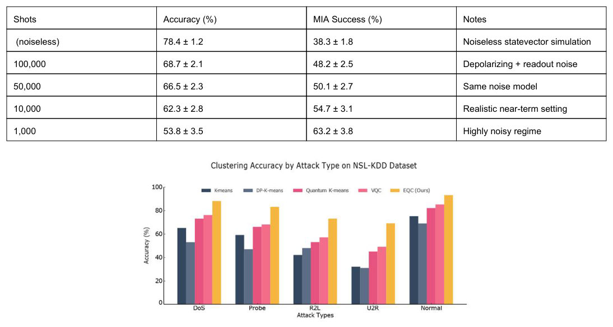
<figcaption class="paper-figure-caption"><b>Fig 1.</b> Figure 1. Clustering accuracy by attack type on the NSL-KDD dataset (k = 5, _tot = 1.0, = 10). Bar heights represent mean clustering</figcaption>
</figure>
<figure class="paper-figure-card">
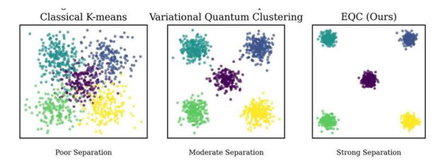
<figcaption class="paper-figure-caption"><b>Fig 2.</b> Figure 2. t-SNE visualization of learned quantum feature spaces on NSL-KDD (k = 5, _tot = 1.0, = 10). Each point represents a data</figcaption>
</figure>
<figure class="paper-figure-card">
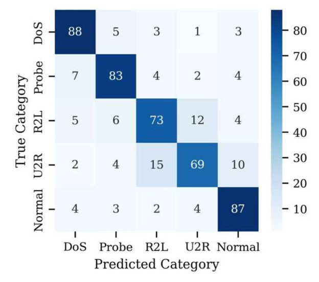
<figcaption class="paper-figure-caption"><b>Fig 3.</b> Figure 3. Row-normalized confusion matrix for EQC on NSL-KDD (k = 5, _tot = 1.0, = 10). Each cell value represents the fraction of</figcaption>
</figure>
<figure class="paper-figure-card">
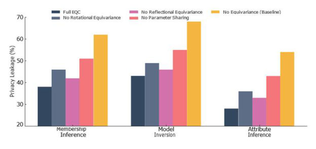
<figcaption class="paper-figure-caption"><b>Fig 4.</b> Figure 4. Ablation of equivariance components on privacy leakage across three attack types: Membership Inference Attack (MIA),</figcaption>
</figure>
<figure class="paper-figure-card">
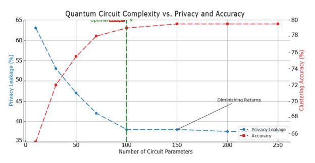
<figcaption class="paper-figure-caption"><b>Fig 5.</b> Figure 5. Impact of circuit depth L {1, 2, 3, 4, 5, 6} on clustering accuracy and membership inference attack (MIA) success rate on</figcaption>
</figure>

**Summary.** This paper introduces Equivariant Quantum Clustering (EQC), a novel framework designed to perform clustering on highly sensitive data while rigorously maintaining differential privacy. It achieves state-of-the-art performance by combining symmetry-aware parameter sharing in quantum circuits with formal DP guarantees across multiple heterogeneous datasets.

**Why it may be interesting.** While the primary focus is data privacy/ML, the use of symmetry constraints ($p4m$) within a quantum circuit architecture provides an interesting case study in applying group theory principles to variational quantum algorithms for structured regularization.

Detailed structure

**Main problem.** The core challenge is balancing high analytical utility with stringent data confidentiality when clustering sensitive, heterogeneous datasets.

**Main result.** The proposed framework achieves superior clustering accuracy (e.g., 79.3% on NSL-KDD) while significantly reducing privacy leakage compared to classical and quantum baselines under strict differential privacy guarantees.

**Method.** It integrates symmetry-aware equivariant quantum circuits with rigorous differential privacy mechanisms across a multi-stage pipeline for secure data analysis.

**Model / system.** The model is the Equivariant Quantum Clustering (EQC) framework, utilizing parameterized quantum circuits operating on qubits arranged in a $2	imes4$ grid topology to enforce $p4m$ symmetry constraints.

**Key observables.** Clustering accuracy, success rate of membership inference attacks (MIA), model inversion reconstruction error (MSE), and attribute inference error rate.

**Important parameters / regimes.** Privacy budget ($\epsilon=1.0, \delta=10^{-5}$), noise standard deviation ($\sigma$), circuit depth ($L=4$), and optimization hyperparameters (e.g., $a=0.1$).

**Assumptions / limitations.** The observed performance gains are primarily attributed to parameter efficiency via equivariance constraints and DP composition, rather than unique quantum mechanical effects requiring fault-tolerant hardware.

**Figures summary.** Figures illustrate EQC's superior MIA resistance (lowest rate) and model inversion robustness compared to baselines; Figure 10 shows gradual accuracy degradation under noise for EQC versus faster drops for competitors.

**Paper structure.** The paper details the problem setup, introduces the five-stage EQC pipeline (preprocessing $
ightarrow$ quantum encoding $
ightarrow$ equivariant circuit $
ightarrow$ kernel computation $
ightarrow$ spectral clustering), presents results across multiple datasets, and concludes by analyzing performance trade-offs against various attacks.

Abstract

Privacy-preserving clustering is critical for analyzing sensitive data in healthcare, cybersecurity, and enterprise applications, where maintaining data confidentiality must be balanced with analytical performance. This paper presents Equivariant Quantum Clustering (EQC), a parameter-efficient framework that integrates symmetry-aware quantum circuits with differential privacy to improve the privacy-utility tradeoff. EQC employs p4m equivariant parameter sharing to reduce circuit complexity while preserving informative feature representations. The framework is evaluated on three privacy-sensitive datasets: NSL-KDD, CERT Insider Threat v6.2, and a synthetic MIMIC-III clinical dataset. On the NSL-KDD benchmark, EQC achieves 79.3% clustering accuracy while reducing membership inference attack success to 38.3% under a privacy budget of ε = 1.0 and δ = 10^-5, outperforming representative classical and quantum baselines. Ablation studies indicate that the performance gains primarily arise from parameter-efficient circuit design combined with differential privacy. The results demonstrate that EQC provides a practical quantum-ready framework for secure and privacy-preserving clustering across heterogeneous sensitive datasets.

[↑ back to top](#top)

### [Full-Spectrum Quantum Simulation for the Nuclear Shell Model](http://arxiv.org/abs/2607.08235v1)

**Authors:** B. Maheshwari, P. Stevenson, P. Van Isacker  
**Type:** theory · **Category:** quantum information and computing · **PDF:** <https://arxiv.org/pdf/2607.08235v1>  
**Analysis basis:** full PDF text, analyzed in chunks
**Topic relevance:** `analog quantum simulation` **1/5**

↔ Scroll figures horizontally

<figure class="paper-figure-card">
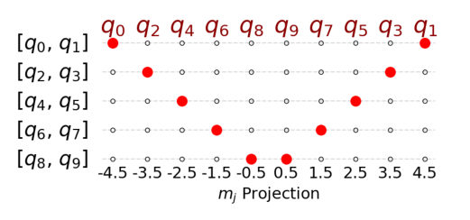
<figcaption class="paper-figure-caption"><b>Fig 1.</b> Figure 1: A 10-qubit mapping and initial orthogonal Hartree-Fock (HF) states used in the current quantum simulation for two nucleons in 0g9/2 orbital. Red circles denote the occupied single-particle states in m-scheme.</figcaption>
</figure>
<figure class="paper-figure-card">
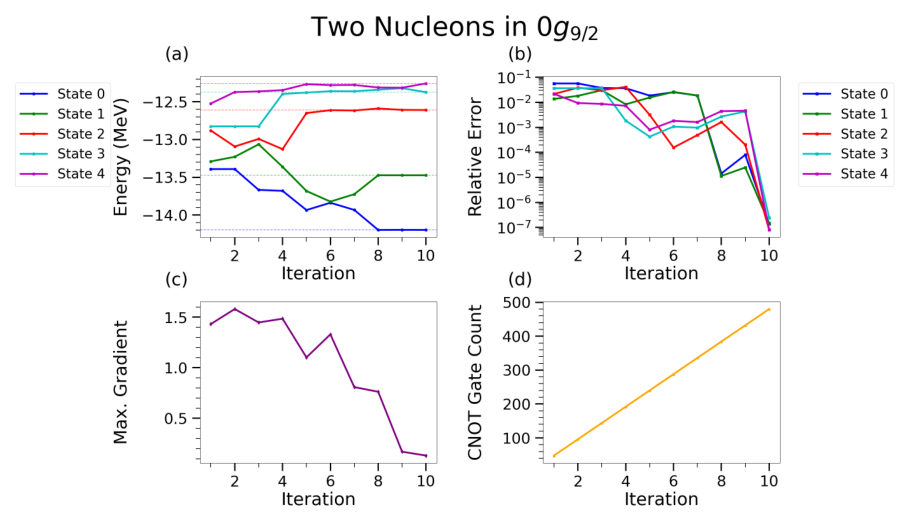
<figcaption class="paper-figure-caption"><b>Fig 2.</b> Figure 2: Variation of (a) simulated energies (in MeV) for ground and excited states shown in different color along with exact solutions shown by dashed lines (b) relative error defined by (simulated - exact) /exact (c) maximum gradient (in MeV) of the appended operator (d) CNOT gate count, across iterations for two nucleons in 0g9/2 orbital.</figcaption>
</figure>
<figure class="paper-figure-card">
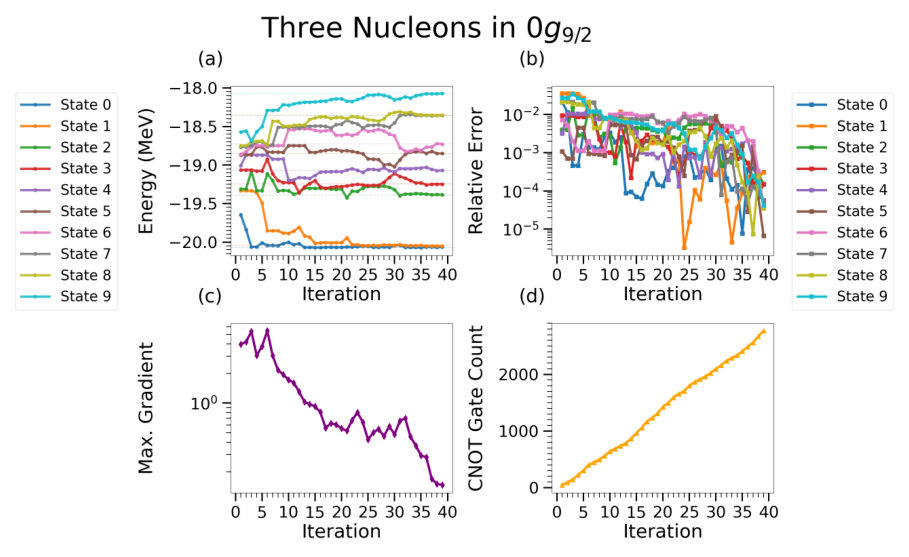
<figcaption class="paper-figure-caption"><b>Fig 3.</b> Figure 3: Variation of (a) energies (in MeV) for ground and excited states shown in different color along with exact solutions shown by dashed lines (b) relative error (c) maximum gradient (in MeV) of the appended operator (d) CNOT gate count, across iterations for three nucleons in 0g9/2 orbital.</figcaption>
</figure>

**Summary.** This work presents a novel quantum simulation technique, ADAPT-SSVQE, designed to solve the intractable problem of diagonalizing large nuclear shell model Hamiltonians. By mapping the fermionic Hamiltonian to qubits and using an adaptive variational approach, the authors can simultaneously find multiple excited states for small nucleon systems with high accuracy. This demonstrates a powerful pathway toward simulating complex quantum many-body physics beyond classical computational limits.

**Why it may be interesting.** While focused on nuclear physics, the core methodology—using advanced quantum algorithms like ADAPT-SSVQE to tackle exponentially hard many-body problems while enforcing symmetries—is directly transferable to simulating strongly correlated electron systems or complex molecular Hamiltonians in AMO physics.

Detailed structure

**Main problem.** The primary challenge is overcoming the exponential dimensionality of the nuclear shell model Hamiltonian diagonalization, which exceeds classical computational capacity.

**Main result.** The authors successfully demonstrated a quantum simulation approach that simultaneously extracts multiple orthogonal eigenstates for two and three nucleons with spectroscopic accuracy relative to exact diagonalization.

**Method.** They employ an ADAPT-SSVQE algorithm, combining the Subspace Search VQE with the ADAPT ansatz, applied after mapping the fermionic Hamiltonian using the Jordan-Wigner transformation.

**Model / system.** The system is based on the nuclear shell model Hamiltonian ($\hat{H}_{	ext{eff}}$) describing protons and neutrons interacting via a residual interaction (e.g., JUN45). The problem is mapped onto qubits while preserving fermionic anti-commutation relations.

**Key observables.** Simultaneous convergence of multiple mutually orthogonal eigenstates, restoration of total angular momentum ($\hat{J}^2$) symmetry, and energy eigenvalues compared to exact diagonalization.

**Important parameters / regimes.** The simulation was benchmarked for two and three identical nucleons in a $j = 9/2$ orbital within a 10-qubit active space.

**Assumptions / limitations.** The primary limitation addressed is the exponential scaling of the Hilbert space; the method assumes quantum computation can scale beyond classical limits, though circuit depth remains a concern for NISQ devices.

**Figures summary.** Figures track energy convergence and relative error over simulation iterations for two and three nucleons. They also show the growth of CNOT gate count, illustrating the increasing complexity of the required quantum circuits.

**Paper structure.** The paper details the theoretical framework by mapping the fermionic Hamiltonian to qubits (JW transformation). It then introduces and implements the ADAPT-SSVQE algorithm for simultaneous state extraction, culminating in benchmarking results for 2 and 3 nucleons showing convergence and symmetry restoration.

Abstract

The nuclear shell model is a general way of expressing the many-body nuclear Hamiltonian and deciphering the underlying nuclear structure. In today's era of modern and high-power computation, the primary limitation of the nuclear shell model is the enormous dimensionality of its Hilbert space, which far exceeds available storage capacity and prevents the diagonalization of the full Hamiltonian matrix in that space. Quantum computing offers a scalable solution to bypass this curse of dimensionality. In this work, we introduce a single-run quantum simulation capable of obtaining multiple shell-model eigenstates simultaneously. The nuclear Hamiltonian is transformed from a bit to a qubit basis using the Jordan-Wigner transformation, explicitly preserving fermionic anti-commutation. We employ a Subspace Search Variational Quantum Eigensolver (SSVQE) along with an Adaptive Derivative-Assembled Pseudo-Trotter (ADAPT) ansatz to construct the quantum circuit required to solve the shell-model problem. The ADAPT-SSVQE algorithm uses a symmetry-preserving single and double-excitation operator pool and optimizes a weighted energy sum to obtain the simultaneous convergence of all eigenstates within a targeted MJ subspace, eliminating the need for post-processing efforts to extract excited spectra. We benchmark this approach by solving the problem for two and three identical nucleons in a j = 9/2 orbital, successfully extracting five and ten mutually orthogonal states, respectively, within a 10-qubit active space. The algorithm achieves spectroscopic accuracy, in simulation, relative to exact diagonalization and intrinsically restores total angular momentum (\hat{J}^2) symmetry.

[↑ back to top](#top)

### [Interfacial chirality-induced magnetic-field-free switching with high energy efficiency in all-vdW heterostructures](http://arxiv.org/abs/2607.08023v1)

**Authors:** Kai-Xuan Zhang, Suik Cheon, Seungbok Lee, Joonyoung Choi, Jihoon Keum, Hyuncheol Kim, Yeochan An, Woonghee Cho, Suhan Son, Jingyuan Cui, Pyeongjae Park, Younjung Jo, Jun Sung Kim, Hyun-Woo Lee, Je-Geun Park  
**Type:** experiment · **Category:** other · **PDF:** <https://arxiv.org/pdf/2607.08023v1>  
**Analysis basis:** full PDF text, analyzed in chunks
**Topic relevance:** `spintronics-quantum-optics interface` **1/5**

↔ Scroll figures horizontally

<figure class="paper-figure-card">
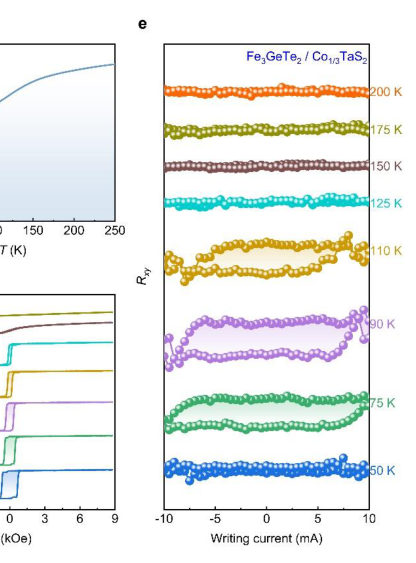
<figcaption class="paper-figure-caption"><b>Fig 1.</b> Fig. 1 | Magnetic-field-free switching demonstration of Fe3GeTe2/Co1/3TaS2</figcaption>
</figure>
<figure class="paper-figure-card">
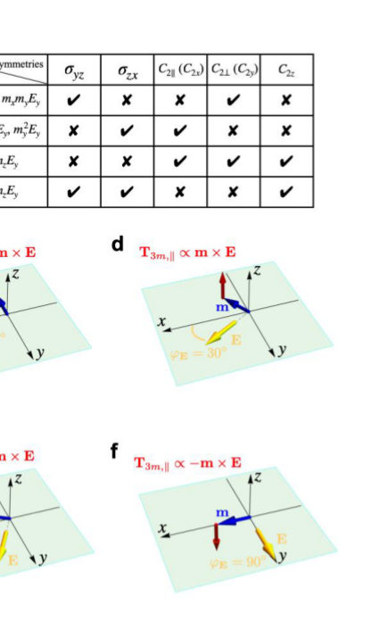
<figcaption class="paper-figure-caption"><b>Fig 2.</b> Fig. 2 | Interface symmetry analysis and schematic illustration of unconventional</figcaption>
</figure>
<figure class="paper-figure-card">
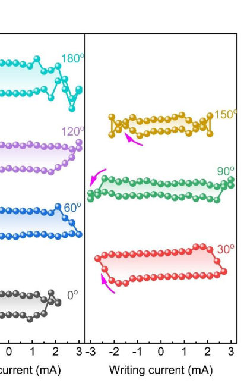
<figcaption class="paper-figure-caption"><b>Fig 3.</b> Fig. 3 | Current direction dependence of the magnetic-field-free switching. a,</figcaption>
</figure>
<figure class="paper-figure-card">
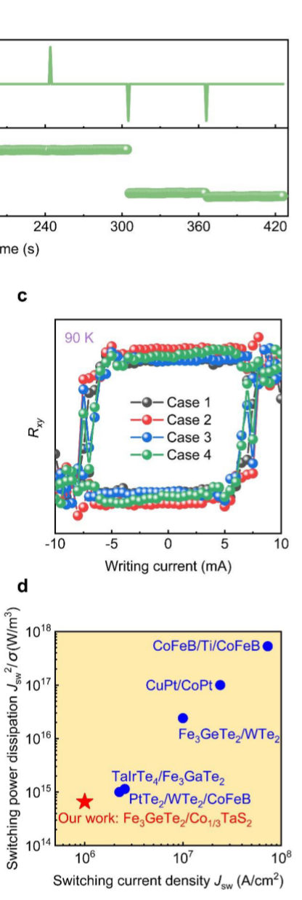
<figcaption class="paper-figure-caption"><b>Fig 4.</b> Fig. 4 | Well-behaved switching performance readily controlled by writing current</figcaption>
</figure>

**Summary.** This work demonstrates a new pathway for ultra-low power magnetic switching by utilizing interfacial chirality in vdW heterostructures. By generating two unconventional spin-orbit torques, the system achieves field-free magnetization reversal with minimal energy loss. This establishes interfacial chirality as a powerful design handle for next-generation spintronic devices.

**Why it may be interesting.** While focused on condensed matter spintronics rather than fundamental quantum dynamics, the concept of using symmetry breaking (chirality) to engineer novel, highly controllable quantum phenomena at interfaces is relevant to understanding emergent behavior in complex quantum systems.

Detailed structure

**Main problem.** The research aims to demonstrate highly energy-efficient, magnetic-field-free switching of perpendicular magnetization using interfacial chirality effects in all van der Waals (vdW) heterostructures.

**Main result.** Magnetic-field-free switching was achieved with ultralow current densities ($\sim 10^6 	ext{ A/cm}^2$) by exploiting two unconventional spin-orbit torques originating from the interface's chirality. Replacing one material allowed this effect to persist up to room temperature.

**Method.** The study combines experimental transport measurements (measuring $R_{xy}$ vs. writing current) with detailed symmetry analysis of the resulting spin-orbit torque terms.

**Model / system.** The physical platform is an all vdW heterostructure, specifically $	ext{Fe}_3	ext{GeTe}_2/	ext{Co}_{1/3}	ext{TaS}_2$. The key physics relies on the structural chirality at the interface, which generates unique torques beyond what bulk symmetry predicts.

**Key observables.** Anomalous Hall resistance ($R_{xy}$), critical switching current density ($J_{sw}$), and power dissipation ($rac{J_{sw}^2}{\sigma}$).

**Important parameters / regimes.** Ultralow current densities ($\sim 10^6 	ext{ A/cm}^2$) and minimal power dissipation ($< 10^{15} 	ext{ W/m}^3$); switching observed across a temperature range including room temperature with material substitution.

**Assumptions / limitations.** The observed phenomena are uniquely attributed to the breaking of mirror plane symmetries (interfacial chirality) leading to unconventional spin-orbit torques.

**Figures summary.** Figures illustrate the device structure, temperature dependence of resistance kinks and anomalous Hall effect, and crucially, hysteresis loops showing magnetization switching occurring solely under an applied current with zero external magnetic field. The symmetry analysis details the three-fold dependence of the torque on writing current direction.

**Paper structure.** The paper establishes the physical system (vdW heterostructure), theoretically derives unconventional spin-orbit torques based on interfacial chirality, and then presents experimental evidence showing robust, low-power magnetic-field-free switching across various temperatures and material variations.

Abstract

Chirality, a central concept across many scientific disciplines, continues to inspire the discovery of novel physical phenomena. In condensed matter physics, structural chirality - defined by the absence of mirror plane symmetries - has primarily been explored in bulk materials. However, new chiral phenomena can emerge uniquely at the interface, distinct from their bulk counterparts, when a chiral material forms a heterostructure. Here, we demonstrate that all van-der-Waals (vdW) heterostructure composed of the chiral Co1/3TaS2 and the achiral vdW ferromagnet Fe3GeTe2 exhibits two distinct and unconventional spin-orbit torques originating from the interfacial chirality. These torques enable magnetic-field-free switching of perpendicular magnetization with ultralow current density ~ 10^6 A/cm^2 and minimal power dissipation < 10^15 W/m^3. Moreover, by replacing Fe3GeTe2 with a similar vdW ferromagnet, Fe3GaTe2, but of higher Curie temperature, we achieved the magnetic-field-free switching at room temperature in the Fe3GaTe2/Co1/3TaS2 vdW heterostructure. Our findings establish interfacial chirality as a powerful new handle for spintronic control, opening a new pathway to explore chirality-induced phenomena beyond the bulk symmetry constraints - and paving the way toward highly efficient, low-power spintronic devices based on all-vdW heterostructures.

[↑ back to top](#top)

### [Overview of Applications of Quantum Computing in QCD](http://arxiv.org/abs/2607.08169v1)

**Authors:** Germán Rodrigo  
**Type:** theory · **Category:** quantum information and computing · **PDF:** <https://arxiv.org/pdf/2607.08169v1>  
**Analysis basis:** full PDF text, analyzed in chunks
**Topic relevance:** `Keldysh / 2PI / non-Gaussian methods` **1/5**

↔ Scroll figures horizontally

<figure class="paper-figure-card">
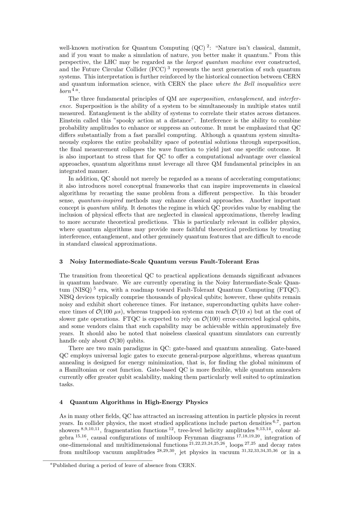
<figcaption class="paper-figure-caption"><b>Fig 1.</b> Low-resolution page preview, page 2</figcaption>
</figure>
<figure class="paper-figure-card">
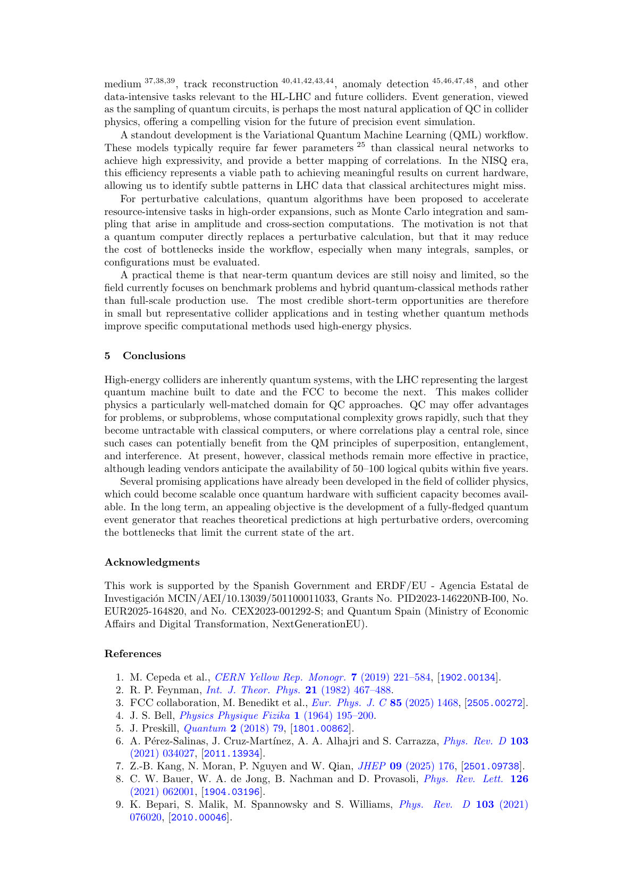
<figcaption class="paper-figure-caption"><b>Fig 2.</b> Low-resolution page preview, page 3</figcaption>
</figure>
<figure class="paper-figure-card">
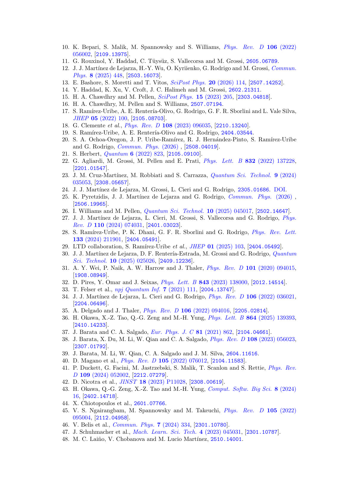
<figcaption class="paper-figure-caption"><b>Fig 3.</b> Low-resolution page preview, page 4</figcaption>
</figure>

**Summary.** This paper surveys how quantum computing can be applied to solve computationally hard problems arising from Quantum Chromodynamics (QCD) in particle collider physics. It outlines algorithms for tasks like event generation and amplitude calculation, contrasting the potential advantages of QC against current classical limitations. While acknowledging that NISQ hardware is a hurdle, it positions QC as a necessary tool to achieve the required precision for future high-luminosity experiments.

**Why it may be interesting.** It frames high-energy physics calculations as an application area for quantum computation, suggesting that fundamental quantum principles (superposition, entanglement) are key to overcoming classical computational barriers in QFT simulations.

Detailed structure

**Main problem.** The theoretical predictions for particle interactions, particularly within QCD, are struggling to keep pace with the unprecedented data collection capabilities of colliders like the HL-LHC.

**Main result.** Quantum computing offers a promising framework to tackle computationally intensive tasks in high-energy physics, though current hardware limitations restrict immediate full utilization.

**Method.** The paper surveys various quantum algorithms proposed for simulating QCD processes, emphasizing hybrid quantum-classical approaches due to NISQ constraints.

**Model / system.** The focus is on Quantum Chromodynamics (QCD) describing particle interactions at colliders. The theoretical bottleneck limits the ability to reduce uncertainties below 2%-4% required by future experiments.

**Key observables.** Projected experimental uncertainties for Higgs boson couplings ($\sim 1.5\%–1.8\%$); theoretical uncertainties for gluon and top quark couplings ($2.1\%$ and $3.1\%$, respectively).

**Important parameters / regimes.** The current hardware is in the Noisy Intermediate-Scale Quantum (NISQ) era, contrasting with the long-term goal of Fault-Tolerant Quantum Computing (FTQC).

**Assumptions / limitations.** Classical simulations may be intrinsically inefficient for genuinely quantum features like interference and entanglement; short-term focus must remain on hybrid methods.

**Paper structure.** The paper provides a concise overview, detailing the potential applications of QC in event generation, parton shower simulation, amplitude evaluation, integration, and optimization problems relevant to collider physics.

Abstract

Quantum computing has emerged as a promising framework for addressing computationally demanding problems in collider physics. In recent years, a growing number of quantum algorithms have been proposed for applications ranging from event generation and parton shower simulation to the evaluation of scattering amplitudes, loop and phase-space integration, and optimization problems relevant to experimental analysis. We provide a concise overview of the main ideas behind these developments, with emphasis on the potential advantages of quantum approaches in comparison with classical methods, as well as on the current limitations imposed by noisy intermediate-scale quantum hardware.

[↑ back to top](#top)

### [Twofold universality of large-$N$ melonic random tensors](http://arxiv.org/abs/2607.08677v1)

**Authors:** Carlos I. Perez-Sanchez  
**Type:** theory · **Category:** statistical mechanics · **PDF:** <https://arxiv.org/pdf/2607.08677v1>  
**Analysis basis:** full PDF text, analyzed in chunks
**Topic relevance:** `Keldysh / 2PI / non-Gaussian methods` **1/5**

↔ Scroll figures horizontally

<figure class="paper-figure-card">
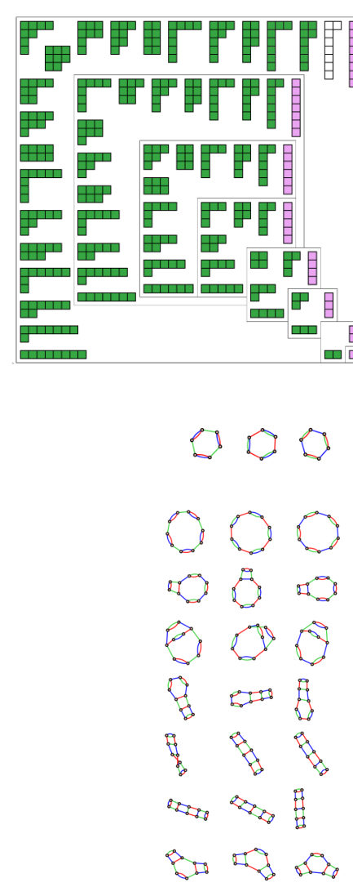
<figcaption class="paper-figure-caption"><b>Fig 1.</b> Figure 2. Some melons for D “ 3: (a) 6-vertices melons and (b) 10-vertices melons. The diagram 4.9 requires having computed integral of their products (not all of them are independent).</figcaption>
</figure>
<figure class="paper-figure-card">
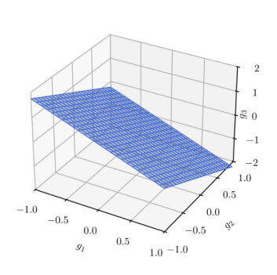
<figcaption class="paper-figure-caption"><b>Fig 2.</b> Figure 3. (a) Critical locus 4g1 ` 4g2 ` 4g3 ` 1 “ 0 of the measure (5.7) (M “ 3, D ě 3), as follows from the Universality Theorem 5.1, using the Dartois-Eynard-Nguyen solution. (b) Exact solution m2pg1, g2q of the large- N two-point function in the case M “ 2. Observe we plot two aspects with different parameters, and are not meant to be compared; instead, observe that the projection of the truncated straight line that shows divergence in (b) to the pg1, g2q-plane of (b) is the critical locus 4g1 ` 4g2 ` 1 “ 0 of M “ 2.</figcaption>
</figure>
<figure class="paper-figure-card">
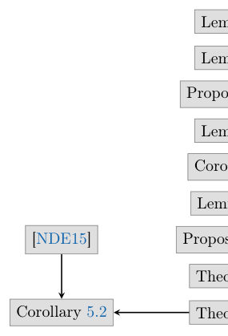
<figcaption class="paper-figure-caption"><b>Fig 3.</b> Figure 4. Logic tree of this article, with implications denoted by ordinary arrows.</figcaption>
</figure>

**Summary.** This theoretical paper establishes a powerful 'twofold universality' result for integrals involving large-$N$ melonic random tensors. It shows that these complex tensor integrals simplify significantly at large $N$, depending only on simple polynomial functions of the graph structure, regardless of the specific details of the interaction or dimension. This provides a universal framework for calculating correlation functions in high-dimensional statistical models.

**Why it may be interesting.** The concept of universal behavior emerging from complex combinatorial structures (tensors/graphs) at large $N$ is highly relevant in statistical mechanics, particularly when studying critical phenomena or random matrix theories generalized to higher dimensions.

Detailed structure

**Main problem.** The authors investigate constructing a measure exhibiting 'twofold universality' for integrating large-$N$ random tensors, which are generalizations of matrix integrals.

**Main result.** They prove that these tensor integrals simplify dramatically at large $N$, becoming independent of intricate combinatorics and the dimensionality $D$ (for $D\geq 3$), depending only on 'melonic polynomials'.

**Method.** The analysis involves computing connected correlation functions using Wick contractions ($\pi$) over graph structures, establishing uniqueness theorems for maximal contractions, and comparing cumulants across different theoretical models.

**Model / system.** The model is based on random tensors $T_{a_1,\ldots,a_D}$ integrated with respect to a Gaussian measure. The complexity arises from the need to contract indices using graph structures called 'melonic graphs' ($B$), which are analogues of matrix traces.

**Key observables.** Melonic polynomials (functions indexed by $n$ related to vertex counts), and the large-$N$ limit of tensor cumulants $\langle B_1 \dots B_n 
angle$.

**Important parameters / regimes.** Large $N$, dimensionality $D\geq 3$, and coupling constants ($g_i$).

**Assumptions / limitations.** The analysis assumes the tensors are 'melonic' (satisfying a recursive construction) and relies on proving convergence of ratios of cumulants to establish universality.

**Figures summary.** Figures illustrate graph structures, such as gluings of $2p$-agons analogous to matrix integrals, and show diagrams related to critical loci and two-point functions for the quartic tensor model.

**Paper structure.** The paper progresses from defining the problem (tensor integration), establishing tools like maximal Wick contractions ($\pi_{	ext{max}}$) via graph theory, proving universality theorems (Theorem 4.2 and 5.1), and finally applying these results to confirm the 'twofold universality' of the large-$N$ limit.

Abstract

We construct a measure that exhibits two aspects of a new type of universality and dramatically simplifies the integration of tensors $T_{a_1,a_2,\ldots,a_D} \in \mathbb{C}$ ($a_1,\ldots,a_D=1,\ldots,N$) at large $N$. In contrast to matrix integration, in which matrix traces canonically yield the integrand, tensors need additional information (equivalent to a $D$-coloured graph $B$) to contract their indices and form a tensor trace $B(T)$. We show that, whenever each $B_1,\ldots, B_n$ can be obtained by a recursive construction known as melonicity, then the leading order in $N$ of the integral of $ {B_1}(T) {B_2}(T) \cdots {B_n}(T) $ is independent of the -- often intricate -- combinatorics of the traces $B_i$, but also, to our surprise, independent of $D$ as far as $D\geq 3$. Instead, at large $N$, these integrals are some functions (indexed by $n$) of the number of vertices $2p_i$ of $B_i$ which we call melonic polynomials. Melonic traces cumulants with respect to any ('interacting') measure \[ \exp\Big\{-N^{D-1} \sum_{i=1}^m g_i {B_i}(T)\Big\} \mathrm{d}μ_0(T) \quad (g_1,\ldots,g_m \in \mathbb{R}, \mathrm{d}μ_0(T) =\text{the tensor Gaussian}) \] with each $B_i$ melonic, can be computed with our universal measure that replaces each $B_i$ by a canonical trace depending only on $p_i$. We prove that any two melonic tensor models are indistinguishable at large-$N$, independently of the number of tensor indices (first universality aspect), and of the fine-grainedness of their interactions (second universality), being a sufficient condition that the couplings (the parameters $g_i$ above) agree and their respective traces are monomials with the same degree in $T$.

[↑ back to top](#top)

## Other papers (8)

*Papers from primary archives without highlighted authors or any topic match. Click to expand.*

Show other papers

### [Accurate Self-Attention Wavefunctions at Large Scale](http://arxiv.org/abs/2607.08616v1)

**Authors:** Filippo Gaggioli, Sam Azadi, Liang Fu  
**Type:** theory · **Category:** strongly correlated electrons · **PDF:** <https://arxiv.org/pdf/2607.08616v1>  
**Analysis basis:** full PDF text, analyzed in chunks

↔ Scroll figures horizontally

<figure class="paper-figure-card">
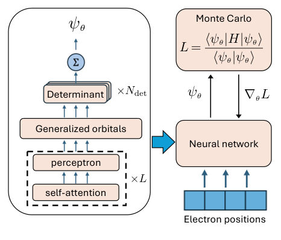
<figcaption class="paper-figure-caption"><b>Fig 1.</b> FIG. 1. Self-attention neural network and VMC: Illus- tration of our self-attention architecture (left), and its role inside the VMC algorithm (right).</figcaption>
</figure>
<figure class="paper-figure-card">
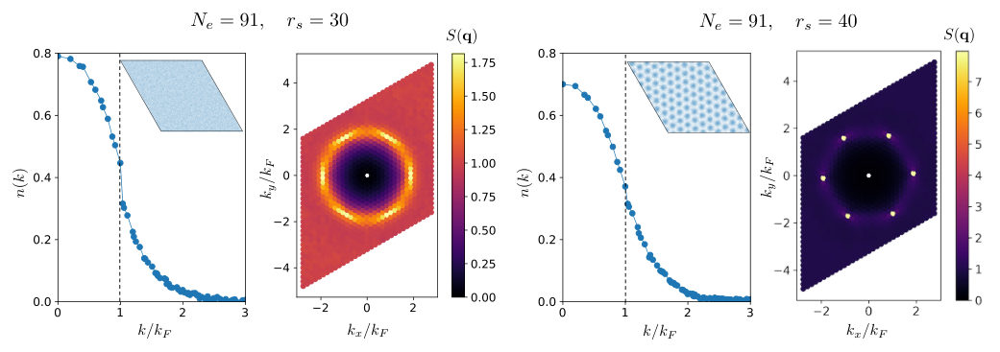
<figcaption class="paper-figure-caption"><b>Fig 2.</b> FIG. 2. Momentum space occupation and structure factor. Left panels: for rs = 30, the system displays metallic behavior, as signaled by the sharp Fermi surface discontinuity in the momentum space occupations n(k). Right panels: for rs = 40, the electrons form a crystalline state (see the density snapshot in the inset). Correspondingly, prominent Bragg peaks appear in the structure factor S(q).</figcaption>
</figure>
<figure class="paper-figure-card">
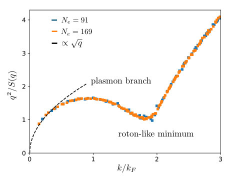
<figcaption class="paper-figure-caption"><b>Fig 3.</b> FIG. 3. Collective modes (rs = 30): the energy q2/S(q) provides a variational upper bound on the dispersion of the collective modes for the HEG ground state. The plasmon branch ∝√q at small q evolves into a roton-like minimum around 2kF associated to the incipient crystalline order. The quantitative agreement across system sizes certifies accuracy in approaching the thermodynamic limit.</figcaption>
</figure>

**Summary.** The authors demonstrate that self-attention neural networks can generate highly accurate variational wavefunctions for the 2D homogeneous electron gas. By applying this method to large systems (up to N=169), they achieve energies competitive with state-of-the-art DMC and accurately recover complex collective excitations like plasmons and rotons, proving scalability.

**Why it may be interesting.** This work pushes the boundary of computational quantum chemistry by applying advanced machine learning techniques (self-attention) to solve fundamental problems in strongly correlated electron systems, offering a scalable alternative to traditional high-accuracy methods like DMC.

Detailed structure

**Main problem.** The primary challenge is determining if self-attention wavefunctions can maintain high accuracy and scalability when applied to large quantum systems, surpassing traditional variational ansatze.

**Main result.** The method successfully yields systematically lower energies than state-of-the-art DMC for up to 169 particles in the 2D HEG, demonstrating convergence towards the thermodynamic limit.

**Method.** Variational Monte Carlo (VMC) is employed using a self-attention neural network architecture to generate highly expressive variational wavefunctions ($\psi_	heta$).

**Model / system.** The study models the two-dimensional homogeneous electron gas (HEG) of spin-polarized electrons, governed by a standard Coulomb interaction Hamiltonian.

**Key observables.** Ground state energy ($E$), momentum distribution $n(\mathbf{k})$, static structure factor $S(q)$, and collective mode dispersion $\epsilon(q)$.

**Important parameters / regimes.** System sizes up to $N=169$ particles, interaction strength controlled by the dimensionless density parameter $r_s$ (e.g., $r_s=30$ or $r_s=40$).

**Assumptions / limitations.** The wavefunction is constructed as an antisymmetric fermionic determinant using generalized orbitals derived from the self-attention mechanism.

**Figures summary.** Figures illustrate the self-attention architecture, momentum occupation $n(k)$ showing metallic behavior, and structure factor $S(q)$ revealing plasmon and roton features in the liquid phase.

**Paper structure.** The paper introduces the self-attention approach for wavefunctions, applies it to the HEG Hamiltonian, calculates ground state energies via VMC, and then analyzes correlated observables like $S(q)$ and $\epsilon(q)$ across varying system sizes to prove convergence.

Abstract

Self-attention neural networks provide powerful variational wavefunctions that surpass the expressivity of traditional variational ansatze. This expressivity, however, comes with increased computational complexity, raising a pressing question about scalability -- can such wavefunctions retain their accuracy at large system sizes? We apply self-attention wavefunctions to the two-dimensional homogeneous electron gas for up to N=169 particles, obtaining energies systematically lower than state-of-the-art DMC. Direct access to the ground state wavefunction further lets us recover the full collective-mode dispersion of the liquid phase, from the small-q plasmon branch to a roton-like minimum near q=2k_F. Observables at N=91 and N=169 are in near-perfect agreement, indicating convergence to the thermodynamic limit.

[↑ back to top](#top)

### [Adaptive Qubit Freezing Enables Robust Graph Partitioning for Divide-and-Conquer QAOA](http://arxiv.org/abs/2607.08138v1)

**Authors:** Sokea Sang, Leanghok Hour, Dongmin Kim, Youngsun Han  
**Type:** theory · **Category:** quantum information and computing · **PDF:** <https://arxiv.org/pdf/2607.08138v1>  
**Analysis basis:** full PDF text, analyzed in chunks

↔ Scroll figures horizontally

<figure class="paper-figure-card">
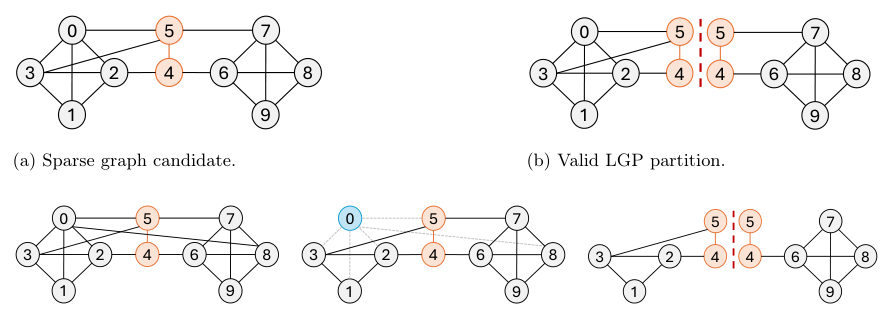
<figcaption class="paper-figure-caption"><b>Fig 1.</b> Figure 1: Overview of the FrozenLGP Partitioning Mechanism. (a) A standard graph exceeding the NISQ qubit budget, with nodes 4 and 5 identified as a potential separator path. (b) Standard LGP successfully bipartitions the sparse graph into two sub-circuits that share the separator nodes 4 and 5; these separator vertices are duplicated into both sub-circuits and re-merged by the MDR step, so they appear in both halves of (b) and (e). (c) In a denser graph, additional crossing edges prevent the separator path from disconnecting the network, causing standard LGP to fail. (d) FrozenLGP identifies a crossing node (Node 0, highlighted in blue) and classically freezes it (details in section 2.2),...</figcaption>
</figure>
<figure class="paper-figure-card">
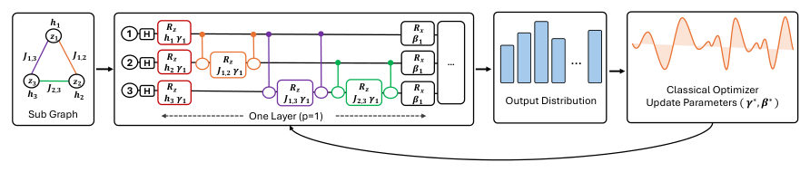
<figcaption class="paper-figure-caption"><b>Fig 2.</b> Figure 2: Schematic of a 1-layer (p = 1) QAOA circuit with linear bias terms. The circuit initializes an equal superposition via Hadamard gates. The problem unitary is then applied, explicitly showing the local linear bias rotations Rz(hiγ1) followed by the pairwise edge coupling rotations Rz(Ji,jγ1) implemented via CNOT cascades. A mixing layer of Rx(β1) rotations concludes the quantum evo- lution. The measured output distribution is fed into a classical optimizer, which iteratively updates the variational parameters (γ∗, β∗) to minimize the cost Hamiltonian.</figcaption>
</figure>
<figure class="paper-figure-card">
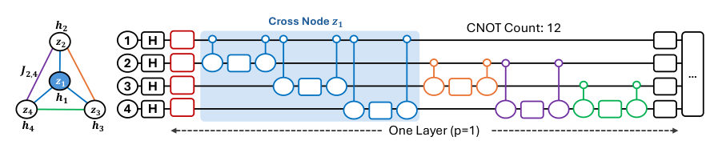
<figcaption class="paper-figure-caption"><b>Fig 3.</b> Figure 3: Standard QAOA circuit for a fully active 4-node network. Node z1 acts as a central &quot;cross node&quot; connected to all other qubits (z2, z3, z4). Mapping this fully quantum topology requires 12 CNOT gates for a single QAOA layer (p = 1), with the blue-shaded region highlighting the extensive entangling overhead generated solely by z1.</figcaption>
</figure>
<figure class="paper-figure-card">
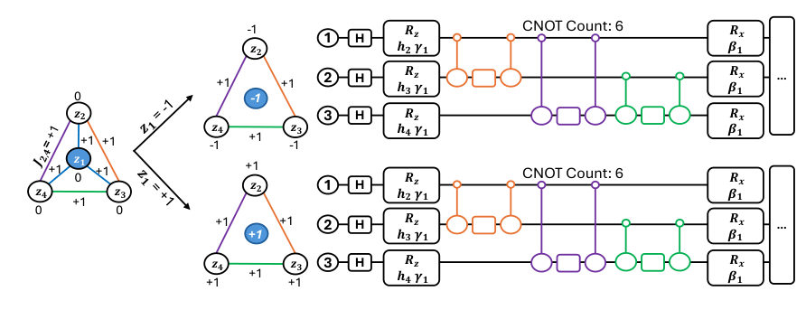
<figcaption class="paper-figure-caption"><b>Fig 4.</b> Figure 4: Circuit simplification via Qubit Freezing. By classically freezing z1 to either +1 (left) or −1 (right), the node is removed from the quantum circuit. The entangling overhead is eliminated (reducing the CNOT count from 12 to 6). The original coupling strengths associated with z1 are folded into the local Rz(hiγ1) rotation gates of the surviving active qubits (z2, z3, z4).</figcaption>
</figure>
<figure class="paper-figure-card">
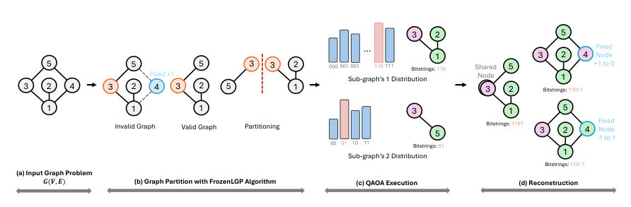
<figcaption class="paper-figure-caption"><b>Fig 5.</b> Figure 5: Overall architecture and workflow of the FrozenLGP pipeline. For simplicity and visu- alization purposes, we illustrate the pipeline on a small five-vertex graph that exhibits an invalid separator configuration and is subsequently recovered by FrozenLGP through adaptive qubit freez- ing. (a) The process begins with a input graph G(V,E) whose size exceeds the available hardware qubit budget. (b) The graph is processed by the FrozenLGP algorithm, which first attempts standard Large Graph Partitioning (LGP) and subsequently applies adaptive qubit freezing to recover valid bipartitions on dense topologies. If a valid partition is successfully identified within the freeze budget, the...</figcaption>
</figure>

**Summary.** The paper introduces FrozenLGP, an adaptive technique designed to make graph partitioning robust for QAOA on limited quantum hardware. It overcomes the failure of standard divide-and-conquer methods on dense graphs by identifying and 'freezing' critical vertices using max-flow computations. This process preserves the problem's energy structure by folding interactions into local bias terms, enabling full coverage and improved noise resilience.

**Why it may be interesting.** This work directly addresses hardware limitations (qubit connectivity and depth) in quantum algorithms by providing a systematic, mathematically rigorous method to adapt problem decomposition for NISQ devices.

Detailed structure

**Main problem.** Developing robust methods for solving combinatorial optimization problems, like MaxCut, using QAOA on near-term quantum devices when the problem graph is too large or highly connected for standard decomposition techniques.

**Main result.** The proposed FrozenLGP framework achieves 100% decomposition coverage across tested graphs by adaptively freezing obstructing vertices and folding their interactions into linear bias terms in the Hamiltonian, significantly outperforming baseline methods on dense instances.

**Method.** FrozenLGP identifies minimum-vertex cuts using max-flow to find obstructing nodes; these nodes are classically frozen, and their energetic contributions are preserved by updating local bias fields (Ising field) of neighboring active qubits.

**Model / system.** The model is QAOA applied to combinatorial optimization problems mapped onto an Ising Hamiltonian ($H_P$). The physical system involves near-term quantum hardware constraints regarding qubit capacity and gate depth.

**Key observables.** Decomposition Coverage (aiming for 100%), Approximation Quality ($\langle H_P 
angle$), Circuit Depth, and Number of two-qubit entangling gates (CNOTs).

**Important parameters / regimes.** Graph size (up to 10,000 vertices), connectivity density, and the budget parameter ($B_f$) controlling the freezing process.

**Assumptions / limitations.** The core assumption addressed is that standard divide-and-conquer QAOA fails when small vertex separators do not exist; FrozenLGP overcomes this by enforcing partitionability via freezing.

**Figures summary.** Figures illustrate the mechanism: showing how standard LGP partitions graphs, how failure occurs on dense graphs, and finally demonstrating FrozenLGP identifying and freezing a crossing node while folding interactions into bias terms to maintain circuit validity.

**Paper structure.** The paper introduces the limitations of DC-QAOA, proposes FrozenLGP as an adaptive framework using min-cut/max-flow for vertex identification, details the Hamiltonian modification via bias folding, validates performance through coverage metrics and noise simulations, and concludes with resource comparisons against monolithic QAOA.

Abstract

Divide-and-conquer variants of the Quantum Approximate Optimization Algorithm (QAOA) provide a promising route for executing combinatorial optimization problems beyond the qubit capacity of near-term quantum devices. However, existing approaches rely on the existence of small vertex separators and fail entirely on dense or highly connected graphs where such decompositions do not exist. We introduce Frozen Large Graph Partitioning (FrozenLGP), an adaptive decomposition framework that transforms partitionability from an assumption into an enforceable property. When standard partitioning fails, FrozenLGP identifies the minimum set of obstructing vertices through a minimum-vertex-cut computation based on max-flow and classically freezes their spin assignments. The energetic contributions of the removed interactions are rigorously preserved by folding them into linear bias terms in the Ising Hamiltonian of neighboring active qubits. Across graph sizes up to 10,000 vertices and multiple topology families, FrozenLGP achieves 100\% decomposition coverage, compared with 4.6\% for the standard divide-and-conquer baseline on high-connectivity instances. End-to-end MaxCut experiments demonstrate that FrozenLGP preserves approximation quality on instances already solvable by conventional divide-and-conquer QAOA while extending applicability to previously unsupported graphs, and outperforming alternative full-coverage decomposition strategies. Noise simulations further show improved robustness arising from reduced entangling-gate requirements. These results establish FrozenLGP as a topology-robust front end for distributed QAOA on near-term quantum hardware.

[↑ back to top](#top)

### [An Effective Quantum Hoare Logic for Hybrid Quantum Programs with Unbounded Loops](http://arxiv.org/abs/2607.08548v1)

**Authors:** Christophe Chareton, Jad Issa, Romain Péchoux  
**Type:** theory · **Category:** quantum information and computing · **PDF:** <https://arxiv.org/pdf/2607.08548v1>  
**Analysis basis:** full PDF text, analyzed in chunks

↔ Scroll figures horizontally

<figure class="paper-figure-card">
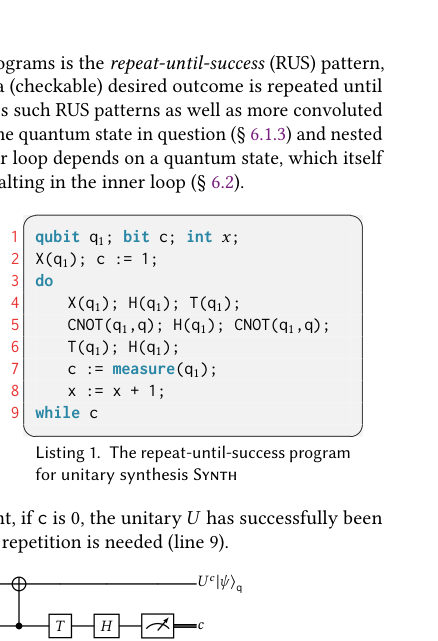
<figcaption class="paper-figure-caption"><b>Fig 1.</b> Fig. 1. The circuit for the RUS unitary synthesis of 𝑈in Listing 1.</figcaption>
</figure>

**Summary.** This paper presents a novel quantum Hoare logic designed to statically analyze hybrid quantum programs containing unbounded loops. The core innovation is the use of Integer Hybrid Path-Sums (IHPS) to symbolically track both quantum states and classical integer counts. This allows for the first semi-automated resource estimation tool for these complex, industrially relevant quantum computing models.

**Why it may be interesting.** This work provides essential formal tools for analyzing complex, real-world hybrid quantum algorithms that are necessary before deploying such systems on actual hardware.

Detailed structure

**Main problem.** Developing a static analysis solution for hybrid quantum-classical algorithms that incorporate complex control structures like unbounded loops.

**Main result.** The authors introduce Integer Hybrid Path-Sums (IHPS) and a corresponding non-branching, effective quantum Hoare logic capable of providing both functional correctness guarantees and resource consumption estimation for such programs.

**Method.** They extend path-sums to IHPS to symbolically represent infinite-dimensional Classical-Quantum states, enabling the formulation of an invariant-based loop analysis rule within a novel quantum Hoare logic framework.

**Model / system.** The focus is on hybrid quantum-classical algorithms running on theoretical models (like $	ext{HQbricks}^\infty$), involving sequences of unitary operations combined with classical control flow and unbounded integer loops.

**Key observables.** Functional correctness, Almost-Sure Termination (AST), and expected resource consumption (e.g., expected number of gates or loop iterations).

**Important parameters / regimes.** The analysis handles the complexity introduced by unbounded while loops and the interaction between quantum superpositions and classical integer counters.

**Assumptions / limitations.** Previous QHLs are insufficient due to lack of expressiveness for hybridization or handling unbounded recursion; the solution relies on IHPS to manage this complexity.

**Figures summary.** One figure illustrates the circuit diagram for a repeat-until-success (RUS) unitary synthesis program, which is used as an example in the analysis.

**Paper structure.** The paper introduces IHPS as the core representation, develops the quantum Hoare logic based on transformations of these sums, proves soundness via induction over program structure, and details loop handling using invariant rules.

Abstract

While quantum hardware remains limited, hybrid quantum-classical algorithms with complex control structures, including unbounded loops, are emerging, posing new challenges for quantum program analysis, including the accurate estimation of the resource consumption of a given program. Meanwhile, precise analysis techniques such as symbolic execution have largely left out hybridization and unbounded recursion. On the other hand, current quantum Hoare logics that generally support them are lacking in expressiveness and miss out on efficient computational equational reasoning that could be implemented in a semi-automated tool. This leaves a gap awaiting to be filled. In this work, we answer this challenge with the first semi-automated static analysis solution combining effective functional verification and resource (termination or cost) estimation for hybrid quantum programs with unbounded loops. Towards that end, we introduce integer hybrid path-sums (IHPS), extending path-sums to handle unbounded while loops, as a representation of possible executions of a program. A generic strategy for determining termination and expected resource consumption via loop invariants is also proposed and illustrated on several examples. Finally, the solution is implemented as a semi-automatic Haskell program. This work is the first step toward the design of a complete static resource analysis tool for hybrid quantum programs, essential for the development of real-world quantum computing.

[↑ back to top](#top)

### [Decomposition-Based QAOA for Maximum Coverage Location Problem in Satellite Constellation Design](http://arxiv.org/abs/2607.08102v1)

**Authors:** Divya Sisodiya, Amiratabak Bahengam, Hang Woon Lee, Hao Chen  
**Type:** both · **Category:** quantum information and computing · **PDF:** <https://arxiv.org/pdf/2607.08102v1>  
**Analysis basis:** full PDF text, analyzed in chunks

↔ Scroll figures horizontally

<figure class="paper-figure-card">
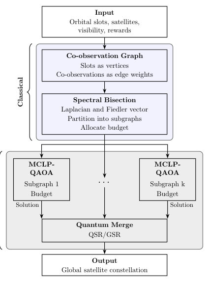
<figcaption class="paper-figure-caption"><b>Fig 1.</b> FIGURE 1: Decomposition-Based QAOA Framework Overview.</figcaption>
</figure>
<figure class="paper-figure-card">
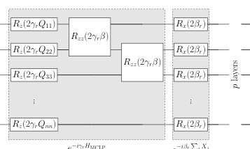
<figcaption class="paper-figure-caption"><b>Fig 2.</b> FIGURE 2: MCLP-QAOA circuit for subgraph Gℓwith p problem and mixer layers using optimized (γr, βr) parameters.</figcaption>
</figure>
<figure class="paper-figure-card">
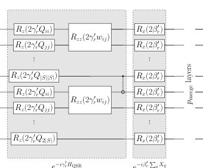
<figcaption class="paper-figure-caption"><b>Fig 3.</b> FIGURE 3: QSR circuit with two separator copies applying pmerge problem and mixer layers using cross-copy CNOTs and Rzz co-observation coupling gates.</figcaption>
</figure>
<figure class="paper-figure-card">
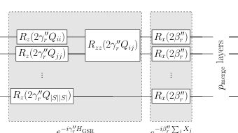
<figcaption class="paper-figure-caption"><b>Fig 4.</b> FIGURE 4: GSR circuit applying pmerge problem and mixer layers with coverage bias, co-observation coupling, and cardinality constraints using Rz and Rzz gates.</figcaption>
</figure>
<figure class="paper-figure-card">
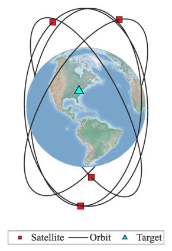
<figcaption class="paper-figure-caption"><b>Fig 5.</b> FIGURE 5: Satellite constellation geometry showing satel- lites in orbital slots and a single ground target.</figcaption>
</figure>

**Summary.** This paper proposes a novel, scalable quantum approach using decomposition methods to solve the computationally hard Maximal Covering Location Problem (MCLP) for satellite constellation design. By partitioning the large problem into smaller subproblems solved via QAOA and then merging the results, the authors overcome the limitations of current quantum hardware on massive instances. The framework shows promise by maintaining high coverage performance while achieving better scalability than classical or standard quantum methods.

**Why it may be interesting.** While focused on optimization rather than fundamental physics, the methodology—applying divide-and-conquer techniques to map a complex combinatorial problem onto NISQ devices—is highly relevant for developing scalable quantum algorithms for physical simulations in condensed matter or AMO contexts.

Detailed structure

**Main problem.** The core problem is optimizing satellite constellation design by solving the NP-hard Maximal Covering Location Problem (MCLP) to maximize ground coverage.

**Main result.** A decomposition-based QAOA framework demonstrates better scalability and competitive coverage performance for large MCLP instances compared to standard quantum or classical solvers.

**Method.** The method uses spectral bisection on a co-observation graph to partition the large MCLP into smaller subproblems, which are then solved independently using QAOA circuits before being combined via quantum reconstruction strategies (GSR/QSR).

**Model / system.** The system is an Earth observation satellite constellation modeled by orbital slots and ground targets. The problem is formulated as an Ising Hamiltonian derived from the MCLP constraints, which are then mapped onto a QUBO representation.

**Key observables.** Coverage Ratio (Approximation ratio $
ho$), Runtime ($T$), and Optimality Gap.

**Important parameters / regimes.** Number of orbital slots ($J$), number of satellites ($N$), maximum subgraph size ($q_{	ext{max}}$), and circuit depth ($p$).

**Assumptions / limitations.** The approach assumes that decomposing the problem into smaller, hardware-tractable subproblems mitigates the exponential scaling issues faced by standard QAOA on large instances. The use of GSR is shown to outperform QSR.

**Figures summary.** Figures illustrate the decomposition framework flow; Figure 12 compares approximation ratios ($
ho$) between IBM hardware and OpenQAOA simulator, showing noise effects; Table VIII summarizes mean runtimes with 95% Confidence Intervals for various visibility matrix instances.

**Paper structure.** The paper first establishes MCLP as an intractable problem. It then introduces the decomposition-based QAOA framework, detailing graph construction via spectral bisection and solving subproblems using QAOA. Finally, it compares the performance of different merging strategies (GSR vs QSR) on both simulated and actual quantum hardware.

Abstract

An increase in earth observation missions has increased the demand of efficient design and optimization of satellite constellations. Maximizing coverage of the target while effectively utilizing the limited orbital resources is one of the critical design challenges for complex combinatorial optimization problems. The maximal covering location problem (MCLP), serves as a base for orbital coverage modeling, is NP-hard and computationally intractable for large-constellation instances. Using heuristics, metaheuristics, and mixed-integer linear programming, classical solvers have achieved optimal or near-optimal results, yet their scalability is limited as the problem size increases. Quantum computing advancements, including the quantum approximate optimization algorithms, offer a potential solution to NP-hard combinatorial optimization problems. Current quantum hardware limitations, such as low qubit counts and circuit depth, restrict solutions for small-scale instance problems. To address this challenge, this paper proposes a scalable quantum optimization framework for MCLP in satellite constellation design. A decomposition-based quantum methodology is proposed, in which large MCLP instances are partitioned into subgraphs by classical decomposition, optimized independently via quantum optimization circuits, and combined using quantum reconstruction strategies. Computational results across different constellation sizes reveal better scalability in less time while maintaining competitive coverage performance compared to classical solvers.

[↑ back to top](#top)

### [Efficient High-Dimensional Quantum Circuit Synthesis: From Multi-Controlled Gates to Isometries and Quantum Channels](http://arxiv.org/abs/2607.08200v1)

**Authors:** Gui-Long Jiang  
**Type:** theory · **Category:** quantum information and computing · **PDF:** <https://arxiv.org/pdf/2607.08200v1>  
**Analysis basis:** full PDF text, analyzed in chunks

↔ Scroll figures horizontally

<figure class="paper-figure-card">
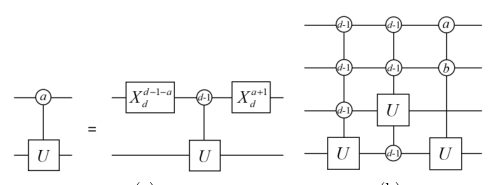
<figcaption class="paper-figure-caption"><b>Fig 1.</b> FIG. 1. (a) Circuit representation of Eq. (5) for the case (n, i, j) = (2, 1, 2). The circle represents the control qudit. (b) Quantum circuit symbols of C4 (1,2,3),4(U), C4 (1,2,4),3(U),</figcaption>
</figure>
<figure class="paper-figure-card">
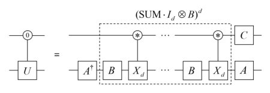
<figcaption class="paper-figure-caption"><b>Fig 2.</b> FIG. 4. Equivalent quantum circuit for the controlled U gate based on Eq. (13).</figcaption>
</figure>
<figure class="paper-figure-card">
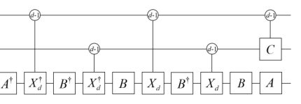
<figcaption class="paper-figure-caption"><b>Fig 3.</b> FIG. 5. Equivalent quantum circuit for the 2-controlled U gate.</figcaption>
</figure>
<figure class="paper-figure-card">
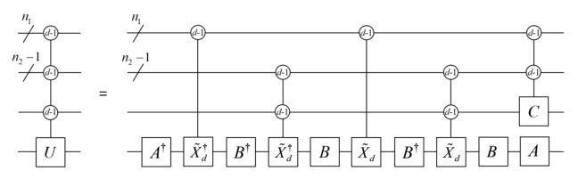
<figcaption class="paper-figure-caption"><b>Fig 4.</b> FIG. 6. Equivalent quantum circuit for the (n −1)-controlled U gate. The line with a slash (/) represents a quantum bus (i.e., a collection of multiple qudits); the numbers n1 = ⌈n−1</figcaption>
</figure>
<figure class="paper-figure-card">
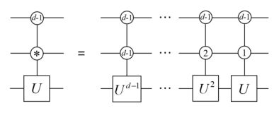
<figcaption class="paper-figure-caption"><b>Fig 5.</b> FIG. 7. Quantum circuit symbol for the gate that applies U a to the target qudit when the two control qudits are in |d −1, a⟩, for a = 1, . . . , d −1.</figcaption>
</figure>

**Summary.** This paper presents efficient methods to synthesize complex multi-controlled gates in qudit quantum computing. It significantly improves the theoretical upper bounds on gate counts required for these operations, achieving polynomial scaling in the number of qubits ($O(n^2)$). The results are vital for advancing hardware implementations utilizing higher-dimensional quantum systems.

**Why it may be interesting.** The work provides concrete, optimized circuit decompositions for high-dimensional quantum operations, which is crucial for designing practical algorithms on qudit architectures that move beyond simple qubit models.

Detailed structure

**Main problem.** The paper addresses the challenge of efficiently synthesizing quantum circuits for multi-controlled gates, particularly $(n-1)$-controlled unitaries, in qudit systems.

**Main result.** It achieves improved gate count bounds, reducing the required CINC gates for general $(n-1)$-controlled unitaries to $O(n^2)$ and special unitaries to $O(n)$.

**Method.** The authors develop novel circuit synthesis schemes by decomposing complex controlled operations into products of fundamental building blocks like CINC gates and single-qudit gates.

**Model / system.** The model is based on qudit systems ($d$-level quantum computing) operating in a Hilbert space $\mathcal{H}^{\otimes n}_d$. The focus is on constructing circuits for controlled unitaries, isometries, and quantum channels.

**Key observables.** Gate counts (CINC, GCX), circuit complexity bounds, and theoretical lower bounds on gate requirements.

**Important parameters / regimes.** The number of qudits ($n$), the dimension $d$, and the control structure (e.g., $(n-1)$-controlled).

**Assumptions / limitations.** The analysis relies on decomposing unitaries into specific controlled gates and assumes that classical control after measurement is allowed for channel synthesis.

**Figures summary.** Figures illustrate quantum circuits for multi-controlled qudit gates, including representations for $C_{1,2}^{2}(U)$ using both CINC/single-qudit gates and $	ext{SUM}$ gates. Other figures detail circuit structures for general $(n-1)$-controlled operations.

**Paper structure.** The paper progresses by first establishing efficient decompositions for controlled unitaries (e.g., $C_{1,2}^{2}(U)$), then generalizing these results to arbitrary $(n-1)$-controlled gates with improved complexity bounds, and finally deriving theoretical lower bounds on the required gate counts.

Abstract

Circuit synthesis of multi-controlled gates is crucial for qudit ($d$-level) quantum computing. This paper presents efficient synthesis schemes that reduce the elementary gate count for multi-controlled single-qudit gates. For synthesizing general $(n-1)$-controlled unitaries on $n$ qudits, we reduce the controlled-increment (CINC) and generalized controlled-$X$ (GCX) gate counts to $O(n^2)$, improving upon existing $O(n^{2+\log_2 d})$ CINC and $O(n^3)$ GCX bounds. For $(n-1)$-controlled special unitaries, this complexity is further reduced to $O(n)$. By utilizing the proposed circuit, we present qudit-based circuit constructions for isometries and quantum channels from $n$ to $m$ qudits. When specialized to general $n$-qudit unitaries, our construction requires fewer CINC gates than previous results. Moreover, for the first time, we present a circuit synthesis scheme for single-controlled gates using SUM gates and single-qudit gates when $d$ is prime. This enables all CINC-based circuits for various quantum operations to be converted into SUM-gate circuits while preserving the same asymptotic complexity. Finally, we establish a theoretical lower bound on the number of SUM and CINC gates required to synthesize general $n$-qudit unitaries.

[↑ back to top](#top)

### [Nuclear Many-Body Systems as Benchmarks for Quantum Computing](http://arxiv.org/abs/2607.08047v1)

**Authors:** Sota Yoshida, Alessandro Baroni, Takayuki Miyagi, Ermal Rrapaj  
**Type:** theory · **Category:** quantum information and computing · **PDF:** <https://arxiv.org/pdf/2607.08047v1>  
**Analysis basis:** full PDF text, analyzed in chunks

↔ Scroll figures horizontally

<figure class="paper-figure-card">
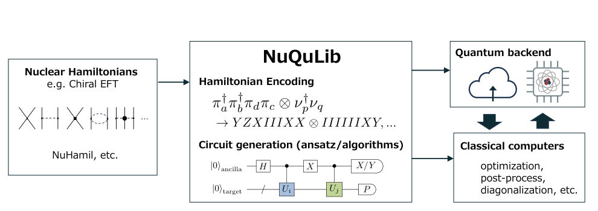
<figcaption class="paper-figure-caption"><b>Fig 1.</b> FIG. 1. NuQuLib workflow: A typical pathway starts from a nuclear interaction based on chiral effective field theory (ChEFT) [30–32], which is available with NuHamil [33] code and provides an input for various public codes such as im- srg++ [34], KSHELL [35], and NuclearToolkit.jl [36]. NuQuLib provides a bridge to quantum computing for nuclear physics problems by mapping the Hamiltonian to qubits. As such, it provides the encoded nuclear Hamiltonian and quantum circuits for state preparation ansatz and/or quantum algorithms.</figcaption>
</figure>
<figure class="paper-figure-card">
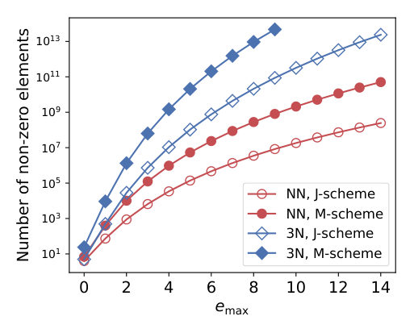
<figcaption class="paper-figure-caption"><b>Fig 2.</b> FIG. 2. Number of non-zero matrix elements in nuclear two-body (NN) and three-body (3N) interactions within the J-scheme or M-scheme basis representations. The horizontal axis represents the emax truncation defined in Sec. V specify- ing the model space size.</figcaption>
</figure>
<figure class="paper-figure-card">
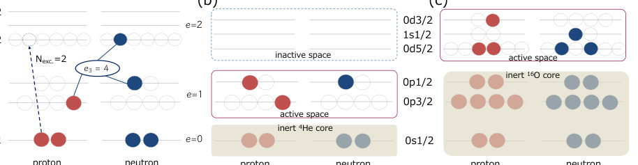
<figcaption class="paper-figure-caption"><b>Fig 3.</b> FIG. 3. Schematic illustration of nuclear configuration-interaction model spaces in the M-scheme representation. The single- particle basis states are labeled by the quantum numbers n, l, j, jz, and tz. Panel (a) shows a no-core shell-model space, where all nucleons are active and the harmonic-oscillator single-particle basis is truncated by (emax). The figure also illustrates the commonly used three-body matrix-element cutoff E3max, and a many-body excitation cutoff Nmax. The label e3 = 4 denotes the sum of single-particle e quanta associated with the three-body term shown schematically. The arrow with the dashed line shows an example of excitations carrying Nexc. = 2. Panels (b) and (c)...</figcaption>
</figure>
<figure class="paper-figure-card">
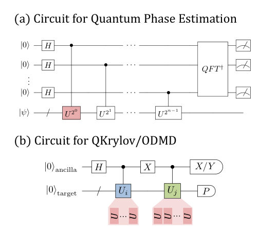
<figcaption class="paper-figure-caption"><b>Fig 4.</b> FIG. 4. Quantum circuits for the algorithms considered in this work. (a) Quantum Phase Estimation (QPE): The controlled time-evolution operator is applied conditioned on the state of the ancilla qubits, followed by the in- verse quantum Fourier transform (QFT†) to extract the eigenvalue information. (b) Quantum Krylov Subspace Method (QKrylov)/Observable Dynamic Mode Decomposi- tion (ODMD): The controlled time-evolution operator is ap- plied to construct non-orthogonal basis states, and the over- laps and Hamiltonian matrix elements are measured using the circuits shown.</figcaption>
</figure>
<figure class="paper-figure-card">
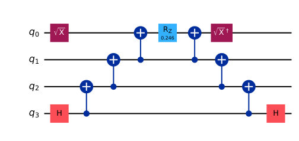
<figcaption class="paper-figure-caption"><b>Fig 5.</b> FIG. 5. Quantum circuit to implement the time- evolution operator for a pseudo two-body interaction term exp (−0.123iX0Z1Z2Y3).</figcaption>
</figure>

**Summary.** The paper develops NuQuLib, a comprehensive framework to translate realistic nuclear Hamiltonians from Chiral EFT into qubit circuits suitable for quantum computing. It systematically benchmarks three key quantum algorithms by estimating their resource costs (T-gates) for solving the many-body Schrödinger equation in atomic nuclei.

**Why it may be interesting.** This work directly bridges advanced theoretical nuclear structure physics (ChEFT, shell model) with the practical requirements of near-term quantum computation, providing a crucial benchmark for future hardware development in fundamental physics simulations.

Detailed structure

**Main problem.** The primary goal is to establish a systematic framework for benchmarking quantum algorithms designed to solve complex many-body problems arising in nuclear physics.

**Main result.** The authors provide the NuQuLib software stack, which quantifies scaling trends and resource requirements (T-gate counts) for applying three major eigenvalue algorithms (QPE, QKrylov, ODMD) to realistic nuclear Hamiltonians.

**Method.** A unified workflow maps second-quantized nuclear interactions (from Chiral EFT) into qubit Hamiltonians, allowing systematic comparison of quantum algorithm resource needs across different model spaces and interaction types.

**Model / system.** The system is the atomic nucleus, modeled by realistic Hamiltonians derived from Chiral Effective Field Theory ($\chi$EFT), incorporating two-body (NN) and three-body (3N) interactions. Calculations span both no-core and valence-space formulations.

**Key observables.** Resource requirements quantified in terms of T-gate counts and system size, alongside the energy eigenvalues ($E_i$) derived from solving $H|\Psi_i
angle = E_i|\Psi_i
angle$.

**Important parameters / regimes.** The complexity scales significantly with interaction type (e.g., scaling as $N^4$ for NN and $N^6$ for 3N matrix elements).

**Assumptions / limitations.** The framework relies on mapping fermionic operators to qubit Hamiltonians, necessitating approximations or truncations due to the rapid growth of matrix elements.

**Figures summary.** Figure 1 illustrates the entire NuQuLib workflow: starting from a nuclear interaction (ChEFT) $
ightarrow$ Hamiltonian Encoding $
ightarrow$ Circuit generation for quantum algorithms. Figure 2 shows scaling of non-zero matrix elements based on model space truncation.

**Paper structure.** The paper introduces the problem by detailing the physical inputs (ChEFT Hamiltonians, second quantization). It then presents the core contribution: a workflow to map these into qubit circuits and estimates resources for specific quantum algorithms ($	ext{QPE}$, $	ext{QKrylov}$, $	ext{ODMD}$), concluding with resource scaling analysis.

Abstract

We present a framework for benchmarking quantum algorithms for nuclear many-body systems based on realistic nuclear Hamiltonians such as chiral effective field theory. To this effect we introduce a workflow that maps nuclear interactions in second quantization formalism to qubit Hamiltonians. This enables the systematic construction of benchmark instances spanning no-core and valence-space formulations with two-body (NN) and selected three-body (3N) interactions. Then, we proceed to provide resource estimates for three representative eigenvalue algorithms: Quantum Phase Estimation, Quantum Krylov methods, and Observable Dynamic Mode Decomposition. We compare their resource requirements in terms of T-gate counts and system size, and examine the impact of model-space choices and many-body interactions. The primitives included in our analysis are Trotterization, Qubitization, and Quantum Singular Value Transformation. Our results quantify scaling trends across algorithms and problem classes, and provide a basis for consistent comparisons of quantum approaches to nuclear many-body problems. The implementation is provided by the NuQuLib software stack.

[↑ back to top](#top)

### [Quantum linear solvers for quantum chemistry: prospects of exponential quantum advantage](http://arxiv.org/abs/2607.08220v1)

**Authors:** Peniel Bertrand Tsemo, Kenji Sugisaki, Ishita Bhattacharjee, V. S. Prasannaa  
**Type:** theory · **Category:** quantum information and computing · **PDF:** <https://arxiv.org/pdf/2607.08220v1>  
**Analysis basis:** full PDF text, analyzed in chunks

↔ Scroll figures horizontally

<figure class="paper-figure-card">
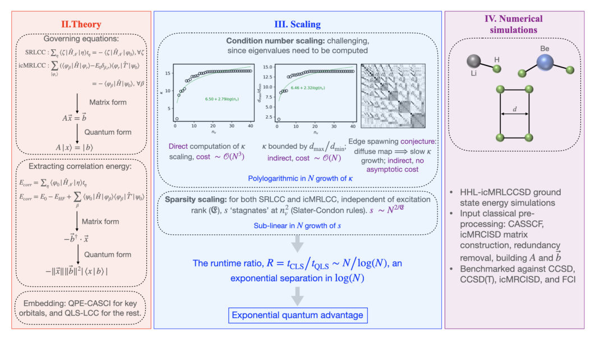
<figcaption class="paper-figure-caption"><b>Fig 1.</b> FIG. 1. Overview of the present work and organization (Section II onwards). Section II derives the working equations of single- and internally contracted multi-reference linearized coupled cluster theories, abbreviated as SRLCC and icMRLCC respectively, reformulates them for quantum linear solvers (QLSs), and proposes embedding quantum phase estimation-complete active space configuration interaction (QPE-CASCI) in QLS-LCC for large molecular calculations. Section III introduces three diagnostics for determining the condition number, κ, of the A matrix, which we find to scale as a polylogarithmic function of system size, N. We also show the expression for the sparsity, s, to be sub-linear in...</figcaption>
</figure>
<figure class="paper-figure-card">
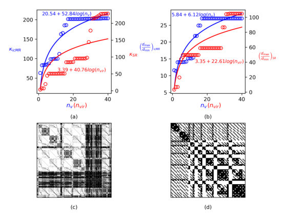
<figcaption class="paper-figure-caption"><b>Fig 2.</b> FIG. 2. Sub-figure (a) shows the scaling of condition number, κ, with the number of virtuals, nv(nvir), while sub-figure (b) presents the ratio of maximum and minimum diagonal entries of A, dmax  dmin scaling versus nv(nvir). ‘SR’ and ‘icMR’ refer to the quantities having been obtained using single-reference and internally contracted multi-reference linearized coupled cluster methods (in the singles and doubles approximation), respectively. dmax and dmin refer to maximum and minimum diagonal entries of A respectively. Sub-figures (c) and (d) de- pict the A matrix heat maps (non-zero matrix elements in black and zero values in white) for the single-reference and internally contracted...</figcaption>
</figure>
<figure class="paper-figure-card">
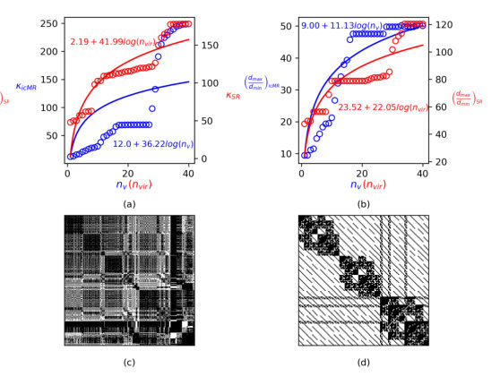
<figcaption class="paper-figure-caption"><b>Fig 3.</b> FIG. 5. (a) and (b): κ and dmax  dmin scaling as a func- tion of nv(nvir) respectively, (c) and (d): heatmaps of SRL- CCSD and icMRLCCSD A matrices respectively, for the BeH2 molecule in the cc-pVTZ basis. The SR and the icMR A matrices shown in the figure are of size 144 × 144 and 1756 × 1756 respectively. All definitions are the same as in Fig. 2</figcaption>
</figure>
<figure class="paper-figure-card">
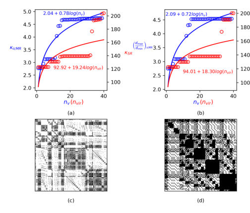
<figcaption class="paper-figure-caption"><b>Fig 4.</b> FIG. 3. Sub-figure (a) illustrates the scaling of κ with nv(nvir), sub-figure (b) reports dmax  dmin scaling versus nv(nvir), whereas sub-figures (c) and (d) plot the SRLCCSD and icMRLCCSD A matrices respectively as heat maps. The SR and the icMR A matrices shown in the figure are of size 151×151 and 403×403 respectively. All the data is presented for the BeH+ 2 molecular ion in the cc-pVTZ basis. All defini- tions are the same as in Fig. 2</figcaption>
</figure>
<figure class="paper-figure-card">
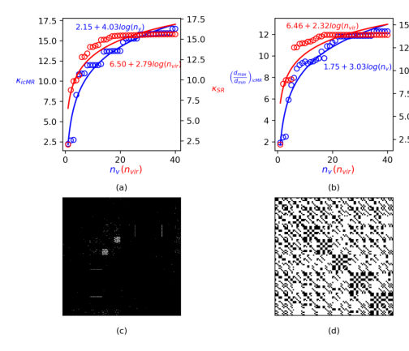
<figcaption class="paper-figure-caption"><b>Fig 5.</b> FIG. 4. (a): Scaling of κ with nv(nvir), (b): dmax  dmin scaling versus nv(nvir), (c) and (d): SRLCCSD and icMRLCCSD A matrices’ heat maps respectively, all of them for the H4 molecule in the cc-pVTZ basis. The SR and the icMR A matrices shown in the figure are of size 99 × 99 and 351 × 351 respectively. All definitions are the same as in Fig. 2</figcaption>
</figure>

**Summary.** The paper investigates whether Quantum Linear Solvers can provide an exponential speedup for solving coupled cluster equations in quantum chemistry. By extending the QLS framework to multi-reference methods, the authors analyze the condition number scaling and find favorable polylogarithmic scaling. This strongly supports the potential for using quantum computers to tackle challenging electronic structure problems.

**Why it may be interesting.** This work directly bridges advanced quantum chemistry methods (like MRLCC) with cutting-edge quantum algorithms (QLSs), providing a rigorous theoretical assessment of when and how quantum computation can accelerate chemical simulations beyond classical limits.

Detailed structure

**Main problem.** Assessing the potential for exponential quantum advantage using Quantum Linear Solvers (QLSs) to solve complex linear systems arising from quantum chemistry calculations.

**Main result.** The analysis shows consistent predictions of polylogarithmic condition number ($\kappa$) scaling and sub-linear sparsity scaling, supporting the prospect of an exponential quantum advantage for solving the LCC problem using QLSs.

**Method.** The authors extend Quantum Linear Solvers (QLSs) from single-reference to multi-reference Coupled Cluster methods (QLS-icMRLCC). They analyze $\kappa$ scaling using three complementary diagnostics: direct calculation, ratio of diagonal entries, and structural analysis.

**Model / system.** The study focuses on quantum chemistry calculations involving molecular systems, specifically linearizing the equations derived from Single-Reference (SRLCC) and Internally Contracted Multi-Reference Coupled Cluster methods (icMRLCC).

**Key observables.** Condition number ($\kappa$) scaling with system size, sparsity ($s$) scaling of matrix $A$, and recovered ground state energies (error < 0.009%).

**Important parameters / regimes.** Weakly correlated regimes vs. strongly correlated regions; polylogarithmic $\kappa$ scaling.

**Assumptions / limitations.** The analysis assumes that the structure of coupled cluster equations allows them to be recast as linear systems solvable by QLSs, and that efficient loading/state preparation is possible.

**Figures summary.** Figures track condition numbers ($\kappa$) versus system size (atoms or virtual orbitals) for various molecular chains and methods, demonstrating scaling behavior.

**Paper structure.** The paper first establishes the need to extend QLS-SRLCC to multi-reference forms (QLS-icMRLCC). It then analyzes $\kappa$ scaling using three diagnostics. Finally, it presents numerical calculations on model systems up to four atoms to validate the approach.

Abstract

Quantum linear solvers (QLSs) can offer the potential for exponential quantum advantage in solving quantum chemical problems, but its assessment hinges on determining the condition number ($κ$) scaling, which itself is computationally challenging. While a recent work applied the Harrow-Hassidim-Lloyd (HHL) algorithm to single-reference linearized coupled cluster equations (SRLCC), the validity of the HHL-SRLCC framework is restricted to weakly correlated regimes. A general treatment requires a formulation that can access strongly correlated regions. We thus begin by extending the QLS-SRLCC framework to its multi-reference form, which is based on the internally contracted multi-reference LCC method (QLS-icMRLCC). We then analyze $κ$ scaling using three complementary diagnostics that range from explicit computations to use of indirect structural indicators: (i) direct calculations of $κ$, (ii) scaling of the ratio of maximum to minimum diagonal entries of an A matrix, and (iii) structural analyses of the A matrices based on a recently proposed conjecture, which we adapt to the QLS-LCC problem. The three approaches yield consistent predictions, indicating a polylogarithmic $κ$ scaling in system size. This finding, when combined with our arguments on sub-linear scaling of sparsity, supports the prospects of exponential advantage using QLSs for the LCC problem. Finally, numerical calculations on potential energy curves of model systems containing up to four atoms recover the ground state energies with errors relative to benchmark classical methods not exceeding 0.009$\%$.

[↑ back to top](#top)

### [Wigner symmetries single out symmetric Wasserstein distances in all finite dimensions](http://arxiv.org/abs/2607.08298v1)

**Authors:** Gergely Bunth  
**Type:** theory · **Category:** other · **PDF:** <https://arxiv.org/pdf/2607.08298v1>  
**Analysis basis:** full PDF text, analyzed in chunks

↔ Scroll figures horizontally

<figure class="paper-figure-card">
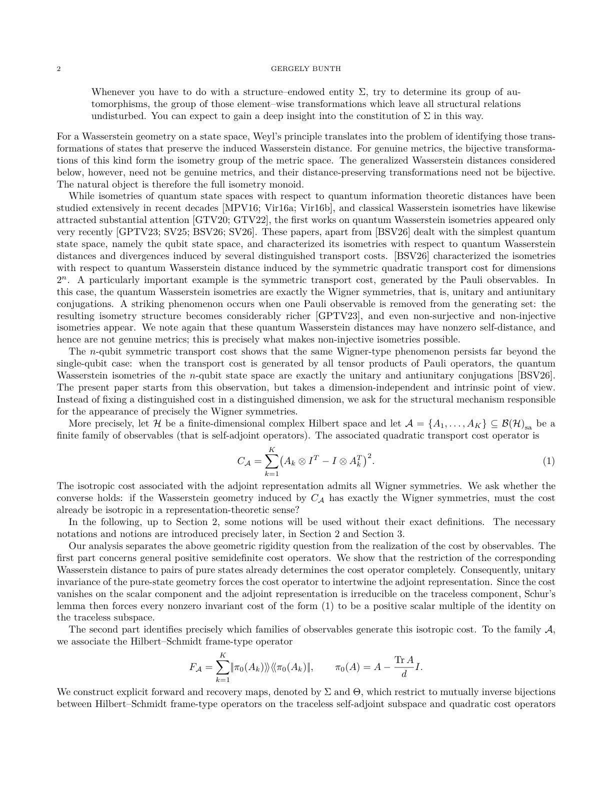
<figcaption class="paper-figure-caption"><b>Fig 1.</b> Low-resolution page preview, page 2</figcaption>
</figure>
<figure class="paper-figure-card">
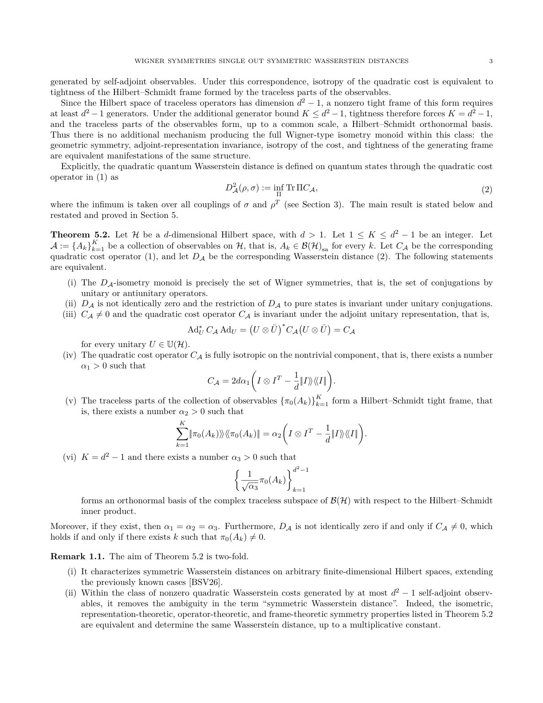
<figcaption class="paper-figure-caption"><b>Fig 2.</b> Low-resolution page preview, page 3</figcaption>
</figure>
<figure class="paper-figure-card">
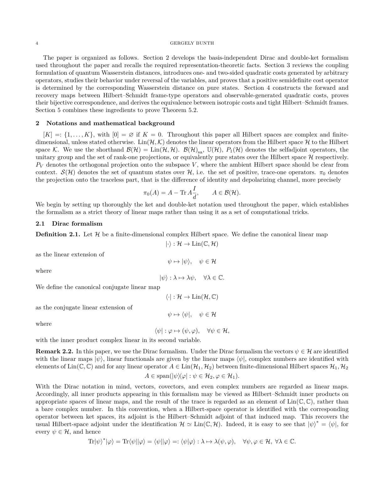
<figcaption class="paper-figure-caption"><b>Fig 3.</b> Low-resolution page preview, page 4</figcaption>
</figure>
<figure class="paper-figure-card">
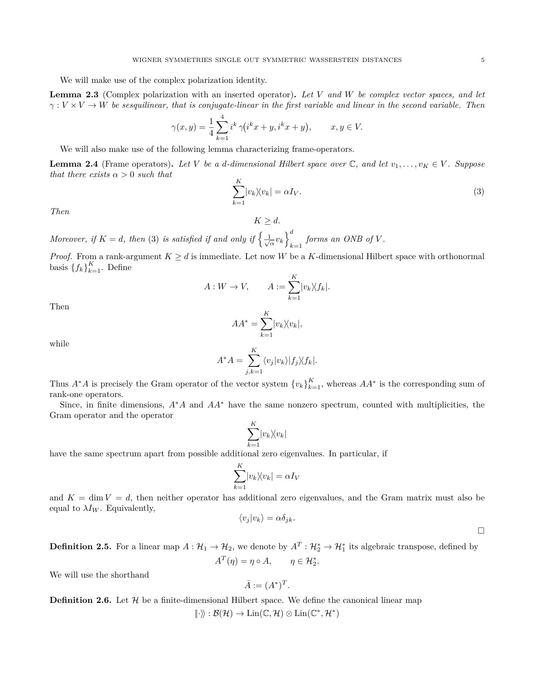
<figcaption class="paper-figure-caption"><b>Fig 4.</b> Low-resolution page preview, page 5</figcaption>
</figure>
<figure class="paper-figure-card">
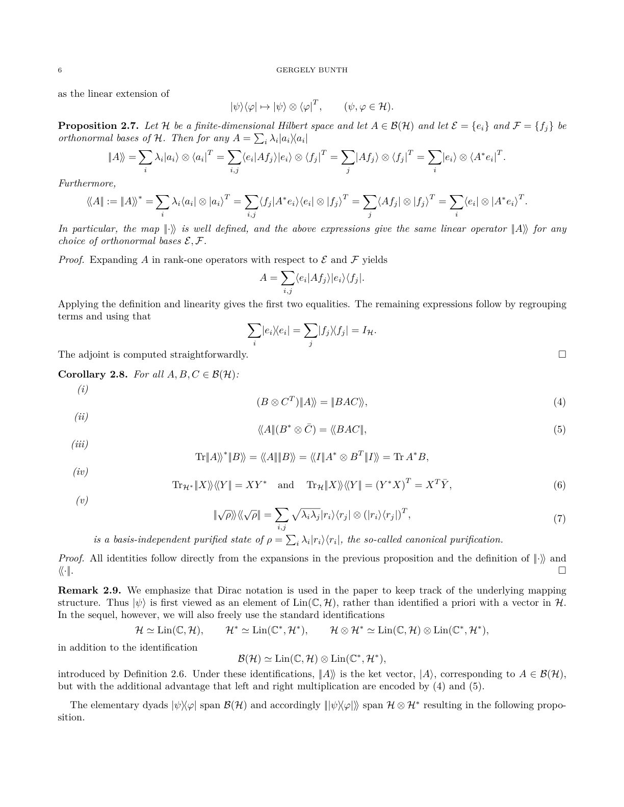
<figcaption class="paper-figure-caption"><b>Fig 5.</b> Low-resolution page preview, page 6</figcaption>
</figure>

**Summary.** This paper rigorously characterizes symmetric quantum Wasserstein distances on finite-dimensional Hilbert spaces. It proves that multiple seemingly disparate symmetry conditions—including isometry group structure, representation invariance, and frame properties—are all equivalent ways of defining the same specific distance metric. This unifies several advanced mathematical tools to understand the geometry of quantum state space.

**Why it may be interesting.** This work provides deep mathematical structure to optimal transport in quantum mechanics, linking fundamental symmetries of quantum evolution (Wigner symmetries) directly to the geometry of state spaces defined by generalized distances.

Detailed structure

**Main problem.** The core problem is characterizing quantum Wasserstein distances whose isometry group is precisely the Wigner symmetries (unitary/antiunitary conjugations).

**Main result.** Multiple mathematical notions of symmetry—geometric, representation-theoretic, operator-theoretic, and frame-theoretic—are proven to be equivalent conditions that characterize these specific symmetric quantum Wasserstein distances.

**Method.** The analysis involves translating geometric invariance (isometries) into algebraic constraints on the cost operator, utilizing concepts from group representations (adjoint action) and frame theory (tight frames).

**Model / system.** The study is set in finite-dimensional complex Hilbert spaces ($\mathcal{H}$ of dimension $d$), focusing on quantum states represented by density operators $
ho$ and distances defined via quadratic cost operators $C_A$ associated with self-adjoint observables $\{A_k\}$.

**Key observables.** Quantum Wasserstein distance ($D_A$), the quadratic cost operator ($C_A$), and the traceless parts of observables ($\pi_0(A)$).

**Important parameters / regimes.** The dimension $d$ of the Hilbert space, and the number of generating observables $K$, which is constrained to be at most $d^2-1$.

**Assumptions / limitations.** The analysis assumes the existence of a specific structure for the cost operator (e.g., being isotropic or generated by observables) to establish the equivalence theorems.

**Figures summary.** Not specified in the provided notes, but the text implies proofs involving algebraic identities and structural characterizations rather than graphical representations.

**Paper structure.** The paper builds from establishing basic formalism (Dirac notation), moving through representation theory (adjoint actions) to prove a central theorem that equates six different symmetry conditions for the quantum Wasserstein distance.

Abstract

We study the quantum Wasserstein distances introduced by De Palma and Trevisan associated with quadratic cost operators generated by families of self-adjoint observables. We first show that an arbitrary positive semidefinite cost operator is completely determined by the restriction of the corresponding Wasserstein distance to pairs of pure states. This allows geometric invariance of the pure-state distance to be translated directly into invariance of the cost operator.   Within the class of nonzero quadratic costs generated by at most $d^2-1$ observables on a $d$-dimensional Hilbert space, we prove that the Wasserstein isometry monoid consists exactly of the Wigner symmetries, that is, unitary and antiunitary conjugations, if and only if the distance is invariant under unitary conjugations on pure states. Equivalently, the cost operator intertwines the adjoint representation of the unitary group and is a positive scalar multiple of the identity on the traceless subspace.   We further construct explicit mutually inverse maps between quadratic cost operators generated by observables and Hilbert--Schmidt frame-type operators formed from their traceless parts. Under this correspondence, isotropy of the cost is equivalent to the tight frame property of the associated Hilbert--Schmidt operator. Consequently, a nonzero isotropic cost requires at least $d^2-1$ self-adjoint generators, and equality holds precisely when their traceless parts form, up to a common scale, a Hilbert--Schmidt orthonormal basis. Thus the geometric, representation-theoretic, operator-theoretic, and frame-theoretic notions of symmetry all determine the same one-parameter family of quantum Wasserstein distances.

[↑ back to top](#top)

## Secondary cond-mat archives

*Papers from cond-mat.mtrl-sci, mes-hall, other, soft, supr-con. These archives are de-prioritized — they appear at the end regardless of relevance score.*

### Relevant in secondary archives (13)

### [Vortex Dynamics in Magic-Angle Twisted Graphene](http://arxiv.org/abs/2607.08585v1)

**Authors:** Marta Perego, Peter Koopmann, Clara Galante Agero, Alexandra Mestre Torà, Takashi Taniguchi, Kenji Watanabe, Vadim Geshkenbein, Gianni Blatter, Thomas Ihn, Klaus Ensslin  
**Type:** experiment · **Category:** other · **PDF:** <https://arxiv.org/pdf/2607.08585v1>  
**Analysis basis:** full PDF text, analyzed in chunks
**Topic relevance:** 🔥 `non-equilibrium dynamics` **4/5** · `driven-dissipative phase transition` **3/5** · `methods for driven-dissipative` **3/5** · `correlated / nonlocal dissipation` **2/5** · `non-equilibrium universality` **2/5** · `Keldysh / 2PI / non-Gaussian methods` **1/5** · `Kondo & dissipative impurity` **1/5** · `QC/QI experiment` **1/5** · `quantum measurements` **1/5** · `scars & prethermalization` **1/5**

↔ Scroll figures horizontally

<figure class="paper-figure-card">
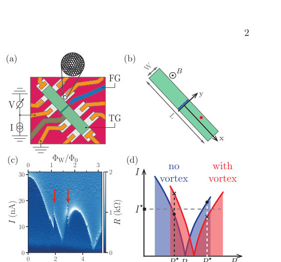
<figcaption class="paper-figure-caption"><b>Fig 1.</b> FIG. 1. (a) Schematic of twisted-layer graphene device with contacts (orange), top gate (green, TG) and finger gate (blue, FG) defining the Josephson junction (the graphite bottom gate is below the entire structure and not shown here). (b) De- vice geometry with width W = 1.1 µm along the y-direction, length L = 6W along x, and the junction width Lj = 150 nm. The film thicknness is d = 1 nm. An applied magnetic field H perpendicular to the plane penetrates the weakly screening sample (with the Pearl length Λ = 2λ2 L/d much larger than the film width W, λL is the London length) such that B ≈H. (c) Vortices (red dot in (b)) penetrating the sample nearby the junction are detected as jumps in...</figcaption>
</figure>
<figure class="paper-figure-card">
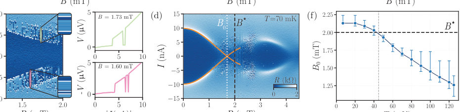
<figcaption class="paper-figure-caption"><b>Fig 2.</b> FIG. 2. (a) Fraunhofer interference pattern of the device with weak-leads tuning at T = 7 mK. The noisy feature around the first zero B0 of the FP is associated with fast vortex fluctuations in the leads, causing jumps in the V -I characteristic and thereby noise in the differential resistance R. The orange fit of the main peak allows for an estimate of B0. Red lines are a fit to the termination line of the noise, generated by a vortex-induced shift of the FP. Magenta lines are a fit to the second peak in the FP with a stationary vortex very close to the junction. (b) Magnification of the noise in the FP in (a) at two field values together with the corresponding V -I traces. Superconducting...</figcaption>
</figure>
<figure class="paper-figure-card">
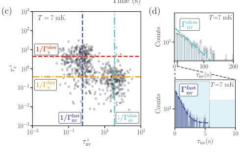
<figcaption class="paper-figure-caption"><b>Fig 3.</b> FIG. 3. Telegraph noise measured at low temperature T = 7 mK. (a) Voltage–current characteristic of pristine (blue) and vortex-penetrated sample (red). The inset shows jumps within the dynamical regime where vortex penetration can be detected. (b) Time traces of the voltage Vd(t) across the junc- tion taken at B∗= 2 mT and I∗= 4 nA (dotted line in (a)). The telegraph noise exhibits two regimes, blue–red and cyan– orange, with red/orange colors relating to superconducting states (switched by fluctuating vortices) and blue/cyan colors to dissipative states (pristine or in the presence of a distant quasi-stationary vortex). Top expansion: Note the two dissi- pative levels that we associate...</figcaption>
</figure>
<figure class="paper-figure-card">
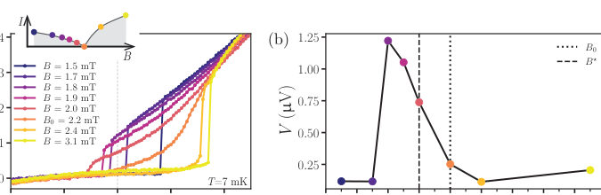
<figcaption class="paper-figure-caption"><b>Fig 4.</b> FIG. 4. (a) Evolution of V –I characteristic with increasing field B passing the first zero B0 of the Fraunhofer pattern. The sharp critical current Ic(B &lt; B0) disappears on approaching B0 (dark violet to pink), giving way to a rounded characteristic at B0 (orange), and returns back to a sharp trace (bright orange and yellow) with clearly identifiable Ic(B &gt; B0). (b) Dissipation at I∗= 4 nA versus field B in the vicinity of B0. The slope in V (B) is negative at the measurement field B∗= 2 mT and goes through a maximum on decreasing the field, before collapsing to zero at around B ≈1.7 mT.</figcaption>
</figure>
<figure class="paper-figure-card">
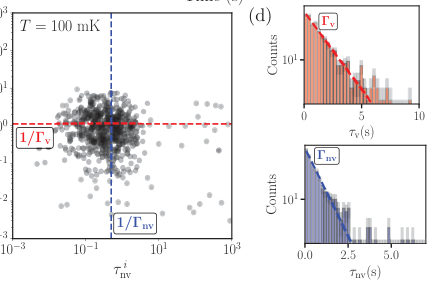
<figcaption class="paper-figure-caption"><b>Fig 5.</b> FIG. 5. Telegraph noise measured at high temperature T = 100 mK. (a) Voltage–current characteristic of pristine sample (blue) below the vortex-penetrated sample (red); note the difference to Fig. 3(a) where the pristine sample resides above the vortex-trapped one. The inset shows jumps within the dynamical regime where vortex penetration can be de- tected. (b) Time traces of the voltage Vd(t) across the junc- tion taken at B∗= 2 mT and I∗= 4 nA (dotted line in (a)). The cyan–orange regimes present at low temperatures have turned silent (no orange spikes due to fluctuating vortices). (c) Time-correlation plot τnv versus τv with only one cluster as the cyan regime has turned silent. (d)...</figcaption>
</figure>

**Summary.** The research uses a Josephson junction made from twisted graphene to study how magnetic vortices move within the superconductor. By measuring changes in critical current and analyzing voltage noise over varying temperatures, the authors distinguish between thermal creep motion and regimes dominated by macroscopic quantum tunneling of these vortices.

**Why it may be interesting.** This work directly probes non-equilibrium dynamics (vortex motion) in superconducting mesoscopic systems using advanced graphene heterostructures, providing insights into quantum dissipation mechanisms relevant to superconducting electronics.

Detailed structure

**Main problem.** The study investigates vortex dynamics within two dimensions using a Josephson junction (JJ) fabricated from magic-angle twisted graphene.

**Main result.** Vortex motion exhibits distinct temperature dependencies: thermally activated creep above 100 mK, transitioning to behavior suggestive of macroscopic quantum tunneling below 80 mK.

**Method.** Measurements involve analyzing the magnetic-field-dependent critical current $I_c(B)$ for Fraunhofer pattern shifts and monitoring time traces of junction voltage $V(t)$ for telegraphic noise signatures.

**Model / system.** The physical platform is a gate-defined Josephson junction made from magic-angle twisted graphene, which acts as a sensor for vortices penetrating the superconducting leads. The analysis models vortex dynamics using concepts like Pearl-vortices and free-energy barriers.

**Key observables.** $I_c(B)$ (Fraunhofer pattern shifts), voltage noise $V(t)$ (telegraph noise), vortex entry/exit rates ($\Gamma_{nv}, \Gamma_v$), and temperature dependence of these rates.

**Important parameters / regimes.** Temperature range ($7 	ext{ mK}$ to $120 	ext{ mK}$), junction width ($W=1.1 \mu	ext{m}$), and characteristic energy scales related to thermal activation vs. quantum tunneling.

**Assumptions / limitations.** The analysis separates fast vortex fluctuations from quasi-stationary trapped vortices, and rate calculations require careful correction for finite detector bandwidth ($\Gamma_{	ext{det}}$).

**Figures summary.** Figures illustrate device schematics, show vortex detection via jumps in the Fraunhofer pattern (Fig. 1(c)), and detail the temperature evolution of vortex rates and tunneling actions (Fig. 6).

**Paper structure.** The paper progresses from establishing the experimental setup and observing basic vortex signatures in $I_c(B)$ to analyzing time-domain noise ($V(t)$) for rate extraction, culminating in a detailed analysis of temperature dependence across quantum tunneling and thermal regimes.

Abstract

We use a gate-defined Josephson junction (JJ) device made from twisted-layer graphene for studying vortex dynamics in two dimensions. The JJ sensor signals the presence of individual vortices in the superconducting leads nearby the junction through shifts in the Fraunhofer interference pattern of the magnetic-field-dependent critical current $I_c(B)$ across the junction. Rapid vortex fluctuations manifest as telegraph-type noise in time traces of the junction voltage $V(t)$. Measurements of $I_c(B)$ and $V(t)$ are interpreted in terms of multi-vortex processes where fast vortex fluctuations in the leads are modulated by quasi-stationary vortices trapped in the leads. The different timescales associated with these processes allow for their disentangling and quantitative analysis. Tracking the temperature dependence of the vortex-dynamical rates between $T = 7$ mK and $T = 120$ mK, we find that the creep type vortex motion is thermally activated above $T \approx 100$ mK, while the saturation of rates below $T \approx 80$ mK is suggestive of a sharp transition to macroscopic quantum tunneling of vortices.

[↑ back to top](#top)

### [A crystal-field route to THz-driven magnetization](http://arxiv.org/abs/2607.08519v1)

**Authors:** T. Zalewski, M. S. Mrudul, Y. Lee, M. Weissenhofer, A. V. Boris, P. M. Oppeneer, A. Kirilyuk, C. S. Davies  
**Type:** both · **Category:** other · **PDF:** <https://arxiv.org/pdf/2607.08519v1>  
**Analysis basis:** full PDF text, analyzed in chunks
**Topic relevance:** 🔥 `spintronics-quantum-optics interface` **4/5** · `exotic spin models in light-matter` **3/5** · `non-equilibrium dynamics` **2/5** · `Keldysh / 2PI / non-Gaussian methods` **1/5** · `driven-dissipative phase transition` **1/5** · `methods for driven-dissipative` **1/5** · `quantum optics experiment` **1/5**

↔ Scroll figures horizontally

<figure class="paper-figure-card">
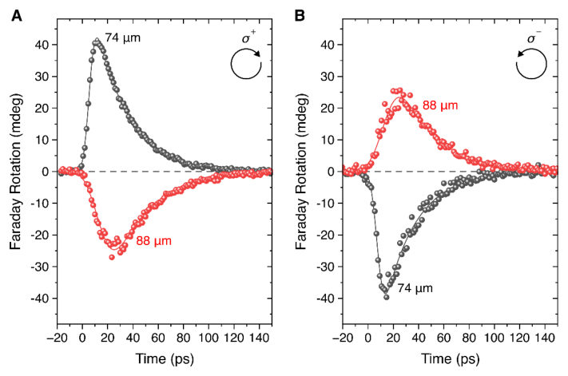
<figcaption class="paper-figure-caption"><b>Fig 1.</b> Fig. 1 | Helicity- and wavelength-dependent ultrafast Faraday rotation in CeF3. Time-</figcaption>
</figure>
<figure class="paper-figure-card">
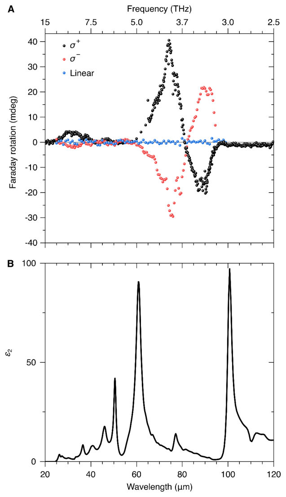
<figcaption class="paper-figure-caption"><b>Fig 2.</b> Fig. 2| Spectral dependence of THz-driven magnetization and infrared optical excitations in</figcaption>
</figure>
<figure class="paper-figure-card">
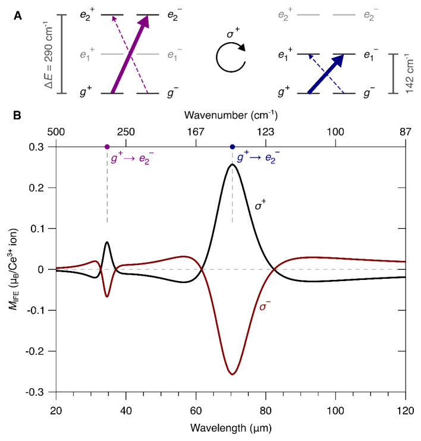
<figcaption class="paper-figure-caption"><b>Fig 3.</b> Fig. 3 | Quantum inverse Faraday effect mediated by crystal-field excitations in CeF3. (A)</figcaption>
</figure>

**Summary.** The research elucidates that the conversion of THz light's angular momentum into magnetization in $	ext{CeF}_3$ occurs via localized $4f$ crystal-field excitations. By performing time-resolved spectroscopy and applying resonant theory, the authors prove that these electronic transitions are the dominant microscopic pathway, a conclusion strongly supported by observing characteristic sign reversals not predicted by phonon models.

**Why it may be interesting.** This work directly addresses light-matter interaction dynamics in magnetic insulators, providing a clear quantum optical mechanism—the crystal-field reservoir—for generating magnetization using THz pulses, which is highly relevant to ultrafast magneto-optics and AMO physics.

Detailed structure

**Main problem.** To establish the microscopic pathway by which light's angular momentum is converted into magnetization using terahertz (THz) light, distinguishing between crystal-field and phonon contributions.

**Main result.** Crystal-field excitations in $	ext{CeF}_3$ are identified as the primary reservoir mediating this process, evidenced by a sign reversal of the induced magnetization when tuning across a crystal-field resonance.

**Method.** The study combines time-resolved Faraday spectroscopy (experiment) with theoretical modeling based on the resonant inverse Faraday effect (theory).

**Model / system.** The system is $	ext{CeF}_3$, focusing on the localized $4f$ electron excitations of $	ext{Ce}^{3+}$ ions, which are modeled using crystal-field splitting into Kramers doublets.

**Key observables.** Helicity-dependent transient magnetization (Faraday rotation), spectral dependence across THz frequencies ($\sim 20 	ext{ to } 120 \mu	ext{m}$), and the sign reversal of this response.

**Important parameters / regimes.** The characteristic energy scales include crystal-field transition energies (e.g., near $34 \mu	ext{m}$) and phonon resonance frequencies.

**Assumptions / limitations.** The theory initially neglects phononic/vibronic contributions to isolate the electronic mechanism, though hybridization is noted as a complicating factor in certain spectral regions.

**Figures summary.** Figures show time traces demonstrating sign reversal upon tuning across crystal-field resonances and compare the magneto-optical spectrum directly against calculated far-infrared optical spectra ($\varepsilon_2(\omega)$).

**Paper structure.** The paper moves from initial experimental observation of THz-driven magnetization to theoretical modeling using the inverse Faraday effect, confirming that only resonant electronic transitions (crystal fields) can account for both the spectral shape and the characteristic sign reversal.

Abstract

Light carries angular momentum, but the microscopic pathways that transform it into magnetization remain elusive. Here we establish that crystal-field excitations, historically viewed primarily as equilibrium spectroscopic fingerprints of localized 4$f$ electrons, constitute an active microscopic route through which circularly-polarized terahertz (THz) light creates magnetic polarization. Using wavelength-selective ultrafast Faraday spectroscopy on the paramagnetic insulator CeF$_3$, we show that resonant excitation of localized 4$f$ crystal-field transitions generates a helicity-dependent magnetization that survives for up to about 100 ps. Most strikingly, while the optical helicity is held fixed, the THz-driven response reverses sign as the excitation wavelength is tuned across the crystal-field resonance. The resulting dispersive spectral response follows the crystal-field excitation spectrum rather than that of optical phonons, and is captured by resonant electronic theory of the inverse Faraday effect. Our results identify crystal-field excitations as a previously unrecognized dynamical reservoir for optical angular momentum and broaden the microscopic pathways through which THz light can create and manipulate magnetic states.

[↑ back to top](#top)

### [Bogolyubov excitons as a microscopic origin of two-level systems](http://arxiv.org/abs/2607.07812v1)

**Authors:** Andrey Grankin, Victor Galitski  
**Type:** theory · **Category:** other · **PDF:** <https://arxiv.org/pdf/2607.07812v1>  
**Analysis basis:** full PDF text, analyzed in chunks
**Topic relevance:** `Keldysh / 2PI / non-Gaussian methods` **3/5** · `correlated / nonlocal dissipation` **3/5** · `driven-dissipative phase transition` **3/5** · `methods for driven-dissipative` **3/5** · `Kondo & dissipative impurity` **2/5** · `non-equilibrium dynamics` **2/5** · `correlated cavity matter` **1/5** · `non-equilibrium universality` **1/5**

↔ Scroll figures horizontally

<figure class="paper-figure-card">
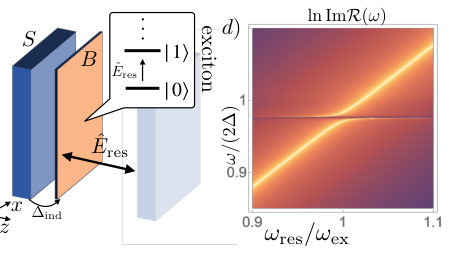
<figcaption class="paper-figure-caption"><b>Fig 1.</b> Figure 1. Repulsion-induced Bogolyubov exciton formation in a two-dimensional superconductor. (a) Exciton energy as a function of the interaction strength in l-th channel for λ0ν0 = 0.1 (blue), 0.2 (orange), 0.4 (green), 0.5 (red). Bo- golyubov quasiparticle bands, with quasielectrons and quasi- holes interacting via the Coulomb interaction and forming an excitonic collective degree of freedom, are shown in the inset. (b) Low-q density-density response ImΠq(ω)/ν0 of a gate-screened superconductor for λ2ν0 = −0.5. High-energy excitonic modes emerge at finite q. The inset shows a zoom on frequencies above 1.6∆. (c,d): Schematic illustration of the boundary inhomogeneity resonator setup. (c) A...</figcaption>
</figure>
<figure class="paper-figure-card">
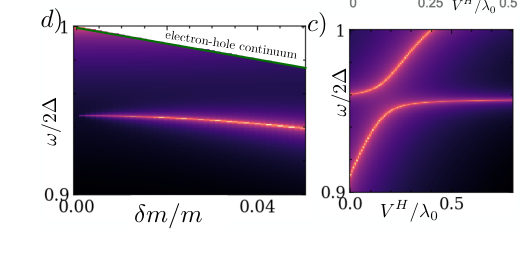
<figcaption class="paper-figure-caption"><b>Fig 2.</b> Figure 2. (a) Diagrammatic representation of vertex cor- rections in the charge sector. Empty circles correspond to the bare charge vertex ˆτ3 while filled circles denote ˆΓ3 ac- cording to Eq. (6). Solid arrows represent fully renormal- ized Green’s functions Eq. 3 while dashed lines represent in- teraction terms. (b) Charge response polarization function ImΠq=0(ω)/ν0 of the S-B junction as a function of the fre- quency ω/2∆, where ∆= ∆ind + δ and the Hartree charging energy V H for λ0ν0 = −0.3. Exciton resonance is visible as sharp resonance below the quasiparticle continuum 2∆. An- alytical estimation of exciton energy according to Eq. 9 is shown with the green dashed curve. (c)...</figcaption>
</figure>

**Summary.** This work proposes that Two-Level Systems (TLS) responsible for qubit decoherence can originate from collective electronic excitations called Bogolyubov excitons. These excitons form due to repulsive interactions between quasiparticles in superconductors, particularly near boundaries or interfaces. The key prediction is the observable signature of these excitons through avoided crossings when coupled to an external microwave resonator.

**Why it may be interesting.** The prediction of an intrinsic, defect-free source for TLS in superconductors provides a novel mechanism relevant to superconducting quantum circuits and open quantum systems research.

Detailed structure

**Main problem.** The microscopic origin of Two-Level Systems (TLS), which cause decoherence in superconducting qubits, is unresolved.

**Main result.** The authors propose that TLS can arise intrinsically from subgap bound states of Bogolyubov quasiparticles (Bogolyubov excitons) formed by repulsive electron interactions within superconductors.

**Method.** Theoretical analysis using Green's functions and solving the Bethe-Salpeter equation to determine collective excitation spectra, followed by modeling coupling to external resonators.

**Model / system.** The model considers a conventional superconductor interacting with an external metallic layer or boundary inhomogeneity. The physics is described via superconducting gap parameters ($\Delta$) and electron-electron interaction terms ($V_q$).

**Key observables.** Avoided crossings in the spectral function when coupling excitons to an external resonator, and subgap resonance poles ($\omega_{ex}$) below the quasiparticle continuum.

**Important parameters / regimes.** Interaction strength (repulsive vs. attractive), superconducting gap ($\Delta$), proximity coupling strength, and resonator frequency ($\omega_{res}$).

**Assumptions / limitations.** The analysis relies on mean-field approximations and linear response theory; it assumes that the exciton resonance can be tuned into the microwave window via boundary effects.

**Figures summary.** Figures illustrate the dependence of exciton energy on interaction strength, the density-density polarization function showing excitonic modes, and avoided crossings when coupling to a resonator mode.

**Paper structure.** The paper progresses from defining the problem (TLS in qubits) to proposing the physical mechanism (Bogolyubov excitons). It develops the theoretical framework using Green's functions and Bethe-Salpeter equations, analyzes different interaction regimes (attractive vs. repulsive), and finally demonstrates the observable signature via resonator coupling.

Abstract

Two-level systems (TLS) are a leading source of decoherence and dielectric loss in Josephson-junction qubits, yet their microscopic origin remains unresolved. We propose an intrinsic, purely electronic TLS candidate: subgap bound states of Bogolyubov quasiparticles. We show that, in a model of a conventional superconductor with electron-electron attraction in the $s$-wave channel and repulsion in higher-angular-momentum channels, the latter produce an effective attraction between Bogolyubov quasiparticles, forming bound states. These Bogolyubov excitons resemble Bardasis--Schrieffer excitons but are driven by repulsive interactions. Bulk Bogolyubov excitons are not easily detectable through single-particle tunneling or other conventional probes, but we show that surface excitons couple to an external electric field and behave as two-level systems. We examine an idealized model of a bulk superconductor proximity-coupled to a two-dimensional repulsive metal, which could represent an external metallic or semiconductor layer or an underscreened region of the superconductor. The two levels correspond to the absence and presence of a single exciton, which carries an electric dipole moment and exhibits an avoided crossing with a resonator, as observed for TLS. Because this mechanism requires no defects and cannot be eliminated by screening or annealing, it suggests that TLS-like excitations may be intrinsic to superconductors.

[↑ back to top](#top)

### [Influence of electronic correlations on disorder-induced loop currents in high-Tc superconductors](http://arxiv.org/abs/2607.08451v1)

**Authors:** Marius Paul, Götz Seibold  
**Type:** theory · **Category:** strongly correlated electrons · **PDF:** <https://arxiv.org/pdf/2607.08451v1>  
**Analysis basis:** full PDF text, analyzed in chunks
**Topic relevance:** `Keldysh / 2PI / non-Gaussian methods` **3/5** · `analog quantum simulation` **3/5** · `driven-dissipative phase transition` **2/5** · `methods for driven-dissipative` **2/5** · `Kondo & dissipative impurity` **1/5** · `correlated / nonlocal dissipation` **1/5** · `correlated cavity matter` **1/5** · `entanglement & information structure` **1/5** · `exotic spin models in light-matter` **1/5** · `non-equilibrium dynamics` **1/5** · `non-equilibrium universality` **1/5**

↔ Scroll figures horizontally

<figure class="paper-figure-card">
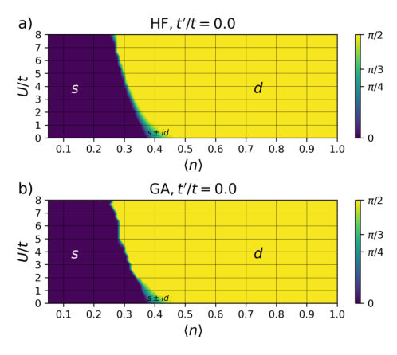
<figcaption class="paper-figure-caption"><b>Fig 1.</b> FIG. 1. HF (a) and GA (b) phase diagrams for the phase α = arctan(∆d/∆s) between s-wave (purple) and d-wave (yellow) states for next-nearest neighbor hopping t′/t = 0.0</figcaption>
</figure>
<figure class="paper-figure-card">
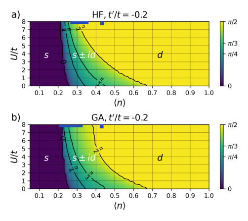
<figcaption class="paper-figure-caption"><b>Fig 2.</b> FIG. 2. HF (a) and GA (b) phase diagrams for the phase α = arctan(∆d/∆s) between s-wave (purple) and d-wave (yellow) states for next-nearest neighbor hopping t′/t = −0.2. In the multiple impurity case, cf. Sec. III C, an average doping ⟨n⟩= 0.44 (blue square) leads to a charge distribution on the impurity sites (V imp i /t = 2) which is indicated by the blue bar.</figcaption>
</figure>
<figure class="paper-figure-card">
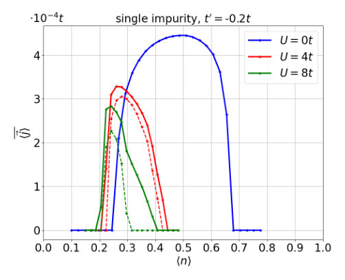
<figcaption class="paper-figure-caption"><b>Fig 3.</b> FIG. 4. Averaged current strengths for t′/t = −0.2 in pres- ence of one single impurity. Dashed lines are the HF-results, full lines are obtained from GA. Currents are obtained only in the s ± id-regions, which have been determined in the phase diagram figure 2. The gridsize here is 40x40 and Vimp/t = 2.</figcaption>
</figure>
<figure class="paper-figure-card">
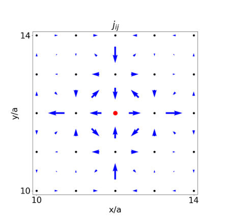
<figcaption class="paper-figure-caption"><b>Fig 4.</b> FIG. 3. GA current pattern in an area around a single impurity within a 25 × 25 lattice. Parameters: U/t = 6, t′/t = −0.2, ⟨n⟩= 0.35. Impurity strength Vimp/t = 2.</figcaption>
</figure>
<figure class="paper-figure-card">
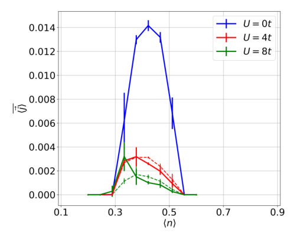
<figcaption class="paper-figure-caption"><b>Fig 5.</b> FIG. 5. Current strengths for t′/t = 0.0 in presence of multi- ple impurities. Dashed lines are the HF-results, full lines are obtained from GA.</figcaption>
</figure>

**Summary.** This theoretical work examines disorder-induced loop currents in high-Tc superconductors by incorporating strong electronic correlations using the Gutzwiller Approximation. The research compares these results against simpler Hartree-Fock treatments, finding that while correlations generally suppress currents, GA allows for stable superconducting states under stronger repulsive interactions than HF. This provides insights into local magnetism arising from impurities in cuprates.

**Why it may be interesting.** Although focused on cuprates, the use of advanced many-body approximations like GA to study correlated ground states under external perturbations (disorder) is relevant for understanding complex quantum phases in strongly interacting systems.

Detailed structure

**Main problem.** The study investigates how electronic correlations affect loop currents induced by disorder within high-Tc superconductors.

**Main result.** While general correlations suppress loop currents compared to Hartree-Fock, the Gutzwiller Approximation (GA) can sustain superconducting states up to higher on-site repulsion ($U$) than HF predicts.

**Method.** The authors use theoretical modeling involving the unrestricted Gutzwiller Approximation and solving the Bogoliubov-de Gennes equations iteratively.

**Model / system.** The system is based on an extended single-band Hubbard Hamiltonian applied to cuprate superconductors, incorporating local disorder and inter-site interactions.

**Key observables.** Induced loop currents ($\langle j_{ij} 
angle$), local magnetic moments, and the superconducting order parameter structure (characterized by $\alpha = \arctan(\Delta_d/\Delta_s)$).

**Important parameters / regimes.** Local repulsion ($U/t$), doping concentration ($\langle n 
angle$), and hopping ratios ($t'/t$).

**Assumptions / limitations.** The primary approximations used are the Unrestricted Gutzwiller Approximation (GA) and comparison against the Hartree-Fock (HF) decoupling.

**Figures summary.** Figures illustrate phase diagrams showing superconducting state stability ($\alpha$ vs $t'/t$) for both HF and GA, alongside visualizations of current patterns around impurities and average current strength dependence on doping.

**Paper structure.** The paper progresses by first establishing the theoretical framework (Hamiltonian, methods), then analyzing how correlations affect the superconducting phase diagram ($s+id$ stability), and finally quantifying the resulting disorder-induced loop currents in both single and multiple impurity scenarios.

Abstract

Time-reversal symmetry breaking in superconducting systems can manifest itself in the form of currents which are induced by inhomogeneities in the charge and order parameter distribution. With regard to cuprates such states have been theoretically studied in the overdoped region of the phase diagram where the inhomogeneities are related to out-of plane dopants. In this paper we will extend previous work by including local correlations within the unrestricted Gutzwiller approximation in order to study its impact on the induced loop currents. In addition, we investigate the effect of next-nearest neighbor hopping which extends the TRSB phase towards half-filling. We find that in general correlations lead to a suppression of loop currents, however, the Gutzwiller approach can sustain such states to larger values of the local on-site repulsion as compared to the Hartree-Fock approximation. Our investigations allow for an estimation of the local magnetic moment emerging from impurity-induced loop currents for cuprate superconductors.

[↑ back to top](#top)

### [Anomalous Reflection of Caustic Spin-Wave Beams in a Magnonic Waveguide](http://arxiv.org/abs/2607.08295v1)

**Authors:** Franz Vilsmeier, Christian Back  
**Type:** experiment · **Category:** other · **PDF:** <https://arxiv.org/pdf/2607.08295v1>  
**Analysis basis:** full PDF text, analyzed in chunks
**Topic relevance:** `exotic spin models in light-matter` **3/5** · `spintronics-quantum-optics interface` **3/5** · `analog quantum simulation` **1/5** · `driven-dissipative phase transition` **1/5** · `interference shaping light` **1/5** · `non-equilibrium dynamics` **1/5** · `non-equilibrium universality` **1/5**

↔ Scroll figures horizontally

<figure class="paper-figure-card">
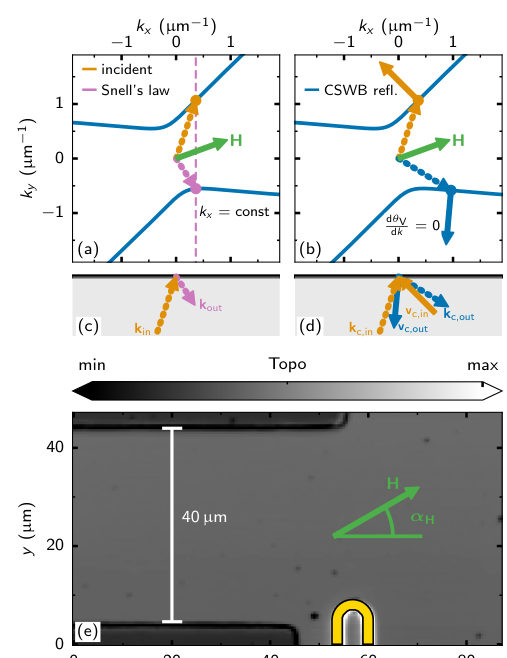
<figcaption class="paper-figure-caption"><b>Fig 1.</b> FIG. 1. (a,b) Iso-frequency curves computed at f = 1.44 GHz, µ0H = 5 mT, and αH = 20◦, contrasting the two reflection mechanisms for a waveguide edge along x. Dotted arrows denote wave vectors k, solid arrows group velocities vg, and filled circles mark the caustic points. (a) Snell’s law (mo- mentum conservation): the reflected wave vector conserves the tangential component (kx = const, dashed vertical line), linking the incident (orange) and Snell-reflected points on the iso-frequency curve. (b) Caustic reflection: the incident CSWB at the caustic point with ky &gt; 0 (orange) is reflected into the caustic point with ky &lt; 0 (blue, CSWB refl.), se- lected by the stationary-group-velocity...</figcaption>
</figure>
<figure class="paper-figure-card">
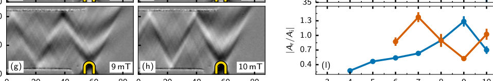
<figcaption class="paper-figure-caption"><b>Fig 2.</b> FIG. 2. TR-MOKE microscopy images recorded at f = 1.44 GHz and αH = 0◦for external magnetic fields µ0H = 3–10 mT (a)–(h). At 3 mT (a), no clear reflected beam is observed. At higher fields (b)–(h), successive reflections at the waveguide edges produce a characteristic zig-zag pattern; dashed contours in (f) indicate the fitted beam extents of the free beam Ifree, the incident waveguide beam Iwg, and reflected beams RI and RII. At high fields (g),(h), the steeper beam angle produces a denser multi-reflection pattern. All images share the same color scale. (i)–(k) Extracted beam parameters – propagation direction θV,e, carrier wavenumber ke, and wavefront angle φe – as a function of µ0H for...</figcaption>
</figure>
<figure class="paper-figure-card">
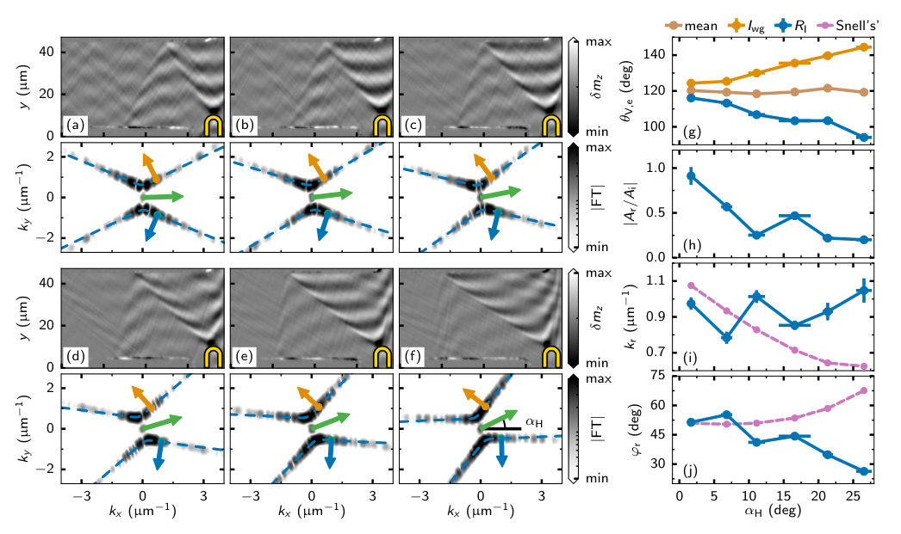
<figcaption class="paper-figure-caption"><b>Fig 3.</b> FIG. 3. TR-MOKE microscopy images and reciprocal-space spectra recorded at f = 1.44 GHz and µ0H = 5 mT for field angles αH ≈1.7◦, 6.8◦, 11.1◦, 16.6◦, 21.3◦, 26.5◦(a)–(f). Below each Kerr image, the corresponding Fourier transform (FT) panel shows the measured spin-wave spectrum (greyscale) together with the theoretical iso-frequency curve (dashed), the two caustic points (colored dots), their group velocity directions (arrows), and the external magnetic field direction. (g) Propagation directions θV,e of the incident beam Iwg and reflected beam RI as a function of αH, together with their average. The average remains approximately constant, consistent with the αH = 0◦caustic point...</figcaption>
</figure>

**Summary.** This work experimentally proves that spin-wave beams reflecting off a waveguide edge do not obey Snell's law. Instead, the reflection mechanism is dictated by transitions between caustic points on the material's anisotropic dispersion relation. This finding establishes a new physical law for magnonic beam steering and wave control.

**Why it may be interesting.** While focused on magnonics, the concept of anomalous wave reflection governed by geometric features (caustics) rather than simple conservation laws has parallels in advanced optics and wave physics relevant to open quantum systems modeling.

Detailed structure

**Main problem.** To demonstrate that caustic spin-wave beams reflect at an interface via a mechanism fundamentally different from conventional momentum conservation (Snell's law).

**Main result.** Reflection is governed by transitions between distinct caustic points on the anisotropic iso-frequency contour, leading to beam characteristics incompatible with Snell's law.

**Method.** Time-resolved Kerr microscopy (TR-MOKE) was used experimentally to image and measure reflected spin-wave beams while systematically varying an external magnetic field.

**Model / system.** The study uses a Yttrium Iron Garnet (YIG) film waveguide patterned on a GGG substrate, where spin waves propagate in an anisotropic medium.

**Key observables.** Reflected beam wave vector ($k_e$), wavefront orientation ($\phi_e$), and the comparison of these parameters against Snell's law predictions.

**Important parameters / regimes.** External magnetic field magnitude ($\mu_0H$) and angle ($\alpha_H$); the anisotropy of the material dispersion relation.

**Assumptions / limitations.** The reflection process is assumed to be dictated by the geometry of caustics rather than simple momentum conservation across the boundary.

**Figures summary.** Figures show TR-MOKE images of reflections at waveguide edges as a function of magnetic field strength and angle, comparing observed beam parameters against theoretical predictions based on both Snell's law and caustic transitions.

**Paper structure.** The paper establishes the problem by contrasting conventional wave reflection with spin waves. It then presents experimental measurements using TR-MOKE to observe reflections at waveguide edges under varying external magnetic fields, systematically demonstrating deviations from Snell's law in favor of a caustic transition mechanism.

Abstract

Reflection of waves at interfaces is conventionally governed by Snell's law, which follows from conservation of momentum parallel to the interface. Here we show experimentally that caustic spin-wave beams in anisotropic media obey a fundamentally different reflection mechanism. Applying time-resolved Kerr microscopy to a yttrium iron garnet waveguide, we observe that reflected beams are selected by transitions between caustic points on the anisotropic iso-frequency contour rather than by momentum conservation. As a consequence, the reflected carrier wave vector and wavefront orientation exhibit trends opposite to those predicted by Snell's law. By tuning the magnitude and orientation of an external magnetic field, we continuously control the resulting reflection process and beam routing. Our results establish caustic-point transitions as a distinct reflection law for anisotropic wave beams and provide a route towards reconfigurable magnonic beam steering.

[↑ back to top](#top)

### [Charge carrier flow through trimmed graphene nanoribbon junctions](http://arxiv.org/abs/2607.08471v1)

**Authors:** Julien Leuenberger, Kristiāns Čerņevičs, Oleg V. Yazyev  
**Type:** theory · **Category:** other · **PDF:** <https://arxiv.org/pdf/2607.08471v1>  
**Analysis basis:** full PDF text, analyzed in chunks
**Topic relevance:** `Keldysh / 2PI / non-Gaussian methods` **3/5** · `driven-dissipative phase transition` **2/5** · `non-equilibrium universality` **2/5** · `Kondo & dissipative impurity` **1/5** · `analog quantum simulation` **1/5** · `methods for driven-dissipative` **1/5** · `non-equilibrium dynamics` **1/5**

↔ Scroll figures horizontally

<figure class="paper-figure-card">
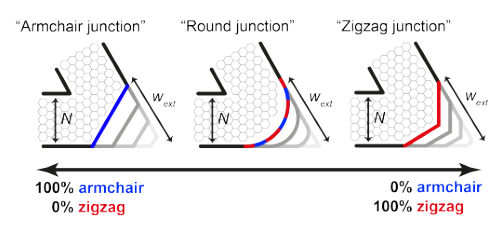
<figcaption class="paper-figure-caption"><b>Fig 1.</b> Figure 1. Schematic view of the different N-AGNR junctions. From left to right: an armchair junction, a round junction, and a zigzag junction. Newly defined edges are colored. Blue and red edges correspond to armchair and zigzag edges re- spectively. Leads’ edges are in black. The gray lines at the tip of the junctions represent the trimming process, quanti- fied by the cutoff parameter wext.</figcaption>
</figure>
<figure class="paper-figure-card">
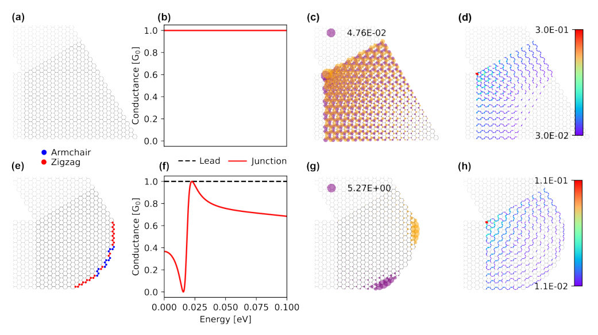
<figcaption class="paper-figure-caption"><b>Fig 2.</b> Figure 2. Physical and electric properties of two types of 32-AGNR junctions. (a) Edge structure of the so-called sharp junction. (b) Conductance of the sharp junction (red solid line) and of one of the leads (black dashed line). (c) Local density of states (LDOS) of the sharp junction at the Fermi level. Colors indicate the corresponding sublattice. (d) Probability current of the sharp junction at the Fermi level. For readability purposes, the lowest values are not displayed. (e) Edge structure of the so-called round junction, with a rounding of wext = 32. Colored atoms correspond to the newly defined segment. The blue and red coloring correspond respectively to armchair and zigzag edges,...</figcaption>
</figure>
<figure class="paper-figure-card">
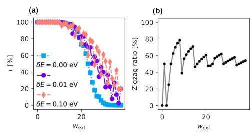
<figcaption class="paper-figure-caption"><b>Fig 3.</b> Figure 3. (a) Preserved conductance as a function of the cutoff parameter wext of 80-AGNR junctions, for energy windows of δE = 0.00 eV (blue squares), δE = 0.01 eV (purple dots) and δE = 0.10 eV (red diamonds). (b) The ratio of armchair edges. Lines are for readability.</figcaption>
</figure>
<figure class="paper-figure-card">
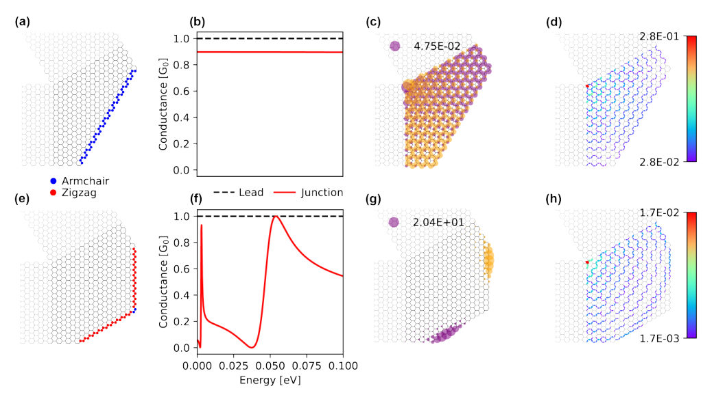
<figcaption class="paper-figure-caption"><b>Fig 4.</b> Figure 4. Physical and electric properties of 32-AGNR junctions with wext = 12. (a) Edge structure of the armchair junction. The blue dots represent local armchairs while the red ones represent local zigzags. (b) Edge structure of the armchair junction. The dots correspond to the different types of edges. (c) Local density of states (LDOS) of the armchair junction at the Fermi level. Colors indicate the corresponding sublattice (d) Probability current of the armchair junction at the Fermi level. For readability purposes, the lowest values are not displayed. (e)–(h) correspond to the same data but for the corresponding zigzag junction.</figcaption>
</figure>
<figure class="paper-figure-card">
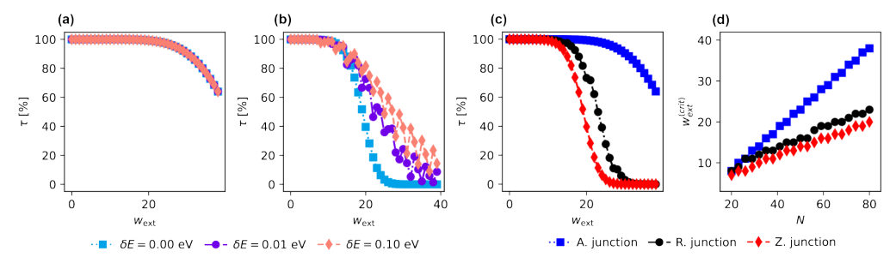
<figcaption class="paper-figure-caption"><b>Fig 5.</b> Figure 5. Preserved conductance as a function of the cutoff parameter wext for energy windows of δE = 0.00 eV (blue squares), δE = 0.01 eV (purple dots) and δE = 0.10 eV (red diamonds), for 80-AGNR (a) armchair junctions, and (b) zigzag junctions. (c) Comparison of the preserved conductance at δE = 0 of armchair junctions (blue squares), round junctions (black circles), and zigzag junctions (red diamonds). (d) Largest cutoff parameter w (crit) ext leading to a preserved conductance of τ = 90% for armchair junction (blue squares), round junctions (black circles), and zigzag junctions (red diamonds).</figcaption>
</figure>

**Summary.** This work addresses the challenge of connecting Graphene Nanoribbons at angles by trimming their edges. Using tight-binding calculations, the authors show that conductance depends critically on the ratio of armchair to zigzag edge segments. They propose and validate a geometric mean model to predict junction conductance based on these edge ratios.

**Why it may be interesting.** While focused on solid-state electronics, the use of advanced quantum transport formalism (Green's functions) and developing analytical models (Ansatz) for complex boundary conditions is relevant to open quantum systems theory.

Detailed structure

**Main problem.** The primary goal is designing optimal-sized junctions for Graphene Nanoribbons (GNRs) to allow angled connections while preserving favorable electronic transport properties.

**Main result.** Conductance in trimmed junctions is primarily dictated by the ratio of armchair to zigzag edges, and a geometric mean Ansatz provides a predictive model relating this conductance to pure junction types.

**Method.** The study employs quantum transport calculations using Green's function formalism within a tight-binding (TB) framework to determine electronic conductance.

**Model / system.** The system is Graphene Nanoribbons (GNRs), modeled via a 1NN hopping tight-binding Hamiltonian. The focus is on junctions formed by trimming the edges, which introduces varying ratios of armchair and zigzag edge segments.

**Key observables.** Conductance ($G$), Local Density of States (LDOS), probability density current, and the preserved conductance descriptor ($	au$).

**Important parameters / regimes.** The degree of trimming is controlled by a cutoff parameter ($	ext{w}_{	ext{ext}}$); transport is analyzed near the Fermi level ($E=0$).

**Assumptions / limitations.** The core predictive tool relies on an Ansatz using the geometric mean of conductances derived from pure armchair and zigzag junctions, which simplifies complex junction behavior.

**Figures summary.** Figures compare sharp vs. round junction properties (edge structure, conductance) for AGNRs; one figure shows preserved conductance vs. $	ext{w}_{	ext{ext}}$ for different edge types; another compares predicted vs. measured conductances using the geometric mean Ansatz.

**Paper structure.** The paper establishes the need for efficient GNR junctions, details the quantum transport methodology (Green's functions/TB), analyzes how trimming affects conductance based on edge ratios, and finally proposes and validates a predictive geometric mean model linking junction conductance to its pure components.

Abstract

As Moore's law approaches its fundamental limits, the development of nanoelectronic devices using low-dimension materials has become a promising avenue for further miniaturization and performance improvements. Among the various novel materials, graphene nanoribbons (GNRs) have emerged as particularly attractive candidates due to their unique electronic properties, opening up a whole new nanoelectronics paradigm consisting of circuits made entirely of graphene. However, due to the technical constraints that naturally arise when working on a two-dimensional plane, the design of efficient nanoelectronic components with a minimal spatial footprint remains a significant challenge. In particular, connecting various components can be a real architectural challenge, comparable to that of the first printed circuit boards. This paper investigates strategies for designing optimal-sized nanoribbon junctions which allow connecting GNRs at an angle, by trimming the junction edge while maintaining favorable electronic properties. Specifically, we show that the probability density current at the tip of junctions is negligible, implying that a selection of atoms can safely be removed without significantly altering the conductance. More generally, we demonstrate that larger trimmings have impacts on the conductance channels, resulting in a conductance that is mainly dictated by the ratio of armchair and zigzag edges. Finally, we propose a simple model relating this ratio to the conductance.

[↑ back to top](#top)

### [Curvature-Controlled Topological Magnon Phases in a Folded Kagome Lattice](http://arxiv.org/abs/2607.08580v1)

**Authors:** Seif Alwan, Jonas Fransson  
**Type:** theory · **Category:** other · **PDF:** <https://arxiv.org/pdf/2607.08580v1>  
**Analysis basis:** full PDF text, analyzed in chunks
**Topic relevance:** `analog quantum simulation` **3/5** · `exotic spin models in light-matter` **3/5** · `spintronics-quantum-optics interface` **3/5** · `non-equilibrium dynamics` **1/5**

↔ Scroll figures horizontally

<figure class="paper-figure-card">
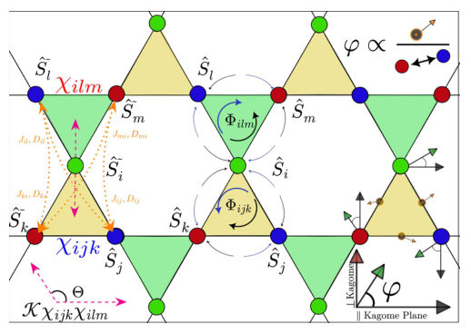
<figcaption class="paper-figure-caption"><b>Fig 1.</b> Figure 1: Schematic of the extended spin model on a Kagome lattice. The lattice consists of three sublattices represented by green, red and blue sites hosting ˆS i, ˆS j, ˆS k, ˆS land ˆS m. Nearest-neighbor bonds (dashed orange arrows) are described by both symmetric Heisenberg exchange Ji j and antisymmetric Dzyaloshinskii-Moriya (DM) interactions Di j. The model incorporates scalar spin chirality terms ˆχi jk and ˆχilm defined on adjacent upward (yellow) and downward (green) triangular plaquettes, respectively. The coupling between these chiral sectors is represented by K ˆχi jk ˆχilm (dashed pink line) with the relative canting (or twist) angle ϕ. The in-plane vector chiralities are...</figcaption>
</figure>
<figure class="paper-figure-card">
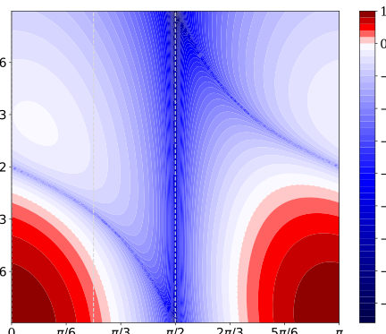
<figcaption class="paper-figure-caption"><b>Fig 2.</b> Figure 4: Logarithm of the ratio |F(Θ, ϕ)|/|D jm(Θ)|, illustrating where the chirality-driven hopping dominates over the DM interaction on the j−m cross bond. The colour scale is log10 of the ratio. Red (positive log10) marks regions of chiral dominance (|F| &gt; |D jm|), blue (negative log10) regions of DM dominance. The white contour indicates the equality line |F| = |D jm|. The folding angle Θ and canting angle ϕ are given in degrees.</figcaption>
</figure>
<figure class="paper-figure-card">
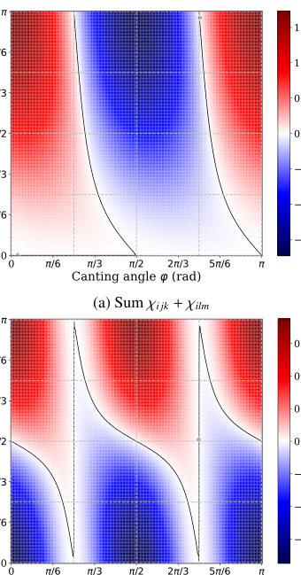
<figcaption class="paper-figure-caption"><b>Fig 3.</b> Figure 3: (a) Sum and (b) product of the scalar chiralities of two adjacent triangular plaquettes as functions of the folding angle Θ and canting angle ϕ. Zero contours (solid black lines) trace the analytic loci ϕ = π/4 (where χi jk = 0) and tan Θ = 2 √</figcaption>
</figure>
<figure class="paper-figure-card">
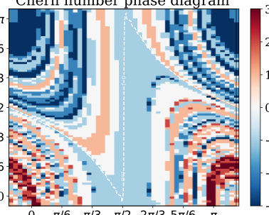
<figcaption class="paper-figure-caption"><b>Fig 4.</b> Figure 5: Chern number phase diagram of the lowest magnon band in the (Θ, ϕ) plane. The colour map indicates the integer Chern number C. White dashed lines: zeros of the geometric factor F(Θ, ϕ) (Eq. (17)), where the chirality-mediated hopping vanishes. Yellow contours: half-integer Chern values (0.5, 1.5, ...) marking the actual topological boundaries. The diagram reveals large regions with C = +1 (red) and C = −1 (blue), separated by narrow gapless lines. The zeros of F closely follow the boundaries, confirming that the sign of the interference determines the topology. The yellow contours deviate slightly due to the DM contribution, which can maintain a gap even when F = 0.</figcaption>
</figure>
<figure class="paper-figure-card">
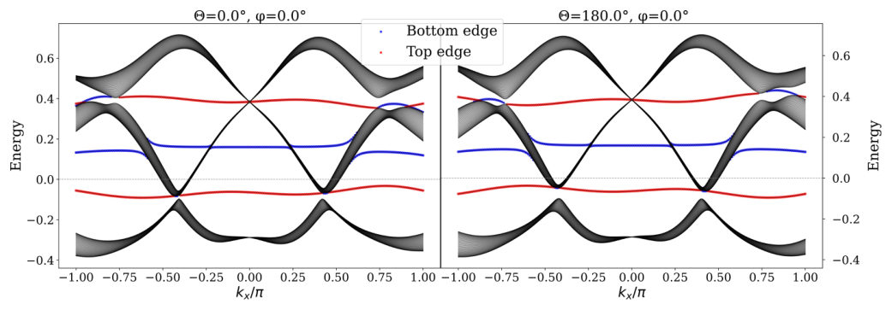
<figcaption class="paper-figure-caption"><b>Fig 5.</b> Figure 6: Magnon ribbon spectra for the lowest band in two extremal geometries. (left panel) Flat bow-tie (Θ = 0, ϕ = 0) with F = +1, corresponding to Chern number C = +1. The top edge moves rightward (positive slope), the bottom edge leftward (negative slope). (right panel) Fully folded bow-tie (Θ = π, ϕ = 0) with F = −1, corresponding to C = −1. The edge-state directions are reversed. In both panels, the ribbon is infinite along x with a finite width of 40 unit cells in y. Faint grey lines: bulk bands. Coloured points: edge states (blue = bottom edge, red = top edge), with point size proportional to p</figcaption>
</figure>

**Summary.** The paper demonstrates that geometric curvature within a folded Kagome lattice can act as a powerful, tunable control knob for generating topological magnon phases. By analyzing the chiral hopping mediated by higher-order couplings, the authors show this structural effect can dominate over conventional interactions like the DM term, leading to robust, chirality-dependent edge states analogous to CISS effects.

**Why it may be interesting.** This work connects structural geometry directly to fundamental quantum transport properties (topology) in magnetic materials, offering a pathway for engineering exotic states without relying solely on intrinsic material symmetries or strong spin-orbit coupling.

Detailed structure

**Main problem.** The study aims to establish geometric curvature as a tunable control parameter for realizing topological magnon phases, particularly in magnetic systems where conventional symmetry-enforced interactions like the DM term are weak or forbidden.

**Main result.** Curvature, encoded by the folding and canting angles of the lattice structure, can generate a dominant chiral hopping amplitude that dictates the system's topology (Chern number), mimicking chirality-induced spin selectivity observed in molecular systems.

**Method.** The authors derive the single-magnon Hamiltonian using linear spin-wave theory applied to an extended spin model on a Kagome lattice. They analyze the resulting magnon hopping terms derived from higher-order 'bow-tie' chiral couplings.

**Model / system.** The system is a 2D ferromagnet modeled on a folded Kagome lattice, described by a Hamiltonian including Heisenberg, DM, and a novel bow-tie coupling term. The key physics arises from the geometric dependence of this chirality-mediated hopping amplitude.

**Key observables.** Chern number ($C=\pm 1$), chiral-mediated magnon hopping amplitude ($F$), edge state spectra (ribbon spectra), and the ratio $|F|/|D_{jm}|$.

**Important parameters / regimes.** Folding angle ($\Theta$) and spin canting angle ($\phi$); these act as continuous tuning knobs for the topological phase.

**Assumptions / limitations.** The analysis relies on linear spin-wave theory (LSW) applied around a non-collinear classical ground state, and assumes specific geometric folding conditions to derive the coupling factor $F(\Theta, \phi)$.

**Figures summary.** Figures illustrate the lattice structure, the dependence of the chiral hopping factor $F$ on $\Theta$ and $\phi$, and phase diagrams showing regions where curvature-driven topology ($C=\pm 1$) dominates over DM-driven regimes.

**Paper structure.** The paper systematically derives the magnon Hamiltonian from an extended spin model, determines how geometric parameters ($\Theta, \phi$) enter as effective couplings ($F$), analyzes the resulting topological invariants (Chern number), and confirms the bulk-boundary correspondence via edge state spectra.

Abstract

We show that geometric curvature, encoded in the folding angle between two corner-sharing triangles on a kagome lattice, provides a continuous tuning knob for topological magnon phase. Starting from an extended spin Hamiltonian with exchange, Dzyaloshinskii-Moriya (DM) interaction, and a higher-order bow-tie coupling of scalar chiralities, we derive the chirality-mediated hopping amplitude, which depends on the folding and spin canting of the bow-tie triangles. At small folding and canting angles, the bow-tie coupling surpasses DM, establishing a curvature-dominated regime. These results establish curvature as an intrinsic geometric control parameter for topological magnonics and reveal a direct analogy with chirality-induced spin selectivity in molecular systems, pointing to a unified mechanism for chirality driven transport across scales. The mechanism is particularly relevant for chiral crystals where the DM interaction is weak or forbidden by symmetry, as in systems with a six-fold screw axis.

[↑ back to top](#top)

### [Phase-dependent kink collisions and dual critical-velocity branches in the complex sine-Gordon model](http://arxiv.org/abs/2607.08752v1)

**Authors:** Mohammad Mohammadi, Farnaz Eizadbaksh, Vahideh Bagheri  
**Type:** theory · **Category:** other · **PDF:** <https://arxiv.org/pdf/2607.08752v1>  
**Analysis basis:** full PDF text, analyzed in chunks
**Topic relevance:** `non-equilibrium dynamics` **3/5** · `driven-dissipative phase transition` **2/5** · `non-equilibrium universality` **2/5** · `Frenkel-Kontorova` **1/5** · `Keldysh / 2PI / non-Gaussian methods` **1/5** · `methods for driven-dissipative` **1/5**

↔ Scroll figures horizontally

<figure class="paper-figure-card">
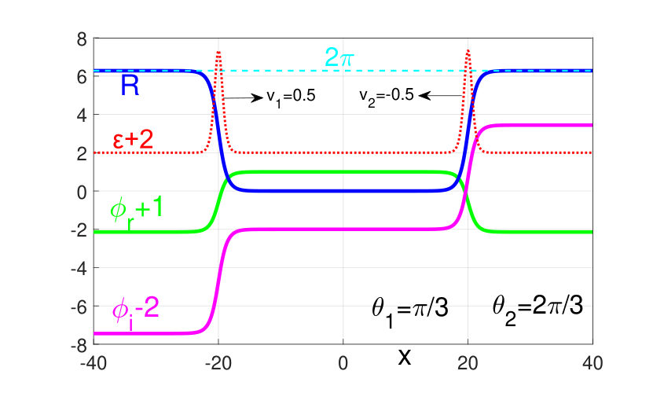
<figcaption class="paper-figure-caption"><b>Fig 1.</b> Figure 1: The real and imaginary components, energy density, and modulus of a pair of complex kinks, plotted using Eq. (25) with parameters v1 = −v2 = 0.5, b = −a = 20, θ1 = π/3, and θ2 = 2π/3. For clarity, each curve has been vertically offset by an arbitrary constant to prevent overlap.</figcaption>
</figure>
<figure class="paper-figure-card">
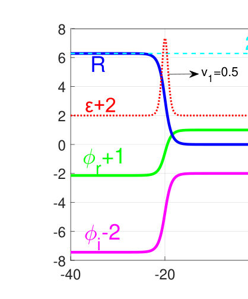
<figcaption class="paper-figure-caption"><b>Fig 2.</b> Fig. 1).</figcaption>
</figure>
<figure class="paper-figure-card">
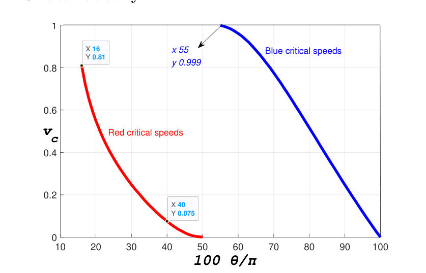
<figcaption class="paper-figure-caption"><b>Fig 3.</b> Figure 2: Critical speed vc versus phase θ. Numerical data were obtained for two distinct intervals: 0.16π &lt; θ &lt; 0.5π and 0.55π &lt; θ &lt; π.</figcaption>
</figure>
<figure class="paper-figure-card">
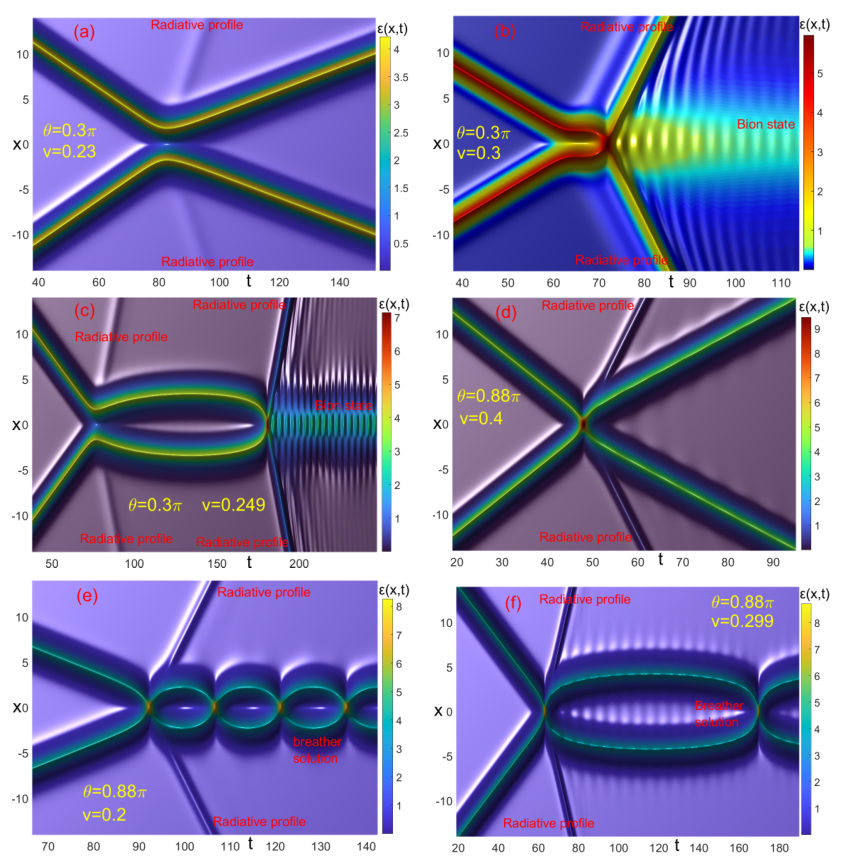
<figcaption class="paper-figure-caption"><b>Fig 4.</b> Figure 3: Energy density profiles in six collision scenarios, grouped by phase. Each phase includes collisions at velocities below, above, and near the corresponding critical velocity.</figcaption>
</figure>
<figure class="paper-figure-card">
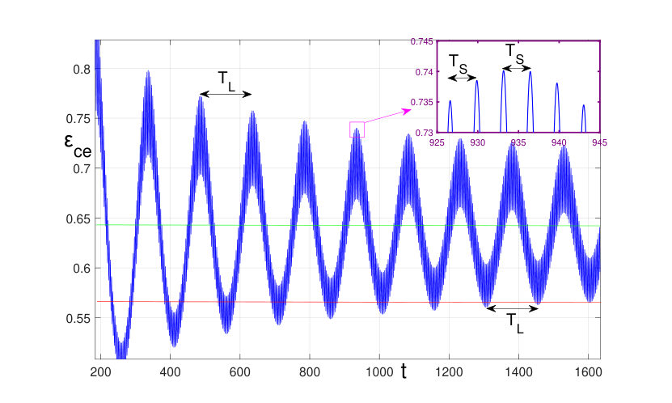
<figcaption class="paper-figure-caption"><b>Fig 5.</b> Figure 4: Central energy density εce of a bion formed by the collision of two complex kinks with parameters θ = 0.2π and v = 0.6. Two oscillation modes with distinct periods, short and long, are identified.</figcaption>
</figure>

**Summary.** This work numerically analyzes kink collisions in the Complex Sine-Gordon model, showing that the system's dynamics are highly sensitive to the relative phase between colliding kinks. Unlike simpler models, the CSG exhibits a dual critical velocity structure where increasing initial speed can lead either to capture or scattering depending on the phase. This highlights the crucial role of internal symmetries in determining soliton interaction outcomes.

**Why it may be interesting.** The concept of an 'effective internal degree of freedom' (the phase) controlling macroscopic dynamics like soliton collision outcomes is relevant to understanding complex order parameters in condensed matter systems or quantum field theories with internal symmetries.

Detailed structure

**Main problem.** The study investigates complex kink-kink collisions within the Complex Sine-Gordon (CSG) model to determine how the final state depends on both initial relative velocity and phase.

**Main result.** The CSG system exhibits rich dynamics, including scattering, capture, and bion formation, characterized by two distinct phase-dependent branches of critical velocity that contrast sharply with real sine-Gordon models.

**Method.** Numerical simulations are employed to model the time evolution of the complex scalar field during collisions, analyzing energy density components and radiative emission.

**Model / system.** The system is governed by the Complex Sine-Gordon (CSG) model, which generalizes the real SG theory using a complex scalar field $\phi$. This introduces an internal phase degree of freedom ($	heta$) that dictates collision outcomes.

**Key observables.** Collision outcomes (scattering vs. capture), energy carried by radiative profiles, and extreme values of energy density components ($k_{max}, u_{max}, R_{max}$) at the collision center.

**Important parameters / regimes.** Initial relative phase ($\Delta	heta$) and initial velocity ($v$), which define two distinct critical velocity branches (red/blue).

**Assumptions / limitations.** The use of linear superposition as an approximation for initial kink conditions, and numerical limitations restricting measurements to certain time scales.

**Figures summary.** Figures illustrate the dependence of collision outcomes on phase and velocity, showing regimes of capture versus scattering, and visualizing energy density profiles and radiative emission over time.

**Paper structure.** The paper progresses by establishing the CSG model's complexity due to its internal phase, detailing numerical methods for simulating collisions, presenting diagnostics like radiation energy ratios, and finally mapping out the dual critical velocity structure based on initial conditions.

Abstract

The complex sine-Gordon (CSG) model contains an internal phase degree of freedom that strongly modifies the dynamics of its solitary-wave solutions. We present a numerical study of complex kink--kink collisions and determine how the final state depends jointly on the initial velocity and relative phase. In contrast with the elastic collisions of the real sine-Gordon model, the CSG system exhibits scattering, capture, long-lived bion formation, breather-like states, and emission of radiative profiles. The simulations reveal two distinct phase-dependent branches of critical velocity. In one branch, increasing the initial velocity promotes capture, whereas in the other it restores scattering. This dual structure highlights the rich velocity--phase dependence of the collision dynamics. We also compute the energy carried by radiative profiles and examine extreme values of the energy density, kinetic and gradient contributions, and field modulus at the collision center. These quantities show sharp transitions at critical points and provide sensitive diagnostics of phase-controlled dynamics. These results suggest that the relative phase behaves as an effective internal degree of freedom that plays an important role in the collision dynamics of complex solitons.

[↑ back to top](#top)

### [Valley Hall viscosity in the integer quantum Hall phases of (2+1)D Dirac materials](http://arxiv.org/abs/2607.08648v1)

**Authors:** M. Selch  
**Type:** theory · **Category:** other · **PDF:** <https://arxiv.org/pdf/2607.08648v1>  
**Analysis basis:** full PDF text, analyzed in chunks
**Topic relevance:** `Keldysh / 2PI / non-Gaussian methods` **3/5** · `non-equilibrium dynamics` **2/5** · `analog quantum simulation` **1/5** · `correlated / nonlocal dissipation` **1/5** · `driven-dissipative phase transition` **1/5** · `methods for driven-dissipative` **1/5** · `non-equilibrium universality` **1/5**

↔ Scroll figures horizontally

<figure class="paper-figure-card">
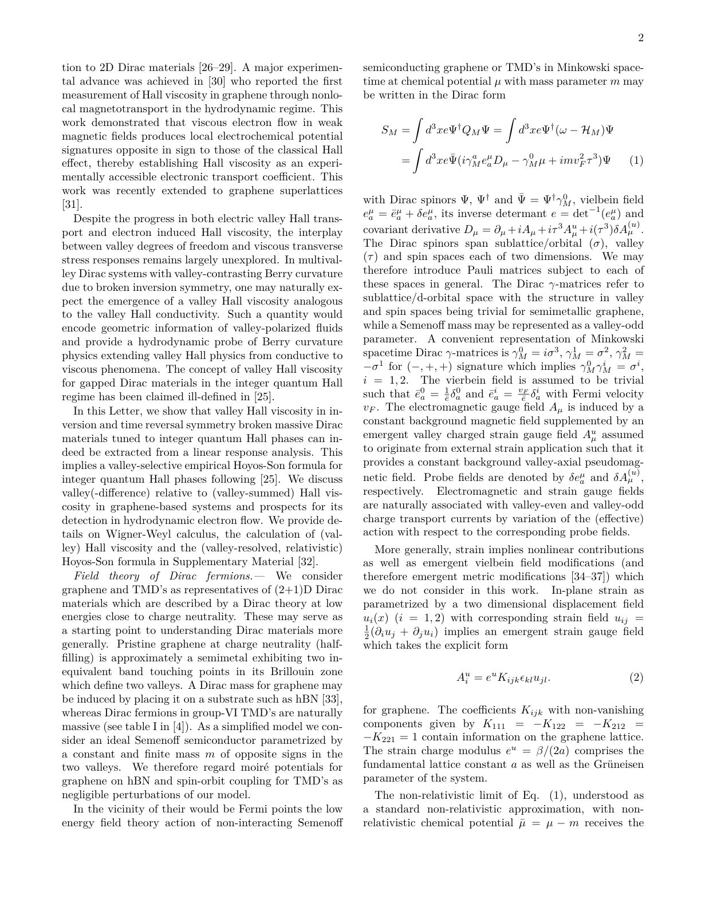
<figcaption class="paper-figure-caption"><b>Fig 1.</b> Low-resolution page preview, page 2</figcaption>
</figure>
<figure class="paper-figure-card">
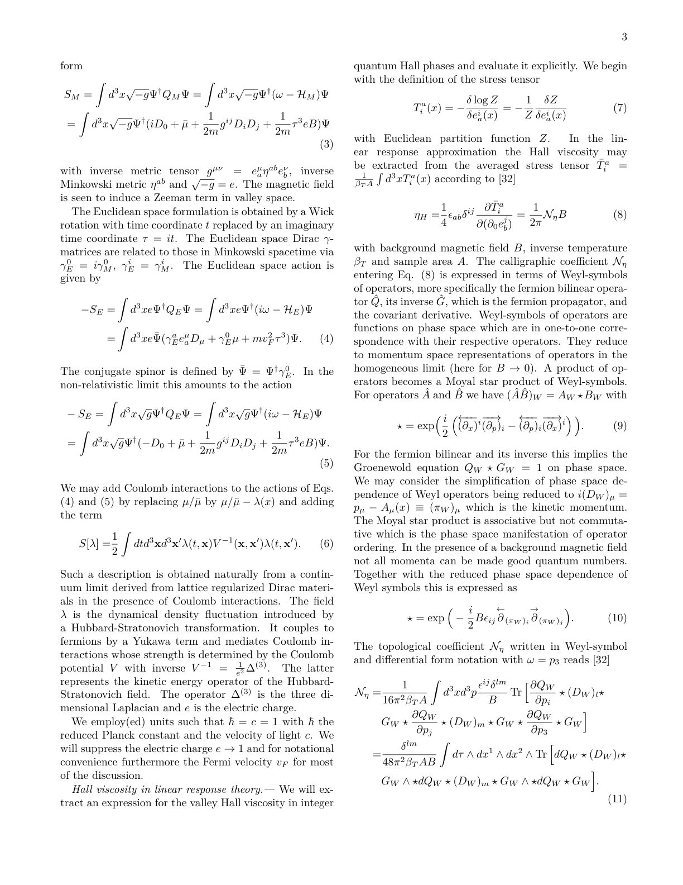
<figcaption class="paper-figure-caption"><b>Fig 2.</b> Low-resolution page preview, page 3</figcaption>
</figure>
<figure class="paper-figure-card">
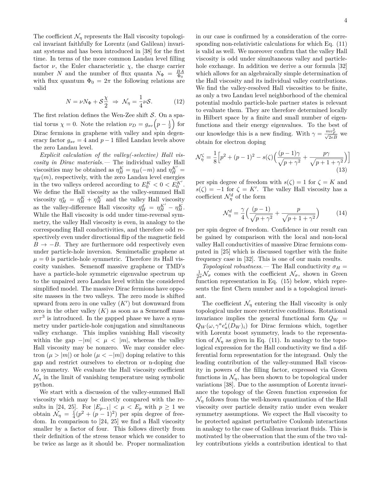
<figcaption class="paper-figure-caption"><b>Fig 3.</b> Low-resolution page preview, page 4</figcaption>
</figure>
<figure class="paper-figure-card">
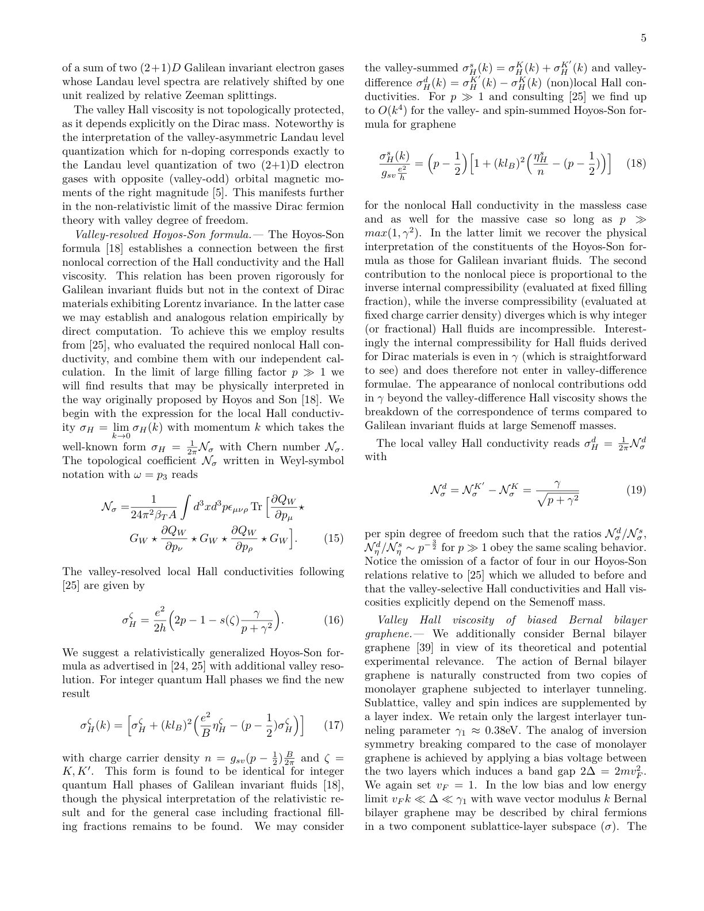
<figcaption class="paper-figure-caption"><b>Fig 4.</b> Low-resolution page preview, page 5</figcaption>
</figure>
<figure class="paper-figure-card">
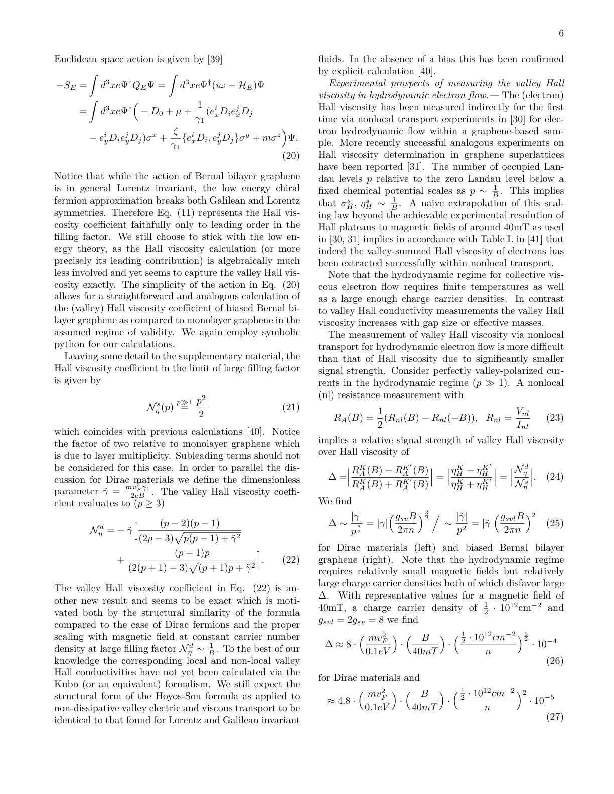
<figcaption class="paper-figure-caption"><b>Fig 5.</b> Low-resolution page preview, page 6</figcaption>
</figure>

**Summary.** This theoretical paper calculates the valley-resolved Hall viscosity in quantum Hall phases of 2D Dirac materials. It refines previous calculations by regularizing divergences and extends the Hoyos-Son relation to individual valleys. The work provides crucial insights into how viscous transport coefficients can be related to topological invariants in these advanced electronic systems.

**Why it may be interesting.** While focused on condensed matter transport, the rigorous derivation of topological relations like the generalized Hoyos-Son formula connects macroscopic response coefficients (viscosity, conductivity) via fundamental symmetries, which has parallels in effective field theories used in AMO physics.

Detailed structure

**Main problem.** The primary goal is calculating the valley-resolved Hall viscosity ($\eta_{xy}^v$) for integer quantum Hall phases in (2+1)D Dirac materials.

**Main result.** The authors show that previous divergences in single-valley viscous contributions are regularized to finite values, and they extend the Hoyos-Son formula structure to individual valleys.

**Method.** Calculations utilize an equivalent Green function formulation within Wigner-Weyl calculus and linear response theory applied to stress tensors.

**Model / system.** The study focuses on (2+1)D Dirac materials, including graphene and TMDs, operating in the integer quantum Hall regime. Specific models include biased Bernal bilayer graphene for detailed analysis.

**Key observables.** Valley-resolved Hall viscosity ($\eta_{xy}^v$), local/nonlocal Hall conductivity ($\sigma_H(k)$), and the valley-$	ext{difference}$ Hall viscosity coefficient ($\eta_d$).

**Important parameters / regimes.** Filling factor ($p$), magnetic field ($B$), interlayer tunneling parameter ($\gamma_1$), and chemical potential ($\mu$).

**Assumptions / limitations.** The analysis often relies on extending formulas derived for Lorentz-invariant systems, even when the specific low-energy model (like bilayer graphene) breaks these symmetries.

**Figures summary.** Not specified by notes; the structure suggests derivations of explicit formulas for $\eta_s(p)$ and $\eta_d$ based on filling factor $p$.

**Paper structure.** The paper builds from general formalism (Wigner-Weyl calculus, Hoyos-Son extension) to specific calculations for valley-summed and valley-difference viscosities in various Dirac systems.

Abstract

We calculate the valley-resolved Hall viscosity for Lorentz-invariant integer quantum Hall phases in Semenoff-semiconducting graphene-like systems at zero temperature. The Kubo formalism based discussion reported in Phys. Rev. B 100, 115421 (2019) revealed the divergence of single valley viscous Hall contributions for this case with only a valley-summed Hall viscosity being finite and therefore well-defined. Our approach to the Hall viscosity calculation is based on an equivalent Green function formulation within Wigner-Weyl calculus. We find that the previously identified divergence seems to be regularized to a finite value in a proper representation of the valley-resolved Hall viscosity in terms of energy eigenfunctions and eigenvalues. Together with the local Hall conductivity and its first nonlocal correction, reported as well in Phys. Rev. B 100, 115421 (2019), we extend the empirical relativistic Hoyos-Son formula to individual valleys. Both the original Hoyos-Son formula for Galilean invariant fluids and its relativistic extension to Dirac materials are found to be structurally identical for integer quantum Hall phases and expressible in terms of local electric and viscous Hall responses. In addition we evaluate the valley(-difference) Hall viscosity for biased Bernal bilayer graphene in the chiral fermion low energy approximation. Prospects of measuring valley Hall viscosity in nonlocal transport for mono- and bilayer graphene- and group-VI TMD-based devices are discussed.

[↑ back to top](#top)

### [Observation of giant nonvolatile magneto-thermal switching in superconductor-ferromagnet hybrids](http://arxiv.org/abs/2607.08005v1)

**Authors:** Yui Sakamoto, Fuyuki Ando, Keigo Ito, Hossein Sepehri-Amin, Takamasa Hirai, Yuto Watanabe, Poonam Rani, Yoshikazu Mizuguchi, Ken-ichi Uchida  
**Type:** experiment · **Category:** other · **PDF:** <https://arxiv.org/pdf/2607.08005v1>  
**Analysis basis:** full PDF text, analyzed in chunks
**Topic relevance:** `spintronics-quantum-optics interface` **3/5** · `driven-dissipative phase transition` **1/5** · `exotic spin models in light-matter` **1/5**

↔ Scroll figures horizontally

<figure class="paper-figure-card">
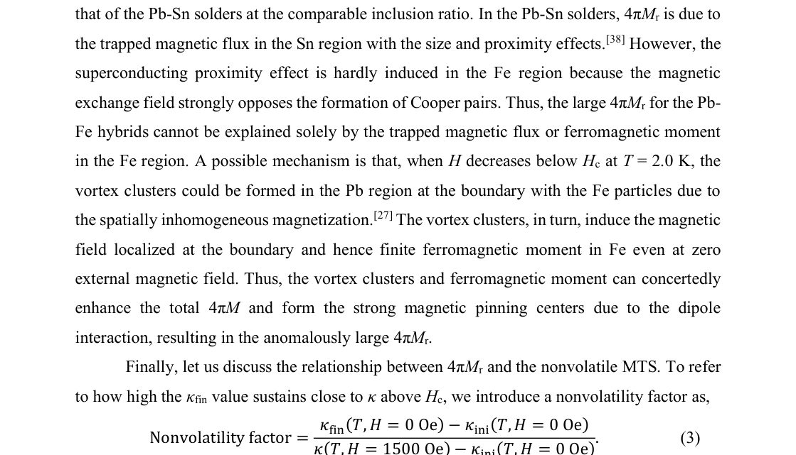
<figcaption class="paper-figure-caption"><b>Fig 1.</b> Figure 6d plots the nonvolatility factor as a function of 4πMr for the Pb-Fe hybrids and Pb-Sn</figcaption>
</figure>
<figure class="paper-figure-card">
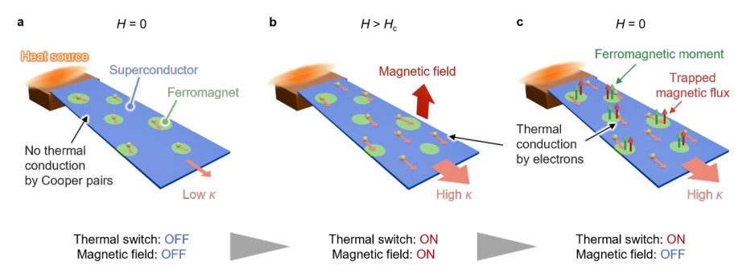
<figcaption class="paper-figure-caption"><b>Fig 2.</b> Figure 1. Schematic of nonvolatile magneto-thermal switching (MTS) in a superconductor-</figcaption>
</figure>
<figure class="paper-figure-card">
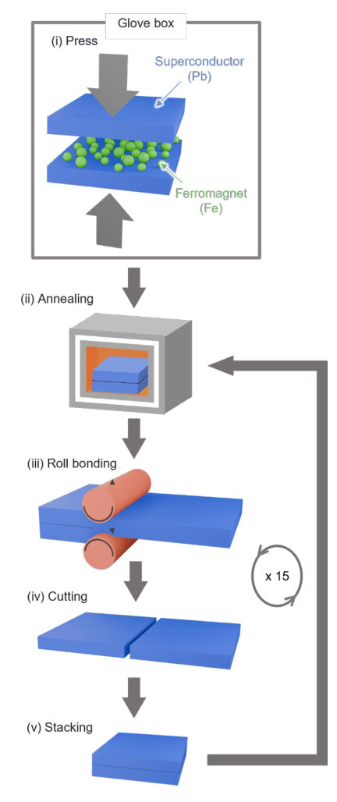
<figcaption class="paper-figure-caption"><b>Fig 3.</b> Figure 2. Schematic of an accumulative roll bonding method to create the Pb-Fe hybrids. (i)</figcaption>
</figure>
<figure class="paper-figure-card">
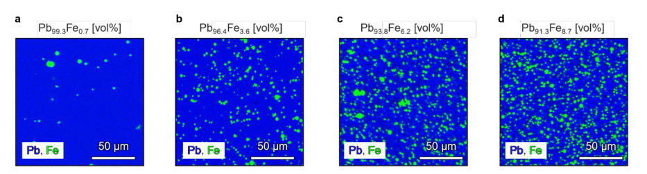
<figcaption class="paper-figure-caption"><b>Fig 4.</b> Figure 3. Elemental maps of Pb and Fe in the Pb-Fe hybrids with the Fe ratio of a) 0.7, b) 3.6,</figcaption>
</figure>
<figure class="paper-figure-card">
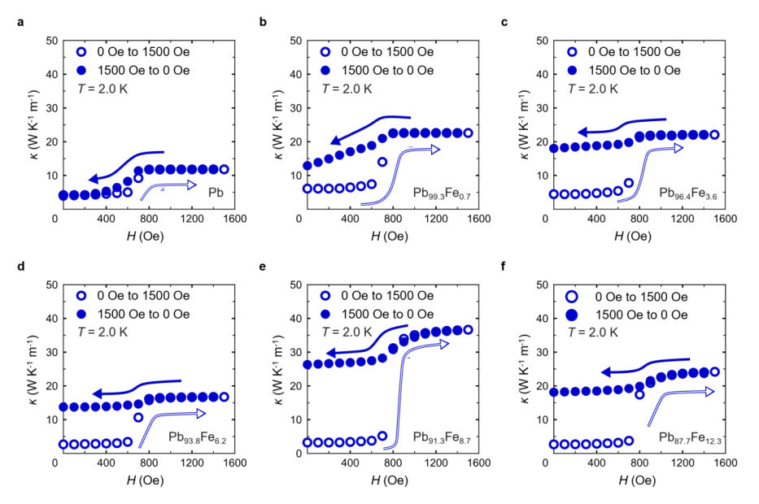
<figcaption class="paper-figure-caption"><b>Fig 5.</b> Figure 4. The H dependence of κ at the temperature T = 2.0 K both for increasing and</figcaption>
</figure>

**Summary.** This work reports on achieving a record-high giant nonvolatile magneto-thermal switching ratio using Pb-Fe superconductor-ferromagnet hybrids. The enhancement is attributed to the ferromagnetic inclusions creating strong magnetic pinning centers that break superconductivity at zero field. This demonstrates a highly promising strategy for next-generation, energy-efficient thermal management materials.

**Why it may be interesting.** The strong coupling between magnetism (ferromagnetism) and superconductivity in the presence of thermal transport mechanisms provides a platform for studying coupled order parameters, relevant to non-equilibrium quantum phenomena.

Detailed structure

**Main problem.** To develop an energy-efficient thermal control component by achieving a giant nonvolatile magneto-thermal switching ratio (MTSR).

**Main result.** The authors achieved a record-high nonvolatile MTSR of 719% in ferromagnetic Fe-superconducting Pb hybrids, significantly surpassing previous records.

**Method.** Thermal conductivity ($\kappa$) was measured as a function of external magnetic field ($H$) before and after cycling the field to quantify the nonvolatility. Sample preparation involved accumulative roll bonding (ARB).

**Model / system.** The study investigates superconductor-ferromagnet hybrids, specifically Pb-Fe systems, where the ferromagnetic moment of Fe interacts with the superconducting state of Pb.

**Key observables.** Thermal conductivity ($\kappa$), Nonvolatile MTSR, Remanent Magnetization ($4\pi M_r$).

**Important parameters / regimes.** Fe inclusion ratio (varied), Temperature (2.0 K), Magnetic Field ($H$).

**Assumptions / limitations.** The nonvolatility is attributed to the ferromagnetic moment of Fe breaking superconductivity at zero field, leading to trapped magnetic flux effects.

**Figures summary.** Figures illustrate schematics of MTS, elemental mapping confirming Fe dispersion in Pb, and plots showing $\kappa$ vs $H$, MTSR vs inclusion ratio for both Fe and Sn systems, and magnetization vs temperature/field history.

**Paper structure.** The paper details the fabrication process (ARB), characterization (SEM-EDX), measurement of thermal conductivity dependence on $H$ to show MTS, quantification of nonvolatility using $\kappa_{ini}$ vs $\kappa_{fin}$, and correlation between MTSR and remanent magnetization.

Abstract

Magneto-thermal switch is a crucial thermal component which enables heat transfer control by the application of an external magnetic field. Recently, a nonvolatile behavior in magneto-thermal conductivity at zero magnetic field was observed in type-II and phase-separated superconductors owing to magnetic flux pinning nature, leading to an energy-efficient thermal control technology. However, the nonvolatile magneto-thermal switching ratio has been much lower than the volatile one in conventional materials. Here, we demonstrate a giant nonvolatile magneto-thermal switching in ferromagnetic Fe-superconducting Pb hybrids. The dispersion of pure Fe particles realizes increased electron and decreased phonon contributions in the thermal conductivity, which enhances the magneto-thermal switching ratio at the superconducting-to-normal conducting phase transition. Furthermore, in concert with trapped magnetic flux by supercurrent, ferromagnetic moment of Fe breaks the superconductivity of Pb matrix at zero magnetic field, enabling a significantly large nonvolatility even with a slight amount of Fe inclusions. Consequently, the nonvolatile magneto-thermal switching ratio reaches 719% in maximum at the Fe ratio of 8.7 vol%, which is more than twice the previous record value observed in Pb-Sn composites and the volatile one in pure Pb. This work broadens the exploration space and strategy for giant nonvolatile magneto-thermal switching materials.

[↑ back to top](#top)

### [Complex polar superstructure controlled thermal conductivity in ferroelectric PbTiO3/SrTiO3 superlattices](http://arxiv.org/abs/2607.08683v1)

**Authors:** Noa Varela-Domínguez, Marcel S. Claro, Araceli Gutiérrez-Llorente, Eric Langenberg, Xinxin Hu, Núria Bagués, Anthony Edgeton, Chang Beom-Eom, Jordi Arbiol, José Santiso, Francisco Rivadulla  
**Type:** experiment · **Category:** other · **PDF:** <https://arxiv.org/pdf/2607.08683v1>  
**Analysis basis:** full PDF text, analyzed in chunks
**Topic relevance:** `driven-dissipative phase transition` **2/5** · `analog quantum simulation` **1/5** · `correlated / nonlocal dissipation` **1/5** · `non-equilibrium dynamics` **1/5** · `spintronics-quantum-optics interface` **1/5**

↔ Scroll figures horizontally

<figure class="paper-figure-card">
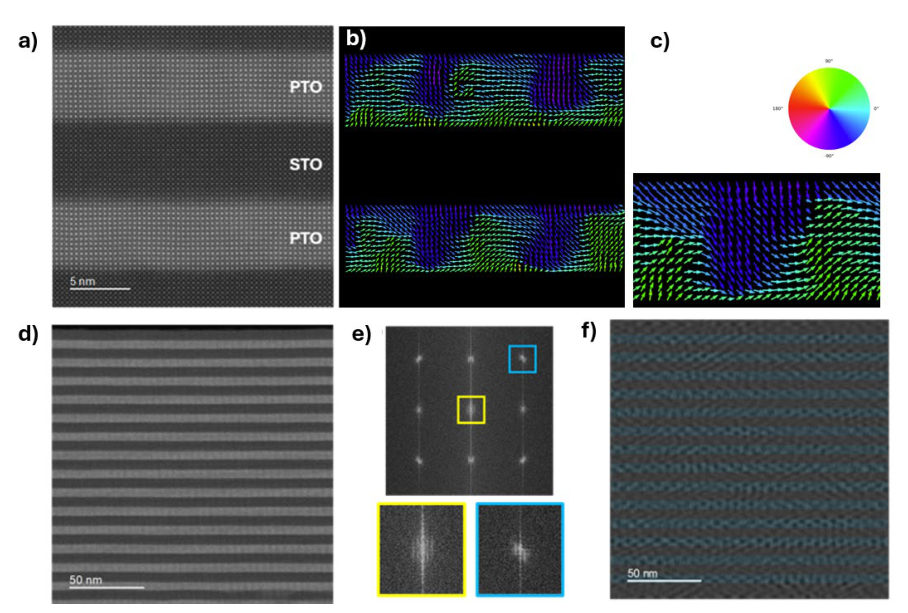
<figcaption class="paper-figure-caption"><b>Fig 1.</b> Figure 1: Microstructural characterization of the SL and polar displacement maps. a) High-resolution</figcaption>
</figure>
<figure class="paper-figure-card">
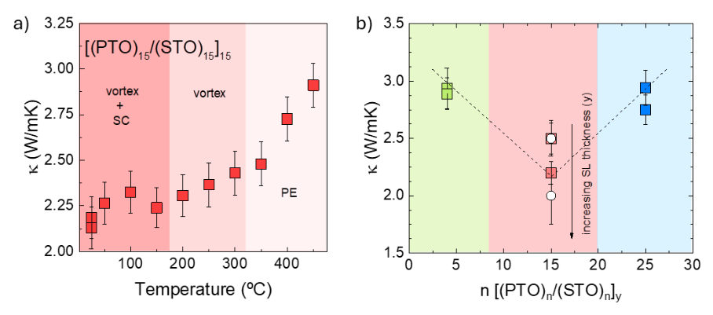
<figcaption class="paper-figure-caption"><b>Fig 2.</b> Figure 3: Thermal characterization of the SLs. a) Temperature dependence of the SL [(PTO)15/(STO)15]15 on DSO, showing the different polarization regions identified through STEM and X-ray diffraction analysis. b) Thermal conductivity at room temperature for [(PTO)n/(STO)n]y on DSO SLs with different periods and total thickness (y). There is a reduction of the thermal conductivity at the n=15 period thickness, where the complex polarization patterns are identified. Note also the decrease of thermal conductivity with the total thickness of the SL. The results correspond to samples of 120 nm and 170 nm of the same periodicity, deposited on DSO (filled squares) and STO (open symbols; see also...</figcaption>
</figure>
<figure class="paper-figure-card">
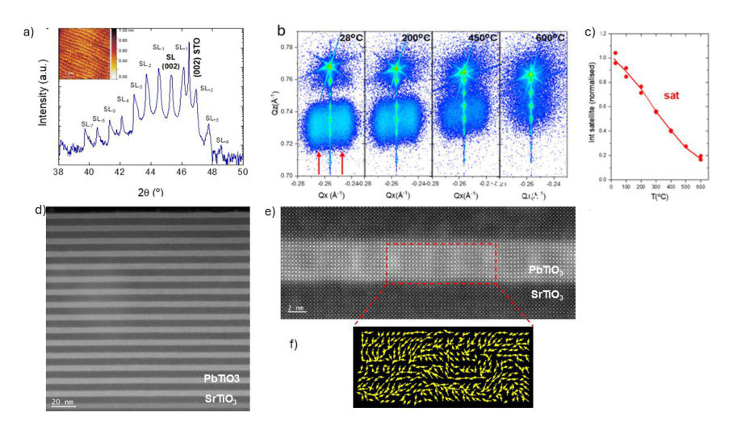
<figcaption class="paper-figure-caption"><b>Fig 3.</b> Figure 4: Structural characterization of the [(PTO)15/(STO)15]15 on STO SL. a) ω/2θ scan around 002 STO, with the SL peaks labeled; b) RSMs around the 103 STO measured at different temperatures. The red arrows indicate the lateral satellite arrangement of a periodic phase. c) Temperature dependence of the integrated intensity of the lateral satellite peaks of the vortex phase, normalized to RT value. d) Low magnification STEM- HAADF image of the full SL, and e) higher magnification image displaying the intensity modulations along the PTO layers, which suggest a periodic arrangement of the polarization. The polar displacement vectors calculated from the image (individual dipole vectors...</figcaption>
</figure>
<figure class="paper-figure-card">
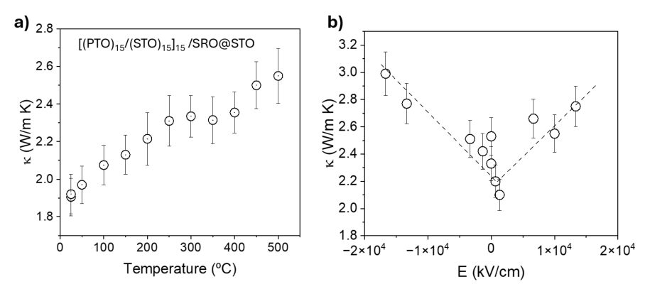
<figcaption class="paper-figure-caption"><b>Fig 4.</b> Figure 5: Thermal conductivity of the [(PTO)15/(STO)15]15 on STO SL. a) Temperature dependence of the SL [(PTO)15/(STO)15]15 on STO, showing. b) Effect if the electric field on the thermal conductivity of the SL at room temperature. In this case, the SL is grown on a buffer layer of SrRuO3, which was used as the bottom electrode.</figcaption>
</figure>

**Summary.** This work demonstrates that complex polar superstructures formed in ferroelectric/paraelectric superlattices can act as active elements for thermal management. By precisely controlling the arrangement of polarization textures—such as forming a 3D supercrystal—researchers can achieve significant, tunable suppression of the material's thermal conductivity. This opens avenues for designing next-generation heat dissipation technologies.

**Why it may be interesting.** While focused on thermal transport, the underlying physics involves phase transitions driven by competing electrostatic and elastic interactions in artificial quantum materials, which touches upon concepts relevant to correlated states and emergent order parameters.

Detailed structure

**Main problem.** The study investigates how complex polar superstructures within ferroelectric/paraelectric superlattices can be engineered to actively control and modulate the material's thermal conductivity.

**Main result.** The formation of a 3D arranged polar superstructure (SC) significantly suppresses the thermal conductivity ($\kappa$), with this effect being highly dependent on the precise periodicity and thickness of the superlattice.

**Method.** Measurements combine structural characterization using X-ray diffraction (XRD) and STEM-HAADF imaging to map polarization textures, alongside Frequency Domain Thermoreflectance (FDTR) for quantifying thermal conductivity ($\kappa$).

**Model / system.** The physical system is epitaxial thin films of ferroelectric PbTiO3/paraelectric SrTiO3 forming periodic superlattices. The control mechanism relies on tuning the polar phase diagram via strain, depolarization, and interfacial energies to stabilize specific polar textures like vortices or supercrystals.

**Key observables.** Thermal conductivity ($\kappa(T)$), polarization texture (vortex arrays, skyrmions, SC phases), structural periodicity ($\Lambda_{	ext{SL}}$, $\Lambda_{	ext{vortex}}$, $\Lambda_{	ext{SC}}$).

**Important parameters / regimes.** Superlattice thickness ($y$), temperature ($T$), applied electric field strength, and the ratio of PTO/STO layers.

**Assumptions / limitations.** The analysis assumes that phonon transport is strongly coupled to the long-range ordering and specific arrangement of polar dipoles within the superlattice structure.

**Figures summary.** Figures show STEM images revealing wavy polarization patterns; XRD maps confirm multiple satellite peaks corresponding to distinct periodicities (vortex vs. SC); $\kappa(T)$ plots demonstrate sharp changes in thermal transport linked to phase transitions.

**Paper structure.** The paper systematically characterizes the structural phases (using TEM/XRD) that emerge due to strain and periodicity, correlates these structural findings with temperature-dependent measurements of polarization textures, and finally quantifies the resulting anomalous control over thermal conductivity ($\kappa$).

Abstract

Integrating epitaxial thin films of ferroelectric PbTiO3 and paraelectric SrTiO3 into artificially layered periodic superlattices provides a unique platform for tuning strain, depolarization, and interfacial/surface energies, thereby accessing a rich phase diagram of topological polar structures (skyrmions, vortices, merons, or sinusoidal waves) and superstructures (polar supercrystals). Here we show that the 3D arrangement of polar vortices in a supercrystal suppresses thermal conductivity (k) of PTO/STO superlattices (SLs). The temperature dependence of k reflects the evolution of the polar superstructure, as determined by X-ray diffraction and transmission electron microscopy. The comparison with other SLs suggests that the 3D arrangement is crucial for controlling thermal conductivity beyond the usual interfacial scattering. Moreover, we observed an unexpected reduction in thermal conductivity with increasing superlattice thickness, a phenomenon reminiscent of phonon-wave Anderson localization. Our results show that complex polar superstructures can be useful active elements for modulating heat transport in technologies where control over heat dissipation is critical.

[↑ back to top](#top)

### [Magnetophonon Resistance Oscillations in Structures with a GaAs Quantum Well and Barriers of AlAs/GaAs$\langleδ$-Si$\rangle$ Superlattices](http://arxiv.org/abs/2607.08682v1)

**Authors:** I. L. Drichko, I. Yu. Smirnov, M. O. Safonchik, M. A. Shakhov, A. K. Bakarov, A. A. Bykov  
**Type:** experiment · **Category:** other · **PDF:** <https://arxiv.org/pdf/2607.08682v1>  
**Analysis basis:** full PDF text, analyzed in chunks
**Topic relevance:** `non-equilibrium dynamics` **1/5**

↔ Scroll figures horizontally

<figure class="paper-figure-card">
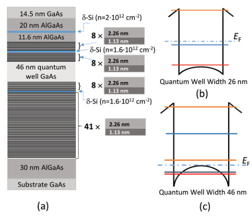
<figcaption class="paper-figure-caption"><b>Fig 1.</b> FIG. 2. (a) Construction of the structures (the same for both samples). The samples differed only in the well width: in sample 1 the well width was 26 nm, and in the second 46 nm. Energy schemes for samples 1 (b) and 2 (c).</figcaption>
</figure>
<figure class="paper-figure-card">
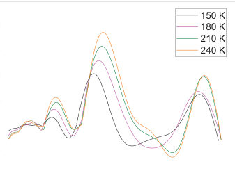
<figcaption class="paper-figure-caption"><b>Fig 2.</b> FIG. 3. Magnetophonon oscillations in sample 1 at different temperatures.</figcaption>
</figure>
<figure class="paper-figure-card">
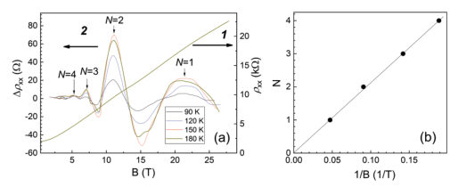
<figcaption class="paper-figure-caption"><b>Fig 3.</b> FIG. 4. (a) Magnetophonon oscillations in sample 2 at dif- ferent temperatures: 1 – experimental dependence ρxx(B) at T = 180 K; 2 – dependences of the oscillating part ∆ρxx(B) at different temperatures; arrows show the numbers of the magnetophonon resonance peaks. (b) Dependence of the os- cillation number on the inverse magnetic field, demonstrating their periodicity 1/B.</figcaption>
</figure>
<figure class="paper-figure-card">
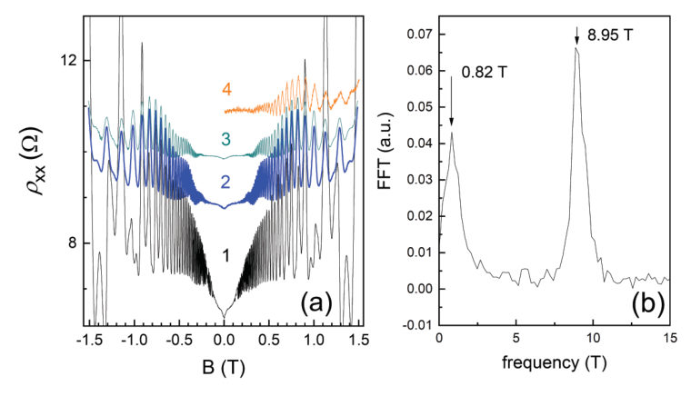
<figcaption class="paper-figure-caption"><b>Fig 4.</b> FIG. 5. (a) Magnetoresistance ρxx as a function of magnetic field at different temperatures: 4 K – curve 1, 12 K – curve 2, 16 K – curve 3, 20 K – curve 4 for sample 1. (b) Fourier analysis of the oscillations.</figcaption>
</figure>
<figure class="paper-figure-card">
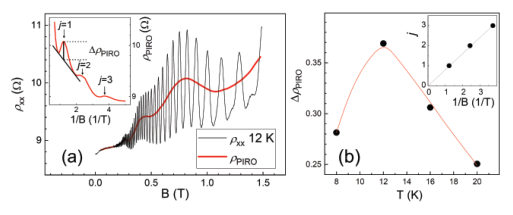
<figcaption class="paper-figure-caption"><b>Fig 5.</b> FIG. 6. Extraction of slow oscillations for sample 1 at T =12 K from the experimental dependence ρxx (B). Insert: depen- dence of the amplitude of the extracted slow oscillation on 1/B, arrows with numbers indicate the oscillation numbers. b – Dependence of the peak amplitude of the first oscillation on temperature. Inset: dependence of the oscillation number on 1/B</figcaption>
</figure>

**Summary.** This experimental study investigates magnetophonon resistance oscillations (MPR) and phonon-induced resistance oscillations (PIRO) in GaAs quantum well structures. By measuring magnetoresistance at varying temperatures, the authors confirm resonant scattering mechanisms involving both optical and acoustic phonons. The work provides detailed insights into electron-phonon coupling physics within semiconductor nanostructures.

**Why it may be interesting.** While focused on solid-state transport, the detailed analysis of electron-phonon coupling strengths and resonant scattering conditions provides fundamental insights into energy relaxation mechanisms in confined quantum systems, which are relevant for understanding decoherence rates in quantum devices.

Detailed structure

**Main problem.** The study investigates Magnetophonon Resistance Oscillations (MPR) due to optical phonon scattering at higher temperatures and Phonon-Induced Resistance Oscillations (PIRO) from acoustic phonons at lower temperatures.

**Main result.** MPR confirms resonant electron scattering by bulk longitudinal optical phonons, while PIRO demonstrates resonant scattering by bulk acoustic phonons, with the amplitude dependence revealing details about various scattering mechanisms.

**Method.** Measurements involve tracking magnetoresistance ($
ho_{xx}$) as a function of magnetic field ($B$) and temperature ($T$), utilizing Fourier analysis to isolate low-frequency oscillations.

**Model / system.** The physical system is semiconductor structures comprising a GaAs quantum well embedded within AlAs/GaAs superlattice barriers doped with Si. The study analyzes electron transport in the presence of quantized energy subbands.

**Key observables.** Magnetoresistance ($
ho_{xx}$), oscillation periodicity in $B$ (for both optical and acoustic phonons), and temperature dependence of oscillation amplitudes.

**Important parameters / regimes.** Magnetic field ($B$) up to 30 T, Temperature ($T$) ranging from 10 K to 240 K, and the characteristic phonon frequencies ($\omega_{	ext{LO}}$).

**Assumptions / limitations.** The analysis assumes that low-temperature oscillations are dominated by intrasubband scattering on longitudinal acoustic phonons, and that the observed phenomena can be modeled using standard electron-phonon interaction theories.

**Figures summary.** Figures show temperature dependence of LO phonon frequencies, energy schemes for two subbands in GaAs QWs, and plots of $
ho_{xx}(B)$ at various temperatures illustrating resonance peaks (MPR) and Fourier analysis results confirming PIRO oscillations.

**Paper structure.** The paper systematically investigates MPR first, establishing the role of bulk optical phonons independent of dimensionality. It then transitions to analyzing PIRO at low temperatures, using Fourier techniques to extract acoustic phonon signatures from the background magnetoresistance.

Abstract

Magnetophonon resistance oscillations (MPR) associated with the resonant scattering of electrons by optical phonons at temperatures of 77-240 K, as well as resonant scattering of electrons by acoustic phonons (PIRO) at temperatures of 10-25 K, were investigated in the same samples featuring a GaAs quantum well and AlAs/GaAs superlattice barriers doped with Si. The study of MPR demonstrated that resonant electron scattering occurs on bulk longitudinal optical phonons and does not depend on the dimensionality of the system or inter-subband transitions in systems with two subbands of size quantization. However, the amplitude of the oscillation with number $N=1$ in two-dimensional structures depends on the interplay of scattering mechanisms, which, in turn, is influenced by the structure of the system. As for PIRO, in samples with two size quantization subbands, resonant electron scattering by longitudinal acoustic phonons is observed against the background of inter-subband transitions (MISO), leading to their interference.

[↑ back to top](#top)

### [The Radial Distribution Functions of Nanofluids: Molecular Dynamics Simulations](http://arxiv.org/abs/2607.08527v1)

**Authors:** Özlem Öztürk  
**Type:** theory · **Category:** statistical mechanics · **PDF:** <https://arxiv.org/pdf/2607.08527v1>  
**Analysis basis:** full PDF text, analyzed in chunks
**Topic relevance:** `Frenkel-Kontorova` **1/5**

↔ Scroll figures horizontally

<figure class="paper-figure-card">
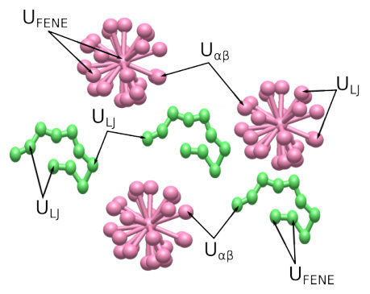
<figcaption class="paper-figure-caption"><b>Fig 1.</b> Fig. 1: An illustration of the interactions inside the bulk nanofluid systems of 28, 42, and 56 particles. In the figure, three nanoparticles (each one of 28 atoms) are shown in pink colour. And also three polymer chains (each one of 10 monomers) are seen in green colour. As you can see, there are seven different interaction types based on where they occur. There are four intramolecular interactions and three intermolecular interactions. In this figure, UFENE, ULJ, and Uαβ represents FENE potential energy function, 12-6 LJ potential energy, and modified-12-6 LJ potential energy respectively.</figcaption>
</figure>
<figure class="paper-figure-card">
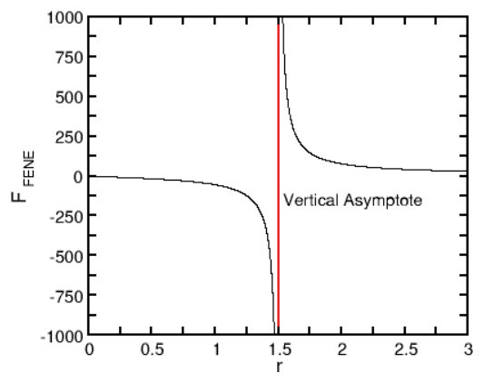
<figcaption class="paper-figure-caption"><b>Fig 2.</b> Fig. 2: For the given values of the parameters k and R0, the variation of the component of ⃗FFENE function in the direction of unit vector ˆr with the distance r. Red vertical line represents the vertical asymptote at the point r=1.5.</figcaption>
</figure>
<figure class="paper-figure-card">
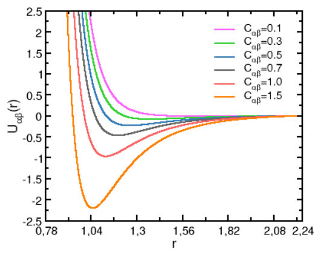
<figcaption class="paper-figure-caption"><b>Fig 3.</b> Fig. 3: For six different Cαβ coefficients, modified, truncated and shifted Lennard-Jones (12,6) potential energy, Uαβ(r), as a function of the central distance r between two particles is shown. For Cαβ = 0.1, the minimum of the Uαβ(r) is approximately equal to −0.0071 at r = 1.6.</figcaption>
</figure>
<figure class="paper-figure-card">
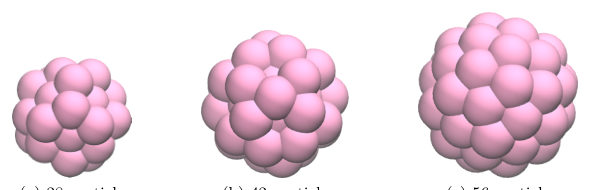
<figcaption class="paper-figure-caption"><b>Fig 4.</b> Fig. 5: Side by side visualization of spherical nanoparticles of 28 (a), 42 (b), 56 (c) atoms just after the production run of 10000τ simulation time is shown in this figure. For visualization purporse, we use VMD [40].</figcaption>
</figure>
<figure class="paper-figure-card">

<figcaption class="paper-figure-caption"><b>Fig 5.</b> Figure 6 shows how the instantaneous total potential energy, Ep, the instantaneous total kinetic energy, Ek, and the instantaneous total internal energy, Ep + Ek, of the nanoparticles change with the total number of particles in a nanoparticle. When we look at the figure, we see that Ek increases linearly with the total number of particles in a nanoparticle. However, Ep +Ek and Ep increases nonlinearly with the total number of particles in a nanoparticle.</figcaption>
</figure>

**Summary.** This work uses Molecular Dynamics simulations to examine how nanofluids containing nonrigid nanoparticles behave structurally when suspended in a polymer melt. By analyzing radial distribution functions and mean forces, the authors determine that nanoparticle size dictates stability; specifically, smaller particles are prone to structural collapse at elevated temperatures.

**Why it may be interesting.** While focused on classical soft matter, the study's rigorous application of statistical mechanics principles to determine structural phase transitions (shape instability) under thermal stress is relevant to understanding complex many-body dynamics in confined or interacting systems.

Detailed structure

**Main problem.** The study investigates the shape stabilities of polymeric nanofluids by analyzing their radial distribution functions (RDF/ARDF). The goal is to understand how nanoparticle structure changes under varying thermal conditions.

**Main result.** Nanoparticles with 28 atoms lose their concentric shell structure at higher temperatures, while those with 42 and 56 atoms maintain stability despite increasing temperature and decreasing particle-liquid affinity.

**Method.** Molecular Dynamics (MD) simulations were employed using a coarse-grained particle-based approach under the NVE ensemble. The analysis focused on calculating angle-dependent radial distribution functions.

**Model / system.** The system consists of nonrigid (soft) nanoparticles suspended in a polymer melt base fluid. Interactions are modeled using combinations of FENE and Lennard-Jones potentials for monomers, chains, and nanoparticle interactions.

**Key observables.** One dimensional and three dimensional angle dependent radial distribution functions (RDF and ARDF); Mean force magnitude as a function of relative distance.

**Important parameters / regimes.** Nanoparticle sizes (28, 42, and 56 atoms); Temperature range ($T=1.2$ to $T=1.8$); Interaction coefficients ($C_{mn}$).

**Assumptions / limitations.** The simulation uses a coarse-grained particle-based model; the analysis assumes that changes in distribution shape reflect structural stability.

**Figures summary.** Figures illustrate mean force calculations for 28, 42, and 56 atom nanoparticles at various interaction strengths and temperatures, showing bimodal or unimodal distributions related to shell thickness.

**Paper structure.** The paper details the MD simulation setup (Hamiltonian components, integration algorithms) followed by specific analyses on RDFs for stability assessment, and later analyzes mean force magnitudes as a function of relative distance across different particle sizes.

Abstract

Nanofluids, which are composed of insoluble, stable, and well-dispersed solid particles of nanoscale and/or subnanometer sizes suspended in a base liquid, are the next generation of liquids of today. The purpose of this paper is to investigate the one dimensional and three dimensional angle dependent radial distribution functions RDF and ARDF of polymeric nanofluids made up of nonrigid (soft) nanoparticles and a polymer melt (base fluid) using the molecular dynamics simulation approach and to search the shape stabilities by using these results. For this purpose, we use the nanoparticles of three different sizes: 28, 42, and 56 particles. We research them both within the base fluid and without this polymeric medium for instability analysis. We found that the nanoparticles with 28 atoms show the shape instability inside the base fluid when we increase the system temperature from T=1.2 to T=1.8 and hence, the structure of two concentric spherical shell of the nanoparticle breaks down and as a result the empty vacuum between these inner and the outer shells disappears. In contrast to this findings, the nanoparticles with 42 and 56 atoms show the shape stability inside the base fluid by preserving their concentric shell structures when we rise the system temperature and decrease the affinity between the nanoparticles and the base liquid medium.

[↑ back to top](#top)
