
# arxiv digest (quant-ph + cond-mat) — 2026-07-14

*100 papers · 31 relevant · 1 highlighted*

## 🔥 Most relevant (31)

*Every paper with at least one nonzero topic score, sorted by best-matching score. 🔥 marks scores ≥4/5. Click the title to jump to the full entry below; click [arXiv] to open the paper page. `(secondary)` marks papers from de-prioritized cond-mat archives.*

Show 31 relevant papers

- [Phase-switchable nonreciprocal entanglement via magnon squeezing in ring-cavity optomagnomechanics](#paper-2607.09663) [[arXiv]](http://arxiv.org/abs/2607.09663v1) — 🔥 `spintronics-quantum-optics interface` **5/5** · 🔥 `entanglement & information structure` **4/5** · 🔥 `exotic spin models in light-matter` **4/5** · `analog quantum simulation` **3/5** · `correlated / nonlocal dissipation` **3/5** · `correlated cavity matter` **3/5** · `driven-dissipative phase transition` **3/5** · `Keldysh / 2PI / non-Gaussian methods` **2/5** · `Tavis-Cummings & cavity-many-emitter` **2/5** · `methods for driven-dissipative` **2/5** · `non-equilibrium dynamics` **2/5** · `interference shaping light` **1/5** · `non-equilibrium universality` **1/5** · `quantum optics experiment` **1/5**
- [Observation of a Rydberg-atom time crystal with an ultralong lifetime](#paper-2607.09247) [[arXiv]](http://arxiv.org/abs/2607.09247v1) — 🔥 `driven-dissipative phase transition` **5/5** · 🔥 `analog quantum simulation` **4/5** · 🔥 `correlated / nonlocal dissipation` **4/5** · `Rydberg arrays` **3/5** · `methods for driven-dissipative` **3/5** · `non-equilibrium dynamics` **3/5** · `non-equilibrium universality` **3/5** · `Keldysh / 2PI / non-Gaussian methods` **2/5** · `quantum optics experiment` **2/5** · `entanglement & information structure` **1/5** · `scars & prethermalization` **1/5**
- [Probing two-spin entanglement at quantum criticality on a quantum processor](#paper-2607.08967) [[arXiv]](http://arxiv.org/abs/2607.08967v1) — 🔥 `entanglement & information structure` **5/5** · 🔥 `analog quantum simulation` **4/5** · `QC/QI experiment` **3/5** · `exotic spin models in light-matter` **3/5** · `quantum measurements` **2/5** · `driven-dissipative phase transition` **1/5** · `methods for driven-dissipative` **1/5** · `non-equilibrium dynamics` **1/5** · `non-equilibrium universality` **1/5**
- [Non-Equilibrium Economics: A Physicist's Point of View](#paper-2607.09620) [[arXiv]](http://arxiv.org/abs/2607.09620v1) — 🔥 `non-equilibrium dynamics` **5/5** · 🔥 `non-equilibrium universality` **4/5** · `driven-dissipative phase transition` **3/5** · `methods for driven-dissipative` **3/5** · `Frenkel-Kontorova` **1/5** · `Keldysh / 2PI / non-Gaussian methods` **1/5** · `correlated / nonlocal dissipation` **1/5** · `exotic spin models in light-matter` **1/5**
- [Deterministic Generation of Linear Photonic Cluster States with Semiconductor Quantum Dots: A Detailed Comparison of Different Schemes](#paper-2607.09373) [[arXiv]](http://arxiv.org/abs/2607.09373v1) — 🔥 `spintronics-quantum-optics interface` **4/5** · `Tavis-Cummings & cavity-many-emitter` **3/5** · `analog quantum simulation` **3/5** · `correlated cavity matter` **3/5** · `exotic spin models in light-matter` **3/5** · `correlated / nonlocal dissipation` **2/5** · `driven-dissipative phase transition` **2/5** · `entanglement & information structure` **2/5** · `methods for driven-dissipative` **2/5** · `non-equilibrium dynamics` **2/5** · `Keldysh / 2PI / non-Gaussian methods` **1/5** · `QC/QI experiment` **1/5** · `non-equilibrium universality` **1/5** · `quantum measurements` **1/5** · `quantum optics experiment` **1/5**
- [Qubit-Boson Hybrid Beam-Splitter Gate with Kerr Nonlinearity in Circuit QED for Many-Body Dynamics](#paper-2607.09513) [[arXiv]](http://arxiv.org/abs/2607.09513v1) — 🔥 `analog quantum simulation` **4/5** · `Tavis-Cummings & cavity-many-emitter` **3/5** · `correlated cavity matter` **3/5** · `Keldysh / 2PI / non-Gaussian methods` **2/5** · `QC/QI experiment` **2/5** · `methods for driven-dissipative` **2/5** · `non-equilibrium dynamics` **2/5** · `quantum optics experiment` **2/5** · `correlated / nonlocal dissipation` **1/5** · `driven-dissipative phase transition` **1/5** · `entanglement & information structure` **1/5** · `exotic spin models in light-matter` **1/5** · `non-equilibrium universality` **1/5**
- [Exact Lindbladian Dynamics from Conformal Embeddings and Topological Defects in Conformal Field Theory](#paper-2607.08827) [[arXiv]](http://arxiv.org/abs/2607.08827v1) — 🔥 `methods for driven-dissipative` **4/5** · `Keldysh / 2PI / non-Gaussian methods` **3/5** · `correlated / nonlocal dissipation` **3/5** · `driven-dissipative phase transition` **3/5** · `entanglement & information structure` **2/5** · `non-equilibrium dynamics` **2/5** · `non-equilibrium universality` **2/5** · `Kondo & dissipative impurity` **1/5** · `analog quantum simulation` **1/5** · `exotic spin models in light-matter` **1/5** · `scars & prethermalization` **1/5**
- [Majorana parity qubit in coupled minimal Kitaev chains](#paper-2607.09511) [[arXiv]](http://arxiv.org/abs/2607.09511v1) — 🔥 `QC/QI experiment` **4/5** · `analog quantum simulation` **3/5** · `quantum measurements` **3/5** · `driven-dissipative phase transition` **2/5** · `non-equilibrium dynamics` **2/5** · `Kondo & dissipative impurity` **1/5** · `correlated / nonlocal dissipation` **1/5** · `entanglement & information structure` **1/5** · `measurement-induced transitions` **1/5** · `methods for driven-dissipative` **1/5** · `non-equilibrium universality` **1/5**
- [Measurement Speed Limits for Quantum State Purification](#paper-2607.09118) [[arXiv]](http://arxiv.org/abs/2607.09118v1) — 🔥 `quantum measurements` **4/5** · `measurement-induced transitions` **3/5** · `methods for driven-dissipative` **3/5** · `Keldysh / 2PI / non-Gaussian methods` **2/5** · `entanglement & information structure` **2/5** · `non-equilibrium dynamics` **2/5** · `correlated / nonlocal dissipation` **1/5** · `driven-dissipative phase transition` **1/5** · `non-equilibrium universality` **1/5**
- [Quantum stochastic thermodynamics of macroscopic systems: an algebraic approach](#paper-2607.09242) [[arXiv]](http://arxiv.org/abs/2607.09242v1) — 🔥 `quantum measurements` **4/5** · `measurement-induced transitions` **3/5** · `methods for driven-dissipative` **3/5** · `Keldysh / 2PI / non-Gaussian methods` **2/5** · `non-equilibrium dynamics` **2/5** · `correlated / nonlocal dissipation` **1/5** · `correlated cavity matter` **1/5** · `driven-dissipative phase transition` **1/5** · `entanglement & information structure` **1/5** · `non-equilibrium universality` **1/5**
- [Superheavy dark-bright soliton as a signature of spatial symmetry breaking transition in harmonically trapped Bose mixtures](#paper-2607.09064) [[arXiv]](http://arxiv.org/abs/2607.09064v1) — 🔥 `analog quantum simulation` **4/5** · `Keldysh / 2PI / non-Gaussian methods` **3/5** · `driven-dissipative phase transition` **3/5** · `methods for driven-dissipative` **3/5** · `non-equilibrium dynamics` **2/5** · `non-equilibrium universality` **2/5** · `Frenkel-Kontorova` **1/5** · `correlated cavity matter` **1/5**
- [Finite-time cooling and accessibility of the stripe phase in the Ising antiferromagnet](#paper-2607.09411) [[arXiv]](http://arxiv.org/abs/2607.09411v1) — 🔥 `analog quantum simulation` **4/5** · 🔥 `non-equilibrium dynamics` **4/5** · `non-equilibrium universality` **3/5** · `driven-dissipative phase transition` **2/5** · `correlated / nonlocal dissipation` **1/5** · `entanglement & information structure` **1/5** · `exotic spin models in light-matter` **1/5** · `methods for driven-dissipative` **1/5** · `scars & prethermalization` **1/5**
- [Predictive Renormalization-Group Theory of Universality Classes in Nonlinear Systems](#paper-2607.09079) [[arXiv]](http://arxiv.org/abs/2607.09079v1) — 🔥 `non-equilibrium universality` **4/5** · `Keldysh / 2PI / non-Gaussian methods` **3/5** · `driven-dissipative phase transition` **3/5** · `methods for driven-dissipative` **2/5** · `non-equilibrium dynamics` **2/5** · `Frenkel-Kontorova` **1/5** · `analog quantum simulation` **1/5** · `correlated / nonlocal dissipation` **1/5** · `correlated cavity matter` **1/5**
- [GHz-rate all-fiber active polarization state analyzer for quantum protocols](#paper-2607.09597) [[arXiv]](http://arxiv.org/abs/2607.09597v1) — 🔥 `QC/QI experiment` **4/5** · `quantum measurements` **3/5** · `quantum optics experiment` **3/5** · `entanglement & information structure` **2/5** · `interference shaping light` **2/5** · `measurement-induced transitions` **2/5** · `non-equilibrium dynamics` **1/5**
- [Speckle-based feedback control of optical dipole trap axial waist position](#paper-2607.09414) [[arXiv]](http://arxiv.org/abs/2607.09414v1) — 🔥 `quantum measurements` **4/5** · `quantum optics experiment` **3/5** · `analog quantum simulation` **2/5** · `measurement-induced transitions` **2/5** · `methods for driven-dissipative` **2/5** · `QC/QI experiment` **1/5** · `driven-dissipative phase transition` **1/5** · `interference shaping light` **1/5**
- [Quantum field nucleating and Wigner functions](#paper-2607.09233) [[arXiv]](http://arxiv.org/abs/2607.09233v1) — 🔥 `Keldysh / 2PI / non-Gaussian methods` **4/5** · `methods for driven-dissipative` **3/5** · `non-equilibrium dynamics` **3/5** · `non-equilibrium universality` **2/5** · `analog quantum simulation` **1/5** · `correlated / nonlocal dissipation` **1/5** · `driven-dissipative phase transition` **1/5**
- [Quantum Chaos with a Macroscopic Zero-Mode Sector](#paper-2607.09504) [[arXiv]](http://arxiv.org/abs/2607.09504v1) — 🔥 `analog quantum simulation` **4/5** · `driven-dissipative phase transition` **2/5** · `Frenkel-Kontorova` **1/5** · `Keldysh / 2PI / non-Gaussian methods` **1/5** · `correlated / nonlocal dissipation` **1/5** · `entanglement & information structure` **1/5** · `exotic spin models in light-matter` **1/5** · `methods for driven-dissipative` **1/5** · `non-equilibrium dynamics` **1/5** · `non-equilibrium universality` **1/5**
- [Simulation of Lindbladian dynamics via adaptive variational quantum trajectory compression](#paper-2607.09051) [[arXiv]](http://arxiv.org/abs/2607.09051v1) — 🔥 `methods for driven-dissipative` **4/5** · `quantum measurements` **3/5** · `Keldysh / 2PI / non-Gaussian methods` **2/5** · `non-equilibrium dynamics` **2/5** · `correlated / nonlocal dissipation` **1/5** · `driven-dissipative phase transition` **1/5** · `measurement-induced transitions` **1/5**
- [Stabilization of two-dimensional optical continuous-wave states by a potential trough](#paper-2607.09607) [[arXiv]](http://arxiv.org/abs/2607.09607v1) — 🔥 `analog quantum simulation` **4/5** · `Frenkel-Kontorova` **3/5** · `driven-dissipative phase transition` **2/5** · `non-equilibrium dynamics` **2/5** · `interference shaping light` **1/5** · `methods for driven-dissipative` **1/5** · `non-equilibrium universality` **1/5**
- [The monopole plasma resonance: a smoking gun of 3D $U(1)$ quantum spin liquids](#paper-2607.08826) [[arXiv]](http://arxiv.org/abs/2607.08826v1) — 🔥 `exotic spin models in light-matter` **4/5** · `spintronics-quantum-optics interface` **3/5** · `analog quantum simulation` **2/5** · `Keldysh / 2PI / non-Gaussian methods` **1/5** · `correlated / nonlocal dissipation` **1/5** · `driven-dissipative phase transition` **1/5** · `methods for driven-dissipative` **1/5** · `non-equilibrium dynamics` **1/5**
- [Action-Factored Multi-Agent Reinforcement Learning for Scalable Quantum Device Tuning](#paper-2607.09422) [[arXiv]](http://arxiv.org/abs/2607.09422v1) `(secondary)` — 🔥 `QC/QI experiment` **4/5** · `quantum measurements` **2/5** · `spintronics-quantum-optics interface` **2/5** · `analog quantum simulation` **1/5** · `correlated / nonlocal dissipation` **1/5** · `driven-dissipative phase transition` **1/5** · `methods for driven-dissipative` **1/5** · `non-equilibrium dynamics` **1/5**
- [Quantitative Wigner-Araki-Yanase Theorems for Unitary and Antiunitary Symmetries](#paper-2607.09075) [[arXiv]](http://arxiv.org/abs/2607.09075v1) — 🔥 `quantum measurements` **4/5** · `measurement-induced transitions` **3/5** · `Keldysh / 2PI / non-Gaussian methods` **1/5** · `correlated / nonlocal dissipation` **1/5** · `driven-dissipative phase transition` **1/5** · `entanglement & information structure` **1/5**
- [Quantum Orchestras: a Concrete Semantics for Recursive Hybrid Programs](#paper-2607.09605) [[arXiv]](http://arxiv.org/abs/2607.09605v1) — 🔥 `quantum measurements` **4/5** · `measurement-induced transitions` **3/5** · `methods for driven-dissipative` **1/5** · `non-equilibrium dynamics` **1/5**
- [Operational Shadows of Hilbert-Space Probabilities](#paper-2607.09312) [[arXiv]](http://arxiv.org/abs/2607.09312v1) — 🔥 `quantum measurements` **4/5** · `measurement-induced transitions` **3/5** · `Keldysh / 2PI / non-Gaussian methods` **1/5**
- [Quantum Approximate Optimization via Noise-Directed Adaptive Warm-Starting](#paper-2607.09368) [[arXiv]](http://arxiv.org/abs/2607.09368v1) — 🔥 `QC/QI experiment` **4/5** · `Keldysh / 2PI / non-Gaussian methods` **1/5** · `correlated / nonlocal dissipation` **1/5** · `driven-dissipative phase transition` **1/5** · `methods for driven-dissipative` **1/5**
- [Vacancy Effect on the Ground-State Energy of a Bose Gas Trapped by 1D Imperfect Artificial Crystal](#paper-2607.08992) [[arXiv]](http://arxiv.org/abs/2607.08992v1) — 🔥 `analog quantum simulation` **4/5** · `Frenkel-Kontorova` **1/5** · `Keldysh / 2PI / non-Gaussian methods` **1/5** · `methods for driven-dissipative` **1/5**
- [Complete measurement of tunnel- and valley-coupling parameters in a silicon double quantum dot](#paper-2607.09638) [[arXiv]](http://arxiv.org/abs/2607.09638v1) — 🔥 `QC/QI experiment` **4/5** · `quantum measurements` **1/5** · `spintronics-quantum-optics interface` **1/5**
- [Confinement drives valley splitting above 4K in buried silicon quantum wells](#paper-2607.09570) [[arXiv]](http://arxiv.org/abs/2607.09570v1) — 🔥 `QC/QI experiment` **4/5** · `quantum measurements` **1/5** · `spintronics-quantum-optics interface` **1/5**
- [Magnetic devil's staircase in UAgBi$_{2}$](#paper-2607.09003) [[arXiv]](http://arxiv.org/abs/2607.09003v1) — 🔥 `analog quantum simulation` **4/5** · `Frenkel-Kontorova` **1/5** · `exotic spin models in light-matter` **1/5**
- [Benchmarking Error Mitigation: Artefactual Improvements in Zero-Noise Extrapolation](#paper-2607.09360) [[arXiv]](http://arxiv.org/abs/2607.09360v1) — 🔥 `QC/QI experiment` **4/5** · `methods for driven-dissipative` **1/5**
- [Entanglement entropy in two-particle Grover walks on graphs](#paper-2607.09066) [[arXiv]](http://arxiv.org/abs/2607.09066v1) — 🔥 `entanglement & information structure` **4/5** · `non-equilibrium dynamics` **1/5**

## ⭐ Highlighted (1)

*Papers by authors on your watch list. Click the title to jump to the full entry below; click [arXiv] to open the paper page.*

Show 1 highlighted papers

- ⭐ [Screening-controlled dynamical criticality in the quantum Hall regime](#paper-2607.09244) [[arXiv]](http://arxiv.org/abs/2607.09244v1) — Yuval Gefen

## All papers (79, sorted by relevance)

*Papers from quant-ph and your primary cond-mat archives (quant-gas, stat-mech, str-el, dis-nn). Highlighted papers (⭐) come first, then everything else sorted by topic-relevance score, highest first.*

### ⭐ [Screening-controlled dynamical criticality in the quantum Hall regime](http://arxiv.org/abs/2607.09244v1)

**Highlighted author(s):** Yuval Gefen  
**Authors:** Tanima Chanda, Simrandeep Kaur, Anantbir Virk, Kenji Watanabe, Takashi Taniguchi, G. J. Sreejith, Yuval Gefen, Aveek Bid  
**Type:** experiment · **Category:** strongly correlated electrons · **PDF:** <https://arxiv.org/pdf/2607.09244v1>  
**Analysis basis:** full PDF text, analyzed in chunks
**Topic relevance:** `non-equilibrium universality` **3/5** · `driven-dissipative phase transition` **2/5** · `Kondo & dissipative impurity` **1/5** · `analog quantum simulation` **1/5** · `non-equilibrium dynamics` **1/5**

↔ Scroll figures horizontally

<figure class="paper-figure-card">
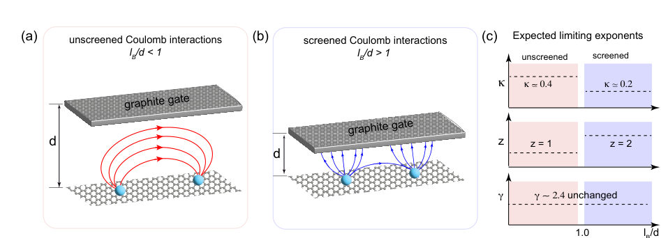
<figcaption class="paper-figure-caption"><b>Fig 1.</b> Figure 1. Screening-controlled crossover in quantum-critical scaling. Schematic of the interaction range</figcaption>
</figure>
<figure class="paper-figure-card">
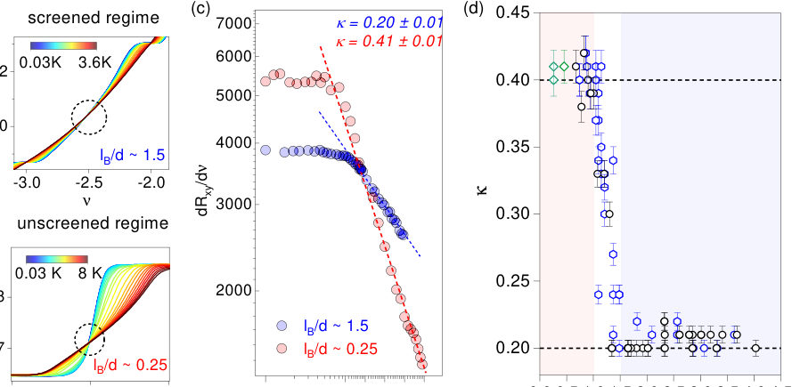
<figcaption class="paper-figure-caption"><b>Fig 2.</b> Figure 2. Temperature scaling of quantum-critical transport. Rxy as a function of filling factor ν across</figcaption>
</figure>
<figure class="paper-figure-card">
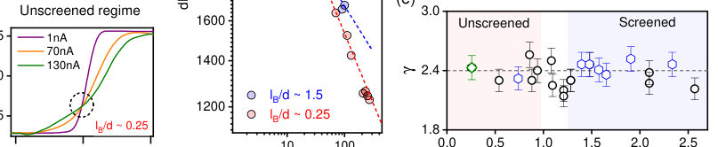
<figcaption class="paper-figure-caption"><b>Fig 3.</b> Figure 3. Current scaling separates the dynamical and spatial critical exponents. Rxy as a function of</figcaption>
</figure>
<figure class="paper-figure-card">
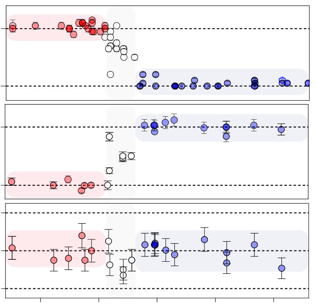
<figcaption class="paper-figure-caption"><b>Fig 4.</b> Figure 4. Evolution of the extracted exponents with lB/d. Compilation of the experimentally extracted</figcaption>
</figure>

**Summary.** This work uses graphene devices to study quantum Hall transitions by tuning Coulomb screening via gate geometry. By combining temperature and current scaling measurements, the authors successfully separated the dynamical exponent ($z$) from the localization exponent ($\gamma$). They show that screening selectively alters $z$ while leaving $\gamma$ constant, providing a versatile method for controlling interactions in correlated electron systems.

**Why it may be interesting.** The ability to geometrically tune interaction strength (screening) provides a powerful experimental tool to isolate the role of electron-electron interactions versus disorder effects in strongly correlated 2D systems.

Detailed structure

**Main problem.** The study aims to experimentally separate the effects of Coulomb interactions on spatial versus dynamical criticality at continuous electronic phase transitions in the quantum Hall regime.

**Main result.** Gate-controlled screening selectively modifies the interaction-dependent dynamical sector (changing $z$ from $\approx 1$ to $\approx 2$) while leaving the localization-length exponent ($\gamma \approx 2.4$) unchanged.

**Method.** The authors combine temperature scaling analysis with independent current scaling measurements on transport properties ($R_{xy}, R_{xx}$) to extract critical exponents separately.

**Model / system.** The experiment uses dual-graphite-gated graphene devices, where the effective Coulomb interaction range is tuned geometrically by varying the ratio of the magnetic length ($l_B$) to a gate distance ($d$).

**Key observables.** Temperature scaling exponent ($\kappa$), dynamical critical exponent ($z$), and localization-length exponent ($\gamma$); measured via $R_{xy}$ and $R_{xx}$ transport measurements.

**Important parameters / regimes.** The ratio $l_B/d$ controls the interaction regime, distinguishing between unscreened (long-range) and screened (short-range) Coulomb interactions.

**Assumptions / limitations.** The analysis relies on combining multiple scaling analyses (temperature vs. current dependence) to overcome limitations in measuring only the combined exponent $\kappa$.

**Figures summary.** Figures show how temperature scaling ($\kappa$) changes across screening regimes, and plots demonstrate that current scaling allows for the independent extraction of $z$ and $\gamma$, confirming the change in $z$ while $\gamma$ remains constant.

**Paper structure.** The paper introduces the problem of disentangling critical exponents, details the use of dual-graphene devices to control screening via $l_B/d$, presents results showing distinct changes in $z$ and $\kappa$ between screened and unscreened regimes, and concludes that screening selectively affects dynamics.

Abstract

At continuous electronic phase transitions, Coulomb interactions can modify the relation between length, energy, and temperature, but experimentally disentangling their effects on spatial versus dynamical criticality has remained difficult, since finite-temperature scaling alone measures only the combined exponent $κ= 1/(zγ)$. Here, we introduce two advances that resolve this limitation. First, by combining temperature scaling with independent current scaling, we separately extract the dynamical exponent $z$ and the localization-length exponent $γ$ at the quantum Hall plateau transition -- rather than inferring one from an assumed value of the other. Second, using dual-graphite-gated graphene devices in which the effective Coulomb interaction range is tuned geometrically by the ratio of the magnetic length $l_B$ to the graphite-gate distance $d$, we track this separation across both screened and unscreened interaction regimes within the same device platform. Temperature scaling gives $κ\simeq 0.21$ in the screened regime and $κ\simeq 0.41$ in the unscreened regime; combining this with current scaling reveals that screening changes $z$ from $\simeq 1$ in the unscreened regime to $\simeq 2$ in the screened regime. In contrast, $γ$ remains close to $2.4$ throughout. Our results establish that gate-controlled screening selectively modifies the interaction-dependent dynamical sector of the quantum Hall transition, leaving the localization-length exponent $γ$ unchanged within experimental uncertainty. More broadly, this work establishes geometric screening as a versatile tool for controlling interactions and disentangling interaction and disorder effects in correlated two-dimensional systems, including fractional quantum Hall states, moiré materials, and other strongly localized electronic phases.

[↑ back to top](#top)

### [Phase-switchable nonreciprocal entanglement via magnon squeezing in ring-cavity optomagnomechanics](http://arxiv.org/abs/2607.09663v1)

**Authors:** Z. Imara, A. El Allati, A. Belfakir, K. El Anouz, I. P. Castillo  
**Type:** theory · **Category:** other · **PDF:** <https://arxiv.org/pdf/2607.09663v1>  
**Analysis basis:** full PDF text, analyzed in chunks
**Topic relevance:** 🔥 `spintronics-quantum-optics interface` **5/5** · 🔥 `entanglement & information structure` **4/5** · 🔥 `exotic spin models in light-matter` **4/5** · `analog quantum simulation` **3/5** · `correlated / nonlocal dissipation` **3/5** · `correlated cavity matter` **3/5** · `driven-dissipative phase transition` **3/5** · `Keldysh / 2PI / non-Gaussian methods` **2/5** · `Tavis-Cummings & cavity-many-emitter` **2/5** · `methods for driven-dissipative` **2/5** · `non-equilibrium dynamics` **2/5** · `interference shaping light` **1/5** · `non-equilibrium universality` **1/5** · `quantum optics experiment` **1/5**

↔ Scroll figures horizontally

<figure class="paper-figure-card">
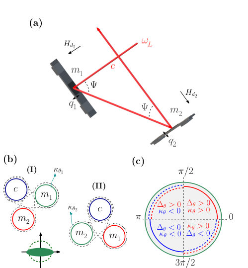
<figcaption class="paper-figure-caption"><b>Fig 1.</b> FIG. 1: (a) Schematic of the optomagnomechanical ring-cavity. (b) Sketch of optomagnonic bipartite en- tanglement for the two magnon-squeezing scenarios considered in this work, labeled (I)-(II); green modes indicate the squeezed magnon modes with amplitude Γj and phase θj. (c) Simplified schematic illustrating how changing the squeezing-phase sign modifies the effective magnon detuning and damping rate, enabling phase-controlled dissipation engineering.</figcaption>
</figure>
<figure class="paper-figure-card">
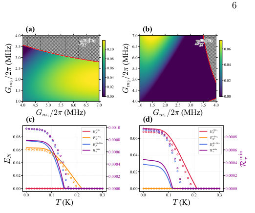
<figcaption class="paper-figure-caption"><b>Fig 2.</b> FIG. 3: Density plots of magnon-magnon entanglement Em1|m2 N versus (Gm1, Gm2) for (a) scenario I and (b) sce- nario II. Temperature dependence for (c) scenario I and (d) scenario II showing cavity-magnon entanglement Ec|m1 N (red), Ec|m2 N (orange), magnon-magnon entanglement Em1|m2 N (blue), and tripartite entanglement Rmin N (pur- ple) versus bath temperature T. Moreover, we set θ = π/2 and θ = 3π/2 for solid and circles lines, respectively. Other parameters are the same as in Fig. 2.</figcaption>
</figure>
<figure class="paper-figure-card">
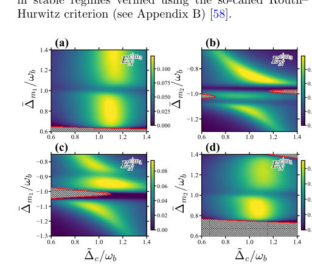
<figcaption class="paper-figure-caption"><b>Fig 3.</b> FIG. 2: Density plots of cavity-magnon entanglement (a-b) Ec|m2 N for scenario I and (c-d) Ec|m1 N for scenario II versus (a,c) ( ˜∆c, ∆m1), (b,d) ( ˜∆c, ∆m2), where ˜∆c is the effective cavity detuning and ∆mj is the intrinsic de- tuning of magnon j. The red boundary indicates stability. For scenario I, we set: Gm1/2π = 5 MHz, Gm2/2π = 1 MHz. While, in scenario II, we set Gm1/2π = 1 MHz, Gm2/2π = 5 MHz. See Table .I for other parameters.</figcaption>
</figure>
<figure class="paper-figure-card">
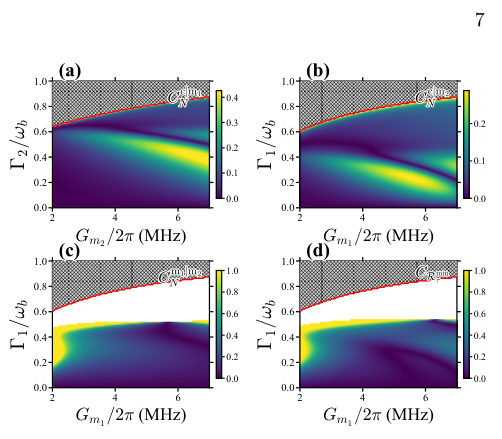
<figcaption class="paper-figure-caption"><b>Fig 4.</b> FIG. 5: Nonreciprocal contrast versus coupling and squeezing. Bidirectional contrast ratios (a) Cc|m1 E (scenario II), (b) Cc|m2 E (scenario I), (c) Cm1|m2 E (scenario I), and (d) Cmin R (scenario I) versus magnomechanical coupling Gmj and squeezing strength Γj, where j = 1, 2 denotes which magnon is squeezed. The red boundary indicates stability. Other parameters are the same as in Fig. 2.</figcaption>
</figure>
<figure class="paper-figure-card">
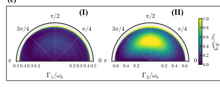
<figcaption class="paper-figure-caption"><b>Fig 5.</b> FIG. 4: Nonreciprocal contrasts Cm1|m2 E and Cmin R for (a,c) scenario I and (b,d) scenario II versus Γ1,2/ωb. Non- reciprocity is revealed by comparing θ and θ + π, with θ = π/4, π/3, π/2, and 3π/4. (e) Density plots of Cm1|m2 E as a function of (θ, Γj/ωb) for scenario I and scenario II. Other parameters are the same as in Fig. 2.</figcaption>
</figure>

**Summary.** The paper proposes using magnon squeezing in an optomagnomechanical ring cavity to generate switchable, nonreciprocal bipartite and tripartite entanglement. By controlling the phase of the magnon squeezing, researchers can reverse key system parameters, offering a robust method to tune quantum correlations without physical reconfiguration. This establishes magnon squeezing as a powerful, controllable resource for advanced quantum information processing in solid-state systems.

**Why it may be interesting.** This work is highly relevant as it merges concepts from cavity QED, magnonics, and optomechanics to create a controllable quantum resource. The ability to switch entanglement using only a phase shift ($	heta 	o 	heta+\pi$) provides an advanced degree of tunability for hybrid quantum platforms.

Detailed structure

**Main problem.** The goal is to generate and control switchable nonreciprocal entanglement using magnon squeezing within a cavity optomagnomechanical system.

**Main result.** The proposed phase-tuning method successfully demonstrates high-contrast, switchable bipartite and tripartite entanglement by exploiting the sign reversal of effective detuning and damping rates upon a $\pi$ phase shift.

**Method.** The theoretical framework involves linearizing quantum Langevin equations around steady states to analyze fluctuations, followed by calculating entanglement measures like logarithmic negativity and residual contangle.

**Model / system.** The system is an optomagnomechanical ring cavity coupling two ferrimagnetic YIG microbridges (magnons) to a common optical cavity mode and mechanical oscillators. The dynamics are governed by a complex Hamiltonian involving various detunings, couplings, and the phase-controlled magnon squeezing terms.

**Key observables.** Nonreciprocal entanglement is quantified using normalized contrast ratios ($C_E$ and $C_{\mathcal{R}}$), while bipartite entanglement uses logarithmic negativity ($E^N$) and tripartite entanglement uses residual contangle ($R^N$).

**Important parameters / regimes.** The control mechanism relies on the phase ($	heta_j$) of the magnon squeezing, which dictates the sign reversal of effective detuning shifts ($\Delta	heta_j$) and quadrature-damping contributions ($\kappa_{	heta j}$). Stability analysis is crucial, requiring all eigenvalues of the drift matrix to have negative real parts.

**Assumptions / limitations.** The analysis assumes a low-excitation regime for magnon populations and neglects bending-related displacements in the mechanical modes. Furthermore, stability requires operating within parameter regimes where the Routh–Hurwitz criterion is satisfied.

**Figures summary.** Figure 1 schematically illustrates the system setup and shows how phase change modifies detuning ($\Delta	heta$) and damping rate ($\kappa_	heta$). Figure 7 maps out stable operational regions in parameter space based on squeezing phases ($	heta_j$ and $\Gamma_j$).

**Paper structure.** The paper first introduces the physical platform and Hamiltonian, then derives the linearized quantum Langevin equations. It proceeds to analyze stability conditions using Routh–Hurwitz criteria before calculating entanglement measures (logarithmic negativity/residual contangle) and demonstrating the phase-switchable nonreciprocity.

Abstract

Cavity optomagnomechanics provides a versatile platform to explore macroscopic quantum correlations, particularly nonreciprocal entanglement. In this work, we propose a theoretical scheme to generate switchable bipartite and tripartite entanglement in an optomagnomechanical ring cavity by exploiting phase-controlled magnon squeezing. Indeed, two spatially separated ferrimagnetic YIG microbridges become entangled through their magnetostriction-mediated coupling to mechanical motion and a common cavity field via radiation-pressure interaction. The squeezing process introduces two phase-dependent contributions to the magnon response, namely an effective detuning shift $Δ_{θ_j}$ and a quadrature-damping contribution $κ_{θ_j}$, both of which reverse sign upon a $π$ phase shift, providing an in situ control to switch the entanglement response. The nonreciprocal entanglement is defined operationally through the asymmetric entanglement response under the phase reversal $θ_j \to θ_j + π$, quantified by normalized contrast ratios $C_E$ and $C_{\mathcal{R}}$, which measure the relative difference between the entanglement obtained at $θ_j$ and at the phase-reversed configuration $θ_j+π$. The resulting phase-tuning method provides a flexible and robust route to achieve high-contrast bipartite and tripartite entanglement within stable parameter regions, establishing magnon squeezing as a practical quantum resource for switchable quantum correlations in hybrid platforms.

[↑ back to top](#top)

### [Observation of a Rydberg-atom time crystal with an ultralong lifetime](http://arxiv.org/abs/2607.09247v1)

**Authors:** Qi-Feng Wang, Tian-Yu Han, Ya-Jun Wang, Dong-Yang Zhu, Chao Yu, Yu Ma, Yi-Ming Yin, Guang-Can Guo, Bang Liu, Li-Hua Zhang, Dong-Sheng Ding, Bao-Sen Shi  
**Type:** experiment · **Category:** other · **PDF:** <https://arxiv.org/pdf/2607.09247v1>  
**Analysis basis:** full PDF text, analyzed in chunks
**Topic relevance:** 🔥 `driven-dissipative phase transition` **5/5** · 🔥 `analog quantum simulation` **4/5** · 🔥 `correlated / nonlocal dissipation` **4/5** · `Rydberg arrays` **3/5** · `methods for driven-dissipative` **3/5** · `non-equilibrium dynamics` **3/5** · `non-equilibrium universality` **3/5** · `Keldysh / 2PI / non-Gaussian methods` **2/5** · `quantum optics experiment` **2/5** · `entanglement & information structure` **1/5** · `scars & prethermalization` **1/5**

↔ Scroll figures horizontally

<figure class="paper-figure-card">
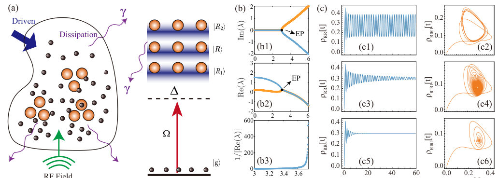
<figcaption class="paper-figure-caption"><b>Fig 1.</b> Figure 1. Diagram of the many-body system and simulations. (a) Schematic diagram of the drive-dissipation system, incorporating laser and RF field driving as well as the system’s intrinsic dissipation. The simplified energy diagram of the system consists of a ground state |g⟩and three Rydberg states |R⟩, |R1⟩and |R2⟩dressed by RF-field. Ωis the Rabi frequency coupling the ground state and Rydberg state with the laser, ∆is the detuning between the laser and the atomic resonant transition, and γ is the decay rate of the Rydberg energy levels. (b) Near zero frequency, the simulated imaginary part of the Liouvillian eigenspectrum scales as (b1), the real part as (b2), and the critical behavior...</figcaption>
</figure>
<figure class="paper-figure-card">
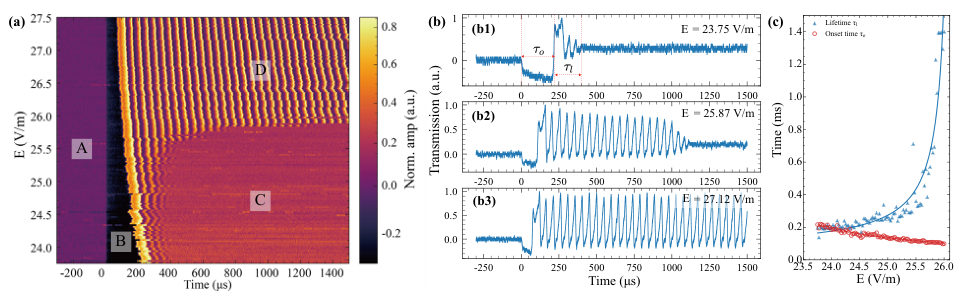
<figcaption class="paper-figure-caption"><b>Fig 2.</b> Figure 2. Measured CTC criticality and lifetime versus the RF-field amplitude. (a) Measured transmission after a step driving field is suddenly switched on at t = 0. A uniform field E = Vpp/d is applied across two parallel plates separated by d = 4 cm, and its amplitude is scanned over E = 23.75–27.5 V/m; the color scale shows the normalized transmission amplitude. Four regimes are labeled: (A) before the field is applied (t &lt; 0), where no oscillation occurs; (B) the field is on but the time crystal has not yet formed, defining the onset time τo; (C) the time crystal has formed with a finite lifetime τl that increases with E; and (D) the time crystal persists throughout the record, its...</figcaption>
</figure>
<figure class="paper-figure-card">
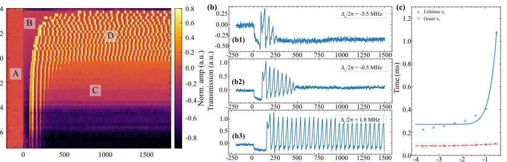
<figcaption class="paper-figure-caption"><b>Fig 3.</b> Figure 3. Measured criticality and lifetime of CTC versus the laser detuning. (a) Measured transmission dynamics under the driving of a step RF-field with E = 26.5 V/m at t = 0. The laser detuning ∆c is scanned over −2π × 7.3 to 2π × 4.0 MHz; the color scale represents the normalized transmission amplitude. The system exhibits four regimes: no time crystal (A), onset regime (B), fast-decay regime (C), long-lived regime (D). (b) Normalized transmission time traces extracted from (a) at ∆c = −2π × 5.5 MHz (b1), −2π × 0.5 MHz (b2), and 2π × 1.8 MHz (b3). The oscillation is short-lived at red detuning (b1), persists for a finite time before decaying near resonance (b2), and exhibits long-lived...</figcaption>
</figure>
<figure class="paper-figure-card">
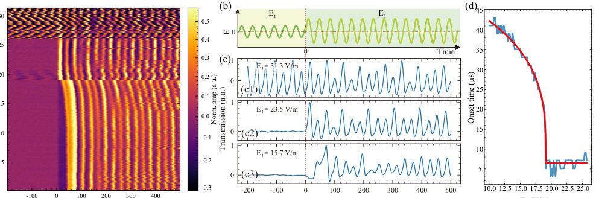
<figcaption class="paper-figure-caption"><b>Fig 4.</b> Figure 4. Initial-state-dependent onset dynamics. (a) Probe transmission versus time as the amplitude of the RF-field E1 is scanned from 0 to 31.3 V/m for t ≤0 and E2 = 31.3 V/m for t &gt; 0; the color scale gives the normalized transmission amplitude. The different values of E1 affect the evolution of the system at t &gt; 0. (b) Schematic of the two-stage driving protocol: E1 prepares the initial state for t &gt; 0 and is switched at t = 0 to a fixed amplitude E2 = 31.3 V/m with the same frequency of 8.2 MHz. (c) Transmission traces at three values of E1 (labeled in each panel), peak-normalized to emphasize the onset and waveform profiles rather than absolute amplitudes; the red dashed line marks t...</figcaption>
</figure>
<figure class="paper-figure-card">
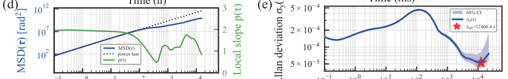
<figcaption class="paper-figure-caption"><b>Fig 5.</b> Figure 5. Measurement of the ultralong-lived CTC. (a) Short-time Fourier-transform spectrogram of the probe- transmission signal over a 61,020-s analysis window. The oscillation remains centered near f0 = 15.03 kHz, with a maximum frequency offset of 30.5 Hz. The spectral power is normalized to its maximum. (b) Oscillation-amplitude stability over the full lifetime. The red curve shows the 10-s local mean, and the shaded band denotes the local ±1σ fluctuation. The ampli- tude remains near its typical value throughout the measurement, with a total variation of about 10.1%. (c) Representative waveforms at t = 10 s, 30000 s, and 60000 s. Each 1.5-ms trace is independently normalized to show...</figcaption>
</figure>

**Summary.** The researchers successfully observed a Continuous Time Crystal (CTC) using Rydberg atoms, achieving an unprecedentedly long lifetime exceeding 16.95 hours. They achieved this by engineering the dissipative environment to stabilize the system's limit-cycle dynamics against typical decay mechanisms. This work establishes a powerful platform for studying robust, autonomous non-equilibrium quantum phases.

**Why it may be interesting.** This work is highly relevant as it pushes the boundaries of open quantum systems physics by experimentally realizing and stabilizing an exotic, non-equilibrium quantum phase (DTC) in a controllable atomic platform (Rydberg atoms).

Detailed structure

**Main problem.** The primary goal is observing and understanding Continuous Time Crystals (CTCs), which are non-equilibrium quantum phases that spontaneously break time-translation symmetry without periodic external driving.

**Main result.** The authors reported the observation of an ultralong-lived Rydberg-atom CTC with a lifetime exceeding 16.95 hours, significantly surpassing previous realizations.

**Method.** The study uses theoretical analysis based on the Lindblad master equation and experimental measurements involving controlled optical pumping and external RF fields to stabilize the limit-cycle dynamics.

**Model / system.** The system is a Rydberg-atom ensemble interacting via long-range van der Waals forces, driven by coherent laser/RF fields in a dissipative environment. The dynamics are modeled using the Lindblad master equation.

**Key observables.** CTC behavior (persistent oscillations), oscillatory lifetime ($	au_l$), and onset time ($	au_o$).

**Important parameters / regimes.** External RF field amplitude ($E$) and laser detuning ($\Delta_c$); achieving a near-zero real part of the Liouvillian eigenspectrum is key.

**Assumptions / limitations.** The analysis relies on a mean-field treatment, which neglects inter-atomic correlations due to atomic thermal motion.

**Figures summary.** Figures illustrate system diagrams, energy level structures, time evolution simulations under varying decay rates, and plots showing measured CTC criticality and lifetime dependence on applied electric field amplitude or laser detuning.

**Paper structure.** The paper introduces the concept of CTCs, details the theoretical framework using the Lindblad master equation and Liouvillian spectrum analysis, presents experimental measurements demonstrating the long-lived limit cycle phase, and concludes by establishing a robust platform for studying autonomous non-equilibrium phases.

Abstract

Continuous time crystals (CTCs) represent a nonequilibrium quantum phase that spontaneously breaks time-translation symmetry without periodic external driving, manifesting as persistent, long-lived oscillations under steady pumping. The lifetime is constrained by the instability of the limit cycle phase, balanced between nonlinear feedback and energy dissipation, which have rarely been studied in experiments before. Here, we report an observation of an ultralong-lived Rydberg-atom CTC in a driven-dissipative many-body atomic system. By harnessing long-range interactions and engineering a dissipative environment that stabilizes the limit-cycle dynamics, we suppress heating and decay effects that typically destroy time-crystalline order. The key factor underlying the ultralong-lived CTC is the closing of the Liouvillian gap and the near-zero real part of the system's Liouvillian eigenspectrum. Through systematic optimization, we achieve an oscillatory lifetime exceeding 16.95 hours-orders of magnitude longer than previous CTC realizations. Our work establishes a robust platform for exploring long-lived autonomous nonequilibrium phases and paves the way for applications in quantum sensing and continuous-time quantum information processing.

[↑ back to top](#top)

### [Probing two-spin entanglement at quantum criticality on a quantum processor](http://arxiv.org/abs/2607.08967v1)

**Authors:** Anshumitra Baul, Xiao Xiao, Phillip C. Lotshaw  
**Type:** both · **Category:** other · **PDF:** <https://arxiv.org/pdf/2607.08967v1>  
**Analysis basis:** full PDF text, analyzed in chunks
**Topic relevance:** 🔥 `entanglement & information structure` **5/5** · 🔥 `analog quantum simulation` **4/5** · `QC/QI experiment` **3/5** · `exotic spin models in light-matter` **3/5** · `quantum measurements` **2/5** · `driven-dissipative phase transition` **1/5** · `methods for driven-dissipative` **1/5** · `non-equilibrium dynamics` **1/5** · `non-equilibrium universality` **1/5**

↔ Scroll figures horizontally

<figure class="paper-figure-card">
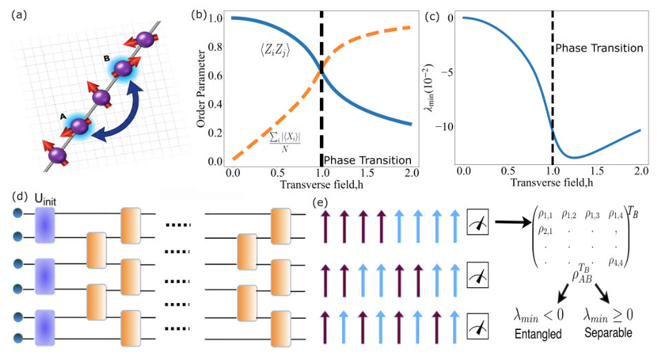
<figcaption class="paper-figure-caption"><b>Fig 1.</b> FIG. 1: (a) Schematic 1D spin-model used to investigate two-spin entanglement on the quantum hardware. (b) Evolution of the ferromagnetic ⟨ZiZi+1⟩and polarized phase P</figcaption>
</figure>
<figure class="paper-figure-card">
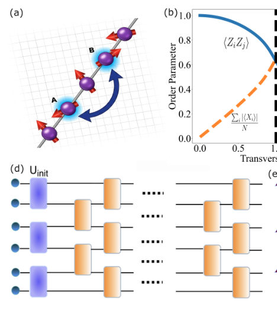
<figcaption class="paper-figure-caption"><b>Fig 2.</b> Fig. 1 outlines the main ideas of this work. We implement a generic entanglement witness to quan- tify two-spin entanglement in quantum computa- tions, taking quantum simulations of spin chains as a target example (Fig. 1(a)). The spin chains un- dergo a QPT as a control parameter, such as a mag- netic field, is varied. The phase transition realizes a change in order parameter, for example as shown in Fig. 1(b). Near the transition point, the ground state becomes highly entangled. We argue the PPT criterion provides a practical and scalable witness of the resulting entanglement in quantum simula- tions, as seen in its peak near the phase transition point in Fig. 1(c). We demonstrate that...</figcaption>
</figure>
<figure class="paper-figure-card">
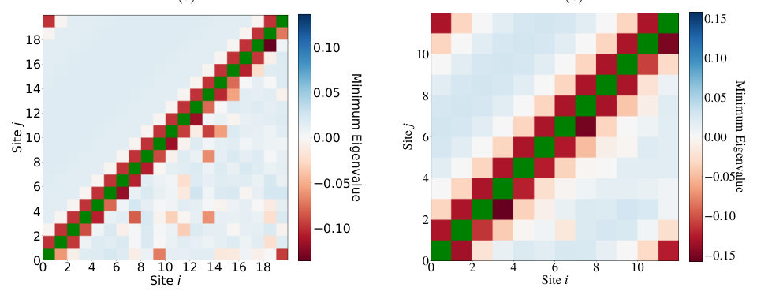
<figcaption class="paper-figure-caption"><b>Fig 3.</b> FIG. 2: Heatmaps of the PPT entanglement witness for all spin pairs (i, j) near the critical points of the 1D systems, with λmin &lt; 0 (orange,red) indicating entanglement. The upper panels show the unmitigated λmin and the lower panels show the λmin after error mitigation. (a,c) TFIM at h = 1.0 and (b,d) XXZ at ∆= −0.68. The plots are partitioned into two regions for direct benchmarking: the upper-left triangle (j &gt; i) represents the exact results obtained from MPS calculations, while the lower-right triangle (i &gt; j) displays experimental results measured on quantum hardware. The green diagonal corresponds to identical sites (i = j), where a pairwise reduced density matrix cannot be defined....</figcaption>
</figure>
<figure class="paper-figure-card">
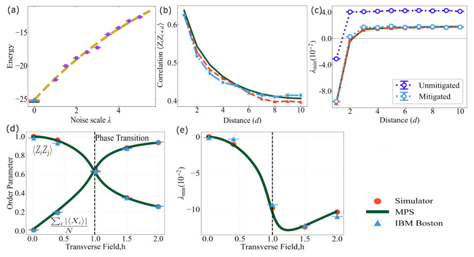
<figcaption class="paper-figure-caption"><b>Fig 4.</b> FIG. 3: Physical properties of the critical TFIM from quantum simulations. (a) The energy is extrapolated to the zero-noise limit (λ = 0) in close agreement with MPS benchmarks (green/orange lines at lower left signify MPS/Simulator result respectively). (b) The power law decay of longitudinal correlations ⟨ZiZi+d⟩ with distance d confirms that the hardware accurately captures the spatial structure of the state, despite cumulative gate noise. (c) Pairwise entanglement of nearest neighbors is witnessed by the minimum eigenvalue λmin of the partially transposed density matrix; applying error mitigation successfully shifts hardware results below the zero-threshold to match the ideal ground...</figcaption>
</figure>
<figure class="paper-figure-card">
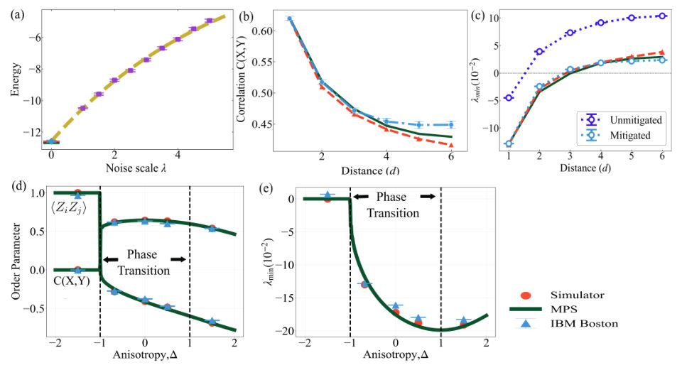
<figcaption class="paper-figure-caption"><b>Fig 5.</b> FIG. 4: Quantum simulation results for the XXZ model analogous to Fig. 3 (green/orange lines at lower left signify MPS/Simulator result respectively). (a) Energy estimation of the XXZ at ∆= −0.68. (b) Long range transverse correlation C(X, Y ) = (⟨XiXi+d⟩+ ⟨YiYi+d⟩)/2 with distance d. (c) λmin witnesses entanglement for nearest- and next-nearest neighbor pairs (d = 1, 2). (d) The change in ⟨ZiZj⟩and C(X, Y ) = 1</figcaption>
</figure>

**Summary.** This paper develops and demonstrates the use of the Positive Partial Transpose (PPT) criterion as a scalable method to measure two-spin entanglement in many-body systems undergoing quantum phase transitions. By combining this diagnostic tool with variational quantum circuits, the authors successfully map out entanglement patterns across critical points on actual quantum hardware, comparing results rigorously against theoretical benchmarks.

**Why it may be interesting.** This work bridges fundamental condensed matter theory (QPTs, entanglement) with near-term quantum computation capabilities. The use of a robust witness like PPT makes it highly relevant for characterizing complex quantum phases on noisy hardware.

Detailed structure

**Main problem.** The primary goal is characterizing two-spin entanglement, particularly at quantum critical points in many-body systems, using noisy quantum hardware.

**Main result.** The Positive Partial Transpose (PPT) criterion serves as an efficient and scalable witness that successfully detects pairwise entanglement across quantum phase transitions on near-term quantum devices.

**Method.** The authors combine the PPT criterion with Overlapping State Tomography to measure reduced density matrices ($
ho_{AB}$) for spin pairs, while preparing critical states using variational quantum circuits.

**Model / system.** The study focuses on 1D spin chains modeled by Hamiltonians like the Transverse-Field Ising Model (TFIM) and the XXZ model. These systems are simulated across varying control parameters to induce Quantum Phase Transitions (QPTs).

**Key observables.** Minimum eigenvalue ($\lambda_{\min}$) of the partial transpose, correlation functions ($\langle Z_i Z_{i+d} 
angle$, $C(X, Y)$), and fidelity of state preparation.

**Important parameters / regimes.** Quantum critical points (e.g., specific values of magnetic field $h$ or anisotropy $\Delta$), system size ($N=12, 20$), and noise levels.

**Assumptions / limitations.** Traditional entanglement measures like Entanglement Entropy are difficult to interpret for mixed/noisy states; the PPT criterion is chosen specifically because it remains robust in such conditions.

**Figures summary.** Figures illustrate the evolution of order parameters across QPTs, show the PPT criterion peaking near criticality, and present heatmaps comparing measured correlation functions and minimum eigenvalues ($\lambda_{\min}$) against DMRG benchmarks for both TFIM and XXZ models under noise extrapolation.

**Paper structure.** The paper systematically develops the theoretical framework (PPT witness), applies it to specific spin models (TFIM/XXZ) using variational circuits for state preparation, and then validates the measurement protocol by comparing hardware results against high-accuracy DMRG benchmarks across various phase transitions.

Abstract

Quantum phase transitions in many-body systems give rise to highly entangled states, and understanding their quantum correlations is crucial for characterizing quantum materials. However, traditional entanglement measures such as entanglement entropy are difficult to interpret for noisy or mixed states and require complex circuits to evaluate. Therefore, we explore the Positive Partial Transpose (PPT) criterion, coupled with overlapping state tomography, as an efficient and scalable spin-spin entanglement witness. It detects pairwise entanglement from reduced density matrices, distinguishes quantum from classical correlations, and applies to both pure and mixed states. It is ideal for studying condensed matter systems prepared on noisy quantum devices as well as future extensions to finite temperatures. We demonstrate the approach on quantum hardware, using variational circuits to prepare quantum critical states with up to 20 qubits and completely map their two-spin entanglement across various quantum phase transitions.

[↑ back to top](#top)

### [Non-Equilibrium Economics: A Physicist's Point of View](http://arxiv.org/abs/2607.09620v1)

**Authors:** Jean-Philippe Bouchaud  
**Type:** theory · **Category:** disordered systems and neural networks · **PDF:** <https://arxiv.org/pdf/2607.09620v1>  
**Analysis basis:** full PDF text, analyzed in chunks
**Topic relevance:** 🔥 `non-equilibrium dynamics` **5/5** · 🔥 `non-equilibrium universality` **4/5** · `driven-dissipative phase transition` **3/5** · `methods for driven-dissipative` **3/5** · `Frenkel-Kontorova` **1/5** · `Keldysh / 2PI / non-Gaussian methods` **1/5** · `correlated / nonlocal dissipation` **1/5** · `exotic spin models in light-matter` **1/5**

↔ Scroll figures horizontally

<figure class="paper-figure-card">
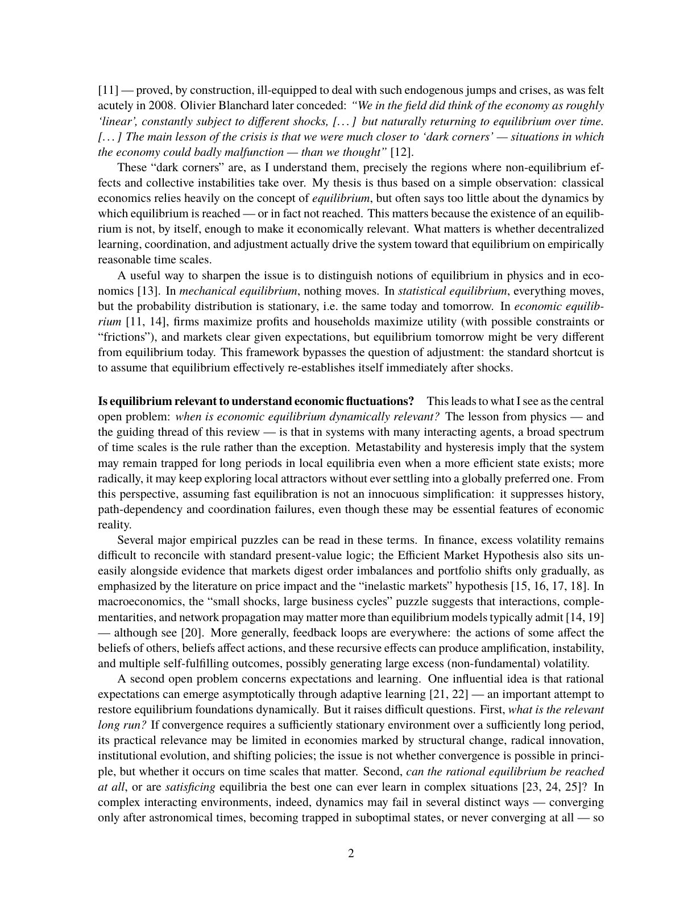
<figcaption class="paper-figure-caption"><b>Fig 1.</b> Low-resolution page preview, page 2</figcaption>
</figure>
<figure class="paper-figure-card">
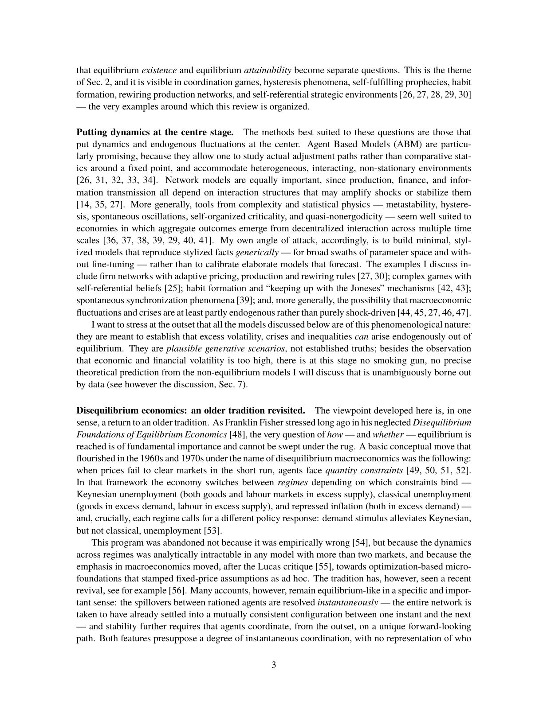
<figcaption class="paper-figure-caption"><b>Fig 2.</b> Low-resolution page preview, page 3</figcaption>
</figure>
<figure class="paper-figure-card">
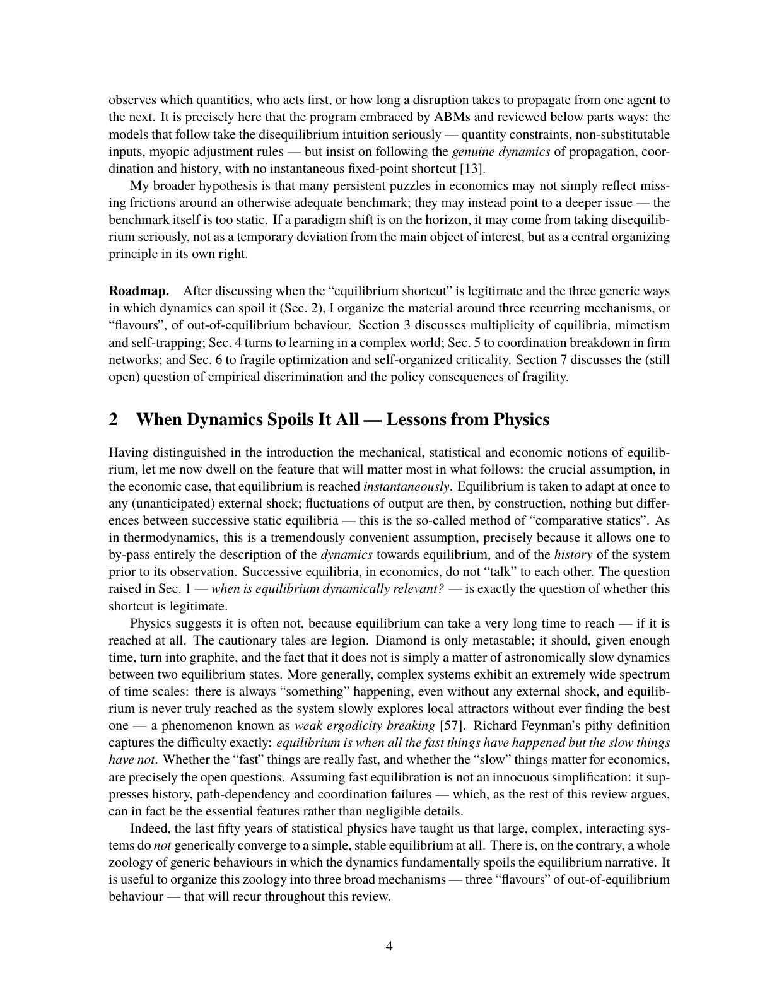
<figcaption class="paper-figure-caption"><b>Fig 3.</b> Low-resolution page preview, page 4</figcaption>
</figure>
<figure class="paper-figure-card">
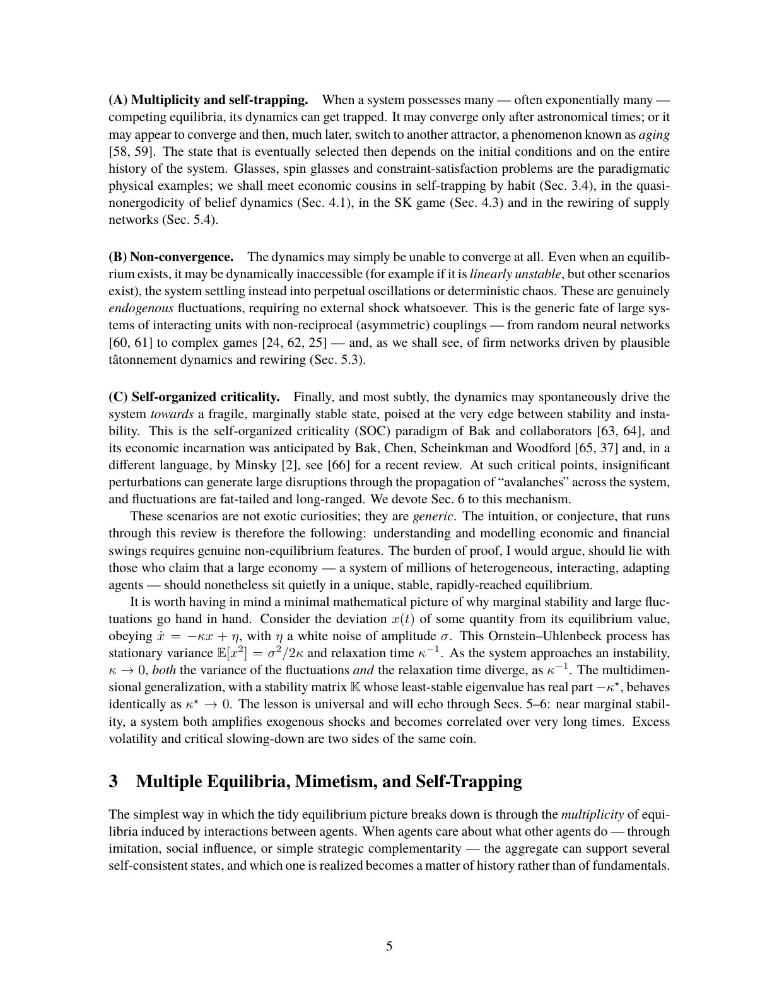
<figcaption class="paper-figure-caption"><b>Fig 4.</b> Low-resolution page preview, page 5</figcaption>
</figure>
<figure class="paper-figure-card">
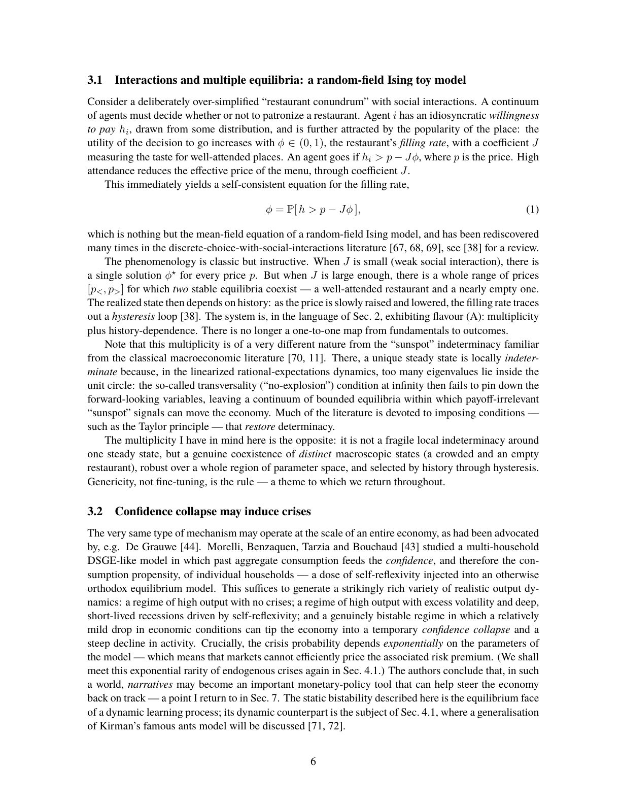
<figcaption class="paper-figure-caption"><b>Fig 5.</b> Low-resolution page preview, page 6</figcaption>
</figure>

**Summary.** This review argues that mainstream economics' reliance on equilibrium assumptions fails to explain recurring financial crises. By adopting a physicist's viewpoint, the author shows how complex, interacting systems naturally exhibit instability and crashes through mechanisms like path-dependence and self-organized criticality when operating far from equilibrium.

**Why it may be interesting.** It directly applies advanced concepts from disordered systems—such as glassy dynamics, spin-glass theory, and self-organized criticality—to model macroscopic emergent behavior in a non-physical domain, which is highly relevant to understanding critical transitions in many physical systems.

Detailed structure

**Main problem.** The primary problem is understanding the origin of financial crises, bubbles, and economic instability by questioning the applicability of equilibrium concepts in complex systems.

**Main result.** Non-equilibrium dynamics—such as path dependence, trapping in multiple equilibria, or self-organized criticality—can naturally generate observed phenomena like excess volatility and endogenous crashes without requiring large external shocks.

**Method.** The review synthesizes insights from stylized 'toy' models and concepts drawn from statistical physics (e.g., spin glasses, SOC) to analyze system behavior away from fixed points.

**Model / system.** The focus is on complex, interacting systems like financial markets or social networks, modeled using analogies to glassy systems, mean-field equations, and agent-based simulations.

**Key observables.** Excess volatility, endogenous crises/crashes, persistent inequalities, hysteresis loops, and power-law distributions (avalanches).

**Important parameters / regimes.** The degree of interaction strength ($J$), the relaxation rate ($\kappa$), and initial conditions that determine which equilibrium state is reached.

**Assumptions / limitations.** The core assumption challenged is that economic systems instantaneously reach a stable, predictable equilibrium following any shock. The models are noted as phenomenological scenarios rather than fully calibrated theories.

**Paper structure.** The paper builds an argument by first establishing the puzzle (crises), then critiquing the equilibrium assumption using physics concepts (metastability, SOC), and finally detailing specific mechanisms (trapping, non-convergence) that generate complex dynamics.

Abstract

Financial and economic history is strewn with bubbles and crashes, booms and busts, crises and upheavals of all sorts. Understanding the origin of these events is arguably one of the most important problems in economic theory: are economies intrinsically unstable, and can one ``stabilize unstable economies''? In this review I argue, from a physicist's vantage point, that the concept of equilibrium -- so central to mainstream economic thinking -- is likely to be the exception rather than the rule in large, complex, interacting systems. Drawing on a series of stylized ``toy'' models, I show how excess volatility, endogenous crises and crashes, inflation swells and persistent inequalities can all emerge naturally from genuinely out-of-equilibrium dynamics, without invoking large exogenous shocks. Three generic mechanisms recur throughout: trapping in a multiplicity of history-dependent equilibria; the impossibility of dynamically reaching equilibrium, leading to oscillations and chaos; and the spontaneous evolution towards fragile, marginally stable states -- the self-organized criticality paradigm. I stress that these are phenomenological scenarios rather than calibrated theories: there is, at this stage, no ``smoking gun''. But the burden of proof, I contend, should be on the equilibrium camp.

[↑ back to top](#top)

### [Deterministic Generation of Linear Photonic Cluster States with Semiconductor Quantum Dots: A Detailed Comparison of Different Schemes](http://arxiv.org/abs/2607.09373v1)

**Authors:** Nikolas Köcher, Stefan Schumacher  
**Type:** theory · **Category:** quantum information and computing · **PDF:** <https://arxiv.org/pdf/2607.09373v1>  
**Analysis basis:** full PDF text, analyzed in chunks
**Topic relevance:** 🔥 `spintronics-quantum-optics interface` **4/5** · `Tavis-Cummings & cavity-many-emitter` **3/5** · `analog quantum simulation` **3/5** · `correlated cavity matter` **3/5** · `exotic spin models in light-matter` **3/5** · `correlated / nonlocal dissipation` **2/5** · `driven-dissipative phase transition` **2/5** · `entanglement & information structure` **2/5** · `methods for driven-dissipative` **2/5** · `non-equilibrium dynamics` **2/5** · `Keldysh / 2PI / non-Gaussian methods` **1/5** · `QC/QI experiment` **1/5** · `non-equilibrium universality` **1/5** · `quantum measurements` **1/5** · `quantum optics experiment` **1/5**

↔ Scroll figures horizontally

<figure class="paper-figure-card">
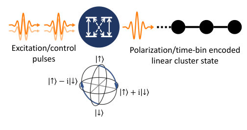
<figcaption class="paper-figure-caption"><b>Fig 1.</b> FIG. 1. Schematic of the cluster state generation process. Periodic driving of the emitter, interspersed with qubit rota- tions, leads to the generation of an entangled string of either polarization or time-bin entangled photons.</figcaption>
</figure>
<figure class="paper-figure-card">
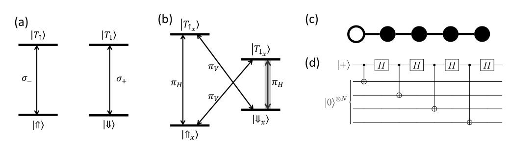
<figcaption class="paper-figure-caption"><b>Fig 2.</b> FIG. 2. (a) Level scheme and selection rules for a singly positively charged QD without an external magnetic field. (b) Selection rules for the same QD, but with an external in-plane magnetic field Bx. The transition |⇓x⟩↔|T↓x⟩marked in light gray is selectively cavity enhanced. (c) Graphical depiction of a five qubit linear cluster state, obtained after four cycles of entangled photon generation. The first vertex represents the emitter, while the solid vertices each represent a photonic qubit, which may be polarization or time-bin encoded. A Z-measurement on the emitter removes its vertex from the graph and leaves a purely photonic cluster state. (d) Circuit diagram representation of the...</figcaption>
</figure>
<figure class="paper-figure-card">
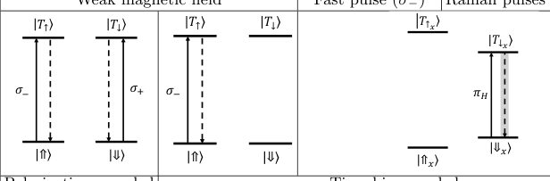
<figcaption class="paper-figure-caption"><b>Fig 3.</b> FIG. 3. Overview of the four linear cluster state generation schemes we investigate: The original LR scheme using spin precession and polarization encoding (1), the LR scheme adapted for time-bin encoding (2) and two schemes using time-bin encoding and optical spin control via an ultrafast pulse (3) or via Raman pulses (4).</figcaption>
</figure>
<figure class="paper-figure-card">
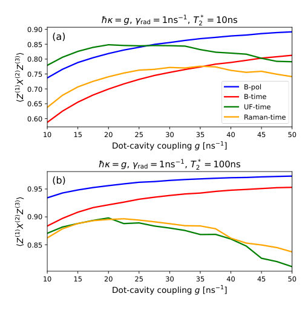
<figcaption class="paper-figure-caption"><b>Fig 4.</b> FIG. 4. Comparison of ⟨Z(1)X(2)Z(3)⟩for the cluster state generation schemes in dependence of the dot-cavity coupling g for different hole spin coherence times T ∗ 2 = 10 ns (a) and T ∗ 2 = 100 ns (b).</figcaption>
</figure>
<figure class="paper-figure-card">
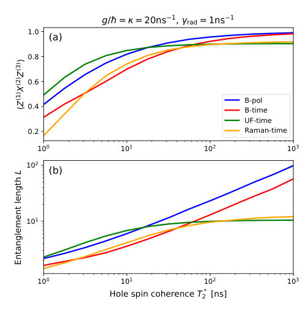
<figcaption class="paper-figure-caption"><b>Fig 5.</b> FIG. 5. Comparison of ⟨Z(1)X(2)Z(3)⟩(a) and of the entan- glement length L (b) for the different schemes in dependence of the hole spin coherence time T ∗ 2 .</figcaption>
</figure>

**Summary.** This paper theoretically compares four distinct methods for deterministically generating linear photonic cluster states using semiconductor quantum dots coupled to optical cavities. By analyzing the impact of various error mechanisms, it provides a crucial 'regime map' guiding researchers on whether magnetic-field-driven or optically controlled protocols are best suited based on material coherence times and cavity quality.

**Why it may be interesting.** It provides a detailed, quantitative comparison of multiple quantum control schemes in solid-state emitters, mapping out an operational regime map based on fundamental material parameters like coherence time and cavity enhancement.

Detailed structure

**Main problem.** The primary goal is the deterministic generation of linear photonic cluster states, which are crucial resource states for measurement-based quantum computation.

**Main result.** Spin-precession based schemes show natural robustness against phonon decoherence and scale well with strong cavity enhancement, while optical control schemes perform better under lower spin coherence times.

**Method.** The authors theoretically compare four distinct generation protocols by modeling the system dynamics using a microscopic approach involving Hamiltonian simulation and calculating photonic correlation functions.

**Model / system.** The physical platform is a semiconductor quantum dot (QD) acting as a deterministic photon emitter coupled to an optical microcavity. The model details hole spin states, trion states, and incorporates coupling strengths, decay rates, and decoherence mechanisms.

**Key observables.** Fidelity tracking using photonic correlation functions ($ar{g}^{(2)}$, $ar{g}^{(3)}$) and the expectation values of stabilizer generators ($\langle X(1)Z(2) 
angle$, etc.).

**Important parameters / regimes.** Hole spin coherence time ($T_2^*$), cavity coupling strength ($g$), Purcell enhancement, and cooperativity of the cycling transition.

**Assumptions / limitations.** The comparison is made for a singly positively charged QD; some schemes are assumed to be immune to phonon decoherence while others are highly dependent on specific decay channels.

**Figures summary.** Figure 1 schematically shows cluster state generation via periodic driving. Figure 2 details the level scheme and selection rules, showing circuit diagrams for the protocols. Figure 3 compares the four investigated schemes (B-pol, B-time, UF-time, Raman-time).

**Paper structure.** The paper develops from outlining the need for deterministic cluster state generation to detailing the physical control mechanisms (spin precession vs. optical pulses), and finally quantifies the resulting photonic entanglement using stabilizer formalism metrics.

Abstract

Photonic graph states are key resource states for measurement based quantum information processing. As semiconductor quantum dots are excellent deterministic photon emitters, several protocols using them for the generation of linear cluster states have been proposed, either based on constant precession of a hole or electron spin in a weak magnetic field, or based on optical spin control, in a stronger magnetic field. We theoretically compare four such schemes, using polarization or time-bin encoding, respectively, for a range of cavity environments and spin coherence times. In particular we study how different error mechanisms affect the different schemes, using a microscopic model of the spin control, the excitation and emission dynamics, and of the phonon bath. We find the spin-precession based schemes to scale well with strong cavity enhancement and to be naturally robust against phonon-induced decoherence, while the schemes using optical spin control can perform well for lower spin coherence times and are strongly dependent on the cooperativity of the cavity induced cycling transition. Our results provide a regime map for choosing between magnetic-field-driven and optically controlled protocols depending on spin coherence time, Purcell enhancement, and suppression of unwanted decay channels.

[↑ back to top](#top)

### [Qubit-Boson Hybrid Beam-Splitter Gate with Kerr Nonlinearity in Circuit QED for Many-Body Dynamics](http://arxiv.org/abs/2607.09513v1)

**Authors:** Andrea Mammola, Giuseppe Di Molfetta, Quentin Schaeverbeke  
**Type:** theory · **Category:** other · **PDF:** <https://arxiv.org/pdf/2607.09513v1>  
**Analysis basis:** full PDF text, analyzed in chunks
**Topic relevance:** 🔥 `analog quantum simulation` **4/5** · `Tavis-Cummings & cavity-many-emitter` **3/5** · `correlated cavity matter` **3/5** · `Keldysh / 2PI / non-Gaussian methods` **2/5** · `QC/QI experiment` **2/5** · `methods for driven-dissipative` **2/5** · `non-equilibrium dynamics` **2/5** · `quantum optics experiment` **2/5** · `correlated / nonlocal dissipation` **1/5** · `driven-dissipative phase transition` **1/5** · `entanglement & information structure` **1/5** · `exotic spin models in light-matter` **1/5** · `non-equilibrium universality` **1/5**

↔ Scroll figures horizontally

<figure class="paper-figure-card">
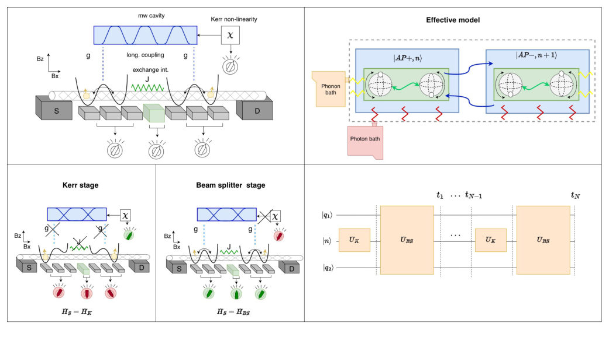
<figcaption class="paper-figure-caption"><b>Fig 1.</b> FIG. 1: Pseudo-3D schematic of a carbon-nanotube circuit-QED realization of the hybrid gate. Top left: experimental platform, where a suspended CNT above electrostatic gates defines two double quantum dots with tunable exchange interaction J, both longitudinally coupled to a microwave resonator, with a weak tunable Kerr nonlinearity χ engineered at the cavity level. Top right: effective dressed-state description in the odd-parity sector, where the states {|AP+⟩, |AP−⟩} couple to the cavity mode through an effective beam-splitter interaction, while the cavity also acquires a weak Kerr nonlinearity and the environment induces phonon- and photon-sector dissipation. Bottom left and bottom...</figcaption>
</figure>
<figure class="paper-figure-card">
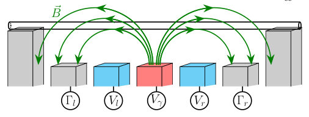
<figcaption class="paper-figure-caption"><b>Fig 2.</b> FIG. 2: Schematic representation of the CNT spin qubit. B denotes the magnetic texture, with BL(R) its projection on the left (right) dot. ε is the DQD bias energy and γ the interdot tunneling amplitude. Γj with j ∈{l, r} denote the voltages applied to the outer gates and control the DQD-contact tunneling rates. Vk with k ∈{l, γ, r} denote the voltages applied to the central gates, which control the DQD bias and tunneling energy.</figcaption>
</figure>
<figure class="paper-figure-card">
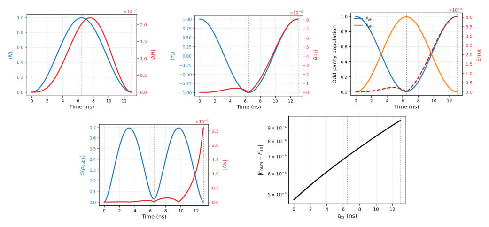
<figcaption class="paper-figure-caption"><b>Fig 3.</b> FIG. 3: Numerical benchmark of the effective open-system gate dynamics for the representative CNT cQED operating point discussed in the text, using a cavity truncation nmax = 3 and initial state |AP+, 0⟩. The top row shows pure beam-splitter evolution over two reference exchange times tref = π/(2geff). In each panel, the left axis reports the ideal trajectory, while the right axis shows the absolute deviation between noisy and ideal evolution. From left to right, the panels display the cavity occupation ⟨N⟩(t), the dressed qubit polarization ⟨τz⟩(t), and the odd-parity dressed-state populations PAP+ and PAP−. The bottom-left panel shows the reduced qubit entropy, again together with the...</figcaption>
</figure>
<figure class="paper-figure-card">
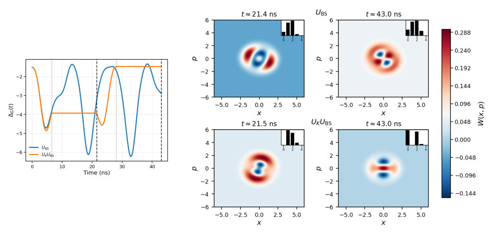
<figcaption class="paper-figure-caption"><b>Fig 4.</b> FIG. 4: Reduced cavity-state structure generated by the effective gate dynamics, for the initial state |AP+⟩⊗(|0⟩+ |2⟩)/ √</figcaption>
</figure>

**Summary.** The paper designs a novel hybrid qubit-boson beam-splitter gate using Kerr nonlinearity in circuit QED. By developing an analytical description of the gate fidelity under dissipation, it establishes this primitive as a powerful tool for modeling advanced phenomena like quantum cellular automata and lattice gauge theories.

**Why it may be interesting.** This work is highly relevant as it combines advanced concepts from cavity QED, nonlinear photonics (Kerr effect), and open quantum system dynamics to engineer specific quantum gates for simulating complex many-body physics.

Detailed structure

**Main problem.** The primary goal is to implement a hybrid qubit-boson beam-splitter gate for studying complex many-body dynamics, moving beyond simple virtual photon mediation.

**Main result.** The authors derive an analytical expression for the average gate fidelity in the weak-dissipation regime and show that the setup provides a natural building block for simulating quantum cellular automata and lattice gauge theories.

**Method.** The analysis involves deriving effective Hamiltonians via polaron transformations, developing open-system descriptions using master equations (both Born-Markov and collision models), and calculating gate fidelity in the weak-dissipation limit.

**Model / system.** The system is a circuit QED setup involving two interacting qubits coupled to a microwave cavity mode with Kerr nonlinearity. The Hamiltonian includes qubit, cavity, and interaction terms ($H_S = H_Q + H_c$).

**Key observables.** Average gate fidelity ($	ext{F}_{	ext{avg}}$), gate dynamics, and the effective coupling strengths.

**Important parameters / regimes.** Weak-dissipation regime, Kerr nonlinearity strength ($\chi$), cavity dissipation rate ($\kappa$), and qubit/coupling parameters ($g, J$).

**Assumptions / limitations.** The analysis relies on approximations such as the unresolved-Kerr regime assumption and treating gate evolution sequentially ($U = U_{BS} U_K$).

**Figures summary.** Figure 1 schematically illustrates the CNT realization of the system, the effective dressed-state description, and the sequence of Kerr and beam-splitter gates.

**Paper structure.** The paper progresses from deriving the general Hamiltonian in a cQED setting to applying transformations (polaron) that separate parity sectors. It then develops the open-system master equation incorporating dissipation channels before finally calculating the average gate fidelity using collision model techniques.

Abstract

We introduce a hybrid qubit-boson beam-splitter gate in which a microwave cavity mode couples to an exchange-dressed two-level subsystem of an interacting two-qubit system in the presence of Kerr nonlinearity. Starting from a general circuit quantum electrodynamics (cQED) model, we derive the corresponding hybrid qubit-cavity interaction, develop its open-system description including photon- and qubit-sector-bath-induced dissipation and obtain in the weak-dissipation regime an analytical expression for the average gate fidelity. We further identify carbon-nanotube circuit QED as a concrete platform for implementing and controlling the gate, provide a representative operating regime and perform noiseless and noisy numerical simulations to study the gate dynamics and benchmark the analytical results. Beyond this implementation route, the proposed hybrid primitive provides a natural building block for many-body dynamics, including quantum-cellular-automaton (QCA) and lattice-gauge-inspired architectures and, through its collision-model reformulation, also suggests connections to noisy QCA, non-Markovian extensions and reservoir-style quantum information processing.

[↑ back to top](#top)

### [Exact Lindbladian Dynamics from Conformal Embeddings and Topological Defects in Conformal Field Theory](http://arxiv.org/abs/2607.08827v1)

**Authors:** Chen Bai  
**Type:** theory · **Category:** statistical mechanics · **PDF:** <https://arxiv.org/pdf/2607.08827v1>  
**Analysis basis:** full PDF text, analyzed in chunks
**Topic relevance:** 🔥 `methods for driven-dissipative` **4/5** · `Keldysh / 2PI / non-Gaussian methods` **3/5** · `correlated / nonlocal dissipation` **3/5** · `driven-dissipative phase transition` **3/5** · `entanglement & information structure` **2/5** · `non-equilibrium dynamics` **2/5** · `non-equilibrium universality` **2/5** · `Kondo & dissipative impurity` **1/5** · `analog quantum simulation` **1/5** · `exotic spin models in light-matter` **1/5** · `scars & prethermalization` **1/5**

↔ Scroll figures horizontally

<figure class="paper-figure-card">
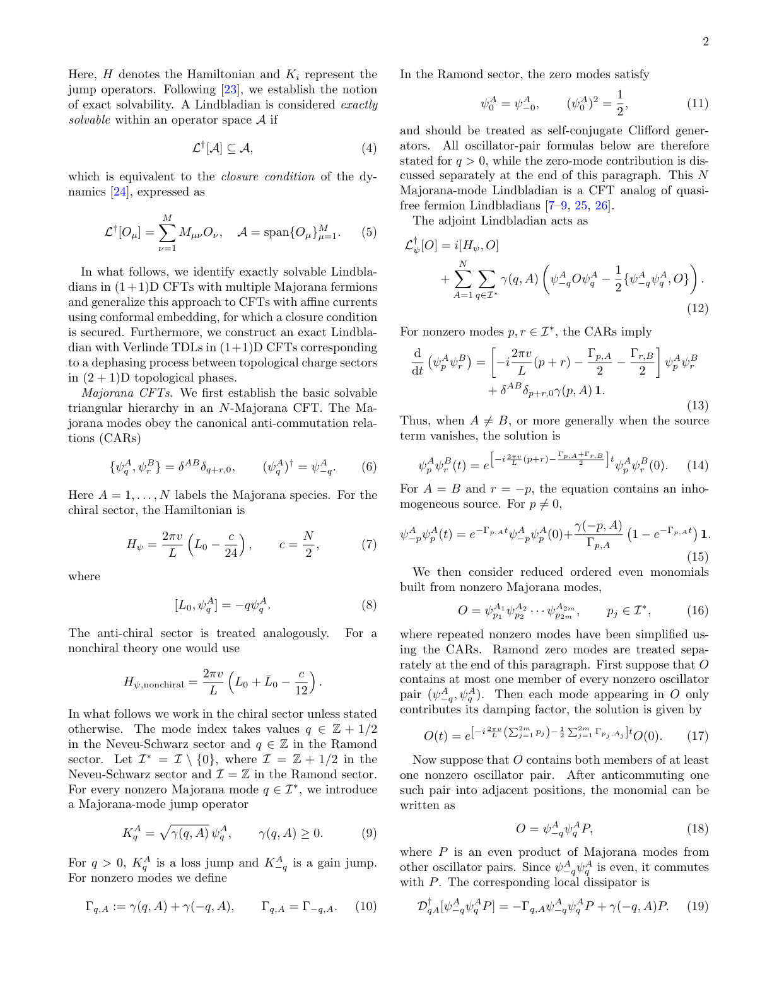
<figcaption class="paper-figure-caption"><b>Fig 1.</b> Low-resolution page preview, page 2</figcaption>
</figure>
<figure class="paper-figure-card">
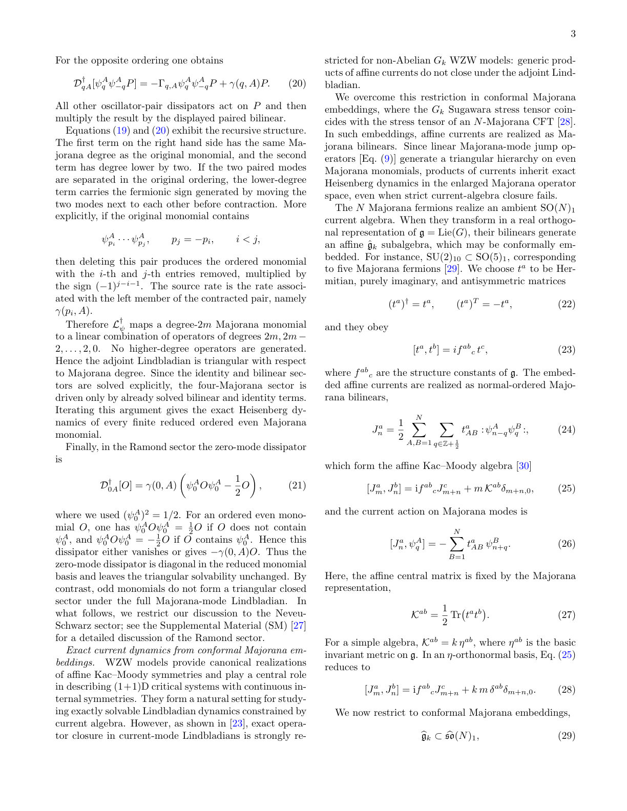
<figcaption class="paper-figure-caption"><b>Fig 2.</b> Low-resolution page preview, page 3</figcaption>
</figure>
<figure class="paper-figure-card">
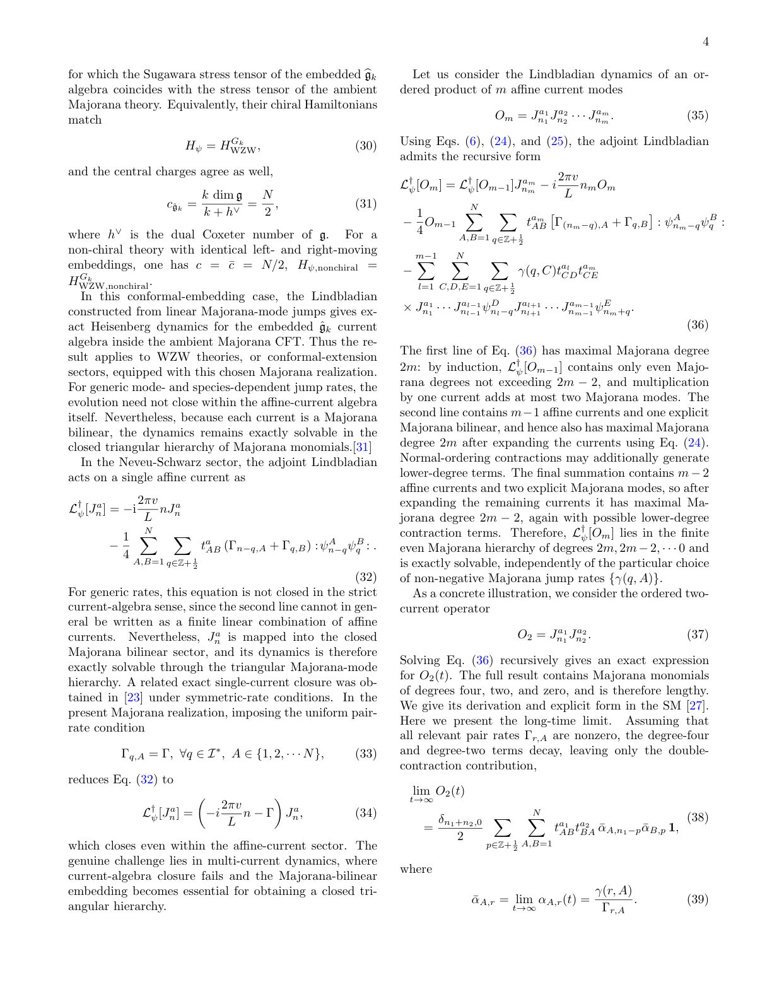
<figcaption class="paper-figure-caption"><b>Fig 3.</b> Low-resolution page preview, page 4</figcaption>
</figure>
<figure class="paper-figure-card">
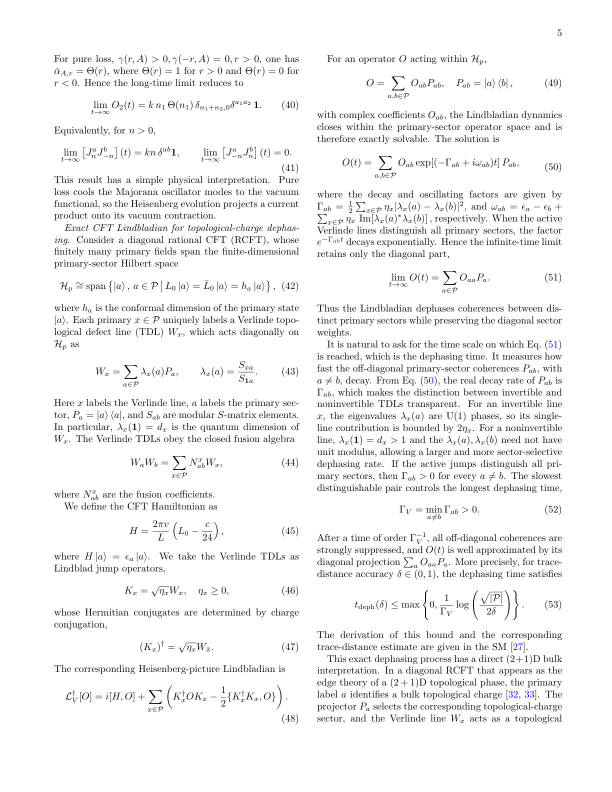
<figcaption class="paper-figure-caption"><b>Fig 4.</b> Low-resolution page preview, page 5</figcaption>
</figure>
<figure class="paper-figure-card">
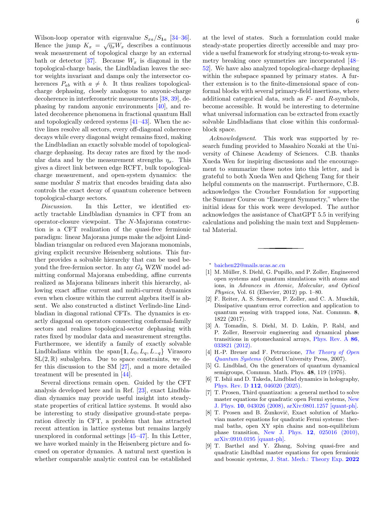
<figcaption class="paper-figure-caption"><b>Fig 5.</b> Low-resolution page preview, page 6</figcaption>
</figure>

**Summary.** This paper develops methods to find exact solutions for the dynamics of open quantum many-body systems within Conformal Field Theory. By exploiting intrinsic conformal structures—like Majorana embeddings and topological defect lines—the authors show that complex dissipative processes can be mathematically organized, leading to conserved quantities or predictable exponential decay of coherence.

**Why it may be interesting.** This work provides a powerful theoretical framework for understanding how environmental coupling (dissipation) can be exactly solved in highly structured quantum systems like CFTs, offering insights applicable to open quantum systems beyond standard Markovian approximations.

Detailed structure

**Main problem.** The core challenge is finding exact solutions for the dynamics of physical observables in open quantum many-body systems governed by Lindblad master equations.

**Main result.** Intrinsic conformal structures, such as conformal embeddings and modular data, can organize exactly solvable open dynamics in CFTs, leading to conserved topological charges or predictable dephasing rates.

**Method.** The authors employ advanced techniques from Conformal Field Theory (CFT), including analyzing Majorana fermion representations, utilizing Wess-Zumino-Witten models via conformal embeddings, and constructing Lindbladians using Verlinde topological defect lines.

**Model / system.** The study focuses on (1+1)D CFTs, specifically N Majorana fermions and WZW models. The dynamics are described by the adjoint Lindbladian acting on operators within these highly constrained quantum field theories.

**Key observables.** Topological-charge probabilities, intersector coherences ($P_{ab}$), expectation values of current products ($\langle \mathcal{J}^a_n \cdots 
angle$), and the trace distance $D(
ho(t), \Pi(
ho(0)))$.

**Important parameters / regimes.** Modular S matrix elements, coupling rates ($\gamma_\pm$), conformal dimensions ($h$), and the dephasing rate $\Gamma_V$.

**Assumptions / limitations.** The analysis relies on identifying specific intrinsic conformal structures (embeddings, defect lines) that enforce solvability; limitations are noted when general current algebra closure fails or when considering non-linear products of Virasoro generators.

**Paper structure.** The paper progresses by first establishing exact solvability for Majorana fermions via triangular Lindbladians. It then extends this to WZW models using conformal embeddings, and finally analyzes diagonal RCFTs where dynamics are governed by topological defect lines leading to coherence dephasing.

Abstract

Analyzing the dynamics of physical observables in open quantum many-body systems is a fundamental but highly challenging task that has yielded very few exact results. In this work, we identify intrinsic conformal structures that restore exact solvability in $(1+1)$D conformal field theories. For $N$ Majorana fermions with linear mode jumps, the adjoint Lindbladian is triangular on reduced even Majorana monomials, yielding recursive exact Heisenberg evolution. In Wess-Zumino-Witten models admitting conformal Majorana embeddings, this hierarchy gives exact dynamics of affine-current products realized as Majorana bilinears, including regimes where the Kac-Moody current algebra alone does not close. In diagonal rational conformal field theories, Verlinde topological defect lines furnish jump operators whose primary-sector dynamics is exactly diagonal: topological-charge probabilities are conserved, while intersector coherences dephase at rates fixed by the modular $S$ matrix and nonnegative measurement strengths. These examples show that intrinsic conformal structures, such as conformal embeddings and modular data, can organize exactly solvable open conformal dynamics.

[↑ back to top](#top)

### [Majorana parity qubit in coupled minimal Kitaev chains](http://arxiv.org/abs/2607.09511v1)

**Authors:** Francesco Zatelli, Bart Roovers, Nick van Loo, Antonio Lombardi, Juan D. Torres Luna, Sebastian Miles, Vincent P. M. Sietses, Florian J. Bennebroek Evertsz', Pablo Cova Fariña, Alberto Bordin, Ghada Badawy, Erik P. A. M. Bakkers, Michael Wimmer, Leo P. Kouwenhoven  
**Type:** experiment · **Category:** quantum information and computing · **PDF:** <https://arxiv.org/pdf/2607.09511v1>  
**Analysis basis:** full PDF text, analyzed in chunks
**Topic relevance:** 🔥 `QC/QI experiment` **4/5** · `analog quantum simulation` **3/5** · `quantum measurements` **3/5** · `driven-dissipative phase transition` **2/5** · `non-equilibrium dynamics` **2/5** · `Kondo & dissipative impurity` **1/5** · `correlated / nonlocal dissipation` **1/5** · `entanglement & information structure` **1/5** · `measurement-induced transitions` **1/5** · `methods for driven-dissipative` **1/5** · `non-equilibrium universality` **1/5**

↔ Scroll figures horizontally

<figure class="paper-figure-card">
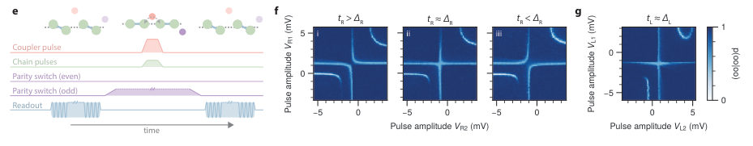
<figcaption class="paper-figure-caption"><b>Fig 1.</b> Fig. 1 Tuning a Majorana parity qubit. a, Schematic of a Majorana qubit formed by two minimal Kitaev chains. Four Majorana modes (γ1, γ2, γ3, γ4) encode the qubit, while a central quantum dot (red) mediates inter-chain coupling. A supercon- ducting segment (blue) fixes the superconducting phase φ. b, Bloch-sphere representation of the qubit in the global even parity manifold. The poles correspond to |ee⟩and |oo⟩. Rotations are generated by tuning the pairwise Majorana couplings εab. c, Example energy spectra of the computational subspace versus coupler-dot detuning at φ = 0 (top) and as a function of φ at finite coupling (bottom). The states are nearly degenerate at large detuning, while...</figcaption>
</figure>
<figure class="paper-figure-card">
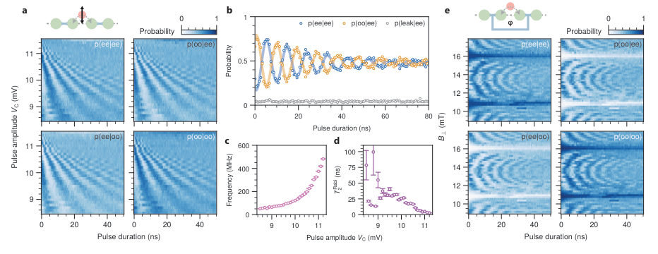
<figcaption class="paper-figure-caption"><b>Fig 2.</b> Fig. 2 Coherent control and phase dependence of the Majorana qubit. a, Conditional probabilities p(ee|ee), p(oo|ee), p(ee|oo), and p(oo|oo) as a function of coupling pulse duration and amplitude VC, showing coherent oscillations between the qubit states. b, p(ee|ee), p(oo|ee), and leakage to the odd-parity manifold as a function of pulse duration at VC = 9.8 mV. c,d, Oscillation frequency (c) and Rabi decay time T Rabi 2 (d) extracted from panel a as a function of VC. e, p(ee|ee), p(oo|ee), p(ee|oo), and p(oo|oo) as a function of pulse duration and out-of-plane magnetic field B⊥which controls φ. The oscillation frequency is strongly suppressed near φ = π, where inter-chain coupling vanishes.</figcaption>
</figure>
<figure class="paper-figure-card">
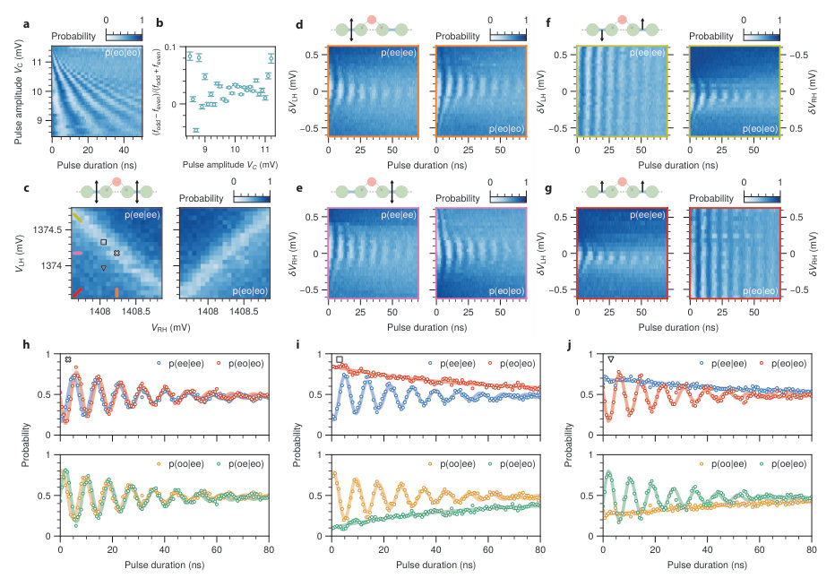
<figcaption class="paper-figure-caption"><b>Fig 3.</b> Fig. 3 Comparison between even and odd global parity manifolds. a, p(eo|eo) as a function of pulse duration and amplitude VC, showing coherent oscillations in the odd manifold. b, Relative frequency difference between the even- and odd- manifold oscillations as a function of VC. c, p(ee|ee) (left) and p(eo|eo) (right) as a function of the left and right hybrid-gate voltages (VLH and VRH) for a fixed pulse duration of 18 ns. Parity mixing occurs along diagonal or anti-diagonal lines depending on the global parity manifold. Their intersection (cross) identifies the Majorana sweet spot, where the resonance conditions of the even and odd manifolds coincide. The colored marks indicate sweep...</figcaption>
</figure>
<figure class="paper-figure-card">
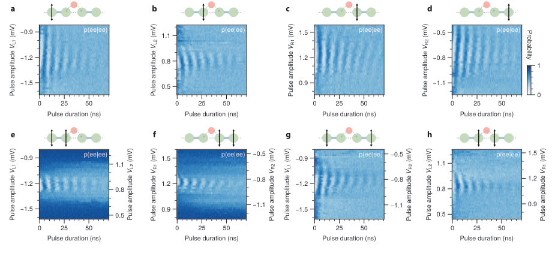
<figcaption class="paper-figure-caption"><b>Fig 4.</b> Fig. 4 Robustness of coherent parity oscillations under detuning. p(ee|ee) as a function of pulse duration for different detuning configurations, as indicated by the schematics. The coupler pulse amplitude is fixed at VC = 9.8 mV. a-d, Detuning individual quantum dots. Oscillations remain visible over a broader range of gate voltages compared to panels e-h. e,f, Detuning the left (e) and right (f) Kitaev chains. Increasing chain detuning suppresses the oscillations and stabilizes the initial state. g,h, Simultaneous detuning of the outer (g) and inner (h) quantum dots of both chains, resulting in a more rapid reduction of oscillation visibility.</figcaption>
</figure>

**Summary.** The research demonstrates the first coherent control of a Majorana qubit by engineering two coupled minimal Kitaev chains in superconducting nanowires. By observing Rabi oscillations between global even and odd parity states, the authors confirm that the system can be manipulated coherently using electrical pulsing techniques. This work advances the field by moving topological qubits from theoretical identification to measurable quantum computation.

**Why it may be interesting.** This work provides direct experimental evidence of controlled quantum evolution (Rabi oscillations) using topological qubits, which is a major milestone for solid-state quantum computing architectures.

Detailed structure

**Main problem.** The primary goal is to move beyond merely identifying Majorana zero modes via transport measurements and achieve genuine, coherent qubit control using these modes encoded in fermion parity.

**Main result.** The authors demonstrated the first instance of coherent control over a Majorana qubit by observing measurable, Rabi-like parity oscillations in both the even and odd global parity manifolds.

**Method.** Coherent dynamics were measured using pulsed charge-stability measurements, monitoring the shift in a radio-frequency resonator's resonance frequency due to parity-dependent quantum capacitance.

**Model / system.** The system is realized using two coupled minimal Kitaev chains engineered in quantum dot–superconductor arrays. The physics is modeled by separating the Hamiltonian into global even and odd parity manifolds based on fermion parity conservation.

**Key observables.** Coherent parity oscillations (Rabi oscillations) in both even and odd manifolds, and the systematic dependence of oscillation frequency/coherence on inter-chain coupling and detunings.

**Important parameters / regimes.** Inter-chain coupling ($\epsilon_{23}$), quantum-dot detunings ($\epsilon_{12}, \epsilon_{34}$), superconducting phase ($\phi$), and magnetic field ($B_\perp$).

**Assumptions / limitations.** The analysis relies on the effective Hamiltonian derived for the even/odd manifolds, and some later analyses assume first-order dependence on detuning near the sweet spot.

**Figures summary.** Figures illustrate the device schematic (Fig. 1a), Bloch sphere rotations (Fig. 1b), energy spectra showing state splitting (Fig. 1c), and pulsed charge-stability diagrams mapping parity transitions ($p(oo|oo)$) as a function of gate voltages.

**Paper structure.** The paper progresses from establishing the theoretical framework for the Majorana parity qubit in coupled chains, to demonstrating coherent control via parity oscillations, and finally analyzing the dependence of these dynamics on various tunable parameters like coupling strength and detuning.

Abstract

Majorana zero modes provide a route to fault-tolerant qubits by encoding information non-locally in fermion parity. Their sensitivity to noise is expected to decrease exponentially with increasing separation between the Majoranas, a suppression known as topological protection. Kitaev chains engineered in quantum dot-superconductor arrays provide a tunable platform in which separated Majorana zero modes can emerge at the ends of the chain, even in two-site chains. These minimal-chain modes are known as poor man's Majoranas and retain characteristic Majorana properties, including near-zero energy and equal electron-hole character, but have only limited protection. A key outstanding challenge is to move beyond identifying such modes in electrical transport measurements and achieve coherent qubit control in the time domain. Here, we demonstrate a Majorana parity qubit by realizing coherent coupling between two-site Kitaev chains. Since total fermion parity is conserved, the system separates into global even and odd parity manifolds. We observe coherent parity oscillations in both manifolds with equal oscillation frequencies at the Majorana sweet spot, as predicted for isolated Majorana zero modes. We further show that the oscillation frequency and coherence depend systematically on inter-chain coupling and quantum-dot detunings, in close agreement with our model for short, partially protected chains. Our results establish the first coherent control of a Majorana qubit, encoded in the fermion parity of Majorana zero modes in minimal Kitaev chains.

[↑ back to top](#top)

### [Measurement Speed Limits for Quantum State Purification](http://arxiv.org/abs/2607.09118v1)

**Authors:** Jiaxin Liu, Zuoxian Wang, Danyue Ma  
**Type:** theory · **Category:** quantum information and computing · **PDF:** <https://arxiv.org/pdf/2607.09118v1>  
**Analysis basis:** full PDF text, analyzed in chunks
**Topic relevance:** 🔥 `quantum measurements` **4/5** · `measurement-induced transitions` **3/5** · `methods for driven-dissipative` **3/5** · `Keldysh / 2PI / non-Gaussian methods` **2/5** · `entanglement & information structure` **2/5** · `non-equilibrium dynamics` **2/5** · `correlated / nonlocal dissipation` **1/5** · `driven-dissipative phase transition` **1/5** · `non-equilibrium universality` **1/5**

↔ Scroll figures horizontally

<figure class="paper-figure-card">
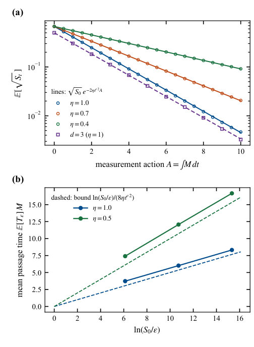
<figcaption class="paper-figure-caption"><b>Fig 1.</b> FIG. 1. Exact attainment of the limits by plain QND measurement, for a monitored qubit and a qutrit. (a) Root impurity E[√𝑆𝑡] under QND monitoring from 𝑆0 = 0.455 (𝑀= 1, ℓ= 1</figcaption>
</figure>
<figure class="paper-figure-card">
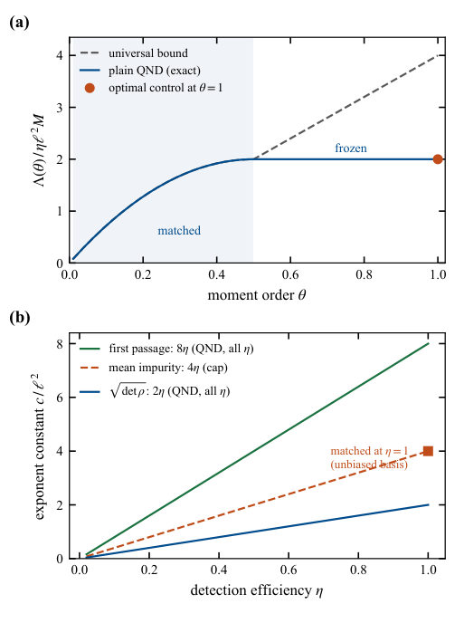
<figcaption class="paper-figure-caption"><b>Fig 2.</b> FIG. 2. Purification speed limits of a monitored qubit. (a) Moment- exponent envelope 𝑐(𝜃) of Eq. (7) (dashed) and the exact exponent of plain QND measurement, Eq. (8) (solid), both in units of 𝜂ℓ2: matched on the shaded region 𝜃≤1</figcaption>
</figure>

**Summary.** The authors establish universal, protocol-independent speed limits for purifying a mixed quantum state by monitoring it. They derive these bounds using advanced stochastic calculus techniques applied to the system's impurity measure. The results are particularly sharp for qubits, providing quantitative benchmarks against which all measurement and feedback strategies can be compared.

**Why it may be interesting.** This work provides rigorous mathematical tools for quantifying fundamental physical processes in open quantum systems, directly impacting how we model measurement backaction and state preparation protocols relevant to quantum computation.

Detailed structure

**Main problem.** The paper derives fundamental, protocol-independent speed limits governing how fast a mixed quantum state can be purified (i.e., driven towards a pure state). It establishes these bounds for arbitrary finite dimensions.

**Main result.** Three matched speed limits are derived based on the impurity measure ($\sqrt{S}$), moment envelopes ($E[S^	heta]$), and first-passage time, all set by functionals related to the square root of the state's impurity. For qubits, these bounds are sharp and independent of measurement strategy.

**Method.** The derivation employs advanced techniques including analyzing master inequalities derived from frame invariants, moment envelope analysis using Itô calculus, and optional stopping arguments on supermartingales.

**Model / system.** The system is a general quantum state $
ho_t$ evolving in a $d$-dimensional Hilbert space under monitoring via a diffusive channel. The evolution is governed by an Itô stochastic master equation incorporating measurement backaction ($\eta$).

**Key observables.** Impurity ($S = 1 - Tr
ho^2$), the square root of the impurity ($\sqrt{S}$), and various moments $E[S^	heta]$.

**Important parameters / regimes.** Detection efficiency ($\eta$), channel strength ($M$), spectral half-spread ($\ell$), and the measurement action variable ($A$).

**Assumptions / limitations.** The limits are claimed to be valid for every strategy and efficiency $\eta$ in finite dimensions $d$, though full analytical proof of optimality beyond the qubit case is noted as an ongoing challenge.

**Figures summary.** Figures illustrate the exact attainment of the derived bounds, showing the decay rate of $\sqrt{S}$ and the expected measurement action required to reach a target impurity level for both qubits and qutrits under QND monitoring.

**Paper structure.** The paper builds from establishing general master inequalities using frame invariants, derives dimension-independent moment envelopes via Itô calculus, and finally establishes sharp first-passage time bounds using optional stopping arguments on supermartingales to confirm the speed limits.

Abstract

We derive three matched speed limits on the purification of a monitored system, valid in every finite dimension and for every strategy and efficiency. All three are set by one functional, the square root of the state's impurity, whose maximal decay rate is a state-independent constant. For a qubit this reduces to the square root of the determinant, whose protocol-independent decay at unit efficiency is a sharp null test. The three rate constants stand in ratio two to four to eight, and attainment freezes at that square root, the half-moment. Numerics confirm the bounds; for the qubit, a conservation law settles the local-versus-global optimality puzzle, and doubling feedback spends exactly twice the minimum.

[↑ back to top](#top)

### [Quantum stochastic thermodynamics of macroscopic systems: an algebraic approach](http://arxiv.org/abs/2607.09242v1)

**Authors:** Antoine Rignon-Bret, Cyril Elouard  
**Type:** theory · **Category:** statistical mechanics · **PDF:** <https://arxiv.org/pdf/2607.09242v1>  
**Analysis basis:** full PDF text, analyzed in chunks
**Topic relevance:** 🔥 `quantum measurements` **4/5** · `measurement-induced transitions` **3/5** · `methods for driven-dissipative` **3/5** · `Keldysh / 2PI / non-Gaussian methods` **2/5** · `non-equilibrium dynamics` **2/5** · `correlated / nonlocal dissipation` **1/5** · `correlated cavity matter` **1/5** · `driven-dissipative phase transition` **1/5** · `entanglement & information structure` **1/5** · `non-equilibrium universality` **1/5**

↔ Scroll figures horizontally

<figure class="paper-figure-card">
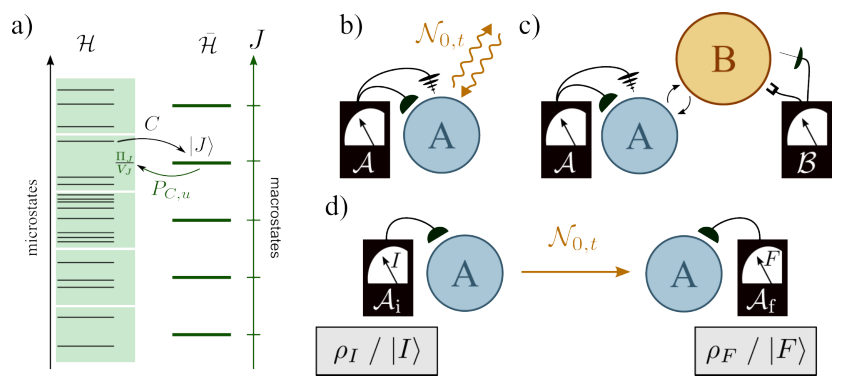
<figcaption class="paper-figure-caption"><b>Fig 1.</b> Figure 1: a) Coarse-graining and macrostate. Accessing the system via a coarse measurement leads to a statistical mixture of macrostates |J⟩∈¯H, each associated to a subspace of dimension VJ of the original system Hilbert space H associated to projector ΠJ (represented by a green shaded rectangle). The micro-macro map C maps a microstate from H onto the corresponding macrostate in ¯H. The Petz recovery map PC,u, or equivalently, Jaynes maximization principle, can be employed to recover the most probable microstate compatible with the observation, i.e. the coarse-grained state. In particular, it maps |J⟩to ΠJ</figcaption>
</figure>
<figure class="paper-figure-card">
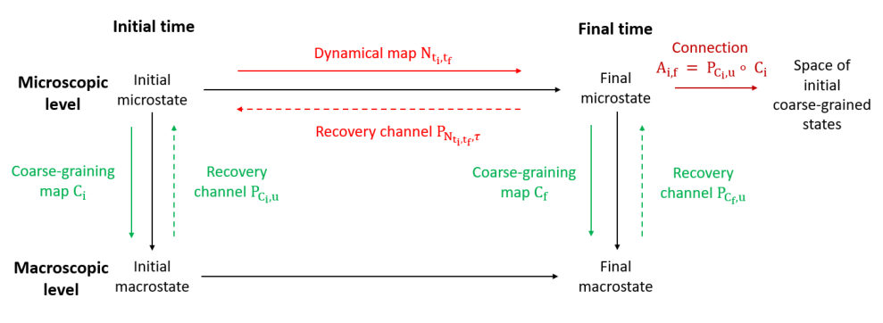
<figcaption class="paper-figure-caption"><b>Fig 2.</b> Figure 2: This diagram provides a visual representation of the framework. The vertical direction is kinematical, corresponding to successive levels of coarse-graining, whereas the horizontal direction is dynamical, corresponding to time evolution. The natural orientation of the diagram is therefore towards the right (time direction) and downwards (coarse-graining or &quot;spatial&quot; direction). Any vertex can be connected to a neighboring vertex by an arrow representing a quantum channel. The elementary arrows are given by the microscopic evolution map Nti,tf and the coarse-graining maps Ci and Cf. More general arrows are obtained by composing these elementary maps and, when necessary, reversing...</figcaption>
</figure>
<figure class="paper-figure-card">
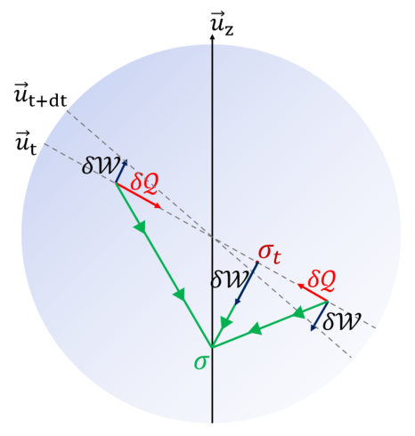
<figcaption class="paper-figure-caption"><b>Fig 3.</b> Figure 3: Thermodynamic analysis of a dissipative qubit: An arbitrary qubit state is conve- niently represented by a vector ⃗r in the Bloch sphere. We assume that the dynamics of the qubit is ruled by a GKLS equation (described explicitly in App. (E), Eq. (E.8)) inducing thermalization. The latter generates a flow (indicated by the green arrows) driving any initial state towards the thermal fixed point σ at inverse temperature β, located on the z-axis. At time t, a measurement is performed in the basis defined by the direction ⃗ut, while at time t + dt the measurement basis is rotated to ⃗ut+dt. As a qubit state cannot be coarse-grained, its observational entropy corresponds to the von...</figcaption>
</figure>
<figure class="paper-figure-card">
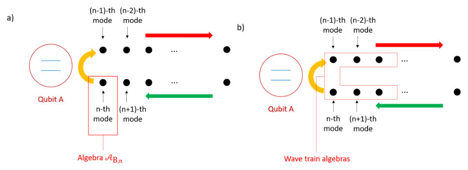
<figcaption class="paper-figure-caption"><b>Fig 4.</b> Figure 4: Application to an emitter coupled to a 1D propagating field. In the weak emitter- field coupling regime, the situation can be mapped onto a collision model [80], where the total algebra of the electromagnetic field is decomposed into temporal modes (depicted as black spheres), which are initially uncorrelated. The modes freely propagate toward the emitter A, with which they sequentially interact weakly, before being transported away. One may consider as the accessible subalgebra of the field either a) the algebra AB,n associated with a single temporal mode, or b) an algebra associated with a collection of several temporal modes, which we refer to as a wave train. The notions of...</figcaption>
</figure>

**Summary.** This paper introduces an algebraic framework for quantum stochastic thermodynamics that bypasses the need to track the full system density matrix. By focusing only on measurable observables, it defines a generalized entropy that interpolates between microscopic and macroscopic descriptions. The resulting formalism yields fundamental thermodynamic laws, including fluctuation theorems and novel work contributions from measurement backaction.

**Why it may be interesting.** This is highly relevant as it provides a rigorous, algebraically grounded method for defining thermodynamic quantities (work, heat) in open quantum systems where full state knowledge is impossible, directly impacting research in quantum thermodynamics and measurement theory.

Detailed structure

**Main problem.** To develop a quantum thermodynamic framework capable of describing macroscopic systems by bridging the gap between fine-grained stochastic dynamics and macroscopic equilibrium thermodynamics.

**Main result.** The authors derive a generalized second law for coarse-grained dynamics that captures irreversibility from both environment interaction and internal equilibration, while also identifying an additional work term related to manipulating the system's measurement algebra.

**Method.** The approach utilizes a coarse-graining formalism based on measuring only a limited set of observables (forming an accessible subalgebra), defining entropy via Jaynes' principle for this reduced description.

**Model / system.** The framework applies to general macroscopic quantum systems undergoing internal or environment-induced dynamics, considering both open-system and autonomous system viewpoints.

**Key observables.** Observational entropy, algebra-dependent entropy, work, heat, and the generalized entropy production rate.

**Important parameters / regimes.** The nature of the coarse-graining observable set (commuting vs. non-commuting) and the path taken between initial and final measurement schemes.

**Assumptions / limitations.** The primary assumption is that the system's dynamics can be effectively described by restricting attention to an accessible subalgebra of observables, thereby circumventing the need for the full density matrix.

**Figures summary.** Figure 1 illustrates the mapping from microstates ($
ho$) to macrostates ($ar{
ho}$) via coarse-graining, showing viewpoints for open and autonomous systems, and demonstrating process probing using initial/final accessible algebras.

**Paper structure.** The paper builds conceptually by first defining the coarse-grained entropy (especially in the commutative case), then deriving the second law and fluctuation theorems, followed by introducing work and heat increments via quasi-static transformations, and finally extending the formalism to general non-commutative observable algebras.

Abstract

We build a framework for the thermodynamics of macroscopic quantum systems. In contrast with approaches requiring access to the full density matrix, our framework relies on a coarse-grained description, based on measurement statistics of a few observables. When these observables commute, the outcomes define classical macrostates whose entropy is quantified by observational entropy, accounting for uncertainty about both the macrostate and the microstate within it. We extend this notion to non-commuting observables forming a subalgebra of the operator space, and use Jaynes' principle to define an algebra-dependent entropy interpolating between von Neumann and observational entropies. Given initial and final measurement sets, connected by internal and/or environment-induced dynamics, we derive a second law for the coarse-grained dynamics. Unlike formulations based on von Neumann entropy, our inequality captures irreversibility from both non-unitary environment-induced dynamics and internal equilibration. It takes the usual form of a positive entropy production when the system is initially at internal equilibrium, while correction terms capture nonequilibrium resources ignored by the coarse-graining. We also derive fluctuation theorems for coarse-grained thermodynamic quantities. Along a quasi-static path of measurement schemes, we identify quantum macroscopic notions of work and heat fulfilling the first and second laws, including an additional work contribution from manipulating the algebra to which the system is confined, through external constraints or quantum measurement backaction. Finally, we apply our framework to examples illustrating the impact of varying the coarse-graining scheme. Our approach unifies macroscopic and stochastic thermodynamics in a genuinely quantum framework, laying the basis for a versatile, experimentally friendly toolbox to analyze complex quantum dynamics.

[↑ back to top](#top)

### [Superheavy dark-bright soliton as a signature of spatial symmetry breaking transition in harmonically trapped Bose mixtures](http://arxiv.org/abs/2607.09064v1)

**Authors:** Zheng Gao, Ling-Zheng Meng, Jie Liu, Li-Chen Zhao  
**Type:** theory · **Category:** quantum gases · **PDF:** <https://arxiv.org/pdf/2607.09064v1>  
**Analysis basis:** full PDF text, analyzed in chunks
**Topic relevance:** 🔥 `analog quantum simulation` **4/5** · `Keldysh / 2PI / non-Gaussian methods` **3/5** · `driven-dissipative phase transition` **3/5** · `methods for driven-dissipative` **3/5** · `non-equilibrium dynamics` **2/5** · `non-equilibrium universality` **2/5** · `Frenkel-Kontorova` **1/5** · `correlated cavity matter` **1/5**

↔ Scroll figures horizontally

<figure class="paper-figure-card">
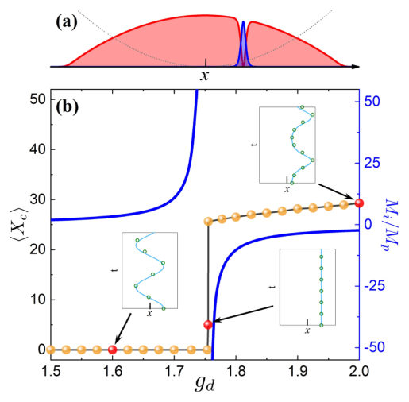
<figcaption class="paper-figure-caption"><b>Fig 1.</b> FIG. 1: Dynamics of a dark-bright soliton in a harmonic trap. (a) Schematic representation of the dark-bright soliton in the harmonic potential (dotted line). (b) Time-averaged position of the soliton ⟨Xc⟩(orange spheres) and soliton effective mass Mi/Mp (blue solid line) as functions of gd. The soliton effec- tive mass diverges and the superheavy phenomenon occurs at the threshold, indicating a phase transition between the two distinct dynamical regimes. The three insets show the real-time trajectories of the soliton at representative values gd = 1.6, 1.755, and 2 (marked by red spheres). In these insets, solid lines correspond to the analytical predictions from quasiparticle theory, and...</figcaption>
</figure>
<figure class="paper-figure-card">
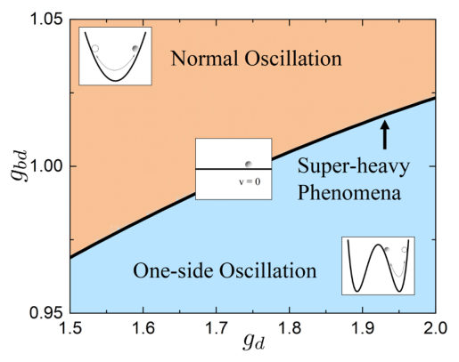
<figcaption class="paper-figure-caption"><b>Fig 2.</b> FIG. 2: Dynamical phase diagram of the dark-bright soliton in the gd-gbd parameter space. The orange and blue regions de- note the normal and one-sided oscillation phases, respectively. The black solid line marks the critical phase boundary asso- ciated with the superheavy phenomenon, where the soliton becomes completely stationary (v = 0) and which separates the two oscillatory regimes. The three insets illustrate the underlying effective potentials Ueffgoverning each dynamical regime: a single-well potential for normal oscillation, a flat potential landscape for the superheavy state, and a double- well potential for one-sided oscillation. The parameters are gb = 0.3, Nb = 4.7476, ω = 0.01,...</figcaption>
</figure>

**Summary.** The paper analyzes dark-bright solitons in trapped Bose mixtures, revealing that increasing interaction strength drives the system through a first-order phase transition. This transition causes the soliton's motion to spontaneously break spatial symmetry, characterized by an effective potential changing from a single well to a double well and the appearance of a 'superheavy' state.

**Why it may be interesting.** This work provides a detailed theoretical understanding of how nonlinear interactions can induce macroscopic symmetry breaking in quantum matter waves, linking fundamental many-body physics to observable dynamical signatures like mass divergence.

Detailed structure

**Main problem.** The study investigates the dynamics of dark-bright solitons in harmonically trapped two-component Bose mixtures, focusing on a spontaneous spatial symmetry breaking transition driven by nonlinear interactions.

**Main result.** A critical interaction parameter causes the soliton's motion to undergo a phase transition from symmetric oscillation to asymmetric oscillation, marked by the divergence of an effective mass and the formation of a double-well potential.

**Method.** The analysis employs the mean-field approximation, deriving classical kinetic equations for the soliton using a Lagrangian variational method applied to coupled Gross-Pitaevskii equations.

**Model / system.** The system is a two-component Bose mixture (e.g., $^{133}	ext{Cs}$ and $^{87}	ext{Rb}$) confined in a quasi-one-dimensional harmonic trap, modeled by coupled GP equations.

**Key observables.** Soliton center position ($\langle X_c 
angle$), effective soliton mass ($M_i/M_p$), and the shape of the effective potential (single well vs. double well).

**Important parameters / regimes.** Interaction strengths ($g_d, g_{ij}$), harmonic trap frequency ($\omega$), and the critical interaction threshold ($g_d = 1.755$).

**Assumptions / limitations.** The analysis relies on the mean-field approximation and assumes weak external traps ($\omega \ll 1$) allowing for Thomas-Fermi background density approximations.

**Figures summary.** Figure 1 illustrates the dynamics showing $\langle X_c 
angle$ and $M_i/M_p$ vs. interaction strength, highlighting divergence at the critical threshold; Figure 2 shows the dynamical phase diagram in parameter space.

**Paper structure.** The paper proceeds by setting up the coupled GP equations, deriving an effective Lagrangian via a variational ansatz, obtaining generalized equations of motion for the soliton's center position, and analyzing the resulting potential energy landscape across different interaction regimes.

Abstract

We investigate the dynamics of a dark-bright soliton in harmonically trapped two-component Bose-Einstein condensates and reveal an interesting spontaneous spatial symmetry breaking driven by nonlinear interactions. When the interaction parameter crosses a threshold value, we find that the dark-bright soliton's motion demonstrates a transition from symmetric periodic oscillation about the origin to asymmetric oscillations offset from the origin. In particular, at the transition point, the effective soliton mass, determined by the ratio of inertial mass to physical mass, diverges. The underlying mechanism is uncovered by constructing trial wave functions and employing the Lagrangian variational method to obtain an effective potential in the quasiparticle picture, which changes from a single well to a double well. The anomalous ``superheavy soliton'' phenomenon is a direct consequence of the dark-bright soliton's physical mass vanishing at the transition point. We obtain the phase diagram of this spatial symmetry-breaking transition. Possible implications of our finding for quantum metrology are discussed.

[↑ back to top](#top)

### [Finite-time cooling and accessibility of the stripe phase in the Ising antiferromagnet](http://arxiv.org/abs/2607.09411v1)

**Authors:** Tom Poisblaud  
**Type:** theory · **Category:** statistical mechanics · **PDF:** <https://arxiv.org/pdf/2607.09411v1>  
**Analysis basis:** full PDF text, analyzed in chunks
**Topic relevance:** 🔥 `analog quantum simulation` **4/5** · 🔥 `non-equilibrium dynamics` **4/5** · `non-equilibrium universality` **3/5** · `driven-dissipative phase transition` **2/5** · `correlated / nonlocal dissipation` **1/5** · `entanglement & information structure` **1/5** · `exotic spin models in light-matter` **1/5** · `methods for driven-dissipative` **1/5** · `scars & prethermalization` **1/5**

↔ Scroll figures horizontally

<figure class="paper-figure-card">
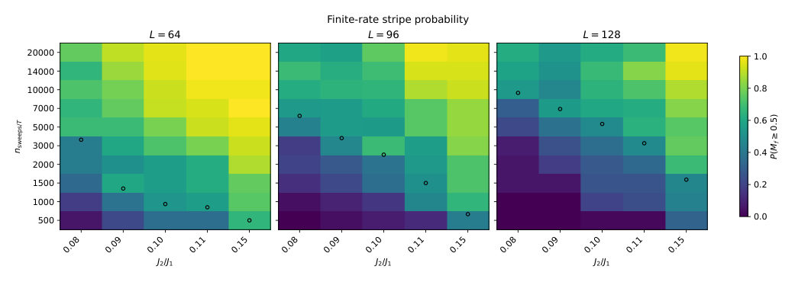
<figcaption class="paper-figure-caption"><b>Fig 1.</b> Figure 1. Finite-rate stripe probability P(Mf ≥0.5) in the (J2/J1, nsweeps/T) plane for L = 64, 96, 128. Markers indicate the extracted kinetic boundary n∗(L, J2/J1) obtained after isotonic regression. Increasing nsweeps/T or J2/J1 promotes global stripe selection, while the required cooling time increases with system size.</figcaption>
</figure>
<figure class="paper-figure-card">
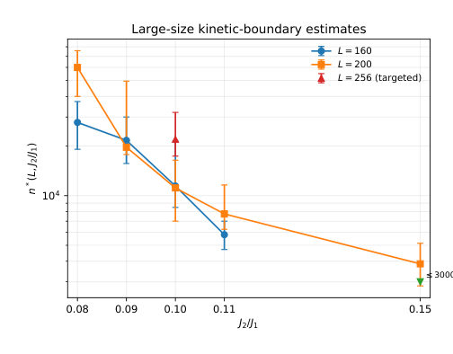
<figcaption class="paper-figure-caption"><b>Fig 2.</b> Figure 2. Large-size kinetic-boundary estimates. The L = 160 and L = 200 data cover several couplings, while the L = 256 point is a targeted check at J2/J1 = 0.10. Error bars show bootstrap intervals obtained from 200 resamples. The weakest L = 200 coupling, J2/J1 = 0.08, crosses only near the upper end of the simulated window, and the L = 256, J2/J1 = 0.10 point confirms that global stripe selection remains costly at large size. The L = 160, J2/J1 = 0.15 point is left-censored, with n∗(160, 0.15) ≤3000.</figcaption>
</figure>
<figure class="paper-figure-card">
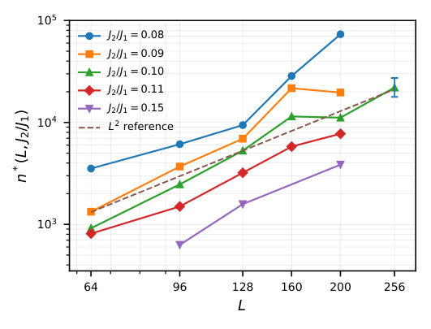
<figcaption class="paper-figure-caption"><b>Fig 3.</b> Figure 3. Size dependence of n∗(L, J2/J1) after inclusion of the L = 160, L = 200, and targeted L = 256 data. The L = 256 point at J2/J1 = 0.10 lies close to the quadratic extrapolation from L = 128, while the full finite-size sequence remains affected by broad probabilistic crossings and finite- window corrections.</figcaption>
</figure>
<figure class="paper-figure-card">
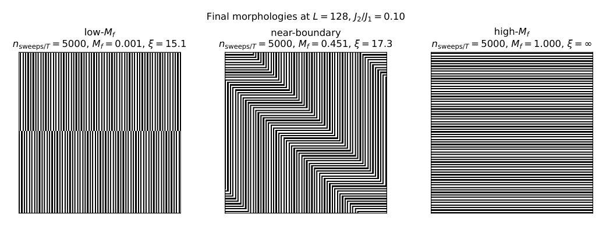
<figcaption class="paper-figure-caption"><b>Fig 4.</b> Figure 4. Representative final configurations at L = 128, J2/J1 = 0.10, and nsweeps/T = 5000, close to the kinetic boundary. Independent trajectories at the same parameters can end in low-Mf, near-boundary multidomain, or saturated stripe states. The panels show that local stripe correlations may be present even when the global structure-factor order remains small because domains, phases, or orientations compete.</figcaption>
</figure>
<figure class="paper-figure-card">
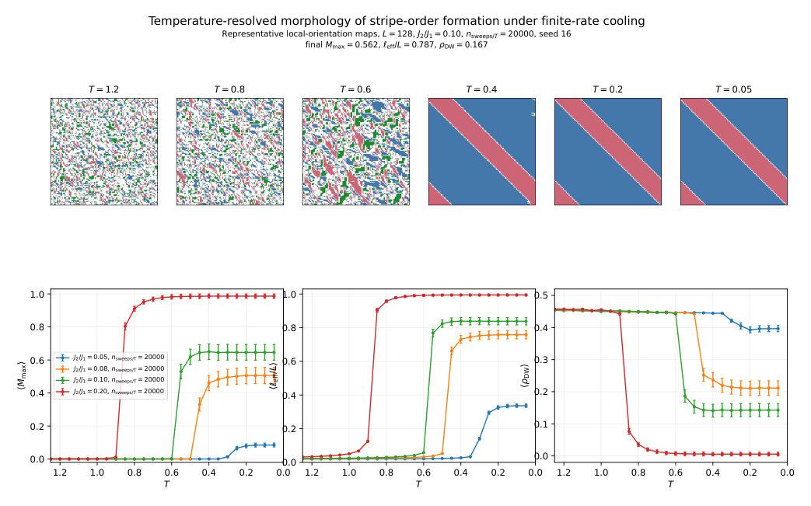
<figcaption class="paper-figure-caption"><b>Fig 5.</b> Figure 5. Temperature-resolved morphology of stripe-order formation at L = 128. Top row: local stripe-orientation maps for J2/J1 = 0.10, nsweeps/T = 20000, and seed 16; white pixels are locally ambiguous sites. This trajectory ends in a partially coarsened multidomain state with final Mmax = 0.562, ℓeff/L = 0.787, and ρDW = 0.167. Bottom row: ensemble-averaged evolution of ⟨Mmax⟩, ⟨ℓeff/L⟩, and ⟨ρDW⟩for J2/J1 = 0.05, 0.08, 0.10, 0.20 at nsweeps/T = 20000. Increasing J2/J1 sharpens stripe growth, increases the effective domain scale, and reduces the residual wall density.</figcaption>
</figure>

**Summary.** The paper analyzes how an Ising antiferromagnet fails to reach its thermodynamically preferred stripe phase during finite-rate cooling. By defining a kinetic time scale, it quantifies the dynamical barrier imposed by local update rules on global ordering. This work is crucial for understanding non-equilibrium relaxation in frustrated quantum magnets.

**Why it may be interesting.** This work provides a detailed study of non-equilibrium dynamics in frustrated magnetic systems, which shares conceptual links with understanding relaxation pathways in quantum many-body systems far from equilibrium.

Detailed structure

**Main problem.** The study investigates the finite-rate cooling dynamics and dynamical accessibility of the stripe phase in an Ising antiferromagnet, distinguishing between thermodynamic stability and kinetic trapping.

**Main result.** The stripe phase is not automatically reached on finite time scales; the required characteristic cooling time increases strongly with system size ($L$) and can be quantified by a kinetic boundary $n^*(L, J_2/J_1)$.

**Method.** Numerical simulations employing local Metropolis updates are used to track the probability of reaching a globally stripe-ordered state as the system is cooled across various rates.

**Model / system.** The model is a triangular-lattice $J_1-J_2$ Ising antiferromagnet described by an Ising Hamiltonian, featuring nearest-neighbor ($J_1$) and next-nearest-neighbor ($J_2$) couplings.

**Key observables.** Kinetic stripe-formation time ($n^*$), Stripe Order Parameter ($M_{	ext{stripe}}$), Probability of global stripe selection ($P_{	ext{stripe}}$), Domain-wall density ($
ho_{DW}$).

**Important parameters / regimes.** System size $L$, coupling ratio $J_2/J_1$, and the cooling rate (controlled by $	ext{nsweeps}/T$).

**Assumptions / limitations.** The dynamics are restricted to finite-time local updates, meaning results characterize kinetic barriers rather than true equilibrium transitions.

**Figures summary.** Figures illustrate the probability of stripe selection ($P(M_f \geq 0.5)$) as a function of $J_2/J_1$ and cooling rate ($	ext{nsweeps}/T$) for various system sizes, showing clear trends in kinetic barriers.

**Paper structure.** The paper systematically analyzes the dependence of the stripe-formation time on system size and coupling ratios, using multiple diagnostics (order parameters, morphology proxies) to separate distinct physical processes occurring during cooling.

Abstract

The finite-rate cooling dynamics of the triangular-lattice $J_1-J_2$ Ising antiferromagnet is studied under local Metropolis updates. Although an antiferromagnetic next-nearest-neighbor coupling selects a stripe phase in equilibrium, the simulations show that this phase is not automatically reached on finite time scales. A kinetic stripe-formation time $n^*(L,J_2/J_1)$ is defined from the probability of obtaining a globally stripe-ordered final state. This time shifts to much slower cooling as the system size increases and to faster cooling as $J_2/J_1$ increases. The size dependence is compatible with a coarsening-controlled process, with an effective growth at least quadratic in L over the simulated range. Real-space morphology and fixed-temperature diagnostics show that failed trajectories are not simply disordered states: they often contain locally stripe-ordered domains separated by residual walls or competing orientations. In the weak-$J_2/J_1$ regime, the system can restore the local nearest-neighbor frustrated constraint while still failing to select a global stripe sector. These results separate three processes that are usually conflated: energetic degeneracy lifting by $J_2/J_1$, local constraint restoration, and global stripe-orientation selection under local dynamics.

[↑ back to top](#top)

### [Predictive Renormalization-Group Theory of Universality Classes in Nonlinear Systems](http://arxiv.org/abs/2607.09079v1)

**Authors:** Ko Okumura  
**Type:** theory · **Category:** statistical mechanics · **PDF:** <https://arxiv.org/pdf/2607.09079v1>  
**Analysis basis:** full PDF text, analyzed in chunks
**Topic relevance:** 🔥 `non-equilibrium universality` **4/5** · `Keldysh / 2PI / non-Gaussian methods` **3/5** · `driven-dissipative phase transition` **3/5** · `methods for driven-dissipative` **2/5** · `non-equilibrium dynamics` **2/5** · `Frenkel-Kontorova` **1/5** · `analog quantum simulation` **1/5** · `correlated / nonlocal dissipation` **1/5** · `correlated cavity matter` **1/5**

↔ Scroll figures horizontally

<figure class="paper-figure-card">
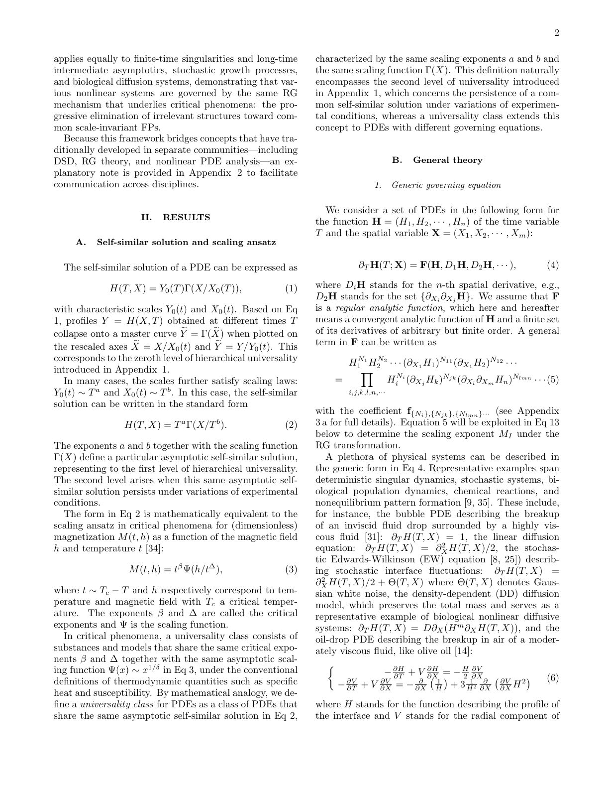
<figcaption class="paper-figure-caption"><b>Fig 1.</b> Low-resolution page preview, page 2</figcaption>
</figure>
<figure class="paper-figure-card">
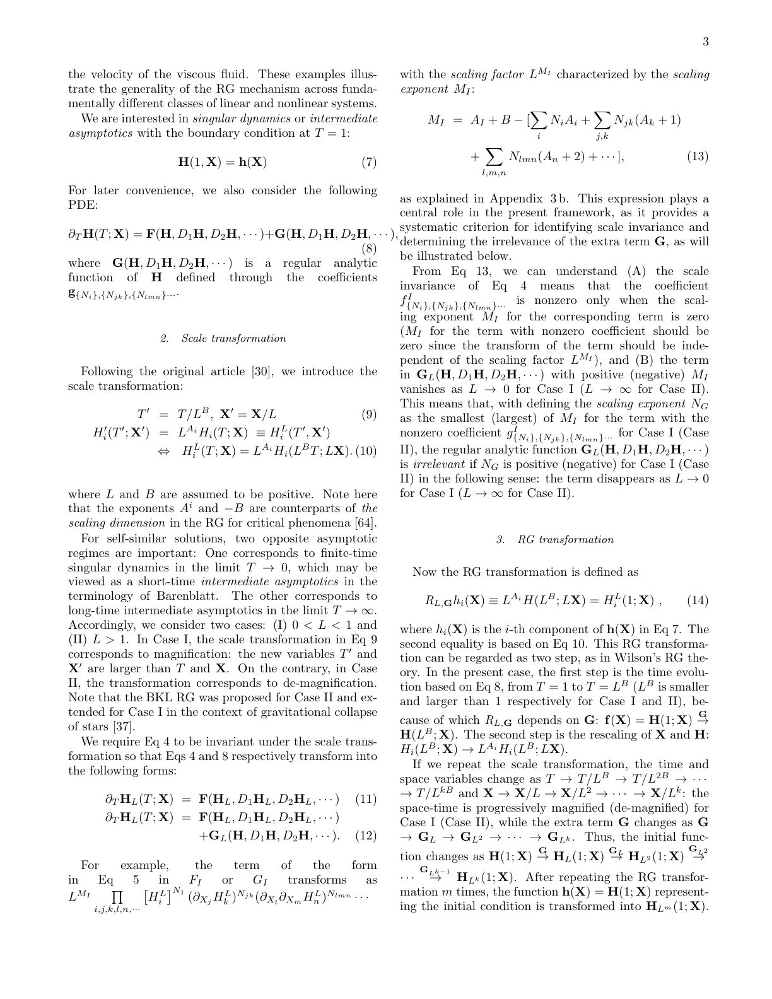
<figcaption class="paper-figure-caption"><b>Fig 2.</b> Low-resolution page preview, page 3</figcaption>
</figure>
<figure class="paper-figure-card">
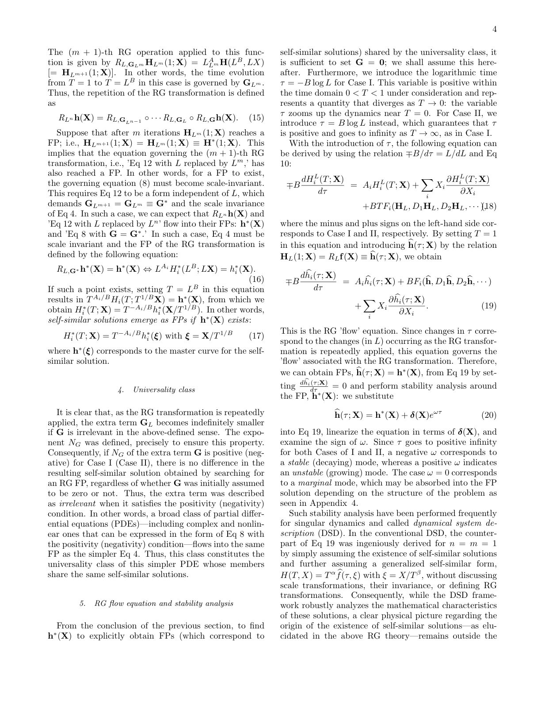
<figcaption class="paper-figure-caption"><b>Fig 3.</b> Low-resolution page preview, page 4</figcaption>
</figure>
<figure class="paper-figure-card">
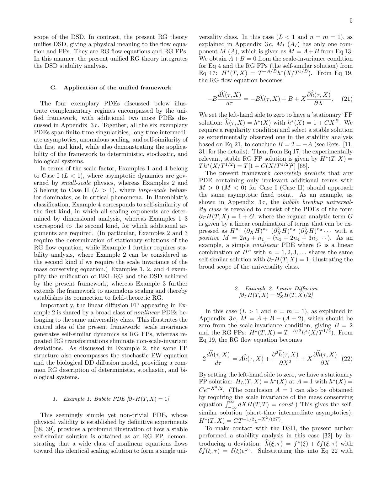
<figcaption class="paper-figure-caption"><b>Fig 4.</b> Low-resolution page preview, page 5</figcaption>
</figure>
<figure class="paper-figure-card">
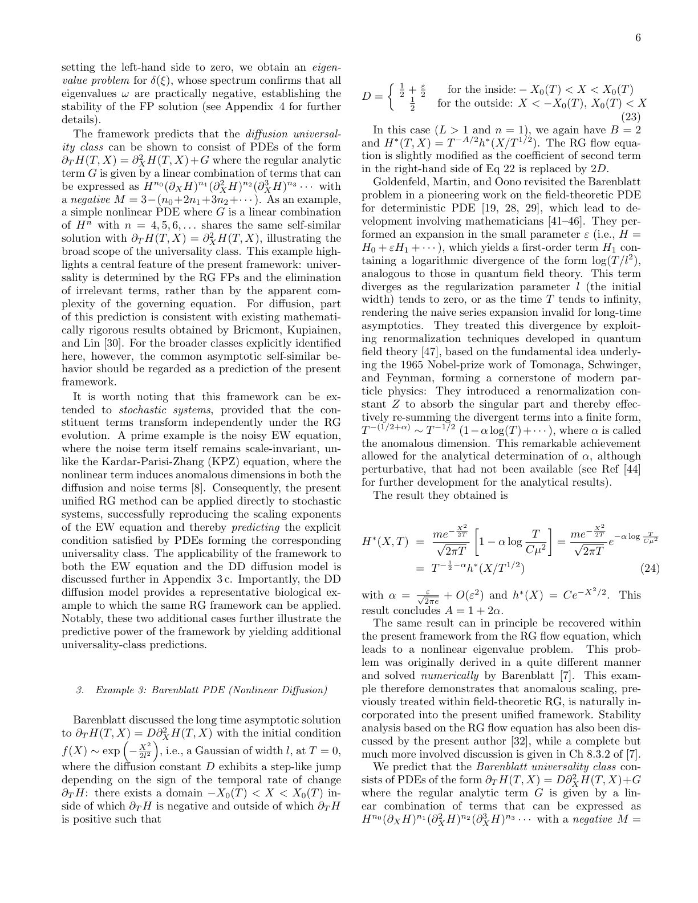
<figcaption class="paper-figure-caption"><b>Fig 5.</b> Low-resolution page preview, page 6</figcaption>
</figure>

**Summary.** This paper unifies the understanding of universality across various non-equilibrium nonlinear systems by developing an advanced Renormalization Group framework. It shows that self-similar dynamics are dictated by RG fixed points, which must be dynamically stable for physical realization. This provides a powerful, predictive tool to classify and understand universal scaling behavior in complex physical processes.

**Why it may be interesting.** While focused on classical nonlinear PDEs, the core methodology—using RG flow stability analysis to select physically relevant universal behaviors from a continuum of possibilities—is conceptually analogous to selecting stable quantum ground states or effective Hamiltonians in open quantum systems.

Detailed structure

**Main problem.** To develop a unified Renormalization-Group (RG) framework that explains how universal scaling behavior emerges across diverse nonlinear systems, extending RG principles from critical phenomena to self-similar dynamics.

**Main result.** The theory establishes that universality in these non-equilibrium systems is governed by dynamically stable RG fixed points, providing a predictive method to identify entire families of equations belonging to the same universality class.

**Method.** The authors combine Dynamical Systems Description (DSD) with field-theoretic RG techniques, analyzing scale invariance under specific transformations applied to governing Partial Differential Equations (PDEs).

**Model / system.** The framework is applied broadly to nonlinear systems including fluid dynamics (e.g., coalescence, interface dynamics), stochastic growth models (Edwards-Wilkinson), and density-dependent diffusion processes.

**Key observables.** Scaling exponents ($a, b$), the asymptotic self-similar solution $\Gamma(X)$, and the stability of the RG fixed points ($	ext{h}^*(X)$).

**Important parameters / regimes.** The scaling transformation parameters $L$ (magnification factor) and associated exponents ($A_i, B$).

**Assumptions / limitations.** The governing PDE must be invariant under the specified scale transformation; physical observability is linked to dynamically stable RG fixed points.

**Figures summary.** Not specified by notes, but figures likely illustrate the flow of PDEs towards identified self-similar solutions or show stability analysis plots.

**Paper structure.** The paper progresses by first establishing the need for a unified RG approach, then detailing the mathematical machinery involving scale transformations and invariance conditions. It applies this framework to various physical examples (e.g., EW equation, diffusion models) to derive specific scaling laws and predict new universality classes.

Abstract

Universal scaling behavior appears across a wide range of nonlinear systems despite substantial differences in their governing equations and physical mechanisms. We develop a renormalization-group (RG) framework that identifies two complementary RG mechanisms underlying such universality. First, scale invariance generates RG fixed points corresponding to asymptotic self-similar solutions. Second, repeated RG transformations eliminate non-scale-invariant irrelevant structures, causing broad classes of equations to flow toward the same fixed points and thereby form universality classes. The framework applies to finite-time singularities, long-time intermediate asymptotics, stochastic Edwards--Wilkinson growth, nonlinear diffusion, density-dependent biological diffusion, and fluid-interface dynamics. In each case, it reproduces known scaling behavior and identifies the associated universality class through explicit irrelevance criteria. A central feature of the framework is its predictive character. Once a scale-invariant fixed point is identified, the theory predicts entire families of nonlinear equations sharing the same asymptotic self-similar solution. While the diffusion class is partially supported by existing mathematical RG results, most universality classes identified here have not previously been established and therefore constitute falsifiable predictions. These results provide a unified RG perspective on universality in nonlinear systems and show that universality emerges from the same fundamental RG principles that underlie critical phenomena. In contrast to critical phenomena, where observable behavior is typically governed by unstable fixed points requiring fine tuning, self-similar dynamics are generally selected through dynamically stable RG fixed points.

[↑ back to top](#top)

### [GHz-rate all-fiber active polarization state analyzer for quantum protocols](http://arxiv.org/abs/2607.09597v1)

**Authors:** Andrea Pompermaier, Kannan Vijayadharan, Costantino Agnesi, Marco Avesani, Giuseppe Vallone, Paolo Villoresi  
**Type:** experiment · **Category:** quantum information and computing · **PDF:** <https://arxiv.org/pdf/2607.09597v1>  
**Analysis basis:** full PDF text, analyzed in chunks
**Topic relevance:** 🔥 `QC/QI experiment` **4/5** · `quantum measurements` **3/5** · `quantum optics experiment` **3/5** · `entanglement & information structure` **2/5** · `interference shaping light` **2/5** · `measurement-induced transitions` **2/5** · `non-equilibrium dynamics` **1/5**

↔ Scroll figures horizontally

<figure class="paper-figure-card">
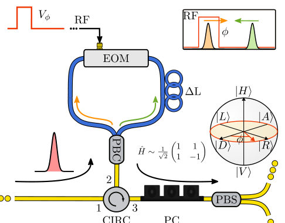
<figcaption class="paper-figure-caption"><b>Fig 1.</b> FIG. 1. Schematic of the polarization state analyzer. The input pulse enters the circulator (CIRC) through port 1 and proceeds through port 2 into the Sagnac loop for phase mod- ulation. After propagating through the loop, the pulse re- enters port 2 of the CIRC and is routed to port 3, pass- ing through a polarization controller (PC) implementing the Hadamard operation before reaching the final polariz- ing beamsplitter (PBS). Fiber types are color-coded as blue for polarization maintaining (PM) and yellow for single-mode (SM).</figcaption>
</figure>
<figure class="paper-figure-card">
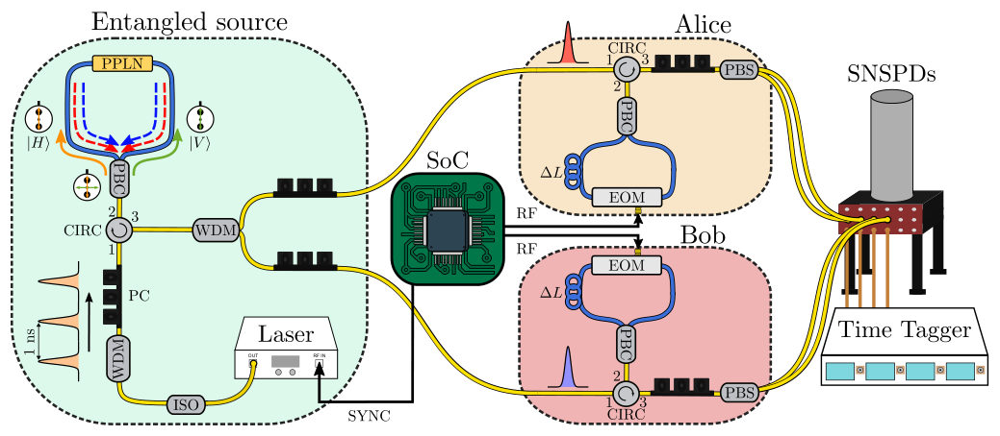
<figcaption class="paper-figure-caption"><b>Fig 2.</b> FIG. 2. Schematic of the experimental setup. Polarization-entangled photon pairs are generated by a fiber-based non-degenerate source in a Sagnac-loop configuration, pumped by a 1 GHz actively mode-locked laser. The non-degenerate photons, depicted in red (signal) and blue (idler), are separated by a wavelength-division multiplexer (WDM) and sent to the Sagnac receivers (Fig. 1), labelled Alice and Bob. A system-on-chip (SoC) generates and controls the electrical pulses driving the polarization modulation, and the photons are detected using superconducting nanowire single-photon detectors (SNSPDs). ISO: isolator, CIRC: circulator, PBC: polarizing beam combiner, PBS: polarizing beamsplitter.</figcaption>
</figure>
<figure class="paper-figure-card">
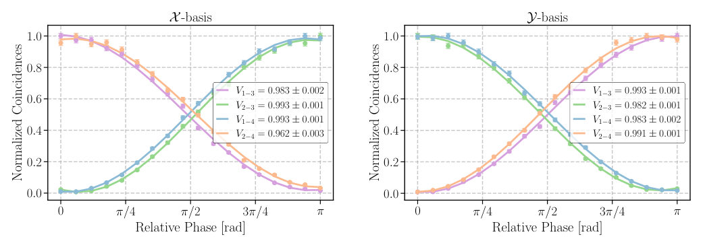
<figcaption class="paper-figure-caption"><b>Fig 3.</b> FIG. 3. Visibility scans of the entangled states in the two mutual unbiased bases X and Y. These scans are obtained by modulating Alice at 0 (for X-basis) and −π/2 (for Y-basis), while Bob changes the relative phase between the receivers from 0 to π.</figcaption>
</figure>
<figure class="paper-figure-card">
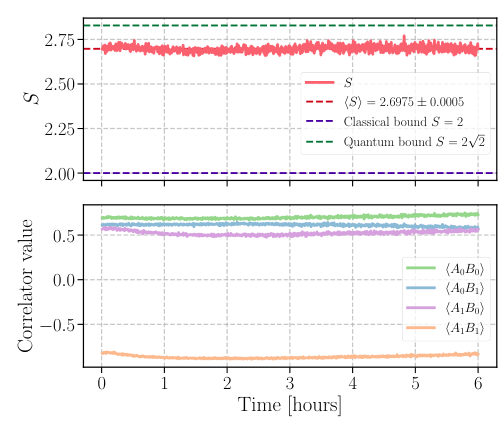
<figcaption class="paper-figure-caption"><b>Fig 4.</b> FIG. 4. Long-term stability of the system during a 1 GHz CHSH test driven by a 1024-bit pseudo-random sequence. The plots show the evolution over time of the S parameter (top panel) and the CHSH correlators (bottom panel).</figcaption>
</figure>

**Summary.** The paper introduces a novel, all-fiber active polarization state analyzer capable of operating at 1 GHz. By integrating lithium niobate EOMs into a Sagnac interferometer, the device enables rapid, trial-by-trial reconfiguration of measurement bases. This achievement validates its use in high-rate quantum protocols by successfully performing a CHSH Bell test with high fidelity and long-term stability.

**Why it may be interesting.** This work directly addresses hardware limitations in quantum communication by providing a robust, scalable platform for fast measurement basis switching, which is critical for scaling up entanglement distribution protocols.

Detailed structure

**Main problem.** The core challenge is developing a high-speed, actively reconfigurable polarization state analyzer necessary for executing advanced quantum protocols like device-independent QKD or Bell tests.

**Main result.** The authors demonstrated a functional all-fiber analyzer capable of performing dynamic polarization measurements at a record rate of 1 GHz while maintaining high entanglement fidelity ($S = 2.6975 \pm 0.0005$).

**Method.** The system utilizes an entangled photon source and analyzes the polarization state using a Sagnac interferometer incorporating a lithium niobate electro-optic phase modulator (EOM).

**Model / system.** The platform is entirely fiber-based, employing off-the-shelf components to achieve active basis selection. The measurement process involves calculating effective projectors based on the total unitary transformation applied by the Sagnac loop and EOM.

**Key observables.** Polarization visibilities (up to 99%); CHSH Bell parameter violation ($S = 2.6975 \pm 0.0005$); Long-term stability of entanglement violation over $>6$ hours.

**Important parameters / regimes.** Nominal repetition rate of $1	ext{ GHz}$; Low operating voltage required for LiNbO$_3$ EOMs compared to bulk cells.

**Assumptions / limitations.** The primary practical limitation noted is the insertion loss (2–4 dB) associated with coupling commercial LiNbO$_3$ EOMs to optical fibers.

**Figures summary.** Figure 1 shows the schematic of the analyzer components. Figure 2 illustrates the experimental setup using a fiber-based source generating entangled pairs at 1 GHz for Alice and Bob receivers.

**Paper structure.** The paper details the necessity of fast basis selection, presents the physical realization using Sagnac interferometers and EOMs, validates the system performance via a high-rate CHSH Bell test, and discusses future improvements to mitigate coupling losses.

Abstract

Active selection of the measurement basis underpins quantum protocols including device-independent quantum key distribution, quantum teleportation with active feed-forward, and Bell tests. High-speed operation is crucial to minimize the latency between consecutive measurement choices, enabling faster protocol execution and higher achievable communication rates. Here, we demonstrate a GHz-rate all-fiber polarization state analyzer enabling active, trial-by-trial reconfiguration of the measurement basis, which we validate by performing a CHSH Bell test. The state analyzer is based on a fiber Sagnac interferometer incorporating a lithium niobate electro-optic phase modulator, built entirely using off-the-shelf fiber-optic components. Operating at a nominal repetition rate of 1 GHz, the system performs dynamic polarization measurements for the CHSH Bell test, achieving polarization visibilities up to 99% and a violation of $S = 2.6975 \pm 0.0005$, certifying entanglement at an unprecedented rate. Furthermore, the system demonstrates excellent long-term stability, preserving the Bell-inequality violation for more than 6 hours without realignment. These results establish the proposed state analyzer as a versatile, scalable platform for quantum communication protocols requiring fast, reconfigurable polarization-state measurements.

[↑ back to top](#top)

### [Speckle-based feedback control of optical dipole trap axial waist position](http://arxiv.org/abs/2607.09414v1)

**Authors:** D. A. Pershin, D. A. Kumpilov, A. E. Rudnev, G. E. Subbotin, A. M. Ibrahimov, I. S. Cojocaru, V. A. Khlebnikov, I. A. Pyrkh, P. A. Aksentsev, S. A. Kuzmin, A. D. Raskatov, A. K. Zykova, V. V. Tsyganok, A. V. Akimov  
**Type:** experiment · **Category:** other · **PDF:** <https://arxiv.org/pdf/2607.09414v1>  
**Analysis basis:** full PDF text, analyzed in chunks
**Topic relevance:** 🔥 `quantum measurements` **4/5** · `quantum optics experiment` **3/5** · `analog quantum simulation` **2/5** · `measurement-induced transitions` **2/5** · `methods for driven-dissipative` **2/5** · `QC/QI experiment` **1/5** · `driven-dissipative phase transition` **1/5** · `interference shaping light` **1/5**

↔ Scroll figures horizontally

<figure class="paper-figure-card">
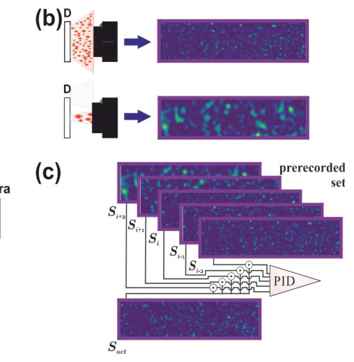
<figcaption class="paper-figure-caption"><b>Fig 1.</b> Figure 1 a) Principal optical scheme of transport of atoms from magneto-</figcaption>
</figure>
<figure class="paper-figure-card">
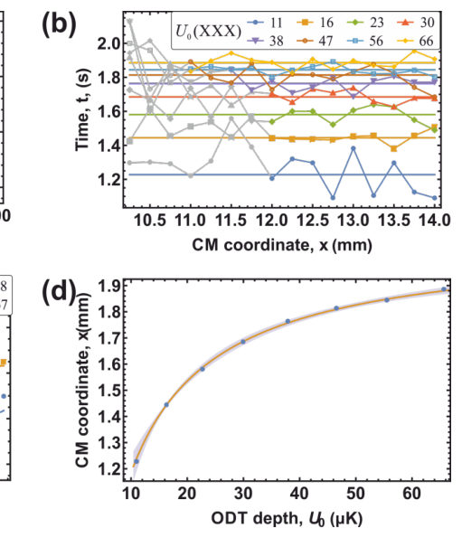
<figcaption class="paper-figure-caption"><b>Fig 2.</b> Figure 2 a) The dot product set i S S for 100 speckle patterns iS around</figcaption>
</figure>
<figure class="paper-figure-card">
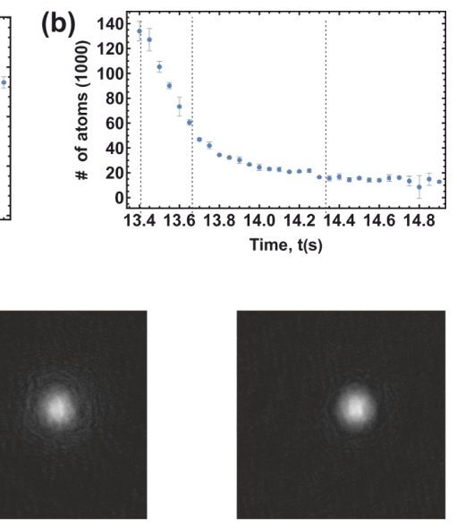
<figcaption class="paper-figure-caption"><b>Fig 3.</b> Figure 3. a) The number of condensed atoms versus time of; b) number of</figcaption>
</figure>

**Summary.** The researchers developed and implemented a speckle-based feedback control system to stabilize the axial waist position of an optical dipole trap during long-distance transport. By monitoring unique speckle patterns generated by the beam, they achieved stable trapping conditions necessary to successfully cool and condense tens of thousands of thulium atoms.

**Why it may be interesting.** This work provides a robust, non-invasive diagnostic tool (speckle imaging) to control critical parameters of optical traps in real-time, which is crucial for high-precision quantum simulations involving cold atoms.

Detailed structure

**Main problem.** The primary goal was achieving stable axial waist position control for an optical dipole trap (ODT) while transporting cold neutral atoms over a long distance.

**Main result.** Speckle-based feedback successfully stabilized the ODT beam waist over 38 cm, enabling subsequent Bose-Einstein condensation of approximately $4 	imes 10^4$ thulium atoms.

**Method.** A novel feedback control loop was implemented using speckle patterns captured by a CMOS camera; the pattern's dot product with a reference set determined the necessary correction current to stabilize the trap waist.

**Model / system.** The experiment utilizes cold neutral atoms (e.g., thulium) trapped in an ODT, which is manipulated using focus-tunable lenses and monitored via speckle patterns generated by coherent light scattering.

**Key observables.** Axial waist position ($w_p$), Center of Mass (CM) coordinate over time, number of condensed atoms vs. time, and the measured speckle pattern ($	ext{act}S$).

**Important parameters / regimes.** Transfer distance (38 cm), atom count ($\sim 4 	imes 10^4$ Th atoms), ODT potential depth ($U$), and feedback loop rate.

**Assumptions / limitations.** The method bypasses the need for a perfectly known relationship between lens current and $w_p$; however, the analysis notes limitations regarding image acquisition time and computation speed.

**Figures summary.** Figures illustrate the optical setup (Fig 1), the feedback mechanism using dot products and CM position tracking during potential changes (Fig 2), and the resulting BEC formation/thermal cloud evolution over time (Fig 3).

**Paper structure.** The paper details the physical scheme, derives the mathematical basis for speckle pattern measurement ($\sigma \propto w/h$), implements the feedback algorithm using dot products, validates stabilization through CM tracking, and concludes with successful atom condensation measurements.

Abstract

Cold neutral atoms is a powerful tool for many experiments ranging from frequency standards and sensing to quantum simulations. Sensitive experiments often demand transferring cold atoms from one vacuum chamber to the other with better optical access and vacuum. In case the transfer is done with a beam waist controlled by a focus-tunable lens, repeatability of the transfer as well as stability of the final position can be below the experimental demands. Here we implement the scheme for stabilization of the axial waist position of the optical dipole trap in the whole range of transfer (38 cm) using speckle patterns, which provides enough stability to achieve Bose-Einstein condensation of around 4*10^4 thulium atoms in the trap formed by the transport beam and the other beam in the target vacuum volume

[↑ back to top](#top)

### [Quantum field nucleating and Wigner functions](http://arxiv.org/abs/2607.09233v1)

**Authors:** Joonas Hirvonen  
**Type:** theory · **Category:** statistical mechanics · **PDF:** <https://arxiv.org/pdf/2607.09233v1>  
**Analysis basis:** full PDF text, analyzed in chunks
**Topic relevance:** 🔥 `Keldysh / 2PI / non-Gaussian methods` **4/5** · `methods for driven-dissipative` **3/5** · `non-equilibrium dynamics` **3/5** · `non-equilibrium universality` **2/5** · `analog quantum simulation` **1/5** · `correlated / nonlocal dissipation` **1/5** · `driven-dissipative phase transition` **1/5**

↔ Scroll figures horizontally

<figure class="paper-figure-card">
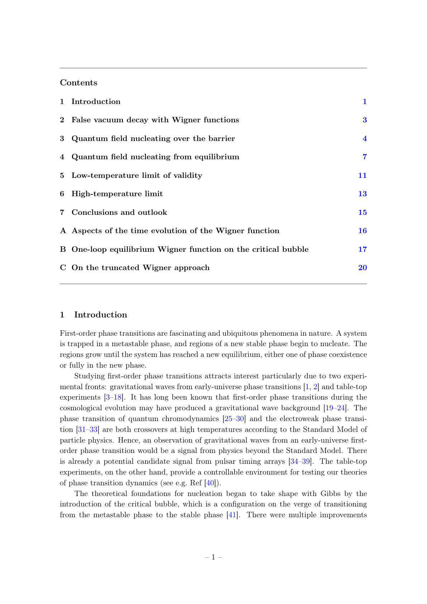
<figcaption class="paper-figure-caption"><b>Fig 1.</b> Low-resolution page preview, page 2</figcaption>
</figure>
<figure class="paper-figure-card">
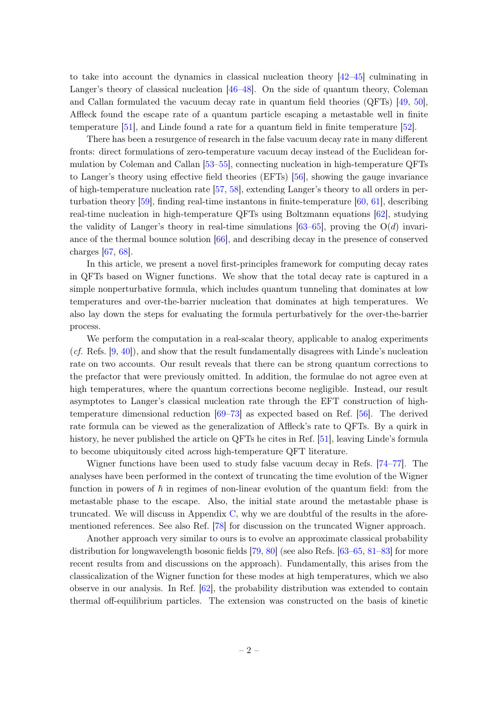
<figcaption class="paper-figure-caption"><b>Fig 2.</b> Low-resolution page preview, page 3</figcaption>
</figure>
<figure class="paper-figure-card">
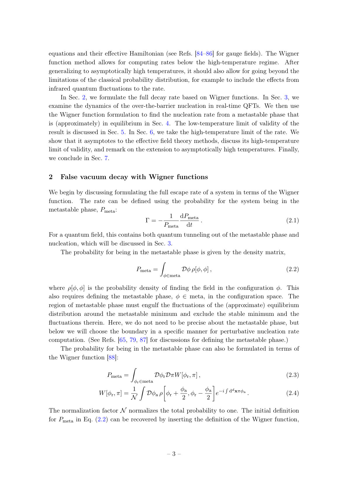
<figcaption class="paper-figure-caption"><b>Fig 3.</b> Low-resolution page preview, page 4</figcaption>
</figure>
<figure class="paper-figure-card">
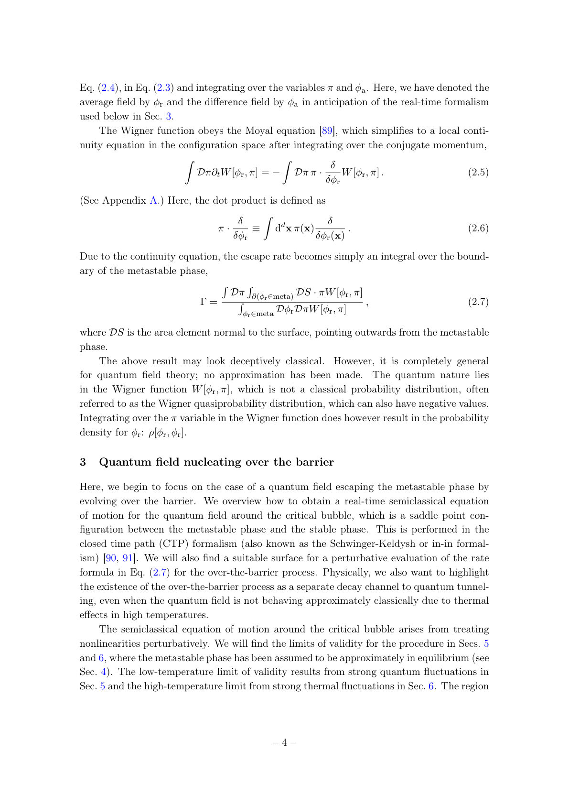
<figcaption class="paper-figure-caption"><b>Fig 4.</b> Low-resolution page preview, page 5</figcaption>
</figure>
<figure class="paper-figure-card">
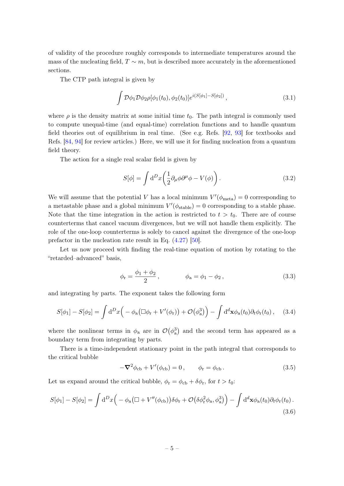
<figcaption class="paper-figure-caption"><b>Fig 5.</b> Low-resolution page preview, page 6</figcaption>
</figure>

**Summary.** This paper introduces a novel real-time framework utilizing Wigner functions to calculate the decay rate of metastable states in quantum field theories. It successfully captures both quantum tunneling and classical over-the-barrier nucleation mechanisms. The key contribution is deriving a new, generalized formula for the nucleation rate that correctly handles the transition between quantum and classical regimes.

**Why it may be interesting.** It provides advanced tools (Wigner functions in CTP) for calculating non-equilibrium dynamics like vacuum decay, which is crucial for understanding phase transitions relevant to quantum simulation platforms or early universe cosmology.

Detailed structure

**Main problem.** The primary goal is developing a novel real-time framework to calculate the decay rate of metastable states in quantum field theories.

**Main result.** The derived one-loop nucleation rate fundamentally differs from standard high-temperature results, generalizing Affleck's formula and showing that the transition remains inherently quantum mechanical even classically symmetric backgrounds.

**Method.** The authors employ a real-time formalism using Wigner functions within the Closed Time Path (CTP) framework to calculate the decay probability across potential barriers.

**Model / system.** The theory is applied to a simple real scalar field undergoing first-order phase transitions, relevant for studying vacuum decay in quantum field theories and potentially analog experiments.

**Key observables.** The nucleation rate ($\Gamma$) and the Wigner function ($W[\phi_r, \pi]$) describing the initial state distribution.

**Important parameters / regimes.** Temperature (thermal effects), barrier height, and the coupling constants of the scalar field potential $V(\phi)$.

**Assumptions / limitations.** The semiclassical approximation is used around the critical bubble configuration; the Wigner function calculation involves truncating time evolution in powers of $\hbar$.

**Figures summary.** Not specified by notes.

**Paper structure.** The paper introduces the real-time framework using Wigner functions, develops the nonperturbative nucleation rate formula capturing both tunneling and over-the-barrier processes, applies it to a simple thermal example, and compares its results against established high-temperature approximations.

Abstract

We present a novel real-time framework for the decay of metastable states in quantum field theories using Wigner functions. The framework introduces a nonperturbative nucleation rate formula that captures both quantum tunneling and over-the-barrier nucleation, alongside steps to evaluate it perturbatively. We apply it to a simple thermal example with direct relevance to current analog experiments. Our derived one-loop nucleation rate fundamentally differs from the widely cited high-temperature result by Linde: The prefactor contains quantum effects and also asymptotes to a differing form at high temperatures, where the quantum effects become negligible. Rather, the result is a generalization of Affleck's rate formula to quantum field theories, asymptoting to the effective field theory approach, and Langer's rate, at high temperatures. The example also reveals that the high-temperature side of the ``quantum-to-classical'' transition of thermal vacuum decay is still inherently quantum mechanical, even though the bounce background possesses the classical, $\mathrm{O}(d)\times S^1$, symmetry.

[↑ back to top](#top)

### [Quantum Chaos with a Macroscopic Zero-Mode Sector](http://arxiv.org/abs/2607.09504v1)

**Authors:** Cheryne Jonay, Kun W. Kim, Frank Pollmann, Alexander Altland  
**Type:** theory · **Category:** other · **PDF:** <https://arxiv.org/pdf/2607.09504v1>  
**Analysis basis:** full PDF text, analyzed in chunks
**Topic relevance:** 🔥 `analog quantum simulation` **4/5** · `driven-dissipative phase transition` **2/5** · `Frenkel-Kontorova` **1/5** · `Keldysh / 2PI / non-Gaussian methods` **1/5** · `correlated / nonlocal dissipation` **1/5** · `entanglement & information structure` **1/5** · `exotic spin models in light-matter` **1/5** · `methods for driven-dissipative` **1/5** · `non-equilibrium dynamics` **1/5** · `non-equilibrium universality` **1/5**

↔ Scroll figures horizontally

<figure class="paper-figure-card">
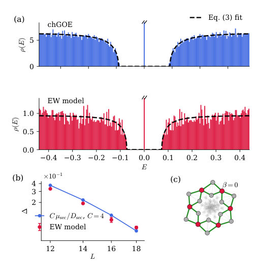
<figcaption class="paper-figure-caption"><b>Fig 1.</b> FIG. 1. Zero-mode manifold and spectral gap. (a) Density of states near E = 0 for a chiral GOE (chGOE) ensemble compared to the East–West model at L = 18 in the k = 0, inversion-even sector (D = 7685, µk=0,I=+ = 143 exact zero modes). The inversion-odd block at the same momentum contributes another µk=0,I=−= 113, giving µk=0 = 256 = 2L/2−1 in total at k = 0. The chGOE comparison uses NA = 3914, NB = 3771, matching both the sector dimension (NA + NB = D = 7685) and the chiral imbalance (NA −NB = 143). Eq. (3) is overlaid as a hard-edge shape fit: µk=0,I=+ is fixed by the exact zero-mode count, while the local scale δ and amplitude are fitted independently for each ensemble [28]. (b)...</figcaption>
</figure>
<figure class="paper-figure-card">
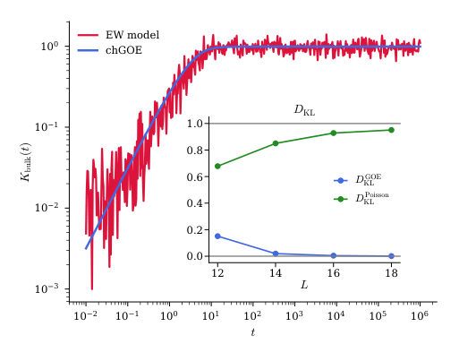
<figcaption class="paper-figure-caption"><b>Fig 2.</b> FIG. 2. Bulk chaos. Unfolded spectral form factor Kbulk(t) of the EW model for L = 18 in the k = 0, inversion-even sector, versus the chGOE prediction (blue) obtained from the convolution R ρ(x) KchGOE(t/ρ(x)) dx, which accounts for the rugged density of states of the EW model, see [32]. The GOE ramp emerges beyond a non-parametric Thouless time tTh ∼O(1) and saturates onto the Heisenberg plateau. Inset: Kullback–Leibler divergence of the EW level-spacing ratio dis- tribution from GOE (blue) and Poisson (green) references vs. L; DGOE KL →0 confirms Wigner–Dyson bulk statistics.</figcaption>
</figure>
<figure class="paper-figure-card">
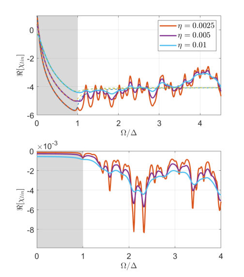
<figcaption class="paper-figure-caption"><b>Fig 3.</b> FIG. 3. Linear response for the East–West model Eq. (1) (L = 18, β = √</figcaption>
</figure>

**Summary.** The paper analyzes quantum spin chains exhibiting chiral symmetry to show that an exponentially large number of exact zero-energy states creates a distinct spectral gap. By combining random matrix theory with linear response spectroscopy, the authors demonstrate how this gap and the associated degeneracy can be robustly detected experimentally, distinguishing it from standard chaotic behavior.

**Why it may be interesting.** This work provides a rigorous theoretical framework for understanding how topological or crystalline symmetries enforce macroscopic degeneracies in quantum spectra, which is highly relevant for designing robust quantum simulators or studying exotic phases of matter.

Detailed structure

**Main problem.** The study investigates how chiral symmetry protects an exponentially large manifold of exact zero modes in many-body quantum systems, fundamentally altering the surrounding energy spectrum.

**Main result.** These zero modes create a hard spectral gap at zero energy ($\Delta \sim \mu\delta$), which can be diagnosed using linear-response spectroscopy and spectral form factor analysis.

**Method.** The authors employ chiral random matrix theory (chRMT) alongside linear response theory to analyze spectral correlations and the influence of symmetry on low-energy excitations.

**Model / system.** The primary model is constrained spin chains, specifically the East–West (EW) model, which possesses chiral ($\Gamma$), translational ($T$), and inversion ($I$) symmetries. A Star-Graph model is also analyzed for comparison.

**Key observables.** Density of states near E=0 ($
ho(E)$), spectral form factor $K(t)$, linear response susceptibility $\chi(\Omega)$, and the gap width $\Delta$.

**Important parameters / regimes.** The number of zero modes ($\mu$), the mean level spacing ($\delta$), and system size ($L$). The ratio $\Delta/\delta \sim \mu$ is a key scaling parameter.

**Assumptions / limitations.** The analysis assumes that symmetries remain intact to preserve both degeneracy and gap; approximations are made in linear response theory by simplifying matrix element contributions.

**Figures summary.** Figures compare the spectral density of states ($
ho(E)$) for different models (chGOE, EW, Star-graph), showing distinct lower edge shapes. Another figure illustrates how linear response susceptibility $\chi(\Omega)$ reveals a zero-mode resonance peak when symmetry is preserved.

**Paper structure.** The paper progresses by establishing the existence of zero modes via symmetries in the EW model, quantifying the resulting spectral gap using RMT and form factors, and finally probing this structure dynamically using linear response spectroscopy to distinguish between models based on edge shape and low-frequency response.

Abstract

Chaotic many-body spectra are expected to densely fill their energy window. We show that constrained spin chains with chiral symmetry evade this expectation by hosting an exponentially large manifold of symmetry-protected exact zero modes separated from the surrounding spectrum by a sharp gap at zero energy. The gap is generated by chaotic level repulsion, with width set by the number of zero modes times the mean level spacing. We verify this mechanism in an East-West kinetically constrained chain, develop a minimal random-matrix description, and show how the gap can be detected through linear-response spectroscopy.

[↑ back to top](#top)

### [Simulation of Lindbladian dynamics via adaptive variational quantum trajectory compression](http://arxiv.org/abs/2607.09051v1)

**Authors:** Huan-Yu Liu, Cheng Xue, Yun-Jie Wang, Xi-Ning Zhuang, Chao Wang, Yu-Chun Wu, Zhao-Yun Chen, Guo-Ping Guo  
**Type:** theory · **Category:** quantum information and computing · **PDF:** <https://arxiv.org/pdf/2607.09051v1>  
**Analysis basis:** full PDF text, analyzed in chunks
**Topic relevance:** 🔥 `methods for driven-dissipative` **4/5** · `quantum measurements` **3/5** · `Keldysh / 2PI / non-Gaussian methods` **2/5** · `non-equilibrium dynamics` **2/5** · `correlated / nonlocal dissipation` **1/5** · `driven-dissipative phase transition` **1/5** · `measurement-induced transitions` **1/5**

↔ Scroll figures horizontally

<figure class="paper-figure-card">
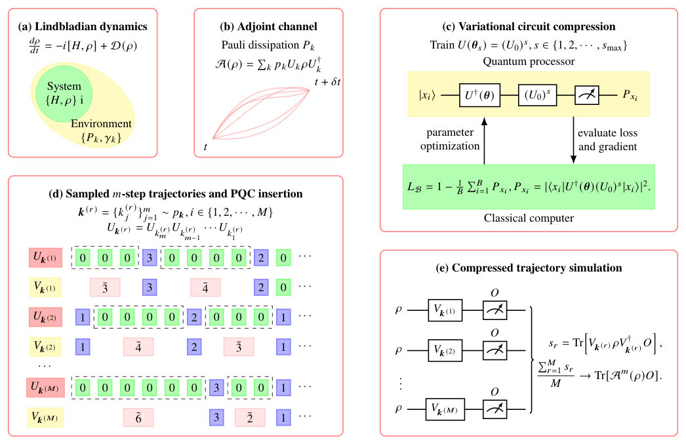
<figcaption class="paper-figure-caption"><b>Fig 1.</b> FIG. 1. Overview of the proposed simulation algorithm. (a) Open quantum systems described by the Lindblad master equation, where the system of interest interacts with its surrounding environment. (b) For Pauli dissipations, the dissipative dynamics can be approximated by a compact mixed-unitary adjoint channel, enabling ancilla-free implementation through trajectory sampling. (c) Variational circuit compression framework. For each 𝑠∈{1, 2, · · · , 𝑠max}, a depth-adaptive PQC 𝑈(𝜽𝑠) is trained to approximate the repeated Hamiltonian evolution (𝑈0)𝑠. The loss function is evaluated on a finite basis-state set B using a quantum processor, while the parameters are updated by a classical...</figcaption>
</figure>
<figure class="paper-figure-card">
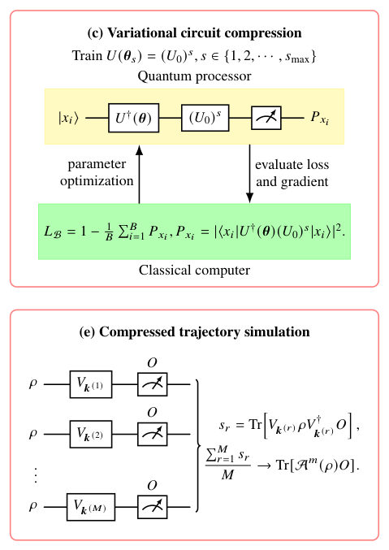
<figcaption class="paper-figure-caption"><b>Fig 2.</b> Fig. 1(c). Then the basis-sampled fidelity becomes</figcaption>
</figure>
<figure class="paper-figure-card">
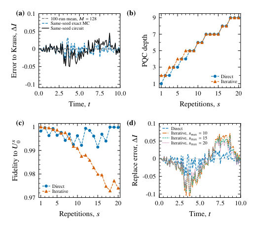
<figcaption class="paper-figure-caption"><b>Fig 3.</b> FIG. 3. Adaptive trajectory compression with finite basis batches 𝐵= 32. (a) Signed errors relative to the deterministic Kraus evolu- tion. The panel compares the 100-run sampling mean, one same-seed exact Monte Carlo trajectory ensemble, and the corresponding same- seed compiled circuit for 𝑀= 128. (b) Optimized PQC depth for direct and iterative 𝐵= 32 training as a function of the repetition number 𝑠. (c) Validation fidelity of the optimized PQC relative to (𝑈0)𝑠. (d) Signed replacement errors for the direct library and the iterative libraries with 𝑠max = 10, 15, and 20. All replacement simu- lations use 𝑀= 128 trajectories.</figcaption>
</figure>
<figure class="paper-figure-card">
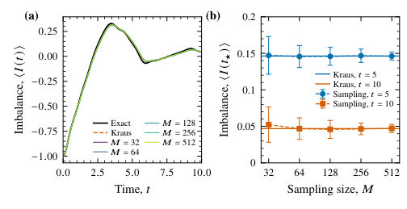
<figcaption class="paper-figure-caption"><b>Fig 4.</b> FIG. 2. Simulation results on dissipative domain-wall melting and sampling stability. (a) Domain-wall imbalance obtained from the exact Lindblad equation, the deterministic Kraus channel, and the stochastic trajectory averages for 𝑀= 32, 64, 128, 256, and 512. Each sampling curve is averaged over 100 independent repetitions. (b) Sampling means at 𝑡= 5 and 𝑡= 10 as functions of 𝑀. Error bars denote one standard deviation over the 100 repetitions.</figcaption>
</figure>
<figure class="paper-figure-card">
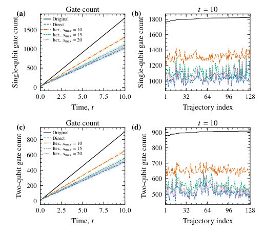
<figcaption class="paper-figure-caption"><b>Fig 5.</b> FIG. 4. Circuit-resource reduction from adaptive trajectory compression. (a) Mean single-qubit gate count as a function of time for the uncompressed circuit, direct replacement, and iterative re- placement with 𝑠max = 10, 15, and 20. Shaded regions indicate one standard deviation over 𝑀= 128 trajectories. (b) Single-qubit gate counts of individual trajectories at 𝑡= 10, ordered by the correspond- ing uncompressed count. (c) Mean two-qubit gate count as a function of time. (d) Two-qubit gate counts of individual trajectories at 𝑡= 10.</figcaption>
</figure>

**Summary.** This paper presents a resource-efficient algorithm to simulate open quantum systems on near-term quantum hardware by addressing the challenges posed by non-unitary dissipation. It achieves this by first using a stable adjoint channel representation and then introducing an adaptive variational compression technique to drastically reduce the circuit depth required for repeated Hamiltonian evolution steps.

**Why it may be interesting.** This work directly tackles the major practical bottleneck in quantum simulation of open systems—circuit depth—by integrating advanced techniques from both quantum control (adjoint channels) and variational quantum algorithms (compression).

Detailed structure

**Main problem.** Developing a resource-efficient algorithm for simulating Lindbladian dynamics on Noisy Intermediate-Scale Quantum (NISQ) devices.

**Main result.** The proposed method achieves ancilla-free and depth-reduced simulation of open quantum systems with Pauli dissipations, demonstrated successfully on the dissipative quantum XY model.

**Method.** It combines deriving a stable mixed-unitary adjoint channel approximation for dissipation with an adaptive variational quantum trajectory compression framework to replace deep unitary segments.

**Model / system.** The system is an open quantum system governed by the Lindblad master equation, focusing specifically on dynamics involving Pauli dissipations ($P_k \in \{I, X, Y, Z\}^{\otimes n}$).

**Key observables.** Accuracy of simulation (approximating evolution over $\delta t$), resource efficiency, and circuit depth reduction.

**Important parameters / regimes.** Dissipation rates ($\gamma_k$), time step ($\delta t$), and the compression parameters ($	heta$).

**Assumptions / limitations.** The primary assumptions involve approximating the dynamics via a stable adjoint channel and using variational circuits to approximate repeated Trotterized Hamiltonian evolution operators.

**Figures summary.** Figure 1 illustrates the entire process: (a) Lindbladian dynamics; (b) Adjoint channel formulation; (c) Variational circuit compression training setup; (d) Monte Carlo sampling with PQC insertion ($ar{U}_{r_a}$); and (e) Simulation using compressed trajectories.

**Paper structure.** The paper first addresses the challenge of NISQ simulation for open systems, derives a stable adjoint channel to avoid classical post-processing, and then introduces the adaptive variational compression framework to reduce circuit depth by replacing repeated unitary blocks with trained PQCs. Finally, it validates this approach on the XY model.

Abstract

Quantum simulation of open quantum systems in the noisy intermediate-scale quantum (NISQ) era is hindered by the non-unitary nature of dissipative dynamics and the limited quantum resources available on near-term quantum processors. In this work, we propose a resource-efficient algorithm for simulating Lindbladian dynamics on NISQ devices. For open quantum systems with Pauli dissipations, we first derive a compact and stable mixed-unitary adjoint channel that approximates the target dissipative dynamics and enables ancilla-free implementation through trajectory sampling. To further reduce the circuit depth required for implementing the sampled trajectories, we introduce an adaptive variational quantum trajectory compression framework. In this framework, a depth-adaptive parameterized quantum circuit is trained to approximate repeated Trotterized Hamiltonian simulation operators, which are then used to replace repeated unitary segments appearing in the sampled trajectories. Importantly, the training procedure can also be performed without auxiliary qubits. Numerical simulations of the dissipative quantum $XY$ model demonstrate the accuracy and resource efficiency of the proposed algorithm. Our results provide a practical route toward ancilla-free and depth-reduced simulation of open quantum systems on near-term quantum hardware.

[↑ back to top](#top)

### [Stabilization of two-dimensional optical continuous-wave states by a potential trough](http://arxiv.org/abs/2607.09607v1)

**Authors:** Thawatchai Mayteevarunyoo, Boris A. Malomed  
**Type:** theory · **Category:** quantum gases · **PDF:** <https://arxiv.org/pdf/2607.09607v1>  
**Analysis basis:** full PDF text, analyzed in chunks
**Topic relevance:** 🔥 `analog quantum simulation` **4/5** · `Frenkel-Kontorova` **3/5** · `driven-dissipative phase transition` **2/5** · `non-equilibrium dynamics` **2/5** · `interference shaping light` **1/5** · `methods for driven-dissipative` **1/5** · `non-equilibrium universality` **1/5**

↔ Scroll figures horizontally

<figure class="paper-figure-card">
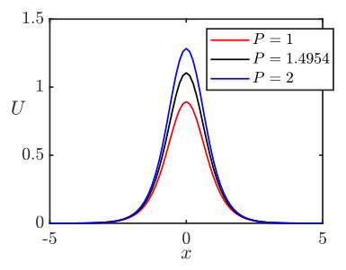
<figcaption class="paper-figure-caption"><b>Fig 1.</b> FIG. 1. Profiles of the GSs produced by the numerical solution of Eq. (4) with q = 0, W0 = 5.0, g = 0.5, and three different powers, as indicated in the figure. The power P = 1.4954, with the respective eigenvalue k = 4.371 in Eq. (4), corresponds to the largest value of the MI gain, Re(γ)max = 0.8649, obtained from the numerical solution of the BdG system of Eqs. (9) and (10).</figcaption>
</figure>
<figure class="paper-figure-card">
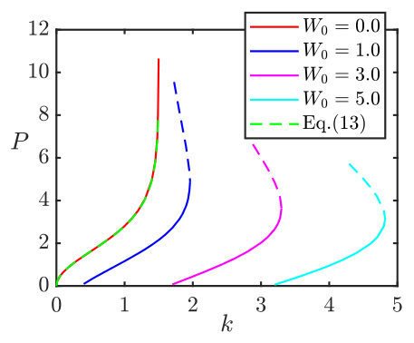
<figcaption class="paper-figure-caption"><b>Fig 2.</b> FIG. 2. Dependences P(k) for the GS families, produced by the numerical solution of Eq. (4) with q = 0, g = 0.5, and values of W0 indicated in the figure (W0 = 0 pertains to the exact 1D soliton solution, as given by Eqs. (11) and (13)). The 1D power is calculated as P(k) = R +∞ −∞|usol(x)|2 dx, cf. Eq. (13). Above the turning points, the dashed P(k) curves, if extended towards P →∞, approach the value k = 3/(4g) (see Eq. (12)) from the right.</figcaption>
</figure>
<figure class="paper-figure-card">
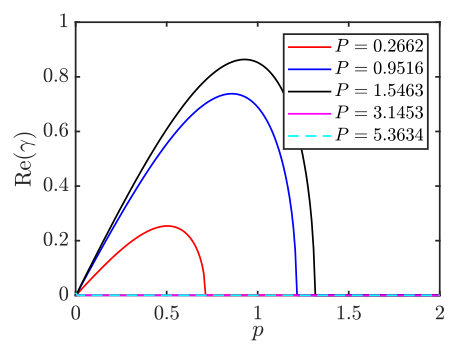
<figcaption class="paper-figure-caption"><b>Fig 3.</b> FIG. 3. The MI gain vs. wavenumber p of the modulational perturbations (see Eq. (8)) for the CW states of the GS type, with W0 = 5.0, g = 0.5, and different values of the 1D power, which are indicated in the figure. Note that the MI gain is vanishingly small for large powers, P = 3.1453 and 5.3634.</figcaption>
</figure>
<figure class="paper-figure-card">
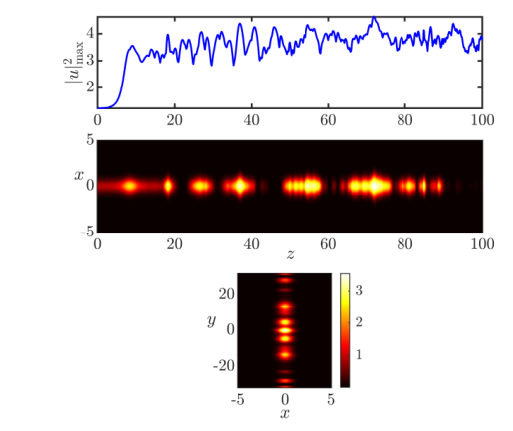
<figcaption class="paper-figure-caption"><b>Fig 4.</b> FIG. 4. The perturbed evolution of the unstable CW state corresponding to the GS profile with P = 1.4954 from Fig. 1, as produced by simulations of Eq. (1). Top: the peak intensity |u|2 max vs. z, showing rapid growth of the MI, followed by chaotic oscillations. Middle: the local intensity, |u|2, in the (x, z)-plane drawn through y = 0, showing filamentation of the CW state. Bottom: the snapshot of the power-density distribution in the (x, y) plane at z = 50, which demonstrates spontaneous splitting of the unstable CW into a chain of quasi-soliton speckles.</figcaption>
</figure>
<figure class="paper-figure-card">
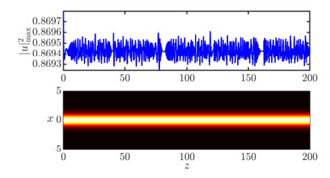
<figcaption class="paper-figure-caption"><b>Fig 5.</b> FIG. 5. The same as in the top and middle panels of Fig. 2, but for a “practically stable” CW, corresponding to W0 = 2.5. g = 1.5, and P = 1.3395, k = 1.845. The actual stability of this CW is explained by a very small MI gain, as obtained from the numerical solution of the BdG system of Eqs. (9) and (10): Re(γ)peak max = 0.0343.</figcaption>
</figure>

**Summary.** The paper investigates how CW states of light propagating through a medium with cubic-quintic nonlinearity can be stabilized by an external potential trough. By analyzing modulational instability and simulating soliton chains, the authors demonstrate that stable periodic structures can exist, providing both numerical evidence and exact analytical solutions for these confined quantum wave phenomena.

**Why it may be interesting.** This work directly addresses wave localization and stability in structured media, which is highly relevant to understanding Bose-Einstein Condensates (BECs) trapped in optical lattices or potentials, linking nonlinear optics theory to quantum gas dynamics.

Detailed structure

**Main problem.** The study focuses on stabilizing two-dimensional optical continuous-wave (CW) states against modulational instability (MI) within a structured potential.

**Main result.** Stable stationary states, specifically periodic chains of 2D solitons, are produced in the potential trough, and exact analytical solutions for stable CW states were found for the singular delta-functional potential case.

**Method.** The analysis employs linear stability analysis using Bogoliubov-de Gennes (BdG) equations to check for MI, alongside numerical simulations of soliton dynamics and stationary state calculations.

**Model / system.** The system models quasi-one-dimensional CWs in a 2D optical medium characterized by cubic-quintic nonlinearity and confined by a potential trough (Gaussian or delta-functional). The governing equation is a nonlinear Schrödinger type equation.

**Key observables.** Modulational instability gain ($	ext{Re}(\gamma)$), 1D power ($P(k)$), and the existence/stability of soliton chains.

**Important parameters / regimes.** Potential strength ($W_0$), nonlinearity coefficients (cubic and quintic terms, $g$), and propagation constant ($k$).

**Assumptions / limitations.** The analysis often assumes simplified transverse structures (Ground State or Dipole Mode) and utilizes linearization techniques around the CW background.

**Figures summary.** Figures illustrate profiles of GS/DM states, dependence of power on wavenumber $P(k)$, MI gain ($	ext{Re}(\gamma)$ vs. $p$), and simulated evolution showing stability or splitting into speckles.

**Paper structure.** The paper progresses from establishing the governing nonlinear equation and analyzing CW state stability (MI analysis) for various potentials, to demonstrating stable soliton chain formation, and finally presenting exact analytical solutions in specific limiting cases (delta-potential).

Abstract

We consider quasi-one-dimensional (Q1D) continuous waves (CWs) in the two-dimensional (2D) optical system with the cubic-quintic nonlinearity and a Q1D potential trough. In the case of a smooth trough profile, we confirm the known modulational instability (MI) of Q1D CWs with the transverse structure corresponding to the 1D ground state (GS) in the potential trough, and demonstrate the MI of CWs with the dipole-mode (DM) transverse structure, corresponding to the lowest 1D excited state in the potential trough. The CWs of both GS and DM types remain nearly stable close to the edges of their existence regions. Stable stationary states in the form of periodic chains of 2D solitons, trapped in the potential trough, are produced in a numerical form. The dynamics of the soliton chains excited by a localized kick is studied too. For the potential trough with the singular delta-functional profile, we find two species of exact analytical solutions for CWs, one of which is completely stable.

[↑ back to top](#top)

### [The monopole plasma resonance: a smoking gun of 3D $U(1)$ quantum spin liquids](http://arxiv.org/abs/2607.08826v1)

**Authors:** Anish Koley, Saranyo Moitra, Inti Sodemann Villadiego  
**Type:** theory · **Category:** strongly correlated electrons · **PDF:** <https://arxiv.org/pdf/2607.08826v1>  
**Analysis basis:** full PDF text, analyzed in chunks
**Topic relevance:** 🔥 `exotic spin models in light-matter` **4/5** · `spintronics-quantum-optics interface` **3/5** · `analog quantum simulation` **2/5** · `Keldysh / 2PI / non-Gaussian methods` **1/5** · `correlated / nonlocal dissipation` **1/5** · `driven-dissipative phase transition` **1/5** · `methods for driven-dissipative` **1/5** · `non-equilibrium dynamics` **1/5**

↔ Scroll figures horizontally

<figure class="paper-figure-card">
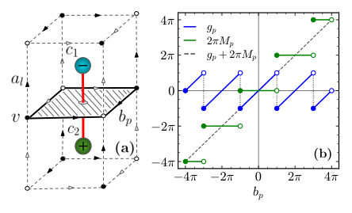
<figcaption class="paper-figure-caption"><b>Fig 1.</b> FIG. 1. (a) Schematic of monopoles and WGT variables in a cubic lattice. (b) Decomposition of emergent magnetic field (bp) into &quot;small&quot; part (gp) and Dirac strings (Mp).</figcaption>
</figure>
<figure class="paper-figure-card">
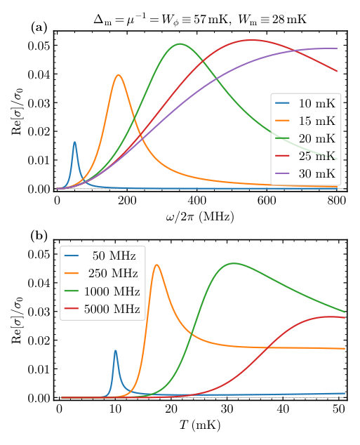
<figcaption class="paper-figure-caption"><b>Fig 2.</b> FIG. 2. Re[σ] from Eq. (15) (a) as a function of frequency, and (b) as a function temperature showing a clear monopole plasma resonance peak in both of these traces.</figcaption>
</figure>

**Summary.** The paper theoretically predicts that 3D U(1) quantum spin liquids containing mobile magnetic monopoles will exhibit a sharp plasma resonance peak in their electrical conductivity at low frequencies. This resonance serves as a 'smoking gun' diagnostic tool, allowing experimental distinction between different types of QSLs (e.g., dipolar vs. octupolar) based on the electric charge carried by these emergent monopoles.

**Why it may be interesting.** This work provides a concrete, measurable spectroscopic signature ($\omega_p$) derived from fundamental topological excitations (monopoles) within exotic quantum magnetic states, which is highly relevant for understanding emergent electrodynamics in correlated materials.

Detailed structure

**Main problem.** The primary goal is determining the electrical conductivity of a 3D U(1) quantum spin liquid (QSL) that hosts an itinerant fluid of magnetic monopoles.

**Main result.** The system is predicted to be an insulator for DC transport but should exhibit a sharp, metallic-like plasma resonance at very low frequencies ($\omega \approx \omega_p$).

**Method.** Linear response theory and conductivity calculations are employed, drawing analogies from the Ioffe-Larkin rule to relate physical current to monopole current.

**Model / system.** The system models 3D U(1) QSLs, particularly those in dipolar quantum spin ice (DQSI), described by a Wilson's gauge theory coupled to emergent magnetic monopoles. The model distinguishes between Dipolar and Octupolar phases based on symmetry.

**Key observables.** Plasma Resonance Frequency ($\omega_p$), physical electrical conductivity $\sigma(\omega)$, and the quality factor $Q(T) = \omega_p(T)/\Gamma(T)$.

**Important parameters / regimes.** Monopole density $n_m(T)$ (exponentially temperature-dependent), monopole gap $\Delta_m$, and the ratio of resonance frequency to damping rate ($Q$).

**Assumptions / limitations.** The analysis assumes a dilute limit for monopole distribution and relies on comparing the calculated quality factor $Q$ against a threshold ($Q_{	ext{threshold}} = 0.25$) to distinguish between resonant and onset regimes.

**Figures summary.** Figures illustrate the non-monotonic temperature dependence of the quality factor $Q(T)$ and peak conductivity $\sigma_{	ext{peak}}(T)$, confirming a specific temperature window where the resonance is visible.

**Paper structure.** The paper progresses by establishing the physical model (WGT, monopole plasma), deriving the low-frequency conductivity formulas using Ioffe-Larkin analogies, analyzing the dependence on QSL symmetry (D vs O), and finally detailing the diagnostic signatures via temperature-dependent resonance analysis.

Abstract

Certain 3D $U(1)$ spin liquids, such as those arising in dipolar quantum spin ice, have an emergent monopole which is the source of an emergent magnetic field that transforms under symmetries like an electric polarization. As a consequence, these monopoles carry a physical electric charge in their cores and form a plasma at low temperatures. Due to the monopole coupling to emergent gauge fields, the full system behaves as an electrical insulator for DC transport, but can display a sharp plasma resonance analogous to a metal at very low frequencies. This can serve as a clear fingerprint to detect these states in materials. We discuss the optimal conditions to observe this phenomenon in the 3D $U(1)$ spin-liquid candidate Ce$_2$Zr$_2$O$_7$.

[↑ back to top](#top)

### [Quantitative Wigner-Araki-Yanase Theorems for Unitary and Antiunitary Symmetries](http://arxiv.org/abs/2607.09075v1)

**Authors:** Akihiro Hokkyo, Hiroyasu Tajima  
**Type:** theory · **Category:** quantum information and computing · **PDF:** <https://arxiv.org/pdf/2607.09075v1>  
**Analysis basis:** full PDF text, analyzed in chunks
**Topic relevance:** 🔥 `quantum measurements` **4/5** · `measurement-induced transitions` **3/5** · `Keldysh / 2PI / non-Gaussian methods` **1/5** · `correlated / nonlocal dissipation` **1/5** · `driven-dissipative phase transition` **1/5** · `entanglement & information structure` **1/5**

↔ Scroll figures horizontally

<figure class="paper-figure-card">
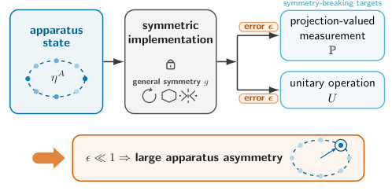
<figcaption class="paper-figure-caption"><b>Fig 1.</b> FIG. 1. Symmetry imposes a quantitative cost on implement- ing symmetry-breaking quantum operations. A symmetric implementation, assisted by an apparatus state ηA, is required to approximate a target operation that breaks a general sym- metry g, such as a projection-valued measurement P or a uni- tary operation U. For arbitrary unitary or antiunitary sym- metries, small implementation error ϵ is possible only if the apparatus state carries sufficient asymmetry. This tradeoff gives a quantitative WAY-type limitation without relying on symmetry generators or their variances.</figcaption>
</figure>

**Summary.** This paper develops quantitative extensions of the Wigner-Araki-Yanase theorem to constrain quantum measurements and gates under arbitrary unitary and antiunitary symmetries. By employing a two-target no-programming inequality, it derives explicit bounds linking implementation error directly to the required asymmetry of the measurement apparatus state via fidelity measures. This advances fundamental understanding of symmetry limitations in quantum information processing.

**Why it may be interesting.** This work provides fundamental resource constraints on measurement and control that are applicable beyond standard continuous symmetry assumptions, which is crucial for understanding physical limitations in quantum computation and metrology.

Detailed structure

**Main problem.** The paper aims to establish quantitative Wigner-Araki-Yanase (WAY)-type theorems that constrain quantum measurement and control when symmetries are discrete, unitary, or antiunitary, extending beyond the limitations of continuous symmetry bounds.

**Main result.** New theorems provide explicit lower bounds on the asymmetry of the apparatus state, quantified by its fidelity with its symmetry-transformed copy, relating this bound directly to the implementation error ($\epsilon$) of a symmetry-breaking operation.

**Method.** The core methodology involves reducing the WAY problem to a two-target no-programming inequality, which relates the required distinguishability between target operations to the apparatus state's fidelity asymmetry.

**Model / system.** The framework analyzes quantum measurements (PVMs) and unitary gates implemented on a primary system ($S$) using an auxiliary apparatus ($\eta_A$). The analysis incorporates arbitrary unitary and antiunitary symmetries ($g \in G$).

**Key observables.** Implementation Error ($\epsilon$), Apparatus Asymmetry quantified by Fidelity $F(\eta_A, V_A^g(\eta_A))$, and distinguishability measures like the Bhattacharyya coefficient or diamond norm.

**Important parameters / regimes.** The bounds are parameterized by the error $\epsilon$ and depend on the specific symmetry group structure (unitary vs. antiunitary).

**Assumptions / limitations.** The approach assumes that the underlying physical processes can be modeled using covariant operations, allowing the use of the two-target no-programming inequality.

**Figures summary.** Figure 1 illustrates how symmetry imposes a quantitative cost on implementing symmetry-breaking quantum operations by relating error ($\epsilon$) to apparatus asymmetry. Figure 2 shows the 'No-programming origin' of the bound using two target operations and program states.

**Paper structure.** The paper develops the general framework via the no-programming inequality, derives specific theorems for PVMs and unitary gates under arbitrary symmetries, and concludes by relating these bounds to established distinguishability measures in quantum information theory.

Abstract

Symmetry imposes fundamental constraints on quantum measurement and control. The Wigner-Araki-Yanase theorem and its quantitative extensions capture this restriction for continuous symmetries, in terms of fluctuations of conserved generators. Such generator-based bounds, however, do not provide quantitative limitations for discrete unitary symmetries or for antiunitary symmetries. Here we establish quantitative WAY-type theorems for symmetry-breaking projective measurements and unitary gates under arbitrary unitary and antiunitary symmetries. Our approach is based on a two-target no-programming inequality: if a single processor approximately implements two operations that amplify distinguishability, then the corresponding program states must themselves be distinguishable. Applied to symmetric implementations, this converts the error of an asymmetric measurement or gate directly into a lower bound on the asymmetry of the apparatus state, quantified by its fidelity with its symmetry-transformed copy. Our results apply to discrete and antiunitary symmetries, thereby providing a fundamental limit for symmetry-limited quantum measurement and control beyond the continuous-symmetry regime.

[↑ back to top](#top)

### [Quantum Orchestras: a Concrete Semantics for Recursive Hybrid Programs](http://arxiv.org/abs/2607.09605v1)

**Authors:** Alex Rice, Dominik Leichtle, Kim Worrall, Robert I. Booth  
**Type:** theory · **Category:** quantum information and computing · **PDF:** <https://arxiv.org/pdf/2607.09605v1>  
**Analysis basis:** full PDF text, analyzed in chunks
**Topic relevance:** 🔥 `quantum measurements` **4/5** · `measurement-induced transitions` **3/5** · `methods for driven-dissipative` **1/5** · `non-equilibrium dynamics` **1/5**

↔ Scroll figures horizontally

<figure class="paper-figure-card">
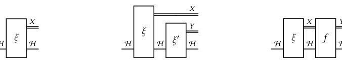
<figcaption class="paper-figure-caption"><b>Fig 1.</b> Fig. 1. Sequential composition of quantum instruments. A fixed composition of 𝜉∈𝑄(𝑋) with 𝜉′ ∈𝑄(𝑌) cannot express measurement-dependent control. The relevant operation is Kleisli composition, composing 𝜉 with a continuation 𝑓: 𝑋→𝑄(𝑌).</figcaption>
</figure>
<figure class="paper-figure-card">
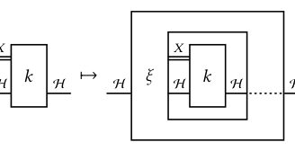
<figcaption class="paper-figure-caption"><b>Fig 2.</b> Fig. 2. Two graphical depictions of the action of a quantum orchestra 𝜉on a continuation 𝑘.</figcaption>
</figure>

**Summary.** The paper develops the 'quantum orchestra monad' to provide a formal denotational semantics for hybrid quantum programs. It successfully models computations involving mid-circuit measurements and infinite recursion using domain theory over DCPO. This framework establishes a deep mathematical equivalence between these quantum orchestras and probabilistic powerdomain structures.

**Why it may be interesting.** This work provides a rigorous mathematical foundation for programming models that go beyond simple quantum circuits by incorporating complex classical feedback based on measurement outcomes, which is crucial for fault-tolerant or adaptive quantum algorithms.

Detailed structure

**Main problem.** The work aims to provide a general denotational semantics for hybrid quantum programs that combine classical control flow with quantum effects, especially those involving mid-circuit measurements and non-termination.

**Main result.** They introduce the 'quantum orchestra monad,' which provides a domain-theoretic framework isomorphic to the probabilistic powerdomain monad, thereby giving meaning to divergent hybrid quantum computations.

**Method.** The authors use category theory, specifically defining the semantics over DCPO (directed complete partial orders) and utilizing Kleisli composition to model measurement-dependent control flow.

**Model / system.** Quantum computation is modeled as an effectful extension of a classical base language, where interactions are captured by 'quantum instruments' acting on quantum states within $W^*$-algebras.

**Key observables.** The primary mathematical objects are the quantum orchestra ($\xi$) and its associated valuation ($v_\xi$), which track conditional expectations and state evolution across classical outcomes.

**Important parameters / regimes.** The framework handles general recursion via fixed-point combinators, allowing for interpretation of divergent programs over DCPO.

**Assumptions / limitations.** The approach assumes that the structure of quantum computation can be faithfully captured by a monadic effect on DCPO, generalizing standard circuit models.

**Figures summary.** Figure 1 illustrates that sequential composition requires Kleisli composition due to measurement-dependent control flow. Figure 2 shows graphical actions of the quantum orchestra ($\xi$) on continuations ($k$).

**Paper structure.** The paper develops incrementally, first defining instruments for finite outcomes, then generalizing to the 'quantum orchestra monad' over DCPO to handle general recursion and divergence, culminating in proving its isomorphism with the probabilistic powerdomain monad.

Abstract

Many production quantum programming languages represent hybrid quantum computations by extending a classical base language with a quantum effect, where qubits are addressed by reference, and quantum operations are understood to mutate some external quantum state. However, the semantics of this view of quantum computation remains underdeveloped, especially when the language allows mid-circuit measurements and non-termination.   In this work, we provide a general method for building denotational semantics for such languages, by defining the quantum orchestra monad, which precisely captures this style of quantum effect. The monad has a concrete presentation, being based on the formalism of quantum instruments, a common tool in quantum information theory for capturing the action of a quantum process along with its classical outcomes. It acts on the category DCPO, and so enables the interpretation of divergent hybrid programs.   The quantum orchestra monad serves as a natural extension of both the classical state monad and the probabilistic powerdomain monad. We investigate some of the subtleties present when trying to naïvely extend these definitions to the quantum non-commutative case.

[↑ back to top](#top)

### [Operational Shadows of Hilbert-Space Probabilities](http://arxiv.org/abs/2607.09312v1)

**Authors:** Karl Svozil  
**Type:** theory · **Category:** other · **PDF:** <https://arxiv.org/pdf/2607.09312v1>  
**Analysis basis:** full PDF text, analyzed in chunks
**Topic relevance:** 🔥 `quantum measurements` **4/5** · `measurement-induced transitions` **3/5** · `Keldysh / 2PI / non-Gaussian methods` **1/5**

↔ Scroll figures horizontally

<figure class="paper-figure-card">
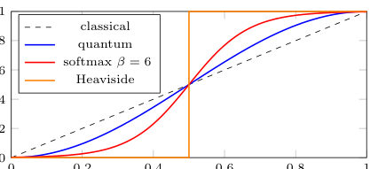
<figcaption class="paper-figure-caption"><b>Fig 1.</b> FIG. 1. Classical inverse knobs for several target response laws. Since Rcl(τ) = τ/π, the transcribed classical knob is simply Tcl←B(θ)/π = RB(θ). The curves show how a linear classical response must be read on a generally non-symmetry- preserving scale in order to mimic a quantum, softmax, or Heaviside response as a function of the displayed angle.</figcaption>
</figure>

**Summary.** This theoretical work explores the operational meaning of measurement settings by analyzing probability 'response curves' generated when an apparatus parameter is varied continuously. It shows that while static measurements are insufficient to distinguish theories, genuine nonclassicality requires checking for global consistency across multiple contexts using tools like Farkas' lemma. The paper refines our understanding of contextuality beyond simple local inequalities.

**Why it may be interesting.** It provides a sophisticated mathematical framework for understanding how continuous experimental control over quantum measurements can reveal fundamental differences between classical probabilistic assumptions and true quantum mechanics, going beyond simple Bell tests.

Detailed structure

**Main problem.** The paper aims to distinguish between different physical models (classical vs. quantum) by analyzing how probabilities change when a measurement apparatus setting is varied continuously.

**Main result.** While static measurements yield indistinguishable 'shadows' for classical and quantum theories, genuine nonclassicality emerges only when the family of local shadows cannot be consistently glued into one global distribution.

**Method.** The analysis uses geometric constraints (like Farkas' lemma) applied to response functions derived from continuous variations of measurement settings ('knob sweeps').

**Model / system.** The model involves a quantum system whose measurements are parameterized by a physical control variable, leading to a 'response curve' of probabilities on the simplex.

**Key observables.** Response curves $R_C: K 	o \Delta^{d-1}$, and the existence/non-existence of a global non-negative distribution for local shadows.

**Important parameters / regimes.** The continuous physical parameter controlling the measurement setting (the 'knob').

**Assumptions / limitations.** It assumes that the experimental meaning of the knob requires continuity, calibration, and preservation of physical composition laws to distinguish models.

**Figures summary.** Figures illustrate how different response laws (linear, quantum, softmax) must be read on different scales or through specific parameterizations to mimic each other, but this is not sufficient for a full Bell-type test.

**Paper structure.** The paper moves from analyzing static context shadows to dynamic response curves, then examines the limitations of pairwise correlations versus global consistency using linear feasibility systems and Farkas' lemma.

Abstract

At one frozen setting, the probabilities observed in a sharp quantum context are indistinguishable, as detector-click statistics, from ordinary probabilities on the atoms of a classical partition. But an actual analyzer usually comes with a calibrated knob: a tangible handle on the apparatus. If the measurement configuration is co-varied continuously through this physical parameter, the operational object is no longer one point of a simplex but a response curve. Classical linear responses, Malus-type Hilbert-space responses, softmax links, non-homomorphic parameter transcriptions, and discontinuous threshold limits are different maps from settings to probabilities. Continuity, calibration, and preservation of the physical composition law are then part of the experimental meaning of the knob. Such comparisons distinguish specified, calibrated response models; by themselves they do not constitute a classical-versus-quantum impossibility theorem. The static operational coincidence can also persist for two intertwined contexts: if the common outcomes receive the same probabilities, the remaining masses can always be coupled by a classical joint distribution. Genuine multi-context nonclassicality begins when a family of local shadows cannot be glued into one nonnegative global distribution or one simplex factorization. Farkas' lemma gives the exact alternative: either the classical extension exists, or a separating linear inequality certifies its impossibility.

[↑ back to top](#top)

### [Quantum Approximate Optimization via Noise-Directed Adaptive Warm-Starting](http://arxiv.org/abs/2607.09368v1)

**Authors:** Filip B. Maciejewski, Stuart Hadfield, Oscar Wallis, George Pennington, Sebastian Brandhofer, Stefan Woerner, Daniel J. Egger, Davide Venturelli  
**Type:** both · **Category:** quantum information and computing · **PDF:** <https://arxiv.org/pdf/2607.09368v1>  
**Analysis basis:** full PDF text, analyzed in chunks
**Topic relevance:** 🔥 `QC/QI experiment` **4/5** · `Keldysh / 2PI / non-Gaussian methods` **1/5** · `correlated / nonlocal dissipation` **1/5** · `driven-dissipative phase transition` **1/5** · `methods for driven-dissipative` **1/5**

↔ Scroll figures horizontally

<figure class="paper-figure-card">
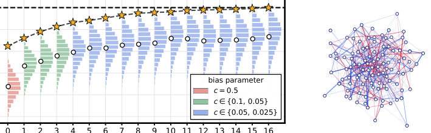
<figcaption class="paper-figure-caption"><b>Fig 1.</b> FIG. 1. Illustration of the Noise-Directed Adaptive Warm-Starting algorithm implementation introduced in this paper. (top) In the vanilla Warm-Start QAOA [13], the phase separator Hamiltonian is equal to the cost Hamiltonian, and fixed during the execution. Our shallow-depth ansatz expands upon Warm-Start QAOA by combining it with Time-Block QAOA [37], and Noise-Directed Adaptive Remapping [34]. The Time-Block ansatz divides the original cost Hamiltonian HC = P</figcaption>
</figure>
<figure class="paper-figure-card">
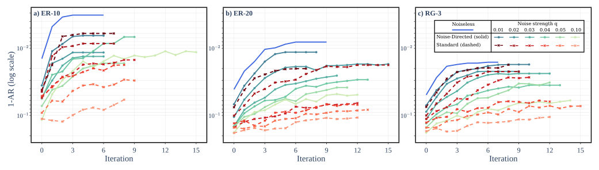
<figcaption class="paper-figure-caption"><b>Fig 2.</b> FIG. 2. Distance to the optimal solution, 1−AR, of the best-found sample obtained in simulated runs of n = 20-qubit random Erd˝os-R´enyi graphs with edge density 10% (a) and 20% (b), as well as 3-regular graphs (c). The vertical axis is logarithmic and inverted, so that better solutions (lower 1 −AR) appear towards the top. The blue solid line corresponds to a noiseless ND/Standard IWS implementation. The solid lines with a greenish gradient correspond to the Noise-Directed WS ansatz with progressively stronger amplitude damping noise of strength q. The dashed lines with a reddish gradient correspond to the Standard WS ansatz, without gauge transforms, as described in the text; the legend...</figcaption>
</figure>
<figure class="paper-figure-card">
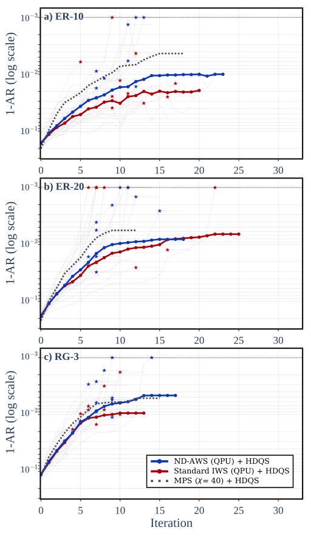
<figcaption class="paper-figure-caption"><b>Fig 3.</b> FIG. 3. Distance to the optimal solution, 1 −AR (loga- rithmic scale; inverted axis, as in Fig. 2), of the best-found sample at each iteration of p = 1 WS-QAOA implemented for 30 Hamiltonians, ten for ER-10 (a), ten for ER-20 (b), and ten for RG-3 (c), with n = 100 qubits on ibm boston with (ND-AWS, solid blue) and without (Standard, dashed red) the gauge transformations; the legend in (c) applies to all panels. The results are augmented with 2-local classical local search at each iteration (HDQS; see text description). Opti- mal solutions (AR = 1) are clipped to 10−3 (dotted horizontal line). Each data point is the best of three independent runs. Thick lines with circle markers correspond...</figcaption>
</figure>
<figure class="paper-figure-card">
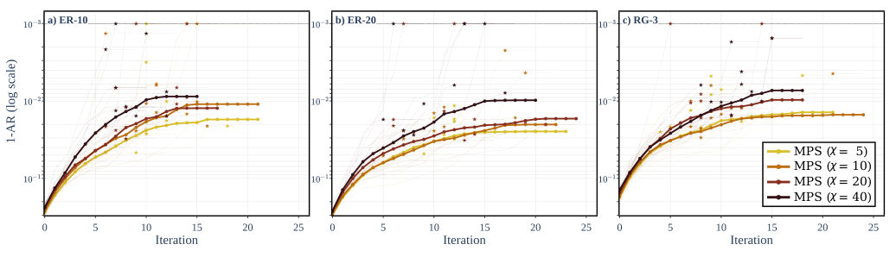
<figcaption class="paper-figure-caption"><b>Fig 4.</b> FIG. 4. Distance to the optimal solution, 1 −AR, of the best-found sample (logarithmic scale; inverted axis as in Fig. 2) at each iteration of the p = 1 ND-AWS for n = 100-qubit random Erd˝os-R´enyi graphs ER-10 (a) and ER-20 (b), and random 3-regular graphs RG-3 (c), with samples drawn from an MPS approximation. Colors correspond to different bond dimensions χ; the legend in (c) applies to all panels. Each thin dotted line is a different random Hamiltonian instance, chosen as the best out of 3 independent runs, with its best point indicated by a star symbol; optimal solutions (AR = 1) are clipped to 10−3</figcaption>
</figure>
<figure class="paper-figure-card">
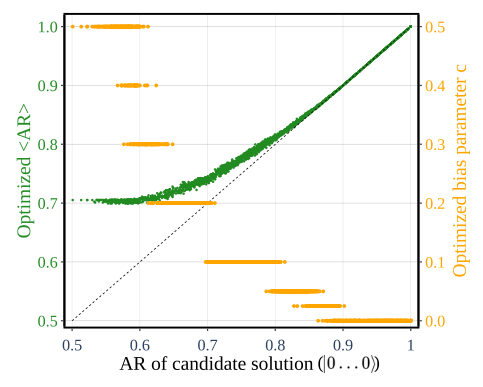
<figcaption class="paper-figure-caption"><b>Fig 5.</b> FIG. 5. Optimized mean Approximation Ratio of p = 1 Noise-Directed Warm-Start QAOA (left Y-axis; green points) and the corresponding optimized Bias Parameter (right Y-axis; orange points), as a function of the candi- date solution quality (X-axis), aggregated over 10 random instances of 500-qubit ER-10 Hamiltonians. The dashed line corresponds to the y = x line w.r.t. the optimized ⟨AR⟩ axis: points above it indicate that the optimized state im- proves, on average, upon the candidate solution.</figcaption>
</figure>

**Summary.** This paper introduces Noise-Directed Adaptive Warm-Starting (ND-AWS), a novel algorithm designed to boost performance in quantum optimization algorithms like QAOA when running on noisy hardware. By adaptively incorporating noise structure through gauge transformations, ND-AWS guides the search process more effectively than standard methods. The results demonstrate state-of-the-art performance for complex combinatorial problems on large superconducting quantum processors.

**Why it may be interesting.** While focused on optimization, the core technique of using noise structure (amplitude damping) to guide quantum state preparation via gauge transformations is highly relevant to understanding error mitigation and variational ansatz design in open quantum systems.

Detailed structure

**Main problem.** The primary challenge is improving quantum approximate optimization for combinatorial problems, which is severely limited by hardware noise and restricted qubit counts.

**Main result.** The proposed Noise-Directed Adaptive Warm-Starting (ND-AWS) method generally improves performance over standard warm-starting techniques on 100-qubit Ising Hamiltonians without increasing circuit depth.

**Method.** The approach combines iterative warm-starting with noise-aware gauge transformations, allowing the optimization ansatz to adaptively bias itself towards regions corresponding to high-quality solutions found in previous iterations.

**Model / system.** The work is applied to solving combinatorial optimization problems encoded by a cost Hamiltonian $H_C = \sum J_{ij} Z_i Z_j$, tested experimentally on 100-qubit Ising Hamiltonians using superconducting quantum processors.

**Key observables.** Approximation Ratio (AR), and the distance to the optimal solution ($1-AR$).

**Important parameters / regimes.** Bias parameter $c$, noise strength ($q$), and the number of qubits ($\sim 100$).

**Assumptions / limitations.** The method assumes that hardware noise can be constructively exploited via bitflip gauge transformations to guide the optimization process towards the ideal ground state.

**Figures summary.** Figures compare $1-AR$ across different methods (Standard IWS vs. ND-AWS) and show how classical post-processing (HDQS) improves results, while other figures detail the iterative circuit structure and bias evolution.

**Paper structure.** The paper introduces ND-AWS by building upon Warm-Start QAOA and Noise-Directed Adaptive Remapping; it details the gauge transformation mechanism for hardware implementation on Ising Hamiltonians; performance is evaluated across various random graph types, comparing results with and without classical post-processing enhancements.

Abstract

Progress towards a quantum advantage using known heuristic methods for combinatorial optimization is impeded by hardware noise and limited qubit count. Here, we propose a noise-aware adaptive approach to quantum approximate optimization, Noise-Directed Adaptive Warm-Starting (ND-AWS), that builds on recent concepts such as Warm-Start QAOA and Noise-Directed Adaptive Remapping. By leveraging bitflip gauge transformations, our algorithm exploits amplitude-damping-like noise components. We experimentally implement high-performance quantum optimization ansätze on 100-qubit Ising Hamiltonians, showing that ND-AWS generally improves the performance over a non-gauge-transformed iterative Warm-Starting variant, at no additional circuit cost. This places our results among the highest-quality demonstrations of quantum optimization with similar ansätze at this scale. Crucially, the simplicity of the framework opens the door for future enhancements such as adaptive bias schedules, and integration with classical solvers.

[↑ back to top](#top)

### [Vacancy Effect on the Ground-State Energy of a Bose Gas Trapped by 1D Imperfect Artificial Crystal](http://arxiv.org/abs/2607.08992v1)

**Authors:** E. I. Guerrero-Cruz, O. A. Rodríguez-López, M. A. Solís  
**Type:** theory · **Category:** quantum gases · **PDF:** <https://arxiv.org/pdf/2607.08992v1>  
**Analysis basis:** full PDF text, analyzed in chunks
**Topic relevance:** 🔥 `analog quantum simulation` **4/5** · `Frenkel-Kontorova` **1/5** · `Keldysh / 2PI / non-Gaussian methods` **1/5** · `methods for driven-dissipative` **1/5**

↔ Scroll figures horizontally

<figure class="paper-figure-card">
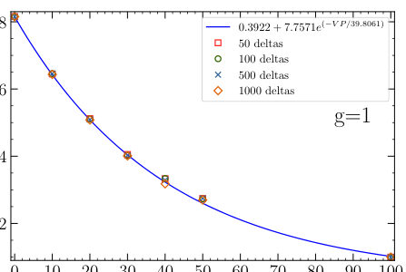
<figcaption class="paper-figure-caption"><b>Fig 1.</b> Figure 2. Ground state energy, in units of ℏ2/2ma2, for a Bose gas within of 50, 100, 500 and 1000 total initial deltas where we randomly removed 10%, 20%, 30%, 40% and 50%, with P0 = 10 and g = 1.We did an exponential fit on the 1000 delta values, this is shown in the curve.</figcaption>
</figure>
<figure class="paper-figure-card">
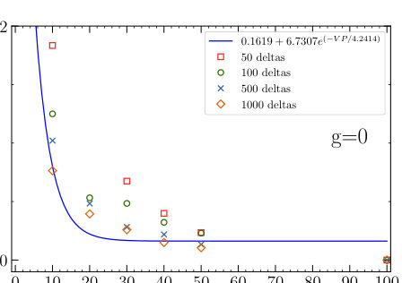
<figcaption class="paper-figure-caption"><b>Fig 2.</b> Figure 1. Ground state energy, in units of ℏ2/2ma2, for an ideal Bose gas (g = 0) within of 50, 100, 500 and 1000 initial deltas where we randomly removed 10%, 20%, 30%, 40% y 50%, P0 = 10. The full curve is an exponential fit for the 1000 delta values.</figcaption>
</figure>
<figure class="paper-figure-card">
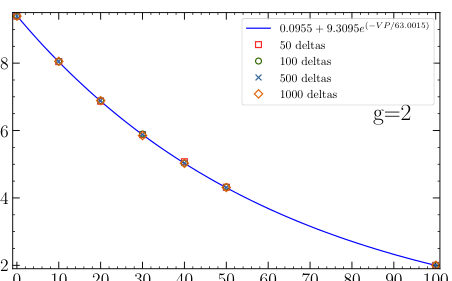
<figcaption class="paper-figure-caption"><b>Fig 3.</b> Figure 3. Ground state energy for systems with 50, 100, 500 and 1000 initial deltas where we removed 10%, 20%, 30%, 40% and 50%, with P0 = 10 and g = 2.We did an exponential fit on the 1000 delta values, this is shown in the curve.</figcaption>
</figure>
<figure class="paper-figure-card">
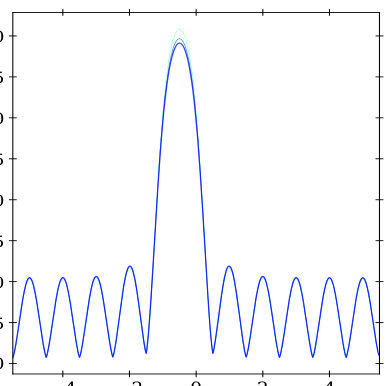
<figcaption class="paper-figure-caption"><b>Fig 4.</b> Figure 5. Probability density function of a system with 11 deltas minus the central one, P0 = 10 and g = 1</figcaption>
</figure>
<figure class="paper-figure-card">
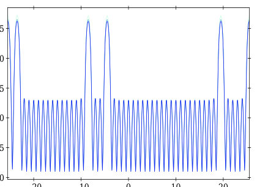
<figcaption class="paper-figure-caption"><b>Fig 5.</b> Figure 4. Probability density function of the ground state of a system with 50 deltas where 10% of random deltas were removed, P0 = 10 and g = 2.</figcaption>
</figure>

**Summary.** This paper theoretically examines the impact of vacancies (defects) on a Bose gas trapped in a 1D artificial crystal. Using mean-field theory and numerical gradient flow methods, the authors show that introducing defects causes the ground state energy to decay exponentially towards the free gas limit. The findings highlight defect-induced localization effects and quantify the deviation from perfect crystalline behavior.

**Why it may be interesting.** This work directly addresses how structural imperfections or disorder affect fundamental many-body quantum systems like Bose gases, which is crucial for understanding realistic cold atom experiments using optical lattices.

Detailed structure

**Main problem.** The study investigates how punctual defects, specifically vacancies, affect the ground-state energy of a Bose gas confined within an imperfect one-dimensional artificial crystal.

**Main result.** The ground state energy decreases exponentially as the number of vacancies increases until it reaches the value corresponding to a free gas. Furthermore, particle density shows localization features around these defects.

**Method.** The analysis employs the mean-field approximation and numerically solves the Gross-Pitaevskii equation using the 'Gradient Flow with Discrete Normalization' method (imaginary time evolution).

**Model / system.** The system models a weakly interacting Bose gas trapped by an external potential generated by a Dirac comb, which is intentionally made imperfect by randomly removing deltas to create vacancies.

**Key observables.** Ground-state energy (GSE), chemical potential ($\mu$), and the probability density function of boson distributions.

**Important parameters / regimes.** Interaction strength ($g$), delta strength ($P_0$), and the concentration/number of randomly removed deltas (vacancies).

**Assumptions / limitations.** The analysis relies on the mean-field approximation, and numerical solutions involve extrapolating finite-size results to the thermodynamic limit.

**Figures summary.** Figures show probability density functions illustrating particle localization near vacancies; other figures compare GSE vs. interaction strength ($g$) for different crystal perfection levels.

**Paper structure.** The paper establishes the physical model (Bose gas in a defective lattice), details the theoretical framework (GPE, mean-field theory), presents numerical methods (Gradient Flow), and finally reports quantitative results regarding the energy decay and localization effects as defects are introduced.

Abstract

For a weakly interacting Bose gas trapped by an imperfect one-dimensional artificial crystal, we study the effect of its punctual defects, i.e. vacancies, on the ground state properties of the system. In the framework of the mean field approximation, we numerically solve the corresponding Gross-Pitaevskii equation using the ``Gradient Flow with Discrete Normalization'' method, also known as the imaginary time method. The crystal is artificially produced by applying an external Dirac comb potential to the Bose gas where vacancies are created by randomly removing a predetermined number of deltas. We observe that as the number of randomly removed deltas increases, the ground state energy decreases exponentially from its value for the perfect crystal case until it reaches its value when the Bose gas is free.   The ground state energy is reported for different magnitudes of the interaction between bosons and several system sizes which we extrapolate to infinity for the crystal with only one vacancy. Also, we observe the presence of an energy gap between the ground state energies of the perfect system and that with a vacancy, which is more noticeable for values of the particle interaction magnitude $ g \leq 0.1$, when the delta strength $P_0 = 10$. In addition, we report the boson distributions within the crystal,   %inside a box with periodic boundary conditions,   i.e. the probability density functions which show   localization features around vacancies which disappear as $g$ increases. From the ground state energy, the chemical potential is obtained immediately.

[↑ back to top](#top)

### [Complete measurement of tunnel- and valley-coupling parameters in a silicon double quantum dot](http://arxiv.org/abs/2607.09638v1)

**Authors:** Daniel J. King, Minyoung Kim, J. Reily, Jonathan C. Marcks, Mark Friesen, Benjamin D. Woods, M. A. Eriksson  
**Type:** both · **Category:** quantum information and computing · **PDF:** <https://arxiv.org/pdf/2607.09638v1>  
**Analysis basis:** full PDF text, analyzed in chunks
**Topic relevance:** 🔥 `QC/QI experiment` **4/5** · `quantum measurements` **1/5** · `spintronics-quantum-optics interface` **1/5**

↔ Scroll figures horizontally

<figure class="paper-figure-card">
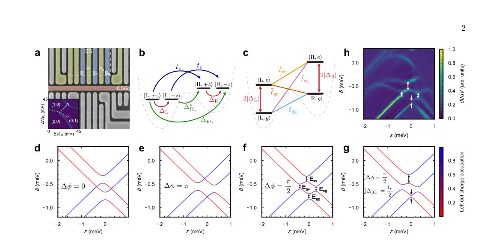
<figcaption class="paper-figure-caption"><b>Fig 1.</b> FIG. 1. Device and valley-phase physics. a, A false-colored, scanning electron micrograph of a device lithographically identical to the one used in the experiment. Dots are formed using plunger gates PL and PR; BL, BC, and BR label the barrier gates, and the dashed white line shows the SG screening gate, located beneath the visible gate layer. Inset: charge-stability diagram, showing the ε and δ tuning axes, with respect to the (0, 0)-(1, 0)-(0, 1) triple point. b, Illustration of couplings in a DQD in the ±z-valley basis of the four-level model, where tc is the valley-conserving tunnel coupling, ∆L and ∆R are intradot- intervalley couplings, and ∆RL is the interdot-intervalley coupling. c,...</figcaption>
</figure>
<figure class="paper-figure-card">
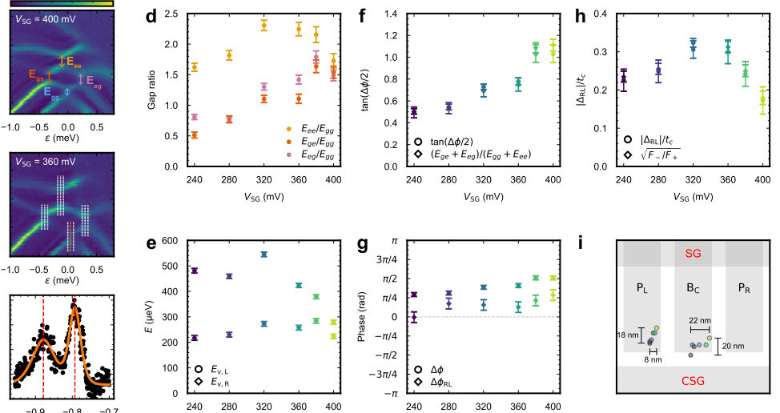
<figcaption class="paper-figure-caption"><b>Fig 2.</b> FIG. 2. Extraction of Hamiltonian parameters and their evolution with the SG gate voltage, which shifts the positions of the quantum dots. a-b, DAXS spectra for two SG gate voltages. The four anticrossing energy gaps are labeled in (a). The dotted lines in (b) indicate the ε values and the ranges in δ over which high-resolution one-dimensional DAXS measurements are acquired. c, An example high-resolution DAXS scan, corresponding to the orange line segment in (b). The best-fit curve is overlaid in orange, with the extracted peak locations in δ denoted by vertical dashed lines. d, Anticrossing energy gap ratios Eµν/Egg. e, Extracted valley splittings Ev,i of the two dots. Ev,L varies by a...</figcaption>
</figure>

**Summary.** The paper presents a comprehensive characterization of tunnel and valley coupling parameters within a silicon double quantum dot. By employing advanced spectroscopic techniques (DAXS) and fitting data to a four-level Hamiltonian model, the authors determine complex phase factors that govern qubit behavior. This work fills a critical gap in understanding sample variations by quantifying these fundamental couplings.

**Why it may be interesting.** This work provides a detailed understanding of how subtle quantum mechanical parameters, like valley phases, govern measurable transport properties in solid-state qubits, which is crucial for designing robust quantum computing architectures.

Detailed structure

**Main problem.** To achieve a full characterization of intravalley and intervalley tunnel couplings, including their complex phases (valley phases), in a silicon double quantum dot.

**Main result.** The relative strengths of the tunnel couplings are controlled by the valley phase difference ($\Delta\phi$), and incorporating the interdot-intervalley coupling ($\Delta_{RL}$) is essential for fitting experimental data accurately.

**Method.** The study uses Detuning Axis Spectroscopy (DAXS) to measure energy dispersions, followed by fitting these measurements using a four-level Hamiltonian model derived from first principles.

**Model / system.** The physical system is a Silicon/SiGe heterostructure double quantum dot (DQD). The low-energy physics is modeled by an effective four-level Hamiltonian describing electron spins and valley degrees of freedom ($\pm z$).

**Key observables.** Anticrossing gaps ($E_{\mu
u}$), tunnel couplings ($	ilde{t}_{gg}, 	ilde{t}_{ee}, 	ilde{t}_{ge}, 	ilde{t}_{eg}$), and the measurable valley phases ($\Delta\phi, \Delta\phi_{RL}$).

**Important parameters / regimes.** Tunnel coupling magnitudes ($t_c$, $|\Delta_{RL}|$), relative valley phase differences ($\Delta\phi$), and gate voltage dependencies of these parameters.

**Assumptions / limitations.** The analysis relies on the four-level model, which is an approximation; systematic errors are noted due to omitting higher energy orbitals.

**Figures summary.** Figures illustrate device structure (SEM), coupling diagrams in the valley basis, example DAXS spectra showing modulation dependence on $\Delta\phi$ and $\Delta_{RL}$, and theoretical comparisons between simulated and fitted Hamiltonian parameters.

**Paper structure.** The paper progresses from defining the physical problem and the four-level model to detailing the experimental measurement technique (DAXS), presenting results that show how coupling ratios depend on phases, and finally validating the method by comparing simulations against known matrix elements.

Abstract

Tunneling is essential in the initialization, measurement, and control of quantum dot qubits. In silicon, such tunneling connects not only the qubit states but also valley minima in the conduction band on opposite sides of the Brillouin zone, with large consequences for the quantum dot behavior. Here we present a full characterization of the intravalley and intervalley tunnel couplings, including their complex phases -- the valley phases. These phases are shown to control measurable parameters, including the ratios of the gaps at anticrossings between quantum states of a double quantum dot. The valley phases themselves evolve as a function of the quantum dot gate voltages and depend on the underlying atomic structure of the quantum well. Knowledge of the valley phases completes the picture and fills a key gap in our understanding of sample-wide variations of valley couplings and the physical parameters that depend on them, including spin-orbit coupling, valley-orbit mixing, and Landé $g$-factors.

[↑ back to top](#top)

### [Confinement drives valley splitting above 4K in buried silicon quantum wells](http://arxiv.org/abs/2607.09570v1)

**Authors:** Davide Degli Esposti, Emma Catherine Brann, Asser Elsayed, Davide Costa, Mark Friesen, Giordano Scappucci  
**Type:** experiment · **Category:** quantum information and computing · **PDF:** <https://arxiv.org/pdf/2607.09570v1>  
**Analysis basis:** full PDF text, analyzed in chunks
**Topic relevance:** 🔥 `QC/QI experiment` **4/5** · `quantum measurements` **1/5** · `spintronics-quantum-optics interface` **1/5**

↔ Scroll figures horizontally

<figure class="paper-figure-card">
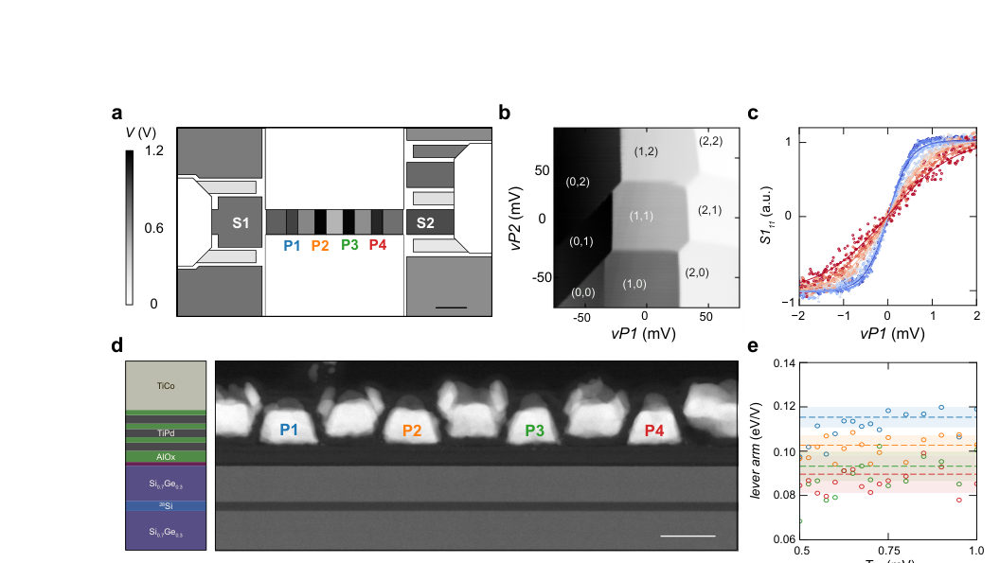
<figcaption class="paper-figure-caption"><b>Fig 1.</b> Figure 1. Heterostructure and quantum dot gate stack a Quantum dot gate layout and voltage configuration used to achieve single-electron occupancy in the four-dot array. The top-right sensor is fully accumulated and used as an extension of the accumulation gate. The two sensors (S1 and S2) are used to sense the charge state of the four quantum dots (P1 to P4). The black line corresponds to 100 nm. b Double-dot charge stability diagram centered in the DC voltage configuration of a for the virtualized plunger gates vP1 and vP2. c First electron polarization line for virtual plunger vP1 measured as a function of mixing chamber temperature for temperatures between 10 mK (dark blue) and 1 K...</figcaption>
</figure>
<figure class="paper-figure-card">
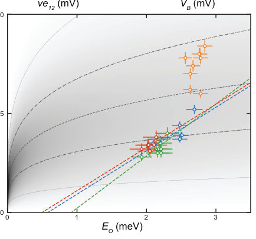
<figcaption class="paper-figure-caption"><b>Fig 2.</b> Figure 2. Single-electron spectroscopy a Detuned axis pulsed spectroscopy (DAPS) maps of dot P1 obtained by sweeping the relative detuning (ve12) for different waiting times twait. Charge tunneling at a specific detuning is en- hanced by the presence of well-defined quantum states, giving rise to a faster relaxation rate. We extract EO and EV from the separation of the resonant peaks and convert them into energy using the specific lever arm for each gate. b Single- electron valley splitting (EV ) extracted from DAPS for the four dots (P1 blue, P2 orange, P3 green, and P4 red) as a function of the voltage applied to the barriers (VB) between the dots. The dashed line is set at 0.1 meV, which...</figcaption>
</figure>
<figure class="paper-figure-card">
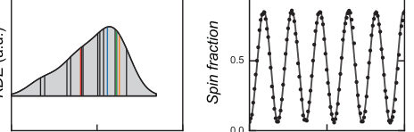
<figcaption class="paper-figure-caption"><b>Fig 3.</b> Figure 3. Two-electron spectroscopy. a Magnetospec- troscopy of the second-electron addition line under vP1 as a function of the external in-plane magnetic field B. The thick dark line is a fit of the transition line to the theoreti- cal model from which we extract the position of the kink at BST = 2.4(1) T, corresponding to a singlet-triplet splitting of EST = 0.28(1) meV, and a lever arm of α = 0.11 eV/V in agreement with the previous measurement via tempera- ture activation. b Histogram of the reflected signal amplitude from the sensing dot S1 for 50 000 single-shot measurements as a function of vP1 across the (1,1)-(0,2) anticrossing from which we extract the two-electron...</figcaption>
</figure>
<figure class="paper-figure-card">
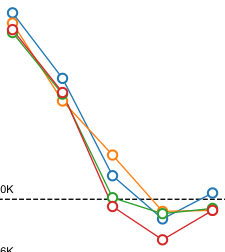
<figcaption class="paper-figure-caption"><b>Fig 4.</b> Figure 4. Single-electron and two-electron energy states in silicon quantum dots. We report the charg- ing energy (EC), single electron orbital energy (EO), sin- gle electron valley splitting (EV ), two-electrons singlet-triplet splitting measured via magnetospectroscopy (EST ) and Pauli- Spin-Blockade spectroscopy (EP SB) for all the four dots (P1 blue, P2 orange, P3 green, and P4 red). The dashed lines correspond to the operation temperature of a closed-loop 4He refrigerator (1.6 K) and of a liquid 4He bath (4.2 K).</figcaption>
</figure>

**Summary.** The researchers measured energy scales in single-electron spin qubits within buried silicon quantum wells to address valley degeneracy leakage. They demonstrated that by carefully engineering electrostatic confinement using gate voltages, they can significantly enhance the valley splitting ($\Delta E_V$). This finding validates a key physical mechanism for building scalable and robust solid-state quantum processors.

**Why it may be interesting.** This work provides crucial experimental validation for controlling fundamental energy gaps in solid-state qubits, directly impacting the feasibility roadmap for silicon quantum computing architectures.

Detailed structure

**Main problem.** The primary challenge addressed is mitigating leakage channels from nearly degenerate conduction-band valleys in silicon spin qubits, which hinders scaling for quantum computation.

**Main result.** Strong electrostatic confinement within buried silicon quantum wells can be effectively exploited to enhance the valley splitting ($\Delta E_V$), establishing a viable path for shuttling and sparse-occupation qubit architectures.

**Method.** The study employs advanced single-electron spectroscopy techniques, including Detuning Axis Pulsed Spectroscopy (DAPS) and Pauli-Spin-Blockade (PSB) measurements, performed at cryogenic temperatures.

**Model / system.** The physical system is a linear array of four quantum dots fabricated in buried silicon quantum wells ($	ext{Si}/	ext{SiGe}$ heterostructures), designed for low disorder to host single-electron spin qubits.

**Key observables.** Single-electron valley splitting ($\Delta E_V$), two-electron singlet-triplet splitting ($\Delta E_{ST}$), and the correlation between $\Delta E_V$ and orbital energy ($E_O$).

**Important parameters / regimes.** Low temperatures (e.g., $150 	ext{ mK}$); confinement strength derived from gate voltages; measured splittings in the hundred microelectronvolt range.

**Assumptions / limitations.** The analysis relies on mapping energy scales using pulsed spectroscopy and assumes that strong confinement can be tuned via electrostatic gates to enhance valley splitting.

**Figures summary.** Figures illustrate device layouts, charge stability diagrams, and spectroscopic measurements showing $\Delta E_V$ dependence on gate voltages across the four quantum dots.

**Paper structure.** The paper details the fabrication of the heterostructure, describes the pulsed spectroscopy measurement protocols (DAPS/PSB), presents quantitative measurements of energy splittings ($\Delta E_V$, $\Delta E_{ST}$), and concludes by demonstrating that confinement engineering enhances qubit parameters.

Abstract

Controlling the energy scales of a quantum system is essential for defining robust qubits. In silicon spin qubits, the nearly degenerate conduction-band valleys create a leakage channel from the single-spin computational basis, posing a challenge to scaling and to shuttling-based architectures. Here, we measure the relevant energy scales of single-electron spin qubits in buried silicon quantum wells co-designed for low disorder and high valley splitting. Across a linear array of four quantum dots with an average orbital energy of 2.4(2) meV, we report an average single-electron valley splitting of 0.40(6) meV and an average two-electron singlet-triplet splitting of 0.24(7) meV. In three dots, we observe a strong correlation between valley splitting and orbital energy, with an average linear coefficient of $\approx 0.22$ (meV/meV), demonstrating that electrostatic confinement can increase the valley splitting by several hundred microelectronvolts. In contrast, the remaining dot exhibits the highest valley splitting of 0.76(2) meV and low correlation, suggesting excellent characteristics for spin-qubit operation. Our findings demonstrate that strong confinement can be exploited in buried quantum wells to effectively enhance the valley splitting, thereby establishing a viable path toward the realization of shuttling and sparse-occupation-based architectures in low-disorder heterostructures.

[↑ back to top](#top)

### [Magnetic devil's staircase in UAgBi$_{2}$](http://arxiv.org/abs/2607.09003v1)

**Authors:** G. S. Freitas, K. Kirchner, C. Girod, D. R. Yahne, W. Simeth, C. S. T. Kengle, F. B. Carneiro, P. G. Pagliuso, J. D. Thompson, M. Janoschek, O. Zaharko, S. M. Thomas, P. F. S. Rosa  
**Type:** experiment · **Category:** strongly correlated electrons · **PDF:** <https://arxiv.org/pdf/2607.09003v1>  
**Analysis basis:** full PDF text, analyzed in chunks
**Topic relevance:** 🔥 `analog quantum simulation` **4/5** · `Frenkel-Kontorova` **1/5** · `exotic spin models in light-matter` **1/5**

↔ Scroll figures horizontally

<figure class="paper-figure-card">
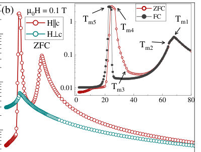
<figcaption class="paper-figure-caption"><b>Fig 1.</b> FIG. 1. (a) Zero-field specific heat cp(T)/T of UAgBi2 as a function of temperature from 0.4 to 80 K. The inset shows a zoom of the low-temperature behavior plotted as a function of T 2; the red line represents the fit discussed in the text. (b) ZFC magnetic susceptibility of UAgBi2 measured under an applied field of 0.1 T parallel (red open symbols) and perpen- dicular (teal open symbols) to the c-axis. The inset displays a zoomed-in view of the ZFC (red open symbols) and FC curves (black solid symbols) for H||c.</figcaption>
</figure>
<figure class="paper-figure-card">
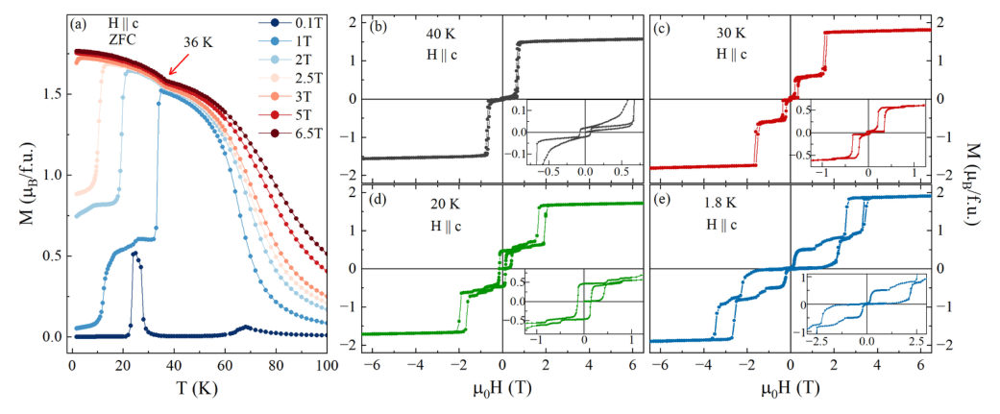
<figcaption class="paper-figure-caption"><b>Fig 2.</b> FIG. 2. (a) Zero-feld-cooled magnetization as a function of temperature under different applied magnetic fields along the c axis. (b)-(e) Magnetization as a function of applied magnetic fields at different temperatures for fields parallel to the c axis.</figcaption>
</figure>
<figure class="paper-figure-card">
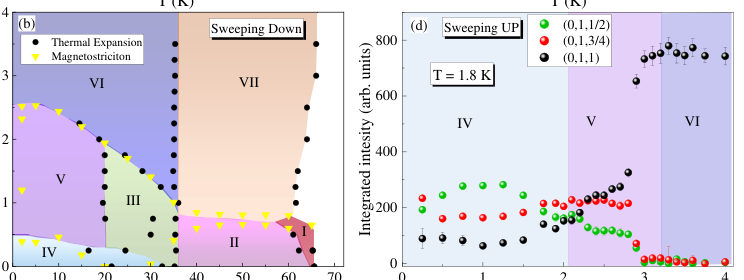
<figcaption class="paper-figure-caption"><b>Fig 3.</b> FIG. 3. Proposed phase diagram of UAgBi2 constructed with the points extracted from thermal expansion and magnetostriction. (a) the experimental points were extracted from the measurements with temperature and field sweeping up, and (b) were obtained with both sweeping down. (c) Zero-field temperature dependence of the integrated intensity as measured on the magnetic Bragg peaks (0, 1, 1</figcaption>
</figure>
<figure class="paper-figure-card">
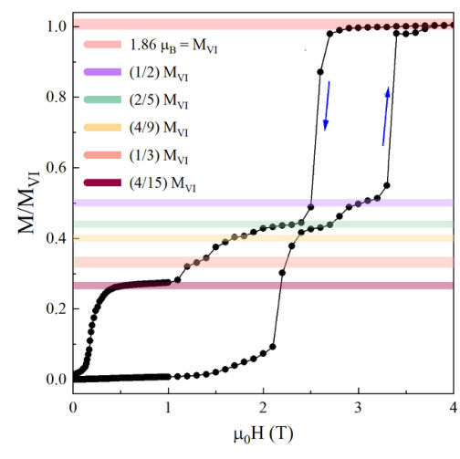
<figcaption class="paper-figure-caption"><b>Fig 4.</b> FIG. 4. Zoom-in of the magnetization at 1.8 K as a func- tion of magnetic field applied along the c axis, showing the magnetization steps expressed as the fractional magnetization M/MV I.</figcaption>
</figure>
<figure class="paper-figure-card">
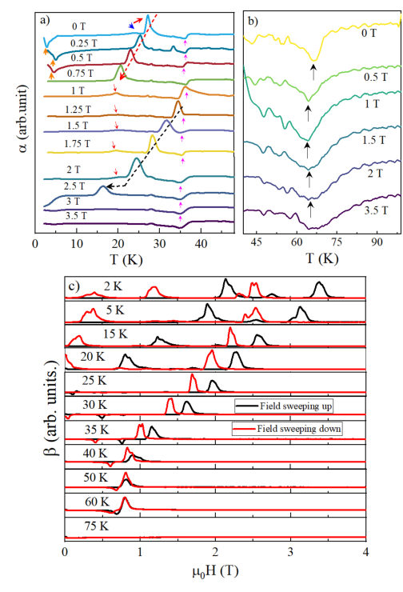
<figcaption class="paper-figure-caption"><b>Fig 5.</b> FIG. 5. a) and b) Magnetic field dependence of the linear thermal expansion coefficient parallel to the c axis tracking the evolution of the magnetic transitions. We have shifted the curves and drawn arrows to facilitate the tracking of each transition. c) Temperature dependence of linear mag- netostriction coefficient measured with an external magnetic field and length change parallel to the c axis.</figcaption>
</figure>

**Summary.** This work reports on $	ext{UAgBi}_2$, demonstrating that its magnetic properties exhibit a 'magnetic devil's staircase' behavior. By combining neutron diffraction and transport measurements, the authors map out a complex phase diagram revealing multiple nearly degenerate magnetic states. This places $	ext{UAgBi}_2$ as a significant experimental platform for studying competing interactions in $5f$-electron systems.

**Why it may be interesting.** The study provides an experimental realization of the theoretically rich 'devil's staircase' phenomenon in $5f$-electron materials, linking complex magnetic frustration to fundamental models used in condensed matter theory.

Detailed structure

**Main problem.** The study investigates complex magnetic transitions and the potential realization of a 'magnetic devil's staircase' in the layered $5f$-electron compound $	ext{UAgBi}_2$ due to competing magnetic interactions.

**Main result.** The material exhibits at least seven nearly degenerate magnetic states, characterized by multi-step magnetization processes consistent with the theoretical framework of the Axial Next-Nearest Neighbor Ising (ANNNI) model.

**Method.** A combination of experimental techniques was used, including specific heat measurements, thermal expansion/magnetostriction, and detailed neutron diffraction studies under applied magnetic fields.

**Model / system.** The physical system is the layered intermetallic compound $	ext{UAgBi}_2$. The behavior is modeled using concepts derived from the ANNNI model, which captures competing ferromagnetic and antiferromagnetic interactions along specific crystal axes.

**Key observables.** Multi-step magnetization plateaus ($M(H)$), coexistence of distinct magnetic propagation vectors ($\mathbf{k}=(0, 0, 1/2)$ and $(0, 0, 1/4)$), and anomalies in thermodynamic measurements like specific heat.

**Important parameters / regimes.** The system is characterized by strong easy-axis anisotropy confining moments along the $c$-axis; low temperatures (e.g., $1.8 	ext{ K}$) are crucial for observing the staircase effects.

**Assumptions / limitations.** The analysis assumes that the magnetic behavior can be mapped onto the ANNNI model, though discrepancies with simple molecular field theory suggest Crystal Electric Field (CEF) effects are highly relevant.

**Figures summary.** Figures illustrate phase diagrams derived from thermal expansion and magnetostriction, alongside magnetization curves showing distinct plateaus as a function of applied magnetic field along the $c$-axis.

**Paper structure.** The paper progresses by first establishing the complex magnetic ground state using multiple probes (specific heat, $\chi$, diffraction), then constructing a phase diagram that reveals numerous transitions, and finally interpreting these steps through the lens of the devil's staircase model.

Abstract

Materials characterized by competing interactions often exhibit a large number of nearly degenerate periodic states. Here we show that layered UAgBi$_2$ hosts a cascade of field- and temperature-induced magnetic transitions. Based on specific heat, thermal expansion, and neutron diffraction, we construct a phase diagram that reveals at least seven nearly degenerate magnetic states in UAgBi$_2$. The observed multi-step magnetization process can be understood by square-wave structures with distinct propagation vectors $\mathbf{k}$=(0, 0, \textit{k}) in the presence of strong easy-axis anisotropy that confines the moments along the \textit{c} axis. Our findings are consistent with a magnetic devil's staircase described by the axial next-nearest neighbor Ising (ANNNI) model and place UAgBi$_2$ as a rare realization of the devil's staircase in a 5\textit{f}-electron system.

[↑ back to top](#top)

### [Benchmarking Error Mitigation: Artefactual Improvements in Zero-Noise Extrapolation](http://arxiv.org/abs/2607.09360v1)

**Authors:** Dominik Köster, Wolfgang Mauerer  
**Type:** experiment · **Category:** quantum information and computing · **PDF:** <https://arxiv.org/pdf/2607.09360v1>  
**Analysis basis:** full PDF text, analyzed in chunks
**Topic relevance:** 🔥 `QC/QI experiment` **4/5** · `methods for driven-dissipative` **1/5**

↔ Scroll figures horizontally

<figure class="paper-figure-card">

<figcaption class="paper-figure-caption"><b>Fig 1.</b> Fig. 1. Richardson extrapolation on Euro-Q-Exa. (a) The amplified parity values E(λ) of a 4-qubit QTC collapse to the floor f = 0 as the Trotter depth d grows. (b) At each depth, the Richardson estimate ˆE(0), the rescaling prediction 15</figcaption>
</figure>
<figure class="paper-figure-card">
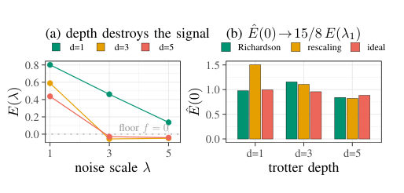
<figcaption class="paper-figure-caption"><b>Fig 2.</b> Figure 2 shows E(λ) for four circuits under simulated depolarising noise (p2q = 10−3), and for Euro-Q-Exa. Three qualitatively distinct regimes emerge: 1) Signal retained. The 6-qubit Quantum Fourier Transforma- tion (QFT) mirror and the 4-qubit QTC decay slowly and stay well above the floor at λ = 5; Richardson recovers near-ideal values (ρ = 0.99 and ρ = 1.00). 2) Signal decayed. The 6-qubit Grover circuit reaches E(λ3) = 0.078 and E(λ5) = 0.027, both near the floor f = 1/64, and recovery degrades to ρ = 0.44. 3) Signal destroyed. On Euro-Q-Exa, the parity signal is neg- ative at λ = 5, satisfying the precondition of Equation (2): any improvement on this device is partly an artefact of...</figcaption>
</figure>
<figure class="paper-figure-card">
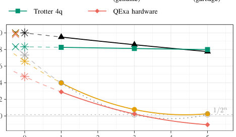
<figcaption class="paper-figure-caption"><b>Fig 3.</b> Fig. 2. Richardson extrapolation across signal-retention regimes at λ ∈ {1, 3, 5}. Solid: Lagrange polynomial through E(λk); dashed: extrapolation to ˆE(0) (stars); crosses mark Eideal. Grey dotted: garbage folding on Grover. The Euro-Q-Exa parity signal turns negative at λ = 5 (signal destroyed). Horizontal dotted: floor 1/26 of the 6-qubit circuits.</figcaption>
</figure>

**Summary.** This paper critically examines the validity of Zero-Noise Extrapolation (ZNE) when benchmarking Quantum Error Mitigation. The authors demonstrate that under certain noise regimes, ZNE fails by producing mathematical artifacts rather than true error corrections. They introduce a robust diagnostic tool ($	ext{W}_{	ext{neg}}$) to help researchers distinguish genuine physical improvements from these misleading computational artifacts.

**Why it may be interesting.** It directly addresses the reliability of benchmarking tools used across quantum computing platforms, providing crucial diagnostics that any researcher simulating or running QEM must adopt to ensure their reported improvements are physical.

Detailed structure

**Main problem.** Benchmarking Quantum Error Mitigation (QEM) techniques, specifically Zero-Noise Extrapolation (ZNE), can yield apparent improvements that are mathematical artifacts rather than genuine physical gains.

**Main result.** When noise amplification exceeds usable signal levels, ZNE collapses into a fixed rescaling of the initial noisy measurement, leading to overestimation of performance. A new diagnostic, Negative-Probability Weight ($	ext{W}_{	ext{neg}}$), can reliably flag these artifacts.

**Method.** The authors analyze the Richardson extrapolation formula applied to expectation values measured at varying noise amplification factors ($\lambda_k$) on real hardware and introduce a negative control ('garbage-folding') for comparison.

**Model / system.** The work is performed using NISQ algorithms tested on the IQM Euro-Q-Exa quantum processor, analyzing circuits like QFT Mirror and Grover to test error mitigation techniques.

**Key observables.** Recovery ratio ($
ho$), Negative-Probability Weight ($	ext{W}_{	ext{neg}}$), expectation values $E(\lambda)$, and the observable floor ($f$).

**Important parameters / regimes.** Circuit depth ($d=3, 5$), noise amplification levels ($\lambda \in \{1, 3, 5\}$).

**Assumptions / limitations.** The core assumption challenged is that measured expectation values decay predictably enough for polynomial extrapolation to hold true.

**Figures summary.** Figures illustrate the collapse of $E(\lambda)$ towards a floor value and compare extrapolated results ($\hat{E}(0)$) against ideal values, contrasting genuine folding with garbage folding controls.

**Paper structure.** The paper first identifies the failure mode in ZNE when signal decays; it then presents empirical evidence from hardware measurements using various control methods (garbage-folding); finally, it introduces and validates a robust diagnostic ($	ext{W}_{	ext{neg}}$) and provides a reporting checklist for future benchmarks.

Abstract

Reliable benchmarking of Quantum Error Mitigation (QEM) requires distinguishing genuine improvements from artefacts of the post-processing arithmetic. In this paper, we expose a failure mode in Richardson Zero-Noise Extrapolation (ZNE), a widely used technique routinely (and often implicitly) relied upon in benchmarks and experiments. When noise amplification operates beyond usable signals - a regime that is quickly reached on current hardware for non-trivial circuits - we show that the extrapolation no longer reflects the underlying physics, but collapses into a fixed rescaling of a single noisy measurement, producing a bogus apparent improvement that is independent of noise amplification. This poses a rarely considered threat to the validity of many empirical evaluations in quantum computing.   Measurements on real hardware (IQM Euro-Q-Exa) confirm this collapse with ordinary folding alone: as circuit depth erodes the signal, the reported estimate decouples from the truth and overshoots the ideal by up to 21%. We further introduce a matched-cost "garbage-folding" negative control that carries no usable signal yet reports a larger apparent improvement than genuine folding - showing that the magnitude of an improvement is not evidence of its correctness - alongside a zero-cost check flagging the artefact from data a benchmark already holds. We distil both into a short reporting checklist for ZNE benchmarks.

[↑ back to top](#top)

### [Entanglement entropy in two-particle Grover walks on graphs](http://arxiv.org/abs/2607.09066v1)

**Authors:** Sho Kubota, Haruhiko Matsubara, Etsuo Segawa  
**Type:** theory · **Category:** quantum information and computing · **PDF:** <https://arxiv.org/pdf/2607.09066v1>  
**Analysis basis:** full PDF text, analyzed in chunks
**Topic relevance:** 🔥 `entanglement & information structure` **4/5** · `non-equilibrium dynamics` **1/5**

↔ Scroll figures horizontally

<figure class="paper-figure-card">
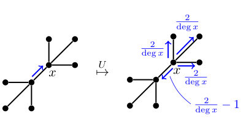
<figcaption class="paper-figure-caption"><b>Fig 1.</b> Figure 2: The action of U: Each blue arrow represents the standard basis vector labeled by the corresponding arc. The left and right figures represent the before and after states of the action U, respectively. We omit depicting arrows of corresponding arcs returning the value 0 of the states.</figcaption>
</figure>
<figure class="paper-figure-card">
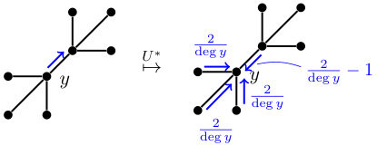
<figcaption class="paper-figure-caption"><b>Fig 2.</b> Figure 3: The action of U∗: The action U∗is given by flipping the direction of every arrow in before and after states of the action U.</figcaption>
</figure>

**Summary.** This paper investigates the entanglement entropy generated by two-particle Grover walks on graphs, modeling the system using the Kronecker product structure. The authors prove that for complete bipartite graphs $K_{n,n}$, maximal entanglement is only achieved when $n=1$ or $n=2$. This work provides deep insights into how graph topology constrains quantum information dynamics.

**Why it may be interesting.** This work connects quantum walk dynamics (a topic relevant to quantum computation and transport) with entanglement measures. Understanding when maximal entanglement occurs provides insight into the information processing capacity or coherence properties of these quantum systems.

Detailed structure

**Main problem.** The study focuses on determining the entanglement entropy of quantum states evolving under a two-particle Grover walk defined on an arbitrary graph G.

**Main result.** For complete bipartite graphs $K_{n,n}$, the entanglement entropy attains its upper bound if and only if $n=1$ or $n=2$.

**Method.** The analysis relies on analyzing the commutation of the time evolution operator with the swap operator and using spectral properties derived from the amplitude matrix $\Psi$ to check for maximum entanglement.

**Model / system.** The model is a two-particle quantum walk defined by extending the one-particle Grover walk onto the Kronecker product graph $G \otimes G$. The system must respect particle indistinguishability, which requires the evolution operator to commute with the swap operator.

**Key observables.** Entanglement entropy $S(\psi)$ of the two-particle quantum state $\psi$, and whether this entropy reaches its theoretical upper bound ($\log |A(G)|$).

**Important parameters / regimes.** The graph structure (e.g., $K_{n,n}$), the size parameter $n$, and the time step $	au$ are crucial parameters.

**Assumptions / limitations.** The analysis assumes simple, finite graphs and focuses heavily on the specific algebraic structure provided by the Kronecker product for defining the walk operator.

**Figures summary.** Figures illustrate the action of the single-particle time evolution operator $U$ and its adjoint $U^*$ on basis states before and after evolution.

**Paper structure.** The paper first establishes the symmetry properties (commutativity with the swap operator) ensuring physical consistency. It then defines the entanglement entropy in terms of the amplitude matrix $\Psi$. Finally, it applies these tools to compute the entropy for specific graph families like $K_{n,n}$ to determine when the upper bound is met.

Abstract

We define a two-particle quantum walk of identical particles on a graph $G$ via the one-particle Grover walk on the Kronecker product $G \otimes G$, and call it the two-particle Grover walk. In systems of identical particles, quantum mechanics requires that quantum states have a certain invariance with respect to the exchange of particles. Focusing on the symmetry of the Kronecker product $G \otimes G$ as a graph, we show that the time evolution operator of this walk commutes with the swap operator, which ensures that this requirement is satisfied. Furthermore, we study the entanglement entropy of quantum states evolved by this walk. For the complete bipartite graph $K_{n,n}$, we completely determine the values of $n$ for which the quantum states evolved from specific initial states attain the upper bound of the entropy at some time, and prove that they are exactly $1$ and $2$.

[↑ back to top](#top)

### [Two-photon blockade without cascade channel in strong light-matter coupling](http://arxiv.org/abs/2607.08882v1)

**Authors:** Hang-Hang Han, Zu-Jian Ying  
**Type:** theory · **Category:** other · **PDF:** <https://arxiv.org/pdf/2607.08882v1>  
**Analysis basis:** full PDF text, analyzed in chunks
**Topic relevance:** `analog quantum simulation` **3/5** · `correlated cavity matter` **3/5** · `driven-dissipative phase transition` **3/5** · `methods for driven-dissipative` **3/5** · `Tavis-Cummings & cavity-many-emitter` **2/5** · `non-equilibrium dynamics` **2/5** · `non-equilibrium universality` **2/5** · `Keldysh / 2PI / non-Gaussian methods` **1/5** · `correlated / nonlocal dissipation` **1/5** · `entanglement & information structure` **1/5** · `exotic spin models in light-matter` **1/5**

↔ Scroll figures horizontally

<figure class="paper-figure-card">
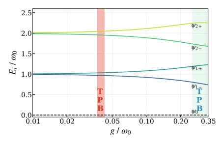
<figcaption class="paper-figure-caption"><b>Fig 1.</b> FIG. 1. Relevant low energy levels Ei of H0 as functions of coupling strength g. Here, ωg = ωc ≡ω0 and θ = 0.3π, and the energy of the ground state |ψ0⟩is set as the energy ref- erence. The pale-rose (gray) shaded region marks the weak- TPB phase and the light-minty-green (light gray) shaded re- gion denotes the strong-TPB regime, as revealed in Fig. 2.</figcaption>
</figure>
<figure class="paper-figure-card">
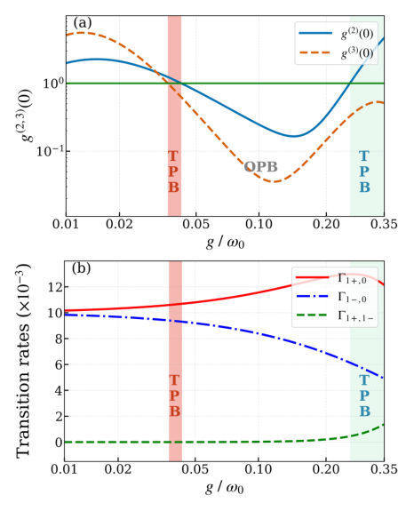
<figcaption class="paper-figure-caption"><b>Fig 2.</b> FIG. 2. Finding two-photon blockade (TPB) in strong- coupling regime (0.01 &lt; g/ω0 &lt; 0.1) without cascade channel, apart from the TPB in ultrastrong-coupling (USC, g/ω0 &gt; 0.1) regime with cascade channel. (a) The second- and third-order equal-time correlation functions g(2)(0) (solid) and g(3)(0) (dashed) as functions of the coupling strength g under resonant driving from the ground state onto the |ψ1+⟩ state. The pale-rose (gray) shaded region marks the weak- TPB window (0.037 ≤g/ω0 ≤0.043), where g(2)(0) &gt; 1 while g(3)(0) &lt; 1. (b) Transition rates versus g/ω0: Γ1+,0 (solid red), Γ1−,0 (dash-dotted blue), and Γ1+,1−(dashed green). The cascade channel Γ1+,1−remains negligible throughout the...</figcaption>
</figure>
<figure class="paper-figure-card">
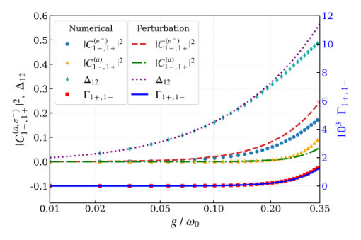
<figcaption class="paper-figure-caption"><b>Fig 3.</b> FIG. 3. The g3 law of Γ1+,1−and delayed opening of the cascade channel. The lines represent perturbative results of |C(c) 1−,1+|2 with c = σ−(dashed) and c = a (dot-dashed), the energy level splitting ∆12 = E1+−E1−(dotted), and the final transition rate Γ1+,1−(solid), with O[(g/ω0)1)], O[(g/ω0)2)], O[(g/ω0)1)], O[(g/ω0)3)] as the leading orders, respectively. The symbols denote the corresponding numerical results. The final transition rate Γ1+,1−is strongly suppressed in the weak- TPB regime and the opening of the Γ1+,1−channel origi- nally allowed by parity breaking is delayed in the strong-TPB regime, due to the cubic law.</figcaption>
</figure>
<figure class="paper-figure-card">
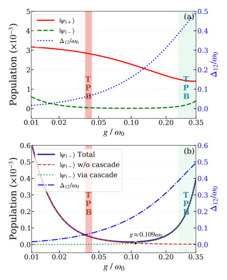
<figcaption class="paper-figure-caption"><b>Fig 4.</b> FIG. 4. Different origins of population of |ψ1−⟩in differ- ent TPBs. (a) Populations of different dressed states (left axis) and the energy splitting ∆12 (right axis) versus cou- pling strength g. Red solid, green dashed, and blue dotted lines represent the populations of |ψ1+⟩, |ψ1−⟩, and ∆12, re- spectively. In the weak TPB region, the |ψ1−⟩population is small but nonzero. (b) Contributions to the |ψ1−⟩popu- lation from different mechanisms. Blue solid: total popula- tion; red dashed: direct driving; green dotted: cascade decay; blue dash-dotted: ∆12. The black dot marks the shift of two regimes: direct driving dominates for g &lt; 0.109ω0, while cas- cade decay dominates for g &gt; 0.109ω0.</figcaption>
</figure>
<figure class="paper-figure-card">
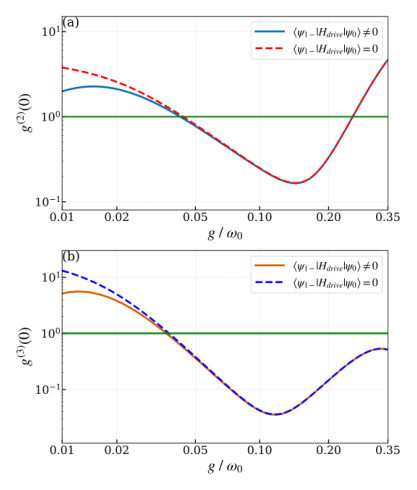
<figcaption class="paper-figure-caption"><b>Fig 5.</b> FIG. 5. Minor influence of driving-induced population of |ψ1−⟩on g(2)(0) and g(3)(0). (a) The second-order equal- time correlation function g(2)(0) as a function of the coupling strength g. (b) The third-order equal-time correlation func- tion g(3)(0) as a function of g. In (a) and (b) the dashed lines correspond to the case where the driving matrix element to |ψ1−⟩is artificially removed, while the red solid lines denote the results when it is retained.</figcaption>
</figure>

**Summary.** The authors report a novel 'weak two-photon blockade' (weak TPB) in a strongly coupled qubit-resonator system. This weak TPB is mechanistically distinct from the known strong TPB because it occurs when the cascade decay channel is closed, relying instead on anharmonicity effects during resonant driving. The findings advance understanding of how multi-photon blockades can arise through qualitatively different physical mechanisms.

**Why it may be interesting.** This work provides deep mechanistic insights into multi-photon blockade phenomena in cavity QED systems, suggesting that different physical regimes can support fundamentally distinct quantum control mechanisms.

Detailed structure

**Main problem.** The research aims to discover and characterize a distinct 'weak two-photon blockade' (weak TPB) in a strongly coupled quantum system, differentiating it from the conventionally understood strong TPB.

**Main result.** A weak TPB phase emerges unconventionally when the cascade decay channel is closed, relying primarily on weak anharmonicity and resonant driving rather than dissipation mechanisms.

**Method.** The analysis employs a modified input-output formalism in the dressed-state basis derived from diagonalizing the parity-broken generalized quantum Rabi Hamiltonian.

**Model / system.** The system models a flux qubit coupled to a transmission-line resonator, described by a parity-broken generalized quantum Rabi model. The dynamics are analyzed using the Lindblad master equation and correlation functions.

**Key observables.** Two-photon blockade signatures ($g^{(2)}(0) > 1$ and $g^{(3)}(0) < 1$), population dynamics in dressed states, and energy splittings ($\Delta_{12}$).

**Important parameters / regimes.** Coupling strength ratio ($g/\omega_0$), which defines distinct regimes: weak coupling, intermediate (weak TPB), and ultrastrong coupling (strong TPB).

**Assumptions / limitations.** The analysis uses a modified input-output formalism to handle dissipation across varying coupling strengths, including the assumption of perturbative expansion for energy splittings.

**Figures summary.** Figure 1 illustrates the relevant low energy levels ($E_i$) as a function of $g/\omega_0$, demarcating the parameter regions corresponding to weak TPB and strong TPB regimes.

**Paper structure.** The paper systematically analyzes the system across different coupling regimes, calculating correlation functions ($g^{(2)}, g^{(3)}$) to identify blockade signatures. It contrasts the mechanism of the observed weak TPB (closed cascade channel, anharmonicity driven) against the conventional strong TPB (open cascade channel, dissipation driven).

Abstract

We report a distinct two-photon blockade (termed as weak TPB) discovered in the strong-coupling regime of a parity-broken generalized quantum Rabi model, in addition to the other two-photon blockade (termed as strong TPB) in the ultrastrong coupling (USC) regime. In contrast to the strong TPB conventionally with opened cascade decay channel, the weak TPB phase emerges unconventionally with closed cascade decay channel. The closure of cascade channel originally allowed to open by parity breaking is unexpected and its opening in the strong-TPB regime is actually delayed. We extract a cubic law for the cascade transition rate that accounts for the suppression of cascade channel and the delayed opening in the two TPB regimes. Furthermore, we find that the population on the cascade state, which is crucial in the strong TPB, contrarily plays a minor role in the weak TPB. Instead, it is the upper state above the cascade that is relevant for the weak TPB. We demonstrate that the interplay of weak anharmonicity and resonant driving is the primary mechanism responsible for the upper-state population and the formation of weak TPB. Our analyses not only provide deeper insights into the nature of different TPBs, but also imply mechanism and manipulation diversities for the multi-photon blockade, which may open more avenues for developing quantum technologies on the manipulation level of individual quanta.

[↑ back to top](#top)

### [Delayed Arm Retraction Controls the Nonlinear Oscillatory Response of Long-Chain-Branched Polymer Melts](http://arxiv.org/abs/2607.09561v1)

**Authors:** Dario Nichetti, Alessio Zaccone  
**Type:** theory · **Category:** disordered systems and neural networks · **PDF:** <https://arxiv.org/pdf/2607.09561v1>  
**Analysis basis:** full PDF text, analyzed in chunks
**Topic relevance:** `non-equilibrium dynamics` **3/5** · `non-equilibrium universality` **3/5** · `Keldysh / 2PI / non-Gaussian methods` **2/5** · `analog quantum simulation` **2/5** · `driven-dissipative phase transition` **2/5** · `Frenkel-Kontorova` **1/5** · `correlated / nonlocal dissipation` **1/5** · `entanglement & information structure` **1/5** · `methods for driven-dissipative` **1/5** · `scars & prethermalization` **1/5**

↔ Scroll figures horizontally

<figure class="paper-figure-card">
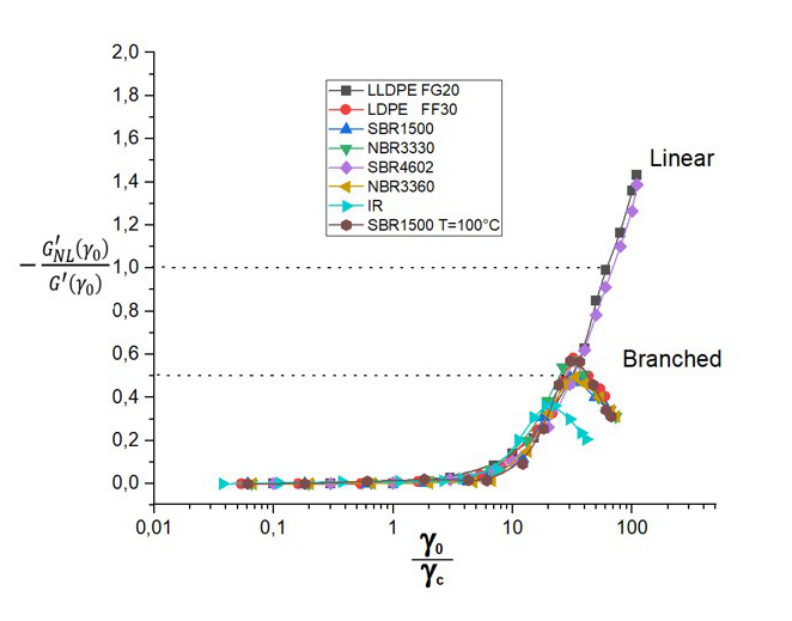
<figcaption class="paper-figure-caption"><b>Fig 1.</b> Figure 1: Experimental Nonlinearity Index as a function of reduced strain amplitude γ0/γc for representative linear and long-chain-branched polymers compiled from Refs.18,19 The linear materials (LLDPE FG20, LDPE FP30 and IR) display monotonic growth over the measured strain range. In contrast, the branched elastomers (SBR1500, SBR4602, NBR3330 and NBR3360) exhibit a characteristic maximum, typically around NLI ≈0.5–0.6, followed by a decrease at larger strain amplitudes. Within the present theory, the initial increase reflects nonlinear buildup of backbone orientation, whereas the post-peak decay arises from arm retraction assisted by convective constraint release and tube dilation.</figcaption>
</figure>
<figure class="paper-figure-card">
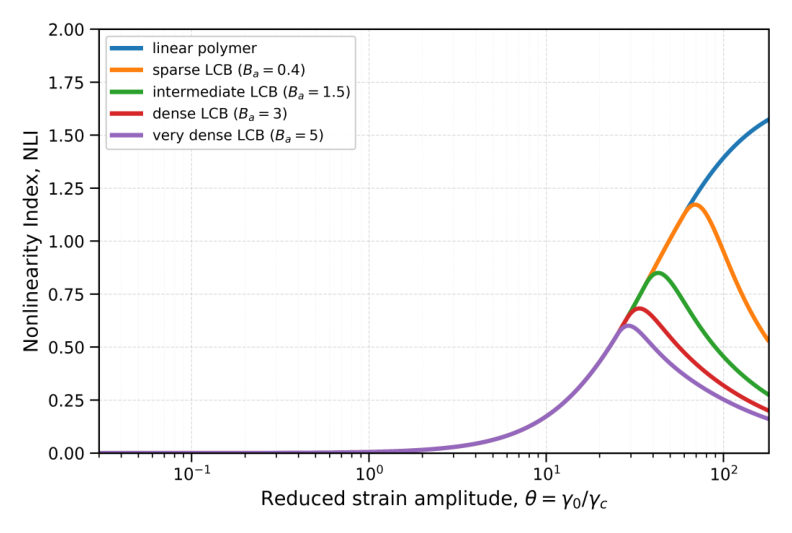
<figcaption class="paper-figure-caption"><b>Fig 2.</b> Figure 2: Theoretical prediction of the Nonlinearity Index obtained by combining the back- bone nonlinear crossover response of Eq. (30), corresponding to Eq. (83) of Ref.,22 with the delayed arm-retraction survival factor of Eq. (32). All branched polymers initially follow es- sentially the same backbone nonlinear response because the long arms remain trapped within their confining tubes and do not yet contribute appreciably to stress relaxation. For sparse long-chain branching, arm retraction is activated only after the backbone has developed substantial nonlinear orientation, allowing the NLI to exceed unity before branch-mediated relaxation becomes dominant. Increasing the branching...</figcaption>
</figure>

**Summary.** This paper develops a molecular tube theory to explain the nonlinear oscillatory rheology of branched polymer melts. It attributes the characteristic peak in the Nonlinearity Index (NLI) to a competition between initial backbone orientation buildup and subsequent relaxation caused by delayed arm retraction from branch points. The resulting framework successfully links macroscopic rheological measurements directly to fundamental polymer architecture parameters.

**Why it may be interesting.** While focused on polymer rheology, the underlying concepts—modeling non-equilibrium relaxation pathways, memory loss due to structural constraints (like branch points), and using an architectural parameter ($	ext{Ba}$) to govern a crossover in response—are analogous to modeling complex dynamics in disordered or constrained quantum systems.

Detailed structure

**Main problem.** The study aims to explain the characteristic maximum followed by a decay in the Nonlinearity Index (NLI) observed during oscillatory shear of long-chain-branched polymer melts, which is absent in linear polymers.

**Main result.** The NLI peak arises from a competition between initial nonlinear backbone orientation buildup and subsequent relaxation caused by delayed arm retraction at branch points. The magnitude and width of this peak are governed by the architecture parameter $	ext{Ba}$.

**Method.** The authors developed an extended molecular tube theory that incorporates branch-point force transmission and models the time evolution of backbone orientation using reptative dynamics modified by arm survival probabilities.

**Model / system.** The system is long-chain-branched polymer melts subjected to oscillatory shear strain. The model extends linear polymer theories by explicitly accounting for the relaxation pathways associated with branched architectures.

**Key observables.** Nonlinearity Index ($	ext{NLI}(\gamma_0)$), which measures the ratio of nonlinear to linear elastic moduli, and backbone shear orientation ($S_{	ext{bb}}^{xy}$).

**Important parameters / regimes.** The branching parameter $	ext{Ba} = f_b Z_a / Z_{bb}$, which quantifies the relative importance of arm entanglements versus the orientable backbone span.

**Assumptions / limitations.** The theory approximates complex dynamics by focusing on long arms whose relaxation is dominated by delayed arm retraction, and it uses approximations for convolution integrals to simplify the memory kernel calculation.

**Figures summary.** Figures illustrate that linear polymers show monotonic NLI growth, while branched elastomers exhibit a distinct peak followed by decay. Increasing the branching parameter $	ext{Ba}$ lowers and broadens this characteristic NLI maximum.

**Paper structure.** The paper builds from defining the diagnostic observable (NLI) to developing an extended molecular tube theory that incorporates delayed arm retraction mechanisms. It then derives the functional form of $NLI_{br}(	heta)$ based on the competition between orientation buildup and memory loss, concluding with predictions governed by the architecture parameter $	ext{Ba}$.

Abstract

Long-chain branching profoundly modifies the nonlinear oscillatory response of entangled polymer melts by introducing arm-retraction pathways absent in linear polymers. We present a molecular tube theory that explains the characteristic maximum of the Nonlinearity Index (NLI) observed experimentally in long-chain-branched polymers. The theory extends the recently developed nonlinear tube-orientation description of linear polymers by incorporating branch-point force transmission and delayed arm retraction. The backbone initially develops nonlinear orientation as in the corresponding linear polymer, whereas long-arm retraction subsequently relaxes the stored branch-point tension and progressively erases backbone orientational memory. This competition produces a characteristic NLI maximum followed by a post-peak decay. The theory predicts two distinct nonlinear regimes corresponding to sparse and dense long-chain branching and introduces an architecture parameter governing the height and width of the nonlinear peak. The resulting framework provides a molecular interpretation of nonlinear Fourier rheology and directly links the nonlinear harmonic response to polymer architecture.

[↑ back to top](#top)

### [A nonstandard statistics for strongly correlated systems: Two simple examples](http://arxiv.org/abs/2607.09542v1)

**Authors:** Józef Spałek, Piotr Kuterba, Mateusz Wójcik, Danuta Goc-Jagło, Maciej Fidrysiak, Leszek Spałek, Włodzimierz Wójcik  
**Type:** theory · **Category:** strongly correlated electrons · **PDF:** <https://arxiv.org/pdf/2607.09542v1>  
**Analysis basis:** full PDF text, analyzed in chunks
**Topic relevance:** `Keldysh / 2PI / non-Gaussian methods` **3/5** · `analog quantum simulation` **2/5** · `driven-dissipative phase transition` **2/5** · `methods for driven-dissipative` **2/5** · `Kondo & dissipative impurity` **1/5** · `entanglement & information structure` **1/5** · `exotic spin models in light-matter` **1/5** · `non-equilibrium dynamics` **1/5** · `non-equilibrium universality` **1/5**

↔ Scroll figures horizontally

<figure class="paper-figure-card">
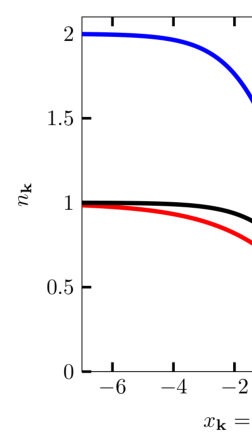
<figcaption class="paper-figure-caption"><b>Fig 1.</b> Fig. 1. Overall behavior of the statistical distribution function nk as a function of relative particle energy xk ≡(ϵk −µ)/kBT for three cases: Fermi-Dirac (FD, blue line), non-Fermi liquid (NFL, red), and statistical spin liquid (SSL). For detailed explanation see main text.</figcaption>
</figure>
<figure class="paper-figure-card">
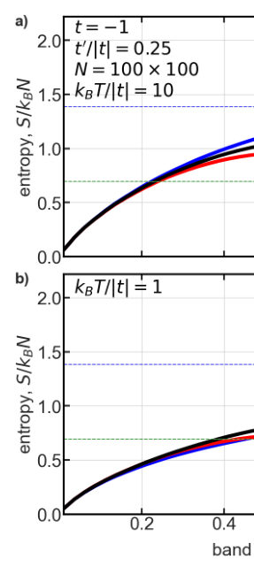
<figcaption class="paper-figure-caption"><b>Fig 2.</b> Fig. 2. Entropy versus band filling n for the three statistics: FD, NFL, and SSL for the two temperatures kBT/|t|: 10 and 1. Note that for n →1, the entropy reaches the local-moment limit ln 2 for SSL, whereas the corresponding high-temperature limit in the FD cases is 2 ln 2, and for NFL S →0.</figcaption>
</figure>
<figure class="paper-figure-card">
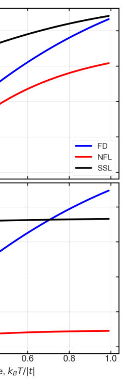
<figcaption class="paper-figure-caption"><b>Fig 3.</b> Fig. 3. Entropy versus temperature for the two band fillings, n = 0.80 (a) and 0.99 (b). For n →1 the full local moment is recovered only in SSL case, a clear sign of the statistics changeover from that of itinerant (indistinguishable particles) to that of local character (distinguishable spins) in k-space.</figcaption>
</figure>
<figure class="paper-figure-card">
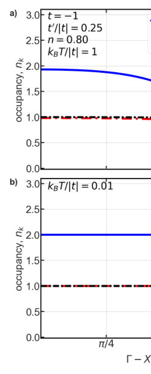
<figcaption class="paper-figure-caption"><b>Fig 4.</b> Fig. 4. Statistical distribution function nk versus quasimomentum k = (kx, 0); i.e., along Γ −X direction in the Brillouin zone (cf. inset). Temperature kBT/|t| = 1 (a) and 0.01 (b). Note that chemical potential position in the NFL and SSL cases touches the zone boundary (kx, π), whereas it is placed at about kx = π/2, as elaborated in the text.</figcaption>
</figure>
<figure class="paper-figure-card">
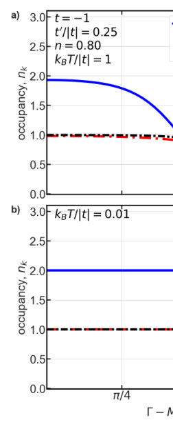
<figcaption class="paper-figure-caption"><b>Fig 5.</b> Fig. 5. Distribution functions nk along the kx = ky (Γ −M) direction, for two temperatures specified. The difference between the chemical potential position for NFL and SSL from one side and that for FD is clearly visible, particularly at lower temperature. For elaboration of this difference see main text.</figcaption>
</figure>

**Summary.** This paper introduces and compares three statistical frameworks—Fermi-Dirac, Non-Fermi Liquid (NFL), and Statistical Spin Liquid (SSL)—to describe fermions in correlated lattice models. The key finding is that the SSL statistics provide a physically consistent description of the Mott insulator state by predicting a finite entropy, suggesting a fundamental change in carrier nature at this quantum critical point.

**Why it may be interesting.** While focused on condensed matter theory, the concept of 'transmutation of statistics' as the system crosses a quantum critical point (Mott transition) is highly relevant to understanding emergent collective behaviors in strongly interacting many-body systems.

Detailed structure

**Main problem.** The paper develops nonstandard statistical descriptions for strongly correlated fermionic systems that go beyond standard Fermi-liquid theory.

**Main result.** It shows that the Statistical Spin Liquid (SSL) statistics correctly predicts a finite, non-zero entropy in the Mott insulating limit ($n 	o 1$), contrasting with predictions from both Fermi-Dirac and Non-Fermi Liquid models.

**Method.** The authors calculate system entropy and statistical distribution functions by deriving generalized counting principles that incorporate specific state exclusions for different correlated regimes (NFL vs. SSL).

**Model / system.** The study analyzes strongly correlated fermions on a two-dimensional square lattice, modeled using concepts derived from Hubbard lattice models, characterized by filling $n \in [0, 1]$.

**Key observables.** System entropy ($S$), statistical distribution function ($n_{k\sigma}$), and chemical potential ($\mu$).

**Important parameters / regimes.** Band filling $n \in [0, 1]$, relative temperature $k_B T/|t|$, and the Mott-insulator limit ($n 	o 1$).

**Assumptions / limitations.** The SSL formulation assumes a two-fluid system with distinguishable spin subsystems ($\uparrow$ and $\downarrow$) in general situations.

**Figures summary.** Figures compare $n_k$ vs. energy for FD, NFL, and SSL; they also plot entropy ($S$) vs. filling ($n$), and chemical potential ($\mu$) vs. filling ($n$) across the different statistical regimes.

**Paper structure.** The paper systematically compares three statistics (FD, NFL, SSL) by calculating their respective entropies and distribution functions for a 2D lattice system, paying special attention to the behavior near the Mott insulator transition.

Abstract

We discuss two different cases of strongly correlated fermions statistics. The first of them is the non-Fermi liquid (NFL) case, $i.e.$, that of fermions with exclusion of doubly occupancy of quasimomentum states $\{\bf k\}$ with opposite spins ($\uparrow\downarrow$). The second is that of statistical spin liquid (SSL) case, in which the fermion spins hop around and mix with the holes (unoccupied) states. For both cases we calculate the system entropy and the corresponding statistical distribution function, analyzed for a two-dimensional square-lattice filling $n\in [0,1]$ and relative temperature $k_B T/|t|$, where $t<0$ is the nearest neighbor hopping integral. We are particularly interested in the situation when the system of itinerant fermions reduce to the Mott-insulator state for the half-filled band ($n\to1$). This limiting situation signals a qualitative difference between the present SSL statistics and that of uncorrelated fermions representing normal Fermi-liquid state.

[↑ back to top](#top)

### [A diagrammatic field theory of quantum error correction](http://arxiv.org/abs/2607.08911v1)

**Authors:** Steven Rayan  
**Type:** theory · **Category:** quantum information and computing · **PDF:** <https://arxiv.org/pdf/2607.08911v1>  
**Analysis basis:** full PDF text, analyzed in chunks
**Topic relevance:** `quantum measurements` **3/5** · `entanglement & information structure` **2/5** · `measurement-induced transitions` **2/5** · `Keldysh / 2PI / non-Gaussian methods` **1/5** · `analog quantum simulation` **1/5** · `correlated / nonlocal dissipation` **1/5** · `driven-dissipative phase transition` **1/5** · `methods for driven-dissipative` **1/5**

↔ Scroll figures horizontally

<figure class="paper-figure-card">
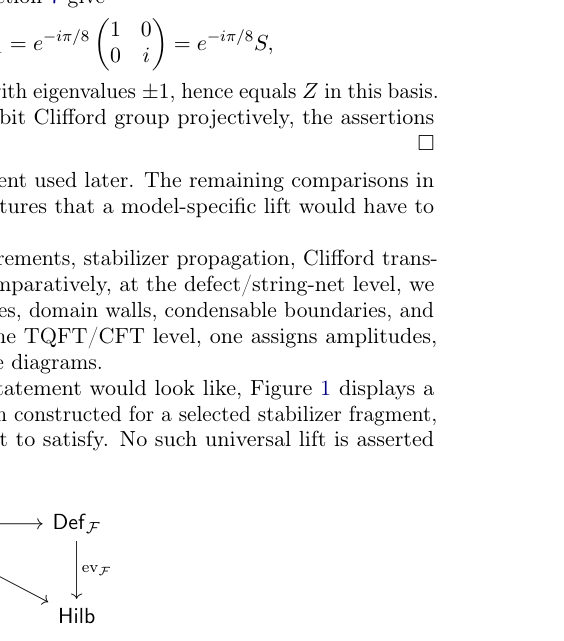
<figcaption class="paper-figure-caption"><b>Fig 1.</b> Figure 1. The compatibility triangle desired of a model-dependent stabilizer lift. If a lift ι is specified for an appropriate ZX fragment, one asks that direct stabilizer evaluation agree with evaluation after passage to the defect/string-net calculus. The figure records the target compatibility condition for a specified lift ι.</figcaption>
</figure>

**Summary.** This work develops a sophisticated field-theoretic approach to Quantum Error Correction by modeling errors as boundary data ('footprints') in topological theories. It proves key theorems relating measurement compatibility (syndrome-admissibility) to exact correctability and establishes a conditional threshold theorem for noise resilience. The paper bridges quantum information theory with advanced mathematics like conformal field theory and algebraic geometry.

**Why it may be interesting.** It provides deep connections between abstract mathematics (category theory, geometry) and practical quantum computation problems like fault tolerance, offering new theoretical tools to analyze error correction beyond standard stabilizer formalisms.

Detailed structure

**Main problem.** Developing a rigorous field-theoretic framework for Quantum Error Correction (QEC) by treating error histories as boundary data ('footprints') within topological or conformal field theory structures.

**Main result.** The paper establishes that exact correctability is equivalent to a fibrewise Knill–Laflamme condition for syndrome-admissible algebras, and proves a conditional Peierls-type threshold theorem for local noise in growing code families.

**Method.** It employs advanced mathematical tools from unitary fusion categories, conformal field theory (calculating conformal blocks), and diagrammatic techniques (like the ZX-calculus) to translate QEC into an inference problem over physical histories.

**Model / system.** The model is general topological/fusion-space codes, exemplified by surface codes and the Ising model. The focus is on how local measurements ('syndromes') constrain the global error history ('footprint').

**Key observables.** Footprints (locally visible boundary data from errors), Syndrome information (measured projections of the footprint), Conformal-block likelihood data, and Error correction failure probability ($\Pr_L(\mathrm{fail})$).

**Important parameters / regimes.** Error rate ($p$), Code size/geometry ($|Ω_L|$), and the non-zero constant error rate threshold.

**Assumptions / limitations.** The analysis relies on hypotheses such as contractible-vacuum locality, bounded connected-region growth, and local neutralizability for the threshold theorem to hold.

**Paper structure.** The paper progresses by defining the field-theoretic framework using fusion categories, establishing the core algebraic condition (Knill–Laflamme), demonstrating concrete examples (Ising theory), proving a conditional threshold theorem for noise resilience, and concluding with advanced mathematical generalizations involving Hopf algebras and Higgs bundles.

Abstract

We develop a field-theoretic framework for quantum error correction centred on fusion-space codes in unitary fusion categories. Admissible clusters determine total-charge sectors and orthogonal footprint projectors recording locally visible data left by error histories. The central distinction is between diagnostic footprint algebras and syndrome-admissible commuting algebras: the latter can be measured without revealing logical information and resolve chosen error representatives into measured sectors. For such algebras, exact correctability is equivalent to fibrewise Knill--Laflamme conditions, yielding a measure-then-recover factorization. Under a contractible-vacuum locality hypothesis, closed neutral composites give a categorical sufficient criterion for scalar action on the code. In the Ising theory, four $σ$ punctures show that pair-charge footprints can be complementary logical diagnostics and realize an exact one-qubit Clifford shadow. A proper six-$σ$ code instead admits a syndrome-admissible pair-charge measurement and exact recovery from an explicit Majorana bilinear error. A second bilinear has the same measured footprint but differs by a logical bit flip, producing a concrete nontrivial footprint fibre and genuine decoding ambiguity. We also formulate conformal-block likelihood data and compute geometry-dependent Ising four-point weights. For growing code families, we prove a conditional Peierls-type threshold theorem: bounded connected-region growth, local stochastic noise, local neutralizability of small residual components, and componentwise decoder balance imply $\Pr_L(\mathrm{fail})\le C|Ω_L|e^{-cL}$ below a nonzero constant error rate. We conclude with representation-theoretic and algebro-geometric directions involving tube and Hopf algebras, Yangian-type structures, Higgs bundles, spectral curves, Jacobians, and abelian varieties.

[↑ back to top](#top)

### [Effective theories for many-body systems with nonuniform symmetries](http://arxiv.org/abs/2607.09427v1)

**Authors:** Aleksander Głódkowski  
**Type:** theory · **Category:** quantum gases · **PDF:** <https://arxiv.org/pdf/2607.09427v1>  
**Analysis basis:** full PDF text, analyzed in chunks
**Topic relevance:** `Keldysh / 2PI / non-Gaussian methods` **3/5** · `methods for driven-dissipative` **2/5** · `non-equilibrium dynamics` **2/5** · `analog quantum simulation` **1/5** · `correlated / nonlocal dissipation` **1/5** · `correlated cavity matter` **1/5** · `driven-dissipative phase transition` **1/5** · `non-equilibrium universality` **1/5**

↔ Scroll figures horizontally

<figure class="paper-figure-card">
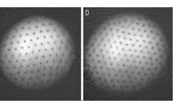
<figcaption class="paper-figure-caption"><b>Fig 1.</b> Figure 3: Triangular vortex lattice observed in a rotating Bose–Einstein condensate of ultracold rubidium-87 atoms. The vortices, visible as density depletions, carry quantized circulation. Figure from [41].</figcaption>
</figure>
<figure class="paper-figure-card">
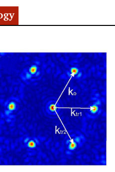
<figcaption class="paper-figure-caption"><b>Fig 2.</b> Figure 4: Quantum vortex lattice in a rotating Bose–Einstein condensate, illustrat- ing the emergence of a crystalline structure with discrete translational and rotational symmetries. This configuration is modeled in the effective description using vor- tex coordinates and the superfluid phase, which together define the associated vor- tex space. Image adapted from the National Institute of Standards and Technology (NIST), JILA (Cornell group), public domain.</figcaption>
</figure>
<figure class="paper-figure-card">
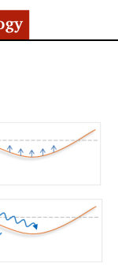
<figcaption class="paper-figure-caption"><b>Fig 3.</b> Figure 5: Relaxation of perturbations in a generic many-body system. The dashed line represents the state of thermodynamic equilibrium, while the solid line denotes a perturbed quantity. (a) Perturbations of non-conserved quantities relax locally on a timescale τ, independently of the wavelength. (b) Perturbations of conserved quan- tities can relax only via transport, which leads to parametrically long relaxation times at large wavelengths. Figure adapted from [58].</figcaption>
</figure>
<figure class="paper-figure-card">
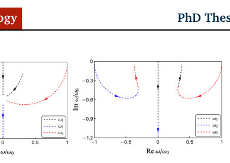
<figcaption class="paper-figure-caption"><b>Fig 4.</b> Figure 6: Trajectories of the longitudinal modes in the frequency complex plane as a function of the thermal conductivity at fixed with arrows indicating the direction of increase in thermal conductivity. Left: Frequencies as a function of the thermal conductivity for a1/a2 = 0.75(a1/a2)c . Middle: Longitudinal modes in the critical regime (a1/a2)c, the collision of the modes happens at a2 = p</figcaption>
</figure>

**Summary.** This paper develops a theoretical framework to describe many-body systems with nonuniform symmetries, moving beyond the well-understood case of uniform symmetries. It shows that these symmetries impose kinematic constraints on low-energy dynamics, leading to novel physical effects such as modified sound modes and unusual transport phenomena in quantum fluids.

**Why it may be interesting.** It provides a rigorous extension of Goldstone's theorem and superfluid hydrodynamics into regimes where symmetries are spatially varying or non-local, which is crucial for understanding complex quantum fluids like BECs.

Detailed structure

**Main problem.** Developing effective theories for many-body systems whose symmetries are nonuniform, meaning their generators do not commute with spacetime translations.

**Main result.** Nonuniform symmetries constrain the dynamics of existing degrees of freedom rather than introducing new gapless modes, leading to modified excitation spectra and unconventional transport phenomena.

**Method.** The authors develop a unified framework using effective field theory principles to analyze how these constraints reshape the infrared dynamics at both zero and finite temperatures.

**Model / system.** The study applies to general many-body systems, with specific examples including quantum vortex crystals (superfluids) and dipole-conserving fluids.

**Key observables.** Modified dispersion relations of collective excitations, anomalous diffusion rates, and constraints on macroscopic hydrodynamic currents.

**Important parameters / regimes.** Low energy/long wavelength limits; finite temperature ($T$); the nature of symmetry breaking (uniform vs. nonuniform).

**Assumptions / limitations.** The low-energy dynamics are governed by symmetries, allowing for an effective field theory description.

**Paper structure.** The work progresses from establishing the general theoretical framework to analyzing specific physical manifestations, such as vortex crystals and hydrodynamic behavior under nonuniform symmetry constraints.

Abstract

The low-energy dynamics of many-body systems is governed by gapless modes whose properties are dictated by symmetry. Their existence follows from Goldstone's theorem, while their effective description at zero temperature is determined by the pattern of symmetry breaking. At finite temperature, an analogous role is played by hydrodynamics, which describes the universal behavior of many-body systems over long times and large distances. These principles are well understood for uniform symmetries, which act homogeneously in spacetime and lead to a correspondence between massless Goldstone modes and broken generators, as well as gapless hydrodynamic modes and conserved charges. However, this simple picture changes in the presence of nonuniform symmetries, whose generators do not commute with spacetime translations. The low-energy implications of these symmetries remain less understood, as they do not introduce additional gapless modes but instead constrain the dynamics of the existing degrees of freedom. In this thesis, we develop a unified framework for many-body systems with nonuniform symmetries and show that their effects can be understood in terms of additional fields that are not independent at low energies and can be eliminated, leading to kinematic constraints that reshape the infrared dynamics. In systems with spontaneous symmetry breaking, this mechanism modifies the effective theory and often softens the dispersion relations of the remaining modes. At finite temperature, it manifests in hydrodynamics as constraints on macroscopic currents. As a result, nonuniform symmetries give rise to qualitatively new physical phenomena, including modified spectra of collective excitations, exemplified by transverse Tkachenko oscillations in quantum vortex crystals, and unconventional transport phenomena, such as anomalously slow diffusion and softened sound modes in dipole-conserving systems.

[↑ back to top](#top)

### [The Statistical physics of unsaturated soil water: kinetic theory and non commutative pore water dynamics](http://arxiv.org/abs/2607.09416v1)

**Authors:** Riccardo Rigon  
**Type:** theory · **Category:** statistical mechanics · **PDF:** <https://arxiv.org/pdf/2607.09416v1>  
**Analysis basis:** full PDF text, analyzed in chunks
**Topic relevance:** `non-equilibrium dynamics` **3/5** · `non-equilibrium universality` **3/5** · `driven-dissipative phase transition` **2/5** · `Frenkel-Kontorova` **1/5** · `Keldysh / 2PI / non-Gaussian methods` **1/5** · `correlated / nonlocal dissipation` **1/5** · `methods for driven-dissipative` **1/5**

↔ Scroll figures horizontally

<figure class="paper-figure-card">
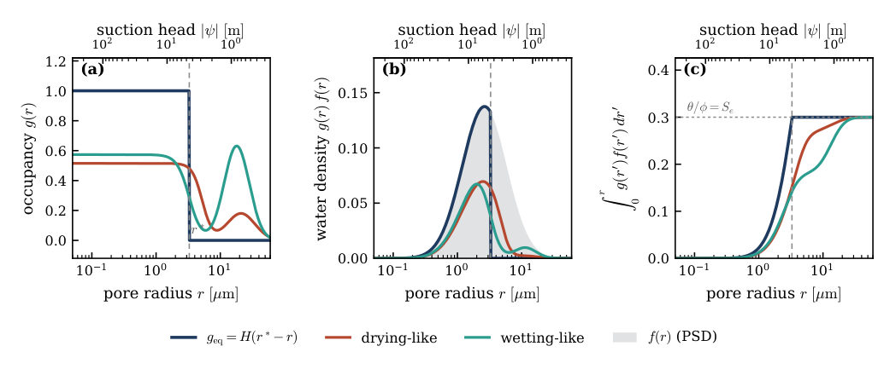
<figcaption class="paper-figure-caption"><b>Fig 1.</b> Figure 1. The filling fraction g(r) as the irreducible state variable. (a) Occupancy g(r) for a Kosugi pore-size distribution (median 5 µm, σ = 0.8) at fixed water content θ/ϕ = Se = 0.3: the reference (single-elevation) equilibrium is the Young– Laplace step gref eq = H(r∗−r) (navy, r∗= 3.3 µm; in a gravity field the true equilibrium is the smeared form, Eq. (16)), while two prototypical non-equilibrium states—“drying-like” (incomplete drainage, rust) and “wetting-like” (macropore activation with incomplete fine-pore filling, teal)—spread occupancy smoothly across pore classes. (b) The corresponding water density g(r) f(r) over the PSD f(r) (grey); all three states enclose the same area,...</figcaption>
</figure>
<figure class="paper-figure-card">
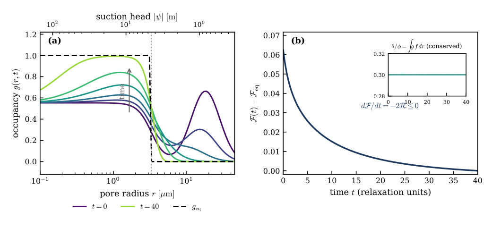
<figcaption class="paper-figure-caption"><b>Fig 2.</b> Figure 2. Relaxation of the kinetic equation and the H-theorem. Numerical integration of the mass-conserving redistribution dynamics ∂tg = G −L [Eqs. (22)–(30)] on 90 pore classes (Kosugi PSD, capillary driving potential, symmetric pair conductance κs of Eq. (32), like-size-biased connectivity C), starting from the “wetting-like” state of Fig. 1. (a) The occupancy g(r, t) evolves (light to dark) from the macropore-activated initial condition toward the reference equilibrium step gref eq = H(r∗−r) (dashed): water drains from the large pores and fills the small ones, exactly the capillary preference encoded in Φ. (b) The Gibbs free energy F(t) = R µw g f dr decreases monotonically to its...</figcaption>
</figure>
<figure class="paper-figure-card">
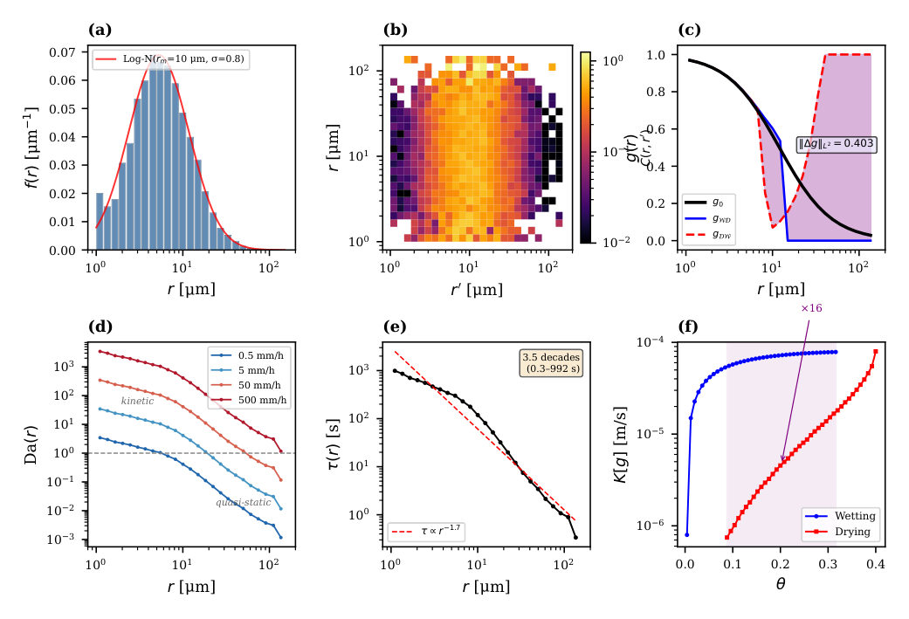
<figcaption class="paper-figure-caption"><b>Fig 3.</b> FIG. 1. Numerical demonstration on a 3,375-pore OpenPNM network (cubic 153, log-normal pore-size distribution). (a) Pore- size distribution f(r). (b) Connectivity matrix C(r, r′) extracted from network adjacency. (c) Non-commutativity: filling distributions gWD(r) (wet-then-dry, blue) vs. gDW(r) (dry-then-wet, red dashed) differ from the same initial state g0 (black). (d) Damköhler number Da(r) ∝1/r for four forcing intensities I. (e) Relaxation spectrum τ(r) = 1/A(r) spanning ∼3.5 decades (0.3–992 s). (f) Hydraulic conductivity K[g] vs. θ along wetting (blue) and drying (red) paths, demonstrating that K is a functional of g, not just of θ.</figcaption>
</figure>
<figure class="paper-figure-card">
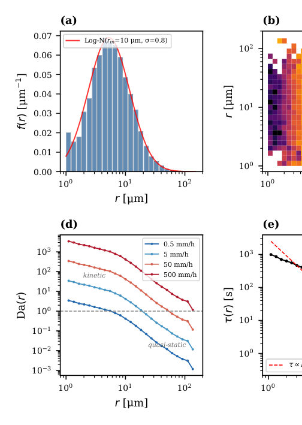
<figcaption class="paper-figure-caption"><b>Fig 4.</b> Figure 2 quantifies this partition using the contin- uous relaxation scaling τ(r) ∝r−1.7 extracted from the network (Sec. III F). Two quantities are computed for each I: the pore volume fraction in each regime, R ∞ rDa f(r) dr (matric) versus R rDa 0 f(r) dr (preferential); and the flux fraction, weighted by r2 to reflect the Hagen– Poiseuille conductance contribution. The contrast between panels (a) and (b) is the central result. At I = 0.5 mm/h (drizzle), 88% of pore volume and 99.7% of flux are matric: Richards is valid every- where. At I = 5 mm/h (moderate rain), 71% of pore vol- ume has entered the kinetic regime, yet 84% of flux is still carried by the remaining matric pores. This...</figcaption>
</figure>
<figure class="paper-figure-card">
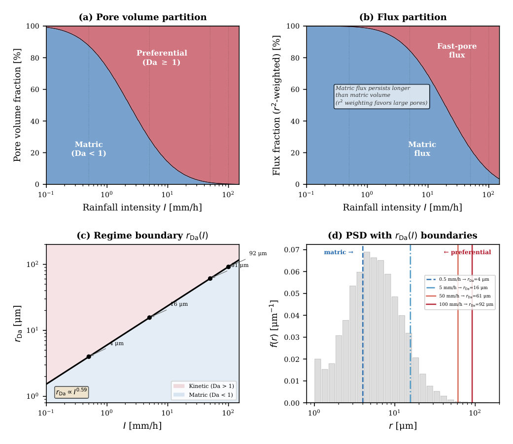
<figcaption class="paper-figure-caption"><b>Fig 5.</b> FIG. 2. Flow partition under varying rainfall intensity on the 3 375-pore network. (a) Pore volume fraction in the matric (Da &lt; 1, blue) and preferential (Da ≥1, red) regimes. (b) Flux fraction (r2-weighted): matric flux persists to higher I than matric volume because large, fast-equilibrating pores carry disproportionate flux. (c) Crossover radius rDa(I) ∝I0.59: the continuously shifting regime boundary. (d) Pore-size distribution with rDa boundaries at four representative intensities. At I = 5 mm/h, 71% of pore volume is already kinetic, but 84% of flux is still matric—explaining why Richards can appear adequate for water budgets when the pore-scale picture is far from equilibrium.</figcaption>
</figure>

**Summary.** This paper presents a unified statistical-mechanical theory for water transport in unsaturated soil. It derives a continuum field equation that naturally bridges the gap between slow, quasi-static flow (Richards' equation) and fast, non-equilibrium preferential flow regimes using a dimensionless Damköhler number. The work provides a rigorous framework based on minimizing free energy while accounting for rate-dependent memory effects.

**Why it may be interesting.** While focused on porous media, the framework of describing irreversible dynamics via an Onsager gradient flow descending a free energy functional is highly relevant to non-equilibrium statistical mechanics used in open quantum systems or complex chemical reaction networks.

Detailed structure

**Main problem.** To develop a comprehensive statistical-mechanical theory for water dynamics in unsaturated soil that unifies classical rate-independent models with non-equilibrium, fast-flow regimes.

**Main result.** The theory yields a continuum field equation ($\partial_t g + 
abla \cdot F = C[g] - E - T$) whose behavior is governed by the pore-resolved Damköhler number ($Da$), unifying quasi-static (Richards') and preferential flow regimes.

**Method.** The theory constructs the dynamics across three scales—microscopic inter-pore transfers, mesoscopic master equations, and a continuum limit—identifying the evolution as an Onsager gradient flow descending the Gibbs free energy.

**Model / system.** The system is unsaturated porous media (soil) characterized by pore radii ($r$) and position ($x$). The state variable is the pore-occupancy $g(r, x, t)$, which evolves based on chemical potential differences ($\Phi$) acting as the driving force.

**Key observables.** Pore-occupancy $g(r, x, t)$, hydraulic conductivity $K[g]$, hysteresis loop area ($H$), and the macroscopic water content $	heta$.

**Important parameters / regimes.** Pore-resolved Damköhler number $Da(r, x)$; capillary length ($\ell_c$); pore size distribution $f(r)$.

**Assumptions / limitations.** Inputs (pore geometry) are assumed measurable from micro-CT; the theory is general and applies where local thermodynamic equilibria can be defined.

**Paper structure.** The paper builds the continuum equation by deriving it sequentially: first establishing microscopic transfer rates, then defining the mesoscopic master equation, and finally taking the continuum limit to obtain the full kinetic balance equation.

Abstract

We develop a statistical-mechanical theory of water in unsaturated soil whose outcome is a continuum field equation for the pore-occupancy g(r,x,t), the fraction of pores of radius r that are water-filled at position x and time t. The theory is built across three scales: microscopic inter-pore transfers set by Hagen-Poiseuille rates and a driving potential (the difference of pore-class chemical potentials, taken in capillary-gravitational form but open to adsorptive, osmotic, or thermal refinement); a mesoscale master equation relaxing the occupancy toward the equilibrium step g_eq=H(r*-r); and, on contracting the averaging volume to a point, the continuum balance d_t g + div F = C[g] - E - T, of which everything else is a limit, a moment, or a boundary resolution. The kinetic equation is an Onsager gradient flow descending the Gibbs free energy, with an H-theorem for the isothermal unforced system and mass conservation as its zeroth moment. A single dimensionless group, the pore-resolved Damkohler number Da(r,x), organizes the behavior and unifies phenomenologies long modelled separately. A Chapman-Enskog reduction identifies Richards' equation as the quasi-static (Da->0) limit, with matric potential and hydraulic conductivity K emerging only there and K vanishing below the percolation threshold; capillary-bundle and critical-path models are its diagonal and spectral limits. Hysteresis is the holonomy of a forcing bundle, a geometric phase rather than per-pore bistability, with a falsifiable loop-area law H ~ I^2. Preferential flow is what the same equation does where Da>1, so the Richards/preferential-flow dichotomy becomes a continuous Da-controlled crossover. Out of the quasi-static limit g(r) is the irreducible state variable. All inputs are geometric properties of the pore network, measurable from micro-CT and calibrated against no macroscopic data.

[↑ back to top](#top)

### [A multi-ensemble mean-field reduction method for networks of globally coupled phase oscillators with arbitrary parameter distributions](http://arxiv.org/abs/2607.09516v1)

**Authors:** Richard Gast, Shotaro Takasu, Helmut Schmidt, Ann Kennedy  
**Type:** both · **Category:** disordered systems and neural networks · **PDF:** <https://arxiv.org/pdf/2607.09516v1>  
**Analysis basis:** full PDF text, analyzed in chunks
**Topic relevance:** `methods for driven-dissipative` **3/5** · `Keldysh / 2PI / non-Gaussian methods` **2/5** · `non-equilibrium dynamics` **2/5** · `analog quantum simulation` **1/5** · `correlated / nonlocal dissipation` **1/5** · `driven-dissipative phase transition` **1/5** · `non-equilibrium universality` **1/5**

↔ Scroll figures horizontally

<figure class="paper-figure-card">
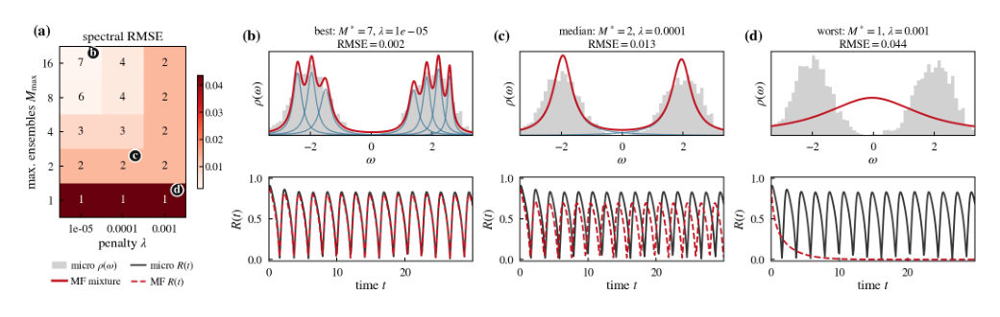
<figcaption class="paper-figure-caption"><b>Fig 1.</b> FIG. 1. Lorentzian mixture mean-field (LMMF) model accurately captures the macroscopic dynamics of a network of Kuramoto oscillators with multimodal intrinsic frequency distribution. (a) LMMF model-fitting performance as a function of meta parameters Mmax and λ. The color represents the root mean square error between the Fourier transformed average phase coherence dynamics of the two models. The numbers in each cell represent the number of Lorentzian distributions M that led to the best fit. (b-d) Example LMMF fits for different values of Mmax and λ. The top row depicts the fit to the empirical distribution of oscillator frequencies, whereas the bottom row depicts the average phase...</figcaption>
</figure>
<figure class="paper-figure-card">
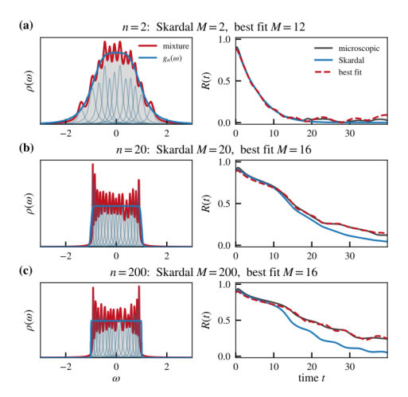
<figcaption class="paper-figure-caption"><b>Fig 2.</b> FIG. 2. Low-dimensional LMMF equations capture finite size bias in Kuramoto oscillator networks with rational frequency distributions. (a-c) Comparison between the Kuramoto oscil- lator system, the mean-field equations derived by Skardal [6], and the LMMF equations for three different choices of n, i.e. a shape parameter of the oscillator frequency density func- tion Eq. (13). Left column: Depiction of the density function Eq. (13) for n (blue curve), the empirical distribution (grey), and the Lorentzian mixture fit (red). Right column: Dynam- ics of the average phase coherence R(t) for each model. Other model parameters: K = 1.2, N = 5000.</figcaption>
</figure>
<figure class="paper-figure-card">
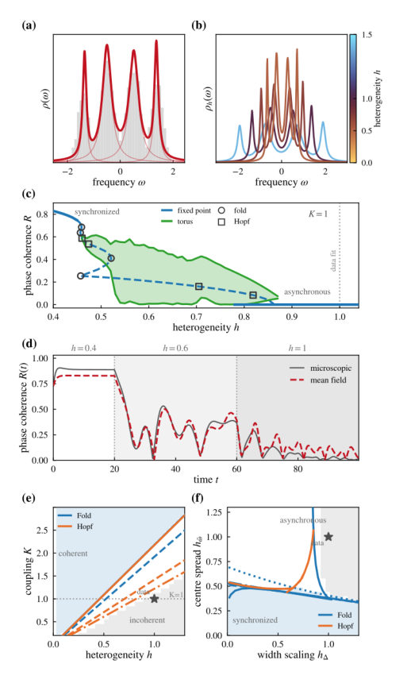
<figcaption class="paper-figure-caption"><b>Fig 3.</b> FIG. 3. Global heterogeneity parameters for analyzing Lorentzian mixture fits. (a) The empirical distribution (grey) of ωi and the Lorentzian mixture fit (red). (b) Effects of changes in h = h¯ω = h∆on the Lorentzian mixture den- sity. (c) 1D bifurcation diagram for the oscillator hetero- geneity h. The steady-state solution branch (blue) and bi- furcation points were obtained via parameter continuation of the synchronized fixed point solution of the LMMF equations, whereas the envelope of the quasi-periodic torus was approx- imated via numerical simulations of the LMMF equation dy- namics in response to a slow, bidirectional ramp of h. (d) Average phase coherence dynamics of the LMMF...</figcaption>
</figure>
<figure class="paper-figure-card">
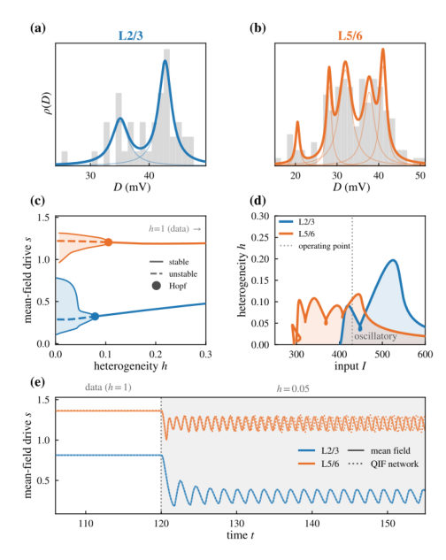
<figcaption class="paper-figure-caption"><b>Fig 4.</b> FIG. 4. LMMF equations reveal heterogeneity-related syn- chronization of fast-spiking interneurons. (a-b) Lorentzian mixture fits to the empirical distributions of Di in layer 2/3 and layer 5/6 fast-spiking interneurons, respectively. (c) 1D bifurcation diagram of the globally coupled interneuron pop- ulations for J = −100 and I = 430. (d) 2D bifurcation diagram depicting the Hopf bifurcation curves in the I −h parameter space. (e) Synaptic activation dynamics of the mean-field equations and corresponding QIF networks in re- sponse to a decrease in neural heterogeneity.</figcaption>
</figure>
<figure class="paper-figure-card">
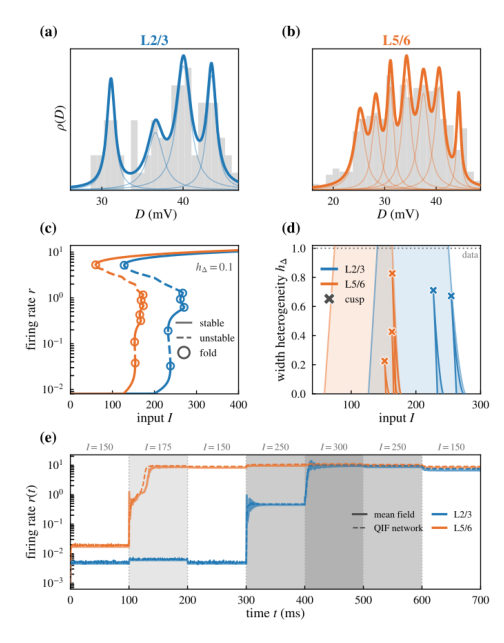
<figcaption class="paper-figure-caption"><b>Fig 5.</b> FIG. 5. LMMF equations reveal heterogeneity-related multi- stability of pyramidal cells. (a-b) Lorentzian mixture fits to the empirical distributions of Di in layer 2/3 and layer 5/6 pyramidal cells, respectively. (c) 1D bifurcation diagram of the pyramidal cell populations for J = 100. (d) 2D bifurca- tion diagram depicting the fold curves in the I −h∆parame- ter space. (e) Average firing rate dynamics of the mean-field equations and corresponding QIF networks in response to a stepping input.</figcaption>
</figure>

**Summary.** This paper presents a novel Lorentzian Mixture Mean-Field (LMMF) method designed to analyze coupled oscillator networks whose natural frequencies follow arbitrary distributions. By approximating the true distribution as a sum of Lorentzians, it achieves significant dimensionality reduction while maintaining high accuracy compared to existing methods. This technique is successfully applied both to theoretical Kuramoto models and to analyzing complex electrophysiological data from real neurons.

**Why it may be interesting.** The development of a robust mean-field reduction technique applicable to arbitrary disorder distributions is highly valuable. While the system itself is classical/biological, the mathematical machinery (dimensionality reduction via spectral methods applied to complex systems) shares conceptual links with analyzing many-body quantum states or effective Hamiltonians in disordered quantum systems.

Detailed structure

**Main problem.** The primary challenge is understanding the complex dynamics of globally coupled phase oscillator systems when the intrinsic frequencies ($\omega_i$) are heterogeneous (arbitrary distributions). The goal is to achieve a low-dimensional mean-field description for such systems.

**Main result.** The authors introduce the Lorentzian Mixture Mean-Field (LMMF) method, which successfully extends dimensionality reduction techniques from simple frequency distributions (like Lorentzian) to arbitrary empirical distributions by approximating them as mixtures of Lorentzians.

**Method.** The core method involves approximating an arbitrary probability distribution $
ho(\omega)$ using a finite sum of Lorentzian functions ($
ho_M^*(\omega)$). This approximation is then used within the LMMF framework to derive low-dimensional mean-field equations for system observables like average phase coherence $R(t)$.

**Model / system.** The model studied is globally coupled phase oscillators (e.g., Kuramoto models) and, in an application context, Quadratic Integrate-and-Fire (QIF) neural networks. Heterogeneity is introduced via the intrinsic frequency distribution $
ho(\omega)$ or the distance-to-threshold $D_i$.

**Key observables.** Average phase coherence dynamics ($R(t)$), bifurcation structure (e.g., Hopf bifurcations, fold bifurcations), and steady-state firing rates.

**Important parameters / regimes.** The heterogeneity parameters defining the Lorentzian mixture components ($\mathbf{u}$ in Eq. 5) and global coupling strength $K$.

**Assumptions / limitations.** The method assumes that an arbitrary distribution can be accurately approximated by a finite sum of Lorentzian distributions ($M$ ensembles). The LMMF derivation itself relies on mean-field approximations.

**Figures summary.** Figures illustrate the fitting performance of the LMMF model to empirical data (e.g., Gaussian mixtures for frequency distributions) and compare the resulting dynamics ($R(t)$) against previous theoretical approaches, showing superior accuracy and lower dimensionality.

**Paper structure.** The paper first establishes the general mean-field reduction technique by approximating arbitrary distributions as Lorentzian mixtures. It then applies this to Kuramoto oscillators, comparing LMMF results favorably against prior methods (Skardal's). Finally, it demonstrates the method's utility by applying it to analyze electrophysiological data from cortical neurons.

Abstract

Understanding the dynamical properties of coupled phase oscillator systems with heterogeneous oscillator frequencies has been a long-standing challenge of complex systems theory. While the seminal work of Ott and Antonsen dramatically improved our theoretical understanding of coupled phase oscillators for a small family of oscillator frequency distributions, we here present a mean-field reduction method for arbitrary frequency distributions. Our method leverages the drastic dimensionality reduction obtained for Lorentzian frequency distributions, and combines it with a data-driven multi-ensemble approach. As such, the method renders the Ott-Antonsen equations directly applicable to empirical distributions of phase oscillator frequencies, often achieving a drastic dimensionality reduction and allowing to study real-world physical and biological systems by means of stability, sensitivity, and bifurcation analyses.

[↑ back to top](#top)

### [Classically Realizable Incompatibility](http://arxiv.org/abs/2607.09047v1)

**Authors:** Songyi Liu, Yongjun Wang, Baoshan Wang, Yunyi Jia, Chang He  
**Type:** theory · **Category:** other · **PDF:** <https://arxiv.org/pdf/2607.09047v1>  
**Analysis basis:** full PDF text, analyzed in chunks
**Topic relevance:** `quantum measurements` **3/5** · `entanglement & information structure` **2/5** · `measurement-induced transitions` **2/5** · `Keldysh / 2PI / non-Gaussian methods` **1/5** · `analog quantum simulation` **1/5** · `correlated / nonlocal dissipation` **1/5** · `driven-dissipative phase transition` **1/5**

↔ Scroll figures horizontally

<figure class="paper-figure-card">
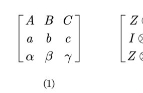
<figcaption class="paper-figure-caption"><b>Fig 1.</b> Fig. 3: (1) The Peres-Mermin square, where each row or column forms a context; (2) A quantum realization of the Peres-Mermin square, which is a Kochen-Specker scenario, with X, Y, Z as Pauli operators on qubits.</figcaption>
</figure>
<figure class="paper-figure-card">
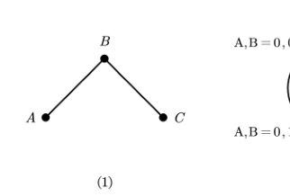
<figcaption class="paper-figure-caption"><b>Fig 2.</b> Fig. 6: (1) Compatibility graph for M = {{A, B}, {B, C}}; (2) Corresponding exclu- sivity graph, drawn as a hypergraph where each line or circle denotes a maximal clique.</figcaption>
</figure>

**Summary.** This paper analyzes incompatibility in quantum mechanics using partial Boolean algebras (pBAs) and introduces the 'exclusivity graph' as a structural tool. The main finding is that many incompatible scenarios can be mathematically shown to be equivalent to structures embeddable into classical Boolean algebras, suggesting that mere incompatibility alone does not guarantee non-classicality.

**Why it may be interesting.** This work provides deep structural insights into the mathematical foundations of quantum contextuality, which is crucial for understanding measurement limitations in any quantum system, including those studied in AMO physics or quantum information theory.

Detailed structure

**Main problem.** The research investigates the structural properties of incompatibility scenarios in quantum mechanics and determines if these scenarios are fundamentally non-classical or can be realized classically.

**Main result.** Every exclusivity graph is proven to be the atom graph of an exclusive partial Boolean algebra (pBA), which can be embedded into a standard Boolean algebra, suggesting that many incompatible scenarios are classically realizable.

**Method.** The authors use the mathematical framework of partial Boolean algebras (pBAs) and introduce the 'exclusivity graph' to precisely characterize incompatibility structures. They develop a unified method to map these abstract structures onto classical games.

**Model / system.** The model is based on quantum observables whose incompatibilities are studied using pBAs, which capture the logical structure of measurement outcomes. The analysis compares this framework against standard Boolean algebras and known contextuality examples like the Peres-Mermin square.

**Key observables.** Incompatibility itself, exclusivity graphs, partial Boolean algebras (pBA), and atom graphs.

**Important parameters / regimes.** The specific case $(1, 2, 2)$ for two incompatible dichotomic observables is used as a primary example.

**Assumptions / limitations.** The analysis assumes that the logical structure of incompatibility can be captured by pBAs, and it notes limitations regarding the full characterization (necessary/sufficient conditions) for exclusivity graphs.

**Figures summary.** Figures illustrate the partial Boolean algebra $A(1,2,2)$ for two observables, the associated exclusivity graph, and examples like the Peres-Mermin square demonstrating compatibility structures.

**Paper structure.** The paper progresses by establishing the pBA framework to study incompatibility. It introduces the exclusivity graph as a characterization tool, proves that these graphs correspond to specific types of pBAs (epBA), and concludes by showing how these structures can be mapped onto classical games.

Abstract

Incompatibility constitutes a fundamental aspect of quantum mechanics. However, not every quantum observable non-classical property arises from incompatibility, nor can all quantum scenarios be fully captured by incompatibility alone. Within the framework of partial Boolean algebra (pBA), we research the structural properties of incompatibility scenarios. We introduce a unified method to realize any incompatibility scenario via a classical game, and the construction is extendable to any scenario embeddable into a Boolean algebra. The exclusivity graph offers a precise characterization of incompatibility scenarios. We prove that every exclusivity graph is the atom graph of an exclusive pBA, which is embedded into a Boolean algebra. These results provide a necessary condition for exclusivity graphs and a sufficient condition for atom graphs.

[↑ back to top](#top)

### [Nonlinear particle detectors across the Rindler firewall](http://arxiv.org/abs/2607.09660v1)

**Authors:** Matheus H. Zambianco, Eduardo Martín-Martínez  
**Type:** theory · **Category:** other · **PDF:** <https://arxiv.org/pdf/2607.09660v1>  
**Analysis basis:** full PDF text, analyzed in chunks
**Topic relevance:** `Keldysh / 2PI / non-Gaussian methods` **3/5** · `entanglement & information structure` **3/5** · `non-equilibrium dynamics` **2/5** · `correlated / nonlocal dissipation` **1/5** · `driven-dissipative phase transition` **1/5** · `methods for driven-dissipative` **1/5**

↔ Scroll figures horizontally

<figure class="paper-figure-card">
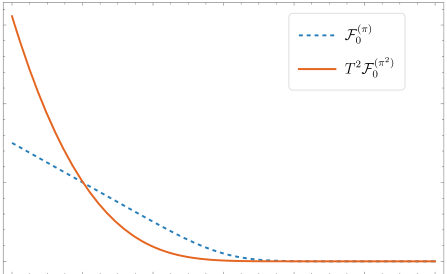
<figcaption class="paper-figure-caption"><b>Fig 1.</b> Figure 1. Comparison between the (dimensionless) response</figcaption>
</figure>
<figure class="paper-figure-card">
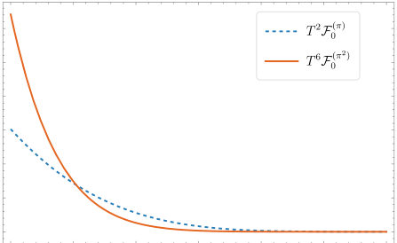
<figcaption class="paper-figure-caption"><b>Fig 2.</b> Figure 2. Response functions in the Minkowski vacuum for a Gaussian switching, shown as functions of ω = ΩT. The solid curve correspondes to the dimensionless quantity T 2F (π) 0 , and</figcaption>
</figure>
<figure class="paper-figure-card">
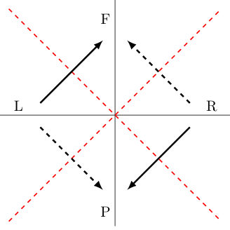
<figcaption class="paper-figure-caption"><b>Fig 3.</b> Figure 3. Propagation of the decoupled sectors of a massless scalar field. The right-moving sector propagates from L into F and from R into P, while the left-moving sector propagates from R into F and from L into P</figcaption>
</figure>
<figure class="paper-figure-card">
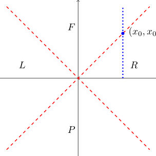
<figcaption class="paper-figure-caption"><b>Fig 4.</b> Figure 4. Schematic representation of an inertial pointlike detector (dotted line) crossing the Rindler firewall (dashed line) from the right (R) and future (F) wedges.</figcaption>
</figure>
<figure class="paper-figure-card">
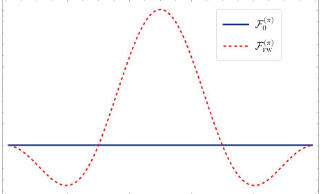
<figcaption class="paper-figure-caption"><b>Fig 5.</b> Figure 6. Comparison between the detector response when the field is prepared in the vacuum, F(π) 0 , and when the field is prepared in the firewall state, F(π) fw , in the derivative- coupling model, as a function of the dimensionless Rindler horizon crossing coordinate time, x0/T. The detector’s gap is fixed at ΩT = 1, and the IR cutoff is ΛT = 1.</figcaption>
</figure>

**Summary.** This paper analyzes how different types of nonlinear particle detectors respond when placed across a Rindler firewall. By comparing couplings to local observables like energy density versus momentum, the authors demonstrate that quadratic couplings lead to unphysical divergences at the horizon. This strongly suggests that such non-linear interactions are incompatible with the sharp firewall picture.

**Why it may be interesting.** This work is highly relevant to theoretical physics concerning quantum field theory in curved spacetime, black hole thermodynamics, and the information paradox, touching upon concepts of entanglement structure across horizons.

Detailed structure

**Main problem.** The study investigates the response of nonlinear particle detectors coupled to local observables (like energy density or momentum) when crossing a Rindler firewall.

**Main result.** Nonlinear couplings, particularly those involving quadratic momentum terms, lead to unavoidable formal divergences at the firewall, suggesting incompatibility with the standard sharp firewall model. The pathologies are attributed to the discontinuity of correlations across the horizon rather than the detector model itself.

**Method.** The authors employ a distributional framework and perturbative expansion in the coupling strength to calculate detector response functions using two-point correlation functions derived from the Wightman function.

**Model / system.** The system involves Unruh-DeWitt detectors coupled to a quantum scalar field ($\hat{\phi}$) in Minkowski spacetime, specifically analyzing the state mimicking correlations across the Rindler horizon (firewall). Couplings are tested for local observables: energy density ($\hat{T}_{\mu
u}$) and quadratic momentum ($\hat{\pi}^2$).

**Key observables.** Detector response function ($F_0$), Energy Density Correlation Function, Quadratic Momentum Correlation Function.

**Important parameters / regimes.** Coupling strength ($\lambda$), Detector switching function $\chi(t)$, Dimensionality (1+1D vs 3+1D), and the energy gap ($\Omega$).

**Assumptions / limitations.** The analysis assumes an initial state $\hat{
ho}_0 = |g
angle\langle g| \otimes |0
angle\langle 0|$ and utilizes normal ordering for stress-energy density renormalization.

**Figures summary.** Figures compare dimensionless response functions $F(\pi)_0$ and $rac{T^2}{2} F(\pi^2)_0$ versus frequency ($\omega$) in 1+1D, and illustrate the propagation of decoupled sectors across the firewall.

**Paper structure.** The paper develops a distributional framework to calculate detector response functions for different couplings. It compares results in 1+1D and 3+1D dimensions, showing proportionality relationships between energy density and momentum coupling responses while highlighting divergences specific to nonlinear terms at the firewall.

Abstract

We investigate Unruh-DeWitt detectors coupled to composite observables of a quantum scalar field, including quadratic coupling to the field momentum and coupling to the local energy density. We develop a distributional framework for evaluating the corresponding detector response functions and apply it to detectors crossing the Rindler firewall. While we recover the finite response of the derivative-coupling model, we show that quadratic momentum coupling leads to ill-defined products of distributions and unavoidable formal $δ(0)$-type divergences. Since the local energy-density response is closely tied to the quadratic momentum response, our results provide strong evidence that the standard sharp firewall model is incompatible with nonlinear detector couplings to local observables. Our analysis further suggests that these pathologies originate from the discontinuous severing of correlations across the Rindler horizon, rather than from the detector model itself.

[↑ back to top](#top)

### [Quantum Hopfion rings in the cluster mean-field approximation](http://arxiv.org/abs/2607.09140v1)

**Authors:** Vladyslav M. Kuchkin, Thomas L. Schmidt  
**Type:** theory · **Category:** numerical methods · **PDF:** <https://arxiv.org/pdf/2607.09140v1>  
**Analysis basis:** full PDF text, analyzed in chunks
**Topic relevance:** `methods for driven-dissipative` **3/5** · `analog quantum simulation` **2/5** · `non-equilibrium dynamics` **2/5** · `Keldysh / 2PI / non-Gaussian methods` **1/5** · `entanglement & information structure` **1/5** · `exotic spin models in light-matter` **1/5** · `spintronics-quantum-optics interface` **1/5**

↔ Scroll figures horizontally

<figure class="paper-figure-card">
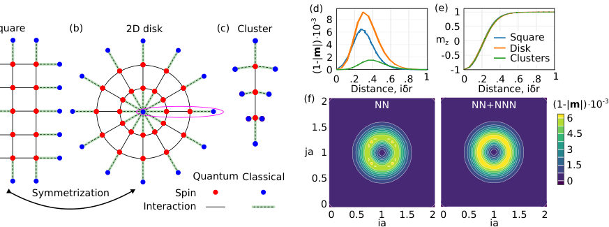
<figcaption class="paper-figure-caption"><b>Fig 1.</b> FIG. 1. Results of 2D DMRG and CMFA simulations for a quantum skyrmion. The positions of quantum (red) and classical (blue) spins and their couplings are shown for square (panel a), disk (b), and cluster (c) geometries. (Panel d) Change of magnetization length |m| as a function of the distance r to the skyrmion center obtained for the geometries (a)-(c). (Panel e) Magnetization mz as a function of r for cases (a)-(c). (Panel f) Distribution of the magnetization length |m| for the cases when only nearest-neighbor (NN) spin interactions are taken into account (left) and with inclusion of next-nearest-neighbor (NNN) spin interactions (right).</figcaption>
</figure>
<figure class="paper-figure-card">
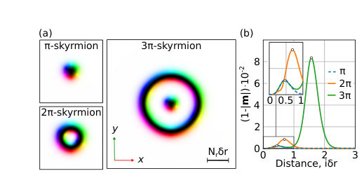
<figcaption class="paper-figure-caption"><b>Fig 2.</b> FIG. 2. Quantum kπ-Skyrmions. Panel (a): Examples of kπ-skyrmions stabilized in the system of size 48 spins with δr = 1/16 and δϕ = 2π/16. Spin directions are indicated by the following color code: white for up, black for down, and a red–green–blue color scheme for in-plane spin compo- nents [45]. Panel (b): Distribution of magnetization as a func- tion of the distance to the skyrmion center obtained with the CFM approach. Maxima points are denoted by hollow circles, and the corresponding values for π-, 2π-, and 3π-skyrmions are 0.0028, 0.0085 and 0.083, respectively.</figcaption>
</figure>
<figure class="paper-figure-card">
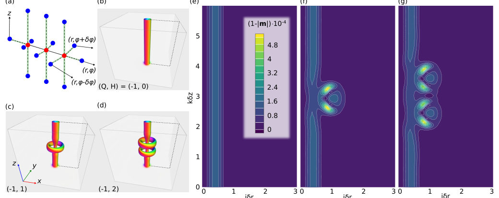
<figcaption class="paper-figure-caption"><b>Fig 3.</b> FIG. 3. Quantum Hopfion rings. Panel (a): positions of quantum (red) and classical (blue) spins and their couplings for the cluster in the cylinder geometry – a 3D extension of the one provided in Fig. 1(c). Panels (b), (c) and (d): skyrmion strings with zero, one and two hopfion rings, respectively, stabilized at h = 0.4, u = 0.3 in the box of size (96)3, with a = 1/16 in the model (2). Panels (e)-(g): magnetization distribution obtained with the CFMA in the rectangular region bounded by the skyrmion string core spins and dashed lines in panels (b)-(d).</figcaption>
</figure>
<figure class="paper-figure-card">
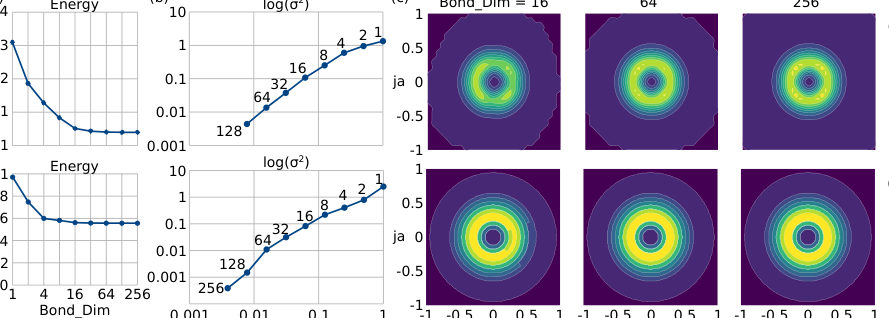
<figcaption class="paper-figure-caption"><b>Fig 4.</b> FIG. 4. Convergence analysis of 2D DMRG simulations for a skyrmion. Upper (lower) panel (a) skyrmion energy and (b) variance, (13) for skyrmion as a function of bond dimensions in square (disk) geometry. (c) corresponding magnetization length distribution for selected bond dimensions 16, 64 and 256.</figcaption>
</figure>

**Summary.** This work investigates the quantum behavior of magnetic spin textures like skyrmions and hopfion rings using advanced computational techniques. By employing the Cluster Mean-Field Approximation alongside DMRG, the authors overcome dimensionality limitations to accurately calculate quantum fluctuations in these complex topological states. The results highlight where classical micromagnetics breaks down, suggesting necessary extensions to the theoretical framework.

**Why it may be interesting.** While focused on magnetism, the heavy reliance on DMRG, cluster mean-field theory, and mapping complex Hamiltonians onto solvable 1D/2D effective models makes this highly relevant for developing numerical techniques applicable to other quantum many-body systems.

Detailed structure

**Main problem.** The study focuses on accurately computing the quantum properties of topologically non-trivial spin textures, such as skyrmions and hopfion rings.

**Main result.** The Cluster Mean-Field Approximation (CMFA) successfully computes quantum fluctuations in large spin textures and accesses metastable states, revealing limitations in purely classical micromagnetic models.

**Method.** The authors combine the CMFA with DMRG simulations by exploiting cylindrical symmetry to reduce the problem to an effective 1D chain solvable via Matrix Product States.

**Model / system.** The system is modeled using a Heisenberg Hamiltonian describing chiral magnets, analyzed in both discrete lattice forms and continuum approximations adapted for cylindrical coordinates.

**Key observables.** Topological indices (Q, H), local variation of magnetization length |m|, quantum fluctuations, and zero-mode dynamics of the Hopfion ring.

**Important parameters / regimes.** The analysis explores intermediate regimes between purely classical and fully quantum spin textures; key parameters include exchange stiffness (A), DMI constant (D), and anisotropy (K).

**Assumptions / limitations.** The CMFA treats inter-cluster interactions at a mean-field level, which is an approximation that may underestimate the true quantum fluctuations.

**Figures summary.** Figures illustrate DMRG/CMFA results for skyrmion profiles in various geometries and show convergence analysis (energy, variance) of 2D DMRG simulations as bond dimension increases.

**Paper structure.** The paper moves from defining the continuum micromagnetic Hamiltonian to adapting it into cylindrical coordinates. It then details the application of CMFA combined with DMRG to simulate quantum fluctuations in skyrmion and hopfion ring structures, concluding with comparisons to classical limits.

Abstract

We study the quantum properties of two- and three-dimensional spin textures -- $kπ$-skyrmions and hopfion rings -- within the cluster mean-field approximation (CMFA). By combining the CMFA with a symmetrization procedure, we achieve two key advances: the accurate computation of quantum fluctuations in large spin textures and reliable access to metastable states. These challenges are generally insurmountable using standard methods, which are severely limited by the curse of dimensionality and typically restricted to ground-state properties. Exploiting the cylindrical symmetry of the studied magnetic configurations, we construct one-dimensional chain-like clusters that can be efficiently simulated using the density matrix renormalization group method, while inter-cluster interactions are treated at the mean-field level. The resulting spatial profiles of quantum features such as the local variation of the magnetization length in hopfion rings reveal limitations of the classical micromagnetic model and indicate the necessity of its extension. We demonstrate that the recently proposed regularized micromagnetic equation provides a suitable framework for this purpose.

[↑ back to top](#top)

### [Energetics of fractional anomalous Hall crystals in rhombohedral graphene](http://arxiv.org/abs/2607.08822v1)

**Authors:** Félix Desrochers, Ashvin Vishwanath  
**Type:** theory · **Category:** strongly correlated electrons · **PDF:** <https://arxiv.org/pdf/2607.08822v1>  
**Analysis basis:** full PDF text, analyzed in chunks
**Topic relevance:** `analog quantum simulation` **3/5** · `methods for driven-dissipative` **3/5** · `Keldysh / 2PI / non-Gaussian methods` **2/5** · `exotic spin models in light-matter` **1/5** · `non-equilibrium dynamics` **1/5**

↔ Scroll figures horizontally

<figure class="paper-figure-card">
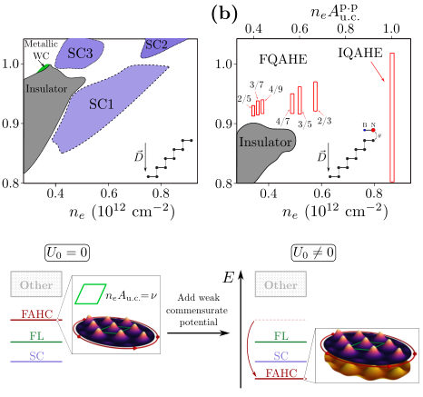
<figcaption class="paper-figure-caption"><b>Fig 1.</b> FIG. 1. Schematic phase diagram and commensu- ration mechanism of QAHE stabilization. (a) Moiré- less R5G, where superconductivity (SC) and metallic Wigner- crystal behavior have been reported [1, 2]. (b) R5G aligned with an hBN substrate at a twist angle of 0.77◦in the strong- displacement-field regime, where integer and fractional quan- tum anomalous Hall effects (QAHE) have been observed [3, 4]. (c) The mechanism proposed in this work. In the continuum (U0 = 0), a fractional anomalous Hall crystal (FAHC) at fill- ing neAu.c. = ν &lt; 1 can be energetically competitive with nearby candidates such as the Fermi liquid, superconductor, or other ordered states. A weak periodic potential, U0 ̸=...</figcaption>
</figure>
<figure class="paper-figure-card">
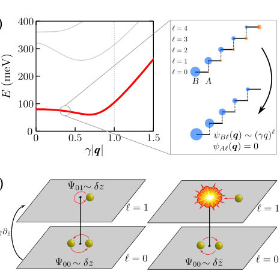
<figcaption class="paper-figure-caption"><b>Fig 2.</b> FIG. 2. Illustration of the ideal limit of RNG and many-body constraint in the presence of contact in- teractions. (a) Dispersion of R5G in the presence of a finite displacement field, where the inset presents the orbital oc- cupation in the γ|q| ≲1 regime (top) and in the ideal limit (bottom). (b) Contact interaction constraint. For a chiral zero between a pair of particles (left), the zero remains for any layer component. For an achiral zero of low order, wavefunc- tions with higher-layer components can have a non-vanishing amplitude for configurations with electrons at the same loca- tion.</figcaption>
</figure>
<figure class="paper-figure-card">
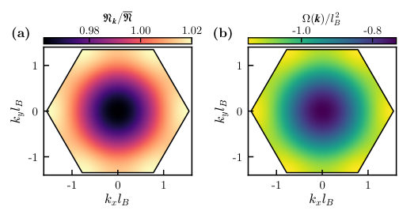
<figcaption class="paper-figure-caption"><b>Fig 3.</b> FIG. 3. Momentum-space geometry of the emergent ideal AHC mini-band in the first Brillouin zone. (a) Normalization factor Nk relative to its Brillouin zone average N. (b) Berry curvature distribution Ω(k)/l2 B. Both panels use Nℓ= 5 and γ/lB = 0.3.</figcaption>
</figure>
<figure class="paper-figure-card">
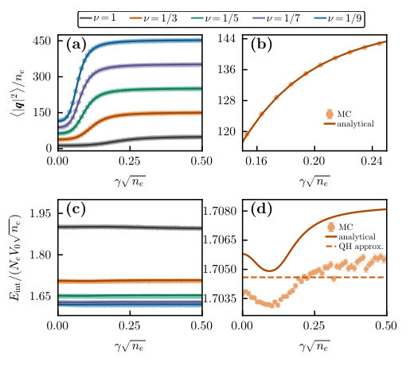
<figcaption class="paper-figure-caption"><b>Fig 4.</b> FIG. 4. Monte Carlo benchmarks for the energet- ics of AHC variational states. Panels (a,b) show the kinetic-energy moment ⟨|q|2⟩/ne. Panels (c,d) show the in- teraction energy per particle, in units of V0√ne, for a dual- gated screened interaction with gate distance ds = 1/√ne. Results are for a triangular crystal in the Nℓ= 4 ideal par- ent band, including the IAHC at ν = 1 and Laughlin FAHCs at ν = 1/3, 1/5, 1/7, 1/9. Markers are direct MC estimates, solid curves are the semi-analytic AHC–QH estimate, and dashed curves in the interaction-energy panels are the zeroth- harmonic QH approximation. Panels (b,d) show zoomed-in views of the ν = 1/3 data from panels (a,c) respectively.</figcaption>
</figure>
<figure class="paper-figure-card">
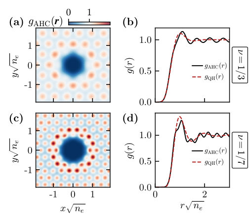
<figcaption class="paper-figure-caption"><b>Fig 5.</b> FIG. 5. Pair correlations of the AHC variational state for Nℓ= 2 and γ√ne = 0.5, evaluated by Monte Carlo. Panels (a,c) show the two-dimensional pair- correlation function gAHC(r) for ν = 1/3 and ν = 1/7, re- spectively, with distances measured in units of 1/√ne. Panels (b,d) show the corresponding radial averages gAHC(r), com- pared with the Laughlin quantum Hall result gQH(r) at the same filling.</figcaption>
</figure>

**Summary.** The paper investigates Fractional Anomalous Hall Crystals in rhombohedral graphene by calculating their total energy using Monte Carlo simulations. The authors demonstrate that these topologically ordered states are energetically viable candidates compared to simpler phases like Fermi liquids. This work supports a continuum-and-interactions-first approach for realizing fractional quantum anomalous Hall physics in real materials.

**Why it may be interesting.** This work provides a concrete, materials-based pathway (graphene moiré systems) to realize exotic topological states like FAHCs, bridging abstract condensed matter theory with solid-state material physics relevant to quantum phenomena.

Detailed structure

**Main problem.** The primary goal is to establish Fractional Anomalous Hall Crystals (FAHCs) as energetically competitive candidate states in a realistic physical setting, moving beyond purely theoretical models.

**Main result.** FAHCs were found to be energetically competitive with integer anomalous Hall crystals and Fermi liquids. Their stability is governed by the interplay between interaction energy inherited from a parent Quantum Hall liquid and kinetic energy favoring specific crystal periods.

**Method.** The study employs Monte Carlo simulations and semi-analytic evaluations using variational wavefunctions derived from ideal continuum models, followed by restoring realistic dispersion and screened Coulomb interactions.

**Model / system.** The system studied is rhombohedral pentalayer graphene (R5G) or R5G/hBN heterostructures. The physics involves modeling topological order similar to the fractional quantum Hall effect without an external magnetic field, characterized by spontaneous breaking of continuous translation symmetry.

**Key observables.** Energetic competitiveness relative to IAHCs and FLs; anomalous Hall response (integer vs. fractional); stability dependence on twist angle and displacement field.

**Important parameters / regimes.** Filling fraction ($
u$), twist angle, displacement field ($u_D$), and the strength of the periodic potential ($U_0$).

**Assumptions / limitations.** The analysis relies on using ideal continuum models to generate variational wavefunctions before incorporating physical dispersion and interactions; approximations are used in constructing the AHC wavefunctions.

**Figures summary.** Figure 1 schematically shows how a weak periodic potential can pin an FAHC at fractional filling ($
u < 1$) below competing states. Other figures compare energy calculations (MC vs. analytical) for kinetic and interaction energies across various parameters.

**Paper structure.** The paper progresses by first establishing the theoretical framework using ideal continuum models to define AHC wavefunctions, then performing detailed energy evaluations via Monte Carlo simulations incorporating realistic interactions, and finally mapping out the stability phase diagram based on these energetic comparisons.

Abstract

Fractional anomalous Hall crystals (FAHCs) replicate the topological order of the fractional quantum Hall effect in the continuum without requiring any external magnetic field. They spontaneously break continuous translation symmetry like a Wigner crystal, but are distinguished by each unit cell holding a fixed fractional number of electrons. Until now, these states have been confined to theoretical speculation or engineered models, leaving open the question of whether they can plausibly emerge in actual physical systems. Here, we establish them as energetically competitive candidate states in a realistic material setting. We study rhombohedral pentalayer graphene (R5G) with variational wavefunctions that are exact zero modes of a recently proposed ideal model of R5G. We evaluate their energies using Monte Carlo, after reinstating realistic dispersion and screened Coulomb interactions. We find FAHCs to be energetically competitive with integer anomalous Hall crystals and Fermi liquids, and their stability follows a simple principle. Each crystal maps onto a parent quantum Hall liquid that fixes its interaction energy, while the kinetic energy favors crystal periods that match the finite-momentum minimum of R5G's Mexican-hat dispersion. A weak periodic potential can then selectively lower and pin the commensurate fractional crystals. This picture predicts how the integer and fractional quantum anomalous Hall stability windows evolve with twist angle and displacement field, which we compare to recent experiments. These results support a continuum-and-interactions-first route to fractional anomalous Hall states in rhombohedral graphene.

[↑ back to top](#top)

### [Fluctuation theorems for thermally isolated driven quantum systems: nonadiabaticity, excess work and strong inequalities](http://arxiv.org/abs/2607.09615v1)

**Authors:** J. V. M. Steimetz, M. Campisi, M. V. S. Bonança  
**Type:** theory · **Category:** statistical mechanics · **PDF:** <https://arxiv.org/pdf/2607.09615v1>  
**Analysis basis:** full PDF text, analyzed in chunks
**Topic relevance:** `non-equilibrium dynamics` **3/5** · `non-equilibrium universality` **2/5** · `Keldysh / 2PI / non-Gaussian methods` **1/5** · `correlated / nonlocal dissipation` **1/5** · `driven-dissipative phase transition` **1/5** · `entanglement & information structure` **1/5** · `methods for driven-dissipative` **1/5**

↔ Scroll figures horizontally

<figure class="paper-figure-card">
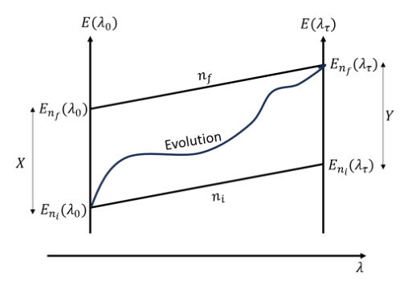
<figcaption class="paper-figure-caption"><b>Fig 1.</b> FIG. 1: Illustration of the definition of X and Y in the quantum setting.</figcaption>
</figure>
<figure class="paper-figure-card">
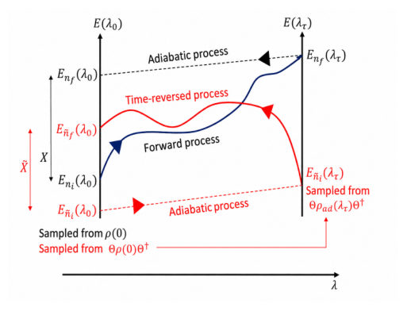
<figcaption class="paper-figure-caption"><b>Fig 2.</b> FIG. 2: Illustration of the processes and quantities involved in the DFT.</figcaption>
</figure>
<figure class="paper-figure-card">
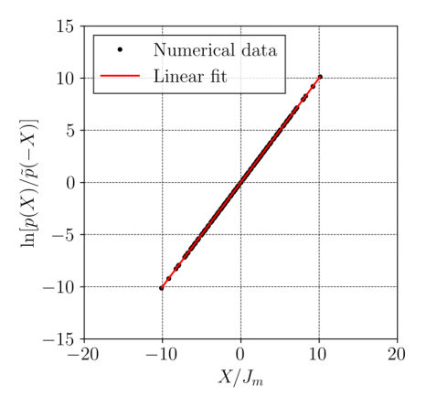
<figcaption class="paper-figure-caption"><b>Fig 3.</b> FIG. 3: Numerical verification of the DFT for X, Eq. (26). The calculations were performed on the 4-spin Ising chain with the Hamiltonian of Eq. (89), protocol of Eq. (90), initial inverse temperature β = J−1 m and process duration τ = ℏ/Jm.</figcaption>
</figure>
<figure class="paper-figure-card">
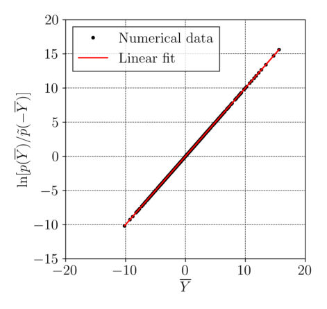
<figcaption class="paper-figure-caption"><b>Fig 4.</b> FIG. 4: Numerical verification of the DFT for Y , Eq. (46). The calculations were performed on the 4-spin Ising chain with the Hamiltonian of Eq. (89), protocol of Eq. (90), initial inverse temperature β = J−1 m and process duration τ = ℏ/Jm.</figcaption>
</figure>
<figure class="paper-figure-card">
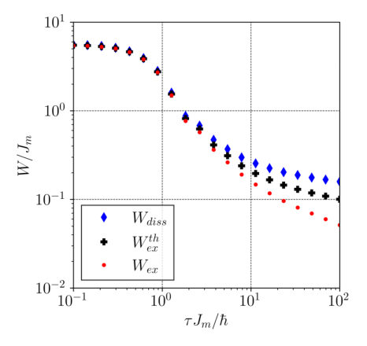
<figcaption class="paper-figure-caption"><b>Fig 5.</b> FIG. 6: Illustration of Eq. (82), where Wex = W −Wad, W th ex = W −Wise, and Wdiss = W −∆F are plotted as functions of the process duration τ for the 12-spin non-integrable Ising chain whose Hamiltonian is given in Eq. (89). The protocol for the variation of λ is the one in Eq. (90) and the initial temperature is β = J−1 m .</figcaption>
</figure>

**Summary.** The paper extends fluctuation theorems to thermally isolated quantum systems by deriving detailed and integral forms. It establishes quantitative links between non-equilibrium work fluctuations and thermodynamic quantities like excess work and relative entropy. This provides a rigorous, quantum mechanical framework for understanding the minimal energy cost associated with driving quantum processes.

**Why it may be interesting.** This work provides rigorous quantum generalizations of fundamental theorems like the Second Law for driven systems, which is crucial for understanding energy dissipation and irreversibility in open or isolated quantum dynamics.

Detailed structure

**Main problem.** The primary goal is deriving detailed and integral fluctuation theorems for thermally isolated, driven quantum systems to establish thermodynamic inequalities stronger than those provided by the Jarzynski equality.

**Main result.** The authors derive relationships connecting the average of work fluctuations to physical quantities like nonadiabaticity (relative entropy) and excess work, establishing a minimal work principle for irreversible processes.

**Method.** The analysis employs quantum fluctuation theorems, utilizing time-reversal symmetry ($\Theta$) and defining stochastic variables based on energy measurements at initial and final states.

**Model / system.** The system is a quantum mechanical entity governed by a time-dependent Hamiltonian $H(\lambda_t)$, evolving from an initial Gibbs state $
ho(0) = \Pi_{eta}(\lambda_0)$ under external driving protocols.

**Key observables.** Work ($X$), nonadiabaticity parameter ($A$), excess work ($	ext{W}_{	ext{ex}}$), and the relative entropy $D[\dots]$.

**Important parameters / regimes.** Temperature $eta$, time-dependent parameters $\lambda(t)$, and the initial/final Hamiltonian eigenstates.

**Assumptions / limitations.** The derivation of key results relies on highly restrictive conditions (e.g., Eq. 96) which are not generally valid, and assumptions about the nature of entropy production in isolated systems.

**Figures summary.** Figure 1 illustrates the definition of stochastic energy measurements $X$ and $Y$. Figure 2 details the processes and quantities involved in deriving the detailed fluctuation theorem for work.

**Paper structure.** The paper builds upon Jarzynski's framework by deriving both detailed and integral fluctuation theorems. It then connects the averages of these fluctuations to nonadiabaticity and excess work, culminating in a discussion of the strongest attainable thermodynamic minimal work principle.

Abstract

We expand on the ideas developed by C. Jarzynski in Physica A 552, 122077 (2020), where an integral fluctuation theorem was derived with the aim of obtaining thermodynamic inequalities stronger than those implied by the Jarzynski equality. Restricting ourselves to the quantum setting, we derive the corresponding detailed fluctuation theorem and additional detailed and integral fluctuation theorems; we also provide a clear physical interpretation of the stochastic quantities defined in the previous reference. Furthermore, we show that their averages are given by the nonadiabaticity parameter (i.e., the relative entropy between the final state after a finite-time driving protocol and the corresponding adiabatically evolved state) and the excess work (also known as inner friction). We elaborate on the inequalities derived from the fluctuation theorems and discuss their connection to irreversibility and formulations of the Second Law.

[↑ back to top](#top)

### [Higher-Order Programs with Indefinite Causal Orders: a Linear Approach to Coherent Control of Quantum Processes](http://arxiv.org/abs/2607.09534v1)

**Authors:** Kathleen Barsse, Romain Péchoux, Simon Perdrix  
**Type:** theory · **Category:** quantum information and computing · **PDF:** <https://arxiv.org/pdf/2607.09534v1>  
**Analysis basis:** full PDF text, analyzed in chunks
**Topic relevance:** `measurement-induced transitions` **3/5** · `quantum measurements` **3/5** · `Keldysh / 2PI / non-Gaussian methods` **1/5** · `correlated / nonlocal dissipation` **1/5** · `driven-dissipative phase transition` **1/5** · `methods for driven-dissipative` **1/5**

↔ Scroll figures horizontally

<figure class="paper-figure-card">
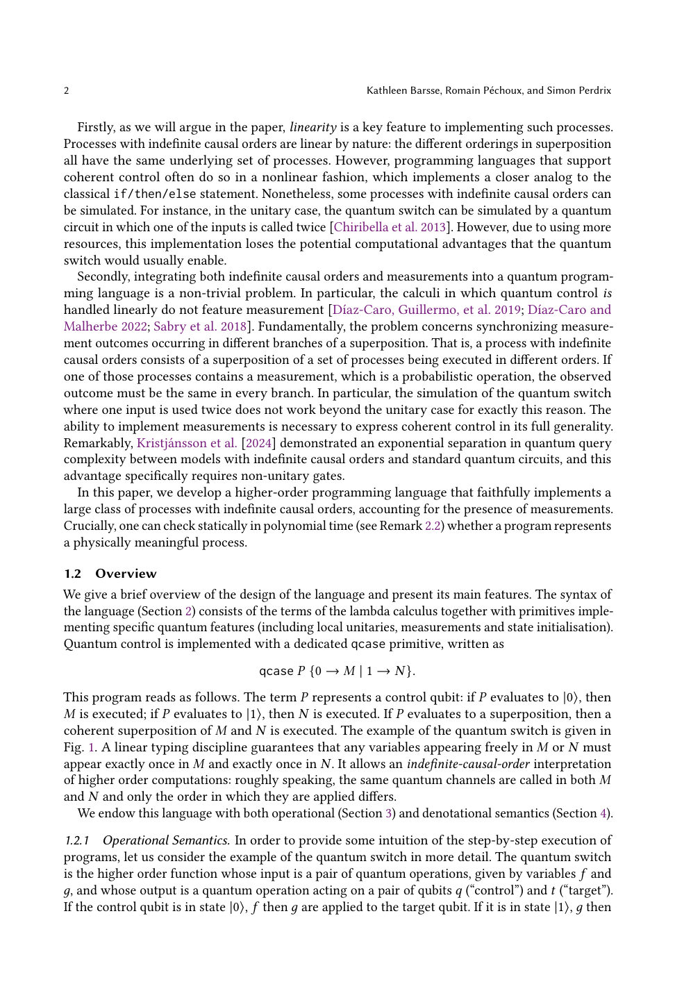
<figcaption class="paper-figure-caption"><b>Fig 1.</b> Low-resolution page preview, page 2</figcaption>
</figure>
<figure class="paper-figure-card">
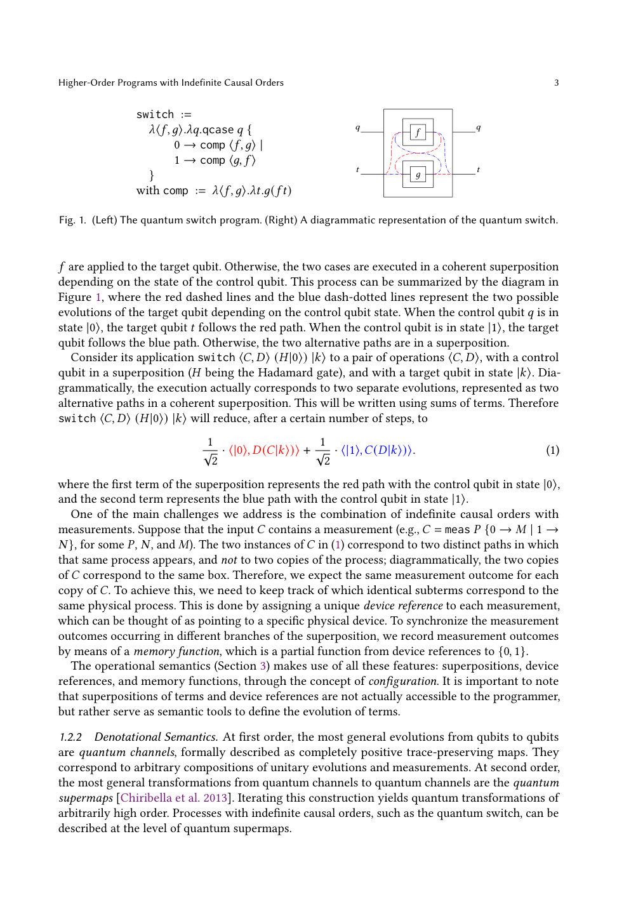
<figcaption class="paper-figure-caption"><b>Fig 2.</b> Low-resolution page preview, page 3</figcaption>
</figure>
<figure class="paper-figure-card">
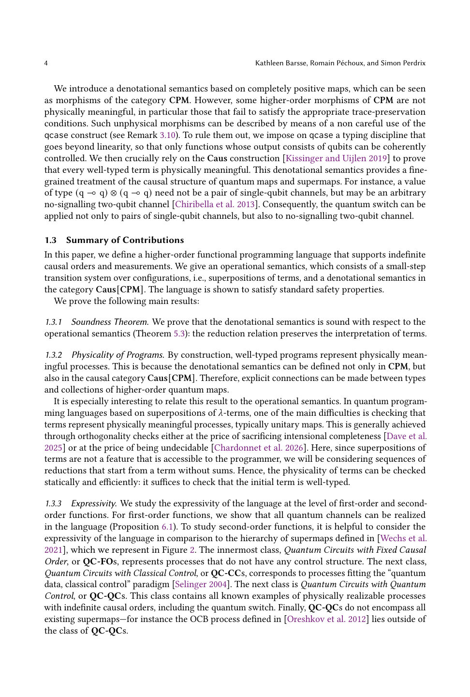
<figcaption class="paper-figure-caption"><b>Fig 3.</b> Low-resolution page preview, page 4</figcaption>
</figure>
<figure class="paper-figure-card">
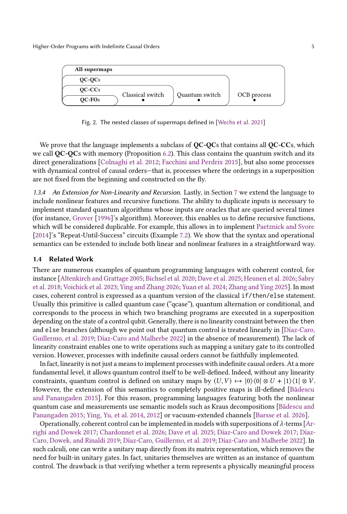
<figcaption class="paper-figure-caption"><b>Fig 4.</b> Low-resolution page preview, page 5</figcaption>
</figure>
<figure class="paper-figure-card">
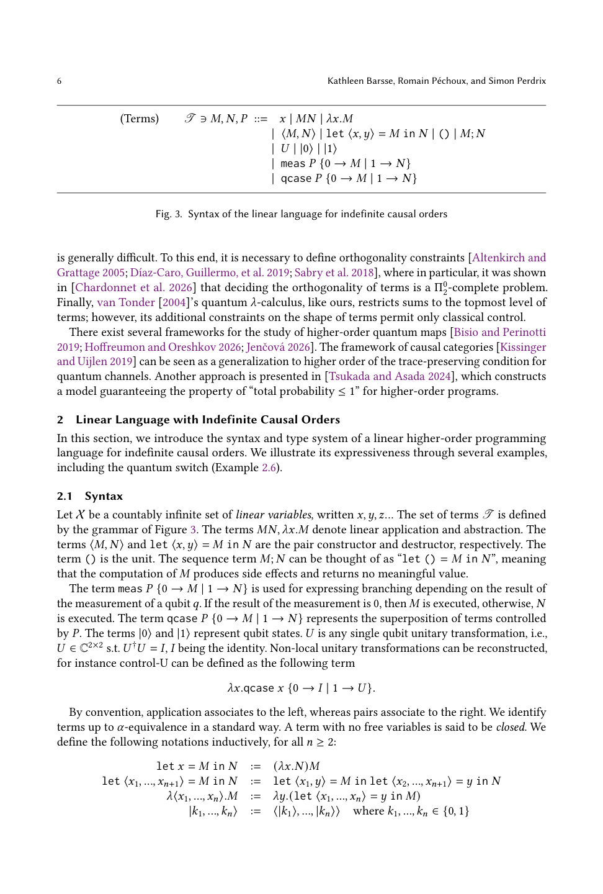
<figcaption class="paper-figure-caption"><b>Fig 5.</b> Low-resolution page preview, page 6</figcaption>
</figure>

**Summary.** This paper introduces a novel higher-order quantum functional language designed to accurately model processes with Indefinite Causal Orders (ICOs), such as the quantum switch. It achieves this by defining its semantics within the causal category Caus[CPM], ensuring that every well-typed program corresponds to a physically realizable quantum process. This provides a powerful theoretical tool for advancing quantum computation beyond unitary constraints.

**Why it may be interesting.** For theoretical physicists working on open quantum systems or quantum computation, this work provides a mathematically rigorous tool to model non-unitary, context-dependent quantum operations (like those involving measurement) that are crucial for understanding realistic physical implementations beyond simple unitary evolution.

Detailed structure

**Main problem.** The core problem is developing a quantum programming language capable of faithfully modeling processes with Indefinite Causal Orders (ICOs), especially when these orders are combined with measurements, which existing languages fail to capture fully.

**Main result.** The authors introduce a higher-order functional language whose semantics are defined in the causal category Caus[CPM], proving that well-typed programs correspond to physically meaningful quantum processes and can express complex structures like the quantum switch.

**Method.** They develop both an operational (small-step) and denotational semantics, using advanced categorical tools (completely positive maps and the Causal Category construction) to rigorously enforce physical constraints beyond simple linearity.

**Model / system.** The model is a theoretical quantum computation framework dealing with general quantum channels and supermaps. Key concepts include ICOs, which allow superposition over operation orderings, and the necessity of tracking measurement outcomes across these superposed branches.

**Key observables.** Physical meaning of computed processes; successful synchronization of measurement outcomes across superposed computational paths.

**Important parameters / regimes.** The structure of quantum channels (CPTP maps) and the complexity level (first-order vs. second-order operations).

**Assumptions / limitations.** The framework assumes that physical reality can be modeled by processes whose semantics are defined within the causal category Caus[CPM], requiring a typing discipline beyond simple linearity.

**Figures summary.** Figures illustrate the quantum switch program structure, the syntax of the extended language (including 'meas' and 'qcase'), and the formal definitions for both operational reduction rules and denotational semantic components.

**Paper structure.** The paper builds from identifying the limitations of current languages to introducing a novel higher-order functional language. It then rigorously defines its semantics using advanced category theory, proves soundness between operational and denotational interpretations, and finally demonstrates the language's expressive power by implementing known quantum circuits with memory.

Abstract

Processes with indefinite causal orders (ICOs), such as the quantum switch, are higher-order quantum processes that superpose the order in which quantum operations are performed. Such coherent control yields computational advantages but is not faithfully captured by existing quantum programming languages: either they are restricted to the unitary case, and thus cannot combine ICOs with measurement, or they treat coherent control nonlinearly. In both cases, they do not realize the full computational power of ICOs. We introduce a higher-order quantum functional language that supports general quantum computation, not merely the permutation of channels, and whose linear type system allows quantum control to be well-defined beyond the unitary case, on arbitrary quantum channels. We equip this language with a small-step operational semantics that synchronizes measurement outcomes across superposed branches, using device references and a memory function. We also give a denotational semantics by means of completely positive maps. With linearity as the only constraint, some well-typed terms would denote unphysical maps. We therefore impose a typing discipline that goes beyond linearity, and interpret programs in the causal category Caus[CPM], under which every well-typed program is physically meaningful, a property that can be checked statically and efficiently. We prove soundness, and study the language's expressive power: it can express every quantum channel at first order, and at second order a large subclass of the so-called quantum circuits with quantum control (QC-QCs), containing the quantum switch. Last but not least, we show that this language is well-designed enough to be extended to the nonlinear setting with recursion.

[↑ back to top](#top)

### [Quantum phases in endofullerene zigzag chains](http://arxiv.org/abs/2607.09396v1)

**Authors:** Tobias Serwatka, Muhammad Shaeer Moeed, Roger G. Melko, Pierre-Nicholas Roy  
**Type:** theory · **Category:** statistical mechanics · **PDF:** <https://arxiv.org/pdf/2607.09396v1>  
**Analysis basis:** full PDF text, analyzed in chunks
**Topic relevance:** `analog quantum simulation` **3/5** · `exotic spin models in light-matter` **3/5** · `entanglement & information structure` **2/5** · `Frenkel-Kontorova` **1/5** · `methods for driven-dissipative` **1/5**

↔ Scroll figures horizontally

<figure class="paper-figure-card">
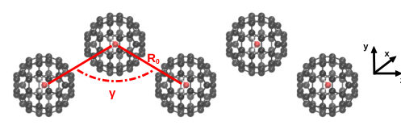
<figcaption class="paper-figure-caption"><b>Fig 1.</b> FIG. 1. Chain of endofullerene units. The configuration of the fullerene chain depends on R0, the distance of the centers of mass of neighboring cages and the chain angle γ ∈(60◦,180◦). At 180◦</figcaption>
</figure>
<figure class="paper-figure-card">
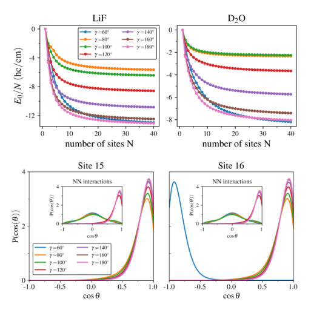
<figcaption class="paper-figure-caption"><b>Fig 2.</b> FIG. 2. (Upper panel) Energy per molecule for LiF@C60 chains with different γ. (Lower panel) Density distribution along cos(θ) of the two central sites in LiF@C60 chains with N = 30 and different γ. Insets: density distribution calculated for similar chains with only NN interactions.</figcaption>
</figure>
<figure class="paper-figure-card">
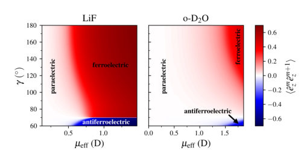
<figcaption class="paper-figure-caption"><b>Fig 3.</b> FIG. 3. Phase diagram of a LiF@C60 chain and a D2O chain with N = 20 each.</figcaption>
</figure>
<figure class="paper-figure-card">
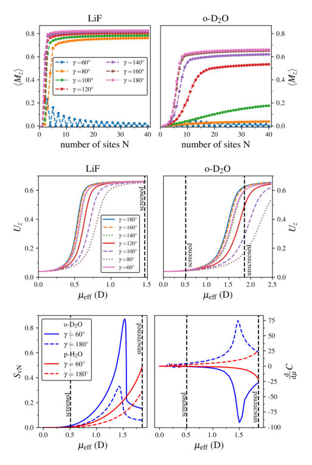
<figcaption class="paper-figure-caption"><b>Fig 4.</b> FIG. 4. (Upper panel) Axial, scaled polarization per cage of LiF@C60 and o-D2O chains at µeff = µunscreened. (Middle panel) Binder parameter of a LiF@C60 chain and a o-D2O chain with</figcaption>
</figure>

**Summary.** The research uses advanced DMRG simulations to map the quantum phase diagram of dipolar molecules confined in curved endofullerene chains. By varying the chain angle ($\gamma$), the system undergoes transitions between ferroelectric and antiferroelectric ordered states, demonstrating that geometry dictates complex magnetic ordering in nanoscale materials.

**Why it may be interesting.** This work connects fundamental concepts from quantum magnetism (Néel ordering, frustration) with materials science by proposing that engineered carbon nanostructures can host tunable dipole-ordered quantum phases.

Detailed structure

**Main problem.** The study investigates the quantum phases of dipolar molecules confined within bent (zigzag) endofullerene chains as a function of the chain's geometric bending angle ($\gamma$).

**Main result.** The system exhibits rich dipole-ordered quantum phases, transitioning from ferroelectric to antiferroelectric order at $\gamma=60^\circ$, with specific molecular properties determining the stability of these orders.

**Method.** Large-scale Density Matrix Renormalization Group (DMRG) calculations are employed to analyze the ground state and phase transitions across varying chain geometries.

**Model / system.** The system models dipolar molecules ($	ext{LiF}$, $	ext{H}_2	ext{O}$) confined in quasi-1D zigzag chains formed by endofullerene cages. The physics is governed by dipole-dipole interactions and the geometric constraint imposed by the bending angle $\gamma$.

**Key observables.** Polarization (axial/scaled), Binder parameter ($U_z$), von Neumann entanglement entropy, and correlation functions.

**Important parameters / regimes.** Chain angle ($\gamma$) ranging from $60^\circ$ to $180^\circ$; effective dipole moment ($\mu_{	ext{eff}}$); nearest-neighbor vs. next-nearest-neighbor coupling strength.

**Assumptions / limitations.** The analysis relies on treating the system via a Matrix Product State (MPS) representation suitable for DMRG calculations, and assumes that dipolar interactions are the dominant physics.

**Figures summary.** Figures likely show polarization measurements confirming ferroelectric alignment ($\cos	heta \approx 1$) at large $\gamma$ and antiferroelectric anti-alignment ($\cos	heta \approx -1$) at $\gamma=60^\circ$, alongside Binder cumulant plots locating the quantum phase transition.

**Paper structure.** The paper systematically analyzes different molecular species ($	ext{LiF}$, $	ext{o-D}_2	ext{O}$) across a range of bending angles, using DMRG to map out transitions between ferroelectric and antiferroelectric ordered states, paying special attention to the critical role of NNN interactions at $60^\circ$.

Abstract

We employ large-scale density matrix renormalization group calculations to study the quantum phases of dipolar molecules confined in bent (zigzag) endofullerene chains, as a function of the chain angle $γ$. For LiF, ferroelectric order persists across the full range $60^\circ < γ180^\circ$, with the critical effective dipole moment increasing as the chain bends and parallel alignment becomes less favorable. Near the equilateral configuration ($γ= 60^\circ$), geometric frustration drives a transition to an antiferroelectric Néel-ordered phase in which neighboring dipoles anti-align along the chain axis. We show that capturing this reorientation requires including dipolar couplings beyond the nearest-neighbor approximation, since next-nearest-neighbor interactions become equally strong at $γ= 60^\circ$. For confined water, o-D$_2$O reproduces both ordered phases, whereas p-H$_2$O -- owing to its large rotational constants -- develops no order at any chain angle despite the enhanced coordination of the bent geometry. Because a zigzag chain is the narrowest stripe of a two-dimensional lattice, these results suggest that engineered endofullerene layers could host a rich variety of dipole-ordered quantum phases beyond the ferroelectric ordering observed in previous work.

[↑ back to top](#top)

### [Magnetic Field Control of the Néel Vector and Magnon Visibility in Altermagnetic MnTe](http://arxiv.org/abs/2607.08829v1)

**Authors:** Tobias Weber, Niclas Heinsdorf, Shane Smolenski, Sawyer Beltz, Alexandre Ivanov, Andrea Piovano, Victor Mecoli, Sean Knapp, Ruiqi Tang, Amir Henderson, A. K. M. Ashiquzzaman Shawon, Taylor Pierce-James, Na Hyun Jo, Denis Karaiskaj  
**Type:** both · **Category:** strongly correlated electrons · **PDF:** <https://arxiv.org/pdf/2607.08829v1>  
**Analysis basis:** full PDF text, analyzed in chunks
**Topic relevance:** `exotic spin models in light-matter` **3/5** · `spintronics-quantum-optics interface` **3/5** · `analog quantum simulation` **2/5** · `Keldysh / 2PI / non-Gaussian methods` **1/5**

↔ Scroll figures horizontally

<figure class="paper-figure-card">
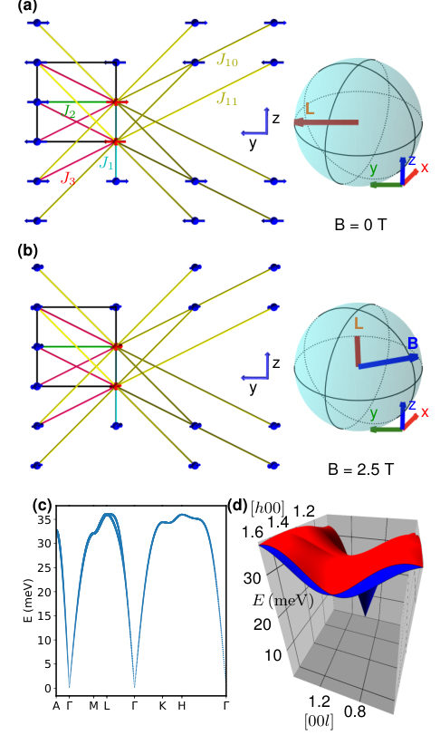
<figcaption class="paper-figure-caption"><b>Fig 1.</b> Figure 1. (a) and (b) Magnetic model for MnTe [46] showing only the magnetically active Mn sites in fractional coordinates (blue and red spheres) as well as the spin orientation (blue and red arrows) for (a) B = 0 T and (b) B = 2.5 T, viewing along the [100] direction. The inset shows the orientation of the Néel vector relative to the magnetic field in more detail. Antiferromagnetic couplings, J1, J3, are shown in red and turquoise, ferromagnetic couplings, J2, in green, and long- range altermagnetic couplings, J10 and J11, in light and dark yellow. The black rectangular area marks the boundaries of the nuclear unit cell. (c) Calculated magnon band structure along high-symmetry directions...</figcaption>
</figure>
<figure class="paper-figure-card">
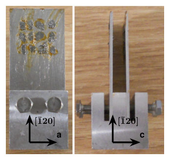
<figcaption class="paper-figure-caption"><b>Fig 2.</b> Figure 2. The co-aligned sample used for inelastic neutron scattering. It consists of the small MnTe single crystals glued to the front and back sides of two aluminum slabs. Left: front view, right: side view.</figcaption>
</figure>
<figure class="paper-figure-card">
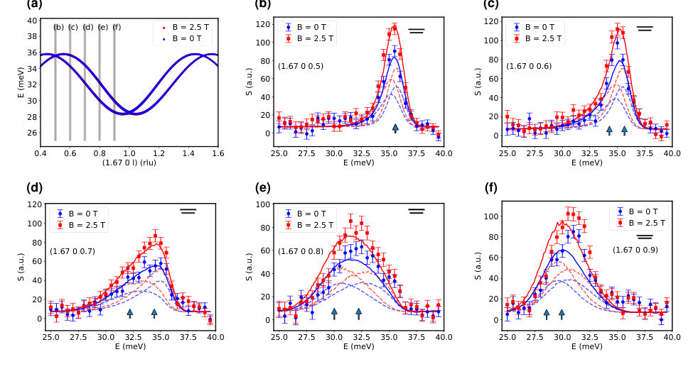
<figcaption class="paper-figure-caption"><b>Fig 3.</b> Figure 3. Field dependence of the Q = (1.67, 0, l) magnon dispersion of MnTe. Panel (a) shows the theoretical dispersion from the linear spin-wave model, which we based on [46], at zero field (blue curves) and at B = 2.5 T (red curves). The individual scan positions along the l direction are indicated as gray vertical bars. Panels (b)-(f) show the scan data for 0 T and 2.5 T (points) and instrumental resolution-convolutions of the theory (lines). The dashed blue (red) lines show the convoluted contributions of the two individual magnon modes on the total intensity, which is depicted as a solid blue (red) line. For the resolution-convolution at 0 T, the magnetic domains are averaged. The...</figcaption>
</figure>
<figure class="paper-figure-card">
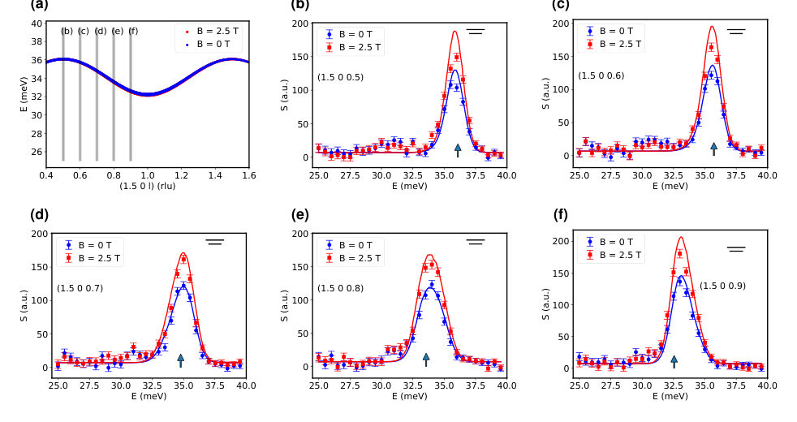
<figcaption class="paper-figure-caption"><b>Fig 4.</b> Figure 4. Field dependence of the Q = (1.5, 0, l) magnon dispersion of MnTe. Panel (a) shows the theoretical dispersion from the linear spin-wave model, which we based on [46], at zero field (blue curves) and at B = 2.5 T (red curves). The individual scan positions along the l direction are indicated as gray vertical bars. Panels (b)-(f) show the scan data for 0 T and 2.5 T (points) and instrumental resolution-convolutions of the theory (lines). For the resolution-convolution at 0 T, the magnetic domains are averaged. The arrows show the theoretical magnon energies without correcting for resolution effects. The black horizontal lines in the upper right corners indicate the incoherent and...</figcaption>
</figure>
<figure class="paper-figure-card">
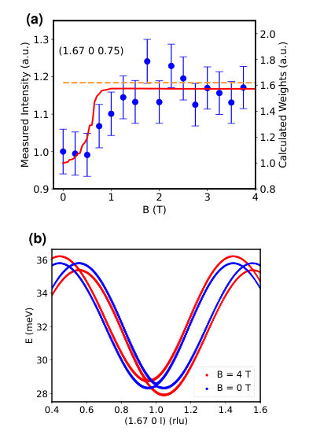
<figcaption class="paper-figure-caption"><b>Fig 5.</b> Figure 5. (a) Integrated intensity of the experimentally mea- sured Q = (1.67, 0, 0.75) magnon peaks vs. applied mag- netic field (blue points) and calculated theoretical weights of the magnon modes including the orthogonal projector (solid red line), as well as without projector (dashed orange line). The intensity saturates at about 1.5 T. (b) Comparison of the sole effect of the field on the dispersion without adapting the ground state.</figcaption>
</figure>

**Summary.** The authors used inelastic neutron scattering and spin-wave theory to study $\alpha$-MnTe, an altermagnet. They demonstrated that applying a magnetic field can continuously rotate the material's Néel vector while leaving the intrinsic magnon frequencies unchanged. This establishes MnTe as a promising platform for reconfiguring magnonic interactions using external fields.

**Why it may be interesting.** This work provides a clean platform for studying tunable coupling mechanisms in magnetic excitations, which is relevant to understanding how external fields can modulate quantum interactions (like magnon-photon coupling) without destroying the underlying quantum state's frequency characteristics.

Detailed structure

**Main problem.** The study investigates how an external magnetic field controls the Néel vector orientation and magnon visibility in altermagnetic $\alpha$-MnTe.

**Main result.** The research shows that applying a field reorients the Néel vector without significantly changing the magnon energies or line widths, demonstrating a clear separation between the soft orientational degree of freedom and the robust chiral magnon spectrum.

**Method.** The study combines linear spin-wave theory calculations with inelastic neutron scattering (INS) measurements to probe the magnetic excitations.

**Model / system.** The system is altermagnetic $\alpha$-MnTe, which exhibits spin splitting without net magnetization. The theoretical model uses a Heisenberg Hamiltonian augmented by an external Zeeman term ($\mathcal{H}_Z$).

**Key observables.** Magnon energies and line widths; spectral intensity measured via the transverse-momentum projection ($S_{\perp}^{xy}(Q, E)$).

**Important parameters / regimes.** The ratio between the exchange scale and the applied Zeeman energy ($\mathcal{H}_Z$) is crucial, with the field remaining small compared to the dominant exchange interaction.

**Assumptions / limitations.** It is assumed that secondary effects from Néel vector rotation dominate over direct Zeeman coupling to magnons due to the large exchange scale. Line widths are often noted as being resolution-limited.

**Figures summary.** Figures illustrate the magnetic model and spin orientation change with field (Fig 1); INS measurements show magnon dispersion curves at different fields, confirming energy stability while intensity changes (Figs 3 & 4); Figure 5 quantifies the increase in integrated magnon intensity due to ground state reorientation.

**Paper structure.** The paper establishes the theoretical framework using spin-wave theory and then presents experimental INS data comparing zero-field and finite-field measurements. The core argument builds by showing that field changes primarily affect measurable intensity via projection rather than altering fundamental excitation frequencies or coherence times.

Abstract

Altermagnetic order gives rise to momentum-dependent spin splitting of electronic and magnonic excitations even in the absence of a net magnetization. Here, we investigate the magnetic field dependence of the spin-wave spectrum of altermagnetic $α$-MnTe using inelastic neutron scattering and linear spin-wave theory. An in-plane magnetic field continuously reorients the Néel vector by overcoming the weak crystalline anisotropy, while remaining small compared with the dominant exchange scale. We find that this reorientation leaves the magnon energies and line widths essentially unchanged, but strongly modifies the measured spectral intensity through the transverse-momentum projection. Our results demonstrate a clear separation between the soft orientational degree of freedom of the antiferromagnetic order and the robust exchange-dominated chiral magnon spectrum. This combination establishes $α$-MnTe as a platform for reconfigurable magnon coupling, in which external fields tune how excitations interact with polarized probes without substantially altering their frequency or coherence.

[↑ back to top](#top)

### [Symmetry-Protected Pinch Curves in Classical Spin Liquids](http://arxiv.org/abs/2607.09470v1)

**Authors:** Takumi Fukushima, Han Yan  
**Type:** theory · **Category:** statistical mechanics · **PDF:** <https://arxiv.org/pdf/2607.09470v1>  
**Analysis basis:** full PDF text, analyzed in chunks
**Topic relevance:** `exotic spin models in light-matter` **3/5** · `analog quantum simulation` **2/5** · `Keldysh / 2PI / non-Gaussian methods` **1/5** · `driven-dissipative phase transition` **1/5** · `methods for driven-dissipative` **1/5**

↔ Scroll figures horizontally

<figure class="paper-figure-card">
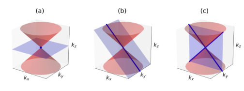
<figcaption class="paper-figure-caption"><b>Fig 1.</b> FIG. 1. Linear-quadratic intersections. A plane P1(k) = 0 intersects a quadratic cone P2(k) = 0. Dark blue denotes the resulting straight pinch lines. The three cases are (a) η &lt; 0, origin only; (b) η = 0, one tangent line; and (c) η &gt; 0, two distinct lines.</figcaption>
</figure>
<figure class="paper-figure-card">
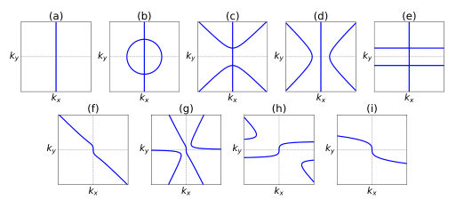
<figcaption class="paper-figure-caption"><b>Fig 2.</b> FIG. 3. Representative inversion-symmetric planar cu- bic curves arising from linear-(linear-plus-cubic) intersections. Reducible cases in panels (a)-(e) contain straight pinch lines, while irreducible cases in panels (f)-(i) give genuine curved pinch loci.</figcaption>
</figure>
<figure class="paper-figure-card">
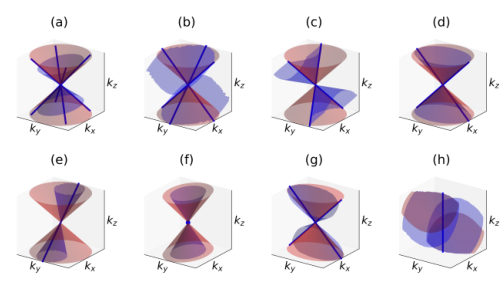
<figcaption class="paper-figure-caption"><b>Fig 3.</b> FIG. 2. Quadratic-quadratic intersections. Two quadratic cones P1(k) = 0 and P2(k) = 0 intersect along straight pinch lines, shown in dark blue.</figcaption>
</figure>
<figure class="paper-figure-card">
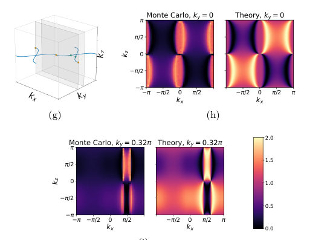
<figcaption class="paper-figure-caption"><b>Fig 4.</b> FIG. 4. Structure factors for the three lattice models. (a–c) plane-cone model of Eq. (10). Panel (a) shows the pinch curve in C11(k) as blue lines in reciprocal space. The gray cross- sections are the planes for the structure factor in panels (b,c). The dots mark the locations of the pinch curve in the re- spective cross-sections. (d–f) Double-cone model of Eq. (11), with CΣ(k) plotted. (g–i) Inhomogeneous pinch-curve model of Eq. (12), with CΣ(k) plotted.</figcaption>
</figure>
<figure class="paper-figure-card">
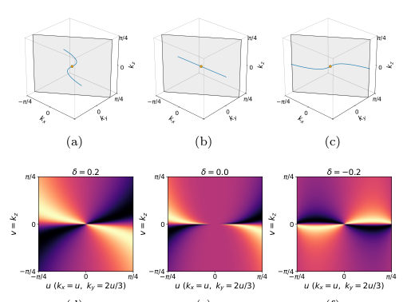
<figcaption class="paper-figure-caption"><b>Fig 5.</b> FIG. 5. Gauss-law transition for ∆1 = i(sin3 ky + δ sin kx), ∆2 = i sin kz. Panels (a,b,c) show the singular curve for δ = 0.2, 0, −0.2 and the momentum cuts; panels (d,e,f) show the corresponding structure factors. The leading local constraint changes from first order for δ ̸= 0 to third order at δ = 0.</figcaption>
</figure>

**Summary.** This work develops the theory of 'pinch-curve spin liquids,' where magnetic correlations exhibit singularities forming 1D curves in momentum space. By exploiting inversion symmetry, the constraints defining these curves are mathematically simplified and shown to be algebraically programmable. The research confirms that these systems undergo a novel Gauss-law transition while maintaining their singular geometric structure.

**Why it may be interesting.** It provides a rigorous mathematical framework for understanding emergent topological features (singular loci) in classical spin systems, linking algebraic geometry directly to physical correlation functions.

Detailed structure

**Main problem.** The paper introduces 'pinch-curve spin liquids,' generalizing classical spin liquids where correlation singularities form one-dimensional algebraic curves in momentum space.

**Main result.** Symmetry protection reduces the singularity condition to two real polynomial constraints, allowing for algebraically programmable pinch loci that host an infrared Gauss-law transition.

**Method.** The analysis combines continuum theory using polynomial constraint equations with lattice simulations (Monte Carlo) on spin models derived from generalized Gauss's laws.

**Model / system.** Classical spin liquids are modeled by two-component scalar-charge Gauss's laws, leading to a Hamiltonian constrained by local operators in momentum space. The system is studied via its singular locus $\mathbf{Z}$ defined by the common zeros of these constraints.

**Key observables.** The structure factor $\langle S_{a}(\mathbf{k})S_{b}(-\mathbf{k})
angle$ and the geometry of the pinch curve in momentum space ($\mathbf{k}$).

**Important parameters / regimes.** Inversion symmetry ($I$), lattice size ($L=50$), and the degree/homogeneity of the polynomial constraints.

**Assumptions / limitations.** The analysis often focuses on diagonal symmetry cases, simplifying the constraint to $P_1(\mathbf{k}) = P_2(\mathbf{k}) = 0$.

**Figures summary.** Figures illustrate geometric intersections in k-space (straight vs. curved lines) and compare structure factors from lattice models against zero-mode predictions; one figure shows the transition of the local constraint order.

**Paper structure.** The paper progresses from defining pinch-curve spin liquids via symmetry protection, deriving algebraic constraints ($P_1=P_2=0$), classifying the geometry based on polynomial forms (homogeneous vs. inhomogeneous), and finally validating these predictions using lattice Monte Carlo simulations and analyzing phase transitions.

Abstract

Classical spin liquids are correlated paramagnets in which local constraints generate extensive degeneracy and emergent gauge structures, often observable as pinch-point singularities in spin structure factors. Here we introduce pinch-curve spin liquids, in which the pinch singularities form one-dimensional algebraic curves in momentum space. Inversion symmetry protects these curves by reducing the singularity condition to two real algebraic constraints in three dimensions, and the geometry of the pinch locus is algebraically programmable. We identify elementary mechanisms for generating straight and curved pinch loci, construct lattice spin models that realize them, and test the predicted structure factors using Monte Carlo simulations. We further show that pinch curves can host an infrared Gauss-law transition: the leading local constraint and the associated anisotropic scaling of the structure factor change, even though the singular locus remains one-dimensional.

[↑ back to top](#top)

### [Transient Reserves, Sink Dampers, and the Failure of Eigenvalue Reasoning in the Attention Propagator](http://arxiv.org/abs/2607.09279v1)

**Authors:** Li Hengyu  
**Type:** theory · **Category:** disordered systems and neural networks · **PDF:** <https://arxiv.org/pdf/2607.09279v1>  
**Analysis basis:** full PDF text, analyzed in chunks
**Topic relevance:** `methods for driven-dissipative` **3/5** · `non-equilibrium dynamics` **2/5** · `Keldysh / 2PI / non-Gaussian methods` **1/5** · `driven-dissipative phase transition` **1/5**

↔ Scroll figures horizontally

<figure class="paper-figure-card">
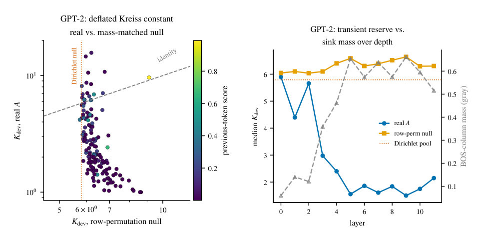
<figcaption class="paper-figure-caption"><b>Fig 1.</b> Figure 1: Left: per-head median Kdev, real versus row-permutation null (GPT-2, log–log axes). The nulls concentrate in a narrow band near 6 while real heads spread across [1, 15.7]; previous-token- like heads (bright) lie on or above the diagonal, and sink-dominated heads collapse to the analytic normal floor Kdev = 1. Right: the damper over depth. The median real Kdev tracks the null in layers 0–2 and then collapses to between 1.5 and 2 exactly as the BOS sink mass (gray) rises; sinks purchase depth stability by suppressing transient reserve.</figcaption>
</figure>
<figure class="paper-figure-card">
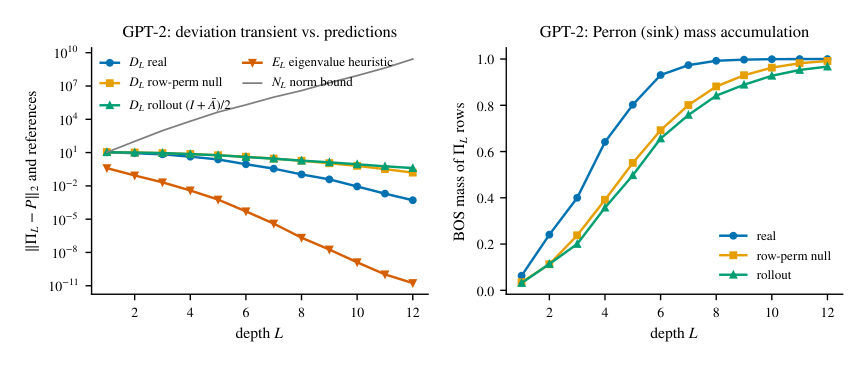
<figcaption class="paper-figure-caption"><b>Fig 2.</b> Figure 2: Depth deviation-transient for GPT-2. Left: the measured DL (blue) against the eigenvalue heuristic EL (red, which collapses to 10−11) and the norm bound (gray, which grows to 109); the measured curve lies many orders away from both. The row-permutation null (orange) decays more slowly in absolute terms, yet its eigenvalue heuristic is nearly calibrated. Right: accumulation of Perron (sink) mass. The real stack absorbs to BOS by roughly layer 8, far earlier than the null, so Perron absorption is accelerated by training.</figcaption>
</figure>
<figure class="paper-figure-card">
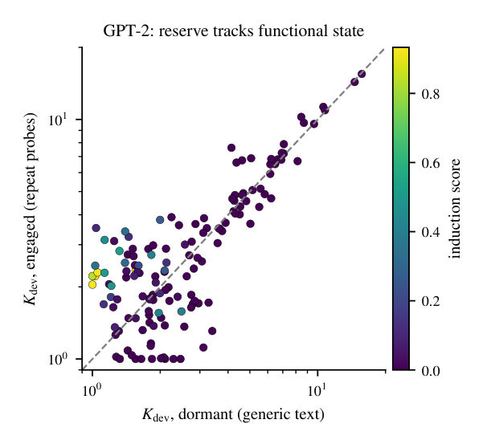
<figcaption class="paper-figure-caption"><b>Fig 3.</b> Figure 3: Transient reserve tracks functional state (GPT-2). Induction heads (bright) leave the dormant sink corner near Kdev = 1 and land above the identity when engaged, at Kdev between 2.0 and 2.8. Persistent routing heads sit on the diagonal. The shift is an excess gain over state-matched nulls and therefore reflects added routing structure rather than a changed row profile.</figcaption>
</figure>
<figure class="paper-figure-card">
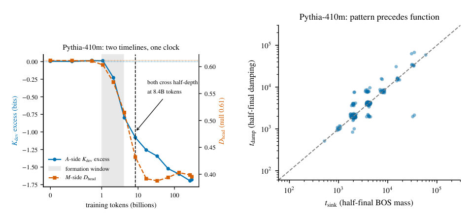
<figcaption class="paper-figure-caption"><b>Fig 4.</b> Figure 4: Training-time consolidation on Pythia-410m. Left: the population median Kdev excess (propagator side, blue) and the companion paper’s weight-space Dhead suppression (red) on a shared token axis. Both sit at their nulls through 1.1B tokens, begin to decline in the tail of the circuit- formation window (shaded), and cross half of their final depth at the same checkpoint, 8.4B tokens. The propagator side keeps deepening to 300B, while the weight-side all-head median saturates by roughly 34B; the latter is a mixture statistic, and the companion reports its induction subgroup deepening well past that point. Right: per-head timing. The sink attention pattern forms before or together...</figcaption>
</figure>
<figure class="paper-figure-card">
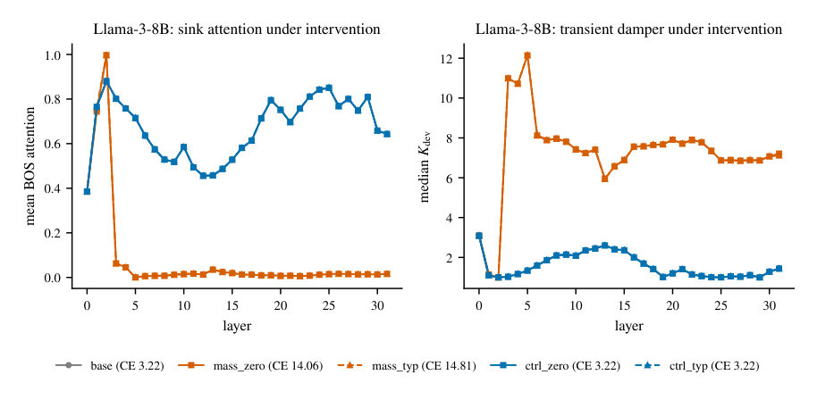
<figcaption class="paper-figure-caption"><b>Fig 5.</b> Figure 5: The causal test on Llama-3-8B. The three massive dimensions are clamped at every residual boundary (red) against three random dimensions (blue). BOS attention collapses from layer 3 onward (0.675 to 0.049, left) and the Kreiss damper releases, with Kdev jumping to 11– 12 at layers 3–5 and settling near 7.4, approximately the mask-null level (right). Controls are indistinguishable from baseline to three decimals.</figcaption>
</figure>

**Summary.** This paper argues that standard eigenvalue methods fail to capture the true, finite-depth dynamics of attention mechanisms in large language models because these operators are non-normal. By employing advanced resolvent techniques, the authors demonstrate that transient behavior is governed by quantities like pseudospectra and Kreiss constants, revealing distinct functional roles for different parts of the network.

**Why it may be interesting.** The mathematical tools developed—using pseudospectra and Kreiss constants to analyze non-normal operators in a deep product structure—are directly applicable to understanding the stability and information flow dynamics in complex quantum systems or open quantum channels where simple spectral analysis fails.

Detailed structure

**Main problem.** The study challenges whether eigenvalue analysis is sufficient or misleading for understanding the finite-depth dynamics of attention propagators in causal transformers, especially since these operators are non-normal.

**Main result.** Resolvent quantities (like pseudospectra and Kreiss constants) are necessary to predict depth-transient behavior, as eigenvalue predictions fail by many orders of magnitude on trained stacks. The analysis reveals distinct functional roles for different attention heads acting as transient dampers or amplifiers.

**Method.** The authors compare spectral properties derived from eigenvalues against resolvent quantities (pseudospectra, Kreiss constants) applied to the deflated attention operator product over depth.

**Model / system.** The system analyzed is the causal attention matrix of large language models (GPT-2, Pythia, Llama), which forms a row-stochastic, non-normal operator whose dynamics are governed by repeated multiplication across model depth.

**Key observables.** Kreiss constant ($K_{dev}$), pseudospectral radius ($
ho_\epsilon$), transient reserve correlations, and the deviation of actual depth evolution from eigenvalue heuristics.

**Important parameters / regimes.** Model scale (e.g., Llama-3-8B), sequence length/depth ($L$), and the structural components like 'routing minority' vs. 'sink majority'.

**Assumptions / limitations.** The analysis is structured around pre-registered criteria assuming eigenvalue reasoning fails for finite depth, and all quantitative results are reported as excess over per-matrix nulls.

**Figures summary.** Figures illustrate the failure of eigenvalue heuristics compared to measured deviation transients (orders of magnitude difference) and show how specific heads transition between sink/damper states based on context or probes.

**Paper structure.** The paper establishes the non-normality of the attention propagator, contrasts spectral vs. resolvent views, analyzes structural components (minority/majority), demonstrates quantitative failure of eigenvalues, and concludes that resolvent features are essential for predicting depth persistence.

Abstract

The attention matrix of a causal transformer is row-stochastic, iterated over depth, and non-normal by construction. For non-normal operators, eigenvalues control only asymptotic behavior; finite-depth behavior is controlled by resolvent quantities such as pseudospectra and Kreiss constants. We test, under pre-registered criteria, whether this resolvent view predicts anything about trained transformers that eigenvalues miss. Two structural facts organize the analysis: the mask pins the Kreiss constant of every causal stochastic matrix at $\sqrt{n}$, and deflating the mask-forced Perron projector factorizes the depth deviation dynamics exactly into a product of deflated operators. Across GPT-2, Pythia-410m, and Llama-3-8B, learned non-normality proves to be signed. A routing minority carries excess transient reserve that tracks previous-token function and doubles when induction heads engage, while the sink majority is suppressed below matched shuffle nulls, so that attention sinks act as transient dampers. On depth products, eigenvalue predictions of surviving deviations err by seven to eleven orders of magnitude, an error absent in matched nulls. Checkpoint censuses date this organization to a consolidation phase after circuit formation, and a clamping intervention on Llama-3-8B establishes a causal chain from three massive activation dimensions through sink attention to transient damping; LayerNorm models implement the same functions elsewhere. A cross-validated contest concludes that resolvent features are required for depth-transient persistence and routing-head identity, and that no single-operator summary of any kind predicts per-head causal criticality.

[↑ back to top](#top)

### [A Semiclassical Gaussian Wavepacket Method for Non-Adiabatic Molecular Dynamics](http://arxiv.org/abs/2607.09592v1)

**Authors:** Lorenzo Bocchi, Jia-Xi Zeng, Michele Ceotto  
**Type:** theory · **Category:** other · **PDF:** <https://arxiv.org/pdf/2607.09592v1>  
**Analysis basis:** full PDF text, analyzed in chunks
**Topic relevance:** `Keldysh / 2PI / non-Gaussian methods` **3/5** · `methods for driven-dissipative` **1/5** · `non-equilibrium dynamics` **1/5**

↔ Scroll figures horizontally

<figure class="paper-figure-card">
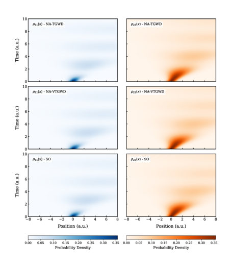
<figcaption class="paper-figure-caption"><b>Fig 1.</b> Figure 1. Wavepacket heatmaps for the probability time- evolution for the Rabi system of Eq. (22). Left for the upper V11 electronic state. Right for the lower V22 one. Bottom panel is the exact quantum evolution, middle one is NA- VTGWD, while upper panel is for NA-TGWD approxima- tion.</figcaption>
</figure>
<figure class="paper-figure-card">
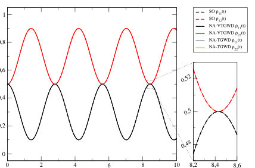
<figcaption class="paper-figure-caption"><b>Fig 2.</b> Figure 2. Wavepacket populations. Dashed lines are for the exact split-operator wavepacket propagation. Thick solid lines are for NA-VTGWD method, while thin solid lines for NA-TGWD approximation. Inset shows the accuracy of the methods.</figcaption>
</figure>
<figure class="paper-figure-card">
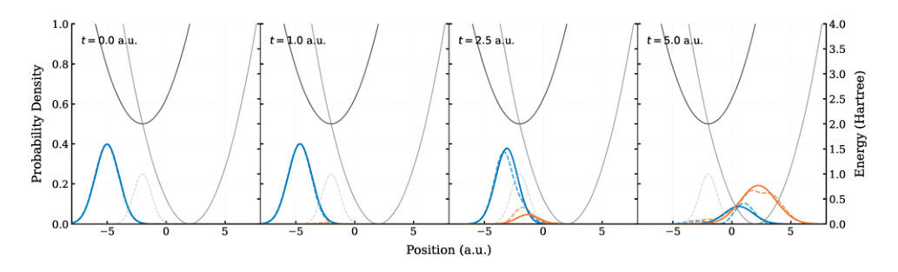
<figcaption class="paper-figure-caption"><b>Fig 3.</b> Figure 3. Diabatic wavepackets time-evolution. Gray for the potential terms, blue for the upper V11 state wavepacket and orange for the lower V22 state one. Colored solid lines for NA-VTGWD, and colored dashed lines for the exact split-operator quantum time evolution.</figcaption>
</figure>
<figure class="paper-figure-card">
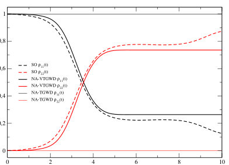
<figcaption class="paper-figure-caption"><b>Fig 4.</b> Figure 5. Wavepacket populations. Dashed lines are for the exact split-operator wavepacket propagation. Thick solid lines are for NA-VTGWD method, while thin solid lines for NA-TGWD approximation.</figcaption>
</figure>
<figure class="paper-figure-card">
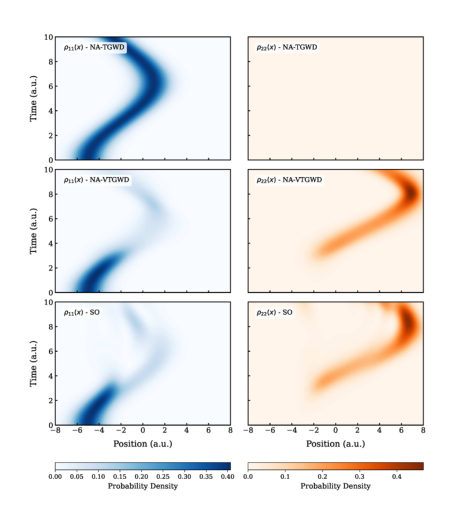
<figcaption class="paper-figure-caption"><b>Fig 5.</b> Figure 4. Wavepacket heatmaps. Left for the upper V11 elec- tronic state. Right for the lower V22 one. Bottom panel is the exact quantum evolution, middle one is NA-VTGWD, while upper panel is for NA-TGWD approximation.</figcaption>
</figure>

**Summary.** This paper introduces advanced semiclassical Gaussian wavepacket methods to simulate complex non-adiabatic molecular dynamics. The authors propose an improved variational approach (NA-VTGWD) which correctly models electronic state transitions by coupling classical trajectories on diabatic surfaces. This method proves superior to standard approximations, accurately reproducing quantum effects in systems like electron transfer and photo-dissociation.

**Why it may be interesting.** This work directly addresses non-adiabatic dynamics—a cornerstone of molecular physics and quantum chemistry—by providing a computationally tractable semiclassical framework that rigorously conserves fundamental quantities.

Detailed structure

**Main problem.** The primary challenge is accurately simulating non-adiabatic molecular dynamics, which requires methods beyond the Born-Oppenheimer approximation.

**Main result.** The proposed Variational Thawed Gaussian method (NA-VTGWD) successfully reproduces quantum mechanical results for various non-adiabatic processes while maintaining crucial physical symmetries like energy and norm conservation.

**Method.** The authors develop two semiclassical methods based on the thawed Gaussian ansatz: a standard formulation (NA-TGWD) and an improved variational version (NA-VTGWD) derived from time-dependent variational principles.

**Model / system.** The models involve coupled electronic states described by diabatic potential energy surfaces ($V_{11}, V_{22}$) with coupling terms ($V_{12}$). Tests include electron transfer using coupled harmonic oscillators and photo-dissociation modeled with a Morse potential.

**Key observables.** Diabatic state populations ($
ho_{ii}(t)$), wavepacket density heatmaps, and conservation of total energy and norm.

**Important parameters / regimes.** The coupling strength ($V_{12}$), the nature of the potentials (harmonic vs. Morse), and the time evolution parameters for the Gaussian wavepackets.

**Assumptions / limitations.** Both methods rely on the thawed Gaussian ansatz, which is exact only for specific potential forms; the variational approach is superior because it guarantees adherence to the Schrödinger equation solution.

**Figures summary.** Figures compare population dynamics and wavepacket heatmaps across three approaches: exact quantum evolution (split-operator), NA-VTGWD, and the less accurate NA-TGWD for both coupled oscillators and Morse potential systems.

**Paper structure.** The paper introduces the general problem, details the two semiclassical methods (NA-TGWD in one section, NA-VTGWD in another), validates them using Rabi oscillations, and applies them to complex physical scenarios like electron transfer and photo-dissociation.

Abstract

We introduce two non-adiabatic semiclassical methods that employ two coupled Gaussian wavepackets, each one traveling on a separate diabatic potential energy surface. The wavepackets take the form of thawed Gaussians and are driven by classical equations of motion which account for the diabatic coupling. The classical equations of motion are derived in one case by enforcing the thawed Gaussian ansatz, while in the other the time-dependent variational principles to the thawed Gaussian ansatz. After a sanity check where both approximations reproduce Rabi oscillations, the methods are applied to two non-adiabatic potential energy scenarios. The first one involves two coupled displaced harmonic oscillators, as in a typical electron transfer reaction. The second one comprises a Morse potential coupled to an upper dissociative state, modeling a photo-dissociation process. In both scenarios, the variational thawed Gaussian approach is quite accurate, while the standard thawed Gaussian one fails to fully capture the non-adiabatic effects. Ultimately, non-adiabatic molecular dynamics is reproduced by means of two classical trajectories without introducing any artificial jump or other ad-hoc non-classical effects.

[↑ back to top](#top)

### [Strongly correlated quantum matter: t--J model, real-space pairing, spin-dependent masses, and atomicity in chemical bond and nanosystems](http://arxiv.org/abs/2607.09465v1)

**Authors:** Józef Spałek  
**Type:** theory · **Category:** strongly correlated electrons · **PDF:** <https://arxiv.org/pdf/2607.09465v1>  
**Analysis basis:** full PDF text, analyzed in chunks
**Topic relevance:** `analog quantum simulation` **3/5** · `Keldysh / 2PI / non-Gaussian methods` **1/5** · `Kondo & dissipative impurity` **1/5**

↔ Scroll figures horizontally

<figure class="paper-figure-card">
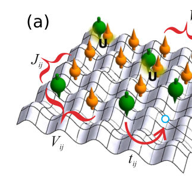
<figcaption class="paper-figure-caption"><b>Fig 1.</b> Fig. 1. Left: Visualization of a quantum Fermi liquid as an effective lattice gas of spin- 1</figcaption>
</figure>
<figure class="paper-figure-card">
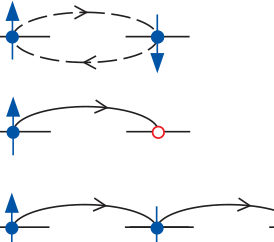
<figcaption class="paper-figure-caption"><b>Fig 2.</b> Fig. 2. Various neighboring hopping processes: a virtual hopping, b-real hopping, and c-three-site hopping in the second order. In the limit of Mott insulator only the first term (a) survives and leads to the pure kinetic-exchange interaction form.</figcaption>
</figure>
<figure class="paper-figure-card">
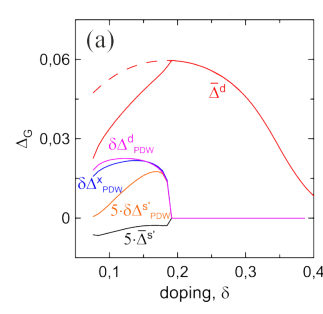
<figcaption class="paper-figure-caption"><b>Fig 3.</b> Fig. 3. The phase diagram comprising charge-density-wave (CDW) states: (a) theory [35]; (b) experiment [36]. The onset of the pair density wave (PDW) has the largest impact on the left part of the diagram (a) and induces a small s-wave pairing component in the dominant d-wave SC state, which survives as a pure state at and above the optimal doping. For details see [35, 36].</figcaption>
</figure>
<figure class="paper-figure-card">
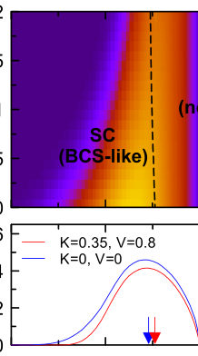
<figcaption class="paper-figure-caption"><b>Fig 4.</b> Fig. 4. Phase diagram for the full t–J–U–V model comprising both hole (δ &lt; 0) and electron (δ &gt; 0) regimes of narrow-band filling. Both non– and BCS–like regimes are marked in each regime. The lower part illustrates the influence of intersite Coulomb (K) and correlated hopping (V) parts onto the superconducting dome shapes. The arrow marks correspond to the optimal doping points (after [31]).</figcaption>
</figure>
<figure class="paper-figure-card">
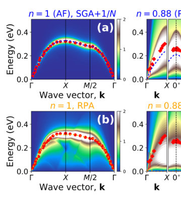
<figcaption class="paper-figure-caption"><b>Fig 5.</b> Fig. 6. (a)-(e) Spectra for the collective magnetic excitations comprising re- spectively: The magnon dispersion relation for the Mott insulator (a), param- agnon (c) and antiferromagnetic (AF) (e) spectra for strongly correlated metal for δ = 1 −n = 0.12, calculated within SGA + 1/N approach; paramagnetic (b) and AF (d) spectra calculated within the RPA, analytic approximation for the spectra for n = 1 and n = 0.88 are provided in (f) and (g). For detail analysis see Refs. [39–41]</figcaption>
</figure>

**Summary.** This paper provides a critical overview of strongly correlated fermion systems, centering on the $t$-$J$ model derived from the Hubbard Hamiltonian. It details advanced theoretical techniques like canonical perturbation expansion to derive effective Hamiltonians governing high-temperature superconductivity and heavy fermion behavior. Furthermore, it extends its scope by introducing 'atomicity' as a necessary correction for describing chemical bonding in molecules.

**Why it may be interesting.** The paper bridges solid-state physics (Hubbard/t-J models for high-$T_c$) with molecular physics ($	ext{H}_2$ bonding), providing a unified theoretical framework that addresses how correlation effects manifest differently in extended solids versus simple molecules. The concept of 'atomicity' is a novel diagnostic tool.

Detailed structure

**Main problem.** The central problem is developing a comprehensive theory for strongly correlated fermion systems, particularly addressing high-temperature superconductivity and understanding the nature of chemical bonding in nanosystems.

**Main result.** The paper establishes the $t$-$J$ model as a fundamental framework by deriving an effective Hamiltonian through canonical perturbation expansion, while also introducing 'atomicity' to correct physical descriptions of molecular bonding.

**Method.** The methodology combines theoretical derivations using projection operators ($P_1, P_2$) on the Hubbard model, canonical perturbation theory, and analytical solutions for molecular Hamiltonians (Heitler-London type).

**Model / system.** The primary models are the Hubbard/t-J model for solid-state physics (cuprates, heavy fermions) and the extended Heitler-London model for diatomic molecules like H2. The analysis spans from lattice dynamics to molecular bonding.

**Key observables.** Superconducting pairing correlations ($\langle \hat{b}^\dagger_{ij} 
angle$), spin-dependent effective masses, Mott transition behavior, Covalency, Ionicity, and Atomicity in chemical bonds.

**Important parameters / regimes.** $U$ (Coulomb repulsion), $t_{ij}$ (hopping amplitude), bandwidth ($W$), interatomic distance ($R/a_0$).

**Assumptions / limitations.** The derivation relies on the strong correlation limit ($|t_{ij}| \ll U-K$) and the use of orthogonal projection operators to decompose the Fock space.

**Figures summary.** Figure 1 illustrates the Brillouin zone for a quantum Fermi liquid. Figure 18 shows electron density profiles for H2 at various interatomic distances, demonstrating the separation into atomic states as distance increases.

**Paper structure.** The structure moves from reviewing the historical development of strong correlation theory (Mott to t-J model) via Hamiltonian decomposition and perturbation expansion, to applying these concepts to specific physical regimes like superconductivity, and finally extending the formalism to analyze chemical bonding using the concept of atomicity.

Abstract

I critically overview my research on strongly correlated fermion systems for almost five decades. It concentrated on: (i) the first derivation of what is now called the t--J model, comprising both the limit of Anderson kinetic exchange of spin--spin interaction in the Mott--Hubbard insulator and taking into account real-space pairing, subsequently applied to high-temperature superconductivity; (ii) the concept of spin-dependent heavy mass of quasiparticles in heavy-fermion systems, and (iii) the first nontrivial model of statistical thermodynamics of the Mott--Hubbard transition. Those three features, together with the specific quantum critical phenomena provide, in my view, fundamental components of the theory of strongly correlated fermions established in the 1960s. Some related questions such as introduction of atomicity in the chemical bonding (iv), and specific properties of correlated nanosystems within the rigorous EDABI (v) approach are also briefly elaborated at the end.

[↑ back to top](#top)

### [Lean-QIT: Towards a Formal Infrastructure for Quantum Information Theory](http://arxiv.org/abs/2607.09632v1)

**Authors:** Chengkai Zhu, Ziao Tang, Guocheng Zhen, Yimeng Cao, Yusheng Zhao, Ranyiliu Chen, Xuanqiang Zhao, Lei Zhang, Xin Wang  
**Type:** theory · **Category:** quantum information and computing · **PDF:** <https://arxiv.org/pdf/2607.09632v1>  
**Analysis basis:** full PDF text, analyzed in chunks
**Topic relevance:** `entanglement & information structure` **3/5** · `quantum measurements` **1/5**

↔ Scroll figures horizontally

<figure class="paper-figure-card">
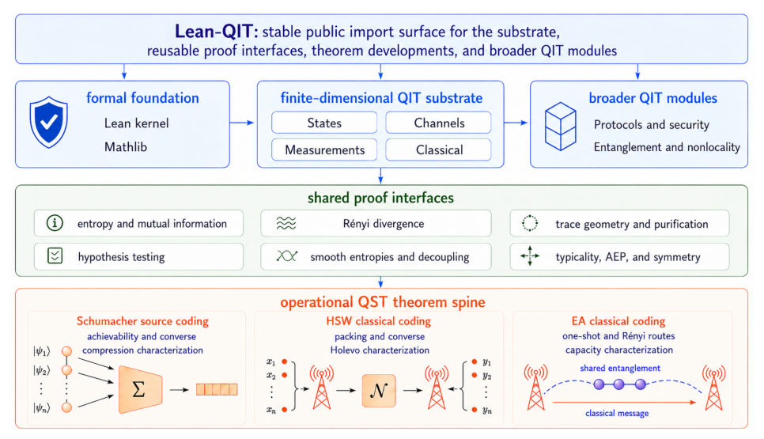
<figcaption class="paper-figure-caption"><b>Fig 1.</b> Figure 1: Global architecture of Lean-QIT. The libaray is built on the trusted Lean/Mathlib foundation, finite-dimensional QIT substrate, shared proof interfaces, operational QST coding surfaces, and broader QIT modules. The QST spine consumes the shared interfaces to state and prove Schumacher source coding, HSW classical communication, and entanglement-assisted classical communication endpoints.</figcaption>
</figure>
<figure class="paper-figure-card">
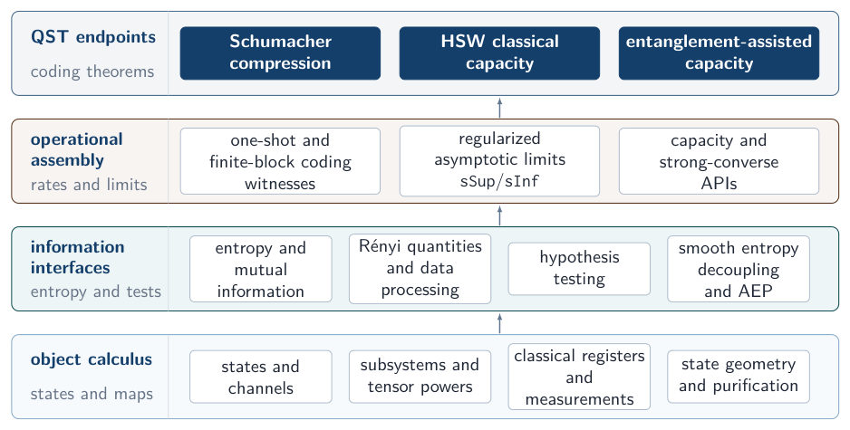
<figcaption class="paper-figure-caption"><b>Fig 2.</b> Figure 2: Layered proof stack for the reusable finite-dimensional QIT building blocks in Lean-QIT. The object calculus supplies typed states, channels, subsystem operations, classical interfaces, and state geometry. Information-theoretic interfaces expose entropy, divergence, testing, and smoothing principles to operational rate constructions. These layers are then assembled into the Schumacher, HSW, and entanglement-assisted coding endpoints developed in Section 4.</figcaption>
</figure>
<figure class="paper-figure-card">
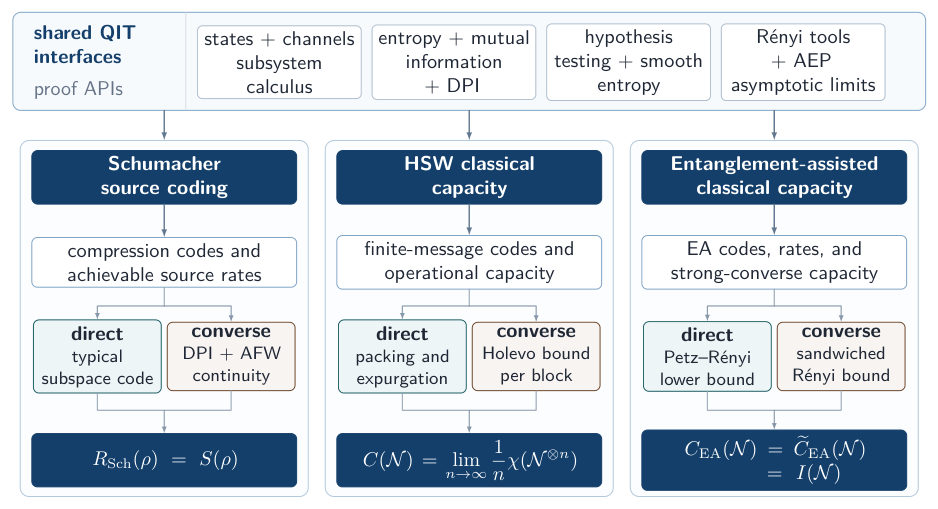
<figcaption class="paper-figure-caption"><b>Fig 3.</b> Figure 3: Architecture of the coding spine developed in Section 4. Three independent theorem lanes consume the reusable finite-dimensional QIT interfaces of Section 3. Within each lane, an operational API branches into direct and converse obligations and reassembles at a proved asymptotic endpoint.</figcaption>
</figure>

**Summary.** This paper introduces Lean-QIT, a novel library built in the proof assistant Lean 4, designed to provide a machine-checkable foundation for Quantum Information Theory. It achieves this by creating reusable interfaces that formally connect operational coding protocols with deep analytic theorems like the classical capacity bounds. This infrastructure aims to enable automated reasoning and formal verification across quantum information science.

**Why it may be interesting.** While focused on abstract theory, the rigorous formalization of capacity theorems provides a foundational mathematical toolset that could be adapted to analyze resource constraints or information flow in complex quantum simulations.

Detailed structure

**Main problem.** The core problem is formalizing Quantum Information Theory (QIT) by unifying finite-block protocols, analytic inequalities, and asymptotic limits into a single, machine-checkable framework.

**Main result.** The authors successfully formalized major QST theorems—including Schumacher's source coding theorem and the HSW capacity theorem—within a reusable library structure that separates operational definitions from analytical characterizations.

**Method.** They developed Lean-QIT, a library in the proof assistant Lean 4. This method involves building composable, kernel-checked interfaces for quantum states, channels, and information measures to ensure mathematical rigor.

**Model / system.** The framework models finite-dimensional quantum systems using typed structures for quantum states ($
ho$) and completely positive trace-preserving (CPTP) channels ($\Phi$). It handles subsystems, measurements (POVMs), and classical registers abstractly.

**Key observables.** Achievable rates, capacities (e.g., Holevo–Schumacher–Westmoreland capacity), error criteria, von Neumann entropy, and quantum relative entropy.

**Important parameters / regimes.** Error tolerance ($\epsilon$), blocklength ($n$), and the Rényi parameter ($\alpha$).

**Assumptions / limitations.** The work assumes that complex QIT theorems can be decomposed into named, reusable components (e.g., direct/converse bounds) to build a compositional knowledge substrate.

**Figures summary.** Figure 1 illustrates the global architecture of Lean-QIT as a stack built on Mathlib, showing distinct layers for object calculus, information interfaces, and operational coding surfaces. Figure 2 details the layered proof structure from basic objects up to rate constructions.

**Paper structure.** The paper is structured around building an infrastructure: first defining typed quantum objects (states/channels), then implementing core information measures (entropy, testing), and finally assembling these components to prove major theorems by bridging finite-block results to asymptotic limits via 'squeezes'.

Abstract

Quantum information theory (QIT) characterizes the capabilities and fundamental limits of quantum information processing, underpinning quantum communication, computation, and error correction. Formalizing its coding theorems requires connecting finite-block protocols, analytic inequalities, and asymptotic limits within a unified machine-checked framework. Existing developments, however, lack a reusable operational layer that defines codes, error criteria, achievable rates, and capacities independently of their information-theoretic characterizations. In this work, we present LeanQIT, a Lean 4 library for finite-dimensional QIT. It provides composable, kernel-checked interfaces for quantum states and channels, source and channel codes, finite-block performance criteria, hypothesis testing, one-shot quantities, and asymptotic rate constructions. Using this infrastructure, we formalize Schumacher's quantum source-coding theorem, the Holevo--Schumacher--Westmoreland classical-capacity theorem, and the entanglement-assisted classical-capacity theorem together with its strong converse. By separating operational definitions from analytic characterizations and exposing reusable achievability, converse, and asymptotic components, Lean-QIT provides a machine-readable foundation for formal QIT and a compositional knowledge substrate for emerging AI-assisted formalization, automated proof search, and agentic reasoning in quantum information and computation.

[↑ back to top](#top)

### [PCPOP.jl: A Julia package for partially commutative polynomial optimization](http://arxiv.org/abs/2607.09339v1)

**Authors:** Moisés Bermejo Morán, Abhishek Mishra  
**Type:** theory · **Category:** quantum information and computing · **PDF:** <https://arxiv.org/pdf/2607.09339v1>  
**Analysis basis:** full PDF text, analyzed in chunks
**Topic relevance:** `entanglement & information structure` **3/5** · `Keldysh / 2PI / non-Gaussian methods` **1/5**

↔ Scroll figures horizontally

<figure class="paper-figure-card">
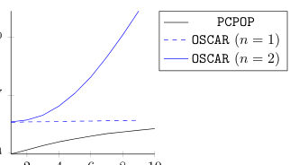
<figcaption class="paper-figure-caption"><b>Fig 1.</b> Figure 1: Benchmarking building time of the partially commutative monoid in PCPOP (black) and the Gr¨obner basis in OSCAR (blue) truncated to degree d for the scenarios with n parties in Example (3).</figcaption>
</figure>
<figure class="paper-figure-card">
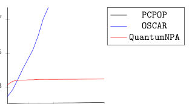
<figcaption class="paper-figure-caption"><b>Fig 2.</b> Figure 2: Benchmarking computing canonical forms with respect to the commutation relations in Example 3 in PCPOP (black), OSCAR (blue) and QuantumNPA (red). The figure shows the time in nanoseconds of computing the canonical form of wv for random words w and v of length d in 3n = 6 variables (a,b,c).</figcaption>
</figure>
<figure class="paper-figure-card">
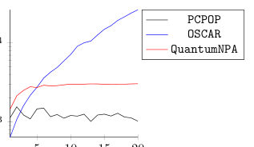
<figcaption class="paper-figure-caption"><b>Fig 3.</b> Figure 3: Benchmarking computing canonical forms with respect to the commuta- tion relations and projection constraints in Example 3 in PCPOP (black), OSCAR (blue) andQuantumNPA (red). The figure shows the time in nanoseconds of computing the canon- ical form of wv for random words w and v of length d in 3n = 6 variables (a,b,c).</figcaption>
</figure>

**Summary.** This paper presents PCPOP.jl, a specialized Julia package designed to solve complex polynomial optimization problems in non-commutative settings relevant to quantum physics. It utilizes moment relaxation formulated as Semidefinite Programs (SDPs) and incorporates advanced algebraic tools for partially commutative variables. This provides a powerful computational tool for analyzing bounds on quantum correlations and information measures.

**Why it may be interesting.** This work provides essential mathematical machinery for tackling hard optimization problems arising from quantum correlations and entanglement measures, which are central to modern quantum information theory.

Detailed structure

**Main problem.** The core problem is polynomial optimization, extended to non-commutative settings like partially commutative variables, tracial, and state polynomial optimization.

**Main result.** The paper introduces PCPOP.jl, a Julia package that automates the construction of Semidefinite Programming (SDP) relaxations to approximate the true optimum value of these complex quantum optimization problems.

**Method.** It employs moment relaxation techniques, which formulate the problem as an SDP solvable via specialized algebraic reductions like Gröbner basis methods and canonical clique representations for partially commutative variables.

**Model / system.** The framework is designed for modeling physical constraints arising in quantum information theory, such as those related to Bell inequalities or general non-commutative polynomial constraints.

**Key observables.** The optimal value $p^*$ of the polynomial optimization problem, and diagnostic metrics like SDP size, number of variables, and solving time during benchmarking.

**Important parameters / regimes.** The degree bound ($d$) used in moment relaxations, which dictates the complexity and convergence rate; boundedness assumptions are crucial for convergence.

**Assumptions / limitations.** Convergence of the moment relaxation sequence $p^*_d$ to the true optimum $p^*$ requires assuming that the feasible set is bounded. Furthermore, specific conditions like 'flatness' are needed for trace polynomial optimization.

**Figures summary.** The notes summarize benchmarking results across four tables comparing PCPOP against other packages (Ncpol2sdpa, QuantumNPA, Moment) based on setup time and solving time for various quantum contextuality problems.

**Paper structure.** The paper introduces the general polynomial optimization framework, details the extensions to non-commutative/quantum settings, describes the computational tools within PCPOP.jl (including clique representation), and concludes with a performance comparison against existing state-of-the-art solvers.

Abstract

Here we present PCPOP, a Julia package for polynomial optimization that supports non-commutative optimization, tracial polynomial optimization, trace polynomial optimization and state polynomial optimization. PCPOP fully supports exact arithmetic computations and incorporates convenient functionalities such as algebraic reductions based on Gröbner basis methods, automatized symmetrization via Wedderburn decompositions, and Jordan algebra reductions. As a distinguished feature, PCPOP implements a specialized framework for polynomial computations in partially commutative variables that provides significant computational advantages for problems appearing in quantum information.

[↑ back to top](#top)

### [Quantum Scattering Model of Dual Parallel Mach Zehnder Electro Optic Modulators: General Formalism, Impairments, and Applications to Frequency-Bin Photonic Quantum States](http://arxiv.org/abs/2607.09198v1)

**Authors:** Mar Yuste, Carlos R. Fernández Pousa, Javier Fraile Peláez, José Capmany  
**Type:** theory · **Category:** quantum information and computing · **PDF:** <https://arxiv.org/pdf/2607.09198v1>  
**Analysis basis:** full PDF text, analyzed in chunks
**Topic relevance:** `interference shaping light` **3/5** · `methods for driven-dissipative` **1/5**

↔ Scroll figures horizontally

<figure class="paper-figure-card">
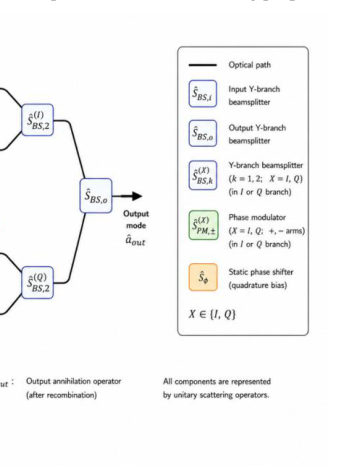
<figcaption class="paper-figure-caption"><b>Fig 1.</b> Fig. 1. Layout of the DP-MZM device, showing the input/output external beamsplitters, the in- phase and quadrature internal MZIs with their branch phase modulators, and the quadrature bias phase shifter, together with the unitary operators representing each component.</figcaption>
</figure>
<figure class="paper-figure-card">
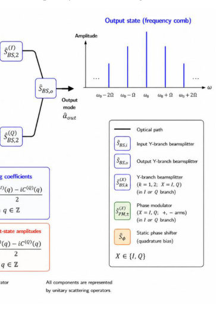
<figcaption class="paper-figure-caption"><b>Fig 2.</b> Fig. 2. Frequency-domain representation of quantum scattering in the DP-MZM. An input carrier state at frequency ωₒ is transformed into a superposition of sidebands at ωₒ + qΩ, forming a frequency-comb structure whose amplitudes are set by the coherent interference of the in-phase (I) and quadrature (Q) branches. Single-photon and coherent-state transformations are illustrated for the two input cases treated in Sections 3 and 4.</figcaption>
</figure>
<figure class="paper-figure-card">
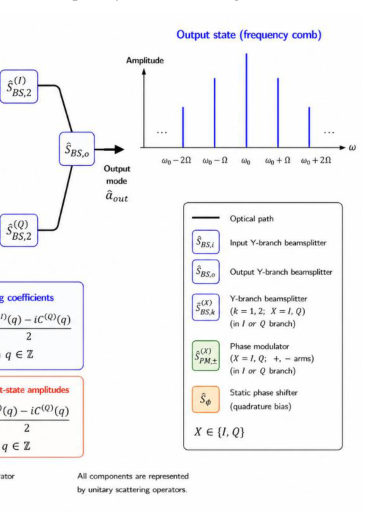
<figcaption class="paper-figure-caption"><b>Fig 3.</b> Figure 3 illustrates this comb structure numerically for a representative single-photon input, showing how sideband power redistributes as the modulation index increases.</figcaption>
</figure>
<figure class="paper-figure-card">
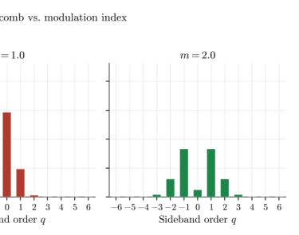
<figcaption class="paper-figure-caption"><b>Fig 4.</b> Fig. 3 (numerical illustration). Normalized single-photon sideband click probability |H(q)|² vs. sideband order q for three modulation indices, ideal push-pull operation, ϕₘ = π/2, balanced 3- dB splitters.</figcaption>
</figure>
<figure class="paper-figure-card">
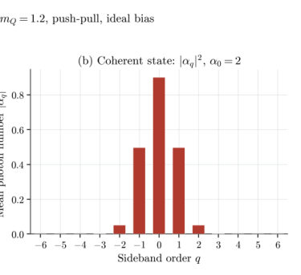
<figcaption class="paper-figure-caption"><b>Fig 5.</b> Fig. 4. Side-by-side comparison of (a) the single-photon click-probability spectrum and (b) the coherent-state mean-photon-number spectrum (input amplitude α₀ = 2), for identical DP-MZM operating conditions (m = 1.2, ideal push-pull bias). The two envelopes coincide up to normalization, confirming Eq. (9).</figcaption>
</figure>

**Summary.** The paper presents a general quantum scattering model for Dual Parallel Mach-Zehnder Modulators (DP-MZMs) to analyze their effect on single photons and coherent states. It quantifies how imperfections like bias error degrade the performance of these modulators when used as frequency-bin qubit sources. The results are crucial for designing high-fidelity photonic quantum information systems.

**Why it may be interesting.** This work provides a rigorous quantum description of a key photonic component used in quantum communication protocols, directly impacting the feasibility assessment for building practical quantum hardware.

Detailed structure

**Main problem.** To develop a comprehensive quantum-mechanical model for Dual Parallel Mach-Zehnder Electro-Optic Modulators (DP-MZMs) to accurately describe their action on non-classical light.

**Main result.** The model provides the complete, unrestricted unitary transformation for single-photon and coherent states, allowing quantification of performance degradation due to various physical impairments like bias error and I/Q imbalance.

**Method.** The analysis employs the quantum scattering formalism by deriving stage-by-stage unitary operators that compose the entire device action. This is applied separately to single-photon creation operators and displacement operators for coherent states.

**Model / system.** The physical system is a DP-MZM used as a frequency shifter/encoder in photonic quantum information. The model tracks the evolution of light fields through cascaded beamsplitters, phase modulators, and combiners using unitary scattering operators ($\hat{S}_{DP}$).

**Key observables.** Single-photon sideband click probability $|\hat{H}(q)|^2$, two-frequency-bin qubit fidelity ($F$), and image-sideband suppression ratio ($\varepsilon_{dB}$).

**Important parameters / regimes.** Modulation indices ($m_I, m_Q$), quadrature bias error ($\Delta\phi_P$), I/Q imbalance, and RF drive frequencies ($\Omega$).

**Assumptions / limitations.** The model is general, accounting for non-ideal components; however, the final analysis often assumes classical RF drives (c-number parameters) or uses approximations like the BCH theorem.

**Figures summary.** Figures illustrate the device layout and frequency comb structure. Numerical results show single-photon sideband probabilities under varying modulation indices and quantify qubit fidelity degradation versus bias error.

**Paper structure.** The paper derives the general unitary transformation for both single-photon and coherent inputs, analyzes specific operating points (push-pull vs. quadrature), and then numerically evaluates performance metrics like fidelity using Monte Carlo simulations to assess noise sensitivity.

Abstract

We present a quantum mechanical model of dual parallel Mach Zehnder electro-optic modulators (DPMZMs), derived using the quantum scattering formalism [1,2]. We obtain the complete, unrestricted transformation of single-photon and coherent input states through the DPMZM architecture, including independent radiofrequency drive conditions on each internal modulator, and recover the symmetric push pull operating point as an exact special case. We numerically evaluate the resulting frequency comb structure, quantify the device sensitivity to bias error, modulation-index imbalance, and RF noise, and use the model to design a DP-MZM-based frequency-bin qubit source, reporting its fidelity as a function of these impairments.

[↑ back to top](#top)

### [A combinatorial framework for clustering graph states: Algorithms and hardness for rank-integrity](http://arxiv.org/abs/2607.09469v1)

**Authors:** Romain Bourneuf, Nathan Claudet, Sang Yoon Kim, Rose McCarty, Blair D. Sullivan, Stéphan Thomassé  
**Type:** theory · **Category:** quantum information and computing · **PDF:** <https://arxiv.org/pdf/2607.09469v1>  
**Analysis basis:** full PDF text, analyzed in chunks
**Topic relevance:** `entanglement & information structure` **3/5**

↔ Scroll figures horizontally

<figure class="paper-figure-card">
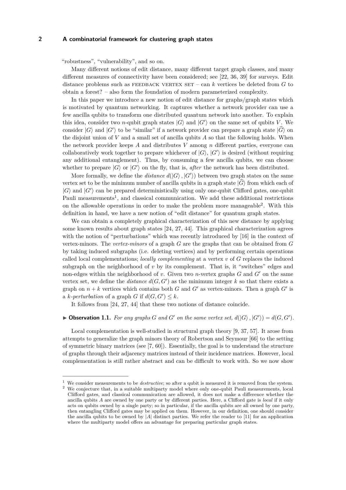
<figcaption class="paper-figure-caption"><b>Fig 1.</b> Low-resolution page preview, page 2</figcaption>
</figure>
<figure class="paper-figure-card">
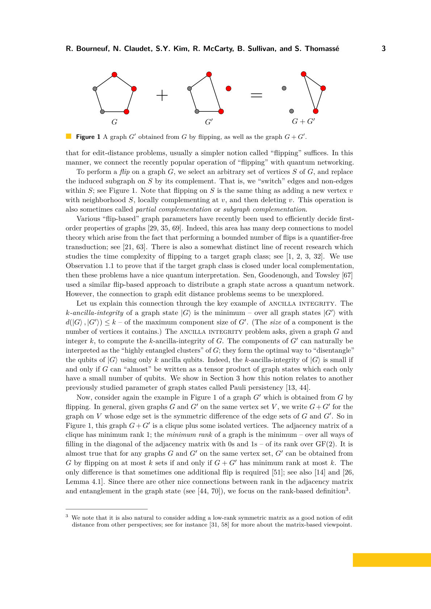
<figcaption class="paper-figure-caption"><b>Fig 2.</b> Low-resolution page preview, page 3</figcaption>
</figure>
<figure class="paper-figure-card">
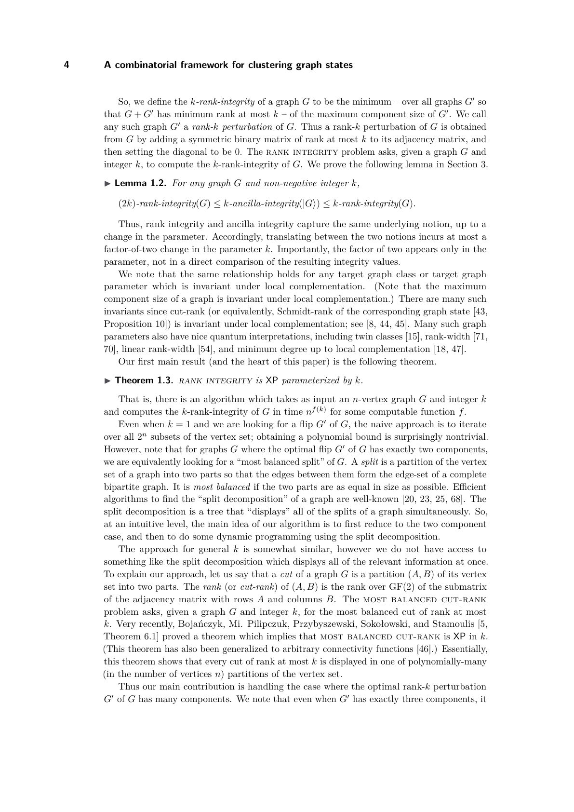
<figcaption class="paper-figure-caption"><b>Fig 3.</b> Low-resolution page preview, page 4</figcaption>
</figure>
<figure class="paper-figure-card">
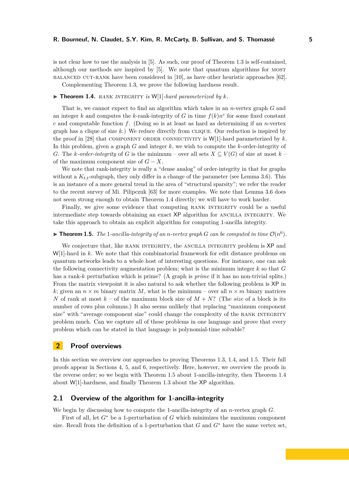
<figcaption class="paper-figure-caption"><b>Fig 4.</b> Low-resolution page preview, page 5</figcaption>
</figure>
<figure class="paper-figure-card">
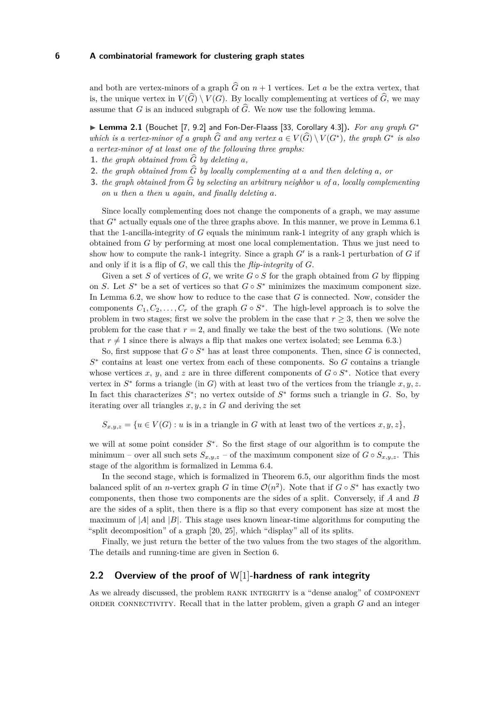
<figcaption class="paper-figure-caption"><b>Fig 5.</b> Low-resolution page preview, page 6</figcaption>
</figure>

**Summary.** This paper introduces a combinatorial framework to measure the 'distance' between quantum graph states. This distance metric is shown to be equivalent to a graph property called rank integrity, which measures how much two graphs can differ while keeping the rank of their combined adjacency matrix low. The work provides both efficient algorithms and hardness results for determining this structural parameter.

**Why it may be interesting.** It provides a deep mathematical link between graph structure theory (edit distances) and the resource quantification of quantum entanglement in network models, which is crucial for understanding computational limits in measurement-based quantum computation.

Detailed structure

**Main problem.** The paper develops a combinatorial framework to analyze clustering graph states, which is mathematically related to quantum network edit-distance problems.

**Main result.** It establishes that the ancilla integrity problem for graph states is equivalent to rank integrity, proving this latter problem is XP parameterized by $k$ but also W[1]-hard in $k$.

**Method.** The authors use concepts from graph theory (vertex-minors, local complementation) and algebraic methods over GF(2) to translate quantum state distance into computable graph properties.

**Model / system.** The primary model is the graph state $|	ext{G}
angle$ on qubits, which represents a quantum network resource. The analysis focuses on how these states can be related or perturbed using limited quantum operations (Clifford gates and Pauli measurements).

**Key observables.** The minimum number of ancilla qubits required to prepare two graph states, the maximum component size of the resulting cluster state $G'$, and the rank of the sum of adjacency matrices over GF(2).

**Important parameters / regimes.** The parameter $k$, which quantifies the allowed 'distance' or perturbation level between graph states.

**Assumptions / limitations.** The distance measure is restricted to preparation using one-qubit Clifford gates, Pauli measurements, and classical communication.

**Figures summary.** Figure 1 illustrates a graph $G'$ obtained from $G$ by flipping, and the resulting sum graph $G + G'$, connecting structural changes to rank properties.

**Paper structure.** The paper introduces the distance metric, relates it combinatorially to vertex-minors, establishes equivalence with rank integrity, and then proves complexity results (XP vs. W[1]-hardness) for solving this parameterized problem.

Abstract

We introduce a new notion of distance between two graph states $|G\rangle$ and $|G'\rangle$ on the same set of qubits. This distance is the minimum number of ancilla qubits in a graph state $|\widehat{G}\rangle$ from which both $|G\rangle$ and $|G'\rangle$ can be ``easily prepared''. (When preparing graph states, we are only allowed to use one-qubit Clifford gates, one-qubit Pauli measurements, and classical communication.) We give a graphical description of this distance through the lens of vertex-minors. We then show how this distance yields quantum network analogs of many graph edit-distance problems.   Using this framework, we develop classical algorithms for identifying the ``highly entangled clusters'' of a graph state $|G\rangle$. The ancilla integrity problem asks, given a graph $G$ and integer $k$, for the minimum -- over all graph states $|G'\rangle$ with distance at most $k$ from $|G\rangle$ -- of the maximum component size of $G'$. Up to a factor of $2$ in the number of ancilla qubits, this problem is equivalent to rank integrity, where the distance between $G$ and $G'$ is instead the minimum rank of the sum of their adjacency matrices over $\text{GF}(2)$. We prove that rank integrity is XP parameterized by $k$. We also prove the complementary hardness result that rank integrity is W[1]-hard in $k$. Finally, we give an explicit $\mathcal{O}(n^6)$-time algorithm for ancilla integrity when $G$ has $n$ vertices and $k=1$.

[↑ back to top](#top)

### [Orthogonal Quantum Krylov Diagonalisation](http://arxiv.org/abs/2607.09476v1)

**Authors:** Hadi Rammal, Alexandre Perrin, Oumaya Ladhari, Clément Dutreix, Jérémie Messud, Matthieu Saubanere  
**Type:** theory · **Category:** quantum information and computing · **PDF:** <https://arxiv.org/pdf/2607.09476v1>  
**Analysis basis:** full PDF text, analyzed in chunks
**Topic relevance:** `analog quantum simulation` **3/5**

↔ Scroll figures horizontally

<figure class="paper-figure-card">
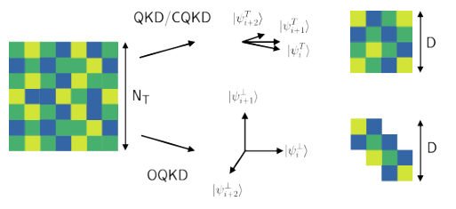
<figcaption class="paper-figure-caption"><b>Fig 1.</b> FIG. 1. Schematic comparison between conventional QKD/CQKD and the proposed OQKD approach. In QKD/CQKD, the NT × NT Hamiltonian is projected onto a Krylov subspace of dimension D spanned by generally nonorthogonal vectors, which are additionally unnormalized in block-encoding-based implementations. Consequently, a generalized eigenvalue problem involving an ill-conditioned overlap matrix must be solved. In contrast, OQKD projects the Hamiltonian onto an orthonormal Krylov basis, elimi- nating overlap-matrix regularization and improving numer- ical stability.</figcaption>
</figure>
<figure class="paper-figure-card">
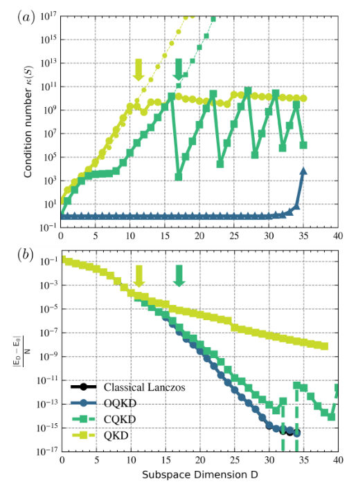
<figcaption class="paper-figure-caption"><b>Fig 2.</b> FIG. 2. Results for the J1-J2 spin model (J1 = 1, J2 = 0.5) with an initial mean-field approximated ground state, com- paring QKD, CQKD, and OQKD. The arrows indicate the first subspace dimension at which the thresholded and un- thresholded calculations begin to differ. (a) Condition num- ber of the overlap matrix S as a function of Krylov-subspace dimension. QKD becomes increasingly ill-conditioned with increasing subspace dimension, while CQKD partially mit- igates this effect through the Chebyshev thresholding tech- nique. In contrast, OQKD preserves orthogonality by con- struction, resulting in an overlap matrix that remains close to the identity up to numerical precision. The dashed...</figcaption>
</figure>
<figure class="paper-figure-card">
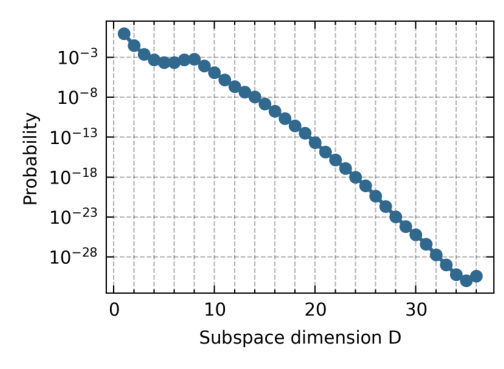
<figcaption class="paper-figure-caption"><b>Fig 3.</b> FIG. 3. Probability of successfully implementing the normal- ized Lanczos polynomial using GQSP as a function of the Lanczos subspace dimension D. The success probability de- creases exponentially with increasing polynomial degree due to the rapid growth of the normalization factor Λn.</figcaption>
</figure>
<figure class="paper-figure-card">
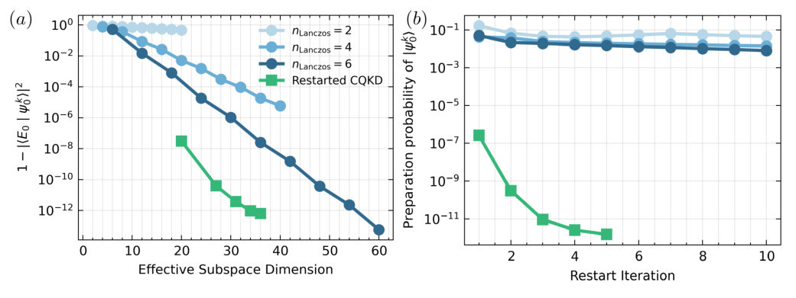
<figcaption class="paper-figure-caption"><b>Fig 4.</b> FIG. 4. Performance of the restarted OQKD state-preparation protocol. (a) Infidelity, 1 − ⟨E0|ψ(k) 0 ⟩ 2 , of the prepared state with respect to the exact ground state as a function of the restart iteration. Despite the nearly constant state-preparation probability, the infidelity decreases monotonically toward zero, demonstrating that the restarted protocol progressively improves the ground-state approximation while maintaining a favorable implementation cost. (b) Probability of successfully preparing the approximate ground state after each restart iteration from the original easily prepared initial state by implementing the accumulated GQSP polynomial of Eq. (42). The success probability...</figcaption>
</figure>
<figure class="paper-figure-card">
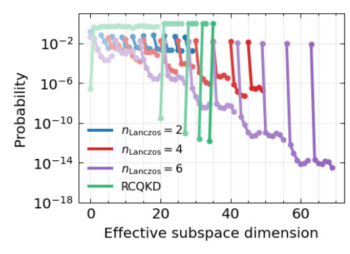
<figcaption class="paper-figure-caption"><b>Fig 5.</b> FIG. 5. Success probability for preparing the Krylov ba- sis vectors in the restarted OQKD (ROQKD) protocol as a function of the effective subspace dimension for different max- imum Lanczos subspace dimensions, nLanczos = 2, 4, and 6. For the restarted CQKD (RCQKD) protocol, the Krylov sub- space dimension at each restart is chosen according to the protocol described above, namely as the largest numerically stable value that avoids thresholding. Darker shades corre- spond to successive restart iterations.</figcaption>
</figure>

**Summary.** The paper introduces Orthogonal Quantum Krylov Diagonalization (OQKD), an algorithm designed to compute low-energy spectra of quantum systems by mimicking the stable Lanczos procedure. OQKD achieves this orthogonality directly on the quantum computer, bypassing the need for numerically unstable overlap matrix calculations inherent in prior methods. This establishes a robust and scalable framework for both eigensolving and state preparation protocols like Quantum Phase Estimation.

**Why it may be interesting.** This work provides a significant algorithmic improvement for quantum eigensolvers by directly addressing the fundamental stability bottleneck (overlap matrix regularization) that plagues current quantum subspace methods, making it highly relevant for simulating complex Hamiltonians in AMO physics.

Detailed structure

**Main problem.** The primary challenge is developing a quantum algorithm for finding low-energy spectra of many-body Hamiltonians that maintains the numerical stability and orthogonality properties of classical Lanczos methods without requiring overlap-matrix regularization.

**Main result.** The Orthogonal Quantum Krylov Diagonalization (OQKD) framework successfully implements an orthogonal analog of the Lanczos algorithm, eliminating the need for overlap matrix inversion. Furthermore, a restarted protocol is proposed that maintains convergence while keeping state preparation probabilities affordable.

**Method.** The authors reformulate the classical Lanczos recursion at the operator level, utilizing Generalized Quantum Signal Processing (GQSP) and block encoding to generate an orthonormal Krylov basis directly on the quantum computer.

**Model / system.** The method is tested using numerical simulations of the J1–J2 Heisenberg model. The core mathematical structure involves projecting the Hamiltonian onto a reduced subspace spanned by the Krylov basis vectors.

**Key observables.** Overlap matrix condition number ($\kappa(S)$), energy error convergence, and state preparation fidelity/success probability.

**Important parameters / regimes.** Subspace dimension ($D$), Lanczos coefficients ($\alpha_k, eta_k$), and the degree of polynomial transformation required for state preparation.

**Assumptions / limitations.** The analysis relies on establishing recurrence relations for Lanczos coefficients and utilizing the GQSP framework to implement high-degree polynomial transformations efficiently.

**Figures summary.** Figures compare QKD/CQKD (showing ill-conditioned overlap matrices) against OQKD, demonstrating that OQKD maintains orthogonality. Other figures show OQKD reproducing classical convergence and illustrating the performance of the restarted state-preparation protocol.

**Paper structure.** The paper first identifies the limitations of standard quantum Krylov methods due to non-orthogonality. It then introduces OQKD by reformulating the Lanczos recursion at the operator level, detailing its implementation via GQSP. Finally, it presents a restarted state-preparation protocol and validates the entire framework using numerical simulations on the J1–J2 model.

Abstract

Quantum subspace-diagonalization methods, particularly Quantum Krylov Diagonalization (QKD), provide a promising route for computing low-energy spectra of quantum many-body Hamiltonians. However, existing quantum Krylov approaches rely on non-orthogonal Krylov bases, requiring overlap-matrix regularization that limits numerical stability and accuracy. In this work, we introduce an Orthogonal Quantum Krylov Diagonalization (OQKD) framework that reformulates the classical Lanczos recursion at the operator level, enabling an orthogonal quantum implementation of Krylov-subspace diagonalization. By expressing Lanczos vectors as polynomial transformations of the Hamiltonian, OQKD reproduces the orthogonality, tridiagonal structure, and convergence behavior of the classical Lanczos algorithm thus eliminating the need for overlap-matrix regularization. We further show that the required Lanczos polynomials can be implemented using block encoding and Generalized Quantum Signal Processing with the same asymptotic query complexity as Chebyshev-based QKD methods. Numerical simulations of the $J_1$--$J_2$ Heisenberg model confirm the classical Lanczos convergence and numerical stability of the proposed method, while the measurement-complexity scaling is established analytically. Building upon the OQKD framework, we then introduce a restarted state-preparation protocol that replaces a single high-degree polynomial transformation with a sequence of fixed low-degree transformations, maintaining an affordable block encoding success probability while retaining comparable convergence. These results establish OQKD as an orthogonal quantum analog of the classical Lanczos algorithm and identify the restarted protocol as a promising state-preparation strategy for Quantum Phase Estimation.

[↑ back to top](#top)

### [Level statistics in the fractal phase of generalized Rosenzweig--Porter models](http://arxiv.org/abs/2607.09444v1)

**Authors:** Victor Delapalme, Leticia F. Cugliandolo, Alexander K. Hartmann, Marco Tarzia, Davide Venturelli  
**Type:** theory · **Category:** disordered systems and neural networks · **PDF:** <https://arxiv.org/pdf/2607.09444v1>  
**Analysis basis:** full PDF text, analyzed in chunks
**Topic relevance:** `Keldysh / 2PI / non-Gaussian methods` **2/5** · `entanglement & information structure` **2/5** · `non-equilibrium universality` **2/5** · `analog quantum simulation` **1/5** · `correlated / nonlocal dissipation` **1/5** · `driven-dissipative phase transition` **1/5** · `methods for driven-dissipative` **1/5** · `non-equilibrium dynamics` **1/5** · `scars & prethermalization` **1/5**

↔ Scroll figures horizontally

<figure class="paper-figure-card">
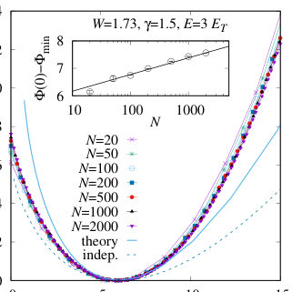
<figcaption class="paper-figure-caption"><b>Fig 1.</b> Figure 2. (a) The distribution of the full counting statistics IN[−E, E] for W = √</figcaption>
</figure>
<figure class="paper-figure-card">
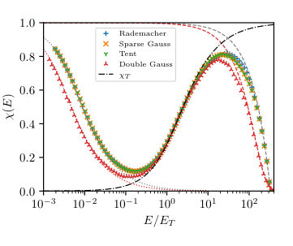
<figcaption class="paper-figure-caption"><b>Fig 2.</b> Figure 3. Level compressibility χ(E) for (a) the Symmetrized Wishart–RP model, and (b) for Wigner–RP matrices. Symbols denote data from exact numerical diagonalization of random sample matrices of size N = 30000. For energies of the scales of the Thouless energy ET (48), all curves collapse on the universal prediction χ(E) = χT (E/ET ) given in Eq. (85) and drawn with a dash-dotted line. In (b), the first three sets of symbols correspond to the choice pa(a) = 1/(2 √</figcaption>
</figure>
<figure class="paper-figure-card">
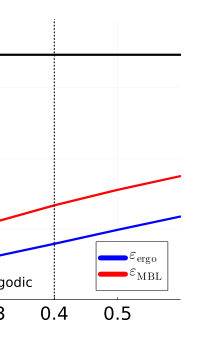
<figcaption class="paper-figure-caption"><b>Fig 3.</b> Figure 4. Schematic out-of-equilibrium phase diagram of the QREM (see also Refs. [76–81]). The transition line separating the fully ergodic phase from the intermediate partially delocalized, non-ergodic phase (blue), and the transition line separating the intermediate phase from the localized phase (red), are obtained from the numerical solution of Eqs. (104), (105), and (106) (see Ref. [79] for details). The dashed lines correspond to the linear asymptotic behavior of the transition lines, Eq. (107), obtained from a small-Γ expansion. The horizontal black line at |ε| = ln 2 shows the position of the edge of the many-body spectrum beyond which no states are found. Since the spectrum is...</figcaption>
</figure>
<figure class="paper-figure-card">
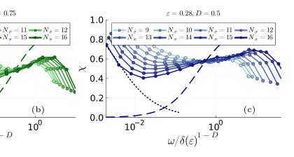
<figcaption class="paper-figure-caption"><b>Fig 4.</b> Figure 5. Level compressibility χ(ω) for the QREM, Eq. (96), at Γ = 0.4 for (a) ε = 0.18, (b) ε = 0.24, and (c) ε = 0.28, spanning the intermediate non-ergodic delocalized phase of the model (see Fig. 4). The ω-axis is rescaled by (δNσ(ε))1−D, with an ε-dependent exponent D which produces the best collapse of the curves for different system sizes Nσ. The dashed curves represent the crossover scaling function given in Eq. (85). The black dotted curve at low energies corresponds to the universal GOE prediction (94) (shown only for the largest available system size, Nσ = 16), which accurately reproduces the behavior of the level compressibility on the scale of the spectral gap.</figcaption>
</figure>
<figure class="paper-figure-card">
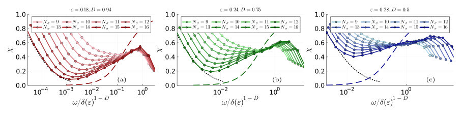
<figcaption class="paper-figure-caption"><b>Fig 5.</b> Figure 5 shows the level compressibility for three values of the energy across the intermediate phase and several system sizes Nσ. To investigate the existence of a scaling regime, we rescale the energy window ω by a generalized Thouless energy,</figcaption>
</figure>

**Summary.** This paper investigates level statistics in generalized Rosenzweig–Porter models, minimal models for chaos crossover. Using advanced techniques like free probability theory, the authors derive a universal scaling form for full counting statistics in the fractal phase ($1 < \gamma < 2$). The findings confirm universality across model variations and provide deep insights into spectral correlations in quantum many-body systems.

**Why it may be interesting.** This work directly addresses spectral properties in systems exhibiting intermediate quantum dynamics (fractal eigenstates), which is crucial for understanding the transition between integrable and chaotic regimes in complex many-body Hamiltonians relevant to AMO physics.

Detailed structure

**Main problem.** The study focuses on determining the level statistics within the fractal phase of generalized Rosenzweig–Porter (RP) random matrix models.

**Main result.** The full counting statistics exhibit a simple, universal scaling form around the Thouless energy ($E_T$), which is shared across various generalizations of the RP model.

**Method.** The authors employ free probability theory and the replica method to analytically compute the full counting statistics in the large system size limit.

**Model / system.** The core system is the generalized Rosenzweig–Porter (RP) random matrix ensemble, which models the crossover between integrability and chaos. The Hamiltonian structure involves a diagonal random part ($A$) and a coupling term ($B$), allowing generalizations to Wigner or orthogonally invariant matrices.

**Key observables.** Full counting statistics, level compressibility, and generalized Inverse Participation Ratios ($I_q$).

**Important parameters / regimes.** The phase is controlled by the parameter $\gamma$, defining regimes: fully delocalized ($\gamma < 1$), intermediate fractal ($1 < \gamma < 2$), and localized ($\gamma > 2$). The Thouless energy ($E_T$) characterizes the crossover.

**Assumptions / limitations.** The analysis assumes that level compressibility is a superior diagnostic tool compared to raw level spacings, especially in non-uniform density of states regimes. A key comparison is made with the Quantum Random Energy Model (QREM).

**Figures summary.** Figure B1 illustrates the rate function $\Phi_N(k)$ for finite $N$ versus the asymptotic limit, confirming convergence properties.

**Paper structure.** The paper analyzes the RP model's phase diagram using advanced statistical tools. It calculates full counting statistics via free probability theory and validates these analytical results through large-deviation algorithms and numerical diagonalization, contrasting findings with simpler models like QREM.

Abstract

The Rosenzweig--Porter (RP) random matrix ensemble has emerged as a minimal model for the integrability-to-chaos crossover in quantum many-body systems. Its phase diagram features a region with fractal eigenstates, exhibiting intermediate spectral and localization properties between the fully localized and fully delocalized regimes. In this work, we explore several generalizations of the RP model and determine their level statistics at the scale of the Thouless energy $E_T$, which characterizes the crossover. Using tools from free probability theory and the replica method, we compute the full counting statistics in the limit of large system size, and show that it takes a simple, universal scaling form around $E_T$, shared across all variations of the model. We validate our analytical predictions using exact numerical diagonalization of large samples, and large-deviation algorithms that resolve the full counting statistics down to probabilities as low as $10^{-40}$. We also contrast our predictions with measurements on the quantum random energy model, which is the simplest model displaying many-body localization.

[↑ back to top](#top)

### [A complete ultrametric on von Neumann's incomplete tensor products](http://arxiv.org/abs/2607.09627v1)

**Authors:** Andrew Lesniewski  
**Type:** theory · **Category:** other · **PDF:** <https://arxiv.org/pdf/2607.09627v1>  
**Analysis basis:** full PDF text, analyzed in chunks
**Topic relevance:** `entanglement & information structure` **2/5** · `non-equilibrium dynamics` **2/5** · `correlated / nonlocal dissipation` **1/5** · `driven-dissipative phase transition` **1/5** · `measurement-induced transitions` **1/5** · `methods for driven-dissipative` **1/5** · `quantum measurements` **1/5**

↔ Scroll figures horizontally

<figure class="paper-figure-card">
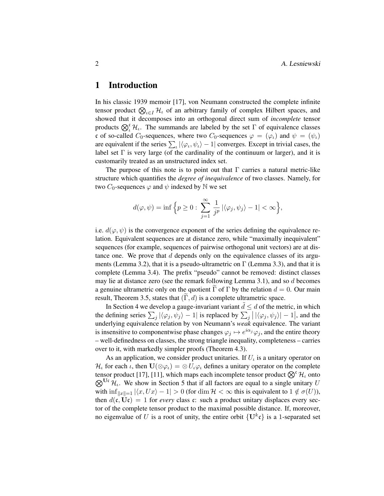
<figcaption class="paper-figure-caption"><b>Fig 1.</b> Low-resolution page preview, page 2</figcaption>
</figure>
<figure class="paper-figure-card">
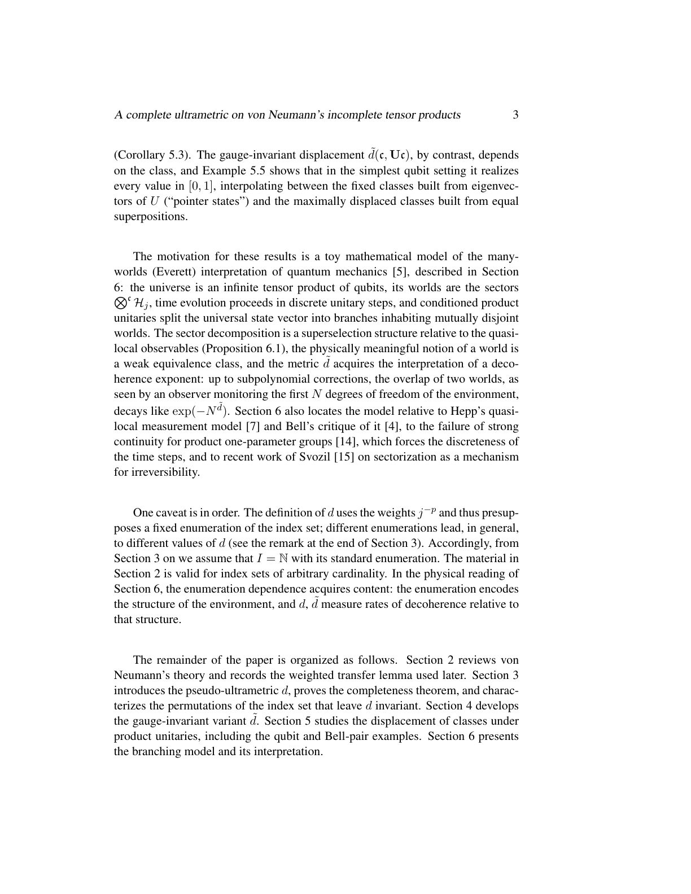
<figcaption class="paper-figure-caption"><b>Fig 2.</b> Low-resolution page preview, page 3</figcaption>
</figure>
<figure class="paper-figure-card">
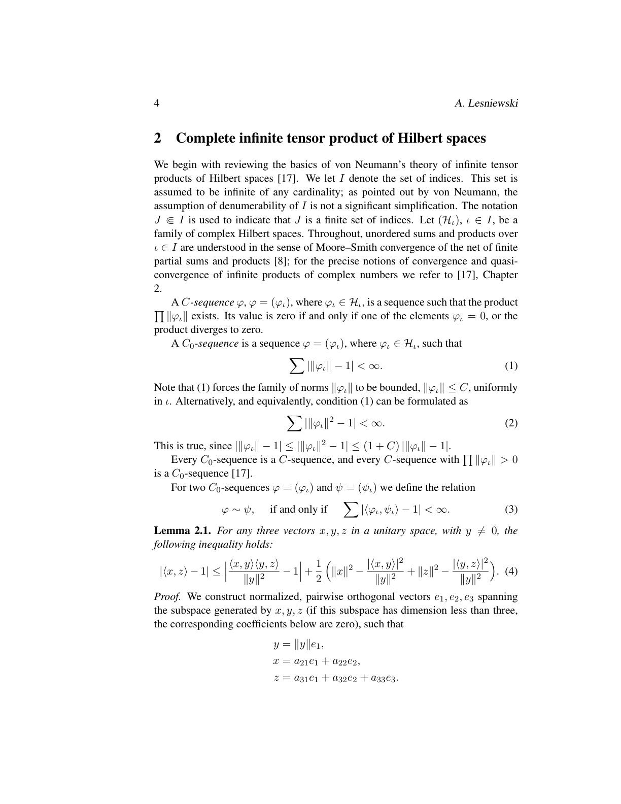
<figcaption class="paper-figure-caption"><b>Fig 3.</b> Low-resolution page preview, page 4</figcaption>
</figure>
<figure class="paper-figure-card">
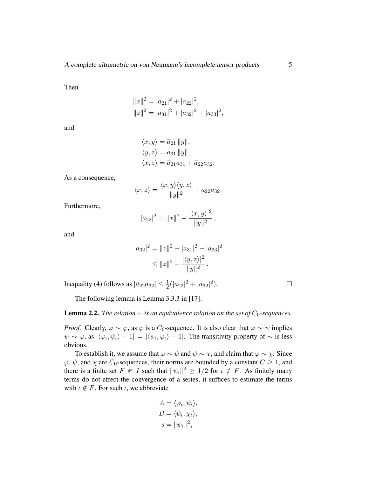
<figcaption class="paper-figure-caption"><b>Fig 4.</b> Low-resolution page preview, page 5</figcaption>
</figure>
<figure class="paper-figure-card">
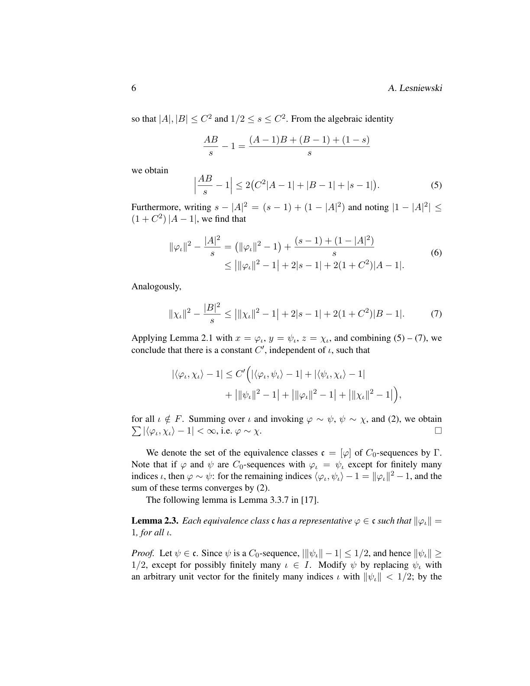
<figcaption class="paper-figure-caption"><b>Fig 5.</b> Low-resolution page preview, page 6</figcaption>
</figure>

**Summary.** This paper develops a complete ultrametric structure on the space representing different 'worlds' or sectors arising from infinite tensor products. By defining metrics like the decoherence exponent ($	ilde{d}$), it provides a quantitative measure of how rapidly distinct branches become operationally distinguishable under unitary evolution. This offers a rigorous mathematical underpinning for interpreting quantum branching in the context of environmental monitoring.

**Why it may be interesting.** It provides a rigorous mathematical tool (ultrametrics) to quantify the emergence of apparent state reduction and environmental monitoring effects in quantum theory, which is highly relevant for understanding open quantum systems dynamics.

Detailed structure

**Main problem.** To mathematically formalize the concept of 'branching worlds' within quantum mechanics by defining a rigorous metric structure on von Neumann's incomplete tensor products.

**Main result.** The set of equivalence classes of these tensor product sectors forms a complete ultrametric space, providing a quantitative measure for state separation during unitary evolution.

**Method.** The authors define two metrics ($d$ and $	ilde{d}$) based on convergence exponents derived from inner products between sequence representatives. They prove the properties of these metrics to establish the required mathematical structure.

**Model / system.** The model is an infinite tensor product of Hilbert spaces, used as a mathematical framework for describing the Many-Worlds Interpretation (Everettian branching). The dynamics are governed by product unitaries acting on these sectors.

**Key observables.** The primary observables are the two metrics: $d$ (phase-sensitive) and $	ilde{d}$ (decoherence exponent), which quantify the rate of operational distinguishability between branches.

**Important parameters / regimes.** The convergence exponents ($p$) defining the metric, and the structure of the product unitaries $U(\otimes \varphi_i)$.

**Assumptions / limitations.** The analysis assumes a mathematical framework where sectors are labeled by equivalence classes ($\Gamma$), and it explicitly notes that it does not solve all conceptual difficulties of the Everett interpretation.

**Paper structure.** The paper builds from defining the pseudo-ultrametric $d$ on $\Gamma$, proving its completeness after quotienting by the zero-distance relation to form a true ultrametric space. It then develops the gauge-invariant metric $	ilde{d}$ and applies it to analyze how product unitaries cause displacement, interpreting this as decoherence.

Abstract

We revisit von Neumann's theory of infinite tensor products of Hilbert spaces. On the set $Γ$ of equivalence classes of $C_0$-sequences, which labels the incomplete tensor products inside the complete tensor product, we introduce a natural pseudo-ultrametric $d$: the distance between two classes is the convergence exponent of the series $\sum_j|\langle\varphi_j,ψ_j\rangle-1|$ formed from any pair of representatives. We show that $d$ is well defined on equivalence classes, satisfies the strong triangle inequality, and is complete. Distinct classes may lie at distance zero, so $d$ separates points only after passing to the quotient $\widetildeΓ$ of $Γ$ by the relation $d=0$; the pair $(\widetildeΓ,d)$ is then a complete ultrametric space. As an application, we show that a product unitary $\bigotimes_j U$ whose factor $U$ satisfies $\inf_{\|x\|=1}|\langle x,Ux\rangle-1|>0$ (in particular, a unitary on a finite dimensional space with $1\notinσ(U)$) displaces every class to the maximal distance $1$. Guided by the intended application -- a caricature of Everettian branching, in which the sectors of the infinite tensor product play the role of worlds -- we also develop a gauge-invariant variant $\tilde d$ of the metric, based on von Neumann's weak equivalence and matched to the quasi-equivalence of product states on the quasi-local algebra. The displacement of a class under a product unitary, measured by $\tilde d$, is class dependent and realizes every value in $[0,1]$. We interpret $\tilde d$ as a decoherence exponent: it measures the polynomial rate at which two branches of the universal state vector become operationally distinct as ever larger portions of the environment are monitored.

[↑ back to top](#top)

### [Local Determinacy of Quantum Master Equations and a Mechanical Interpretation of the Multi-Mode Jaynes-Cummings and Central Spin Models](http://arxiv.org/abs/2607.09651v1)

**Authors:** Jaeha Lee, Miku Ishizaki  
**Type:** theory · **Category:** other · **PDF:** <https://arxiv.org/pdf/2607.09651v1>  
**Analysis basis:** full PDF text, analyzed in chunks
**Topic relevance:** `correlated / nonlocal dissipation` **2/5** · `non-equilibrium dynamics` **2/5** · `Tavis-Cummings & cavity-many-emitter` **1/5** · `driven-dissipative phase transition` **1/5** · `methods for driven-dissipative` **1/5** · `quantum measurements` **1/5**

↔ Scroll figures horizontally

<figure class="paper-figure-card">
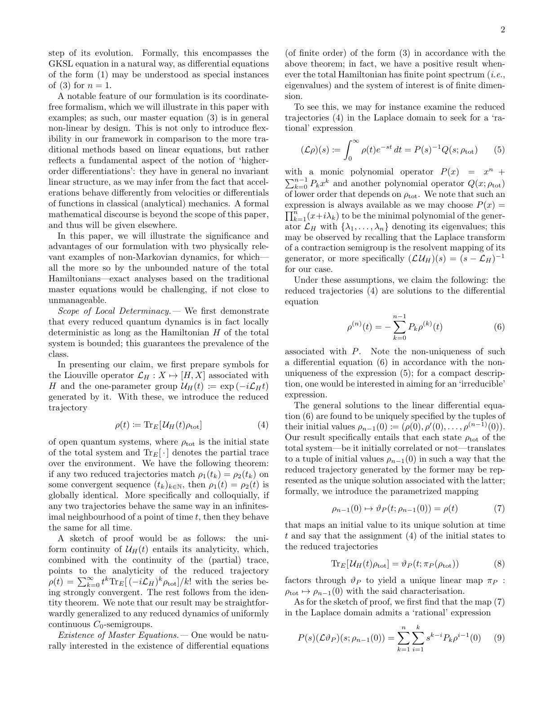
<figcaption class="paper-figure-caption"><b>Fig 1.</b> Low-resolution page preview, page 2</figcaption>
</figure>
<figure class="paper-figure-card">
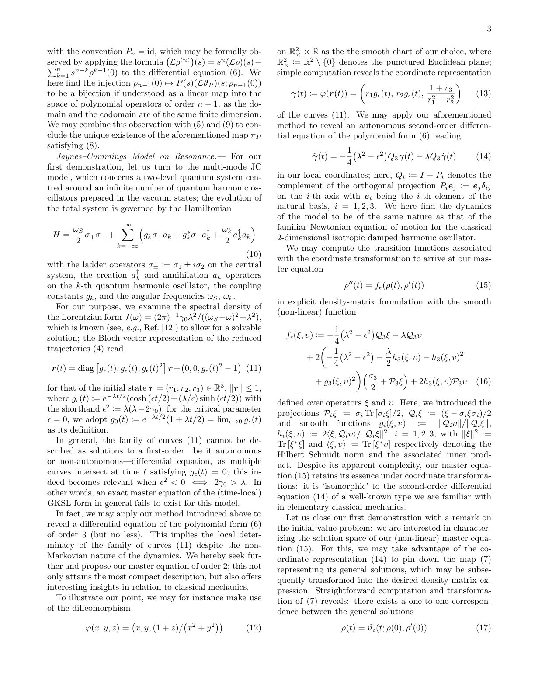
<figcaption class="paper-figure-caption"><b>Fig 2.</b> Low-resolution page preview, page 3</figcaption>
</figure>
<figure class="paper-figure-card">
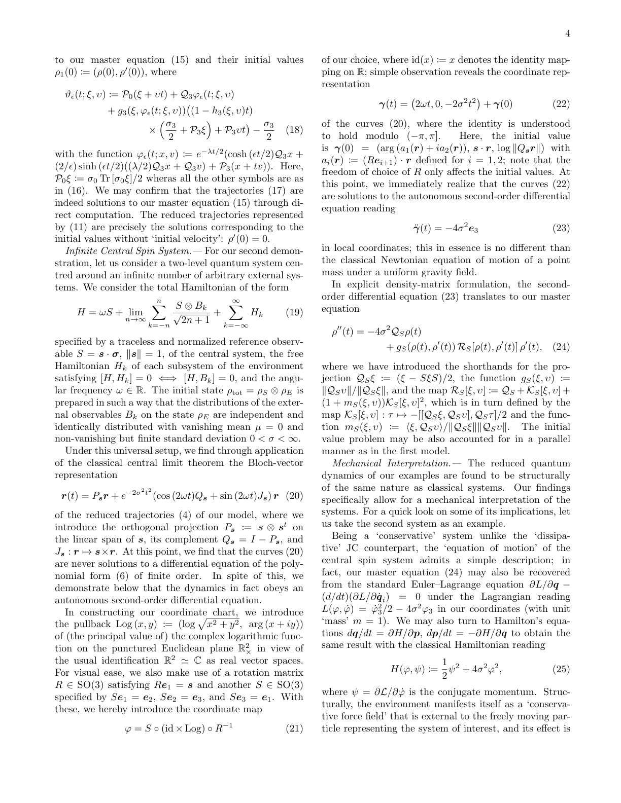
<figcaption class="paper-figure-caption"><b>Fig 3.</b> Low-resolution page preview, page 4</figcaption>
</figure>
<figure class="paper-figure-card">
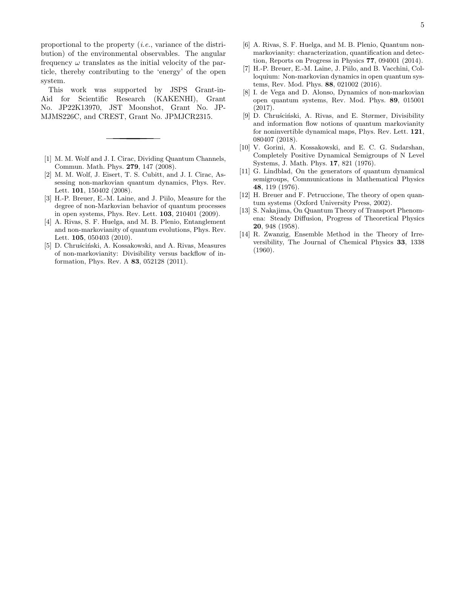
<figcaption class="paper-figure-caption"><b>Fig 4.</b> Low-resolution page preview, page 5</figcaption>
</figure>

**Summary.** The paper introduces 'local determinacy' as an alternative view of open quantum system dynamics, suggesting state evolution depends only on its current state rather than its entire history. By analyzing models like the Jaynes-Cummings system, the authors show that complex non-Markovian behavior can be mathematically recast into simple, autonomous second-order differential equations analogous to classical mechanics.

**Why it may be interesting.** This work directly addresses the mathematical structure of non-Markovian dynamics in open quantum systems, providing a powerful, physically intuitive interpretation (mechanical analogy) for complex time evolution that goes beyond standard Lindblad or NZ formalisms.

Detailed structure

**Main problem.** The authors propose a novel framework for open quantum systems where state evolution is determined locally by its instantaneous behavior, challenging traditional non-Markovian descriptions that rely on the system's entire past history.

**Main result.** They demonstrate that local determinacy holds for several models, showing that complex non-Markovian dynamics can be mapped onto autonomous second-order differential equations structurally equivalent to classical mechanical systems.

**Method.** The analysis involves deriving higher-order differential equations governing the reduced density matrix trajectory and employing coordinate transformations to map these quantum dynamics onto known forms of classical mechanics (Lagrangian/Hamiltonian formalisms).

**Model / system.** The study analyzes two models: a multi-mode Jaynes–Cummings system coupled to harmonic oscillators, and an infinite central spin system. The dynamics are governed by master equations that exhibit non-Markovian behavior.

**Key observables.** Reduced trajectories $
ho(t)$ (represented in Bloch vector form), which obey specific differential equations.

**Important parameters / regimes.** The coupling strengths ($g_k$), oscillator frequencies ($\omega_k$), and parameters defining the spectral density ($J(\omega)$) are crucial; regimes like $2\gamma_0 > \lambda$ indicate failure of simple time-local descriptions.

**Assumptions / limitations.** The existence proof for the differential equation relies on the total Hamiltonian having a finite point spectrum, and the system being finite dimensional in certain contexts. The method also requires specific coordinate charts for simplification.

**Figures summary.** Not specified by notes; however, the analysis involves deriving equations (e.g., Eq. 14, Eq. 23) that govern the local evolution of the reduced state variables $\gamma(t)$.

**Paper structure.** The paper first introduces the concept of local determinacy for master equations, contrasting it with NZ approaches. It then applies this framework to the multi-mode JC model and subsequently to an infinite central spin system, deriving ODEs and establishing mechanical analogies.

Abstract

We propose a novel formulation of master equations for open systems wherein the evolution of a state is determined solely by its local behaviour at any point of time. Specifically, our formulation allows for a local interpretation of the workings of beyond-Markovian dynamics as opposed to the more common conception that non-Markovian state evolution is affected by its cumulative past history. Quite interestingly, local determinacy is found prevalent in quantum dynamics. We illustrate the advantages of our coordinate-free formulation with exact analyses on two physically relevant models.

[↑ back to top](#top)

### [Distillation-Enhanced Continuous-Variable Quantum Teleportation for Satellite Communication Networks](http://arxiv.org/abs/2607.08977v1)

**Authors:** Lia Suci Waliani, Georges Kaddoum, Mahdi Chehimi, Shahan Hawatian  
**Type:** theory · **Category:** quantum information and computing · **PDF:** <https://arxiv.org/pdf/2607.08977v1>  
**Analysis basis:** full PDF text, analyzed in chunks
**Topic relevance:** `entanglement & information structure` **2/5** · `Keldysh / 2PI / non-Gaussian methods` **1/5** · `correlated / nonlocal dissipation` **1/5** · `driven-dissipative phase transition` **1/5** · `methods for driven-dissipative` **1/5**

↔ Scroll figures horizontally

<figure class="paper-figure-card">
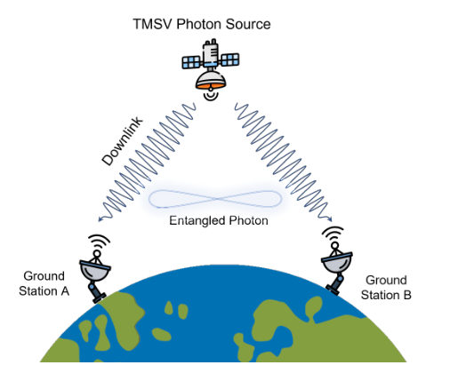
<figcaption class="paper-figure-caption"><b>Fig 1.</b> Fig. 1. Dual-downlink FSO quantum link where a satellite generates a TMSV entangled photon pair. Each mode is sent to two GSs through independent channels with different losses.</figcaption>
</figure>
<figure class="paper-figure-card">
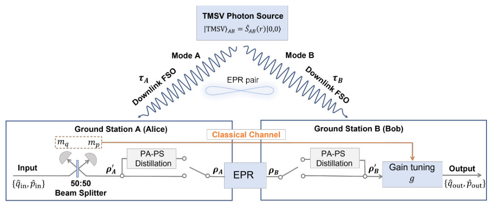
<figcaption class="paper-figure-caption"><b>Fig 2.</b> Fig. 2. Dual-downlink CV-QT over satellite-based FSO links, where a satellite distributes a TMSV entangled pair to two ground stations through asymmetric channels. A switch selects the weaker link based on its transmissivity and applies PA–PS distillation to enhance entanglement.</figcaption>
</figure>
<figure class="paper-figure-card">
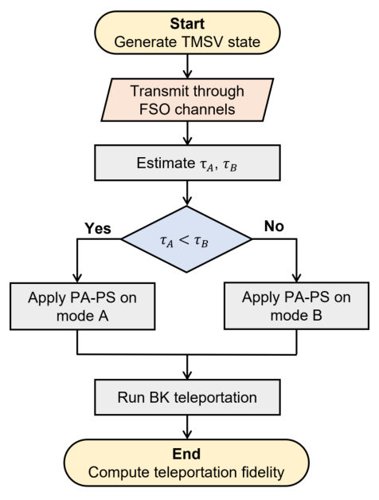
<figcaption class="paper-figure-caption"><b>Fig 3.</b> Fig. 3. Flowchart of the selective distillation protocol for dual-downlink CV teleportation.</figcaption>
</figure>
<figure class="paper-figure-card">
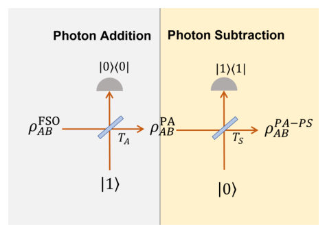
<figcaption class="paper-figure-caption"><b>Fig 4.</b> Fig. 4. The PA-PS acting as the entanglement distillation protocol.</figcaption>
</figure>
<figure class="paper-figure-card">
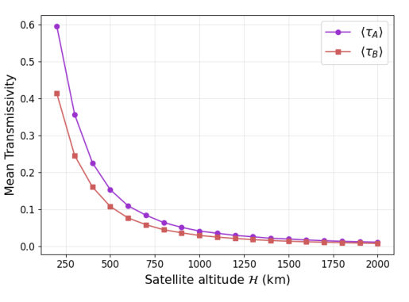
<figcaption class="paper-figure-caption"><b>Fig 5.</b> Fig. 5. Average transmissivity ⟨τ⟩with respect to satellite altitude H for the dual downlink FSO channel.</figcaption>
</figure>

**Summary.** This paper proposes using a non-Gaussian entanglement distillation technique, specifically Photon Addition–Photon Subtraction (PA-PS), to boost the performance of continuous-variable quantum teleportation over satellite links. By mitigating channel degradation caused by atmospheric loss and turbulence, the method significantly improves both fidelity and entanglement measures in realistic communication scenarios.

**Why it may be interesting.** This work directly addresses practical limitations in quantum communication channels by integrating advanced quantum resource enhancement techniques (entanglement distillation) with detailed physical propagation models relevant to free-space optics.

Detailed structure

**Main problem.** Quantum teleportation over satellite-based free-space optical channels suffers significant performance degradation due to atmospheric loss and turbulence.

**Main result.** Employing a non-Gaussian entanglement distillation protocol (PA-PS) significantly improves teleportation fidelity by up to 7.7% and enhances entanglement negativity by about 105% in low-to-moderate loss regimes.

**Method.** The authors model the process using continuous-variable quantum information theory, applying sequential Photon Addition–Photon Subtraction (PA-PS) distillation on the weaker channel before executing the Braunstein-Kimble teleportation protocol.

**Model / system.** The system is a dual-downlink Free Space Optical (FSO) link connecting ground stations to a satellite. The resource state is modeled as a Two-Mode Squeezed Vacuum (TMSV) state, and the channel degradation incorporates diffraction loss, atmospheric attenuation, and turbulence effects.

**Key observables.** Teleportation fidelity ($\langle F 
angle$), entanglement negativity ($N(
ho_{AB})$), heralded success probability ($	ext{p}_{	ext{succ}}$).

**Important parameters / regimes.** Squeezing parameter ($r$), satellite altitude ($H$), zenith angle ($	heta$), and various channel transmissivities ($	au$).

**Assumptions / limitations.** The analysis assumes the ability to apply PA-PS distillation selectively to the weaker of the two downlink channels, and it models complex physical losses like diffraction and turbulence.

**Figures summary.** Figures illustrate the dual-downlink FSO quantum link setup and show how the CV-QT process incorporates the selection of the weaker link for PA–PS distillation.

**Paper structure.** The paper first establishes the problem (lossy satellite QT), then details the physical modeling of channel degradation (diffraction, turbulence), introduces the PA-PS distillation protocol applied to the weakest link, and finally calculates the resulting fidelity and entanglement improvements compared to non-distilled scenarios.

Abstract

Quantum teleportation (QT) over satellite-based free-space optical (FSO) channels is a promising approach for long-distance quantum communication. However, its performance is significantly degraded by atmospheric loss and turbulence. In this paper, we investigate continuous-variable (CV) QT in a dual-downlink scenario, where a satellite distributes entangled states to two ground stations. To mitigate channel-induced degradation, we employ a non-Gaussian entanglement distillation protocol based on the sequential application of photon addition and photon subtraction (PA-PS) on the weaker channel. The results show that the proposed scheme improves teleportation fidelity by up to 7.7% and enhances entanglement negativity by approximately 105% in the low-to-moderate (below 600 km) loss regime. In addition, we identify an optimal squeezing parameter that balances entanglement strength and noise sensitivity. Taken together, these results demonstrate the effectiveness of PA-PS distillation for improving CV quantum communication in realistic satellite networks. We further characterize the trade-off between fidelity gain and the heralded success probability of the protocol.

[↑ back to top](#top)

### [Superconducting singlet-triplet qubits](http://arxiv.org/abs/2607.09508v1)

**Authors:** Anatoliy Lotkov, Maria Spethmann, Daniel Loss  
**Type:** theory · **Category:** quantum information and computing · **PDF:** <https://arxiv.org/pdf/2607.09508v1>  
**Analysis basis:** full PDF text, analyzed in chunks
**Topic relevance:** `QC/QI experiment` **2/5** · `Keldysh / 2PI / non-Gaussian methods` **1/5** · `analog quantum simulation` **1/5** · `correlated cavity matter` **1/5** · `spintronics-quantum-optics interface` **1/5**

↔ Scroll figures horizontally

<figure class="paper-figure-card">
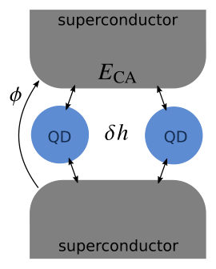
<figcaption class="paper-figure-caption"><b>Fig 1.</b> Figure 1. A superconducting singlet-triplet qubit consisting of a double quantum dot in a Josephson junction. The spins in the quantum dots are coupled by crossed Andreev processes across the junction, ECA(1 + cos ϕ), whose magnitude can be controlled by the superconducting phase ϕ. Additionally, a difference in the dots’ Zeeman energies δh mixes singlet and triplet states.</figcaption>
</figure>
<figure class="paper-figure-card">
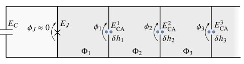
<figcaption class="paper-figure-caption"><b>Fig 2.</b> Figure 2. To operate N SST qubits, they are placed in par- allel in a superconducting circuit where they are controlled by magnetic fluxes Φj, analogous to a setup suggested for Andreev spin qubits [13]. A conventional Josephson junction with large Josephson energy EJ enables two-qubit interac- tions.</figcaption>
</figure>
<figure class="paper-figure-card">
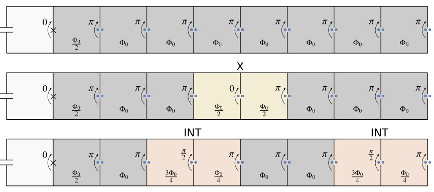
<figcaption class="paper-figure-caption"><b>Fig 3.</b> Figure 3. Superconducting singlet-triplet (SST) qubits are operated by changing the fluxes through the adjacent circuit loops, which change the superconducting phases across them (black arrows). Qubits in their OFF flux set points are in an idle state. Qubits in their X flux set point are subject to single-qubit rotations. Single-qubit rotations can be performed for different qubits at once. Any two qubits that are in their INT flux set point interact and can realize a two-qubit gate.</figcaption>
</figure>
<figure class="paper-figure-card">
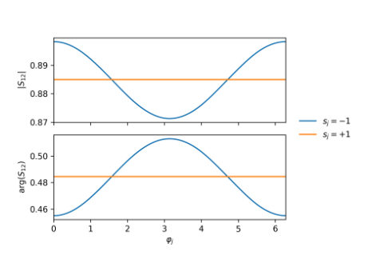
<figcaption class="paper-figure-caption"><b>Fig 4.</b> Figure 4. The S12 coefficient [Eq. (10)] of the scattered waveg- uide photons as a function of the magnetic flux φs j. The S12 coefficient is plotted for two possible states of the jth qubit sj = ±1. The other magnetic fluxes are tuned to the INT set point (φs k̸=j = π/2) to make the respective qubits not affect the photon scattering phase. The plot clearly shows that the maximum difference between the scattering phases for the qubit states sj = ±1 is achieved in the OFF set point (φs j = π) and the X set point (φs j = 0). The S12 coefficient is plotted for the following parameter values: κ/h = 20 MHz, ωp/2π = ωr/2π = 4 GHz, EJ/h = 45 GHz, EC/h = 100 MHz, ECA/h = 2 GHz, g/h = 100 MHz.</figcaption>
</figure>
<figure class="paper-figure-card">
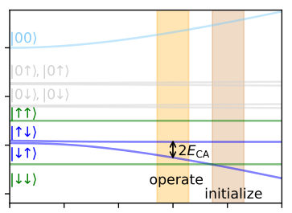
<figcaption class="paper-figure-caption"><b>Fig 5.</b> Figure 5. Spectrum of the states in a Josephson junction at a superconducting phase of ϕ = 0. The computational states (dark blue) are split by the Crossed Andreev coupling energy 2ECA = 4 Γ2</figcaption>
</figure>

**Summary.** This paper introduces and theoretically analyzes Superconducting Singlet-Triplet (SST) qubits, which are promising candidates for scalable quantum processors because they avoid the need for spin-orbit coupling. The authors derive the effective Hamiltonian by treating the system in the transmon regime and utilize advanced perturbation theory to map out robust control protocols for single and two-qubit gates.

**Why it may be interesting.** The detailed derivation of an effective Hamiltonian from a complex superconducting circuit model using advanced many-body techniques like Schrieffer-Wolff is highly relevant to understanding controllable quantum hardware architectures in condensed matter physics.

Detailed structure

**Main problem.** The paper proposes superconducting singlet-triplet (SST) qubits as a robust alternative to Andreev spin qubits for quantum computation.

**Main result.** These SST qubits maintain the advantages of coupling to circuit QED while crucially eliminating the need for spin-orbit interaction, making them compatible with a wider range of materials like silicon.

**Method.** The effective qubit Hamiltonian is derived using Schrieffer-Wolff transformations and by analyzing the system in the transmon regime. Control mechanisms are mapped out based on manipulating superconducting phases ($\phi_j$).

**Model / system.** The physical platform consists of parallel-aligned double quantum dots integrated into Josephson junctions, forming an array of $N$ qubits coupled to a superconducting circuit. The Hamiltonian incorporates terms for charging energy ($E_C$), Josephson coupling ($E_J$), and crossed Andreev couplings ($E_{CA}$).

**Key observables.** Dispersive shift ($\chi_n(s)$) and Lamb shift ($\Lambda_n(s)$) are key observables used to characterize qubit-cavity coupling for readout.

**Important parameters / regimes.** The analysis relies on regimes where $\Gamma, |\delta h| \ll |\epsilon| \ll U, \Delta$, and specifically assumes the transmon regime ($E_c \ll E_J$) for effective Hamiltonian derivation.

**Assumptions / limitations.** Key assumptions include operating in the dispersive regime for readout ($\omega_r - \omega_{tr} \gg g$), treating Zeeman coupling as a small perturbation, and neglecting higher-order terms during the Schrieffer-Wolff expansion.

**Figures summary.** Figure 1 illustrates the single SST qubit structure, while Figure 2 shows the array setup for $N$ qubits. The text references Hamiltonian equations (Eqs. 3, 4, 5) and cavity coupling details (Eqs. 7, 8).

**Paper structure.** The paper progresses from defining the physical system and proposing SST qubits over Andreev qubits, to deriving the full system Hamiltonian, simplifying it via Schrieffer-Wolff transformations in the transmon regime, and finally detailing control schemes for single-qubit gates (X/Z set points) and two-qubit entangling gates.

Abstract

Hybrid devices integrating quantum dots with Josephson junctions are gaining interest because they combine spin-based quantum computing with circuit quantum electrodynamics (circuit QED) methods. In particular, Andreev spin qubits have shown significant experimental progress including strong two-qubit coupling, and are predicted to exhibit all-to-all connectivity. Here we propose superconducting singlet-triplet (SST) qubits that rely on parallel-aligned double quantum dots in Josephson junctions. While Andreev spin qubits require spin-orbit interaction to unlock the spin degree-of-freedom, SST qubits do not require spin-orbit interaction, making the advantages of hybrid devices available to a wider range of materials. Similar to Andreev spin qubits, the qubit states couple to the superconducting phase across the junction, which allows for control and readout using circuit QED, and supports all-to-all connectivity. Only $N$ flux lines are required to perform any single- and two-qubit gate among $N$ qubits, and thus the overhead of control lines is small. Finally, linear protection from charge or flux noise makes these qubits interesting candidates for a future quantum processor.

[↑ back to top](#top)

### [Optimality of the free quantum evolution: the general case with nodes](http://arxiv.org/abs/2607.09643v1)

**Authors:** Laura M. Morato  
**Type:** theory · **Category:** other · **PDF:** <https://arxiv.org/pdf/2607.09643v1>  
**Analysis basis:** full PDF text, analyzed in chunks
**Topic relevance:** `non-equilibrium dynamics` **2/5** · `Keldysh / 2PI / non-Gaussian methods` **1/5** · `driven-dissipative phase transition` **1/5** · `methods for driven-dissipative` **1/5**

↔ Scroll figures horizontally

<figure class="paper-figure-card">
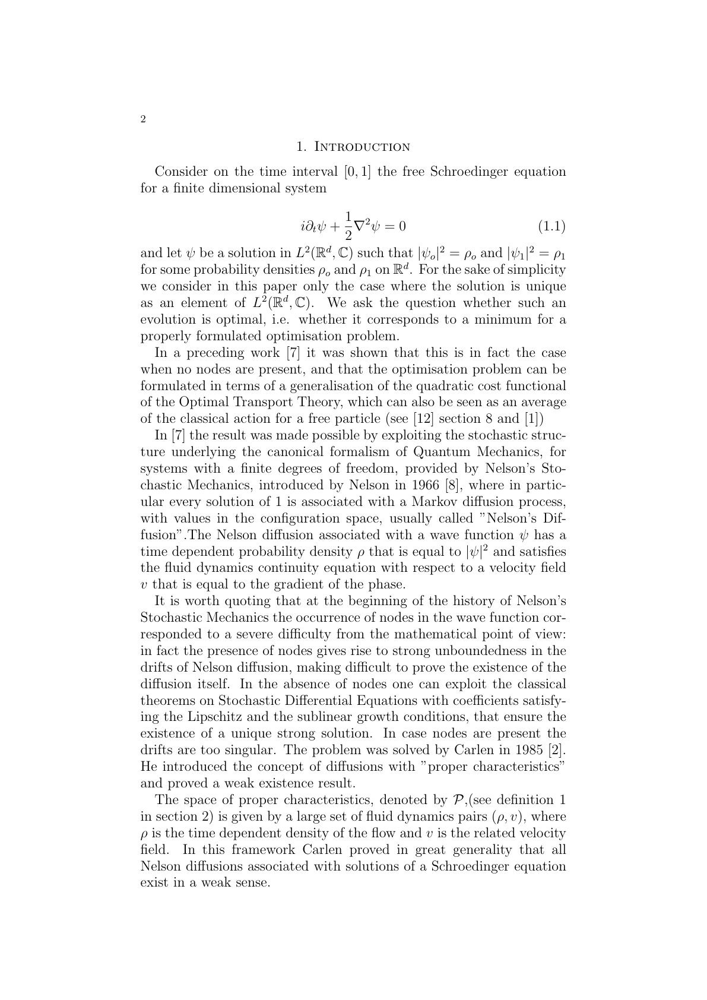
<figcaption class="paper-figure-caption"><b>Fig 1.</b> Low-resolution page preview, page 2</figcaption>
</figure>
<figure class="paper-figure-card">
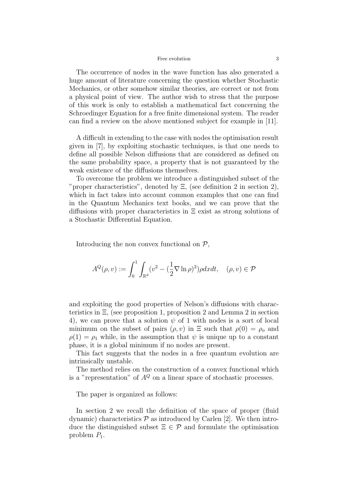
<figcaption class="paper-figure-caption"><b>Fig 2.</b> Low-resolution page preview, page 3</figcaption>
</figure>
<figure class="paper-figure-card">
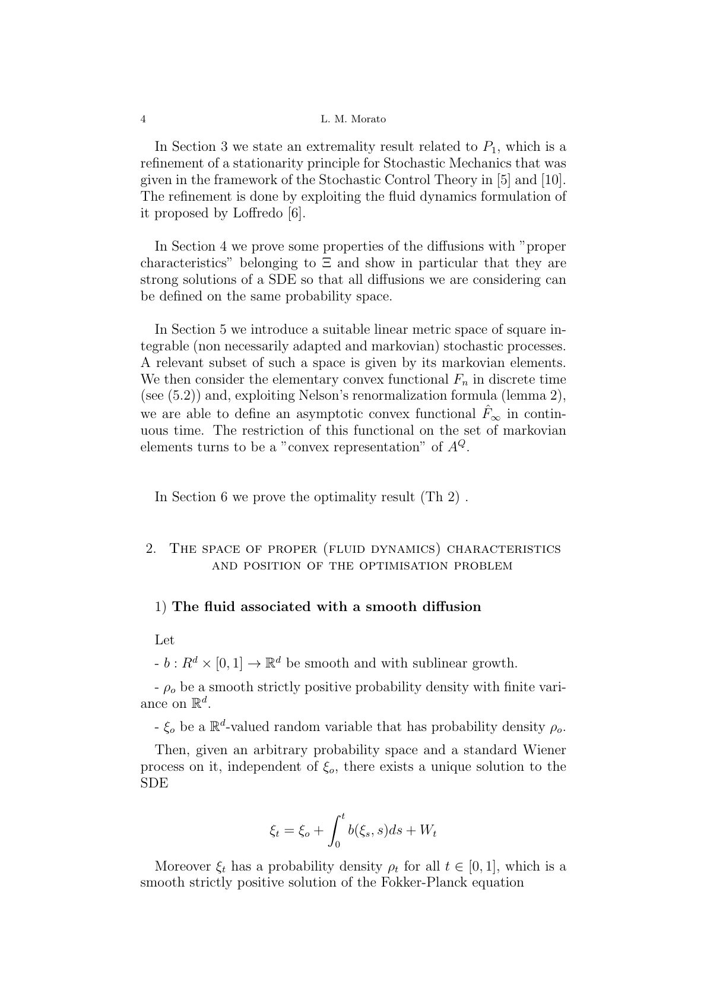
<figcaption class="paper-figure-caption"><b>Fig 3.</b> Low-resolution page preview, page 4</figcaption>
</figure>
<figure class="paper-figure-card">
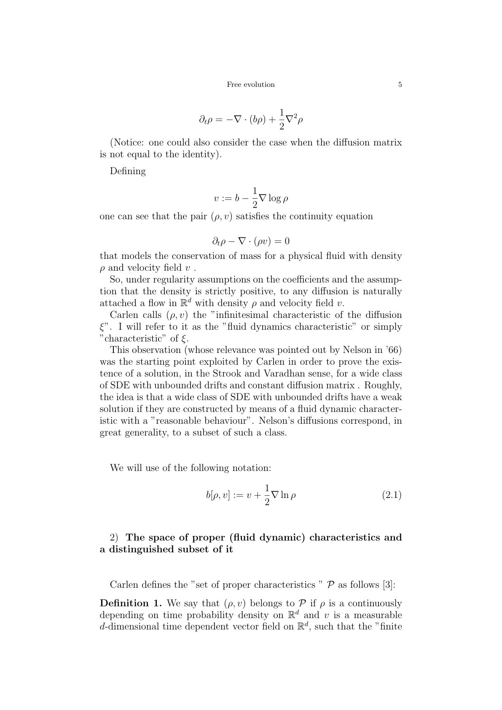
<figcaption class="paper-figure-caption"><b>Fig 4.</b> Low-resolution page preview, page 5</figcaption>
</figure>
<figure class="paper-figure-card">
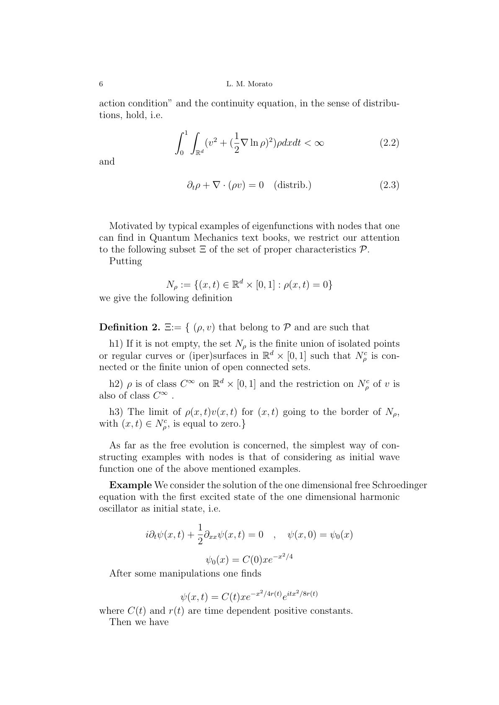
<figcaption class="paper-figure-caption"><b>Fig 5.</b> Low-resolution page preview, page 6</figcaption>
</figure>

**Summary.** The paper investigates the optimality of the free time evolution for a quantum wave function when its initial and final probability densities are fixed. By formulating this as an optimal transport problem, it shows that while the evolution is globally optimal without nodes, the presence of nodes renders the minimum only local, suggesting inherent instability in such configurations.

**Why it may be interesting.** This work provides a deep variational characterization of free quantum evolution by linking it to optimal transport theory. The distinction between global minima (no nodes) and local minima (nodes present) offers novel insights into the stability of quantum states in open or constrained systems.

Detailed structure

**Main problem.** The central problem is determining whether the free evolution of a quantum wave function, constrained by fixed initial and final probability densities, corresponds to an optimal path in a variational sense.

**Main result.** The free evolution minimizes a generalized action functional (related to quadratic optimal transport cost) when no nodes are present; however, the presence of nodes suggests intrinsic instability for this minimum.

**Method.** The analysis uses techniques from Optimal Transport Theory and Stochastic Mechanics, formulating the problem as minimizing an action functional $AQ(
ho, v)$ derived from necessary conditions for extremality (Hamilton-Jacobi equations).

**Model / system.** The system is governed by the free Schrödinger equation in finite dimensions. The mathematical framework relates the quantum evolution to a diffusion process whose density $
ho$ and current $v$ are analyzed.

**Key observables.** Probability density $
ho(x, t) = |\psi(x, t)|^2$, associated velocity field $v(x, t)$, and the action functional $AQ(
ho, v)$.

**Important parameters / regimes.** The time interval $[0, 1]$ and the boundary conditions defined by fixed initial ($
ho_0$) and final ($
ho_1$) moduli.

**Assumptions / limitations.** Assumes $\psi$ is unique up to a constant phase; handling nodes requires restricting analysis to a subset $\Xi$ where strong solutions of the associated SDE exist.

**Figures summary.** Not specified by notes, but the structure suggests proofs involving functional minimization and convergence arguments using sequences of approximations.

**Paper structure.** The paper proceeds by defining the relevant state space ($\Xi$), deriving necessary conditions for extremality via calculus of variations (leading to HJM equations), establishing the connection to stochastic processes, and finally proving the optimality theorem through convex functional analysis and limiting procedures.

Abstract

Extending and refining a preceding work, the free evolution of a quantum wave function, with fixed initial and final modulus, is considered in the general case where nodes are allowed. The method is based on considering a suitable simple functional related to the quadratic optimal transport cost in discrete time. Under reasonable assumptions it is shown that, if nodes are present, the free evolution of the wave function with fixed initial and final modulus is a sort of local minimum. If no nodes are present the minimum is global, suggesting intrinsic instability of the nodes in a free quantum evolution.

[↑ back to top](#top)

### [Playing Bayesian games better with separable quantum states than with any classical correlation](http://arxiv.org/abs/2607.09477v1)

**Authors:** Yaqing Xy Wang, Giannicola Scarpa, Andreas Winter  
**Type:** theory · **Category:** other · **PDF:** <https://arxiv.org/pdf/2607.09477v1>  
**Analysis basis:** full PDF text, analyzed in chunks
**Topic relevance:** `entanglement & information structure` **2/5** · `Keldysh / 2PI / non-Gaussian methods` **1/5** · `correlated / nonlocal dissipation` **1/5** · `quantum measurements` **1/5**

↔ Scroll figures horizontally

<figure class="paper-figure-card">
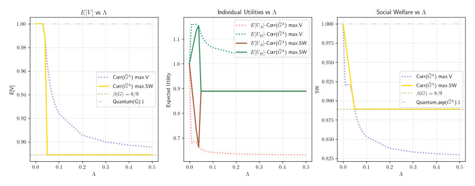
<figcaption class="paper-figure-caption"><b>Fig 1.</b> FIG. 1. Left: Magic square game score for correlated equilibria optimized for original game score and social welfare of modified game, all compared to classical bound of 8</figcaption>
</figure>
<figure class="paper-figure-card">
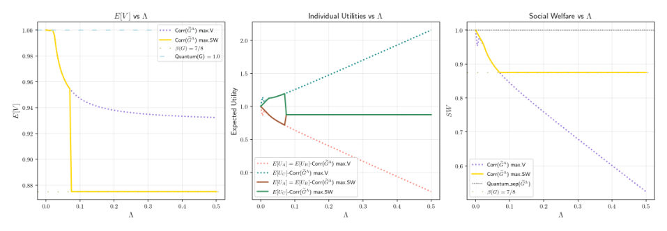
<figcaption class="paper-figure-caption"><b>Fig 2.</b> FIG. 2. Left: Original GHZ game score for all players at correlated equilibria. Classical bound for the game is 7</figcaption>
</figure>
<figure class="paper-figure-card">
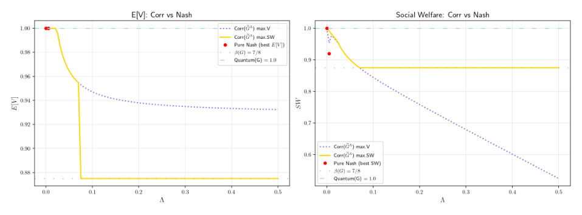
<figcaption class="paper-figure-caption"><b>Fig 3.</b> FIG. 3. Left: GHZ score compared among Nash and correlated equilibria of the modified game. Two pure Nash equilibria exist around λ = 0, denoted with red dots. Right: Social welfare comparison.</figcaption>
</figure>
<figure class="paper-figure-card">
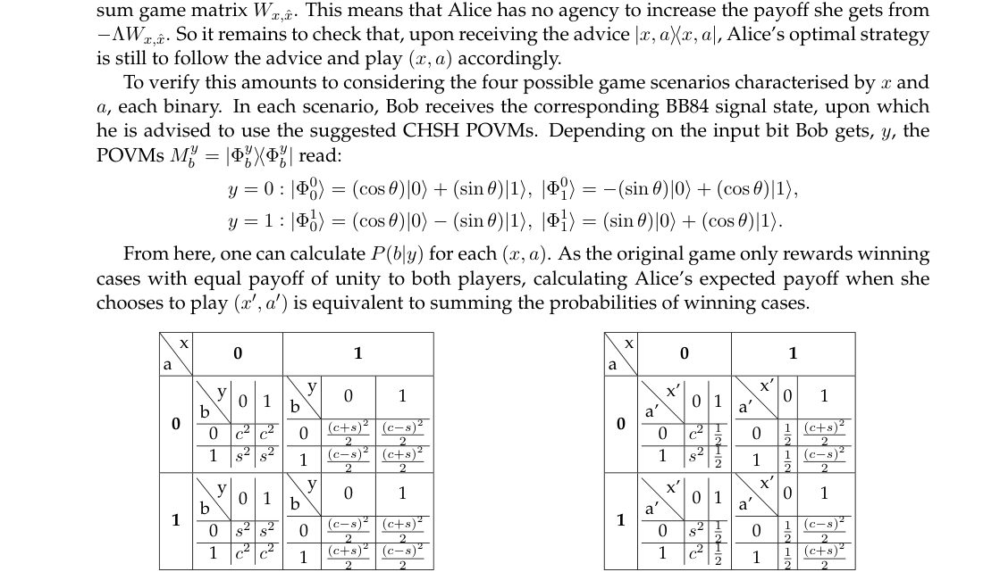
<figcaption class="paper-figure-caption"><b>Fig 4.</b> FIG. 4. Left: P(b|y) calculated for each (x, a) by applying Bob’s suggested set of POVMs on the corresponding |φa|x⟩⟨φa|x|. Right: V (a′, x′, b, y), the expected payoff for Alice when she plays (x′, a′) while the advice is (x, a). This calculation utilizes the prior (uniform) distribution for Bob’s input y: Pr(y = 0) = Pr(y = 1) = 1</figcaption>
</figure>
<figure class="paper-figure-card">
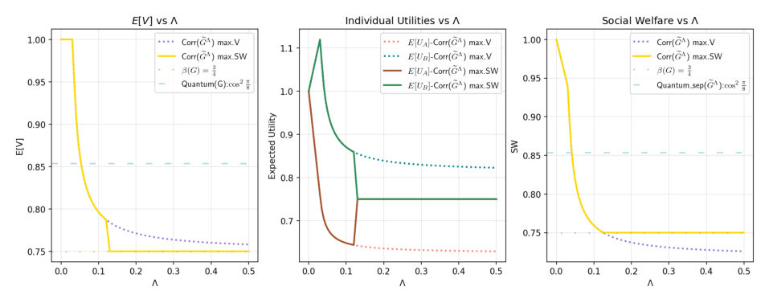
<figcaption class="paper-figure-caption"><b>Fig 5.</b> FIG. 5. Left: CHSH score of ^ CHSH Λ correlated equilibria compared to β(CHSH)= 3/4 and the quantum</figcaption>
</figure>

**Summary.** This theoretical paper explores quantum advantages in Bayesian games by comparing equilibria derived from classical versus separable quantum correlations. It proves that these local quantum states can achieve better outcomes than any classically correlated strategy, even when the game involves conflicting interests. This advances the understanding of non-classical resources beyond simple entanglement.

**Why it may be interesting.** While not directly about AMO systems, the rigorous mathematical tools developed for quantifying non-local correlations in game theory are highly relevant to understanding resource theories in open quantum systems or multipartite entanglement verification.

Detailed structure

**Main problem.** The research investigates how different types of correlations (classical vs. quantum) affect the equilibria achieved by independent agents in Bayesian games of incomplete information.

**Main result.** The paper demonstrates that even separable quantum states can generate new, genuinely quantum equilibria in competitive Bayesian games that yield higher social welfare than any equilibrium achievable using only classical correlations.

**Method.** The analysis uses game theory frameworks (Nash, Correlated Equilibria) combined with quantum information tools to compare the set of possible joint probability distributions derived from local vs. quantum measurements.

**Model / system.** The model is a general Bayesian game involving multiple players and incomplete information about their types. The correlation structure is modeled using quantum states (separable vs. entangled) acting on the players' shared Hilbert space.

**Key observables.** Social Welfare (SW), expected utility for individual players, and the comparison of equilibrium sets ($	ext{Corr}(G)$ vs. $	ext{QuSEP}(G)$).

**Important parameters / regimes.** The structure of the game itself, including payoff functions and prior distributions $p(t)$. Specific examples use parameters related to CHSH inequalities.

**Assumptions / limitations.** The core assumption is that separable quantum correlations are sufficient to demonstrate a quantum advantage in competitive settings, moving beyond previous reliance on full entanglement.

**Figures summary.** Figures compare various equilibrium scores (e.g., CHSH scores) against classical limits ($eta(G)$), showing separations between correlated and Nash equilibria when quantum strategies are employed.

**Paper structure.** The paper builds by first establishing the general framework of Bayesian games, then comparing correlation types (classical vs. quantum), and finally applying these concepts to specific examples like modified CHSH games to quantify the advantage.

Abstract

Bayesian games, also known as games of incomplete information, are a fruitful arena for exploring the impact of correlations on a set of independent agents (players) via the game equilibria to which they give rise. It was realised some time ago that quantum states shared between the players can lead to new and beneficial equilibria, compared to classical correlation. While until now examples of this effect required an entangled state, here we show that even separable states can create new, genuinely quantum equilibria in games, that are advantageous with respect to all classically correlated equilibria. This shows that non-classical correlations beyond entanglement are indeed a resource, even in otherwise entirely classical situations. Our result brings quantum advantage in games significantly closer to possible realisation.

[↑ back to top](#top)

### [Quaternary-Squeeze Quantum Identity Authentication: Direction-Scaling Security via Single-Mode Squeezed Light](http://arxiv.org/abs/2607.09162v1)

**Authors:** Zhipeng Chen, Haolun Tang, Xiao-Qi Xiao, Li-Hua Gong  
**Type:** theory · **Category:** quantum information and computing · **PDF:** <https://arxiv.org/pdf/2607.09162v1>  
**Analysis basis:** full PDF text, analyzed in chunks
**Topic relevance:** `entanglement & information structure` **2/5** · `interference shaping light` **1/5** · `quantum measurements` **1/5** · `quantum optics experiment` **1/5**

↔ Scroll figures horizontally

<figure class="paper-figure-card">
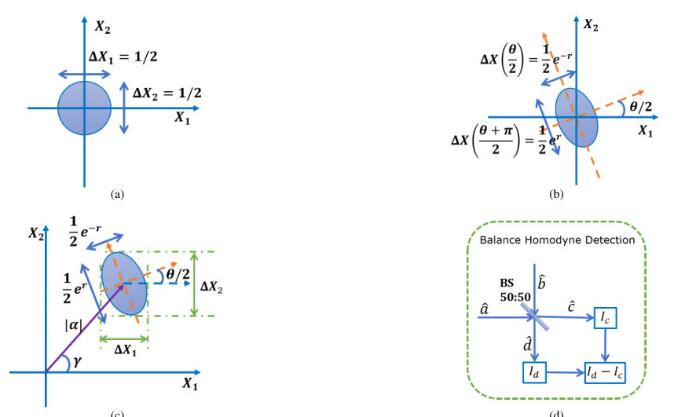
<figcaption class="paper-figure-caption"><b>Fig 1.</b> FIG. 1. Phase-space pictures of (a) vacuum state, (b) squeezed vacuum state with squeezing in X(θ/2), (c) squeezed coherent state with squeezing in X(θ/2), and (d) schematic of balanced homodyne detection.</figcaption>
</figure>
<figure class="paper-figure-card">
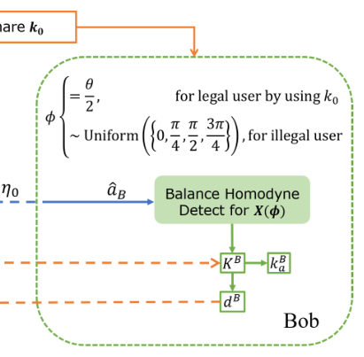
<figcaption class="paper-figure-caption"><b>Fig 2.</b> FIG. 2. Schematic diagram of the quantum identity authentication based on single-mode squeezed light field</figcaption>
</figure>
<figure class="paper-figure-card">
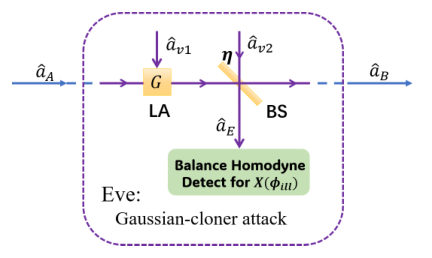
<figcaption class="paper-figure-caption"><b>Fig 3.</b> FIG. 3. Schematic diagram of Gaussian-cloner attack performed by Eve.</figcaption>
</figure>
<figure class="paper-figure-card">
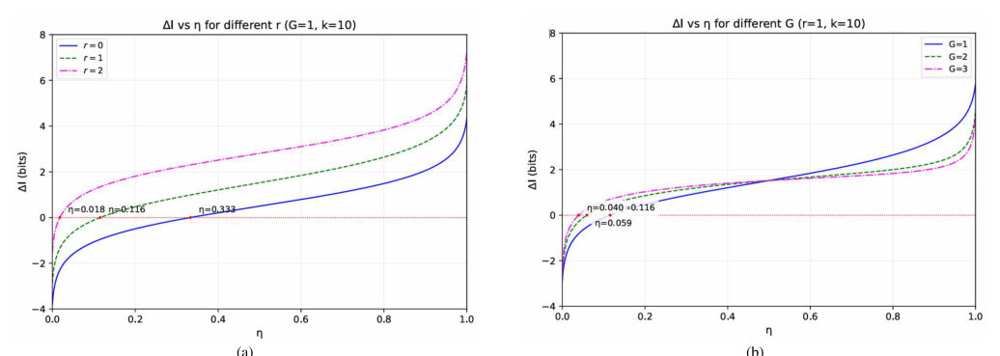
<figcaption class="paper-figure-caption"><b>Fig 4.</b> FIG. 4. The correlation between the secret information ratio ∆I and the transmission efficiency η for (a) different squeezing parameters r (G = 1, k = 10) and (b) different amplifier gains G (r = 1, k = 10).</figcaption>
</figure>
<figure class="paper-figure-card">
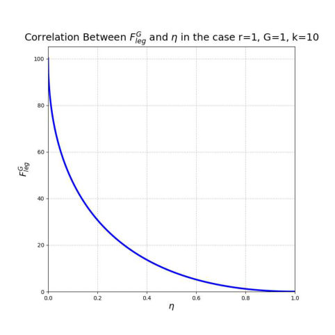
<figcaption class="paper-figure-caption"><b>Fig 5.</b> FIG. 5. The secret information ratio ∆I varies with η.</figcaption>
</figure>

**Summary.** This paper proposes a novel Quantum Identity Authentication protocol leveraging the unique noise reduction features of single-mode squeezed light. By implementing a four-direction squeezing scheme, the authors significantly boost security against eavesdropping attacks compared to existing methods. The analysis confirms that this approach provides quantifiable security advantages while remaining practical for implementation.

**Why it may be interesting.** This work is highly relevant to quantum optics and open quantum systems as it provides a concrete, theoretically rigorous protocol for secure quantum key distribution/authentication using non-Gaussian resources (squeezed light) whose noise properties are precisely modeled.

Detailed structure

**Main problem.** To develop a highly secure Quantum Identity Authentication (QIA) protocol that resists eavesdropping by exploiting non-classical properties of squeezed light.

**Main result.** The proposed four-direction squeezing approach halves the eavesdropper's guessing probability and increases the fidelity gap by 29% compared to binary methods, enhancing security without extra hardware.

**Method.** Security is analyzed using both a fidelity parameter (F) for detecting spoofing attacks and a secret information ratio ($\Delta I$) derived from mutual information calculations to quantify resistance against eavesdropping.

**Model / system.** The system utilizes single-mode light fields in the form of quadrature squeezed coherent states, measured via balanced homodyne detection. The protocol involves encoding secrets using squeezing parameters ($r$) and angles ($	heta$).

**Key observables.** Fidelity parameter (F), Secret Information Ratio ($\Delta I$), Quadrature variances $\langle[\Delta\hat{X}(\varphi)]^2
angle$.

**Important parameters / regimes.** Squeezing parameter ($r$), transmission efficiency ($\eta$), amplifier gain ($G$), and the number of squeezing directions (four-directional).

**Assumptions / limitations.** The protocol assumes Alice acts as a reliable server, Bob is the client, and security analysis relies on assuming independent/uniform selection of eavesdropper angles for averaging.

**Figures summary.** Figures illustrate phase-space representations of light states (vacuum, squeezed vacuum), schematic setups for QIA, and plots showing how security metrics ($\Delta F$ or $\Delta I$) are enhanced by increasing squeezing ($r$) or using the quaternary basis.

**Paper structure.** The paper introduces the need for secure QIA, details the physical model using quadrature squeezed states, develops the authentication mechanism involving key encoding and measurement, analyzes security via fidelity and mutual information ratios, and concludes with performance comparisons showing the advantage of the four-direction approach.

Abstract

Quantum identity authentication (QIA) has emerged as a crucial technology for secure communication systems, particularly in the burgeoning era of quantum communications. This paper proposes a novel QIA protocol based on non-classical characteristics of squeezed light fields. By exploiting quantum noise reduction properties of quadrature squeezed coherent states, the protocol fundamentally thwarts eavesdropping attempts by Heisenberg-limited uncertainty constraints. The fidelity parameter for decoy states is utilized to detect spoofing attacks, and the dynamic key update mechanism fundamentally eliminates vulnerabilities caused by key reuse. Security information ratio analysis shows that the protocol is able to resist Gaussian-cloner attacks and detect eavesdropping. Moreover, the security threshold can be further enhanced with higher squeezing, allowing tunable protection levels adaptable to different threat scenarios. Compared with binary-squeezed protocols, our proposed four-direction (quaternary-dimensional) squeezing halves the eavesdropper's guessing probability and enlarges the fidelity gap by 29% tightening the discrimination threshold without relying on extra hardware, thus facilitating practical implementation.

[↑ back to top](#top)

### [The Apparatus Strikes Back: Momentum Conservation and the Cost of Spatial Superpositions](http://arxiv.org/abs/2607.08819v1)

**Authors:** Lucas C. Céleri, Diogo O. Soares-Pinto, Daniel A. Turolla Vanzella  
**Type:** theory · **Category:** other · **PDF:** <https://arxiv.org/pdf/2607.08819v1>  
**Analysis basis:** full PDF text, analyzed in chunks
**Topic relevance:** `quantum measurements` **2/5** · `entanglement & information structure` **1/5** · `interference shaping light` **1/5** · `measurement-induced transitions` **1/5**

↔ Scroll figures horizontally

<figure class="paper-figure-card">
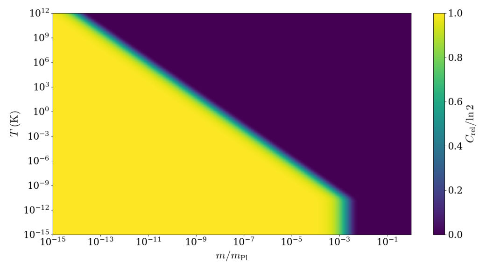
<figcaption class="paper-figure-caption"><b>Fig 1.</b> FIG. 1. Normalized relative entropy of coherence, Crel/ ln 2, of the reduced state of the particle as a function of the particle mass, expressed in units of the Planck mass, and of the temperature T. We fix M = 100 kg, d = 1 µm, and ω/(2π) = 1 Hz. The transition from the high-coherence (yellow) to the low-coherence (dark-blue) region reflects the increasing distinguishability of the apparatus recoil states associated with the two branches of the spatial superposition of the particle. At any temperature, coherence decreases as the particle mass increases, illustrating the growing impact of particle-apparatus entanglement imposed by momentum conservation. But notice also the existence of a...</figcaption>
</figure>
<figure class="paper-figure-card">
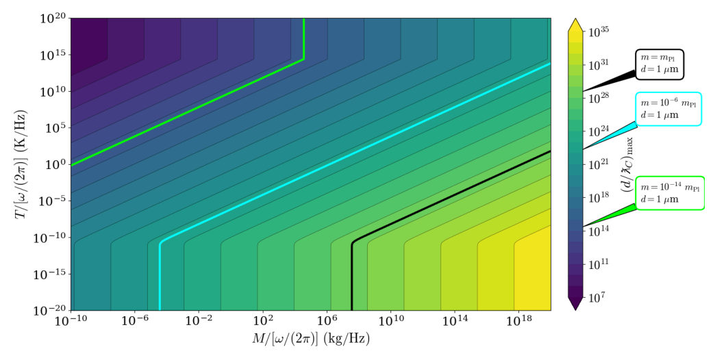
<figcaption class="paper-figure-caption"><b>Fig 2.</b> FIG. 2. Momentum-conservation constraint on the preparation of coherent spatial superpositions. The figure shows the contour plot of the r.h.s. of (13), which imposes an upper bound on the separation d (in units of reduced Compton wavelength, λC) of a coherent spatial superposition of a particle of mass m. The figure can be used in two ways. Given the parameters (M, T, ω) related to the apparatus setup, they mark a point in the figure, which falls on top of a contour whose value can be read from the color bar. Only state separations d/λC smaller than this value have a chance of being coherently superposed by such an apparatus. Alternatively, once the experimentalist establishes a target...</figcaption>
</figure>

**Summary.** The authors derive a universal constraint showing that preparing large spatial superpositions of massive particles inevitably entangles the particle with the momentum recoil of the apparatus used for splitting. This entanglement causes decoherence in the measured particle state, setting a fundamental lower bound on experimental feasibility based only on conservation laws.

**Why it may be interesting.** This work provides a fundamental, model-independent constraint on quantum metrology experiments involving massive objects, linking macroscopic mechanics (momentum conservation) directly to microscopic quantum coherence limits. It is crucial reading for anyone designing next-generation matter-wave interferometers or gravity tests.

Detailed structure

**Main problem.** The paper identifies a universal constraint on preparing massive particles in coherent spatial superpositions arising purely from momentum conservation when an apparatus is used for splitting.

**Main result.** Momentum conservation necessitates that the particle becomes entangled with the apparatus due to recoil, leading to a quantitative lower bound on achievable coherence even for macroscopic setups.

**Method.** The analysis uses quantum state evolution operators and calculates the reduced density matrix of the particle by tracing out the apparatus degrees of freedom, quantifying coherence via relative entropy.

**Model / system.** The system involves a massive particle ($m$) placed in superposition ($\pm d/2$) using an auxiliary apparatus of mass $M$. The analysis focuses on the entanglement generated between the particle and the apparatus's Center-of-Mass (CM) motion, modeled as harmonic oscillators.

**Key observables.** Coherence factor ($\chi_c$), relative entropy of coherence ($C_{rel}$), and the resulting bound relating $m$, $d$, $M$, and $T$.

**Important parameters / regimes.** Particle mass ($m$), separation distance ($d$), apparatus mass ($M$), temperature ($T$), and characteristic frequencies ($\omega$). The low-temperature limit yields a temperature-independent constraint.

**Assumptions / limitations.** The analysis primarily assumes that only the CM degree of freedom of the apparatus participates in state preparation, ignoring internal vibrational modes (which would tighten the bound).

**Figures summary.** Figures illustrate how coherence decreases with increasing particle mass and show contour plots mapping the momentum-conservation constraint on achievable superposition separation ($d/\lambda_C$) based on apparatus parameters.

**Paper structure.** The paper establishes the fundamental conservation law, derives the entanglement consequence for the reduced state, quantifies the resulting decoherence bound using CM motion, and finally discusses practical implications, including internal mode excitations and conditions for 'false' coherence loss.

Abstract

Preparing massive particles in coherent spatial superpositions is a central objective of modern quantum science, motivated by applications ranging from fundamental tests of quantum mechanics and gravity to quantum-enhanced sensing. The experimental difficulty of realizing such superpositions is usually attributed to environmental decoherence mechanisms whose impact depends on the details of the experimental implementation. Here we identify a universal constraint arising from momentum conservation and the quantum nature of the preparation apparatus. Any protocol that places a particle of mass $m$ in a spatial superposition with separation $d$ necessarily entangles the particle with the center-of-mass degree of freedom of the apparatus responsible for the splitting. The resulting recoil displacement, fixed by conservation of the mass dipole moment, reduces the coherence of the particle when the apparatus is not included as part of the quantum system. For an apparatus of mass $M$, preserving coherence requires the recoil displacement to remain smaller than the coherence length of the apparatus center-of-mass state, leading to a quantitative bound expressible as a constraint on its temperature and on how rigidly the apparatus is anchored to the laboratory frame. We analyze the implications of this bound for current matter-wave interferometry experiments, proposals for gravitationally mediated entanglement, and tests of quantum mechanics near the Planck scale. Our main result, which may seem counterintuitive, is that the recoil of even heavy macroscopic apparatuses can pose a surprisingly strong constraint on the coherence of spatial superpositions of particles with masses well below the Planck mass. Finally, we discuss why the resulting limitation should be regarded as a conservative estimate and under which conditions it can be interpreted as an instance of false decoherence.

[↑ back to top](#top)

### [Shadow-Based Noise Fingerprinting of Simulated Quantum Noise Models](http://arxiv.org/abs/2607.08998v1)

**Authors:** Vridhi Jain, Lei Zhang  
**Type:** both · **Category:** quantum information and computing · **PDF:** <https://arxiv.org/pdf/2607.08998v1>  
**Analysis basis:** full PDF text, analyzed in chunks
**Topic relevance:** `QC/QI experiment` **2/5** · `methods for driven-dissipative` **1/5** · `quantum measurements` **1/5**

↔ Scroll figures horizontally

<figure class="paper-figure-card">

<figcaption class="paper-figure-caption"><b>Fig 1.</b> Fig. 1. Shadow-based noise fingerprinting pipeline consisting of four stages: probe circuit preparation, noisy device execution, randomized shadow measurements, and machine learning classification.</figcaption>
</figure>
<figure class="paper-figure-card">
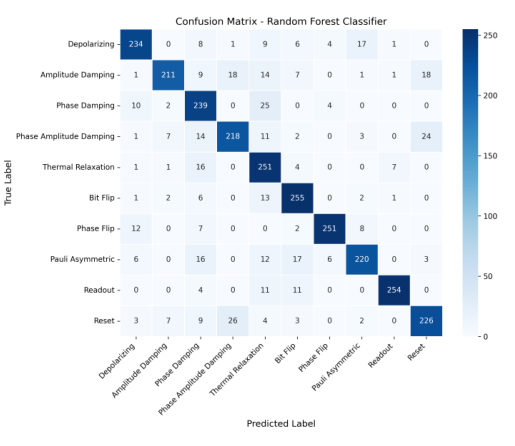
<figcaption class="paper-figure-caption"><b>Fig 2.</b> Fig. 2. Confusion matrix for the random forest classifier evaluated on the held-out test set across ten noise types.</figcaption>
</figure>
<figure class="paper-figure-card">

<figcaption class="paper-figure-caption"><b>Fig 3.</b> Figure 2 presents the confusion matrix for the random forest classifier evaluated on the held-out test set. Readout error, phase flip, bit flip, and thermal relaxation achieve high per- class accuracy, with the classifier correctly identifying the majority of samples in each of these categories. The primary misclassifications occur between phase damping and thermal relaxation, and between phase-amplitude damping and reset noise, suggesting that these channel pairs produce similar fea- ture signatures under the current measurement protocol. The remaining noise types, including amplitude damping, phase- amplitude damping, and Pauli-asymmetric noise, are classified with moderate accuracy, with...</figcaption>
</figure>
<figure class="paper-figure-card">

<figcaption class="paper-figure-caption"><b>Fig 4.</b> Figure 3 presents classification accuracy as a function of samples per class for all three classifiers. At 300 samples per class, all three models perform near chance level, achieving accuracies in the range of 0.46-0.49. Accuracy increases con- sistently with dataset size across all classifiers, with random forest and extra trees reaching 0.8426 and 0.8406, respectively, at 1,400 samples per class, while the MLP achieves 0.7925 at the same scale. The ensemble methods maintain comparable performance throughout the scaling curve, with both consis- tently outperforming the MLP baseline at larger dataset sizes.</figcaption>
</figure>
<figure class="paper-figure-card">
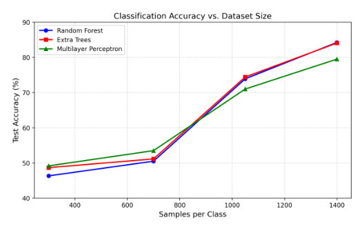
<figcaption class="paper-figure-caption"><b>Fig 5.</b> Fig. 3. Test accuracy as a function of samples per class for random forest, extra trees, and MLP classifiers.</figcaption>
</figure>

**Summary.** This paper introduces a scalable shadow-based pipeline to classify unknown quantum noise channels on 3-qubit systems. It constructs a high-dimensional feature vector from randomized Pauli measurements and employs machine learning classifiers like Random Forest to achieve reliable noise identification. This method bypasses the exponential scaling limitations of traditional tomography, offering a practical tool for near-term quantum hardware calibration.

**Why it may be interesting.** This work provides a practical, scalable ML framework for characterizing hardware imperfections in quantum computing devices, which is vital for advancing NISQ algorithms.

Detailed structure

**Main problem.** Accurately classifying unknown quantum noise channels is crucial for operating near-term quantum processors, as existing methods scale exponentially with system size.

**Main result.** A random forest classifier achieved a high test accuracy of 0.8426 and macro F1 score of 0.8437, demonstrating a scalable approach to noise fingerprinting.

**Method.** The authors propose a shadow-based pipeline combining structured classical tomography with physics-informed feature engineering on randomized Pauli measurements.

**Model / system.** The work focuses on characterizing noise channels applied to simulated 3-qubit probe circuits, utilizing QAOA and simple basis states as probes.

**Key observables.** A 279-dimensional feature vector constructed from raw Pauli expectation values and derived observables from randomized measurements.

**Important parameters / regimes.** The study is designed for NISQ devices and aims to resolve distinctions between physically similar noise types.

**Assumptions / limitations.** The analysis uses simulated Qiskit noise channels, and the current method provides discrete classification rather than continuous parameter estimation.

**Figures summary.** Figure 1 illustrates the four stages of the pipeline (probe preparation $
ightarrow$ noisy execution $
ightarrow$ shadow measurements $
ightarrow$ ML classification). Table I summarizes classifier performance metrics.

**Paper structure.** The paper details a multi-stage pipeline: first, preparing probe circuits; second, executing them on a noisy simulator to gather randomized Pauli measurement data; third, constructing the high-dimensional feature vector; and finally, applying and benchmarking multiple machine learning classifiers for noise type identification.

Abstract

Accurate noise classification is essential for operating near-term quantum processors, yet existing approaches, such as quantum process tomography, scale exponentially with system size, limiting their practicality for routine calibration. We propose a scalable noise fingerprinting pipeline that combines structured classical shadow tomography with physics-informed feature engineering to identify noise channels from a fixed set of 3-qubit probe circuits. Each sample is represented by a 279-dimensional feature vector constructed from randomized Pauli measurements and derived observables, designed to resolve physically similar noise channels that produce overlapping signatures under generic measurement sets. We evaluate three classifiers, i.e., random forest, extra trees, and a multilayer perceptron, on a dataset of 14,000 labeled samples spanning 10 noise types. The random forest classifier achieves the highest test accuracy of 0.8426 with a macro F1 score of 0.8437, outperforming both baselines. Confusion analysis reveals that many noise types are classified with high reliability, with the remaining confusions occurring between channels sharing similar physical decay mechanisms, motivating future work on richer probe states and noise parameter estimation.

[↑ back to top](#top)

### [Short-range magnetic order and multi-stage phase transitions in the easy-plane van der Waals magnet CrCl$_3$](http://arxiv.org/abs/2607.09421v1)

**Authors:** T. B. Mazitov, M. I. Panin, A. S. Pakhomov, M. V. Bakhmetiev, E. O. Chiglintsev, A. I. Chernov, A. A. Katanin  
**Type:** both · **Category:** strongly correlated electrons · **PDF:** <https://arxiv.org/pdf/2607.09421v1>  
**Analysis basis:** full PDF text, analyzed in chunks
**Topic relevance:** `analog quantum simulation` **2/5** · `Keldysh / 2PI / non-Gaussian methods` **1/5** · `spintronics-quantum-optics interface` **1/5**

↔ Scroll figures horizontally

<figure class="paper-figure-card">
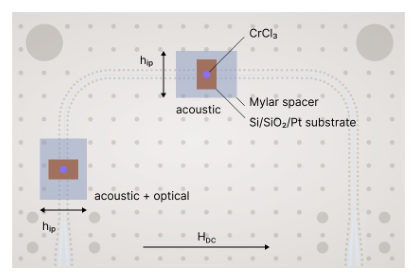
<figcaption class="paper-figure-caption"><b>Fig 1.</b> FIG. 1. The scheme of FMR experiment: geometries with hip perpendicular and parallel to the external DC magnetic field HDC are shown; semi-transparent blue rectangles depict Mylar spacer, brown rectangle show Si/SiO2/Pt substrate, and purple circles represents CrCl3 flake under PC coverage.</figcaption>
</figure>
<figure class="paper-figure-card">
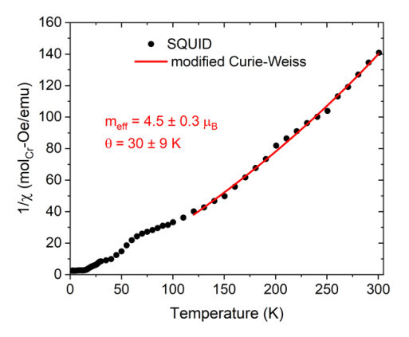
<figcaption class="paper-figure-caption"><b>Fig 2.</b> FIG. 3. Inverse magnetic susceptibility; fit shows modified Curie-Weiss law at high temperatures.</figcaption>
</figure>
<figure class="paper-figure-card">
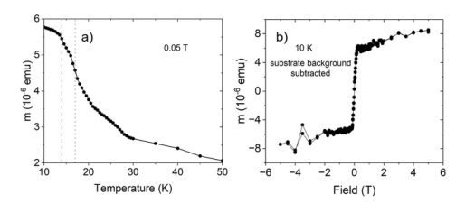
<figcaption class="paper-figure-caption"><b>Fig 3.</b> FIG. 2. SQUID measurements: a) temperature dependence of the sample magnetic moment under 0.05 T in-plane field: dashed line shows the Neel temperature, and dotted line dis- plays the Curie temperature; b) isothermal hysteresis loop at 10 K. The field is directed in-plane; magnetic field of about 0.2 T is needed to polarize spins.</figcaption>
</figure>
<figure class="paper-figure-card">
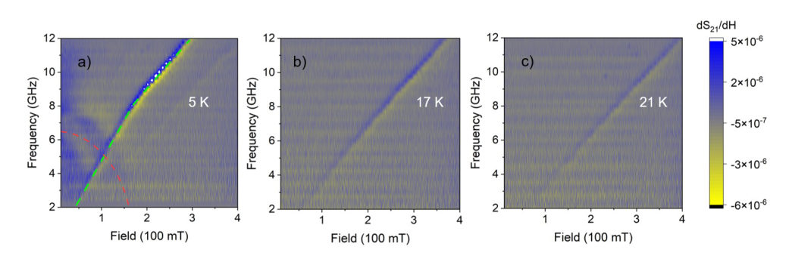
<figcaption class="paper-figure-caption"><b>Fig 4.</b> FIG. 4. a-c) FMR intensity colormaps measured when hip||HDC at 5 K, 17 K and 21 K; acoustic mode is shown with green dashed line and optical mode with red dashed line on 5 K colormap.</figcaption>
</figure>
<figure class="paper-figure-card">
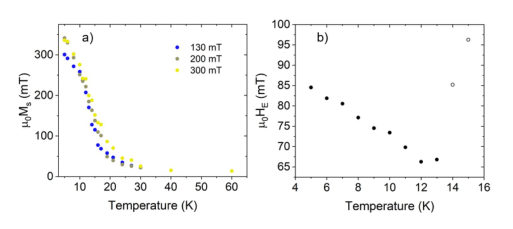
<figcaption class="paper-figure-caption"><b>Fig 5.</b> FIG. 6. Temperature dependence of a) effective magnetiza- tion within the layers; b) interlayer exchange field. Open circles in b) correspond to temperatures T ≥TN (see text).</figcaption>
</figure>

**Summary.** This work comprehensively investigates the complex magnetic phase diagram of CrCl3, a 2D van der Waals magnet. By combining SQUID/FMR experiments with DFT+DMFT theory, the authors map out multi-stage transitions between ferromagnetic and antiferromagnetic states. The findings highlight the crucial role of persistent short-range correlations and temperature-dependent interlayer coupling in determining the material's magnetic behavior.

**Why it may be interesting.** The interplay between strong electronic correlations (as modeled by DFT+DMFT) and emergent quantum phenomena like BKT transitions in low-dimensional magnets makes this highly relevant for understanding correlated electron systems beyond simple mean-field treatments.

Detailed structure

**Main problem.** The study investigates the evolution of spin correlations and the nature of multi-stage magnetic transitions in the quasi-two-dimensional easy-plane van der Waals magnet CrCl3.

**Main result.** The research confirms a complex magnetic phase diagram involving crossover to a spin polarized (SP) phase followed by an antiferromagnetic (AFM) ground state, while theoretical work predicts robust short-range correlations persisting well above ordering temperatures.

**Method.** The study combines experimental techniques like broadband FMR spectroscopy and DC SQUID magnetometry with advanced theoretical calculations using non-local Dynamical Mean-Field Theory (DFT+DMFT).

**Model / system.** The physical system is the van der Waals magnet CrCl3, which exhibits easy-plane XY anisotropy. The analysis focuses on the competition between intra-layer and inter-layer magnetic exchange interactions.

**Key observables.** Magnetization (M(T)), inverse susceptibility (1/χ(T)), resonant frequencies in FMR, and the magnetic correlation length ($\xi$).

**Important parameters / regimes.** Transition temperatures ($T_{SP} \approx 17 	ext{ K}$, $T_N \approx 14 	ext{ K}$), Weiss temperature ($	heta$), and exchange coupling strengths ($J_1$, $J_{\perp}$).

**Assumptions / limitations.** The DFT calculations are noted to be performed without considering spin-orbit interaction, and the BKT formula is applied based on specific structural phases.

**Figures summary.** Figures illustrate SQUID magnetization curves showing magnetic transitions (cusps at 14 K), FMR intensity maps demonstrating mode evolution with temperature, and plots detailing the temperature dependence of exchange interactions and correlation lengths.

**Paper structure.** The paper progresses by first establishing experimental observations of multi-stage transitions using magnetometry and resonance. It then uses theoretical modeling (DFT+DMFT) to explain the persistence of short-range order and the temperature-driven crossover in interlayer coupling, culminating in a comprehensive magnetic phase diagram.

Abstract

We investigate the evolution of spin correlations and the nature of the multi-stage magnetic transition in the quasi-two-dimensional easy-plane van der Waals magnet $\rm CrCl_3$. By combining broadband ferromagnetic resonance (FMR) spectroscopy and DC SQUID magnetometry on mechanically exfoliated micro-flakes with non-local dynamical mean-field theory (DFT+DMFT) calculations, we analyze both long- and short range magnetic order in CrCl$_3$. Experimentally, SQUID and FMR measurements confirm the presence of the crossover to a spin polarized phase with the subsequent transition into an antiferromagnetic ground state upon cooling, but show robust short-range correlations at temperatures far above the magnetic ordering temperatures. Theoretically, we show the existence of highly stable local magnetic moments at room temperature, with a giant room temperature lifetime $τ$ of 130--300 ps due to a wide Mott bandgap. Below room temperature, a rapid growth of the in-plane correlation length $ξ$ signals the formation of strong short range magnetic order consistent with the experimental observations. We also obtain a temperature-driven crossover of the interlayer exchange interaction, which changes from positive (ferromagnetic) at high temperatures to negative (antiferromagnetic) in the low-temperature ordered phase.

[↑ back to top](#top)

### [Hybrid Quantum and Classical Workload Management with Graph-based Scheduling](http://arxiv.org/abs/2607.09151v1)

**Authors:** Vanessa Sochat, Daniel Milroy  
**Type:** both · **Category:** quantum information and computing · **PDF:** <https://arxiv.org/pdf/2607.09151v1>  
**Analysis basis:** full PDF text, analyzed in chunks
**Topic relevance:** `QC/QI experiment` **2/5** · `methods for driven-dissipative` **1/5**

↔ Scroll figures horizontally

<figure class="paper-figure-card">
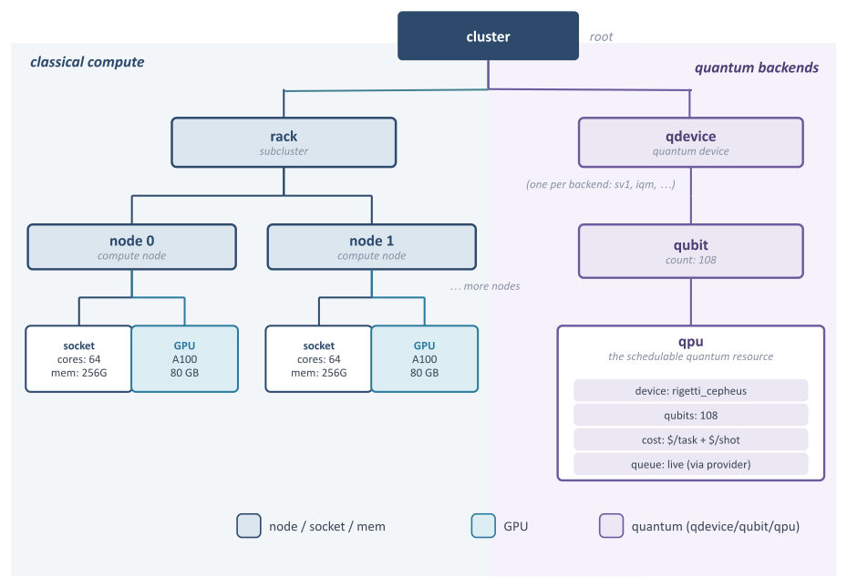
<figcaption class="paper-figure-caption"><b>Fig 1.</b> Figure 2: Hybrid modeling of classical and quantum resources in the Fluxion resource graph. A quantum device is modeled at the same level as a rack, and job requests for work correspond to a traversal in the graph. Constraints are used to limit search to a resource class.</figcaption>
</figure>
<figure class="paper-figure-card">
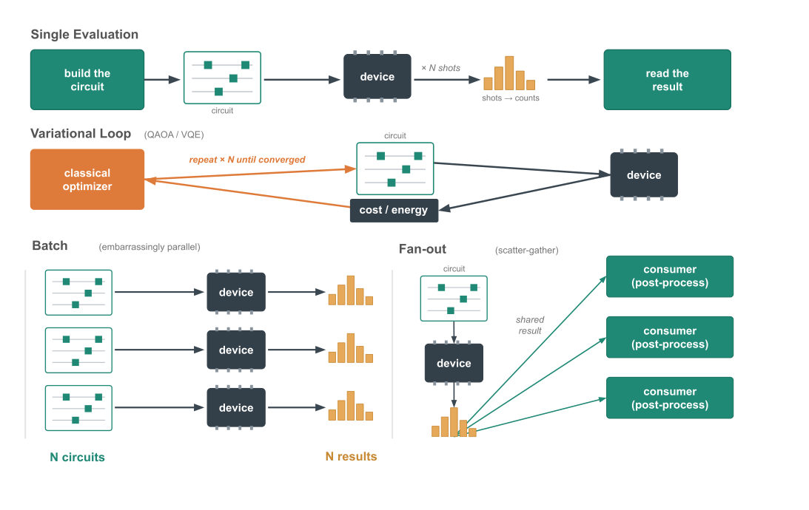
<figcaption class="paper-figure-caption"><b>Fig 2.</b> Figure 3: Hybrid quantum and classical application designs. The single evaluation (top), when a circuit is run and post-processed, forms a simple, single execution unit that is the basis for more complex designs. The variational design (second row) maps this unit into a cycle, receiving back results, and adjusting parameters to run again until convergence. The batch pattern (bottom left) runs many single evaluations in parallel to generate the equivalent number of results, and a fan-out pattern (bottom right) provides one quantum result for many classical consumers. These designs pair with the scale, frequency, and coordination of execution, form the basis for hybrid quantum scheduler...</figcaption>
</figure>
<figure class="paper-figure-card">
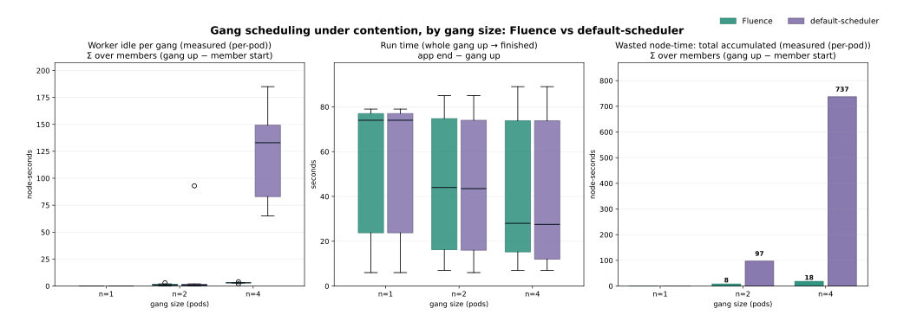
<figcaption class="paper-figure-caption"><b>Fig 3.</b> Figure 4: Gang scheduling for 18 gangs of varying sizes across 3 applications for each of fluence and the default-scheduler. Worker idle time increases with size (left panel), and accumulated node time (right panel) represents poor resource utilization across workers in the cluster. There are no differences in application running times once all members of gangs are ready (middle panel).</figcaption>
</figure>
<figure class="paper-figure-card">
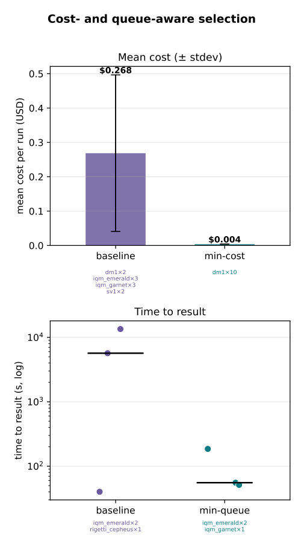
<figcaption class="paper-figure-caption"><b>Fig 4.</b> Figure 5: Policy aware selection. Requesting Fluence to select a minimum cost backend easily clusters all points around a trivial cost close to zero (top panel). Asking Fluence to select minimize queue depth leads to a faster end-to-end time to complete the work (bottom panel).</figcaption>
</figure>
<figure class="paper-figure-card">
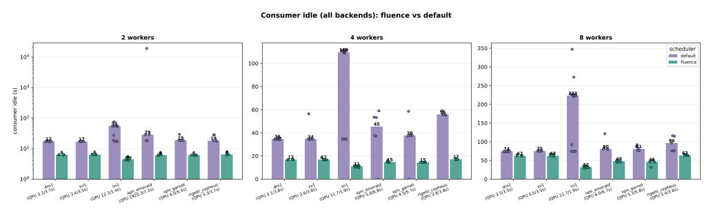
<figcaption class="paper-figure-caption"><b>Fig 5.</b> Figure 6: Worker idle time across quantum simulators or devices, compared to number of workers. As expected, the idle time increases with the size of the job</figcaption>
</figure>

**Summary.** This work addresses the significant orchestration challenge of running hybrid quantum-classical computations in cloud environments by introducing Fluence, a Kubernetes scheduler plugin. It solves the 'two-queue problem' by treating remote QPUs as first-class resources in a scheduling graph. The results demonstrate massive improvements in efficiency, cost reduction, and time-to-result compared to standard schedulers.

**Why it may be interesting.** While highly focused on infrastructure and scheduling rather than fundamental physics, the paper's ability to manage complex resource dependencies is crucial for enabling future quantum algorithms that require tight coupling between classical optimization loops and quantum hardware execution.

Detailed structure

**Main problem.** The primary challenge is orchestrating complex hybrid quantum-classical workflows within modern HPC environments that incorporate remote Quantum Processing Units (QPUs). This introduces a 'two-queue problem' due to the external queue of the quantum device.

**Main result.** The authors present Fluence, a Kubernetes scheduler plugin that successfully manages this complexity by enabling atomic gang scheduling, synchronizing classical workers with quantum readiness, and optimizing resource selection based on cost and queue depth.

**Method.** They developed a graph-based scheduler (Fluxion) to model QPUs as first-class, attributed resources within the cloud-native Kubernetes environment. This allows for informed placement decisions that coordinate disparate computational stages.

**Model / system.** The system involves hybrid quantum-classical workloads running on platforms like AWS Braket and real QPUs, managed via a Kubernetes scheduler plugin (Fluence). The scheduling model treats classical compute nodes and remote QPU backends as interconnected resources in a resource graph.

**Key observables.** Wasted node-time from partial gang placement, worker idle time reduction (up to 5x), mean per-run cost reduction ($\sim$70x), and time-to-result improvement (hours to minutes).

**Important parameters / regimes.** Queue depth of the remote QPU backend, computational workload type (e.g., VQA loops), and resource cost metrics.

**Assumptions / limitations.** The solution assumes that quantum devices can be modeled as first-class resources within a graph structure, allowing scheduling policies to query their availability alongside classical hardware.

**Figures summary.** Figures illustrate the 'two queue problem' concept, the hierarchical modeling of hybrid resources in the Fluxion graph, and policy selection trade-offs between minimizing cost versus minimizing queue depth.

**Paper structure.** The paper first defines the technical challenge (the two-queue problem) inherent in cloud-native quantum integration. It then introduces Fluence as the solution, detailing its mechanisms for atomic gang placement, synchronization primitives, and backend selection policies. Finally, it validates these methods across multiple real-world scenarios.

Abstract

High Performance Computing (HPC) centers are expanding to encompass resources that extend beyond traditional computing. By extending resources to quantum computing, hybrid quantum-classical workflows tackle complex optimization problems that have never before been possible. However, integrating quantum processing units (QPUs) into cloud-native and scientific workload managers presents a unique orchestration challenge: remote quantum devices introduce a second, external queue -- a two-queue problem -- alongside the queue owned by the traditional scheduler. In this work we present Fluence, a Kubernetes scheduler plugin backed by the Fluxion graph-based scheduler, that enables informed, gang-scheduled placement for quantum-classical workloads and custom resources. We evaluate Fluence across three scenarios using AWS Braket simulators and real QPUs. First, under node contention, Fluence's atomic gang placement all but eliminates the wasted node-time that a default scheduler accrues by partially placing gangs. Second, we introduce a synchronization primitive for the two-queue problem in which a single producer submits a shared quantum task while consumers remain scheduling-gated, reducing worker idle time by roughly 5x under short device queues and by orders of magnitude when a real device queue stretched to hours. Third, cost- and queue-aware backend selection pins the cheapest or shortest-queue device satisfying a workload, cutting mean per-run cost by roughly 70x and time-to-result from hours to under a minute. Together, these results show that quantum-awareness can be added to a cloud-native scheduler without modifying user containers.

[↑ back to top](#top)

### [Loop-current orderings in SU($N$) two-leg fermionic ladder through duality symmetries](http://arxiv.org/abs/2607.08862v1)

**Authors:** M. Habchy, F. Rose, P. Lecheminant  
**Type:** theory · **Category:** strongly correlated electrons · **PDF:** <https://arxiv.org/pdf/2607.08862v1>  
**Analysis basis:** full PDF text, analyzed in chunks
**Topic relevance:** `analog quantum simulation` **2/5** · `Keldysh / 2PI / non-Gaussian methods` **1/5**

↔ Scroll figures horizontally

<figure class="paper-figure-card">
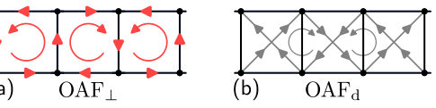
<figcaption class="paper-figure-caption"><b>Fig 1.</b> FIG. 1. (color online) Two possible loop-current ordered phases which spontaneously break the time-reversal symmetry in a two-leg ladder: (a) OAF⊥phase with circulating currents along the plaque- ttes of the ladder (b) OAFd phase with circulating currents along the diagonals of the ladder.</figcaption>
</figure>
<figure class="paper-figure-card">
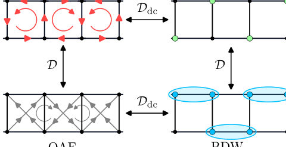
<figcaption class="paper-figure-caption"><b>Fig 2.</b> FIG. 2. (color online) The four competing orders related by duality symmetries; Ddc: density-current duality symmetry which is exact on the lattice; D: emergent duality symmetry in the low-energy limit.</figcaption>
</figure>
<figure class="paper-figure-card">
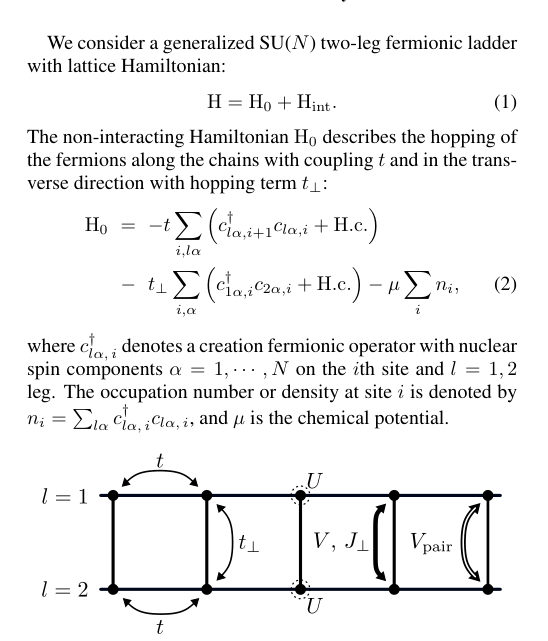
<figcaption class="paper-figure-caption"><b>Fig 3.</b> FIG. 3. (color online) Generalized two-leg SU(N) ladder with longi- tudinal t and transverse t⊥hoppings, an on-site Hubbard U term, an interchain density-density interaction V , an SU(N) Hund coupling J⊥, and a pair-hopping term Vpair.</figcaption>
</figure>
<figure class="paper-figure-card">
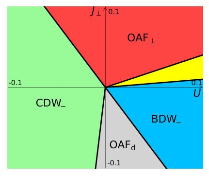
<figcaption class="paper-figure-caption"><b>Fig 4.</b> FIG. 5. (color online) RG phase diagram for V = Vpair = 0 (t = 1) and N &gt; 2 (N = 4 here).</figcaption>
</figure>
<figure class="paper-figure-card">
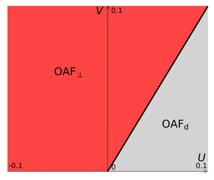
<figcaption class="paper-figure-caption"><b>Fig 5.</b> FIG. 6. (color online) RG phase diagram for model HDdc dw (25) with N &gt; 2 (t = 1 and N = 4 here).</figcaption>
</figure>

**Summary.** This work theoretically analyzes the complex phase diagram of SU(N) two-leg fermionic ladders, focusing on the competition between conventional density-wave states and unconventional loop-current ordered phases. By utilizing advanced techniques like bosonization and duality symmetries, the authors demonstrate that these competing orders are mathematically linked, providing a unified framework for understanding electronic correlations in low-dimensional quantum materials.

**Why it may be interesting.** The deep connection established between exotic, time-reversal symmetry breaking loop currents and standard charge/bond density waves via exact duality symmetries provides powerful theoretical tools for understanding competing orders in strongly correlated materials.

Detailed structure

**Main problem.** The study investigates loop-current ordered phases in half-filled SU(N) two-leg fermionic ladders and elucidates the relationship between these unconventional orders and conventional density-wave states via duality symmetries.

**Main result.** The model predicts four competing orders, showing that for N>2, loop-current phases are stabilized by Hund's interaction; furthermore, an exact density-current duality symmetry relates current-carrying phases to density-wave phases.

**Method.** The analysis employs low-energy effective theories, renormalization group (RG) techniques, and bosonization methods applied to the continuum limit of the lattice Hamiltonian.

**Model / system.** The system is an SU(N) two-leg fermionic ladder described by a generalized Hubbard-type Hamiltonian incorporating hopping, on-site repulsion (U), interchain interactions (V, J_perp), and pair-hopping terms. The continuum limit yields massless Dirac fermions.

**Key observables.** Loop-current order parameters ($	ext{OAF}_\perp$, $	ext{OAF}_d$), conventional density-wave order parameters ($	ext{OCDW}^-$, $	ext{OBDW}$), and various current operators defining the symmetry algebra.

**Important parameters / regimes.** Half-filling, SU(N) structure, Hund's coupling ($J_\perp$), doping level, and interaction strengths (U, V).

**Assumptions / limitations.** The analysis relies on low-energy approximations, continuum limits, and the existence of specific duality symmetries ($D_{dc}$ and $D$).

**Figures summary.** Figures illustrate the two loop-current ordered phases breaking T-symmetry, the relationship between the four competing orders via duality symmetries, and the structure of the generalized SU(N) ladder Hamiltonian.

**Paper structure.** The paper moves from defining the full lattice Hamiltonian to deriving low-energy continuum descriptions using bosonization. It then systematically analyzes the symmetry constraints imposed by density-current dualities ($D_{dc}$), leading to a classification of the current algebra ($\mathfrak{so}(4N)$) and identifying which phases are stable under RG flow.

Abstract

We investigate the formation of loop-current ordered phases in half-filled SU($N$) two-leg fermionic ladders. Using a low-energy approach, we uncover the existence of non-perturbative duality symmetries relating four competing orders. Two of these orders correspond to loop-current ordered phases that spontaneously break the time-reversal symmetry and describe charge currents circulating in a staggered pattern either around the plaquettes or along the diagonals of the ladder. These unconventional phases are shown to be dual to conventional (charge and bond) density-wave phases through an exact density-current duality symmetry existing on the lattice. From a perturbative renormalization group approach, we find that these phases for $N>2$ are stabilized in a half-filled SU($N$) two-leg Hubbard ladder with an additional SU($N$) Hund's interaction. The effect of a small doping on these phases is also discussed.

[↑ back to top](#top)

### [Generalized Nonlinear Imaginary-Time Evolution](http://arxiv.org/abs/2607.09599v1)

**Authors:** Chenyu Shi, Hao Wang, Jin-Fu Chen  
**Type:** theory · **Category:** quantum information and computing · **PDF:** <https://arxiv.org/pdf/2607.09599v1>  
**Analysis basis:** full PDF text, analyzed in chunks
**Topic relevance:** `correlated / nonlocal dissipation` **1/5** · `correlated cavity matter` **1/5** · `driven-dissipative phase transition` **1/5** · `entanglement & information structure` **1/5** · `non-equilibrium dynamics` **1/5**

↔ Scroll figures horizontally

<figure class="paper-figure-card">
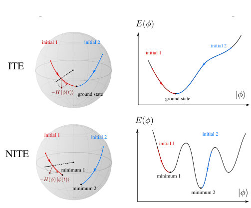
<figcaption class="paper-figure-caption"><b>Fig 1.</b> FIG. 1. Illustrative diagram comparing ITE and NITE. Stan- dard ITE induces an energy-descent flow on the accessible state manifold, driving any initial state with nonzero ground- state overlap toward the ground-state subspace. The up- date direction is given by the tangent-space projection of −H |ϕ(t)⟩. NITE generalizes this picture to state-dependent effective generators associated with general cost functions. Its cost landscape may contain multiple local minima, and the re- sulting flow can converge to different solutions depending on the initialization. The NITE update direction is also given by the tangent-space projection of −H(ϕ(t)) |ϕ(t)⟩.</figcaption>
</figure>
<figure class="paper-figure-card">
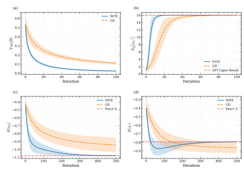
<figcaption class="paper-figure-caption"><b>Fig 2.</b> FIG. 2. Comparison of NITE and standard gradient descent learning curves in three subroutine tasks. (a) Variance min- imization. (b) QFI maximization, with the red dash-dotted line indicating the theoretical QFI upper bound. (c,d) Simul- taneous preparation of the ground state and first excited state, where the two panels show the energies of the prepared states and the red dash-dotted lines indicate the corresponding ex- act eigen energies. Solid blue curves denote NITE, dashed orange curves denote GD, and shaded regions show one stan- dard deviation over 10 independent runs.</figcaption>
</figure>

**Summary.** The paper introduces Nonlinear Imaginary-Time Evolution (NITE) as a generalization of ITE to optimize any quantum cost function, not just energy. It rigorously proves that NITE converges exponentially fast by utilizing the geometry of the state space manifold. This makes it a versatile and theoretically robust optimization method for modern variational quantum algorithms.

**Why it may be interesting.** This provides a powerful, geometrically grounded optimization tool that generalizes standard techniques like imaginary-time evolution for state preparation in NISQ algorithms.

Detailed structure

**Main problem.** The work generalizes standard Imaginary-Time Evolution (ITE) from solely finding ground states to optimizing arbitrary quantum state preparation tasks.

**Main result.** A Nonlinear Imaginary-Time Evolution (NITE) framework is proposed, which achieves local exponential convergence rates for various variational optimization problems beyond simple energy minimization.

**Method.** NITE defines the evolution as a gradient flow using the Fubini–Study metric applied to a general cost function $E(\phi)$, leading to state-dependent effective generators.

**Model / system.** The system involves pure quantum states $|\phi
angle$ parameterized by variational circuits, allowing for optimization of multi-state systems and complex objectives like variance minimization or QFI maximization.

**Key observables.** Energy expectation value $\langle H 
angle$, general cost function $E(\phi)$, Quantum Fisher Information (QFI), and the convergence rate ($\mu$).

**Important parameters / regimes.** The local minimum must be non-degenerate, and the analysis relies on establishing strong geodesic convexity near the target state.

**Assumptions / limitations.** Convergence proofs assume the cost function is sufficiently smooth ($C^2$) and that a small neighborhood around the optimum exhibits strong geodesic convexity (Polyak–Łojasiewicz inequality).

**Figures summary.** Figures compare NITE learning curves against standard Gradient Descent (GD) across tasks like variance minimization and QFI maximization, consistently showing NITE's superior linear convergence rate.

**Paper structure.** The paper first introduces the generalization from ITE to NITE for arbitrary cost functions. It then details the mathematical formulation using Fubini-Study geometry, proves the local exponential convergence rate, and applies this framework to several practical variational tasks (e.g., VQE, quantum sensing).

Abstract

Imaginary-time evolution (ITE) is a powerful method for ground-state preparation of a given Hamiltonian. The normalized ITE can be viewed as a gradient flow of the energy expectation value with respect to the Fubini--Study metric. In this work, we propose a generalized nonlinear imaginary-time evolution (NITE) for more general quantum state-preparation tasks. We further present a hardware-efficient variational implementation of NITE and reveal its connection to quantum natural gradient descent. NITE is applied to several subroutine tasks, including variance minimization in variational eigensolvers, probe-state preparation in variational quantum sensing, and excited-state preparation using penalty terms. We prove that NITE achieves a local exponential convergence rate under reasonable assumptions. Our results show that NITE outperforms standard gradient descent and can serve as an efficient optimization method for variational tasks beyond ground-state preparation.

[↑ back to top](#top)

### [When Routes Run Out: Adversarial Co-Learning and Explainable Robustness in Quantum Repeater Networks](http://arxiv.org/abs/2607.09378v1)

**Authors:** Brennan Bell, Inti Gabriel Mendoza Estrada, Andreas Trügler, Paul Erker  
**Type:** theory · **Category:** quantum information and computing · **PDF:** <https://arxiv.org/pdf/2607.09378v1>  
**Analysis basis:** full PDF text, analyzed in chunks
**Topic relevance:** `correlated / nonlocal dissipation` **1/5** · `driven-dissipative phase transition` **1/5** · `entanglement & information structure` **1/5** · `methods for driven-dissipative` **1/5** · `non-equilibrium dynamics` **1/5**

↔ Scroll figures horizontally

<figure class="paper-figure-card">
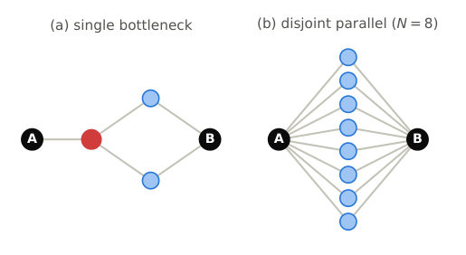
<figcaption class="paper-figure-caption"><b>Fig 1.</b> Fig. 1. Exemplar topologies. (a) In a single-bottleneck graph every route crosses one node (red): Eve can deny all traffic from one surface. (b) In a disjoint-parallel graph one attack surface covers only one of N routes.</figcaption>
</figure>
<figure class="paper-figure-card">
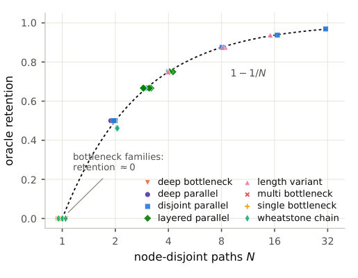
<figcaption class="paper-figure-caption"><b>Fig 2.</b> Fig. 2. Oracle retention versus node-disjoint path count N for all 50 topologies (log2 axis; coincident points jittered). Non-bottleneck families track 1 −1/N; bottleneck families sit at zero.</figcaption>
</figure>
<figure class="paper-figure-card">
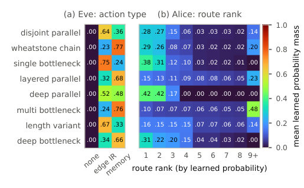
<figcaption class="paper-figure-caption"><b>Fig 3.</b> Fig. 3. Learned (time-averaged) Exp3 strategies aggregated by family. (a) Eve’s probability mass by action type. (b) Alice’s mass by route rank (routes sorted by learned probability per graph; “9+” sums the tail). Cell labels give the mean mass.</figcaption>
</figure>
<figure class="paper-figure-card">
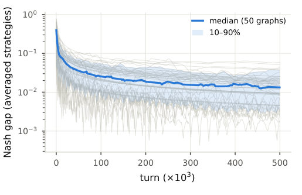
<figcaption class="paper-figure-caption"><b>Fig 4.</b> Fig. 4. Nash-gap decay across all 50 topologies (gray: individual graphs; blue: median and 10–90% band). The median halves between 105 and 5×105 turns.</figcaption>
</figure>
<figure class="paper-figure-card">
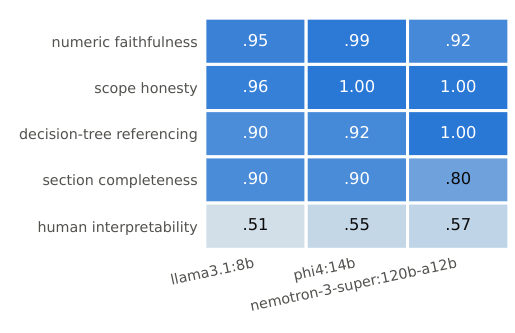
<figcaption class="paper-figure-caption"><b>Fig 5.</b> Fig. 5. Mean scores for local LLMs (columns). Rubric (rows) evaluation over 50 scored prompt responses per LLM. Rubric criteria: numeric faithfulness (do stated numbers appear verbatim in the prompt), scope honesty (no security or physical-validity over-claims), decision tree referencing (does it refer to the correct tree leaf for its graph), and section completeness (how many of the requested sections are in the response), are automatically verified. The subjective, human interpretability score was evaluated by the authors and cross-referenced against Claude Fable 5 [21] in an independent blind pass.</figcaption>
</figure>

**Summary.** This paper models quantum repeater network routing as an adversarial game where an attacker (Eve) tries to degrade entanglement links while a sender (Alice) chooses routes. By using advanced co-learning algorithms and analyzing the resulting strategies, the authors demonstrate that network bottlenecks are critical vulnerabilities, providing both quantitative robustness measures and explainable insights into these weaknesses.

**Why it may be interesting.** It provides a rigorous framework for testing the resilience of quantum communication protocols against sophisticated, adaptive adversaries, which is crucial for designing practical quantum internet infrastructure.

Detailed structure

**Main problem.** The study investigates adversarial robustness in quantum-network routing when resources (routes) are limited, framed as an adversarial bandit problem.

**Main result.** Adversarial co-learning successfully recovers the minimax strategy structure, showing that network bottlenecks lead to zero retention while non-bottleneck paths follow a predictable $1 - 1/N$ coverage principle.

**Method.** The authors employ adversarial co-learning (Exp3) against simulated quantum communication transcripts and use decision-tree regressors followed by LLMs for explainability analysis.

**Model / system.** The model is an entanglement-based quantum repeater network utilizing the Ekert-91 (E91) protocol. The game involves Alice selecting a route and Eve choosing an attack surface (edge intercept–resend or memory degradation).

**Key observables.** CHSH violation ($|S|$), learned retention rate, Nash equilibrium gap decay, and decision-tree faithfulness ($R^2$).

**Important parameters / regimes.** 50 structured topologies across eight structural families; the CHSH bound ($	ext{S} > 2$); finite sample size for learning.

**Assumptions / limitations.** The analysis assumes that learned strategies can approximate the full-matrix minimax reference, and that LLMs can be prompted to summarize complex decision evidence.

**Figures summary.** Figures illustrate exemplary topologies (bottleneck vs. disjoint), compare theoretical oracle retention ($1 - 1/N$) against observed learning results, and show probability mass distributions of learned strategies for Alice and Eve.

**Paper structure.** The paper first sets up the adversarial bandit game on quantum repeaters using E91 transcripts. It then applies adversarial co-learning to measure robustness across various topologies. Finally, it develops an open-source explanation workflow by fitting decision trees to map topology features to strategic outcomes and summarizing these findings with LLMs.

Abstract

We study an adversarial bandit problem for entanglement-based quantum-network routing over a modest graph corpus. Alice selects an end-to-end repeater route for an Ekert-91 protocol (E91) representing her move, while Eve selects an attack surface, either edge intercept--resend or repeater memory degradation. Payoffs are drawn from cached SeQUeNCe-simulated E91 transcripts, and Alice accepts a turn when the finite-sample statistic violates the Clauser-Horne-Shimony-Holt (CHSH) bound. Performing adversarial co-learning across 50 structured topologies, we find that learned retention tracks a full-matrix minimax reference closely (Pearson $r=0.99$): under a one-surface Eve action model, bottleneck families have zero retention, while non-bottleneck families follow a $1-1/N$ coverage principle. We then fit decision-tree explanation models to graph-, attack-, and route-level topology-corpus targets and report their faithfulness. Finally, we construct prompt records for local language models to summarize the tree evidence, resulting in an open-source explanation workflow for quantum-repeater network games.

[↑ back to top](#top)

### [Partially-Commutative Polynomial Optimization](http://arxiv.org/abs/2607.08841v1)

**Authors:** Abhishek Mishra, Moisés Bermejo Morán, Stefano Pironio  
**Type:** theory · **Category:** quantum information and computing · **PDF:** <https://arxiv.org/pdf/2607.08841v1>  
**Analysis basis:** full PDF text, analyzed in chunks
**Topic relevance:** `Keldysh / 2PI / non-Gaussian methods` **1/5** · `analog quantum simulation` **1/5** · `driven-dissipative phase transition` **1/5** · `entanglement & information structure` **1/5**

↔ Scroll figures horizontally

<figure class="paper-figure-card">
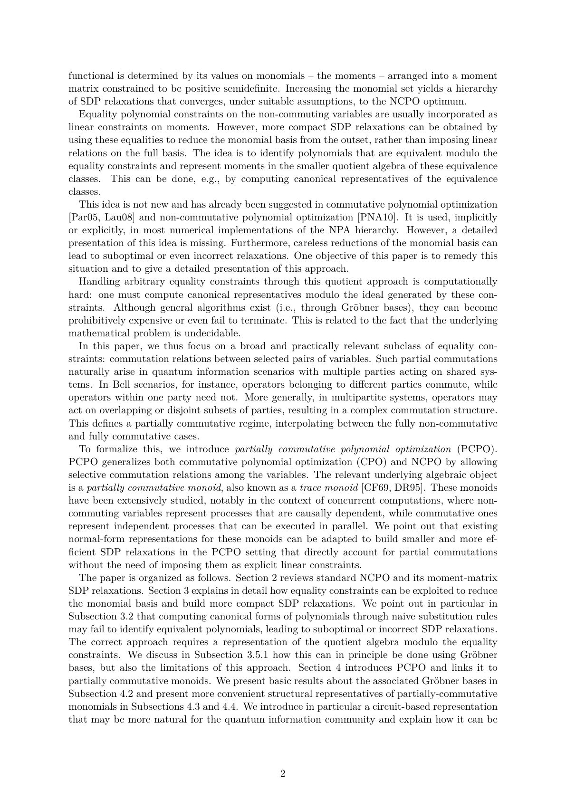
<figcaption class="paper-figure-caption"><b>Fig 1.</b> Low-resolution page preview, page 2</figcaption>
</figure>
<figure class="paper-figure-card">
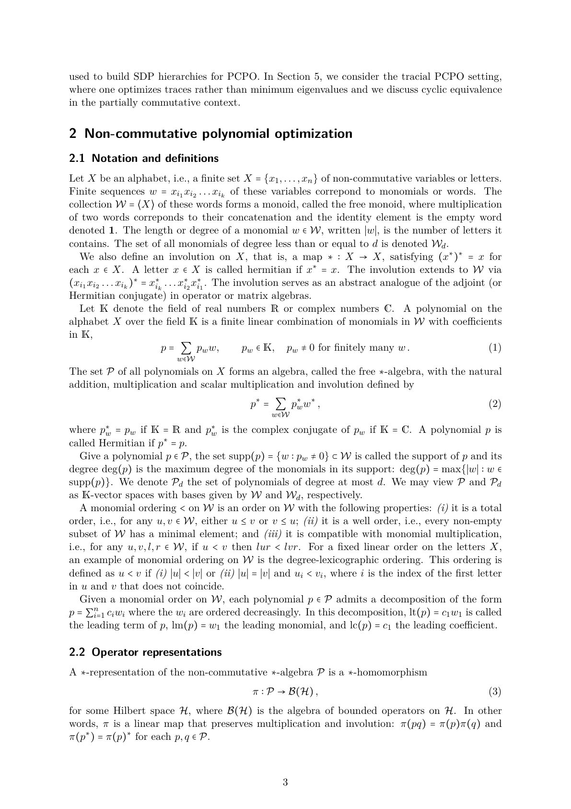
<figcaption class="paper-figure-caption"><b>Fig 2.</b> Low-resolution page preview, page 3</figcaption>
</figure>
<figure class="paper-figure-card">
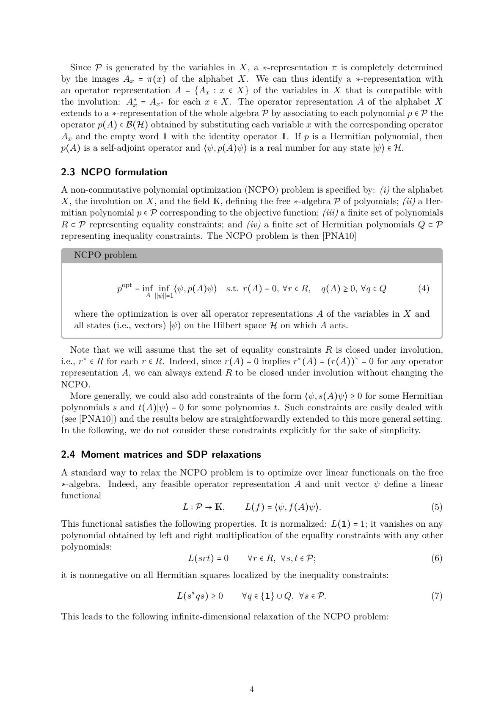
<figcaption class="paper-figure-caption"><b>Fig 3.</b> Low-resolution page preview, page 4</figcaption>
</figure>
<figure class="paper-figure-card">
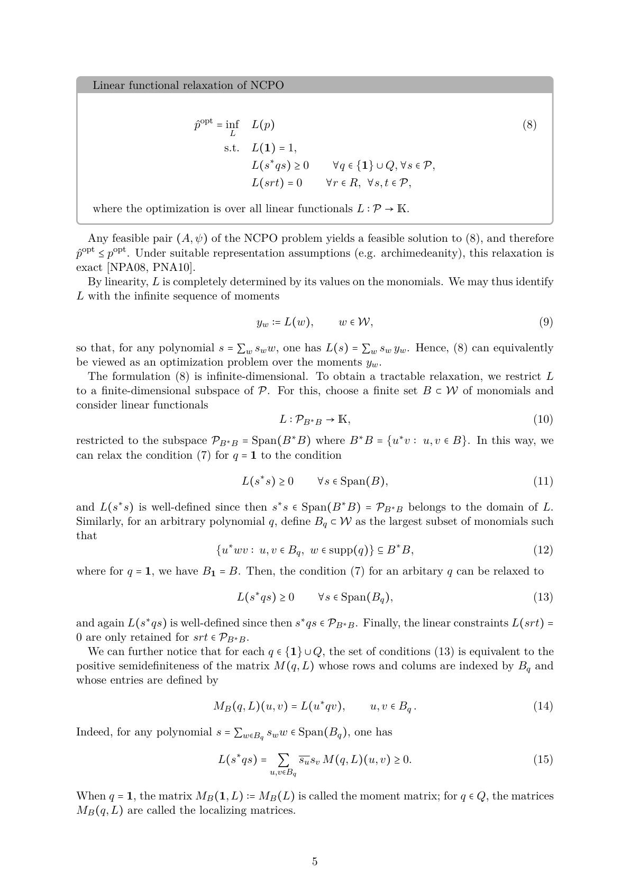
<figcaption class="paper-figure-caption"><b>Fig 4.</b> Low-resolution page preview, page 5</figcaption>
</figure>
<figure class="paper-figure-card">
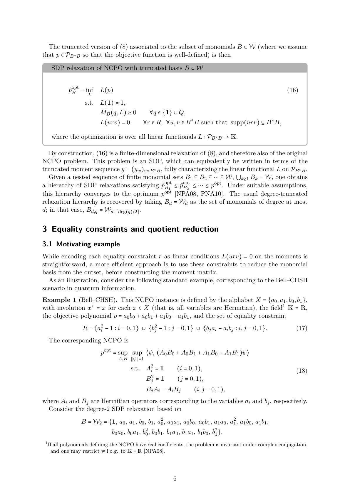
<figcaption class="paper-figure-caption"><b>Fig 5.</b> Low-resolution page preview, page 6</figcaption>
</figure>

**Summary.** This paper develops Partially-Commutative Polynomial Optimization (PCPO), a generalization for optimizing polynomials whose variables only partially commute. It achieves this by constructing compact Semidefinite Programming relaxations that natively encode these partial commutation relations into the monomial structure, offering a significant computational improvement over methods relying solely on linear constraints.

**Why it may be interesting.** For theorists working on open quantum systems or quantum information, this provides a powerful mathematical tool to analyze complex physical models (like multi-party entanglement measures) where operators do not commute fully but obey specific partial commutation rules.

Detailed structure

**Main problem.** The paper addresses Partially-Commutative Polynomial Optimization (PCPO), a generalization of standard commutative and non-commutative optimization problems.

**Main result.** It introduces PCPO, which models systems where variables exhibit partial commutation relations, and shows that these can be incorporated into compact Semidefinite Programming (SDP) relaxations by exploiting the underlying partially-commutative monoid structure.

**Method.** The core method involves using SDP hierarchies derived from moment matrix theory, but crucially modifies the basis construction to natively implement partial commutation relations algebraically rather than through simple linear constraints.

**Model / system.** The framework is motivated by quantum information scenarios involving multiple parties acting on shared systems, where operators exhibit selective commutation (partial commutations). This interpolates between fully commutative and fully non-commutative regimes.

**Key observables.** Optimization of polynomials over partially-commuting variables; the objective value $\langle\psi, p(A)\psi
angle$ in the tracial setting.

**Important parameters / regimes.** The degree $d$ of the SDP relaxation hierarchy; the specific set of partial commutation relations defining the monoid structure.

**Assumptions / limitations.** The approach assumes that the algebraic properties derived from the partially-commutative monoid can be used to construct a reduced monomial basis for the SDP, avoiding the computational difficulties associated with general quotient algebra representations.

**Paper structure.** The paper reviews standard Non-Commutative Polynomial Optimization (NCPO) using NPA hierarchies before introducing PCPO. It focuses on adapting techniques from partially-commutative monoids to build efficient, constraint-free SDP relaxations for the general case.

Abstract

Semidefinite programming hierarchies for commutative and non-commutative polynomial optimization represent a powerful computational tool with many applications in quantum information. In such applications, a given variable is typically not either commuting or non-commuting with all other variables, but instead commutes with some variables and does not commute with others, i.e., the variables satisfy some partial commutation relations. While such partial commutation relations can always be incorporated in a fully non-commutative setting through suitable linear constraints in the semidefinite programming relaxations, exploiting their algebraic properties from the onset can result in more compact relaxations. This leads us to introduce partially-commutative polynomial optimization, a framework that encompasses commutative and non-commutative polynomial optimization, allowing for arbitrary commutation relations among the variables. We point out that the underlying algebraic structure is that of a partially-commutative monoid. We present and review several key aspects of such monoids and show how they can be used to build SDP relaxations for partially-commutative polynomial optimization problems in which the partial commutations are natively implemented in the monomial structure, without the need of additional linear constraints.

[↑ back to top](#top)

### [COSMA: Communication-aware Optimization of Fermionic Simulation Kernels for Modular Quantum Architectures](http://arxiv.org/abs/2607.09381v1)

**Authors:** Enrico Russo, Francesco G. Blanco, Elio Vinciguerra, Davide Patti, Giuseppe Ascia, Maurizio Palesi  
**Type:** theory · **Category:** quantum information and computing · **PDF:** <https://arxiv.org/pdf/2607.09381v1>  
**Analysis basis:** full PDF text, analyzed in chunks
**Topic relevance:** `analog quantum simulation` **1/5** · `methods for driven-dissipative` **1/5**

↔ Scroll figures horizontally

<figure class="paper-figure-card">
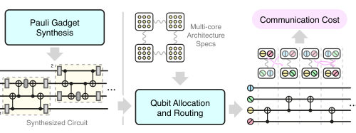
<figcaption class="paper-figure-caption"><b>Fig 1.</b> Fig. 1: Overview of the compilation flow for quantum simulation kernels on modular architectures.</figcaption>
</figure>
<figure class="paper-figure-card">
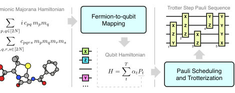
<figcaption class="paper-figure-caption"><b>Fig 2.</b> Fig. 1 summarises the steps required to evaluate the com- munication cost of quantum simulation starting from a target molecule and a modular quantum architecture. This section reviews the main concepts used throughout the paper for each of the steps of Fig. 1.</figcaption>
</figure>
<figure class="paper-figure-card">
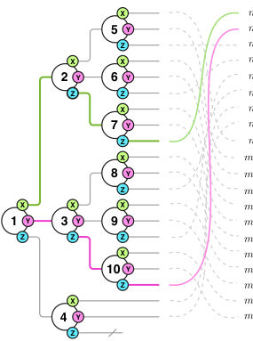
<figcaption class="paper-figure-caption"><b>Fig 3.</b> Fig. 2: JKMN-like [17] ternary-tree mapping example for 10 modes with identity mode-order bijection f(u) = u.</figcaption>
</figure>
<figure class="paper-figure-card">
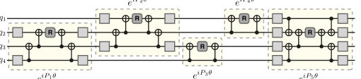
<figcaption class="paper-figure-caption"><b>Fig 4.</b> Fig. 5: Synthesized circuit for one Trotter step after decom- posing each Pauli gadget as in Fig. 4.</figcaption>
</figure>
<figure class="paper-figure-card">
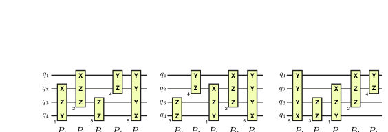
<figcaption class="paper-figure-caption"><b>Fig 5.</b> Fig. 3: Three possible orderings of Pauli strings, showing their supports for a simple one-dimensional qubit ordering.</figcaption>
</figure>

**Summary.** This paper introduces COSMA, a novel compilation framework designed to efficiently run fermionic simulations on multi-core quantum hardware. It tackles the critical bottleneck of inter-core communication by jointly optimizing the mapping from fermions to qubits, the scheduling of Pauli operations, and the physical qubit layout. The results show significant reductions in communication overhead compared to existing methods.

**Why it may be interesting.** It directly addresses the practical limitations of scaling quantum algorithms by providing a systematic compiler approach to manage physical connectivity constraints inherent in modular quantum processors.

Detailed structure

**Main problem.** Scaling quantum simulation for chemically relevant problems requires modular architectures, but inter-core quantum communication becomes a major performance bottleneck.

**Main result.** COSMA achieves up to 2.5x reduction in communication cost compared to state-of-the-art baselines, demonstrating that cross-layer co-design is essential for scalable simulation on multi-core hardware.

**Method.** The framework jointly optimizes fermion-to-qubit mapping, Pauli scheduling, and qubit allocation to minimize inter-core state transfers across modular quantum units.

**Model / system.** The system involves simulating fermionic dynamics governed by a Hamiltonian decomposed into Pauli strings, which are then mapped onto qubits for execution on interconnected Quantum Processing Units (QPUs).

**Key observables.** Inter-core communication cost (the primary metric minimized), circuit depth, and simulation accuracy.

**Important parameters / regimes.** The number of fermionic modes, the size/connectivity of the modular architecture, and the Trotterization step size.

**Assumptions / limitations.** The approach assumes a modular quantum hardware structure where inter-core communication cost is the dominant performance limiter; it also uses approximations like the first-order Trotter formula.

**Figures summary.** Figures illustrate the compilation flow (Mapping -> Scheduling -> Synthesis -> Allocation) and provide examples of specific mappings (e.g., JKMN-like ternary trees) and circuit syntheses for a single Trotter step.

**Paper structure.** The paper details the problem formulation, introduces COSMA as a cross-layer co-design framework, describes the joint optimization process involving mapping choices, Pauli scheduling, and hardware layout, and validates results on molecular benchmarks.

Abstract

Quantum simulation is a leading application of quantum computing, but scaling to chemically relevant problems requires modular architectures composed of interconnected quantum processing units. In such systems, inter-core quantum communication becomes a major performance bottleneck. In this work, we present COSMA, a communication-aware compilation framework for fermionic simulation kernels targeting modular quantum architectures. Our approach jointly optimizes fermion-to-qubit mapping, Pauli scheduling, and qubit allocation to minimize inter-core state transfers. Evaluated on molecular benchmarks, COSMA achieves up to $2.5\times$ reduction in communication cost compared to state-of-the-art baselines, with a median improvement of $1.7\times$. These results demonstrate that cross-layer co-design is essential for efficient and scalable quantum simulation on multi-core quantum hardware.

[↑ back to top](#top)

### [Diagnosing quantum reservoirs at scale based on expressivity and coverage](http://arxiv.org/abs/2607.09445v1)

**Authors:** Laia Domingo, Oriol Balló-Gimbernat, Fernando Vilariño  
**Type:** both · **Category:** quantum information and computing · **PDF:** <https://arxiv.org/pdf/2607.09445v1>  
**Analysis basis:** full PDF text, analyzed in chunks
**Topic relevance:** `entanglement & information structure` **1/5** · `methods for driven-dissipative` **1/5**

↔ Scroll figures horizontally

<figure class="paper-figure-card">
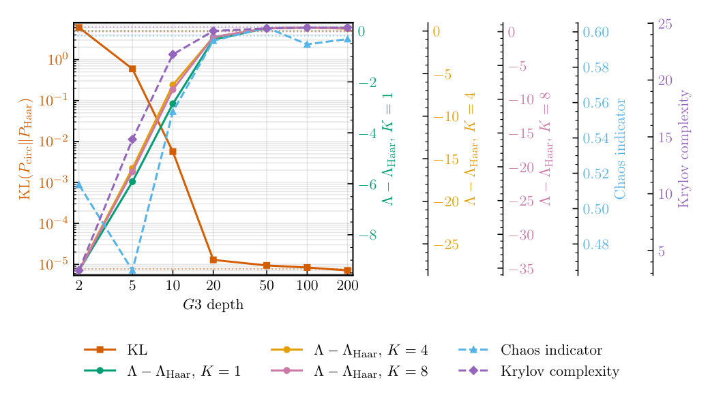
<figcaption class="paper-figure-caption"><b>Fig 1.</b> Figure 1. Comparison of expressivity and dynamical-complexity diagnostics for the G3 reservoir family at n = 6. The KL divergence from the Haar fidelity distribution is shown in orange on the left logarithmic axis. The order-statistics scores GORS for K ∈{1, 4, 8} are shown on separate right axes, together with their Haar references. The dashed blue curve shows the chaos indicator based on the ratio of consecutive level spacings r, and the dashed purple curve shows the Krylov complexity. All diagnostics identify the same transition from shallow structured circuits to Haar-like, chaotic behavior as the circuit depth increases.</figcaption>
</figure>
<figure class="paper-figure-card">
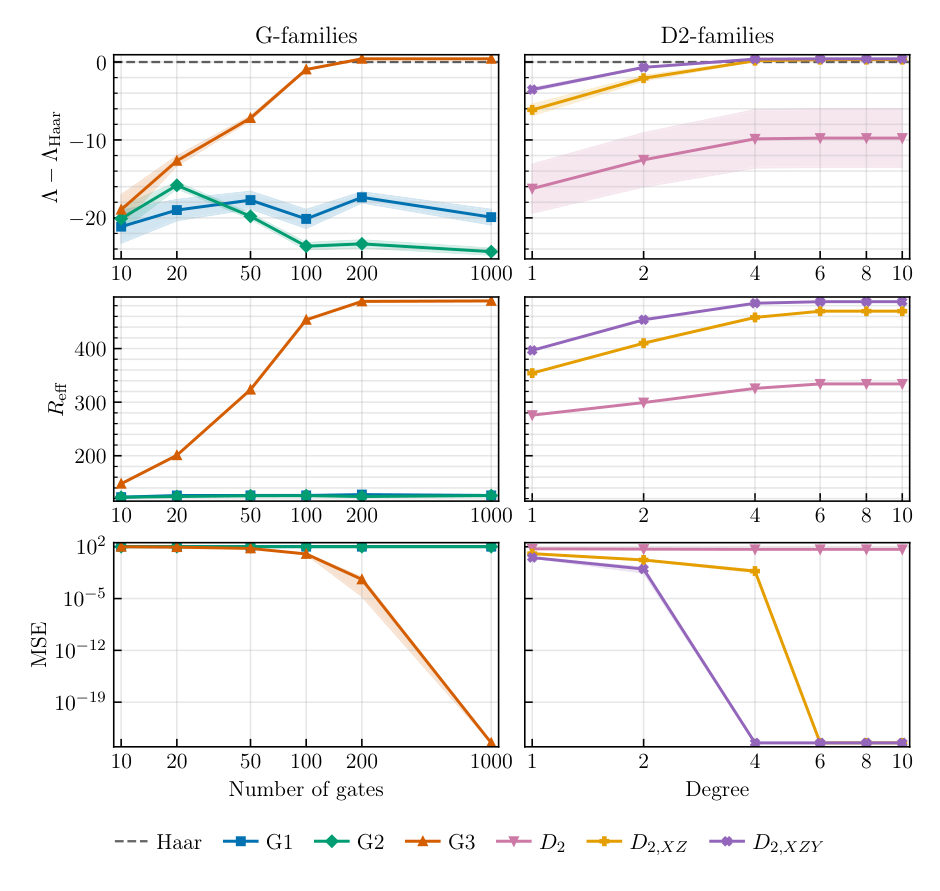
<figcaption class="paper-figure-caption"><b>Fig 2.</b> Figure 2. Quantum extreme learning machine results on the synthetic Fourier regression task for n = 6. Top: ORS diagnostic, using the multi-basis diagnostic with B = 50 random local Pauli bases for the diagonal families. Middle: effective rank Reff. Bottom: test Mean Squared Error (MSE).</figcaption>
</figure>
<figure class="paper-figure-card">
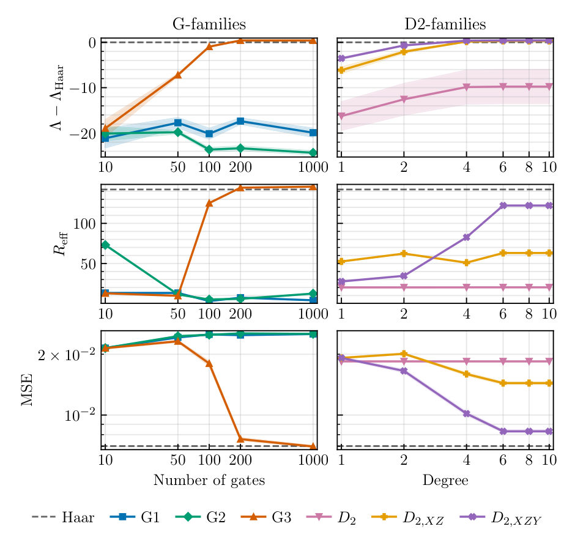
<figcaption class="paper-figure-caption"><b>Fig 3.</b> Figure 3. Same as Fig. 2 for the quantum reservoir computing task on the synthetic NARMA dataset for n = 6.</figcaption>
</figure>
<figure class="paper-figure-card">
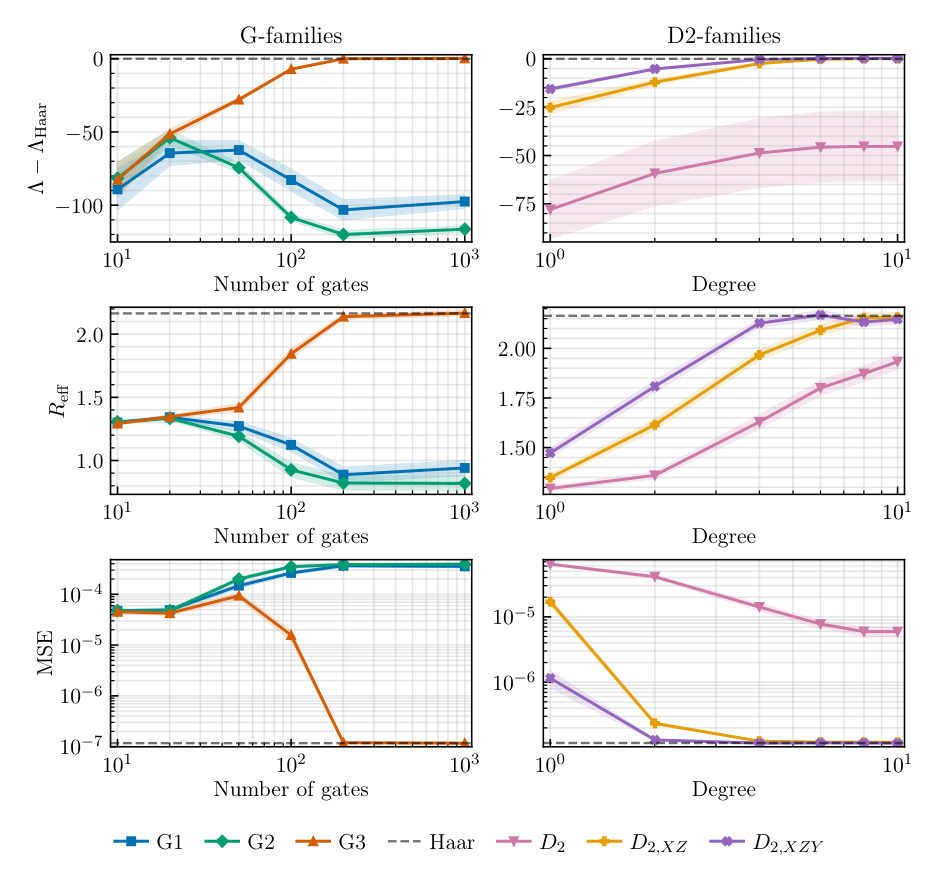
<figcaption class="paper-figure-caption"><b>Fig 4.</b> Figure 4. QELM results on the LiH excited-energy prediction task. The expressivity–coverage alignment observed in the synthetic Fourier task persists in the quantum-chemistry setting. Reservoirs that approach the Haar reference and develop larger effective rank achieve the lowest test MSE.</figcaption>
</figure>
<figure class="paper-figure-card">
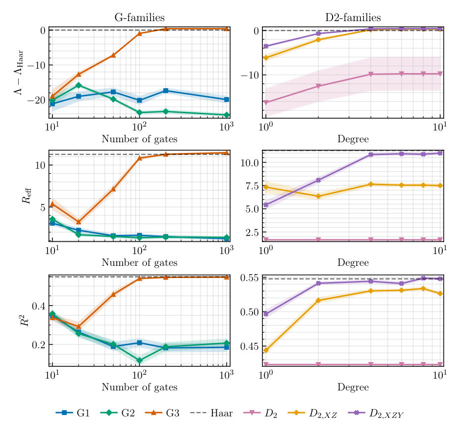
<figcaption class="paper-figure-caption"><b>Fig 5.</b> Figure 5. QRC results on the EMSIG residential energy forecasting task. The test metric is R2, so higher values indicate better forecasting performance. The best-performing reservoirs are those for which strong expressivity diagnostics are accompanied by large effective rank.</figcaption>
</figure>

**Summary.** The paper presents a scalable, two-part diagnostic framework—ORS and $	ext{Reff}$—to characterize quantum reservoirs used in QML. It overcomes the exponential scaling problem of older diagnostics by focusing only on top output probabilities and input feature rank. The results confirm that high expressivity (near Haar randomness) combined with sufficient feature coverage leads to superior machine learning performance.

**Why it may be interesting.** This work provides a crucial set of metrics for assessing the hardware readiness and theoretical limits of variational quantum algorithms by decoupling intrinsic expressivity from task-specific feature utilization.

Detailed structure

**Main problem.** Existing methods for diagnosing quantum reservoir expressivity scale exponentially with system size, making them impractical for large-scale hardware.

**Main result.** The authors introduce a scalable framework using two complementary diagnostics—an Order-Statistics (ORS) score and an Effective Rank ($	ext{Reff}$)—that successfully correlates intrinsic expressivity with usable predictive information on quantum machine learning tasks.

**Method.** They propose the ORS score, which analyzes only the top output probabilities against a Haar baseline, and $	ext{Reff}$, which measures input-dependent feature utility. These are combined to provide hardware-agnostic diagnostics.

**Model / system.** The study focuses on Quantum Reservoirs (QRs) used in Quantum Reservoir Computing (QRC) and Quantum Extreme Learning Machines (QELMs). The reservoirs are constructed using various fixed random quantum circuits (e.g., G1, G2, G3 families) tested across synthetic tasks and real-world benchmarks like LiH chemistry regression.

**Key observables.** Order-Statistics (ORS) gap ($\Lambda - \Lambda_{	ext{Haar}}$), Effective Rank ($	ext{Reff}$), Test Mean Squared Error (MSE), and $R^2$ correlation coefficients.

**Important parameters / regimes.** System size/Hilbert-space dimension ($D$), effective fidelity ($f_{Bq}$), number of gates, and the choice between commuting vs. non-commuting circuit constructions.

**Assumptions / limitations.** The noise correction assumes a dominant global depolarizing channel; the analytical derivations for ORS rely on the large-$D$ approximation.

**Figures summary.** Figures demonstrate that reservoir families approaching Haar randomness (like G3) show high ORS scores and $	ext{Reff}$, correlating with low test MSE. The comparison between different circuit types shows how non-commuting structures maintain better performance.

**Paper structure.** The paper first introduces the scalability problem, then details the two diagnostics (ORS and $	ext{Reff}$), validates them against established theory and noise models, and finally applies the combined framework to benchmark real-world quantum machine learning tasks.

Abstract

Quantum reservoirs offer a hardware-friendly route to quantum machine learning, replacing trainable circuits with fixed random dynamics and a classical readout. Because the reservoir is not optimized, performance depends entirely on the choice of reservoir family, yet existing diagnostics demand resources that grow exponentially with system size. We introduce a scalable, hardware-agnostic framework built on two complementary quantities. The first is a task-independent order-statistics (ORS) expressivity score, which compares only the largest output probabilities of a reservoir ensemble against an analytical Haar baseline. It never reconstructs the full output distribution, is cost-independent of Hilbert-space dimension, and admits a closed-form depolarizing noise correction, making it directly usable on hardware. The second is the task-dependent effective rank $R_{\mathrm{eff}}$ of the feature matrix, which measures how much input-dependent information reaches the readout. We validate the ORS score against established complexity diagnostics and confirm it remains informative under simulated noise and on IBM quantum hardware. Across synthetic and real quantum extreme learning machine and quantum reservoir computing benchmarks, ORS captures the intrinsic expressivity hierarchy of reservoir families while $R_{\mathrm{eff}}$ determines when that expressivity becomes usable predictive information.

[↑ back to top](#top)

### [Quantum-Enhanced Synthetic Data Generation Using Quantum Circuit Born Machines for Imbalanced Tabular Learning](http://arxiv.org/abs/2607.09113v1)

**Authors:** Tanapol Nuatho, Narisorn Sangnakara, Prapong Prechaprapranwong, Rajchawit Sarochawikasit  
**Type:** both · **Category:** quantum information and computing · **PDF:** <https://arxiv.org/pdf/2607.09113v1>  
**Analysis basis:** full PDF text, analyzed in chunks
**Topic relevance:** `entanglement & information structure` **1/5** · `methods for driven-dissipative` **1/5**

↔ Scroll figures horizontally

<figure class="paper-figure-card">
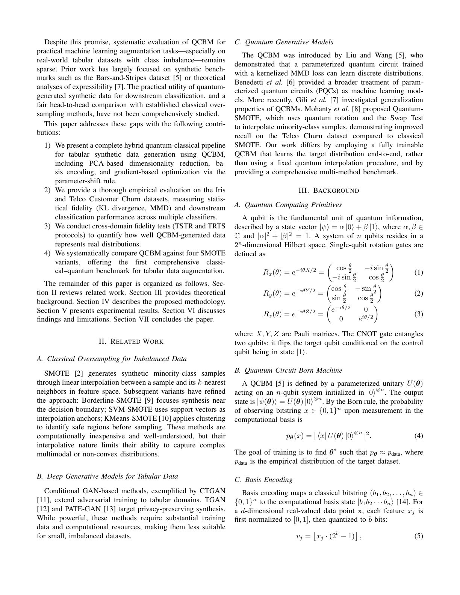
<figcaption class="paper-figure-caption"><b>Fig 1.</b> Low-resolution page preview, page 2</figcaption>
</figure>
<figure class="paper-figure-card">
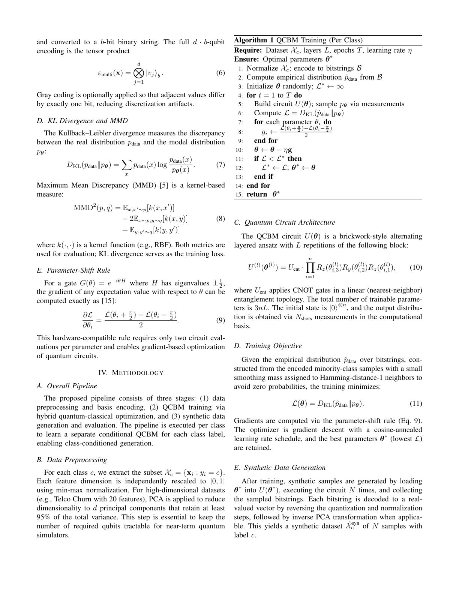
<figcaption class="paper-figure-caption"><b>Fig 2.</b> Low-resolution page preview, page 3</figcaption>
</figure>
<figure class="paper-figure-card">
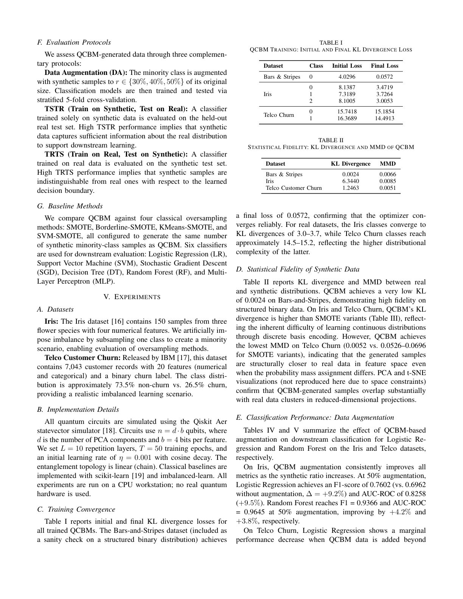
<figcaption class="paper-figure-caption"><b>Fig 3.</b> Low-resolution page preview, page 4</figcaption>
</figure>
<figure class="paper-figure-card">
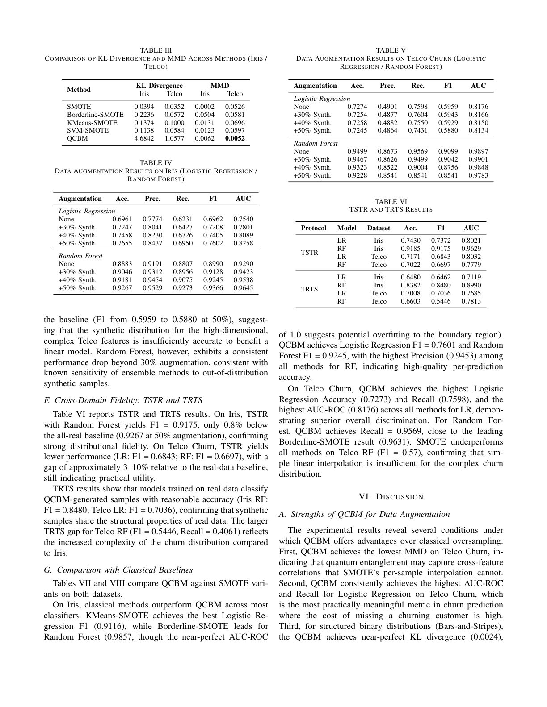
<figcaption class="paper-figure-caption"><b>Fig 4.</b> Low-resolution page preview, page 5</figcaption>
</figure>
<figure class="paper-figure-card">
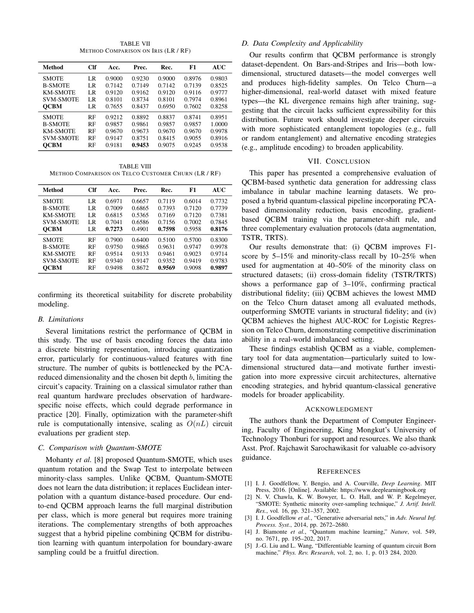
<figcaption class="paper-figure-caption"><b>Fig 5.</b> Low-resolution page preview, page 6</figcaption>
</figure>

**Summary.** This work proposes using a Quantum Circuit Born Machine (QCBM) within a hybrid quantum-classical pipeline to generate synthetic data for imbalanced tabular datasets. By leveraging quantum properties like entanglement, the QCBM achieves superior structural similarity compared to classical oversampling methods. This augmentation significantly boosts downstream classification performance on real-world benchmarks.

**Why it may be interesting.** While focused on ML, the paper's reliance on variational quantum circuits to model complex probability distributions touches upon quantum state tomography and characterizing quantum process fidelity, which are relevant areas in quantum information theory.

Detailed structure

**Main problem.** The paper addresses data scarcity and class imbalance, common challenges in machine learning that degrade model generalization.

**Main result.** Using a Quantum Circuit Born Machine (QCBM) for synthetic data augmentation improves classification metrics like F1-score by 5–15% on structured tabular datasets.

**Method.** A hybrid quantum-classical framework is employed where the QCBM models complex probability distributions to generate synthetic samples, which are then used to augment imbalanced training data.

**Model / system.** The core model is the Quantum Circuit Born Machine (QCBM), which utilizes a parameterized variational quantum circuit $U(\theta)$ exploiting superposition and entanglement. The process involves encoding classical data into quantum states for distribution modeling.

**Key observables.** Kullback-Leibler (KL) divergence, Maximum Mean Discrepancy (MMD), F1-score, and minority-class recall are used to quantify distribution fidelity and classification performance.

**Important parameters / regimes.** The synthetic data augmentation ratio (tested at 30–50% of the minority class), circuit depth ($L$), and optimization parameters ($	heta$) are key variables.

**Assumptions / limitations.** Assumptions include the tractability of basis encoding via PCA dimensionality reduction for near-term quantum simulators, and that the QCBM can capture complex cross-feature correlations better than classical methods like SMOTE.

**Figures summary.** The notes mention tables comparing KL Divergence and MMD across datasets (Iris/Telco) and performance metrics (F1, AUC-ROC) for various oversampling techniques.

**Paper structure.** The paper introduces the problem, details the QCBM framework (preprocessing via PCA, training by minimizing KL divergence using parameter-shift rule), evaluates its efficacy through data augmentation protocols (DA, TSTR, TRTS), and compares results against established classical baselines.

Abstract

Data scarcity and class imbalance are persistent challenges in machine learning that degrade model generalization and introduce predictive bias. We present a hybrid quantum-classical framework for synthetic data generation using a Quantum Circuit Born Machine (QCBM) to address these limitations. The proposed approach exploits quantum mechanical properties -- superposition and entanglement -- within a parameterized variational quantum circuit to model complex probability distributions that are difficult for classical generative methods to capture. Experiments are conducted on two tabular benchmark datasets: the Iris dataset and the Telco Customer Churn dataset. Preprocessing includes normalization and PCA-based dimensionality reduction to enable efficient basis encoding for quantum circuits. The QCBM is trained by minimizing Kullback-Leibler (KL) divergence between real and generated data distributions using a gradient-based parameter-shift optimization rule. Augmenting training data with QCBM-generated synthetic samples at 40-50% of the minority class improves F1-score by approximately 5-15% and minority-class recall by 10-25%. Cross-domain evaluations (Train on Synthetic, Test on Real; and Train on Real, Test on Synthetic) reveal a performance gap of only 3-10%, indicating strong distributional fidelity. Comparative analysis against classical oversampling methods -- SMOTE, Borderline-SMOTE, KMeansSMOTE, and SVM-SMOTE -- shows that QCBM achieves competitive classification performance and produces lower Maximum Mean Discrepancy (MMD) on the Telco dataset, suggesting superior structural similarity in certain imbalanced settings. These findings establish QCBM as a viable complementary tool for data augmentation, particularly for low-dimensional structured tabular data with class imbalance.

[↑ back to top](#top)

### [A Quantum Path to Partial Differential Equations](http://arxiv.org/abs/2607.09639v1)

**Authors:** Xiantao Li  
**Type:** theory · **Category:** quantum information and computing · **PDF:** <https://arxiv.org/pdf/2607.09639v1>  
**Analysis basis:** full PDF text, analyzed in chunks
**Topic relevance:** `non-equilibrium dynamics` **1/5**

↔ Scroll figures horizontally

<figure class="paper-figure-card">
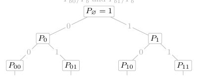
<figcaption class="paper-figure-caption"><b>Fig 1.</b> Figure 1.2: The binary tree behind Grover–Rudolph state preparation. The node weight Pb is the integral of the density over the dyadic interval indexed by the bit string b. The rotation at node b places the next qubit in a superposition with probabilities Pb0/Pb and Pb1/Pb.</figcaption>
</figure>
<figure class="paper-figure-card">
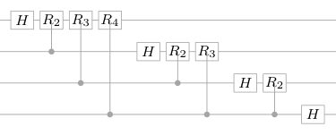
<figcaption class="paper-figure-caption"><b>Fig 2.</b> Figure 1.3: A QFT circuit on four qubits. Here Rm = diag(1, e2πi/2m). The final swaps implement bit reversal. The inverse QFT reverses the gate order and replaces each Rm by R† m.</figcaption>
</figure>
<figure class="paper-figure-card">
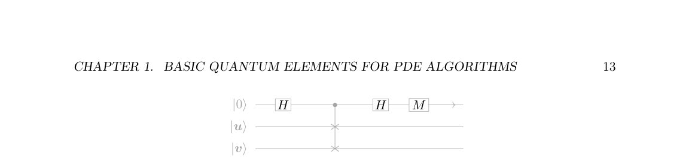
<figcaption class="paper-figure-caption"><b>Fig 3.</b> Figure 1.4: Swap test for estimating | ⟨u|v⟩|2. The controlled operation swaps the two input registers only when the ancilla is |1⟩, and the box M denotes computational-basis measurement of the ancilla.</figcaption>
</figure>
<figure class="paper-figure-card">
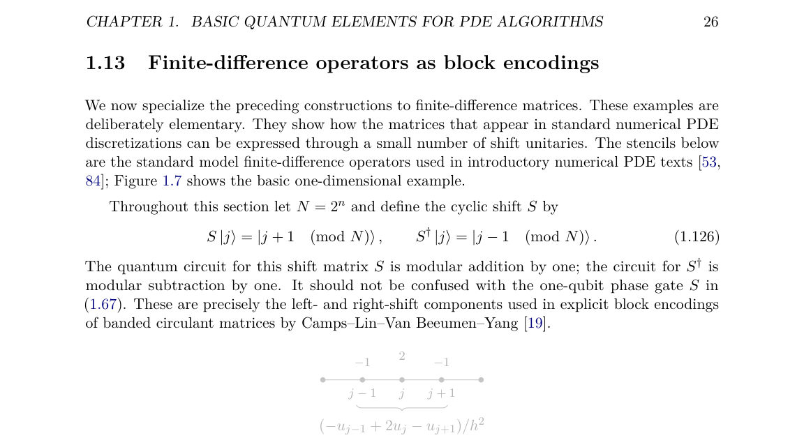
<figcaption class="paper-figure-caption"><b>Fig 4.</b> Figure 1.7: The three-point finite-difference stencil for the positive one-dimensional Laplacian −∂xx. The same local stencil is represented quantumly by a short LCU of the identity, the cyclic shift, and the inverse cyclic shift.</figcaption>
</figure>
<figure class="paper-figure-card">
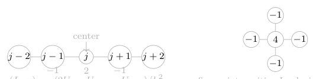
<figcaption class="paper-figure-caption"><b>Fig 5.</b> Figure 1.8: The one-dimensional three-point and two-dimensional five-point positive Laplacian stencils. These are the finite-difference matrices later written as LCUs of shift unitaries.</figcaption>
</figure>

**Summary.** This work details a systematic method for adapting quantum computation techniques to solve Partial Differential Equations. It establishes a clear 'quantum path' by connecting classical numerical discretizations to fundamental quantum operations like Hamiltonian simulation and QSVT via block encoding. The paper is valuable as a shared vocabulary, aiming to guide researchers from both PDE theory and quantum computing into this application space.

**Why it may be interesting.** It provides a rigorous framework for applying advanced quantum algorithms to model complex dynamics described by PDEs, which is relevant for understanding open quantum systems or non-equilibrium processes where continuum descriptions are necessary.

Detailed structure

**Main problem.** The primary goal is developing quantum algorithms capable of solving Partial Differential Equations (PDEs), which bridges classical numerical analysis with quantum computation.

**Main result.** The paper outlines a comprehensive, mathematically transparent pipeline showing how continuous PDEs can be mapped to quantum circuits using block encoding and various quantum primitives.

**Method.** It employs a structured approach starting from standard finite difference/element discretizations, embedding the resulting operators into unitaries, and then applying techniques like QSVT and Hamiltonian simulation.

**Model / system.** The focus is on general PDEs (elliptic, hyperbolic, parabolic, and nonlinear), treating them as computational problems rather than physical Hamiltonians in a standard quantum simulation sense. The system is modeled via its discretized differential operator.

**Key observables.** The extraction of a quantity of interest from the PDE solution, alongside diagnostics like discretization error, state preparation cost, and measurement feasibility.

**Important parameters / regimes.** Discretization error, normalization factors, and computational costs associated with various quantum primitives (e.g., QSVT depth).

**Assumptions / limitations.** The approach assumes that the problem can be successfully mapped to a unitary evolution framework via block encoding, though it notes limitations regarding universal speedup.

**Paper structure.** The structure follows the full computational pipeline: starting with classical discretization (finite difference/element) $
ightarrow$ quantum encoding $
ightarrow$ transformation using quantum primitives (QSVT, Hamiltonian simulation) $
ightarrow$ extraction of the desired quantity.

Abstract

Partial differential equations are a promising application area for fault-tolerant quantum algorithms, but the subject lies between two communities with different languages: numerical analysis and quantum computation. These lecture notes provide a numerically grounded introduction for readers entering from either field. Block encoding is the organizing principle: once a discretized differential operator is embedded in a unitary, primitives such as quantum singular value transformation, Hamiltonian simulation, linear combinations of unitaries, amplitude amplification, and measurement can be assembled into algorithms for elliptic, hyperbolic, and parabolic PDEs. Each chapter begins with a standard finite difference or finite element discretization and follows the full pipeline from the continuous PDE to quantum encoding, transformation, and extraction of a quantity of interest. Particular attention is paid to the factors governing end-to-end performance, including discretization error, state preparation, normalization, postselection, and measurement cost. A final chapter introduces nonlinear problems through Carleman and Koopman-von Neumann linearizations. The aim is not a comprehensive survey or a claim of universal quantum advantage, but a mathematically transparent entry point and a shared vocabulary for researchers in both communities.

[↑ back to top](#top)

### [Keyless Covert Communication Over Quantum MACs with General Message Sets](http://arxiv.org/abs/2607.08898v1)

**Authors:** Hassan ZivariFard, Xiaodong Wang  
**Type:** theory · **Category:** quantum information and computing · **PDF:** <https://arxiv.org/pdf/2607.08898v1>  
**Analysis basis:** full PDF text, analyzed in chunks
**Topic relevance:** `entanglement & information structure` **1/5**

↔ Scroll figures horizontally

<figure class="paper-figure-card">
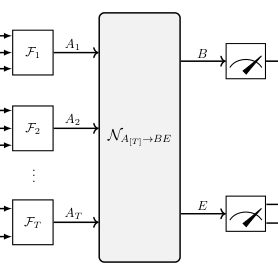
<figcaption class="paper-figure-caption"><b>Fig 1.</b> Fig. 1: Covert communication over a quantum MAC with general message sets. illustrative examples, and Section VII offers concluding re- marks. Proofs of the results are deferred to the appendices.</figcaption>
</figure>
<figure class="paper-figure-card">
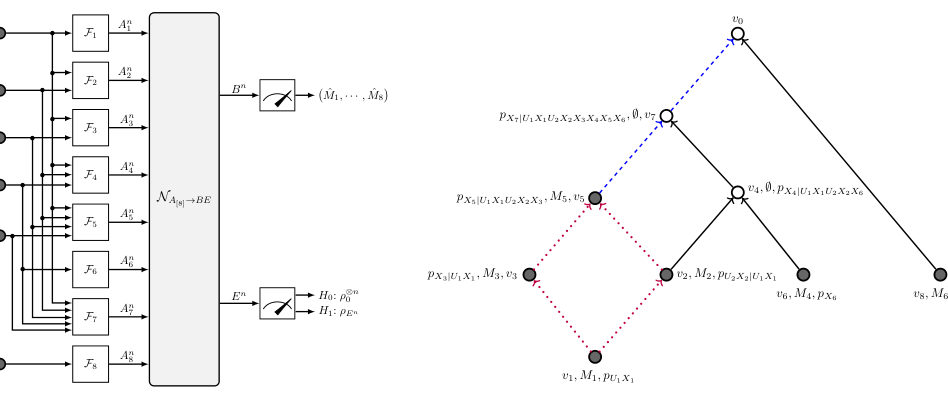
<figcaption class="paper-figure-caption"><b>Fig 2.</b> Fig. 2: A MAC with a special message hierarchy and its corresponding message graph. In the message graph, each vertex is annotated with its private message and the distribution of the associated classical codebook. For example, v4, ∅, pX4|U1X1U2X2X6 denotes that vertex v4 has no private message and its codebook distribution is pX4|U1X1U2X2X6, while v3, M3, pX3|U1X1 denotes that vertex v3 has M3 as its private message with codebook distribution pX3|U1X1. In the associated message graph, the vertices with private messages, i.e., T = {v1, v2, v3, v5, v6, v8}, are illustrated by filled vertices. Consider the subset {v5} ⊂T of vertices with private messages. The proper ancestral sub-graph...</figcaption>
</figure>
<figure class="paper-figure-card">
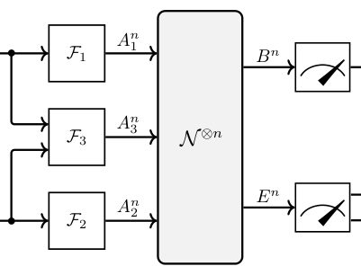
<figcaption class="paper-figure-caption"><b>Fig 3.</b> Fig. 3: A MAC with a helper and its corresponding message graph. of V = Z ⊗Z ⊗Z. Consequently, each of the corresponding density operators induces the output state |0⟩⟨0| at the warden, whereas the remaining computational-basis states induce the output state |1⟩⟨1|. Also, the legitimate receiver’s channel is</figcaption>
</figure>
<figure class="paper-figure-card">
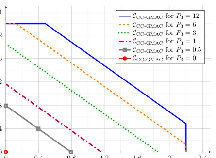
<figcaption class="paper-figure-caption"><b>Fig 4.</b> Fig. 4: The capacity region of the Gaussian MAC with a helper shown for σ2 B = 1, h = 3, and P1 = P2 = 5, for P3 ∈ {0, 0.5, 1, 3, 6, 12}.</figcaption>
</figure>
<figure class="paper-figure-card">
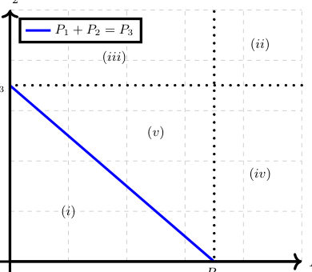
<figcaption class="paper-figure-caption"><b>Fig 5.</b> Fig. 5: Different possible cases for P1 and P2 when P3 is fixed.</figcaption>
</figure>

**Summary.** This paper tackles the theoretical problem of covert communication—sending a message secretly—over quantum Multiple Access Channels (MACs). The authors establish positive achievable rates for both fully quantum and mixed classical-quantum MAC settings. By developing rigorous rate region calculations, they provide fundamental limits on secure information transfer in these complex multi-user quantum environments.

**Why it may be interesting.** This work pushes the boundaries of quantum security protocols by quantifying how much classical information can be reliably transmitted while remaining undetectable to an eavesdropper in complex multi-user quantum channels.

Detailed structure

**Main problem.** The study focuses on achieving keyless covert classical communication over quantum Multiple-Access Channels (MACs) when the message sets are general.

**Main result.** The authors demonstrate the feasibility of positive covert rates over both fully quantum and classical-quantum MACs, establishing general one-shot and asymptotic achievable rate regions for the first time in this combined setting.

**Method.** The analysis employs advanced information theoretic tools, including random codebook generation, superposition coding, simultaneous pinching, and channel resolvability to establish upper and lower bounds on the covert rate.

**Model / system.** The system models include fully quantum MACs and classical-quantum MACs with an arbitrary number of transmitters. Specific examples analyzed are a finite-dimensional MAC with a helper, a classical Gaussian MAC, and a single-mode bosonic MAC.

**Key observables.** Covert rate, covert capacity, achievable rate region, Fidelity Distance, Purified Distance, Quantum Relative Entropy.

**Important parameters / regimes.** One-shot vs. asymptotic regimes ($n 	o \infty$), the size/nature of the message sets (general), and error probability bounds ($\delta$, $\epsilon$).

**Assumptions / limitations.** The analysis builds upon established techniques like simultaneous pinching and relies on extending previous work concerning covert communication over quantum MACs.

**Figures summary.** Figure 1 illustrates the general setup where multiple transmitters cooperate to communicate covertly with a legitimate receiver while evading an adversary (warden).

**Paper structure.** The paper progresses by defining the problem in terms of state distances and relative entropies, establishing achievability via coding schemes, deriving upper bounds using information inequalities related to ancestral/descendant sub-graphs, and finally synthesizing these results into concrete rate regions.

Abstract

We study covert classical communication over quantum multiple-access channels (MACs) with general message sets. Specifically, we consider a fully quantum MAC with arbitrary message sets and an arbitrary number of transmitters. We demonstrate the feasibility of achieving a positive covert rate over this channel and establish general one-shot and asymptotic achievable rate regions. For classical-quantum MACs with general message sets, we establish the covert capacity, when the transmitters are restricted to deterministic encoding. Our result recovers, as a special case, known results for classical communication over classical MACs with general message sets, covert communication of a classical message over a classical channel with two transmitters, and classical communication over quantum MACs. We provide three examples of MACs to which our results can be applied, either directly or indirectly, to achieve positive covert rates. Specifically, we first study covert communication over a finite-dimensional MAC with a helper. We then analyze a classical Gaussian MAC with a helper and derive its covert capacity. Finally, we extend the analysis to a single-mode bosonic MAC with a helper and show that positive covert rates can also be achieved in this setting. To the best of our knowledge, this is the first work to achieve positive-rate covert communication over both classical and quantum MACs.

[↑ back to top](#top)

### [Silicon-Germanium Heterostructures with Enhanced Valley Splitting for Spin Qubits](http://arxiv.org/abs/2607.09652v1)

**Authors:** David W. Kanaar, Efrain Martinez, Peihong Zhang, Mark F. Gyure  
**Type:** theory · **Category:** quantum information and computing · **PDF:** <https://arxiv.org/pdf/2607.09652v1>  
**Analysis basis:** full PDF text, analyzed in chunks
**Topic relevance:** `spintronics-quantum-optics interface` **1/5**

↔ Scroll figures horizontally

<figure class="paper-figure-card">
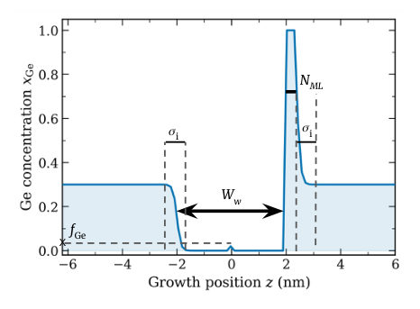
<figcaption class="paper-figure-caption"><b>Fig 1.</b> FIG. 1. Ge profile used in the ideal interface case. The well width, Ww, number of cap monolayers NML, fraction of Ge used in the peak fGe, and the sigmoid interface width for the non ideal interface σi are all indicated.</figcaption>
</figure>
<figure class="paper-figure-card">
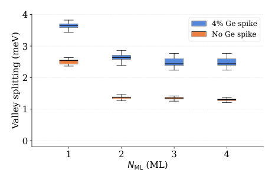
<figcaption class="paper-figure-caption"><b>Fig 2.</b> FIG. 3. Distribution of the valley splitting over 100 alloy realizations as the cap thickness NML is varied about the base parameters of Table I(blue) and the base without the Ge spike(orange)</figcaption>
</figure>
<figure class="paper-figure-card">
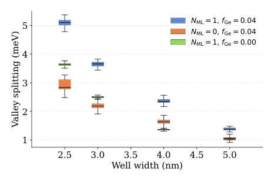
<figcaption class="paper-figure-caption"><b>Fig 3.</b> FIG. 2. Distribution of the valley splitting over 100 alloy realizations as the well width Ww is varied for NML = 1 and fGe = 0.04(blue), NML = 0 and fGe = 0.04(orange), and NML = 1 and fGe = 0(green) with the remaining parameters of Table I.</figcaption>
</figure>
<figure class="paper-figure-card">
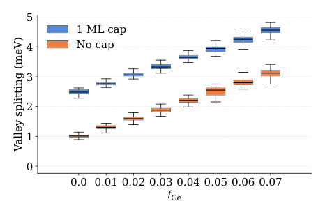
<figcaption class="paper-figure-caption"><b>Fig 4.</b> FIG. 4. Distribution of the valley splitting over 100 alloy realizations as the Ge spike concentration fGe is varied about the base parameters of Table I.</figcaption>
</figure>
<figure class="paper-figure-card">
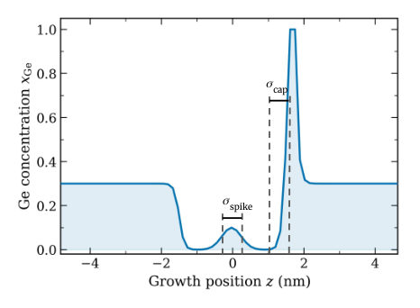
<figcaption class="paper-figure-caption"><b>Fig 5.</b> FIG. 6. Ge profile used in the realistic interface case. The additional features, the cap sigmoid with interface for σcap and the spike Gaussian width σspike are indicated.</figcaption>
</figure>

**Summary.** The paper proposes an advanced $	ext{Si}/	ext{SiGe}$ heterostructure design—combining a narrow well, pure-Ge cap, and Ge spike—to drastically enhance valley splitting in spin qubit platforms. Using detailed simulations, the authors demonstrate that this engineered structure can achieve splittings up to $5 	ext{ meV}$, effectively mitigating valley splitting as an obstacle for scalable quantum processors.

**Why it may be interesting.** This work directly addresses a critical material science bottleneck for solid-state quantum computing by providing an engineering blueprint (heterostructure design) to overcome fundamental energy level limitations in silicon qubits.

Detailed structure

**Main problem.** The primary challenge is achieving valley splittings significantly larger than thermal energy ($k_B T$) in Si/SiGe heterostructures to ensure reliable initialization, operation, and readout of spin qubits.

**Main result.** An unorthodox design combining a narrow quantum well, a pure-Ge cap, and a dilute Ge spike can push valley splittings up to $\sim 5 	ext{ meV}$ with low variance across disorder realizations.

**Method.** The work uses device-scale simulations incorporating atomistic alloy disorder via 1D tight-binding theory, corroborated by targeted DFT calculations.

**Model / system.** The system is gate-defined Si/SiGe heterostructures designed for spin qubits. The model involves engineering the Ge concentration profile ($\chi(z)$) through a specific three-part structure: narrow quantum well, pure-Ge cap, and dilute Ge spike.

**Key observables.** Valley splitting ($\Delta E_v$), which must be significantly larger than $k_B T$ (i.e., $> 1 	ext{ meV}$ for reliable operation).

**Important parameters / regimes.** Well width ($W_w$, e.g., $2.5-3.0 	ext{ nm}$), pure-Ge cap thickness ($	ext{NML}=1$), and dilute Ge spike concentration ($f_{	ext{Ge}} \approx 4\%$). Interface sharpness ($\sigma$) is critical.

**Assumptions / limitations.** The analysis assumes atomically sharp interfaces to establish an upper bound, though it quantifies the required interface sharpness (e.g., $\sigma_{cap} \approx 1-2 	ext{ ML}$) needed for $E_v \gtrsim 1 	ext{ meV}$ in realistic scenarios.

**Figures summary.** Figures illustrate how valley splitting varies with well width, cap thickness, and spike concentration, demonstrating the additive enhancement from the proposed three-component structure. Later figures quantify the dependence on interface broadening ($\sigma_{cap}, \sigma_{spike}$).

**Paper structure.** The paper establishes the physical requirement for large valley splittings, proposes an unorthodox $	ext{Si}/	ext{SiGe}$ design (narrow well + pure-Ge cap + Ge spike), and uses 1D tight-binding/DFT simulations to show that this combination yields high, reproducible splitting values. It then analyzes how interface broadening degrades this performance.

Abstract

Achieving valley splittings well in excess of the thermal energy of electrons and avoiding valley excitations is essential for the consistent initialization, operation and readout of gate-defined Si spin qubits. In this work, we present a device-level optimization strategy for pushing valley splittings to between 1 and 5 meV, well beyond values reported in nearly all previous theoretical studies. Using device-scale simulations that incorporate atomistic alloy disorder through a 1D tight-binding theory, we demonstrate that our proposed approach yields large valley splittings with a tight distribution across disorder realizations, a key requirement for reproducible qubit performance at scale. The approach rests on an unorthodox Si/SiGe heterostructure design combining a narrow quantum well, a small Ge spike, and a pure-Ge cap. We corroborate these predictions with targeted atomistic density functional theory calculations. These results offer a clear path forward for scalable Si/SiGe spin qubit devices and, if realized experimentally, effectively eliminate valley splitting as an existential problem for large scale SiGe-based quantum processors.

[↑ back to top](#top)

### [Stochastic Similarity Renormalization Group](http://arxiv.org/abs/2607.08830v1)

**Authors:** Rongzhe Hu, Xin Zhen, Furong Xu, Junchen Pei  
**Type:** theory · **Category:** numerical methods · **PDF:** <https://arxiv.org/pdf/2607.08830v1>  
**Analysis basis:** full PDF text, analyzed in chunks
**Topic relevance:** `methods for driven-dissipative` **1/5**

↔ Scroll figures horizontally

<figure class="paper-figure-card">
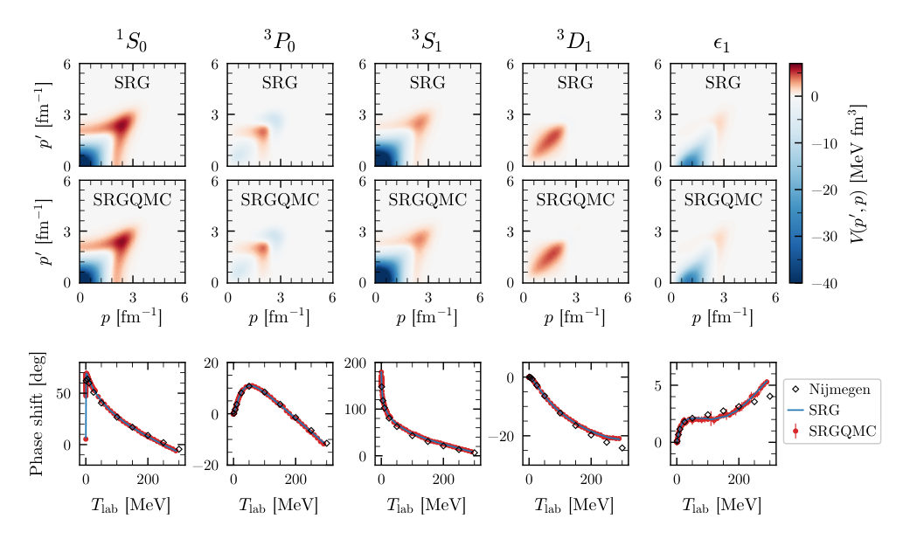
<figcaption class="paper-figure-caption"><b>Fig 1.</b> FIG. 1. SRG- and SRGQMC-evolved neutron-proton interactions at λ = 2.0 fm−1 for N3LOEMN(500). Columns from left to right denote the 1S0, 3P0, 3S1, 3D1, and ϵ1 channels. Row 2 presents the SRGQMC-evolved matrix elements V (p′, p) using the stochastic loop-averaged sampling with Nw = 104 and Nloop = 10. Row 3 shows the scattering phase shifts (including the mixing angle ϵ1) against the laboratory energy Tlab, derived from SRG (blue solid lines) and SRGQMC (red dots with error bars), compared with the empirical Nijmegen analysis (open diamonds) [22] as a reference.</figcaption>
</figure>
<figure class="paper-figure-card">
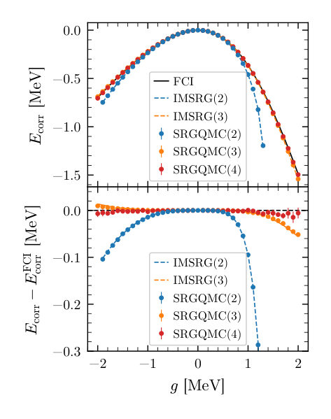
<figcaption class="paper-figure-caption"><b>Fig 2.</b> FIG. 2. Correlation energy of the A = 4 Richardson pair- ing Hamiltonian as a function of the pairing strength g. The deterministic IMSRG(2), IMSRG(3) and FCI results are com- pared with SRGQMC(2), SRGQMC(3) and SRGQMC(4) cal- culations. Error bars denote the statistical uncertainties from independent stochastic loops. The FCI result is obtained by directly diagonalizing the Hamiltonian in the specified model space.</figcaption>
</figure>
<figure class="paper-figure-card">
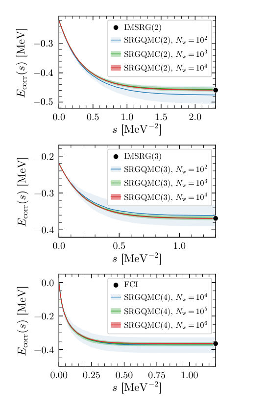
<figcaption class="paper-figure-caption"><b>Fig 3.</b> FIG. 3. SRGQMC flow of the correlation energy for the A = 4 Richardson pairing Hamiltonian at g = 1.0 MeV. Shaded bands indicate statistical uncertainties. Deterministic IM- SRG(2), IMSRG(3) and FCI results are shown on the right axis by black dots.</figcaption>
</figure>
<figure class="paper-figure-card">
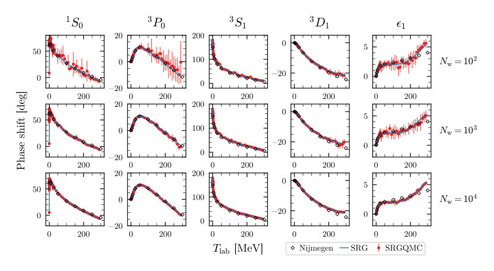
<figcaption class="paper-figure-caption"><b>Fig 4.</b> FIG. 1. Convergence of the calculated phase shifts with respect to the walker population Nw. Three rows correspond to Nw = 102, 103, and 104, respectively, with Nloop = 10 fixed. Columns show the 1S0, 3P0, 3S1, 3D1, and ϵ1 channels for the N3LOEMN(500) interaction evolved to λ = 2.0 fm−1. Solid curves denote deterministic SRG results, red points with error bars denote SRGQMC results, and open diamonds show the Nijmegen phase-shift analysis as an empirical reference.</figcaption>
</figure>
<figure class="paper-figure-card">
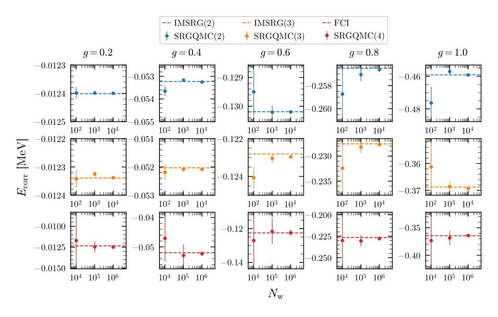
<figcaption class="paper-figure-caption"><b>Fig 5.</b> FIG. 2. Convergence of the Richardson pairing-model correlation energy with respect to Nw. Columns correspond to g = 0.2, 0.4, 0.6, 0.8, and 1.0 MeV. The three rows show SRGQMC(2), SRGQMC(3), and SRGQMC(4), respectively. Dashed horizontal lines denote the corresponding deterministic IMSRG(2), IMSRG(3) and IMSRG(4) values, the last of which is equivalent to the exact FCI for the present A = 4 system.</figcaption>
</figure>

**Summary.** This work introduces the Stochastic Similarity Renormalization Group (SRGQMC) method, which uses Quantum Monte Carlo techniques to simulate continuous unitary transformations in nuclear physics. It successfully bypasses the prohibitive computational cost of high-order In-Medium SRG calculations by sampling operator flow stochastically. This allows for reliable predictions up to four-body correlations, significantly advancing our understanding of strongly interacting quantum matter.

**Why it may be interesting.** The stochastic approach provides a powerful computational tool for simulating complex many-body quantum dynamics where deterministic tensor contractions become intractable due to exponential scaling.

Detailed structure

**Main problem.** Developing a scalable method for high-order In-Medium Similarity Renormalization Group (IMSRG) calculations that overcomes the combinatorial tensor-space explosion associated with traditional deterministic flow equations.

**Main result.** The stochastic framework successfully achieves the first IMSRG(4) calculation, demonstrating significant improvement in convergence toward the Full Configuration Interaction (FCI) limit compared to lower-order truncations.

**Method.** It introduces Stochastic Similarity Renormalization Group with Quantum Monte Carlo (SRGQMC), which maps continuous unitary flow equations onto an ensemble of signed random walkers to sample commutator structures instead of evolving full operator matrices.

**Model / system.** The calculations are applied to nuclear many-body systems, using the Richardson pairing model for testing. The underlying physics involves evolving Hamiltonians via a continuous unitary transformation governed by flow equations up to four-body operators.

**Key observables.** Correlation energy ($E_{	ext{corr}}$), free-space scattering phase shifts, and comparison of calculated values against deterministic IMSRG orders ($	ext{IMSRG}(2)$ through $	ext{IMSRG}(4)$) and the exact FCI limit.

**Important parameters / regimes.** Coupling strength ($g$), flow parameter ($s$), walker population ($N_w$), and number of stochastic loops ($N_{	ext{loop}}$).

**Assumptions / limitations.** The primary assumption is that mapping the deterministic flow onto a stochastic ensemble provides an unbiased estimate, which is confirmed by observing convergence as $N_w$ or $N_{	ext{loop}}$ increases.

**Figures summary.** Figures compare SRG/SRGQMC evolved NN interaction matrix elements and phase shifts; another compares correlation energy vs. pairing strength for different IMSRG orders; a third shows the evolution of $E_{	ext{corr}}(s)$ tracking deterministic calculations.

**Paper structure.** The paper first establishes the need to overcome tensor-space explosion in high-order IMSRG. It then details the SRGQMC formalism, applying it first to free-space NN interactions and subsequently to the pairing model, culminating in the demonstration of $	ext{IMSRG}(4)$ feasibility.

Abstract

By integrating the quantum Monte Carlo technique into the similarity renormalization group (SRG), we have developed a stochastic SRG framework (SRGQMC) capable of both free-space two-body and in-medium many-body evolutions. This approach circumvents the combinatorial tensor-space explosion of many-body flow equations by mapping continuous unitary transformations onto an ensemble of signed random walkers. We benchmark the SRGQMC against deterministic free-space SRG evolutions of realistic nucleon-nucleon (NN) interactions, as well as against in-medium SRG (IMSRG) many-body calculations with the Richardson pairing model at two- and three-body levels [IMSRG(2)/(3)]. While a deterministic extension to the four-body level [IMSRG(4)] remains unfeasible due to prohibitive computational costs, we have achieved the first IMSRG(4) calculation by using the stochastic technique, demonstrating a substantial improvement toward the full configuration-interaction limit. This stochastic framework provides a practical pathway to higher-order IMSRG calculations.

[↑ back to top](#top)

### [The scales of disorder in perfect quasicrystals](http://arxiv.org/abs/2607.09274v1)

**Authors:** Alan Rodrigo Mendoza Sosa, Atahualpa S. Kraemer, Michael Schmiedeberg, Erdal C. Oğuz  
**Type:** theory · **Category:** statistical mechanics · **PDF:** <https://arxiv.org/pdf/2607.09274v1>  
**Analysis basis:** full PDF text, analyzed in chunks
**Topic relevance:** `Frenkel-Kontorova` **1/5**

↔ Scroll figures horizontally

<figure class="paper-figure-card">
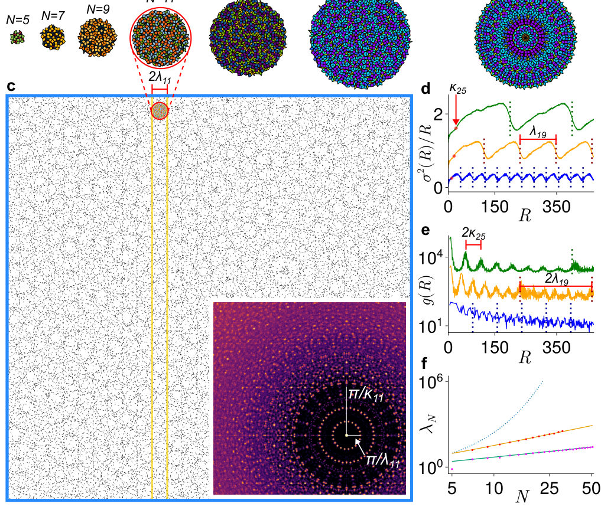
<figcaption class="paper-figure-caption"><b>Fig 1.</b> FIG. 1: Statistical unit cells and crossover length scale. (a) Representative statistical unit cells of radius R = λN, extracted far from the exact symmetry center for two-dimensional quasiperiodic tilings with rotational symmetry N. (b) A same-sized neighborhood centered on the exact symmetry center for N = 15, where rotational order remains visually apparent. (c) Portion of the N = 11 quasicrystal showing only the smallest-area tiles. The blue box indicates the size of a classical approximant, while the red circle marks a statistical unit cell. The inset in the bottom-right corner displays the corresponding diffraction pattern, with characteristic wavevectors associated with λN and the...</figcaption>
</figure>
<figure class="paper-figure-card">
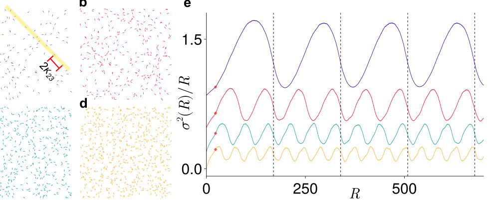
<figcaption class="paper-figure-caption"><b>Fig 2.</b> FIG. 2: Hierarchical tile contributions to statistical recurrence. (a–d) Tile subsets of a two-dimensional quasiperiodic tiling with rotational symmetry N = 23, separated according to increasing tile area. The sparsest subset in (a), formed by the smallest-area tiles, generates an extended network that dominates long-range correlations. (e) Number variance computed from centroid decorations of the corresponding subsets. Vertical dashed lines indicate integer multiples of the statistical-unit-cell scale λ23, while diamonds mark the common crossover scale κ23. All subsets exhibit a change in concavity near κ23, indicating a shared onset of the long-range quasiperiodic order. Oscillation...</figcaption>
</figure>
<figure class="paper-figure-card">
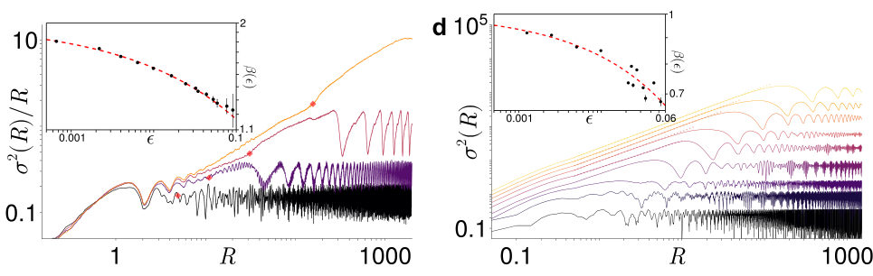
<figcaption class="paper-figure-caption"><b>Fig 3.</b> FIG. 3: Approaching Poissonian statistics through randomization and in the infinite-symmetry limit. Log-log plots of number variance as a function of window radius R, comparing randomization-induced disorder (a,b) with increasing rotational symmetry (c,d). (a) Two-dimensional quasicrystal with N = 13 subjected to increasing iterations of random local flips, ranging from unperturbed lattice (black) to maximally flipped state (yellow). (b) One-dimensional quasicrystal with N = 51 under repeated randomization. The dashed green curve denotes the fully randomized limit, which approaches Poissonian scaling while preserving the prototile distribution and provides an operational definition of a...</figcaption>
</figure>
<figure class="paper-figure-card">
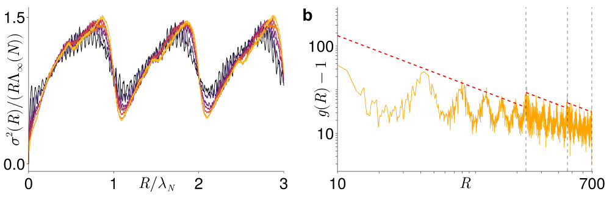
<figcaption class="paper-figure-caption"><b>Fig 4.</b> FIG. 4: Data collapse and scaling of the hierarchical statistical recurrence. (a) Rescaled number variance σ2(R)/(RΛ∞(N)) for two-dimensional quasicrystals with prime rotational symmetries 11 ≤N ≤31, plotted as a function of the scaled radius R/λN. Curves are colored from black to yellow, corresponding to increasing symmetry. The collapse onto a common master curve demonstrates symmetry-controlled scaling invariance. The quality of the collapse improves systematically with increasing N, while remaining accurate already for the finite symmetries considered here. (b) Envelope of g(R) −1 shown on log-log scales for N = 19. Peaks separated by 2κN exhibit algebraic decay, as indicated by the red...</figcaption>
</figure>

**Summary.** This work analyzes quasicrystals to show that increasing rotational symmetry ($N$) drives the system toward apparent randomness. The authors identify two key length scales—a crossover scale ($\kappa_N$) and a statistical unit cell size ($\lambda_N$)—which quantify how deterministic order is progressively concealed by disorder-like fluctuations.

**Why it may be interesting.** The concept of an emergent 'statistical unit cell' provides a powerful mathematical tool to quantify how deterministic structure persists even when conventional periodicity is absent, which has implications for understanding glassy or disordered quantum phases.

Detailed structure

**Main problem.** The study investigates how deterministic order, characteristic of quasicrystals, can become statistically indistinguishable from true randomness as the rotational symmetry ($N$) increases.

**Main result.** Increasing $N$ causes a crossover length ($\kappa_N$) below which local statistical signatures are suppressed, leading to a geometric critical point where order and randomness merge over any finite observation window.

**Method.** The authors analyze density fluctuations ($\sigma^2(R)/R$) and pair correlation functions ($g(R)$) using generalized dual methods applied to $N$-fold quasicrystals in 1D and 2D.

**Model / system.** The system under study is perfect quasicrystals, which possess long-range order but lack translational periodicity. The analysis compares these structures against conventional crystals and amorphous matter by varying the rotational symmetry parameter $N$.

**Key observables.** Number variance ($\sigma^2(R)$), pair correlation function ($g(R)$), crossover length ($\kappa_N$), and statistical unit cell size ($\lambda_N$).

**Important parameters / regimes.** Rotational symmetry $N$ (or $\epsilon = 1/N$), which controls the degree of quasiperiodicity; dimensionality (1D vs. 2D).

**Assumptions / limitations.** The analysis assumes that the statistical properties can be characterized by emergent length scales ($\kappa_N, \lambda_N$) derived from fluctuation measurements.

**Figures summary.** Figures illustrate density fluctuations showing crossovers near $\kappa_N$ and oscillations at $\lambda_N$. Comparisons are made with random local phasonic flips, and scaling behavior of these characteristic lengths with $N$ is quantified.

**Paper structure.** The paper establishes a quantitative framework by analyzing how increasing rotational symmetry ($N$) suppresses quasiperiodic signatures. It identifies two key scales ($\kappa_N$ and $\lambda_N$), demonstrating that the system approaches a critical point where order vanishes statistically, while defining the statistical unit cell as the remaining signature of determinism.

Abstract

The classical dichotomy between crystalline order and amorphous disorder is increasingly challenged by novel states that lack conventional crystalline symmetries while retaining crystal-like properties. Quasicrystals occupy a distinctive position within this expanding framework by possessing long-range order without translational periodicity, thereby permitting arbitrary $N$-fold rotational symmetry. Paradoxically, far from their unique symmetry center, high-symmetry quasicrystals closely resemble disordered patterns, raising the question of how deterministic order can be detected. Here we show that increasing rotational symmetry progressively suppresses local statistical signatures of quasiperiodicity, while preserving its underlying exact long-range order. This order is thus concealed below an emergent crossover length that grows linearly with $N$. Therefore, as $N \rightarrow \infty$, the disorder-like regime expands without bound, defining a symmetry-controlled geometric critical point at which deterministic order and randomness become statistically indistinguishable over any finite observation window. For finite $N$, however, quasiperiodic order becomes detectable beyond this crossover, revealing a second emergent length scale that we identify as the size of a \textit{statistical unit cell} -- finite patches over which statistical properties recur despite the absence of conventional translational periodicity. In one dimension, the statistical-unit-cell size coincides with the crossover length, whereas in two dimensions it grows as $N^2$, remaining smaller than the size of typical approximants and establishing a hierarchy of emergent length scales. Together, the disorder-to-order crossover and statistical unit cells provide a quantitative framework connecting crystals, quasicrystals, and amorphous matter, showing how apparent disorder can emerge from purely deterministic geometry.

[↑ back to top](#top)

## Other papers (6)

*Papers from primary archives without highlighted authors or any topic match. Click to expand.*

Show other papers

### [A Novel Parallel QCNN Architecture with Efficient Classical Simulability](http://arxiv.org/abs/2607.08928v1)

**Authors:** Lawrence Nguyen, Hiu Yung Wong  
**Type:** theory · **Category:** quantum information and computing · **PDF:** <https://arxiv.org/pdf/2607.08928v1>  
**Analysis basis:** full PDF text, analyzed in chunks

↔ Scroll figures horizontally

<figure class="paper-figure-card">
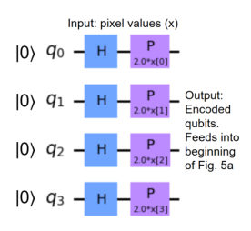
<figcaption class="paper-figure-caption"><b>Fig 1.</b> Fig. 2. Qiskit’s Z-FeatureMap on 4 qubits. They are all initialized to |0⟩ followed by a parameterized phase gate, P (x).The angle being rotated is based on the pixel value, x. The output is fed into the first convolution layer of Fig. 5a.</figcaption>
</figure>
<figure class="paper-figure-card">
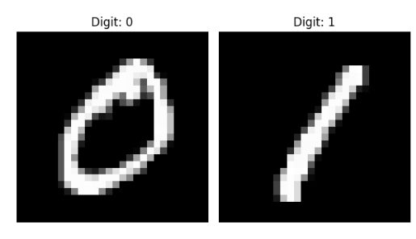
<figcaption class="paper-figure-caption"><b>Fig 2.</b> Fig. 1. Data samples from MNIST</figcaption>
</figure>
<figure class="paper-figure-card">
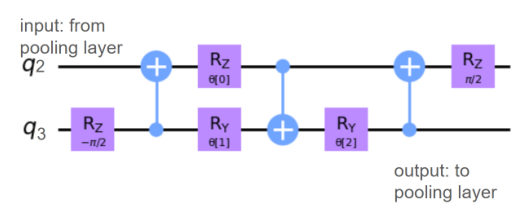
<figcaption class="paper-figure-caption"><b>Fig 3.</b> Fig. 3. Convolutional circuit that serves as the building block for a convo- lutional layer (Fig. 5). This is the second convolutional layer in Fig. 5a. The circuit mixes information and prepares the states to be pooled by pooling layers. [4]</figcaption>
</figure>
<figure class="paper-figure-card">
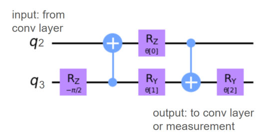
<figcaption class="paper-figure-caption"><b>Fig 4.</b> Fig. 4. Pooling circuit and the last pooling layer of Fig. 5. q2 is the source qubit and q3 is the sink qubit [4].</figcaption>
</figure>
<figure class="paper-figure-card">
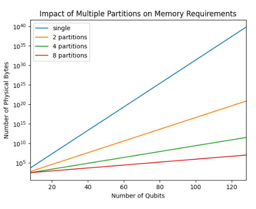
<figcaption class="paper-figure-caption"><b>Fig 5.</b> Fig. 6. Physical memory requirement to store a state as a function of the number of qubits and partitions</figcaption>
</figure>

**Summary.** The paper introduces a novel parallel architecture for Quantum Convolutional Neural Networks (QCNNs) designed to overcome the exponential memory scaling problem when simulating large qubit systems. By partitioning input images and combining results through a binary reduction tree structure, the authors enable training models up to 128 qubits on classical hardware. This demonstrates that scalable quantum machine learning is possible without prohibitive computational resources.

**Why it may be interesting.** This work directly addresses resource limitations in quantum machine learning by proposing a scalable simulation technique for complex quantum circuits, which is highly relevant for developing practical quantum algorithms.

Detailed structure

**Main problem.** The primary challenge is implementing Quantum Convolutional Neural Networks (QCNNs) for image classification on large datasets like MNIST while circumventing the exponential memory scaling limitations of classical simulation.

**Main result.** A novel hierarchical partitioning and binary reduction architecture allows simulating QCNNs with up to 128 qubits, achieving competitive accuracy comparable to smaller, single-process models.

**Method.** The method employs a parallelization strategy where the input image is partitioned into independent sub-images. These partitions are processed in parallel and then combined using a binary reduction tree structure involving partial tracing over density matrices.

**Model / system.** The model is a QCNN built upon parameterized quantum circuits, utilizing Z-feature maps for encoding pixel data. The architecture mimics classical CNNs by alternating convolutional layers (using 2-qubit unitaries) and pooling layers that condense information via partial tracing.

**Key observables.** Binary classification accuracy on the MNIST dataset, measured by the Pauli Z expectation value ($\langle \sigma_Z 
angle$) of the final qubit.

**Important parameters / regimes.** The model was tested up to 128 qubits; parameter counting formulas were derived for convolutional and reduction blocks.

**Assumptions / limitations.** The simulation relies on approximating the full state vector using density matrices ($
ho$) and assuming that pooling layers allow for discarding irrelevant information via partial tracing. The process requires the number of processes to be a power of two.

**Figures summary.** Figures illustrate the QCNN structure, showing how an image is partitioned (e.g., 128 qubits split into smaller blocks) and combined through a binary reduction tree, with comparisons made between single-process vs. parallel accuracy results for various qubit counts.

**Paper structure.** The paper introduces the need to scale QCNNs beyond classical simulation limits. It details the novel hierarchical partitioning approach using convolutional and pooling circuits. The core is demonstrating the feasibility of simulating large systems (up to 128 qubits) via a binary reduction tree, culminating in performance comparisons showing maintained or improved accuracy.

Abstract

This work presents a study of an implementation of a novel Quantum Convolutional Neural Network (QCNN) for binary classification of images from the Modified National Institute of Standards and Technology (MNIST) dataset. Using a novel architecture inspired by previous QCNN and classical convolutional neural network (CNN) implementations, we use a hierarchical partitioning approach to implement a QCNN circuit that can be approximated and simulated efficiently on a classical machine for a large problem. First, the original image is partitioned such that each process handles a smaller portion of the image, which is encoded into independent states. Then, these partitions merge and combine, resulting in states that contain information from both partitions while halving the number of processes. After repeating this until one process remains, we reduce the dimensionality of the state until a single qubit remains for measurement. Using this approach, we can use multiple processes in parallel to simulate a large QCNN program without the need for exponentially growing hardware requirements as the number of qubits increases. In our work, we use this scheme to train a 128-qubit model, which is impossible to run on any classical supercomputer without the novel architecture. We also explore the impact of this new model architecture on prediction accuracy by training it to perform binary classification on the MNIST dataset with a small number of qubits, and comparing it to a model without partitioning. Our initial findings show that partitioning images into smaller sub-images with this architecture does not degrade the model's performance and sometimes even improves it, likely because it reduces the Barren plateaus issue in the partitioning process.

[↑ back to top](#top)

### [Benchmarking Large Language Models on Repairing Qiskit Programs using Bugs4Q](http://arxiv.org/abs/2607.09007v1)

**Authors:** Saumya Brahmbhatt, Mitali Hukkeri, Dongchan Kim, M. V. Panduranga Rao, Lei Zhang  
**Type:** theory · **Category:** quantum information and computing · **PDF:** <https://arxiv.org/pdf/2607.09007v1>  
**Analysis basis:** full PDF text, analyzed in chunks

↔ Scroll figures horizontally

<figure class="paper-figure-card">
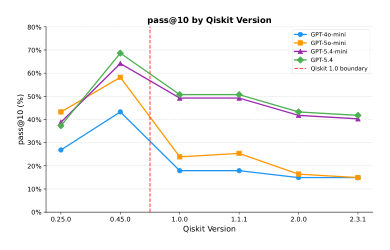
<figcaption class="paper-figure-caption"><b>Fig 1.</b> Fig. 1. pass@10 by Qiskit version for all four models. Every model peaks at the pre-1.0 release 0.45.0 and drops sharply across the Qiskit 1.0 boundary (dashed line), then continues to erode through the 2.x releases.</figcaption>
</figure>

**Summary.** This paper evaluates how well large language models can fix bugs in quantum circuits written using Qiskit. The authors find that performance metrics are misleading because the underlying benchmark itself becomes invalid as the quantum framework updates. They conclude that robust evaluation requires explicitly pinning both the benchmark and the software version.

**Why it may be interesting.** It establishes rigorous standards for evaluating AI assistance in quantum software development, which is crucial for any field relying on complex quantum circuit implementation.

Detailed structure

**Main problem.** The study benchmarks Large Language Models (LLMs) on automatically repairing quantum programs written in Qiskit using the Bugs4Q dataset.

**Main result.** LLM performance is highly dependent on the specific version of the underlying quantum framework (Qiskit), and many apparent successes are due to environmental compatibility rather than true repair correctness.

**Method.** The authors evaluate four LLMs by generating multiple repair candidates for 67 known defects across six pinned versions of Qiskit, using pass@k metrics.

**Model / system.** The system under test is quantum computation implemented via Qiskit programs containing real, documented defects sourced from the Bugs4Q benchmark.

**Key observables.** Pass@10 rate, executability status across different Qiskit versions, and the proportion of successful repairs occurring on invalid benchmark entries.

**Important parameters / regimes.** Six pinned Qiskit releases (e.g., 0.25.0 to 2.3.1), and the number of repair candidates tested per defect (up to 10).

**Assumptions / limitations.** The primary assumption challenged is that benchmark labels remain valid across software updates; correctness depends on the (benchmark, version) pair.

**Figures summary.** Figure 1 illustrates the pass@10 rate peaking at Qiskit 0.45.0 and declining sharply after the Qiskit 1.0 transition, while Table III shows performance restricted to valid pairs.

**Paper structure.** The paper introduces the problem of benchmarking quantum code repair, details the version-pinned evaluation protocol using Bugs4Q across multiple LLMs, presents results showing version dependency, and concludes by advocating for mandatory benchmark validation before repair assessment.

Abstract

In quantum programs, Bugs4Q is a widely used benchmark containing real quantum defects. However, its evaluation assumes that benchmark labels remain valid and that generated fixes execute in the target environment. We evaluate two Bugs4Q versions containing 67 unique real Qiskit defects, adding executable tests where missing, and re-run all entries across six pinned Qiskit releases (0.25.0, 0.45.0, 1.0.0, 1.1.1, 2.0.0, and 2.3.1). We find that quantum benchmarks can suffer from silent label inversion: entries become invalid without errors when reference fixes stop executing or buggy programs no longer reproduce failures. Thus, correctness depends on the (benchmark, version) pair rather than the benchmark alone. We evaluate four LLMs (GPT-4o-mini, GPT-5o-mini, GPT-5.4, and GPT-5.4-mini), generating up to 10 repair candidates per defect and testing them across all versions. GPT-5.4 achieves the highest pass@10 (48.8%), followed by GPT-5.4-mini (47.3%), GPT-5o-mini (30.3%), and GPT-4o-mini (22.6%). All models perform best on Qiskit 0.45.0 and decline after the Qiskit 1.0 transition. Many failures arise from deprecated or incompatible APIs rather than incorrect repairs, and 64\% of successful repairs occur on entries invalid under the target version. We release a re-validated, version-pinned Bugs4Q benchmark and show that benchmark validation must precede repair evaluation.

[↑ back to top](#top)

### [Constraint-Preserving QAOA for Personnel Rostering: Coverage-Preserving and Guarded-XY Mixer Constructions](http://arxiv.org/abs/2607.09145v1)

**Authors:** Aruna Gupta, S R Hassan  
**Type:** theory · **Category:** quantum information and computing · **PDF:** <https://arxiv.org/pdf/2607.09145v1>  
**Analysis basis:** full PDF text, analyzed in chunks

↔ Scroll figures horizontally

<figure class="paper-figure-card">
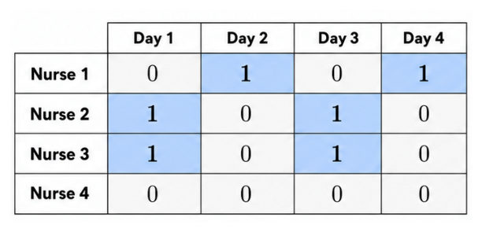
<figcaption class="paper-figure-caption"><b>Fig 1.</b> Figure 1: Schematic nurse–day binary encoding of a personnel roster. Rows represent nurses, columns represent days, and each matrix entry qn,d ∈{0, 1} specifies whether nurse n is assigned on day d. Shaded cells correspond to qn,d = 1.</figcaption>
</figure>
<figure class="paper-figure-card">
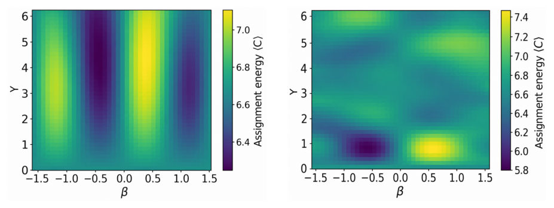
<figcaption class="paper-figure-caption"><b>Fig 2.</b> Figure 2: Depth-one assignment-cost landscapes used to calibrate the Hamiltonian rescaling factor. The selected values are λs = 0.1 for Coverage-XY and λs = 2.25 for Guarded-XY.</figcaption>
</figure>
<figure class="paper-figure-card">
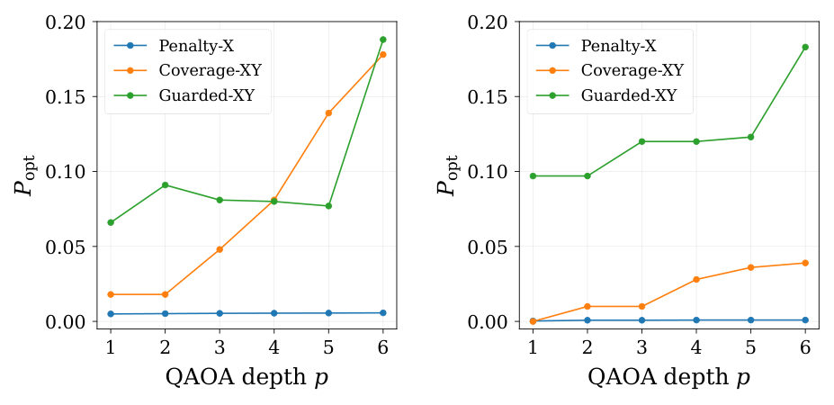
<figcaption class="paper-figure-caption"><b>Fig 3.</b> Figure 3: Optimal-state probability Popt as a function of QAOA depth. Panel (a) shows expectation-value optimization and panel (b) shows CVaR optimization.</figcaption>
</figure>
<figure class="paper-figure-card">
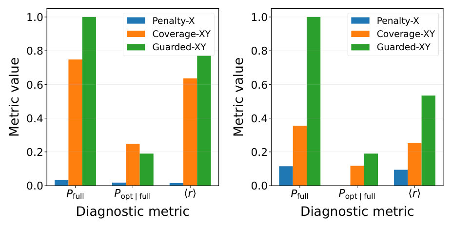
<figcaption class="paper-figure-caption"><b>Fig 4.</b> Figure 4: Distribution-quality diagnostics at the maximum simulated depth p = 6. Shown are the full-feasibility probability Pfull, the feasibility-conditioned optimal probability Popt|full, and the output-averaged approximation ratio ⟨r⟩.</figcaption>
</figure>
<figure class="paper-figure-card">
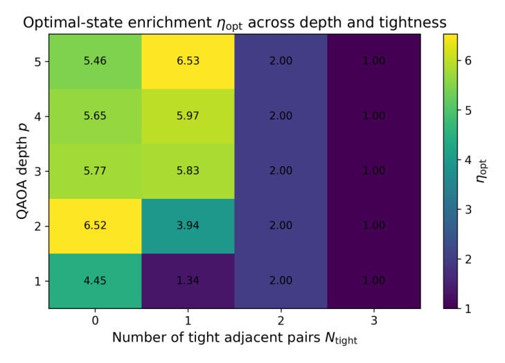
<figcaption class="paper-figure-caption"><b>Fig 5.</b> Figure 5: Optimal-state enrichment ηopt for the Guarded-XY+tight ansatz as a function of QAOA depth and workload tightness Ntight. Each column corresponds to a representative workload with the indicated number of saturated adjacent-day pairs.</figcaption>
</figure>

**Summary.** This work introduces a constraint-preserving Quantum Approximate Optimization Algorithm (QAOA) framework tailored for personnel rostering. Instead of using penalty terms that allow exploration of invalid states, the authors embed hard constraints directly into the mixer Hamiltonian via guarded and tight-pattern mixers. This guarantees that the quantum evolution remains confined to only feasible schedules, leading to higher quality optimization results.

**Why it may be interesting.** It provides a concrete, mathematically rigorous technique for enforcing hard constraints in quantum optimization algorithms, which is crucial for applying QAOA to real-world scheduling problems where infeasible states must be strictly avoided.

Detailed structure

**Main problem.** The paper addresses how to apply the Quantum Approximate Optimization Algorithm (QAOA) to solve complex, constrained combinatorial optimization problems like personnel rostering.

**Main result.** The authors propose a novel constraint-preserving QAOA framework that embeds hard scheduling constraints directly into the mixer Hamiltonian, guaranteeing feasible evolution by construction.

**Method.** They develop specific mixer constructions—the guarded-XY and tight-pattern extensions—to confine the quantum dynamics exclusively to the subspace of physically valid solutions.

**Model / system.** The model is a binary rostering problem formulated on a transition graph, requiring satisfaction of daily coverage and no-consecutive-duty constraints. The physics involves designing specialized mixer Hamiltonians ($\hat{H}_M$) for QAOA.

**Key observables.** Output distribution quality (concentration on optimal feasible schedules), feasibility probability (aiming for unit probability by construction).

**Important parameters / regimes.** The workload parameters ($W_d$), the size of the roster ($N$ nurses, $D$ days), and the QAOA depth/mixing angles.

**Assumptions / limitations.** The core assumption is that constraints can be perfectly encoded into the mixer Hamiltonian to restrict dynamics, distinguishing this from penalty-based methods.

**Figures summary.** Figure 1 schematically illustrates the binary encoding of a personnel roster for $N=4$ nurses and $D=4$ days.

**Paper structure.** The paper contrasts conventional penalty-based QAOA approaches with their novel constraint-preserving method. It details the construction of guarded and tight-pattern mixers, proves feasibility preservation by construction, and validates the approach via statevector simulations against existing formulations.

Abstract

The Quantum Approximate Optimization Algorithm (QAOA) is a promising framework for combinatorial optimization, but constrained problems are commonly handled using energetic penalty terms that require calibration and allow infeasible configurations to remain dynamically accessible. We develop a constraint-preserving QAOA framework for personnel rostering in which hard scheduling constraints are embedded directly into the mixer Hamiltonian. Using a binary rostering model with daily coverage and no-consecutive-duty constraints, we formulate the dynamics from a transition-graph perspective and introduce a guarded-XY mixer that confines the evolution to the fully feasible scheduling manifold. We further distinguish feasibility preservation from feasible-transition design and propose a tight-pattern extension that introduces collective feasible exchanges in saturated workload segments where local guarded exchanges alone are insufficient. Exact statevector simulations demonstrate that, compared with Penalty-X and Coverage-XY formulations under both expectation-value and Conditional Value-at-Risk optimization, the proposed approach eliminates hard-constraint penalty calibration, guarantees feasible evolution by construction, and consistently yields higher-quality output distributions with stronger concentration on optimal feasible schedules. To the best of our knowledge, this is the first constraint-preserving QAOA formulation for personnel rostering, and the transition-graph framework is readily applicable to a broad class of constrained quantum optimization problems.

[↑ back to top](#top)

### [Is the Eyring Plot Misleading? A Case for Arrhenius Analysis of Activation Parameters](http://arxiv.org/abs/2607.09341v1)

**Authors:** Titus S. van Erp  
**Type:** theory · **Category:** statistical mechanics · **PDF:** <https://arxiv.org/pdf/2607.09341v1>  
**Analysis basis:** full PDF text, analyzed in chunks

↔ Scroll figures horizontally

<figure class="paper-figure-card">
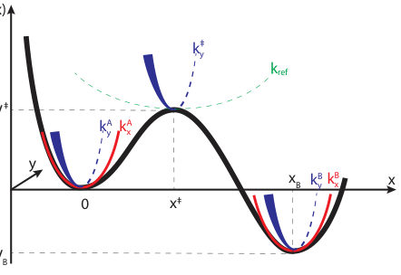
<figcaption class="paper-figure-caption"><b>Fig 1.</b> Figure 1: Two-dimensional potential energy surface. Curvatures along the reaction coordi- nate x in the reactant and product wells are indicated in red. Curvatures along the orthog- onal coordinate y at the reactant, transition, and product states are shown in blue. The hy- pothetical reference curvature kref discussed in the text is indicated by the dashed green line.</figcaption>
</figure>

**Summary.** This paper critically examines whether the Eyring or Arrhenius formulation is more fundamentally correct for describing reaction rates. By analyzing theoretical derivations from TST using harmonic and hard-core potentials, the author argues that an Arrhenius analysis yields parameters ($\Delta H^\ddagger, \Delta S^\ddagger$) that are more physically consistent than those derived from the standard Eyring plot due to underlying mathematical inconsistencies.

**Why it may be interesting.** While focused on chemical kinetics, the rigorous comparison of different theoretical frameworks (Eyring vs. Arrhenius) for extracting fundamental thermodynamic quantities ($\Delta H^\ddagger, \Delta S^\ddagger$) is highly relevant to understanding approximations and limitations in statistical mechanical models used across AMO physics.

Detailed structure

**Main problem.** The paper debates the relative fundamental nature of the Eyring representation versus the Arrhenius representation for calculating chemical reaction rate constants from temperature-dependent measurements.

**Main result.** The author argues that activation enthalpies and entropies derived from an Arrhenius fit are arguably more physically relevant than those obtained directly from the standard Eyring plot analysis due to inherent dimensional mismatches in the free energy of activation ($\Delta G^\ddagger$).

**Method.** The analysis compares rate expressions derived from Transition State Theory (TST), contrasting harmonic approximation results with derivations using reactive flux formalism and proposing a modified potential restraint approach.

**Model / system.** The study models chemical reactions using TST, comparing the standard Eyring equation ($k \propto e^{-eta \Delta G^\ddagger}$) against the Arrhenius form ($k \propto e^{eta E_a}$). It utilizes harmonic and hard-core potential approximations to analyze the temperature dependence of activation parameters.

**Key observables.** Rate constant ($k$), Activation Enthalpy ($\Delta H^\ddagger$), Activation Entropy ($\Delta S^\ddagger$), Gibbs Free Energy of Activation ($\Delta G^\ddagger$).

**Important parameters / regimes.** Temperature ($T$), Planck's constant ($h$), Boltzmann constant ($k_B$), and various potential energy surface parameters.

**Assumptions / limitations.** The analysis relies on harmonic approximations for potentials, assumes the validity of TST derivations, and proposes modifications (like using an infinite square-well restraint) to improve parameter consistency.

**Figures summary.** Figure S1 illustrates a particle confined in a water slab between two membranes, representing a hard-core system used in model calculations.

**Paper structure.** The paper progresses by first establishing the conflict between Eyring and Arrhenius interpretations; it then details derivations using classical statistical mechanics and reactive flux expressions; finally, it proposes an alternative framework using modified potential restraints to yield consistent Arrhenius parameters.

Abstract

A common view in physical chemistry literature is that the Eyring representation, in which a linear fit of $\ln(k/T)$ versus $1/T$ is attempted, is more fundamental than the Arrhenius representation, $\ln(k)$ versus $1/T$. This perception is typically motivated by its derivation from statistical mechanics and quantum mechanics, and by the interpretation of the intercept in terms of the activation entropy $ΔS^\ddagger$, whereas the Arrhenius equation and its prefactor are often regarded as purely phenomenological. However, harmonic approximation models yield exact linearity in Arrhenius plots but not in Eyring plots, although for real experimental data both generally appear equally linear within typical experimental accuracy. Furthermore, the impression that the Eyring formulation is inherently quantum mechanical arises from the presence of the Planck constant in the prefactor, whereas this term results from normalization conventions in the partition function. This also highlights an interpretational issue in $ΔG^\ddagger$, which is based on partition functions of different dimensionality between reactant and transition state. This dimensional mismatch can be reformulated in an alternative representation that improves interpretability and reduces to an Arrhenius-type expression in which the prefactor is directly related to an entropy of activation. In this framework, both activation enthalpy and entropy obtained from an Arrhenius fit are arguably more physically relevant than the corresponding Eyring fit values.

[↑ back to top](#top)

### [Quantum Logic as the Logic of Contexts](http://arxiv.org/abs/2607.09032v1)

**Authors:** Haruki Emori, Atsushi Iriki, Andrei Khrennikov, Kazunori Kondo  
**Type:** theory · **Category:** other · **PDF:** <https://arxiv.org/pdf/2607.09032v1>  
**Analysis basis:** full PDF text, analyzed in chunks

↔ Scroll figures horizontally

<figure class="paper-figure-card">
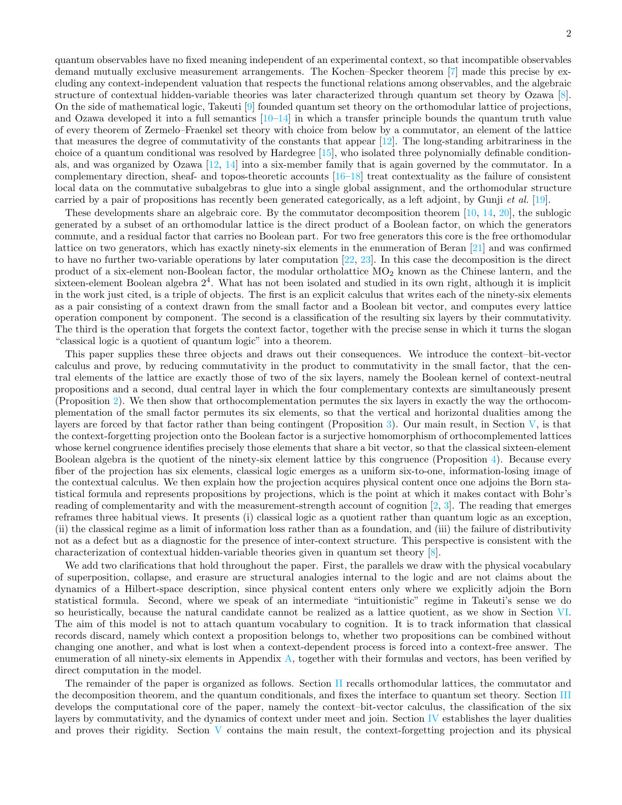
<figcaption class="paper-figure-caption"><b>Fig 1.</b> Low-resolution page preview, page 2</figcaption>
</figure>
<figure class="paper-figure-card">
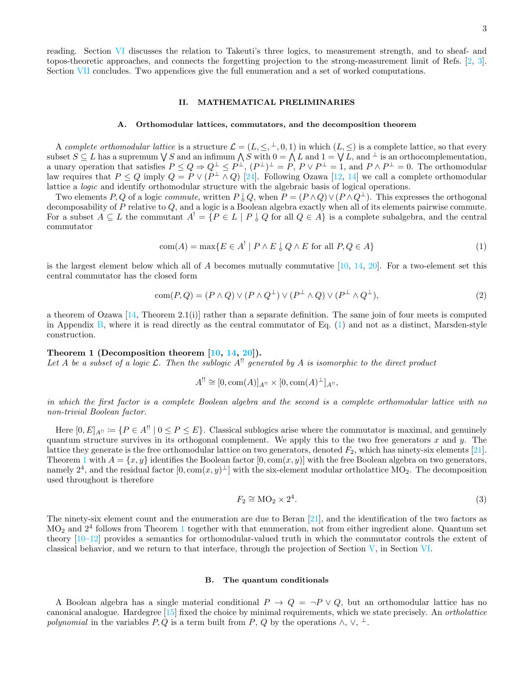
<figcaption class="paper-figure-caption"><b>Fig 2.</b> Low-resolution page preview, page 3</figcaption>
</figure>
<figure class="paper-figure-card">
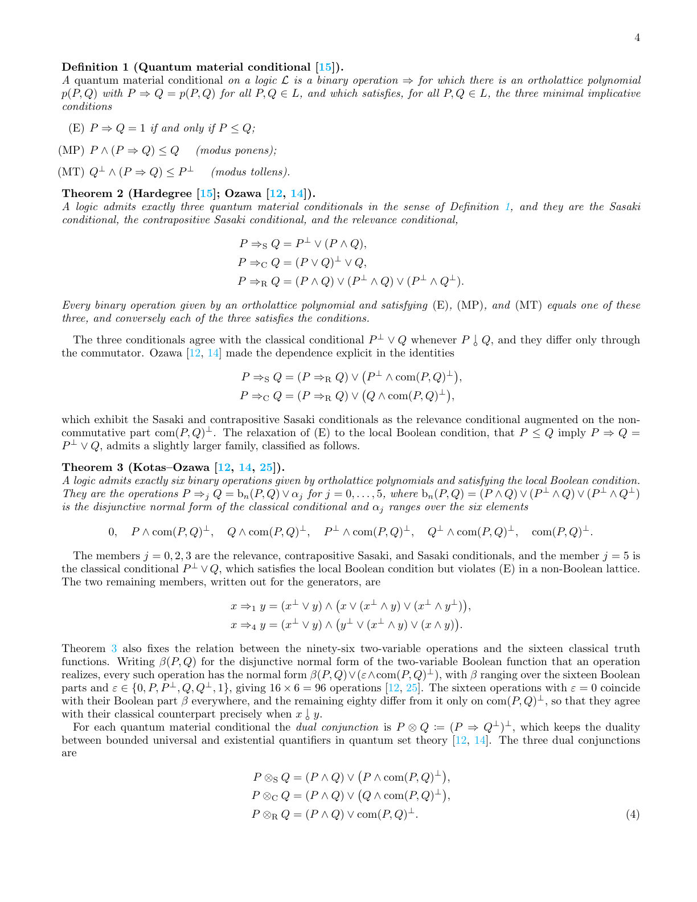
<figcaption class="paper-figure-caption"><b>Fig 3.</b> Low-resolution page preview, page 4</figcaption>
</figure>
<figure class="paper-figure-card">
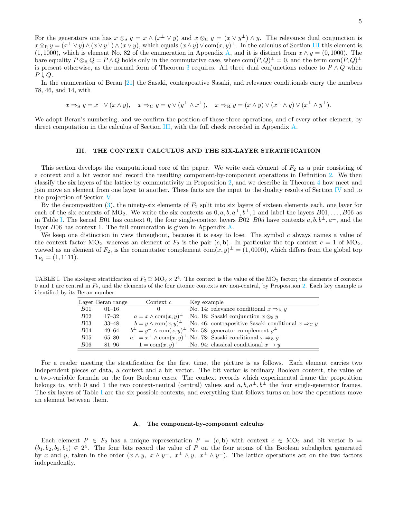
<figcaption class="paper-figure-caption"><b>Fig 4.</b> Low-resolution page preview, page 5</figcaption>
</figure>
<figure class="paper-figure-card">
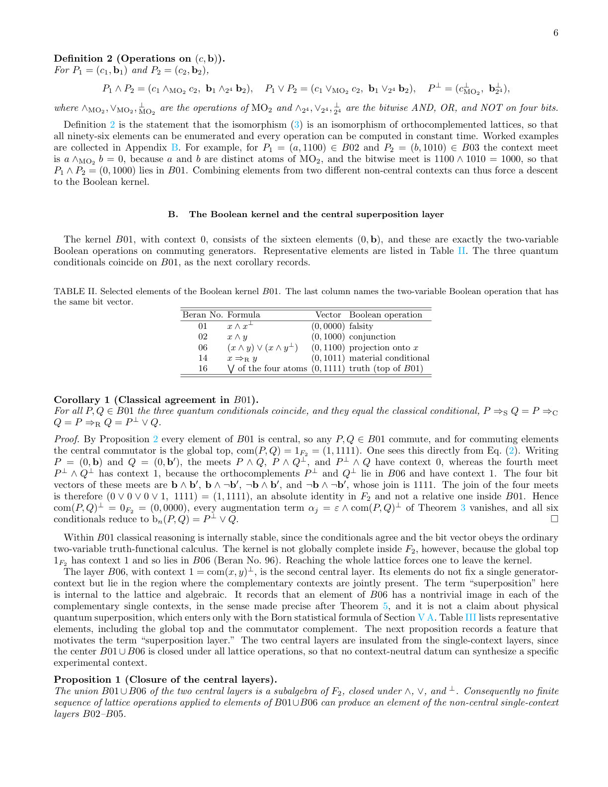
<figcaption class="paper-figure-caption"><b>Fig 5.</b> Low-resolution page preview, page 6</figcaption>
</figure>

**Summary.** This paper redefines quantum logic by treating classical logic as a derived, information-losing image of a richer contextual calculus built on an orthomodular lattice. Using a component-wise algebra over contexts and bit vectors, the authors rigorously demonstrate that contextuality is fundamental, making classical reasoning a specific, restricted limit case.

**Why it may be interesting.** While highly abstract, this work provides a rigorous algebraic framework for understanding how quantum non-classicality (contextuality) structures logical inference beyond what is captured by standard Boolean or even orthomodular logics. It offers deep structural insights into the relationship between context and truth values.

Detailed structure

**Main problem.** To reverse the conventional understanding of quantum logic, arguing that classical logic is a quotient of a richer contextual quantum logic rather than being its foundation.

**Main result.** The paper proves that classical logic emerges as an information-losing, six-to-one image (a surjective homomorphism) from the full contextual calculus defined by the free orthomodular lattice on two generators.

**Method.** The authors develop a context–bit-vector calculus based on decomposing the 96-element free orthomodular lattice into a direct product of a context factor and a Boolean content factor.

**Model / system.** The model is an abstract algebraic structure: the free orthomodular lattice $F_2$ (with 96 elements), which is mathematically decomposed as $MO_2 	imes 2^4$. The 'contexts' are represented by the non-distributive factor $MO_2$, and the 'content' by the Boolean factor $2^4$.

**Key observables.** Contextuality (dependence on context/order), commutativity of sublogics, and the structure of the projection onto classical logic.

**Important parameters / regimes.** The size of the lattice (96 elements); the number of contexts (six layers derived from $MO_2$); the dimension of the Boolean content (four bits).

**Assumptions / limitations.** Classical logic is treated as a limit or image resulting from 'forgetting' context, and structural analogies to physical processes like measurement are used.

**Figures summary.** The notes reference Table I showing the six-layer stratification of $F_2$ based on contexts, and Appendix A enumerating all 96 elements organized into these layers.

**Paper structure.** The paper establishes the algebraic model ($F_2 \sim MO_2 	imes 2^4$), defines component-wise operations in the context–bit-vector calculus, classifies the resulting six layers based on commutativity, and culminates by proving the existence of the context-forgetting projection onto classical logic.

Abstract

Quantum logic is usually presented as a non-classical departure from ordinary reasoning forced on us by quantum mechanics, with classical logic kept as the secure starting point. We argue for the opposite order of explanation in a finite and fully computable setting. The free orthomodular lattice on two generators has ninety-six elements, the direct product of a six-element non-distributive factor and a sixteen-element Boolean factor. Reading the first factor as a register of contexts and the second as Boolean content, we obtain a calculus whose elements are context--bit-vector pairs and whose operations act component by component. With this calculus we establish three results. First, we classify the six layers by commutativity, identifying the central kernel of context-neutral propositions together with a dual central layer in which all complementary contexts are present. Second, we show that orthocomplementation rearranges the layers exactly as the complementation of the small factor rearranges its elements, which makes the duality among the layers rigid rather than accidental. Third, we prove that the operation forgetting the context is a surjective homomorphism of orthocomplemented lattices whose quotient is the classical Boolean algebra, so that classical logic is a six-to-one, information-losing image of the contextual calculus.

[↑ back to top](#top)

### [Structural Origin of Water Heat Capacity Anomaly from Classical and Quantum Simulations](http://arxiv.org/abs/2607.08957v1)

**Authors:** Kam-Tung Chan, Dylan A. Folkner, Margaret L. Berrens, Alexei A. Stuchebrukhov, Lee-Ping Wang, Davide Donadio  
**Type:** theory · **Category:** statistical mechanics · **PDF:** <https://arxiv.org/pdf/2607.08957v1>  
**Analysis basis:** full PDF text, analyzed in chunks

↔ Scroll figures horizontally

<figure class="paper-figure-card">
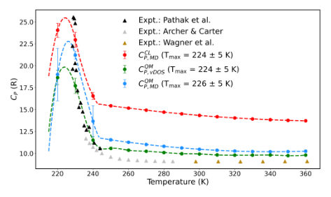
<figcaption class="paper-figure-caption"><b>Fig 1.</b> FIG. 1: CP calculated directly using Equation 1 from polynomial fits to classical MD (red;</figcaption>
</figure>
<figure class="paper-figure-card">
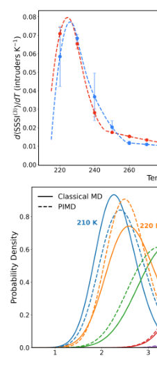
<figcaption class="paper-figure-caption"><b>Fig 2.</b> FIG. 2: (Top panel) d⟨SSSI(3)⟩</figcaption>
</figure>
<figure class="paper-figure-card">
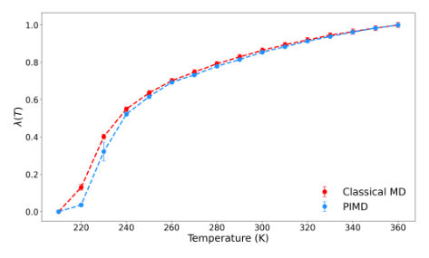
<figcaption class="paper-figure-caption"><b>Fig 3.</b> FIG. 3: Fraction of HDL-like water (λ(T)) obtained using Equation 4 from classical MD</figcaption>
</figure>
<figure class="paper-figure-card">

<figcaption class="paper-figure-caption"><b>Fig 4.</b> Figure 3, λ(T) increases most sharply at the transition temperature, consistent with the</figcaption>
</figure>
<figure class="paper-figure-card">
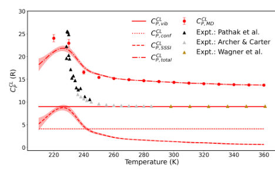
<figcaption class="paper-figure-caption"><b>Fig 5.</b> FIG. 4: CP from (a) classical MD (CCL P ) and (b) PIMD (CQM P ) simulations with the</figcaption>
</figure>

**Summary.** This work investigates the source of water's anomalous heat capacity by linking it directly to structural fluctuations between low-density and high-density local arrangements. Using molecular dynamics simulations, the authors show that these structural transitions, quantified by an order parameter, provide a microscopic explanation for both the supercooled maximum and the excess ambient $C_P$. The findings establish a quantitative link between liquid structure and macroscopic thermodynamics.

**Why it may be interesting.** While focused on condensed matter thermodynamics, the rigorous separation of vibrational vs. configurational contributions and the use of advanced potentials/quantum corrections provide methodological insights relevant to modeling complex quantum many-body systems where structural changes drive macroscopic properties.

Detailed structure

**Main problem.** The study aims to elucidate the structural origin responsible for water's anomalously large isobaric heat capacity ($C_P$) and its characteristic maximum upon supercooling.

**Main result.** The anomalous $C_P$ is primarily attributed to structural fluctuations, quantified by a second-solvation-shell intruder order parameter ($	ext{SSSI}(3)$), which maps onto an effective enthalpy scale of $\approx 4 	ext{ kJ/mol}$ governing the interconversion between low- and high-density-like local structures.

**Method.** The research employs molecular dynamics simulations, comparing classical and path-integral approaches to separate vibrational contributions from structural (configurational) ones. A two-state mapping is used to model the structural transitions.

**Model / system.** The system studied is liquid water ($	ext{H}_2	ext{O}$), simulated using accurate machine-learning interatomic potentials (e.g., NEP3@MB-pol). The analysis focuses on local structural descriptors distinguishing between low-density and high-density environments.

**Key observables.** Isobaric Heat Capacity ($C_P$), second-solvation-shell intruder order parameter ($	ext{SSSI}(3)$), fraction of HDL-like water ($\lambda(T)$), and the derivative $\partial\langle	ext{SSSI}(3)
angle / \partial T$.

**Important parameters / regimes.** Effective enthalpy scale ($\Delta H_{	ext{L/H}}$) of $\approx 3-4 	ext{ kJ mol}^{-1}$; temperature regimes around supercooling and ambient conditions.

**Assumptions / limitations.** The structural anomaly can be effectively modeled using a two-state approximation describing the interconversion between LDL-like and HDL-like local structures. Quantum effects are treated via path integrals or vibrational density of states corrections.

**Figures summary.** Figures compare calculated $C_P$ (Classical MD vs. PIMD) against experiments, showing that structural derivatives ($\partial\langle	ext{SSSI}(3)
angle / \partial T$) track the $C_P$ maximum. Other figures illustrate $\lambda(T)$ and the temperature dependence of structural descriptors.

**Paper structure.** The paper systematically analyzes $C_P$ using molecular dynamics, first addressing quantum corrections (Classical vs. PIMD). It then introduces a structural order parameter ($	ext{SSSI}(3)$) to decompose $C_P$, showing that the temperature dependence of this structure parameter directly correlates with the anomalous heat capacity maximum.

Abstract

Water isobaric heat capacity is anomalously large under ambient conditions and exhibits a sharp maximum upon supercooling. Using classical and path-integral molecular dynamics with accurate machine-learning interatomic potentials, we show that nuclear quantum effects primarily act by suppressing high-frequency vibrations, while the anomalous temperature dependence of the isobaric heat capacity originates from structural fluctuations, quantified by the second-solvent-shell intruder order parameter. A simple two-state mapping reveals an effective enthalpy scale of about 4 kJ/mol associated with the interconversion of low- and high-density-like local structures, providing a microscopic link between their population changes and the excess heat capacity from supercooled to ambient conditions.

[↑ back to top](#top)

## Secondary cond-mat archives

*Papers from cond-mat.mtrl-sci, mes-hall, other, soft, supr-con. These archives are de-prioritized — they appear at the end regardless of relevance score.*

### Relevant in secondary archives (15)

### [Action-Factored Multi-Agent Reinforcement Learning for Scalable Quantum Device Tuning](http://arxiv.org/abs/2607.09422v1)

**Authors:** Edwin De Nicolo, Rahul Marchand, Cornelius Carlsson, Pranav Vaidhyanathan, Natalia Ares  
**Type:** both · **Category:** quantum information and computing · **PDF:** <https://arxiv.org/pdf/2607.09422v1>  
**Analysis basis:** full PDF text, analyzed in chunks
**Topic relevance:** 🔥 `QC/QI experiment` **4/5** · `quantum measurements` **2/5** · `spintronics-quantum-optics interface` **2/5** · `analog quantum simulation` **1/5** · `correlated / nonlocal dissipation` **1/5** · `driven-dissipative phase transition` **1/5** · `methods for driven-dissipative` **1/5** · `non-equilibrium dynamics` **1/5**

↔ Scroll figures horizontally

<figure class="paper-figure-card">
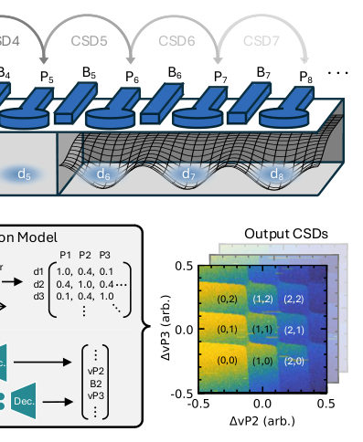
<figcaption class="paper-figure-caption"><b>Fig 1.</b> Figure 1: Algorithmic Flow of QADAPT (a) Barrier gates (Bx) interdigitate plunger gates (Px), and primarily control dot-dot tunnel couplings and charge occupations, respectively. All gates contribute in defining the confinement potential necessary to form quantum dots (d1...dD). Gate cross-talk can be approximated by a capacitive network, which in general extends beyond nearest neighbors, greatly complicating array tuning. Charge stability diagrams (CSDs) are acquired by sweeping the voltage on neighboring pairs of plunger gates and bear information on the array’s current tuning state. (b) Each CSD is passed through a virtualization model and tuning agent model. The virtualization model...</figcaption>
</figure>
<figure class="paper-figure-card">
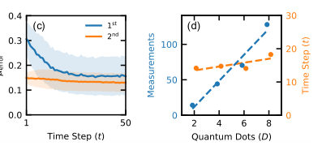
<figcaption class="paper-figure-caption"><b>Fig 2.</b> Figure 2: Gate Virtualization and Scaling Performance of QADAPT. a) Kalman filter’s posterior uncertainty (variance) σ against absolute estimation error ˆµerror for nearest neighbor gate-to-dot cross-capacitances. Each marker represents one time step in a 4-dot system (3 CSD measurements), averaged over 1000 episodes. The cross-capacitance has a fixed ground truth value of 0.7. A top-right to bottom-left trajectory demonstrates that capacitance estimates improve over time, and that the filter’s uncertainty tracks this improvement. b) same as a), but for second-nearest neighbor gate-to-dot cross-capacitances, with ground-truth values set to 0.3. The trajectory here is weaker but stable, as...</figcaption>
</figure>
<figure class="paper-figure-card">
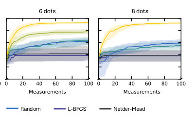
<figcaption class="paper-figure-caption"><b>Fig 3.</b> Figure 3: Domain-specific Benchmarks with Array Size. As the length of the quantum dot array increases from 2 to 8 (moving left to right), QADAPT maintains rapid convergence, out-performing all benchmark methods, including: model-based reinforcement learning (DreamerV3), Bayesian optimisation using Gaussian processes, the gradient free Nelder-Mead optimiser, the gradient-based Limited-memory Broyden-Fletcher-Goldfarb-Shanno algorithm (L-BFGS), and a random search. The score reflects normalized distance to the target voltage configuration across all gates, and is plotted using the cumulative minimum distance at each scan step. Lines represent averages over 100 runs, with an envelope of half...</figcaption>
</figure>
<figure class="paper-figure-card">
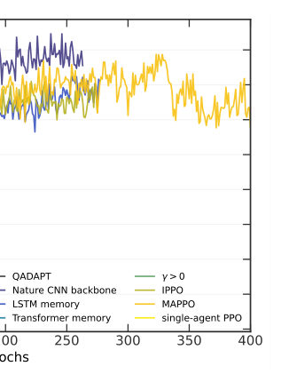
<figcaption class="paper-figure-caption"><b>Fig 4.</b> Figure 4: Average per-agent reward for QADAPT trained on a 4-dot array, in addition to each version of the ablated base model, detailed in Section 4. In all benchmarks, trained parameters are always taken from the epoch in which models performed best.</figcaption>
</figure>
<figure class="paper-figure-card">
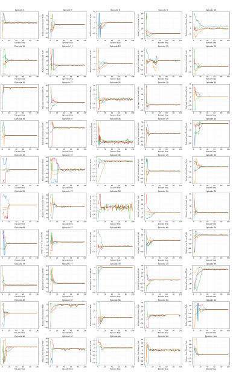
<figcaption class="paper-figure-caption"><b>Fig 5.</b> Figure 5: Trained agent behavior sampled over 100 episodes for a 4-dot system. The four colors in each graph represent the signed distance to the ground truth position in voltage space for each of the plunger gate agents.</figcaption>
</figure>

**Summary.** This paper introduces QADAPT, a novel Multi-Agent Reinforcement Learning framework designed to automate the calibration of large quantum processors. By learning an adaptive, factored representation of the control space, it effectively decouples agent actions despite strong physical cross-talk. This allows for rapid, scalable tuning that generalizes robustly to larger devices without retraining.

**Why it may be interesting.** The core technique—using learned factorizations in MARL to handle complex, coupled control landscapes—is highly relevant for controlling open quantum systems where parameter interactions are non-trivial and scale poorly with device size.

Detailed structure

**Main problem.** Developing a scalable method for tuning large quantum devices by overcoming challenges like parameter cross-talk and non-stationarity in multi-agent reinforcement learning (MARL).

**Main result.** The proposed framework achieves zero-shot generalization to unseen device sizes and maintains a constant number of convergence steps, providing a scalable route for rapid calibration.

**Method.** It uses an online learned factored representation of the action space within a MARL framework (QADAPT) to decouple agent control and minimize interference during tuning.

**Model / system.** The work applies to electrostatically-defined quantum-dot arrays (semiconductor spin qubits) and superconducting transmon qubits. Tuning involves calibrating gate voltages or controlling qubit parameters like frequency and coupling strengths.

**Key observables.** Charge stability diagrams (CSDs), all-XY output patterns, target charge occupations, and tunnel couplings.

**Important parameters / regimes.** Gate voltages, inter-dot capacitances, bare frequencies ($\omega_{01}$), anharmonicity ($\alpha$), and cross-talk coupling strengths ($\lambda_{ij}$).

**Assumptions / limitations.** The model assumes that parameter updates can be locally approximated or linearized for the purpose of defining a separable action space; it also notes neglecting full flux noise effects in one context.

**Figures summary.** Figures illustrate algorithmic flow, Kalman filter performance for cross-capacitance estimation, and convergence plots showing QADAPT's superior performance across increasing qubit/dot counts compared to classical optimizers.

**Paper structure.** The paper introduces the problem of large-scale quantum device tuning under cross-talk. It proposes QADAPT, detailing its adaptive action-space factorization using online capacitance estimation (Kalman filter). The method is then applied sequentially to two physical systems: quantum dot arrays and superconducting transmon qubits, demonstrating scalability and convergence.

Abstract

Cooperative multi-agent reinforcement learning is well suited to problems with large parameter spaces and exploitable local structure, such as the tuning of electrostatically-defined quantum-dot arrays. However, if parameter cross-talk is strong, a non-stationary environment from the perspective of any individual agent can destabilize learning - the same effect that plagues manual tuning of such systems. We propose using a factored representation of the action space, learned online, to decouple agents and minimize their interference. Our framework, QADAPT, uses this factorization to efficiently learn shared policies based on local measurements and rewards. With this modular strategy, we achieve zero-shot generalization to unseen quantum device sizes and maintain an approximately constant number of convergence steps to reach target regimes. This work provides a scalable route toward the rapid calibration of large-scale quantum processors.

[↑ back to top](#top)

### [Fermion-mediated Casimir effect on mesoscopic rings implementing non-Clifford SWAP$^α$ gates](http://arxiv.org/abs/2607.08840v1)

**Authors:** Liang Du, Qing-Dong Jiang, Yijia Wu  
**Type:** theory · **Category:** quantum information and computing · **PDF:** <https://arxiv.org/pdf/2607.08840v1>  
**Analysis basis:** full PDF text, analyzed in chunks
**Topic relevance:** `Keldysh / 2PI / non-Gaussian methods` **3/5** · `analog quantum simulation` **3/5** · `spintronics-quantum-optics interface` **3/5** · `Kondo & dissipative impurity` **2/5** · `exotic spin models in light-matter` **2/5** · `methods for driven-dissipative` **2/5** · `correlated / nonlocal dissipation` **1/5** · `correlated cavity matter` **1/5** · `driven-dissipative phase transition` **1/5** · `entanglement & information structure` **1/5** · `non-equilibrium dynamics` **1/5**

↔ Scroll figures horizontally

<figure class="paper-figure-card">
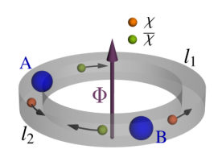
<figcaption class="paper-figure-caption"><b>Fig 1.</b> FIG. 1. A mesoscopic ring supporting a persistent current and hosting two objects (localized states) A and B. Spin- degenerate itinerant electrons with opposite chiralities χ and ¯χ propagate between A and B along two paths of lengths l1 and l2, respectively.</figcaption>
</figure>
<figure class="paper-figure-card">
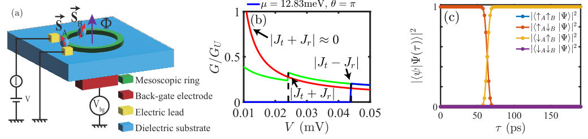
<figcaption class="paper-figure-caption"><b>Fig 2.</b> FIG. 3. (a) Schematic of the device for measuring the differential conductance and implementing the SWAPα gate. (b) Differential conductance G (in the unit of GU ≡2e2/h) for different interaction strength at Kondo temperature Tk = 0.01K. Green and red curves: in the absence of the magnetic flux (θ = 0), the conductance exhibits peaks at different bias voltages for different chemical potentials µ. Blue curve: the peak position reaches its maximum at θ = π. Other parameters are the same as those in Fig. 2. (c) Time evolution of a qubit initialized in the state |Ψ(τ = 0)⟩= |↑A↓B⟩under a magnetic-flux pulse θ(τ) = θ0sech2[2λ(τ −τ0)] with τ0 = 5/λ, θ0 = π, and 2λ = 0.2279(ps)−1. Other parameters...</figcaption>
</figure>

**Summary.** The paper demonstrates how the Casimir interaction mediated by itinerant fermions in mesoscopic rings can be controlled using the Aharonov-Bohm effect. This tunable, long-range interaction provides a novel platform to implement non-Clifford SWAP^alpha quantum gates between distant spin qubits, thereby advancing solid-state quantum computation architectures.

**Why it may be interesting.** This work bridges condensed matter physics (Casimir forces, mesoscopic transport) directly into quantum information science by providing a physical mechanism for long-range qubit coupling that is controllable via external fields.

Detailed structure

**Main problem.** The goal is to engineer long-range interactions necessary for implementing non-Clifford SWAP^alpha gates between spatially separated spin qubits.

**Main result.** The fermion-mediated Casimir interaction, termed the Aharonov-Bohm–Casimir (ABC) effect, provides a tunable, long-range ($\sim l^{-1}$) mechanism to achieve this gate operation.

**Method.** The authors derive an effective interaction Hamiltonian from the fermionic Green's function formalism and analyze its dependence on the magnetic flux via the Aharonov-Bohm phase.

**Model / system.** The system consists of mesoscopic rings hosting itinerant electrons (fermions) coupled to localized spin-1/2 moments acting as qubits. The physics is governed by the interplay between the Casimir interaction and the AB effect.

**Key observables.** Casimir interaction strength, differential conductance G, and the resulting gate parameter alpha ($\alpha$).

**Important parameters / regimes.** Magnetic flux $\Phi$ (or dimensionless phase $	heta$), electron hopping parameters ($J_t, J_r$), and the ring length $l$.

**Assumptions / limitations.** The analysis relies on a weak-coupling expansion of the interaction energy formula.

**Figures summary.** Figure 1 illustrates the mesoscopic ring setup. Figure 2 shows the ABC interaction strength dependence on flux $	heta$, comparing theoretical approximations. Figure 3 schematics detail the measurement process using differential conductance to extract coupling parameters for gate implementation.

**Paper structure.** The paper establishes the physical platform (mesoscopic rings) and the mechanism (ABC effect), derives the effective Hamiltonian, analyzes its tunability via magnetic flux ($	heta$), and finally demonstrates how this tunable interaction can be used to realize specific quantum gates like $	ext{SWAP}^\alpha$.

Abstract

The Casimir effect is typically governed by intrinsic material properties and lacks in situ tunability. We show that, in mesoscopic rings, both the magnitude and sign of the fermion-mediated Casimir interaction can be controlled via the Aharonov-Bohm effect. The resulting interplay between the Aharonov-Bohm phase and the Casimir interaction provides a route to engineer long-range interactions. In particular, this mechanism enables the implementation of non-Clifford SWAP$^α$ gates between spatially separated spin qubits, thereby reducing the overhead for universal quantum computation and quantum error correction in spin-qubit architectures.

[↑ back to top](#top)

### [Chemical Frequency Combs in Reaction-Diffusion Oscillators](http://arxiv.org/abs/2607.09525v1)

**Authors:** Krishnesh Krishnakumar Nair, Madhurendra Mishra, Zhen Qi, Adarsh Ganesan  
**Type:** both · **Category:** statistical mechanics · **PDF:** <https://arxiv.org/pdf/2607.09525v1>  
**Analysis basis:** full PDF text, analyzed in chunks
**Topic relevance:** `driven-dissipative phase transition` **3/5** · `methods for driven-dissipative` **3/5** · `analog quantum simulation` **2/5** · `correlated / nonlocal dissipation` **2/5** · `non-equilibrium dynamics` **2/5** · `non-equilibrium universality` **2/5** · `Keldysh / 2PI / non-Gaussian methods` **1/5** · `entanglement & information structure` **1/5** · `interference shaping light` **1/5** · `quantum optics experiment` **1/5**

↔ Scroll figures horizontally

<figure class="paper-figure-card">
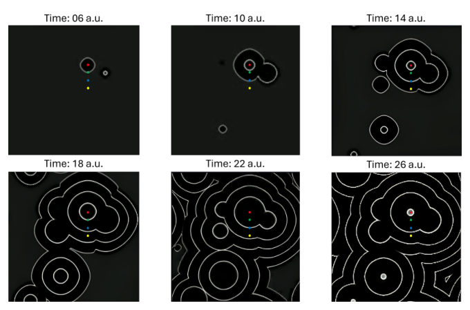
<figcaption class="paper-figure-caption"><b>Fig 1.</b> Figure 1: Time evolution of the simulated concentration field at t = 6, 10, 14, 18, 22, 26 a.u., showing nu- cleation of a circular wave source and its radial expansion into a system of target patterns, simulated at [A] = 0.6, [B] = 3, k1 = k2 = k3 = k4 = 1.0, DX = 0.1, DY = 0.01.</figcaption>
</figure>
<figure class="paper-figure-card">
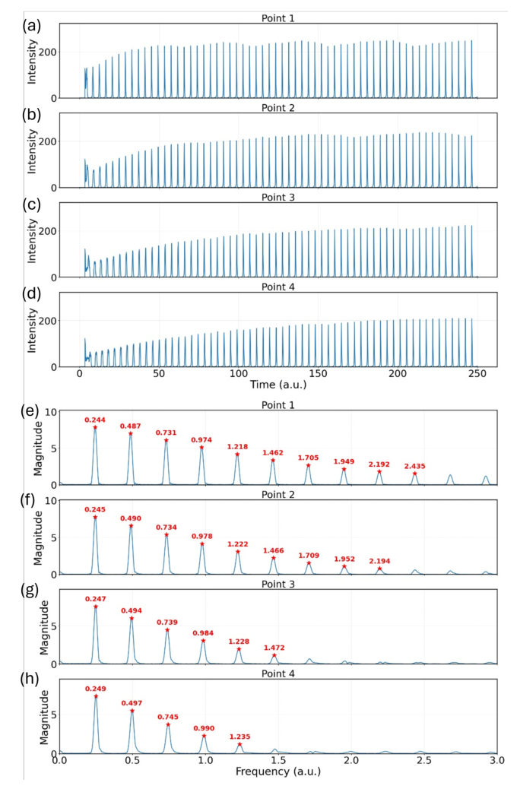
<figcaption class="paper-figure-caption"><b>Fig 2.</b> Figure 2: Simulated intensity-versus-time traces (a)–(d) and the corresponding FFT magnitude spectra (e)– (h) at the four radial sampling points marked in Figure 1, obtained for [A] = 0.6, [B] = 3, k1 = k2 = k3 = k4 = 1.0, DX = 0.1, and DY = 0.01. Both time and frequency are expressed in arbitrary units.</figcaption>
</figure>
<figure class="paper-figure-card">
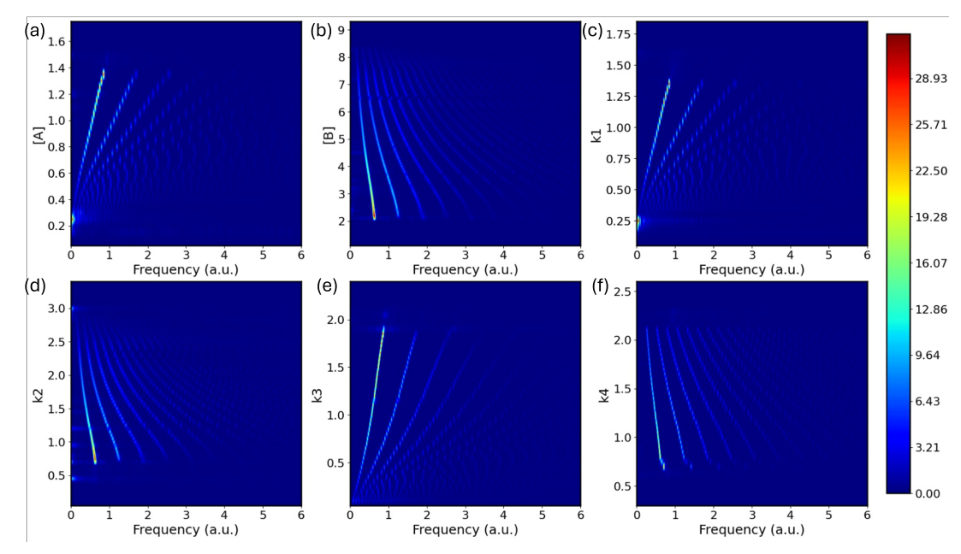
<figcaption class="paper-figure-caption"><b>Fig 3.</b> Figure 3: Frequency-parameter maps of the simulated FFT amplitude obtained by sweeping (a) [A] ∈ [0.15, 1.4], (b) [B] ∈[2.8, 8.0], (c) k1 ∈[0.15, 1.6], (d) k2 ∈[0.45, 3.0], (e) k3 ∈[0.2, 2.0], and (f) k4 ∈[0.6, 2.2] individually, with all other parameters held at baseline.</figcaption>
</figure>
<figure class="paper-figure-card">
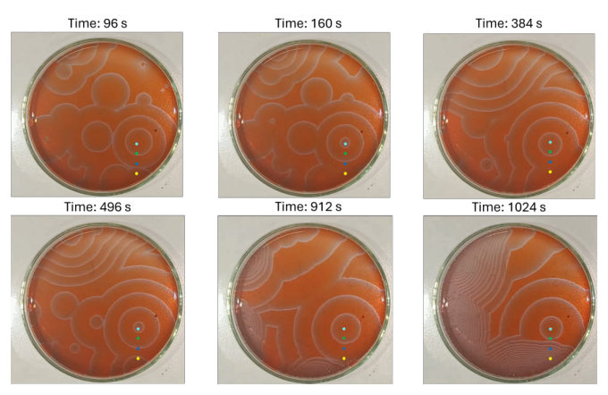
<figcaption class="paper-figure-caption"><b>Fig 4.</b> Figure 4: BZ reaction in a Petri dish at t = 96, 160, 384, 496, 912, 1024 s, showing the formation and propa- gation of target-wave patterns.</figcaption>
</figure>
<figure class="paper-figure-card">
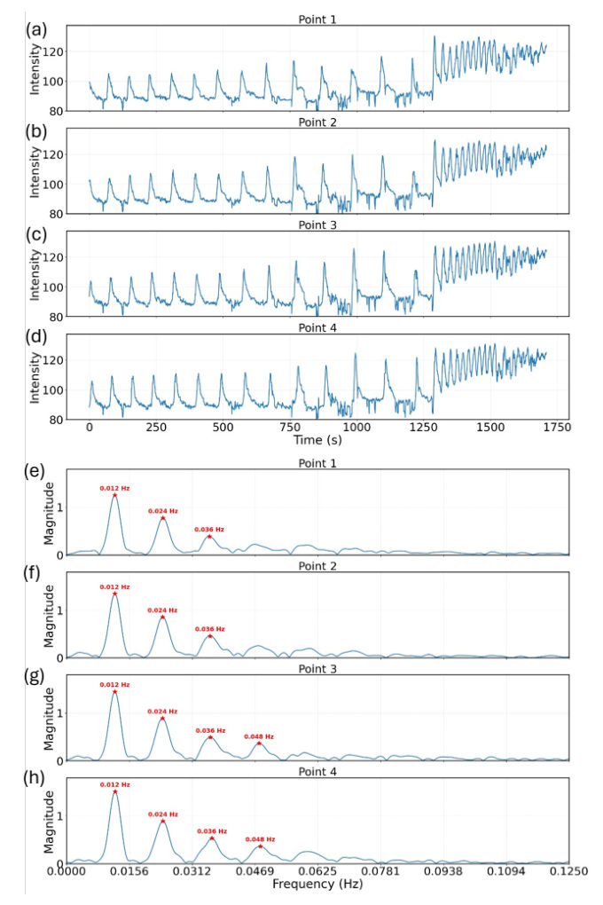
<figcaption class="paper-figure-caption"><b>Fig 5.</b> Figure 5: Experimental intensity-versus-time traces (a)–(d) and FFT magnitude spectra (e)–(h) at the four radial sampling points marked in Figure 4.</figcaption>
</figure>

**Summary.** This paper proves that chemical reaction-diffusion oscillators can function as a novel platform for generating frequency combs. By analyzing the Brusselator model mathematically and testing it experimentally with the BZ reaction, the authors show that nonlinear kinetics drive the system into a state exhibiting multiple, harmonically related spectral peaks. This bridges concepts from optics/solid-state physics into chemical dynamics.

**Why it may be interesting.** While not directly quantum, the underlying principles of pattern formation, nonlinear dynamics, and self-organization in non-equilibrium systems are highly relevant to understanding open quantum systems, dissipative quantum computing models, and driven many-body physics.

Detailed structure

**Main problem.** The study investigates whether chemical reaction-diffusion oscillators can generate frequency combs, a spectral phenomenon previously observed in optics and other physical systems.

**Main result.** The authors demonstrate that the Brusselator model, representing a chemical system, naturally produces a clear fundamental frequency followed by an evenly spaced ladder of harmonics above the Hopf bifurcation threshold. This was confirmed both through numerical simulation and experimental measurements using the Belousov-Zhabotinsky reaction.

**Method.** The work combines analytical stability analysis (deriving Hopf bifurcation conditions from rate equations) with time-series simulations and direct optical measurement techniques (FFT analysis of intensity traces).

**Model / system.** The primary model used is the Brusselator kinetics, a well-known reaction-diffusion system. The experimental realization tested this concept using the Belousov-Zhabotinsky (BZ) reaction.

**Key observables.** Frequency comb structure (fundamental frequency and equally spaced harmonics), Hopf bifurcation thresholds, time evolution of intensity patterns, and FFT spectra.

**Important parameters / regimes.** Reactant concentrations ([A], [B]), kinetic parameters ($k_1$ through $k_4$), and the control parameter sweeps used to cross the stability boundaries.

**Assumptions / limitations.** The analysis relies on linear stability theory around a steady state (Hopf bifurcation) and assumes that the trimolecular autocatalytic term is the sole source of nonlinear harmonic content.

**Figures summary.** Figures show target wave patterns, time evolution across two distinct oscillation regimes due to reagent depletion, and corresponding FFT spectra confirming the equally spaced spectral grid structure.

**Paper structure.** The paper establishes the context by reviewing frequency combs in other fields. It then mathematically analyzes the Hopf bifurcation conditions for the Brusselator model using parameter sweeps. Finally, it validates these findings experimentally using the BZ reaction, comparing simulated and measured harmonic spectra.

Abstract

Frequency combs, evenly spaced spectral lines locked to one fundamental frequency, are well known in optics and have also been found in phononic, magnonic, ferroelectric, and cosmological systems, but have not yet been studied in oscillating chemical reactions. In this work, we show that reaction-diffusion oscillators can also produce frequency combs. We use the Brusselator model and derive its Hopf bifurcation condition directly from the rate equations. We find that the trimolecular autocatalytic term is the only source of nonlinear harmonic content. Above the Hopf threshold, our simulations of target-wave patterns show a clear fundamental frequency followed by a long, evenly spaced ladder of harmonics, with each harmonic weaker than the one before it. We then vary the reactant concentrations and kinetic parameters one at a time and find that this comb structure holds across a wide range of values. We also test this idea experimentally using the Belousov-Zhabotinsky reaction. Intensity signals recorded at different points in a target pattern show a shared fundamental frequency with several weakening harmonics, matching the simulated pattern closely. Together, these results show that reaction-diffusion chemistry is a new platform for generating frequency combs.

[↑ back to top](#top)

### [Molecular Tuning of Charge-Transfer Resonance in Plasmonic Nanocavities](http://arxiv.org/abs/2607.08927v1)

**Authors:** Hasher Irshada, Francesco Ciccarello, Konstantin Malchow, Christophe Galland, Katrine Qvortrup  
**Type:** both · **Category:** other · **PDF:** <https://arxiv.org/pdf/2607.08927v1>  
**Analysis basis:** full PDF text, analyzed in chunks
**Topic relevance:** `correlated cavity matter` **3/5** · `driven-dissipative phase transition` **3/5** · `Tavis-Cummings & cavity-many-emitter` **2/5** · `methods for driven-dissipative` **2/5** · `spintronics-quantum-optics interface` **2/5** · `Keldysh / 2PI / non-Gaussian methods` **1/5** · `Kondo & dissipative impurity` **1/5** · `interference shaping light` **1/5** · `non-equilibrium dynamics` **1/5** · `quantum optics experiment` **1/5**

↔ Scroll figures horizontally

<figure class="paper-figure-card">
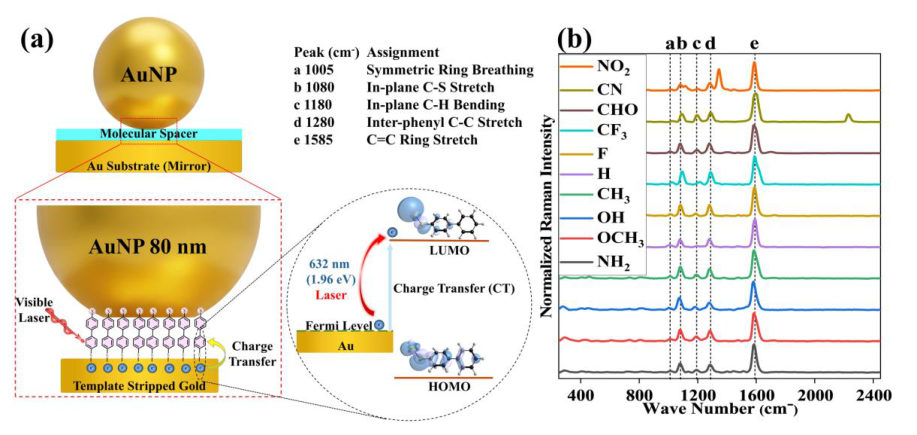
<figcaption class="paper-figure-caption"><b>Fig 1.</b> Fig. 1 (a) Schematic representation of the Au NPoM architecture and suggested charge transfer</figcaption>
</figure>
<figure class="paper-figure-card">
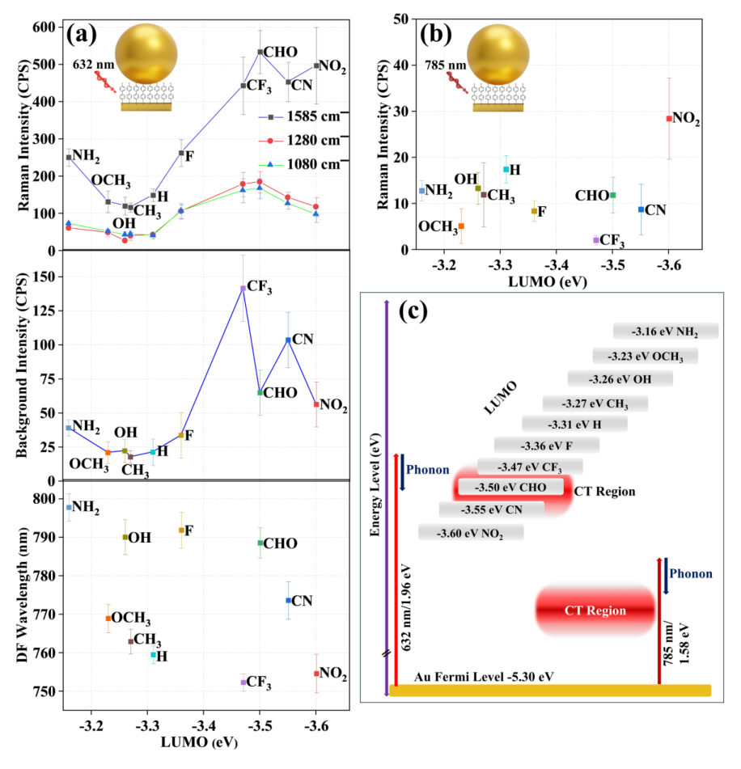
<figcaption class="paper-figure-caption"><b>Fig 2.</b> Fig. 2 (a) Correlation of calculated molecular LUMO energies with SERS intensities from Au</figcaption>
</figure>
<figure class="paper-figure-card">
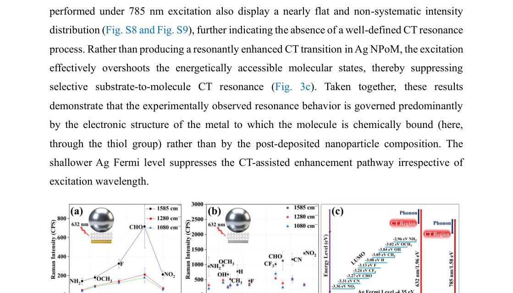
<figcaption class="paper-figure-caption"><b>Fig 3.</b> Fig. 3 (a) Correlation of calculated molecular LUMO energies with SERS intensities from Au-</figcaption>
</figure>
<figure class="paper-figure-card">
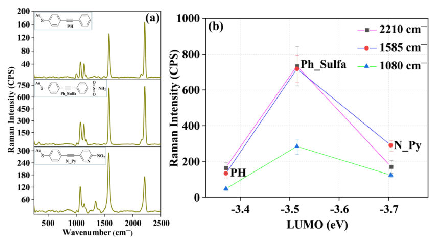
<figcaption class="paper-figure-caption"><b>Fig 4.</b> Fig. 4 (a) SERS spectra of PH, Ph_Sulfa, and N_Py assembled in Au NPoM junctions under</figcaption>
</figure>
<figure class="paper-figure-card">
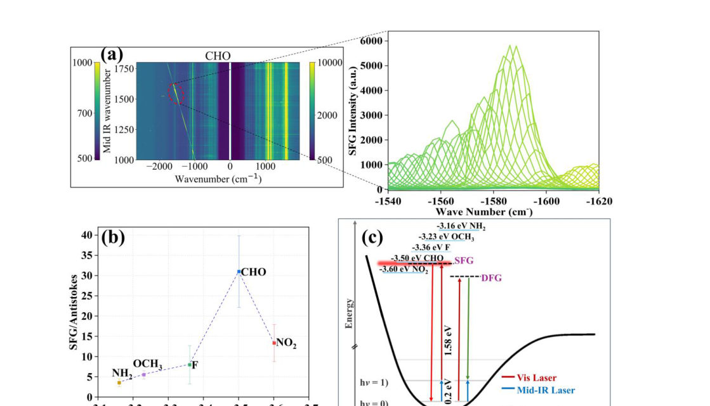
<figcaption class="paper-figure-caption"><b>Fig 5.</b> Fig. 5 (a) Mid-IR-scanned emission maps from Au NPoS cavities containing the representative</figcaption>
</figure>

**Summary.** This paper investigates the mechanism behind signal enhancement in molecule-metal junctions using plasmonics. By systematically tuning the electronic structure of attached molecules, the authors demonstrate that the enhancement is governed by a precise charge-transfer resonance condition dependent on both the metal work function and the excitation light energy. This provides an experimentally accessible framework for engineering molecular plasmonic devices.

**Why it may be interesting.** This work directly bridges concepts from quantum optics and open quantum systems by quantifying how external electromagnetic fields (plasmons) couple to molecular electronic states via resonant charge transfer pathways. The identification of specific resonance conditions provides a quantitative tool for designing molecular plasmonic devices.

Detailed structure

**Main problem.** The study addresses the poorly understood energetic conditions governing charge-transfer resonance within molecule-metal nanocavities, which is critical for plasmon-enhanced spectroscopy.

**Main result.** The research establishes that charge-transfer enhancement in SERS and vSFG is governed by a well-defined interfacial resonance condition dependent on both the substrate work function and the excitation energy.

**Method.** The authors combine experimental techniques (SERS, vSFG) with theoretical calculations (DFT) to probe molecular electronic structure changes across systematically varied molecular libraries.

**Model / system.** The physical system involves plasmonic nanoparticle-on-mirror junctions incorporating engineered biphenylthiol derivatives monolayers. The investigation focuses on tuning the Lowest Unoccupied Molecular Orbital (LUMO) energy of these molecules relative to the metal substrate's electronic levels.

**Key observables.** Raman/SERS intensity variations, vibrational fingerprints, and the correlation between enhancement magnitude and LUMO alignment.

**Important parameters / regimes.** Substrate work function, excitation energy ($	ext{e.g., } 632 	ext{ nm vs. } 785 	ext{ nm}$), and the molecular LUMO energy level.

**Assumptions / limitations.** The study assumes that by varying substituents while keeping the anchoring geometry constant, electronic structure variations can be isolated from structural heterogeneity effects.

**Figures summary.** Figures illustrate schematic charge transfer processes in Au NPoM junctions and show SERS spectra correlating intensity changes with LUMO energy under different excitation wavelengths.

**Paper structure.** The paper progresses by first identifying the core problem, then detailing the experimental setup using molecular libraries on plasmonic substrates. It presents spectroscopic evidence showing resonance dependence on wavelength (632 nm vs 785 nm), confirming a charge-transfer mechanism, and concludes by establishing an engineering framework for these junctions.

Abstract

Interfacial charge-transfer processes play a critical role in plasmon-enhanced spectroscopy, yet the energetic conditions governing charge-transfer resonance within molecule-metal nanocavities remain poorly understood. Here, plasmonic nanoparticle-on-mirror junctions incorporating systematically engineered biphenylthiol derivatives monolayers were used to investigate how frontier orbital alignment influences chemical enhancement mechanisms. A molecular library spanning a broad range of electronically tuned acceptor states was examined using surface-enhanced Raman scattering (SERS), vibrational sum frequency generation (vSFG) spectroscopy, and density functional theory calculations. By combining different excitation wavelengths with controlled variation of substrate composition and molecular electronic structure, the energetic relationship between plasmon-enhanced charge transfer excitation and molecular orbital alignment was quantitatively evaluated. The results reveal that charge-transfer enhancement of Raman scattering is governed by a well-defined interfacial resonance condition dependent on substrate work function and excitation energy. We further probe a subset of molecular-metal systems by nanocavity-enhanced vSFG and identify the same resonance conditions as in SERS, consistent with expectations. These findings establish an experimentally accessible framework for probing and engineering charge-transfer processes in plasmonic molecular junctions and provide mechanistic insight relevant to molecular plasmonics, charge carrier photophysics, and nanoscale interfacial spectroscopy.

[↑ back to top](#top)

### [Tunable responsivity and bandwidth in microwave kinetic inductance detectors via readout current nonlinearity](http://arxiv.org/abs/2607.09178v1)

**Authors:** Maclean Rouble, Peter Day, Matt Dobbs, Joshua Montgomery, Sofiia Savchyn, Graeme Smecher  
**Type:** both · **Category:** other · **PDF:** <https://arxiv.org/pdf/2607.09178v1>  
**Analysis basis:** full PDF text, analyzed in chunks
**Topic relevance:** `Keldysh / 2PI / non-Gaussian methods` **3/5** · `driven-dissipative phase transition` **3/5** · `methods for driven-dissipative` **3/5** · `Tavis-Cummings & cavity-many-emitter` **2/5** · `non-equilibrium universality` **2/5** · `correlated cavity matter` **1/5** · `non-equilibrium dynamics` **1/5** · `quantum optics experiment` **1/5**

↔ Scroll figures horizontally

<figure class="paper-figure-card">
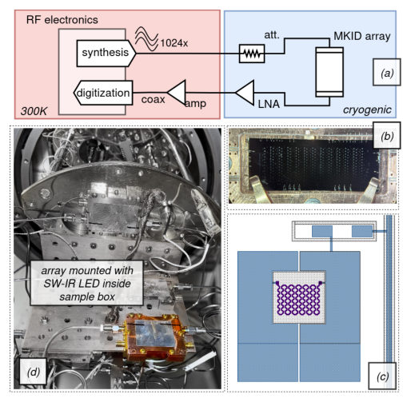
<figcaption class="paper-figure-caption"><b>Fig 1.</b> FIG. 1. Experimental configuration used in the study of driven nonlinear resonator operating states. (a) Schematic overview of the microwave readout chain: RF synthesis and digitization of generator tones is provided by a Control &amp; Readout System (CRS) board.[18] Attenuation and amplifi- cation stages condition the tones before and after the MKID array, respectively. The array is cooled to 100mK within a BlueFors LD250S dilution refrigerator. The frequency and power of each individual generator tone define the experi- mental control coordinates used throughout this work. (b) Photograph of a mounted MKID array. A variety of res- onator geometries and materials were studied for this work,...</figcaption>
</figure>
<figure class="paper-figure-card">
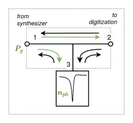
<figcaption class="paper-figure-caption"><b>Fig 2.</b> FIG. 2. Schematic representation of the side-coupled res- onator model. The generator tone enters port 1 with power Pg, the transmitted signal (S21) is measured at port 2, and port 3 couples the generator to the resonator mode with photon occupation nph. The three-port network maps the feedline-coupled resonator to the one-port Kerr-cavity input- output model used to describe the nonlinear state. The ar- rows illustrate the three-port scattering matrix, with the ones relevant for this discussion highlighted in green.</figcaption>
</figure>
<figure class="paper-figure-card">
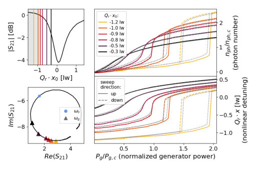
<figcaption class="paper-figure-caption"><b>Fig 3.</b> FIG. 3. Measured response of a resonator to generator power sweeps, performed at a selection of generator frequency off- sets, x0 (here scaled by Qr to express the offset in units of linewidths), from the undriven resonance. The left panels illustrate the setup of each power sweep, overlaid on a low- power S21 frequency sweep of the same resonator. The right column shows the response of the resonator to the power sweep when the readout tone is fixed at each value of x0, in terms of its nonlinear resonant frequency shift x and the average number of photons in the resonant cavity nph (top) and nonlinear detuning x (bottom). For values of x0 where the generator is located close to the undriven...</figcaption>
</figure>
<figure class="paper-figure-card">
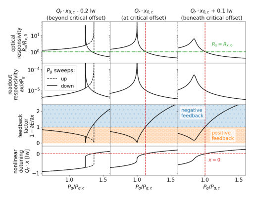
<figcaption class="paper-figure-caption"><b>Fig 4.</b> FIG. 4. Calculated responsivity to optical load (Eq. 18), readout (constant-load limit of Eq. 14), the feedback factor, and the nonlinear detuning, as a function of generator power, for three values of x0 beyond (left), at (centre), and beneath (right) the critical offset frequency. The optical responsivity (top row) and the readout responsivity (second row) are both maximized where the feedback factor (third row) is closest to zero. The feedback factor enhances the response for x &lt; 0 (orange dotted region) and suppresses it for x &gt; 0 (blue circles region); the optical responsivity is enhanced and suppressed in these regions respectively. The ratio of this resonator’s reactive to...</figcaption>
</figure>
<figure class="paper-figure-card">
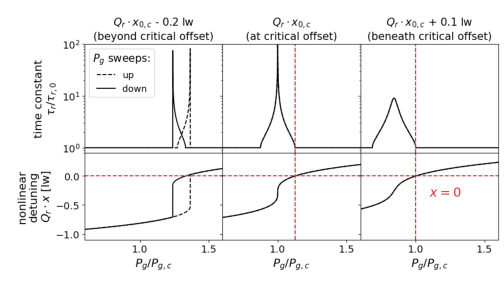
<figcaption class="paper-figure-caption"><b>Fig 5.</b> FIG. 5. Driven resonator relaxation time during fixed- frequency power sweeps, for generator offsets beyond, at, and within the critical offset x0,c. The relaxation time remains nearly constant and equal to the undriven resonator ring time, τr,0, except near the critical point, where the slow eigenvalue becomes small and τr increases sharply. For x0 beyond the critical value, the response is branch dependent because the power sweep is hysteretic.</figcaption>
</figure>

**Summary.** This paper investigates using the inherent nonlinearity in Microwave Kinetic Inductance Detectors (MKIDs) as a controllable resource. By tuning the readout power near resonance bifurcation points, the authors achieve significant enhancements in detector responsivity. This work is crucial for improving cryogenic sensor sensitivity by mastering nonlinear operational regimes.

**Why it may be interesting.** This work provides an excellent example of how nonlinear classical physics (bifurcation theory) can be applied to enhance the sensitivity of quantum-limited detectors, drawing parallels between driven resonator dynamics and open quantum system response functions.

Detailed structure

**Main problem.** The research aims to utilize the inherent nonlinearity of Microwave Kinetic Inductance Detectors (MKIDs) by controlling the readout current to achieve tunable responsivity and bandwidth enhancement.

**Main result.** By operating near the resonator's bifurcation point, a factor of 10 enhancement in optical response was demonstrated, although this comes at the cost of reduced bandwidth.

**Method.** The authors developed a theoretical framework based on analyzing the nonlinear steady-state response of the driven resonator, complemented by experimental measurements of noise spectra under varying bias conditions.

**Model / system.** The system is an MKID array composed of superconducting resonators whose kinetic inductance depends nonlinearly on the circulating microwave current. The physics is modeled using a coupled optical cavity approach describing the steady-state photon number balance.

**Key observables.** Responsivity (both optical and microwave), bandwidth, resonant frequency shift ($\delta x$), and noise spectrum characteristics (white noise level, roll-off frequency).

**Important parameters / regimes.** Readout power ($P_g$), detuning ($x_0$), quality factors ($Q_r, Q_c$), and the nonlinear current scale ($I^*$).

**Assumptions / limitations.** The analysis simplifies by focusing on reactive inductance changes ($\delta L_k \propto I^2$) while ignoring pair-breaking energy effects. The system is modeled as a one-port optical cavity coupled to a three-port network.

**Figures summary.** Figures illustrate the experimental setup, power sweep responses showing bistability/hysteresis near bifurcation points, and noise spectra confirming enhanced white noise levels and reduced roll-off frequency with increased nonlinear bias.

**Paper structure.** The paper progresses from establishing MKIDs' nonlinearity as a resource, developing the theoretical model for controlled operation via $(x_0, P_g)$, demonstrating responsivity enhancement through bifurcation analysis, and finally validating these effects by analyzing noise spectra changes.

Abstract

Microwave kinetic inductance detectors (MKIDs) are generally read out with microwave readout tones of high enough amplitude to adequately suppress the noise contribution of the first-stage amplifier. At high readout power, the detector's resonant frequency is altered as a result of the dependence of the kinetic inductance on the internally circulating microwave current. With the tone placed below the resonant frequency, the nonlinear frequency shift results in a positive feedback effect that can significantly enhance the responsivity of the detector, to both optical and microwave power. We report a factor of 10 enhancement in optical response by tuning the readout power and frequency to close to the resonator's bifurcation point. A corresponding decrease in the bandwidth of the resonator is observed under these conditions. We show that the strength of the feedback effect can be easily selected by adjusting the excitation, and provide a map of possible operational states to do so. Operation of MKIDs in this mode could be used to improve sensitivity when non-intrinsic noise sources are significant.

[↑ back to top](#top)

### [A new perspective on the anomalous Hall effect](http://arxiv.org/abs/2607.09019v1)

**Authors:** Jason G. Kattan, Matthew Albert, J. E. Sipe  
**Type:** theory · **Category:** other · **PDF:** <https://arxiv.org/pdf/2607.09019v1>  
**Analysis basis:** full PDF text, analyzed in chunks
**Topic relevance:** `Keldysh / 2PI / non-Gaussian methods` **3/5** · `methods for driven-dissipative` **3/5** · `driven-dissipative phase transition` **2/5** · `non-equilibrium dynamics` **2/5** · `non-equilibrium universality` **2/5** · `analog quantum simulation` **1/5** · `exotic spin models in light-matter` **1/5** · `spintronics-quantum-optics interface` **1/5**

↔ Scroll figures horizontally

<figure class="paper-figure-card">
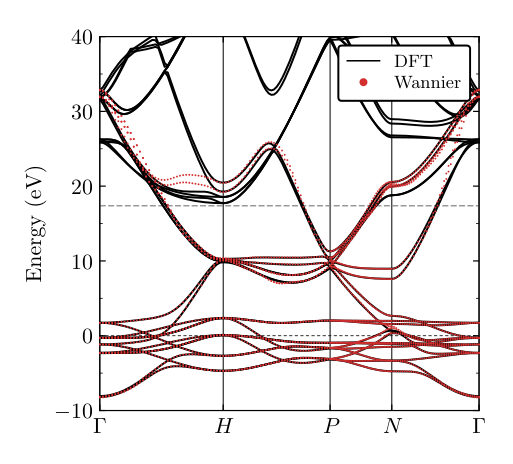
<figcaption class="paper-figure-caption"><b>Fig 1.</b> FIG. 1. The ab initio and Wannier-interpolated band struc- ture of bcc iron along high-symmetry path, in close agreement with X. Wang et al. [41]. The Fermi energy is centered at 0 eV, and the horizontal dashed line at 17.37 eV denotes the frozen energy window maximum used in the disentanglement step in the Wannier construction.</figcaption>
</figure>
<figure class="paper-figure-card">
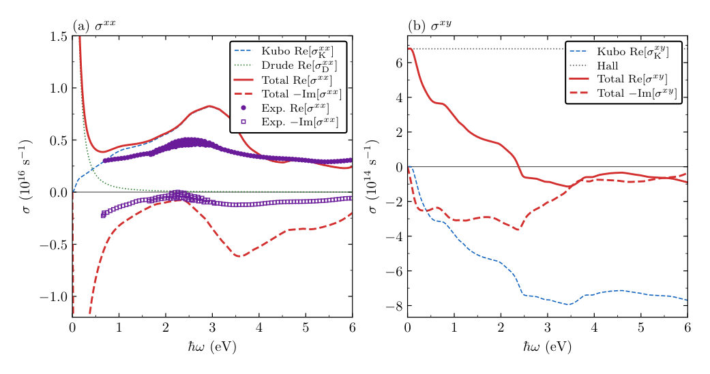
<figcaption class="paper-figure-caption"><b>Fig 2.</b> FIG. 2. The frequency-dependent total conductivity of bcc iron along the (a) longitudinal and (b) transverse directions, which includes the sum of the Hall, Drude, and Kubo conductivity tensors. The experimental measurements of the optical conductivity of iron from Johnson and Christy are shown in (a) in purple at room temperature [31].</figcaption>
</figure>

**Summary.** This theoretical work develops a microscopic formalism to analyze the anomalous Hall effect and general optical response in magnetic conductors at finite frequencies. By treating electronic degrees of freedom via second-quantized field theory, the authors decompose the conductivity tensor into three physically distinct parts: polarization (Kubo), Drude, and anomalous Hall contributions. This provides a unified dynamic picture for charge transport beyond static DC measurements.

**Why it may be interesting.** While focused on condensed matter transport, the decomposition of conductivity into fundamental responses (polarization vs. free current) provides a rigorous framework for understanding linear response in magnetically ordered systems, which has parallels to open quantum system descriptions.

Detailed structure

**Main problem.** The paper revisits the anomalous Hall effect (AHE) in magnetic conductors, generalizing its study to finite frequencies using a microscopic formalism.

**Main result.** The long-wavelength conductivity tensor is shown to be a sum of three distinct contributions: a Kubo term from polarization response, and two terms (Drude and anomalous Hall) from the free current response.

**Method.** The analysis employs second-quantized field theory, decomposing charge/current into microscopic polarization, magnetization, and free components derived via lattice gauge theory concepts.

**Model / system.** The system is magnetic conductors with long-range magnetic order, modeled using an electronic Hamiltonian incorporating a static, cell-periodic magnetic field that breaks time-reversal symmetry. Calculations are performed for the bcc phase of iron.

**Key observables.** Long-wavelength conductivity tensor $\sigma(\omega)$, polarization ($\mathbf{P}$), magnetization ($\mathbf{M}$), and free charge/current densities ($
ho_F, \mathbf{j}_F$).

**Important parameters / regimes.** Finite frequency ($\omega$), magnetic field strength (encoded in the Hamiltonian), and characteristic length scales ($\Delta$ for spatial averaging).

**Assumptions / limitations.** The analysis uses a frozen-ion approximation ($\Gamma$ fixed) and relies on long-wavelength approximations.

**Figures summary.** Not specified by notes, but calculations are presented for iron's bcc phase showing frequency dependence of conductivity contributions.

**Paper structure.** The paper builds the formalism by defining microscopic quantities (polarization, magnetization) and then derives the macroscopic response ($\sigma(\omega)$) by combining three distinct theoretical terms: Kubo, Drude, and anomalous Hall components.

Abstract

We revisit the anomalous Hall effect in magnetic conductors, and its generalization to finite frequencies, using a formalism based on microscopic notions of polarization, magnetization, and free charges and currents. The electronic degrees of freedom are treated within second-quantized field theory, where the Hamiltonian features a static and cell-periodic magnetic field that encodes the magnetic order in the crystal and breaks time-reversal symmetry. We study the dynamics of bound and free charge carriers at the microscopic level as they respond to a spatially uniform electric field at finite frequency. The conductivity tensor describing the long-wavelength response is a sum of three terms, including a Kubo term associated with the polarization response, along with the metallic Drude term and the anomalous Hall conductivity that are associated with the longitudinal and transverse parts of the free current response, respectively. We also present numerical calculations of these contributions for the ferromagnetic body-centered cubic phase of iron.

[↑ back to top](#top)

### [Neutron contribution to the force on a proton vortex in superconducting neutron-star matter](http://arxiv.org/abs/2607.09468v1)

**Authors:** Oleg A. Goglichidze, Mikhail E. Gusakov  
**Type:** theory · **Category:** other · **PDF:** <https://arxiv.org/pdf/2607.09468v1>  
**Analysis basis:** full PDF text, analyzed in chunks
**Topic relevance:** `Keldysh / 2PI / non-Gaussian methods` **3/5** · `non-equilibrium dynamics` **3/5** · `driven-dissipative phase transition` **1/5** · `methods for driven-dissipative` **1/5** · `non-equilibrium universality` **1/5**

↔ Scroll figures horizontally

<figure class="paper-figure-card">
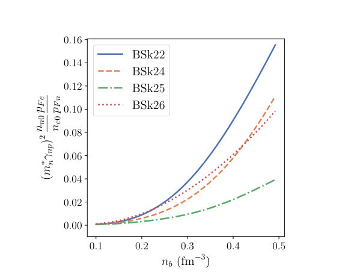
<figcaption class="paper-figure-caption"><b>Fig 1.</b> FIG. 1. The quantity (m∗ nγnp)2(nn0/ne0)(pF e/pF n) plotted as a function of baryon number density nb for the BSk family of equations of state. The Landau parameters are calculated as described in Ref. [23].</figcaption>
</figure>

**Summary.** This paper calculates the force acting on a proton vortex embedded in superconducting neutron star material. It specifically derives and quantifies a previously uncounted longitudinal force component arising from normal neutrons interacting via Fermi-liquid coupling with superconducting protons. This work advances our understanding of vortex dynamics in compact objects by incorporating these subtle quantum mechanical interactions.

**Why it may be interesting.** The application of Fermi-liquid theory to determine transport forces in extreme astrophysical environments like neutron stars provides a rich example of non-equilibrium many-body physics relevant to dense matter dynamics.

Detailed structure

**Main problem.** The study investigates the additional force exerted on a proton vortex within superconducting neutron-star matter due to interactions with normal neutrons.

**Main result.** Normal neutrons contribute a new longitudinal force component to the vortex force, which is proportional to the relative neutron-vortex velocity and vanishes without Fermi-liquid coupling.

**Method.** The analysis employs a kinetic approach derived from Landau Fermi-liquid theory applied to the neutron-proton subsystem interactions.

**Model / system.** The system modeled is dense matter inside a neutron star, comprising superconducting protons, normal neutrons, and electrons. The physics involves type-II superconductivity characterized by magnetic vortices.

**Key observables.** Total force on the vortex ($F_{m	o v}$), which is expected to be longitudinal and velocity-dependent.

**Important parameters / regimes.** Temperature relative to critical temperatures ($T_{cn} < T < T_{cp}$); characteristic length scales like coherence length ($\xi$) and London penetration depth ($\lambda$).

**Assumptions / limitations.** Protons are superconducting while neutrons are normal; the vortex core is treated as infinitely thin, and quasiparticle collisions are neglected.

**Paper structure.** The paper develops the force calculation by analyzing momentum conservation laws ($\partial P_i / \partial t + \partial \Pi_{ik} / \partial r_k = ...$) and decomposing the total force into contributions from different particle species, culminating in the derivation of the neutron contribution $\mathbf{F}^{(np)}_i$.

Abstract

We investigate the forces acting on a proton vortex in superconducting neutron-star matter composed of neutrons, protons, and electrons, accounting for Fermi-liquid interactions in the neutron-proton subsystem. While the force arising from electron scattering by the vortex magnetic field is well known, we demonstrate that normal neutrons also exert a force on proton vortices due to Fermi-liquid coupling with superconducting protons. Using a kinetic approach based on Landau Fermi-liquid theory, we show that neutron quasiparticles scatter off a proton vortex through the spatially varying condensate momentum, giving rise to a longitudinal force proportional to the relative neutron-vortex velocity. In contrast to the electron contribution, this force has no transverse component and vanishes in the absence of neutron-proton Fermi-liquid interaction. Within a simple model, we analyze the main properties of this force and provide physically motivated estimates of its magnitude.

[↑ back to top](#top)

### [Interface-induced spin-resolved type-II band alignment and enhanced magnetic anisotropy in MSe2/WTe2 (M = V, Cr, Mn, Fe and Co) van der Waals heterobilayers](http://arxiv.org/abs/2607.08926v1)

**Authors:** Paras Poswal, Ranjit Pati, Neeraj Shukla  
**Type:** theory · **Category:** other · **PDF:** <https://arxiv.org/pdf/2607.08926v1>  
**Analysis basis:** full PDF text, analyzed in chunks
**Topic relevance:** `spintronics-quantum-optics interface` **3/5** · `Keldysh / 2PI / non-Gaussian methods` **1/5** · `Kondo & dissipative impurity` **1/5** · `analog quantum simulation` **1/5** · `methods for driven-dissipative` **1/5** · `non-equilibrium dynamics` **1/5**

↔ Scroll figures horizontally

<figure class="paper-figure-card">
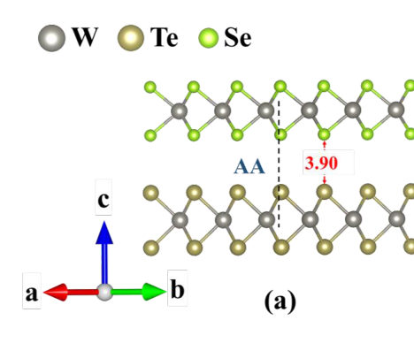
<figcaption class="paper-figure-caption"><b>Fig 1.</b> FIG 1. Stacking sequences of WSe2/WTe2 hetrobilayer (a) AA configuration, (b) AAʹ configuration magnetic atoms to minimize the finite size effects. The Metropolis Monte Carlo algorithum [28] has been considered to find out the temperature dependent magnetic properties. For each temperature, the system has been first equilibrated for 10,000 Monte Carlo steps, followed by an average run of 5,000 Monte Carlo steps.</figcaption>
</figure>
<figure class="paper-figure-card">
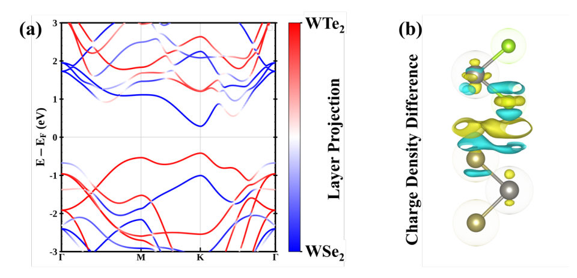
<figcaption class="paper-figure-caption"><b>Fig 2.</b> FIG 2. (a) Projected band structure and (b) Charge density difference isosurface of WSe2/WTe2 hetrobilayer (AAʹ configuration)</figcaption>
</figure>
<figure class="paper-figure-card">
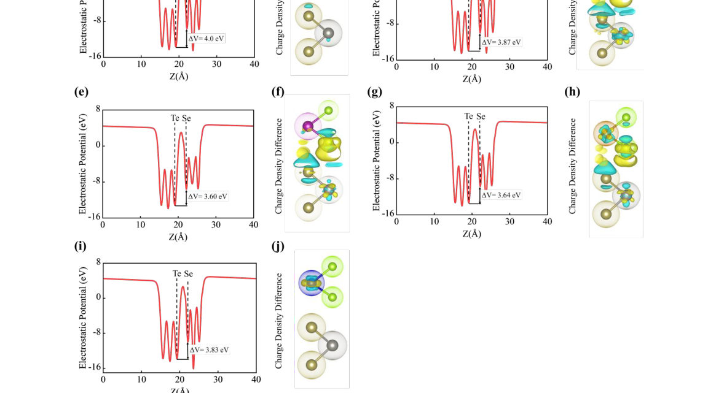
<figcaption class="paper-figure-caption"><b>Fig 3.</b> FIG 3. Planar average electrostatic potential profile and charge density difference of (a) and (b) VSe2/WTe2, (c) and (d) CrSe2/WTe2, (e) and (f) MnSe2/WTe2, (g) and (h) FeSe2/WTe2, and (i) and (j) CoSe2/WTe2 hetrobilayer Table I. The Hubbard Value U, Formation energy per atom (Ef) and magnetic moment (M) of MSe2/WTe2 hetrobilayer.</figcaption>
</figure>
<figure class="paper-figure-card">
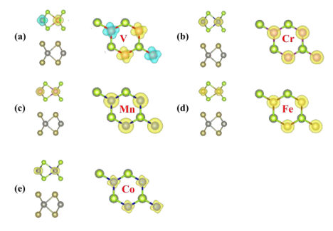
<figcaption class="paper-figure-caption"><b>Fig 4.</b> FIG 4. Spin density (ρup – ρdown) isosurface for (a) VSe2/WTe2, (b) CrSe2/WTe2, (c) MnSe2/WTe2, (d) FeSe2/WTe2, and (e) CoSe2/WTe2 hetrobilayer structure having isosurface value 0.042. A systematic comparison of the ferromagnetic (FM) and antiferromagnetic (AFM) configurations reveals that VSe2/WTe2 is antiferromagnetic where CrMSe2/WTe2, MSe2/WTe2, FeSe2/WTe2, and CoSe2/WTe2 exhibits ferromagnetic ground state. Fig. 4 exhibits the spin density difference isosurface (ρup – ρdown) of MSe2/WTe2 heterobilayer. The yellow and blue isosurface represent the excess of spin-up and spin-down population, respectively. The localization of spin density around the 3d transition metal atom reveals that...</figcaption>
</figure>
<figure class="paper-figure-card">
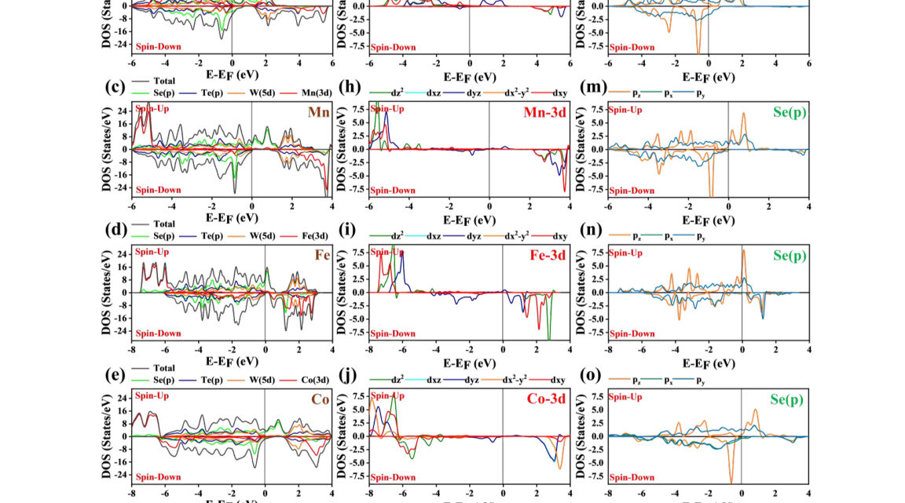
<figcaption class="paper-figure-caption"><b>Fig 5.</b> FIG 5. Partial Density of States (PDOS) of (a) VSe2/WTe2, (b) CrSe2/WTe2, (c) MnSe2/WTe2, (d) FeSe2/WTe2, and (e) CoSe2/WTe2 hetrobilayer 2×2×1 supercell with orbital-resolved PDOS of (f-j) 3d of transition metal atom and (k- o) 4p of Se. which represent metallic behaviors of these systems, Fig. S5(a), (b) and (c). In contrast, MnSe2/WTe2 and FeSe2/WTe2 hetrobilayer exhibit spin dependence electronic behavior. In these systems, spin-up bands cross the Fermi level whereas the spin-down’s valence band and conduction band exhibit the band gap of 0.94 eV and 0.37 eV, for MnSe2/WTe2 and FeSe2/WTe2 respectively, thereby establishing half-metallic ferromagnetic ground states.</figcaption>
</figure>

**Summary.** This work theoretically investigates $	ext{MSe}_2/	ext{WTe}_2$ van der Waals heterobilayers to engineer next-generation spintronic materials. By substituting W with various 3d metals, the researchers demonstrate that interface formation induces favorable type-II band alignment and dramatically enhances perpendicular magnetic anisotropy. The findings establish these heterostructures as promising candidates for low-dimensional electronic and magnetic devices.

**Why it may be interesting.** While focused on condensed matter magnetism and electronics, the detailed theoretical modeling of interfacial coupling mechanisms—which dictate emergent quantum phenomena like spin-selectivity and enhanced anisotropy—is highly relevant to understanding engineered quantum interfaces.

Detailed structure

**Main problem.** The study investigates how interface engineering in van der Waals heterobilayers can enhance electronic properties, specifically achieving spin-resolved type-II band alignment and robust perpendicular magnetic anisotropy for spintronic applications.

**Main result.** The $	ext{MSe}_2/	ext{WTe}_2$ heterobilayers exhibit significant improvements upon interface formation, with $	ext{FeSe}_2/	ext{WTe}_2$ showing simultaneous half-metallicity, type-II alignment, and enhanced magnetic anisotropy.

**Method.** The research employs first-principles Density Functional Theory (DFT) calculations, supplemented by methods to calculate Magnetic Anisotropy Energy (MAE) and model finite-temperature magnetism using Monte Carlo simulations.

**Model / system.** The physical system is the $	ext{MSe}_2/	ext{WTe}_2$ van der Waals heterobilayer, where M is a 3d transition metal ($	ext{V}, 	ext{Cr}, 	ext{Mn}, 	ext{Fe}, 	ext{Co}$). The analysis focuses on structural stability, electronic band structure, and magnetic coupling across the heterointerface.

**Key observables.** Type-II band gap (e.g., 0.70 eV), half-metallicity, Perpendicular Magnetic Anisotropy Energy (MAE), Curie Temperature ($T_C$), and built-in electric fields.

**Important parameters / regimes.** The study compares various transition metals (V to Co) and stacking configurations ($	ext{AA}'$ preferred). Key energy scales include MAE values (e.g., $20.8 	ext{ meV}$ for $	ext{MnSe}_2$).

**Assumptions / limitations.** Calculations rely on DFT approximations (GGA+U), and magnetic behavior at finite temperatures is modeled using classical Heisenberg Hamiltonians.

**Figures summary.** Figures illustrate stacking sequences, band structures showing type-II alignment, charge density redistribution profiles indicating built-in fields, and angular dependence of MAE.

**Paper structure.** The paper systematically analyzes the structural stability, electronic properties (band alignment/charge transfer), and magnetic anisotropy enhancement across different $	ext{M}$ substitutions in the heterobilayer system.

Abstract

Two-dimensional van der Waals heterobilayers provide an attractive platform for the development of next-generation spintronic devices. Here, first-principles calculations are performed to investigate the structural, electronic and magnetic properties of MSe2/WTe2 (M = V, Cr, Mn, Fe, and Co) van der Waals heterobilayers. The pristine WSe2/WTe2 heterobilayer in AA'-configuration is found to be energetically favorable and exhibits type-II band alignment with a band gap of 0.70 eV, and this provides an ideal platform for controlling carrier transport. Substituting W with 3d transition metal atoms, induces long-range magnetic ordering and reconstructs the spin-resolved electronic band structure. The formation of the heterointerface generates pronounced charge redistribution and an intrinsic built-in electric field, leading to interface-induced electronic reconstruction. MnSe2/WTe2 heterobilayer exhibits half-metallicity, whereas FeSe2/WTe2 heterobilayer simultaneously exhibits half-metallicity and spin-resolved type-II band alignment. Interfacial electronic reconstruction further produces a substantial perpendicular magnetic anisotropy, driving MnSe2 from an in-plane easy axis with MAE value of 1.10 meV in the isolated monolayer to a robust out-of-plane easy axis with MAE value of 20.8 meV in the heterobilayer. Among all the structures, CoSe2/WTe2 heterobilayer exhibits maximum Curie temperature (273.87 K). The combined results establish that interface engineering makes MSe2/WTe2 heterobilayers as a promising candidates for next-generation low-dimensional spintronic applications.

[↑ back to top](#top)

### [Seeing inside a Plasmonic Nanogap: Few-molecule Orientation and Preferential Adsorption](http://arxiv.org/abs/2607.08922v1)

**Authors:** Francesco Ciccarello, Nobuaki Oyamada, Thwahira Shirin Alampara, Konstantin Malchow, Christophe Galland  
**Type:** experiment · **Category:** other · **PDF:** <https://arxiv.org/pdf/2607.08922v1>  
**Analysis basis:** full PDF text, analyzed in chunks
**Topic relevance:** `correlated cavity matter` **2/5** · `quantum optics experiment` **2/5** · `Tavis-Cummings & cavity-many-emitter` **1/5** · `interference shaping light` **1/5** · `quantum measurements` **1/5** · `spintronics-quantum-optics interface` **1/5**

↔ Scroll figures horizontally

<figure class="paper-figure-card">
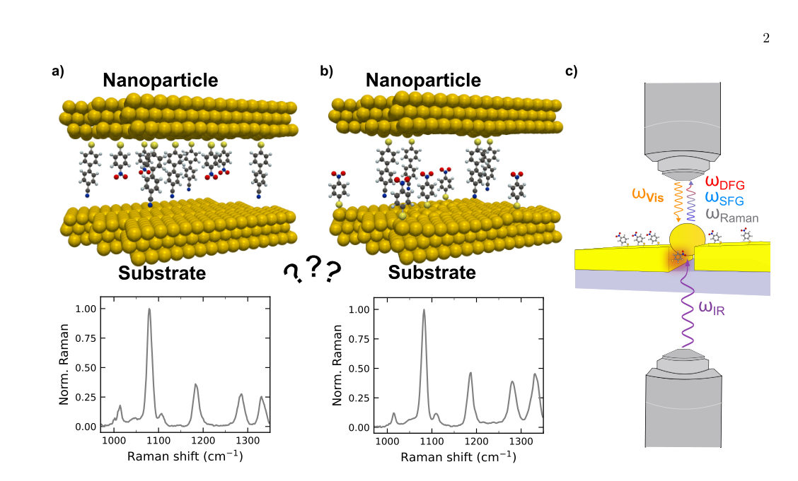
<figcaption class="paper-figure-caption"><b>Fig 1.</b> FIG. 1. (a) Sketch of a gold-molecule-gold nanogap with 4-cyanobiphenylthiol (CN-BPT) and 4-nitrophenylthiol (4NTP)</figcaption>
</figure>
<figure class="paper-figure-card">
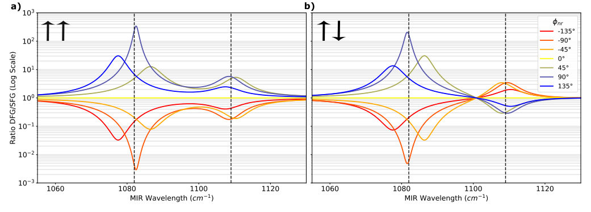
<figcaption class="paper-figure-caption"><b>Fig 2.</b> FIG. 2. (a) ϕNR dependence of simulated DFG/SFG ratio R(ω) for two vibrations which share the same phase offset ϕ1 = ϕ2 =</figcaption>
</figure>
<figure class="paper-figure-card">
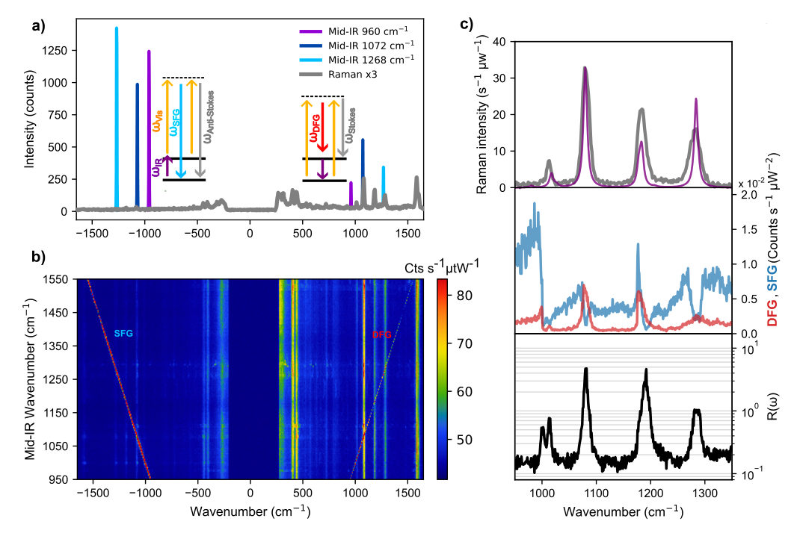
<figcaption class="paper-figure-caption"><b>Fig 3.</b> FIG. 3. (a) Emission spectra from a single CN-BPT SAM functionalized NPoS obtained at three different MIR frequencies</figcaption>
</figure>
<figure class="paper-figure-card">
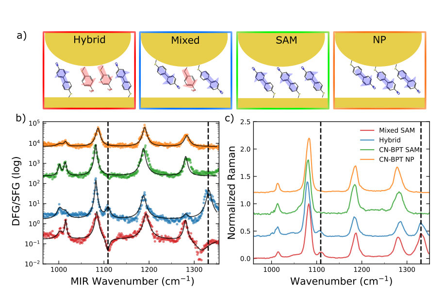
<figcaption class="paper-figure-caption"><b>Fig 4.</b> FIG. 4. (a) Sketch of the four molecular configurations described in the main text, with the color code used in the following</figcaption>
</figure>
<figure class="paper-figure-card">
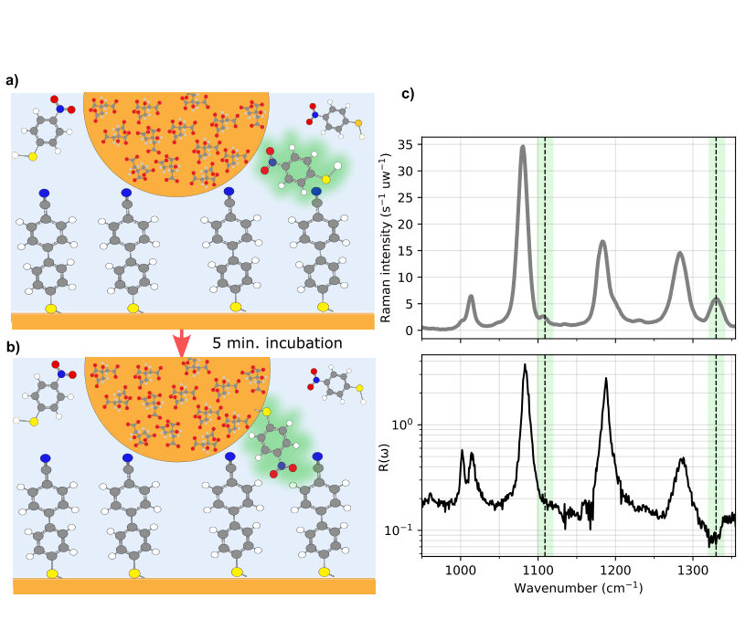
<figcaption class="paper-figure-caption"><b>Fig 5.</b> FIG. 5. (a) Sketch of a nanogap formed onto a CN-BPT SAM and immersed in a 1 mM 4NTP ethanol solution for incubation.</figcaption>
</figure>

**Summary.** The paper presents plasmon-enhanced nonlinear vibrational spectroscopy as a novel technique to study molecules adsorbed inside metallic nanogaps. By measuring the ratio of sum-frequency generation to difference-frequency generation signals, researchers can unambiguously determine the relative orientation of molecules with few-molecule sensitivity. This method offers a powerful tool for molecular electronics and surface science.

**Why it may be interesting.** This work provides a powerful spectroscopic tool for probing interfacial chemistry at the nanoscale, which is highly relevant to understanding quantum phenomena in molecular junctions and energy transfer processes at interfaces.

Detailed structure

**Main problem.** The primary challenge is monitoring side-specific molecular interactions and determining relative molecular orientation within metallic nanogaps due to their buried nature.

**Main result.** The authors successfully developed a method that determines molecular orientation and preferential binding sites with few-molecule sensitivity, revealing that the non-resonant electronic response is governed by molecule-surface interaction.

**Method.** They introduce plasmon-enhanced nonlinear vibrational spectroscopy, utilizing simultaneous measurement of vibrational sum-frequency generation (vSFG) and difference-frequency generation (vDFG).

**Model / system.** The experiment uses metallic nanogaps (e.g., gold-molecule-gold junctions) within a dual-resonant nanocavity setup, enabling the study of molecular adsorption on double interfaces.

**Key observables.** The ratio $R(\omega) = |\chi^{(2)}_{	ext{eff}}(-\omega)|^2 / |\chi^{(2)}_{	ext{eff}}(+\omega)|$ is the key diagnostic observable used to infer molecular orientation ($\phi_j$).

**Important parameters / regimes.** Few-molecule sensitivity, continuous-wave excitation, and the relative phase shift between adsorbed molecules (e.g., parallel vs. anti-parallel).

**Assumptions / limitations.** The analysis relies on separating the total nonlinear response into resonant ($\chi^{(2)}_{	ext{Res}}$) and non-resonant ($\chi^{(2)}_{	ext{NR}}$) contributions to extract orientation information.

**Figures summary.** Figures illustrate the experimental setup, model the dependence of the $R(\omega)$ ratio on molecular orientation (e.g., $\phi_j=0$ vs. $\phi_j=\pi$), and show monitoring of molecular infiltration dynamics.

**Paper structure.** The paper introduces the technique by detailing the physical problem, presents the theoretical framework involving nonlinear susceptibility components, demonstrates its application to determine orientation using $R(\omega)$, and concludes with examples of monitoring diffusion/binding.

Abstract

Molecule-surface interactions are central to many research and technological areas, spanning from heterogeneous catalysis and polymer science to electrochemistry. Of particular relevance are metallic nanogaps used in molecular electronics and near-field spectroscopy. Due to the buried nature of these double interfaces, few methods exist to monitor side-specific interactions and relative molecular orientation inside the gap. In this work, we introduce plasmon-enhanced nonlinear vibrational spectroscopy as an efficient tool to investigate surface molecular adsorption within metallic nanojunctions. By exploiting simultaneous vibrational sum- and difference-frequency generation in dual-resonant nanocavities, we resolve molecular orientation and preferential binding to one of the two gold surfaces, with few-molecule sensitivity. We also discover that the non-resonant (electronic) second-order nonlinear response is not an intrinsic property of the metal surface, but is instead governed by the molecule-surface interaction. Our findings provide a powerful analytical tool, easily implementable as an add-on to Raman spectroscopy, thanks to commercially available mid-infrared quantum cascade lasers.

[↑ back to top](#top)

### [Quantum Oscillation Signatures of $\mathbb{Z}_2$ Monopole Charge in Nodal-Ring Semimetals](http://arxiv.org/abs/2607.08825v1)

**Authors:** Aravind Karthigeyan, Yoonseok Hwang, Bohm-Jung Yang, Junyeong Ahn  
**Type:** theory · **Category:** other · **PDF:** <https://arxiv.org/pdf/2607.08825v1>  
**Analysis basis:** full PDF text, analyzed in chunks
**Topic relevance:** `Keldysh / 2PI / non-Gaussian methods` **2/5** · `analog quantum simulation` **1/5** · `driven-dissipative phase transition` **1/5** · `methods for driven-dissipative` **1/5** · `non-equilibrium dynamics` **1/5**

↔ Scroll figures horizontally

<figure class="paper-figure-card">
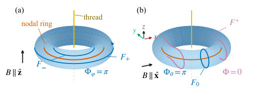
<figcaption class="paper-figure-caption"><b>Fig 1.</b> FIG. 1. Cyclotron-orbit geometry for a toroidal Fermi surface around a Z2 monopole nodal ring. (a) For B ∥ˆz, the inner and outer extremal orbits both encircle the thread and carry the toroidal Berry phase Φϕ = π, giving the two Onsager frequencies F±. (b) For B ∥ˆx, linking orbits at kx = 0 carry Φθ = π, while nonlinking maximal orbits at kx = ±k∗ x have Φ = 0 and give F ∗.</figcaption>
</figure>
<figure class="paper-figure-card">
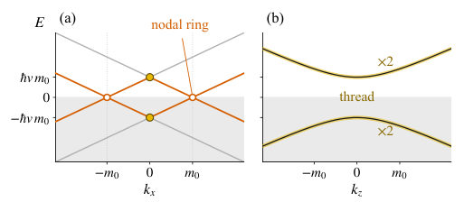
<figcaption class="paper-figure-caption"><b>Fig 2.</b> FIG. 2. Energy-momentum dispersion of the Z2 monopole nodal ring in Eq. (1). (a) At kz = 0 and ky = 0, the conduc- tion and valence branches meet at |kx| = m0, corresponding to the nodal ring at kρ = m0. (b) Along kx = ky = 0, the oc- cupied (and unoccupied) bands are twofold degenerate for all kz, forming the linked “thread” in the occupied/unoccupied subspace.</figcaption>
</figure>
<figure class="paper-figure-card">
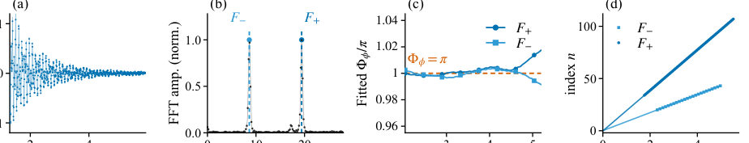
<figcaption class="paper-figure-caption"><b>Fig 3.</b> FIG. 3. Quantum oscillations of the electrical conductivity for B ∥ˆz in the model of Eq. (3) with v = 7.0 × 105 m/s, m0 = 0.0202 ˚A −1, and EF = 18.6 meV. Here we use an enlarged lattice constant a = 4.95 nm, ten times the physical value, which keeps the required magnetic supercells small enough for the lattice calculation to remain tractable. We reproduce the same phase offsets at the physical a = 4.95 ˚A in the Supplemental Material [52]. (a) Background-subtracted ∆σxx. (b) Hann- windowed FFT showing F−≃8.6 T and F+ ≃19.4 T. (c) Sliding-window local-quadrature phases. (d) Raw conductivity-peak Landau fan before 3D curvature correction. The y-intercepts 0.1299±0.0049 and −0.1300±0.0039...</figcaption>
</figure>
<figure class="paper-figure-card">
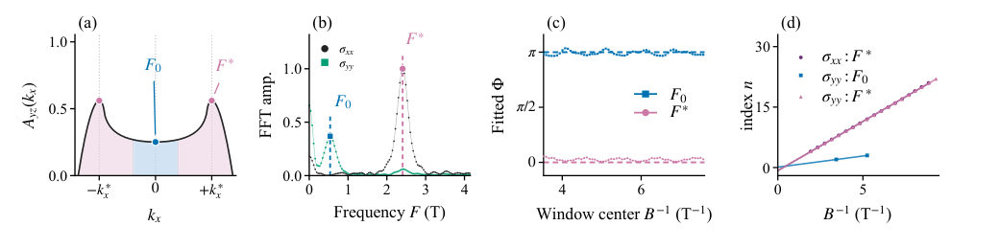
<figcaption class="paper-figure-caption"><b>Fig 4.</b> FIG. 4. Quantum oscillations of the electrical conductivity for B ∥ˆx using the same model and parameters as in Fig. 3. (a) Total yz-section area Ayz(kx) (units of m2 0); the kx = 0 section consists of two degenerate linking loops of area Ayz(0)/2 each, giving F0, while kx = ±k∗ x gives nonlinking maximal loops and F ∗. (b) Hann-windowed FFTs of σxx and σyy; σxx is dominated by the nonlinking F ∗series, while σyy shows the linking F0 peak with a suppressed F ∗component. (c) Local phase fits to σyy identify Φθ = π for F0 and Φ = 0 for F ∗. (d) Raw conductivity-peak Landau fan; quantitative intercept fits are given in the Supplemental Material.</figcaption>
</figure>

**Summary.** This work proposes using magnetic quantum oscillations to detect a secondary topological invariant—the $\mathbb{Z}_2$ monopole charge ($w_2$)—in nodal-line semimetals. The key diagnostic is observing a specific $\pi$ phase shift in the oscillation signal when the field is applied parallel to the ring axis. Graphdiyne is identified as the most promising material candidate for experimental verification.

**Why it may be interesting.** While focused on condensed matter topology, the reliance on precise semiclassical quantization rules and topological invariants makes it relevant for understanding boundary conditions in quantum systems, which has parallels with open quantum system dynamics.

Detailed structure

**Main problem.** The primary goal is to find a measurable bulk transport signature that can distinguish nodal-line semimetals possessing a $\mathbb{Z}_2$ monopole charge ($w_2=1$) from those without ($w_2=0$).

**Main result.** Magnetic quantum oscillations, specifically the phase shift in the oscillatory conductivity when the magnetic field is parallel to the ring axis, can directly diagnose the presence of the $\mathbb{Z}_2$ monopole charge by predicting a topological phase shift of $\pi$.

**Method.** The analysis uses semiclassical theory applied to nodal-line semimetals, calculating quantum oscillations via the Lifshitz–Kosevich formula and extracting topological information from the phase offset ($\gamma$) in the oscillatory conductivity.

**Model / system.** The study focuses on three-dimensional nodal-line semimetals containing 'nodal rings' that can host both a Berry phase ($w_1\pi$) and a $\mathbb{Z}_2$ monopole charge ($w_2$). ABC-stacked graphdiyne is presented as the most promising candidate material.

**Key observables.** Magnetic quantum oscillation phase offset ($\gamma$), which is sensitive to the topological invariant $w_2$.

**Important parameters / regimes.** The magnetic field direction relative to the ring axis, and the ratio of SOC scales to characteristic energy scales (e.g., $\Delta\text{SOC}/E_F$).

**Assumptions / limitations.** The analysis assumes closed nodal rings with toroidal Fermi surfaces; for material screening, it requires weak Spin-Orbit Coupling (SOC) relative to other energy scales.

**Figures summary.** Figures illustrate the cyclotron orbit geometry showing how $\mathbf{B} \parallel \hat{z}$ leads to a $\pi$ phase shift for $w_2=1$, while $\mathbf{B} \parallel \hat{x}$ shows standard Berry phase behavior. Other figures show FFTs of conductivity and Landau fans.

**Paper structure.** The paper develops the theoretical framework by deriving continuum Landau spectra, establishing the diagnostic role of the phase shift ($\Phi_{\phi}$) for $\mathbf{B} \parallel \hat{z}$, and then applies this test to screen various material platforms (graphdiyne, TMDs, Si/Ge) based on their predicted SOC scales.

Abstract

Topological semimetals host band nodes characterized by quantized invariants that can appear in bulk responses, yet some invariants remain hidden from standard probes. In particular, band nodes can carry secondary topological charges whose transport signatures are still largely unexplored. Here we study three-dimensional nodal-line semimetals in which nodal rings carry both the Berry phase $w_1π$ and a $\mathbb{Z}_2$ monopole charge $w_2$. We show that magnetic quantum oscillations, usually treated as a probe of $w_1$, can directly diagnose $w_2$, with the relevant signal selected by the magnetic-field direction. For a field along the ring axis, the inner and outer extremal orbits of the toroidal Fermi surface both encircle the $w_2$-enforced thread and exhibit a topological phase shift $νw_2π$ in the $ν$th harmonic, which is accessible through standard phase-resolved quantum-oscillation analysis. By contrast, for a field applied perpendicular to the ring axis, the relevant extremal orbit exhibits the usual $π$ phase shift associated with the Berry phase $w_1π$, independent of $w_2$. For weak doping, three-dimensional ABC-stacked graphdiyne is predicted to exhibit the proposed oscillations in a field range accessible with present-day high-field facilities.

[↑ back to top](#top)

### [Terahertz field-driven nonlinear Hall effect and other second order transport phenomena in two-dimensional tellurene](http://arxiv.org/abs/2607.09256v1)

**Authors:** M. D. Moldavskaya, L. E. Golub, E. Mönch, Chang Niu, Peide D. Ye, J. Wunderlich, S. D. Ganichev  
**Type:** both · **Category:** other · **PDF:** <https://arxiv.org/pdf/2607.09256v1>  
**Analysis basis:** full PDF text, analyzed in chunks
**Topic relevance:** `non-equilibrium dynamics` **2/5** · `Keldysh / 2PI / non-Gaussian methods` **1/5** · `driven-dissipative phase transition` **1/5** · `methods for driven-dissipative` **1/5** · `non-equilibrium universality` **1/5**

↔ Scroll figures horizontally

<figure class="paper-figure-card">
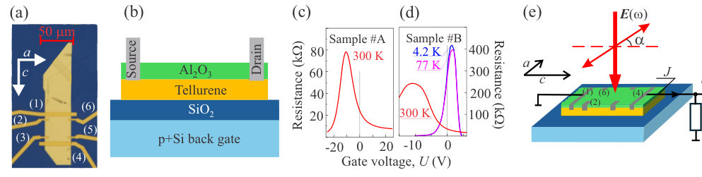
<figcaption class="paper-figure-caption"><b>Fig 1.</b> Figure 1. Panels (a) and (b) show an optical micrograph of sample # A and a cross-section of the samples. The tellurene flake is deposited on top of p+ Si substrate covered by a 90 nm SiO2 layer. Nickel source and drain contacts with thickness of 50 nm are fabricated by electron beam evaporation on the short sides of the tellurene flakes, which were 38 × 41 µm2. Te flakes are capped by a 15-nm-thick layer of Al2O3. Panels (c) and (d) show the two-point resistance measured along the c-axis as a function of the back gate voltage for samples #A and #B, respectively. Panel (e) sketches the experimental set-up. The azimuth angle α defines orientation of the radiation electric field vector E in...</figcaption>
</figure>
<figure class="paper-figure-card">
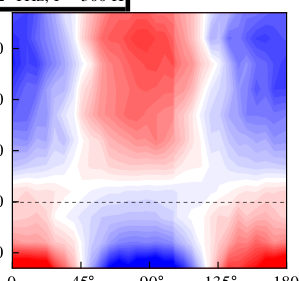
<figcaption class="paper-figure-caption"><b>Fig 2.</b> Figure 2. (a) Azimuth angle dependence of the photocur- rent J normalized on the power Ps excited by radiation with f = 2.02 THz. The data are shown for sample #A at room temperature and two effective back gate voltages UG = −8 V and 7 V. Solid lines are fits after Eq. (3). Double-arrows on top show orientations of the electric field vector for several angles α. (b) Azimuth angle and effective gate voltage de- pendence of the photocurrent (Jc −Jc 0)/Ps excited in sample #A by radiation with f = 2.02 THz, where J0 is the polar- ization independent offset. The effective gate ranges negative (hole-conductivity) to positive values (electron-conductivity).</figcaption>
</figure>
<figure class="paper-figure-card">
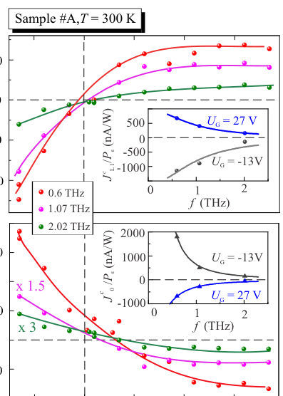
<figcaption class="paper-figure-caption"><b>Fig 3.</b> Figure 3. Effective gate voltage dependencies of the fitting parameters JL1, panel (a), and J0, panel (b). The data are obtained for sample #A excited by radiation of three frequen- cies. The insets show frequency dependencies of JL1 and J0 for several values of positive and negative effective gate volt- ages. Solid lines are guides for eye.</figcaption>
</figure>
<figure class="paper-figure-card">
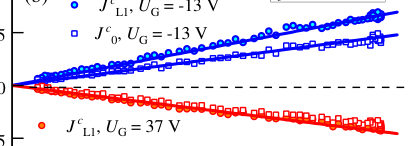
<figcaption class="paper-figure-caption"><b>Fig 4.</b> Figure 4. Dependencies of the photocurrent J on the radia- tion intensity I = P/S ∝E2. The data are obtained for fre- quencies f = 2.02 (upper panel) and 1.07 THz (lower panel) and several effective gate voltages. Solid lines show fits after J ∝E2.</figcaption>
</figure>
<figure class="paper-figure-card">
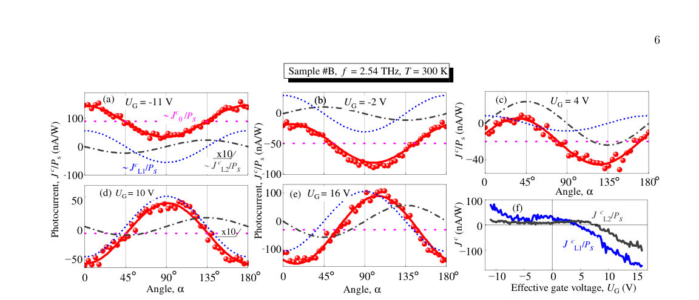
<figcaption class="paper-figure-caption"><b>Fig 5.</b> Figure 5. Panels (a)-(e): Dependencies of the normalized photocurrent Jc/Ps (red circles) on the azimuth angle α measured in sample #B. The data are obtained for f = 2.54 THz, room temperature, and for several effective back gate voltages ranging from hole (UG &lt; 0) to electron conductivity (UG &gt; 0). The magnitudes of the currents Jc L2 in panels (a) and (d) are multiplied by factor 10 for visibility. Red solid lines are fits after Eq. (3). The azimuth angle dependencies of the individual current contributions Jc L1, Jc L2, and Jc 0 are plotted by blue dotted, dark gray dot-dashed and magenta dashed lines, respectively. Panel (f): Current contributions Jc L1, and Jc L2 as a function of the...</figcaption>
</figure>

**Summary.** This work experimentally and theoretically investigates nonlinear electron transport phenomena, including the Nonlinear Hall Effect, in 2D tellurene driven by THz radiation. The researchers demonstrate that these currents are quadratic in the electric field and can be mapped onto photogalvanic effects arising from intrinsic mechanisms like Berry curvature dipole. The results highlight strong temperature and frequency dependencies, confirming the material's unique electronic response.

**Why it may be interesting.** While focused on solid-state electronics, the study's detailed analysis of symmetry breaking (chirality) and Berry curvature effects in 2D materials under high-frequency fields provides insights relevant to topological physics and advanced quantum transport modeling.

Detailed structure

**Main problem.** The study investigates second-order nonlinear electron transport phenomena, such as the Nonlinear Hall Effect (NLHE), induced by terahertz (THz) radiation in two-dimensional tellurene.

**Main result.** The THz-driven currents are shown to be equivalent to contributions from the Linear Photogalvanic Effect and originate from microscopic mechanisms like skew scattering, side jump, and Berry curvature dipole.

**Method.** A combination of experimental measurements using THz lasers on Hall bar samples and theoretical modeling based on phenomenological and microscopic theories was employed.

**Model / system.** The physical system is two-dimensional tellurene flakes, an elemental semiconductor allotrope. The transport response is modeled by considering the current density as a quadratic function of the incident electric field ($\mathbf{j} \propto E^2$).

**Key observables.** Nonlinear Hall (NLHE), Nonlinear Longitudinal (NLL), and Nonlinear Diagonal (NLD) currents; photocurrent dependence on THz polarization angle ($\alpha$), gate voltage ($U_G$), temperature ($T$), and radiation frequency ($\omega$).

**Important parameters / regimes.** Temperature range (300 K down to 4.2 K); THz frequencies (0.6 to 2.54 THz); Gate voltage control ($U_G$) used to tune carrier type/density.

**Assumptions / limitations.** The symmetry of the studied material is reduced to $C_1$, and the current scaling is assumed to be quadratic in the electric field.

**Figures summary.** Figures illustrate optical micrographs, two-point resistance vs. gate voltage curves used to locate the Charge Neutrality Point (CNP), and plots showing photocurrent dependence on polarization angle ($\alpha$) and radiation intensity ($I$).

**Paper structure.** The paper establishes the theoretical framework for second-order transport, details the experimental setup using THz irradiation, presents measurements of current dependence on orientation and gate voltage, and finally correlates these findings with established microscopic theories.

Abstract

We study terahertz field-driven second-order nonlinear electron transport phenomena, including the nonlinear Hall effect (NLHE), in two-dimensional tellurene flakes. The dc current excited by linearly polarized terahertz (THz) radiation in Hall bar samples is investigated in directions both along and perpendicular to the $c$-axis of tellurene. As expected for second-order transport phenomena, the current scales as the square of the in-plane electric field of the radiation $\bf E$, and depends on its orientation. The current results from a combination of three contributions, including the NLHE, the Nonlinear Longitudinal (NLL) and Nonlinear Diagonal (NLD) currents. We established the equivalence between NLH, NLL, and NLD transport currents and Linear photogalvanic effect (LPGE) contributions induced by the absorption of linearly polarized and unpolarized THz radiation. All contributions can be controlled by a gate voltage and have opposite signs for electron and hole conductivity. The magnitude of the current increases drastically when the samples are cooled from room temperature to 4.2 K. It also increases with decreasing radiation frequency. These results are well described by the developed phenomenological and microscopic theories. We show that the THz radiation-induced electric current originates from microscopic mechanisms such as skew scattering, side jump, and the Berry curvature dipole.

[↑ back to top](#top)

### [A Cloud-Accessible Open-Source Framework for the Electromagnetic Modelling of Applied Superconductors](http://arxiv.org/abs/2607.09572v1)

**Authors:** Yusen Guo, Alberto Paganini, Harold S. Ruiz  
**Type:** theory · **Category:** numerical methods · **PDF:** <https://arxiv.org/pdf/2607.09572v1>  
**Analysis basis:** full PDF text, analyzed in chunks
**Topic relevance:** `Keldysh / 2PI / non-Gaussian methods` **1/5** · `analog quantum simulation` **1/5** · `methods for driven-dissipative` **1/5** · `spintronics-quantum-optics interface` **1/5**

↔ Scroll figures horizontally

<figure class="paper-figure-card">
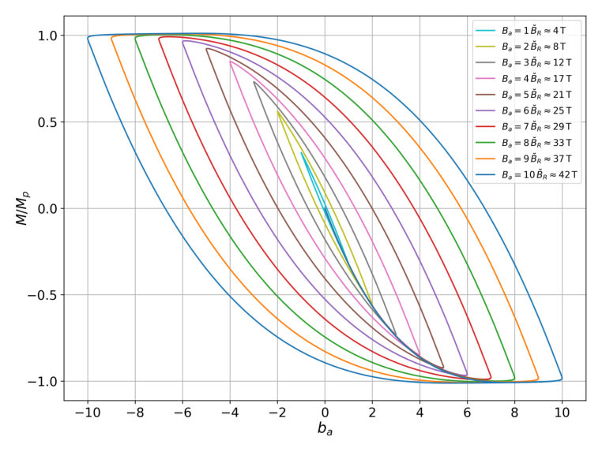
<figcaption class="paper-figure-caption"><b>Fig 1.</b> Figure 1: Calculated magnetization loops within the H-cloud formalism for the cylindrical superconducting benchmark under AC transverse magnetic field of amplitude ba = 1, 2, . . . , 10 in units of ˇBR = (µ0/4π)JcR. The magnetic moment is normalized by the analytical full-penetration value Mp.</figcaption>
</figure>
<figure class="paper-figure-card">
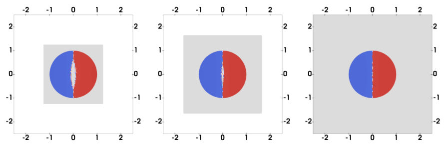
<figcaption class="paper-figure-caption"><b>Fig 2.</b> Figure 2: Current density profiles at Ba = Bp = 8 ˇBR with the SC wire centred at (0, 0), for three surrounding boundary-domain sizes delimited by max(|x|, |y|) relative to (a) 1.25R, (b) 1.65R, and (c) 2.5R. The comparison shows that a close outer boundary artificially suppresses flux penetration, whereas a sufficiently large air domain recovers the expected fully penetrated state at the expected analytical solution.</figcaption>
</figure>

**Summary.** This work introduces H-cloud, an open-source, cloud-accessible finite-element framework for simulating electromagnetics in applied superconductors. It solves the nonlinear time-dependent PDE using curl-conforming Nédélec elements and Python scripting (Firedrake). The primary achievement is demonstrating that this rigorous methodology yields accurate results while maintaining exceptional portability across diverse computing environments.

**Why it may be interesting.** While focused on classical electromagnetism, the paper represents a state-of-the-art example of building highly portable, transparent, and extensible computational infrastructure for complex physical models, which is valuable methodology for quantum simulations.

Detailed structure

**Main problem.** Developing a rigorous, reproducible, and portable computational framework for solving the time-dependent electromagnetic problem in applied superconductors.

**Main result.** The open-source workflow successfully reproduces commercial reference magnetisation loops to within 1% accuracy across matched mesh studies, demonstrating high portability between local and cloud computing environments.

**Method.** It employs a finite-element method using Nédélec elements on the H(curl) space, solving the nonlinear time-dependent PDE implicitly via a Python framework (Firedrake/UFL).

**Model / system.** The model concerns Type-II superconductors exhibiting hysteretic magnetization under applied magnetic fields. The governing physics is described by Maxwell's equations coupled with a nonlinear E-J power law constitutive relation.

**Key observables.** Magnetization per unit length (M) and the resulting magnetization loop shape as a function of applied field amplitude.

**Important parameters / regimes.** Critical current density ($J_c$), critical electric field ($E_c$), and the nonlinear exponent ($n$) defining the E-J relation.

**Assumptions / limitations.** The Magneto-Quasi-Steady (MQS) approximation is used, neglecting displacement currents. The use of curl-conforming elements ensures $
abla \cdot \mathbf{B} = 0$ is maintained naturally.

**Figures summary.** Figure 1 shows calculated magnetization loops for a cylindrical superconductor benchmark across varying applied field amplitudes using the H-cloud formalism.

**Paper structure.** The paper introduces the H-cloud formalism, details the weak form derived from Maxwell's equations and nonlinear constitutive laws, presents the implementation using Nédélec elements in Firedrake/UFL, validates it against canonical benchmarks (Bean model, COMSOL), and discusses extensions to adjoint differentiation for optimization.

Abstract

We present the H-cloud formalism, a cloud-accessible and open-source finite-element framework for electromagnetic modelling of applied superconductors. The proposed method expresses the nonlinear electromagnetic response of type-II superconductors in a curl-conforming discretisation based on Nédélec finite elements, where the tangential applied-field boundary condition, nonlinear E-J power law, and fully implicit time-discrete residual are stated explicitly at the variational level, all within a scripted Python finite-element workflow. The weak form is used as the basis for forward simulation and for extension to adjoint differentiation and PDE-constrained optimisation, while keeping the governing assumptions, boundary conditions, and solver structure fully visible to the user. The implementation is realised in Firedrake with UFL and PETSc-backed nonlinear solvers, allowing the identical script to run on local machines and in browser-accessible environments such as Google Colab without reformulating the problem. The method is verified on the canonical magnetisation benchmark of a cylindrical superconductor under Bean-like penetration conditions and then benchmarked against an independently constructed COMSOL model for a practical high temperature superconducting Bi2212 wire. Across matched mesh studies, the open-source workflow reproduces the commercial-reference magnetisation loops to within approximately \(1\%\) , with relative peak errors below 1.5%, while cloud execution preserves the same numerical solution at rather modest additional runtime considering the use of (freely available) reduced hardware resources. The proposed framework provides a rigorous, reproducible, and portable route for superconducting simulation, benchmarking, and future optimisation-led modelling of applied and functional superconductors, shareable and executable into open cloud environments.

[↑ back to top](#top)

### [Anisotropic Superconductivity with Enhanced Critical Field in Strained RuO2](http://arxiv.org/abs/2607.09437v1)

**Authors:** Younes Ghorbani, Samuel Poage, Xuehsi Gao, Luka Mitrovic, Neha Wadehra, Benjamin Gregory, Suchismita Sarker, Betul Pamuk, Andrej Singer, Darrell G. Schlom, Chun Ning Lau, Kaveh Ahadi  
**Type:** both · **Category:** other · **PDF:** <https://arxiv.org/pdf/2607.09437v1>  
**Analysis basis:** full PDF text, analyzed in chunks
**Topic relevance:** `Keldysh / 2PI / non-Gaussian methods` **1/5** · `Kondo & dissipative impurity` **1/5** · `analog quantum simulation` **1/5** · `spintronics-quantum-optics interface` **1/5**

↔ Scroll figures horizontally

<figure class="paper-figure-card">
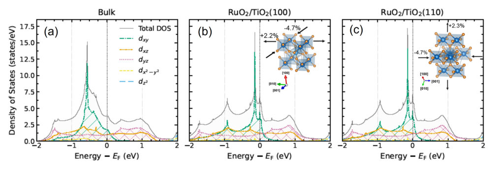
<figcaption class="paper-figure-caption"><b>Fig 1.</b> FIG. 1. The density of states (DOS) of bulk (unstrained) and epitaxially strained RuO2. DOS calculations are from first principles for (a) unstrained RuO2 and commensurately strained RuO2 to (b) TiO2(100) and (c) TiO2(110) single crystal substrates. Inset exhibits the epitaxial strain geometry schematically. Focusing on the DOS around the Fermi level, we observe that the main contribution to the electronic structure originates from the Ru t2g states (i.e dxz, dyz, and dxy d-orbitals), shown with dotted lines. The Ru eg states, shown with dashed lines, lie about 2 eV above the Fermi level. We focus here on the narrow peak in the DOS that lies about 0.5 eV below the Fermi level. This peak is...</figcaption>
</figure>
<figure class="paper-figure-card">
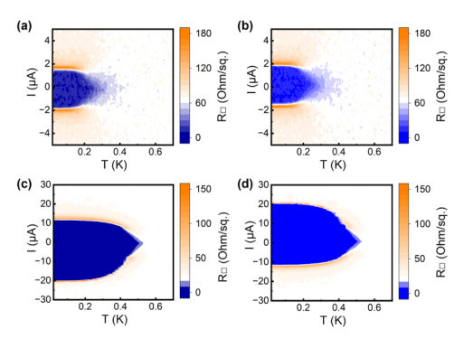
<figcaption class="paper-figure-caption"><b>Fig 2.</b> FIG. 2. Asymmetric superconducting transition of epi- taxially strained RuO2 films. Sheet resistance with tem- perature and sweeping current for RuO2 films grown epitax- ially on (a) and (b) TiO2(110), with current along [1¯11] and on (c) and (d) TiO2(100), with current along [011]. The cur- rent sweeping direction is downward and upward in the left and right panels, respectively. The resistance is measured dif- ferentially at each temperature with sweeping current. Sam- ples exhibit an abrupt superconducting transition with critical temperature (Tc) of ∼0.28 K and ∼0.55 K for films grown on TiO2(110) and TiO2(100) substrates. The film grown on TiO2(100) substrate exhibits enhanced critical...</figcaption>
</figure>
<figure class="paper-figure-card">
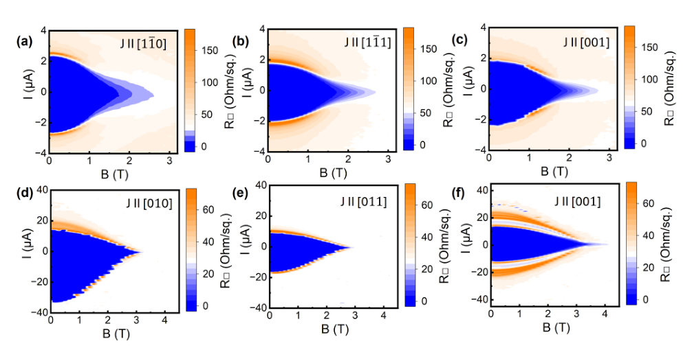
<figcaption class="paper-figure-caption"><b>Fig 3.</b> FIG. 3. Anisotropic superconducting transition with current and in-plane magnetic field. Sheet resistance with applied in-plane magnetic field and sweeping current for RuO2 films grown on TiO2(110) and measured along (a) [1¯10], (b) [1¯11], and (c) [001]. Sheet resistance with applied in-plane magnetic field and sweeping current for RuO2 films grown on TiO2(100) and measured along (d) [010], (e) [011], and (f) [001]. Figure S3 shows a representative sample with fabricated Hall bars.</figcaption>
</figure>
<figure class="paper-figure-card">
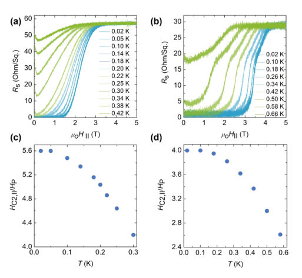
<figcaption class="paper-figure-caption"><b>Fig 4.</b> FIG. 4. Violation of Pauli paramagnetic limit in epitaxially strained RuO2 films. Sheet resistance with sweeping in-plane magnetic field at various temperatures for RuO2 films grown on (a) TiO2(110) and (b) TiO2(100) single crystal substrates, respectively. The measured in-plane criti- cal field violates Pauli limit with Hc2,∥/Hp=5.5 and 4 at base temperature for RuO2 films grown on (c) TiO2(110) and (d) TiO2(100) single crystal substrates, respectively. Here, the measured Hc2,∥is defined at 0.9Rn, where Rn is the normal state resistance. The Pauli paramagnetic limit is estimated using HP = ∆0/ √</figcaption>
</figure>

**Summary.** This work reports on the discovery of anisotropic superconductivity in strained $	ext{RuO}_2$ thin films grown epitaxially. By measuring transport properties along different crystallographic directions and applying magnetic fields, the authors demonstrate that strain significantly enhances the critical field beyond theoretical limits. The findings highlight the crucial role of spin-orbit coupling and epitaxial strain in engineering high-performance superconducting materials.

**Why it may be interesting.** While focused on unconventional superconductivity, the strong dependence on crystal orientation and strain provides a model for engineering superconducting properties in low-dimensional systems, which is relevant to quantum materials research.

Detailed structure

**Main problem.** The study aims to understand the nature of superconductivity in $	ext{RuO}_2$ and how its properties are governed by epitaxial strain and crystallographic direction.

**Main result.** Superconductivity is strongly anisotropic, exhibiting enhanced critical fields ($H_{c2,\parallel}$) that violate the Pauli paramagnetic limit, which is attributed to strong spin-orbit scattering effects in strained films.

**Method.** The research combines experimental transport measurements (measuring sheet resistance vs. magnetic field along various directions) with theoretical modeling (DFT calculations and weak coupling theory).

**Model / system.** The physical system is epitaxial $	ext{RuO}_2$ thin films grown on different single crystal substrates ($	ext{TiO}_2(100)$ and $	ext{TiO}_2(110)$), allowing for controlled strain engineering.

**Key observables.** Superconducting transition temperature ($T_c$), critical magnetic fields ($H_{c2,\parallel}$ vs $H_{c2,\perp}$), critical current asymmetry, and the ratio of measured field to the Pauli limit ($H_{c2}/H_P$).

**Important parameters / regimes.** Epitaxial strain, spin-orbit scattering strength, dimensionality (suggesting 2D superconductivity), and temperature/magnetic field ranges.

**Assumptions / limitations.** The analysis initially relies on weak coupling assumptions, but the strong enhancement suggests mechanisms beyond simple BCS theory are at play.

**Figures summary.** Figures illustrate the dependence of superconducting transitions and critical fields on transport direction and applied in-plane magnetic field. XRD data confirms anisotropic strain relaxation defects.

**Paper structure.** The paper systematically investigates how substrate choice dictates superconductivity, measures anisotropy via directional transport measurements, quantifies the violation of fundamental limits (Pauli), and theoretically models the enhancement mechanism using DFT and Ginzburg-Landau approaches.

Abstract

The superconductivity in RuO2 emerges under strain. RuO2 is also an altermagnet candidate. The nature of superconductivity and its relation with neighboring orders, however, are not understood. To address this problem, we grew epitaxial RuO2 films on TiO2(100) and TiO2(110) single crystal substrates and studied the electronic transport and emergent superconductivity along various crystallographic directions. We show that the superconducting transition strongly depends on the growth orientation and the crystallographic direction of the transport in the RuO2 films. We also observe a strong violation of Pauli paramagnetic limit with in-plane applied magnetic field which we attribute to strong spin-orbit scattering. These results offer opportunities for epitaxially engineered superconductors.

[↑ back to top](#top)

### [Probing Cooper pair momentum by quasiparticle steering with planar Josephson junctions](http://arxiv.org/abs/2607.08845v1)

**Authors:** Isidora Araya Day, Anton R. Akhmerov, Antonio R. L. Manesco  
**Type:** theory · **Category:** other · **PDF:** <https://arxiv.org/pdf/2607.08845v1>  
**Analysis basis:** full PDF text, analyzed in chunks
**Topic relevance:** `Keldysh / 2PI / non-Gaussian methods` **1/5** · `Kondo & dissipative impurity` **1/5** · `methods for driven-dissipative` **1/5** · `non-equilibrium dynamics` **1/5**

↔ Scroll figures horizontally

<figure class="paper-figure-card">
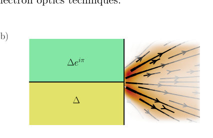
<figcaption class="paper-figure-caption"><b>Fig 1.</b> Figure 1: Electron current density ejected from a planar Josephson junction into a normal region at subgap energies. (a) For a generic phase difference, here ϕ = π/2, quasiparticles are ejected into the normal region at a finite angle. (b) At a time-reversal-symmetric phase, here ϕ = π, the ejection is symmetric and the average angle vanishes. The arrows show the local electron-current density. We use E = ∆[1 + cos(ϕ/2)]/2, ∆= 0.1, µ = 0.5, and t = 1 for both panels.</figcaption>
</figure>
<figure class="paper-figure-card">
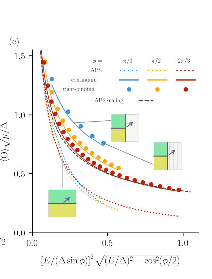
<figcaption class="paper-figure-caption"><b>Fig 2.</b> Figure 2: Current angle distribution of the ejected electron current density and the Andreev modes inside the junction. (a) Dispersion relation of a short planar junction: gray bands provide spectral context, and the colored ABS modes show the angle tilt θ. (b) Normalized angular distribution P(Θ) of the ejected electron current density for a Josephson junction with phase difference ϕ = 2π/3; the colors correspond to different excitation energies E. (c) Average ejection angle rescaled using the perturbative ABS momentum estimate, plotted as ⟨Θ⟩ p</figcaption>
</figure>
<figure class="paper-figure-card">
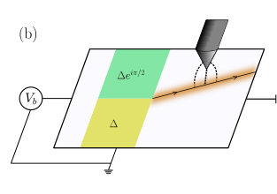
<figcaption class="paper-figure-caption"><b>Fig 3.</b> Figure 3: Proposed experimental setup to detect the ejection angle of quasiparticles from a planar Josephson junction. (a) A short planar Josephson junction is connected to a normal region, where the ejected quasiparticles are detected by a series of quantum point contacts. The phase dependence of the nonlocal conductance across each point contact can be used to extract the ejection angle. (b) A scanning gate microscopy tip can be used to image the ejected quasiparticle current density.</figcaption>
</figure>
<figure class="paper-figure-card">
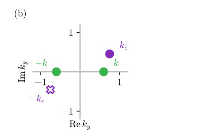
<figcaption class="paper-figure-caption"><b>Fig 4.</b> Figure 4: Root structure of the bounded subgap solutions of Eq. (27) at ϕ = 2π/3 and ϵ = 0.98. Panel (a) shows the ABS roots in the complex ky plane. Panel (b) shows the mixed family containing a propagating pair ±k and an evanescent pair ±ke.</figcaption>
</figure>
<figure class="paper-figure-card">
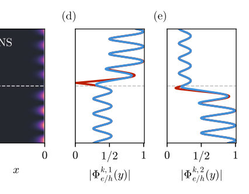
<figcaption class="paper-figure-caption"><b>Fig 5.</b> Figure 5: Real-space profiles of the bounded subgap solution families shown in Fig. 4, for the same parameters ϕ = 2π/3 and ϵ = 0.98. Panels (a) and (c) show normalized two-dimensional profiles on the SNS side, with the ABS and mixed contributions shown separately. Panel (b) shows the corresponding transverse electron and hole profile, arranged as a vertical cut of panel (a). Panels (d) and (e) show the transverse profiles of the two independent mixed basis solutions, arranged as vertical cuts associated with panel (c).</figcaption>
</figure>

**Summary.** The paper proposes using quasiparticle steering at Josephson junctions as a novel probe for the Cooper pair momentum. By analyzing how Andreev bound states exit into a normal metal, the authors calculate that the emitted particles exhibit a measurable angle proportional to $(\Delta/\mu)^{1/2}$. This provides a robust, phase-controlled signature detectable via electron optics techniques.

**Why it may be interesting.** This work provides a concrete, measurable signature—a directional deflection—for a fundamental superconducting property (Cooper pair momentum), offering an alternative to energy-shift measurements relevant for quantum transport studies in mesoscopic devices.

Detailed structure

**Main problem.** The work aims to develop a method to kinematically measure the Cooper pair momentum ($\hbar q$) in superconductors by analyzing the direction of quasiparticles ejected from Josephson junctions.

**Main result.** It is shown that Andreev bound states eject into an adjacent normal region at a finite, phase-controlled angle $\Theta \sim (\Delta/\mu)^{1/2}$, which is parametrically larger than the conventional Cooper pair momentum scale ($\Delta/\mu$).

**Method.** The analysis involves solving continuum scattering problems by matching solutions derived from Andreev bound states (ABS) in the superconducting junction to propagating electron modes in the normal region.

**Model / system.** The system modeled is a planar Josephson junction connecting a superconductor (SNS side) to a normal metal lead. The physics is described using linearized Bogoliubov-de Gennes Hamiltonians and perturbative expansions.

**Key observables.** The primary observable is the angle ($\Theta$) of quasiparticle ejection into the normal region, quantified by the ratio of transverse to longitudinal currents ($j_{e,y}/j_{e,x}$).

**Important parameters / regimes.** The key parameters are the superconducting gap ($\Delta$), chemical potential ($\mu$), and the superconducting phase difference ($\phi$). The critical scale is $\Delta/\mu$.

**Assumptions / limitations.** The analysis assumes ballistic transport, a clean planar junction, and utilizes perturbative expansions in the small ratio $\Delta/\mu$ (or $\Delta \ll \mu$).

**Figures summary.** Figures illustrate electron current density ejected at subgap energies showing finite angle ejection for specific phases ($\phi=\pi/2$), and show tight-binding Andreev bands mapping out the ejection angle $	heta = \arctan(k_y/k_x)$.

**Paper structure.** The paper progresses from establishing the theoretical framework using linearized BdG Hamiltonians, deriving the ABS solutions, solving the continuum scattering problem by matching boundary conditions at the junction interface, and finally calculating the mean transverse momentum of the transmitted field.

Abstract

The Cooper pair momentum in a superconductor is associated with a phase gradient of the superconducting order parameter. In general, this momentum is small compared to the Fermi momentum, which makes it challenging to measure. Josephson junctions, however, enable the creation of large phase gradients and transfer of the Cooper pair momentum to quasiparticles via Andreev reflection. In this work we demonstrate that Andreev bound states propagating along ballistic planar Josephson junctions eject into an adjacent normal region at a phase-controlled angle that scales as $Θ\sim \sqrt{Δ/ μ}$, where $Δ$ is the superconducting gap and $μ$ is the chemical potential. This angle parametrically exceeds the conventional Cooper pair momentum scale $Δ/ μ$, and thus this phenomenon is sizeable even within the Andreev approximation regime $Δ/ μ\ll 1$. Our results establish phase-controlled quasiparticle ejection as a kinematic probe of condensate momentum transfer: unlike existing probes that detect the Doppler energy shift, the signal appears as a momentum-space deflection of emitted quasiparticles.

[↑ back to top](#top)

### [Negligible current-induced torque from the bulk and interface of Al](http://arxiv.org/abs/2607.09055v1)

**Authors:** Taiyang Zhang, Lujun Zhu, Zhihao Yan, Lijun Zhu  
**Type:** experiment · **Category:** other · **PDF:** <https://arxiv.org/pdf/2607.09055v1>  
**Analysis basis:** full PDF text, analyzed in chunks
**Topic relevance:** `spintronics-quantum-optics interface` **1/5**

↔ Scroll figures horizontally

<figure class="paper-figure-card">
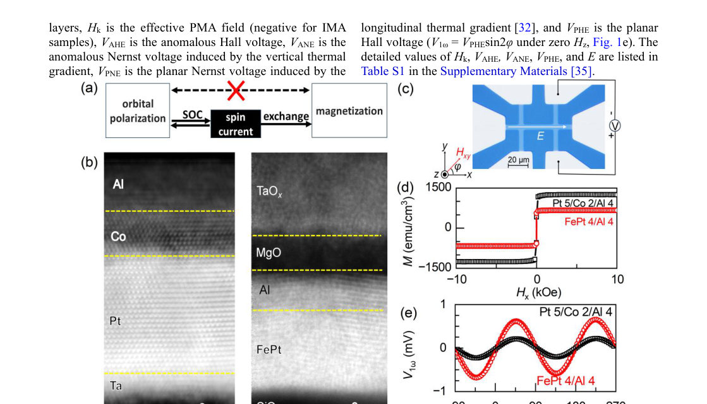
<figcaption class="paper-figure-caption"><b>Fig 1.</b> Figure 1 (a) Schematic of potential path for orbital torque generation, highlighting that orbital polarization cannot interact with magnetization unless being converted into spin current via SOC. (b) Cross-sectional transmission electron microscopy images of a Pt/Co/Al sample and a FePt/Al sample. (c) Optical microscopy image of the Hall bar device and the measurement coordinate. (d) Magnetization hysteresis and (e) First harmonic Hall voltage vs the azimuth angle (φ) of the in-plane magnetic field (Hxy = 3.5 kOe) for the Pt 5/Co 2/Al 4 and the FePt 4/Al 4.</figcaption>
</figure>
<figure class="paper-figure-card">
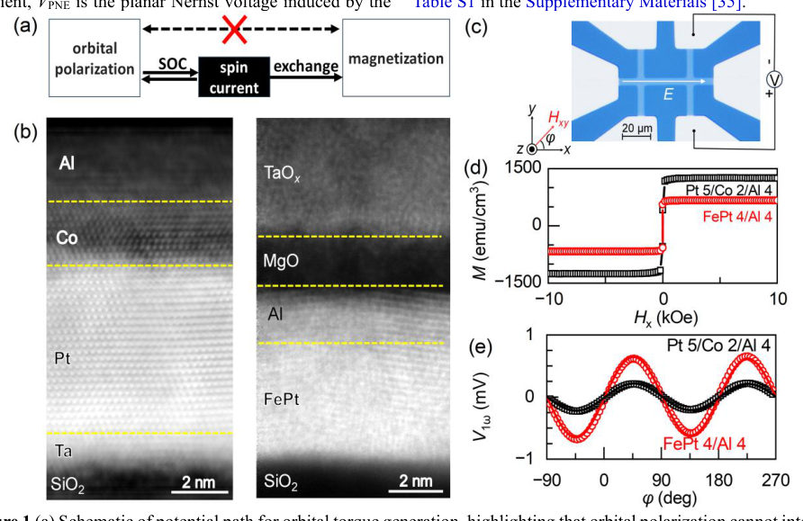
<figcaption class="paper-figure-caption"><b>Fig 2.</b> Figure 2. Harmonic Hall voltage analysis of the Pt/Co/Al devices. (a) V2ω vs φ (Hxy = 3.5 kOe), (b) dVAHE/dHz vs Hxy, (c) VDL+ANE vs VAHE/2(Hxy-Hk), and (d) VFL+Oe vs -VPHE/Hxy for the FePt/Al bilayers with Al thickness of 0 nm, 1 nm, 2 nm, 3nm, and 4 nm, respectively. The solid lines in (a)-(d) represent the best fits of the data to Eq. (1), Eq. (4), Eq. (2), and Eq. (3), respectively. The electric field E is about 19 kV/m.</figcaption>
</figure>
<figure class="paper-figure-card">
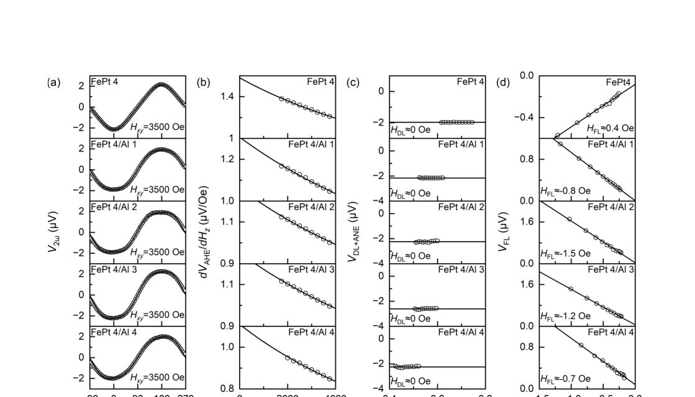
<figcaption class="paper-figure-caption"><b>Fig 3.</b> Fig. 3. Harmonic Hall voltage analysis of the FePt/Al bilayers. (a) V2ω vs φ (Hxy = 3.5 kOe), (b) dVAHE/dHz vs Hxy, (c) VDL+ANE vs VAHE/2(Hxy-Hk), and (d) VFL+Oe vs -VPHE/Hxy for the FePt/Al bilayers with Al thickness of 0 nm, 1 nm, 2 nm, 3nm, and 4 nm, respectively. The solid lines in (a)-(d) represent the best fits of the data to Eq. (1), Eq. (4), Eq. (2), and Eq. (3), respectively. The electric field E is about 35 kV/m.</figcaption>
</figure>
<figure class="paper-figure-card">
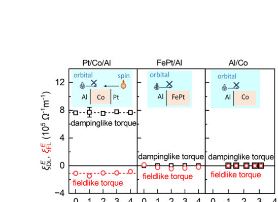
<figcaption class="paper-figure-caption"><b>Fig 4.</b> Fig. 4. Dampinglike and fieldlike SOT efficiencies per electric field for the Pt/Co/Al, the FePt/Al, and the Al/Co with varying Al thickness. The dashed line is to guide the eyes. Error bars are standard deviations. Insets suggest the orbital and spin transport into the magnetic layer.</figcaption>
</figure>

**Summary.** This work experimentally investigates whether Aluminum (Al) contributes significant torque via its bulk or interface when placed between magnetic layers like Co and FePt. By measuring harmonic Hall voltages, the authors report that these orbital contributions are negligible across varying Al thicknesses. This suggests that for these specific systems, other mechanisms dominate over predicted orbital-spin conversion effects in Al.

**Why it may be interesting.** While focused on condensed matter magnetism, the precise measurement and null result regarding orbital torques provide critical boundary conditions for theories describing spin-orbit coupling effects in novel material interfaces relevant to quantum spintronics devices.

Detailed structure

**Main problem.** To experimentally clarify the general effectiveness of orbital contributions (orbital Hall effect, interfacial orbital Rashba effect) to Spin-Orbit Torques (SOTs) in normal metal/ferromagnet heterostructures.

**Main result.** The study found that neither the bulk nor the interface of Aluminum (Al) contributed a detectable torque on adjacent magnetic layers like Co and FePt, suggesting minimal orbital-spin conversion in Al.

**Method.** SOTs were quantified from angle-dependent harmonic Hall voltage measurements ($V_{2\omega}$) performed on fabricated Hall bar devices.

**Model / system.** The research investigates spin-orbit torques in heterostructures involving light metal Aluminum (Al) interfaced with ferromagnetic metals such as Cobalt (Co) and FePt. The analysis contrasts established SHE-driven SOT mechanisms with predicted orbital contributions.

**Key observables.** Dampinglike ($\xi_{	ext{DL}}^E$) and fieldlike ($\xi_{	ext{FL}}^E$) Spin-Orbit Torque efficiencies, measured via $V_{2\omega}$ vs $\phi$ measurements.

**Important parameters / regimes.** Al thickness ($d_{	ext{Al}}$) varying from 0 nm to 4 nm; magnetic materials (Co, FePt).

**Assumptions / limitations.** The analysis relies on fitting the harmonic Hall voltage dependence on the in-plane magnetic field angle ($\phi$) to extract torque components.

**Figures summary.** Figures show $\xi_{	ext{DL}}^E$ and $\xi_{	ext{FL}}^E$ for various bilayers (Pt/Co/Al, FePt/Al, Al/Co) as a function of Al thickness, demonstrating the constancy or near-zero values across different thicknesses.

**Paper structure.** The paper establishes the scientific problem by contrasting theoretical predictions with experimental measurements. It details the measurement techniques using harmonic Hall voltage analysis on specific bilayers (e.g., $	ext{Pt}/	ext{Co}/	ext{Al}$ and $	ext{FePt}/	ext{Al}$) to quantify SOTs, leading to the conclusion of negligible torque contributions from Al.

Abstract

The light metal Al was predicted to have strong orbital Hall and Rashba effects from its bulk and interface, respectively. In this letter, we report experimental evidence that neither the bulk nor the interface of the Al contributed a detectable torque on adjacent Co and FePt layers with significant spin Hall effect, spin-orbit coupling, and resistivity mismatch with Al. These results suggest minimal orbital-spin conversion in Al and negligible orbital transport and spin-vorticity torque in Co/Al, Al/Co, and Al/FePt bilayers. Our findings suggest poor generality and/or effectiveness of torque contributions by the orbital Hall effect, the interfacial orbital Rashba effect, and the spin-vorticity coupling.

[↑ back to top](#top)
