
# arxiv digest (quant-ph + cond-mat) — 2026-07-15

*191 papers · 56 relevant · 2 highlighted*

## 🔥 Most relevant (56)

*Every paper with at least one nonzero topic score, sorted by best-matching score. 🔥 marks scores ≥4/5. Click the title to jump to the full entry below; click [arXiv] to open the paper page. `(secondary)` marks papers from de-prioritized cond-mat archives.*

Show 56 relevant papers

- [Dynamics of two interacting dipolar two-level systems in a multi-mode electromagnetic cavity: sudden death and revival of the concurrence within the Born-Markov approximation](#paper-2607.11201) [[arXiv]](http://arxiv.org/abs/2607.11201v1) — 🔥 `entanglement & information structure` **5/5** · 🔥 `analog quantum simulation` **4/5** · 🔥 `correlated / nonlocal dissipation` **4/5** · 🔥 `exotic spin models in light-matter` **4/5** · `Tavis-Cummings & cavity-many-emitter` **3/5** · `correlated cavity matter` **3/5** · `methods for driven-dissipative` **3/5** · `spintronics-quantum-optics interface` **3/5** · `driven-dissipative phase transition` **2/5** · `non-equilibrium dynamics` **2/5** · `Dicke superradiance` **1/5** · `Keldysh / 2PI / non-Gaussian methods` **1/5** · `Rydberg arrays` **1/5** · `non-equilibrium universality` **1/5**
- [A diode nanocavity for fast, efficient and tunable emission of highly entangled photon pairs and Fourier-transform-limited single photons](#paper-2607.11494) [[arXiv]](http://arxiv.org/abs/2607.11494v1) — 🔥 `quantum optics experiment` **5/5** · 🔥 `QC/QI experiment` **4/5** · `Tavis-Cummings & cavity-many-emitter` **3/5** · `correlated cavity matter` **3/5** · `interference shaping light` **3/5** · `correlated / nonlocal dissipation` **2/5** · `driven-dissipative phase transition` **2/5** · `entanglement & information structure` **2/5** · `analog quantum simulation` **1/5** · `methods for driven-dissipative` **1/5** · `non-equilibrium dynamics` **1/5** · `non-equilibrium universality` **1/5** · `quantum measurements` **1/5** · `superradiant laser` **1/5**
- [$p$-Form Gauge Dynamics and Digital Quantum Simulation -- Flux and Cosmological Constant Neutralization](#paper-2607.10950) [[arXiv]](http://arxiv.org/abs/2607.10950v1) — 🔥 `non-equilibrium dynamics` **5/5** · 🔥 `analog quantum simulation` **4/5** · 🔥 `non-equilibrium universality` **4/5** · `driven-dissipative phase transition` **3/5** · `methods for driven-dissipative` **3/5** · `scars & prethermalization` **2/5** · `Frenkel-Kontorova` **1/5** · `Keldysh / 2PI / non-Gaussian methods` **1/5** · `correlated / nonlocal dissipation` **1/5** · `entanglement & information structure` **1/5** · `exotic spin models in light-matter` **1/5**
- [Generalized Keldysh formalism for nonequilibrium correlation functions and its application to fluctuation dynamics](#paper-2607.11055) [[arXiv]](http://arxiv.org/abs/2607.11055v1) — 🔥 `Keldysh / 2PI / non-Gaussian methods` **5/5** · 🔥 `non-equilibrium dynamics` **4/5** · 🔥 `non-equilibrium universality` **4/5** · `analog quantum simulation` **3/5** · `driven-dissipative phase transition` **3/5** · `methods for driven-dissipative` **3/5** · `correlated / nonlocal dissipation` **1/5** · `correlated cavity matter` **1/5** · `entanglement & information structure` **1/5**
- [Many-Body Physics with Rydberg Atoms: Quantum Simulation and Non-equilibrium Dynamics](#paper-2607.11038) [[arXiv]](http://arxiv.org/abs/2607.11038v1) — 🔥 `Rydberg arrays` **5/5** · 🔥 `analog quantum simulation` **4/5** · `entanglement & information structure` **3/5** · `exotic spin models in light-matter` **3/5** · `non-equilibrium dynamics` **3/5** · `non-equilibrium universality` **2/5** · `Keldysh / 2PI / non-Gaussian methods` **1/5** · `QC/QI experiment` **1/5** · `driven-dissipative phase transition` **1/5** · `methods for driven-dissipative` **1/5**
- [Classical probabilistic realisation of quantum double-slit interference](#paper-2607.11580) [[arXiv]](http://arxiv.org/abs/2607.11580v1) — 🔥 `interference shaping light` **5/5** · `Keldysh / 2PI / non-Gaussian methods` **3/5** · `non-equilibrium dynamics` **2/5** · `driven-dissipative phase transition` **1/5** · `methods for driven-dissipative` **1/5** · `quantum measurements` **1/5**
- [Mode-locking instability and multiple soliton formation in GaN polariton waveguide cavities](#paper-2607.11278) [[arXiv]](http://arxiv.org/abs/2607.11278v1) `(secondary)` — 🔥 `analog quantum simulation` **4/5** · 🔥 `driven-dissipative phase transition` **4/5** · `correlated cavity matter` **3/5** · `methods for driven-dissipative` **3/5** · `non-equilibrium dynamics` **3/5** · `non-equilibrium universality` **3/5** · `quantum optics experiment` **3/5** · `Keldysh / 2PI / non-Gaussian methods` **2/5** · `Tavis-Cummings & cavity-many-emitter` **2/5** · `correlated / nonlocal dissipation` **2/5** · `entanglement & information structure` **1/5** · `interference shaping light` **1/5** · `scars & prethermalization` **1/5** · `superradiant laser` **1/5**
- [Controlling the Inhomogeneous Broadening and Impedance Matching of a Spin Ensemble](#paper-2607.11315) [[arXiv]](http://arxiv.org/abs/2607.11315v1) — 🔥 `exotic spin models in light-matter` **4/5** · 🔥 `quantum optics experiment` **4/5** · 🔥 `spintronics-quantum-optics interface` **4/5** · `Tavis-Cummings & cavity-many-emitter` **3/5** · `analog quantum simulation` **3/5** · `correlated cavity matter` **3/5** · `QC/QI experiment` **2/5** · `correlated / nonlocal dissipation` **1/5** · `driven-dissipative phase transition` **1/5** · `entanglement & information structure` **1/5** · `interference shaping light` **1/5** · `methods for driven-dissipative` **1/5** · `non-equilibrium dynamics` **1/5** · `quantum measurements` **1/5**
- [From local weight selection to Zeno slowdown in an open Su-Schrieffer-Heeger chain with a single local loss](#paper-2607.10218) [[arXiv]](http://arxiv.org/abs/2607.10218v1) — 🔥 `methods for driven-dissipative` **4/5** · 🔥 `non-equilibrium dynamics` **4/5** · `analog quantum simulation` **3/5** · `correlated / nonlocal dissipation` **3/5** · `driven-dissipative phase transition` **3/5** · `non-equilibrium universality` **3/5** · `Keldysh / 2PI / non-Gaussian methods` **2/5** · `Kondo & dissipative impurity` **2/5** · `scars & prethermalization` **2/5** · `Frenkel-Kontorova` **1/5** · `entanglement & information structure` **1/5** · `quantum measurements` **1/5**
- [Interlocked Time Crystal in Coupled Spin-1/2 Ensembles under Local Dissipation](#paper-2607.11717) [[arXiv]](http://arxiv.org/abs/2607.11717v1) — 🔥 `analog quantum simulation` **4/5** · 🔥 `driven-dissipative phase transition` **4/5** · 🔥 `methods for driven-dissipative` **4/5** · `correlated / nonlocal dissipation` **3/5** · `exotic spin models in light-matter` **3/5** · `non-equilibrium dynamics` **3/5** · `Tavis-Cummings & cavity-many-emitter` **2/5** · `non-equilibrium universality` **2/5** · `Keldysh / 2PI / non-Gaussian methods` **1/5** · `correlated cavity matter` **1/5** · `entanglement & information structure` **1/5** · `spintronics-quantum-optics interface` **1/5**
- [Phase-controlled transport of Floquet-driven compact topological photonic states](#paper-2607.10415) [[arXiv]](http://arxiv.org/abs/2607.10415v1) — 🔥 `analog quantum simulation` **4/5** · 🔥 `non-equilibrium dynamics` **4/5** · `driven-dissipative phase transition` **3/5** · `methods for driven-dissipative` **3/5** · `quantum optics experiment` **3/5** · `QC/QI experiment` **2/5** · `non-equilibrium universality` **2/5** · `Frenkel-Kontorova` **1/5** · `Keldysh / 2PI / non-Gaussian methods` **1/5** · `correlated / nonlocal dissipation` **1/5** · `correlated cavity matter` **1/5** · `entanglement & information structure` **1/5** · `exotic spin models in light-matter` **1/5** · `interference shaping light` **1/5**
- [Static entanglement structure and adiabatic Bell-state preparation in the tripartite quantum Rabi model](#paper-2607.10334) [[arXiv]](http://arxiv.org/abs/2607.10334v1) — 🔥 `analog quantum simulation` **4/5** · 🔥 `entanglement & information structure` **4/5** · `Tavis-Cummings & cavity-many-emitter` **3/5** · `correlated cavity matter` **3/5** · `exotic spin models in light-matter` **3/5** · `spintronics-quantum-optics interface` **3/5** · `non-equilibrium dynamics` **2/5** · `Keldysh / 2PI / non-Gaussian methods` **1/5** · `Rydberg arrays` **1/5** · `driven-dissipative phase transition` **1/5** · `methods for driven-dissipative` **1/5**
- [Driven Quantum Stars as Controlled Primitives for Real-Time Spin Dynamics](#paper-2607.10899) [[arXiv]](http://arxiv.org/abs/2607.10899v1) — 🔥 `methods for driven-dissipative` **4/5** · `analog quantum simulation` **3/5** · `driven-dissipative phase transition` **3/5** · `exotic spin models in light-matter` **3/5** · `non-equilibrium dynamics` **3/5** · `correlated / nonlocal dissipation` **2/5** · `entanglement & information structure` **2/5** · `non-equilibrium universality` **2/5** · `Keldysh / 2PI / non-Gaussian methods` **1/5** · `Tavis-Cummings & cavity-many-emitter` **1/5** · `spintronics-quantum-optics interface` **1/5**
- [Decoherence of a quantum magneto-oscillator: Effect of field-bath interaction](#paper-2607.11137) [[arXiv]](http://arxiv.org/abs/2607.11137v1) — 🔥 `methods for driven-dissipative` **4/5** · `Keldysh / 2PI / non-Gaussian methods` **3/5** · `correlated / nonlocal dissipation` **3/5** · `driven-dissipative phase transition` **3/5** · `non-equilibrium dynamics` **2/5** · `non-equilibrium universality` **2/5** · `spintronics-quantum-optics interface` **2/5** · `Kondo & dissipative impurity` **1/5** · `analog quantum simulation` **1/5** · `measurement-induced transitions` **1/5** · `quantum measurements` **1/5**
- [Quantum Simulation of Strongly Correlated Fermion-Phonon Models in Circuit QED](#paper-2607.11516) [[arXiv]](http://arxiv.org/abs/2607.11516v1) — 🔥 `analog quantum simulation` **4/5** · `QC/QI experiment` **3/5** · `correlated cavity matter` **3/5** · `driven-dissipative phase transition` **2/5** · `methods for driven-dissipative` **2/5** · `quantum optics experiment` **2/5** · `Kondo & dissipative impurity` **1/5** · `Tavis-Cummings & cavity-many-emitter` **1/5** · `entanglement & information structure` **1/5** · `exotic spin models in light-matter` **1/5** · `non-equilibrium dynamics` **1/5** · `spintronics-quantum-optics interface` **1/5**
- [Self-organized quasicrystals and their excitations in dipolar Bose-Einstein condensates via optical feedback](#paper-2607.10141) [[arXiv]](http://arxiv.org/abs/2607.10141v1) — 🔥 `analog quantum simulation` **4/5** · `Keldysh / 2PI / non-Gaussian methods` **3/5** · `driven-dissipative phase transition` **3/5** · `methods for driven-dissipative` **3/5** · `non-equilibrium dynamics` **2/5** · `non-equilibrium universality` **2/5** · `Frenkel-Kontorova` **1/5** · `Tavis-Cummings & cavity-many-emitter` **1/5** · `correlated cavity matter` **1/5** · `interference shaping light` **1/5** · `quantum measurements` **1/5**
- [Unique temporal scaling dimension for quantum criticality in open systems weakly coupled to environment](#paper-2607.11206) [[arXiv]](http://arxiv.org/abs/2607.11206v1) — 🔥 `driven-dissipative phase transition` **4/5** · 🔥 `non-equilibrium universality` **4/5** · `correlated / nonlocal dissipation` **3/5** · `methods for driven-dissipative` **3/5** · `non-equilibrium dynamics` **3/5** · `analog quantum simulation` **2/5** · `Keldysh / 2PI / non-Gaussian methods` **1/5** · `Kondo & dissipative impurity` **1/5** · `entanglement & information structure` **1/5**
- [Slow is fast: raising barriers to accelerate thermal relaxation](#paper-2607.11877) [[arXiv]](http://arxiv.org/abs/2607.11877v1) — 🔥 `non-equilibrium dynamics` **4/5** · `correlated / nonlocal dissipation` **3/5** · `methods for driven-dissipative` **3/5** · `non-equilibrium universality` **3/5** · `Keldysh / 2PI / non-Gaussian methods` **2/5** · `analog quantum simulation` **2/5** · `driven-dissipative phase transition` **2/5** · `entanglement & information structure` **1/5** · `scars & prethermalization` **1/5**
- [Anomalous Dissipation in Current Biased Josephson Systems](#paper-2607.11647) [[arXiv]](http://arxiv.org/abs/2607.11647v1) — 🔥 `methods for driven-dissipative` **4/5** · `Keldysh / 2PI / non-Gaussian methods` **3/5** · `correlated / nonlocal dissipation` **3/5** · `driven-dissipative phase transition` **3/5** · `non-equilibrium dynamics` **2/5** · `non-equilibrium universality` **2/5** · `Kondo & dissipative impurity` **1/5** · `measurement-induced transitions` **1/5** · `quantum measurements` **1/5**
- [Finite-time Scaling of the surface special transition in a 3D classical Heisenberg model](#paper-2607.11066) [[arXiv]](http://arxiv.org/abs/2607.11066v1) — 🔥 `non-equilibrium dynamics` **4/5** · 🔥 `non-equilibrium universality` **4/5** · `driven-dissipative phase transition` **3/5** · `methods for driven-dissipative` **3/5** · `analog quantum simulation` **2/5** · `correlated / nonlocal dissipation` **1/5** · `entanglement & information structure` **1/5** · `exotic spin models in light-matter` **1/5** · `scars & prethermalization` **1/5**
- [Interwoven long-range order induced by random fields](#paper-2607.10337) [[arXiv]](http://arxiv.org/abs/2607.10337v1) — 🔥 `analog quantum simulation` **4/5** · `exotic spin models in light-matter` **3/5** · `methods for driven-dissipative` **3/5** · `driven-dissipative phase transition` **2/5** · `non-equilibrium dynamics` **2/5** · `non-equilibrium universality` **2/5** · `Frenkel-Kontorova` **1/5** · `Keldysh / 2PI / non-Gaussian methods` **1/5** · `correlated / nonlocal dissipation` **1/5** · `entanglement & information structure` **1/5**
- [Quantum probe advantage in learning many-body systems](#paper-2607.11829) [[arXiv]](http://arxiv.org/abs/2607.11829v1) — 🔥 `entanglement & information structure` **4/5** · `analog quantum simulation` **3/5** · `non-equilibrium dynamics` **3/5** · `measurement-induced transitions` **2/5** · `non-equilibrium universality` **2/5** · `quantum measurements` **2/5** · `Keldysh / 2PI / non-Gaussian methods` **1/5** · `correlated / nonlocal dissipation` **1/5** · `driven-dissipative phase transition` **1/5** · `methods for driven-dissipative` **1/5**
- [An efficient algorithm for approximate shadow Hamiltonian simulation](#paper-2607.11882) [[arXiv]](http://arxiv.org/abs/2607.11882v1) — 🔥 `entanglement & information structure` **4/5** · `analog quantum simulation` **3/5** · `methods for driven-dissipative` **3/5** · `non-equilibrium dynamics` **3/5** · `non-equilibrium universality` **2/5** · `Keldysh / 2PI / non-Gaussian methods` **1/5** · `correlated / nonlocal dissipation` **1/5** · `driven-dissipative phase transition` **1/5** · `exotic spin models in light-matter` **1/5**
- [Barium-based Rydberg atom quantum technologies with long Rydberg coherence](#paper-2607.11282) [[arXiv]](http://arxiv.org/abs/2607.11282v1) — 🔥 `QC/QI experiment` **4/5** · 🔥 `analog quantum simulation` **4/5** · `Rydberg arrays` **3/5** · `non-equilibrium dynamics` **2/5** · `quantum optics experiment` **2/5** · `correlated / nonlocal dissipation` **1/5** · `driven-dissipative phase transition` **1/5** · `entanglement & information structure` **1/5** · `interference shaping light` **1/5**
- [Revealing Entanglement-Growth Mechanisms through the Magic Barrier](#paper-2607.09875) [[arXiv]](http://arxiv.org/abs/2607.09875v1) — 🔥 `entanglement & information structure` **4/5** · 🔥 `non-equilibrium dynamics` **4/5** · `non-equilibrium universality` **3/5** · `analog quantum simulation` **2/5** · `scars & prethermalization` **2/5** · `correlated / nonlocal dissipation` **1/5** · `driven-dissipative phase transition` **1/5** · `exotic spin models in light-matter` **1/5** · `methods for driven-dissipative` **1/5**
- [Experimental Observation of Anomalous Complementary Weak Values from Correlated Pairwise Two-State Vectors](#paper-2607.11284) [[arXiv]](http://arxiv.org/abs/2607.11284v1) — 🔥 `QC/QI experiment` **4/5** · 🔥 `quantum measurements` **4/5** · `quantum optics experiment` **3/5** · `measurement-induced transitions` **2/5** · `analog quantum simulation` **1/5** · `correlated / nonlocal dissipation` **1/5** · `driven-dissipative phase transition` **1/5** · `entanglement & information structure` **1/5** · `interference shaping light` **1/5**
- [Molecular Dynamics-Derived Coloured Noise Mediates Anderson Localisation and Environment-Assisted Transport of Tryptophan Excitons in Tubulin](#paper-2607.11135) [[arXiv]](http://arxiv.org/abs/2607.11135v1) — 🔥 `methods for driven-dissipative` **4/5** · `Keldysh / 2PI / non-Gaussian methods` **3/5** · `correlated / nonlocal dissipation` **3/5** · `driven-dissipative phase transition` **3/5** · `Kondo & dissipative impurity` **2/5** · `non-equilibrium dynamics` **2/5** · `non-equilibrium universality` **1/5**
- [Nonlocal Manipulation of Backflow with Quantum Correlations](#paper-2607.10281) [[arXiv]](http://arxiv.org/abs/2607.10281v1) — 🔥 `quantum measurements` **4/5** · `entanglement & information structure` **3/5** · `interference shaping light` **3/5** · `measurement-induced transitions` **2/5** · `quantum optics experiment` **2/5** · `correlated / nonlocal dissipation` **1/5** · `driven-dissipative phase transition` **1/5** · `methods for driven-dissipative` **1/5** · `non-equilibrium dynamics` **1/5**
- [Harnessing finite-size effects to gauge aging in the $2D$ Ising model](#paper-2607.11524) [[arXiv]](http://arxiv.org/abs/2607.11524v1) — 🔥 `non-equilibrium dynamics` **4/5** · `methods for driven-dissipative` **3/5** · `non-equilibrium universality` **3/5** · `scars & prethermalization` **2/5** · `Keldysh / 2PI / non-Gaussian methods` **1/5** · `analog quantum simulation` **1/5** · `correlated / nonlocal dissipation` **1/5** · `driven-dissipative phase transition` **1/5** · `entanglement & information structure` **1/5**
- [Arrhenius-Type Description and Noise-Composition Dependence of Single-Vacancy Hopping in Active Brownian Crystals](#paper-2607.10192) [[arXiv]](http://arxiv.org/abs/2607.10192v1) — 🔥 `non-equilibrium dynamics` **4/5** · `driven-dissipative phase transition` **3/5** · `methods for driven-dissipative` **3/5** · `non-equilibrium universality` **2/5** · `Frenkel-Kontorova` **1/5** · `Keldysh / 2PI / non-Gaussian methods` **1/5** · `analog quantum simulation` **1/5** · `correlated / nonlocal dissipation` **1/5**
- [Chiral, Electronically Decoupled Layers of 1T'-WS2 Topological Insulator via Neutral-Molecule Intercalation](#paper-2607.10457) [[arXiv]](http://arxiv.org/abs/2607.10457v1) `(secondary)` — 🔥 `analog quantum simulation` **4/5** · `driven-dissipative phase transition` **3/5** · `methods for driven-dissipative` **3/5** · `non-equilibrium dynamics` **2/5** · `correlated / nonlocal dissipation` **1/5** · `correlated cavity matter` **1/5** · `entanglement & information structure` **1/5** · `non-equilibrium universality` **1/5**
- [Sonic black holes with thick horizons in BECs](#paper-2607.11396) [[arXiv]](http://arxiv.org/abs/2607.11396v1) — 🔥 `analog quantum simulation` **4/5** · `Keldysh / 2PI / non-Gaussian methods` **3/5** · `non-equilibrium dynamics` **3/5** · `non-equilibrium universality` **2/5** · `correlated / nonlocal dissipation` **1/5** · `driven-dissipative phase transition` **1/5** · `entanglement & information structure` **1/5** · `methods for driven-dissipative` **1/5**
- [Accessing 100 GHz Mechanical Modes in Bulk Crystals at Cryogenic Temperatures](#paper-2607.10737) [[arXiv]](http://arxiv.org/abs/2607.10737v1) — 🔥 `quantum optics experiment` **4/5** · `analog quantum simulation` **3/5** · `correlated cavity matter` **3/5** · `Tavis-Cummings & cavity-many-emitter` **2/5** · `QC/QI experiment` **1/5** · `driven-dissipative phase transition` **1/5** · `methods for driven-dissipative` **1/5**
- [Purcell enhanced and blinking free single photons from InAs/GaAs quantum dots in deterministically placed circular Bragg gratings](#paper-2607.11495) [[arXiv]](http://arxiv.org/abs/2607.11495v1) `(secondary)` — 🔥 `QC/QI experiment` **4/5** · `quantum optics experiment` **3/5** · `Tavis-Cummings & cavity-many-emitter` **2/5** · `correlated cavity matter` **2/5** · `analog quantum simulation` **1/5** · `interference shaping light` **1/5** · `quantum measurements` **1/5** · `spintronics-quantum-optics interface` **1/5**
- [Revisiting the non-equilibrium phase transitions of the continuous-trait Axelrod model](#paper-2607.10381) [[arXiv]](http://arxiv.org/abs/2607.10381v1) — 🔥 `non-equilibrium universality` **4/5** · `driven-dissipative phase transition` **3/5** · `non-equilibrium dynamics` **3/5** · `Frenkel-Kontorova` **1/5** · `Keldysh / 2PI / non-Gaussian methods` **1/5** · `analog quantum simulation` **1/5** · `correlated / nonlocal dissipation` **1/5** · `methods for driven-dissipative` **1/5**
- [AtomFlow: An End-to-End FPGA-Based Control Architecture for Neutral Atom Quantum Computers](#paper-2607.11490) [[arXiv]](http://arxiv.org/abs/2607.11490v1) — 🔥 `QC/QI experiment` **4/5** · `quantum measurements` **3/5** · `analog quantum simulation` **2/5** · `measurement-induced transitions` **2/5** · `Rydberg arrays` **1/5** · `methods for driven-dissipative` **1/5** · `non-equilibrium dynamics` **1/5**
- [Edge-state interferometry as a probe of local flux in isolated quantum Hall systems](#paper-2607.10868) [[arXiv]](http://arxiv.org/abs/2607.10868v1) — 🔥 `analog quantum simulation` **4/5** · `non-equilibrium dynamics` **3/5** · `methods for driven-dissipative` **2/5** · `non-equilibrium universality` **2/5** · `Keldysh / 2PI / non-Gaussian methods` **1/5** · `driven-dissipative phase transition` **1/5**
- [Heterodyne position detection of an optomechanical system](#paper-2607.09912) [[arXiv]](http://arxiv.org/abs/2607.09912v1) — 🔥 `quantum optics experiment` **4/5** · `quantum measurements` **3/5** · `QC/QI experiment` **2/5** · `analog quantum simulation` **1/5** · `interference shaping light` **1/5** · `measurement-induced transitions` **1/5**
- [Measurement-induced overconcentration in quantum generative models](#paper-2607.10055) [[arXiv]](http://arxiv.org/abs/2607.10055v1) — 🔥 `measurement-induced transitions` **4/5** · `quantum measurements` **3/5** · `correlated / nonlocal dissipation` **1/5** · `driven-dissipative phase transition` **1/5** · `entanglement & information structure` **1/5** · `methods for driven-dissipative` **1/5** · `non-equilibrium dynamics` **1/5**
- [Operational Concealment of Measurement Incompatibility by Quantum Channels](#paper-2607.11762) [[arXiv]](http://arxiv.org/abs/2607.11762v1) — 🔥 `quantum measurements` **4/5** · `measurement-induced transitions` **3/5** · `Keldysh / 2PI / non-Gaussian methods` **1/5** · `correlated / nonlocal dissipation` **1/5** · `driven-dissipative phase transition` **1/5** · `entanglement & information structure` **1/5** · `methods for driven-dissipative` **1/5**
- [A Cluster-Based Model of the Spectrum of Erbium-Doped GdVO$_4$](#paper-2607.10924) [[arXiv]](http://arxiv.org/abs/2607.10924v1) — 🔥 `spintronics-quantum-optics interface` **4/5** · `exotic spin models in light-matter` **3/5** · `Keldysh / 2PI / non-Gaussian methods` **1/5** · `analog quantum simulation` **1/5** · `driven-dissipative phase transition` **1/5** · `methods for driven-dissipative` **1/5**
- [Nonlocal nonstabilizerness for slightly entangled quantum many-body states](#paper-2607.10714) [[arXiv]](http://arxiv.org/abs/2607.10714v1) — 🔥 `entanglement & information structure` **4/5** · `Rydberg arrays` **3/5** · `analog quantum simulation` **3/5** · `non-equilibrium dynamics` **1/5**
- [Certified boundary-magic witness for state-dependent proto-area in a holographic code](#paper-2607.10663) [[arXiv]](http://arxiv.org/abs/2607.10663v1) — 🔥 `entanglement & information structure` **4/5** · `Keldysh / 2PI / non-Gaussian methods` **1/5** · `correlated / nonlocal dissipation` **1/5** · `driven-dissipative phase transition` **1/5** · `methods for driven-dissipative` **1/5**
- [Certified quantum supremacy in entanglement-assisted prepare-measure random-access-code](#paper-2607.10273) [[arXiv]](http://arxiv.org/abs/2607.10273v1) — 🔥 `entanglement & information structure` **4/5** · `quantum measurements` **2/5** · `Keldysh / 2PI / non-Gaussian methods` **1/5** · `non-equilibrium dynamics` **1/5**
- [Deployment of Entanglement-Based QKD in Financial Infrastructure](#paper-2607.11252) [[arXiv]](http://arxiv.org/abs/2607.11252v1) — 🔥 `QC/QI experiment` **4/5** · `quantum optics experiment` **3/5** · `quantum measurements` **1/5**
- [Quantum-enhanced physical-layer threat detection in metropolitan-scale fiber networks](#paper-2607.10799) [[arXiv]](http://arxiv.org/abs/2607.10799v1) — 🔥 `quantum optics experiment` **4/5** · `quantum measurements` **2/5** · `QC/QI experiment` **1/5** · `interference shaping light` **1/5**
- [Multi-Stage Mamba-Based Architecture for Fast and Scalable Superconducting Qubit Readout](#paper-2607.11668) [[arXiv]](http://arxiv.org/abs/2607.11668v1) — 🔥 `QC/QI experiment` **4/5** · `quantum measurements` **2/5** · `methods for driven-dissipative` **1/5**
- [States dressing analysis in a transmon-transmon-bus system](#paper-2607.11514) [[arXiv]](http://arxiv.org/abs/2607.11514v1) — 🔥 `QC/QI experiment` **4/5** · `correlated / nonlocal dissipation` **1/5** · `driven-dissipative phase transition` **1/5** · `methods for driven-dissipative` **1/5**
- [Branch-resolved Pauli-block spectroscopy of residual conditional phase in two-qubit gates](#paper-2607.10249) [[arXiv]](http://arxiv.org/abs/2607.10249v1) — 🔥 `QC/QI experiment` **4/5** · `quantum measurements` **2/5**
- [Holographic Timelike Entanglement and Subregion Complexity in Localized AdS3*S3*T4 Black Holes](#paper-2607.11641) [[arXiv]](http://arxiv.org/abs/2607.11641v1) — 🔥 `entanglement & information structure` **4/5** · `Keldysh / 2PI / non-Gaussian methods` **1/5** · `driven-dissipative phase transition` **1/5**
- [Layer-Resolved Topological Metals in the Bilayer Lieb Lattice](#paper-2607.11009) [[arXiv]](http://arxiv.org/abs/2607.11009v1) — 🔥 `analog quantum simulation` **4/5** · `exotic spin models in light-matter` **1/5** · `non-equilibrium dynamics` **1/5**
- [Spectroscopy of low-lying valley states in hot Si/SiGe quantum dots](#paper-2607.11048) [[arXiv]](http://arxiv.org/abs/2607.11048v1) — 🔥 `QC/QI experiment` **4/5** · `quantum measurements` **1/5** · `spintronics-quantum-optics interface` **1/5**
- [Deploying and validating a metropolitan QKD secure network: architecture and field performance](#paper-2607.11727) [[arXiv]](http://arxiv.org/abs/2607.11727v1) — 🔥 `QC/QI experiment` **4/5** · `quantum optics experiment` **1/5**
- [Moment-based PPT criteria for random bipartite states](#paper-2607.11369) [[arXiv]](http://arxiv.org/abs/2607.11369v1) — 🔥 `entanglement & information structure` **4/5** · `Keldysh / 2PI / non-Gaussian methods` **1/5**
- [Optimal operating temperature for industry-compatible silicon spin quantum computing: colder is not necessarily better](#paper-2607.11846) [[arXiv]](http://arxiv.org/abs/2607.11846v1) — 🔥 `QC/QI experiment` **4/5** · `spintronics-quantum-optics interface` **1/5**
- [From Circuits to Hardware: Benchmarking Standard and Qubit-Efficient Quantum Optimization on Real Hardware](#paper-2607.11637) [[arXiv]](http://arxiv.org/abs/2607.11637v1) — 🔥 `QC/QI experiment` **4/5**

## ⭐ Highlighted (2)

*Papers by authors on your watch list. Click the title to jump to the full entry below; click [arXiv] to open the paper page.*

Show 2 highlighted papers

- ⭐ [Thermodynamic bound on the Fano factor of a coherent thermoelectric heat engine](#paper-2607.11704) [[arXiv]](http://arxiv.org/abs/2607.11704v1) `(secondary)` — Rosario Fazio
- ⭐ [Emergent quantum chaos from correlations on a random graph](#paper-2607.11662) [[arXiv]](http://arxiv.org/abs/2607.11662v1) — Nicolò Defenu

## All papers (141, sorted by relevance)

*Papers from quant-ph and your primary cond-mat archives (quant-gas, stat-mech, str-el, dis-nn). Highlighted papers (⭐) come first, then everything else sorted by topic-relevance score, highest first.*

### ⭐ [Emergent quantum chaos from correlations on a random graph](http://arxiv.org/abs/2607.11662v1)

**Highlighted author(s):** Nicolò Defenu  
**Authors:** Mrinal Sarkar, Valerio Pagni, Tilman Enss, Nicolò Defenu  
**Type:** theory · **Category:** disordered systems and neural networks · **PDF:** <https://arxiv.org/pdf/2607.11662v1>  
**Analysis basis:** full PDF text, analyzed in chunks
**Topic relevance:** `Keldysh / 2PI / non-Gaussian methods` **3/5** · `analog quantum simulation` **1/5** · `driven-dissipative phase transition` **1/5** · `methods for driven-dissipative` **1/5** · `non-equilibrium universality` **1/5**

📷 Fig 1

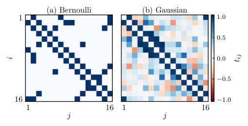 
FIG. 1. Hopping matrices for a typical disorder realization of the 1DLR3 graph with L = 16 sites and σ = 0.6. (a) Bernoulli disorder: Each off-diagonal element tij is 1 (Blue) with probability pij = d−(1+σ) ij and 0 (White) otherwise, yield- ing a sparse binary matrix. (b) Gaussian truncation: The matrix elements tij are replaced by a Gaussian with the same mean pij and variance pij(1 −pij), truncating at the second cumulant of the Bernoulli distribution. The resulting hopping matrix is dense and continuously distributed.

📷 Fig 2

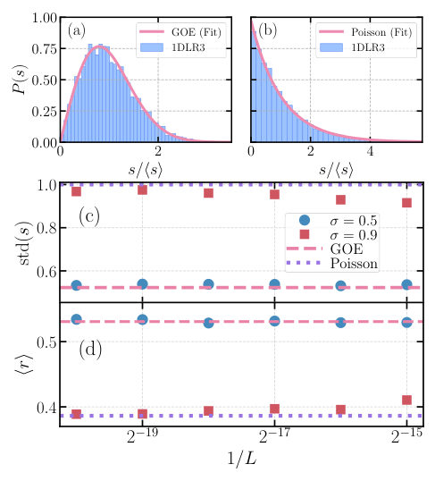 
FIG. 2. Eigenvalue statistics for σ = 0.5 [panels(a), (c), (d)] and σ = 0.9 [panels (b), (c) and (d)]. Panels (a) and (b) show the level-spacing distribution P(s) for L = 220. In panel (a) (σ = 0.5), P(s) follows the Wigner surmise for the Gaus- sian Orthogonal Ensemble (GOE); a fit to f(s) = 2 B s e−Bs2

📷 Fig 3

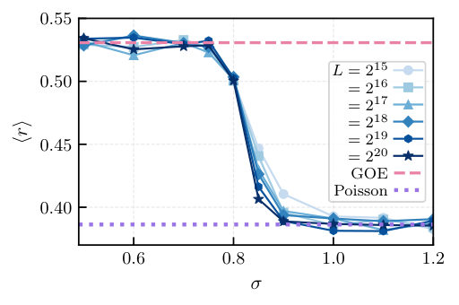 
FIG. 4. Mean gap ratio ⟨r⟩as a function of σ for L = 215 to 220. The curves cross over from the GOE value ⟨r⟩GOE ≈ 0.5307 at small σ to the Poisson value ⟨r⟩P ≈0.3863 at large σ, indicating an ergodic-to-localization transition be- tween σ = 0.80 and 0.85.

📷 Fig 4

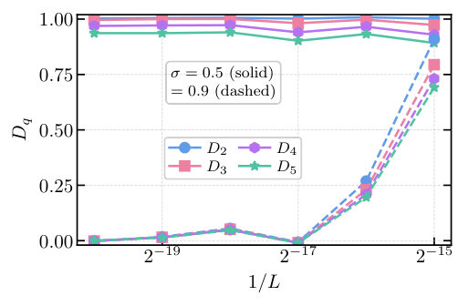 
FIG. 3. Scaling of the fractal dimensions Dq for q = 2, 3, 4, 5 with inverse system size 1/L. Solid lines show results for σ = 0.5, where Dq tends to approach unity as L →∞, con- sistent with the GOE-like level statistics observed in Fig. 2, yielding an existence of ergodic phase. Dashed lines show re- sults for σ = 0.9, where Dq extrapolates to zero in the thermo- dynamic limit, confirming localization consistently with the level statistics.

**Summary.** The paper studies quantum chaotic behavior in 1D lattices with sparse, long-range random bonds. It numerically demonstrates an ergodic-to-localized transition at a critical bond disorder strength $\sigma_c$. Theoretically, it develops and analyzes a nonlinear sigma model, showing that capturing the full non-Gaussian nature of the disorder is crucial for accurately predicting this transition.

**Why it may be interesting.** This work provides a detailed theoretical framework for understanding how structural disorder alone can induce quantum chaos and localization, offering insights into universality classes distinct from standard Anderson models relevant to disordered quantum materials.

Detailed structure

**Main problem.** The work investigates quantum chaos and localization transitions driven purely by geometric disorder (connectivity) rather than additive potential disorder.

**Main result.** A transition from ergodic/chaotic spectral correlations (GOE statistics) to localized states (Poisson statistics) is found at a critical exponent $\sigma_c$ significantly higher than naive theoretical predictions, suggesting the importance of higher-order correlation functions.

**Method.** The analysis combines numerical diagonalization and spectral statistics with advanced field theory techniques, specifically deriving and analyzing a nonlinear sigma model for the disorder-averaged Green's function.

**Model / system.** The system is a one-dimensional ring lattice where hopping bonds are added independently based on a probability $p_{ij} \propto d^{-(1+\sigma)}$, creating a sparse random graph structure. The Hamiltonian is non-interacting and purely geometric in its disorder.

**Key observables.** Nearest-neighbor level spacing distribution $P(s)$, consecutive-gap ratio $\langle r 
angle$, fractal dimension scaling $D_q$, and the effective action coefficient $\Pi(0) - \Pi(q)$.

**Important parameters / regimes.** The disorder exponent $\sigma$ controls connectivity; the transition occurs in the range $0.80 \lesssim \sigma_c \lesssim 0.85$.

**Assumptions / limitations.** Field theory derivations rely on approximations like small-momentum expansions and retaining only up to second cumulants, which are shown to be insufficient for determining the true critical point.

**Figures summary.** Figures compare level spacing distributions ($P(s)$) showing crossover from GOE ($\sigma=0.5$) to Poisson ($\sigma=0.9$), and show fractal dimension scaling $D_q$ confirming ergodic vs. localized regimes.

**Paper structure.** The paper progresses from numerical evidence of the transition using spectral statistics, to developing a field-theoretic description via the nonlinear sigma model, culminating in deriving the leading nonanalytic contribution $\Pi(0) - \Pi(q)$ based on scaling arguments.

Abstract

This work demonstrates that sparse long-range random bonds on a one-dimensional lattice alone can generate quantum-chaotic spectral correlations and also drive a localization transition in a noninteracting single-particle Hamiltonian. The model is a one-dimensional ring in which each pair of sites is connected independently with a probability $p_{ij}= d_{ij}^{-(1+σ)}$. Each bond carries identical unit hopping and on-site disorder is absent. Despite the absence of on-site disorder and interaction, the model displays quantum chaotic spectra with Gaussian orthogonal ensemble (GOE) level statistics at small $σ$ and localized eigenstates with Poisson statistics at larger $σ$. The transition occurs in the range $ 0.80 \lesssim σ_c \lesssim 0.85$, far above the summability threshold of the mean hopping profile ($σ=0$). A Gaussian field theory retaining only the mean and variance of the Bernoulli bonds instead predicts a threshold at $σ=1$, suggesting that higher cumulants are infrared-relevant. Our findings hint towards a universality class that is distinct from both the power-law random banded matrix model and the standard Anderson transition.

[↑ back to top](#top)

### [Dynamics of two interacting dipolar two-level systems in a multi-mode electromagnetic cavity: sudden death and revival of the concurrence within the Born-Markov approximation](http://arxiv.org/abs/2607.11201v1)

**Authors:** Loann Quien, Naomichi Hatano  
**Type:** theory · **Category:** other · **PDF:** <https://arxiv.org/pdf/2607.11201v1>  
**Analysis basis:** full PDF text, analyzed in chunks
**Topic relevance:** 🔥 `entanglement & information structure` **5/5** · 🔥 `analog quantum simulation` **4/5** · 🔥 `correlated / nonlocal dissipation` **4/5** · 🔥 `exotic spin models in light-matter` **4/5** · `Tavis-Cummings & cavity-many-emitter` **3/5** · `correlated cavity matter` **3/5** · `methods for driven-dissipative` **3/5** · `spintronics-quantum-optics interface` **3/5** · `driven-dissipative phase transition` **2/5** · `non-equilibrium dynamics` **2/5** · `Dicke superradiance` **1/5** · `Keldysh / 2PI / non-Gaussian methods` **1/5** · `Rydberg arrays` **1/5** · `non-equilibrium universality` **1/5**

📷 Fig 1

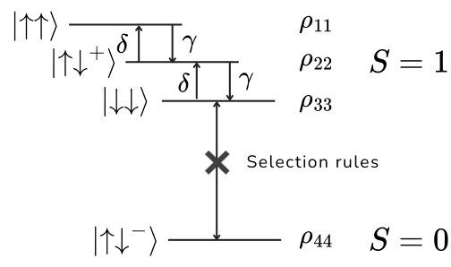 
Figure 1: Energy levels of the system and transitions.

📷 Fig 2

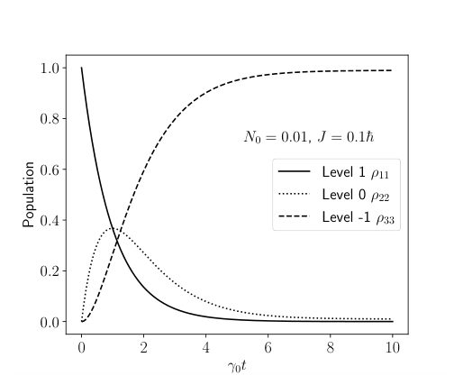 
Figure 2: Dynamics of the diagonal terms of the triplet states.

📷 Fig 3

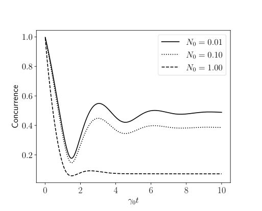 
Figure 3: Time dependence of the concurrence for the initial state ρ(0) = |χ⟩⟨χ|.

📷 Fig 4

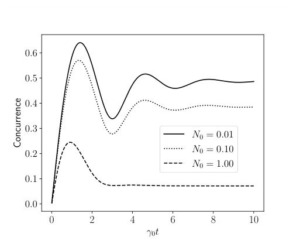 
Figure 5: Time dependence of the concurrence for the initial state ρ(0) = |ϕψ⟩⟨ϕψ|.

📷 Fig 5

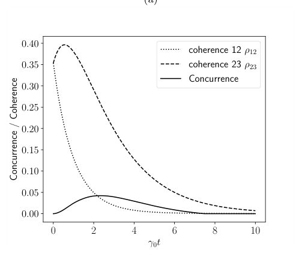 
Figure 4: (a) Time dependence of the concurrence for the initial state ρ(0) = |ϕϕ⟩⟨ϕϕ|. (b) Off-diagonal coherence between levels 1-0 and 0-(−1) with N0 = 0.01.

**Summary.** This theoretical paper analyzes the entanglement dynamics of two interacting dipolar spins coupled to an electromagnetic cavity using the Born-Markov approximation. The authors derive the master equation governing the system's evolution, revealing that concurrence undergoes characteristic sudden death and revival cycles. This work provides detailed insights into how environmental coupling affects quantum correlations in solid-state or atomic spin systems.

**Why it may be interesting.** This work is highly relevant as it combines cavity QED principles with open quantum system dynamics to predict non-trivial entanglement behavior (death/revival), which is a key topic in quantum information and AMO physics.

Detailed structure

**Main problem.** The study investigates the quantum dynamics of two interacting dipolar two-level systems coupled to a multi-mode electromagnetic cavity, specifically focusing on entanglement decay.

**Main result.** The authors demonstrate that even within the Born-Markov approximation, the concurrence between the two spins exhibits characteristic sudden death and revival phenomena. They also derive analytical expressions for stationary concurrence under different coupling models (XXX vs XXZ).

**Method.** The dynamics are analyzed using the Gorini–Kossakowski–Sudarshan–Lindblad (GKSL) master equation, solved by diagonalizing system matrices derived from the coupled Hamiltonian.

**Model / system.** The model consists of two $1/2$-spins interacting via an antiferromagnetic Heisenberg coupling ($J \vec{S}_1 \cdot \vec{S}_2$) and coupled to a multi-mode electromagnetic cavity field. The system is treated using the Born-Markov approximation.

**Key observables.** Concurrence, density matrix elements ($
ho_{ii}, 
ho_{ij}$), spin relaxation time, and coherence decay time.

**Important parameters / regimes.** Temperature (thermal equilibrium $
ho_B$), coupling strengths ($g, J$), and the nature of the exchange interaction (XXX vs. XXZ).

**Assumptions / limitations.** The Born-Markov approximation is employed throughout the analysis; for some couplings, the Rotating Wave Approximation (RWA) is also applied.

**Figures summary.** Figures illustrate the time evolution of concurrence showing death and revival behavior for different coupling parameters ($W^+$ vs. $r$), and compare delay/death times at zero temperature.

**Paper structure.** The paper first establishes the equivalence between single-spin dynamics and a two-level atom in the dipole approximation. It then derives the GKSL equation for two interacting spins, solving for populations and coherences via matrix diagonalization. Finally, it extends the analysis to different coupling forms (like XXZ) to characterize stationary entanglement.

Abstract

Interacting dipolar two-level systems form a special class of qubits that interact with a cavity in a particular way. We first prove that the Markovian dynamics of one 1/2-spin in interaction with a quantised magnetic field from a multi-mode cavity at thermal equilibrium is equivalent to a two-level atom interacting in the dipole approximation with the electric field of the cavity. We then use the Born-Markov approximation to study the dynamics of two spins interacting through the antiferromagnetic Heisenberg coupling in the same environment. We find the exact expression of the density matrix of the system, with the off-diagonal coherence decay time and spin relaxation time. The concurrence for the stationary state is explicitly derived for any kind of initial state and the role of the singlet state is brought to light. The temporal evolution of the concurrence is numerically computed for different initial states, the phenomenon of sudden death and revival is observed even within the Born-Markov approximation, and an analysis of its behaviour is conducted for Werner states. We finally derive the equations and the stationary concurrence for the XXZ coupling.

[↑ back to top](#top)

### [A diode nanocavity for fast, efficient and tunable emission of highly entangled photon pairs and Fourier-transform-limited single photons](http://arxiv.org/abs/2607.11494v1)

**Authors:** Ievgen Brytavskyi, Thomas Oberleitner, Christian Weidinger, Maximilian Aigner, Gabriel Undeutsch, Tobias Steindl, Johannes Reindl, Ailton Garcia, Melina Peter, Christian Schimpf, Santanu Manna, Michele B. Rota, Quirin Buchinger, Sven Höfling, Tobias Huber-Loyola, Rinaldo Trotta, Tobias M. Krieger, Eva Schöll, Armando Rastelli  
**Type:** experiment · **Category:** quantum information and computing · **PDF:** <https://arxiv.org/pdf/2607.11494v1>  
**Analysis basis:** full PDF text, analyzed in chunks
**Topic relevance:** 🔥 `quantum optics experiment` **5/5** · 🔥 `QC/QI experiment` **4/5** · `Tavis-Cummings & cavity-many-emitter` **3/5** · `correlated cavity matter` **3/5** · `interference shaping light` **3/5** · `correlated / nonlocal dissipation` **2/5** · `driven-dissipative phase transition` **2/5** · `entanglement & information structure` **2/5** · `analog quantum simulation` **1/5** · `methods for driven-dissipative` **1/5** · `non-equilibrium dynamics` **1/5** · `non-equilibrium universality` **1/5** · `quantum measurements` **1/5** · `superradiant laser` **1/5**

📷 Fig 1

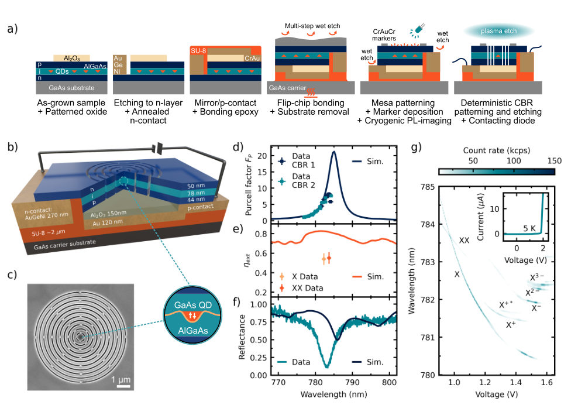 
Figure 1: Device structure and basic optical and electrical performance. a, Workflow (from left to right) of de- terministic diode-CBR fabrication. b, Sketch of an electrically-contacted CBR containing a GaAs QD integrated in a p-i-n diode on a back reflector. c, Representative SEM image of a fabricated CBR. d, Simulated Purcell factor spectrum with the experimental data obtained from two diode-CBRs. e, Simulated extraction efficiency ηext spec- trum for a numerical aperture of 0.77 and corresponding experimental values for CBR 1. f, Simulated and measured reflectance spectrum of CBR 1 normalised to the reflection on the nearby planar semiconductor membrane. g, Colour-coded...

📷 Fig 2

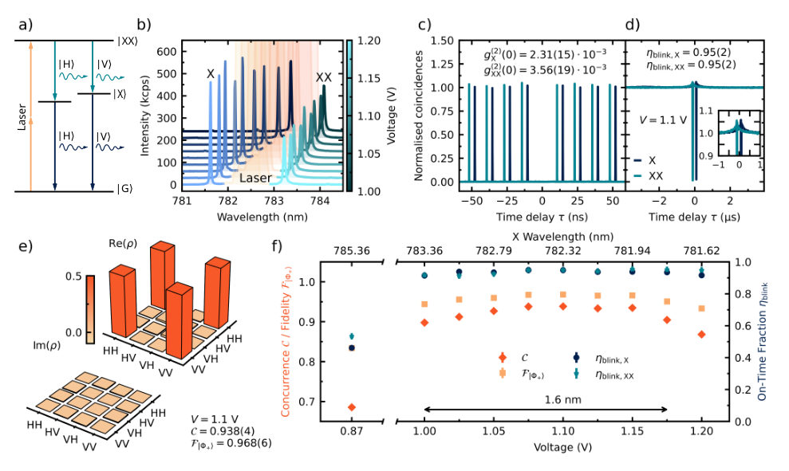 
Figure 2: Near blinking-free emission of wavelength tuneable entangled photons under pulsed resonant two-photon excitation. a, Relevant energy levels in a QD. The biexciton state |XX⟩is resonantly populated by TPE and recombines via two possible decay paths (H or V polarised) through one of the bright exciton states |X⟩. Two photons are emitted, first the biexciton (XX, petrol) and subsequently the exciton (X, blue) photon. b, Spectra at different voltages, showing the XX emission at lower energy (higher wavelength) and the X emission at higher energy. With increasing voltage, both lines redshift and the XX relative binding energy Eb decreases. The TPE laser is shown in pale orange for...

📷 Fig 3

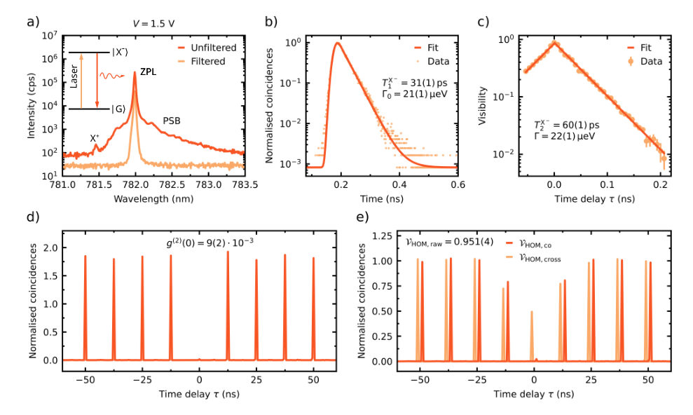 
Figure 3: Indistinguishable, nearly Fourier-transform-limited single photons under π-pulse resonant excitation at V = 1.5 V. a, Semi-logarithmic unfiltered and filtered resonance fluorescence spectra of the negatively charged trion X−. Inset: Two-level quantum system. b, Lifetime measurement with fit, yielding T X− 1 = 31(1) ps. c, Semi-logarithmic first-order autocorrelation function |g(1)(τ)| and Lorentzian fit, yielding a linewidth of Γ = 22(1) µeV, a factor 1.05+0.07 −0.05 above the Fourier-transform-limit. d, Second-order autocorrelation histogram, yielding ˜g(2) X−(0) = 9(2) · 10−3. e, Histograms of Hong-Ou-Mandel interference of co- and cross polarised photons, yielding a raw...

**Summary.** The paper reports the successful realization of a tunable, high-performance solid-state source for entangled and single photons using a novel diode nanocavity structure. By combining a quantum dot with a p-i-n diode and a Bragg grating resonator, the authors overcome limitations in efficiency and stability, demonstrating near-unity indistinguishability and high entanglement fidelity across a measurable spectral range.

**Why it may be interesting.** This work directly addresses key challenges in quantum optics by integrating electrical control (diode) with strong optical enhancement (nanocavity) to create robust sources for photonic quantum information processing.

Detailed structure

**Main problem.** The goal is to develop a reliable, efficient, and tunable solid-state platform for generating highly entangled photon pairs and indistinguishable single photons.

**Main result.** The authors demonstrated a novel diode nanocavity structure that achieves high entanglement fidelity ($F > 0.94$) and near-unity single-photon indistinguishability ($V_{HOM} \approx 0.95$), while maintaining tunability over 1.6 nm.

**Method.** The experiment utilizes a quantum dot embedded in a p-i-n diode circular-Bragg-grating-resonator, characterized by electrical measurements (I-V curves) and optical characterization of photon pairs and single photons.

**Model / system.** The physical system is a semiconductor quantum dot integrated into a diode structure coupled to a circular-Bragg-grating resonator. This architecture allows for deterministic charge control via the diode, enhancing emission efficiency and suppressing blinking effects.

**Key observables.** Concurrence ($C$), entanglement fidelity ($F_{|\Phi^+
angle}$), single-photon indistinguishability ($\mathcal{V}_{	ext{HOM}}$), extraction efficiency ($\eta_{	ext{ext}}$), and Purcell factor ($F_P$).

**Important parameters / regimes.** Tunable wavelength range of 1.6 nm, high raw concurrence (>0.89) and fidelity (>0.94), and a maximum Purcell factor of $\sim$8.

**Assumptions / limitations.** The measurements are performed at low temperatures (4 K), and the device performance is optimized based on theoretical FDTD simulations using specific geometric parameters.

**Figures summary.** Figures illustrate the experimental workflow, the physical structure (SEM image), and comparisons between simulated and measured optical properties like Purcell factor and extraction efficiency spectra.

**Paper structure.** The paper follows a standard experimental structure: introduction establishing the need for solid-state sources; detailed description of the novel diode-CBR device fabrication and characterization; presentation of results showing high-quality entangled pairs and single photons across a tunable range; and concluding remarks on its viability.

Abstract

Deterministic sources of entangled photon pairs and indistinguishable photons are expected to play a key role in photonic quantum technologies. Semiconductor quantum dots are promising candidates due to their on-demand emission and compatibility with nanophotonic structures. However, current implementations face trade-offs between extraction efficiency, Purcell enhancement, as well as charge noise that causes blinking and degrades indistinguishability. Here we demonstrate a tunable nano-optoelectronic device based on a quantum dot embedded in a p-i-n diode circular-Bragg-grating-resonator and featuring extraction efficiencies up to 0.55(6) and Purcell-factor of $\sim$8. The device generates wavelength-tunable entangled photon pairs with suppressed blinking and raw (corrected) concurrence > 0.89 (0.91) over a range of 1.6 nm. The very same source also emits single, nearly Fourier-limited and highly indistinguishable photons with raw (corrected) $\mathcal{V}_{\text{HOM}}$ = 0.951(4) (0.988(6)). These results demonstrate a viable platform for semiconductor quantum photonics.

[↑ back to top](#top)

### [$p$-Form Gauge Dynamics and Digital Quantum Simulation -- Flux and Cosmological Constant Neutralization](http://arxiv.org/abs/2607.10950v1)

**Authors:** Soo-Jong Rey  
**Type:** theory · **Category:** statistical mechanics · **PDF:** <https://arxiv.org/pdf/2607.10950v1>  
**Analysis basis:** full PDF text, analyzed in chunks
**Topic relevance:** 🔥 `non-equilibrium dynamics` **5/5** · 🔥 `analog quantum simulation` **4/5** · 🔥 `non-equilibrium universality` **4/5** · `driven-dissipative phase transition` **3/5** · `methods for driven-dissipative` **3/5** · `scars & prethermalization` **2/5** · `Frenkel-Kontorova` **1/5** · `Keldysh / 2PI / non-Gaussian methods` **1/5** · `correlated / nonlocal dissipation` **1/5** · `entanglement & information structure` **1/5** · `exotic spin models in light-matter` **1/5**

📷 Fig 1

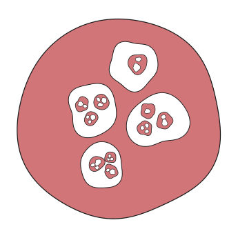 
Figure 1: The late-time configuration anticipated for the post-discharge string-Higgs phase. The outer red region carries top-form electric flux; white islands are the dual vacuum. Each filled–empty interface is a closed matter string (τx ℓ= −1 along the curve). Repeated nucleation events at successively smaller scales results from non-equilibrium relaxation dynamics and generate a recursive nested-island structure—filled regions inside empty regions inside filled regions. The protocol of this paper resolves the dynamics by which such configurations are produced from a uniform high-flux initial state (Sec. 5); the equilibration sector accessible at late times is set by the...

📷 Fig 2

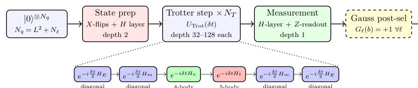 
Figure 2: End-to-end digital quantum simulation pipeline. The Nq = L2 + Nℓphysical qubits are initialized in |0⟩⊗Nq, prepared in the tube or cap initial state by a depth-2 single-qubit circuit (X-flips on a chosen plaquette sublattice followed by Hadamards on all qubits), evolved by NT second-order symmetric Strang–Trotter steps (expanded lower row: each step interleaves the single-qubit electric terms with the entangling terms Hκ (4-body link-electric plaquette interaction) and Ht (5-body Wilson-surface)), and finally measured in the X-basis via a Hadamard layer followed by Z-readout. The displayed Hκ cost is 6L2 CNOTs when the four boundary-link qubits form a native path and 24L2 CNOTs on...

📷 Fig 3

 
Figure 3: Path-native circuit for the 4-body link-electric plaquette rotation exp(iκδt Q ℓ∈∂p τx ℓ). The circuit is native only when the four boundary-link qubits form a connected hardware path. On a minimal plaquette-link star, the same logical rotation requires routing.

📷 Fig 4

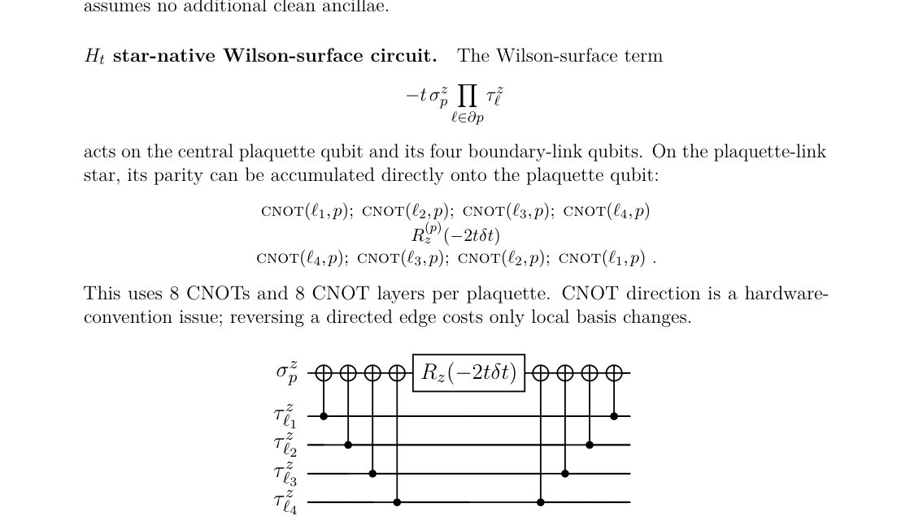 
Figure 4: Star-native circuit for the 5-body Wilson-surface rotation exp(itδtσz p Q ℓ∈∂p τz ℓ). The four boundary links control CNOTs into the plaquette accumulator, a single Rz(−2tδt) applies the parity phase, and the CNOTs are reversed. The operator flips one plaquette electric flux and the four adjacent link occupations in the electric basis, preserving all four affected Gauss-laws.

📷 Fig 5

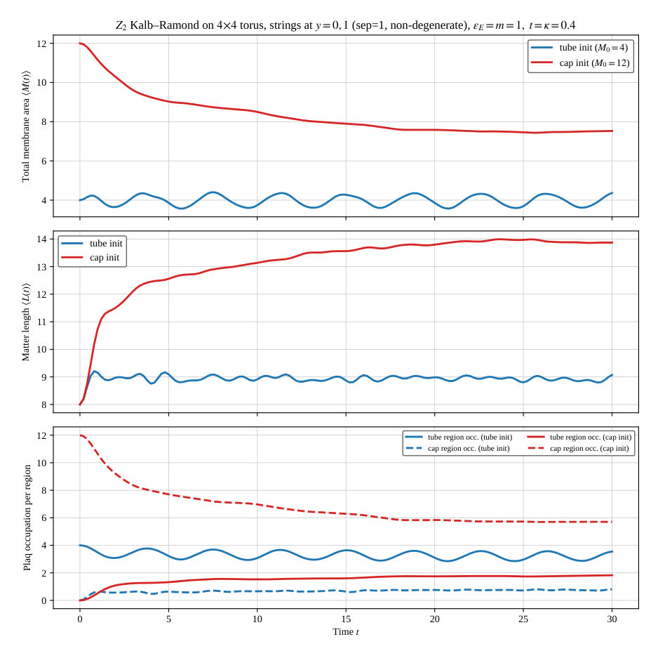 
Figure 6: Real-time exact diagonalization of the tube-vs-cap quench on a 4×4 spatial torus (16 plaquette qubits, 216 Gauss-law-projected Hilbert space). Two parallel non-contractible closed string/domain-wall boundaries wrap the periodic x-direction at y1 = 0 and y2 = 1 (asymmetric separation 1 &lt; Ly/2). Blue: tube initial state, electric-flux region on the single plaquette row between the strings (M0 = 4). Red: cap initial state, electric-flux region on the complement strip of three rows (M0 = 12). Top: total occupied-flux area M(t). Middle: total boundary length L(t). Bottom: per-region plaquette occupation—solid lines track the tube region (1 row, max 4), dashed lines track the cap region...

**Summary.** This paper constructs a Hamiltonian framework for $p$-form gauge fields on lattices, modeling phenomena relevant to cosmology. By simulating 'quench' dynamics on specialized plaquette Hamiltonians, the authors observe distinct decay behaviors between different initial flux configurations. The results establish a quantitative crossover point and place top-form discharge within a general higher-form theoretical structure.

**Why it may be interesting.** The study of flux dynamics in lattice gauge theories provides rich non-equilibrium physics analogous to phase transitions or relaxation processes studied in classical statistical mechanics models.

Detailed structure

**Main problem.** Developing a Hamiltonian framework for $Z_k$ $p$-form gauge fields to study flux dynamics, which has implications for cosmological constant neutralization.

**Main result.** The simulation shows that in a 'tube-cap quench,' the cap loses 20–37% of its occupied-flux area while the tube remains nearly pinned, and a dynamical crossover is located near $(m/\epsilon E)_c \simeq 1.89$.

**Method.** Exact diagonalization (ED) on tori combined with numerical simulations analyzing time evolution under quench protocols.

**Model / system.** The model uses $Z_k$ $p$-form gauge fields defined on arbitrary oriented cell complexes, specialized to a plaquette-only Ising-type Hamiltonian after solving the one-form Gauss law. This structure is compared against redundant link-plus-plaquette encodings.

**Key observables.** Occupied-flux area ($M(t)$), boundary length ($L(t)$), and the contrast $\mathcal{M}_{	ext{cap}}(t) - \mathcal{M}_{	ext{tube}}(t)$.

**Important parameters / regimes.** The ratio of boundary energy to electric flux ($\epsilon E$) versus link tension ($m$), with a critical crossover point near $1.89$.

**Assumptions / limitations.** The link occupation is treated as a derived observable determined by adjacent plaquette fluxes, not an independent variable.

**Figures summary.** Figures illustrate the time evolution of occupied-flux area and decay rates across parameter sweeps on tori, pinpointing crossover regimes.

**Paper structure.** The work builds from general $p$-form gauge theory to a specialized, reduced plaquette Hamiltonian suitable for ED. It then applies this framework to quench dynamics simulations, comparing results between the simplified model and the full digital encoding.

Abstract

I develop a Hamiltonian framework for ${\mathbb Z}_k$ $p$-form gauge fields on arbitrary oriented cell complexes in arbitrary dimensions. Gauge qudits are defined by $p$-cells, charged boundary qudits by $(p-1)$-cells, Gauss-law generators by boundary map $\partial_p$, and magnetic checks by $\partial_{p+1}$. The same cellular structure produces local dressed Wilson operators, and at $k=2$ a Calderbank-Shor-Steane check complex relevant to quantum error correction. I then specialize to $p=2, k=2$, where the magnetic 3-cell term is absent and the one-form Gauss-law can be solved exactly. The physical Hilbert space is parameterized by plaquette electric-flux variables, while the link configuration is reconstructed as the dynamical boundary of the evolving flux domains. The reduced Hamiltonian is an Ising-type plaquette model, where its local transverse-field term is the physical image of the boundary-dressed Wilson operator $σ_p^z\prod_{\ell\in\partial p}τ_\ell^z$. A tube-cap quench compares two initial flux fillings with the same initial boundary loops. Exact diagonalization on $4\times4$, $6\times4$, and $5\times5$ tori finds that the cap loses $20$-$37\%$ of its occupied-flux area, while the tube remains nearly pinned. A finite-size scaling locates a dynamical crossover of tension-to-density ratio near $(m/\varepsilon_E)_c\simeq1.89$. The unreduced plaquette-plus-link encoding provides local Gauss-law checks and a direct digital implementation, while the reduced plaquette-only Hamiltonian supplies the exact benchmark. The result places the specific top-form discharge and the cosmological constant neutralization calculation inside a general higher-form Hamiltonian and coding framework.

[↑ back to top](#top)

### [Generalized Keldysh formalism for nonequilibrium correlation functions and its application to fluctuation dynamics](http://arxiv.org/abs/2607.11055v1)

**Authors:** Ken Inayoshi, Hiroshi Shinaoka, Yuta Murakami  
**Type:** theory · **Category:** strongly correlated electrons · **PDF:** <https://arxiv.org/pdf/2607.11055v1>  
**Analysis basis:** full PDF text, analyzed in chunks
**Topic relevance:** 🔥 `Keldysh / 2PI / non-Gaussian methods` **5/5** · 🔥 `non-equilibrium dynamics` **4/5** · 🔥 `non-equilibrium universality` **4/5** · `analog quantum simulation` **3/5** · `driven-dissipative phase transition` **3/5** · `methods for driven-dissipative` **3/5** · `correlated / nonlocal dissipation` **1/5** · `correlated cavity matter` **1/5** · `entanglement & information structure` **1/5**

📷 Fig 1

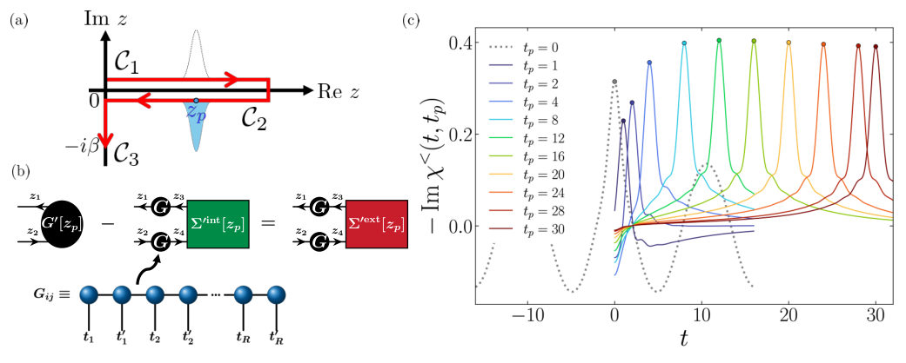 
Figure 1. (a) Keldysh contour C and its forward real-time (C1), backward real-time (C2), and Matsubara (C3) branches. The blue Gaussian represents the contour-dependent external field 𝐹(𝑧) centered at the probe time 𝑧𝑝. (b) Diagrammatic expression of the linear integral equation (3). The tensor network diagram is for 𝐺𝑖𝑗, defined as 𝐺𝑖𝑗(𝑡, 𝑡′) ≡𝐺(𝑡∈C𝑖, 𝑡′ ∈C𝑗) for 𝑖, 𝑗= 1, 2, 3. (c) Time evolution of the imaginary part of the lesser component of the spin-spin correlation function 𝜒(Eq. (5)) for the quench 𝑈= 2.0 →1.2. Circle points show the fluctuation 𝜎𝑚(𝑡𝑝) = −Im 𝜒&lt;(𝑡𝑝, 𝑡𝑝) (Eq. (6)).

📷 Fig 2

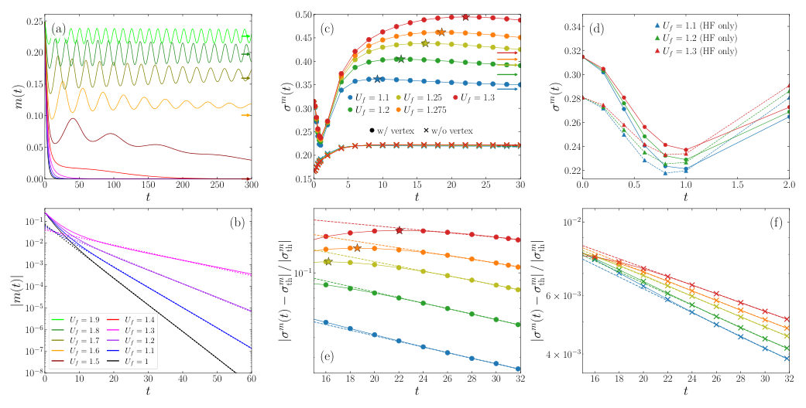 
Figure 2. Nonequilibrium dynamics of the staggered magnetization 𝑚(𝑡) and its fluctuation 𝜎𝑚(𝑡) for quenches 𝑈𝑖= 2.0 →𝑈𝑓. (a) Time evolution of 𝑚(𝑡) for 𝑈𝑓= 1.9, 1.8, · · · , 1.0 (from top to bottom). The arrows indicate the corresponding thermal values 𝑚th of 𝑚(𝑡). (b) Logarithmic plot of (a). The straight dashed lines show fits to exponential relaxations in the region 𝑡∈[10, 50]. (c) Comparison of the fluctuation 𝜎𝑚(𝑡) with and without the vertex correction. The arrows indicate the corresponding thermal values 𝜎𝑚 th . The star points are the maximum value of the fluctuation 𝜎𝑚 max estimated by parabolic interpolation. (d) Comparison of the fluctuation when only the Hartree-Fock term is...

📷 Fig 3

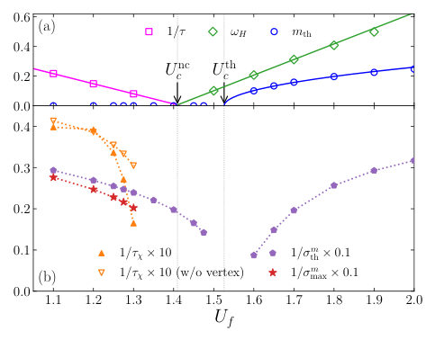 
Figure 3. Various quantities used to characterize the qualitative change in behavior around the critical points 𝑈th 𝑐and 𝑈nc 𝑐. (a) The decay time of the order parameter 𝜏, the frequency of the Higgs mode 𝜔𝐻, and the thermal value of the order parameter 𝑚th (see the Supple- mental Material for the estimation of 𝜔𝐻). 𝑈th 𝑐is the thermal critical point, and this value is evaluated from a linear fit to 𝑚2 th with the least squares method. 𝑈nc 𝑐is the nonthermal critical point, and this value is estimated from the crossing point of the linear fits of 1/𝜏and 𝜔𝐻 (solid lines in (a)). (b) The decay time of the fluctuation with and without vertex corrections 𝜏𝜒, the thermal value of the fluctuation...

📷 Fig 4

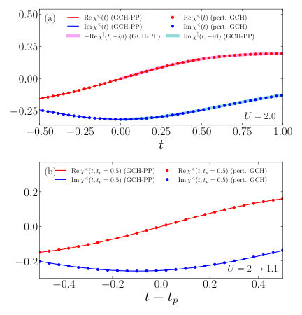 
Figure 4. Comparison of the spin-spin correlation function 𝜒(𝑧, 𝑧𝑝) calculated by the GCH pump-probe simulation (GCH-PP, solid lines) and the perturbative GCH method (pert. GCH, points). (a) Equilib- rium case for 𝑈= 2 and 𝛽= 20. The thick magenta and cyan lines show the left-mixing component 𝜒⌉(𝑡, −𝑖𝛽). (b) Nonequilibrium case for 𝑈𝑖= 2.0 →𝑈𝑓= 1.1 and 𝛽= 20.

📷 Fig 5

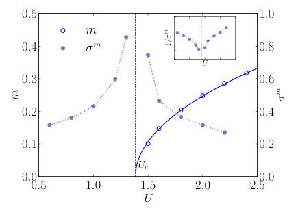 
Figure 5. Staggered magnetization 𝑚and its fluctuation 𝜎𝑚at 𝛽= 20.0. The inset shows the inverse of 𝜎𝑚. The horizontal black dashed line shows the critical point 𝑈c ≈1.38.

**Summary.** This paper introduces a novel and computationally efficient method based on the generalized Keldysh formalism to calculate nonequilibrium two-particle correlation functions. By solving a derived linear integral equation using QTTs, the authors show that vertex corrections are essential for accurately describing fluctuation dynamics near quantum critical points in correlated materials.

**Why it may be interesting.** While focused on condensed matter correlations, the development of advanced numerical solvers (Krylov methods, QTTs) for time-dependent many-body response functions is highly relevant to open quantum systems simulations in AMO physics.

Detailed structure

**Main problem.** The primary challenge addressed is computing nonequilibrium two-particle correlation functions, which are crucial for characterizing collective dynamics in correlated quantum materials far from equilibrium.

**Main result.** The study demonstrates that including vertex corrections significantly alters the fluctuation dynamics of an order parameter near a nonthermal critical point, causing the fluctuation and its decay time to grow substantially.

**Method.** The authors develop a practical approach using the generalized Keldysh formalism by formulating a linear integral equation for the variation of the Green's function. This is solved efficiently using a matrix-free Krylov solver based on quantics tensor trains (QTTs).

**Model / system.** The analysis applies to correlated electron systems, specifically utilizing the Hubbard model framework within a Dynamical Mean-Field Theory (DMFT) context. The study investigates quench or pump-probe dynamics in symmetry-broken states.

**Key observables.** Nonequilibrium two-particle correlation functions ($\chi_{BA}$), order parameter fluctuation ($\sigma_m(t)$), and the staggered magnetization ($m$).

**Important parameters / regimes.** The analysis focuses on approaching both thermal ($U_{th}^c$) and nonthermal critical points ($U_n^c$), controlled by the time-dependent Hubbard interaction $U(t)$.

**Assumptions / limitations.** Key approximations include using a linear integral equation to bypass explicit four-time vertex kernel construction, and employing DMFT with second-order perturbation theory for the self-energy.

**Figures summary.** Figures illustrate the Keldysh contour setup, diagrammatic representations of the linear integral equation, and time evolution plots showing how $\sigma_m(t)$ changes when vertex corrections are included near critical points.

**Paper structure.** The paper builds from establishing the generalized Keldysh formalism for correlation functions to deriving a solvable linear integral equation. It then applies this method within DMFT to study quench dynamics, comparing results with and without vertex corrections across different critical regimes.

Abstract

Recent advances in time-resolved spectroscopies provide increasing access to collective dynamics in correlated quantum materials. However, computing the corresponding nonequilibrium two-particle correlation functions remains a major challenge. Here, by introducing a contour-dependent virtual probe field within the generalized Keldysh formalism, we propose an approach that computes such correlation functions with the vertex corrections essential for describing collective dynamics. In particular, we introduce a linear integral equation that computes the correlation functions without explicitly constructing the four-time vertex kernel, and develop its matrix-free Krylov solver based on quantics tensor trains. Combining our method with nonequilibrium dynamical mean-field theory, we show that the fluctuation dynamics of the order parameter in a nonequilibrium symmetry-broken state depends significantly on whether vertex corrections are included, and that the fluctuation and its decay time grow near the nonthermal critical point. Our approach thus provides a practical route for evaluating nonequilibrium correlation functions, which are emerging as key observables for characterizing states far from equilibrium.

[↑ back to top](#top)

### [Many-Body Physics with Rydberg Atoms: Quantum Simulation and Non-equilibrium Dynamics](http://arxiv.org/abs/2607.11038v1)

**Authors:** Zhengyang Bai, Cheng Chen, Fan Yang, Weibin Li  
**Type:** both · **Category:** other · **PDF:** <https://arxiv.org/pdf/2607.11038v1>  
**Analysis basis:** full PDF text, analyzed in chunks
**Topic relevance:** 🔥 `Rydberg arrays` **5/5** · 🔥 `analog quantum simulation` **4/5** · `entanglement & information structure` **3/5** · `exotic spin models in light-matter` **3/5** · `non-equilibrium dynamics` **3/5** · `non-equilibrium universality` **2/5** · `Keldysh / 2PI / non-Gaussian methods` **1/5** · `QC/QI experiment` **1/5** · `driven-dissipative phase transition` **1/5** · `methods for driven-dissipative` **1/5**

📷 Fig 1

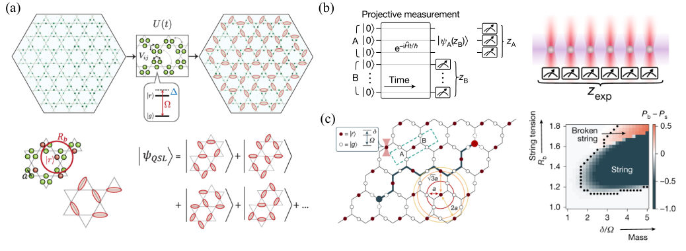 
Figure 1. Quantum simulation with Ising-type interactions in Rydberg arrays. (a) Realization of a quantum spin liquid on a Kagome lattice, where the dimer constraint is enabled by the Rydberg blockade. (b) Preparing a random quantum state using quantum thermalization and site-resolved imaging in a 1D Rydberg array. (c) Observation of string-breaking in a U(1) lattice gauge theory in (2+1)D. (Reproduced with permission and adapted from Ref. [13], Ref. [19], and Ref. [20], licensed under a Creative Commons Attribution 4.0 International license.)

📷 Fig 2

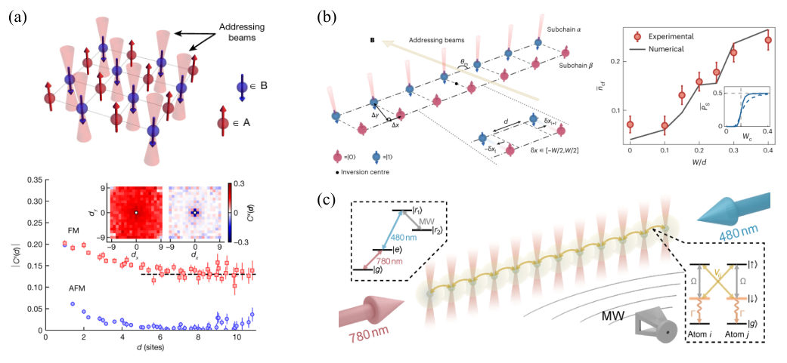 
Figure 2. Quantum simulation with resonant dipole-dipole interactions in Rydberg arrays. (a) Observation of ferromagnetic and anti- ferromagnetic orders in a dipolar XY model in 2D. (b) Probing average symmetry protected topological order in a Rydberg-atom ladder with programmable disorder. (c) Realization of a non-Hermitian many-body XY model in a 1D Rydberg array. (Reproduced with permission and adapted from Ref. [52], Ref. [53], and Ref. [54], licensed under a Creative Commons Attribution 4.0 International license.)

📷 Fig 3

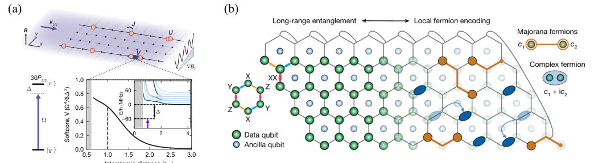 
Figure 3. Rydberg quantum simulation with interactions induced in the ground-state manifolds. (a) Realization of an extended Bose-Hubbard model in optical lattices, where the long-range density-density interaction is induced by Rydberg dressing. (b) Digital realization of Kitaev honeycomb model in a Rydberg array. (Reproduced with permission and adapted from Ref. [71] and Ref. [72], licensed under a Creative Commons Attribution 4.0 International license.)

📷 Fig 4

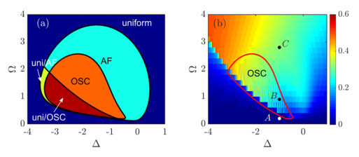 
Figure 4. Mean-field phase diagrams. (a) The phase diagram is mainly occupied by the UNI, AF, and OSC phase. (b) The many-body phases could be detected by sweeping detuning ∆from red to blue side linearly (i.e., ∆(t) = ∆0 + a × t). The Rydberg population nr(t) in the ∆−Ωplane is sketched. The oscillatory phase can be identified by Rydberg excitation. In the calculation, we set VAB = −8, γ = 0.5 and a = 0.01.

📷 Fig 5

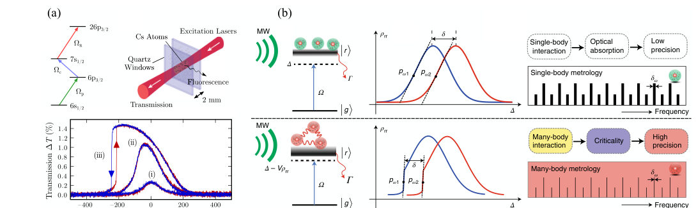 
Figure 5. (a) A non-equilibrium phase transition is observed in a thermal Rydberg vapor via a multi-photon excitation scheme. (b) Many-body criticality- enhanced metrology for sensing external microwave electric fields in a non-equilibrium Rydberg atomic gas. (Reproduced with permission and adapted from Ref. [4] and Ref. [17], licensed under a Creative Commons Attribution 4.0 International license.)

**Summary.** This review provides a comprehensive survey of using Rydberg atoms to investigate many-body physics. It covers theoretical tools like the Ising model and LGTs, demonstrating how these are realized experimentally in programmable atomic arrays. The paper highlights breakthroughs in studying non-equilibrium dynamics, topological phases, and quantum simulation potential.

**Why it may be interesting.** This work is highly relevant as it details the cutting edge of using neutral atoms to simulate complex quantum matter models, bridging fundamental condensed matter theory with state-of-the-art experimental quantum optics.

Detailed structure

**Main problem.** The review explores how Rydberg atoms, due to their strong dipole-dipole interactions, can be used as a versatile platform to study complex many-body physics, quantum simulation, and non-equilibrium dynamics.

**Main result.** Significant progress has been made in observing exotic phases (like topological states) and verifying fundamental dynamic processes (like QKZM) by mapping theoretical models onto programmable Rydberg atom arrays.

**Method.** The paper synthesizes theoretical frameworks (e.g., Ising model, LGTs) with experimental techniques involving adiabatic state preparation, site-resolved measurements, and quench dynamics in atomic ensembles.

**Model / system.** The primary system is arrays of Rydberg atoms trapped in optical tweezers or lattices. Key models include the Quantum Ising model ($\hat{H} = \sum \Omega \hat{\sigma}_i^x - \sum V_{ij}\hat{n}_i\hat{n}_j$) and extensions to simulate lattice gauge theories and spin-1/2 XY models.

**Key observables.** Phase transitions (e.g., crystalline order), correlation growth, entanglement entropy, out-of-time-ordered correlators (OTOCs), and signatures of quantum criticality.

**Important parameters / regimes.** Interaction strength ($V_{ij} \propto 1/R_{ij}^6$), detuning ($\Delta$), blockade radius ($R_b$), and lattice geometry (e.g., Kagome, triangular).

**Assumptions / limitations.** The review assumes the ability to precisely control atomic interactions and map complex Hamiltonians onto controllable physical platforms.

**Figures summary.** Figures illustrate quantum spin liquid realization on a Kagome lattice via blockade constraints, preparation of random states in 1D arrays, and observation of string-breaking dynamics in a U(1) system.

**Paper structure.** The review is structured thematically, covering theoretical foundations (interactions), specific physical phenomena (phase transitions, thermalization, LGTs), advanced dynamic studies (QKZM, OTOCs), and applications (optimization).

Abstract

Rydberg atoms, characterized by their strong and long-range dipole-dipole interactions, provide a versatile platform for exploring intriguing collective and many-body effects. Recently, the experimental realization of these effects in dense ensembles and reconfigurable atomic arrays has attracted significant interest, particularly for applications in quantum simulations and non-equilibrium physics. This review focuses on such recent development, discussing the theoretical foundations of the interactions between Rydberg atoms and the ensuing many-body physics, while providing a critical survey of experimental techniques for their precise manipulation and observation. We further discuss recent breakthroughs in leveraging Rydberg collective effects to probe novel many-body phases and non-equilibrium dynamics of these systems. By synthesizing theoretical insights with experimental milestones, we provide a comprehensive perspective on this rapidly evolving field and its transformative potential for future quantum technologies.

[↑ back to top](#top)

### [Classical probabilistic realisation of quantum double-slit interference](http://arxiv.org/abs/2607.11580v1)

**Authors:** Christof Wetterich  
**Type:** theory · **Category:** statistical mechanics · **PDF:** <https://arxiv.org/pdf/2607.11580v1>  
**Analysis basis:** full PDF text, analyzed in chunks
**Topic relevance:** 🔥 `interference shaping light` **5/5** · `Keldysh / 2PI / non-Gaussian methods` **3/5** · `non-equilibrium dynamics` **2/5** · `driven-dissipative phase transition` **1/5** · `methods for driven-dissipative` **1/5** · `quantum measurements` **1/5**

📷 Fig 1

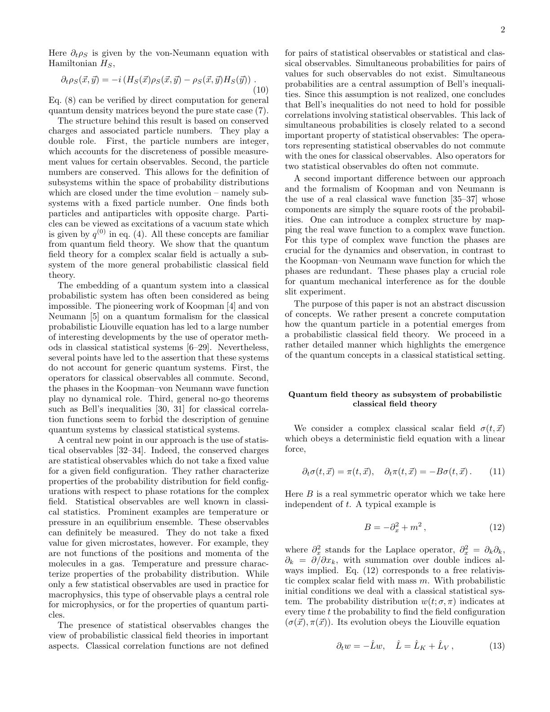 
Low-resolution page preview, page 2

📷 Fig 2

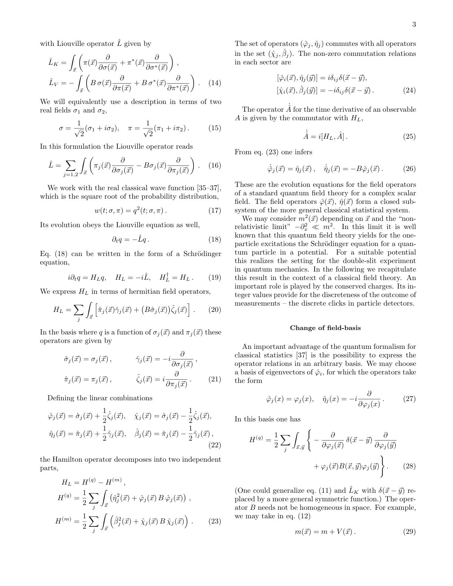 
Low-resolution page preview, page 3

📷 Fig 3

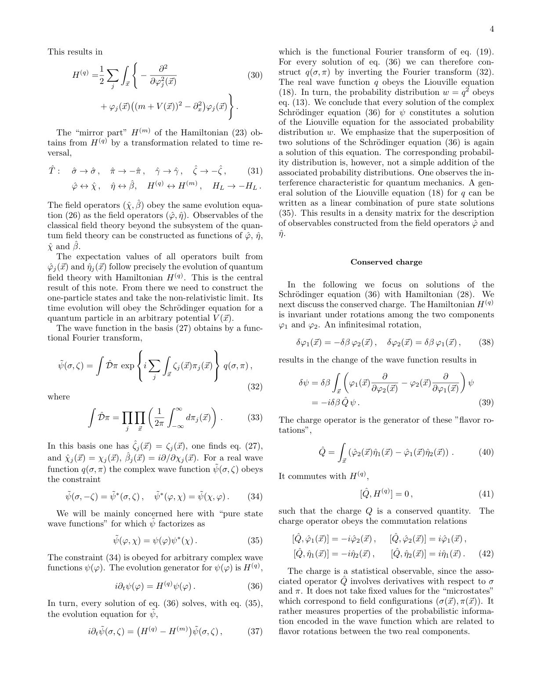 
Low-resolution page preview, page 4

📷 Fig 4

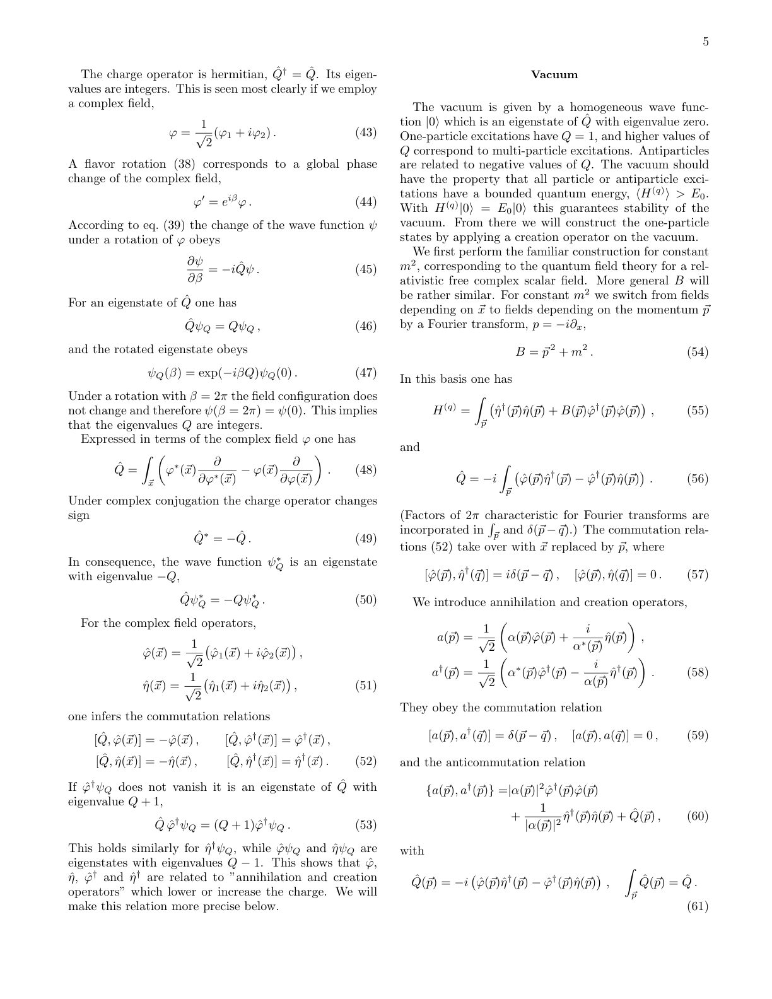 
Low-resolution page preview, page 5

📷 Fig 5

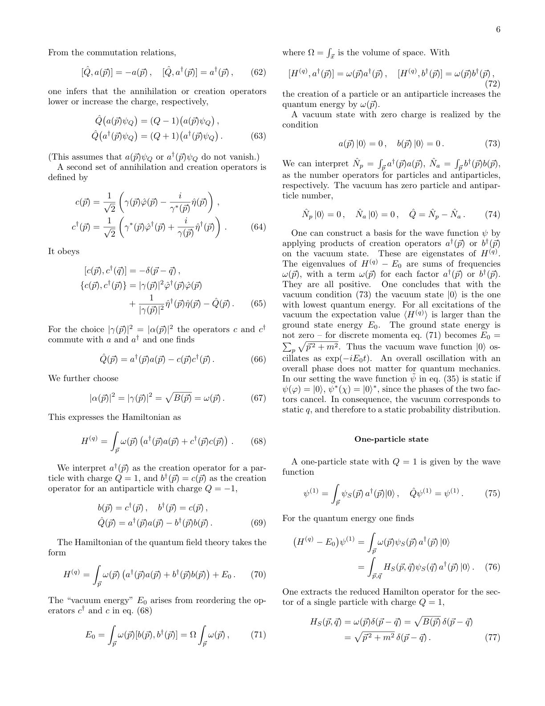 
Low-resolution page preview, page 6

**Summary.** The paper proposes that quantum phenomena, such as double-slit interference, can be fully described using classical probability theory applied to a complex scalar field. By analyzing the evolution of one-particle probability distributions derived from this classical system, the authors rigorously demonstrate that the resulting dynamics must obey the Schrödinger equation for a quantum particle. This provides a deep connection between statistical mechanics and fundamental quantum theory.

**Why it may be interesting.** This work offers a radical reinterpretation of quantum mechanics by grounding its core predictions (like interference) in classical statistical dynamics, which is highly relevant for foundational theoretical physics and understanding measurement processes.

Detailed structure

**Main problem.** The central goal is to demonstrate that quantum interference effects, exemplified by the double-slit experiment, can be derived entirely from classical probabilistic descriptions.

**Main result.** The time evolution of the one-particle probability distribution, governed by a classical Liouville equation, mathematically implies that the associated complex wave function obeys the standard Schrödinger equation for a quantum particle in an arbitrary potential V(x).

**Method.** The authors construct a framework using conserved charges and statistical observables within a classical field theory. They show that the evolution of the probability distribution $w^{(1)}$ leads directly to the quantum mechanical time evolution via the Liouville-Schrödinger connection.

**Model / system.** The model involves a complex scalar field $\sigma(t, \vec{x})$ treated probabilistically. The dynamics are governed by a classical statistical Liouville equation ($\partial_t w = -\hat{L}w$), which is shown to map onto the quantum von-Neumann/Schrödinger evolution for one-particle excitations.

**Key observables.** The probability distribution $w(t; \sigma, \pi)$ and the derived one-particle wave function $\psi_S(t, \vec{x})$ are key observables used to predict interference patterns.

**Important parameters / regimes.** The arbitrary potential $V(\vec{x})$ allows for the realization of typical quantum effects like tunneling or discrete energy spectra. The non-relativistic limit is a focus point.

**Assumptions / limitations.** The approach relies on using statistical observables whose associated operators do not commute with those for classical observables, and it currently covers bosons while interactions between multiple particles require extending to a full interacting classical field theory.

**Figures summary.** Not specified in the notes; the structure is based on deriving equations of motion (Eq. 1, Eq. 6, Eq. 13) and showing functional relationships between different representations ($\psi$ vs $w$).

**Paper structure.** The paper establishes the classical probabilistic framework using a complex scalar field, derives the Liouville equation for the probability distribution, and then proves that restricting this formalism to one-particle subsystems forces the evolution of the associated wave function into the Schrödinger equation.

Abstract

We demonstrate how the interference effects for a quantum particle in the double-slit experiment can be described by classical probabilities. We investigate a classical field theory for a complex scalar field with probabilistic initial conditions. A central element are conserved charges leading to the concept of particles. These are statistical observables which describe properties of the probability distribution for field configurations. The conserved charges define subsystems for particle excitations of a vacuum state. We encode the probabilistic information for the one-particle subsystem in a complex wave function. The Liouville equation for the classical probability distribution implies that the time evolution of this wave function obeys the Schrödinger equation for a quantum particle in a potential. The potential arises from a space-dependence of the mass term in the otherwise relativistic classical field theory. It can be chosen arbitrarily, realizing the typical quantum effects of interference, tunneling or discrete energy spectra.

[↑ back to top](#top)

### [Controlling the Inhomogeneous Broadening and Impedance Matching of a Spin Ensemble](http://arxiv.org/abs/2607.11315v1)

**Authors:** Mathieu Couillard, Debdip Guchait, Hiroki Takahashi, Yuimaru Kubo  
**Type:** experiment · **Category:** other · **PDF:** <https://arxiv.org/pdf/2607.11315v1>  
**Analysis basis:** full PDF text, analyzed in chunks
**Topic relevance:** 🔥 `exotic spin models in light-matter` **4/5** · 🔥 `quantum optics experiment` **4/5** · 🔥 `spintronics-quantum-optics interface` **4/5** · `Tavis-Cummings & cavity-many-emitter` **3/5** · `analog quantum simulation` **3/5** · `correlated cavity matter` **3/5** · `QC/QI experiment` **2/5** · `correlated / nonlocal dissipation` **1/5** · `driven-dissipative phase transition` **1/5** · `entanglement & information structure` **1/5** · `interference shaping light` **1/5** · `methods for driven-dissipative` **1/5** · `non-equilibrium dynamics` **1/5** · `quantum measurements` **1/5**

📷 Fig 1

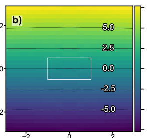 
FIG. 1. a) Cross section of the simulated static magnetic field z- component, produced by the anti-Helmholtz coils with the coil axis along the z-direction. The 4 black rectangles represent cross sections of the coils, the lines are contour lines of constant Bz, and the sample is contained in the white box outlined at the center of the plot. The simulation has 9000 Turns per coil and driven with a current of 200 mA. b) Close up of the sample region, where the field is shown to be well approximated as linear along the z-direction.

📷 Fig 2

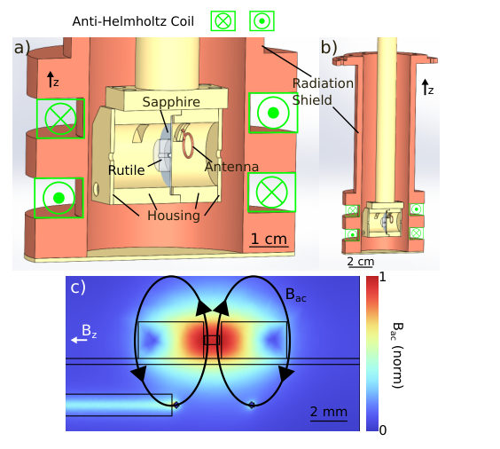 
FIG. 2. (a) Anti-Helmholtz coils integrated into the tail of the still shield, inside which the dielectric resonator is housed. (b) The entire still shield tail and the device, which sit inside the superconducting vector magnet (not shown here, see the supplementary material). (c) Simulated ac magnetic-field amplitude of the resonator’s fundamen- tal mode. The direction of the ac field is indicated by the black ar- rowed circles, and the static magnetic field by Bz. The rutile crystal has an outer diameter of 8 mm, an inner diameter of 1 mm, and a height of 2 mm.

📷 Fig 3

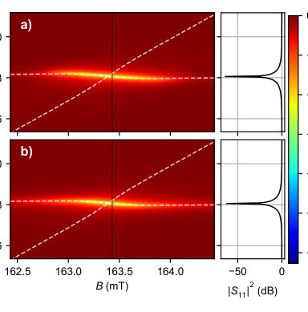 
FIG. 4. Reflection spectrum as a function of probe frequency and magnetic field when a magnetic field gradient is applied such that C = 1. a) is the experimental data and b) is the fitted spectrum us- ing the fitted parameters from a). The white dashed lines are the resonance frequencies of the polaritons and the spectra on the right correspond to black vertical lines, where the spins are in resonance with the resonator.

📷 Fig 4

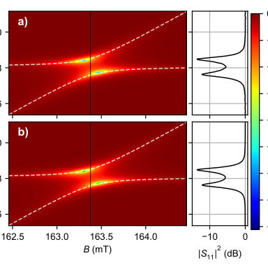 
FIG. 3. Reflection spectrum as a function of probe frequency and magnetic field when no magnetic field gradient was applied, corre- sponding to the high cooperativity regime. a) is the experimental data and b) is the fitted spectrum using the fitted parameters from a). The white dashed lines are the resonance frequencies of the polaritons and the spectra on the right correspond to black vertical lines, where the spins are on resonance with the resonator.

📷 Fig 5

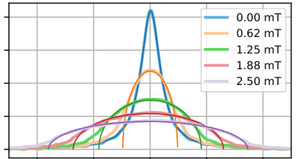 
FIG. 5. Spin spectral distribution data(light) and fit(dark) for various magnetic field gradients. The legend lists ∆B, the magnetic field dif- ference on either side of the sample. The zero current data is fit to a Lorentzian function, while all the others are fit to semi-ellipses using only the data in the central region.

**Summary.** The research demonstrates a novel method to control the spectral properties of a spin ensemble by applying an external magnetic field gradient. By achieving impedance matching and tuning the inhomogeneous broadening in situ, the authors show a crucial step toward realizing robust, controllable quantum memories for microwave photons.

**Why it may be interesting.** This work directly addresses fundamental challenges in quantum memory: controlling decoherence sources ($\Gamma$) externally while optimizing coupling ($C=1$) for efficient photon storage/retrieval, which is central to building quantum networks.

Detailed structure

**Main problem.** The primary goal is to control the spectral distribution (inhomogeneous broadening) of a spin ensemble while simultaneously achieving impedance matching with microwave photons.

**Main result.** The authors successfully demonstrated tunable, in situ control over inhomogeneous broadening using a magnetic field gradient and achieved near-perfect absorption by tuning the system to impedance matching ($C=1$).

**Method.** They used an anti-Helmholtz coil setup within a dilution refrigerator to apply controlled magnetic field gradients ($
abla B$) to tune the spin ensemble's spectral properties, measured via microwave spectroscopy (VNA).

**Model / system.** The system involves a spin ensemble (DPPH molecules) coupled to a high-quality factor dielectric resonator. The physics is modeled using concepts from cavity QED, treating the coupling strength and linewidth ($\Gamma$) as key parameters.

**Key observables.** Reflection spectrum ($|S_{11}|^2$), spectral distribution $
ho(\omega)$, Rabi oscillations (in time domain), and absorption efficiency.

**Important parameters / regimes.** Inhomogeneous linewidth ($\Gamma$), Cooperativity ($C$), magnetic field gradient ($
abla B$), and coupling strength ($g_{ens}$).

**Assumptions / limitations.** The analysis relies on modeling the spectral distribution as a convolution of initial broadening with gradient-induced broadening, and fitting data to specific functional forms like semi-ellipses.

**Figures summary.** Figures illustrate the magnetic field cross-section generated by the anti-Helmholtz coil, the dielectric resonator setup, and show spectroscopic measurements demonstrating the collapse of Rabi oscillations as the gradient increases.

**Paper structure.** The paper progresses from establishing the physical platform (dielectric resonator + spin ensemble) to detailing the control mechanism ($
abla B$ application), presenting spectral characterization results (impedance matching), and finally showing time-domain dynamics (Rabi oscillation quenching).

Abstract

We control the spectral distribution of a spin ensemble by applying a magnetic field gradient using an anti-Helmholtz coil inside a dilution refrigerator, and demonstrate impedance matching between the ensemble and a transmission line, achieving -50 dB absorption of incident radiation. This represents a first step toward a spin-ensemble-based quantum memory for itinerant microwave photons. We further model the spectral distribution under the applied gradient to predict the spin-resonator response, and use the device to systematically tune the weak-to-strong coupling transition in both continuous-wave and time-domain pulsed measurements.

[↑ back to top](#top)

### [From local weight selection to Zeno slowdown in an open Su-Schrieffer-Heeger chain with a single local loss](http://arxiv.org/abs/2607.10218v1)

**Authors:** Y. T. Wang, X. Z. Zhang  
**Type:** theory · **Category:** other · **PDF:** <https://arxiv.org/pdf/2607.10218v1>  
**Analysis basis:** full PDF text, analyzed in chunks
**Topic relevance:** 🔥 `methods for driven-dissipative` **4/5** · 🔥 `non-equilibrium dynamics` **4/5** · `analog quantum simulation` **3/5** · `correlated / nonlocal dissipation` **3/5** · `driven-dissipative phase transition` **3/5** · `non-equilibrium universality` **3/5** · `Keldysh / 2PI / non-Gaussian methods` **2/5** · `Kondo & dissipative impurity` **2/5** · `scars & prethermalization` **2/5** · `Frenkel-Kontorova` **1/5** · `entanglement & information structure` **1/5** · `quantum measurements` **1/5**

📷 Fig 1

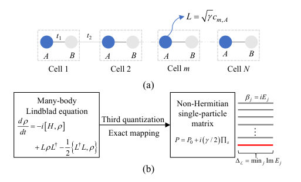 
FIG. 1. Two-panel summary of the model and the exact spec- tral reduction. (a) Quantum simulation architecture and ef- fective open SSH model. A finite dimerized chain with intra- cell hopping t1 and intercell hopping t2 is coupled to a single local reservoir on the bulk A site m. The dissipative defect is described by the jump operator L = √γ cm,A. (b) Exact re- duction schematic. Third quantization produces two rapidity blocks P± = ±h + i(γ/2)Πs. Because chiral symmetry makes them isospectral, the plotted matrix P ≡P+ = P0 +i(γ/2)Πs contains all distinct eigenvalues Ej. Each Ej occurs in both blocks, so the complete rapidity multiset is β(±) j = iEj. Fermionic subset sums of these 2Ns...

📷 Fig 2

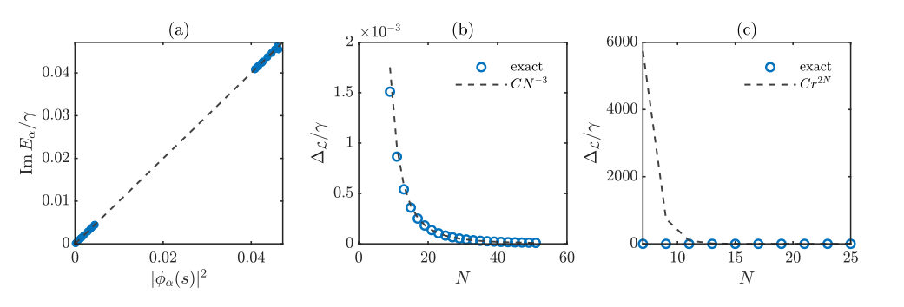 
FIG. 2. Weak-loss regime. (a) For N = 21, t1 = 1.0, t2 = 0.6, m = 11, and γ = 0.05, the exact rapidity shifts satisfy Im Eα/(γ/2) ≈|ϕα(s)|2, in agreement with Eq. (46). Here |ϕα(s)|2 is the clean local spectral weight at the lossy site. (b) For a trivial chain with t1 = 1.0, t2 = 0.6, γ = 0.05, and m = (N + 1)/2, the rescaled gap 2∆L/γ follows the generic law N −3 as N is varied. Only odd sizes N = 9, 11, . . . , 51 are included, so that the dissipative site is always the central unit cell and no two points correspond to the same system size. (c) For a topological chain with t1 = 0.6, t2 = 1.0, and γ = 0.05, the rescaled gap 2∆L/γ is plotted against N for a boundary loss L = √γ c1,B. The...

📷 Fig 3

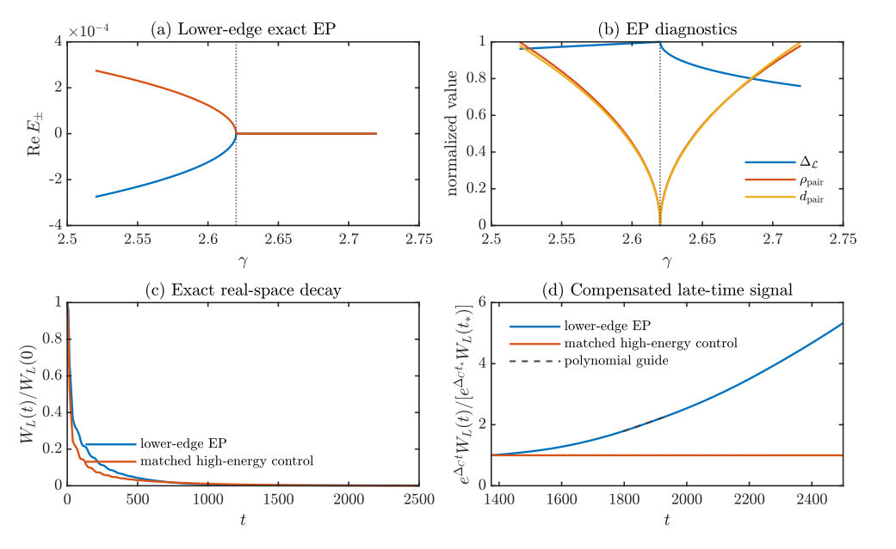 
FIG. 3. Intermediate-loss regime and its real-space signature. Panels (a) and (b) diagnose an exact exceptional point reached on the real-γ axis for a chain with N = 15, t2 = 1.0, and loss on (m, A) = (8, A) at fixed t1 = 0.655. Panel (a) tracks the lower-edge rapidity pair and shows its coalescence at γEP = 2.6200. The centered-loss symmetry produces simultaneous coalescences of the other chiral-partner pairs; the displayed pair is singled out because it fixes the lower rapidity edge. Panel (b) compares the normalized quantities ∆L(γ), ρpair(γ), and dpair(γ) defined in Eqs. (74) and (73). Their simultaneous vanishing at the gap cusp establishes exact defectiveness of the tracked lower-edge...

📷 Fig 4

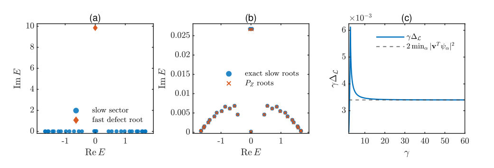 
FIG. 4. Strong-loss Zeno regime for a chain with N = 15, t1 = 0.70, t2 = 1.0, and loss on (m, A) = (8, A). Panels (a) and (b) use the representative value γ = 20. (a) Exact rapidity spectrum. One ultrafast defect root is clearly separated from the remaining slow sector, in agreement with Eq. (87). (b) Comparison between the exact slow rapidities and the roots of the effective Zeno matrix PZ defined in Eq. (115). The two sets of points nearly coincide, showing that the slow sector is governed by the reduced chain with the lossy site removed. (c) Zeno scaling of the Liouvillian gap for the same geometry. The numerical data for γ∆L approach a large-γ plateau, which is equivalent to the...

📷 Fig 5

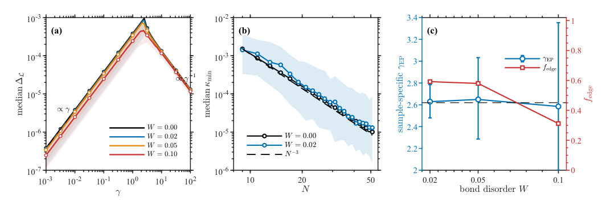 
FIG. 5. Robustness against chiral-symmetry-preserving bond disorder. (a) Ensemble median of the full-space Liouvillian gap for N = 15, t1 = 0.655, t2 = 1, and loss on (m, A) = (8, A). For each nonzero W, the shaded region is the 25%–75% realization interval from 200 samples. The weak- and strong-loss guides show ∆L ∝γ and ∆L ∝γ−1, respectively. (b) Median weak-loss coefficient κmin = minα: |ϕα(s)|2&gt;0 |ϕα(s)|2 for a trivial chain with t1 = 1, t2 = 0.6, central loss, and odd N = 9, 11, . . . , 51. The finite-size statistics use 500 realizations for each displayed nonzero disorder strength; the dashed line is an N −3 guide. (c) For the geometry of panel (a), the left axis shows the median and...

**Summary.** The paper analyzes the slow relaxation dynamics of an open SSH chain coupled to local particle loss. By reducing the complex many-body Lindblad problem to a solvable one-body matrix spectrum, the authors map out three distinct scaling laws ($\gamma N^{-3}$, EP behavior, $\gamma^{-1}$) that govern the decay rate based on the strength of the dissipation. This work establishes a general principle for how topology and local defects organize quantum relaxation.

**Why it may be interesting.** This work provides a detailed theoretical framework showing how fundamental concepts like topology and dissipation combine to dictate long-time quantum decay rates in lattice models, which is highly relevant for understanding open quantum systems.

Detailed structure

**Main problem.** The study investigates how long-time relaxation dynamics are governed by the interplay between topology, defect geometry, and local dissipation in an open Su-Schrieffer-Heeger (SSH) chain.

**Main result.** Three distinct physical regimes—weak loss ($\Delta_{\mathcal L}\sim\gamma N^{-3}$), intermediate exceptional point behavior, and strong loss ($\Delta_{\mathcal L}\sim\gamma^{-1}$)—govern the slowest decay rate, demonstrating a systematic organization of relaxation mechanisms.

**Method.** The many-body fermionic Lindblad problem is exactly reduced to an effective one-body non-Hermitian matrix whose rapidities generate the full Liouvillian spectrum for spectral analysis.

**Model / system.** The system is a quadratic open SSH chain subjected to a single local dissipative loss channel described by a Lindblad master equation. The dynamics are analyzed using fermionic operators and mapped onto an effective one-body matrix structure.

**Key observables.** The smallest positive decay rate, $\Delta_{\mathcal L}$, which sets the longest intrinsic relaxation time; also studied are local occupations and window observables.

**Important parameters / regimes.** The physical loss rate ($\gamma$), system size ($N$), and the topological nature of the chain (e.g., presence of edge modes).

**Assumptions / limitations.** The analysis relies on the Hamiltonian being quadratic and the loss operator being linear in fermionic operators, allowing for exact reduction to a one-body matrix problem.

**Figures summary.** Figures summarize the physical setup, the spectral reduction mapping the Lindblad equation to rapidity blocks, and show robustness checks against bond disorder.

**Paper structure.** The paper systematically analyzes the decay rate $\Delta_{\mathcal L}$ across three distinct loss regimes ($\gamma$ small, intermediate, large), detailing the underlying mathematical mechanism (local weight selection, exceptional point crossing, Zeno dynamics) for each regime.

Abstract

We study a quadratic open SSH chain with a single-site loss and show that the many-body fermionic Lindblad problem admits an exact reduction to a finite non-Hermitian one-body matrix with a rank-one imaginary impurity. Its rapidities generate the complete Liouvillian spectrum and reveal three mechanisms governing the slowest relaxation. At weak loss, decay is selected by the clean local spectral weight at the lossy site, yielding the generic law $Δ_{\mathcal L}\simγN^{-3}$ and, in the topological regime, exponentially smaller edge-controlled gaps. At intermediate loss, a centered bulk-loss geometry reaches an exact exceptional point on the real-$γ$ axis. Symmetry-related rapidity pairs coalesce simultaneously, including the pair at the lower rapidity edge. Exact real-space dynamics at this lower-edge exceptional point exhibits a polynomially enhanced exponential tail, whereas a matched high-energy control with the same parity-even one-body decay edge but no lower-edge defectiveness remains nearly exponential. At strong loss, one ultrafast defect mode separates from an active slow sector governed by a cut-chain Zeno problem, giving $Δ_{\mathcal L}\simγ^{-1}$ up to a geometry-dependent prefactor. The full finite fermionic Liouvillian spectrum, including its operator-parity sectors and subset-sum structure, is statistics-specific. By contrast, the elementary one-body decay spectrum and the three associated mechanisms are governed by a finite-dimensional linear drift matrix, so their spectral and dynamical signatures can also be accessed in bosonic and classical-wave platforms engineered to realize the same effective matrix. These results establish how topology, defect geometry, and local dissipation jointly organize long-time relaxation in an open dimerized lattice.

[↑ back to top](#top)

### [Interlocked Time Crystal in Coupled Spin-1/2 Ensembles under Local Dissipation](http://arxiv.org/abs/2607.11717v1)

**Authors:** Zhen-Huan Yang, Zhen-Tao Liang, Dan-Bo Zhang  
**Type:** theory · **Category:** other · **PDF:** <https://arxiv.org/pdf/2607.11717v1>  
**Analysis basis:** full PDF text, analyzed in chunks
**Topic relevance:** 🔥 `analog quantum simulation` **4/5** · 🔥 `driven-dissipative phase transition` **4/5** · 🔥 `methods for driven-dissipative` **4/5** · `correlated / nonlocal dissipation` **3/5** · `exotic spin models in light-matter` **3/5** · `non-equilibrium dynamics` **3/5** · `Tavis-Cummings & cavity-many-emitter` **2/5** · `non-equilibrium universality` **2/5** · `Keldysh / 2PI / non-Gaussian methods` **1/5** · `correlated cavity matter` **1/5** · `entanglement & information structure` **1/5** · `spintronics-quantum-optics interface` **1/5**

📷 Fig 1

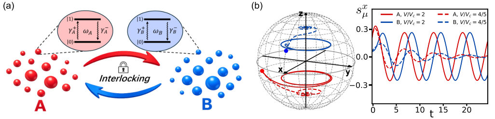 
FIG. 1. Interlocked dynamics of two dissipative ensembles. (a) Schematic illustration of two coupled dissipative spin ensembles A and B with incoherent pumping γ+ µ , decay γ− µ , and bare transition frequencies ωµ. (b) Mean-field dynamics. Left: trajectories of the normalized collective spins on the Bloch sphere. Dashed (solid) curves correspond to the stationary (V &lt; Vc) [oscillatory (V &gt; Vc)] phase. Right: time evolution of the transverse spin component, showing persistent oscillations above the critical interaction strength.

📷 Fig 2

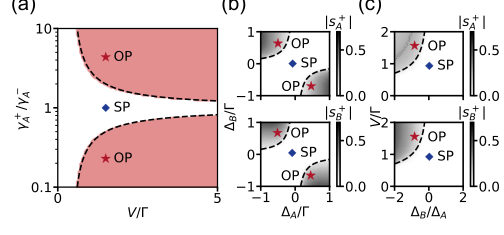 
FIG. 2. Mean-field dynamical phase diagrams for the symmetric case. Phase diagrams are shown in the planes of (a) the interaction strength V/Γ and pumping ratio γ+ A/γ− A, (b) the nonequilibrium parameters ∆A/Γ and ∆B/Γ, and (c) the interaction strength V/Γ and imbalance ratio ∆B/∆A. Dashed curves denote analytical phase boundaries obtained from the stability condition. White regions correspond to |s+ A| = |s+ B| = 0, while shaded regions indicate finite transverse coherence in both ensembles.

📷 Fig 3

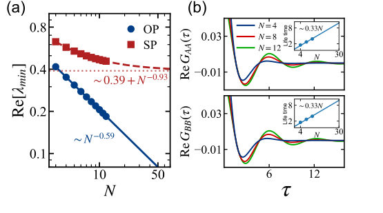 
FIG. 3. Liouvillian gap and two-time correlation scaling. (a) Scaling of the decay rate −Re[λslow] in the OP and SP. The OP exhibits algebraic gap closing, while the SP approaches a finite decay rate. (b) Real parts of GAA(τ) and GBB(τ) in the OP. Insets show lifetimes extracted from exponential fits. Parameters are γ+ A = γ− B = 0.6, γ− A = γ+ B = 0.2, and V = 1.

📷 Fig 4

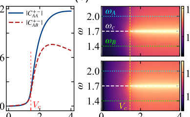 
FIG. 4. Correlation signatures of the interlocked time- crystal phase from the cumulant expansion. (a) Equal-time connected correlations |C+− AA | and |C+− AB | versus V/Γ. (b) Frequency-resolved spectra PAA(ω) and PBA(ω) for ωA ̸= ωB. Vertical lines mark Vc; horizontal guide lines indicate ωA, ωB, and ωc. Calculations are performed for N = 1000.

**Summary.** The authors show that coupling two dissipative spin-1/2 ensembles can generate an interlocked time crystal phase without needing complex local structures. This order arises from a collective instability requiring opposite pump-decay imbalances between the coupled units. The analysis confirms this robust, non-autonomous quantum state using advanced spectral and correlation function diagnostics.

**Why it may be interesting.** This work provides a concrete, controllable mechanism for realizing complex non-equilibrium quantum phases (time crystals) using only simple two-level subsystems coupled dissipatively, which is highly relevant to engineered quantum light-matter interactions in AMO physics.

Detailed structure

**Main problem.** The research addresses how to generate robust, non-autonomous time-crystalline dynamics in a composite system without increasing its local Hilbert space dimension.

**Main result.** They demonstrate that coupling two simple spin-1/2 ensembles with opposite pump-decay imbalances can create a single, interlocked time crystal phase characterized by collective instability.

**Method.** The analysis employs mean-field theory, stability analysis of the Liouvillian spectrum, and quantum regression theorems to diagnose long-time coherence.

**Model / system.** The system consists of two coupled dissipative spin-1/2 ensembles evolving under a Lindblad master equation. The dynamics are governed by local pumping/decay rates ($\gamma_\pm^\mu$) and an inter-ensemble coupling term ($V$).

**Key observables.** Mean-field order parameter, relative phase difference ($\Delta\phi$), collective oscillation frequency ($\omega_c$), Liouvillian gap closing rate, and two-time correlation functions $G_{\mu
u}(	au)$.

**Important parameters / regimes.** Opposite pump-decay imbalances ($\Delta_A \Delta_B < 0$) are required for the oscillatory phase; critical coupling strength ($V_c$) dictates the transition.

**Assumptions / limitations.** Intra-ensemble interactions are initially neglected but later shown to only renormalize frequencies, and the analysis relies on mean-field approximations for collective variables.

**Figures summary.** Figures illustrate dynamical phase diagrams showing transitions between stationary and oscillatory regimes; other figures show Liouvillian gap scaling (algebraic closing in OP vs. finite decay in SP) and spectral weight selection confirming a single collective mode $\omega_c$.

**Paper structure.** The paper progresses from establishing the basic model and mean-field dynamics, to proving time-crystalline order via spectral analysis, then rigorously demonstrating the 'interlocked' nature of this order, and finally testing its robustness against detuning and noise.

Abstract

Multilevel dissipative systems can exploit multiple local transitions and coherence channels to generate nonstationary time-crystalline dynamics. Here we show that an analogous mechanism can be synthesized without enlarging the local Hilbert space by coupling two locally pumped and decaying spin-1/2 ensembles into a composite dissipative unit.Neither ensemble supports an autonomous oscillatory phase; instead, opposite pump-decay imbalances and inter-ensemble exchange coupling can lead to a single interlocked time crystal with a fixed internal phase relation and no single-ensemble counterpart. The time-crystalline character is consistently established through the mean-field analysis, exact calulation of Liouvillian spectra at finite size, and temporal correlations with cumulant expansion. Our work establishes a route to dissipative time-crystalline order in which coupling between simple two-level subsystems generates the effective internal structure otherwise provided by multilevel constituents.

[↑ back to top](#top)

### [Phase-controlled transport of Floquet-driven compact topological photonic states](http://arxiv.org/abs/2607.10415v1)

**Authors:** Gabriel Caceres-Aravena, Paloma Vildoso, Helena Drüeke, Rodrigo A. Vicencio  
**Type:** both · **Category:** other · **PDF:** <https://arxiv.org/pdf/2607.10415v1>  
**Analysis basis:** full PDF text, analyzed in chunks
**Topic relevance:** 🔥 `analog quantum simulation` **4/5** · 🔥 `non-equilibrium dynamics` **4/5** · `driven-dissipative phase transition` **3/5** · `methods for driven-dissipative` **3/5** · `quantum optics experiment` **3/5** · `QC/QI experiment` **2/5** · `non-equilibrium universality` **2/5** · `Frenkel-Kontorova` **1/5** · `Keldysh / 2PI / non-Gaussian methods` **1/5** · `correlated / nonlocal dissipation` **1/5** · `correlated cavity matter` **1/5** · `entanglement & information structure` **1/5** · `exotic spin models in light-matter` **1/5** · `interference shaping light` **1/5**

📷 Fig 1

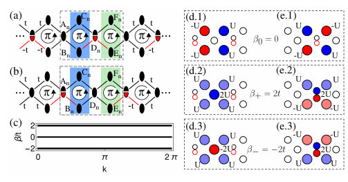 
FIG. 1. (a,b) The two configurations of the diamond model. The gray rectangle highlights the unit cell. The waveguide types are: completely black for S sites and half black half red for the P sites. (c) Bloch Bands β/t. (d,e) Sketch of the FB states for the eigenvalues β = 0, 2t, and −2t. Blue and red colors represent normalized positive and negative amplitudes, respectively. The P modes are represented by half-blue-half- red colored solid circles at the center.

📷 Fig 2

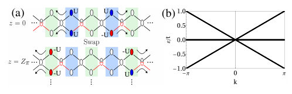 
FIG. 2. (a) Two initial conditions: in phase (left) and an out of phase (right) profiles at z = 0, and their evolution after one period z = Zπ = π/(2t). Blue and red colors represent positive and negative amplitudes, respectively. (b) Floquet quasienergies ε calculated for a period Z = 2Zπ.

📷 Fig 3

 
Fig.2(a) shows two initial states at z = 0, one of them in phase (blue zone) and the other one out of phase (green zone). Each of these states is a linear combination of three different FB modes, and each of these states is coupled to the neighboring central waveguides. In order to understand the underlying dynamics, we first analyze how the in-phase (blue-blue) state depicted in Fig.2(a) propagates to the left. The in-phase state in the blue zone exhibits destructive interference to the right due to the P site; therefore, it does not propagate in that di- rection. However, it features constructive interference to the left when couple to the S site and, thus, it can trans- late to the next...

📷 Fig 4

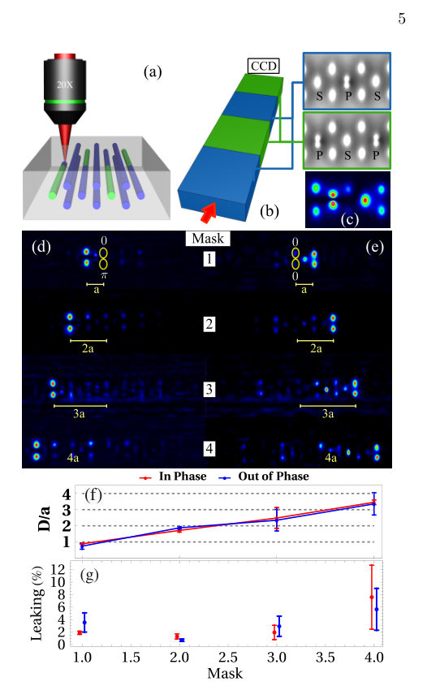 
FIG. 3. (a) Sketch of the femtosecond laser writing tech- nique alternating the central waveguides between S (blue) and P (green) types. (b) The alternation of the central waveg- uides defines two different mask segments highlighted in blue and green. Insets show a bright-field microscopy image of each mask. (c) Output intensity image showing the S and P modes. (d)-(e) Intensity output at the end of each mask seg- ment {1, 2, 3, 4}, for the (d) out-of-phase initial condition and the (e) in-phase condition. (f) Normalized displacement D/a of the wave packet from its initial condition after each mask segment.(g) Percentage of leaking per mask. For (f) and (g) red (blue) dots are for the...

**Summary.** The research demonstrates how to overcome the inherent localization of compact topological photonic states by employing a Floquet engineering protocol in an engineered photonic lattice. By periodically modulating the system's Hamiltonian, the authors achieve directional transport, mimicking a stroboscopic quantum walk. This work is significant for realizing controllable light-matter interactions and robust information transfer in integrated optical circuits.

**Why it may be interesting.** This work provides a concrete platform (photonic waveguides) to realize and control topological phenomena previously confined to theoretical models or other physical systems. It demonstrates active control over fundamentally localized quantum states using time-periodic driving, which is highly relevant for building optical quantum circuits.

Detailed structure

**Main problem.** The work addresses how to control the transport of highly localized, compact topological photonic states that are normally immobile in linear waveguides.

**Main result.** By applying a Floquet driving protocol—periodically modulating the lattice Hamiltonian—the authors successfully induce directional, quantum walk-like transport of these otherwise trapped states.

**Method.** The study combines theoretical analysis using Floquet theory and topological invariants (winding number) with experimental implementation using femtosecond laser written photonic waveguides.

**Model / system.** The system is an all-flat band (FB) lattice realized in a diamond structure connecting S-type and P-type waveguides, which mimics the effect of an effective magnetic field via multi-orbital interactions.

**Key observables.** Directional propagation confirmed by chiral pairs with winding numbers $\pm 1$, measurable discrete mobility ($D$), and low leakage fraction ($L$) during transport.

**Important parameters / regimes.** The control mechanism relies on modulating the Hamiltonian along the propagation coordinate ($z$) and controlling the relative phase of the input excitation.

**Assumptions / limitations.** Key assumptions include the ability to tune waveguide properties for matching band structures ($eta_S = eta_P$) and that transport can be achieved by swapping central waveguides periodically.

**Figures summary.** Figures illustrate the lattice structure, Bloch bands showing flat bands, the evolution of in-phase/out-of-phase states over one period, and experimental intensity profiles demonstrating clear directional wavepacket transfer across multiple mask segments.

**Paper structure.** The paper first establishes the theoretical framework using AB caging effects and FB states. It then details the Floquet driving protocol via periodic Hamiltonian modulation ($H(z)$). The core is the demonstration of controlled transport, culminating in experimental measurements of directional propagation and mobility.

Abstract

The Aharonov-Bohm (AB) effect remains a cornerstone of fundamental and applied physics. In this work, we utilize the AB caging effect originated from an effective magnetic field induced by multi-orbital interactions, creating an all flat band (FB) lattice system. Normally, FB states are known for being compact in space and having a zero tail; therefore, their mobility in a linear environment is generally understood as impossible. We propose a Floquet driving protocol in an all-FB photonic system to fully control the dynamics of localized photonic states. The modulation of the Hamiltonian along the propagation coordinate allows the translation of compact states in the direction of constructive interference, resulting in an effective stroboscopic quantum walk-like effect. We find that the traveling states exist in chiral pairs and have a related topological invariant (winding number) equal to +1 or -1, with the sign determining the propagation direction. We experimentally implement the Floquet driven protocol using femtosecond laser written photonic waveguides and demonstrate directional control of the propagation, determined by the relative phase of the input condition.

[↑ back to top](#top)

### [Static entanglement structure and adiabatic Bell-state preparation in the tripartite quantum Rabi model](http://arxiv.org/abs/2607.10334v1)

**Authors:** Li-Li Gao, Zi-Xuan Chen, Long-Jie Li, Zi-Cheng Liu, A-Long Zhou, Chuan-Cun Shu, Zi-Min Li  
**Type:** theory · **Category:** other · **PDF:** <https://arxiv.org/pdf/2607.10334v1>  
**Analysis basis:** full PDF text, analyzed in chunks
**Topic relevance:** 🔥 `analog quantum simulation` **4/5** · 🔥 `entanglement & information structure` **4/5** · `Tavis-Cummings & cavity-many-emitter` **3/5** · `correlated cavity matter` **3/5** · `exotic spin models in light-matter` **3/5** · `spintronics-quantum-optics interface` **3/5** · `non-equilibrium dynamics` **2/5** · `Keldysh / 2PI / non-Gaussian methods` **1/5** · `Rydberg arrays` **1/5** · `driven-dissipative phase transition` **1/5** · `methods for driven-dissipative` **1/5**

📷 Fig 1

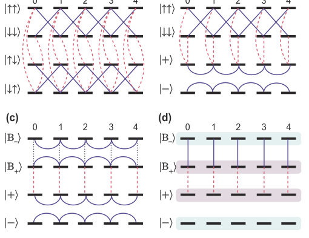 
FIG. 1. Schematic organization of the TQRM coupling structure. Black horizontal segments denote oscillator lev- els. In (a)–(c), the column labels n denote bare Fock-state indices. (a) Two-qubit σz product-basis graph; purple solid links show the collective spin-oscillator term g(a + a†)σx 1σx 2, and red dashed links show the detuning-derived single-spin term ϵ(σx 1 + σx 2). (b) Reorganization of the one-excitation rows into the symmetric and antisymmetric states |+⟩and |−⟩. (c) Full Bell-basis graph, where the singlet row |−⟩is isolated and |+⟩, |B+⟩, and |B−⟩form the triplet network. The purple curved links in (c) come from the row-preserving collective spin-oscillator term, the red...

📷 Fig 2

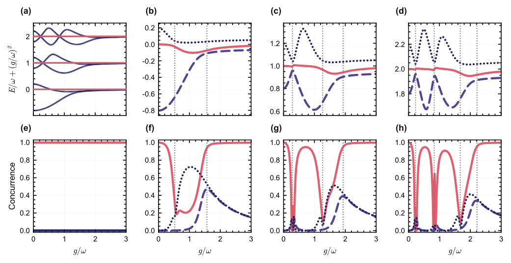 
FIG. 2. Static overview of the low-energy triplet structure at Ω/ω = 0.40 and ϵ/ω = 0.03. The left column gives the zero- detuning reference. In this column, purple curves denote QRM reference branches with C = 0, while red horizontal lines denote DO reference branches with C = 1. The other columns show the finite-ϵ spectrum in the three groups labeled n = 0, 1, 2. The curves are exact tracked branches grouped by their large-g displaced-oscillator limits, whose oscillator indices give the labels n = 0, 1, 2. For each group, the upper row shows the flattened energies and the lower row shows the concurrence of the same tracked branches. In the finite-ϵ columns, purple dashed, red solid, and...

📷 Fig 3

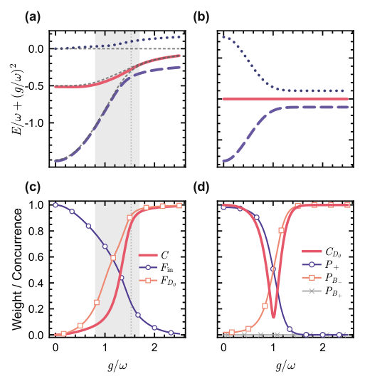 
FIG. 3. Fixed-n = 0 reference and selected exact branch at Ω/ω = 0.75 and ϵ/ω = 0.10. (a) Flattened exact spec- trum, where the red solid curve denotes the selected branch, the gray dashed curves give the corresponding ϵ = 0 refer- ence, and the shaded region marks the main avoided-crossing window. (c) Concurrence C, weak-coupling overlap Fin, and D0-reference fidelity FD0 along the selected exact branch. (b) Fixed-n = 0 effective ladder. (d) Basis weights P+, PB−, PB+, and reduced-spin concurrence CD0 of the D0 reference. The colors and markers in the lower panels follow the in-panel legends, and the vertical dotted line marks the coupling at which the selected branch is closest in energy...

📷 Fig 4

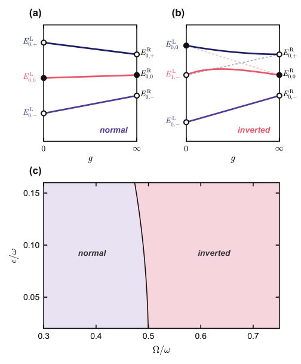 
FIG. 4. Static low-to-high concurrence route and exact- tracking check of the entrance criterion in the scanned low- energy triplet window. Panels (a) and (b) schematically com- pare the normal three-level weak-coupling ordering with the inverted ordering in which EL 1,−drops below EL 0,0. In both panels, the solid curves trace the branch connections between the weak- and strong-coupling endpoints. In panel (b), the pale dashed lines show the uncoupled crossing underlying the avoided-crossing connection. Open and filled endpoint markers denote reference endpoints with two-qubit concur- rence C = 0 and C = 1, respectively. Panel (c) shows the weak-coupling endpoint reached by the branch...

📷 Fig 5

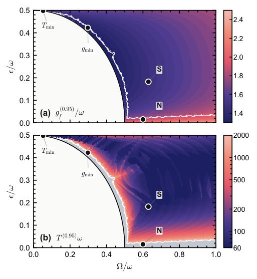 
FIG. 5. Protocol-resource map for the finite-time linear- ramp benchmark in the (Ω/ω, ϵ/ω) plane. At each parameter point, the route entrance is fixed to the weak-coupling state ψL 1,− . (a) The color gives g(0.95) f /ω at parameter points where the exact branch state reaches FB−≥0.95 for at least one scanned gf. (b) The logarithmic color scale gives T (0.95)ω at parameter points where a ramp to g(0.95) f reaches FB−≥0.95 within the scanned time window. The black curve is the static entrance boundary 2 √

**Summary.** The paper analyzes the tripartite quantum Rabi model to understand how entanglement evolves when two qubits interact with a shared oscillator mode. By tracking spectral changes through avoided crossings, it demonstrates that this coupling mechanism can guide the system adiabatically toward high-fidelity Bell states. The findings provide both static criteria and practical benchmarks for realizing such entangled states in physical quantum platforms.

**Why it may be interesting.** This work directly addresses how collective interactions mediate quantum information transfer (entanglement) between discrete spin systems and bosonic modes, which is highly relevant to trapped ion or cavity QED platforms.

Detailed structure

**Main problem.** The study investigates the static entanglement structure and the feasibility of adiabatic Bell-state preparation within the tripartite quantum Rabi model.

**Main result.** The collective spin-oscillator coupling reorganizes spectral entanglement, allowing for an eigenbranch whose entanglement grows from near zero to nearly maximal values through avoided crossings. This analysis also benchmarks the required parameters for high-fidelity state preparation in finite time.

**Method.** The authors analyze the system spectrum by projecting onto fixed-number oscillator states and developing effective Hamiltonians, comparing static adiabatic tracking with finite-time ramp protocols.

**Model / system.** The model is the tripartite quantum Rabi model (TQRM), which couples two qubits to a bosonic mode via a collective spin-oscillator interaction. The Hamiltonian involves terms coupling spins ($\sigma_{x}^1\sigma_{x}^2$) and the oscillator ($a, a^\dagger$).

**Key observables.** Two-qubit entanglement (quantified by Concurrence), Bell states fidelity, spectral entanglement structure.

**Important parameters / regimes.** Detuning ($\epsilon$), coupling strength ($g$), bosonic frequency ($\omega$), and ramp time ($T$). Key regimes include the zero-detuning limit and weak/strong coupling limits.

**Assumptions / limitations.** The analysis utilizes approximations such as projecting onto fixed-$n$ oscillator indices (Franck-Condon approximation) to derive effective Hamiltonians for tractability.

**Figures summary.** Figures illustrate the TQRM coupling structure in different bases, show static entanglement evolution across varying couplings ($g$), and compare analytic predictions from fixed-$n$ models against exact spectral tracking results.

**Paper structure.** The paper first establishes the model and analyzes its zero-detuning limit. It then develops effective Hamiltonians for the triplet sector using displaced-oscillator frames. The core analysis tracks entanglement evolution across coupling strengths, culminating in a finite-time benchmark protocol for Bell state preparation.

Abstract

The tripartite quantum Rabi model couples two qubits to a bosonic mode through a collective spin-oscillator interaction, providing a simple setting for studying two-qubit entanglement. In the zero-detuning limit, the triplet part of the spectrum splits into branches with zero and maximal entanglement, while the antisymmetric singlet ladder remains exactly decoupled. Within the triplet sector, finite detuning turns the crossings between these branches into avoided crossings and redistributes this entanglement. We identify an eigenbranch whose entanglement grows from nearly zero to a nearly maximal value through such avoided-crossing mixing. The weak-coupling level ordering yields a simple analytic criterion for whether this eigenbranch has a separable weak-coupling endpoint. A three-state effective model explains how the Bell-state component becomes dominant as the coupling increases. We further use a finite-time linear ramp of the collective coupling to benchmark the final coupling and ramp time required for high Bell-state fidelity. These results show how collective spin-oscillator coupling reorganizes spectral entanglement and connects static branch structure to finite-time Bell-state preparation.

[↑ back to top](#top)

### [Driven Quantum Stars as Controlled Primitives for Real-Time Spin Dynamics](http://arxiv.org/abs/2607.10899v1)

**Authors:** Michael Chertkov  
**Type:** theory · **Category:** disordered systems and neural networks · **PDF:** <https://arxiv.org/pdf/2607.10899v1>  
**Analysis basis:** full PDF text, analyzed in chunks
**Topic relevance:** 🔥 `methods for driven-dissipative` **4/5** · `analog quantum simulation` **3/5** · `driven-dissipative phase transition` **3/5** · `exotic spin models in light-matter` **3/5** · `non-equilibrium dynamics` **3/5** · `correlated / nonlocal dissipation` **2/5** · `entanglement & information structure` **2/5** · `non-equilibrium universality` **2/5** · `Keldysh / 2PI / non-Gaussian methods` **1/5** · `Tavis-Cummings & cavity-many-emitter` **1/5** · `spintronics-quantum-optics interface` **1/5**

📷 Fig 1

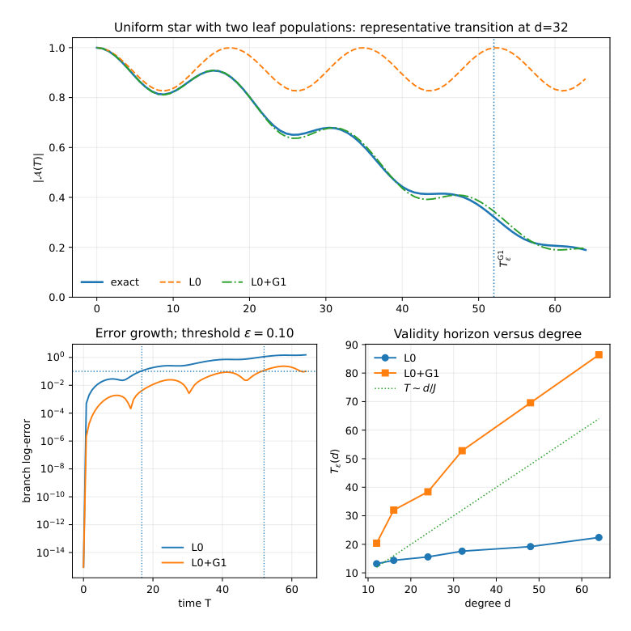 
Figure 1: Uniform-star diagnostic for the transition from LL-substitutable to genuinely quantum behavior. The homogeneous star has uniform couplings H = (J0/d)S0 · P c Sc – the static ho- mogeneous special case, Eq. (22) of Sec. 6.1, of the general driven star Hamiltonian defined in Eq. (4) – and a two-population leaf coherent product state (a deterministic 70%/30% split of the leaf Bloch directions between two fixed orientations). The upper panel compares the exact Schur-block return amplitude with L0 and L0+G1 for d = 32. The lower-left panel shows the branch-continuous log-error and the threshold defining the validity horizon. The lower-right panel shows that G1 extends the validity...

📷 Fig 2

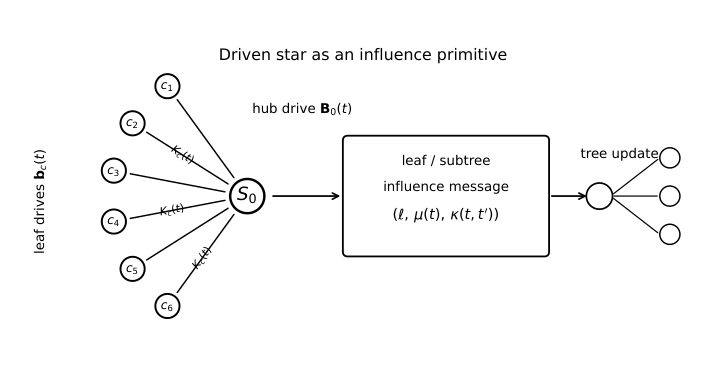 
Figure 2: The driven star is the algorithmic primitive. Leaf elimination converts d quantum leaves into a weak mean trajectory and a two-time influence kernel acting on the hub. On larger trees the same object becomes a directed message from a subtree to its parent.

📷 Fig 3

 
Fig. 2 also fixes the notation used below for the algorithmic interpretation: after elimination, a leaf or subtree contributes a scalar factor, a weak mean trajectory, and a two-time connected kernel. Throughout the paper, elimination means the exact contraction of the leaf world lines out of the amplitude (1): a quantum sum over the histories of the eliminated spins, conditioned on their coherent boundary data. It is the single-contour, fixed-boundary analogue of marginaliza- tion, performed at the amplitude level rather than at the density-matrix level – no partial trace is involved. All d leaf spins are eliminated in one step while the hub spin is retained; leaf c is summarized exactly...

📷 Fig 4

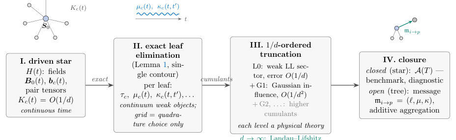 
Figure 3: Summary of the method. (I) The model is the fully driven star in continuous time. (II) Leaf elimination (Lemma 1) is exact and produces continuum weak objects per leaf – a scalar, a weak mean trajectory, and a connected two-time kernel; the time grid enters only as a quadrature choice at numerical evaluation. (III) The cumulant tower is ordered by the physical model parameter 1/d, and each truncation level is itself a physical theory: L0 is the weak Landau– Lifshitz classical sector, G1 the Gaussian (noise-plus-response) influence correction; the d →∞ limit is the LL dynamics. (IV) Closing the hub against its boundary state gives the benchmark amplitude A(T); leaving it open gives...

📷 Fig 5

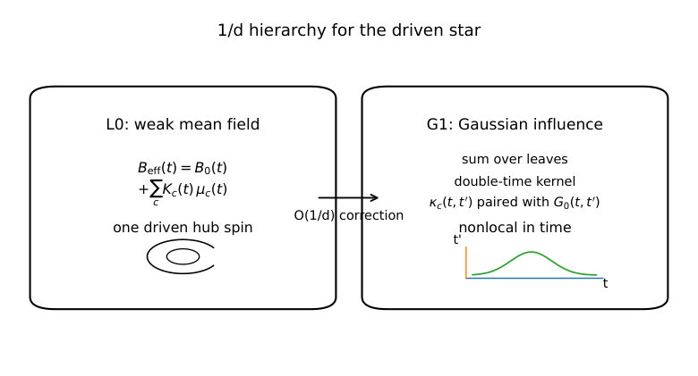 
Figure 4: The 1/d hierarchy. L0 is a mean weak field. G1 is the first Gaussian influence correction, nonlocal in time but still assembled from one-spin objects.

**Summary.** The paper introduces a novel theoretical framework to diagnose quantum advantage in real-time spin dynamics by analyzing 'quantum star' graphs. It develops an approximation hierarchy, expanding the full qubit model around a classical Landau–Lifshitz sector using graph coordination ($1/d$) as the expansion parameter. This method provides quantitative bounds on when genuine quantum interference effects become essential for describing system evolution.

**Why it may be interesting.** This work provides a powerful, physically motivated diagnostic tool for quantum advantage in dynamics. For AMO/open systems researchers, the systematic $1/d$ expansion offers a controlled way to quantify when mean-field or classical approximations break down due to entanglement effects.

Detailed structure

**Main problem.** The core problem is developing a rigorous diagnostic tool to determine when real-time quantum spin dynamics can be accurately approximated by classical models, such as the Landau–Lifshitz equation.

**Main result.** The authors developed an expansion hierarchy based on graph coordination ($1/d$) that systematically quantifies the deviation from classical behavior, showing that quantum corrections are necessary for accurate long-time predictions.

**Method.** They employ a systematic approximation hierarchy by performing exact leaf elimination on a 'quantum star' graph structure. This allows them to derive continuous-time expansions in terms of weak mean-field theories ($L_0$) and Gaussian influence corrections ($G_1$).

**Model / system.** The system is a driven quantum spin star composed of one hub and $d$ leaves, modeled by a time-dependent Hamiltonian. The analysis focuses on the coherent-state return amplitude as the primary observable.

**Key observables.** Coherent-state return amplitude ($A(T)$), $\log A - \log L_0$, and $\log A - \log L_0 - \Delta G_1$.

**Important parameters / regimes.** Graph coordination parameter $d$ (or $1/d$), time $T$, and the ratio of quantum correction to classical approximation.

**Assumptions / limitations.** The analysis uses a single forward time contour for technical simplicity, although physical observables often require the full Keldysh closed-time-path contour. The hierarchy is ordered by the physical parameter $1/d$.

**Figures summary.** Figure 1 illustrates the diagnostic comparison between exact amplitude and approximations ($L_0$ vs $L_0+G_1$), showing $G_1$'s extension of validity. Figure 2 shows leaf elimination converting leaves into weak mean trajectories and two-time kernels acting on the hub.

**Paper structure.** The paper establishes the quantum star as a fundamental primitive, derives an exact leaf-elimination lemma, constructs a systematic expansion hierarchy ($L_0 	o G_1$), and validates this framework by comparing it against established methods like temporal matrix-product influence-matrix baselines.

Abstract

Quantum advantage in real-time spin dynamics should be assessed against the strongest relevant classical substitutes, not merely against the qubit nature of the microscopic system. We develop a physics-based diagnostic for this boundary by reducing a qubit spin model to a spin-Landau--Lifshitz (LL) classical sector and organizing the residual quantum sector as controlled corrections. The control parameter is graph coordination: we study a spin star with \(d\) leaves and \(O(1/d)\) hub--leaf couplings. In its homogeneous form the star benchmarks the transition from LL-substitutable dynamics to genuinely quantum, discrete-sector interference; in its fully driven form, with time-dependent fields and bilinear couplings, it is the basic message-passing primitive for tree and loopy spin structures. For coherent-state return amplitudes we prove exact leaf elimination and derive a continuous-time \(1/d\) hierarchy. L0 is a driven one-spin weak-mean-field theory, while G1 is a Gaussian nonlocal-in-time influence correction coupling leaf two-time kernels to the hub weak two-point function. On bounded finite-time windows away from zeros of the boundary amplitudes, the hierarchy gives \(\log\mathcal A-\log\mathcal A_{\rm L0}=O(1/d)\) and \(\log\mathcal A-\log\mathcal A_{\rm L0}-Δ_{\rm G1}=O(1/d^2)\); numerical tests on fully driven anisotropic ensembles give slopes \(-1.05\) and \(-2.03\). Static, inhomogeneous, aligned, and fully driven stars provide validation rungs, and comparison with a temporal matrix-product influence-matrix baseline delineates complementary regimes. Unlike rank compression on a Trotter grid, the hierarchy is ordered by a physical parameter, formulated in continuous time, and each truncation level is itself a physical theory, with the LL sector as the high-coordination limit.

[↑ back to top](#top)

### [Decoherence of a quantum magneto-oscillator: Effect of field-bath interaction](http://arxiv.org/abs/2607.11137v1)

**Authors:** Koushik Mandal, Suraka Bhattacharjee, Supurna Sinha  
**Type:** theory · **Category:** other · **PDF:** <https://arxiv.org/pdf/2607.11137v1>  
**Analysis basis:** full PDF text, analyzed in chunks
**Topic relevance:** 🔥 `methods for driven-dissipative` **4/5** · `Keldysh / 2PI / non-Gaussian methods` **3/5** · `correlated / nonlocal dissipation` **3/5** · `driven-dissipative phase transition` **3/5** · `non-equilibrium dynamics` **2/5** · `non-equilibrium universality` **2/5** · `spintronics-quantum-optics interface` **2/5** · `Kondo & dissipative impurity` **1/5** · `analog quantum simulation` **1/5** · `measurement-induced transitions` **1/5** · `quantum measurements` **1/5**

📷 Fig 1

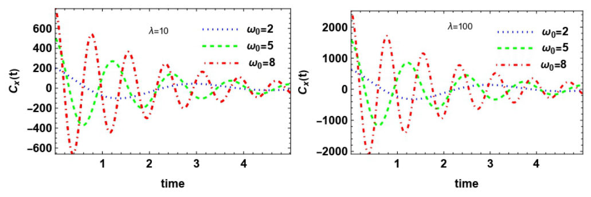 
FIG. 1: The position auto-correlation function versus time for different values of harmonic fre- quency ω0 with ℏ= 1, ωc = 0.1, γ = 1, ˜m = 100, Ω= 0.1 : (i) λ = 10; (ii) λ = 100.

📷 Fig 2

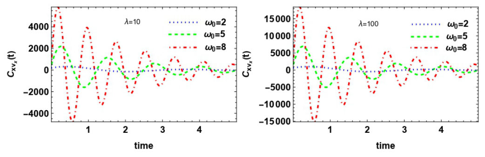 
FIG. 2: The position-velocity correlation function versus time for different values of harmonic frequency ω0 with ℏ= 1, ωc = 0.1, γ = 1, ˜m = 100, Ω= 0.1 : (i) λ = 10; (ii) λ = 100.

📷 Fig 3

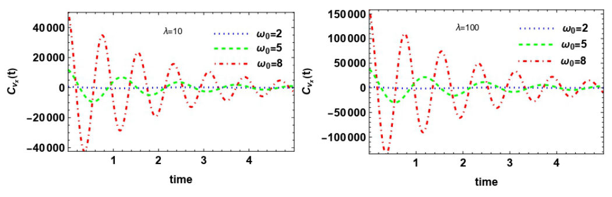 
FIG. 3: The velocity auto-correlation function versus time for different values of harmonic frequency ω0 with ℏ= 1, ωc = 0.1, γ = 1, ˜m = 100, Ω= 0.1 : (i) λ = 10; (ii) λ = 100.

📷 Fig 4

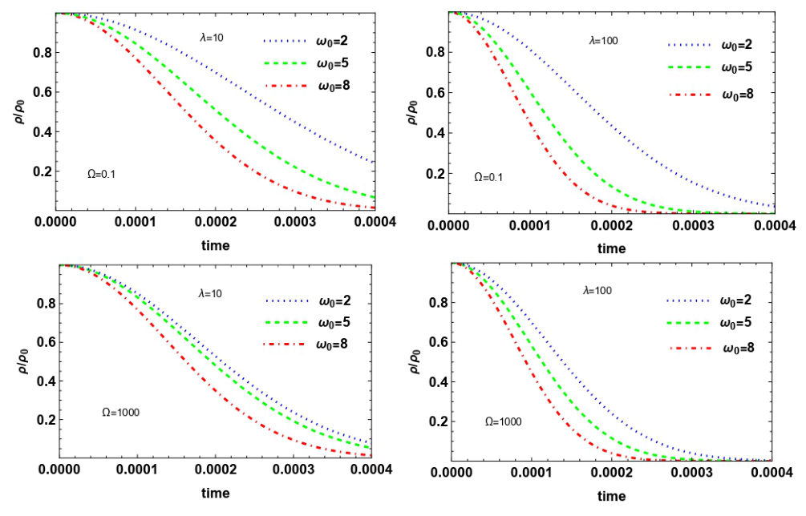 
FIG. 4: The reduced density matrix (ρ/ρ0) versus time for different values of the harmonic fre- quency ω0, tuning parameter λ and temperature scale Ωwith ℏ= 1, ωc = 0.1, γ = 1, ˜m = 100.

📷 Fig 5

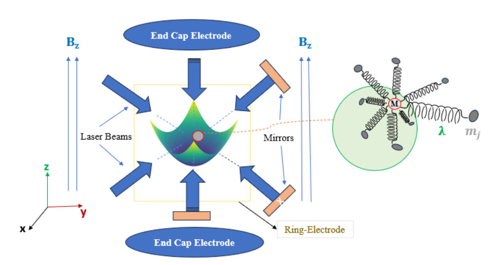 
FIG. 5: Proposed experimental set up: Our proposed experimental setup for a CMO in a Penning trap subjected to an additional field-bath interaction. The counter-propagating laser beams are used to cool the trapped ions and to provide optical molasses. An externally applied magnetic field is applied in the z-direction, as shown in the figure. The field-bath interaction is shown in the inset.

**Summary.** The paper models the decoherence of a charged magneto-oscillator coupled to an environment bath. By incorporating an additional field-bath interaction term, the authors show that this coupling enhances the rate at which quantum coherence decays. The results provide explicit predictions for correlation functions and suggest experimental methods using trapped ions to test these findings.

**Why it may be interesting.** This work directly addresses open quantum systems dynamics in a controlled physical setting (CMO), providing quantitative predictions for how engineered environmental coupling ($\lambda$) can be used to control or enhance decoherence, which is central to understanding quantum technologies.

Detailed structure

**Main problem.** The study investigates the quantum dissipative dynamics (decoherence) of a charged magneto-oscillator coupled to a heat bath, specifically analyzing the influence of an additional field-bath interaction.

**Main result.** The field-bath coupling enhances the decoherence rate by altering the dissipative response of the environment, leading to modified correlation functions and density matrix decay.

**Method.** The dynamics are analyzed using the generalized quantum Langevin equation (QLE) approach, derived from a non-Markovian master equation formalism.

**Model / system.** The system is a charged magneto-oscillator (CMO) confined in a harmonic potential and coupled to an environment bath of harmonic oscillators. The coupling includes an additional term parameterized by $\lambda$ that modifies the effective spring constant.

**Key observables.** Position autocorrelation, position-velocity correlation, velocity autocorrelation functions, and the decay rate of the reduced density matrix (coherence).

**Important parameters / regimes.** The field-bath coupling parameter ($\lambda$), the system frequency ($\omega_0$), and the cyclotron frequency ($\omega_c$).

**Assumptions / limitations.** The analysis relies on deriving equations of motion via the QLE, assuming weak coupling (Born approximation), and using non-Markovian master equation techniques.

**Figures summary.** Figures illustrate the time evolution of correlation functions (position, velocity) and the reduced density matrix ($
ho/
ho_0$) for varying field-bath coupling strengths ($\lambda$), showing enhanced damping with increasing $\lambda$.

**Paper structure.** The paper develops the Hamiltonian incorporating the field-bath interaction, derives the generalized quantum Langevin equation and non-Markovian master equation, analyzes the resulting correlation functions and decoherence rates, and concludes with an experimental proposal.

Abstract

We investigate the quantum dissipative dynamics of a charged magneto-oscillator(CMO) coupled to a heat bath of harmonic oscillators in the presence of an additional field-bath interaction. The problem is formulated within the framework of the generalized quantum Langevin equation, where the external confining potential modifies the random force correlations and the memory kernel of the environment, and the effective spring constant. Using the corresponding non-Markovian master equation, we examine the influence of the field-bath coupling on the temporal decay of the reduced density matrix of the system. We show that the additional interaction leads to an enhancement of the decoherence rate by altering the dissipative response of the bath. Thus our results shed light on the role of field-bath coupling in the quantum to classical transition of a CMO. The resulting fluctuation-dissipation relation is analyzed, and the position autocorrelation, position-velocity correlation and velocity autocorrelation are obtained explicitly. The dependence of these experimentally accessible quantities on the field-bath coupling parameter is discussed. We outline an experimental proposal for testing our theoretical predictions. The study sheds light on reservoir engineering which is central to quantum technologies.

[↑ back to top](#top)

### [Quantum Simulation of Strongly Correlated Fermion-Phonon Models in Circuit QED](http://arxiv.org/abs/2607.11516v1)

**Authors:** Tim Bode, Riccardo Roma, Stefan Schmitz, Alessandro Ciani, Dmitriy S. Shapiro, Dmitry Bagrets, Frank K. Wilhelm  
**Type:** both · **Category:** strongly correlated electrons · **PDF:** <https://arxiv.org/pdf/2607.11516v1>  
**Analysis basis:** full PDF text, analyzed in chunks
**Topic relevance:** 🔥 `analog quantum simulation` **4/5** · `QC/QI experiment` **3/5** · `correlated cavity matter` **3/5** · `driven-dissipative phase transition` **2/5** · `methods for driven-dissipative` **2/5** · `quantum optics experiment` **2/5** · `Kondo & dissipative impurity` **1/5** · `Tavis-Cummings & cavity-many-emitter` **1/5** · `entanglement & information structure` **1/5** · `exotic spin models in light-matter` **1/5** · `non-equilibrium dynamics` **1/5** · `spintronics-quantum-optics interface` **1/5**

📷 Fig 1

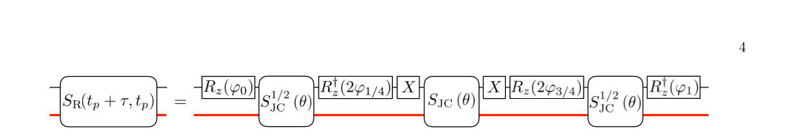 
FIG. 1. Circuit diagram for the Rabi gate ˆSR(tp +τ, tp) introduced in eq. (21). The phases in Z-rotations are φq = ω0(tp +qτ) with q = 0, 1

📷 Fig 2

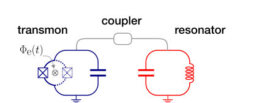 
FIG. 2. Equivalent electric circuit of the coupled transmon- resonator system. The transmon circuit is depicted in blue, the resonator circuit in red. The transmon and the resonator are coupled by a coupler which can be either a fixed capac- itor, another bus resonator, or a tunable coupler [22]. De- pending on the target gate set, the transmon can be either fixed-frequency with a single Josephson junction, or a flux- tunable transmon with a SQUID loop, where the external flux Φe(t) can be used to tune the fundamental frequency of the transmon.

📷 Fig 3

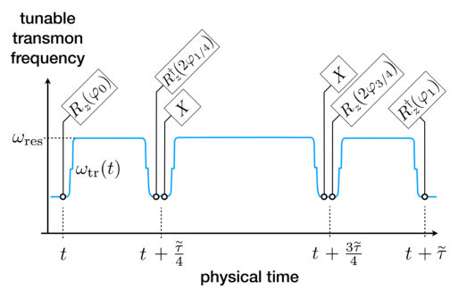 
FIG. 3. Schematic of the pulse sequence implementing the Rabi-gate protocol in eq. (21). The tunable transmon fre- quency ωtr(t) is modulated as a function of the physical time t to realize three resonant JC gates with durations ˜τ/4, ˜τ/2, and ˜τ/4, respectively, where ˜τ denotes the total duration of the Rabi gate. The digital gates are assumed to be much faster than the JC gates. The pulse profile of ωtr(t) may in- clude additional short buffer intervals at the pulse edges to compensate for dynamical phases generated by the free evo- lution terms in eq. (26). The JC gate accumulates the phase θ = ˜g˜τ/2, where ˜g and ˜τ denote the physical qubit-resonator coupling strength and gate...

📷 Fig 4

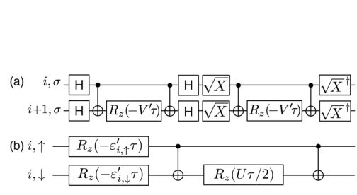 
FIG. 4. (a) Circuit diagram for implementing a single Trotter step ∼XX(ϕ)YY(ϕ) that corresponds to the hop- ping term in eq. (39) with the amplitude V ′. Here, the

📷 Fig 5

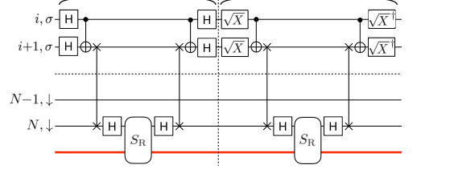 
FIG. 5. (a) Circuit implementation of the gate block ˆSZ,(i,σ) corresponding to the electron-phonon interaction on lattice site (i, σ). A sequence of SWAP gates transfers the quantum state of qubit (i, σ) to the terminal qubit (N, ↓), which is di- rectly coupled to the resonator. The inverse SWAP sequence restores the original qubit ordering after the interaction. The Rabi gate ˆSR(tp + τ, tp) is implemented according to eq. (21) with phase θ = −g0τ/2. The surrounding Hadamard gates ro- tate the interaction from the ˆZ basis of the electron-phonon coupling to the ˆ X basis required by the Rabi gate. (b) Cir- cuit diagram for the gate ˆSXY,(i,σ) (42) representing phonon- assisted hopping...

**Summary.** This paper details a novel digital-analog approach to simulate complex fermion-phonon systems, like the Hubbard-Holstein model, using Circuit QED. By encoding fermions in qubits and bosons directly in resonators, they construct a fundamental Rabi gate that emulates strong electron-phonon coupling. This allows for probing exotic physics regimes relevant to correlated materials on superconducting quantum hardware.

**Why it may be interesting.** This work is highly relevant as it bridges advanced quantum simulation techniques (Circuit QED) with challenging condensed matter physics problems (electron-phonon coupling), providing a concrete roadmap for near-term hardware implementation of strongly correlated models.

Detailed structure

**Main problem.** The primary goal is the quantum simulation of strongly correlated fermion-phonon models, such as the Hubbard-Holstein and Yukawa-SYK models.

**Main result.** The authors successfully construct quantum circuits for these complex models using a digital-analog circuit QED architecture, demonstrating how to probe nonclassical phonon physics and chaos signatures.

**Method.** They employ a hybrid digital-analog approach where fermions are on transmon qubits and bosons are mapped directly onto microwave resonators. The core technique involves realizing the electron-phonon coupling via a tailored qubit-resonator Rabi gate.

**Model / system.** The system models include electron-phonon interactions (Hubbard-Holstein) and phonon-mediated interactions among Majorana fermions (Yukawa-SYK). The physical platform is Circuit QED, utilizing transmon qubits coupled to microwave resonators.

**Key observables.** Nonclassical phonon physics signatures, quantum chaos indicators (spectral statistics), and ground state properties via variational ansatz.

**Important parameters / regimes.** The simulation relies on controlling gate parameters like displacement amplitudes ($\varphi$) and interaction phases ($	heta$), as well as operating in both dispersive and resonant regimes of the circuit QED setup.

**Assumptions / limitations.** The approach circumvents costly finite-dimensional encoding for bosons by using the resonator's physical Hilbert space. The Rabi gate implementation relies on Trotter decomposition approximations (first or second order).

**Figures summary.** Figures illustrate the pulse sequence implementing the fundamental Rabi gate protocol and show the electric circuit diagram of the coupled transmon-resonator system.

**Paper structure.** The paper first establishes the need for simulating fermion-phonon models. It then details the construction of the essential qubit-resonator Rabi gate using Trotter decomposition, showing its equivalence to known gates. Finally, it applies this fundamental gate structure to build circuits for specific complex Hamiltonians like HH and Yukawa-SYK.

Abstract

Gate-based digital quantum simulations offer an exciting new paradigm for studying the many-body physics of strongly correlated systems. In this context, electron-phonon models are challenging for qubit-only quantum simulators, as bosonic degrees of freedom require costly finite-dimensional encodings. Here, we elaborate on an alternative approach based on a digital-analog circuit QED architecture, where fermions are encoded in transmon qubits while bosons are represented directly by microwave resonators. The central building block of this framework is a qubit-resonator Rabi gate that emulates strong electron-phonon coupling and can be implemented through a sequence of resonant Jaynes-Cummings gates interleaved with layers of single-qubit rotations. Using this Rabi gate as the fundamental unitary operation, we construct quantum circuits for the Hubbard-Holstein and Yukawa-Sachdev-Ye-Kitaev models, which describe, respectively, strongly correlated electrons coupled to phonons and phonon-mediated interactions among Majorana fermions. We further demonstrate how nonclassical phonon physics and signatures of quantum chaos in these models can be probed through circuit simulations, and develop measurement and variational protocols tailored to near-term superconducting quantum hardware.

[↑ back to top](#top)

### [Self-organized quasicrystals and their excitations in dipolar Bose-Einstein condensates via optical feedback](http://arxiv.org/abs/2607.10141v1)

**Authors:** Liang-Jun He, Fabian Maucher, Yong-Chang Zhang  
**Type:** theory · **Category:** quantum gases · **PDF:** <https://arxiv.org/pdf/2607.10141v1>  
**Analysis basis:** full PDF text, analyzed in chunks
**Topic relevance:** 🔥 `analog quantum simulation` **4/5** · `Keldysh / 2PI / non-Gaussian methods` **3/5** · `driven-dissipative phase transition` **3/5** · `methods for driven-dissipative` **3/5** · `non-equilibrium dynamics` **2/5** · `non-equilibrium universality` **2/5** · `Frenkel-Kontorova` **1/5** · `Tavis-Cummings & cavity-many-emitter` **1/5** · `correlated cavity matter` **1/5** · `interference shaping light` **1/5** · `quantum measurements` **1/5**

📷 Fig 1

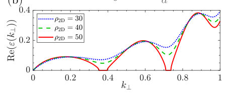 
FIG. 1. (a) Illustration of the setup. A quasi-2D dBEC polar- ized along the z-direction is placed in front of a retroreflecting mirror at a distance d. The thickness of the dBEC is 2σz. The forward Ω+ and backward Ω−propagating optical fields off- resonantly couple the ground state to the excited states of the atoms via a V-type configuration with detunings ∆+ and ∆−, respectively. The wavelength of λ = 421nm corresponds to the transition of 164Dy from ∣j = 8, mj = −8⟩to ∣j′ = 9, m′ j = −7⟩ and ∣j′ = 9, m′ j = −9⟩, respectively (cf. [51]). (b) A Bogoli- ubov excitation spectrum for different 2D densities ρ2D at as/add = 0.75. The red line corresponds to ●in Fig. 2.

📷 Fig 2

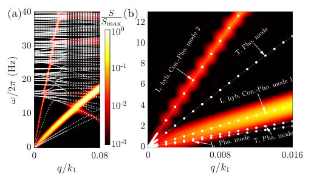 
FIG. 3. (a) The excitation spectrum and dynamic structure factor of the dodecagonal QC marked by ●in Fig. 2. (b) Enlarged view of the five gapless modes. The dynamic struc- ture factor is represented by the heat map, with a frequency broadening of 0.005ωz. Here, the momentum q is taken along x-axis.

📷 Fig 3

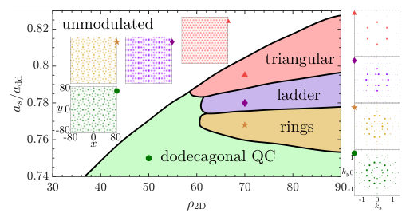 
FIG. 2. Ground-state phase diagram as a function of ρ2D and as/add at α = −0.00148 and β = 14.69. The subgraphs present the density distributions of the four modulated states in the same colors, which are obtained using the parameters ρ2D and as/add marked by ●, ★, ⧫, and ▲, respectively. The right column displays their corresponding momentum profiles.

📷 Fig 4

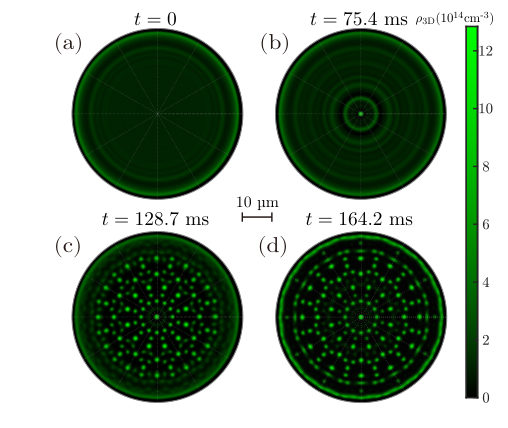 
FIG. 4. Dynamical evolution of the dBEC driven by the local and gradual quench [cf. Eqs. (6) and (7)] with v0 = 0.4.

**Summary.** The paper theoretically investigates the formation of self-organized quasicrystals in dipolar Bose-Einstein condensates by coupling dipole interactions with engineered optical feedback. It predicts a rich phase diagram featuring dodecagonal QCs and develops advanced numerical methods to calculate their unique excitation spectra. This work demonstrates how quantum control over long-range interactions can stabilize exotic, non-periodic crystalline phases.

**Why it may be interesting.** This work bridges concepts from quantum optics (optical feedback), many-body physics (BECs), and condensed matter theory (quasicrystals) to predict novel quantum phases of matter that are highly tunable via external fields.

Detailed structure

**Main problem.** The primary goal is realizing and characterizing self-organized quasicrystals (QCs) within a controllable quantum system.

**Main result.** The study predicts the existence of dodecagonal QC states in dipolar Bose-Einstein condensates, characterized by unique excitation spectra and finite superfluid fractions.

**Method.** The research employs mean-field theory, solving the Gross-Pitaevskii Equation (GPE) reformulated in 4D momentum space using a projection method to analyze ground states and excitations.

**Model / system.** The system is a quasi-2D dipolar Bose-Einstein condensate (dBEC). QC formation arises from the interplay between intrinsic dipole-dipole interactions and effective long-range oscillatory interactions generated via optical feedback.

**Key observables.** Bogoliubov excitation spectrum, ground-state phase diagram showing transitions to dodecagonal QCs, superfluid fraction $f_s(r_\perp)$, and characteristic gapless modes (phasons).

**Important parameters / regimes.** Interaction ratios ($a_s/a_{dd}$), condensate density ($
ho_{2D}$), detunings ($\Delta_\pm$), and the ratio of excitation momenta $ar{k}_2/ar{k}_1 	o \sqrt{2} + \sqrt{3}$.

**Assumptions / limitations.** The system is treated in a quasi-2D limit using a Thomas-Fermi profile, and calculations for QCs rely on projecting the problem into 4D momentum space due to lack of translational periodicity.

**Figures summary.** Figures illustrate the experimental setup (optical feedback), the ground-state phase diagram showing QC regimes, the convergence of QC peaks in momentum space towards ideal ratios, and the dynamic evolution protocol for generating QCs.

**Paper structure.** The paper progresses from establishing the physical mechanism (DDI + optical feedback) to deriving the effective GPE. It then analyzes the resulting ground-state phase diagram, calculates the excitation spectrum using advanced projection methods in momentum space, and finally proposes a dynamic quench protocol for realization.

Abstract

Quasicrystals emerge from competing interactions with incommensurate characteristic length scales that inhibit translational periodicity. Here, we show that such multiscale interactions can be realized in a dipolar Bose-Einstein condensate through the interplay between intrinsic dipole-dipole interactions and photon-mediated interactions generated by coupling to an excited-state manifold together with a suitably engineered optical feedback. This interplay gives rise to two pronounced roton instabilities in the Bogoliubov excitation spectrum, leading to a rich ground-state phase diagram including dodecagonal quasicrystals with twelvefold rotational symmetry for experimentally realistic parameters. We further propose a protocol to access these quasicrystals dynamically and develop a general numerical framework for calculating their collective excitation spectra.

[↑ back to top](#top)

### [Unique temporal scaling dimension for quantum criticality in open systems weakly coupled to environment](http://arxiv.org/abs/2607.11206v1)

**Authors:** Fan Zhong  
**Type:** theory · **Category:** statistical mechanics · **PDF:** <https://arxiv.org/pdf/2607.11206v1>  
**Analysis basis:** full PDF text, analyzed in chunks
**Topic relevance:** 🔥 `driven-dissipative phase transition` **4/5** · 🔥 `non-equilibrium universality` **4/5** · `correlated / nonlocal dissipation` **3/5** · `methods for driven-dissipative` **3/5** · `non-equilibrium dynamics` **3/5** · `analog quantum simulation` **2/5** · `Keldysh / 2PI / non-Gaussian methods` **1/5** · `Kondo & dissipative impurity` **1/5** · `entanglement & information structure` **1/5**

📷 Fig 1

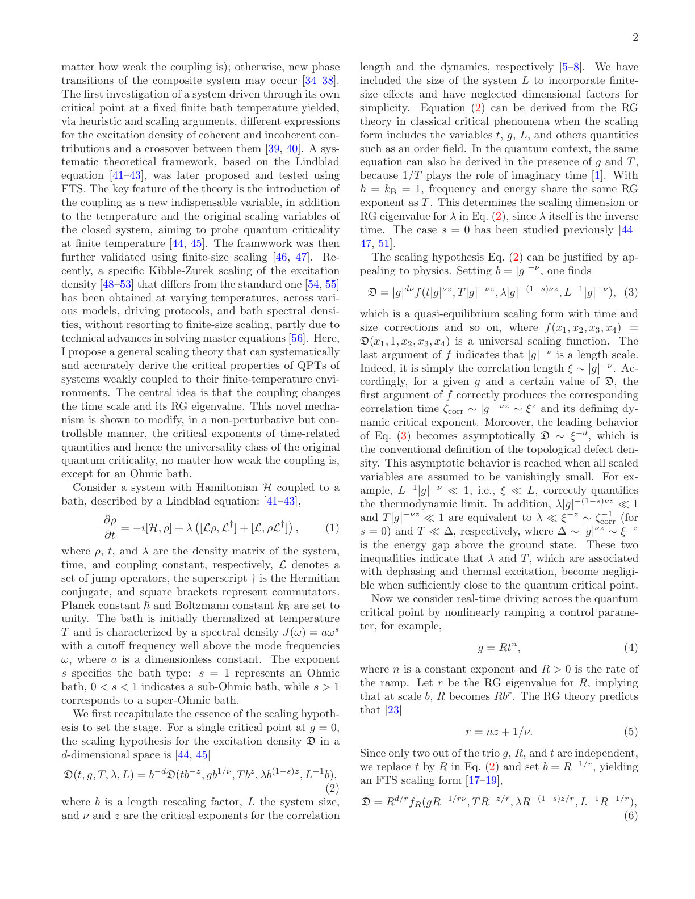 
Low-resolution page preview, page 2

📷 Fig 2

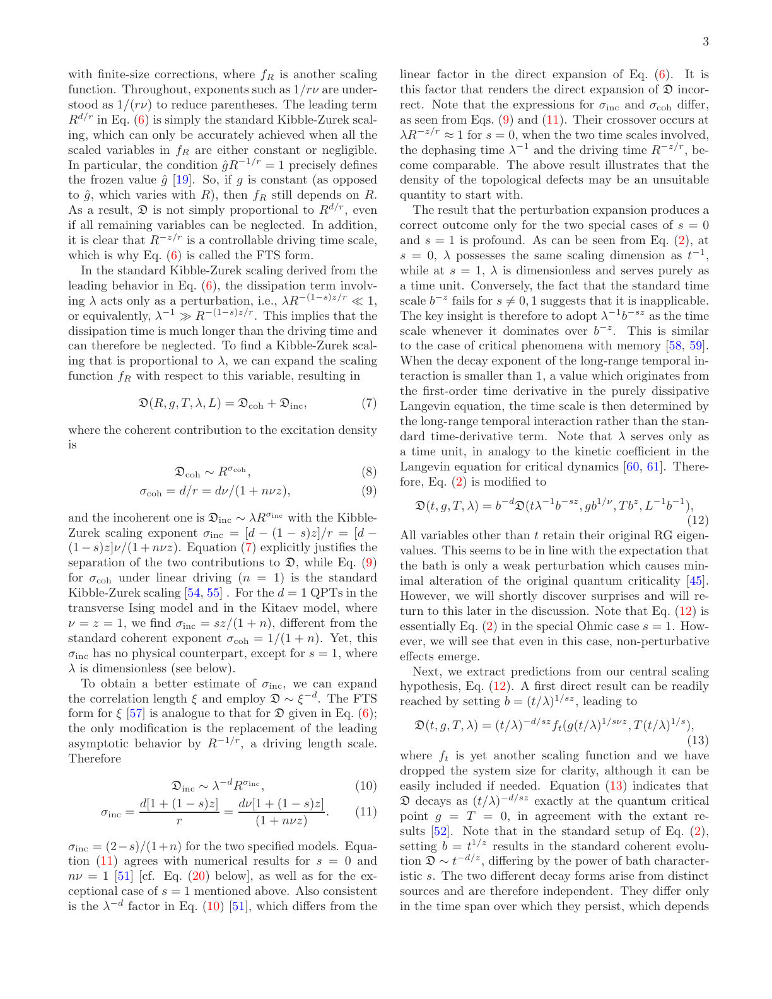 
Low-resolution page preview, page 3

📷 Fig 3

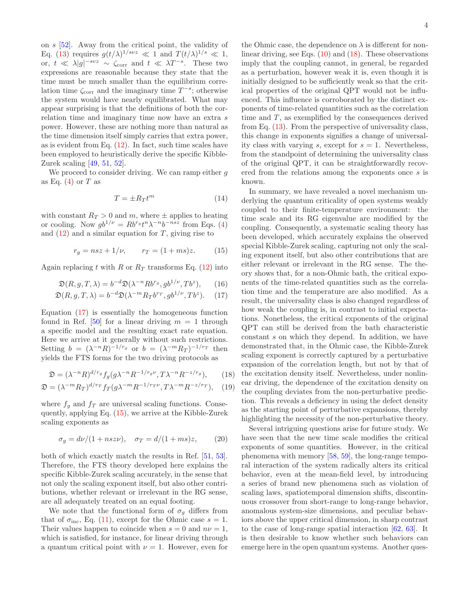 
Low-resolution page preview, page 4

📷 Fig 4

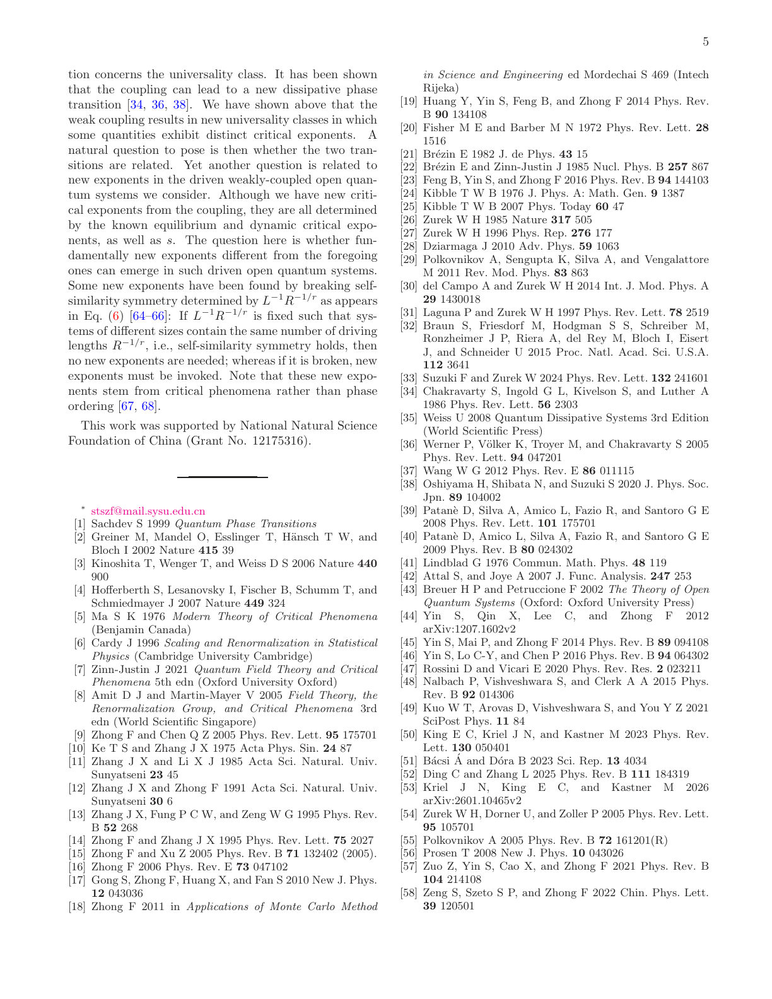 
Low-resolution page preview, page 5

📷 Fig 5

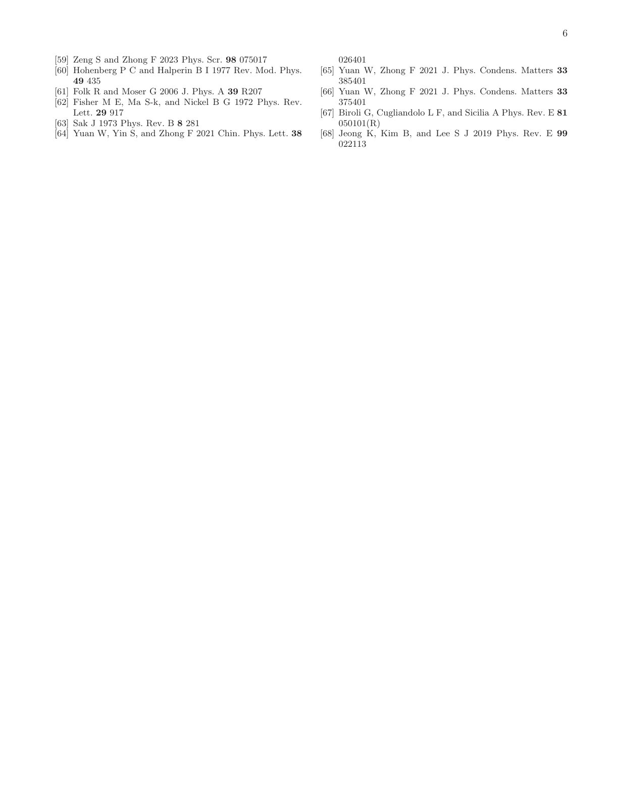 
Low-resolution page preview, page 6

**Summary.** This paper develops a generalized scaling theory for quantum criticality in open quantum systems coupled to an environment. It argues that the environmental coupling introduces a unique temporal renormalization group eigenvalue, fundamentally altering critical exponents beyond standard predictions. This provides a more accurate framework for analyzing non-equilibrium dynamics like those seen during rapid quenches.

**Why it may be interesting.** This work directly addresses non-equilibrium dynamics in open quantum systems, which is crucial for understanding realistic physical implementations of quantum technologies or studying driven many-body physics where dissipation cannot be ignored.

Detailed structure

**Main problem.** The study focuses on understanding, predicting, and controlling the real-time dynamics of quantum phase transitions (QPTs) in open quantum systems weakly coupled to a finite-temperature environment.

**Main result.** The coupling introduces a distinct temporal renormalization-group eigenvalue, leading to a general scaling theory that modifies critical exponents non-perturbatively, thus altering standard Kibble-Zurek predictions.

**Method.** The authors employ Renormalization-Group (RG) theory and Finite-Time Scaling (FTS) approaches to derive generalized scaling forms for critical observables.

**Model / system.** The system consists of open quantum systems whose dynamics are modeled by a Lindblad equation describing coupling ($\lambda$) to an environment with spectral density $J(\omega)$. The analysis considers QPTs driven by external parameters ($g, T$).

**Key observables.** Excitation density ($D$), critical exponents ($\sigma_g, \sigma_T$), and the modified time scales.

**Important parameters / regimes.** Coupling constant ($\lambda$), bath spectral dimension ($s$), temperature ($T$), system size ($L$), and driving rate parameters ($R$).

**Assumptions / limitations.** The standard Kibble-Zurek scaling is insufficient, necessitating a non-perturbative RG approach to account for the environmental coupling's influence on time scales.

**Figures summary.** Not specified by notes; the theory derives specific FTS forms (e.g., Eq. 12) and corresponding modified exponents.

**Paper structure.** The paper builds from identifying the need for a new RG eigenvalue due to environmental coupling, deriving generalized scaling forms involving multiple scaled variables, showing how this modifies standard Kibble-Zurek predictions, and discussing implications for universality classes.

Abstract

Probing, understanding, predicting, and controlling the real-time dynamics of quantum phase transitions in open systems are of pivotal importance to modern condensed matter physics, statistical physics, and quantum computing, among others. Here it is argued that a distinct temporal renormalization-group eigenvalue is needed for quantum criticality in open systems weakly coupled to their finite-temperature environment. This new physics enables the formulation of a general scaling theory that can accurately account for the critical properties including the specific Kibble-Zurek scaling in such open quantum systems. Remarkably, the critical exponents of time-related quantities are altered nonperturbatively regardless of how weak the coupling is, except for an Ohmic bath. Perspectives for future study are also discussed.

[↑ back to top](#top)

### [Slow is fast: raising barriers to accelerate thermal relaxation](http://arxiv.org/abs/2607.11877v1)

**Authors:** Yubo Wang, Zhiyue Lu  
**Type:** theory · **Category:** statistical mechanics · **PDF:** <https://arxiv.org/pdf/2607.11877v1>  
**Analysis basis:** full PDF text, analyzed in chunks
**Topic relevance:** 🔥 `non-equilibrium dynamics` **4/5** · `correlated / nonlocal dissipation` **3/5** · `methods for driven-dissipative` **3/5** · `non-equilibrium universality` **3/5** · `Keldysh / 2PI / non-Gaussian methods` **2/5** · `analog quantum simulation` **2/5** · `driven-dissipative phase transition` **2/5** · `entanglement & information structure` **1/5** · `scars & prethermalization` **1/5**

📷 Fig 1

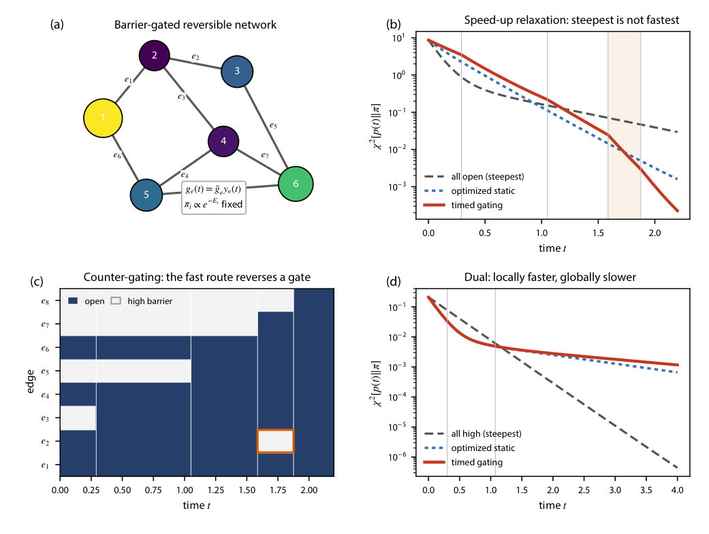 
FIG. 1. Barrier scheduling outperforms the pointwise extremes. (a) Six-state reversible network; barrier control changes the conductances while leaving π fixed. (b) Acceleration at ymin e = 0.05 and T = 2.2. Although all-open maximizes the instantaneous decay rate at every fixed state, timed gating reduces the terminal χ2 by factors of 130 and 7.05 relative to all-open and the best-found static landscape, respectively. The shaded interval marks the nonmonotone reversal shown in panel (c). (c) Acceleration gate schedule. Edge e2 is opened, driven to the high-barrier extreme, and reopened, producing an explicit counter-gate rather than a monotone approach to all-open. The orange box...

📷 Fig 2

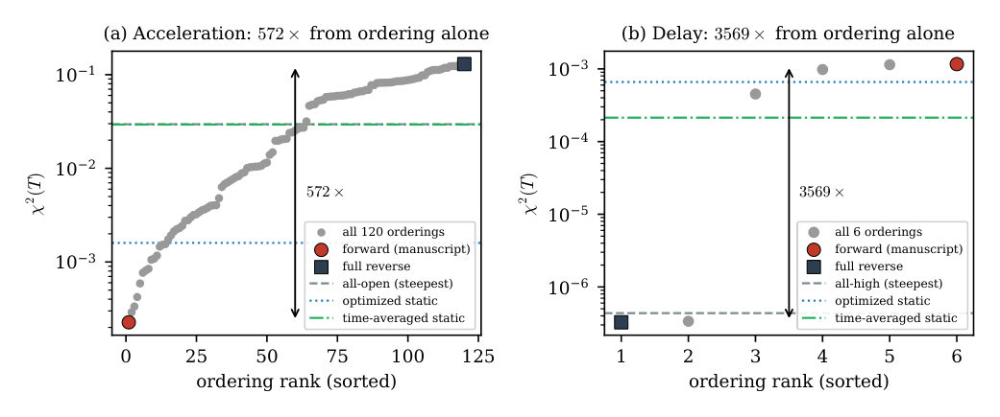 
FIG. 2. Same kinetic dose, opposite outcomes: relaxation is set by the order of gating. Each protocol of Fig. 1 is reordered by permuting its stages while keeping every stage’s gates and duration fixed, so all orderings share identical integrated apertures R T 0 ye dt and differ only in time order. (a) Acceleration: the displayed order gives the smallest terminal residual and the full reversal the largest among all 5! = 120 permutations, a ratio of 572 between the largest and smallest χ2(T). (b) Delay: the forward order gives the largest residual and the reverse order the smallest among all 3! = 6 permutations, a ratio of 3569. Dashed, dotted, and dash-dotted lines mark the corresponding...

**Summary.** The paper investigates non-equilibrium control by scheduling kinetic barriers during system relaxation. It shows that the intuitive fastest strategy (all gates open) is suboptimal because it ignores the time ordering of underlying physical processes. Optimal acceleration requires a counter-intuitive 'counter-gating' schedule, proving that the noncommutativity of the relaxation generators is key to achieving speedups.

**Why it may be interesting.** This work provides a powerful theoretical framework for understanding how temporal ordering of microscopic processes (like opening/closing gates) can fundamentally alter macroscopic relaxation dynamics, which has implications for quantum thermalization and energy transport in complex systems.

Detailed structure

**Main problem.** To determine how dynamically scheduling kinetic barriers during relaxation can accelerate or slow down the approach to equilibrium without performing external work.

**Main result.** Optimal schedules require non-commuting time ordering of barrier control, enabling 'counter-gating' (transiently raising some barriers) to achieve faster relaxation than simply keeping all gates open.

**Method.** The analysis uses optimal control theory (Pontryagin's principle) applied to the evolution governed by a time-dependent Lindblad/Master equation, analyzing the terminal distance using f-divergences like $\chi^2$.

**Model / system.** A reversible system relaxing to equilibrium described by a connected graph of states. The dynamics are controlled by modulating kinetic barriers $B_e(t)$ via time-dependent conductances $g_e(t) = \exp[-eta B_e(t)]$.

**Key observables.** Terminal distance from equilibrium ($\chi^2(T)$), relaxation eigenvalues ($\gamma_a$), and the entropy production rate $\sigma(t)$.

**Important parameters / regimes.** The control schedule $\{y_e(t)\}$, which dictates barrier heights, and the finite time $T$ at which the measurement is taken.

**Assumptions / limitations.** The analysis assumes that the modulation of barriers is slow compared to fast intrawell equilibration; it also relies on the system being reversible and having fixed initial/final states (no work done).

**Figures summary.** Figures compare relaxation performance ($\chi^2(T)$) for various protocols, showing that time-ordered gating significantly outperforms static 'all-open' or 'all-high' controls.

**Paper structure.** The paper establishes the benchmark (all-open gates), introduces the finite-time optimization problem using control theory, derives necessary conditions via Pontryagin's principle, and proves that noncommutativity is essential for achieving acceleration through counter-gating.

Abstract

For a reversible system relaxing to equilibrium, the obvious fastest strategy is to lower all kinetic barriers (open all gates). We find that such intuition holds at three levels: the all-open-gate strategy achieves the highest local conductance, it maximizes the instantaneous speed of approach in every $f$-divergence, and it simultaneously maximizes all relaxation eigenvalues. Nevertheless, we show that a counter-intuitive finite-time optimum lies beyond this intuition and operates at a fourth level, invisible to all three: eigenvector rotation. Noncommutativity enables timed schedules to reproject residual amplitudes across relaxation modes, thereby achieving faster relaxation. Optimal schedules are bang--bang. In our illustrative example, the best-found schedule also employs counter-gating, transiently raising selected barriers, and reduces the terminal residual by a factor of $130$ relative to all-open, and by $7$ relative to the best static landscape. A no-go theorem shows that noncommutativity is necessary: commuting generators collapse every schedule to a static time-averaged landscape, worse than the intuitive static control. In the reverse problem, the dual schedule preserves nonequilibrium free energy far more effectively than intuitively keeping all barriers at maximum heights. Whether accelerating or delaying relaxation, barrier control performs no work on the reduced Markov system; it only re-times a fixed total dissipation budget.

[↑ back to top](#top)

### [Anomalous Dissipation in Current Biased Josephson Systems](http://arxiv.org/abs/2607.11647v1)

**Authors:** Johannes Hauff, Niklas Gaiser, Joachim Ankerhold, Dominik Maile  
**Type:** theory · **Category:** other · **PDF:** <https://arxiv.org/pdf/2607.11647v1>  
**Analysis basis:** full PDF text, analyzed in chunks
**Topic relevance:** 🔥 `methods for driven-dissipative` **4/5** · `Keldysh / 2PI / non-Gaussian methods` **3/5** · `correlated / nonlocal dissipation` **3/5** · `driven-dissipative phase transition` **3/5** · `non-equilibrium dynamics` **2/5** · `non-equilibrium universality` **2/5** · `Kondo & dissipative impurity` **1/5** · `measurement-induced transitions` **1/5** · `quantum measurements` **1/5**

📷 Fig 1

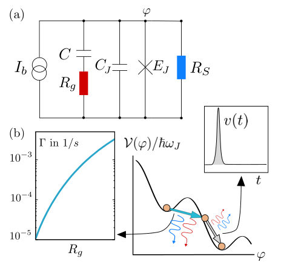 
Figure 1. (a) Current-biased Josephson junction, connected in parallel to a shunt resistor RS and and to a branch containing an external capacitor C and a resistor Rg. (b) Sketch of the tilted washboard potential with the main processes analysed in the article. The fictitious phase particle is initially trapped in a metastable potential minimum. The decay rate out of this minimum Γ is enhanced by increasing Rg. The dynamics after the tunneling event yield a voltage pulse stemming from acceleration due to Rg followed by a re-trapping behaviour where Rg and RS both damp the dynamics.

📷 Fig 2

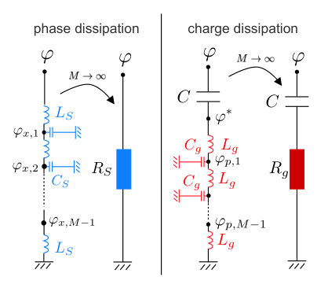 
Figure 2. Two modes of dissipation in an electrical circuit described by a semi-infinite transmission line. Left: The line is coupled to the phase φ. Right: The line is coupled to the phase φ∗while the capacitor C yields a coupling between ˙φ and ˙φ∗. Both settings converge to Ohmic reservoirs in the limit M →∞.

📷 Fig 3

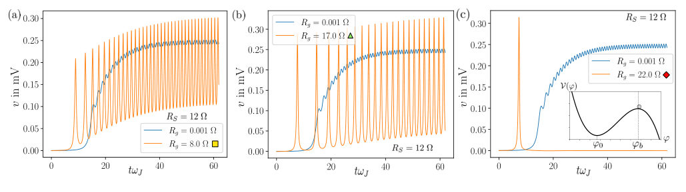 
Figure 3. Voltage dynamics of the current biased Josephson Junction as a function of time. The particle starts at rest close to a maximum in the tilted washboard potential as we display in the inset of (c). We fix ib = 0.98 and RS = 12 Ω(γ/ωJ = 0.13). The blue lines in each plot are guides to the eye and show the results for vanishing Rg. (a) Rg = 8 Ω(τpωJ = 4.9) and (b) Rg = 17 Ω(τpωJ = 10.41): The oscillations in the voltage stemming from the washboard are strongly amplified by Rg. (c) Rg = 22 Ω(τpωJ = 13.47): The particle is first accelerated and then re-trapped in the next local minimum of the potential. This happens only due to the combined effects of Rg and RS. The symbols in the...

📷 Fig 4

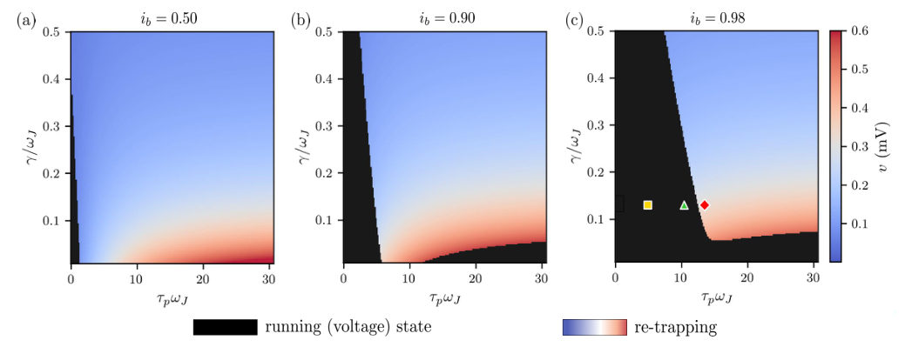 
Figure 4. Colour-plots indicating the deterministic running state (black areas) with finite voltage and the deterministic re- trapping regime (coloured areas) of the junction as a function of the dissipative parameters γ/ωJ and τpωJ for different values of the bias current. The colour code encodes the height of the voltage pulse across the junction before re-trapping (see Fig. 3c). (a) ib = 0.50: The particle is re-trapped for γ/ωJ →0 and finite τpωJ and vice versa. Having both environments present, the system is re-trapped for a broad parameter regime. The height of the voltage pulse before re-trapping increases with τpωJ. (b) ib = 0.9: In the depicted parameter regime phase dissipation...

📷 Fig 5

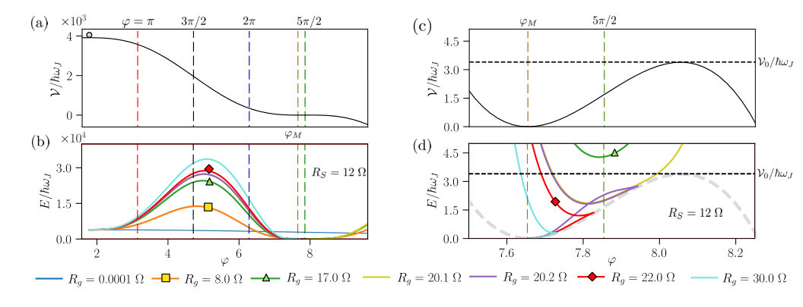 
Figure 5. (a) Exact shape of the tilted washboard potential for ib = 0.98. The particle starts close to the barrier top. The dashed lines indicate the impact of the anomalous dissipation as determined by Eq. (15): φ = π maximum amplification, φ = 3π/2 sign change, φ = 2π maximum damping, φ = 5π/2 sign change. The golden dashed line shows the potential minimum (φM) adjacent to the barrier. (b) Total instantaneous energy of the particle at position φ for different values of Rg (different lines) and RS = 12 Ω. The dashed lines are guides to the eye (see (a)). (c) Zoom into the region of the first minimum with the adjacent barrier. (d) Total instantaneous energy in the barrier region for...

**Summary.** This paper investigates how coupling a Josephson junction to an external circuit with anomalous dissipation modifies its quantum dynamics. It finds that this environment enhances the probability of quantum tunneling out of metastable states, leading to a unique phase diffusive regime. This framework offers a tool for engineering controlled dissipative processes in superconducting circuits.

**Why it may be interesting.** This work is highly relevant for AMO/open quantum systems as it provides a general framework for engineering non-Markovian or 'anomalous' dissipative dynamics in nonlinear quantum circuits, which can be used to control tunneling and state preparation.

Detailed structure

**Main problem.** The paper theoretically explores a new phase diffusive regime in current-biased Josephson junctions caused by anomalous dissipation introduced via coupling to an external circuit environment.

**Main result.** Anomalous dissipation enhances the quantum escape process from metastable states, leading to a distinct phase diffusive regime characterized by enhanced tunneling followed by a short voltage pulse and high-probability re-trapping.

**Method.** The analysis uses system-reservoir models, deriving and solving quantum Langevin equations for the junction dynamics, complemented by semiclassical path integral methods for calculating escape rates.

**Model / system.** The system is a current-biased Josephson junction coupled in parallel to an external circuit containing resistors ($R_S$, $R_g$) and capacitors. The dynamics are governed by generalized Hamiltonian formulations incorporating dissipation terms.

**Key observables.** Escape rate ($\Gamma$), voltage pulse characteristics, phase particle dynamics (diffusive regime), and correlation functions of fluctuating currents.

**Important parameters / regimes.** Bias current ($I_B/I_C$), temperature (low T regimes), circuit parameters ($R_S, R_g, C$), and the ratio of thermal activation to quantum tunneling rates.

**Assumptions / limitations.** The analysis relies on modeling dissipation via coupling to external circuits and employs semiclassical approximations for calculating tunneling probabilities in the presence of anomalous environments.

**Figures summary.** Figures illustrate the circuit setup showing $R_S$ and an $R_g-C$ branch, sketching the tilted washboard potential, and comparing two distinct modes of dissipation (phase vs. charge coupling).

**Paper structure.** The paper progresses from establishing the physical model and anomalous dissipation mechanism via Langevin equations to analyzing the quantum escape process using semiclassical methods, culminating in the identification of the novel phase diffusive regime.

Abstract

A new phase diffusive regime in a current biased Josephson junction is theoretically explored which originates from embedding the junction in a circuit environment with anomalous dissipation. This is realized by placing parallel to the junction a resistor in series with a capacitor such that electromagnetic fluctuations effectively couple also to the charge of the junction. This leads to rich Josephson dynamics, in particular for the switching of the junction out of a zero voltage state. Modelled as the escape process of a fictitious phase-particle out of a metastable well, a detailed study reveals that anomalous dissipation has a strong impact at low temperatures when quantum tunneling dominates against thermal activation. As a manifestation, a regime is found, where for realistic circuit parameters the quantum escape process is substantially enhanced, followed by a short voltage pulse and re-trapping with high probability. This class of circuits may be leveraged for detecting microwave photons or dissipative quantum annealing processes. In addition, the analysis provides a general framework for engineering dissipative dynamics in nonlinear systems using anomalous environments.

[↑ back to top](#top)

### [Finite-time Scaling of the surface special transition in a 3D classical Heisenberg model](http://arxiv.org/abs/2607.11066v1)

**Authors:** Dongxu Liu, Zhe Wang, Shuai Yin, Zheng Yan  
**Type:** both · **Category:** statistical mechanics · **PDF:** <https://arxiv.org/pdf/2607.11066v1>  
**Analysis basis:** full PDF text, analyzed in chunks
**Topic relevance:** 🔥 `non-equilibrium dynamics` **4/5** · 🔥 `non-equilibrium universality` **4/5** · `driven-dissipative phase transition` **3/5** · `methods for driven-dissipative` **3/5** · `analog quantum simulation` **2/5** · `correlated / nonlocal dissipation` **1/5** · `entanglement & information structure` **1/5** · `exotic spin models in light-matter` **1/5** · `scars & prethermalization` **1/5**

📷 Fig 1

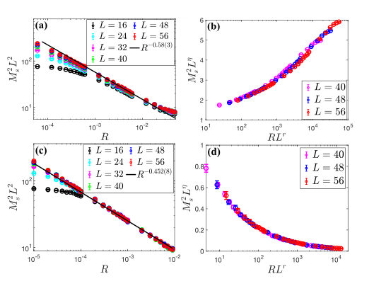 
FIG. 1. Finite-time scaling analysis of the surface order pa- rameter M 2 s during non-equilibrium heating and cooling pro- cesses. (a) Heating process: the system is driven from an ini- tial temperature T0 = 0.5 to the special transition at Tt = 1.0. The power law scaling behavior is represented by the black solid line. (b) After rescaling the x-axis and y-axis as shown in (b), a good data collapse is achieved for the non-equilibrium heating process when lower driving rate is employed. (c) Cooling process: the system is quenched from T0 = 2.0 to Tt = 1.0. Its power law scaling behavior is indicated by the black solid curve. Data collapse analysis was performed on the non-equilibrium...

📷 Fig 2

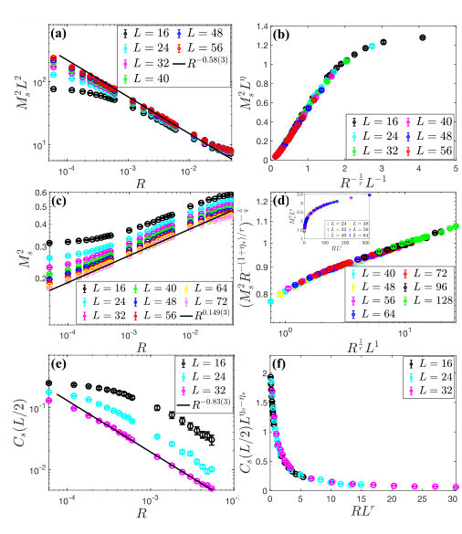 
FIG. 2. This figure presents a finite-time scaling analysis of M 2 s under non-equilibrium conditions induced by quenching the surface coupling Js. Panel (a) corresponds to quenching from the ordinary transition to to the special transition, with the power-law scaling shown as a black solid curve. Panel (b) shown the data collapse for M 2 s after tunneling Js from ordi- nary transition to the special point. Panel (c) corresponds to quenching from the extraordinary-log transition to the special transition, where the power-law scaling is also represented by a black solid curve. Panel (d) shows the data collapse for M 2 s upon tuning Js from extraordinary-log transition to the spe- cial...

**Summary.** This paper investigates how a 3D classical Heisenberg model behaves when driven across a surface phase transition. The authors find that the initial critical state dictates the resulting non-equilibrium scaling laws. Specifically, starting from an extraordinary-log critical point introduces a novel logarithmic correction to the standard finite-time scaling predictions.

**Why it may be interesting.** While focused on classical statistical mechanics, the study of non-equilibrium dynamics and memory effects in critical systems provides foundational concepts applicable to understanding quench dynamics in quantum many-body systems or open quantum systems far from equilibrium.

Detailed structure

**Main problem.** The study investigates non-equilibrium driven dynamics across a surface special phase transition in a 3D classical Heisenberg model, focusing on how the initial critical state influences scaling laws.

**Main result.** When driven from an extraordinary-log critical state, the finite-time scaling relation acquires a novel logarithmic correction: $M^2_{s} \propto R^{(1+\eta_s)/r_s}[\log(LR/r_s)]^{-q}$.

**Method.** The research employs Monte Carlo simulations to test four different driving protocols (temperature and surface-coupling ramps) across the transition point.

**Model / system.** The system is a three-dimensional classical Heisenberg model with open boundaries, described by an interaction Hamiltonian involving bulk and surface couplings.

**Key observables.** Surface order parameter mean squared ($\langle M^2_s 
angle$), which is analyzed for its scaling behavior with the driving rate ($R$).

**Important parameters / regimes.** The analysis distinguishes between ordinary, special, and extraordinary-log critical states; key parameters include the driving rate $R$, system size $L$, and various anomalous dimensions ($\eta_s, r_s$).

**Assumptions / limitations.** The work extends Finite-Time Scaling (FTS) theory by incorporating 'logarithmic initial-state memory' into the general scaling framework.

**Figures summary.** Figure 1 illustrates the driven dynamics of $M^2_s$ for non-equilibrium heating and cooling, showing power-law scaling; other figures demonstrate data collapse across different quench protocols.

**Paper structure.** The paper analyzes temperature-driven and surface-coupling ramped protocols. It first establishes standard Finite-Time Scaling (FTS) behavior for certain drives, then presents the central finding regarding the modified scaling law when starting from an extraordinary-log critical state.

Abstract

We investigate nonequilibrium driven dynamics across the special surface phase transition in the three-dimensional classical Heisenberg model with open boundaries, where tuning the surface coupling gives access to an extraordinary-log boundary critical state characterized by logarithmic, rather than power-law, decay of correlations. Using Monte Carlo simulations, we realize four driving protocols: temperature heating and cooling across the special transition, and surface-coupling ramps from the ordinary and extraordinary-log critical states into the special point. For temperature-driven protocols, the surface order parameter obeys a generalization of the finite-time scaling (FTS) and the Kibble-Zurek mechanism. The central finding emerges when the system is driven from the extraordinary-log critical state: the large-rate scaling relation acquires a logarithmic correction and takes the novel form $M^{2}_{s}\propto R^{(1+η_{s})/r_{s}}[\log(LR^{1/η_{s}})]^{-q}$ , where $R$ is the driving rate, $L$ the system size, $η_{s}$ the surface anomalous dimension, $r_{s}$ the scaling dimension of $R$, and $q$ the exponent governing the logarithmic boundary criticality. We demonstrate that this form follows from the general FTS framework by incorporating the logarithmic initial-state memory, and we achieve excellent data collapse over a wide range of system sizes and driving rates. Our results establish that extraordinary-log initial states alter nonequilibrium critical scaling, extending boundary FTS beyond conventional power-law initial conditions.

[↑ back to top](#top)

### [Interwoven long-range order induced by random fields](http://arxiv.org/abs/2607.10337v1)

**Authors:** Jeremiah Bender, Thomas Vojta  
**Type:** theory · **Category:** disordered systems and neural networks · **PDF:** <https://arxiv.org/pdf/2607.10337v1>  
**Analysis basis:** full PDF text, analyzed in chunks
**Topic relevance:** 🔥 `analog quantum simulation` **4/5** · `exotic spin models in light-matter` **3/5** · `methods for driven-dissipative` **3/5** · `driven-dissipative phase transition` **2/5** · `non-equilibrium dynamics` **2/5** · `non-equilibrium universality` **2/5** · `Frenkel-Kontorova` **1/5** · `Keldysh / 2PI / non-Gaussian methods` **1/5** · `correlated / nonlocal dissipation` **1/5** · `entanglement & information structure` **1/5**

📷 Fig 1

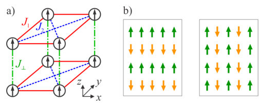 
FIG. 1. a) Interactions of the layered J1 −J2 Ising model. b) Schematic of the stripe order in the xy plane in the low-temperature phase for |J2|/J1 &gt; 1/2 in the absence of quenched disorder. Stripes can be aligned with either the x direction or the y direction.

📷 Fig 2

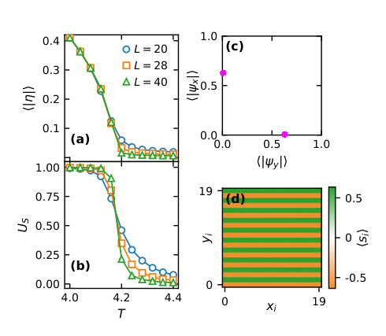 
FIG. 2. Simulation results for the layered J1 −J2 Ising model without random field. (a) Nematic order parameter ⟨|η|⟩and (b) stripe Binder cumulant Us vs. temperature T from dif- ferent system sizes L. (c) ⟨|ψx|⟩vs. ⟨|ψy|⟩for 100 individual samples at T = 4.0. (d) Local magnetization ⟨Si⟩in a single layer of one sample at T = 4.0. Statistical errors in panels a) and (b) are below the symbol size.

📷 Fig 3

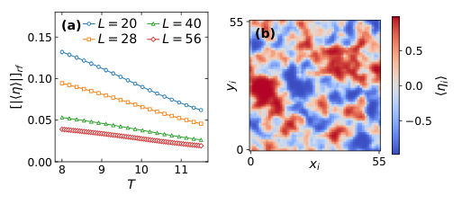 
FIG. 4. (a) Nematic order parameter |⟨η⟩| vs. temperature T at W = 8 and ξd = 3, averaged over 1000 random-field configurations for system sizes L = 20, 28, 40 and 256 config- urations for L = 56. (b) Local nematic order parameter ⟨ηi⟩ in a single layer of one sample at T = 8.0. For ⟨ηi⟩&gt; 0, stripes locally align with the x direction, while ⟨ηi⟩&lt; 0 corresponds to stripes aligned with the y direction.

📷 Fig 4

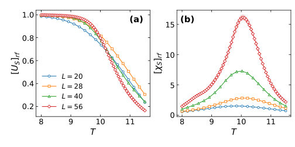 
FIG. 3. (a) Stripe Binder cumulant [Us]rf and (b) stripe sus- ceptibility [χs]rf vs. temperature T. Random field strength W = 8 and correlation length ξd = 3. The data are aver- aged over 1000 random-field configurations for system sizes L = 20, 28, 40 and 256 configurations for L = 56. Statistical errors are shown but mostly smaller than the symbol size.

📷 Fig 5

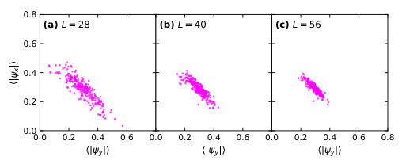 
FIG. 5. ⟨|ψx|⟩vs. ⟨|ψy|⟩for 256 individual samples at T = 8.0, W = 8, and ξd = 3. Each dot represents one individual disorder configuration.

**Summary.** This work introduces the 'implectic' phase, a new type of long-range order arising when random impurities locally break only partial symmetries. Using simulations on an Ising magnet model, the authors demonstrate that robust stripe order can emerge via the percolation of interwoven domain structures created by these random fields.

**Why it may be interesting.** The concept of emergent long-range order from local symmetry breaking via random fields is highly relevant to understanding complex phase diagrams in frustrated quantum magnets and superconductors.

Detailed structure

**Main problem.** The paper proposes a novel 'implectic' phase of long-range order that emerges in many-body systems due to random fields breaking only a subset of symmetries.

**Main result.** Long-range stripe order can be established through the percolation of interwoven domain structures formed by local symmetry breaking, even when the primary nematic order parameter itself remains disordered.

**Method.** The study relies heavily on large-scale Monte Carlo simulations to analyze phase transitions and order parameters in the presence of quenched random fields.

**Model / system.** The model is a layered $J_1-J_2$ Ising magnet subjected to random-field disorder, which couples locally to a composite vestigial nematic order parameter. The system exhibits frustration ($J_1>0, J_2<0$).

**Key observables.** Stripe Binder cumulant ($\langle U_s 
angle^{rf}$), stripe susceptibility ($\chi_s^{rf}$), and the local/global nematic order parameters ($\langle |\eta| 
angle^{rf}$).

**Important parameters / regimes.** Disorder strength ($W$), system size ($L$), and dimensionality ($d \ge 3$) are crucial for observing this phase.

**Assumptions / limitations.** The analysis assumes that the random field disorder locally breaks only a subset of symmetries, allowing for the formation of interwoven domain networks necessary for percolation.

**Figures summary.** Figures demonstrate the divergence of stripe susceptibility and Binder cumulant at $T_c \approx 10$ in the presence of strong random fields ($W=8$), while local nematic order shows characteristic domain structures.

**Paper structure.** The paper first defines the model and proposes the 'implectic' phase. It then uses Monte Carlo simulations to demonstrate the transition, showing that stripe order persists while the vestigial nematic order becomes localized into interwoven domains, leading to the proposed ordered state.

Abstract

We propose a distinct type of long-range ordered phase that can occur in classical and quantum many-particle systems. It is induced by impurities and defects that locally break a subset of the order-parameter symmetries, i.e., by random-field disorder that couples to a composite vestigial order parameter. The proposed ``implectic'' phase is characterized by spontaneous symmetry breaking on the background of the spatially interwoven domain structure created by the random fields. We explicitly demonstrate the existence of this phase in a layered $J_1-J_2$ Ising magnet by means of large-scale Monte Carlo simulations. We then discuss numerous potential applications in systems featuring charge and spin density wave order including frustrated magnets, cuprate and iron-based superconductors, and ultracold atoms.

[↑ back to top](#top)

### [Quantum probe advantage in learning many-body systems](http://arxiv.org/abs/2607.11829v1)

**Authors:** Wenzheng Dong, Andrew G. Green, Vlatko Vedral, Jinzhao Sun  
**Type:** theory · **Category:** statistical mechanics · **PDF:** <https://arxiv.org/pdf/2607.11829v1>  
**Analysis basis:** full PDF text, analyzed in chunks
**Topic relevance:** 🔥 `entanglement & information structure` **4/5** · `analog quantum simulation` **3/5** · `non-equilibrium dynamics` **3/5** · `measurement-induced transitions` **2/5** · `non-equilibrium universality` **2/5** · `quantum measurements` **2/5** · `Keldysh / 2PI / non-Gaussian methods` **1/5** · `correlated / nonlocal dissipation` **1/5** · `driven-dissipative phase transition` **1/5** · `methods for driven-dissipative` **1/5**

📷 Fig 1

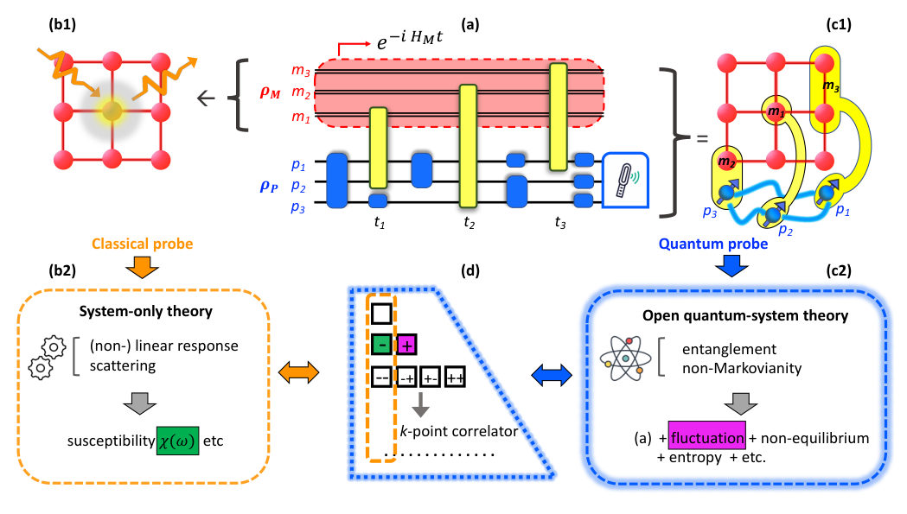 
FIG. 1. Framework of quantum-probe learning: coherent ancillae turn spectroscopy into an open-system readout problem. (a) Quantum-circuit representation of the probe protocol: a controllable probe register ρP undergoes coherent control, couples through addressable channels p to selected matter operators Mm(p) in the target state ρM, and is finally measured so that information about matter is inferred from reduced probe observables. (b1)–(b2) Effective classical-probe regime: when the probe is treated as a prescribed perturbation rather than as a measured quantum subsystem, the circuit reduces to the target system alone; correspondingly, scattering leads to system-only response theory with...

📷 Fig 2

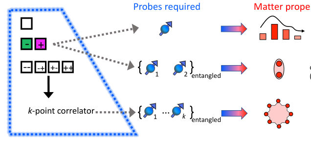 
FIG. 2. Probe resources are set by correlator complexity, not system size. The left wedge represents the enlarged k-point correlator landscape opened by probe-based learning, with mixed commutator/anti-commutator sectors beyond the single retarded response branch. The middle column indicates the minimal probe resources needed to access different levels of many-body structure: a single probe already resolves fluctuations and statistical averages; two entangled probes suffice for quasi-free matter, where second-order correlators determine the relevant physics; and k entangled probes access genuinely interacting matter through kth-order correlator structure. The right column summarizes the...

📷 Fig 3

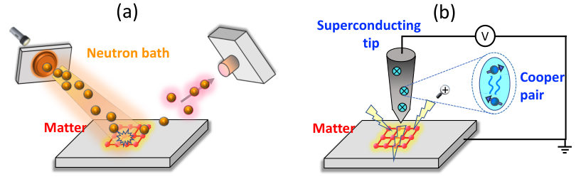 
FIG. 3. Experimental setup of probe-based learning as special cases within our framework. (a) In a conventional beam- or bath-style probe, illustrated here by neutron scattering from matter, the external particles are usually treated as an imposed perturbation and scattering readout for system-only response: the measured signal is interpreted through matter susceptibilities and therefore through retarded commutator structures. This picture could be extended to non-linear spectroscopy. (b) A superconducting tip provides a different kind of interface. The tunnelling object can be a phase-coherent Cooper pair, so the probe itself is a quantum degree of freedom that can become entangled with...

📷 Fig 4

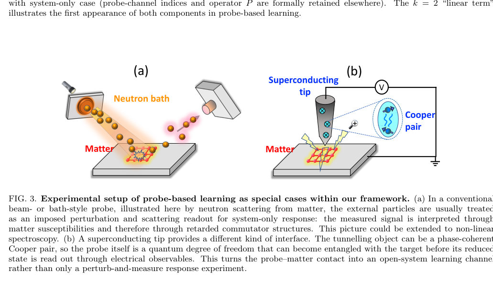 
Figure 3 translates the algebraic distinction in Table I into a language closer to experiment. In a scattering or spectroscopy mindset, the external probe is often integrated out conceptually: it prepares a perturbation, the matter evolves, and the recorded signal is interpreted as a response function of the target alone. That viewpoint is powerful, but it naturally privileges the retarded sector. Probe-based learning asks for a more quantum use of the same experimental idea: keep the probe as a controllable subsystem, calibrate its coupling history, and use its final reduced readout as the data channel. The payoff is thus not only a stronger signal, but a larger operator alphabet for what...

**Summary.** This work establishes that utilizing coherently controlled quantum probes allows researchers to learn about many-body properties—such as entropy and fluctuations—that are fundamentally inaccessible through traditional response functions. By treating the probe as an active quantum element, the authors open a vastly expanded operational learning framework for characterizing complex quantum matter.

**Why it may be interesting.** It provides a powerful theoretical tool for designing experiments or simulations that can extract non-equilibrium information (like fluctuations and entanglement) from complex quantum matter systems using controlled probes.

Detailed structure

**Main problem.** To determine which properties of a quantum many-body system are operationally accessible for learning or measurement beyond standard response theory.

**Main result.** Coherently controlled quantum probes provide a strictly larger operational framework, allowing access to anti-commutators and entanglement entropy that are inaccessible via traditional methods.

**Method.** The authors develop a unified quantum-circuit description comparing classical (perturbation) vs. quantum (coherent probe) readout channels to derive new correlator structures.

**Model / system.** The framework models the interaction between a target many-body system (M) and an explicitly controlled quantum probe register (P), described by a time-dependent Hamiltonian H(t).

**Key observables.** Anti-commutators, mixed-order correlators, fluctuations, non-equilibrium structure, entanglement entropy (e.g., von Neumann entropy).

**Important parameters / regimes.** The complexity of the target correlations ($k$), which dictates probe resource scaling; time evolution parameters ($\Gamma(T), \Phi(T)$).

**Assumptions / limitations.** The advantage relies on treating the probe as an explicit, coherently controlled quantum system rather than just a classical external perturbation.

**Figures summary.** Figures illustrate the comparison between limited response theory (commutator sector) and the broader learning space opened by quantum probes (mixed commutator/anti-commutator sectors), alongside resource scaling based on correlation order.

**Paper structure.** The paper progresses from defining the limitations of system-only response theory to introducing the quantum probe framework, deriving mathematical expressions linking probe dynamics to specific correlators ($	ext{M}_+, 	ext{M}_-$), and finally demonstrating access to entropy reconstruction.

Abstract

Which properties of a quantum many-body system are operationally accessible is a central question underlying spectroscopy, thermodynamics, and quantum information science. Conventional response theory answers this question within a system-only paradigm: one perturbs and measures the matter itself, obtaining susceptibility built from causally ordered nested commutators. Here we show that coherently controlled quantum probes, when measured at the end, define a strictly larger operational learning framework beyond that accessible from response theory. We establish this through a quantum-circuit description that unifies spectroscopy, probe microscopy, and probe-based quantum technologies within a common operational framework, from which we develop quantum protocols for learning many-body properties from probe readout only. This advantage arises because the reduced dynamics of quantum probes generically encode anti-commutator and mixed-order correlators of the target; therefore, measurements on the probe provide access to fluctuations, non-equilibrium structure, and entanglement entropy that are in general not accessible through response functions or a single probe alone. Moreover, we demonstrate that entangled probes can access many-body properties such as von Neumann entropy. We prove that the required probe resources scale with the complexity of the target correlations rather than with the size of the many-body system. Quantum probes are therefore not merely more sensitive sensors but provide a new way to learn many-body properties distinct from those of tomography or quantum simulation.

[↑ back to top](#top)

### [An efficient algorithm for approximate shadow Hamiltonian simulation](http://arxiv.org/abs/2607.11882v1)

**Authors:** Abhijit Chakraborty, Bharath Sambasivam, Karunya Shirali, Hunter Nelson, Mafalda Ramôa, Sophia E. Economou, Edwin Barnes  
**Type:** theory · **Category:** quantum information and computing · **PDF:** <https://arxiv.org/pdf/2607.11882v1>  
**Analysis basis:** full PDF text, analyzed in chunks
**Topic relevance:** 🔥 `entanglement & information structure` **4/5** · `analog quantum simulation` **3/5** · `methods for driven-dissipative` **3/5** · `non-equilibrium dynamics` **3/5** · `non-equilibrium universality` **2/5** · `Keldysh / 2PI / non-Gaussian methods` **1/5** · `correlated / nonlocal dissipation` **1/5** · `driven-dissipative phase transition` **1/5** · `exotic spin models in light-matter` **1/5**

📷 Fig 1

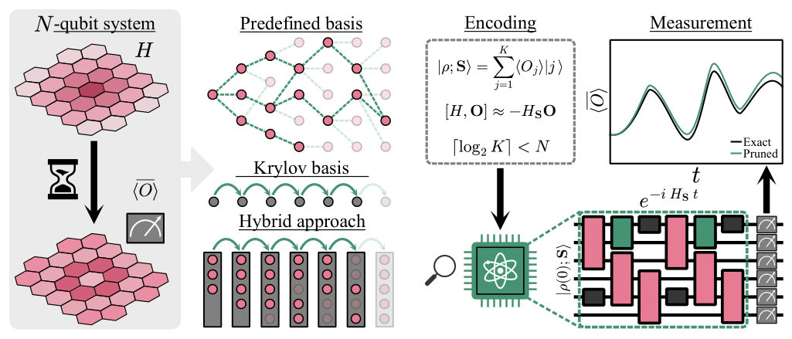 
FIG. 1: Schematic of the pruned shadow Hamiltonian simulation algorithm to approximately simulate the evolution of the observable ¯O under an N-qubit Hamiltonian, H. Three schemes (predefined basis, Krylov basis, and hybrid) can be used to build a shadow operator basis S containing important operators to ¯O under commutation with H. The shadow state encodes the expectation values of these observables on the physical state and can provide a more efficient mapping onto ⌈log2 K⌉&lt; N qubits. The shadow state is evolved by the shadow Hamiltonian HS, and measured in the computational basis to obtain the approximate real-time evolution of ¯O.

📷 Fig 2

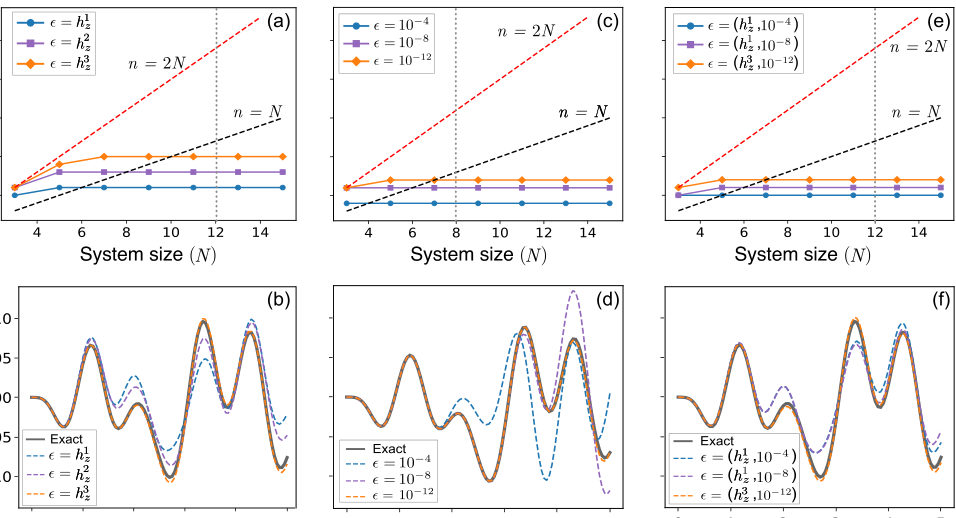 
FIG. 2: Pruned shadow Hamiltonian simulation of the 1D MFIM with hz = 0.3. (a,b) Results for the predefined Pauli-basis pruning scheme. Panel (a) shows the required shadow-register size as a function of system size for different pruning thresholds ϵ, using the central-site Z operator as the target observable. The saturation of the register size indicates that, for fixed ϵ, the magnetization dynamics of arbitrarily large systems can be simulated with a constant number of register qubits. The red dashed line indicates the scaling of the number of qubits needed to perform exact shadow Hamiltonian simulation. The gray dotted line marks the system size used in panel (b), which shows the...

📷 Fig 3

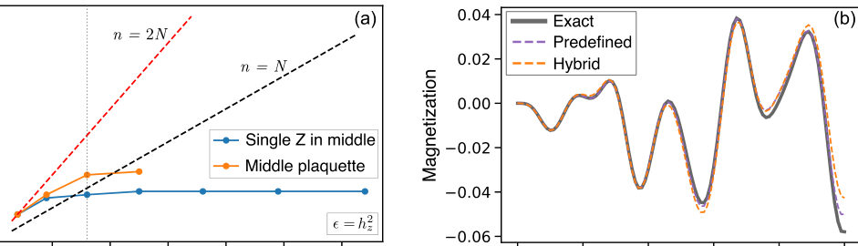 
FIG. 3: Pruning methods applied to the 2D MFIM with hz = 0.2 and ϵ = h2 z. (a) The scaling of shadow register size with system size is shown for two different root observables (single-weight Z in the middle site index and middle plaquette observable Zx,yZx+1,yZx+1,y+1Zx,y+1) of interest at a fixed pruning threshold ϵ = h2 z. (b) Average magnetization for a 2D MFIM for a 4 × 4 (16 qubits) square grid. The dynamics of magnetization is calculated for an initial state |0⟩⊗N/2 ⊗|1⟩⊗N/2. The shadow time evolution can be simulated with 14 qubits (purple dashed line) using the predefined basis pruning method with parallelization, demonstrating a savings in quantum resources. Due to the exponential...

📷 Fig 4

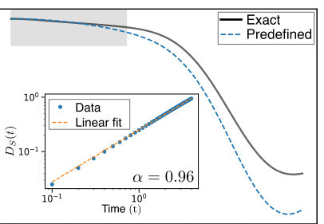 
FIG. 4: Study of a two-point correlator using pruned shadow simulation. The spin current autocorrelation function is plot- ted with time for a 12-qubit Heisenberg XXZ model with Jz = 0.05 (ballistic regime). Jd is the current across the domain wall and J(t) is the total spin current. The shaded region shows the physically meaningful regime before bound- ary effects due to the finite system size become significant, which is also used to extract the scaling of the diffusion co- efficient DS(t) (inset). The scaling α = 0.96 is close to the expected value of α = 1 in the ballistic regime. To perform the shadow simulation (with up to 10 qubits), the predefined Pauli basis pruning scheme is used with a...

📷 Fig 5

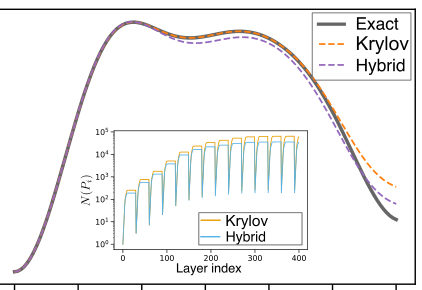 
FIG. 5: Study of a four-point correlator using the pruned shadow Hamiltonian method. The behavior of the OTOC (W ≡Z1, V ≡X1) with time is shown for a system size N = 5 for the LFXXZ model with J = hz = 1.0, Jz = 0.3 with the characteristic fast growth at early times. The cutoff used for the Krylov basis pruning scheme is ϵ2 = J8 z with an additional Pauli pruning cutoffof ϵ1 = J6 z for the hybrid scheme. The inset shows the number of Pauli strings, N(Pi), appearing in the i-th operator of the Krylov basis. The two- step pruning procedure of the hybrid method results in lower number of Pauli strings contained in each operator, leading to a reduced cost for storing the Krylov vectors and shadow...

**Summary.** The paper presents an advanced algorithm to simulate the time evolution of observables in complex quantum many-body systems by employing shadow Hamiltonian simulation. It introduces three pruning techniques—predefined basis, Krylov basis, and hybrid—to drastically reduce the size of the required operator algebra representation. This efficiency improvement makes simulating dynamics for interacting systems feasible on current or near-future quantum hardware.

**Why it may be interesting.** This work directly addresses resource scaling in simulating quantum dynamics for interacting systems, which is a major bottleneck in both theoretical condensed matter physics and practical quantum computing simulations.

Detailed structure

**Main problem.** Developing an efficient algorithm for approximate shadow Hamiltonian simulation to track the real-time dynamics of observables under time-independent Hamiltonians.

**Main result.** The proposed hybrid pruning scheme significantly reduces the required qubit register size compared to pure Krylov or predefined basis methods, enabling simulations on larger systems.

**Method.** It uses a targeted approximation by constructing a pruned operator algebra ($ar{S}_O$) based on three schemes: predefined basis, adaptive Krylov basis, and a hybrid combination of both.

**Model / system.** The method is benchmarked using lattice spin systems in one and two dimensions, applicable to general many-body Hamiltonians like the MFIM or PLIM.

**Key observables.** Time evolution expectation values $\langle ar{O}(t) 
angle$, higher-order correlation functions, and Out-of-Time-Ordered Correlators (OTOCs).

**Important parameters / regimes.** Truncation thresholds ($\epsilon, \epsilon_1, \epsilon_2$), system size ($N$), and the ratio of field strengths to interaction couplings ($h_z$ vs $J$).

**Assumptions / limitations.** The core assumption is that restricting the operator basis to elements relevant to the target observable yields a sufficiently accurate approximation, overcoming the exponential growth bottleneck.

**Figures summary.** Figures illustrate the three pruning schemes (FIG. 1), compare shadow register size scaling across methods (TABLE I), and show accuracy vs. system size or field strength effects in MFIM simulations (Figs. S2-S4).

**Paper structure.** The paper introduces the problem, details the mathematical framework of shadow simulation, proposes and analyzes three basis construction/pruning schemes (Predefined, Krylov, Hybrid), benchmarks these methods on lattice spin models, and discusses parameter regimes where pruning efficiency breaks down.

Abstract

We propose an efficient algorithm based on shadow Hamiltonian simulation to approximately simulate the real-time dynamics of observables under time-independent Hamiltonians. Shadow Hamiltonian simulation works at the level of the operator algebra generated by the observables through commutators with the Hamiltonian. Exactly encoding the quantum state in this picture is generally inefficient for interacting systems due to the exponential growth of the operator algebra. Our algorithm overcomes this bottleneck by systematically identifying the elements of the algebra most relevant to the target observables. This targeted approach is a controlled approximation that yields a highly efficient quantum state encoding that substantially reduces the size of the qubit register required to perform the time evolution using the shadow Hamiltonian. We propose two main pruning schemes, one based on a predefined operator basis and another on a constructed Krylov basis. We also present a hybrid scheme that builds a Krylov basis within a pruned algebra in the predefined basis. We benchmark our algorithm using lattice spin systems in one and two dimensions, for both one- and higher-point correlators as observables.

[↑ back to top](#top)

### [Barium-based Rydberg atom quantum technologies with long Rydberg coherence](http://arxiv.org/abs/2607.11282v1)

**Authors:** Xiao-Feng Shi  
**Type:** both · **Category:** other · **PDF:** <https://arxiv.org/pdf/2607.11282v1>  
**Analysis basis:** full PDF text, analyzed in chunks
**Topic relevance:** 🔥 `QC/QI experiment` **4/5** · 🔥 `analog quantum simulation` **4/5** · `Rydberg arrays` **3/5** · `non-equilibrium dynamics` **2/5** · `quantum optics experiment` **2/5** · `correlated / nonlocal dissipation` **1/5** · `driven-dissipative phase transition` **1/5** · `entanglement & information structure` **1/5** · `interference shaping light` **1/5**

📷 Fig 1

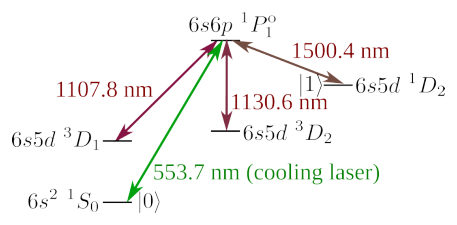 
FIG. 1. Level scheme of the cooling and magneto-optical trap- ping of barium atoms used in Ref. [57]. The level spacing is not to scale.

📷 Fig 2

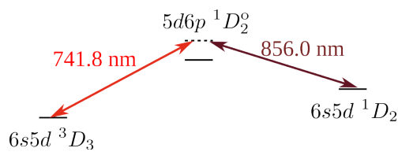 
FIG. 2. Level scheme of population transfer between |1⟩ and 6s5d 3D3 in Eq. (2). During idle time in a quantum circuit, e.g., between the execution of two quantum gates, a fast population transfer can be used so that the population in |1⟩can be shelved on the long-lived 6s5d 3D3 state. After the idle time, the reverse population transfer back to |1⟩can be similarly realized.

📷 Fig 3

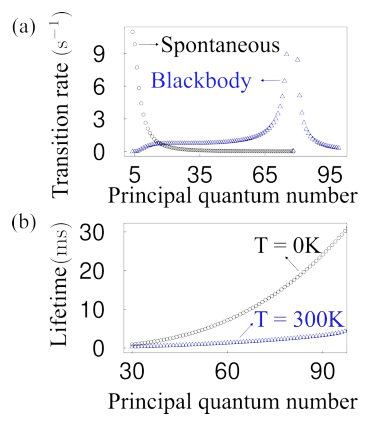 
FIG. 3. (a) Round and triangle symbols denote spontaneous emission rate and black-body-induced radiation rate from 6s78g 1G4 to 6snf 1F o 3 and 6snh 1Ho 5, respectively. The round symbols disappear beyond principal quantum num- ber 78 for spontaneous emission only takes atom to a lower state. (b) Round and triangle symbols denote 1/Γ0 and 1/(Γ0 + ΓBBR), respectively, where blackbody transition to states up to n = 100 is included.

📷 Fig 4

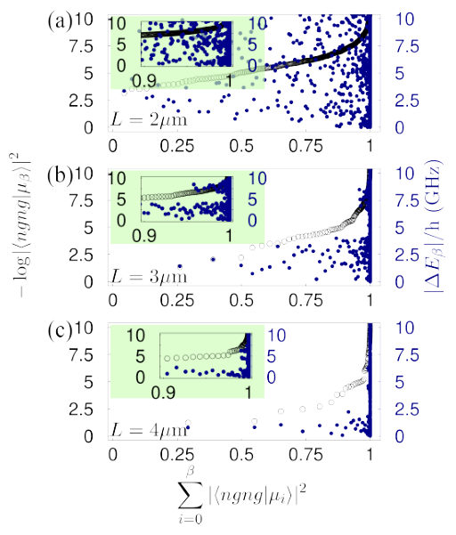 
FIG. 5. Illustration of eigenstates of the dipole-dipole Hamil- tonian for the state |ngng⟩, where the empty and filled circles represent −log|⟨ngng|µβ⟩|2 and the pair-state energy ∆E as a function of sβ = Pβ i=0|⟨ngng|µi⟩|2. The states are ordered with descending |⟨ngng|µβ⟩|2. The internuclear separation is 2, 3, and 4 µm in (a, b), and (c), respectively. The insets show the data near the region of sβ = 1, which shows that |µβ⟩with small ∆Eβ has small population. Here, the states have |mj| = 4 for they can be more useful for being less sen- sitive to noise of electric field [67].

📷 Fig 5

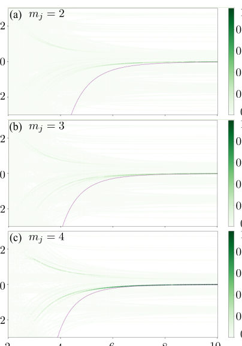 
FIG. 4. Interaction strengths of the dipole-dipole interaction between two atoms in the state |ngng⟩≡|6sng 1G4, mj⟩⊗ |6sng 1G4, mj⟩with mj = 2, 3, and 4 in (a), (b), and (c), respectively. Here n = 78 is taken as an example because it is the highest 1G4 barium state with the energy measured [53]. Here θ = 0, the calculation was via ARPACK [111], and states within 25 GHz from |ngng⟩, |∆n| ≤4, and s, p, · · · , i, k- orbitals are included. The purple dashed curve shows the asymptotic van der Waals scaling C6/L6 with perturbatively calculated C6.

**Summary.** The paper presents an advancement in Rydberg-mediated quantum technologies using barium atoms, overcoming the primary limitation of short Doppler-limited coherence times. By employing a specific two-photon excitation scheme, they achieve significantly enhanced coherence and utilize the inherent long lifetimes and strong dipole interactions of the resulting Rydberg states for robust quantum information processing.

**Why it may be interesting.** This work directly tackles a major bottleneck in neutral atom quantum simulation—decoherence—by leveraging atomic structure specifics (barium's electronic levels) and advanced laser control techniques. The combination of long coherence time with strong interactions makes it highly relevant for building scalable quantum processors.

Detailed structure

**Main problem.** The short Doppler-limited coherence time of laser-excited Rydberg states severely limits their utility in Rydberg-mediated quantum technologies.

**Main result.** By using a two-photon excitation scheme with barium atoms, the authors effectively remove Doppler-limited decoherence and demonstrate long coherence times for the $	ext{6s}n	ext{g } 1G_4$ state. This system also benefits from strong dipole interactions and long radiative lifetimes.

**Method.** The work proposes a two-photon excitation scheme using counter-propagating lasers to achieve a small effective wavevector, which suppresses Doppler broadening effects on the coherence time.

**Model / system.** The platform utilizes neutral Barium atoms ($	ext{Ba}$), defining qubits between the ground state and a metastable $d$-orbital clock state. Rydberg excitations are achieved via two-photon transitions to highly excited states like $	ext{6s}n	ext{g } 1G_4$.

**Key observables.** Rydberg coherence time ($T_{2,D}$), radiative lifetimes (e.g., $\sim 7.1 	ext{ ms}$ for $n=60$), and the strength of dipole-dipole interactions.

**Important parameters / regimes.** The effective two-photon wavevector ($	ext{k} \approx 0.14\ \mu	ext{m}^{-1}$) is crucial, leading to a predicted coherence time enhancement by $\sim 47$ times compared to Rb/Cs at similar temperatures.

**Assumptions / limitations.** The analysis assumes that the two-photon excitation scheme successfully mitigates Doppler broadening and that the intrinsic properties of the Rydberg state (like small Förster defect) dominate decoherence mechanisms.

**Figures summary.** Figure 1 illustrates the level scheme for MOT trapping, while Figure 2 details the level scheme for coherent population transfer involving a long-lived shelving state in barium atoms.

**Paper structure.** The paper addresses the limitations of existing Rydberg systems by proposing and analyzing a specific two-photon excitation mechanism using barium. It details the resulting coherence enhancement and discusses the favorable properties (long lifetime, strong interaction) that enable quantum computing applications.

Abstract

The short Doppler-limited coherence time of the laser-excited Rydberg state, usually orders of magnitude shorter than the lifetime of the Rydberg state, hinders the Rydberg-mediated quantum technologies. Here, we show that a 649~nm~$-$~658~nm two-photon excitation of the $6sng~^1G_4$ Rydberg state from a long-lived d-orbital clock state of barium can be achieved with a two-photon wavevector that is tiny, which effectively removes the Doppler-limited decoherence. Moreover, the $6sng~^1G_4$ Rydberg state has strong dipole-dipole interaction due to small Förster defect with nearby Rydberg states and possesses long radiative lifetime. These can benefit quantum computing based on individually trapped neutral atoms, and can enable long-lived Rydberg polaritons in atomic media, which brings fresh opportunities in all-optical quantum information.

[↑ back to top](#top)

### [Revealing Entanglement-Growth Mechanisms through the Magic Barrier](http://arxiv.org/abs/2607.09875v1)

**Authors:** Lv Zhang, Shi-Xin Zhang, Heng Fan, Shuo Liu  
**Type:** theory · **Category:** other · **PDF:** <https://arxiv.org/pdf/2607.09875v1>  
**Analysis basis:** full PDF text, analyzed in chunks
**Topic relevance:** 🔥 `entanglement & information structure` **4/5** · 🔥 `non-equilibrium dynamics` **4/5** · `non-equilibrium universality` **3/5** · `analog quantum simulation` **2/5** · `scars & prethermalization` **2/5** · `correlated / nonlocal dissipation` **1/5** · `driven-dissipative phase transition` **1/5** · `exotic spin models in light-matter` **1/5** · `methods for driven-dissipative` **1/5**

📷 Fig 1

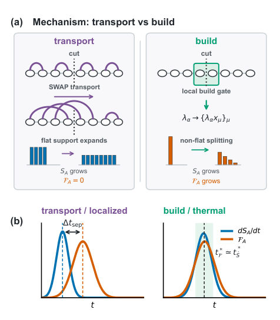 
FIG. 1. Schematic of build- and transport-dominated entan- glement growth. (a) Transport redistributes pre-existing en- tanglement across the cut and can increase SA through an approximately flat Schmidt block, producing little or no anti- flatness. Local build processes instead split Schmidt sectors nonuniformly, generating FA while increasing SA. (b) Conse- quently, transport-dominated dynamics can separate the peak of ˙SA from the magic-barrier peak of FA, whereas build- dominated dynamics keeps the two peaks in the same time window.

📷 Fig 2

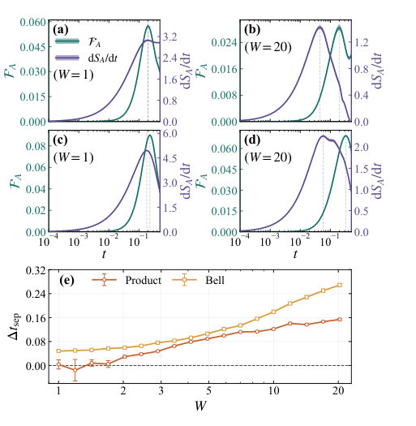 
FIG. 2. Dynamics of anti-flatness and entropy growth in the random-field XXZ chain. The half-chain anti-flatness FA (green) and entropy-growth rate ˙SA (purple) are shown for W = 1 [(a),(c)] and W = 20 [(b),(d)] at system size L = 14. The upper row uses random product initial states in the half-filling sector, while the middle row uses Bell-pair initial states with no Bell pair crossing either half-chain bipartition boundary. Vertical dashed lines mark the corresponding peak positions t∗ F and t∗ ˙S. All data are averaged over at least 1500 disorder realizations. (e) Peak separation ∆tsep = t∗ F −t∗ ˙S versus disorder strength W for product and Bell-pair initial states.

📷 Fig 3

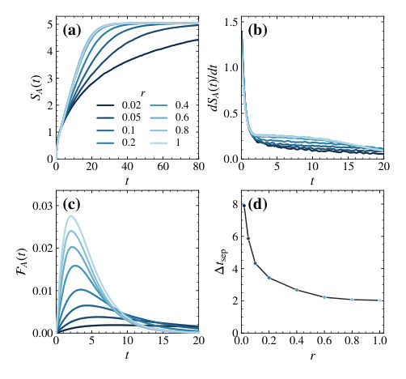 
FIG. 3. Random-circuit benchmark initialized from Bell pairs. At each elementary update, a randomly chosen nearest- neighbor bond is acted on by a SWAP gate with probability 1 −r or by a Haar random two-qubit gate with probability r. The panels show SA(t), ˙SA(t), FA(t), and the peak sep- aration ∆tsep for L = 16. Increasing the Haar-gate fraction strengthens local build processes and pulls the magic-barrier peak toward the early entropy-growth window, thereby reduc- ing ∆tsep.

**Summary.** The paper introduces the concept of 'magic barrier' anti-flatness as a diagnostic tool to probe how entanglement grows dynamically. By analyzing the time separation between this spectral feature and the peak entropy growth rate, the authors successfully distinguish between mechanisms where entanglement is locally built versus those where it is merely transported or redistributed in many-body systems.

**Why it may be interesting.** This work provides a powerful spectral diagnostic tool ($\Delta t_{	ext{sep}}$) to distinguish fundamental physical processes (local scrambling vs. global transport) in interacting quantum many-body systems, which is highly relevant for understanding thermalization and localization dynamics.

Detailed structure

**Main problem.** The study aims to elucidate the dynamical relationship between bipartite entanglement growth and quantum magic (nonstabilizerness) in complex many-body systems.

**Main result.** The relative timescale separation ($\Delta t_{	ext{sep}}$) between the peak of entropy growth rate and the 'magic barrier' peak serves as a diagnostic tool, distinguishing between local build mechanisms and entanglement transport/redistribution processes.

**Method.** Theoretical analysis using quench dynamics simulations on random-field spin chains and controlled benchmarking with tunable random quantum circuits.

**Model / system.** The primary model is the random-field XXZ chain, which is studied across a crossover from thermal to Many-Body Localized (MBL) regimes. Benchmarking uses random circuits simulating local building versus pure transport dynamics.

**Key observables.** Bipartite von Neumann entropy ($S_A$), its growth rate ($\dot{S}_A(t)$), and the anti-flatness of the entanglement spectrum ($F_A(t)$).

**Important parameters / regimes.** Disorder strength ($W$) controlling the thermal-MBL crossover, and a tunable parameter ($r$ or $p$) controlling the balance between local building (Haar gates) and transport (SWAP gates).

**Assumptions / limitations.** The analysis assumes that entanglement growth can be decomposed into distinct mechanisms: local generation ('build') versus non-local movement ('transport').

**Figures summary.** Figures illustrate how $\dot{S}_A(t)$ and $F_A(t)$ peak times separate ($\Delta t_{	ext{sep}}$ increases) as disorder grows or when transport dominates, contrasting with the strong correlation seen in local build scenarios.

**Paper structure.** The paper establishes the theoretical link between entanglement and magic via $\Delta t_{	ext{sep}}$, applies this diagnostic to the random-field XXZ chain across different disorder regimes, and validates the framework using controlled random circuit simulations that tune the relative contributions of building versus transporting quantum information.

Abstract

Quantum entanglement and magic are complementary resources underlying quantum computational advantage, yet their dynamical relation in many-body systems remains poorly understood. In this Letter, we show that the mechanism of bipartite entanglement growth is encoded in the relative timescale between the entropy-growth-rate peak and the magic barrier, defined as the transient peak of the anti-flatness of the entanglement spectrum. When entanglement is locally built, the same microscopic process increases the entropy and reshapes the Schmidt spectrum, so the magic-barrier peak occurs in the time window of maximal entropy growth. When entanglement is mainly transported or redistributed, entropy can grow before appreciable spectral non-flatness is generated, naturally separating the two peak times. We demonstrate this distinction in the random-field XXZ chain: the two peaks remain strongly correlated in the thermal regime, while their separation grows systematically across the thermal--MBL crossover. We further validate this theoretical framework by employing Bell-pair initial states alongside a tunable SWAP--Haar random circuit. Our results reveal an intrinsic dynamical connection between entanglement and magic, establishing the magic barrier as a powerful spectral diagnostic of how quantum information is generated, transported, and reshaped.

[↑ back to top](#top)

### [Experimental Observation of Anomalous Complementary Weak Values from Correlated Pairwise Two-State Vectors](http://arxiv.org/abs/2607.11284v1)

**Authors:** Qian Xie, Liang Xu, Lijian Zhang  
**Type:** experiment · **Category:** quantum information and computing · **PDF:** <https://arxiv.org/pdf/2607.11284v1>  
**Analysis basis:** full PDF text, analyzed in chunks
**Topic relevance:** 🔥 `QC/QI experiment` **4/5** · 🔥 `quantum measurements` **4/5** · `quantum optics experiment` **3/5** · `measurement-induced transitions` **2/5** · `analog quantum simulation` **1/5** · `correlated / nonlocal dissipation` **1/5** · `driven-dissipative phase transition` **1/5** · `entanglement & information structure` **1/5** · `interference shaping light` **1/5**

📷 Fig 1

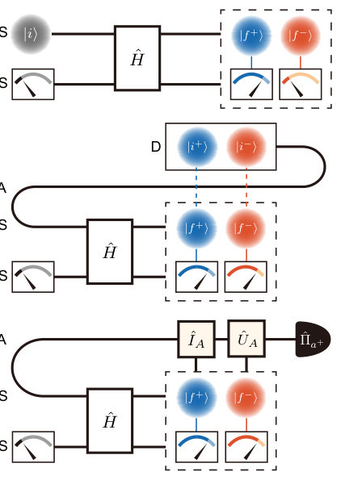 
FIG. 1. Schematic diagrams. (a) Standard WV measurement. (b) PCTC-powered WV measurement. (c) Post-selection- controlled WV measurement structure.

📷 Fig 2

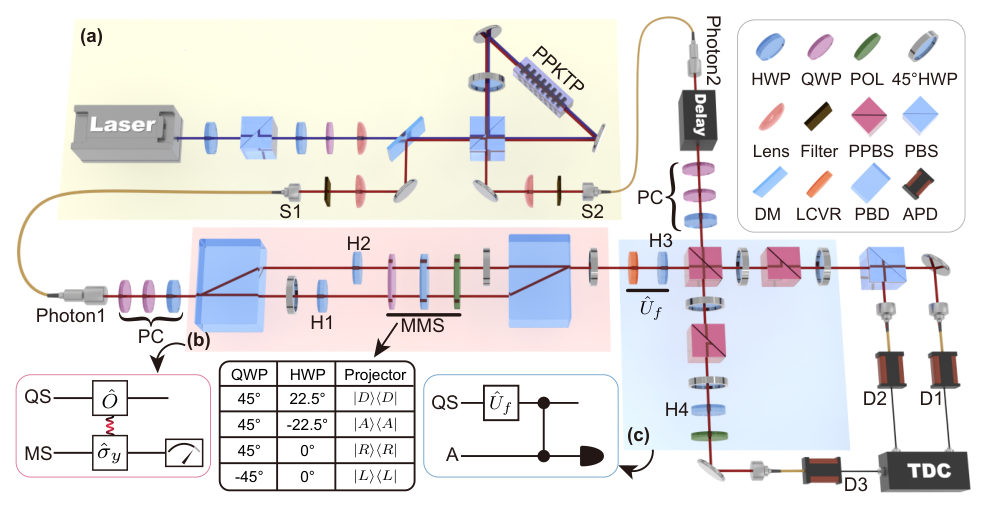 
FIG. 2. Experimental Setup. (a) A continuous-wave laser at 405 nm pumps a periodically poled KTiOPO4 (PPKTP) crystal in the Sagnac interferometer, enabling spontaneous parametric down-conversion to prepare a two-photon polarization-entangled state. (b) Measurement of the WVs. (c) The post-selection-controlled structure, composed of ˆUf, a controlled-Z gate followed by a projective measurement on the ancilla. Abbreviations: DM, dichroic mirror; APD, avalanche photodiode; TDC, time-to- digital converter.

📷 Fig 3

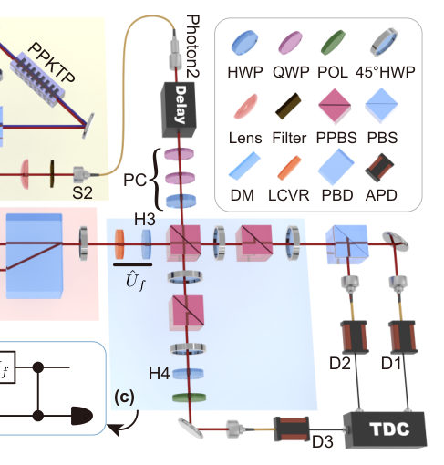 
Figure 2 (b) illustrates the experimental setup for WV measurement. First, a polarizing beam displacer (PBD) maps the polarization-encoded QS to spatial modes: |H⟩→|0⟩(upper path) and |V ⟩→|1⟩(lower path). A HWP at 45◦in path 1 initializes both paths in the same polarization state |H⟩, which serves as the MS. The QS observable is taken to be ˆO = −ˆσz. The coupling Hamil- tonian ˆH = −gˆσz ⊗ˆσy is realized by rotating H1 (in path 1) to g/2 degrees and H2 (in path 0) to −g/2 degrees. Since the measurements on the MS (MMS) and post- selection of the QS act on separate Hilbert spaces, they commute and can be performed independently. By fixing all polarizers (POLs) at 0◦, MMS are performed...

📷 Fig 4

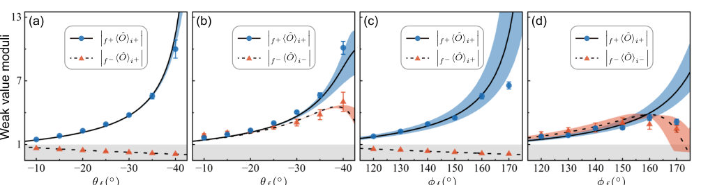 
FIG. 3. Experimentally measured moduli of complementary WVs. (a, b) Real WVs in the standard and post-selection- controlled protocols. (c, d) Imaginary WVs in the standard and post-selection-controlled protocols. Solid and dashed curves show theoretical predictions. Colored regions represent simulated errors assuming a phase instability of ±5◦in the PBD interferometer. Blue circles and red triangles indicate moduli of WVs post-selected on |f +⟩and |f −⟩, respectively. Error bars represent one standard deviation derived from Poissonian counting statistics and are smaller than the markers when not visible.

**Summary.** The paper presents an experimental method to observe anomalous complementary weak values that are otherwise inaccessible due to low success probabilities. By actively controlling post-selection using entangled photon pairs, the authors demonstrate a robust protocol that significantly enhances the measurement of time-symmetric quantum structures in photonic systems.

**Why it may be interesting.** This work directly addresses fundamental limitations in measuring non-classical quantum effects like anomalous weak values by engineering measurement conditions, which is highly relevant to advanced quantum metrology and foundational quantum optics.

Detailed structure

**Main problem.** The primary challenge is overcoming the low success probability associated with observing anomalous weak values (WVs) in standard time-symmetric quantum measurements.

**Main result.** The authors successfully demonstrated a post-selection-controlled protocol that enables the experimental observation of anomalous complementary WVs, significantly exceeding bounds set by standard measurement techniques.

**Method.** They employ a technique utilizing quantum entanglement and controlled unitary operations to actively engineer correlated pairwise two-state vectors, allowing access to mutually exclusive post-selection branches.

**Model / system.** The experiment is implemented on a photonic platform using two-photon polarization-entangled states generated via SPDC. The formalism relies on the Time-Symmetric Two-State Vector Formalism (TSVF).

**Key observables.** Anomalous complementary weak values ($f^\pm\langle\hat{O}
angle_{w}^{i\pm}$), success probabilities, and Hong-Ou-Mandel interference visibility.

**Important parameters / regimes.** The anomalous WVs are analyzed in regimes yielding real or purely imaginary results based on relative phase tuning ($	heta_i - 	heta_f 	o \pi/2$ or $\phi_i - \phi_f 	o \pi$).

**Assumptions / limitations.** The analysis assumes the ability to implement controlled unitary operations and relies on comparing measured values against theoretical bounds derived from Cauchy-Schwarz inequalities.

**Figures summary.** Figures compare standard vs. post-selection-controlled protocols for real/imaginary WVs (Fig 3, S3) and show density matrix reconstruction fidelity and HOMI visibility (Fig S1).

**Paper structure.** The paper first establishes the theoretical limitation of standard WV measurements (Chunk 3), then details the proposed post-selection-controlled protocol using entanglement (Chunk 1 & 2), and finally compares the success probabilities and measured WVs between the two protocols, confirming operational accessibility (Chunk 4).

Abstract

Weak values (WVs) arise from weak measurements performed within a time-symmetric formulation of quantum mechanics, where a system is both pre- and post-selected. Anomalous WVs that lie far outside the eigenvalue spectrum of the observable hold both fundamental and practical significance. However, their generation typically relies on near-orthogonal pre- and post-selection, which confines them to a single post-selection outcome with extremely low success probability. This constraint limits experimental accessibility and hinders the full exploitation of time symmetry. To overcome these limitations, we utilize quantum entanglement and post-selection-controlled operations to generate correlated pairwise two-state vectors. By changing the role of post-selection from passive filtering to active engineering, this approach enables the observation of anomalous complementary WVs associated with mutually exclusive post-selection branches. Our results extend the operational accessibility of time-symmetric quantum structures associated with the two-state vector formalism, and open new avenues for exploring the applications of time symmetry in quantum information processing.

[↑ back to top](#top)

### [Molecular Dynamics-Derived Coloured Noise Mediates Anderson Localisation and Environment-Assisted Transport of Tryptophan Excitons in Tubulin](http://arxiv.org/abs/2607.11135v1)

**Authors:** Chen Xin  
**Type:** theory · **Category:** disordered systems and neural networks · **PDF:** <https://arxiv.org/pdf/2607.11135v1>  
**Analysis basis:** full PDF text, analyzed in chunks
**Topic relevance:** 🔥 `methods for driven-dissipative` **4/5** · `Keldysh / 2PI / non-Gaussian methods` **3/5** · `correlated / nonlocal dissipation` **3/5** · `driven-dissipative phase transition` **3/5** · `Kondo & dissipative impurity` **2/5** · `non-equilibrium dynamics` **2/5** · `non-equilibrium universality` **1/5**

📷 Fig 1

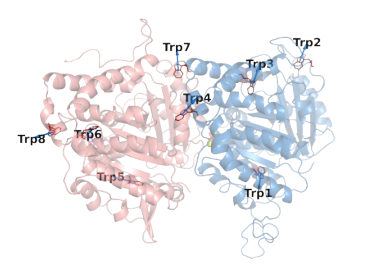 
FIG. 1. Dipole geometry of the eight tryptophans (Trp1–Trp8) in the tubulin αβ-dimer, extracted from the MD frame at t = 50 ns. Each blue arrow starts at the centroid of an indole ring and points along µm (from the benzene ring toward the pyrrole ring, reflecting the direction of the S0 →1La difference dipole). The dipole mag- nitudes are assumed identical (µ = 5 D) for all Trp residues, but the directions nm(t) fluctuate with the trajectory. The Trp1–Trp8 labels follow Ref. [14]: Trp1–4 are αW21, αW346, αW388, αW407 on chain A, and Trp5–8 are βW21, βW101, βW344, βW397 on chain B.

📷 Fig 2

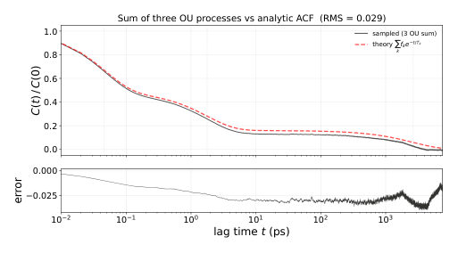 
FIG. 2. ACF of the OU sum (a single 30 ns trajectory, five- realisation average; dots) versus the analytic target P k fke−t/Tk (solid). Lower panel: residual (sampled −theory). RMS residual = 0.028 over 10 fs–7.5 ns, confirming the sampler reproduces the fitted statistics.

📷 Fig 3

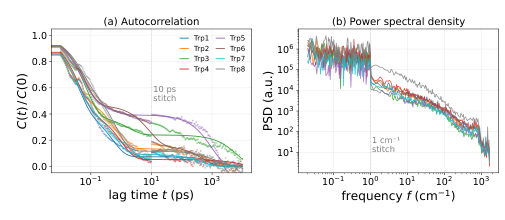 
FIG. 3. Stitched autocorrelation and power spectrum of the site- energy fluctuations. (a) Self-normalised autocorrelations Cm(t) (dots) with tri-exponential fits (solid lines) for all eight Trps. (b) Stitched power spectral densities (arbitrary units). The stitch is set at f = 1 cm−1, below the long trajectory’s Nyquist frequency (1.67 cm−1, determined by its 10 ps sampling). The visible jump at the stitch is due to aliasing: power from frequencies above the Nyquist frequency folds back into the [0, 1.67] cm−1 band, artifi- cially inflating the long-trajectory PSD.

📷 Fig 4

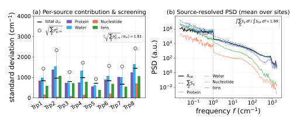 
FIG. 4. Source decomposition and dielectric screening. (a) Per- source standard deviation σg,m (bars) with the measured total σm (black marker) and the uncorrelated expectation qP g σ2g,m (open

📷 Fig 5

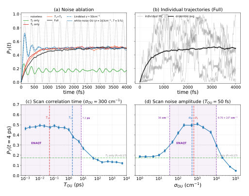 
FIG. 5. Inhomogeneous dephasing and ENAQT on the Trp4–Trp7 two-site system (J = −59 cm−1). The excitation is initialised on Trp4 in all panels. Each site carries its own bath of three additive Ornstein–Uhlenbeck processes fitted to the per-site MD fluctuations (Table II). Dynamics are computed by MC sampling of the stochastic Schr¨odinger equation with NMC = 500 realisa- tions. (a) Noise ablation: population P7(t) on Trp7 under var- ious noise configurations. The noiseless case (grey dotted) gives coherent Rabi oscillations. The slowest mode T3 alone partially localises the excitation (P7(4 ps) = 0.17, green). Adding the fast mode T1 breaks the localisation and enables transport (T1 alone:...

**Summary.** This work develops a detailed model for exciton transport in protein chromophores by deriving the environmental noise spectrum directly from all-atom MD simulations. The analysis reveals that the multi-timescale colored noise leads to Anderson localization, confining excitons to specific pairs rather than allowing uniform delocalization. This methodology is valuable for understanding quantum processes in complex biological environments.

**Why it may be interesting.** It provides a rigorous framework for modeling open quantum systems where the bath correlation time is explicitly derived from molecular simulation, moving beyond simplified Markovian assumptions common in bio-physics.

Detailed structure

**Main problem.** The study aims to characterize quantum exciton transport in a protein's tryptophan network under realistic, non-Markovian environmental noise conditions.

**Main result.** The colored noise bath causes excitons to localize predominantly on strongly coupled proximal pairs via Anderson localization, contrasting with predictions from simple white-noise models.

**Method.** All-atom Molecular Dynamics (MD) simulations are used to derive the time-dependent site-energy fluctuations ($\delta\epsilon_m(t)$), which are then incorporated into a stochastic Schrödinger equation solved using colored noise modeling.

**Model / system.** The system is an eight-site network of tryptophan residues within tubulin $\alphaeta$-dimers. The exciton dynamics are governed by a Hamiltonian whose site energies fluctuate due to the protein/solvent environment, modeled as a superposition of three Ornstein–Uhlenbeck processes.

**Key observables.** Site-energy autocorrelation function (tri-exponential), Participation Ratio ($PR$), and localization length.

**Important parameters / regimes.** Three distinct noise timescales: sub-100-fs (water), picosecond (water), and nanosecond (protein conformational rearrangements).

**Assumptions / limitations.** The bath dynamics are modeled as a superposition of three independent Ornstein–Uhlenbeck processes, assuming the system operates deep within the non-Markovian regime.

**Figures summary.** Figures illustrate dipole geometries, site-energy fluctuation traces comparing short vs. long trajectories, and eigenstate localization plots showing confinement under disorder.

**Paper structure.** The paper first characterizes the multi-timescale nature of environmental fluctuations using MD simulations, then models the exciton dynamics using a colored-noise Hamiltonian, and finally analyzes how this complex noise leads to specific localization patterns versus simple delocalization.

Abstract

The tryptophan residues in tubulin $αβ$-dimers form an ordered aromatic network that has been proposed to support quantum exciton transport even under physiological environmental noise. Existing studies of this system mostly assume white-noise dephasing, but the statistical properties of the protein-solvent bath coupled to tryptophan sites remain uncharacterised under physiological conditions. Here we characterise this fluctuation bath via all-atom molecular dynamics simulations of a solvated tubulin dimer at 310~K, combining high-frequency and long-time trajectories with 10~fs and 10~ps sampling intervals. The resulting autocorrelation of the site-energy fluctuations is tri-exponential, with three well-separated decay modes: sub-100-fs and picosecond fluctuations driven by water dynamics, and a nanosecond mode originating from protein conformational rearrangements. All three modes fall deep within the non-Markovian regime. We further demonstrate that the slow protein mode introduces strong quasi-static disorder, which results in Anderson localisation, while the two fast water modes frequently tune chromophore pairs through resonance, enabling environment-assisted quantum transport (ENAQT). On the full eight-site network, the coloured-noise bath confines excitons predominantly to strongly coupled proximal tryptophan pairs, in marked contrast to the more uniform delocalisation predicted by the standard white-noise Haken--Strobl model. Our workflow generalises to other pigment--protein systems with solvent-exposed chromophores.

[↑ back to top](#top)

### [Nonlocal Manipulation of Backflow with Quantum Correlations](http://arxiv.org/abs/2607.10281v1)

**Authors:** Ya Xiao, Zhen-Fei Zhang, Yan-Xin Rong, Kai Sun, Jin-Shi Xu, Yong-Jian Gu  
**Type:** both · **Category:** other · **PDF:** <https://arxiv.org/pdf/2607.10281v1>  
**Analysis basis:** full PDF text, analyzed in chunks
**Topic relevance:** 🔥 `quantum measurements` **4/5** · `entanglement & information structure` **3/5** · `interference shaping light` **3/5** · `measurement-induced transitions` **2/5** · `quantum optics experiment` **2/5** · `correlated / nonlocal dissipation` **1/5** · `driven-dissipative phase transition` **1/5** · `methods for driven-dissipative` **1/5** · `non-equilibrium dynamics` **1/5**

📷 Fig 1

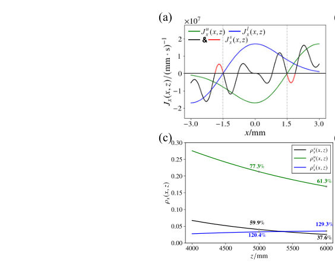 
Fig. 1. Manipulate backflow in double-slit interference. (a) Probability currents 𝐽𝑠 𝑥(𝑥, 𝑧), 𝐽𝑢 𝑥(𝑥, 𝑧), and 𝐽𝑙 𝑥(𝑥, 𝑧) at 𝑧= 4200 mm for the maximally entangled state |𝜓𝑠⟩ with photon A projected onto (|𝐻⟩𝐴−|𝑉⟩𝐴)/ √

📷 Fig 2

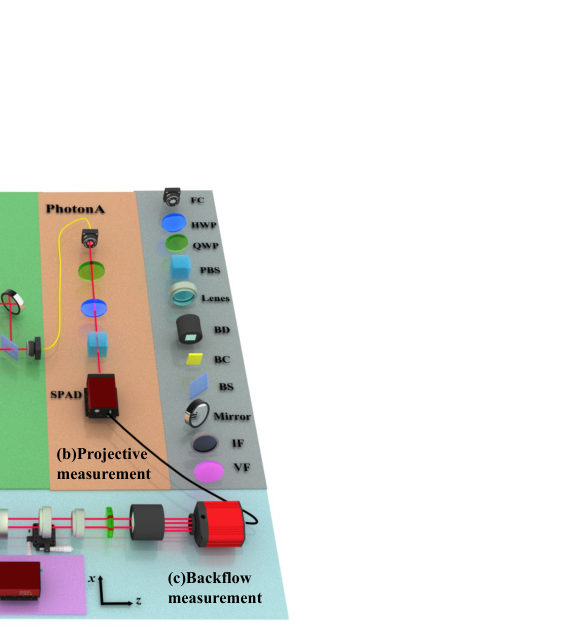 
Fig. 2. Experimental setup. (a) Source of Werner-state entangled photon pair A and B. (b) Projective measurement system for photon A. (c) Backflow detection system for photon B. (d) Correlation-strength analysis of the prepared state. HWP:Half-wave plates; QWP: Quarter-wave plates; DM: Dichroic mirror; PBS: Polarizing beam splitters; VOA: Variable Optical Attenulator; BD: Beam displacers; L1-L3: Lens; BC: Birefringent crystal; PPKTP: periodically poled KTiOPO4 crystal; SPAD: Single photon avalanche diode; ICCD: Intensified CCD.

📷 Fig 3

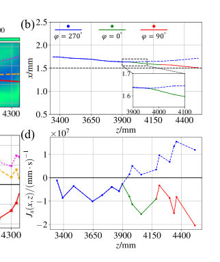 
Fig. 3. Dynamic manipulation of backflow in double-slit interference. (a) Bohmian trajectories guided respectively by: the upper-slit wavefunction 𝜓𝑢(𝑥, 𝑧), beginning at 𝑥= 1.625 mm; the lower-slit wavefunction 𝜓𝑙(𝑥, 𝑧), beginning at 𝑥= 1.244 mm; and the double-slit superposition wavefunction 𝜓𝑠(𝑥, 𝑧) = (𝜓𝑢(𝑥, 𝑧) + 𝜓𝑙(𝑥, 𝑧))/ √

📷 Fig 4

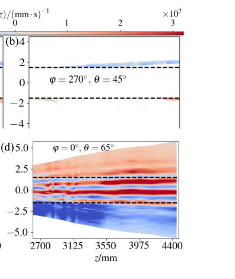 
Fig. 4. Manipulation of backflow via static phase and amplitude modulation. (a, b) Backflow regions for photon B when photon A is projected onto the state |𝑚⟩𝐴= (|𝐻⟩−𝑒−𝑖𝜑|𝑉⟩)/ √

📷 Fig 5

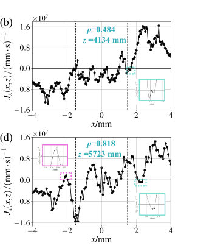 
Fig. 5. Distance-dependent quantum resource requirement for nonlocally manipulating the emergence of backflow. (a) Distribution of experimental states. The red- and blue-marked states indicate the emergence and absence, respectively, of backflow at photon 𝐵following an optimal amplitude projective measurement on photon 𝐴. (b–d) Transverse probability current 𝐽𝑥(𝑥, 𝑧) of photon B for the three red-marked states in (a). Backflow is characterized by positive probability current for 𝑥&lt; −𝑑/2 and negative probability current for 𝑥&gt; 𝑑/2. The insets are magnified views of the corresponding regions exhibiting backflow.

**Summary.** The paper demonstrates that quantum correlations are operational resources capable of controlling the counter-intuitive phenomenon of 'backflow' in double-slit interference using entangled photons. By varying the propagation distance, the minimum required correlation strength increases systematically, proving a quantitative link between spatial scale and the necessary nonlocality (from entanglement to Bell states). This opens avenues for non-contact manipulation of quantum systems.

**Why it may be interesting.** This work bridges fundamental concepts from quantum information theory (resource quantification) with wave mechanics/quantum optics (interference phenomena), providing concrete evidence for how non-local quantum correlations can actively steer physical dynamics in open systems.

Detailed structure

**Main problem.** The study investigates whether quantum correlations can serve as an operational resource for nonlocally manipulating dynamical transmission processes, specifically focusing on the phenomenon known as 'backflow' in double-slit interference.

**Main result.** Nonlocal manipulation of backflow is achieved by performing local measurements on one entangled photon to remotely engineer the relative amplitude and phase of its partner. Crucially, the minimum required quantum correlation strength increases monotonically with propagation distance, sequentially demanding entanglement, then EPR-steering, and finally Bell nonlocality.

**Method.** The authors use a theoretical framework combining weak measurement techniques with an experimental setup involving polarization-path-entangled photons to calculate probability currents and reconstruct Bohmian trajectories. Resource requirements are quantified by analyzing the state purity of Werner states.

**Model / system.** The system is based on double-slit interference using polarization-path-entangled photon pairs (A and B). The analysis models the quantum correlations using Werner states ($
ho_W$) to probe different levels of nonlocality, while the physical process involves calculating the probability current $J_x$ for the path degree of freedom.

**Key observables.** Backflow (negative probability current opposite to momentum), total backflow length ($f_{	ext{length}}$), and the minimum required quantum correlation strength ($p_{\min}^{th}(z)$).

**Important parameters / regimes.** Propagation distance ($z$), state purity parameter ($p$), relative amplitude, and phase modulation ($\varphi$). The critical thresholds observed are entanglement, EPR-steering, and Bell nonlocality.

**Assumptions / limitations.** The analysis relies on the use of Werner states to quantify resource requirements and utilizes weak measurement techniques for direct visualization of the manipulation process.

**Figures summary.** Figures illustrate probability currents showing backflow control via amplitude/phase modulation; one figure plots the increasing minimum correlation strength required versus distance, mapping out the transition from entanglement to Bell nonlocality.

**Paper structure.** The paper establishes the problem by linking quantum correlations to dynamical manipulation. It details the theoretical framework using entangled photons and Werner states to calculate backflow metrics. The core argument is built around demonstrating that increasing propagation distance necessitates stronger quantum resources, culminating in a quantitative mapping of correlation types required for control.

Abstract

Quantum correlations are central resources for quantum information processing, yet their ability to manipulate dynamical transmission processes remains largely unexplored. Here, we investigate this ability through backflow, a uniquely interference phenomenon in which local probability flow propagates opposite to the momentum direction. We report the first nonlocal manipulation of backflow in double-slit interference using polarization-path-entangled photons. By performing local measurements on one photon, we remotely engineer the relative amplitude and phase of the two paths associated with its partner, manipulating the emergence, spatial distribution, and propagation dynamics of backflow without directly accessing the interfering system. Combining weak measurements to extract the transverse momentum and reconstruct Bohmian trajectories, we provide a direct visualization of the manipulation process with single-pixel spatial resolution. Furthermore, using Werner states with tunable correlation strengths, we reveal a distance-dependent resource requirement for nonlocal backflow manipulation: the minimum correlation strength required to induce backflow increases with propagation distance, progressing from entanglement to EPR-steering and ultimately Bell nonlocality. Our results show quantum correlations as operational resources for manipulating transmission dynamics and open new avenues for non-contact manipulation of fragile or inaccessible systems.

[↑ back to top](#top)

### [Harnessing finite-size effects to gauge aging in the $2D$ Ising model](http://arxiv.org/abs/2607.11524v1)

**Authors:** Dustin Warkotsch, Malte Henkel, Wolfhard Janke  
**Type:** theory · **Category:** statistical mechanics · **PDF:** <https://arxiv.org/pdf/2607.11524v1>  
**Analysis basis:** full PDF text, analyzed in chunks
**Topic relevance:** 🔥 `non-equilibrium dynamics` **4/5** · `methods for driven-dissipative` **3/5** · `non-equilibrium universality` **3/5** · `scars & prethermalization` **2/5** · `Keldysh / 2PI / non-Gaussian methods` **1/5** · `analog quantum simulation` **1/5** · `correlated / nonlocal dissipation` **1/5** · `driven-dissipative phase transition` **1/5** · `entanglement & information structure` **1/5**

📷 Fig 1

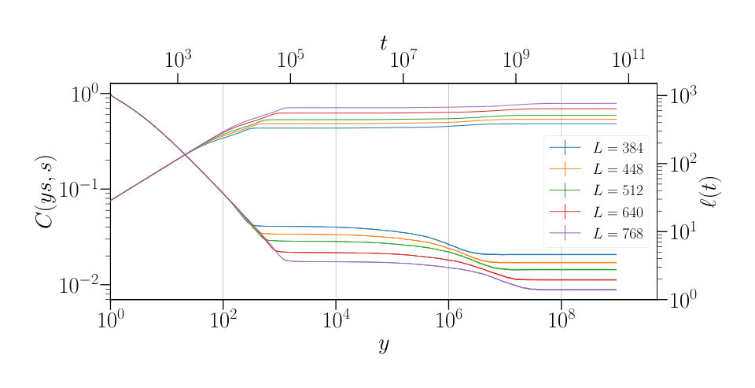 
Figure 1. Exemplary behavior of the characteristic length scale ℓ(t) vs time t (upper curves, right and upper axes) and the two-time autocorrelator C(ys, s) vs y (lower curves, left and lower axes) for a nearest-neighbor 2D Ising model after a quench to 0.2Tc for system sizes L = {384, 448, 512, 640, 768} and waiting time s = 64. Note that saturation of both exhibits a step-wise behavior featuring the formation of an initial pseudo-plateau before settling at the equilibrium value beginning around t ≈1010 and y ≈108, respectively.

📷 Fig 2

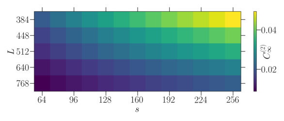 
Figure 2. Heatmap of plateau heights C(2) ∞of the two-time autocorrelator at T = 0.2TC depending on linear lattice size L and waiting time s. As the plateau height grows from the lower left to the upper right side, equations (6) and (7) describe the relation between individual values of C(2) ∞for their respective orthogonal axis.

📷 Fig 3

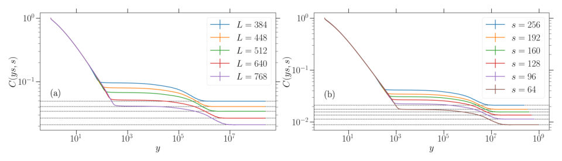 
Figure 3. Two-time autocorrelator C(ys, s) for the 2D Ising model quenched to T = 0.2Tc for various fixed (a) lattice sizes L at s = 256, or (b) waiting times s at L = 768. The steps in the plateaus result from gradual evaporation of metastable, i.e., striped states of all kinds (viz. figure 4). The dashed black lines indicate the height C(2) ∞for the respective L or s.

📷 Fig 4

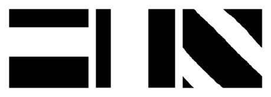 
Figure 4. Metastable states of the 2D Ising model with periodic boundary conditions: horizontal stripe, vertical stripe and diagonal stripe. The former two are infinitely long-lived at T = 0 whereas the lifetime of the last one depends on lattice size L. Above T = 0, all stripes evaporate eventually, at sufficiently large times.

📷 Fig 5

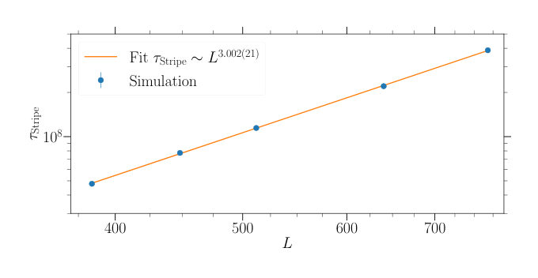 
Figure 5. Average lifetime (measured in MC sweeps) of all striped configurations vs lattice size L at T = 0.2Tc in 2D.

**Summary.** This paper develops a novel computational method to determine critical exponents ($\lambda$ and $z$) in the aging dynamics of the 2D Ising model. It achieves this by deliberately exploiting finite-size effects observed in the two-time autocorrelator plateau height, providing robust estimates even when direct asymptotic analysis is difficult.

**Why it may be interesting.** While focused on classical statistical mechanics, the techniques for characterizing slow relaxation dynamics (aging) using finite-size effects are highly relevant to open quantum systems where thermalization or quasi-equilibrium states are approached slowly.

Detailed structure

**Main problem.** The study aims to precisely gauge aging phenomena in systems far from equilibrium by analyzing the relaxation behavior of the 2D Ising model.

**Main result.** Finite-size scaling relations derived from the plateau height of the two-time autocorrelator allow for independent estimation of the autocorrelation exponent ($\lambda$) and dynamical exponent ($z$).

**Method.** Classical Monte Carlo simulations are employed, utilizing finite-size scaling techniques to analyze how system size ($L$) affects the decay of the two-time autocorrelator $C(t,s)$.

**Model / system.** The physical model is the 2D Ising model with nearest-neighbor interactions. The analysis focuses on its non-equilibrium dynamics following a quench below the critical temperature.

**Key observables.** Two-time autocorrelator $C(t, s)$, characteristic length scale $\ell(t)$, and the plateau height $C_{\infty}^{(2)}(s,L)$.

**Important parameters / regimes.** Temperature regime ($0 < T < T_c$), lattice size ($L$), waiting time ($s$), and the exponents $\lambda$ and $z$.

**Assumptions / limitations.** The analysis treats domain wall effects as a 'premature finite-size phenomenon' and relies on specific scaling laws derived from the autocorrelator plateau.

**Figures summary.** Figures illustrate the crossover of both the length scale $\ell(t)$ and the autocorrelation $C(y, s)$ towards saturation plateaus when varying lattice sizes ($L$).

**Paper structure.** The paper establishes the theoretical framework using the two-time autocorrelator in finite systems. It then details the application of novel scaling relations to extract exponents ($\lambda$ and $\lambda/z$) by analyzing how these observables depend on $L$ and $s$.

Abstract

The relaxation behavior towards equilibrium of the $2D$ Ising model with nearest-neighbor interactions has been studied with focus on the two-time autocorrelator $C(t,s)$. Finite-size effects affecting the growing magnetic domains lead to the saturation of $C(t,s)$ with a distinct plateau of height $C_{\infty}^{(2)}(s,L)$ scaling algebraically with waiting time $s$ and lattice size $L$. These scaling relations are used to produce precise estimates for the autocorrelation exponent $λ$ and dynamical exponent $z$ with deliberately small lattices. Treating smooth domain walls in a similar manner to the lattice boundaries, their effect on $C(t,s)$ can be understood as premature finite-size phenomenon, extending our ansatz to systems not yet in equilibrium.

[↑ back to top](#top)

### [Arrhenius-Type Description and Noise-Composition Dependence of Single-Vacancy Hopping in Active Brownian Crystals](http://arxiv.org/abs/2607.10192v1)

**Authors:** Hiroto Tomida, Yoshihiro Yamazaki  
**Type:** theory · **Category:** statistical mechanics · **PDF:** <https://arxiv.org/pdf/2607.10192v1>  
**Analysis basis:** full PDF text, analyzed in chunks
**Topic relevance:** 🔥 `non-equilibrium dynamics` **4/5** · `driven-dissipative phase transition` **3/5** · `methods for driven-dissipative` **3/5** · `non-equilibrium universality` **2/5** · `Frenkel-Kontorova` **1/5** · `Keldysh / 2PI / non-Gaussian methods` **1/5** · `analog quantum simulation` **1/5** · `correlated / nonlocal dissipation` **1/5**

📷 Fig 1

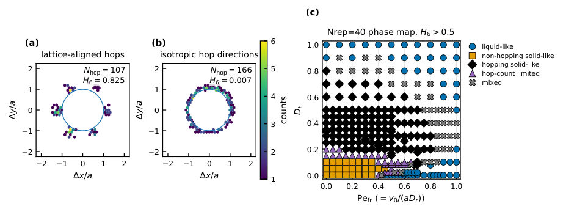 
Figure 1: (Color online) Operational classification of the defect-hopping solid-like regime. (a,b) Representative hop-vector distributions for lattice-compatible hopping and disordered regimes. (c) State points are classified using the structural criterion ψ6 ≥0.80 and the hopping criteria H6 ≥0.50 and at least 20 hops are detected. The hop-count cutoff is imposed to ensure stable directional statistics. Hop-count-limited points have too few detected hops to satisfy this cutoff and are therefore not used as hopping-solid-like data in the rate analysis. Mixed points indicate parameter sets for which independent runs give both solid-like and liquid-like/disordered classifications; these...

📷 Fig 2

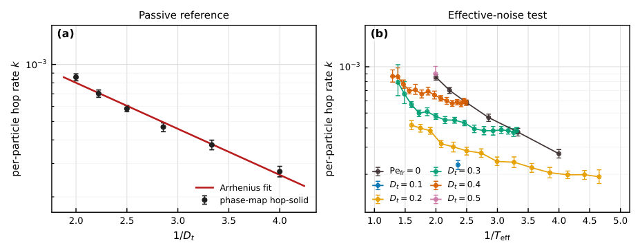 
Figure 2: (Color online) Hop-rate tests within the retained hopping-solid-like regime. (a) Passive rates follow an Arrhenius-like reference k = A exp(−∆E/Dt), with ∆E = 0.521 and A = 0.0288. (b) Effective-noise test: even using Teff = Dt + a2Pe2 r/2, active and passive data do not fall on a single curve versus 1/Teff. Error bars denote two-sided 95% percentile bootstrap confidence intervals over independent runs.

📷 Fig 3

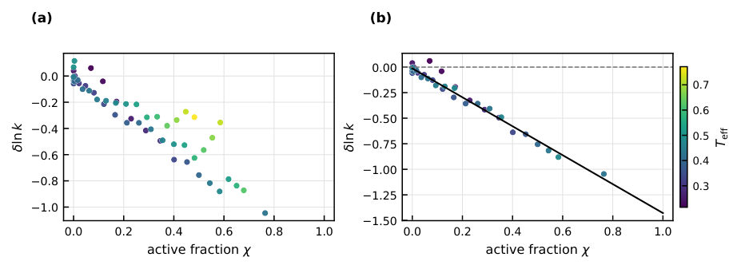 
Figure 3: (Color online) Noise-composition dependence beyond a scalar effective-noise de- scription. The passive-normalized residual δ ln k is plotted against the active fraction χ = (a2Pe2 r/2)/Teff. Color indicates Teff. Panel (a) shows all retained hopping-solid-like state points, whereas panel (b) focuses on the low-effective-noise subset Teff &lt; 0.5. The solid line in panel (b) is a weighted linear fit to this subset, and the dashed line denotes zero residual.

**Summary.** This work investigates how vacancies hop through an active crystal, challenging the assumption that transport rates depend only on a total effective noise temperature. By analyzing deviations from simple models, the authors show that the specific composition of thermal versus active fluctuations dictates the hopping kinetics. This demonstrates a breakdown of the standard effective-temperature description for defect-mediated transport in driven matter.

**Why it may be interesting.** The breakdown of simple effective-temperature descriptions in driven systems is highly relevant for understanding non-equilibrium dynamics in complex quantum or classical many-body systems where noise sources are heterogeneous.

Detailed structure

**Main problem.** To determine if vacancy-mediated hopping in an active crystal is governed solely by a single effective noise amplitude or if the composition of thermal versus persistent active fluctuations matters.

**Main result.** The hopping kinetics cannot be described by a simple effective temperature; the rate depends systematically on the 'active fraction' ($\chi$), indicating that fluctuation composition is crucial.

**Method.** Numerical simulation using overdamped Langevin equations to calculate long-time average hop rates, followed by fitting these rates against theoretical models based on effective noise parameters.

**Model / system.** A two-dimensional active Brownian-particle (ABP) crystal containing a single vacancy. Dynamics are modeled with repulsive interactions and include both thermal diffusion ($D_t$) and persistent active driving forces.

**Key observables.** Hopping rate ($k$), Effective Temperature ($T_{	ext{eff}}$), Active Fraction ($\chi$), and the deviation residual ($\delta \ln k$).

**Important parameters / regimes.** Active fraction ($\chi$), translational diffusion coefficient ($D_t$), and the comparison to the passive limit.

**Assumptions / limitations.** The analysis is restricted to the hopping-solid-like state, and the derived equations are effective descriptions over specific parameter regimes.

**Figures summary.** Figure 2(a) shows passive rates following an Arrhenius law. Figure 2(b) demonstrates that active rates do not collapse onto a single curve when plotted against $1/T_{	ext{eff}}$, showing systematic deviations organized by $\chi$.

**Paper structure.** The paper first establishes the baseline using the passive limit (Arrhenius behavior). It then compares active hopping rates to predictions based only on $T_{	ext{eff}}$, revealing discrepancies. Finally, it develops a phenomenological model incorporating the active fraction ($\chi$) to explain these systematic deviations.

Abstract

We study vacancy-mediated hopping in a two-dimensional active Brownian-particle crystal with a single vacancy. Under active driving, the hopping rates are not organized by the free-particle effective noise amplitude alone. In contrast, in the passive limit, the hopping rate follows an Arrhenius-like activated trend with respect to the translational diffusion coefficient. Effective-noise comparisons show systematic dependence on the active fraction, indicating that the composition of thermal and persistent active fluctuations affects the hopping kinetics. These results demonstrate a breakdown of an effective-temperature description for microscopic defect-mediated transport in an active crystal.

[↑ back to top](#top)

### [Sonic black holes with thick horizons in BECs](http://arxiv.org/abs/2607.11396v1)

**Authors:** Daniel Peñalver, Marco De Vito, Roberto Balbinot, Alessandro Fabbri  
**Type:** theory · **Category:** quantum gases · **PDF:** <https://arxiv.org/pdf/2607.11396v1>  
**Analysis basis:** full PDF text, analyzed in chunks
**Topic relevance:** 🔥 `analog quantum simulation` **4/5** · `Keldysh / 2PI / non-Gaussian methods` **3/5** · `non-equilibrium dynamics` **3/5** · `non-equilibrium universality` **2/5** · `correlated / nonlocal dissipation` **1/5** · `driven-dissipative phase transition` **1/5** · `entanglement & information structure` **1/5** · `methods for driven-dissipative` **1/5**

📷 Fig 1

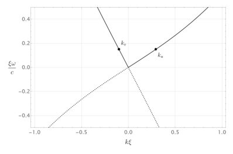 
FIG. 1: Dispersion relation (2.9) for a subsonic region. Solid and dashed lines represent the positive and the negative norm branch in (2.12) respectively. For a particular (real) frequency, two solutions are real and the other two are complex conjugates. Parameters: |v

📷 Fig 2

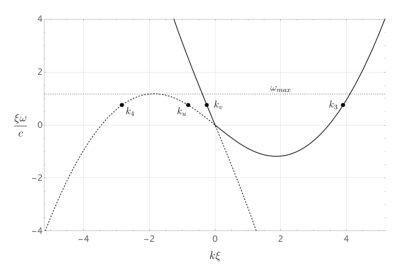 
FIG. 2: Dispersion relation (2.9) for a supersonic region. Solid and dashed lines represent the positive and the negative branch of the square root in (2.12). For frequencies ω &lt; ωmax, all four roots are real and two of them belong to the negative norm branch. For frequencies ω &gt; ωmax, only two of them are real as in the subsonic case. Parameters: |v

📷 Fig 3

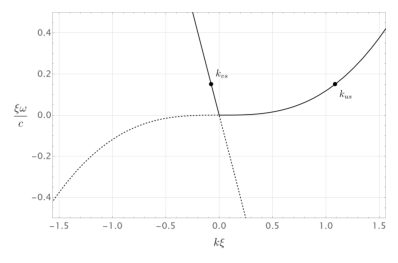 
FIG. 3: Dispersion relation (2.9) for a sonic region. Solid and dashed lines represent the positive and negative branch of the square root in (2.12). Parameters: |v

📷 Fig 4

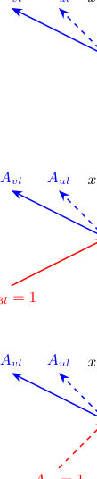 
FIG. 4: ‘in’ modes for the subsonic-supersonic model.

📷 Fig 5

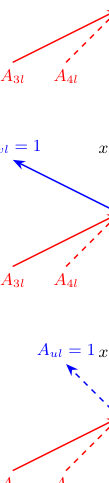 
FIG. 5: ‘out’ modes for the subsonic-supersonic model.

**Summary.** This paper theoretically models acoustic black holes using Bose-Einstein condensates exhibiting thick sonic horizons. By analyzing wave propagation across flow discontinuities, the authors calculate particle creation rates and correlation functions analogous to Hawking radiation. The results confirm Planckian statistics and provide a detailed theoretical framework for detecting these quantum effects in BEC experiments.

**Why it may be interesting.** This work directly applies advanced quantum field theory techniques (Bogoliubov transformations, scattering matrices) to ultracold atomic systems, providing concrete theoretical predictions for observable signatures like Hawking radiation analogues.

Detailed structure

**Main problem.** The study investigates acoustic black holes formed within Bose-Einstein condensates (BECs) that possess thick sonic horizons.

**Main result.** Particle creation rates exhibit good agreement with Planckian distributions for low frequencies, and correlation functions show distinct peaks corresponding to different pairs of created particles.

**Method.** The analysis uses Bogoliubov theory applied to the Gross-Pitaevskii equation, solving matching conditions across discontinuities separating subsonic/supersonic regions.

**Model / system.** The system is a one-dimensional BEC modeled by the GP equation, analyzed in regimes transitioning from subsonic ($|v|<c$) to supersonic ($|v|>c$) flow, featuring a thick sonic horizon where flow velocity equals the speed of sound.

**Key observables.** Number of created particles and density-density correlation functions (used as experimental diagnostics for Hawking-like radiation).

**Important parameters / regimes.** Flow velocity ($v$), speed of sound ($c$), external potential ($V_{	ext{ext}}$), coupling constant ($g$), and the width/location of discontinuities.

**Assumptions / limitations.** The analysis relies on idealized models, such as assuming constant density and flow velocity across regions, and uses approximations like leading order in frequency ($\omega$).

**Figures summary.** Figures compare calculated particle numbers against Planckian distributions for Hawking, Partner, and Spectator modes; other figures illustrate 'in' and 'out' mode solutions.

**Paper structure.** The paper progresses from analyzing the dispersion relation across different flow regimes (subsonic, supersonic, sonic) to applying matching conditions at step-like discontinuities in a multi-region model, culminating in calculations of particle creation rates and correlation functions.

Abstract

We consider simple one dimensional models of acoustic black holes formed by Bose-Einstein condensates where the flow is stepwise homogeneous. We shall concentrate on the case in which an extended sonic region is present, i.e. a region where the flow velocity equals exactly the speed of sound. These models can be thought of as acoustic black holes with a thick horizon. Particular attention will be devoted to the number of created particles and to the density-density correlation functions, these latter being at present time the experimental tool to identify Hawking like radiation in acoustic black holes.

[↑ back to top](#top)

### [Accessing 100 GHz Mechanical Modes in Bulk Crystals at Cryogenic Temperatures](http://arxiv.org/abs/2607.10737v1)

**Authors:** Boxuan Tian, Jiacheng Xie, Hong X. Tang  
**Type:** experiment · **Category:** other · **PDF:** <https://arxiv.org/pdf/2607.10737v1>  
**Analysis basis:** full PDF text, analyzed in chunks
**Topic relevance:** 🔥 `quantum optics experiment` **4/5** · `analog quantum simulation` **3/5** · `correlated cavity matter` **3/5** · `Tavis-Cummings & cavity-many-emitter` **2/5** · `QC/QI experiment` **1/5** · `driven-dissipative phase transition` **1/5** · `methods for driven-dissipative` **1/5**

📷 Fig 1

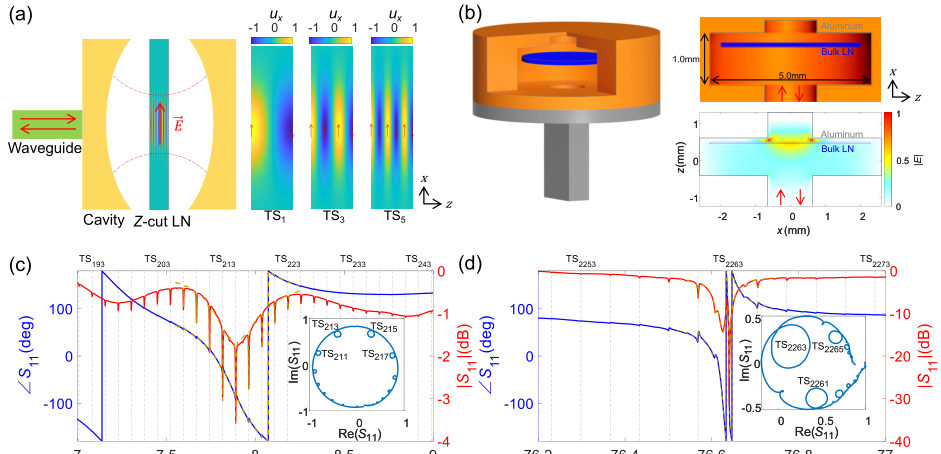 
FIG. 1. Bulk crystal cavity piezo–electromechanical coupling. (a) Schematic diagram of the one-

📷 Fig 2

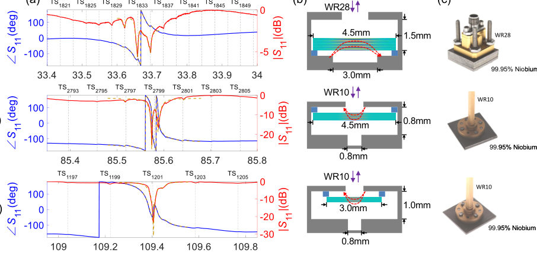 
FIG. 2. Mechanical modes with niobium cavity at cryogenic temperatures (4.2 K). Measured S11

📷 Fig 3

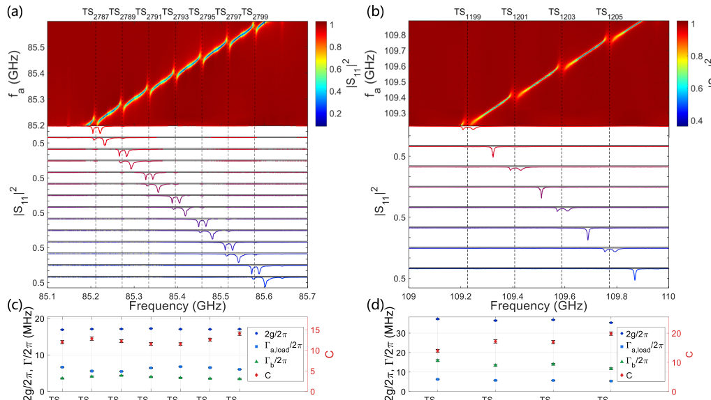 
FIG. 3. Strong coupling between a tunable superconducting cavity and multiple mechanical modes.

📷 Fig 4

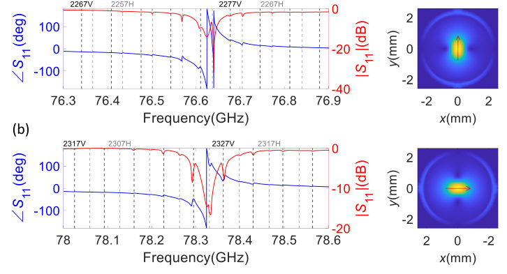 
FIG. 4. Polarization splitting of mechanical modes. (a,b) S11 spectra of the same aluminum cavity-

📷 Fig 5

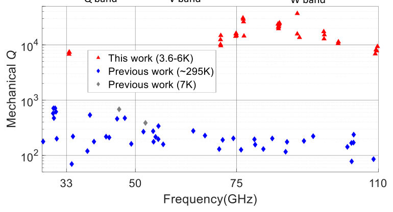 
FIG. 5. Mechanical quality factors Q measured in this work (red triangles), spanning 33–110 GHz.

**Summary.** The authors developed a novel method to study mechanical quantum motion in bulk crystals by coupling them non-contactly into superconducting microwave cavities. They achieved high quality factors for vibrational modes near 100 GHz at cryogenic temperatures. This platform enables the observation of strong, coherent energy exchange between microwave photons and mechanical phonons, advancing macroscopic quantum physics experiments.

**Why it may be interesting.** This work provides an experimental realization of a high-frequency quantum transducer platform, directly testing cavity QED concepts (photon-phonon coupling) using macroscopic mechanical oscillators, which is highly relevant to open quantum systems and quantum transducers.

Detailed structure

**Main problem.** The research aims to access and study mechanical quantum motion at high frequencies (near 100 GHz) using bulk crystals while maintaining low dissipation.

**Main result.** They successfully demonstrated strong coupling between microwave cavity photons and multiple mechanical phonon modes in a bulk lithium niobate platform, achieving high quality factors up to 30,000.

**Method.** The study uses superconducting niobium cavities coupled non-contactly to bulk crystals (LiNbO3) and characterizes the system using microwave spectroscopy (S11 measurements) at cryogenic temperatures.

**Model / system.** The platform is a piezoelectric cavity–phonon system utilizing bulk lithium niobate. The interaction is modeled by an effective Hamiltonian describing coupling between cavity photons ($\hat{a}$) and mechanical phonons ($\hat{b}$), leading to the observation of avoided crossings in the spectrum.

**Key observables.** Mechanical quality factors ($Q_b$) up to 30,000; Cooperativity ($C$) up to 16.6; Measured spectral shifts and linewidths via S11 fitting.

**Important parameters / regimes.** Operating frequencies near 100 GHz; Cryogenic temperatures (4 K); Effective vibrational masses in the milligram range.

**Assumptions / limitations.** The use of non-contact coupling minimizes surface losses, and analysis relies on fitting complex S11 spectra to cavity-phonon models.

**Figures summary.** Figures illustrate the experimental setup, measured S11 spectra at room and cryogenic temperatures showing mechanical resonances, and avoided crossings confirming strong coupling between microwave photons and phonons.

**Paper structure.** The paper progresses from establishing the feasibility of non-contact coupling in bulk LN to characterizing high-$Q$ mechanical modes across a wide frequency band, culminating in demonstrations of coherent energy exchange (strong coupling) at cryogenic temperatures.

Abstract

Sub-terahertz electromechanics offers a promising route to probe mechanical quantum motion at experimentally friendly Kelvin temperatures. Traditionally, high-frequency mechanical resonators rely on advanced microfabrication to shape complex microstructures, while bulk crystals have been largely overlooked due to their large inertia and challenging transduction at such frequencies. Here we show that bulk lithium niobate can host mechanically accessible modes near 100 GHz when coupled via plug-and-play three-dimensional microwave cavities. This approach enables efficient, non-contact excitation of centimeter-scale, milligram-mass vibrational modes across 7.0--110 GHz, with mechanical quality factors up to 30,000 at W band. Furthermore, using a frequency-tunable superconducting niobium cavity at 4 K, we demonstrate strong coupling between a microwave cavity mode and multiple mechanical modes, enabling coherent energy exchange between microwave photons and mechanical phonons with cooperativity up to 16.6 at 110 GHz. These results establish a versatile platform for accessing massive high-frequency mechanical modes and for precision tests of mechanical quantum physics at elevated temperatures.

[↑ back to top](#top)

### [Revisiting the non-equilibrium phase transitions of the continuous-trait Axelrod model](http://arxiv.org/abs/2607.10381v1)

**Authors:** Sandro M. Reia, Paulo R. A. Campos, José F. Fontanari  
**Type:** theory · **Category:** statistical mechanics · **PDF:** <https://arxiv.org/pdf/2607.10381v1>  
**Analysis basis:** full PDF text, analyzed in chunks
**Topic relevance:** 🔥 `non-equilibrium universality` **4/5** · `driven-dissipative phase transition` **3/5** · `non-equilibrium dynamics` **3/5** · `Frenkel-Kontorova` **1/5** · `Keldysh / 2PI / non-Gaussian methods` **1/5** · `analog quantum simulation` **1/5** · `correlated / nonlocal dissipation` **1/5** · `methods for driven-dissipative` **1/5**

📷 Fig 1

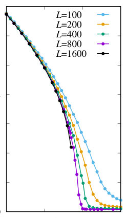 
Figure 1: Median ˜µ of the domain density for F = 2 as a function of the threshold d for lattice sizes L = 100, 200, 400, 800, and 1600 (left panel), and as a function of the reciprocal of the lattice size 1/L for thresholds d = 0.0780, 0.0785, and 0.0790 (right panel). For L = 1600, the data were collected up to d = 0.0785. The dashed curve represents the fit ˜µ = ˜µ∞+ b/L to the data for d = 0.0780. The median exhibits a continuous behavior across all simulated system sizes.

📷 Fig 2

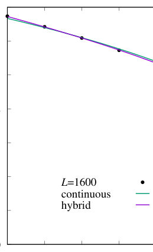 
Figure 2: Median ˜µ of the domain density for F = 2 as a function of the threshold d ≤0.0785 for the largest simulated lattice size (L = 1600). The solid curves display the best fits obtained under the continuous and hybrid transition hypotheses. The vertical dashed line indicates the independent estimate of the critical threshold, dc = 0.0784, whereas the symbol + indicates the asymptotic thermodynamic median value ˜µ∞≈0.142 previously extrapolated for d = 0.0780.

📷 Fig 3

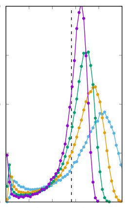 
Figure 3: Distribution of the domain density P(µ) for F = 2 at d = 0.0780 (left) and d = 0.0790 (right) for lattice sizes L = 100, 200, 400, and 800. The bimodal structure near the transition point reflects the competition between fragmented and homogeneous absorbing states. In the left panel, the vertical dashed line at µ ≈0.142 indicates the location of the thermodynamic limit extrapolation for the median. In both panels, the vertical scale is truncated at P(µ) = 20 to better visualize the behavior of the distribution at intermediate and high values of µ. Data for L = 1600 are omitted because the sample size is insufficient to fully resolve the distribution shape without noise.

📷 Fig 4

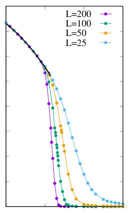 
Figure 4: Mean ¯µ (left panel) and median ˜µ (right panel) of the density of domains as a function of the threshold d for F = 3 and lattice sizes L = 25, 50, 100, and 200. While the mean appears smooth and continuous for these finite sizes, the median exhibits a jump for L ≥50 at an effective threshold that shifts toward the thermodynamic value dc ≈0.031 as L increases. The solid curves represent the analytical polynomial fit for the peak position µ0(d), defined in Eq. (3), taking the regular form µ0(d) = µc +A(dc −d)+B(dc −d)2 for the L = 200 data, which yields µc = 0.533 ± 0.001, A = 23.5 ± 0.5, and B = −515 ± 55. Remarkably, this single analytical function successfully captures the...

📷 Fig 5

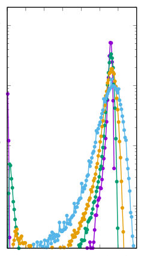 
Figure 5: Distribution of the density of domains P(µ) for F = 3 at d = 0.030 (left panel) and d = 0.033 (right panel) for lattices of linear sizes L = 25, 50, 100, and 200. The emergence of a bimodal distribution for large L near the transition point illustrates the competition between fragmented and homogeneous absorbing states.

**Summary.** This work rigorously re-examines the phase transitions of the continuous-trait Axelrod model using advanced statistical diagnostics like median analysis and probability distributions. It reveals that the transition's nature—whether hybrid or first-order—is dictated by the dimensionality of the trait space ($F$). The findings provide a unified characterization framework applicable across related cultural evolution models.

**Why it may be interesting.** While focused on social dynamics, the mathematical framework of non-equilibrium phase transitions (hybrid vs. first-order) is highly relevant to understanding critical phenomena in complex many-body systems, including those modeled by quantum field theories or lattice gauge theories near criticality.

Detailed structure

**Main problem.** The study investigates the nature of non-equilibrium phase transitions occurring in the continuous-trait Axelrod model.

**Main result.** The transition's character (hybrid vs. first-order) depends critically on the trait dimensionality ($F$): $F=2$ shows a genuinely hybrid transition, while $F=3$ exhibits a traditional first-order transition.

**Method.** The authors analyze scaling behavior by focusing on the median ($	ilde{\mu}$) and full probability distributions ($P(\mu)$) to overcome finite-size masking effects inherent in previous mean-value analyses.

**Model / system.** The continuous-trait Axelrod model describes cultural evolution where agents possess traits in a continuous space $[0,1]^F$. Local interactions are governed by a similarity threshold $d$, which acts as the control parameter for social tolerance.

**Key observables.** Domain density ($\mu$), fraction in the largest domain ($
ho$), median domain density ($	ilde{\mu}$), and the full probability distribution $P(\mu)$.

**Important parameters / regimes.** Trait dimensionality ($F=2, 3$); Similarity threshold ($d$ or $q$); System size ($L$).

**Assumptions / limitations.** The analysis assumes perfect copying dynamics and critically argues that previous characterizations of continuity were artifacts of finite-size effects.

**Figures summary.** Figures illustrate the median $	ilde{\mu}$ vs. $d$ curves, comparing fits to hybrid versus continuous scaling ansatze, and show the bimodal structure of $P(\mu)$ at different thresholds.

**Paper structure.** The paper establishes the model, critiques prior work based on mean values, develops a new methodology using medians and full distributions, presents results differentiating transitions based on dimensionality ($F=2$ vs. $F=3$), and finally validates findings by comparing to the discrete Poisson variant.

Abstract

We investigate the non-equilibrium phase transitions of the continuous-trait Axelrod model, an agent-based framework where individual culture is represented by a vector of $F$ continuous features confined to the interval $(0,1)$. Local interactions are governed by a metric similarity threshold $d$, which acts as a continuous control parameter of social tolerance. The dynamics inevitably freeze into one of two absorbing configuration classes: an ordered, homogeneous monocultural state at high tolerance, or a highly fragmented, disordered state at low tolerance. While previous studies characterized the transition as hybrid based on the continuous behavior of the domain density $μ$ alongside a discontinuous jump in the largest domain fraction $ρ$, we show that this apparent continuity is an artifact of severe finite-size masking effects. By shifting the methodological focus to the scaling of the median $\tildeμ$ and analyzing the full probability distributions $P(μ)$, we unveil a clear bimodal structure with disjoint maxima across independent simulation runs. Our results reveal that for $F=2$, the system undergoes a genuinely hybrid transition in the contemporary sense, featuring a tiny but finite latent jump ($μ_c \approx 0.089$) at the critical threshold $d_c \approx 0.0784$ while scaling toward it from below via a non-analytical power law with a mean-field exponent $β\approx 1/2$. Conversely, for $F=3$, the higher trait-space dimensionality suppresses local fluctuations, yielding a traditional, non-hybrid first-order transition. We apply this framework to the alternative discrete Poisson variant of the model, successfully confirming its known continuous transition for $F=2$ and discontinuous, non-hybrid transition for $F=3$, thereby establishing a unified characterization of phase transitions in Axelrod-like systems.

[↑ back to top](#top)

### [AtomFlow: An End-to-End FPGA-Based Control Architecture for Neutral Atom Quantum Computers](http://arxiv.org/abs/2607.11490v1)

**Authors:** Xiaorang Guo, Jonas Winklmann, Vengkeat Chea, Martin Schulz  
**Type:** both · **Category:** quantum information and computing · **PDF:** <https://arxiv.org/pdf/2607.11490v1>  
**Analysis basis:** full PDF text, analyzed in chunks
**Topic relevance:** 🔥 `QC/QI experiment` **4/5** · `quantum measurements` **3/5** · `analog quantum simulation` **2/5** · `measurement-induced transitions` **2/5** · `Rydberg arrays` **1/5** · `methods for driven-dissipative` **1/5** · `non-equilibrium dynamics` **1/5**

📷 Fig 1

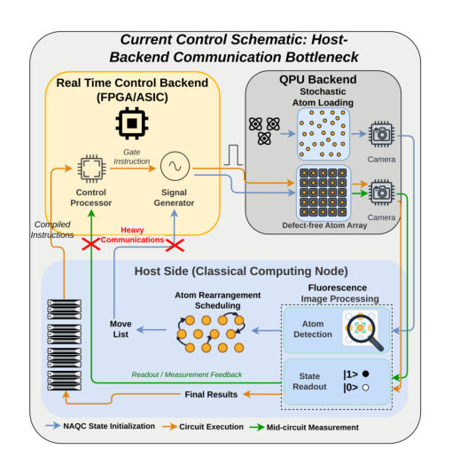 
Fig. 1: Abstract Representation of the current control schematic of NAQCs.

📷 Fig 2

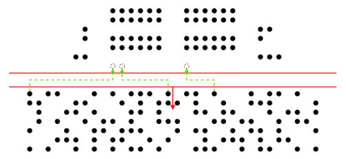 
Fig. 3: By-row lattice sorting scheme. The sorting channel (red) traverses the array (along the red arrow), and atoms (black circles) can move (green dashed arrows) freely within it towards their target positions (empty dashed circles).

📷 Fig 3

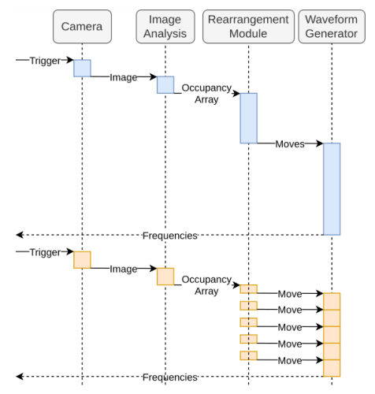 
Fig. 2: Sequential (blue) sequence diagram of rearrangement procedure compared to interleaved approach (yellow)

📷 Fig 4

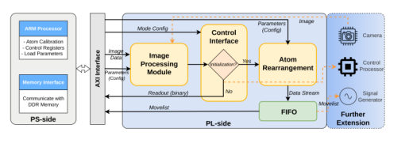 
Fig. 5: System architecture of AtomFlow. Solid black lines show the current software-in-the-loop implementation with the help of the PS. Dashed orange lines indicate the planned hardware extensions, which incorporate a Camera, Signal Generator, and Control Processor, for real-time execution and mid-circuit feedback.

📷 Fig 5

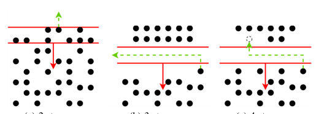 
Fig. 4: Different types of moves. (a) 2-step move. Used for directly removing atoms from the sorting channel at the beginning. (b) 3-step move. Used for removing atoms through the sorting channel. (c) 4-step move. Used for moving atoms through the sorting channel towards their target positions.

**Summary.** The paper introduces AtomFlow, an FPGA-based control architecture designed to overcome the slow execution rate in Neutral Atom Quantum Computing. By integrating fluorescence image analysis and atom rearrangement onto a single chip, it eliminates communication latency inherent in traditional setups. This results in significantly faster, end-to-end quantum gate operations necessary for scaling up quantum processors.

**Why it may be interesting.** This work directly tackles the hardware control overhead that limits the speed of quantum computation using neutral atoms, providing a critical engineering solution for scaling up these quantum platforms.

Detailed structure

**Main problem.** The slow execution rate of Neutral Atom Quantum Computing (NAQC) is bottlenecked by lengthy classical processing tasks, such as fluorescence imaging and atom rearrangement.

**Main result.** AtomFlow, an FPGA-based control architecture, achieves a low end-to-end latency of 25.3 ms on a $16 	imes 16$ array by eliminating host-mediated round-trip communication.

**Method.** The authors propose and implement AtomFlow, which co-locates fluorescence image analysis and an atom rearrangement algorithm onto a single FPGA device for streaming dataflow control.

**Model / system.** The system uses neutral atoms trapped in optical tweezers to serve as qubits. The control architecture is implemented on a Zynq UltraScale+ FPGA, integrating modules for image processing and atomic sorting/rearrangement.

**Key observables.** End-to-end latency (25.3 ms), first-move latency (4 ms), average move generation time (1 ms).

**Important parameters / regimes.** $16 	imes 16$ atom array size; resource utilization metrics (LUTs, FFs, BRAM) for scalability analysis.

**Assumptions / limitations.** The primary assumption is that eliminating host-mediated latency by hardware co-location will significantly improve the overall computational throughput of NAQC.

**Figures summary.** Figures illustrate the control schematic, sequence diagrams comparing sequential vs. interleaved operations, and detailed architectural views showing data flow from image input through the FPGA rearrangement kernel to signal generators.

**Paper structure.** The paper addresses the bottleneck in NAQC by proposing AtomFlow. It details the integration of fluorescence imaging analysis with a novel FPGA-based atom rearrangement engine, demonstrating performance metrics and scalability analyses across different array sizes.

Abstract

Neutral Atom Quantum Computing (NAQC) is an emerging modality for scalable quantum computation, valued for its long coherence times and the naturally identical atomic qubits. However, one of the main drawbacks is its slow execution rate, dominated by lengthy classical processing tasks, such as fluorescence imaging, cooling, and atom rearrangement. We address this bottleneck with AtomFlow, a field-programmable gate array (FPGA)-based control architecture that consolidates fluorescence-image analysis and a newly developed atom-rearrangement algorithm onto a single Zynq UltraScale+ device. By co-locating the two stages on the same board and emitting rearrangement moves in a streaming fashion as soon as they are computed, AtomFlow eliminates the round-trip latency of conventional host-mediated pipelines. Evaluated on a 16x16 atom array, AtomFlow achieves an end-to-end latency of 25.3 ms with a first-move latency of 4 ms and an average move generation of 1 ms. Furthermore, our scalability analysis demonstrates that the architecture can readily support larger atom arrays within a single-board resource budget.

[↑ back to top](#top)

### [Edge-state interferometry as a probe of local flux in isolated quantum Hall systems](http://arxiv.org/abs/2607.10868v1)

**Authors:** Botao Wang, Nathan Goldman, André Eckardt  
**Type:** theory · **Category:** quantum gases · **PDF:** <https://arxiv.org/pdf/2607.10868v1>  
**Analysis basis:** full PDF text, analyzed in chunks
**Topic relevance:** 🔥 `analog quantum simulation` **4/5** · `non-equilibrium dynamics` **3/5** · `methods for driven-dissipative` **2/5** · `non-equilibrium universality` **2/5** · `Keldysh / 2PI / non-Gaussian methods` **1/5** · `driven-dissipative phase transition` **1/5**

📷 Fig 1

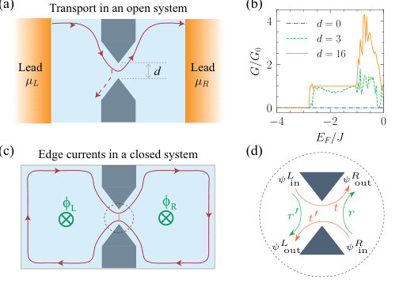 
FIG. 1. (a) Schematic of a QPC system coupled to two leads with chemical potentials µL and µR. (b) Conductance (in units of the conductance quantum G0 = e2/h) as a function of Fermi energy EF for different QPC distances d. These results are obtained from simulating a 25 × 16 Hofstadter lattice at quarter flux α = 1/4 attached to two semi-infinite leads, using the Kwant software package [62]. (c) Schematic of a closed system hosting chiral edge modes. (d) Sketch of the scattering problem near the QPC. Solving this scattering problem in terms of the stationary edge currents yields the transmission rate of the QPC, and enables the determination of the flux difference δϕ = ϕR −ϕL.

📷 Fig 2

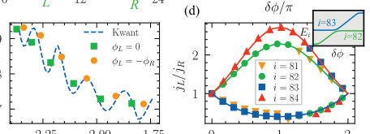 
FIG. 2. (a) Density and current distribution of eigenstate i = 83 at ϕR = π/2, ϕL = 0 for a Hofstadter lattice of 25 × 16 sites at quarter flux α = 1/4. The lower boxes L and R define the region for the calculation of the currents jR = P

📷 Fig 3

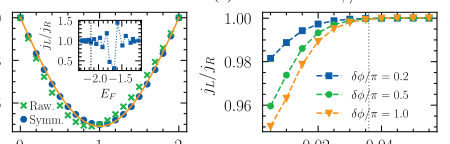 
FIG. 3. (a) Spatial density and current distributions of the Chern insulator ground state with N = 83 particles at δϕ = ϕR = π/2. The lower boxes L and R indicate the regions where the left and right currents jL and jR are evaluated, respectively. (b) Left and right currents jL,R as a function of flux imbalance δϕ for two particle numbers N = 83 and N = 84. The discontinuities are associated with an avoided crossing in the spectrum (see Fig. 2(b) and A1), which can be compensated for by connecting solutions for N = 83 and N = 84 particle sectors. The vertical dotted line denotes the avoided crossing point at δϕ ≃1.32π. (c) Ratio of the stationary currents jL/jR as a function of δϕ. Green...

📷 Fig 4

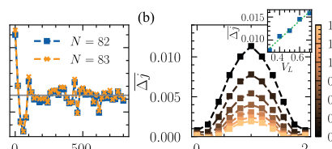 
FIG. 4. (a) Current difference ∆j = jR −jL as a function of evolution time t for two particle numbers N = 82 and N = 83. Here we consider kBT = 0.1, ϕR = π, ϕL = 0 and initial bias potentials VL = −0.5 as an example. The currents jL and jR are evaluated by summing over all occupied states governed by the Fermi-Dirac distribution at finite temperature kBT. The gray solid line represents the time-averaged current difference ∆j over the entire evolution period up to t = 800. (b) Time- averaged current difference ∆j as a function of δϕ for various temperatures. Inset: ∆j versus bias potentials VL at kBT = 0.2, ϕR = 0.8π and ϕL = 0. We find a linear increase of current difference as a function...

**Summary.** The authors propose a novel method to measure local magnetic fluxes in isolated quantum systems, such as ultracold atoms, by analyzing edge-state currents at a Quantum Point Contact. They introduce both an equilibrium protocol using ground-state currents and a robust dynamic post-quench measurement. This technique allows for the detection of quantized flux differences and extends naturally to probing exotic anyonic statistical phases.

**Why it may be interesting.** This work directly addresses implementing complex quantum transport diagnostics (like those requiring external leads) using only internal dynamics within isolated cold atom platforms, making it highly relevant for AMO physicists working with synthetic gauge fields and topological matter.

Detailed structure

**Main problem.** The goal is to probe local magnetic fluxes within isolated quantum Hall systems using edge-state interferometry, circumventing the need for external reservoirs.

**Main result.** The scattering properties at a Quantum Point Contact (QPC) in an isolated system can be measured by analyzing ground-state edge currents, providing a robust method to detect local magnetic fluxes and probe anyonic statistical phases.

**Method.** Two protocols are proposed: an equilibrium measurement using stationary edge currents or a dynamic scheme based on post-quench evolution following the sudden removal of an initial potential bias.

**Model / system.** The system is modeled as an isolated lattice (suitable for ultracold atoms) hosting chiral edge states, described by a Harper-Hofstadter Hamiltonian. The setup involves analyzing transport through a QPC connecting these edge modes.

**Key observables.** Stationary edge currents ($\langle\hat{j}_\eta
angle$), the ratio of left to right edge currents ($j_L/j_R$), and time-averaged current imbalance ($\Delta j$).

**Important parameters / regimes.** Local magnetic flux difference ($\delta\phi = \phi_R - \phi_L$), temperature, and potential bias strength ($V_L$).

**Assumptions / limitations.** The dynamic scheme is robust against finite temperature and particle-number fluctuations; the analysis relies on relating scattering properties to ground-state currents.

**Figures summary.** Figures illustrate QPC setups in open vs. closed systems, showing current distributions related to flux differences ($\delta\phi$). Key figures demonstrate abrupt jumps in current ratios at critical fluxes ($\delta\phi_c$) and show persistent time-averaged current imbalances after quenching a potential bias when $\delta\phi 
eq 0$.

**Paper structure.** The paper develops the theoretical framework by first establishing how edge currents mimic open-system conductance measurements. It then details two measurement protocols—equilibrium and dynamic—showing that both yield measurable signatures dependent on the local magnetic flux difference, culminating in the extension of this technique to anyonic statistics.

Abstract

Quantum point contacts (QPCs) are essential tools for transport experiments in solid-state systems, enabling the detection of fractional charges and anyonic braiding statistics. Realizing analogous transport setups in isolated quantum-simulation platforms, such as ultracold atoms, remains challenging, since it typically requires coupling to external reservoirs. Here we show that the scattering properties of chiral edge states at a QPC can instead be extracted directly from the stationary edge currents of an isolated, reservoir-free lattice system. Exploiting the sensitivity of this scattering to Aharonov-Bohm-type phases, we propose an equilibrium protocol to detect local magnetic fluxes from ground-state edge currents. We further introduce a dynamical scheme, robust against finite temperature and particle-number fluctuations, based on the post-quench evolution following a sudden potential-bias removal. Since anyonic excitations are themselves associated with a local, quantized magnetic flux, our approach should extend to probing anyonic statistical phases in quantum-engineered platforms.

[↑ back to top](#top)

### [Heterodyne position detection of an optomechanical system](http://arxiv.org/abs/2607.09912v1)

**Authors:** Daniel Tandeitnik, Gabriel Dias, Thiago Guerreiro  
**Type:** experiment · **Category:** other · **PDF:** <https://arxiv.org/pdf/2607.09912v1>  
**Analysis basis:** full PDF text, analyzed in chunks
**Topic relevance:** 🔥 `quantum optics experiment` **4/5** · `quantum measurements` **3/5** · `QC/QI experiment` **2/5** · `analog quantum simulation` **1/5** · `interference shaping light` **1/5** · `measurement-induced transitions` **1/5**

📷 Fig 1

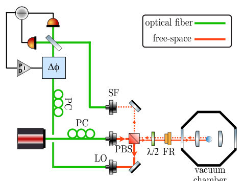 
FIG. 2. Representative backward-collection geometry used for homodyne detection of the particle’s back-scattered field.

📷 Fig 2

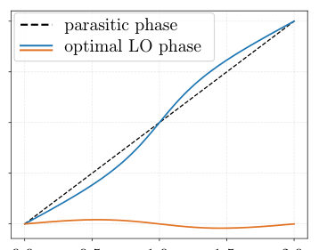 
FIG. 3. Optimal LO phase as a function of the PF phase for the strong (blue solid line) and weak (orange solid line) PF regimes. In the strong-parasitic-field regime, variations in the PF phase are directly followed by corresponding shifts in the optimal operating point, thereby precluding the possibility of stable phase locking at the correct phase.

📷 Fig 3

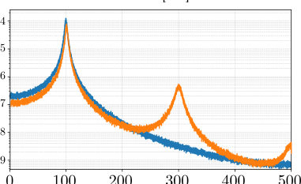 
FIG. 4. Simulation of phase-wrapping effects in homodyne detection. (a) Time-domain position signal of a simulated confined particle in thermal equilibrium. The ideal linear trajectory q(t) (blue) is compared against the nonlinear ho- modyne signal sin(q(t)) (orange). The inset highlights the amplitude clamping and distortion characteristic of the phase- wrapped signal at large displacements. (b) PSD of the position signals. The nonlinear sine transformation redistributes power from the fundamental resonance at 100 kHz into odd-order harmonics, most prominently the third harmonic at 300 kHz.

📷 Fig 4

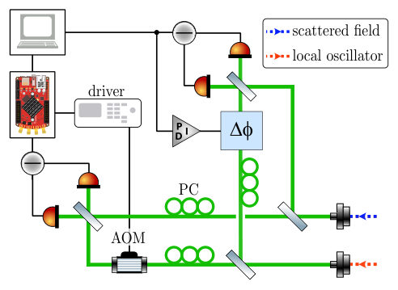 
FIG. 5. Experimental configuration for the simultaneous comparison of homodyne and heterodyne detection schemes. The SF (blue, dashed) and the LO field (red, dashed) are each collected into single-mode optical fibers and split between the two detection branches. In the homodyne branch (upper path), active phase stabilization is achieved with a fiber stretcher (∆ϕ) controlled by a PID loop implemented on a Red Pitaya FPGA board. In the heterodyne branch (lower path), an AOM shifts the LO frequency by 10 MHz; the same drive signal is fed to a second Red Pitaya board performing the digital IQ demodulation described in Sec. IV B.

📷 Fig 5

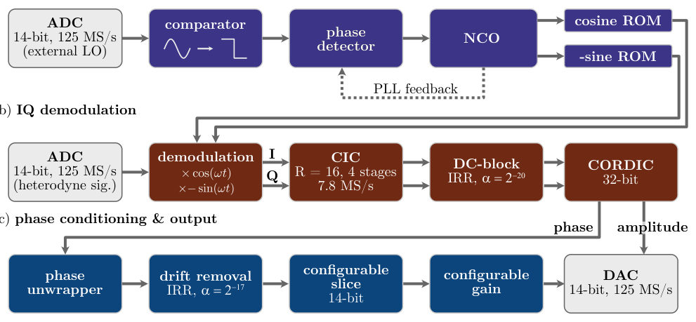 
FIG. 6. Block diagram of the FPGA heterodyne demodulation pipeline implemented on a Red Pitaya STEMLab 125-14. (a) A digital PLL locks an internal NCO to the AOM reference signal, generating phase-coherent cosine and negative-sine lookup tables. (b) The balanced detector output is IQ-demodulated, decimated by a CIC filter (R = 16, N = 4 stages), and DC-filtered to remove the quasi-static parasitic contribution. (c) A CORDIC core extracts the instantaneous phase and amplitude; the phase is subsequently unwrapped, drift-corrected, and mapped onto the 14-bit DAC output via a configurable bit-window and gain stage.

**Summary.** The paper introduces heterodyne detection as a superior method for reading the position of optomechanical systems compared to traditional homodyne techniques. By using digital IQ demodulation, it achieves linear signal output, eliminates phase-wrapping distortions, and becomes robust against fluctuations in optical power or strong parasitic reflections. This makes it highly valuable for high-precision quantum sensing applications.

**Why it may be interesting.** This work provides a crucial engineering advancement for quantum measurement protocols in cavity QED and trapped-ion/particle setups by offering a robust readout mechanism that mitigates common noise sources inherent to phase detection.

Detailed structure

**Main problem.** Improving the fidelity, stability, and robustness of position readout for optomechanical systems, especially when dealing with strong parasitic back-reflections.

**Main result.** Heterodyne detection provides a superior measurement technique that is linearly proportional to displacement, immune to optical power drifts, and significantly outperforms homodyne detection in terms of Signal-to-Noise Ratio (SNR) and linearity.

**Method.** The authors propose and experimentally demonstrate heterodyne detection combined with digital In-phase and Quadrature (IQ) demodulation implemented on an FPGA for phase readout.

**Model / system.** The system involves an optomechanically coupled platform, specifically tested using an optically levitated nanoparticle whose mechanical motion is encoded in the phase of back-scattered light.

**Key observables.** Differential current (homodyne) vs. IQ-demodulated signal (heterodyne); Force–voltage response linearity; Signal-to-Noise Ratio (SNR); Calibration factor ($C_{VM}$).

**Important parameters / regimes.** Local Oscillator (LO) amplitude, parasitic field strength, mechanical displacement relative to $\lambda/4$, and the operating frequency ($\Omega$).

**Assumptions / limitations.** The analysis assumes fields are monochromatic; the heterodyne scheme relies on IIR high-pass filtering to spectrally separate desired signals from quasi-DC parasitic contributions.

**Figures summary.** Figures compare PSDs showing harmonic distortion in homodyne vs. linearity in heterodyne; they also plot force response vs. voltage, demonstrating non-monotonicity for homodyne and strict linearity for heterodyne.

**Paper structure.** The paper first establishes the limitations of standard homodyne detection (phase wrapping, power drift sensitivity) when measuring optomechanical systems. It then introduces and details the advantages of the heterodyne approach using digital IQ demodulation on an FPGA, culminating in experimental comparisons demonstrating superior SNR and linearity.

Abstract

We report a heterodyne detection scheme for position readout of an optomechanical system, in particular an optically levitated particle, implemented via digital In-phase and Quadrature demodulation on a field-programmable gate array. Compared to the standard homodyne approach, the proposed method offers three key advantages: it remains robust in the presence of strong parasitic back-reflected fields that would otherwise prevent stable phase locking; it produces a signal linearly proportional to the particle displacement, eliminating phase-wrapping distortion; and its calibration factor is intrinsically immune to drifts in the optical power of the local oscillator or scattered field. We experimentally demonstrate and quantify all three advantages through simultaneous homodyne and heterodyne measurements on the same trapped particle. The proposed method can be used in any optomechanical system based on phase readout.

[↑ back to top](#top)

### [Measurement-induced overconcentration in quantum generative models](http://arxiv.org/abs/2607.10055v1)

**Authors:** Runzhe Mo, Bingzhi Zhang, Quntao Zhuang  
**Type:** theory · **Category:** quantum information and computing · **PDF:** <https://arxiv.org/pdf/2607.10055v1>  
**Analysis basis:** full PDF text, analyzed in chunks
**Topic relevance:** 🔥 `measurement-induced transitions` **4/5** · `quantum measurements` **3/5** · `correlated / nonlocal dissipation` **1/5** · `driven-dissipative phase transition` **1/5** · `entanglement & information structure` **1/5** · `methods for driven-dissipative` **1/5** · `non-equilibrium dynamics` **1/5**

📷 Fig 1

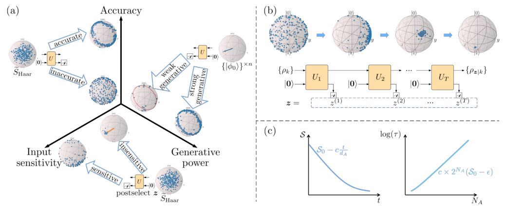 
Figure 1. Performance characterization and measurement-induced concentration in measurement-assisted quantum generative learning. (a) Visualization of three metrics characterizing the performance: accuracy measures the closeness of the uncondi- tional generated ensemble Egen to the target ensemble, generative power measures the generation performance using limited input resources, i.e., a single input state, and input sensitivity measures how much of the input-state ensemble structure is retained in the conditional generated ensemble Egen|z. (b) Schematic of measurement-induced concentration in a multistep sequential model. Conditioned on the same measurement trajectory z, distinct input...

📷 Fig 2

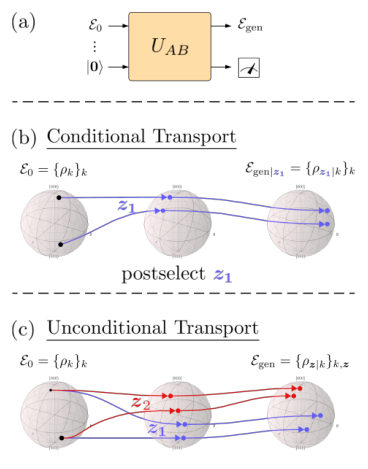 
Figure 2. Measurement-assisted quantum generative model and two transport types. (a) An input state from E0 is coupled to an initialized ancilla by a joint unitary UAB, followed by an- cilla measurement to produce Egen. (b) Conditional transport maps different inputs to outputs with a fixed measurement outcome z1. (c) Unconditional transport collects all gener- ated states on the output side over all outcomes z1, z2.

📷 Fig 3

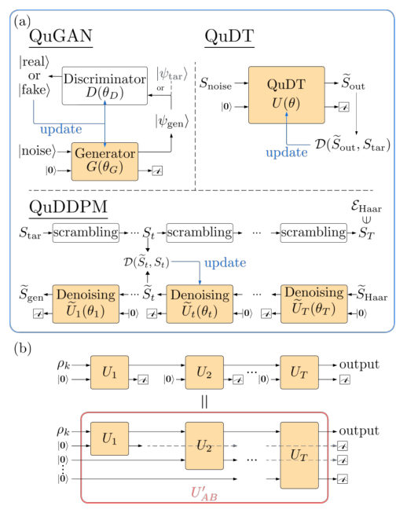 
Figure 3. General and sequential measurement-assisted quantum generative models. (a) Schematics of Quantum gen- erative adversarial network (QuGAN), Quantum direct trans- port (QuDT) and Quantum denoising diffusion probabilistic model (QuDDPM). (b) A sequential monitored circuit can be viewed as a structured realization of the general measurement- assisted model, where a large effective measurement trajec- tory space is generated by repeatedly reusing a small ancilla register.

📷 Fig 4

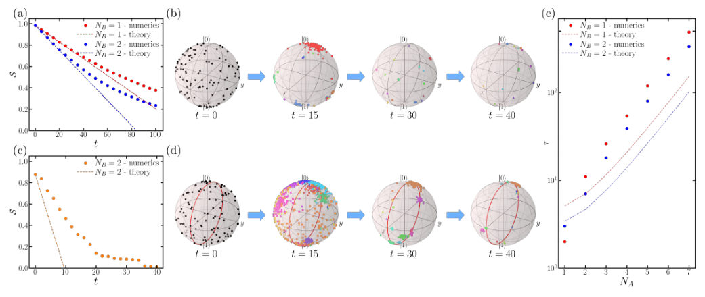 
Figure 4. (a) Input sensitivity versus temporal depth t in the conditional transport with random quantum circuits of NA = 6 and NB = 1, 2 (red and blue) qubits. Dots and dashed lines represent numerical simulation and theoretical results of Eq. (9). (b) Conditional transport with random circuit dynamics on the Bloch sphere for NA = 1. Dots with different colors correspond to different trajectories. (c) Input sensitivity for a trained QuDDPM circuit, with NA = 3 and NB = 2. Dots show numerical simulation results; dashed lines show the Haar-random prediction of Eq. (9) as a qualitative benchmark rather than a fitted theory for the trained circuit. (d) Conditional transport with trained...

📷 Fig 5

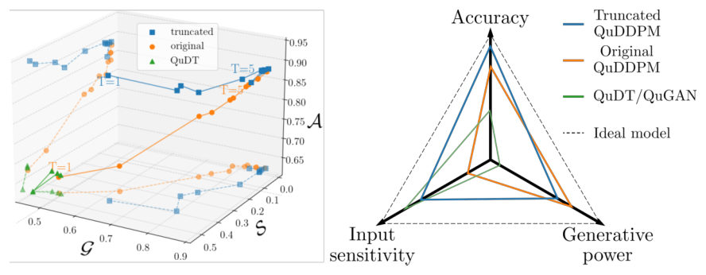 
Figure 5. Left: Performance benchmark of original QuDDPM and truncated QuDDPM on the logical circular ensemble. The three axes show accuracy A, generative power G, and input sensitivity S. For the original QuDDPM, increasing the temporal depth improves accuracy and generative power by enlarging the number of measurement trajectories, but simultaneously suppresses input sensitivity due to overconcentration. Truncated QuDDPM maintains comparable accuracy over a range of truncation depths while preserving greater input sensitivity, indicating a more favorable balance among the three metrics. The dashed curves are projections onto the S −G and A −S planes. Green dots represent the performance...

**Summary.** This paper investigates measurement-induced overconcentration—the loss of input diversity due to repeated measurements—in quantum generative models. The authors introduce 'input sensitivity' as a key diagnostic tool and propose truncating the diffusion depth in their model (QuDDPM). This work establishes temporal depth as a critical design parameter for balancing randomness with necessary input structure preservation.

**Why it may be interesting.** It provides a concrete diagnostic tool (input sensitivity) for understanding how information flow degrades in deep quantum circuits used for generative tasks, which is crucial for designing robust quantum machine learning models.

Detailed structure

**Main problem.** The study addresses 'measurement-induced overconcentration' in quantum generative models, where repeated measurements cause input state diversity to collapse toward similar output states.

**Main result.** Truncating the temporal depth of the diffusion process (QuDDPM) successfully mitigates this overconcentration effect while maintaining high accuracy and generative power.

**Method.** The authors introduce three metrics—accuracy, generative power, and input sensitivity—to diagnose performance and propose a truncated Quantum Denoising Diffusion Probabilistic Model (QuDDPM).

**Model / system.** The framework uses measurement-assisted quantum generative learning for state ensemble resampling. It involves applying joint unitaries followed by projective measurements on an ancilla register.

**Key observables.** Accuracy, Generative Power, Input Sensitivity ($S$), and the decay of $S$ with temporal depth.

**Important parameters / regimes.** Temporal Depth (number of measurement steps), input ensemble structure, and circuit parameters ($\eta=0.001$).

**Assumptions / limitations.** The analysis relies on deriving scaling laws for input sensitivity in multi-step models using approximations like retaining terms up to $O(d^{-2}_A d^{-(m+1)}_B)$.

**Figures summary.** Figures illustrate the three diagnostic metrics and show how input sensitivity decays with depth. Figure 7 details the circuit architectures for QuDDPM, covering forward diffusion and backward denoising.

**Paper structure.** The paper first establishes the measurement-assisted quantum generative framework using conditional/unconditional transport maps. It then diagnoses performance using new metrics, proves that multi-step models suffer from depth-dependent loss of input sensitivity, and finally proposes and benchmarks the truncated QuDDPM solution.

Abstract

Quantum measurement is a key resource for quantum generative learning, providing intrinsic stochasticity for generating diverse quantum samples. However, in measurement-assisted state-ensemble resampling, repeated measurements can also induce overconcentration: under a fixed measurement trajectory, distinct input states progressively converge toward similar output states, suppressing input-dependent diversity. To diagnose this effect, we introduce three complementary metrics: accuracy, generative power, and input sensitivity. For Haar-random monitored circuits, we prove that one-step models retain input sensitivity up to dimension-suppressed corrections, whereas sequential monitored circuits exhibit a depth-dependent loss of input sensitivity. Motivated by this diagnosis, we propose a truncated quantum denoising diffusion probabilistic model (QuDDPM), which restricts the temporal depth of both the forward diffusion and reverse denoising processes. Numerical benchmarks show that truncated QuDDPM preserves stronger input sensitivity while maintaining accuracy and generative power comparable to the original model. These results identify measurement-induced overconcentration as a dynamical limitation of deep monitored quantum generative models and establish temporal depth as a design parameter for balancing measurement-induced randomness with input-dependent diversity.

[↑ back to top](#top)

### [Operational Concealment of Measurement Incompatibility by Quantum Channels](http://arxiv.org/abs/2607.11762v1)

**Authors:** Mohd Asad Siddiqui, Zizhu Wang  
**Type:** theory · **Category:** quantum information and computing · **PDF:** <https://arxiv.org/pdf/2607.11762v1>  
**Analysis basis:** full PDF text, analyzed in chunks
**Topic relevance:** 🔥 `quantum measurements` **4/5** · `measurement-induced transitions` **3/5** · `Keldysh / 2PI / non-Gaussian methods` **1/5** · `correlated / nonlocal dissipation` **1/5** · `driven-dissipative phase transition` **1/5** · `entanglement & information structure` **1/5** · `methods for driven-dissipative` **1/5**

📷 Fig 1

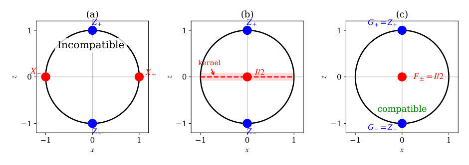 
FIG. 1. (Color online) Illustration of operational concealment under complete dephasing. Although the projective POVMs {X+, X−} and {Z+, Z−} are incompatible, the effects of the Pauli X POVM are operationally equivalent to the trivial effects I/2 after dephasing, while the Pauli Z POVM remains unchanged. (a) The original measurements on the Bloch sphere: {X+, X−} (red) and {Z+, Z−} (blue) are incompatible. (b) Under dephasing, the effects M± = (I ± X)/2 are operationally equivalent to the trivial effects I/2, while the effects N± = (I ± Z)/2 remain unchanged. (c) The pair ({I/2, I/2}, {Z+, Z−}) is compatible, so the incompatibility of the POVMs {X+, X−} and {Z+, Z−} is operationally...

📷 Fig 2

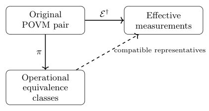 
FIG. 2. Conceptual structure of operational concealment. The canonical quotient map π maps a POVM pair to its operational equivalence classes [Ma] = Ma + ker(E†) and [Nb] = Nb +ker(E†). Concealment occurs precisely when these operational equivalence classes contain compatible representa- tives. This implies compatibility of the effective measurements {E†(Ma)} and {E†(Nb)}, but not conversely.

📷 Fig 3

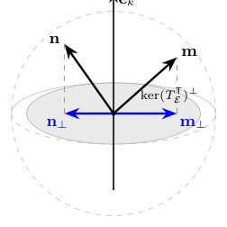 
FIG. 3. (Color online) Geometric illustration of the rank-2 concealment criterion (Theorem 7). The kernel direction ek spans ker(T T E ). The shaded ellipse represents the operationally accessible subspace ker(T T E )⊥. Components parallel to ek (dashed segments) are hidden and may be modified without changing the adjoint images. For rank-2 channels, concealment is completely determined by the projected vectors m⊥and n⊥.

**Summary.** This paper introduces the concept of 'operational concealment' to quantify when incompatible measurements become indistinguishable after passing through a noisy quantum channel. It develops an adjoint-kernel framework to characterize this phenomenon, showing that the degree of concealment depends critically on the channel's structure. The results have direct implications for secure quantum information processing and device certification.

**Why it may be interesting.** It provides a rigorous mathematical framework for understanding how physical limitations (like channel noise or limited measurement access) can mask fundamental quantum resource constraints, which is crucial for device-independent certification protocols.

Detailed structure

**Main problem.** The paper investigates 'operational concealment,' a phenomenon where measurement incompatibility persists at the operator level but becomes undetectable when measurements are restricted to the output statistics of a quantum channel.

**Main result.** Operational concealment is systematically characterized by the adjoint kernel of the quantum channel, leading to quantifiable measures like concealment robustness that differ from standard incompatibility robustness for non-injective channels.

**Method.** The authors develop an adjoint-kernel framework, defining operational equivalence classes based on $	ext{ker}(E^\dagger)$ and using SDP formulations to quantify concealment robustness.

**Model / system.** The analysis uses general quantum channels $E: L(\mathcal{H}_{in}) 	o L(\mathcal{H}_{out})$ acting on observables (POVMs) in the context of qubit measurements, assuming tomographically complete input states.

**Key observables.** Operational concealment, Concealment Robustness ($R_c$), Operational Observable Space ($	ext{Herm}(H_{out})/\ker(E^\dagger)$), and the adjoint kernel $\ker(E^\dagger)$.

**Important parameters / regimes.** The structure of the quantum channel $E$ (especially its injectivity) dictates whether concealment robustness equals standard incompatibility robustness.

**Assumptions / limitations.** The analysis assumes tomographically complete input states, allowing operator equalities to hold for state averages.

**Figures summary.** Figure 1 illustrates operational concealment using projective POVMs under a dephasing channel, showing that incompatible measurements become operationally equivalent to trivial effects.

**Paper structure.** The paper builds from defining the problem (operational concealment) via adjoint-kernel analysis, establishing key equivalences (e.g., with restricted-state compatibility), deriving quantitative measures ($R_c$), and finally characterizing structural properties like kernel invariance and monotonicity.

Abstract

Measurement incompatibility can remain intact at the operator level yet become operationally inaccessible when observations are restricted to the output of a quantum channel; we refer to this phenomenon as operational concealment. We develop a systematic adjoint-kernel framework for operational concealment in which observables are organized into operational equivalence classes determined by the kernel of the adjoint channel. This framework yields a structural classification of channels via kernel equivalence and monotonicity, together with a concealment robustness measure admitting explicit SDP formulations. It also yields an approximate concealment framework and a geometric characterization of concealment for unbiased binary qubit POVMs under rank-2 unital qubit channels. We show that concealment robustness coincides with standard incompatibility robustness for injective channels but can be strictly smaller for non-injective channels, as demonstrated by explicit analytical families. These results provide a systematic characterization and quantitative treatment of operationally inaccessible measurement incompatibility, with implications for restricted-access quantum information and semi-device-independent certification.

[↑ back to top](#top)

### [A Cluster-Based Model of the Spectrum of Erbium-Doped GdVO$_4$](http://arxiv.org/abs/2607.10924v1)

**Authors:** Zachary H. Roberts, Masaya Hiraishi, Luke S. Trainor, Jevon J. Longdell  
**Type:** both · **Category:** other · **PDF:** <https://arxiv.org/pdf/2607.10924v1>  
**Analysis basis:** full PDF text, analyzed in chunks
**Topic relevance:** 🔥 `spintronics-quantum-optics interface` **4/5** · `exotic spin models in light-matter` **3/5** · `Keldysh / 2PI / non-Gaussian methods` **1/5** · `analog quantum simulation` **1/5** · `driven-dissipative phase transition` **1/5** · `methods for driven-dissipative` **1/5**

📷 Fig 1

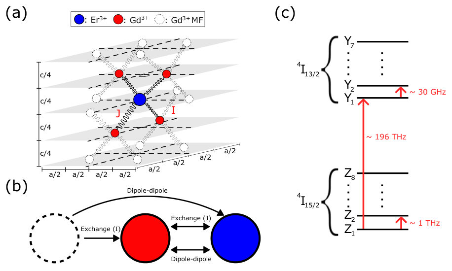 
FIG. 1. (a) Local environment of the erbium dopants, which occupy a site with D2d symmetry. Here we have labelled erbium ion (blue), its four nearest neighbour gadolinium ions (red), and the surrounding mean field (MF) gadolinium ions (white). Also shown are the Er-Gd exchange interaction (J) and Gd-Gd exchange interaction (I). Figure adapted from Figure 1(a) in Ref. [9]. (b) Schematic showing the interactions between the erbium ion, nearest neighbour gadolinium ions, and mean field gadolinium ions. (c) Energy level diagram of the 4I15/2 and 4I13/2 levels of the erbium ion, split into Kramers doublets by the crystal field. The transition frequencies are from Ref. [19]. The splitting between...

📷 Fig 2

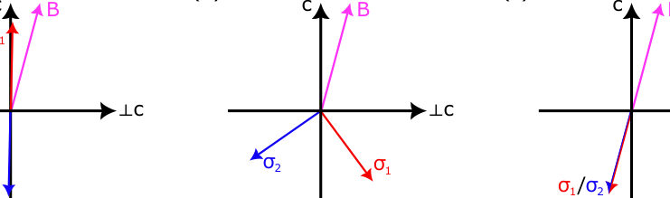 
FIG. 2. The three different spin configuration phases our antiferromagnetic system can exhibit. The black arrows depict the crystal axes, B represents the external magnetic field, and σ1 and σ2 represent the spin orientations of the two spin sublattices. (a) Antiferromagnetic phase (AFM). (b) Spin-flop phase (SF), B &gt;  2HEHA + H2 A 1/2 [20]. (c) Paramagnetic phase (PM), B &gt; 2HE −HA.

📷 Fig 3

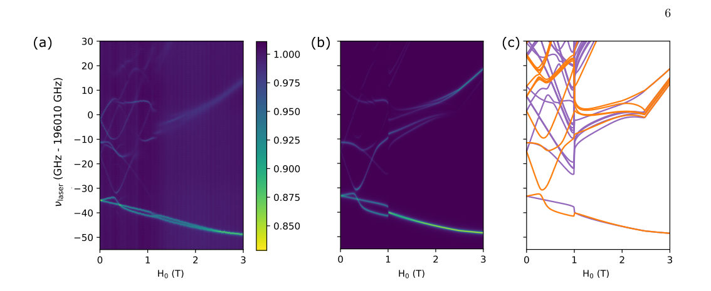 
FIG. 3. (a) Optical transmission spectrum with light polarised halfway between the a and c-axes of the crystal, and applied magnetic field misaligned by 6.8◦from the c-axis. (b) Output of our cluster model, with relative transition strengths estimated using equation 18. (c) Model output without transition strengths being taken into account. Orange lines indicate that the erbium is surrounded by gadolinium ions on the ‘down’ sublattice, while purple lines indicate that the erbium is surrounded by gadolinium ions on the ‘up’ sublattice. Here ‘up’ and ‘down’ point along the crystallographic c-axis.

📷 Fig 4

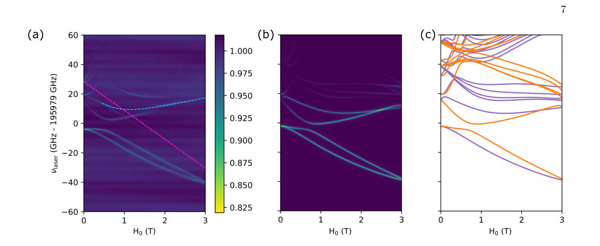 
FIG. 4. (a) Optical transmission spectrum with light polarised halfway between the a and c axes of the crystal and applied magnetic field misaligned significantly from the c-axis. The purple dashed line is a proposed energy level from something absent from our model, that undergoes and avoided crossing with the erbium level predicted by our model (approximately the blue dashed line) to give rise to the observed spectrum. (b) Output of our cluster model, with relative transition strengths estimated using equation 18, with field misalignment set to 60◦from the c-axis. (c) Model output without transition strengths being taken into account. Orange lines indicate that the erbium is surrounded by...

**Summary.** The authors present a refined cluster model to describe how rare-earth ion optical spectra are modified by the magnetic environment of their host crystal. By treating only nearest neighbors explicitly, they achieve better parameterization than previous models. This work is significant for predicting quantum phenomena like microwave-to-optical energy transduction in these solid-state systems.

**Why it may be interesting.** This work is highly relevant to AMO physics as it models the coupling between electronic transitions ($	ext{Er}^{3+}$) and collective spin excitations ($	ext{Gd}$ spins). The focus on predicting avoided crossings makes it directly applicable to quantum optics and understanding light-matter interactions in magnetic materials.

Detailed structure

**Main problem.** To develop a cluster-based model that accurately describes the complex optical spectrum of erbium ions doped into a gadolinium vanadate crystal.

**Main result.** The proposed cluster model successfully reproduces the experimentally observed optical spectra across various magnetic field regimes, suggesting it captures the essential spin-lattice coupling mechanisms in the material.

**Method.** The authors developed and applied a Hamiltonian incorporating terms for the $	ext{Er}$ ion, the $	ext{Gd}$ lattice spins, and their mutual interactions. They utilized a cluster approximation where only four nearest neighbor $	ext{Gd}$ ions are treated explicitly interacting with the mean field of the bulk crystal.

**Model / system.** The system is $	ext{Er:GdVO}_4$, involving electronic transitions of $	ext{Er}^{3+}$ coupled to the magnetic excitations (spins) of the $	ext{Gd}^{3+}$ host lattice. The model Hamiltonian includes terms for crystal field, Zeeman effects, and exchange/dipole interactions.

**Key observables.** Optical transmission spectrum at various applied magnetic fields; specific energy level transitions ($	ext{Z}_1 	o 	ext{Y}_{1,2}$); avoided crossings in the spectra.

**Important parameters / regimes.** Exchange couplings ($J$, $I$), crystal field parameters, and external magnetic field strengths (e.g., 1 T).

**Assumptions / limitations.** The model employs a cluster approximation treating only four nearest neighbors explicitly; it assumes $	ext{Gd}$ ions have $L=0$.

**Figures summary.** Figures illustrate the local environment of the dopant, energy level diagrams showing spin splitting, and comparisons between measured optical spectra (at various misalignments/fields) and model predictions.

**Paper structure.** The paper introduces the full Hamiltonian ($H = H_{	ext{Er}} + H_{	ext{Gd}} + H_{	ext{Er-Gd}}$), details the cluster approximation for $	ext{Gd}$ spins, presents the fitting procedure using experimental spectra, compares results across different magnetic phases (AFM, SF, PM), and discusses discrepancies with high-field measurements.

Abstract

Experimental observations of rare-earth ions doped into an antiferromagnetic crystal show an enriched optical spectrum. In this paper we present a cluster-based model to describe erbium ions doped into a gadolinium vanadate (Er:GdVO$_4$) host crystal, wherein the erbium ion couples directly to its four nearest neighbour gadolinium ions, which in turn couple to the mean field of the rest of the crystal. Compared to previous models in the literature, the parameters used to fit this model are fewer in number, with clearer physical origins. Agreement with the experimentally observed optical spectrum of Er:GdVO$_4$ suggests that our model succeeds in capturing the most important interactions of the system, suggesting that it may be useful for predicting microwave-to-optical transduction in future experiments.

[↑ back to top](#top)

### [Nonlocal nonstabilizerness for slightly entangled quantum many-body states](http://arxiv.org/abs/2607.10714v1)

**Authors:** Lei-Yi-Nan Liu, Jian Cui  
**Type:** theory · **Category:** quantum information and computing · **PDF:** <https://arxiv.org/pdf/2607.10714v1>  
**Analysis basis:** full PDF text, analyzed in chunks
**Topic relevance:** 🔥 `entanglement & information structure` **4/5** · `Rydberg arrays` **3/5** · `analog quantum simulation` **3/5** · `non-equilibrium dynamics` **1/5**

📷 Fig 1

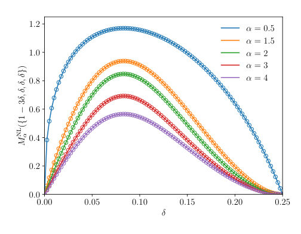 
FIG. 1. Nonlocal SRE for the entanglement spectrum {1 −3δ, δ, δ, δ} at different R´enyi indices α. The solid lines denote the SRE of the corresponding reference states, while the open circles represent the results obtained from manifold optimization.

📷 Fig 2

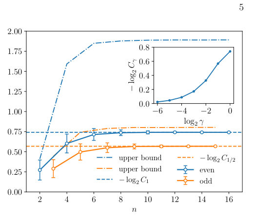 
FIG. 3. Average nonlocal SRE of Haar-random states as a function of system size n. For even n, we use a balanced bipar- tition with γ = 1, while for odd n, we take γ = 1/2. The inset shows the rapid decay of the average nonlocal SRE away from a balanced bipartition in the thermodynamic limit, as com- puted from Eq. (20). For n ≤10, the manifold-optimization results agree with our conjecture. The dash-dotted lines in- dicate the upper bounds in Eq. (18), obtained from Ref. [33], for even (blue) and odd (orange) system sizes.

📷 Fig 3

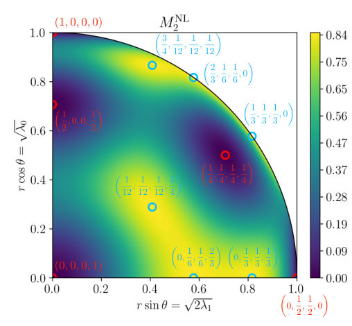 
FIG. 2. Nonlocal SRE M NL 2 for rank-4 entanglement spectra, parameterized by (r, θ, ϕ = π/4) as defined in Eq. (15). The red open circles indicate the spectra with vanishing nonlocal SRE, while the blue open circles denote the global maximizers of the nonlocal SRE over the space of rank-4 entanglement spectra.

📷 Fig 4

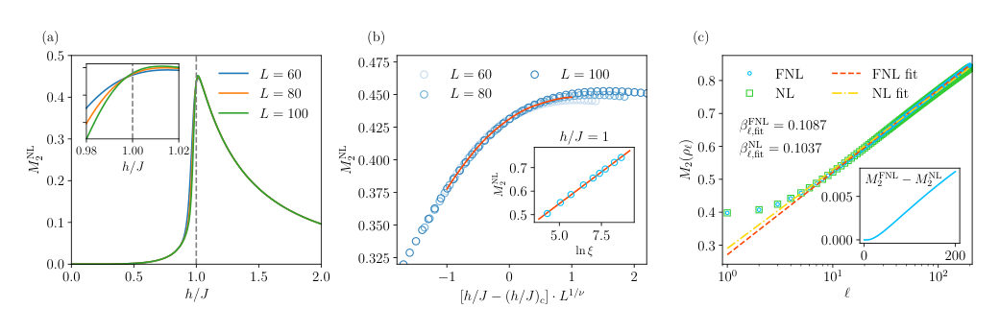 
FIG. 4. Nonlocal SRE in the Ising model. For finite systems, we obtain the entanglement spectrum using DMRG, while the thermodynamic-limit results are computed with VUMPS. The nonlocal SRE results shown in panels (a) and (b) are independently verified by manifold optimization. (a) Nonlocal SRE of the Ising model under an equal bipartition as a function of h/J. The inset shows a magnified view near the critical point. (b) Finite-size scaling of the nonlocal SRE. Fixing ν = 1, we optimize the position of critical point and obtain (h/J)c ≈0.997. The inset shows the nonlocal SRE at criticality as a function of the correlation length ξ extracted from VUMPS. (c) Comparison between the fermionic...

📷 Fig 5

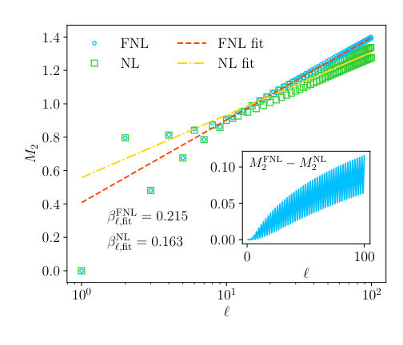 
FIG. 5. FNL and NL as the function of subsustem size ℓ in the XXZ chain at ∆= 0, corresponding to a free fermion chain. The FNL remains larger than the NL for all subsystem sizes considered, as highlighted in the inset, and the difference grows with increasing ℓ. For ℓ≥17, we truncate the entan- glement spectrum and only retain Schmidt values larger than 10−15 to compute NL.

**Summary.** The paper introduces a novel Schmidt-reference-state framework to calculate nonlocal nonstabilizerness, a key resource measure in quantum many-body physics. This method bypasses intractable optimization problems by relating the true value to an easily computable reference state derived from the entanglement spectrum. It establishes entanglement spectra as a powerful diagnostic tool for understanding irreducible correlations in both equilibrium and dynamic systems.

**Why it may be interesting.** This work provides a powerful, computationally tractable diagnostic tool for quantifying subtle quantum correlations (nonstabilizer structures) in complex many-body systems that are otherwise hidden by standard entanglement measures.

Detailed structure

**Main problem.** The primary challenge is efficiently calculating 'nonlocal nonstabilizerness,' a quantum resource quantifying irreducible magic encoded in bipartite entanglement, which involves solving a highly nonconvex optimization problem.

**Main result.** The authors propose a Schmidt-reference-state framework that allows for the efficient calculation of nonlocal SRE directly from the sorted Schmidt spectrum, capturing nonstabilizer correlations invisible to conventional measures.

**Method.** They introduce a canonical reference state derived from the sorted Schmidt coefficients and conjecture that the true minimum is achieved by this state, bypassing complex local unitary optimization over $SU(d_A) \otimes SU(d_B)$.

**Model / system.** The analysis applies to bipartite pure quantum many-body states ($\vert\psi
angle_{AB}$), with applications demonstrated on Haar-random states, critical spin chains (Ising/XXZ models), and dynamics in Rydberg atom arrays.

**Key observables.** Nonlocal $\alpha$-Stabilizer Rényi Entropy ($M_{	ext{NL}}^\alpha$), the entanglement spectrum ($\{\lambda_i\}$), and the reference state SRE ($M_{	ext{ref}}^\alpha$).

**Important parameters / regimes.** The Rényi index $\alpha$, the Schmidt rank ($\chi$), and the specific structure of the entanglement spectrum.

**Assumptions / limitations.** The core assumption is that the minimum nonlocal nonstabilizerness is achieved by the reference state constructed from the sorted Schmidt spectrum, a conjecture supported by necessary optimality conditions.

**Figures summary.** Figure 1 compares the nonlocal SRE calculated via manifold optimization against the reference state prediction for various entanglement spectra. Figure 2 plots $M_{NL}^2$ for rank-4 spectra, identifying global maximizers.

**Paper structure.** The paper first identifies the computational bottleneck of nonlocal nonstabilizerness, then introduces and rigorously supports the Schmidt-reference-state framework by showing its equivalence to manifold optimization results. Finally, it applies this tool to various physical models like critical chains and fermionic systems.

Abstract

Nonlocal nonstabilizerness quantifies the irreducible magic resource encoded in bipartite entanglement, but its evaluation is generally hindered by a highly nonconvex optimization over local unitary transformations. Here we propose a Schmidt-reference-state framework that replaces this optimization by a direct construction from the sorted Schmidt spectrum. We conjecture that the nonlocal stabilizer Rényi entropy (SRE) is given by the SRE of the corresponding reference state, and support this conjecture through analytical and numerical evidences. Our framework makes nonlocal nonstabilizerness efficiently accessible for weakly entangled many-body states whenever the entanglement spectrum is available. Applying it to Haar-random states, critical spin chains, and PXP dynamics, we show that nonlocal SRE captures nonstabilizer structures in the entanglement spectrum that are invisible to conventional entanglement measures. Our results establish entanglement spectra as a powerful window into irreducible nonstabilizer correlations, opening a broadly applicable route to studying nonlocal magic resources of quantum many-body systems in and out of equilibrium.

[↑ back to top](#top)

### [Certified boundary-magic witness for state-dependent proto-area in a holographic code](http://arxiv.org/abs/2607.10663v1)

**Authors:** Luis Lozano  
**Type:** theory · **Category:** quantum information and computing · **PDF:** <https://arxiv.org/pdf/2607.10663v1>  
**Analysis basis:** full PDF text, analyzed in chunks
**Topic relevance:** 🔥 `entanglement & information structure` **4/5** · `Keldysh / 2PI / non-Gaussian methods` **1/5** · `correlated / nonlocal dissipation` **1/5** · `driven-dissipative phase transition` **1/5** · `methods for driven-dissipative` **1/5**

📷 Fig 1

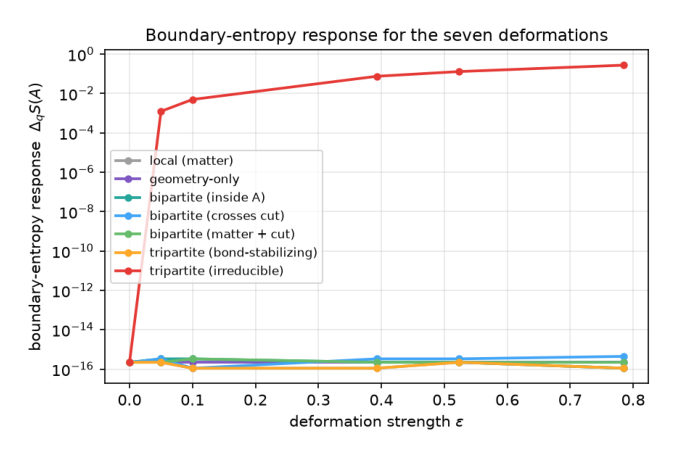 
Figure 1. Peak-to-peak boundary response ∆qS(A) for the seven generators. Only the matter- controlled bond move has a leading quadratic response; the comparison families remain at numerical zero.

📷 Fig 2

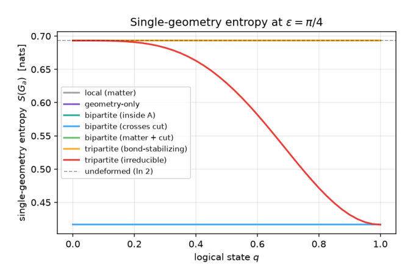 
Figure 2. Exact single-leg entropy S(Ga) along the real logical meridian. The bond-moving deformation follows Eq. (3.2); the comparison families are flat. For these conditioned states S(Ga) = S(A), although the two quantities have different definitions.

📷 Fig 3

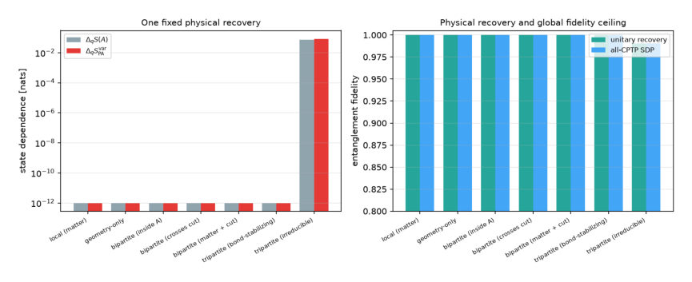 
Figure 3. Left: boundary and variational proto-area responses obtained from one fixed physical recovery per channel. Right: entanglement fidelity of the coherent-information-optimized unitary recovery and the independent all-CPTP fidelity SDP. Exact zeros are drawn at the plotting floor.

📷 Fig 4

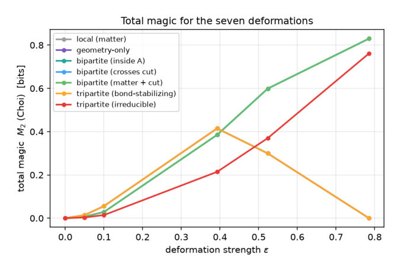 
Figure 4. Total stabilizer R´enyi magic of the Choi state. At the comparison coupling it is nonzero for deformations with and without boundary response and therefore does not discriminate the two classes.

📷 Fig 5

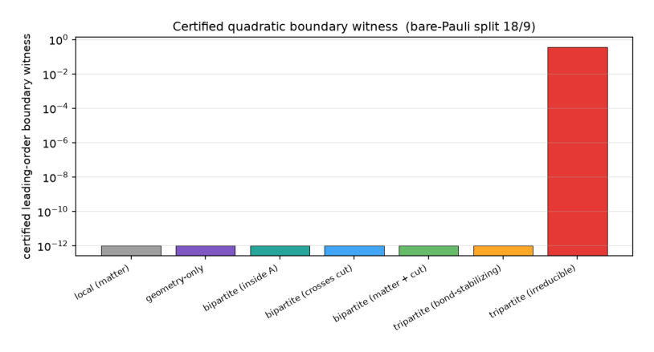 
Figure 5. Certified quadratic boundary witness for the seven deformations. Only the bond-moving case is positive. Exact zero values are displayed at the 10−12 plotting floor; the title also records the bare Pauli 18/9 split.

**Summary.** The paper develops and applies a certified boundary witness to analyze state-dependent proto-area within a four-qubit holographic code. It rigorously demonstrates that only matter-controlled bond motion causes the boundary entropy to depend on the logical state, providing a concrete, quantifiable signature for non-trivial quantum resource behavior.

**Why it may be interesting.** This work connects abstract concepts from quantum information theory (resource theories, entanglement measures) directly to geometric properties derived from holographic duality, providing a concrete computational test for gravitational principles in a finite setting.

Detailed structure

**Main problem.** The study aims to find a certified boundary witness for detecting state-dependent proto-area in holographic quantum codes, specifically identifying which nonlocal deformation causes the boundary entropy to depend on the logical state.

**Main result.** Only the matter-controlled bond motion deformation yields a leading quadratic logical-state dependence of the boundary entropy ($\Delta_q S(A) > 0$), establishing a finite-code witness that is not universal.

**Method.** The analysis employs advanced quantum information diagnostics, including calculating recovery-conditioned variational proto-area, maximizing entanglement fidelity via SDPs, and deriving a leading-order boundary witness by projecting the stabilizer-Rényi quadratic form.

**Model / system.** The system is modeled using a four-qubit product-EPR holographic code involving reference, matter, and geometry bonds. Seven specific deformations are analyzed by controlling Hamiltonians acting on these components.

**Key observables.** Boundary entropy ($S(A)$), single-leg geometry entropy ($S(	ext{Ga})$), entanglement fidelity ($	ext{Fe}$), coherent information ($I_c$), and the certified boundary witness ($W_{\partial}$).

**Important parameters / regimes.** The deformation strength parameter $\epsilon$, and the logical state dependence parameter $q$.

**Assumptions / limitations.** The results are restricted to a finite holographic-code model, meaning they establish a 'finite-code witness' rather than a universal law for continuum gravity.

**Figures summary.** Figures illustrate that only the bond-moving deformation yields a positive boundary response ($\Delta_q S(A)$) in the witness calculation (Figure 5), while comparison families remain flat. Structural extensions show non-zero residuals when compared to ideal partitions.

**Paper structure.** The paper systematically analyzes seven deformations using multiple diagnostics (entropy, fidelity, witnesses). It first establishes the state dependence via entropy measurements, then refines this detection using the boundary witness $W_{\partial}$, and finally tests structural robustness by extending the code model to two bonds.

Abstract

We study a four-qubit product-EPR holographic code whose reconstructing region contains matter and one leg of a geometry bond. Seven deformations compare local, bipartite, bond-stabilizing, and bond-moving operators. Exact spectra show that only matter-controlled bond motion produces a leading quadratic logical-state dependence of the boundary entropy. We select one state-independent physical recovery by optimizing coherent information of the channel Choi state. A separate semidefinite program maximizes entanglement fidelity over all channels. At fixed coupling the physical recovery attains that optimum to numerical precision, while recovered-entropy subtraction leaves a nonzero variational proto-area response. Total stabilizer Renyi magic is also nonzero for deformations with no boundary response, so it does not characterize the effect. Projecting the exact stabilizer-Renyi quadratic form away from pairwise Pauli tangents defines a leading-order boundary witness. Its global convex minimum is positive for the bond-moving deformation and zero for the six comparisons. For the reference-matter-geometry resource partition, however, pairwise tangents span the full projective tangent space at the product-EPR base, so the witness vanishes for every Hermitian deformation. A two-bound extension retains this degeneracy but exhibits a split-geometry structural residual and a logical-state-dependent cut switch. These results establish a finite-code witness, not a universal magic law or continuum gravitational dynamics.

[↑ back to top](#top)

### [Certified quantum supremacy in entanglement-assisted prepare-measure random-access-code](http://arxiv.org/abs/2607.10273v1)

**Authors:** Rajdeep Paul, Prabuddha Roy, A. K. Pan  
**Type:** theory · **Category:** quantum information and computing · **PDF:** <https://arxiv.org/pdf/2607.10273v1>  
**Analysis basis:** full PDF text, analyzed in chunks
**Topic relevance:** 🔥 `entanglement & information structure` **4/5** · `quantum measurements` **2/5** · `Keldysh / 2PI / non-Gaussian methods` **1/5** · `non-equilibrium dynamics` **1/5**

📷 Fig 1

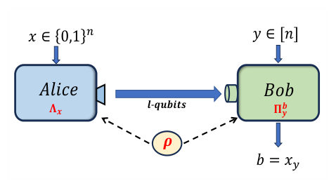 
FIG. 1. Entanglement-assisted quantum PMRAC: Alice and Bob share a quantum state ρ. Alice performs quantum channel operation Λx on her qubit given input x ∈{0, 1}n and transmits it to Bob, who performs projective measurement Πb y on both qubits and produces a binary outcome.

📷 Fig 2

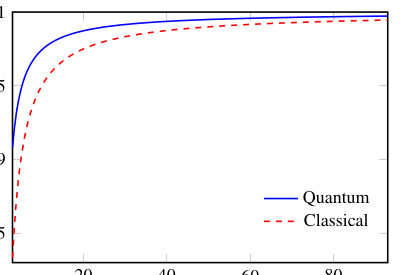 
FIG. 2. The Graph depicts how the quantum success probabil- ity changes with the number of settings (n) of an n →n −2 entanglement-assisted PMRAC.

**Summary.** This paper analyzes entanglement-assisted prepare-measure random-access codes (PMRAC) to establish new benchmarks for quantum communication. By deriving optimal success probabilities for specific code parameters, the authors demonstrate clear quantum advantages over classical and standard quantum protocols. The work is significant for quantifying the power of shared entanglement in quantum information tasks.

**Why it may be interesting.** This work provides rigorous theoretical bounds on quantum communication tasks using entanglement assistance, which is fundamental knowledge for understanding resource theories in quantum information.

Detailed structure

**Main problem.** The research develops a framework to study entanglement-assisted prepare-measure random-access codes (PMRAC) to demonstrate quantum supremacy over classical and standard quantum limits.

**Main result.** The optimal quantum success probabilities for specific cases ($4	o 1$, $5	o 3$) are derived, showing clear advantages over classical bounds and certifying structural properties of the shared entangled state.

**Method.** The authors use analytical techniques involving optimization of correlation functions (e.g., using convex inequalities) applied to density matrices describing quantum communication protocols.

**Model / system.** The model involves two parties, Alice and Bob, sharing a prior bipartite entangled state ($
ho$). Alice encodes an input string $x \in \{0, 1\}^n$ via local unitaries and sends $l$ qubits to Bob for measurement.

**Key observables.** Quantum success probability ($P^Q$), classical success probability ($P^C$), and standard quantum PMRAC success probability ($P^{SQ}$).

**Important parameters / regimes.** $n$: Input string length (e.g., 4, 5); $l$: Number of communicated qubits ($l < n$).

**Assumptions / limitations.** The analysis often relies on achieving maximum bounds by setting specific trace terms to zero or assuming the optimal state is maximally entangled.

**Figures summary.** Figure 1 illustrates the general setup for the entanglement-assisted quantum PMRAC protocol.

**Paper structure.** The paper proceeds by first establishing the general framework, then deriving explicit optimal probabilities and certifying properties for small cases ($4	o l$), followed by extending the analysis to higher dimensions ($5	o l$) and arbitrary $n 	o n-2$.

Abstract

We develop a family of semi-device-independent (SDI) entanglement-assisted prepare-measure (PM) communication games involving two parties, within the $n\rightarrow l$ random-access code (RAC) framework where the sender Alice holds a n-bit string and communicates $l<n$ bits or qubits to the receiver Bob. In contrast to the standard quantum PMRAC, here the parties share a prior entanglement, and Alice applies quantum operations on her sub-system to encode her inputs and sends to Bob. We first consider the $4\rightarrow l$ entanglement-assisted PMRAC with $l=1$ and $2$ and derive the optimal quantum success probabilities using an elegant analytical technique. We demonstrate quantum supremacy over both classical RACs and conventional quantum PMRACs. Moreover, we exhibit that the optimal quantum advantage allows one to certify Alice's unitary operations. We then derive an upper bound on the quantum success probabilities for $5\rightarrow l$ entanglement-assisted PMRAC with $l=1,2$ and $3$. Further, we extend the demonstration of quantum advantage for $n\rightarrow n-2$ case where n is arbitrary.

[↑ back to top](#top)

### [Deployment of Entanglement-Based QKD in Financial Infrastructure](http://arxiv.org/abs/2607.11252v1)

**Authors:** Mirela Selimović, Roman Solar, Jonathan Gruner, Sebastian Mair, Mario Wenzl, Thomas Heine, Matej Pivoluska, Rupert Ursin, Sebastian Philipp Neumann  
**Type:** experiment · **Category:** quantum information and computing · **PDF:** <https://arxiv.org/pdf/2607.11252v1>  
**Analysis basis:** full PDF text, analyzed in chunks
**Topic relevance:** 🔥 `QC/QI experiment` **4/5** · `quantum optics experiment` **3/5** · `quantum measurements` **1/5**

📷 Fig 1

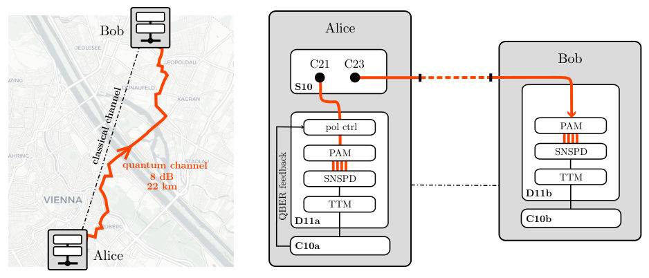 
FIG. 1: Schematic of entanglement-based QKD operation over a deployed fiber link between two Viennese data centers of a financial institution. (a) Map showing the geographical locations of the data centers, Alice and Bob, connected by a fiber link with an overall loss of 8 dB. (The red line is for illustration only and does not represent the actual fiber deployment.) (b) Point-to-point connection: Alice is co-located with the entangled photon-pair source (S10), while Bob is connected via the deployed fiber link (quantum channel). The detection modules (D11a and D11b) at both communication partners are identical, except that Alice’s module includes a polarization control module (pol ctrl)...

📷 Fig 2

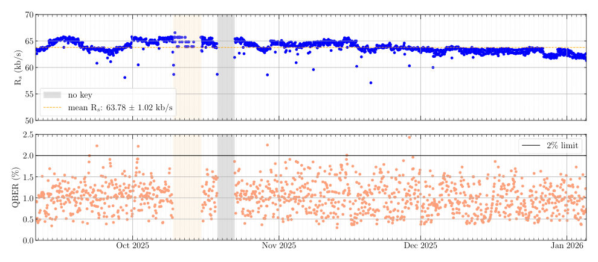 
FIG. 2: Operation of entanglement-based QKD system in financial infrastructure over 2800 h (4 months) The system had an up-time of about 93.7 %. Top: Secure key rate over the measurement period 63.78± 1.02 kb/s on average. The gray shaded region indicates a three-day interval without key creation due to a test power outage. The yellow shaded region marks an eight-day period of unstable operation following changes in the network configuration in the data center. These changes resulted in a temporarily reduced up-time of 44 %; also, QBER values were not recorded during this time. The secure key rate Rs decreases below the long-term average of the operational period; this is attributable to...

📷 Fig 3

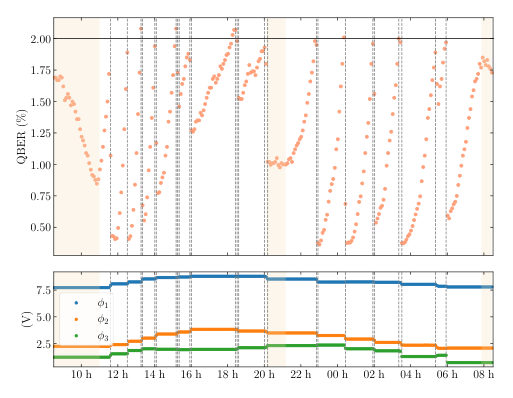 
FIG. 3: Polarization rotation over a full day of operation in deployed fiber link. The top panel shows the quantum bit error rate (QBER) as a function of time over one typical day of operation. Shaded regions indicate intervals where the QBER drifted in a favorable direction without intervention, while dashed lines mark instances where the polarization control algorithm is initiated to actively reduce the QBER. The algorithm is initiated once the QBER reaches ≥2 % (black horizontal line). The bottom panel displays the corresponding evolution of the three input voltages ϕ1, ϕ2 and ϕ3 of the polarization controller.

📷 Fig 4

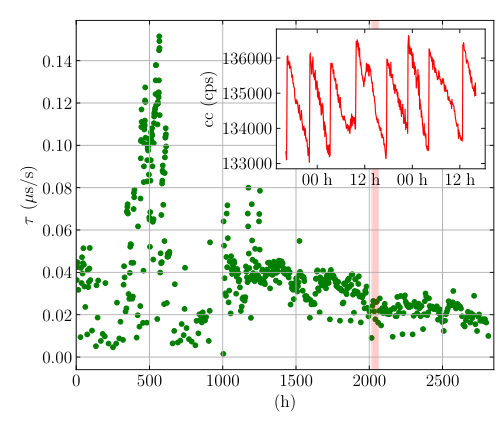 
FIG. 4: Relative clock drift rate over four months of continuous operation. The graph shows the relative time drift rate, τ (µs/s), over the course of operation, resulting from the independent drift of the time-tagging clocks. The inset plot shows the coincidence count rate over two days of operation (red shaded region in main plot). Whenever the time drift reaches 500 µs, a re-synchronization event is initiated, resulting in a higher coincidence count rate and a sawtooth pattern.

**Summary.** The paper reports on the successful real-world implementation of entanglement-based Quantum Key Distribution (eQKD) over a 22 km fiber link connecting two data centers. By integrating active polarization control and robust error correction protocols, the system maintained high key generation rates and uptime for months. This demonstrates a significant step toward deploying quantum security measures in commercial financial infrastructure.

**Why it may be interesting.** This work provides a concrete engineering demonstration of quantum key distribution outside of controlled lab settings, directly addressing the deployment challenges for quantum technologies in critical infrastructure.

Detailed structure

**Main problem.** The primary goal was demonstrating the practical feasibility of entanglement-based Quantum Key Distribution (eQKD) within a high-security, real-world financial data center infrastructure.

**Main result.** The system successfully achieved stable key generation rates (average 63.8 kb/s) and maintained high uptime (93.7%) over four months of continuous operation on a 22 km fiber link.

**Method.** The authors employed the BBM92 protocol using polarization-entangled photon pairs generated via SPDC, incorporating active feedback loops for polarization drift compensation and advanced post-processing techniques like LDPC error correction and privacy amplification.

**Model / system.** The physical platform is an eQKD system transmitting quantum states over a 22 km standard optical fiber link between two data centers. Key components include Polarization Analysis Modules (PAMs), superconducting detectors, and active polarization controllers that compensate for environmental birefringence changes.

**Key observables.** Average secure key rate ($\approx 63.8$ kb/s); Quantum Bit Error Rate (QBER) maintained below $2\%$ for over $97\%$ of the time; Timing precision achieved was sub-300 ps.

**Important parameters / regimes.** Fiber loss of 8 dB over 22 km; Operational duration of four months; QBER threshold used for control ($\ge 2\%$).

**Assumptions / limitations.** The system relies on active polarization control to counteract environmental perturbations, and the post-processing framework assumes certain efficiencies (e.g., equal detection efficiencies in both bases).

**Figures summary.** Figures illustrate the point-to-point setup schematic, showing key rate stability over months, QBER evolution with compensation activity, and relative clock drift measurements over extended periods.

**Paper structure.** The paper details the experimental setup (source, transmission link), describes the measurement protocols (basis choice, timing synchronization), outlines the complex post-processing chain (PE, EC via LDPC, PA), presents long-term performance data, and concludes with integration results into a live network environment.

Abstract

We demonstrate the feasibility of entanglement-based quantum key distribution (eQKD) in high-security financial infrastructure over a 22 km fiber link with 8 dB loss between two data centers using polarization entanglement. The fully automated system continuously generated secure keys for four months at an average rate of 63.8 kb/s, which were stored into a key management system and consumed to establish a VPN tunnel. The setup achieved 93.7% total up-time, with no downtime caused by the quantum optical components. Active polarization control kept the quantum bit error rate below 2% for 97.4% of the time and timing synchronization based on the entangled photon pairs' intrinsic temporal correlations achieved sub-300 ps precision. Our standalone system requires neither polarized guide lasers nor external high-precision time references. These results show practical integration of eQKD into operational financial infrastructure.

[↑ back to top](#top)

### [Quantum-enhanced physical-layer threat detection in metropolitan-scale fiber networks](http://arxiv.org/abs/2607.10799v1)

**Authors:** Yung-Cheng Kao, Siddharth Pal, Alex Forencich, Dylan Cirimelli-Low, Chaohan Cui, Jack Postlewaite, Pao-Kang Chen, Nicola Alic, Saikat Guha, Prithwish Basu, Linran Fan  
**Type:** experiment · **Category:** quantum information and computing · **PDF:** <https://arxiv.org/pdf/2607.10799v1>  
**Analysis basis:** full PDF text, analyzed in chunks
**Topic relevance:** 🔥 `quantum optics experiment` **4/5** · `quantum measurements` **2/5** · `QC/QI experiment` **1/5** · `interference shaping light` **1/5**

📷 Fig 1

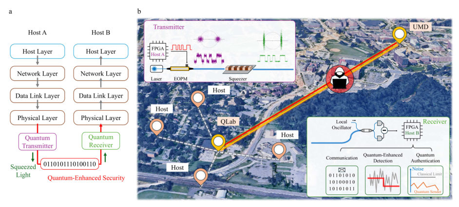 
FIG. 1. Quantum-enhanced optical network a, Open system interconnection (OSI) model. A quantum trans- mitter and receiver are integrated at the physical layer with standard network interfaces. b, Field test of quantum- enhanced security in metropolitan-scale fiber network. Hosts located in QLab communicate through a deployed fiber network connecting QLab and UMD, with an optical switch in QLab enabling path reconfiguration. Upper left inset, schematic of the quantum transmitter. The signal light is generated by a single-frequency laser operating at around 1550 nm. Bits 0 and 1 are encoded using binary phase modulation with an electro-optic phase modulator (EOPM) driven by an FPGA on host...

📷 Fig 2

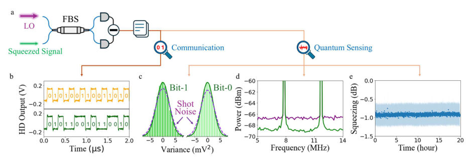 
FIG. 2. Performance of quantum transmitters and receivers. a, Schematic of detection and data flow at the quantum receiver. b, Time-domain traces of decoded signals captured by the analog-to-digital converters (ADCs) with a sampling rate of 1GS/s. Idle sequence (orange) and pseudo random binary sequence (green) are shown in the top and bottom plots, respectively. c, Statistical distributions of homodyne output for bit-0 and bit-1 in the quantum (green) and classical (purple) cases, based on 80 million samples. The distributions are fitted with Gaussian functions to extract the variances and quantify the squeezing levels. d, Noise spectra of the homodyne signals for the quantum (green) and...

📷 Fig 3

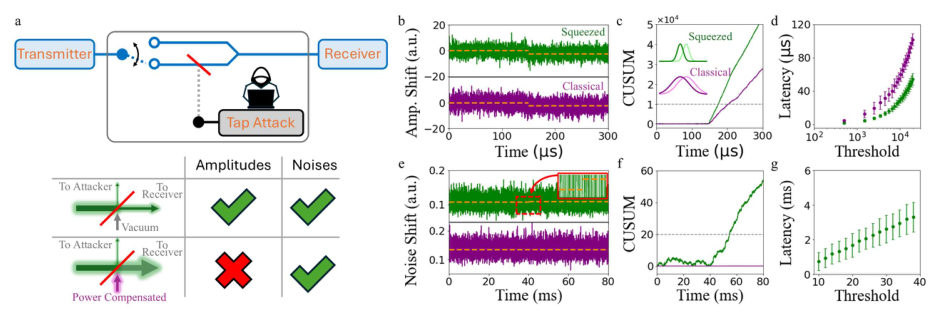 
FIG. 3. Performance of detecting tapping attacks a, Schematic of the tapping attack, where an eavesdropper extracts a fraction of the optical power between network nodes. Two representative attack strategies are illustrated. Without power compensation, tapping attacks can be detected by monitoring quadrature amplitudes or noise. With power compensation, tapping attacks can only be detected through analyzing the noise property of non-classical signals. b, Time-domain traces of quadrature amplitudes during the tapping attack test. Mean values are indicated by orange dashed lines. c, Amplitude-based CUSUM outputs. An alarm is triggered when the output exceeds a predefined threshold (gray line)....

📷 Fig 4

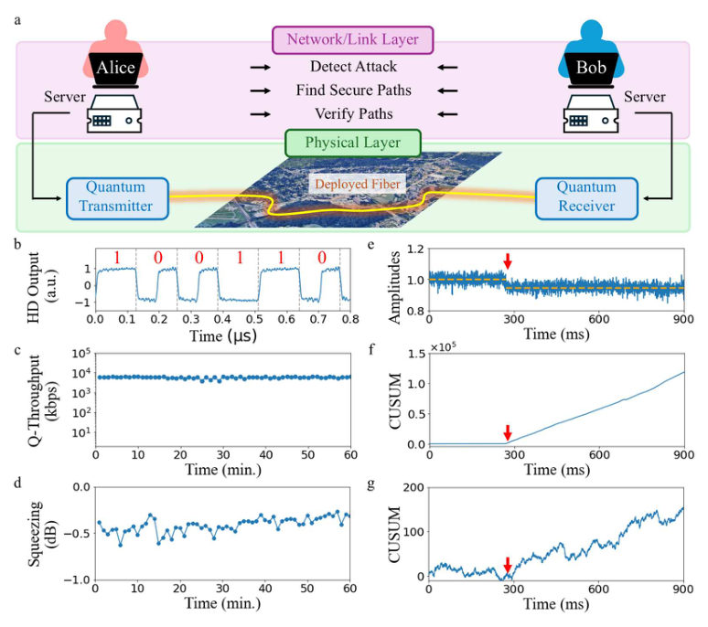 
FIG. 4. Field test of the quantum network a, Schematic of the quantum-network field trial. High-layer function- alities are managed by the host server, wheres quantum operation are implemented at the physical layer through a deployed fiber. b, Time-domain trace of the received homodyne signal encoded using differential Manchester (DME) after transmission through a 5-km deployed fiber loopback. c, Measured throughput of the quantum-enhanced chan- nel, characterized using TCP iPerf between Alice and Bob. d, Measured squeezing level during the field trial. e, Measured amplitudes trace with a 10 % tapping event introduced at approximately 300 ms, as indicated by the arrow. f, Amplitude-based CUSUM...

📷 Fig 5

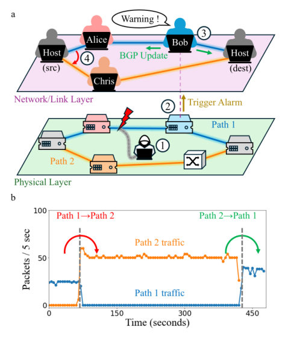 
FIG. 5. Network rerouting in a quantum- enhanced network a, Schematic of the rerouting demonstration. Upon threat detection at the physical layer, an alarm is triggered and initiates a BGP update to redirect traffic from the primary path to an alternative secure path in upper layers. b, Monitored data rate dur- ing the rerouting demonstration. Following threat de- tection, traffic is switched from the primary path (blue) to an alternative secure route (orange), resulting in a corresponding change in the measured data rate. Once the threat is removed, traffic is restored to the original route.

**Summary.** The paper presents a scalable method for enhancing network security by embedding quantum features into the physical layer of fiber optic communications using bright squeezed light. By analyzing both the amplitude and the noise variance of the signal via CUSUM methods, they demonstrate superior detection capabilities against sophisticated optical tapping attacks compared to classical systems. This allows for seamless integration of quantum-enhanced security into existing metropolitan communication networks.

**Why it may be interesting.** This work directly addresses quantum networking applications at the physical layer, utilizing advanced quantum optics techniques (squeezing) combined with classical signal processing (CUSUM) for security monitoring, which is highly relevant to quantum communication infrastructure development.

Detailed structure

**Main problem.** To overcome scalability limitations in quantum-enhanced network security protocols that require complex cross-layer dependencies, which conflict with modern modular network architectures.

**Main result.** The authors established a practical framework by confining all quantum interventions to the physical layer using bright squeezed light, enabling seamless integration into large-scale communication infrastructure.

**Method.** They use Coherent Homodyne Detection and analyze signals via the Cumulative Sum (CUSUM) method applied to both amplitude and noise spectral density to detect optical tapping attacks.

**Model / system.** The system is implemented over a metropolitan-scale fiber network, embedding quantum features within the same optical field as classical data using bright squeezed light generated via an Optical Parametric Amplifier. The detection mechanism relies on monitoring changes in quantum variance, which are altered by taps even when power compensation is applied.

**Key observables.** Variance reduction below the shot-noise limit; CUSUM statistics ($S^+$ and $S^-$) derived from amplitude and noise spectral density measurements.

**Important parameters / regimes.** Metropolitan-scale fiber network deployment; Squeezing levels (e.g., 24% variance reduction); Detection latency.

**Assumptions / limitations.** The method assumes that monitoring the noise property of non-classical light is necessary to detect sophisticated tapping attacks, even those employing classical power compensation techniques.

**Figures summary.** Figures illustrate the quantum-enhanced optical network integration into the OSI model and field test setups. They show performance metrics comparing quantum vs. classical variances, demonstrating successful tap detection using CUSUM methods in a deployed link, and finally showing the automated BGP rerouting upon physical layer threat detection.

**Paper structure.** The paper first introduces the problem of cross-layer dependencies, proposes confining quantum interventions to the physical layer via squeezed light embedding. It details the experimental setup (squeezing generation, homodyne detection) and then focuses on the CUSUM analysis for detecting taps by monitoring both amplitude and noise variance in a field test, culminating in demonstrating network-level response via BGP updates.

Abstract

Network security is widely recognized as a key application of quantum technology. However, its large-scale deployment is hindered by the need for tight coordination between fundamentally different quantum and classical processing steps in conventional protocols. This requirement introduces strong cross-layer interdependencies that conflict with the modular, layered architectures enabling scalability in modern communication networks. Here, we present an alternative strategy that confines all quantum interventions to the physical layer and remains transparently compatible with existing network abstractions. This is achieved by directly embedding quantum features and classical information within the same optical field using bright squeezed light. Physical-layer signals are analyzed using a cumulative sum (CUSUM) method to enable quantum-enhanced threat detection. We validate the practicality of this approach through field deployment over a metropolitan-scale fiber network and further demonstrate network-level security functionalities enabled by physical-layer quantum-enhanced thread detection. These results establish a practical, scalable framework for seamlessly integrating quantum-enhanced security into large-scale communication infrastructure.

[↑ back to top](#top)

### [Multi-Stage Mamba-Based Architecture for Fast and Scalable Superconducting Qubit Readout](http://arxiv.org/abs/2607.11668v1)

**Authors:** Luca Otting, Xiaorang Guo, Emmanouil Giortamis, Benjamin Lienhard, Pramod Bhatotia, Martin Schulz  
**Type:** both · **Category:** quantum information and computing · **PDF:** <https://arxiv.org/pdf/2607.11668v1>  
**Analysis basis:** full PDF text, analyzed in chunks
**Topic relevance:** 🔥 `QC/QI experiment` **4/5** · `quantum measurements` **2/5** · `methods for driven-dissipative` **1/5**

📷 Fig 1

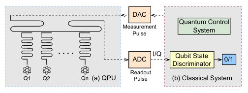 
Fig. 1. Readout pipeline of superconducting qubits. (a) On the QPUs side, the readout begins with a microwave pulse generated by the signal generator, then produces readout pulses that carry the qubit-state information. (b) On the classical side, the output signals are digitized into I/Q traces, which are then processed to determine the qubit states.

📷 Fig 2

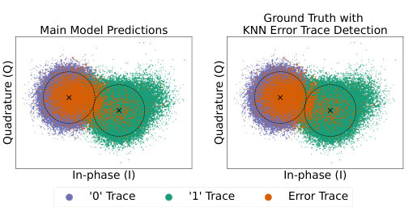 
Fig. 3. Comparison between the main model’s predicted trace clusters (left) and the pseudo-ground-truth labels obtained from the KNN-based error detector (right).

📷 Fig 3

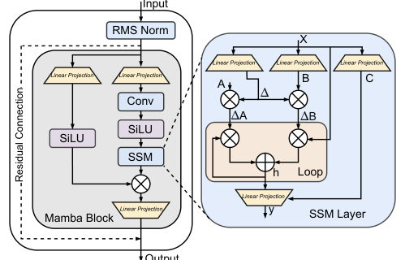 
Fig. 2. The basic structure of Mamba Model and its internal SSM layer. The input is normalized and processed by a convolutional layer, followed by an SSM layer that performs sequence modeling through recurrent hidden-state (h) updates using learnable matrices A, B, and C. A residual connection merges the input and output of SSM to form the final result.

📷 Fig 4

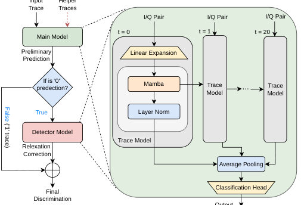 
Fig. 4. Architecture of the proposed multi-stage discriminator. The multi- stage workflow is shown on the left, while the right part illustrates the detailed Mamba architecture used in both the main classifier and the error detector.

📷 Fig 5

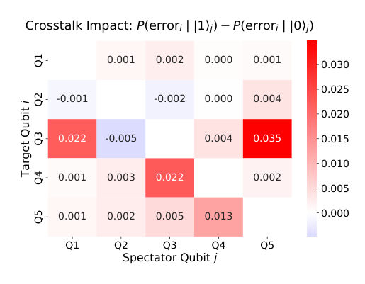 
Fig. 5. The heatmap illustrates the difference in error probability on a target qubit i conditioned on the prepared state of a spectator qubit j. Positive values (red) indicate a higher error rate on qubit i when qubit j is prepared in the |1⟩state compared to the |0⟩state.

**Summary.** This paper introduces a novel, multi-stage qubit state discriminator built on the Mamba architecture to overcome readout bottlenecks in superconducting quantum processors. By achieving linear complexity and integrating error correction into the model, it significantly boosts readout fidelity and reduces logical errors compared to existing methods. This advancement is vital for realizing scalable fault-tolerant quantum computation.

**Why it may be interesting.** The work directly addresses hardware limitations in quantum computing by proposing a computationally efficient ML model to improve the fundamental measurement process (readout), which is crucial for scaling up any quantum simulation or algorithm.

Detailed structure

**Main problem.** Reliable qubit readout is a critical bottleneck for fault-tolerant quantum computing due to high error rates, latency, and signal crosstalk in multiplexed superconducting architectures.

**Main result.** The proposed Mamba-based discriminator achieves a geometric mean readout fidelity of 0.906 (optimal: 0.911) while significantly reducing model size and achieving up to a 26% reduction in logical error rate for QEC.

**Method.** A multi-stage state discriminator is implemented using the Mamba architecture, which processes I/Q digitized traces with linear complexity, followed by an integrated error detection stage.

**Model / system.** The system involves superconducting qubits read out via resonators, generating analog I/Q signals. The model uses a Multi-Stage Mamba architecture to process these time-series traces for single-qubit state discrimination.

**Key observables.** Readout fidelity (geometric mean), logical error rate reduction in QEC, and parameter size relative to prior FNN methods.

**Important parameters / regimes.** Short readout durations ($	ext{500 ns}$), crosstalk levels in frequency-multiplexed systems, and the required accuracy for fault tolerance.

**Assumptions / limitations.** The primary assumption is that an efficient sequence model (Mamba) can jointly address state discrimination and relaxation errors better than traditional FNNs.

**Figures summary.** Figures illustrate the readout pipeline from microwave pulse to classical processing, detailing the multi-stage discriminator architecture flow between the main classification model and the error detector.

**Paper structure.** The paper first establishes the bottleneck of qubit readout in FTQC. It then introduces the Mamba-based multi-stage discriminator, detailing its two stages (initial discrimination and error refinement). Finally, it presents quantitative results comparing fidelity and logical error rate reduction against state-of-the-art methods.

Abstract

Reliable qubit readout is a critical bottleneck toward fault-tolerant quantum computing (FTQC). In superconducting quantum processors, readout operations are both error-prone and high-latency. These challenges become more severe in frequency-multiplexed architectures, where signal crosstalk among neighboring qubits significantly degrades readout fidelity. Existing machine learning (ML)-based approaches rely on feed-forward neural networks (FNNs) that suffer from large parameter sizes and lack an end-to-end network that jointly addresses relaxation errors and discriminates qubit states.   In this work, we present a multi-stage qubit state discriminator based on the Mamba model, which enables efficient sequence modeling with linear complexity. The first stage performs initial state discrimination, followed by a refinement stage that identifies and mitigates relaxation-induced errors. Our lightweight model achieves a geometric mean readout fidelity of 0.906, outperforming the best-reported state-of-the-art method while reducing parameter size by 49.6%; our optimal model further reaches 0.911. Both models remain robust across varying input trace lengths, maintaining a high fidelity of 0.893 at readout durations as short as 500 $ns$, achieving up to a 26% reduction in logical error rate over prior work in quantum error correction (QEC).

[↑ back to top](#top)

### [States dressing analysis in a transmon-transmon-bus system](http://arxiv.org/abs/2607.11514v1)

**Authors:** P. A. Gladilovich, R. A. Migdisov, A. V. Sabluk, P. S. Burtsev, N. N. Abramov, N. Y. Rudenko, V. I. Chichkov, N. A. Maleeva  
**Type:** both · **Category:** quantum information and computing · **PDF:** <https://arxiv.org/pdf/2607.11514v1>  
**Analysis basis:** full PDF text, analyzed in chunks
**Topic relevance:** 🔥 `QC/QI experiment` **4/5** · `correlated / nonlocal dissipation` **1/5** · `driven-dissipative phase transition` **1/5** · `methods for driven-dissipative` **1/5**

📷 Fig 1

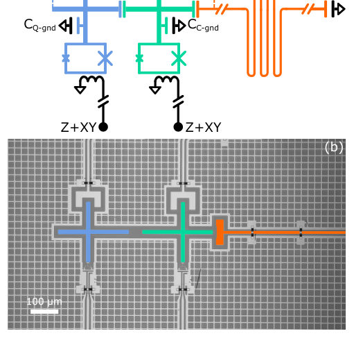 
FIG. 1. (a) Circuit diagram and (b) false-colored optical mi- crograph of the system. The qubit (Q) is shown in blue, the coupler (C) in green, and the half-wavelength resonator (bus) in orange. The individual readout λ/4 resonators are capac- itively coupled to Q and C and are shown in black. Both resonators are coupled to a coplanar in-out transmission line. The Z+XY lines for flux biasing and microwave driving are inductively coupled to the SQUIDs of Q and C.

📷 Fig 2

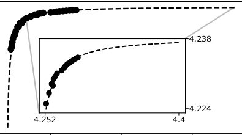 
FIG. 2. Experimental data (points) and model data (dashed line) for the lower-mode frequency (L) as a function of the upper-mode frequency (U) of the C-bus subsystem under flux biasing of C. The inset shows the frequency region up to the critical value fU = f c U.

📷 Fig 3

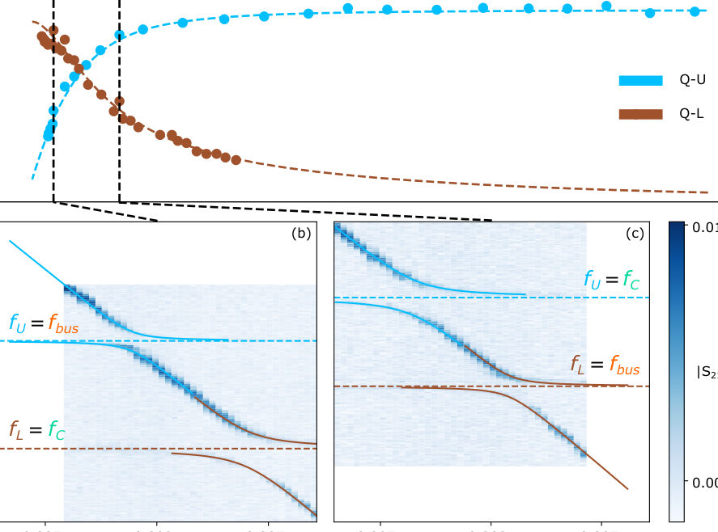 
FIG. 3. Comparison of experimental and model data for the effective coupling of qubit Q to the upper (U) and lower (L) modes of the C-bus subsystem. (a) Effective couplings gQ−U eff (sky blue) and gQ−L eff (brown) as functions of the upper-mode frequency fU. Dashed lines show model data from Eq. (4), and points show experimental data. (b), (c) Examples of experimental and model spectra after (b) and before (c) inversion of the spectral order.

📷 Fig 4

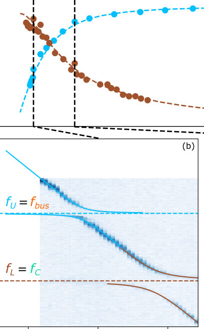 
Figure 3(a) summarizes the experimental results. It shows gQ−L eff and gQ−U eff as functions of the upper-mode frequency fU. The data reveal two distinct frequency re- gions. In the high-frequency region, fU &gt; f c U ≈4.252

📷 Fig 5

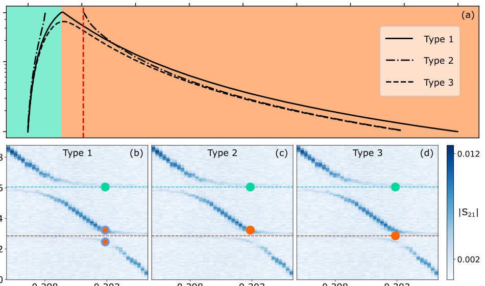 
FIG. 4. Comparison of three methods for estimating the dressing D of resonant computational states |Q⟩and |L⟩. (a) D as a function of the upper-mode frequency fU, calculated in the full system (type 1, solid line), with an effective mode (type 2, dash-dotted line), and with an unperturbed mode (type 3, dashed line). The red dashed line marks the value of fU used to compare the three methods. The background colors show the regions where the dressed computational state |L⟩corresponds to the dressed state |bus⟩(orange) or |C⟩(green). (b–d) Spectra with schematic illustrations of the three methods: (b) the exact full-system method, (c) the effective-mode method, where the computational mode is...

**Summary.** The research investigates state dressing—the contamination of desired computational states by unwanted higher-energy modes—in a transmon-transmon-bus quantum processor. By comparing three estimation methods (full, effective, unperturbed), the authors demonstrate that accurate characterization of this dressing is vital for optimizing gate fidelity. The findings emphasize that simple approximations fail near critical operating points, necessitating full system analysis.

**Why it may be interesting.** This work provides concrete experimental and analytical guidance on mitigating decoherence sources in superconducting qubits by quantifying how non-computational states pollute the computational subspace, which is central to scaling quantum processors.

Detailed structure

**Main problem.** The fidelity of multi-qubit gates in superconducting quantum processors is limited by the 'dressing' of computational states by unwanted noncomputational states.

**Main result.** Accurate estimation and control of this state dressing are crucial for optimizing gate operations, as different theoretical methods yield varying estimates depending on the operating regime.

**Method.** The study compares three distinct analytical/numerical methods—full-system calculation, effective mode approach, and unperturbed mode approach—to quantify the participation weight (dressing) of noncomputational states.

**Model / system.** The system modeled is a transmon-transmon-bus superconducting quantum processor comprising a qubit (Q), a coupler (C), and a resonator bus. The analysis uses the full Hamiltonian describing these coupled elements.

**Key observables.** Dressing weight ($D$), effective couplings ($g_{Q-U}^{	ext{eff}}$, $g_{Q-L}^{	ext{eff}}$), and mode frequencies ($f_U, f_L$).

**Important parameters / regimes.** The critical point ($f_c^U$) where spectral ordering inverts and effective couplings become equal is a key parameter.

**Assumptions / limitations.** The unperturbed-mode method is shown to underestimate the true dressing near the critical detuning, highlighting the need for full system characterization at operating points.

**Figures summary.** Figures compare the three methods for estimating $D$ across varying frequencies ($f_U$), showing how the calculated dressing changes dramatically around a critical frequency region. Other figures map out effective couplings vs. mode frequencies.

**Paper structure.** The paper establishes the problem of state dressing, details the physical transmon-bus model, and then systematically compares the results from three different theoretical estimation techniques (full, effective, unperturbed) across varying system parameters to determine the most reliable characterization method for gate optimization.

Abstract

The multi-qubit gates fidelity of superconducting quantum processors can be limited due to the dressing of computational states by noncomputational ones. Here, we experimentally and analytically investigate a transmon-transmon-bus system where the computational states dressing is tunable over a broad range. We estimate the dressing using three methods: a full three-element model, an effective mode approach, and an unperturbed mode approach. The obtained results highlight the importance of the accurate estimation and control of the computational states dressing in order to optimize gates on superconducting platform.

[↑ back to top](#top)

### [Branch-resolved Pauli-block spectroscopy of residual conditional phase in two-qubit gates](http://arxiv.org/abs/2607.10249v1)

**Authors:** Xudan Chai, Yanwu Gu, Huiqi Xue, Kerui Li, Dong E. Liu  
**Type:** experiment · **Category:** quantum information and computing · **PDF:** <https://arxiv.org/pdf/2607.10249v1>  
**Analysis basis:** full PDF text, analyzed in chunks
**Topic relevance:** 🔥 `QC/QI experiment` **4/5** · `quantum measurements` **2/5**

📷 Fig 1

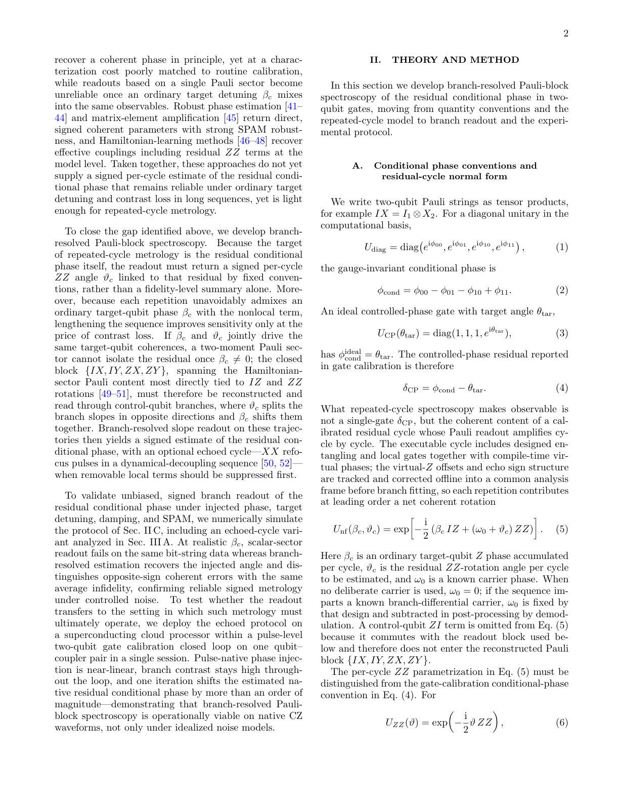 
Low-resolution page preview, page 2

📷 Fig 2

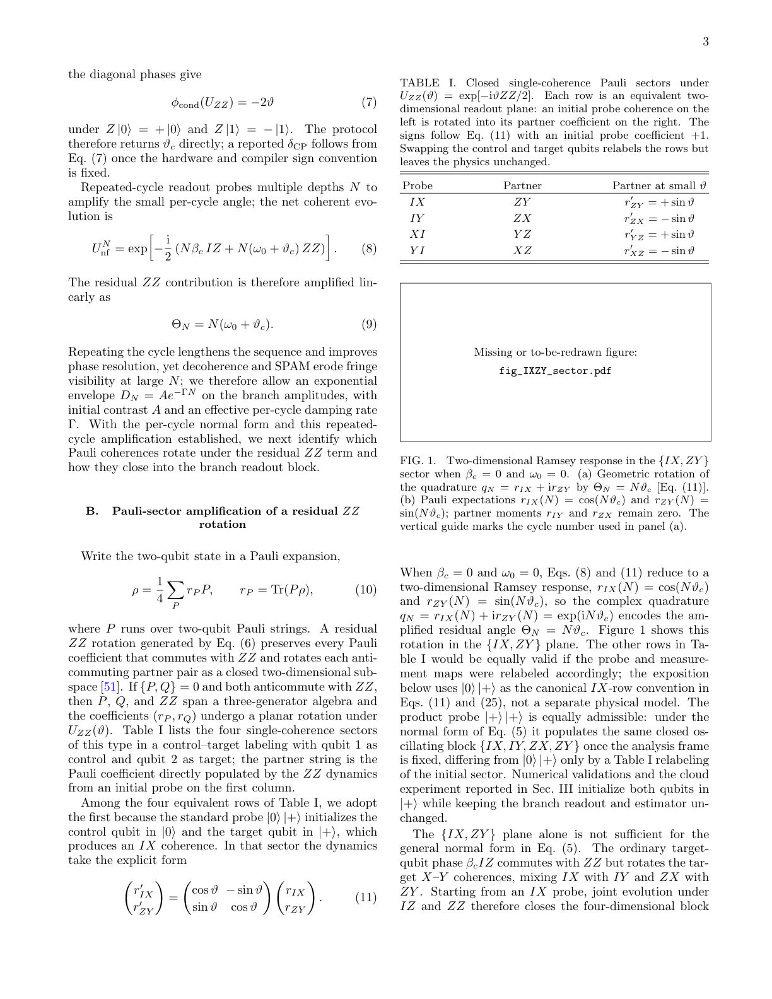 
Low-resolution page preview, page 3

📷 Fig 3

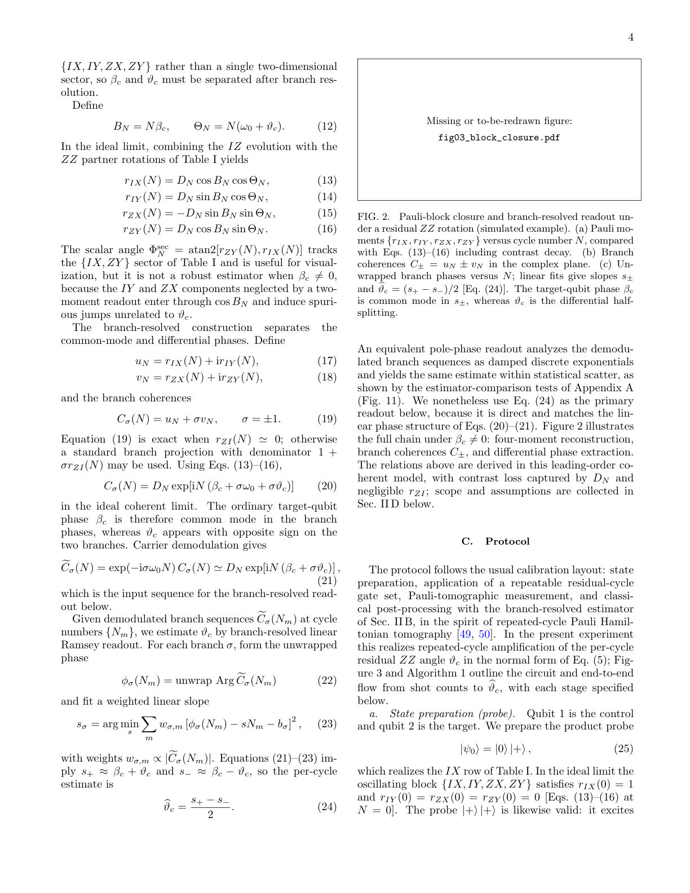 
Low-resolution page preview, page 4

📷 Fig 4

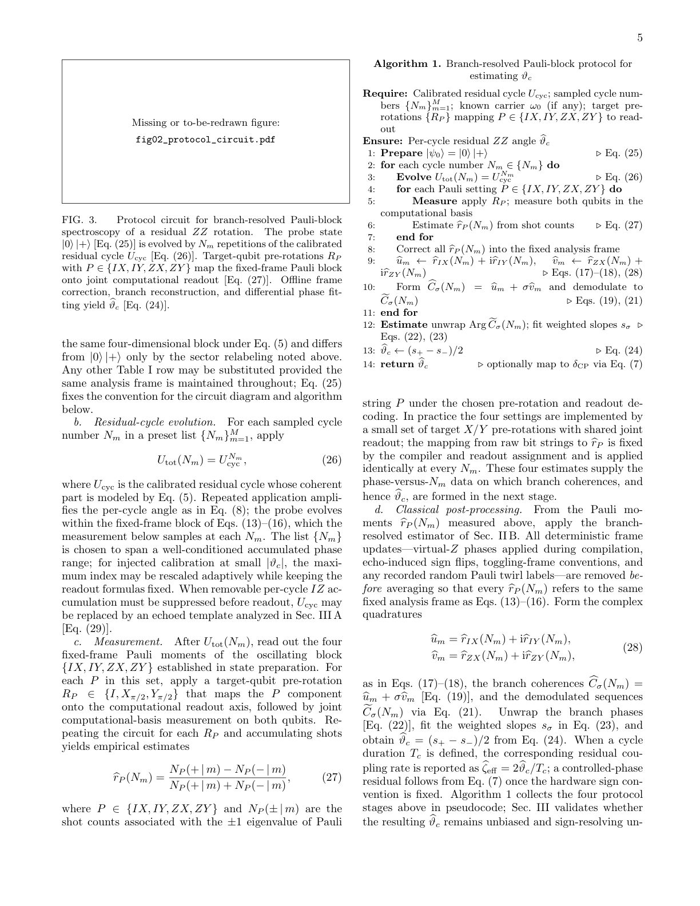 
Low-resolution page preview, page 5

📷 Fig 5

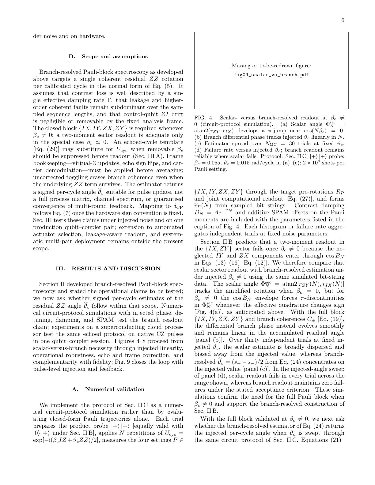 
Low-resolution page preview, page 6

**Summary.** The paper introduces branch-resolved Pauli-block spectroscopy to overcome limitations in calibrating residual conditional phases ($\vartheta_c$) in two-qubit gates. By measuring specific coherences derived from a closed Pauli block, the technique extracts a signed estimate of $\vartheta_c$, which is crucial because standard fidelity measurements are sign-blind. This method was successfully demonstrated on superconducting qubits, providing a low-overhead tool for active quantum control.

**Why it may be interesting.** This work provides a concrete, high-precision metrology tool for characterizing fundamental gate errors in solid-state quantum hardware, directly addressing the primary bottleneck for fault-tolerant computation.

Detailed structure

**Main problem.** Accurately calibrating the residual conditional phase ($\vartheta_c$) in two-qubit gates is critical for advancing quantum computation beyond the NISQ era.

**Main result.** The authors developed a branch-resolved spectroscopy technique that yields a signed, per-cycle estimate of $\vartheta_c$, which standard fidelity benchmarks fail to resolve or distinguish from noise.

**Method.** They employ Pauli-block spectroscopy by measuring specific coherences ($C_\pm$) derived from the closed Pauli block $\{IX, IY, ZX, ZY\}$ and fitting the resulting phase slopes to extract $\vartheta_c$.

**Model / system.** The work is implemented on a superconducting cloud qubit-coupler pair, focusing on controlled-phase or CZ-style two-qubit gates. The dynamics are analyzed by tracking the evolution of Pauli moments.

**Key observables.** Signed per-cycle residual ZZ-rotation angle ($\vartheta_c$), branch coherences ($C_\pm$), and gate fidelity ($F_{avg}$).

**Important parameters / regimes.** The measurement is sensitive to $\vartheta_c$ (the target), the local detuning phase ($eta_c$), contrast decay ($\Gamma$), and noise sources like SPAM.

**Assumptions / limitations.** The method relies on reconstructing the closed Pauli block $\{IX, IY, ZX, ZY\}$ and assumes that the differential measurement of branch coherences can separate $\vartheta_c$ from common-mode local errors ($eta_c$).

**Figures summary.** Figures compare the sign-blind average gate infidelity against the signed estimate derived from branch readout, demonstrating the superior sensitivity of the proposed method.

**Paper structure.** The paper introduces the physical problem (calibration difficulty), details the theoretical framework using Pauli expansion and defining branch coherences ($C_\pm$), presents the fitting procedure to extract $\vartheta_c$, validates this approach via numerical simulations under noise, and concludes with experimental demonstration on superconducting qubits showing successful closed-loop calibration.

Abstract

Recent progress in quantum physics and quantum technologies is driving quantum computing from the noisy intermediate-scale (NISQ) era toward fault-tolerant operation. High-precision control of two-qubit gates is among the most critical requirements in this transition and hinges on accurate two-qubit calibration. For controlled-phase and CZ-style operations, the residual conditional phase (the nonlocal ZZ-type deviation after local compensation) is weakly resolved at leading order in average infidelity and randomized benchmarking, and repeated Ramsey amplification does not reliably isolate it from ordinary target detuning, SPAM errors, and contrast loss in long sequences. We introduce branch-resolved Pauli-block spectroscopy to estimate the per-cycle residual ZZ-rotation angle theta_c with its sign, from which the controlled-phase residual follows by a fixed convention. The protocol repeats a fixed probe for N cycles, measures the closed Pauli block IX, IY, ZX, and ZY, and forms branch coherences C+ and C- conditioned on the control qubit; theta_c splits the two branch phase slopes in opposite directions, while local target phase beta_c shifts them together. An echoed-cycle variant suppresses removable local terms while preserving the nonlocal contribution. Numerical simulations with injected theta_c, detuning, damping, and SPAM confirm unbiased signed readout where scalar-sector alternatives fail and distinguish opposite-sign errors at equal infidelity. On one superconducting cloud qubit-coupler pair, a pulse-level calibration closed loop shows near-linear injection, preserved branch contrast, and tracking of the native residual conditional phase through one iteration. The approach yields a low-overhead, signed per-cycle estimate of residual conditional phase that standard fidelity benchmarks underresolve at leading order.

[↑ back to top](#top)

### [Holographic Timelike Entanglement and Subregion Complexity in Localized AdS3*S3*T4 Black Holes](http://arxiv.org/abs/2607.11641v1)

**Authors:** Jitendra Pal, Yu Shi  
**Type:** theory · **Category:** other · **PDF:** <https://arxiv.org/pdf/2607.11641v1>  
**Analysis basis:** full PDF text, analyzed in chunks
**Topic relevance:** 🔥 `entanglement & information structure` **4/5** · `Keldysh / 2PI / non-Gaussian methods` **1/5** · `driven-dissipative phase transition` **1/5**

📷 Fig 1

 
Figure 1: Lorentzian branch profile in the large-r regime. The timelike branch closes at the radial turning point r0, while the spacelike branch reaches the asymptotic boundary and is anchored at t = ±T/2. The vertical line marks r = r∗, the lower edge of the validity window of the asymptotic expansion.

📷 Fig 2

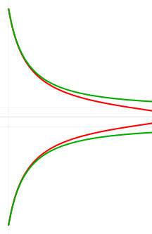 
Figure 1 provides a direct check of the branch gluing in the large-r approximation. The two upper branches meet at r = r∗, and the lower half follows by time reflection. Thus the figure shows the same Lorentzian construction used later in the exact black-pole geometry, but in a regime where the angular dependence has dropped out. The time integrals can also be written in closed form. For the timelike integral we set

📷 Fig 3

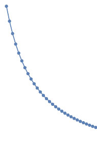 
Figure 2: Boundary interval T as a function of the radial turning point r0 in the large-r regime. The map is single-valued inside the validity window of the asymptotic expansion.

📷 Fig 4

 
Figure 2 shows that the large-r time map is single-valued. Therefore the multibranch fixed-boundary-interval structure found later cannot be attributed to the universal near- boundary region. It is generated only when the exact localized functions are restored and the surface becomes sensitive to the black-pole core. We now turn to the area. Let N = (2π)6V4 (3.38)

📷 Fig 5

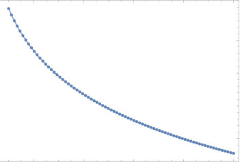 
Figure 3: Timelike-entanglement area in the asymptotic regime as a function of the radial turning point r0. The left panel shows the renormalized real part after the logarithmic UV subtraction. The right panel shows the finite imaginary part from the timelike branch.

**Summary.** This paper analyzes two holographic observables—timelike entanglement entropy and subregion complexity—for black holes in AdS3*S3*T4 geometry. By using a localized prescription, the authors demonstrate that these measurements are sensitive to subtle geometric features near a cap-horizon transition region. This confirms that timelike Lorentzian probes can reveal complex structure missed by simpler asymptotic or idealized models.

**Why it may be interesting.** While highly technical, the methodology of using holographic complexity and entanglement entropy to map out fine-grained geometric structures near phase transitions or boundaries is a powerful theoretical tool applicable across many quantum field theories.

Detailed structure

**Main problem.** The study investigates how timelike entanglement entropy and subregion complexity probe localized geometric effects within black holes, distinguishing these measurements from simpler models like the BTZ solution.

**Main result.** Timelike Lorentzian observables reveal geometry-dependent features sensitive to the cap–horizon transition region, which are absent in leading large-$r$ approximations or the standard BTZ background.

**Method.** The authors employ a localized timelike prescription involving solving time equations for multiple admissible branches and analyzing the resulting renormalized lifted area (for entanglement) and volume (for complexity).

**Model / system.** The system is a black hole with asymptotic AdS3*S3*T4 geometry, specifically focusing on the 'black-pole solution' which exhibits nontrivial dependence on internal sphere coordinates.

**Key observables.** Timelike Entanglement Entropy (yielding complex lifted area) and Timelike Subregion Complexity (yielding real, finite renormalized volume).

**Important parameters / regimes.** The analysis is sensitive to the boundary interval size, particularly near a transition angle $\theta_\star$, which separates cap-side and horizon-side geometry.

**Assumptions / limitations.** A fixed-boundary-interval selection is essential due to non-monotonic temporal families in the exact black-pole geometry; the complexity is interpreted as an outside-horizon patch volume.

**Paper structure.** The paper compares results against BTZ and large-$r$ limits, detailing how localized observables probe specific geometric features (like the cap/horizon transition) that are otherwise missed in simpler asymptotic analyses.

Abstract

We study timelike entanglement entropy and timelike subregion complexity in localized black holes with asymptotic AdS3*S3*T4 geometry, focusing on the black-pole solution. Unlike the BTZ solution, the black pole exhibits a nontrivial dependence on the internal sphere through the functions $K_y(r,θ)$ and $G(r,θ)$. Both observables are constructed from spacelike and timelike Lorentzian branches, but they probe the geometry in different ways: timelike entanglement yields a complex lifted area, while timelike complexity gives a real, finite renormalized volume. We employ a localized timelike prescription in which the branch profile is built at an angular label $θ_0$ and subsequently lifted over the physical internal angle $θ$. In the large-$r$ regime, the leading angular dependence drops out, recovering the expected short-interval behaviour. In the exact black-pole geometry, the temporal families become non-monotonic, making a fixed-boundary-interval selection essential. As the boundary interval increases, the selected branches move inward and become sensitive to the localized cap-horizon transition region. These results demonstrate that timelike Lorentzian observables probe localized-geometry effects that are absent in BTZ and in the leading large-$r$ description.

[↑ back to top](#top)

### [Layer-Resolved Topological Metals in the Bilayer Lieb Lattice](http://arxiv.org/abs/2607.11009v1)

**Authors:** Mengjie Yang, S Rahul, Giandomenico Palumbo  
**Type:** theory · **Category:** other · **PDF:** <https://arxiv.org/pdf/2607.11009v1>  
**Analysis basis:** full PDF text, analyzed in chunks
**Topic relevance:** 🔥 `analog quantum simulation` **4/5** · `exotic spin models in light-matter` **1/5** · `non-equilibrium dynamics` **1/5**

📷 Fig 1

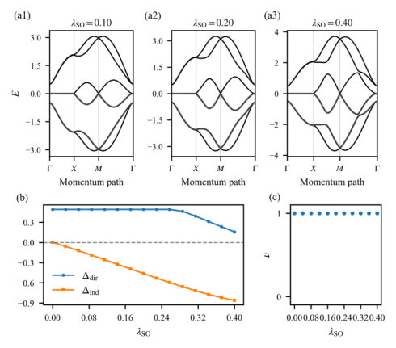 
Figure 2. Bulk spectrum and parity diagnostic of the direct- gap-protected pseudo-spin Chern metal with opposite-sign in- tralayer τz OAM-dependent coupling (labeled λSO for consis- tency with the axes; see the footnote after Eq. (5)), Eqs. (5) and (6). (a1)–(a3) Bulk band structures along Γ–X–M–Γ for λSO = 0.10, 0.20, 0.40. The OAM-dependent coupling term deforms the central bands and drives an indirect band over- lap, while the lower two-band subspace remains separated from the remaining bands by a finite direct gap in the plotted range. (b) Direct and indirect gaps, defined in Eq. (8), as functions of λSO, evaluated over the full Brillouin zone. The regime with ∆dir &gt; 0 and ∆ind &lt; 0...

📷 Fig 2

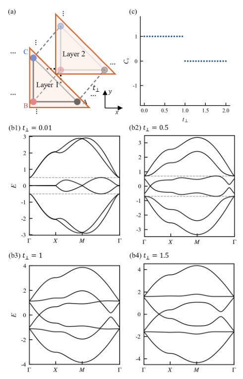 
Figure 1. Bulk OAM-coupling-free parent spin-Chern semimetal. (a) Bilayer Lieb lattice for the parent Hamil- tonian H0(k) in Eq. (2), built from the Chern-semimetal block in Eq. (1). The interlayer coupling is orbital diago- nal, Vinter = t⊥I3. (b1)–(b4) Bulk spectra under periodic boundary conditions, plotted along Γ −X −M −Γ for repre- sentative interlayer couplings t⊥= 0.01, 0.5, 1, 1.5. The spec- tra are plotted in black. In panels (b1) and (b2), the gray dashed horizontal lines mark the energy reference lines used to indicate the zero-indirect gap, which is preserved at small t⊥. (c) Pseudo-spin Chern number Cs, defined in Eq. (4), as a function of t⊥. The nonzero plateau Cs = 1...

📷 Fig 3

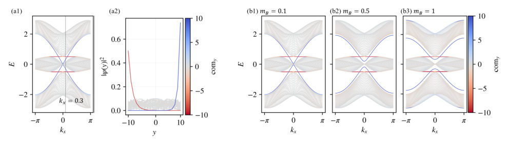 
Figure 3. Edge states for the Hamiltonian in Eq. (2) at λSO = 0. (a1) mB = 0. Energy spectrum E(kx) with periodic boundary conditions along x and open boundary conditions along y. The grey curves denote the full finite-strip spectrum, while the highlighted red and blue branches indicate states localized near opposite y boundaries, classified by their center of mass comy. The vertical line marks the representative momentum kx = 0.3 used in (a2). (a2) Real-space probability profiles |ψ(y)|2 of the selected states at kx = 0.3. The red and blue profiles show strong localization at opposite boundaries, whereas the grey profiles correspond to extended or weakly localized strip states. (b1)–(b3)...

📷 Fig 4

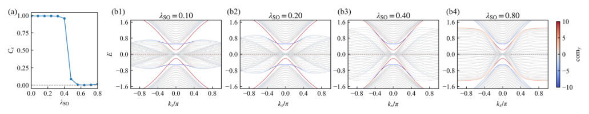 
Figure 4. OAM-coupling-driven flat-to-dispersive edge bands and topological phase transition. (a) Cylinder (xPBC-yOBC) pseudo-spin Chern marker Cs as a function of λSO with the edge mass mB = 0.5 switched on. Cs stays quantized at 1 throughout the weak-to-intermediate OAM-coupling range, showing that HB gaps a single edge without altering the bulk topology of the cylinder, and drops sharply once the direct gap closes near λSO ≃0.6. (b1)–(b4) Ribbon spectra for λSO = 0.10, 0.20, 0.40, 0.80, with selected states colored by their transverse center of mass comy. The gray curves show the full ribbon spectrum, while the red and blue branches correspond to states localized near opposite y...

**Summary.** The paper theoretically investigates topological metallic phases on a bilayer Lieb lattice, utilizing a layer-resolved pseudo-spin Chern number as the key diagnostic tool. It demonstrates how tuning coupling strengths can drive the system from a semimetal to a metal while preserving quantized topology. The findings offer a blueprint for engineering controlled, gapless edge states in synthetic quantum materials.

**Why it may be interesting.** This work provides a concrete theoretical framework for engineering topologically non-trivial gapless phases in synthetic systems by controlling layer-resolved pseudo-spin degrees of freedom. The concept of 'pseudo-spin' is highly relevant to AMO platforms using internal states.

Detailed structure

**Main problem.** The study aims to characterize a two-dimensional time-reversal-invariant topological metallic phase on a bilayer Lieb lattice, focusing on the quantization of layer-resolved pseudo-spin Chern number.

**Main result.** The system realizes a 'pseudo-spin Chern metal' where opposite-sign OAM coupling converts a semimetal into a metal while preserving quantized topology. The boundary states are asymmetric, featuring both flat bands and gapless Dirac cones.

**Method.** Theoretical analysis using projected pseudo-spin spectra to calculate the layer-resolved pseudo-spin Chern number ($C_s$) and analyzing edge physics via continuum models.

**Model / system.** The model is a bilayer Lieb lattice for spinless fermions, analyzed through Hamiltonians incorporating interlayer coupling ($t_\perp$) and intralayer Orbital-Angular-Momentum-dependent (OAM) couplings. The system exhibits distinct semimetallic and metallic regimes.

**Key observables.** Pseudo-spin Chern Number ($C_s$), direct gap ($\Delta_{	ext{dir}}$), indirect gap ($\Delta_{	ext{ind}}$), flat band existence, and Dirac cone formation at edges.

**Important parameters / regimes.** The strength of the OAM coupling (e.g., $\lambda_{SO}$ or $H_{SOC}$) which drives the semimetal-to-metal transition; maintaining open direct and pseudo-spin gaps.

**Assumptions / limitations.** The analysis relies on defining topological invariants using projected operators, assuming that the gap closing/opening dictates the phase transitions.

**Figures summary.** Figures illustrate bulk spectra showing the semimetal-to-metal transition as a function of coupling strength, and diagrams detail the asymmetric nature of boundary states (flat bands vs. Dirac cones).

**Paper structure.** The paper progresses by first establishing the topological semimetallic phase via $C_s$, then introducing OAM coupling to induce metallicity while maintaining quantized topology, and finally analyzing the distinct, asymmetric edge physics.

Abstract

We identify a two-dimensional time-reversal-invariant topological metallic phase on a bilayer Lieb lattice, characterized by a quantized layer--resolved pseudo-spin Chern number. Without the orbital-angular-momentum-dependent (OAM-dependent) coupling, the system gives rise to a time-reversal-invariant topological semimetal with a zero indirect gap and quantized pseudo-spin Chern number. Opposite-sign intralayer OAM-dependent coupling immediately converts the zero-indirect-gap semimetal into a metal, in which the global spectrum is metallic while the layer--resolved pseudo-spin Chern number remains well defined as long as the direct gap at each crystal momentum and the pseudo-spin gap remain open. The model also exhibits asymmetric boundary states: in the semimetallic regime, one edge hosts perfectly flat bands, whereas the opposite edge supports gapless counter-propagating modes forming a one-dimensional Dirac cone. An edge-localized interlayer coupling gaps only the counter-propagating edge states, leaving the flat-band edge essentially intact, while intralayer OAM-dependent coupling bends the exact flat band into a dispersive boundary mode without affecting the gapped Dirac edge. These results open a route toward the controlled engineering of layer--resolved topological gapless phases in synthetic and quantum materials.

[↑ back to top](#top)

### [Spectroscopy of low-lying valley states in hot Si/SiGe quantum dots](http://arxiv.org/abs/2607.11048v1)

**Authors:** Connor Nasseraddin, Heun Mo Yoo, Tanner M. Janda, Jason R. Petta  
**Type:** experiment · **Category:** quantum information and computing · **PDF:** <https://arxiv.org/pdf/2607.11048v1>  
**Analysis basis:** full PDF text, analyzed in chunks
**Topic relevance:** 🔥 `QC/QI experiment` **4/5** · `quantum measurements` **1/5** · `spintronics-quantum-optics interface` **1/5**

📷 Fig 1

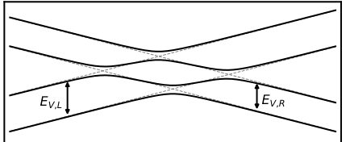 
FIG. 1. (a) False-color scanning electron microscope image of a device identical to the one used in this experiment. A DQD (white circles) is defined using plunger (red) and barrier (green) gates in the upper-half of the device. A dot charge sensor (DCS) is formed in the lower-half of the device (orange circle). Charge reservoirs are accumulated beneath the blue gates. (b) DCS conductance g plotted as a function of plunger gate voltages VL and VR. The detuning axis (ε) is overlaid on the DQD charge stability diagram. (c) DQD energy level diagram plotted as a function of ε in the coupled (solid lines) and uncoupled (dashed lines) regimes. The valley splitting of the left (right) dot is...

📷 Fig 2

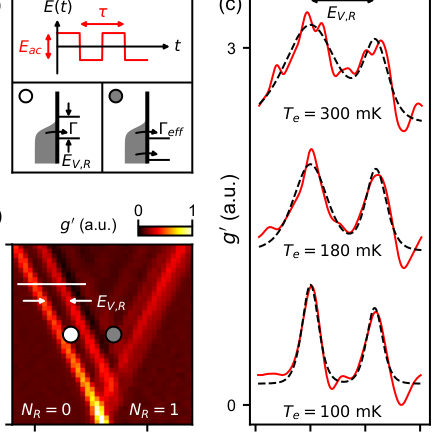 
FIG. 2. Temperature dependence of PGS. (a) Top panel: A square pulse repeatedly loads and unloads an electron from the QD. Bottom panel: The tunnel rate is dependent on the number of energetically accessible levels (see main text). (b) Derivative of the DCS conductance, g′, plotted as a function of ER and Eac. The white and gray markers denote the con- figurations shown in the bottom panel of (a). (c) Line cuts acquired at the white horizontal line in (b) for three different values of Te with EV,R ∼120 µeV. Data are smoothed and normalized (see main text), then fit to the derivative of the sum of two Fermi functions (dashed lines), yielding the valley splitting EV,R.

📷 Fig 3

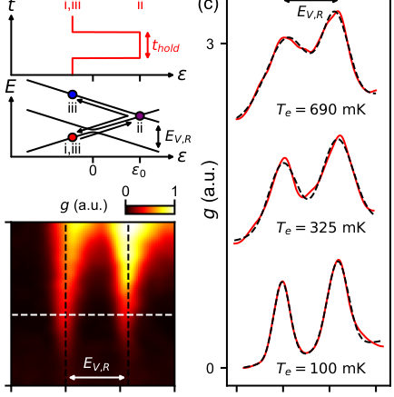 
FIG. 3. Temperature dependence of DAPS. (a) Top panel: Pulse sequence. Bottom panel: Energy level diagram illus- trating the DAPS protocol. If point ii is near an anti-crossing, enhanced charge dephasing yields a mixed charge state. (b) DAPS data obtained from the right QD. g is plotted as a function of thold and ε. (c) Line cuts acquired at the white horizontal dashed line in (b) for three different values of Te with EV,R ∼120 µeV. Data are smoothed and normalized (see main text), then fit to the sum of two Gaussians. The functional temperature range of DAPS exceeds PGS by nearly a factor of two.

📷 Fig 4

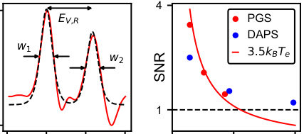 
FIG. 4. (a) Sample PGS valley splitting measurement depicting the variables used to calculate the SNR with EV,R ∼120 µeV. (b) SNR calculated from EV,R, w1, and w2 extracted from Figs. 2(c) and 3(c). The red line shows the theoretical linewidth of 3.5kBTe for PGS. For EV,R = 120 µeV, DAPS provides an SNR &gt; 1 at Te ∼700 mK.

**Summary.** The research compares two spectroscopic methods, PGS and DAPS, used to measure valley state splittings in Si/SiGe quantum dots. The study demonstrates that DAPS offers significantly higher energy resolution than PGS, especially at elevated temperatures. This finding establishes DAPS as a superior technique for characterizing the critical parameters needed for building scalable spin-based quantum processors.

**Why it may be interesting.** This work provides crucial experimental benchmarks on characterizing fundamental energy splittings in solid-state qubits, directly impacting the feasibility assessment of silicon-based quantum computing architectures.

Detailed structure

**Main problem.** Low-lying valley states in silicon quantum dots may impede the development of large-scale spin-based quantum processors, necessitating methods to increase valley splitting.

**Main result.** Detuning Axis Spectroscopy (DAPS) significantly outperforms Pulsed-Gate Spectroscopy (PGS), resolving valley splittings down to $\sim 86 \mu	ext{eV}$ even at elevated temperatures ($700 	ext{ mK}$).

**Method.** The authors compare two spectroscopic techniques, PGS and DAPS, by measuring the conductance of a double quantum dot coupled to a charge sensor.

**Model / system.** The experiment uses spin qubits fabricated in Si/SiGe heterostructures containing double quantum dots (DQD). The measurements probe the energy splitting between valley states within these semiconductor nanostructures.

**Key observables.** Valley splitting ($E_{V,R}$), measured via spectral features in the charge sensor conductance ($g$).

**Important parameters / regimes.** Measurement temperatures up to $700 	ext{ mK}$; resolution limits of $\sim 86 \mu	ext{eV}$ (DAPS) vs. $\sim 210 \mu	ext{eV}$ (PGS).

**Assumptions / limitations.** The superior performance of DAPS is attributed to its measurement mechanism relying only on interdot charge transitions, avoiding the thermal broadening associated with coupling to a Fermi reservoir in PGS.

**Figures summary.** Figures illustrate the device structure and energy level diagrams. Key comparisons show the temperature dependence of spectroscopic features, demonstrating that DAPS maintains high resolution at higher temperatures than PGS.

**Paper structure.** The paper establishes the problem (valley states hindering qubits), compares two measurement techniques (PGS vs. DAPS) across varying temperatures, presents quantitative results showing DAPS's superior energy resolution, and concludes by recommending DAPS for practical quantum device characterization.

Abstract

The presence of low-lying valley states in Si may hinder the development of large-scale spin-based quantum processors. Rapid prototyping of novel Si/SiGe heterostructures and gate stacks will be central to identifying pathways that increase the valley splitting. We compare the performance of pulsed-gate spectroscopy (PGS) and detuning axis spectroscopy (DAPS) at temperatures up to 700 mK. We find that DAPS outperforms PGS, with DAPS resolving valley splittings as small as ~86 $μ$eV, while the energy resolution of PGS is only ~210~$μ$eV. Our work demonstrates that DAPS can be used to efficiently extract valley splittings at elevated temperatures in high throughput cryostats.

[↑ back to top](#top)

### [Deploying and validating a metropolitan QKD secure network: architecture and field performance](http://arxiv.org/abs/2607.11727v1)

**Authors:** Claudia De Lazzari, Nicola Biagi, Damiano Giani, Marco Russo, Fernando Chirici, Francesco Stocco, Saverio Francesconi, Giacomo Ferranti, Alessandro Soureal, Antonella Sanguineti, Bartolomeo Montrucchio, Christian Laurenzi, Oliviero Testa, Guglielmo Morgari, Antonio Manzalini, Tommaso Occhipinti, Alessandro Zavatta, Davide Bacco  
**Type:** experiment · **Category:** quantum information and computing · **PDF:** <https://arxiv.org/pdf/2607.11727v1>  
**Analysis basis:** full PDF text, analyzed in chunks
**Topic relevance:** 🔥 `QC/QI experiment` **4/5** · `quantum optics experiment` **1/5**

📷 Fig 1

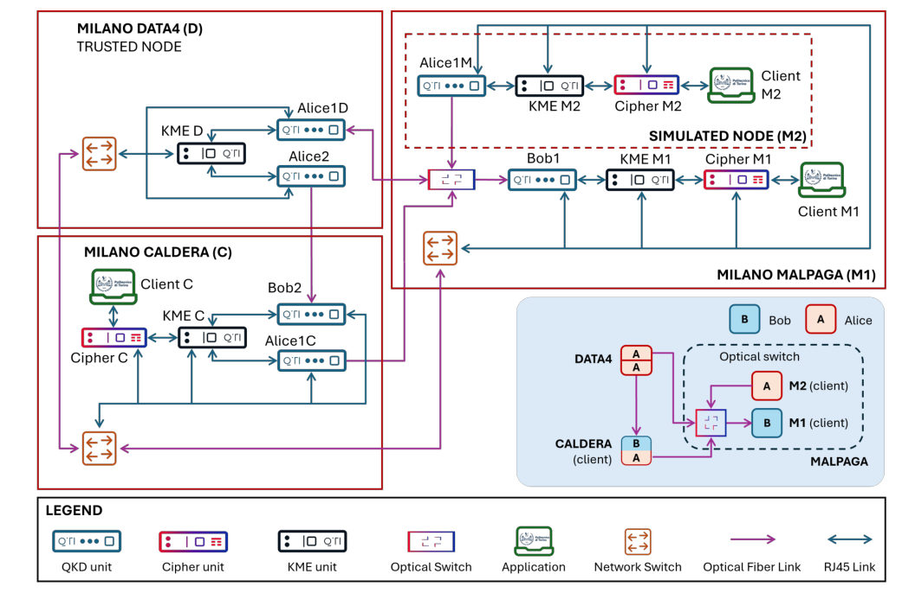 
Figure 1: Network architecture overview. The three red boxes represent the Points of Presence (PoPs): Milano Data4 (node D), Milano Caldera (node C), and Milano Malpaga. The latter PoP hosts two nodes — M1 and M2 — with the second implemented using a fiber spool for simulation purposes. The inset at the bottom right shows a high-level representation of the node configuration. Refer to the main text for a detailed description of the network.

📷 Fig 2

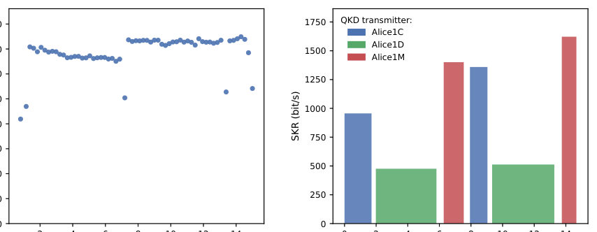 
Figure 2: Secure key rate (SKR) of the QKD network during the field trial. a) shows the performance of the point-to-point link between the Alice2 and Bob2 QKD devices, whereas b) refers to the switched links (Alice1M in node Malpaga M2, Alice1C in node Caldera, Alice1D in node Data4, and Bob1 in node Malpaga M1). In the latter plot, the height of each bar represents the mean SKR during the active period of the corresponding link, while its width reflects the time duration of the specific active configuration.

**Summary.** This paper reports the experimental deployment and validation of a metropolitan Quantum Key Distribution (QKD) network across data centers in Milan. It proves that by integrating QKD hardware with layered key management and SDN orchestration, secure, information-theoretically protected communication can be achieved at scale. The results establish a replicable blueprint for quantum-secure infrastructure.

**Why it may be interesting.** While focused on networking rather than fundamental physics, the work demonstrates practical quantum communication protocols and system integration challenges relevant to building large-scale quantum infrastructure.

Detailed structure

**Main problem.** The work addresses the existential threat posed by quantum computers to classical cryptography by deploying a Quantum Key Distribution (QKD) secure network.

**Main result.** The authors successfully demonstrated operational readiness for metropolitan-scale QKD networks, validating key establishment and service continuity across complex, reconfigurable topologies involving trusted nodes.

**Method.** The validation involved testing the full system stack—from quantum key generation to application layer consumption—across multiple simulated link failures and path changes.

**Model / system.** The physical platform is a metropolitan-scale QKD network connecting data centers in Milan, utilizing installed fiber infrastructure, layered architecture (QKD, KM, Encryption), and SDN orchestration.

**Key observables.** Secure Key Rate (SKR) stability, successful key propagation through trusted nodes, and sustained high-intensity throughput during application layer testing.

**Important parameters / regimes.** Metropolitan scale deployment, O-band (1310 nm) quantum transmission over installed dark fiber, and the use of standards-compliant Key Management (KM).

**Assumptions / limitations.** The system operates in a realistic environment coexisting with production ICT systems, rather than a purely controlled lab setting.

**Figures summary.** Figures illustrate the network architecture overview, SKR stability over time during link activation/switching, and color-coded active link intervals corresponding to different operational states.

**Paper structure.** The paper details the layered architecture (QKD $
ightarrow$ KM $
ightarrow$ Encryption), presents experimental validation across three test scenarios (direct, two-hop via trusted node, multi-hop), and concludes with application layer performance testing.

Abstract

The advent of cryptographically relevant quantum computers poses an existential threat to classical public-key infrastructure. Quantum Key Distribution (QKD) addresses this challenge by providing information-theoretic security for key establishment, independently of any computational hardness assumption. In this work, the deployment and experimental validation of a metropolitan-scale quantum-secure network between data centers in Milan is reported. The network operates over installed fiber infrastructure and implements a layered architecture integrating QKD hardware, standards-compliant Key Management (KM), and centralized Software-Defined Networking (SDN) orchestration. Dynamic path reconfiguration via active optical switching and trusted-node routing allow automated fail-over solutions. Application-layer validation across diverse protocols and workloads confirms the seamless interoperability of all system components. These results establish the technical and operational readiness of metropolitan QKD networks for production deployment, and offer a replicable blueprint for building quantum-secure communication infrastructure at metropolitan scale.

[↑ back to top](#top)

### [Moment-based PPT criteria for random bipartite states](http://arxiv.org/abs/2607.11369v1)

**Authors:** Cécilia Lancien, Kieran McShane  
**Type:** theory · **Category:** quantum information and computing · **PDF:** <https://arxiv.org/pdf/2607.11369v1>  
**Analysis basis:** full PDF text, analyzed in chunks
**Topic relevance:** 🔥 `entanglement & information structure` **4/5** · `Keldysh / 2PI / non-Gaussian methods` **1/5**

📷 Fig 1

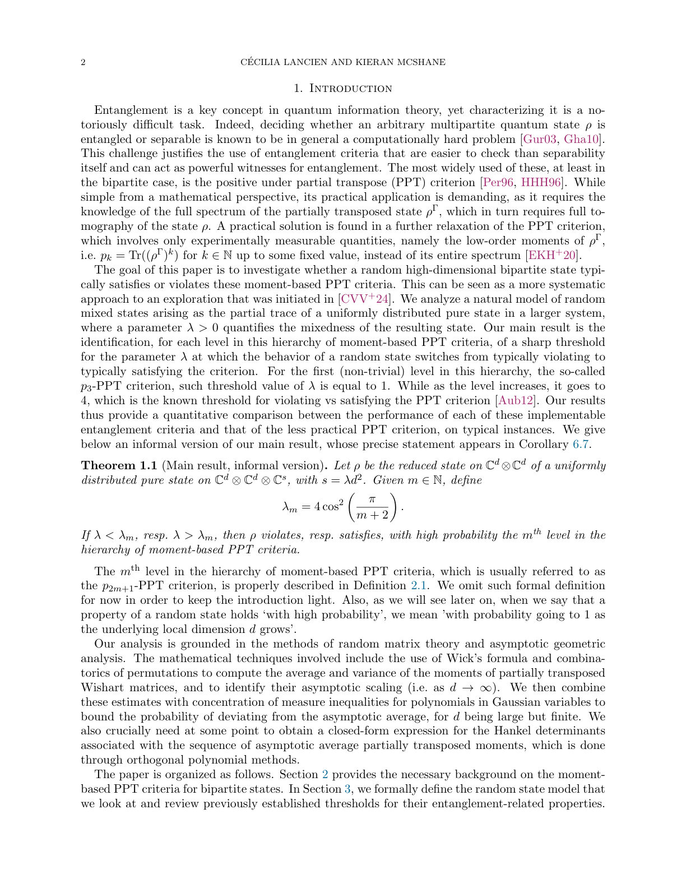 
Low-resolution page preview, page 2

📷 Fig 2

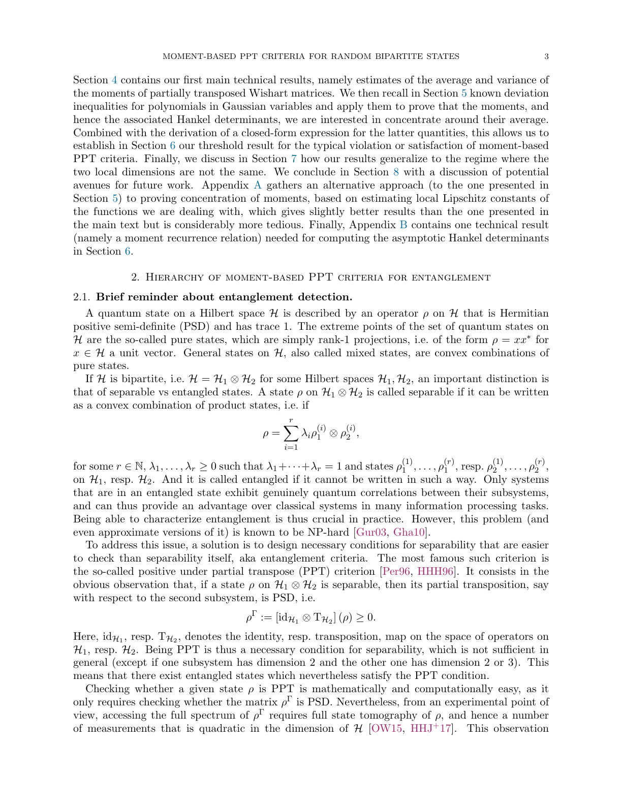 
Low-resolution page preview, page 3

📷 Fig 3

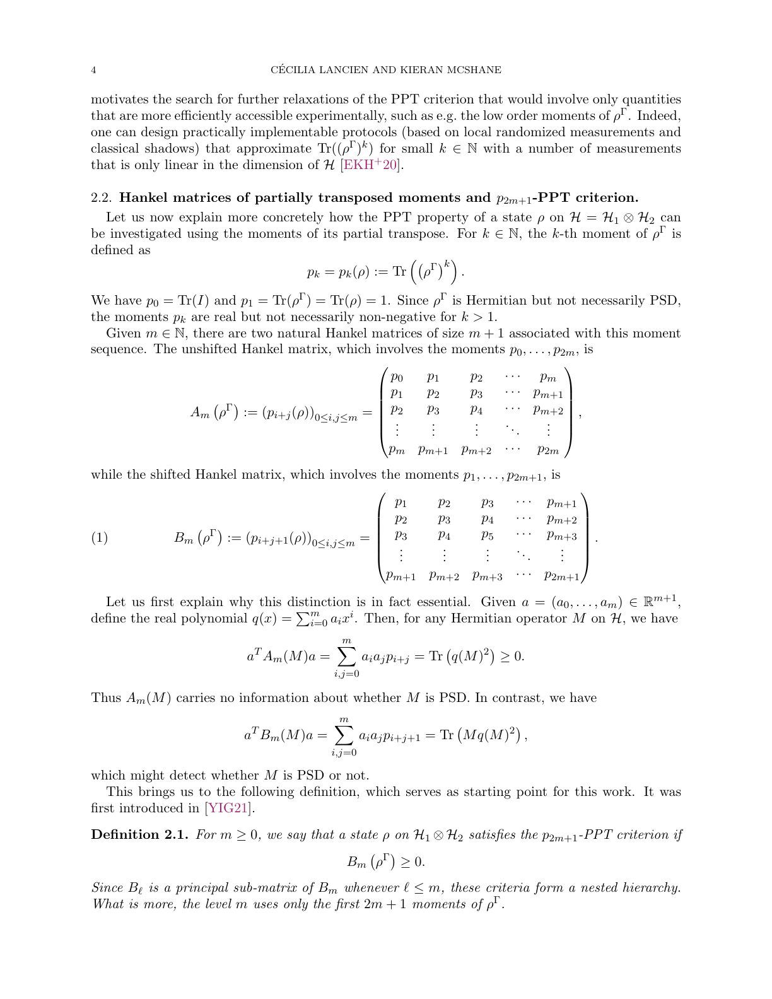 
Low-resolution page preview, page 4

📷 Fig 4

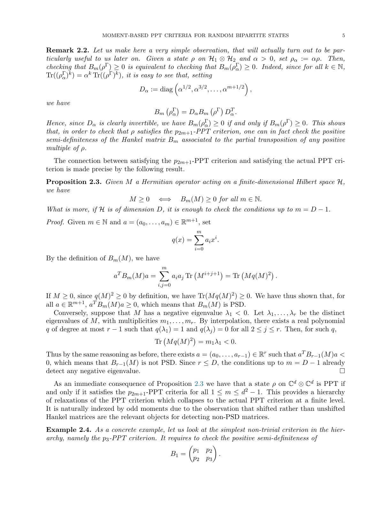 
Low-resolution page preview, page 5

📷 Fig 5

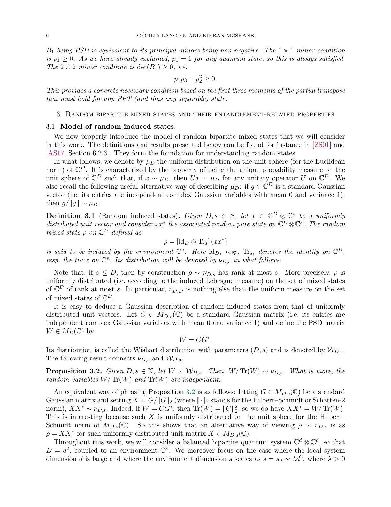 
Low-resolution page preview, page 6

**Summary.** This paper analyzes how well moment-based relaxations of the PPT criterion detect entanglement in large, random bipartite quantum states. By employing advanced techniques from random matrix theory and concentration inequalities, the authors derive sharp thresholds that quantify the scaling relationship between system size, environment coupling, and the satisfaction of these criteria.

**Why it may be interesting.** This work provides rigorous mathematical tools to test entanglement properties using only experimentally accessible quantities (moments), which is crucial for designing practical quantum information protocols where full state tomography is impossible.

Detailed structure

**Main problem.** The work investigates the typical detection performance of moment-based relaxations of the Positive Partial Transpose (PPT) criterion for entanglement in high-dimensional bipartite quantum systems.

**Main result.** Sharp thresholds are identified for the environment dimension $s$ relative to the system size $d$, determining when random states typically satisfy or violate these moment-based entanglement criteria.

**Method.** The analysis combines advanced mathematical tools, including concentration of measure arguments, combinatorics of permutations, and orthogonal polynomial methods applied to moments of partially transposed random matrices.

**Model / system.** The system under study consists of random bipartite mixed states $
ho$ on $\mathbb{C}^d \otimes \mathbb{C}^d$, specifically those derived as the marginal over an environment $\mathbb{C}^s$ of a uniformly distributed pure state. The analysis focuses on the asymptotic limit where $d$ is large and $s \sim \lambda d^2$.

**Key observables.** Low-order moments, $p_k = 	ext{Tr}((
ho^\Gamma)^k)$, and the associated Hankel matrices used to define the moment-based PPT criteria.

**Important parameters / regimes.** Local dimension $d$, environment scaling factor $\lambda$, and the moment level $m$ defining the criterion ($s = \lambda d^2$).

**Assumptions / limitations.** The analysis relies on approximating experimental measurements using low-order moments and assumes that random states are well-approximated by Wishart matrices derived from Gaussian distributions.

**Paper structure.** The paper progresses by first establishing the theoretical framework of moment relaxations to PPT, then developing tools based on concentration inequalities for these moments (using Lipschitz functions and random matrix theory), and finally deriving sharp thresholds $\lambda_m$ that characterize the transition between satisfying and violating the criteria.

Abstract

Moment-based relaxations of the positive partial transpose (PPT) criterion have been recently introduced, as a hierarchy of entanglement criteria involving only experimentally accessible quantities of a given bipartite state. The goal of this work is to study their typical detection performance on high-dimensional bipartite systems. Concretely, we investigate whether random bipartite mixed states on $\mathbb C^d\otimes\mathbb C^d$, obtained as the marginal over an environment $\mathbb C^s$ of a uniformly distributed pure state, generically satisfy or violate them. For each fixed level $m\in\mathbb N$ in this hierarchy of moment-based PPT criteria, we are able to identify a threshold environment dimension $s=λ_md^2$ at which the behavior of the associated random state switches from violating to satisfying it, with probability going to $1$ as $d$ grows. The proof combines combinatorics of permutations techniques to estimate the average value of moments of partially transposed random states and concentration of measure arguments to bound the probability of deviating from such average, when the underlying local dimension $d$ is large. We additionally need tools from the theory of Hankel determinant evaluation via orthogonal polynomials.

[↑ back to top](#top)

### [Optimal operating temperature for industry-compatible silicon spin quantum computing: colder is not necessarily better](http://arxiv.org/abs/2607.11846v1)

**Authors:** Paul Steinacker, Amanda E. Seedhouse, Nard Dumoulin Stuyck, Tuomo Tanttu, MengKe Feng, Santiago Serrano, Ensar Vahapoglu, Samuel K. Bartee, Philip Y. Mai, Alexis Shaw, Andreas Nickl, Sebastian Pauka, Brendan Harlech-Jones, Juan P. Dehollain, Fay E. Hudson, Kok Wai Chan, Thomas A. Ohki, David Reilly, Christopher C. Escott, Chih Hwan Yang, Wee Han Lim, Arne Laucht, Andre Saraiva, Andrew S. Dzurak, Jared H. Cole  
**Type:** both · **Category:** quantum information and computing · **PDF:** <https://arxiv.org/pdf/2607.11846v1>  
**Analysis basis:** full PDF text, analyzed in chunks
**Topic relevance:** 🔥 `QC/QI experiment` **4/5** · `spintronics-quantum-optics interface` **1/5**

📷 Fig 1

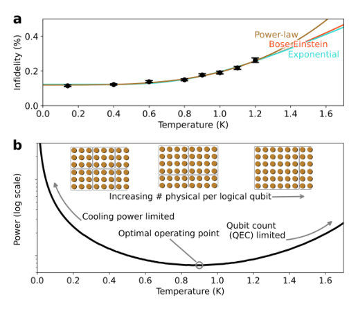 
Figure 1 | Fidelity and operating power as a function of temperature. a, Illustration of qubit operation infidelity examples as a function of temperature. The black dots represent Clifford gate infidelity measured with RB taken from ref.44. Error bars represent the 95 % confidence level. The temperature response is fitted to three examples of functional forms motivated by common quantum computing modalities. b, Operating power as a function of temperature, illustrating the trade-off between high cryogenic cooling power consumption, and high qubit count or reduced logical qubit count for fixed hardware.

📷 Fig 2

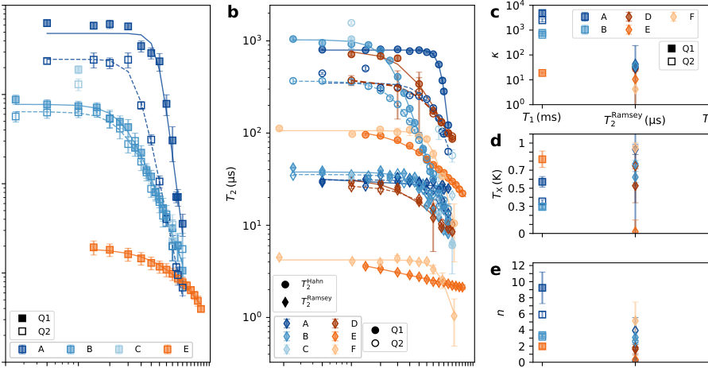 
Figure 2 | Relaxation and coherence time. a, Relaxation time, T1, of devices A–C and E as a function of temperature for Q1 and Q2. b, Dephasing times, T Ramsey 2 and T Hahn 2 , of devices A–F as a function of temperature for Q1 and Q2. c–e, Power law fitting parameters κ, TX, and n for T1, T Ramsey 2 , and T Hahn 2 of devices A–F for Q1 and Q2. Device C was excluded from the fit due to the limited amount of data. For comparison, relaxation and coherence times for devices E and F are imported from ref.44 and ref.41, respectively. Error bars represent the 95 % confidence level.

📷 Fig 3

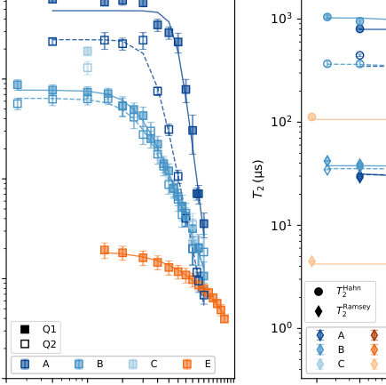 
Figure 2a,b shows the spin relaxation and coherence times of devices A–F as a function of temperature. Across

📷 Fig 4

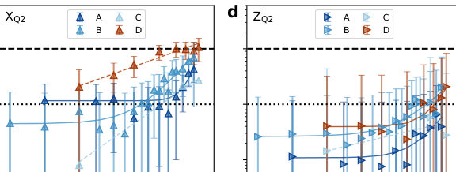 
Figure 3 | Single-qubit infidelity. a–d, On-target X- and Z-gate infidelity of devices A–D as a function of temperature for Q1 and Q2 extracted from GST. The solid lines are fits to the power law equation (1). The dashed lines are a guide to the eye but no fitting parameters were extracted here. e–g, Power law fitting parameters κ, TX, and n to the data in a–d. The black dashed (dotted) line represents the 1 % (1 ‰) infidelity threshold. Error bars represent the 95 % confidence level.

📷 Fig 5

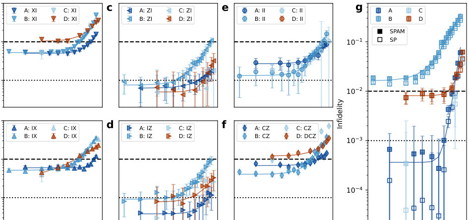 
Figure 4 | Two-qubit system performance. a–g, Operational infidelity from GST in the two-qubit context as a function of temperature for devices A–D. The solid lines are fits to the power law equation (1). The black dashed (dotted) line represents the 1 % (1 ‰) infidelity threshold. Error bars represent the 95 % confidence level.

**Summary.** This work investigates the operational sweet spot for silicon spin qubits, challenging the assumption that colder temperatures are always best. By modeling the total power budget—which includes cryogenic cooling needs and error correction overheads—the authors show a finite optimal temperature exists near 1 K. This provides critical design guidelines for building large-scale, commercially viable quantum computers.

**Why it may be interesting.** It provides concrete, device-level guidelines for scaling quantum processors by quantifying the energy trade-off inherent in achieving fault tolerance, which is crucial for any physical implementation of quantum computation.

Detailed structure

**Main problem.** The study aims to determine the optimal operating temperature for silicon spin qubits that minimizes total power consumption by balancing cryogenic cooling costs against the overheads required by quantum error correction.

**Main result.** A finite, non-zero optimal operating temperature exists, strongly influenced by a crossover temperature near 1 K; above this point, gate fidelity degrades rapidly due to environmental noise sources.

**Method.** The authors used Gate Set Tomography (GST) to benchmark two-qubit chips across various temperatures and developed a general power model combining cooling requirements with QEC overheads.

**Model / system.** The physical system is silicon spin qubits, which are highly compatible with semiconductor manufacturing. The analysis models the temperature dependence of gate infidelity using power-law fits ($M \propto [1 + (T/T_X)^n]^{-1}$).

**Key observables.** Gate and SPAM fidelities, coherence times ($T_1$, $T_{	ext{Ramsey}}^2$), total operational power consumption.

**Important parameters / regimes.** Optimal operating temperature, crossover temperature ($T_X \approx 0.5-1$ K), low-temperature infidelity ($\kappa$), and the error correction overhead scaling factor.

**Assumptions / limitations.** The analysis assumes that minimizing total power requires jointly considering computational performance (fidelity) and energy use (cooling/QEC).

**Figures summary.** Figures illustrate fidelity vs. temperature, coherence times vs. temperature, and critically, the trade-off between cryogenic cooling power and error correction power as a function of operating temperature.

**Paper structure.** The paper first establishes the conflict between low temperatures (high fidelity) and high operational costs (cooling/QEC). It then presents experimental measurements using GST across multiple devices to fit temperature dependencies. Finally, it develops and analyzes a comprehensive power model to pinpoint the optimal finite operating temperature.

Abstract

Silicon spin qubits are a leading candidate for large-scale quantum computing owing to their compatibility with semiconductor manufacturing. However, scaling to useful fault-tolerant processors will likely generate thermal loads that exceed the cooling power available at millikelvin temperatures. Raising the operating temperature eases cooling requirements but reduces gate fidelity, increasing the overhead of quantum error correction. Identifying the operating temperature that minimizes total power consumption is therefore a key challenge for commercially viable quantum computers. Here, we use gate set tomography to benchmark two-qubit silicon chips fabricated in both industrial and academic environments over a range of temperatures. Elevated temperatures substantially shorten coherence times and increase gate and state-preparation-and-measurement infidelities. Based on these measurements, we develop a general power model for silicon quantum computers that combines cryogenic cooling requirements with error-correction overheads. We show that a finite optimal operating temperature exists and is strongly influenced by a crossover temperature near 1 K in current devices, above which gate fidelity degrades rapidly. These results connect device-level fidelity limitations to system-level power requirements, providing design guidelines for large-scale silicon quantum computers.

[↑ back to top](#top)

### [From Circuits to Hardware: Benchmarking Standard and Qubit-Efficient Quantum Optimization on Real Hardware](http://arxiv.org/abs/2607.11637v1)

**Authors:** Monit Sharma, Hoong Chuin Lau  
**Type:** both · **Category:** quantum information and computing · **PDF:** <https://arxiv.org/pdf/2607.11637v1>  
**Analysis basis:** full PDF text, analyzed in chunks
**Topic relevance:** 🔥 `QC/QI experiment` **4/5**

📷 Fig 1

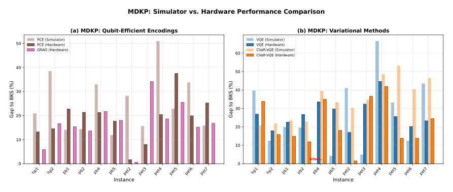 
Figure 1. MDKP simulator versus hardware performance across qubit-efficient and variational methods. Panel (a) compares PCE and QRAO on MDKP instances using gap to the optimal solution, while panel (b) reports the corresponding comparison for VQE and CVaR-VQE. The figure shows that simulator-side rankings do not transfer uniformly to hardware: some methods retain moderate performance degradation, whereas others exhibit larger hardware-induced gap inflation or infeasibility on selected instances. Overall, the plot highlights a nontrivial simulator–hardware gap even at these small benchmark sizes and shows that hardware execution can materially change relative method quality.

📷 Fig 2

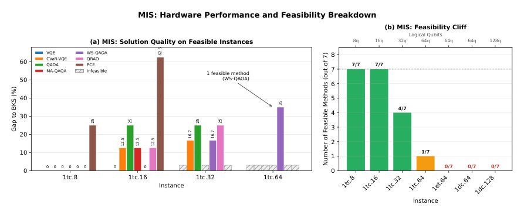 
Figure 2. Hardware performance and feasibility breakdown for MIS. Panel (a) reports finite optimality gaps for feasible method–instance outcomes; hatched bars denote infeasible outcomes. WS-QAOA is the only feasible method on 1tc.64. Panel (b) reports the number of feasible methods out of seven for each instance: 7/7, 7/7, 4/7, 1/7, 0/7, 0/7, and 0/7 from 1tc.8 through 1dc.128. Feasibility therefore collapses sharply with problem size, even though an isolated feasible outcome remains at 64 algorithm-level qubits.

📷 Fig 3

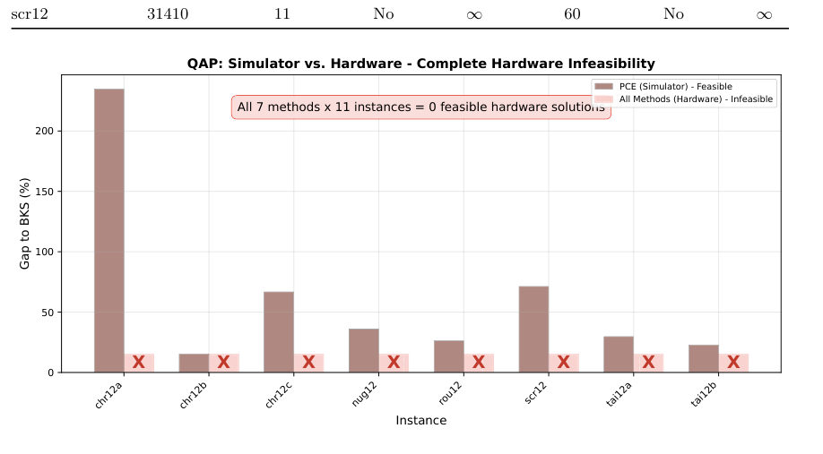 
Figure 3. QAP simulator versus hardware comparison. The direct QAP encoding combines dense flow-distance couplings with row-and-column one-hot assignment constraints; for the tested n = 10 and n = 12 instances, valid assignments occupy approximately 10−23.54 to 10−34.67 of the full binary hypercube. PCE returns feasible simulator candidates on several instances, although with large optimality gaps, whereas none of the seven hardware-executed methods returns a feasible QAP assignment. The comparison therefore illustrates the interaction of restrictive QAP feasibility geometry with compilation overhead, execution noise, and recovery sensitivity.

📷 Fig 4

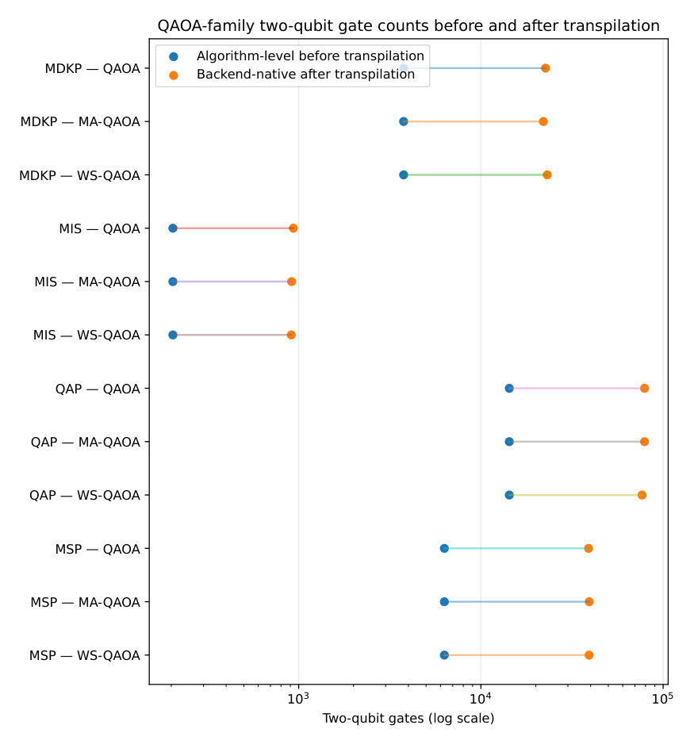 
Figure 4. Historical QAOA-family two-qubit-gate counts before and after transpilation. Each row compares the same representative bound depth-3 circuit before backend mapping with the corresponding historically executed backend-native circuit. The four problem families are represented by MDKP hp1, MIS 1tc.32, QAP tai10a, and MSP ms20. The horizontal axis is logarithmic. Expansion reflects the combined effects of routing, SWAP insertion, native-basis decomposition, scheduling, and post-routing circuit simplification; it should not be attributed to SWAP gates alone.

📷 Fig 5

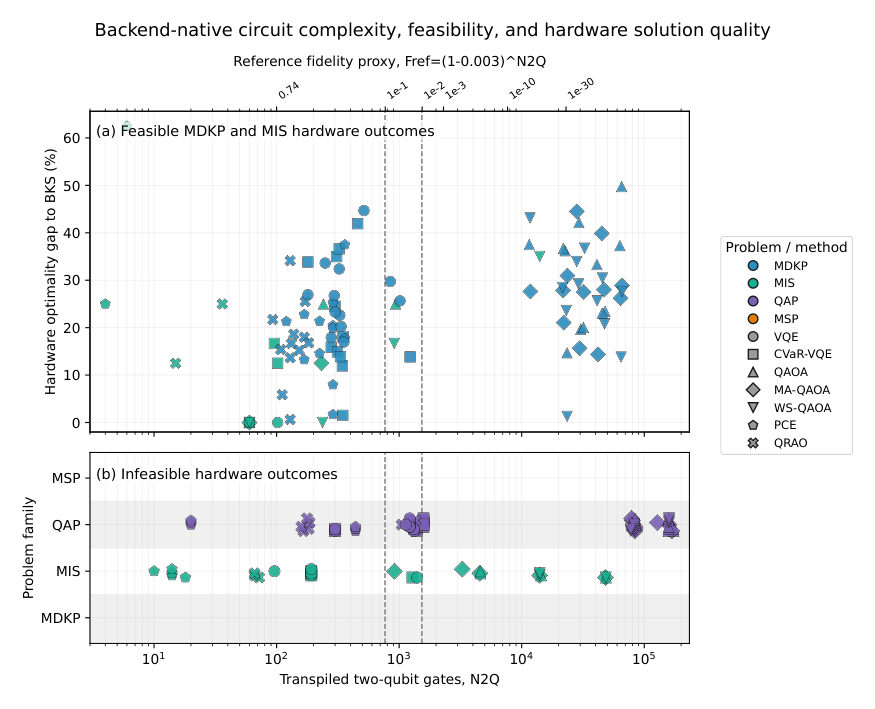 
Figure 5. Backend-native circuit complexity, feasibility, and hardware solution quality. (a) Feasible MDKP and MIS hardware outcomes, plotted as optimality gap to BKS against the transpiled two-qubit-gate count N2Q. (b) Infeasible hardware outcomes, grouped into shaded problem-family lanes; marker shape denotes method and color denotes problem family in both panels. MSP feasible outcomes are omitted from panel (a) because they use TDev rather than percentage optimality gap, but MSP infeasible outcomes are retained in panel (b). QAP appears only in panel (b) because all reported hardware QAP outcomes are infeasible. The lower x-axis shows backend-native N2Q; the upper x-axis gives the common...

**Summary.** This paper conducts a comprehensive, hardware-aware benchmark of several quantum optimization algorithms applied to difficult combinatorial problems. By testing methods like VQE and QAOA variants on real quantum processors, the authors quantify the impact of noise and compilation overhead. The findings establish empirical limitations for current quantum hardware in solving these complex optimization tasks.

**Why it may be interesting.** It provides crucial, practical diagnostics on the gap between idealized quantum algorithm design and actual performance achievable on near-term noisy intermediate-scale quantum (NISQ) hardware.

Detailed structure

**Main problem.** The primary goal is benchmarking quantum optimization algorithms for solving classically hard combinatorial problems under realistic, noisy hardware constraints.

**Main result.** The study finds that while qubit-efficient methods can extend runnable instance sizes, practical performance is severely limited by noise and compilation overhead on current real hardware.

**Method.** The authors benchmark multiple gate-based quantum optimization algorithms (VQE, QAOA variants, PCE, QRAO) across four NP-hard problems (MDKP, MIS, QAP, MSP).

**Model / system.** The work uses real quantum hardware backends (IBM Heron r1/r2) and compares results against simulated benchmarks for various combinatorial optimization instances.

**Key observables.** Transpiled circuit size, independent-error gate-count fidelity proxy ($F_{\mathrm{est}}$), solution quality, and resource usage metrics (qubits, gates, time).

**Important parameters / regimes.** The noise model establishes an empirical operating point near $F_{\mathrm{est}}\approx 0.1$, which dictates the limit of reliable execution.

**Assumptions / limitations.** Conclusions are explicitly limited to the tested implementations rather than representing the general capabilities of algorithms like QAOA; QAP feasibility is noted as a structural bottleneck.

**Figures summary.** The notes indicate comparisons across multiple tables showing resource usage (Q, D, G, 2Q, P) and time for various methods on specific problem instances (MDKP, MIS, QAP).

**Paper structure.** The paper establishes a unified protocol by benchmarking diverse algorithmic families against four structurally different NP-hard problems, systematically analyzing hardware resource usage and fidelity.

Abstract

Despite rapid progress in quantum optimization, broad real-hardware benchmarks comparing multiple algorithmic families across diverse combinatorial problems under a common protocol remain limited. We benchmark gate-based quantum optimization on four NP-hard problems: multi-dimensional knapsack (MDKP), maximum independent set (MIS), quadratic assignment (QAP), and market-share (MSP). We study VQE, CVaR-VQE, standard, multi-angle, and warm-start QAOA, together with qubit-efficient PCE and QRAO, on IBM Heron r1/r2 processors using resilience-level-2 mitigation. To our knowledge, this includes the first real-hardware QRAO results and the first multi-problem PCE hardware benchmark.   Across 247 method-instance combinations, we report transpiled circuit size, hardware outcomes, and an independent-error gate-count fidelity proxy, $F_{\mathrm{est}}$. For MDKP and MIS, an empirical operating point near $F_{\mathrm{est}}\approx 0.1$, corresponding to about 770 two-qubit gates at the median Heron-r2 CZ error rate, marks the onset of noise-dominated execution. QAP exposes a separate bottleneck: dense one-hot encodings and an exponentially sparse feasible manifold, with feasible fraction $10!/2^{100}$ at $n=10$; no tested hardware method produces a feasible assignment. Compiled QAOA-family circuits are generally noise dominated, and a matched uniform-random control shows that most feasible low-fidelity outcomes fall within the random range, apart from one finite-sample MIS warm-start exception. A SWAP-aware, fractional-gate, Nighthawk-topology compilation counterfactual reduces two-qubit counts but leaves all circuits below $F_{\mathrm{est}}=10^{-3}$. These conclusions apply to the tested implementations rather than QAOA in general. Qubit-efficient methods extend runnable instance sizes, but only within the empirical fidelity budget.

[↑ back to top](#top)

### [Hamiltonian Conditions for Dark Modes in Multimode Bosonic Systems](http://arxiv.org/abs/2607.10118v1)

**Authors:** Zuxin Wu, Shengshi Pang  
**Type:** theory · **Category:** other · **PDF:** <https://arxiv.org/pdf/2607.10118v1>  
**Analysis basis:** full PDF text, analyzed in chunks
**Topic relevance:** `Tavis-Cummings & cavity-many-emitter` **3/5** · `correlated cavity matter` **3/5** · `driven-dissipative phase transition` **3/5** · `methods for driven-dissipative` **3/5** · `analog quantum simulation` **2/5** · `correlated / nonlocal dissipation` **2/5** · `non-equilibrium dynamics` **2/5** · `non-equilibrium universality` **2/5** · `Keldysh / 2PI / non-Gaussian methods` **1/5** · `entanglement & information structure` **1/5** · `measurement-induced transitions` **1/5**

📷 Fig 1

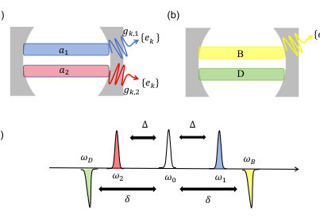 
FIG. 1. Passive two-mode B–D structure and the associated dynamical-invariance condition. (a) Two bosonic modes a1 and a2 couple to a common set of environmental modes {ek} with amplitudes gk,1 and gk,2. When the ratio gk,1/gk,2 = c is independent of k, the environment couples only to one collective combination of the two modes. (b) In the B–D basis introduced in Sec. II, only the bright mode B remains coupled directly to the environment, while the mode D is absent from the system–environment interaction. (c) Schematic frequency structure. The bare-mode frequencies ω1 and ω2 are displaced from their mean ω0 by ∆. Once the intrinsic Hamiltonian also satisfies Eq. (45), the bright and dark...

📷 Fig 2

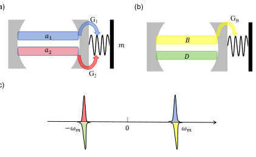 
FIG. 2. Bogoliubov dark mode in a parametrically driven optomechanical interface. (a) In the effective drive-frame description, the cavity fluctuation modes a1 and a2 couple to the same mechanical mode m through the red-sideband beam-splitter coupling G1 and the blue-sideband two-mode- squeezing coupling G2 in Eq. (77). (b) In the Bogoliubov B–D basis, only the bright mode B couples to the mechan- ical channel, with effective strength GB = p

**Summary.** This paper develops a comprehensive Hamiltonian criterion for identifying 'dark modes' in bosonic systems by requiring both environmental invisibility and internal dynamical invariance. It extends this framework from simple linear models to complex nonlinear and parametrically driven scenarios. The result provides a unified theoretical tool for engineering robust quantum states against dissipation.

**Why it may be interesting.** This work provides a powerful, general theoretical framework that unifies the analysis of decoherence protection (dark modes) across linear, nonlinear, and driven quantum optical systems, which is central to modern AMO research.

Detailed structure

**Main problem.** The primary goal is to establish a unified Hamiltonian criterion for identifying and engineering 'dark modes' in complex bosonic systems.

**Main result.** The paper derives necessary conditions—environmental invisibility and dynamical invariance—that must be satisfied by the system Hamiltonian, extending these criteria from linear to nonlinear and driven regimes.

**Method.** The analysis uses operator algebra (Heisenberg picture commutators) applied to the total Hamiltonian ($H_{tot} = H_S + H_E + H_{SE}$) to enforce constraints on the evolution of specific bosonic mode operators.

**Model / system.** The model involves multimode bosonic systems coupled to an environment, analyzed via their respective Hamiltonians. The scope covers linear (quadratic) coupling, nonlinear interactions (e.g., two-photon conversion), and parametrically driven optomechanical setups.

**Key observables.** Dark modes (decoupled bosonic degrees of freedom), operator space ($\mathcal{S}_D$), and the commutation relations involving system and environment Hamiltonians.

**Important parameters / regimes.** Linear coupling strengths, nonlinear interaction coefficients (e.g., Kerr-type terms), and driving parameters for optomechanical systems.

**Assumptions / limitations.** The analysis assumes that checking commutators on mode generators is sufficient to characterize the invariance of the entire generated operator space ($\mathcal{S}_D$).

**Figures summary.** Not specified, but the notes detail mathematical derivations concerning Hamiltonian decomposition and commutator vanishing conditions for different physical regimes.

**Paper structure.** The paper builds from defining the general two-part Hamiltonian criterion (invisibility + invariance) to simplifying this for linear cases, then extending the formalism to nonlinear interactions requiring correlated four-boson processes, and finally applying it successfully to the Bogoliubov dark mode of an optomechanical system.

Abstract

Dark modes arise when destructive interference prevents selected bosonic degrees of freedom from coupling to environmental channels. We formulate a Hamiltonian criterion for identifying such modes in multimode bosonic systems by separating two requirements: the candidate mode must be invisible to the direct system--environment coupling, and its generated operator space must remain invariant under the intrinsic system dynamics. For linear environment coupling and quadratic system Hamiltonians, the criterion is reduced to the the familiar null-space and invariant-subspace conditions of passive linear dark-mode theory. We then extend the analysis to nonlinear scenarios. For a two-photon conversion channel coupled to an auxiliary environmental mode, interference among nonlinear conversion pathways can reduce the environment coupling to a single collective two-photon channel, leaving a complementary bosonic mode decoupled from the environment. We show that preserving this mode under nonlinear intrinsic dynamics generally requires more than conventional Kerr-type quartic interactions: correlated four-boson conversion processes are needed to cancel mixed nonlinear conversion between the dark and environment-coupled collective modes. Finally, we show that the Bogoliubov dark mode of a parametrically driven optomechanical satisfies the same Hamiltonian criterion through an active canonical transformation. These results provide a unified Hamiltonian framework for identifying and engineering dark modes in linear, nonlinear, and driven bosonic systems.

[↑ back to top](#top)

### [Retarded interaction between opposite chiral edges in anomalous Hall crystals](http://arxiv.org/abs/2607.10320v1)

**Authors:** Wangqian Miao, Mu-Yang Chen, Binghai Yan, Chunli Huang  
**Type:** theory · **Category:** strongly correlated electrons · **PDF:** <https://arxiv.org/pdf/2607.10320v1>  
**Analysis basis:** full PDF text, analyzed in chunks
**Topic relevance:** `Keldysh / 2PI / non-Gaussian methods` **3/5** · `correlated / nonlocal dissipation` **3/5** · `driven-dissipative phase transition` **3/5** · `methods for driven-dissipative` **3/5** · `non-equilibrium dynamics` **2/5** · `non-equilibrium universality` **2/5** · `spintronics-quantum-optics interface` **2/5** · `Kondo & dissipative impurity` **1/5** · `analog quantum simulation` **1/5** · `correlated cavity matter` **1/5**

📷 Fig 1

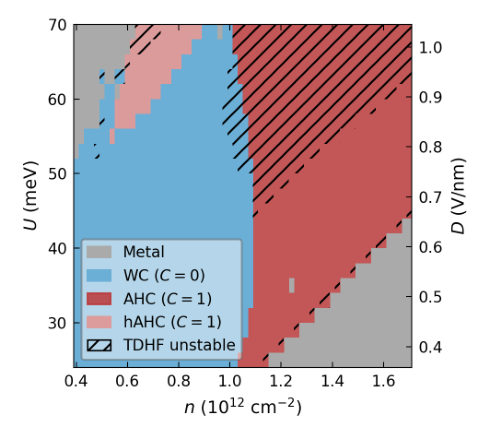 
Figure 1. Hartree-Fock phase diagram of rhombohedral pentalayer graphene (R5G) as a function of carrier density (n) and displacement field (D or U). The translation-symmetry-broken phases include the Wigner crystal (WC), halo anomalous Hall crystal (hAHC), and anomalous Hall crystal (AHC). All crystalline and metallic phases are fully polarized into a single spin-valley flavor, thereby break- ing time-reversal symmetry. Phase stability is evaluated using the time-dependent Hartree-Fock (TDHF) approximation, with unstable regimes denoted by dashed lines. As discussed in the main text, the softest instability likely corresponds to a stripe phase.

📷 Fig 2

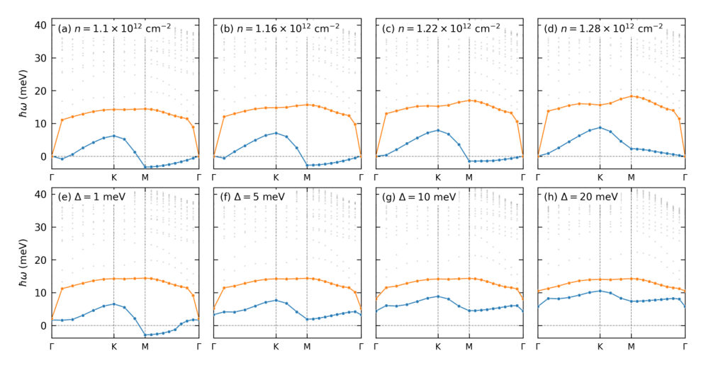 
Figure 2. TDHF collective-mode spectrum as a function of carrier density at fixed displacement field. The orange branch denotes the plasmon mode, which has the expected √q dispersion near the Γ point. The blue branch denotes the transverse phonon mode. Negative values indicate modes with purely imaginary frequency, signaling an instability of the Hartree–Fock state. The instability is strongest near the M point, where the imaginary frequency is largest. As the density is lowered toward the continuous transition, the transverse phonon mode softens near the Γ point, producing the low-energy bulk continuum responsible for bulk–edge hybridization. We fix U = 50 meV in these calculations....

📷 Fig 3

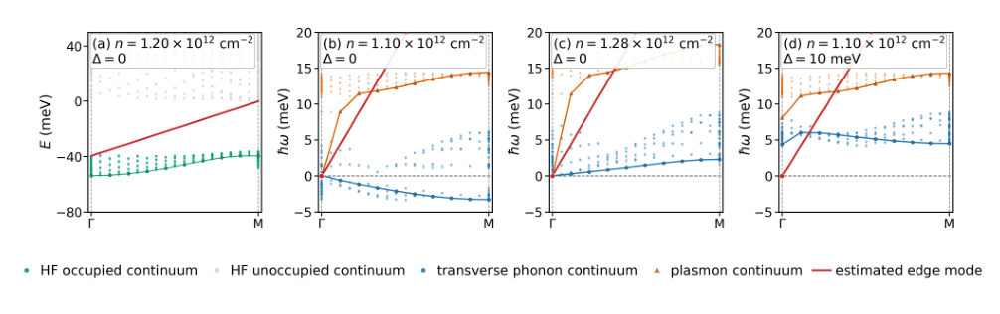 
Figure 3. (a) Hartree–Fock energies of AHC projected along the Γ–M direction. The red line schematically indicates the estimated chiral edge-mode dispersion connecting the occupied (green dots) and unoccupied states (gray dots). (b) Boundary-projected TDHF collective-mode spectrum along the same direction, shown near the continuous transition. The transverse phonon continuum overlaps with the chiral edge mode, enabling bulk–edge hybridization. (c),(d) Same as (b), but for varying electron densities n and pinning potentials ∆.

📷 Fig 4

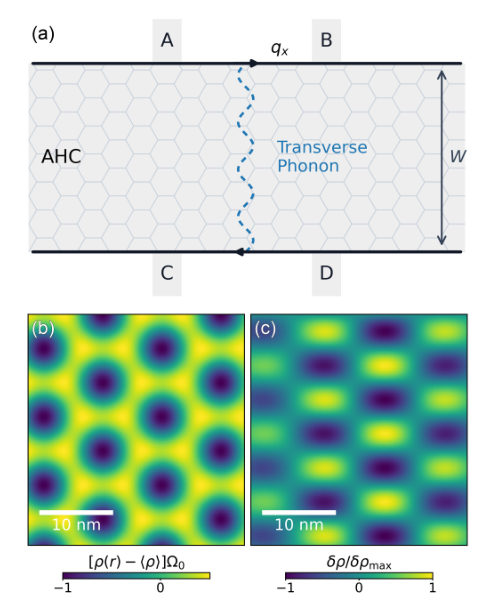 
Figure 4. (a) Experimental schematic of retarded inter-edge cou- pling in a four-terminal anomalous Hall crystal (AHC) device. A microwave drive applied between top contacts A and B excites a chi- ral edge wave, which resonantly emits a transverse bulk phonon. This phonon propagates across the sample width W and induces a phase- delayed nonlocal response measured between bottom contacts C and D. The honeycomb pattern hints at the underlying AHC order. (b) Charge density profile n(r) for the AHC ground state. The doping density is taken as 1.3 × 1012 cm−2. (c) Charge density modulation δnq(r) induced by a long-wavelength transverse phonon, q is taken as 1/12(G1 +G2), which is on the Γ−M...

**Summary.** This theoretical work investigates Anomalous Hall Crystals, showing that the coexistence of chiral edge states and bulk phonons leads to a unique physical effect. By calculating the effective interaction mediated by transverse phonons, the authors predict a retarded inter-edge coupling mechanism. This suggests a measurable nonlocal signature—a delayed response on one edge when driven on another.

**Why it may be interesting.** The concept of phonon-mediated interactions leading to delayed, non-local quantum responses is highly relevant for understanding open quantum systems and engineered quantum materials where coupling to environment modes dictates transport properties.

Detailed structure

**Main problem.** The study aims to find a universal signature distinguishing Anomalous Hall Crystals (AHCs) from conventional Chern insulators by analyzing the interaction between chiral edge modes and bulk excitations near a continuous phase transition.

**Main result.** The coupling mediates a retarded, Luttinger-liquid variant interaction between counterpropagating chiral edge modes on opposite sides of the sample, detectable via nonlocal measurements delayed by the transverse phonon time of flight.

**Method.** Microscopic time-dependent Hartree–Fock (TDHF) and generalized Random Phase Approximation (gRPA) calculations are used to analyze collective mode spectra and derive an effective inter-edge interaction by integrating out bulk phonons.

**Model / system.** The system is modeled as Anomalous Hall Crystals, which combine spontaneous electronic crystallization with a Chern insulating gap, studied using continuum models derived for rhombohedral pentalayer graphene. The physics involves chiral edge modes coupled to low-energy electronic phonon excitations in the bulk.

**Key observables.** Overlap between the gapless transverse phonon continuum and the chiral edge mode; nonlocal response delay time; effective inter-edge coupling constant ($U_R^{bt}$).

**Important parameters / regimes.** Carrier density ($n$), interlayer potential ($U$), transverse phonon time of flight, and comparison between edge velocity ($v$) and bulk sound velocity ($c_T$).

**Assumptions / limitations.** TDHF calculations are used to probe instabilities; the analysis relies on integrating out the bulk displacement field to derive an effective edge theory.

**Figures summary.** Figures illustrate phase diagrams (WC, AHC), the softening of phonon modes near instability points ($\Gamma$-M line), and the overlap region between the phonon continuum and edge dispersion.

**Paper structure.** The paper progresses from establishing the physical system (AHCs) to identifying instabilities via TDHF/gRPA calculations. It then derives an effective low-energy theory by integrating out bulk phonons, resulting in a retarded interaction term governing the coupled edge physics.

Abstract

An anomalous Hall crystal combines spontaneous electronic crystallization with a Chern insulating gap, supporting both chiral edge modes and low-energy electronic phonons. We show that this coexistence produces a distinct dynamical effect from ordinary Chern insulators: transverse bulk phonons can mediate a retarded interaction between counterpropagating chiral edge modes on opposite sides of the sample, realizing a Luttinger-liquid variant with delayed inter-edge coupling. Using microscopic time-dependent Hartree--Fock calculations for rhombohedral pentalayer graphene, we find that lowering the carrier density softens the long-wavelength transverse phonon mode. Near this instability regime, the resulting boundary-projected phonon continuum inevitably overlaps with the edge dispersion, thereby enabling their coupling. A smoking-gun probe is a nonlocal measurement: a drive applied to one edge can induce a response on the other edge, delayed by the transverse phonon time of flight across the sample.

[↑ back to top](#top)

### [Spectral Signatures of Replica Symmetry Breaking in Optimization-Induced Random Matrices](http://arxiv.org/abs/2607.10513v1)

**Authors:** Isaac Pérez Castillo  
**Type:** theory · **Category:** disordered systems and neural networks · **PDF:** <https://arxiv.org/pdf/2607.10513v1>  
**Analysis basis:** full PDF text, analyzed in chunks
**Topic relevance:** `Keldysh / 2PI / non-Gaussian methods` **3/5** · `entanglement & information structure` **3/5** · `methods for driven-dissipative` **3/5** · `non-equilibrium dynamics` **2/5** · `non-equilibrium universality` **2/5** · `analog quantum simulation` **1/5** · `correlated / nonlocal dissipation` **1/5** · `driven-dissipative phase transition` **1/5** · `exotic spin models in light-matter` **1/5** · `scars & prethermalization` **1/5**

📷 Fig 1

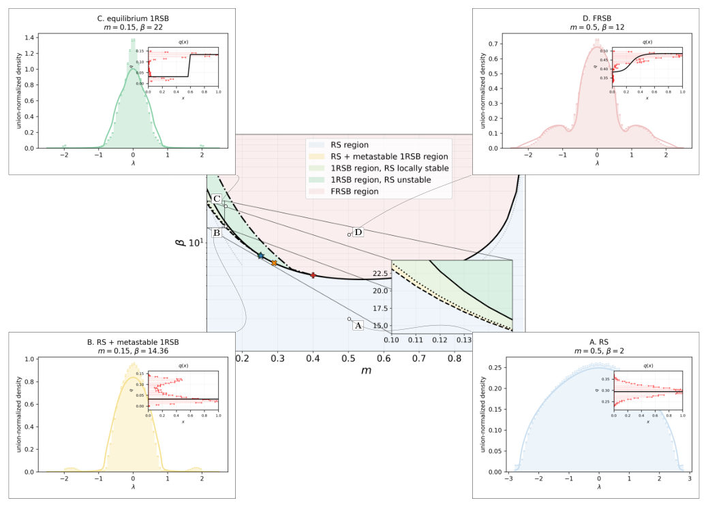 
FIG. 1. Dense Boolean p-MAS phase structure and induced two-replica spectra for p = 3. The central panel shows the phase diagram in the density–inverse-temperature plane, with axes m and β; the colored legend identifies the filled phase regions. The black transition curves are the replica-symmetric instability ( ), the dynamic x = 1 1RSB line ( ), the static x = 1 1RSB condensation line ( ), and the Gardner instability ( ). The gray dotted curves ( ) show the RS asymptotic forms as m →0 and m →1. When present, the blue star (⋆) marks the static–RS endpoint, the orange cross (X) marks the endpoint of the dynamical x = 1 1RSB spinodal, the red filled plus (+) marks the Gardner–RS junction,...

**Summary.** This work investigates how spectral signatures of random matrices generated by optimizing configurations reveal underlying glassy physics. By comparing single-sample spectra to two-sample difference spectra, the authors show that only the difference spectrum retains crucial information about the system's complex overlap structure, mapping it onto the Parisi order parameter.

**Why it may be interesting.** While focused on optimization problems, the mathematical machinery—analyzing spectral properties to extract hidden structural information (like overlaps)—is highly relevant to characterizing complex quantum many-body states or entanglement structures in open quantum systems where disorder is present.

Detailed structure

**Main problem.** The study investigates whether spectral information from a random matrix, generated via an optimization Gibbs measure in glassy systems, retains the underlying geometric structure of the disorder.

**Main result.** Information transfer is selective: the single-replica spectrum washes out glassy organization, but the two-replica difference spectrum explicitly reveals the Parisi order parameter and the full glassy geometry.

**Method.** The analysis employs Random Matrix Theory (RMT) techniques applied to induced matrices derived from a $p$-MAS Hamiltonian, utilizing replica methods and calculating spectral densities for both single and two-replica observables.

**Model / system.** The model is based on the dense Boolean p-body maximum-average subtensor problem ($p$-MAS), governed by a Gibbs measure. The key mathematical objects are the induced matrix $M(\sigma)$ from one configuration $\sigma$, and the difference matrix $Y = M(\sigma_1) - M(\sigma_2)$ from two independent samples.

**Key observables.** The primary observables are the spectral density of the single-replica matrix ($
ho(\lambda)$) and, crucially, the active-support spectral density of the two-replica difference matrix ($Y^{-1}$), which maps to the Parisi order parameter structure.

**Important parameters / regimes.** Key parameters include the system density ($m$), inverse temperature ($eta$), and the overlap parameter ($q$). The analysis covers different phases: Replica Symmetric (RS), 1RSB, and Full RSB.

**Assumptions / limitations.** The analysis relies on large-$N$ limits and assumes that deviations from theoretical predictions are due to finite-size effects or slow equilibration in glassy regimes.

**Figures summary.** Figure 1 illustrates the phase structure ($m-eta$) and shows the union-normalized spectral density of $Y^{-1}$ at various points, comparing theory with Monte Carlo histograms across different phases (A-D).

**Paper structure.** The paper establishes the physical problem using the p-MAS model. It then develops theoretical tools based on replica methods to calculate spectral properties for both single and two-replica matrices. The core argument is built by contrasting the results: showing the failure of information transfer in one-replica spectra versus the success in two-replica difference spectra, which map directly onto known order parameters.

Abstract

We study optimization-induced matrix ensembles generated by Gibbs measures. The same quenched disorder that weights configurations also supplies the matrix entries observed on them. For glassy Gibbs measures this raises a natural question: does the induced spectrum inherit the underlying glassy Gibbs geometry? In a dense tensor optimization model we find a selective answer. A single induced matrix has a universal leading bulk that washes out the glassy organization. The difference of two matrices built from independent thermal samples in the same disorder does not: its spectrum gives an explicit image of the glassy Gibbs geometry, encoded by the distribution of mutual overlaps between samples. Parisi theory and Monte Carlo confirm this mechanism across simple and glassy phases.

[↑ back to top](#top)

### [Symmetry tests for cyclic groups with quantum linear optics](http://arxiv.org/abs/2607.11393v1)

**Authors:** Carlos Navas-Merlo, Juan Carlos García Escartín  
**Type:** theory · **Category:** quantum information and computing · **PDF:** <https://arxiv.org/pdf/2607.11393v1>  
**Analysis basis:** full PDF text, analyzed in chunks
**Topic relevance:** `interference shaping light` **3/5** · `quantum measurements` **3/5** · `quantum optics experiment` **3/5** · `QC/QI experiment` **2/5** · `measurement-induced transitions` **2/5** · `analog quantum simulation` **1/5** · `correlated cavity matter` **1/5** · `driven-dissipative phase transition` **1/5** · `entanglement & information structure` **1/5**

📷 Fig 1

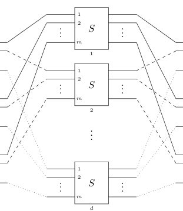 
FIG. 1. Optical setup for multimode states.

**Summary.** The paper presents a generalized framework for testing the symmetries of input quantum states using quantum linear optical interferometers. By relating measurable photon count probabilities to expectation values via Fourier analysis, it develops robust protocols for symmetry verification. This advances the use of simple linear optics as a powerful primitive for quantum state characterization and algorithm development.

**Why it may be interesting.** This work provides concrete, experimentally implementable protocols for performing fundamental quantum state characterizations—such as symmetry testing or estimating overlaps ($\langle\psi| U |\psi
angle$)—using only linear optics and photon counting, which is highly relevant to photonic quantum computing architectures.

Detailed structure

**Main problem.** The primary goal is developing a method to determine if an input photonic quantum state is invariant under the action of a cyclic group defined by a unitary operator $\hat{S}$. This generalizes existing symmetry tests.

**Main result.** The authors show that measurement probabilities derived from photon counting can be related to expectation values via a Discrete Fourier Transform (DFT), enabling multiple yes/no tests for state invariance under various symmetries, including Hadamard and XOR-permutation type tests.

**Method.** The method involves using quantum linear optical interferometers to measure expectation values $	ext{tr}(\hat{S}_k 
ho)$ which are then transformed via DFT to reconstruct the probabilities $P_j$ corresponding to symmetry projections ($\hat{\Pi}_j^S$).

**Model / system.** The physical system is quantum linear optics, modeled by unitary scattering matrices ($S$) acting on photonic modes. The analysis extends to multimode states and incorporates concepts from Fourier and Sylvester interferometers.

**Key observables.** Measurement probabilities $P_j = 	ext{tr}(\hat{\Pi}_j^S 
ho)$, expectation values $	ext{tr}(\hat{S}_k 
ho)$, and the characteristic function $\Phi(1) = E\{e^{iF}\}$.

**Important parameters / regimes.** The order of the cyclic group $K$ (related to roots of unity), the number of modes $m$, and the number of internal degrees of freedom $d$.

**Assumptions / limitations.** The analysis assumes the ability to perform photon number measurements at output modes, which is crucial for calculating the necessary expectation values.

**Figures summary.** Figure 1 illustrates the optical setup for multimode states involving multiple copies ($d$) of the original system. Figure 2 details the quantum circuit implementation for the Hadamard test.

**Paper structure.** The paper builds from defining the symmetry testing problem in photonic systems, deriving the relationship between measurement probabilities and expectation values using DFT, demonstrating its application to specific tests (like circle/SWAP), and finally discussing extensions to general property estimation like the Hadamard test.

Abstract

Testing quantum states for symmetries has multiple applications in quantum state comparison or as a primitive in more complex quantum algorithms. We present a method that determines whether an input photonic state is invariant under the action of a cyclic group defined by an operator $\hat{S}$ with eigenvalues which are roots of unity. The results generalize previously known circle and SWAP tests related to suppression laws in Fourier interferometers and offer a new test for permutations defined by a binary shift and a way to search for eigenstates in multiphoton states. Finally, we discuss the scenarios where this measurement can be used to perform Hadamard test, a fundamental primitive in variational and quantum machine-learning algorithms.

[↑ back to top](#top)

### [The General Quantum Limit for and the Optimization of the Minimum Measurable Frequency Shift in a Laser](http://arxiv.org/abs/2607.10518v1)

**Authors:** Selim M. Shahriar, Ruoxi Zhu, Jinyang Li, Zifan Zhou  
**Type:** theory · **Category:** other · **PDF:** <https://arxiv.org/pdf/2607.10518v1>  
**Analysis basis:** full PDF text, analyzed in chunks
**Topic relevance:** `interference shaping light` **3/5** · `quantum measurements` **3/5** · `correlated / nonlocal dissipation` **2/5** · `correlated cavity matter` **2/5** · `measurement-induced transitions` **2/5** · `Keldysh / 2PI / non-Gaussian methods` **1/5** · `driven-dissipative phase transition` **1/5** · `methods for driven-dissipative` **1/5** · `non-equilibrium dynamics` **1/5** · `superradiant laser` **1/5**

📷 Fig 1

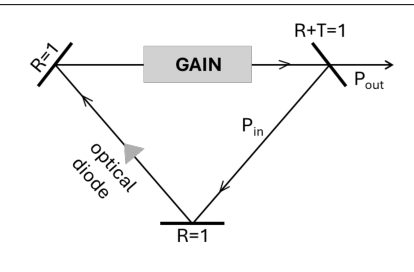 
Figure 1: Schematic illustration of a single mode ring laser, enclosed by two perfect reflectors and one output coupler. The optical diode ensures uni-directional lasing.

📷 Fig 2

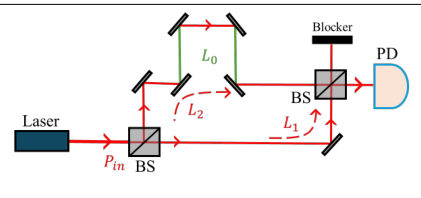 
Figure 2: Schematic illustration of an unbalanced Mach-Zehnder Interferometer. See text for details.

📷 Fig 3

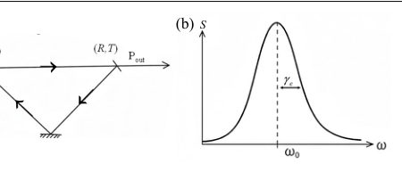 
Figure 3: (a). Schematic for a FPC. (b) Transmission function for the FPC.

📷 Fig 4

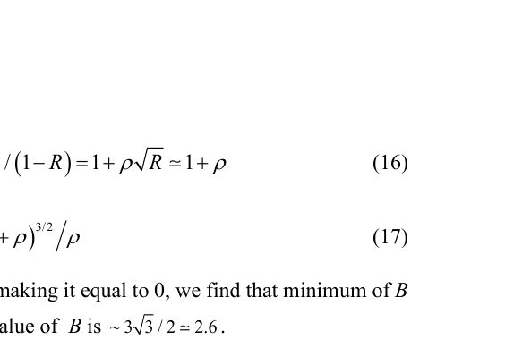 
Figure 4(a) shows the numerically computed value of B as a function of R for 2 ρ = . As

📷 Fig 5

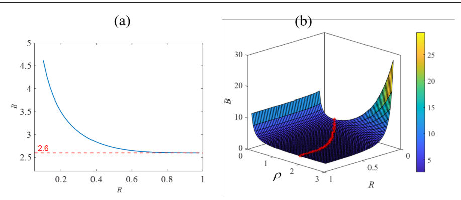 
Figure 4: (a) The numerical value of B as a function of R, for 2 ρ = . As can be seen, it agrees with the estimated value of ~2.6 as R approaches unity. (b) Plot of B when both ρ and R are varied

**Summary.** This paper re-evaluates the fundamental limit on laser frequency measurement by incorporating both spontaneous emission phase diffusion and vacuum shot noise. It shows that the minimum measurable frequency shift (MMFS) is a complex combination of these two effects, not simply the geometric mean of bandwidth and linewidth. The authors derive optimal MMFS values for various practical sensing setups like FPCs and interferometers.

**Why it may be interesting.** This work provides rigorous quantum noise analysis for frequency metrology in optical cavities, directly relevant to open quantum systems and cavity QED applications where precision measurements are key.

Detailed structure

**Main problem.** The paper determines the true minimum measurable frequency shift (MMFS) for a single-mode ideal laser, challenging conventional understanding of this limit.

**Main result.** The MMFS is determined by a combination of phase diffusion from spontaneous emission and shot noise from the vacuum mode, leading to optimal values significantly different from simple geometric mean estimates.

**Method.** The authors derive the MMFS by analyzing two independent quantum noise sources—spontaneous emission (phase diffusion) and vacuum fluctuations (shot noise)—for various sensing setups.

**Model / system.** The analysis focuses on a single-mode ideal laser operating in steady state, considering three specific measurement modalities: an unbalanced Mach-Zehnder Interferometer (UMZI), a passive Fabry-Perot cavity (FPC), and heterodyning with a reference laser.

**Key observables.** Minimum Measurable Frequency Shift (MMFS); Schawlow-Townes Linewidth (STL).

**Important parameters / regimes.** Measurement bandwidth ($M$ or $1/D	au$), cavity decay rate ($\gamma$), and the ratio of noise contributions ($\epsilon_\omega$).

**Assumptions / limitations.** The analysis assumes continuous wave, single mode operation in steady state; the standard geometric mean formula is shown to be an oversimplification.

**Figures summary.** Figures illustrate the setup (e.g., ring laser with optical diode) and show numerical comparisons of the minimum uncertainty function ($B$) versus cavity parameters like reflectivity ($R$) or ratio ($
ho$).

**Paper structure.** The paper progresses by first establishing the theoretical limits from spontaneous emission and vacuum noise separately, then combining these effects for a general lower bound, and finally applying this framework to optimize MMFS for specific physical platforms (UMZI, FPC, Heterodyne).

Abstract

We show that, contrary to conventional understanding, the minimum measurable frequency shift (MMFS) for a single-mode ideal laser is determined by a combination of phase diffusion caused by spontaneous emission and the shot noise caused by the vacuum mode. For all practical sensors, the MMFS is found to be given by the geometric mean of the measurement bandwidth and the Schwalow-Townes Linewidth, multiplied by a factor which can be much larger than unity under certain conditions. We determine the optimal values of the MMFS for three different sensing modalities, an unbalanced Mach-Zehnder Interferometer, a passive Fabry-Perot cavity (FPC), and heterodyning with a reference laser, and identify the conditions needed for reaching these values of the MMFS.

[↑ back to top](#top)

### [The quantum coherence as a phase property of the wave function](http://arxiv.org/abs/2607.10958v1)

**Authors:** Ivan Georgiev Koprinkov  
**Type:** theory · **Category:** other · **PDF:** <https://arxiv.org/pdf/2607.10958v1>  
**Analysis basis:** full PDF text, analyzed in chunks
**Topic relevance:** `Keldysh / 2PI / non-Gaussian methods` **3/5** · `methods for driven-dissipative` **3/5** · `Tavis-Cummings & cavity-many-emitter` **2/5** · `driven-dissipative phase transition` **2/5** · `non-equilibrium dynamics` **2/5** · `analog quantum simulation` **1/5** · `correlated / nonlocal dissipation` **1/5** · `correlated cavity matter` **1/5** · `interference shaping light` **1/5** · `non-equilibrium universality` **1/5**

📷 Fig 1

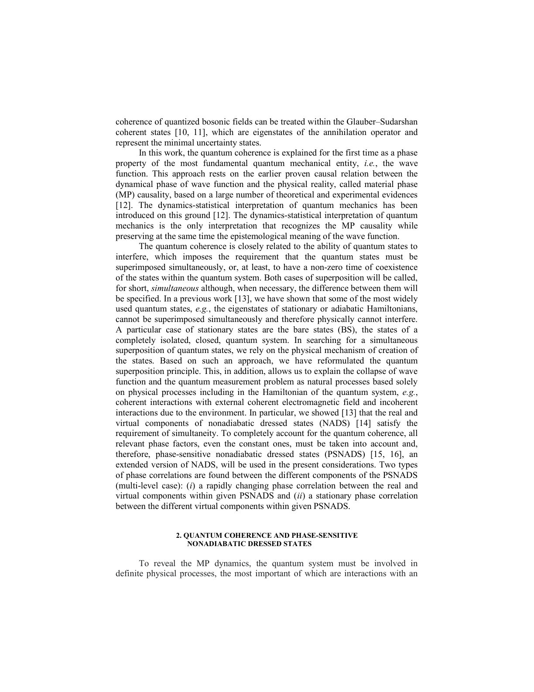 
Low-resolution page preview, page 2

📷 Fig 2

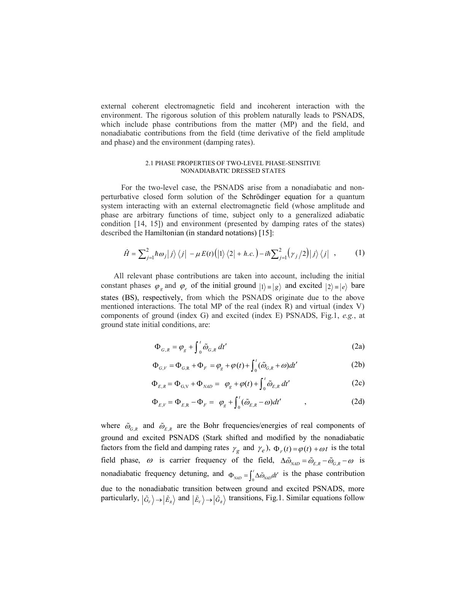 
Low-resolution page preview, page 3

📷 Fig 3

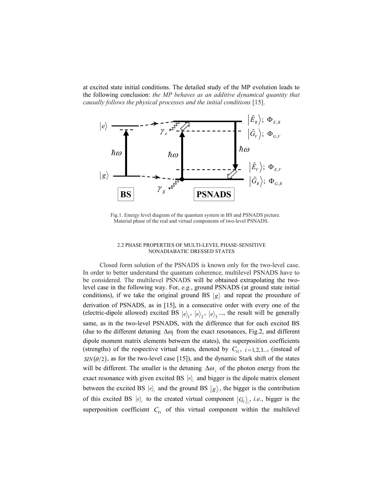 
Low-resolution page preview, page 4

📷 Fig 4

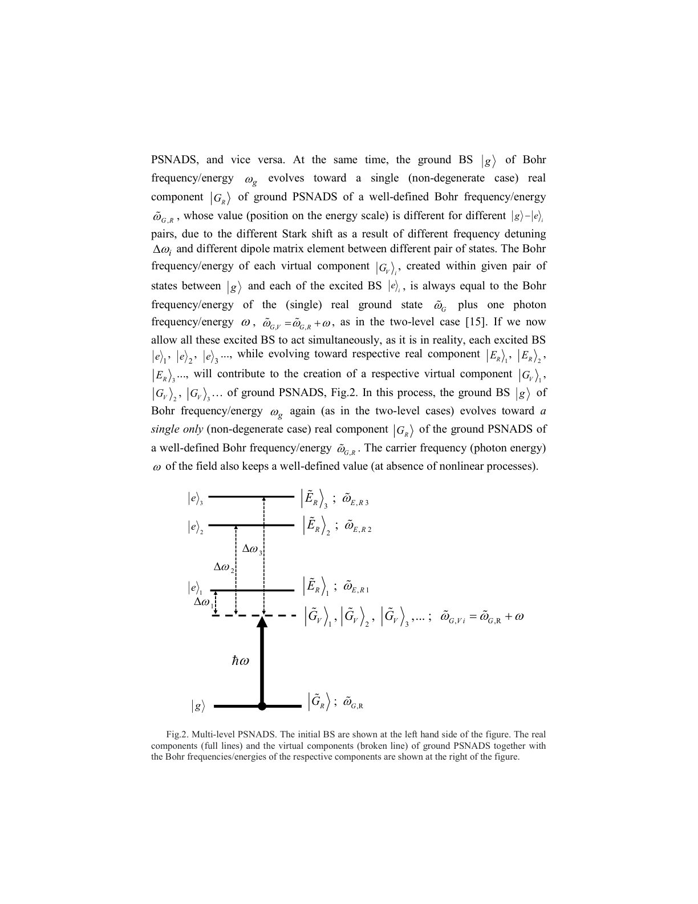 
Low-resolution page preview, page 5

📷 Fig 5

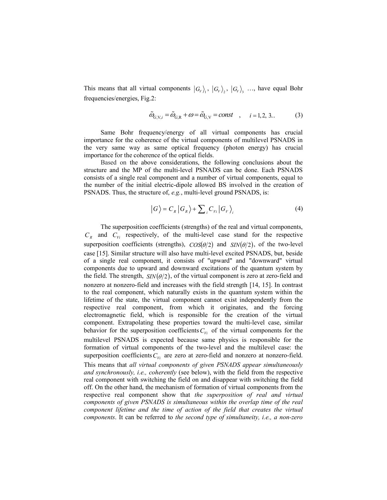 
Low-resolution page preview, page 6

**Summary.** This theoretical paper redefines quantum coherence as a quantifiable phase property embedded within the wave function's structure. It develops the framework of Phase-Sensitive Nonadiabatic Dressed States (PSNADS) to analyze systems driven by external electromagnetic fields. The key finding is that stable, observable high coherence arises from constant phase differences among virtual components, providing a mechanism for understanding quantum interference.

**Why it may be interesting.** This work directly addresses the foundational interpretation of quantum mechanics by linking measurable coherence properties (phase correlations) to the structure of dressed states under external fields, which is central to quantum optics and open system dynamics.

Detailed structure

**Main problem.** The paper aims to explain quantum coherence fundamentally as a phase property inherent to the wave function itself.

**Main result.** Two distinct types of phase correlations are identified in multi-level dressed states: a rapidly changing correlation between real/virtual components and a stable, constant phase difference among virtual components.

**Method.** The methodology involves extending Nonadiabatic Dressed States (NADS) to Phase-Sensitive Nonadiabatic Dressed States (PSNADS), utilizing the concept of 'material phase' causality.

**Model / system.** The system models a quantum system interacting with a coherent external electromagnetic field and environmental damping. The analysis is performed using PSNADS, which decompose the state into a real component and multiple virtual components.

**Key observables.** Two types of phase correlations: (1) rapidly changing phase correlation between real/virtual parts, and (2) stationary phase correlation between different virtual components.

**Important parameters / regimes.** Detuning ($\Delta_{i\omega}$), dipole matrix elements, and the presence of a coherent external electromagnetic field are key parameters.

**Assumptions / limitations.** The analysis assumes that the ground state evolves toward a single real component in the non-degenerate limit, and that virtual components form synchronously with the field interaction.

**Figures summary.** Figure 1 illustrates the energy level diagram showing BS and PSNADS for two-level systems. Figure 2 diagrams the multi-level PSNADS structure, distinguishing between initial BS, real (full lines), and virtual (broken lines) components.

**Paper structure.** The paper builds from explaining coherence in simple two-level systems to developing a full multi-level framework using PSNADS, deriving equations for total phases ($\Phi$), and calculating phase differences between various state components.

Abstract

The quantum coherence as a phase property of the most fundamental quantum mechanical entity, the wave function, is explained for the first time. Phase-sensitive nonadiabatic dressed states, arising from the interaction of a quantum system and a coherent external electromagnetic field, are used in these considerations. Two types of phase correlations in the multilevel phase-sensitive nonadiabatic dressed states are found: a rapidly changing phase correlation between the real and the virtual components and a stationary phase correlation between different virtual components of these states.

[↑ back to top](#top)

### [Non-Abelian holonomic transformations in digitally coupled acoustic waveguides guided by the global adiabatic criterion](http://arxiv.org/abs/2607.11000v1)

**Authors:** Jin-Kang Guo, Jia Li, Jin-Lei Wu, Chuan-Cun Shu  
**Type:** theory · **Category:** other · **PDF:** <https://arxiv.org/pdf/2607.11000v1>  
**Analysis basis:** full PDF text, analyzed in chunks
**Topic relevance:** `analog quantum simulation` **3/5** · `methods for driven-dissipative` **3/5** · `correlated / nonlocal dissipation` **2/5** · `driven-dissipative phase transition` **2/5** · `non-equilibrium dynamics` **2/5** · `Keldysh / 2PI / non-Gaussian methods` **1/5** · `Kondo & dissipative impurity` **1/5** · `entanglement & information structure` **1/5** · `non-equilibrium universality` **1/5**

📷 Fig 1

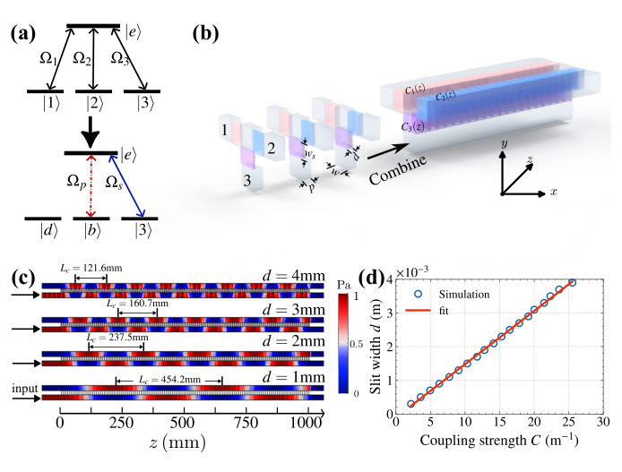 
FIG. 1. (a) Schematic of the four-level system and its bright–dark reduction, where |d⟩is decoupled while |b⟩and |3⟩are coupled to |e⟩. (b) Acoustic implementation in a slit-coupled four-waveguide structure, where the spatially varying couplings C1(z), C2(z), and C3(z) are combined into a continuous device. (c) Simulated field distributions for different slit widths d, showing the dependence of the effective coupling. (d) Calibration curve of slit width d versus coupling strength C, where the simulation data are well described by a linear fit.

📷 Fig 2

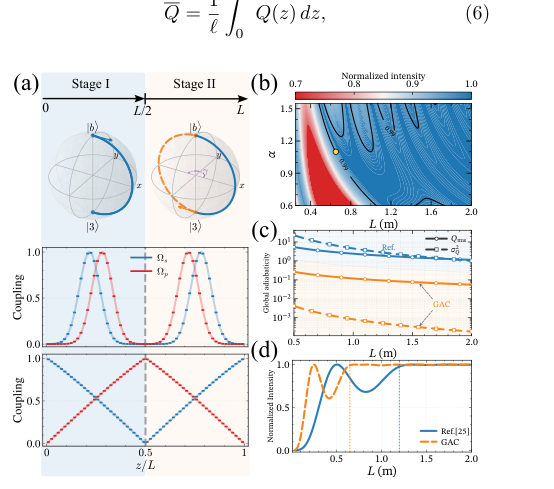 
FIG. 2. GAC-guided envelope design and normalized target- output intensity. (a) Two-stage phase-stitched protocol and the reference Gaussian and GAC-guided coupling profiles, in- cluding their slit-period-sampled realizations. (b) Normalized target-output intensity of the GAC-guided power-law profiles in the (α, L) parameter space. The color scale denotes the normalized intensity, the black contour marks 0.99, and the marker denotes the selected working point. (c) Merged global adiabaticity metrics Qrms and σ2 Q for the reference Gaussian and GAC-guided profiles. (d) Normalized target-output in- tensity versus the total active coupling length L, comparing the reference Gaussian [25] and...

📷 Fig 3

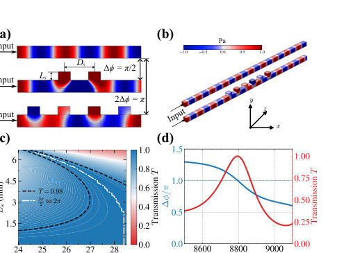 
FIG. 3. (a) Schematic of the phase-shifting unit formed by two side-coupled resonators, with Ds and Ls denoting the key geometric parameters. (b) Three-dimensional acous- tic realization of the phase-shifting structure. (c) Simulated transmission map in the (Ds, Ls) parameter space, where the dashed contour marks the phase-shift range from 3π/2 to 2π and the high-transmission contour marks T = 0.98. (d) Sim- ulated phase shift ∆ϕ/π and transmission T versus frequency for the chosen design.

📷 Fig 4

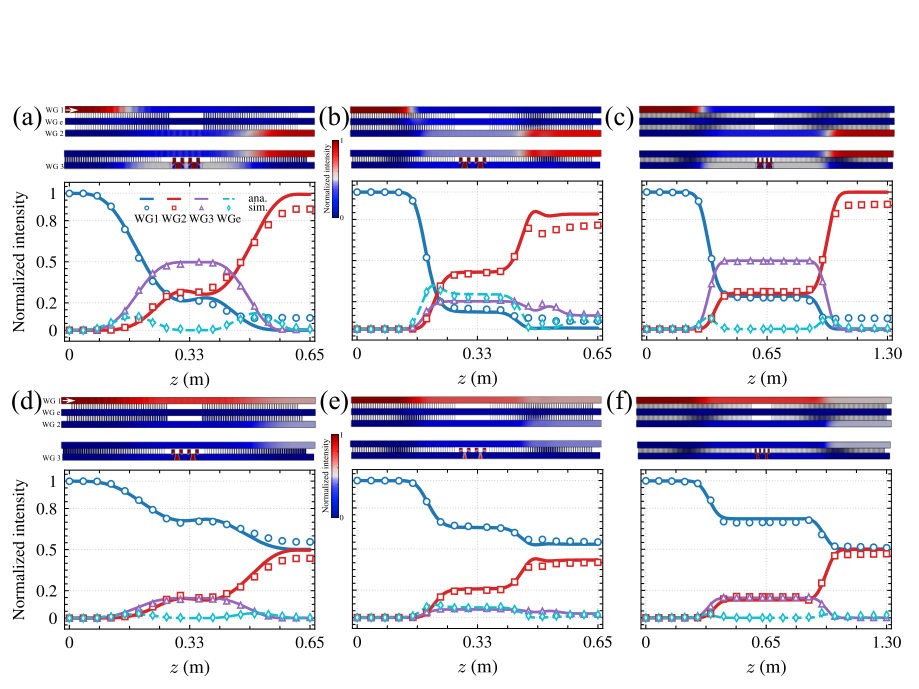 
FIG. 4. Full-wave validation of the acoustic Pauli-X and Hadamard transformations. (a–c) Pauli-X transformation for the GAC-guided profile with an active coupling length of 65cm, the Gaussian profile with the same active coupling length of 65cm, and the longer Gaussian reference with an active coupling length of 130 cm, respectively. (d–f) Corresponding Hadamard transformation for the same three implementations. In each panel, the upper map shows the full-wave normalized acoustic intensity distribution, and the lower plot shows the four-waveguide normalized intensities as functions of the physical distance z. Solid curves denote the analytical coupled-mode predictions, while symbols denote...

📷 Fig 5

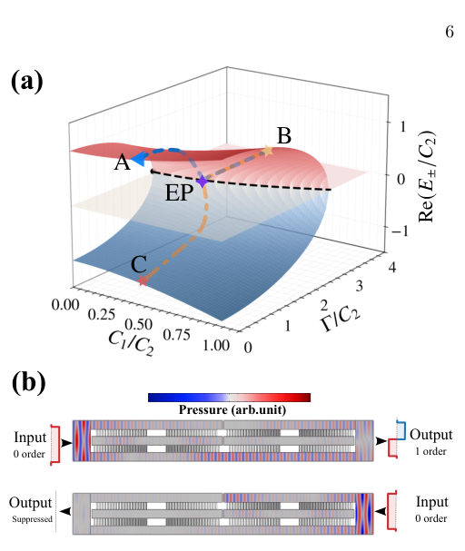 
FIG. 5. Unidirectional acoustic mode conversion enabled by the phase-stitched holonomic acoustic structure. (a) Reduced two-mode non-Hermitian Riemann-surface/EP schematic. (b) Full-wave directional mode-conversion pressure fields. Un- der forward excitation, the incident zero-order mode is con- verted into the first-order output mode, whereas under reverse excitation the transmitted output is strongly suppressed.

**Summary.** The authors present a method using acoustic waveguides to realize complex Non-Abelian holonomic transformations with high efficiency. By optimizing the coupling profile based on a Global Adiabatic Criterion (GAC), they significantly reduce the required device length compared to previous designs. Furthermore, they demonstrate that this same architecture can be used for unidirectional wave control by leveraging physics associated with an Exceptional Point.

**Why it may be interesting.** This work directly applies advanced concepts from topological quantum computation (holonomy) and open quantum systems (non-Hermiticity/EPs) to a tangible, scalable physical platform (acoustics), providing quantitative design guidelines for fast adiabatic control.

Detailed structure

**Main problem.** The primary goal is to demonstrate a compact, robust method for implementing Non-Abelian holonomic transformations (NHTs) in acoustic waveguides while minimizing nonadiabatic losses.

**Main result.** The Global Adiabatic Criterion (GAC)-guided design achieves the required quantum gates with half the coupling length compared to standard Gaussian envelopes, and the structure also supports unidirectional mode conversion via Exceptional Point assistance.

**Method.** The analysis uses coupled-mode theory (CMT) along propagation ($z$) combined with a global adiabaticity metric ($Q_{rms}$) derived from comparing GAC-guided power-law profiles against reference Gaussian envelopes.

**Model / system.** The system is an acoustic platform realized via digitally coupled four-waveguide structures, which models a physical tripod configuration. The dynamics are analyzed using effective Hamiltonians and reduced to two-mode non-Hermitian pictures for mode conversion analysis.

**Key observables.** Normalized target-output intensity (for Pauli-X/Hadamard gates), the global nonadiabatic burden ($Q_{rms}$), and the degree of unidirectional acoustic mode conversion.

**Important parameters / regimes.** Coupling length ($\ell$), coupling envelopes (power-law vs. Gaussian), and the parameters defining the Exceptional Point (EP) curve in the reduced two-mode system.

**Assumptions / limitations.** The surrounding solid structure is assumed to be acoustically rigid, and the design relies on mapping slit width to effective coupling strength via a linear fit.

**Figures summary.** Figures compare target output intensities using GAC vs. Gaussian profiles (showing length reduction); another figure illustrates unidirectional mode conversion by comparing forward excitation (strong conversion) versus reverse excitation (suppressed transmission).

**Paper structure.** The paper progresses from establishing the physical platform and the need for adiabatic control, to developing the GAC metric for optimization, demonstrating superior gate fidelity using GAC-guided envelopes over Gaussian ones, and finally extending the framework to analyze unidirectional mode conversion via non-Hermitian physics (EPs).

Abstract

An acoustic platform is validated for implementing compact non-Abelian holonomic transformations (NHTs) guided by a global adiabatic criterion (GAC). A tripod model is mapped onto a digitally coupled four-waveguide structure, where designed coupling envelopes and an acoustically-induced-transparency phase-control module implement a two-stage phase-stitched holonomic evolution. Compared with a reference Gaussian envelope, the GAC-guided power-law profile flattens the spatial distribution of the global nonadiabatic burden, thereby providing a quantitative basis for compact acoustic implementation. Full-wave simulations show Pauli-$X$ and Hadamard-type target transformations, with excellent agreement between the extracted normalized intensities and analytical coupled-mode predictions. These target responses are obtained with half the coupling length required by the reference Gaussian implementations. More uniquely, the same phase-stitched structure also supports unidirectional acoustic mode conversion, which is closely related to a reduced two-mode non-Hermitian picture associated with an encircled exceptional point (EP). These results validate acoustic NHTs as a robust geometric route for compact wave control, establish the GAC as a powerful guideline for fast adiabatic transport in digitally coupled systems, and further demonstrate that the same phase-stitched architecture supports unidirectional mode conversion through EP-assisted branch selection.

[↑ back to top](#top)

### [Robust Spin Qubit Coupler via Minimal Kitaev Chain](http://arxiv.org/abs/2607.11554v1)

**Authors:** Jiaan Qi, Hongqi Xu  
**Type:** theory · **Category:** quantum information and computing · **PDF:** <https://arxiv.org/pdf/2607.11554v1>  
**Analysis basis:** full PDF text, analyzed in chunks
**Topic relevance:** `exotic spin models in light-matter` **3/5** · `spintronics-quantum-optics interface` **3/5** · `analog quantum simulation` **2/5** · `driven-dissipative phase transition` **2/5** · `methods for driven-dissipative` **2/5** · `Keldysh / 2PI / non-Gaussian methods` **1/5** · `Kondo & dissipative impurity` **1/5** · `QC/QI experiment` **1/5** · `non-equilibrium dynamics` **1/5**

📷 Fig 1

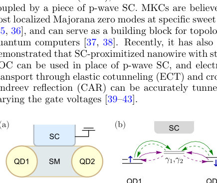 
FIG. 1. (a) A minimal Kitaev chain with tunable gates for the dots and SC-proximitized nanowire. (b) The relevant spin and Andreev levels of the system under a small magnetic field. The blue and green curves (solid, then dashed arrows) illustrate the exchange paths through ECT and CAR.

📷 Fig 2

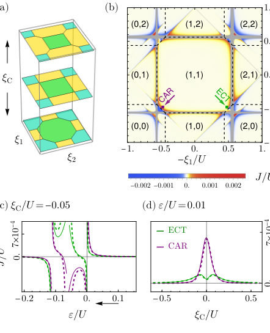 
FIG. 3. (a) The CSD of an even-parity MKC controlled by ξC, with the (1, 1) region in green and the (0, 0), (0, 2), (2, 0), (2, 2) regions in cyan. (b) The exchange energy J over- laid on a CSD slice (ξC = −0.05U) for a typical MKC. The dashed lines represent the CSD boundaries and gray shades are level-crossing regions where the spin subspace cannot be defined [with (1, g, 1) population ≥0.9]. The green and pur- ple arrows indicate detuning paths to the (2, 0) and (0, 0) regions, where the exchange coupling is contributed by ECT and CAR processes. (c) J along the ECT/CAR detuning path (ξ1, ξ2) = (∓U/2 ± ε, U/2 −ε), with ε →0+ corresponding to the green/purple arrow in (b). The paths are...

**Summary.** The paper proposes using a Minimal Kitaev Chain as an advanced coupler for spin qubits. By exploiting the Andreev Bound States within this structure, researchers can achieve strong, gate-tunable coupling while simultaneously engineering a 'sweet spot' that renders the qubit highly immune to charge noise. This results in a significantly enhanced coherence time for solid-state quantum computation.

**Why it may be interesting.** This work directly addresses hardware challenges in solid-state quantum computing by proposing a physical mechanism (MKC/ABS control) to engineer robust, tunable interactions between qubits, which is central to scaling up quantum processors.

Detailed structure

**Main problem.** The primary goal is developing a robust, gate-tunable coupling module for spin qubits that maintains strong interaction while exhibiting high immunity to local charge noise.

**Main result.** Using a Minimal Kitaev Chain (MKC) coupler allows the creation of a 'Kitaev-spin' qubit operating at a sweet spot where coupling is strong and first-order insensitive to charge fluctuations, leading to significantly improved coherence times.

**Method.** The analysis employs quasi-degenerate perturbation theory applied to a hybrid semiconductor/superconductor system to derive an effective anisotropic exchange coupling Hamiltonian for the spin subspace.

**Model / system.** The physical system is a double quantum dot coupled via a Minimal Kitaev Chain (MKC) segment containing Andreev Bound States (ABSs). The model uses a full Hamiltonian analyzed in the even-parity sector, focusing on deriving an effective exchange coupling $J$ mediated by ABSs.

**Key observables.** Inter-qubit coupling strength ($J$), decoherence time ($T_2^*$), and the gradient of the coupling strength ($
abla J$) with respect to control parameters.

**Important parameters / regimes.** Chemical potential of ABS ($\xi_C$), detuning potentials ($\xi_{1,2}$), charging energy ($U_C$), and superconducting coherence length ($\sim 1\mu	ext{m}$).

**Assumptions / limitations.** The analysis assumes the system can be treated in the even-parity sector, neglecting parity poisoning events relative to spin decoherence time.

**Figures summary.** Figures illustrate the physical setup (FIG. 1), energy level diagrams showing induced gaps and coupling ($J$) vs detuning (FIG. 2), and Charge Stability Diagrams (CSD) mapping out operational regimes for tuning $J$ and identifying sweet spots (Fig. 3).

**Paper structure.** The paper progresses by first establishing the physical model using the MKC coupler, deriving the effective Hamiltonian via perturbation theory, identifying control parameters ($\xi_C$), locating the noise-immune 'sweet spot' where $
abla J \approx 0$, and finally benchmarking the resulting qubit coherence time against other encoding schemes.

Abstract

While a minimal Kitaev chain is promised to host unprotected Majorana zero modes, its role for spin qubits is relatively underappreciated. Following recent breakthroughs in the fine control of transport behaviors, we propose to use minimal Kitaev chain as a robust coupling module between spin qubits. Long-distance, anisotropic exchange coupling can be mediated by the Andreev bound states (ABSs) in the hybrid segment. The chemical potential of ABS gives a simple way to selectively control the coupling strength and its response to local perturbations. Moreover, this additional control degree of freedom creates a unique sweet spot, allowing both strong coupling and first-order immunity against charge noise. The protected qubit encoded on the minimal Kitaev chain at the sweet spot is shown to boast over 200 fold improvement in decoherence time.

[↑ back to top](#top)

### [Tunable non-Hermitian skin effect and topological phases in ladders with staggered nonreciprocal inter-leg hopping](http://arxiv.org/abs/2607.11454v1)

**Authors:** Pu-Xuan Li, Qi-Bo Zeng  
**Type:** theory · **Category:** other · **PDF:** <https://arxiv.org/pdf/2607.11454v1>  
**Analysis basis:** full PDF text, analyzed in chunks
**Topic relevance:** `analog quantum simulation` **3/5** · `driven-dissipative phase transition` **3/5** · `methods for driven-dissipative` **3/5** · `non-equilibrium dynamics` **2/5** · `non-equilibrium universality` **2/5** · `Keldysh / 2PI / non-Gaussian methods` **1/5** · `Kondo & dissipative impurity` **1/5** · `correlated / nonlocal dissipation` **1/5**

📷 Fig 1

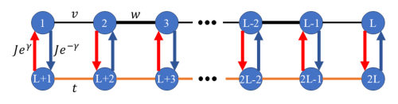 
FIG. 1. (Color online) Schematic illustration of the ladder model. The upper leg is an SSH chain with alternating hop- ping amplitudes v and w, while the lower leg is a uniform tight-binding chain with hopping amplitude t. The inter-leg hopping is nonreciprocal, with amplitudes Jeγ and Je−γ, and alternates between odd and even sites in the two chains.

📷 Fig 2

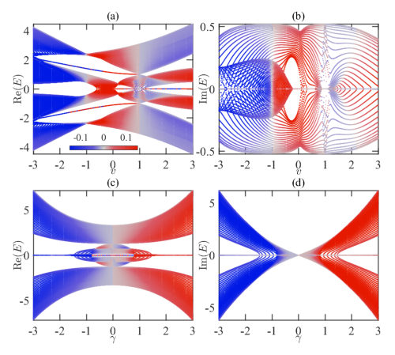 
FIG. 2. (Color online) Energy spectra of the ladder model un- der open boundary conditions. Panels (a) and (b) show the real and imaginary parts of the eigenenergies, respectively, as functions of v for γ = −0.5. The color scale represents the dIPR of the corresponding eigenstates. Positive (nega- tive) dIPR values indicate states localized at the right (left) boundary of the ladder, whereas dIPR ≈0 corresponds to ex- tended states. Panels (c) and (d) show the real and imaginary parts of the eigenenergies, respectively, as functions of γ for v = 1.5. Other parameters are w = t = J = 1 and L = 100.

📷 Fig 3

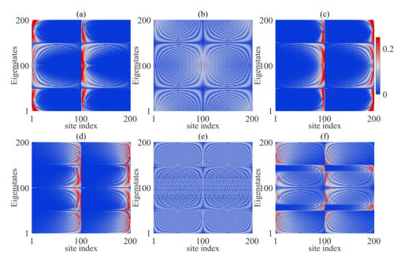 
FIG. 3. (Color online) Spatial distributions of the eigenstates in the ladder model for different values of v: (a) v = −1.5, (b) v = −1.0, (c) v = −0.5, (d) v = 0.5, (e) v = 1.0, and (f) v = 1.5, with γ = −0.5. The eigenstates are ordered according to the real parts of the corresponding eigenenergies. The color scale represents the amplitude |ψ| of the eigenstates. The site indices 1 ≤j ≤100 correspond to the upper leg of the ladder, whereas 101 ≤j ≤200 correspond to the lower leg. Other parameters are w = t = J = 1.

📷 Fig 4

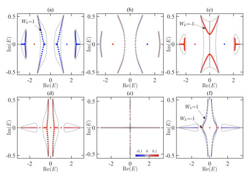 
FIG. 4. (Color online) Energy spectra of the ladder model under open boundary conditions (OBCs, colored dots) and periodic boundary conditions (PBCs, black dots) for γ = −0.5 and different values of v: (a) v = −1.5, (b) v = −1.0, (c) v = −0.5, (d) v = 0.5, (e) v = 1.0, and (f) v = 1.5. The color scale represents the dIPR of the OBC eigenstates. The labels Wk = ±1 denote the spectral winding numbers of the corresponding PBC spectra, which determine the direction of the NHSE under OBCs. Other parameters are the same as those in Fig. 3.

📷 Fig 5

 
Figure 4 compares the energy spectra under OBCs and PBCs for the ladder model with v varying from −1.5 to 1.5, while the other parameters are the same as those in Fig. 3. As shown in Fig. 4, the OBC spectrum is enclosed by the corresponding PBC spectrum except at the crit- ical points v = ±1 [Figs. 4(b) and 4(e)]. At these two critical points, the OBC and PBC spectra coincide and form open arcs rather than closed loops in the complex- energy plane. Consequently, the NHSE is absent under OBCs, consistent with the extended eigenstates shown in Figs. 3(b) and 3(e). For the remaining parameter regimes, the direction of the NHSE can be characterized by the spectral winding number of the PBC...

**Summary.** This work explores a ladder model featuring staggered, nonreciprocal inter-leg hopping to study its impact on non-Hermiticity and topology. The authors show that this specific coupling mechanism allows for the precise tuning of the Non-Hermitian Skin Effect direction and magnitude. Crucially, they map out parameter regimes where robust topological edge modes exist, demonstrating a powerful tool for engineering quantum states in quasi-1D systems.

**Why it may be interesting.** The ability to engineer topological phases and control boundary localization using non-Hermitian terms via structural hopping is highly relevant for designing synthetic quantum materials or optical lattices where directional coupling can be precisely tuned.

Detailed structure

**Main problem.** The study investigates how staggered nonreciprocal inter-leg hopping influences both the non-Hermitian skin effect (NHSE) and topological phases in a ladder lattice.

**Main result.** The research demonstrates that this specific coupling mechanism allows for engineering tunable NHSE, enabling its reversal and energy dependence. Furthermore, it establishes a clear link between nonreciprocity and topology, showing how the system can transition into trivial phases by tuning parameters.

**Method.** The analysis employs theoretical diagonalization of the Hamiltonian under both open and periodic boundary conditions, utilizing diagnostics like the directional Inverse Participation Ratio (dIPR) and spectral/real-space winding numbers.

**Model / system.** The system is a ladder model composed of an Su-Schrieffer-Heeger (SSH) chain coupled to a uniform tight-binding chain via staggered nonreciprocal inter-leg hopping. The Hamiltonian incorporates parameters controlling the SSH hopping ($v$) and the nonreciprocity ($\gamma$).

**Key observables.** Directional Inverse Participation Ratio (dIPR), spectral winding number, real-space winding numbers ($W=\pm1$), zero-energy topological edge modes.

**Important parameters / regimes.** SSH hopping strength ($v$), inter-leg nonreciprocity ($\gamma$).

**Assumptions / limitations.** The analysis assumes the system can be modeled by a tight-binding Hamiltonian and that parameters are real. A limitation noted is potential ambiguity near phase boundaries due to finite precision.

**Figures summary.** Figures illustrate eigenstate localization (dIPR) for varying $v$, compare OBC vs PBC spectra using winding numbers, and present phase diagrams mapping topological regimes ($W=\pm1$) in the $v-\gamma$ plane.

**Paper structure.** The paper systematically analyzes the model by first establishing the role of nonreciprocity in inducing NHSE. It then explores how tuning parameters like $v$ controls the direction and energy dependence of the skin effect, culminating in a phase diagram that maps out topologically nontrivial regimes controlled by $\gamma$.

Abstract

We investigate the non-Hermitian skin effect (NHSE) and topological phases in a ladder model with staggered nonreciprocal inter-leg hopping, consisting of an Su-Schrieffer-Heeger (SSH) chain coupled to a normal tight-binding chain. By tuning the system parameters, we show that the direction of the NHSE under open boundary conditions can be reversed and can even become energy dependent. The NHSE is further characterized by the spectral winding number under periodic boundary conditions. We further demonstrate that the inter-leg coupling significantly enlarges the topologically nontrivial parameter regime. Remarkably, the zero-energy topological edge modes reside on different legs of the ladder and are characterized by real-space winding numbers $W=\pm1$. Furthermore, increasing the nonreciprocity of the inter-leg hopping modifies the topological phase boundaries and eventually drives the system into a topologically trivial phase. Our results establish staggered nonreciprocal inter-leg hopping as an effective mechanism for engineering both the non-Hermitian skin effect and topological phases in ladder systems.

[↑ back to top](#top)

### [Krylov Complexity for Time-Dependent Hamiltonians](http://arxiv.org/abs/2607.10454v1)

**Authors:** Amin Faraji Astaneh, Parsa Kafashi  
**Type:** theory · **Category:** statistical mechanics · **PDF:** <https://arxiv.org/pdf/2607.10454v1>  
**Analysis basis:** full PDF text, analyzed in chunks
**Topic relevance:** `analog quantum simulation` **3/5** · `methods for driven-dissipative` **3/5** · `non-equilibrium dynamics` **3/5** · `entanglement & information structure` **2/5** · `non-equilibrium universality` **2/5** · `Keldysh / 2PI / non-Gaussian methods` **1/5** · `driven-dissipative phase transition` **1/5**

📷 Fig 1

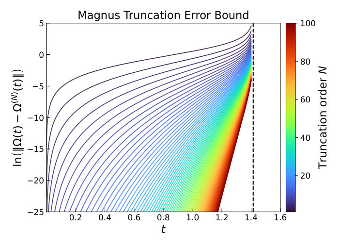 
Figure 1: Magnus truncation error bound for the time-dependent Hamiltonian (42). The figure shows the bound in (60) as a function of time for truncation orders N = 1 to 100. The vertical dashed line indicates the convergence radius in time, beyond which the bound diverges. Higher truncation orders yield exponentially improved accuracy within the convergence regime.

📷 Fig 2

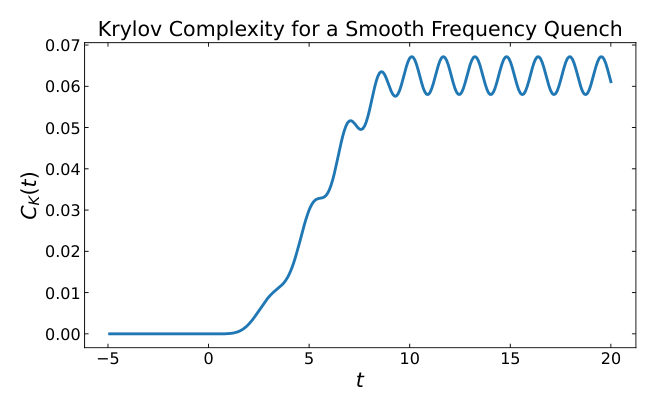 
Figure 2: Krylov complexity for a soft quench with parameters ω0 = 1, ω1 = 2, and τ = 10.

📷 Fig 3

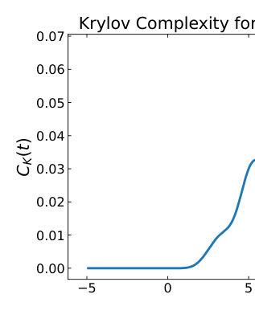 
Fig. 3.

📷 Fig 4

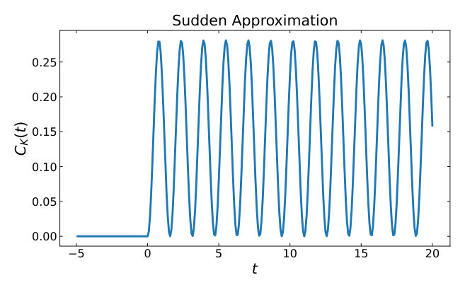 
Figure 3: Krylov complexity for an almost sudden quench with parameters ω0 = 1, ω1 = 2, and τ = 0.1.

📷 Fig 5

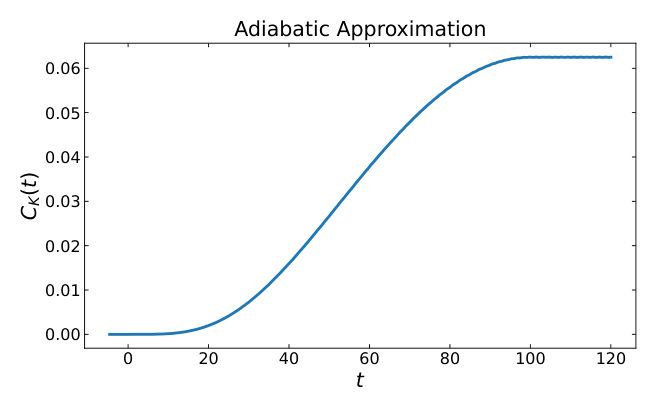 
Figure 4: Krylov complexity for a very slow soft quench with parameters ω0 = 1, ω1 = 2, and τ = 100.

**Summary.** This paper presents advanced theoretical techniques to calculate Krylov complexity for quantum states evolving under time-dependent Hamiltonians. It addresses the limitations of standard approximations by introducing a robust piecewise Magnus expansion method. This provides physicists with practical tools to analyze complexity growth in diverse, non-equilibrium quantum systems.

**Why it may be interesting.** This work provides essential computational tools (piecewise Magnus) for analyzing quantum dynamics in non-equilibrium settings, which is crucial for understanding complex phenomena in driven many-body systems relevant to AMO physics and quantum optics.

Detailed structure

**Main problem.** The paper investigates Krylov complexity for quantum states evolving under time-dependent Hamiltonians, which is complicated by non-commuting time evolution operators.

**Main result.** It develops practical methods, including the piecewise Magnus expansion, to reliably compute complexity growth in general time-dependent systems where global approximations fail.

**Method.** The core methodology involves extending Floquet theory and utilizing the Magnus expansion, particularly developing a piecewise variant for long-time evolution analysis.

**Model / system.** The study applies to general time-dependent quantum systems, including periodically driven models (analyzed via Floquet theory) and quadratic oscillators.

**Key observables.** Krylov complexity ($C_K(t)$), which quantifies how an initial state explores the Hilbert space under time evolution.

**Important parameters / regimes.** Driving period ($T$), time length ($t$), commutator sizes, and convergence parameters ($\delta\xi$).

**Assumptions / limitations.** The global Magnus expansion is assumed to fail or lose accuracy over long time intervals, necessitating piecewise approximations.

**Figures summary.** Figure 1 illustrates the bound on the Magnus truncation error; Figure 4 shows Krylov complexity for a very slow soft quench, demonstrating adiabatic behavior.

**Paper structure.** The paper progresses from establishing the challenge of non-commuting Hamiltonians to introducing Floquet theory and the standard Magnus expansion. It then details the necessary extension using piecewise methods for general time dependence, concluding with specific derivations for solvable models like squeezed states.

Abstract

We investigate Krylov spread complexity for states evolving under time-dependent Hamiltonians. For periodically driven systems, we formulate the problem within Floquet theory and show how the Magnus expansion provides a systematic approximation when the Floquet Hamiltonian is not available in closed form. We then extend this framework beyond periodic driving and demonstrate that, in addition to the globally truncated Magnus expansion, a piecewise Magnus expansion provides a reliable method when the global expansion loses convergence or accuracy. Our results provide practical tools for analyzing complexity growth in a broad class of time-dependent quantum systems.

[↑ back to top](#top)

### [Quantum Multiscale Modeling: A Hierarchy of Algorithms for Complex Chemical Systems](http://arxiv.org/abs/2607.11217v1)

**Authors:** Seenivasan Hariharan, Kareljan Schoutens, Sachin Kinge, Lucas Visscher  
**Type:** theory · **Category:** quantum information and computing · **PDF:** <https://arxiv.org/pdf/2607.11217v1>  
**Analysis basis:** full PDF text, analyzed in chunks
**Topic relevance:** `methods for driven-dissipative` **3/5** · `non-equilibrium dynamics` **3/5** · `entanglement & information structure` **2/5** · `non-equilibrium universality` **2/5** · `Keldysh / 2PI / non-Gaussian methods` **1/5** · `analog quantum simulation` **1/5** · `correlated / nonlocal dissipation` **1/5** · `driven-dissipative phase transition` **1/5** · `quantum measurements` **1/5**

📷 Fig 1

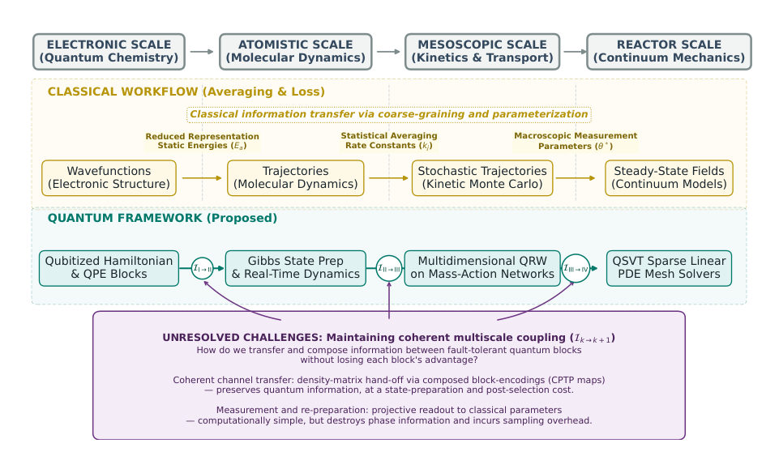 
Figure 1: Comparison of classical and fault-tolerant quantum workflows across electronic, atomistic, mesoscopic, and continuum scales. Classical approaches progressively compress information through averaging, reduced representations, and measurement. The proposed quantum hierarchy aims to compose coherent transformations across scales using fault- tolerant quantum algorithms. Interface nodes Ik→k+1 denote unresolved challenges in main- taining coherent multiscale coupling.

**Summary.** This paper proposes a novel theoretical framework for achieving end-to-end quantum advantage in multiscale simulations of complex chemistry. It moves beyond merely applying quantum algorithms to individual physical regimes by rigorously analyzing the inter-scale information transfer as a composition of quantum channels. The central argument is that the fidelity of this boundary communication dictates whether a true, scalable quantum speedup can be realized.

**Why it may be interesting.** This work bridges quantum computation theory with complex condensed matter/surface science modeling. For AMO physicists, it suggests that future breakthroughs in simulating large chemical systems might require treating the entire simulation pipeline—not just the core Hamiltonian evolution—as a quantum information problem.

Detailed structure

**Main problem.** The primary challenge is developing a systematic, coherent quantum framework for multiscale modeling that can maintain quantum advantage across disparate physical scales (electronic to continuum). The authors aim to treat inter-scale information transfer as a composition of quantum channels.

**Main result.** End-to-end quantum advantage depends critically on the structure and fidelity of the information transfer between algorithmic layers, rather than solely on achieving speedups at individual physical scales. They propose viewing this interface as a quantum channel composition problem.

**Method.** The work maps established classical multiscale techniques (e.g., DFT $
ightarrow$ MD $
ightarrow$ kMC $
ightarrow$ PDEs) onto corresponding fault-tolerant quantum algorithms (QPE, Hamiltonian simulation, QRW, QSVT solvers). The core methodology involves analyzing the information flow across these boundaries as composed quantum channels.

**Model / system.** The framework is demonstrated using complex chemical systems, specifically CO oxidation over Pt(111), which requires coupling four distinct physical scales: electronic ($\sim 1$ Å), atomistic ($\sim 10$ nm), mesoscopic ($\sim 1 \mu$m), and continuum ($\sim 1$ cm).

**Key observables.** Conversion, selectivity, operando stability, adsorption energies ($\Delta E_{	ext{ads}}$), activation barriers ($E_a$), turnover frequency (TOF), and the propagation of quantum measurement uncertainty.

**Important parameters / regimes.** The scales themselves define key parameters: time/length separation (fs to s), temperature dependence ($T$), coverage ($	heta$), and algorithmic constraints like memory architecture and matrix conditioning.

**Assumptions / limitations.** It is assumed that fault-tolerant quantum algorithms exist for each scale, but the primary focus shifts to characterizing the information loss or preservation during the transition between these layers. The authors highlight several unresolved questions regarding complexity bounds and error propagation.

**Figures summary.** The notes suggest a hierarchical structure (Table 1) mapping physical scales to classical methods and their quantum analogues, emphasizing the proposed 'quantum channel' for inter-scale transfer.

**Paper structure.** The paper systematically identifies the four necessary physical scales, maps canonical algorithms onto them, and then focuses heavily on developing the mathematical formalism to treat the information passing *between* these layers as a composed quantum map, culminating in defining key open questions regarding uncertainty propagation and total query complexity.

Abstract

Multiscale modeling of complex chemical systems requires algorithms that operate coherently across electronic, atomistic, mesoscopic, and continuum scales. While quantum algorithms have been proposed for each regime, no systematic framework exists to compose them across scale boundaries. Here, we identify the conditions under which fault-tolerant quantum algorithms might preserve scale-specific quantum advantages. We map quantum phase estimation, Hamiltonian simulation with Gibbs state preparation, quantum random walks, and quantum partial differential equation solvers onto electronic structure, molecular dynamics, mesoscopic kinetics, and continuum reactor physics, respectively. Crucially, these correspondences do not imply unconditional end-to-end quantum advantage; speedups depend heavily on state preparation, memory architectures, matrix conditioning, and classical readout costs. Six unresolved questions define this composition problem, illustrated via a quantum hierarchy for \ce{CO} oxidation over \ce{Pt(111)}. We propose viewing inter-scale transfer as a quantum channel composition problem at the interface of algorithm design and non-equilibrium statistical mechanics, and ask whether information loss at scale boundaries is intrinsic to multiscale modeling or merely a consequence of lossy classical transduction between algorithmic layers. The resulting roadmap suggests that multiscale quantum advantage is governed primarily by the structure of information transfer between algorithmic layers, rather than by performance at individual scales alone.

[↑ back to top](#top)

### [Unified Phase-Space Mapping of Quantum Observables in a Multi-Driven Vapor: Resonance Fluorescence as an Electrometry Probe and Correlation Witness](http://arxiv.org/abs/2607.10083v1)

**Authors:** M. S. Ateto, Emad K. Jaradat, S. M. Abo-Dahab  
**Type:** theory · **Category:** other · **PDF:** <https://arxiv.org/pdf/2607.10083v1>  
**Analysis basis:** full PDF text, analyzed in chunks
**Topic relevance:** `entanglement & information structure` **3/5** · `methods for driven-dissipative` **3/5** · `Keldysh / 2PI / non-Gaussian methods` **2/5** · `non-equilibrium dynamics` **2/5** · `analog quantum simulation` **1/5** · `correlated / nonlocal dissipation` **1/5** · `driven-dissipative phase transition` **1/5** · `interference shaping light` **1/5** · `quantum measurements` **1/5**

📷 Fig 1

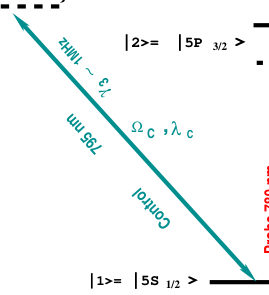 
FIG. 1: The four-level V+Θ system under consideration.

📷 Fig 2

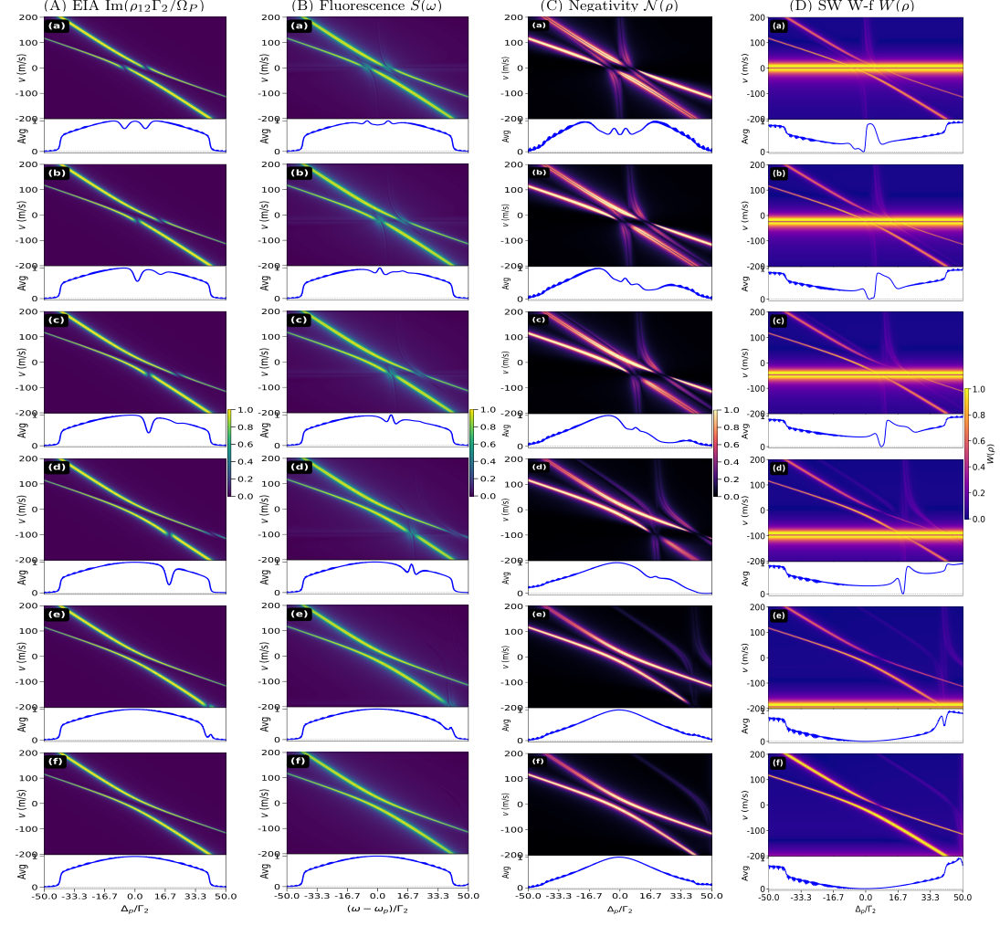 
FIG. 2: Doppler-resolved maps of (A) normalized absorption Im{ρ12Γ2/ΩP }, (B) fluorescence S(ω, v), (C) negativity N AB Dop, and (D) SW Wigner function W(ρ), for ∆D = 0, ΩC = 3, ΩD = 12, and ∆C = 0, 5, 10, 20, 40, 50 Γ2 from (a) to (f). All fields co-propagate and are directed opposite to the atomic motion.

📷 Fig 3

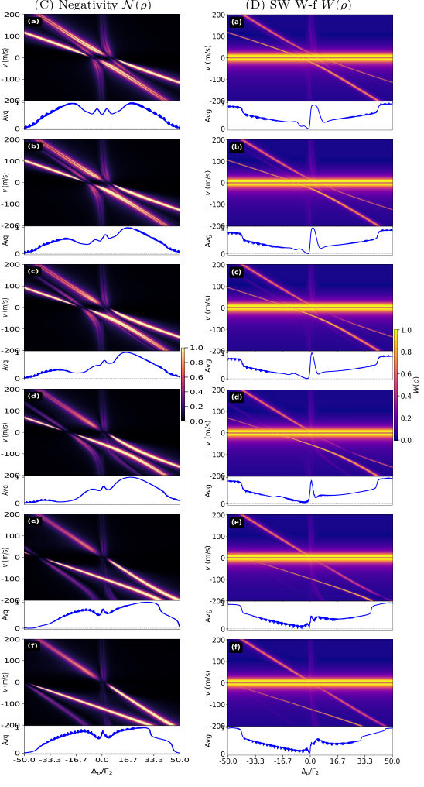 
FIG. 3: Same as Fig. 2, but for ∆C = 0 and ∆D = 0, 5, 10, 20, 40, 50 Γ2 from (a) to (f).

📷 Fig 4

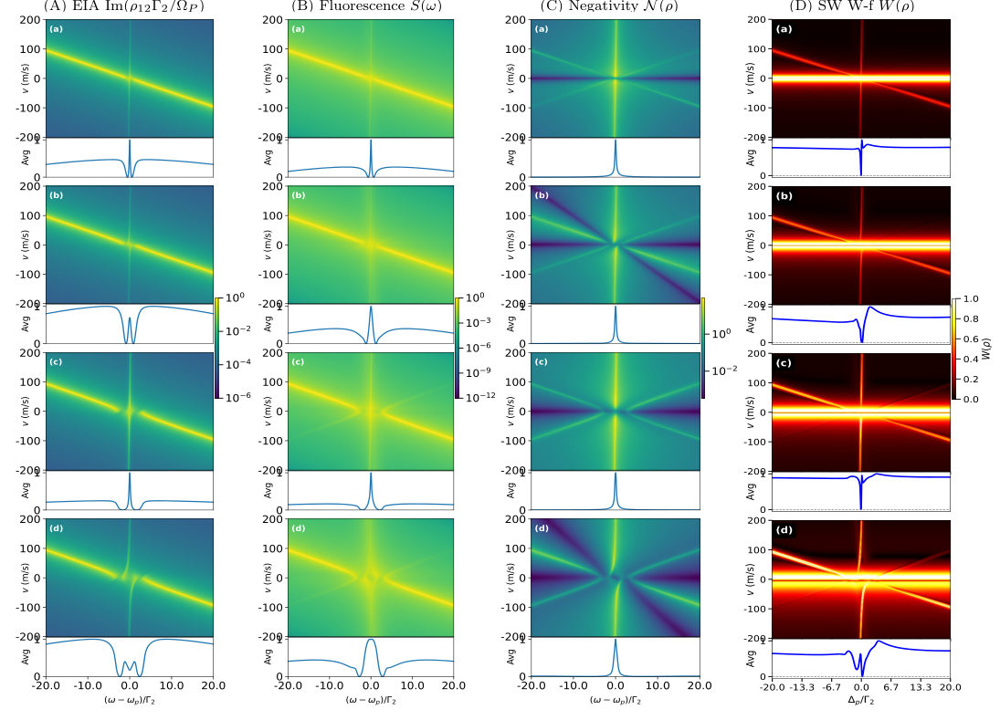 
FIG. 4: Velocity-resolved maps (integrands) and Doppler-averaged profiles for absorption (A), fluorescence (B), negativity (C), and Wigner function (D) under varying intensities (ΩC, ΩD): (a) (Γ2, Γ2), (b) (2Γ2, Γ2), (c) (3Γ2, 3Γ2), and (d) (5Γ2, 2Γ2). Balanced fields isolate a velocity-insensitive coherence ridge at ∆P = 0, maximizing EIA contrast and phase-space correlations, whereas intensity asymmetry splits the resonance channels and induces severe dephasing.

📷 Fig 5

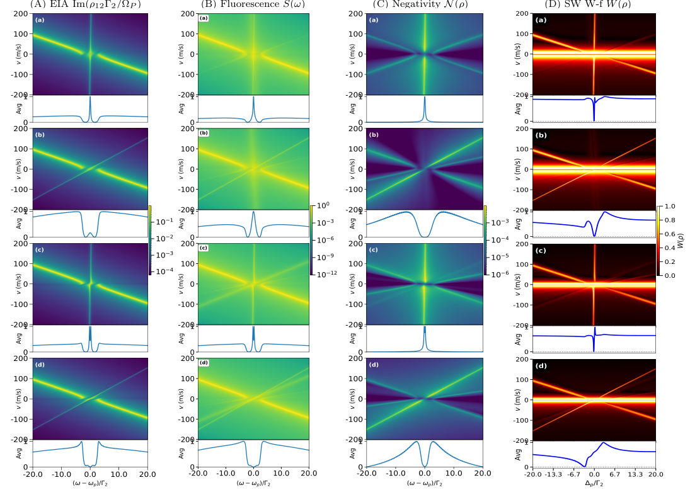 
FIG. 5: Influence of wavelength configuration on the four observables for fixed intensities (ΩC, ΩD) = (3Γ2, 12Γ2): (a) fully matched, (b) λD mismatch, (c) λC mismatch, and (d) complete mismatch. A λC mismatch suppresses the Raman pole generating an AT doublet, while a λD mismatch activates a linear velocity term that rotates the resonance trajectories, smearing the ensemble quantum correlations.

**Summary.** The paper presents a unified theory mapping various quantum observables—including entanglement and phase-space structure—onto the resonance fluorescence signal in multi-driven atomic vapors. By utilizing the SW Wigner function, it shows that fluorescence is remarkably robust against Doppler broadening, making it an excellent, non-invasive probe for characterizing coherence and quantifying quantum correlations.

**Why it may be interesting.** This work provides a powerful theoretical bridge between complex quantum information measures (entanglement) and easily measurable spectroscopic quantities (fluorescence), offering practical tools for quantum sensing in warm atomic media.

Detailed structure

**Main problem.** To develop a unified framework for analyzing multiple quantum observables (absorption, fluorescence, entanglement) in a multi-driven atomic vapor while accounting for Doppler broadening.

**Main result.** The study establishes that resonance fluorescence acts as a robust, eigenvalue-free observable capable of tracking coherence geometry and witnessing quantum correlations despite severe Doppler dephasing.

**Method.** It employs a density-matrix formalism combined with the Stratonovich-Weyl (SW) Wigner function to map diverse observables onto a common phase-space structure.

**Model / system.** The system is a four-level atomic vapor driven by multiple lasers in a V+ladder configuration, analyzed using the Lindblad master equation and incorporating thermal velocity averaging for Doppler broadening.

**Key observables.** Absorption spectrum ($\chi$), Resonance Fluorescence spectrum ($S(\omega)$), Entanglement Negativity, and SW Wigner quasiprobability distribution $W(\psi)$.

**Important parameters / regimes.** Doppler-broadened regime, strong driving fields (Rabi frequencies $\Omega$), detunings ($\Delta$), and the coherence-driven phase-space structure.

**Assumptions / limitations.** The analysis relies on thermal velocity averaging and assumes that fluorescence retains spectral features under strong driving where susceptibility methods fail.

**Figures summary.** Figures illustrate the four-level V+Theta system setup, detailing the Hamiltonian formulation, master equation dynamics, and the derivation of both susceptibility and fluorescence spectra via velocity averaging.

**Paper structure.** The paper progresses from defining the physical setup (V+ladder system) to developing the density-matrix formalism. It then introduces the SW Wigner function for phase-space mapping before systematically analyzing how fluorescence and entanglement negativity emerge as complementary, experimentally accessible diagnostics.

Abstract

We present a unified, geometry-resolved framework for analyzing absorption, resonance fluorescence, entanglement negativity, and phase-space quasiprobability in Doppler-broadened four-level atomic vapor. Using a density-matrix formalism with thermal velocity averaging and exact dressed-state diagonalization, we show that these observables constitute complementary projections of a common coherence-driven phase-space structure governed by multiphoton interference. Central to this framework is the Stratonovich-Weyl (SW) Wigner function, which provides a unified phase-space representation incorporating both populations and coherences. Direct comparison reveals a near one-to-one correspondence between SW quasiprobability distributions and entanglement landscapes, with geometry-dependent features, including hyperbolic dispersion asymptotes and split resonance ridges, consistently preserved. Furthermore, isolating the Doppler-odd component yields an eigenvalue-free proxy that captures the coherence geometry underlying entanglement negativity, providing a non-invasive quantum correlation witness. At the same time, resonance fluorescence emerges as a thermally robust observable: unlike susceptibility-based absorption, its additive pole weighting preserves sharp Autler-Townes spectral features under strong driving. This robustness enables fluorescence to accurately track bright dressed states and entanglement extrema despite severe Doppler dephasing, establishing its dual role as a sensitive electrometry probe and correlation witness. By combining a coherence-resolved description with a Doppler-sensitive phase-space representation, the proposed framework offers an experimentally accessible, eigenvalue-free approach to quantum state characterization, enabling Doppler-resilient fluorescence-based quantum sensing and precision field electrometry in warm atomic media.

[↑ back to top](#top)

### [Extending the Mpemba effect to the underdamped realm](http://arxiv.org/abs/2607.11797v1)

**Authors:** Shahaf Aharony Shapira, Gene Chen, Marija Vucelja, Oren Raz  
**Type:** theory · **Category:** statistical mechanics · **PDF:** <https://arxiv.org/pdf/2607.11797v1>  
**Analysis basis:** full PDF text, analyzed in chunks
**Topic relevance:** `methods for driven-dissipative` **3/5** · `non-equilibrium dynamics` **3/5** · `driven-dissipative phase transition` **2/5** · `non-equilibrium universality` **2/5** · `Frenkel-Kontorova` **1/5** · `Keldysh / 2PI / non-Gaussian methods` **1/5** · `Kondo & dissipative impurity` **1/5** · `correlated / nonlocal dissipation` **1/5**

📷 Fig 1

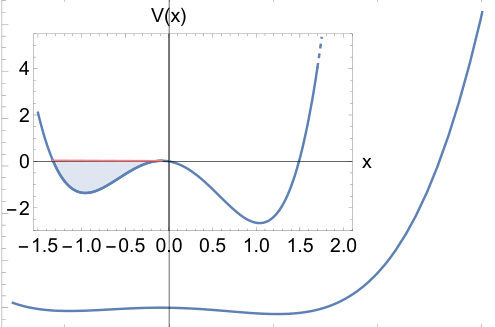 
Figure 1. The potential V (x) used for numerical simulations throughout this manuscript, given by Eq. (8) with parameters: d1 = −0.65, d2 = −8, d4 = 8, and the rest are zero [7]. We used an asymmetric spatial domain x ∈[−1.5, 3.5]. Inset: A focus on low energies, where the structure of the asymmetric double-well is more apparent. A particle is considered to be in the left well (shaded region) for xleft ∈[−1.33, −0.08].

📷 Fig 2

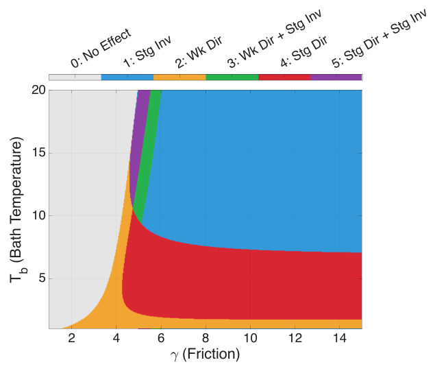 
Figure 2. The ‘Mpemba phases’ diagram of an underdamped asymmetric double-well potential. We present the type of MEs (color) for every set of dissipation γ (x-axis) and bath temperature Tb (y-axis). Given these parameters, the KK operator was discretized, diagonalized, and the coefficient of slow relaxation a2 was evaluated. When the leading nonzero eigenvalue is complex, the corresponding norm of the projection onto the leading 2D eigenspace is used instead. Nonmonotonicity (vanishing) indicates a weak (strong) effect, and a cooling (heating) is referred to as a direct (inverse) effect. Details of the numerics are given in [55]. Relative to the potential (Fig. 1), weak (strong) dissipation...

📷 Fig 3

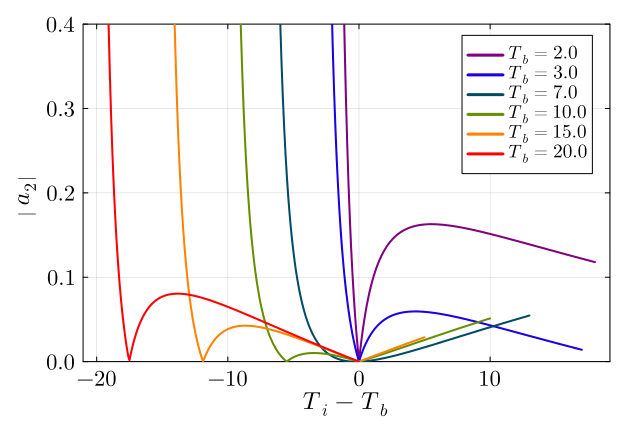 
Figure 3. The normalized coefficient associated with the slow relaxation mode, a2, in the overdamped regime as a function of the initial temperature, shown for different bath temperatures. The figure illustrates the transition between the direct (Tb &lt; 7) and inverse (Tb &gt; 7) Mpemba effects. The discretization scheme used for the corresponding Fokker–Planck operator follows [57].

📷 Fig 4

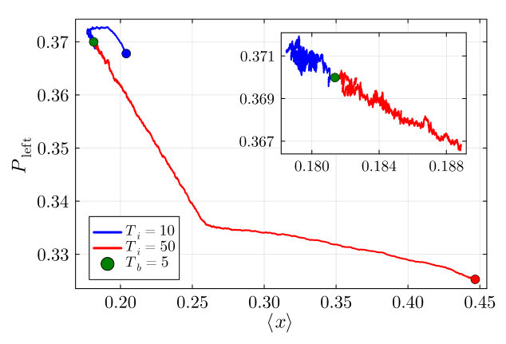 
Figure 4. Cooling under strong dissipation: Relaxation from two different initial temperatures, Ti = 10 (blue) and Ti = 50 (red), toward the bath temperature Tb = 5 (green dot), for a relatively large damping coefficient γ = 10. For clarity, the results are projected onto the ⟨x⟩–Pleft plane. During the late stages of relaxation, shown in the inset, the two states approach the bath from opposite directions, indicating the existence of a strong ME at an intermediate temperature [14]. Further details are provided in the SM [55].

📷 Fig 5

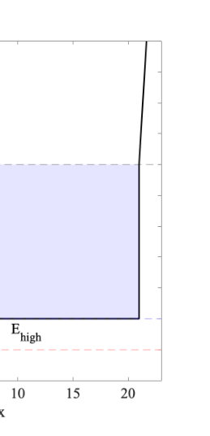 
Figure 5. A double-well potential that has a strong inverse Mpemba effect even in the weak-coupling limit.

**Summary.** This paper investigates whether the Mpemba effect—where hot objects cool faster than cold ones—occurs in systems with inertia. By analyzing the Klein-Kramers equation for a Brownian particle, the authors show that while the effect is robustly present in the overdamped limit, its existence in the underdamped regime depends critically on the complexity of the confining potential.

**Why it may be interesting.** While focused on classical statistical mechanics, the mathematical machinery involving non-Hermitian operators (KK equation) and spectral analysis is highly relevant to open quantum systems dynamics, particularly when studying relaxation rates or thermalization processes near phase transitions.

Detailed structure

**Main problem.** The research extends the Mpemba effect, a counterintuitive cooling phenomenon, from classical overdamped systems to the underdamped regime where inertial effects are significant.

**Main result.** The Mpemba effect persists in the underdamped regime for complex potentials (like double-well), although it is absent for simple single-well potentials in the weak damping limit.

**Method.** The analysis employs spectral decomposition of the Klein-Kramers equation and uses perturbation theory to expand observables like the overlap coefficient across different damping regimes.

**Model / system.** The system modeled is a Brownian particle diffusing in a 1D potential V(x), analyzed using the full dynamics described by Langevin equations and governed by the Klein-Kramers (KK) equation for the probability density function.

**Key observables.** The overlap coefficient $a_2(T_i, T_b)$ is the primary diagnostic tool used to determine if the Mpemba effect exists, requiring a nonmonotonic dependence on initial temperature ($T_i$).

**Important parameters / regimes.** Damping rate ($\gamma$), bath temperature ($T_b$), and the damping regime (overdamped vs. underdamped).

**Assumptions / limitations.** The analysis assumes classical Markovian dynamics, focusing on the long-time relaxation limit of the system.

**Figures summary.** Figures illustrate 'Mpemba phases' diagrams showing ME types dependence on damping and bath temperature, and show cooling trajectories demonstrating strong ME behavior in specific regimes.

**Paper structure.** The paper progresses by first establishing the problem extension to underdamped dynamics, then developing perturbative methods using spectral decomposition of the KK operator, culminating in deriving expressions for the overlap coefficient that confirm the persistence of the effect.

Abstract

The Mpemba effect is the counterintuitive phenomenon in which an initially hotter system cools faster than a colder, otherwise identical system. It has been experimentally demonstrated in various classical overdamped systems. Here, we explore the existence of the same effect in a regime where inertia cannot be neglected, namely, the underdamped regime. We consider the underdamped dynamics of a Brownian particle in a potential. We show perturbatively that, if the effect exists in the overdamped limit, it persists for sufficiently large but finite damping. In the ultra-weak-damping limit, we show that the effect cannot occur for smooth confining single-well potentials with canonical initial states, but can arise in more complex potentials. We demonstrate our results numerically using double-well potentials, the canonical setting for the Mpemba effect in the overdamped limit.

[↑ back to top](#top)

### [Fixed-Protocol Amortized MPS Tomography with Conformalized Predictive Uncertainty](http://arxiv.org/abs/2607.11273v1)

**Authors:** Jian Xu, Delu Zeng, John Paisley, Qibin Zhao  
**Type:** both · **Category:** numerical methods · **PDF:** <https://arxiv.org/pdf/2607.11273v1>  
**Analysis basis:** full PDF text, analyzed in chunks
**Topic relevance:** `methods for driven-dissipative` **3/5** · `quantum measurements` **3/5** · `analog quantum simulation` **2/5** · `measurement-induced transitions` **2/5** · `Keldysh / 2PI / non-Gaussian methods` **1/5** · `QC/QI experiment` **1/5** · `driven-dissipative phase transition` **1/5** · `entanglement & information structure` **1/5**

📷 Fig 1

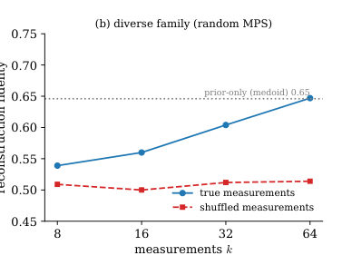 
Figure 3: Integrity controls. (a) On a concentrated family, a k=0 prior-only medoid (0.997) dom- inates and true ≈shuffled: the measurements are not used, so “few-measurement fidelity” is mem- orization. (b) On a diverse family the medoid is far from optimal and true reconstruction separates from shuffled, with the gap growing in the budget k—genuine measurement information. Both con- trols are prerequisites for interpreting any learned-QST fidelity.

📷 Fig 2

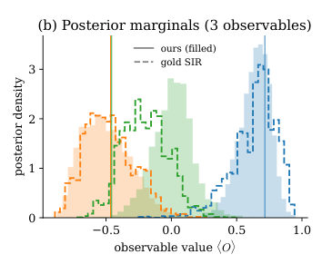 
Figure 4: Approach A targets the intended posterior (n=6). (a) Posterior means of the flow sam- pler vs. a gold-standard SIR posterior, over 25 states and 2n local observables, lie on the diagonal (r=0.98). (b) Example posterior marginals (three observables): the sampler’s draws (filled) overlap the SIR posterior (dashed); vertical lines are the true values. This confirms the generative-prior route is a genuine posterior, not a relabelled point estimate.

📷 Fig 3

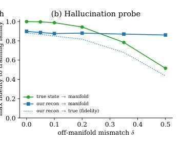 
Figure 5: Out-of-distribution behaviour of Approach A (physical family, n=6). (a) As the true state is pushed off the manifold (mismatch δ), fidelity degrades gracefully. (b) Hallucination probe: the reconstruction stays near the training family (blue) while the true state leaves it (green); the reconstruction’s fidelity to the true state (dotted) declines with δ rather than staying spuriously high.

📷 Fig 4

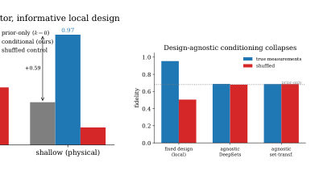 
Figure 6: Left: the measurement design is the lever—informative local Paulis lift fidelity from 0.79 to 0.95 over random Paulis (random family). Middle: headline result—the conditional estimator beats the k=0 prior-only baseline (arrows: +0.27 random, +0.59 shallow) and the shuffled control collapses. Right: making the estimator design-agnostic (training over variable random subsets) collapses it to the family mean (true = shuffled), for both a DeepSets and a set-transformer encoder.

📷 Fig 5

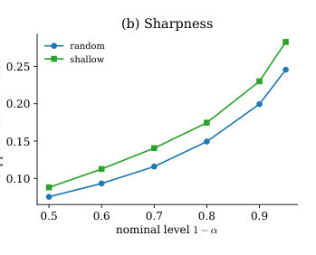 
Figure 7: Calibration of the dropout predictive ensemble over the 2n local Z/X observables (con- formal, E=24 samples, 10 splits). (a) Empirical coverage tracks the nominal level across the range (ideal: diagonal). (b) Interval width stays small (physical range [−1, 1]), because the high-fidelity reconstruction concentrates the predictive ensemble. Raw (uncalibrated) coverage is 69–72% at the 90% level.

**Summary.** This paper introduces a novel, fixed-protocol deep learning estimator for Quantum State Tomography using Matrix Product States (MPS). By conditioning the estimation on carefully chosen local Pauli measurements rather than random ones, the method achieves high reconstruction fidelity with limited data. It provides a scalable and hardware-testable framework for characterizing quantum states in complex physical systems.

**Why it may be interesting.** This work provides advanced machine learning tools for quantum state reconstruction that are directly applicable to characterizing complex quantum states generated in AMO experiments (e.g., trapped ions or cold atoms) where full tomography is impossible.

Detailed structure

**Main problem.** Quantum State Tomography (QST) is sample-starved, requiring an efficient method to estimate unknown quantum states from limited measurement data.

**Main result.** A fixed-protocol amortized MPS estimator, conditioned on informative local Pauli measurements, achieves high fidelity ($\approx 0.95$) significantly better than prior-only estimates and scales polynomially with system size.

**Method.** The authors propose a direct mapping (amortized estimator) from measured Pauli expectation values to Matrix Product State (MPS) cores, bypassing full posterior sampling while using gauge-invariant loss functions for training.

**Model / system.** The focus is on estimating pure quantum states $|\psi
angle$ within an $n$-qubit system, parameterized efficiently using the Matrix Product State (MPS) core representation.

**Key observables.** Fidelity ($	ext{fid}$), reconstruction intervals (coverage), and measurement gain over prior-only estimates.

**Important parameters / regimes.** System size ($n$, up to 20 qubits), bond dimension ($\chi$), and the set of measured local Pauli operators.

**Assumptions / limitations.** The performance relies heavily on designing informative, local Pauli measurements rather than random ones; the conformal calibration provides marginal coverage but not necessarily simultaneous coverage for all observables.

**Figures summary.** Figures illustrate the workflow from structured state families and informative Paulis to MPS cores, showing reconstruction estimates and calibrated uncertainty intervals. Tables compare fidelity gains across varying shot budgets and against classical baselines.

**Paper structure.** The paper establishes the QST challenge, compares generative prior methods (Approach A) with a novel fixed-protocol direct estimator (Approach B), details the measurement design using local Paulis, validates performance via ablation studies, and concludes with hardware testing on IBM devices.

Abstract

Quantum state tomography is sample-starved, and the states one prepares live on a narrow, learnable manifold. A $k{=}0$ prior-only control shows that on concentrated families a prior estimate is already near-optimal, so ``high fidelity at few measurements'' can be family memorization rather than tomography; genuine measurement-efficiency needs a model that conditions on the measurements and demonstrably uses them. On a shared matrix-product-state (MPS) core parameterization we study two routes. Approach~A learns a generative prior over MPS cores with measurement-guided posterior inference (gold-standard-validated, but whose few-measurement accuracy the control shows is largely the prior). Approach~B, our main proposal, is a \emph{fixed-protocol amortized} MPS estimator trained once with a gauge-invariant fidelity loss; we deliberately do not rest it on a permutation-invariant set encoder (a plain MLP matches it). The decisive lever is the measurement design: motivated by the fact that local reduced density matrices determine a $χ$-MPS, conditioning on an \emph{informative local} Pauli set rather than random strings turns a modest, memorization-prone estimator into a high-fidelity one ($\approx\!0.95$, up to $+0.59$ over prior-only, decisively passing a shuffled-measurement control). A dropout ensemble, conformally recalibrated, gives $\approx\!90\%$-coverage intervals -- including for observables never measured, where a shot-based interval does not exist. Quality holds as the system grows (fidelity $0.90$ at $n{=}10$, gain \emph{growing} in $n$; $0.88$ at bond dimension $χ{=}4$), the parameterization is polynomial (native contraction to $20$ qubits), and we close the loop on IBM hardware ($5$ states at $0.97$ from hardware-measured Paulis).

[↑ back to top](#top)

### [Gram-Certified Resource Continuation for Structured Quantum Representation Audits](http://arxiv.org/abs/2607.10360v1)

**Authors:** Azadeh Alavi, Fatemeh Kouchmeshki, Hossein Akhoundi, Abdolrahman Alavi  
**Type:** theory · **Category:** numerical methods · **PDF:** <https://arxiv.org/pdf/2607.10360v1>  
**Analysis basis:** full PDF text, analyzed in chunks
**Topic relevance:** `analog quantum simulation` **3/5** · `methods for driven-dissipative` **3/5** · `entanglement & information structure` **2/5** · `non-equilibrium dynamics` **2/5** · `Keldysh / 2PI / non-Gaussian methods` **1/5** · `correlated / nonlocal dissipation` **1/5** · `correlated cavity matter` **1/5** · `driven-dissipative phase transition` **1/5**

📷 Fig 1

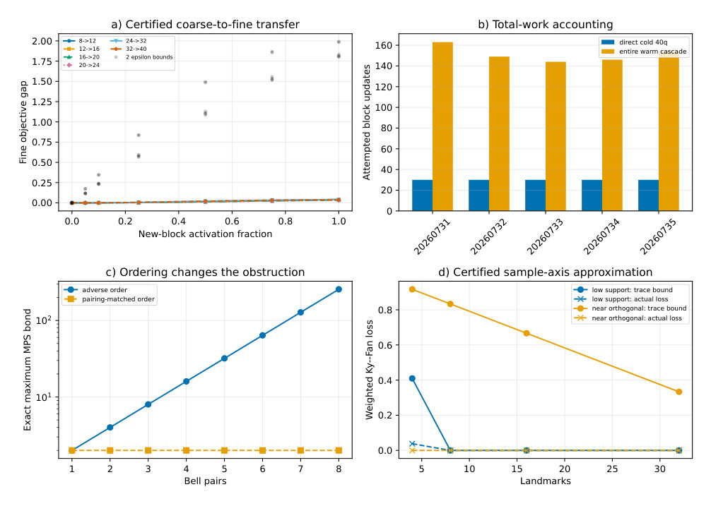 
Figure 1: Executed structured synthetic controls. a, transferred-flag objective gaps and their 2ε bounds. b, complete cascade work versus a direct cold 40-qubit fit. c, exact matrix-product-state (MPS) bond dependence on Bell-pair ordering. d, landmark losses and residual-trace bounds in favorable and unfavorable support regimes

**Summary.** This paper introduces Gram-certified resource continuation methods to rigorously audit approximations in large-scale quantum state simulations. It develops mathematical diagnostics based on amplitude overlaps to quantify the error incurred when moving from low-resource (coarse) models to high-resource (fine) ones. The work provides necessary conditions for 'warm starting' complex quantum computations, highlighting both theoretical guarantees and practical computational pitfalls.

**Why it may be interesting.** For AMO/open quantum systems, this provides rigorous tools to assess the validity of using low-rank or truncated representations (like MPS/TT) when simulating complex dynamics, offering a mathematical audit beyond simple convergence checks.

Detailed structure

**Main problem.** The core problem is determining when an approximation or solution obtained using a computationally cheaper resource model remains mathematically justified as an initialization for a more complex, richer quantum representation.

**Main result.** The authors provide rigorous bounds and certificates (Gram-certified continuation) showing that the suboptimality gap between coarse and fine representations can be quantified, though complete cascade transfers often incur prohibitive computational costs without objective improvement.

**Method.** They develop mathematical diagnostics using amplitude overlaps to construct Gram matrices, allowing for the comparison of spectral properties between lifted coarse density operators and true fine density operators without full materialization.

**Model / system.** The work focuses on structured quantum representation workloads involving $n$-qubit pure states, which are too large to store densely. The structure is modeled using nested projectors (flags) connecting 'coarse' approximations to 'fine' ones, often related to Tensor Network or Matrix Product State structures.

**Key observables.** Signed spectrum of the difference between fine and lifted coarse densities; suboptimality measures ($\delta_c, \delta_f$); Gram matrix overlaps ($B$).

**Important parameters / regimes.** Qubit number ($n$), Schmidt rank ceiling ($\chi$), resource costs (e.g., bond dimension changes), and empirical trace distance ($\varepsilon$).

**Assumptions / limitations.** The results are based on deterministic, noise-free classical simulations; the continuation is not guaranteed to overcome fundamental physical limits like the final Schmidt-rank ceiling.

**Figures summary.** Not specified in detail, but references suggest comparisons between various partitionings (canonical vs. pair-balanced) and resource scaling across qubit ladders.

**Paper structure.** The paper builds a hierarchy of mathematical certificates ($\epsilon, \zeta$) to quantify the relationship between approximations at different levels of resource parametrization, culminating in practical tests for 'warm starting' optimization procedures.

Abstract

Dense representation of an $n$-qubit pure state requires $2^n$ complex amplitudes, precluding dense classical materialization at large $n$. We develop Gram-certified resource continuation for structured quantum-representation workloads and ask when a solution obtained under a lower-cost resource model remains a justified initialization for a richer one. For coarse and fine state ensembles connected by a declared isometry, fine, coarse, and cross complex amplitude overlaps form a positive-semidefinite block Gram matrix. A signed operator of dimension at most twice the sample count has the nonzero signed spectrum of the fine density minus the lifted coarse density, yielding trace- and operator-norm diagnostics without constructing either density operator. We prove that a coarse weighted spectral flag with objective suboptimality $δ_c$ has fine-level suboptimality at most $δ_c+2\varepsilon$, where $\varepsilon$ is the empirical trace distance; the factor two is attainable. We distinguish encoder change from exact feasible-family prolongation, give a gap-dependent subspace-stability test, and show that continuation cannot overcome a final Schmidt-rank ceiling. In deterministic synthetic controls over an 8-to-40-qubit ladder, exact ancilla lifts agree to numerical precision. Transferred initialization reduces final-rung block updates from 30 to 20, but the complete cascade costs $4.80$--$5.43$ times a direct final-rung solve, without material objective improvement. Reordering eight Bell pairs reduces the maximum matrix-product-state bond from 256 to 2. Thus continuation is justified only when cross-rung mismatch, feasible-family inclusion, topology, and total work jointly satisfy prespecified audits. These noise-free classical results neither establish generic 40-qubit simulability nor claim hardware performance or quantum advantage.

[↑ back to top](#top)

### [A Fokker-Planck approach to a stochastic multiplicative wealth model with taxation and redistribution](http://arxiv.org/abs/2607.11755v1)

**Authors:** Iago Nascimento Barros, Marcelo Lobato Martins, Celia Anteneodo  
**Type:** theory · **Category:** statistical mechanics · **PDF:** <https://arxiv.org/pdf/2607.11755v1>  
**Analysis basis:** full PDF text, analyzed in chunks
**Topic relevance:** `non-equilibrium dynamics` **3/5** · `non-equilibrium universality` **3/5** · `driven-dissipative phase transition` **2/5** · `methods for driven-dissipative` **2/5** · `Keldysh / 2PI / non-Gaussian methods` **1/5** · `analog quantum simulation` **1/5** · `correlated / nonlocal dissipation` **1/5**

📷 Fig 1

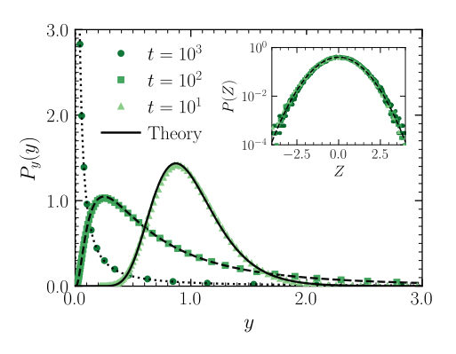 
FIG. 1. Probability density of the rescaled wealth y = W/⟨W⟩ at different times t, indicated in the legend. Symbols corre- spond to simulation results at each time t. Lines correspond to the theoretical predictions derived from Eq. (11). Inset: data collapse in terms of the standardized log-wealth variable Z. Parameter values are A = 0.01 and D ≃4.53 × 10−3.

📷 Fig 2

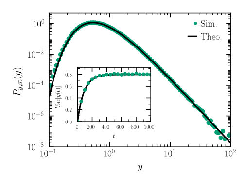 
FIG. 2. Stationary PDF Py(y) of the mean-normalized wealth y for the uniform redistribution scheme. Symbols de- note results from simulations, while the solid line shows the corresponding theoretical prediction given by Eq. (34). Pa- rameter values are A = 0.01 and D ≃4.53 × 10−3, hence α = 2.25. Then, the tail decays approximately as a power law with exponent 4.25. Inset: time evolution of the variance Var[y(t)] compared with the theoretical relaxation given by Eq. (39).

📷 Fig 3

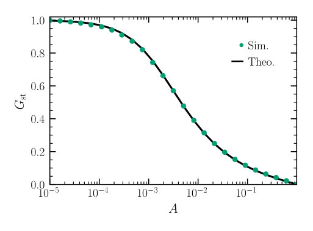 
FIG. 3. Stationary Gini coefficient for uniform redistribution as a function of A. Symbols denote simulations, while the solid line is the analytical prediction given by Eq. (42). The decrease of Gst with A reflects the increasing strength of the redistributive restoring drift relative to multiplicative noise, with D ≃4.53 × 10−3.

📷 Fig 4

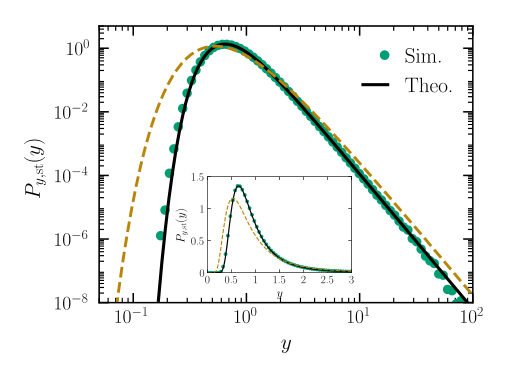 
FIG. 4. Stationary PDF of the mean-normalized wealth y for the nonuniform redistribution scheme given by Eq. (44). Symbols denote the result of simulations at t = 104 steps, the solid line is the theoretical prediction given by Eq. (45) with normalization in Eq. (48). For comparison, the light dashed line shows the theoretical prediction for the uniform redistribution case, given by Eq. (34). The inset shows the same plots in linear scales. The parameter values are A = 0.01, D ≃4.53×10−3 (hence α ≃2.25), β = 103 and yc = 0.1.

📷 Fig 5

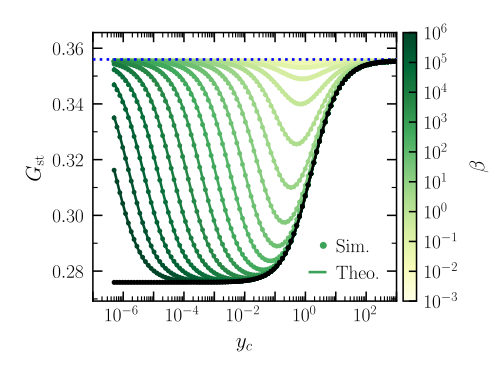 
FIG. 5. Continuous nonuniform redistribution. Sta- tionary Gini coefficient as a function of the redistribution scale yc for different values of the policy parameter β, with A = 0.01. Symbols denote simulations, while the solid lines represent the corresponding theoretical prediction from Eq. (45) substituted into Eq. (32), in excellent agreement. The black line and symbols correspond to the limiting case β →∞(i.e., ϕ(y) = 1/[1+y/yc]). The horizontal dotted blue line indicates the value of the Gini coefficient for the uni- form redistribution kernel. Simulations were performed for N = 104 agents, and recorded at t = 104 steps.

**Summary.** This paper applies statistical physics tools, specifically Fokker-Planck equations, to analyze how wealth inequality evolves in an economy subject to taxes and redistribution. By comparing uniform versus nonuniform transfer protocols, the authors demonstrate that targeted redistribution can effectively stabilize the system and reduce measured economic disparities like the Gini index.

**Why it may be interesting.** While purely economic, the mathematical framework—using FPEs, stochastic processes, and steady-state analysis to model non-equilibrium distributions—is highly analogous to modeling energy or particle density in complex many-body systems far from equilibrium.

Detailed structure

**Main problem.** The study develops a Fokker-Planck description for wealth distribution dynamics under stochastic multiplicative growth, incorporating taxation and general redistribution protocols.

**Main result.** Nonuniform redistribution schemes can significantly mitigate wealth disparities by stabilizing the stationary state compared to simple uniform models. The analysis suggests statistical properties might exhibit universality despite specific policy details.

**Method.** The authors use continuous-time limits derived from discrete stochastic processes, leading to Fokker-Planck Equations (FPEs) for the probability density function of rescaled wealth.

**Model / system.** The model describes a population's wealth evolution ($W_{i,t}$) through multiplicative noise, taxation ($	au$), and state-dependent redistribution ($	ext{r}_{i,t}$). The analysis focuses on the rescaled wealth $y_t$ governed by an associated SDE/FPE.

**Key observables.** Gini index (measure of inequality), stationary wealth distribution $P_{y,st}(y)$, and moments $\langle y^n 
angle$.

**Important parameters / regimes.** Taxation rate ($	au$), noise strength ($s$), redistribution parameters ($eta$, $y_c$), and the exponent $\alpha$ governing the tail behavior.

**Assumptions / limitations.** The analysis relies on mean-field closure for large populations ($N 	o \infty$) and assumes specific functional forms for redistribution kernels (e.g., uniform or CCT limit).

**Figures summary.** Figures compare simulated and theoretical stationary PDFs for uniform redistribution, showing agreement, and illustrate the relaxation of variance over time.

**Paper structure.** The paper progresses from deriving the general Fokker-Planck equation for wealth dynamics to analyzing specific cases (uniform vs. nonuniform redistribution). It derives analytical forms for the stationary PDF and calculates inequality metrics like the Gini index for comparison.

Abstract

We develop a Fokker-Planck description of the dynamics of wealth distribution in a stochastic multiplicative economic growth model with taxation and redistribution, as introduced by P.M.C. de Oliveira. Extending the original formulation, our theoretical framework includes general redistribution protocols, encompassing a broad class of state-dependent transfer mechanisms. As a particular case, we investigate a two-state protocol designed to emulate conditional cash transfer programs. Analytical expressions for the stationary wealth distributions are derived, revealing how the interplay between multiplicative noise, taxation, and redistribution shapes the emergence of inequality. The theoretical results are corroborated by agent-based simulations. To quantify and compare the impact of the different protocols, we employ the Gini index as a measure of inequality. Our analysis highlights how specific nonuniform redistribution schemes can significantly mitigate wealth disparities.

[↑ back to top](#top)

### [Krylov Complexity from Loschmidt Amplitude](http://arxiv.org/abs/2607.10921v1)

**Authors:** Debarghya Chakraborty  
**Type:** theory · **Category:** statistical mechanics · **PDF:** <https://arxiv.org/pdf/2607.10921v1>  
**Analysis basis:** full PDF text, analyzed in chunks
**Topic relevance:** `entanglement & information structure` **3/5** · `non-equilibrium dynamics` **3/5** · `non-equilibrium universality` **2/5** · `Keldysh / 2PI / non-Gaussian methods` **1/5** · `analog quantum simulation` **1/5** · `correlated / nonlocal dissipation` **1/5** · `driven-dissipative phase transition` **1/5** · `methods for driven-dissipative` **1/5**

📷 Fig 1

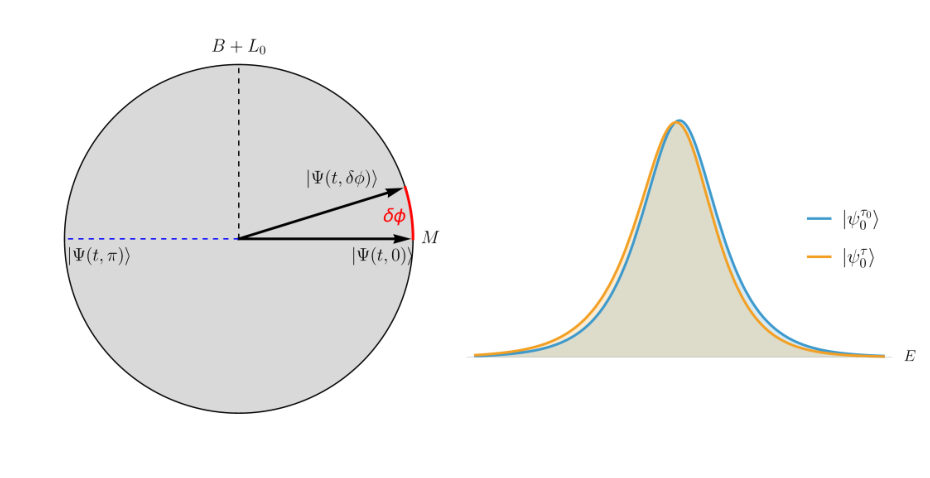 
FIG. 1: Visual guide: (Left) Krylov complexity is the rate of change in overlap between two trajectories that move apart in time. The horizontal arrow depicts the physical trajectory and the slanted one describes evolution with the δϕ-deformed Hamiltonian. At ϕ = π/2, the ϕ-evolved Hamiltonian becomes B + L0. Complexity is bounded by the volume of this disc at time t with a canonical choice of volume element. When autocorrelation is real, the relation |Ψ(t, π)⟩= |Ψ(−t, 0)⟩leads to stronger results. (Right) B generates rotations of the Krylov basis on using Euclidean- evolved |ψτ 0⟩= e−(τ−τ0)H |ψτ0 0 ⟩as initial state for Lanczos algorithm. This allows rewriting the time-derivative of...

📷 Fig 2

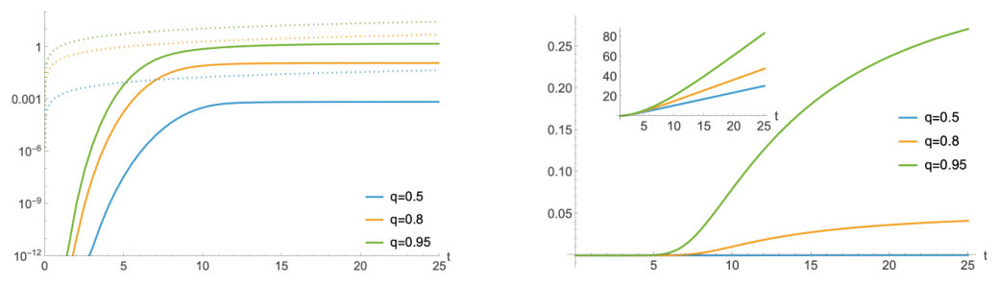 
FIG. 2: Approximating Krylov complexity from truncation (40) with n∗= 10. (a) The difference δ(n∗, t) computed using DSSYK Lanczos coefficients (D4) for varying q. The dotted lines indicate the worst case error R(n∗)t = en∗log qt for the corresponding q. (b) The normalized difference 1 ⟨ˆn(t)⟩( R t 0 δ(n∗, s)ds), with the inset showing overall scale of ⟨ˆn(t)⟩for reference. A finite τ = 10−6 was used.

📷 Fig 3

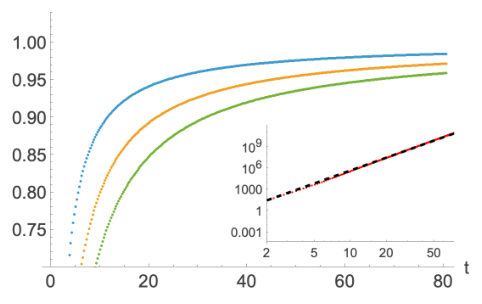 
FIG. 3: (a) RMT complexity distribution: ˆnk(t) for bn = 1

📷 Fig 4

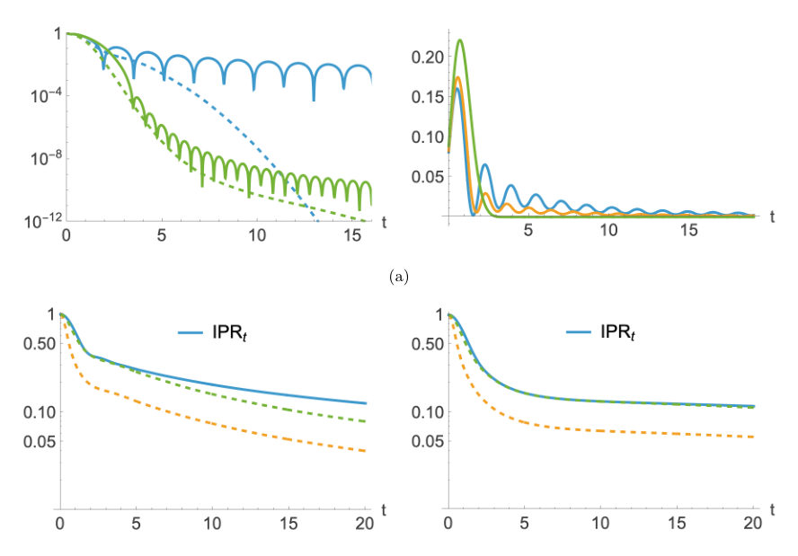 
FIG. 4: (a) Integrated form of bound (61) in DSSYK The left panel shows |C(2t)| (solid lines) for q = 0 (blue) and q = 0.8 (green). The dashed lines of same colors are the rhs of (61) computed using Lanczos coefficients. (61) is satisfied away from where C(2t) dips to 0. The right panel shows the difference smeared over a δt window: R t+δt t [|C(2s)|−exp  (∆n(s))2π2/2  ]ds, with δt = 0.8 for q = 0 (blue), q = 0.2 (orange) and q = 0.8 (green). (b) IPRt in DSSYK for q = 0 (left) and q = 0.8 (right), along with rhs of (63) (orange) and (64) (green) computed using ∆n(t).

📷 Fig 5

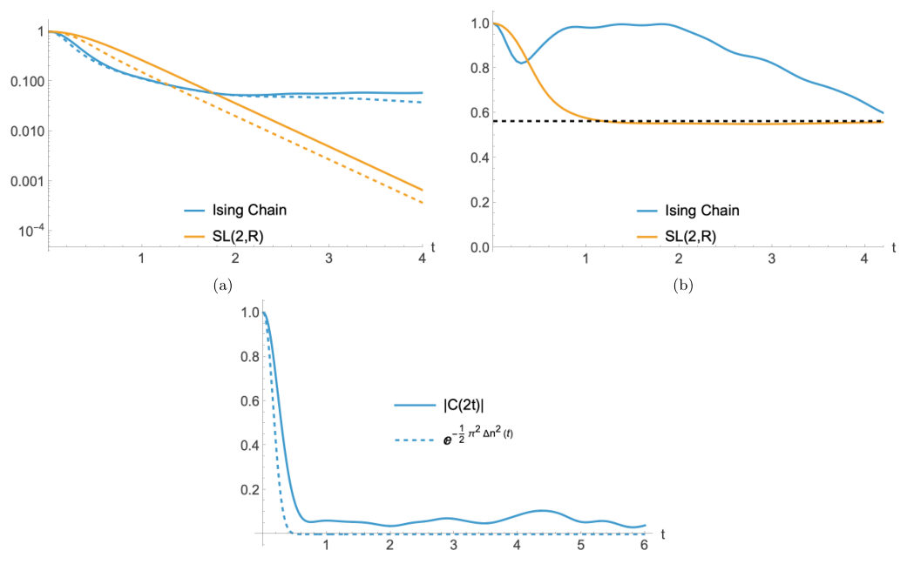 
FIG. 5: (a) IPRt compared with analytic prediction the numerically calculated IPRt (solid lines) compared against the corresponding (64) in dashed lines of same colors. (b) Ratio of the prediction with IPRt: The combination erf(π∆n(t))/(2√π∆n(t)IPRt) for the same systems. The dashed black line is the analytical prediction given by inverse of (C33). Details of the systems The Ising chain is specified by the Hamiltonian (D6) and C(t) is the infinite temperature autocorrelation function (7) of the initial operator σz 3. The SL(2, R) toy model (orange) is specified by the Lanczos coefficients (C20), where both the bn and an coefficients have been perturbed by independent positive random...

**Summary.** This theoretical work develops a novel framework connecting Krylov complexity, a measure of quantum chaotic spreading, directly to the Loschmidt amplitude. By parameterizing this relationship using an angular variable $\phi$, the authors derive geometric bounds and explicit time evolution equations for complexity moments across various physical models like SU(2) and SYK. It provides a unified mathematical language for studying quantum dynamics in terms of spectral geometry.

**Why it may be interesting.** The deep connection drawn between quantum chaos diagnostics (Krylov complexity) and fundamental quantities like the Loschmidt amplitude provides powerful tools for characterizing non-equilibrium dynamics in many-body systems relevant to condensed matter physics.

Detailed structure

**Main problem.** The paper aims to relate Krylov complexity, a diagnostic for quantum dynamics, to the Loschmidt amplitude by establishing an analytical framework based on geometric and algebraic properties.

**Main result.** Krylov complexity is shown to be expressible as a derivative of the Loschmidt amplitude parameterized by an angular variable $\phi$, leading to bounds related to the volume of the $t-\phi$ geometry.

**Method.** The analysis employs geometric methods (Riemannian metrics on $t-\phi$ space) and algebraic techniques involving spectral propagators derived from the Lanczos recursion method.

**Model / system.** The study analyzes general quantum dynamics, utilizing the Krylov basis constructed via the Lanczos algorithm. Specific models explored include SU(2), SL(2, R), Heisenberg Algebra, and the SYK model in various limits.

**Key observables.** Krylov Complexity, Loschmidt Amplitude, Spectral Propagator, Mean complexity $\langle\hat{n}(t)
angle$, and Variance $(\Delta n(t))^2$.

**Important parameters / regimes.** Angular variable $\phi$, time $t$, Euclidean time $	au$, and system-specific parameters like $\alpha$ and $\gamma$ for the algebraic models.

**Assumptions / limitations.** The analysis relies on approximations for the spectral propagator, particularly assuming mild regularity conditions on the spectral function support.

**Figures summary.** Figures illustrate Krylov complexity as the rate of change in overlap between separating trajectories ($\phi=0$ vs $\delta\phi$-deformed) and show how an operator $B$ generates basis rotations using Euclidean-evolved states.

**Paper structure.** The paper develops the connection by first relating complexity to the Loschmidt amplitude via differentiation w.r.t. $\phi$. It then analyzes the time derivative using a distinct Loschmidt amplitude in Euclidean time $	au$, leading to classification schemes based on perturbation growth, and finally applies this framework to specific algebraic models (SU(2), SL(2, R)) to derive explicit evolution equations for complexity moments.

Abstract

Krylov complexity is a powerful diagnostic of quantum dynamics, with clear connections to other measures of quantum chaos and operator growth. One such measure is the Loschmidt amplitude, defined as the overlap of initially identical states evolved under two slightly different Hamiltonians. Its decay in certain systems is controlled by the classical Lyapunov exponent. Using the algebraic properties of the Krylov complexity operator, we express Krylov complexity as the derivative of a Loschmidt amplitude whose perturbation is parameterized by an angular variable $φ$. This formulation allows us to define a spectral propagator that encodes the entire complexity distribution, which we characterize for specific types of systems. We study the two-dimensional quantum geometry spanned by time and $φ$ where the original and deformed trajectories reside, demonstrating that Krylov complexity is upper-bounded by its volume. We also express the time derivative of Krylov complexity in terms of a distinct Loschmidt amplitude. Depending on the growth of the Lanczos coefficients, the perturbation term in this amplitude can be truncated. We propose that the strength of this perturbation provides a classification scheme for Krylov complexity dynamics and relate it to the $φ$-derivative of the spectral propagator. Using this analytical framework, we derive general relations between the time-dependence of the survival amplitude and Krylov space measures.

[↑ back to top](#top)

### [Near-Optimal Mode Scaling for Finite-Dimensional Boson Sampling via Lie-Algebraic Leakage Bounds](http://arxiv.org/abs/2607.11708v1)

**Authors:** Chon-Fai Kam, En-Jui Kuo  
**Type:** theory · **Category:** quantum information and computing · **PDF:** <https://arxiv.org/pdf/2607.11708v1>  
**Analysis basis:** full PDF text, analyzed in chunks
**Topic relevance:** `analog quantum simulation` **3/5** · `correlated / nonlocal dissipation` **2/5** · `entanglement & information structure` **2/5** · `Keldysh / 2PI / non-Gaussian methods` **1/5** · `Tavis-Cummings & cavity-many-emitter` **1/5** · `correlated cavity matter` **1/5** · `driven-dissipative phase transition` **1/5** · `methods for driven-dissipative` **1/5** · `non-equilibrium dynamics` **1/5**

📷 Fig 1

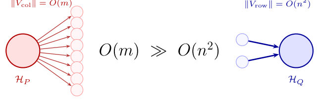 
FIG. 1. Sketch of the proof of Theorem 2: the bunching-leakage mechanism and the variance asymmetry behind it. (a) n excitations injected into distinct modes populate the collision-free sector HQ (occupation ≤d −1; drawn at d = 2). (b) A single action of HLie hops one excitation onto an occupied site, forming a d-fold bunch and entering the single-bunch error sector HP. (c) The leakage map QHLieP : HP →HQ has a strongly asymmetric bipartite support: an HP configuration scatters into O(m) empty modes (out-degree O(m), hence ∥Vcol∥= O(m)), whereas an HQ configuration is reached from only O(n2) collision-forming pairings (in-degree O(n2), hence ∥Vrow∥= O(n2)). The dilute dominance O(m) ≫O(n2)...

📷 Fig 2

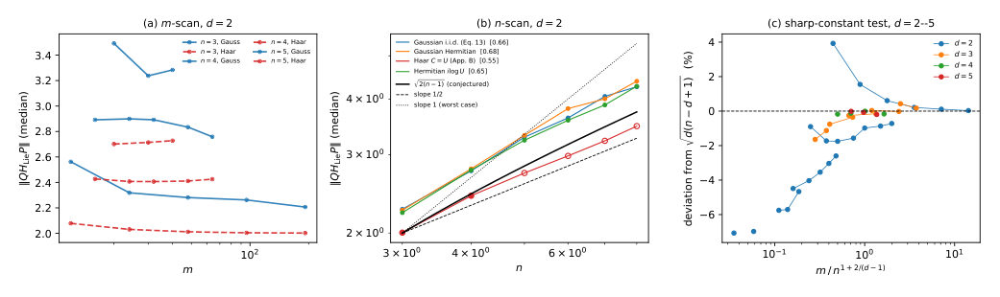 
FIG. 2. Numerical verification of the leakage bound. (a) Median leakage norm against mode number m at fixed n (d = 2): the Haar-ensemble norm (dashed) is nearly m-independent and tightly concentrated, while the Gaussian model (solid) drifts toward it from above. (b) Median norm against particle number n (d = 2, log-log) for all four coupling ensembles; guide lines show slope 1/2 (Theorem 2) and slope 1 (the worst-case estimate of Ref. [14]); the black curve is the conjectured sharp asymptotic √d(n −d + 1) of Eq. (31). Open markers denote sub- dilute Haar points (m &lt; 2n2), which fall below the dilute-limit curve, in the direction that strengthens the bound. (c) Relative deviation of the Haar...

**Summary.** This work develops a mathematical framework to determine the minimum number of optical modes required to simulate hard-to-solve problems like Boson Sampling when using matter-based systems with limited local capacity. By analyzing leakage channels through Lie algebra techniques, the authors establish a near-optimal scaling law for resource requirements, which is crucial for experimental feasibility.

**Why it may be interesting.** It provides concrete, mathematically rigorous resource estimates for realizing quantum advantage protocols like Boson Sampling in realistic, finite physical hardware architectures (like superconducting circuits or cavity QED).

Detailed structure

**Main problem.** The paper addresses quantifying the resource cost (mode scaling) required to maintain the quantum computational hardness of Boson Sampling when implemented on physical platforms with finite local Hilbert spaces.

**Main result.** It derives a near-optimal mode requirement $m = 	ilde{\Omega}(n^{1 + 2/(d-1)})$, significantly improving prior bounds and showing that for spin-1 systems ($d=3$), the scaling drops to $m=	ilde{\Omega}(n^2)$.

**Method.** The analysis uses a unified framework based on Lie algebras, bounding leakage channels via Dyson-series analysis and non-commutative concentration inequalities.

**Model / system.** The system models Boson Sampling transitioning from infinite photonic Fock space to finite-dimensional local Hilbert spaces of dimension $d$, constrained by physical interactions (e.g., Bose-Hubbard model).

**Key observables.** Leakage operator spectral norm, transition amplitudes related to the immanant, and the required number of modes ($m$).

**Important parameters / regimes.** Particle number ($n$), local dimension ($d$), and mode number ($m$); scaling exponents are critical.

**Assumptions / limitations.** The primary proof relies on approximating the leakage bound using a Gaussian model; transferring to the physical Haar ensemble requires verifying Conjecture 1, which is unproven.

**Figures summary.** The notes describe quantitative comparisons of scaling bounds (Table I) and numerical validation of norms between Gaussian and Haar ensembles (Table II).

**Paper structure.** The paper establishes a unified algebraic framework for non-interacting sampling on Lie groups, derives the leakage bound using advanced concentration inequalities, determines the resulting optimal mode scaling law, and finally compares this result against previous theoretical bounds.

Abstract

Boson sampling demonstrates quantum advantage through the interference of indistinguishable particles, with output probabilities governed by matrix permanents. Realizing it on deterministic, matter-based platforms requires encoding the bosonic modes in finite-dimensional local Hilbert spaces, which introduces a leakage channel absent in linear optics: multi-particle bunching beyond the local truncation $d$. We develop a unified framework for non-interacting sampling on the irreducible representations of compact Lie groups, in which the transition amplitude is the immanant of a submatrix of the single-particle transition matrix, recovering the permanent in the bosonic case. Within this framework we bound the bunching leakage through a Dyson-series analysis: decomposing the correlated many-body leakage operator into independent random matrices and applying non-commutative concentration inequalities, we prove, in a Gaussian model of the transition matrix, that its spectral norm concentrates at $\tilde{O}(\sqrt{n})$ rather than the $O(n)$ worst-case of prior spin-based emulations; the passage to the physical Haar ensemble is reduced to a single submatrix-comparison input, verified at leading order. Exact numerics across local dimensions $d=2$--$5$ indicate that the bound is tight, the Haar-ensemble norm matching the closed form $\sqrt{d(n-d+1)}$ to sub-percent accuracy. This tightens the required mode number from $m=Ω(n^4)$ to the near-optimal $m=\tildeΩ(n^{1+2/(d-1)})$; for a spin-1 representation ($d=3$) the overhead falls to $m=\tildeΩ(n^2)$, matching the collision-free threshold. The result is independent of particle statistics and applies across finite-dimensional Lie-symmetric architectures, quantifying the spatial resources needed to preserve sampling hardness.

[↑ back to top](#top)

### [Which Classicality? Incidence, Simplex, and Product-Rule Tests in Finite Quantum Logics](http://arxiv.org/abs/2607.11234v1)

**Authors:** Karl Svozil  
**Type:** theory · **Category:** other · **PDF:** <https://arxiv.org/pdf/2607.11234v1>  
**Analysis basis:** full PDF text, analyzed in chunks
**Topic relevance:** `quantum measurements` **3/5** · `entanglement & information structure` **2/5** · `measurement-induced transitions` **2/5** · `Keldysh / 2PI / non-Gaussian methods` **1/5** · `analog quantum simulation` **1/5** · `correlated / nonlocal dissipation` **1/5** · `driven-dissipative phase transition` **1/5** · `methods for driven-dissipative` **1/5**

📷 Fig 1

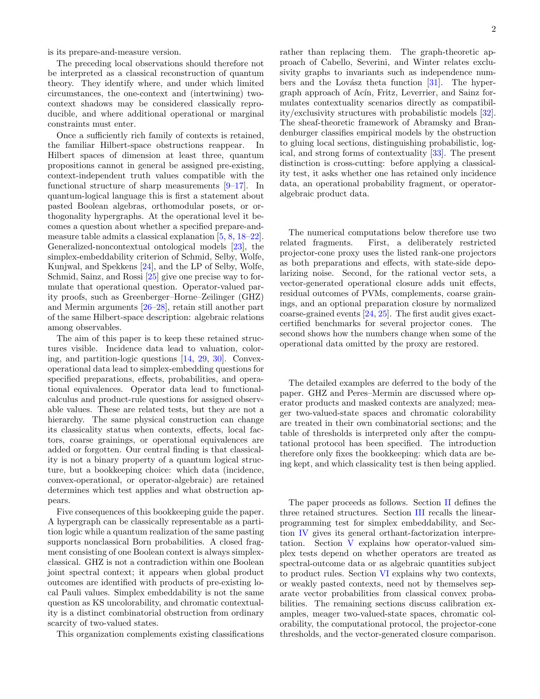 
Low-resolution page preview, page 2

📷 Fig 2

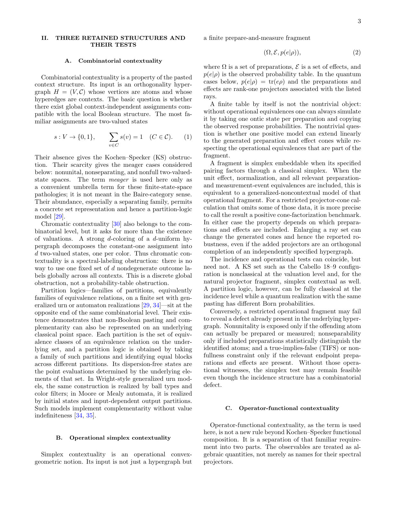 
Low-resolution page preview, page 3

📷 Fig 3

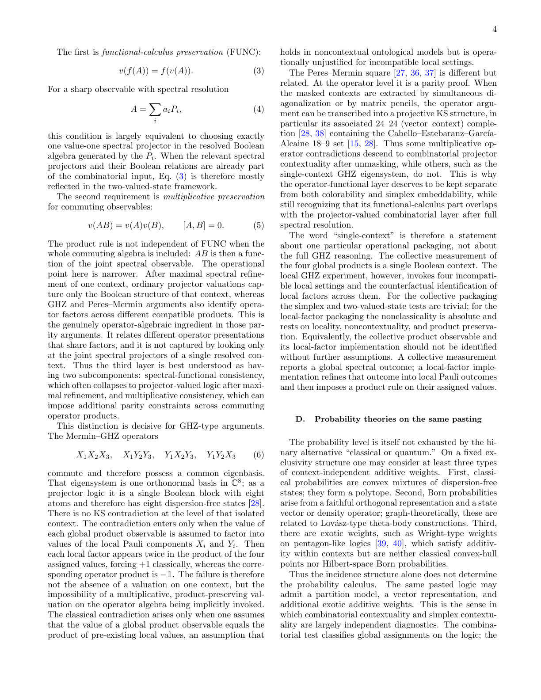 
Low-resolution page preview, page 4

📷 Fig 4

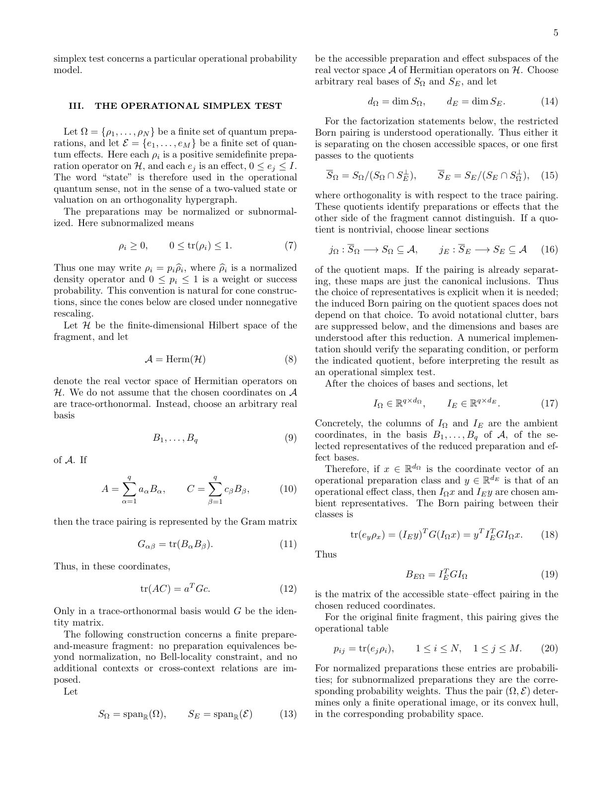 
Low-resolution page preview, page 5

📷 Fig 5

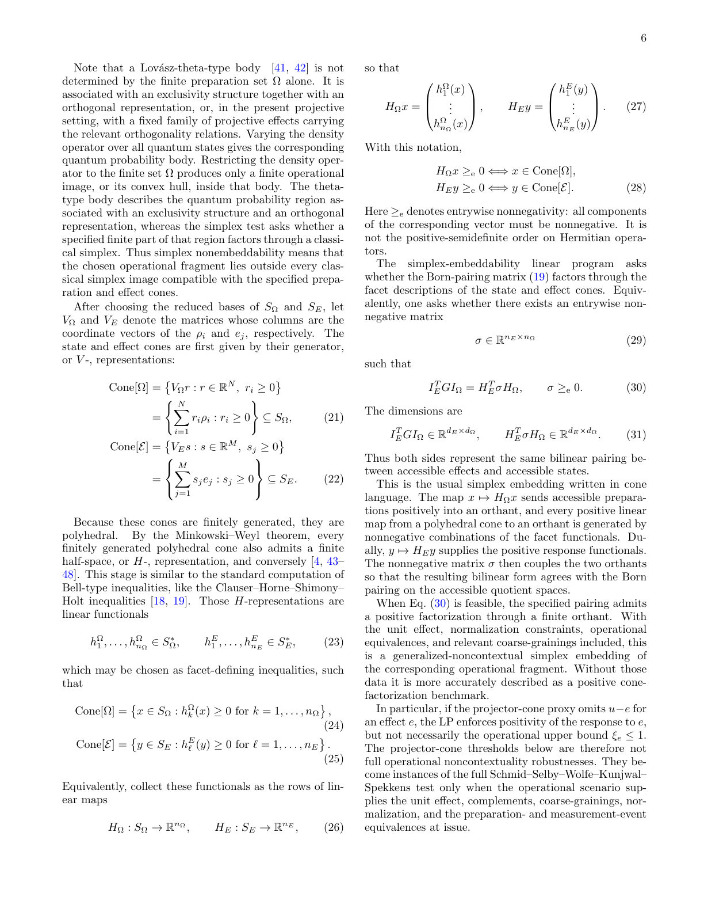 
Low-resolution page preview, page 6

**Summary.** This paper develops a comprehensive theory distinguishing between different forms of 'classicality' failure in quantum logics by employing three distinct mathematical tests: incidence, simplex-embedding, and operator-functional rules. The central finding is that the observed nonclassicality depends entirely on which structural assumptions (e.g., requiring product preservation) are imposed during the analysis. It provides a powerful framework for understanding contextuality beyond simple Bell inequalities.

**Why it may be interesting.** While not directly focused on AMO Hamiltonians, the rigorous framework for testing contextuality by separating structural assumptions (e.g., local factor vs. global measurement) provides deep theoretical tools applicable to understanding nonclassical correlations in quantum measurements relevant to open systems or entanglement verification.

Detailed structure

**Main problem.** The core problem is determining when quantum logical structures (contexts) exhibit genuine nonclassicality, as this property depends critically on which mathematical structure—incidence, convex-operational, or operator-algebraic—is retained.

**Main result.** Classicality is shown to be a 'bookkeeping choice' dependent on the structural data used for testing; specific quantum violations (like GHZ) only emerge when global product rules are imposed beyond local context measurements.

**Method.** The authors distinguish and apply three types of tests: incidence tests (based on valuations/colorings), simplex-embedding tests (for prepare-and-measure fragments), and operator-functional tests (imposing spectral/product rules).

**Model / system.** The study uses abstract finite quantum logics, modeling contexts via Boolean blocks $\{P_1, \dots, P_d\}$ which can be viewed as partitions or Projection-Valued Measures (PVMs) in a physical realization.

**Key observables.** Detector-click frequencies ($p_i$), contextuality strength, and the existence of exact primal/dual certificates for various logical configurations ($\Gamma_3$, Specker bug).

**Important parameters / regimes.** The results are highly dependent on the specific labeled ray fragments, noise models (e.g., state-side depolarizing noise), and the chosen factorization structure.

**Assumptions / limitations.** The analysis carefully distinguishes between 'bare two-context statistics' (which can be classical) and scenarios requiring global constraints or product preservation rules.

**Figures summary.** References computational tables comparing various logical configurations, detailing whether exact primal or dual certificates exist for simplex embeddability tests.

**Paper structure.** The paper systematically compares the diagnostic power of three distinct mathematical frameworks—incidence (combinatorial), simplex-embedding (operational/convex geometry), and product-rule preservation (algebraic)—to characterize contextuality failure modes.

Abstract

Finite quantum-logical constructions can appear classical or nonclassical depending on which structure is retained. We distinguish incidence tests based on valuations, colorings, and partition representations; simplex-embedding tests for specified prepare-and-measure fragments; and operator-functional tests imposing spectral and product rules. We show that the collective GHZ joint measurement is a single Boolean context and becomes nonclassical only when a common assignment of local factors, together with product preservation, is required. For selected labelled ray fragments, we compute state-depolarizing thresholds for a restricted projector-cone factorization and for a specified vector-generated operational closure, separating exact primal--dual certificates from numerical estimates. These values are properties of the stated fragments and noise model, not invariants of the underlying hypergraphs or a universal ordering of contextuality.

[↑ back to top](#top)

### [Distributed Semantics for Distributed Quantum Computing](http://arxiv.org/abs/2607.11216v1)

**Authors:** Jun Inoue  
**Type:** theory · **Category:** quantum information and computing · **PDF:** <https://arxiv.org/pdf/2607.11216v1>  
**Analysis basis:** full PDF text, analyzed in chunks
**Topic relevance:** `entanglement & information structure` **3/5** · `methods for driven-dissipative` **3/5** · `analog quantum simulation` **1/5** · `correlated / nonlocal dissipation` **1/5** · `correlated cavity matter` **1/5** · `driven-dissipative phase transition` **1/5** · `non-equilibrium dynamics` **1/5**

📷 Fig 1

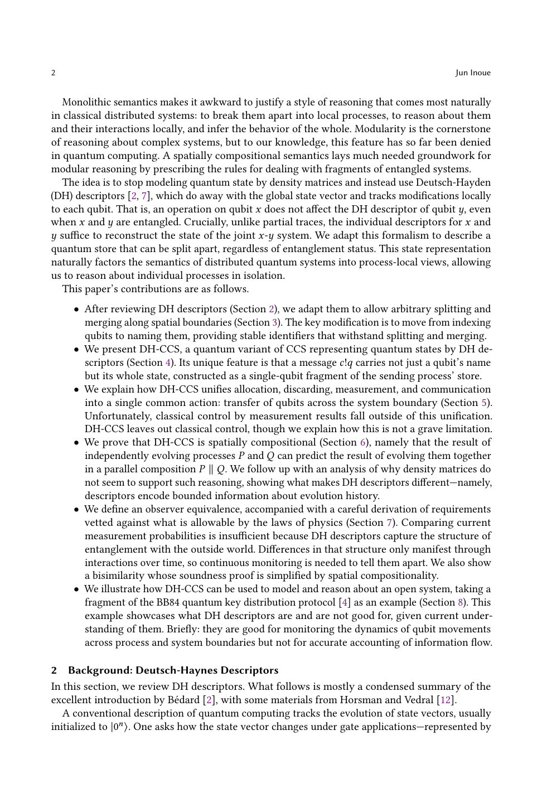 
Low-resolution page preview, page 2

📷 Fig 2

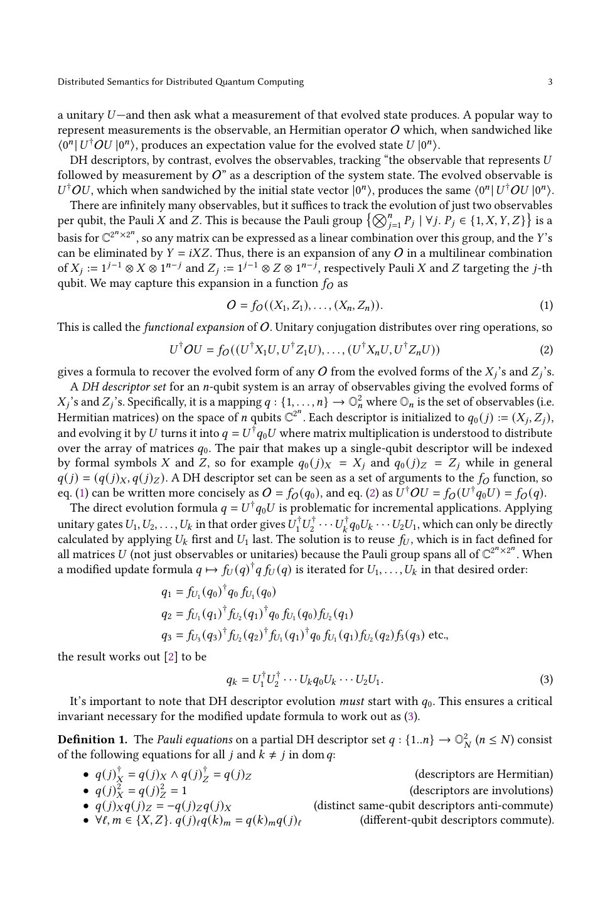 
Low-resolution page preview, page 3

📷 Fig 3

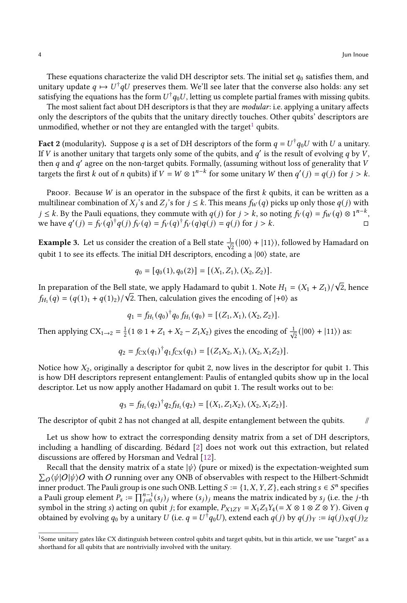 
Low-resolution page preview, page 4

📷 Fig 4

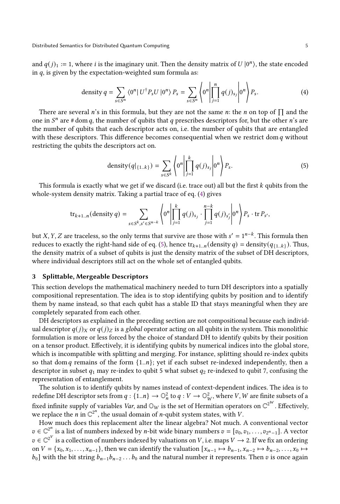 
Low-resolution page preview, page 5

📷 Fig 5

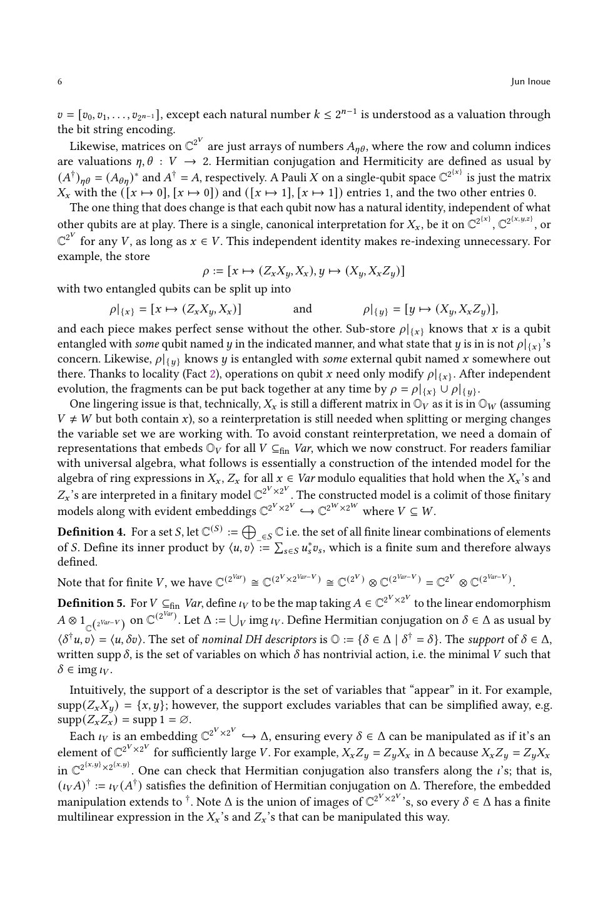 
Low-resolution page preview, page 6

**Summary.** The paper introduces DH-CCS, a novel quantum process calculus that represents quantum states using Deutsch-Hayden descriptors instead of global state vectors. This descriptor approach grants 'spatial compositionality,' enabling the rigorous analysis of complex, distributed quantum systems by allowing processes to evolve independently while correctly accounting for entanglement across boundaries.

**Why it may be interesting.** This work provides a highly formal, compositional framework for analyzing quantum protocols. For AMO/open systems researchers, it offers an algebraic tool to reason about local interactions and entanglement flow without relying solely on computationally intractable global density matrix evolution.

Detailed structure

**Main problem.** The core problem is developing a quantum process calculus that achieves 'spatial compositionality'—the ability to analyze complex, entangled systems by treating individual processes in isolation without losing joint state information.

**Main result.** The authors propose using Deutsch-Hayden (DH) descriptors within a new quantum process calculus (DH-CCS), which successfully models qubit movement across process boundaries while preserving entanglement structure.

**Method.** They adapt DH descriptors to provide a modular, name-based representation of quantum states, allowing for arbitrary splitting and merging that overcomes the limitations of global state vector representations.

**Model / system.** The model is an abstract quantum process calculus (DH-CCS) designed to reason about distributed quantum computation. It models qubits using DH descriptors ($\mathfrak{q}$), which are sets of Pauli operators acting on named variables, allowing for local tracking of state evolution.

**Key observables.** The primary diagnostic tool is the set of DH descriptors $\mathfrak{q}$, which track the evolution of observables like Pauli $X$ and $Z$ operators for each qubit. Security analysis tracks correlations between qubits (e.g., in BB84).

**Important parameters / regimes.** The structure relies on stable, name-based identifiers for qubits rather than position-dependent indices.

**Assumptions / limitations.** DH descriptors are excellent for tracking physical movement across boundaries but require density matrices to accurately account for information flow and entanglement collapse. The calculus also leaves out classical control derived from measurement results.

**Figures summary.** Figure 1 illustrates the syntax of DH-CCS, detailing production rules for actions like splitting ($c!x.P$), conditional operations, and parallel composition ($\|$) that enforce compositional semantics.

**Paper structure.** The paper progresses by first identifying the need for spatial compositionality, proposing DH descriptors as a solution to monolithic state limitations, developing the calculus (DH-CCS) with name-based indexing, demonstrating its utility in modeling open systems (BB84), and finally discussing equivalence notions and remaining theoretical gaps.

Abstract

We present a quantum process calculus that can split the system state along process boundaries and follow the evolution of each process in isolation, without losing information about the joint state-a property we call spatial compositionality. Compositionality is the key to reasoning about any complex system, yet quantum process calculi have struggled to provide its spatial kind, which would enable analyzing a system one process at a time. Many a quantum process calculi have been proposed, but they invariably rely on a global state representation based on state vectors or density matrices, with no known way to split them without losing information about entanglement. We propose to model quantum states with Deutsch-Hayden descriptors instead, which provide a modular representation of qubit states and their evolution. We adapt these descriptors to allow arbitrary splitting and merging of the store of qubits, leading to an unusual process calculus in which qubit transfer messages carry the actual state of the qubit, where existing calculi transfer only a reference. The calculus gives localized views of system state visible to each process, which can be assembled back together into the joint state. We define a notion of process equivalence with extensive justification grounded in physics and show a bisimulation whose soundness proof is simplified by spatial compositionality. The calculus can model open systems entangled with external processes, and we demonstrate this capability on a fragment of the BB84 key distribution protocol. This exercise shows that Deutsch-Hayden descriptors can successfully track qubit movements across process and system boundaries, though it needs help from density matrices to reason about information flow.

[↑ back to top](#top)

### [Fractionalized metals from doped anyons: Application to tMoTe2](http://arxiv.org/abs/2607.11484v1)

**Authors:** T. Senthil  
**Type:** theory · **Category:** strongly correlated electrons · **PDF:** <https://arxiv.org/pdf/2607.11484v1>  
**Analysis basis:** full PDF text, analyzed in chunks
**Topic relevance:** `Keldysh / 2PI / non-Gaussian methods` **3/5** · `driven-dissipative phase transition` **2/5** · `non-equilibrium universality` **2/5** · `Kondo & dissipative impurity` **1/5** · `analog quantum simulation` **1/5** · `methods for driven-dissipative` **1/5** · `non-equilibrium dynamics` **1/5**

📷 Fig 1

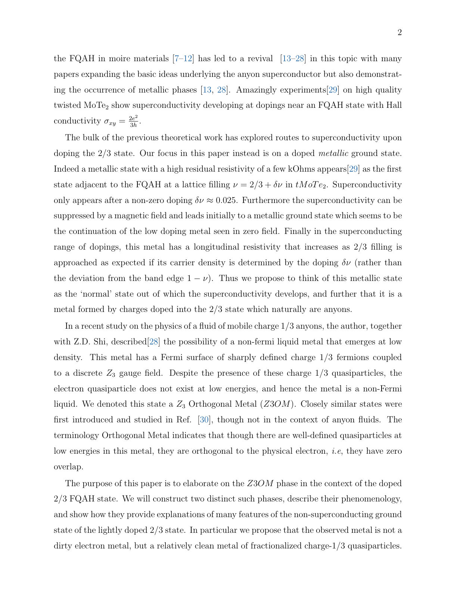 
Low-resolution page preview, page 2

📷 Fig 2

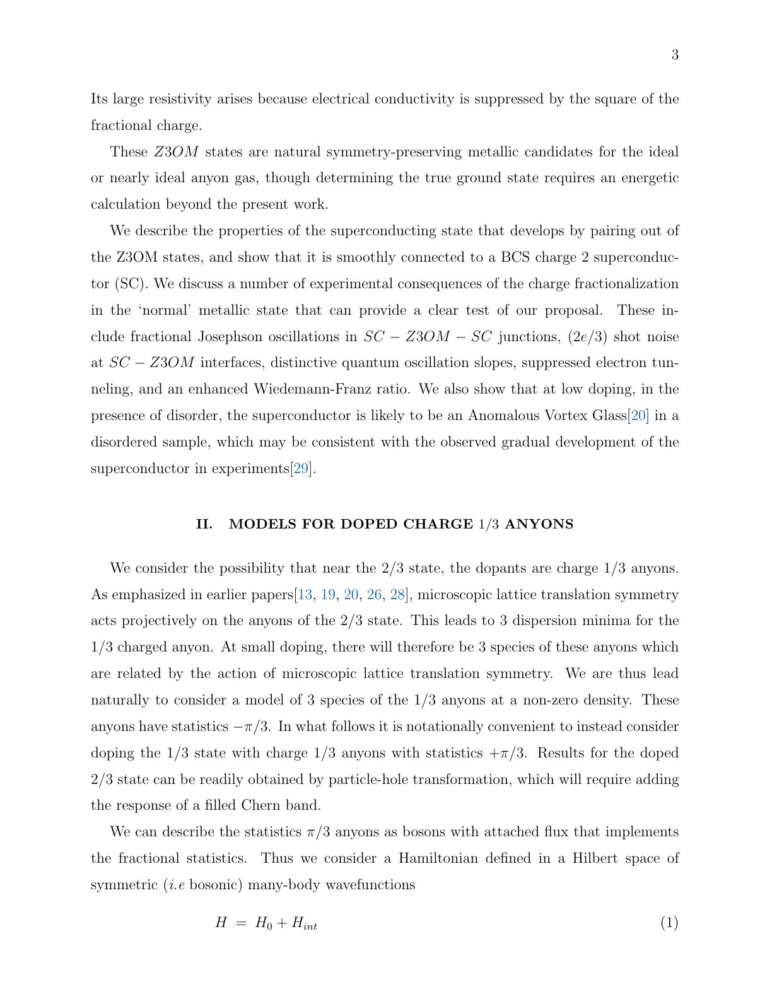 
Low-resolution page preview, page 3

📷 Fig 3

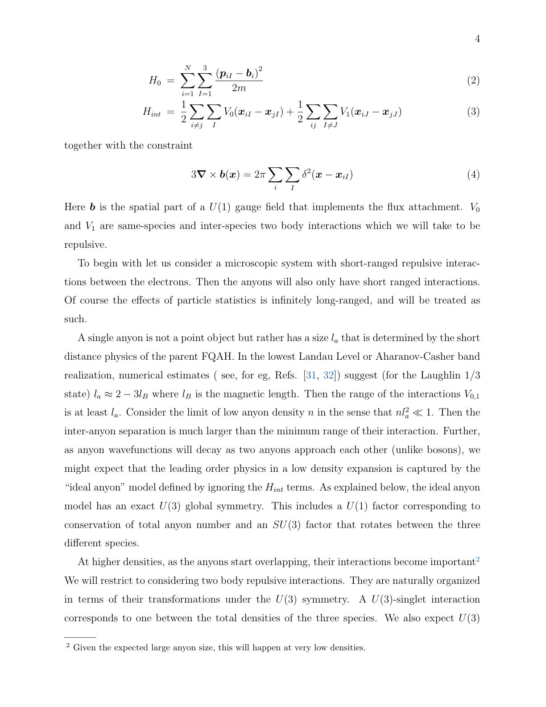 
Low-resolution page preview, page 4

📷 Fig 4

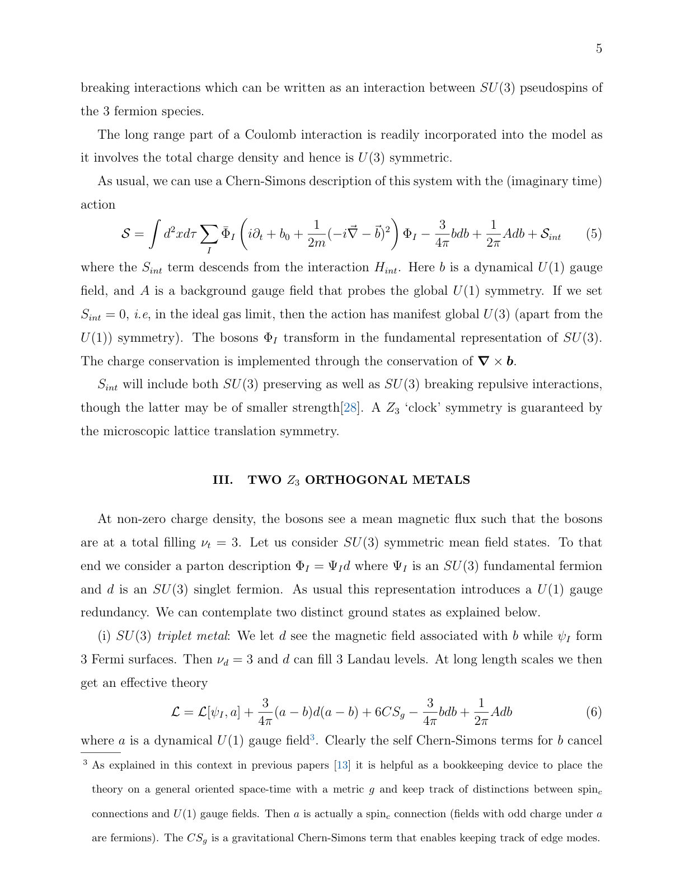 
Low-resolution page preview, page 5

📷 Fig 5

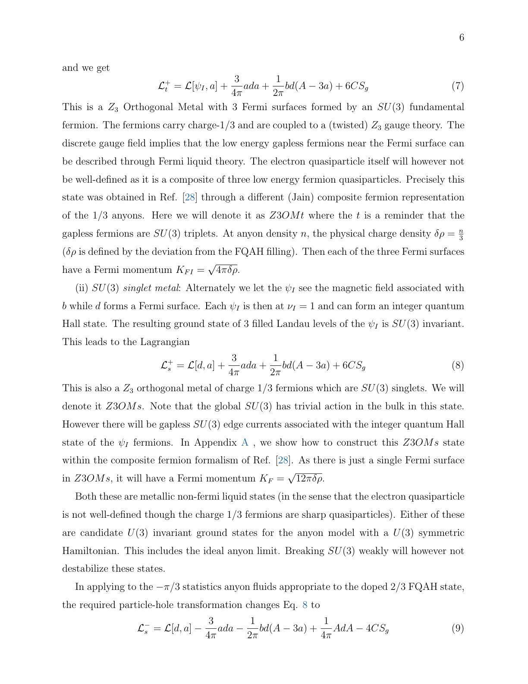 
Low-resolution page preview, page 6

**Summary.** This paper theoretically models the metallic phase arising from doping a Fractional Quantum Anomalous Hall state in materials like MoTe2. The authors propose a novel Z3 Orthogonal Metal (Z3OM) characterized by fractional charge carriers coupled to a discrete gauge field. This framework explains observed high resistivities and predicts unique experimental signatures such as specific shot noise levels and quantum oscillation patterns.

**Why it may be interesting.** It provides a detailed theoretical framework connecting topological order (FQAH/FCI) to exotic metallic phases that exhibit non-Fermi liquid behavior, which is highly relevant to understanding strongly correlated materials near quantum critical points.

Detailed structure

**Main problem.** The study investigates the nature of metallic phases that emerge when doping a Fractional Quantum Anomalous Hall (FQAH) state, specifically focusing on the 'normal' conducting state rather than superconductivity.

**Main result.** The authors propose a Z3 Orthogonal Metal (Z3OM), characterized by fractional charge-1/3 quasiparticles coupled to a discrete Z3 gauge field, which naturally explains high residual resistivity near the FQAH state.

**Method.** The analysis employs low-density expansions and effective field theories derived from anyon models, utilizing Chern-Simons actions and parton descriptions.

**Model / system.** The system is based on doping a $\sigma_{xy} = 2e^2/3h$ FQAH state in twisted MoTe2. The model treats the doped carriers as a fluid of mobile anyons (charge 1/3) interacting with a background gauge field.

**Key observables.** Fractional Josephson oscillations, $(2e/3)$ shot noise at interfaces, distinct quantum oscillation slopes, and $G(V) \sim V^2$ tunneling conductance at low bias.

**Important parameters / regimes.** Filling fraction $
u = 2/3$, fractional charge $1/3$, discrete gauge group $\mathbb{Z}_3$.

**Assumptions / limitations.** The theory relies on treating interactions perturbatively in the low-density limit and assumes that the metallic state is governed by fractionalized quasiparticles rather than conventional electron excitations.

**Figures summary.** Not specified, but diagnostics include predicted conductivity ($\sigma_{xx}, \sigma_{xy}$) and noise measurements related to fractional charge carriers.

**Paper structure.** The paper progresses from defining the physical problem (doping FQAH states) to constructing effective low-energy theories for Z3OMs, deriving transport properties, and finally proposing multiple experimental signatures to distinguish this fractionalized normal state.

Abstract

A fluid of mobile anyons may arise naturally when a Fractional Quantum Anomalous Hall (FQAH) state is doped. Motivated by recent experiments on twisted $MoTe_2$, we study metallic phases obtained by doping the $σ_{xy} = 2e^2/3h$ state. We propose that the high-resistivity metal observed adjacent to this FQAH state is a $Z_3$ Orthogonal Metal: a non-Fermi liquid with sharp charge $1/3$ fermionic quasiparticles coupled to a discrete $Z_3$ gauge field but with no sharp electronic quasiparticle. For a dilute gas of three species of charge-$1/3$ anyons with $π/3$ statistics, we construct two $U(3)$ symmetric $Z_3$ Orthogonal Metals, distinguished by whether the gapless fermions transform as $SU(3)$ triplets or singlets. We show that these states naturally yield large electrical resistivities even when the fractionalized quasiparticles are in a good metallic regime. Pairing of the charge-$1/3$ fermions produces an ordinary charge-$2e$ superconductor, smoothly connected to a BCS state but obtained through an intrinsically fractionalized normal state. We discuss experimental signatures of the idea that the normal metallic state in the lightly doped $2/3$ state may have fractionalized charge carriers.

[↑ back to top](#top)

### [Interpreting learning dynamics of autoencoders: Transient scaling and emerging concepts of the Ising model](http://arxiv.org/abs/2607.10285v1)

**Authors:** Max Weinmann, Miriam Klopotek  
**Type:** theory · **Category:** disordered systems and neural networks · **PDF:** <https://arxiv.org/pdf/2607.10285v1>  
**Analysis basis:** full PDF text, analyzed in chunks
**Topic relevance:** `exotic spin models in light-matter` **3/5** · `driven-dissipative phase transition` **2/5** · `non-equilibrium dynamics` **2/5** · `analog quantum simulation` **1/5** · `methods for driven-dissipative` **1/5** · `non-equilibrium universality` **1/5** · `spintronics-quantum-optics interface` **1/5**

📷 Fig 1

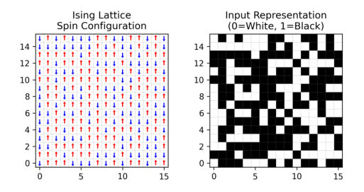 
FIG. 1. Ising model spin configurations on a square lattice (left) are mapped to a binary representation (right). Spins pointing down (blue) are mapped to zero (white) and spins pointing up (red) to one (black). The two-dimensional binary representation is converted to floating-point numbers and flat- tened into a one-dimensional vector. This one-dimensional pixel vector serves as input to an autoencoder.

📷 Fig 2

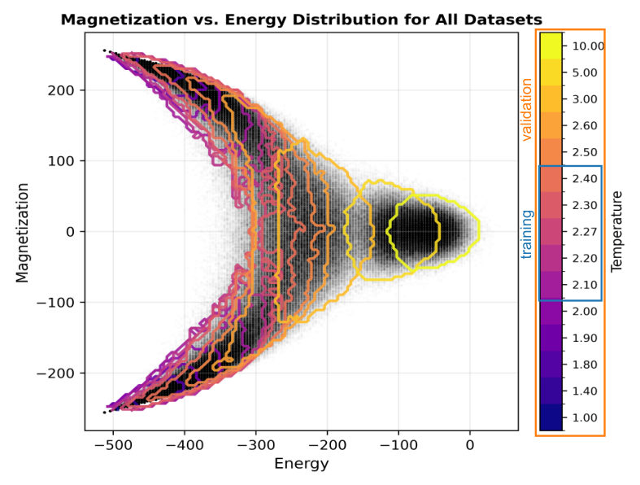 
FIG. 2. Joint distribution of the entire dataset (black dots) over sample energy and magnetization. The area containing almost all samples from a given temperature is indicated by colored contours. At low temperatures, there are two distinct clusters with low energy and high absolute magnetization (upper and lower left). At high temperatures, a single cluster with a small absolute magnetization and higher energy becomes dominant (center-right).

📷 Fig 3

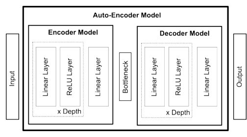 
FIG. 3. Auto-Encoder model architecture composed of an encoder (left) and decoder model (right). The encoder trans- forms the input with a sequence of linear and non-linear ReLU layers into a lower-dimensional latent representation, referred to as a bottleneck. The decoder transforms this latent rep- resentation with the same sequence of layers (but different parameters) into the output. The parameters of each lin- ear layer are optimized during training to reduce the mean squared deviation (MSD) between inputs and outputs.

📷 Fig 4

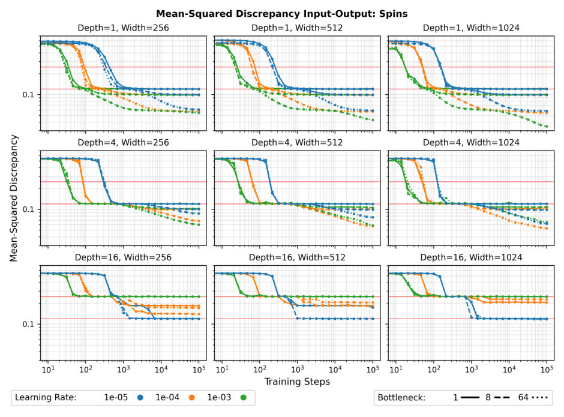 
FIG. 4. Validation loss evolution of raw data over training checkpoints averaged over all runs with the same model (depth, width, bottleneck) and learning rate. Each subplot shows the average across different seeds (seedmodel ∈{0, 1}, seedbatch ∈ {0, 1}) and batch sizes |B| ∈{30, 300, 3000} for a given model width and depth. The line styles correspond to different bottleneck sizes, while the line colors indicate the base learning rate used for training. All loss curves show a rapid initial decrease, followed by none or another rapid or slow decrease depending on the hyperparameters. The MSD plateau values are equivalent to the loss obtained by predicting the training data average (LMSD...

📷 Fig 5

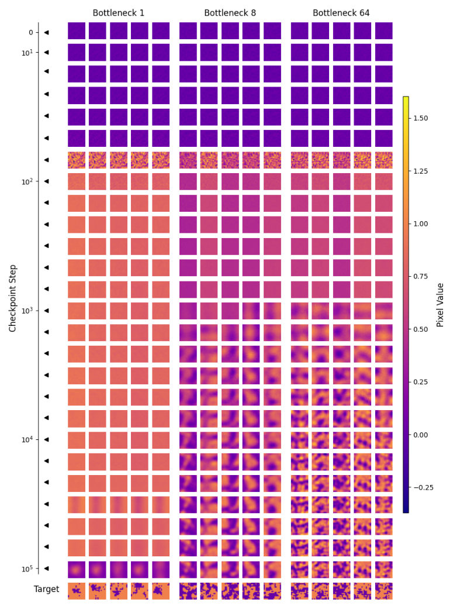 
FIG. 5. Model output evolution for samples from the critical temperature with the highest final loss for different bottlenecks. Samples with the lowest loss from the same run are shown in Fig. 21. Each column of 5 samples shows the temporal evolution of one model, from bottom to top. The last row shows the input, which is the target of the optimization. The model checkpoints are taken from runs MB1, MB8, MB64 (see Tab. II), all trained with the most typical model configuration: depth d = 4, width w = 512, and a medium learning rate λ = 10−4. The output for all samples starts around zero, where it remains until a rapid transition with fluctuations between pixels, after which it converges to...

**Summary.** This paper analyzes how autoencoders learn physical concepts from Ising model data by studying the dynamics of their training process. It identifies distinct dynamical regimes corresponding to magnetization and energy dominance within the latent space. The work establishes a theoretical framework viewing learning as a non-equilibrium process that reveals underlying topological structures.

**Why it may be interesting.** It provides a powerful, physics-grounded analogy for understanding feature extraction in deep learning, linking concepts like phase transitions or order parameters (magnetization/energy) directly to network dynamics.

Detailed structure

**Main problem.** The study investigates how unsupervised autoencoders learn macroscopic, theory-relevant variables from microscopic spin configurations generated by the Ising model.

**Main result.** Learning dynamics reveal two distinct regimes (magnetization vs. energy dominated), and a common trajectory topology is found across representation spaces when analyzing prediction errors.

**Method.** The authors analyze autoencoder training dynamics by studying how reconstruction loss drives trajectories in the low-dimensional latent space, using concepts from dynamical systems theory.

**Model / system.** The physical system is the Ising model used to generate spin configurations. The machine learning model is a deterministic nonlinear autoencoder trained on these microscopic data sets.

**Key observables.** Learning dynamics, prediction errors inducing flow fields, magnetization ($M$), energy ($E$), and Spearman rank correlation between input differences and latent space distances.

**Important parameters / regimes.** Model depth/width, learning rate ($\lambda$), bottleneck size ($b$), and coarse-graining spatial scales.

**Assumptions / limitations.** Learning is viewed as a process driven far from equilibrium by fluctuations; standard post hoc methods fail to capture the concept formation *process*.

**Figures summary.** Figures illustrate how correlation between input differences ($\Delta M$ or $\Delta E$) and latent distance changes with bottleneck size, showing stability for magnetization topology in larger bottlenecks. Other figures track loss evolution across coarse-graining scales and show trajectories for $M$ and $E$.

**Paper structure.** The paper establishes a dynamical viewpoint of learning by analyzing how autoencoders process Ising model data. It identifies two distinct training regimes (magnetization/energy) and uses recursive trajectory analysis to map the underlying topological structure preserved during compression.

Abstract

We study how unsupervised autoencoders trained on microscopic spin configurations from the Ising model learn macroscopic, theory-relevant variables underlying the data-generating process. Without embedding domain knowledge, we mimic a typical discovery setting: We quantify learning across multiple spatial (coarse-graining) scales and reveal two distinct dynamical regimes controlled by main hyperparameters (model depth, width, and learning rate) -- a magnetization-dominated regime and an energy-dominated regime characterized by trade-offs in their representation quality. The first regime is a transitory state exhibiting dynamical scaling and fluctuations that follow an ordering-to-scale; the second gradually shifts resolution towards smaller scales relevant for the energy representation. Deep models trained at moderate and fast rates become arrested before reaching these regimes. With a novel analysis of recursive-dynamic trajectories, we demonstrate that prediction errors induce flow fields that produce a common trajectory topology across all representation spaces. A dynamical viewpoint of learning is established in which intrinsic properties expose the effects of forced changes in representation during training. We utilize the intuition that learning operates as a process driven far from equilibrium by fluctuations from the training data and optimizer to provide an interpretive basis grounded in both the physical world and the machine models that represent it.

[↑ back to top](#top)

### [Spacer-Mediated Gold Nanocube Arrays for Edge-Localized Excitonic Enhancement in Monolayer MoS2](http://arxiv.org/abs/2607.11768v1)

**Authors:** Abdullah Efe Yildiz, Emre Ozan Polat  
**Type:** theory · **Category:** other · **PDF:** <https://arxiv.org/pdf/2607.11768v1>  
**Analysis basis:** full PDF text, analyzed in chunks
**Topic relevance:** `interference shaping light` **3/5** · `Tavis-Cummings & cavity-many-emitter` **2/5** · `analog quantum simulation` **1/5** · `correlated / nonlocal dissipation` **1/5** · `correlated cavity matter` **1/5** · `driven-dissipative phase transition` **1/5** · `methods for driven-dissipative` **1/5** · `non-equilibrium dynamics` **1/5**

📷 Fig 1

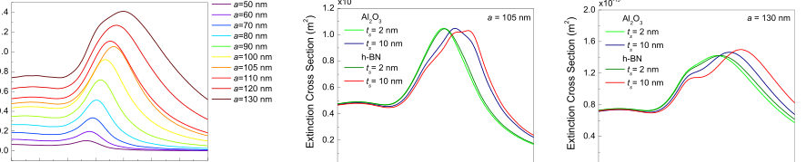 
Figure 1. Spacer mediated plasmonic response and design parameters of AuNCs. (a) Schematic illustration of a single AuNC with side length a placed on a dielectric spacer of thickness ts. (b,c) Near-field intensity maps of AuNCs with side lengths of 105 and 130 nm, respectively. Showing strong electric-field localization at the cube corners. (d) Extinction cross-section spectra for AuNCs with different side lengths from 50 to 130 nm, demonstrating the increase and redshift of the localized surface plasmon resonance with increasing cube size. (e,f) Extinction spectra of the 105 and 130 nm AuNCs in the presence of Al2O3 and h-BN spacer environments with different spacer thicknesses. The...

📷 Fig 2

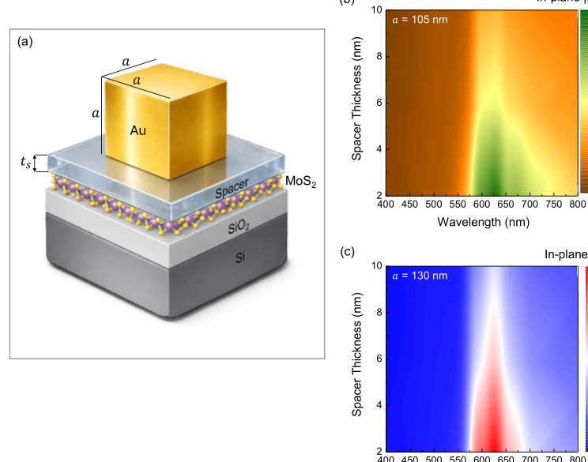 
Figure 2. Hybrid AuNC/spacer/MoS2 device geometry yielding in-plane electric-field enhancement. (a) Schematic of the AuNC/spacer/ML MoS2 on SiO2/Si device substrate. Modeled plasmonic device focuses the in plane electric field intensity for the enhanced exciton generation in MoS2 layer. (b) Spectral in-plane electric field intensity map (|E|2) for varying Al2O3 spacer thickness with 105 wide and (c) 130 nm wide AuNCs. The field enhancement is strongest near the plasmon-exciton overlap region and decreases or redistributes as the spacer thickness increases. The strongest enhancement is again obtained for the thinnest spacer layers, where the MoS2 monolayer remains closest to the AuNC...

📷 Fig 3

 
Figure 3. Absorption spectra of monolayer MoS2 coupled to AuNC structures through Al2O3 and h-BN spacers. (a) Schematic of the periodic AuNC array integrated with the spacer/MoS2/SiO2/Si stack. The array period is p = 250 nm. (b) AuNC Normalized absorption spectra for MoS2 coupled to 105 nm wide AuNC through different spacers. The dashed line shows the excitons of bare monolayer MoS2 on SiO2/Si. (c,d) Normalized absorption spectra for 130 nm AuNC structures with h-BN and Al2O3 spacers, respectively, for different ts. The vertical dashed lines mark the B and A exciton wavelengths of monolayer MoS2. The AuNC modifies the excitonic absorption profile through plasmon-assisted near-field...

📷 Fig 4

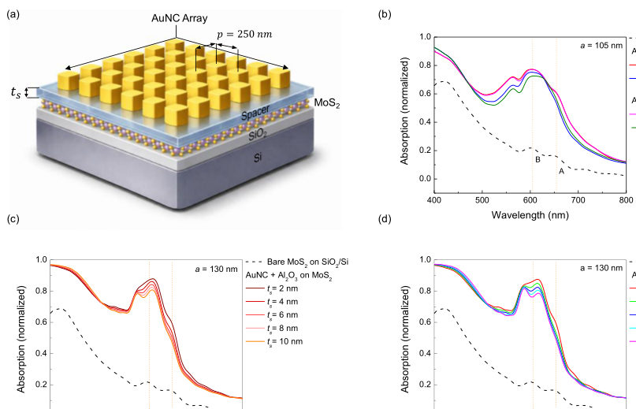 
Figure 4 presents the carrier generation rate of monolayer MoS2 coupled to periodic AuNC arrays. Unlike the normalized absorption spectra in Figure 3, the carrier generation rate gives a more direct measure of how efficiently incident light produces electron-hole pairs inside the MoS2 monolayer. Therefore, this analysis is useful for evaluating the practical effect of plasmonic near- field enhancement on excitonic light harvesting. Figures 4a and 4b show the carrier generation rate spectra for 130 nm AuNC with h-BN and Al2O3 spacers, respectively. In both spacer systems, the carrier generation is strongly enhanced in the visible excitonic region of MoS2, especially near the A- and B-exciton...

📷 Fig 5

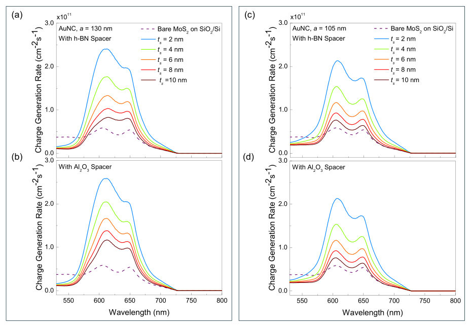 
Figure 4. Carrier generation rate spectra of ML MoS2 coupled to AuNC arrays for different spacer materials and thicknesses. (a,b) The carrier generation spectra for the 130 nm AuNC integrated with h-BN and Al2O3 on ML MoS2 respectively. (c,d) The corresponding spectral charge generation rates for the 105 nm AuNC. In all cases, the generation rate is enhanced around the A- and B-excitonic peaks of monolayer MoS2, with the strongest response obtained for the thinnest spacer.

**Summary.** The research demonstrates that coupling monolayer MoS2 to tunable gold nanocube arrays creates a highly efficient plasmonic platform for enhancing excitonic emission. By controlling the size and spacer material between the AuNCs and MoS2, researchers can systematically tune the near-field enhancement, leading to substantial boosts in carrier generation rates and photoluminescence quantum yield.

**Why it may be interesting.** This work directly addresses quantum optics and open quantum systems concepts by modeling engineered light-matter interaction platforms. The quantitative enhancement factors provide concrete metrics for designing solid-state emitters.

Detailed structure

**Main problem.** The primary challenge is enhancing light-matter interaction, specifically excitonic processes, in atomically thin semiconductors like monolayer MoS2 due to their intrinsic optical thickness limitations.

**Main result.** Au nanocube arrays serve as a simple, scalable, and tunable plasmonic platform capable of significantly enhancing both the carrier generation rate and photoluminescence (PL) emission in ML MoS2.

**Method.** The study uses numerical simulations (FDTD method) to model the coupling between localized surface plasmon resonances (LSPR) from Au nanocubes and excitonic transitions in MoS2.

**Model / system.** The system consists of monolayer MoS2 coupled to size-tuned gold nanocube arrays separated by tunable dielectric spacer layers, such as Al2O3 or h-BN. The coupling strength is modulated by the plasmon resonance tuning and the thickness/material of the spacer.

**Key observables.** Excitation-rate enhancement (up to 4.35 at B-exciton), radiative decay-rate enhancement (>80), photoluminescence enhancement ($\sim$350-fold), and the spectral dependence of these enhancements across A- and B-excitonic transitions.

**Important parameters / regimes.** Au nanocube side length, spacer material (Al2O3 vs h-BN), and spacer thickness ($t_s$).

**Assumptions / limitations.** The enhancement mechanism is attributed to the combined effect of spectral overlap between LSPR and excitons, and distance-dependent near-field coupling; it is not strictly an exciton-selective switching process.

**Figures summary.** Figures illustrate plasmonic response (extinction spectra), in-plane electric field intensity ($	ext{|E|}^2$) dependence on spacer thickness, normalized absorption spectra showing retained excitonic features, and carrier generation rate/quantum yield vs. spacer thickness.

**Paper structure.** The paper systematically investigates the physical platform by first establishing the need for enhancement, then detailing how tuning AuNC size and spacer properties controls the LSPR, which in turn modulates the near-field coupling to enhance excitonic processes (CGR and PL).

Abstract

Plasmonic nanostructures offer an effective route for enhancing light-matter interaction in atomically thin semiconductors, whose optical response is intrinsically limited by their sub-nanometer active thickness. Here, we numerically investigate excitonic enhancement in monolayer (ML) Molybdenum Disulfide (MoS2) coupled to size-tuned gold (Au) nanocube arrays separated by thin aluminum oxide (Al2O3) and hexagonal boron nitride (h-BN) spacer layers. By varying the nanocube side length, the localized surface plasmon resonance is tuned across the visible spectral range to modulate the A- and B-excitonic transitions of monolayer MoS2. We show that the nanocube-size-dependent spectral redshift can be further controlled through the spacer material and thickness, enabling systematic tuning of the near-field distribution, carrier generation rate, quantum yield, and radiative decay enhancement. Localized plasmonic confinement yields excitation-rate enhancements of up to 4.35 at B-excitonic transition (605 nm) and 3.66 at A-excitonic transition (650 nm), while the radiative decay-rate enhancement exceeds 80, leading to 350-fold photoluminescence enhancement. Although both A- and B-excitonic channels are enhanced simultaneously, their relative contributions depend on nanocube size, spacer material, and spacer thickness, indicating wavelength-dependent excitonic modulation rather than strict exciton-selective switching. These findings establish Au nanocube arrays as a simple, scalable, and tunable plasmonic platform for enhancing excitonic carrier generation and emission in ML MoS2.

[↑ back to top](#top)

### [Benchmarking Zero-Setup Quantum Circuit Simulators](http://arxiv.org/abs/2607.09882v1)

**Authors:** Arul Rhik Mazumder, Mohammed Zuhair Mullath, Hayk Tepanyan  
**Type:** both · **Category:** numerical methods · **PDF:** <https://arxiv.org/pdf/2607.09882v1>  
**Analysis basis:** full PDF text, analyzed in chunks
**Topic relevance:** `methods for driven-dissipative` **3/5** · `entanglement & information structure` **2/5** · `non-equilibrium dynamics` **2/5** · `analog quantum simulation` **1/5** · `driven-dissipative phase transition` **1/5** · `non-equilibrium universality` **1/5**

📷 Fig 1

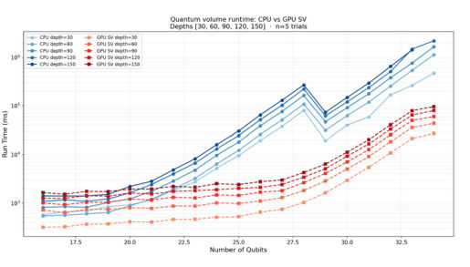 
Fig. 1: Log-scale runtime (ms) for quantum volume circuits on CPU (solid blue) and GPU (dashed red) across 16–34 qubits and five circuit depths (30–150). GPU outperforms CPU by 1–2 orders of magnitude at higher qubit counts; both scale exponentially. The dip at 29 qubits on CPU curves reflects a hardware transition in the managed platform.

📷 Fig 2

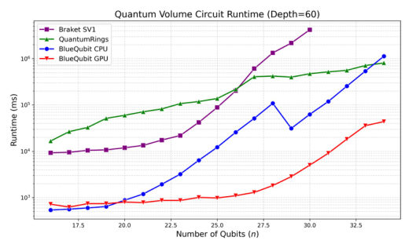 
Fig. 2: Quantum volume circuit runtime at depth 60 across four backends (16–34 qubits, log scale). BlueQubit GPU (red) is fastest at all qubit counts, reaching ∼4 × 104 ms at 34 qubits. BlueQubit CPU (blue) exhibits a characteristic dip near 29 qubits before resuming exponential growth. Braket SV1 (purple) diverges sharply above 27 qubits, surpassing 107 ms above 30 qubits; benchmarking was discontinued beyond 31 qubits due to excessive runtime and cloud cost. Quantum Rings (green) and BlueQubit CPU converge near 106 ms at 34 qubits.

📷 Fig 3

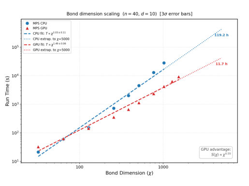 
Fig. 3: MPS runtime vs. bond dimension at n = 40 qubits, d = 10 layers (log–log scale). CPU scaling (T ∝χ2.03±0.11) approaches the theoretical χ2 for gate-contraction-dominated regimes. GPU scaling (T ∝χ1.49±0.06) is sub-quadratic, reflecting efficient parallelization of contraction and SVD operations at large tensor sizes. The GPU advantage grows with χ as S(χ) ∝χ0.55. Dotted lines extrapolate both fits to χ = 5,000, projecting runtimes of 119.2 h (CPU) vs. 11.7 h (GPU).

📷 Fig 4

 
Figure 2 compares all four state-vector backends on the same depth-60 QV circuits. Three findings emerge. First, BlueQubit GPU is the fastest state-vector backend at all tested qubit counts, outperforming Braket SV1 and Quantum Rings by 1–2 orders of magnitude at 30+ qubits and BlueQubit CPU by roughly 2× at 34 qubits. Second, platform differences grow with problem size. At 20 qubits, all backends complete within a few seconds; at 34 qubits, the spread exceeds three orders of magnitude. This is

📷 Fig 5

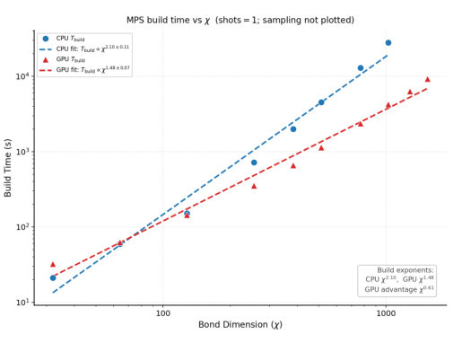 
Fig. 4: MPS build-phase runtime vs. bond dimension at shots = 1, isolating the MPS construction phase from sampling overhead. CPU build time scales as χ2.10±0.11; GPU build time scales as χ1.48±0.07, yielding a growing GPU advantage of χ0.61. Sampling time is negligible at shots= 1 and is not plotted.

**Summary.** This paper conducts a comprehensive benchmark of various hosted quantum circuit simulators, comparing performance across GPU-accelerated MPS and PPS methods against state-of-the-art backends. The key finding is that GPUs offer massive speedups, enabling simulations at higher accuracy and scale than previously possible using commodity CPUs. It establishes a standardized protocol for evaluating the practical computational limits of current quantum simulation toolkits.

**Why it may be interesting.** It provides crucial, quantitative data on the computational scaling of modern quantum simulation techniques (MPS/PPS), which are essential numerical tools for studying strongly correlated systems and dynamics in condensed matter physics.

Detailed structure

**Main problem.** The performance characteristics of hosted quantum circuit simulation environments are poorly documented, making it difficult for practitioners to select an optimal backend.

**Main result.** GPU acceleration provides substantial speedups (up to 1,400x) over CPU implementations for both MPS and PPS simulations, enabling access to higher accuracy regimes previously unreachable.

**Method.** The study systematically benchmarks multiple zero-setup simulators (BlueQubit, AWS Braket, etc.) across different simulation methods: State-Vector (SV), Matrix Product States (MPS), and Pauli Path Simulation (PPS).

**Model / system.** Quantum circuits are simulated using various approximation techniques. Benchmarks include random SU(4) circuits, Quantum Fourier Transform (QFT), and the 127-qubit kicked Ising model.

**Key observables.** Runtime ($T$), speedup factor ($S$), scaling exponents ($\chi$ for MPS), and simulation accuracy/fidelity ($\delta$).

**Important parameters / regimes.** Bond dimension ($\chi$), qubit count ($n$), circuit depth ($d$), and truncation threshold ($\delta$).

**Assumptions / limitations.** The comparison relies on standardized protocols to expose crossover points, but limitations include the scope of vendor APIs (e.g., AWS Braket SV1) and the exclusion of hybrid variational workloads.

**Figures summary.** Figures illustrate the dramatic runtime divergence between GPU and CPU backends for state-vector simulation at high qubit counts ($\ge 30$), and show scaling behavior for MPS/PPS methods.

**Paper structure.** The paper is structured as a systematic benchmarking study, comparing multiple software tools across different physical simulation regimes (SV, MPS, PPS) to provide reproducible performance characterizations.

Abstract

Practitioners increasingly rely on hosted simulation environments, but their performance characteristics remain poorly documented. We present a systematic benchmarking study of GPU-accelerated approximate quantum simulation across two widely used methods: matrix product states (MPS) and Pauli path simulation (PPS), comparing BlueQubit (a hosted tool that handles hardware provisioning, simulator configuration, and job orchestration) against AWS Braket, Quantum Rings, PPS-Qiskit, and PauliPropagation.jl. For MPS, we find that GPU runtime yields sub-quadratic scaling with bond dimension, with a growing advantage over CPU at increasing scale. For Pauli path simulation on IBM's 127-qubit kicked Ising benchmark, GPUs deliver up to $1{,}400\times$ speedup at fine truncation thresholds ($δ= 2.5 \times 10^{-5}$, 27.6M Pauli terms), and are the only backends that reach accuracy regimes below $δ= 10^{-5}$, which remained inaccessible to the commodity CPU-based implementations and self-contained SDKs evaluated here. We also provide a reproducible characterization of these simulators across regimes, including tradeoffs that isolated evaluations do not show. To support transparency and reuse, we provide a public GitHub repository containing all benchmarking code and configurations.

[↑ back to top](#top)

### [Bounding Kirkwood-Dirac negativity of Gaussian processes](http://arxiv.org/abs/2607.11854v1)

**Authors:** Luca Bianchi, Carlo Marconi, Riccardo Cioli, Jan Sperling  
**Type:** theory · **Category:** other · **PDF:** <https://arxiv.org/pdf/2607.11854v1>  
**Analysis basis:** full PDF text, analyzed in chunks
**Topic relevance:** `quantum measurements` **3/5** · `measurement-induced transitions` **2/5** · `Keldysh / 2PI / non-Gaussian methods` **1/5** · `correlated / nonlocal dissipation` **1/5** · `driven-dissipative phase transition` **1/5** · `entanglement & information structure` **1/5** · `methods for driven-dissipative` **1/5**

📷 Fig 1

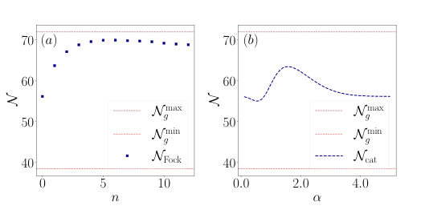 
FIG. 3. Negativity of the KD for non-Gaussian states: (a) Fock states and (b) even cat states.

📷 Fig 2

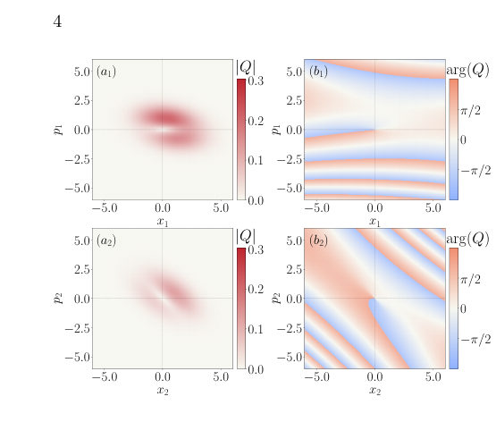 
FIG. 1. Q(x1, p1, x2, p2) for a single-Fock state. The different subplots show the amplitude (left) and the phase (right) of the KD distribution for the slices (x2, p2) = (1.25, 0.25) (top panels) and (x1, p1) = (1.25, 0.25) (bottom panels).

📷 Fig 3

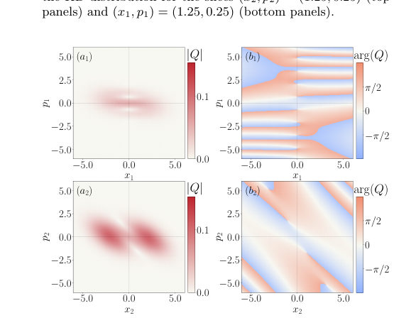 
FIG. 2. Q(x1, p1, x2, p2) for an even cat state, where α = 2. The plots show the amplitude (left) and the phase (right) of the KD distribution for (x2, p2) = (0, 0) (top panels) and (x1, p1) = (0, 0) (bottom panels).

**Summary.** This paper develops an upper bound for the Kirkwood-Dirac negativity, a measure of nonclassicality in continuous variable quantum systems subjected to Gaussian processes. Through advanced mathematical techniques involving phase-space representations and Lorentz invariance, the authors prove that these extreme values can be reached using only Gaussian states. This provides a powerful theoretical tool for characterizing nonclassical resources.

**Why it may be interesting.** This work provides rigorous mathematical tools to quantify nonclassicality in CV systems using phase-space methods. The finding that Gaussian states suffice for extremal values is a significant theoretical result applicable across quantum optics and measurement theory.

Detailed structure

**Main problem.** The primary goal is to derive an upper bound for the Kirkwood-Dirac (KD) negativity, a measure of nonclassicality, when applied to quantum states undergoing Gaussian processes.

**Main result.** The authors establish that Gaussian states are sufficient to achieve the extreme values (both maximum and minimum) of the KD negativity in the analyzed regimes. They derive explicit formulas for these bounds based on covariance matrices.

**Method.** The analysis heavily relies on mapping quantum operators to phase-space functions using the Weyl representation, employing techniques from symplectic geometry and Lorentz invariance to simplify the calculation of determinants involving covariance matrices.

**Model / system.** The system under study is continuous-variable (CV) quantum systems described by an M-mode state undergoing N sequential measurements $\{\hat{\Pi}_i\}$ governed by Gaussian dynamics. The focus is on characterizing nonclassicality via the KD quasiprobability $Q(\mathbf{r})$.

**Key observables.** KD Negativity ($\mathcal{N}$ or $\mathcal{N}_g$), which quantifies nonclassicality; the covariance matrix ($\sigma$).

**Important parameters / regimes.** Number of modes ($M$), number of measurements ($N$), squeezing parameters, and Lorentz invariants derived from the state's covariance structure.

**Assumptions / limitations.** The analysis assumes Gaussian dynamics and measurements for deriving the primary bounds. Later parts utilize specific coordinate transformations (e.g., Center-of-Mass frame) to simplify optimization.

**Figures summary.** Figures illustrate 2D slices of the KD quasiprobability $Q(r)$ for various states (Fock, cat), comparing calculated negativity against theoretical maximums and minimums across varying state parameters.

**Paper structure.** The paper progresses from defining the problem and deriving a general upper bound based on covariance matrices. It then specializes to Gaussian input states, derives closed-form expressions for negativity, and finally uses advanced mathematical techniques (Lorentz invariance, Loewner monotonicity) to prove that Gaussian states saturate these bounds.

Abstract

The Kirkwood-Dirac quasiprobability provides an operational representation of a quantum state, whose negativity serves as a measure of nonclassicality. Despite its fundamental importance, the extremal values of the Kirkwood-Dirac negativity are still unknown in the general case. We investigate the Kirkwood-Dirac quasiprobability of an arbitrary quantum state under Gaussian processes. In this setting, we derive an upper bound on the negativity for any number of modes and measurements. For a single mode and two measurements, we show that the eigenstates of the quadrature operators saturate this upper bound, while a nontrivial minimum is reached by pure Gaussian states. As a consequence, our results indicate that Gaussian states are sufficient to achieve extreme values of nonclassicality.

[↑ back to top](#top)

### [Learning Topological Quantum Phases from Limited Subsystems](http://arxiv.org/abs/2607.10656v1)

**Authors:** Mehran Khosrojerdi, Sougato Bose, Alessandro Cuccoli, Paola Verrucchi, Abolfazl Bayat, Leonardo Banchi  
**Type:** theory · **Category:** statistical mechanics · **PDF:** <https://arxiv.org/pdf/2607.10656v1>  
**Analysis basis:** full PDF text, analyzed in chunks
**Topic relevance:** `analog quantum simulation` **3/5** · `exotic spin models in light-matter` **3/5** · `entanglement & information structure` **2/5** · `methods for driven-dissipative` **1/5** · `quantum measurements` **1/5**

📷 Fig 1

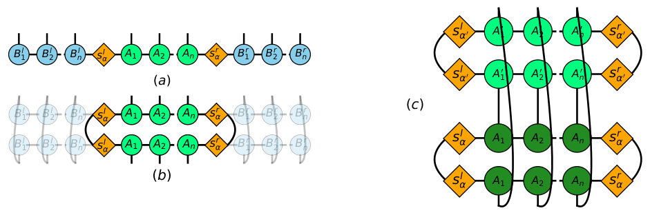 
FIG. 1. (a) Bipartite MPS in canonical form. The chain is split into a block of adjacent sites A and a block B containing the rest of the system, with the bond index α representing the Schmidt decomposition Eq. (1) and encoding the entanglement across the cut. (b) Reduced density matrix ρA of block A, obtained by tracing out over block B in the MPS Schmidt decomposition. (c) Kernel (2) between two reduced density matrices, measuring their similarity.

📷 Fig 2

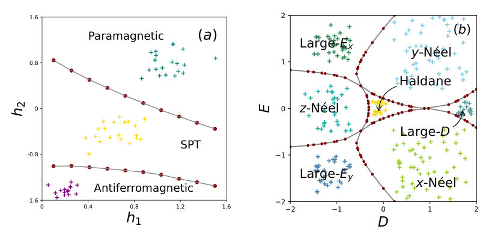 
FIG. 2. (a) Phase diagram of the Generalized Cluster-Ising model, Eq. (7): phase-boundary lines are the results of infinite- size DMRG calculations reported in Refs. [38, 58]. Colored plus signs indicate the training points scattered across the phase diagram, representing the corresponding phase labels. (b) Phase diagram of the Haldane anisotropic spin-1 model Eq. (8) as obtained in Ref.[23]. Colored plus signs indicate the training points scattered across the phase diagram, representing the corresponding phase labels.

📷 Fig 3

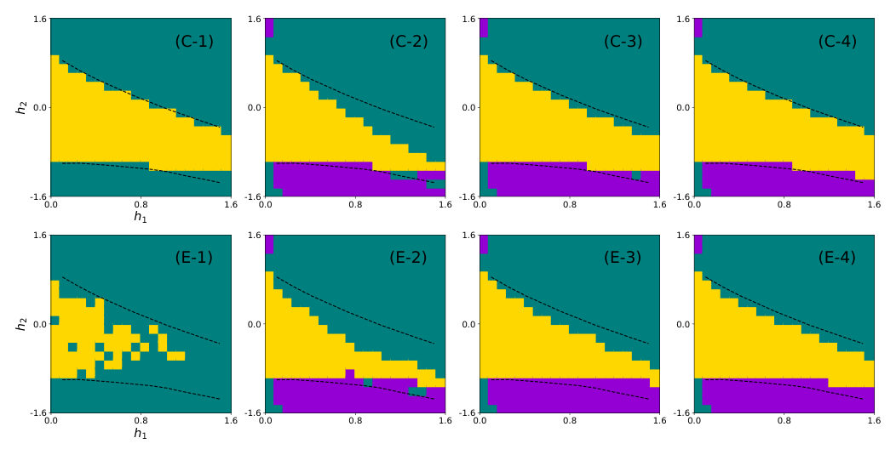 
FIG. 3. Phase diagram reconstruction of the Generalized Cluster-Ising model based on reduced density matrices for blocks of increasing number of sites. In the upper panels the block is at the center of the chain and (C-k) refers to keeping k sites. In the lower panels the block is at the edge of the chain and (E-k) refers to keeping k sites. A chain of 51 sites is used both for training and testing.

📷 Fig 4

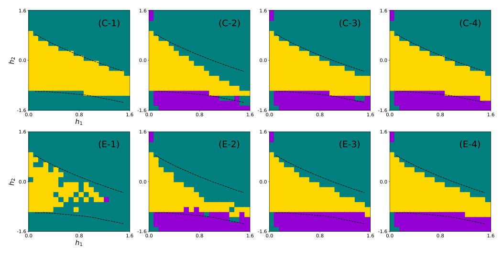 
FIG. 4. Reconstruction of the phase diagram of the Generalized Cluster-Ising model as in Fig. 3; while a chain of 51 sites is still used for testing, training is performed with a shorter chain of 31 sites.

📷 Fig 5

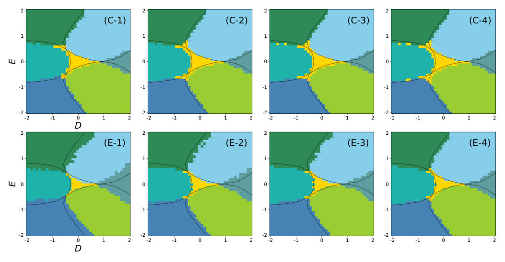 
FIG. 5. Phase diagram reconstruction of the anisotropic Haldane model based on reduced density matrices for blocks of increasing number of sites. In the upper panels the block is at the center of the chain and (C-k) refers to keeping k sites. In the lower panels the block is at the edge of the chain and (E-k) refers to keeping k sites. A chain of 51 sites is used both for training and testing.

**Summary.** The paper presents a novel machine learning framework to identify complex quantum topological phases by analyzing data from small, accessible subsystems rather than the entire system. It constructs a quantum kernel from reduced density matrices ($
ho_A$) and uses an SVM classifier to achieve high classification accuracy on 1D spin models. This breakthrough suggests that local measurements are sufficient proxies for characterizing global many-body physics.

**Why it may be interesting.** This work provides a powerful, practical bridge between theoretical concepts of global topological order and experimentally feasible local measurements, which is crucial for designing future quantum simulation experiments.

Detailed structure

**Main problem.** Characterizing quantum topological phases, which typically requires measuring non-local string order parameters that demand access to the entire system.

**Main result.** The authors demonstrate that high accuracy in phase classification can be achieved using only local measurements from small subsystems (as few as one to four sites). This proves that local reduced density matrices retain vital signatures of global topological phases.

**Method.** A data-efficient supervised learning framework is introduced, utilizing a quantum kernel constructed from the reduced density matrices ($
ho_A$) of limited subsystems, which is then fed into a Support Vector Machine (SVM) classifier.

**Model / system.** The method was benchmarked on two one-dimensional spin models: the generalized cluster-Ising spin-1/2 chain and the anisotropic Haldane spin-1 chain. These systems exhibit rich phase diagrams, including topological (SPT) phases.

**Key observables.** Reduced density matrices ($
ho_A$) of subsystems; the quantum kernel $K(x_n, x_m)$ quantifying similarity between these reduced states.

**Important parameters / regimes.** The size of the accessible subsystem ($N_A$), which dictates measurement feasibility; coupling constants and fields defining the Hamiltonian for the spin chains.

**Assumptions / limitations.** The primary assumption is that local features captured by $
ho_A$ retain sufficient information to reconstruct global knowledge of the underlying topological phase. The method also assumes the system is in its ground state.

**Figures summary.** Figures illustrate the bipartite MPS structure, the calculation of the reduced density matrix ($
ho_A$) by tracing out blocks B, and the resulting quantum kernel $K(x_n, x_m)$ used for classification.

**Paper structure.** The paper establishes the problem (non-local measurement requirement), proposes the ML/kernel methodology using $
ho_A$, details the application to specific 1D spin models (GCI and Haldane), presents results showing high accuracy with limited local measurements, and discusses generalizability across system sizes.

Abstract

Characterizing quantum topological phases requires measuring non-local string order parameters, demanding access to the full system, which is often experimentally unfeasible. In this work, we introduce a data-efficient supervised learning framework that circumvents this limitation by recognizing quantum phases from small subsystems. Our protocol utilizes a quantum kernel constructed from the reduced density matrices of these subsystems, which can be efficiently estimated experimentally. We benchmark our framework with the classification of the phase diagrams of two spin models on one-dimensional lattices, namely the generalized cluster-Ising spin-1/2 chain and the anisotropic Haldane spin-1 chain. Remarkably, our approach achieves high accuracy in phase classification when operations are limited to as few as one to four sites, and it also generalizes to longer chains even when trained on moderate system sizes. These findings demonstrate that local reduced density matrices preserve vital signatures of global topological phases, offering a practical route to characterize rich phase diagrams of quantum many-body systems.

[↑ back to top](#top)

### [Coherent Quantum Schrodinger Bridge: Two-Boundary Optimal Control for Quantum Algorithm Design](http://arxiv.org/abs/2607.10550v1)

**Authors:** Masayuki Ohzeki  
**Type:** theory · **Category:** quantum information and computing · **PDF:** <https://arxiv.org/pdf/2607.10550v1>  
**Analysis basis:** full PDF text, analyzed in chunks
**Topic relevance:** `quantum measurements` **3/5** · `non-equilibrium dynamics` **2/5** · `Keldysh / 2PI / non-Gaussian methods` **1/5** · `driven-dissipative phase transition` **1/5** · `measurement-induced transitions` **1/5** · `methods for driven-dissipative` **1/5**

📷 Fig 1

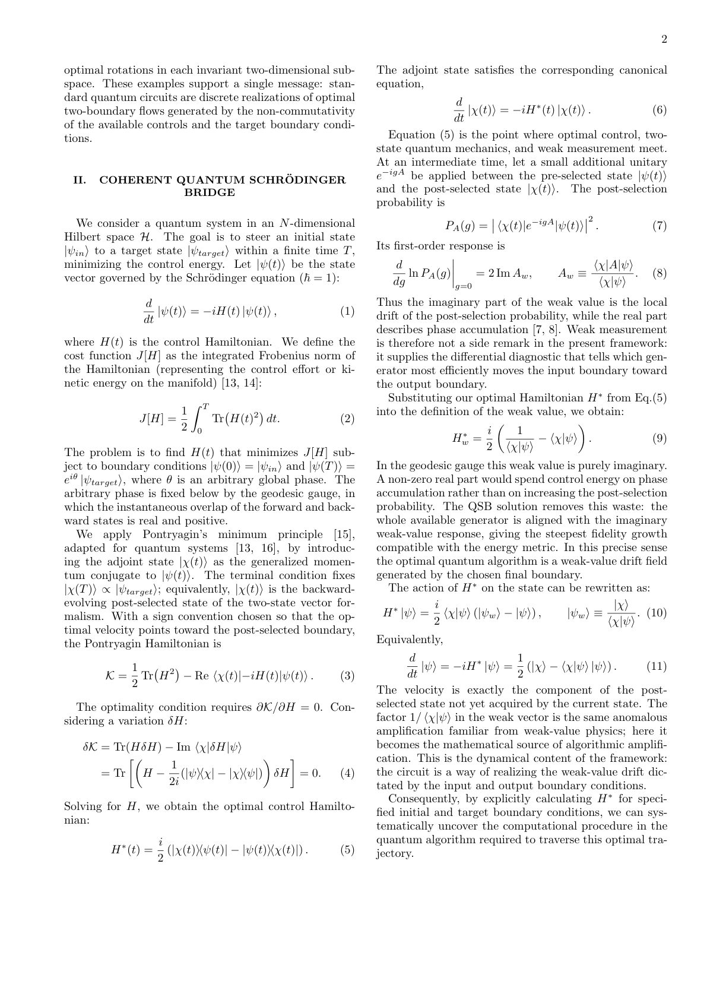 
Low-resolution page preview, page 2

📷 Fig 2

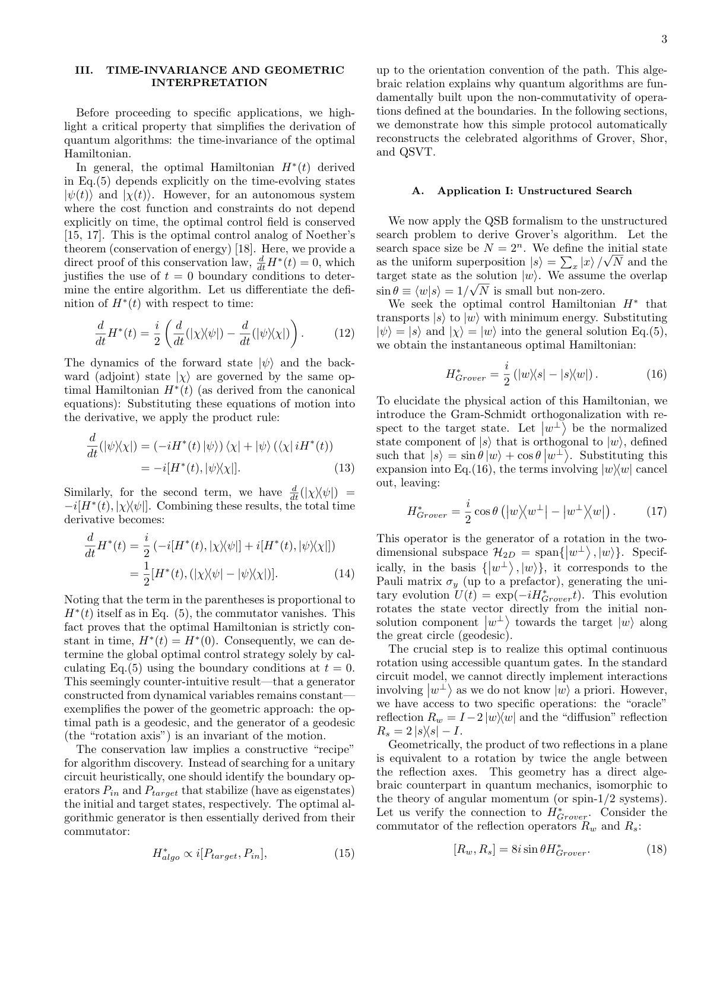 
Low-resolution page preview, page 3

📷 Fig 3

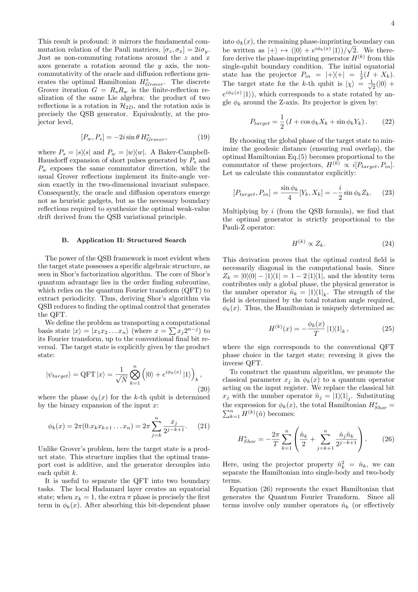 
Low-resolution page preview, page 4

📷 Fig 4

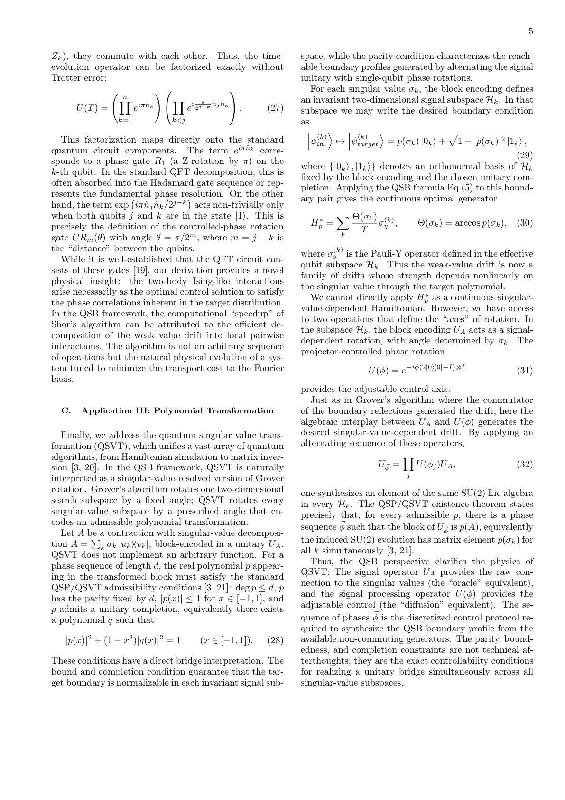 
Low-resolution page preview, page 5

📷 Fig 5

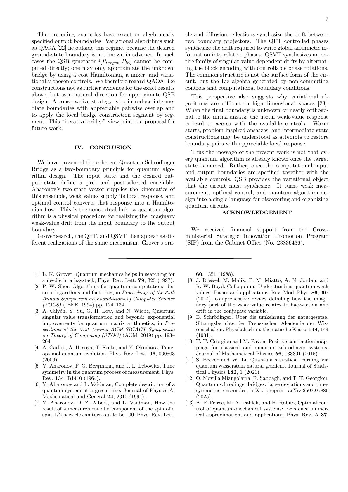 
Low-resolution page preview, page 6

**Summary.** This work unifies quantum algorithm design by framing it as solving a Quantum Schrödinger Bridge problem. By minimizing control energy between input and output states, the optimal Hamiltonian is determined solely by the boundary conditions. This geometric perspective successfully derives known algorithms like Grover's search and QFT from a single underlying principle: the commutator of projection operators.

**Why it may be interesting.** It provides a powerful unifying mathematical lens—optimal control theory—to view disparate quantum computational tasks, linking them all through the geometry of state evolution and weak measurements.

Detailed structure

**Main problem.** The paper reformulates quantum algorithm design as finding an optimal, energy-minimizing flow between a defined input state and a target output state.

**Main result.** It shows that standard algorithms like Grover's search and QFT can be derived from a single geometric principle: the commutator of boundary projection operators, $H^*_{	ext{algo}} \propto i[P_{	ext{target}}, P_{	ext{in}}]$.

**Method.** The core method is applying the Quantum Schrödinger Bridge (QSB) formalism and Pontryagin's minimum principle to find the optimal control Hamiltonian that minimizes energy dissipation.

**Model / system.** The model is a quantum system evolving in an N-dimensional Hilbert space, governed by a time-dependent Hamiltonian $H(t)$, constrained between two fixed boundary states $|\psi_{	ext{in}}
angle$ and $|\psi_{	ext{target}}
angle$.

**Key observables.** The optimal Hamiltonian $H^*(t)$, which is shown to be constant in time ($H^*$), and the weak value, identified as the local response function quantifying state drift.

**Important parameters / regimes.** The computational boundary conditions (input/output states) define the entire algorithm; the control energy cost functional $J[H]$ dictates the optimal path.

**Assumptions / limitations.** The analysis focuses on the coherent pure-state limit, assuming the optimal path is a geodesic determined by minimizing control energy.

**Paper structure.** The paper establishes the QSB framework, derives the general form of the optimal Hamiltonian from boundary projectors, and then applies this universal principle to reconstruct specific algorithms (Grover's, QFT, QSVT) as manifestations of this geometric flow.

Abstract

Quantum algorithms are intrinsically two-boundary processes: an input state is prepared, and an output state or subspace is selected as the computational answer. We formulate this observation as a coherent Quantum Schrödinger Bridge (QSB), a pure-state Hamiltonian counterpart of Schrödinger bridge theory in which the endpoint constraint is imposed on state vectors and the transport cost is the quadratic control action. In this setting Aharonov's two-state vector becomes the natural optimal-control pair: a forward state from the input and a backward state from the target. Pontryagin's principle then yields a universal optimal Hamiltonian whose weak value is purely imaginary in the geodesic gauge. Thus weak values are not an auxiliary interpretation; they are the local response functions that quantify the drift of the pre-selected state toward the post-selected boundary. Applying this framework to unstructured search, periodicity finding, and matrix arithmetic, we reconstruct Grover's algorithm, the quantum Fourier transform underlying Shor's algorithm, and quantum singular value transformation (QSVT). The usual circuit components -- oracles, diffusion reflections, controlled phases, and signal-processing rotations -- emerge as Lie-algebraic syntheses of the optimal weak-value drift. This perspective unifies distinct algorithmic paradigms into a single geometric principle: algorithm design is the problem of choosing computational boundary conditions and realizing the corresponding optimal flow.

[↑ back to top](#top)

### [Semiclassical asymptotics of multiphotonic scattering probabilities with partial indistinguishability](http://arxiv.org/abs/2607.10632v1)

**Authors:** Alonso Botero, Hubert de Guise, Orlando Melo-Vargas  
**Type:** theory · **Category:** other · **PDF:** <https://arxiv.org/pdf/2607.10632v1>  
**Analysis basis:** full PDF text, analyzed in chunks
**Topic relevance:** `interference shaping light` **3/5** · `Keldysh / 2PI / non-Gaussian methods` **1/5** · `Tavis-Cummings & cavity-many-emitter` **1/5** · `analog quantum simulation` **1/5** · `correlated cavity matter` **1/5** · `driven-dissipative phase transition` **1/5** · `methods for driven-dissipative` **1/5**

📷 Fig 1

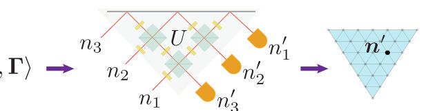 
Figure 1: Schematic of our setup for multiport, multiphoton interferometry, illustrated with M = 3 ports. N photons are prepared in a correlated mode state |n, Γ⟩, where the initial occupations n = (n1, . . . , nM) describes the number of photons entering each port, and the matrix Γ the relevant parameters of the internal modes. The interferometer (shaded region) is described by a unitary U. At the output, photodetectors count the number of exiting photons at each port (without resolving internal modes), and the counts n′ i determine the final occupations n′, which can be viewed as points on a (final) occupation simplex (see Fig. 2). The multiphotonic scattering probability P(n′|U, n, Γ)...

📷 Fig 2

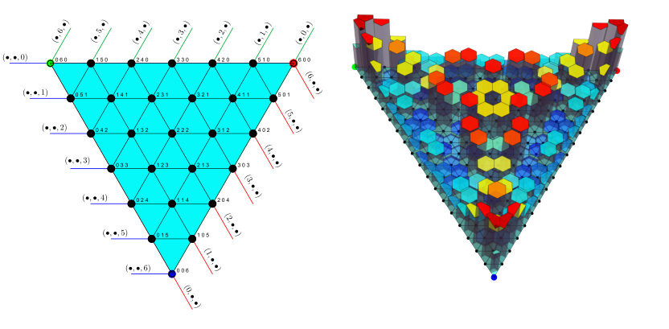 
Figure 2: Left: Occupation simplex for a three-port setting with N = 6 photons. Points denote possible occupation distributions n = (n1, n2, n3) for a given N. Points at the vertices of the simplex (colored) correspond to single-mode occupations. Right: Example of a multiphotonic scattering probability P(n′|U, n, Γ) for N = 18 indistinguishable photons (Γij = 1) and a three-port “tritter” interferometer (Ujk = ei 2π

📷 Fig 3

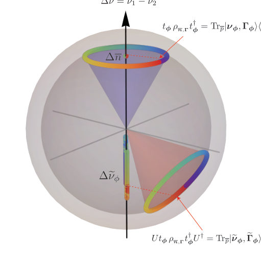 
Figure 3: Graphical illustration of the scattering of virtual states for the case M = 2, in terms of marginal virtual states represented as points in the interior of the Bloch sphere. The circles in the two cones represent the marginal states for the virtual states |νϕ, Γϕ⟩and |eνϕ, eΓϕ⟩in the toroidal expansions of |n, Γ⟩and D(N)(U ⊗1)|n, Γ⟩respectively. The z axis plays the role of the 1-simplex with projections onto the z axis representing the difference ∆ν = ν1−ν2 in the virtual weights of the virtual state. All initial states project to the same point ∆n = n1 −n2 on the z axis. The scattered states project onto different points ∆eν = eν1 −eν2, depending on the values of ϕ. The density...

📷 Fig 4

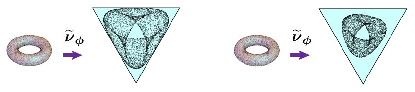 
Figure 4: The classical map (36) for a three-port tritter with n = (0.7, 0.25, 0.05), for two degrees of indistinguishability: perfect indistinguishability (left) and partial indistinguishability (right), according to the indicated distinguishability matrices. The map is represented by the image on the simplex of a random collection of points on the torus. The image of the torus is the classically allowed region R, which may entirely surround voids (points with no preimage on the torus). As the off-diagonal entries of Γ deviate from one, the size and shape of R can change qualitatively. The classical measure describes the density of points on the simplex and diverges at the creases of the...

📷 Fig 5

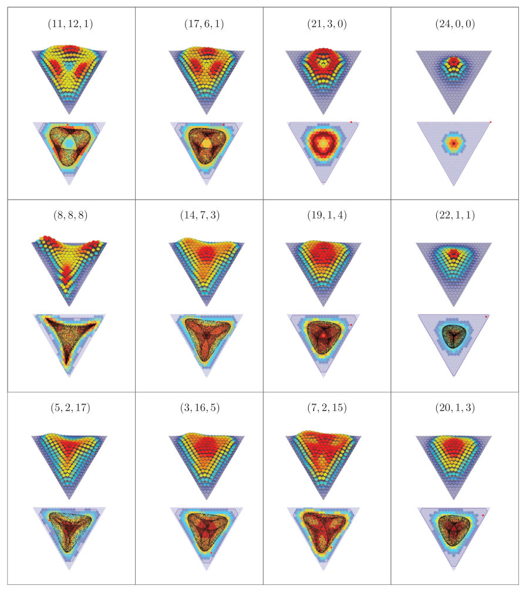 
Figure 5: The MSP P(n′|U, n, Γ) on the normalized occupation simplex for N = 24 partially distinguishable photons scattered by a tritter, for the same distinguishability matrix of (36) and twelve different initial occupations n (box labels and red dots). In each box, the MSP is represented by heights and heat maps; the bottom image compares the MSP with the image under the classical map of uniformly-sampled random torus points. Also shown in the bottom images is the spectral permutahedron (see Section 5)–the convex hull of the permutations of the eigenvalues of ρn,Γ.

**Summary.** This theoretical paper develops a framework to calculate the asymptotic behavior of multiphotonic scattering probabilities in interferometers where photons are partially indistinguishable. By mapping the problem onto a classical phase space, the authors predict that the probability distribution will concentrate on a geometrically defined 'classically allowed region.' This provides new insights into quantum interference patterns observable in photon experiments.

**Why it may be interesting.** This work provides powerful tools to connect quantum interference phenomena (like photon bunching) directly to classical geometric structures (caustics/voids), offering testable predictions for quantum optics experiments.

Detailed structure

**Main problem.** The paper addresses computing the semiclassical asymptotics of multiphotonic scattering probabilities when photons exhibit partial indistinguishability.

**Main result.** A new asymptotic formula is established showing that these probabilities concentrate on a 'classically allowed region' defined by a classical map derived from the system's phase space.

**Method.** The authors employ a toroidal expansion of multiphotonic states in tensor powers, leading to an integral representation whose large-photon limit is governed by a classical map.

**Model / system.** The physical system is a lossless multiport interferometer analyzed using correlated mode states $|\mathbf{n}, \Gamma
angle$. The model incorporates both port degrees of freedom and internal overlaps characterized by the Gram matrix $\Gamma$.

**Key observables.** Multiphotonic scattering probability $P(\mathbf{n}'|\mathcal{U}, \mathbf{n}, \Gamma)$, which is analyzed on the output occupation simplex.

**Important parameters / regimes.** The degree of indistinguishability, controlled by the Gram matrix $\Gamma$; the large-photon limit ($N 	o \infty$).

**Assumptions / limitations.** The analysis relies on the toroidal expansion and asymptotic approximations in the large-photon limit; specific mathematical identities are used to simplify determinants.

**Figures summary.** Figures illustrate the setup, the occupation simplex, and crucially, visualize predicted structures like caustics (ridges of enhanced probability) and voids (regions of suppressed probability) arising from the classical map.

**Paper structure.** The paper moves from defining exact Fock-space expressions for scattering probabilities to developing a mathematically tractable framework using tensor power expansions. This leads to an integral representation, which is then analyzed asymptotically via complex phase variables and determinant calculations.

Abstract

We propose a framework for computing multiphotonic scattering probabilities in a lossless multiport interferometer for arbitrary photon numbers and degrees of indistinguishability. By exploiting a toroidal expansion of multiphotonic states in tensor powers of single-particle states, the framework defines a map from a torus of relative phases to the probability simplex that governs the asymptotic behavior of scattering probabilities in the large-photon limit. Specifically, the probabilities concentrate on the "classically allowed region" defined by the map, and the slowly-varying part of the multiphotonic distribution reproduces a classical measure induced by the map. As a result, we are able to establish a new asymptotic formula for the multiphotonic probabilities in a general scenario of partially indistinguishable photons, while also providing a single-particle picture to explain the asymptotics of known multiphotonic transition amplitudes in the fully indistinguishable case. More broadly, our framework yields new, directly testable consequences in relation to asymptotic photon bunching patterns: it translates features of the classical map -- such as caustics and voids -- into direct predictions about regions of large or exponentially suppressed photon-distribution probability.

[↑ back to top](#top)

### [Higher-order covariance matrices for non-Gaussian quantum states](http://arxiv.org/abs/2607.11759v1)

**Authors:** Vojtěch Kala, Petr Marek, Nicolas J. Cerf  
**Type:** theory · **Category:** quantum information and computing · **PDF:** <https://arxiv.org/pdf/2607.11759v1>  
**Analysis basis:** full PDF text, analyzed in chunks
**Topic relevance:** `Keldysh / 2PI / non-Gaussian methods` **3/5** · `quantum measurements` **2/5** · `entanglement & information structure` **1/5** · `measurement-induced transitions` **1/5** · `methods for driven-dissipative` **1/5**

📷 Fig 1

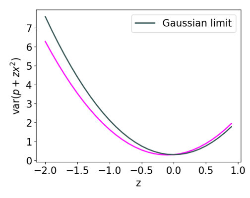 
FIG. 1. Variance of the operator p+zx2 (magenta) as a func- tion of z, computed with the higher-order covariance matrix and as its Gaussian limit.

**Summary.** The paper introduces higher-order covariance matrices to overcome the limitations of standard second-order moment descriptions when dealing with non-Gaussian quantum states. This formalism allows researchers to track state properties under complex transformations like nonlinear squeezing using only limited homodyne measurements. It provides a scalable and practical theoretical framework for continuous-variable quantum information science.

**Why it may be interesting.** This work provides a necessary mathematical toolset for analyzing complex quantum states beyond the Gaussian regime, which is crucial for understanding resource theories in continuous-variable quantum information processing.

Detailed structure

**Main problem.** The standard symplectic framework using covariance matrices is insufficient for analyzing non-Gaussian quantum states because it only captures second-order moments, neglecting essential higher-order correlations.

**Main result.** Higher-order covariance matrices provide a simple, scalable formalism to characterize and track the evolution of non-Gaussian states under Gaussian transformations. This method avoids the exponential scaling associated with full Fock basis simulations.

**Method.** The authors define and utilize higher-order covariance matrices built from quadrature monomials, allowing for the evaluation of state properties using limited homodyne measurement data rather than full quantum simulation.

**Model / system.** The work focuses on continuous-variable quantum systems, particularly characterizing non-Gaussian states relevant to quantum optics and cluster state descriptions. The formalism is tested against Gaussian operations like squeezing and beam splitting.

**Key observables.** Higher-order moments of quadrature operators (e.g., $	ext{var}(p + zx^2)$), the higher-order mean vector ($\langle \mathbf{r} 
angle$), and the higher-order covariance matrix ($\gamma$).

**Important parameters / regimes.** The dimension of the matrices scales polynomially with the number of modes ($n$) rather than exponentially, which is a key advantage.

**Assumptions / limitations.** Gaussian operations are treated as 'free' transformations. The formalism requires careful handling of physicality conditions for $\gamma$ and relies on measurement data from specific quadrature angles.

**Figures summary.** One figure compares the actual variance to its Gaussian limit, showing significant divergence for non-Gaussian states as a parameter $|z|$ increases.

**Paper structure.** The paper establishes the limitations of second-order moments, introduces the higher-order covariance matrix formalism ($\gamma$), details how $\gamma$ transforms under general Gaussian operations (rotations, squeezing), and finally shows how to estimate these matrices from practical homodyne measurement data.

Abstract

Covariance matrices lie at the heart of the powerful and well-established symplectic framework for describing continuous-variable Gaussian quantum states. However, since this framework only relies on first- and second-order moments, it is not sufficient for the analysis of non-Gaussian states because their higher-order moments are essential to capture some of their key properties. Here, we define higher-order covariance matrices -- more precisely, covariance matrices built from higher-order quadrature monomials -- which provide a simple way to evaluate the effect of Gaussian transformations on non-Gaussian states and can be used, for example, to address nonlinear squeezing or non-Gaussian nullifiers. Higher-order covariance matrices can be estimated from homodyne measurement data using only a limited number of quadrature angles, which involves matrices of moderate dimension compared with a full simulation in the Fock basis. The dimension of a higher-order covariance matrix does not depend on the span of the quantum states in Fock basis and, furthermore, scales only polynomially with the number of modes.

[↑ back to top](#top)

### [Learning as a Geometric Phase Transition: Renormalization Group Flow and Anisotropic Symmetry Breaking in Deep Networks](http://arxiv.org/abs/2607.10770v1)

**Authors:** G. Le Pera, C. Nordio  
**Type:** theory · **Category:** disordered systems and neural networks · **PDF:** <https://arxiv.org/pdf/2607.10770v1>  
**Analysis basis:** full PDF text, analyzed in chunks
**Topic relevance:** `Keldysh / 2PI / non-Gaussian methods` **3/5** · `non-equilibrium universality` **2/5** · `driven-dissipative phase transition` **1/5** · `methods for driven-dissipative` **1/5** · `non-equilibrium dynamics` **1/5**

📷 Fig 1

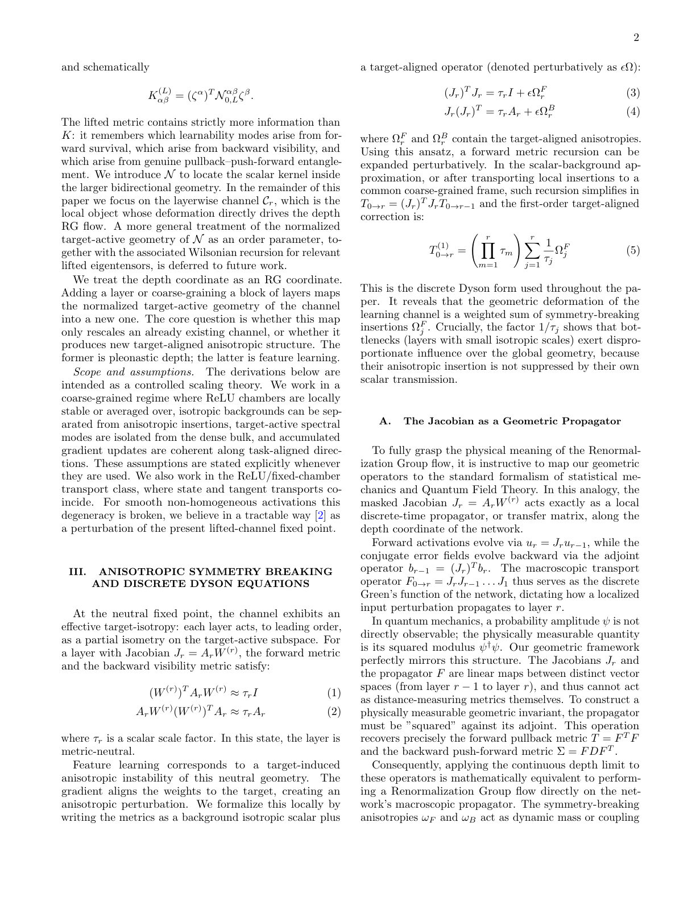 
Low-resolution page preview, page 2

📷 Fig 2

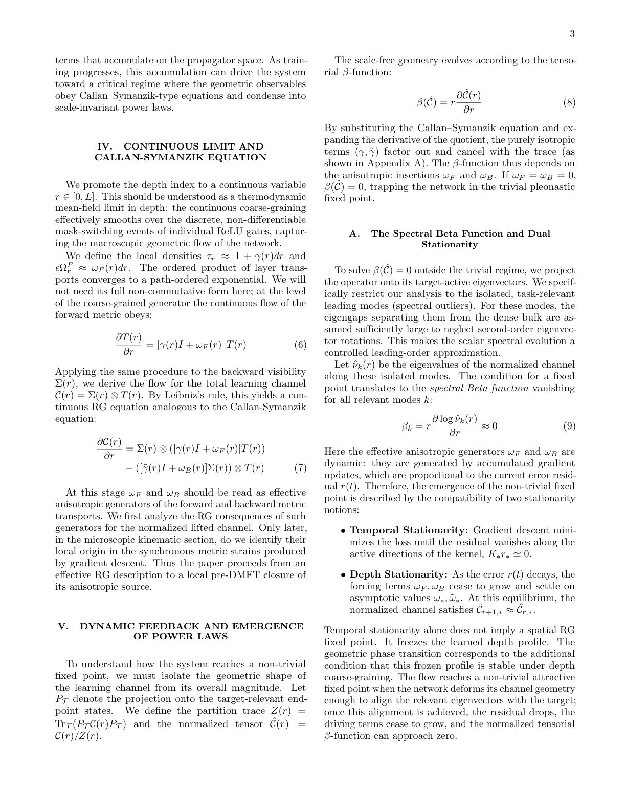 
Low-resolution page preview, page 3

📷 Fig 3

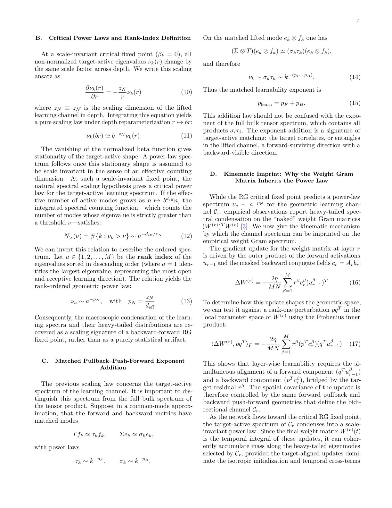 
Low-resolution page preview, page 4

📷 Fig 4

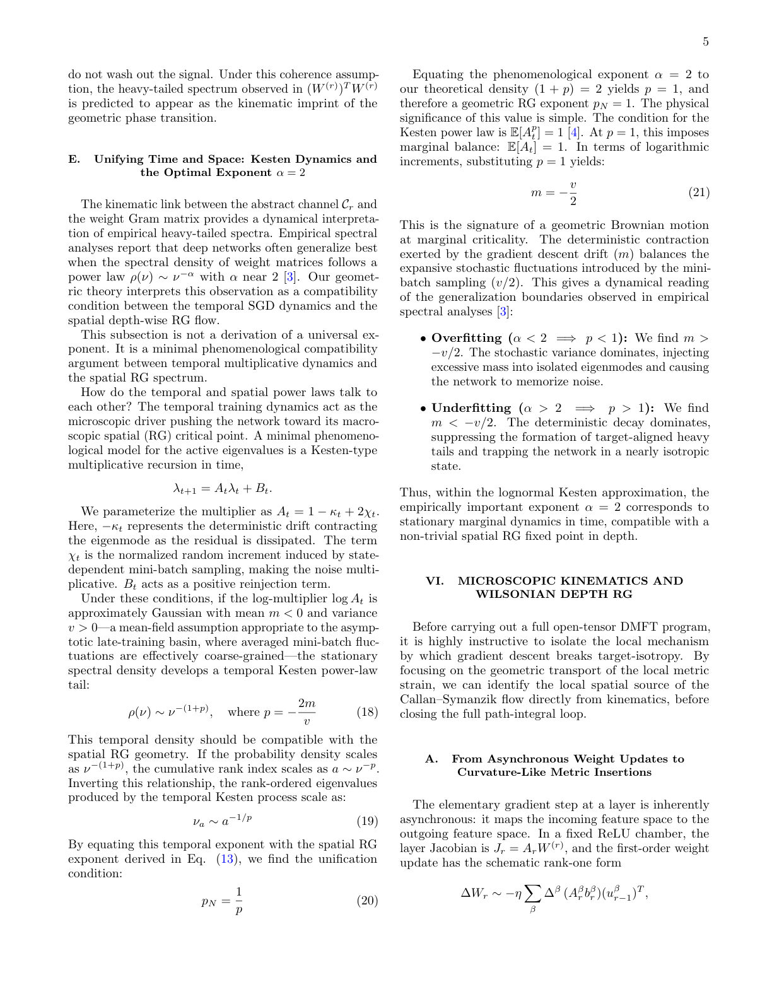 
Low-resolution page preview, page 5

📷 Fig 5

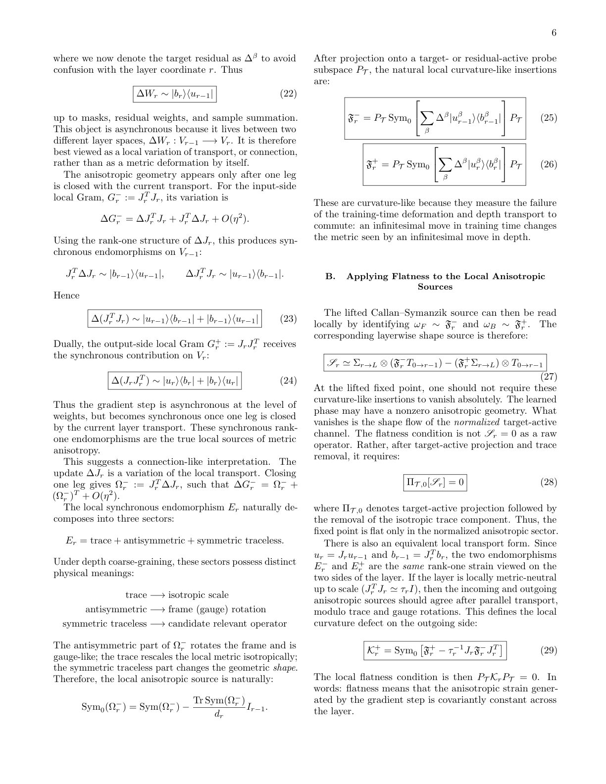 
Low-resolution page preview, page 6

**Summary.** This paper treats feature learning in deep neural networks as a geometric critical phenomenon analyzed through Renormalization Group flow. By deriving RG equations for the network's metric tensor, the authors show that stable, non-trivial learning requires an instability away from an isotropic fixed point. The resulting framework predicts how anisotropic structures emerge and govern the system's asymptotic behavior.

**Why it may be interesting.** It provides a rigorous theoretical framework linking concepts from critical phenomena (RG flow, phase transitions) to the dynamics of deep learning optimization, offering insights into the emergent structure of learned representations.

Detailed structure

**Main problem.** The paper formulates feature learning in deep neural networks as a geometric critical phenomenon governed by Renormalization Group (RG) flow.

**Main result.** Learning corresponds to an instability of the target-isotropic fixed point, leading to stable anisotropic structures characterized by non-zero symmetry-breaking operators that govern the RG flow.

**Method.** The authors employ RG techniques, deriving tensorial and spectral beta functions from microscopic kinematic analyses of gradient updates. They use Dyson expansions and Callan-Symanzik flow equations to track geometric changes across network depth.

**Model / system.** The system is a deep feed-forward ReLU neural network trained via gradient descent. The analysis focuses on the 'lifted tensor-product learning metric' which quantifies the entanglement between forward pullback survival and backward push-forward visibility.

**Key observables.** Lifted tensor-product learning metric ($\mathbf{N}$), target-active geometry, anisotropic insertions ($\Omega^F, \Omega^B$), spectral eigenvalues ($\hat{
u}_k$), and the associated $eta$-functions.

**Important parameters / regimes.** Network depth ($L$ or $r$), RG flow scale (coarse-graining step), and exponents derived from power-law spectra ($p_N, p_F, p_B$).

**Assumptions / limitations.** The analysis relies on several controlled scaling theory assumptions, including the local stability of ReLU chambers and the ability to project dynamics onto target-relevant eigenmodes.

**Figures summary.** Not specified in notes; the structure suggests derivations leading to flow equations and final fixed-point conditions.

**Paper structure.** The paper progresses from defining the geometric metric, deriving RG flow equations via Dyson expansions for anisotropic insertions, identifying the local kinematic sources of anisotropy (strains), and finally solving for the non-trivial stable fixed point governing feature learning.

Abstract

We formulate feature learning as a geometric critical phenomenon of the lifted tensor-product learning metric. The central object is not a scalar overlap, but the target-active geometry of \[ \mathcal N_{0,L}=\frac1N\sum_{r=1}^{L}Σ_{r\to L}\otimes T_{0\to r-1}, \] which entangles forward pullback survival with backward push-forward visibility. The neutral phase is target-isotropic: after restriction to endpoint target-active states and trace normalization, the lifted metric is proportional to the identity. Learning corresponds to an instability of this target-isotropic fixed point and to the emergence of traceless target-aligned eigentensors. We derive discrete Dyson expansions for local anisotropic insertions and their continuous Callan--Symanzik flow. Crucially, before constructing the full temporal mean-field theory, we identify the local spatial source of the $β$-functions directly from microscopic kinematics: asynchronous gradient updates generate synchronous metric strains, whose target-active symmetric traceless components act as curvature-like defects. The Wilsonian depth RG flow is then governed by the transport, balance, and coarse-grained irrelevance of these defects. Heavy-tailed spectra arise, under a scale-free counting hypothesis, as the spectrum of the target-active lifted geometry, with exponent addition in the matched pullback--push-forward sector. Finally, we relate this depth RG picture to temporal stochastic training dynamics and to the kinematic imprint of the learned channel on empirical weight Gram matrices.

[↑ back to top](#top)

### [Catalog of Altermagnetism in Magnetic Wallpaper/Space Groups and Nonsymmorphic Altermagnets](http://arxiv.org/abs/2607.10857v1)

**Authors:** Congcong Le, Fan Cui, Iao-Fai Io, Moritz Hirschmann, Xianxin Wu, Ching-Kai Chiu  
**Type:** theory · **Category:** other · **PDF:** <https://arxiv.org/pdf/2607.10857v1>  
**Analysis basis:** full PDF text, analyzed in chunks
**Topic relevance:** `exotic spin models in light-matter` **3/5** · `spintronics-quantum-optics interface` **3/5** · `analog quantum simulation` **1/5**

📷 Fig 1

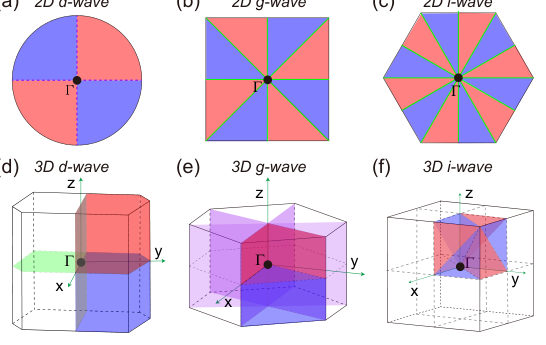 
Figure 1: (color online) Classification of 2D and 3D altermagnetic systems, with and without inversion symmetry, into three fundamental types: d-wave, g-wave and i-wave. The red and blue regions represent the spin-up and spin-down distri- butions in BZs, and the conventional-cell BZs are used. (a) A circular representation is adopted for 2D d-wave, indicating that its BZ does not have a fixed shape. It can appear in the BZs of 2D and 3D orthorhombic and square lattices. (b) 2D g-wave is confined to square lattices in 2D and 3D systems. (c) 2D i-wave appears only in trigonal and hexagonal lattices in 2D and 3D systems. (d) 3D d-wave is only in monoclinic lattice. (e) 3D g-wave is restricted...

📷 Fig 2

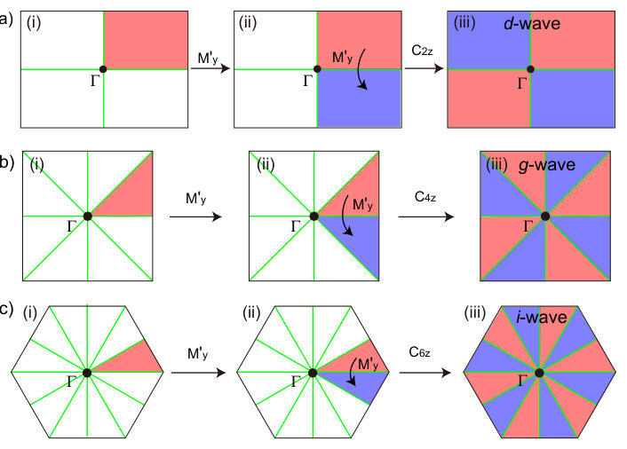 
Figure 2: (color online) Stepwise construction of spin-momentum textures in the Brillouin zone for representative AWGs: (a) P2m′m′, (b) P4m′m′, and (c) P6m′m′. Red and blue regions denote spin-up and spin-down polarization, respectively. The panels illustrate the generation process: (i) The initial spin-polarized irreducible BZ (red). (ii) The texture gener- ated by applying the spin-flipping mirror generator M′ y (mapping red to blue). (iii) The complete spin-splitting pattern obtained by applying the rotation generator Cnz. Green lines indicate spin-degenerate nodal lines protected by mirror symmetries.

📷 Fig 3

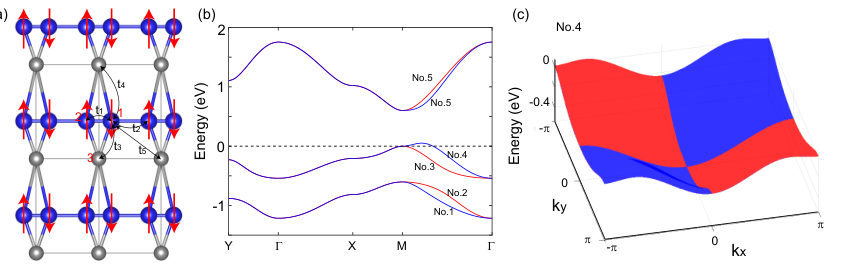 
Figure 3: (color online) Crystal lattice and band structure for AWG P1m′1. (a) Two-dimensional altermagnetic crystal lattice, where No.1 and 2 carry spin-down and spin-up moments, and No.3 is nonmagnetic atom. (b) Band structure along high symmetry lines. Red and blue lines are spin up and down bands. (c) Three-dimensional energy dispersion of the 4th band over the Brillouin zone.

📷 Fig 4

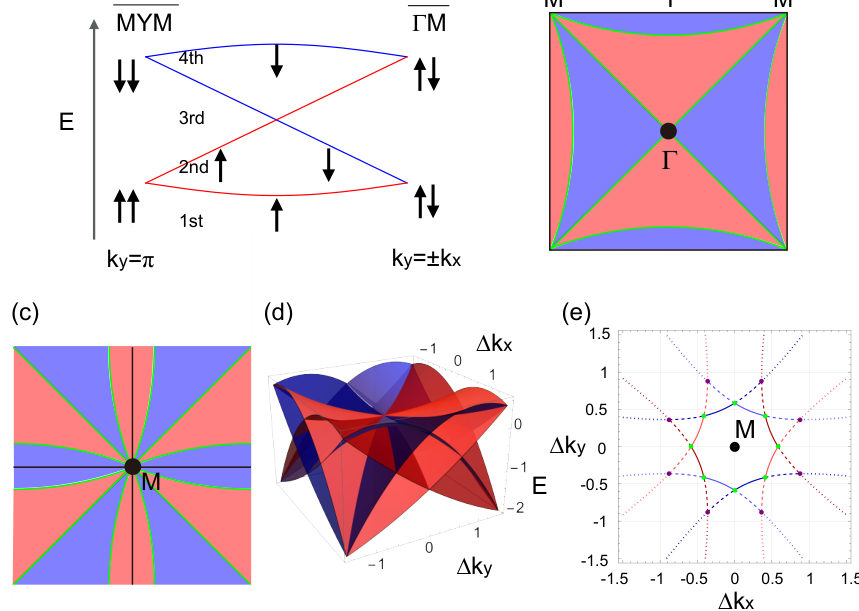 
Figure 4: (color online) Nonsymmorphic altermagnetism in the magnetic wallpaper group P4′gm′. (a) Schematic of the hourglass dispersion along a path connecting the BZ boundary (ky = π) to the diagonal symmetry lines (kx = ±ky). A symmetry-protected crossing (nodal line) occurs between the 2nd and 3rd bands with opposite-spin polarizations. (b) Spin distribution of the 2nd occupied band over the BZ, while the 3rd band exhibits the opposite-spin distribution (not shown). (c) Detailed spin texture of the 2nd band near the M point, revealing 12 nodal lines (green) where the spin char- acter inverts as the path encircles M. (d) Three-dimensional energy dispersion of the effective four-band...

📷 Fig 5

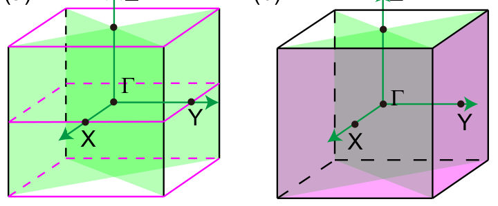 
Figure 5: (color online) Nonsymmorphic altermagnetism in the altermagnetic space groups P4′bm′ and P4′ 2212′. (a) and (b) BZs of altermagnetic space groups P4′bm′ and P4′ 2212′: Magenta lines and planes indicate same- spin twofold degeneracies, while the green planes represent opposite-spin twofold degeneracies.

**Summary.** This work provides a comprehensive catalog of altermagnetism across all 2D and 3D magnetic crystal groups by incorporating non-spatial symmetries. It reveals that nonsymmorphic operations are crucial for predicting new types of spin-splitting band structures, extending the known understanding of this quantum magnetic phase.

**Why it may be interesting.** While focused on solid-state magnetism, the rigorous application of global symmetries (like time-reversal symmetry) to classify electronic states in momentum space is highly relevant to topological materials research, which often overlaps with AMO physics concepts like band topology and protected degeneracies.

Detailed structure

**Main problem.** To systematically extend the classification of altermagnetism beyond conventional centrosymmetric treatments by incorporating non-spatial global symmetries and nonsymmorphic crystal symmetries.

**Main result.** The authors provide a complete catalog of 422 altermagnetic space groups, demonstrating that nonsymmorphic symmetries are essential for realizing novel spin-splitting band structures beyond the conventionally established wave types.

**Method.** The study employs systematic symmetry analysis based on magnetic wallpaper and space groups, utilizing an effective spinless time-reversal symmetry to classify allowed magnetic orders.

**Model / system.** The focus is on altermagnetism in crystalline materials, characterized by compensated collinear spin alignment and momentum-dependent spin splitting in the Brillouin zone (BZ) despite zero net magnetization. The analysis uses group theory applied to crystal symmetries.

**Key observables.** Altermagnetic order cataloging (17 wallpaper groups, 422 space groups), distinct spin distribution patterns in the BZ (e.g., d-, g-, i-wave types), and symmetry-enforced hourglass dispersions.

**Important parameters / regimes.** The classification depends critically on the presence of non-spatial global symmetries ($S$) and nonsymmorphic operations ($	ilde{g}$).

**Assumptions / limitations.** The analysis initially focuses on collinear spin configurations and neglects Spin-Orbit Coupling (SOC) for defining the symmetry class, although extensions are discussed.

**Figures summary.** Figures illustrate the classification of 2D/3D altermagnetic systems into wave types and show specific examples like Y2Cu2O5 exhibiting fourfold degeneracy in its spin-splitting BZ due to combined degeneracies.

**Paper structure.** The paper first defines conventional altermagnetism, then extends the symmetry framework using non-spatial symmetries ($S$). It systematically catalogs all possible groups, detailing how nonsymmorphic operations lead to new band structures and novel wave types beyond the initial six established categories.

Abstract

Conventional altermagnetism, characterized by compensated collinear spin alignment and spin splitting, exhibits identical spin states at opposite momenta. In this work, we employ a non-spatial global symmetry $S$, the spinless time-reversal symmetry, which effectively replaces inversion symmetry in preserving the spin-state equivalence; hence, we systematically extend the classification of altermagnetism to all possible non-centrosymmetric crystals. By analyzing the necessary symmetry conditions, we provide a complete catalog of altermagnetic orders for all 2D magnetic wallpaper groups and all 3D magnetic space groups, identifying 17 altermagnetic wallpaper groups (12 centrosymmetric and 5 non-centrosymmetric) and 422 altermagnetic space groups (160 centrosymmetric and 262 non-centrosymmetric). This catalog assigns each altermagnetic wallpaper and space group to one of the six altermagnetic wave types established in the literature and presents its distinct spin distribution in the Brillouin zone (BZ); notably, the low-energy wave-type description does not necessarily extend throughout the full BZ, since the spin-degenerate nodal lines and planes can be unpinned from the high-symmetry planes. Beyond the catalog, nonsymmorphic symmetries further bring new patterns of the altermagnetic BZs through the emergence of hourglass dispersions, which arise from the compatibility relations between two symmetry-protected degenerate manifolds: same-spin and opposite-spin degeneracies. In both the non-centrosymmetric altermagnetism and the emergence of the hourglass dispersion, the spinless time-reversal symmetry plays the key role. Our work extends the symmetry catalog of altermagnetism and reveals that nonsymmorphic symmetries are essential for realizing altermagnetic band structures beyond the six established wave types, such as an $i$-wave-like spin winding in a tetragonal BZ.

[↑ back to top](#top)

### [Thawed Gaussian Ehrenfest dynamics](http://arxiv.org/abs/2607.10847v1)

**Authors:** Jiří J. L. Vaníček  
**Type:** theory · **Category:** other · **PDF:** <https://arxiv.org/pdf/2607.10847v1>  
**Analysis basis:** full PDF text, analyzed in chunks
**Topic relevance:** `Keldysh / 2PI / non-Gaussian methods` **3/5** · `non-equilibrium dynamics` **2/5** · `driven-dissipative phase transition` **1/5** · `methods for driven-dissipative` **1/5**

📷 Fig 1

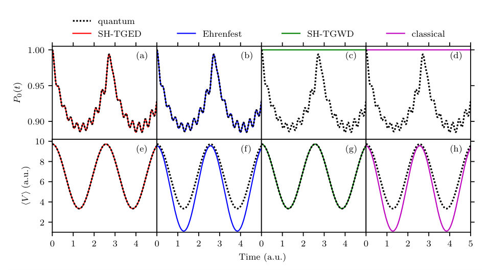 
FIG. 1. Advantage of thawed Gaussian Ehrenfest dynamics (TGED) over Ehrenfest dynamics,

📷 Fig 2

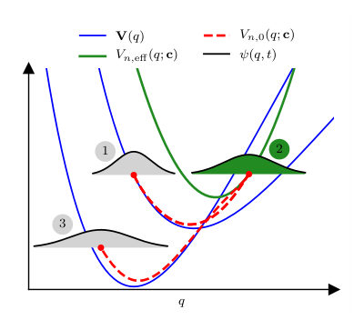 
FIG. 2. Example of a thawed Gaussian Ehrenfest dynamics of the molecular wavepacket Ψ(q, t) =

**Summary.** The paper introduces Thawed Gaussian Ehrenfest Dynamics (TGED), a unified semiclassical approach for simulating complex molecular dynamics. It combines the ability of Ehrenfest dynamics to handle electronic nonadiabaticity with the nuclear quantum treatment found in thawed Gaussian wavepacket methods. This framework is highly valuable for accurately modeling chemical processes where both electronic and vibrational quantum effects are crucial.

**Why it may be interesting.** This work directly addresses advanced topics in molecular quantum dynamics—specifically nonadiabatic coupling and nuclear quantum effects—using sophisticated variational principles and geometric integration techniques relevant to open quantum systems modeling.

Detailed structure

**Main problem.** The central problem is developing a unified, efficient method to simulate molecular quantum dynamics that accurately incorporates both electronic nonadiabatic transitions and full nuclear quantum effects.

**Main result.** The proposed Thawed Gaussian Ehrenfest Dynamics (TGED) framework successfully unifies existing methods, showing it reduces correctly to classical Ehrenfest dynamics or purely quantum wavepacket dynamics in appropriate limits.

**Method.** It employs a time-dependent variational principle applied to a Hartree product ansatz for the total wavefunction, leading to coupled equations of motion for electronic and Gaussian nuclear parameters.

**Model / system.** The system is molecular, governed by a Hamiltonian coupling electronic states (expanded in a diabatic basis) and nuclear coordinates/momenta. The dynamics are treated semiclassically using Gaussian wavepackets for the nuclei.

**Key observables.** Nonadiabatic population transfer between electronic states, expectation values of kinetic and potential energy, and the time evolution of Gaussian parameters ($q_t, p_t$, etc.).

**Important parameters / regimes.** The method is analyzed in limits such as the classical limit ($\hbar 	o 0$) and the absence of electronic coupling.

**Assumptions / limitations.** It remains a mean-field approximation relying on approximating the potential energy matrix by an effective locally quadratic form to maintain Gaussian wavepackets. It fails near conical intersections between states of different symmetry.

**Figures summary.** Figure 1 illustrates TGED's advantage over standard Ehrenfest dynamics (lacking NQE) and pure TGWD (lacking nonadiabaticity). Figure 2 likely shows the evolution of the nuclear wavepacket using the proposed method.

**Paper structure.** The paper introduces the need for unification, derives the general variational formalism by applying TDVP to a Hartree product ansatz, details the resulting coupled equations involving effective quadratic potentials, and concludes with derivations of structure-preserving geometric integrators and conditions for exactness in various limits.

Abstract

Ehrenfest dynamics is a widely used mixed quantum--classical approach for nonadiabatic molecular dynamics, whereas thawed Gaussian wavepacket dynamics provides an efficient semiclassical description of adiabatic nuclear quantum dynamics. Here we describe thawed Gaussian Ehrenfest dynamics (TGED), which unifies and generalizes these two methods to capture both electronic nonadiabaticity and nuclear quantum effects within a single framework. The fully variational formulation of TGED is derived by applying the time-dependent variational principle to a Hartree product of electronic and Gaussian nuclear wavepackets. Replacing the effective locally quadratic molecular potential obtained from this variational treatment by alternative effective locally quadratic potentials yields an infinite family of TGED methods, of which we present several members. We analyze the limiting cases of the general formalism and show, in particular, that it reduces to conventional Ehrenfest dynamics in the classical limit for the nuclei and to thawed Gaussian wavepacket dynamics in the absence of electronic coupling. Finally, we present explicit geometric integrators for the entire family of methods and identify the conditions under which the different approximations become exact.

[↑ back to top](#top)

### [GPU-Accelerated Host-Aware Dead-Measurement Detection in Hybrid Quantum--Classical Programs: Full Version](http://arxiv.org/abs/2607.09976v1)

**Authors:** Yanbin Chen, Qunyou Liu, Yu Wang, Christian B. Mendl, Helmut Seidl  
**Type:** theory · **Category:** quantum information and computing · **PDF:** <https://arxiv.org/pdf/2607.09976v1>  
**Analysis basis:** full PDF text, analyzed in chunks
**Topic relevance:** `measurement-induced transitions` **3/5** · `quantum measurements` **2/5** · `methods for driven-dissipative` **1/5**

📷 Fig 1

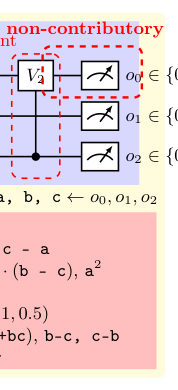 
Fig. 1: A hybrid program where the host variable a, bound to measurement out- come o0, is syntactically used but semantically non-contributory: the program’s return is invariant under changes to o0. By non-contribution of o0, the quantum gates enclosed by red dashed boxes are identified as redundancies: their removal leaves the host program’s returned result unchanged.

📷 Fig 2

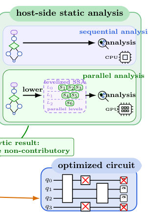 
Fig. 2: Overview of our optimization pass. Given a hybrid quantum program, we analyze the classical host program to determine which measurement outcomes are non-contributory to the final return. These analysis results are then passed to the optimizer, which performs DGE-based pruning on the circuit and removes measurements and gates that affect only non-contributory outcomes. The host- side analysis can be executed either sequentially on a CPU backend or, after lowering to a levelized SSA representation, by a CUDA-based GPU backend.

📷 Fig 3

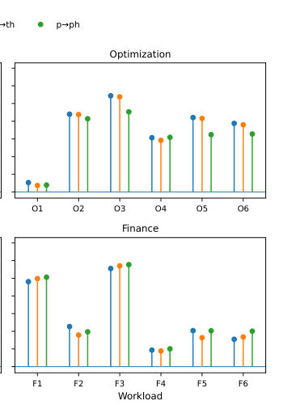 
Fig. 3: Per-workload total-gate reduction for the main effectiveness workloads. For each workload, the figure reports the additional total-gate reduction obtained by composing host-side analysis with Qiskit (q→qh), t|ket⟩(t→th), and PyZX (p→ph). Workloads are grouped by application family.

📷 Fig 4

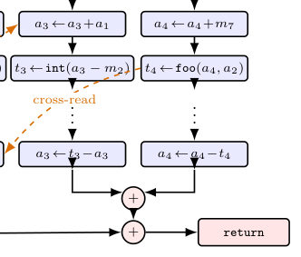 
Fig. 4: Illustration of active chains in input programs.

📷 Fig 5

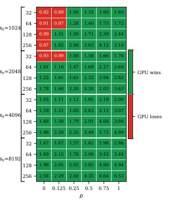 
Fig. 5: GPU acceleration results for host-side static analysis.

**Summary.** This paper presents a novel static analysis technique to detect 'dead' measurement outcomes in hybrid quantum-classical programs. By performing semantics-aware abstract interpretation, it identifies redundant gates invisible to standard circuit optimizers. The method is highly efficient, utilizing an SSA-style intermediate representation for GPU acceleration, significantly improving the optimization potential of quantum algorithms.

**Why it may be interesting.** This work directly addresses compiler optimization for near-term quantum devices by providing a necessary layer of analysis that accounts for classical control flow dependencies, which is crucial for realizing complex hybrid algorithms.

Detailed structure

**Main problem.** The core problem is identifying measurement outcomes in hybrid quantum-classical programs that are semantically non-contributory, meaning they do not affect the final result despite being read by the classical host.

**Main result.** The proposed semantics-aware analysis identifies significantly more redundant measurements than syntactic methods and can remove over 30% of gates even after state-of-the-art circuit optimizers have run.

**Method.** It employs a novel, semantics-aware static analysis based on abstract interpretation to track variable dependencies across the host program's execution path.

**Model / system.** The system modeled is hybrid quantum-classical computation, where a quantum circuit interacts with a classical host program that consumes measurement outcomes. The analysis handles these interactions by tracking state changes through abstract values and dependency sets.

**Key observables.** Non-contributory measurement outcomes ($M_{nc}$) and the resulting redundant quantum gates that can be safely pruned.

**Important parameters / regimes.** The efficiency gains are measured by gate removal percentages (e.g., 37.98% standalone removal) and GPU speedups (up to 6.53x).

**Assumptions / limitations.** The analysis assumes the ability to lower host programs to an SSA-style intermediate representation for efficient, parallel execution on a GPU backend.

**Figures summary.** Figure 1 illustrates how initial values from non-contributory outcomes allow identifying redundant quantum gates. Figure 2 provides an overview of the full optimization flow: Host analysis $
ightarrow$ DGE pruning $
ightarrow$ GPU acceleration via SSA lowering.

**Paper structure.** The paper introduces the problem, details the semantics-aware abstract interpretation method (including handling state transitions and dependencies), proves its soundness using formal lemmas related to return values, presents the SSA lowering for GPU execution, and evaluates it across various quantum applications.

Abstract

Hybrid programs combine a quantum circuit with a classical host program that consumes measurement outcomes. In such programs, an outcome may be syntactically read by the host but semantically non-contributory: changing the outcome cannot change the returned value. Such outcomes obscure gates that are dead only relative to the host semantics, and are therefore invisible to circuit-local optimizers.   We present a semantics-aware host-side static analysis that identifies non-contributory measurement outcomes by abstract interpretation, and prove its soundness. We implement the analysis and evaluate it on $24$ application-faithful hybrid workloads across quantum chemistry, optimization, quantum machine learning, and quantum finance. Compared with a syntactic liveness baseline, our analysis identifies more than $4\times$ as many non-contributory measurements, and it standalone enables the removal of $37.98\%$ of total gates on average. Even after the state-of-the-art optimizers like Qiskit, t|ket$\rangle$, and PyZX have already optimized the circuits, our analysis still enables removal of more than $30\%$ of the post-optimized gates, showing that the host-semantic opportunities exposed by our analysis are not subsumed by circuit-local optimization. To scale our analysis, we further lower host programs to an SSA-style levelized intermediate representation that exposes level-wise parallelism for GPU execution, and implement a CUDA backend. We prove that this lowering preserves the analysis result, and the evaluation shows speedups of up to $6.53\times$ over a sequential baseline as structural parallelism increases.

[↑ back to top](#top)

### [Ferroelectric--Superconducting Interaction in Epitaxial YBa2Cu3O7-δ/BaTiO3 Films](http://arxiv.org/abs/2607.11003v1)

**Authors:** Louis Oppong-Antwi, David L. Cortie, Qi Zhang, Avi Bendavid, Nagarajan Valanoor, Wendy Purches, Golrokh Akhgar  
**Type:** experiment · **Category:** strongly correlated electrons · **PDF:** <https://arxiv.org/pdf/2607.11003v1>  
**Analysis basis:** full PDF text, analyzed in chunks
**Topic relevance:** `spintronics-quantum-optics interface` **3/5** · `driven-dissipative phase transition` **1/5**

📷 Fig 1

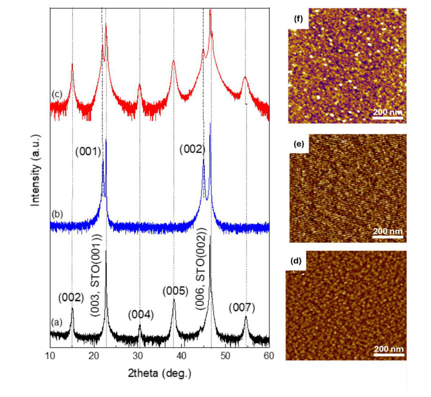 
Fig. 1 The XRD patterns of samples, (a) YBCO, (b) BTO and (c) YBCO/BTO/YBCO films and AFM image of (d) YBCO, (e) BTO and (f) YBCO/BTO/YBCO. Each AFM image of a 2 µm × 2

📷 Fig 2

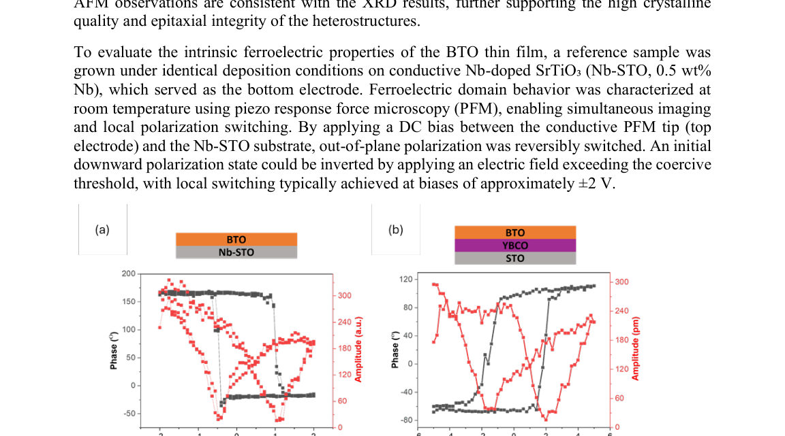 
Fig. 2 Local PFM amplitude (red) and phase (black) hysteresis curve of (a) BTO/nb-STO, (b)

📷 Fig 3

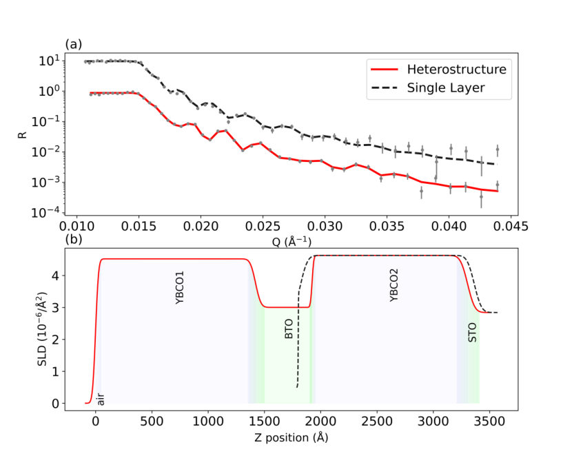 
Fig. 3 (a) Neutron reflectometry curve of YBCO and YBCO/BTO/YBCO, (b) corresponding

📷 Fig 4

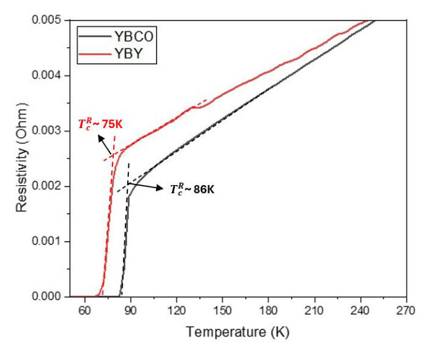 
Fig. 4 Resistance versus temperature of YBCO (black line) and YBCO/BTO/YBCO (YBY)(red

📷 Fig 5

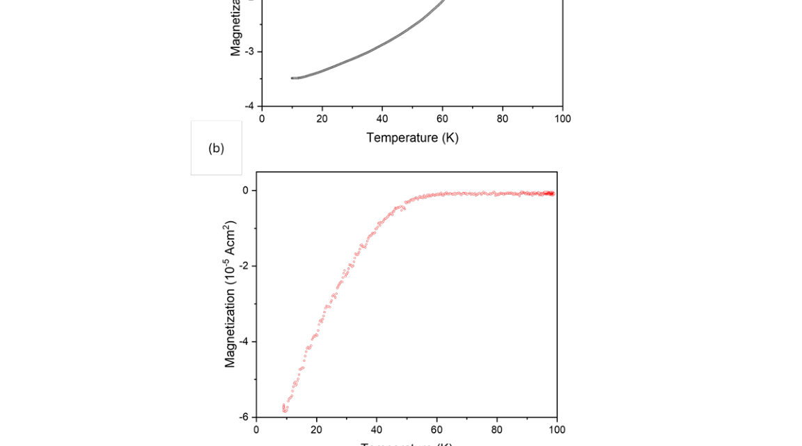 
Fig. 5 ZFC M(T) curves (a)YBCO), and (b) YBCO/BTO/YBCO films measured under an applied

**Summary.** The authors report on $	ext{BTO}/	ext{YBCO}$ heterostructures to experimentally investigate the predicted coupling between ferroelectric polarization and superconductivity. By measuring $T_c$ using resistivity and magnetization, they demonstrate that the inclusion of the BTO layer significantly lowers the superconducting transition temperature in YBCO films. This establishes these interfaces as promising platforms for engineering tunable quantum electronic devices.

**Why it may be interesting.** This work directly probes an interface where two distinct quantum phenomena—superconductivity (BCS-like pairing) and ferroelectricity (polar ordering)—interact, which is a key area of research in correlated electron systems and emergent quantum states.

Detailed structure

**Main problem.** The study investigates how ferroelectric polarization influences the superconducting critical temperature ($T_c$) in epitaxial oxide heterostructures.

**Main result.** The presence of a $	ext{BaTiO}_3$ layer significantly suppresses the superconducting transition temperatures measured via both resistivity and magnetization curves compared to single-layer YBCO films.

**Method.** The research employed multiple advanced characterization techniques, including Pulsed Laser Deposition (PLD) for film growth, Piezoresponse Force Microscopy (PFM), Neutron Reflectometry (NR), and transport/magnetization measurements ($R(T)$ and $M(T)$).

**Model / system.** The physical system is epitaxial $	ext{BaTiO}_3/	ext{YBa}_2	ext{Cu}_3	ext{O}_{7-\delta}$ ($	ext{BTO}/	ext{YBCO}$) heterostructures grown on $	ext{SrTiO}_3$ substrates. The study focuses on the interfacial coupling between ferroelectric polarization and superconducting pairing.

**Key observables.** Superconducting transition temperatures ($T_{\mathrm{C}}^{R}$, $T_{\mathrm{C}}^{M}$), ferroelectric switching behavior (PFM hysteresis loops), film roughness, and lattice parameters.

**Important parameters / regimes.** The coupling strength between polarization and superconductivity; the oxygen stoichiometry ($\delta$) in YBCO; and the thickness of the BTO layer relative to superconducting coherence lengths.

**Assumptions / limitations.** It is assumed that the observed suppression of $T_c$ can be attributed to interfacial charge screening, strain effects, or structural disorder induced by the ferroelectric layer.

**Figures summary.** Figures likely show PFM hysteresis loops confirming switching, XRD patterns verifying epitaxial growth, and $R(T)$ vs. $M(T)$ curves demonstrating the suppression of $T_c$ in the heterostructure compared to single layers.

**Paper structure.** The paper follows a structure of establishing the physical platform ($	ext{BTO}/	ext{YBCO}$ films), characterizing both ferroelectric and superconducting properties using multiple techniques, presenting quantitative measurements showing $T_c$ suppression, and concluding with implications for tunable oxide electronics.

Abstract

Microscopic theories predict that the critical temperature of a superconducting layer can be strongly modified in proximity to a ferroelectric; however, experimental evidence is lacking. We report on BaTiO3 (BTO)/YBa2Cu3O7-δ (YBCO) heterostructures grown on SrTiO3 (001) substrates using pulsed laser deposition (PLD), with precise control of growth conditions and oxygen stoichiometry. Piezoresponse force microscopy confirms ferroelectric switching within both single-layer and heterostructured films. Neutron reflectometry measurements show low roughness parameters for the buried interfaces, which is critical for mediating the interfacial coupling between superconductivity and ferroelectric polarization. The superconducting transition temperature ($T_{\mathrm{C}}^{R}$) measured from the $R(T)$ curve of the single-layer YBCO was approximately 86 K, and a transition temperature ($T_{\mathrm{C}}^{M}$) of approximately 80-85 K was observed from the $M(T)$ curve. For the heterostructure film (YBCO/BTO/YBCO) grown under the same conditions, both resistivity and magnetization measurements indicate lower transition temperatures of approximately 75 K and approximately 55 K, respectively, as well as a lower overall susceptibility. These findings highlight the need to combine multiple techniques to characterize BTO/YBCO heterostructures and identify subtle features of the ferroelectric--superconducting coupling. This establishes BTO/YBCO heterostructures as promising systems for tunable oxide electronics and reconfigurable superconducting devices.

[↑ back to top](#top)

### [Resolvent algebras and limit states of interacting canonical ensembles](http://arxiv.org/abs/2607.10283v1)

**Authors:** Detlev Buchholz  
**Type:** theory · **Category:** statistical mechanics · **PDF:** <https://arxiv.org/pdf/2607.10283v1>  
**Analysis basis:** full PDF text, analyzed in chunks
**Topic relevance:** `Keldysh / 2PI / non-Gaussian methods` **2/5** · `methods for driven-dissipative` **2/5** · `non-equilibrium dynamics` **2/5** · `analog quantum simulation` **1/5** · `correlated / nonlocal dissipation` **1/5** · `correlated cavity matter` **1/5** · `driven-dissipative phase transition` **1/5** · `entanglement & information structure` **1/5** · `non-equilibrium universality` **1/5**

📷 Fig 1

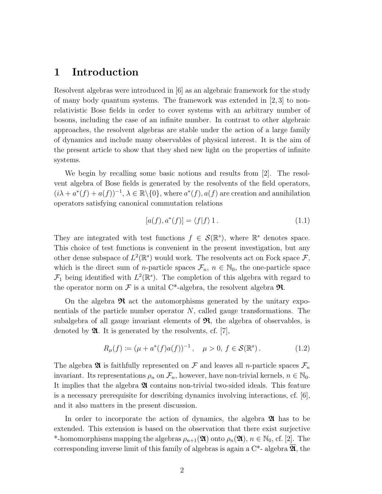 
Low-resolution page preview, page 2

📷 Fig 2

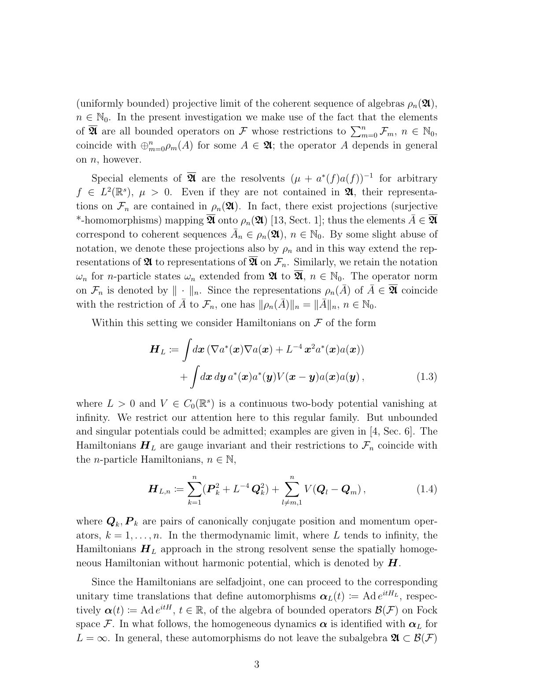 
Low-resolution page preview, page 3

📷 Fig 3

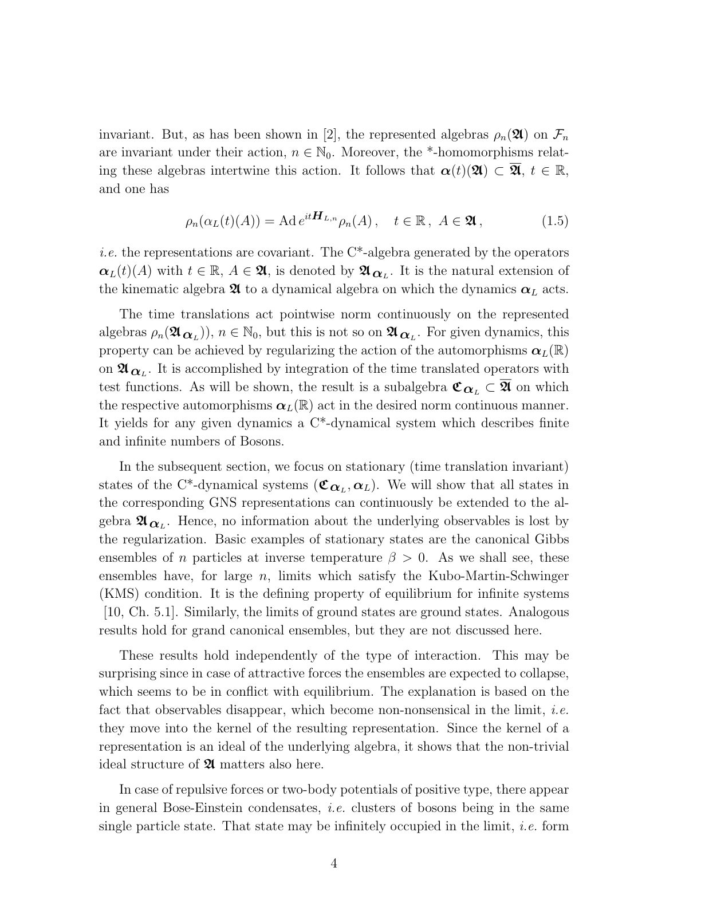 
Low-resolution page preview, page 4

📷 Fig 4

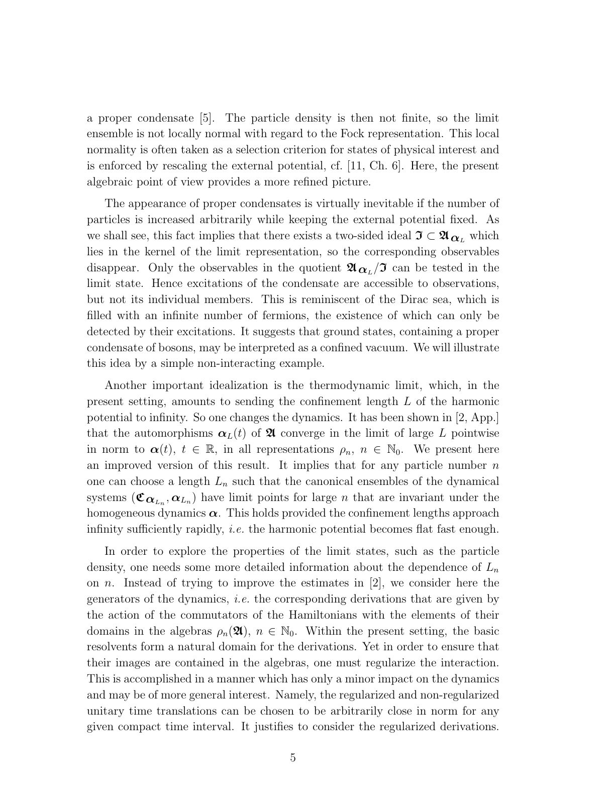 
Low-resolution page preview, page 5

📷 Fig 5

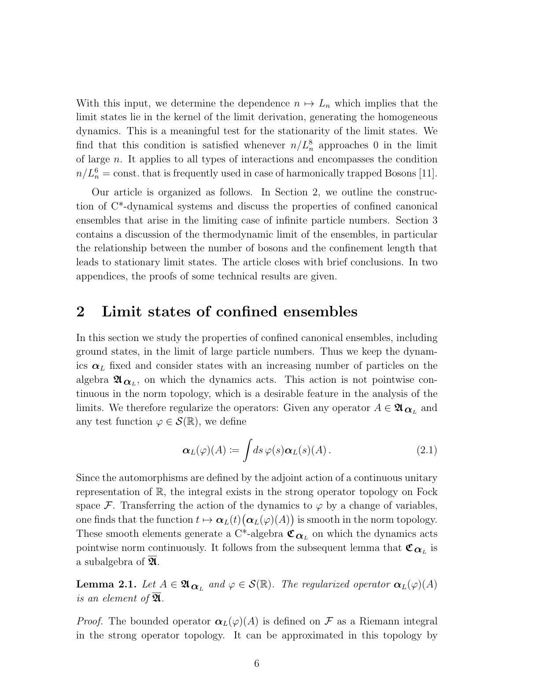 
Low-resolution page preview, page 6

**Summary.** This paper develops a rigorous mathematical framework using resolvent algebras to study the thermodynamic limit of interacting bosonic ensembles. It proves that the limiting states must satisfy fundamental physical criteria like the KMS condition or be ground states. This provides deep theoretical insight into how equilibrium properties emerge in large, interacting quantum systems.

**Why it may be interesting.** This work provides advanced mathematical tools (resolvent algebras, C*-dynamics) to rigorously handle phase transitions and equilibrium states in interacting quantum many-body systems, which is crucial for understanding Bose-Einstein condensates and other strongly correlated regimes.

Detailed structure

**Main problem.** The study focuses on determining the limit states of canonical ensembles for interacting bosons as particle number or confinement length approaches infinity.

**Main result.** The limit states are shown to satisfy either the KMS condition or be ground states, providing a rigorous framework for analyzing thermodynamic limits in bosonic systems.

**Method.** The analysis employs resolvent algebras and C*-dynamical systems theory to study time evolution via automorphisms and weak-star convergence of Gibbs ensembles.

**Model / system.** The system models interacting bosons confined by harmonic forces, described on Fock space. The Hamiltonian is analyzed in the limit where confinement length $L 	o \infty$ (thermodynamic limit).

**Key observables.** KMS condition states, ground states, and observables that survive the limiting process.

**Important parameters / regimes.** Temperature ($eta$), particle number ($n$), and confining force strength/length ($L$).

**Assumptions / limitations.** The analysis relies on the existence of suitable regularizations for operators to maintain mathematical structure in the limit.

**Paper structure.** The paper builds from defining the resolvent algebra and dynamics ($\mathcal{A}_{\alpha L}$), establishing convergence theorems for the thermodynamic limit ($L 	o \infty$), and deriving relations between confining forces and particle numbers based on stationarity conditions.

Abstract

The limit states of canonical ensembles of a large number of interacting bosons at a given temperature, which are confined by harmonic forces, are studied in the framework of the resolvent algebra. It is shown that the limits satisfy the KMS condition or are ground states, regardless of the type of interaction. In case of attractive forces, where the ensembles collapse, observables that become meaningless in the limit disappear from the limit representations. For repulsive forces, this can also happen if condensates with an infinite number of particles in the same state (proper condensates) appear in the limit. The resulting structures and their interpretation are illustrated by a simple model. The study of vanishing harmonic forces (thermodynamic limit) involves changes of the dynamics. It is conveniently based on derivations acting on the algebra. They are given by the commutator of the Hamiltonians with the elements of the algebra. To ensure that the images remain in the algebra, the interaction must be regularized. This is accomplished in a manner that has only a minor impact on the dynamics and may be of broader interest. With this input a relation between the strength of the confining harmonic forces and the number of particles in the ensembles is derived from the condition that the limit states are to be stationary (invariant) under the adjoint action of the unconfined, spatially homogeneous limit dynamics. This relation encompasses the conditions that are frequently used in studies of Bose-Einstein condensates.

[↑ back to top](#top)

### [Analytical mobility edge in nonreciprocal quasiperiodic lattices with next-nearest-neighbor hopping](http://arxiv.org/abs/2607.10996v1)

**Authors:** Wenmin Wang, Xiaosen Yang, Xianqi Tong  
**Type:** theory · **Category:** disordered systems and neural networks · **PDF:** <https://arxiv.org/pdf/2607.10996v1>  
**Analysis basis:** full PDF text, analyzed in chunks
**Topic relevance:** `analog quantum simulation` **2/5** · `driven-dissipative phase transition` **2/5** · `Frenkel-Kontorova` **1/5** · `Keldysh / 2PI / non-Gaussian methods` **1/5** · `Kondo & dissipative impurity` **1/5** · `methods for driven-dissipative` **1/5** · `non-equilibrium dynamics` **1/5** · `non-equilibrium universality` **1/5**

📷 Fig 1

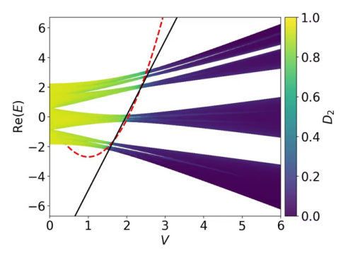 
FIG. 1. Hermitian limit β = δ = 0 (t = 1, J = 0.1, L = 987, PBC). The color scale shows the fractal dimension D2 (bright: extended, D2 →1; dark: localized, D2 →0). The Biddle ME of Eq. (10) (black solid line) and the point-matching ME of Eq. (9) (red dashed line) are two analytical approximations to the same extended–localized boundary; both follow the numerical transition closely for J ≪t.

📷 Fig 2

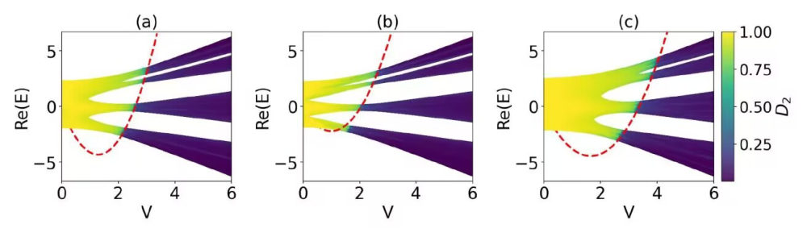 
FIG. 2. Nonreciprocal phase diagrams (t = 1, J = 0.1, L = 610, PBC) together with the point-matching ME of Eq. (9) (red dashed lines). (a) NN nonreciprocity only, β = 0.25, δ = 0 (teff = e0.25 ≈1.28, Jeff = 0.1): the boundary shifts rigidly to larger V . (b) NNN nonreciprocity only, β = 0, δ = 0.25 (teff = 1, Jeff = 0.1 e0.25 ≈0.13): the curvature of the boundary decreases and the parabola widens. (c) Combined case, β = δ = 0.5: the shift and the widening superpose. In all three panels the analytical parabola, with no adjustable parameters, follows the extended–localized boundary.

📷 Fig 3

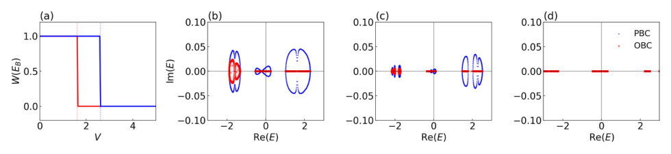 
FIG. 3. Skin-effect topology for NNN nonreciprocity (β = 0, δ = 0.25, t = 1, J = 0.1). (a) Spectral winding numbers W(EB) at two base energies near the band edges, EB = −2.0 (red) and EB = 2.8 (blue), as a function of V . The winding number at the lower band edge drops at V1 ≈1.6, marking the onset of the mixed phase where the ME enters the spectrum and the first localized states appear. The winding number at the upper band edge drops at V2 ≈2.6, marking the end of the mixed phase where the last extended states localize. The interval [V1, V2] defines the mixed phase in which extended and localized states coexist at different energies. (b)–(d) Complex energy spectra under PBC (blue dots) and...

📷 Fig 4

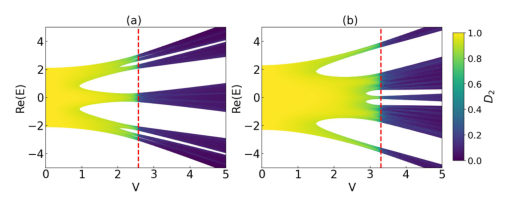 
FIG. 4. Solvable limits (L = 610, PBC). (a) J = 0, t = 1, β = 0.25: the localization transition is energy independent and occurs at Vc = 2t e|β| ≈2.57 (red dashed vertical line). (b) t = 0, J = 1, δ = 0.5: the transition is energy independent and occurs at Vc = 2J e|δ| ≈3.30 (red dashed vertical line). In both limits the ME degenerates into a vertical line, and no energy-dependent boundary exists. In (b) each eigenstate extends over a single sublattice, so the fractal dimension of extended states is slightly reduced, D2 ≈1 −ln 2/ ln L.

📷 Fig 5

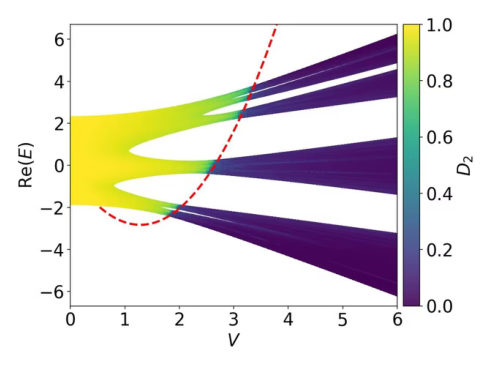 
FIG. 5. Gauge-related case δ = 2β (β = 0.25, δ = 0.50, ˜δ = 0; t = 1, J = 0.1, L = 610, PBC). The color scale shows the fractal dimension D2. The red dashed line is the point- matching ME of Eq. (9) with teff = e0.25 and Jeff = 0.1 e0.50. Although the imaginary gauge transformation maps the open chain to the Hermitian model, it is not single valued on the PBC ring: the bulk boundary is shifted to larger V relative to the Hermitian Biddle line [whose E = 0 crossing lies at V ≈1.98, versus V ≈2.65 for the parabola] and is well described by the effective-hopping parabola.

**Summary.** This paper analytically determines the mobility edge in complex nonreciprocal quasiperiodic lattices featuring both nearest-neighbor and next-nearest-neighbor hopping. By extending established point-matching techniques, the authors derive a parabolic boundary that quantifies the transition between extended and localized electronic states. The findings are significant because they provide testable analytical tools connecting topological invariants (winding numbers) to transport properties in non-Hermitian systems.

**Why it may be interesting.** This work provides a highly compact analytical framework connecting energy-dependent localization, spectral topology, and nonreciprocity in quasiperiodic systems, which is directly applicable to engineered photonic or electrical circuits.

Detailed structure

**Main problem.** The study investigates localization transitions and spectral topology within nonreciprocal quasiperiodic lattices that include next-nearest-neighbor hopping.

**Main result.** The authors derive a closed-form, parabolic expression for the energy-dependent mobility edge, showing how nonreciprocity shifts and broadens the coexistence window of extended/localized states. Spectral winding numbers are used to precisely delineate this mixed phase.

**Method.** The research extends the Fermi-surface point-matching method to handle nonreciprocal hopping, allowing for the derivation of effective hopping amplitudes and an analytical mobility edge formula.

**Model / system.** The model is a one-dimensional, non-Hermitian generalization of the Aubry-André model. It incorporates both nearest-neighbor (NN) and next-nearest-neighbor (NNN) hopping terms, where the hoppings are made nonreciprocal via parameters $eta$ and $\delta$.

**Key observables.** Mobility Edge ($E_c$), spectral winding numbers ($W(E_B)$), effective dispersion ($\epsilon(\kappa)$), and fractal dimension ($D_2$).

**Important parameters / regimes.** Nonreciprocity parameters ($eta, \delta$), potential strength ($V$), hopping amplitudes ($t, J$), and the quasiperiodic frequency $\alpha$.

**Assumptions / limitations.** The analysis relies on extending the point-matching method to nonreciprocal hopping; quantitative comparisons suggest accuracy when NNN hopping is a perturbation.

**Figures summary.** Figures illustrate the Hermitian limit comparison (analytical vs. numerical boundary), phase diagrams showing how NN and NNN nonreciprocity shift/widen the mobility edge parabola, and spectral topology plots using winding numbers to bracket the mixed phase region.

**Paper structure.** The paper first introduces the physical model and the challenge of nonreciprocity. It then details the mathematical extension of the point-matching method to derive the analytical ME formula. Finally, it uses both exact diagonalization and topological invariants (winding numbers) to confirm the derived boundary and characterize the mixed phase.

Abstract

We investigate localization transitions and spectral topology in a one-dimensional non-Hermitian generalization of the Aubry-André model in which both the nearest-neighbor and the next-nearest-neighbor hopping amplitudes are nonreciprocal. By extending the Fermi-surface point-matching method to nonreciprocal hopping, we derive a closed-form expression for the energy-dependent mobility edge in which the two nonreciprocity parameters are absorbed into exponentially renormalized effective hopping amplitudes. The mobility edge forms a single parabola in the energy--potential plane: nearest-neighbor nonreciprocity rigidly shifts the localization boundary toward stronger potentials, whereas next-nearest-neighbor nonreciprocity reduces the curvature of the boundary and thereby broadens the energy window in which extended and localized states coexist. Exact diagonalization confirms the analytical boundary for purely nearest-neighbor, purely next-nearest-neighbor, and combined nonreciprocity, and recovers the known Hermitian mobility edge in the reciprocal limit. We further analyze the spectral topology under periodic boundary conditions and show that the spectral winding numbers evaluated at base energies near the two band edges directly bracket the mixed phase: the winding number at the lower band edge drops when the mobility edge enters the spectrum and the first localized states appear, while the winding number at the upper band edge drops when the last extended states localize, delineating the full potential-strength window over which extended and localized states coexist. These results provide a compact analytical framework that connects energy-dependent localization, spectral topology, and nonreciprocity in quasiperiodic lattices, and they are directly testable in photonic, atomic, and electrical-circuit platforms.

[↑ back to top](#top)

### [Dimensional and Spin Interpolation for the O$(n)$ Model: From Exact Anchors to RG-Improved Critical Exponents](http://arxiv.org/abs/2607.10865v1)

**Authors:** Kumar Ghosh  
**Type:** theory · **Category:** statistical mechanics · **PDF:** <https://arxiv.org/pdf/2607.10865v1>  
**Analysis basis:** full PDF text, analyzed in chunks
**Topic relevance:** `analog quantum simulation` **2/5** · `non-equilibrium universality` **2/5** · `Keldysh / 2PI / non-Gaussian methods` **1/5** · `correlated / nonlocal dissipation` **1/5** · `driven-dissipative phase transition` **1/5** · `entanglement & information structure` **1/5** · `methods for driven-dissipative` **1/5** · `non-equilibrium dynamics` **1/5**

📷 Fig 1

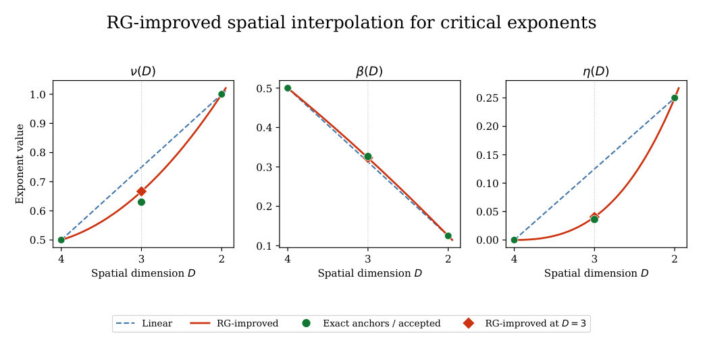 
FIG. 1. RG-improved spatial interpolation for ν, β, η of the Ising (n = 1) universality class as functions of D ∈[2, 4]. Dashed blue: linear interpolation in δD = 1/(D −1). Solid red: RG-improved polynomials (22), (23), (24). Filled circles: exact anchor values (D = 2: Onsager/Yang [7, 13]; D = 4: mean-field [14]). Open circles: accepted values at D = 3 [9, 10]. Diamonds: RG-improved predictions at D = 3.

📷 Fig 2

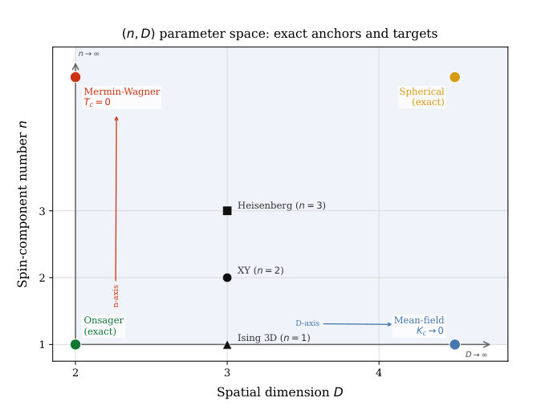 
FIG. 2. The (n, D) parameter space for the O(n) model. Four colored markers: exact-anchor corners (Onsager [7], mean-field [14], Mermin–Wagner [21], Berlin–Kac spherical [11]). Gray markers: physical targets at D = 3 (Ising, XY, Heisenberg). Blue arrow: spatial (D-axis) interpolation direction. Red arrow: spin (n-axis) interpolation direction.

📷 Fig 3

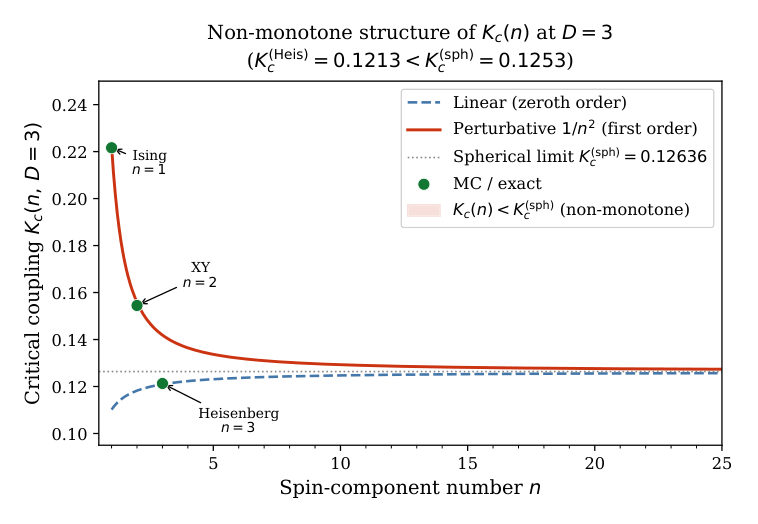 
FIG. 3. Critical coupling Kc(n) at D = 3 on the simple-cubic lattice. Filled circles: Monte Carlo values [9, 23, 24]. Diamond: exact spherical limit K(sph) c = W3/4 ≈0.12636 [11, 20]. Dashed blue: zeroth-order affine interpolation (36). Solid red: first- order perturbative 1/n2 formula (39). The shaded region marks Kc(n) &lt; K(sph) c , demonstrating the non-monotone structure that violates Proposition 1.

📷 Fig 4

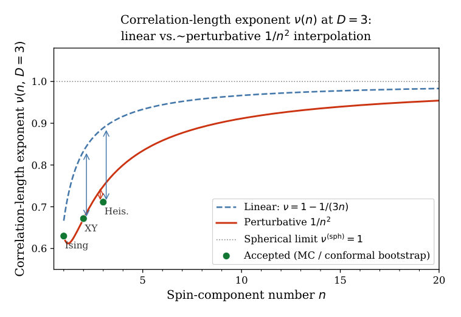 
FIG. 4. Correlation-length exponent ν(n) at D = 3. Filled circles: accepted values [9, 10, 23, 24]; diamond: exact spherical limit ν(sph) = 1 [22]. Dashed blue: zeroth-order bivariate formula ν(0) = 1 −1/(3n) (59). Solid red: first-order perturbative formula (49). The perturbative result reduces the Heisenberg error from 25% to 5.4%.

**Summary.** This paper presents a powerful two-axis interpolation framework to study critical behavior in the O(n) model by treating spatial dimension (D) and spin number (n) independently. By constraining polynomial fits using known exact limits, the authors achieve highly accurate predictions for critical exponents across various regimes. This work establishes a unified, predictive methodology for analyzing complex phase transitions.

**Why it may be interesting.** While focused on classical critical phenomena, the rigorous mathematical machinery of parameter-free interpolation and RG constraints is highly relevant for understanding quantum phase transitions in many-body systems where dimensionality or interaction strength can be treated as continuous parameters.

Detailed structure

**Main problem.** To develop a unified and predictive interpolation framework for critical phenomena across the O(n) universality family by treating both spatial dimension (D) and spin component number (n) as independent continuous parameters.

**Main result.** The framework successfully predicts critical exponents like $
u(2.5)=0.7143$ and provides a highly accurate interpolation for $D=3$ using RG-improved polynomial fits, while also establishing structural compatibility criteria for the interpolation to be valid.

**Method.** The authors employ two-axis interpolation techniques, connecting known exact limits (e.g., Onsager solution at D=2, Mean-Field theory at D->infinity) and utilizing Renormalization Group (RG) improved polynomial fitting constrained by known analytic structures.

**Model / system.** The study focuses on the O(n) model, which generalizes the Ising model to spins with n components. The analysis is applied to critical phenomena in various dimensions ($D$) and spin values ($n$), including quantum-classical mappings for the Transverse Field Ising Model (TFIM).

**Key observables.** Critical exponents ($
u, eta, \eta, \gamma$) and the critical coupling constant ($K_c$).

**Important parameters / regimes.** Spatial dimension $D$, spin component number $n$, and the reduced temperature/coupling parameter $\epsilon = 4-D$.

**Assumptions / limitations.** The interpolation requires that observables vary monotonically between the chosen anchor points; furthermore, the derivation of scaling relations relies on hyperscaling hypotheses valid below the upper critical dimension ($d_c=4$).

**Figures summary.** Figures illustrate the comparison of interpolated exponents ($
u, eta, \eta$) versus $D$, comparing linear interpolation against RG-improved results and exact anchor values.

**Paper structure.** The paper first establishes dimensional interpolation using two anchors (Onsager/Mean-Field) for the D-axis. It then develops spin interpolation along the n-axis, deriving necessary compatibility criteria. Finally, it unifies these concepts to create a predictive framework applicable across both axes simultaneously.

Abstract

We develop a two-axis interpolation framework for the O$(n)$ universality family, treating the spatial dimension $D$ and the spin-component number $n$ as independent continuous parameters connecting exact limiting solutions. On the spatial axis, anchoring between the Onsager solution at $D=2$ and mean-field theory at $D\to\infty$ yields a closed-form prediction for the 3D Ising critical coupling that agrees well with Monte Carlo benchmarks $K_c = 0.2204$ (benchmark: $0.22165$) with no adjustable parameters. Wilson--Fisher-constrained polynomial interpolation gives $ν=2/3$, $β=31/96$, and $η=35/864$ at $D=3$ (benchmarks: $0.6299$, $0.3265$, $0.0362$), and reproduces conformal-bootstrap results across $3 \le D < 4$. On the spin axis, we establish a necessary compatibility criterion: two-anchor interpolation succeeds only for observables that vary monotonically between the anchor values. The critical coupling $K_c(n)$ violates this criterion because the Heisenberg value falls below the spherical limit, whereas the correlation-length exponent $ν(n)$ satisfies it. A perturbative $1/n^2$ expansion yields $ν(3) = 0.7493$ (benchmark: $0.7112$), and propagation through exact scaling relations gives $β(3) = 0.3797$ (benchmark: $0.3689$) and $γ(3) = 1.489$ (benchmark: $1.396$), without introducing additional parameters. The framework naturally extends to non-integer spin, producing the prediction $ν(2.5) = 0.7143$ for the O$(2.5)$ universality class. These results establish dimensional and spin interpolation as a unified and predictive approach to critical phenomena, while clarifying the structural conditions under which interpolation succeeds.

[↑ back to top](#top)

### [Ergotropic and passive contributions on the phase-space information geometry of Gaussian states](http://arxiv.org/abs/2607.09855v1)

**Authors:** Ivan Medina, Camila Raupp, Pedro B. Melo, Diogo O. Soares-Pinto  
**Type:** theory · **Category:** statistical mechanics · **PDF:** <https://arxiv.org/pdf/2607.09855v1>  
**Analysis basis:** full PDF text, analyzed in chunks
**Topic relevance:** `entanglement & information structure` **2/5** · `non-equilibrium dynamics` **2/5** · `non-equilibrium universality` **2/5** · `Keldysh / 2PI / non-Gaussian methods` **1/5** · `correlated / nonlocal dissipation` **1/5** · `driven-dissipative phase transition` **1/5** · `methods for driven-dissipative` **1/5**

📷 Fig 1

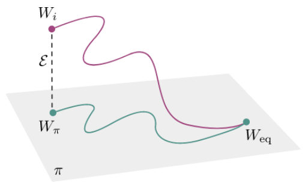 
Figure 1. The trajectory of a Gaussian quantum state on the Wigner function statistical manifold is characterized by the Wigner- Fisher information, which can be separated into passive and ergotropic con- tributions. The passive component is associated with the evolution of the corresponding passive state along the thermal-state manifold represented by the surface π, while the ergotropic component cap- tures the geometric effect of energy stored through displacement and squeezing operations.

📷 Fig 2

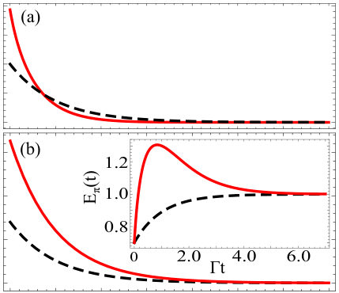 
Figure 2. (a) Example of the ergotropic Mpemba effect. Considering two different initial states, ρs and ρd, we see that although ρs has ini- tially more ergotropy than ρd, a squeezing thermal state loses charge exponentially faster than the displaced thermal state, giving rise to the effect. (b) Mean energy of ρs and ρd and their associated passive mean energy (inset). We see that the passive energy associated to ρs is non monotonic in time. For all plots, quantities for ρs are shown in red-solid line and quantities for ρd are shown in black-dashed lines. The parameters we use are ω = 1.0, Γ = 0.1, r = 1.0, µ = 1.0, ¯neq = 0.5 and ¯nπ(0) = 0.2.

📷 Fig 3

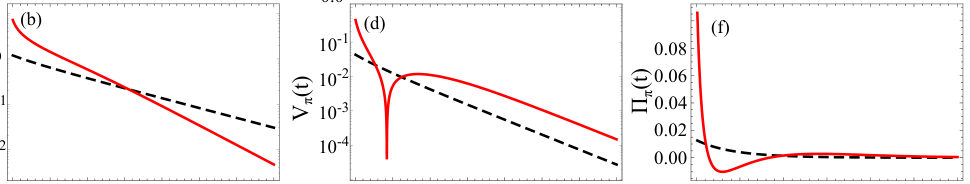 
Figure 3. Degree of completion and statistical length as a function of time. Plots (a) and (b), respectively, show the quantities for ρd and ρs while the plots (c) and (d) are related to the passive states. We see that the degree of completion and statisical velocities for the passive state ρs π are not monotonic. This behavior happens because ρs π(t) is not a solution of the master Eq. (6). The plots (e) and (f) show the entropy production rates ΠW(t) and Ππ(t). The negative values reached by Ππ(t) suggests that the passive state ρs π(t) follows a non-Markovian dynamics. We use the same parameters as in Fig. 2.

**Summary.** This paper connects quantum thermodynamics and information geometry by decomposing the Wigner-Fisher information for Gaussian states into passive and ergotropic parts. It shows that this decomposition allows the extractable work (ergotropy) to be quantified by analyzing how displacement and squeezing resources modify the state's geometric evolution in phase space. This establishes a general framework linking entropy production rates to quantum resource theory.

**Why it may be interesting.** This work provides a powerful geometric tool (Wigner-Fisher information) to quantify non-equilibrium thermodynamic processes like ergotropy, connecting concepts from quantum optics, thermodynamics, and differential geometry.

Detailed structure

**Main problem.** The paper establishes a rigorous link between quantum thermodynamics, specifically ergotropy, and information geometry by decomposing the Wigner-Fisher information for Gaussian states.

**Main result.** The Wigner-Fisher information naturally decomposes into passive and ergotropic contributions, allowing the energy loss rate to be linked directly to the difference in entropy production rates of the state and its passive counterpart.

**Method.** The authors derive an analytical expression for the Wigner-Fisher information using phase-space methods (Wigner functions) and decompose this metric into components related to displacement and squeezing resources.

**Model / system.** The system is a single bosonic mode ($\hbar=1$) evolving under weak coupling to a thermal reservoir, described by the GKLS master equation. The analysis is restricted to Gaussian quantum states parameterized by mean vector and covariance matrix.

**Key observables.** Wigner-Fisher Information (WFI), Ergotropy ($E$), Passive Contribution ($I_\pi$), Ergotropic Contribution ($I_E$), Entropy Production Rates ($\Pi_W, \Pi_\pi$).

**Important parameters / regimes.** System parameters include the cavity frequency ($\omega$) and damping rate ($\Gamma$); state evolution is characterized by displacement ($\mu$) and squeezing ($z$) operators.

**Assumptions / limitations.** The analysis relies on restricting the system to Gaussian states, allowing for explicit calculation of Wigner functions and their associated geometric quantities.

**Figures summary.** Figure 1 illustrates that the trajectory on the Wigner-Fisher manifold is characterized by WFI, which separates into passive (associated with the thermal-state manifold $\pi$) and ergotropic components.

**Paper structure.** The paper builds from deriving the general form of WFI for Gaussian states, decomposing it into passive and ergotropic parts based on state parameters ($\mu, z$), and finally applying this framework to analyze the energy loss rate ($\dot{E}(t)$) in open quantum systems.

Abstract

We establish a direct connection between quantum thermodynamics and information geometry by introducing an ergotropic decomposition of the Wigner-Fisher information for Gaussian quantum states. We derive an analytical expression for the Wigner-Fisher information in terms of the phase-space covariance matrix and mean vector, and show that it naturally separates into passive and ergotropic contributions. The passive term is shown to be entirely determined by the Wigner entropy rate of the associated passive state. The ergotropic contribution, in turn, quantifies how displacement and squeezing resources modify the statistical velocity and length of the system trajectory in phase space. As an application, we analyze the recently proposed ergotropic Mpemba effect and demonstrate that it can be traced to the anomalous geometric evolution of the passive state associated with squeezed thermal states. Our results reveal how the extractable work stored in a quantum state constrains its information-geometric structure, establishing a framework that links ergotropy, entropy production rate, and statistical geometry in continuous-variable quantum systems.

[↑ back to top](#top)

### [A new class of pure non-Gaussian quantum states](http://arxiv.org/abs/2607.11774v1)

**Authors:** V. L. Gorshenin, B. N. Nougmanov, D. A. Chermoshentsev, I. A. Bilenko, F. Ya. Khalili  
**Type:** theory · **Category:** other · **PDF:** <https://arxiv.org/pdf/2607.11774v1>  
**Analysis basis:** full PDF text, analyzed in chunks
**Topic relevance:** `measurement-induced transitions` **2/5** · `quantum measurements` **2/5** · `Keldysh / 2PI / non-Gaussian methods` **1/5** · `driven-dissipative phase transition` **1/5** · `interference shaping light` **1/5** · `methods for driven-dissipative` **1/5** · `non-equilibrium dynamics` **1/5**

📷 Fig 1

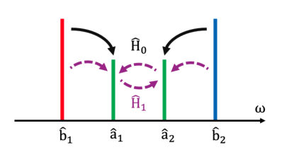 
FIG. 1. The modes structure of the non-degenerate four-wave mixing system. ˆ𝑏1,2: the pump modes, ˆ𝑎1,2: the signal modes. All modes are equidistant.

📷 Fig 2

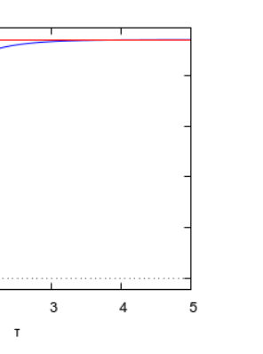 
FIG. 2. Plot of the function |𝐾(𝜏)|/cosh3 𝜏.

📷 Fig 3

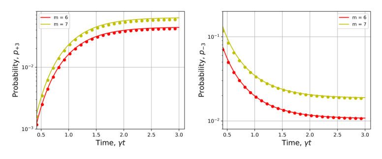 
FIG. 3. Plots of the probability amplitudes 𝑝+3 = |𝜓2 +3| (left) and 𝑝−3 = |𝜓2 −3| (right), see Eqs. (28), for the case of 𝛾𝑡= 3, 𝛽= 50, and 𝑚= 5, 6. Solid lines: analytical equations (28); circles: numerical calculation

📷 Fig 4

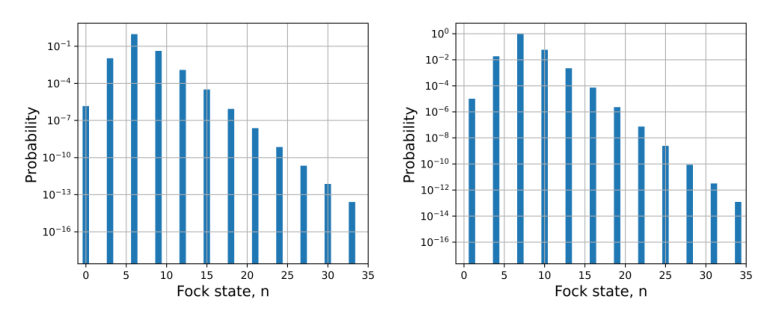 
FIG. 4. Numerically calculated Fock occupation probabilities 𝑝𝑛= |⟨𝑛|𝜓out⟩|2 for 𝑚= 6 (left) and 𝑚= 7 (right). In both cases, 𝛾𝑡= 3 and 𝛽= 50.

📷 Fig 5

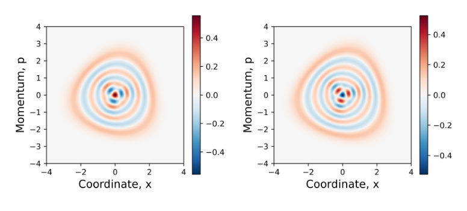 
FIG. 5. Numerically calculated Wigner functions of the heralded output state for 𝑚= 6 (left) and 𝑚= 7 (right). In both cases, 𝛾𝑡= 3 and 𝛽= 50.

**Summary.** This paper introduces 'trigonal states,' a new class of pure non-Gaussian quantum light states exhibiting specific symmetry. They are generated theoretically by combining non-degenerate four-wave mixing with photon number measurement (heralding). The findings confirm that this process restricts the state's occupation numbers to a pattern dictated by the underlying trigonal symmetry.

**Why it may be interesting.** This work is highly relevant to quantum optics and open quantum systems, as it explores generating complex, structured non-Gaussian states using well-established nonlinear processes like four-wave mixing.

Detailed structure

**Main problem.** The paper investigates a novel class of pure non-Gaussian quantum states characterized by specific trigonal symmetry on the phase plane.

**Main result.** These 'trigonal states' are shown to be generated via a standard four-wave mixing process followed by photon number heralding, leading to occupation patterns restricted to indices $n = n_0 + 3k$.

**Method.** The authors used analytical techniques in the interaction picture to derive the two-mode state and subsequently analyzed the heralded single-mode state.

**Model / system.** The system modeled is a non-degenerate four-wave mixing process involving signal modes ($\hat{a}_{1,2}$) and pump modes ($\hat{b}_{1,2}$), governed by an interaction Hamiltonian $\hat{H}_1$.

**Key observables.** Fock occupation probabilities ($p_n$), Wigner functions, and the resulting single-mode state $|\psi_{	ext{out}}
angle$ after measurement.

**Important parameters / regimes.** The process relies on coupling constants ($\gamma, \kappa$) and involves analyzing the system's evolution over time $	au$.

**Assumptions / limitations.** Key assumptions include treating the pump modes as classical fields and neglecting certain nonlinear self- and cross-phase modulation effects.

**Figures summary.** Figures illustrate the mode structure of the four-wave mixing setup, plot probability amplitudes related to the state evolution, and show Fock occupation probabilities confirming the $n=n_0+3k$ pattern.

**Paper structure.** The paper analyzes the Hamiltonian and non-linear evolution using the interaction picture. It derives the two-mode state $|\Psi
angle$ and then focuses on the heralded single-mode state $|\psi_{	ext{out}}
angle$, culminating in discussions of the observed symmetry and future generalizations.

Abstract

We discuss a new class of pure non-Gaussian quantum states of light characterized by trigonal symmetry on the phase plane. We propose the term ``trigonal states'' for them and show that they can be generated using the standard non-degenerate four-wave process supplemented by the subsequent heralding measurement of the photon number in one of the two signal modes.

[↑ back to top](#top)

### [Still life in a classic Blume-Capel model: pseudo-transitions in a spin-1 diamond chain](http://arxiv.org/abs/2607.11669v1)

**Authors:** Elham Shahhosseini Shahrabadi, Majid Moradi, Jozef Strecka  
**Type:** theory · **Category:** statistical mechanics · **PDF:** <https://arxiv.org/pdf/2607.11669v1>  
**Analysis basis:** full PDF text, analyzed in chunks
**Topic relevance:** `driven-dissipative phase transition` **2/5** · `non-equilibrium universality` **2/5** · `Frenkel-Kontorova` **1/5** · `analog quantum simulation` **1/5** · `exotic spin models in light-matter` **1/5** · `non-equilibrium dynamics` **1/5**

📷 Fig 1

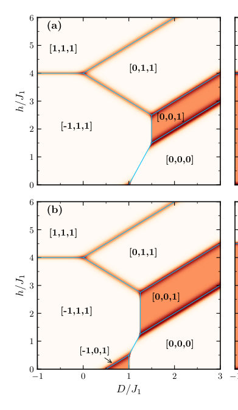 
Figure 2: Ground-state phase diagram of the spin-1 Blume–Capel diamond chain in the D/J1 −h/J1 plane for four representative values of the interaction ratio: (a) J2/J1 = 1.0, (b) J2/J1 = 1.5, (c) J2/J1 = 2.0, and (d) J2/J1 = 2.5. Light blue lines represent ground- state phase boundaries given by Eq. (19), while the color map represents a density plot of the entropy per unit cell S/kB calculated at sufficiently low temperature kBT/J1 = 0.05. The parameter regions with an orange color correspond to macroscopically degenerate ground states with the residual entropy S/kB = ln(2) (see an arrow on a color scale), while a darker color traces a higher entropy characteristic for coexistence lines...

📷 Fig 2

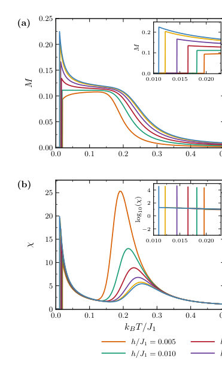 
Figure 3: Temperature dependence of the magnetization M per spin (a), the susceptibility χ per spin (b), the entropy S/kB per unit cell (c), and the specific heat C/kB per unit cell (d) for the spin-1 Blume-Capel diamond chain with the interaction ratio J2/J1 = 1.0, the single-ion anisotropy D/J1 = 1.01, and magnetic fields h/J1 ∈[0.005, 0.026]. Insets show the pseudo-transition region in an enhanced scale.

📷 Fig 3

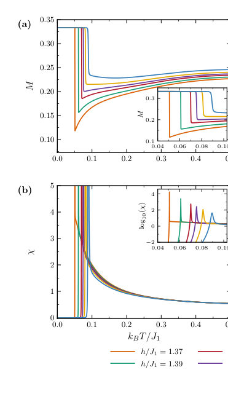 
Figure 4: Temperature dependence of the magnetization M per spin (a), the susceptibility χ per spin (b), the entropy S/kB per unit cell (c), and the specific heat C/kB per unit cell (d) for the spin-1 Blume-Capel diamond chain with the interaction ratio J2/J1 = 1.0, the single-ion anisotropy D/J1 = 1.45, and magnetic fields h/J1 ∈[1.37, 1.48]. Insets show the pseudo-transition region in an enhanced scale.

📷 Fig 4

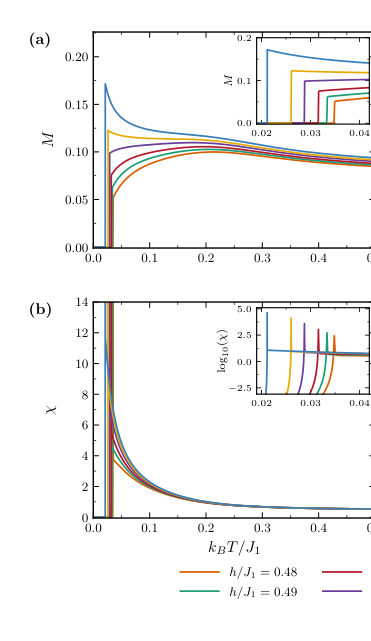 
Figure 5: Temperature dependence of the magnetization M per spin (a), the susceptibility χ per spin (b), the entropy S/kB per unit cell (c), and the specific heat C/kB per unit cell (d) for the spin-1 Blume-Capel diamond chain with the interaction ratio J2/J1 = 1.5, the single-ion anisotropy D/J1 = 1.015, and magnetic fields h/J1 ∈[0.48, 0.53]. Insets show the pseudo-transition region in an enhanced scale.

**Summary.** This theoretical work uses the transfer-matrix method to study a spin-1 Blume-Capel diamond chain. The authors demonstrate that the system exhibits 'pseudo-transitions'—sharp, continuous crossovers rather than true phase transitions—when tuned near specific phase boundaries. This extends the known class of 1D systems displaying such entropy-driven anomalies.

**Why it may be interesting.** While focused on classical spin models, the concept of entropy-driven crossovers mimicking quantum criticality is highly relevant for understanding crossover regimes in complex many-body systems studied in AMO physics.

Detailed structure

**Main problem.** The study investigates pseudo-transitions—anomalous crossovers mimicking true phase transitions—in a one-dimensional spin system where such transitions are forbidden by theorems.

**Main result.** The paper provides exact evidence that these entropy-driven pseudo-transitions can occur in the classical spin-1 Blume-Capel model, characterized by abrupt changes in magnetization and sharp, finite peaks in susceptibility/specific heat.

**Method.** The transfer-matrix method is employed to exactly calculate thermodynamic properties (partition function, free energy) for the system along its chain dimension.

**Model / system.** The physical system is a spin-1 Blume-Capel diamond chain. The Hamiltonian involves interactions ($J_1, J_2$) and single-ion anisotropy ($D$), subjected to an external magnetic field ($h$).

**Key observables.** Magnetization (M), Entropy (S), Magnetic Susceptibility ($\chi$), and Specific Heat (C).

**Important parameters / regimes.** Interaction ratios ($J_2/J_1$), anisotropy ratio ($D/J_1$), external field ($h/J_1$), and temperature ($T$).

**Assumptions / limitations.** Periodic boundary conditions are assumed for the chain structure; the pseudo-transition mechanism relies on thermal activation near macroscopically degenerate low-lying excited states.

**Figures summary.** Figures illustrate the ground-state phase diagram showing entropy density, and temperature dependence plots demonstrating sharp crossovers in M, $\chi$, S, and C near pseudocritical temperatures.

**Paper structure.** The paper first establishes the Hamiltonian and uses the transfer-matrix method to determine the partition function. It then analyzes the ground-state phase diagram before examining finite-temperature behavior to pinpoint pseudo-transition signatures via thermodynamic observables.

Abstract

We exactly investigate the ground-state, magnetic, and thermodynamic properties of a spin-1 Blume-Capel diamond chain in a magnetic field by means of the transfer-matrix method. After establishing the complete ground-state phase diagram and characterizing each ground-state spin configuration, we examine the finite-temperature behavior in the vicinity of selected phase boundaries and triple points. It is demonstrated that an extremely small energy gap between a nondegenerate ground state and competing macroscopically degenerate low-lying excited states gives rise to entropically-driven pseudo-transitions. These pseudo-transitions manifest themselves through abrupt but continuous changes in the magnetization and entropy resembling discontinuous jumps, while the magnetic susceptibility and specific heat exhibit exceptionally sharp yet finite peaks resembling divergences. Our results provide the exact evidence that pseudo-transitions can also emerge in the classical spin-1 Blume-Capel model and thereby extend the class of one-dimensional spin systems known to display pseudo-transitions.

[↑ back to top](#top)

### [Strong Zero Modes in Supersymmetry-Inspired Quantum Circuits](http://arxiv.org/abs/2607.11483v1)

**Authors:** Alberto Zorzato, Pietro Richelli, Jiri Minář, Kareljan Schoutens  
**Type:** theory · **Category:** quantum information and computing · **PDF:** <https://arxiv.org/pdf/2607.11483v1>  
**Analysis basis:** full PDF text, analyzed in chunks
**Topic relevance:** `non-equilibrium dynamics` **2/5** · `analog quantum simulation` **1/5** · `driven-dissipative phase transition` **1/5** · `entanglement & information structure` **1/5** · `methods for driven-dissipative` **1/5** · `non-equilibrium universality` **1/5**

📷 Fig 1

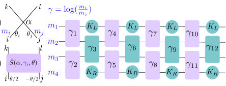 
FIG. 1. (a) Scattering diagram for asymptotic states i, j, k, l ∈{|b⟩, |f⟩}, parametrized by interaction strength α, rapidities θi and mass ratio γ. (b) Fundamental 2-qubit gate for i, j, k, l ∈{|0⟩, |1⟩}. (c) Brick wall circuit with boundary operators KL, KR, satisfying [UF , QT ] = 0.

📷 Fig 2

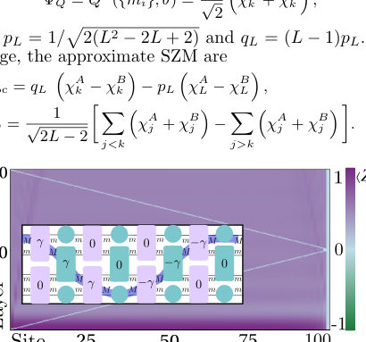 
FIG. 2. Evolution of local magnetization under OF for an initial state Γ0 and L = 100, α = 1, θ = 0.1, γ = 30. Here {mi} = {M, m, m, · · · , m, m}. SZMs are identified by their magnetization signature: ⟨Zj⟩= 0 on the sites where they are localized. The inset shows the circuit diagram for L = 4.

📷 Fig 3

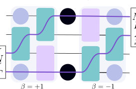 
FIG. 3. L = 4 circuit for the transfer one qubit of QI using two spatially separated local SZM. The QI is initialized in qubits 3, 4 and recollected from qubits 1, 2. See SM, [55] for the circuit parameters and the evolution of the SZM.

📷 Fig 4

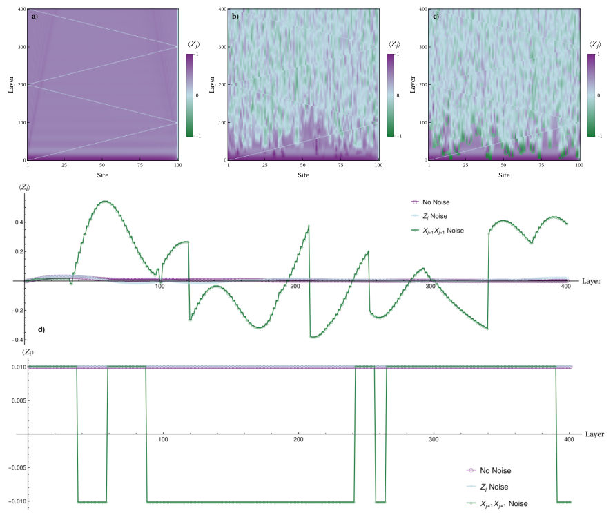 
FIG. 4. Study of the SZM signature for different parity preserving noises for the evolution of Γ0 for L = 100, α = 1, θ = 0.1, γ = 30, {mi} = {M, m, m, · · · , m, m} and k = 1. a) Reproduced the graph in fig 2, b) The plot shows the evolution of the local magnetization under phase flip perturbations. c) It shows the evolution under nearest neighbor bit flip perturbations. d) It shows the local magnetization on the right boundary sites. e) It shows the local magnetization for the propagating SZM.

**Summary.** The paper analyzes quantum circuits based on supersymmetric field theory gates to find special conserved quantities called strong zero modes (SZM). It demonstrates that these SZMs can propagate ballistically through the circuit structure. This propagation mechanism offers a pathway for robust quantum information transfer, even when subjected to noise.

**Why it may be interesting.** This work directly addresses fault-tolerant quantum computation by showing how inherent topological or symmetry-protected zero modes can facilitate robust quantum data routing, a key goal in building scalable quantum processors.

Detailed structure

**Main problem.** The research investigates how dynamically conserved operators, called strong zero modes (SZM), behave in quantum circuits whose gates are derived from a supersymmetric 1+1D QFT S-matrix.

**Main result.** The circuits support both localized and delocalized SZMs, with the key finding being the existence of propagating (ballistic) SZMs that can be exploited for robust quantum information transport.

**Method.** The analysis uses a combination of discrete-time evolution operator analysis ($U_F$), mapping spins to Majorana fermions, and taking limits ($	heta 	o 0$, large $\gamma$) to derive effective Hamiltonians.

**Model / system.** The system is modeled by quantum circuits structured as 'brick-wall' gates, whose dynamics are governed by the S-matrix of a SUSY QFT. The underlying physics involves fermionic operators and Majorana variables ($\chi^A_j, \chi^B_j$).

**Key observables.** Strong Zero Modes (SZM), local magnetization $\langle Z_j 
angle$, and the fidelity/error scaling of quantum information transfer.

**Important parameters / regimes.** The parameters include circuit coupling strengths ($\alpha$), mass ratios ($\gamma$), and the small expansion parameter ($	heta$). The analysis distinguishes between isotropic and anisotropic regimes.

**Assumptions / limitations.** The primary mathematical tools rely on a small-$	heta$ expansion of the unitary evolution operator ($U_F$) and the use of fermionic Gaussian techniques for noise analysis.

**Figures summary.** Figures illustrate scattering diagrams, magnetization evolution showing propagating SZMs (Fig. 2), and circuit schematics demonstrating QI routing using spatially separated local SZMs (Fig. 3).

**Paper structure.** The paper progresses from defining the system dynamics via the S-matrix to identifying conserved quantities (SZM) in various parameter regimes, deriving effective Hamiltonians by accounting for micromotion, and finally demonstrating the utility and robustness of these propagating modes for quantum information transport.

Abstract

We investigate discrete dynamics in quantum circuits with gates corresponding to the S-matrix of a supersymmetric 1+1D quantum field theory. We show that for a brick-wall configuration such circuits support both localized and delocalized dynamically conserved operators known as strong zero modes (SZM), the number of which depends on the parameter regime. We demonstrate that, while some of the SZM remain localized at boundaries, other SZM propagate ballistically, guided by a choice of circuit parameters. Such propagation can be explained by a strong Dzyaloshinskii Moriya term appearing in the dynamics. We describe how to exploit propagating SZM for quantum information transport and discuss the robustness to various types of noise.

[↑ back to top](#top)

### [Asymmetry-aided measurement-based quantum repeaters and distributed quantum computing with a decoder-free client](http://arxiv.org/abs/2607.11238v1)

**Authors:** Wooyeong Song, Sungyeon Kook, Wonhyuk Lee, IlKwon Sohn  
**Type:** theory · **Category:** quantum information and computing · **PDF:** <https://arxiv.org/pdf/2607.11238v1>  
**Analysis basis:** full PDF text, analyzed in chunks
**Topic relevance:** `quantum measurements` **2/5** · `correlated / nonlocal dissipation` **1/5** · `entanglement & information structure` **1/5** · `methods for driven-dissipative` **1/5** · `non-equilibrium dynamics` **1/5**

📷 Fig 1

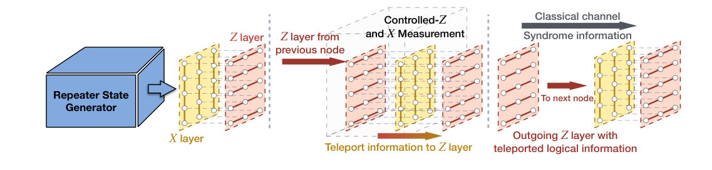 
FIG. 1. The measurement-based repeater as a foliated code (stages I–III, left to right). (I) A repeater-state generator (RSG) prepares two 2D code layers, a local X layer and a transmitted Z layer, linked by qubitwise CZ bonds. (II) The incoming Z layer from the previous node is stitched to the local X layer by qubitwise CZ bonds. The enclosed two-layer block undergoes the controlled-Z and X measurement, teleporting the logical information onto the outgoing Z layer. (III) The outgoing Z layer is transmitted to the next node, while the measurement outcomes are forwarded as syndrome data over a classical channel. Dashed lines denote qubitwise CZ bonds. Ancilla qubits are omitted for clarity....

📷 Fig 2

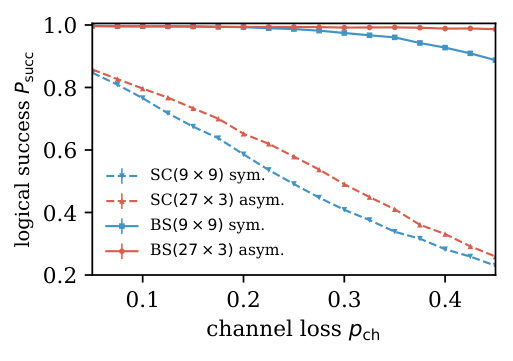 
FIG. 2. Logical success probability of four equal-size (N = 81) codes versus channel loss (ηr = 0.9, one repeater), all decoded with the same maximum-likelihood foliated erasure decoder. The asymmetric Bacon–Shor code BS(27×3) sustains the highest Psucc across the whole loss range, whereas the same elongation improves the surface code only modestly (SC(9 × 9) →SC(27 × 3)). Matching the aspect ratio to the channel bias pays off for the gauge-rich subsystem code but not for the topological one. Each point is 2 × 104 Monte Carlo erasure samples. Error bars are ±1 standard error and are smaller than the markers (maximum SE ≈0.004).

📷 Fig 3

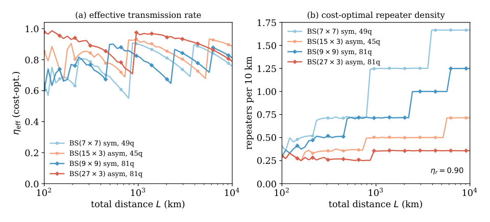 
FIG. 3. Performance of optimized repeater architectures. Long-distance performance at repeater efficiency ηr = 0.9 (annotated in panel (b), lossy local ancilla pX = 1 −√ηr ≈0.05, reliable transmitted-sector syndrome in the well-scheduled cross-layer regime, with the other efficiencies ηr = 0.85, 0.95 in Fig. 8). Four equal-pair codes are compared. These are the ∼48-qubit pair BS(7×7) (symmetric) and BS(15×3) (asymmetric), and the 81-qubit pair BS(9×9) (symmetric) and BS(27×3) (asymmetric). (a) Cost-optimal effective transmission rate ηeff versus total distance L. (b) Corresponding cost-optimal repeater density (repeaters per 10 km). At matched code size the asymmetric codes (warm colors)...

📷 Fig 4

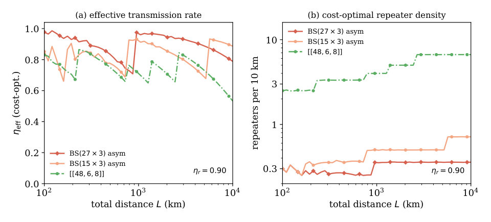 
FIG. 4. Single common-simulation comparison with previous work. (a) Cost-optimal effective transmission rate ηeff and (b) cost-optimal repeater density (logarithmic axis) versus total distance L at ηr = 0.9, for the asymmetric BS(27 × 3) (81 data qubits) and BS(15 × 3) (45 qubits) and the [[48, 6, 8]] generalized-bicycle code of Ref. [19] (48 qubits), all decoded in one common simulation with the same optimal maximum-likelihood erasure decoder (at least as strong as the Algorithm 1 of Ref. [19]). The asymmetric Bacon–Shor codes are cost-optimal at ∼0.3–0.5 stations per 10 km, an order of magnitude below the ∼3–7 per 10 km of [[48, 6, 8]], at comparable or higher ηeff. The [[48, 6, 8]] curve...

📷 Fig 5

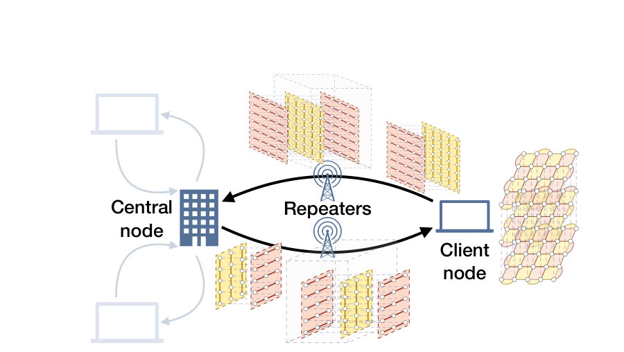 
FIG. 5. The BS–SC–BS deferred-decoding round trip. The center prepares the logical qubit in a transmission-optimized asymmetric Bacon–Shor code BS1(m × n) (dZ = m ≫dX = n) and transmits it to the client. The channel loss enters as the transmitted-sector erasure rate pZ [Eq. (1)]. The client injects the incoming state into a surface code SC(m × m) through the fault-tolerant switch of the previous section, runs the computation (Pauli rate pcomp), switches to a return code BS3(m′ × m), and transmits it back (pZ again). The client never runs the global decoder. It forwards its measurement (syndrome) records to the center, which assembles the full heterogeneous record into one combined complex...

**Summary.** This paper develops an advanced theory for distributed quantum computing over lossy optical links by treating the repeater as an integrated part of the computation. It shows that using highly asymmetric Bacon-Shor quantum error correcting codes—whose structure matches the unequal loss rates of transmission versus local measurement—dramatically improves qubit transmission efficiency. This approach enables robust, long-distance quantum networking with a simplified client architecture.

**Why it may be interesting.** This work provides a concrete theoretical blueprint for next-generation quantum networks by optimizing QEC codes specifically for realistic, asymmetric channel noise profiles encountered in long-haul fiber optics.

Detailed structure

**Main problem.** The research addresses the challenge of efficiently transmitting logical qubits across lossy optical links while integrating this transmission layer directly with the quantum computation.

**Main result.** By matching the structural asymmetry of a measurement-based repeater (where transmitted qubits suffer more loss than local ones) to an elongated Bacon-Shor subsystem code, significantly higher effective transmission rates are achieved compared to symmetric codes or unaware encodings.

**Method.** The authors model the quantum repeater as a two-dimensional code foliated along the transmission axis and derive optimal code geometries by balancing logical failure probabilities across different error sectors.

**Model / system.** The system uses photonic graph states and CSS codes, specifically comparing Surface Codes (SC) against Bacon-Shor (BS) subsystem codes. The core mechanism relies on exploiting structural asymmetry in the channel loss rates ($p_Z$ vs $p_X$).

**Key observables.** Logical qubit transmission efficiency ($\eta_{eff}$), logical failure probability ($P_L$), and required repeater density.

**Important parameters / regimes.** Channel erasure rates ($p_Z, p_X$), code distances $(d_Z, d_X)$, and the degree of structural asymmetry exploited by the code.

**Assumptions / limitations.** The analysis assumes that the optimal performance is achieved by designing codes whose structure mirrors the inherent physical asymmetry of the lossy transmission channel.

**Figures summary.** Figures compare logical success probability versus channel loss for SC vs. asymmetric BS codes, showing superior resilience for the latter; other figures detail cost-optimal repeater density and code switching protocols.

**Paper structure.** The paper progresses from establishing the need to integrate repeaters with computation, deriving the optimal asymmetric code structure using heuristic conditions, demonstrating this advantage via rigorous error analysis (comparing SC vs. BS), and finally extending the framework to complex central-to-client round trips involving code switching.

Abstract

Distributed quantum computation needs to move logical qubits across lossy optical links, yet this transmission layer is usually designed separately from the computation it serves. We treat the two together by recognizing that a measurement-based quantum repeater is a two-dimensional code foliated along the transmission axis, so that the dominant channel loss is concentrated on the transmitted sector while the locally measured qubits are largely spared. Matching a code's distance to this structural asymmetry, we show that a rectangular Bacon-Shor subsystem code transmits a logical qubit markedly more efficiently than transmission-unaware encodings. Over continental distances, its cost-optimal repeater density is about an order of magnitude lower than that of a recent $[[48,6,8]]$ benchmark at comparable transmission rate, and roughly half that of a symmetric code of equal size. Moreover, we extend the framework to a central-to-client round trip in which a code-level, distance-preserving code switch joins the transmission legs to the client's computation, and joint decoding of the heterogeneous syndrome record at the central node lets distributed quantum computation proceed with a decoder-free client.

[↑ back to top](#top)

### [Connectivity-induced surface-loss penalty in superconducting qubit-coupler lattices](http://arxiv.org/abs/2607.10743v1)

**Authors:** Xu-Yang Gu, Gui-Han Liang, Ming-Chuan Wang, Yongxi Xiao, Cheng-Lin Deng, Zheng-He Liu, Tian-Ming Li, Kai Xu, Zhongcheng Xiang, Heng Fan  
**Type:** theory · **Category:** quantum information and computing · **PDF:** <https://arxiv.org/pdf/2607.10743v1>  
**Analysis basis:** full PDF text, analyzed in chunks
**Topic relevance:** `QC/QI experiment` **2/5** · `correlated / nonlocal dissipation` **1/5** · `correlated cavity matter` **1/5** · `driven-dissipative phase transition` **1/5** · `methods for driven-dissipative` **1/5**

📷 Fig 1

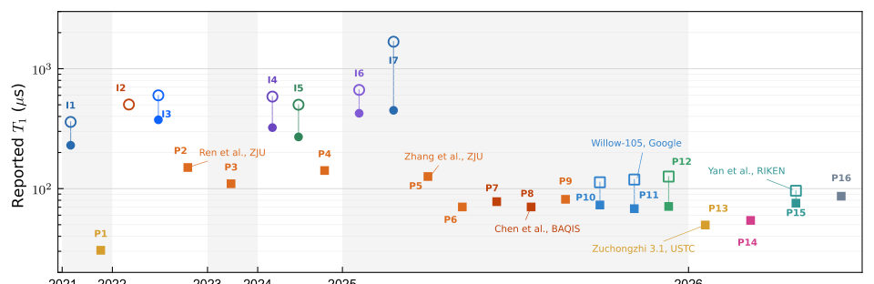 
FIG. 1. Comparison between the reported energy-relaxation times of isolated-qubit chips and qubit-lattice processors. Filled symbols denote reported typical values such as mean, median, or average T1, and open symbols denote reported best or maximum values when available. Marker shape separates isolated-qubit chips from qubit-lattice processors. The plotted isolated-qubit chips are taken from Refs. [23, 36, 30, 37, 26, 38, 25], and the plotted qubit-lattice processors are taken from Refs. [39–47, 3, 48–52]. Appendix A and Table III list the specific values and source notes.

📷 Fig 2

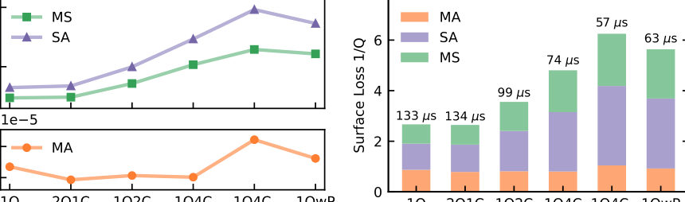 
FIG. 2. Surface-participation simulations of single-qubit and qubit-coupler lattice geometries. (a) Electric-field distributions of an isolated single qubit and a qubit embedded in a square lattice. (b) Schematic geometries of the simulated models. The 1Q and 1QwP models define the isolated-qubit baseline and the passive-claw control, while 2Q1C, 1Q2C, and 1Q4C represent connected qubit-coupler environments. (c) Total MA, MS, and SA SPRs for the different geometries. For the connected models 2Q1C, 1Q2C, and 1Q4C, the plotted data correspond to the qubit-like dressed mode. The 1Q4C sinM result is obtained from a single-mode solve of the same 1Q4C geometry. A split linear axis is used because...

📷 Fig 3

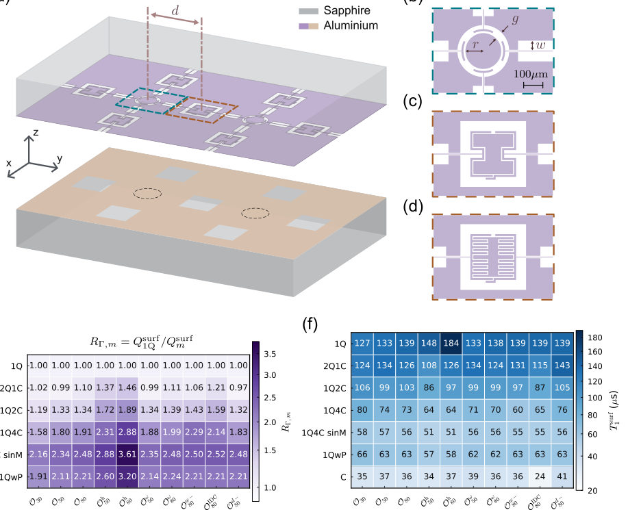 
FIG. 3. Design-parameter dependence of connectivity-induced surface-loss penalty. (a) and (b) define the flip-chip layout and local geometry controls: the qubit island radius r, the qubit-ground gap g, the coupling-claw gap w, and the claw length d. The dashed circles on the bottom chip in panel (a) indicate optional holes etched in the ground plane below the qubit. (c) and (d) show schematics of the coupler designs; (d) corresponds to design OIDC 80 , which uses an IDC to achieve large capacitive coupling between the claw and the coupler. The Josephson junctions in the qubits and couplers are omitted from these schematics. The resulting RΓ and qubit-mode T surf 1 maps are summarized in...

📷 Fig 4

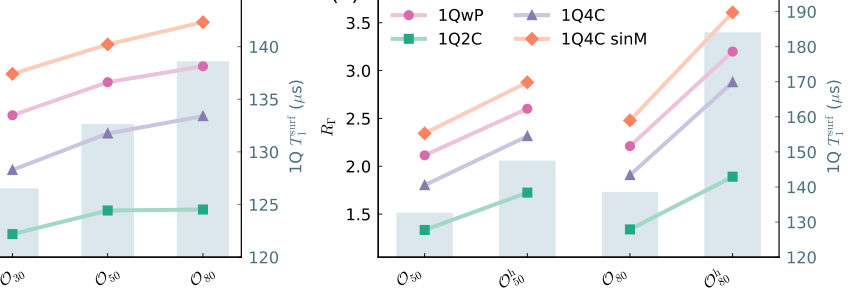 
FIG. 4. Gap and opposite-chip-hole controls for the qubit designs. (a) Gap sweep, with qubit RΓ shown as markers and curves on the left axis and isolated-qubit T surf 1 shown as columns on the right axis. (b) Opposite-chip-hole comparison, using the same two-axis convention as (a).

📷 Fig 5

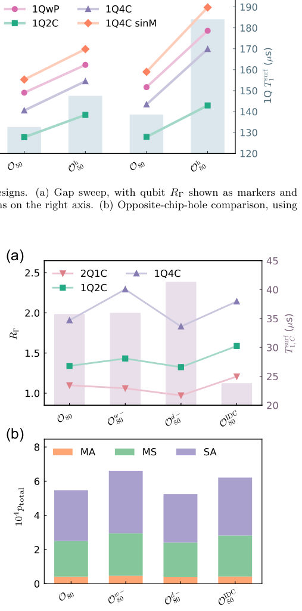 
FIG. 5. Coupling-claw controls around O80. (a) Qubit- mode connectivity-induced penalties RΓ for the investigated designs: reduced claw gap, shorter claw, and IDC design, with the coupler-mode surface-loss-limited lifetime shown as columns on the right axis. (b) MA/MS/SA participation de- composition of the qubit mode in 1Q4C for the same designs.

**Summary.** This paper simulates the effect of increasing qubit connectivity in superconducting lattices, finding that it introduces a significant 'surface-loss penalty' compared to isolated qubits. Using finite-element methods, the authors attribute this loss increase to added edge fields and field redistribution within the coupling network. The results provide crucial design guidelines for building larger, lower-loss quantum processors.

**Why it may be interesting.** This work directly addresses a critical scaling bottleneck in superconducting quantum computing by providing quantitative simulation tools to predict and mitigate decoherence sources arising from device architecture itself.

Detailed structure

**Main problem.** The study investigates how increasing qubit connectivity, by embedding qubits in lattice structures, detrimentally increases surface dielectric loss, thereby limiting the coherence time of superconducting quantum processors.

**Main result.** Higher connectivity leads to a measurable 'connectivity-induced surface-loss penalty' due to added edge fields from coupling claws and field redistribution across the larger metal network.

**Method.** The authors employ finite-element simulations to calculate Surface Participation Ratios (SPR) and quantify the resulting surface dielectric loss in superconducting qubit-coupler lattices.

**Model / system.** The physical system is a superconducting transmon qubit embedded within a lattice structure connected by couplers, modeled using flip-chip geometry. The analysis focuses on the dressed eigenmodes of the coupled system.

**Key observables.** Surface Participation Ratio (SPR), Surface Dielectric Loss ($rac{1}{Q_{	ext{surf}}}$), and the connectivity-induced surface-loss penalty ($\mathcal{R}_{\Gamma}$).

**Important parameters / regimes.** Connectivity level (e.g., 2-coupler, 4-coupler), geometric design parameters of qubits and coupling claws.

**Assumptions / limitations.** The analysis assumes that the primary source of loss increase in lattices stems from changes in field distribution at interfaces due to increased connectivity elements.

**Figures summary.** Figures compare energy-relaxation times for isolated vs. lattice processors, show electric-field distributions for various coupling geometries, and illustrate how different components contribute to the total surface loss budget.

**Paper structure.** The paper progresses by first identifying the lifetime discrepancy between isolated and coupled qubits, then using simulations to quantify this penalty ($\mathcal{R}_{\Gamma}$), decomposing the physical origins of the loss (claws, redistribution, hybridization), and finally deriving design guidelines based on these findings.

Abstract

Recent advances in design and fabrication have increased the energy-relaxation times of isolated superconducting transmon qubits to the hundreds-of-microseconds regime, with reported values exceeding 500 $μ$s. However, the same progress has not automatically translated to multiqubit processors, where qubits are embedded in connected qubit-coupler lattices and often exhibit much shorter lifetimes than isolated qubits. To identify possible sources of this discrepancy, here we use finite-element simulation to investigate how surface participation ratios and the resulting surface dielectric loss change when a qubit is embedded in a flip-chip qubit-coupler lattice. Controlled comparisons show that higher connectivity can indeed lead to larger surface loss: in the simulated lattice, connecting a qubit to two and four couplers increases the surface loss by factors of 1.3 and 1.8, respectively. We attribute this change to the combined effects of added edge fields from coupling claws, field redistribution over the larger connected metal network, and hybridization with coupler modes. We further examine how this connectivity-induced surface-loss penalty depends on the geometric design parameters of both the qubit electrodes and the coupling claws, and derive guidelines for designing low-loss multiqubit processors.

[↑ back to top](#top)

### [High-field Josephson effect enabled by a moiré Hofstadter spectrum](http://arxiv.org/abs/2607.11721v1)

**Authors:** A. Díez-Carlón, M. Cárdenes Wuttig, N. Wei, D. Ivanov, P. Altpeter, P. Hakonen, K. Watanabe, T. Taniguchi, L. I. Glazman, D. K. Efetov  
**Type:** both · **Category:** other · **PDF:** <https://arxiv.org/pdf/2607.11721v1>  
**Analysis basis:** full PDF text, analyzed in chunks
**Topic relevance:** `analog quantum simulation` **2/5** · `Keldysh / 2PI / non-Gaussian methods` **1/5** · `driven-dissipative phase transition` **1/5** · `interference shaping light` **1/5** · `non-equilibrium dynamics` **1/5**

📷 Fig 1

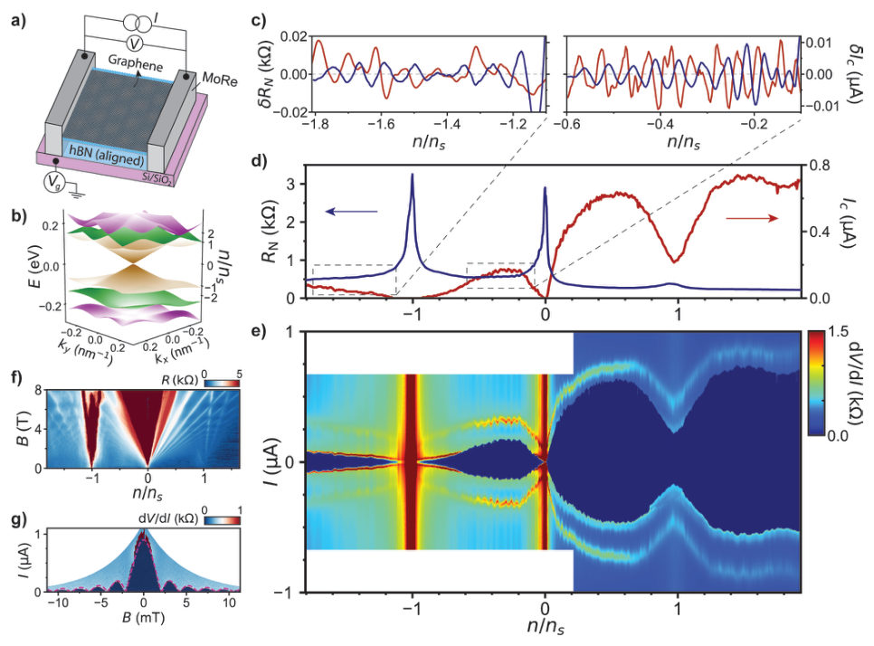 
Fig. 1: Ballistic superconducting proximity effect in a moiré graphene/hBN Josephson junction. a) Device schematic of a graphene/hBN moiré superlattice acting as the weak link of a JJ. The voltage V across the junction is recorded as a current bias I is applied through the superconducting electrodes in a two-probe measurement. The carrier density n is tuned by a gate voltage Vg applied to the doped Si. b) Electronic band structure of a graphene/hBN moiré superlattice with twist angle θ = 0.21°, with the main Dirac cone in brown and the moiré minibands in green and violet. c) Fabry-Pérot oscillations in the moiré minibands (left) and the main Dirac cone (right) shown as a function of carrier...

📷 Fig 2

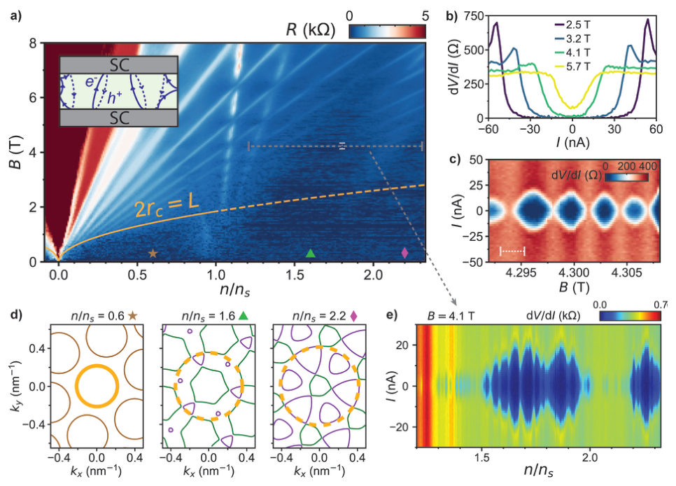 
Fig. 2: High field superconductivity at the moiré bands. a) Resistance R vs perpendicular magnetic field B and carrier density in units of the superlattice density n/ns. The dark-blue superconducting pockets are well bounded by the orange solid line in the main Dirac cone band (0 &lt; n/ns &lt; 1), whereas in the moiré minibands (n/ns &gt; 1) superconductivity persists up to ∼6 T, surpassing the threshold (orange dashed line) set by the Fermi-surface trajectories shown in d. Inset: sketch of semiclassical trajectories followed by the ABS at high fields. b) Differential resistance dV/dI vs d.c. current I at a fixed n/ns ∼1.8 for several values of magnetic field. c) Interference pattern measured at...

📷 Fig 3

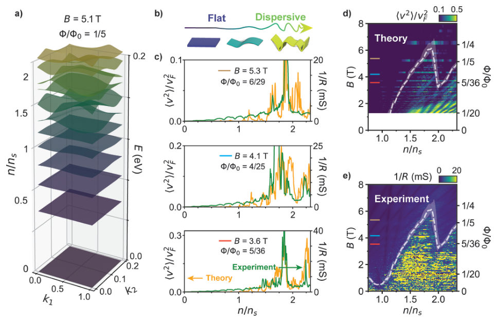 
Fig. 3: Absence of Landau levels from dispersive bands in the superconducting regions. a) Hofstadter electronic bands calculated at a flux per moiré unit cell Φ/Φ0 = 1/5 corresponding to a magnetic field B = 5.1 T. The quasimomentum k = k1G1 + k2G2, where G1,2 are two primitive reciprocal lattice vectors of the graphene/hBN mini Brillouin zone. b) Sketch illustrating the increasing dispersion upon doping into the moiré minibands at high fields, according to the calculations in a and to their comparison with the experimental data in c and d-e. c) The three panels show the calculated average squared band velocity ⟨v2⟩normalized by the square graphene Fermi velocity v2 F in orange (left) as a...

**Summary.** This work demonstrates that moiré engineering in graphene Josephson junctions enables phase-coherent superconducting transport far beyond the limits imposed by conventional magnetic field suppression. By utilizing the complex Hofstadter spectrum arising from the moiré potential, the system maintains finite quasiparticle group velocities even deep into the quantum Hall regime. This establishes a novel platform for high-field superconducting interferometry.

**Why it may be interesting.** The mechanism relies on modifying electronic band structure via geometric potentials (moiré) to stabilize quantum coherence in extreme external fields, which is a rich topic connecting topology, superconductivity, and condensed matter theory.

Detailed structure

**Main problem.** The primary challenge addressed is overcoming the magnetic field suppression of phase-coherent Josephson transport, which typically limits superconducting interferometry to low fields.

**Main result.** Moiré engineering in graphene allows for stable, high-field (up to 6 T) phase-coherent superconductivity by transforming Landau levels into dispersive Hofstadter minibands.

**Method.** The study combines experimental measurements of Josephson current ($I_c$) and resistance ($R$) with detailed theoretical calculations based on the moiré Hamiltonian and band structure analysis.

**Model / system.** The system is graphene/hBN moiré superlattices forming Josephson junctions. The physics is governed by the interplay between magnetic fields, the moiré potential, and superconducting proximity effects.

**Key observables.** Critical current ($I_c$), resistance ($R$), Fabry-Pérot oscillations, Fraunhofer interference patterns, and calculated average squared band velocity ($\langle v^2 
angle$).

**Important parameters / regimes.** Magnetic field strength (up to 6 T), carrier density filling factor ($n/n_s$), superconducting gap ($\Delta$), and the magnetic flux quanta ($p/q$).

**Assumptions / limitations.** The analysis assumes ballistic transport in the junctions, and theoretical calculations utilize approximations like block-diagonalization in valley space.

**Figures summary.** Figures show $R$ vs. density/field mapping out Landau fans evolving into Hofstadter butterfly spectra; $I_c$ measurements demonstrate high-field persistence; and supplementary figures detail band structures and calculated band velocities across various filling factors.

**Paper structure.** The paper progresses from establishing the experimental observation of high-field Josephson effects (Chunk 1) to analyzing the underlying physics in different regimes (semiclassical vs. moiré minibands, Chunk 2). It then delves into detailed theoretical calculations using the continuum model and magnetic translation symmetry to map band structure evolution (Chunks 3 & 4).

Abstract

Magnetic fields generally suppress phase-coherent Josephson transport, limiting superconducting interferometry to relatively low fields. Here we show that moiré-engineered graphene Josephson junctions can overcome this constraint. Using ballistic graphene/hBN junctions, we establish phase-coherent Andreev transport through Fabry-Pérot oscillations and Fraunhofer interference that persist across both the primary Dirac cone and reconstructed moiré minibands. We then demonstrate phase-coherent Josephson interference up to 6 T in the fractal Hofstadter-butterfly regime, well beyond the range expected for conventional ballistic graphene junctions. Comparison with Hofstadter-spectrum calculations reveals that superconductivity survives where the moiré potential transforms Landau levels with quenched group velocity into dispersive magnetic Bloch bands with finite quasiparticle group velocity, enabling extended electron-hole Andreev trajectories across the junction. Our results show that Hofstadter minibands can stabilize phase-coherent superconductivity deep into the parameter domain conventionally associated with the quantum Hall regime, establishing a new platform for high-field superconducting interferometry.

[↑ back to top](#top)

### [Information geometric quantification of effective privacy in quantum metrology](http://arxiv.org/abs/2607.11302v1)

**Authors:** Luca Bianchi, Shimpei Yamaguchi, Wojciech Roga, Davide Bacco, Masahiro Takeoka  
**Type:** theory · **Category:** quantum information and computing · **PDF:** <https://arxiv.org/pdf/2607.11302v1>  
**Analysis basis:** full PDF text, analyzed in chunks
**Topic relevance:** `entanglement & information structure` **2/5** · `quantum measurements` **2/5** · `correlated / nonlocal dissipation` **1/5** · `measurement-induced transitions` **1/5**

📷 Fig 1

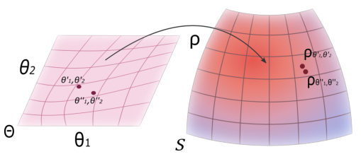 
Figure 2. Schematic picture for the encoding of parameters in quantum states: on the left, the space of parameters Θ while on the right the space of states S, the two spaces connected by the mapping ρ. Colors stand for measures in the spaces, while grids denote distinguishability regions. In this example, the space of parameters has a uniform measure, while the space of parametrized quantum states has an induced non- uniform density, portrayed as a gradient of colors. In the quantum state manifold, a uniform grid indicates region of distinguishability standing for volumes of ϵ-balls, which are mapped back in twisted, generally-irregular grids on the space of parameters.

📷 Fig 2

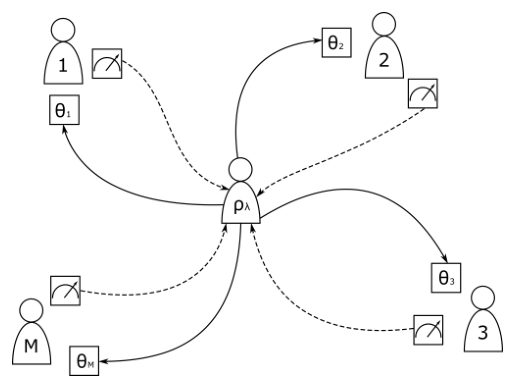 
Figure 1. A typical quantum network sensing protocol: The central node prepares a multipartite entangled state ρλ, sharing with M parties across quantum channels (solid lines) in the network. Each node encodes a parameter θi, with i = {1, . . . , M} and performs a measurement. Measurement statistics are then classically communicated (dashed lines) back to the central node, who builds estimators on top of the received probabilities. Such estimators can have high or low variances depending on the quantum Fisher information of the multipartite encoded quantum state ρλ,θ measured.

📷 Fig 3

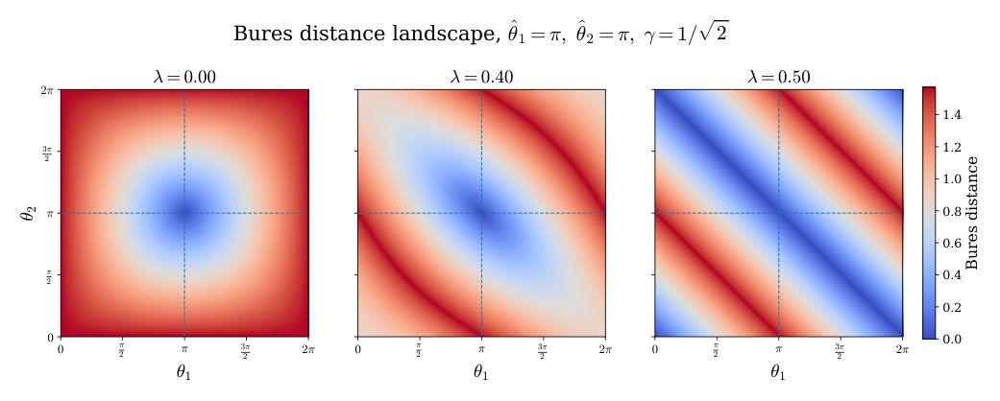 
Figure 3. Images of Bures distance landscapes for M = 2 mode states in the parameter space Θ, centered at ˆθ1 = ˆθ2 = π, for the family of states of Eq. (C1) at γ = 1/ √

📷 Fig 4

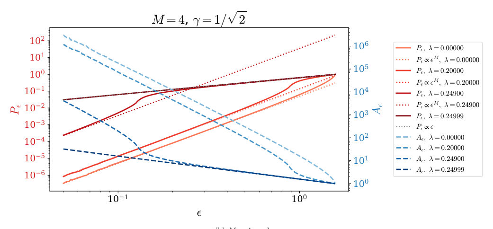 
Figure 4. ϵ-privacy (Eq. (11), red solid lines) and ϵ-accessibility (Eq. (10), blue dashed lines) for the states of Eq. (C1) at γ = 1/ √

**Summary.** This paper introduces an information geometric framework to quantify how much information about underlying parameters can be kept secret (privacy) or reliably extracted (accessibility) in quantum metrology. By defining these concepts using volumes derived from the Bures metric, it establishes a fundamental duality between privacy and accessibility for imperfect measurements. This has significant implications for designing secure and robust multi-user quantum sensing networks.

**Why it may be interesting.** It provides a powerful, geometrically grounded tool for quantifying security (privacy) in distributed sensing, which is crucial for understanding the practical limits of multi-user quantum communication protocols.

Detailed structure

**Main problem.** The work develops a rigorous framework using information geometry to quantify 'effective privacy' and 'accessibility' for estimating parameters in quantum metrology protocols.

**Main result.** It establishes that $\epsilon$-privacy ($P_\epsilon$) and $\epsilon$-accessibility ($A_\epsilon$) are dual quantities satisfying $A_\epsilon P_\epsilon = 1$, providing a unified measure encompassing imperfect measurements.

**Method.** The analysis employs the Bures metric on the state space, defining measures based on volumes of parameter-induced balls in the quantum state manifold.

**Model / system.** The study models quantum networks where multipartite entangled states are distributed across multiple nodes to estimate unknown parameters ($	heta_i$).

**Key observables.** $\epsilon$-Privacy ($P_\epsilon$), $\epsilon$-Accessibility ($A_\epsilon$), Bures distance, and the volume element derived from the parameter space.

**Important parameters / regimes.** The accuracy threshold $\epsilon$, entanglement structure (e.g., GHZ states), and the number of nodes $M$.

**Assumptions / limitations.** The framework assumes that operational equivalence at scale $\epsilon$ can be captured by bounding the Bures distance, linking to Chernoff theory.

**Figures summary.** Figure 1 illustrates a typical quantum network sensing protocol. Figure 2 shows the mapping from parameter space ($\Theta$) to state space ($S$). Figure 3 schematically demonstrates how $\epsilon$-balls deform differently for separable versus entangled states.

**Paper structure.** The paper builds conceptually by first introducing the geometric framework (Bures distance, $\epsilon$-balls), deriving the dual relationship between $A_\epsilon$ and $P_\epsilon$, and then applying this formalism to specific quantum network examples like Bell or GHZ states to derive scaling laws.

Abstract

Privacy of a quantum metrological protocol concerns the extent to which single parameters can be kept inaccessible to an observer or to other users of the network. In this work, an information geometric framework is developed to quantify privacy and accessibility of functions of parameters effectively, that is, up to a finite accuracy in state discrimination. Both quantities are defined by measuring volumes in the parameter space induced by the underlying quantum states. This construction subsumes previous definitions of privacy based on the degeneracy of quantum Fisher information, naturally encompassing imperfect implementations. Using extended-GHZ states as a representative example of a quantum network scenario, privacy and accessibility are characterized by quantum correlations and accuracy, providing scaling laws depending on imperfect measurements and entanglement.

[↑ back to top](#top)

### [Optimal Average Success Probabilities of Binary $(n,n-1)$ and $(n,n-2)$ Quantum Random Access Codes via a Proof of the Corresponding Conjectured Bound](http://arxiv.org/abs/2607.10414v1)

**Authors:** Shuo Tan, Syed A. Jafar  
**Type:** theory · **Category:** quantum information and computing · **PDF:** <https://arxiv.org/pdf/2607.10414v1>  
**Analysis basis:** full PDF text, analyzed in chunks
**Topic relevance:** `entanglement & information structure` **2/5** · `measurement-induced transitions` **2/5** · `Keldysh / 2PI / non-Gaussian methods` **1/5** · `quantum measurements` **1/5**

📷 Fig 1

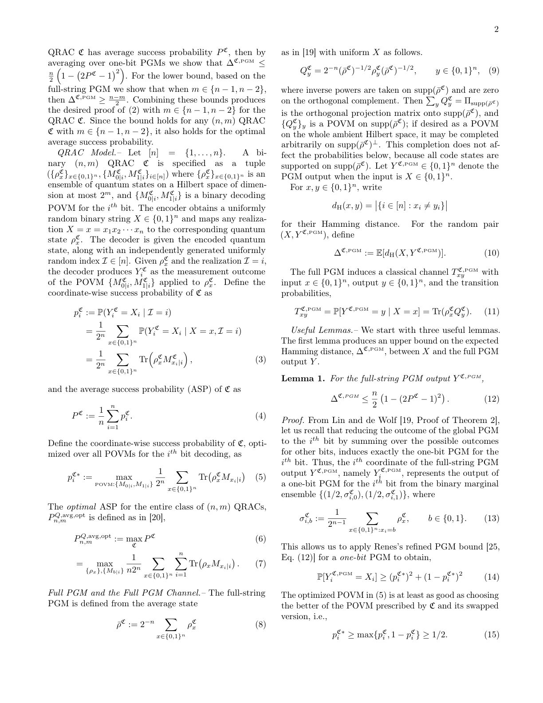 
Low-resolution page preview, page 2

📷 Fig 2

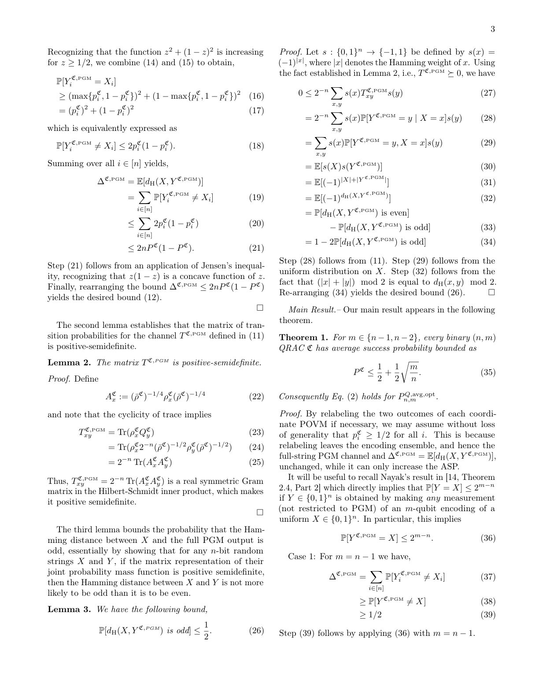 
Low-resolution page preview, page 3

📷 Fig 3

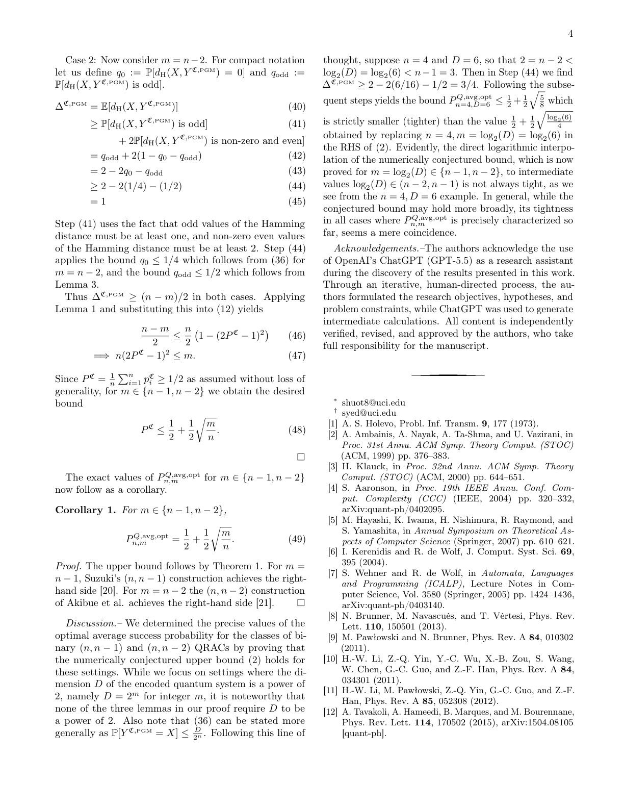 
Low-resolution page preview, page 4

📷 Fig 4

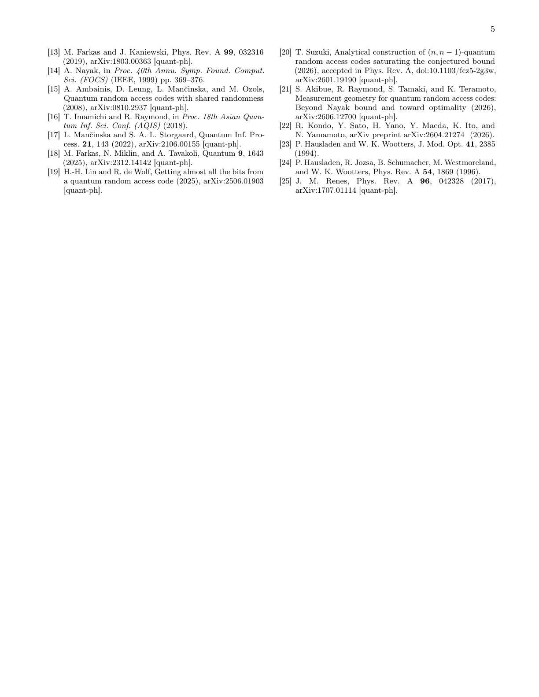 
Low-resolution page preview, page 5

**Summary.** This paper rigorously determines the maximum achievable average success probability for specific types of Quantum Random Access Codes (QRACs). By proving a long-standing conjectured upper bound using advanced techniques involving Pretty Good Measurement, the authors precisely characterize the optimal performance limits for $(n, n-1)$ and $(n, n-2)$ QRACs.

**Why it may be interesting.** While focused on QRACs, the mathematical techniques involving channel analysis, bounds derived from semidefinite programming, and information theoretic limits are highly relevant to understanding error correction and quantum communication protocols.

Detailed structure

**Main problem.** The primary goal is determining the optimal average success probability for binary Quantum Random Access Codes (QRACs).

**Main result.** The authors prove that the conjectured upper bound, $P^{Q,\mathrm{avg},\mathrm{opt}}_{n,m}\leq rac{1}{2}+rac{1}{2}\sqrt{rac{m}{n}}$, is indeed the exact optimal probability for the specific cases where $m=n-1$ and $m=n-2$.

**Method.** The proof employs advanced techniques involving translating local reconstruction problems to global ones via Pretty Good Measurement (PGM) and utilizing positive-semidefinite constraints on induced quantum channels.

**Model / system.** The model is the binary $(n, m)$ Quantum Random Access Code (QRAC), which encodes an $n$-bit classical string into an $m$-qubit quantum state for subsequent decoding.

**Key observables.** Average Success Probability ($P^C$), coordinate-wise success probability ($p^C_i$), and the expected Hamming distance ($\Delta_{C,PGM}$) after PGM.

**Important parameters / regimes.** $n$ (input bits), $m$ (qubits), and the ratio $m/n$.

**Assumptions / limitations.** The proof relies on established results concerning the reduction from local to global reconstruction via Pretty Good Measurement (PGM) studied by Lin and de Wolf.

**Paper structure.** The paper establishes the problem definition, introduces the conjectured bound, and then proceeds through technical lemmas (related to PGM and positive-semidefinite constraints) culminating in a theorem that proves the upper bound for $m \in \{n-1, n-2\}$.

Abstract

A binary $(n,m)$ quantum random access code (QRAC) compresses an $n$-bit classical string into an $m$-qubit quantum state, from which a decoder attempts to recover a randomly selected target bit. Of particular interest is the optimal average probability of success, $P^{Q,\mathrm{avg},\mathrm{opt}}_{n,m}$, which is numerically conjectured to satisfy the bound $P^{Q,\mathrm{avg},\mathrm{opt}}_{n,m}\leq \frac{1}{2}+\frac{1}{2}\sqrt{\frac{m}{n}}$. Recent constructions of $(n,n-1)$ QRACs by Suzuki and $(n,n-2)$ QRACs by Akibue et al. meet this bound exactly, raising the question of their strict optimality. In this work, we settle this question by proving the conjectured upper bound for $m\in\{n-1,n-2\}$, thereby precisely determining $P^{Q,\mathrm{avg},\mathrm{opt}}_{n,n-1}$ and $P^{Q,\mathrm{avg},\mathrm{opt}}_{n,n-2}$. The proof utilizes a translation recently studied by Lin and de Wolf from local to global reconstruction via pretty good measurement, along with dimensional and positive-semidefinite constraints on an induced channel.

[↑ back to top](#top)

### [Efficient Circuit Transpilation of Commuting Gates on 2D Grids](http://arxiv.org/abs/2607.10274v1)

**Authors:** Sabina Drăgoi, Daniel J. Egger  
**Type:** both · **Category:** quantum information and computing · **PDF:** <https://arxiv.org/pdf/2607.10274v1>  
**Analysis basis:** full PDF text, analyzed in chunks
**Topic relevance:** `QC/QI experiment` **2/5** · `analog quantum simulation` **1/5** · `methods for driven-dissipative` **1/5** · `non-equilibrium dynamics` **1/5**

📷 Fig 1

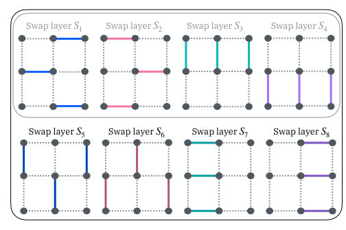 
Figure 1: Example of two basis sets of SWAP layers for a 3 × 3 grid: Bgrid (top row) and its extended version Bextended grid (all). Here, each dot is a qubit, and the dashed lines show the coupling map. The highlighted edges in each SWAP layer show SWAP gates between qubits.

📷 Fig 2

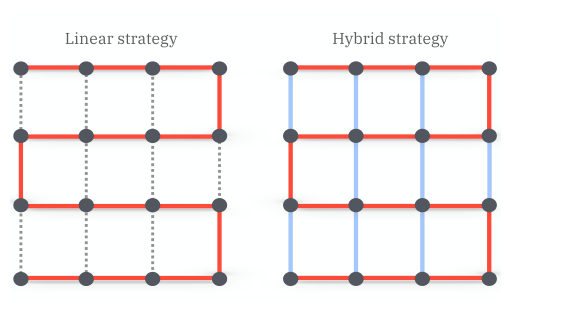 
Figure 2: Linear and hybrid strategy on a 4 × 4 rectan- gular grid coupling map. Both strategies route along the longest line of qubits (red), but the hybrid strategy can additionally apply interactions on the remaining edges of the coupling map (light blue).

📷 Fig 3

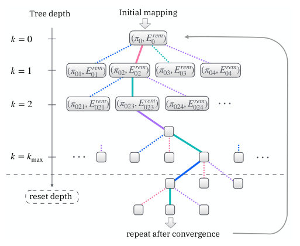 
Figure 3: Greedy searches a tree of SWAP layer se- quences. The edges correspond to SWAP layers and are colored according to the basis Bgrid shown in Fig. 1. The nodes encode qubit layouts π and the remaining inter- actions Erem. At depth k = 1, possible layouts are de- noted by π01, π02, π03, π04, corresponding to their respect- ive SWAP sequences. The tree is explored up to a fixed depth kmax, after which a leaf minimizing the number of remaining edges is selected to continue the search until all interactions are implemented, yielding Sgreedy.

📷 Fig 4

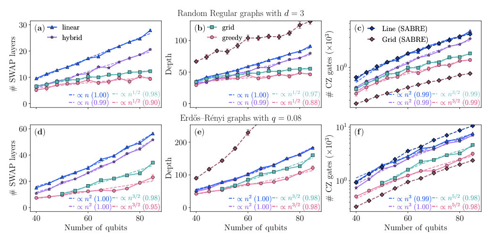 
Figure 4: Circuit complexity versus graph size of e−iγHC transpiled to a rectangular grid with different strategies. The linear strategy is the current state-of-the-art and is based on (Sline, Cline grid); the hybrid one is our first contribution and is based on (Sline, Cgrid); the grid strategy uses (Sgrid, Cgrid) [23]; the greedy strategy is our main contribution and uses (Sgreedy grid , Cgrid); the Line (SABRE) and Grid (SABRE) methods use the out-of-the-box Qiskit transpiler [20, 21, 38] on Cline grid and Cgrid, respectively. The Line (SABRE) results are omitted from panels (b) and (e) because they fall outside the plotted range. Scalings are derived in App. C. Fits are performed on...

📷 Fig 5

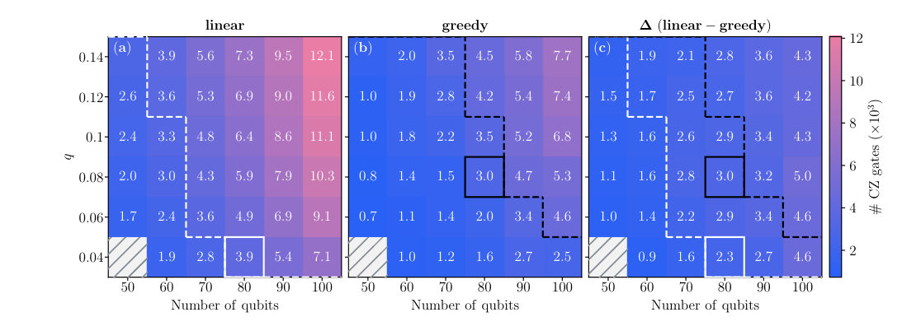 
Figure 5: Entangling gates scaling of e−iγHC transpiled ton a grid with the linear (a) and greedy (b) SWAP strategies versus the graph size and edge density of the underlying Erdős–Rényi graphs. Each data point is the average of ten instances. The colors and numbers show the number of CZ gates. White and black dashed lines indicate the estimated ∼3,600 CZ gates feasibility thresholds for linear and greedy strategies, respectively, which assumes optimistic error rates, not those of the hardware device. The region between them in (c) marks instances enabled by our approach. Graphs highlighted by the white square have a similar density as the RR graphs in the hardware experiments from Fig....

**Summary.** This paper presents a novel transpilation scheme for mapping quantum circuits involving commuting gates onto 2D lattice hardware. By iteratively optimizing both the required SWAP layers and the qubit layout, it achieves substantial reductions in circuit depth compared to existing methods. This efficiency boost allows for testing larger-scale QAOA applications on hard combinatorial problems.

**Why it may be interesting.** While focused on optimization algorithms, the underlying need to map abstract Hamiltonians onto physical hardware connectivity maps directly to resource constraints in simulating complex quantum many-body systems or designing quantum network protocols.

Detailed structure

**Main problem.** The core challenge is developing efficient transpilation schemes for quantum circuits, particularly those involving blocks of commuting two-qubit gates, to run on hardware with limited connectivity.

**Main result.** The proposed greedy transpilation scheme significantly reduces circuit depth and gate count (by a factor of two) compared to standard methods, enabling larger qubit counts and improving approximation ratios for optimization problems like Max Cut and MIS.

**Method.** The authors propose an iterative method that alternates between constructing problem-dependent SWAP-layer sequences and optimizing the initial qubit layout by adapting routing directly to required interactions.

**Model / system.** The work focuses on quantum computation implemented on a two-dimensional lattice grid. The circuits are used for Quantum Approximate Optimization Algorithm (QAOA) applied to combinatorial optimization problems like Maximum Cut (MC) and Maximum Independent Set (MIS).

**Key observables.** Circuit depth, gate count, mean approximation ratio, and kept shot ratio.

**Important parameters / regimes.** The number of qubits ($n$), the circuit depth parameter ($p$) in QAOA, and the graph structure (Random Regular or Erdős-Rényi graphs).

**Assumptions / limitations.** The method assumes the underlying hardware supports two-dimensional grid connectivity; standard optimal qubit routing is noted to be NP-complete.

**Figures summary.** Figures compare circuit complexity (SWAP layers, CZ gates) across various transpilation strategies (linear, hybrid, greedy) on different graph types. Other figures illustrate the search process and performance metrics like approximation ratios vs. qubits.

**Paper structure.** The paper introduces the problem of efficient transpilation for QAOA circuits on 2D grids. It details the proposed greedy strategy by optimizing both SWAP layer sequences and initial mappings, benchmarking it against established line-based and grid-based reference strategies across MC and MIS instances.

Abstract

Combinatorial optimization problems are central to many applications but can be challenging to solve. Quantum approaches such as the Quantum Approximate Optimization Algorithm (QAOA) offer new tools with which to tackle such problems. However, QAOA circuits inherit the interaction structure of the target Hamiltonian, often resulting in deep circuits when compiled onto hardware with limited connectivity. Efficient transpilation is therefore critical to their practical performance. In this work, we propose a transpilation scheme for circuits consisting of blocks of commuting two-qubit gates on two-dimensional lattices. Unlike standard approaches based on random initial mappings and fixed routing, our method alternates between constructing problem-dependent SWAP-layer sequences and updating the qubit layout. By adapting the routing to the required interactions, this yields significantly shorter circuits for graphs with few edges. We benchmark our approach on QAOA instances for Maximum Cut (MC) on Random Regular graphs and Maximum Independent Set (MIS) on Erdős-Rényi graphs. Compared to standard methods, we reduce circuit depth and gate count by about a factor of two, enabling experiments with up to $80$ qubits and improving approximation ratios by up to $6.6\%$ for MC and $9.3\%$ for MIS.

[↑ back to top](#top)

### [Gauge-invariant thermodynamics of a finite-time quantum Otto engine](http://arxiv.org/abs/2607.09857v1)

**Authors:** Midana Baial Sambú, Thiago R. de Oliveira, Lucas C. Céleri  
**Type:** theory · **Category:** statistical mechanics · **PDF:** <https://arxiv.org/pdf/2607.09857v1>  
**Analysis basis:** full PDF text, analyzed in chunks
**Topic relevance:** `non-equilibrium dynamics` **2/5** · `driven-dissipative phase transition` **1/5** · `methods for driven-dissipative` **1/5** · `non-equilibrium universality` **1/5**

📷 Fig 1

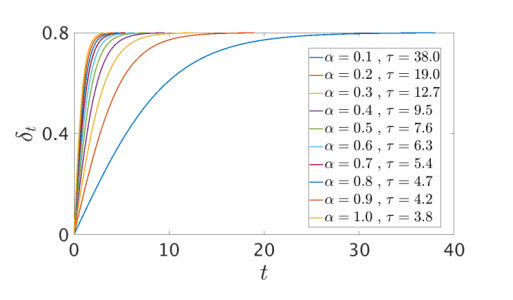 
FIG. 1. Driven protocol. The figure shows the expansion protocol defined in Eq. (13) for δ1 = 0 and δ2 = 0.8, for several values of the driving parameter α. The duration of each protocol, indicated in the legend, is chosen such that all protocols connect the same initial and final Hamiltonians within the prescribed numerical tolerance discussed in the text. This construction enables a fair comparison between different driving rates by ensuring that the thermodynamic cycle always starts from Hδ1 and ends at Hδ2. Since we set γx = 1, time is dimensionless, as are the parameters δ and α. The corresponding compression protocol follows the same trajectory in parameter space in the opposite...

📷 Fig 2

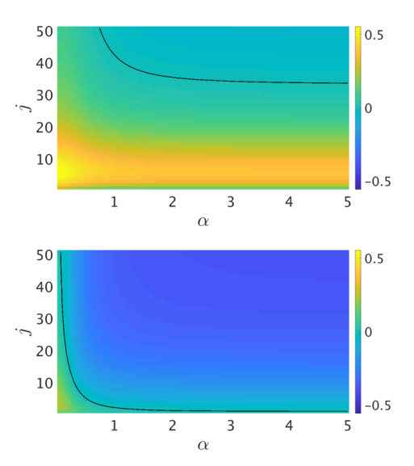 
FIG. 2. Heat absorbed from the hot reservoir, normalized by jδ0, as a function of the driving parameter α and the total angular momentum j. The upper panel corresponds to δ1 = 0 and δ2 = 0.3, for which the protocol remains within the broken phase of the LMG model. The lower panel shows the case δ1 = 0 and δ2 = 0.8, where the protocol crosses the dynamical critical point. The condition Qh = 0, which separates the heat-engine regime (Qh &gt; 0) from a regime in which the hot reservoir no longer supplies energy to the working medium is shown with the black line. Since we set γx = 1, the parameters δ and α are dimensionless. For both plots we take Th = 4Tc.

📷 Fig 3

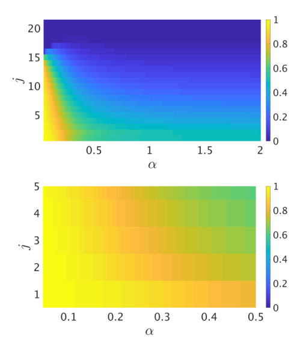 
FIG. 3. Ratio between the gauge-invariant and the usual work, κ, shown as a function of the driving parameter α and the total angular momentum j. The upper panel corresponds to δ1 = 0 and δ2 = 0.3, for which the protocol remains within the broken-symmetry phase of the LMG model, while the lower panel shows δ1 = 0 and δ2 = 0.8, where the protocol crosses the critical point. κ measures the fraction of the total work that survives the thermodynamic coarse-graining associated with the gauge-invariant description. Values close to unity indicate that the work is predominantly determined by population dynamics in the instantaneous energy basis, whereas smaller values signal an increasing...

**Summary.** This theoretical paper develops a gauge-invariant framework to analyze thermodynamics in finite-time quantum Otto engines using the LMG model. It successfully decomposes total work and entropy production into components associated with population changes and quantum coherences. This clarifies the role of coherence in irreversible processes, showing how the invariant sector captures the essential extracted work.

**Why it may be interesting.** The systematic separation of coherence effects from classical thermodynamic contributions in non-equilibrium quantum engines provides a powerful, general tool for understanding work extraction beyond standard energy conservation laws.

Detailed structure

**Main problem.** The paper addresses how to formulate quantum thermodynamics for finite-time processes by defining thermodynamic quantities that are invariant under transformations preserving the mean energy (gauge invariance). It aims to separate work extraction into contributions from population changes and quantum coherences.

**Main result.** A gauge-invariant decomposition of work and entropy production is derived, showing that the extracted work can be split into an 'invariant contribution' related to energy spectrum changes and a 'coherent contribution.'

**Method.** The authors employ a gauge-invariant thermodynamic framework by defining observables on equivalence classes of states, analyzing the Otto cycle using the Lipkin-Meshkov-Glick model.

**Model / system.** The working medium is modeled by the Lipkin-Meshkov-Glick (LMG) Hamiltonian, which describes collective angular momentum operators for spin-1/2 particles. The analysis focuses on a finite-time quantum Otto engine cycle.

**Key observables.** Gauge-invariant work ($W_{	ext{inv}}$), heat, entropy production ($\Sigma$), and the ratio $\kappa$ comparing usual vs. gauge-invariant work.

**Important parameters / regimes.** Driving speed (related to time dependence of fields), system size ($N=2j$), and critical parameters associated with the LMG model ($\delta_c = \gamma_x$).

**Assumptions / limitations.** The analysis assumes that thermodynamic quantities can be robustly defined via gauge invariance, particularly when only energy measurements are accessible.

**Paper structure.** The paper introduces the gauge-invariant formalism, applies it to the LMG model describing an Otto engine cycle, derives explicit decompositions for work and entropy production ($\Sigma = \Sigma_{	ext{pop}} + \Sigma_{	ext{coh}}$), and analyzes how these quantities behave near critical points.

Abstract

We investigate a finite-time quantum Otto engine within the framework of gauge-invariant quantum thermodynamics, using the Lipkin-Meshkov-Glick model as the working medium. In this formulation, thermodynamic quantities are defined on equivalence classes of thermodynamically indistinguishable states, leading naturally to gauge-invariant notions of work, heat, entropy, and efficiency. We derive explicit expressions for these quantities and show that the usual work performed during the unitary strokes decomposes into an invariant contribution, associated with changes in the instantaneous energy spectrum and populations, and a coherent contribution arising from finite-time quantum coherences. This decomposition induces the corresponding splittings of engine efficiency and entropy production, providing a geometric interpretation of finite-time irreversibility and clarifying the role of coherence in work extraction. By analyzing the cycle's dependence on driving speed and system size, we identify the engine's operating region and investigate the influence of criticality. We show that crossing the critical region substantially reduces the parameter space in which the cycle operates as a heat engine. At the same time, whenever the engine condition remains satisfied, the discrepancy between the conventional and gauge-invariant descriptions becomes strongly suppressed, indicating that the gauge-invariant sector predominantly carries the extracted work. These results establish a direct connection between gauge-invariant thermodynamics, finite-time irreversibility, and work extraction in many-body quantum thermal machines.

[↑ back to top](#top)

### [Multiparameter Quantum Metrology in Molecular Dimers](http://arxiv.org/abs/2607.11831v1)

**Authors:** Omar Bachain, Mohamed Amazioug, Rachid Ahl Laamara  
**Type:** theory · **Category:** other · **PDF:** <https://arxiv.org/pdf/2607.11831v1>  
**Analysis basis:** full PDF text, analyzed in chunks
**Topic relevance:** `quantum measurements` **2/5** · `analog quantum simulation` **1/5** · `entanglement & information structure` **1/5** · `measurement-induced transitions` **1/5**

📷 Fig 1

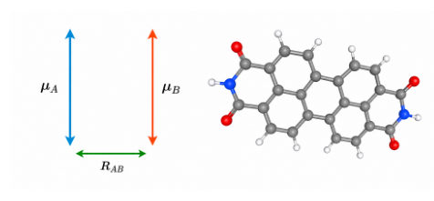 
Fig. 1: Schematic illustration of a molecular dimer system. The transition dipole moments µA and µB are oriented along parallel directions, while RAB denotes the intermolecular separation vector. On the right, the corresponding molecular structure is represented using a ball-and-stick model.

📷 Fig 2

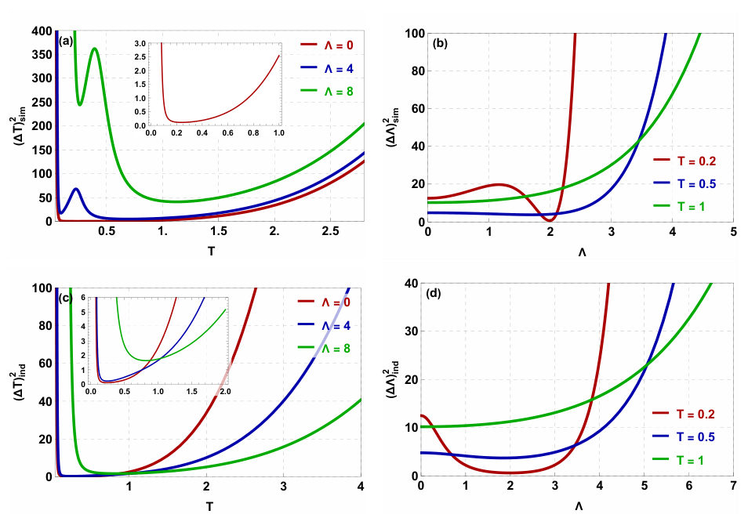 
Fig. 2: Estimation variances associated with temperature T and detuning Λ for simultaneous and individual estimation strategies. The upper row corresponds to simultaneous estimation, while the lower row refers to individual estimation. The left column shows (∆T)2 as a function of temperature for different values of Λ, and the right column shows (∆Λ)2 as a function of Λ for different temperatures. Results are obtained for ν0 = 1 and VAB = 0.1.

📷 Fig 3

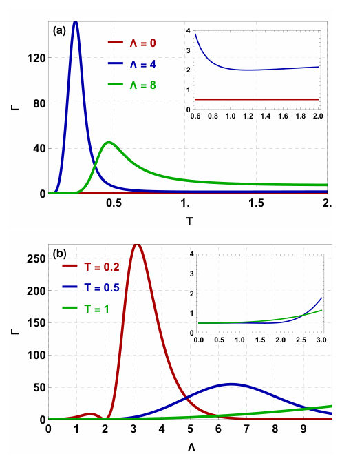 
Fig. 3: Plot of the ratio Γ of minimal total variances for the estimation of T and Λ. (a) Γ as a function of T for different values of Λ. (b) Γ as a function of Λ for different temperatures. The other parameters are fixed at ν0 = 1 and VAB = 0.1.

**Summary.** This paper analyzes multiparameter quantum estimation in a model of interacting molecular dimers. By calculating the Quantum Fisher Information Matrix, the authors show that simultaneous estimation is superior when the system is near resonance and at low temperatures. The results establish temperature as a key control parameter for achieving high-precision quantum sensing.

**Why it may be interesting.** This work directly addresses quantum sensing in realistic molecular platforms, providing quantitative metrics (QFIM) to guide experimental design for enhancing measurement precision beyond classical limits.

Detailed structure

**Main problem.** The study investigates the fundamental limits of simultaneously estimating multiple parameters, specifically temperature (T) and detuning ($\Lambda$), in a molecular dimer system.

**Main result.** Simultaneous estimation outperforms individual estimations when quantum coherence is high (low T and near resonance), demonstrating that temperature acts as a critical control parameter for metrology precision.

**Method.** The analysis employs the Quantum Fisher Information Matrix (QFIM) derived via a vectorization approach to calculate the ultimate precision bounds (Quantum Cramér–Rao bound).

**Model / system.** The physical system is a molecular dimer modeled by two dipole-dipole interacting two-level systems. The dynamics are governed by a Hamiltonian incorporating detuning and interaction strength.

**Key observables.** Quantum Fisher Information Matrix elements ($K_{\mu
u}$), estimation variances ($\Delta T, \Delta \Lambda$), and the performance ratio $\Gamma(T, \Lambda)$.

**Important parameters / regimes.** Temperature (T), Detuning ($\Lambda$), Dipole-dipole interaction strength ($V_{AB}$), and the near-resonant/low-temperature regime.

**Assumptions / limitations.** The system is assumed to reach global thermal equilibrium ($\varrho_{th}$ state) and utilizes an approximation for coherent excitonic interactions.

**Figures summary.** Figures illustrate the comparison of simultaneous vs. individual estimation variances across T and $\Lambda$, showing the advantage ratio $\Gamma < 1$ near resonance and low temperature.

**Paper structure.** The paper introduces the physical model, derives the QFIM using vectorization, compares the bounds for simultaneous versus individual parameter estimation, and concludes by mapping out the optimal operating regime governed by T and $\Lambda$.

Abstract

We investigate multiparameter quantum estimation in a molecular dimer composed of two dipole--dipole interacting two-level systems, focusing on the simultaneous estimation of temperature $T$ and detuning $Λ$. By employing a vectorization approach to derive the quantum Fisher information matrix, we analyze the precision limits of both simultaneous and individual estimation strategies. We show that simultaneous estimation outperforms the individual one in the near-resonant and low-temperature regime, where quantum coherence is enhanced, while its advantage is progressively reduced under detuned conditions and increasing temperature. Our results demonstrate that temperature acts as a key control parameter governing both estimation precision providing a unified perspective on quantum metrology. These findings highlight the potential of molecular quantum systems as realistic platforms for multiparameter quantum sensing.

[↑ back to top](#top)

### [Code-space recovery for sample-based quantum diagonalization beyond native symmetry constraints](http://arxiv.org/abs/2607.10227v1)

**Authors:** Byeongyong Park, Sanha Kang, Doyeol Ahn, Keunhong Jeong  
**Type:** theory · **Category:** quantum information and computing · **PDF:** <https://arxiv.org/pdf/2607.10227v1>  
**Analysis basis:** full PDF text, analyzed in chunks
**Topic relevance:** `analog quantum simulation` **2/5** · `methods for driven-dissipative` **1/5** · `quantum measurements` **1/5**

📷 Fig 1

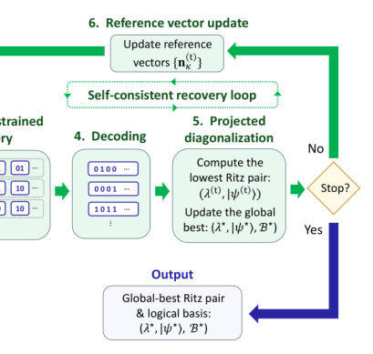 
Fig. 1 SQD workflow combining dual-rail encoding with self-consistent code-space recovery. The objective of this workflow is to estimate the lowest Ritz pair of a target Hermitian operator O. (1) Each logical qubit is encoded as |0⟩7→|01⟩and |1⟩7→|10⟩, and each logical operator A used in the sampling circuits is mapped to an encoded operator A′ satisfying A′V = V A, where V is the encoding isometry. The encoding constrains every physical qubit pair to have Hamming weight one, making code-space violations detectable and providing structural information for subsequent recovery. (2) After the encoded quantum circuits are executed to generate measurement samples, each physical qubit pair is...

📷 Fig 2

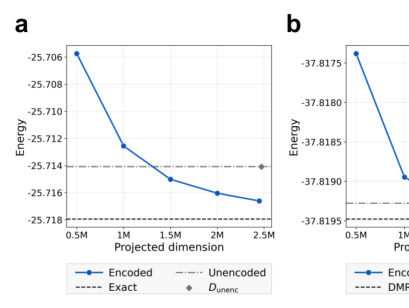 
Fig. 2 Lowest projected Ritz energies for the 25-spin-site benchmarks. Energies are shown as a function of projected dimension for (a) 1D TFIM, (b) 1D MFIM, and (c) 5 × 5 2D TFIM. Encoded denotes projected diagonalization in a recovered logical basis obtained by applying code-space recovery to encoded hardware samples. Unencoded denotes the direct projected diagonalization baseline using the logical sample- support basis obtained from unencoded hardware samples. Black dashed lines indicate exact or DMRG reference energies, gray dash-dotted lines indicate direct unencoded baseline energies, and gray diamonds mark Dunenc, the dimension of the unencoded sample-support basis.

📷 Fig 3

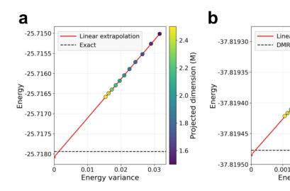 
Fig. 3 Energy-variance extrapolation for 25-spin-site recovered states. Projected Ritz energy is plotted against energy variance for states obtained from recovered bases constructed by code-space recovery on encoded hardware samples. Results are shown for (a) 1D TFIM, (b) 1D MFIM, and (c) 5 × 5 2D TFIM. Each point denotes one projected Ritz state, and the color indicates the realized projected dimension. Red lines denote linear fits to all displayed energy-variance sweep points from Dtar = 1.5 × 106 to 2.5 × 106, and dashed horizontal lines indicate the exact reference energy for 1D TFIM and DMRG reference energies for 1D MFIM and 2D TFIM.

📷 Fig 4

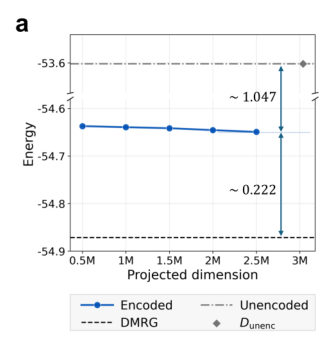 
Fig. 4 Stress tests on 36-spin-site benchmarks. Lowest projected Ritz energies are shown as a function of projected dimension for (a) 1D MFIM 36-site and (b) 6×6 2D TFIM 36-site. Encoded denotes projected diag- onalization in the recovered logical basis constructed from encoded hardware samples by code-space recovery. Unencoded denotes the direct projected diagonalization baseline using the logical sample-support basis obtained from unencoded hardware samples. Black dashed lines indicate DMRG reference energies, gray dash-dotted lines indicate direct unencoded baseline energies, and gray diamonds mark the unencoded sample-support dimen- sions. Blue arrows indicate the baseline-to-encoded...

**Summary.** The paper presents code-space recovery as an advanced technique to enhance Sample-based Quantum Diagonalization (SQD) for finding ground states of general quantum Hamiltonians. By employing a dual-rail encoding, the method engineers robustness against sampling errors, allowing accurate diagonalization even when natural symmetries are absent. This significantly extends the applicability and reliability of quantum simulation algorithms.

**Why it may be interesting.** This work directly addresses limitations in applying quantum simulation techniques to complex Hamiltonians by providing a robust error mitigation strategy that moves beyond relying solely on inherent physical symmetries.

Detailed structure

**Main problem.** To improve Sample-based Quantum Diagonalization (SQD) for finding ground states of Hamiltonians when native symmetries are not guaranteed.

**Main result.** Code-space recovery, which engineers structure via dual-rail encoding and self-consistent repair, yields lower projected Ritz energies than unencoded methods even with increased circuit overhead.

**Method.** The authors introduce code-space recovery using a dual-rail representation to encode logical qubits into physical pairs. This allows for the detection and iterative repair of sampling errors (code-space violations) during the diagonalization process.

**Model / system.** The method is benchmarked on Ising-type spin Hamiltonians, specifically Transverse-Field and Mixed-Field Ising Models, up to 36 spin sites. The target operator $O$ is set to the Hamiltonian itself.

**Key observables.** Projected Ritz energies (estimating ground state energy), detection/repair of code-space violations, and comparison against classical reference energies from DMRG calculations.

**Important parameters / regimes.** The encoding doubles the qubit count; recovery involves iterative steps ($N_{I,max}$); benchmarks test varying projected basis dimensions ($D_{	ext{tar}}$).

**Assumptions / limitations.** The method assumes that engineered recoverable structure can compensate for the increased circuit overhead associated with the dual-rail encoding.

**Figures summary.** Figure 1 summarizes the workflow: combining dual-rail encoding with self-consistent code-space recovery to estimate the lowest Ritz pair of $O$.

**Paper structure.** The paper introduces the problem, details the dual-rail encoding and the iterative, self-consistent code-space recovery algorithm (including clustering and stochastic repair), benchmarks this against unencoded methods on various Ising models, and validates results using classical reference energies.

Abstract

Sample-based quantum diagonalization (SQD) diagonalizes a Hamiltonian in a compact subspace built from quantum samples, and its performance often relies on recovery procedures that exploit native constraints such as particle-number symmetry. For a broad class of eigenvalue problems, however, no analogous constraint is guaranteed, limiting the applicability of SQD-type recovery. Here, we introduce code-space recovery, which engineers recoverable structure through encoding rather than assuming it in the target problem. Using a dual-rail representation, each logical qubit is mapped to a physical pair, $|0\rangle \to |01\rangle$ and $|1\rangle \to |10\rangle$, making code-space violations in noisy samples detectable and repairable. We combine this encoding with self-consistent recovery and benchmark it on transverse- and mixed-field Ising models with up to 36 spin sites. Despite increased circuit overhead, code-space recovery yields lower projected Ritz energies than unencoded sample-support diagonalization even at smaller projected-basis dimensions, suggesting that engineered recoverable structure can extend SQD beyond native constraints.

[↑ back to top](#top)

### [Electronic tuning of the soft-phonon transport anomaly in Ta$_2$Ni(S$_x$Se$_{1-x}$)$_5$](http://arxiv.org/abs/2607.11679v1)

**Authors:** Yuan-Shan Zhang, Masahiko Isobe, Hidenori Takagi, Dennis Huang  
**Type:** both · **Category:** strongly correlated electrons · **PDF:** <https://arxiv.org/pdf/2607.11679v1>  
**Analysis basis:** full PDF text, analyzed in chunks
**Topic relevance:** `driven-dissipative phase transition` **2/5** · `Frenkel-Kontorova` **1/5** · `non-equilibrium dynamics` **1/5**

📷 Fig 1

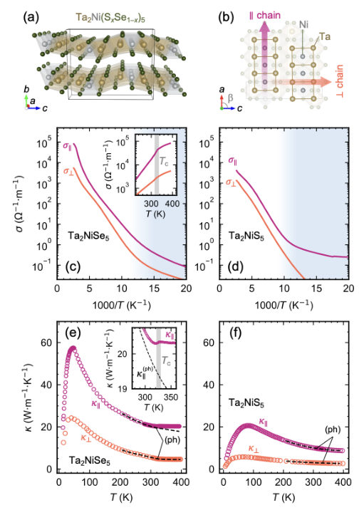 
FIG. 1. (a) Crystal structure of Ta2Ni(SxSe1−x)5 with unit cell shown. (b) View along b axis with Ta/Ni chains em- phasized. (c), (d) Electrical conductivity σ of Ta2NiSe5 and Ta2NiS5 plotted on a logarithmic scale against the inverse temperature 1000/T. The directions parallel (∥; along a) and perpendicular (⊥; along c) to the chains are shown in (b). The blue shading marks an extrinsic regime dominated by impurity-band conduction. The inset of (c) plots σ vs. T near the transition temperature Tc of Ta2NiSe5. (e), (f) Thermal conductivity κ of Ta2NiSe5 and Ta2NiS5 vs. T. The dashed black curves represent the estimated phonon (ph) contribu- tions. The inset of (e) is an enlargement of κ∥and...

📷 Fig 2

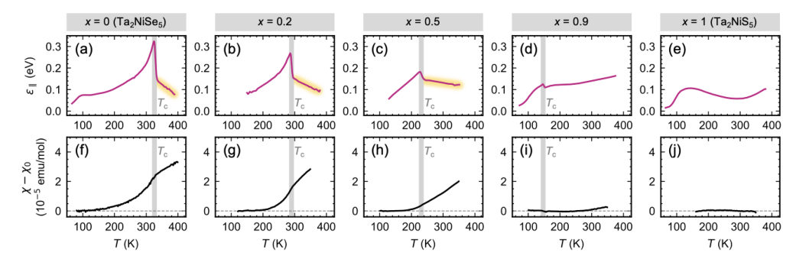 
FIG. 2. Signatures of electronic gap opening revealed by a combination of intrachain electrical transport and magnetic sus- ceptibility. (a)–(e) Logarithmic derivative of the intrachain electrical conductivity, ϵ∥= kBT 2d(ln σ∥)/dT, of Ta2Ni(SxSe1−x)5 samples with x = 0, 0.2, 0.5, 0.9, and 1. The vertical gray lines mark Tc. The yellow shading in (a)–(c) marks regions of possible gap fluctuations. (f)–(j) Magnetic susceptibility χ −χ0 vs. T, where χ0 is a constant offset subtracted from the data. The data in (a) are replotted from Ref. [10].

📷 Fig 3

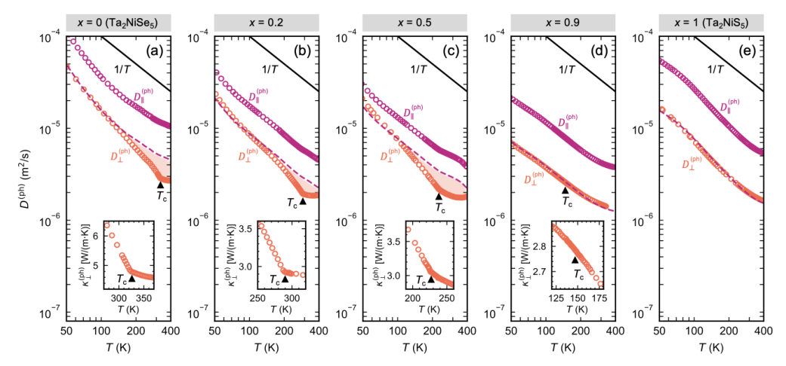 
FIG. 3. Signature of soft-phonon anomaly revealed by interchain thermal transport. (a)–(e) Phonon diffusivity D(ph) = κ(ph)/C(ph) for Ta2Ni(SxSe1−x)5 samples with x = 0, 0.2, 0.5, 0.9, and 1. The dashed fuchsia curves are D(ph) ∥ scaled by a

📷 Fig 4

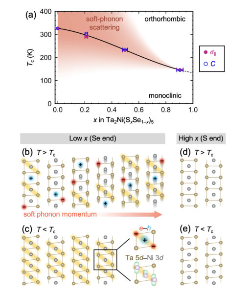 
FIG. 4. (a) Phase diagram of Ta2Ni(SxSe1−x)5. The filled fuchsia and open blue circles are Tc values derived from the intrachain electrical conductivity and heat capacity, respec- tively. The orange shading marks the region of enhanced phonon-phonon scattering in the interchain direction. (b), (c) Schematic of Ta/Ni chains above and below Tc, respectively, near the Se end. The faint yellow bars represent electronic interactions between the Ta and Ni sites, which could be the pairing of electrons and holes, or the hybridization of Ta 5d and Ni 3d orbitals [illustrated in (c)]. The monoclinic distor- tion is exaggerated for clarity. (d), (e) Schematic of Ta/Ni chains above and below Tc,...

**Summary.** This research investigates the phase transitions in Ta2Ni(S_xSe_{1-x})_5 by linking anomalous phonon transport to electronic instabilities. The authors demonstrate that the soft-phonon anomaly is not isolated but arises from a complex interplay involving excitonic, hybridization, and lattice fluctuations. This suggests that multiple correlated mechanisms must act together to stabilize the material's high critical temperature.

**Why it may be interesting.** The work provides an excellent case study for understanding how lattice dynamics (phonons) are intimately coupled to electronic correlations and gap formation, a central theme in strongly correlated electron physics.

Detailed structure

**Main problem.** To clarify the microscopic origin and significance of a 'soft-phonon transport anomaly' observed at a phase transition in Ta2Ni(S_xSe_{1-x})_5, and to establish the interplay between electronic instabilities and lattice dynamics.

**Main result.** The soft-phonon anomaly is strongly coupled to underlying electronic instabilities, suggesting that three types of interactions—excitonic, hybridization-gap, and intrinsic lattice instability—must coexist to explain the high transition temperature ($T_c$).

**Method.** The study combines experimental measurements (thermal/electrical transport, heat capacity) with theoretical analysis comparing multiple competing instability mechanisms.

**Model / system.** The physical system is the quasi-one-dimensional chalcogenide solid solution Ta2Ni(S_xSe_{1-x})_5. The investigation probes how tuning stoichiometry ($x$) modifies the interplay between electronic gaps and lattice softening.

**Key observables.** Soft-phonon transport anomaly (anisotropic phonon scattering), electrical conductivity ($\sigma$), thermal conductivity ($\kappa$), and the logarithmic derivative of conductivity ($\epsilon_{\parallel}$).

**Important parameters / regimes.** $T_c$ (ranging from $\sim 130 	ext{ K}$ to $326 	ext{ K}$), stoichiometry $x$, and electronic gap energies.

**Assumptions / limitations.** The analysis assumes that the observed anomalies are due to strong electron-phonon coupling, requiring consideration of excitonic, single-particle hybridization, and lattice instabilities simultaneously.

**Figures summary.** Figures show signatures of electronic gaps in $\epsilon_{\parallel}$ and magnetic susceptibility ($\chi$), alongside V-shaped suppression anomalies in perpendicular phonon diffusivity ($D^{(	ext{ph})}_{\perp}$) centered at $T_c$.

**Paper structure.** The paper systematically analyzes transport measurements across the composition gradient, correlating the vanishing of the soft-phonon anomaly with the approach to a band insulator state. It culminates by proposing that only the simultaneous action of multiple instabilities can explain the high $T_c$ observed in $	ext{Ta}_2	ext{NiSe}_5$.

Abstract

Ta$_2$NiSe$_5$ continues to be investigated for its phase transition at $T_\textrm{c}$ = 326 K, where it develops both an electronic gap and a distortion of its Ta/Ni chains. One intriguing feature at $T_\textrm{c}$ seen in thermal transport is the giant anisotropic scattering of phonons moving perpendicular to the chains, which is apparently associated with the softening of a transverse acoustic phonon, but whose microscopic origin and significance demand clarification. By tuning the normal-state band overlap/gap with S substitution, we uncover a close connection between this soft-phonon transport anomaly and underlying electronic instabilities: When Ta$_2$Ni(S$_x$Se$_{1-x}$)$_5$ approaches a band insulator at high $x$, and signatures of the electronic transition are suppressed, the soft-phonon transport anomaly concomitantly vanishes. Our results establish the following picture for the Ta$_2$Ni(S$_x$Se$_{1-x}$)$_5$ family: Near the S end, a sole lattice instability gives rise to a weak structural transition with $T_\textrm{c}$ approaching 130 K. Near the Se end, additional electronic instabilities boost $T_\textrm{c}$ up to 326 K and amplify experimental signatures of the transition. The strong interaction between electrons, holes, and the lattice is manifested as a soft-phonon transport anomaly accompanied by electronic fluctuations, which include excitonic and hybridization-gap fluctuations.

[↑ back to top](#top)

### [Geometric Universality and Thermodynamic Microstructure of Real Fluids in a Unified Entropic Framework](http://arxiv.org/abs/2607.10076v1)

**Authors:** Carlos E. Romero-Figueroa, Jose Miguel Ladino, Sasha A. Zaldivar, Hernando Quevedo  
**Type:** theory · **Category:** statistical mechanics · **PDF:** <https://arxiv.org/pdf/2607.10076v1>  
**Analysis basis:** full PDF text, analyzed in chunks
**Topic relevance:** `non-equilibrium universality` **2/5** · `driven-dissipative phase transition` **1/5** · `non-equilibrium dynamics` **1/5**

📷 Fig 1

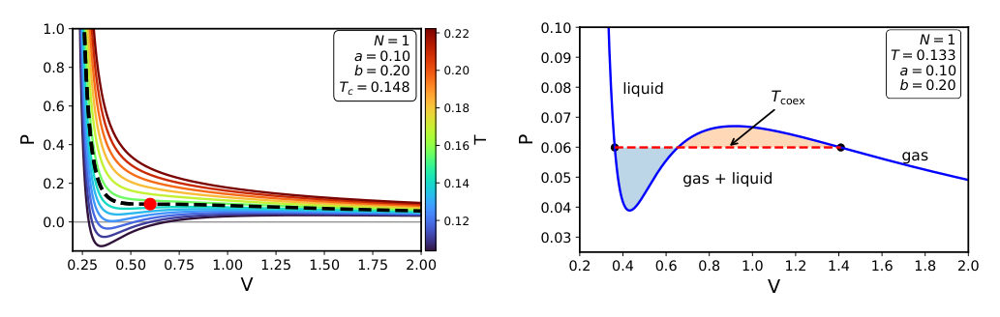 
Fig. 1. (a) P–V isotherms of the vdW model for fixed values of N, a, and b, illustrating the evolution of the EoS with temperature T. (b) Maxwell equal-area construction applied to the oscillatory region of the vdW isotherm, replacing the mechanically unstable branch with the coexistence line corresponding to the first-order phase transition.

📷 Fig 2

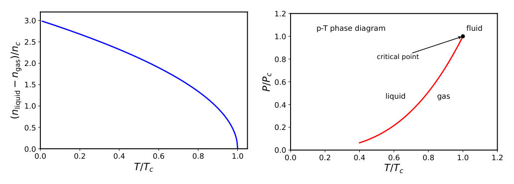 
Fig. 2. (a) Order parameter as a function of T/Tc for the vdW fluid. (b) Phase diagram in the reduced (P/Pc, T/Tc) plane.

📷 Fig 3

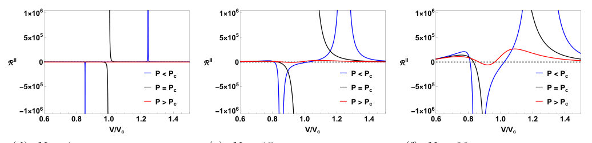 
Fig. 3. GTD scalar curvature RII versus reduced volume V/Vc for the vdW model under different isobaric regimes relative to Pc (kB = 1, S0 = 0). Panels (a)–(c) show the effect of a and b at fixed N = 10, while (d)–(f) illustrate the dependence on N for a = b = 15. The curvature is normalized as RII →RIIS3U 2.

📷 Fig 4

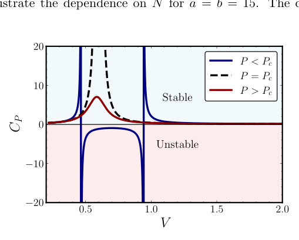 
Fig. 4. (a) Heat capacity CP of the vdW model as a function of the volume V for P &lt; Pc, P = Pc, and P &gt; Pc, with fixed parameters a = 0.1, b = 0.2, and N = kB = 1. The heat capacity exhibits the same divergence structure as the scalar curvature, with singularities occurring at the corresponding phase transition points.

📷 Fig 5

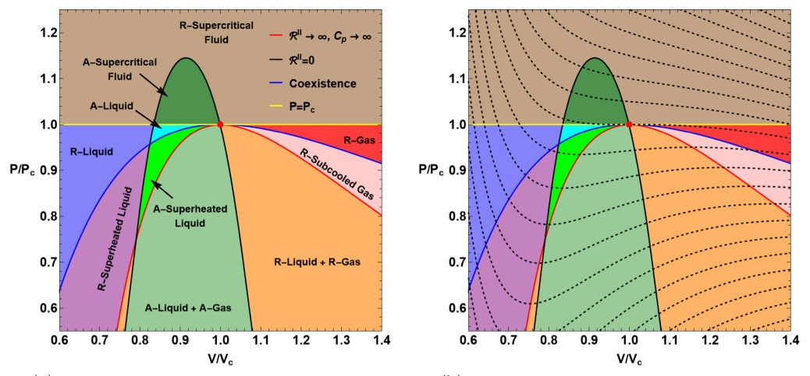 
Fig. 5. Microscopic phase diagrams of the vdW model. Stability and metastability regions are shown, with attractive (A−) and repulsive (R−) interactions determined by the sign of RII. The binodal (blue), spinodal (red), and zero-curvature (black) curves are displayed; the red dot marks the critical point (kB = 1, S0 = 0, a = b = 20, N = 5). Panel (a) labels the phases, while (b) shows isotherms for T ∈[0.8Tc, 1.1Tc].

**Summary.** This paper unifies several equations of state for real fluids within a novel geometric framework called Geometrothermodynamics (GTD). By analyzing the curvature of the thermodynamic manifold, the authors show that macroscopic phenomena like critical points are encoded geometrically. This provides a powerful, universal tool for classifying and understanding fluid behavior based on fundamental mathematical invariants.

**Why it may be interesting.** While focused on classical fluids, the use of advanced geometric tools like GTD to classify universal scaling behaviors is highly relevant for understanding phase transitions in quantum many-body systems where geometry often dictates critical points.

Detailed structure

**Main problem.** To develop a unified entropic framework for real fluids that encompasses multiple existing Equations of State (EoS) within a common thermodynamic description.

**Main result.** The authors show that the geometric structure, quantified by scalar curvature ($\mathcal{R}$), successfully encodes macroscopic critical phenomena and universal scaling features across different fluid models.

**Method.** The study employs Geometrothermodynamics (GTD), mapping the thermodynamic equilibrium space onto a Riemannian manifold whose geometry is analyzed using concepts like scalar curvature and invariant ratios.

**Model / system.** The system under study is real fluids, modeled by various EoS such as van der Waals, Berthelot, Redlich-Kwong, and Peng-Robinson. The analysis extends the framework to examine general thermodynamic systems.

**Key observables.** Scalar curvature ($\mathcal{R}$), dimensionless critical-amplitude ratios ($Q^i_{j}$), zero-curvature curves, and critical parameters ($V_c, T_c, P_c$).

**Important parameters / regimes.** Intermolecular attraction/repulsion strengths, system size (for scaling analysis), and the generalized thermodynamic potential.

**Assumptions / limitations.** The model relies on a mean-field approximation for intermolecular potentials and assumes thermodynamic consistency can be captured by geometric invariants.

**Figures summary.** Figure 1 illustrates P–V isotherms for the van der Waals model, demonstrating the Maxwell equal-area construction for first-order phase transitions.

**Paper structure.** The paper systematically derives generalized EoS forms, maps them onto a GTD manifold structure, calculates critical parameters using geometric invariants (curvature), and concludes by statistically reconstructing zero-curvature curves using MCMC methods.

Abstract

We introduce a unified entropic framework for real fluids that encompasses the van der Waals, Berthelot, Redlich Kwong, and Peng Robinson equations of state within a common thermodynamic description. The corresponding microscopic interactions are then explored using Geometrothermodynamics, GTD, through the scalar curvature $mathcal{R}$ of the equilibrium manifold. We show that curvature singularities accurately reproduce macroscopic critical phenomena, while vanishing curvature $\mathcal{R}=0$ identifies specific thermodynamic states where attractive and repulsive intermolecular forces effectively balance. Furthermore, we introduce a set of dimensionless critical-amplitude ratios $Q^i_{j}$, which reveal universal geometric features of the critical regime. Although individual critical amplitudes exhibit a logarithmic dependence on the system size, these invariant ratios organize different molecular species according to the strength of criticality and encode universal scaling features, suggesting their potential as robust classification parameters. Finally, employing Bayesian inference and Markov Chain Monte Carlo, MCMC methods, we statistically reconstruct the zero-curvature curves. The posterior distributions support the consistency of the geometric scaling behavior, demonstrating that the GTD manifold encodes non-trivial information about the underlying thermodynamical models.

[↑ back to top](#top)

### [MDQEC-QAS: Meta-Decoding for Quantum Error Correction with Hardware-Aware VQC Search and Confidence-Gated Recovery](http://arxiv.org/abs/2607.10707v1)

**Authors:** Prashant Kumar Choudhary, Nouhaila Innan, Muhammad Shafique, Rajeev Singh  
**Type:** theory · **Category:** quantum information and computing · **PDF:** <https://arxiv.org/pdf/2607.10707v1>  
**Analysis basis:** full PDF text, analyzed in chunks
**Topic relevance:** `QC/QI experiment` **2/5** · `methods for driven-dissipative` **1/5** · `quantum measurements` **1/5**

📷 Fig 1

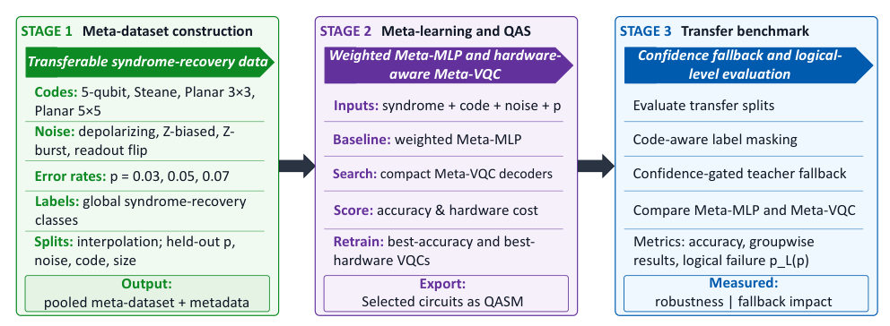 
Figure 1. Overview of the learned-assisted meta-decoding framework. Syndrome-recovery data are generated using code-appropriate teacher decoders, pooled into a global label space, used to train classical and VQC meta-decoders, and evaluated using teacher-label accuracy, confidence-gated fallback, and logical-failure analysis.

📷 Fig 2

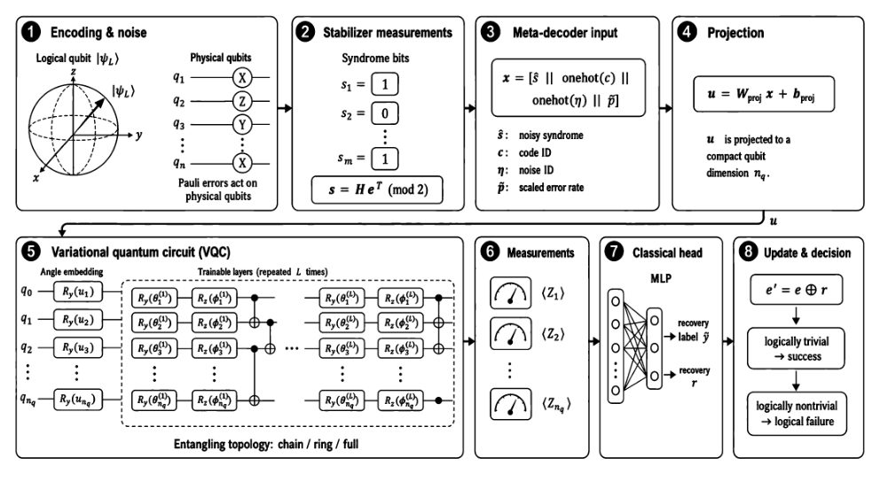 
Figure 2. Qubit-level mechanism of learned-assisted QEC meta-decoding. A logical qubit |𝜓𝐿⟩is encoded into physical qubits, where Pauli errors generate stabilizer syndromes according to 𝑠= 𝐻𝑒𝑇(mod 2). The syndrome, code identity, noise identity, and normalized physical error rate are combined into the meta-feature vector 𝑥= [˜𝑠∥onehot(𝑐)∥onehot(𝜂)∥˜𝑝] and projected to a compact VQC input. The VQC applies angle embedding, trainable rotation layers, and entangling operations, after which Pauli-𝑍measurements are mapped by a classical head to a recovery label and recovery operator 𝑟. Decoding success is determined by whether the corrected operator 𝑒′ = 𝑒⊕𝑟is logically trivial or logically...

📷 Fig 3

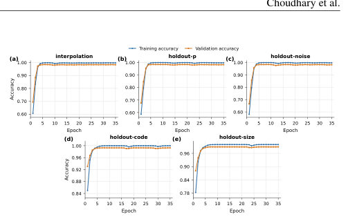 
Figure 3. Training and validation accuracy of the Meta-MLP on the pooled multi-code, multi-noise dataset.

📷 Fig 4

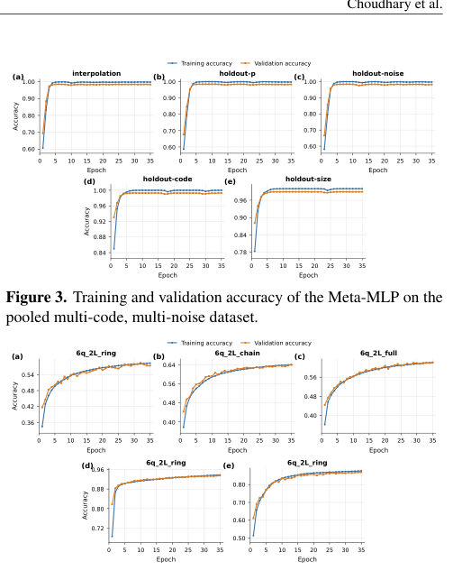 
Figure 4. Retraining curves of the two selected VQC meta-decoders. Panels (a)–(e) correspond to interpolation, unseen-𝑝transfer, unseen- noise transfer, few-shot unseen-code adaptation, and few-shot held- out-size adaptation, respectively.

📷 Fig 5

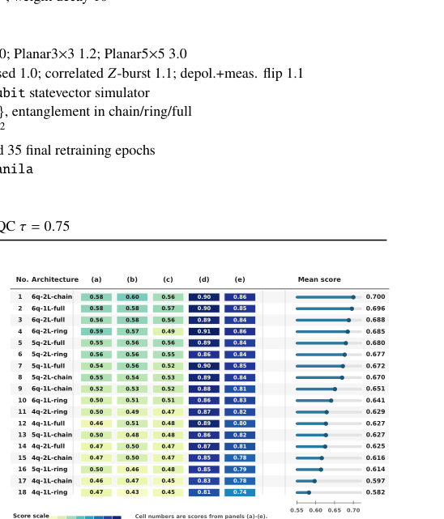 
Figure 6. Hardware-aware score of candidate VQC architectures. The score combines predictive performance with implementation- oriented circuit-cost proxies such as depth and two-qubit gate count.

**Summary.** This work introduces a meta-decoding framework to create universal decoders for Quantum Error Correction, capable of adapting across various codes and noise types. By integrating hardware-aware VQCs and implementing a confidence-gated fallback mechanism, the authors show that selective recovery based on model certainty is vital for achieving robust logical performance.

**Why it may be interesting.** It directly addresses the gap between machine learning performance metrics (accuracy) and physical system reliability (logical error rate), which is crucial for building fault-tolerant quantum computers.

Detailed structure

**Main problem.** Developing a robust quantum error correction (QEC) decoder that can adapt across diverse physical conditions, including multiple stabilizer codes, noise families, and varying error rates.

**Main result.** A confidence-gated hybrid recovery strategy significantly improves logical performance by selectively using learned decoders only when they are highly confident, outperforming methods relying solely on high classification accuracy.

**Method.** The authors propose a unified meta-decoding framework that trains a single model to map syndromes to recoveries across various codes and noise settings. This is augmented with hardware-aware Variational Quantum Circuits (VQC) and a confidence-gated fallback mechanism.

**Model / system.** The study analyzes QEC performance using several stabilizer codes (FiveQubit, Steane, Planar3x3, Planar5x5). The core model involves training meta-decoders on syndrome measurements derived from noisy physical qubits.

**Key observables.** Logical failure probability ($p_L(p)$) and raw logical-failure ratios relative to the teacher decoder are key diagnostics, rather than just classification accuracy.

**Important parameters / regimes.** The benchmark tests five evaluation regimes: interpolation, unseen-$p$ transfer, unseen-noise transfer, few-shot unseen-code adaptation, and few-shot held-out-size adaptation.

**Assumptions / limitations.** High teacher-label accuracy alone is insufficient for assessing true logical performance in complex topological codes; therefore, a confidence threshold ($	au$) is necessary to gate the learned recovery.

**Figures summary.** Figure 12 specifically shows Planar $5	imes 5$ logical-failure curves comparing different protocols under the confidence-gated hybrid recovery protocol across five adaptation scenarios.

**Paper structure.** The paper introduces the meta-decoding framework, details the comparison between Meta-MLP and hardware-aware VQC decoders, rigorously tests generalization across multiple transfer regimes, and culminates in a detailed analysis of logical failure rates using confidence gating.

Abstract

We propose a unified meta-decoding framework for quantum error correction that learns syndrome-to-recovery mappings across multiple stabilizer codes and noise settings, without requiring separate decoders for each configuration. The benchmark includes FiveQubit, Steane, Planar3x3, and Planar5x5 codes, four noise families, and five evaluation regimes: interpolation, unseen-p transfer, unseen-noise transfer, few-shot unseen-code adaptation, and few-shot held-out-size adaptation. We compare a classical Meta-MLP teacher-trained baseline with variational quantum circuit (VQC) meta-decoders selected through hardware-aware quantum architecture search over qubit count, circuit depth, and entangling topology. The Meta-MLP achieves teacher-label accuracies of 0.9993, 0.9118, 0.9342, 0.6304, and 0.7548 across the five regimes, while the hardware-aware VQC achieves 0.9400, 0.8495, 0.8415, 0.5678, and 0.7143. However, logical-level evaluation shows that high teacher-label accuracy alone is insufficient in the most challenging Planar5x5 setting. During interpolation, the raw logical-failure ratios relative to the teacher are 12.08 and 25.91 for the Meta-MLP and VQC, respectively, whereas confidence-gated fallback reduces them to 1.71 and 1.11. These results support confidence-aware selective recovery rather than unconditional teacher replacement.

[↑ back to top](#top)

### [Optimal tomography of bosonic and fermionic Gaussian states](http://arxiv.org/abs/2607.11847v1)

**Authors:** Senrui Chen, Marco Fanizza, Filippo Girardi, Ludovico Lami, Francesco Anna Mele, Michael Walter, Freek Witteveen  
**Type:** theory · **Category:** quantum information and computing · **PDF:** <https://arxiv.org/pdf/2607.11847v1>  
**Analysis basis:** full PDF text, analyzed in chunks
**Topic relevance:** `entanglement & information structure` **2/5** · `analog quantum simulation` **1/5** · `quantum measurements` **1/5**

📷 Fig 1

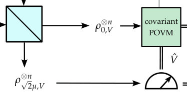 
Figure 1: Scheme of the learning protocol for bosonic Gaussian states. After obtaining zero- mean copies through a beam-splitter, the operations in the green box generate a distribution over covariance-matrix estimates, equivalent to a) measuring a purification with Hayashi measurement b) outputting the covariance matrix of the partial trace of the Hayashi measurement outcome. The estimated covariance matrix can then be used to efficiently estimate the first moment on the remaining copies, via a generaldyne measurement.

**Summary.** This paper solves an open problem by determining the optimal sample complexity required to reconstruct unknown bosonic and fermionic Gaussian quantum states. The key finding is that this complexity scales quadratically with the number of modes, $m^2$, which is highly efficient for characterizing these important physical states. It achieves this using advanced mathematical tools like generalized random purification channels.

**Why it may be interesting.** This work provides fundamental resource estimates (sample complexity) for characterizing complex quantum states relevant in quantum information processing and quantum simulation using continuous variable systems.

Detailed structure

**Main problem.** The primary goal is determining the optimal sample complexity—the minimum number of copies required for quantum state tomography—for bosonic and fermionic Gaussian states.

**Main result.** The authors prove that the sample complexity scales quadratically with the number of modes ($m$), specifically $n = \Theta(m^2 / \epsilon^2)$, regardless of whether the state is pure or mixed.

**Method.** The analysis employs advanced techniques including representation theory of Gaussian unitaries and generalizing the random purification channel to handle bosonic symmetries.

**Model / system.** The focus is on bosonic and fermionic Gaussian quantum states, which are ground or Gibbs states associated with quadratic Hamiltonians. These systems are fundamental in quantum optics and many-body physics.

**Key observables.** Sample complexity ($n$), purified distance, trace distance, covariance matrices.

**Important parameters / regimes.** Number of modes ($m$), accuracy ($\epsilon$), state purity (pure vs. mixed).

**Assumptions / limitations.** For bosonic states in infinite dimensions, the derivation relies on assuming that irreducible representation spaces are finite-dimensional to define a random purification channel.

**Figures summary.** A table compares previous best sample complexities with the new results for various Gaussian state types, showing improvements from exponential/cubic scaling to quadratic scaling.

**Paper structure.** The paper progresses by first establishing the general problem of sample complexity, then developing generalized tools like random purification channels, and finally applying these tools to derive the optimal $m^2$ scaling law for both bosonic and fermionic Gaussian states.

Abstract

The sample complexity is the minimum number of copies required to learn an accurate classical description of a quantum state. Bosonic and fermionic Gaussian quantum states are families of quantum states that play a key role in quantum science and technology, from quantum optics and many-body physics to quantum chemistry, quantum computing, and quantum information theory. Despite their importance, their sample complexity had not been fully determined. We settle this open problem and show that both bosonic and fermionic Gaussian states can be learned using a number of copies that scales quadratically in the number of modes, regardless of whether the state is pure or mixed, and independently of any energy bound on the state. We derive these results by using the representation theory of Gaussian unitaries and by putting forth a generalization of the random purification channel to this setting and beyond.

[↑ back to top](#top)

### [Stripe-Ordered Altermagnetism Emerging from Correlation-Driven Spin-Density-Wave Instability](http://arxiv.org/abs/2607.11532v1)

**Authors:** Zenghui Fan, Jingyao Meng, Tianxing Ma  
**Type:** theory · **Category:** strongly correlated electrons · **PDF:** <https://arxiv.org/pdf/2607.11532v1>  
**Analysis basis:** full PDF text, analyzed in chunks
**Topic relevance:** `analog quantum simulation` **2/5** · `Keldysh / 2PI / non-Gaussian methods` **1/5** · `non-equilibrium dynamics` **1/5**

📷 Fig 1

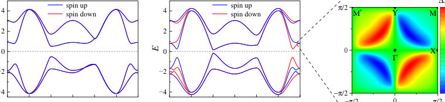 
FIG. 1. Real-space spin-stripe configurations (a) without and (b) with the USEP. Yellow and blue spheres represent spin-up and spin-down electrons, respectively. There is four-site magnetic unit cell (sublattice l = 1, 2, 3, 4 and lattice constant a = 1) with staggered NNN hopping inserted in (a). In (b), filled and open circles denote the charge-rich and hole-rich sites induced by the USEP sketched in the inset. The pure spin stripe in (a) preserves the combined time-reversal (T ) and diagonal-translation (Td) symmetry, while introducing the charge inhomogeneity via USEP in (b) breaks TdT invariance, leaving the system protected by a combined T and mirror (M) symmetry. (c), (d)...

📷 Fig 2

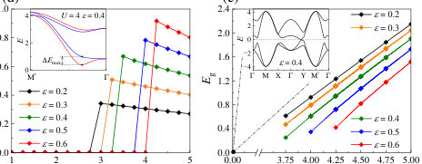 
FIG. 2. (a) Mean-field ground-state phase diagram at half- filling characterized by finite spin-stripe order parameter δmS, involving the pure SDW phase without ε and SOAM phase driven by the interplay of U and ε. Competing magnetic order parameters δmα and their corresponding energy E as functions of (b) U and (c) ε for spin stripe (δmS), N´eel AFM (δmN), and total ferromagnetism (δmT). (d) Maximum spin- splitting energy difference ∆Emax (see inset for ∆Emax) versus U for various ε. (e) Charge gap Eg within the SOAM phase as a function of U for varying ε, with a noninteracting gapless band structure inserted for reference.

📷 Fig 3

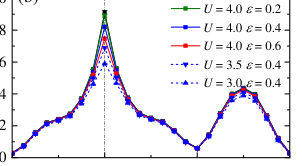 
FIG. 3. (a) Sublattice electron density ρ on charge-rich (filled circles) and hole-rich (open circles) sites as a function of ε for various U. (b) Response of momentum-space spin struc- ture factor S(k) to different ε and U. The robust peak at (π, 0) suggests a spin-stripe order. All data are extracted from unbiased DQMC simulations at an inverse temperature β = 1/T = 6 with system size L = 16.

📷 Fig 4

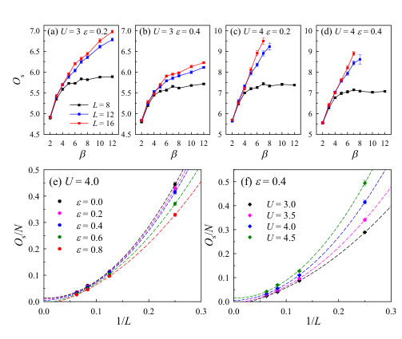 
FIG. 4. Finite-size scaling analysis of the spin-stripe structure factor Os from unbiased DQMC simulations. (a)-(d) Evolu- tion of Os versus inverse temperature β = 1/T for various system sizes L at U = 3.0, 4.0 and ε = 0.2, 0.4. The enhance- ment of Os with increasing L at low temperatures signifies a tendency toward spin-stripe ordering. (e), (f) Normalized structure factor Os/N versus inverse size 1/L at β = 6. Data are extrapolated to 1/L →0 limit for (e) different ε with fixed U = 4.0 and (f) different U with fixed ε = 0.4. A finite intercept indicates the establishment of long-range order.

**Summary.** This work explores a mechanism for Altermagnetism arising from a Spin-Density Wave instability rather than conventional antiferromagnetism. By modeling iron pnictides with an extended Hubbard model, the authors demonstrate that correlation effects drive a stripe-ordered insulating phase (SOAM). The application of an electric potential breaks symmetry in a way that unlocks measurable spin splitting, confirming the theoretical viability of this novel magnetic state.

**Why it may be interesting.** While focused on condensed matter magnetism, the use of advanced quantum simulation techniques (DQMC) to study emergent magnetic orders in strongly correlated systems provides methodological insights relevant to open quantum system dynamics.

Detailed structure

**Main problem.** Investigating whether Altermagnetism can emerge from a Spin-Density Wave (SDW) instability, moving beyond the conventional Antiferromagnetic paradigm.

**Main result.** The study reveals a novel stripe-ordered altermagnetic (SOAM) insulating phase driven by correlation-induced $(\pi, 0)$ SDW instability. This phase is stabilized and characterized by unconventional $d_{xy}$-wave spin splitting when symmetry is broken by an electric potential.

**Method.** A combination of Hartree-Fock mean-field theory for initial analysis and unbiased Determinant Quantum Monte Carlo (DQMC) simulations to confirm finite-temperature stability.

**Model / system.** The system uses a minimal Hubbard model relevant to iron pnictides, studied on a square lattice with a four-sublattice basis. The Hamiltonian includes hopping terms, chemical potential, and an interaction term U, modified by a uniaxial staggered electric potential ($\epsilon$).

**Key observables.** Spin-stripe order parameter ($\delta m_S$), spin structure factor $S(\mathbf{k})$, and the nonrelativistic spin splitting energy difference ($\Delta E$).

**Important parameters / regimes.** Half-filling ($n=1$), hopping parameters ($t_1, t_2, t'_2$), interaction strength ($U$), and the staggered potential magnitude ($\epsilon$).

**Assumptions / limitations.** The analysis relies on mapping the problem to a minimal Hubbard model and employing mean-field approximations alongside DQMC simulations.

**Figures summary.** Figures illustrate real-space spin configurations, band structures showing symmetry protection/breaking, momentum-space spin structure factors confirming $(\pi, 0)$ instability, and phase diagrams mapping SOAM stability based on $U$ and $\epsilon$.

**Paper structure.** The paper progresses by first establishing the SDW instability via mean-field calculations, then using DQMC to confirm the finite-temperature existence of the stripe order, and finally detailing how symmetry breaking ($\epsilon$) unlocks the characteristic altermagnetic spin splitting.

Abstract

Altermagnetism is conventionally identified within the paradigm of collinear antiferromagnets. Its potential realization within other spin instabilities, such as a spin-density wave (SDW), remains a fundamentally compelling open question. Here, we combine Hartree-Fock mean-field and unbiased determinant quantum Monte Carlo methods to investigate a minimal Hubbard model relevant to iron pnictides. We reveal a novel $d_{xy}$-wave stripe-ordered altermagnetic (SOAM) insulating phase driven fundamentally by the correlation-induced $(π,0)$ SDW instability. Within this phase, an introduced uniaxial staggered electric potential alters the underlying symmetry: it breaks the original combined time-reversal and spatial translation symmetry ($T_{d}\mathcal{T}$) and retains a combined time-reversal and mirror invariance ($M\mathcal{T}$), thereby unlocking the pronounced nonrelativistic spin splitting. Crucially, the exact finite-size scaling from our determinant quantum Monte Carlo simulations confirms that this correlation-driven SOAM phase stably survives at accessible finite temperatures. Our study pushes the frontier of altermagnetism beyond the conventional antiferromagnetic paradigm into the realm of SDW instability, advancing the fundamental understanding of altermagnetism in strongly correlated electron systems.

[↑ back to top](#top)

### [Device-independent certification of tripartite quantum networks with bilocal Bell inequalities](http://arxiv.org/abs/2607.09933v1)

**Authors:** Patryk Michalski, Arturo Konderak, Remigiusz Augusiak  
**Type:** theory · **Category:** quantum information and computing · **PDF:** <https://arxiv.org/pdf/2607.09933v1>  
**Analysis basis:** full PDF text, analyzed in chunks
**Topic relevance:** `entanglement & information structure` **2/5** · `quantum measurements` **1/5**

📷 Fig 1

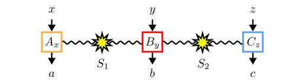 
Figure 1. Schematic representation of the bilocal (or three-on-a-line) network with two independent sources, S1 and S2, distributing bi- partite correlations among three spatially separated observers, Alice, Bob, and Charlie. The observers choose their measurements freely and independently, labeled by x, y, and z, and obtain outcomes a, b, and c, respectively.

📷 Fig 2

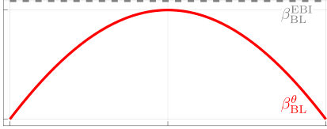 
Figure 2. Bilocal bound βθ BL for the family of bilocal ROCN Bell inequalities generated by hθ as a function of the parameter θ. The dashed gray line indicates the value of the bilocal bound βEBI BL = 2 √

**Summary.** This paper introduces a general method to construct nonlinear Bell inequalities for tripartite quantum networks using two independent sources of entanglement. By analyzing these inequalities, the authors achieve device-independent self-testing, proving that maximal violation forces the underlying shared states and measurement observables into specific, verifiable quantum structures.

**Why it may be interesting.** This work provides powerful, purely theoretical tools for verifying fundamental assumptions about quantum resources in multi-party systems without needing to trust the measurement devices themselves. This is crucial for scaling up quantum communication protocols.

Detailed structure

**Main problem.** The primary goal is developing general methods for constructing nonlinear Bell inequalities with self-testing properties specifically tailored for tripartite quantum networks.

**Main result.** The authors present a framework that allows device-independent certification of the entire quantum network—including both the shared states and all measured observables—by relying solely on violating a single nonlocality witness.

**Method.** They construct nonlinear Bell inequalities using Real Row-Orthogonal and Column-Normalized (ROCN) matrices, whose maximal quantum values are analytically determined. Self-testing is established by analyzing the rank of an auxiliary matrix derived from these coefficients.

**Model / system.** The model is a tripartite quantum network involving three spatially separated observers (Alice, Bob, Charlie) connected via two independent sources distributing bipartite entangled states ($
ho_{AB_1}$ and $
ho_{B_2C}$).

**Key observables.** Correlators $\langle A_x B_y C_z 
angle$, the nonlinear Bell inequality sum $S_h$, and the maximal quantum value $eta_h^Q$.

**Important parameters / regimes.** The dimensions of measurement settings ($m$ for Alice/Charlie, $n$ for Bob) and the structure defined by the ROCN matrix $h$.

**Assumptions / limitations.** The analysis relies on algebraic properties derived from ROCN matrices and assumes full rank conditions on auxiliary matrices to guarantee self-testing.

**Figures summary.** Figure 1 schematically illustrates the bilocal network setup involving two sources ($S_1, S_2$) distributing states to Alice, Bob, and Charlie with specified measurement settings.

**Paper structure.** The paper develops a general framework using ROCN matrices to formulate nonlinear Bell inequalities for the tripartite setting. It then derives conditions (like full rank of matrix M) under which violating these bounds guarantees self-testing of the underlying quantum correlations and measurements.

Abstract

While quantum networks have been extensively studied as a natural extension of the standard Bell scenario with a richer correlation structure, general constructions of nonlinear Bell inequalities with self-testing properties are still largely lacking. In this work, we present a general method for constructing such inequalities in the simplest network scenario, in which two independent sources distribute bipartite quantum states to three spatially separated observers. These inequalities allow for arbitrary numbers of binary measurements and are maximally violated by maximally entangled states of the corresponding local dimensions together with sets of pairwise anticommuting Clifford observables. Importantly, their maximal quantum values can be determined analytically, which makes them particularly promising for device-independent applications. In particular, we prove that these Bell inequalities can be used to device-independently certify the underlying quantum network, including both the quantum states produced by the sources and the observables measured by all parties. To the best of our knowledge, this is the first self-testing result for quantum networks that relies solely on the maximal violation of a nonlocality witness.

[↑ back to top](#top)

### [The Time-Space Complexity of Checking Multiple Assertions in Quantum Programs](http://arxiv.org/abs/2607.11665v1)

**Authors:** Shengyuan Yang, Charles Yuan  
**Type:** theory · **Category:** quantum information and computing · **PDF:** <https://arxiv.org/pdf/2607.11665v1>  
**Analysis basis:** full PDF text, analyzed in chunks
**Topic relevance:** `quantum measurements` **2/5** · `measurement-induced transitions` **1/5**

📷 Fig 1

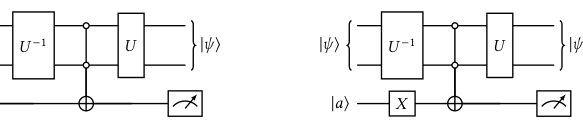 
Fig. 3. The logical-OR based assertion circuit construction (a) can be transformed by applying an additional 𝑋gate on the ancilla (b), to fit the checker unitary.

📷 Fig 2

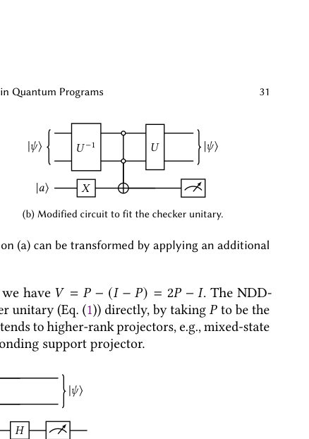 
Fig. 4. The NDD-based assertion circuit, which already aligns with the checker unitary.

**Summary.** This work establishes a formal framework to analyze the time-space cost of checking multiple assertions in quantum programs. It proves that while some checks require linear resources, others can be accomplished using only logarithmic resources by exploiting the specific information required. This has direct implications for designing robust and efficient quantum software.

**Why it may be interesting.** It provides rigorous theoretical tools for understanding the overhead associated with debugging or verifying quantum algorithms, which is crucial for practical hardware implementation.

Detailed structure

**Main problem.** The paper determines the fundamental time-space complexity required for checking multiple runtime assertions within a quantum program.

**Main result.** While listing all assertion outcomes requires linear resource scaling, detecting if any failure occurs or identifying the first failure can be achieved with only logarithmic resource complexity—a significant asymptotic improvement.

**Method.** The authors formalize the problem using checker unitaries and analyze complexity bounds by relating it to distinguishing patterns among fixed-length bit strings via automata theory tools.

**Model / system.** The analysis is based on a quantum program model executed in a terminal-measurement setting, involving unitary operations interleaved with assertions that are recorded coherently into ancilla qubits.

**Key observables.** Ancilla qubit count (S), number of program executions (T), and the specific failure semantics required ($	ext{ListAll}$, $	ext{ExistFail}$, $	ext{FirstFail}$).

**Important parameters / regimes.** The number of assertions ($n$) dictates the scaling; the trade-off is fundamentally between $S$ and $T$.

**Assumptions / limitations.** The analysis focuses on the terminal-measurement model, though lower bounds derived are claimed to apply to mid-circuit measurement settings.

**Figures summary.** Figures illustrate sample quantum programs with multiple assertions and show constructions for checker unitaries using projection operators.

**Paper structure.** The paper introduces the formal framework, derives complexity bounds by relating tasks to pattern distinction, proves strategy independence for certain failure modes, and concludes with a case study on Grover's algorithm.

Abstract

Runtime assertions are a promising mechanism for testing and debugging quantum programs. But unlike the classical world, checking a quantum program that contains multiple assertions often requires using additional space or running the program additional times. For example, on current quantum hardware where mid-circuit measurement is restricted or costly, an assertion's pass/fail outcome cannot be revealed immediately. Instead, it is routed into an ancilla qubit during execution and read out by a terminal measurement. For a program with $n$ assertions, a naive strategy uses $n$ ancillas to learn all $n$ outcomes, while an alternative uses one ancilla but repeats program execution over $n$ rounds, checking one assertion per round. Both satisfy $S \cdot T = O(n)$, where $S$ is the number of ancillas and $T$ the number of executions: a fundamental time-space trade-off.   Can one do asymptotically better? We reveal that the answer depends sharply on the information to be learned. Reporting the outcomes of all assertions requires linear complexity, but two partial-information tasks of detecting whether any assertion fails, and of identifying the first failing assertion, require only logarithmic complexity -- an asymptotic improvement. Moreover, the checking strategies for these tasks can trade time for space in useful ways. In this work, we formalize the complexity of checking multiple assertions in a quantum program. Using this definition, we establish its landscape of asymptotic lower bounds and constructive upper bounds. We confirm via a case study on Grover's algorithm that the resource costs of constructed strategies match theoretical predictions, illustrating the practical design space for quantum programmers.

[↑ back to top](#top)

### [Randomized Quantum Optimal Control](http://arxiv.org/abs/2607.10946v1)

**Authors:** Leeseok Kim, Francisco Riberi, Kevin Baca, Milad Marvian  
**Type:** theory · **Category:** quantum information and computing · **PDF:** <https://arxiv.org/pdf/2607.10946v1>  
**Analysis basis:** full PDF text, analyzed in chunks
**Topic relevance:** `Keldysh / 2PI / non-Gaussian methods` **1/5** · `analog quantum simulation` **1/5** · `correlated / nonlocal dissipation` **1/5** · `driven-dissipative phase transition` **1/5** · `entanglement & information structure` **1/5** · `methods for driven-dissipative` **1/5** · `non-equilibrium dynamics` **1/5**

📷 Fig 1

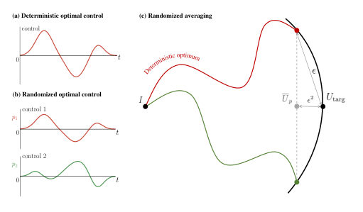 
FIG. 1: Schematic comparison between deterministic and randomized quantum optimal control. (a) Conventional QOC optimizes a single control waveform to approximate the target unitary Utarg. (b) Randomized QOC optimizes an ensemble of control waveforms, shown here with two branches, together with the associated probability dis- tribution. (c) Averaging over the unitaries generated by different controls can yield a quadratically closer approx- imation to Utarg than the deterministic optimum.

📷 Fig 2

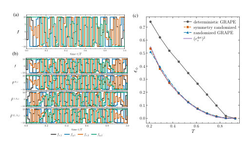 
FIG. 2: Optimal control of CNOT implementation in the two-qubit model of (28), with J = 1 and fmax = 10. (a) Deterministic GRAPE solution f. (b) Four symmetry- generated branches of (32), obtained by sign flips and time reversal of f, and applied with equal probabilities of 1/4. (c) Diamond-distance error versus total time T. The symmetry-generated protocol suppresses the de- terministic GRAPE error quadratically, closely following [ϵdet ⋄(T)]2 (faint purple guide), and achieves essentially the same performance as randomized GRAPE.

📷 Fig 3

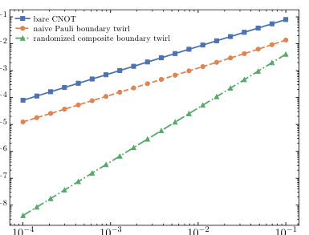 
FIG. 3: Noise robustness of CNOT implementation un- der coherent 1-local noise. The randomized composite boundary twirl suppresses the leading coherent-noise con- tribution and achieves O(η2) diamond-distance scaling, whereas the bare CNOT and naive Pauli boundary-twirl protocols exhibit O(η) scaling.

**Summary.** This paper introduces Randomized Quantum Optimal Control (QOC), a framework where optimization is performed over an ensemble of controls rather than a single path. It proves that this randomization technique allows protocols to reach target fidelities significantly faster and with lower error than deterministic methods by exploiting coherent error cancellation. The results are highly relevant for designing robust quantum gates in physical systems.

**Why it may be interesting.** For AMO physicists working with open quantum systems or quantum optics, this work provides powerful theoretical tools for designing robust control sequences that actively cancel systematic errors arising from imperfect Hamiltonian knowledge or environmental coupling.

Detailed structure

**Main problem.** The paper addresses how to improve quantum optimal control (QOC) protocols beyond deterministic methods by introducing a randomized framework that optimizes over an ensemble of controls.

**Main result.** Randomized QOC can achieve significantly faster convergence and suppress systematic errors quadratically compared to the best deterministic protocols, even when considering noise robustness.

**Method.** The authors develop theoretical constructions (like symmetry-based twirls and time-reversal pairings) and numerical algorithms (R-GRAPE) to optimize control ensembles and their associated probabilities.

**Model / system.** The work analyzes controlling quantum systems governed by Hamiltonians, focusing on implementing target unitaries like CNOT. Error is quantified using the diamond distance ($\|\cdot\|_{\diamond}$) for process fidelity.

**Key observables.** Diamond-distance error ($\epsilon_{\diamond}(T)$), observable estimation errors ($\langle O 
angle - \langle O 
angle_{	ext{ideal}}$), and the relative error generator ($E_\star$).

**Important parameters / regimes.** Total evolution time $T$, amplitude bound $f_{\max}$, number of ensemble members $M$, and noise strength $\eta$.

**Assumptions / limitations.** The analysis relies on specific Hamiltonian models, short-time regimes, and the ability to implement symmetry transformations via admissible controls.

**Figures summary.** Figures compare deterministic vs. randomized error scaling (showing quadratic suppression) and illustrate noise robustness by comparing $O(\eta)$ versus $O(\eta^2)$ error scaling for CNOT implementation.

**Paper structure.** The paper progresses from introducing the core concept of Randomized QOC, developing symmetry-based constructions to systematically reduce errors, benchmarking these methods on two-qubit gates like CNOT, and finally extending the analysis to achieve noise robustness by averaging over boundary pulses.

Abstract

Quantum optimal control (QOC) aims to find control functions that optimally steer a quantum system toward a target operation. We introduce a \emph{randomized} QOC framework where optimization is carried over an ensemble of control functions and their probabilities, instead of a single set of functions. Using this framework, we prove that randomized QOC can reach a target accuracy faster than any deterministic protocol under the same resource constraints. We also develop general symmetry-based constructions that convert a given control into an ensemble of controls that can systematically reduce the error. We benchmark these constructions for CNOT implementation and find that the resulting randomized protocol quadratically suppresses the error of the optimized deterministic solution. In addition, we introduce randomized GRAPE, which generalizes GRAPE to directly optimize control ensembles and their associated probabilities. Finally, as a related application, we discuss randomized boundary-pulse constructions {that enhance} robustness against coherent noise.

[↑ back to top](#top)

### [Bosonization versus the Nielsen-Ninomiya theorem](http://arxiv.org/abs/2607.09935v1)

**Authors:** Saif Ullah Baig, Shi Chen, Aleksey Cherman, Maria Neuzil  
**Type:** theory · **Category:** strongly correlated electrons · **PDF:** <https://arxiv.org/pdf/2607.09935v1>  
**Analysis basis:** full PDF text, analyzed in chunks
**Topic relevance:** `Keldysh / 2PI / non-Gaussian methods` **1/5** · `Kondo & dissipative impurity` **1/5** · `analog quantum simulation` **1/5** · `driven-dissipative phase transition` **1/5** · `methods for driven-dissipative` **1/5**

📷 Fig 1

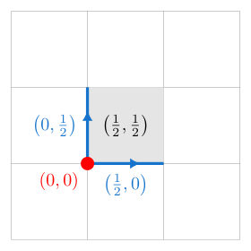 
FIG. 1: Lattice sites, links and plaquettes are labeled using the 1

📷 Fig 2

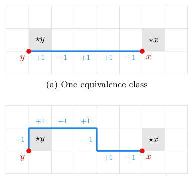 
FIG. 2: Two equivalence classes of lattice paths in the correlation function ψ±(Cx) ¯ψ±(Cy) . A lattice path Cx,y is shown with the indicated values on the blue links and zero on all other links. Cx,y(ℓ) = +1 indicates that the path from y to x aligns with the orientation of the link ℓ∈Γ1 (given by Fig. 1), while Cx,y(ℓ) = −1 indicates the opposite.

📷 Fig 3

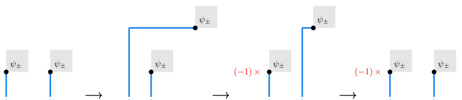 
FIG. 3: The site-plaquette nature of the Weyl operators in combination with the topological line gives rise to the expected fermionic statistics. This illustrates anticommutativity under particle exchange.

📷 Fig 4

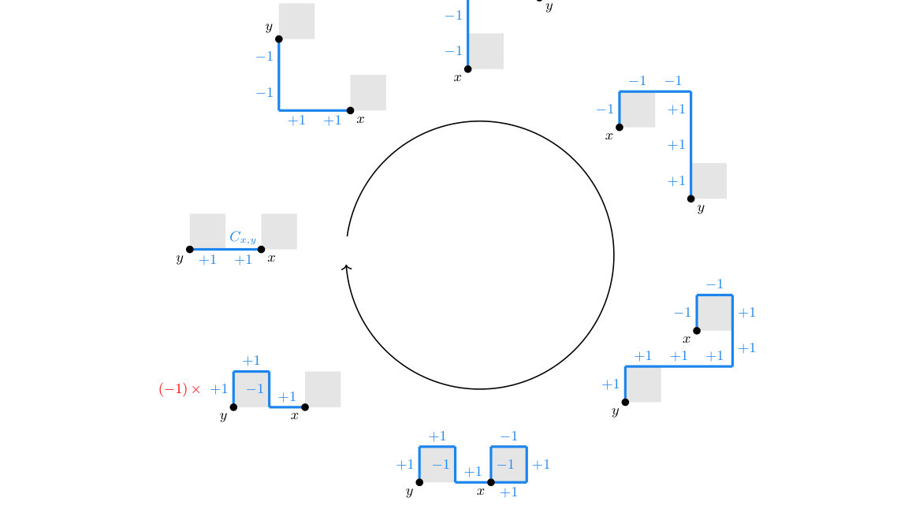 
FIG. 4: When we drag y in a full circle around x for the correlation function ψ±(Cx) ¯ψ±(Cy) , the final lattice path Cx,y lies in the same branch as the initial lattice path Cx,y.

📷 Fig 5

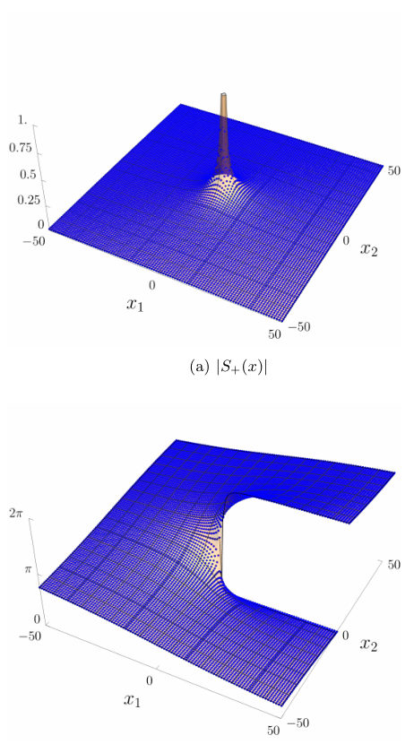 
FIG. 5: Magnitude (top) and phase (bottom) of the correlation function S+(x) on a 100 × 100 lattice.

**Summary.** This paper tackles the fundamental problem of regularizing chiral fermions on a lattice without violating symmetries. By employing bosonization within the 2D modified Villain model, the authors construct a doubler-free lattice Dirac operator that is non-local. This circumvents the Nielsen-Ninomiya theorem's constraints by sacrificing locality while preserving the underlying symmetry structure.

**Why it may be interesting.** While focused on condensed matter/QFT, the techniques involving symmetry realization through bosonic dualities are highly relevant for understanding effective Hamiltonians in strongly correlated systems where continuum symmetries must be maintained on a lattice.

Detailed structure

**Main problem.** The primary challenge addressed is how to construct a lattice regularization for chiral fermions while preserving crucial symmetries, circumventing the constraints imposed by the Nielsen-Ninomiya theorem.

**Main result.** The authors successfully constructed a doubler-free lattice Dirac operator using a bosonic approach that results in a non-local kernel, thereby bypassing the strict locality requirement of the Nielsen-Ninomiya theorem.

**Method.** The study employs bosonization techniques, utilizing the 2D modified Villain scalar model to relate an underlying ultra-local bosonic theory to the desired chiral fermionic description via path integral duality.

**Model / system.** The focus is on the 2D modified Villain scalar model used to regularize chiral fermions. The analysis compares this bosonic formulation with continuum expectations for lattice Dirac operators, particularly in relation to chiral gauge theories.

**Key observables.** Correlation functions of constructed chiral lattice fermion operators; the structure and non-locality of the reconstructed lattice Dirac operator.

**Important parameters / regimes.** The dimensionality (2D), the specific form of the bosonic action (Villain model), and the finite lattice spacing ($a$).

**Assumptions / limitations.** The approach assumes that the underlying microscopic bosonic theory remains ultra-local, even if the derived fermionic operator is non-local at finite spacing.

**Figures summary.** Not specified in detail; notes refer to a 'Nielsen-Ninomiya scorecard' (Table I) and various correlation function comparisons on $S^2$ or $\mathbb{T}^2$.

**Paper structure.** The paper progresses by reviewing the Nielsen-Ninomiya theorem, introducing bosonization as an alternative regularization method, applying this to the 2D modified Villain model via duality arguments, and finally confirming the properties of the resulting lattice operator.

Abstract

Thanks to bosonization, bosonic lattice models can offer a lattice regularization of chiral fermions. We construct chiral lattice fermion operators in the 2D modified Villain scalar model and evaluate their correlation functions. This microscopic bosonic model has an ultra-local action and an ultra-local symmetry that realizes the fermionic chiral symmetry under bosonization. The reconstructed lattice Dirac operator has no doublers, but is consistent with the Nielsen-Ninomiya theorem because it turns out to be non-local. The non-locality of this derived quantity at finite lattice spacing does not pose any obstructions to gauging the non-anomalous symmetries of the model, which is itself ultra-local.

[↑ back to top](#top)

### [Dark Optical Trapping of Resonant Transition-Metal Dichalcogenide Particles](http://arxiv.org/abs/2607.09896v1)

**Authors:** Patrick Illetschek, Gleb Fedorovich, Albert Seredin, Gleb Tselikov, Valentin S. Volkov, Nikolai Kiesel, Markus Aspelmeyer, Mihail Petrov, Anton V. Zasedatelev  
**Type:** theory · **Category:** other · **PDF:** <https://arxiv.org/pdf/2607.09896v1>  
**Analysis basis:** full PDF text, analyzed in chunks
**Topic relevance:** `analog quantum simulation` **1/5** · `correlated / nonlocal dissipation` **1/5** · `driven-dissipative phase transition` **1/5** · `methods for driven-dissipative` **1/5** · `non-equilibrium dynamics` **1/5**

📷 Fig 1

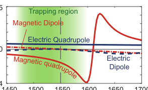 
FIG. 1. The dark trap. (a) Normalized EM field intensity in the (xz) plane of the bottle beam formed by two circu- larly polarized Laguerre Gauss (LG) beams with a π phase shift at λ0 = 1550nm; orange arrows indicate force vectors. The beam propagates in the +z direction. The inset shows the force amplitude near the origin, revealing the presence of both a stable and an unstable trapping position. (b) Mul- tipole amplitudes of the field scattered by the particle near the magnetic quadrupole (MQ) resonance. The green-shaded region marks the wavelength range of stable trapping, while the dashed black line shows the trapping beam wavelength.

📷 Fig 2

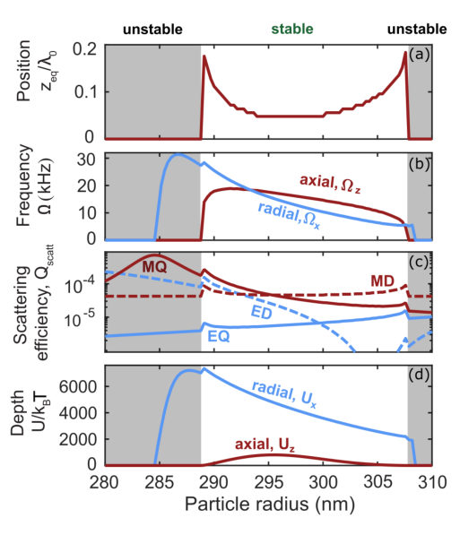 
FIG. 2. Stable trapping conditions. (a) Equilibrium po- sition zeq versus particle radius, normalized to λ0 = 1550 nm. (b) Trap frequencies: axial z (red) and in-plane, radial x, y (blue) for P = 0.80 W. (c) Scattering efficiencies Qscatt of mul- tipoles at zeq for different particle radii: Magnetic quadrupole (MQ), Magnetic Dipole (MD), Electric Dipole (ED), Electric Quadrupole (EQ). (d) Trap depth in units of kBT (T = 300 K), along radial x, y (blue) and axial z (red) directions, for different particle radii. The shaded regions indicate particle radii where no 3D stable trapping is found at λ0 = 1550 nm.

📷 Fig 3

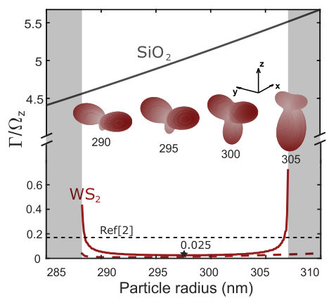 
FIG. 3. Photon recoil in the dark trap. Ratio of photon recoil rate to trap frequency, Γ/Ωz, versus particle radius for a WS2 particle in the dark trap (red solid line), with a compen- sating force (red dashed line), for a SiO2 particle of the same radius (black solid line) and of radius 71.5 nm (black dashed line) [2]) trapped in a conventional bright trap. Overlaid are the scattered intensity patterns for particles of different radii.

📷 Fig 4

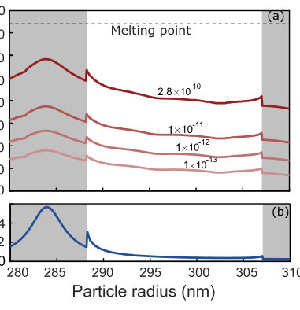 
FIG. 4. Internal heating and thermal emission. (a) Equilibrium temperature Teq versus particle radius for differ- ent extinction coefficients k. The black dotted line indicates the melting point of WS2 at 1520 K. (b) Absorbed power of the trapped nanoparticle. Shaded regions indicate particle radii where stable trapping is not achieved.

**Summary.** The paper proposes using resonant Transition-Metal Dichalcogenide (TMD) particles in a dark optical trap to overcome limitations in cooling and controlling macroscopic objects. By utilizing TMDs' high polarizability and low scattering rates, the authors demonstrate a method that significantly extends coherence time compared to traditional silica traps. This establishes TMDs as a promising platform for quantum physics experiments involving large masses.

**Why it may be interesting.** This work directly addresses open quantum system dynamics by providing a mechanism (dark trapping with high-density resonators) to extend the coherence time of massive mechanical oscillators interacting with light fields, which is crucial for quantum sensing and measurement.

Detailed structure

**Main problem.** The central challenge is achieving precise control and cooling of macroscopic particles trapped by light while mitigating detrimental effects like recoil events and optically induced heating.

**Main result.** Dark trapping using resonant Transition-Metal Dichalcogenide (TMD) particles offers a highly promising platform for levitating large masses with significantly reduced motional decoherence compared to conventional traps.

**Method.** The study employs full Mie theory combined with electromagnetic force calculations derived from the Maxwell stress tensor to model particle trapping in a dark optical trap geometry.

**Model / system.** The system involves resonant dielectric TMD particles (like WS2) trapped using a single-beam, 'bottle-beam' configuration operating in an ultra-high vacuum. The analysis models the interaction via multipolar field decomposition near magnetic quadrupole resonances.

**Key observables.** Suppression of the scattering rate relative to mechanical frequency ($\Gamma/\Omega$), equilibrium temperature ($T_{eq}$), and trapping frequencies (axial vs. radial).

**Important parameters / regimes.** High refractive indices ($3.7-4.8$) and high densities of TMDs; operating wavelength $\lambda_0 = 1550 	ext{ nm}$; low ratio $\Gamma/\Omega \simeq 0.02$.

**Assumptions / limitations.** The analysis assumes radiative cooling balances absorption for temperature estimation, but neglects thermo-optical effects like resonance position shifts.

**Figures summary.** Figures illustrate the dark trap intensity profile (bottle beam), show stable trapping regions dependent on particle radius, and critically compare the low photon recoil ratio ($\Gamma/\Omega$) of TMDs versus high values for silica in bright traps.

**Paper structure.** The paper progresses from identifying the physical challenges (recoil/heating) to proposing the dark trap geometry using TMDs. It then uses Mie theory to calculate trapping forces, analyze stability regions, and quantify improvements in coherence time and thermal management compared to existing materials.

Abstract

Mitigating recoil events and minimizing optically induced heating are central challenges in the precise control and cooling of macroscopic particles. To overcome this, we propose trapping resonant dielectric particles for applications in ultra-high vacuum (UHV) levitodynamics. Contrary to other approaches, where suppressing the parasitic resonant scattering was achieved in a standing wave geometry, here we propose a single beam geometry in a dark trap regime. As a promising material platform, we focus on a class of transition-metal dichalcogenide (TMD) particles with high polarizability, characterized by refractive indices in the range $3.7$-$4.8$ and densities up to $9.3~\mathrm{g\,cm^{-3}}$. Using full Mie theory, we identify a range of TMD particle radii that support stable axial and radial magnetic quadrupole trapping in a bottle-beam configuration. We predict that for WS$_2$ particles with a mass of $0.5 \times 10^{12}\,\mathrm{amu}$, one can expect suppression of the scattering rate relative to the mechanical frequency down to $Γ/Ω\simeq 0.02$. This corresponds to a coherence time extended by approximately three orders of magnitude compared with silica particles of the same mass trapped in conventional bright optical traps at UHV. Combined with significantly reduced internal heating, remaining well below the melting point of the material, dark trapping of resonant TMD macroscopic particles emerges as a promising platform for exploring quantum physics with large masses.

[↑ back to top](#top)

### [Noise Resilience of Quantum Key Distribution Protocols Secured Against Independent Attacks With One-Way Communication](http://arxiv.org/abs/2607.11857v1)

**Authors:** Adam Bílek, Ryszard Kukulski, Paulina Lewandowska, Łukasz Pawela, Zbigniew Puchała  
**Type:** theory · **Category:** quantum information and computing · **PDF:** <https://arxiv.org/pdf/2607.11857v1>  
**Analysis basis:** full PDF text, analyzed in chunks
**Topic relevance:** `Keldysh / 2PI / non-Gaussian methods` **1/5** · `correlated / nonlocal dissipation` **1/5** · `driven-dissipative phase transition` **1/5** · `entanglement & information structure` **1/5** · `methods for driven-dissipative` **1/5**

📷 Fig 1

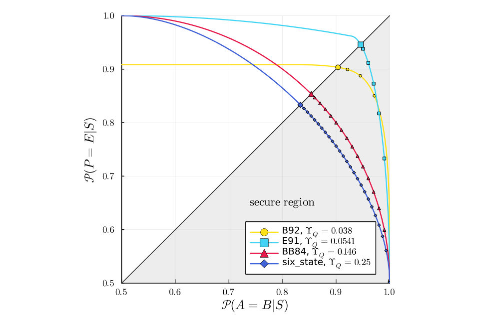 
Figure 1: Comparison between the key agreement probability of Alice and Bob and the maximum key agreement probability achievable by Eve for several QKD protocols. The gray field indicates the secured region where P(A = B|S) &gt; P(A = E|S). The black diagonal line denotes the security boundary xQ(ϵ) = yQ(ϵ). Markers correspond to increments of ϵ by 0.01 starting with ϵ = 0 for P(A = B|S) = 1. The larger markers represent the crossing points.

📷 Fig 2

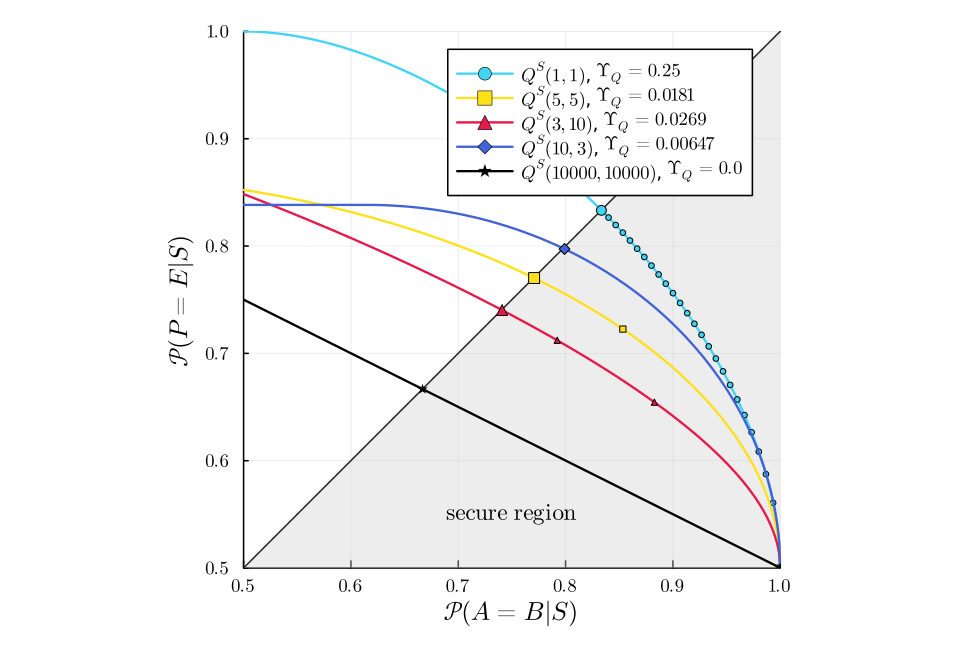 
Figure 2: Comparison between the key agreement probability of Alice and Bob and the maximum key agreement probability achievable by Eve for several QKD protocols QS(n, m) to compare with the six-state protocol Q6S = QS(1, 1). The gray field indicates the secured region where P(A = B|S) &gt; P(A = E|S). Again, the black diagonal line denotes the security boundary xQ(ϵ) = yQ(ϵ). Markers correspond to increments of ϵ by 0.01 starting with ϵ = 0 for P(A = B|S) = 1. The larger markers represent the crossing points.

📷 Fig 3

 
Figure 3: The general setup of a single round of the QKD protocol Q defined in Section 2. Alice prepares the state ρrA on registers A ⊗Aenv, Eve attacks the transmitted qubit with the channel E, and finally the parties Alice and Bob implement the LOCC measurement CrA,rB producing the key bits a and b.

**Summary.** This paper rigorously determines the maximum level of environmental noise a single-qubit Quantum Key Distribution (QKD) protocol can tolerate while still guaranteeing a secure secret key. By introducing a novel noise metric and employing advanced optimization techniques like SDP, the authors prove that this fundamental threshold is $1/4$. The results highlight the superior noise resilience of the six-state protocol compared to established methods like BB84.

**Why it may be interesting.** This work provides fundamental, mathematically rigorous limits on the physical robustness of quantum communication protocols against realistic noise channels, which is crucial for designing practical quantum networks.

Detailed structure

**Main problem.** The research investigates the noise resilience of single-qubit Quantum Key Distribution (QKD) protocols when secured against independent eavesdropping attacks using one-way classical communication.

**Main result.** The maximal achievable noise threshold ($\Upsilon$) for such QKD protocols is determined to be $1/4$, with the six-state protocol achieving this optimal resistance.

**Method.** The authors introduce a novel noise metric ($\epsilon$) and use Semidefinite Programming (SDP) techniques, often combined with unitary symmetry averaging, to establish rigorous upper and lower bounds on the tolerable noise level.

**Model / system.** The model involves single-qubit QKD protocols (BB84, B92, E91, six-state), analyzed under a prepare-and-measure framework subjected to an environmental noise channel $\Phi_\epsilon$.

**Key observables.** Key agreement probability ($P(A=B|S)$) and the maximum information Eve can obtain ($y_Q(\epsilon)$).

**Important parameters / regimes.** Noise intensity parameter ($\epsilon$), Noise threshold ($\Upsilon$), and protocol-specific parameters like $x_Q(\epsilon)$ and $y_Q(\epsilon)$.

**Assumptions / limitations.** Security is analyzed assuming independent attacks by Eve and restricted to one-way classical communication post-processing.

**Figures summary.** Figures compare the key agreement probability ($x_Q$) versus Eve's information gain ($y_Q$) for various protocols, showing how their intersection determines $\Upsilon_Q$.

**Paper structure.** The paper establishes the problem by defining noise metrics and then uses SDP formulations to derive rigorous mathematical bounds ($\ge 1/4$ and $\le 1/4$), culminating in the proof that $\Upsilon = 1/4$.

Abstract

We investigate the resilience to noise of single-qubit quantum key distribution (QKD) protocols in the scenario of security against independent eavesdropping attacks and key distillation based on one-way classical communication. To this end, we introduce a noise-based metric that quantifies the efficiency of QKD protocols. Within this framework, we analyze the maximal noise levels that allow Alice and Bob to asymptotically establish a secure secret key. Using this assumption, we compare the noise tolerance of general single-qubit QKD protocols, in particular the BB84, B92, E91, and six-state protocols. Our main result determines the noise level threshold for QKD allowing one to distill an asymptotically secure secret key. Additionally, we demonstrate that the six-state protocol achieves the greatest resistance to noise while simultaneously yielding a higher post-selection efficiency than the other analyzed single-qubit protocols, confirming its robustness within the considered security model. Finally, we perform an analysis of the proposed noise-based metric and the conventional quantum bit error rate (QBER) metric.

[↑ back to top](#top)

### [Paraparticles intrinsically exhibit Hardy-space breakdown](http://arxiv.org/abs/2607.11867v1)

**Authors:** Kejun Liu  
**Type:** theory · **Category:** other · **PDF:** <https://arxiv.org/pdf/2607.11867v1>  
**Analysis basis:** full PDF text, analyzed in chunks
**Topic relevance:** `Keldysh / 2PI / non-Gaussian methods` **1/5** · `correlated / nonlocal dissipation` **1/5** · `driven-dissipative phase transition` **1/5** · `methods for driven-dissipative` **1/5** · `non-equilibrium dynamics` **1/5**

📷 Fig 1

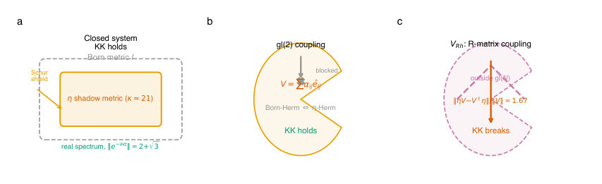 
Figure 1: The shadow metric and its exposure. a, Closed system: η (orange) differs from Born inner product I (grey dashed) but is Schur-shielded. KK holds. b, gl(N) couplings are blocked: Born-Hermitian ⇔η-Hermitian. c, The R-structural coupling VRh lies outside the algebra; the shield is broken (∥ηVRh −V † Rhη∥/∥VRh∥= 1.67); KK breaks.

📷 Fig 2

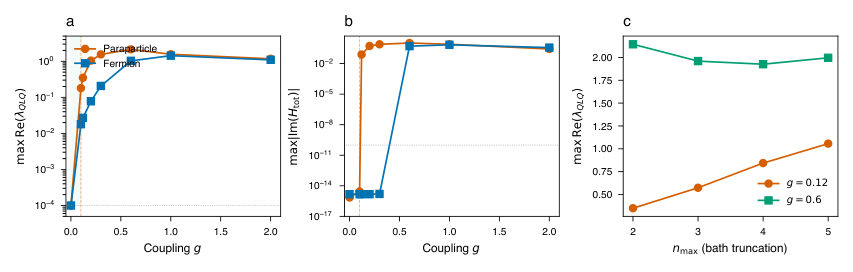 
Figure 2: Intrinsic KK breakdown. a, max Re(λQLQ) (UHP pole depth) versus coupling g. Paraparticle (orange): RHP eigenvalues appear at gc ≈0.1. Fermion (blue): for η = I, any Born- Hermitian V is automatically η-Hermitian; QLQ stays anti-Hermitian at all g. b, max |Im(Htot)|. The UHP pole appears at g = 0.1 before Htot itself complexifies (gc ≈0.12). c, Bath-truncation convergence: max Re stabilises within 4% from nmax = 4 to 5 at g = 0.6.

📷 Fig 3

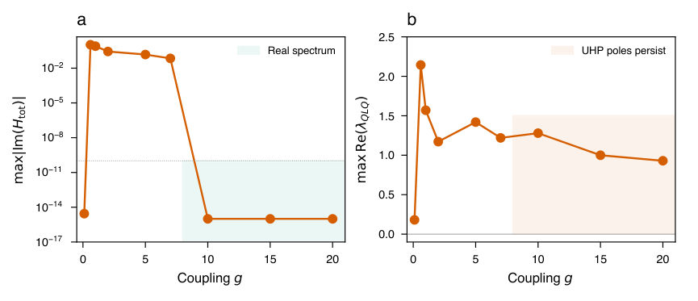 
Figure 3: Poles persist beyond spectral reality. a, Htot returns to real spectrum at g ≥10 (green). b, max Re(λQLQ) remains ≈1.0 (orange): ˜K(z) retains genuine UHP poles. The NZ projection permanently encodes the metric mismatch into the reduced dynamics—independently of Htot’s spectral reality.

**Summary.** The paper proves that particles with non-unitary exchange statistics ('paraparticles') fundamentally break a mathematical property called Hardy-space analyticity in their memory kernel when interacting with an environment. This breakdown is exposed by interactions sensitive to the particle's internal structure, distinguishing it sharply from standard fermions and bosons.

**Why it may be interesting.** This work provides a deep mathematical link between fundamental quantum statistics (unitarity of exchange) and the analytic properties of open system dynamics, suggesting that spectral signatures can reveal underlying non-unitary physics even when standard energy measurements appear normal.

Detailed structure

**Main problem.** The paper investigates whether non-unitary exchange statistics, characteristic of 'paraparticles,' intrinsically violate Hardy-space analyticity in the memory kernel describing open quantum system dynamics.

**Main result.** Paraparticles break this mathematical symmetry when coupled to an environment via interactions outside the system's symmetry algebra. This breakdown is intrinsic and occurs at coupling strengths where the total Hamiltonian remains spectrally real.

**Method.** The analysis relies on examining the Kramers-Kronig relations, which require Hardy-space analyticity of the memory kernel derived from the Nakajima-Zwanzig projection formalism.

**Model / system.** The model involves paraparticles with non-unitary exchange statistics coupled to an environment (bath). The dynamics are analyzed by comparing the required 'shadow metric' ($\eta$) against the physical Born inner product ($I$).

**Key observables.** Hardy-space analyticity of the memory kernel $	ilde{K}(z)$, which is diagnosed by searching for poles in the Upper Half-Plane (UHP) corresponding to Right-Half-Plane (RHP) eigenvalues of the projected generator $QLQ$.

**Important parameters / regimes.** The coupling strength ($g$), particularly noting a breakdown point near $g_c \approx 0.1$, and the ratio $\lVert\eta - I
Vert_F / \lVert I
Vert_F = 0.51$ for paraparticles.

**Assumptions / limitations.** The core assumption is that the failure of Hardy-space analyticity, signaled by UHP poles in $	ilde{K}(z)$, provides a definitive signature of non-unitary statistics when coupled to an environment.

**Figures summary.** Figures illustrate how coupling breaks the 'Schur shield' protecting the closed system dynamics, causing UHP poles in the memory kernel ($\max 	ext{Re}(\lambda Q_{LQ})$) even when the total Hamiltonian ($H_{tot}$) spectrum remains real at strong couplings.

**Paper structure.** The paper builds a mathematical argument by first establishing the necessary conditions (Hardy-space analyticity $\iff$ KK relations) and then demonstrating how non-unitary statistics ($\eta 
eq I$) violates these conditions when an external interaction probes the internal flavor structure, contrasting this with unitary systems (fermions/bosons).

Abstract

The memory kernel of an open quantum system obeys Kramers--Kronig (KK) relations if and only if its Laplace transform is analytic in the upper half-plane -- a property known as Hardy-space analyticity. Here we show that non-unitary exchange statistics, the defining property of paraparticles, intrinsically breaks Hardy-space analyticity. The metric $η$ that guarantees a real closed-system spectrum for these particles necessarily differs from the physical Born inner product ($\|η- I\|_F / \|I\|_F = 0.51$) -- a mathematical consequence of the R-matrix's non-unitarity, not a parameter choice. This metric is a "shadow metric": Schur's lemma forces it to commute with every bilinear observable, making the distortion physically invisible in the closed system. But when the paraparticle is coupled to a bath, any coupling operator that lies outside the symmetry algebra -- that is, any interaction that sees the internal flavour structure -- exposes the distortion. The memory kernel then develops upper-half-plane poles at coupling $g_c \approx 0.1$, breaking standard dispersion relations before the closed-system spectrum complexifies. Fermions and bosons, whose exchange is unitary ($η= I$ as an analytic fact of the canonical anticommutation algebra), are immune at any coupling, because there is no distortion to expose. The violation is intrinsic: it distinguishes non-unitary exchange statistics from ordinary particle statistics at the level of the memory kernel's analytic structure.

[↑ back to top](#top)

### [Passive spectral-admittance bounds and exact continuum certificates for multiresonator quantum-memory interfaces](http://arxiv.org/abs/2607.10704v1)

**Authors:** Maxim V. Churilov  
**Type:** theory · **Category:** quantum information and computing · **PDF:** <https://arxiv.org/pdf/2607.10704v1>  
**Analysis basis:** full PDF text, analyzed in chunks
**Topic relevance:** `Keldysh / 2PI / non-Gaussian methods` **1/5** · `correlated / nonlocal dissipation` **1/5** · `driven-dissipative phase transition` **1/5** · `interference shaping light` **1/5** · `methods for driven-dissipative` **1/5**

📷 Fig 1

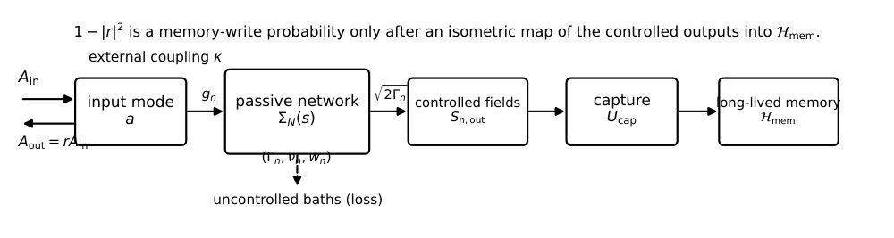 
FIG. 1. Operational qualification of the passive interface. The rational admittance fixes scattering from the signal port into controlled output fields. Reflection defect becomes memory-write probability only after a coherent isometry maps the admitted controlled-field subspace into a long-lived register; dashed channels represent uncontrolled loss and do not count as storage.

📷 Fig 2

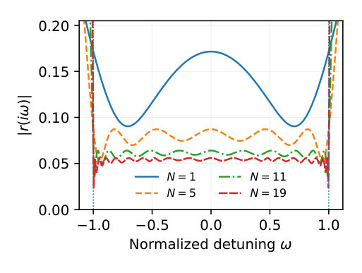 
FIG. 2. Reflection magnitude for four passive symmetric candidates. Vertical dotted lines mark the design band. The spectra flatten as the number of controlled internal modes increases.

📷 Fig 3

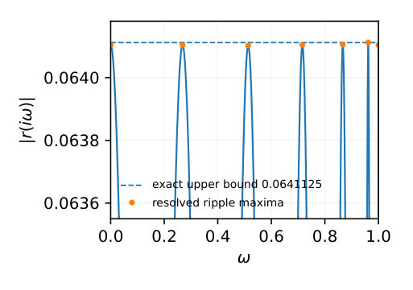 
FIG. 3. Positive-frequency half of the 11-mode reflection spectrum. The dashed line is the exact continuum upper bound. Markers show numerically resolved ripple maxima; they are diagnostics, whereas the bound is proved by exact polynomial arithmetic.

📷 Fig 4

 
FIG. 4. Reproducible Monte Carlo sensitivity of the nominal 11-mode candidate under independent mean-preserving log- normal perturbations. Solid markers show the median and 95th percentile of the dense-grid maximum. These statistics are model-dependent diagnostics, not deterministic guarantees.

📷 Fig 5

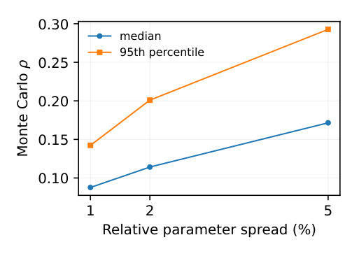 
Figure 4 shows a separate, fully reproducible Monte Carlo sensitivity study. Every positive 11-mode param- eter is perturbed independently according to the mean- preserving log-normal model p′ = p exp(σZ −σ2/2) with Z ∼N(0, 1); 1200 samples per spread, a 12001-point grid on [0, 1], and seed 20260711 are used. This is not a confidence statement about any fabrication process unless that distribution is experimentally justified. Its purpose is diagnostic: the nominal minimax design is sharp, and robust synthesis or postfabrication retuning is likely to be important. For experimental use, the dimensionless design is scaled by a chosen angular-frequency band half-width B with κ = 2B. The...

**Summary.** This theoretical paper develops a rigorous framework to certify the broadband write efficiency of passive quantum memory interfaces. It moves beyond simple peak measurements by deriving fundamental spectral bounds (Bode–Fano floor) and providing exact mathematical certificates based on polynomial positivity for specific multi-mode designs. This work establishes quantitative, verifiable performance guarantees essential for building reliable quantum hardware.

**Why it may be interesting.** This work provides essential mathematical tools—exact certificates and rigorous lower bounds—for quantifying the performance limits of quantum hardware components like quantum memories, which is crucial for scaling up photonic quantum information processing.

Detailed structure

**Main problem.** The paper addresses the need for a rigorous, continuous-band certificate to quantify the write efficiency of broadband quantum memory interfaces, moving beyond simple peak measurements.

**Main result.** It derives the Bode–Fano floor bound for passive interfaces and provides an exact, computer-assisted certificate showing that specific multi-mode designs achieve high conditional uniform write guarantees (e.g., >0.9958).

**Method.** The analysis uses positive-real spectral admittance modeling, relating write probability to the minimum reflection magnitude $\|r\|_{\infty}$ over the operational band.

**Model / system.** The system is a passive one-port multiresonator interface modeled by a positive-real spectral admittance $\Sigma(s)$, which couples an input field to internal long-lived quantum memory registers.

**Key observables.** Worst-case write efficiency ($\eta_{wc}^w$), reflection amplitude $|r(i\omega)|$, and the minimum achievable $\|r\|_{\infty}$ over a specified band $\mathcal{B}$.

**Important parameters / regimes.** The spectral bandwidth $B$ and coupling parameter $\kappa$; the specific number of resonant modes (e.g., 11-mode design).

**Assumptions / limitations.** The analysis assumes passive, stationary elements and focuses on rationalized designs to derive exact certificates; global optimality over all pole placements remains an open question.

**Figures summary.** Figure 2 illustrates the spectral flattening of the reflection magnitude $|r(i\omega)|$ as the number of controlled modes increases. Figure 4 shows Monte Carlo sensitivity analysis for the write efficiency.

**Paper structure.** The paper progresses from defining the operational deficiency (reflection defect) to deriving theoretical bounds (Bode–Fano floor), establishing convexity conditions for synthesis, and finally providing exact verification methods using polynomial positivity checks (Sturm root counting).

Abstract

Broadband quantum-memory interfaces are often assessed by center-frequency impedance matching or by a sampled efficiency curve. Neither supplies an operational continuous-band certificate, and absorption is not automatically reversible storage. We model a passive one-port multiresonator interface by a positive-real spectral admittance with explicitly identified controlled output channels. If their one-photon subspace is mapped isometrically into long-lived registers, the write probability for a normalized spectrum $f$ supported in a band $\mathcal{B}$ is $1-\int_{\mathcal{B}} |r(iω)|^2 |f(ω)|^2\,dω$, and the worst-case write efficiency is $1-\|r\|_{L^\infty(\mathcal{B})}^2$. We prove that a finite passive rational interface cannot have zero reflection on a nonzero interval and derive the Bode--Fano floor $\|r\|_\infty \geq \exp[-πκ/(2B)]$ for a band of half-width $B$. At fixed pole locations, minimax synthesis is a quasiconvex semi-infinite problem in the oscillator strengths. We then give an exact computer-assisted certificate: after a decimal design is converted into an explicit rational system, the continuum reflection bound becomes positivity of one univariate polynomial and is proved by Sturm root counting; exact Routh--Hurwitz determinants certify stability and minimum phase. In units $κ=2$ and $B=1$, an 11-mode design obeys $0.064112405 \leq \|r\|_\infty < 0.0641125$, implying a conditional uniform write guarantee above $0.995889587$. This is a reproducible certificate for a specified interface, not a claim of global movable-pole optimality or of an experimentally complete memory.

[↑ back to top](#top)

### [Private Capacity of Quantum Channels Induced by Non-stabilizer Environmental States](http://arxiv.org/abs/2607.11793v1)

**Authors:** Chunhe Xiong, Sunho Kim, Long Long, Junde Wu  
**Type:** theory · **Category:** quantum information and computing · **PDF:** <https://arxiv.org/pdf/2607.11793v1>  
**Analysis basis:** full PDF text, analyzed in chunks
**Topic relevance:** `Keldysh / 2PI / non-Gaussian methods` **1/5** · `correlated / nonlocal dissipation` **1/5** · `driven-dissipative phase transition` **1/5** · `entanglement & information structure` **1/5** · `methods for driven-dissipative` **1/5**

📷 Fig 1

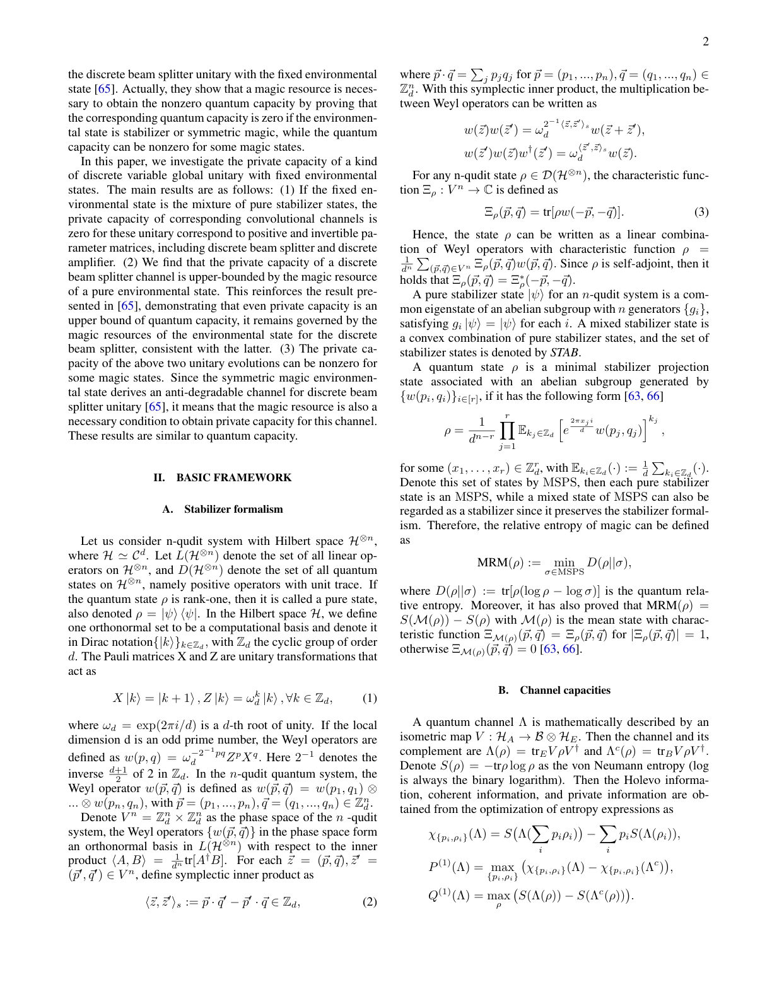 
Low-resolution page preview, page 2

📷 Fig 2

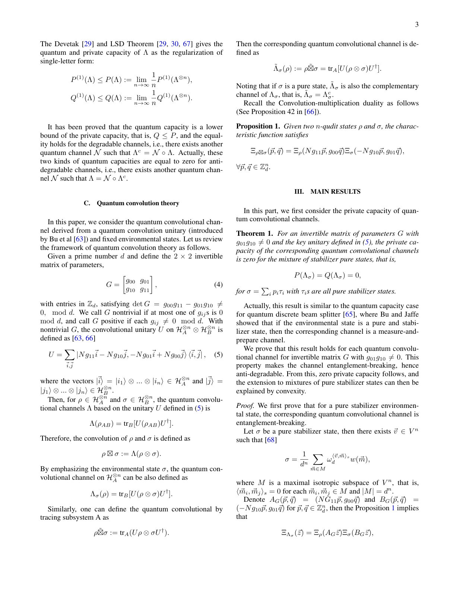 
Low-resolution page preview, page 3

📷 Fig 3

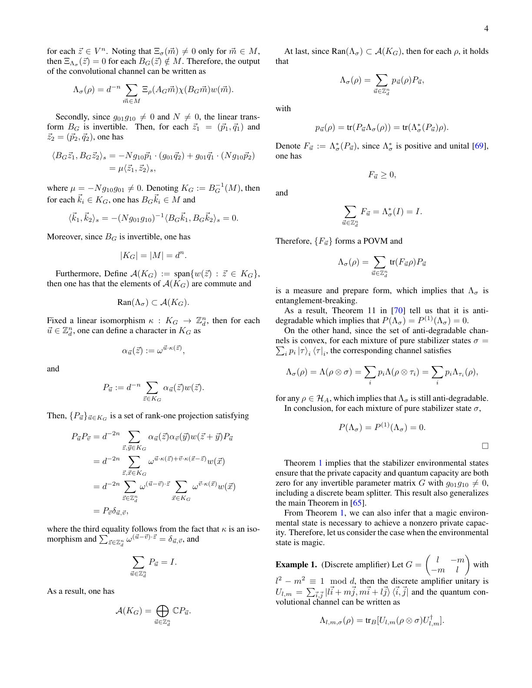 
Low-resolution page preview, page 4

📷 Fig 4

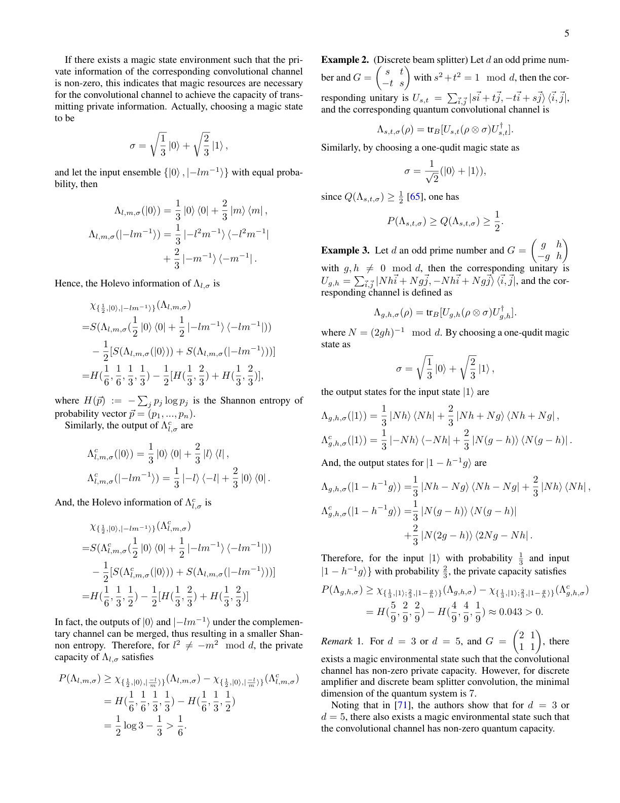 
Low-resolution page preview, page 5

📷 Fig 5

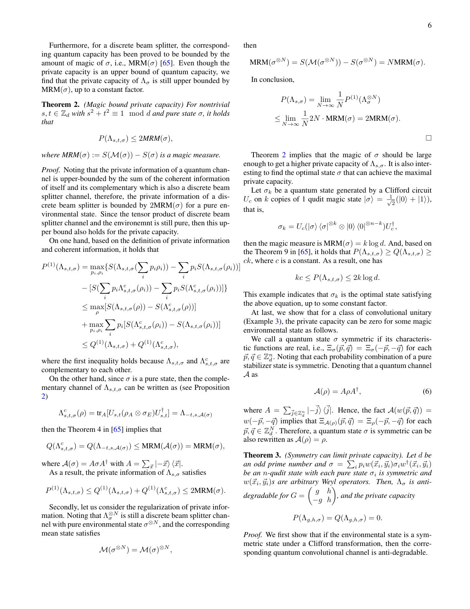 
Low-resolution page preview, page 6

**Summary.** This paper analyzes the private capacity of quantum channels by incorporating the concept of a 'magic resource' derived from environmental states. It shows that stabilizer environments yield zero private capacity, while non-zero capacities require magic resources. The findings establish a quantitative upper bound for this capacity based on the environment's magic measure.

**Why it may be interesting.** This work provides a rigorous framework connecting fundamental quantum resources (like 'magic') directly to quantifiable communication limits (private capacity), which is highly relevant for understanding noise resilience in quantum networks or computation protocols.

Detailed structure

**Main problem.** The paper investigates the private capacity of quantum channels induced by non-stabilizer environmental states using quantum convolution theory.

**Main result.** It establishes that zero private capacity results when the environment is a stabilizer state, while non-zero capacities require 'magic' environmental resources. Furthermore, it provides an upper bound for this capacity related to the magic resource of the environment.

**Method.** The analysis employs quantum convolution theory, utilizing characteristic functions and concepts like the 'magic resource' measure (MRM) to characterize channel properties.

**Model / system.** The focus is on discrete-variable quantum systems modeled by convolutional channels derived from specific unitary operators acting on $n$-qudit Hilbert spaces. The environment state $\sigma$ plays a crucial role in determining the capacity.

**Key observables.** Private capacity ($P(\Lambda)$), Quantum capacity ($Q(\Lambda)$), and the Magic Resource Measure ($	ext{MRM}(\sigma)$).

**Important parameters / regimes.** The structure of the environmental state (stabilizer vs. magic) and the specific form of the convolutional unitary matrix $G$.

**Assumptions / limitations.** The analysis relies on extending quantum convolution theory concepts to characterize communication limits, particularly concerning the regularization of capacity measures.

**Paper structure.** The paper develops theoretical tools based on characteristic functions and resource theories to analyze channel capacities. It proceeds by proving zero capacity for stabilizer environments, demonstrating non-zero capacity for magic environments, and finally deriving an upper bound using the MRM.

Abstract

We investigate the private capacity of quantum channels using the recently proposed quantum convolution theory for discrete-variable quantum systems. We focus on the role of the magic resource played in this framework. Firstly, for a large class of convolutional channels, we find that the private capacity is zero if the fixed environmental state is a stabilizer state. Moreover, we show that the private capacity can be nonzero for some magic environmental states. Furthermore, we show that the private capacity of a discrete beam splitter unitary is upper-bounded by the amount of magic of the environmental state. In addition, if the environmental state exhibits a certain symmetric structure, even if it is magic, the corresponding private capacity will also vanish for a class of convolution. These results emphasize the role of magic resources in quantum communication

[↑ back to top](#top)

### [A Cascade of Volterra-Operator BBP Transitions in a Correlated Wigner Matrix](http://arxiv.org/abs/2607.10503v1)

**Authors:** Masato Hisakado  
**Type:** theory · **Category:** statistical mechanics · **PDF:** <https://arxiv.org/pdf/2607.10503v1>  
**Analysis basis:** full PDF text, analyzed in chunks
**Topic relevance:** `Keldysh / 2PI / non-Gaussian methods` **1/5** · `analog quantum simulation` **1/5** · `driven-dissipative phase transition` **1/5** · `non-equilibrium universality` **1/5**

📷 Fig 1

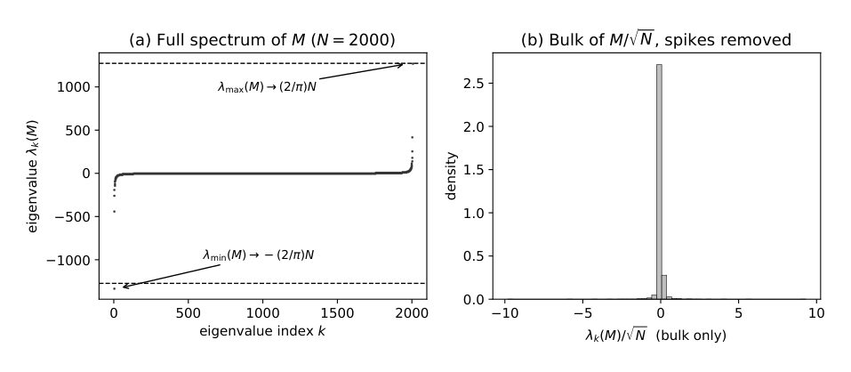 
FIG. 1. (a) Full eigenvalue spectrum of M (N = 2000, one realization), sorted eigenvalue λk(M)

📷 Fig 2

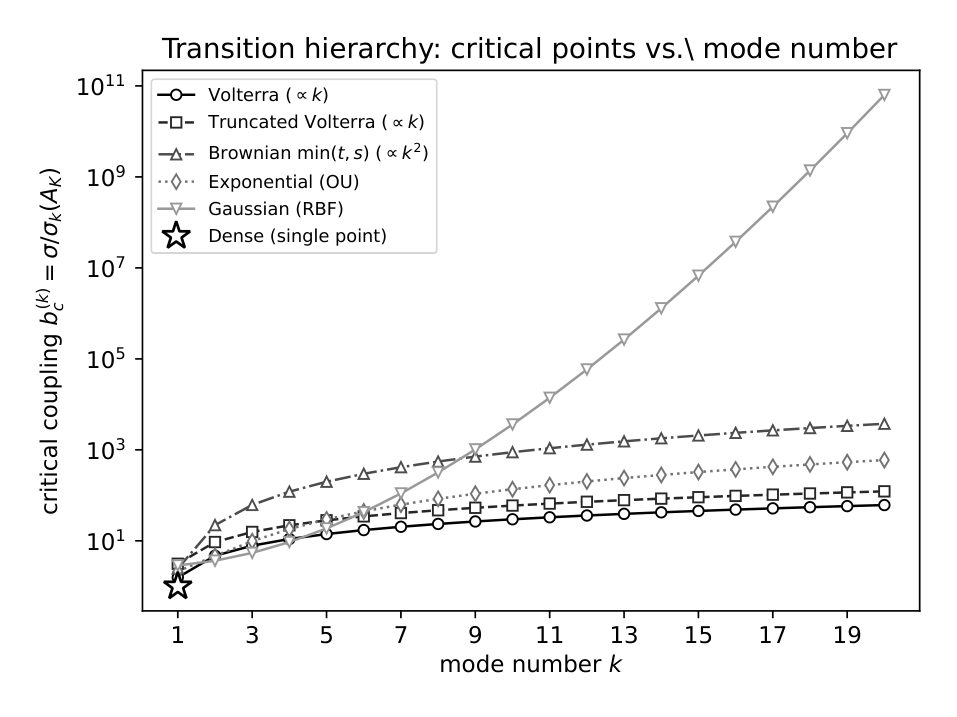 
FIG. 2. Critical coupling b(k) c = σ/σk(AK) vs. mode number k (σ = 1), for all six kernels of Sec. IV.

**Summary.** This paper analyzes a correlated Wigner random matrix whose structure forces its eigenvalues to exhibit a cascade of Baik–Ben Arous–Péché transitions. The key finding is that this entire hierarchy of critical points is precisely determined by the singular values of an underlying compact Volterra integral operator. This establishes a general principle linking structured correlations in random matrices to spectral properties of continuous operators.

**Why it may be interesting.** While mathematically rooted in random matrix theory, the concept of spectral rigidity and structured perturbations governing phase transitions has analogues in quantum many-body systems where correlations (like those induced by external fields or interactions) can induce discrete spectral features rather than smooth crossovers.

Detailed structure

**Main problem.** The study investigates how specific, structured correlations in a Wigner-type random matrix lead to a cascade of eigenvalue transitions rather than the typical single transition.

**Main result.** The detachment of eigenvalues from the bulk spectrum is governed by the singular values of an associated compact Volterra integral operator, creating a discrete hierarchy of critical points.

**Method.** The analysis uses large-N limits and spectral theory, relating the matrix problem to solving the Karhunen--Loève expansion for Brownian motion to determine the limiting operators.

**Model / system.** The model is a Wigner-type random matrix $S$ with off-diagonal correlations generated by shared row/column factors. The analysis extends this to general rank-$r$ deformations involving singular values derived from compact integral operators.

**Key observables.** Outlier eigenvalues, the critical coupling strengths ($b^{(k)}_c$), and the spectral moments (e.g., $	ext{Tr}(H^2)/N$).

**Important parameters / regimes.** The correlation strength ($\sigma$) and the matrix size ($N 	o \infty$ limit). The transition hierarchy is indexed by $k=1, 2, 3, \dots$.

**Assumptions / limitations.** The analysis relies on identifying the large-N limit of the discrete matrix structure with continuous integral operators (Volterra operator) and assumes convergence based on spectral theory conjectures.

**Figures summary.** Figures illustrate the full and bulk eigenvalue spectra showing outliers scaling as $O(N)$, and compare numerically calculated eigenvalues against theoretical predictions derived from singular values for various kernels.

**Paper structure.** The paper progresses by first establishing the correlation structure, then deriving the connection to the Volterra operator spectrum via the Karhunen--Loève expansion. It generalizes this finding to show that the entire hierarchy of transitions is dictated by the spectrum of the associated compact integral operator, confirmed across multiple kernel types.

Abstract

We study a Wigner-type random matrix in which the off-diagonal correlation between entries is generated by a random factor shared among all entries in a given row and column, with the coupling strength held fixed as the matrix size grows. Although the bulk spectral moments remain those of the pure semicircle law, we show that the underlying correlation matrix decomposes into a vanishing bulk together with a countable family of outlier eigenvalues that, at fixed rank $k$, converge to the singular values of a compact Volterra (cumulative-sum) integral operator -- obtained in closed form via the classical Karhunen--Loève expansion of Brownian motion and confirmed numerically to better than one percent across the top twenty such values. Each singular value drives an independent Baik--Ben Arous--Péché (BBP) transition as the coupling strength increases, producing an evenly spaced, discrete hierarchy of critical points -- rather than a single transition -- at each of which one further eigenvalue detaches from the semicircle edge, in close agreement with direct diagonalization. We show that this mechanism generalizes to a broader family of correlation structures, with the critical hierarchy in every case set by the spectrum of an associated compact integral operator.

[↑ back to top](#top)

### [Iron-Based Superconductors: A Decade of Materials, Magnetism, and Mechanisms](http://arxiv.org/abs/2607.11355v1)

**Authors:** Xingye Lu, Hechang Lei, Jun Zhao, Hideo Hosono, Pengcheng Dai  
**Type:** both · **Category:** strongly correlated electrons · **PDF:** <https://arxiv.org/pdf/2607.11355v1>  
**Analysis basis:** full PDF text, analyzed in chunks
**Topic relevance:** `Kondo & dissipative impurity` **1/5** · `analog quantum simulation` **1/5** · `exotic spin models in light-matter` **1/5** · `spintronics-quantum-optics interface` **1/5**

📷 Fig 1

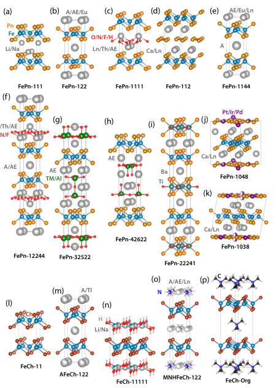 
FIG. 1 Crystal structures and structural-family notation of representative iron-based superconductors (FeSCs). The nu- merical labels in the family names denote the stoichiometric ratios of the principal structural blocks in the correspond- ing compounds. Here, A denotes an alkali metal (Li, Na, K, Rb, or Cs); AE an alkaline-earth metal (Ca, Sr, or Ba); Ln a lanthanide element; TM a transition-metal element; M metallic ion in MNHFeCh-122; Pn a pnictogen (P or As); Ch a chalcogen (S, Se, or Te); and Org an organic molecular spacer. Panels (a)–(p) show representative members of the major FeSC structural families.

📷 Fig 2

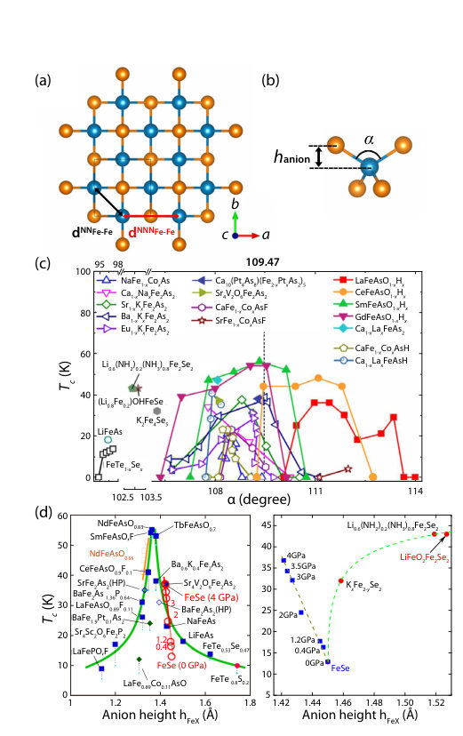 
FIG. 2 (a) Local structure of 2D Fe layer with highlighted nearest and next-nearest neighbor Fe–Fe atomic distance dNN Fe−−Fe and dNNN Fe−−Fe. (b) Definitions of X anion height hFeX and X–Fe–X bond angle α. (c) Correlation between Tc and α in various FeSCs. The dotted line denotes the bond angle for a regular tetrahedron. From (Hosono and Kuroki, 2015). (d) Tc as a function of hFeX for representative FeSCs. From (Lu et al., 2013; Mizuguchi et al., 2010).

📷 Fig 3

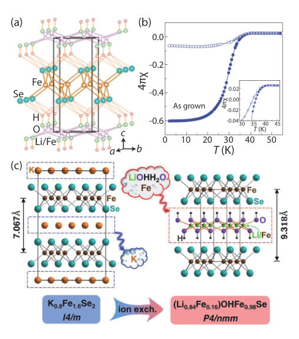 
FIG. 4 (a) Crystal structure of FeSe-11111. (b) Tempera- ture dependence of magnetic susceptibility 4πχ of FeSe-11111 polycrystal. From (Lu et al., 2015). (c) A schematic illustra- tion of the hydrothermal ionic exchange reaction. From (Dong et al., 2015a).

📷 Fig 4

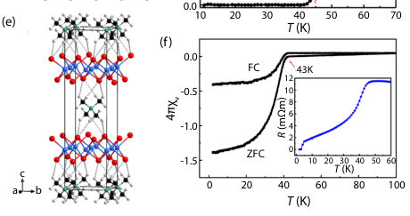 
FIG. 5 (a) Crystal structure of (CTA)0.3FeSe. From (Shi et al., 2018a). (b) Temperature dependence of 4πχ of (CTA)0.3FeSe. From (Shi et al., 2018a). (c) Crystal structure of (TBA)0.3FeSe with hydrogen atom neglected. (d) Resis- tance as a function of temperature for (TBA)0.3FeSe. From (Shi et al., 2018b). (e) Crystal structure of (TMA)0.5Fe2Se2. (f) 4πχ of (TMA)0.5Fe2Se2. Inset: resistivity of a cold-pressed pellet. From (Rendenbach et al., 2021).

📷 Fig 5

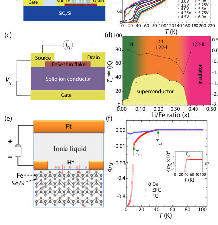 
FIG. 6 (a) A schematic illustration of the FeSe thin flake EDL-FET device. The ionic liquid DEME-TFSI serves as the dielectric, covering the sample and gate electrodes. (b) Temperature dependence of the resistance R(T) for FeSe thin flake at different Vg. Inset: enlarged view of R(T) near Tc. From (Lei et al., 2016). (c) A schematic diagram of a SIC- FET device with a solid ion conductor as the gate dielectric. (d) Phase diagram of the Li-intercalated FeSe thin flake as a function of the Li/Fe ratio. A series of structural phase transitions from the FeSe-11 phase to the LiFeSe-122 I phase, then to the LiFeSe-122 II phase, takes place. The Hall num- ber nH is plotted to show the variation in...

**Summary.** This comprehensive review surveys the last decade of research on iron-based superconductors (FeSCs), focusing on how structural changes tune their magnetic and nematic orders to achieve high-$T_c$ superconductivity. It synthesizes evidence showing that spin fluctuations mediate a sign-changing $s_{\pm}$ pairing, while also pointing toward topological superconducting possibilities through precise material engineering.

**Why it may be interesting.** This work is highly relevant as it deals with strongly correlated electron systems exhibiting unconventional superconductivity, providing a rich playground for studying emergent quantum phases driven by electronic correlations and lattice degrees of freedom.

Detailed structure

**Main problem.** The central problem is understanding high-temperature superconductivity in iron-based superconductors (FeSCs) by elucidating the complex interplay between magnetism, electronic nematicity, and superconducting pairing mechanisms.

**Main result.** The review highlights that FeSCs exhibit a sign-changing $s_{\pm}$ pairing symmetry driven by spin fluctuations, and structural tuning can induce topological superconductivity in these materials.

**Method.** The paper synthesizes decades of work combining experimental techniques like inelastic neutron scattering (INS) and ARPES with theoretical understanding of electronic structure derived from crystal chemistry.

**Model / system.** The physical system is FeSCs, which are layered, quasi-two-dimensional materials characterized by $	ext{Fe}$ $3d$ orbitals near the Fermi level. The structural unit involves $	ext{FeX}_4$ tetrahedra whose geometry dictates electronic properties.

**Key observables.** Superconducting critical temperature ($T_c$), spin excitation resonance, gap symmetry ($s_{\pm}$, nodal $s$, $d$-wave), and lattice parameters (e.g., anion height $h_{	ext{FeX}}$).

**Important parameters / regimes.** The interplay between magnetic order, nematicity, and doping/pressure is critical; structural regularity ($\alpha \approx 109.47^\circ$) correlates with high $T_c$.

**Assumptions / limitations.** The gap symmetry must be treated in a material-specific framework due to the influence of orbital fluctuations and quasiparticle damping.

**Figures summary.** Figures illustrate crystal structures, defining key structural parameters like nearest/next-nearest neighbor distances ($d_{	ext{NN}}, d_{	ext{NNN}}$), anion height ($h_{	ext{FeX}}$), and bond angle ($\alpha$), which correlate with superconducting properties.

**Paper structure.** The review progresses by first establishing the FeSC platform, detailing how structural tuning controls electronic states (nematicity/magnetism), then analyzing spectroscopic evidence for pairing symmetry (resonance structure), and concluding with technological potential and open questions regarding gap characterization.

Abstract

Since its discovery in 2008, iron-based superconductors (FeSCs) have become a central platform for exploring high-temperature superconductivity in multiband, electron-correlated materials. This review focuses on major developments over the past decade or so, emphasizing experimental advances, pairing mechanisms, and emerging applications. Structural tuning through chemical substitution, pressure, and epitaxial growth enables precise control of the electronic, magnetic, and superconducting ground states, thereby revealing their interplay. In particular, the electronic nematic phase and stripe-type antiferromagnetic order-often coexisting or competing-are central to understanding the phase diagrams. Spin waves in magnetically ordered parent compounds and spin excitations (fluctuations) in doped superconductors are extensively characterized by inelastic neutron scattering. While high-energy spin excitations in doped superconductors retain substantial spectral weight across a wide energy range reminiscent of spin waves in their undoped parents, the low-energy response reveals a collective spin excitation termed ``resonance'' coupled to superconductivity. The momentum structure of superconductivity-induced resonance provides strong evidence for sign-changing pairing in many FeSCs, while disorder effects, orbital-fluctuation scenarios, quasiparticle damping, and compound-dependent gap structures indicate that $s_{\pm}$, $s_{++}$, nodal $s$, $d$-wave, and multicomponent states must be discussed in a material-specific framework. Advances in thin-film growth, intercalation chemistry, and interface engineering-particularly in FeSe-based systems-have enabled enhanced $T_{c}$ and novel device geometries. With high upper critical fields, moderate anisotropy, and improving current densities, FeSCs continue to drive both fundamental insight and technological applications in superconductivity.

[↑ back to top](#top)

### [Pinwheel-shaped bound triplet pairs in the magnetization plateaus of SrCu$_2$(BO$_3$)$_2$](http://arxiv.org/abs/2607.10877v1)

**Authors:** Igor Vinograd, Philippe Corboz, Steffen Krämer, Yanan Li, Frédéric Mila, Hiroshi Kageyama, Masashi Takigawa, Mladen Horvatić  
**Type:** both · **Category:** strongly correlated electrons · **PDF:** <https://arxiv.org/pdf/2607.10877v1>  
**Analysis basis:** full PDF text, analyzed in chunks
**Topic relevance:** `analog quantum simulation` **1/5** · `exotic spin models in light-matter` **1/5** · `quantum measurements` **1/5** · `spintronics-quantum-optics interface` **1/5**

📷 Fig 1

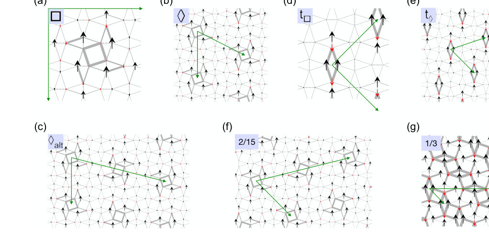 
FIG. 1. Spin structures for the (a-e) 1/8, (f) 2/15, and (g) 1/3 plateaus obtained with different unit cells in iPEPS. The unit-cell vectors are indicated by the green arrows. The thickness of the gray inter-dimer J′ bonds scales with the local bond energy, where thicker bonds correspond to lower energy. Dotted lines denote the intra-dimer J bonds. The Supplementary Materials includes detailed information about the spin polarizations [36].

📷 Fig 2

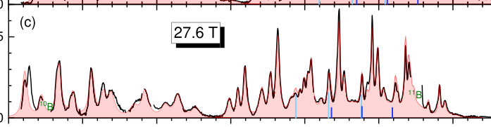 
FIG. 3. 63,65Cu NMR spectra (black solid lines) recorded at 0.5 K in the applied magnetic field of (a) 41.9 T and at 0.05 K in the field of (b) 29.0 T and (c) 27.6 T K, corresponding respectively to the 1/3, 2/15 and 1/8 magnetization plateau. Red line/surface is the fit explained in the text and (b,c) include sextuplets with Hi = 0 T, with light (dark) blue lines corresponding to 63(65)Cu. The 10B and 11B labels denote the positions where the boron NMR signal is largely dominant (not shown).

📷 Fig 3

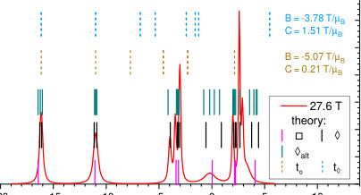 
FIG. 4. Distribution of local fields obtained from the three 63,65Cu NMR spectra shown in Fig. 3 (solid lines) are com- pared to values obtained from numerical simulations (vertical bars) for the 1/3 (a), 2/15 (b), and 1/8 (c) plateau. Ex- cept for the 1/3 plateau, we obtained the best agreement by two-parameter fits that optimize the hyperfine fields B and C, see the text for details. For the 1/8 plateau, five different (color coded) predictions are shown: three based on pinwheels making a square (2) or rhomboidal (⋄, ⋄alt) unit cells and two based on extended triplets (t2, t⋄). The latter two fits, denoted by dashed lines, are clearly unsatisfactory and lead to nonphysical big B values,...

**Summary.** This paper investigates the origin of magnetization plateaus in SrCu2(BO3)2 by synthesizing results from NMR and tensor-network simulations. The authors argue that low-field plateaus are best described by Wigner crystals of spin-2 bound states, a conclusion robustly supported by analyzing local magnetic fields measured via Cu and B NMR spectroscopy.

**Why it may be interesting.** The work provides a concrete example of how combining high-field spectroscopy with advanced quantum simulation techniques can resolve fundamental structural puzzles in strongly correlated materials.

Detailed structure

**Main problem.** The study aims to determine the microscopic origin of magnetization plateaus observed in SrCu2(BO3)2, particularly those at low fractions like 1/8 and 2/15, which defy standard theoretical explanations.

**Main result.** NMR spectroscopy strongly supports a model where these plateaus are stabilized by Wigner crystals formed by spin-2 bound states (pinwheel structures), rather than simple crystal arrangements of triplets.

**Method.** The research combines advanced numerical simulations using iPEPS with detailed experimental analysis of Cu and B nuclear magnetic resonance (NMR) spectra across multiple high magnetic fields.

**Model / system.** The system is the layered antiferromagnet SrCu2(BO3)2, modeled by a 2D spin Hamiltonian on a Shastry-Sutherland lattice. The investigation probes local spin environments and magnetic superstructures responsible for quantized magnetization plateaus.

**Key observables.** Local magnetic fields ($H_i$) derived from NMR spectra (Cu sextuplets), spin polarization histograms, and line splittings in B NMR spectra.

**Important parameters / regimes.** Magnetization fractions (1/8, 2/15, 1/3); hyperfine coupling constants ($A, C, B$ for Cu; $A_1, A_2, A_3, A_4$ for B).

**Assumptions / limitations.** The analysis relies on the assumption that NMR measurements accurately reflect local spin polarization and that specific magnetic stacking models (ABAB vs. ABC) can be distinguished by spectral features.

**Figures summary.** Figures show iPEPS calculated spin structures, histograms comparing different spin configurations, raw Cu NMR spectra at various fields corresponding to plateaus, and plots detailing line splittings in B NMR versus spin polarization differences.

**Paper structure.** The paper progresses from identifying the puzzle (unexplained plateaus) to applying multiple diagnostic tools: first, iPEPS simulations suggest Wigner crystals; second, Cu NMR constrains local fields using the 1/3 plateau; and third, detailed B NMR analysis distinguishes between competing magnetic stacking models (ABAB vs. ABC).

Abstract

The sequence of magnetization plateaus at 1/8, 2/15, 1/6, 1/4, 1/3, 2/5, and 1/2 of the saturation observed in SrCu$_2$(BO$_3$)$_2$ remained a puzzle until tensor-networks-based numerical simulations suggested that the low-magnetization plateaus are stabilized as Wigner crystals of spin-2 bound states, and not as one of the standard configurations (semiclassical up-down, or crystals of triplets). We report on $^{63,65}$Cu nuclear magnetic resonance spectra up to 41.9 T: Based on constraints deduced from the 1/3 plateau, we show that the spectra in the 1/8 and 2/15 plateaus indeed agree with the prediction for the spin-2 bound states, while being incompatible with a crystal of triplets. This adds the formation of Wigner crystals of bound states as an alternative fundamental paradigm in the theory of magnetization plateaus.

[↑ back to top](#top)

### [Spectral gap of Lee-Yang Hamiltonians](http://arxiv.org/abs/2607.10765v1)

**Authors:** Chaithanya Rayudu, Jun Takahashi  
**Type:** theory · **Category:** statistical mechanics · **PDF:** <https://arxiv.org/pdf/2607.10765v1>  
**Analysis basis:** full PDF text, analyzed in chunks
**Topic relevance:** `Keldysh / 2PI / non-Gaussian methods` **1/5** · `analog quantum simulation` **1/5** · `driven-dissipative phase transition` **1/5** · `entanglement & information structure` **1/5**

📷 Fig 1

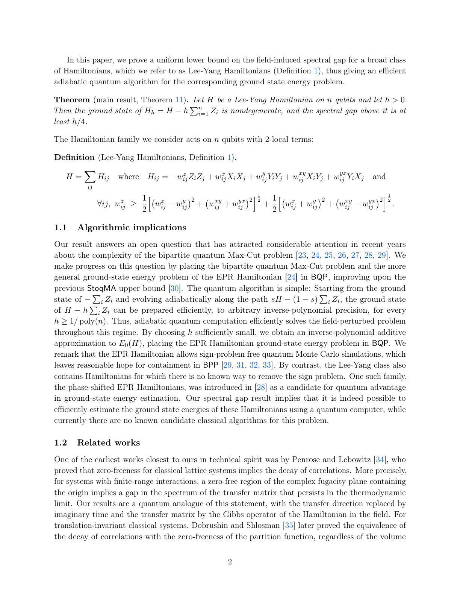 
Low-resolution page preview, page 2

📷 Fig 2

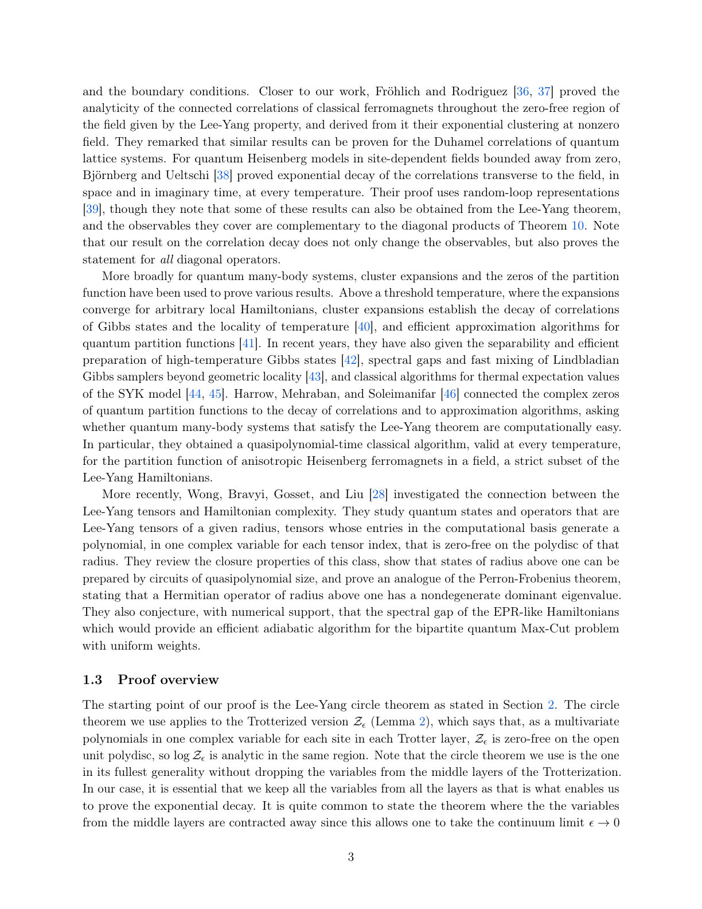 
Low-resolution page preview, page 3

📷 Fig 3

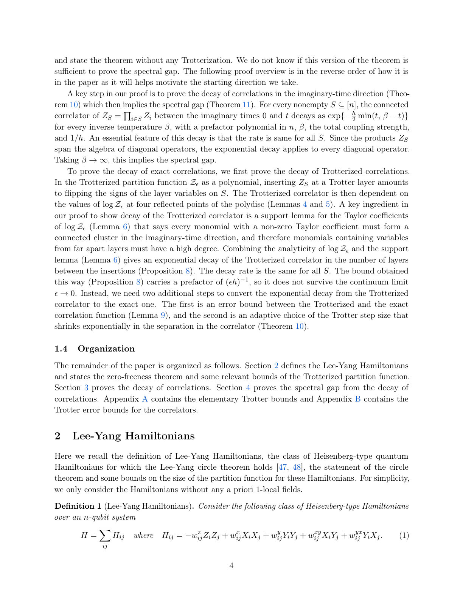 
Low-resolution page preview, page 4

📷 Fig 4

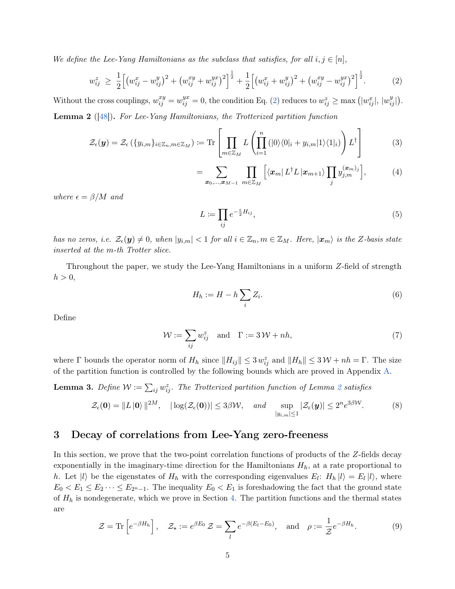 
Low-resolution page preview, page 5

📷 Fig 5

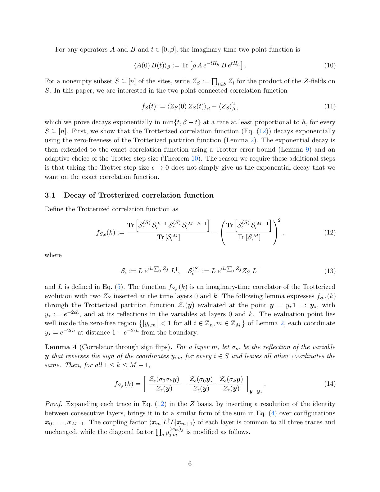 
Low-resolution page preview, page 6

**Summary.** This paper proves that Lee-Yang Hamiltonians possess a robust spectral gap proportional to the applied magnetic field strength. By leveraging the zero-freeness of their partition function, the authors establish exponential decay of imaginary-time correlations. This result is significant because it provides an efficient quantum algorithm for calculating ground state energies in this important class of models.

**Why it may be interesting.** It provides a rigorous theoretical link between algebraic properties of partition functions (zero-free regions) and fundamental physical quantities like the spectral gap, which is crucial for understanding quantum phase transitions and computational complexity.

Detailed structure

**Main problem.** The primary goal is proving a uniform lower bound on the spectral gap of Lee-Yang Hamiltonians when subjected to an external Z-field.

**Main result.** The ground state energy exhibits a spectral gap of at least h/4, independent of system size or coupling strengths. This also yields a polynomial-time quantum algorithm for computing this energy.

**Method.** The proof chains together results: establishing zero-freeness (Lee-Yang theorem) implies exponential decay of imaginary-time correlations, which in turn guarantees the spectral gap.

**Model / system.** The study concerns Lee-Yang Hamiltonians acting on n qubits, perturbed by a uniform Z-field ($H_h = H - h \sum Z_i$). The analysis uses concepts from quantum statistical mechanics, including partition functions and imaginary-time evolution.

**Key observables.** Spectral gap of the ground state energy; decay rate of two-point connected correlation functions $f_S(t)$.

**Important parameters / regimes.** The external field strength $h$; system size $n$; inverse temperature $eta$.

**Assumptions / limitations.** The proof critically relies on the zero-freeness property derived from the Lee-Yang theorem and careful error bounding when taking the continuum limit of Trotter approximations.

**Paper structure.** The structure moves logically from establishing the necessary mathematical prerequisites (zero-freeness) to proving correlation decay via Trotterization bounds, culminating in the final spectral gap proof and algorithmic implication.

Abstract

The Lee-Yang theorem and its quantum extensions state that, for a broad class of Hamiltonians on any graph, the partition function's zeros in the complex magnetic field plane lie only on the imaginary axis. For these Hamiltonians, we prove that under a uniform Z-field of any strength h, the ground state has a spectral gap of at least h/4, independent of the system size and of the coupling strengths. The proof uses the zero-freeness of the partition function as given by Asano and Suzuki-Fisher to show exponential decay of the imaginary-time correlations for any product of Z-operators. Our result gives a polynomial-time quantum algorithm for computing the ground state energy of any Lee-Yang Hamiltonian.

[↑ back to top](#top)

### [The Virtuous Cycle of Quantum-Classical Machine Learning](http://arxiv.org/abs/2607.10563v1)

**Authors:** Nenad Tomašev, Jarrod R. McClean, Johannes Bausch  
**Type:** theory · **Category:** quantum information and computing · **PDF:** <https://arxiv.org/pdf/2607.10563v1>  
**Analysis basis:** full PDF text, analyzed in chunks
**Topic relevance:** `Keldysh / 2PI / non-Gaussian methods` **1/5** · `driven-dissipative phase transition` **1/5** · `entanglement & information structure` **1/5** · `methods for driven-dissipative` **1/5**

📷 Fig 1

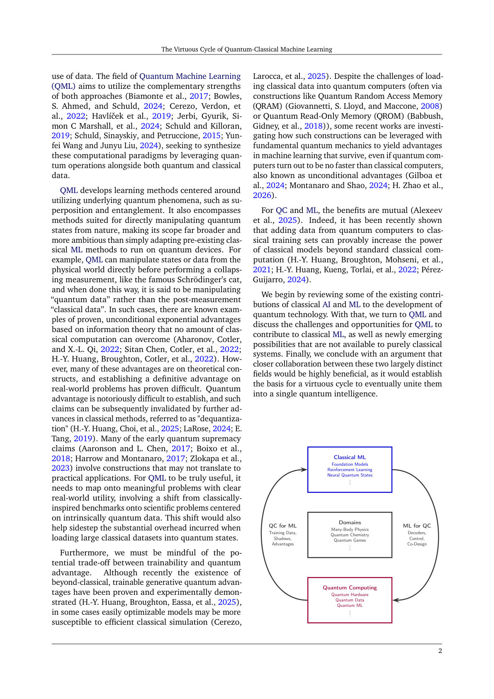 
Low-resolution page preview, page 2

📷 Fig 2

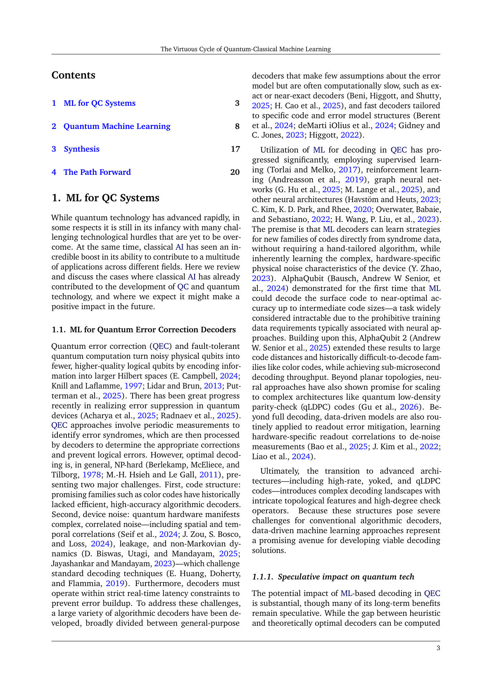 
Low-resolution page preview, page 3

📷 Fig 3

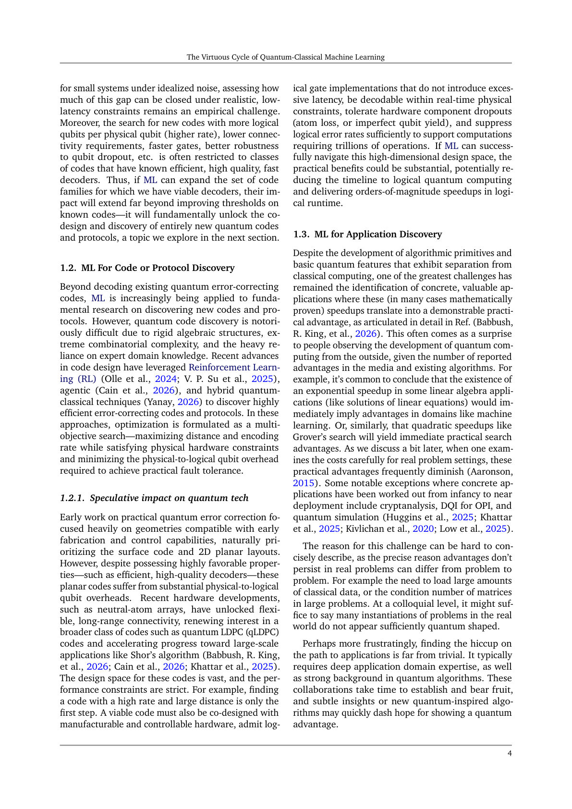 
Low-resolution page preview, page 4

📷 Fig 4

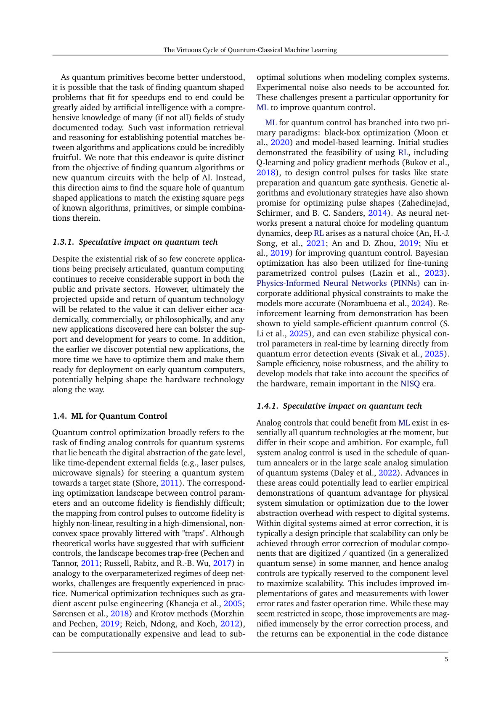 
Low-resolution page preview, page 5

📷 Fig 5

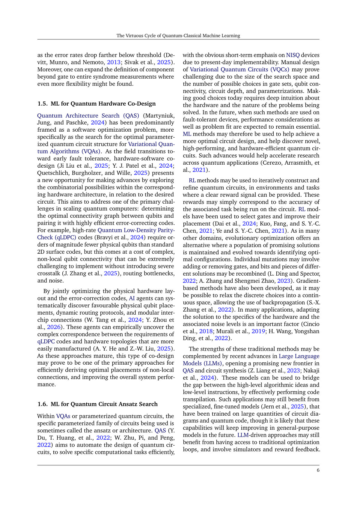 
Low-resolution page preview, page 6

**Summary.** This paper surveys the rapidly growing intersection between classical Machine Learning and Quantum Computing. It highlights how ML can solve computationally hard problems in Quantum Error Correction (QEC) and assist in designing better quantum codes and control pulses. Ultimately, it posits that this mutual benefit will drive significant advancements across both fields.

**Why it may be interesting.** The deep integration of ML into fundamental aspects of QC, such as decoding and optimization, provides new computational tools that could be adapted to analyze complex dynamics in open quantum systems or model noise sources.

Detailed structure

**Main problem.** The paper reviews the mutual opportunities between classical machine learning (ML) and quantum computation, aiming to accelerate scientific discovery in both fields.

**Main result.** It argues for a 'virtuous cycle' where ML can significantly aid Quantum Error Correction (QEC) decoding, code discovery, and optimizing quantum control protocols.

**Method.** The review synthesizes multiple advanced techniques, including using supervised/reinforcement learning for NP-hard QEC decoding problems and applying variational algorithms to quantum simulations.

**Model / system.** The focus spans general quantum computing platforms, specifically addressing the challenges of fault tolerance via Quantum Error Correction (QEC) codes like surface or color codes. It also covers applications in simulating complex physical systems.

**Key observables.** Decoding accuracy, logical error rates, decoding throughput, and fidelity of outcome vs. control parameters are key diagnostics discussed.

**Important parameters / regimes.** Real-time latency constraints for decoding, the overhead ratio (physical to logical qubits), and noise characteristics (correlated, spatial, temporal) are critical limitations.

**Assumptions / limitations.** The primary assumption is that ML techniques can effectively learn complex error correction strategies or optimize quantum control parameters better than current heuristic methods.

**Paper structure.** The structure follows a comprehensive review, first detailing the role of ML in QEC decoding (Chunk 1), then expanding on advanced applications like code discovery and quantum control using RL/ML (Chunk 2), and finally surveying the breadth of related literature covering QML techniques across various physical problems (Chunks 3 & 4).

Abstract

Artificial intelligence and quantum computing have both seen tremendous progress in recent years, opening up new avenues for accelerating scientific discovery. Classical machine learning has already proven to be useful for addressing challenges in quantum computation; and hardware progress is well underway towards the early fault-tolerant regime. On the other hand, the emerging field of quantum machine learning is aimed at utilizing the strengths of both computational paradigms, via the development of learning algorithms or models that benefit from running on quantum devices or from training on quantum data. We therefore argue that both of these paradigms stand to benefit substantially from each other. Here we review the most salient opportunities for machine learning in quantum computing, hoping to inspire a virtuous cycle through which both fields can mutually benefit.

[↑ back to top](#top)

### [Learning from Noise: Effective-Rank Collapse and Out-of-Distribution Rejection in Restricted Boltzmann Machines](http://arxiv.org/abs/2607.10506v1)

**Authors:** Oshada Rathnayake, Nikhil Shukla  
**Type:** theory · **Category:** disordered systems and neural networks · **PDF:** <https://arxiv.org/pdf/2607.10506v1>  
**Analysis basis:** full PDF text, analyzed in chunks
**Topic relevance:** `Keldysh / 2PI / non-Gaussian methods` **1/5** · `driven-dissipative phase transition` **1/5** · `entanglement & information structure` **1/5**

📷 Fig 1

 
FIG. 1: Comparison of the digit classification and out- of-distribution (OOD) rejection performance of an RBM trained exclusively on MNIST [13] and an RBM trained on MNIST + random binary images. Panels (a) and (b) show the digit classification accuracy on the MNIST test set, demonstrating comparable in-distribution per- formance for both models. Panels (c) and (d) show the OOD rejection performance on the KMNIST dataset [14]. Unlike the conventional RBM, the auxiliary-trained RBM successfully assigns the majority of OOD samples to the rejection class while preserving its digit classifica- tion performance.

📷 Fig 2

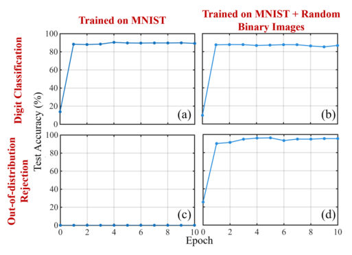 
Fig. 1(d), this training protocol enables the RBM to as- sign OOD inputs to the rejection class, while preserving the in-distribution digit-classification performance shown in Fig. 1(b). The central objective of this work to provide insight to the aforementioned behavior of RBMs through the effec- tive interactions induced by the hidden layer. Since the RBM has no direct visible–visible couplings, correlations among visible units are mediated through the visible–

📷 Fig 3

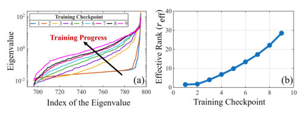 
FIG. 2: (a) Eigenvalue spectra of J = WW T , with the indices of the eigenvalues, sorted in descending order, at training checkpoints, which are selected when the model reaches training accuracies between 10% and 90% in 10% increments, with training accuracy monitored after each parameter update (60,000 updates per epoch). The evo- lution of the spectrum illustrates the progressive distribu- tion of spectral weight during learning. (b) Correspond- ing evolution of the effective rank (reff) of J = WW T

📷 Fig 4

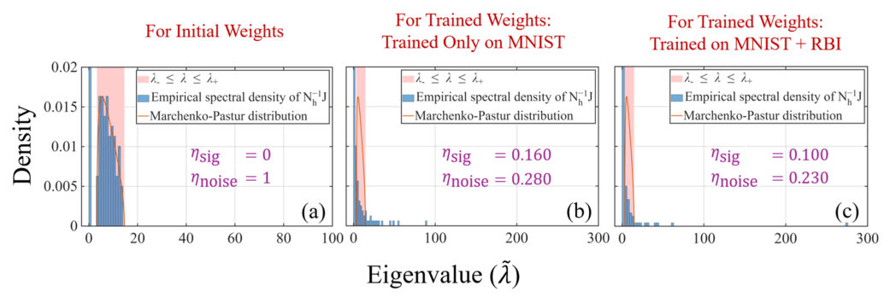 
FIG. 3: Comparison between the Marchenko–Pastur distribution and the empirical spectral density of N−1 h J cor- responding to (a) the randomly initialized initial weight matrix, (b) the learned weight matrix of the RBM trained exclusively on MNIST data, and (c) the learned weight matrix of the RBM trained on both MNIST and random binary images. Inclusion of auxiliary data yields fewer eigenvalues beyond and within the Marchenko–Pastur bulk, indicating a reduction in informative-feature-dominated directions as well as noise-dominated directions leading to the rank collapse. For clarity, the vertical axis is truncated, and the full heights of the truncated bars are 0.874 in (a), 0.465 in (b),...

📷 Fig 5

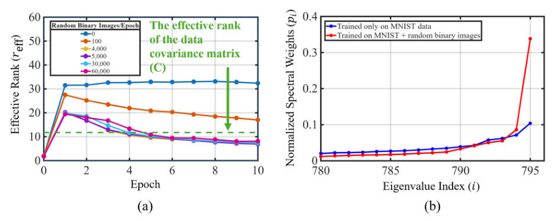 
FIG. 4: (a) Evolution of the effective rank of J = WW T during training for different numbers of random binary images incorporated per epoch. The case labeled (0) corresponds to the RBM trained exclusively on MNIST data, whereas all other cases correspond to RBMs trained on both MNIST data and random binary images. (b) Comparison of normalized spectral weights of eigendirections of J obtained after training with the two different methods.

**Summary.** This paper analyzes how Restricted Boltzmann Machines fail when presented with Out-of-Distribution data. By augmenting the training set with random noise, the model undergoes an 'effective-rank collapse' in its learned weight structure. This spectral reorganization successfully forces the model to reject OOD inputs while maintaining high accuracy on known data.

**Why it may be interesting.** The work provides a rigorous mathematical framework linking information geometry (spectral rank) to generalization performance in deep learning models, which has parallels with understanding effective dimensionality in complex quantum many-body systems.

Detailed structure

**Main problem.** Restricted Boltzmann Machines (RBMs) used for classification are fragile under Out-of-Distribution (OOD) inputs, tending to absorb novel samples into learned class basins instead of rejecting them.

**Main result.** Training the RBM with auxiliary random binary images causes an 'effective-rank collapse' in the visible-visible interaction matrix J. This reorganization successfully enhances OOD rejection capability without degrading performance on in-distribution data.

**Method.** The analysis uses spectral properties of the induced weight matrix $J=WW^T$, quantified by an entropy-based effective rank ($	ext{reff}$), and examines the free energy landscape to diagnose structural changes.

**Model / system.** The model is a Restricted Boltzmann Machine (RBM) defined over visible and hidden configurations. The analysis focuses on the spectral properties of the induced interaction matrix $J = WW^T$, comparing training protocols using only in-distribution data (MNIST) versus augmented data including random binary images.

**Key observables.** Effective rank ($	ext{reff}$), eigenvalue spectrum of $J$, OOD rejection accuracy, and free energy landscape $F(v_x, v_y)$.

**Important parameters / regimes.** The ratio of spectral weight to the Marchenko–Pastur reference, number of Gibbs sampling steps ($k$), and hidden layer size ($N_h$).

**Assumptions / limitations.** The failure mode is structural and related to the spectral properties of $J$; $	ext{reff}$ is used as a robust measure of effective dimensionality.

**Figures summary.** Figures compare eigenvalue spectra evolution (Fig. 2) showing rank growth vs. collapse, free energy landscapes (Fig. 6) showing OOD samples shifting toward rejection basins, and performance metrics across different training protocols (Figs. 1, 3).

**Paper structure.** The paper systematically analyzes the spectral properties of RBMs trained on in-distribution data versus augmented data. It first establishes the failure mode using spectral analysis ($	ext{reff}$), then uses free energy calculations to show landscape reorganization, and finally confirms robustness across varying training parameters like $k$ (CD steps).

Abstract

Restricted Boltzmann machines (RBMs) represent data by shaping an energy landscape over visible and hidden configurations, but their discriminative use is fragile under out-of-distribution (OOD) inputs: samples outside the training distribution can be absorbed into one of the learned class basins rather than rejected. Here, we analyze this failure mode through the spectrum of the induced visible--visible interaction $J=WW^{T}$, where \(W\) is the visible--hidden weight matrix. Relative to a Marchenko--Pastur random-matrix reference, conventional training spreads spectral weight into many weak, bulk-compatible directions, increasing the effective rank of $J$. When auxiliary random binary images are assigned to a rejection label during training, the learned interaction undergoes effective-rank collapse: weak bulk-like modes are depleted, spectral weight concentrates into fewer dominant eigendirections, and the effective rank of $J$ approaches that of the empirical data covariance matrix. The resulting RBM rejects structured OOD image datasets while preserving MNIST classification accuracy, showing that random auxiliary exposure can reshape both the interaction spectrum and the free-energy landscape of an energy-based classifier.

[↑ back to top](#top)

### [When Classical Baselines Are Tuned as Carefully as the Quantum Model, Does Quantum Reservoir Computing Still Win?](http://arxiv.org/abs/2607.09905v1)

**Authors:** Tushar Pandey  
**Type:** theory · **Category:** disordered systems and neural networks · **PDF:** <https://arxiv.org/pdf/2607.09905v1>  
**Analysis basis:** full PDF text, analyzed in chunks
**Topic relevance:** `analog quantum simulation` **1/5** · `methods for driven-dissipative` **1/5** · `non-equilibrium dynamics` **1/5**

📷 Fig 1

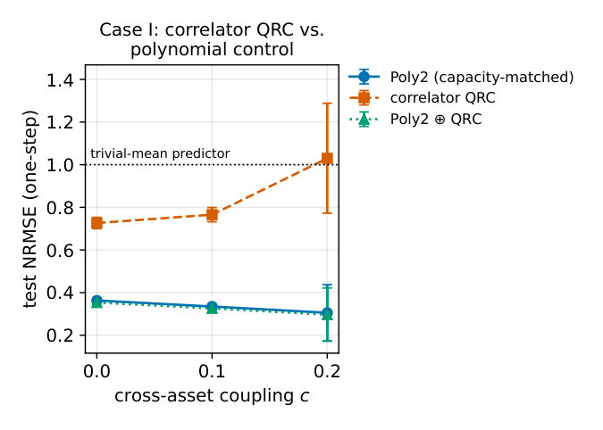 
Figure 1: Case study I. One-step test NRMSE versus cross-asset coupling c for the correlator QRC, the capacity-matched degree-2 polynomial (Poly2), and their concatenation Poly2 ⊕ QRC. The polynomial control is below the QRC at every coupling, and the concatenation tracks Poly2 almost exactly, so adding the quantum features changes nothing of substance. The dotted line marks the trivial-mean predictor (NRMSE = 1).

📷 Fig 2

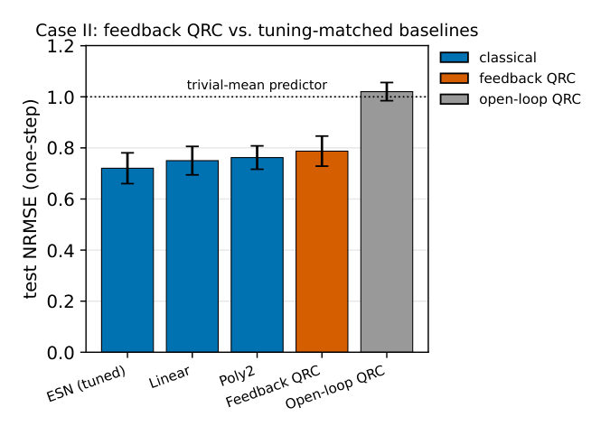 
Figure 2: Case study II. One-step test NRMSE at psw = 0.05 (mean ± s.d. over 10 × 10 seeds). Closing the feedback loop rescues the useless open-loop reservoir (rightmost) to predictive performance, but the tuning-matched ESN and even a plain linear model remain ahead of the feedback QRC. Blue bars are classical; the dotted line is the trivial-mean predictor.

**Summary.** This paper challenges the prevailing narrative that quantum reservoirs inherently outperform classical predictors. By rigorously tuning classical baselines to match the capacity and effort given to the quantum model, the authors demonstrate that for small systems on specific tasks, the purported quantum advantage vanishes or is significantly diminished.

**Why it may be interesting.** It provides a critical, reproducible checklist for benchmarking quantum machine learning models by enforcing strict fairness criteria against established classical benchmarks in the context of complex dynamical systems.

Detailed structure

**Main problem.** The study investigates whether Quantum Reservoir Computing (QRC) maintains a predictive advantage over classical methods when the classical competitor is given an equal level of tuning effort and model capacity.

**Main result.** In fair, matched comparisons across two tested mechanisms (correlator readout and feedback loop), the quantum advantage disappears; in fact, well-tuned classical networks often predict slightly more accurately than QRC.

**Method.** The authors used exact simulations on small quantum systems to compare QRC performance against capacity-matched polynomial models using prediction tasks like forecasting coupled Hénon maps.

**Model / system.** The quantum reservoir is modeled by a transverse-field Ising Hamiltonian ($H = \sum_{i<j} J_{ij} X_i X_j + v \sum_i Z_i$) simulated up to 11 qubits. Comparisons are made against classical polynomial models and Echo-State Networks (ESNs).

**Key observables.** Normalized Root-Mean-Square Error (NRMSE) and Mean Directional Accuracy (MDA) for prediction tasks.

**Important parameters / regimes.** System size ($	ext{q} \le 11$ qubits); coupling strength ($c$) in Hénon maps; feedback strength parameter ($k_{fb}$).

**Assumptions / limitations.** The comparison is limited to small quantum systems and specific, well-defined prediction tasks, requiring a 'fair' matching of classical tuning effort and capacity.

**Figures summary.** Figure 1 shows NRMSE vs. coupling $c$ comparing $	ext{Poly}2$, QRC, and their concatenation; Figure 2 compares open-loop vs. feedback QRC performance across switching rates ($	ext{psw}$), showing ESN beating Feedback QRC.

**Paper structure.** The paper systematically tests two distinct advantages of QRC—correlator readout (Case I) and feedback loops (Case II)—by comparing them against state-of-the-art, carefully tuned classical baselines using rigorous evaluation harnesses.

Abstract

Can a small quantum computer forecast a changing signal better than an ordinary classical method? Many studies say yes, but the classical methods they compare against are often left in a basic, untuned state while the quantum model is carefully optimised. We ask what happens when the classical competitor is given exactly the same care: the same size and the same amount of tuning effort. We study two popular reasons a quantum reservoir is thought to help, using exact simulations of small quantum systems (up to eleven qubits) on prediction tasks. In both cases the quantum advantage disappears once the comparison is fair. In the first, extra quantum measurements add nothing that a simple classical formula of the same size does not already provide. In the second, a feedback loop genuinely helps the quantum model, turning a useless setup into a working predictor, yet a well-tuned classical network still predicts slightly more accurately, and the gap is statistically reliable. Our point is not that quantum reservoirs can never win, but that two of their commonly cited advantages do not hold up against fair classical competitors at this scale. We provide these matched comparisons as a simple, reusable checklist for honest benchmarking. All results are fully reproducible from fixed random seeds.

[↑ back to top](#top)

### [Ab initio path integral Monte Carlo study of the 2D uniform electron liquid at finite temperatures](http://arxiv.org/abs/2607.11406v1)

**Authors:** Tobias Dornheim, Fotios Kalkavouras, Paul Hamann, Zhandos A. Moldabekov, Jan Vorberger, Panagiotis Tolias  
**Type:** theory · **Category:** strongly correlated electrons · **PDF:** <https://arxiv.org/pdf/2607.11406v1>  
**Analysis basis:** full PDF text, analyzed in chunks
**Topic relevance:** `Keldysh / 2PI / non-Gaussian methods` **1/5** · `methods for driven-dissipative` **1/5**

📷 Fig 1

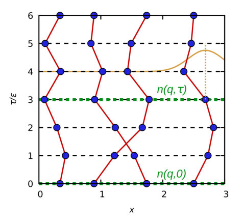 
FIG. 1. Schematic illustration of a PIMC configuration of N = 4 electrons in the τ-x-plane. The yellow Gaussian on the right illustrates the free (kinetic) imaginary-time propagator [Eq. (8)] and the two horizontal dashed green lines illustrate the estimation of the ITCF F(q, τ) [Eq. (14)] within PIMC. Adopted from Ref.[74] with the permission of the authors.

📷 Fig 2

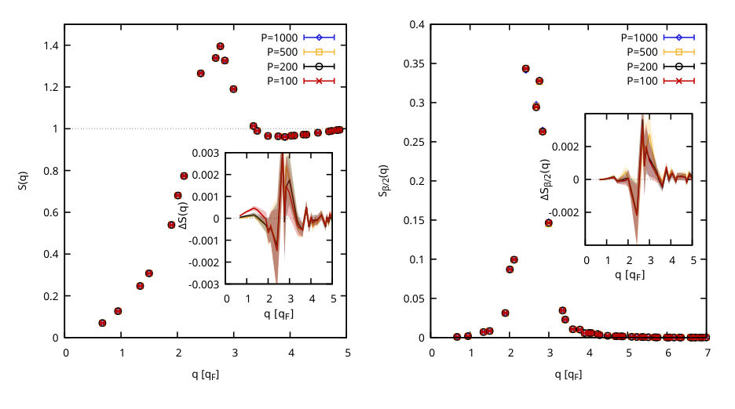 
FIG. 2. The PIMC convergence with the number of imaginary-time propagators P for the 2DEG at rs = 30 and Θ = 0.5 with N = 14. Left: static structure factor S(q) for P = 1000 (blue diamonds), P = 500 (yellow squares), P = 200 (black circles) and P = 100 (red crosses). The inset shows the differences with the reference results for P = 1000. Right: same but for the thermal structure factor Sβ/2(q) = F(q, β/2).

📷 Fig 3

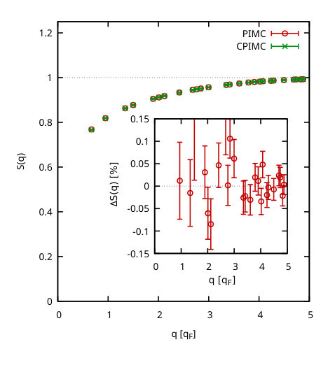 
FIG. 3. The static structure factor S(q) of the 2DEG at rs = 0.5 and Θ = 4, with N = 14 electrons. Red circles: standard PIMC results for P = 200; green crosses: configuration PIMC results [150]. The inset shows the relative difference between the two data sets.

📷 Fig 4

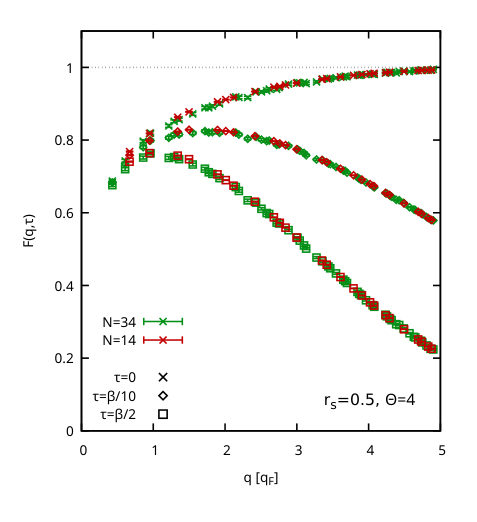 
FIG. 4. Wavenumber dependence of different ITCF F(q, τ) τ−slices for τ = 0 (crosses), τ = β/10 (diamonds) and τ = β/2 (squares). PIMC results for the 2DEG at rs = 0.5 and Θ = 4. The green and red colors distinguish simulation results with N = 34 and N = 14 electrons, respectively.

📷 Fig 5

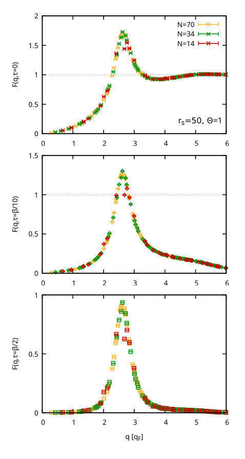 
FIG. 5. Wavenumber dependence of different ITCF F(q, τ) τ−slices for τ = 0 (crosses), τ = β/10 (diamonds) and τ = β/2 (squares). PIMC results for the 2DEG at rs = 50 and Θ = 1. The yellow, green and red colors distinguish simulation results with N = 70, N = 34 and N = 14 electrons, respectively.

**Summary.** This work performs extensive Path Integral Monte Carlo simulations on the 2D uniform electron gas across wide ranges of density and temperature. By analyzing the imaginary-time correlation function, the authors report finding a roton-type feature indicative of strong electronic correlations. The results are designed to rigorously test and improve theoretical models describing quantum liquid behavior.

**Why it may be interesting.** While focused on electron liquids, the rigorous application of advanced Monte Carlo techniques (PIMC) to study emergent collective modes (rotons) provides valuable methodological insights applicable to strongly correlated quantum systems in general.

Detailed structure

**Main problem.** To analyze the structural, linear density response, and spectral properties of the two-dimensional uniform electron liquid (2DEG) at finite temperatures.

**Main result.** The study finds clear evidence of a roton-type feature in the dynamic structure factor at strong coupling and intermediate wavenumbers. These PIMC results serve to benchmark existing theories for the 2DEG.

**Method.** Ab initio Path Integral Monte Carlo (PIMC) simulations are used extensively, analyzing the imaginary-time density–density correlation function (ITCF).

**Model / system.** The physical system is the two-dimensional uniform electron gas (2DEG), treated as a quantum many-body system in the jellium approximation. The simulation covers a wide range of densities ($r_s=0.1$ to $50$) and temperatures ($\Theta=0.5$ to $16$).

**Key observables.** Static structure factor S(q), static linear density response $\chi(q)$, and the imaginary-time density–density correlation function F(q, $\tau$).

**Important parameters / regimes.** Density parameter $r_s$, temperature ratio $\Theta = k_BT/E_{Fermi}$, and momentum transfer $q$.

**Assumptions / limitations.** The analysis avoids the exponentially ill-conditioned analytic continuation problem by working directly in the imaginary-time domain. The fermionic nature requires specialized sampling techniques to handle the sign problem.

**Figures summary.** Figure 1 schematically illustrates a PIMC configuration in the $\tau$-$x$-plane, showing the free propagator and the estimation of F(q, $\tau$).

**Paper structure.** The paper details the use of PIMC to calculate correlation functions by working in imaginary time. It presents results across various density and temperature regimes, focusing on identifying collective excitations like the roton feature.

Abstract

We present extensive \emph{ab initio} path integral Monte Carlo (PIMC) simulations of the two-dimensional uniform electron gas (2DEG), covering a broad range of density parameters $r_s=0.1,\dots,50$ and temperatures $Θ=k_\textnormal{B}T/E_\textnormal{Fermi}=0.5,\dots,16$. This allows us to analyze various structural, linear density response and spectral properties. We find clear evidence of a \emph{roton-type} feature in the dynamic structure factor at strong coupling and intermediate wavenumbers. We also benchmark novel dielectric theory implementations for the 2DEG~[Kalkavouras \emph{et al.}~arXiv:2601.14989] for structural and spectral properties across the liquid phase diagram. The PIMC results can be used to benchmark existing theories and approximations, and guide the development of new methodologies.

[↑ back to top](#top)

### [GroupFunctions.jl: computing individual entries of the irreducible representations of the unitary group U(d)](http://arxiv.org/abs/2607.10867v1)

**Authors:** David Amaro-Alcalá, Konrad Szymański  
**Type:** theory · **Category:** quantum information and computing · **PDF:** <https://arxiv.org/pdf/2607.10867v1>  
**Analysis basis:** full PDF text, analyzed in chunks
**Topic relevance:** `analog quantum simulation` **1/5** · `correlated cavity matter` **1/5**

📷 Fig 1

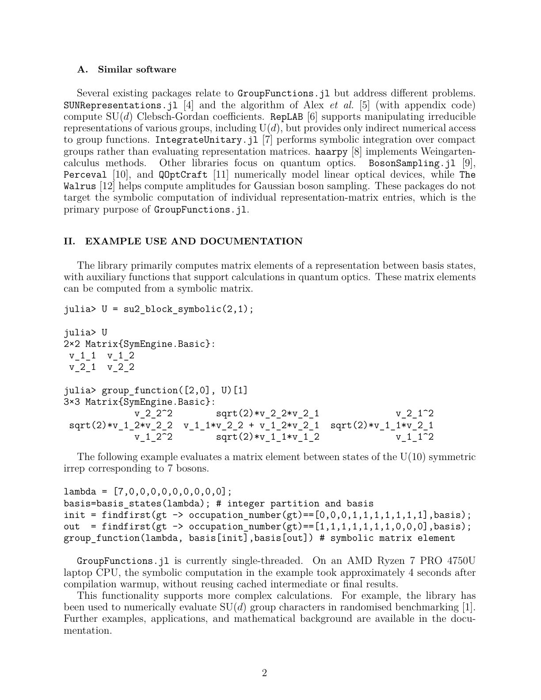 
Low-resolution page preview, page 2

📷 Fig 2

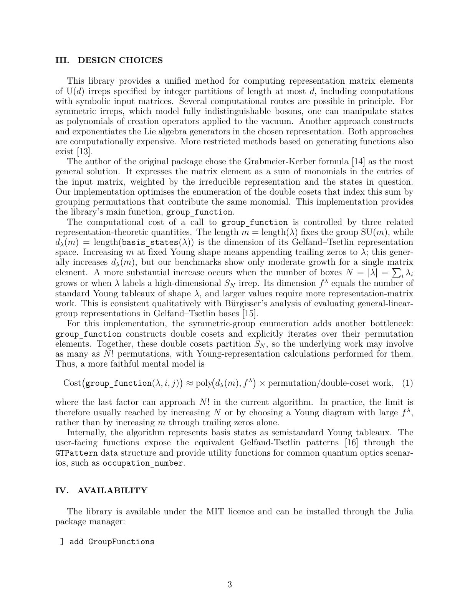 
Low-resolution page preview, page 3

📷 Fig 3

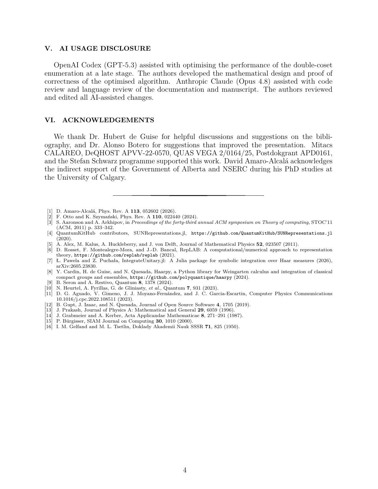 
Low-resolution page preview, page 4

**Summary.** This paper presents GroupFunctions.jl, a Julia library designed to compute individual matrix elements of irreducible representations of the unitary group U(d). It provides both symbolic and numerical methods using Gelfand-Tsetlin patterns, which is crucial for analyzing transition amplitudes in quantum optics and related fields. The tool significantly streamlines calculations compared to assembling full representation matrices.

**Why it may be interesting.** Since quantum optics and photonic QI often involve calculating transition amplitudes or overlaps between complex states (which are governed by unitary transformations), having a dedicated tool for computing these matrix elements symbolically is highly valuable for theoretical modeling in this area.

Detailed structure

**Main problem.** The primary goal is to develop a computational tool for calculating individual matrix elements (group functions) of irreducible representations of the unitary group U(d). This avoids the need to compute the entire, potentially massive, representation matrix.

**Main result.** The authors introduce GroupFunctions.jl, a Julia library that allows for both symbolic and numerical computation of these specific matrix elements using Gelfand-Tsetlin patterns as an enumeration basis.

**Method.** The calculation relies on the Grabmeier-Kerber formula to express the group function as a sum of monomials in input parameters. The framework supports translating between various bases, including occupation-number kets.

**Model / system.** The mathematical structure is based on the unitary group U(d), which has physical relevance in quantum optics (e.g., transition amplitudes through linear optical networks) and boson sampling contexts.

**Key observables.** Group functions $\langle 	ext{out} | 	ext{D}(\lambda)(	ext{U}) | 	ext{init} 
angle$, the character of the representation, and associated Schur polynomials.

**Important parameters / regimes.** The dimension $d$ of the unitary group, the representation label $\lambda$, and parameters defining the input unitaries U.

**Assumptions / limitations.** The current implementation is single-threaded, and a computational bottleneck exists due to iterating over double cosets, which can scale factorially ($N!$).

**Paper structure.** The paper introduces the library, details the mathematical formulation using Gelfand-Tsetlin patterns, provides examples of symbolic and numerical calculations for specific groups like U(10), and discusses computational scaling.

Abstract

GroupFunctions.jl is a Julia library for computing individual matrix elements of irreducible representations of U(d). These matrix elements, called group functions, can be evaluated symbolically or numerically. For SU(2), they reduce to the Wigner D-functions. The library computes these matrix elements in a carrier-space basis enumerated by Gelfand-Tsetlin patterns. It can also compute entire representation operators, construct input unitaries from parameterisations common in quantum optics, translate Gelfand-Tsetlin patterns into occupation-number kets, and compute the associated Schur functions. Results can be exported in a form compatible with Mathematica.

[↑ back to top](#top)

### [Overcoming Fourier Locking in Quantum Data Re-uploading Classifiers via Spectral Homotopy](http://arxiv.org/abs/2607.11013v1)

**Authors:** Spencer Topel  
**Type:** both · **Category:** quantum information and computing · **PDF:** <https://arxiv.org/pdf/2607.11013v1>  
**Analysis basis:** full PDF text, analyzed in chunks
**Topic relevance:** `entanglement & information structure` **1/5** · `quantum measurements` **1/5**

📷 Fig 1

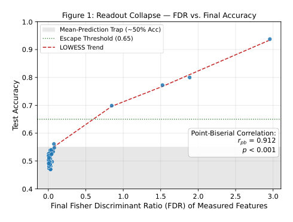 
FIG. 1. Readout collapse as an optimization trap di- agnostic. Final Fisher discriminant ratio (FDR) of the mea- sured features versus test accuracy for the 4-qubit DRU-PQC across the 50 seeds of the diagnostic-instrumented run (4/50 escapes), an independent seed set from the routing and cur- riculum experiments (Sec. IV). The optimization landscape exhibits a bimodal distribution. Initializations that collapse into the degenerate mean-prediction trap (shaded region at ∼50% accuracy) show FDR collapsing toward zero: the mea- sured features become class-degenerate. Models that map the target geometry (surpassing the 0.65 escape threshold, green dotted line) maintain a non-zero FDR (rpb =...

📷 Fig 2

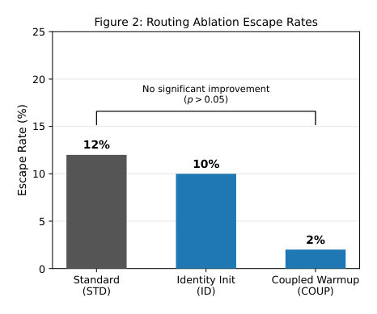 
FIG. 2. Routing ablation interventions fail to mitigate Fourier locking. Comparison of optimizer escape rates from the mean-prediction trap across three distinct routing config- urations (evaluated over 50 independent random initializa- tions). Standard training (STD, 12% escape rate) is com- pared against interventions explicitly designed to pre-align information routing: Identity Initialization (ID, 10%) and Coupled Warmup (COUP, 2%). Neither routing interven- tion yielded a statistically significant improvement over the baseline (p &gt; 0.05, two-sided Fisher’s exact tests); the cou- pled warmup in fact significantly reduced mean final accu- racy (Welch’s t-test, p = 0.020). This confirms...

📷 Fig 3

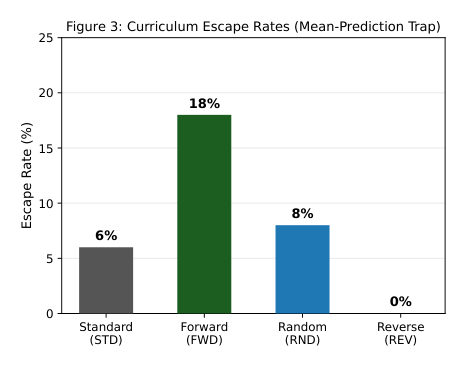 
FIG. 3. Impact of spectral curricula on Fourier lock escape rates. Successful initialization rates (final accuracy &gt; 0.65) across 50 independent seeds for the 4-qubit DRU- PQC under the four matched-compute curricula. Standard training (STD) establishes a 6% baseline escape rate in this seed set. The forward spectral homotopy (FWD) triples the escape rate to 18% by progressively convexifying the loss land- scape during early optimization. Unguided data diversity (labeled as RND) yields no statistical improvement on av- erage (8%; see text for the stratified analysis of its internally drawn orderings), and the reverse curriculum (REV) produces a 0% escape rate, consistent with immediate...

📷 Fig 4

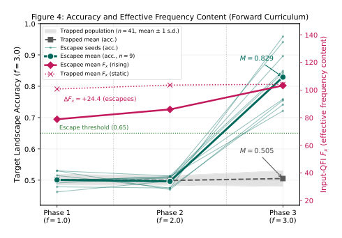 
FIG. 4. The latent scaffold in accuracy and effec- tive frequency content. Target accuracy (f = 3.0, left axis) and input-QFI Fx (right axis) over the 120-epoch for- ward curriculum (FWD), in three 40-epoch spectral phases (f = 1.0 →2.0 →3.0) divided by vertical dashed lines. Ac- curacy of the successful initializations follows a step function: chance through Phases 1–2 (M ≈0.50), indistinguishable in accuracy from trapped runs, then a jump to M = 0.829 at Phase 3. The Fx trajectories separate the populations where accuracy cannot: escapees grow Fx monotonically in step with the curriculum (8 of 9 rising; d = 1.34, p &lt; 0.001), while trapped seeds hold a static effective frequency through-...

📷 Fig 5

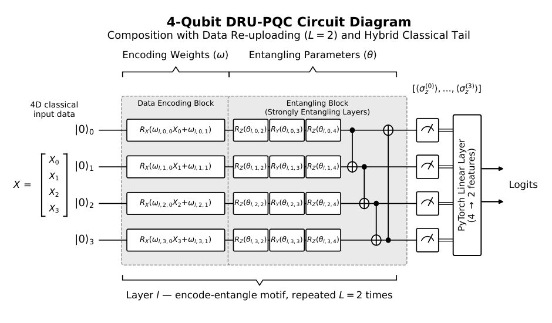 
FIG. 5. Architecture of the 4-qubit DRU-PQC. The classical 4D input X is encoded into the quantum state via Pauli-X rotations (RX) parameterized by trainable encoding weights (ω), which act as frequency selectors. An entangling block of RZRY RZ rotations (θ) and a CNOT ring follows, functioning as signal routers. This encode-entangle motif repeats across L = 2 layers, producing the nonlinear coupling between ω and θ that underlies Fourier locking. The final state is read out via local Pauli-Z expectation values (⟨σz⟩) on all qubits and passed through a classical linear layer to produce binary classification logits.

**Summary.** This paper analyzes the optimization challenge of Quantum Data Re-uploading Classifiers, identifying 'Fourier locking' as a spectral misalignment issue rather than simple barren plateaus. The authors propose and demonstrate that solving this requires a frequency-staged homotopy protocol that paces the target frequency during training to guide the quantum state into an optimal regime.

**Why it may be interesting.** It provides a concrete physical mechanism (spectral misalignment) for optimization failure in quantum machine learning models, offering a structured, physics-informed protocol (frequency pacing) to guide training away from poor local minima.

Detailed structure

**Main problem.** The optimization of Data Re-uploading Parameterized Quantum Circuits (DRU-PQCs) is hindered by 'Fourier locking' (FL), a structural failure mode causing local minima that resist gradient descent.

**Main result.** FL is fundamentally a spectral misalignment problem, which can be mitigated by implementing a frequency-staged homotopy protocol that paces the target frequency during training.

**Method.** The authors diagnose FL by tracking multiple Fisher diagnostics ($F_x$, FDR) rather than relying solely on gradient magnitudes, and propose solving it via curriculum learning based on frequency pacing.

**Model / system.** The model uses 4-qubit DRU-PQCs parameterized by encoding weights ($\omega$) and entangling layers ($	heta$). The circuit structure is fixed, but the optimization difficulty arises from the non-linear coupling between these parameters.

**Key observables.** Input-space quantum Fisher information ($F_x$), Fisher discriminant ratio (FDR), and Parameter-space Quantum Fisher Information Matrix (QFIM).

**Important parameters / regimes.** Target frequency range ($f: 1.0 	o 3.0$); total trainable parameters $N=50$.

**Assumptions / limitations.** The failure is attributed to spectral misalignment rather than a loss of geometric sensitivity, which is confirmed by the QFIM remaining non-degenerate in trapped circuits.

**Figures summary.** Figure 5 details the 4-qubit DRU-PQC architecture with encoding and entangling blocks; Table I lists hyperparameters like qubit count (4) and total parameters (50).

**Paper structure.** The paper first defines FL using multiple diagnostics, proves that QFIM collapse is not the cause of failure, then introduces spectral homotopy as a remedy by pacing the target frequency, culminating in experimental results showing improved escape rates.

Abstract

Data re-uploading parameterized quantum circuits (DRU-PQCs) are universal function approximators, yet their expressivity produces oscillatory, non-convex loss landscapes that resist gradient-based optimization. We show that the primary optimization bottleneck in DRU-PQCs is not insufficient capacity but a structural failure mode we term Fourier locking (FL): because encoding weights and entangling layers are nonlinearly coupled, random initialization on high-frequency targets collapses the encoding parameters into spurious local minima. Two Fisher diagnostics characterize FL. The input-space quantum Fisher information $F_x$ measures the effective frequency content of the encoded state; the Fisher discriminant ratio of the measured features measures their alignment with the class labels. In two independent 50-seed experiments, the locking is literal: trapped circuits hold $F_x$ frozen for the entire run, while escaping circuits migrate their frequency content (direct training: $r_{pb} = -0.48$; curriculum: $d = 1.34$; both $p < 0.001$). The replicated signature is this spectral mobility, not any endpoint value of $F_x$, and trapped circuits retain a fully non-degenerate parameter-space QFIM ($r_{pb} \approx 0$): the failure is spectral misalignment of a responsive state, not a loss of geometric sensitivity. A frequency-staged homotopy protocol that paces the target frequency ($f: 1.0 \to 3.0$) convexifies the early loss landscape; escaping circuits raise $F_x$ in step with the curriculum, and the escape rate triples (18% vs. 6%). Fourier locking is a frequency-alignment problem, and its remedy is frequency pacing.

[↑ back to top](#top)

### [Rigorous bound on the aspect ratio for the formation of a nematic phase in hard rod and hard rectangle systems on $\mathbb{Z}^2$](http://arxiv.org/abs/2607.10510v1)

**Authors:** Qidong He  
**Type:** theory · **Category:** statistical mechanics · **PDF:** <https://arxiv.org/pdf/2607.10510v1>  
**Analysis basis:** full PDF text, analyzed in chunks
**Topic relevance:** `Keldysh / 2PI / non-Gaussian methods` **1/5** · `methods for driven-dissipative` **1/5**

📷 Fig 1

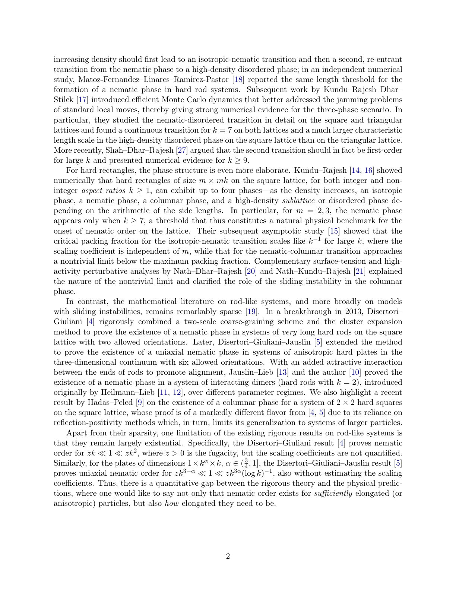 
Low-resolution page preview, page 2

📷 Fig 2

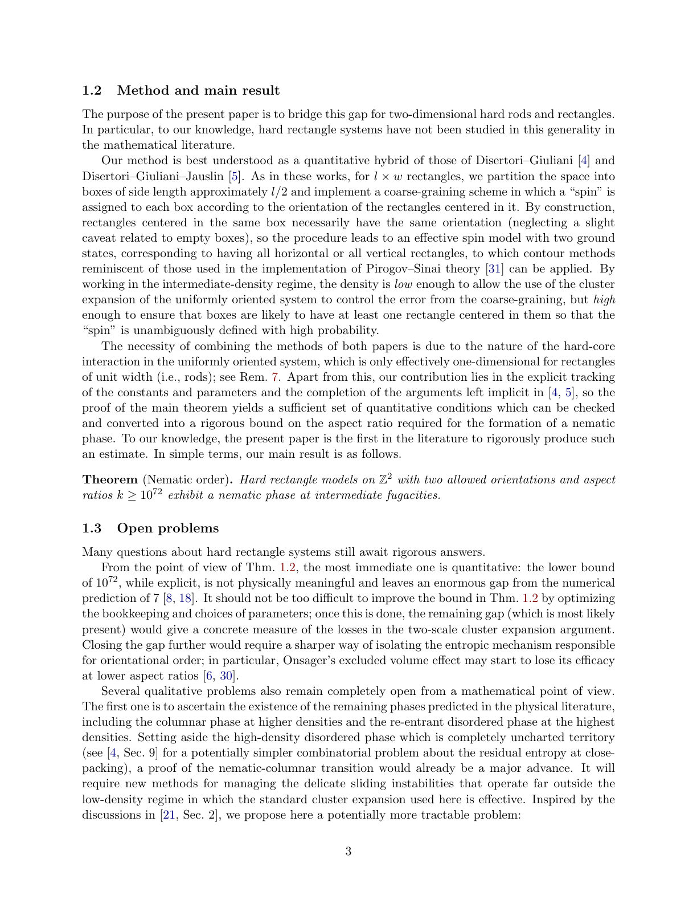 
Low-resolution page preview, page 3

📷 Fig 3

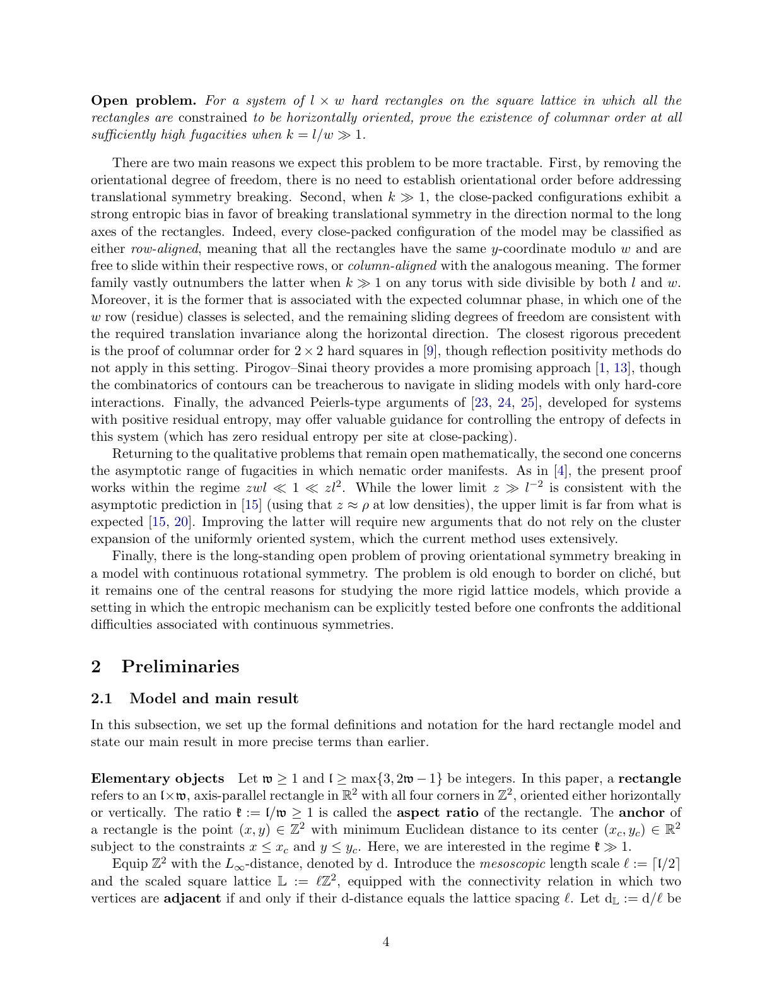 
Low-resolution page preview, page 4

📷 Fig 4

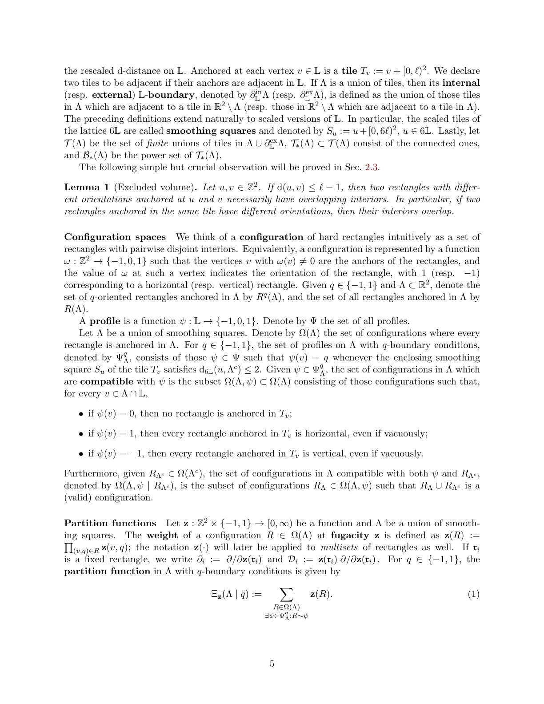 
Low-resolution page preview, page 5

📷 Fig 5

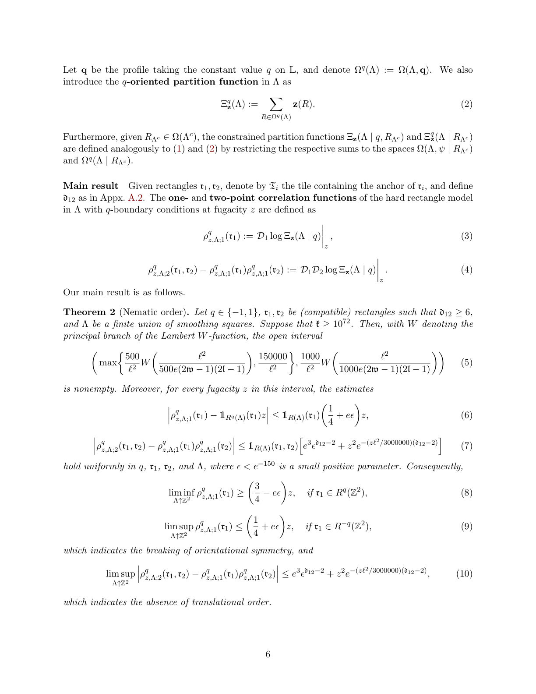 
Low-resolution page preview, page 6

**Summary.** This paper provides a mathematically rigorous proof for the existence of a nematic phase in hard rectangle systems on a lattice by establishing a lower bound on the required aspect ratio ($k=l/w$). It achieves this using sophisticated cluster expansion methods and correlation function analysis, offering a significant theoretical advance despite yielding an overly conservative numerical estimate.

**Why it may be interesting.** While focused on classical statistical mechanics models (hard shapes), the rigorous bounding techniques and use of advanced cluster expansions are highly relevant to understanding phase transitions in quantum many-body systems where mean-field approximations fail.

Detailed structure

**Main problem.** The primary goal is to derive a rigorous, quantitative bound on the aspect ratio ($k=l/w$) required for hard rod and hard rectangle systems on the 2D lattice ($\mathbb{Z}^2$) to exhibit a nematic phase.

**Main result.** The authors provide a proof establishing the existence of a nematic phase for sufficiently large aspect ratios, yielding a rigorous lower bound (e.g., $k \ge 10^{72}$), although this vastly overshoots numerical estimates ($k_{\min}=7$).

**Method.** The proof employs advanced mathematical techniques including two-scale cluster expansion methods, contour integration reminiscent of Pirogov–Sinai theory, and rigorous bounding of correlation functions.

**Model / system.** The system consists of hard rectangles (size $l 	imes w$) placed on the square lattice ($\mathbb{Z}^2$), restricted to two allowed orientations. The analysis focuses on the phase transition into a nematic state as the aspect ratio $k=l/w$ increases.

**Key observables.** One- and two-point correlation functions ($
ho_{q, z, \Lambda; 1}$ and $
ho_{q, z, \Lambda; 2}$), which are used to diagnose orientational symmetry breaking (nematic order) and translational order.

**Important parameters / regimes.** Aspect ratio $k=l/w$, fugacity ($z$), packing fraction ($\phi$), and lattice parameters ($l, w$). The analysis is most applicable in the intermediate-density regime $	ext{zwl} \ll 1 \ll z l^2$.

**Assumptions / limitations.** The rigorous bounds are contingent upon satisfying a large set of technical convergence and closure conditions derived from cluster expansion theory (e.g., C1 through C20).

**Figures summary.** Not specified in the notes, but the analysis relies on bounding exponential terms related to correlation functions using various lemmas and properties.

**Paper structure.** The paper builds by first establishing the mathematical framework using cluster expansions for polymer partition functions. It then applies this machinery to derive bounds on correlation functions that diagnose symmetry breaking, culminating in a complex set of conditions whose satisfaction yields the final aspect ratio bound.

Abstract

We prove the existence of a nematic phase in a model of $l\times w$ hard rectangles on the square lattice with two allowed orientations and a large aspect ratio $k:=l/w$. The proof is based on a two-scale cluster expansion method developed previously by Disertori--Giuliani for hard rods in 2D and Disertori--Giuliani--Jauslin for hard plates in 3D. Our main contributions lie in explicitly tracking the constants and parameters and completing the arguments left implicit in these works. Hence, the proof produces a sufficient set of quantitative conditions from which estimates for the required aspect ratio can be extracted. A non-optimized evaluation of these conditions yields the bound $k\ge 10^{72}$. Although it vastly overshoots the numerical prediction, $k_{\min}=7$, our result appears to be the first rigorous estimate of the aspect ratio required for the formation of a nematic phase in hard rectangle systems.

[↑ back to top](#top)

### [Security of passive entanglement-based key distribution protocols](http://arxiv.org/abs/2607.10659v1)

**Authors:** Shun Kawakami, Koichi Takasugi, Koji Azuma  
**Type:** theory · **Category:** quantum information and computing · **PDF:** <https://arxiv.org/pdf/2607.10659v1>  
**Analysis basis:** full PDF text, analyzed in chunks
**Topic relevance:** `entanglement & information structure` **1/5** · `interference shaping light` **1/5**

📷 Fig 1

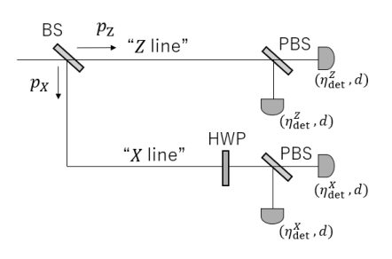 
FIG. 1. Actual setups for passive basis choice with a beam splitter (BS), polarization beam splitters (PBSs), a half wave plate (HWP) and threshold detectors. Incoming light is split into Z line or X line with the ratio of pZ to pX. All detectors have the identical dark count probability d. The quantum efficiencies of detectors in Z line and X line are ηZ det and ηX det, respectively. The overall transmittances, in- cluding the quantum efficiency, in Z line and X line are ηZ and ηX, respectively (ηZ ≥ηX).

📷 Fig 2

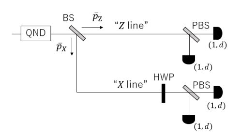 
FIG. 2. Virtual setup equivalent to Fig. 1. The QND measurement of the photon number is performed before the first beam splitter, whose transmittance is ¯pZ = pZ/(pZ + pXr). There is no loss in either the Z or X lines, including detector inefficiencies. The detectors have a dark-count probability d.

📷 Fig 3

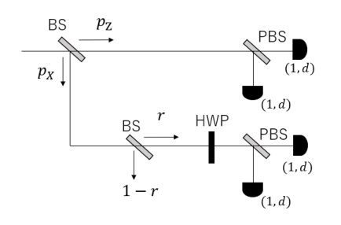 
FIG. 3. Intermediate virtual setup obtained from Fig. 1 by absorbing the common transmittance ηZ into Eve’s quantum channel. The addi- tional loss in the X line, characterized by the transmittance r, remains unchanged.

📷 Fig 4

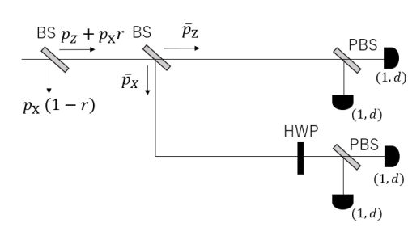 
FIG. 4. Intermediate virtual setup in the derivation of Fig. 2, equiva- lent to Fig. 3. The additional loss in the X line is modeled by a beam splitter with transmittance pZ + pXr placed before the splitting into the Z and X lines. The splitting ratios are chosen to be ¯pZ : ¯pX, yield- ing the same transmittances in the two lines as in Fig. 3.

📷 Fig 5

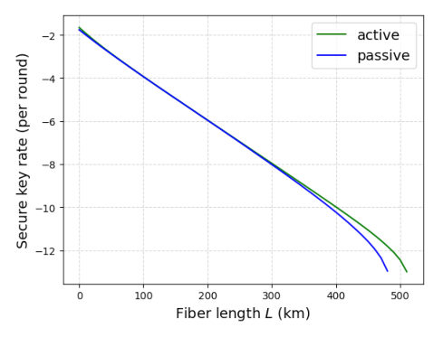 
FIG. 5. Secure key rate per round as a function of the fiber length L between Alice and Bob. The channel transmittance corresponding to source-Alice (or source-Bob) is modeled as ηch = 10−l/50, where the source is placed midway between Alice and Bob (L = 2l), and the overall transmittance is η = ηchηZ det. The detector efficiencies are ηZ det = ηX det = 0.7, the dark count probability is d = 10−7, the de- tector imperfection and misalignment error rate is ed = 0.03, and the error-correction efficiency is 1.16. We optimize the signal in- tensity µ and the basis choice probability pZ at each distance. The blue curve shows the secure key rate R of the proposed protocol with r = ηX/ηZ = 1,...

**Summary.** This paper theoretically proves the security of passive entanglement-based quantum key distribution protocols like BBM92. It overcomes the difficulty posed by biased basis choices in real-world setups by developing a virtual-qubit description for the security analysis. The results provide a strong theoretical foundation supporting the practical deployment of these passive quantum communication systems.

**Why it may be interesting.** This work provides rigorous theoretical guarantees for practical, passive implementations of quantum cryptography, which is crucial for deploying quantum networks outside controlled lab settings.

Detailed structure

**Main problem.** The primary goal is establishing the security of passive entanglement-based key distribution protocols, such as BBM92 and QCKA, particularly when basis choices are biased.

**Main result.** The authors successfully prove the asymptotic security for these passive protocols and show that the achievable key generation rate closely matches that of active protocols.

**Method.** The security proof employs a 'virtual-qubit description' to reduce the complex passive protocol analysis to techniques analogous to those used in BB84, involving error correction and privacy amplification bounds.

**Model / system.** The system models quantum key distribution using polarization states (Z/X bases) transmitted via linear optical setups incorporating beam splitters, PBSs, HWP, and detectors. The analysis is performed asymptotically for the number of repetitions.

**Key observables.** Key generation rate ($R$), error rates ($e_Z$, $ar{E}_Z$), and various detection probability ratios ($Q_Z, E_X$).

**Important parameters / regimes.** Transmittance asymmetry parameter ($r_B = \eta_X / \eta_Z$), dark-count probability ($d$), and the asymptotic limit of repetitions ($m_{rep} 	o \infty$).

**Assumptions / limitations.** Standard security proof techniques are insufficient due to biased basis choice; the analysis assumes lossless Z and X lines after modeling beam splitter effects.

**Figures summary.** Figure 1 details the physical setup for passive basis selection using optical components. Other figures illustrate virtual setups used in deriving the alternative protocol equivalent to the actual measurement process.

**Paper structure.** The paper establishes the problem, develops the security proof by introducing a virtual-qubit description and bounding phase errors (Lemma 1), derives closed-form expressions for expected values and error rates using generating functions (Appendix D/E), and culminates in the final theorem proving the secure key rate.

Abstract

Entanglement-based key distribution protocols, such as the Bennett-Brassard-Mermin 1992 (BBM92) protocol and quantum conference key agreement (QCKA), are promising applications of quantum networks. In practical implementations, passive measurement setups are widely adopted because of their simplicity. However, the security analysis of passive protocols with biased basis choice is highly nontrivial, since standard proof techniques for threshold detectors are generally not applicable in this setting. In this work, we establish the security of passive entanglement-based key distribution protocols in the asymptotic regime. Specifically, we prove the security of passive BBM92 with biased basis choice and extend the proof to passive QCKA with an arbitrary number of parties. In addition, we numerically show that the key generation rate of passive BBM92 is almost identical to that of the corresponding active protocol. Our results provide a theoretical foundation for practical passive implementations of entanglement-based key distribution protocols.

[↑ back to top](#top)

### [Thermal phase transitions in a mixed-spin Ising model on the Lieb lattice: Exact results beyond zero magnetic field](http://arxiv.org/abs/2607.11661v1)

**Authors:** Jozef Strecka, Katarina Karlova  
**Type:** theory · **Category:** statistical mechanics · **PDF:** <https://arxiv.org/pdf/2607.11661v1>  
**Analysis basis:** full PDF text, analyzed in chunks
**Topic relevance:** `analog quantum simulation` **1/5** · `exotic spin models in light-matter` **1/5**

📷 Fig 1

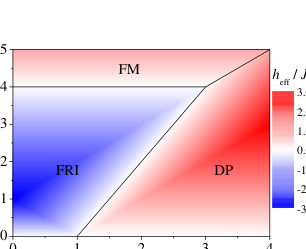 
Figure 3: Zero-temperature density plots of the effective magnetic field heff/J (a) and the effective interaction Jeff/J (b) in the D/J −h/J plane. The solid black lines represent ground-state phase boundaries separating the ferrimagnetic (FRI), disordered (DP), and ferromagnetic (FM) phases.

📷 Fig 2

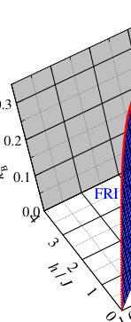 
Figure 4: Global phase diagram of the mixed spin-1/2 and spin-1 Ising model on the Lieb lattice in the three-dimensional parameter space D/J −h/J −kBT/J. The blue dome-shaped surface represents the locus of discontinuous phase transitions separating the ferrimagnetic (FRI) and disordered (DP) phases. A red critical line corresponds to continuous phase transitions between these phases.

📷 Fig 3

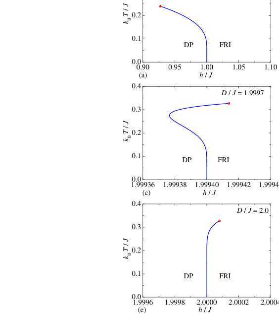 
Figure 5: Representative magnetic-field dependencies of the transition temperature of the mixed spin-1/2 and spin-1 Ising model on the Lieb lattice calculated for six selected values of the uniaxial single-ion anisotropy: (a) D/J = 1.5, (b) D/J = 1.9995, (c) D/J = 1.9997, (d) D/J = 1.9999, (e) D/J = 2.0, and (f) D/J = 2.5. The lines of discontinuous phase transitions separating the ferrimagnetically ordered phase (FRI) from the disordered phase (DP) terminate at Ising-type critical points (red circles).

📷 Fig 4

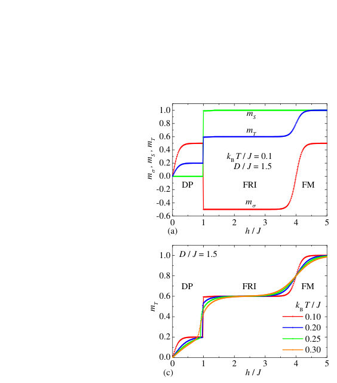 
Figure 6: Isothermal field dependencies of the magnetization and magnetic susceptibility of the mixed spin- 1/2 and spin-1 Ising model on the Lieb lattice as obtained from classical Monte Carlo simulations for the fixed value of the uniaxial single-ion anisotropy D/J = 1.5. The panels (a) and (b) show the single-site magnetization of the nodal (mσ) and decorating (mS ) spins together with the total magnetization (mT ) nor- malized with respect to its saturation value at two selected temperature kBT/J = 0.1 and 0.25. The panels (c) and (d) display the total magnetization and magnetic susceptibility for four selected temperatures.

📷 Fig 5

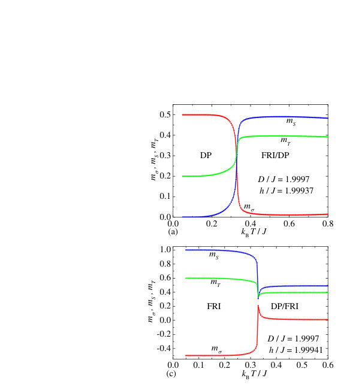 
Figure 7: Temperature dependencies of the local and total magnetization of the mixed spin-1/2 and spin-1 Ising model on the Lieb lattice as obtained from the classical Monte Carlo simulations for the fixed value of the uniaxial single-ion anisotropy D/J = 1.9997 and three selected values of the magnetic field: (a) h/J = 1.99937, (b) h/J = 1.99939,(c) h/J = 1.99941. The panel (d) presents temperature dependence of the total magnetization mT for four representative values of the magnetic field.

**Summary.** This work analyzes the phase transitions of a mixed spin-1/2 and spin-1 Ising model on a Lieb lattice using an exact mapping technique. The methodology reduces the complex system to an effective 2D Ising model, enabling analytical predictions for ground states and thermal behavior. Key findings include identifying multiple distinct phases and observing reentrant thermal transitions under specific field conditions.

**Why it may be interesting.** The ability to map a complex mixed-spin system onto a solvable 2D Ising model provides powerful analytical tools for understanding frustrated or multi-component magnetic systems relevant in condensed matter physics.

Detailed structure

**Main problem.** The study investigates the ground-state and finite-temperature phase transitions of a mixed spin-1/2 and spin-1 Ising model on a Lieb lattice.

**Main result.** The system exhibits three distinct ground-state phases (FRI, DP, FM) and displays complex thermal behavior, including dome-shaped surfaces of discontinuous transitions and reentrant $	ext{DP} 	o 	ext{FRI} 	o 	ext{DP}$ sequences.

**Method.** The authors employ the generalized decoration-iteration transformation to map the mixed-spin model exactly onto an effective spin-1/2 Ising model on a square lattice, allowing for exact analytical solutions.

**Model / system.** The system is a mixed spin-1/2 and spin-1 Ising model defined on a decorated square (Lieb) lattice. The Hamiltonian includes nearest-neighbor interactions, uniaxial single-ion anisotropy ($D$), and an external magnetic field ($h$).

**Key observables.** Ground state phase boundaries (FRI, DP, FM), critical temperatures, magnetization ($m_\sigma, m_S, m_T$), and susceptibility ($\chi$).

**Important parameters / regimes.** Anisotropy ratio ($D/J$) and magnetic field ratio ($h/J$); the analysis focuses on regimes where the effective field $h_{	ext{eff}}$ vanishes.

**Assumptions / limitations.** The primary assumption is that the generalized decoration-iteration transformation provides an exact mapping, allowing all thermodynamic properties to be derived from the solvable effective model.

**Figures summary.** Figures illustrate the ground-state phase diagram in the $D/J$-$h/J$ plane showing three phases; thermal diagrams show a dome of discontinuous transitions bounded by continuous critical lines; and magnetization plots confirm reentrant behavior across varying magnetic fields.

**Paper structure.** The paper first defines the mixed-spin Hamiltonian on the Lieb lattice. It then details the exact mapping via decoration-iteration to an effective square lattice model. Subsequently, it analyzes ground-state phase boundaries and finally explores finite-temperature transitions, identifying continuous critical lines and reentrant discontinuous regimes.

Abstract

We investigate the ground-state and finite-temperature properties of a mixed spin-1/2 and spin-1 Ising model on a decorated square (Lieb) lattice incorporating a uniaxial single-ion anisotropy and magnetic field. By employing the generalized decoration-iteration transformation, the model is mapped exactly onto an effective spin-1/2 Ising model on the square lattice characterized by an effective nearest-neighbor interaction and an effective field. The studied model consequently becomes exactly solvable even for finite values of the applied magnetic field whenever the effective field vanishes. The ground-state analysis reveals three distinct phases: ferrimagnetic phase (FRI), disordered phase (DP), and ferromagnetic (FM) phase. The ground-state boundary between FRI and DP phases gives rise to a dome-shaped surface of discontinuous thermal phase transitions, which is terminated by a line of Ising-type critical points associated with continuous thermal phase transitions. Both continuous and discontinuous thermal phase transitions belong to the exactly solvable parameter regime defined by a vanishing effective field in spite of the fact that the applied magnetic field is finite. Two consecutive discontinuous thermally-induced reentrant phase transitions DP-FRI-DP are identified in a narrow parameter region. The exact analytical predictions including reentrance, field- and thermally-driven phase transitions are independently verified by classical Monte Carlo simulations.

[↑ back to top](#top)

### [Transferred QAOA Parameters Remember the Penalty Scale: A $λ$-Resonance Law for Constrained Quantum Optimization](http://arxiv.org/abs/2607.09927v1)

**Authors:** Krit Grover  
**Type:** both · **Category:** quantum information and computing · **PDF:** <https://arxiv.org/pdf/2607.09927v1>  
**Analysis basis:** full PDF text, analyzed in chunks
**Topic relevance:** `driven-dissipative phase transition` **1/5** · `methods for driven-dissipative` **1/5**

📷 Fig 1

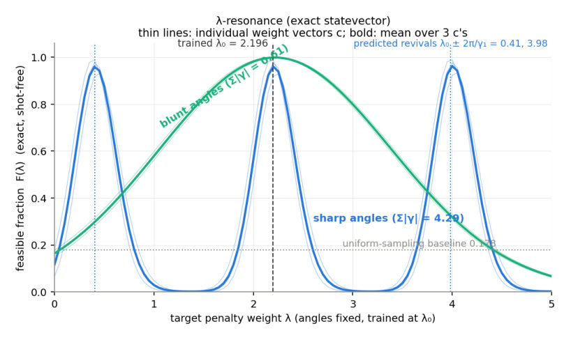 
Figure 1: Exact feasible fraction F(λ) at fixed trained angles on the 20-qubit instance (thin: individual scalarization weights; bold: mean of three). The sharp angle set (P |γ| = 4.29) produces a narrow resonance at the trained λ0 = 2.196 plus both predicted revivals at λ0±2π/γ1 = 0.41, 3.99. The blunt set (P |γ| = 0.61) produces a single wide dome centered on λ0; its first revival (λ0 + 2π/0.537 ≈13.9) lies far outside the window. Dotted horizontal line: uniform-sampling baseline 0.178.

📷 Fig 2

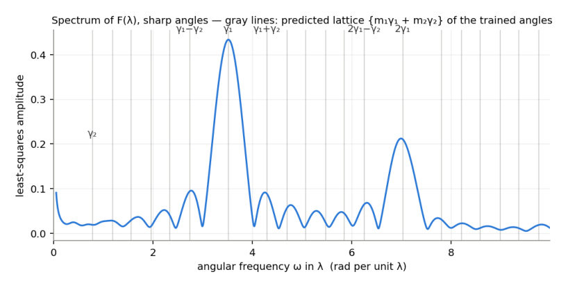 
Figure 2: Least-squares amplitude spectrum of F(λ) (sharp angles, λ ∈[0, 12]). Vertical gray lines: the predicted integer lattice {m1γ1 + m2γ2} of the trained angles. The measured lines sit on the lattice: γ1, 2γ1, γ1 ± γ2, 2γ1 −γ2 are the five strongest.

**Summary.** This work develops a mathematical law showing that when using QAOA with penalties, the success of transferring trained parameters depends critically on matching the deployment penalty weight ($\lambda$) to the training weight ($\lambda_0$). The feasibility probability exhibits predictable resonance peaks and spectral fingerprints governed by this phase matching condition.

**Why it may be interesting.** The finding reframes a practical failure mode of penalty-based quantum algorithms as predictable phase interference, providing concrete, actionable rules for parameter transfer that rely on understanding the underlying spectral structure rather than just structural similarity.

Detailed structure

**Main problem.** The paper investigates how successfully trained parameters from one instance of a constrained optimization problem (encoded via penalties) can be reused on a different, larger instance.

**Main result.** Transfer feasibility is governed by a deterministic $\lambda$-resonance law: the probability mass $F(\lambda)$ is a trigonometric polynomial whose structure depends critically on matching the deployment penalty weight ($\lambda$) to the training weight ($\lambda_0$).

**Method.** The authors use mathematical analysis involving finite trigonometric polynomials and path expansions over the QAOA ansatz, supplemented by statevector simulations on a 20-qubit QUBO.

**Model / system.** The system is the Quantum Approximate Optimization Algorithm (QAOA) applied to Quadratic Unconstrained Binary Optimization (QUBO) problems where constraints are enforced via penalty terms $C_\lambda(x)$.

**Key observables.** $F(\lambda)$ (the probability mass on the feasible subspace), resonance width, and revival peaks in $F(\lambda)$ as a function of $\lambda$.

**Important parameters / regimes.** The trained angles $(eta, \gamma)$, the penalty weight ($\lambda$), and the maximum violation count ($v_{\max}$).

**Assumptions / limitations.** The theorem assumes that the constraint violation count $v(x)$ is an integer-valued quantity.

**Figures summary.** Figures illustrate the resonance peak in $F(\lambda)$ for different angle sets, showing a sharp, narrow resonance centered at $\lambda_0$, and spectral analysis confirms frequencies lie on a lattice generated by $\gamma$ parameters.

**Paper structure.** The paper establishes that the penalty weight enters only as a phase factor, leading to the $\lambda$-Resonance Theorem. This theorem yields three corollaries regarding resonance peaking, width scaling, and revival peaks, which are then confirmed via statevector experiments on a resource-allocation QUBO.

Abstract

Training the variational angles of the Quantum Approximate Optimization Algorithm once on a small instance and reusing them on larger ones, known as parameter transfer, is the standard route past the exact-simulation wall. Existing literature explains its success almost entirely through structural similarity. We identify a new, independent axis that governs transfer whenever constraints are encoded as penalties: the trained angles memorize the penalty weight $λ$ of their training instance. For any scalarized cost function with an integer-valued violation count, we prove that at arbitrary fixed QAOA angles $(β,γ)$ of depth $p$, the probability mass $F(λ)$ on the feasible subspace is a finite real trigonometric polynomial in $λ$ whose angular frequencies lie on an integer lattice generated by the trained $γ$'s. Three consequences follow immediately: transfer feasibility is a resonance peaked where the deployment penalty matches the training penalty; the resonance width scales as $1/(v_{max}\sum_k|γ_k|)$, so low-$|γ|$ angle sets are systematically more transferable; and the curve exhibits revival peaks at spacings $2π/γ_k$. We confirm all three predictions by exact statevector experiments on a 20-qubit multi-user resource-allocation QUBO. The theorem is independent of how the angles were obtained and applies to any integer-penalty QUBO, recasting a widely reported failure mode of penalty-based QAOA as deterministic, predictable phase interference rather than an energetic tuning problem.

[↑ back to top](#top)

### [Trotter error compensation with polylogarithmic precision and nested-commutator scaling without ancillas](http://arxiv.org/abs/2607.11856v1)

**Authors:** Xinzhao Wang, Shuo Zhou, Ziruo Wang, Pei Zeng, Jinzhao Sun, Qi Zhao, Tom Gur, Tongyang Li  
**Type:** theory · **Category:** quantum information and computing · **PDF:** <https://arxiv.org/pdf/2607.11856v1>  
**Analysis basis:** full PDF text, analyzed in chunks
**Topic relevance:** `analog quantum simulation` **1/5** · `non-equilibrium dynamics` **1/5**

📷 Fig 1

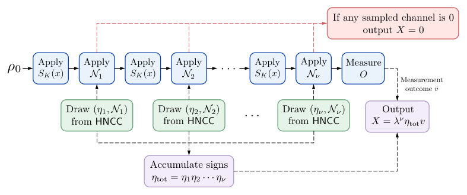 
FIG. 1: One sampled circuit in Algorithm 1. Each segment applies a product-formula step followed by a signed channel sampled by HNCC. The measurement outcome is reweighted by the accumulated sign and λν. If the zero map is sampled, then Xr = 0.

📷 Fig 2

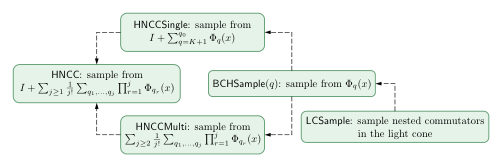 
FIG. 2: Sampling-routine overview for one HNCC sampling step. The top-level sampler splits the truncated compensation map into the part linear in the BCH generator and the higher-order Taylor terms. Both branches call BCHSample, which in turn calls LCSample to sample a local nested commutator.

📷 Fig 3

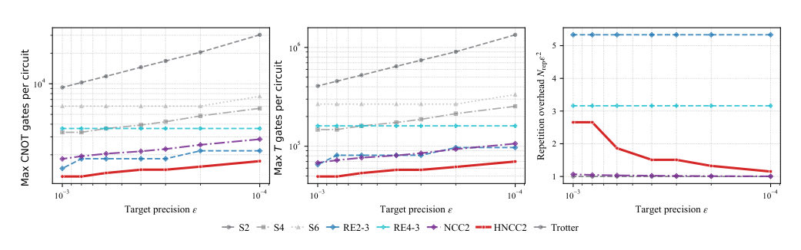 
FIG. 3: Finite-size resource comparison for the periodic Heisenberg chain with N = 10 and t = 1. The three panels show the maximum CNOT count per circuit, the estimated T-gate count per circuit, and the normalized repetition overhead Nrepε2, respectively. S2, S4, and S6 denote the second-, fourth-, and sixth-order Suzuki formulas. RE2-3 and RE4-3 denote three-point Richardson extrapolation based on S2 and S4, respectively. NCC2 and HNCC2 denote NCC and HNCC applied to S2, respectively. For HNCC2, we set q0 = s0 = 6 and require λν HNCC ≤1.75.

📷 Fig 4

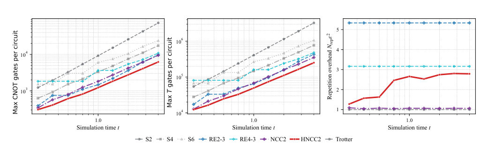 
FIG. 4: Finite-size resource comparison as a function of the simulation time t, with target precision ε = 10−3 and N = 10. The panels show the maximum CNOT count per circuit, the estimated T-gate count per circuit, and the normalized repetition overhead Nrepε2, using the same conventions as in Figure 3.

**Summary.** This paper introduces High-Order Nested-Commutator Compensation (HNCC), an advanced technique to improve Hamiltonian simulation accuracy. HNCC compensates Trotter errors at the quantum channel level, achieving polylogarithmic circuit size scaling with precision while avoiding ancillary qubits. It significantly reduces gate counts compared to existing product formula methods for simulating systems like the Heisenberg chain.

**Why it may be interesting.** This work directly addresses algorithmic efficiency for simulating quantum dynamics, which is crucial for modeling complex many-body physics in quantum simulators or near-term quantum computers.

Detailed structure

**Main problem.** The core problem is efficiently simulating quantum time evolution governed by a Hamiltonian, specifically addressing the polynomial scaling of circuit size with inverse precision inherent in standard product formulas.

**Main result.** The proposed High-Order Nested-Commutator Compensation (HNCC) algorithm achieves polylogarithmic dependence on precision ($\epsilon$) for circuit size while maintaining favorable commutator scaling and improving time dependence to match that of a higher-order product formula.

**Method.** HNCC compensates Trotter errors at the quantum channel level by approximating the remainder using nested commutators derived from a truncated Baker–Campbell–Hausdorff expansion, implemented via Pauli-rotation channels without ancillary qubits.

**Model / system.** The method applies to general $k$-local Hamiltonians on $N$ qubits, simulating time evolution $U(t) = e^{-itH}$. Specific resource estimates are provided for the periodic Heisenberg chain.

**Key observables.** Gate count (CNOT/T-gate), circuit size scaling with $\epsilon$, and the achievable order of time dependence matching product formulas.

**Important parameters / regimes.** Precision ($\epsilon$), total simulation time ($t$), number of qubits ($N$), locality ($k$), and Hamiltonian terms ($\Gamma$).

**Assumptions / limitations.** The method relies on truncating the BCH series at a controlled order $q_0 = O(K + \log(1/\epsilon))$ and assumes efficient computation of connected-cluster preprocessing.

**Figures summary.** Figures compare HNCC against other methods (Suzuki, Richardson Extrapolation) showing significant reductions in CNOT/T-gate counts per circuit for the Heisenberg chain.

**Paper structure.** The paper introduces the limitations of current product formulas, details the mathematical framework using BCH expansion and LCQC representation, presents the HNCC algorithm, and concludes with resource estimates comparing it to state-of-the-art methods on a physical model like the Heisenberg chain.

Abstract

Product formulas are among the most practical approaches to Hamiltonian simulation, requiring no ancillary qubits and exhibiting error bounds governed by nested commutators rather than only by Hamiltonian norms. Their circuit size, however, scales polynomially with the inverse precision. We develop a high-order nested-commutator compensation (HNCC) algorithm that preserves the main advantages of product formulas while achieving polylogarithmic precision dependence in the circuit size and the standard $\mathcal{O}(\varepsilon^{-2})$ sampling cost. HNCC uses a truncated Baker--Campbell--Hausdorff expansion to represent high-order Trotter errors by products of nested commutators and compensates these errors at the superoperator level through randomly sampled Pauli-rotation channels, avoiding Hadamard tests and ancillary qubits. For a fixed $K$-th order product formula applied to a $k$-local Hamiltonian on $N$ qubits with $Γ$ Pauli terms and local interaction strength $g_0$, HNCC estimates $\operatorname{tr}[Oe^{-\mathrm{i} tH}ρe^{\mathrm{i} tH}]$ to additive precision $\varepsilon\|O\|$ using $\mathcal{O}(\varepsilon^{-2})$ repetitions and a maximum gate count per circuit of $\mathcal{O}(N^{\frac{2}{2K+1}} (k g_0 t \log(1/\varepsilon))^{1+\frac{1}{2K+1}} k(Γ+\log(1/\varepsilon)))$. The resulting time dependence matches that of a product formula of order $2K+1$. Finite-size resource estimates for the periodic Heisenberg chain indicate that HNCC achieves the lowest CNOT and $T$-gate counts per circuit among the product-formula-based methods considered.

[↑ back to top](#top)

### [A d-Electron Route to Heavy-Fermion-Like Superconductivity via Geometrical Frustration](http://arxiv.org/abs/2607.09924v1)

**Authors:** Chaoguo Wang, Hyeonhu Bae, Jiaqi Tian, Qing-Ping Ding, Yongbin Lee, Yuji Furukawa, Shannon Gould, Brianna R. Billingsley, Si Athena Chen, Matthias Frontzek, Tai Kong, Binghai Yan, Sheng Ran, Xin Gui  
**Type:** both · **Category:** strongly correlated electrons · **PDF:** <https://arxiv.org/pdf/2607.09924v1>  
**Analysis basis:** full PDF text, analyzed in chunks
**Topic relevance:** `Kondo & dissipative impurity` **1/5**

📷 Fig 1

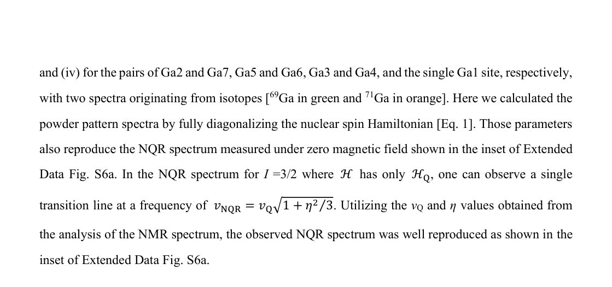 
Fig. 2d shows the temperature dependence of Knight shift K at the Ga1 site measured by 69Ga NMR.

**Summary.** This paper investigates $	ext{Mo}_4	ext{PtGa}_{17}$ to establish a new pathway toward heavy-fermion-like superconductivity in $d$-electron materials. By analyzing magnetic, transport, and superconducting measurements, the authors demonstrate that geometrical frustration within the Mo lattice generates an electronic structure rich in flat bands and singularities. This unique mechanism enhances electron correlations, leading to robust heavy-fermion behavior near a ferromagnetic instability.

**Why it may be interesting.** The work provides a concrete example of how lattice geometry (geometrical frustration) can induce strong electronic correlations leading to heavy-fermion behavior using only $d$-orbitals, offering an alternative paradigm for superconductivity research relevant to correlated electron physics.

Detailed structure

**Main problem.** The research aims to identify a novel mechanism for achieving heavy-fermion-like superconductivity in $d$-electron materials, moving beyond established models involving f-electrons or CDW physics.

**Main result.** The material $	ext{Mo}_4	ext{PtGa}_{17}$ exhibits heavy-fermion-like behavior and superconductivity, attributed to the geometrical frustration of its Mo lattice which generates an enhanced density of states via nearly flat bands.

**Method.** A combination of experimental measurements (thermodynamics, transport, NMR) and theoretical calculations (DFT band structure analysis) was employed to characterize the electronic state.

**Model / system.** The study focuses on $	ext{Mo}_4	ext{PtGa}_{17}$, an itinerant $d$-electron superconductor featuring a noncentrosymmetric structure and a geometrically frustrated breathing-pyrochlore Mo lattice. The theoretical analysis identifies key features like van Hove singularities derived from Mo-$4d$ states.

**Key observables.** Large electronic specific heat coefficient ($\gamma$), high Wilson ratio ($R_W \sim 3.7$), evidence of ferromagnetic spin fluctuations (from $\chi(T)$ and NMR), superconducting gap measurements ($\Delta_1, \Delta_2$), and a coherence length ($\xi \sim 35 	ext{ nm}$).

**Important parameters / regimes.** The system operates near a ferromagnetic instability ($Z \sim 0.73$); the superconductivity is characterized by $T_c \approx 0.6 	ext{ K}$ and $\mu_0H_{c2}(0)$ dominated by orbital pair breaking.

**Assumptions / limitations.** The analysis assumes that the observed heavy-fermion behavior and superconducting properties are intrinsically linked to the electronic structure generated by the geometrically frustrated lattice, rather than solely relying on f-electron physics.

**Figures summary.** Figures illustrate the crystal structure (pyrochlore lattice), temperature dependence of magnetic susceptibility ($\chi(T)$) showing a maximum at $\sim 30 	ext{ K}$, specific heat ($C_p$) confirming electronic contributions, and NMR/Knight shift data tracking spin fluctuations.

**Paper structure.** The paper systematically presents evidence: first establishing the material's structure and magnetic susceptibility; second, using transport ($
ho(T)$) and thermodynamic measurements to confirm heavy-fermion characteristics; third, detailing superconducting properties ($H_{c2}$, gap structure); and finally, linking these findings theoretically to the role of geometrical frustration in $d$-electron systems.

Abstract

Heavy-fermion superconductors are mostly associated with f-electron materials with Kondo lattices, while known d-electron heavy-fermion-like systems are often linked to orbital-selective local moments, Hund-metal physics, or a charge-density-wave mechanism. Here we report Mo4PtGa17, a noncentrosymmetric itinerant d-electron superconductor with a geometrically frustrated breathing-pyrochlore Mo lattice. Thermodynamic, transport and NMR measurements reveal heavy-fermion-like behavior superconductivity and enhanced ferromagnetic spin fluctuations near a ferromagnetic instability. Theoretical calculations identify nearly flat bands, van Hove singularities and Kramers nodal lines near the Fermi energy, derived intrinsically from Mo-4d states and are robust against on-site electronic correlations. These results suggest that the geometrically frustrated lattice in Mo4PtGa17 generates an intriguing electronic structure that enhances the density of states, spin susceptibility and quasiparticle mass. Mo4PtGa17 therefore identifies a unique route to heavy-fermion-like superconductivity in d-electron materials through geometrical frustration. It also allows further investigations into superconductivity emerging from a correlated and spin-fluctuating state.

[↑ back to top](#top)

### [A Framework for Managing the Models of Engineered Quantum Systems](http://arxiv.org/abs/2607.10347v1)

**Authors:** Siyuan Ji, Hayato Ishida, Amal Elsokary, Stephen Powley, Catherine White, Alexandre Zagoskin, Ran Wei, Maria Aslam, Michael J. de C. Henshaw  
**Type:** theory · **Category:** quantum information and computing · **PDF:** <https://arxiv.org/pdf/2607.10347v1>  
**Analysis basis:** full PDF text, analyzed in chunks
**Topic relevance:** `methods for driven-dissipative` **1/5**

📷 Fig 1

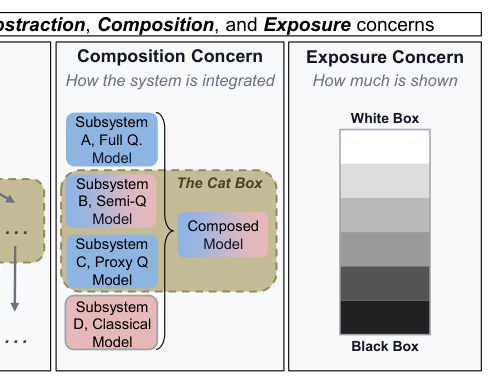 
Figure 1: The Quantum Systems Model Management (QSysMM) Framework.

**Summary.** This paper introduces the Quantum Systems Model Management (QSysMM) Framework to solve the problem of maintaining consistency across heterogeneous models describing engineered quantum systems. It argues that standard model synchronization fails because it cannot track the loss of quantum information like entanglement during abstraction. The framework formalizes this management using four concerns and proposes a language, QSysML, to enforce physical admissibility checks throughout the modeling lifecycle.

**Why it may be interesting.** It provides a rigorous, model-theoretic approach to managing complexity in quantum hardware development by formalizing how physical constraints must govern software/engineering abstractions, which is crucial for scaling up quantum devices.

Detailed structure

**Main problem.** Existing model synchronization approaches are insufficient for engineered quantum systems because standard transformations can discard crucial quantum content like superposition and entanglement while structural checks remain valid.

**Main result.** The paper proposes the Quantum Systems Model Management (QSysMM) Framework to guide the construction and synchronization of quantum system models into a digital single source of truth.

**Method.** It introduces QSysML, built on SysML v2, which structures model management around four concerns: ontological, abstraction, composition, and exposure, enforcing physical admissibility checks during transformations.

**Model / system.** The framework addresses heterogeneous models describing engineered quantum systems, such as superconducting transmon qubits, integrating inputs from physics (Hamiltonians), engineering specs ($T_1, T_2$), software (Qiskit objects), and systems control layers.

**Key observables.** Consistency across domain boundaries; tracing physical properties back to the underlying physics; failure rates under different noise assumptions.

**Important parameters / regimes.** Superposition, entanglement, $T_1 = 50 \mu s$, $T_2 = 30 \mu s$, drive frequency (e.g., $5.2 	ext{ GHz}$), error rate thresholds ($< 10^{-3}$).

**Assumptions / limitations.** Standard structural checks are insufficient for quantum consistency; the framework must enforce physical admissibility beyond mere structural compatibility.

**Figures summary.** Figure 1 depicts the QSysMM Framework structure, showing how the four concerns (Ontological, Abstraction, Composition, Exposure) interact to form consistent viewpoints over a federated model. Table 1 illustrates descriptions of a transmon qubit from multiple semantic domains.

**Paper structure.** The paper identifies the failure modes of current synchronization methods for quantum systems and then details the QSysMM framework, defining its four core concerns (Ontological, Abstraction, Composition, Exposure) and proposing QSysML as its implementation language.

Abstract

Quantum technologies are maturing into systems that classical engineering must build, verify and maintain. The model-driven community has begun to respond with quantum-aware pipelines and languages, and the domain models these produce must be synchronised with the heterogeneous models created and owned by other communities. We argue that existing synchronisation approaches are insufficient for engineered quantum systems. A quantum system description captures superposition and entanglement, which a model transformation could remove undetected, while every structural check passes. To address this, we present the Quantum Systems Model Management (QSysMM) Framework, which guides the construction and synchronisation of the models of a quantum system into a digital single source of truth. The framework features four concerns: ontological, abstraction, composition and exposure, each given the treatment that engineered quantum systems require. Within this framework, we propose a Quantum Systems Modelling Language (QSysML) on the SysML v2 technology stack, and we close with a proposal that matures this synchronisation core into full model management for quantum systems.

[↑ back to top](#top)

### [An End-to-End Hybrid Quantum--Classical Sampling Workflow for Discrete Markov Random Fields: A Reproducible Case Study](http://arxiv.org/abs/2607.09893v1)

**Authors:** Arul Rhik Mazumder  
**Type:** both · **Category:** numerical methods · **PDF:** <https://arxiv.org/pdf/2607.09893v1>  
**Analysis basis:** full PDF text, analyzed in chunks
**Topic relevance:** `methods for driven-dissipative` **1/5**

📷 Fig 1

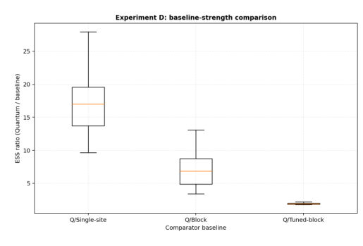 
Fig. 1. Experiment D: ESS ratio bar chart across all 60 instances, grouped by graph family, for single-site Gibbs, block Gibbs, and tuned-block Gibbs baselines. The ESS advantage is largest on bottleneck topologies (barbell, barbell-path) where Gibbs mixing is slowest. Tuned-block Gibbs substantially reduces the advantage (mean 1.82×) but does not eliminate it. Source: paper_table_metrics.json.

📷 Fig 2

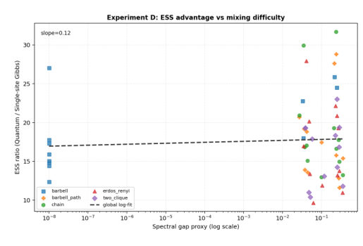 
Fig. 2. Experiment D: ESS ratio (Quantum/Single-Site Gibbs) vs. mixing-difficulty proxy across 60 instances and 5 graph families. R2 = 0.00036, slope=0.688: family/topology effects dominate a sin- gle spectral-gap predictor. Mean ratio 16.35, range [8.24, 30.31]. Source: paper_table_metrics.json.

📷 Fig 3

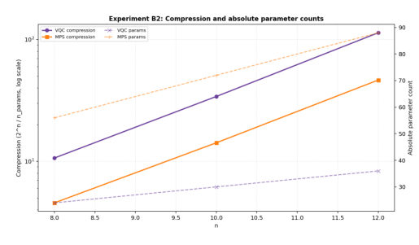 
Fig. 3. Experiment B: VQC fidelity and compression ratio across n ∈ {6, . . . , 14} (source: reviewer_metrics.json), using the unconstrained depth-3 ansatz of Table VI, not the fixed-budget ansatz of Table IV. Compression grows from 1.8× at n = 6 to 195× at n = 14 at fixed depth d = 3, while fidelity plateaus near 0.44–0.49 for n ≥10, highlighting the fundamental tension between compression and approximation quality.

📷 Fig 4

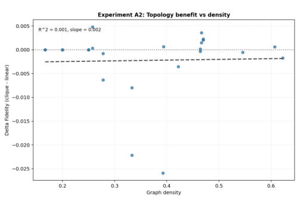 
Fig. 4. Experiment A2: ∆F = Fclique −Flinear vs graph density across 36 matched (family, n, seed) instances (4 families × 3 sizes × 3 seeds). R2 = 0.0007, slope= −2.62 × 10−4: no detectable positive correlation between graph density and clique-entanglement benefit at n ≤14. Source: entanglement_sweep.json.

📷 Fig 5

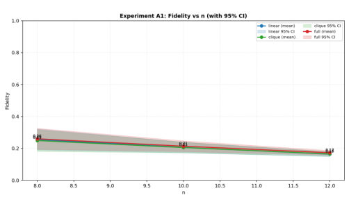 
Fig. 5. Experiment A1: fidelity vs. n by entanglement strategy (linear, clique, full) across graph families. Clique-minus-linear mean ∆F = −2.28 × 10−4; full-minus-linear mean = +2.58 × 10−3.

**Summary.** This paper rigorously benchmarks various sampling techniques—quantum amplitude encoding, VQC, and advanced classical MCMC—for estimating distributions from discrete Markov Random Fields. It finds that while quantum approaches show high theoretical ESS ratios, practical wall-clock comparisons reveal that state-of-the-art classical methods often match or exceed the performance when preprocessing costs are accounted for. The study concludes by cautioning against using shallow VQCs due to poor fidelity relative to established tensor network methods like MPS.

**Why it may be interesting.** This work is highly relevant as it benchmarks the feasibility of using near-term quantum hardware for complex statistical inference problems common in condensed matter physics (e.g., phase transitions modeled by MRFs). The detailed benchmarking against classical state-of-the-art methods provides crucial guidance on when and how quantum resources might offer an advantage.

Detailed structure

**Main problem.** The core problem is developing an efficient, scalable workflow for sampling from discrete Markov Random Fields (MRFs), which involves overcoming the exponential complexity associated with calculating partition functions.

**Main result.** While quantum amplitude encoding shows high Effective Sample Size (ESS) ratios compared to some classical samplers, advanced classical methods like inverse-CDF sampling significantly outperform it in wall-clock time when preprocessing costs are amortized. Furthermore, shallow Variational Quantum Circuits (VQC) were shown to underperform Matrix Product States (MPS) for approximating the distribution.

**Method.** The work compares quantum amplitude encoding and VQC approaches against classical MCMC samplers (Gibbs variants, Parallel Tempering) and exact sampling techniques on MRFs.

**Model / system.** The system is a discrete Markov Random Field defined over an undirected graph structure. The target probability distribution $P_{	heta}(\mathbf{x})$ is derived from the diagonal of a Hamiltonian, leading to $2^n$ amplitudes that must be sampled.

**Key observables.** Effective Sample Size (ESS) ratios, wall-clock ESS/s rates, Fidelity ($F$), Total Variation ($	ext{TV}$), and KL divergence ($D_{KL}$).

**Important parameters / regimes.** System size $n$ (up to 40 for MPS scaling), bond dimension $\chi$, and compression ratio.

**Assumptions / limitations.** The comparison assumes that the classical preprocessing cost of $O(2^n)$ is amortized across all comparable methods, and VQC results are limited by shallow hardware-efficient ansätze.

**Figures summary.** Tables compare ESS ratios (Table I) showing quantum advantage narrowing as baselines improve; Table II compares wall-clock rates; Tables IV/IX show fidelity comparisons between VQC and MPS at increasing system sizes $n$.

**Paper structure.** The paper first establishes the difficulty of MRF sampling, then details amplitude encoding for small $n$ against classical MCMC. It proceeds to compare quantum vs. classical efficiency (ESS ratios), analyzes scaling limits using MPS fidelity, and concludes with a direct comparison showing VQC limitations relative to MPS.

Abstract

Sampling from discrete Markov random fields (MRFs) is a hard problem. We study amplitude-encoded i.i.d. sampling for small MRFs where $2^n$ target probabilities are precomputed classically. This removes quantum exponential speedup but allows a clean comparison against classical MCMC based on independent circuit samples ($τ\approx 1$). Across 60 instances spanning five graph families (1k-step burn-in, 3k retained samples), the mean ESS ratios of Quantum to Single-Site Gibbs, Block Gibbs, Tuned-Block, and Parallel Tempering are $16.35$, $7.29$, $1.82$, and $1.79$, showing modern classical samplers substantially close this gap. Amortizing $O(2^n)$ preprocessing into wall-clock time, exact inverse-CDF sampling yields $17.7\text{M}$ ESS/s versus $488\text{K}$ ESS/s for the quantum sampler ($36\times$ mean rate, $153\times$ per-instance), confirming no wall-clock advantage. We characterize MCMC autocorrelation costs and benchmark amplitude-encoded state preparation at $n \in \{8,10,12\}$. An MPS scaling study ($n \le 40$) shows bond dimension $χ=32$ achieves $F=0.721\pm0.059$ at $n=40$. Finally, a matched-budget VQC vs. MPS comparison at $n \in \{8,10,12\}$ shows VQC fidelities fall far below MPS: $(F_{\mathrm{VQC}}, F_{\mathrm{MPS}}) = (0.31, 0.99), (0.21, 0.96), (0.17, 0.88)$ at compressions $10.7\times$, $34.1\times$, and $113.8\times$.

[↑ back to top](#top)

### [Demonstrating Quadratic Monte Carlo Speedup via Quantum Amplitude Estimation: Nuclear Engineering Examples](http://arxiv.org/abs/2607.10772v1)

**Authors:** Jilang Miao, Miaomiao Jin, Akira Sone  
**Type:** theory · **Category:** quantum information and computing · **PDF:** <https://arxiv.org/pdf/2607.10772v1>  
**Analysis basis:** full PDF text, analyzed in chunks
**Topic relevance:** `methods for driven-dissipative` **1/5**

📷 Fig 1

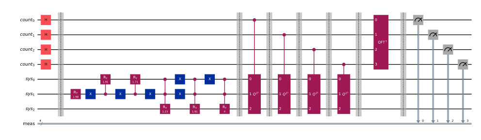 
Fig. 1. QPE circuit for the ¯ν estimation problem, m = 4 ancilla qubits (QPE register, top) and n = 3 system qubits (bottom, including ancilla). State prep A loads P(ν) via an Ry tree and f(ν) via controlled Ry rotations on the ancilla; controlled-Q2k

📷 Fig 2

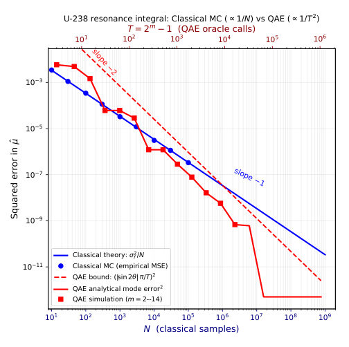 
Fig. 3. Squared error in ˆµ for the U-238 resonance integral. Axes and line styles as in Fig. 2; red squares use the eigende- composition simulation with 8192 shots (mode of ˆy) per m. At m = 14 (T = 16,383), ˆIR = 120.65 b vs. true 120.69 b (0.03% error).

📷 Fig 3

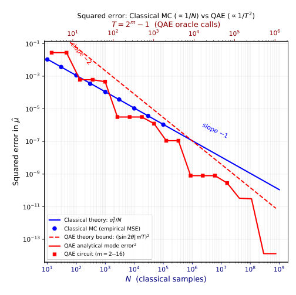 
Fig. 2. Squared error vs. oracle calls T (QAE, red top axis) and sample count N (classical MC, blue bottom axis). Red squares: Qiskit circuit runs (m = 2–16); for each m, 8192 shots are taken and the mode of ˆy is decoded via Eq. (2). Solid red: analytical mode error (infinite-shots limit). Dashed red: QAE bound (3). Blue circles: empirical MSE; blue line: σ2 f /N.

**Summary.** This paper demonstrates the quadratic speedup offered by Quantum Amplitude Estimation (QAE) for calculating expectation values relevant to nuclear engineering, such as fission yields and resonance integrals. By implementing QAE using QPE circuits on toy models, the authors show that the error decreases quadratically with the number of quantum calls ($T$), significantly outperforming classical Monte Carlo methods. This work validates a key quantum computational advantage in a critical area of applied physics.

**Why it may be interesting.** This work provides a concrete demonstration of quantum algorithm utility in a highly specialized domain (nuclear physics), showing how fundamental quantum speedups can translate into solving critical industrial simulation problems.

Detailed structure

**Main problem.** The primary goal is to overcome the statistical bottleneck inherent in classical Monte Carlo methods used for calculating expectation values in complex physics simulations.

**Main result.** The study successfully demonstrates that Quantum Amplitude Estimation (QAE) provides a quadratic speedup, achieving an error scaling of $O(1/T^2)$ compared to the classical $O(1/\sqrt{N})$ scaling.

**Method.** The authors employ QAE, implemented via Quantum Phase Estimation (QPE), to estimate expectation values by encoding both probability and scoring functions into a unitary operator. This quantum approach coherently amplifies the desired value rather than relying on repeated measurements.

**Model / system.** The methods are applied to two nuclear engineering problems: calculating the mean fission neutron yield ($ar{
u}$) from a discrete distribution, and determining the U-238 resonance integral ($I_R$) using a Breit-Wigner formula approximation.

**Key observables.** Mean Squared Error (MSE) of the estimate ($\hat{\mu}$), which is compared against theoretical scaling laws for both QAE and classical MC.

**Important parameters / regimes.** The number of phase-estimation qubits ($m$) determines the oracle cost $T=2^{m-1}$; the resonance integral calculation used up to $m=14$ qubits.

**Assumptions / limitations.** For large system sizes (e.g., $>9$ qubits), simulating the full state preparation circuit is computationally infeasible, necessitating analytical construction of the unitary operator.

**Figures summary.** Figure 2 compares the squared error versus oracle calls ($T$) for QAE (red curve) against sample count ($N$) for MC (blue curve), visually confirming the superior quadratic convergence rate of QAE.

**Paper structure.** The paper first introduces the problem of statistical bottlenecks in reactor physics. It then details the theoretical framework of QAE using QPE, applying it to a simple discrete yield example ($ar{
u}$). Finally, it extends this methodology to the more complex U-238 resonance integral calculation, comparing results against classical benchmarks.

Abstract

We demonstrate quantum amplitude estimation (QAE) as a route to quadratic speedup for Monte Carlo-type expectation values in nuclear engineering. Using QPE-based QAE, we study two examples: a discrete fission-neutron-yield expectation and a U-238 resonance integral under a $1/E$ slowing-down spectrum. The toy problem is implemented as a gate-level Qiskit circuit, while the resonance-integral example is simulated through an exact eigendecomposition of the Grover operator to avoid state-preparation decomposition bottlenecks. In both cases, the squared error scales as $O(1/T^2)$ with the number of oracle calls $T$, compared with the classical Monte Carlo scaling $O(1/N)$. For the U-238 example, QAE recovers the resonance integral to approximately $0.03%$ relative error with $m=14$ phase-estimation qubits.

[↑ back to top](#top)

### [Fast and accurate AI-based pre-decoders for color codes](http://arxiv.org/abs/2607.10058v1)

**Authors:** Jan Olle, Christopher Chamberland, Muyuan Li, Igor Baratta  
**Type:** theory · **Category:** quantum information and computing · **PDF:** <https://arxiv.org/pdf/2607.10058v1>  
**Analysis basis:** full PDF text, analyzed in chunks
**Topic relevance:** `methods for driven-dissipative` **1/5**

📷 Fig 1

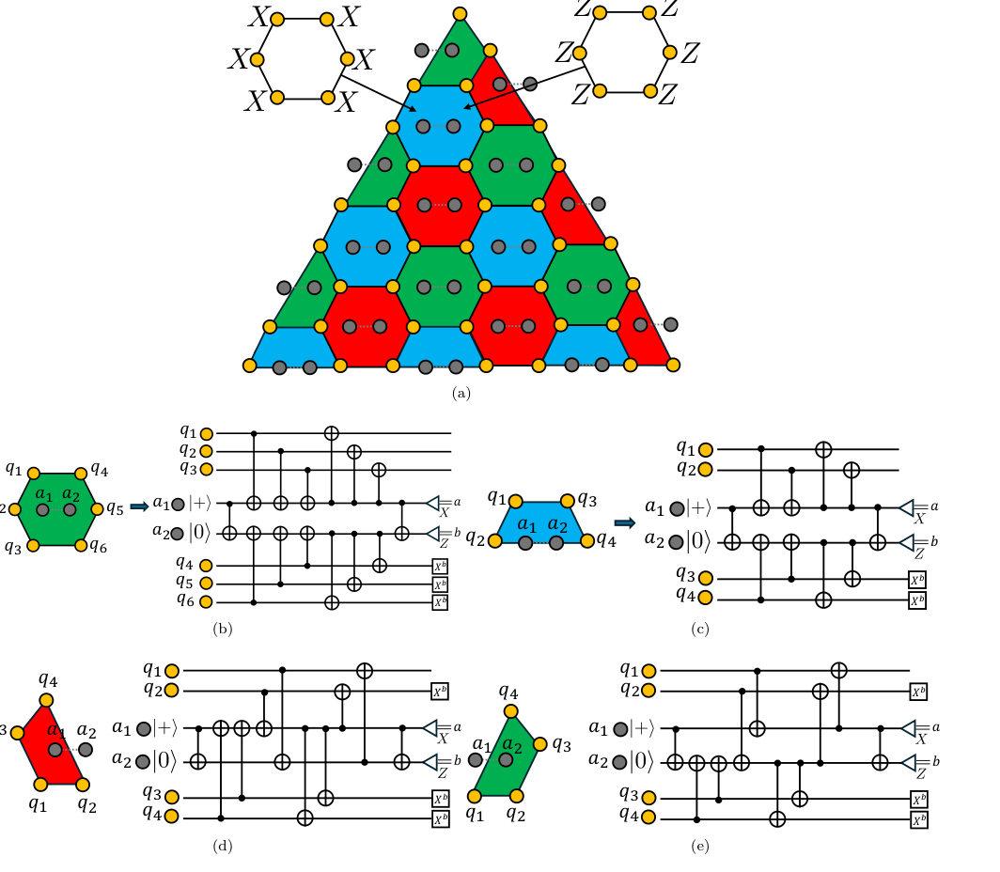 
FIG. 1. (a) A d = 7 lattice for the triangular color code. Each weight-4 and weight-6 plaquette corresponds to both an X and Z-type stabilizer. Data qubits shown by yellow vertices, with gray vertices corresponding to the ancillas used to measure the stabilizers. Logical representatives for XL, ZL and YL operators correspond to tensor product of X, Z and Y Paulis on data qubits along any of the boundaries of the triangle. (b) Circuit to measure both weight-6 X and Z-type stabilizers. (c) Same as (b) but for weight-4 stabilizers. In (d) and (e), we show the circuits used for red and green weight-four stabilizers which maintains the regular grid tilling of all qubits.

📷 Fig 2

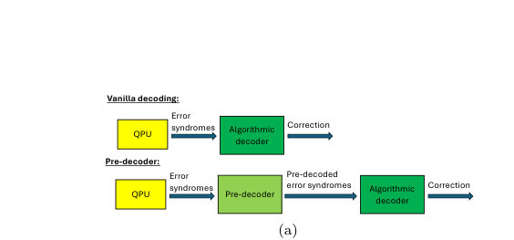 
FIG. 2. Comparison between a vanilla decoding algorithm and a decoding algorithm that uses a pre-decoder to pre- process the error syndromes. When using a pre-decoder, the pre-decoder receives the error syndrome from the QPU and applies spacelike and timelike corrections across all syndrome measurement rounds that were used as inputs. The new error syndrome obtained from the corrections are then passed to an algorithmic decoder to apply the final set of corrections. Figure taken from Ref. [31].

📷 Fig 3

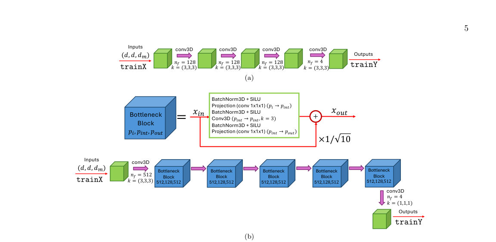 
FIG. 3. (a) Illustration of the fully convolutional neural network architecture used to train our pre-decoders. The input data is labeled trainX and the output data labeled trainY. We use three-dimensional convolutional layers which can have varying kernel sizes and number of filters. The output of the last convolution layer goes through a sigmoid activation function in order to generate the spacelike and timelike predictions. Figure taken from Ref. [31]. (b) Alternative architecture which uses Bottleneck blocks taken from Refs. [37, 38]. We find that such architectures achieves lower LERs while using less parameters compared to the fully three-dimensional convolutional architecture with...

📷 Fig 4

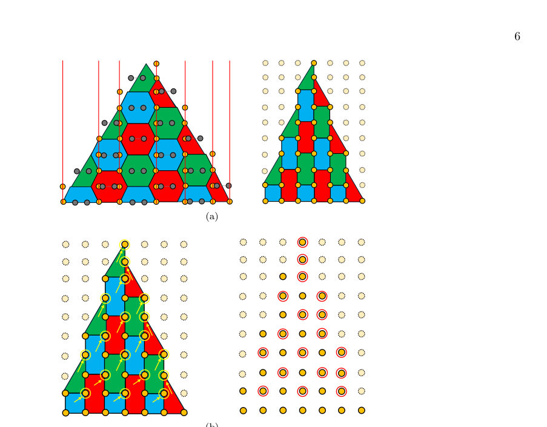 
FIG. 4. (a) Illustration of the mapping of the triangular color code to a two-dimensional grid. Vertical red lines are added to each data qubit at the bottom of the triangle. For each weight-4 and weight-6 stabilizer in between the red lines, data qubits closest to the right-most vertical line are mapped to that line. Similarly, data qubits closest to the left-most vertical line are mapped to that line. Such a mapping results in the figure on the right, resulting in rectangular weight-6 stabilizers and square or triangular weight-4 stabilizers. (b) Illustration of the mapping of stabilizer measurements to data qubit positions. A data qubit circled in red indicates that a stabilizer...

📷 Fig 5

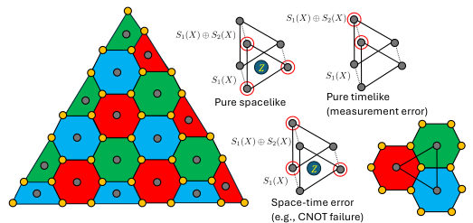 
FIG. 5. Example illustration of S1(X) ⊕S2(X) computations used in Algorithm 1 for various fault mechanisms. Only pure timelike failures (which arise from measurement errors) and space-time failures (for instance CNOT gate failures) result in a non-zero value of S1(X) ⊕S2(X). The examples provided are for failures arising in the bulk of the color code lattice. The illustration uses a single ancilla for simplicity to focus on just X-type stabilizers, but the methods apply in the same way to the circuit in Fig. 1.

**Summary.** This paper introduces AI-based pre-decoders designed to speed up and improve the accuracy of quantum error correction for color codes. By performing local syndrome corrections using neural networks before a global decoder runs, the method significantly reduces both logical failure rates and computational runtimes compared to existing techniques. This brings color codes closer to practical implementation in large-scale fault-tolerant quantum computers.

**Why it may be interesting.** This work directly addresses scalability in quantum computation by proposing a machine learning component to accelerate error correction decoding for topological codes, which is highly relevant to building fault-tolerant quantum hardware.

Detailed structure

**Main problem.** The primary goal is to improve the performance of quantum error correction for color codes by developing fast and accurate AI-based pre-decoders.

**Main result.** The proposed AI-based pre-decoder combined with a global decoder significantly improves both the logical failure rate (by factors up to 347x) and reduces the decoding runtime (by factors up to 7.33x) compared to using the global decoder alone.

**Method.** The authors introduce local, AI-based pre-decoders—implemented via novel neural network architectures—that perform spacelike and timelike syndrome corrections before passing processed syndromes to a standard global decoder like Chromobius.

**Model / system.** The work focuses on color codes, specifically triangular color codes, as fault-tolerant alternatives to surface codes for quantum computation. The decoding process involves mapping stabilizer measurements onto a 2D grid suitable for CNN input.

**Key observables.** Logical failure rates (LERs), decoding runtimes ($\mu s$/round), and the speedup factor relative to raw Chromobius decoding.

**Important parameters / regimes.** Code distance ($d$), physical error rate ($p$, e.g., 0.3%), and the specific neural network model used for pre-decoding.

**Assumptions / limitations.** The pre-decoder is probabilistic and local, meaning residual errors are passed to the global decoder; performance improvements scale with code distance.

**Figures summary.** Figures illustrate the lattice structure of color codes, compare decoding pipelines (vanilla vs. pre-decoder assisted), detail CNN architectures used, and show the mapping of stabilizers onto a rectangular grid for training data generation.

**Paper structure.** The paper introduces the problem of slow color code decoding, proposes the local AI pre-decoder concept compatible with parallel schemes, details the novel neural network architecture and data preparation methods, and finally presents quantitative results comparing performance metrics (LERs and runtimes) against baseline decoders across varying parameters.

Abstract

Color codes are promising alternatives to surface codes for universal fault-tolerant quantum computing due to their simpler lattice-surgery protocols and the transversal implementation of logical Clifford gates. However, their practical deployment has been limited by slower decoding algorithms and worse logical failure rates and thresholds compared to surface codes. Although AI-based logical-flip decoders have recently been proposed to address these challenges, no clear framework currently exists for implementing such decoders within the parallel block-wise decoding schemes in both space and time required for large-scale fault-tolerant computation. AI-based pre-decoders offer a scalable alternative due to their local nature. By performing spacelike corrections on physical qubits and timelike corrections on stabilizer measurements, pre-decoders are naturally compatible with parallel block-wise decoding schemes and lattice-surgery protocols. In this work, we introduce AI-based pre-decoders for triangular color codes. We present a novel neural-network architecture for their implementation and develop methods to simplify the complex training data generated by color-code syndrome-extraction circuits containing feedforward operations. Remarkably, we find that both logical failure rates (LERs) and runtimes improve relative to raw Chromobius decoding as the code distance increases. For example, at code distance d=31 and physical error rate $p=0.3\%$, our pre-decoder + Chromobius pipeline improves the logical failure rate by a factor of 347x while reducing runtime by 7.33x compared to raw Chromobius decoding alone. These results demonstrate that AI-based pre-decoding can substantially narrow the performance gap between color codes and surface codes, bringing color codes closer to practical large-scale fault-tolerant quantum computation.

[↑ back to top](#top)

### [Quantum Arithmetic Circuits in Public-Key Cryptography](http://arxiv.org/abs/2607.11713v1)

**Authors:** Siyi Wang, Kyungbae Jang, Hyunji Kim, Anik Basu Bhaumik, Anubhab Baksi, Hwajeong Seo, Anupam Chattopadhyay  
**Type:** theory · **Category:** quantum information and computing · **PDF:** <https://arxiv.org/pdf/2607.11713v1>  
**Analysis basis:** full PDF text, analyzed in chunks
**Topic relevance:** `quantum measurements` **1/5**

📷 Fig 1

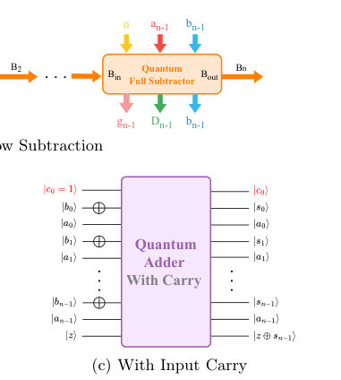 
Fig. 3. Structures of n-bit Quantum Subtractor.Anubhab: We can redraw these dia- grams in tikz

**Summary.** This paper provides a detailed review of optimizing quantum arithmetic circuits essential for attacking public-key cryptography. It compares various circuit designs for addition and multiplication, emphasizing resource trade-offs between methods like measurement-based uncomputation and using conditionally clean ancillas. The work is crucial for making realistic evaluations of quantum cryptanalytic capabilities.

**Why it may be interesting.** While focused on cryptography, the deep dive into resource optimization (depth vs. qubit count) using advanced quantum control techniques like MBU is highly relevant to building any large-scale quantum simulator or device.

Detailed structure

**Main problem.** The core challenge is designing quantum arithmetic circuits that are resource-efficient enough to execute large-scale public-key cryptanalysis algorithms like Shor's algorithm.

**Main result.** The paper reviews state-of-the-art optimization strategies, such as measurement-based uncomputation and using conditionally clean ancilla qubits, for fundamental operations like addition and modular exponentiation.

**Method.** It involves a comprehensive review of various quantum adder/multiplier architectures (e.g., ripple-carry vs. carry-lookahead) and analyzing resource metrics to improve circuit depth and qubit count.

**Model / system.** The model is general quantum computation using qubits, focusing on implementing arithmetic operations within the Clifford+T gate set for fault tolerance in cryptanalysis contexts.

**Key observables.** Toffoli-Depth, Toffoli-Count, Qubit-Count (Space Complexity), and T-gate count are key metrics used to evaluate circuit efficiency.

**Important parameters / regimes.** The required bit length of the integers being processed (e.g., 2048 bits for RSA) dictates the scale and resource requirements of the circuits.

**Assumptions / limitations.** The design assumes a focus on fault-tolerant computation, often relying on Clifford+T gate sets; specific techniques like MBU introduce measurement overheads.

**Figures summary.** Figures illustrate concepts like single-qubit Measurement-based Uncomputation and comparisons between Clean Ancilla vs. Conditionally Clean Ancilla designs for quantum gates.

**Paper structure.** The paper is structured as a review, first establishing the necessity of arithmetic circuits for cryptanalysis, then detailing optimization techniques (MBU, ancillas), followed by reviewing specific circuit implementations for addition, multiplication, and modular exponentiation.

Abstract

Quantum computing has advanced rapidly in recent decades, driven by developments across the technology stack, including quantum error-correcting codes and efficient quantum algorithms. Among these, quantum arithmetic circuits serve as fundamental building blocks for various promising algorithms. Despite their crucial role, the design of quantum arithmetic circuits faces challenges arising from the no-cloning theorem, qubit limitations, and circuit depth constraints, which significantly impact the efficiency of large-scale quantum computing. We provide an overview of quantum arithmetic circuits in the context of public-key cryptanalysis, with particular emphasis on optimization strategies such as measurement-based uncomputation and conditionally clean ancilla. We review state-of-the-art designs for essential arithmetic operations in public-key cryptanalysis such as addition, multiplication, and modular exponentiation. We also present an overview of the techniques used for fault-tolerant runtime and resource estimation in quantum cryptanalysis. In brief, this chapter emphasizes strategies for designing resource-efficient quantum arithmetic circuits, providing a basis for realistic evaluations of quantum cryptanalytic capabilities.

[↑ back to top](#top)

### [Scalar and vector bosons in a Bonnor-Melvin-$Λ$ spacetime: an exact Duffin-Kemmer-Petiau analysis](http://arxiv.org/abs/2607.09997v1)

**Authors:** Francisco A. Cruz Neto, Luis B. Castro  
**Type:** theory · **Category:** other · **PDF:** <https://arxiv.org/pdf/2607.09997v1>  
**Analysis basis:** full PDF text, analyzed in chunks
**Topic relevance:** `Keldysh / 2PI / non-Gaussian methods` **1/5**

📷 Fig 1

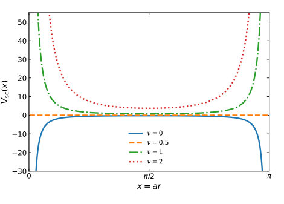 
Fig. 1: Scalar effective potential in the dimensionless variable x = ar for representative values of ν.

📷 Fig 2

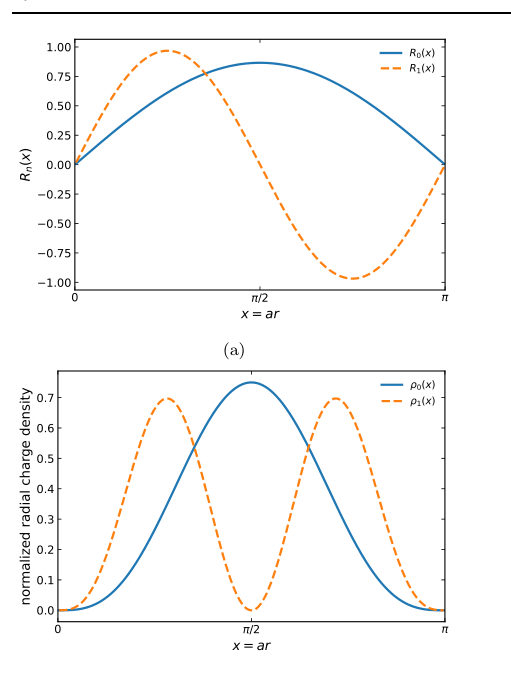 
Fig. 2: Representative scalar radial profiles in the di- mensionless variable x = ar, for ν = 1. (a) Nor- malized radial eigenfunctions Rn(x) for n = 0, 1. (b) Corresponding normalized radial charge-density pro- files ρn(x), defined in Eq. (101).

📷 Fig 3

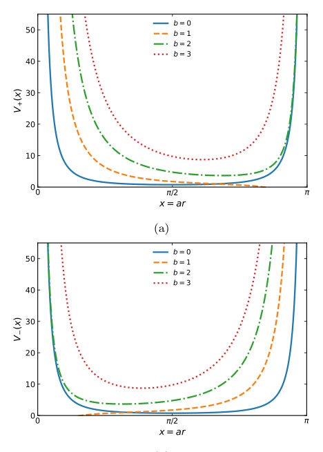 
Fig. 3: Effective potentials for the transverse circular polarizations in the dimensionless variable x = ar, for representative values of b. (a) s = +1. (b) s = −1.

📷 Fig 4

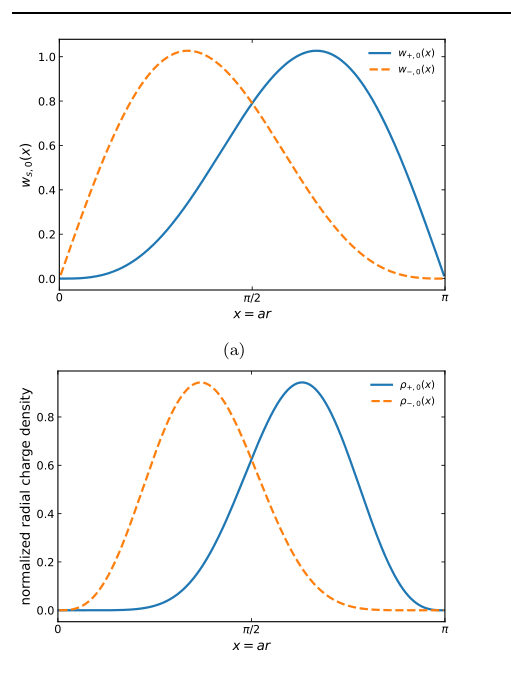 
Fig. 4: Representative transverse radial profiles in the dimensionless variable x = ar, for b = 2 and n = 0. (a) Normalized radial eigenfunctions w+,0(x) and w−,0(x). (b) Corresponding normalized radial charge-density profiles ρ+,0(x) and ρ−,0(x), defined in Eq. (150).

**Summary.** This paper provides an exact quantum treatment of scalar and vector bosons moving in a specific curved spacetime (Bonnor-Melvin-$\Lambda$) using the Duffin-Kemmer-Petiau formalism. By rigorously analyzing the radial equations, the authors demonstrate that all physical modes possess purely discrete energy spectra. This work offers a significant improvement over previous approximations by incorporating the full global geometric structure of the background.

**Why it may be interesting.** While not directly about AMO systems, the methodology of solving wave equations in curved backgrounds using exact spectral methods and identifying confinement mechanisms is highly relevant for quantum field theory in curved spacetime, which underpins many advanced topics in quantum optics and gravitational physics.

Detailed structure

**Main problem.** To provide a unified, exact treatment of scalar and vector bosons propagating in the curved Bonnor-Melvin-$\Lambda$ spacetime background.

**Main result.** The analysis yields purely discrete radial spectra for all physical sectors (scalar, longitudinal, transverse) by solving singular Sturm-Liouville problems derived from the DKP formalism.

**Method.** The authors use Umezawa's projection operators to reduce the Duffin-Kemmer-Petiau equation into separate second-order equations for spin-0 and spin-1 components, which are then solved using techniques leading to hypergeometric functions.

**Model / system.** The system involves scalar ($\phi$) and vector ($W_\mu$) bosons propagating in a Bonnor-Melvin-$\Lambda$ spacetime. The dynamics are governed by the DKP formalism, yielding effective Klein-Gordon and Proca equations in curved spacetime.

**Key observables.** Purely discrete radial spectra (eigenvalues $\epsilon^2, \epsilon_s^2$) for all physical modes; conserved currents ($J_\mu$).

**Important parameters / regimes.** The cosmological constant ($\Lambda$); the background geometry parameters defining the metric function $S(r)$.

**Assumptions / limitations.** The analysis avoids the conical approximation, working directly in the full curved spacetime. The radial dynamics are treated as a singular Sturm-Liouville problem on fundamental intervals.

**Paper structure.** The paper first establishes the DKP formalism and projection operators for the given background. It then derives the second-order equations for the scalar and vector sectors, leading to radial equations that are solved by mapping them to known solvable forms (Pöschl-Teller/Hypergeometric). Finally, the quantization conditions yield the discrete spectra.

Abstract

We study scalar and vector bosons in the Bonnor--Melvin--$Λ$ spacetime within the Duffin--Kemmer--Petiau (DKP) formalism. By employing Umezawa's projection operators, we separate the physical spin-0 and spin-1 sectors and derive the corresponding exact second-order equations in the full curved spacetime, without relying on the conical approximation. For the scalar sector, the radial equation reduces to a Schrödinger-like equation with a trigonometric Pöschl--Teller effective potential. In the vector sector, the longitudinal mode is governed by the same effective potential, whereas the transverse polarizations are described by generalized trigonometric Pöschl--Teller potentials. Because the me\-tric function vanishes at a discrete set of radial points, the radial dynamics is naturally formulated as a singular Sturm--Liouville problem on a fundamental interval, with the physical radial domain fixed by the Friedrichs self-adjoint extension of the corresponding singular radial operators. As a result, all physical sectors exhibit purely discrete radial spectra, and their eigenfunctions are obtained in closed form. These results provide a unified exact treatment of scalar and vector bosons in the Bonnor--Melvin--$Λ$ spacetime, complement previous analyses based on the conical approximation, and clarify the role of the global geometric structure of the background in shaping confinement and spectral properties.

[↑ back to top](#top)

### [Scaling Adaptive Non-Local Observable Quantum Super-Resolution via Matrix Product States](http://arxiv.org/abs/2607.10280v1)

**Authors:** Shih-Lung Yu, Ming-Kang Ho, Tai-Yue Li, Sheng Yun Wu  
**Type:** both · **Category:** numerical methods · **PDF:** <https://arxiv.org/pdf/2607.10280v1>  
**Analysis basis:** full PDF text, analyzed in chunks
**Topic relevance:** `methods for driven-dissipative` **1/5**

📷 Fig 1

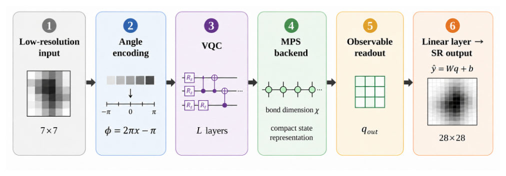 
Fig. 1. Workflow of the proposed MPS-ANO-VQC framework for Fashion-MNIST SR. A 7 × 7 low-resolution image is mapped to a 49-qubit input state and simulated with an MPS backend. Image-local adaptive observables produce quantum features, which are passed to a classical linear layer to reconstruct the 28 × 28 high-resolution image.

📷 Fig 2

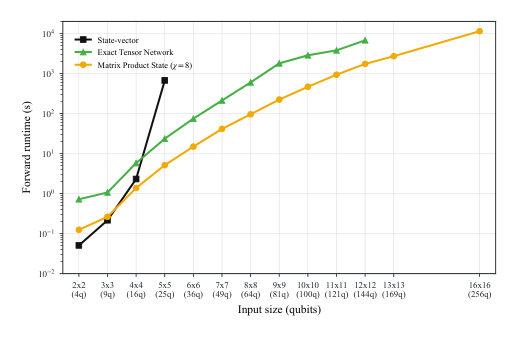 
Fig. 2. Forward-runtime comparison among statevector simulation, Exact TN contraction, and MPS simulation for ANO-VQC quantum-feature extraction as the input image size and qubit count increase. MPS uses a fixed bond dimension of χ = 8.

📷 Fig 3

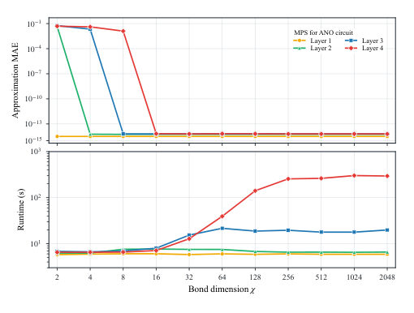 
Fig. 3. Influence of the MPS bond dimension χ on approximation accuracy and runtime for 49-qubit ANO circuits with L = 1–4 layers. Top: mean absolute error (MAE) between MPS and the Exact TN contraction reference. Bottom: MPS simulation runtime as a function of χ. The χ axis is shown on a log2 scale.

📷 Fig 4

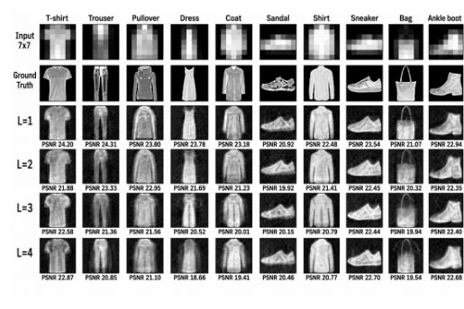 
Fig. 4. Representative Fashion-MNIST SR reconstructions for different circuit depths using a fixed MPS bond dimension of χ = 16.

**Summary.** This paper proposes using Matrix Product States (MPS) as a scalable computational backend for simulating Variational Quantum Circuits designed for image super-resolution. It demonstrates that MPS overcomes the memory and computational bottlenecks faced by statevector or exact tensor network methods when scaling up input sizes. The results confirm MPS's utility, showing that shallow circuits can achieve optimal performance metrics for SR tasks.

**Why it may be interesting.** The comparison between different tensor network simulation techniques (Statevector, Exact TN, MPS) is highly relevant to understanding resource scaling in quantum machine learning algorithms applied to physical problems.

Detailed structure

**Main problem.** The work addresses the challenge of simulating quantum feature extraction for image super-resolution (SR) using Variational Quantum Circuits (VQCs) when input sizes exceed the practical limits of statevector or exact tensor network simulations.

**Main result.** Matrix Product States (MPS) provide a scalable simulation backend, successfully performing forward feature extraction on up to 16x16 inputs where other methods fail; furthermore, shallow circuits ($L=1$) achieved the best reconstruction quality metrics for SR tasks.

**Method.** The authors developed and benchmarked an MPS simulation framework to approximate the expectation values of Adaptive Non-Local Observable VQCs (ANO-VQCs) used in image super-resolution.

**Model / system.** The model involves mapping low-resolution pixels to qubits, encoding them via RY rotations/CNOTs, and extracting quantum features using trainable Hermitian observables ($\langle H_q 
angle$). The simulation is performed on the MPS representation of the quantum state $|\psi
angle$.

**Key observables.** Loss (MSE + LPIPS), PSNR, SSIM, Mean Absolute Error (MAE) comparing MPS to Exact TN.

**Important parameters / regimes.** Input size ($2	imes2$ up to $16	imes16$), Circuit Depth ($L=1$ to $4$), and MPS Bond Dimension ($\chi$).

**Assumptions / limitations.** The primary approximation is using the MPS ansatz, which requires increasing bond dimension $\chi$ with circuit depth $L$ to maintain accuracy relative to Exact TN contraction.

**Figures summary.** Figures compare simulation runtimes (Statevector vs. Exact TN vs. MPS) across varying input sizes; another figure illustrates how required bond dimension ($\chi$) increases with circuit depth ($L$) for fixed inputs.

**Paper structure.** The paper first introduces the ANO-VQC framework for SR, then compares the computational scaling of Statevector, Exact TN, and MPS methods. It analyzes the accuracy vs. cost trade-off by sweeping $\chi$ for a fixed input size, concluding with performance metrics on a full SR task.

Abstract

This work presents a matrix product state (MPS) simulation framework for adaptive non-local observable variational quantum circuits (ANO-VQCs) in image super-resolution (SR) beyond the practical limits of statevector simulation. Runtime benchmarks on a single NVIDIA RTX 4070 GPU show that, under the tested shallow-circuit setting, MPS completes ANO-VQC forward feature extraction for individual inputs up to 16 x 16 pixels (256 qubits), whereas statevector simulation encounters a memory bottleneck at 6 x 6 inputs (36 qubits) and exact tensor-network (Exact TN) contraction becomes computationally impractical beyond 12 x 12 inputs (144 qubits). For a fixed 7 x 7 input (49 qubits), a bond-dimension sweep over depths L = 1 to L = 4 shows that the required MPS bond dimension increases with circuit depth. Using Exact TN contraction as the reference, the bond dimension required for near-exact agreement increases from chi = 2 at L = 1 to chi = 16 at L = 4. Finally, 7 x 7 to 28 x 28 Fashion-MNIST SR training with chi = 16 shows that the shallow L = 1 model achieves the lowest loss and best LPIPS, PSNR, and SSIM among the tested depths. These results highlight MPS as a scalable and controllable simulation backend for ANO-VQC image SR and as a practical tool for studying large-scale quantum algorithms.

[↑ back to top](#top)

## Other papers (16)

*Papers from primary archives without highlighted authors or any topic match. Click to expand.*

Show other papers

### [$\mathtt{Q^2SAR}$: overcoming classical bottlenecks in drug discovery via quantum multiple kernel learning](http://arxiv.org/abs/2607.11701v1)

**Authors:** Mariano Caruso, Daniel Ruiz, Alejandro Giraldo, Guido Bellomo  
**Type:** both · **Category:** quantum information and computing · **PDF:** <https://arxiv.org/pdf/2607.11701v1>  
**Analysis basis:** full PDF text, analyzed in chunks

📷 Fig 1

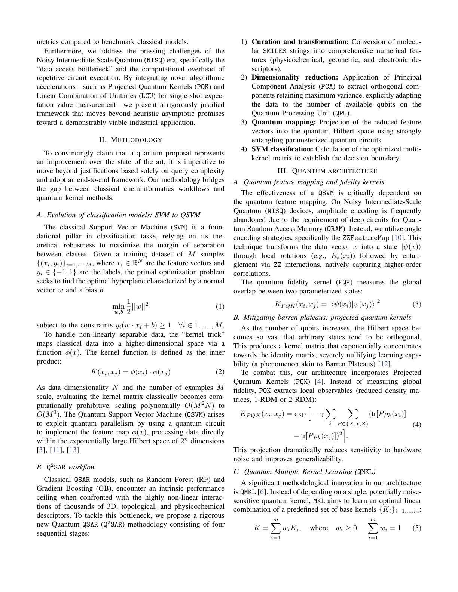 
Low-resolution page preview, page 2

📷 Fig 2

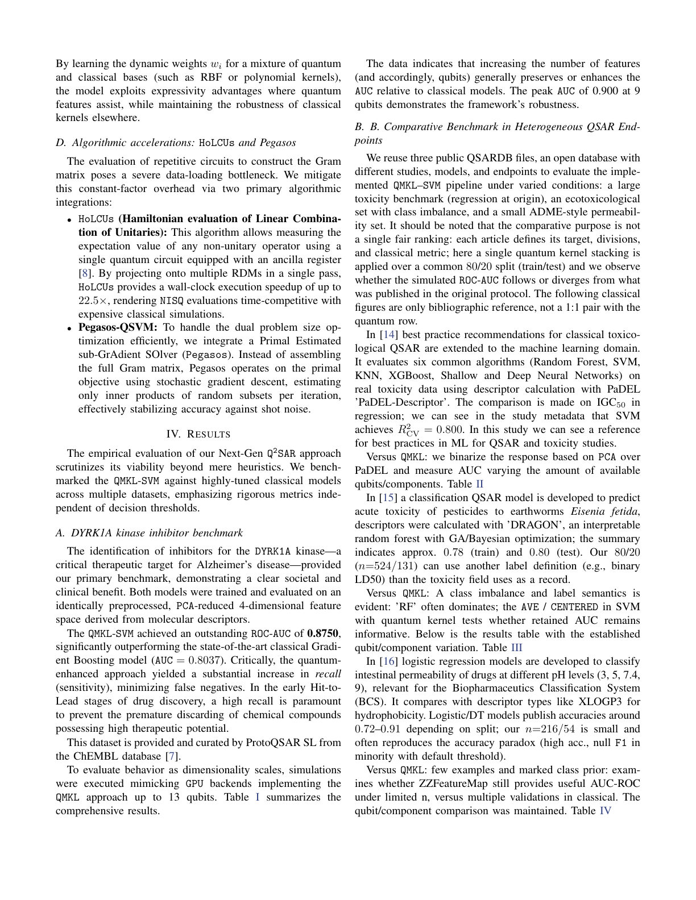 
Low-resolution page preview, page 3

📷 Fig 3

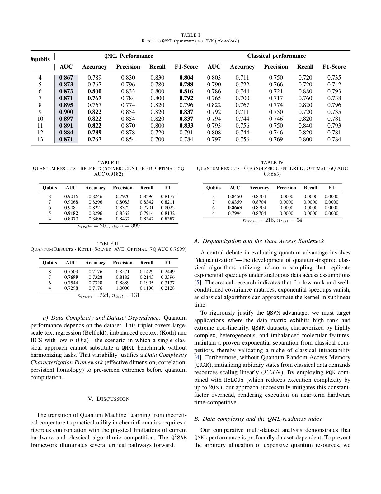 
Low-resolution page preview, page 4

📷 Fig 4

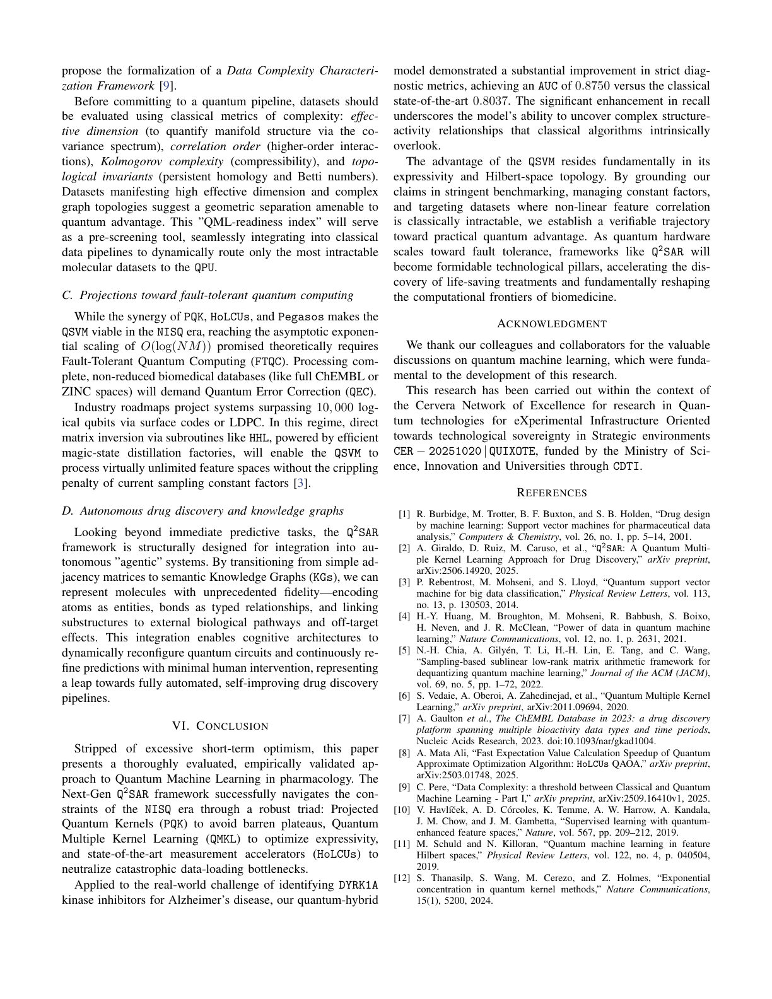 
Low-resolution page preview, page 5

📷 Fig 5

 
Low-resolution page preview, page 6

**Summary.** This work introduces $\text{Q}^2\text{SAR}$, a quantum-enhanced framework that uses Quantum Multiple Kernel Learning (QMKL) to improve drug discovery predictions beyond classical limitations. By encoding molecular data into quantum states, it achieves superior performance on benchmark datasets compared to state-of-the-art classical models. The methodology is designed for near-term quantum hardware while paving the way for fully autonomous drug design pipelines.

**Why it may be interesting.** The paper directly applies quantum machine learning techniques to a complex data science problem, utilizing concepts like kernel methods in high-dimensional Hilbert spaces, which touches upon the theoretical limits of quantum computation for feature mapping.

Detailed structure

**Main problem.** Classical Quantitative Structure-Activity Relationship (QSAR) modeling struggles to capture the highly complex, non-linear interactions in molecular data for drug discovery.

**Main result.** The proposed Quantum Multiple Kernel Learning framework achieved an AUC of 0.8750 on a kinase inhibitor benchmark, significantly outperforming classical state-of-the-art models (AUC = 0.8037).

**Method.** It employs a QMKL approach using QSVMs, encoding molecular descriptors into quantum Hilbert spaces via specialized feature maps.

**Model / system.** The framework utilizes Quantum Support Vector Machines and incorporates advanced techniques like Projected Quantum Kernels (PQK) to mitigate barren plateaus and Hamiltonian evaluation of Linear Combination of Unitaries (HoLCUs) for efficient measurement.

**Key observables.** Area Under the Curve (AUC) score, Accuracy, Precision, Recall, F1-Score.

**Important parameters / regimes.** Qubit count (4 to 13), $\gamma$ (for PQK), and dataset type (e.g., DYRK1A kinase).

**Assumptions / limitations.** The quantum advantage relies on targeting applications with high rank and extreme non-linearity, and the framework is designed for NISQ era constraints.

**Figures summary.** Tables compare QMKL vs. classical SVM performance across varying qubit numbers (4 to 13) on multiple benchmarks including DYRK1A, Belfield, Kotli, and Oja.

**Paper structure.** The paper establishes the QSAR problem bottleneck, introduces the quantum-enhanced $\text{Q}^2\text{SAR}$ framework using QMKL/QSVMs, details algorithmic accelerations (PQK, HoLCUs), benchmarks performance across multiple datasets, and concludes by outlining integration into autonomous cognitive architectures via Knowledge Graphs.

Abstract

Quantitative Structure-Activity Relationship ($\mathtt{QSAR}$) modeling is a foundational computational methodology in early-stage drug discovery, heavily relied upon for predicting compound toxicity, bioavailability, and therapeutic potential. However, classical methods often struggle to effectively map the highly complex, non-linear, and high-dimensional interactions inherent in molecular data, leading to reduced predictive accuracy and costly late-stage clinical failures. In this paper, we present a Quantum Multiple Kernel Learning ($\mathtt{QMKL}$) framework, dubbed Next-Gen $\mathtt{Q^2SAR}$, that leverages Quantum Support Vector Machines ($\mathtt{QSVMs}$) to overcome these classical limitations. By encoding molecular descriptors into exponentially large quantum Hilbert spaces, our approach substantially enhances the expressiveness of non-linear modeling. Benchmarking our quantum-enhanced framework on a dataset targeting the $\mathtt{DYRK1A}$ kinase (a critical target for Alzheimer's disease), the $\mathtt{QMKL}$-$\mathtt{SVM}$ achieves an impressive Area Under the Curve ($\mathtt{AUC}$) score of $0.8750$, significantly outperforming classical state-of-the-art Gradient Boosting models ($\mathtt{AUC} = 0.8037$). Furthermore, we establish a theoretical and empirical pathway toward resolving classical data bottlenecks through projected quantum kernels ($\mathtt{PQK}$) and measurement accelerators. As quantum computing architecture matures, this framework paves the way for autonomous cognitive architectures and self-improving drug discovery pipelines, promising to unlock deeper insights across vast chemical spaces and to accelerate the development of life-saving therapeutics.

[↑ back to top](#top)

### [Anyons and Inherently Complex F-symbols](http://arxiv.org/abs/2607.10181v1)

**Authors:** Matthew Buican, Peter Huston, Jiannis K. Pachos  
**Type:** theory · **Category:** other · **PDF:** <https://arxiv.org/pdf/2607.10181v1>  
**Analysis basis:** full PDF text, analyzed in chunks

📷 Fig 1

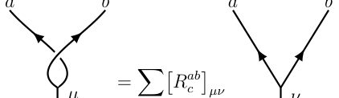 
Fig. 1: The F- and R-symbols of a braided fusion category. The F-symbols describe the associativity of fusion, while the R-symbols describe braiding. Fusion spaces, V z xy ∼= Hom(x ⊗y, z), are represented diagrammatically by trivalent vertices in which x and y fuse to produce z. The complex dimension of V z xy is the fusion multiplicity, N z xy. The F- and

**Summary.** This theoretical paper investigates the mathematical constraints on anyon models in 2+1 dimensions, focusing on the associativity data encoded in F-symbols. The authors prove that these symbols can be 'inherently complex'—meaning their non-real phases are unavoidable—by analyzing specific group representation categories lacking charge-conjugation symmetry. This deepens our understanding of topological order beyond simple braiding statistics.

**Why it may be interesting.** This work pushes the boundaries of topological quantum field theory by showing that simple invariants (like modular data) are insufficient, requiring deeper analysis of fusion associativity structures for a complete physical description.

Detailed structure

**Main problem.** The central question is whether the associativity data (F-symbols) governing anyon fusion rules must be real-valued, or if they can possess inherent complex phases.

**Main result.** The authors demonstrate that inherently complex F-symbols do exist in unitary premodular categories, exemplified by $	ext{Rep}(\mathbb{Z}_7
times\mathbb{Z}_3)$ and $	ext{Rep}(\mathbb{Z}_5
times\mathbb{Z}_4)$.

**Method.** The analysis involves calculating gauge-invariant quantities built from F-symbols using representation theory techniques applied to specific group extensions, comparing them against known symmetries like charge-conjugation.

**Model / system.** The study concerns anyons in $2+1$ dimensions, mathematically modeled by unitary braided spherical fusion categories (UMTCs), specifically analyzing the representations of semidirect products of cyclic groups ($	ext{Rep}(\mathbb{Z}_n 
times \mathbb{Z}_m)$).

**Key observables.** F-symbols ($\mathcal{F}$), R-symbols, and derived gauge-invariant quantities whose non-real nature proves inherent complexity.

**Important parameters / regimes.** The structure of the underlying group extensions (e.g., $\mathbb{Z}_7
times\mathbb{Z}_3$), which dictates the fusion rules and symmetry properties.

**Assumptions / limitations.** The results are consistent with the converse of a statement linking real F-symbols to the existence of a charge-conjugation symmetry, and the examples studied lack this symmetry.

**Figures summary.** Figures illustrate the definitions of F- and R-symbols, showing how they govern associativity (trivalent vertices) and braiding in the topological model.

**Paper structure.** The paper progresses by establishing that modular data is insufficient for full classification, then develops methods to test for inherent complexity using tailored invariants, culminating in explicit calculations for specific group representations ($	ext{Rep}(\mathbb{Z}_7
times\mathbb{Z}_3)$ and $	ext{Rep}(\mathbb{Z}_5
times\mathbb{Z}_4)$) that yield complex results.

Abstract

Anyons in $2+1$ dimensions are not only characterized by exotic braiding statistics but also by intricate fusion properties. Two anyons may fuse into multiple topological charge sectors, and associativity of fusing three anyons to produce a fixed charge sector is governed by $F$-symbols. While braiding invariants, such as the modular data, are typically complex valued, a complete description of general anyon models requires understanding the arithmetic properties of its fusion associativity data as well. The $F$-symbols for many of the most common $2+1$d topological orders, including all Abelian anyon models as well as Fibonacci and Ising anyons, can be made real valued. We show this phenomenon is not universal by exhibiting braided fusion categories whose $F$-symbols cannot be made real. We call such $F$-symbols \lq\lq inherently complex." The examples we study lack a charge-conjugation symmetry and our results are therefore consistent with the converse of a statement proved in a companion work linking real $F$-symbols in braided fusion categories with the existence of a suitable charge-conjugation symmetry. We analyse the smallest-rank braided fusion categories we know of with inherently complex $F$-symbols: ${\rm Rep}(\mathbb{Z}_7\rtimes\mathbb{Z}_3)$ and ${\rm Rep}(\mathbb{Z}_5\rtimes\mathbb{Z}_4)$. Consequently, the corresponding $\mathcal Z({\rm Rep}(\mathbb{Z}_7\rtimes\mathbb{Z}_3))$ and $\mathcal Z({\rm Rep}(\mathbb{Z}_5\rtimes\mathbb{Z}_4))$ anyon models also have inherently complex $F$-symbols. Our presentation connects these examples with recent results on classifying anyons beyond modular data.

[↑ back to top](#top)

### [Conformal Nature of Quantum Phase Transitions via Fuzzy Three-Sphere Regularization](http://arxiv.org/abs/2607.11371v1)

**Authors:** Xue Meng, Liangdong Hu, Wei Zhu  
**Type:** theory · **Category:** statistical mechanics · **PDF:** <https://arxiv.org/pdf/2607.11371v1>  
**Analysis basis:** full PDF text, analyzed in chunks

📷 Fig 1

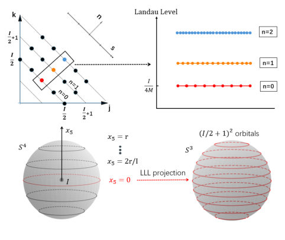 
FIG. 1. Landau levels of fuzzy three-sphere S3. (Top) Each Landau level on fuzzy S4 geometry corresponding to a SO(5) irreducible representation [33, 34], which can be de- composed into blocks of SO(4) representations labeled by two integer numbers (n, s) [35]. Taking s = 0 gives the SO(4) Landau levels on fuzzy S3. (Bottom) For n = 0, the fuzzy S3 locate along x5-axis on S4 with equal spacing. In partic- ular, x5 = 0 latitude (red dashed line) on S4 corresponds to the n = 0, s = 0 SO(4) representation, i.e., the lowest SO(4) Landau level of S3.

📷 Fig 2

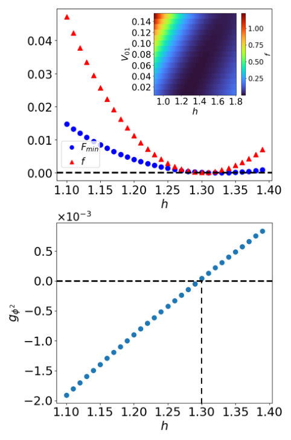 
FIG. 2. Locating the critical point. (Top) Cost functions f (Eq. 28) and Fmin (Eq. 30) as a function of transverse field h. (Bottom) In the perturbative theory, the coupling gϕ2 which minimizing the cost function Fmin at each h. The calculations are performed for the system size N = 9. For the potential V0,0 = 1.2, V0,1 = V1,0 = 0.02, the critical point is determined to be hc ≈1.3. (Inset) Heatmap of f(h, V0,1) by setting V0,0 = 1.2.

📷 Fig 3

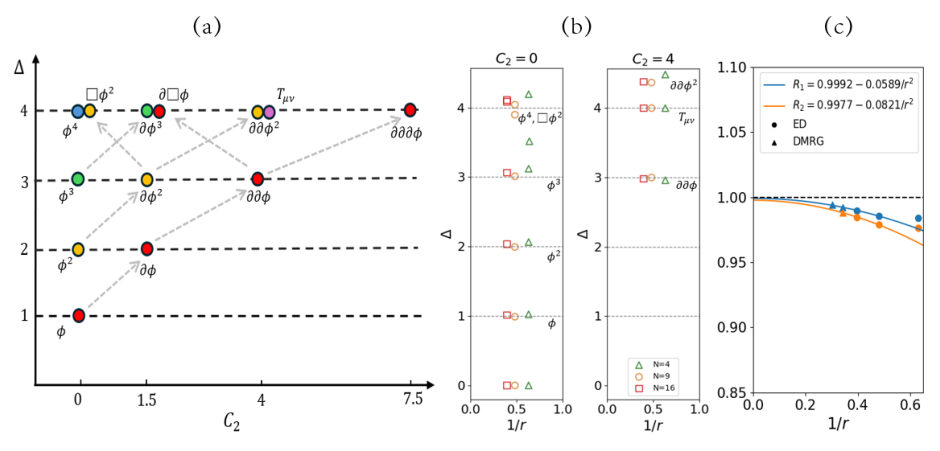 
FIG. 3. Operator spectra for Ising transition. (a) Schematic plot of the tower structure of conformal multiplets of d = 4 free boson CFT. The grey arrow marks the operation of the conformal generator and the fields belong to the same multiplet are labeled by the same color. (b) The low-lying operator spectra living in Casimir number C2 = 0 and 4. System sizes with N = 4, 9, 16 electrons (corresponding to SU(2) monopole charge I = 2, 4, 6) are shown. (c) The ratios R1,2 versus system sizes 1/r (equivalent to SU(2) monopole charge I = 4, 6, 8, 10). Finite-size scaling gives R1 →0.9976 and R2 →0.9962, both of which are close to the expectation ∆ϕ = 1. I = 4, 6 are obtained by the exact...

📷 Fig 4

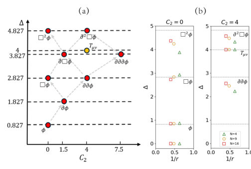 
FIG. 4. Operator spectra for Yang-Lee transition. (a) Schematic plot of the tower structure of conformal multiplets of d = 4 Yang-Lee CFT. (b) The low-lying operator spectra living in Casimir number C2 = 0 and 4. System sizes with N = 4, 9, 16 electrons are shown. The parameters are set to be V0,0 = 0.6, V0,1 = V1,0 = 0.2 and hx = 3.5. The critical hz c are determined by the optimization of cost function for each system size.

**Summary.** The paper develops a method using fuzzy three-sphere regularization to analyze quantum phase transitions in (3+1) dimensions. By projecting the system onto Landau levels and comparing computed energy spectra against theoretical CFT predictions, the authors successfully locate critical points for Ising and Yang-Lee models. This establishes a novel pathway for microscopically verifying emergent conformal symmetry in higher-dimensional condensed matter systems.

**Why it may be interesting.** This work provides a powerful geometric tool—fuzzy geometry on spheres—to study quantum criticality in higher dimensions, linking condensed matter phase transitions directly to the rigorous mathematical structure of Conformal Field Theory.

Detailed structure

**Main problem.** The primary goal is to expose emergent conformal symmetry at the (3+1)-D quantum critical point, generalizing techniques from fuzzy two-spheres ($S^2$) to higher dimensions.

**Main result.** The framework successfully maps Quantum Phase Transitions (QPTs) belonging to Ising and Yang-Lee universality classes onto an effective Hamiltonian defined on a fuzzy three-sphere, yielding consistent estimates for critical fields and confirming near-CFT scaling behavior.

**Method.** The study employs radial quantization and utilizes the state-operator correspondence ($\delta E_n \propto \Delta_n$) by minimizing cost functions that compare calculated energy spectra to expected CFT scaling dimensions.

**Model / system.** The investigation focuses on (3+1)-D quantum models, specifically the Ising and Yang-Lee transitions, realized through Landau level projection onto the fuzzy three-sphere ($S^3$). The Hamiltonian involves density-density interactions and transverse/longitudinal fields.

**Key observables.** Energy spectra $\{E_n\}$ at criticality, scaling dimensions ($\Delta_\phi$, $\Delta_{\phi^2}$), and ratios of energy gaps ($R_{1,2}$) used to test for conformal invariance.

**Important parameters / regimes.** The critical fields $h_c$ (for Ising) and $h_z^c$ (for Yang-Lee); the coupling constants defining the Hamiltonian terms.

**Assumptions / limitations.** The approach assumes the successful generalization of spherical background techniques to higher dimensions ($d>2$) and relies on projecting the system into the Lowest Landau Level (LLL) subspace.

**Figures summary.** Figures illustrate Landau levels on $S^3$ derived from $	ext{SO}(5)$ representations, show the evolution of cost functions ($f$ and $F_{\min}$) versus the transverse field $h$, and display operator spectra and ratios confirming CFT structure.

**Paper structure.** The paper introduces the generalization of fuzzy sphere regularization to $S^3$. It then applies this framework to model QPTs (Ising/Yang-Lee), detailing Hamiltonian construction via LLL projection, followed by calculations using spectral matching cost functions to determine critical points and verify conformal scaling.

Abstract

Conformal field theory (CFT) offers a modern viewpoint for understanding phase transitions. However, directly accessing the conformal algebra and microscopically uncovering the emergent conformal symmetry, especially in higher dimensions, remains a significant challenge. Motivated by recent advances in revealing CFT features via the fuzzy two-sphere, here we generalize this approach to higher dimensions and aim to expose the conformality at the (3+1)-D quantum critical point. We demonstrate this framework by investigating quantum phase transitions belonging to the Ising and Yang-Lee universality classes in a (3+1)-D quantum model (equivalent to a classical four-dimensional system), realized via Landau level projection on the fuzzy three-sphere. By computing the energy spectra at criticality, we explicitly verify the state-operator correspondence, a hallmark of conformal invariance. Together with prior advances, this work establishes a new pathway for the microscopic study of emergent conformality in higher-dimensional phase transitions.

[↑ back to top](#top)

### [Depth-Efficient Quantum Topological Data Analysis for Regime-Specific Detection of Financial Stress](http://arxiv.org/abs/2607.09906v1)

**Authors:** Arul Rhik Mazumder, Shreyan Ronit Mazumder  
**Type:** both · **Category:** quantum information and computing · **PDF:** <https://arxiv.org/pdf/2607.09906v1>  
**Analysis basis:** full PDF text, analyzed in chunks

📷 Fig 1

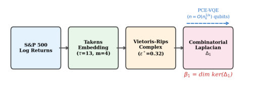 
Fig. 1. Overview of the qTDA pipeline with PCE qubit compression: (1) S&amp;P 500 log returns →Takens embedding (τ = 13, m = 4) →point cloud in R4; (2) Vietoris–Rips complex VR(ε∗), 461 points per window; (3) combinatorial Laplacian ∆1 = ∂2∂⊤ 2 + ∂⊤ 1 ∂1, nk ∈[31, 429]; (4) PCE encoding into n = O(n1/κ k ) qubits, HEA + COBYLA optimisation with variational deflation →˜β1.

📷 Fig 2

 
Fig. 2. First Betti number β1 over 190 sliding windows (2003–2010), computed by the classical CE benchmark and verified against ripser. Vertical lines mark Bear Stearns (14 Mar. 2008, dotted) and Lehman Brothers (15 Sep. 2008, dashed). β1 ∈[0, 22]; mean 4.72.

📷 Fig 3

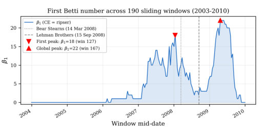 
Fig. 2. CE agrees with ripser on 190/190 windows (100%) for both β0 and β1, confirming that the classical stage of the pipeline is correct. The β1 signal rises from zero in late 2006, reaches a first peak at window 127 (β1 = 18, January 2007 to January 2009), dips briefly, and then attains the global maximum β1 = 22 at window 167 (April 2008 to April 2010). The topological complexity begins building more than a year before the Bear Stearns collapse (March 2008) and Lehman Brothers bankruptcy (September 2008), consistent with the hypothesis that topological loop formation provides a leading indicator of systemic stress [3]. We emphasize that the curves in this section are produced by the...

📷 Fig 4

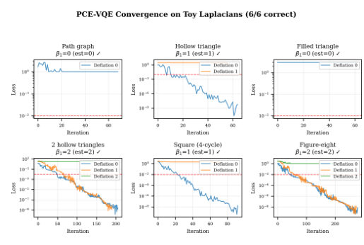 
Fig. 3. PCE-VQE convergence on six toy Laplacians (6/6 correct). Each panel is one toy Laplacian, labelled with its true β1 and the recovered estimate. Within a panel, each coloured curve is one deflation round (round 0 blue, round 1 orange, round 2 green), that is, one search for a null vector orthogonal to those already found; the red dashed line is the null-space threshold δ = 0.01. A curve settling near 10−10 has located a null vector, while a round whose best loss jumps to ≈3.0 has none left to find and terminates the count. Each panel carries its own legend listing the deflation rounds it contains.

📷 Fig 5

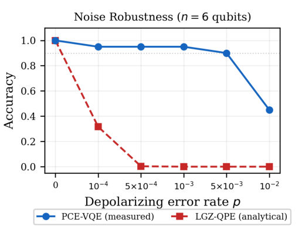 
Fig. 4. Noise robustness (illustrative; not a matched-scale comparison): PCE- VQE accuracy (measured, blue, n = 6 qubits, nk ≈63 under κ = 2) vs. LGZ-QPE at nk = 16 (measured, red solid) and analytical extrapolation (red dashed). PCE maintains &gt;90% accuracy up to p=5×10−3; simulated LGZ-QPE collapses above p=10−4, matching the analytical bound. The two curves are not at matched encoded problem size: PCE encodes nk ≈63 basis dimensions while LGZ operates on nk = 16. The figure illustrates the depth/noise trade-off at moderate scale rather than a like-for-like comparison; see Section VII-F for explicit caveats.

**Summary.** The paper proposes using Quantum Topological Data Analysis (qTDA) via Pauli Correlation Encoding (PCE) to detect financial stress by estimating topological features ($eta_k$) from stock market returns. It demonstrates that PCE offers a shallow and robust quantum approach compared to other methods for this task. While promising, the authors note that achieving full generalization across different economic crises remains an open challenge.

**Why it may be interesting.** This work is highly relevant as it merges advanced quantum computation techniques (PCE) with complex data analysis problems (TDA), providing a blueprint for applying near-term quantum hardware to high-dimensional, structured scientific data beyond simple Hamiltonian simulation.

Detailed structure

**Main problem.** The core problem is developing a depth-efficient quantum algorithm to estimate Betti numbers ($eta_k$) from complex financial time series data, which classically requires computationally expensive diagonalization of large combinatorial Laplacians.

**Main result.** The authors successfully adapted Pauli Correlation Encoding (PCE) for this task, showing that while the method achieves shallow circuits and polynomial gradient decay, its current implementation relies on a classical warm-start to recover topological invariants exactly.

**Method.** They reformulate Betti number estimation as a continuous-PCE Rayleigh-quotient minimization. This variational quantum circuit approach encodes necessary combinatorial data into qubits using Pauli correlators, bypassing the deep circuits required by standard Quantum Phase Estimation (QPE).

**Model / system.** The system is derived from S&P 500 returns time series, processed via Takens embedding and Vietoris–Rips filtration to construct a point cloud whose topology is characterized by Betti numbers ($eta_k$). The quantum computation operates on the parameters defining these topological invariants.

**Key observables.** Betti numbers ($eta_1$ in particular), ROC AUC scores for classification, and gradient variance decay rates.

**Important parameters / regimes.** Number of qubits ($n$), correlation order ($\kappa$), noise parameter ($p$), and time-series window size (e.g., 2007-2009).

**Assumptions / limitations.** The primary limitation is that the quantum recovery of $eta_1$ requires warm-starting from a classical null-space surrogate, suggesting the bottleneck lies in the optimization landscape rather than the encoding itself.

**Figures summary.** Figures compare PCE-VQE against LGZ-QPE regarding circuit depth and noise robustness, showing PCE's advantage for near-term devices. Classification results show $eta_1$ outperforms baseline proxies during specific historical periods but fails to generalize across distinct crisis regimes (e.g., COVID shock).

**Paper structure.** The paper first establishes the need for quantum TDA due to classical computational bottlenecks in calculating Betti numbers from market data. It then details the novel adaptation of PCE for this purpose, comparing it favorably against QPE methods based on circuit depth and noise resilience. Finally, it presents empirical results showing successful recovery under warm-start conditions but highlights limitations regarding generalization across different economic regimes.

Abstract

We present, to our knowledge, the first adaptation of Pauli Correlation Encoding (PCE) to quantum topological data analysis, reformulating Betti number estimation as a depth-efficient variational optimization over a compressed qubit register. From a Takens embedding and Vietoris--Rips filtration of S&P~500 returns, we extract combinatorial Laplacians and recast null-space counting as a continuous-PCE Rayleigh-quotient minimization with variational deflation, encoding $n_k$ simplex indices into $O(n_k^{1/κ})$ qubits with shallow, ancilla-free circuits. Because the resulting loss is rational rather than bilinear in the correlators, the barren-plateau bound of~\cite{Sciorilli25} does not transfer; empirically the gradient variance decays only polynomially, with no exponential barren plateau, over $n=4$--$12$ qubits. The classical stage matches ripser~\cite{bauer2021ripser} on all 190 sliding windows (2007-2009). On the real market Laplacians ($β_1=1$--$22$), warm-starting from a classical null-space surrogate allows PCE-VQE to recover $β_1$ exactly at every scale, placing the obstacle in the optimisation landscape rather than the encoding. Chronologically split classification gives in-regime ROC AUC $0.818$, but out-of-distribution evaluation on the 2020 COVID shock and 2022 rate cycle (AUC $0.009$, $0.515$) shows the calibration does not generalize across crisis regimes.

[↑ back to top](#top)

### [From Leaves to Clusters: Depth-Efficient SAT-Oracle Synthesis Based on the HRSE Model](http://arxiv.org/abs/2607.11401v1)

**Authors:** Zhihang Li, Wei Zi, Shuai Yang, Bei Zhou, Zongjiang Yi, Woji He, Yingjie Lin, Kaixiang Ji, Heru Du, Jinchen Xu  
**Type:** theory · **Category:** quantum information and computing · **PDF:** <https://arxiv.org/pdf/2607.11401v1>  
**Analysis basis:** full PDF text, analyzed in chunks

📷 Fig 1

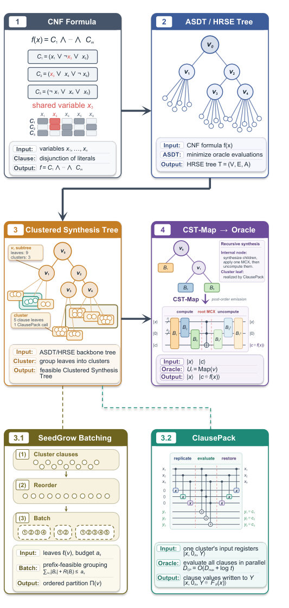 
Fig. 1. The CST-based SAT-oracle synthesis pipeline. A CNF instance is processed through four stages—ASDT backbone construction under the ancilla budget aq, clause clustering into feasible ordered partitions, per-leaf ClausePack evaluation, and CST-Map compilation—yielding an executable SAT-oracle.

📷 Fig 2

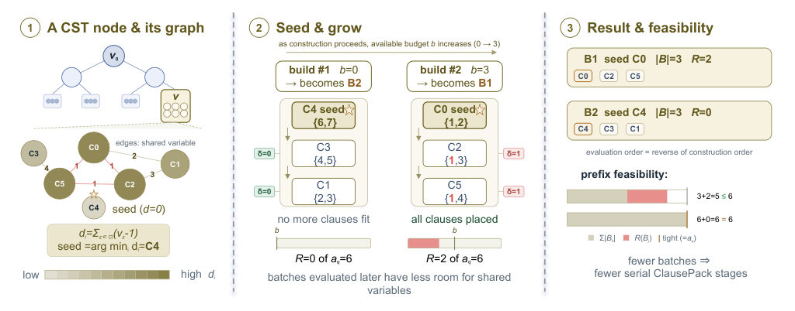 
Fig. 2. Worked example of SEEDGROW on the instance f = (x1∨x2) ∧(x2∨x3) ∧(x1∨x3) ∧(x4∨x5) ∧(x6∨x7) ∧(x1∨x4) (m = 6, aq = 6; clauses are indexed from C0 in this worked example). Left: Conflict graph; nodes shaded by the conflict degree di defined in (20); x1 is the shared “hot” variable linking C0, C2, C5; the seed (⋆) is the least-conflicting clause. Center: Backward batch construction (last batch built first); within budget b, each step admits the candidate of smallest overlap increment δi = | bCi ∩U|, as defined in (21); the budget b increases as clauses are committed to later batches. Right: Final partition in evaluation order B1 = {C0, C2, C5} (R = 2) and B2 = {C1, C3, C4} (R = 0), with...

📷 Fig 3

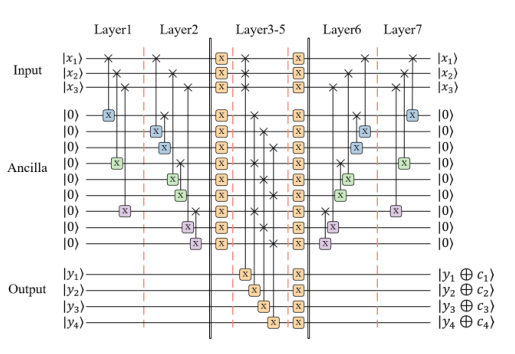 
Fig. 3. ClausePack oracle for one clustered leaf, instantiated on a maximally shared cluster of four identical clauses C1 = · · · = C4 = (x1 ∨x2 ∨x3).

📷 Fig 4

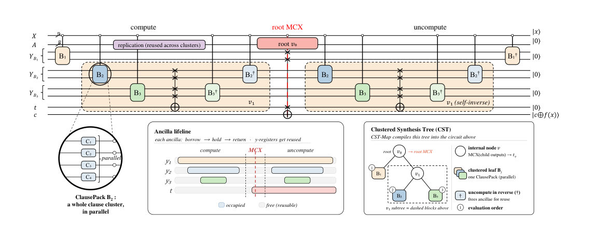 
Fig. 4. Circuit-level illustration of CST-Map. Clustered leaves Bj are compiled into CLAUSEPACKBj blocks that evaluate clause clusters in parallel; internal CST nodes collect the exposed child outputs, apply an MCX gate to write the node value, and then uncompute the child blocks in reverse order so that temporary ancillae can be reused.

📷 Fig 5

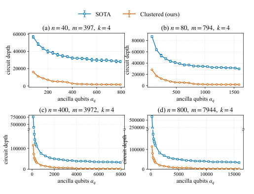 
Fig. 5. End-to-end circuit depth as a function of the ancilla budget aq, on four random 4-CNF size classes (n = 40, 80, 400, 800; one subplot each). Both methods are evaluated on the same instances at the same sampled budget values. Markers denote the mean over 20 instances, and error bars denote one standard deviation computed from the per-instance depth records.

**Summary.** This paper presents the Clustered Synthesis Tree (CST), a novel framework designed to build deep-circuit quantum oracles for solving SAT problems efficiently. By grouping related clauses into parallel clusters, CST significantly outperforms existing state-of-the-art methods across multiple benchmarks. The results demonstrate massive reductions in circuit depth, proving its utility for resource-constrained quantum computation.

**Why it may be interesting.** While focused on SAT, the methodology of optimizing circuit depth under resource constraints via structural decomposition (clustering) is highly relevant to designing efficient quantum circuits for complex physical simulations or algorithms in general.

Detailed structure

**Main problem.** The core challenge is synthesizing quantum oracles for SAT (CNF) formulas with minimal circuit depth while operating under strict constraints on available ancilla qubits.

**Main result.** The proposed Clustered Synthesis Tree (CST) framework achieves dramatic reductions in oracle circuit depth, showing speedups of up to 43.2x over state-of-the-art methods on standard benchmarks.

**Method.** It introduces CST, a depth-oriented synthesis tree that groups individual clause leaves into clusters to expose instance-dependent parallelism, which is then compiled using the ClausePack oracle and SeedGrow heuristic.

**Model / system.** The work models quantum oracles for SAT problems, utilizing the Hierarchical Recursive Synthesis-Evaluation (HRSE) framework as a structural backbone. The system involves mapping the CNF formula onto a computation tree structure constrained by qubit availability.

**Key observables.** Circuit Depth ($D(\cdot)$), Ancilla Qubit Budget ($a_q$), and the resulting speedup ratio compared to baseline methods.

**Important parameters / regimes.** The number of variables ($n$), clauses ($m$), clause width ($k$, e.g., 3-CNF, 4-CNF), and the available ancilla qubits.

**Assumptions / limitations.** The primary assumption is that depth reduction can be achieved by exploiting clause-level parallelism through intelligent clustering, which leads to an NP-complete scheduling problem (ACCS-D).

**Figures summary.** Figures compare CST's circuit depth against SOTA baselines across various instance sizes and budgets; Table VI quantifies resource estimates for solving k-SAT using Grover's search algorithm.

**Paper structure.** The paper first establishes the limitations of existing methods, then introduces the CST framework which refines the HRSE/ASDT backbone. It details the three components—SeedGrow (grouping), ClausePack (parallel evaluation), and CST-Map (compilation)—before presenting extensive benchmarking results.

Abstract

Quantum oracles are a common building block of many quantum algorithms, where circuit depth is a primary cost that directly affects overall performance. Synthesizing oracles for SAT (CNF) formulas under a limited ancilla budget, however, tends to yield deep circuits, as existing methods underexploit clause-level parallelism. In this work, we present the Clustered Synthesis Tree (CST), a depth-oriented framework whose core idea is to group the individual clause leaves of a hierarchical synthesis tree into clusters, exposing instance-dependent clause-level parallelism under ancilla constraints. CST comprises three parts: the clause-grouping problem it induces, which we formulate as an ancilla-constrained scheduling problem and prove NP-complete in general, is addressed by SeedGrow, a polynomial-time $O(m^2 k)$ heuristic; ClausePack, a reversible oracle that evaluates a cluster's clauses in parallel at only a logarithmic-depth overhead; and CST-Map, which compiles the clustered tree into an executable SAT-oracle. On random $4$-CNF under the same ancilla budgets, CST reduces the oracle's circuit depth over the state-of-the-art (SOTA) baseline by $68\%$--$94\%$. On the standard SATLIB benchmarks, CST achieves about a $2.6\times$--$43.2\times$ reduction over the SOTA baseline, with the largest gains under dense variable sharing, and matches the baseline's maximum-budget depth using only $3.7\%$--$20\%$ of its ancilla qubits. A Grover-search resource estimate shows the advantage carries over to the full algorithm, reducing total circuit depth by $70\%$--$89\%$.

[↑ back to top](#top)

### [HSF-S: Speed-Optimized Compilation and Acceleration for Hybrid Schrodinger-Feynman Quantum Circuit Emulation](http://arxiv.org/abs/2607.10262v1)

**Authors:** Sechan Park, Kyeongwon Lee, Mundo Jeong, Chaebin Jung, Woojoo Lee  
**Type:** both · **Category:** quantum information and computing · **PDF:** <https://arxiv.org/pdf/2607.10262v1>  
**Analysis basis:** full PDF text, analyzed in chunks

📷 Fig 1

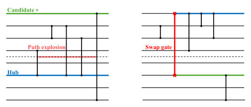 
Figure 1: Key intuition of HSF-S. Under a fixed partition, a hub qubit repeatedly induces cross-boundary interactions. A cross SWAP can relocate the hub and convert downstream cross-boundary interac- tions into intra-slice gates, reducing HSF path cost.

📷 Fig 2

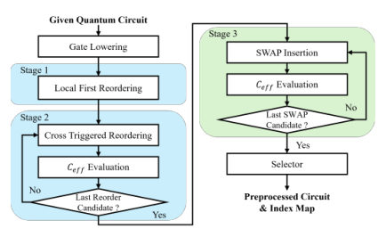 
Figure 2: Overview of the HSF-S preprocessing flow. After gate low- ering, two reordering stages expose profitable SWAP opportunities, Stage 3 inserts cross SWAPs, and the Selector returns the best com- piled circuit together with metadata.

📷 Fig 3

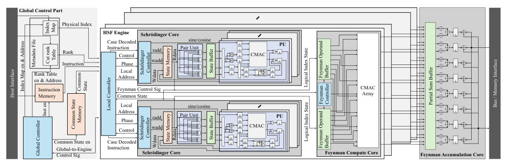 
Figure 3: Overview of the proposed HSF-S accelerator. The host loads the compiled instruction stream together with cut-rank table and index map. A global controller broadcasts instructions to parallel HSF engines. Each engine contains two slice-local Schrödinger cores and a Feynman Compute Core, while a common-state memory and a shared Feynman Accumulation Core support prefix reuse and cross-path accumulation.

📷 Fig 4

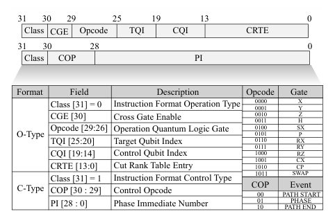 
Figure 4: Instruction format of the proposed HSF-S accelerator.

📷 Fig 5

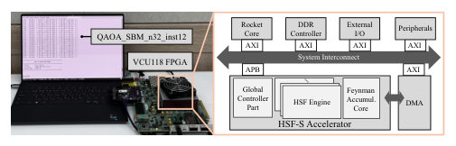 
Figure 5: Prototype demonstration of the stand-alone HSF-S QC emulator on the AMD VCU118 FPGA evaluation board.

**Summary.** The paper introduces HSF-S, a novel compiler and accelerator framework designed to efficiently emulate quantum circuits using the Hybrid Schrödinger-Feynman (HSF) method. It minimizes runtime bottlenecks by optimizing circuit structure via path-cost modeling and reordering, and further accelerates execution using a custom FPGA-based processor. This significantly improves the practical tractability of exact HSF simulation.

**Why it may be interesting.** This work directly addresses the computational bottlenecks in simulating complex quantum circuits by developing specialized compiler optimizations and custom hardware accelerators tailored to the path-centric nature of HSF simulation, which is crucial for scaling quantum algorithm testing.

Detailed structure

**Main problem.** The practical runtime of Hybrid Schrödinger-Feynman (HSF) quantum circuit emulation is limited by exponential path growth from cross-boundary two-qubit gates, which existing simulators do not handle efficiently.

**Main result.** The proposed HSF-S framework reduces the effective path cost by up to 90.0% and provides a dedicated hardware accelerator yielding up to 4.34x speedup on compiled workloads.

**Method.** HSF-S is a compiler-accelerator co-designed framework that lowers circuits to an HSF basis, applies dependency-preserving reordering, and uses discounted-gain SWAP insertion based on a rank-aware effective path-cost model.

**Model / system.** The paper focuses on exact quantum circuit emulation using the Hybrid Schrödinger-Feynman (HSF) model, which partitions computation into local (Schrödinger) and cross-boundary (Feynman) evaluations. The implementation is prototyped on a stand-alone RISC-V core integrated onto an AMD VCU118 FPGA.

**Key observables.** Effective path cost ($C_{eff}$), amplitude matching to reference values, and hardware speedup factor.

**Important parameters / regimes.** Cross-boundary gate types (e.g., controlled gates $
ightarrow$ rank 2, SWAP $
ightarrow$ rank 4); the fixed bipartition of qubits into slices A or B.

**Assumptions / limitations.** The effective path cost ($C_{eff}$) is a compile-time surrogate for runtime; the process assumes an exact emulation requirement that must be preserved during optimization.

**Figures summary.** Figures illustrate the HSF-S preprocessing flow, showing how reordering and SWAP insertion reduce $C_{eff}$ compared to naive lowering, alongside hardware prototype diagrams and ablation studies on cost reduction across pipeline stages.

**Paper structure.** The paper introduces the problem of path growth in HSF simulation, details the multi-stage HSF-S compilation pipeline (lowering $
ightarrow$ reordering $
ightarrow$ SWAP insertion $
ightarrow$ Selector), presents the dedicated hardware accelerator design, and validates the combined approach on benchmarks.

Abstract

Hybrid Schrodinger-Feynman (HSF) simulation offers an attractive memory-path tradeoff for exact quantum-circuit emulation, but its practical runtime is often dominated by exponential path growth from cross-boundary two-qubit gates. Existing GPU and FPGA quantum simulators are largely optimized for full-state Schrodinger execution and therefore do not align well with HSF's path-centric workflow. This paper presents HSF-S, a compiler-accelerator co-designed framework for exact HSF-based quantum circuit emulation. HSF-S lowers input circuits to an HSF-compatible basis, formulates a rank-aware effective path-cost model, and applies dependency-preserving reordering together with discounted-gain SWAP insertion to suppress recurring cross-boundary interactions while preserving exact circuit semantics. A regression-free selector guarantees that the compiled circuit never increases effective path cost relative to the naive lowered baseline. We further design a dedicated HSF-S accelerator and execution flow, and integrate them into a stand-alone processor for efficient per-path dual-slice evaluation and final accumulation without materializing the full state vector. Across 56 benchmark circuits, HSF-S matches reference amplitudes to within floating-point precision, reduces effective path cost by up to 90.0%, and substantially improves practical tractability, including representative timeout-to-sub-second reductions under a 1-hour budget. On the resulting compiled workloads, the HSF-S processor prototype delivers up to 4.34x additional speedup.

[↑ back to top](#top)

### [Input-Aware Dynamic Backdoor Attack Against Quantum Neural Networks](http://arxiv.org/abs/2607.11843v1)

**Authors:** Junrui Zhang, Zemin Chen, Lusi Li, Mohammad Ghasemigol, Daniel Takabi, Rui Ning  
**Type:** theory · **Category:** quantum information and computing · **PDF:** <https://arxiv.org/pdf/2607.11843v1>  
**Analysis basis:** full PDF text, analyzed in chunks

📷 Fig 1

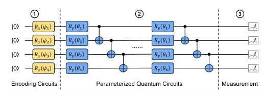 
Fig. 1: Overview of a QNN, consisting of encoding circuits that map classical data into a quantum state, parameterized quantum circuits with trainable gates, and measurement layer that returns classical predictions.

📷 Fig 2

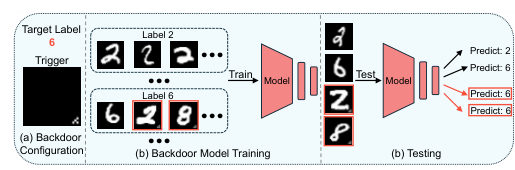 
Fig. 3: An illustration of a backdoor attack. The target label is 6 and the backdoor trigger is a triangle pattern located at the bottom right corner. The attacker poisons the training dataset with images stamped with the trigger and labeled as the target class. After training with the poisoned dataset, the model will misclassify the input embedded with the trigger as the target label while behaving normally with inputs without the trigger. Extending Backdoor Attacks to QNNs. Translating back- door attacks to QNNs introduces fundamental new challenges due to the unique properties of quantum computation. Early attempts have explored two main attack strategies: (1) Circuit- level manipulation...

📷 Fig 3

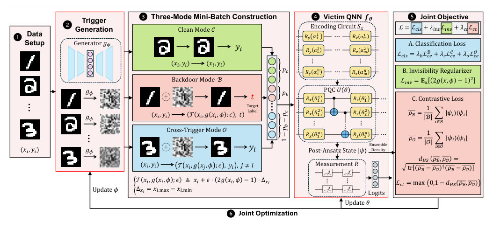 
Fig. 4: Overview of the Q-DIBA framework. Given (1) a clean subset, Q-DIBA uses (2) the generator gϕ to produce input- aware triggers, which are injected by (3) the range-matched transformation T to construct clean, backdoor, and cross-trigger mini-batch modes. The resulting samples are processed by (4) the victim QNN fθ through encoding Sx, PQC U(θ), and measurement R, producing post-ansatz states and logits. These outputs are used in (5) a joint objective combining Lcls, Linv, and Lct, through which (6) fθ and gϕ are jointly optimized.

**Summary.** This paper introduces Q-DIBA, the first input-aware dynamic backdoor attack specifically designed for Quantum Neural Networks (QNNs). It overcomes major theoretical hurdles in quantum machine learning—namely measurement collapse and state fluctuation—by using an ensemble density contrastive loss. The resulting attack is highly successful, stealthy, and resilient against several known defense mechanisms.

**Why it may be interesting.** The work directly addresses security vulnerabilities in quantum machine learning architectures by proposing a sophisticated, input-specific attack that circumvents common detection mechanisms based on fixed patterns or simple spectral analysis.

Detailed structure

**Main problem.** Quantum Neural Networks (QNNs) are vulnerable to backdoor attacks, and existing quantum backdoors use fixed triggers which are easily detectable by modern defenses.

**Main result.** The proposed Q-DIBA achieves high attack success rates while remaining stealthy against visual inspection, spectral signature detection, and fine-tuning, establishing a new threat model for secure QNN deployment.

**Method.** Q-DIBA jointly trains the QNN and an input-aware trigger generator using a three-mode mini-batch strategy and introduces an ensemble density contrastive loss operating on post-ansatz quantum states before measurement.

**Model / system.** The system is a Quantum Neural Network (QNN), which is a hybrid quantum-classical model composed of an encoding circuit, parameterized quantum circuits (PQCs), and a final measurement layer. The attack targets the parameters ($	heta$) governing these trainable unitary operations.

**Key observables.** Clean Model Accuracy (CA), Attack Success Rate (ASR), Cross-Trigger Accuracy (CTA), and performance after fine-tuning epochs.

**Important parameters / regimes.** The three training modes: clean samples, attack activation samples, and cross-trigger samples; the contrastive loss hinge distance ($d_{	ext{HS}}$).

**Assumptions / limitations.** It is assumed that averaging the density matrices ($ar{
ho}$) across samples within a mode provides a stable gradient for training the joint optimization.

**Figures summary.** Figures illustrate the QNN structure (Encoding $
ightarrow$ PQC $
ightarrow$ Measurement) and show examples of fixed-trigger attacks. Tables summarize performance metrics like ASR, CTA, and resilience against fine-tuning across different epochs.

**Paper structure.** The paper first reviews QNNs and backdoor vulnerabilities, identifies the limitations of current quantum attack models (measurement collapse), proposes Q-DIBA with its novel loss function, validates it on MNIST/Fashion-MNIST, and finally demonstrates its robustness against state-of-the-art defenses.

Abstract

Quantum Neural Networks (QNNs) are a promising framework for quantum machine learning on near-term quantum devices, but their security risks remain insufficiently understood. Studies have shown that QNNs are vulnerable to backdoor attacks, yet existing quantum backdoors mostly rely on a fixed trigger shared by all poisoned inputs. This fixed-trigger design is a major weakness because many defenses detect or weaken the repeated patterns such triggers leave in data representations. Although input-aware dynamic backdoors have been studied in classical neural networks, transferring them to QNNs is difficult because quantum learning introduces new obstacles. In particular, measurement compresses the post-ansatz quantum state into a limited classical output, weakening supervision for a trigger generator, while individual density matrices fluctuate with the input and make per-sample contrastive learning unstable. To address these challenges, we propose Q-DIBA, the first input-aware dynamic backdoor attack for QNNs. Q-DIBA jointly trains a classical trigger generator and a victim QNN through a three-mode mini-batch strategy that supports clean behavior, attack activation, and trigger specificity. To provide stable quantum-level supervision, Q-DIBA introduces an ensemble density contrastive loss that operates on post-ansatz quantum states before measurement and contrasts mode-averaged density matrices rather than individual samples. Experiments on MNIST and Fashion-MNIST across multiple QNN architectures show that Q-DIBA achieves high clean accuracy, strong attack success, and high cross-trigger accuracy, demonstrating effectiveness, stealthiness, and input specificity. The attack also remains resilient against defenses including visual inspection, spectral-signature detection, and fine-tuning, suggesting that input-aware quantum backdoors are an important threat to secure QNN deployment.

[↑ back to top](#top)

### [Lie-Algebraic Subspace Quantization for Zero-Shot Quantum Learning and Barren-Plateau Mitigation](http://arxiv.org/abs/2607.11174v1)

**Authors:** Yuhan Yao, Yoshihiko Hasegawa  
**Type:** theory · **Category:** quantum information and computing · **PDF:** <https://arxiv.org/pdf/2607.11174v1>  
**Analysis basis:** full PDF text, analyzed in chunks

📷 Fig 1

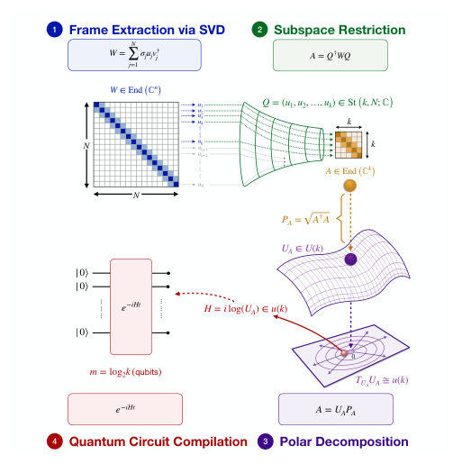 
FIG. 1. Algebraic architecture and geometric projec- tion mechanics of the quantum parameter transfer map T (Theorem 3). The conceptual workflow trans- lates an arbitrary, non-unitary classical prior into a physi- cally realizable subspace quantum evolution via four explicit algebraic operations: (1) Spectral Decoupling: The am- bient operator W ∈End(CN) is transformed via singular value decomposition (SVD) to isolate the dominant dynam- ical sectors characterized by the leading k left singular vec- tors. (2) Isometric Compression: The isometric frame Q ∈St(k, N; C) restricts the ambient interactions onto a k- dimensional computational core, yielding the localized effec- tive operator A....

📷 Fig 2

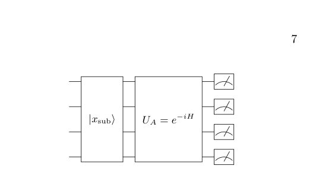 
FIG. 2. Zero-shot quantum compilation on four qubits. The analytical map T translates a 64 × 64 full-rank classical weight W into an isometric frame Q ∈St(16, 64; C) and a local Hermitian generator H ∈i u(16); the compiled circuit prepares the subspace state |xsub⟩= Q†x and applies the single subspace unitary UA = e−iH on log2 16 = 4 qubits. The classical model (4096 parameters) reaches 94.4% accu- racy; the zero-shot 4-qubit hybrid operator recovers 93.4% (1.0% gap), and reproduces the physical circuit to machine precision.

📷 Fig 3

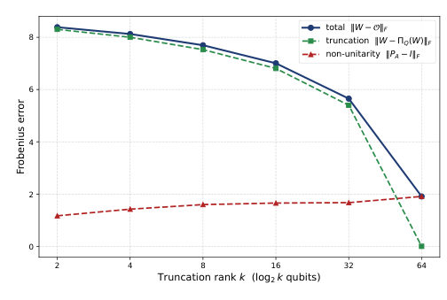 
FIG. 3. Quantization error budget versus subspace dimension k. The total Frobenius error (blue) is bounded by the sum of the truncation term (green) and the non-unitarity term (red), as in Theorem 4. Truncation →0 as k →N; the non-unitarity term is the irreducible floor ∥PA −Ik∥F = qP

📷 Fig 4

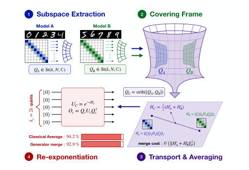 
FIG. 4. Covering-frame generator-space merging. Two specialized frame-generator pairs are embedded into the cov- ering frame QC = orth([QA, QB]). The transported genera- tors are preserved exactly before being averaged in the com- mon Lie algebra and re-exponentiated as the merged quantum operator. The additional merge discrepancy is second order in the transported-generator separation.

📷 Fig 5

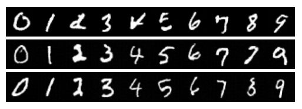 
FIG. 6. Experiment II: quantum diffusion trans- former. Class-conditional MNIST samples for digits 0–9. Top: classical Mini-DiT (Phase 1). Middle: zero-shot quan- tum transfer of all residual cores to 4-qubit hybrid opera- tors, no quantum-side training (Phase 2). Bottom: after fine- tuning the Hermitian generators only (Phase 3).

**Summary.** This paper presents an analytical framework to overcome barren plateaus in Quantum Neural Networks by mapping classical weights onto low-dimensional subspaces of the quantum evolution. It introduces a parameter transfer map and rigorously proves that gradient variance scales favorably with this subspace dimension ($k$), enabling scalable, trainable quantum models.

**Why it may be interesting.** This work provides deep theoretical guarantees on the scalability of quantum machine learning models by mathematically controlling how classical information is encoded into quantum dynamics, which is crucial for designing practical quantum algorithms.

Detailed structure

**Main problem.** The primary challenge addressed is overcoming the barren plateau phenomenon that severely limits the scalability of variational quantum circuits.

**Main result.** The authors introduce an analytical parameter transfer map that converts classical network weights into low-dimensional, subspace-confined quantum evolutions while providing rigorous error bounds for model merging and gradient analysis.

**Method.** The core method involves mapping classical parameters to Lie algebra generators via Stiefel subspace selection and nearest-unitary polar projection, allowing the dynamics to be confined to a controllable $k$-dimensional subspace.

**Model / system.** The system analyzed is Parameterized Quantum Circuits (PQCs) or Quantum Neural Networks (QNNs). The underlying mathematical framework utilizes Lie algebra theory applied to quantum evolution operators defined on Hilbert spaces $\mathcal{H}_N$.

**Key observables.** Hellinger fidelity (0.987 at k=8), subspace gradient resolvability (up to 128 qubits), and the effective dimension ($D_N$) derived from the normalized Fisher information matrix.

**Important parameters / regimes.** The low-dimensional subspace size $k$, the ambient qubit number $N$ (or $n$), and the circuit depth $L$.

**Assumptions / limitations.** Assumes that restricting dynamics to a low-dimensional subspace geometry built from Stiefel frames is sufficient, and relies on defining a branch-cut-free neighborhood around the identity for the principal logarithm.

**Figures summary.** Not specified by notes; however, the analysis involves derivations related to gradient variance scaling ($\propto 1/k$) and the saturation of effective dimension based on Fisher spectra.

**Paper structure.** The paper builds from foundational mathematical tools (Stiefel manifolds, Lie algebra) to develop a parameter transfer map. It then analyzes trainability by bounding gradient variance in low-dimensional subspaces, followed by extensions to model merging and quantifying circuit expressivity via the effective dimension.

Abstract

The barren plateau phenomenon severely limits the scalability of parameterized quantum circuits (PQCs). We present an analytical framework for zero-shot classical-to-quantum parameter transfer and manifold-based model merging without quantum-side optimization. Our parameter transfer map converts classical neural-network weights into low-dimensional quantum evolutions using Stiefel subspace selection, nearest-unitary polar projection, and logarithmic generator extraction. We prove a Subspace Quantization Theorem that bounds the reconstruction error by geometric truncation and exact non-unitarity, with the latter becoming second order in the near-unitary regime. Identity-centered architectures naturally produce generators near the identity, avoiding logarithm branch-cut singularities and mitigating initialization-time gradient concentration. We further derive an explicit error bound for manifold-based model merging and show that the same construction provides a warm-start initialization whose active dynamics remain confined to a k-dimensional subspace. Experiments on IBM ibm_kobe demonstrate Hellinger fidelity of 0.987 at k=8, while subspace gradients remain resolvable up to 128 physical qubits.

[↑ back to top](#top)

### [Model-Driven Digital Twin Framework for Quantum Networks](http://arxiv.org/abs/2607.10367v1)

**Authors:** Amal Elsokary, Hayato Ishida, Ran Wei, Michael J. de C. Henshaw, Siyuan Ji  
**Type:** theory · **Category:** quantum information and computing · **PDF:** <https://arxiv.org/pdf/2607.10367v1>  
**Analysis basis:** full PDF text, analyzed in chunks

📷 Fig 1

 
Figure 1: Reproduced architecture of quantum network lay- ers and their functions, developed by IEQNET, led by Fermi- lab [9, 10]

📷 Fig 2

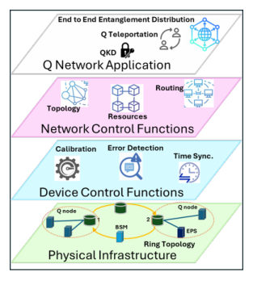 
Figure 1 presents one layered perspective of a quantum net- work, comprising physical infrastructure, device-control functions, network-control functions, and quantum-network applications. It illustrates how application-level capabilities, including QKD, quan- tum teleportation, and end-to-end entanglement distribution, de- pend on the coordinated operation of devices, protocols, and control functions across interconnected layers. Although the layers organisation and terminology may differ across architectural proposals, the figure demonstrates that the operation and performance of each layer depend on functions, resources, and information exchanged across other layers. This ar- chitectural...

📷 Fig 3

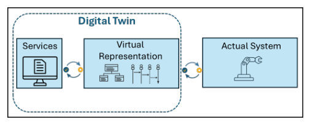 
Figure 2: DT conceptualisation to three main components: actual system, virtual representation (mirror), and service for synchronisation or user interface [33]

📷 Fig 4

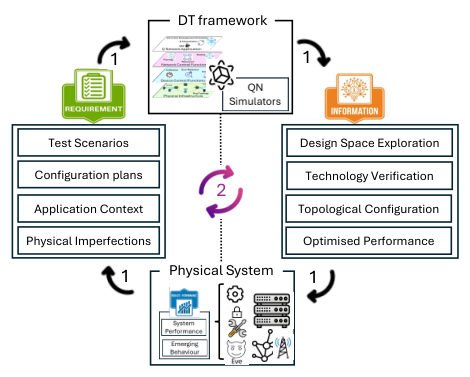 
Figure 3: DT framework requirements across the design-time and runtime loops.

📷 Fig 5

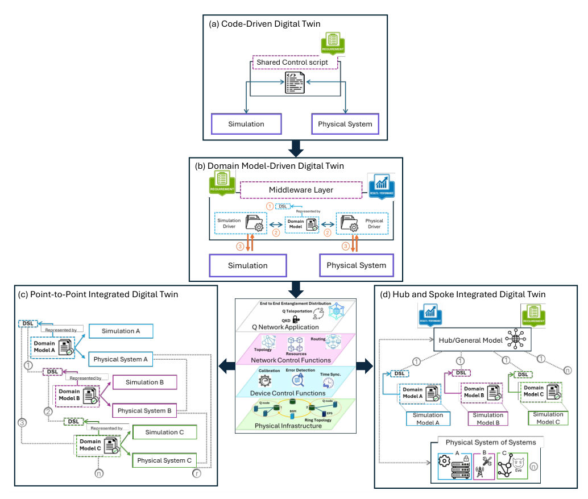 
Figure 4: Progressive architectures for QN digital twins: (a) a script-driven architecture in which a shared control script directly coordinates the simulated and physical systems; (b) a domain-model-driven architecture in which a domain-specific model and embodiment-specific drivers govern their configuration and interaction; (c) a point-to-point integrated architecture in which multiple DSLs interact through direct relationships to represent cross-domain interdependencies; and (d) a hub-and-spoke integrated architecture in which a general system model coordinates multiple domain models and the corresponding physical QN system of systems.

**Summary.** This paper proposes a Model-Driven Engineering (MDE) framework to overcome the fragmentation in evaluating large-scale Quantum Networks. It establishes a systematic approach for building digital twins that integrate diverse components—from system models (SysML v2) to physical hardware kits and simulators. The resulting framework allows for rigorous, traceable testing of network performance across design and runtime phases.

**Why it may be interesting.** This work is highly relevant as it addresses the crucial engineering challenge of validating complex quantum hardware systems by providing a formal, model-driven methodology to link theory/simulation with physical realization.

Detailed structure

**Main problem.** Evaluating quantum networks is difficult due to fragmentation across heterogeneous platforms, simulators, and abstractions, leading to isolated digital twin studies.

**Main result.** The paper proposes a Model-Driven Engineering (MDE) framework that provides a systematic basis for creating adaptable and interoperable system-level digital twins for quantum networks.

**Method.** It derives requirements for design-time evaluation and runtime synchronization, proposing an architectural progression from code-driven to hub-and-spoke integration using MDE principles.

**Model / system.** The focus is on Quantum Networks (QNs) and their digital twin representation. The framework uses SysML v2 as a 'hub model' to integrate physical QKD kits, simulators, and control logic.

**Key observables.** System-level performance metrics such as throughput, keyRate, latency, and errorRate are used for comparison between predicted (simulated) and observed (physical) behavior.

**Important parameters / regimes.** Quantum channel distance ($d$), maximum allowed error rate ($	ext{maxAllowedErrorRate}$), and network configuration parameters.

**Assumptions / limitations.** The primary assumption is that MDE can systematically manage the complexity arising from integrating diverse, heterogeneous quantum simulation tools and physical hardware interfaces.

**Figures summary.** Figures illustrate the layered structure of QNs and the conceptualization of a Digital Twin (Actual System $\leftrightarrow$ Virtual Mirror $\leftrightarrow$ Services). A key figure shows the hub-and-spoke architecture mapping to a BB84 feasibility implementation.

**Paper structure.** The paper first identifies the fragmentation problem, then introduces MDE as the solution foundation. It details the two operational loops (design-time/runtime) and progresses through four architectural levels of integration complexity before demonstrating a proof-of-concept using SysML v2 for QKD.

Abstract

Quantum networks are advancing towards larger and more operational infrastructures, yet their evaluation remains fragmented across heterogeneous physical platforms, simulators, protocols, and architectural abstractions. Current digital-twin studies for quantum networks mainly realise isolated capabilities or application-specific solutions rather than reusable system-level twins. This paper argues that Model-Driven Engineering (MDE) can provide a systematic basis for integrating and evolving these heterogeneous artefacts. It derives requirements for design-time evaluation and runtime synchronisation, and proposes a progression of architectures from code-driven and domain-model-driven solutions to point-to-point and hub-and-spoke integration. A conceptual implementation case study illustrates this using SysML v2, QKD kit, an EMF-based controller, and SeQUeNCe. The work provides a foundation for adaptable and interoperable digital twins for quantum networks.

[↑ back to top](#top)

### [Moment-Structured Block Encodings of Periodic Finite-Difference Operators](http://arxiv.org/abs/2607.11596v1)

**Authors:** Jishnu Mahmud, Rebekah Herrman  
**Type:** theory · **Category:** quantum information and computing · **PDF:** <https://arxiv.org/pdf/2607.11596v1>  
**Analysis basis:** full PDF text, analyzed in chunks

📷 Fig 1

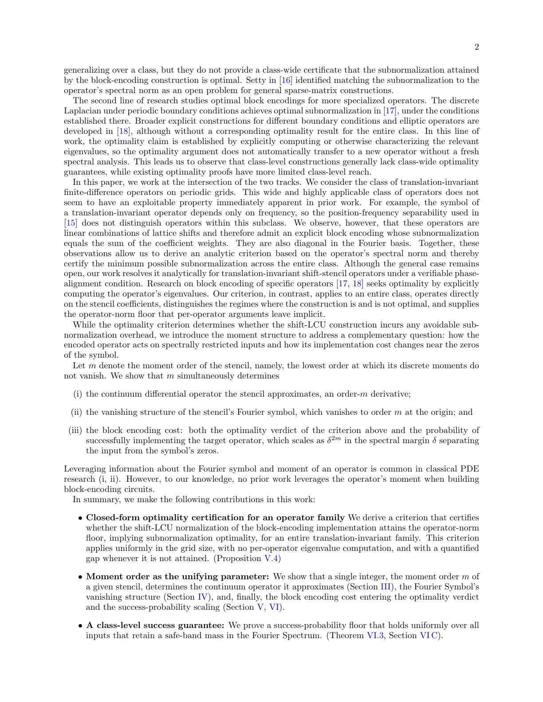 
Low-resolution page preview, page 2

📷 Fig 2

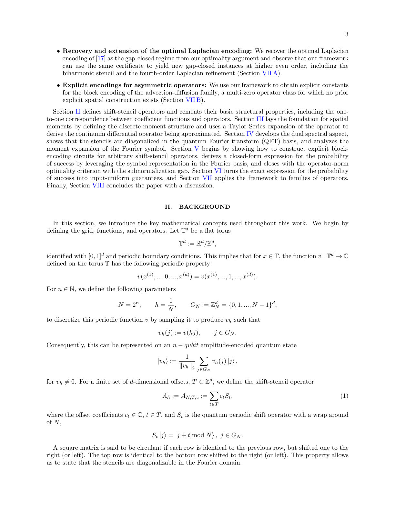 
Low-resolution page preview, page 3

📷 Fig 3

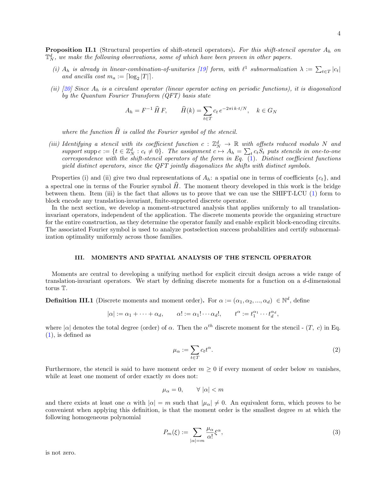 
Low-resolution page preview, page 4

📷 Fig 4

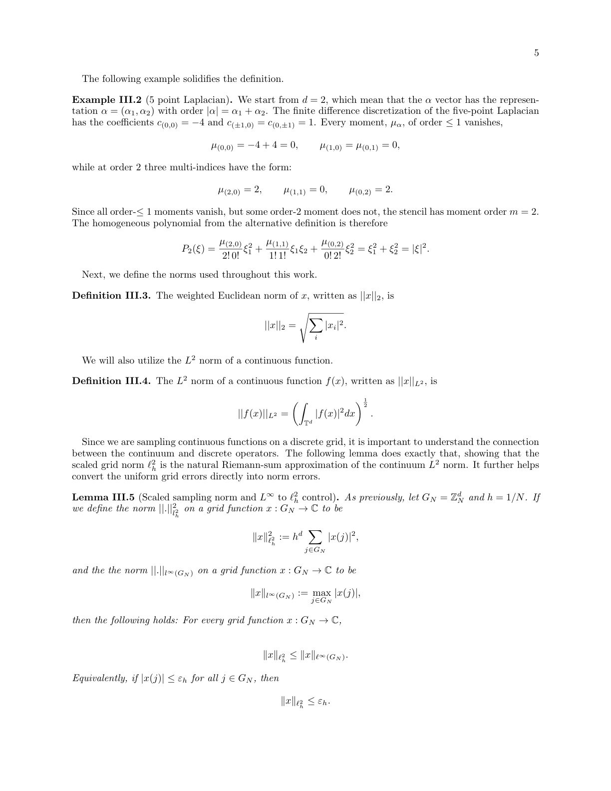 
Low-resolution page preview, page 5

📷 Fig 5

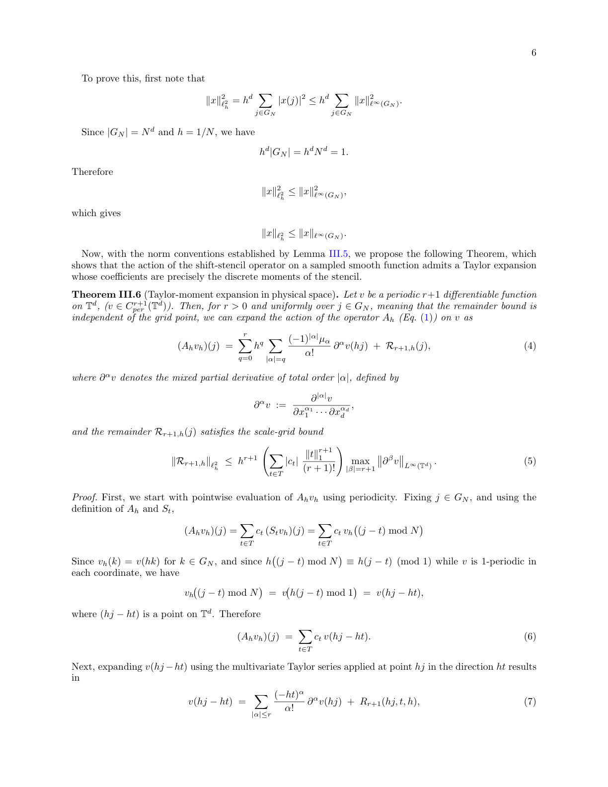 
Low-resolution page preview, page 6

**Summary.** This work introduces a moment-structured framework to systematically block encode finite-difference approximations of PDEs for quantum computing. By linking the stencil's moment order ($m$) to its spectral properties and encoding cost, it provides an optimality criterion that certifies resource efficiency across entire families of operators. This advances the practical application of quantum algorithms to core scientific computations.

**Why it may be interesting.** It provides a rigorous, systematic method to analyze the quantum resource cost associated with simulating fundamental PDEs using quantum algorithms, directly impacting algorithm feasibility.

Detailed structure

**Main problem.** Developing a unified framework to efficiently block encode translation-invariant finite-difference operators for use in quantum linear-algebra algorithms.

**Main result.** The moment order ($m$) of the stencil simultaneously determines the continuum operator approximated, the symbol's vanishing structure, and provides an explicit optimality criterion for the block encoding subnormalization.

**Method.** The analysis uses moment theory to relate discrete stencils (spatial domain) to their Fourier symbols (spectral domain), allowing a unified characterization based on the moment order $m$.

**Model / system.** The model involves discretizing constant-coefficient Partial Differential Equations (PDEs) on a periodic grid ($\mathbb{T}^d$) using finite-difference stencils, which are represented by shift-stencil operators.

**Key observables.** Subnormalization ($\lambda$), Moment Order ($m$), Success Probability ($	ext{psucc}$), and the Fourier symbol $b_H(k)$.

**Important parameters / regimes.** The moment order $m$ is central, governing the scaling of success probability ($\Theta(h^{2m})$) and the accuracy of the continuum approximation.

**Assumptions / limitations.** The analysis is restricted to translation-invariant operators with constant coefficients on a periodic grid; optimality criteria are derived under specific structural conditions.

**Figures summary.** Not specified by notes, but the structure implies showing how $m$ dictates the relationship between spatial stencils and spectral properties/encoding costs.

**Paper structure.** The paper builds from defining the problem (block encoding of PDEs) to establishing moment theory links (spatial $\leftrightarrow$ spectral), deriving the optimality criterion based on $m$, and finally applying this framework to specific families like Laplacian and advection-diffusion operators.

Abstract

Block encoding is the standard technique for accessing matrix data in quantum linear-algebra algorithms. Its implementation directly affects its subnormalization, which in turn controls the algorithm's success probability, simulation time, and downstream costs. Explicit construction of block encodings with provably optimal subnormalization exists for only a handful of operators, with bespoke calculations used in its design. In this work, we develop a framework to block encode translation-invariant finite-difference operators on a periodic grid. These operators are the finite-difference discretizations of the constant-coefficient partial differential equations that sit at the core of scientific computing. We show that the moment order of these stencils can be used to simultaneously determine the continuum operator approximated, the vanishing order of the Fourier symbol, and the cost of the block encoding. From there, we derive a closed-form optimality criterion as a function of the stencil coefficients, which certifies whether the construction attains the optimal subnormalization for an entire operator family, uniformly in grid size, and quantifies the gap when it does not. The framework subsumes optimal constructions for the Laplacian operator in the literature and can be used to certify new instances at higher even orders, including the biharmonic operator. Furthermore, we derive success-probability floors parameterized by spectral properties of the operator's symbol and find explicit constants for the block encoding of the advection-diffusion family for which no prior explicit spatial block encoding exists.

[↑ back to top](#top)

### [Quantum algorithm for Clifford multiplication](http://arxiv.org/abs/2607.10473v1)

**Authors:** Kagwe A. Muchane  
**Type:** theory · **Category:** quantum information and computing · **PDF:** <https://arxiv.org/pdf/2607.10473v1>  
**Analysis basis:** full PDF text, analyzed in chunks

📷 Fig 1

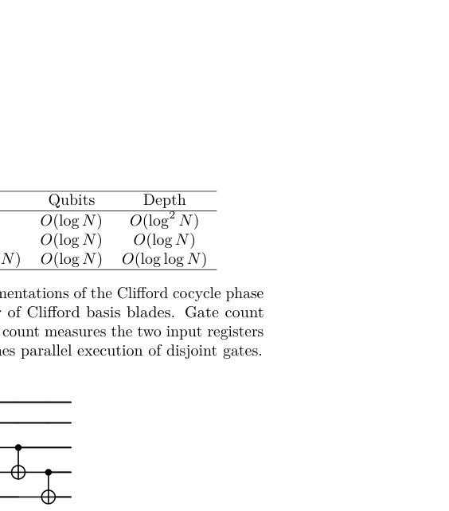 
Figure 2: Elementary sweep variant of UT for n = 5. Each CNOT implements the transvection Ei+1,i, propagating the binary prefix sum through the register. The circuit maps |y⟩7→|Ty⟩with n −1 CNOT gates and depth n −1.

📷 Fig 2

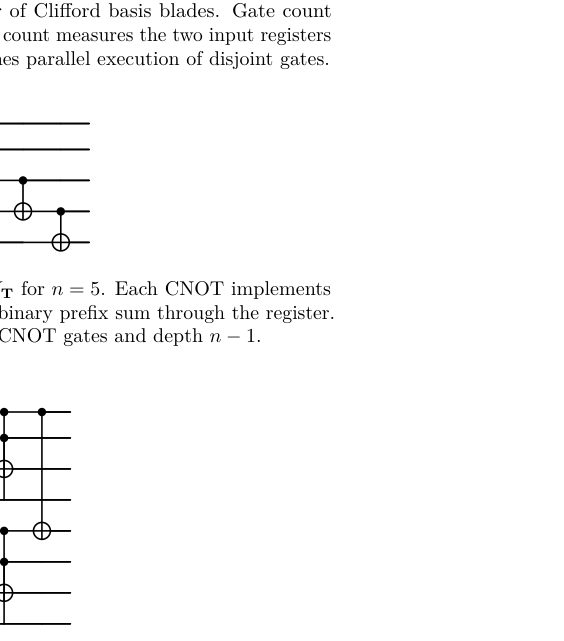 
Figure 3: Schematic dyadic prefix construction for UT. The m-th stage propa- gates partial prefix sums across distance 2m. With a parallel-prefix implementa- tion, the propagation distance doubles at each stage, giving depth O(log n) and O(n log n) CNOT gates.

**Summary.** This paper presents an exponential speedup quantum algorithm for computing the product of multivectors in a Clifford algebra. By mapping the multiplication to a cocycle-twisted convolution, the authors achieve polylogarithmic gate complexity. This establishes Clifford multiplication as a fundamental 'quantum primitive' with implications for geometric and relativistic simulations.

**Why it may be interesting.** This work provides a concrete example of applying advanced quantum algorithms (like those for convolutions) to fundamental mathematical structures arising in theoretical physics, offering potential computational speedups for relativistic simulations or geometric computations.

Detailed structure

**Main problem.** The core problem is developing an efficient quantum algorithm for computing the geometric product of two dense multivectors within a Clifford algebra.

**Main result.** The authors demonstrate an exponential speedup, achieving the multiplication in $O(	ext{polylog } N)$ time using amplitude encoding, establishing Clifford multiplication as a quantum primitive.

**Method.** The algorithm reformulates the geometric product as a cocycle-twisted convolution over $(\mathbb{Z}_2)^n$, which is then implemented using controlled gates based on matrix factorizations (sweep or dyadic) and the Quantum Fourier Transform.

**Model / system.** The system modeled is the Clifford algebra $	ext{C}\ell(V, Q)$, whose structure governs multivector multiplication. This algebra is relevant for Euclidean, projective, conformal, and spacetime geometry simulations.

**Key observables.** The normalized scalar weight ($\langle	ext{AB}|M_0|	ext{AB}
angle$) and expectation values derived from projectors onto specific subspaces (grades or parity sectors) of the resulting state $|	ext{AB}
angle$.

**Important parameters / regimes.** The size $N=2^n$ of the multivector space, the circuit depth ($O(\log n)$ for dyadic), and the success probability $p_0$ which dictates postselection overhead.

**Assumptions / limitations.** The analysis assumes the ability to implement required transformations (like the resolvent matrix inverse) using controlled quantum gates, and that state preparation of arbitrary amplitudes is possible.

**Figures summary.** Figures illustrate the schematic structure of the optimized Clifford cocycle oracle $U_{\chi}$ using controlled-Z gates and show comparisons between elementary sweep and dyadic prefix constructions for implementing necessary transformations.

**Paper structure.** The paper progresses by first establishing the classical bottleneck, then mapping the problem to a twisted convolution. It details the quantum implementation via the oracle $U_\chi$, analyzes resource scaling (sweep vs. dyadic), and concludes by showing how this enables solving promise decision problems related to state observables.

Abstract

Given two dense multivectors of the Clifford algebra $C\ell(V, Q)$ with $N=2^{p+q}$ coefficients, the fastest known classical algorithms compute their geometric product in $O(N^{ω/2})$ arithmetic operations, where $ω$ denotes the matrix multiplication exponent. I show that, under amplitude encoding, a quantum computer executes the geometric product in $O(\operatorname{polylog} N)$ time, using logarithmic space with sublogarithmic circuit depth. This exponential speedup establishes Clifford multiplication as a quantum primitive, providing an efficient computational foundation for quantum geometric algorithms and relativistic simulations.

[↑ back to top](#top)

### [Quantum algorithms for second-order boundary value problems](http://arxiv.org/abs/2607.11410v1)

**Authors:** Lauri Kettunen, Tejas Shinde  
**Type:** theory · **Category:** quantum information and computing · **PDF:** <https://arxiv.org/pdf/2607.11410v1>  
**Analysis basis:** full PDF text, analyzed in chunks

📷 Fig 1

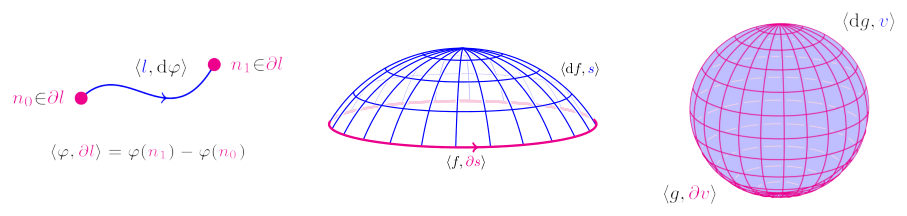 
Figure 1: Illustrations of Stokes’ theorem in different dimensions. The domain is shown in blue and its boundary in magenta. Left: a curve with boundary nodes. Middle: a surface with boundary curve. Right: a volume with boundary surface. The general Stokes theorem expresses the duality between the exterior derivative and the boundary operator without requiring a metric structure.

📷 Fig 2

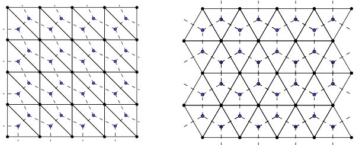 
Figure 2: Examples of primal–dual mesh pairs in dimension n = 2. The primal mesh is shown with solid lines and the dual mesh with dashed lines. A primal p-cell is paired with a dual (n −p)-cell.

📷 Fig 3

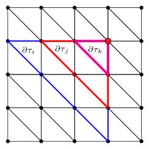 
Figure 3: A simplicial complex illustrating bounding cycles at different scales. If ⟨f, ∂τ⟩= 0 holds for all relevant chains τ, then the pairing also vanishes on shrinking bounding cycles, shown here in blue, red, and magenta, down to the smallest cycles available in the cell complex. The finite-dimensional construction therefore replaces continuum virtual neighbourhoods by finitely many boundary relations.

📷 Fig 4

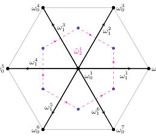 
Figure 4: The local neighbourhood, or star, of node ω1 0 in a complex of regular triangles, together with the dual 2-cell ˜ω1 2 paired with ω1 0.

📷 Fig 5

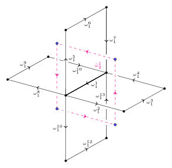 
Figure 5: The star of edge ω1 1 in a regular hexahedral complex, together with the dual facet ˜ω1 2 paired with ω1 1.

**Summary.** This paper presents a novel framework to create quantum algorithms for solving complex second-order boundary value problems. Instead of using global matrix representations, the authors derive the necessary computational steps directly from the local geometric structure of differential operators using exterior calculus on cell complexes. This results in scalable, star-local update rules ideal for quantum circuit implementation.

**Why it may be interesting.** While focused on PDEs, the core technique of mapping continuous differential structures into local, combinatorial update rules that bypass large matrices is highly relevant to developing efficient quantum algorithms for physical simulations beyond simple linear systems.

Detailed structure

**Main problem.** Developing quantum algorithms capable of solving second-order boundary value problems (BVPs) that are central to computational science.

**Main result.** The authors propose a framework that reformulates these continuous differential operators into simple, uniform, and scalable star-local update rules suitable for direct implementation on quantum circuits.

**Method.** The method leverages concepts from exterior calculus (exterior derivative, adjoint, Hodge operator) applied to primal--dual cell complexes to derive discrete realizations of the operators, bypassing global matrix assembly.

**Model / system.** The model involves solving PDEs like Poisson or curl-curl equations on a domain covered by an oriented cell complex. The physics is governed by Hodge-type constitutive relations linking different cochain degrees (e.g., 0-cochains for div-grad, 1-cochains for curl-curl).

**Key observables.** The solution vector $\Lambda$ containing cochain values, and the source term $u$. The local update rule itself is a key computational object.

**Important parameters / regimes.** Relaxation parameter $eta$, and the structure of the cell complex (primal/dual mesh).

**Assumptions / limitations.** The domain must be covered by an oriented cell complex, and the framework assumes that local differential structure can be derived directly from incidence relations on cell complexes.

**Figures summary.** Figures illustrate Stokes' theorem duality, primal-dual mesh pairs in 2D, how $df=0$ is imposed via bounding chains, and the local star neighborhood for nodes/edges.

**Paper structure.** The paper builds from identifying the need to discretize continuous operators locally. It introduces the framework using exterior calculus on cell complexes, derives the finite-dimensional system ($\mathbf{D}^T \mathbf{H} \mathbf{\Lambda} = \mathbf{u}$), and then shows how this global matrix problem is mapped onto a star-local iterative update rule suitable for quantum circuit implementation.

Abstract

Second-order boundary value problems are central to computational science, yet standard matrix-based numerical formulations can obscure the local geometric structure that quantum circuits may exploit. Here we introduce a framework for explicitly constructing finite-dimensional counterparts of continuous differential operators in a form compatible with quantum computation. Starting from the exterior derivative, its adjoint, and the Hodge operator, we derive discrete realizations of second-order operators on primal--dual cell complexes and reformulate them as star-local update rules expressed through explicit functions that return the relevant bounding chains rather than through matrix representations. This yields simple, uniform, and scalable quantum circuits. We demonstrate the construction for div--grad and curl--curl operators, showing that the same star-local compilation principle extends across different operators, cell complexes, and manifold dimensions within a common framework. More generally, the framework provides a systematic route to quantum algorithms for partial differential equations.

[↑ back to top](#top)

### [Quantum Circuit Vision: Cost-Aware Evaluation of Visual AI Agents for Quantum Code Generation](http://arxiv.org/abs/2607.10057v1)

**Authors:** Dongping Liu, Aoyu Zhang, Luyao Zhang  
**Type:** both · **Category:** quantum information and computing · **PDF:** <https://arxiv.org/pdf/2607.10057v1>  
**Analysis basis:** full PDF text, analyzed in chunks

📷 Fig 1

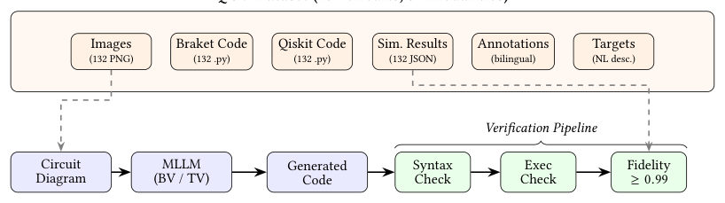 
Figure 1: QCV system overview. Top: QCV-Dataset provides 132 quantum circuits with five core data modalities—circuit images, executable code (Braket and Qiskit), simulation results, bilingual annotations, and annotated failure cases—plus supplementary target descriptions and equivalence pairs. Bottom: The evaluation pipeline processes a circuit diagram image through an MLLM under BV or TV mode, then verifies the generated code through syntax checking, execution, and unitary matrix fidelity (𝐹≥0.99).

📷 Fig 2

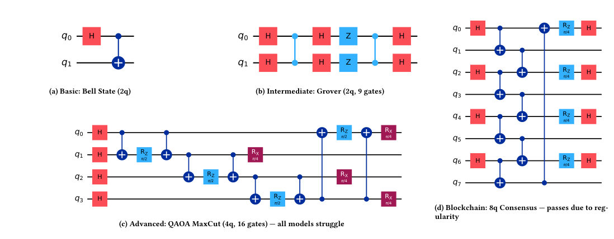 
Figure 2: Representative circuits. Left column (a–c): increasing complexity from trivial to challenging. Right (d): the largest circuit (8 qubits, 20 gates) passes under BV with perfect fidelity due to its regular repeating structure, while the smaller QAOA (c) fails—demonstrating that structural regularity, not qubit count, determines success.

📷 Fig 3

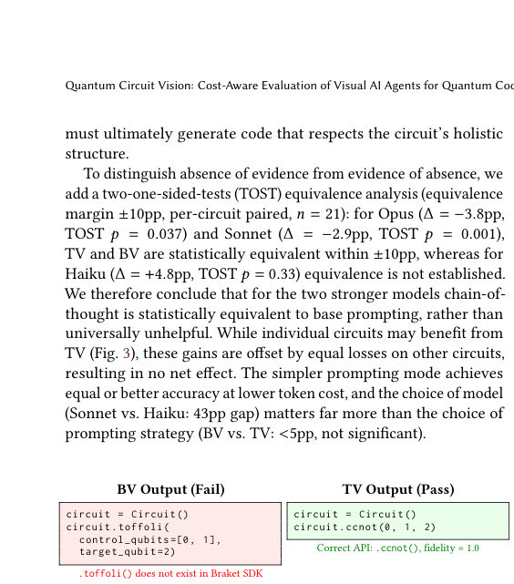 
Figure 3: Haiku on the Toffoli circuit: BV uses a nonexistent API, while TV’s analysis leads to the correct call. Although CoT shows no significant aggregate effect (𝑝= 0.69), indi- vidual cases like this illustrate how structured analysis can resolve specific API selection errors.

📷 Fig 4

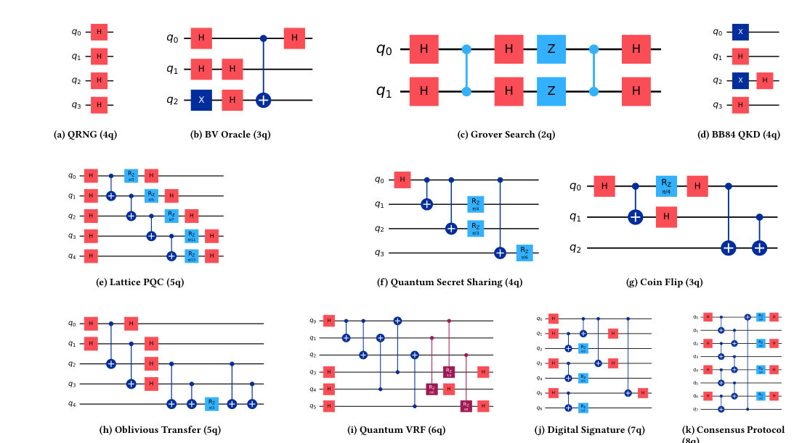 
Figure 4: Eleven blockchain-relevant quantum circuits (2–8 qubits) spanning consensus, cryptography, threat modeling, key distribution, secret sharing, fair protocols, private exchange, verifiable randomness, digital signatures, and validator agreement.

📷 Fig 5

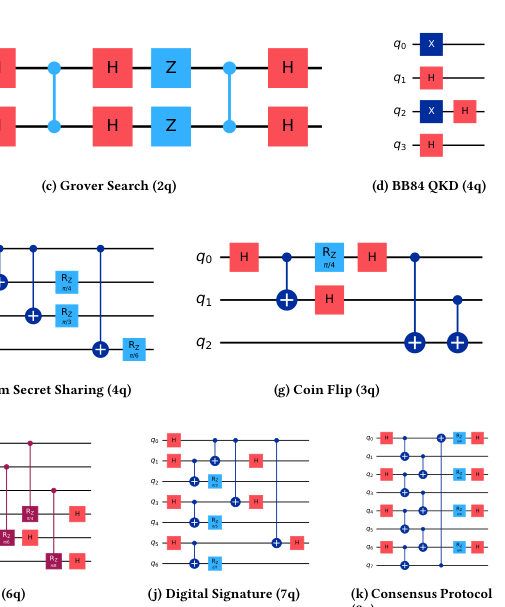 
Figure 5 shows the proposed Hybrid Agent for autonomous quan- tum circuit design. The agent uses QCV-Dataset as a RAG knowl- edge base, the unitary fidelity pipeline as a verification oracle, and the 268 annotated failure cases as negative examples. This architec- ture is proposed but not yet implemented.

**Summary.** This paper introduces Quantum Circuit Vision (QCV), a cost-aware framework to test how well multimodal AI agents can translate visual quantum circuit diagrams into verified executable code. By benchmarking several frontier LLMs on 132 circuits, the authors found that optimizing model selection via cascade routing is more impactful for cost savings than advanced prompting techniques. This work establishes a new standard for evaluating AI in quantum software development.

**Why it may be interesting.** It provides a rigorous, quantifiable methodology for assessing AI's ability to handle complex quantum information representations, which is crucial for future automated quantum algorithm development.

Detailed structure

**Main problem.** The core problem is bridging the gap between visually presented quantum circuit diagrams and generating verified, executable code for quantum computation.

**Main result.** A cost-aware evaluation framework was proposed, showing that mid-tier AI models offer the best balance of accuracy and computational cost, and model routing dominates prompt engineering as a cost lever.

**Method.** The authors constructed a 132-circuit benchmark using executable Amazon Braket code and employed rigorous unitary-fidelity verification to evaluate multimodal AI agents.

**Model / system.** The system involves evaluating frontier LLMs (like Claude) on quantum circuits spanning up to 10 qubits, with the ground truth verified via unitary fidelity checks against a simulator.

**Key observables.** Pass rate, per-call cost (credits), circuit depth, and unitary fidelity ($\mathcal{F}$).

**Important parameters / regimes.** Circuit depth is identified as the primary predictor of failure ($p<0.001$).

**Assumptions / limitations.** The evaluation relies on the assumption that visual pattern recognition is key for structurally coupled quantum diagrams.

**Figures summary.** Figures illustrate the proposed agent architecture and show quantitative results comparing pass rates across different model implementations for various quantum circuits.

**Paper structure.** The paper introduces the QCV framework, details the 132-circuit benchmark construction, presents cost-accuracy trade-offs using LLM evaluations, analyzes failure modes (depth vs. qubits), and concludes with a cascade routing strategy proposal.

Abstract

Can AI agents visually comprehend quantum circuit diagrams and generate verified executable code--and at what cost? We present Quantum Circuit Vision, a cost-aware evaluation framework for multimodal AI agents on quantum circuit visual understanding. We construct a 132-circuit benchmark spanning 13 categories ($1$--$10$ qubits) with executable Amazon Braket code and unitary-fidelity verification. Evaluating three frontier Claude-family models at different capability-cost tiers with $n=5$ repeated trials, we find that the mid-tier model (Sonnet 4.6, $1.30\times$ credits) offers the most favorable balance on the cost-accuracy frontier: 91% pass rate on the core subset at 18% of the per-call cost of the strongest model (Opus 4.6), whose accuracy advantage is not statistically significant (paired $t$: $p=0.083$). Logistic regression confirms that circuit depth--not qubit count--is the primary predictor of failure ($p<0.001$). Chain-of-thought prompting shows no statistically significant effect (all $p>0.18$, $n=5$), suggesting that visual pattern recognition outweighs explicit reasoning strategy for structurally coupled diagrams. We propose a cascade routing strategy (cheap $\rightarrow$ expensive models) that achieves 84% accuracy at 38% of single-model cost, demonstrating that model routing dominates prompt engineering as a cost lever. We release QCV-Dataset (132 circuits, 5 modalities, 1,931 files) on Hugging Face Hub as an open evaluation infrastructure with structured metadata for discoverability, interoperability, and responsible AI documentation, and all evaluation code, cost logs, and verification scripts on GitHub for full reproducibility.

[↑ back to top](#top)

### [Rank-Refined Quantum-Behaved Particle Swarm Optimization for Quantum Molecular Generation](http://arxiv.org/abs/2607.10284v1)

**Authors:** Sing-Yun Wu, Sheng Yun Wu, I-Min Chiang, Tai-Yue Li  
**Type:** both · **Category:** quantum information and computing · **PDF:** <https://arxiv.org/pdf/2607.10284v1>  
**Analysis basis:** full PDF text, analyzed in chunks

📷 Fig 1

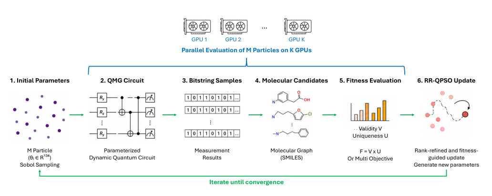 
Fig. 1. RR-QPSO workflow for QMG parameter optimization. Sobol sampling initializes a swarm of M candidate parameter vectors, which are evaluated through QMG circuit sampling, bitstring decoding, molecular graph generation, and fitness computation. The independent particle evaluations are distributed across K GPUs, and the resulting scores are used to update the RR-QPSO swarm.

📷 Fig 2

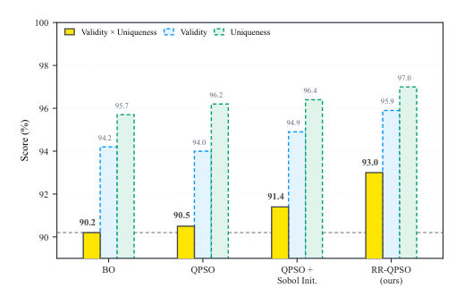 
Fig. 2. Optimizer performance comparison on the 9-heavy-atom QMG benchmark. The bars report validity, uniqueness, and their product. QPSO- based runs use M = 64 particles, T = 150 iterations, and 5000-shot molecular evaluation. RR-QPSO gives the highest validity–uniqueness product in this experimental setting.

📷 Fig 3

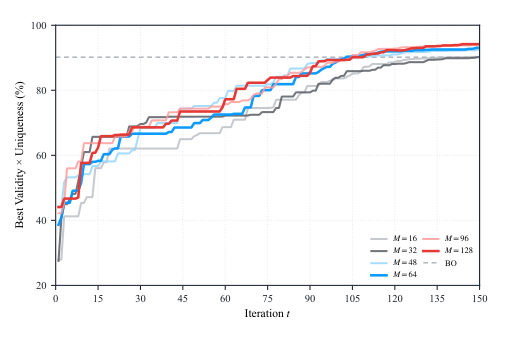 
Fig. 3. Effect of particle count on RR-QPSO convergence. Curves show the best validity–uniqueness product observed up to each iteration for different swarm sizes M. The dashed line indicates BO.

📷 Fig 4

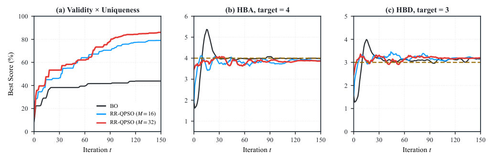 
Fig. 4. Multi-objective optimization targeting HBA = 4 and HBD = 3. BO and RR-QPSO are evaluated under the same scalarized target-property objective. RR-QPSO retains a higher validity–uniqueness product while keeping the generated molecules close to the target HBA and HBD region in this scalarized setting.

**Summary.** The paper proposes a novel optimization algorithm, RR-QPSO, to overcome the computational bottleneck in Quantum Molecular Generation (QMG). This method uses advanced swarm intelligence techniques to efficiently search high-dimensional parameter spaces governing quantum circuits. The results demonstrate that this optimizer design significantly improves molecular quality metrics compared to existing methods like Bayesian Optimization.

**Why it may be interesting.** This work directly addresses the computational feasibility of quantum chemistry simulations by improving the optimization layer used to guide molecular structure generation from quantum circuits.

Detailed structure

**Main problem.** The primary challenge is optimizing parameters for Quantum Molecular Generation (QMG) due to an expensive objective evaluation bottleneck involving stochastic circuit sampling.

**Main result.** The proposed RR-QPSO significantly outperforms Bayesian Optimization on the 9-heavy-atom QMG benchmark, achieving a higher validity–uniqueness product (up to 0.942 vs 0.902).

**Method.** The authors introduce Rank-Refined Quantum-Behaved Particle Swarm Optimization (RR-QPSO), which uses Sobol initialization and rank-refined mean-best updates as a population-based alternative to BO.

**Model / system.** The work focuses on QMG, a process that generates molecules using a chemistry-inspired dynamic quantum circuit parameterized by $\theta$ within a 20-qubit system for the 9-heavy-atom benchmark.

**Key observables.** Validity–Uniqueness product ($V \times U$), Validity ($V$), Uniqueness ($U$), mean HBA, and mean HBD.

**Important parameters / regimes.** Circuit parameters $D=134$, Swarm size $M$ (e.g., 64 or 128), Iterations $T=150$.

**Assumptions / limitations.** The objective function is noisy and expensive to evaluate because it relies on finite circuit samples from stochastic sampling.

**Figures summary.** Figure 1 illustrates the RR-QPSO workflow: Sobol sampling $\rightarrow$ Parallel QMG Evaluation (on multiple GPUs) $\rightarrow$ Fitness Calculation ($F=V \times U$) $\rightarrow$ RR-QPSO Update. Other figures compare performance against BO and show scaling with particle count.

**Paper structure.** The paper introduces the optimization bottleneck in QMG, proposes RR-QPSO as a superior population-based optimizer over BO, details its components (Sobol initialization, rank refinement), validates it on the 9-heavy-atom benchmark across varying swarm sizes, and extends to multi-objective property guidance.

Abstract

This work proposes Rank-Refined Quantum-Behaved Particle Swarm Optimization (RR-QPSO) for high-dimensional parameter search in Quantum Molecular Generation (QMG). RR-QPSO targets the optimization bottleneck caused by expensive objective evaluations, where each candidate parameter vector requires stochastic circuit sampling, bitstring decoding, and molecular evaluation. The method provides a population-based alternative to Bayesian optimization (BO), combining Sobol-based initialization, a rank-refined mean-best update, and fitness-guided refinement based on validity and uniqueness. Experiments use the 9-heavy-atom QMG benchmark with a 134-parameter, 20-qubit CUDA-Q circuit and particle evaluations parallelized across 8 NVIDIA V100 GPUs. With M=64 particles and T=150 iterations, RR-QPSO reaches VxU = 0.930; increasing the swarm size to M=128 further improves the product to 0.942, compared with 0.902 for BO under the same protocol. A multi-objective extension targeting HBA=4 and HBD=3 further shows that RR-QPSO can guide molecular properties while preserving a higher validity--uniqueness product than BO. These results suggest that optimizer-level design can improve QMG without modifying the chemistry-inspired circuit or molecular decoding pipeline.

[↑ back to top](#top)

### [Soft point-contact Andreev reflection spectroscopy in a palm-type cubic anvil-pressure cell](http://arxiv.org/abs/2607.10668v1)

**Authors:** Qingxin Dong, Fengrui Shi, Yan Zhang, Tong Shi, Yi Liu, Shaoheng Ruan, Zhongjin Wu, Jianping Sun, Zhaoming Tian, Yoshiya Uwatoko, Guanghan Cao, Xin Lu, Bosen Wang, Jin-Guang Cheng  
**Type:** experiment · **Category:** strongly correlated electrons · **PDF:** <https://arxiv.org/pdf/2607.10668v1>  
**Analysis basis:** full PDF text, analyzed in chunks

📷 Fig 1

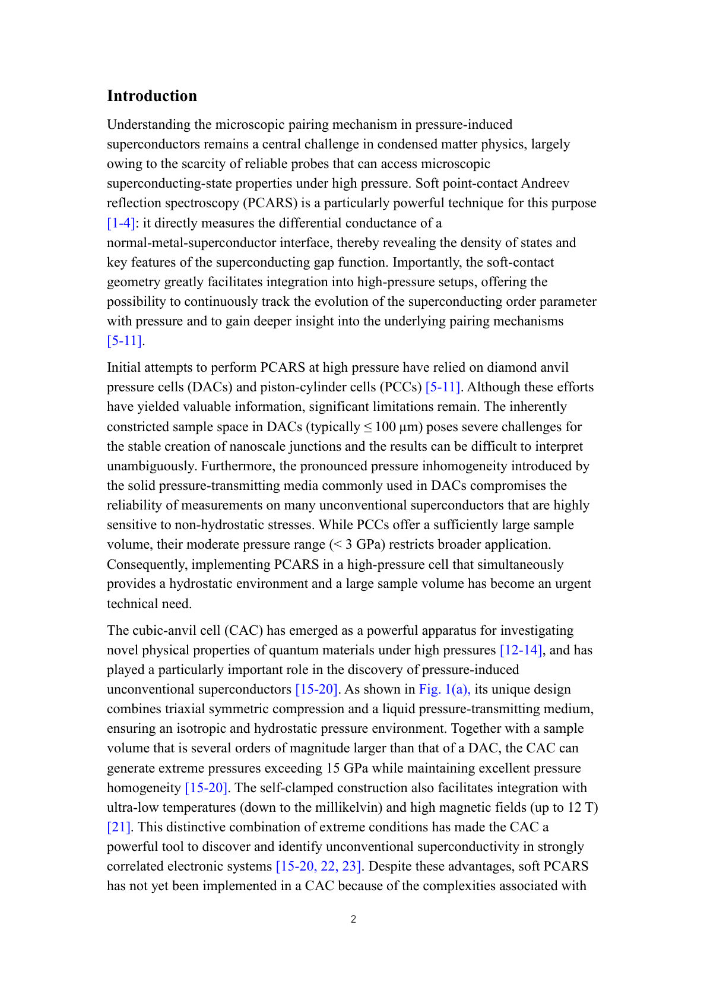 
Low-resolution page preview, page 2

📷 Fig 2

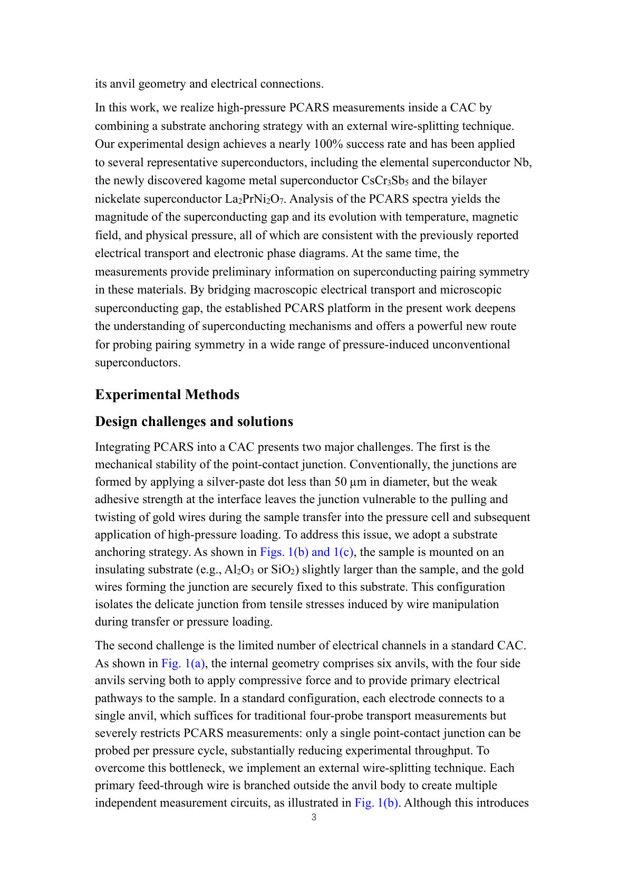 
Low-resolution page preview, page 3

📷 Fig 3

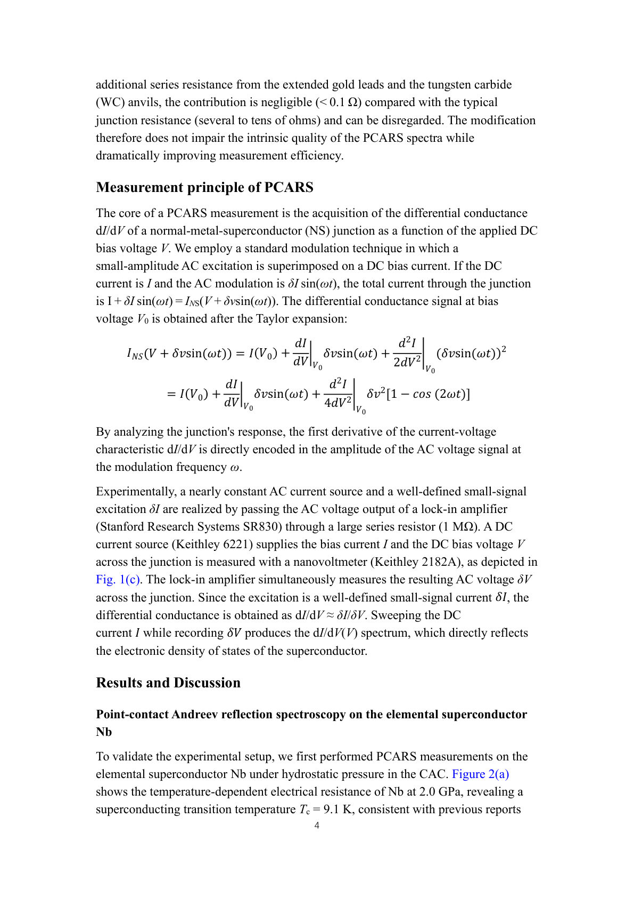 
Low-resolution page preview, page 4

📷 Fig 4

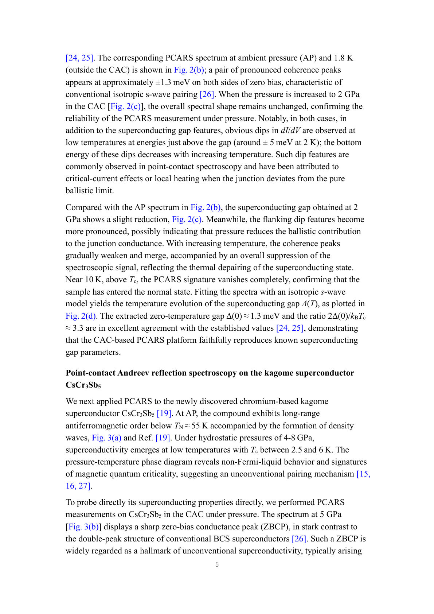 
Low-resolution page preview, page 5

📷 Fig 5

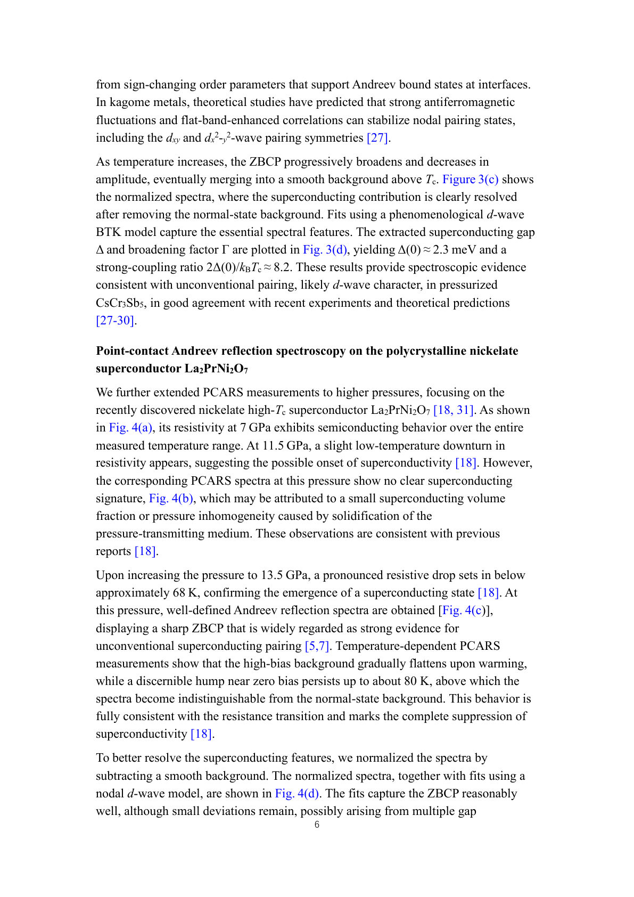 
Low-resolution page preview, page 6

**Summary.** This work introduces a novel and robust experimental platform—soft point-contact Andreev reflection spectroscopy (PCARS)—to measure superconducting gaps under ultra-high hydrostatic pressure. By testing this technique on various superconductors, the authors provide spectroscopic evidence suggesting unconventional pairing symmetries in materials like $	ext{CsCr}_3	ext{Sb}_5$ and $	ext{La}_2	ext{PrNi}_2	ext{O}_7$. This advances the field by bridging macroscopic transport measurements with microscopic quantum characterization under extreme conditions.

**Why it may be interesting.** The ability to probe microscopic pairing symmetries (d-wave vs. s-wave) in strongly correlated materials like nickelates or kagome metals, while simultaneously applying extreme pressures, provides crucial data for understanding high-$T_c$ mechanisms relevant to condensed matter theory.

Detailed structure

**Main problem.** The primary goal is to overcome the scarcity of reliable probes that can access microscopic superconducting-state properties, such as pairing symmetry, in materials under extreme high pressures.

**Main result.** The authors successfully established a robust experimental platform using soft point-contact Andreev reflection spectroscopy (PCARS) in a cubic anvil cell, providing spectroscopic evidence consistent with unconventional superconductivity in pressure-induced superconductors like CsCr3Sb5 and La2PrNi2O7.

**Method.** They employed PCARS by measuring the differential conductance (dI/dV) of normal-metal-superconductor junctions under hydrostatic pressures up to 15 GPa, utilizing a specialized substrate anchoring and wire-splitting technique.

**Model / system.** The study investigates elemental superconductors (Nb) and complex oxides/chalcogenides ($	ext{CsCr}_3	ext{Sb}_5$, $	ext{La}_2	ext{PrNi}_2	ext{O}_7$) as systems exhibiting superconductivity. The analysis involves fitting the measured spectra using theoretical models for different pairing symmetries (e.g., isotropic s-wave vs. d-wave).

**Key observables.** Superconducting gap magnitude ($\Delta$), zero-bias conductance peaks (ZBCP), and the ratio $2\Delta(0)/k_B T_c$.

**Important parameters / regimes.** Hydrostatic pressure ($P$) up to 15 GPa, temperature ($T$), and applied magnetic field ($H$).

**Assumptions / limitations.** The analysis relies on fitting the spectra using specific theoretical models (s-wave or d-wave) and assumes that observed features are not solely due to extrinsic contact resistance effects.

**Figures summary.** Figures detail the setup in a CAC, showing $R(T)$ vs. pressure for multiple materials ($	ext{Nb}$, $	ext{CsCr}_3	ext{Sb}_5$, $	ext{La}_2	ext{PrNi}_2	ext{O}_7$), and presenting corresponding Andreev spectra ($dI/dV$) analyzed using theoretical fitting models.

**Paper structure.** The paper systematically introduces the advanced experimental setup (PCARS in CAC), validates it with a benchmark material ($	ext{Nb}$), and then applies this robust technique sequentially to two different unconventional superconductors ($	ext{CsCr}_3	ext{Sb}_5$ and $	ext{La}_2	ext{PrNi}_2	ext{O}_7$) to characterize their superconducting gaps under pressure.

Abstract

We have implemented soft point-contact Andreev reflection spectroscopy (PCARS) in a palm-type cubic anvil pressure cell by combining a substrate anchoring strategy with an external wire-splitting technique. This design enables the stable formation of multiple point contact junctions under hydrostatic pressures up to 15 GPa. Benchmark measurements on the elemental superconductor Nb demonstrate high reproducibility and yield a zero-temperature superconducting gap with a gap ratio of 3.3. We further apply this technique to the Kagome metal superconductor CsCr3Sb5 and the bilayer nickelate superconductor La2PrNi2O7. Pronounced zero-bias conductance peaks are observed, and their evolution with temperature, magnetic field and applied pressure is investigated, together with the superconducting gap magnitude and possible pairing symmetries. These measurements provide spectroscopic evidence consistent with unconventional superconductivity in these materials. Our work establishes a robust experimental platform that bridges macroscopic electrical transport and microscopic spectroscopic probes, opening a new avenue for investigating pairing symmetry in a wide range of pressure-induced unconventional superconductors.

[↑ back to top](#top)

### [Strain-Tuned Nodal Superconductivity in the Charge-Ordered Kagome Metal CsV$_3$Sb$_5$](http://arxiv.org/abs/2607.11115v1)

**Authors:** Yusuke Takeuchi, Akito Kobayashi, Saki Uchida, Takumi Nagao, Seigo Ogawa, Rui Zhou, Shinji Kawasaki, Fei Song, Hao Ni, Yong Zhao, Guo-qing Zheng  
**Type:** experiment · **Category:** strongly correlated electrons · **PDF:** <https://arxiv.org/pdf/2607.11115v1>  
**Analysis basis:** full PDF text, analyzed in chunks

📷 Fig 1

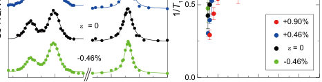 
FIG. 2. (a) Strain dependence of the 121Sb-NQR spectra in the CDW state at T = 3.8 K. The spectra consist of the Sb(2) lines (left, ∼74 MHz) and the Sb(1) line (right, ∼78.2 MHz). The solid curves represent the best fits using a sum of two Gaussian functions for the Sb(2) site and a single Lorentzian function for the Sb(1) site. (b) Temperature dependence of the 121Sb-NQR 1/T1T for various strains, measured at the Sb(2) site (f = 74.1 MHz). The horizontal line is a guide to the eye. Error bars represent the standard deviations from the fitting parameters.

📷 Fig 2

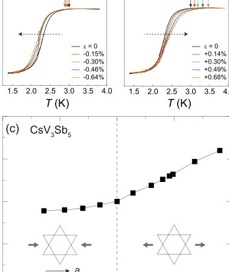 
FIG. 1. Temperature dependence of the ac-χ under (a) com- pressive and (b) tensile strains, measured in zero magnetic field. Arrows indicate the superconducting transition onset, T onset c (ε). (c) Strain dependence of T onset c (ε). The inset shows a schematic of the V kagome net, with arrows indicating the a-axis and the direction of the applied uniaxial pressure. The vertical dashed line marks the zero-strain position.

📷 Fig 3

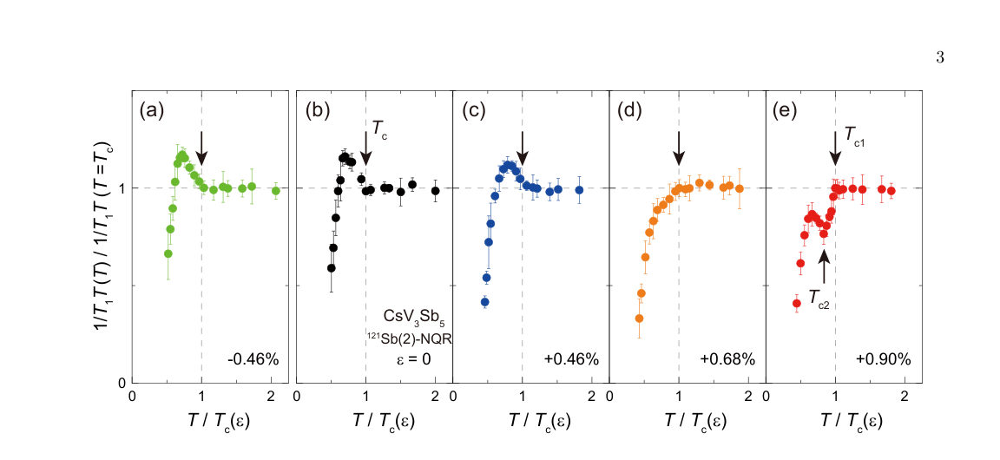 
FIG. 3. Temperature dependence of the 121Sb(2)-NQR 1/T1T under uniaxial strain. Data are shown for (a) ε = -0.46%, (b) 0, (c) +0.46%, (d) +0.68%, and (e) +0.90%. The 1/T1T and temperature (T) are normalized by their respective values at Tc(ε). The dashed lines mark the normalized transition point at T/Tc(ε) = 1, and the solid arrows indicate the onset of the superconducting transition. Error bars represent the standard deviations from the fitting parameters.

📷 Fig 4

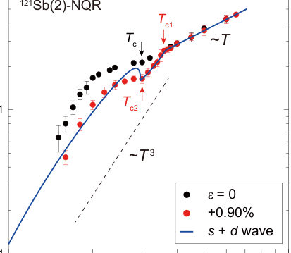 
FIG. 4. Temperature dependence of the 121Sb(2)-NQR 1/T1 at ε = 0 and +0.90%. Arrows indicate the respective su- perconducting transition temperatures, Tc. The solid and dashed lines show linear (∼T) and cubic (∼T 3) dependen- cies above and below Tc, respectively, as guides to the eye. The solid curve below Tc1 represents the fitting result with a two-component (s+d wave) model for ε = +0.90% (see text). Error bars represent the standard deviations from the fitting parameters.

📷 Fig 5

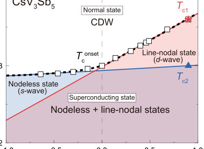 
FIG. 5. Strain-temperature phase diagram of superconduc- tivity in CsV3Sb5 at zero magnetic field. Open squares show T onset c determined from ac-χ. The solid star and triangles represent the upper (Tc1) and lower (Tc2) transition temper- atures, respectively, as determined from the temperature de- pendence of 1/T1T. The dotted line is a guide to the eye following T onset c . Solid lines trace the boundaries for the emer- gent line-nodal state (possibly d-wave) and the nodeless state (s-wave) (see text). Vertical dashed line indicates ε = 0.

**Summary.** This work uses uniaxial strain on CsV3Sb5 to decouple and independently tune its superconducting state from its intrinsic Charge Density Wave (CDW) order. By analyzing NQR relaxation rates, the authors reveal a multi-gap superconductivity that is selectively enhanced by tensile strain through strengthening anisotropic pairing interactions. This demonstrates high tunability in correlated quantum materials.

**Why it may be interesting.** The ability to tune superconductivity via strain while keeping the competing charge order intact provides a clean platform for studying unconventional pairing mechanisms, which is highly relevant to understanding correlated electron physics in quantum materials.

Detailed structure

**Main problem.** The study investigates the superconducting pairing symmetry in the charge-ordered Kagome metal CsV3Sb5 and how this superconductivity is tuned relative to the competing Charge Density Wave (CDW) order.

**Main result.** Tensile strain significantly enhances the superconducting transition temperature ($T_c$) by selectively strengthening the anisotropic d-wave pairing interaction, allowing for independent tuning of superconductivity away from the bulk CDW order.

**Method.** The research employs in-situ uniaxial pressure tuning combined with advanced spectroscopic techniques like Nuclear Quadrupole Resonance (NQR) and measurements of the nuclear spin-lattice relaxation rate ($1/T_1T$).

**Model / system.** The physical system is the Kagome metal CsV3Sb5, which exhibits both CDW order and unconventional superconductivity. The analysis models the superconducting state using a two-component (s+d) gap structure.

**Key observables.** Superconducting transition temperature ($T_c$), nuclear spin-lattice relaxation rate ($1/T_1T$) showing double transitions, and NQR spectral linewidth changes under strain.

**Important parameters / regimes.** Tensile strain ($\varepsilon = +0.90\%$), critical temperatures ($T_{c1} = 3.6 	ext{ K}$, $T_{c2} = 3.0 	ext{ K}$), and the ratio of d-wave to s-wave pairing strengths.

**Assumptions / limitations.** The analysis assumes that the superconducting state can be modeled as a weighted sum of anisotropic (d-wave) and isotropic (s-wave) components, and that strain primarily affects the pairing interaction strength rather than just the density of states.

**Figures summary.** Figures illustrate $T_c$ enhancement with strain; NQR spectra show domain detwinning ($	ext{Sb}(1)$ linewidth narrowing); and $1/T_1T$ measurements reveal a distinct double transition structure at high tensile strain, allowing for fitting to an s+d wave model.

**Paper structure.** The paper systematically addresses the competition between CDW and superconductivity using NQR under uniaxial strain. It first establishes that strain tunes $T_c$ independently of the robust CDW order. Subsequently, it uses detailed analysis of the temperature dependence of $1/T_1T$ to identify a multi-gap superconducting state whose enhancement is linked specifically to anisotropic pairing interactions.

Abstract

The nature of the superconducting pairing symmetry in the kagome metal CsV$_3$Sb$_5$ and its relationship with the charge density wave (CDW) order are central unresolved issues. Here, we investigate the evolution of superconductivity in CsV$_3$Sb$_5$ under in-situ uniaxial pressure using $^{121}$Sb nuclear quadrupole resonance (NQR). We find that tensile strain significantly enhances the superconducting transition temperature, $T_{\rm c}$, while the CDW remains unchanged, demonstrating that superconductivity can be tuned independently of the bulk charge order. At a tensile strain of $\varepsilon$ = +0.90%, the nuclear spin-lattice relaxation rate reveals a remarkable double transition: an upper transition at $T_{\rm c1}$ = 3.6 K to a nodal gap state, and a lower one at $T_{\rm c2}$ = 3.0 K characterized by a nodeless gap. These results evidence degenerate superconducting states with different gap symmetry in the kagome metal at ambient pressure which split under strain. Our work demonstrates a high tunability of superconductivity by uniaxial pressure.

[↑ back to top](#top)

## Secondary cond-mat archives

*Papers from  mes-hall, other, soft, supr-con. These archives are de-prioritized — they appear at the end regardless of relevance score.*

### Relevant in secondary archives (31)

### ⭐ [Thermodynamic bound on the Fano factor of a coherent thermoelectric heat engine](http://arxiv.org/abs/2607.11704v1)

**Highlighted author(s):** Rosario Fazio  
**Authors:** Nahual Sobrino, Rosario Fazio, Matteo Acciai  
**Type:** theory · **Category:** statistical mechanics · **PDF:** <https://arxiv.org/pdf/2607.11704v1>  
**Analysis basis:** full PDF text, analyzed in chunks
**Topic relevance:** `non-equilibrium dynamics` **2/5** · `non-equilibrium universality` **2/5** · `Keldysh / 2PI / non-Gaussian methods` **1/5** · `correlated / nonlocal dissipation` **1/5** · `driven-dissipative phase transition` **1/5** · `entanglement & information structure` **1/5** · `methods for driven-dissipative` **1/5**

📷 Fig 1

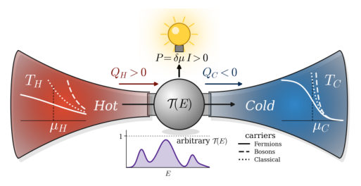 
FIG. 1. Sketch of a coherent thermoelectric heat engine op- erating between a hot (TH, µH) and a cold (TC, µC) reservoir of fermionic, bosonic, or classical carriers, connected through a scattering region. Transport properties are encoded in a transmission function T (E).

📷 Fig 2

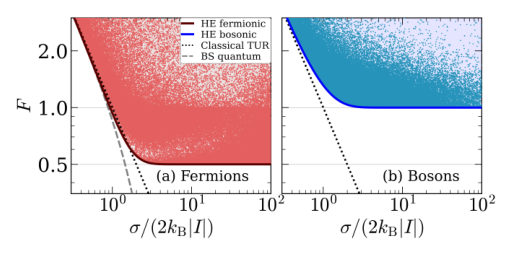 
FIG. 3. Numerical verification of the TURs derived in this work. (a) Fermions (red). (b) Bosons (blue). The transmission T (E) is formed by the union of up to three boxcars. Each point is obtained by randomly sampling reservoir temperatures, chemical potentials, the position and widths of the boxcars, retaining only heat-engine configurations. The gray dashed curve shows for comparison the general fermionic quantum TUR of Ref. [39], while the black dotted curve is the classical- TUR bound.

📷 Fig 3

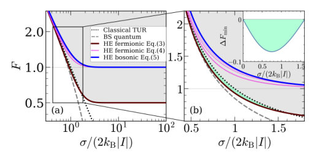 
FIG. 2. Analytic heat-engine TUR bounds. The brown curve is the fermionic bound of Eq. (3), which saturates at F →1/2. The pink curves show the result of Eq. (4) for τ = 3, 4, 5. The blue curve is the bosonic HE bound Eq. (5), which saturates at F →1. The gray shaded area is the region where a fermionic heat engine can operate, while the green shaded area is the region where there is a quantum advantage (see also the inset where we plot the difference ∆Fmin between the bound (3) and the classical-TUR bound). The bosonic HE bound is always more restrictive than the classical TUR, offering no quantum advantage.

📷 Fig 4

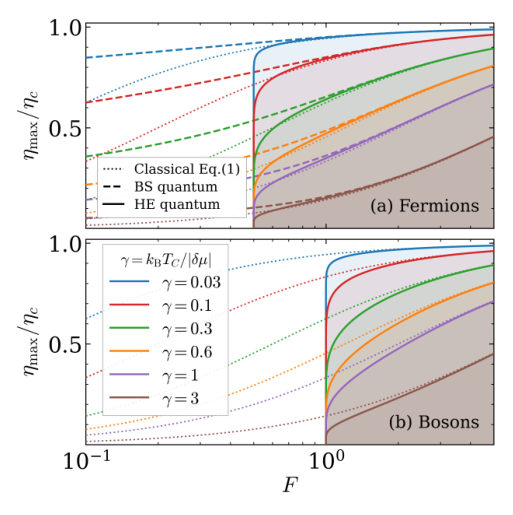 
FIG. 4. Maximum efficiency ηmax/ηc allowed by different bounds as a function of the Fano factor. (a) Fermions. The dotted, dashed, and solid lines correspond to the classical bound (1), the quantum TUR of Ref. [39], and the heat engine quantum bound (2) derived here. (b) Bosons. The dotted and solid lines correspond to the classical bound (1) and the bound (6) derived here. For both panels, different colors indicate different values of the ratio γ = kBTC/|δµ|.

**Summary.** This paper derives novel, engine-specific thermodynamic uncertainty relations that impose universal lower bounds on the Fano factor ($F$) for coherent thermoelectric heat engines. It finds distinct minimum $F$ values for fermions ($>1/2$) versus bosons/classical particles ($>1$). The methodology relies on advanced non-equilibrium statistical mechanics applied to quantum transport, providing tighter constraints than previously known general bounds.

**Why it may be interesting.** This work provides a rigorous, physically motivated constraint on quantum noise in energy conversion devices. For AMO physicists working with quantum heat engines (e.g., superconducting circuits or optomechanical systems), this sets a fundamental benchmark for achievable efficiency and noise levels beyond generic thermodynamic limits.

Detailed structure

**Main problem.** The paper derives a thermodynamic uncertainty relation (TUR) specific to coherent thermoelectric heat engines, aiming to establish universal lower bounds on the Fano factor ($F$). It refines existing general thermodynamic bounds by incorporating the constraints of steady-state quantum thermal machines.

**Main result.** For fermionic carriers, the analysis establishes a new TUR imposing $F > 1/2$ for coherent heat engines. For bosonic and classical carriers, the bound is found to be $F > 1$, demonstrating that these engine-specific bounds are tighter than general quantum TURs.

**Method.** The authors use theoretical derivations based on energy-resolved quantities, convexity arguments (Jensen's inequality), and optimization techniques applied to current noise and entropy production rates in coherent transport models.

**Model / system.** The system modeled is a two-terminal conductor operating as a thermoelectric heat engine between hot ($T_H$) and cold ($T_C$) reservoirs. The analysis covers fermionic, bosonic, and classical carrier transport through an arbitrary transmission function $T(E)$.

**Key observables.** Fano factor ($F = S_I/|I|$), efficiency ($\eta$), entropy production rate ($\sigma$), and the charge-current Thermodynamic Uncertainty Relation (TUR).

**Important parameters / regimes.** Temperature ratio ($T_H$ vs $T_C$), bias parameters ($\delta\mu$), and dimensionless ratios like $\sigma/(2|I|)$.

**Assumptions / limitations.** The analysis assumes coherent transport through a two-terminal conductor, often utilizing the ideal energy filter model as a starting point before generalizing to arbitrary transmission functions.

**Figures summary.** Figures compare analytic TUR bounds (fermionic vs. bosonic) against classical and general quantum bounds, illustrating the region of 'quantum advantage.' Other figures map out working regions in parameter space for different thermodynamic processes.

**Paper structure.** The paper progresses by first establishing the physical model (thermoelectric heat engine), deriving the specific TURs for fermions ($F>1/2$) and bosons/classical particles ($F>1$), comparing these to general bounds, and finally demonstrating the tightness of these limits using numerical evidence and analyzing saturation regimes.

Abstract

We show that for fermionic coherent thermoelectric transport, selecting heat-engine operation yields a thermodynamic uncertainty relation for the charge current that imposes a universal lower limit of $F > 1/2$ on the corresponding Fano factor. We find that violations of the thermodynamic uncertainty relation for classical Markov processes, typically associated with a quantum advantage, are far more restricted for heat engines than what is allowed by a generic thermodynamic process. For bosonic and classical carriers, the minimum Fano factor increases to $F > 1$, and the thermodynamic uncertainty relation for classical Markov processes is never violated. We provide numerical evidence that all the obtained bounds are tight and can be saturated by properly designed transmissions.

[↑ back to top](#top)

### [Mode-locking instability and multiple soliton formation in GaN polariton waveguide cavities](http://arxiv.org/abs/2607.11278v1)

**Authors:** O. Bahrova, V. Develay, H. Souissi, C. Brimont, L. Doyennette, B. Alloing, E. Cambril, S. Bouchoule, T. Ackemann, J. Zuniga-Perez, D. Solnyshkov, G. Malpuech, T. Guillet  
**Type:** both · **Category:** other · **PDF:** <https://arxiv.org/pdf/2607.11278v1>  
**Analysis basis:** full PDF text, analyzed in chunks
**Topic relevance:** 🔥 `analog quantum simulation` **4/5** · 🔥 `driven-dissipative phase transition` **4/5** · `correlated cavity matter` **3/5** · `methods for driven-dissipative` **3/5** · `non-equilibrium dynamics` **3/5** · `non-equilibrium universality` **3/5** · `quantum optics experiment` **3/5** · `Keldysh / 2PI / non-Gaussian methods` **2/5** · `Tavis-Cummings & cavity-many-emitter` **2/5** · `correlated / nonlocal dissipation` **2/5** · `entanglement & information structure` **1/5** · `interference shaping light` **1/5** · `scars & prethermalization` **1/5** · `superradiant laser` **1/5**

📷 Fig 1

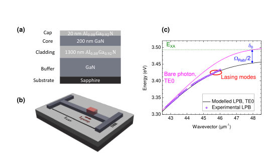 
FIG. 1. The GaN polariton waveguide cavity. (a) Scheme of the vertical cross-section of the waveguide, (b) 3D sketch of the Fabry-Perot ridge cavity formed by the 2 DBRs, with the pumping region shown in red; (c) Dispersion of the polari- ton branch at 150 K (violet circles) extracted from the FSR measurements, compared with the computed dispersion of the bare photon (magenta). The exciton resonance is shown as a green dashed line. The lasing modes are delimited by the red circle.

📷 Fig 2

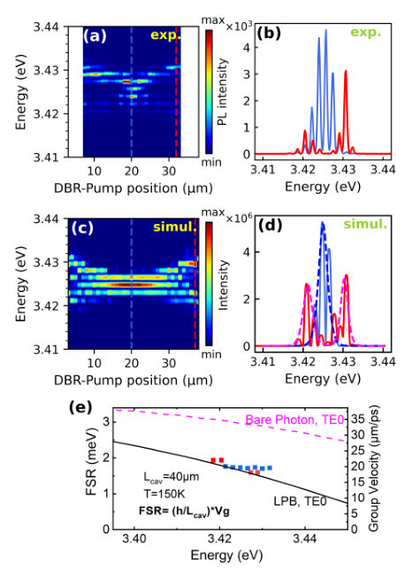 
FIG. 2. The transition between one- and two-soliton regimes. (a) Spectrally-resolved intensity of the emission measured in the experiment for different pump positions. (b) Spectra for peculiar distinct regimes (achieved by pumping at the posi- tions indicated by the blue and red dashed lines in (a)) illus- trating the presence of one and two bright temporal solitons (in blue and red, respectively). The middle row (c-d) shows the corresponding simulations results. The dashed curves in (d) are for the sech fit. (e) Free spectral range (FSR) calcu- lated for the experimentally measured spectra in (b) for the one- (in blue) and two-soliton (in red) cases. Two distinct group velocities are...

📷 Fig 3

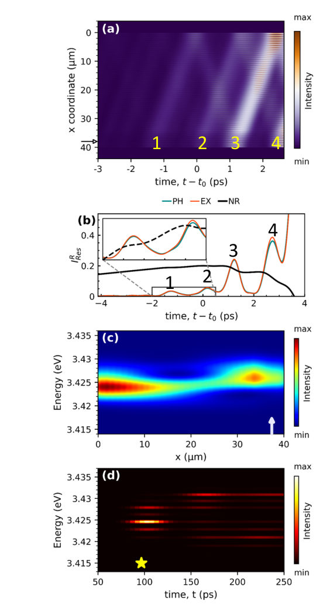 
FIG. 3. Two-soliton regime. (a) Real space intensity. The arrow on the left indicates the position of the pump center. Numbers mark reamplifications of the solitons via the reser- voir. (b) Rescaled intensities of the photon and exciton frac- tions together with the population of the excitonic reservoir (black curve) integrated over the pump region. Inset shows a zoom, where the dashed black curve corresponds to the rescaled black one from the main subfigure. (c) Emission in- tensity as function of position and energy for the case where more than one soliton is present in the cavity with distinct group velocities, and integrated for a time window (centered at t0) chosen to be shorter than...

📷 Fig 4

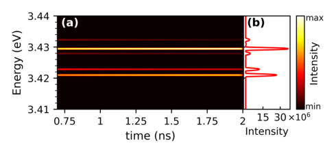 
FIG. 4. (a) Time-resolved spectral intensity for the two- soliton regime (tw = 30 ps). (b) the corresponding time- integrated spectrum.

📷 Fig 5

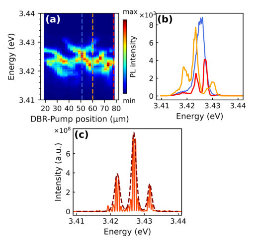 
FIG. 6. Soliton formation for larger sample of 100 µm. (a) In- tensity of emission as a function of pump position and energy. (b) Spectra for highlighted pump position demonstrating one (blue), two (red) and three-soliton (orange) cases. (c) Three- soliton spectra (light red curve) with the fit (dashed curve) obtained from numerical calculations, analogously to the or- ange curve in (b).

**Summary.** This paper reports on the controlled generation of multiple solitons in GaN polariton waveguide cavities by manipulating the pumping laser's position. Using coupled Gross-Pitaevskii equations, the authors demonstrate that tuning this gain position allows switching between single and multi-soliton regimes. This confirms that the exciton reservoir dynamics are key to governing the complex nonlinear soliton splitting mechanism.

**Why it may be interesting.** This work is highly relevant to quantum optics and open quantum systems as it deals with nonlinear wave phenomena (solitons) in a semiconductor microcavity system where gain saturation and coupling to an external reservoir are crucial non-equilibrium effects. The control mechanism via pump position offers a tunable platform for studying complex many-body dynamics.

Detailed structure

**Main problem.** The study investigates the emergence of multi-soliton regimes and mode-locking instability within 1D ridge polariton waveguides.

**Main result.** By tuning the position of the pumping laser (gain region), researchers can control the soliton formation, transitioning between single and multiple asynchronous solitons. The mechanism governing this splitting is linked to the exciton reservoir dynamics.

**Method.** The research combines experimental measurements (spectrally-resolved intensity) with numerical simulations solving coupled 1D Gross-Pitaevskii equations for photons, excitons, and the reservoir.

**Model / system.** The physical system is a GaN polariton waveguide cavity exhibiting strong light-matter coupling. The dynamics are modeled by three coupled nonlinear differential equations (Gross-Pitaevskii type) describing photon ($\varphi$), exciton ($\chi$), and excitonic reservoir ($n_R$) populations.

**Key observables.** Soliton formation count (single vs. multiple), spectral distribution of emission intensity, Free Spectral Range (FSR), and group velocities of the solitons.

**Important parameters / regimes.** Pump position relative to cavity length, characteristic time scales ($	au_{Ph}, 	au_{Ex}, 	au_{Res}$), and coupling constants ($g_{	ext{Res}}$).

**Assumptions / limitations.** The dynamics are well-approximated by the coupled Gross-Pitaevskii equations; the system is studied in 1D geometry.

**Figures summary.** Figures illustrate the cavity structure, the transition from single to double/triple soliton spectra based on pump position, and time evolution of populations and spatial spectral intensity.

**Paper structure.** The paper establishes the physical platform (GaN polariton cavities), presents the governing coupled equations, details the experimental control knob (pump position), demonstrates the tuning mechanism between single and multiple solitons, and analyzes the underlying role of reservoir dynamics in soliton splitting.

Abstract

We study the emergence of multi-soliton regimes in 1D ridge polariton waveguides of two different lengths. We show that by varying the position of the gain, which in out-of-equilibrium polariton systems is provided by the pumping laser and its associated excitonic reservoir, it is possible to tune the regime of soliton formation between single and multiple solitons. This soliton dynamics can be quantitatively reproduced by solving the Gross-Pitaevskii equations of the coupled exciton-photon system, which show that the soliton splitting mechanism is governed by the exciton reservoir dynamics.

[↑ back to top](#top)

### [Chiral, Electronically Decoupled Layers of 1T'-WS2 Topological Insulator via Neutral-Molecule Intercalation](http://arxiv.org/abs/2607.10457v1)

**Authors:** Jiaze Xie, Fatmagül Katmer, Fang Yuan, Jaime M. Moya, Guangming Cheng, Connor J. Pollak, Xiaoyu Song, Nirmal Roy, Yakov Bloch, Moshe Ben Shalom, Jennifer Cano, Leslie M. Schoop  
**Type:** both · **Category:** other · **PDF:** <https://arxiv.org/pdf/2607.10457v1>  
**Analysis basis:** full PDF text, analyzed in chunks
**Topic relevance:** 🔥 `analog quantum simulation` **4/5** · `driven-dissipative phase transition` **3/5** · `methods for driven-dissipative` **3/5** · `non-equilibrium dynamics` **2/5** · `correlated / nonlocal dissipation` **1/5** · `correlated cavity matter` **1/5** · `entanglement & information structure` **1/5** · `non-equilibrium universality` **1/5**

📷 Fig 1

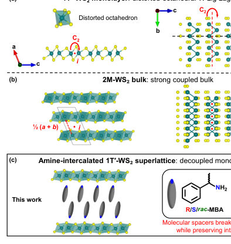 
Fig. 1 Crystal structures and topological hierarchy of WS2. 1T′-WS2 monolayer (a), 2M- WS2 bulk (b), and amine-intercalated WS2 superlattices (c). The 1T′ monolayer is predicted to be a 2D topological insulator (TI), namely a quantum spin Hall (QSH) insulator, whereas the bilayer-based 2M bulk phase, characterized by strong interlayer coupling, experimentally shows a 3D electronic state that is metallic and superconducting. In this work, neutral amine intercalation suppresses the interlayer coupling, decoupling the stacked 1T′ layers and restoring monolayer-like electronic behavior within a translational superlattice. W and S atoms are represented by cyan and yellow spheres, respec- tively....

📷 Fig 2

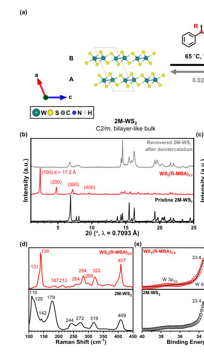 
Fig. 2 Synthesis and structural and chemical characterization of amine-intercalated WS2, exemplified by R-MBA. Schematic of reversible (de)intercalation in 2M-WS2 using MBA (a), with ex situ PXRD tracking the structural evolution (b). Pawley refinement of WS2(rac-MBA)0.5 confirms the intercalated phase (c). Raman (d), W 4f XPS (e), and DSC (f) collectively evidence the intercalation-induced structural and electronic changes. Full characterization of all amine-intercalated phases is provided in Extended Data Fig. 2.

📷 Fig 3

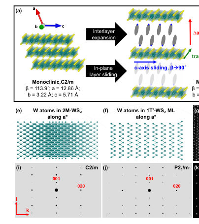 
Fig. 3 Structural evolution of amine-intercalated WS2 at atomic resolution, exemplified by R-MBA. Schematic of the structural evolution associated with the lattice and symmetry changes (a). Cross-sectional HRSTEM (along the b-axis) of 2M-WS2 (b) and WS2(R-MBA)0.5 (c), together with cross-sectional electron diffraction of WS2(R-MBA)0.5 (d). Simulated in-plane W atomic lattices and corresponding HRSTEM images of the 1T′-WS2 monolayer (ML, e, g) and WS2(R-MBA)0.5 (f, h) along the a∗projection. Simulated in-plane electron diffraction patterns of 2M-WS2 (i) and 1T′-WS2 (j), alongside experimental in-plane diffraction of the 1T′-WS2 monolayer (k) and WS2(R- MBA)0.5 (l), all viewed along the...

📷 Fig 4

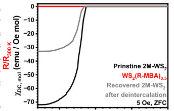 
Fig. 4 Physical properties before and after amine intercalation in WS2, exemplified by R-MBA. Temperature-dependent resistance of 2M-WS2 and WS2(R-MBA)0.5 crystals (a); the inset highlights the low-temperature superconductivity in 2M-WS2. Magnetic susceptibilities of 2M-WS2, WS2(R-MBA)0.5, and restored 2M-WS2 after deintercalation, highlighting the changes in diamagnetic response associated with superconductivity (b). Full characterization of all amine-intercalated phases is provided in Extended Data Fig. 3. Samples were zero-field cooled (ZFC) and subsequently measured under an applied magnetic field of 5 Oe. Field-cooled (FC) results are included in Fig. S24.

📷 Fig 5

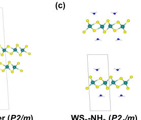 
Fig. 5 Topology is recovered upon intercalation. Crystal structures and corresponding orbital- projected band structures along the Γ-Y path of the monolayer (a), bilayer (b), and 1T′-WS2-NH3 superlattice (c). Topological analysis indicates that the WS2-NH3 superlattice retains the nontrivial topology of the monolayer, characterized by Z2 = 1. Band structures along the full Brillouin-zone paths are provided in Extended Data Fig. 6.

**Summary.** The study overcomes the challenge of studying $1T'-	ext{WS}_2$ topological insulators by chemically intercalating neutral amine molecules into the bulk material. This process expands the interlayer spacing and electronically decouples the layers, allowing researchers to observe monolayer-like insulating behavior in a stable superlattice structure.

**Why it may be interesting.** This work provides an accessible chemical pathway to engineer quantum materials states (like TI behavior) that are otherwise difficult or impossible to isolate experimentally, which is highly relevant for building artificial quantum systems.

Detailed structure

**Main problem.** The intrinsic topological insulator properties of monolayer $1T'-	ext{WS}_2$ are masked by strong interlayer coupling in its bulk phase, preventing direct experimental study.

**Main result.** Amine intercalation successfully creates superlattices where the $1T'$ layers are electronically decoupled from each other, enabling reversible switching between superconducting metal and insulating states matching monolayer behavior.

**Method.** The researchers employed a wet-chemical amine intercalation route to structurally modify the bulk $	ext{WS}_2$ into an intercalated superlattice structure.

**Model / system.** The system is based on $	ext{WS}_2$ dichalcogenides, transitioning from the metallic/superconducting $2M-	ext{WS}_2$ bulk phase to electronically decoupled, insulating superlattices via neutral-molecule intercalation.

**Key observables.** Interlayer spacing expansion (from 0.5 nm to 1-4 nm), electronic transition from metallic to insulating state with a measurable activation gap, and observation of chiroptical activity using chiral amines.

**Important parameters / regimes.** Amine spacer length/type ($	ext{R-MBA}$, $	ext{HexA}$), interlayer spacing (e.g., $17.2 \mathring{	ext{A}}$ expansion), activation gap ($20-50 	ext{ meV}$).

**Assumptions / limitations.** The electronic decoupling is primarily due to the physical separation by the intercalant, allowing DFT calculations to confirm retention of the monolayer's $\mathbb{Z}_2$ topology.

**Figures summary.** Figures illustrate structural changes via PXRD (expanded spacing), electronic state changes via transport measurements (metal-to-insulator crossover), and optical characterization showing chiroptical effects.

**Paper structure.** The paper establishes the problem of interlayer coupling, presents the chemical intercalation method using amines, details structural/electronic characterizations (PXRD, transport, XPS), confirms electronic decoupling and topological retention via DFT, and concludes by establishing this as a general route for studying monolayer physics in bulk crystals.

Abstract

Monolayer 1T'-WS2 is predicted to be a two-dimensional topological insulator, but its intrinsic electronic properties are masked by strong interlayer coupling in its metallic and superconducting bulk parent phase, 2M-WS2. Isolating monolayers by mechanical exfoliation is also hindered by this coupling, preventing experimental examination of monolayer properties. Here we show that 2M-WS2 undergoes amine intercalation through a simple wet-chemical reaction, yielding superlattices in which the 1T' layers are structurally preserved but electronically decoupled by neutral molecular spacers. Intercalation expands the interlayer spacing from 0.5 to 1-4 nm and reconstructs the stacking while preserving the intralayer 1T' framework. Controlled (de)intercalation reversibly switches the system between a superconducting metal and an insulator with an activation gap matching that of the isolated monolayer. Density functional theory indicates that the electronically decoupled layers retain the nontrivial Z2 topology of the monolayer. Chiral amine intercalation further induces chiroptical activity in WS2 electronic transitions. Overall, the successful intercalation challenges the long-held view that group VIB dichalcogenides are inert toward neutral-molecule intercalation and demonstrates molecular intercalation as a general chemical route for realizing monolayer-like topological-insulator physics and enabling chiral van der Waals superlattices in bulk single crystals.

[↑ back to top](#top)

### [Purcell enhanced and blinking free single photons from InAs/GaAs quantum dots in deterministically placed circular Bragg gratings](http://arxiv.org/abs/2607.11495v1)

**Authors:** Peter Gschwandtner, Quirin Buchinger, Krishna Chand Maurya, Mohamed Helal, Barbara Souza Damasceno, Ravindra Kumar, Hyemin Kim, Ievgen Brytavskyi, Silke Kuhn, Arne Ludwig, Dirk Reuter, Yong-Hoon Cho, Tobias Huber-Loyola, Sven Höfling  
**Type:** experiment · **Category:** quantum information and computing · **PDF:** <https://arxiv.org/pdf/2607.11495v1>  
**Analysis basis:** full PDF text, analyzed in chunks
**Topic relevance:** 🔥 `QC/QI experiment` **4/5** · `quantum optics experiment` **3/5** · `Tavis-Cummings & cavity-many-emitter` **2/5** · `correlated cavity matter` **2/5** · `analog quantum simulation` **1/5** · `interference shaping light` **1/5** · `quantum measurements` **1/5** · `spintronics-quantum-optics interface` **1/5**

📷 Fig 1

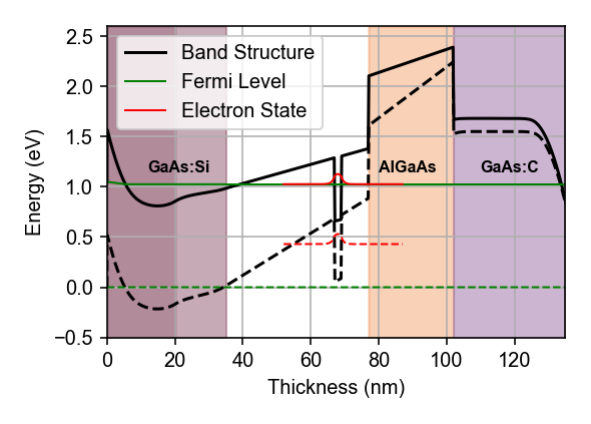 
Figure 1: Simulation of the conduction band of the device at T = 5 K, plotted at zero bias voltage Vb = 0 (dashed lines) and forward bias voltage Vb = 1.4 V (solid lines). The Fermi level for the n-doped areas (green) have been extended through the whole structure as a guide for the eye. At zero bias, the energy states in the QD are positioned well above the Fermi level of the electron reservoir. By applying a bias voltage, the band structure is flattened. In the simulation, at Vb = 1.1 V the lowest energy states in the QD (red line) reach resonance with the Fermi level at the n-doped contact.

📷 Fig 2

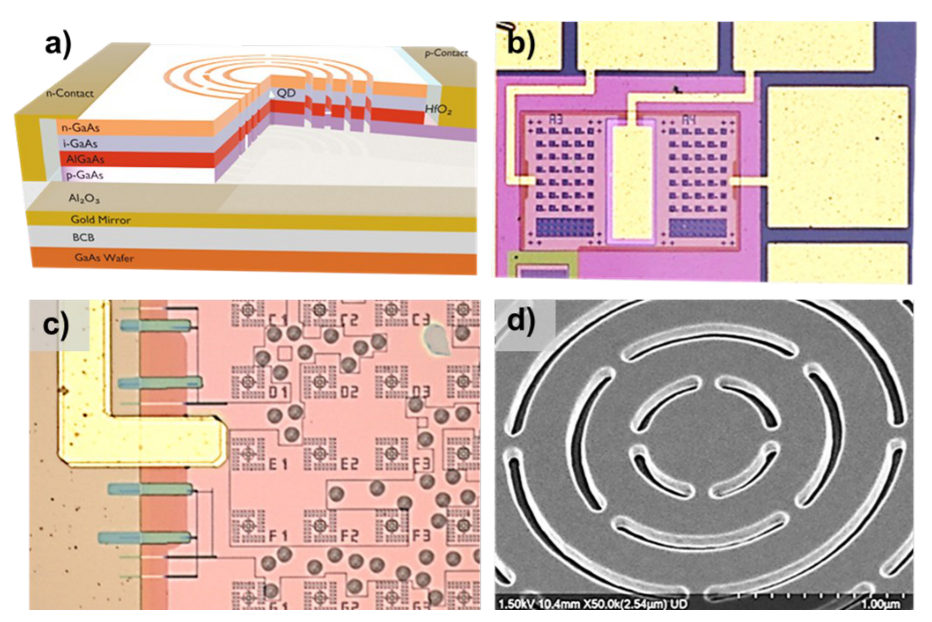 
Figure 2:a) Schematic cross section of the device, showing membrane with the CBG, the Al2O3 spacer layers, bottom gold mirror, glued with BCB to a GaAs wafer. The sidewalls between membrane and gold contacts are filled with HfO2 to prevent electrical shorts b) Microscope image of two measurement fields, showing the golden electrical pathways leading to the bonding pads (two sides: n-type, middle: p-type). c) Microscope image zoomed into a measurement field on the n-type contact side d) SEM image of processed bullseye, showing clean surfaces and well-defined ridges.

📷 Fig 3

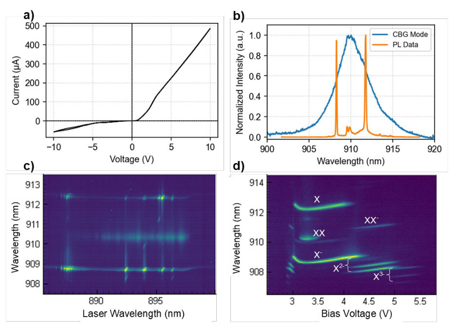 
Figure 3: a) Characteristic I-V line of the contacted p-i-n membrane exhibiting diode behavior. b) Above-bandgap PL spectrum showing the CBG mode at a bias voltage of 3.3 V. The CBG mode is centered around 910nm with a FWHM of 4.6 nm. c) PLE map showing resonant excitation channels as a function of the laser wavelength. d) Voltage dependent μPL (PL-V) map: three distinct charge plateaus are visible.

📷 Fig 4

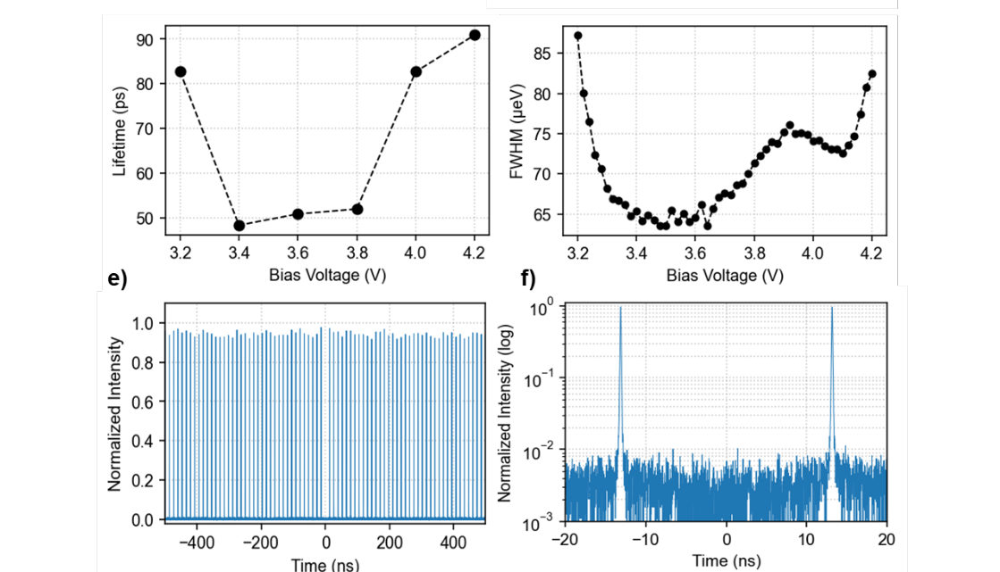 
Figure 4: Measurements under quasi-resonant excitation. a) PL-V focused on X- emission. b) time resolved μPL measurement of X-

**Summary.** The paper reports on the creation of an advanced single-photon source using InAs quantum dots coupled to a custom circular Bragg grating resonator. By engineering the structure with labyrinthine bridges, the authors achieved electrical contact while maintaining high Purcell enhancement and photon extraction efficiency. The resulting device is shown to be blinking-free and allows precise tuning between multiple charge states, making it a strong candidate for next-generation quantum hardware.

**Why it may be interesting.** This work directly addresses hardware requirements for quantum networks by demonstrating high efficiency, deterministic control, and low multi-photon probability in a solid-state platform, which is highly relevant to photonic quantum information science.

Detailed structure

**Main problem.** The development of efficient, deterministic, and tunable single-photon sources is crucial for realizing quantum communication and photonic quantum computing.

**Main result.** The authors demonstrated a robust architecture using InAs/GaAs QDs in a modified circular Bragg grating that achieves high photon extraction efficiency (68.1%) and blinking-free operation while allowing deterministic charge control ($	ext{X}^-$ to $	ext{X}^{3-}$).

**Method.** The research combines advanced semiconductor fabrication techniques with detailed optical characterization, including time-resolved photoluminescence and Hanbury Brown and Twiss measurements.

**Model / system.** The system utilizes InAs quantum dots embedded in a p-i-n doped GaAs membrane, coupled to a modified circular Bragg grating micro-resonator. The labyrinthine geometry was engineered to provide electrical contact while maintaining high Purcell enhancement.

**Key observables.** Single photon emission at 900 nm, Photon Extraction Efficiency (PEE $\approx 68\%$), low second-order autocorrelation ($g^{(2)}(0) < 0.017$), and distinct charge state plateaus ($	ext{X}^-, 	ext{X}^{3-}$).

**Important parameters / regimes.** Purcell factor ($\sim 18.0$), emission lifetime ($44.3 \pm 0.2$ ps), and operating voltage ranges for charge tuning.

**Assumptions / limitations.** The primary engineering challenge overcome was the electrical isolation of the central QD pillar within the CBG structure, which was solved using labyrinth-like bridges.

**Figures summary.** Figures detail PL vs. Voltage showing multiple charge plateaus; time-resolved PL confirms a significantly shortened lifetime compared to planar structures; and HBT measurements confirm strong photon antibunching ($g^{(2)}(0)$).

**Paper structure.** The paper progresses from establishing the need for high-performance sources, detailing the complex fabrication of the electrically contacted CBG structure, presenting optical characterization (PLV, lifetime), confirming single-photon purity via autocorrelation measurements, and concluding with the demonstration of charge tunability.

Abstract

The development of efficient, deterministic, and tunable single-photon sources is a cornerstone for the realization of long-distance quantum communication, quantum repeaters, and photonic quantum computing technologies. In this study, we demonstrate a bright, charge-tunable single-photon source in the 900 nm wavelength range based on InAs quantum dots (QDs) embedded in a p-i-n doped GaAs membrane, which shows blinking free emission.   We use a modified circular Bragg grating (CBG) as a micro-resonator. By adding fourfold symmetric bridges in a labyrinth-like geometry, we provide a conductive pathway to the central disk, thereby enabling electrical contact to the QD while maintaining high Purcell enhancement and photon extraction efficiency (PEE). For the negative trion (X-), we demonstrate a lifetime of $44.3 \pm 0.2$ ps - corresponding to a Purcell factor of $18.0 \pm 0.7$ and a PEE of $68.1% \pm 3.1$ %. Furthermore, the device is blinking-free with very low multi-photon contribution, evidenced by a second-order autocorrelation value $g(2)(0) < 0.017 \pm 0.015$. By applying a vertical diode bias, we demonstrate precise charge-state control, resolving distinct emission plateaus ranging from the single negatively charged trion ($X^-$) to triply negatively charged excitons ($X^{3-}$).   These results showcase a robust architecture that simultaneously provides high efficiency, high repetition rates, and deterministic charge control, fulfilling key requirements for the next generation of quantum network hardware.

[↑ back to top](#top)

### [Strain-controlled crystalline--amorphous transition and flat-band tuning in buckled silicon kagome](http://arxiv.org/abs/2607.11790v1)

**Authors:** Chenhaoyue Wang, Amartya S. Banerjee  
**Type:** theory · **Category:** statistical mechanics · **PDF:** <https://arxiv.org/pdf/2607.11790v1>  
**Analysis basis:** full PDF text, analyzed in chunks
**Topic relevance:** `analog quantum simulation` **3/5** · `driven-dissipative phase transition` **3/5** · `methods for driven-dissipative` **3/5** · `non-equilibrium dynamics` **2/5** · `non-equilibrium universality` **2/5** · `Frenkel-Kontorova` **1/5** · `Keldysh / 2PI / non-Gaussian methods` **1/5**

📷 Fig 1

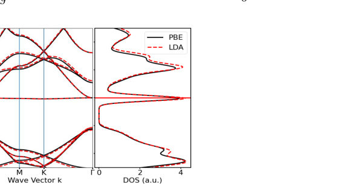 
Figure 1. (a) Top view of the planar SiKL parent lattice. The dashed polygon marks the primitive cell. (b) Kohn–Sham band structure (left) and density of states (right) calculated with LDA (red dashed curves) and PBE (black solid curves). Energies are referenced to the Fermi level.

📷 Fig 2

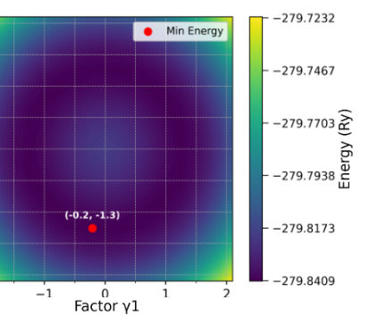 
Figure 2. (a) PBE phonon dispersion of planar SiKL. Negative plotted frequencies denote imaginary modes. (b) Representative relaxed-energy landscape for a fixed Γ3 = 0 slice as a function of the Γ1 and Γ2 mode amplitudes. The red point marks the lowest-energy structure within the displayed slice.

📷 Fig 3

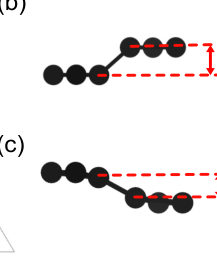 
Figure 3. Relaxed buckled SiKL structures: (a) top view of a 3×3 supercell and side views of (b) the HB and (c) the LB primitive cells. The indicated buckling height is the vertical separation between neighbouring triangular units.

📷 Fig 4

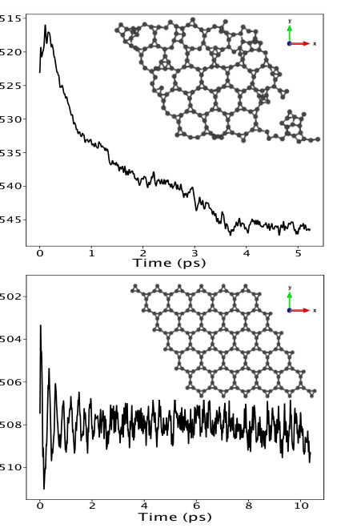 
Figure 4. PBE phonon dispersions and AIMD potential-energy histories for HB SiKL at 315 K: (a,b) unstrained and (c,d) under 10% biaxial tensile strain. The AIMD cells contain 6 × 6 primitive cells. Insets show configurations averaged over the final 2 ps of the respective trajectories. Strain strongly hardens the soft modes and preserves the ordered linked-triangle network over the 10 ps strained trajectory.

📷 Fig 5

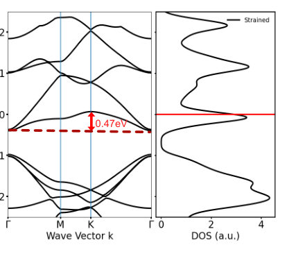 
Figure 5. Kohn–Sham band structures and densities of states of HB SiKL (a) without strain and (b) under 10% biaxial tensile strain. The solid red line denotes the Fermi level in the DOS panel. The dashed red line and arrow indicate the energy interval used to quote the kagome-derived bandwidth. Biaxial strain reduces the displayed bandwidth from 0.86 to 0.47 eV.

**Summary.** This work demonstrates that strain is a powerful tuning knob for the silicon kagome lattice ($	ext{SiKL}$), allowing researchers to engineer narrow electronic flat bands while simultaneously controlling its structural stability. By simulating both electronic structure and thermal dynamics, the authors map out a phase diagram where tensile strain dictates the transition pathway from crystalline order to amorphous disorder.

**Why it may be interesting.** The coupling of mechanical stress (strain) directly to both quantum electronic states (flat bands) and classical structural stability (phase transitions) provides a rich platform for studying emergent many-body physics under external control, relevant to open quantum systems modeling.

Detailed structure

**Main problem.** The study investigates how mechanical strain can control both the electronic properties (achieving flat bands) and the structural stability (inducing crystalline-to-amorphous transitions) in a simple, elemental 2D material.

**Main result.** Biaxial tension significantly narrows the electronic bandwidth near the Fermi level and controls the amorphous transition pathway, leading to strain-induced metastability up to high temperatures.

**Method.** The research employs a combination of Density Functional Theory (DFT) for electronic structure, *ab initio* Molecular Dynamics (AIMD), and classical Molecular Dynamics (MD) simulations to model thermal and mechanical evolution.

**Model / system.** The system is the buckled silicon kagome lattice ($	ext{SiKL}$), an unfunctionalized six-atom monolayer. The study explores its response to external biaxial strain, which acts as the primary tuning parameter.

**Key observables.** Bandwidth ($W$), density-of-states peak near $E_F$, crystalline-to-amorphous transition temperature ($T_{CA}$), and structural order monitored via Radial Distribution Functions ($	ext{RDF}$).

**Important parameters / regimes.** Biaxial strain ($\epsilon$) up to 10%, Temperature ($T$) up to $\sim 600 	ext{ K}$, and substrate mismatch (e.g., on $	ext{Ag}(111)$).

**Assumptions / limitations.** The transition temperature $T_{CA}$ is defined as a finite-time, model-dependent metric rather than an equilibrium thermodynamic melting point.

**Figures summary.** Figures illustrate the electronic band structure changes under strain, phonon dispersion curves showing instability/hardening, and potential energy histories tracking structural collapse pathways (gradual vs. abrupt).

**Paper structure.** The paper first establishes the planar lattice's inherent instability via soft phonons; it then models the relaxation into stable buckled forms; subsequently, it uses AIMD/MD to show strain-controlled electronic tuning and the resulting crystalline-to-amorphous phase transition kinetics.

Abstract

Electronic flat bands in an elemental two-dimensional material provide an attractive setting for electron interactions competing with suppressed kinetic energy. Here we propose a buckled silicon kagome lattice (SiKL), an unfunctionalized six-atom monolayer of bond-linked Si$_3$ triangles and dodecagonal pores. Its planar parent hosts a dispersionless Kohn--Sham band near the Fermi level but is unstable to out-of-plane distortions. Following three soft zone-centre phonons and relaxing displaced structures yields two nearly degenerate buckled forms. The high-buckling form retains a partially flat kagome-derived band near the Fermi level. Biaxial tension controls lattice dynamics and electronic dispersion: at 10% strain, the bandwidth decreases significantly, the density-of-states peak approaches the Fermi level, and the softest phonon hardens. At 315 K, $6\times6$ ab initio MD shows the unstrained network disordering while the strained network remains ordered, indicating finite-temperature metastability. Fifty-nanosecond classical MD of $36\times36$ sheets reveals a strain-controlled crystalline--amorphous transition and local-bonding crossover near 2% strain. Low-strain trajectories show gradual, two-stage disordering; higher strains undergo an abrupt, first-order-like collapse, with the transition temperature reaching approximately 600 K at 10% strain. An exploratory Ag(111) substrate model suggests epitaxial mismatch could supply comparable tension, retain a narrow SiKL band, and preserve crystalline order above room temperature. Unlike passivated or hybrid-lattice silicon kagome proposals aimed mainly at conventional semiconductors, SiKL is elemental and uses strain alone to couple thermal metastability, bond rearrangement, and near-Fermi flat-band tuning. Buckled SiKL is a candidate platform for strain-controlled flat-band and electronic correlation physics.

[↑ back to top](#top)

### [Extended Landau--Lifshitz equation for nanomagnets: a path-integral derivation of surface-induced magnetization nutation](http://arxiv.org/abs/2607.11420v1)

**Authors:** H. Kachkachi, P. Thibaudeau  
**Type:** theory · **Category:** other · **PDF:** <https://arxiv.org/pdf/2607.11420v1>  
**Analysis basis:** full PDF text, analyzed in chunks
**Topic relevance:** `Keldysh / 2PI / non-Gaussian methods` **3/5** · `methods for driven-dissipative` **3/5** · `spintronics-quantum-optics interface` **3/5** · `non-equilibrium dynamics` **2/5** · `correlated / nonlocal dissipation` **1/5** · `driven-dissipative phase transition` **1/5** · `exotic spin models in light-matter` **1/5**

📷 Fig 1

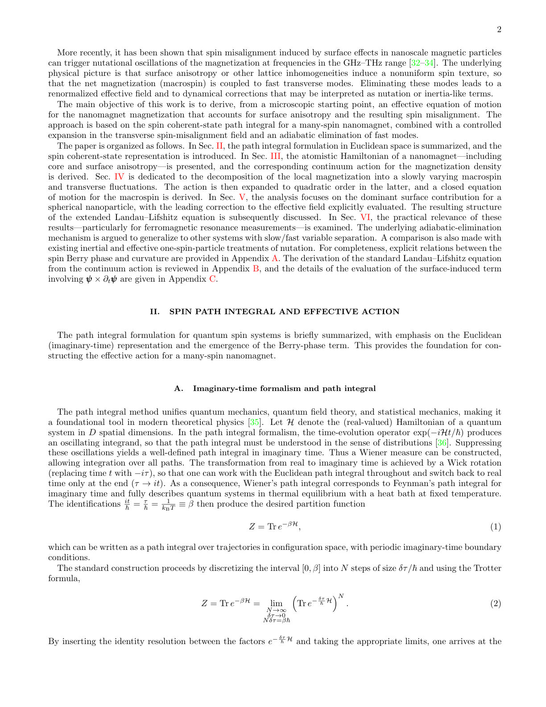 
Low-resolution page preview, page 2

📷 Fig 2

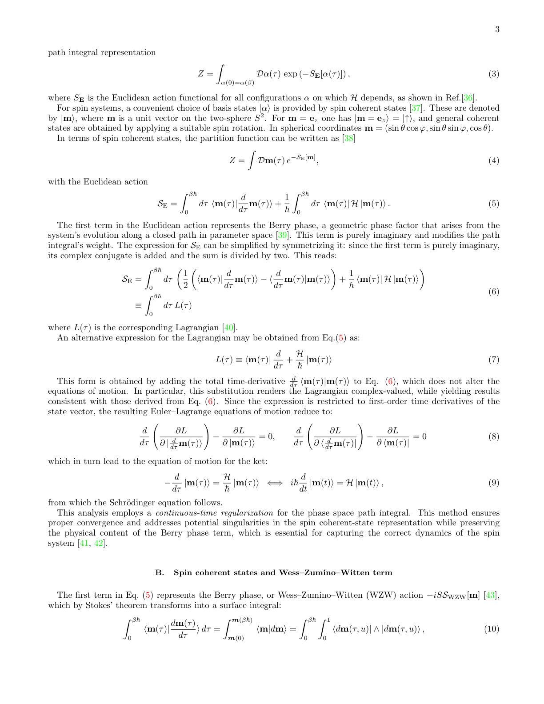 
Low-resolution page preview, page 3

📷 Fig 3

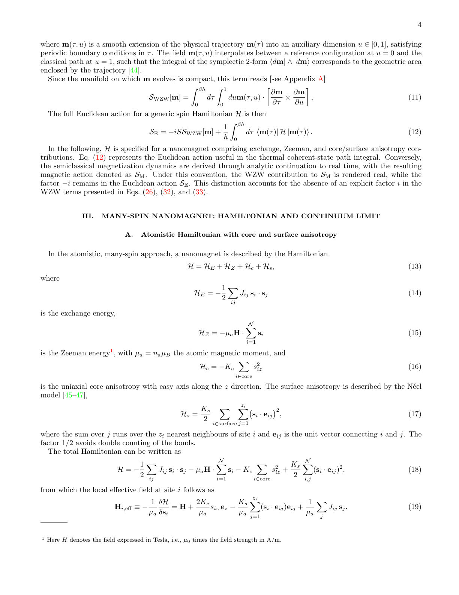 
Low-resolution page preview, page 4

📷 Fig 4

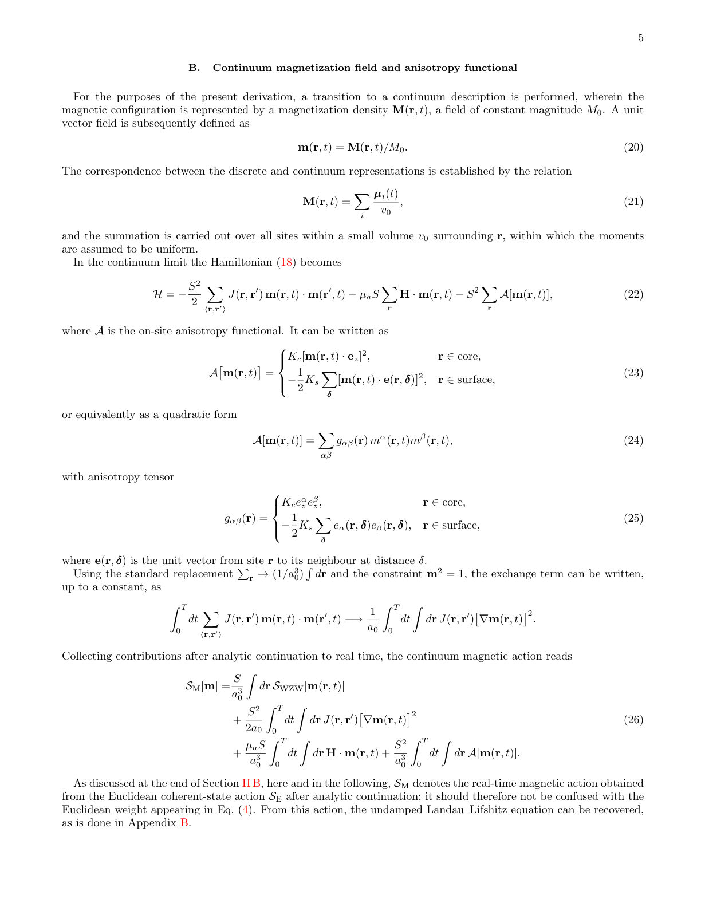 
Low-resolution page preview, page 5

📷 Fig 5

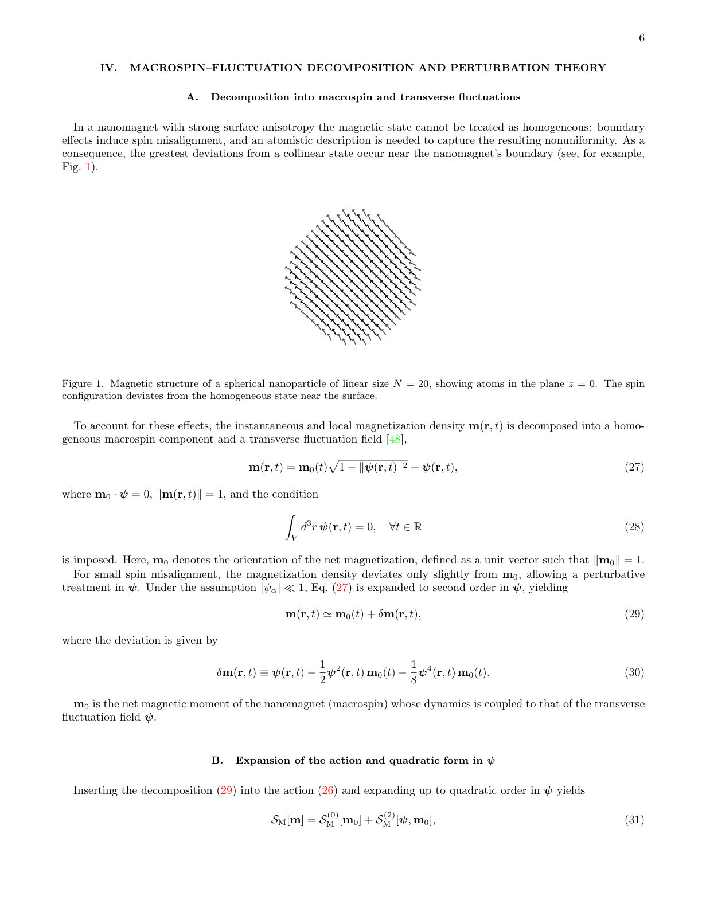 
Low-resolution page preview, page 6

**Summary.** This paper derives an extended Landau-Lifshitz equation for nanomagnet magnetization by treating surface anisotropy effects using a path-integral formalism. By employing the adiabatic approximation to eliminate fast transverse spin fluctuations, the authors derive effective field corrections that predict measurable shifts in magnetic resonance frequencies due to intrinsic surface coupling.

**Why it may be interesting.** This work provides a rigorous quantum field theoretic derivation (path integral) of classical magnetic dynamics, which is highly relevant for understanding open quantum systems where coupling to environmental baths (fast fluctuations) modifies slow variables.

Detailed structure

**Main problem.** To derive an effective, extended Landau-Lifshitz equation for nanomagnet magnetization that microscopically accounts for surface anisotropy effects leading to magnetization nutation.

**Main result.** The derivation yields a closed equation of motion featuring effective field corrections and additional nutation/damping terms originating from the adiabatic elimination of fast transverse spin-misalignment fluctuations.

**Method.** The approach uses the spin coherent-state path integral formalism in Euclidean space, followed by an adiabatic expansion to eliminate high-frequency modes.

**Model / system.** The system is a nanomagnet whose dynamics are governed by an atomistic spin Hamiltonian incorporating exchange, Zeeman, core, and surface anisotropy terms. The analysis transitions from the quantum path integral formulation to a classical effective equation of motion for the macrospin component.

**Key observables.** Effective field corrections ($\delta\mathbf{H}_{	ext{eff}}$), nutation-like contributions, damping-like contributions, ferromagnetic-resonance frequency shift, and linewidth.

**Important parameters / regimes.** Surface anisotropy strength, characteristic time scales separating slow macrospin evolution from fast transverse fluctuations.

**Assumptions / limitations.** The adiabatic approximation is central, assuming that transverse spin-misalignment modes relax much faster than the macroscopic magnetization component.

**Paper structure.** The paper systematically moves from defining the full Euclidean action via path integrals to decomposing the magnetization into slow and fast components. It then applies adiabatic elimination to derive the final, corrected Landau-Lifshitz equation for the macrospin.

Abstract

An effective dynamical equation for the magnetization of a nanomagnet with surface anisotropy is derived from an atomistic spin Hamiltonian using the spin coherent-state path integral formalism. The derivation proceeds in two steps. First, the continuum Euclidean action for the many-spin nanomagnet is obtained, including the Wess--Zumino--Witten (Berry phase) term, as well as exchange, Zeeman, and core/surface anisotropy contributions. Second, the local magnetization density is decomposed into a slowly varying macrospin component and transverse spin-misalignment fluctuations driven by surface effects.   A systematic expansion of the action is then performed up to quadratic order in the transverse-fluctuation variables. Under the adiabatic approximation, in which transverse modes relax much faster than the macrospin, these modes are eliminated by using their static Green's function solution. This results in a closed, extended Landau--Lifshitz equation for the macrospin, featuring an effective field with nontrivial corrections from spin misalignment. These corrections renormalize both the Zeeman and anisotropy fields and introduce additional terms that act as nutation- and damping-like contributions. ...   Together, these results establish a microscopic foundation for surface-induced magnetization nutation in nanomagnets and provide a framework to estimate corrections to the precession frequency and effective damping. The corresponding shift in the ferromagnetic-resonance frequency and linewidth is measurable with standard GHz spectrometers, and the underlying adiabatic-elimination mechanism is expected to generalize to any slow magnetic variable coupled to a bath of fast-fluctuating modes.

[↑ back to top](#top)

### [Anomalous Transverse Response and Multi-Field Ferrialtermagnetic-Ferroelectric Valve with CrSb Flakes](http://arxiv.org/abs/2607.11222v1)

**Authors:** Long Zhang, Xinfeng Chen, Hongfei Liang, Jianting Dong, Fei Zou, Yi Yan, Guangqian Ding, Guoying Gao  
**Type:** both · **Category:** statistical mechanics · **PDF:** <https://arxiv.org/pdf/2607.11222v1>  
**Analysis basis:** full PDF text, analyzed in chunks
**Topic relevance:** `Keldysh / 2PI / non-Gaussian methods` **3/5** · `spintronics-quantum-optics interface` **3/5** · `methods for driven-dissipative` **2/5** · `non-equilibrium dynamics` **2/5** · `driven-dissipative phase transition` **1/5** · `exotic spin models in light-matter` **1/5** · `non-equilibrium universality` **1/5**

📷 Fig 1

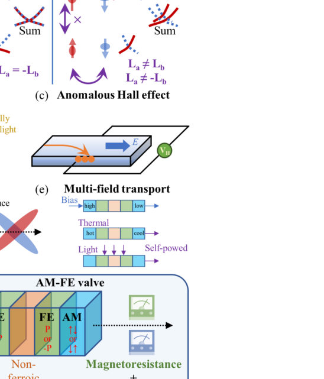 
Fig. 1. Symmetries of magnetic systems, and AM applications. The symmetry connection, magnetization, and spin splitting of collinear FM, AFM, FiM, AM, AAM, and FiAM systems (a). Schematic diagrams of the MOKE (b) and the AHE (c). Schematic low and high resistances in AM transport (d). Multi-field transport using bias, thermal, and light (e). Schematics of the spin valve with magnetoresistance (f) and the AM-FE valve with magnetoresistance and electroresistance (g).

📷 Fig 2

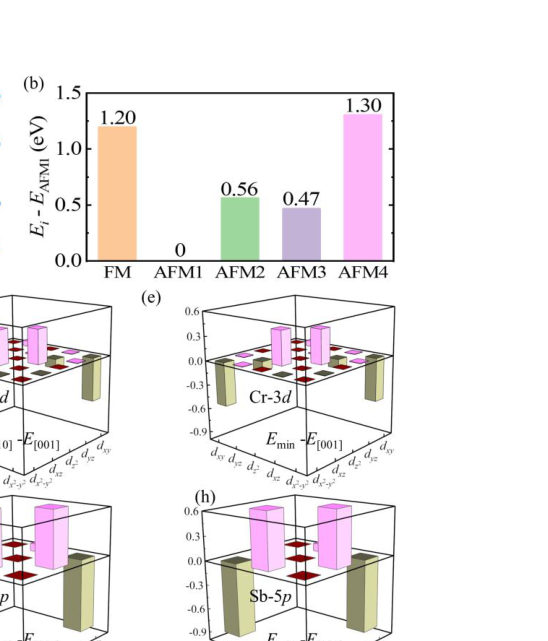 
Fig. 2. Magnetic states and anisotropy. Various magnetic configurations in CrSb with considered exchange interactions (a). The energy difference ΔE = Ei - EAFM1 (b). Cr-3d-contributed (c-e), Sb-5p-contributed (f-h) anisotropy energy.

📷 Fig 3

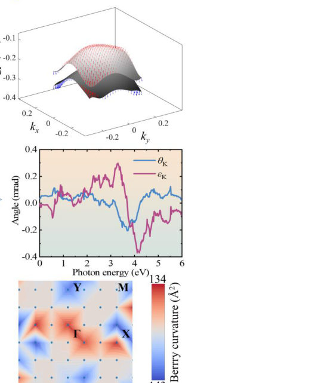 
Fig. 3. Theoretical characterization, TN, MOKE, and AHC. Simulated STM image of CrSb, where the red box is a unit cell (a). MAE in 3D space (b). Charge density difference for CrSb with an isosurface of 0.005 e/bohr3 and Cr atomic magnetic moments (c). Structure of AM CrSb with connections between two sub-lattices (d). Alternating spin splitting (e). Momentum-dependent spin texture around the Fermi level (f). The variations of the normalized spin (red) and specific heat capacity (blue) with the temperature (g). The θK and εK with varying photon energies (h). Energy-dependent AHC (i) and momentum-dependent Berry curvature (j).

📷 Fig 4

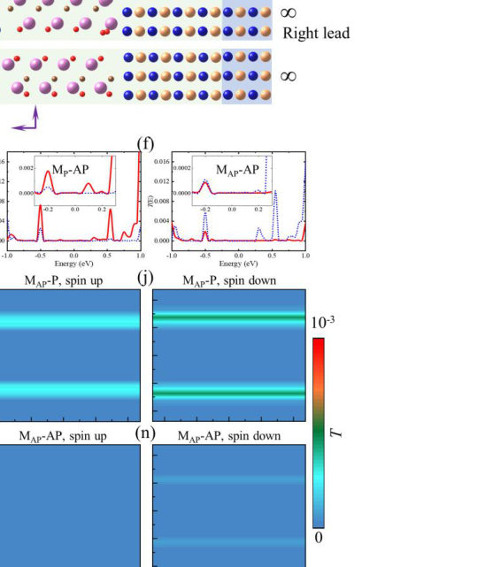 
Fig. 4. Transport performance. Structural models of CrSb/Sc2CO2/Cu/ScCO2/CrSb with opposite FE polarization directions (a,b). Transmission coefficients as a function of energy with MP-P (c), MAP-P (d), MP-AP (e), and MAP-AP (f). Momentum-resolved transmission spectra (g-n). MP and MAP denote the same and opposite magnetization between the left and right CrSb electrodes, P and AP are the parallel and antiparallel FE polarization directions between the left and right Sc2CO2, respectively.

📷 Fig 5

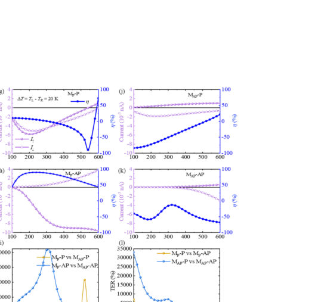 
Fig. 5. Bias and thermal transport. Spin-dependent current, and η, TMR, and TER across CrSb/Sc2CO2/Cu/Sc2CO2/CrSb under bias voltage (a-f) and temperature gradient (g-l).

**Summary.** This work proposes utilizing ferrialtermagnetism, realized in $	ext{CrSb}$ flakes, to build a highly functional spintronic valve. By integrating this material with ferroelectrics, the authors predict record-high switching ratios ($\sim 10^4\%$) for TMR and TER under bias or light fields. The methodology combines advanced DFT calculations with non-equilibrium transport modeling.

**Why it may be interesting.** The combination of advanced magnetism concepts (altermagnets) with ferroelectricity and transport physics makes it relevant for understanding coupled order parameters and emergent quantum phenomena in solid-state devices.

Detailed structure

**Main problem.** To establish ferrialtermagnetism (FiAM) as a robust, distinct subclass of altermagnets for developing multi-field-controlled spintronic and electronic devices.

**Main result.** The proposed $	ext{CrSb}/	ext{Sc}_2	ext{CO}_2/	ext{Cu}/	ext{Sc}_2	ext{CO}_2/	ext{CrSb}$ valve exhibits extremely high switching ratios ($\sim 10^4\%$) in TMR/TER, and demonstrates robust spin splitting even when Néel vectors are reversed.

**Method.** The study combines Density Functional Theory (DFT) calculations with Non-equilibrium Green's Function (NEGF) simulations to predict transport properties under various external fields (bias, light).

**Model / system.** The physical system is a multilayer heterostructure involving $	ext{CrSb}$ flakes exhibiting the FiAM state, coupled with ferroelectric ($	ext{Sc}_2	ext{CO}_2$) and metallic spacer layers. The magnetic behavior is modeled using spin Heisenberg Hamiltonians.

**Key observables.** Tunneling Magnetoresistance (TMR), Tunnel Electroresistance (TER), Anomalous Hall Conductivity (AHC), Negative Differential Resistance (NDR), and photocurrent extinction ratio.

**Important parameters / regimes.** Spin splitting energy of $344 	ext{ meV}$, high Néel temperature ($657 	ext{ K}$), and switching ratios up to $\sim 10^4\%$.

**Assumptions / limitations.** The analysis relies on the assumption that uniaxial magnetic anisotropy is sufficient to stabilize 2D order, and transport calculations use NEGF formalism.

**Figures summary.** Figures illustrate symmetry operations for various magnetic states (FM, AFM, FiM), schematics of multi-field valves ($	ext{bias}$, thermal, light), spin-resolved transmission coefficients across the device structure, and energy dependence of current ratios.

**Paper structure.** The paper progresses from defining the theoretical concept of ferrialtermagnetism via symmetry analysis to calculating fundamental magnetic properties (spin splitting, $T_N$) using DFT/Heisenberg models, culminating in detailed NEGF simulations predicting high-performance device characteristics like TMR and electroresistance.

Abstract

Altermagnets combine the zero-stray-field of antiferromagnets with the spin polarization of ferromagnets, showing great potential for spintronic applications. Here, we propose ferrialtermagnetism as a distinct subclass of altermagnetic family, where symmetry-inequivalent altermagnetic sublattices possess nonidentical Neel vectors, preventing mutual cancellation of alternating spin splitting and conferring intrinsic robustness against perturbations. This concept is realized in the three-atomic-layer CrSb (110) flakes, which exhibits spin splitting of 344 meV, moderate uniaxial magnetic anisotropy, and high Neel temperature of 657 K. The magneto-optical Kerr and the anomalous Hall effects are observed. Integrating this ferrialtermagnetic CrSb with ferroelectric Sc2CO2 and Cu spacer, we design an ferrialtermagnetic-ferroelectric valve. This device displays equilibrium tunneling magnetoresistance and electroresistance of ~10^3%, and non-equilibrium magnitudes under bias, thermal, or light field reaches ~10^4% with high spin filtering of 90%. The negative differential resistance and photogalvanic effects, and photocurrent extinction ratio of 283.8 are achieved. These findings establish ferrialtermagnetism as a fertile platform for multi-field-controlled, ultracompact, and self-powered spintronics and electronics.

[↑ back to top](#top)

### [Transport in magnetic-topological-insulator nanoribbons containing multiple superconductor-proximitized sectors](http://arxiv.org/abs/2607.10665v1)

**Authors:** Javier Osca, Sungguen Ryu, Rosa López, Llorenç Serra  
**Type:** theory · **Category:** other · **PDF:** <https://arxiv.org/pdf/2607.10665v1>  
**Analysis basis:** full PDF text, analyzed in chunks
**Topic relevance:** `non-equilibrium dynamics` **3/5** · `driven-dissipative phase transition` **2/5** · `methods for driven-dissipative` **2/5** · `Keldysh / 2PI / non-Gaussian methods` **1/5** · `Kondo & dissipative impurity` **1/5** · `analog quantum simulation` **1/5** · `correlated / nonlocal dissipation` **1/5** · `non-equilibrium universality` **1/5** · `spintronics-quantum-optics interface` **1/5**

📷 Fig 1

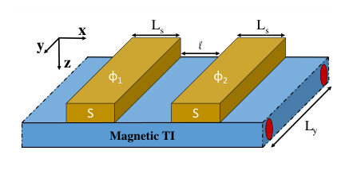 
FIG. 1. Schematic of an MTI thin slab (blue) with two prox- imitized superconducting regions (S, shown in yellow) char- acterized by complex phases ϕ1 and ϕ2. Red ellipses indicate edge modes propagating along the device edges (x-direction). The figure also indicates the transverse width of the supercon- ducting regions (Ly), as well as the lengths of the proximitized segments (LS) and their separation (ℓ).

📷 Fig 2

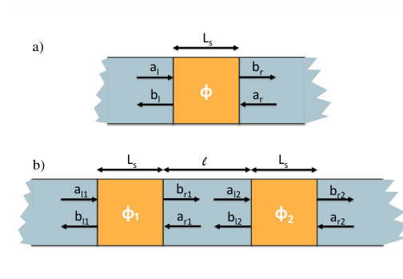 
FIG. 2. (a) Diagram of the scattering amplitudes in an NSN junction. (b) Same as (a) for a two-terminal NSNSN junction.

📷 Fig 3

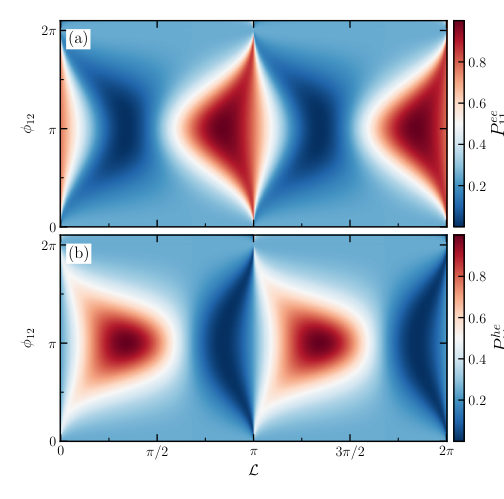 
FIG. 3. (a) Normal reflection probability P ee 11 of an NSNSN junction as a function of the phase L = kℓ, associated with the separation between the superconducting regions, and the phase difference ϕ12. (b) Same as in (a), but for the Andreev reflection probability P he 11 . The parameter ξ = 0.5 is used.

📷 Fig 4

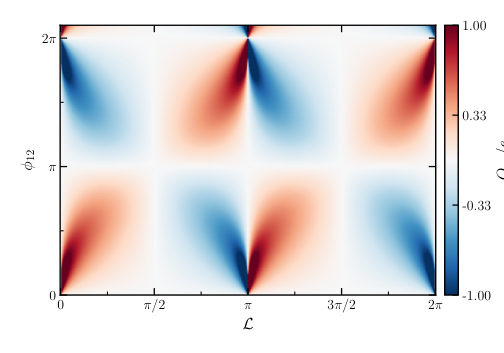 
FIG. 4. Charge of the right-going mode that connects the two superconductor regions as a function of the phase accu- mulated L = kℓdue their separation and the phase difference ϕ12 ≡ϕ1 −ϕ2 between them. Note that the charge of this mode is independent of ξ and therefore is also independent of the superconductor length Ls.

📷 Fig 5

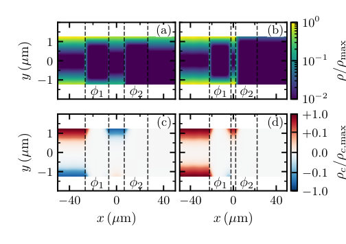 
FIG. 5. Results from numerical modeling. Upper panels show the probability density distributions ρ, while the lower panels display the charge density ρc. Panels (a) and (c) correspond to ℓ= 13.3 µm, whereas panels (b) and (d) correspond to ℓ= 4.4 µm. The remaining parameters are Ly = 2.5 µm, Ls = 20 µm, ϕ12 = π/2, α = 0.2 meV µm, m0 = 17 meV, and ℏm1 = 10−3 meV µm2. Additionally, ∆t = 1 meV and ∆b = 0 in the superconducting regions.

**Summary.** This work theoretically analyzes charge and heat transport in magnetic topological insulator nanoribbons coupled to multiple superconductors. By controlling the relative superconducting phases, researchers predict unique interference effects, including an AC Majorana effect and the ability to build a phase-controlled 'Majorana router' device. This highlights superconductivity phase control as a powerful tool for manipulating topological quantum channels.

**Why it may be interesting.** The explicit dependence on complex superconducting phases ($\phi$) to modulate quantum transport signatures like conductance blockade or AC oscillations provides a direct platform for engineering topological quantum states using external electromagnetic control (voltage bias).

Detailed structure

**Main problem.** The study investigates how superconducting phase differences control charge and heat transport through magnetic topological insulator nanoribbons containing multiple proximitized superconducting sectors.

**Main result.** The system exhibits phenomena like an AC Majorana effect (time-dependent conductance oscillations) and the ability to function as a tunable, phase-controlled Majorana router in three-terminal junctions.

**Method.** The analysis employs analytical scattering matrix techniques combined with numerical diagonalization of the Hamiltonian across different superconducting/normal regions.

**Model / system.** The physical system is an MTI nanoribbon structured into two- and three-terminal devices, where superconductivity is induced via proximity coupling ($\Delta_{p,m}(x)$). The transport is mediated by chiral Majorana modes.

**Key observables.** Electrical conductance ($G$), thermal conductance ($K$), and time-dependent conductance oscillations (AC effect).

**Important parameters / regimes.** Superconducting phase differences ($\phi_{12}, \phi_{13}, \phi_{23}$), separation lengths ($\ell$), and segment lengths ($L_s$).

**Assumptions / limitations.** The analysis focuses on the regime mediated by a single chiral Majorana mode, and numerical methods are applied even for short superconducting segments.

**Figures summary.** Figures illustrate schematics of two-terminal (NSN/NSNSN) and three-terminal junctions. Plots show conductance ($G$) and thermal conductance ($K$) dependence on phase differences ($\phi_{12}$) and separation lengths ($\ell$), demonstrating blockade and interference effects.

**Paper structure.** The paper progresses from establishing the role of superconducting phases in MTI transport, deriving scattering relations for two-terminal junctions (NSN), analyzing charge mediation, and culminating in a detailed study of phase control in three-terminal 'Majorana router' configurations.

Abstract

Transport in devices with multiple proximitized sectors depends heavily on the complex phases of the pairing gaps of those sectors. We investigate magnetic topological insulator nanoribbons in two- and three-terminal setups with proximitized sectors and asymptotic normal leads. Our focus is on the regime of single chiral Majoranas. The characteristic electric and thermal interferometries of chiral Majoranas can be controlled by the complex phases of the pairing. We predict an AC Majorana effect, in which phase dynamics induced by a voltage bias generate measurable time-dependent conductance oscillations. A three-terminal junction with superconducting islands can be used as a Majorana router when the relative complex phases are configured.

[↑ back to top](#top)

### [Higher-order interactions for controlling time-delayed Kuramoto model](http://arxiv.org/abs/2607.10759v1)

**Authors:** Narumi Fujii, Martin Moriamé, Maxime Lucas, Hiroya Nakao, Timoteo Carletti  
**Type:** theory · **Category:** statistical mechanics · **PDF:** <https://arxiv.org/pdf/2607.10759v1>  
**Analysis basis:** full PDF text, analyzed in chunks
**Topic relevance:** `Keldysh / 2PI / non-Gaussian methods` **3/5** · `analog quantum simulation` **2/5** · `non-equilibrium dynamics` **2/5** · `correlated / nonlocal dissipation` **1/5** · `driven-dissipative phase transition` **1/5** · `methods for driven-dissipative` **1/5** · `non-equilibrium universality` **1/5** · `quantum measurements` **1/5**

📷 Fig 1

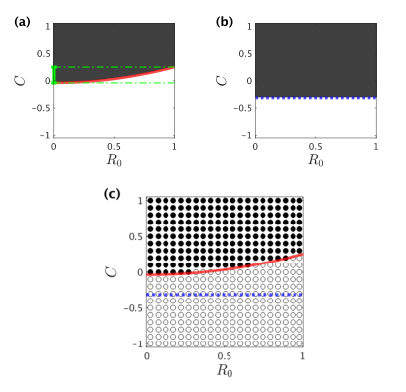 
FIG. 1. Stability diagrams (a,b) and simulation results (c) under the control input u = CR cos Ψ with ϵ = 0.1, τ = 2.9, ω0 = π/2 and N = 300. (a): Higher-order reduced equation, (b): pairwise reduced equation. The black (white) region indicates that the solution with initial condition R0 converges to ¯R = 0 ( ¯R = 1). Note that the bistable re- gion, which is indicated by the green highlighting along the C axis, appears only in the higher-order reduced equation in (a), where ¯R converges to either ¯R = 0 or ¯R = 1 depending on R0. (c): Simulation results of the original time-delayed Kuramoto model, Eq. (1). Stability boundaries in (a) are plotted with red solid line and (b) with blue dotted...

📷 Fig 2

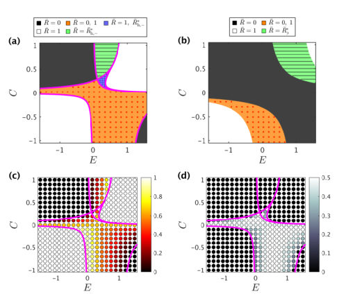 
FIG. 2. Stability diagrams (a,b) and simulation results (c,d) under the control input u = CR(R −E) cos Ψ with ϵ = 0.1, τ = 2.9, ω0 = π/2 and N = 300. (a): Higher- order approximation, (b): pairwise approximation. The black (white) region indicates that ¯R = 0 ( ¯R = 1) is the unique sta- ble state. The orange region corresponds to a bistable state of ¯R = 0 and ¯R = 1, and the green regions show that ¯R∗ h,− in (a) or ¯R∗ p in (b) is the stable fixed point. The blue region indicates the bistability of ¯R = 1 and ¯R∗ h,−in (a). (c): Mean asymptotic values of R and (d): standard deviation of R ob- tained from numerical simulations of Eq. (1) averaged over 15 initial conditions. In (a), (c)...

📷 Fig 3

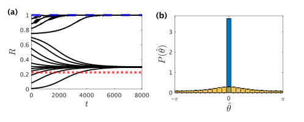 
FIG. 4. Bistability of the fully synchronized state and an intermediate synchronized state predicted by the higher-order reduced equation with ϵ = 0.1, ω0 = π/2, τ = 2.9, and N = 300 for C = 0.3, E = 0.3 and the corresponding intermediate value R = 0.23. In panel (a), black solid lines show simulation results of the time-delayed Kuramoto model given by Eq. (1), while the red dotted (blue dashed) line indicates R = 0.23 (R = 1). Panel (b) shows the phase distributions P(ˆθ), where ˆθ = θ −Ψ, at tf = 8000 averaged over 15 random initial conditions. The phase distributions are computed separately for trajectories converging close to R = 0.23 in yellow and those converging to R = 1 in blue.

📷 Fig 4

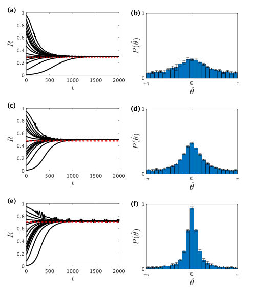 
FIG. 3. Stabilization of the intermediate values of Rref based on Eq. (22) with ϵ = 0.1, ω0 = π/2, τ = 2.9, N = 300. In (a), (c), and (e), black solid lines show simulation results of the time-delayed Kuramoto model, given by Eq. (1), and red dotted lines show the corresponding Rref. Panels (b), (d), and (f) show the phase distributions P(ˆθ), where ˆθ = θ −Ψ, at tf = 2000 averaged over 15 random initial conditions. The parameter sets are as follows: (a) and (b): (Rref, C, E) = (0.29, 0.9, 0.3), (c) and (d): (Rref, C, E) = (0.48, 1.0, 0.45), and (e) and (f): (Rref, C, E) = (0.71, 1.0, 0.6).

📷 Fig 5

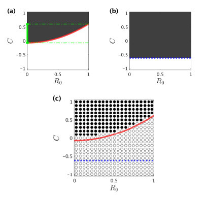 
FIG. 5. Stability diagrams and simulation results under the control input u = CR cos Ψ. In the same manner as Fig. 1, but for ϵ = 0.1, τ = 6.8, ω0 = π/2 and N = 300.

**Summary.** This paper tackles controlling synchronization in a time-delayed Kuramoto model by replacing the delay with an equivalent, higher-order interaction term. Using advanced mathematical techniques like the Ott–Antonsen ansatz and second-order averaging, they derive a simplified ODE that accurately predicts complex behaviors like bistability, outperforming simpler approximations.

**Why it may be interesting.** While focused on classical oscillators, the mathematical techniques—such as deriving effective dynamics from complex time-delayed systems using systematic approximation methods (like averaging)—are highly relevant to modeling open quantum systems or many-body dynamics where memory effects or non-Markovian noise are present.

Detailed structure

**Main problem.** To develop a delay-free control framework for managing the collective synchronization dynamics of the time-delayed Kuramoto model.

**Main result.** The higher-order approximation accurately predicts system dynamics, enabling the realization and tuning of bistability and intermediate synchronization states via mean-field feedback control.

**Method.** The authors use perturbation theory combined with the Ott–Antonsen ansatz and second-order averaging methods to reduce the infinite-dimensional delay differential equation into a manageable one-dimensional ODE for the order parameter.

**Model / system.** The system is the globally coupled time-delayed Kuramoto model, which describes $N$ phase oscillators interacting with time delays. The analysis focuses on deriving an effective, higher-order approximation of these delayed interactions.

**Key observables.** Order parameter $z(t) = R(t)e^{i\Psi(t)}$, where $R$ is the degree of synchronization and $\Psi$ is the collective phase.

**Important parameters / regimes.** The small coupling strength ($\epsilon$) and the time delay ($	au$) are crucial parameters, with accuracy depending on the product $\epsilon	au$.

**Assumptions / limitations.** The primary assumptions involve deriving a higher-order approximation valid for small $\epsilon	au$, and applying the second-order averaging method to achieve $O(\epsilon^2)$ accuracy.

**Figures summary.** Figures compare stability diagrams and prediction errors between the higher-order approximation, the simpler pairwise approximation, and direct numerical simulations across different control inputs and delay strengths.

**Paper structure.** The paper progresses by first deriving the higher-order, delay-free approximation of the delayed Kuramoto model. It then applies the Ott–Antonsen ansatz and uses second-order averaging to obtain a reduced ODE for $R$. Finally, it analyzes this equation under various mean-field control inputs, comparing results against simpler approximations.

Abstract

We propose a framework for controlling the collective dynamics of the time-delayed Kuramoto model based on a delay-free, higher-order approximation of the delayed interactions. By applying the Ott--Antonsen ansatz and the second-order averaging method to the resulting higher-order Kuramoto model, we obtain a one-dimensional reduced equation for the order parameter dynamics. Numerical simulations demonstrate that the higher-order approximation predicts the dynamics of the original delayed system more accurately than the conventional pairwise approximation and enables the realization of bistability and intermediate synchronization states. Our results demonstrate the effectiveness of higher-order interpretations of time delays for the control of oscillator networks with time-delayed interactions.

[↑ back to top](#top)

### [Tellurium Metasurface Beam Splitter with Pulse Laser-Controlled Anisotropy](http://arxiv.org/abs/2607.11265v1)

**Authors:** Takuto Hiraoka, Mizuho Matoba, Yuta Kobayashi, Arata Mitsuzuka, Masashi Kawaguchi, Haruyuki Sakurai, Kuniaki Konishi, Masamitsu Hayashi  
**Type:** both · **Category:** other · **PDF:** <https://arxiv.org/pdf/2607.11265v1>  
**Analysis basis:** full PDF text, analyzed in chunks
**Topic relevance:** `interference shaping light` **3/5** · `quantum optics experiment` **3/5** · `driven-dissipative phase transition` **2/5** · `analog quantum simulation` **1/5** · `methods for driven-dissipative` **1/5** · `non-equilibrium dynamics` **1/5** · `spintronics-quantum-optics interface` **1/5**

📷 Fig 1

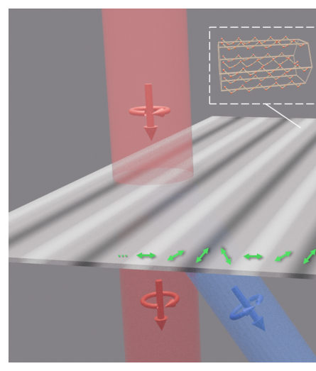 
FIG. 1: A schematic illustration of the Te beam splitter. The c axis of the Te film is

📷 Fig 2

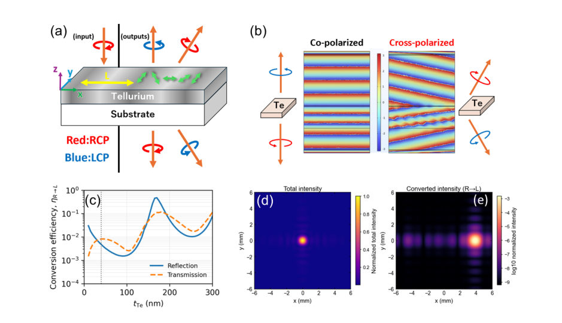 
FIG. 2: (a) A schematic illustration of the Te beam splitter when right-handed circularly

📷 Fig 3

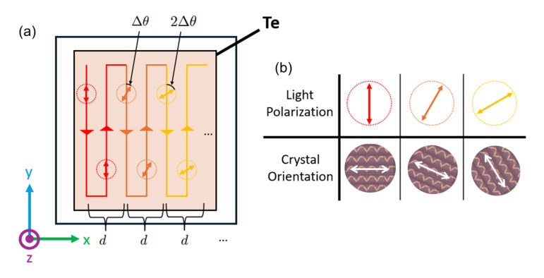 
FIG. 3: (a,b) Schematic illustration of the pulse laser writing process for fabricating a

📷 Fig 4

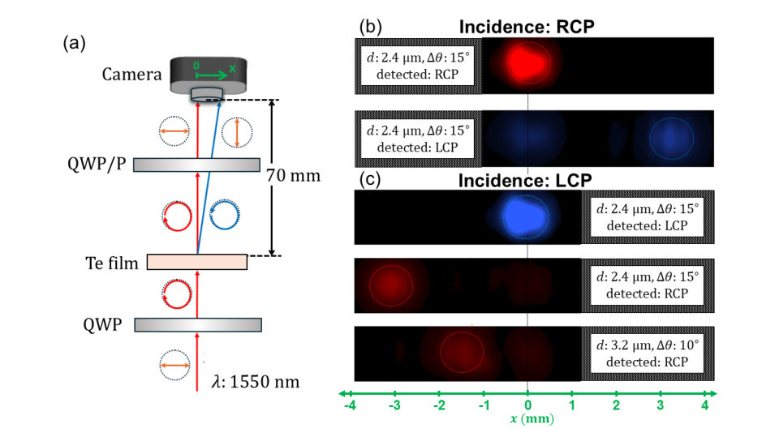 
FIG. 4: (a) The setup to measure light deflection. QWP: quarter wave plate, P: polarizer.

📷 Fig 5

 
Fig. 3(a). For these parameters, the predicted deflection angle in the bottom panel of (c) is

**Summary.** The research presents a novel, lithography-free method to create functional metasurfaces using Tellurium (Te) by writing the crystal anisotropy with laser pulses. By controlling the local optical axis orientation, they demonstrate beam splitting and deflection based on light's circular polarization state. This approach establishes Te as a promising platform for reconfigurable flat-optics devices.

**Why it may be interesting.** This work is highly relevant to quantum optics and open quantum systems because metasurfaces are key components for controlling light polarization and momentum transfer. The ability to dynamically write these structures opens pathways for reconfigurable quantum optical elements without complex nanofabrication.

Detailed structure

**Main problem.** The goal is to develop a lithography-free, reconfigurable platform for metasurfaces by locally controlling optical anisotropy in Tellurium (Te). This allows for dynamic control over light manipulation functions.

**Main result.** The authors successfully demonstrated a Te metasurface beam splitter whose optical response matches theoretical predictions by writing the crystal axis orientation using laser pulses. This proves that local programming of anisotropy enables reconfigurable flat-optics devices.

**Method.** Theoretical modeling uses Jones matrices and the Pancharatnam-Berry (PB) phase to predict beam steering based on spatially varying optic axes. Experimentally, a picosecond laser is used to write these anisotropic patterns onto Te films.

**Model / system.** The physical system is a Tellurium (Te) thin film exhibiting strong uniaxial anisotropy. The model incorporates the dependence of optical response on the local crystallographic $c$ axis orientation ($	heta$), which dictates the induced PB phase $\Phi_{PB} = \mp 2	heta$.

**Key observables.** Beam-deflection efficiency ($\eta$), far-field intensity profiles, and polarization components (co-circularly vs. cross-circularly polarized light).

**Important parameters / regimes.** Laser wavelength (1030 nm for writing), probe wavelength (1550 nm), Te film thickness (e.g., 40 nm), and the spatial variation of the optic axis $	heta(x)$.

**Assumptions / limitations.** The far-field calculation relies on the Fraunhofer approximation, and the model assumes a continuous rotation of $	heta(x)$ for theoretical derivation.

**Figures summary.** Figures illustrate the schematic setup (Fig. 1), simulation results showing helicity-dependent beam separation (Fig. 2a/b), calculated efficiencies vs. thickness (Fig. 2c), and resulting far-field intensity profiles (Figs. 2d/e).

**Paper structure.** The paper progresses from theoretical modeling of the PB phase and beam steering using Jones matrices, to detailed simulations confirming helicity-dependent deflection, culminating in experimental validation using laser-written Te films.

Abstract

Laser-programmable optical anisotropy offers a new route to developing reconfigurable metasurfaces without conventional nanofabrication processes. Here, we demonstrate a lithography-free approach based on spatial control of the crystallographic $c$ axis orientation in tellurium (Te) using pulse laser irradiation. As a proof of concept, we demonstrate a Te metasurface beam splitter by laser-written optical-axis patterning and experimentally confirm that its optical response is in good agreement with theoretical predictions and numerical simulations. By directly programming the local optical anisotropy, this method enables a simple fabrication process while offering the possibility of rewriting and dynamically reconfiguring device functionality. These features make this approach a promising platform for non-resonant active metasurfaces and other reconfigurable flat-optics applications.

[↑ back to top](#top)

### [Theory of phonon-induced spin relaxation in a structured phononic reservoir](http://arxiv.org/abs/2607.11479v1)

**Authors:** Raseeb F. Haroon, Paweł Machnikowski  
**Type:** theory · **Category:** other · **PDF:** <https://arxiv.org/pdf/2607.11479v1>  
**Analysis basis:** full PDF text, analyzed in chunks
**Topic relevance:** `exotic spin models in light-matter` **3/5** · `methods for driven-dissipative` **3/5** · `spintronics-quantum-optics interface` **3/5** · `Keldysh / 2PI / non-Gaussian methods` **1/5** · `correlated / nonlocal dissipation` **1/5** · `driven-dissipative phase transition` **1/5**

📷 Fig 1

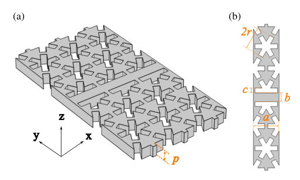 
FIG. 1. Schematic of W1m GaAs phononic crystal. (a) Isometric view of three supercells of the W1m snowflake phononic crystal waveguide fabricated from a (001)-oriented GaAs slab of thickness 𝑝= 220 nm. (b) Top view of a supercell with lattice constant 𝑎= 760 nm, snowflake radius 𝑟= 0.44𝑎, arm width 𝑐= 0.19𝑎, and the channel width 𝑏= √

📷 Fig 2

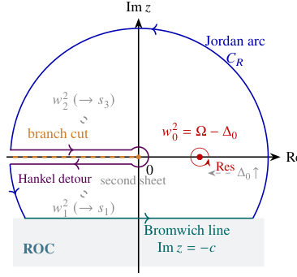 
FIG. 2. Contour used to invert the Laplace transform of the spin amplitude, drawn in the shifted variable 𝑧= −Δ0 −𝑖𝑠of Section III C. Teal: Bromwich line. Blue: Jordan arc 𝐶𝑅. Violet: Hankel detour. Orange: branch cut, with its branch point at the origin. Red: the bound-state pole 𝑤2 0 and the residue contour around it (Res). Gray: the second-sheet roots 𝑤2 1,2 (open circles), which map to 𝑠1 and 𝑠3, and the arrow showing the pole’s motion as the detuning Δ0 increases. Arrows on the contour give the direction of integration, and shading marks the region of convergence (ROC).

📷 Fig 3

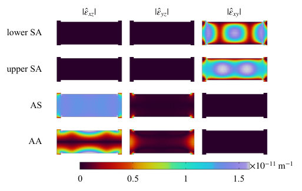 
FIG. 4. Normalized shear strain amplitude | ˆ𝜀𝑥𝑧|, | ˆ𝜀𝑦𝑧|, and | ˆ𝜀𝑥𝑦| at mid-plane 𝑧= 0 and 𝑘= 0.37209(𝜋/𝑎). Rows show the lower SA, upper SA, AS, and AA modes (2.3483, 3.2616, 3.2595, 3.1778) GHz, respectively. The color bar is shared across all panels.

📷 Fig 4

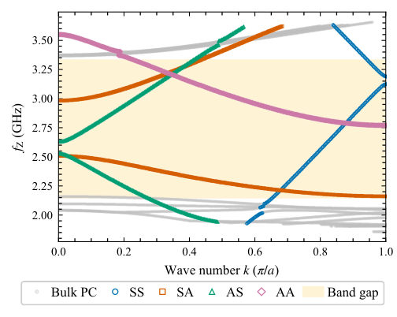 
FIG. 3. Phonon dispersion of the W1m waveguide. Guided modes within the phononic band gap (shaded) are labelled as SS, SA, AS, and AA. Gray curves show the bulk modes.

📷 Fig 5

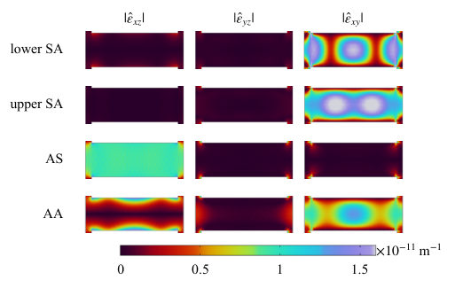 
FIG. 5. Same as Fig. 4 at 𝑧= 𝑧max = 60 nm, the maximum QD displacement from the mid-plane consistent with a minimum 50 nm distance from the slab surface.

**Summary.** This paper develops advanced open quantum system theories to predict how electron spin relaxation occurs in semiconductor Quantum Dots embedded within phononic crystal waveguides. By incorporating the structured nature of the phonon reservoir, the authors show that coherence can be either drastically enhanced or suppressed by engineering the material's vibrational spectrum. This offers crucial design principles for solid-state quantum devices.

**Why it may be interesting.** This work is highly relevant as it provides a detailed theoretical framework for controlling quantum coherence (spin) using engineered mechanical environments (phononic band gaps), which is central to solid-state quantum information processing.

Detailed structure

**Main problem.** The paper develops a comprehensive theory for electron spin relaxation induced by phonons when the coupling occurs within a structured phononic reservoir.

**Main result.** Spin relaxation is highly sensitive to the structure, showing potential suppression by orders of magnitude due to band gaps or exhibiting universal power-law decay near van Hove singularities.

**Method.** The theory combines open quantum system approaches (Markovian and non-Markovian) with finite-element simulations to model spin-phonon coupling in structured waveguides.

**Model / system.** The system models an electron spin confined in a Quantum Dot embedded within a phononic crystal waveguide. The dynamics are governed by the spin-phonon Hamiltonian, analyzed using master equations derived from quantized elastic and piezoelectric interactions.

**Key observables.** Spin relaxation rate ($\Gamma$ or $\gamma_\downarrow$), survival probability, and population plateau ($P(\infty)$).

**Important parameters / regimes.** Phonon density of states (PDOS) modulation, magnetic field strength/orientation, detuning ($\Delta_0$), and structural parameters defining the phononic band gap.

**Assumptions / limitations.** The analysis transitions between Born-Markov approximations (valid away from singularities) and non-Markovian descriptions (required near van Hove singularities or band edges).

**Figures summary.** FIG. 1 schematically illustrates the W1m GaAs phononic crystal waveguide structure; TABLE I lists material parameters for GaAs.

**Paper structure.** The paper progresses by first establishing the physical model and using finite-element methods to calculate eigenmodes, then deriving the spin-phonon Hamiltonian in quantized form, applying Born-Markov theory, and finally extending the analysis into the non-Markovian regime near spectral singularities ($\Delta_0 < 0$).

Abstract

By combining Markovian and non-Markovian open quantum system theory with finite-element simulations, we develop a theory of electron spin relaxation in a structured phononic reservoir. This problem is crucial for understanding spin dynamics in hybrid systems involving mechanical modes, as well as for the design of devices combining spin degrees of freedom with photonic and phononic architectures, where the phonon density of states is modulated in the relevant spectral range corresponding to moderate magnetic fields. Taking a QD in a phononic waveguide as a representative and technologically relevant example, we show that spin relaxation in such environments is much more complex than in bulk. While the relaxation rates are typically an order of magnitude higher than in bulk, there are parameter windows where the relaxation is suppressed by many orders of magnitude due to gaps in mode dispersion and selection rules imposed by mode symmetry. At the border between these two sectors, van Hove singularities in phonon dispersion lead to singularities in relaxation rates, for which we develop power-law scaling and propose a non-Markovian description of the dynamics, revealing polaronic dressing of the spin into slow acoustic modes.

[↑ back to top](#top)

### [Unconventional Spin Valve Based on Normal Metal/Chiral Molecule/Altermagnet Junctions](http://arxiv.org/abs/2607.11788v1)

**Authors:** Tian-Yi Zhang, Peng-Yi Liu, Yu-Fei Sun, Ai-Min Guo, Qing-Feng Sun  
**Type:** theory · **Category:** other · **PDF:** <https://arxiv.org/pdf/2607.11788v1>  
**Analysis basis:** full PDF text, analyzed in chunks
**Topic relevance:** `Keldysh / 2PI / non-Gaussian methods` **3/5** · `Kondo & dissipative impurity` **2/5** · `methods for driven-dissipative` **2/5** · `non-equilibrium dynamics` **2/5** · `driven-dissipative phase transition` **1/5** · `exotic spin models in light-matter` **1/5** · `spintronics-quantum-optics interface` **1/5**

📷 Fig 1

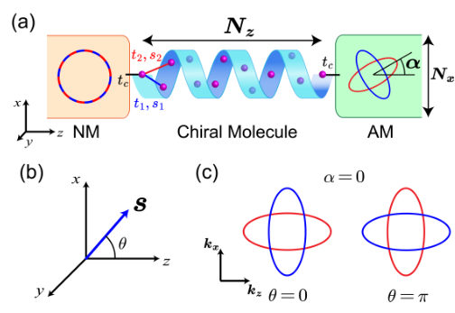 
FIG. 1. (a) Schematic of the device: The NM (orange re- gion) and AM (green region) electrodes are placed on the left and right sides of the chiral molecule, respectively. Spin-up and spin-down Fermi surfaces are marked in blue and red, respectively. α is the angle between the crystalline axis and the +z axis, denoting the orientation of the AM. The widths of the electrodes are Nx, and the length of the molecule is Nz. tj, sj (j = 1, 2) are hopping integral and SOC, and tc is the coupling energy of chiral molecule and electrodes. (b) The orientation of the N´eel vector s for the AM electrode. It is oriented within the xz plane, defined by the angle θ. (c) The Fermi surfaces of AM for θ = 0...

📷 Fig 2

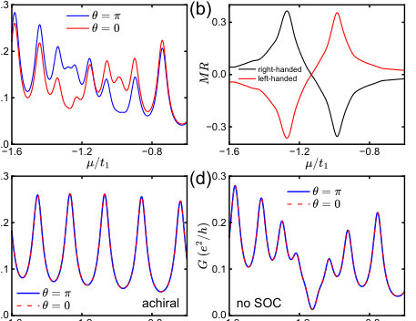 
FIG. 2. (a) Conductance G versus chemical potential µ in NM/right-handed molecule/AM device. Blue and red lines are the conductances when θ = π and θ = 0, respectively. (b) MR versus chemical potential. Black and red lines are the MR when the molecule is right- and left-handed, respectively. (c) Conductance versus chemical potential in the NM/achiral molecule/AM device. (d) Conductance versus chemical po- tential in the NM/no SOC molecule/AM device (s1 = 0). The parameters are E = t1 and α = 0.

📷 Fig 3

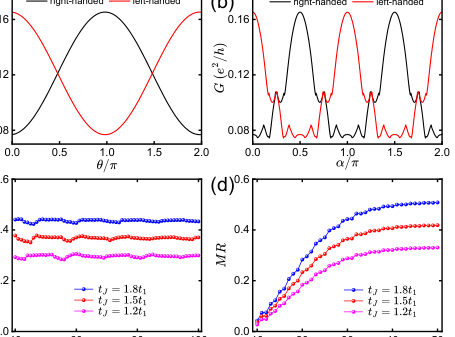 
FIG. 3. (a,b) Conductance as a function of (a) the N´eel vector angle θ and (b) the crystal orientation angle α, for right-handed (black) and left-handed (red) molecules. In (a), α = 0 and in (b), θ = 0. (c,d) MR versus the electrode width Nx (c) and molecular length Nz (d) under different AM strength tJ. In (a-d), µ = −1.27t1, and E = t1. In (c,d), the chirality of the molecule is right-handed.

📷 Fig 4

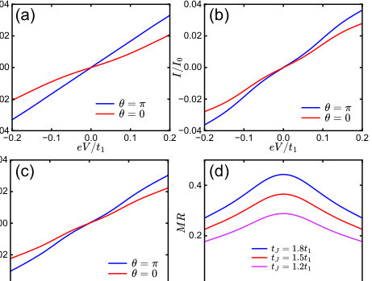 
FIG. 4. I-V results for finite bias. (a-c) Currents of the device I versus the voltage V at µ = −1.27t1 (a), µ = −1.4t1 (b), and µ = −1.2t1 (c), for θ = π (blue line) and θ = 0 (red line), with tJ = 1.5t1. These results show that the MR effect in the device persists over a wide range of chemical potentials. (d) MR versus the voltage V for different tJ at µ = −1.27t1. The chirality of the molecule is right-handed. The parameters are α = 0 and E = t1. I0 = et1/h is the current unit.

**Summary.** The paper theoretically investigates a novel spintronic device—a spin valve built from a normal metal, a chiral molecule, and an altermagnet. By calculating the conductance and magnetoresistance using Green's functions, the authors demonstrate that chirality and the AM's unique magnetic properties synergistically enhance the MR effect. This paves the way for building controllable, stray-field-free spintronic devices.

**Why it may be interesting.** This work connects molecular electronics (CISS effect) with advanced magnetic materials (Altermagnets) to engineer spin transport phenomena using purely theoretical quantum transport methods, which is highly relevant for understanding open quantum systems dynamics in condensed matter.

Detailed structure

**Main problem.** The research aims to develop highly efficient and tunable spin valves by integrating chiral molecules with altermagnetic (AM) materials, aiming to surpass limitations of conventional ferromagnetic spin valves.

**Main result.** The theoretical model predicts that the magnetoresistance (MR) is significantly enhanced by combining chirality-induced spin selectivity (CISS) in the molecule with the momentum-dependent spin splitting inherent to the AM electrode. This MR increases with molecular length and AM anisotropy.

**Method.** The study employs non-equilibrium Green's function methods combined with the Landauer-Büttiker formula to calculate transport properties across the junction.

**Model / system.** The physical system modeled is a Normal Metal/Chiral Molecule/Altermagnet (NM/chiral molecule/AM) spin valve. The Hamiltonian incorporates terms for the AM, NM, chiral molecule (single-helical model), and coupling interactions.

**Key observables.** Conductance ($G$) and Magnetoresistance ($	ext{MR}$), which are calculated as a function of external parameters like Néel vector orientation ($	heta$) and molecular length ($N_z$).

**Important parameters / regimes.** Chiral molecule twist angle ($\Delta\varphi$), AM anisotropy, dephasing strength ($\Gamma_d$), and the relative alignment of the AM's Néel vector ($	heta$).

**Assumptions / limitations.** The model includes a dephasing term ($H_d$) to account for real-world scattering effects, and it assumes the CISS effect is active due to molecular chirality.

**Figures summary.** Figures illustrate schematics of the junction structure, show Fermi surfaces in the AM depending on spin and orientation ($	heta$), and plot conductance/MR dependence on $	heta$, $\alpha$, and molecule length ($N_z$).

**Paper structure.** The paper establishes the physical model (Hamiltonian), details the theoretical methodology (NEGF/Landauer-Büttiker), presents results showing how MR arises from the interplay of chirality and AM properties, and concludes by discussing device potential.

Abstract

Chiral molecules have attracted broad interdisciplinary interest for their ability to produce highly spin-polarized current. This phenomenon, known as the chiral-induced spin selectivity effect, holds great potential in the field of spintronics. Here, we propose to combine chiral molecules with altermagnets to construct highly efficient and tunable spin valves. Using the nonequilibrium Green's function method and the Landauer-Büttiker formula, we obtain the conductance and the magnetoresistance of a normal metal/chiral molecule/altermagnet spin valve. Our theoretical results reveal that the conductance of the spin valve can be effectively tuned by reorienting the Néel vector of the altermagnet, and the magnetoresistance of the spin valve increases with molecular length and altermagnetic anisotropy. Moreover, the magnetoresistance vanishes for achiral molecules or in the absence of molecular spin-orbit coupling. Our work paves the way for developing efficient, controllable, and stray-field-free spintronic devices.

[↑ back to top](#top)

### [Anisotropic hot carrier relaxation mediated by electron phonon scattering in TiN thin films](http://arxiv.org/abs/2607.11237v1)

**Authors:** Hemant Verma, Tzu-Yu Peng, Shyr-Shyan Yeh, Sheng-Chieh Huang, Pritam Sardar, Yang-Hao Chan, Yu-Jung Lu, Chao-Cheng Kaun  
**Type:** both · **Category:** other · **PDF:** <https://arxiv.org/pdf/2607.11237v1>  
**Analysis basis:** full PDF text, analyzed in chunks
**Topic relevance:** `non-equilibrium dynamics` **3/5** · `methods for driven-dissipative` **2/5** · `non-equilibrium universality` **2/5** · `Keldysh / 2PI / non-Gaussian methods` **1/5** · `analog quantum simulation` **1/5** · `correlated / nonlocal dissipation` **1/5** · `driven-dissipative phase transition` **1/5**

📷 Fig 1

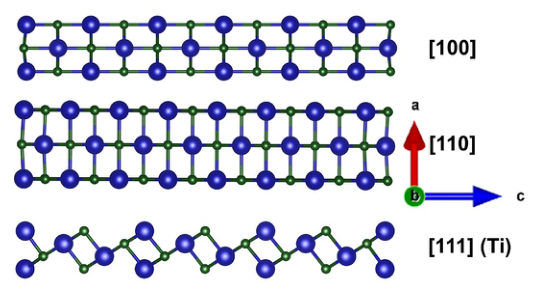 
Figure 1. Optimized TiN slabs along [100], [110], and [111] (Ti) orientations, respectively. Blue

📷 Fig 2

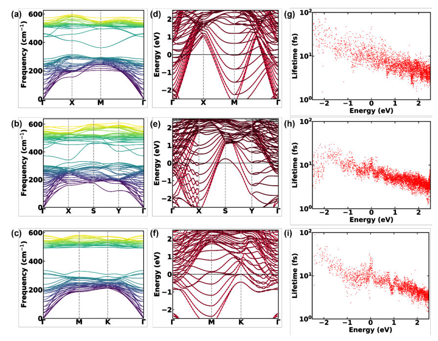 
Figure 2. Calculated (a-c) slab phonons, (d-f) electronic DFT bands (black dotted) replotted with

📷 Fig 3

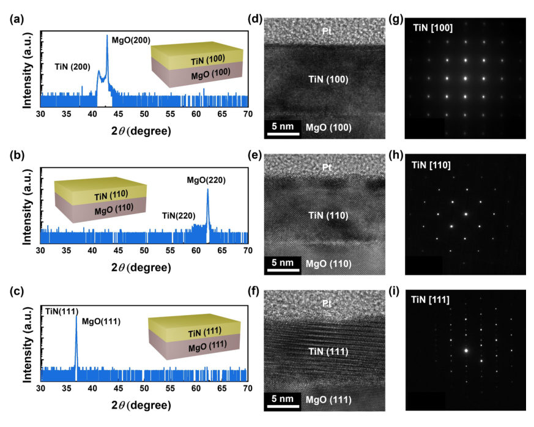 
Figure 3. X-ray diffraction patterns of TiN along (a) [100], (b) [110], and (c) [111]

📷 Fig 4

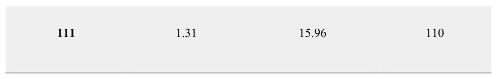 
Figure 3a-c, the XRD peaks demonstrate that the crystal orientation of the TiN films directly

📷 Fig 5

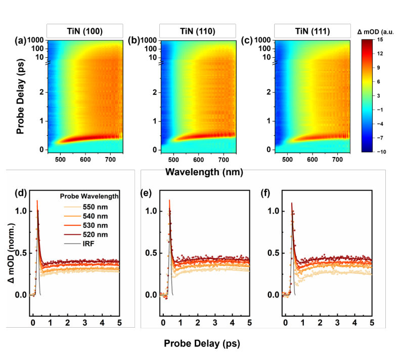 
Figure 4. Color plots of time-resolved transient absorption spectroscopy (TAS) of TiN thin films

**Summary.** This work demonstrates that the crystal orientation of TiN thin films critically controls how fast hot carriers cool down via electron-phonon scattering. By combining first-principles theory and pump-probe measurements, the authors show that the [111] direction exhibits a significantly slower relaxation rate compared to other orientations. This finding provides crucial guidelines for engineering energy conversion devices using anisotropic materials.

**Why it may be interesting.** While focused on condensed matter physics (plasmonics/energy conversion), the study models non-equilibrium energy transport dynamics using ultrafast spectroscopy and quantum calculations, which shares methodological overlap with open quantum systems modeling of energy relaxation.

Detailed structure

**Main problem.** The study investigates how crystallographic orientation dictates the rate of hot carrier energy relaxation mediated by electron-phonon (e-ph) scattering in TiN thin films.

**Main result.** Both theoretical calculations and ultrafast spectroscopy show that the [111] orientation leads to a slower decay/longer lifetime compared to the [100] and [110] directions, demonstrating strong crystallographic control over energy dissipation.

**Method.** The research combines first-principles DFT calculations using MLWFs (for theoretical scattering lifetimes) with ultrafast pump-probe transient absorption spectroscopy (TAS) measurements (for experimental cooling times).

**Model / system.** The system is quasi-epitaxial Titanium Nitride (TiN) thin films grown on MgO substrates, analyzed along the [100], [110], and [111] crystal axes.

**Key observables.** Electron-phonon scattering lifetime ($\tau_{\text{e-ph}}$) and population-level hot-electron cooling time ($\tau_{\text{cooling}}$).

**Important parameters / regimes.** Crystallographic orientation ([100], [110], [111]), temperature (room temperature), and characteristic timescales (few-fs to hundreds-of-fs).

**Assumptions / limitations.** The calculated lifetimes represent single-event scattering, while measured times reflect collective cooling dynamics; however, the trends are consistent.

**Figures summary.** Figures likely show optimized slab structures, electronic band diagrams, and time-resolved TAS kinetics plots comparing the three orientations.

**Paper structure.** The paper establishes the problem of anisotropic relaxation, presents theoretical calculations based on first principles to predict scattering rates for different crystal faces, validates these predictions against experimental TAS measurements, and concludes by emphasizing orientation control as a design tool.

Abstract

Crystal orientations can shape the ultrafast energy relaxations of transition-metal nitride thin films. Here, we investigate the orientation-dependent electron-phonon (e-ph) mediated relaxation in titanium nitride (TiN) thin films along the [100], [110], and [111] directions by combining first-principles calculations with ultrafast pump-probe transient absorption spectroscopy. Using maximally localized Wannier functions, we evaluate e-ph quasiparticle scattering lifetimes near the Fermi level and identify a clear anisotropy: The TiN [111] orientation exhibits a longer e-ph scattering lifetime (15.96 fs) than [100] (13.69 fs) and [110] (11.12 fs), indicating reduced intrinsic e-ph scattering strength. Furthermore, we grew quasi-epitaxial, orientation-controlled TiN thin films on MgO substrates. Pump-probe measurements reveals that the population-level relaxation (hot-electron cooling) time also depends on orientations, with [111] films showing a significantly slower decay (110 fs) than [100] (90 fs) and [110] (80 fs). We emphasize that the calculated few-femtosecond scattering lifetimes and the measured few-hundred-femtosecond cooling time respectively represent single-event scattering and collective cooling, yet they exhibit consistent trends. These results demonstrate that crystallographic orientation provides a practical and powerful route to tune e-ph-governed relaxation in TiN thin films, offering essential design guidelines for refractory plasmonic and energy-conversion platforms.

[↑ back to top](#top)

### [Landau-Zener tunneling and quantum interference of Andreev states](http://arxiv.org/abs/2607.09859v1)

**Authors:** Mikhail S. Kalenkov, Andrei D. Zaikin  
**Type:** theory · **Category:** other · **PDF:** <https://arxiv.org/pdf/2607.09859v1>  
**Analysis basis:** full PDF text, analyzed in chunks
**Topic relevance:** `methods for driven-dissipative` **3/5** · `non-equilibrium dynamics` **3/5** · `non-equilibrium universality` **2/5** · `Keldysh / 2PI / non-Gaussian methods` **1/5** · `correlated / nonlocal dissipation` **1/5** · `driven-dissipative phase transition` **1/5**

📷 Fig 1

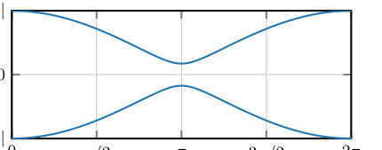 
FIG. 1. Phase dependent energy of subgap Andreev levels in superconducting junctions at high transmissions.

📷 Fig 2

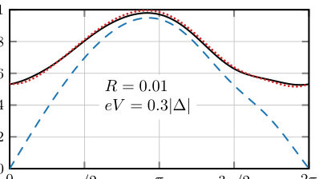 
FIG. 4. The same as in the main panel of Fig. 2 for eV = 0.3|∆|. The red dotted line represents the sum I + δI defined by Eqs. (22) and (24).

📷 Fig 3

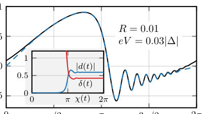 
FIG. 2. The current I in a single channel junction as a func- tion of χ(t) for R = 0.01 and eV = 0.03|∆|. Black solid line represents a numerically exact result, while dashed blue line corresponds to Eq. (22) with r(t) and d(t) obtained from the solution of the Zener problem (see End Matter). Inset: exact dependencies d(t) and δ(t).

📷 Fig 4

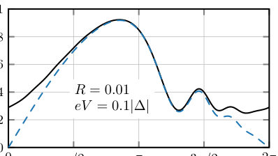 
FIG. 3. The same as in the main panel of Fig. 2 for eV = 0.1|∆|.

**Summary.** This paper develops a microscopic theory to analyze the supercurrent in superconducting nanojunctions under external voltage bias. The key finding is that quantum interference between Andreev states causes measurable, coherent oscillations in the supercurrent near specific phase biases. This advances understanding of non-equilibrium quantum transport beyond standard tunneling models.

**Why it may be interesting.** This work provides a detailed theoretical framework for non-equilibrium quantum transport in superconducting mesoscopic devices, directly relevant to understanding energy dissipation and coherent dynamics in superconducting qubits or Josephson junction circuits.

Detailed structure

**Main problem.** The study investigates quantum interference effects on the supercurrent flowing through superconducting nanojunctions when driven out of equilibrium by an external voltage bias.

**Main result.** The authors predict pronounced coherent oscillations in the supercurrent, arising from quantum interference between Andreev states following Landau-Zener tunneling, which are absent in simpler theoretical models.

**Method.** The analysis involves deriving an effective Hamiltonian and solving a Schrödinger-like equation for Andreev states, utilizing concepts from Landau-Zener theory and quasiclassical transport equations.

**Model / system.** The system is a superconducting nanojunction modeled with Andreev states. The dynamics are governed by an effective Hamiltonian derived microscopically, considering the junction's transmission parameter $D$ and external voltage bias $V$.

**Key observables.** Supercurrent $I(t)$ as a function of Josephson phase $\chi(t)$, and the coherent oscillation amplitude.

**Important parameters / regimes.** External voltage bias $V$, Josephson phase $\chi$, superconducting gap $\Delta$, and junction transmission parameter $D$.

**Assumptions / limitations.** The analysis relies on approximations such as the adiabatic limit far from anticrossings, and later incorporates corrections for sub-Ohmic dissipation to match numerical results.

**Figures summary.** Figures compare calculated supercurrent $I$ versus Josephson phase $\chi(t)$ at various bias voltages, demonstrating clear oscillations near the anticrossing point ($\pi < \chi < 2\pi$) and showing how adding dissipative terms restores agreement with exact numerical solutions.

**Paper structure.** The paper progresses from deriving an effective Hamiltonian for out-of-equilibrium Andreev states to calculating the current using a general expression. It then details the application of Landau-Zener theory near $\chi=\pi$, followed by extensions to include dissipation and finally analyzing the low-voltage limit using advanced mathematical techniques.

Abstract

With the aid of a microscopic theory we derive an effective Hamiltonian that controls quantum dynamics of Andreev states in superconducting nanojunctions out of equilibrium. Resolving the corresponding Schrödinger-like equation we obtain the "wave functions" for Andreev levels and evaluate electric current across the junction in the presence of an external voltage bias. We demonstrate that quantum interference of Andreev states may yield pronounced coherent oscillations of the supercurrent as a function of the Josephson phase in junctions with barrier transmissions slightly below unity. Further implications of this novel effect are expected for junctions with diffusive barriers.

[↑ back to top](#top)

### [Discovery of a symmetry-driven electronic cascade in a $d$-wave altermagnet](http://arxiv.org/abs/2607.11567v1)

**Authors:** Zhouyi Yin, Zheng Shi, Shuxuan Zhang, Changchao Liu, Xingkai Cheng, Fayuan Zhang, Han-Bin Deng, Jia-Xin Yin, Chaoyu Chen, Guang-Han Cao, Junwei Liu, Yue Zhao  
**Type:** experiment · **Category:** strongly correlated electrons · **PDF:** <https://arxiv.org/pdf/2607.11567v1>  
**Analysis basis:** full PDF text, analyzed in chunks
**Topic relevance:** `driven-dissipative phase transition` **3/5** · `non-equilibrium dynamics` **2/5** · `non-equilibrium universality` **2/5** · `Frenkel-Kontorova` **1/5** · `Keldysh / 2PI / non-Gaussian methods` **1/5** · `methods for driven-dissipative` **1/5**

📷 Fig 1

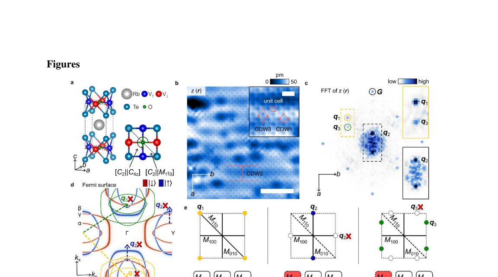 
Figure 1. Three charge-density-wave components and their symmetry characteristics on the Te-terminated surface. a, Crystal structure of Rb1-δV2Te2O. In the top view of the V2Te2O layer, vanadium atoms satisfy composite symmetries [𝐶2‖𝐶4z], [𝐶2‖𝑀11̅0] ([𝐶2‖𝑀1̅10]). b, Topographic image of the Te- terminated surface, showing three charge-density-wave modulations, denoted as CDW1, CDW2, and CDW3. The red box in the inset outlines the Te unit cell. Setpoint: Vbias = 60 mV, It = 50 pA. Scale bars: 5 nm (main panel), 1 nm (inset). c, FFT of b, showing Bragg peaks 𝑮 and CDW wavevectors 𝒒1, 𝒒2 and 𝒒3, corresponding to CDW1, CDW2, and CDW3, respectively. The enlarged insets use independent color...

📷 Fig 2

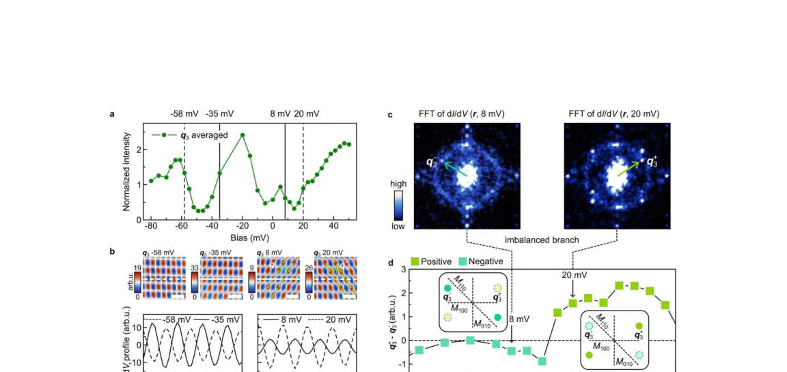 
Figure 2. Energy-dependent contrast inversion and branch inequivalence of the off-axis 𝒒3. a, Bias-dependent normalized amplitude of the 𝒒3 component, obtained by summing over all 𝒒3- related Fourier peaks and normalizing by the total Bragg-peak amplitude. b, Inverse-FFT-filtered real-space images isolating the 𝒒3 modulation (top), with corresponding line profiles at -58 mV, - 35 mV, 8 mV and 20 mV (bottom). The 𝒒3 modulation undergoes contrast inversion in two distinct energy windows, from -58 to -35 mV and from 8 to 20 mV, as evidenced by the corresponding 𝜋 phase shifts. These inversions identify spectral reconstruction energies near -47 mV and 14 mV. At 8 mV and 20 mV, the 𝒒3 modulation...

📷 Fig 3

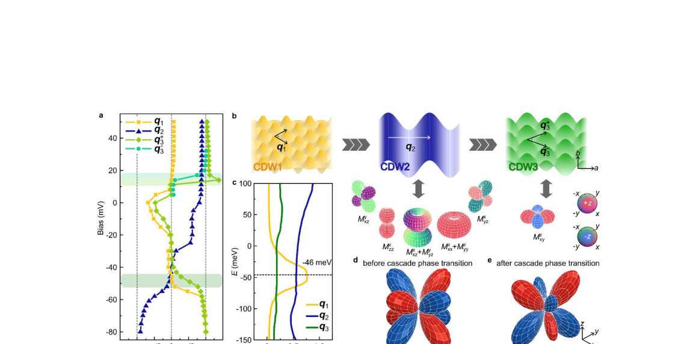 
Figure 3. Phase-resolved hierarchy and intertwined electronic-multipolar reconstruction. a, Energy-dependent phase of 𝒒1, 𝒒2, 𝒒3

📷 Fig 4

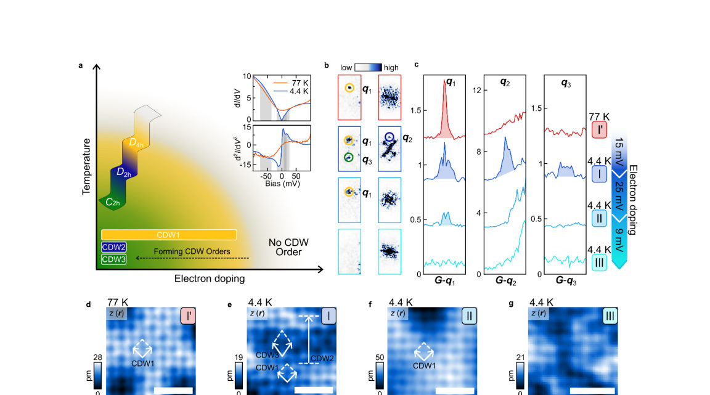 
Figure 4. Doping- and temperature-dependent evolution of the hierarchical CDW orders. a, Schematic phase diagram summarizing the evolution of CDW orders with electron doping and temperature. Inset: tunneling spectra, dI/dV, and their derivative, d2I/dV2, measured at 4.4 K and 77 K. Grey shaded regions mark the contrast-inversion energies of the CDW modulations. Setpoint: Vbias = -150 mV, It = 1 nA. b, Cropped FFTs of topographic images acquired, from top to bottom, in region I’ at 77 K, and in region Ⅰ, II and III at 4.4 K. Corresponding setpoints are Vbias = 100, 25, 20, and 40 mV, and It = 50, 100, 50, and 50 pA. c, Normalized amplitude profiles of the 𝒒1, 𝒒2 and 𝒒3 components, extracted...

**Summary.** This work reports on the discovery of a complex, hierarchical sequence of charge density wave instabilities in an altermagnet. Using advanced STM techniques, the authors mapped three coupled CDW components whose emergence is dictated by symmetry breaking. This cascade is successfully modeled using Landau theory, demonstrating how crystal symmetry organizes collective electronic order in correlated quantum materials.

**Why it may be interesting.** The concept of symmetry-driven electronic cascades provides a rich playground for understanding emergent many-body physics beyond simple band theory, relevant to correlated electron systems where multiple competing orders coexist.

Detailed structure

**Main problem.** The study aims to determine how crystal symmetry dictates the emergence and hierarchy of collective electronic order, specifically charge density waves (CDWs), in altermagnetic materials.

**Main result.** The authors discovered a highly coordinated, multi-component cascade of CDW instabilities ($\mathcal{Q}_1 
ightarrow \mathcal{Q}_2 
ightarrow \mathcal{Q}_3$) whose sequence is governed by successive symmetry lowering and coupled to octupolar electronic states.

**Method.** Phase-resolved scanning tunneling microscopy (STM) and spectroscopy were used to map out multiple wave vectors ($\mathbf{q}$) and measure energy-dependent spectral weight redistribution across the cascade components.

**Model / system.** The system is a $d$-wave altermagnet, $	ext{Rb}_{1-\delta}	ext{V}_2	ext{Te}_2	ext{O}$. The theoretical framework employs Landau theory to model the sequential condensation of charge orders coupled to octupolar partners.

**Key observables.** Three distinct modulations ($\mathbf{q}_1, \mathbf{q}_2, \mathbf{q}_3$), contrast-inversion energies at specific biases, and branch-selective spectral weight redistribution in $\mathcal{Q}_3$.

**Important parameters / regimes.** Doping level ($\delta$) and temperature ($T$); the relative wave vectors defining the cascade hierarchy.

**Assumptions / limitations.** The observed electronic order can be described by a sequential softening of charge orders within a Landau free energy functional, coupled to octupolar terms.

**Figures summary.** Figures illustrate the spatial mapping and FFT analysis revealing $\mathbf{q}_1, \mathbf{q}_2,$ and $\mathbf{q}_3$ modulations; spectroscopy shows bias-dependent spectral weight changes confirming intrinsic nature of $\mathcal{Q}_3$.

**Paper structure.** The paper progresses by first identifying the three distinct CDW components via STM mapping ($\mathbf{q}_1, \mathbf{q}_2, \mathbf{q}_3$), then using spectroscopy to prove their coupling and hierarchy, culminating in a Landau description of the entire cascade process.

Abstract

Altermagnets host magnetic compensation together with non-relativistic spin-split bands, a coexistence enabled by crystal symmetry. Yet whether and how crystal symmetry organizes collective electronic order remains largely unexplored. Here we uncover a symmetry-driven cascade of finite-$q$ charge order in a $d$-wave altermagnet Rb$_{1-δ}$V$_2$Te$_2$O, using phase-resolved scanning tunneling microscopy. A primary density-wave instability drives an initial electronic reconstruction, followed by the emergence of a nematic component and an off-axis modulation with wave vectors geometrically tied to the preceding orders. Phase-resolved spectroscopy distinguishes these components through separate contrast-inversion energies and maps out branch-selective spectral-weight redistribution within the off-axis mode. Together with doping and temperature evolution, these observations establish a highly coordinated hierarchy of coupled density-wave instabilities, consistent with successive symmetry lowering. This multi-component hierarchy can be well described in the Landau framework through sequential softening of the charge orders, where bilinear coupling to their compatible octupolar partners at the lower-symmetry stages enables mutual stabilization within an intertwined charge-multipole state. Such a transparent realization of a charge-order cascade shows how altermagnetic symmetry can extend beyond band formation to organize collective electronic order, offering a new perspective on emergent many-body states in correlated quantum materials.

[↑ back to top](#top)

### [Parity-driven RKKY decoupling and anomalous $1/R$ Dzyaloshinskii-Moriya interaction in $p$-wave magnets](http://arxiv.org/abs/2607.10757v1)

**Authors:** Morteza Salehi, Tohid Farajollahpour  
**Type:** theory · **Category:** strongly correlated electrons · **PDF:** <https://arxiv.org/pdf/2607.10757v1>  
**Analysis basis:** full PDF text, analyzed in chunks
**Topic relevance:** `analog quantum simulation` **3/5** · `exotic spin models in light-matter` **3/5** · `spintronics-quantum-optics interface` **3/5** · `Keldysh / 2PI / non-Gaussian methods` **1/5**

📷 Fig 1

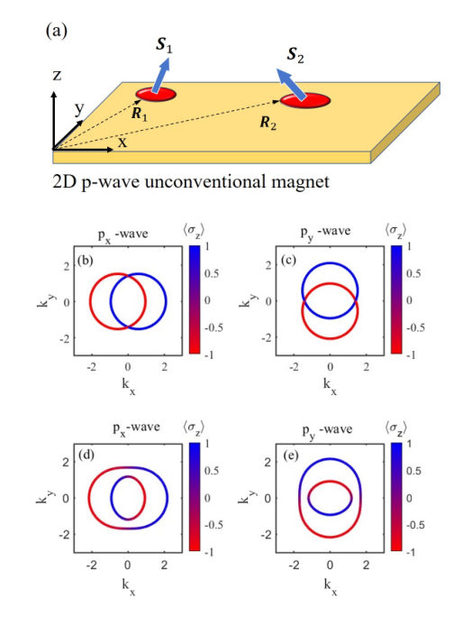 
FIG. 1. (a) Schematic illustration of 2D p-wave uncon- ventional magnet in the presence of two magnetic impurities with spins S1 and S2, located at spatial positions R1 and R2. The localized impurity spins interact with each other via the indirect RKKY interaction mediated by the itinerant electrons. (b) to (e) Constant-energy contours in momentum space showing the spin-splitting effect. The color map corre- sponds to the out-of-plane spin expectation value ⟨σz⟩, high- lighting the momentum-dependent spin polarization. The top row shows the unperturbed (b) px-wave (β = 0) and (c) py- wave (β = π/2) unconventional magnets in the absence of RSOC, (λ = 0), where the bands exhibit a uniform...

📷 Fig 2

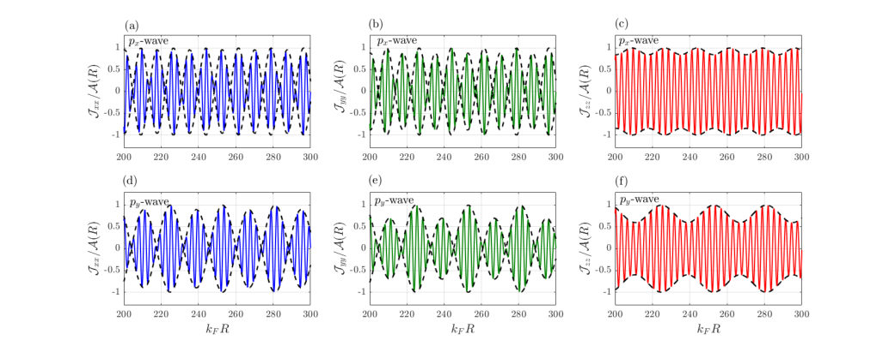 
FIG. 2. Spatial dependence of the normalized diagonal RKKY interaction components in a two-dimensional p-wave magnet subjected to RSOC. The top row [(a) to (c)] corresponds to a px-wave magnet (β = 0), while the bottom row [(d) to (f)] corresponds to a py-wave magnet (β = π/2). The columns display the in-plane Heisenberg components Jxx [(a), (d)] and Jyy [(b), (e)], and the out-of-plane Ising component Jzz [(c), (f)], all normalized by the isotropic spatial decay amplitude A(R). Black dashed lines trace the analytical spatial beating envelopes governed by the regularized momentum splitting κ. Retaining the full breaks the in-plane spatial isotropy (Jxx ̸= Jyy), inducing...

📷 Fig 3

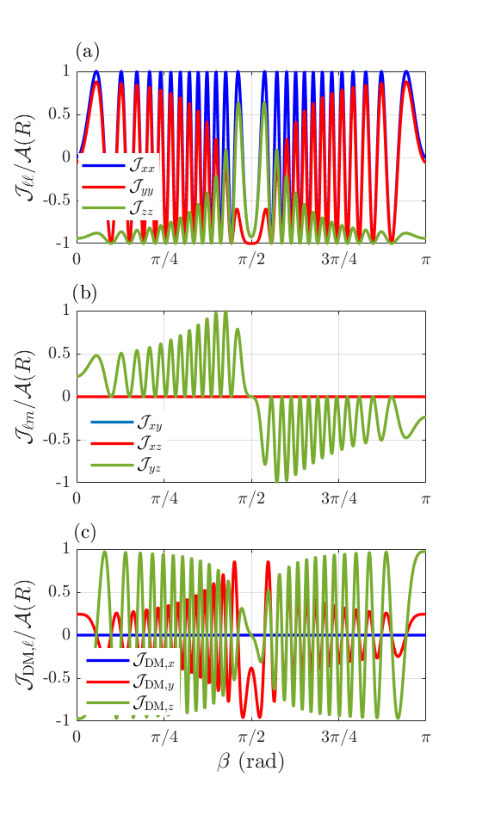 
FIG. 3. Evolution of the normalized RKKY interaction ten- sor components as a function of the p-wave polarization angle β, evaluated for two magnetic impurities aligned along the x- axis (ϕ = 0). The panels display (a) the diagonal Heisenberg and Ising interactions, (b) the symmetric off-diagonal interac- tions, and (c) the antisymmetric DM components. Aligning the impurity bond precisely with the x-axis imposes a geomet- ric symmetry (sin ϕ = 0) that identically quenches the Jxy, Jxz, and JDM,x components across all polarization angles. As the p-wave axis rotates, the projected momentum shift kM = Q cos(β) highly tunes the effective beating wavevector, driving pronounced angular...

📷 Fig 4

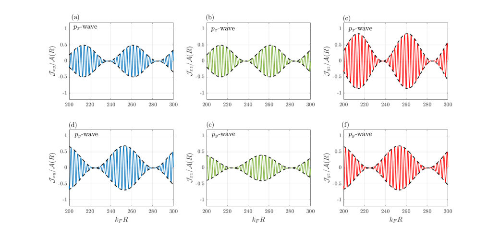 
FIG. 4. Spatial dependence of the normalized symmetric off-diagonal RKKY interaction components in a two-dimensional p-wave magnet subjected to RSOC. The top row [(a) to (c)] corresponds to a px-wave magnet (β = 0), while the bottom row [(d) to (f)] corresponds to a py-wave magnet (β = π/2). The columns display the in-plane component Jxy [(a), (d)], and the out-of-plane cross components Jxz [(b), (e)] and Jyz [(c), (f)], all normalized by the isotropic spatial decay amplitude A(R). Black dashed lines trace the analytical spatial beating envelopes governed by the regularized momentum splitting κ. Unlike the diagonal Heisenberg channels, the symmetric off-diagonal terms exhibit a pure (1...

📷 Fig 5

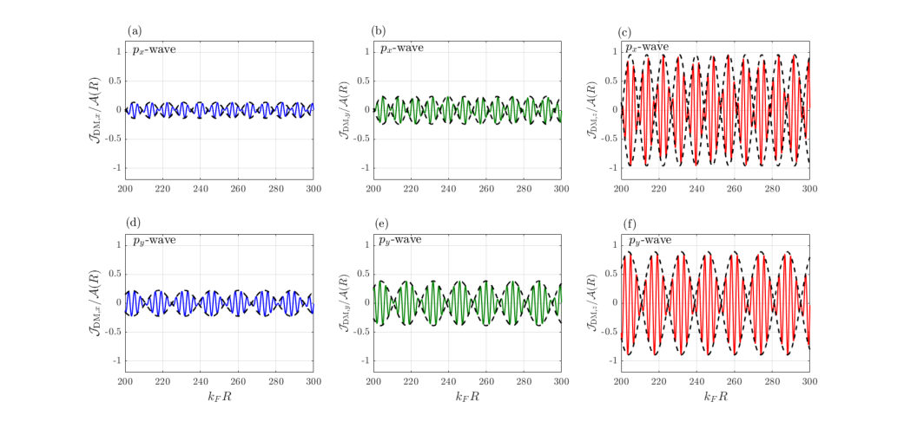 
FIG. 5. Spatial dependence of the normalized DM interaction components in a two-dimensional p-wave magnet subjected to RSOC. The top row [(a) to (c)] corresponds to a px-wave magnet (β = 0), while the bottom row [(d) to (f)] corresponds to a py-wave magnet (β = π/2). The columns display the in-plane chiral components JDM,x [(a), (d)] and JDM,y [(b), (e)], and the out-of-plane component JDM,z [(c), (f)], all normalized by the isotropic spatial decay amplitude A(R). Black dashed lines trace the analytical spatial beating envelopes governed by the regularized momentum splitting κ. The antisymmetric DM vector exhibits a pure, zero-centered sin(2κR) spatial beating. Rotating the p-wave order...

**Summary.** This theoretical work analyzes the RKKY interaction in $p$-wave magnets with Rashba SOC, revealing how odd parity fundamentally alters magnetic exchange. Key findings include a decoupling of out-of-plane Ising terms and the emergence of tunable DM interactions. The paper provides crucial insights into engineering robust, directionally controlled non-collinear spin textures.

**Why it may be interesting.** The detailed analysis of spin texture engineering through symmetry breaking (parity/RSOC) is highly relevant to AMO physics and quantum optics, as these systems often involve engineered spin-orbit coupling or topological phases that dictate long-range interactions.

Detailed structure

**Main problem.** The study investigates how the Ruderman-Kittel-Kasuya-Yosida (RKKY) indirect exchange interaction behaves in unconventional $p$-wave magnets when subjected to Rashba spin-orbit coupling.

**Main result.** The odd parity of the $p$-wave state causes a spatial decoupling of the out-of-plane Ising interaction, while the system generates a highly tunable, three-component Dzyaloshinskii-Moriya (DM) interaction. Furthermore, an anomalous crossover leads to a dimension-reducing $1/R$ decay for in-plane chiral components.

**Method.** The analysis employs an analytical real-space Green's function formalism and uses the stationary-phase approximation on momentum-space integrals to derive asymptotic expressions for the RKKY tensor components.

**Model / system.** The model is a two-dimensional ($2D$) unconventional $p$-wave magnet described by an effective continuum Hamiltonian incorporating kinetic energy, an odd-parity momentum-dependent exchange field ($M_p\mathbf{k}$), and Rashba spin-orbit coupling ($\lambda$).

**Key observables.** RKKY exchange tensor components (Heisenberg, Ising, Dzyaloshinskii-Moriya (DM) interaction), spatial decay laws ($1/R$ vs $1/R^2$), and directional tunability of magnetic interactions.

**Important parameters / regimes.** Rashba coupling strength ($\lambda$), Fermi wavevector ($k_F$), and the momentum shift associated with the $p$-wave order.

**Assumptions / limitations.** The calculations rely on long-distance asymptotic expressions for the Green's functions ($k_F R \gg 1$) and utilize an effective two-band continuum Hamiltonian.

**Figures summary.** Figures schematically illustrate RKKY interactions in $p$-wave magnets, showing constant-energy contours that reveal spin-splitting effects when RSOC is present. Later figures track the spatial dependence of various RKKY tensor components as a function of polarization angle.

**Paper structure.** The paper progresses from defining the physical model and Hamiltonian to deriving the Green's functions using matrix inversion, then calculating the full RKKY exchange tensor via second-order perturbation theory in real space. The focus shifts to analyzing parity effects, decoupling mechanisms, and finally deriving closed-form asymptotic expressions for all interaction components.

Abstract

Unconventional $p$-wave magnets, characterized by an odd-parity momentum-dependent spin splitting, offer a fundamentally distinct paradigm for non-collinear spintronics. Here, we theoretically investigate the Ruderman-Kittel-Kasuya-Yosida indirect exchange in a two-dimensional $p$-wave magnet subjected to Rashba spin-orbit coupling. Using an analytical real-space Green's function formalism, we uncover a parity-driven spatial decoupling in the magnetic response. Because of the odd-parity exchange field, the out-of-plane Ising interaction is structurally insulated from the macroscopic $p$-wave modulation, oscillating isotropically at the shifted Fermi wavevector. Conversely, the in-plane Heisenberg components exhibit pronounced, directionally tunable spatial beating. Beyond collinear exchange, the hybridized bands generate a highly tunable, three-component Dzyaloshinskii-Moriya interaction alongside symmetric off-diagonal anisotropies. We reveal that the out-of-plane chiral twisting is driven by the massive, nonrelativistic $p$-wave momentum shift, while the in-plane chiral components are strictly relativistic. Furthermore, the competition between the $p$-wave nodal geometry and the Rashba gap drives an anomalous, dimension-reducing crossover, in which the in-plane chiral components follow a 1D-like $1/R$ spatial decay along the nodal lines over an extended intermediate-distance window before ultimately recovering the conventional 2D $1/R^2$ asymptote. These findings establish $p$-wave magnets as promising platforms for engineering robust, directionally tunable non-collinear spin textures.

[↑ back to top](#top)

### [Nonperturbative magnetotransport from band geometry in Weyl semimetals](http://arxiv.org/abs/2607.10468v1)

**Authors:** L. Medel Onofre, A. Martín-Ruiz  
**Type:** theory · **Category:** other · **PDF:** <https://arxiv.org/pdf/2607.10468v1>  
**Analysis basis:** full PDF text, analyzed in chunks
**Topic relevance:** `Keldysh / 2PI / non-Gaussian methods` **3/5** · `non-equilibrium dynamics` **2/5** · `driven-dissipative phase transition` **1/5** · `methods for driven-dissipative` **1/5** · `non-equilibrium universality` **1/5**

📷 Fig 1

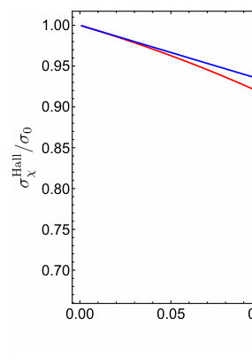 
FIG. 1: Intrinsic Hall response conductivity σHall χ (B) (in units of σ0 = e2kF

📷 Fig 2

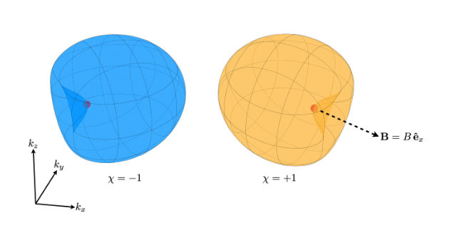 
FIG. 2: Fermi-surface deformation induced by the orbital magnetic moment in a Weyl semimetal. The two panels correspond to opposite sectors labeled by χ = ±1. In the absence of a magnetic field, the Fermi surface is isotropic around the axis defined by the magnetic field. The inclusion of the orbital magnetic moment introduces an explicit angular dependence through the term mk · B, leading to a distortion of the constant-energy surface. As a result, the magnetic field acts as an angular selector, favoring specific regions of the Fermi surface (shaded regions), which dominate the transport response. This anisotropic redistribution of states underlies both the field-induced Hall response and...

📷 Fig 3

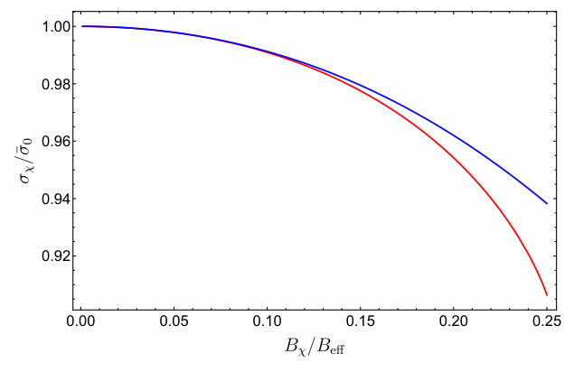 
FIG. 3: Isotropic Fermi-surface conductivity σχ(B) (in units of ¯σ0 = e2vF τk2 F 3πh ) as a function of λχ = Bχ/Beff. The red curve corresponds to the exact nonperturbative result, Eq. (24), while the blue curve shows the weak-field expansion. Both expressions agree in the limit λχ →0, but deviations become visible at moderate magnetic fields, where the exact conductivity is suppressed relative to the perturbative approximation. In contrast to the anisotropic contribution, this coefficient is infrared safe, and the observed deviations reflect genuine nonperturbative effects beyond the weak-field regime.

📷 Fig 4

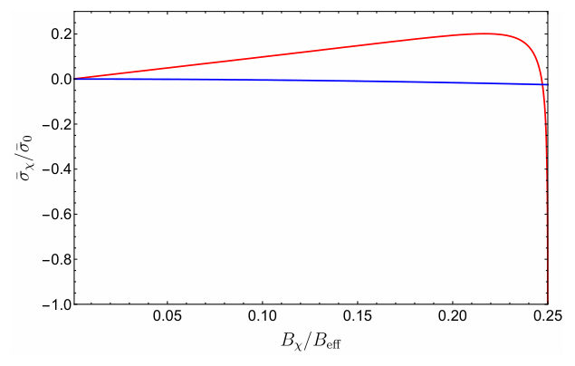 
FIG. 4: Anisotropic Fermi-surface conductivity ¯σχ(B) (in units of ¯σ0 = e2vF τk2 F 3πh ) as a function of λχ = Bχ/Beff. The red curve corresponds to the exact nonperturbative result, Eq. (29), while the blue curve shows the perturbative result (32). In contrast to the isotropic contribution, the two results do not coincide even in the weak-field limit, reflecting the intrinsic infrared sensitivity of the anisotropic response. The deviation originates from the singular behavior of the orbital magnetic moment and the resulting nonanalytic dependence on the magnetic field.

**Summary.** This paper develops a nonperturbative semiclassical theory for magnetotransport in Weyl semimetals. It calculates the full magnetic field dependence of the conductivity tensor, demonstrating that conventional weak-field expansions are insufficient under certain conditions. The work provides exact closed-form expressions valid across various magnetic field regimes.

**Why it may be interesting.** While focused on condensed matter transport, the rigorous treatment of nonperturbative effects in response functions (like conductivity) using semiclassical methods shares conceptual overlap with analyzing quantum responses in open or driven systems where weak-field approximations fail.

Detailed structure

**Main problem.** To develop a nonperturbative semiclassical theory for magnetotransport in Weyl semimetals, retaining the full magnetic-field dependence of conductivity.

**Main result.** The authors show that magnetotransport becomes intrinsically nonperturbative at low carrier densities or moderate fields, yielding closed-form expressions and revealing nonanalytic contributions absent in weak-field expansions.

**Method.** The study employs semiclassical chiral kinetic theory, deriving current density formulas by retaining the full magnetic field dependence of phase-space factors and generalized velocities.

**Model / system.** The system is Weyl semimetals, analyzed using a low-energy Hamiltonian near each Dirac node. The physics incorporates external electromagnetic fields ($\mathbf{E}, \mathbf{B}$) coupled to emergent chiral fields ($\mathbf{E}_\chi, \mathbf{B}_\chi$) and the orbital magnetic moment.

**Key observables.** The conductivity tensor components ($\sigma_{ij}$), particularly the intrinsic Hall response $\sigma_{Hall}^{\chi}(B)$, are key observables.

**Important parameters / regimes.** Low carrier densities or moderate magnetic fields define the nonperturbative regime. The analysis is valid in the semiclassical limit, neglecting Landau quantization effects.

**Assumptions / limitations.** The theory relies on semiclassical approximations and assumes that retaining the full field dependence of the equations of motion captures physics beyond weak-field expansions.

**Figures summary.** Figure 1 compares exact nonperturbative results for $\sigma_{Hall}^{\chi}(B)$ against weak-field expansion predictions, showing deviations at moderate fields. Figure 2 illustrates Fermi-surface deformation induced by the orbital magnetic moment.

**Paper structure.** The paper develops the theory by first establishing the semiclassical framework using effective chiral fields. It derives closed-form expressions for intrinsic currents and then analyzes conductivity components ($\sigma_{L}^{\perp}, \sigma_{L}^{H}, \sigma_{L}^{\parallel}$) by comparing results from full field dependence versus perturbative expansions.

Abstract

We develop a nonperturbative semiclassical theory of magnetotransport in Weyl semimetals, retaining the full magnetic-field dependence of the Fermi-surface conductivity in the presence of Berry curvature and orbital magnetic moment effects. We obtain closed-form expressions valid to all orders in the magnetic field within the semiclassical regime. We show that the exact continuum formulation exhibits an intrinsic infrared sensitivity associated with the singular behavior of the orbital magnetic moment, requiring a physically motivated regularization. While the full conductivity tensor reduces to the standard quadratic magnetoconductivity, we demonstrate that magnetic-field expansion and momentum integration do not commute, leading to nonanalytic contributions at the level of scalar transport coefficients. Our results identify a regime, relevant for low carrier densities or moderate magnetic fields, where magnetotransport becomes intrinsically nonperturbative and cannot be captured by conventional weak-field expansions.

[↑ back to top](#top)

### [Staggered orbital magnetization from itinerant electrons: orbital antiferro- and ferrimagnetic phases](http://arxiv.org/abs/2607.10355v1)

**Authors:** Lucas L. Lage, Kevin J. U. Vidarte, Tarik P. Cysne, Tatiana G. Rappoport, A. Latgé, R. B. Muniz  
**Type:** theory · **Category:** other · **PDF:** <https://arxiv.org/pdf/2607.10355v1>  
**Analysis basis:** full PDF text, analyzed in chunks
**Topic relevance:** `exotic spin models in light-matter` **3/5** · `analog quantum simulation` **2/5** · `Keldysh / 2PI / non-Gaussian methods` **1/5** · `spintronics-quantum-optics interface` **1/5**

📷 Fig 1

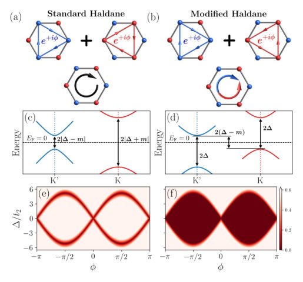 
FIG. 1. Convention for the positive phase ϕ in the t2 term of the Hamiltonian in Eq. (1) for the (a) standard and (b) modified Haldane models. We also show the schematic energy spectra near the valleys and the calculated bulk energy band gap (shown as a color gradient) across the parameter space ∆/t2 −ϕ for the (c,e) standard and (d,f) modified Haldane models.

📷 Fig 2

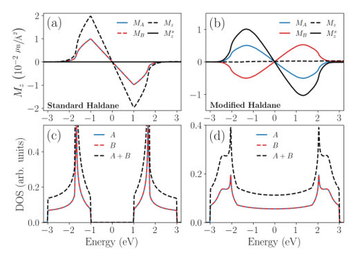 
FIG. 2. Sublattice-resolved (MA and MB), total (Mz), and staggered (M s z ) orbital magnetizations for the standard and modified Haldane models in panels (a) and (b), respectively, and the corresponding density of states in panels (c) and (d), for ϕ = π/2 and ∆= 0.

📷 Fig 3

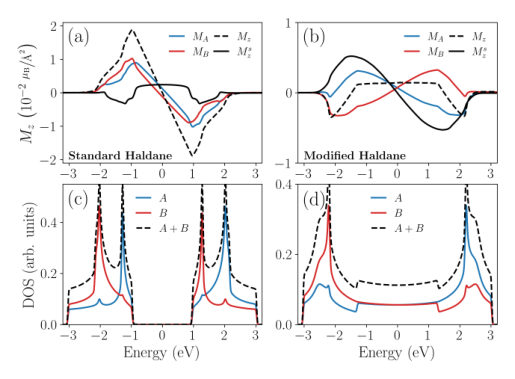 
FIG. 3. Sublattice-resolved (MA and MB), total (Mz), and staggered (M s z ) orbital magnetizations for the standard and modified Haldane models in panels (a) and (b), respectively, and the corresponding density of states in panels (c) and (d), for ϕ = π/2, and ∆= 0.75 √

📷 Fig 4

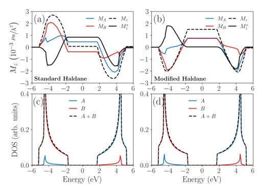 
FIG. 4. Sublattice-resolved (MA and MB), total (Mz), and staggered (M s z ) orbital magnetizations for the standard and modified Haldane models in panels (a) and (b), respectively, and the corresponding density of states in panels (c) and (d), for ϕ = π/2, and ∆= 6 √

**Summary.** This work explores how itinerant electrons generate various forms of orbital magnetic ordering (ferro-, antiferro-, ferrimagnetic) on a honeycomb lattice. By decomposing the total magnetization into sublattice contributions, the authors map out distinct phases governed by model specifics and external potentials. This provides a detailed theoretical understanding of orbitally ordered states in condensed matter systems.

**Why it may be interesting.** While focused on condensed matter magnetism, the rigorous decomposition of orbital response into symmetry-protected staggered/net components provides a powerful theoretical framework applicable to understanding emergent order parameters in complex quantum systems.

Detailed structure

**Main problem.** The study investigates how itinerant orbital angular momentum can organize into magnetic patterns analogous to spin antiferromagnets, ferrimagnets, or ferromagnets.

**Main result.** The authors demonstrate distinct regimes—orbital ferromagnetic, antiferromagnetic, and ferrimagnetic states—by resolving the total orbital magnetization into sublattice contributions ($M_A$ and $M_B$).

**Method.** They employ real-space formulations and low-energy theory applied to a honeycomb lattice model, analyzing the system's response across varying parameters.

**Model / system.** The physical system is modeled using standard and modified Haldane tight-binding Hamiltonians on a honeycomb lattice. The analysis utilizes sublattice projection techniques to decompose the orbital magnetization into net ($M_z$) and staggered ($M_s^z$) components.

**Key observables.** Sublattice-resolved orbital magnetizations ($M_A, M_B$), total orbital magnetization ($M_z$), and staggered orbital magnetization ($M_s^z$).

**Important parameters / regimes.** The sublattice potential ($\Delta$) and the Fermi energy are varied; specific results are highlighted for $\Delta=0$ and in insulating gap regimes.

**Assumptions / limitations.** The analysis assumes that the itinerant orbital magnetization can be decomposed into contributions from different crystal sublattices, moving beyond localized moment descriptions.

**Figures summary.** Figures illustrate electronic band gaps across parameter space ($\phi-\Delta$), and show sublattice-resolved DOS and orbital magnetizations for various regimes (e.g., $\Delta=0$ or in the insulating gap).

**Paper structure.** The paper progresses from defining the Hamiltonian on a honeycomb lattice to calculating sublattice-resolved magnetization components, identifying distinct magnetic phases based on $M_z$ and $M_s^z$, and finally interpreting these results using low-energy valley mechanisms.

Abstract

Because electronic orbital angular momentum in solids is inherently non-local, its contribution to magnetism is usually cast in terms of a net orbital magnetization. Here, we show that itinerant electrons can generate orbital magnetic phases with ferromagnetic, antiferromagnetic, or ferrimagnetic orders. We demonstrate this possibility in a honeycomb lattice, using both the standard and a modified Haldane model. Employing real-space formulations, we decompose the itinerant orbital magnetization into sublattice contributions, $M_A$ and $M_B$. Their net ($M_z=M_A+M_B$) and staggered ($M_z^s=M_A-M_B$) combinations are then used to identify the orbital order. By varying the sublattice potential and the Fermi energy, we find distinct regimes: a (PT)-symmetric orbital antiferromagnet in the modified Haldane model, an orbital ferromagnet in the standard Haldane model, ferrimagnetic metallic states where net and staggered orbital magnetizations coexist, and insulating regimes in which the ferro- and antiferromagnetic orbital characters can be interchanged.These findings are explained by a low-energy theory in terms of two distinct valley mechanisms: valley-dependent Dirac masses in the standard Haldane model and valley-dependent energy shifts in its modified version.

[↑ back to top](#top)

### [Evidence for spin swapping from modulation of transverse resistance in magnetic heterostructures with Rashba interface](http://arxiv.org/abs/2607.10189v1)

**Authors:** Heeman Kim, Shutaro Karube, Juan Borge, Junyeon Kim, Kouta Kondou, YoshiChika Otani  
**Type:** experiment · **Category:** other · **PDF:** <https://arxiv.org/pdf/2607.10189v1>  
**Analysis basis:** full PDF text, analyzed in chunks
**Topic relevance:** `spintronics-quantum-optics interface` **3/5** · `Kondo & dissipative impurity` **1/5** · `exotic spin models in light-matter` **1/5** · `non-equilibrium dynamics` **1/5**

📷 Fig 1

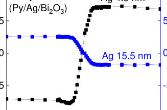 
Fig. 1. (a) Scheme of the measurement. (b),(c) Typical Rxy for Sample 1 (b) and Sample 2

📷 Fig 2

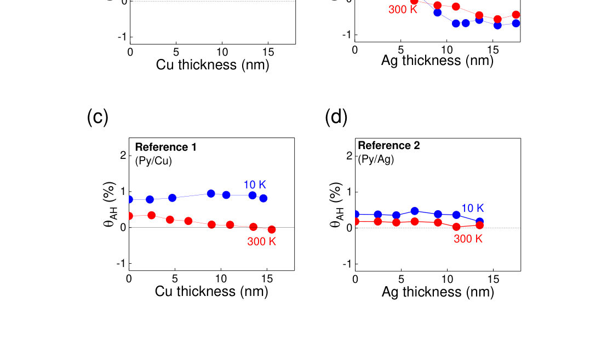 
Fig. 2. (a),(b) θAH as a function of tNM at 10 K (blue circle) and 300 K (red circle) for

📷 Fig 3

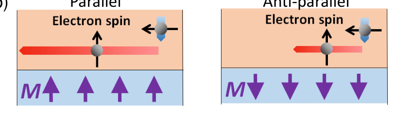 
Fig. 4. (a) Scheme of the spin swapping in Cu (left panel) and Ag (right) layer. (b) FM

**Summary.** This work investigates evidence for 'spin swapping' in magnetic heterostructures by measuring how transverse resistance changes with an out-of-plane magnetic field. The key finding is that opposite signs of the measured resistance modulation correspond to the opposite spin chirality of the Rashba interfaces, supporting a model where spin current direction swaps within the non-magnetic spacer layer.

**Why it may be interesting.** While focused on spintronics/condensed matter magnetism, the clear dependence of macroscopic transport properties ($\Delta R_{xy}$) on microscopic symmetry breaking (Rashba interface chirality) provides a tangible experimental test case for complex quantum mechanical spin-orbit coupling effects.

Detailed structure

**Main problem.** The study investigates evidence for a physical phenomenon called 'spin swapping' by analyzing how the transverse resistance of magnetic heterostructures changes when subjected to an out-of-plane magnetic field.

**Main result.** Opposite modulations in the transverse resistance ($\Delta R_{xy}$) observed between two different Rashba interfaces (Cu/Bi2O3 vs Ag/Bi2O3) correlate with opposite spin chiralities, suggesting that spin swapping is responsible for generating a transverse spin current with opposing flow directions.

**Method.** The researchers measured the transverse resistance ($R_{xy}$) as a function of an out-of-plane magnetic field ($\mathbf{H}$), calculating $\Delta R_{xy} = R_{xy}(+\mathbf{H}) - R_{xy}(-\mathbf{H})$ to diagnose the spin transport mechanism.

**Model / system.** The experiment uses magnetic heterostructures, specifically Py/Cu(or Ag)/Bi2O3, where the Cu or Ag layers act as Rashba interfaces with opposite spin chiralities. The physics is analyzed through the lens of spin-charge conversion and subsequent spin current dynamics.

**Key observables.** Transverse resistance modulation ($\Delta R_{xy}$), anomalous Hall angle ($	heta_{AH}^{	ext{add}}$), and their dependence on non-magnetic metal (NM) thickness ($t_{	ext{NM}}$).

**Important parameters / regimes.** Out-of-plane magnetic field ($\mathbf{H}$), Rashba interface chirality, and the thickness of the non-magnetic spacer layer ($t_{	ext{NM}}$).

**Assumptions / limitations.** The spin swapping effect is hypothesized to occur primarily near the ferromagnetic (FM) layer, and intermixing between FM and NM layers is acknowledged as a potential contributing factor.

**Figures summary.** Figures 1(b) and 1(c) show $R_{xy}$ vs $\mathbf{H}$ demonstrating opposite modulation signs for the two interfaces. Figure 2 shows $	heta_{AH}$ dependence on $t_{	ext{NM}}$, while Figure 3 displays the interface-added contribution ($	heta_{AH}^{	ext{add}}$).

**Paper structure.** The paper systematically analyzes the transverse resistance response using magnetic field sweeps and thickness variations, correlating the observed sign changes in transport measurements with theoretical predictions derived from spin chirality differences.

Abstract

We investigate the transverse response under the out-of-plane magnetic field for magnetic heterostructures with Cu/Bi2O3 or Ag/Bi2O3 Rashba interfaces. We detect opposite contributions on the transverse resistance by the Cu/Bi2O3 and the Ag/Bi2O3 interfaces, which interestingly coincide well with the opposite signs of the spin/charge interconversion from the two interfaces. We suppose the opposite influences on the transverse resistance feature spin swapping occurrence of the converted spin current. The transverse spin flow emerges due to the spin swapping in both Cu and Ag layer, but the direction of the spin flow is opposed dependent on the spin direction of the converted spin current.

[↑ back to top](#top)

### [Correlation-renormalized spin-fluctuation pairing and the stabilization of $s_{\pm}$ superconductivity in pressurized La$_3$Ni$_2$O$_7$](http://arxiv.org/abs/2607.11786v1)

**Authors:** Shuhong Tang, Liang-Jian Zou  
**Type:** theory · **Category:** strongly correlated electrons · **PDF:** <https://arxiv.org/pdf/2607.11786v1>  
**Analysis basis:** full PDF text, analyzed in chunks
**Topic relevance:** `Keldysh / 2PI / non-Gaussian methods` **3/5** · `methods for driven-dissipative` **1/5**

📷 Fig 1

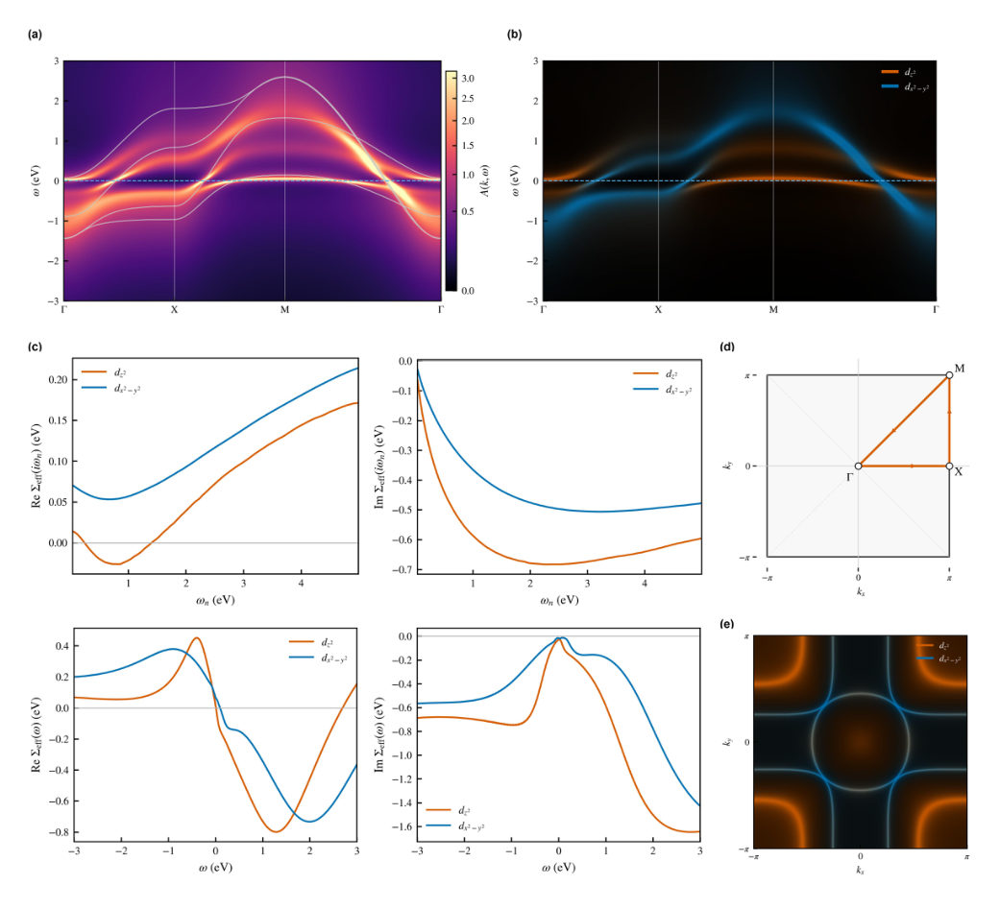 
FIG. 1. (Colour online) DMFT-renormalized electronic structure of the four-orbital Wannier model. (a) Total spectral function A(k, ω) along the high-symmetry path Γ–X–M–Γ. The gray curves indicate the underlying Wannier bands, while the color scale shows the correlated spectral weight. (b) Orbital-resolved spectral intensity, separating the d3z2−r2 and dx2−y2 contributions. (c) Orbital-resolved DMFT self-energy on the Matsubara axis and in a real-frequency representation. The steeper low-frequency slope of the d3z2−r2 self-energy gives a smaller quasiparticle weight than for dx2−y2. (d) Brillouin-zone convention and high- symmetry path used in panels (a) and (b). (e) Orbital-resolved...

📷 Fig 2

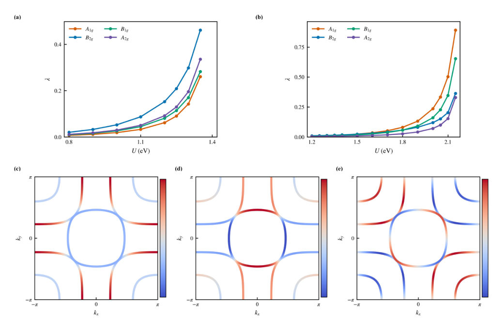 
FIG. 2. (Colour online) Correlation-induced reversal of the leading pairing symmetry. (a) Symmetry- resolved pairing eigenval- ues λΓ obtained in ordinary RPA from the bare Wannier Green’s function. The B2g channel is the leading instability over the interaction range shown. (b) Corresponding eigenvalues after replacing the irreducible bubble by GDMFTGDMFT. The overall growth is shifted to larger residual URPA because the DMFT self-energy suppresses the coherent particle-hole response, but the leading symmetry is inverted to A1g. (c)–(e) Representative gap eigenvectors on the Fermi-surface sheets in the A1g, B1g, and B2g sectors. The A1g state is a sign-changing s± state, whereas B1g and...

📷 Fig 3

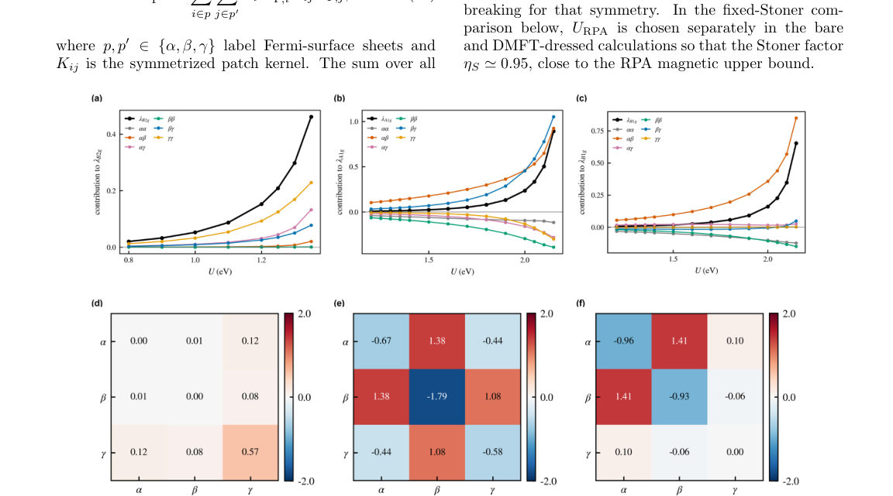 
Fig. 3. (Colour online) Pocket-pair decomposition of the pairing eigenvalues. (a) Contributions to the ordinary-RPA B2g eigenvalue as a function of URPA. (b) and (c) Corresponding decompositions for the DMFT-renormalized A1g and B1g channels. The black curve is the total eigenvalue, while the colored curves denote individual pocket pairs. (d)–(f) Normalized pocket-pair matrices λpp′

📷 Fig 4

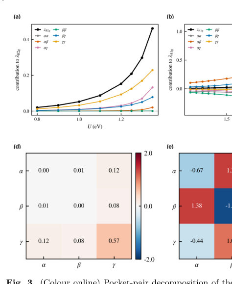 
Fig. 3(a) shows that the bare-RPA B2g state is a highly concentrated instability. Its total eigenvalue closely fol- lows the γγ contribution, with smaller positive assis- tance from αγ and βγ scattering and almost no support from αα, ββ, or αβ blocks. The fixed-Stoner matrix in Fig. 3(d) makes the same point without reference to the absolute value of URPA: more than half of the normalized B2g eigenvalue comes from the γγ sector. Thus ordinary RPA selects the dxy form factor through a relatively nar- row set of γ-centered processes. The DMFT-renormalized A1g state has a qualitatively different structure. In Fig. 3(b), the large positive terms are distributed over inter-pocket channels, espe-...

📷 Fig 5

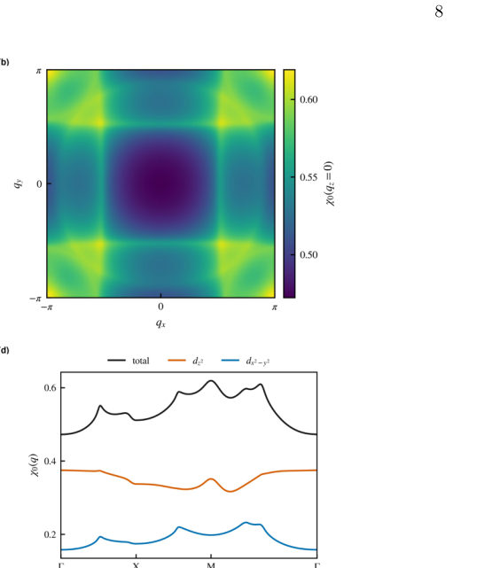 
Fig. 4. (Colour online) Self-energy reweighting of the static irreducible magnetic susceptibility entering the RPA ladder. (a) Momentum dependence of the bare bubble χ0(q, qz = 0) obtained from G0G0. (b) DMFT- dressed bubble χ0,Σ(q, qz = 0) obtained from GDMFTGDMFT. (c),(d) Corresponding total and orbital-resolved cuts along Γ–X–M–Γ. The DMFT self-energy reduces the overall scale of the bubble and suppresses the d3z2−r2 contribution more strongly than a uniform rescaling would.

**Summary.** This theoretical work investigates superconducting pairing symmetry in La3Ni2O7 by incorporating strong electronic correlations using DMFT within an RPA framework. The key finding is that these correlation effects fundamentally change the predicted gap symmetry, stabilizing a sign-changing s+ state over the dxy state favored by simpler models. This highlights the necessity of treating quasiparticle renormalization for accurate predictions in correlated superconductors.

**Why it may be interesting.** While focused on cuprate/nickelate physics, the methodology—using DMFT to correct RPA susceptibilities for strong correlations—is a general technique applicable to understanding unconventional superconductivity in any strongly correlated material system.

Detailed structure

**Main problem.** The superconducting gap symmetry of pressurized La3Ni2O7 is unsettled due to competition between sign-changing s-wave and d-wave instabilities predicted by weak-coupling theories.

**Main result.** Including strong correlation effects via DMFT renormalizes the pairing instability, reversing the leading symmetry from a B2g dxy state (in bare RPA) to an A1g sign-changing s+ state.

**Method.** The study combines single-site two-orbital Dynamical Mean-Field Theory (DMFT) with a self-energy-renormalized Random-Phase Approximation (RPA).

**Model / system.** The system is modeled using a four-orbital Wannier Hamiltonian for pressurized La3Ni2O7, focusing on the interplay between orbital degrees of freedom and electronic correlations.

**Key observables.** Superconducting pairing symmetry ($	ext{A}_{1g}$ $s_{\pm}$, $	ext{B}_{2g}$ $d_{xy}$), static spin susceptibility, and quasiparticle weights ($Z$).

**Important parameters / regimes.** The inclusion of the DMFT self-energy is the crucial parameter change compared to bare RPA calculations.

**Assumptions / limitations.** The core assumption is that strong correlations are not a secondary correction but fundamentally alter the pairing mechanism by renormalizing quasiparticles.

**Figures summary.** Figures compare the leading pairing eigenvalues between ordinary RPA and DMFT-dressed RPA, showing the symmetry reversal from $d_{xy}$ to $s_{\pm}$.

**Paper structure.** The paper first establishes the problem using weak-coupling theory (RPA benchmark), then introduces the correlated treatment by replacing the bare bubble with a DMFT-derived one. It analyzes the resulting pairing hierarchy and validates the findings using spin susceptibility calculations.

Abstract

The superconducting gap symmetry of pressurized La$_3$Ni$_2$O$_7$ remains unsettled because conventional weak-coupling calculations often place the system close to competing sign-changing $s$- and $d$-wave instabilities. Using the four-orbital Wannier Hamiltonian of Xia et al., we combine single-site two-orbital dynamical mean-field theory (DMFT) with a self-energy-renormalized random-phase approximation (RPA). The central step is to replace the bare particle-hole bubble $G_0G_0$ of ordinary RPA by a $G_{\rm DMFT}G_{\rm DMFT}$ bubble, while keeping the same residual Slater--Kanamori interaction vertices. In the bare RPA benchmark, the leading pairing eigenvalue belongs to the $B_{2g}$ $d_{xy}$ channel. Once the DMFT self-energy is included, the hierarchy is reversed: the $A_{1g}$ sign-changing $s_{\pm}$ state becomes dominant, the $B_{1g}$ $d_{x^2-y^2}$ channel is subleading, and the original $B_{2g}$ instability is strongly suppressed. Pocket-pair decomposition and orbital-resolved susceptibilities show that the reversal originates from orbital-selective renormalization of the $d_{3z^2-r^2}$ sector, which filters the $γ$-pocket scattering processes that stabilize $d_{xy}$ pairing in bare RPA while preserving distributed inter-pocket processes favorable to $s_{\pm}$ pairing. As an independent two-particle validation, we further compute the static spin susceptibility using the dual Bethe--Salpeter equation with the local DMFT vertex. The resulting susceptibility retains a broad finite-momentum magnetic response and is weak near $Γ$, strengthening the spin-fluctuation background for the correlation-stabilized $s_{\pm}$ state. Our results demonstrate that strong correlations are not a secondary correction in La$_3$Ni$_2$O$_7$: an appropriate treatment of correlation-renormalized quasiparticles is essential for predicting the superconducting pairing symmetry.

[↑ back to top](#top)

### [Evolution from an acoustic-plasmon-mediated superconductivity to an acoustic-phonon-mediated superconductivity in bilayers](http://arxiv.org/abs/2607.10835v1)

**Authors:** Shuyang Wang, Sankar Das Sarma, Jay D. Sau  
**Type:** theory · **Category:** strongly correlated electrons · **PDF:** <https://arxiv.org/pdf/2607.10835v1>  
**Analysis basis:** full PDF text, analyzed in chunks
**Topic relevance:** `Keldysh / 2PI / non-Gaussian methods` **3/5** · `methods for driven-dissipative` **1/5**

📷 Fig 1

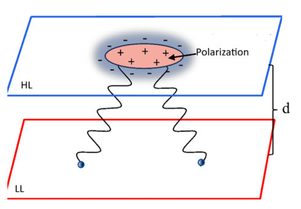 
FIG. 1. System schematic: a bilayer system consisting of a lighter 2DEG (LL) with mass m1 and a heavier 2DEG (HL) with mass m2. The mass m1 = 0.023me (where me is the electron mass) is chosen to match that of bilayer graphene. The mass m2 will be chosen to vary from m1 &lt; m2 &lt; 100m1 to interpolate from the symmetric case to phonon mediated pairing. The distance between the two 2DEGs is d = 10.5˚A. The inter-layer tunneling is assumed to vanish e.g. because of momentum mismatch. Polarization provided by the HL and induce the attractive pairing interaction of electrons in the LL. This is essentially acoustic plasmon mediated pairing in the LL.

📷 Fig 2

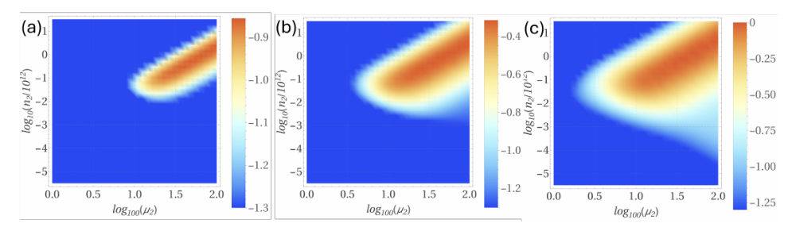 
FIG. 2. (Color online) Log10(Tc(in K)) for superconductivity in the bottom layer of in Fig. 1 with density n1 = 1012cm−2 as a function of the density n2 and mass m2 = µ2m1 of the top layer. The cut-off ωc is chosen to be ωc = 0.15EF 1, 0.18EF,1, 0.19EF,1 respectively from left to right. The momentum cut-off is chosen to be kc = 0.25×10−2kF,1. With these parameters the LL layer by itself has a transition temperature Tc1L &lt; 50 mK. As explained in the text the cut-off ωc is determined by vertex corrections, which then determines the strength of superconductivity, similar to the Coulomb pseudopotential [7]. The SC Tc increases as mass increases towards the limit consistent with phonon-mediated...

📷 Fig 3

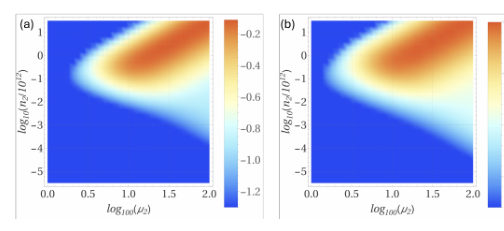 
FIG. 3. (Color online) Log10(Tc(in K)) for superconductivity in LL with density n1 = 4 × 1012cm−2 as a function of the density n2 and mass m2 = µ2m1 of the top layer similar to Fig. 2. The figure shows that the Tc in panel (b) is enhanced by lowering the distance between the layers in panel to d = 5.25˚A relative to the the distance in panel (a), which is as indicated in Figs. 1, 2. The cut-off ωc is chosen to be ωc = 0.21EF,1. The momentum cut-off is chosen to be kc = 0.25 × 10−2kF,1. With these parameters the LL layer by itself has a transition temperature Tc1L &lt; 50 mK. As explained later in the text the cut-off ωc is determined by vertex corrections and the dependence on ωc, kc is...

**Summary.** This work theoretically examines how superconductivity emerges in bilayer heterostructures as a function of layer mass contrast. By applying Eliashberg theory, the authors demonstrate a continuous crossover from plasmon-mediated pairing (low mass ratio) to phonon-like pairing (high mass ratio). The study suggests that SC might be robustly present across this entire parameter space.

**Why it may be interesting.** While focused on superconductivity mechanisms, the systematic theoretical framework for analyzing pairing mediated by collective excitations (plasmons vs. phonons) in layered systems is relevant to understanding strongly correlated electron physics and emergent quantum phenomena.

Detailed structure

**Main problem.** The study investigates the mechanism of superconductivity in bilayer van der Waals heterostructures, specifically tracking the crossover from acoustic plasmon-mediated pairing to acoustic phonon-mediated pairing.

**Main result.** Superconductivity is predicted to exist continuously as the mass ratio between the two layers ($m_2/m_1$) is tuned, suggesting that SC may be a generic feature in bilayers with large mass differences.

**Method.** The analysis employs Eliashberg theory combined with calculations of the dynamically screened Coulomb interaction derived within the Random Phase Approximation (RPA).

**Model / system.** The model consists of a bilayer system comprising two 2D electron gases: a light layer (LL) and a heavy layer (HL), whose coupling mediates the pairing interaction.

**Key observables.** Superconducting critical temperature ($T_c$), which is studied as a function of various physical parameters.

**Important parameters / regimes.** The mass ratio ($m_2/m_1$) is the primary tuning parameter, alongside carrier densities and an artificial frequency cut-off ($\omega_c$).

**Assumptions / limitations.** Key approximations include using RPA for screening and introducing a frequency cut-off ($\omega_c$) to handle divergences in Eliashberg theory.

**Figures summary.** Figures illustrate the dependence of $\log_{10}(T_c)$ on density and mass ratio, showing trends across different fixed values of the frequency cut-off.

**Paper structure.** The paper systematically analyzes the pairing interaction derived from acoustic plasmons using RPA, applies this to the linearized Eliashberg equation, and then maps out the continuous crossover behavior by varying the layer mass ratio $m_2/m_1$.

Abstract

Motivated by recent developments in van der Waals heterostructures, we revisit the acoustic plasmon mechanism of superconductivity in bilayer systems composed of a light layer (LL) and heavy layer (HL) by employing Eliashberg theory. The exchange of virtual plasmons in the HL can lead to a retarded in time attractive interaction between electrons of LL that we model through the screened interaction in the bilayer system within the random phase approximation. We explore the evolution from acoustic plasmon mediated superconductivity to phonon mediated superconductivity by studying the evolution of $T_c$ as the HL mass is increased by a few orders of magnitude compared with the electronic mass in LL. The lower HL mass corresponds to the bilayer acoustic plasmon, while the latter regime is closer to the Born-Oppenheimer regime of acoustic phonon mediated strongly retarded pairing. The heavy HL mass limit is known to obey Migdal's theorem by virtue of the small ratio of the two individual layer masses. We study the nonadiabatic effects for the arbitrary mass ratio with no small parameter systematically by using a frequency cut off in the Eliashberg theory, providing $T_c$ as a function of this cut off.

[↑ back to top](#top)

### [Quantum Horizon and Quantum Membrane Paradigm from Black Hole Quantum Mechanics](http://arxiv.org/abs/2607.10561v1)

**Authors:** Chong-Sun Chu  
**Type:** theory · **Category:** other · **PDF:** <https://arxiv.org/pdf/2607.10561v1>  
**Analysis basis:** full PDF text, analyzed in chunks
**Topic relevance:** `Keldysh / 2PI / non-Gaussian methods` **2/5** · `analog quantum simulation` **2/5** · `driven-dissipative phase transition` **2/5** · `entanglement & information structure` **2/5** · `methods for driven-dissipative` **2/5** · `Kondo & dissipative impurity` **1/5** · `correlated / nonlocal dissipation` **1/5** · `exotic spin models in light-matter` **1/5** · `non-equilibrium dynamics` **1/5** · `non-equilibrium universality` **1/5**

📷 Fig 1

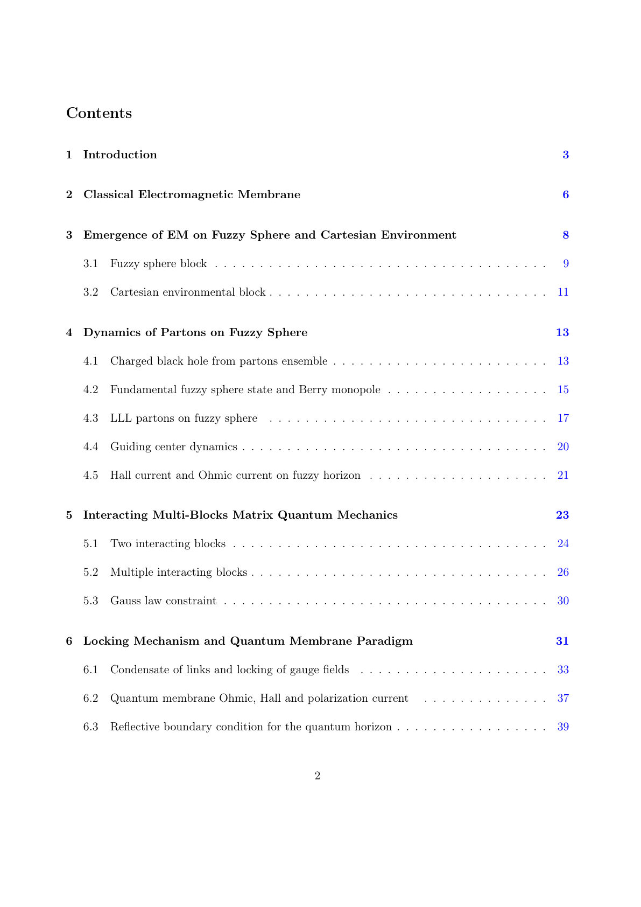 
Low-resolution page preview, page 2

📷 Fig 2

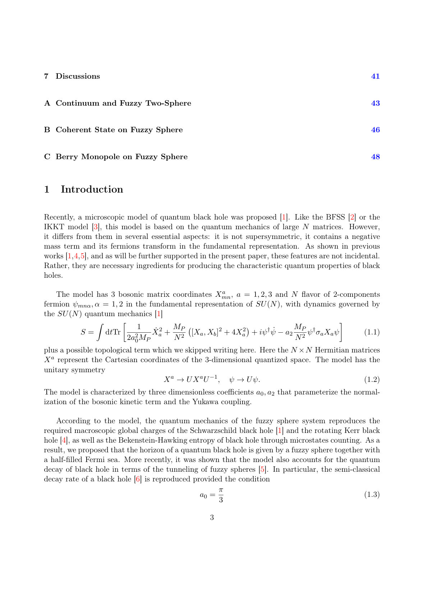 
Low-resolution page preview, page 3

📷 Fig 3

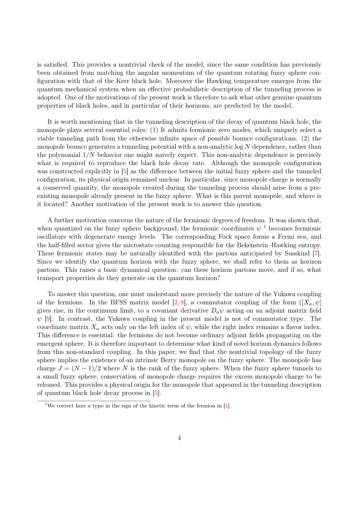 
Low-resolution page preview, page 4

📷 Fig 4

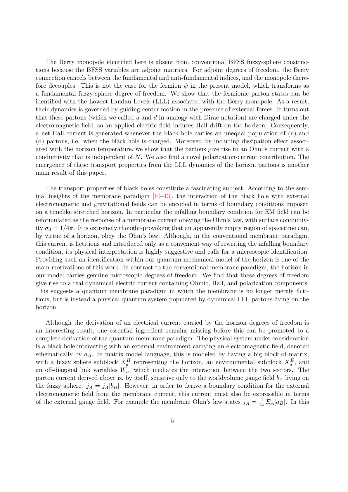 
Low-resolution page preview, page 5

📷 Fig 5

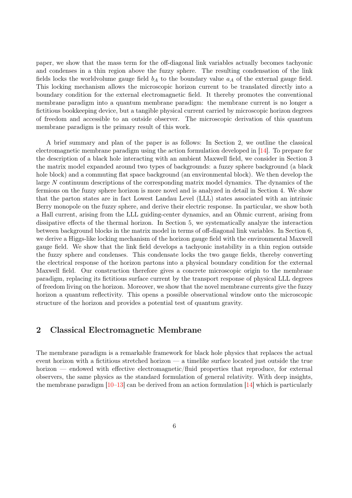 
Low-resolution page preview, page 6

**Summary.** This paper constructs a 'quantum membrane paradigm' for black hole horizons by modeling them using matrix quantum mechanics. It shows that the horizon dynamics are governed by Lowest-Landau-Level (LLL) states on a fuzzy sphere, which generate measurable electric currents. This microscopic description provides a physical origin for boundary conditions previously treated classically.

**Why it may be interesting.** While focused on gravity, the use of LLL states, topological structures (Berry monopole), and emergent current generation from fundamental degrees of freedom shares conceptual overlap with strongly correlated electron systems and quantum Hall physics.

Detailed structure

**Main problem.** To develop a microscopic quantum membrane paradigm for black hole horizons by providing a physical origin for boundary conditions typically used in classical descriptions.

**Main result.** The construction replaces the fictitious classical membrane with a dynamical quantum membrane populated by LLL degrees of freedom, yielding explicit quantum corrections to horizon boundary conditions.

**Method.** The authors use matrix quantum mechanics models involving fuzzy spheres and Fermi seas to derive effective field theories for the horizon dynamics.

**Model / system.** The system models quantum black holes using a matrix quantum mechanics framework equivalent to a fuzzy sphere coupled with a half-filled sea of 'horizon partons.'

**Key observables.** Ohmic, Hall, and polarization currents on the horizon; generalized boundary conditions for external electromagnetic fields.

**Important parameters / regimes.** The rank $N$ of the matrix model ($N=2J+1$) determines the monopole charge $c_1 = N-1$.

**Assumptions / limitations.** The analysis relies on mapping the system to a matrix quantum mechanics description and utilizing large-$N$ limits.

**Figures summary.** Not specified by notes.

**Paper structure.** The paper progresses from establishing the fuzzy sphere/Fermi sea structure, deriving the Berry monopole, analyzing LLL dynamics leading to transport currents, and finally introducing link variables whose condensation locks the horizon gauge field to external fields.

Abstract

We develop a microscopic quantum membrane paradigm from the matrix quantum mechanics of black holes [1]. It was proposed that a quantum black hole is described by a fuzzy sphere together with a half-filled Fermi sea of horizon partons. We show that the topology of the fuzzy sphere induces a Berry monopole, providing a microscopic origin for the monopole appearing in the tunneling description of the decay of quantum black hole. Because the partons couple to the fuzzy sphere as fundamental degrees of freedom, they are sensitive to this monopole and form Lowest-Landau-Level (LLL) states rather than ordinary propagating two-dimensional fermions. Their guiding-center dynamics generates Ohmic, Hall, and polarization currents on the horizon. To couple these currents to an external electromagnetic field, we introduce a two-block matrix configuration comprising black-hole, environmental, and bifundamental link sectors. Off-diagonal link modes become tachyonic near the fuzzy sphere and condense, dynamically locking the horizon gauge field to the boundary value of the external Maxwell field. The parton current thereby becomes a physical boundary source for the exterior field. Our construction replaces the fictitious membrane of the classical paradigm with a dynamical quantum membrane populated by microscopic LLL degrees of freedom. The resulting boundary condition generalizes the classical ingoing membrane condition and yields explicit quantum, frequency-dependent, and helicity-dependent corrections, offering a possible probe of the microscopic quantum structure of the horizon.

[↑ back to top](#top)

### [Microscopic equivalence of the vortex-entry current and the depairing current in a superconducting thin-film strip](http://arxiv.org/abs/2607.11518v1)

**Authors:** Takayuki Kubo  
**Type:** theory · **Category:** other · **PDF:** <https://arxiv.org/pdf/2607.11518v1>  
**Analysis basis:** full PDF text, analyzed in chunks
**Topic relevance:** `Keldysh / 2PI / non-Gaussian methods` **2/5** · `correlated / nonlocal dissipation` **1/5** · `driven-dissipative phase transition` **1/5** · `methods for driven-dissipative` **1/5** · `non-equilibrium dynamics` **1/5** · `non-equilibrium universality` **1/5**

📷 Fig 1

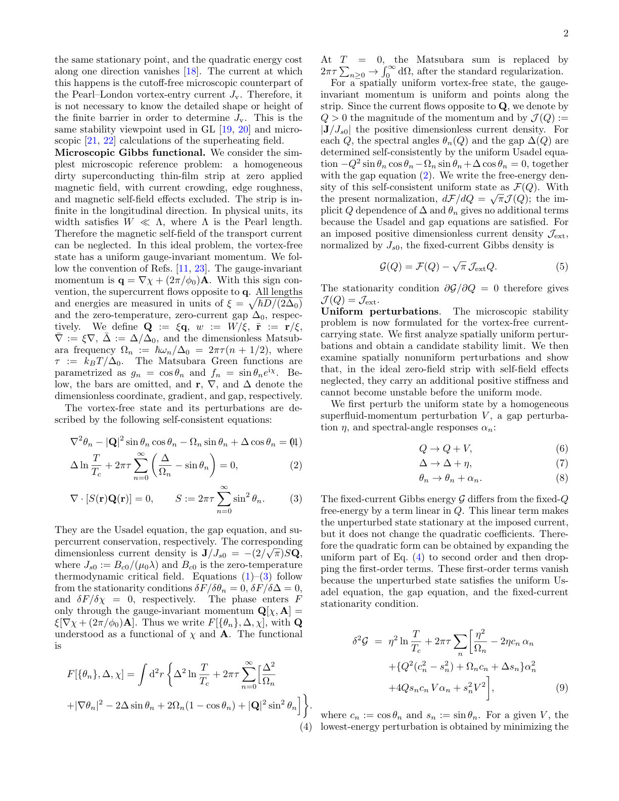 
Low-resolution page preview, page 2

📷 Fig 2

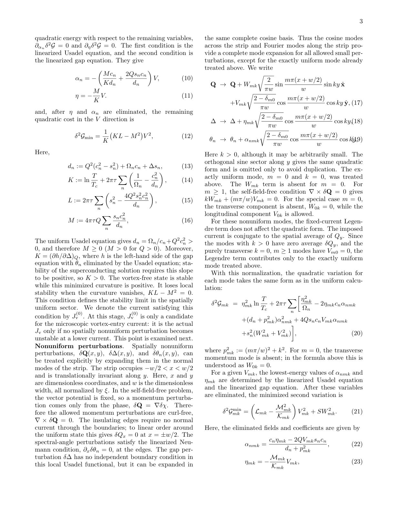 
Low-resolution page preview, page 3

📷 Fig 3

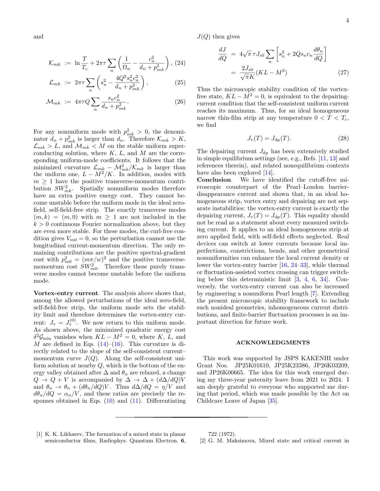 
Low-resolution page preview, page 4

📷 Fig 4

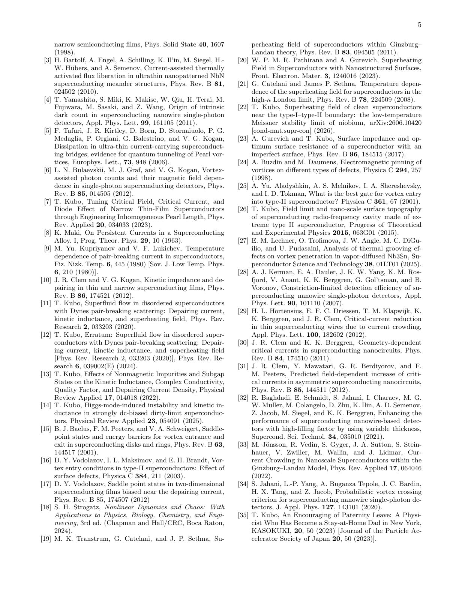 
Low-resolution page preview, page 5

**Summary.** This theoretical paper microscopically investigates the critical current for vortex entry in a superconducting thin film strip. By analyzing the stability of the zero-vortex state using advanced Usadel theory, the authors demonstrate that this threshold current precisely matches the depairing current under ideal conditions. This provides a rigorous, microscopic confirmation of established superconducting critical current concepts.

**Why it may be interesting.** While focused on superconductivity, the rigorous application of stability analysis (saddle-node bifurcation) using functional methods is relevant to understanding phase transitions or instability thresholds in complex quantum systems beyond standard BCS theory.

Detailed structure

**Main problem.** The work aims to microscopically determine the current density at which magnetic vortices enter a superconducting thin-film strip ($J_v$) and compare this value against the depairing current ($J_{dp}$).

**Main result.** For an ideal homogeneous zero-field strip, the microscopic stability analysis shows that the vortex-entry current is exactly equal to the depairing current ($J_v = J_{dp}$).

**Method.** The problem is formulated by analyzing the stability of the vortex-free state using the fixed-current Gibbs functional derived from dirty-limit Usadel theory, examining both uniform and nonuniform perturbations.

**Model / system.** The system modeled is a homogeneous superconducting thin-film strip assumed to be infinite in one direction and analyzed at zero applied magnetic field. The theoretical framework relies on the fixed-current Gibbs functional of dirty-limit Usadel theory.

**Key observables.** Vortex-entry current density ($J_v$), depairing current density ($J_{dp}$), and the stability criterion derived from minimizing the quadratic energy cost ($\delta^2 G$).

**Important parameters / regimes.** Temperature ($T$) relative to $T_c$, applied current density ($J$), and dimensionless parameters related to gauge-invariant momentum ($Q$).

**Assumptions / limitations.** The analysis assumes an ideal, homogeneous strip geometry and neglects magnetic self-field effects for the primary calculation.

**Paper structure.** The paper proceeds by reformulating the vortex entry problem as a local stability analysis of the current-carrying state. It first examines uniform perturbations to find a candidate critical current, and then rigorously proves that nonuniform modes do not destabilize the system at lower currents than the uniform mode.

Abstract

The current at which vortices enter a superconducting strip is usually identified in Pearl--London theory with the disappearance of an edge barrier. This work reformulates the same question microscopically as the loss of local stability of the vortex-free current-carrying state, using the fixed-current Gibbs functional of dirty-limit Usadel theory, which is valid at arbitrary temperatures. For an ideal homogeneous thin-film strip at zero applied field, with self-field effects neglected, the stability of the vortex-free state is examined against both spatially uniform and nonuniform perturbations. The barrier-disappearance current is shown to be set by the uniform perturbation and to coincide exactly with the depairing current.

[↑ back to top](#top)

### [NaBiF$_4$: Er$^{3+}$, Yb$^{3+}$ upconversion particle as a multi-functional bio-marker](http://arxiv.org/abs/2607.11522v1)

**Authors:** Atanu Ghosh, Krishna Kumari Swain, Agniva Das, Mrutyunjaya Rath, Snigdhadev Chakraborty, Bipeen Kumar, Yamini Selvam, Siddharth Dhomkar, Basudev Roy  
**Type:** experiment · **Category:** other · **PDF:** <https://arxiv.org/pdf/2607.11522v1>  
**Analysis basis:** full PDF text, analyzed in chunks
**Topic relevance:** `quantum optics experiment` **2/5** · `correlated / nonlocal dissipation` **1/5** · `driven-dissipative phase transition` **1/5** · `methods for driven-dissipative` **1/5** · `non-equilibrium dynamics` **1/5**

📷 Fig 1

 
Figure 1: Scanning Electron Microscopy images of the particle in (a) face-on configuration with a diameter of ∼5.5 µm, (b) side-on configuration with a thickness of ∼0.1 µm. (c) Comparison between photoluminescence spectra of NaBiF and NaYF particles when excited with 975 nm wavelength at 13 mW. Inset: Absorption spectra of the corresponding particles.

📷 Fig 2

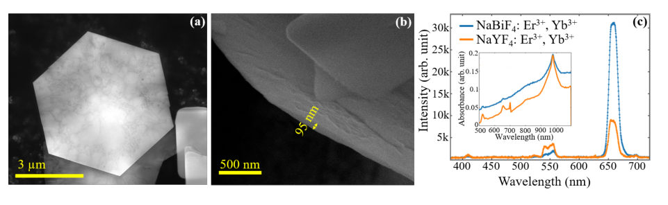 
Fig. 1 (b) inset. We compare the brightness of a single NaBiF particle with a single NaYF4:

📷 Fig 3

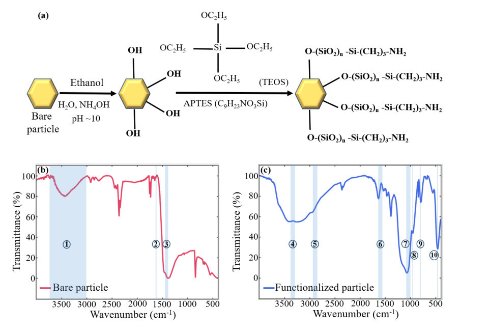 
Figure 2: (a) Schematic of the Sequential Surface Modification of a NaBiF particle using TEOS and APTES via hydrolysis and condensation method. (b) FTIR spectra of a bare NaBiF particle, and (c) a surface-functionalized NaBiF particle.

📷 Fig 4

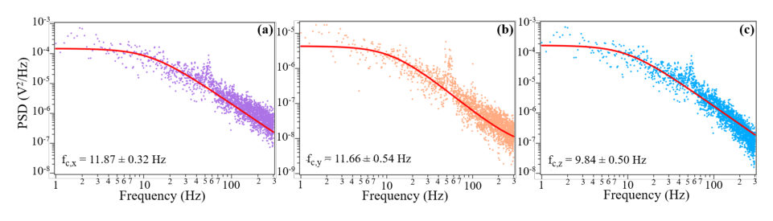 
Figure 3: Power spectral density (PSD) of a trapped particle in (a) x-direction, (b) y- direction, and (c) z-direction. The power of the trapping laser is ∼35 mW in the sample plane. The solid lines represent Lorentzian fits of the form, PSDi(f) = A f2 c,i+f2, where fc,i is

📷 Fig 5

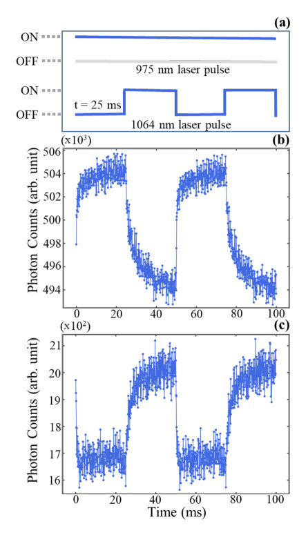 
Figure 4: (a) Schematic of the pulse sequence used to probe the quenching dynamics. Exper- imentally observed effect on PL of a single NaBiF particle upon applying the pulse sequence in two power regimes - (a) the powers of 975 nm and 1064 nm lasers are ∼19 mW and ∼ 77 mW, respectively. (c) the powers of 975 nm and 1064 nm lasers are ∼0.3 mW and ∼77 mW, respectively.

**Summary.** This research details the development of $	ext{NaBiF}_4:	ext{Er}^{3+}, 	ext{Yb}^{3+}$ upconversion particles as advanced bio-markers. The authors demonstrate that these particles exhibit superior optical properties compared to their Yttrium counterparts, coupled with surface chemistry enabling biocompatibility. Crucially, they establish protocols to actively control the particle's luminescence signal using two distinct near-infrared laser wavelengths.

**Why it may be interesting.** The work involves complex non-linear optical processes (upconversion, stimulated emission depletion) in solid-state materials, which touches upon open quantum systems dynamics and energy transfer mechanisms relevant to AMO physics and quantum optics.

Detailed structure

**Main problem.** The challenge is achieving high-contrast, sub-diffraction bioimaging using upconversion particles without requiring high-power lasers in noisy biological media.

**Main result.** Bismuth-doped UCPs ($	ext{NaBiF}_4:	ext{Er}^{3+}, 	ext{Yb}^{3+}$) are shown to be superior biomarkers due to enhanced quantum yield and the ability to achieve controllable PL quenching/enhancement via dual-wavelength excitation.

**Method.** The study combines optical characterization (PL spectroscopy, time-resolved measurements), physical modification (sol-gel coating, APTES functionalization), and modeling of energy transfer dynamics.

**Model / system.** The system is based on lanthanide-doped upconversion particles ($	ext{NaBiF}_4$) excited by near-infrared lasers ($975 	ext{ nm}$ and $1064 	ext{ nm}$). The PL dynamics are modeled using a simplified stimulated emission depletion process involving three energy levels.

**Key observables.** Quantum yield (3x overall, 4x red), systematic quenching/enhancement of PL by adjusting laser power, optical trapping stiffness ($\kappa$), and characteristic fluorescence lifetimes ($	au_1, 	au_2$).

**Important parameters / regimes.** Near-infrared excitation wavelengths ($975 	ext{ nm}, 1064 	ext{ nm}$), sub-diffraction particle thickness ($\sim 100 	ext{ nm}$), and the relative powers of the two exciting lasers.

**Assumptions / limitations.** The PL dynamics are modeled as a simplified stimulated emission depletion process, and the initial studies on quenching/enhancement protocols are presented as proof-of-concept.

**Figures summary.** Figures show SEM images comparing particle morphology; FTIR spectra confirm successful silica coating and amino functionalization; PL spectra compare $	ext{NaBiF}$ vs. $	ext{NaYF}$; and other figures detail the dependence of fluorescence lifetimes on laser powers and temperature.

**Paper structure.** The paper progresses from establishing the physical superiority of $	ext{NaBiF}_4$ over $	ext{NaYF}$ (enhanced quantum yield) to demonstrating its multi-functionality: surface modification for biocompatibility, optical trapping capability, and finally, detailed control over PL emission via dual-wavelength excitation protocols.

Abstract

Lanthanide-doped upconversion particles (UCPs) have revolutionized optical bioimaging platforms because of their excellent photostability, non-toxicity, and utilization of near-infrared excitation, which facilitates deep tissue penetration with negligible autofluorescence. However, it remains a challenge to achieve high-contrast and sub-diffraction imaging in noisy biological media, without using a high-power laser. Here, we report various protocols applied to bismuth-doped UCPs address some of these challenges. Compared to the photoluminescence (PL) emission of the regular Yttrium doped UCPs, we observe a three-fold increment in the quantum yield of the overall emission of bismuth-UCPs, and a four-fold increment, specifically, in red emission. Leveraging this advantage, we devise a protocol employing two infrared wavelengths, 975 nm and 1064 nm, to selectively control the PL emission. Interestingly, our results reveal two distinct regimes in which PL can be systematically quenched or enhanced, by adjusting the 975 nm laser power. We model the overall dynamics as a simplified stimulated emission depletion process involving three energy levels. In addition, the particle has a thickness under sub-diffraction, shows optical trapping ability, and potential of surface functionalization to enable specific conjugation with diverse biospecimens. These studies establish bismuth doped UCPs as an excellent candidate in accomplishing advanced biomarker operating with enhanced signal-to-noise ratio and sub-diffraction imaging capabilities.

[↑ back to top](#top)

### [Effect of superconducting fluctuations on nonreciprocal dichroism and gyrotropy](http://arxiv.org/abs/2607.10464v1)

**Authors:** Alex Levchenko  
**Type:** theory · **Category:** other · **PDF:** <https://arxiv.org/pdf/2607.10464v1>  
**Analysis basis:** full PDF text, analyzed in chunks
**Topic relevance:** `Keldysh / 2PI / non-Gaussian methods` **1/5** · `correlated / nonlocal dissipation` **1/5** · `driven-dissipative phase transition` **1/5** · `methods for driven-dissipative` **1/5**

📷 Fig 1

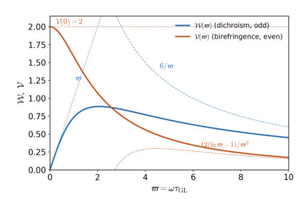 
FIG. 1. Frequency functions of the nonreciprocal fluctuation conduc- tivity versus ϖ = ωτGL. The dissipative function W(ϖ) [Eq. (19), blue] controls nonreciprocal directional dichroism; it is odd in ω, rises as ϖ, peaks at ϖ ≃2.07, and decays as 6/ϖ. Its Kramers– Kronig partner V(ϖ) [Eq. (23), orange] controls gyrotropic birefrin- gence; it is even in ω, with V(0) = 2 and the tail 12(ln ϖ −1)/ϖ2. Dotted and dashed lines show the asymptotes.

📷 Fig 2

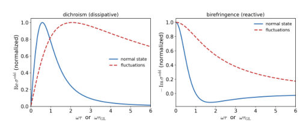 
FIG. 2. Normalized frequency profiles of the nonreciprocal con- ductivity in the normal state (solid blue, argument ωτ) and in the fluctuation regime (dashed red, argument ωτGL). Left: dichroism, Re σodd. The normal-state curve is [2ωτ/(1 + ω2τ2)2]/(3 √

**Summary.** This paper theoretically analyzes how fluctuations above the critical temperature ($T_c$) induce nonreciprocal electrical responses like dichroism and gyrotropy in 2D noncentrosymmetric superconductors. Using generalized Ginzburg-Landau theory, the authors show these effects critically depend on particle-hole asymmetry and require broken inversion/time-reversal symmetry. The results offer a pathway to probe superconducting dynamics using techniques like quantum noise spectroscopy.

**Why it may be interesting.** The explicit derivation of nonreciprocal responses from fluctuation effects provides a concrete theoretical link between broken symmetries (inversion/time-reversal) and measurable optical properties in superconductors, relevant to understanding exotic quantum states.

Detailed structure

**Main problem.** The study investigates how superconducting fluctuations induce nonreciprocal dichroism and gyrotropy in two-dimensional, noncentrosymmetric superconductors.

**Main result.** These nonreciprocal effects require the simultaneous breaking of inversion and time-reversal symmetries and are dependent on particle-hole asymmetry. The reactive component (birefringence) shows a critical enhancement as temperature approaches $T_c$.

**Method.** The authors utilize time-dependent Ginzburg-Landau theory, calculating the Aslamazov-Larkin contribution to the gyrotropic conductivity in closed form.

**Model / system.** The model is a two-dimensional noncentrosymmetric superconductor, exemplified by gated transition metal dichalcogenides like $	ext{MoS}_2$. The theory incorporates particle-hole asymmetry and the cubic Lifshitz invariant of trigonal superconductors.

**Key observables.** Nonreciprocal conductivity (dichroism and gyrotropy), which are analyzed via even-in-$k$ ($\sigma_{	ext{even}}$) and odd-in-$k$ ($\sigma_{	ext{odd}}$) components.

**Important parameters / regimes.** Temperature relative to $T_c$, particle-hole asymmetry parameter ($\gamma_2$), and the frequency $\omega$.

**Assumptions / limitations.** The analysis assumes that nonreciprocal terms do not alter the leading order results for gyrotropy near $T_c$ (Appendix B).

**Figures summary.** Figure 1 illustrates the frequency dependence of the derived fluctuation conductivity, showing distinct behaviors for the dissipative dichroism ($W(\varpi)$) and reactive birefringence ($V(\varpi)$).

**Paper structure.** The paper builds by first establishing the theoretical framework using TDGL theory, then calculating the $	ext{AL}$ contribution to gyrotropy, analyzing the symmetry dependence on particle-hole asymmetry ($\gamma_2$), and finally discussing experimental implications for probing superconducting dynamics.

Abstract

We study the spatially dispersive conductivity of a two-dimensional noncentrosymmetric superconductor, demonstrating that it acquires a nonreciprocal, odd-in-wavevector component from fluctuation-induced Cooper pairs above the critical temperature $T_c$. Utilizing time-dependent Ginzburg-Landau theory generalized to include particle-hole asymmetry and the cubic Lifshitz invariant of trigonal superconductors, we compute the Aslamazov-Larkin contribution to the gyrotropic conductivity in closed form, including its complete frequency dependence. The dissipative part describes nonreciprocal directional dichroism: it is odd in frequency and displays a nonmonotonic dependence, peaking at frequencies comparable to the decay rate of fluctuating Cooper pairs. Its Kramers-Kronig dual component describes gyrotropic birefringence, which remains finite in the static limit and is strongly enhanced as the temperature approaches $T_c$. Both effects require simultaneously broken inversion and time-reversal symmetries, are dependent on particle-hole asymmetry in close analogy to the fluctuation Hall effect, and trace to the same asymmetric Cooper-pair dispersion responsible for the superconducting diode effect and the giant magnetochiral anisotropy observed near $T_c$. This critical enhancement dominates over the smooth normal-state gyrotropy, which we evaluate for the same band model as a baseline. Finally, we frame our analysis within the context of gated transition metal dichalcogenides like MoS$_2$, discussing the implications for probing superconducting dynamics through nitrogen-vacancy-center quantum noise spectroscopy.

[↑ back to top](#top)

### [Surface Variables Description of Axion Topological Materials](http://arxiv.org/abs/2607.10509v1)

**Authors:** Francisco J. Solis, Hugo García-Compeán  
**Type:** theory · **Category:** other · **PDF:** <https://arxiv.org/pdf/2607.10509v1>  
**Analysis basis:** full PDF text, analyzed in chunks
**Topic relevance:** `Keldysh / 2PI / non-Gaussian methods` **1/5** · `analog quantum simulation` **1/5** · `methods for driven-dissipative` **1/5** · `spintronics-quantum-optics interface` **1/5**

📷 Fig 1

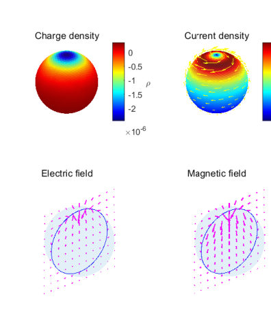 
Fig. 1 Response of a topological insulator to the field of a point charge. Using dimensionless quantities, the sphere radius is R = 1. An unit charge is located at z = 2. Top panels show the induced surface charge and current densities. Bottom panels show electric and magnetic field maps evaluated at a vertical plane through the sphere center. These fields are created by the induced charge and current and do not include the external field.

📷 Fig 2

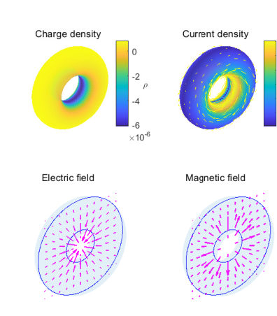 
Fig. 4 Response of a toroidal shape topological insulator to the presence of a unit charge at its center. The induced current circulates in opposite directions in the front and back of the torus.

**Summary.** This paper develops a powerful theoretical framework to analyze how axion topological insulators respond to external electric and magnetic fields. By reformulating the problem using 'surface variables' instead of bulk descriptions, the authors derive solvable integral equations for induced surface charges and currents. This method allows for detailed numerical simulations on complex geometries like spheres and tori.

**Why it may be interesting.** While not directly focused on quantum information, the rigorous mathematical treatment of topological responses using reduced-dimensionality surface variable methods is highly relevant to modern condensed matter theory dealing with emergent electromagnetic properties in novel materials.

Detailed structure

**Main problem.** The study focuses on determining the macroscopic quasi-static magnetoelectric response of axion topological materials, specifically topological insulators, when subjected to external static electric and magnetic fields.

**Main result.** The authors derive a set of integral equations governing effective surface charge and current densities, providing exact analytic solutions for axial-symmetric cases and developing a boundary finite element method for complex geometries.

**Method.** The core methodology involves reformulating the bulk field equations using 'surface variables' (effective surface charge/current), leading to linear integral equations that are solved numerically via a boundary finite element approach.

**Model / system.** The system is an axion topological material characterized by a sharp discontinuity in the axion field ($	heta$). The physics is governed by modified Maxwell's equations incorporating induced sources derived from $
abla	heta$, leading to integral equations for surface variables.

**Key observables.** Effective surface charge density ($\omega_s$) and surface current density ($s_s$), as well as the resulting electric and magnetic fields.

**Important parameters / regimes.** Quasi-static regime, external static E and B fields, geometry (spheres, tori).

**Assumptions / limitations.** The analysis assumes a quasi-static limit and treats $
abla	heta$ as localized at material interfaces, allowing the problem to be reduced to surface integral equations.

**Figures summary.** Figures illustrate the calculated field distributions (E and B) and induced charges/currents for various geometries like tori and hollow spheres under external fields or point charges.

**Paper structure.** The paper follows a logical progression: establishing the Hamiltonian formulation, introducing surface variables to derive integral equations, presenting analytic solutions for simple cases, detailing the numerical boundary finite element method, and finally applying this framework to complex geometries.

Abstract

We study the response of axion topological materials under the presence of external static electric and magnetic fields. We focus on the macroscopic quasi-static magnetoelectric response of topological insulators. We use techniques based on surface variables that have been previously employed in soft condensed matter problems for the description of heterogeneous systems composed of multiple homogeneous materials. A complete description of the whole system is written in terms of surface degrees of freedom, which in this case correspond to effective surface charge and surface current densities. We obtain a set of integral equations satisfied by these variables. We present exact analytic solutions for axial-symmetric cases. We develop a numerical method for the solution of the integral equations by means of a boundary finite element method. We apply the numerical method to topological insulators with different geometries such as spheres, hollow spheres and toroidal surfaces. We show that that a variational principle can be used to recover the surface variables equations.

[↑ back to top](#top)

### [A minimal model for the Weyl nodes and Fermi arcs of PtBi$_2$](http://arxiv.org/abs/2607.10937v1)

**Authors:** Tobias Cristófoli, Manuel Alonso Lemos, Jorge I. Facio, Pablo S. Cornaglia  
**Type:** theory · **Category:** other · **PDF:** <https://arxiv.org/pdf/2607.10937v1>  
**Analysis basis:** full PDF text, analyzed in chunks
**Topic relevance:** `Keldysh / 2PI / non-Gaussian methods` **1/5** · `analog quantum simulation` **1/5** · `spintronics-quantum-optics interface` **1/5**

📷 Fig 1

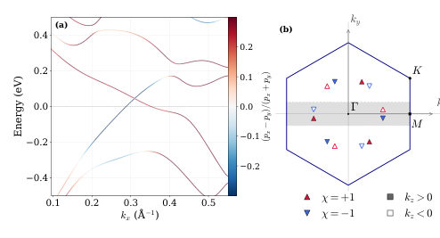 
Fig. 1: (a) Calculated electronic band structure in the vicinity of a Weyl node. The color scale indicates the weight of the Bi 6px and 6py orbitals, showing that the bands forming the Weyl node are predominantly of in-plane Bi 6p character. (b) Weyl points (WPs) in the Brillouin zone (top view). The twelve nodes form a single orbit of w = (0.324, 0.041, −0.152) 2π/a under the C3v point group and time reversal T . The threefold rotation C3 and T (k →−k) connect WPs of equal chirality (red ▲, χ = +1; blue ▼, χ = −1), whereas the mirror planes σv (one acting as ky →−ky) connect WPs of opposite chirality. Filled/open markers denote kz ≷0. The shaded strip spans the zone along kx and encloses...

📷 Fig 2

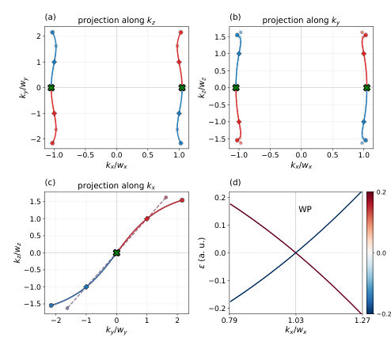 
Fig. 2: (a)–(c) Weyl-node trajectories in momentum space as the SOC coupling intensity λ is increased: (a) projection along kz. (b) projection along ky, and (c) projection along kx. Solid lines correspond to the parameters in Table 1 and dashed lines to g3 = g4 = 0; red and blue indicate the chirality χ = +1 and χ = −1, respectively. Rhombuses mark the spinless starting points (λ = 0), filled circles correspond to nodes surviving at λ = 1, and green crosses the pairwise annihilation events. (d) Electronic band structure along kx/wx through a Weyl node at full SOC. The color scale indicates the weight of the px and py orbitals.

📷 Fig 3

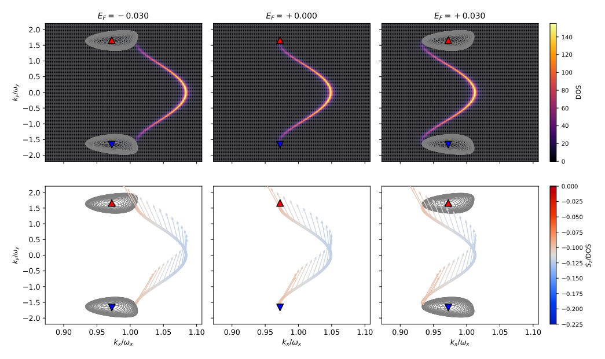 
Fig. 3: The top row shows the surface density of states ρ(kx, ky; EF ) at three Fermi energies offset from the Weyl-node energy EW by ∆E ∈{−0.03, 0, +0.03} (left to right). The bottom row displays the Fermi arc on the same surface; each point is colored by the normalized out-of-plane spin polarization Sz/ρ, and arrows indicate the in-plane component (Sx, Sy)/ρ. Solid gray curves overlay the bulk constant-energy contours εn(kx, ky; kz) = EF for a representative sampling of kz ∈[−π, π]. The red ▲(blue ▼) marks the surface-Brillouin-zone projections of bulk Weyl nodes with positive (negative) chirality. The model parameters as in Table 1.

**Summary.** This theoretical work develops a minimal, symmetry-constrained model for describing Weyl nodes and Fermi arcs in the topological semimetal $	ext{PtBi}_2$. By incorporating spin-orbit coupling terms derived from DFT, the authors successfully predict how these nodes split and annihilate. The resulting Hamiltonian provides a robust starting point for understanding surface superconductivity mechanisms in such materials.

**Why it may be interesting.** While focused on topological materials physics rather than AMO systems, the rigorous use of symmetry constraints to build an effective Hamiltonian from first principles is highly relevant. The techniques for analyzing band topology and emergent symmetries are transferable to understanding exotic phases in quantum simulators or superconducting qubits.

Detailed structure

**Main problem.** The work aims to develop a minimal, symmetry-constrained theoretical model for understanding the topological electronic features—Weyl nodes and Fermi arcs—in the Weyl semimetal $	ext{PtBi}_2$. This bridges the gap between complex *ab initio* calculations and simplified effective descriptions.

**Main result.** A minimal Hamiltonian was constructed that successfully reproduces the topology, captures the spin-orbit coupling (SOC)-driven splitting, and models the subsequent annihilation of Weyl nodes in momentum space. The model also describes the characteristic spin-momentum locking on surface Fermi arcs.

**Method.** The methodology combines symmetry analysis (using tools like qsymm) with continuum Hamiltonian construction, guided by DFT results to constrain low-energy band physics.

**Model / system.** The system is trigonal $	ext{PtBi}_2$, modeled using a tight-binding approach incorporating orbital degrees of freedom ($\{p_x, p_y\}$) and SOC terms. The Hamiltonian is built sector-by-sector to enforce crystal symmetries ($C_{3v}$) across multiple coupled blocks.

**Key observables.** Weyl node chirality ($\chi$), Fermi arc spin texture (spin polarization $\langle S_z 
angle/
ho$), and the evolution of nodes/arcs as a function of SOC coupling strength ($\lambda$).

**Important parameters / regimes.** SOC couplings ($g_1, g_2$, etc.), critical coupling strengths ($g_c$) for node annihilation, and momentum-dependent terms derived from DFT.

**Assumptions / limitations.** The model assumes that the low-energy physics is dominated by specific orbital components ($	ext{Bi } 6p$ orbitals) and that the Hamiltonian can be effectively described by a minimal set of symmetry-allowed terms.

**Figures summary.** Figures illustrate band structures near Weyl nodes, map the twelve Weyl points in the Brillouin zone under $C_{3v}$ symmetry, and show the evolution of node trajectories as SOC strength increases. Surface density of states plots confirm the presence and spin texture of Fermi arcs.

**Paper structure.** The paper progresses from establishing a basic model constrained by symmetries to incorporating SOC terms that cause node splitting and annihilation. It then extends this description to incorporate full $C_{3v}$ symmetry via multi-sector coupling, culminating in a detailed analysis of how different SOC components affect spin texture and nodal structure.

Abstract

Weyl semimetals host topologically protected Fermi arcs on their surfaces, originating from the Chern number of the bulk Weyl nodes. In trigonal PtBi$_2$, superconducting signatures have been associated with the Fermi arcs. Theoretical descriptions of this surface superconductivity have so far relied on effective models that are not directly tied to the microscopic electronic structure of the material. In this work we develop a minimal description of the low-energy bands guided by density functional theory calculations and fully constrained by the relevant crystalline and time-reversal symmetries. The model captures the evolution of the Weyl nodes with spin-orbit coupling, including node annihilations, and is able to describe the spin-momentum locking of the surface Fermi arcs. It reproduces the orbital content and the band topology of PtBi$_2$ and provides a starting point for further studies.

[↑ back to top](#top)

### [Exact vector Akhmediev breathers dominated by a linearly stable frequency](http://arxiv.org/abs/2607.10954v1)

**Authors:** Wen-Rong Sun, Chong Liu, Lei Wang, Fabio Baronio  
**Type:** theory · **Category:** other · **PDF:** <https://arxiv.org/pdf/2607.10954v1>  
**Analysis basis:** full PDF text, analyzed in chunks
**Topic relevance:** `driven-dissipative phase transition` **1/5** · `interference shaping light` **1/5** · `non-equilibrium dynamics` **1/5**

📷 Fig 1

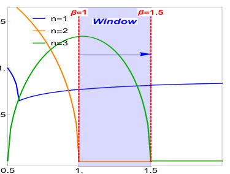 
FIG. 1. Gain curves G(n, β) of the first three modulation harmonics (n = 1, 2, 3) for the focusing Manakov system with a = 1 and ω = 1. The second harmonic (n = 2) becomes linearly stable (gain zero) for β ≥1, while the first (n = 1) and third (n = 3) harmonics remain unstable in the shaded window 1 ≤β &lt; 1.5. This window, where unstable modes alternate with a stable one, is the parameter range explored in this work.

📷 Fig 2

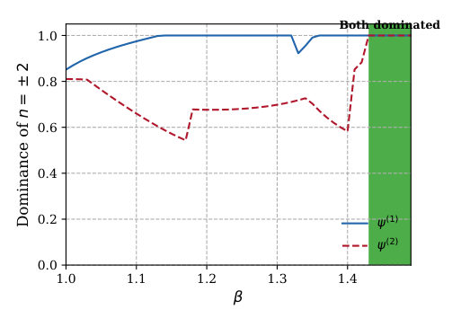 
FIG. 2. Dominance D(j) of the n = ±2 sideband at the peak of the third-order Akhmediev breather as a function of β. The blue solid (red dashed) line represents the ψ(1) (ψ(2)) component. The green shaded area marks the parameter in- terval where both polarizations are simultaneously dominated by the linearly stable 2ω harmonic (D ≈1).

📷 Fig 3

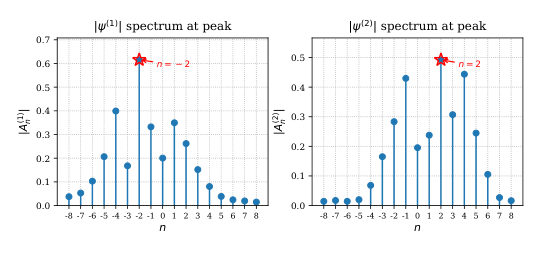 
FIG. 5. Discrete Fourier amplitudes |A(1) n | (left) and |A(2) n | (right) at the peak of the third-order Akhmediev breather for β = 1.44. In both polarization components, the n = ±2 harmonic dominates the spectrum despite being linearly stable, exceeding even the unstable modes n = ±1 and n = ±3 that seed the breather. The red stars mark the maximum spectral component in each case.

📷 Fig 4

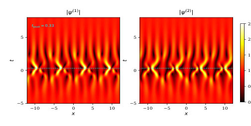 
FIG. 3. Spatio-temporal evolution of |ψ(1)| (left) and |ψ(2)| (right) for the exact third-order Akhmediev breather at β = 1.44.

📷 Fig 5

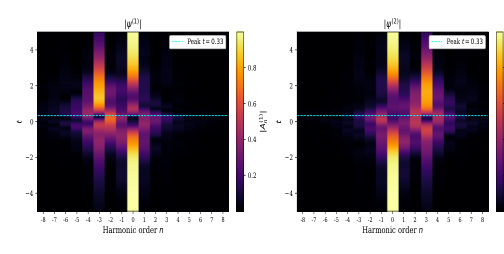 
FIG. 4. Temporal evolution of the discrete Fourier ampli- tudes |A(1) n | (left) and |A(2) n | (right) from t = −5 to t = 5 at β = 1.44. The horizontal dashed line marks the breather peak at t = 0.33, where the linearly stable n = ±2 harmonic becomes the dominant spectral component in both polariza- tions, exceeding the unstable modes n = ±1 and n = ±3 that seed the dynamics.

**Summary.** This paper analyzes Akhmediev breathers in the Manakov system, challenging the assumption that breather spectra must be governed by linearly unstable modes. Through numerical simulation and detailed analysis of nonlinear forcing, the authors prove that a spectrally stable harmonic can spontaneously become dominant at the breather's peak. This mechanism is driven purely by four-wave mixing, offering new insights into nonlinear wave dynamics across various physical platforms.

**Why it may be interesting.** This work provides a concrete example of how strong nonlinearity can fundamentally alter the spectral dynamics of wave packets, suggesting that energy transfer mechanisms (like four-wave mixing) can overcome linear stability constraints in physical systems relevant to quantum optics and Bose-Einstein condensates.

Detailed structure

**Main problem.** The study investigates whether an Akhmediev breather (AB) can be spectrally dominated by a frequency component that is linearly stable, contrary to the usual expectation derived from modulation instability theory.

**Main result.** The authors demonstrate that in the Manakov system, a stable harmonic component ($n=\pm 2$) can spontaneously emerge and dominate the spectrum of an AB peak, driven entirely by four-wave mixing from initially unstable modes.

**Method.** The analysis combines linear stability theory (calculating MI gain) with numerical simulations using the Manakov equation to track spectral energy distribution over time.

**Model / system.** The system is modeled by the Manakov nonlinear Schrödinger equation, governing two coupled wave components ($\psi^{(1)}, \psi^{(2)}$). The analysis focuses on constructing and simulating a third-order Akhmediev breather solution.

**Key observables.** Dominance measure $D(j)$ (quantifying stable harmonic contribution), Fourier amplitudes $|A_n|$, and the nonlinear forcing term derived from four-wave mixing.

**Important parameters / regimes.** The wavenumber offset $eta$ is critical, with a specific window ($1 \le eta < 1.5$) identified where this spectral dominance occurs.

**Assumptions / limitations.** The analysis assumes the validity of the Manakov system description and relies on isolating the nonlinear forcing term to quantify its source (four-wave mixing).

**Figures summary.** Figures illustrate the transition of the dominance measure $D(j)$ towards unity for specific parameters, show the time evolution of Fourier amplitudes peaking at stable harmonics, and confirm that four-wave mixing accounts for most of the nonlinear driving.

**Paper structure.** The paper progresses from establishing the theoretical conflict (stable vs. unstable spectral control) to constructing the AB solution, performing linear stability analysis, running numerical simulations on the Manakov system, and finally quantifying the mechanism via nonlinear forcing analysis.

Abstract

In the scalar nonlinear Schrodinger equation, an Akhmediev breather (AB) is dominated by a frequency that lies inside the modulation instability gain band. This exactly correspondence between instability and breathers is challenged in vector systems such as the Manakov system, where the gain spectrum splits into disconnected lobes separated by stable gaps. We analytically and numerically construct an AB that is generated by unstable modes but is spectrally dominated by a stable harmonic at its peak. Numerical simulations starting from a simple continuous wave background perturbed only by the unstable harmonics confirm that the stable component emerges spontaneously and becomes dominant without any initial seed. We identify the precise parameter window in which this phenomenon occurs and show that this passive amplification of the linearly stable component is driven by four-wave mixing, which accounts for 96% of the nonlinear forcing. Given the universality of the Manakov system across nonlinear physics, from nonlinear optics to ultracold quantum gases, these results open an experimentally accessible new perspective on breather dynamics, one in which linearly stable frequencies can dominate.

[↑ back to top](#top)

### [Lifshitz-Kosevich Theory of Anomalous Landau Levels in Topological Flat Bands](http://arxiv.org/abs/2607.10328v1)

**Authors:** Chao-Xing Liu  
**Type:** theory · **Category:** other · **PDF:** <https://arxiv.org/pdf/2607.10328v1>  
**Analysis basis:** full PDF text, analyzed in chunks
**Topic relevance:** `Keldysh / 2PI / non-Gaussian methods` **1/5** · `analog quantum simulation` **1/5** · `driven-dissipative phase transition` **1/5**

📷 Fig 1

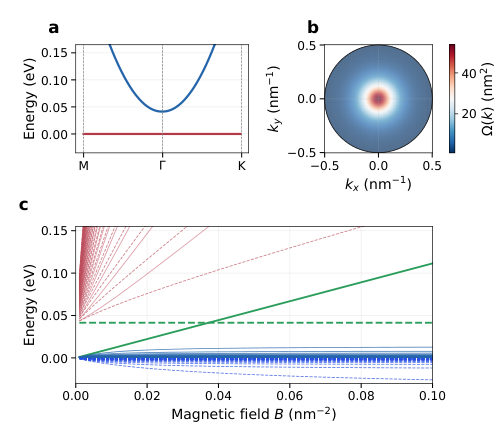 
FIG. 1. (a) Band dispersion at the ideal flat-band point along the M–Γ–K path; the dispersive and flat bands are blue and red, respectively. (b) Berry-curvature distribution of the spin- up flat band. (c) Landau-level spectrum; normal, anomalous, and zeroth LLs are red, blue, and green, respectively, while solid and dashed curves distinguish the two spin sectors. Pa- rameters: a = 1.115 eV · nm2, c = 0.215 eV · nm, E0 = 0 eV.

📷 Fig 2

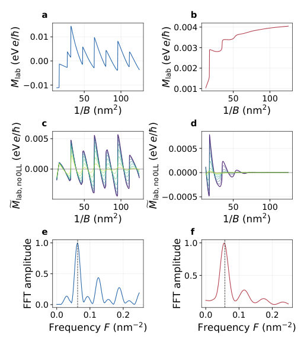 
FIG. 2. Fixed-density magnetization oscillations. (a) Full physical-field magnetization MB in the normal regime, ρ = +0.01 nm−2. (b) Full physical-field magnetization in the anomalous regime, ρ = −0.15 nm−2. (c,d) Corresponding background-subtracted oscillatory magnetization at kBT = (2.00, 3.07, 4.71, 7.22, 11.1, 17.0, 26.1, 40.0) × 10−4 eV, or- dered from purple to yellow. (e,f) Corresponding normalized FFT spectra; dashed vertical lines mark Fρ = 2π|ρ|, mea- sured in nm−2. Blue and red denote the normal and anoma- lous regimes, respectively.

📷 Fig 3

 
Fig. 2(c) when reducing magnetic field B. The oscilla- tion frequency in 1/B can be extracted from the Fourier transform of magnetization oscillation, and the peaks in Fig. 2(e) and (f) correspond well to the fundamental oscillation frequency Fρ = 2π|ρS| for both normal and anomalous LLs, where ρS counts the active carriers in the regime S (electron, shallow-hole and deep-hole regimes) and its connection to ρ can be found in SM Sec.D. Al- though the Fermi surface area is meaningless for the flat bands, the quantum oscillation still follows from simple LL counting: each filled LL accommodates D = B/(2π) carriers per unit area, so n∗≈2π|ρS|/B, leading to the oscillation frequency independent...

📷 Fig 4

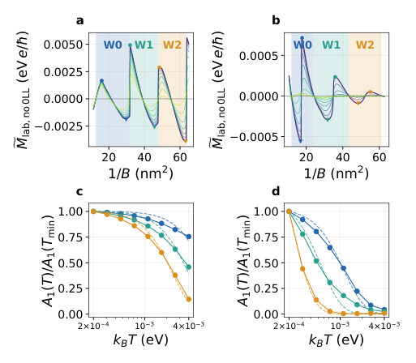 
FIG. 3. Thermal damping extracted from local os- cillation windows. (a,b) Oscillatory magnetization in the normal regime, ρ = +0.01 nm−2, and anoma- lous regime, ρ = −0.15 nm−2, respectively, at kBT = (2.00, 3.07, 4.71, 7.22, 11.1, 17.0, 26.1, 40.0) × 10−4 eV, or- dered from purple to yellow. In (a,b), W0, W1, and W2 are blue, teal, and orange, respectively. (c,d) Normalized p = 1 harmonic amplitudes for the windows in (a,b), respectively; dashed curves are standard-LK fits.

📷 Fig 5

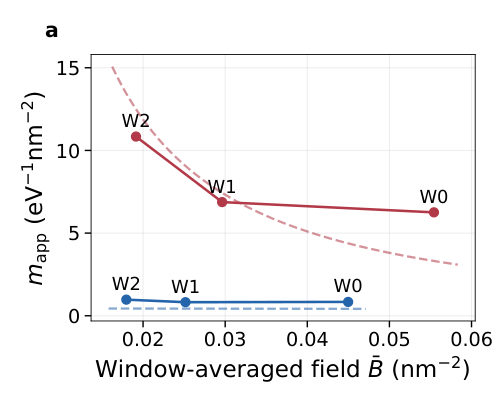 
FIG. 4. (a) Apparent effective mass, measured in eV−1nm−2, versus window-averaged magnetic field. Solid markers show masses extracted from the Fig. 3 damping fits for the normal regime, ρ = +0.01 nm−2 (blue), and anomalous regime, ρ = −0.15 nm−2 (red). Dashed curves show the corresponding analytical LK trends; labels identify the local windows.

**Summary.** This work develops an extension of Lifshitz-Kosevich theory to describe quantum oscillations arising from anomalous Landau levels found in topological flat bands. By analyzing the temperature dependence of these oscillations, the authors demonstrate that the thermal damping factor yields a measurable effective mass directly proportional to the system's underlying quantum geometric structure.

**Why it may be interesting.** The direct link established between measurable transport properties (thermal damping of oscillations) and fundamental geometric invariants (the quantum metric) provides a powerful new experimental probe for characterizing topological band structures in condensed matter systems.

Detailed structure

**Main problem.** To determine how quantum oscillations persist in topological flat bands, which naively suggest thermal suppression due to zero group velocity, and whether the thermal damping factor can reveal information about the underlying quantum geometry.

**Main result.** The paper derives an LK theory for anomalous Landau levels (ALLs), showing that their persistent oscillations yield a finite, field-dependent effective mass whose thermal damping directly measures the quantum metric of the flat band.

**Method.** The authors adapt the Lifshitz-Kosevich formalism to analyze the grand potential and magnetization oscillations in the presence of an anomalous LL spacing. They fit temperature dependence using standard LK forms to extract effective masses.

**Model / system.** The study uses a minimal model Hamiltonian describing topological flat bands, relevant to moiré materials, which possess Time-Reversal and inversion symmetries. The analysis is performed under a perpendicular magnetic field at fixed carrier density.

**Key observables.** Magnetization ($M$) oscillations as a function of $1/B$, the extracted effective mass ($m^*_{	ext{eff}}$), and the thermal damping factor derived from the fundamental harmonic amplitude ($A_1(T)$).

**Important parameters / regimes.** Magnetic field ($B$), temperature ($T$), carrier density ($
ho$), and parameters related to the quantum metric tensor.

**Assumptions / limitations.** The analysis relies on a minimal model with perfectly flat topological bands, and it treats the local LK fit as a diagnostic tool for measuring the effective mass derived from thermal damping.

**Figures summary.** Figures show band dispersion, Berry curvature distribution, LL spectra, and magnetization oscillations ($M$ vs $1/B$) for both normal and anomalous LLs. Subsequent figures compare extracted effective masses against analytical expectations.

**Paper structure.** The paper first establishes the problem by contrasting conventional Landau quantization with flat bands. It then adapts the LK formalism to derive oscillatory terms ($\delta\Omega$), analyzes the thermal damping factor ($R_T(p)$), and finally extracts the field-dependent effective mass, linking it theoretically to the quantum metric.

Abstract

In conventional metals, quantum oscillations arise from Landau quantization of Fermi-surface cyclotron orbits, whose dynamics are governed by the Fermi velocity and cyclotron effective mass within Lifshitz-Kosevich (LK) theory. A perfectly flat band, by contrast, has vanishing group velocity, which would naively imply an infinite cyclotron mass and complete thermal suppression of quantum oscillations. Yet topological flat bands can support anomalous Landau levels (LLs) whose finite-field spacing is generated by quantum geometry rather than band curvature, allowing quantum oscillations to persist. This work addresses how such anomalous flat-band LLs behave within the LK framework and whether their thermal damping can reveal quantum geometric information. Using a minimal model with exactly flat topological bands, we derive an LK theory for these anomalous LLs and analyze fixed-density magnetization oscillations. The resulting oscillations exhibit a finite LK effective mass that is substantially larger than the normal-band value and possesses a strong magnetic-field dependence. In the weak-field limit, this anomalous mass reflects the quantum geometric origin of the LL spacing and scales inversely with both the magnetic field and the trace of the quantum metric. Thus, thermal damping of flat-band quantum oscillations directly measures the quantum metric, establishing quantum oscillations as a probe to flat-band quantum geometry.

[↑ back to top](#top)

### [Single-Contact Problem in Atomically Flat Interfaces: a Simulation Approach](http://arxiv.org/abs/2607.10979v1)

**Authors:** Rui Dong, Ahmed Uluca, Graham Cross, Stefano Sanvito  
**Type:** both · **Category:** other · **PDF:** <https://arxiv.org/pdf/2607.10979v1>  
**Analysis basis:** full PDF text, analyzed in chunks
**Topic relevance:** `Frenkel-Kontorova` **1/5**

📷 Fig 1

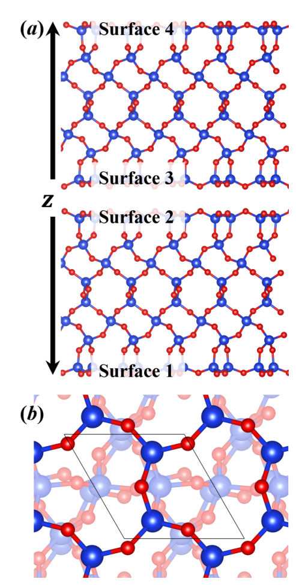 
Figure 1: The structure of the tribo-interface considered in this study. (a) Atomic structure of the SiO2-SiO2 flat-on-flat interfaces, and (b) top view of the “dense” surface of α-quarts SiO2. Highlighted in (b) is the six-ring reconstructed surface. Color code: silicon = blue, oxygen = red.

📷 Fig 2

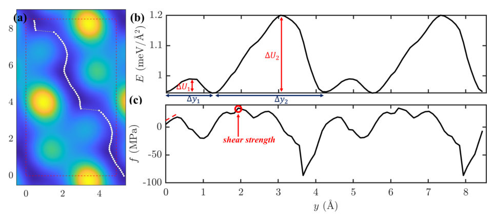 
Figure 2: Minimum energy pathway on the constant-pressure ISPES and the energy and force profiles at 0.5 GPa normal load. (a) The constant-pressure ISPES of SiO2-SiO2 flat- on-flat interface. The white line shows the minimum energy pathway and the red dotted lines denotes the rectangular 1×2 supercell. Panel (b) shows the energy profile along the pathway. Zero energy is associated to the global energy minimum obtained at zero normal load. Red arrows mark the energy loss to overcome each barrier. The corresponding force along the y-axis of the pathway is shown in (c). This is normalized to have the unit of stress. The dashed line shows the shear modulus for a tiny displacement and red circle...

📷 Fig 3

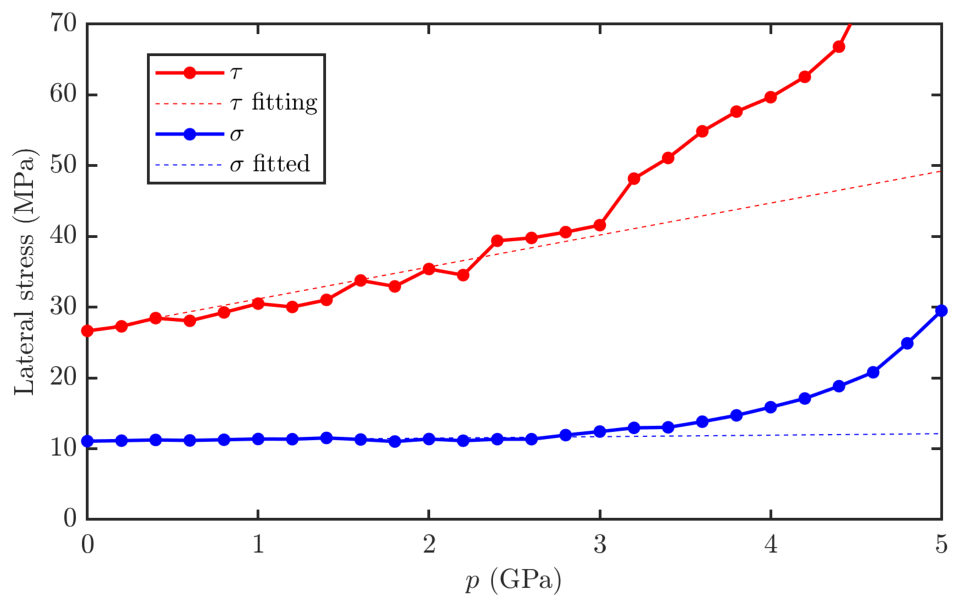 
Figure 3: The shear strength, τ, and the coefficient of friction in minimal-scale sliding, σ, are plotted against the normal load, p, together with their linear fit. Here both τ and σ are extracted from the constant-pressure ISPES. Both quantities have a linear dependence on the external load in the low pressure limit.

📷 Fig 4

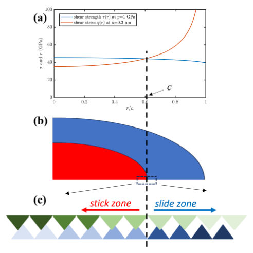 
Figure 4: Demonstration of the modified Mindlin model for atomically flat contacts. (a) For SiO2-SiO2 contact at 1GPa, the radial distribution of shear strength and shear stress of fully stick contact with lateral displacement of 0.2 nm. The crossover shows the boundary of stick zone. (b) Demonstration of the stick zone (red) and sliding zone (blue). (c) Demonstration of atomic scale asperities (atomic level corrugation) at the boundary.

📷 Fig 5

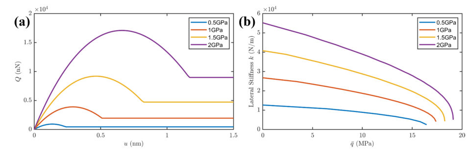 
Figure 5: SiO2-SiO2 interface sliding characteristics obtained from the modified Mindlin model at various normal pressures. (a) Total lateral force versus sliding distance of single strike sliding. When the lateral displacement increases, the lateral stress in the stick zone increases causing the stick zone to shrink. Total lateral force reaches a maximum then dropping to a constant sliding force. (b) Effective lateral stiffness in oscillation at various normal loads. One assumes the tip does lateral oscillation under load control and the force- displacement relation follows data in (a). Average lateral stress is calculated for oscillations with different mean displacement. See text for...

**Summary.** This paper investigates friction at nanoscale contacts using crystalline SiO2/SiO2 interfaces. It develops a modified continuum model that integrates atomistic simulation results for shear strength and adhesion effects. The resulting framework successfully predicts experimental observations, particularly the stiffness collapse during sliding, demonstrating its relevance to realistic micro-tribology.

**Why it may be interesting.** While focused on solid mechanics and tribology, the development of a multiscale constitutive model that accurately captures transition regimes (stick-slip) by incorporating non-linear material properties (adhesion, load dependence) is relevant to understanding complex boundary conditions in quantum systems or interfaces where classical assumptions break down.

Detailed structure

**Main problem.** The work aims to bridge the theoretical understanding of superlubricity at atomically flat interfaces with the reality of tribological systems governed by Hertzian contact geometry.

**Main result.** A modified Mindlin model, incorporating load-dependent shear strength and adhesion, successfully reproduces key experimental signatures like stiffness collapse in oscillatory shear tests on passivated contacts.

**Method.** The study combines atomistic simulations (calculating Interfacial Sliding Potential Energy Surfaces) with the extension of classical continuum mechanics models (Mindlin's model).

**Model / system.** The system studied is the friction and sliding behavior at crystalline SiO2/SiO2 interfaces. The theoretical framework uses a modified Mindlin model to account for non-uniform Hertzian stress distributions, adhesion, and load dependence.

**Key observables.** Load-dependent shear strength ($	au$), Minimal-Scale Sliding (MSS) friction ($\sigma$), effective lateral stiffness ($k$), and total lateral force ($Q$).

**Important parameters / regimes.** Normal pressure ($P$) up to 3 GPa, the adhesion-limited intercept ($	au_0$), and the critical radius defining stick/slip zones.

**Assumptions / limitations.** The simulation assumes an atomically flat profile is maintained; the model extends classical frameworks by incorporating finite adhesion and load dependence, which are crucial for matching experimental results.

**Figures summary.** Figures illustrate the constant-pressure ISPES showing minimum energy pathways, radial distributions of shear stress vs. applied stress (Figure 4), and oscillatory shear response comparing bare vs. graphene-passivated contacts showing stiffness collapse (Figure 6).

**Paper structure.** The paper first establishes the need for a multiscale approach by simulating ISPES to find load-dependent friction parameters ($	au, \sigma$). It then extends the Mindlin model using these parameters to predict behavior under Hertzian loading. Finally, it validates this modified model against oscillatory shear experiments.

Abstract

Understanding friction at single-asperity contacts is essential for bridging the gap between nanoscale structural superlubricity and realistic tribological systems dominated by Hertzian contact geometry. In this work, we combine atomistic simulations and a modified continuum model to investigate the onset of sliding at crystalline SiO$_2$/SiO$_2$ interfaces. Interfacial sliding potential energy surfaces (ISPES) are computed to determine the load-dependent shear strength and minimal-scale sliding (MSS) friction. Both quantities exhibit linear dependence on normal pressure below 3 GPa, and have non-zero values at zero pressure. Incorporating these parameters, we extend the classical Mindlin model by including adhesion and nanoscale load effects, allowing us to describe the stick to slip transition under realistic Hertzian stress distributions. The model shows that nonuniform pressure distributions substantially lower the effective static friction, and oscillatory-shear experiments on graphene-passivated contacts reproduce both the predicted stiffness-collapse signature and, in the passivated limit, the adhesion-limited shear strength obtained from simulation, supporting the model's relevance to real micro-asperity tribology.

[↑ back to top](#top)

### [Spectral-Domain Deep Learning of Intrinsic Scattering Operators for Arbitrarily Shaped Compact 3D Particles](http://arxiv.org/abs/2607.10570v1)

**Authors:** Daize Li, Jiafu Shen, Yifei Liu, Bonan Zhang, Heping Xie  
**Type:** theory · **Category:** other · **PDF:** <https://arxiv.org/pdf/2607.10570v1>  
**Analysis basis:** full PDF text, analyzed in chunks
**Topic relevance:** `interference shaping light` **1/5**

📷 Fig 1

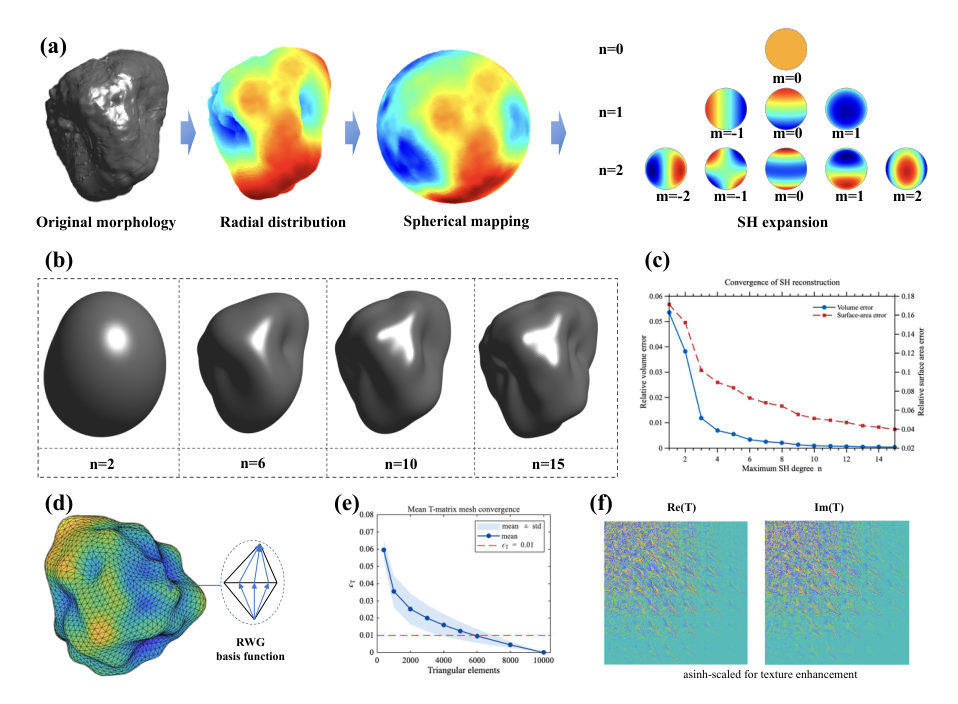 
FIG. 1. Spectral representation of irregular 3D particle morphology and generation of T-matrix ground truth. (a) A compact star-shaped particle is converted from the original morphology to a radial distribution, mapped onto the unit sphere, and expanded in spherical harmonics. (b) Reconstructions with increasing maximum degree show how low-order modes describe global geometry and high-order modes recover finer surface structure. (c) Relative volume and surface-area errors quantify convergence of the truncated representation. (d) Triangular surface mesh used for boundary-element T-matrix computation, together with the Rao–Wilton–Glisson (RWG) basis function on adjacent triangles. (e) Mean...

📷 Fig 2

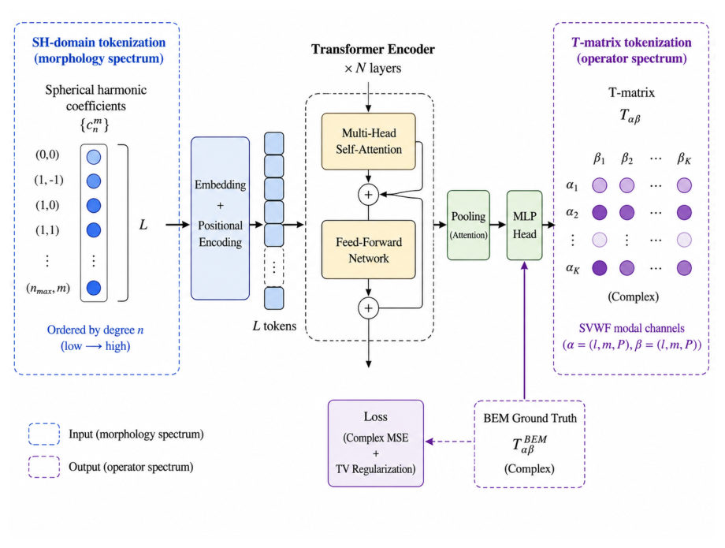 
FIG. 2. Spectral-token Transformer for morphology-to-operator learning. Ordered spherical-harmonic coefficients are grouped into spectral tokens, processed by self-attention layers, aggregated into a latent representation, and decoded into the real and imaginary parts of the finite-order complex T-matrix.

📷 Fig 3

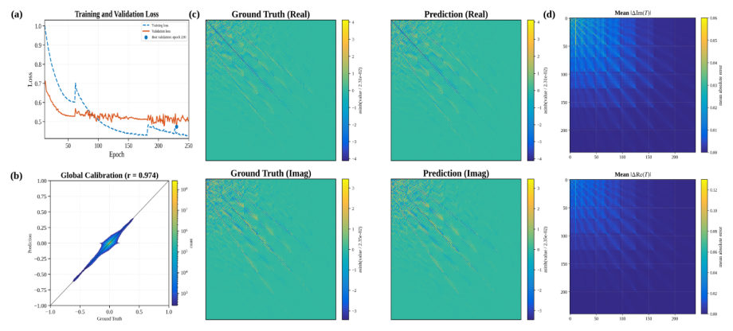 
FIG. 3. Learning the intrinsic T-matrix from spectral shape tokens. (a) Training and validation losses. (b) Element-wise agreement between ground-truth and predicted T-matrix entries. (c) Ground-truth and predicted real and imaginary modal maps for one validation particle. (d) Mean relative errors of real and imaginary T-matrix components over the prediction set.

📷 Fig 4

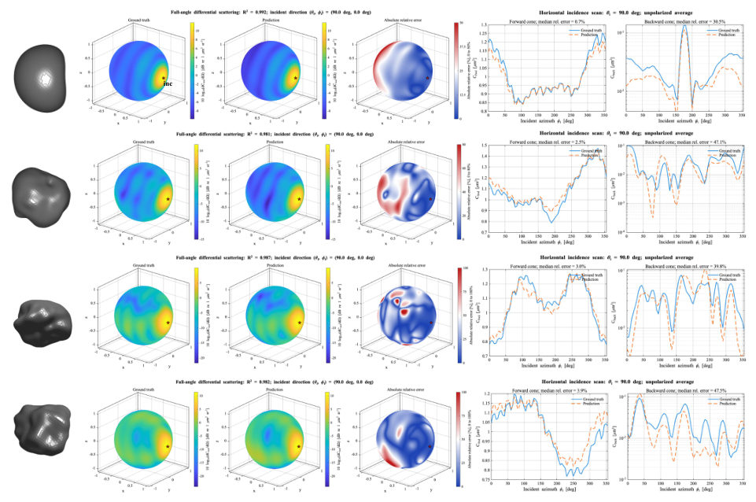 
FIG. 4. Physical scattering validation of predicted T-matrices at 1064 nm. Each row shows one irregular particle, full-angle differential scattering maps from the ground-truth and predicted T-matrices, the pointwise relative error, and forward/backward cone integrals during horizontal incidence scans. The same predicted T-matrix is reused throughout the scan.

📷 Fig 5

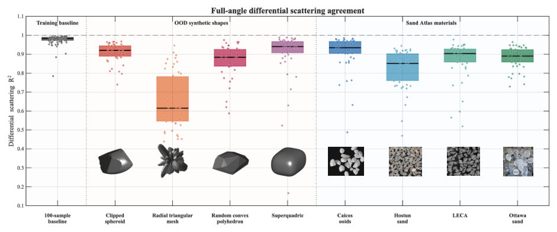 
FIG. 5. Generalization across in-distribution, out-of-distribution synthetic, and real sand-particle morphologies. Box plots show R2 between full-angle differential scattering cross sections computed from reference and predicted T-matrices at 1064 nm for fixed incidence (θi, ϕi) = (90◦, 0◦).

**Summary.** This paper introduces a novel dual spectral-domain neural network that predicts the optical scattering T-matrix for complex 3D particles. By encoding particle shape into spherical-harmonic coefficients and using a Transformer, it bypasses computationally intensive electromagnetic solves. This establishes an efficient, data-driven method for reusable, angle-resolved characterization of photonic materials.

**Why it may be interesting.** While focused on classical optics, the methodology of representing complex physical inputs (geometry) and outputs (operator) in highly structured, compact spectral bases suitable for deep learning is analogous to techniques used in quantum state representation or Hamiltonian parameterization.

Detailed structure

**Main problem.** The challenge is rapidly predicting optical scattering from arbitrarily shaped, complex 3D particles due to morphological variability and strong angular dependence of the response.

**Main result.** A dual spectral-domain architecture successfully learns an intrinsic relationship mapping a compact geometry spectrum directly to the full T-matrix operator, enabling reusable, angle-resolved prediction.

**Method.** The authors employ a spectral-token Transformer trained on 50,000 particles to map spherical-harmonic coefficients (morphology) to the complex T-matrix (scattering operator).

**Model / system.** The system involves electromagnetic scattering from compact irregular particles. The model uses a dual spectral representation: geometry is compressed into an ordered spectrum of spherical-harmonic coefficients, and the response is encoded by the T-matrix in a spherical-vector-wave basis.

**Key observables.** Full-angle differential scattering maps, incidence-angle scans, and the complex T-matrix itself.

**Important parameters / regimes.** Wavelength (1064 nm), number of SH coefficients (e.g., 256), and generalization performance metrics like $R^2$ ($\approx 0.97$).

**Assumptions / limitations.** The geometry can be sufficiently represented by a truncated spherical-harmonic spectrum, and the scattering physics can be captured by learning the T-matrix operator directly.

**Figures summary.** Figures illustrate the workflow from morphology encoding to T-matrix computation; one figure shows the Transformer architecture mapping spectral tokens to $	ext{Re}(\mathbf{T})$ and $	ext{Im}(\mathbf{T})$; another validates full-angle scattering maps across incidence scans.

**Paper structure.** The paper introduces the dual spectral model, details the training process using a spectral-token Transformer on ground-truth T-matrices derived from boundary element methods, demonstrates prediction accuracy for various angles/polarizations, and tests generalization to out-of-distribution shapes.

Abstract

Rapid prediction of optical scattering from arbitrarily shaped three-dimensional particles is important for particle optics and photonic characterization, but remains challenging because of the large variability of complex morphologies and the strong angular dependence of their scattering responses. To address both issues, a dual spectral-domain neural scattering model is introduced in which morphology and scattering are represented in physically ordered bases: particle geometry is compressed into only 256 spherical-harmonic coefficients, and the optical response is encoded by the complex T-matrix in a spherical-vector-wave basis. The morphology spectrum replaces high-dimensional Euclidean geometry representations, such as voxel grids, point clouds, or meshes, with a compact ordered descriptor, while the T-matrix represents a geometry-determined scattering operator that can be queried for different incidence directions, polarizations, and observation angles. A spectral-token Transformer trained on 50{,}000 irregular particles at 1064~nm maps the morphology spectrum directly to the T-matrix. The predicted operators recover modal structure and reproduce full-angle differential scattering maps and incidence-angle scans. Generalization to out-of-distribution synthetic shapes and natural sand-particle morphologies shows that the dual spectral architecture learns an intrinsic relation from the geometry spectrum to multipolar scattering. This establishes spectral-domain operator learning as a compact route for reusable, angle- and polarization-resolved optical scattering prediction of complex 3D particles.

[↑ back to top](#top)

### Other secondary papers (3)

Show other secondary papers

### [Anomalous field evolution of the mixed-state linewidth in the second superconducting dome of LaFeAsO$_{1-x}M_x$ ($M={\rm F,H}$)](http://arxiv.org/abs/2607.10348v1)

**Authors:** Rustem Khasanov, Pierre Dalmas de Réotier, Samuele Sanna, Gianrico Lamura, Hubertus Luetkens, Matteo Moroni, Pietro Carretta, Rhea Kappenberger, Rowena Wachtel, Bernd Büchner, Sabine Wurmehl, Nikolai D. Zhigadlo  
**Type:** experiment · **Category:** other · **PDF:** <https://arxiv.org/pdf/2607.10348v1>  
**Analysis basis:** full PDF text, analyzed in chunks

📷 Fig 1

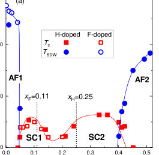 
FIG. 1. (a) Schematic phase diagram of LaFeAsO1−xMx (M = F, H), based on Refs. 2–5, and 7. The dotted verti- cal lines mark the two compositions studied in the present work: xF = 0.11 (LaFeAsO0.89F0.11), located in the first su- perconducting dome SC1, and xH = 0.25 (LaFeAsO0.75H0.25), located in the second superconducting dome SC2. (b) and (c) Zero-field-cooled (ZFC) and field-cooled (FC) magnetic susceptibility curves for the xF = 0.11 and xH = 0.25 sam- ples, measured in applied fields of 2 and 0.3 mT, respectively. The straight lines illustrate the linear extrapolation proce- dure used to determine the superconducting transition tem- peratures Tc = 18.5 and 23.7 K.

📷 Fig 2

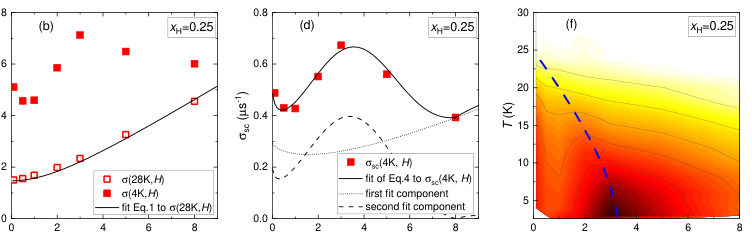 
FIG. 3. (a) and (b) Field dependences of the Gaussian relaxation rate σ measured above Tc (T = 26 K for xF = 0.11 and T = 28 K for xH = 0.25) together with the corresponding data taken below Tc at T = 4 K. The solid lines are fits of Eq. (1) to the normal-state data. (c) and (d) The superconducting contribution to the µSR linewidth, σsc, at T = 4 K, obtained by subtracting the normal-state contribution in quadrature according to Eq. (2). The solid lines are fits based on the model of Ref. 16; see text for further details. (e) and (f) Contour plots of σsc(T, H) for xF = 0.11 and xH = 0.25, respectively. For xH = 0.25, the dashed line traces the field position Hσ,max(T) of the ridge of local...

**Summary.** This work uses muon-spin rotation ($\mu$SR) to compare the mixed-state linewidths of two superconducting domes in iron pnictides. The key finding is that while one dome (SC1) shows expected field behavior, the other (SC2) exhibits an anomalous local maximum. This anomaly points toward a distinct electronic mechanism in SC2, specifically enhanced Pauli-paramagnetic effects.

**Why it may be interesting.** The comparison between two distinct superconducting domes in the same material family provides an excellent platform to study how subtle changes in electronic structure (doping/substitution) can lead to fundamentally different magnetic responses, which is relevant to understanding complex many-body physics near quantum critical points.

Detailed structure

**Main problem.** The study investigates the anomalous field evolution of the mixed-state linewidth in two distinct superconducting domes (SC1 and SC2) within the $	ext{LaFeAsO}_{1-x}M_x$ family.

**Main result.** While SC1 shows conventional monotonic field dependence, SC2 exhibits a pronounced local maximum near 3 T at 4 K, suggesting an additional field-induced contribution from enhanced Pauli-paramagnetic effects absent in SC1.

**Method.** Transverse-field muon-spin rotation/relaxation ($\mu$SR) measurements were used to probe the internal-field distribution in the mixed state of iron pnictides.

**Model / system.** The system is based on layered iron-based superconductors, comparing $	ext{LaFeAsO}_{0.89}	ext{F}_{0.11}$ (SC1) and $	ext{LaFeAsO}_{0.75}	ext{H}_{0.25}$ (SC2). The analysis compares the superconducting linewidth ($\sigma_{sc}$) derived from $\mu$SR data.

**Key observables.** Mixed-state linewidth ($\sigma_{sc}(T, H)$), normal-state linewidth ($\sigma_n(H)$), and the field position of local maxima ($H_{\sigma,\max}(T)$).

**Important parameters / regimes.** Temperature (4 K), magnetic field (up to 8 T), doping concentrations ($x_{	ext{F}}=0.11$ vs $x_{	ext{H}}=0.25$).

**Assumptions / limitations.** The anomalous behavior in SC2 is attributed to an additional field-induced contribution associated with enhanced Pauli-paramagnetic effects, which differs fundamentally from the physics governing SC1.

**Figures summary.** Figures illustrate the phase diagram of the superconducting domes and show temperature/field dependence plots ($\sigma(T)$ vs $H$) for both samples, highlighting the distinct low-temperature field behaviors.

**Paper structure.** The paper analyzes $\mu$SR data to compare SC1 and SC2. It first establishes the normal-state background, then isolates $\sigma_{sc}$. The core of the work compares the field dependence: monotonic decrease for SC1 versus nonmonotonic behavior with a local maximum for SC2.

Abstract

We report a transverse-field muon-spin rotation/relaxation ($μ$SR) study of the internal-field distribution in the mixed state of LaFeAsO$_{0.89}$F$_{0.11}$ and LaFeAsO$_{0.75}$H$_{0.25}$, representative of the first (SC1) and second (SC2) superconducting domes of the LaFeAsO$_{1-x}M_x$ ($M={\rm F,H}$) family, respectively. Below the superconducting transition temperature $T_{\rm c}$, the linewidth of the internal-field distribution increases in both samples, indicating the formation of a vortex lattice. Above $T_{\rm c}$, the linewidth remains field dependent and increases approximately linearly with field, consistent with broadening of the powder spectrum caused by an anisotropic Knight shift. After subtraction of this normal-state contribution, the superconducting linewidth $σ_{\rm sc}$ exhibits qualitatively different field dependences in the two samples. At 4K, the SC1 ($x_{\rm F}=0.11$) sample shows the expected monotonic decrease with increasing field, whereas the SC2 ($x_{\rm H}=0.25$) sample develops a pronounced local maximum near 3T. A contour representation of $σ_{\rm sc}(T,H)$ further reveals a ridge of local maxima whose field position, $H_{σ,\max}(T)$, shifts to lower fields upon warming and disappears near $T_{\rm c}$. The anomalous field evolution observed in the SC2 sample is consistent with an additional field-induced contribution associated with enhanced Pauli-paramagnetic effects, highlighting the distinct electronic character of the two superconducting domes.

[↑ back to top](#top)

### [Interference-Enhanced Large Electron-Phonon Coupling from Raman-active Breathing Modes in Moiré Semiconductors](http://arxiv.org/abs/2607.11425v1)

**Authors:** Ning Mao, Shaozheng Wang, Cheng Xu, Xumin Chang, Kenji Watanabe, Takashi Taniguchi, Claudia Felser, Shengwei Jiang, Yang Zhang  
**Type:** both · **Category:** other · **PDF:** <https://arxiv.org/pdf/2607.11425v1>  
**Analysis basis:** full PDF text, analyzed in chunks

📷 Fig 1

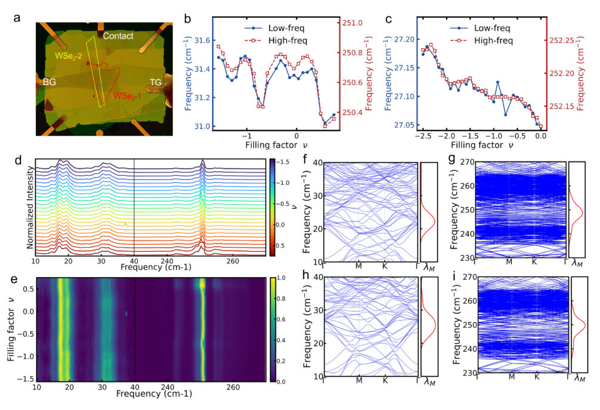 
FIG. 1. Filling-dependent Raman spectroscopy of moir´e phonons in t-WSe2. a, Device used for Raman character- ization of t-WSe2 at 4.4◦. The red and yellow regions correspond to the two individual layers, and the green dots mark the positions of the Raman laser spot. b, Peak positions of the low- and high-frequency modes as a function of filling factor ν for t-WSe2 at 4.4◦. c, Peak positions of the low- and high-frequency modes as a function of filling factor ν for t-WSe2 at 3.15◦. d, Stacked Raman spectra at different filling factors ν, vertically offset for clarity. e, False-color map of the normalized Raman intensity as a function of frequency and filling factor ν. f, g, Phonon...

📷 Fig 2

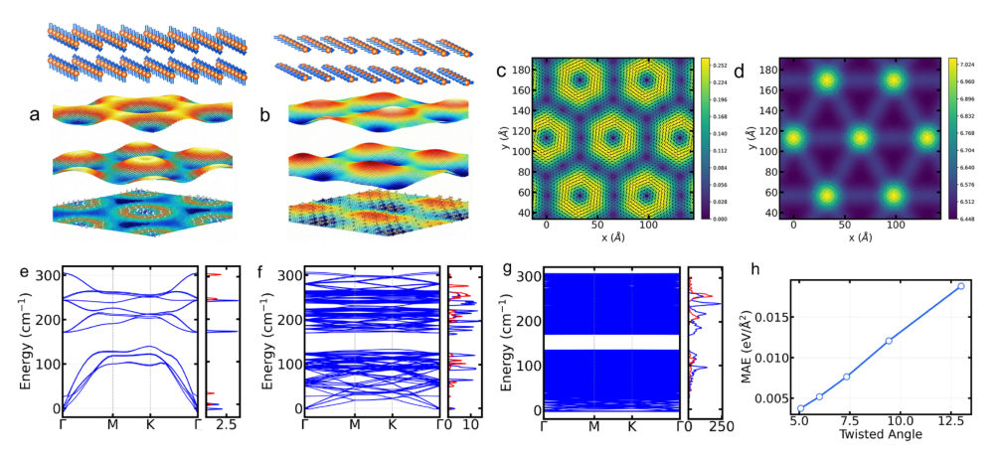 
FIG. 2. Lattice relaxation in twisted TMDs and its impact on the moir´e phonon spectrum. a, b, Schematic illustrations of the (a) layer breathing mode (LBM) and (b) layer shear mode (LSM); in each, the upper panel shows the mode in the bilayer and the lower panel the corresponding moir´e phonon. c, d, Intralayer displacement (c) and interlayer distance (d) maps of the relaxed 2.88◦t-WSe2 structure obtained from density functional theory. The former shows the in-plane relaxation- induced displacements of W atoms in the top layer, and the latter the vertical separation between W atoms in the top and bottom layers. e–g, Phonon dispersions of (e) untwisted bilayer WSe2 and t-WSe2 at twist...

📷 Fig 3

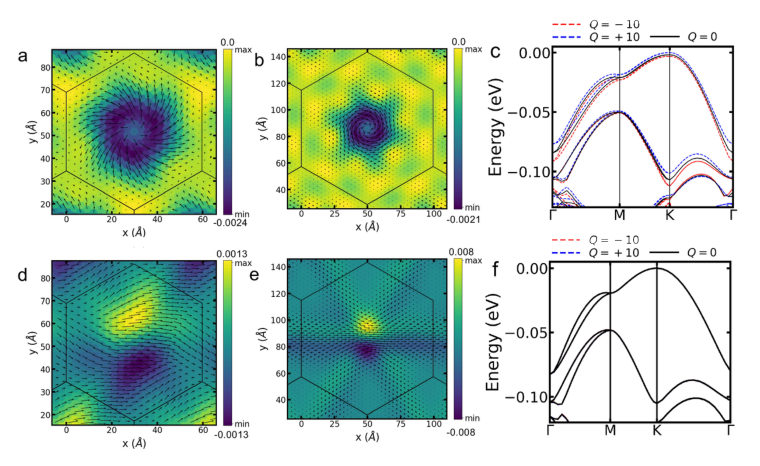 
FIG. 3. Influence of the LBM and LSM on the moir´e electronic structure. a, b, Vibration patterns of low- frequency phonon modes in AA-stacked t-WSe2. LBM patterns at twist angles of (a) 5.08◦and (b) 1.89◦, respectively. c, Electronic band structures of t-WSe2 under different LBM distortions. d, e, LSM patterns at twist angles of (d) 5.08◦and (e) 1.89◦, respectively. The color map represents the out-of-plane displacement component, while the arrows indicate the in-plane displacement vectors. f, Electronic band structures of t-WSe2 under different LSM distortions. The blue, red, and green lines represent the equilibrium band structure and the band structures under positive and negative...

📷 Fig 4

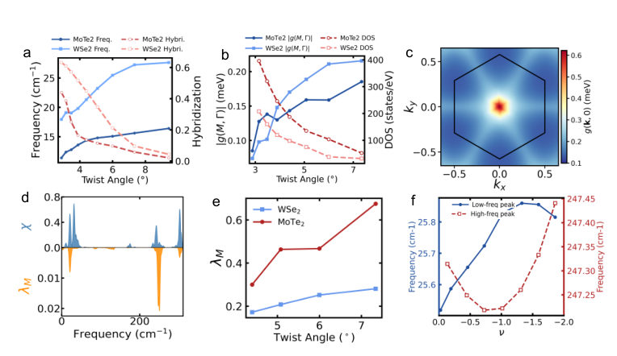 
FIG. 4. Twist-angle dependence of the electron–phonon coupling. a, Twist-angle dependence of (left) the LBM frequency and (right) the phonon hybridization between the out-of-plane breathing mode and in-plane modes. A hybridization value of 0 denotes a purely out-of-plane breathing mode, while a value of 1 denotes a purely in-plane phonon mode. b, Absolute magnitude of the EPC matrix element g(M, Γ) of the first band at the M point. c, Distribution of the LBM-induced EPC matrix element gLBM(k, Γ) for t-WSe2 at a twist angle of 5.08◦, evaluated on a 100×100 k-mesh. d, Mode-resolved similarity χ (upper panel) and mode-resolved coupling constant λM (lower panel). e, Total λM as a function of...

**Summary.** This research investigates the source of superconductivity in twisted TMD moiré semiconductors by calculating the electron-phonon coupling (EPC). The authors introduce an 'interference selection rule' based on lattice reconstruction patterns, showing that only specific phonon modes couple strongly. This mechanism points to a substantial and potentially dominant role for phonons in mediating pairing at large twist angles where superconductivity is observed.

**Why it may be interesting.** The work provides a concrete mechanism—lattice reconstruction interference—that selects which vibrational modes couple strongly to electrons, offering a powerful diagnostic tool for understanding pairing mechanisms beyond simple continuum models.

Detailed structure

**Main problem.** The central question is determining whether superconductivity in moiré semiconductors is driven by electronic correlations, phonons, or both, which requires calculating the electron–phonon coupling (EPC).

**Main result.** A lattice reconstruction interference mechanism was discovered where phonon modes whose displacement texture matches the static lattice-reconstruction pattern couple strongly, suggesting a potentially dominant phonon contribution to superconductivity at large twist angles.

**Method.** The study combines filling-dependent Raman spectroscopy with machine-learning first-principles calculations to calculate EPC mode by mode in large supercells.

**Model / system.** The system involves moiré superlattices formed from twisted transition metal dichalcogenides (TMDs) like t-WSe2 and t-MoTe2, which exhibit distinct lattice reconstruction patterns (MM, MX, XM domains).

**Key observables.** EPC strength ($\lambda$), Raman-active moiré phonon frequencies, the pattern-matching parameter $\chi$, and the total EPC constant $\lambda$ peaking near $7.34^\circ$.

**Important parameters / regimes.** Twist angles (e.g., $1.89^\circ$ to $13^\circ$), carrier filling ($
u$), and the lattice reconstruction pattern.

**Assumptions / limitations.** The analysis assumes that simple frequency shifts are insufficient, necessitating a full first-principles account incorporating intricate lattice reconstruction patterns for accurate EPC quantification.

**Figures summary.** Figures illustrate Raman spectroscopy results showing peak shifts vs. filling; they also map mode-resolved EPC strength and show the twist-angle dependence of $\lambda$, confirming its maximum near the superconducting regime.

**Paper structure.** The paper establishes the problem (superconductivity mechanism) by detailing advanced experimental measurements (Raman) alongside complex computational modeling (MLFFs). It then develops a theoretical framework using an interference selection rule ($\chi$) to calculate mode-resolved EPC, culminating in the identification of phonon dominance at specific twist angles.

Abstract

Superconductivity was recently observed in twisted WSe2 and MoTe2, raising a central question: is the pairing driven by electronic correlations, by phonons, or by both? Answering it requires determining the electron-phonon coupling (EPC) in these moiré semiconductors, whose calculation in realistic supercells of thousands of atoms lies beyond the reach of direct first-principles methods. Here we combine filling-dependent Raman spectroscopy with machine-learning first-principles calculations to obtain the EPC mode by mode in supercells of up to tens of thousands of atoms. Raman reveals only a few moiré phonons whose frequencies shift strongly with filling; we trace this to an interference selection rule: a phonon couples strongly only when its displacement texture matches the static lattice-reconstruction pattern, and is otherwise suppressed by destructive interference. The rule selects the low- and high-frequency breathing modes seen in Raman and makes the coupling peak at large twist angles, near those at which superconductivity appears. Lattice-reconstruction interference thus emerges as an organizing principle for moiré EPC, pointing to a substantial, potentially dominant, phonon contribution to large-angle pairing.

[↑ back to top](#top)

### [Superconducting dome and field-enhanced superconductivity of PLD synthesized Nd1-xEuxNiO2 thin films](http://arxiv.org/abs/2607.10332v1)

**Authors:** Wenlong Yang, Qiang Zhao, Xingke Fu, Gaofei Ren, Zhongjing Wu, Zhen Chen, Jianping Sun, Boseng Wang, Jiacai Nie, Pengtao Yang, Jinguang Cheng  
**Type:** experiment · **Category:** strongly correlated electrons · **PDF:** <https://arxiv.org/pdf/2607.10332v1>  
**Analysis basis:** full PDF text, analyzed in chunks

📷 Fig 1

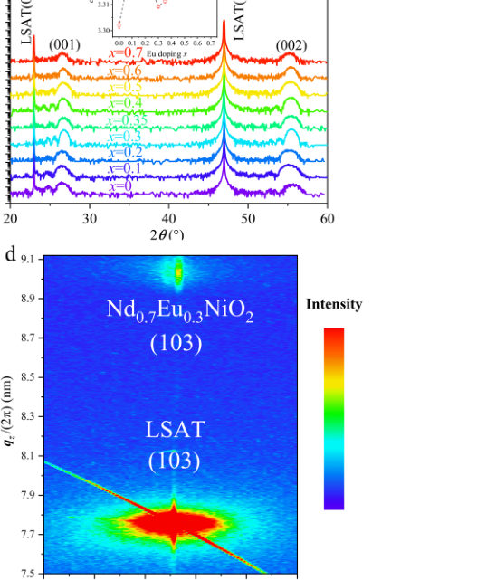 
Fig. 1 Structural characterization of Nd1−xEuxNiO2 thin films. (a) XRD θ–2θ scans of the Nd0.7Eu0.3NiO3 precursor film and the Nd0.7Eu0.3NiO2 film obtained after CaH2 reduction. (b) XRD patterns of Nd1−xEuxNiO2 films for Eu doping levels x = 0 to 0.6. The inset shows the room-temperature c-axis lattice constant d as a function of Eu content x. (c, d) Reciprocal space maps of the Nd0.7Eu0.3NiO3 and Nd0.7Eu0.3NiO2 films. Figure 1(a) shows the XRD θ–2θ scans of the Nd0.7Eu0.3NiO3 perovskite precursor film and the same film after CaH2 reduction. The (001) and (002) reflections of the precursor at 23.82° and 48.59° shift to 26.82° and 55.49° upon reduction, confirming the successful formation of...

📷 Fig 2

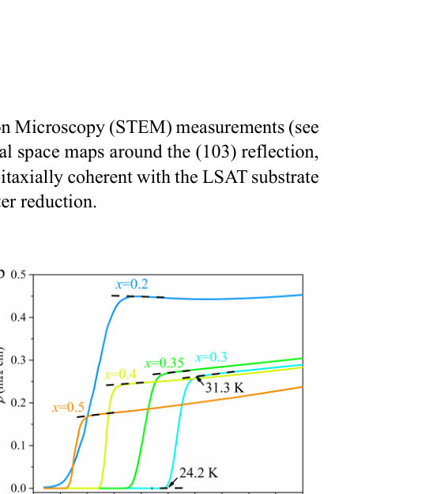 
Fig. 2 Electrical transport properties of Nd1-xEuxNiO2 films. (a) Temperature dependence of resistivity ρ(T) for x = 0-0.7. (b) Enlarged view of the low-temperature (2-50K) ρ(T) curves for superconducting films with x = 0.2-0.5. Figure 2(a) displays the resistivity ρ(T) of Nd1-xEuxNiO2 films for x = 0-0.7. In the underdoped regime (x = 0, 0.1), a low-temperature resistivity upturn signifies weak insulating behavior, which is progressively suppressed with increasing Eu doping content. Superconductivity first emerges at x = 0.2, when an upturn persists just above the onset Tc. For x = 0.3-0.5, zero resistance is achieved and the normal-state ρ(T) exhibits purely metallic character without any...

📷 Fig 3

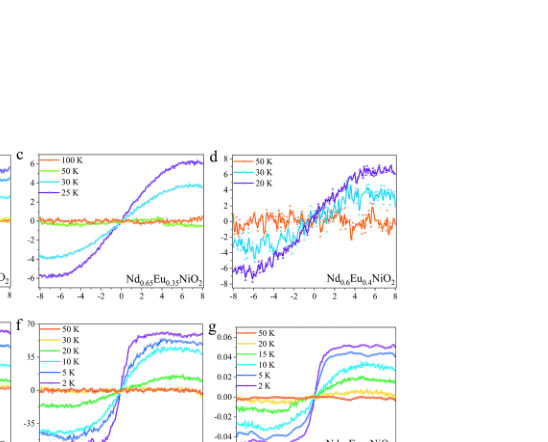 
Fig. 3 Hall effect in Nd1-xEuxNiO2. (a) Temperature dependence of the Hall coefficient RH for different Eu doping levels x. The black dashed line marks the sign-change boundary. (b)-(g) Non-linear Hall resistance ∆Rxy =Rxyexp-RxyL as a function of temperature for x = 0.1, 0.35, 0.4, 0.5, 0.6 and 0.7.

📷 Fig 4

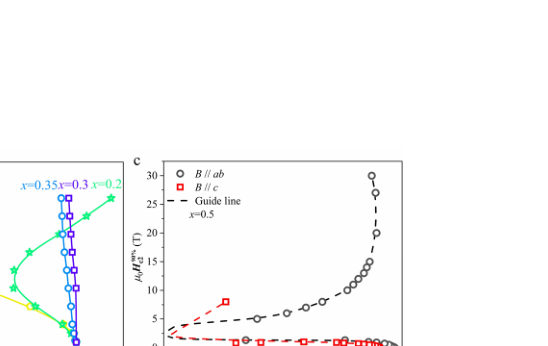 
Fig. 4 Upper critical field of Nd1-xEuxNiO2. (a) Out-of-plane and (b) in-plane upper critical fields μ0Hc2 as functions of reduced temperature T/Tc50%ρn for x = 0.2-0.4, where Tc50%ρn is defined by the 50% resistivity criterion. (c) Temperature dependence of μ0Hc2 for x = 0.5; the dashed lines are guides to the eye. Figure 4(a) and (b) present the out-of-plane (B // c) and in-plane (B // ab) upper critical fields μ0Hc2 as functions of the reduced temperature T/Tc50%ρn for x = 0.2, 0.3, 0.35 and 0.4 films. For the x = 0.2 and 0.4 films, a subtle kink appears near 4 T in both field orientations, signaling the onset of field-enhanced superconductivity. In contrast, the x = 0.3 and 0.35 films...

📷 Fig 5

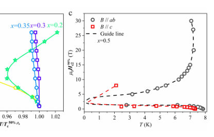 
Fig. 5 Phase diagram of Nd1−xEuxNiO2. (a) Doping dependence of the superconducting transition temperature superimposed by a color contour plot of the

**Summary.** The study reports on synthesizing and characterizing superconducting $	ext{Nd}_{1-x}	ext{Eu}_x	ext{NiO}_2$ thin films using PLD. Key findings include establishing a wide superconducting dome with high $T_c$ values and demonstrating field-enhanced superconductivity in both underdoped and overdoped regions. This work provides crucial experimental evidence regarding the role of magnetic rare-earth ions in these exotic correlated superconductors.

**Why it may be interesting.** This work explores unconventional superconductivity in nickelates, a class of materials highly relevant to strongly correlated electron physics, which often shares theoretical links with high-Tc cuprates studied in AMO/condensed matter theory.

Detailed structure

**Main problem.** The study investigates the superconducting dome formation, field-enhanced superconductivity, and re-entrant behavior in infinite-layer nickelates ($	ext{Nd}_{1-x}	ext{Eu}_x	ext{NiO}_2$).

**Main result.** PLD synthesis successfully produced high-quality films exhibiting a wide superconducting dome with an optimal $T_c \approx 31$ K, and the system displays robust field enhancement in both underdoped and overdoped regimes.

**Method.** The research employed Pulsed Laser Deposition (PLD) for film synthesis, followed by electrical transport measurements including resistivity ($
ho(T)$), Hall effect ($R_H$), and upper critical field ($\mu_0 H_{c2}$).

**Model / system.** The physical system is the infinite-layer nickelate $	ext{Nd}_{1-x}	ext{Eu}_x	ext{NiO}_2$ thin film, where superconductivity is modulated by Eu doping ($x$). The properties are linked to the magnetic rare-earth Eu$^{2+}$ ions.

**Key observables.** Superconducting transition temperature ($T_c$), superconducting dome width (doping dependence), field enhancement magnitude, and nonlinear Hall resistance ($\Delta R_{xy}$).

**Important parameters / regimes.** Doping concentration $x$ ($0.2 \le x \le 0.5$), magnetic field strength (up to 35.6 T), and temperature range.

**Assumptions / limitations.** The observed field enhancement suggests mechanisms beyond the simple Jaccarino-Peter effect, and nonlinear Hall response is attributed to magnetic impurity scattering.

**Figures summary.** Figures illustrate XRD confirming lattice changes with doping, $
ho(T)$ showing superconducting transitions across the dome, and magnetotransport data detailing $H_{c2}$ kinks and re-entrant behavior in various doping regimes.

**Paper structure.** The paper details synthesis via PLD/reduction, presents transport measurements ($
ho$, Hall), analyzes the doping dependence of $T_c$ (the superconducting dome), and investigates field effects to characterize the underlying pairing mechanism.

Abstract

We report on the synthesis of infinite-layer Nd1-xEuxNiO2 (0<x<0.7) thin films using pulsed laser deposition (PLD) followed by topotactic reduction with CaH2. Resistivity measurements on these films reveal a superconducting dome within the doping range 0.2<x<0.5, which is wider than that achieved by molecular beam epitaxy and comparable to that obtained by chemical synthesis. The x=0.3 PLD film exhibits the optimal superconducting transition temperature Tc~31 K, much higher than those grown by other vacuum epitaxial techniques. This result indicates that PLD is an ideal approach for fabricating high-quality, high-Tc Nd1-xEuxNiO2 superconducting films. Magneto-transport measurements reveal robust field-enhanced and re-entrant superconductivity in both underdoped and overdoped regimes. At low temperatures just above the onset Tc, the Hall resistance exhibits nonlinear behavior, which may originate from magnetic impurity scattering. These results highlight the crucial role of magnetic rare-earth Eu2+ ions in producing the exotic physical properties of the infinite-layer nickelates.

[↑ back to top](#top)

