
# arxiv digest (quant-ph + cond-mat) — 2026-07-16

*124 papers · 42 relevant · 4 highlighted*  
_⏳ in progress: 129/130 papers processed (file updates after each one)_

## 🔥 Most relevant (42)

*Every paper with at least one nonzero topic score, sorted by best-matching score. 🔥 marks scores ≥4/5. Click the title to jump to the full entry below; click [arXiv] to open the paper page. `(secondary)` marks papers from de-prioritized cond-mat archives.*

Show 42 relevant papers

- ⭐ [From stable periodic orbits to many-body chaos: doubly tunable prethermalization via engineering of an emergent band structure](#paper-2607.12355) [[arXiv]](http://arxiv.org/abs/2607.12355v1) — 🔥 `scars & prethermalization` **5/5** · 🔥 `driven-dissipative phase transition` **4/5** · 🔥 `non-equilibrium dynamics` **4/5** · `analog quantum simulation` **3/5** · `methods for driven-dissipative` **3/5** · `non-equilibrium universality` **3/5** · `Frenkel-Kontorova` **1/5** · `Keldysh / 2PI / non-Gaussian methods` **1/5** · `correlated / nonlocal dissipation` **1/5** · `entanglement & information structure` **1/5** · `exotic spin models in light-matter` **1/5**
- [Measurement-induced phase transition in space](#paper-2607.12386) [[arXiv]](http://arxiv.org/abs/2607.12386v1) — 🔥 `measurement-induced transitions` **5/5** · 🔥 `entanglement & information structure` **4/5** · 🔥 `non-equilibrium universality` **4/5** · `driven-dissipative phase transition` **3/5** · `methods for driven-dissipative` **3/5** · `analog quantum simulation` **2/5** · `correlated / nonlocal dissipation` **2/5** · `non-equilibrium dynamics` **2/5** · `quantum measurements` **1/5**
- ⭐ [Observation of gravity-like signatures in holographic codes on a quantum computer](#paper-2607.12047) [[arXiv]](http://arxiv.org/abs/2607.12047v1) — 🔥 `entanglement & information structure` **5/5** · 🔥 `QC/QI experiment` **4/5** · 🔥 `analog quantum simulation` **4/5** · `methods for driven-dissipative` **3/5** · `correlated / nonlocal dissipation` **2/5** · `driven-dissipative phase transition` **2/5** · `non-equilibrium dynamics` **2/5** · `Rydberg arrays` **1/5** · `correlated cavity matter` **1/5** · `non-equilibrium universality` **1/5**
- [Spin Chain Quantum Communication on a Trapped-Ion Processor](#paper-2607.12999) [[arXiv]](http://arxiv.org/abs/2607.12999v1) — 🔥 `QC/QI experiment` **5/5** · 🔥 `analog quantum simulation` **4/5** · `entanglement & information structure` **2/5** · `non-equilibrium dynamics` **2/5** · `exotic spin models in light-matter` **1/5**
- ⭐ [Collective-State Preparation in a Subwavelength Triangular Trimer Using SUPER Excitation](#paper-2607.12665) [[arXiv]](http://arxiv.org/abs/2607.12665v1) — 🔥 `correlated / nonlocal dissipation` **4/5** · 🔥 `methods for driven-dissipative` **4/5** · `Dicke superradiance` **3/5** · `Tavis-Cummings & cavity-many-emitter` **3/5** · `correlated cavity matter` **3/5** · `analog quantum simulation` **2/5** · `driven-dissipative phase transition` **2/5** · `non-equilibrium dynamics` **2/5** · `superradiant laser` **2/5** · `Keldysh / 2PI / non-Gaussian methods` **1/5** · `entanglement & information structure` **1/5** · `exotic spin models in light-matter` **1/5** · `free-space correlated emission` **1/5** · `interference shaping light` **1/5** · `non-equilibrium universality` **1/5** · `quantum measurements` **1/5**
- [Constructing mode-resolved quantum optical models for emitters in photonic crystals](#paper-2607.12603) [[arXiv]](http://arxiv.org/abs/2607.12603v1) — 🔥 `analog quantum simulation` **4/5** · 🔥 `correlated cavity matter` **4/5** · `Tavis-Cummings & cavity-many-emitter` **3/5** · `interference shaping light` **3/5** · `methods for driven-dissipative` **3/5** · `correlated / nonlocal dissipation` **2/5** · `driven-dissipative phase transition` **2/5** · `entanglement & information structure` **2/5** · `non-equilibrium dynamics` **2/5** · `Dicke superradiance` **1/5** · `Keldysh / 2PI / non-Gaussian methods` **1/5** · `exotic spin models in light-matter` **1/5** · `non-equilibrium universality` **1/5** · `superradiant laser` **1/5**
- [Heisenberg Scaling in Many-Body Kinetic Uncertainty Relation via Quantum Feedback](#paper-2607.12264) [[arXiv]](http://arxiv.org/abs/2607.12264v1) — 🔥 `correlated / nonlocal dissipation` **4/5** · 🔥 `quantum measurements` **4/5** · `analog quantum simulation` **3/5** · `measurement-induced transitions` **3/5** · `methods for driven-dissipative` **3/5** · `Tavis-Cummings & cavity-many-emitter` **2/5** · `correlated cavity matter` **2/5** · `driven-dissipative phase transition` **2/5** · `non-equilibrium dynamics` **2/5** · `Dicke superradiance` **1/5** · `Keldysh / 2PI / non-Gaussian methods` **1/5** · `entanglement & information structure` **1/5** · `non-equilibrium universality` **1/5** · `superradiant laser` **1/5**
- [Remote Entanglement of Solid-State Spin Qubits Integrated in Broadband Waveguides](#paper-2607.12002) [[arXiv]](http://arxiv.org/abs/2607.12002v1) — 🔥 `QC/QI experiment` **4/5** · `interference shaping light` **3/5** · `quantum optics experiment` **3/5** · `spintronics-quantum-optics interface` **3/5** · `entanglement & information structure` **2/5** · `exotic spin models in light-matter` **2/5** · `quantum measurements` **2/5** · `Tavis-Cummings & cavity-many-emitter` **1/5** · `analog quantum simulation` **1/5** · `correlated cavity matter` **1/5** · `non-equilibrium dynamics` **1/5**
- [Entropy Transport in Programmable Quantum Junctions](#paper-2607.12581) [[arXiv]](http://arxiv.org/abs/2607.12581v1) — 🔥 `methods for driven-dissipative` **4/5** · 🔥 `non-equilibrium dynamics` **4/5** · `Keldysh / 2PI / non-Gaussian methods` **3/5** · `driven-dissipative phase transition` **3/5** · `correlated / nonlocal dissipation` **2/5** · `entanglement & information structure` **2/5** · `non-equilibrium universality` **2/5** · `analog quantum simulation` **1/5** · `correlated cavity matter` **1/5**
- [Activating thermally charged quantum batteries in finite time: Thermodynamic trade-offs between correlations, work, and information](#paper-2607.12573) [[arXiv]](http://arxiv.org/abs/2607.12573v1) — 🔥 `non-equilibrium dynamics` **4/5** · `entanglement & information structure` **3/5** · `methods for driven-dissipative` **3/5** · `non-equilibrium universality` **3/5** · `Keldysh / 2PI / non-Gaussian methods` **2/5** · `correlated / nonlocal dissipation` **2/5** · `driven-dissipative phase transition` **2/5** · `scars & prethermalization` **1/5**
- [Dissipative phase transitions and chaos in two-photon driven quantum optomechanics](#paper-2607.12044) [[arXiv]](http://arxiv.org/abs/2607.12044v1) — 🔥 `driven-dissipative phase transition` **4/5** · `methods for driven-dissipative` **3/5** · `non-equilibrium universality` **3/5** · `Keldysh / 2PI / non-Gaussian methods` **2/5** · `correlated / nonlocal dissipation` **2/5** · `non-equilibrium dynamics` **2/5** · `Tavis-Cummings & cavity-many-emitter` **1/5** · `analog quantum simulation` **1/5** · `correlated cavity matter` **1/5** · `quantum measurements` **1/5**
- [Forked Physics-Informed Neural Networks for Non-Markovian Open Quantum Dynamics and Control](#paper-2607.12567) [[arXiv]](http://arxiv.org/abs/2607.12567v1) — 🔥 `methods for driven-dissipative` **4/5** · `analog quantum simulation` **3/5** · `correlated / nonlocal dissipation` **3/5** · `non-equilibrium dynamics` **3/5** · `Keldysh / 2PI / non-Gaussian methods` **2/5** · `driven-dissipative phase transition` **2/5** · `entanglement & information structure` **1/5** · `non-equilibrium universality` **1/5** · `quantum measurements` **1/5**
- [Nonequilibrium thermodynamics of the acoustoelectric quantum vacuum](#paper-2607.12228) [[arXiv]](http://arxiv.org/abs/2607.12228v1) — 🔥 `non-equilibrium dynamics` **4/5** · 🔥 `non-equilibrium universality` **4/5** · `Keldysh / 2PI / non-Gaussian methods` **3/5** · `driven-dissipative phase transition` **3/5** · `methods for driven-dissipative` **3/5** · `analog quantum simulation` **1/5** · `correlated / nonlocal dissipation` **1/5** · `correlated cavity matter` **1/5**
- [The Infraparticle Edge](#paper-2607.13001) [[arXiv]](http://arxiv.org/abs/2607.13001v1) — 🔥 `Keldysh / 2PI / non-Gaussian methods` **4/5** · `correlated / nonlocal dissipation` **3/5** · `driven-dissipative phase transition` **3/5** · `methods for driven-dissipative` **3/5** · `non-equilibrium dynamics` **2/5** · `non-equilibrium universality` **2/5** · `Kondo & dissipative impurity` **1/5** · `measurement-induced transitions` **1/5** · `quantum measurements` **1/5**
- [Thermal Suppression of Dynamical Quantum Phase Transitions in Finite-Dimensional Systems A Quasi-Hermitian Framework](#paper-2607.12838) [[arXiv]](http://arxiv.org/abs/2607.12838v1) — 🔥 `driven-dissipative phase transition` **4/5** · `methods for driven-dissipative` **3/5** · `non-equilibrium dynamics` **3/5** · `non-equilibrium universality` **3/5** · `Keldysh / 2PI / non-Gaussian methods` **2/5** · `Kondo & dissipative impurity` **1/5** · `analog quantum simulation` **1/5** · `correlated / nonlocal dissipation` **1/5** · `entanglement & information structure` **1/5** · `scars & prethermalization` **1/5**
- [Optimal preparation and reachable-state constraints in the Mpemba effect](#paper-2607.12955) [[arXiv]](http://arxiv.org/abs/2607.12955v1) — 🔥 `non-equilibrium dynamics` **4/5** · `methods for driven-dissipative` **3/5** · `non-equilibrium universality` **3/5** · `Keldysh / 2PI / non-Gaussian methods` **2/5** · `correlated / nonlocal dissipation` **2/5** · `driven-dissipative phase transition` **2/5** · `analog quantum simulation` **1/5** · `measurement-induced transitions` **1/5** · `quantum measurements` **1/5**
- [Research on topological materials using ultrafast spectroscopy](#paper-2607.12536) [[arXiv]](http://arxiv.org/abs/2607.12536v1) — 🔥 `non-equilibrium dynamics` **4/5** · `exotic spin models in light-matter` **3/5** · `spintronics-quantum-optics interface` **3/5** · `driven-dissipative phase transition` **2/5** · `quantum optics experiment` **2/5** · `Keldysh / 2PI / non-Gaussian methods` **1/5** · `analog quantum simulation` **1/5** · `correlated / nonlocal dissipation` **1/5** · `methods for driven-dissipative` **1/5** · `non-equilibrium universality` **1/5**
- [Thermally Activated Long-Range Entanglement from Non-Abelian Conservation Laws](#paper-2607.12710) [[arXiv]](http://arxiv.org/abs/2607.12710v1) — 🔥 `entanglement & information structure` **4/5** · `Keldysh / 2PI / non-Gaussian methods` **3/5** · `methods for driven-dissipative` **3/5** · `correlated / nonlocal dissipation` **2/5** · `driven-dissipative phase transition` **2/5** · `non-equilibrium dynamics` **2/5** · `analog quantum simulation` **1/5** · `exotic spin models in light-matter` **1/5** · `non-equilibrium universality` **1/5**
- [Entangling Power and Symmetries in the Quantum Rabi Model](#paper-2607.12053) [[arXiv]](http://arxiv.org/abs/2607.12053v1) — 🔥 `entanglement & information structure` **4/5** · `analog quantum simulation` **3/5** · `correlated cavity matter` **3/5** · `Tavis-Cummings & cavity-many-emitter` **2/5** · `methods for driven-dissipative` **2/5** · `correlated / nonlocal dissipation` **1/5** · `driven-dissipative phase transition` **1/5** · `exotic spin models in light-matter` **1/5** · `non-equilibrium dynamics` **1/5**
- [Entropy-Driven Initiation and Cellular Uptake Mediated by Viscoelastic Cytoskeleton: A Kinetic Phase Diagram from Onsager Variational Principle](#paper-2607.12766) [[arXiv]](http://arxiv.org/abs/2607.12766v1) — 🔥 `Keldysh / 2PI / non-Gaussian methods` **4/5** · `driven-dissipative phase transition` **3/5** · `methods for driven-dissipative` **3/5** · `non-equilibrium dynamics` **3/5** · `correlated / nonlocal dissipation` **2/5** · `non-equilibrium universality` **2/5** · `Frenkel-Kontorova` **1/5**
- [Geometric Spin-Orbit Coupling Resolves the Contradictory CISS Effect in Chiral Single Molecules](#paper-2607.12720) [[arXiv]](http://arxiv.org/abs/2607.12720v1) `(secondary)` — 🔥 `methods for driven-dissipative` **4/5** · `exotic spin models in light-matter` **3/5** · `spintronics-quantum-optics interface` **3/5** · `Kondo & dissipative impurity` **2/5** · `non-equilibrium dynamics` **2/5** · `Keldysh / 2PI / non-Gaussian methods` **1/5** · `analog quantum simulation` **1/5** · `correlated / nonlocal dissipation` **1/5** · `driven-dissipative phase transition` **1/5**
- [Semi-open boundary for random walking shocks](#paper-2607.12795) [[arXiv]](http://arxiv.org/abs/2607.12795v1) — 🔥 `methods for driven-dissipative` **4/5** · 🔥 `non-equilibrium dynamics` **4/5** · `driven-dissipative phase transition` **3/5** · `non-equilibrium universality` **3/5** · `Frenkel-Kontorova` **1/5** · `Keldysh / 2PI / non-Gaussian methods` **1/5** · `analog quantum simulation` **1/5** · `correlated / nonlocal dissipation` **1/5**
- [Axion like particles multi-parameter sensing](#paper-2607.12164) [[arXiv]](http://arxiv.org/abs/2607.12164v1) — 🔥 `analog quantum simulation` **4/5** · `exotic spin models in light-matter` **3/5** · `quantum measurements` **2/5** · `spintronics-quantum-optics interface` **2/5** · `Keldysh / 2PI / non-Gaussian methods` **1/5** · `correlated / nonlocal dissipation` **1/5** · `driven-dissipative phase transition` **1/5** · `entanglement & information structure` **1/5** · `methods for driven-dissipative` **1/5** · `non-equilibrium dynamics` **1/5**
- [Fast measurement-based generation of large-scale Greenberger-Horne-Zeilinger state with atomic nuclear-spin qubits](#paper-2607.12565) [[arXiv]](http://arxiv.org/abs/2607.12565v1) — 🔥 `Rydberg arrays` **4/5** · `quantum measurements` **3/5** · `analog quantum simulation` **2/5** · `entanglement & information structure` **2/5** · `measurement-induced transitions` **2/5** · `QC/QI experiment` **1/5** · `exotic spin models in light-matter` **1/5** · `spintronics-quantum-optics interface` **1/5**
- [High-fidelity entanglement of polar molecules by dynamic geometric control](#paper-2607.13008) [[arXiv]](http://arxiv.org/abs/2607.13008v1) — 🔥 `analog quantum simulation` **4/5** · `entanglement & information structure` **3/5** · `QC/QI experiment` **2/5** · `non-equilibrium dynamics` **2/5** · `Rydberg arrays` **1/5** · `correlated / nonlocal dissipation` **1/5** · `driven-dissipative phase transition` **1/5** · `methods for driven-dissipative` **1/5** · `quantum measurements` **1/5**
- [Topological building blocks of nonequilibrium response](#paper-2607.12096) [[arXiv]](http://arxiv.org/abs/2607.12096v1) — 🔥 `non-equilibrium dynamics` **4/5** · `driven-dissipative phase transition` **3/5** · `methods for driven-dissipative` **3/5** · `non-equilibrium universality` **2/5** · `Keldysh / 2PI / non-Gaussian methods` **1/5** · `analog quantum simulation` **1/5** · `correlated / nonlocal dissipation` **1/5**
- [Heisenberg-limited metrology in the presence of non-Markovian noise with finite control rates](#paper-2607.12913) [[arXiv]](http://arxiv.org/abs/2607.12913v1) — 🔥 `quantum measurements` **4/5** · `measurement-induced transitions` **3/5** · `non-equilibrium dynamics` **2/5** · `correlated / nonlocal dissipation` **1/5** · `driven-dissipative phase transition` **1/5** · `entanglement & information structure` **1/5** · `methods for driven-dissipative` **1/5** · `non-equilibrium universality` **1/5**
- [Solitary waves of attracting SU(N) fermions](#paper-2607.12484) [[arXiv]](http://arxiv.org/abs/2607.12484v1) — 🔥 `analog quantum simulation` **4/5** · `non-equilibrium dynamics` **3/5** · `non-equilibrium universality` **2/5** · `Frenkel-Kontorova` **1/5** · `Kondo & dissipative impurity` **1/5** · `entanglement & information structure` **1/5** · `methods for driven-dissipative` **1/5** · `scars & prethermalization` **1/5**
- [Pokrovsky--Talapov and Berezinskii--Kosterlitz--Thouless Phase Transitions in Bilayer Superconducting Films under an In-Plane Magnetic Field](#paper-2607.12401) [[arXiv]](http://arxiv.org/abs/2607.12401v1) — 🔥 `Frenkel-Kontorova` **4/5** · `Keldysh / 2PI / non-Gaussian methods` **2/5** · `driven-dissipative phase transition` **2/5** · `analog quantum simulation` **1/5** · `methods for driven-dissipative` **1/5** · `non-equilibrium dynamics` **1/5** · `non-equilibrium universality` **1/5**
- [Roadmap Towards Quantum Entanglement Positron Emission Tomography (QE-PET)](#paper-2607.12182) [[arXiv]](http://arxiv.org/abs/2607.12182v1) — 🔥 `entanglement & information structure` **4/5** · `quantum optics experiment` **3/5** · `quantum measurements` **2/5** · `correlated / nonlocal dissipation` **1/5** · `driven-dissipative phase transition` **1/5** · `interference shaping light` **1/5**
- [Standard basis operator method for ground-state and temperature properties of single and two-component Bose-Hubbard model](#paper-2607.12718) [[arXiv]](http://arxiv.org/abs/2607.12718v1) — 🔥 `analog quantum simulation` **4/5** · `Keldysh / 2PI / non-Gaussian methods` **3/5** · `methods for driven-dissipative` **2/5** · `correlated cavity matter` **1/5** · `driven-dissipative phase transition` **1/5** · `entanglement & information structure` **1/5**
- [Long baseline optical interferometric imaging with active phase stabilization](#paper-2607.12167) [[arXiv]](http://arxiv.org/abs/2607.12167v1) — 🔥 `interference shaping light` **4/5** · `quantum measurements` **3/5** · `quantum optics experiment` **3/5** · `measurement-induced transitions` **1/5**
- [Microscopic Spin-1 Parent Hamiltonians for Emergent Valence-Bond Loop Manifolds](#paper-2607.12925) [[arXiv]](http://arxiv.org/abs/2607.12925v1) — 🔥 `analog quantum simulation` **4/5** · 🔥 `exotic spin models in light-matter` **4/5** · `correlated cavity matter` **1/5** · `entanglement & information structure` **1/5** · `spintronics-quantum-optics interface` **1/5**
- ⭐ [A cryogenic neutral-atom platform with full optical access and 2-hour trap lifetime](#paper-2607.12988) [[arXiv]](http://arxiv.org/abs/2607.12988v1) — 🔥 `analog quantum simulation` **4/5** · `QC/QI experiment` **3/5** · `Rydberg arrays` **1/5** · `non-equilibrium dynamics` **1/5**
- [Giant magnetocaloric effect at low fields in triangular-lattice NdMgAl$_{11}$O$_{19}$](#paper-2607.12262) [[arXiv]](http://arxiv.org/abs/2607.12262v1) — 🔥 `analog quantum simulation` **4/5** · `exotic spin models in light-matter` **3/5** · `entanglement & information structure` **1/5** · `spintronics-quantum-optics interface` **1/5**
- [Quantum metrology with undetected mid-infrared photons for applied non-destructive testing](#paper-2607.12653) [[arXiv]](http://arxiv.org/abs/2607.12653v1) — 🔥 `quantum optics experiment` **4/5** · `interference shaping light` **3/5** · `entanglement & information structure` **1/5** · `quantum measurements` **1/5**
- [Error correction on an array of superconducting qubits with defective components](#paper-2607.12118) [[arXiv]](http://arxiv.org/abs/2607.12118v1) — 🔥 `QC/QI experiment` **4/5** · `correlated / nonlocal dissipation` **1/5** · `entanglement & information structure` **1/5** · `methods for driven-dissipative` **1/5** · `quantum measurements` **1/5**
- [A fault-tolerant quantum blockchain deployed on commercial telecommunications network](#paper-2607.12249) [[arXiv]](http://arxiv.org/abs/2607.12249v1) — 🔥 `QC/QI experiment` **4/5** · `quantum optics experiment` **2/5**
- [A Noise-Aware Quantum Algorithm for Credit Valuation Adjustments on Real Quantum Hardware](#paper-2607.12990) [[arXiv]](http://arxiv.org/abs/2607.12990v1) — 🔥 `QC/QI experiment` **4/5** · `methods for driven-dissipative` **1/5** · `non-equilibrium dynamics` **1/5**
- [Experimental demonstration of scalable quantum blockchain with exponentially superior quantum communication complexity](#paper-2607.12250) [[arXiv]](http://arxiv.org/abs/2607.12250v1) — 🔥 `QC/QI experiment` **4/5** · `quantum optics experiment` **2/5**
- [Symmetry-Twisted Multi-Entropies: Order Parameters for 2D SPT Phases](#paper-2607.12023) [[arXiv]](http://arxiv.org/abs/2607.12023v1) — 🔥 `entanglement & information structure` **4/5** · `analog quantum simulation` **1/5**
- [Logical Entangling with Phantom Codes in Hypergraph Products](#paper-2607.12948) [[arXiv]](http://arxiv.org/abs/2607.12948v1) — 🔥 `QC/QI experiment` **4/5**

## ⭐ Highlighted (4)

*Papers by authors on your watch list. Click the title to jump to the full entry below; click [arXiv] to open the paper page.*

Show 4 highlighted papers

- ⭐ [From stable periodic orbits to many-body chaos: doubly tunable prethermalization via engineering of an emergent band structure](#paper-2607.12355) [[arXiv]](http://arxiv.org/abs/2607.12355v1) — Johannes Knolle
- ⭐ [A cryogenic neutral-atom platform with full optical access and 2-hour trap lifetime](#paper-2607.12988) [[arXiv]](http://arxiv.org/abs/2607.12988v1) — Immanuel Bloch
- ⭐ [Collective-State Preparation in a Subwavelength Triangular Trimer Using SUPER Excitation](#paper-2607.12665) [[arXiv]](http://arxiv.org/abs/2607.12665v1) — Helmut Ritsch
- ⭐ [Observation of gravity-like signatures in holographic codes on a quantum computer](#paper-2607.12047) [[arXiv]](http://arxiv.org/abs/2607.12047v1) — John Preskill

## All papers (99, sorted by relevance)

*Papers from quant-ph and your primary cond-mat archives (quant-gas, stat-mech, str-el, dis-nn). Highlighted papers (⭐) come first, then everything else sorted by topic-relevance score, highest first.*

### ⭐ [From stable periodic orbits to many-body chaos: doubly tunable prethermalization via engineering of an emergent band structure](http://arxiv.org/abs/2607.12355v1)

**Highlighted author(s):** Johannes Knolle  
**Authors:** Jianan Wang, Yang Hou, Andrea Pizzi, Johannes Knolle, Roderich Moessner, Hongzheng Zhao  
**Type:** theory · **Category:** statistical mechanics · **PDF:** <https://arxiv.org/pdf/2607.12355v1>  
**Analysis basis:** full PDF text, analyzed in chunks
**Topic relevance:** 🔥 `scars & prethermalization` **5/5** · 🔥 `driven-dissipative phase transition` **4/5** · 🔥 `non-equilibrium dynamics` **4/5** · `analog quantum simulation` **3/5** · `methods for driven-dissipative` **3/5** · `non-equilibrium universality` **3/5** · `Frenkel-Kontorova` **1/5** · `Keldysh / 2PI / non-Gaussian methods` **1/5** · `correlated / nonlocal dissipation` **1/5** · `entanglement & information structure` **1/5** · `exotic spin models in light-matter` **1/5**

📷 Fig 1

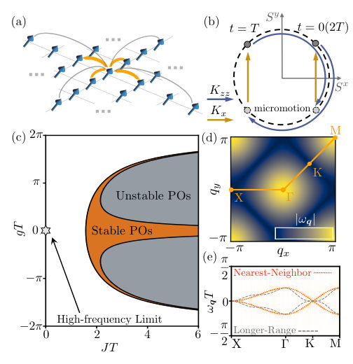 
FIG. 1. (a) Schematic of a 2D driven Ising model with nearest-neighbor (orange) and further-range (gray) interac- tions. (b) Spin dynamics projected on the x −y plane fol- lows a periodic orbit (PO), where the Ising interaction effec- tively echoes out the transverse field. (c) Stability diagram of the POs in parameter space. SPOs exist in the orange re- gion that is away from the high-frequency limit (star). (d) Dispersion of the quasiparticles on top of SPOs. The spec- trum is gapless, and closes along the dark blue diamond (in- cluding the X and K points). (e) Dispersion ωq along the path X −Γ −M. Numerical results (orange) match analytical predictions (red dotted). Further-range...

📷 Fig 2

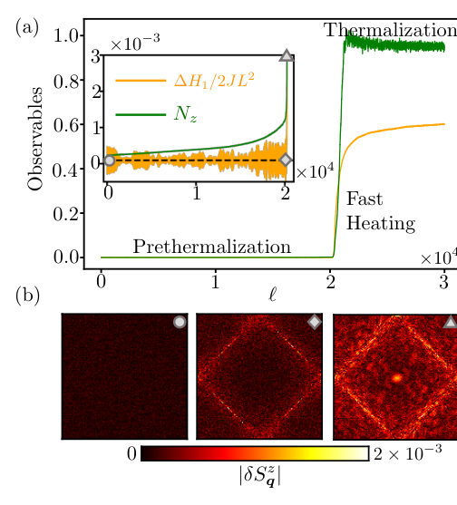 
FIG. 2. (a) Dynamics of total occupation number Nz = P

📷 Fig 3

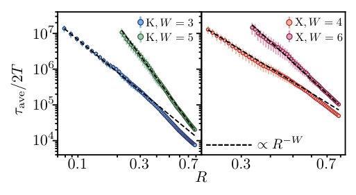 
FIG. 3. Prethermal lifetime τave versus initial distribution width R for engineered band structures with W = 3, 4, 5, 6. The numerical results match well with the theoretical scaling R−W , plotted as a black dashed line as a guide to the eye. 100 independent realizations are used for the average, and their standard deviation serves as the error bar. We use σ = 0.176 with J = 1, g = 1, T = 2, and L = 128 for the simulations.

📷 Fig 4

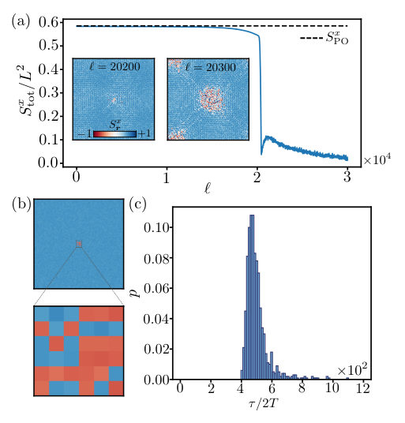 
FIG. 4. (a) Dynamics of the total magnetization in the x di- rection, which continuously decreases during prethermaliza- tion. The insets are snapshots of configurations of Sx r, where a locally unstable region appears with flipped Sx r (red). This region quickly expands and triggers fast heating. (b) The initial state where the signs of Sx r within a 6 × 6 square re- gion are randomly chosen. (c) Distribution of the prether- mal lifetime from the initial states in (b). The local flip sig- nificantly shortens the prethermal lifetime, from O(104) to O(102). 1000 independent realizations are used to sample the distribution. Numerical simulations are performed using J = 1, g = 0.5, T = 2, L =...

**Summary.** The authors investigate how periodically driven spin systems exhibit long-lived prethermalization before full thermalization. They show that by carefully engineering the system's emergent quasiparticle band structure using further-range interactions, they can achieve a 'doubly tunable' control over the prethermal lifetime. This work establishes a powerful theoretical tool for stabilizing non-equilibrium quantum states.

**Why it may be interesting.** This work provides a concrete mechanism—band structure engineering—to stabilize non-equilibrium quantum phases in driven systems, bridging concepts from classical nonlinear dynamics (periodic orbits) to many-body chaos.

Detailed structure

**Main problem.** The paper addresses the conflict between linear stability analysis, which suggests trajectories remain near stable periodic orbits (SPOs), and thermodynamic principles, which predict eventual Floquet heating in periodically driven many-body systems.

**Main result.** They demonstrate that a long-lived prethermal regime exists, whose lifetime can be controlled by engineering the emergent quasiparticle band structure to achieve a 'doubly tunable' parametric dependence ($	au_{	ext{pre}} \propto R^{-W}$).

**Method.** The analysis involves linearizing dynamics around SPOs to obtain an effective quasiparticle band structure and then deriving the scaling of the prethermal lifetime by analyzing time-averaged excitation rate equations.

**Model / system.** The study uses a periodically driven (Floquet) spin system, specifically modeled as a 2D classical Ising system on a square lattice with nearest-neighbor and further-range couplings. The dynamics are governed by the periodicity $H(t) = H(t+T)$.

**Key observables.** Prethermal lifetime ($	au_{	ext{pre}}$), quasiparticle momentum space width ($R$), and the dispersion exponent ($W$).

**Important parameters / regimes.** The driving period $T$, coupling constants ($J, g$), and the engineered coefficients ($c_m$) that determine the band structure.

**Assumptions / limitations.** Key assumptions include describing perturbations via an effective quasiparticle band structure and assuming the quasiparticle distribution remains close to its initial Gaussian form for the scaling derivation.

**Figures summary.** Figures illustrate spin dynamics following SPOs, stability diagrams showing stable regions away from high-frequency limits, and plots comparing initial versus time-evolved quasiparticle momentum distributions at varying exponents $W$.

**Paper structure.** The paper first establishes the physical model and the tension between linear stability and heating. It then uses PO construction and linear analysis to find a gapless dispersion relation. Finally, it derives the scaling law $	au \propto R^{-W}$ by analyzing excitation rates and shows how further-range interactions allow for engineering $W$.

Abstract

We uncover a family of many-body periodic orbits in a periodically driven (Floquet) spin system away from the high-frequency limit. While linear stability analysis predicts that perturbed many-body trajectories remain close to stable periodic orbits, thermodynamic principles dictate that Floquet heating will ultimately set in. Our work aims to resolve the tension between these two expectations. In particular, we show that perturbations away from the stable periodic orbits feature a description akin to a quasiparticle band structure. A long-lived prethermal regime appears when modes around the gapless point are slowly populated. The dispersion determines the prethermal lifetime, and we show how band engineering leads to a "doubly tunable" parametric dependence of the prethermal lifetime $R^{-W}$, with $R$ the width in momentum space of the quasiparticle distribution and $W$ the exponent of the dispersion around the gapless point. Our results not only establish a powerful route toward stabilizing non-equilibrium phases of matter in driven many-body systems but also establish a conceptual bridge between periodic orbits in 'low-dimensional' nonlinear systems and many-body chaos.

[↑ back to top](#top)

### ⭐ [Observation of gravity-like signatures in holographic codes on a quantum computer](http://arxiv.org/abs/2607.12047v1)

**Highlighted author(s):** John Preskill  
**Authors:** Debopriyo Biswas, Gong Cheng, Krishnanand Karthikeyan, Diana Muñoz-Valencia, Vincent P. Su, Hrant Gharibyan, Daiwei Zhu, Grant Salton, Evgeny Epifanovsky, Martin Roetteler, Christopher Monroe, John Preskill, Norbert M. Linke, ChunJun Cao, Crystal Noel  
**Type:** both · **Category:** other · **PDF:** <https://arxiv.org/pdf/2607.12047v1>  
**Analysis basis:** full PDF text, analyzed in chunks
**Topic relevance:** 🔥 `entanglement & information structure` **5/5** · 🔥 `QC/QI experiment` **4/5** · 🔥 `analog quantum simulation` **4/5** · `methods for driven-dissipative` **3/5** · `correlated / nonlocal dissipation` **2/5** · `driven-dissipative phase transition` **2/5** · `non-equilibrium dynamics` **2/5** · `Rydberg arrays` **1/5** · `correlated cavity matter` **1/5** · `non-equilibrium universality` **1/5**

📷 Fig 1

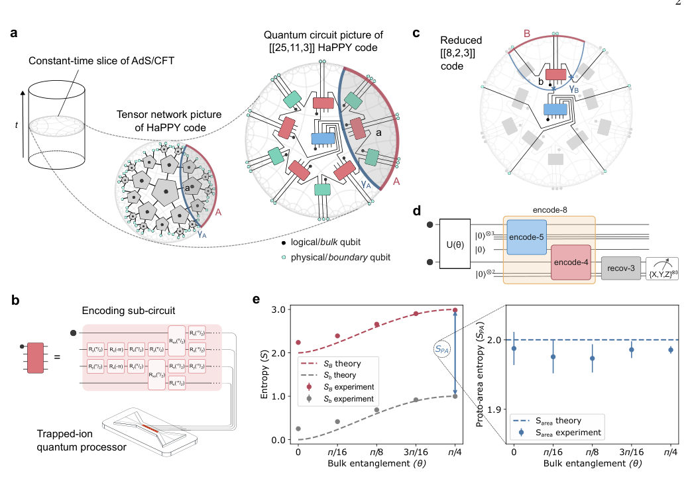 
FIG. 1: Experimental realization of a holographic quantum error correcting code and FLM formula test. a: A hyperbolic time slice of AdS is tessellated by perfect tensors and compiled into a quantum circuit, with the encoding blocks running radially outward to the boundary. Blue, red, and green rectangles are the three distinct encoding sub-circuits (Appendix A); black and cyan dots are the logical (bulk) and physical (boundary) qubits respectively, and the remaining inputs are initialized to |0⟩. A is an example boundary subregion and γA is the minimal-area surface homologous to it. b: Decomposition of an encoding block into {Rx, Ry, Rz, RXX} gates for the trapped-ion processor (Appendix A...

📷 Fig 2

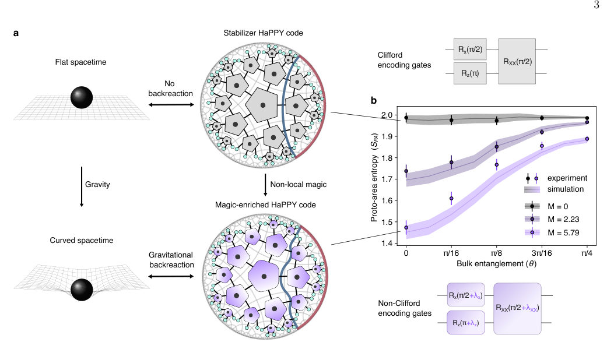 
FIG. 2: Magic-enriched holographic codes and gravitational precursor. a: Conceptual and gate-level schematic of (top) an exact stabilizer HaPPY code and (bottom) a magic-enriched HaPPY code. The former is constructed from Clifford encoding gates and realizes a fixed tensor-network geometry, analogous to a rigid background with no gravitational backreaction. Introducing controlled coherent over-rotations λi to the encoding gates adds magic (non-stabilizerness) to the latter code, producing a state-dependent proto-area entropy, analogous to gravitational backreactions shifting the underlying geometry. b: Proto-area entropy SPA measured as a function of the bulk entanglement angle θ for three...

📷 Fig 3

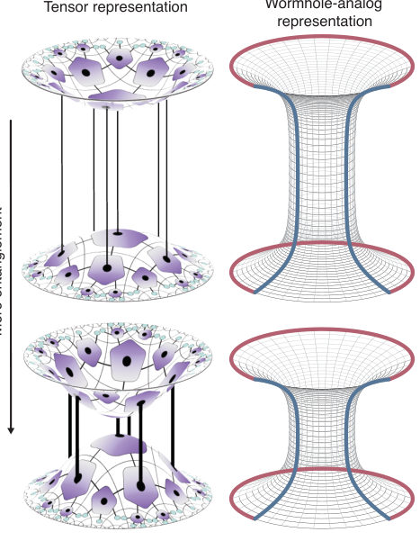 
FIG. 3: Entanglement-induced connectivity. Two magic-enriched HaPPY-code tensor networks are coupled through entanglement between corresponding logical degrees of freedom (top left). In the wormhole analogy (top right), boundary-anchored geodesics, shown in blue, pass through the neck connecting the two sides. (Bottom) increasing the inter-code entanglement decreases the effective wormhole length, thereby shortening this candidate geodesic and reducing the geometric contribution to the entropy in sufficiently short wormholes in holography. Red curves denote the boundary subregions.

📷 Fig 4

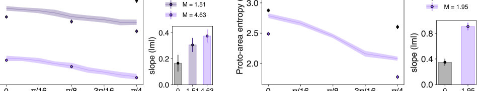 
FIG. 4: Double-sided experiments from entangled holographic codes. a,b: Tensor-network diagrams for the two-code wormhole analogue. The 10-qubit experiment entangles two [[5, 1, 3]] codes using their logical qubits, while the 16-qubit experiment extends to entangling two [[8, 2, 3]] codes using two pairs of logical qubits. c,d: Corresponding experimental circuits used to extract boundary and bulk entropies. e,f: Measured proto-area entropy SPA as a function of the bulk entanglement angle θ for the 10-qubit and 16-qubit experiments. Experimental data are compared with numerical simulations. The 10-qubit data were acquired with 1250–1500 shots per Pauli basis, and the 16-qubit data were...

📷 Fig 5

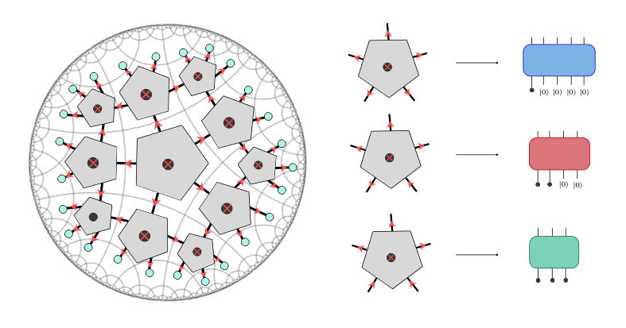 
FIG. 6: Circuit representations of the local tensor isometries. A 6-leg perfect tensor can be interpreted as different encoding maps depending on the choice of input and output legs. The three choices used in constructing the two-layer HaPPY encoding circuit are shown: the [[5, 1, 3]] seed code, the [[4, 2, 2]] seed code, and the [[3, 3, 1]] unitary block. Black dots denote logical input legs, while legs initialized in |0⟩denote ancilla inputs.

**Summary.** The research uses trapped-ion quantum computers to experimentally model the AdS/CFT correspondence via holographic error-correcting codes. By measuring entanglement entropy, they first verified a key formula relating entanglement to area (FLM) and then showed that introducing non-stabilizer resources generates state-dependent signatures predicted by theories of emergent gravity. This work establishes quantum computation as a novel platform for testing fundamental physics conjectures.

**Why it may be interesting.** This work directly bridges quantum computation hardware (trapped ions) with fundamental physics problems (quantum gravity), providing an experimental testbed for concepts like holographic duality and emergent spacetime geometry that are highly relevant to AMO physicists studying complex many-body dynamics.

Detailed structure

**Main problem.** The central problem is unifying quantum mechanics and general relativity by investigating whether spacetime geometry emerges from fundamental quantum entanglement degrees of freedom.

**Main result.** The authors experimentally confirmed the Faulkner-Lewkowycz-Maldacena formula using a holographic code model, and further demonstrated that introducing non-stabilizer resources leads to state-dependent entropy signatures analogous to gravitational backreaction.

**Method.** They implemented toy models of AdS/CFT duality (holographic codes) on a trapped-ion quantum computer, measuring entanglement entropies to calculate 'proto-area entropy' ($	ext{SPA}$).

**Model / system.** The system uses the HaPPY code, a tensor network realizing a quantum error-correcting code, implemented on a trapped-ion platform. The model is extended by injecting non-stabilizer resources ('magic') to simulate gravitational backreaction effects.

**Key observables.** Proto-area entropy ($	ext{SPA}$), boundary entanglement entropy ($S_A$), recovered bulk entropy ($S_a$), and the dependence of $	ext{SPA}$ on bulk entanglement ($	heta$).

**Important parameters / regimes.** The entangling angle ($	heta$) controlling bulk entanglement, and the magic parameter ($M$) quantifying non-stabilizerness.

**Assumptions / limitations.** The observed effects are interpreted as modeling emergent spacetime geometry, but the authors caution that this is a toy model and not a literal probe of semi-classical gravity.

**Figures summary.** Figures illustrate the HaPPY code structure, compare measured $	ext{SPA}$ vs. theory predictions for FLM testing, and show how increasing bulk entanglement ($	heta$) causes $	ext{SPA}$ to change when magic resources are added.

**Paper structure.** The paper proceeds by first establishing the experimental realization of the holographic duality test (FLM formula). It then enriches the model with non-stabilizerness ('magic') to observe state-dependent signatures, culminating in analogies involving wormhole geometries and two-sided entanglement structures.

Abstract

The unification of quantum mechanics and general relativity remains one of the major open problems of theoretical physics. The Anti-de Sitter/Conformal Field Theory (AdS/CFT) correspondence provides a valuable theoretical framework for this effort via a holographic duality between a theory of quantum gravity in asymptotically AdS spacetime and a conformal quantum field theory on the lower-dimensional boundary. Here, we implement a toy model of this duality called the HaPPY code, a quantum error-correcting code in the form of a tensor network with hyperbolic entanglement patterns, on a trapped-ion quantum computer. We present the first experimental confirmation of the Faulkner-Lewkowycz-Maldacena formula in this model - a key test of the holographic correspondence. We then enrich it with non-stabilizerness, or magic, and observe entropic precursors expected of emergent gravity. Finally, we present and measure a code construction whose entropic behavior is reminiscent of a highly quantum wormhole. Our experiments illustrate how quantum computers can serve as testbeds for modeling the emergence of spacetime.

[↑ back to top](#top)

### ⭐ [Collective-State Preparation in a Subwavelength Triangular Trimer Using SUPER Excitation](http://arxiv.org/abs/2607.12665v1)

**Highlighted author(s):** Helmut Ritsch  
**Authors:** Thomas Nunner, Johannes Kerber, Helmut Ritsch, Arpita Pal  
**Type:** theory · **Category:** other · **PDF:** <https://arxiv.org/pdf/2607.12665v1>  
**Analysis basis:** full PDF text, analyzed in chunks
**Topic relevance:** 🔥 `correlated / nonlocal dissipation` **4/5** · 🔥 `methods for driven-dissipative` **4/5** · `Dicke superradiance` **3/5** · `Tavis-Cummings & cavity-many-emitter` **3/5** · `correlated cavity matter` **3/5** · `analog quantum simulation` **2/5** · `driven-dissipative phase transition` **2/5** · `non-equilibrium dynamics` **2/5** · `superradiant laser` **2/5** · `Keldysh / 2PI / non-Gaussian methods` **1/5** · `entanglement & information structure` **1/5** · `exotic spin models in light-matter` **1/5** · `free-space correlated emission` **1/5** · `interference shaping light` **1/5** · `non-equilibrium universality` **1/5** · `quantum measurements` **1/5**

📷 Fig 1

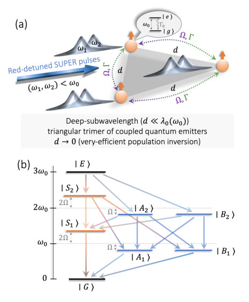 
FIG. 1. (a) Schematic of an equilateral triangular arrange- ment of three two-level QEs separated by a distance d and driven by parameter-optimized sets of SUPER pulses. Each QE has a ground state |g⟩and an excited state |e⟩, with tran- sition frequency ω0 (corresponding resonant transition wave- length is λ0) and spontaneous emission rate Γ0. The SU- PER pulses are red-detuned with frequencies (ω1, ω2) &lt; ω0. Dipole-dipole interactions between the QEs induce collective energy shifts Ωand decay rates Γ depending on the inter- emitter separation and the dipole orientations (see text). (b) Possible decay channels for the dipole-coupled equilateral tri- angular trimer. Downward arrows indicate...

📷 Fig 2

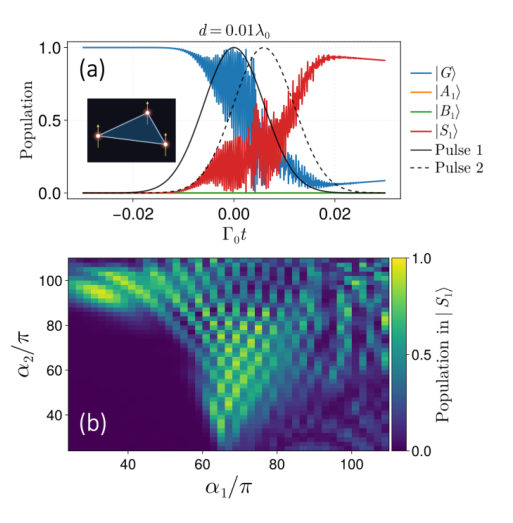 
FIG. 2. Near-unity population inversion into the symmet- ric collective state |S1⟩at deep-subwavelength QE separa- tion d = 0.01λ0 for transversely oriented dipoles (see in- set). Panel (a) shows the time evolution of state populations under the SUPER excitation, with optimized pulse parame- ters (∆1, ∆2) = (−3.00, −12.75) meV, (α1, α2) = (33π, 95π), (σ1, σ2) = (6, 6) ps, ϑi = 0 (i = 1, 2, 3), and τ = 5.9 ps, for transversely oriented dipoles at nearest-neighbor separation d = 0.01λ0. A final population of 94.3% (approximately) is achieved in the symmetric state |S1⟩. The two pulse normal- ized envelopes are shown as black solid and dashed curves. Panel (b) shows the corresponding heatmap...

📷 Fig 3

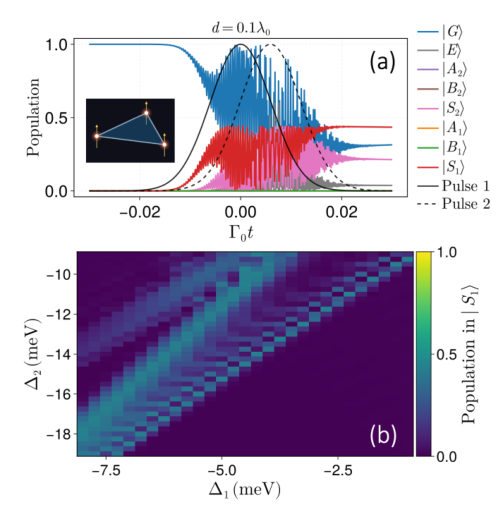 
FIG. 3. Reduced selective collective-state preparation at larger inter-emitter separation d = 0.1λ0 for transversely ori- ented dipoles (see inset). Panel (a) shows the time evolu- tion of state populations under SUPER excitation for trans- versely oriented dipoles at inter-emitter separation d = 0.1λ0, with pulse parameters (α1, α2) = (33π, 95π), τ = 5.9 ps, (∆1, ∆2) = (−3.25, −12.50) meV, (σ1, σ2) = (6, 6) ps, and ϑi = 0 (i = 1, 2, 3). The maximum achievable population in |S1⟩is approximately 44%, with residual population dis- tributed among several other states as indicated. Panel (b) shows the corresponding heatmap of the final |S1⟩population as a function of detuning (∆1, ∆2), with all...

📷 Fig 4

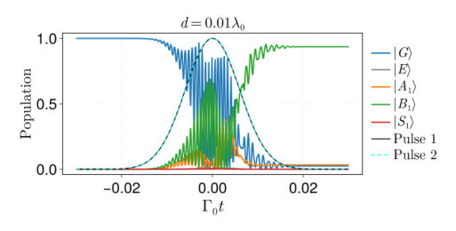 
FIG. 4. Inversions in the antisymmetric collective state |B1⟩, when dipoles are transversely oriented to the plane of the tri- angle. The inversion is approximately 93.7% to state |B1⟩ with SUPER pulses, having pulse parameters as follows: (α1, α2) = (28π, 12π), τ = 0 ps, (∆1, ∆2) = (−5.4, −10.6) meV, (σ1, σ2) = (6, 6) ps. In this case we need to set optical phases as follows: ϑ1 = 1.8π, ϑ2 = 0.2π and ϑ3 = 0.9π.

**Summary.** The paper demonstrates a method using SUPER excitation pulses to deterministically prepare specific collective quantum states in a triangular array of three coupled quantum emitters. The efficiency is critically dependent on the emitter spacing, showing near-perfect control only when the emitters are placed at deep-subwavelength separations. This work suggests that highly compact nanostructures are excellent platforms for controlling collective quantum phenomena.

**Why it may be interesting.** This work directly addresses quantum control in engineered nanoscale light-matter interactions, providing concrete theoretical predictions for achieving high-fidelity collective state preparation relevant to solid-state emitters and bio-inspired photonics.

Detailed structure

**Main problem.** The goal is the deterministic preparation of specific collective radiative states within a nanoscale array of quantum emitters.

**Main result.** Near-unity efficiency for preparing the symmetric collective state is achieved when the emitter spacing is deep-subwavelength, demonstrating that compact geometries are highly favorable for this control scheme.

**Method.** The study uses numerical simulation solving the Lindblad master equation under the influence of tailored, time-overlapping, red-detuned ultrashort excitation pulses (SUPER).

**Model / system.** The system is modeled as an equilateral triangular trimer of three dipole-coupled two-level quantum emitters, inspired by biological light-harvesting structures. The dynamics are governed by the full Hamiltonian and a Lindblad master equation.

**Key observables.** State selectivity, preparation efficiency (population inversion) into specific collective states like $|S_1\rangle$.

**Important parameters / regimes.** Inter-emitter spacing ($d$), which is critical; deep-subwavelength separations ($d \ll 0.01\lambda_0$) are optimal.

**Assumptions / limitations.** The model relies on the coupled-dipole approximation and assumes weak system-environment interaction, though robustness against minor disorder is shown.

**Figures summary.** Figures illustrate the time evolution of population inversion into the symmetric state $|S_1\rangle$, showing high fidelity at small separations ($d = 0.01\lambda_0$) compared to significantly lower efficiency at larger separations ($d = 0.1\lambda_0$).

**Paper structure.** The paper extends the SUPER excitation scheme from two emitters to a trimer, numerically investigating how state selectivity and preparation efficiency depend on inter-emitter spacing by solving the master equation with tailored pulses.

Abstract

The Swing-UP of quantum EmitteR population (SUPER) scheme has recently been proposed as a deterministic method for the preparation of collective radiative states in two strongly dipole-coupled quantum emitters (Phys. Rev. Res. \textbf{8}, 013179 (2026)). Here, we extend this approach to an equilateral subwavelength triangular trimer of dipole-coupled two-level quantum emitters (QEs), loosely inspired by biological light-harvesting ring geometries. Using tailored, time-overlapping, red-detuned ultrashort SUPER pulses, we numerically investigate the selective preparation of collective target states. We find that both the state selectivity and the preparation efficiency depend strongly on the inter-emitter spacing. In particular, at deep-subwavelength separations, the symmetric collective state can be deterministically prepared with near-unity efficiency, whereas the inversion efficiency and state selectivity are significantly lower at larger inter-emitter separations. Furthermore, this state preparation technique inherits a certain degree of robustness against reasonable static position imperfections and on-site frequency inhomogeneities of the individual QEs. Our results demonstrate that deep-subwavelength triangular trimers and, more broadly, highly compact ring geometries are excellent candidates for the deterministic preparation of collective radiative states via SUPER excitation. These predictions could be realized with solid-state emitters and molecules. Our findings offer a route toward the direct probing of the `pure' electromagnetic layer of interaction in biological and bio-inspired synthetic nanophotonic ring configurations, with possible relevance in photonics, quantum information processing, and metrology.

[↑ back to top](#top)

### ⭐ [A cryogenic neutral-atom platform with full optical access and 2-hour trap lifetime](http://arxiv.org/abs/2607.12988v1)

**Highlighted author(s):** Immanuel Bloch  
**Authors:** Akhil Kumar, Lorenzo Festa, Avishay Grinberg, Eran Reches, Dimitrios Tsevas, Kevin P. Mours, Zhao Zhang, Robin Eberhard, Sebastian Blatt, Andrea Alberti, Johannes Zeiher, Immanuel Bloch, Max Melchner  
**Type:** experiment · **Category:** other · **PDF:** <https://arxiv.org/pdf/2607.12988v1>  
**Analysis basis:** full PDF text, analyzed in chunks
**Topic relevance:** 🔥 `analog quantum simulation` **4/5** · `QC/QI experiment` **3/5** · `Rydberg arrays` **1/5** · `non-equilibrium dynamics` **1/5**

📷 Fig 1

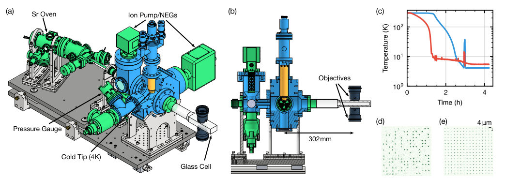 
FIG. 1. Render of the vacuum chamber. (a) The vacuum chamber consists of a strontium oven, a chamber made predominantly of grade 2 titanium, a glass cell, and a cryostat that cools a cold tip in vacuum to 4 K. The components are colored according to the material of the vacuum-facing surfaces. Titanium, stainless steel, and copper surfaces are colored in blue, green, and orange, respectively. Atoms are trapped in optical tweezers in a fused silica glass cell. The objectives used to focus the tweezers into the vacuum chamber and collect fluorescence for tweezer-resolved imaging are shown in black. (b) Cross section of the right part of the chamber. The cold tip is located roughly 30 cm away...

📷 Fig 2

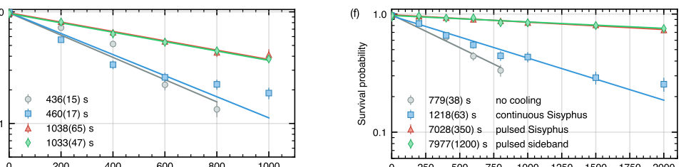 
FIG. 2. Lifetime measurements in the cryogenic apparatus. (a) A schematic of our experimental sequence. Following state preparation and initial imaging, single atoms are held in optical tweezers for a variable duration (the “hold time”). During this hold time, we apply either continuous Sisyphus cooling (b), pulsed Sisyphus cooling (c), or pulsed sideband cooling (d) and measure the corresponding atomic lifetime. Continuous Sisyphus cooling is maintained throughout the entire hold period. For pulsed Sisyphus cooling, we apply individual cooling pulses every 15 s for a duration of 65 ms. Our pulsed sideband cooling protocol consists of alternating pulses of radial and axial sideband cooling...

📷 Fig 3

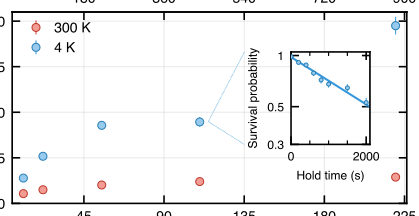 
FIG. 3. Measuring lifetime as a function of tweezer depth. (a) Experimental sequence for measuring the trapped-atom lifetime at different tweezer powers. After the initial fluores- cence image, the tweezer depth is linearly ramped down to a target trap depth in 5 ms. The trap depth is ramped up to 100 % for each Sisyphus cooling pulse; the trap depth is thus higher than the target value for a total duration equal to 0.5 % of the hold time. Measurements are performed in both cryogenic and non-cryogenic environments. (b) Lifetime vs tweezer trap depth with cryopumping enabled (blue) and disabled (red). Each lifetime value is extracted from a fit to an exponential decay of the atom survival vs...

📷 Fig 4

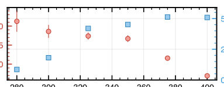 
FIG. 4. Measuring lifetime as a function of oven temperature. We observe a pronounced dependence of the trapped-atom lifetime on the oven temperature, with lower oven tempera- tures consistently leading to longer trapping lifetimes. This behavior is attributed to the reduced outgassing of hydrogen from the oven and, correspondingly, a lower background col- lision rate at lower oven temperatures. At the same time, de- creasing the oven temperature also reduces the atom loading rate into the tweezers, reflecting the trade-off between load- ing efficiency and vacuum-limited lifetime. Measurements use a blue MOT loading time of 800 ms and a tweezer depth of 220 µK. Lower loading rates can be...

📷 Fig 5

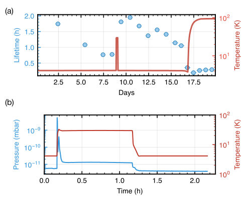 
FIG. 5. Regenerating the cold tip. (a) The lifetime is con- tinuously monitored over 16 days by running the lifetime se- quence described in the main text. Around day 9, the cold tip was regenerated by heating it up for a few hours. Around day 17, the temperature gradually increased to 100 K. As the temperature increases, hydrogen desorbs from the cryo- genic surface at a higher rate and the lifetime decreases sig- nificantly. The lifetime recovers after a few hours, indicating the hydrogen released during the heat-up of the cold tip has been removed by other parts of the vacuum system (e.g., get- ters/ion pumps). After regenerating the cold tip, we measure an exponential decay of the...

**Summary.** The research introduces a novel cryogenic neutral-atom trap system that successfully resolves the conflict between achieving long atomic storage times and maintaining full optical access. By implementing advanced vacuum pumping techniques, they achieved record lifetimes of two hours with single atoms in an optical tweezer array. This breakthrough paves a viable path for scaling up quantum simulation experiments using thousands of qubits.

**Why it may be interesting.** This work directly addresses a critical engineering bottleneck in quantum simulation: maintaining high coherence times while enabling complex optical addressing schemes necessary for scaling up qubit numbers.

Detailed structure

**Main problem.** Current neutral-atom quantum platforms face a fundamental trade-off between maintaining full optical accessibility for control and achieving long atomic storage times in optical potentials.

**Main result.** The authors report a novel cryogenic apparatus that overcomes this trade-off, demonstrating vacuum-limited single-atom trapping lifetimes of up to two hours while retaining full optical access.

**Method.** They utilized a cryogenically enhanced neutral-atom trap system with an optical tweezer array and employed rigorous vacuum techniques, including cold tips and bakeouts, to minimize gas-phase decoherence.

**Model / system.** The platform uses single $^{88}	ext{Sr}$ atoms trapped in optical tweezers within a cryostat. The key components include the atomic source, the tweezer array, and a 4 K cold tip used for pumping residual gases like hydrogen.

**Key observables.** Vacuum-limited trapping lifetimes ($	au$), survival probability vs. hold time, and dependence of lifetime on trap depth and oven temperature.

**Important parameters / regimes.** Trapping lifetime up to two hours (>7000 s); Tweezer spacing of $4\ \mu	ext{m}$; Cryogenic temperatures ($\sim 4$ K).

**Assumptions / limitations.** The design does not shield atoms from room-temperature blackbody radiation, which is a noted limitation.

**Figures summary.** Figures illustrate the vacuum chamber setup (Fig. 1), the experimental sequence for lifetime measurements using various cooling protocols (Fig. 2), and show how regeneration cycles restore long lifetimes after gas desorption events (Fig. 5).

**Paper structure.** The paper details the physical apparatus, presents methods for measuring atomic decay rates under varying conditions (cooling/vacuum control), reports achieving record long lifetimes by mitigating vacuum limitations, and discusses scalability.

Abstract

Neutral-atom quantum processors are rapidly scaling toward system sizes of more than ten thousand qubits, allowing for the realization of a new class of quantum computing algorithms and quantum simulation experiments. However, current neutral-atom platforms generally have to find a compromise between the optical accessibility and the storage time of atoms in optical potentials, limiting the available qubit numbers. Here we report on the operation of a novel, cryogenically enhanced, neutral-atom apparatus that overcomes these apparently conflicting requirements. We demonstrate vacuum-limited trapping lifetimes of up to two hours of single $^{88}\mathrm{Sr}$ atoms in an optical tweezer array while preserving full optical access and without the need for complex cryogenic enclosures. Our measurements show that exceptionally long single-atom lifetimes can be achieved with a relatively simple cryostat design. Our architecture can be straightforwardly ported to other atomic species and shows a viable path for scaling up to sorted arrays of tens of thousands of atoms.

[↑ back to top](#top)

### [Measurement-induced phase transition in space](http://arxiv.org/abs/2607.12386v1)

**Authors:** Jia-Qiang Li, Liang-Jun Zhai, Shuo Liu, Shuai Yin  
**Type:** theory · **Category:** statistical mechanics · **PDF:** <https://arxiv.org/pdf/2607.12386v1>  
**Analysis basis:** full PDF text, analyzed in chunks
**Topic relevance:** 🔥 `measurement-induced transitions` **5/5** · 🔥 `entanglement & information structure` **4/5** · 🔥 `non-equilibrium universality` **4/5** · `driven-dissipative phase transition` **3/5** · `methods for driven-dissipative` **3/5** · `analog quantum simulation` **2/5** · `correlated / nonlocal dissipation` **2/5** · `non-equilibrium dynamics` **2/5** · `quantum measurements` **1/5**

📷 Fig 1

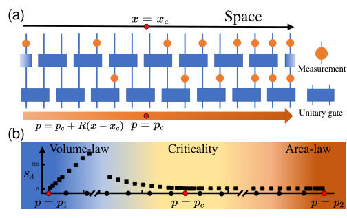 
FIG. 1. Schematic of the monitored Clifford circuit and the spatial MIPT. (a) The circuit consists of brickwork layers of two-site random Clifford gates, represented by blue rectan- gles; each gate layer is followed by a layer of single-site projec- tive measurements, represented by orange circles. The mea- surement probability varies along the spatial direction accord- ing to the truncated linear profile p(x) = max{0, min{1, pc + R(x −xc)}}, illustrated by the gradient bar. (b) Entangle- ment structure generated by the spatial measurement profile. Within a single steady state, the chain contains volume-law, critical, and area-law regions. The point p(xc) = pc acts as a spatial critical...

📷 Fig 2

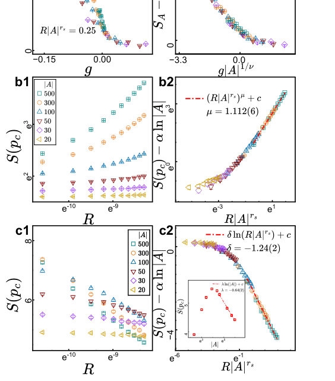 
FIG. 3. Verification of the spatial scaling form in Eq. (4). For fixed R|A|rs = 0.25, panel (a1) shows the subsystem entropy SA as a function of g for different subsystem sizes |A|, while panel (a2) presents the corresponding collapse after subtract- ing the critical logarithmic contribution. Panels (b) and (c) examine the critical scaling of SA(pc). Panel (b1) plots SA(pc) versus R on the p &lt; pc side for different |A|, and panel (b2) shows the associated collapse. The red dashed line in panel (b2) is a power-law fit with exponent µ = 1.112(6). Panel (c1) shows SA(pc) versus R on the p &gt; pc side, and panel (c2) presents the corresponding collapse. The semi-logarithmic fit gives slope δ =...

📷 Fig 3

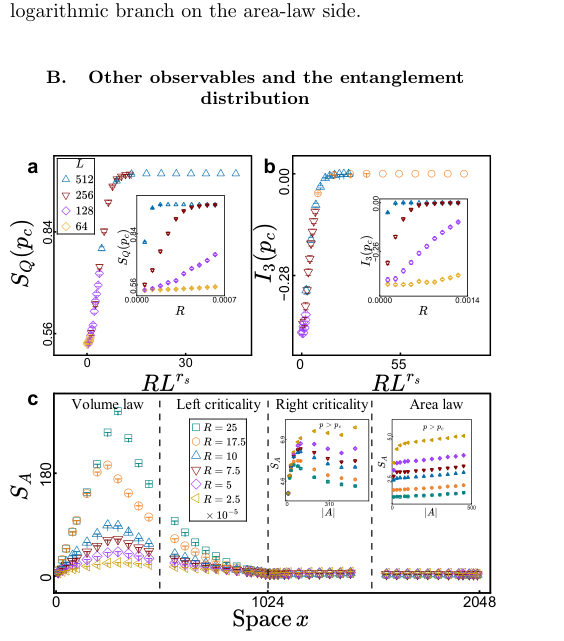 
FIG. 4. Critical scaling of the ancilla entropy SQ and tripar- tite mutual information I3, together with the spatial entan- glement profile. Panels (a) and (b) show the rescaled collapses of SQ and I3, respectively; the insets show the corresponding unscaled critical data. Panel (c) shows the spatial coexis- tence of volume-law and area-law regions across the central critical point. The outer subpanels of (c) display the subsys- tem entanglement entropy far from pc for p &lt; pc and p &gt; pc, respectively, revealing the volume-law and area-law entangle- ment structures characteristic of the spatial MIPT.

📷 Fig 4

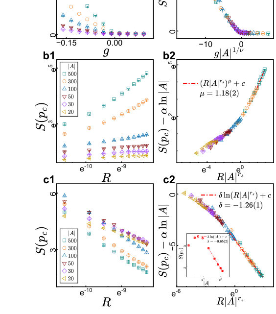 
FIG. 6. Verification of the scaling form in the boundary- anchored protocol. For fixed R|A|rs = 0.5, panel (a1) shows the subsystem entropy SA as a function of g for different sub- system sizes |A|, while panel (a2) presents the corresponding rescaled data. Panels (b) and (c) examine the critical scaling for the setup in Fig. 5(b). Panel (b1) plots SA(pc) versus R for p(x) = pc −R(x −xc), and panel (b2) displays the associated collapse. The red dashed line in panel (b2) is a power-law fit with exponent µ = 1.18(2). Panel (c1) shows SA(pc) ver- sus R for p(x) = pc + R(x −xc), and panel (c2) presents the corresponding collapse. The semi-logarithmic fit gives slope δ = −1.26(1). The inset in...

📷 Fig 5

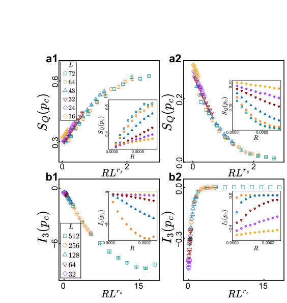 
FIG. 7. Critical ancilla entropy SQ and tripartite mutual information I3 in the boundary-anchored protocol. Panels (a1) and (a2) show SQ, while panels (b1) and (b2) show I3. The left and right panels correspond to the volume-law and area-law sides, respectively. Insets show the unscaled critical data as functions of R for different system sizes L, and the main panels show the corresponding collapses as functions of RLrs.

**Summary.** This work introduces a spatial realization of Measurement-induced Phase Transitions (MIPTs) in a monitored quantum circuit by imposing a linear gradient on the measurement probability. By analyzing entanglement scaling across this gradient, the authors show that the transition is governed by a specific scaling form. This method allows for the controlled probing and direct calculation of critical exponents within a single steady state.

**Why it may be interesting.** It provides a novel, controlled method—spatial inhomogeneity—to engineer and probe measurement-induced criticality within a single steady state, offering insights into non-equilibrium critical phenomena.

Detailed structure

**Main problem.** The paper investigates Measurement-induced Phase Transitions (MIPTs) by realizing the transition spatially rather than through uniform measurement probabilities or temporal driving.

**Main result.** It establishes that a deterministic spatial gradient in measurement probability creates coexisting volume-, critical, and area-law regions within a single steady state, allowing for the direct extraction of the correlation-length exponent $\nu$.

**Method.** The analysis involves scanning entanglement observables (like subsystem entropy) across the spatially varying measurement profile and performing scaling analyses.

**Model / system.** The system is a monitored Clifford chain (1+1)D random circuit model where local projective measurements are performed after each gate layer, controlled by a linear gradient $p(x)$.

**Key observables.** Subsystem entanglement entropy ($S_A$), ancilla entropy ($S_Q$), and tripartite mutual information ($I_3$).

**Important parameters / regimes.** The critical measurement probability $p_c$, the spatial gradient parameter $R$, and the physical bounds $0 \le p(x) \le 1$.

**Assumptions / limitations.** The analysis relies on truncating the linear gradient due to the physical constraints of probabilities ($0 \le p(x) \le 1$).

**Figures summary.** Figure 1 schematically shows the circuit and the resulting entanglement structure (Volume-law $\leftarrow$ Criticality $\rightarrow$ Area-law). Figure 3 verifies data collapse for scaling forms on both volume-law and area-law sides.

**Paper structure.** The paper introduces the spatial MIPT concept, analyzes the steady state containing coexisting regimes via entanglement observables, derives a spatial scaling form analogous to finite-time scaling but without Kibble-Zurek dynamics, and uses this structure to extract $\nu$ from the finite linear window.

Abstract

Measurement-induced phase transitions (MIPTs) in monitored quantum circuits are usually characterized by preparing steady states at different uniform measurement probabilities. Here we introduce a spatial realization of the MIPT by imposing a deterministic measurement gradient in a single monitored Clifford chain. The resulting steady state contains coexisting volume-law, critical, and area-law regions, with the point $p(x)=p_c$ acting as a spatial critical cut. By scanning entanglement observables across this profile, we show that the transition is organized by a spatial scaling form. Although this structure is analogous to finite-time scaling in temporally driven MIPT, the spatial protocol has no Kibble-Zurek dynamics. Instead, the physical bounds $0\le p\le 1$ impose a finite linear window, producing cutoff-controlled asymptotic regimes whose fitted exponents provide direct access to the correlation-length exponent $ν$. Our results establish spatially inhomogeneous measurements as a controlled route to engineer and probe measurement-induced criticality within a single steady state.

[↑ back to top](#top)

### [Spin Chain Quantum Communication on a Trapped-Ion Processor](http://arxiv.org/abs/2607.12999v1)

**Authors:** Madhumita Sarkar, Trinity Pointon, Sougato Bose  
**Type:** experiment · **Category:** other · **PDF:** <https://arxiv.org/pdf/2607.12999v1>  
**Analysis basis:** full PDF text, analyzed in chunks
**Topic relevance:** 🔥 `QC/QI experiment` **5/5** · 🔥 `analog quantum simulation` **4/5** · `entanglement & information structure` **2/5** · `non-equilibrium dynamics` **2/5** · `exotic spin models in light-matter` **1/5**

📷 Fig 1

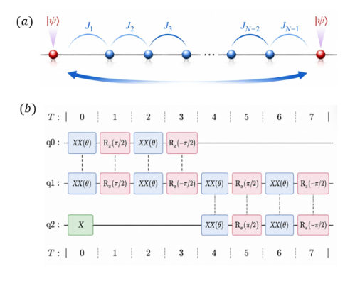 
FIG. 1. (a) Schematic illustration of quantum state transfer in an engineered spin chain. A quantum state initially en- coded in the leftmost qubit, propagates coherently through the chain under the engineered nearest-neighbour couplings Ji and is reconstructed at the opposite end after the opti- mal transfer time. (b) Digital implementation of the corre- sponding nearest-neighbour XY Hamiltonian on the trapped- ion quantum processor. The continuous Hamiltonian evolu- tion is approximated using a first-order Trotter decomposi- tion, in which each Trotter step is realized through a sequence of experimentally accessible two-qubit interactions and single qubit rotations.

📷 Fig 2

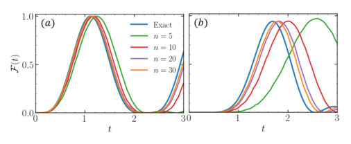 
FIG. 2. Convergence of the gate-based Trotter approximation towards the exact NN dynamics with increasing numbers of Trotter steps for (a) N = 3, and (b) N = 5. As the number of Trotter steps increases, the gate-based evolution approaches the exact Hamiltonian evolution.

📷 Fig 3

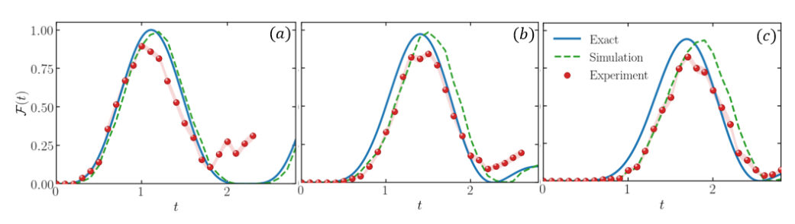 
FIG. 3. Experimental state-transfer fidelity (red circles) as a function of time for NN spin chains with uniform coupling strength J = −1, compared with the corresponding gate-based simulations (green dashed lines) and exact Hamiltonian evolution (blue solid lines) for (a) N = 3, (b) N = 4, and (c) N = 5. As the chain length increases, the fidelity peak shifts to later times while its maximum value decreases, reflecting the increasing challenge of coherent state transfer over longer spin chains. Nevertheless, the measured fidelities remain above the classical threshold of 2/3 for all system sizes investigated, demonstrating a quantum advantage. Both the experimental and gate-based results...

📷 Fig 4

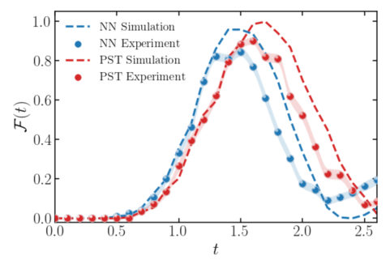 
FIG. 4. Comparison of the state-transfer fidelity for a four- qubit spin chain with uniform NN and engineered PST cou- pling profiles. The blue and red dashed curves correspond to the gate-based simulations for the NN and PST Hamil- tonians, respectively, while the blue and red circles denote the corresponding experimental measurements obtained on IonQ’s Forte-1 trapped-ion quantum processor. The NN chain employs uniform couplings with J = −1, whereas the PST chain uses the engineered coupling profile Jn = J0 p

📷 Fig 5

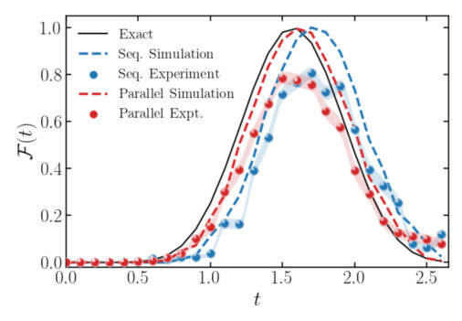 
FIG. 5. Comparison of the sequential and parallel implemen- tations of the engineered perfect state transfer (PST) Hamil- tonian for N = 5. The solid black curve shows the exact continuous time evolution, while the blue and red dashed curves correspond to ideal gate-based simulations using the sequential and parallel Trotter decompositions, respectively. The circles denote the corresponding experimental results ob- tained on IonQ’s Forte Enterprise processor. The parallel implementation reaches the maximum state transfer fidelity at an earlier evolution time while maintaining a comparable peak fidelity, thereby reducing the circuit depth and overall execution time by exploiting the parallel...

**Summary.** The authors experimentally demonstrate high-fidelity quantum state transfer across a spin chain using trapped-ion processors. They show that engineering the qubit couplings significantly outperforms simple nearest-neighbor interactions. Crucially, they also optimize the gate implementation by using parallel Trotterization, making Hamiltonian-based communication more practical for real quantum hardware.

**Why it may be interesting.** This work directly bridges theoretical quantum information concepts (Hamiltonian dynamics, PST) with cutting-edge experimental hardware (trapped ions), providing concrete benchmarks for scalable quantum networking protocols.

Detailed structure

**Main problem.** The central challenge addressed is achieving efficient, high-fidelity quantum communication between distant qubits necessary for scaling quantum processors.

**Main result.** Engineered coupling profiles significantly enhance the fidelity of quantum state transfer compared to uniform nearest-neighbor couplings. Furthermore, exploiting Hamiltonian commutation structure allows for a parallel Trotter decomposition that reduces circuit depth and execution time.

**Method.** The research combines exact numerical simulations with experimental measurements performed on a trapped-ion quantum processor using gate-based quantum simulation techniques (Trotterization).

**Model / system.** The system models a one-dimensional spin chain governed by an XY Hamiltonian, $H = \sum J_{ij} (X_i X_j + Y_i Y_j)$. The physical platform utilized is IonQ's trapped-ion quantum processor.

**Key observables.** State Transfer Fidelity ($F(t)$), coherence preservation ($\langle Z_{N-1} 
angle$), circuit depth, and execution time.

**Important parameters / regimes.** Coupling strengths ($J_{ij}$), chain length ($N$), Trotter step size ($\Delta t$), and the comparison between uniform vs. engineered coupling profiles (e.g., $J_j \propto j(N-j)$).

**Assumptions / limitations.** The primary approximations involve using the first-order Lie-Trotter product formula to simulate continuous time evolution on a discrete gate-based processor, and acknowledging that observed fidelity drops are due to hardware errors.

**Figures summary.** Figures illustrate quantum state transfer dynamics, comparing engineered vs. uniform couplings (Fig 4), showing population evolution for both single excitations and superpositions (Figs 6 & 7), and detailing the comparison between sequential and parallel Trotter implementations (Fig 5).

**Paper structure.** The paper systematically compares different protocols: first, demonstrating state transfer using nearest-neighbor couplings; second, proving that engineered coupling profiles enhance fidelity; third, optimizing the implementation by showing that parallel decomposition reduces circuit depth compared to serial methods.

Abstract

Efficient communication between distant qubits is one of the central challenges in scaling quantum processors. Although engineered spin chain protocols have been extensively investigated theoretically, their experimental realization has remained comparatively limited. Here, we experimentally realize engineered quantum communication protocols through digitally simulated spin Hamiltonian on IonQ's Forte 1/ Forte Enterprise 1 trapped-ion quantum processor. Combining exact numerical simulations with quantum hardware experiments, we benchmark uniform nearest-neighbour and engineered coupling profiles and demonstrate that engineered interactions significantly enhance the fidelity of quantum state transfer. We further show that exploiting the commutation structure of the spin Hamiltonian enables a parallel Trotter decomposition that more faithfully reproduces the target dynamics while substantially reducing the circuit depth and execution time compared to the conventional sequential implementations. Our results demonstrate that programmable quantum processors can effectively realize and efficiently implement quantum communication protocols, bringing Hamiltonian-based quantum communication closer to practical quantum technologies.

[↑ back to top](#top)

### [Constructing mode-resolved quantum optical models for emitters in photonic crystals](http://arxiv.org/abs/2607.12603v1)

**Authors:** Antonio Morales-Pérez, Iñaki García-Elcano, Chiara Devescovi, Maia G. Vergniory, Aitzol García-Etxarri, Alejandro González-Tudela  
**Type:** theory · **Category:** other · **PDF:** <https://arxiv.org/pdf/2607.12603v1>  
**Analysis basis:** full PDF text, analyzed in chunks
**Topic relevance:** 🔥 `analog quantum simulation` **4/5** · 🔥 `correlated cavity matter` **4/5** · `Tavis-Cummings & cavity-many-emitter` **3/5** · `interference shaping light` **3/5** · `methods for driven-dissipative` **3/5** · `correlated / nonlocal dissipation` **2/5** · `driven-dissipative phase transition` **2/5** · `entanglement & information structure` **2/5** · `non-equilibrium dynamics` **2/5** · `Dicke superradiance` **1/5** · `Keldysh / 2PI / non-Gaussian methods` **1/5** · `exotic spin models in light-matter` **1/5** · `non-equilibrium universality` **1/5** · `superradiant laser` **1/5**

📷 Fig 1

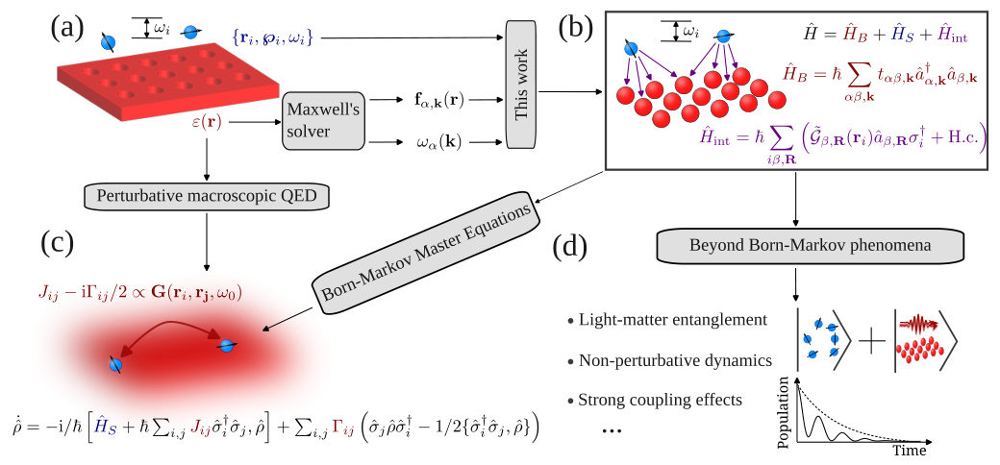 
FIG. 1. Summary of the framework developed in this work. (a) The input data to the framework are the material’s periodic dielectric function within the unit cell, ε(r), from which we calculate the photonic band structure, ωα(k), and the corresponding electric field profiles, fα,k(r), using a Maxwell-equation solver. The emitter positions, ri, polarization vectors, ℘i, and transition frequencies, ωi, are also specified as inputs. (b) These quantities, together with the symmetry-based methodology developed in Ref. [81], are used to construct quantum-optical light-matter Hamiltonians with mode-resolved couplings described by ˆH = ˆHB + ˆHS + ˆHint. The photonic bath, ˆHB, is formulated in...

📷 Fig 2

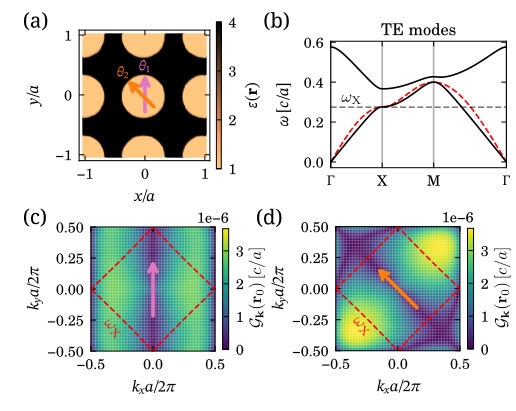 
FIG. 2. Effective light-matter model for a quantum emitter coupled to a 2D photonic crystal. (a) Dielectric permittivity profile ε(r) within the unit cell of the photonic crystal. Magenta and orange arrows indicate the two emitter dipole orientations considered, θ1 = 90◦and θ2 = 135◦, re- spectively. (b) Photonic band structure for transverse-electric modes along the high-symmetry path of the first Brillouin zone (solid black lines). The horizontal dashed line marks the saddle-point frequency ωX, while the red dashed curve shows the fitted reduced-model dispersion of Eq. (22). (c-d) Reciprocal-space coupling profile |Gk(r0)| from Eq. (13) over the first Brillouin zone for an emitter placed...

📷 Fig 3

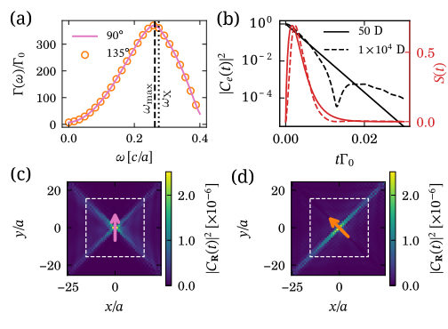 
FIG. 3. Directional spontaneous emission and non- perturbative quantum dynamics. (a) Frequency-resolved spontaneous-emission rate Γ(ω) = Γii(ω) from Eq. (20), nor- malized to the free-space decay rate Γ0 and evaluated with a finite broadening 0+ →10−2 c/a, for an emitter at r0. Re- sults for the two dipole orientations, θ1 = 90◦(solid) and θ2 = 135◦(open circles), are indistinguishable, showing that the local decay spectrum is polarization-independent at this high-symmetry position. The vertical dashed and dash-dotted lines indicate the X-point frequency ωX and the peak fre- quency ωmax = argmaxω Γ(ω), respectively. Throughout this section, the emitter resonance is tuned to ωmax. (b) Time...

📷 Fig 4

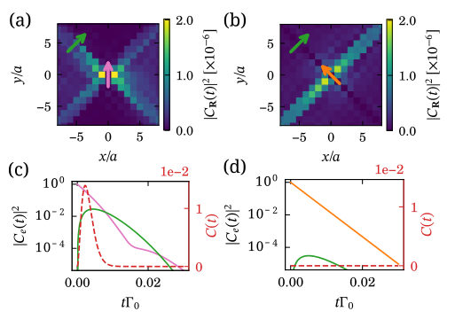 
FIG. 4. Directional probe excitation and bath- mediated entanglement. (a-b) Snapshots of the bath pop- ulation |CR(t)|2 at time tΓ0 = 1.5 × 10−3 for source dipole orientations (a) θ1 = 90◦and (b) θ2 = 135◦. The ma- genta/orange arrows indicate the source emitter at the ori- gin, while the green arrow marks a probe emitter located at rp/a = [−5, 5] with dipole orientation θp = 45◦. The finite bath has N × N = 50 × 50 unit cells, with the dashed white square marking the boundary of the absorbing region. Both emitters share the same resonance frequency ω0 = ωmax and dipole strength |℘0| = 50 D. (c-d) Time evolution for the same two source dipole orientations as in panels (a-b). The left axis...

**Summary.** This paper presents a novel constructive framework to model quantum emitters interacting with the complex electromagnetic modes of photonic crystals. By combining symmetry analysis with full Maxwell solver results, the authors derive minimal lattice Hamiltonians that overcome the limitations of existing simplified models. This allows for accurate simulation of polarization-dependent effects and non-Markovian dynamics beyond simple perturbative treatments.

**Why it may be interesting.** This work provides a crucial computational bridge, allowing researchers to use advanced quantum many-body techniques (like those used for cavity QED) on complex, structured photonic environments where simple scalar models fail.

Detailed structure

**Main problem.** The core challenge is bridging realistic, vectorial electromagnetic descriptions of light-matter interaction in photonic crystals with computationally tractable quantum many-body models.

**Main result.** The authors introduce a constructive framework yielding minimal, symmetry-enforced lattice Hamiltonians that accurately reproduce the full photonic dispersion while retaining essential position and polarization dependence.

**Method.** The method combines symmetry-constrained tight-binding constructions with numerically computed photonic band structures derived from Maxwell equations to build an effective bosonic Hamiltonian.

**Model / system.** The system involves quantum emitters coupled to a photonic crystal, modeled by deriving an effective bosonic lattice Hamiltonian ($\hat{H}_B$) and coupling it to the emitter Hamiltonian ($\hat{H}_S$).

**Key observables.** Polarization-dependent directional emission, non-Markovian light-matter dynamics, and entanglement entropy.

**Important parameters / regimes.** The model is analyzed in both perturbative (Born-Markov) and non-perturbative regimes; key parameters include the photonic band structure $\omega_\alpha(k)$ and coupling coefficients $g_{\alpha,k}(\mathbf{r}_i)$.

**Assumptions / limitations.** Key approximations include the Born approximation, Markovian limit ($	au 	o 0$), and secular approximation when comparing to macroscopic QED results.

**Figures summary.** The notes mention simulations on a finite lattice using absorbing boundaries to study entanglement entropy and directional emission patterns.

**Paper structure.** The paper progresses by first identifying the modeling trade-off, then detailing the constructive framework combining symmetry analysis with band structure calculation to derive the minimal Hamiltonian ($\hat{H}_B + \hat{H}_{int}$), validating this model against Green's function/macroscopic QED results in the perturbative limit, and finally demonstrating its utility for non-Markovian dynamics.

Abstract

Recent advances are enabling quantum emitters to interact with photonic crystals, whose electromagnetic modes exhibit complex dispersion relations, spatial mode structure, and polarization textures. However, modeling light-matter behavior in these systems faces a persistent trade-off: electromagnetic approaches based on Maxwell-equation solvers provide realistic vectorial descriptions but are difficult to integrate with quantum many-body and non-perturbative methods, whereas simplified quantum-optical lattice models are tractable but typically rely on scalar and spatially independent light-matter couplings that miss essential features of these structured photonic environments. Here, we introduce a constructive framework to derive quantum-optical lattice descriptions that overcome this trade-off. Combining symmetry-constrained tight-binding constructions with numerically computed photonic band structures and field profiles, our method yields minimal, symmetry-enforced lattice Hamiltonians that reproduce the target photonic dispersion while retaining the mode-resolved (position- and polarization-dependent) structure of the light-matter coupling. We show that these models recover Green's-function-based emitter dynamics in the perturbative regime, while providing access to non-perturbative quantum dynamical simulations beyond emitter-only descriptions. As a proof of principle, we apply the framework to a two-dimensional photonic crystal and show that it captures polarization-dependent directional emission inaccessible to scalar models, while enabling the analysis of non-Markovian light-matter dynamics and entanglement. Our results provide a practical bridge between classical electromagnetic simulation tools and quantum-optical many-body and non-Markovian modeling in photonic crystal settings.

[↑ back to top](#top)

### [Heisenberg Scaling in Many-Body Kinetic Uncertainty Relation via Quantum Feedback](http://arxiv.org/abs/2607.12264v1)

**Authors:** Hayato Yunoki, Yoshihiko Hasegawa  
**Type:** theory · **Category:** other · **PDF:** <https://arxiv.org/pdf/2607.12264v1>  
**Analysis basis:** full PDF text, analyzed in chunks
**Topic relevance:** 🔥 `correlated / nonlocal dissipation` **4/5** · 🔥 `quantum measurements` **4/5** · `analog quantum simulation` **3/5** · `measurement-induced transitions` **3/5** · `methods for driven-dissipative` **3/5** · `Tavis-Cummings & cavity-many-emitter` **2/5** · `correlated cavity matter` **2/5** · `driven-dissipative phase transition` **2/5** · `non-equilibrium dynamics` **2/5** · `Dicke superradiance` **1/5** · `Keldysh / 2PI / non-Gaussian methods` **1/5** · `entanglement & information structure` **1/5** · `non-equilibrium universality` **1/5** · `superradiant laser` **1/5**

📷 Fig 1

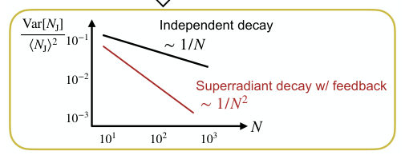 
FIG. 1. Quantum feedback protocol that makes the fluctu- ation of a counting observable scale as 1/N 2 by maintaining highly active states in a superradiant spin ensemble.

📷 Fig 2

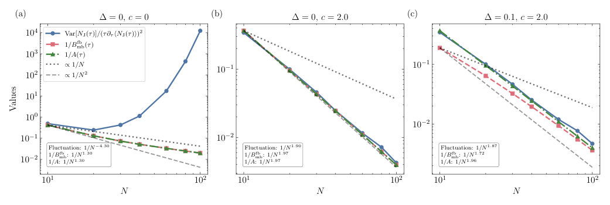 
FIG. 2. Scaling of the relative fluctuation Var[NJ(τ)]/[τ∂τ⟨NJ(τ)⟩]2, the KUR lower bound 1/Bfb mb(τ), and its jump con- tribution 1/A(τ) with the system size N. The data are plotted for N ∈{10, 20, 30, 40, 60, 80, 100}. The relative fluctuation Var[NJ(τ)]/[τ∂τ⟨NJ(τ)⟩]2 is computed from the stochastic counting observable obtained by generating 1000 quantum jump trajectories. The initial state is a spin-coherent state with my = 1.0. The observation time and decay rate are fixed at τ = 5.0 and γ = 0.02 in all panels. The three panels compare (a) ∆= 0 and c = 0, (b) ∆= 0 and c = 2.0, and (c) ∆= 0.1 and c = 2.0. The dotted and dashed gray lines show reference scalings proportional to 1/N and...

**Summary.** The paper investigates the theoretical limit of counting precision in many-body superradiant systems. It establishes that while uncontrolled dynamics fail to maintain optimal measurement precision, applying a tailored quantum feedback protocol successfully enforces Heisenberg scaling ($1/N^2$). This work demonstrates that controlled dissipation can be actively utilized to enhance quantum measurements beyond standard limits.

**Why it may be interesting.** This work directly addresses fundamental limits on measurement precision in open quantum systems by showing how active feedback can convert inherent dissipation into a resource for achieving Heisenberg scaling, which is highly relevant to quantum metrology applications using cavity QED or atomic ensembles.

Detailed structure

**Main problem.** The research aims to determine if Heisenberg scaling ($1/N^2$) can be achieved for the estimation variance of counting observables in many-body quantum systems, and how this requires active control.

**Main result.** A quantum feedback protocol was established that successfully achieves Heisenberg scaling for the relative fluctuation of the counting observable by controlling dissipation. This demonstrates that collective dissipation can be harnessed as a resource for enhanced precision.

**Method.** The analysis involves deriving many-body Kinetic Uncertainty Relations (KURs) under feedback control and solving mean-field equations derived from the feedback-modified master equation.

**Model / system.** The system modeled is an ensemble of $N$ two-level systems exhibiting superradiance, analyzed using a quantum feedback protocol applied to its dynamics. The evolution is governed by a feedback-controlled master equation.

**Key observables.** Counting observable ($N_J(	au)$), relative fluctuation ($	ext{Var}[N_J(	au)] / \langle N_J(	au) 
angle^2$), and the lower bound set by the Kinetic Uncertainty Relation (KUR).

**Important parameters / regimes.** Particle number $N$, time $	au$, feedback strength $
u = c/N$, and system parameters like decay rates ($\gamma$).

**Assumptions / limitations.** The analysis relies on the mean-field approximation for large-$N$ regimes, which simplifies the dynamics of collective spin operators.

**Figures summary.** Figure 2 compares the relative fluctuation (blue), KUR lower bound (red), and jump contribution (green) versus $N$ for cases with no feedback, optimal feedback, and feedback combined with precession.

**Paper structure.** The paper first introduces the problem of achieving Heisenberg scaling in counting observables. It then develops the theoretical framework using quantum feedback to modify the system dynamics and derive a corresponding many-body KUR. Finally, it presents analytical derivations and numerical simulations confirming the $1/N^2$ scaling under optimal control.

Abstract

Precision is a central figure of merit for quantum devices, including quantum clocks whose performance is determined by the stability of counting events. Kinetic uncertainty relations set fundamental limits on the precision of such counting observables, showing that their fluctuations cannot be suppressed without increasing the activity of the system. While many-body effects offer a natural route to enhanced performance, it remains unclear how far they can enhance counting precision. In quantum metrology, Heisenberg scaling refers to the suppression of estimation variance as $1/N^2$ with the particle number $N$. This raises the question of whether the fluctuation of counting observables can exhibit an analogous Heisenberg-like $1/N^2$ scaling, but no protocol for achieving it has been established. We establish a protocol that achieves this scaling by applying quantum feedback to a superradiant spin ensemble. Because the superradiant enhancement of activity is transient, the scaling of counting precision becomes achievable only when it is controlled by feedback. We establish this result analytically through a many-body kinetic uncertainty relation and feedback-modified mean-field equations, and show it by numerical simulations. Our results demonstrate that feedback can turn collective dissipation into a resource for Heisenberg scaling of counting precision.

[↑ back to top](#top)

### [Remote Entanglement of Solid-State Spin Qubits Integrated in Broadband Waveguides](http://arxiv.org/abs/2607.12002v1)

**Authors:** Christopher Waas, Timo Dolné, Hans K. C. Beukers, Alexander M. Stramma, Nina Codreanu, Noé Mathieu, Ronald Hanson  
**Type:** experiment · **Category:** quantum information and computing · **PDF:** <https://arxiv.org/pdf/2607.12002v1>  
**Analysis basis:** full PDF text, analyzed in chunks
**Topic relevance:** 🔥 `QC/QI experiment` **4/5** · `interference shaping light` **3/5** · `quantum optics experiment` **3/5** · `spintronics-quantum-optics interface` **3/5** · `entanglement & information structure` **2/5** · `exotic spin models in light-matter` **2/5** · `quantum measurements` **2/5** · `Tavis-Cummings & cavity-many-emitter` **1/5** · `analog quantum simulation` **1/5** · `correlated cavity matter` **1/5** · `non-equilibrium dynamics` **1/5**

📷 Fig 1

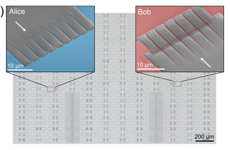 
Figure 1. Quantum network platform. (a) Schematic of the platform. Diamond tin-vacancy spin qubits, with inversion symmetric structure (upper inset), are integrated into broad- band diamond waveguide devices, operated around T = 1 K in a magnetic field of 117 mT (Appendix C). The microwave (MW) and laser fields for spin qubit and optical control (lower inset) are routed to individual devices via separate wirebonds and tapered fibers, respectively. Entanglement is generated by interference of spin-entangled photons at a central beamsplit- ter and detection via superconducting nanowire single-photon detectors (SNSPDs). (b) Optical microscope image of the diamond chip. Unit cells, each...

📷 Fig 2

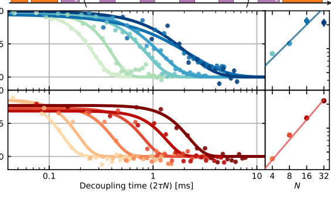 
Figure 2. Characterization of the quantum network node. Pulse sequences used are shown above each panel. Each sequence starts with a charge-resonance (CR) check and spin reset pulse. (a) Fast optical excitation and single-photon detection. Photon detection probability density, measured in counts per shot per time (CPSPT), as a function of time. The photon detection window, starting right after the optical π-pulse, is indicated in green. Inset: second-order auto-correlation functions g2

📷 Fig 3

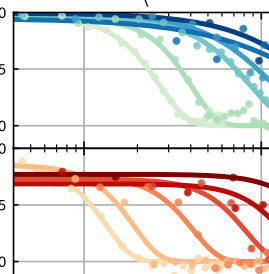 
Figure 3(a) shows the experimental sequence. First, to ensure high optical coherence of each SnV center as well as precise optical frequency alignment between the two SnV centers, we apply charge-resonance checks. In this procedure, for each SnV, photon counts are recorded while simultaneously driving the two spin-cycling tran- sitions and continuation is conditioned on surpassing a pre-defined threshold (Appendix D 1). The sequence pro- ceeds once both SnV centers have passed this check. Then, following a spin reset pulse, a series of optical π-pulses is applied to the two SnV centers. To maximize the tempo- ral overlap of the emitted photons on the beamsplitter,

📷 Fig 4

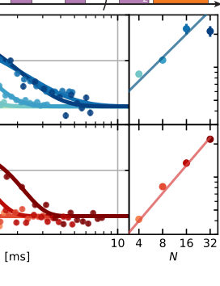 
Figure 3(b) shows the measured coincidences as a func- tion of pulse number difference. The decrease in co- incidences for higher absolute values of the difference is caused by the limited possible combinations in a block of 100 excitation pulses. The visibility is given by V = 1 −(N indist 0 /N dist 0 ), where N indist 0 (N dist 0 ) is the number of coincidences with pulse number difference of 0 for the temporally overlapped (temporally separated)

📷 Fig 5

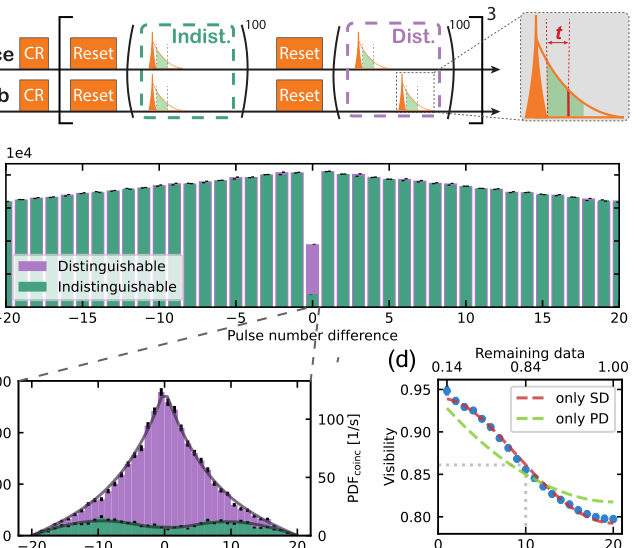 
Figure 3. Two-photon quantum interference. (a) Pulse sequence. Indistinguishable (distinguishable) photon pairs are created by simultaneous (non-simultaneous) resonant optical excitation of the two SnVs. (b) Histogram of measured coincidences for the two scenarios as a function of excitation pulse difference. For a pulse difference of zero, indistinguishable photons interfere yielding a strong suppression of coincidences. (c) Histogram of measured coincidences for zero pulse difference as a function of detection time difference ∆t. The solid lines are the coincidence probability density functions calculated from the fit in (d). (d) Visibility as a function of maximum detection time...

**Summary.** The research demonstrates scalable methods for generating remote entanglement between solid-state spin qubits ($	ext{SnV}$ centers) integrated into on-chip broadband waveguides. By circumventing the need for spectral matching to optical cavities, they achieve high-fidelity two-photon interference and heralded entanglement generation. This establishes a robust platform for building quantum network nodes.

**Why it may be interesting.** This work directly addresses the physical implementation challenges for quantum networking nodes by replacing fragile cavity coupling with robust waveguide integration, a critical step for scaling solid-state quantum technologies.

Detailed structure

**Main problem.** The primary goal is to demonstrate scalable quantum network links by achieving remote entanglement between solid-state spin qubits integrated into broadband waveguides, overcoming limitations of previous cavity-enhanced systems.

**Main result.** The authors successfully demonstrated heralded remote spin-spin entanglement using the waveguide platform, achieving high two-photon interference visibility comparable to cavity records without needing spectral matching.

**Method.** Entanglement is generated via a photon-mediated process (Barrett-Kok protocol) involving single-photon emission from diamond tin-vacancy ($	ext{SnV}$) centers and subsequent quantum interference measurements.

**Model / system.** The platform utilizes $	ext{SnV}$ spin qubits embedded in separate on-chip broadband waveguides fabricated on a high-purity diamond chip, operating at cryogenic temperatures. This system allows for intrinsic photon emission coupled to the waveguide mode.

**Key observables.** Entanglement fidelity ($F$), two-photon interference visibility ($V$), single-photon detection probability density, and spin coherence time ($T_{2	ext{DD}}$).

**Important parameters / regimes.** Operating temperature of $1	ext{ K}$; high structural yield (99%); entanglement success probability limited by photon collection efficiency ($\approx 0.3\%$).

**Assumptions / limitations.** The analysis relies on the assumption that broadband waveguides provide sufficient coupling and low loss to enable scalable, high-yield integration compared to cavity methods.

**Figures summary.** Figures illustrate the platform schematic (Fig. 1), qubit characterization (Rabi oscillations, coherence time scaling in Fig. 2), two-photon interference measurements showing visibility vs. time difference (Fig. 3), and the full heralded entanglement sequence (Fig. 4).

**Paper structure.** The paper proceeds by characterizing the fundamental properties of the $	ext{SnV}$ qubits (coherence, photon emission) in waveguides, demonstrating high-visibility two-photon interference without cavities, and culminating in the realization and characterization of heralded remote spin-spin entanglement.

Abstract

Solid-state spin-photon interfaces promise to scale quantum networks through on-chip photonic integration and multiplexed entanglement generation. To date, remote entanglement between integrated emitters has been realized only in cavity-enhanced systems, where fabrication yield and spectral matching remain major obstacles. Here we demonstrate heralded remote entanglement between diamond tin-vacancy spin qubits embedded in separate on-chip waveguides. Combining intrinsically efficient photon emission with a broadband waveguide architecture provides high device yield and obviates the need for spectral matching to cavity modes. We realize coherent optical and spin control and achieve high-visibility two-photon interference. By combining photon-mediated entanglement generation with real-time feedforward, we produce a consistent entangled state independent of the heralding pattern. These results establish waveguide-integrated tin-vacancy centers as a compelling platform for scalable quantum network nodes.

[↑ back to top](#top)

### [Entropy Transport in Programmable Quantum Junctions](http://arxiv.org/abs/2607.12581v1)

**Authors:** Radhika Joshi, Yuli V. Nazarov, Mohammad H. Ansari  
**Type:** theory · **Category:** statistical mechanics · **PDF:** <https://arxiv.org/pdf/2607.12581v1>  
**Analysis basis:** full PDF text, analyzed in chunks
**Topic relevance:** 🔥 `methods for driven-dissipative` **4/5** · 🔥 `non-equilibrium dynamics` **4/5** · `Keldysh / 2PI / non-Gaussian methods` **3/5** · `driven-dissipative phase transition` **3/5** · `correlated / nonlocal dissipation` **2/5** · `entanglement & information structure` **2/5** · `non-equilibrium universality` **2/5** · `analog quantum simulation` **1/5** · `correlated cavity matter` **1/5**

📷 Fig 1

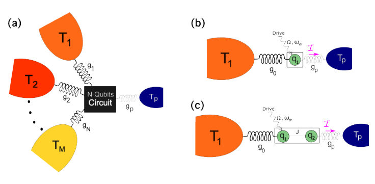 
FIG. 1. (a) General setup: The quantum junction consists of N-qubits. The qubits can be individually driven and can also interact with each other. The dissipative dynamics of the quantum system are governed by M-thermal reservoirs maintained at temperatures T1, . . . , TM. Desired quantity is the entropy flow to the probe reservoir Rp, which is kept at temperature Tp. (b,c) Entropy transport in driven one- and two-qubit junctions: The entropy conductance I into the probe reservoir Rp is evaluated for two representative quantum junctions. Reservoirs R1 and Rp are maintained at temperatures T1 and Tp, respectively. (b) A single qubit is coupled to both reservoirs and driven resonantly with...

📷 Fig 2

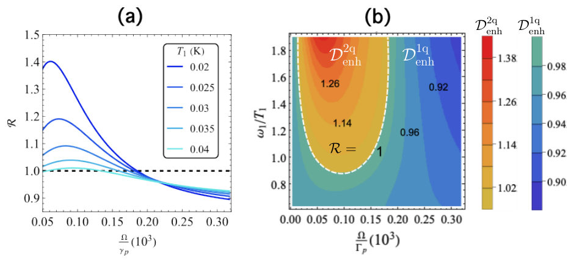 
FIG. 2. Entropy-conduction enhancement factor (R) at the stationary state as a function of Ωand T1. We consider the main reservoir temperature T1 to be between 20-60 mK while probe reservoir’s temperature is nearly zero. (a) In colder environment the two-qubit can be programmed to be faster and reach a peak value at weak driving regime (Ω≪∆). Increasing the driving power flips the ratio to make single-qubit faster than two qubit junction. (b) Contour map of R in the (Ω, T1) parameter plane. The dashed contour marks R = 1, separating the regime of two-qubit flow dominance R &gt; 1 from the opposite regime R &lt; 1, where the single-qubit junction yields the larger response. Here in the two-qubit...

📷 Fig 3

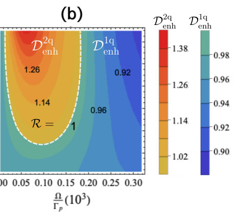 
Fig. 2a shows the stationary entropy conductance en- hancement factor R for discrete temperatures T1 and continuously varying drive amplitude Ω. The two-qubit junction exhibits a larger stationary entropy conductance in the weak-driving regime, Ω

📷 Fig 4

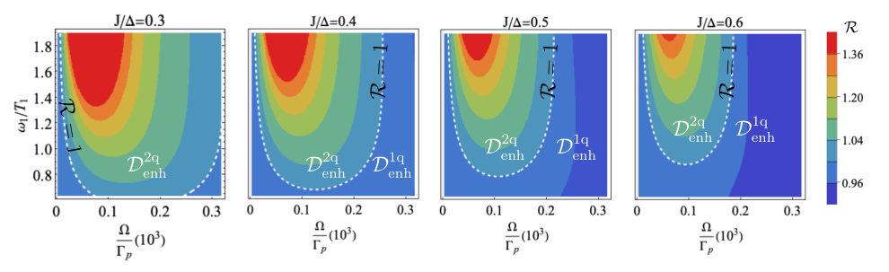 
FIG. 3. Entropy-conduction enhancement factor (R) at the stationary state for varying J/∆. Enhancement factor R for four representative values of the dimensionless coupling ratio J/∆= 0.3, 0.4, 0.5 and 0.6. Regions with R &gt; 1 identify regimes in which the driven two-qubit junction transports entropy more efficiently than the driven single-qubit junction. The enhancement region expands as J/∆is reduced, showing that entropy transport can be tuned by controlling the hybridization between the two qubits.

📷 Fig 5

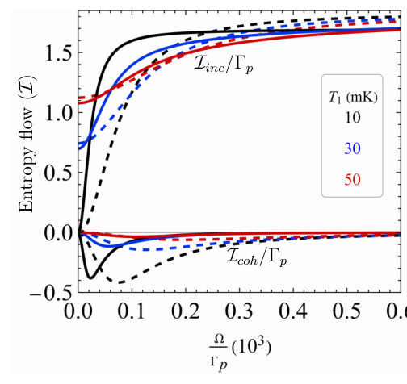 
FIG. 4. Coherent and incoherent contributions to entropy flow. The total entropy flow I is decomposed into incoherent and coherent components, Iinc and Icoh, respec- tively. The incoherent contribution is positive, whereas the coherent contribution is negative. The probe temperature is fixed at Tp = 10 mK, while the temperature T1 of reservoir R1 is varied. Entropy flow in two-qubit junction I2q (solid lines), converges at weaker driving compared to the the entropy flow in single-qubit junction I1q (dashed lines).

**Summary.** This paper demonstrates that driven quantum junctions can act as programmable devices for controlling physical entropy flow. By comparing single and two-qubit architectures, the authors show multi-qubit systems offer thermodynamic advantages while revealing novel effects like coherent entropy currents and negative differential conductance. The methodology relies on advanced non-equilibrium quantum field theory techniques.

**Why it may be interesting.** This work directly addresses non-equilibrium quantum thermodynamics by treating entropy transport as a measurable, controllable quantity in engineered quantum circuits, which is highly relevant for open quantum systems research.

Detailed structure

**Main problem.** The study focuses on achieving programmable control over physical entropy transport mediated by driven quantum junctions, moving beyond simple energy balance considerations.

**Main result.** Two-qubit junctions can enhance entropy transfer compared to single-qubit ones using lower driving power. The work also reveals coherent contributions and negative differential entropy conductance.

**Method.** The analysis employs the Keldysh diagrammatic approach and solves the Lindblad master equation under Born-Markov approximations to calculate nonlinear Rényi entropy flow.

**Model / system.** The system models $N$-qubit junctions coupled to multiple thermal reservoirs and a probe reservoir, described by an extended Hamiltonian including qubit interactions and external driving fields. The dynamics are governed by the Lindblad master equation.

**Key observables.** Entropy flow ($\mathcal{I}_\alpha$), entropy conductance, coherent contribution to entropy current, and negative differential entropy conductance.

**Important parameters / regimes.** Driving frequency ($\omega_{dr}$), coupling strengths ($g_{ij}, J$), and the Rényi order $\alpha$.

**Assumptions / limitations.** The weak coupling condition for the probe reservoir is assumed; calculations rely on Born-Markov, secular, and local master equation approximations.

**Figures summary.** Figures illustrate the general setup of the junctions coupled to baths. Specific figures show the enhancement factor ($R$) comparing two-qubit vs. single-qubit entropy conductance versus driving strength ($\Omega$), and energy spectra/anticrossings related to the Hamiltonian eigenstates.

**Paper structure.** The paper establishes the theoretical framework for nonlinear entropy flow, develops calculations using Keldysh formalism for both single and two-qubit junctions, compares the resulting entropy conductances, and analyzes specific non-intuitive effects like coherent contributions and negative differential conductance.

Abstract

We show that driven qubit junctions enable programmable control of physical entropy transport, with entropy conductance governed by quantum dynamics rather than by reservoir parameters alone. By comparing two simple quantum architectures -- a driven single-qubit junction and a driven two-qubit junction -- we find that the two-qubit junction enhances entropy transfer while requiring substantially lower driving power than its single-qubit counterpart. We further reveal two non-intuitive effects in both junctions: a sizable coherent contribution to the entropy current that emerges only under resonant driving, and negative differential entropy conductance, where increasing the thermal bias suppresses entropy flow into the probe reservoir. These results identify quantum logic architectures as programmable devices for entropy transport and suggest routes toward quantum feedback control, reservoir protection and refrigeration in driven quantum circuits.

[↑ back to top](#top)

### [Activating thermally charged quantum batteries in finite time: Thermodynamic trade-offs between correlations, work, and information](http://arxiv.org/abs/2607.12573v1)

**Authors:** Bhaskar Barman, Janine Splettstoesser, Henning Kirchberg  
**Type:** theory · **Category:** statistical mechanics · **PDF:** <https://arxiv.org/pdf/2607.12573v1>  
**Analysis basis:** full PDF text, analyzed in chunks
**Topic relevance:** 🔥 `non-equilibrium dynamics` **4/5** · `entanglement & information structure` **3/5** · `methods for driven-dissipative` **3/5** · `non-equilibrium universality` **3/5** · `Keldysh / 2PI / non-Gaussian methods` **2/5** · `correlated / nonlocal dissipation` **2/5** · `driven-dissipative phase transition` **2/5** · `scars & prethermalization` **1/5**

📷 Fig 1

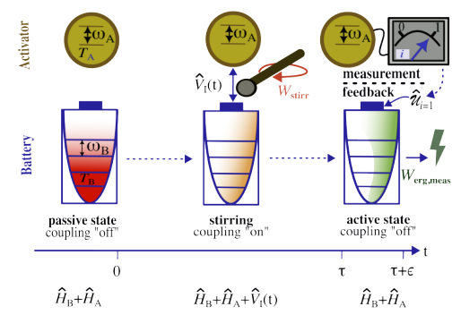 
Figure 1. Schematic of the activation process. An initially thermally-charged harmonic-oscillator quantum battery (fre- quency ωB and Hamiltonian ˆHB), is prepared in a passive thermal state at temperature TB. At time t = 0, the bat- tery is coupled to a two-level activator (frequency ωA and Hamiltonian ˆHA) initialized in a thermal state at tempera- ture TA, by the time-dependent stirring Hamiltonian ˆVI(t) and requiring a stirring work Wstirr. At t = τ, the battery and activator are decoupled. A projective measurement of the activator in the state i = 0 or i = 1 conditions a tay- lored, unitary energy-extraction operation ˆUi=0;1. The mea- surement, feedback, and energy extraction...

📷 Fig 2

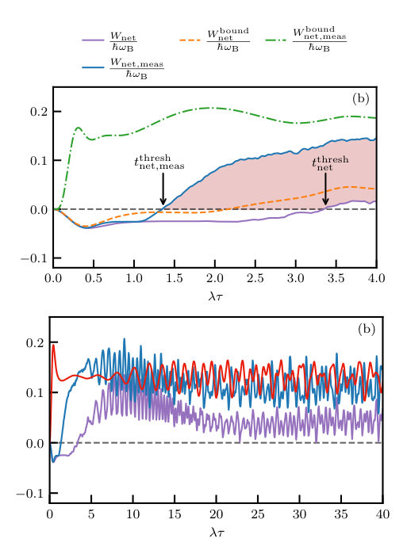 
Figure 2. (a) Net extracted useful energy with measurement, Wnet,meas, and without measurement, Wnet, plotted against stirring time λτ. Also their respective bounds, W bound net,meas, and, W bound net,meas, are shown. Wnet and Wnet,meas become posi- tive at the threshold times, tthresh net and tthresh net,meas, respectively. (b) Wnet, Wnet,meas and internal energy change ∆EA of the activator over a longer stirring time. Battery and activa- tor parameters are set to ℏωA/TA = 1.2, TA/TB = 0.15, ωA/ωB = 1.2, λ/ωB = 0.1, and Wstirr &gt; 0 (identified as heat valve regime (B1) during the stirring stroke).

📷 Fig 3

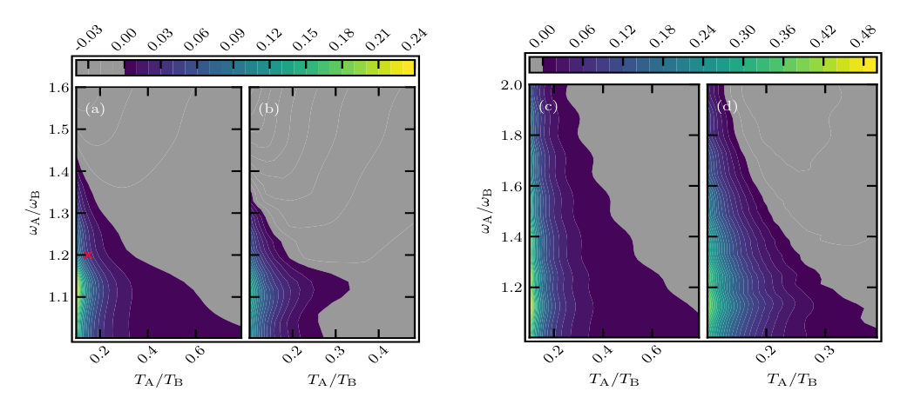 
Figure 3. (a) W bound net , (b) Wnet , (c) W bound net,meas and (d) Wnet,meas as functions of relative frequency ωA/ωB and relative temperature TA/TB. We use τ = 4.0 λ−1, ℏωB/TB = 0.1, and λ/ωB = 0.01. The red cross in (a) indicates the values for ωA/ωB and TA/TB chosen in Fig. 2.

📷 Fig 4

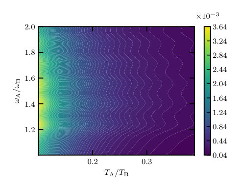 
Figure 4. Information gain I(τ), Eq. (22), plotted against ωA/ωB and TA/TB for τ = 4.0λ−1, ℏωB/TB = 0.1, and λ/ωB = 0.01.

📷 Fig 5

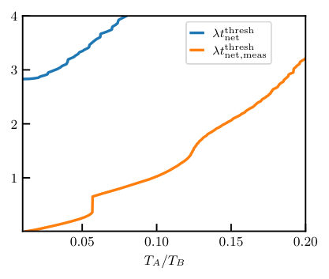 
Figure 5. λ tthresh net and λ tthresh net,meas plotted against the rela- tive temperature TA/TB at ωA/ωB = 1.4, ℏωB/TB = 0.07, and λ/ωB = 0.1, and Wstirr &gt; 0 (identified as heat valve regime (B1)). It shows the advantage of net energy extrac- tion time in the presence of a measurement over the net energy extraction time.

**Summary.** The paper proposes a protocol using time-dependent coupling (stirring) to activate passive quantum batteries, allowing for controlled energy extraction. It rigorously analyzes the thermodynamic trade-offs between work input, correlation generation, and information gain during this activation process. The results provide quantitative bounds on the maximum usable energy extractable from such systems.

**Why it may be interesting.** This work directly addresses non-equilibrium thermodynamics and quantum resource theory, which is highly relevant to open quantum systems, quantum heat engines, and understanding energy flow in complex quantum devices.

Detailed structure

**Main problem.** The core problem is developing a method to activate passive, thermally charged quantum batteries into an active state to enable controlled energy extraction.

**Main result.** The authors derive bounds on the maximal net extractable energy by explicitly accounting for the energetic cost of stirring, the entropic cost of correlation generation, and the activation time.

**Method.** The analysis uses thermodynamic principles, quantifying useful work via ergotropy and deriving upper bounds by relating it to non-equilibrium free energy differences.

**Model / system.** The model consists of a quantum battery ($\hat{H}_B$) and an ancillary activator ($\hat{H}_A$), coupled by a time-dependent interaction Hamiltonian $\hat{V}_I(t)$ during a 'stirring protocol.'

**Key observables.** Net extractable energy (net ergotropy), power output, work exchanged ($W_{	ext{stir}}$), and correlation build-up.

**Important parameters / regimes.** Activation Time ($	au$), relative temperatures ($T_A/T_B$), and frequency ratios ($\omega_A/\omega_B$).

**Assumptions / limitations.** The protocol assumes that environmental effects can be neglected during the short stirring time (timescale separation), and initial states are thermal Gibbs states.

**Figures summary.** Figure 7 illustrates three thermodynamic operating regimes (Heat Valve, Heat Engine, Refrigerator) defined by mathematical conditions on temperatures and frequencies, showing how ergotropy varies across these regimes.

**Paper structure.** The paper follows a logical progression: defining the passive battery state $
ightarrow$ introducing the time-dependent stirring protocol ($\hat{V}_I(t)$) $
ightarrow$ deriving bounds for net extractable energy by accounting for costs $
ightarrow$ applying this framework to an experimentally relevant waveguide-QED setup.

Abstract

Thermally charged quantum batteries provide a stable and easy-to-have energy resource, but remain passive and therefore do not allow useful energy extraction on demand via unitary operations. We introduce a time-dependent stirring protocol that activates a thermally charged quantum battery through a time-dependent coupling to an auxiliary activator, thereby generating correlations that drive the battery into an active state. Accounting explicitly for the energetic cost of the stirring process, the entropic cost of correlation generation and the activation time, we derive bounds on the maximal net extractable energy. Incorporating projective measurement on the activator and exploiting the information gained through the measurement further enhances the extractable energy. As an experimentally relevant example, we analyze a waveguide-QED setup where a harmonic-oscillator battery (waveguide) is stirred and monitored by a two-level system. We characterize the performance of the protocol in terms of net extractable energy (net ergotropy) and power output.

[↑ back to top](#top)

### [Dissipative phase transitions and chaos in two-photon driven quantum optomechanics](http://arxiv.org/abs/2607.12044v1)

**Authors:** Giovanni Bragadin, Filippo Ferrari, Lorenzo Fioroni, Matteo Seclì, Vincenzo Macrì, Vincenzo Savona, Alberto Mercurio  
**Type:** theory · **Category:** statistical mechanics · **PDF:** <https://arxiv.org/pdf/2607.12044v1>  
**Analysis basis:** full PDF text, analyzed in chunks
**Topic relevance:** 🔥 `driven-dissipative phase transition` **4/5** · `methods for driven-dissipative` **3/5** · `non-equilibrium universality` **3/5** · `Keldysh / 2PI / non-Gaussian methods` **2/5** · `correlated / nonlocal dissipation` **2/5** · `non-equilibrium dynamics` **2/5** · `Tavis-Cummings & cavity-many-emitter` **1/5** · `analog quantum simulation` **1/5** · `correlated cavity matter` **1/5** · `quantum measurements` **1/5**

📷 Fig 1

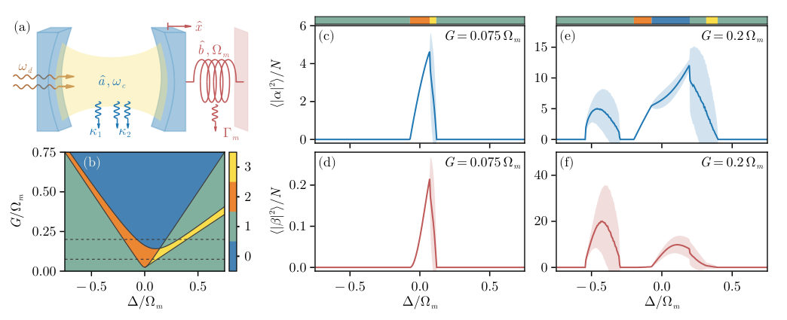 
FIG. 1. Mean-field analysis of the two-photon optomechanical system. (a) Schematic representation of the setup. An optical cavity (in blue) is coupled to a mechanical oscillator (in red). The cavity is driven by a two-photon pump and is subject to both single- and two-photon losses, with rates κ1 and κ2, respectively. The mechanical oscillator has frequency Ωm and damping rate Γm. (b) Stability diagram in the (∆/Ωm, G/Ωm) plane. The colors indicate the number of physical and stable mean- field solutions, while the dashed horizontal lines mark the two cuts used in the mean-field simulations. (c),(d) Mean photon (blue) and phonon (red) occupations along the low-pump cut G = 0.075 Ωm. In this...

📷 Fig 2

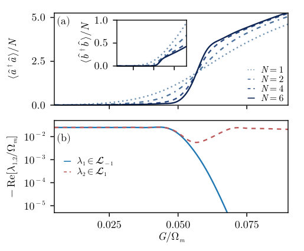 
FIG. 3. Emergence of a first-order dissipative phase tran- sition with symmetry breaking as a function of the pump strength G/Ωm for increasing N. (a) Rescaled photon occu- pation ⟨ˆa†ˆa⟩/N, displaying a sharp jump that becomes more abrupt as N increases. The inset shows the corresponding rescaled phonon occupation ⟨ˆb†ˆb⟩/N. (b) Real parts of the two Liouvillian eigenvalues with smallest modulus, −Re[λ1,2/Ωm], for N = 5. The eigenvalue λ1 ∈L−1 (blue solid line) be- comes small throughout the symmetry-broken region, while λ2 ∈L1 (red dashed line) becomes small only close to the critical point. This indicates the coexistence of metastable states and the discontinuous nature of the...

📷 Fig 3

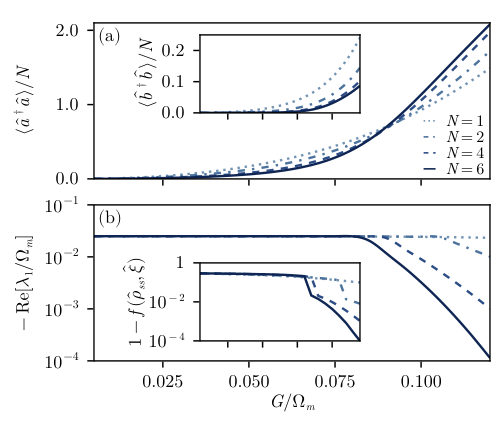 
FIG. 2. Emergence of a second-order dissipative phase tran- sition as a function of the pump strength G/Ωm for increas- ing scaling parameter N. (a) Rescaled photon occupation ⟨ˆa†ˆa⟩/N. The smooth increase of the occupation across the critical point is consistent with a continuous transition. The inset shows the corresponding rescaled phonon occupation ⟨ˆb†ˆb⟩/N. (b) Rescaled Liouvillian gap −Re[λ1/Ωm]. As N increases, the gap decreases and remains close to zero over an extended region, signaling the emergence of the symmetry- broken phase. The inset shows the error 1−f(ρss, ξ), where f is the fidelity between the steady state and its reconstructed form ξ = (ρ+ + ρ−)/2. The decrease of...

📷 Fig 4

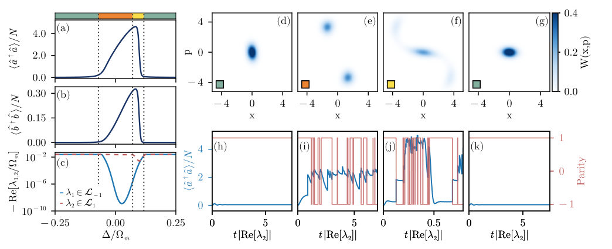 
FIG. 4. Steady-state and phase-space characterization as a function of the detuning ∆/Ωm at fixed pump strength G = 0.075 Ωm and system size N = 5. (a),(b) Rescaled photon and phonon occupations, ⟨ˆa†ˆa⟩/N and ⟨ˆb†ˆb⟩/N. The occupations show a smooth onset at negative detuning and a sharp drop at positive detuning. (c) Real parts of the two Liouvillian eigenvalues with smallest modulus, −Re[λ1,2/Ωm]. The eigenvalue λ1 ∈L−1 remains small over the symmetry-broken region, while λ2 ∈L1 becomes small only close to the positive-detuning transition, signaling the first-order transition. (d)–(g) Wigner functions of the optical mode for representative detunings chosen inside the regions separated by...

📷 Fig 5

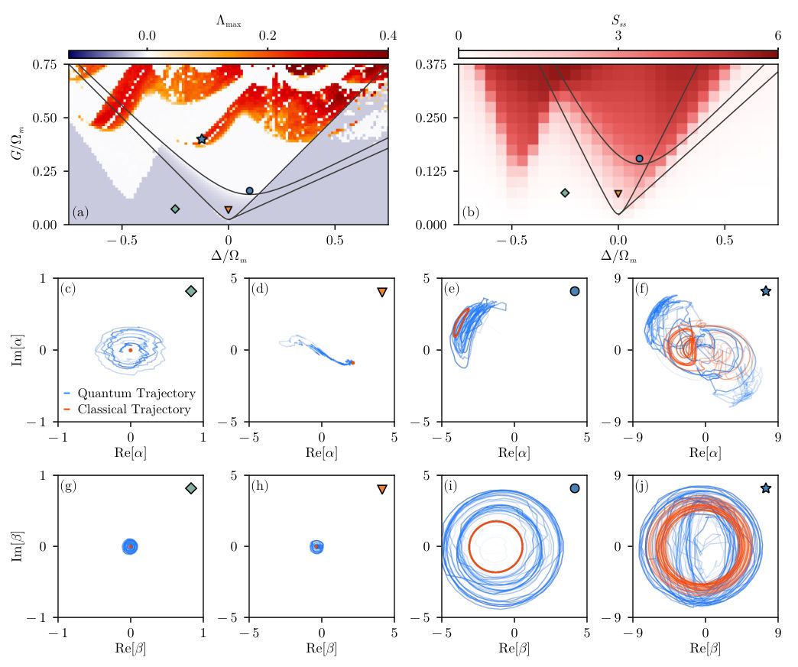 
FIG. 5. Classical and quantum characterization of the high-pump dynamical regime. (a) Map of the largest Lyapunov exponent Λmax obtained from the mean-field equations. Positive values of Λmax identify classically chaotic dynamics, while regions with Λmax ≃0 correspond to regular limit cycles. These time-dependent regimes appear inside the unstable region predicted by the mean-field stability diagram of Fig. 1b. The side peak observed in the mean-field simulations of Figs. 1e and 1f is also visible in this map. On the right side of the diagram, a region where the stable empty solution coexists with a limit-cycle or chaotic attractor is observed. (b) Von Neumann entropy of the steady state,...

**Summary.** The authors analyze a two-photon driven optomechanical system to study non-equilibrium phenomena. They demonstrate the existence of both first- and second-order dissipative phase transitions depending on detuning, while also showing that increasing pump power drives the system into chaotic regimes characterized by positive Lyapunov exponents. This establishes the platform as a rich testbed for quantum criticality.

**Why it may be interesting.** This work provides a concrete, experimentally accessible platform (optomechanics) to observe fundamental concepts like dissipative criticality, symmetry breaking, and quantum chaos simultaneously. The rigorous use of Liouvillian spectra is key for characterizing open system dynamics near critical points.

Detailed structure

**Main problem.** The study investigates nonequilibrium criticality and chaos within a driven-dissipative quantum optomechanical system.

**Main result.** The model successfully supports both first-order and second-order dissipative phase transitions, alongside the emergence of chaotic dynamics at strong driving.

**Method.** Analysis combines semiclassical stability analysis, exact Liouvillian spectral calculations, and stochastic quantum trajectory simulations.

**Model / system.** The system is a two-photon driven optomechanical setup coupling an optical resonator to a mechanical oscillator. The dynamics are governed by a Lindblad master equation incorporating parametric driving and dissipation.

**Key observables.** Dissipative phase transitions (first/second order), cavity-parity symmetry breaking, Lyapunov exponents, and steady-state entropy.

**Important parameters / regimes.** Detuning ($\Delta$), coupling strength ($G$), mechanical frequency ($\Omega_m$), and pump power (related to $G$).

**Assumptions / limitations.** The analysis relies on semiclassical approximations for mean-field dynamics but extends to full quantum descriptions via Liouvillian spectra.

**Figures summary.** Figures illustrate stability diagrams showing continuous vs. discontinuous transitions, and plots of mean photon/phonon occupations across different pump strengths.

**Paper structure.** The paper systematically analyzes the system's behavior by first establishing the model, then using semiclassical methods to identify DPTs based on detuning signs, followed by spectral analysis to confirm transition orders, and finally examining high-power regimes for chaotic signatures.

Abstract

We investigate nonequilibrium criticality and chaos in a two-photon-driven optomechanical system. The parametric drive preserves a discrete $\mathbb{Z}_2$ symmetry of the optical field, while radiation-pressure coupling transfers the resulting nonlinear dynamics to a mechanical oscillator. Combining semiclassical stability analysis, exact Liouvillian spectra, and stochastic quantum trajectories, we show that this driven-dissipative optomechanical model supports both first- and second-order dissipative phase transitions. At negative detuning a second-order transition yields spontaneous breaking of the cavity-parity symmetry in the thermodynamic limit. At positive detuning the same symmetry breaking coexists with a first-order transition, signaled by metastability and by an additional symmetric Liouvillian mode. At stronger pump power the mean-field dynamics loses all stable fixed points and develops limit cycles and chaotic attractors with positive Lyapunov exponent. Quantum trajectories in this regime display chaotic-like motion, enhanced steady-state entropy, and delocalization over many entropic Liouvillian modes. These results establish two-photon-driven optomechanics as a platform where dissipative criticality, symmetry breaking, and quantum signatures of chaos emerge within the same experimentally accessible setting.

[↑ back to top](#top)

### [Forked Physics-Informed Neural Networks for Non-Markovian Open Quantum Dynamics and Control](http://arxiv.org/abs/2607.12567v1)

**Authors:** Zhao-Wei Wang, Kai-Yu Yuan, Feng-Hua Ren, Zhao-Ming Wang  
**Type:** theory · **Category:** quantum information and computing · **PDF:** <https://arxiv.org/pdf/2607.12567v1>  
**Analysis basis:** full PDF text, analyzed in chunks
**Topic relevance:** 🔥 `methods for driven-dissipative` **4/5** · `analog quantum simulation` **3/5** · `correlated / nonlocal dissipation` **3/5** · `non-equilibrium dynamics` **3/5** · `Keldysh / 2PI / non-Gaussian methods` **2/5** · `driven-dissipative phase transition` **2/5** · `entanglement & information structure` **1/5** · `non-equilibrium universality` **1/5** · `quantum measurements` **1/5**

📷 Fig 1

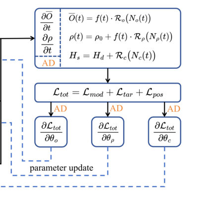 
Figure 1. FPINNs architecture for solving non-markovian open quantum dynamics and control. The input to FPINN is t. The green dashed box denotes the shared layers, which learn common features, while the yellow dashed box denotes the branch layers, which learn unique features. The outputs are feature vector No(t), Nρ(t), and Nc(t). Through reconstruction operations, O(t), ρ(t), and Hs(t) are obtained, and AD is used to compute ∂O/∂t and ∂ρ/∂t. After the gradients of the total loss with respect to the parameters of different branch layers are computed via AD, the updates are performed accordingly.

📷 Fig 2

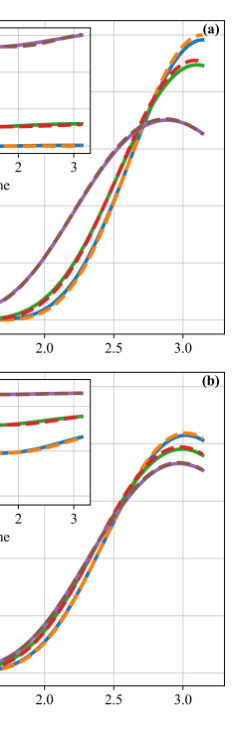 
Figure 2. (a) Evolution of P00(t) simulated by RK4 and FPINN for different Γ. (b) Evolution of P00(t) simulated by RK4 and FPINN for different γ.

📷 Fig 3

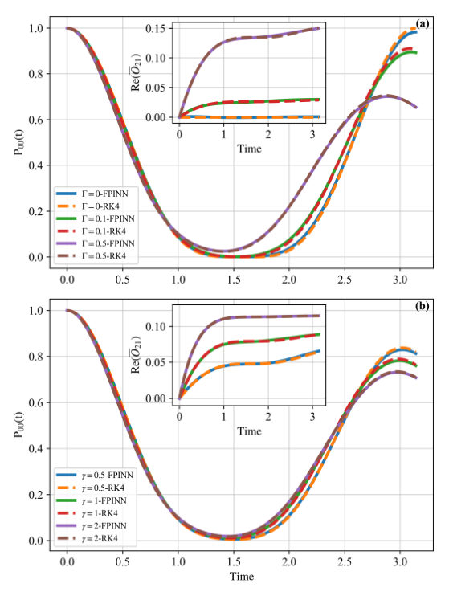 
Figure 2(b) examines the influence of parameter γ, which characterizes the memory time of the environment. A smaller γ indicates stronger non-Markovianity (longer memory). The simulations fix Γ = 0.3 and vary γ = 0.5, 1, and 2. For smaller γ, the system exhibits a higher degree of recovery at t = π, a hallmark of non-Markovian dynamics where information flows back from the environment to the system. Conversely, larger γ (approaching the Markovian limit) leads to weaker revivals. FPINN faithfully reproduces these features, matching the RK4 reference in all cases. The subplot in Fig. 2 displays the real part of the off-diagonal density matrix element Re{O12} as a function of time, which...

📷 Fig 4

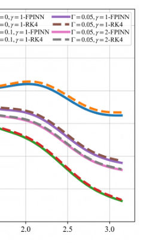 
Figure 3. Evolution of P00(t) simulated by RK4 and FPINN for different Γ and γ.

📷 Fig 5

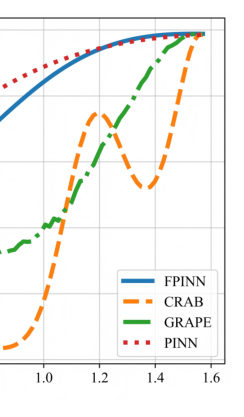 
Figure 4. Time evolution of the fidelity under the control schemes designed by the four algorithms.

**Summary.** This paper introduces the Forked Physics-Informed Neural Network (FPINN) to solve the difficult problem of simulating and controlling open quantum systems under non-Markovian conditions. By selectively decoupling optimization objectives at the gradient level, FPINN overcomes convergence issues faced by standard PINNs in these complex environments. The framework demonstrates superior performance in state preparation fidelity compared to existing optimal control techniques.

**Why it may be interesting.** This is highly relevant as it provides an end-to-end differentiable framework for quantum control in realistic, non-Markovian settings, which are crucial for understanding decoherence in physical devices like superconducting qubits or trapped ions.

Detailed structure

**Main problem.** The core problem is unifying quantum simulation and control for open quantum systems, specifically overcoming the failure of standard Physics-Informed Neural Networks (PINNs) when modeling non-Markovian dynamics.

**Main result.** The proposed Forked PINN (FPINN) successfully achieves joint optimization of simulation and control by decoupling objectives at the gradient level, outperforming established methods like GRAPE in fidelity for state preparation.

**Method.** The authors extend FPINNs by adding a dedicated control branch, utilizing selective gradient flow to transform an intractable multi-task optimization into a well-conditioned one.

**Model / system.** The work models open quantum dynamics using the Quantum State Diffusion (QSD) approach for non-Markovian environments. The system is tested on a two-qubit Heisenberg XXX model, governed by master equations involving bath and interaction Hamiltonians.

**Key observables.** Ground-state population evolution ($P_{00}(t)$), fidelity of state preparation, and the characteristic signatures of information backflow in non-Markovian dynamics.

**Important parameters / regimes.** The memory parameter ($\gamma$) characterizing non-Markovianity, coupling strengths ($\Gamma$), and time-dependent control field amplitudes/frequencies.

**Assumptions / limitations.** Standard PINNs fail due to multi-objective optimization conflicts when applied to the coupled differential equations arising from non-Markovian dynamics.

**Figures summary.** Figures compare the simulation of ground-state population ($P_{00}(t)$) using both RK4 (reference) and FPINN across varying dissipation strengths ($\Gamma$) and memory parameters ($\gamma$).

**Paper structure.** The paper introduces the challenge of non-Markovian PINNs, details the FPINN architecture with its shared trunk and three independent branches, defines a composite loss function ($L_{mod} + L_{tar} + L_{pos}$), and validates the method through numerical simulations on the two-qubit model.

Abstract

Physics-informed neural networks (PINNs) provide a pathway to reunify the simulation and control of quantum systems, in which these two tasks are typically decoupled in traditional strategies. However, most work remains confined to Markovian environments. When applied to non-Markovian systems, standard PINN architectures fail to converge reliably due to multi-objective optimization conflicts arising from the coupled differential equations. To address this fundamental limitation, we extend our previously proposed forked PINN (FPINN) by incorporating a dedicated control branch. By decoupling the optimization objectives at the gradient level via selective gradient flow, our method turns a previously intractable multi-task optimization into a well-conditioned one, allowing simulation and control to be optimized jointly without compromise. Numerical simulations on a two-qubit Heisenberg XXX model confirm that our framework faithfully reproduces the features of non-Markovian dynamics, including decoherence and information backflow. Taking a state-preparation task on the same model as an example, our FPINN achieves higher fidelity than gradient ascent pulse engineering, chopped random basis, and standard PINNs, with the advantage becoming more pronounced as the environment becomes more dissipative and more Markovian. The generated pulses are also noticeably smoother, which is advantageous for experimental implementation. Our framework thus provides a unified, end-to-end differentiable paradigm for simulation and control of open quantum systems, with potential implications for quantum computing, simulation, and control.

[↑ back to top](#top)

### [Nonequilibrium thermodynamics of the acoustoelectric quantum vacuum](http://arxiv.org/abs/2607.12228v1)

**Authors:** Ryan O. Behunin, Andrew Shepherd, Francesco Intravaia, Matt Eichenfield  
**Type:** theory · **Category:** statistical mechanics · **PDF:** <https://arxiv.org/pdf/2607.12228v1>  
**Analysis basis:** full PDF text, analyzed in chunks
**Topic relevance:** 🔥 `non-equilibrium dynamics` **4/5** · 🔥 `non-equilibrium universality` **4/5** · `Keldysh / 2PI / non-Gaussian methods` **3/5** · `driven-dissipative phase transition` **3/5** · `methods for driven-dissipative` **3/5** · `analog quantum simulation` **1/5** · `correlated / nonlocal dissipation` **1/5** · `correlated cavity matter` **1/5**

📷 Fig 1

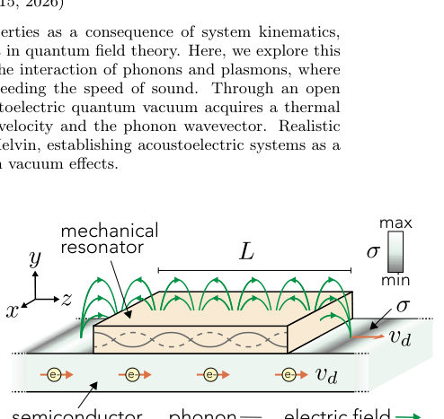 
FIG. 1. Mechanical resonator coupled electromechanically to moving charge oscillations. When the free carriers are set in motion with drift velocity vd, fluctuating surface charge den- sity σ sources evanescent electric fields that can drive dynamic mechanical displacement.

📷 Fig 2

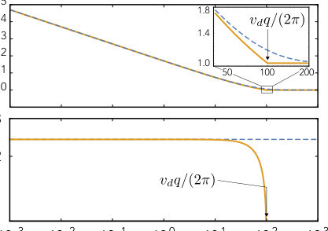 
FIG. 2. Nonequilibrium occupation number (a) and (b), and effective temperature (c). Results are compared to thermal equilibrium results with T = ℏvdq/2kB. The parameters used are vd = 50, 000 m/s, q = (2π)2 × 106 1/m, ω0 = (2π)5 THz, and γ = (2π)5.1 THz. Note that the plotted quantities are independent of the coupling g.

📷 Fig 3

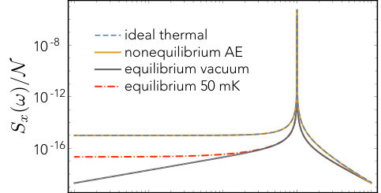 
FIG. 3. Normalized oscillator power spectrum for a nonequi- librium steady-state (orange), thermal state with T = ℏvdq/(2kB) (blue dashed), equilibrium state at zero temper- ature (gray), and thermal state with T = 50 mK (red, dot- dashed). The parameters used are the same as Fig. 2 in addition to g = 2 GHz (see Ref. [13]), Ω= (2π)10 GHz, and vm = 5000 m/s. Each power spectrum is normalized by N = Sx(Ω) using Eq. (22).

**Summary.** The paper explores the non-equilibrium thermodynamics of the quantum vacuum in acoustoelectric devices where charge carriers drift rapidly. By analyzing phonon-plasmon interactions using open quantum systems methods, the authors demonstrate that the vacuum fluctuations acquire a measurable thermal character. This establishes these solid-state systems as promising experimental platforms for studying fundamental quantum vacuum effects.

**Why it may be interesting.** This work directly connects concepts from quantum field theory (vacuum effects) to condensed matter systems (semiconductors/phonons) using advanced open quantum system formalism, which is highly relevant for AMO physics and quantum optics applications.

Detailed structure

**Main problem.** The study investigates how the quantum vacuum acquires thermal properties when subjected to non-equilibrium conditions created by charge drift in acoustoelectric systems.

**Main result.** The system's fluctuations acquire a thermal character, characterized by an effective temperature $T_{AE}$ proportional to the drift velocity and phonon wavevector, suggesting these platforms can model Unruh-like effects.

**Method.** The analysis employs open quantum systems techniques, calculating power spectra using the Wiener-Khinchin theorem and deriving non-equilibrium fluctuation-dissipation relations.

**Model / system.** The system models an electromechanically coupled mechanical oscillator interacting with plasmons and phonons in a semiconductor under a constant drift current. The dynamics are governed by coupling terms derived from the total Hamiltonian $H = H_0 + H_{int}$.

**Key observables.** Effective temperature ($T_{AE}$), power spectrum of mechanical fluctuations ($S_x(\omega)$), and non-equilibrium occupation number ($n_{AE}(\omega)$).

**Important parameters / regimes.** Drift velocity ($v_d$), phonon wavevector ($q$), effective temperature ($\sim \hbar v_d q / k_B$).

**Assumptions / limitations.** The analysis assumes the quasielectrostatic approximation and that plasmons are initially prepared in the quantum ground state for noise calculations.

**Figures summary.** Figure 1 illustrates the mechanical resonator coupled to moving charge oscillations. Figure 2 compares occupation numbers and effective temperatures between ideal thermal and non-equilibrium acoustoelectric regimes. Figure 3 shows the normalized power spectrum comparison.

**Paper structure.** The paper develops the theory by analyzing the Hamiltonian, deriving equations of motion for the oscillator (Langevin approach), calculating two-time correlation functions in the frequency domain, and finally establishing a non-equilibrium fluctuation-dissipation relation that yields the effective temperature.

Abstract

The quantum vacuum can assume thermal properties as a consequence of system kinematics, highlighting the nuance of our definition of particles in quantum field theory. Here, we explore this phenomenon in acoustoelectric systems, involving the interaction of phonons and plasmons, where the charge carriers drift at a constant velocity exceeding the speed of sound. Through an open quantum systems analysis, we show that the acoustoelectric quantum vacuum acquires a thermal character with a temperature defined by the drift velocity and the phonon wavevector. Realistic parameters yield effective temperatures of several Kelvin, establishing acoustoelectric systems as a promising platform for the investigation of quantum vacuum effects.

[↑ back to top](#top)

### [The Infraparticle Edge](http://arxiv.org/abs/2607.13001v1)

**Authors:** Soo-Jong Rey  
**Type:** theory · **Category:** other · **PDF:** <https://arxiv.org/pdf/2607.13001v1>  
**Analysis basis:** full PDF text, analyzed in chunks
**Topic relevance:** 🔥 `Keldysh / 2PI / non-Gaussian methods` **4/5** · `correlated / nonlocal dissipation` **3/5** · `driven-dissipative phase transition` **3/5** · `methods for driven-dissipative` **3/5** · `non-equilibrium dynamics` **2/5** · `non-equilibrium universality` **2/5** · `Kondo & dissipative impurity` **1/5** · `measurement-induced transitions` **1/5** · `quantum measurements` **1/5**

📷 Fig 1

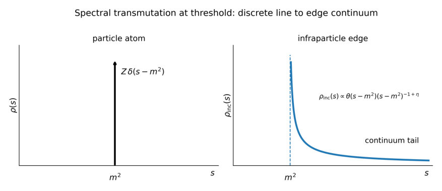 
Figure 1: A stable particle contributes an isolated atom at s = m2. The charged QED sector begins at the same threshold and carries an integrable continuum edge. The unresolved photon environment transfers the atomic weight into the continuum.

**Summary.** This paper develops a sophisticated open-system approach to study the spectral edge of charged particles interacting with soft photons in QED. By analyzing the energy marginals through projections and Laplace transforms, the author demonstrates that the interaction smears the sharp mass shell into an 'infraparticle edge.' This edge possesses a power-law singularity characteristic of unparticles, directly linking its exponent to the unresolved photon environment.

**Why it may be interesting.** This work provides a rigorous theoretical framework for understanding how environmental coupling (like soft photon emission) fundamentally alters particle spectral features, moving beyond simple mass-shell descriptions into continuum physics relevant to quantum field theory renormalization.

Detailed structure

**Main problem.** The paper derives the spectral edge of charged particles by analyzing their interaction with unresolved (soft) photons within the framework of soft Quantum Electrodynamics (QED). It aims to determine how environmental coupling modifies the expected particle spectrum.

**Main result.** The resulting inclusive spectral measure exhibits an infraparticle edge characterized by a local power law, mirroring that of a gapped unparticle spectrum. This exponent is determined by the unresolved photon sector's soft intensity ($\eta_h$).

**Method.** The analysis employs open-quantum-system techniques, utilizing projections of the quantum instrument and Laplace transforms to analyze energy marginals in both real and imaginary time.

**Model / system.** The model is based on charged particles interacting with a soft photon bath (soft QED). The system is treated as an open quantum system where the environment causes dephasing, dissolving sharp spectral features.

**Key observables.** Spectral measure $
ho_{	ext{inc}}(s)$, inclusive energy distribution $	ext{d}Ph(E)$, and various exponents ($\eta_h$, $\eta_{	ext{edge}}^a$).

**Important parameters / regimes.** The infrared floor ($\mu$), the separation scale ($\Lambda$), and the soft intensity exponent ($\eta_h$) are crucial parameters determining the edge behavior.

**Assumptions / limitations.** The derivation assumes a clear separation between hard (resolved) and soft (unresolved) photon contributions, allowing for the systematic calculation of exponents from each sector.

**Figures summary.** Figure 1 illustrates the theoretical transition from an isolated mass shell (stable particle) to a continuum edge due to unresolved photons in QED.

**Paper structure.** The paper proceeds by defining the soft QED quantum instrument, projecting it onto hard and inclusive channels, calculating the resulting spectral density using Laplace transforms, and finally deriving the power-law behavior of the infraparticle edge while separating bath and hard exponents.

Abstract

I derive the charged-particle spectral edge from the quantum instrument of soft QED. I use two projections of that instrument. Tracing over unresolved photons gives the reduced hard-sector channel. Pushing the outcomes to total energy gives the inclusive energy distribution. Its Laplace exponent is fixed by the diagonal soft intensity. For ${\rm d} N_h(ω)=η_h{\rm d}ω/ω+{\rm d} N_{h,\mathrm{reg}}(ω)$, I obtain $ρ_{\mathrm{inc}}(s)\sim Cθ(s-m^2)(s-m^2)^{-1+η_h}$. I retain the coherence kernel and derive hard-sector dephasing and the spectral edge from two contractions of one soft environment. The diagonal coefficient $κ_{aa}$ fixes the endpoint exponent, while $\frac12(κ_{aa}+κ_{bb}-2\operatorname{Re}κ_{ba})$ fixes the dephasing exponent between hard alternatives. I then classify infrared energy marginals, derive the finite-resolution residue $Z(μ)=(μ/Λ)^{η_h}$, prove stability under infrared-integrable perturbations, and separate the bath exponent from a hard threshold exponent. For the one-electron spectral measure, the hard threshold factor is regular. The resulting edge has the local power law of a gapped unparticle spectrum, while its exponent remains a response coefficient of the unresolved photon sector.

[↑ back to top](#top)

### [Thermal Suppression of Dynamical Quantum Phase Transitions in Finite-Dimensional Systems A Quasi-Hermitian Framework](http://arxiv.org/abs/2607.12838v1)

**Authors:** Jia-Chen Tang, Xu-Yang Hou, Ming-Zhang Wang, Hao Guo  
**Type:** theory · **Category:** statistical mechanics · **PDF:** <https://arxiv.org/pdf/2607.12838v1>  
**Analysis basis:** full PDF text, analyzed in chunks
**Topic relevance:** 🔥 `driven-dissipative phase transition` **4/5** · `methods for driven-dissipative` **3/5** · `non-equilibrium dynamics` **3/5** · `non-equilibrium universality` **3/5** · `Keldysh / 2PI / non-Gaussian methods` **2/5** · `Kondo & dissipative impurity` **1/5** · `analog quantum simulation` **1/5** · `correlated / nonlocal dissipation` **1/5** · `entanglement & information structure` **1/5** · `scars & prethermalization` **1/5**

📷 Fig 1

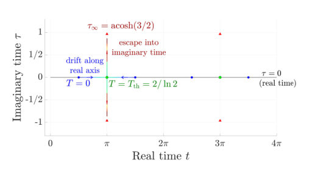 
Figure 2. Fisher zeros of the Loschmidt amplitude in the complex time plane for Case 1 (N = 5, R = 0). Blue circles mark the T = 0 zeros, green circles mark the merger at T = Tth, and red triangles mark the asymptotic positions as T → ∞.

📷 Fig 2

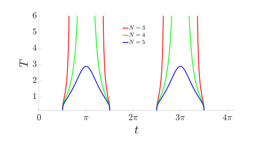 
Figure 1. DQPT critical curves in the (t, T ) plane for N = 3 (red), N = 4 (green), and N = 5 (blue) under the R = 0 quench protocol. For N = 5 a finite threshold temperature Tth = 2/ ln 2 emerges, above which no real zeros exist and DQPTs are fully suppressed.

📷 Fig 3

 
Figure 1 displays the DQPT critical curves in the (t, T ) plane for N = 3, 4, and 5. All curves are periodic with period 2π and emanate from t = π/2 (mod 2π) at T = 0. For N = 3 (red), the critical time drifts from π/2 toward 2π/3 as T →∞, while for N = 4 (green) it approaches π in the same limit; in both cases DQPTs persist at all finite temperatures. For N = 5 (blue), the curve forms a closed loop: starting from t = π/2 at T = 0, it rises to a maximum temperature Tth = 2/ ln 2 at t = π, then descends to t = 3π/2 at T = 0. Above Tth the inequality fails, the Loschmidt amplitude has no real zeros, and the rate function r(t) becomes analytic for all t. The suppression mechanism is traced to...

📷 Fig 4

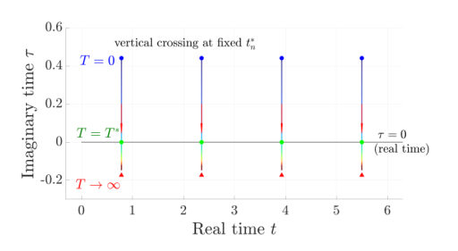 
Figure 4. Fisher zeros of the Loschmidt amplitude in the complex time plane for Case 2 (N = 3, R = Rf). Blue circles mark the T = 0 positions, green circles mark the real-axis crossing at T = T ∗, and red triangles mark the asymptotic positions as T →∞.

📷 Fig 5

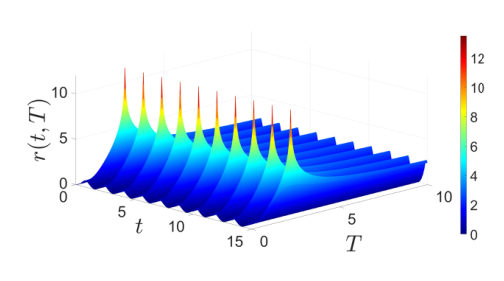 
Figure 3. Rate function r(t, T ) for the R = Rf quench with N = 3 and u &gt; 0. Sharp cusps appear exactly at t∗ n = (n + 1/2)π, signaling DQPTs. The cusp height de- creases with temperature and vanishes above T ∗, illustrating the temperature-selective suppression of DQPTs.

**Summary.** The paper rigorously analyzes Dynamical Quantum Phase Transitions (DQPTs) in finite systems quenched from thermal equilibrium using a pseudo-Hermitian framework. It demonstrates that temperature acts as a control parameter, leading to a universal threshold temperature above which the DQPTs are entirely suppressed for sufficiently large system dimensions ($N \ge 5$). This establishes a general principle for controlling quantum criticality via thermal occupation.

**Why it may be interesting.** This work provides a powerful tool—the mixed-state Loschmidt amplitude in quasi-Hermitian settings—to study non-equilibrium critical phenomena (DQPTs) under realistic thermal conditions, linking quantum criticality directly to statistical mechanics principles.

Detailed structure

**Main problem.** The study investigates how thermal effects suppress Dynamical Quantum Phase Transitions (DQPTs) when a finite-dimensional system is quenched from a thermal equilibrium state.

**Main result.** A dimensionality-dependent threshold temperature ($T_{th}$) exists for $N \ge 5$, above which the DQPTs are fully suppressed because the Loschmidt amplitude loses all real zeros. The quasi-Hermitian framework provides the rigorous foundation for this derivation.

**Method.** The authors construct and analyze a mixed-state Loschmidt amplitude using a metric-stationary pseudo-Hermitian framework, generalizing pure-state dynamics to thermal ensembles via purification.

**Model / system.** The model is an $N$-level system composed of a two-level sector coupled to $N-2$ spectator states. The analysis focuses on the quench dynamics governed by quasi-Hermitian Hamiltonians ($H^\dagger = \eta H \eta^{-1}$).

**Key observables.** Mixed-state Loschmidt amplitude $G(t)$, its zeros (indicating DQPTs), and the rate function $r(t, T)$ exhibiting cusps at critical times.

**Important parameters / regimes.** System dimension ($N$), temperature ($T$ or $eta$), and the metric operator ($\eta$).

**Assumptions / limitations.** The primary analysis relies on the fixed-metric (metric-stationary) quench assumption ($\eta_i = \eta_f$), which simplifies the dynamics by ensuring equivalence with a Hermitian system.

**Figures summary.** Figures illustrate the motion of Fisher zeros in the complex time plane, showing coalescence at $T_{th}$ for finite $N$, and demonstrate how rate function cusps vanish above a critical temperature $T^*$.

**Paper structure.** The paper first establishes the mixed-state Loschmidt amplitude within the quasi-Hermitian framework. It then applies this to an N-level model, deriving explicit forms for $G(t)$ and identifying the condition for DQPTs based on thermal weights. Finally, it analyzes the temperature dependence leading to the finite threshold temperature.

Abstract

We investigate dynamical quantum phase transitions (DQPTs) in finite-dimensional systems prepared in thermal equilibrium states and subjected to a sudden quench. A mixed-state Loschmidt amplitude is constructed from first principles within a metric-stationary pseudo-Hermitian framework, providing a self-contained derivation of the finite-temperature quench dynamics. Applying this framework to an $N$-level model consisting of a two-level sector coupled to $N-2$ spectator states, we find that temperature controls the DQPTs through the redistribution of thermal weights among the eigenstates. This mechanism leads to a dimensionality-dependent threshold temperature that becomes finite when the Hilbert-space dimension reaches five, above which the Loschmidt amplitude loses all real zeros and the DQPTs are fully suppressed. The thermal suppression mechanism suggests a general principle for controlling dynamical criticality through thermal occupation, while the quasi-Hermitian framework provides the self-consistent foundation for its rigorous derivation.

[↑ back to top](#top)

### [Optimal preparation and reachable-state constraints in the Mpemba effect](http://arxiv.org/abs/2607.12955v1)

**Authors:** C. Ríos-Monje, A. Patrón-Castro, C. A. Plata, B. Sánchez-Rey, A. Prados  
**Type:** theory · **Category:** statistical mechanics · **PDF:** <https://arxiv.org/pdf/2607.12955v1>  
**Analysis basis:** full PDF text, analyzed in chunks
**Topic relevance:** 🔥 `non-equilibrium dynamics` **4/5** · `methods for driven-dissipative` **3/5** · `non-equilibrium universality` **3/5** · `Keldysh / 2PI / non-Gaussian methods` **2/5** · `correlated / nonlocal dissipation` **2/5** · `driven-dissipative phase transition` **2/5** · `analog quantum simulation` **1/5** · `measurement-induced transitions` **1/5** · `quantum measurements` **1/5**

📷 Fig 1

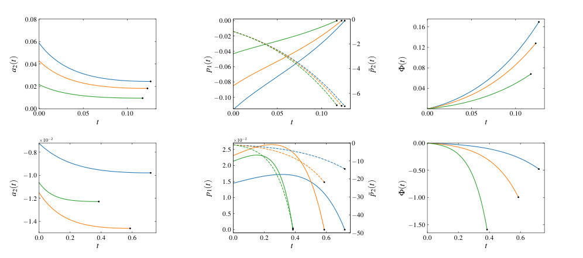 
Figure 1: Time evolution of the excess kurtosis a2 (left), costate {p1 (solid), ¯p2 (dashed)} (middle), and switching function Φ (right) for the optimal control with d = 3. All curves are represented until the time t = tf at which a2 reaches its minimum. The top panels correspond to large inelasticity, α &lt; αc, with α ≈0.18, 0.35, and 0.53 from top to bottom in the left panel—the same colour code is employed in the middle and right panels. Here, χ(t) = χmax = 10.0 and ¯p2(0) = −1. The bottom panels correspond to small inelasticity, α &gt; αc, with α ≈0.78, 0.92 and 0.85 from top to bottom in the bottom left panel—again, the same colour code is employed in the middle and right panels. In this...

📷 Fig 2

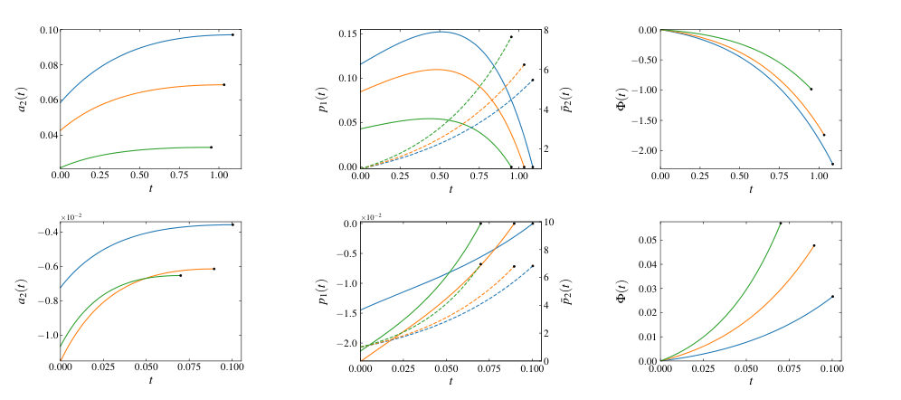 
Figure 2: Time evolution of the excess kurtosis a2 (left), costate {p1, ¯p2 (dashed)} (middle), and switching function Φ (right) for the optimal control with d = 3. All curves are represented until the time t = tf at which a2 reaches its maximum. The top panels correspond to large inelasticity, α &lt; αc, with α ≈0.18, 0.35, and 0.53 from top to bottom in the left panel—the same colour code is employed in the middle and right panels. Here, χ(t) = χmin = 0.1 and ¯p2(0) = 1. The bottom panels correspond to small inelasticity, α &gt; αc, with α ≈0.78, 0.92 and 0.85 from top to bottom in the top left panel—again, the same colour code is employed in the middle and right panels. In this case, χ(t) =...

📷 Fig 3

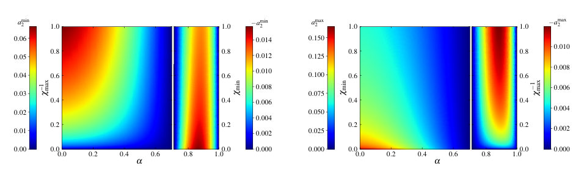 
Figure 3: Minimum (left panel) and maximum (right panel) accessible values of the excess kurtosis as functions of the restitution coefficient α and the control bounds {χmin, χmax}. These extrema define the boundary of the reachable set generated by the stochastic thermostat. In the left (right) panel, for α &lt; αc, χ = χmax (χ = χmin), whereas for α &gt; αc, χ = χmin (χ = χmax).

📷 Fig 4

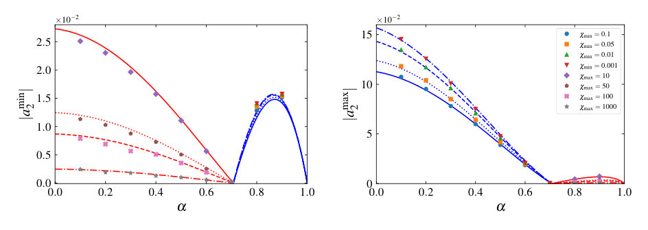 
Figure 4: Absolute value of the minimum (left) and maximum (right) excess kurtosis a2 as a function of the restitution coefficient α for different values of the control. In both panels, the red lines correspond to χ(t) = χmax, for χmax = 10 (solid), 50 (dotted), 100 (dashed), 1000 (dashed-dot), whereas the blue lines correspond to χ(t) = χmin, for χmin = 0.1 (solid), 0.05 (dotted), 0.01 (dashed), 0.001 (dashed-dot). The symbols represent the values obtained from the numerical simulation.

**Summary.** This work re-examines the Mpemba effect by treating the preparation of initial states as an optimal control problem for granular fluids. Using Pontryagin's principle, the authors show that the best protocols are 'one-bang,' and more significantly, they prove that stochastic thermostats impose fundamental limits on how far the system can deviate from equilibrium during cooling. This establishes a general link between non-equilibrium relaxation dynamics, optimal driving, and state accessibility.

**Why it may be interesting.** While focused on classical granular fluids, the methodology—linking anomalous relaxation rates (Mpemba effect) to optimal control theory and state constraints—provides a powerful general framework applicable to non-equilibrium dynamics in quantum systems, such as those involving engineered dissipation or measurement backaction.

Detailed structure

**Main problem.** The study revisits the Mpemba effect by incorporating the explicit aging protocol used to prepare non-stationary initial conditions, rather than just selecting favorable states.

**Main result.** Optimal preparation protocols are found to be one-bang controls, and crucially, stochastic thermostats impose reachable-state constraints that limit the maximum attainable asymmetry in the relaxation rate (Mpemba effect).

**Method.** The analysis employs optimal control theory, specifically Pontryagin's Maximum Principle, applied to the evolution equations derived from the Boltzmann-Fokker-Planck equation.

**Model / system.** The system modeled is a granular fluid of hard spheres undergoing inelastic collisions and subjected to a stochastic thermostat. The dynamics are analyzed using the first Sonine approximation for the Velocity Distribution Function (VDF).

**Key observables.** Excess kurtosis ($\kappa_2$), which controls the cooling rate; relaxation-rate asymmetry.

**Important parameters / regimes.** Stochastic thermostat intensity ($\chi(t)$); restitution coefficient ($\alpha$); Homogeneous Cooling State (HCS) parameters.

**Assumptions / limitations.** The analysis is restricted to the first Sonine approximation of the Boltzmann-Fokker-Planck equation, and it assumes no singular arcs exist in the optimal control solution.

**Figures summary.** Not specified by notes; the focus is on deriving analytical results for optimal protocols and constraints.

**Paper structure.** The paper progresses from formulating the aging stage as an optimal control problem to applying PMP, determining that the optimal protocol is one-bang, and finally establishing how state accessibility limits the magnitude of the Mpemba effect.

Abstract

The Mpemba effect, whereby an initially hotter system relaxes faster than a colder one towards a common final state, is often analysed within the kinetic framework by assuming non-stationary initial conditions that are selected a priori. Here, we revisit this viewpoint by explicitly incorporating the aging protocol used to prepare those states. Focusing on uniformly heated granular fluids, we formulate the preparation stage as an optimal-control problem in which the energy injection is tuned to generate the initial conditions that maximise or minimise the subsequent relaxation rate. Within the first Sonine approximation, this optimisation reduces to extremising the excess kurtosis of the velocity distribution function, the quantity controlling the cooling rate at fixed temperature. Applying Pontryagin's maximum principle, we show that the optimal preparation protocol is always a one-bang protocol and determine the corresponding extremal values of the excess kurtosis. Most importantly, we find that the stochastic thermostat imposes non-trivial reachable-state constraints: the accessible non-Gaussianities are bounded by those of the homogeneous cooling state, thereby limiting the relaxation-rate asymmetry and the maximum attainable Mpemba effect. These results demonstrate that the strength of the kinetic Mpemba effect cannot be disentangled from the accessibility of the underlying non-equilibrium states. More generally, our work establishes a connection between anomalous relaxation, optimal control, and state accessibility in non-equilibrium systems.

[↑ back to top](#top)

### [Research on topological materials using ultrafast spectroscopy](http://arxiv.org/abs/2607.12536v1)

**Authors:** Hao Liu, Jian-Qiao Meng  
**Type:** both · **Category:** other · **PDF:** <https://arxiv.org/pdf/2607.12536v1>  
**Analysis basis:** full PDF text, analyzed in chunks
**Topic relevance:** 🔥 `non-equilibrium dynamics` **4/5** · `exotic spin models in light-matter` **3/5** · `spintronics-quantum-optics interface` **3/5** · `driven-dissipative phase transition` **2/5** · `quantum optics experiment` **2/5** · `Keldysh / 2PI / non-Gaussian methods` **1/5** · `analog quantum simulation` **1/5** · `correlated / nonlocal dissipation` **1/5** · `methods for driven-dissipative` **1/5** · `non-equilibrium universality` **1/5**

📷 Fig 1

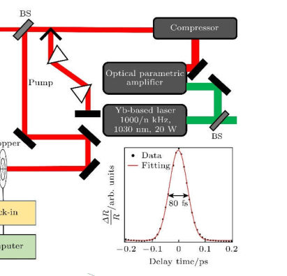 
Fig. 1 Schematic diagram of a typical ultrafast optical pump-optical probe setup[11].

📷 Fig 2

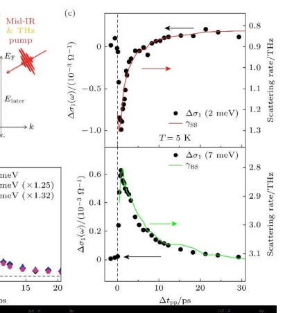 
Fig. 2 Ultrafast dynamics in Bi2Se3: (a1), (a2) Transient reflectivity measured at = 1.55

📷 Fig 3

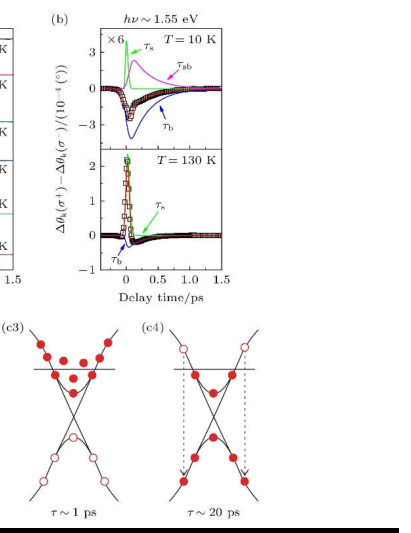 
Fig. 3 Spin dynamics in Bi2Se3: (a) Time evolution of the magneto-optical Kerr angle at different

📷 Fig 4

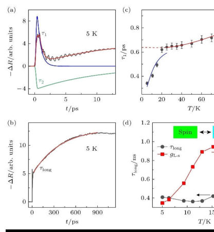 
Fig. 4 Ultrafast dynamics of MnBi2Te4 crystal[88]: (a), (b) Transient reflectivity and

📷 Fig 5

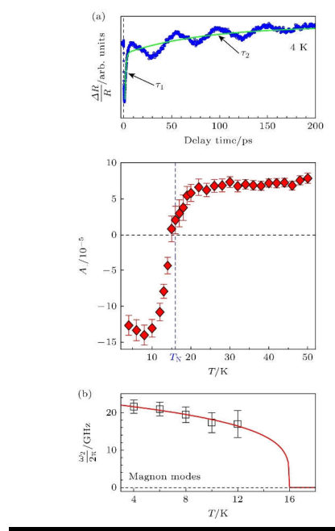 
Fig. 5 Ultrafast dynamics in EuIn2As2: (a) Transient reflectivity at low temperatures

**Summary.** This review summarizes the application of ultrafast pump-probe spectroscopy to study topological materials. It details how tracking electronic and spin relaxation on femtosecond timescales reveals fundamental coupling mechanisms like electron-phonon interactions. The work is crucial for advancing the understanding and practical control of quantum phases in next-generation spintronic and quantum computing devices.

**Why it may be interesting.** This work is highly relevant because it uses time-domain measurements (ultrafast optics) to probe non-equilibrium quantum states, which shares methodological overlap with open quantum systems studies involving rapid decoherence or thermalization dynamics.

Detailed structure

**Main problem.** The research aims to understand the nonequilibrium dynamics within topological materials by investigating various coupling mechanisms between charge, spin, orbital, and lattice degrees of freedom.

**Main result.** The study details how ultrafast spectroscopy can reveal distinct relaxation pathways—such as electron-phonon scattering and spin conversion—and even drive photoinduced topological phase transitions in these quantum systems.

**Method.** The primary method is ultrafast pump-probe spectroscopy, which uses femtosecond pulses to excite the material into a non-equilibrium state and then monitors its subsequent relaxation dynamics.

**Model / system.** The focus is on topological materials, including insulators and semimetals (like $\text{Bi}_2(\text{Se}, \text{Sb})_3$), characterized by symmetry-protected band structures such as Dirac cones and Weyl nodes. The analysis covers both bulk and surface electronic states.

**Key observables.** Transient change in reflectivity ($\Delta R/R$), spin polarization dynamics, coherent phonon oscillations (ISRS vs DECP), and terahertz conductivity changes.

**Important parameters / regimes.** Femtosecond to nanosecond time resolution; visible to near-infrared wavelengths for optical probing; temperature dependence is crucial for distinguishing bulk vs. surface effects.

**Assumptions / limitations.** The interpretation requires carefully disentangling contributions from the bulk material versus the topologically protected surface states, as conventional measurements might be dominated by the former.

**Figures summary.** Figures illustrate schematic setups (OPOP), time evolution of coherent oscillations, and comparative plots showing distinct relaxation behaviors for surface vs. bulk electronic/spin states at different temperatures.

**Paper structure.** The review progresses from introducing ultrafast spectroscopy as a tool to summarize progress on various topological systems, detailing specific physical processes like electron-phonon coupling, spin dynamics, and culminating in future directions combining multi-dimensional spectroscopy with advanced theory.

Abstract

Topological materials, characterized by symmetry-protected nontrivial band structures such as Dirac cones and Weyl nodes, host diverse quantum phenomena, with potential applications in quantum transport, spintronics, and nonlinear optics. Ultrafast pump-probe spectroscopy has emerged as a powerful tool for exploring nonequilibrium dynamics in these systems. Its femtosecond resolution allows charge, spin, orbital, and lattice interactions to be tracked on their intrinsic timescales, thereby revealing key coupling mechanisms in topological phases. This review summarizes progress in ultrafast spectroscopic studies of topological insulators, topological semimetals, and magnetic topological materials. We first discuss the relaxation pathways of photoexcited surface and bulk electronic states, emphasizing electron-phonon scattering, surface-bulk charge transfer, and ultrafast spin conversion. We then examine population inversion in Dirac and Weyl semimetals, spin-polarization dynamics associated with tilted Weyl bands, and the effects of magnetic order on topological states, including coherent phonon and magnon excitations, magnetically driven topological transitions, and terahertz emission. We further review photoinduced topological phase transitions driven by electronic correlations, lattice distortions, and magnetic order under intense optical excitation, highlighting routes toward nonthermal control of quantum phases. Finally, we outline future directions that combine multidimensional ultrafast spectroscopy with temporal, energy, momentum, and spin resolution and advanced theoretical modeling to establish a unified picture of nonequilibrium topological states. This review aims to provide a useful reference for ultrafast studies of topological quantum materials and to advance their applications in high-speed, low-power information processing, spintronics, and quantum technologies.

[↑ back to top](#top)

### [Thermally Activated Long-Range Entanglement from Non-Abelian Conservation Laws](http://arxiv.org/abs/2607.12710v1)

**Authors:** Shuai Zeng  
**Type:** theory · **Category:** statistical mechanics · **PDF:** <https://arxiv.org/pdf/2607.12710v1>  
**Analysis basis:** full PDF text, analyzed in chunks
**Topic relevance:** 🔥 `entanglement & information structure` **4/5** · `Keldysh / 2PI / non-Gaussian methods` **3/5** · `methods for driven-dissipative` **3/5** · `correlated / nonlocal dissipation` **2/5** · `driven-dissipative phase transition` **2/5** · `non-equilibrium dynamics` **2/5** · `analog quantum simulation` **1/5** · `exotic spin models in light-matter` **1/5** · `non-equilibrium universality` **1/5**

📷 Fig 1

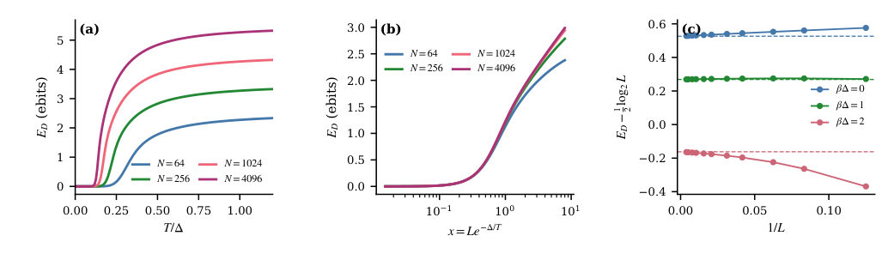 
FIG. 1. Exact thermal activation at fixed global J = 0. The N = 4L chain has L dimers in each half and none crosses A|B, so its T = 0 state is a product across the cut. (a) Every fixed T &gt; 0 produces entanglement growing with N. (b) The same four sizes collapse at low temperature when plotted versus x = Le−∆/T , identifying T∗(N) ∼∆/ ln N. (c) Exact data approach Eq. (10) (dashed lines).

📷 Fig 2

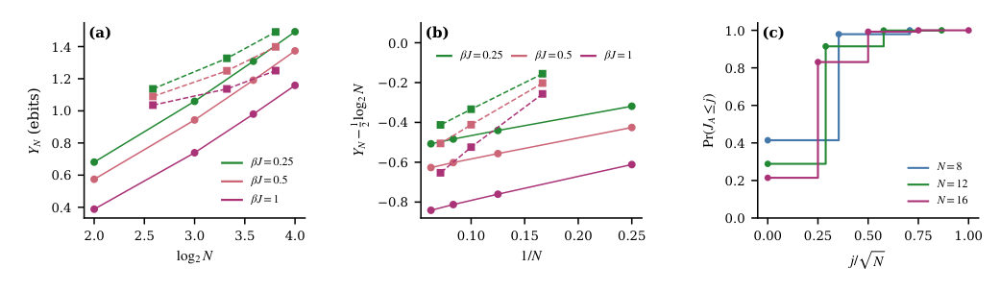 
FIG. 2. Nonintegrable chain. Singlet-sector exact diagonalization of the open J1–J2 chain at J2/J1 = 0.37. (a) YN grows along each parity subsequence. (b) YN −1

**Summary.** The paper demonstrates that imposing a strong non-Abelian conservation law on a spin chain allows local thermal noise to generate system-size-diverging distillable entanglement. Using advanced techniques from representation theory and QBP, the authors prove this scaling holds exactly for certain models like the dimer chain. This shows that symmetry can stabilize quantum correlations against thermal decoherence.

**Why it may be interesting.** This work provides a deep theoretical understanding of how symmetry constraints can fundamentally alter thermal physics, turning expectedly finite entanglement into an unbounded resource relevant for quantum information processing.

Detailed structure

**Main problem.** The study investigates whether local thermal fluctuations can generate system-size-diverging distillable entanglement when the thermalization process is constrained by a strong non-Abelian conservation law.

**Main result.** Strong non-Abelian symmetry allows local thermal noise to activate an operational resource, leading to distillable entanglement scaling as $E_{\mathrm{D}} \sim rac{1}{2} \log_2 N$.

**Method.** The authors employ representation-space protocols and advanced techniques like Quantum Belief Propagation (QBP) combined with saddle-point approximations to derive asymptotic bounds on entanglement.

**Model / system.** The analysis focuses on finite-range SU(2)-invariant spin chains, particularly using the exactly solvable dimer chain model. The system is analyzed under thermal evolution governed by $e^{-eta H}$.

**Key observables.** Distillable Entanglement ($E_{\mathrm{D}}$), lower bound entanglement measure ($Y_N$), and the twisted partition function $f_{n,eta}(g)$.

**Important parameters / regimes.** Temperature ($eta$ or $T>0$), system size ($N$), and the crossover scale $T^*(N) \sim \Delta / \ln N$.

**Assumptions / limitations.** The analysis relies on bounding errors using techniques like Haar averaging approximations in QBP, and establishing asymptotic limits for large systems.

**Figures summary.** Figures illustrate that entanglement ($	ext{ED}$) grows logarithmically with $N$ at fixed $T>0$, confirming the predicted scaling $rac{1}{2} \log_2 N$.

**Paper structure.** The paper progresses by first establishing a lower bound on entanglement using representation theory, then applying QBP and saddle-point methods to derive asymptotic bounds for the partition function, culminating in exact results for the dimer chain.

Abstract

Thermal noise ordinarily suppresses quantum entanglement. We show that a strong non-Abelian conservation law can convert local thermal fluctuations into an unbounded operational resource. For a broad class of finite-range $SU(2)$-invariant spin chains restricted to the global-singlet sector, an explicit representation-space protocol yields $Y_N=\frac12\log_2 N+O_β(1)$, and hence $E_{\mathrm{D}}\geq Y_N$, throughout a finite high-temperature interval. Local thermal fluctuations produce subsystem spins $j\sim\sqrt N$, whose globally locked irreducible representations contain $\log_2(2j+1)\sim\frac12\log_2N$ ebits. An exactly solvable dimer chain exhibits a sharper effect: its zero-temperature state is unentangled across the cut, whereas every fixed $T>0$ produces $E_{\mathrm{D}}=\frac{1}{2}\log_2 N+C(T)+o(1)$, with crossover scale $T_*(N)\simΔ/\ln N$. Exact diagonalization of a nonintegrable chain is consistent with the predicted scaling. Thus heating can activate system-size-diverging distillable entanglement across a macroscopic bipartition when thermalization is confined by a non-Abelian conservation law.

[↑ back to top](#top)

### [Entangling Power and Symmetries in the Quantum Rabi Model](http://arxiv.org/abs/2607.12053v1)

**Authors:** Ian Low, Jens Koch, Sahel Ashhab  
**Type:** theory · **Category:** other · **PDF:** <https://arxiv.org/pdf/2607.12053v1>  
**Analysis basis:** full PDF text, analyzed in chunks
**Topic relevance:** 🔥 `entanglement & information structure` **4/5** · `analog quantum simulation` **3/5** · `correlated cavity matter` **3/5** · `Tavis-Cummings & cavity-many-emitter` **2/5** · `methods for driven-dissipative` **2/5** · `correlated / nonlocal dissipation` **1/5** · `driven-dissipative phase transition` **1/5** · `exotic spin models in light-matter` **1/5** · `non-equilibrium dynamics` **1/5**

📷 Fig 1

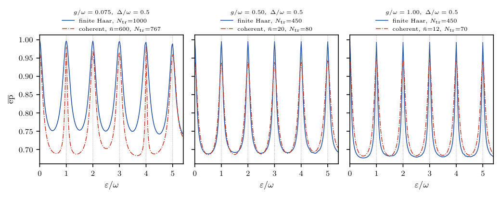 
FIG. 1: Time-averaged entangling power ep versus bias ε/ω for the AQRM at ∆/ω = 0.5. The three panels correspond to three representative values of the coupling strength: g/ω = 0.075, 0.50, and 1.00, spanning weak coupling, ultrastrong coupling, and deep-strong coupling. Solid blue curves use a finite-Haar oscillator input at cutoff Ntr, while dash-dot red curves use a fixed-radius coherent input at mean occupation ¯n. The maxima in both ensembles occur at the integer biases ε/ω ∈Z; the vertical dotted lines mark the integer values shown in the plotted range.

📷 Fig 2

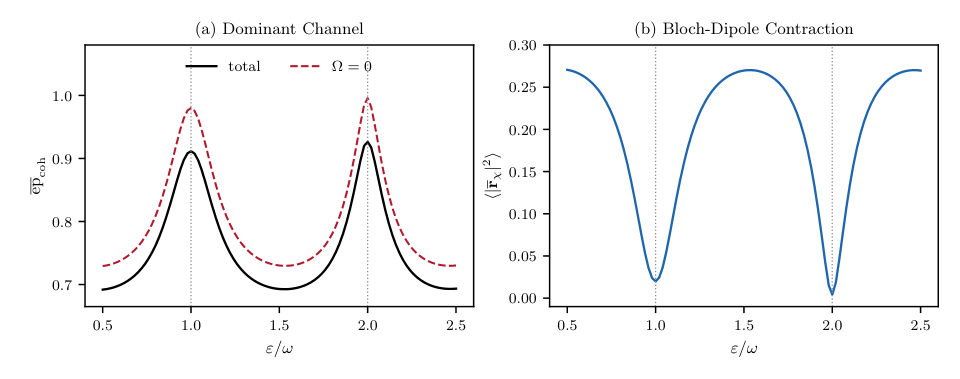 
FIG. 2: Coherent-channel decomposition for g/ω = 0.30, ∆/ω = 0.5, ¯n = 20, and Ntr = 60. Panel (a) shows the total epcoh and the Ω= 0 contribution 2(1 −⟨P0⟩); panel (b) shows the corresponding Bloch-dipole diagnostic ⟨|rχ|2⟩. The comparison shows that the integer-bias peaks are already present in the zero-frequency channel. The simultaneous dips in ⟨|rχ|2⟩show that these peaks are driven by contraction of the population-weighted Bloch dipole, i.e. by eigenvector reorganization rather than by additional degeneracies.

📷 Fig 3

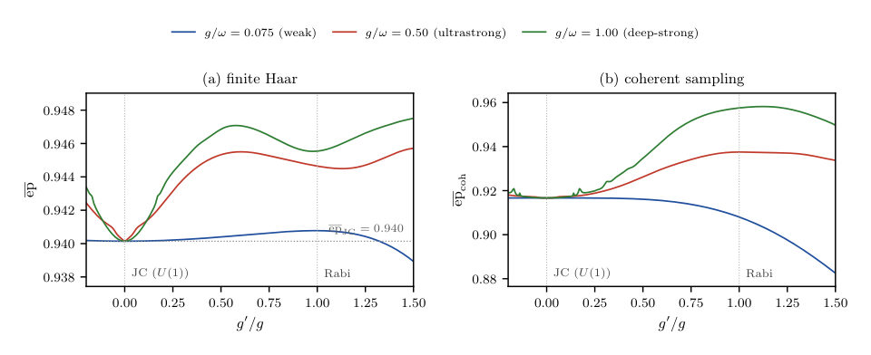 
FIG. 3: Time-averaged entangling power across the generalized Rabi family at ω = ∆= 1. The three couplings are the same as in Fig. 1: g/ω = 0.075, 0.50, and 1.00. Panel (a) shows the finite-Haar diagnostic with Ntr = 30. Panel (b) shows the fixed-radius coherent diagnostic with ¯n = 20 and Ntr = 80. The JC point g′/g = 0 restores the U(1) symmetry, while g′/g = 1 is the standard Rabi model with parity symmetry.

📷 Fig 4

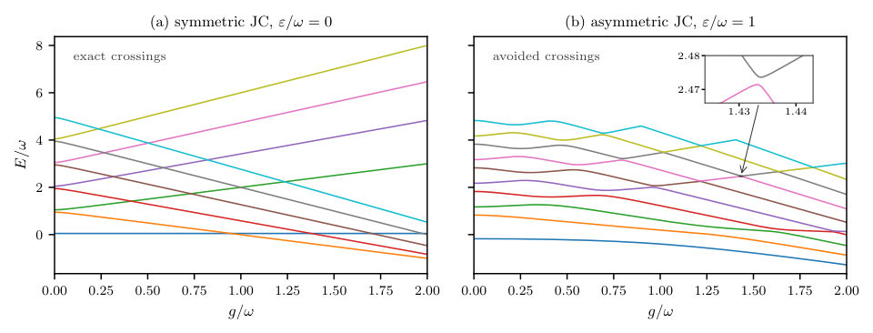 
FIG. 4: Low-lying spectrum of the JC limit of Eq. (4) with gcr = 0 and ∆/ω = 0.9. The horizontal axis is g/ω, and in both panels the colors label the ten energy levels that are lowest at g = 0. Panel (a) shows the symmetric JC model, ε/ω = 0, where the U(1) symmetry permits crossings between energy levels. Panel (b) shows the asymmetric JC model at the integer bias point ε/ω = 1; the same ten energy levels show avoided crossings rather than exact crossings. The inset in panel (b) magnifies the arrowed near crossing near g/ω ≃1.43 and shows the finite avoided gap. We have verified that all the near-crossings in (b) are in fact avoided crossings with small gaps.

📷 Fig 5

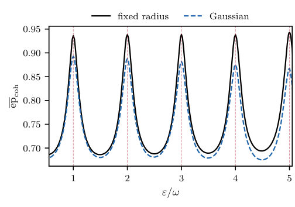 
FIG. 5: Fixed-radius and Gaussian coherent sampling at ¯n = 20, g/ω = 0.50, and ∆/ω = 0.5. The two ensembles have the same mean occupation. Both show peaks at the same integer- bias values.

**Summary.** The authors demonstrate that time-averaged entangling power serves as an effective tool to diagnose symmetry structures in light-matter models like the Quantum Rabi Model. They show that this diagnostic reveals a distinct signature—a peak—at points corresponding to hidden symmetries (AQRM), contrasting with the response seen at manifest symmetries (JC model). This highlights the utility of entanglement measures for probing fundamental quantum symmetries.

**Why it may be interesting.** This work provides a powerful, non-standard operator diagnostic that moves beyond simple energy level analysis to probe the deep structural properties (hidden vs. manifest symmetries) of quantum Hamiltonians in open or interacting systems relevant to cavity QED and quantum optics.

Detailed structure

**Main problem.** To use time-averaged entangling power as an operator diagnostic tool to distinguish between hidden symmetries (like those in the AQRM) and manifest symmetries (like $U(1)$ in the JC model) within light-matter interaction systems.

**Main result.** The time-averaged entangling power exhibits distinct spectral responses: sharp peaks at integer biases for the hidden symmetry of the AQRM, contrasting with a weak dip observed at the manifest $U(1)$ point of the JC model.

**Method.** The diagnostic involves calculating the time-averaged entangling power ($ar{e}_p$) by analyzing how the system's spectral expansion is reorganized by different symmetries. Calculations are performed using finite input ensembles (Haar or coherent state averages) due to the infinite dimensionality of the oscillator space.

**Model / system.** The study focuses on the Quantum Rabi Model (QRM), which describes a qubit coupled to a single harmonic oscillator. Key regimes analyzed include the Jaynes-Cummings (JC) model (with manifest $U(1)$ symmetry) and the Asymmetric Quantum Rabi Model (AQRM), which possesses a parameter-dependent 'hidden' symmetry at integer biases ($\epsilon/\omega \in \mathbb{Z}$).

**Key observables.** Time-averaged entangling power ($ar{e}_p$), reduced purity ($	ext{Tr}
ho_A^2$), and the spectral structure of energy differences ($\Omega$).

**Important parameters / regimes.** Bias parameter $\epsilon$, coupling strength $g$, oscillator frequency $\omega$, and the integer ratio $\epsilon/\omega = k \in \mathbb{Z}$.

**Assumptions / limitations.** The analysis relies on approximating the infinite-dimensional Hilbert space using either Fock-space truncation (Haar average) or a fixed mean occupation ($ar{n}$) coherent-state average.

**Figures summary.** Figures compare spectral features, showing crossings in symmetric limits and avoided crossings when bias is introduced. A key figure compares results from different input ensembles (fixed-radius vs. Gaussian coherent sampling), confirming peak locations at integer biases.

**Paper structure.** The paper establishes the QRM Hamiltonian and its limiting cases (JC/AQRM). It then introduces time-averaged entangling power as a diagnostic, showing how it responds differently to manifest versus hidden symmetries by analyzing spectral reorganization effects. Finally, it compares finite ensemble calculations for robustness.

Abstract

The quantum Rabi model is a standard effective Hamiltonian in studies of light-matter interaction, capturing the simplest nontrivial setting in which a qubit couples to a single harmonic oscillator. Within the broader Rabi family, we focus on two special cases: the Jaynes-Cummings (JC) model, which carries an explicit $U(1)$ symmetry, and the asymmetric quantum Rabi model (AQRM), which possesses a parameter-dependent "hidden'' symmetry that appears only at integer bias, $\varepsilon/ω\in\mathbb{Z}$, and is not manifest in the Hamiltonian. We use the time-averaged entangling power as an operator-level diagnostic of these symmetry structures. Since the oscillator Hilbert space is infinite-dimensional, we compare two finite input ensembles: a Haar average after Fock-space truncation and a coherent-state average at fixed mean occupation $\bar{n}$. Both diagnostics show peaks at the integer-bias points of the AQRM, where the hidden symmetry resides. In contrast, the manifest $U(1)$ symmetry at the JC point instead gives a weak dip. Thus, the time-averaged entangling power responds to both the hidden symmetry and the $U(1)$ symmetry in the Rabi family, with the sign of the response indicating how the symmetry reorganizes the spectral expansion. These results demonstrate that the entangling power can serve as an operator diagnostic to reveal the presence and properties of hidden and manifest symmetries in light-matter systems.

[↑ back to top](#top)

### [Entropy-Driven Initiation and Cellular Uptake Mediated by Viscoelastic Cytoskeleton: A Kinetic Phase Diagram from Onsager Variational Principle](http://arxiv.org/abs/2607.12766v1)

**Authors:** Jinjie Liu, Zhong-Can Ou-Yang, Hao Wu  
**Type:** theory · **Category:** statistical mechanics · **PDF:** <https://arxiv.org/pdf/2607.12766v1>  
**Analysis basis:** full PDF text, analyzed in chunks
**Topic relevance:** 🔥 `Keldysh / 2PI / non-Gaussian methods` **4/5** · `driven-dissipative phase transition` **3/5** · `methods for driven-dissipative` **3/5** · `non-equilibrium dynamics` **3/5** · `correlated / nonlocal dissipation` **2/5** · `non-equilibrium universality` **2/5** · `Frenkel-Kontorova` **1/5**

📷 Fig 1

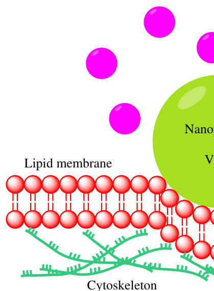 
FIG. 1: Schematic illustration of depletion-driven engulfment. Macromolecules (pink

📷 Fig 2

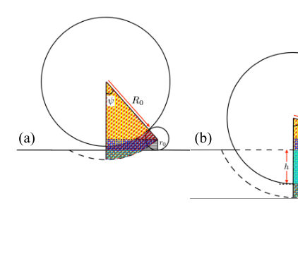 
FIG. 2: Two-phase engulfment model. (a) Phase 1: Depletion-driven approach until

📷 Fig 3

 
FIG. 3: Relative engulfment depth h/R as a function of creep time t for different host cell

📷 Fig 4

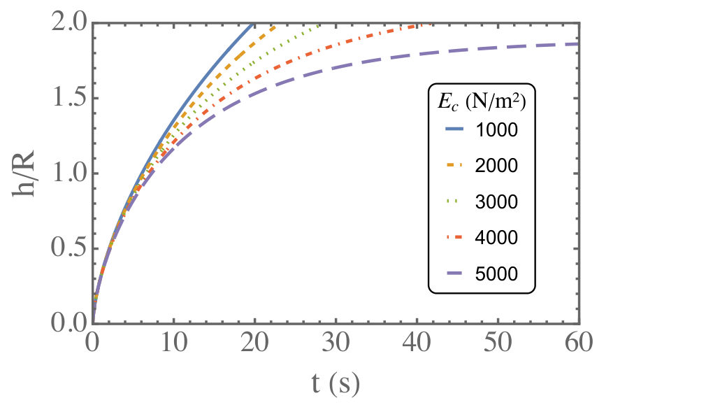 
Figure 3 displays the engulfment depth h(t) as a function of time for different host cell

📷 Fig 5

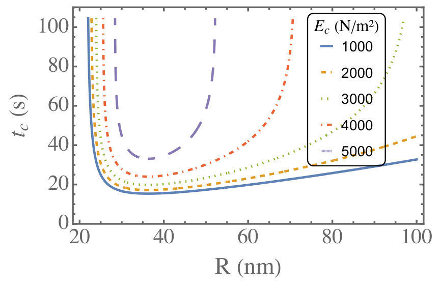 
FIG. 4: Complete engulfment time tc as a function of virus radius R for different host cell

**Summary.** This work develops a comprehensive continuum model using the Onsager variational principle to explain cellular engulfment. It uniquely posits that entropic depletion forces provide the necessary initial 'push' before specific receptor binding sustains the process. The resulting kinetic phase diagram offers quantitative predictions for successful viral uptake, linking fundamental physics principles to virology and nanomedicine.

**Why it may be interesting.** While focused on biophysics, the rigorous application of variational principles (Onsager) to couple multiple dissipative/restoring forces (viscoelasticity, entropy) provides a powerful theoretical template for analyzing non-equilibrium dynamics in complex soft matter systems relevant to AMO physics.

Detailed structure

**Main problem.** The paper addresses the fundamental, unanswered question of the initial driving force required for ligands and receptors to approach each other during receptor-mediated endocytosis.

**Main result.** It predicts a kinetic phase diagram defining critical biomolecule concentrations and optimal particle sizes (e.g., 30–60 nm) necessary for successful cellular engulfment.

**Method.** The authors develop a unified continuum model rooted in the Onsager variational principle to derive the kinetics from a total free energy landscape incorporating multiple physical contributions.

**Model / system.** The system models viral or nanoparticle uptake by a cell membrane, treating the process as having distinct phases: initial entropy-driven approach (depletion forces), followed by sustained binding and viscoelastic cytoskeletal deformation.

**Key observables.** Kinetic phase diagram, critical biomolecule concentration ($c_{crit}$), optimal virus radius ($R_{opt}$), and engulfment time $t(h)$.

**Important parameters / regimes.** Membrane tension ($\gamma$), Young's moduli ($E_v, E_m$), viscosity coefficients ($\mu, \eta_m$), and biomolecule concentration ($c$).

**Assumptions / limitations.** The model assumes the use of the Onsager variational principle for dynamics, employs the Helfrich-Canham Hamiltonian for membrane bending, and models cytoskeleton viscoelasticity using a linear solid approximation.

**Figures summary.** Figures illustrate depletion-driven engulfment mechanisms, showing how entropic forces stabilize uptake mediated by the cytoskeleton across different stages of contact.

**Paper structure.** The paper builds from identifying the initiation problem to developing a unified free energy functional (summing entropy, binding, membrane, and cytoskeleton terms). It then applies the Onsager principle to derive the kinetic equation, culminating in phase diagram predictions and size optimization criteria.

Abstract

A fundamental question in receptor-mediated endocytosis remains unanswered: what initial driving force brings ligands and receptors into close proximity? While previous models assume pre-existing contact and overlook this initiation problem, we propose that entropic forces from nanoscale biomolecules in crowded cellular environments provide the essential driving mechanism. We develop a unified continuum model rooted in the Onsager variational principle, where engulfment depth serves as the generalized coordinate and the driving force derives from a free energy landscape of entropic, binding, membrane, and cytoskeleton contributions. The framework naturally incorporates: (i) entropy-driven adhesion as initiation; (ii) ligand-receptor binding as the sustaining force; (iii) membrane deformation via the Helfrich-Canham Hamiltonian; and (iv) cytoskeleton viscoelasticity through the elastic-viscoelastic correspondence principle. The kinetic phase diagram predicts a critical biomolecule concentration for initiation, a lower bound of ligand density for complete engulfment, a finite size window for engulfable particles, and an optimal virus radius of 30--60 nm that decreases with increasing binding energy. The Onsager solubility condition naturally yields the phase boundaries. The model exhibits asymptotic consistency with the classic Asakura-Oosawa result in the large-particle flat-surface limit. Stiffer cells lead to longer engulfment times and narrower size windows. Strikingly, the optimal size matches HIV-1 dimensions under physiologically realistic parameters. This work provides a variational foundation for cellular uptake with implications for virology, nanotechnology, and drug delivery.

[↑ back to top](#top)

### [Semi-open boundary for random walking shocks](http://arxiv.org/abs/2607.12795v1)

**Authors:** Márton Balázs  
**Type:** theory · **Category:** statistical mechanics · **PDF:** <https://arxiv.org/pdf/2607.12795v1>  
**Analysis basis:** full PDF text, analyzed in chunks
**Topic relevance:** 🔥 `methods for driven-dissipative` **4/5** · 🔥 `non-equilibrium dynamics` **4/5** · `driven-dissipative phase transition` **3/5** · `non-equilibrium universality` **3/5** · `Frenkel-Kontorova` **1/5** · `Keldysh / 2PI / non-Gaussian methods` **1/5** · `analog quantum simulation` **1/5** · `correlated / nonlocal dissipation` **1/5**

📷 Fig 1

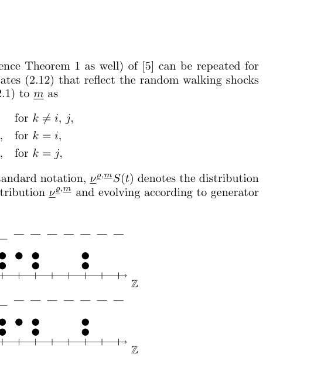 
Figure 1: Right step of an ASEP second class particle with the change in density that follows

📷 Fig 2

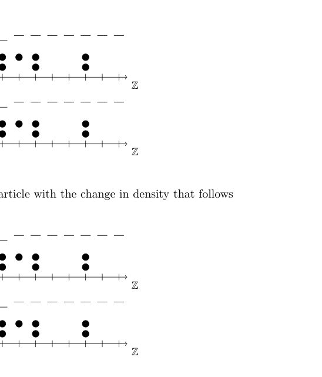 
Figure 2: Left step of an ASEP second class particle with the change in density that follows

**Summary.** This paper analyzes how to maintain the complex 'random walking shock' structure of interacting particle models like ASEP within a finite volume by engineering specific boundary conditions. By deriving necessary constraints on these boundary rates, the authors characterize non-trivial stationary distributions for systems exhibiting non-equilibrium dynamics.

**Why it may be interesting.** This work provides rigorous mathematical tools for handling non-equilibrium steady states in interacting particle systems, which is foundational knowledge for understanding driven quantum many-body systems or open quantum dynamics where boundaries play a critical role.

Detailed structure

**Main problem.** The research aims to find boundary mechanisms for interacting particle systems that preserve a 'random walking shock' structure within a finite volume, while allowing ordinary particles to pass freely but reflecting the shocks.

**Main result.** The authors successfully identify semi-open boundary conditions that confine the random walking shocks and allow for the characterization of non-trivial two-species, non-reversible stationary distributions in finite volumes.

**Method.** The analysis involves extending known infinite volume results to finite volumes by defining specific boundary jump rates ($p_0, q_0, p_K, q_K$) that maintain conservation laws related to 'second-class particles.'

**Model / system.** The study focuses on one-dimensional interacting particle systems, including the Asymmetric Simple Exclusion Process (ASEP) and a generalized Bricklayers process (BLP), modeled by coupled dynamics of particle occupations ($\omega_i$) and second-class particles ($\zeta_i$).

**Key observables.** Stationary distributions $
u_{\varrho, m}$ for the coupled pair $(\omega, \zeta)$, hydrodynamic flux/velocity, and the conservation of the sum of second-class particles.

**Important parameters / regimes.** Boundary rates ($p_0, q_0, p_K, q_K$), system size $K$, and parameters governing asymmetry (e.g., $p, q$).

**Assumptions / limitations.** The boundary mechanism must be open for first-class particles but reflective for second-class particles to maintain conservation laws; the analysis relies on treating $\varphi$ as an arbitrary cylinder function.

**Paper structure.** The paper systematically extends infinite volume results by defining boundary generators ($L_{	ext{bry}}$) and deriving necessary identities (setting $E[L\varphi]=0$) that constrain the boundary rates for both ASEP and BLP to ensure stationary states.

Abstract

Non-stationary time evolution of interacting particle systems is in general a rather difficult topic however, exceptional examples are known where hidden processes within the model make the description manageable. These hidden processes often take the form of a finite number of interacting random walks and in some cases, rather than being hidden, were very explicitly revealed as second class particles associated with the model. The examples of asymmetric exclusion and exponential bricklayers model are known in this context, where such distributional structure was demonstrated in infinite volume. Here we find boundary mechanisms that save this remarkable structure in finite volume of the model with semi-open boundaries that let ordinary particles, but not the shocks, through. This finding also allows to characterise nontrivial two-species, non-reversible stationary distributions subject to our special boundary rates.

[↑ back to top](#top)

### [Axion like particles multi-parameter sensing](http://arxiv.org/abs/2607.12164v1)

**Authors:** Hassan Manshouri, Moslem Zarei, Mehdi Abdi  
**Type:** theory · **Category:** other · **PDF:** <https://arxiv.org/pdf/2607.12164v1>  
**Analysis basis:** full PDF text, analyzed in chunks
**Topic relevance:** 🔥 `analog quantum simulation` **4/5** · `exotic spin models in light-matter` **3/5** · `quantum measurements` **2/5** · `spintronics-quantum-optics interface` **2/5** · `Keldysh / 2PI / non-Gaussian methods` **1/5** · `correlated / nonlocal dissipation` **1/5** · `driven-dissipative phase transition` **1/5** · `entanglement & information structure` **1/5** · `methods for driven-dissipative` **1/5** · `non-equilibrium dynamics` **1/5**

📷 Fig 1

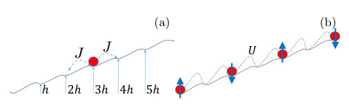 
FIG. 1. (a) Schematic of the lattice with tunneling rate J (dashed line) and gradient field h. (b) Half-filling configura- tion of probe spins, |... ↑0 ↓0...⟩. Dashed line is the on-site interaction strength U between spins.

📷 Fig 2

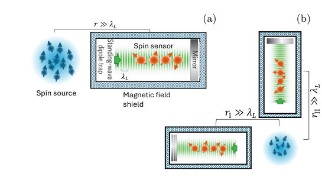 
FIG. 2. Schematic of sensing multi-parameter gradient field induced by axion. (a) Spins of source (blue spins) interact- ing with spins of sensor (orange) through exotic pseudoscalar spin-spin interaction. (b) Spin-source is positioned between two orthogonal probes to sense multi-parameters of axion field, ge pgn p and ma. The spin-source is positioned from the spin sensors by rI = rII = r .

📷 Fig 3

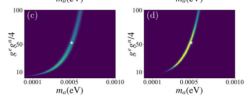 
FIG. 3. Posterior probability distribution P((gegn, m)|nk) of two unknown parameters (gegn, ma) for system size L = 8 with the half-filled particle numbers. For the single probe shown in Fig. 2(a), P((gegn, m)|nk) is plotted with the num- ber of measurement: (a) M = 50, and (b) M=200. The corresponding P((gegn, m)|nk) of the two orthogonal probes configuration, shown in Fig. 2(b)(multi-probes), with the number of measurement: (c) M = 50, and (d) M = 200 is plotted. The star displays the true value of parameters, ge pgn p /4 = 50 and ma = 5×10−4eV. Colors show the ampli- tude of the probability. In all plots J = 4.13 × 10−13 eV (100 Hz) , U = |J|, and n = 1019 is the number of spin source...

📷 Fig 4

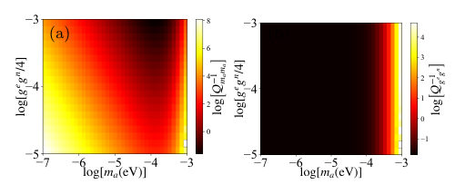 
FIG. 4. (a)The simultaneous estimation of the QFIM inverse elements for the system size L = 8 with the half-filled par- ticle numbers. For different values of axion mass ma and pseudoscalar couplings ge pgn p in the logarithmic values, the corresponding inverse of the QFIM elements (a) Q−1 mama and (b) Q−1 gegn are plotted. In all plots, the tunneling rate is fixed to J = 4.13 × 10−13 eV (100 Hz) , the repulsive on-site inter- action is |U| = J, and n = 1019.

📷 Fig 5

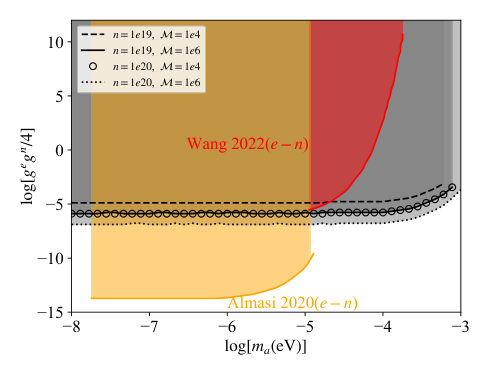 
FIG. 5. The exclusion region of axion mass and couplings under the simulation of axion multi-probes using simultane- ous estimation bounded by the Cram´er Rao bound with the confidence level CL= 95% . The multi-probes have been sim- ulated with sensor system size L=100 with the number of measurement repetitions M=104 and M=106 . The num- ber of polarized spin source of 3He is n [48] with the distance r = 1cm from the sensor. The result of this work (black line) is compared with the current laboratory constraints on the exotic pseudoscalar interaction ge pgn p between the studied particles pairs, such as [43](red line) and [44] (orange line).

**Summary.** The paper proposes using trapped fermionic atoms as ultra-sensitive quantum sensors to search for Axion Like Particles via their spin-dependent interactions. It develops a sophisticated multi-probe measurement technique that overcomes theoretical limitations in parameter estimation. This method allows setting stringent new upper bounds on the APL coupling constants, advancing dark matter searches.

**Why it may be interesting.** This work directly applies advanced concepts from quantum metrology (QFIM, CRB) to a physical system involving ultracold atoms in optical lattices, making it highly relevant for AMO physicists studying precision sensing.

Detailed structure

**Main problem.** The primary goal is to constrain the unknown mass ($m_a$) and coupling constants ($g_e g_n$) of Axion Like Particles (APLs) by detecting exotic pseudoscalar spin-spin interactions.

**Main result.** By employing a multi-probe detection strategy, the authors successfully circumvent the singularity in the Quantum Fisher Information Matrix, achieving exclusion limits down to $10^{-7}$ for coupling constants when $m_a \le 10^{-3} 	ext{ eV}$.

**Method.** The analysis uses quantum metrology principles, specifically calculating the ultimate sensitivity limit via the inverse of the Quantum Fisher Information Matrix (QFIM) derived from multi-probe measurements.

**Model / system.** The system involves fermionic atoms trapped in an optical lattice, whose spin interactions are mediated by APLs. The physics is modeled using a Fermi-Hubbard Hamiltonian incorporating axion-mediated background fields ($h_{\perp}, h_{\parallel}$).

**Key observables.** Observed particle counts ($\{n_k\}$) from the sensor spins interacting with the source spins.

**Important parameters / regimes.** Axion mass ($m_a$), coupling constants ($g_e g_n$), lattice tunneling rate ($J$), and on-site interaction ($U$).

**Assumptions / limitations.** The key methodological assumption is that using multiple, orthogonally positioned probes resolves the singularity inherent in estimating multiple parameters from a single observable.

**Figures summary.** Figures illustrate the schematic setup involving source/sensor spins (Fig. 2) and demonstrate how multi-probe measurements resolve singularities in posterior probability distributions compared to single-probe analysis (Fig. 3).

**Paper structure.** The paper establishes the physical interaction via a Yukawa potential, models the system using a Fermi-Hubbard Hamiltonian, develops the quantum estimation theory framework using QFIMs, and finally proposes and analyzes the multi-probe detection strategy to achieve parameter constraints.

Abstract

The search for the axion like particles (APLs)-one of the deepest puzzles in modern cosmology-may hold the key to understanding dark matter and dark energy. In this work, we introduce a setup taking advantage of the quantum metrology techniques to constrain the hypothetical mass and coupling constants of APLs by employing exotic pseudoscalar spin-spin interactions between fermions mediated by ALPs. A key advantage of our approach is the exploitation of position-dependent spin sensor results to the high sensitivity of the probe. To simultaneously investigate the axion mass and coupling constants, we invoke a multi-probe detection strategy. Through this strategy, we circumvent the singularity of the quantum Fisher information matrix as an ultimate upper bound on the sensitivity of any probe. For the axion masses in the range of $m_a {\le} 10^{-3} \text{eV}$, this setup can exclude values of axion coupling constants $g^e_pg^n_p$ down to $10^{-7}$.

[↑ back to top](#top)

### [Fast measurement-based generation of large-scale Greenberger-Horne-Zeilinger state with atomic nuclear-spin qubits](http://arxiv.org/abs/2607.12565v1)

**Authors:** Yan Lu, Xiao-Feng Shi  
**Type:** theory · **Category:** other · **PDF:** <https://arxiv.org/pdf/2607.12565v1>  
**Analysis basis:** full PDF text, analyzed in chunks
**Topic relevance:** 🔥 `Rydberg arrays` **4/5** · `quantum measurements` **3/5** · `analog quantum simulation` **2/5** · `entanglement & information structure` **2/5** · `measurement-induced transitions` **2/5** · `QC/QI experiment` **1/5** · `exotic spin models in light-matter` **1/5** · `spintronics-quantum-optics interface` **1/5**

📷 Fig 1

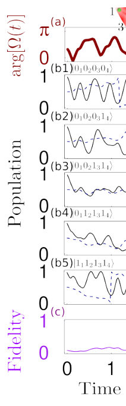 
FIG. 1. (a) Phase of Rydberg Rabi frequency Ω(t) for realizing the 4-qubit QFG with tg = 2.97 × 2π

📷 Fig 2

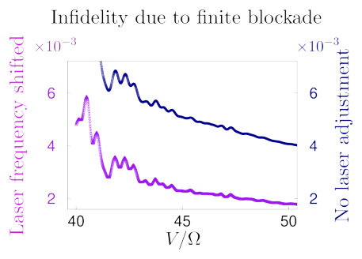 
FIG. 2. The blue curve shows 103(1 −F) as a function of V/Ωby using the pulse profile of Fig. 1, where F is defined in Eq. (B9), and the simulation is with Hamiltonians listed in Appendix C. The purple curve shows 103(1 −F) with ±∆shifted by Ω2/V according to the method of Ref. [27] as detailed at the end of Appendix C. Because the detuning is given by laser frequency deducted by the transition frequency, a frequency shift Ω2/V of the Rydberg laser means change of ±∆to Ω2/V ±∆.

📷 Fig 3

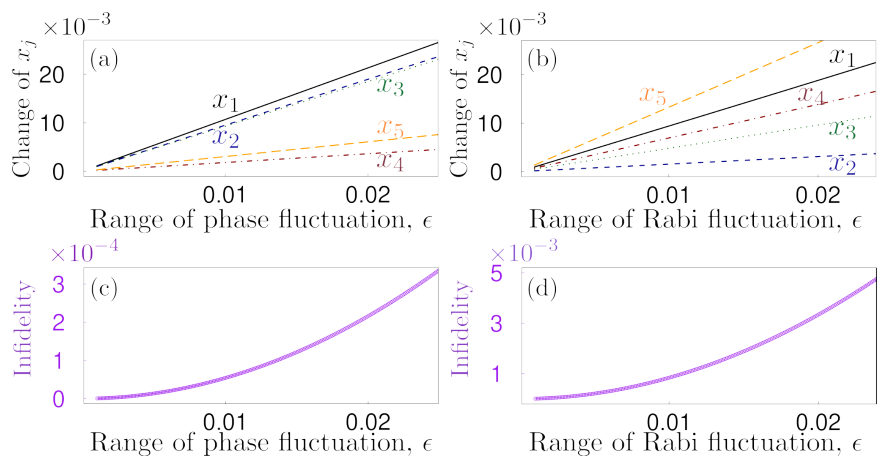 
FIG. 3. Sensitivity of the final accumulated phases xj and the gate fidelity to small phase and amplitude fluctuations in Ω(t). The solid, short-dashed, dotted, dash-dotted, and long dashed curves in (a) and (b) show the fractional error of the angle |(x′ j −xj)/xj| with j = 1, 2, 3, 4, and 5, respectively. A fractional variation δϕ in the phase and variation δΩin the amplitude of Ω(t) are used in (a) and (b), respectively, and the data is an average over results with δϕ and δΩuniformly sampled in [−ϵ, ϵ], respectively. The infidelity due to the fluctuation of phase and amplitude of Ω(t) is shown in (c) and (d), respectively.

📷 Fig 4

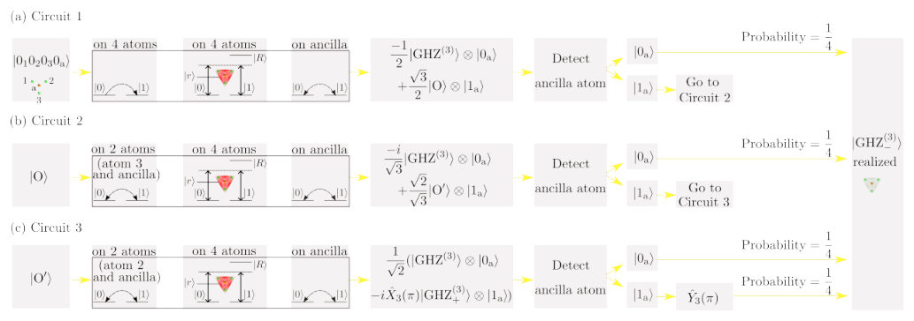 
FIG. 4. Illustration of the elementary gluing cycle via the creation of |GHZ(3) −⟩from a product state of three data atoms, labeled 1, 2, and 3, and one ancillary atom labeled a. The red triangle illustrates the effect of looking through a tetrahedron, in the four vertexes of which the four atoms are trapped. (a) The probability to have the |GHZ(3)⟩created in Circuit 1 is p1−yes = 1/4, and the remaining probability p1−no = 3/4 is to go to Circuit 2. (b) Within Circuit 2, the conditional probability to have the |GHZ(3)⟩created is 1/3, so that the probability to succeed in Circuit 2 is p2−yes = p1−no · (1/3) = 1/4. The probability to go to Circuit 3 is p2−no = p1−no · (2/3) = 1/2. (c) In...

📷 Fig 5

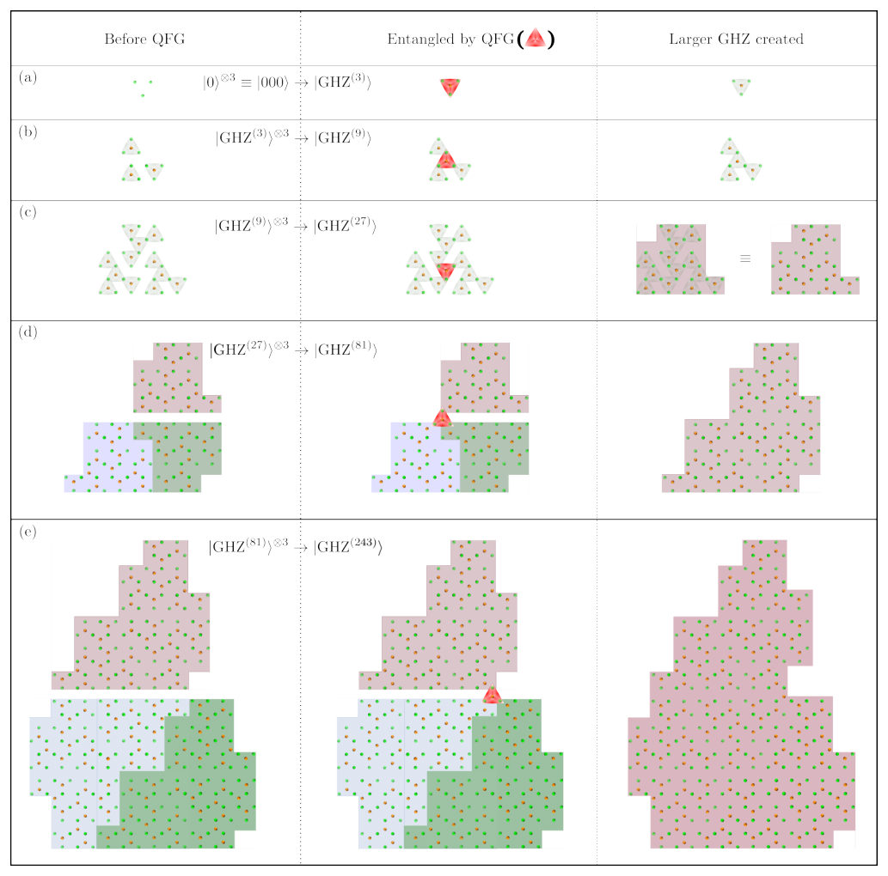 
FIG. 5. Illustration of generating a 243-qubit GHZ state. (a,b,c,d,e) show the gluing from product state to |GHZ(3)⟩, from |GHZ(3)⟩to |GHZ(9)⟩, from |GHZ(9)⟩to |GHZ(27)⟩, from |GHZ(27)⟩to |GHZ(81)⟩, and from |GHZ(81)⟩to |GHZ(243)⟩, respectively. The green and red dots represent the data and ancilla atoms, respectively. In each gluing, the QFG is denoted by the red triangle which represents looking through a tetrahedron where the four atoms in the QFG are the four vortexes.

**Summary.** The paper presents a method to rapidly create massive Greenberger-Horne-Zeilinger (GHZ) entangled states using atomic nuclear-spin qubits. It proposes a novel Quantum Ferromagnetic Gate (QFG) realized via Rydberg interactions in alkaline-earth atoms. By iteratively applying this gate through a 'gluing circuit,' the authors demonstrate a scalable pathway toward generating highly entangled quantum resources for quantum technologies.

**Why it may be interesting.** This work directly bridges quantum information theory (GHZ states) with advanced AMO physics techniques (Rydberg blockade on nuclear spins), providing a concrete, scalable platform proposal for quantum computation using neutral atoms.

Detailed structure

**Main problem.** The primary goal is the fast, high-fidelity generation of large-scale Greenberger-Horne-Zeilinger (GHZ) states.

**Main result.** A protocol using a Quantum Ferromagnetic Gate (QFG) and repetitive 'gluing circuits' allows for the theoretical realization of GHZ states up to 243 qubits using nuclear-spin qubits in alkaline-earth atoms.

**Method.** The state generation relies on a measurement-based quantum computation approach involving a specific QFG gate, single-qubit rotations, and projective measurements on an ancillary qubit.

**Model / system.** The system uses atomic nuclear-spin qubits of alkaline-earth-like atoms trapped in arrays. The interactions are mediated by Rydberg blockade effects, which govern the dynamics described by a complex Hamiltonian involving single-atom and Rydberg interaction terms.

**Key observables.** Gate fidelity ($F$), QFG realization time ($6\pi/\Omega_m$), and error sources like Rydberg-state decay and blockade leakage.

**Important parameters / regimes.** Rydberg Rabi frequency ($\Omega_m$), detuning ($\Delta$), blockade strength ($V$), and atomic position fluctuations ($\sigma$).

**Assumptions / limitations.** The protocol assumes the feasibility of assembling large-scale atomic arrays and relies on approximations for error analysis, such as ignoring states with more than a few Rydberg excitations.

**Figures summary.** Figures illustrate state evolution under the QFG mechanism, showing phase profiles and fidelity comparisons between different pulse engineering techniques used to mitigate blockade errors.

**Paper structure.** The paper introduces the problem of large-scale GHZ generation, proposes the QFG gate using nuclear spins, details the 'gluing circuit' for scaling, analyzes the underlying Hamiltonian dynamics including Rydberg interactions, and discusses error sources from decay and position fluctuations in appendices.

Abstract

Large-scale Greenberger-Horne-Zeilinger~(GHZ) state is useful for quantum technologies but difficult to be prepared. Here, we propose fast measurement-based preparation of large-scale GHZ states by a four-qubit quantum phase gate with nuclear-spin qubits of alkaline-earth-like atoms, which is named as quantum ferromagnetic gate~(QFG) due to its analogy to the alignment of molecular magnetic moments in a classical magnet. A high-fidelity Rydberg-mediated QFG can be realized in a time of $6π/Ω_{\text{m}}$ with $Ω_{\text{m}}$ the maximal Rydberg Rabi frequency. From a product state of three data atom and one ancilla atom, a gluing circuit with one QFG, two single-qubit gates, and a projective measurement of the ancilla can generate a 3-qubit GHZ state, and repetition of this gluing circuit can lead to 9, 27, 81, 243, $\cdots$-qubit GHZ states. Analyses based on currently available techniques show that a 243-qubit GHZ state is realizable, and more qubits can be entangled with higher detection fidelity.

[↑ back to top](#top)

### [High-fidelity entanglement of polar molecules by dynamic geometric control](http://arxiv.org/abs/2607.13008v1)

**Authors:** Scarlett S. Yu, Avikar Periwal, Jiaqi You, Zirui Liu, Qinshu Lyu, Youngju Cho, Loïc Anderegg, Eunmi Chae, John M. Doyle  
**Type:** experiment · **Category:** other · **PDF:** <https://arxiv.org/pdf/2607.13008v1>  
**Analysis basis:** full PDF text, analyzed in chunks
**Topic relevance:** 🔥 `analog quantum simulation` **4/5** · `entanglement & information structure` **3/5** · `QC/QI experiment` **2/5** · `non-equilibrium dynamics` **2/5** · `Rydberg arrays` **1/5** · `correlated / nonlocal dissipation` **1/5** · `driven-dissipative phase transition` **1/5** · `methods for driven-dissipative` **1/5** · `quantum measurements` **1/5**

📷 Fig 1

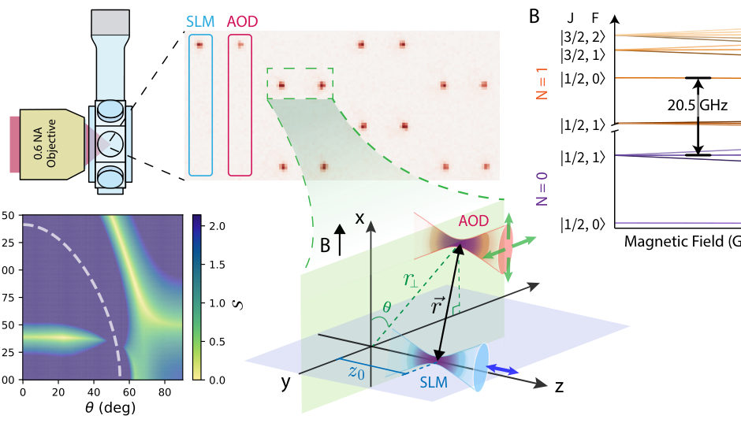 
FIG. 1. Three-dimensional geometric control of dipolar interactions in a molecular tweezer array. (A) Schematic of the optical tweezer array and geometric coordinates used in this work. CaF (calcium monofluoride) molecules are loaded into 775 nm optical tweezers projected through a 0.6 NA microscope objective into a vacuum glass cell. Inset: Geometry and coordinates between one pair of interacting molecules. The tweezer propagation is along ˆz. The relative separation vector between two molecules is ⃗r = ⃗r⊥+ z0ˆz, where ⃗r⊥is the in-plane separation and z0 is their relative axial displacement. The angle θ is defined between ⃗r⊥and the quantization axis, which is set by a small applied...

📷 Fig 2

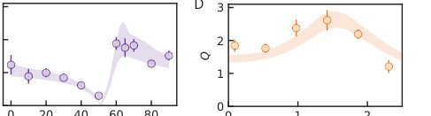 
FIG. 2. Static geometric engineering of dipolar inter- actions. (A) Predicted interaction quality factor Q = |J|τ/h over geometry space parameterized by (θ, z0). The stars mark the geometries used for the dipolar oscillation measurements shown in B, while the horizontal (vertical) dashed lines mark the cuts depicted in C (D). (B) Comparison of dipolar oscil- lations at a reference point (θ, z0) = (90◦, 0) and an optimal configuration (θ∗, z∗ 0) = (70◦, 1.42 µm). Solid lines are fit to a damped dipolar-exchange oscillation; corresponding fitted de- cay times are τ = 40(6) ms and 103(12) ms, respectively. (C) Dipolar interaction quality factor Q as a function of angle θ at z0 = 0. (D) Dipolar...

📷 Fig 3

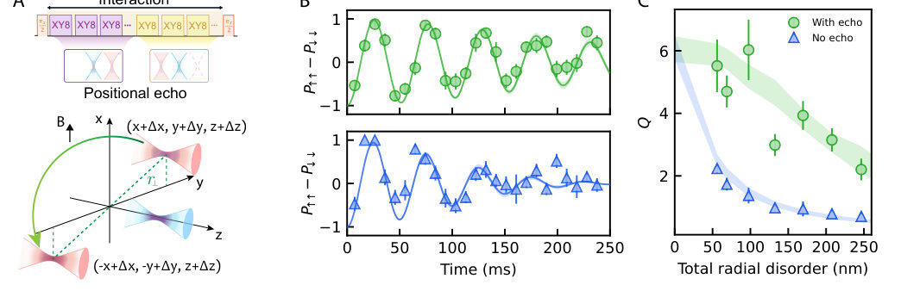 
FIG. 3. Positional Echo Protocol. (A) The interacting pair evolves for equal durations at two geometries, realized by rapidly moving one molecule midway through the interaction duration. The XY8 dynamical decoupling sequence is applied throughout the interaction. (B) Comparison of optimal dipolar oscillations with the motional echo (top, green) and without the motional echo (bottom, blue). (C) We characterize the performance of the echo protocol by injecting additional disorder into the SLM trap position. The total radial disorder is obtained by adding the injected disorder in quadrature with the uncorrected baseline radial disorder (≃50 nm); the first data points correspond to zero...

📷 Fig 4

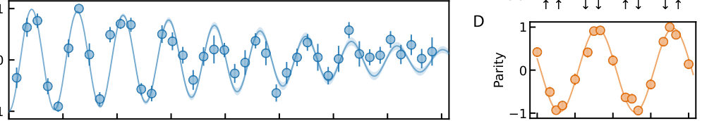 
FIG. 4. Optimal Configuration and Bell state characterization. (A) Illustration of the experimental sequence. Molecules in the SLM and AOD traps are simultaneously Raman-sideband cooled and then moved to the interaction geometry. After the interaction, a π/2 analysis pulse with variable phase ϕ is used for parity measurement, followed by detection of both the |↓⟩and |↑⟩states. (B) A representative oscillation with Q = 7.23(81). (C) Pair population statistics, measured in the computational basis at t = 11.2 ms of dipolar exchange evolution, corresponding to the π/2 point of the two-particle population oscillation. (D) Parity oscillations for a two-particle Bell state measured at the same...

**Summary.** The researchers addressed the challenge of decoherence in polar molecule quantum systems caused by thermal motion within optical tweezer arrays. They developed sophisticated control schemes, including geometric engineering and programmable echo sequences, which successfully suppressed sensitivity to positional jitter. These methods enabled the generation of high-fidelity entanglement ($\mathcal{F} \approx 0.976$), pushing the boundaries for molecular quantum information processing.

**Why it may be interesting.** This work represents a significant experimental demonstration of active quantum error mitigation using mechanical degrees of freedom. The ability to use controlled molecular motion to refocus environmental noise is highly relevant for building scalable quantum simulators and quantum memories.

Detailed structure

**Main problem.** The coherence of quantum interactions between polar molecules trapped in optical tweezers is degraded by thermal motion and positional fluctuations, limiting entanglement fidelity.

**Main result.** By employing dynamic geometric control and programmable molecular motion (geometric echo), the authors achieved a high two-molecule Bell state fidelity of $\mathcal{F}= 0.976^{+0.008}_{-0.011}$ in directly laser-cooled molecules.

**Method.** The study uses optical tweezer arrays controlled by SLMs and AODs to engineer the dipolar interaction geometry, combined with advanced quantum control techniques like dynamic decoupling and echo protocols.

**Model / system.** The system involves polar molecules (e.g., $	ext{CaF}$) trapped in 2D optical tweezers, whose coherent dynamics are governed by a dipolar coupling Hamiltonian $J$. The methodology focuses on minimizing the sensitivity of this interaction to motional states and positional noise.

**Key observables.** Entanglement fidelity ($\mathcal{F}$), Dipolar coherence quality factor ($Q$), Single-body coherence time ($	au_{sb}$).

**Important parameters / regimes.** Trap position fluctuations (down to 10 nm scale), Geometric parameters ($	heta, z_0$), Molecular temperature/motional occupation ($ar{n}$).

**Assumptions / limitations.** The primary limitations are identified as residual axial positional disorder ($\sigma_z$) and the need for complex site-dependent calibrations across the array.

**Figures summary.** Figures illustrate the geometry control using SLM/AODs, show how geometric engineering minimizes motional sensitivity ($S$), and demonstrate the improvement in coherence quality factor ($Q$) achieved by implementing echo protocols.

**Paper structure.** The paper progresses from identifying thermal motion as the primary decoherence source to proposing static geometric solutions (magic angles), then advancing to dynamic control via programmable molecular motion (echo protocol) to suppress positional noise, culminating in high-fidelity entanglement measurements.

Abstract

In quantum information systems made of optical tweezer arrays of ultracold molecules, thermal motion of molecules degrades the coherence of their interactions, which limits entanglement fidelity and the concomitant scientific applicability of these systems. We show that by controlling the geometry of the dipolar interaction, even when a molecule occupies many motional states in the tweezer, coherence can be preserved. We characterize several geometries that suppress sensitivity to thermal fluctuations. We further use programmable, coherence-preserving motion of the molecules during entanglement to refocus dephasing from relative positional jitter of the tweezers, which is relevant even on the 10 nm scale. These methods yield substantially improved dipolar coherence and enable generation of two-molecule entanglement with a Bell state fidelity of $\mathcal{F}= 0.976^{+0.008}_{-0.011}$ in directly laser-cooled molecules.

[↑ back to top](#top)

### [Topological building blocks of nonequilibrium response](http://arxiv.org/abs/2607.12096v1)

**Authors:** Sean Fancher, Jordan Horowitz  
**Type:** theory · **Category:** statistical mechanics · **PDF:** <https://arxiv.org/pdf/2607.12096v1>  
**Analysis basis:** full PDF text, analyzed in chunks
**Topic relevance:** 🔥 `non-equilibrium dynamics` **4/5** · `driven-dissipative phase transition` **3/5** · `methods for driven-dissipative` **3/5** · `non-equilibrium universality` **2/5** · `Keldysh / 2PI / non-Gaussian methods` **1/5** · `analog quantum simulation` **1/5** · `correlated / nonlocal dissipation` **1/5**

📷 Fig 1

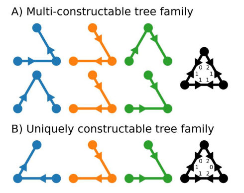 
FIG. 1. Some example tree families of the 3 state graph. A) Two distinct tree families with trees rooted at the top (blue), left (orange), and right (green) states. The number of times each directed edge is used is given by the black graph to the right. Since both sets use the same collection of edges with the same multiplicities, they can each be reconstructed into the other and are thus mulit-constructable. B) Another pos- sible tree family with its edge multiplicities. In this case, no other construction is possible, thus making this set uniquely constructable.

📷 Fig 2

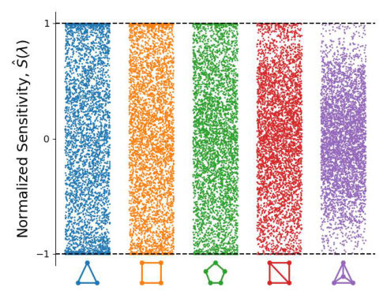 
FIG. 3. Numeric exploration of sensitivity in several ran- domized systems. For each of the depicted networks, values of Q, W, and d are all randomly determined from standard uniform, log-normal, and normal distributions, respectively. The corresponding ∂λ⟨Q⟩, minα⟨⟨QGα⟩⟩, and maxα⟨⟨QGα⟩⟩ are then calculated, and the normalized sensitivity is used so that ˆS(λ) = +1 corresponds to ∂λ⟨Q⟩= maxα⟨⟨QGα⟩⟩and ˆS(λ) = −1 to ∂λ⟨Q⟩= minα⟨⟨QGα⟩⟩. This process of drawing new values of Q, W, and d and recalculating ˆS(λ) is repeated a total of 4096 times for each network. This data shows the validity of the bounds presented in (8).

📷 Fig 3

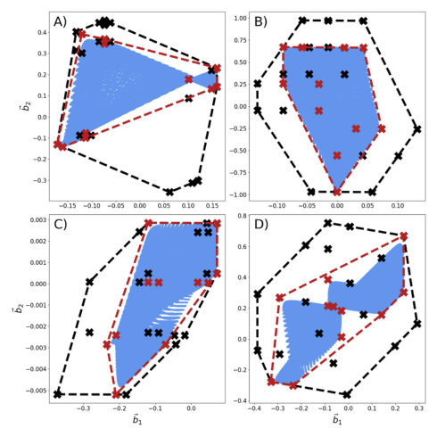 
FIG. 2. Numeric exploration of response in the 3 state graph. The response of this system exists within a 2-dimensional sub- space of the 3-dimensional space defined by ∂λ ln πj. Axes represent an orthonormal basis of this subspace for each pa- rameter set. The position of the tree family vertices (vσ) are given by the × markers with multi-constructable tree families in black and uniquely-constructable ones in red. The convex hulls of these two collections are given by their correspond- ingly colored dashed lines. Blue points provide numerically calculated response values from a sweep over the space of possible rates under fixed π and d values, as described in the Materials and Methods....

📷 Fig 4

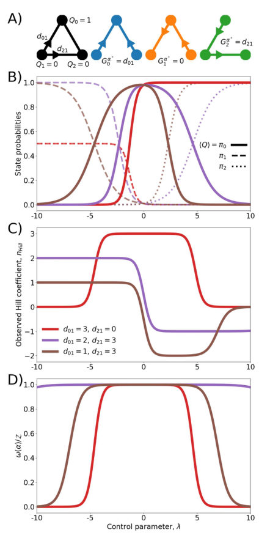 
FIG. 4. A) The three state network with displayed values of Q and d is given base rates W01 = 1, W10 = 10−2, W02 = W21 = 10−6, W12 = 10−12, and W20 = 10−14 so that the depicted uniquely constructable tree family is physically realized. B) The steady state probabilities of each state (and equivalently ⟨Q⟩) showcase the characteristic features of single (red) and double (purple and brown) sided Hill functions. C) The Hill coefficient is calculated via (13) for each system as a function of λ. The values in the transition regions are seen to perfectly match those predicted by (15) with the signs dictating ramp up and ramp down regimes respectively. D) The realization range (L) for each curve is...

📷 Fig 5

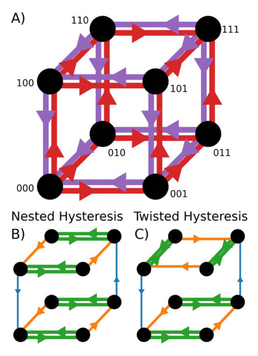 
FIG. 5. The binary triplet model. A) The eight possible binary triplet states with all allowable transitions. Red edges represent binding edges (de = 1) while purple edges represent unbinding edges (de = 0). B) The Nested Hysteresis model. The green left-right edges hold the highest rates, the orange front-back edges are of moderate magnitude, and the blue top-bottom edges have the slowest transitions. This model is capable of achieving maximum sensitivity. C) The Twisted Hysteresis model. Rates are color coded in the same way as (B), but the top portion of the graph has been twisted. This model is also capable of achieving maximum sensitivity. See SI for full breakdown of the corresponding...

**Summary.** The paper develops a geometric framework to map the entire space of possible non-equilibrium responses in Markov jump processes. It shows that these responses are constrained by the topology of the underlying state graph via 'uniquely constructable' tree families. This provides powerful, mathematically rigorous bounds for designing systems with specific sensitivity profiles.

**Why it may be interesting.** This work provides deep mathematical structure (polytope geometry) to non-equilibrium dynamics, offering rigorous bounds on how systems can respond to external stimuli, which is highly relevant for designing synthetic biological or engineered quantum devices.

Detailed structure

**Main problem.** To systematically characterize the full range of possible non-equilibrium response behaviors achievable by a system, moving beyond existing theoretical bounds.

**Main result.** The entire space of achievable responses is conjectured to be structured as a polytope whose vertices are determined by 'uniquely-constructable' tree families derived from the graph topology.

**Method.** The authors use graph theory (rooted spanning trees) and geometric arguments, showing that physical realizability restricts the response space to a convex combination of contributions from these unique topological structures.

**Model / system.** The system is modeled as a continuous-time Markov jump process on a graph G with N nodes. The dynamics are governed by a master equation, and the focus is on calculating the rate sensitivity ($\partial_\lambda \langle Q 
angle$) of steady-state observables to external control parameters $\lambda$.

**Key observables.** Steady-state distribution ($\pi_j$), response sensitivity vector components ($\partial_\lambda \ln \pi_j$), and the expected value of an observable $\langle Q 
angle$.

**Important parameters / regimes.** The topology of the graph G, kinetic rates $W_{ij}$, and the control parameter $\lambda$ that tunes the rates.

**Assumptions / limitations.** The analysis assumes the graph is strongly connected to ensure a unique steady state. Crucially, it distinguishes between 'multi-constructable' (non-physical) and 'uniquely-constructable' tree families.

**Figures summary.** Figures illustrate the construction of different types of rooted spanning trees on small graphs (like 3 states), contrasting those that are uniquely constructible (leading to nested or twisted hysteresis motifs) versus those that fail due to structural contradictions.

**Paper structure.** The paper progresses from defining the general problem of response characterization, establishing the role of tree families in bounding the response space via convex combinations, and finally applying these topological constraints to specific physical models like molecular binding on a 3-state graph.

Abstract

Nonequilibrium systems can exploit energy to amplify their sensitivity to external stimuli, allowing them to be harnessed for a variety of functions in both engineered devices and living organisms. An assortment of theoretical results capture different facets of this nonequilibrium amplification, including fluctuation-response relations as well as bounds and constraints that limit the potential behavior. Here, we take a broader perspective, aiming for a systematic characterization of the full range of possible response behaviors. For a wide class of nonequilibrium dynamics, we identify a collection of optimally sensitive models whose behavior is determined by the topology of the state space. We further conjecture that every response can be written as a convex combination of these optimal models, thereby structuring the entire space of responses. We use this geometric perspective to put sensitivity limits on nonmonotonic biochemical input-output functions, and identify all optimal kinetic schemes for the unordered binding of molecules among three sites.

[↑ back to top](#top)

### [Heisenberg-limited metrology in the presence of non-Markovian noise with finite control rates](http://arxiv.org/abs/2607.12913v1)

**Authors:** Shravan Shravan, Tyler G. Thurtell  
**Type:** theory · **Category:** quantum information and computing · **PDF:** <https://arxiv.org/pdf/2607.12913v1>  
**Analysis basis:** full PDF text, analyzed in chunks
**Topic relevance:** 🔥 `quantum measurements` **4/5** · `measurement-induced transitions` **3/5** · `non-equilibrium dynamics` **2/5** · `correlated / nonlocal dissipation` **1/5** · `driven-dissipative phase transition` **1/5** · `entanglement & information structure` **1/5** · `methods for driven-dissipative` **1/5** · `non-equilibrium universality` **1/5**

📷 Fig 1

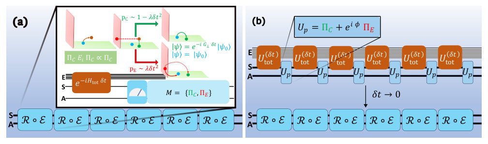 
Figure 1. Illustration of the control schemes considered in this work. All lead to HL scaling when the signal generator G is not in the linear span of the error generators Ei, in the limit of infintely fast pulses. The dynamics of the system and its environment are associated with the Hamiltonian Htot which generates the unitary Utot(δt) and leads to the channel E. The second type of dynamics is associated with the controls and leads to the channel R. (a) Approximate quantum error detection (AQED) and Approximate quantum error correction (AQEC) schemes: After an infinitesimal evolution, a two- outcome projective measurement M = {ΠC, ΠE} is performed. With probability pC ∼1−λδt2, the state...

📷 Fig 2

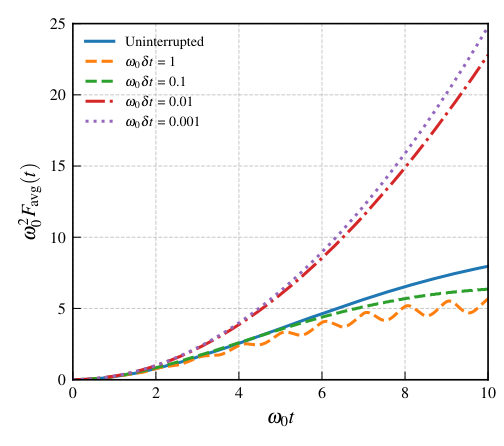 
Figure 2. QFI as a function of time for Jaynes-Cummings model with detuning. We have set the parameters λ = ω0, γ0 = ∆= 5ω0. δt is the time duration between successive measurements. We see a decreasing value of the QFI with increasing δt. Note that the QFI for ω0δt = 0.1 is smaller than for the uninterrupted evolution.

📷 Fig 3

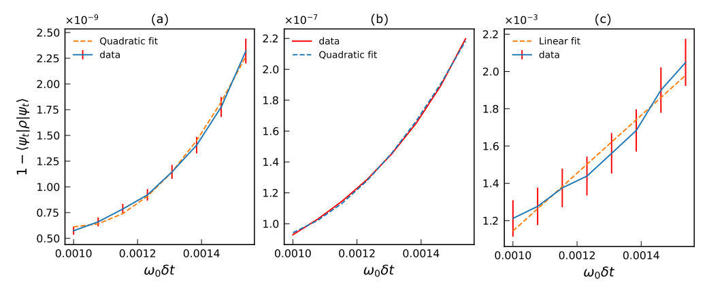 
Figure 3. Infidelity of state at time ω0t = 10 (ρ(t)) with the exact evolution (|ψt⟩) vs δt. (a) plots the AQEC evolution, (b) the DD evolution and (c) plots the AQED evolution. The red bars on (a) and (c) are standard error σ/ √

📷 Fig 4

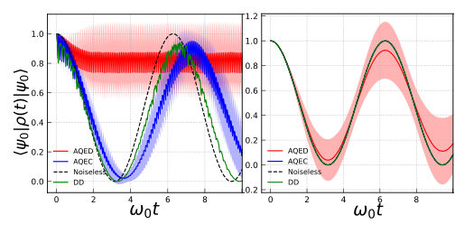 
Figure 4. The mean Rabi oscillation over different trajecto- ries is plotted along with the variance for two different δt for AQEC and AQED code. The left is for ω0δt = 0.1 and the right is for ω0δt = 0.001. The shaded regions represent the standard deviations of the respective quantities.

📷 Fig 5

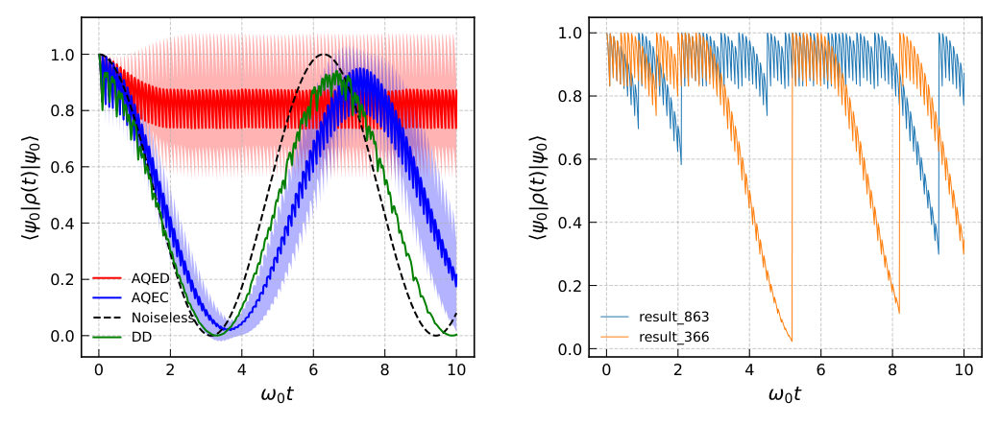 
Figure 5. (Left) We plot the mean evolution of 10000 different trajectories along with the standard deviation for ω0δt = 0.1. The AQEC and DD evolutions are slightly damped, compared to the noiseless evolution, while the AQED evolution is extremely noisy. (Right) We plot two randomly chosen trajectories for the AQED simulation.

**Summary.** This paper investigates how to maintain optimal Heisenberg-limited precision in quantum measurements when the system suffers from complex non-Markovian noise and controls are not instantaneous. By comparing measurement-only, active recovery, and dynamical decoupling protocols, the authors show that while all can theoretically achieve ideal scaling, practical limitations dictate which method performs best at finite control rates.

**Why it may be interesting.** It provides concrete, quantitative comparisons of different control strategies for overcoming noise in quantum sensing, directly impacting how robust quantum sensors can be designed under realistic physical constraints.

Detailed structure

**Main problem.** The central problem is achieving Heisenberg-limited quantum estimation scaling ($	ext{QFI} \propto t^2$) when the probe is subjected to non-Markovian noise and control operations are restricted to a finite rate.

**Main result.** Protocols relying purely on measurements show poor scaling, whereas active recovery or dynamical decoupling protocols achieve superior convergence rates in the finite-rate regime.

**Method.** The work analyzes three distinct quantum control schemes (measurement-only, active recovery, and dynamical decoupling) by establishing connections to the quantum Zeno effect and analyzing the resulting Quantum Fisher Information scaling.

**Model / system.** The system involves a quantum probe coupled to an environment, modeled via total Hamiltonians. The analysis compares performance metrics across different noise models (Markovian vs. non-Markovian).

**Key observables.** Quantum Fisher Information ($	ext{QFI}$), fidelity of the state evolution, and convergence rates as control frequency approaches zero.

**Important parameters / regimes.** Finite control rate ($\delta t$), time $t$, and the structure of the noise generators $\{E_k\}$ relative to the signal generator $G$.

**Assumptions / limitations.** The analysis rigorously compares performance in the finite-rate limit, contrasting with theoretical results derived assuming infinitely fast (Zeno) controls.

**Figures summary.** Figures illustrate the three control schemes and show that AQEC and DD maintain high fidelity compared to AQED, especially as measurement intervals decrease.

**Paper structure.** The paper establishes a connection between optimal metrology protocols and the quantum Zeno effect. It then rigorously analyzes the performance of measurement-only, active recovery, and dynamical decoupling methods when controls are limited to finite rates.

Abstract

Recently, it has been shown that protocols utilizing infinitely fast controls, such as quantum error correction, can in principle restore Heisenberg-limited frequency estimation in the presence of a broad class of non-Markovian noise models arising from coupling to finite-dimensional environments. However, these controls differ substantially from those used to address Markovian noise, and their underlying physical mechanism remains unclear. In this work, we establish a direct connection between these protocols and the quantum Zeno effect, and extend the framework to infinite-dimensional environments. We delineate three types of constructions: (a) protocols that rely solely on measurements, (b) protocols using an active recovery after measurements and (c) protocols using dynamical decoupling and rigorously analyze the performance of each when controls can be applied at only a finite rate. While protocols relying purely on measurements can be engineered for noise models where active recoveries are fundamentally impossible, they result in the quantum Fisher information exhibiting a quadratically worse dependence on the control frequency. Surprisingly, while dynamical decoupling protocols are possible whenever protocols relying only on measurements can be engineered, the quantum Fisher information has the same dependence on control frequency as the active recovery protocols. Numerical simulations suggest that the improvement offered by dynamical decoupling may work in regimes beyond the perturbative setting where our rigorous theorems apply.

[↑ back to top](#top)

### [Solitary waves of attracting SU(N) fermions](http://arxiv.org/abs/2607.12484v1)

**Authors:** Aysha Alsubaihi, Wayne J. Chetcuti, Frederic Chevy, Juan Polo, Luigi Amico  
**Type:** theory · **Category:** quantum gases · **PDF:** <https://arxiv.org/pdf/2607.12484v1>  
**Analysis basis:** full PDF text, analyzed in chunks
**Topic relevance:** 🔥 `analog quantum simulation` **4/5** · `non-equilibrium dynamics` **3/5** · `non-equilibrium universality` **2/5** · `Frenkel-Kontorova` **1/5** · `Kondo & dissipative impurity` **1/5** · `entanglement & information structure` **1/5** · `methods for driven-dissipative` **1/5** · `scars & prethermalization` **1/5**

📷 Fig 1

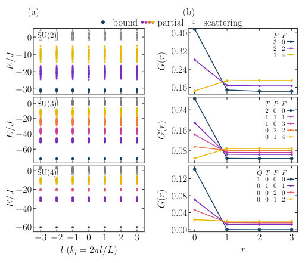 
Figure 1. Energy-momentum spectrum E(kl) (left column) and cross-flavor density-density correlator G(r) (right col- umn) for SU(2) Np = 6 at |U|/J = 10, SU(3) with Np = 6 at |U|/J = 12, and SU(4) with Np = 4 at |U|/J = 10, on L = 7 sites. Colors encode the binding hierarchy: navy denotes the maximally bound lowest-energy band, the gradient denotes progressively more dissociated partially bound configurations, and gray markers denote scattering states. Each G(r) curve is averaged over all eigenstates of the corresponding band, within the zero-momentum (kl = 0) sector. The right-column legends list the composite content, where P, T, Q, and F denote pairs, trions, quartets, and unpaired...

📷 Fig 2

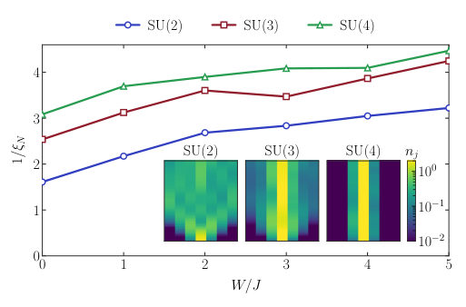 
Figure 3. Robustness against on-site disorder at matched |U|N/J = 12 and one particle per component Np/N = 1. Main panel: inverse correlation length 1/ξN of the N-body correlator TN(r) vs. disorder strength W/J, for SU(2), SU(3), and SU(4) on an L = 7 ring. For each W/J, the on-site point r = 0 is excluded and 1/ξN is obtained from the magnitude of a linear fit to log TN(r) for r ≥1. The inverse correlation length displays an overall increasing trend with disorder and remains larger for higher N. Insets: representative disorder- averaged density evolution nj(t) following the pinning quench at W/J = 0.25 on an L = 7 ring, shown with a logarith- mic color scale in the rescaled time t ˜J for...

📷 Fig 3

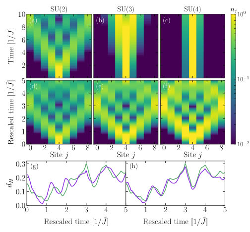 
Figure 2. Density evolution nj(t) = P

📷 Fig 4

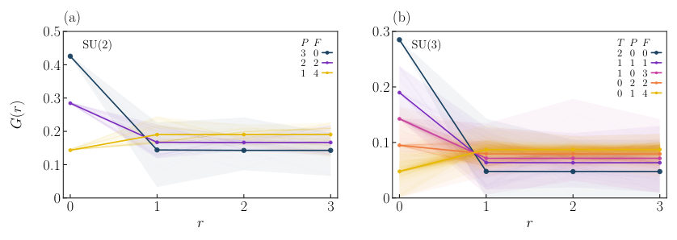 
Figure 4. Cross-flavor correlator G(r) for individual eigenstates in each band, for all momentum sectors, for L = 7, |U|/J = 20. Bold lines are the band averages. For legibility only every second momentum sector is included, and within each band every tenth eigenstate is plotted. Curves are colored by the composite configuration of their band. The bound band has the sharpest r = 0 peak and the tightest clustering, while higher bands are progressively flatter, justifying the band-averaged G(r) across one momentum sector in Fig. 1.

📷 Fig 5

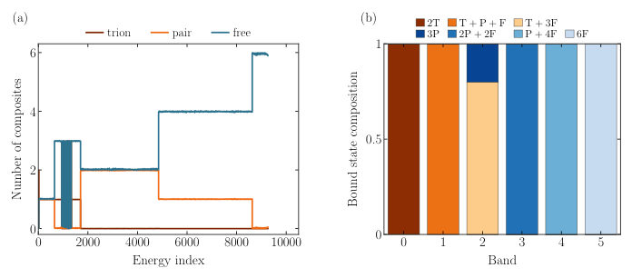 
Figure 5. Composite structure of the SU(3) many-body spectrum for Np = 6 on L = 7 sites for interaction |U|/J = 20. (a) Number of trions NT , pairs NP , and free fermions NS as a function of eigenstate energy index (states ordered by increasing energy). Each count is flat within a band and jumps at the band edges as composites dissociate with increasing energy, from the fully bound band (two trions) to the full unbound highest band (six free fermions NS = 6). (b) Configuration structure of each band, shown as the fraction of states with a given composite content (T = trion, P = pairs, F = free fermion). Every band is a single configuration except band-2, which is a mixture of the T + 3F and...

**Summary.** The paper theoretically investigates solitary waves formed by attractively interacting SU(N) fermions on a lattice. It establishes that these bound states exhibit dynamics analogous to quantum walks, mirroring classical soliton behavior. The study also quantifies how disorder affects this confinement and derives effective hopping parameters for the composite excitations.

**Why it may be interesting.** This work connects concepts from integrable many-body physics (Bethe ansatz) with observable quantum transport phenomena (quantum walks), providing a detailed theoretical framework for understanding emergent collective excitations in strongly interacting fermionic systems relevant to ultracold atomic gases.

Detailed structure

**Main problem.** The study investigates the formation, dynamics, and disorder robustness of bound states (solitary waves) in attractively interacting SU(N) fermions on a 1D lattice.

**Main result.** Bound states propagate as quantum walks, exhibiting a dynamical signature analogous to classical soliton motion. Furthermore, their confinement is shown to be enhanced by increasing the component number N under disorder.

**Method.** The analysis employs exact diagonalization in fixed-momentum sectors and utilizes Bethe ansatz results for the dilute limit. Dynamics are probed via quench protocols and correlation functions.

**Model / system.** The system models attractively interacting SU(N) fermions on a 1D ring lattice, governed by an extended Fermi-Hubbard type Hamiltonian. The continuum limit maps this to the Gaudin–Yang–Sutherland (GYS) model.

**Key observables.** Energy spectrum bands, density-density correlation $G(r)$, N-body correlator $T_N(r)$, and the Hellinger distance ($d_H$) comparing dynamics to single-particle quantum walks.

**Important parameters / regimes.** Attractive interaction strength $|U|$, hopping amplitude $J$, disorder strength $W$, and component number $N$ (SU(2), SU(3), etc.).

**Assumptions / limitations.** The analysis relies on mapping the lattice problem to integrable models in the dilute limit, and uses perturbative expansions for effective hopping in the strongly coupled regime.

**Figures summary.** Figures illustrate energy spectra showing distinct bound bands (Fig. 1, Fig. 6), density evolution confirming quantum walk behavior after rescaling time (Fig. 2), and correlation length decay under disorder (Fig. 3, Fig. 8).

**Paper structure.** The paper progresses from defining the lattice Hamiltonian and analyzing the energy spectrum via Bethe ansatz solutions to characterizing the dynamics using quench protocols and correlations. It then explores the continuum limit mapping and finally examines the robustness of these bound states against disorder.

Abstract

We study the formation, dynamics, and disorder robustness of bound states in attractively interacting SU(N) fermions on a one-dimensional ring lattice. Using exact diagonalization in fixed-momentum sectors and Bethe ansatz exact results as a guide, we resolve the many-body spectrum into bands related to the possible partitions of the particles into bound composites, and characterize their internal structure also through density-density and N-body correlations. A pinning quench protocol reveals a transition from dispersive spreading to dynamical localization as the attractive interaction increases relative to the single-particle hopping. We find that the bound state dynamics for one-particle per component occurs as a many-body quantum walk similar to that of a single particle with a re-normalized effective mass. Such a property, that is the quantum version of the shape-preserving motion of classical solitons, can provide the dynamical signature of the fermionic solitary waves. We probe the robustness of the fermionic bound-state dynamics under on-site disorder.

[↑ back to top](#top)

### [Pokrovsky--Talapov and Berezinskii--Kosterlitz--Thouless Phase Transitions in Bilayer Superconducting Films under an In-Plane Magnetic Field](http://arxiv.org/abs/2607.12401v1)

**Authors:** Yicheng Zhong, Yi Zhou  
**Type:** theory · **Category:** statistical mechanics · **PDF:** <https://arxiv.org/pdf/2607.12401v1>  
**Analysis basis:** full PDF text, analyzed in chunks
**Topic relevance:** 🔥 `Frenkel-Kontorova` **4/5** · `Keldysh / 2PI / non-Gaussian methods` **2/5** · `driven-dissipative phase transition` **2/5** · `analog quantum simulation` **1/5** · `methods for driven-dissipative` **1/5** · `non-equilibrium dynamics` **1/5** · `non-equilibrium universality` **1/5**

📷 Fig 1

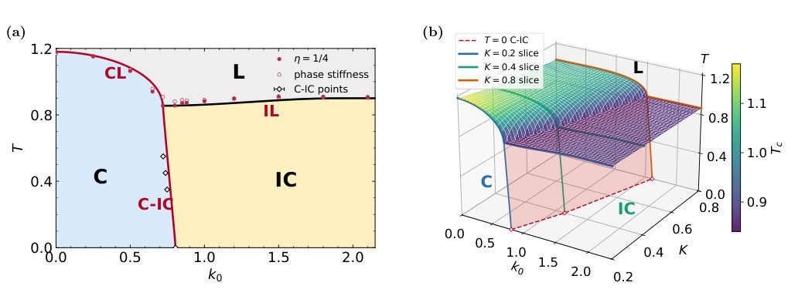 
FIG. 1. Phase diagrams of the compact layer-phase model. (a) Representative (k0, T) cut at K = 0.2. Symbols mark Monte Carlo thermal-boundary diagnostics and fixed-soliton-sector C–IC crossings; curves are inferred phase boundaries. (b) Three- dimensional (k0, T, K) phase diagram, showing the PT C–IC wall and the BKT-like C–L and IC–L melting surfaces.

📷 Fig 2

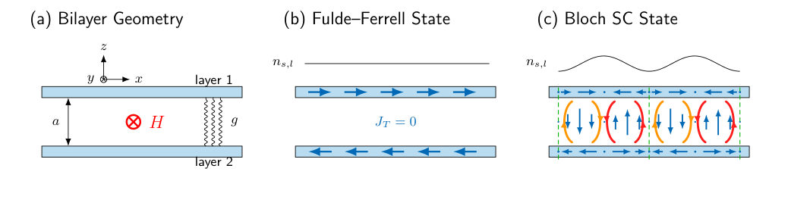 
FIG. 2. Bilayer model and representative current patterns. (a) Two superconducting layers separated by a, coupled by Josephson tunneling g, and subject to an in-plane field H = H ˆy, indicated by ⊗. (b) Fulde–Ferrell state with uniform superfluid density, counterpropagating intralayer supercurrents, and zero interlayer Josephson current JT = 0. (c) Bloch SC state with modulated superfluid density; blue arrows show in-plane supercurrents, and colored loops mark interlayer Josephson vortex–antivortex unit cells.

📷 Fig 3

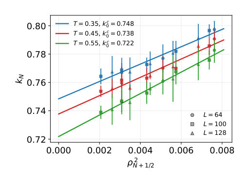 
FIG. 3. Fixed-soliton-sector test of the PT soliton-entry boundary at K = 0.2. Points are thermodynamic-integration crossings for L = 64, 100, 128 and T = 0.35, 0.45, 0.55, plotted as kN versus ρ2 N+1/2. Linear fits to kN = kc 0(T)+A(T)ρ2 N+1/2 over 0.002 ≤ρ2 N+1/2 ≤0.008 give the finite-temperature C– IC boundary.

📷 Fig 4

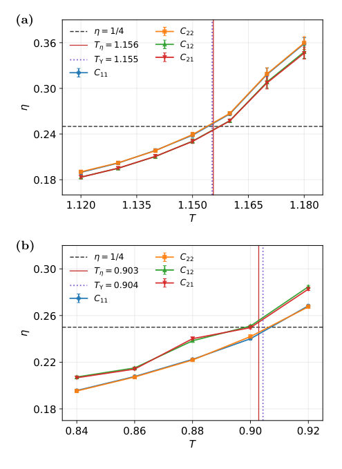 
FIG. 4. Phase-correlation diagnostics for thermal melting at K = 0.2, L = 100. (a) C–L cut at k0 = 0.25; (b) IC–L cut at k0 = 1.5. Symbols show fitted correlation exponents from C11, C12, C21, C22. Guides mark η = 1/4 and the stiff- ness criteria Υ+ = T/(2π) in (a) and Υ+ + Υ−= 2T/π in (b). The small spread among the Tη estimates from different Cαβ channels and their small offset from TΥ are finite-size ef- fects expected to vanish in the thermodynamic limit; the C–L finite-size trend is shown in Appendix .

📷 Fig 5

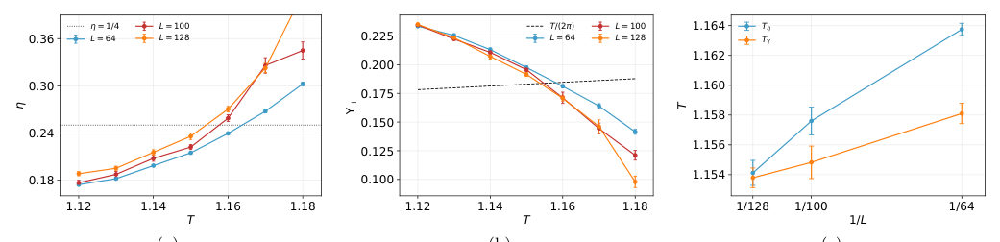 
FIG. 5. Finite-size C–L boundary diagnostics. (a) Mean diagonal layer exponent ηℓ; the dashed line marks 1/4. (b) Common helicity modulus, with the comparison line Υ+ = T/(2π). (c) Crossing temperatures from ηℓ= 1/4 and Υ+ = T/(2π).

**Summary.** This paper theoretically maps the complex finite-temperature phase diagram of a Josephson-coupled superconducting bilayer under an in-plane magnetic field. It distinguishes between two types of transitions: the Pokrovsky–Talapov transition driven by soliton entry, and Berezinskii–Kosterlitz–Thouless melting governed by vortex unbinding. The analysis uses advanced RG techniques to characterize these competing critical lines.

**Why it may be interesting.** This work provides a detailed theoretical framework for understanding how competing topological defects (solitons vs. vortices) dictate phase transitions in superconducting systems, which has parallels with critical phenomena studied in quantum many-body physics.

Detailed structure

**Main problem.** The study investigates finite-temperature phase transitions (Pokrovsky–Talapov and Berezinskii–Kosterlitz–Thouless) in a Josephson-coupled bilayer superconducting film subjected to an in-plane magnetic field.

**Main result.** The phase diagram is characterized by three distinct boundaries: the PT soliton-entry line separating C/FF from IC/Bloch SC, and two BKT-like thermal melting lines (C–L and IC–L).

**Method.** The authors employ Renormalization Group (RG) analysis on a continuum action derived from the Ginzburg-Landau functional, supplemented by Monte Carlo simulations.

**Model / system.** The system is a Josephson-coupled superconducting bilayer ($\psi_1, \psi_2$) placed in an in-plane magnetic field ($H$). The effective theory involves phase dynamics governed by relative and common phase sectors.

**Key observables.** Correlation exponents (expected to approach 1/4 at BKT transitions), helicity moduli ($\Upsilon$), and the soliton density $
ho_{	ext{sol}}$ determining the C–IC boundary.

**Important parameters / regimes.** In-plane magnetic field parameter $k_0 = 2\pi H a / \Phi_0$, temperature $T$, and Josephson coupling strength $K$.

**Assumptions / limitations.** The analysis relies on weak-fugacity RG schemes and assumes that the C–IC transition is governed by soliton entry, distinct from thermal vortex unbinding.

**Figures summary.** Figures illustrate phase diagrams showing the coexistence of PT (soliton) and BKT (thermal melting) boundaries, and show finite-size scaling diagnostics confirming the expected critical exponents for the thermal transitions.

**Paper structure.** The paper develops an effective continuum action, applies RG techniques to track vortex fugacities and stiffnesses, determines the zero-temperature PT boundary via fixed-sector free energy crossings, and analyzes the finite-temperature BKT boundaries using correlation function decay and helicity modulus criteria.

Abstract

We study finite-temperature phase transitions in a Josephson-coupled bilayer superconducting film with compact layer phases under an in-plane magnetic field. At zero temperature, where thermally excited layer vortices are absent, the relative-phase sector undergoes a Pokrovsky--Talapov (PT) commensurate--incommensurate (C--IC) transition from a commensurate Fulde--Ferrell (C/FF) state to an incommensurate Bloch superconducting (IC/Bloch SC) state. At finite temperature, compactness separates two distinct defect mechanisms. The C--IC boundary remains a PT soliton-entry line: interlayer Josephson vortex--antivortex-pair solitons enter with the square-root onset $ρ_{\rm sol}\propto [k_0-k_0^c(T)]^{1/2}$. Thermal melting is instead Berezinskii--Kosterlitz--Thouless (BKT)-like, with correlation exponent $η=1/4$ at the boundary, but the active vortex channel changes across the phase diagram. Josephson locking suppresses elementary layer vortices in the C/FF state and selects a same-vorticity layer-pair BKT channel, whereas elementary layer vortices control melting of the IC/Bloch SC state.

[↑ back to top](#top)

### [Roadmap Towards Quantum Entanglement Positron Emission Tomography (QE-PET)](http://arxiv.org/abs/2607.12182v1)

**Authors:** Paweł Moskal, Shiva Abbaszadeh, Harmanjeet Singh Bilkhu, Peter Caradonna, Pragya Das, Praveen Gurunath Bharathi, Ana Marija Kožuljević, Zdenka Kuncic, Deepak Kumar, Mihael Makek, Marek Nowakowski, Siddharth Parashari, Kaustav Prasad, Gregory R. Romanchek, Sushil Sharma, Kenji Shimazoe, Ewa Stępień, Sodai Takyu, Miwako Takahashi, Mizuki Uenomachi, Ritesh Verma, Taiga Yamaya  
**Type:** both · **Category:** other · **PDF:** <https://arxiv.org/pdf/2607.12182v1>  
**Analysis basis:** full PDF text, analyzed in chunks
**Topic relevance:** 🔥 `entanglement & information structure` **4/5** · `quantum optics experiment` **3/5** · `quantum measurements` **2/5** · `correlated / nonlocal dissipation` **1/5** · `driven-dissipative phase transition` **1/5** · `interference shaping light` **1/5**

📷 Fig 1

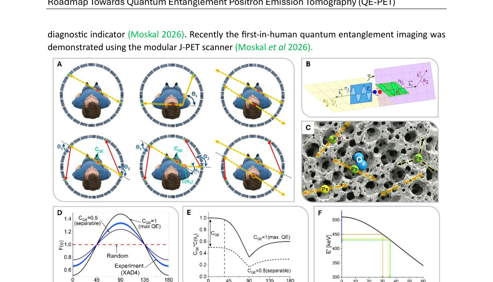 
Figure 1. Illustration of phenomena and main results relevant for the development of Quantum Entangled PET. (A) Cross section for the modular J-PET scanner (Moskal et al 2024), the first Quantum Entanglement PET system with superimposed photons from electron-positron annihilation indicated in red-yellow dashed arrows (left), event in which one of the photons underwent Compton scattering in the body at angle θS (middle), and event contributing to random coincidences where registered photons originate from two different annihilations. Lower panel of this figure shows the same events as upper panel with additional scattered photons (red arrows). C(θS) is the measure of correlation after...

📷 Fig 2

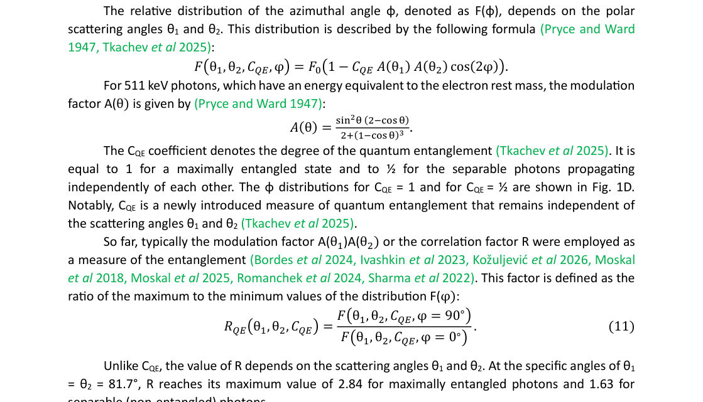 
Fig. 1D also illustrates the recent discovery that the degree of entanglement is not maximal for photons from electron-positron annihilation in the porous polymer (Moskal 2026). The experimental result is represented by the blue band. This observation can be explained by assuming that photons created via the pick-off effect (see Fig. 1C) are separable, while photons from other processes remain maximally entangled. Although this may be a simplification, it demonstrates that the degree of entanglement, CQE (and equivalently R), varies as a function of the annihilation mechanism. As depicted in Figure 1C, there are four primary mechanisms leading to the emission of two 511 keV photons. These...

📷 Fig 3

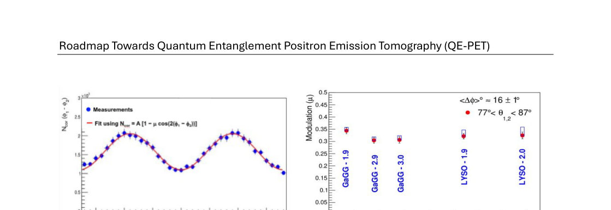 
Figure 1. Reconstructed azimuthal correlation distribution - example (left); Comparison of the polarimetric modulation factors obtained with different detector material and crystal width (right). Adapted from (Parashari et al 2022).

📷 Fig 4

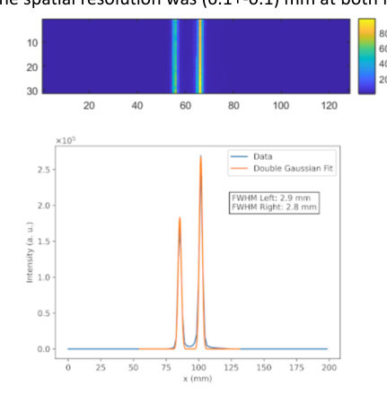 
Figure 2. Coronal images and the corresponding intensity profiles of the Ge-68 Line sources obtained with the SPE (left) and the PCE (right). (Kožuljević 2025)

📷 Fig 5

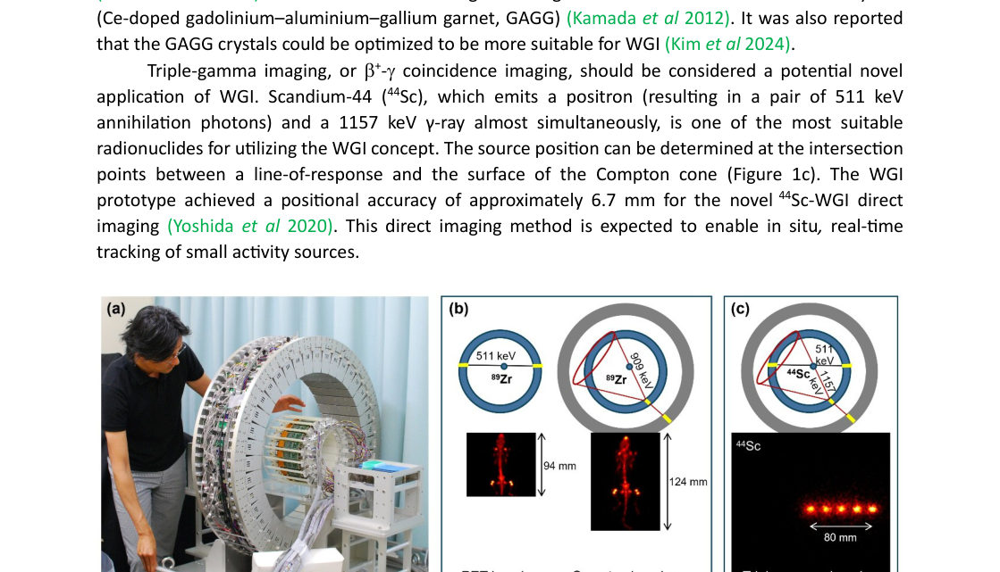 
Figure 1. A whole gamma imaging (WGI) prototype, which was a PET system combined with a Compton camera (a). The mouse imaging (1-hour measurement started 22 hours after 9.8 MBq 89Zr-oxalate injection) demonstrates the Compton image obtained using 909 keV gamma rays is comparative in quality to that of the PET image (b). A 44Sc-containing vial was shifted at 2 cm intervals and visualized with a simple backprojection of the intersection points of the Compton cone and the line of response of PET (c). Advances in Science and Technology to Meet Challenges Another crucial factor to consider is the time difference between the positron decay and the single- gamma emission (Tashima and Yamaya 2024)....

**Summary.** This roadmap details the development of Quantum Entanglement PET (QE-PET), which aims to improve standard PET imaging by measuring the quantum entanglement between annihilation photons. By characterizing this entanglement, researchers propose new diagnostic biomarkers related to tissue oxygenation and pH mapping. While promising, translating these sophisticated quantum measurements into clinical scanners remains a significant ongoing challenge.

**Why it may be interesting.** This work bridges quantum optics/information theory directly into applied medical physics. The ability to use fundamental quantum properties like entanglement as a measurable biomarker for biological processes is highly relevant to open quantum systems research.

Detailed structure

**Main problem.** The goal is to advance Positron Emission Tomography (PET) by leveraging the quantum entanglement inherent in annihilation photons, leading to a novel modality called Quantum Entanglement PET (QE-PET). This aims to overcome limitations like random coincidences and improve diagnostic capabilities.

**Main result.** The study establishes that quantum correlation is preserved even when one photon undergoes Compton scattering, allowing the degree of quantum entanglement ($	ext{CQE}$) to be measured as a potential diagnostic biomarker for tissue pathology or oxygenation.

**Method.** The research combines theoretical modeling of entangled photon states with descriptions of advanced detector systems (e.g., crystal scintillators, semiconductors) capable of measuring polarization and Compton scattering angles simultaneously.

**Model / system.** The physical system is the annihilation of an electron-positron pair into two back-to-back photons ($	ext{511 keV}$). The theoretical framework models the quantum state using entanglement measures like $	ext{CQE}$ and analyzes how this correlation changes upon interaction with matter (Compton scattering).

**Key observables.** Degree of Quantum Entanglement ($	ext{CQE}$), angular correlations ($C(	heta_S)$), relative angle ($\varphi$), and the energy spectrum of scattered photons.

**Important parameters / regimes.** Scattering angles ($	heta_S$), coincidence rates, and the specific physics of annihilation mechanisms (direct vs. positronium).

**Assumptions / limitations.** The primary open question is the successful translation of entanglement-based imaging into routine clinical practice due to low detection sensitivity.

**Figures summary.** Figures illustrate event reconstruction in prototype scanners, polarization/Compton scattering planes, various annihilation processes, and plots showing how $	ext{CQE}$ and correlation measures depend on the Compton scattering angle ($	heta_S$).

**Paper structure.** The paper functions as a roadmap, first establishing the physics background (entanglement preservation during scattering), detailing necessary detector technologies, presenting theoretical observables ($	ext{CQE}$, $C(	heta_S)$), and concluding with the potential diagnostic applications (oxygenation mapping, pH imaging).

Abstract

Annihilation photons are quantum entangled in their polarization, a property that is not accessible in state-of-the-art clinical Positron Emission Tomography (PET). This roadmap describes the current status of research in the emerging field of quantum entanglement applications involving these photons for medical diagnosis. It outlines the underlying physics phenomena and the development of detector systems that can serve as a foundation for future Quantum Entanglement PET (QE-PET) scanners. These scanners will be capable of utilizing the entanglement between annihilation photons by measuring their Compton scattering on electrons. This roadmap comprises up-to-date experimental results on the study of quantum entanglement and the decoherence of annihilation photons, alongside the current theoretical understanding of these phenomena. The methods and detector technologies described herein are being developed (i) in order to enhance standard PET imaging by suppressing random coincidences in the reconstruction of annihilation site density distributions, (ii) in order to establish the degree of quantum entanglement as a diagnostic biomarker for tissue pathology and oxygenation, and (iii) in order to elaborate a method for pH imaging. Whether entanglement-based imaging and pH mapping can be successfully translated into clinical practice remains an open question and a subject of exciting ongoing research. This roadmap serves as an invitation to the scientific community to join this burgeoning field.

[↑ back to top](#top)

### [Standard basis operator method for ground-state and temperature properties of single and two-component Bose-Hubbard model](http://arxiv.org/abs/2607.12718v1)

**Authors:** Oliwier Urbański, Tomasz P. Polak  
**Type:** theory · **Category:** quantum gases · **PDF:** <https://arxiv.org/pdf/2607.12718v1>  
**Analysis basis:** full PDF text, analyzed in chunks
**Topic relevance:** 🔥 `analog quantum simulation` **4/5** · `Keldysh / 2PI / non-Gaussian methods` **3/5** · `methods for driven-dissipative` **2/5** · `correlated cavity matter` **1/5** · `driven-dissipative phase transition` **1/5** · `entanglement & information structure` **1/5**

📷 Fig 1

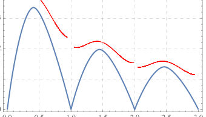 
Figure 1: Three lobes in zero and moderate temperature in the TSA.

📷 Fig 2

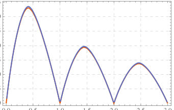 
Figure 2: Comparison of the zero-temperature lobes for three- and five-states approximation.

📷 Fig 3

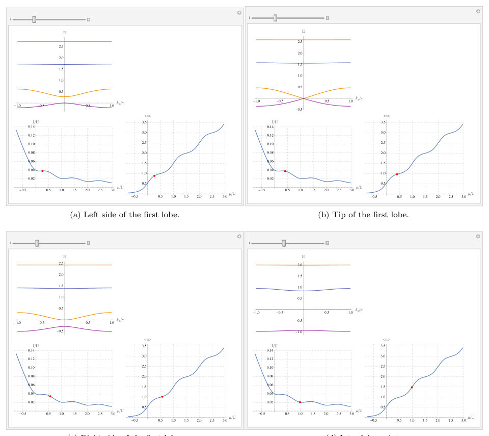 
Figure 4: Dispersion relation for various points on the critical line presented together with the mean number of bosons per site as a function of the chemical potential.

📷 Fig 4

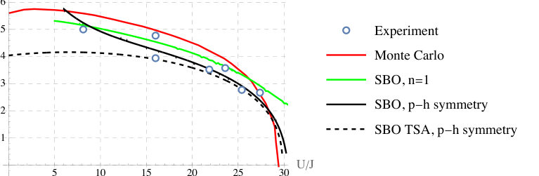 
Figure 5: Critical temperature as a function of interaction strength for various settings. The experimental data comes from21.

📷 Fig 5

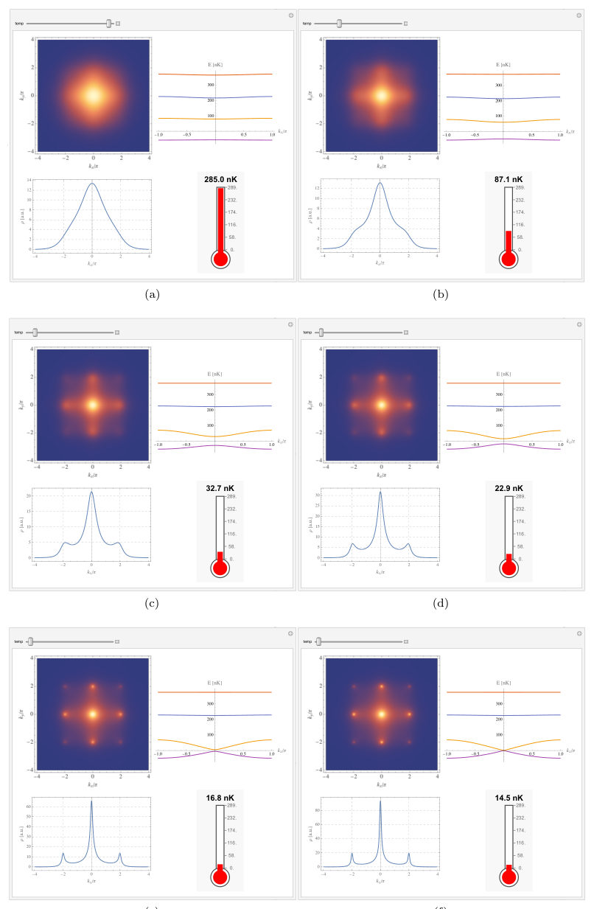 
Figure 6: Time of flight patterns as a function of temperature presented together with the dispersion plots and reference thermometer.

**Summary.** The paper introduces an enhanced Standard Basis Operator method to calculate the properties of the Bose-Hubbard model. It improves upon prior work by correctly accounting for more on-site states at finite temperatures and predicts complex phase transitions in multi-component systems. The methodology is highly relevant for understanding strongly correlated quantum gases.

**Why it may be interesting.** This work provides advanced theoretical tools (improved SBO) to study interacting quantum gases, offering quantitative improvements over previous approximations by systematically handling local Hilbert space truncation effects.

Detailed structure

**Main problem.** The authors aim to develop an improved theoretical method for calculating both ground-state and finite-temperature properties of the Bose-Hubbard model.

**Main result.** They successfully enhanced predictions by accounting for a necessary number of on-site states, while also predicting non-trivial phase diagram deformations in the two-component case.

**Method.** The core method is an improved Standard Basis Operator (SBO) approach formulated within a nonperturbative Green's function framework, utilizing Random Phase Approximation (RPA).

**Model / system.** The study focuses on the single and two-component Bose-Hubbard model in three dimensions, governed by a Hamiltonian involving hopping ($J$), on-site interaction ($U$), and chemical potential ($\mu$).

**Key observables.** Phase boundary, excitation spectra, boson occupancies (D_alpha), critical temperature (T_c/J).

**Important parameters / regimes.** Interaction strength to hopping ratio (U/J), chemical potential ($\mu/U$), and temperature ($T/J$).

**Assumptions / limitations.** The method relies on the RPA for decoupling higher-order Green's functions, which is noted to violate algebraic rules in multi-component systems.

**Figures summary.** Figures compare critical lines (SBO vs. QRA vs. TNS), show lobe structures at different temperatures, and illustrate how increasing the number of retained local Fock states improves accuracy.

**Paper structure.** The paper develops the SBO method using Green's functions, applies RPA to solve for these functions in momentum space, derives self-consistency equations from spectral theorems, and discusses limitations regarding multi-component extensions and numerical stability near phase transitions.

Abstract

We formulate an improved standard basis operator (SBO) method for the single and two-component Bose-Hubbard model in three dimensions. In the first case, nonzero temperature predictions are qualitatively and quantitatively enhanced by taking into account necessary number of on-site states, not just three as in previous works. Performance of the final numerical calculations is also improved by asymptotic analysis of the self-consistent equations near the critical line. Obtained results are compared with Monte-Carlo, tensor networks, Quantum Rotor Approach and experimental data. In the two-component case, SBO generalizes rather poorly, being able to account for intra-species thermal and quantum fluctuations, but not the inter-species ones. Deeper reasons for this situation are discussed. Still however, non-trivial deformation of the phase diagrams is predicted, together with first-order phase transitions steered by the changes in chemical potential.

[↑ back to top](#top)

### [Long baseline optical interferometric imaging with active phase stabilization](http://arxiv.org/abs/2607.12167v1)

**Authors:** Joshua J. Collier, Leuca Patmore, John S. Wallis, Elrina Hartman, Benjamin P. Dix-Matthews, David R. Gozzard  
**Type:** both · **Category:** other · **PDF:** <https://arxiv.org/pdf/2607.12167v1>  
**Analysis basis:** full PDF text, analyzed in chunks
**Topic relevance:** 🔥 `interference shaping light` **4/5** · `quantum measurements` **3/5** · `quantum optics experiment` **3/5** · `measurement-induced transitions` **1/5**

📷 Fig 1

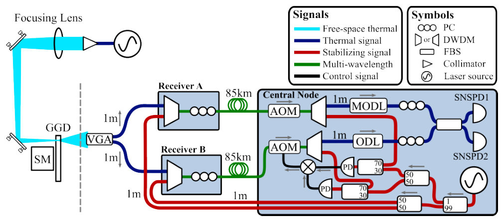 
FIG. 1. Simplified schematic of the pseudo-thermal source generation and stabilized interferometer. Left: Pseudo-thermal source generation. Light-blue is the thermal source in free space. Right: Optical interferometer. VGA: v-groove array, AOM: acousto-optic modulator, (M)ODL: (motorized) optical delay line, SNSPD: superconducting nanowire single photon detector, PD: photodetector, PC: polarization controller, DWDM: dense wavelength division multiplexer, FBS: fiberized beam splitter, GGD: ground glass disk, SM: stepper motor. The FBS split ratios are listed within the symbol where relevant.

📷 Fig 2

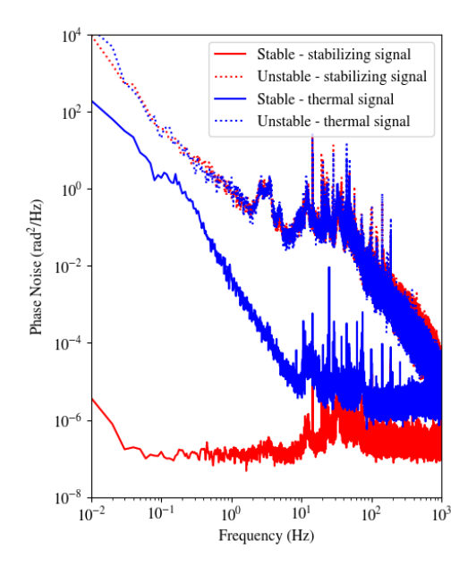 
FIG. 2. Phase spectral density of interferometer. The red curves are stabilizing signal, and the blue curves are thermal signal. The dashed lines show the response of the system without stabilization, and the solid lines show the response of the system with stabilization. Reproduced from [19].

📷 Fig 3

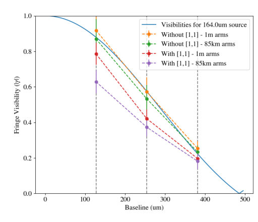 
FIG. 3. Complex degree of coherence measured at a series of baselines. We have a 164 µm across source 42 mm away from the receivers of the interferometer. Error bars are produced by fitting a series of curves to chunks of the collected dataset, then taking the best fit for each of them, the mean of these is the CDC estimate, the standard deviation is the error. Source size estimate from green curve is 166.47 µm.

📷 Fig 4

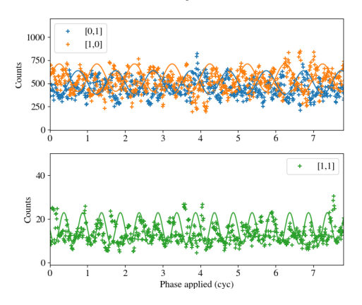 
FIG. 5. Phase sweep of the interferometer before introducing the stabilization system with a 127 µm collecting baseline, and a 164 µm source that is 42 mm away. Orange and blue curves are the first order interference fringes, the green curve is the second order. Solid curves are sinusoids matched to the data.

📷 Fig 5

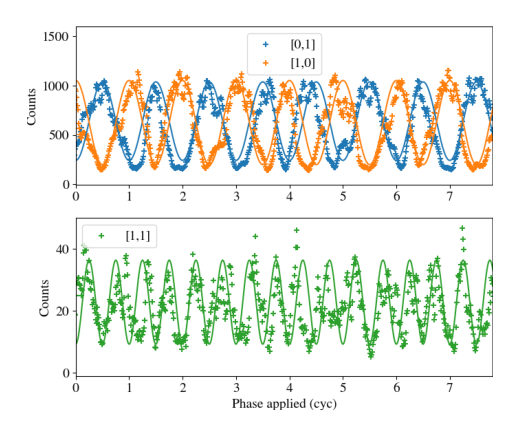 
FIG. 4. Phase sweep of the stabilized interferometer with 127 µm collecting baseline, and a 164 µm source that is 42 mm away. Orange and blue curves are the first order interference fringes, the green curve is the second order. Solid curves are sinusoids matched to the data.

**Summary.** This paper details the use of active phase stabilization techniques, borrowed from quantum communications, to enable long baseline optical interferometry using fiber connections. By successfully stabilizing an interferometer over 170km, the authors demonstrate that source sizes can be resolved far below the diffraction limit. This significantly advances the feasibility of building full-scale, high-resolution astronomical instruments.

**Why it may be interesting.** This work is highly relevant as it bridges advanced quantum optics (phase stabilization, quantum estimation) directly into a major area of astrophysics/quantum sensing, providing concrete engineering pathways for next-generation astronomical instruments.

Detailed structure

**Main problem.** The primary goal is to overcome the diffraction limit in astronomical imaging by implementing long baseline optical interferometry, which requires mitigating severe phase noise accumulated over long fiber links.

**Main result.** By applying quantum communication-inspired active phase stabilization techniques, the authors successfully demonstrated measurements on a 170km pseudo-baseline that allowed for source size estimation significantly below the system's diffraction limit.

**Method.** The work combines experimental implementation of interferometry with theoretical analysis using quantum optimal measurement estimators to extract source parameters from noisy fringe visibility data.

**Model / system.** The physical platform is a long baseline optical interferometer utilizing single-mode fibers over baselines up to 170km, emulating a pseudo-thermal astronomical source. The system incorporates active phase stabilization derived from quantum communication principles.

**Key observables.** Fringe visibility values, Complex Degree of Coherence (CDC), and the estimated angular size of the celestial source.

**Important parameters / regimes.** Baselines up to 350km are targeted; sub microarcsecond resolution is the ultimate goal. Phase noise reduction across long fiber links is critical.

**Assumptions / limitations.** The method assumes that advances in low-loss fibers will enable full-scale deployment, and the quantum estimator approach outperforms classical methods for source size determination.

**Figures summary.** Figures illustrate the setup schematic, phase spectral density comparisons showing noise reduction via stabilization, and fringe visibility measurements confirming successful signal recovery.

**Paper structure.** The paper progresses from establishing the need for long baseline interferometry to detailing the experimental implementation using fiber links. It then focuses on demonstrating that quantum-inspired phase stabilization techniques are necessary and sufficient to recover usable interference fringes and estimate source sizes accurately.

Abstract

Astronomical observations allow us to better our understanding of the universe. As we observe smaller and more distance features, we run into the diffraction limit of our observation system. This limit is a function of the wavelength observed and the size of the primary aperture used. We can synthesize a larger primary aperture by implementing interferometry. Long baseline optical interferometry would lead to significant improvements in astronomical imaging resolution. Building optical interferometers with free space baselines becomes significantly more difficult as the baseline increases. A promising alternative is to use optical fiber to connect telescopes. Fiber-based interferometers are much more susceptible to phase noise than their free-space counterparts due to inhomogeneities in the fiber medium. This leads to significant degradation of interferometric signals used for astronomical measurements. We implement phase stabilization techniques used in quantum communications to stabilize an optical interferometer with a 170km pseudo-baseline. We use a quantum optimal measurement technique with this interferometer to resolve the extent of a source four times smaller than the diffraction limit of the system within 1.5% error. These results bring the potential for a full-scale on-sky long baseline interferometer significantly closer. A 350km baseline optical interferometer at 1550nm would allow us to resolve sub microarcsecond features in the universe.

[↑ back to top](#top)

### [Microscopic Spin-1 Parent Hamiltonians for Emergent Valence-Bond Loop Manifolds](http://arxiv.org/abs/2607.12925v1)

**Authors:** Hari Borutta, Yasir Iqbal, Kirill Shtengel  
**Type:** theory · **Category:** strongly correlated electrons · **PDF:** <https://arxiv.org/pdf/2607.12925v1>  
**Analysis basis:** full PDF text, analyzed in chunks
**Topic relevance:** 🔥 `analog quantum simulation` **4/5** · 🔥 `exotic spin models in light-matter` **4/5** · `correlated cavity matter` **1/5** · `entanglement & information structure` **1/5** · `spintronics-quantum-optics interface` **1/5**

📷 Fig 1

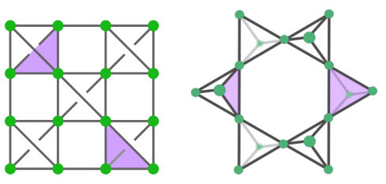 
FIG. 1. Checkerboard and pyrochlore lattices. The checker- board lattice is the two-dimensional corner-sharing analogue of the pyrochlore lattice, whose local units are tetrahedra. Representative triangular faces are shaded in purple; trian- gular faces of all orientations carry the projector interaction in Eq. (1). The shortest singlet loops have length four on the checkerboard lattice and length six on the pyrochlore lattice, where the latter are formed by bonds belonging to different tetrahedra.

📷 Fig 2

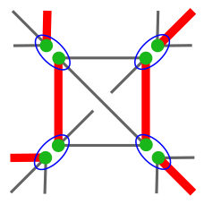 
FIG. 2. AKLT-like construction on a single crossed plaquette or tetrahedron. Each physical spin-1 degree of freedom is resolved into two virtual spin- 1

📷 Fig 3

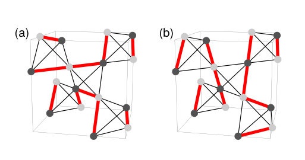 
FIG. 3. Two representative singlet configurations on the same portion of the pyrochlore lattice. The gray and black sites de- note the two sublattice types used to orient the singlets con- sistently. In each tetrahedron, the singlet pairing is chosen from the two independent opposite-pair states | ⟩and || | | | | |⟩ of Eq. (2), which are used to construct the orthonormal local basis in Eq. (3). All singlets shown connect opposite sublat- tices. Boundary singlets outside the displayed cluster are not shown.

📷 Fig 4

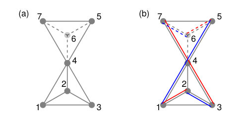 
FIG. 5. Pair of corner-sharing tetrahedra used for the py- rochlore projection. (a) Site labels are chosen to match the convention for the crossed-plaquette pair in Fig. 4: the site opposite 1 is labelled 5, and similarly for the other sites. (b) A representative bra–ket singlet configuration on the same pair of tetrahedra.

📷 Fig 5

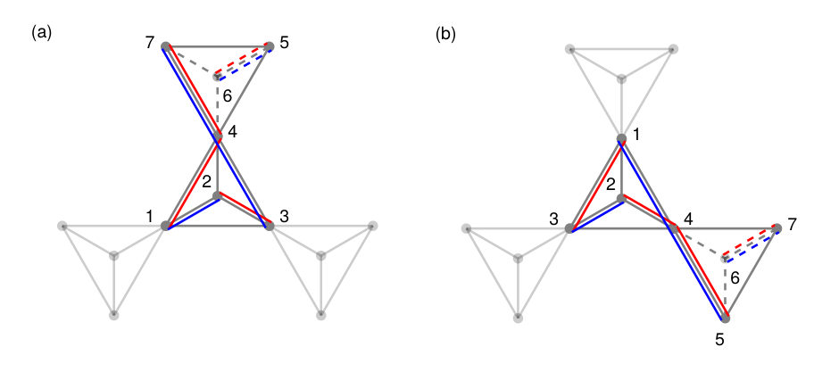 
FIG. 6. Effect of a C3 rotation on a representative pyrochlore matrix element. (a) Bra and ket singlet configurations ⟨ , | and || | | | | |, ⟩on the tetrahedron pair of Fig. 5. (b) The corresponding configurations after a clockwise 120◦rotation. The rotation permutes the site labels and hence the individual matrix elements, but preserves the symmetry-equivalent coupling classes used in the pyrochlore effective Hamiltonian.

**Summary.** This paper constructs an exact, local, SU(2)-invariant parent Hamiltonian using spin-1 moments on frustrated lattices. It demonstrates that the ground state manifold naturally encodes loop constraints characteristic of valence-bond physics. This provides a powerful theoretical tool for understanding quantum magnetism in 2D and 3D systems.

**Why it may be interesting.** The work provides a rigorous, microscopic starting point (spin-1) for studying complex constrained quantum phases like valence-bond solids, bridging concepts from spin models, dimer coverings, and gauge theories.

Detailed structure

**Main problem.** To determine if constrained valence-bond loop manifolds can arise exactly as the ground-state space of a local, microscopic SU(2)-invariant spin Hamiltonian.

**Main result.** The construction provides an exact spin-1 parent Hamiltonian for these frustrated systems, showing that loop constraints emerge naturally from the zero-energy manifold.

**Method.** The authors use an AKLT-inspired fractionalization procedure and project symmetry-allowed perturbations into the resulting ground-state manifold to derive low-energy dynamics.

**Model / system.** The model is a spin-1 Hamiltonian defined on checkerboard and pyrochlore lattices, constructed using projectors acting on triangular faces. It aims to capture physics related to valence-bond loops in frustrated magnets.

**Key observables.** Spin correlations within the ground state manifold (determined by loop connectivity) and effective low-energy pseudospin dynamics (e.g., emergent XY model terms).

**Important parameters / regimes.** The coupling constant J, and the lattice structure (checkerboard vs. pyrochlore).

**Assumptions / limitations.** The analysis assumes that projecting perturbations into the ground state manifold captures the low-energy physics, and specific mathematical lemmas are used to establish the local kernel structure.

**Figures summary.** Figures illustrate the checkerboard and pyrochlore lattices, showing where the projector acts on triangular faces. Other figures detail the AKLT-like construction using virtual spin-1/2 singlets.

**Paper structure.** The paper first constructs the microscopic Hamiltonian ($H_0$) via projectors. It then analyzes the zero-energy manifold using fractionalization techniques and proves its connection to loop states. Finally, it calculates matrix elements of perturbations within this manifold to derive effective low-energy Hamiltonians for different lattice types.

Abstract

We construct an exact spin-$1$ parent Hamiltonian for constrained valence-bond loop manifolds on the checkerboard and pyrochlore lattices. The Hamiltonian is local, SU(2)- and time-reversal-invariant, and built from positive-semidefinite projectors acting on triangular faces. Each projector removes only the maximally polarized state of a triangle, so the model is frustration-free. Its zero-energy states are generated by an AKLT-like construction in which each spin-$1$ moment is resolved into two virtual spin-$\tfrac12$ degrees of freedom, singlets are formed inside every crossed plaquette or tetrahedron, and the physical spin-$1$ Hilbert space is recovered by projection. The resulting ground states are fully packed singlet-loop states on the corner-sharing lattice. Thus, a loop or dimer constraint, usually introduced as part of an effective Rokhsar--Kivelson description, appears here as the exact zero-energy manifold of a microscopic spin Hamiltonian. We analyze spin correlations within this manifold and show that, for a fixed loop covering, they are determined by loop connectivity. We also project symmetry-allowed perturbations into the ground-state manifold and derive the resulting low-energy pseudospin dynamics. The checkerboard and pyrochlore cases differ sharply. On the pyrochlore lattice, tetrahedral symmetry removes simple local bias terms, and the leading nontrivial next-nearest-neighbour Heisenberg perturbation gives an emergent spin-$\tfrac12$ XY model on the diamond lattice of tetrahedron centers. These results give an exact spin-$1$ microscopic starting point for constrained valence-bond physics in two and three dimensions, and show how loop, dimer, and gauge-theoretic descriptions can be approached from a small-spin, SU(2)-invariant frustrated magnet.

[↑ back to top](#top)

### [Giant magnetocaloric effect at low fields in triangular-lattice NdMgAl$_{11}$O$_{19}$](http://arxiv.org/abs/2607.12262v1)

**Authors:** Yantao Cao, He Sun, Zhendong Fu, Zhaoming Tian, Huiqian Luo, Junsen Xiang, Peijie Sun, Jinkui Zhao, Hanjie Guo  
**Type:** experiment · **Category:** strongly correlated electrons · **PDF:** <https://arxiv.org/pdf/2607.12262v1>  
**Analysis basis:** full PDF text, analyzed in chunks
**Topic relevance:** 🔥 `analog quantum simulation` **4/5** · `exotic spin models in light-matter` **3/5** · `entanglement & information structure` **1/5** · `spintronics-quantum-optics interface` **1/5**

📷 Fig 1

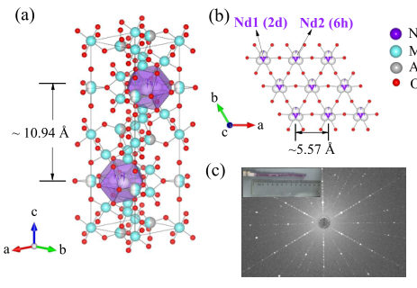 
FIG. 1. Crystal structure. (a) Crystal structure of NdMgAl11O19 determined by single-crystal XRD refinements. (b) Triangular-lattice plane showing the disordered Nd ions. (c) Laue diffraction pattern with the X-ray beam approxi- mately parallel to the c axis. The inset shows a photo of the as-grown single crystal.

📷 Fig 2

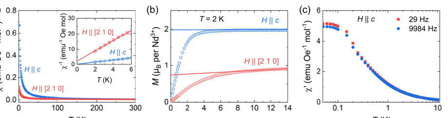 
FIG. 2. Magnetic properties. (a) Temperature dependence of the DC magnetic susceptibility, χ = M/H, with magnetic field applied along different directions. The inset shows low-temperature Curie-Weiss fits. (b) Isothermal magnetization curves for the fields applied along the c and [2 1 0] directions at 2 K. (c) Temperature dependence of the real component of the ac susceptibility, χ′, measured at various frequencies.

📷 Fig 3

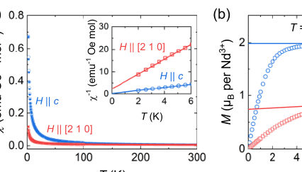 
Figure 2(a) shows the temperature dependence of the magnetic susceptibility, χ = M/H, with magnetic fields applied along and perpendicular to the crystallographic c axis. No bifurcation or difference between the zero-field- cooled (ZFC) and field-cooled (FC) curves is observed down to 2 K, indicating a paramagnetic state and the absence of spin freezing above this temperature. At low temperatures, the system exhibits a distinct magnetic anisotropy. This behavior is better visualized in the isothermal magnetization measurements as shown in Fig. 2(b). After a linear fit to the high-field data to subtract the van Vleck contribution, the saturated moments along the c and [2 1 0] directions amount to...

📷 Fig 4

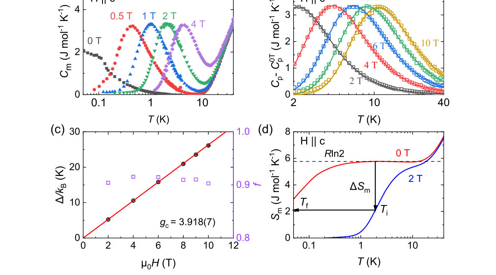 
FIG. 3. Thermodynamic properties. (a) Temperature dependence of the magnetic specific heat of NdMgAl11O19 measured at various magnetic fields applied along the c-axis. Phonon contributions obtained from the nonmagnetic LaMgAl11O19 have been subtracted. (b) Temperature dependence of the magnetic specific heat arising from the low-lying ground state doublet of NdMgAl11O19 together with two-level Schottky fits. (c) Evolution of the gap (left axis) and the fraction of free ions (right axis) as a function of the applied magnetic fields. The red curve represents a linear fit of ∆= gcµBH to the gap, yielding gc of 3.918(7). (d) Temperature dependence of the magnetic entropy measured at different fields....

📷 Fig 5

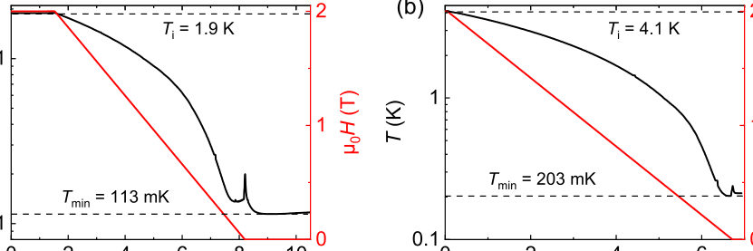 
FIG. 4. Quasi-adiabatic demagnetization cooling curves of NdMgAl11O19, (a) starting from 2 T, 1.9 K, and (b) starting from 2 T, 4.1 K with magnetic field applied along the c axis.

**Summary.** This research investigates $	ext{NdMgAl}_{11}	ext{O}_{19}$ as a next-generation cryogenic magnetocaloric material. By demonstrating superior cooling performance down to $113 	ext{ mK}$ using only a small magnetic field change, the authors establish it as an excellent candidate for low-field adiabatic demagnetization refrigeration. The underlying physics is attributed to the QSL-like ground state arising from geometric frustration in its triangular lattice structure.

**Why it may be interesting.** The focus on achieving extreme cooling temperatures through quantum fluctuations in frustrated magnets directly relates to understanding exotic ground states and magnetic entropy management, which has parallels with many-body physics studied in AMO contexts.

Detailed structure

**Main problem.** Developing high-performance magnetic refrigerants for sub-Kelvin cooling regimes by maximizing retained magnetic entropy at low temperatures while suppressing long-range magnetic ordering.

**Main result.** The material $	ext{NdMgAl}_{11}	ext{O}_{19}$ exhibits outstanding refrigeration performance, achieving cooling down to $113 	ext{ mK}$ using only a small field change of $2 	ext{ T}$. This is attributed to its Quantum Spin Liquid (QSL)-like ground state.

**Method.** The study employed magnetic susceptibility, specific heat, and quasi-adiabatic demagnetization cooling measurements on single crystals.

**Model / system.** The system is the hexaaluminate $	ext{NdMgAl}_{11}	ext{O}_{19}$, where $	ext{Nd}^{3+}$ ions form a triangular lattice structure. The physics is modeled around the concept of Quantum Spin Liquids (QSLs) to achieve high magnetic entropy retention.

**Key observables.** Magnetic susceptibility ($\chi$), specific heat ($C_m$), retained magnetic entropy ($S_m$), and minimum attainable temperature ($	ext{T}_{\min}$).

**Important parameters / regimes.** Low-field regime (e.g., $\Delta H = 2 	ext{ T}$), sub-Kelvin temperatures (down to $113 	ext{ mK}$), and the effective spin-1/2 ground state.

**Assumptions / limitations.** The outstanding performance is linked to frustration combined with strong spin-orbit coupling and crystal-electric-field effects, which suppress magnetic ordering down to very low temperatures.

**Figures summary.** Figures show structural details (triangular lattice), temperature dependence of magnetic properties ($\chi$), and cooling curves demonstrating the magnetocaloric effect.

**Paper structure.** The paper systematically characterizes the crystal structure via XRD, analyzes magnetic interactions using susceptibility and specific heat measurements to confirm QSL-like behavior, and culminates in quantitative assessment of its performance as a low-field adiabatic demagnetization refrigerator (ADR).

Abstract

Magnetic refrigeration in the sub-Kelvin regime requires refrigerant materials to retain a large magnetic entropy at low temperatures by suppressing magnetic ordering. Quantum spin liquids (QSLs), which evade long-range magnetic ordering while retaining strong quantum fluctuations to the lowest temperatures, therefore provide a promising platform for realizing high-performance magnetic refrigerants. Here, we investigate the magnetic ground state and the magnetocaloric effect of the hexaaluminate, NdMgAl$_{11}$O$_{19}$, in which the Nd$^{3+}$ ions form a network of triangular lattices. Magnetic susceptibility and specific heat measurements indicate a magnetically dynamic state down to 50~mK, consistent with a QSL state. Specific heat measurements further reveal substantial magnetic entropy retained below 50~mK. Quasi-adiabatic demagnetization measurements demonstrate a superior cooling performance of NdMgAl$_{11}$O$_{19}$, which can be cooled to 113~mK from 1.9~K by only a small magnetic field change of 2~T. The outstanding refrigeration performance is attributed to the persistent spin fluctuations associated with the QSL-like ground state, together with a large effective \textit{g} factor and the smallness of the exchange interactions along the easy-axis direction. This study demonstrates that frustration, combined with strong spin-orbit coupling and crystal-electric-field effect in the rare earth magnets provides a promising design principle for next-generation cryogenic magnetic refrigerants.

[↑ back to top](#top)

### [Quantum metrology with undetected mid-infrared photons for applied non-destructive testing](http://arxiv.org/abs/2607.12653v1)

**Authors:** Paul Gattinger, Andreas W. Schell, Maja Buchegger, Markus Brandstetter, Ivan Zorin  
**Type:** experiment · **Category:** other · **PDF:** <https://arxiv.org/pdf/2607.12653v1>  
**Analysis basis:** full PDF text, analyzed in chunks
**Topic relevance:** 🔥 `quantum optics experiment` **4/5** · `interference shaping light` **3/5** · `entanglement & information structure` **1/5** · `quantum measurements` **1/5**

📷 Fig 1

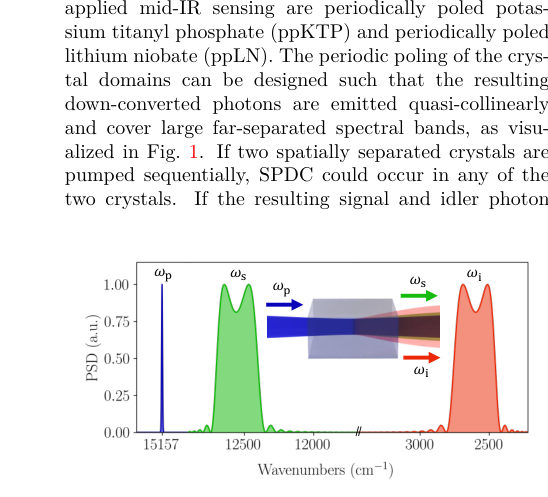 
Figure 1: Frequency-domain representation: simulated power spectral densities (PSDs) of the narrowband pump ωp, signal photons ωs used for detection and idler photons ωi used for probing, all individually normalized to 1 for il- lustration purposes. The inset depicts SPDC generation in a quasi-phase-matched configuration, where a pump beam propagating through a nonlinear crystal generates signal and idler beams.

📷 Fig 2

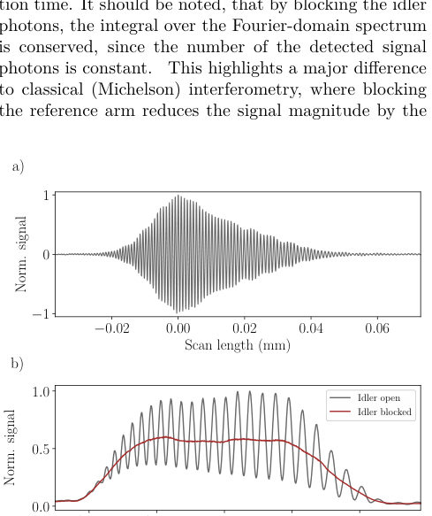 
Figure 2: Signal photon interferograms corresponding to the measurement modalities. a) high-pass filtered time-domain interferogram of the QFTIR modality (1 s scan time); b) Fourier-domain spectral interferogram (red line) for OCT with undetected photons (100 ms integration time); and sig- nal SPDC profile with idler photons blocked after first SPDC process (gray line).

📷 Fig 3

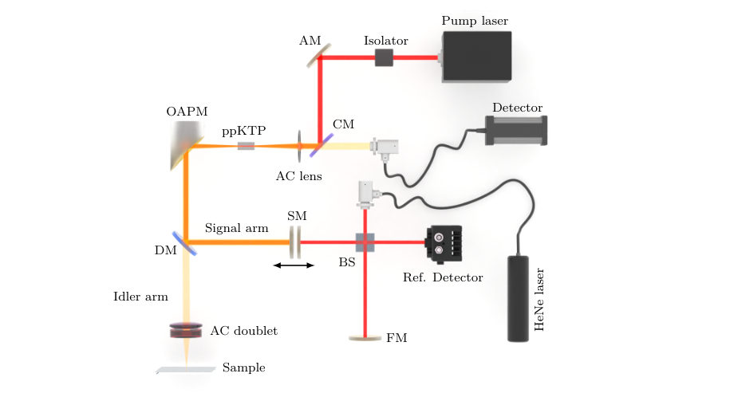 
Figure 3: Experimental multimodal system for metrology with undetected photons: nonlinear Michelson-type interferometer; 660 nm CW laser pumps a ppKTP crystal (Λ = 20.45 µm, L = 2.55 mm), launched via an alignment mirror (AM) and a cold mirror (CM), focused by an achromatic (AC) lens (f = 75 mm). The targeted idler spectral band (used for probing) spans 3000 cm-1 – 2360 cm-1 (3333 nm – 4237 nm), which corresponds to the signal range from approximately 780 nm to 820 nm (used for detection). The generated signal and idler beams are collimated via an off-axis parabolic mirror (OAPM, f = 75 mm) and separated by a dichroic mirror (DM). The combined signal and pump arm length is varied by a...

📷 Fig 4

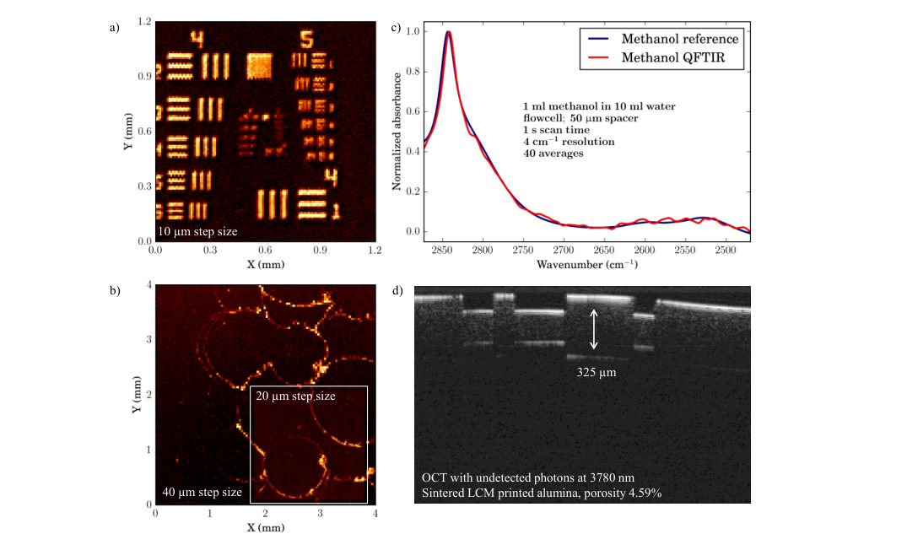 
Figure 4: Sensing with undetected photons implemented in various measurement modalities for applied non-destructive testing: IR microscopy (a,b), absorption transmission IR spectroscopy (c), and mid-IR OCT (d). (a) integrated reflected intensity of a 1951 USAF test target; (b) integrated absorbance of a pharmaceutical ingredient on a steel plate (45 µg/cm2); (c) normalized absorbance of methanol in water; (d) OCT with undetected photons B-scan of sintered LCM (lithography- based ceramic manufacturing) printed alumina with high porosity of 4.59 %

**Summary.** The paper presents a novel quantum metrology technique for non-destructive testing that reads out mid-infrared sample information using visible/near-IR photons via correlated photon pairs generated by SPDC. By operating at ultra-low powers and achieving shot-noise-limited performance, this method offers a potential paradigm shift compared to expensive classical mid-IR instrumentation.

**Why it may be interesting.** This work is highly relevant to quantum optics and open quantum systems as it demonstrates a practical application of quantum correlations (entanglement) in sensing, moving beyond fundamental demonstrations into routine NDT tools.

Detailed structure

**Main problem.** The goal is to develop quantum metrology techniques for non-destructive testing (NDT) by reading out information about mid-infrared (mid-IR) samples using visible/near-IR photons.

**Main result.** The technique demonstrates ultra-low power impingement ($	ext{60 pW}$) and achieves shot-noise-limited performance, potentially surpassing classical methods for applications like QFTIR spectroscopy and OCT.

**Method.** It utilizes a nonlinear interferometer based on spontaneous parametric down-conversion (SPDC) to generate correlated signal (detection) and idler (probing) photon pairs.

**Model / system.** The experimental platform is a nonlinear Michelson-type interferometer pumped by a visible laser through a nonlinear crystal (e.g., ppKTP). The quantum correlation allows the mid-IR interaction to modulate the near-IR interference pattern.

**Key observables.** Signal photon interference visibility, Power Spectral Densities (PSDs), and B-scans from OCT imaging.

**Important parameters / regimes.** Ultra-low probe powers ($	ext{60 pW}$), shot-noise limit performance, and the energy conservation relation $\omega_p = \omega_s + \omega_i$.

**Assumptions / limitations.** The technique assumes that quantum correlations can effectively transfer mid-IR sample information to the detectable visible/near-IR signal photons.

**Figures summary.** Figures show simulated PSDs, time-domain and Fourier-domain interferograms comparing open vs. blocked idler arms, and an experimental setup diagram using a HeNe laser reference.

**Paper structure.** The paper introduces the concept of undetected photon metrology, details the nonlinear interferometer setup for QFTIR/OCT, presents benchmarking against classical systems (showing superior SNR scaling), and concludes with future outlooks on increasing source brightness.

Abstract

Metrology with undetected photons is an emerging technique that leverages quantum effects and photon correlations (entanglement) to retrieve valuable information in a target spectral range (e.g., mid-infrared, mid-IR) using measurements in an easily accessible domain (e.g., visible, near-IR). The underlying quantum process of spontaneous parametric down-conversion (SPDC) is utilized to generate non-degenerate correlated signal and idler photons to serve as detection and probing photons, respectively. Sensing with undetected photons enables important advantages, such as ultra-low probe powers, room-temperature operation, and shot-noise-limited detection. In this contribution, we apply a quantum nonlinear interferometer based on an SPDC source to perform applied mid-IR spectroscopy, mid-IR microscopy, and mid-IR optical coherence tomography (OCT) as among the most promising techniques for quantum-based routine non-destructive testing. Moreover, we characterize the system, benchmark it against classical systems, and provide a prospective outlook for this new technology.

[↑ back to top](#top)

### [Error correction on an array of superconducting qubits with defective components](http://arxiv.org/abs/2607.12118v1)

**Authors:** Julien M. Drouet, Xanda C. Kolesnikow, Campbell K. McLauchlan, Georgia M. Nixon, Seok-Hyung Lee, Dominic J. Williamson, Stephen D. Bartlett, Benjamin J. Brown, Robin Harper  
**Type:** experiment · **Category:** quantum information and computing · **PDF:** <https://arxiv.org/pdf/2607.12118v1>  
**Analysis basis:** full PDF text, analyzed in chunks
**Topic relevance:** 🔥 `QC/QI experiment` **4/5** · `correlated / nonlocal dissipation` **1/5** · `entanglement & information structure` **1/5** · `methods for driven-dissipative` **1/5** · `quantum measurements` **1/5**

📷 Fig 1

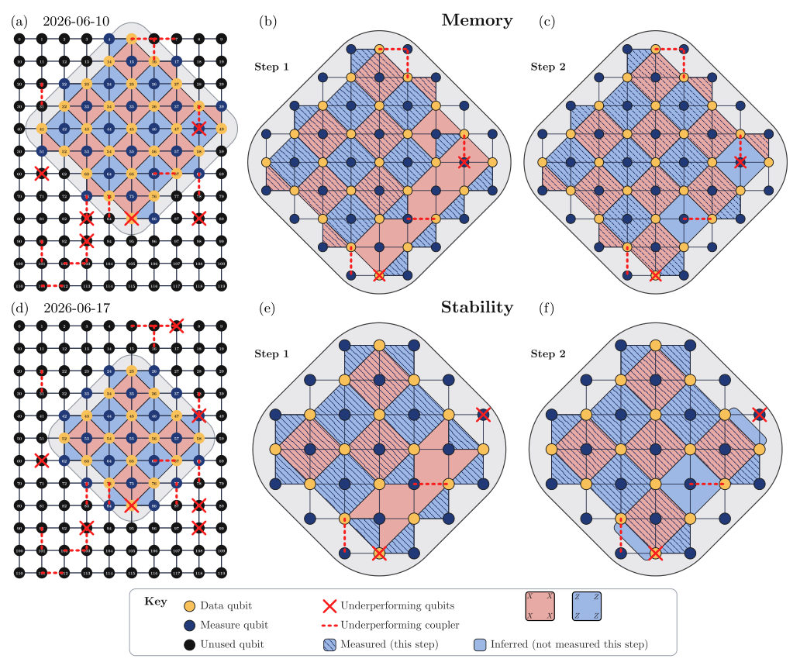 
FIG. 1. Surface-code quantum error correction with defect exclusion. (a) Arrangement of the 120 qubits (numbered) with couplers (connecting lines between neighbouring qubits) on the IBM Nighthawk quantum processor ibm miami. A distance- 5 surface code memory is placed on the device as shown. Data (measure) qubits are shown in yellow (dark blue). Pauli-X and Pauli-Z stabilizers, illustrated respectively by red and blue plaquettes, can be measured by coupling the measure qubit inside each plaquette to its adjacent data qubits followed by measurement to obtain the parity outcome. Defective components are indicated by red crosses and dashed lines. (b-c) The two steps of the syndrome extraction...

📷 Fig 2

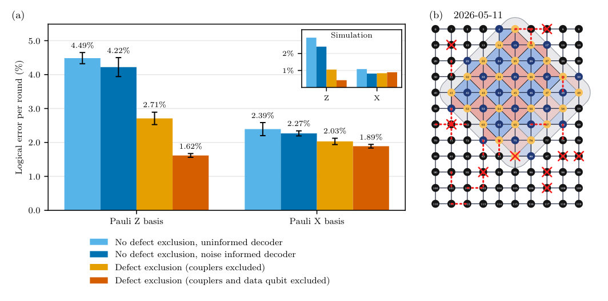 
FIG. 2. Memory experiments for a distance-5 surface code. (a) Results of memory experiments performed in both the Pauli-Z and Pauli-X basis, comparing different strategies to accommodate defects. We perform sequences of error correction up to 32 rounds, and report logical error per round. We compare four strategies. First, as a simple baseline, the code and syndrome extraction circuit are unmodified, using an uninformed decoder where all the priors are chosen uniformly based on the median Pauli error rates from the calibration data. Second, we consider a passive strategy, where the code and syndrome extraction circuits are left unmodified, and using a noise-informed decoding approach based...

📷 Fig 3

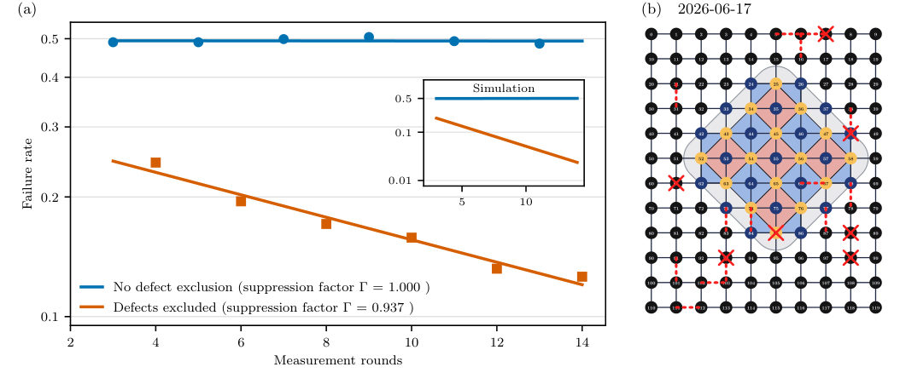 
FIG. 3. Stability experiments. (a) Failure rate of the stability experiment as a function of the number of measurement rounds for two strategies. Blue: a strategy in which the syndrome measurements are left unmodified and noise-informed decoding is performed using the full calibration model. Orange: a strategy in which defective couplers and measure qubits are excluded, following the approach shown in Fig. 1(e–f). In this experiment, the defective data qubit within the code is retained and used as a regular data qubit. The failure rate is fit to the exponential form F = CΓr, where C is an unknown prefactor and r is the number of measurement rounds. The fitted values of C are C = 0.49 for...

📷 Fig 4

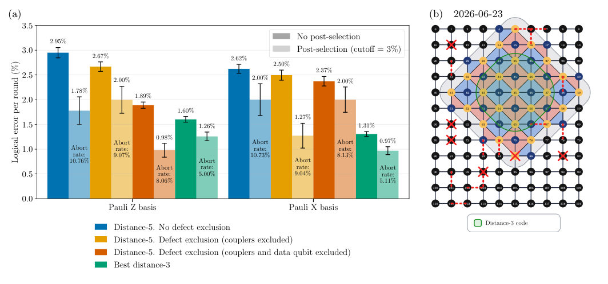 
FIG. 4. Post-selecting leakage in memory experiments. (a) Logical errors per round of memory experiments with leakage post-selection in different bases. Three different strategies for accommodating defects are shown, where logical error per round with and without leakage post-selection are shown side by side. For comparison, we also perform a memory experiment on a distance-3 code, where we determine the best instance for this distance-3 code within the footprint of the distance-5 code using circuit-level simulations of the device prior to the experiment. This distance-3 code uses no defective components. (b) Layout of the distance-5 surface code on the device, with defects as indicated for...

📷 Fig 5

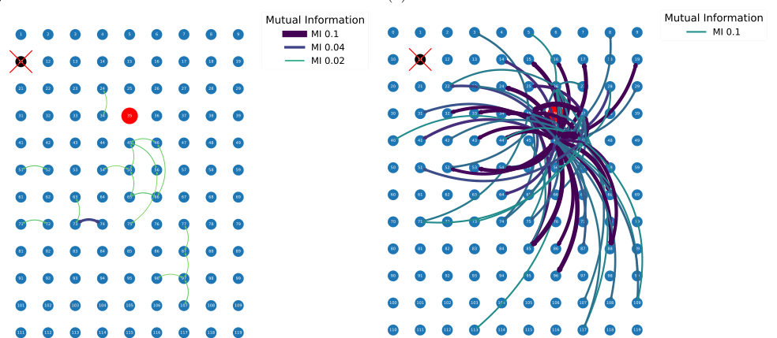 
FIG. 5. Correlations due to mid-circuit measurements. (a) Mutual information between the qubits during a simultaneous single qubit Clifford twirl. The qubit in red (here qubit 35) is measured every 4th timestep during the protocol (see text for more details). Qubit 11 has been marginalised out because of a high error rate. The lines joining the qubits show those qubits that exhibit a mutual information above a 0.01 (1 bit in 100) threshold, the color and width of the line indicating the strength of the mutual information. For this choice of special qubit 35, all mutual information between qubits is relatively modest. (b) Mutual information between qubits, using an identical protocol to (a),...

**Summary.** This work addresses the critical challenge of implementing quantum error correction on noisy superconducting qubit arrays containing physical defects. By developing and testing active defect exclusion strategies, the authors demonstrated that proactively bypassing faulty components yields substantial improvements in logical fidelity compared to standard or passive decoding methods. This proves a vital principle for scaling up solid-state quantum computers.

**Why it may be interesting.** It provides concrete experimental evidence for the necessity of hardware-aware error correction techniques, which is crucial for scaling up any solid-state quantum computation platform.

Detailed structure

**Main problem.** Developing quantum error correction for solid-state superconducting qubit arrays that inevitably contain defective or underperforming components due to fabrication imperfections.

**Main result.** Actively excluding underperforming components leads to a dramatic reduction in logical error probability, showing up to 2.8X improvement over standard defect-ignorant approaches.

**Method.** The authors implemented and compared strategies—including active defect exclusion via super-stabilizer reconstruction—to operate distance-5 surface codes on physical hardware.

**Model / system.** The system is a superconducting qubit processor arranged in a square lattice (e.g., 120 qubits), utilizing the surface code for error correction.

**Key observables.** Logical error probability per round, failure rate suppression factor ($\Gamma$), and mutual information between qubits.

**Important parameters / regimes.** Code distance (d=5), qubit coherence times ($T_1, T_2 < 80\ \mu s$ for defect criteria), and measured error rates of couplers/qubits.

**Assumptions / limitations.** The analysis relies on specific processor limitations, such as the unavailability of mid-circuit resets, necessitating 'reset-free syndrome extraction'.

**Figures summary.** Figures compare logical error per round across various defect handling strategies (uninformed vs. noise-informed decoding) and show performance improvements when excluding defective components.

**Paper structure.** The paper systematically compares multiple QEC protocols on a physical chip, detailing defect identification criteria, implementing active exclusion circuits using super-stabilizers, and benchmarking performance via memory and stability experiments.

Abstract

A solid-state quantum-computing architecture will require the fabrication of arrays of many coupled qubits. It is inevitable that this process will produce qubits and couplers with varying performance, with some components underperforming due to imperfect fabrication. Quantum error-correction requires high-performing components and hence these defects must be dealt with, either by adapting the code to exclude the defects, or by informing the decoder to accommodate defects in post-processing. Here we implement and compare strategies to operate distance-5 surface codes on a quantum processor consisting of a square-lattice array of 120 superconducting qubits. We demonstrate a dramatic reduction in the probability of a logical error in a memory experiment by excluding underperforming components, compared with both a standard approach of ignoring defects, and a defect-aware decoding approach. We observe up to 2.8X improvement in logical errors per round when excluding defects compared with the standard defect-ignorant approach (1.62% compared to 4.49%). In contrast, defect-aware decoding gives only modest gains. Defects are also expected to be particularly harmful for measurement-based logical operations. Using a stability experiment we show that excluding defects resurrects measurement-based logic gate performance, observing a 6.3% per-round suppression of failure rate when excluding defects, compared to zero suppression otherwise. Furthermore, we show a further substantial decrease in logical errors when using leakage post-selection in combination with our defect exclusion strategies, resulting in a distance-5 code outperforming the best distance-3 in one basis. Our experiments therefore give a proof-of-principle demonstration of the essential utility of defect exclusion methods in the scale-up of solid-state quantum computing approaches.

[↑ back to top](#top)

### [A fault-tolerant quantum blockchain deployed on commercial telecommunications network](http://arxiv.org/abs/2607.12249v1)

**Authors:** Yongqiang Du, Chen-Xun Weng, Feng Xie, Ming-Yang Li, Mingxuan Zhang, Xin Hua, Xin An, Xiang Guan, Xin Liu, Zhenrong Zhang, Xi Xiao, Hua-Lei Yin, Kejin Wei  
**Type:** experiment · **Category:** quantum information and computing · **PDF:** <https://arxiv.org/pdf/2607.12249v1>  
**Analysis basis:** full PDF text, analyzed in chunks
**Topic relevance:** 🔥 `QC/QI experiment` **4/5** · `quantum optics experiment` **2/5**

📷 Fig 1

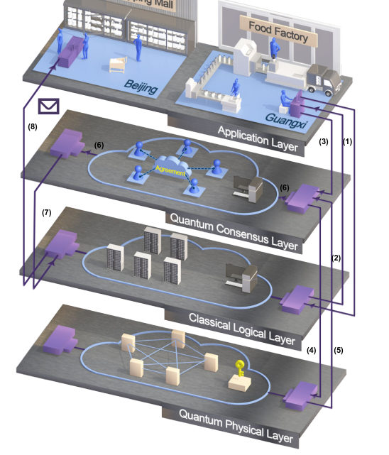 
FIG. 1. Illustration of quantum blockchain architecture. It consists of four layers: the Application Layer, Quantum Consensus Layer, Classical Logical Layer, and Quantum Physical Layer. The end-to-end workflow proceeds as follows: the client sends a transaction proposal to peer nodes in the classical logical layer (1), which verify the syntax and semantics, execute the endorsement chaincode, and return signed endorsements (2). Once sufficient endorsements have been collected, the client submits the verified transaction to ordering nodes in the quantum consensus layer (3), which check local key resources, if found insufficient, request fresh quantum key material from the quantum physical...

📷 Fig 2

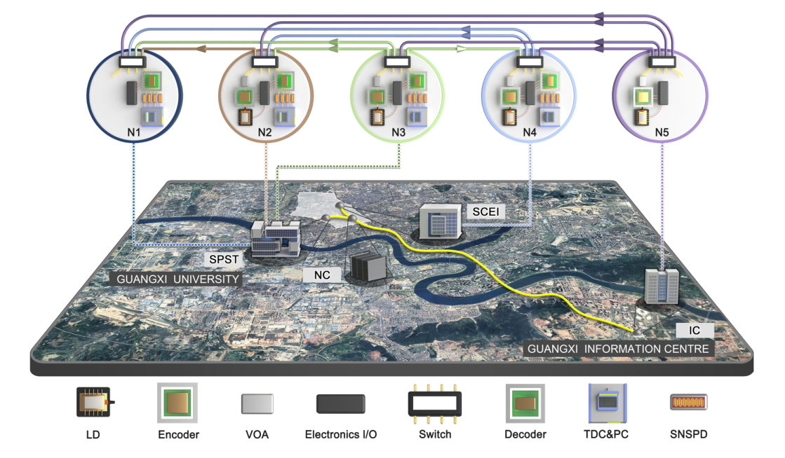 
FIG. 2. Aerial view of the intercity quantum blockchain. Bottom: The experimental network consists of five nodes deployed across Nanning in the Guangxi Zhuang Autonomous Region, China. Nodes N1–N3 are located in three separate laboratories within the School of Physical Science and Technology (SPST) at Guangxi University; Node N4 is located in the School of Computer, Electronics and Information (SCEI); and Node N5 is located at the Guangxi Zhuang Autonomous Region Information Center (IC). All five nodes connect to the Network Center (NC) of Guangxi University through dedicated fiber links, forming a star-like network topology. Top: Building on this network topology, the five nodes form a...

📷 Fig 3

 
FIG. 3. Schematic diagram of the food traceability system. The system operates through six stages: (1) Input food data, where product, ingredient, logistics, and related information are provided by users; (2) Send to backend service, in which the data is transmitted for structured processing; (3) Execute quantum consensus, where participating nodes, via the proposed QBA algorithm, reach agreement on the total order of transactions to ensure consistent and tamper-proof ledger updates; (4) Record on blockchain, permanently storing confirmed data in an immutable ledger; (5) Query traceability result, allowing stakeholders to retrieve supply chain records; and (6) View result, presenting clear...

📷 Fig 4

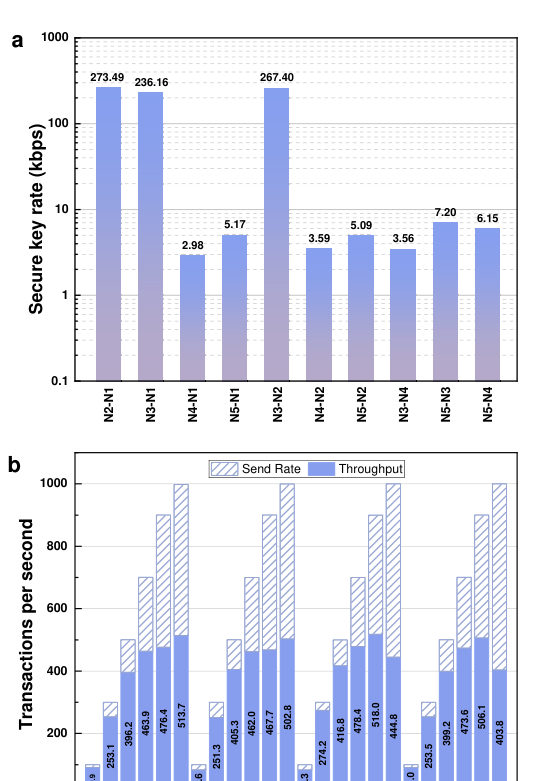 
FIG. 4. Performance of the hybrid quantum blockchain. a. The bar chart illustrates the secure key rates across the ten point-to-point links within the network. The horizontal axis represents the node pairs, while the vertical axis corresponds to the secure key rates. b. The stacked bar chart showing the send rate (upper segment) and through- put (lower segment) in transactions per second for four transaction types in the food traceability system. Metrics were obtained using the Hyperledger Caliper benchmarking tool under varying load conditions (1,000-10,000 transactions). The send rate represents the rate at which transactions were issued to the network, while throughput denotes suc-...

**Summary.** This paper presents an experimental demonstration of a hybrid quantum blockchain designed for practical use in supply chain management. By deploying protocols like Quantum Byzantine Agreement over commercial fiber optics, the system achieves superior fault tolerance and high throughput. It establishes a viable blueprint for secure, scalable, and decentralized information processing in the emerging quantum era.

**Why it may be interesting.** This work represents a direct engineering demonstration of applying advanced quantum information concepts (QKD, QBA) to solve a complex distributed systems problem (blockchain), which is highly relevant to the physical realization of quantum networks.

Detailed structure

**Main problem.** The core problem is ensuring that blockchain technology maintains its cryptographic integrity and decentralized fault-tolerant resilience when operating in the quantum computing era.

**Main result.** The authors successfully demonstrated a fully operational hybrid quantum blockchain architecture achieving fault tolerance approaching one-half, surpassing classical limits, with a practical throughput of 500 transactions per second for food traceability.

**Method.** They proposed and experimentally implemented a four-layer hybrid architecture combining Quantum Byzantine Agreement (QBA) protocols with photonic integrated circuits deployed over commercial fiber networks.

**Model / system.** The system is built on a five-user network in Nanning, China, utilizing photonic integrated circuits for the quantum physical layer. It integrates classical blockchain frameworks (Hyperledger Fabric) with quantum primitives like BB84 QKD and OTUH-QDS signatures.

**Key observables.** Fault tolerance approaching one-half; throughput of approximately 500 transactions per second; secure key rates up to 273.49 kbps.

**Important parameters / regimes.** Five nodes (N=5) tolerating two malicious participants (f=2); link loss of 13.2 dB over an average length of 13.1 km.

**Assumptions / limitations.** The primary assumption is the feasibility of integrating quantum advantages into existing, commercially available classical telecommunications infrastructure for real-world deployment.

**Figures summary.** Figure 1 illustrates the four-layer architecture workflow; Figure 2 shows the star-like physical network topology in Nanning; Figure 3 details the six stages of the food traceability application flow from input to viewing results.

**Paper structure.** The paper introduces the quantum blockchain challenge, proposes the layered hybrid architecture (Application $
ightarrow$ Quantum Consensus $
ightarrow$ Classical Logical $
ightarrow$ Quantum Physical), details the implementation using QKD and QBA protocols over a metropolitan fiber network, validates it with an end-to-end food traceability application, and concludes by establishing its foundation for practical quantum data processing.

Abstract

Popularized by the Bitcoin cryptocurrency, blockchain technology establishes a decentralized digital framework that utilizes cryptographic and consensus protocols to secure data against unauthorized modification. Consequently, blockchain has found broad adoption across diverse fields, including finance, data management, healthcare, and digital asset governance. In the quantum computing era, a paramount objective for blockchain is to preserve its foundational advantages of cryptographic integrity and decentralized fault-tolerant resilience. In principle, quantum digital signatures and quantum Byzantine agreement protocols offer foundational security guarantees and tolerate up to one-half of malicious nodes for blockchain. However, the practical realization of such a quantum-enhanced blockchain remains a significant and multifaceted challenge. Here, we propose and experimentally demonstrate a fully operational hybrid quantum blockchain architecture built on photonic integrated circuits and deployed over commercially available classical telecommunications infrastructure. The system achieves a fault tolerance of nearly one-half, surpassing the classical limit, while reaching consensus on a timescale of seconds. A deployed food traceability application validates the practicality of the proposed architecture, achieving a throughput of approximately 500 transactions per second. This work establishes a foundation for practical quantum blockchains, enabling secure, scalable, and decentralized information processing in the emerging quantum era.

[↑ back to top](#top)

### [A Noise-Aware Quantum Algorithm for Credit Valuation Adjustments on Real Quantum Hardware](http://arxiv.org/abs/2607.12990v1)

**Authors:** Guillem Borràs Espert, Francisco Gómez Casanova, Luis de Pedro Sánchez, Senaida Hernández Santana, Pablo Serrano Molinero  
**Type:** both · **Category:** quantum information and computing · **PDF:** <https://arxiv.org/pdf/2607.12990v1>  
**Analysis basis:** full PDF text, analyzed in chunks
**Topic relevance:** 🔥 `QC/QI experiment` **4/5** · `methods for driven-dissipative` **1/5** · `non-equilibrium dynamics` **1/5**

📷 Fig 1

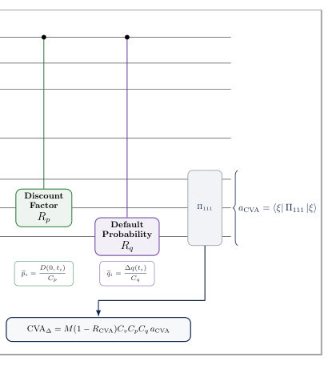 
Figure 1: Quantum encoding of the discretised multi-asset CVA. The unitary GP prepares a coherent superposition over the full time–market grid, while Rv, Rp, and Rq encode the positive exposure, discount factor, and default probability into three dedicated ancillas. The projector Π111 selects the event in which all three ancillas are measured in state |1⟩.

📷 Fig 2

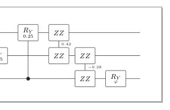 
Figure 2: Three-qubit circuit Atest used to validate CABIQAE. The final rotation angle φ is left free to generate different target amplitudes.

📷 Fig 3

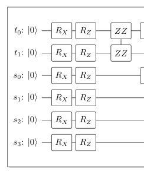 
Figure 3: Hardware-compatible QCBM ansatz used for the six-qubit state-preparation block. Each variational block combines local single-qubit rotations with parametrised RZZ entanglers placed along a connectivity pattern chosen to respect the target heavy-hex hardware constraints.

📷 Fig 4

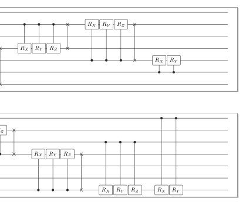 
Figure 5: CRCA used for the exposure rotation Rv. The displayed outward and inward snake layers route information between the computational register and the exposure ancilla while preserving a hardware-aware entangling structure.

📷 Fig 5

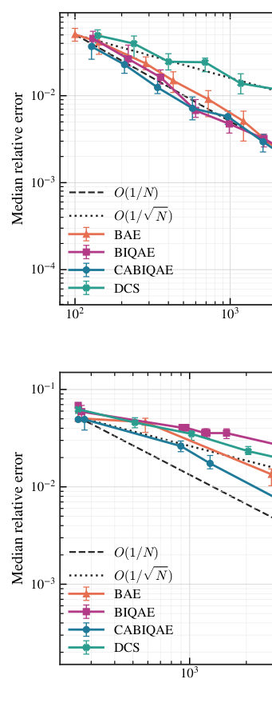 
Figure 6: Reduced test-instance amplitude estimation results in the noiseless (top) and hardware-replay (bottom) regimes.

**Summary.** This paper presents a comprehensive, noise-aware quantum workflow designed to estimate Credit Valuation Adjustments (CVA) using Quantum Amplitude Estimation. The authors introduce CABIQAE, an algorithm that adapts Bayesian inference by incorporating measured hardware contrast loss. While demonstrating improved performance over naive methods on current devices, the work highlights that practical utility is currently constrained by circuit depth and discretization limits.

**Why it may be interesting.** While focused on finance, the core methodology—developing robust quantum algorithms that explicitly account for noise-induced contrast loss during amplitude estimation—is highly relevant to any field using NISQ devices for complex simulation or optimization.

Detailed structure

**Main problem.** The paper addresses the practical viability of using quantum amplitude estimation (QAE) to accelerate Credit Valuation Adjustment (CVA) calculations on real, noisy quantum hardware.

**Main result.** A novel noise-aware algorithm, CABIQAE, was shown to exploit limited quantum amplification more effectively than noise-agnostic methods on current devices. However, the overall CVA oracle remains fundamentally limited by circuit depth and discretization resolution.

**Method.** The authors developed an end-to-end workflow incorporating a specialized Bayesian iterative QAE (CABIQAE) that incorporates experimentally calibrated Grover-contrast loss into its inference process.

**Model / system.** The financial model involves calculating CVA for correlated two-asset exposures, encoded using a QCBM-based joint time-market distribution. Experiments are performed on real quantum hardware (e.g., IBM Quantum).

**Key observables.** CVA error decomposition (statistical, encoding, discretisation, hardware), final relative error of the estimator, and circuit resource counts (Logical vs. ISA gates/depth).

**Important parameters / regimes.** Circuit depth, discretization resolution ($n$), query cost ($N_q$), and experimentally calibrated contrast loss parameters.

**Assumptions / limitations.** The primary assumption is that a quantum advantage can be extracted despite noise; the work explicitly models hardware limitations rather than assuming ideal coherence.

**Figures summary.** Figures characterize Grover amplification for toy and CVA circuits, showing empirical contrast decay. Other figures compare the final relative error and runtime of various amplitude estimation techniques under hardware constraints versus ideal theory.

**Paper structure.** The paper progresses from establishing the need for quantum acceleration in CVA to developing a noise-aware workflow (CABIQAE). It details the financial encoding, presents theoretical guarantees (ideal scaling), validates the approach on real hardware by analyzing resource scaling and error accumulation, and concludes with an error decomposition analysis.

Abstract

Credit Valuation Adjustment (CVA) requires repeated risk-neutral expectation estimation, making it a natural test bed for quantum amplitude estimation, whose coherent amplification can in principle reduce Monte Carlo sampling cost. Whether this advantage survives realistic financial encoding and noisy hardware remains open. We develop an end-to-end, noise-aware quantum workflow for CVA, covering market calibration, discretisation, oracle construction, hardware execution and error-budget analysis. The model combines a correlated two-asset exposure with discount and default factors, encoded through a QCBM-based joint time-market distribution and controlled payoff rotations. We introduce contrast-aware Bayesian iterative quantum amplitude estimation (CABIQAE), which incorporates experimentally calibrated Grover-contrast loss into Bayesian inference and circuit-depth selection. Hardware-calibrated experiments show that CABIQAE exploits the limited amplification available on current devices more effectively than noise-agnostic alternatives and achieves a much lower classical post-processing runtime than the noise-aware BAE baseline. The analysis further decomposes the total CVA error into statistical, encoding, discretisation and hardware contributions. The full CVA oracle remains limited by circuit depth and discretisation resolution.

[↑ back to top](#top)

### [Experimental demonstration of scalable quantum blockchain with exponentially superior quantum communication complexity](http://arxiv.org/abs/2607.12250v1)

**Authors:** Feng Xie, Ming-Yang Li, Yongqiang Du, Chen-Xun Weng, Mingxuan Zhang, Xin Hua, Xiang Guan, Xin An, Jingzhe He, Xin Liu, Zhenrong Zhang, Xi Xiao, Hua-Lei Yin, Kejin Wei  
**Type:** experiment · **Category:** quantum information and computing · **PDF:** <https://arxiv.org/pdf/2607.12250v1>  
**Analysis basis:** full PDF text, analyzed in chunks
**Topic relevance:** 🔥 `QC/QI experiment` **4/5** · `quantum optics experiment` **2/5**

📷 Fig 1

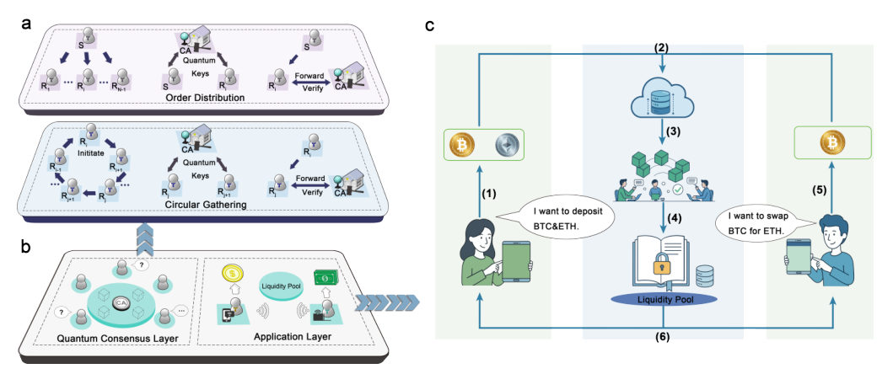 
FIG. 1. Quantum-consensus-enabled token exchange architecture and application. a Workflow of the circular QBA protocol for five users. This protocol involves a master node S and 𝑁−1 participant nodes R1–R𝑁−1 as the users, with a CA acting as the verifier for every three-party QDS. The process executes in three phases: Order Distribution, Circular Gathering, and a final Consensus Output based on the collected authenticated messages. b Hierarchical architecture of the quantum-secure token exchange application. The architecture comprises two layers: the application layer, which handles decentralized-finance operations (e.g., token swaps and liquidity management) via smart contracts; and the...

📷 Fig 2

 
FIG. 2. Intercity deployment of scalable quantum blockchain network. A star-topology metropolitan quantum network implemented in Nanning, China, consisting of five user nodes (S, R1-R4) and a central CA. Two user nodes, S and R1, and the certification authority (CA) are co-located in the School of Physical Science and Technology (SP). Two additional campus nodes, R2 and R3, are deployed in the School of Computer and Electronic Information (SC) and connected to the CA via an intermediate network. A remote user node is deployed at a metropolitan government information center (IC) is connected to the CA via the Guangxi University Network Center (NC) over commercial telecommunication fiber.

📷 Fig 3

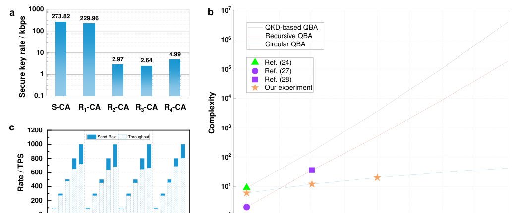 
FIG. 3. Performance of scalable quantum blockchain. a The secure key rate across five links in the deployed quantum physical layer. The bar chart presents the measured secure key rates for the five point-to-point links in the network, with node pairs labeled on the horizontal axis and the corresponding secure key rates shown on the vertical axis. b Comparison of communication complexity. The green and red lines represent the exponential complexity of QKD-based [24] and recursive QBA [25], respectively, while the blue line shows the polynomial scaling of circular QBA. The green triangle marks the experiment of QKD-based QBA at 𝑓= 1 [24], while the purple circle and square represent...

📷 Fig 4

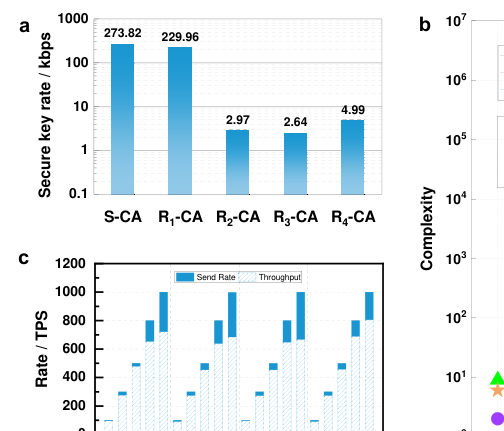 
Figure 3b compares this scaling with existing high-fault- tolerance multi-party QBA protocols under identical adver- sarial assumptions. Owing to its fault-tolerance condition 𝑁&gt; 𝑓+1, the circular QBA protocol remains secure provided that at least two participants are honest. Consequently, our five- node metropolitan network can tolerate up to three malicious nodes. To the best of our knowledge, this represents the first experimental quantum blockchain system achieving tolerance against three malicious nodes, whereas previous demonstra- tions were limited to one or two malicious nodes [24, 27, 28]. Notably, to tolerate three Byzantine faults ( 𝑓= 3), our protocol requires only 20 QDS...

**Summary.** The paper presents an experimental demonstration of a scalable quantum blockchain protocol designed to overcome the inherent limitations of previous high-fault-tolerance schemes. By utilizing weak coherent states and a novel circular Quantum Byzantine Agreement mechanism, they significantly reduce communication complexity. This breakthrough enables practical, high-throughput quantum-secured applications like token exchanges on existing fiber infrastructure.

**Why it may be interesting.** This work provides concrete experimental validation of scaling solutions for distributed quantum computing primitives (like consensus), which is highly relevant for building practical quantum networks beyond simple QKD links.

Detailed structure

**Main problem.** Existing high-fault-tolerant quantum blockchain protocols face a scalability challenge, known as the 'blockchain trilemma,' requiring either exponential communication complexity or demanding multipartite entanglement.

**Main result.** The authors experimentally demonstrated a scalable quantum blockchain protocol that achieves an exponential reduction in quantum communication complexity while maintaining information-theoretic security.

**Method.** They employed a circular Quantum Byzantine Agreement (QBA) mechanism based on weak coherent states, which avoids complex multipartite entanglement requirements.

**Model / system.** The protocol was implemented on a photonic integrated circuit platform, successfully realizing a six-node network over commercially available telecommunication infrastructure to secure a token exchange application.

**Key observables.** Sustained throughput of 805.3 transactions per second with zero failures; less than 4% quantum communication resource usage compared to prior schemes.

**Important parameters / regimes.** The protocol scales as $O(N^2)$ for the semi-decentralized structure, and it is secure if at least two participants are honest ($N > f+1$).

**Assumptions / limitations.** The system assumes a layered architecture integrating quantum consensus with application-layer smart contracts.

**Figures summary.** Figures illustrate the token exchange workflow, the hierarchical two-layer architecture (quantum consensus + application), and detailed comparisons of communication complexity vs. node count for different QBA protocols.

**Paper structure.** The paper details the theoretical framework by proposing the circular QBA protocol, demonstrates its implementation on a photonic platform, validates performance metrics like key rates and throughput, and applies it to a quantum-secured token exchange workflow.

Abstract

To secure modern distributed digital infrastructures, quantum blockchains exploit quantum resources to achieve information-theoretic security and surpass the classical one-third fault-tolerance bound. However, existing high-fault-tolerant protocols face a fundamental scalability challenge: the blockchain trilemma imposes either exponential communication complexity or experimentally demanding multipartite entanglement. Here, we experimentally demonstrate a scalable quantum blockchain protocol based on weak coherent states that achieves an exponential reduction in quantum communication complexity. The protocol employs a circular quantum Byzantine agreement mechanism that preserves information-theoretic security while avoiding multipartite entanglement. We implement this protocol on a photonic integrated circuit platform, realizing a six-node network over commercially available telecommunication infrastructure. Compared with previous schemes, the protocol requires less than 4% of the quantum communication resources. Leveraging this advantage, we further demonstrate a quantum-secured token exchange application achieving a throughput of 805.3 transactions per second with zero failures. These results establish a practical pathway toward scalable quantum blockchain.

[↑ back to top](#top)

### [Symmetry-Twisted Multi-Entropies: Order Parameters for 2D SPT Phases](http://arxiv.org/abs/2607.12023v1)

**Authors:** Ramanjit Sohal, Michael Levin, Ruben Verresen  
**Type:** theory · **Category:** strongly correlated electrons · **PDF:** <https://arxiv.org/pdf/2607.12023v1>  
**Analysis basis:** full PDF text, analyzed in chunks
**Topic relevance:** 🔥 `entanglement & information structure` **4/5** · `analog quantum simulation` **1/5**

📷 Fig 1

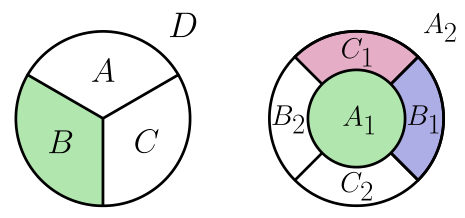 
FIG. 1. Multipartitions and regions (indicated by color) where partial symmetry operations are applied for the (Left) Type-I/II and (Right) Type-III order parameters Λr g and Ωg,h,k, respectively.

📷 Fig 2

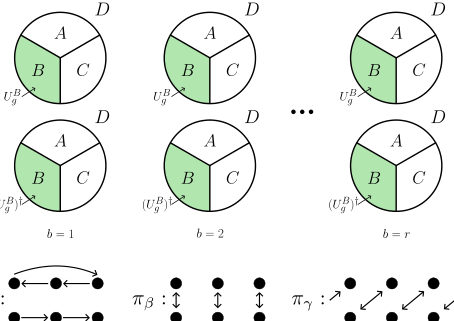 
FIG. 2. (a) The 2r replicas, labeled by (a, b) and the partial symmetry actions in the definition of Λr g. (b) A graphical representation of the permutations in Eq. (4) in the case with r = 3.

📷 Fig 3

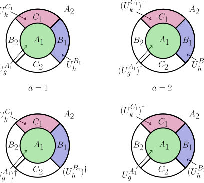 
FIG. 3. (a) The four replicas, labeled by a = 1, . . . , 4 and the partial symmetry operations in the definition of Ωg,h,k. (b) The action of the permutations in Eq. (6).

📷 Fig 4

 
Fig. 3 provides a pictorial representation of the replica structure, the actions of the partial symmetries, and the permutations. Remarkably, Ωe,e,e is precisely the original tripartite (R´enyi-2) multi-entropy introduced in Refs. 44 and 45 as a probe of tripartite entanglement. Once again, we may interpret Ωg,h,k as a symmetry-twisted version of this multipartite entanglement probe.

📷 Fig 5

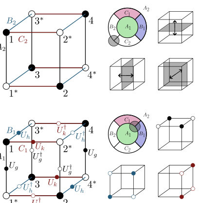 
FIG. 5. Tensor network representations of Ωg,h,k evaluated on the tripartite states (a) |ψA2B2C2⟩and (b) |ψA1B1C1⟩. The tensors are labeled by the replica index a = 1, . . . , 4, with an asterisk denoting a bra. Next to each network, we indi- cate the trijunction between the three subregions which this state entangles, and the pattern of global symmetries that can be applied to cancel out all partial symmetries. For a solid (empty) black, blue, or red dot, we apply Ug,h,k (U † g,h,k) on all surrounding legs, respectively.

**Summary.** The paper introduces symmetry-twisted multi-entropies as nonlocal order parameters capable of classifying 2D Symmetry-Protected Topological (SPT) phases. By analyzing expectation values involving multiple system replicas and partial symmetries, the authors derive specific quantities whose quantized phases encode the topological invariants associated with these phases. This provides a robust theoretical tool to probe entanglement structure beyond simple bipartite measures.

**Why it may be interesting.** This work provides a powerful, purely entanglement-based diagnostic tool for characterizing topological order, which is highly relevant to understanding exotic phases of matter studied in AMO physics and condensed matter theory.

Detailed structure

**Main problem.** To develop nonlocal order parameters capable of detecting and distinguishing all bosonic Symmetry-Protected Topological (SPT) phases in two dimensions, overcoming limitations associated with local correlators.

**Main result.** The authors propose symmetry-twisted multi-entropies ($\Lambda_r^g$ and $\Omega_{g,h,k}$) that serve as order parameters whose quantized phases specify the topological invariants classifying 2D Abelian SPTs based on braiding statistics.

**Method.** The method involves defining these order parameters using expectation values of partial symmetry and permutation operations acting on multiple replicas of the system state in finite spatial regions.

**Model / system.** The focus is on bosonic SPT phases in two dimensions protected by internal discrete, Abelian unitary symmetries ($G = \prod_i \mathbb{Z}_{N_i}$). The analysis uses wavefunction expectation values rather than explicit flux insertion into the Hamiltonian.

**Key observables.** Nonlocal order parameters $\Lambda_r^g(\psi)$ and $\Omega_{g,h,k}(\psi)$, whose quantized phases ($\vartheta$) correspond to topological invariants (Type-I, II, and III SPT classes).

**Important parameters / regimes.** The symmetry group $G$, the number of replicas ($R$), and the structure of the Abelian symmetries.

**Assumptions / limitations.** The method assumes that these multi-entropy quantities effectively simulate the path integral on topologically non-trivial manifolds, allowing extraction of topological invariants purely from wavefunction expectation values.

**Figures summary.** Figures illustrate the replica structures and partial symmetry actions for the proposed order parameters ($\Lambda_r^g$ and $\Omega_{g,h,k}$), showing how they are constructed using multiple copies of the system state.

**Paper structure.** The paper progresses by first identifying the need for nonlocal probes (Chunk 1). It then formalizes the general multi-entropy structure using replica techniques (Chunk 2). The core mathematical development involves calculating and simplifying the phase factors ($	ilde{\Omega}_{g,h,k}$) associated with plaquette boundaries on a lattice (Chunks 3 & 4), culminating in identifying this factor as a TQFT partition function.

Abstract

Although symmetry-protected topological phases (SPTs) can be distinguished by their entanglement properties, it has been unclear how to extract this information directly from expectation values beyond the 1D case. Here, we close this gap and propose a pair of nonlocal order parameters that can detect and distinguish all bosonic SPTs in 2D protected by internal discrete, Abelian unitary symmetries. The desired topological invariants are extracted by these quantities by effectively simulating the SPT path integral on topologically non-trivial spacetime manifolds. Our order parameters are defined in terms of expectation values of partial symmetry and permutation operations acting on fixed numbers of replicas of the system in finite spatial regions. These expectation values correspond to symmetry-twisted versions of multipartite entanglement quantities known as multi-entropies. We show explicitly that our two order parameters detect symmetry-protected four-party and six-party entanglement, respectively, and we constrain possible "spurious" contributions. We analytically test our proposal in fixed-point lattice models. Our results suggest multipartite entanglement to be a defining feature of SPTs; indeed, we expect our methods to generalize to fermionic and higher-dimensional systems.

[↑ back to top](#top)

### [Logical Entangling with Phantom Codes in Hypergraph Products](http://arxiv.org/abs/2607.12948v1)

**Authors:** Keming He, Ziao Tang, Zetong Li, Ge Bai, Xin Wang  
**Type:** both · **Category:** quantum information and computing · **PDF:** <https://arxiv.org/pdf/2607.12948v1>  
**Analysis basis:** full PDF text, analyzed in chunks
**Topic relevance:** 🔥 `QC/QI experiment` **4/5**

📷 Fig 1

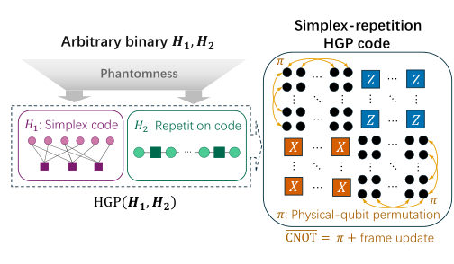 
FIG. 1. Schematic illustration of the simplex–repetition HGP phan- tom code. The gray funnel represents the classification result. Up to natural equivalences, the phantom condition selects the simplex– repetition family among binary CSS HGP constructions. The two classical seed codes H1, H2 are the simplex code and the repetition code. Their hypergraph product gives the corresponding HGP phan- tom code. Black dots denote physical qubits, while orange and blue squares denote X- and Z-checks, respectively. Orange arrows depict a physical qubit permutation π. For each ordered in-block logical CNOT, an appropriate permutation π and a Pauli-frame update real- ize the logical operation.

📷 Fig 2

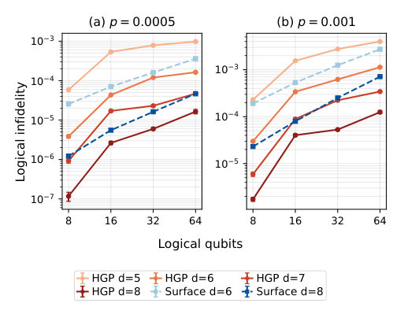 
FIG. 2. Logical GHZ-state preparation with the simplex–repetition HGP phantom family. Left: p = 5 × 10−4. Right: p = 10−3. For each K-qubit GHZ target, HGP data use K/4 four-logical-qubit phantom blocks, whereas the surface-code baseline uses K rotated surface-code blocks. HGP distances are d = 5, 6, 7, 8, and surface- code baselines use d = 6, 8. The HGP implementation absorbs in-block CNOTs into phantom relabellings, leaving only transver- sal inter-block CNOT layers followed by QEC cycles.

📷 Fig 3

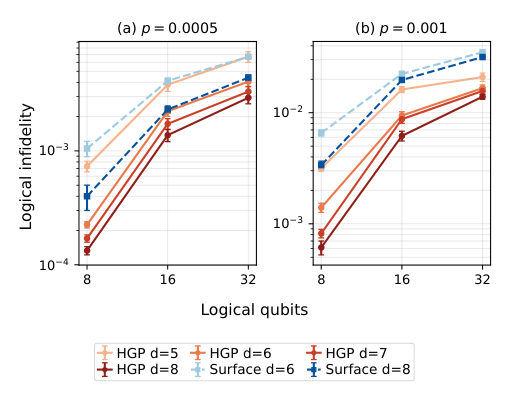 
FIG. 3. Trotterized many-body benchmark. Left: p = 5 × 10−4. Right: p = 10−3. The HGP and surface-code configurations match those of the GHZ benchmark: K/4 four-logical-qubit HGP phantom blocks are compared with K rotated surface-code blocks, using HGP distances d = 5, 6, 7, 8 and surface-code distances d = 6, 8.

**Summary.** This paper theoretically classifies Hypergraph Product (HGP) codes that minimize overhead during logical entanglement gate implementation by requiring the use of physical qubit permutations. The unique resulting family is then rigorously benchmarked against surface codes in simulating complex quantum circuits, demonstrating concrete performance advantages for low-overhead fault tolerance on hardware like neutral-atom arrays.

**Why it may be interesting.** The direct comparison with neutral-atom arrays as a natural hardware setting, which supports nonlocal qLDPC operations while enabling the required local CNOTs via permutations, makes this highly relevant for experimental AMO physicists working on scalable quantum computation.

Detailed structure

**Main problem.** The primary goal is reducing physical spacetime overhead in fault-tolerant quantum computation by finding efficient ways to implement logical entangling gates.

**Main result.** The authors prove that the only Hypergraph Product (HGP) codes satisfying the 'phantom' condition are derived from a simplex code and a repetition code, which outperform surface codes in benchmark simulations.

**Method.** The work combines theoretical classification of CSS HGP codes based on permutation automorphisms with extensive circuit-level benchmarking using Monte Carlo simulations for GHZ state preparation and many-body simulation.

**Model / system.** The study focuses on Quantum Error Correction (QEC) using binary CSS Hypergraph Product (HGP) codes, specifically the simplex–repetition family. These codes are evaluated in the context of implementing logical CNOT gates via physical qubit permutations.

**Key observables.** Logical infidelity ($1 - F$), which measures the average mismatch probability per target logical observable; code parameters like distance ($d$) and number of qubits ($n$).

**Important parameters / regimes.** Physical error rates ($p = 10^{-3}, 5 	imes 10^{-4}$); system sizes (up to $K=64$ logical qubits).

**Assumptions / limitations.** The analysis assumes the physical realization of the HGP structure and uses a specific noise model for circuit simulations; it also notes that the results are up to natural equivalences.

**Figures summary.** Figures compare logical GHZ-state preparation fidelity and Trotterized many-body simulation fidelity between the proposed HGP code and rotated surface codes, showing consistent outperformance of the HGP code.

**Paper structure.** The paper first theoretically classifies the unique structure of phantom CSS HGP codes (Theorem 2), then derives the specific simplex–repetition family using weight analysis (Theorem 3), and finally validates this family by benchmarking its performance against surface codes in two distinct quantum simulation tasks.

Abstract

Logical entangling gates are a major source of physical spacetime overhead in fault-tolerant quantum computation. Phantom codes reduce this cost by implementing every ordered in-block logical CNOT through physical qubit permutations and Pauli-frame updates. Whether this mechanism can coexist with the low-weight stabilizer structure of qLDPC codes is a central question for low-overhead fault-tolerant architectures. We give a deterministic answer within binary CSS hypergraph product (HGP) codes. Up to natural equivalences, the simplex-repetition family is the unique HGP family satisfying the phantom condition. We then evaluate this family under circuit-level noise in logical GHZ-state preparation and Trotterized many-body quantum simulation. The codes retain low-weight stabilizer checks and yield concrete advantages over rotated surface-code baselines in both benchmarks. Reconfigurable neutral-atom arrays offer a natural setting for this approach, supporting nonlocal qLDPC operations while enabling in-block logical CNOTs without additional physical operations. Together, these results make precise how permutation-based logical entangling constrains code design within the HGP framework, demonstrate the circuit-level benefits of the unique family, and guide the search for phantom qLDPC families with better asymptotic parameters for low-overhead fault tolerance on neutral-atom hardware.

[↑ back to top](#top)

### [Nonreciprocal Quantum Mpemba Effect](http://arxiv.org/abs/2607.12966v1)

**Authors:** Wei-Bin Yan, Ying-Jie Zhang, Yun-Jie Xia, Heng Fan, Zhong-Xiao Man  
**Type:** theory · **Category:** other · **PDF:** <https://arxiv.org/pdf/2607.12966v1>  
**Analysis basis:** full PDF text, analyzed in chunks
**Topic relevance:** `correlated / nonlocal dissipation` **3/5** · `driven-dissipative phase transition` **3/5** · `methods for driven-dissipative` **3/5** · `non-equilibrium dynamics` **3/5** · `Keldysh / 2PI / non-Gaussian methods` **2/5** · `non-equilibrium universality` **2/5** · `analog quantum simulation` **1/5** · `scars & prethermalization` **1/5**

📷 Fig 1

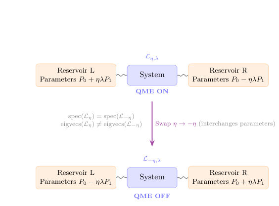 
FIG. 1. Schematic of the nonreciprocal quantum Mpemba effect. Two reservoirs with parameters P0 ± ηλP1 couple to the system. The swap η →−η interchanges their parameters, turning the quantum Mpemba effect on and off for the same initial state.

📷 Fig 2

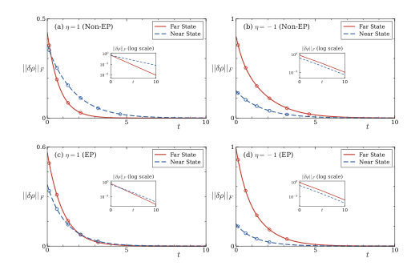 
FIG. 2. (color online) The time evolution of the Frobenius- norm distance to the steady state. Solid and dashed lines show the evolution computed from the 2 × 2 effective model Leff. Open circles show the evolution from the full 9 × 9 superoperator Lη,λ with γϕ = 5. Each panel includes a logarithmic-scale inset. (a) and (b) show the forward di- rection (η = 1) and reversed direction (η = −1), respec- tively, in the non-EP regime. (c) and (d) show the for- ward and reversed directions, respectively, at the EP. Pa- rameters are λ = 0.2, bf = γ0 = 1, f0 = 0.38 for non- EP regime, f0 = 0.2 at EP. Initial states, represented in the |0⟩, |L⟩, |R⟩basis, are ρfar = diag(0.0385, 0.7533, 0.2082),...

**Summary.** The paper theoretically demonstrates the Nonreciprocal Quantum Mpemba Effect (NQME) in open quantum systems coupled to biased reservoirs. By analyzing how swapping reservoir parameters affects the system's dynamics, the authors show that directional asymmetry can induce anomalous relaxation speedups without altering the underlying energy spectrum. This mechanism is crucial for understanding controlled dissipation and non-Hermitian physics.

**Why it may be interesting.** This work provides a rigorous theoretical framework for understanding how directional biases (nonreciprocity) can induce anomalous relaxation phenomena like the Mpemba effect in quantum systems, which is highly relevant for designing quantum thermal machines or controlling decoherence rates.

Detailed structure

**Main problem.** The paper demonstrates a nonreciprocal quantum Mpemba effect (NQME) by analyzing how reservoir bias asymmetry affects anomalous relaxation dynamics in open quantum systems.

**Main result.** The NQME is proven to exist when the system's evolution exhibits directional asymmetry under parameter swapping, even though the underlying spectrum remains invariant due to structural symmetries.

**Method.** The analysis employs perturbation theory (Feshbach projection method) to derive an effective Liouvillian superoperator for the slow subspace dynamics. The nonreciprocity is diagnosed by comparing decoupling conditions ($\chi \cdot a = 0$) under swapped reservoir parameters.

**Model / system.** The system consists of an open quantum system coupled to two isomorphic, biased reservoirs (Left and Right). Dynamics are governed by the Lindblad master equation, analyzed in regimes where spectral gaps allow for effective low-dimensional modeling.

**Key observables.** The slow component of the deviation from steady state ($\delta
ho_{	ext{slow}}(t)$), the decoupling vector $\chi$, and the relaxation rate asymmetry (speedup ratio $R$).

**Important parameters / regimes.** Perturbation strength $\lambda$ and direction parameter $\eta \in (-1, 1)$; the spectral gap $\Delta$; and operating at a Liouvillian exceptional point (EP).

**Assumptions / limitations.** The analysis assumes the existence of a substantial spectral gap ($\Delta$) to separate slow and fast modes, allowing for first-order perturbation theory approximations in $\eta\lambda$.

**Figures summary.** Figure 1 schematically illustrates how swapping reservoir parameters turns the QME ON or OFF. Figure 2 shows time evolution confirming NQME by comparing decay rates under forward ($\eta=1$) versus reverse ($\eta=-1$) bias.

**Paper structure.** The paper first establishes the general framework using the Lindblad master equation and introduces the swap operation. It then uses perturbation theory to derive an effective low-dimensional generator, proving that nonreciprocity is carried entirely by eigenvector rotation while eigenvalues are pinned. Finally, it applies this analysis to demonstrate NQME in both generic and exceptional point regimes.

Abstract

We demonstrate a nonreciprocal quantum Mpemba effect. Consider a broad class of open quantum systems, each coupled to two isomorphic reservoirs through symmetric ports. Interchanging the parameters of the two reservoirs -- a discrete operation we call the swap -- turns the quantum Mpemba effect on or off without changing the initial states. The swap modifies the Liouvillian, yet a structural symmetry pins the eigenvalues while rotating only the eigenvectors. The nonreciprocity therefore leaves no trace in the spectrum and is carried entirely by the eigenvectors. Concretely, the swap alters the far state's projection onto the slowest mode, switching whether it bypasses the slowest relaxation channel. At a Liouvillian exceptional point, the far state's relaxation switches from bypassing the slowest mode to avoiding the critical slowing, with the on--off contrast intact. There the spectrum-independent mechanism takes its purest form.

[↑ back to top](#top)

### [Harvesting Reshapes Dynamical Populations](http://arxiv.org/abs/2607.12093v1)

**Authors:** R. K. Singh, Michael Assaf, Jason R. Green, Erez Aghion  
**Type:** theory · **Category:** statistical mechanics · **PDF:** <https://arxiv.org/pdf/2607.12093v1>  
**Analysis basis:** full PDF text, analyzed in chunks
**Topic relevance:** `methods for driven-dissipative` **3/5** · `non-equilibrium dynamics` **3/5** · `non-equilibrium universality` **3/5** · `Keldysh / 2PI / non-Gaussian methods` **2/5** · `driven-dissipative phase transition` **2/5** · `Frenkel-Kontorova` **1/5** · `analog quantum simulation` **1/5** · `correlated / nonlocal dissipation` **1/5** · `quantum measurements` **1/5**

📷 Fig 1

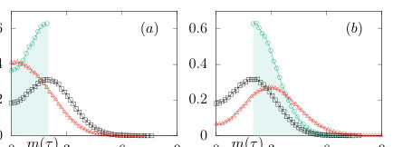 
FIG. 1. Position probability density ρ(x, t) of Brownian particles before and after a harvest at t = τ. Particles are initially localized at x = 2. Without harvesting, ρ(x, t) spreads diffusively with a re- flecting boundary at x = 0. Black squares show the density at the instant right before the harvesting, at time τ. Here, the diffusion coefficient is D = 1, τ = 1. Green circles show the density im- mediately after reshaping, at τ +. Red triangles show the density after an additional interval τ. (a) Backward reshaping: clipping the density above the median m(τ) and renormalizing below it hinders the subsequent spreading of the density. (b) Forward re- shaping: removing density below m(τ)...

📷 Fig 2

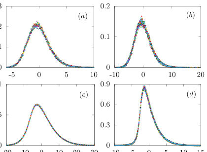 
FIG. 3. Generality of forward-reshaping: from sub- to superdif- fusion. Position distribution ρ(x, nτ) shifted by the mean ⟨x(nτ)⟩ prior to reshaping events for the case when the distribution is re- shaped forward with respect to the median for different random walks starting at x(0) = 1 and subject to a reflecting wall at x = 0. The independent random walks are: (a) Brownian mo- tion, (b) superdiffusive run-and-tumble dynamics, (c) subdiffusive continuous-time random walks, and (d) superdiffusive L´evy walks. (see Appendix A and B for details).

📷 Fig 3

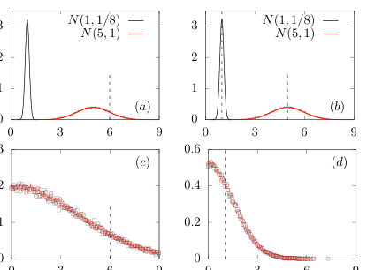 
FIG. 5. The quasi-steady state in backward reshaping. Panels (a,b): The initial spatial density of Brownian particles, prior to backward reshaping with respect to (a) a fixed location at a = 6 and (b) the median. The initial Gaussian density in black has unit mean and variance 1/8, and the mean and variance for the red density are 5 and 1. The reshaping thresholds in each panel are marked with dashed lines. In (a) there is a single reshaping threshold, while in (b) the threshold differs between the two initial densities. In panels (c,d) shown is the distribution of the Brownian particle just before the fifth reshaping event, for reshaping with respect to a fixed threshold (c) (similar to...

📷 Fig 4

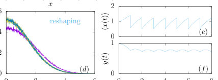 
FIG. 4. Harvesting in a predator-prey system. (a,b) Temporal evolution of an unharvested population of predators; ρ(x, t) and its mean ⟨x(t)⟩, and (c) its effect of the population of the prey y(t). (d-e) Distribution of predator sizes under consecutive reshapings at time intervals of duration τ, and its affect on the corresponding mean predator size. (f) The effect of the predator density reshap- ing, on the prey population. Initially, x(0) = 1 and y(0) = 1, and the evolution is according to Eq. (10). The simulation parameters are: τ = 1, σ = 1, b = 0.911, see Appendix A and B.

**Summary.** This work analyzes how periodically removing individuals from a stochastic population based on their trait value (harvesting) fundamentally reshapes the system's probability density. It demonstrates that this external selection process forces the system toward predictable, universal quasi-steady states or imparts constant directional drifts. This suggests a mechanism for actively manipulating complex non-equilibrium dynamics.

**Why it may be interesting.** While focused on classical population dynamics, the concept of external selection interventions leading to predictable steady states mirrors non-equilibrium steady state physics relevant in open quantum systems or driven many-body models.

Detailed structure

**Main problem.** The study investigates how periodic removal (harvesting) of individuals above or below a trait threshold reshapes the probability density of heterogeneous populations without altering their underlying stochastic dynamics.

**Main result.** Backward reshaping drives the system to a universal quasi-steady state dependent only on the harvesting frequency and threshold, while forward reshaping generates a constant effective drift exceeding unharvested rates.

**Method.** The authors use mathematical derivations based on instantaneous density clipping (reshaping) applied to solutions of stochastic processes like Brownian motion, CTRW, and Lévy walks.

**Model / system.** The model involves tracking the probability density $\rho(x, t)$ of a population whose trait value $x$ is governed by various anomalous diffusion processes on $[0, \infty)$.

**Key observables.** The shape of the probability density function $\rho(x, n\tau)$ after multiple reshaping events; the evolution of the median position $m(\tau)$; and the effective drift rate.

**Important parameters / regimes.** Harvesting threshold ($x_c$), harvesting frequency ($\tau$), and process parameters defining diffusion (e.g., anomalous exponents $\alpha$).

**Assumptions / limitations.** The reshaping removal is treated as an instantaneous event, and convergence arguments assume that initial condition effects vanish after sufficient repetitions.

**Figures summary.** Figures illustrate the density evolution for various random walks (Brownian, CTRW, Lévy) showing convergence to a fixed shape under backward reshaping, alongside median tracking plots.

**Paper structure.** The paper develops theory by first defining the mathematical framework of stochastic reshaping, then deriving analytical results for specific processes (like Brownian motion), and finally generalizing these findings to anomalous diffusion types using asymptotic arguments.

Abstract

Harvesting -- the periodic removal of individuals above or below a threshold trait value -- reshapes heterogeneous populations without altering their underlying stochastic dynamics. We study how repeated harvesting events steer the evolution of probability densities for classes of stochastic processes exhibiting both normal and anomalous dynamics, as well as a prototypical predator-prey model. Removal of the upper portion of the density drives the system to a quasi-steady state when viewed at the ``harvesting clock''. This state depends only on the harvesting threshold and frequency but not on the initial conditions. Removal of the lower portion of the density fixes its shape while generating a constant effective drift that exceeds that of the unharvested mean. Our results suggest the possibility of manipulating the dynamics of stochastic populations through external selection interventions.

[↑ back to top](#top)

### [Strong-to-Weak Spontaneous Symmetry Breaking from Wormholes in Holography](http://arxiv.org/abs/2607.12022v1)

**Authors:** Taishi Kawamoto, Kenya Tasuki, Masahito Yamazaki  
**Type:** theory · **Category:** statistical mechanics · **PDF:** <https://arxiv.org/pdf/2607.12022v1>  
**Analysis basis:** full PDF text, analyzed in chunks
**Topic relevance:** `Keldysh / 2PI / non-Gaussian methods` **3/5** · `entanglement & information structure` **3/5** · `correlated / nonlocal dissipation` **2/5** · `driven-dissipative phase transition` **2/5** · `methods for driven-dissipative` **2/5** · `non-equilibrium dynamics` **2/5** · `correlated cavity matter` **1/5** · `non-equilibrium universality` **1/5**

📷 Fig 1

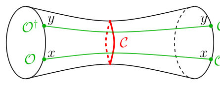 
FIG. 1. We represent four boundary local operators O, O†

📷 Fig 2

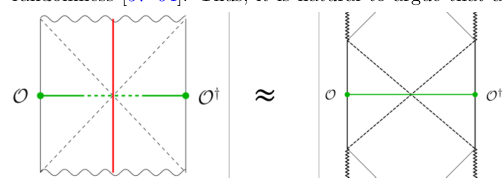 
FIG. 3. The bulk geometry with a defect will be approximated by the charged black hole solution. The latter does not have any obstacles for charged fields to communicate.

**Summary.** This paper explores Strong-to-Weak Spontaneous Symmetry Breaking (SWSSB) using holographic models dual to black hole physics. By calculating specific correlation functions like the Rényi-2 correlator, the authors demonstrate that SWSSB occurs when comparing different thermal ensembles. This leads to a novel Swampland conjecture connecting symmetry breaking to fundamental constraints in quantum gravity theories.

**Why it may be interesting.** While deeply rooted in quantum gravity/holography, the core concept—symmetry breaking diagnosed via correlation functions in mixed states—is highly relevant to non-equilibrium statistical mechanics and open quantum systems dynamics.

Detailed structure

**Main problem.** The study investigates Strong-to-Weak Spontaneous Symmetry Breaking (SWSSB) at finite temperature within the framework of holography.

**Main result.** Non-zero Rényi-2 and Wightman correlators in the large distance limit demonstrate SWSSB, which is linked to the emergence of weak symmetries via ensemble averaging. The authors propose a new Swampland conjecture regarding this phenomenon in quantum gravity.

**Method.** The analysis employs holographic methods using the AdS/CFT correspondence, calculating correlation functions (Rényi-2 and Wightman) by implementing projection operators through twisted boundary conditions on bulk fields.

**Model / system.** The model involves a 2D CFT dual to an Einstein-Chern-Simons theory coupled with probe matter in the bulk geometry of a BTZ black hole, analyzed at finite temperature.

**Key observables.** Rényi-2 correlator ($R^{(2)}$) and Wightman correlator ($C_W$), which are used to diagnose the presence or absence of symmetry breaking.

**Important parameters / regimes.** Finite temperature ($eta=1/T$), large distance limit ($|x-y|	o\infty$), and the chemical potential $\mu$ associated with charge conservation.

**Assumptions / limitations.** The analysis relies on large-$N$ factorization, specific limiting procedures for correlation functions, and the assumption that SWSSB is diagnosed by these correlators.

**Figures summary.** Figures illustrate the non-contractible cycle wrapping the BTZ horizon and show how different field types (neutral vs. charged) interact with boundaries in the bulk geometry.

**Paper structure.** The paper progresses from defining SWSSB and setting up the holographic model, calculating correlation functions using twisted boundary conditions, demonstrating the non-zero nature of $R^{(2)}$ and $C_W$, and concluding by formulating a Swampland conjecture based on these findings.

Abstract

We study strong-to-weak spontaneous symmetry breaking (SWSSB) at finite temperature and its implications in holography. SWSSB is a novel critical phenomenon that arises only in mixed states. We demonstrate SWSSB with the BTZ black hole and show that, in the bulk, it is realized through wormhole geometries connecting the two copies in the thermofield-double construction. We point out that SWSSB can be recast as an emergence of global symmetries under ensemble averaging. We further examine the interplay between SWSSB and the swampland program, and propose a new swampland conjecture for quantum-gravity theories involving ensemble averages.

[↑ back to top](#top)

### [From phase space to Krylov space, one shell at a time](http://arxiv.org/abs/2607.12585v1)

**Authors:** Nicolas De Ro, Adrián Sánchez-Garrido, Julian Sonner  
**Type:** theory · **Category:** statistical mechanics · **PDF:** <https://arxiv.org/pdf/2607.12585v1>  
**Analysis basis:** full PDF text, analyzed in chunks
**Topic relevance:** `entanglement & information structure` **3/5** · `non-equilibrium dynamics` **3/5** · `non-equilibrium universality` **2/5** · `Keldysh / 2PI / non-Gaussian methods` **1/5** · `analog quantum simulation` **1/5** · `correlated / nonlocal dissipation` **1/5** · `driven-dissipative phase transition` **1/5** · `exotic spin models in light-matter` **1/5** · `methods for driven-dissipative` **1/5** · `scars & prethermalization` **1/5**

📷 Fig 1

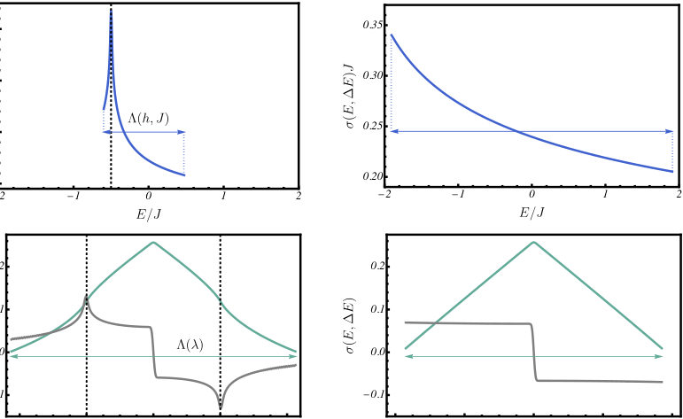 
Figure 1: Normalized DOS for the full spectrum of the LMG and FP Hamiltonians, defined in Eqs. (2.1) and (2.2), respectively, obtained by exact diagonalization and smoothed using kernel density estimation. The DOS within individual symmetry sectors is qualitatively identical to that of the full spectrum. Varying the model parameters modifies the spectral bandwidth Λ of the corresponding Hamiltonian. (Upper row) LMG model (S = 7500) with (left) h = 1/2, J = 1 and (right) h = 2, J = 1. The vertical dashed line indicates the critical energy at E = −h. (Lower row) FP model (L = 60) with (left) λ = 0 and (right) λ = 0.9. The gray curves denote the derivative of the DOS with respect to the energy...

📷 Fig 2

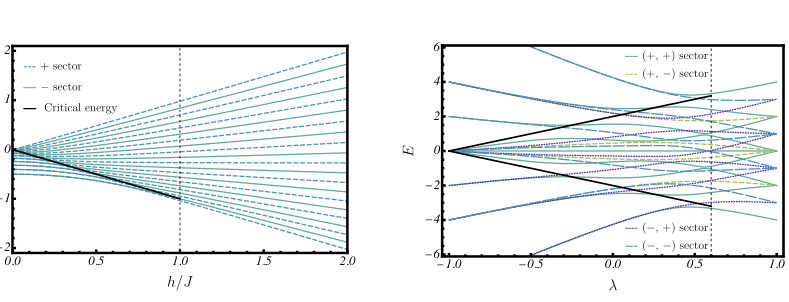 
Figure 2: Energy spectra of the LMG and FP models. Colors indicate the symmetry sector of each eigenstate. Solid black lines mark the ESQPT critical energies, while vertical dashed lines indicate the ground-state QPT. (Left) LMG Hamiltonian (2.1) (S = 10) as a function of h/J (J = 1). For h &lt; J, the spectrum exhibits quasi-degenerate pairs below the critical energy E = −h (not resolvable at this scale). These quasi-degeneracies are lifted for h &gt; J. (Right) FP Hamiltonian (2.2) (L = 3) as a function of λ. The spectrum is shown in all four symmetry sectors, although only those associated with the ˆU1 symmetry are relevant for detecting quasi-degeneracies, which are found within the region...

📷 Fig 3

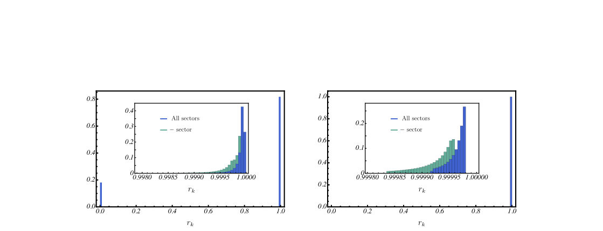 
Figure 3: Distribution of the ratio of consecutive level spacings rk for the full spectrum of the LMG Hamiltonian (2.1) (S = 7500) with parameters (left) h = 1/2, J = 1 and (right) h = 2, J = 1. For h &lt; J, quasi-degenerate pairs from different symmetry sectors produce a peak near rk = 0 in the full-spectrum statistics. For h &gt; J, quasi-degeneracies are absent and the values of rk cluster near 1. The insets show a magnified view of the distribution near rk = 1 for the full spectrum and for a single symmetry sector (the two sectors overlap). Note the different horizontal scales between the two panels. In all cases, the mean ratio ⟨r⟩remains close to 1.

📷 Fig 4

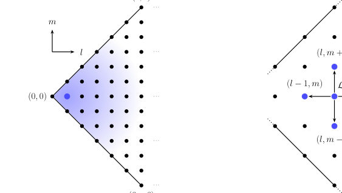 
Figure 5: (Left) Grid of nodes (l, m) with cutoff l⋆= 6. The initial function is |Y 0 1 ), corresponding (up to normalization) to the spin component z, and having support on the node (1, 0) (more general initial conditions may have support on multiple nodes). Black nodes correspond to zero coefficients. As the Lanczos algorithm is iterated, the support spreads across the lattice, generating increasingly complicated functions. (Right) Action of the classical Liouvillian operator associated with the LMG Hamiltonian (see Eq. (3.35) below) on a spherical harmonic Y m l illustrating the induced transitions across the grid.

📷 Fig 5

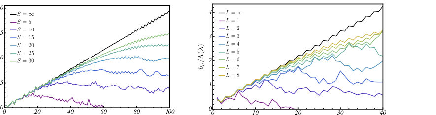 
Figure 6: Classical Lanczos coefficients (black curves) shown versus quantum Lanczos coefficients (colored curves) for various values of collective spin size. (Left) For the classical LMG model (3.34) and its quantum counterpart in Eq. (2.1), with h = J = 1. In the classical case, the initial function is |z), and in the quantum case, the initial operator is ˆsz. (Right) For the classical FP Hamiltonian (3.36) and its quantum counterpart in Eq. (2.2), with λ = 0. In the classical case, the initial (normalized) function is |x1z2), and in the quantum case, the initial operator is (the normalized version of) ˆlx ⊗ˆmz.

**Summary.** This paper develops a classical analogue of Krylov complexity using phase space methods to study quantum chaos. By applying this framework to spin models like LMG, the authors show that microcanonical analysis resolves ambiguities in complexity measurements caused by saddle points or spectral instabilities. This provides a robust tool for characterizing early-time chaotic dynamics across different energy regimes.

**Why it may be interesting.** It provides a powerful, mathematically rigorous tool (classicalization of K-complexity) to probe early-time chaotic dynamics in many-body systems without needing full quantum simulation, which is highly relevant for understanding thermalization and scrambling.

Detailed structure

**Main problem.** The work develops a classical counterpart for Krylov complexity, allowing the study of quantum chaos measures using phase space techniques.

**Main result.** Classical Krylov complexity accurately approximates quantum complexity at early times in semiclassical systems, and a microcanonical approach resolves ambiguities arising from dynamical instabilities like saddle points.

**Method.** It employs the classical Lanczos algorithm in phase space, utilizing Poisson brackets for dynamics and phase-space integrals for the inner product, alongside an energy-resolved (microcanonical) analysis.

**Model / system.** The study is applied to collective spin systems, specifically the Lipkin-Meshkov-Glick (LMG) and Feingold-Peres (FP) models, which are known to exhibit classical behavior in the thermodynamic limit.

**Key observables.** Krylov complexity (K-complexity), Classical Krylov complexity, Krylov-Ehrenfest time ($t^*$), Microcanonical Krylov complexities.

**Important parameters / regimes.** The semiclassical parameter $\hbar$, energy shell structure, and system coupling constants defining the LMG/FP models.

**Assumptions / limitations.** The existence of a well-defined semiclassical limit ($\hbar 	o 0$) for the quantum mechanical systems under study.

**Figures summary.** Figures illustrate the time evolution of microcanonical K-complexity for the LMG model, comparing regimes with and without saddle points in phase space.

**Paper structure.** The paper first establishes the formal link between quantum and classical Krylov dynamics. It then introduces the energy-resolved (microcanonical) framework to analyze complexity growth in specific models like LMG and FP, resolving issues related to spectral chaos versus localized instabilities.

Abstract

In this work, we develop and study the classical Lanczos algorithm allowing us to define Krylov complexity using the symplectic structure of phase space: Poisson brackets take on the role of the quantum commutators and phase-space integrals furnish the inner product needed to define the Lanczos recursion. We show, using general methods of quantum mechanics in phase space, that the $\hbar \to 0$ limit of the usual quantum mechanical Krylov framework smoothly goes over into the classical one. In theories with well-defined semiclassical limits, we show that classical Krylov complexity accurately approximates quantum complexity at early enough times, and thus is a useful characteristic of early-time chaotic dynamics. We define a Krylov-Ehrenfest time, which quantifies the eventual divergence of classical and quantum complexities, corresponding to a characteristic depth of the Krylov chain, $n\sim n_*(\hbar)$, which in the time domain translates to the well-known scale, $t_*\simλ_K^{-1}\log(1/\hbar)$, in generic chaotic systems. We additionally define microcanonical Krylov complexities, both in the classical and quantum setting, which allows one a fine-grained study of complexity, energy shell by energy shell. We apply this framework to the Lipkin-Meshkov-Glick (LMG) and Feingold-Peres (FP) models, which are collective spin systems known to classicalize in the thermodynamic limit. In particular, while the FP model features spectral chaos for some range of coupling values, the LMG model is known to exhibit early-time saddle-dominated scrambling. Our analysis shows that the instability in LMG is resolved by the microcanonical Krylov complexity, which is controlled by the integrable structure of the Hamiltonian in spectral windows away from the instability, both at early and late times.

[↑ back to top](#top)

### [Bulk and microphase separation in chiral active systems](http://arxiv.org/abs/2607.12045v1)

**Authors:** Sumeja Bureković, S. J. Kole, Ananyo Maitra, Cesare Nardini  
**Type:** theory · **Category:** statistical mechanics · **PDF:** <https://arxiv.org/pdf/2607.12045v1>  
**Analysis basis:** full PDF text, analyzed in chunks
**Topic relevance:** `Keldysh / 2PI / non-Gaussian methods` **3/5** · `driven-dissipative phase transition` **3/5** · `non-equilibrium dynamics` **2/5** · `non-equilibrium universality` **2/5** · `Frenkel-Kontorova` **1/5** · `analog quantum simulation` **1/5** · `correlated / nonlocal dissipation` **1/5** · `methods for driven-dissipative` **1/5**

📷 Fig 1

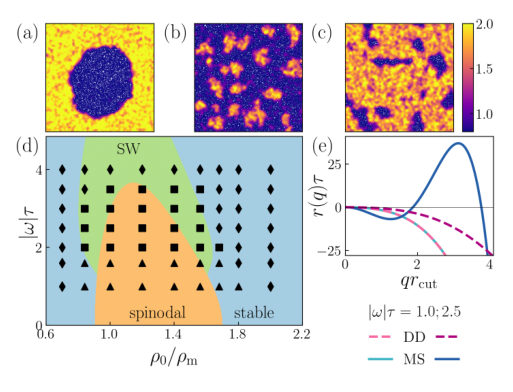 
FIG. 1. Phase diagram of cQSAPs for translational diffusiv- ity DT = 0.3. a)–c): Steady-state configurations (L = 48rcut) with the color bar denoting the local density in units of ρm. d): Predictions of the linear stability from our MS theory: linearly stable (blue); SW instability (green); spinodal insta- bility (orange). Phases observed from simulations of cQS- APs: bulk phase separation (triangles); microphase separa- tion (squares); homogeneous phase (diamonds). e) Growth rate r for ρ0 = 0.84ρm and two values of |ω|τ, shown for both DD and MS coarse-graining theories (here, the MS growth rate for |ω|τ = 2.5 is multiplied by a factor 16). Other pa- rameters were set to v0 = 5, v1 = 1, ρm...

📷 Fig 2

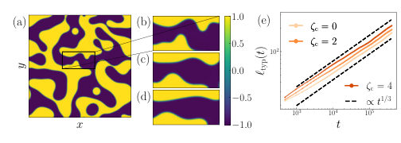 
FIG. 2. Coarsening of cAMB at fixed global density ϕ0 = 0 for system size 1024 × 1024. (a) Snapshot of the density field for ζc = 4. (b-d) Time evolution of the interface showing propa- gating waves. (e) Characteristic length scale versus time for various ζc compatible with the diffusive ℓtyp ∼t1/3 coarsening law as analytically predicted.

📷 Fig 3

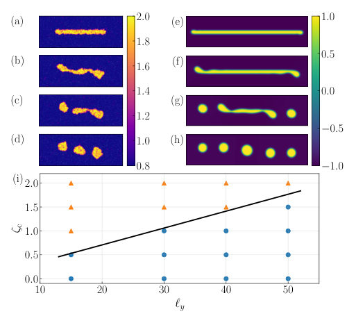 
FIG. 3. Simulation snapshots illustrating droplet splitting in particle simulations of cQSAPs (Top left) and in cAMB (Top right), with time evolving from top to bottom. Bottom: numerical test of our criterion in Eq. (8) for droplet splitting (solid line, where csplit = 0.075 was obtained from fitting). Triangles indicate emergence of droplet splitting as observed in simulations, while circles its absence. The initial aspect ratio was fixed at Υ = 20. In particle simulations, the color encodes the local particle density in units of ρm. Parameters used: (Left) ω = 1.5, ρ0 = 38.4, Υ = 11 and system size 128rcut × 48rcut. (Right) ζc = 4.0, ℓy = 15, Υ = 31.25, and system size 512 × 128.

**Summary.** This work analyzes how chirality affects phase separation in self-propelled active matter. Using sophisticated continuum models and multi-scale analysis, the authors distinguish between bulk and microphase separation regimes. The key finding is that chirality introduces novel dynamic features, such as interface traveling waves and droplet splitting, even when fluid flows are absent.

**Why it may be interesting.** While focused on classical active matter, the use of advanced non-equilibrium statistical mechanics tools like multiple-scale expansion and linear stability analysis mirrors techniques used to study pattern formation and phase transitions in quantum many-body systems.

Detailed structure

**Main problem.** The study investigates how chirality influences phase separation—specifically distinguishing between bulk and microphase regimes—in active particle systems driven by quorum-sensing interactions.

**Main result.** Chirality is shown to induce traveling waves at the interface and can cause elongated droplets to split even without fluid flows, a phenomenon distinct from achiral systems.

**Method.** The analysis employs both Diffusion-Drift (DD) approximation and advanced Multiple-Scales (MS) coarse-graining techniques applied to continuum models of active particles.

**Model / system.** The system involves Chiral Quorum-Sensing Active Particles (cQSAPs) modeled by particle dynamics and a continuum description called chiral Active Model B (cAMB).

**Key observables.** Phase separation types (bulk vs. microphase), coarsening law ($\ell_{typ} \propto t^{1/3}$), interfacial tensions, and the growth rate $r(q)$ from linear stability analysis.

**Important parameters / regimes.** Chirality parameter ($\omega$), translational diffusivity ($DT$), and density ($
ho_0$).

**Assumptions / limitations.** The DD approximation is insufficient, necessitating the use of MS theory for accurate prediction of microphase separation; the MS expansion itself has limitations near instability thresholds.

**Figures summary.** Figures illustrate the phase diagram showing stability predictions (DD vs. MS), time evolution of coarsening ($\ell_{typ} \propto t^{1/3}$), and simulation snapshots demonstrating droplet splitting.

**Paper structure.** The paper progresses from establishing the physical model (cQSAPs) to comparing theoretical approaches (DD vs. MS theory) for stability analysis, culminating in showing how chirality modifies dynamics like interface wave propagation and droplet breakup.

Abstract

Many active particles phase-separate due to quorum-sensing interactions, and their self-propulsion mechanisms often break chiral symmetry. Using particle and continuum models, we uncover the role of chirality in inducing bulk or microphase separation, including a chiral phase formed of vapor bubbles. Analytical predictions for the emergence of these phases require a coarse-graining technique based on multiple-scale analysis. Further, introducing a minimal active field theory, we show that, in the bulk phase separation regime, chirality does not alter the diffusive $t^{1/3}$ coarsening law nor the dynamical exponent associated with capillary waves, but induces traveling waves at the interface. We finally demonstrate that, even in the absence of fluid flows, chirality can cause the breakup of elongated droplets, resembling phenomena previously observed experimentally.

[↑ back to top](#top)

### [Emergence of drifted diffusion in quantum walks with subspace restart](http://arxiv.org/abs/2607.12727v1)

**Authors:** Liwei Qiao, Ruoyu Yin, Wei Zhang  
**Type:** theory · **Category:** statistical mechanics · **PDF:** <https://arxiv.org/pdf/2607.12727v1>  
**Analysis basis:** full PDF text, analyzed in chunks
**Topic relevance:** `driven-dissipative phase transition` **3/5** · `non-equilibrium dynamics` **3/5** · `analog quantum simulation` **2/5** · `non-equilibrium universality` **2/5** · `correlated / nonlocal dissipation` **1/5** · `measurement-induced transitions` **1/5** · `methods for driven-dissipative` **1/5** · `quantum measurements` **1/5**

📷 Fig 1

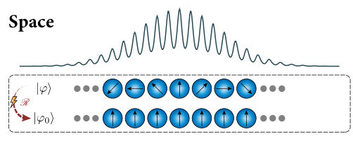 
FIG. 1. Schematic of a discrete-time quantum walk with periodic subspace restart. (Top) Temporal evolution: unin- terrupted unitary dynamics ˆ W r are interleaved with instan- taneous coin resets R (dashed boxes). (Bottom) Action of R in real space: the spatial probability profile is left invariant, while the internal coin state at every lattice site (blue spheres) is reset from the evolved |φ⟩back to the initial |φ0⟩.

📷 Fig 2

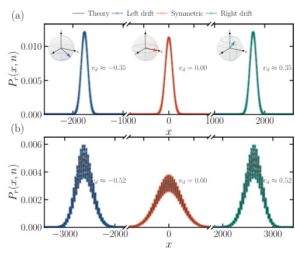 
FIG. 2. Occupation probability Pr(x, n) at n = 5000 steps for restart periods (a) r = 1 and (b) r = 25, with three coin orientations (Bloch spheres): left drift (θ, ϕ) = (3π/4, 2π/3) (blue), symmetric spreading (π/2, π/2) (orange), and right drift (π/4, π/3) (green). At r = 1 the distribution is a clean Gaussian, while at r = 25 a Gaussian envelope persists but is dressed by short-range interference fringes, signaling that the macroscopic transport classicalizes while local quantum coherence survives within each cycle. Without specification, only lattice sites with nonzero probability are shown.

📷 Fig 3

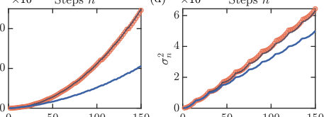 
FIG. 3. Accumulation of statistical quantities versus steps n under subspace restart with period r = 15 and trunca- tion ∆max = 8. (a) Variance σ2 n for the symmetric coin (θ, ϕ) = (π/2, π/2). (b)–(d) Mean displacement µn, MSD ⟨x2(n)⟩and variance σ2 n for an asymmetric coin (θ, ϕ) = (0, 0). Orange circles represent exact numerical simulations, and the solid lines correspond to theory [Diagonal (blue), Truncation (black)]. The diagonal ansatz captures the linear-in-n scaling and the periodic staircase modulation, while the truncated re- construction with a small light-cone cutoff ∆max ≪2r closes the residual quantitative gap, confirming that macroscopic transport is governed by a classical...

📷 Fig 4

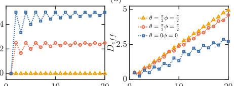 
FIG. 4. Long-time effective transport coefficients versus restart period r, defined as vdeff = [µRr −µ(R−1)r]/r and Deff = [σ2 Rr −σ2 (R−1)r]/2r, for three coin states: (θ, ϕ) = (π/2, π/2) (yellow triangles), (π/3, π/2) (red circles), and (0, 0) (blue squares). At r = 1, the dynamics reduces to a clas- sical random walk; for r &gt; 1, vdeff saturates to coin-dependent values, while Deff grows linearly with r. Thus subspace restart engineers emergent drifted diffusion in DTQWs.

**Summary.** The paper introduces 'subspace restart,' a novel periodic reset mechanism for quantum walks that selectively erases history while preserving spatial location. This process forces the walker's dynamics into a predictable drifted-diffusion regime, allowing researchers to engineer transport coefficients like drift and diffusivity with high control. It provides a powerful tool for studying and controlling the fundamental crossover from coherent quantum mechanics to classical diffusion.

**Why it may be interesting.** This work provides a concrete, tunable protocol—subspace restart—to engineer macroscopic transport properties in quantum systems, offering an analogy to controlled decoherence or measurement-induced localization relevant to open quantum systems.

Detailed structure

**Main problem.** The paper addresses how to control the transition from quantum wave-like transport to classical diffusive behavior in quantum walks.

**Main result.** Subspace restart drives the quantum walk into an engineered drifted-diffusion regime, allowing precise tuning of both drift and diffusivity coefficients.

**Method.** The analysis uses a source picture decomposition (Huygens-Fresnel mechanism) to separate the robust classical backbone from residual short-range quantum interference.

**Model / system.** The model is a discrete-time quantum walk on an infinite 1D lattice, governed by periodic subspace restarts that reset only the internal coin degrees of freedom while preserving spatial probability.

**Key observables.** Mean displacement (drift), Mean Squared Displacement ($\langle x^2(n) 
angle$), effective drift velocity ($v_{	ext{deff}}$), and diffusion coefficient ($D_{	ext{eff}}$).

**Important parameters / regimes.** The restart period ($r$) acts as a tunable knob, controlling the degree of classicalization; the initial coin orientation sets the geometric bias.

**Assumptions / limitations.** The analysis relies on approximations, particularly treating the incoherent sum of source intensities (diagonal approximation), which is valid in certain limits.

**Figures summary.** Figures illustrate the probability distribution $P_r(x, n)$ for different restart periods ($r=1$ vs. $r=25$), showing a clean Gaussian core overlaid with short-range interference fringes, and plot the accumulation of statistical quantities like $\sigma_n^2$ over time steps.

**Paper structure.** The paper introduces subspace restart as a mechanism to control quantum-to-classical crossover in DTQWs. It develops the source picture description, analyzes the asymptotic Gaussian behavior (incoherent sum), and derives explicit formulas for the effective drift and diffusion coefficients based on the restart period $r$.

Abstract

Restart of a quantum process is typically modeled as a global reinitialization that erases the system's entire history. Here we introduce subspace restart, a protocol that periodically resets only the internal degrees of freedom while preserving the spatial distribution, as a tunable knob for the quantum-to-classical crossover. Using the discrete-time quantum walk as an example, we show that this selective reset drives the walker into an engineered drifted-diffusion regime. This phenomenon can be understood by a Huygens-Fresnel mechanism, where each restart fragments the wave function into a set of independent secondary sources to screen long-range correlations and isolate a robust classical backbone, whose drift and diffusivity are set by the geometric orientation of the initial coin and the restart period. Residual quantum interference, confined to effective light cones, survives only as a short-range correction that renormalizes these coefficients and imprints periodic modulations on the cumulants. Our results establish subspace restart as a route to controlling the quantum-to-classical crossover in synthetic lattices.

[↑ back to top](#top)

### [Coherent Bose-Einstein condensation with fluctuating density](http://arxiv.org/abs/2607.12926v1)

**Authors:** L. Salasnich, A. Crisanti, A. Sarracino, M. Zannetti  
**Type:** theory · **Category:** quantum gases · **PDF:** <https://arxiv.org/pdf/2607.12926v1>  
**Analysis basis:** full PDF text, analyzed in chunks
**Topic relevance:** `analog quantum simulation` **3/5** · `correlated cavity matter` **3/5** · `quantum optics experiment` **2/5** · `Keldysh / 2PI / non-Gaussian methods` **1/5** · `Tavis-Cummings & cavity-many-emitter` **1/5** · `driven-dissipative phase transition` **1/5** · `entanglement & information structure` **1/5** · `methods for driven-dissipative` **1/5**

📷 Fig 1

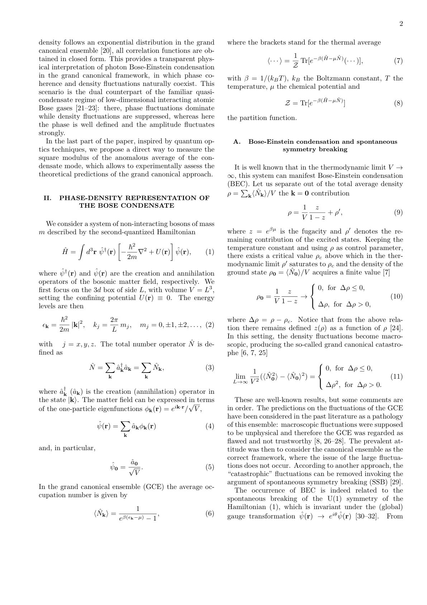 
Low-resolution page preview, page 2

📷 Fig 2

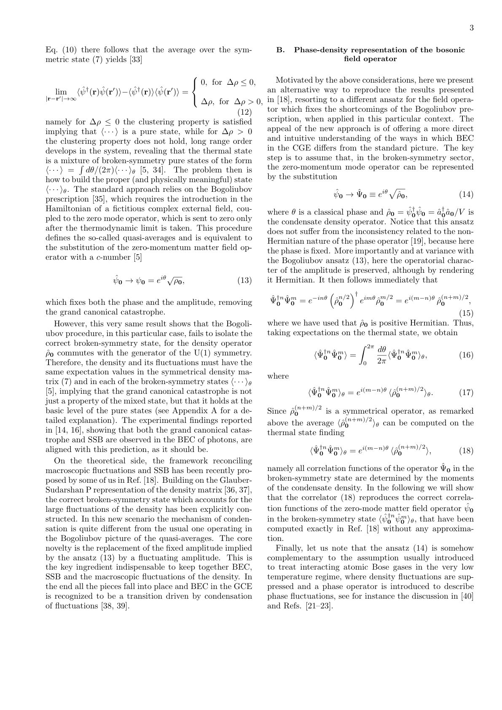 
Low-resolution page preview, page 3

📷 Fig 3

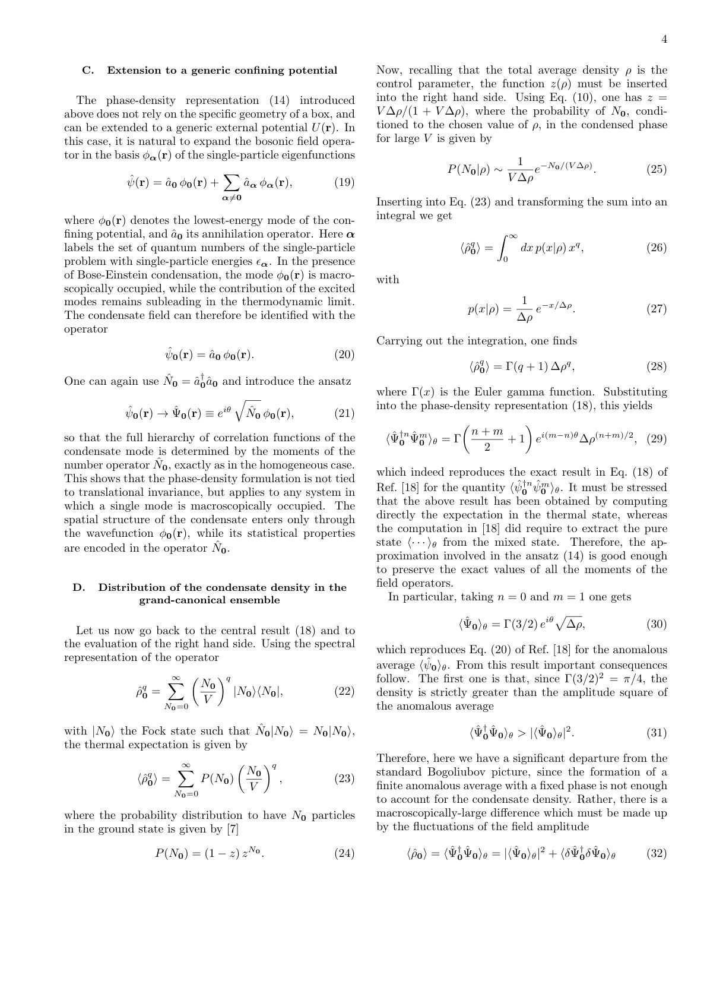 
Low-resolution page preview, page 4

📷 Fig 4

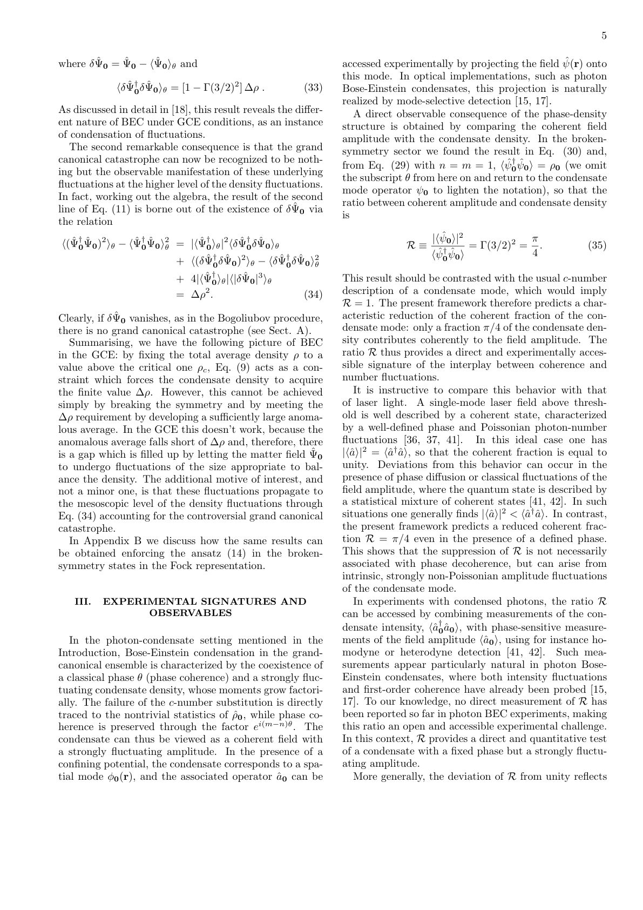 
Low-resolution page preview, page 5

📷 Fig 5

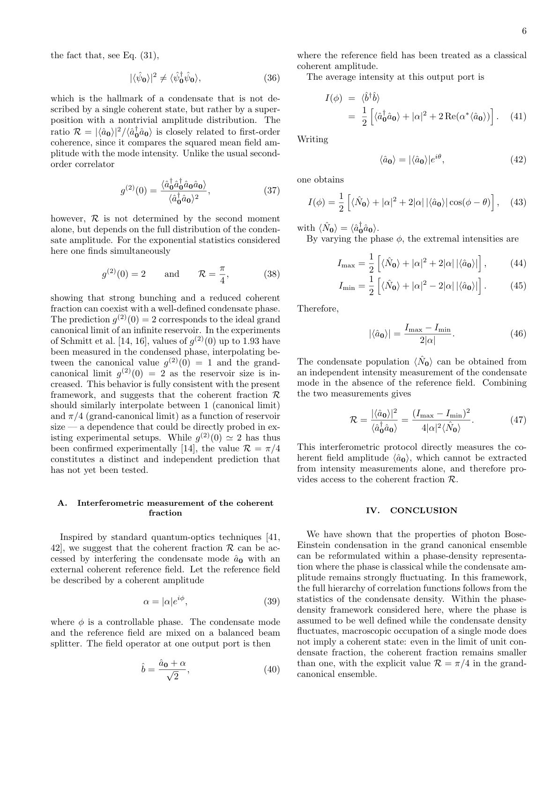 
Low-resolution page preview, page 6

**Summary.** This paper re-examines Bose-Einstein condensation in the Grand Canonical Ensemble, focusing on systems where condensate number fluctuations are macroscopic. By using a phase-density decomposition, the authors derive that the coherence observed is suppressed relative to the total density by a factor of $\pi/4$, providing a key theoretical signature for photon BECs.

**Why it may be interesting.** This work provides a rigorous theoretical framework to reconcile phase coherence (suggested by $\langle \hat{\psi}_0 
angle$) with large number fluctuations ($
ho_0$), which is crucial for understanding real-world quantum optical experiments like photon BECs.

Detailed structure

**Main problem.** The paper addresses Bose-Einstein condensation (BEC) in the Grand Canonical Ensemble (GCE) when macroscopic condensate number fluctuations are significant, challenging standard mean-field descriptions.

**Main result.** For an ideal Bose gas in GCE, the ratio of the anomalous average squared to the total density is predicted to be $|\langle \hat{\psi}_0 
angle|^2 / 
ho_0 = \pi/4$, indicating that fluctuations contribute significantly beyond the simple mean-field prediction.

**Method.** The authors employ a phase-density decomposition ($\hat{\psi}_0 
ightarrow e^{i	heta} \sqrt{
ho_0}$) and analyze correlation functions by determining their dependence solely on the statistics of the condensate density operator $\hat{
ho}_0$.

**Model / system.** The system is an ideal gas of bosons, specifically applied to BEC in photon microcavities. The analysis focuses on the zero-momentum mode operator $\hat{\psi}_0$ and its associated density fluctuations.

**Key observables.** Condensate density ($
ho_0$), anomalous average squared ($|\langle \hat{\psi}_0 
angle|^2$), and the ratio $R = |\langle \hat{\psi}_0 
angle|^2 / \langle \hat{\psi}^\dagger_0 \hat{\psi}_0 
angle$.

**Important parameters / regimes.** The GCE limit, which leads to the characteristic prediction $R=\pi/4$, and the comparison between coherent (canonical) and fluctuating (grand canonical) regimes.

**Assumptions / limitations.** The analysis assumes a well-defined phase ($	heta$) while allowing the condensate density ($
ho_0$) to fluctuate macroscopically, which is necessary because standard Bogoliubov approaches fail in this regime.

**Paper structure.** The paper develops the theory by first establishing the phase-density decomposition, deriving how correlation functions depend only on density statistics. It then calculates specific ratios like $R$ for the ideal gas in GCE, contrasting these results with canonical and coherent state expectations.

Abstract

Bose-Einstein condensation in the grand canonical ensemble admits a formulation in terms of a phase-density decomposition of the condensate mode operator $\hatψ_{\bf 0}$. In the presence of macroscopic condensate number fluctuations this representation presents nontrivial implications. In particular, we show that, for the ideal gas, under the assumption of a well-defined phase and a fluctuating condensate density, the full hierarchy of correlation functions is determined by the statistics of the density. Within this framework, the modulus squared of the anomalous average $\langle \hatψ_{\bf 0}\rangle$ can provide only a fraction of the whole condensate density $ρ_{\bf 0}$ and for the grand canonical statistics of the ideal Bose gas one obtains the value $|\langle {\hat ψ}_{\bf 0}\rangle|^2 =(π/4) ρ_{\bf 0}$. The remaining part is supplemented by the (macroscopic) fluctuations of $\hatψ_{\bf 0}$, which become a distinctive feature of the BEC in this setting. This provides a transparent physical picture of a condensate of photons with a well-defined phase but large number fluctuations, as observed in dye-filled microcavity photon experiments. We also propose a way to access the square modulus of the anomalous average to test theoretical predictions.

[↑ back to top](#top)

### [Oscillatory Active Brownian Motion: A Minimal Model for Sperm Dynamics](http://arxiv.org/abs/2607.12158v1)

**Authors:** Adrian Pacheco-Pozo, Arturo Matamoros Volante, Pilar Ameijeiras, Mariano G. Buffone, Diego Krapf  
**Type:** both · **Category:** disordered systems and neural networks · **PDF:** <https://arxiv.org/pdf/2607.12158v1>  
**Analysis basis:** full PDF text, analyzed in chunks
**Topic relevance:** `non-equilibrium dynamics` **3/5** · `driven-dissipative phase transition` **2/5** · `methods for driven-dissipative` **2/5** · `non-equilibrium universality` **2/5** · `Frenkel-Kontorova` **1/5** · `Keldysh / 2PI / non-Gaussian methods` **1/5** · `analog quantum simulation` **1/5** · `correlated / nonlocal dissipation` **1/5**

📷 Fig 1

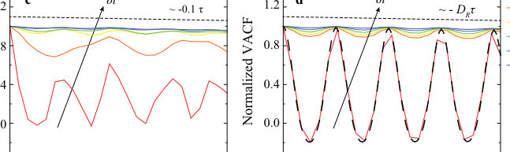 
Figure 1. Comparison between an experimental sperm trajectory and its OABM counterpart. (a) Experimental and simulated TAMSDs, showing the short-lag and intermediate-lag ballistic regimes. Inset: Representative experimental trajectory and synthetic OABM realization generated with parameters inferred from the experiment. Scale bar: 20 µm. (b) Normal PSD of the experimental trajectory, with a dominant peak at fmax = 10.3 Hz. (c) Normalized VACF of the experimental trajectory for several values of δt. For small δt, the VACF retains the oscillatory structure of the sperm-head motion. As δt increases, the velocity averages over the fast oscillations, and the VACF approaches the slow...

📷 Fig 2

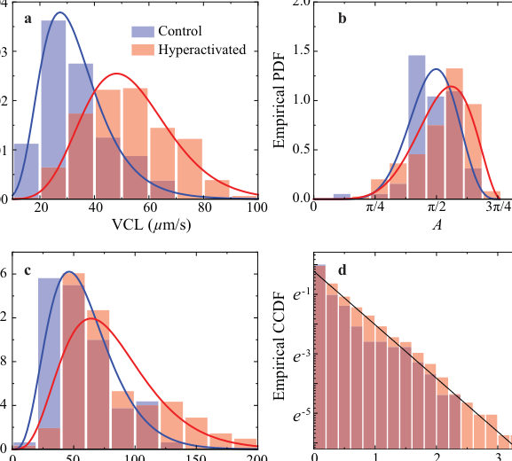 
Figure 3. Empirical distributions of motility parameters obtained from 80 control and 311 sperm hyperactivated trajectories. Solid lines show fits to the selected probability density functions. (a) Curvilinear velocity, VCL, fitted with a log-normal distribution for the control group and a Gamma distribution for the hyperactivated group. (b) Oscillatory amplitude A, fitted with a beta distribution. (c) Angular frequencies Ω, fitted with a Gamma distribution. (d) Complementary cumulative distribution function (CCDF) of the rotational diffusion coefficient DR. The solid black line corresponds to an exponential fit, giving ⟨DR⟩= 0.56 s−1.

**Summary.** This paper introduces Oscillatory Active Brownian Motion (OABM), a refined model for sperm movement that accounts for periodic flagellar beating. By fitting this model to experimental tracking data, the authors successfully characterize how intrinsic oscillations govern overall cell transport properties across different physiological states like hyperactivation.

**Why it may be interesting.** While focused on biophysics, the use of minimal extensions to standard diffusion models (ABM) and the rigorous statistical inference from complex time-series data mirrors techniques used in modeling non-equilibrium dynamics in disordered or interacting quantum systems.

Detailed structure

**Main problem.** Standard Active Brownian Motion (ABM) fails to account for the intrinsic periodic oscillations present in sperm motility, which are crucial for understanding their transport dynamics.

**Main result.** The Oscillatory Active Brownian Motion (OABM) model successfully reproduces single-cell and population dynamics for both control and hyperactivated sperm by linking measurable flagellar kinematics to coarse-grained transport.

**Method.** The study combines analytical derivations of observables (like MSD and VACF) with fitting procedures, including Maximum Likelihood Estimation (MLE), to infer OABM parameters from experimental tracking data.

**Model / system.** The system is mammalian sperm exhibiting active motion. The model used is Oscillatory Active Brownian Motion (OABM), an extension of ABM that incorporates a periodic angular modulation ($\psi(t) = A \cos(\Omega t + \phi)$) into the swimmer's orientation dynamics.

**Key observables.** Time-averaged mean-squared displacement (TAMSD), velocity autocorrelation function (VACF), transverse excursion amplitude, straight-line velocity (VSL), and curvilinear velocity (VCL).

**Important parameters / regimes.** Swimming velocity ($V$), oscillation amplitude ($A$), beat frequency ($\Omega$), and rotational diffusion coefficient ($D_R$).

**Assumptions / limitations.** The analysis assumes that in the relevant experimental regime, averages over oscillatory modulation can be treated as cycle averages; furthermore, the distribution of $D_R$ was found to be independent of hyperactivation state.

**Figures summary.** Figures likely show scatter plots and correlation matrices ($
ho$) for fitted OABM parameters ($V, A, \Omega, D_R$) comparing control and hyperactivated groups, demonstrating strong correlations between velocity and amplitude.

**Paper structure.** The paper first introduces the limitations of standard ABM. It then develops the OABM framework by deriving analytical expressions for key observables. The methodology involves fitting these derived quantities to experimental sperm trajectory data (control vs. hyperactivated). Finally, it analyzes parameter distributions to distinguish physiological states.

Abstract

Active biological microswimmers typically combine persistent self-propulsion with cyclic motion generated by flagellar or ciliary beating. However, standard active Brownian motion (ABM) does not explicitly account for these intrinsic oscillations. This limitation is particularly relevant for sperm cells, whose transport depends not only on directional persistence and stochastic reorientation but also on periodic head motion. Here we introduce oscillatory active Brownian motion (OABM), a minimal extension of ABM in which the swimmer orientation undergoes directional diffusion while being modulated by a periodic angular drive. The model yields analytical expressions for experimentally relevant observables, including the time-averaged mean-squared displacement, velocity autocorrelation function, and transverse excursion amplitude. A central prediction is a crossover between two ballistic regimes: short-time motion governed by the swimming velocity and an intermediate regime with a reduced, oscillation-averaged effective velocity determined by the angular beat amplitude. Using trajectories of human sperm, we infer model parameters from standard motility measures. The model quantitatively reproduces both single-cell trajectories and population-level dynamics under control conditions and following induction of hyperactivation. Overall, OABM provides a compact active-matter framework that links measurable flagellar kinematics to coarse-grained transport, enabling a description of sperm motility across different physiological states.

[↑ back to top](#top)

### [Quantum incompatibility of Born probabilities](http://arxiv.org/abs/2607.12032v1)

**Authors:** Esteban Castro-Ruiz, Nathan Cohen, Luis C. Barbado, Časlav Brukner  
**Type:** both · **Category:** other · **PDF:** <https://arxiv.org/pdf/2607.12032v1>  
**Analysis basis:** full PDF text, analyzed in chunks
**Topic relevance:** `quantum measurements` **3/5** · `quantum optics experiment` **3/5** · `measurement-induced transitions` **2/5** · `correlated / nonlocal dissipation` **1/5** · `driven-dissipative phase transition` **1/5** · `entanglement & information structure` **1/5** · `methods for driven-dissipative` **1/5** · `non-equilibrium dynamics` **1/5**

📷 Fig 1

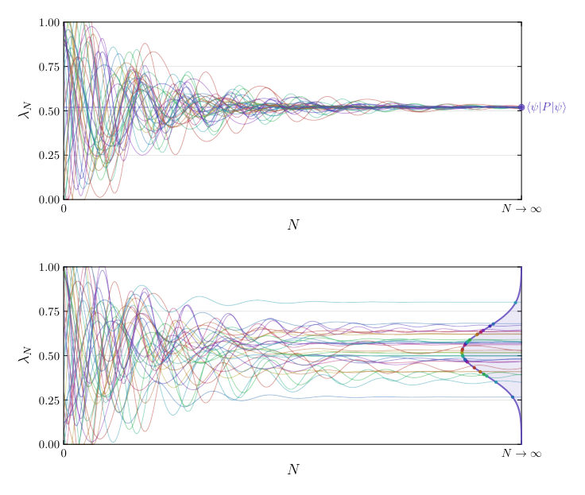 
FIG. 1. In ordinary quantum theory, the value of an observable may be uncertain, but the probabilities are sharply defined. The Born rule assigns each outcome a fixed number p = ⟨ψ| P |ψ⟩, and the law of large numbers guarantees that the relative frequencies recorded over N system copies converge to these probabilities as N →∞: individual outcomes may be uncertain, but the statistics governing them are not. This, however, presupposes an ideal reference frame with respect to which the mea- surements are done. When Alice’s QRF A is non-ideal, this is no longer the case. The N →∞limit of the relative frequencies — namely, the Born probabilities — remain uncertain. This figure is a qualitative...

📷 Fig 2

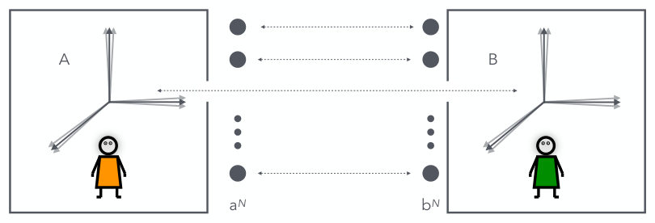 
FIG. 2. Alice and Bob perform local experiments on N copies of their systems a and b, respectively, measuring relative frequencies and expectation values with respect to their local reference frames A and B, which may be prepared in a quantum state. Because these frames are non-ideal, the relative frequencies and expectation values they measure may have a finite uncertainty even in the limit of arbitrarily large N. Here we show that these uncertainties are irreducible in a quantum mechanical sense. That is, the correlations between the RRFs or REVs measured by Alice and Bob may violate Bell inequalities in the large-N limit.

📷 Fig 3

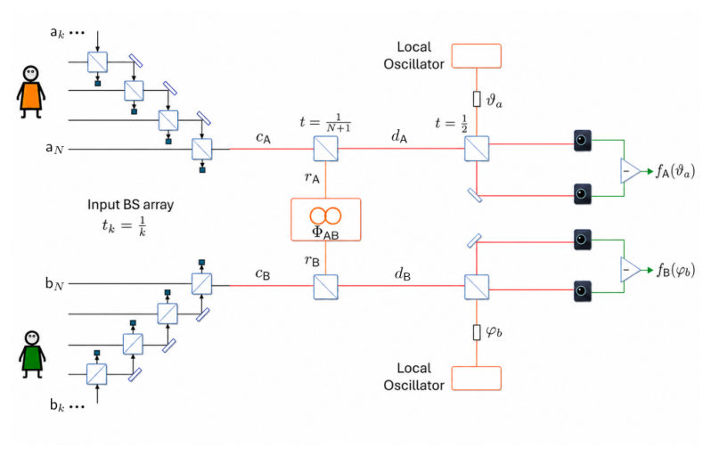 
FIG. 3. Quantum-optical implementation of the Bell experiment for relational expectation values. Alice and Bob receive a block of N signal modes, a1, . . . , aN and b1, . . . , bN, respectively. The input beam-splitter arrays coherently combine each block into the collective modes cA = N −1/2 PN i=1 ai and cB = N −1/2 PN i=1 bi. With the convention used in the figure, the k-th beam splitter in the input array has intensity transmissivity tk = 1/k, for k = 2, . . . , N, for the newly added input mode into the continuing collective output mode. The collective modes cA, cB are mixed locally with the quantum-reference-frame modes rA, rB, prepared in the entangled state ΦAB. The unbalanced beam...

**Summary.** The paper argues that assuming ideal reference frames when calculating probabilities leads to an oversimplification. By analyzing measurements relative to finite-resource Quantum Reference Frames, the authors demonstrate that the resulting relative frequencies are fundamentally uncertain, violating Bell inequalities in the large repetition limit. This suggests a necessary revision of the quantum state concept for regimes constrained by physical resources.

**Why it may be interesting.** This work directly impacts foundational quantum theory, suggesting that resource constraints fundamentally alter the probabilistic structure of quantum mechanics, which is highly relevant for understanding measurement processes near gravitational boundaries.

Detailed structure

**Main problem.** The paper investigates how quantum probabilities behave when measurements are performed relative to non-ideal, finite-resource Quantum Reference Frames (QRFs), challenging the assumption that standard Born rules hold universally.

**Main result.** When reference frames are resource-limited, the relative frequencies themselves become fundamentally indefinite, violating Bell-type inequalities even in the large repetition limit.

**Method.** The authors develop mathematical tools using relative frequency operators and construct CHSH-type correlators to test for compatibility with local hidden variable models.

**Model / system.** The model involves a system measured repeatedly (i.i.d. copies) whose measurement context is defined by an auxiliary, physical QRF. This framework is proposed to be implemented using pulsed continuous-variable quantum optics and homodyne detection.

**Key observables.** Relative frequencies ($
u$), Relational Relative Frequency Operators ($F_N(P)$), and CHSH-type correlators ($C$).

**Important parameters / regimes.** The large number of repetitions limit ($N 	o \infty$) is crucial, as the breakdown of assumptions occurs in this regime.

**Assumptions / limitations.** The standard notion of a quantum state breaks down when macroscopic reference frames are unavailable; the analysis relies on taking the $N 	o \infty$ limit operationally.

**Figures summary.** Not specified by notes, but the structure implies showing the violation of Bell inequalities in the large-N limit for both discrete and continuous variable settings.

**Paper structure.** The paper progresses from establishing the problem with ideal reference frames to introducing relative frequency operators. It then develops constructions (POVM vs PVM) and culminates by applying these tools to show violations of Bell inequalities, particularly in the continuous variable setting using a CHSH-type correlator.

Abstract

Quantum theory challenges the view that individual measurement outcomes are predefined and independent of the measurement context. Yet the quantum state itself -- the catalogue of probabilities for all possible measurements -- is usually assumed to be well defined. We argue that this assumption tacitly relies on measurements being performed relative to ideal, infinitely-resourceful reference frames. We show that, when measurements are made relative to non-ideal quantum reference frames, the probabilities themselves become indefinite: even in the limit of arbitrarily large number of runs, the relative frequencies may remain uncertain. The uncertainty is irreducible in a quantum-mechanical sense, as we show by proving a Bell-type theorem for relative frequencies. We further propose a quantum-optical implementation of these relational measurements based on pulsed homodyne detection. Our findings motivate an extension of the notion of the quantum state to regimes constrained by finite resources. We expect them to be especially relevant at the interface between quantum theory and general relativity, where the resources and information available in a bounded region of spacetime are fundamentally limited.

[↑ back to top](#top)

### [Active Quantum Nematics: The First Quantization](http://arxiv.org/abs/2607.12961v1)

**Authors:** Ghansham Chandel, Siddhartha Das  
**Type:** theory · **Category:** other · **PDF:** <https://arxiv.org/pdf/2607.12961v1>  
**Analysis basis:** full PDF text, analyzed in chunks
**Topic relevance:** `driven-dissipative phase transition` **3/5** · `non-equilibrium dynamics` **3/5** · `non-equilibrium universality` **2/5** · `Keldysh / 2PI / non-Gaussian methods` **1/5** · `analog quantum simulation` **1/5** · `correlated / nonlocal dissipation` **1/5** · `methods for driven-dissipative` **1/5**

📷 Fig 1

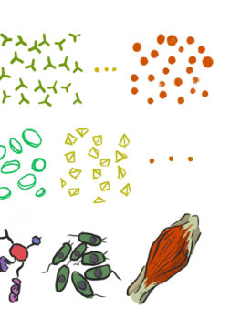 
Fig. 1 This figure illustrates the generality of continuums. (a) Shows mathematically idealized objects such as vectors, nematic director, tri-atic director, etc. (b) Shows idealized objects that may be represented by such mathematical objects. (c) Represents the objects in physical world that are routinely modeled as continumms.

📷 Fig 2

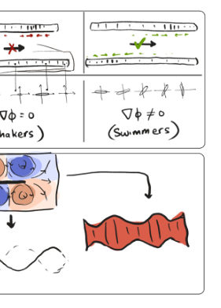 
Fig. 2 This figure illustrate the difference between peristaltic swimmers and shaker creatures. (a) Prototypical elongated active clump that has potential to swim. (b) When creatures moves its entire body in sync, no motion of self can be produced, but locally varying activation time induces peristaltic motion. (c) The motion of |ζ⟩in the complex plane. (d) The visualization of ϕ with space that does not and dose induce motion. (e) Illustration of typical creatures capable of creating vortices for the purpose of movement.

📷 Fig 3

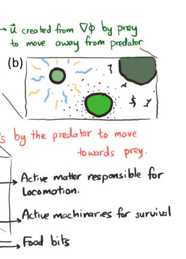 
Fig. 3 Illustration of predator-prey operating on chemotaxis. (a) The biosignal fields ϕs and ϕ signaling predators and prey the best suited direction of motion to hunt/survive. (b) Typical exaple of biosignals, such as heat, sound, ATP and pheromones. (c) Internal arrangement of the predator that uses ∇ϕ to generate activity (red), which also has activity not responsible for motion (orange).

📷 Fig 4

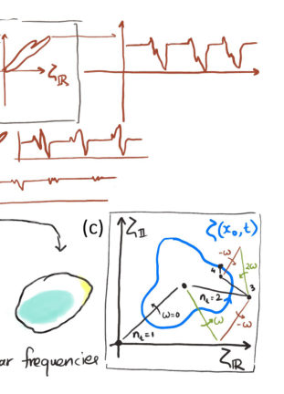 
Fig. 4 Illustration of pulsating active bodies. (a) A beating heart simplified to spherical bodies, with the pulses illustratively plotted in complex plane as well as pulse-time graph. (b) For any given energy eigenstates, various orbitals that beat independently to squeeze blood across body. (c) An illustration of how superposition of various eigenstates relates to evolving vectors in Hilbert space (|ζ⟩in this particular figure).

**Summary.** This paper develops the theory of Active Quantum Nematics by embedding continuum descriptions of active matter into a quantum mechanical framework using a complex wavefunction ($\psi$). It successfully models diverse biological phenomena—from bacterial swimming to heart beating—by predicting quantized behaviors and deriving force laws based on wave mechanics principles.

**Why it may be interesting.** It provides a novel theoretical bridge between classical active matter physics (hydrodynamics/soft matter) and fundamental quantum mechanics formalism. The use of wavefunctions to describe non-equilibrium, self-propelled systems is highly relevant for open quantum systems research.

Detailed structure

**Main problem.** The paper aims to formalize Active Nematics (AN) and Liquid Crystal theory within a quantum mechanical framework, creating 'Active Quantum Nematics' (AQN). This unifies concepts from active matter physics with quantum field formalism.

**Main result.** The introduction of a complex Nematic Wavefunction ($\psi$) allows the system to exhibit quantized features, predicting relationships like Planck's energy-frequency relation for micro-swimmers and characterizing biological activity via wave mechanics.

**Method.** The methodology involves extending continuum mechanics equations by introducing quantum operators and utilizing analogies to the Dirac equation structure. Key techniques include expectation value calculations and Helmholtz decomposition of velocity fields.

**Model / system.** The model describes active nematic continua, which can represent biological systems like peristaltic worms or beating hearts. The dynamics are governed by coupled equations involving a complex wavefunction $\psi$ and various potential fields ($\phi$, $\phi_S$).

**Key observables.** The Nematic Wavefunction ($\psi$), its conserved probability density ($|\psi|^2$), the total power eigenvalue ($E = \hbar_A\omega$), and derived active forces ($f_{\phi u}$).

**Important parameters / regimes.** The quantum action scale ($\hbar_A$), activity coefficients, and parameters governing chemotaxis/biosignal diffusion.

**Assumptions / limitations.** It assumes that the complex phase angle ($\phi$) dictates the evolution of $\psi$, and it often simplifies by ignoring passive elastic stresses or assuming constant drag coefficients.

**Figures summary.** Figures illustrate peristaltic swimmers vs. shaker creatures, and depict predator-prey chemotaxis using biosignal fields ($\phi_S$) coupled to internal activity potentials.

**Paper structure.** The paper builds from the standard AN equations by introducing $\psi$ (analogous to Dirac structure), deriving quantum interaction terms via potential transformations, and finally applying this framework to specific biological examples like predator-prey dynamics and cardiac pulsation analysis using harmonic expansion.

Abstract

Nematic symmetry entails conserved quantized quantities such as number of topological defects and vorticity cells. Correspondingly, countless quantum analogies have been found in Active Nematics. We formalize Active Nematics and Liquid Crystal theory into the framework of Quantum Mechanics by introducing a complex valued Nematic Wavefunction to the Beris Edward equations, thus splitting spatiotemporally varying nematic systems into quantized states. We obtain the Planck's energy-frequency relationship for active micro-swimmers such as peristaltic worms and bacterium as a consequence of local complex phase-symmetry of the governing equations, similar to the gauge formulation of Electromagnetism. For organisms operating on diffusive chemotaxis, we obtain predator-prey dynamics that evolve to maximize/minimize pheromones field gradient overlap. Furthermore, when quantizing beating hearts, similar to the orbitals of hydrogen atoms, the state-function allows us to characterize hearts not only through the rhythm, but also the spaciotemporal distribution of contractile activity of various harmonics among healthy and unhealthy hearts.

[↑ back to top](#top)

### [Entanglement and Optical Nonreciprocity in spontaneous Raman Scattering](http://arxiv.org/abs/2607.12676v1)

**Authors:** Frank Schlawin  
**Type:** theory · **Category:** other · **PDF:** <https://arxiv.org/pdf/2607.12676v1>  
**Analysis basis:** full PDF text, analyzed in chunks
**Topic relevance:** `methods for driven-dissipative` **3/5** · `correlated / nonlocal dissipation` **2/5** · `entanglement & information structure` **2/5** · `Keldysh / 2PI / non-Gaussian methods` **1/5** · `driven-dissipative phase transition` **1/5** · `interference shaping light` **1/5** · `non-equilibrium dynamics` **1/5**

📷 Fig 1

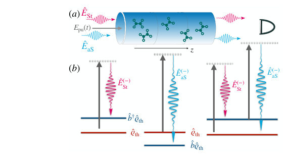 
Figure 1. (a) Sketch of the setup considered here. We discuss Stokes-anti-Stokes-scattering in a collinear setup, where the sample is contained in a volume of length L. (b) Inelastic scattering pro- cesses included here: individual scattering processes involving only Stokes or anti-Stokes fields change the phonon populations. In addition, correlated events are mediated by the sample without changing its phonon population.

📷 Fig 2

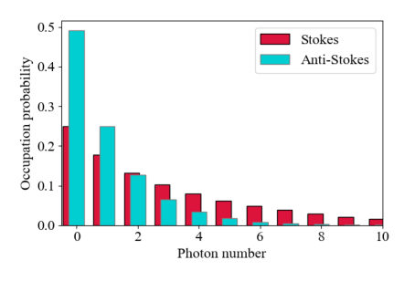 
Figure 2. Photon distribution of Stokes and anti- Stokes fields for resonant excitation (i.e. ∆= 0), zero phonon population nth = 0.0, and conversion strength Γcw = 1.0.

📷 Fig 3

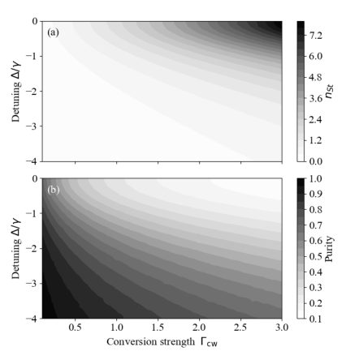 
Figure 3. (a) The mean Stokes photon umber ⟨ˆnSt⟩, for cw Raman scattering, is plotted vs. the detuning ∆and the cw conversion strength Γcw. (b) same a (a) for the purity of the output photonic state. In both plots, we consider a sample with nth = 0.

📷 Fig 4

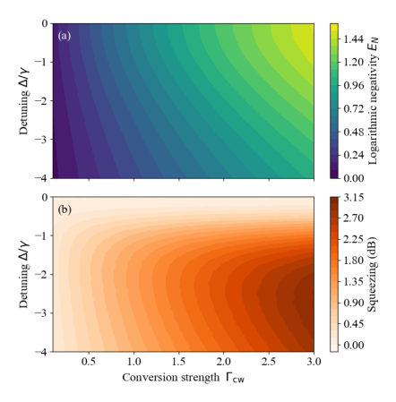 
Figure 4. (a) The logarithmic negativity EN (19), for cw Raman scattering, is plotted vs. the detuning ∆and the cw conversion strength Γcw. (b) same as (a) for the degree of squeezing of the output photonic state. In both plots, we consider a sample with nth = 0.

📷 Fig 5

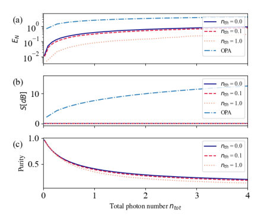 
Figure 5. Logarithmic negativity (19) [top panel], squeezing of collective Stokes and anti-Stokes quadra- tures [center panel] and purity [bottom panel] are plotted vs the total photon number. In each case, the corresponding simulations are compared to a two- mode squeezed state (24), labelled OPA.

**Summary.** This paper develops a rigorous quantum theory for spontaneous Raman scattering, treating it as an entangled-photon generation process. Using advanced techniques like the cumulant expansion, the authors demonstrate that the interaction leads to unique chiral couplings causing optical nonreciprocity. The findings provide a theoretical blueprint for developing quantum photonic protocols based on enhanced and controlled Raman spectroscopy.

**Why it may be interesting.** This work is highly relevant for AMO/Quantum Optics as it applies advanced open quantum system techniques (master equations, cumulant expansion) to a fundamental spectroscopic process (Raman scattering), yielding insights into generating nonclassical light sources and understanding dissipation effects on quantum correlations.

Detailed structure

**Main problem.** To develop a microscopic quantum theory for spontaneous Raman scattering that connects naturally to entangled-photon generation models while correctly accounting for the resonant and dissipative nature of the process.

**Main result.** The theory establishes that Raman scattering induces chiral couplings between Stokes and anti-Stokes sidebands, leading to optical nonreciprocity. Crucially, it shows that while entanglement can be generated, true squeezing below the vacuum noise limit is not achieved in this resonant process.

**Method.** The analysis employs a cumulant-expansion approach applied to the quantum evolution map derived from the interaction Hamiltonian, resulting in a cascaded master equation (Lindblad form).

**Model / system.** The system is spontaneous Raman scattering involving Stokes and anti-Stokes sidebands driven by a pump field. The dynamics are modeled using an effective two-photon operator formalism within a quantum map framework.

**Key observables.** Logarithmic negativity (entanglement measure), squeezing factor, mean photon number ($\langle \hat{n}_{St} 
angle$), and the nonreciprocal amplification characteristics.

**Important parameters / regimes.** Phonon occupation number ($ar{n}$), detuning ($\Delta$), conversion strength ($\Gamma_{cw}$), and phase mismatch ($\Delta k$).

**Assumptions / limitations.** The pump field is treated classically (undepleted-pump approximation), and the phonon bath is assumed to be in a thermal state, which limits the description of full quantum dynamics.

**Figures summary.** Figures illustrate collinear setups for Stokes-anti-Stokes scattering; plots show mean Stokes photon number enhancement vs. detuning/coupling strength, and logarithmic negativity trends following this enhancement.

**Paper structure.** The paper progresses from establishing the fundamental Hamiltonian and using cumulant expansion to derive a master equation. It then analyzes different excitation regimes (cw vs. ultrafast) and incorporates propagation effects via phase matching factors before concluding with diagnostic measurements of entanglement and nonreciprocity.

Abstract

Inelastic light scattering is a central tool for sample characterization and label-free imaging across the physical and life sciences. Recent work has suggested that scattered light can also exhibit nonclassical correlations. Here, we develop a microscopic theory of Raman scattering that connects naturally to established descriptions of entangled-photon generation in three- and four-wave mixing, while capturing essential differences arising from the resonant, dissipative character of Raman scattering. Using a cumulant-expansion approach, we analyze the entanglement structure of the scattered sidebands and identify signatures that distinguish Raman-mediated correlations from those generated in conventional off-resonant nonlinear wave mixing. In particular, we show that Raman scattering induces chiral couplings between Stokes and anti-Stokes sidebands, leading to nonreciprocal amplification of coherent seed fields. These results establish a theoretical framework for Raman-based quantum photonic protocols and suggest routes toward quantum-enhanced Raman spectroscopy and imaging.

[↑ back to top](#top)

### [Low-Temperature Holographic Conductivity](http://arxiv.org/abs/2607.12064v1)

**Authors:** Sabyasachi Maulik, Leopoldo A. Pando Zayas, Jingchao Zhang  
**Type:** theory · **Category:** strongly correlated electrons · **PDF:** <https://arxiv.org/pdf/2607.12064v1>  
**Analysis basis:** full PDF text, analyzed in chunks
**Topic relevance:** `Keldysh / 2PI / non-Gaussian methods` **3/5** · `Kondo & dissipative impurity` **2/5** · `non-equilibrium dynamics` **2/5** · `correlated / nonlocal dissipation` **1/5** · `driven-dissipative phase transition` **1/5** · `methods for driven-dissipative` **1/5** · `non-equilibrium universality` **1/5**

📷 Fig 1

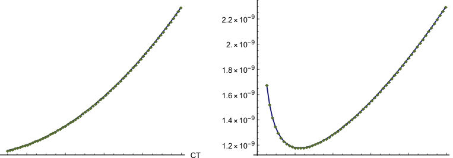 
Figure 1. Comparison between numerical result and analytic estimate of the retarded Green’s function Im GR, IR (ω). The solid line denotes the analytical curve, and the dots denote numerically obtained values. For numerical integration we choose Cω = 10−8.

📷 Fig 2

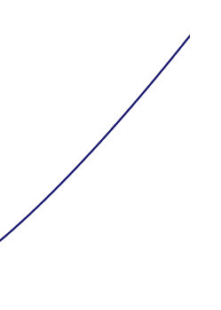 
Figure 2. The quantum-corrected holographic conductivity at very low temperatures.

📷 Fig 3

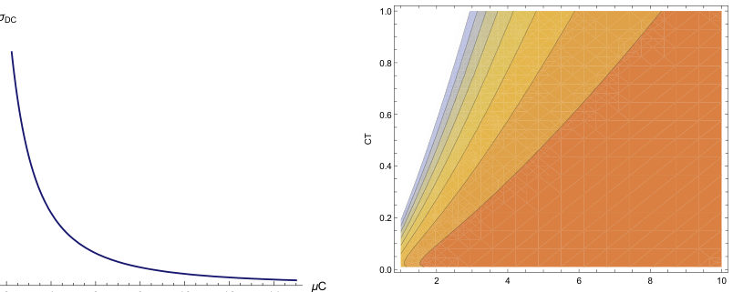 
Figure 3. Dependence of holographic DC conductivity (σDC) on the chemical potential (µ): (a) For fixed temperature, the DC conductivity decreases monotonically and approaches zero for large µ. (b) A contour plot of σDC as a function of CT and µC.

📷 Fig 4

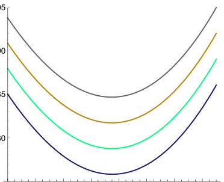 
Figure 4. Frequency-dependent holographic optical conductivity, the temperature de- creases from top to bottom.

📷 Fig 5

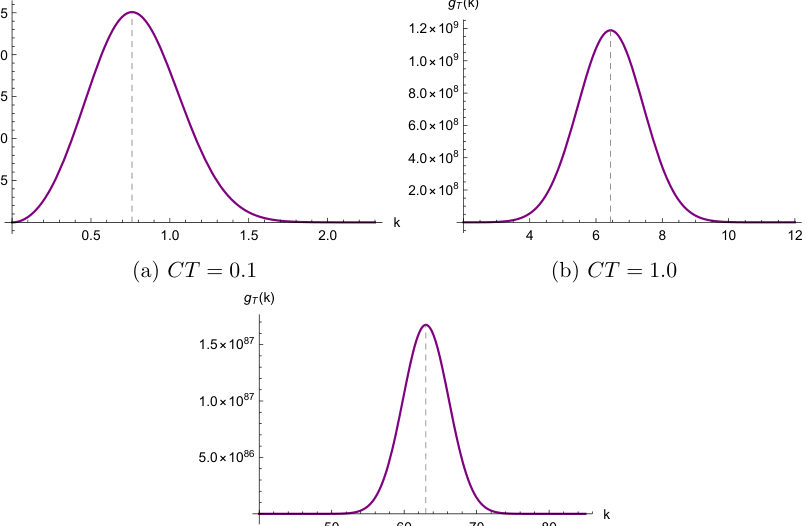 
Figure 6. The function gT (k) is shown for different temperatures, CT = 0.1, 1.0, 10.0. In every case there is a bell-shaped region, but the maximum value increases rapidly with T.

**Summary.** This paper calculates how quantum effects modify the electrical conductivity of a black brane at very low temperatures using holographic methods. It derives a non-monotonic temperature dependence for this conductivity by comparing results from an effective 2D action against direct one-loop gravitational calculations. The findings highlight that quantum corrections significantly alter the expected low-temperature behavior.

**Why it may be interesting.** While focused on gravity/condensed matter duality, the analysis of strongly coupled low-temperature transport coefficients and quantum corrections mirrors problems in strongly correlated electron systems where thermal fluctuations are suppressed.

Detailed structure

**Main problem.** The study revisits holographic electrical conductivity at very low temperatures where quantum fluctuations near a black brane throat are strongly coupled.

**Main result.** The quantum-corrected conductivity exhibits a non-monotonic temperature dependence, decreasing to a minimum before growing as $1/\sqrt{CT}$ in the deep low-temperature limit.

**Method.** The authors employ two complementary theoretical approaches: using an effective two-dimensional action capturing Schwarzian modes, and calculating the one-loop contribution directly from the four-dimensional gravitational path integral.

**Model / system.** The model involves a near-extremal Reissner-Nordström (RN) black brane in AdS$_4$ spacetime, analyzed via holographic methods derived from the AdS/CFT correspondence.

**Key observables.** Holographic electrical conductivity ($\sigma_{DC}$), quantum corrections to transport coefficients.

**Important parameters / regimes.** Temperature ($T$), chemical potential ($\mu$), and the dimensionless parameter $CT$.

**Assumptions / limitations.** The analysis relies on treating quantum fluctuations via effective 2D actions or performing one-loop calculations in the gravitational path integral, assuming validity in specific temperature regimes.

**Figures summary.** Figure 6 shows a function $g_T(k)$ with a maximum increasing rapidly with $T$; Figure 8 compares the two-dimensional Wightman function numerically to analytical estimates.

**Paper structure.** The paper reviews standard DC conductivity calculations using linearized fluctuations, then develops and compares results from an effective 2D Schwarzian mode action against direct 4D gravitational path integral methods for quantum corrections.

Abstract

We revisit holographic electrical conductivity in the regime of very low temperatures where quantum fluctuations in the throat of the near-extremal, asymptotically AdS$_4$ dual black brane are strongly coupled. We treat the fluctuations via an effective two-dimensional action capturing the effects of the Schwarzian modes at the scale $1/C$. Our main result is a non-monotonic temperature dependence: the quantum-corrected conductivity decreases as the temperature is lowered, reaches a minimum at $(CT_{\mathrm{min}}\simeq 0.023)$, and grows as $(1/\sqrt{CT})$ for $(CT\ll 1)$. We further estimate the one-loop contribution to the conductivity directly from the four-dimensional gravitational path integral and find qualitative agreement with the effective two-dimensional description in the regime $(CT\gg 1)$. We find that quantum corrections substantially modify the low-temperature behavior of the holographic conductivity in both approaches.

[↑ back to top](#top)

### [Low-temperature Quantum-corrected Holographic Transport with Momentum Relaxation](http://arxiv.org/abs/2607.12066v1)

**Authors:** Suman Das, Sabyasachi Maulik, Leopoldo A. Pando Zayas, Jingchao Zhang  
**Type:** theory · **Category:** strongly correlated electrons · **PDF:** <https://arxiv.org/pdf/2607.12066v1>  
**Analysis basis:** full PDF text, analyzed in chunks
**Topic relevance:** `non-equilibrium dynamics` **3/5** · `driven-dissipative phase transition` **2/5** · `non-equilibrium universality` **2/5** · `Keldysh / 2PI / non-Gaussian methods` **1/5** · `Kondo & dissipative impurity` **1/5** · `correlated / nonlocal dissipation` **1/5** · `methods for driven-dissipative` **1/5**

📷 Fig 1

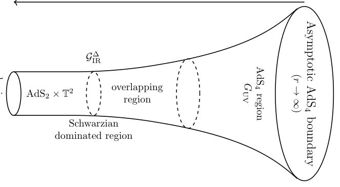 
Figure 1: A schematic view of the near-extremal black brane geometry. A long AdS2 × T 2 throat appears close to the outer horizon (r →r+). Far from the hori- zon (r →∞), the spacetime asymptotes to a four-dimensional anti-de Sitter geome- try. The two regions are smoothly connected through an ‘overlapping region’ where the matched asymptotic expansion is performed in the semiclassical analysis. The Schwarzian modes get strongly coupled at sufficiently low temperature, and domi- nate the near-horizon physics.

📷 Fig 2

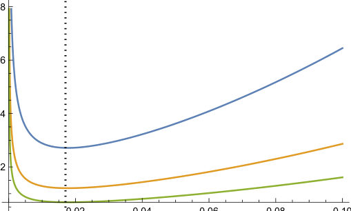 
Figure 2: Behavior of η, given by Equation (4.19), as a function of CT for various values of the Schwarzian coupling parameter C. The transverse volume is set to V2 = 1. The vertical line indicates the position of the minimum, located at CTmin ≈ 0.01769, which is independent of C.

📷 Fig 3

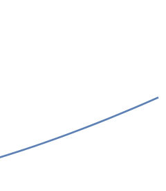 
Figure 3: Quantum-corrected η/s as a function of CT for r0 = 1, V2 = 3/4.

📷 Fig 4

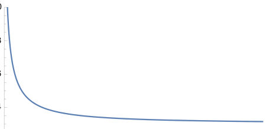 
Figure 4: Behavior of DC conductivity σDC, given in Equation (4.29), as a function of CT.

📷 Fig 5

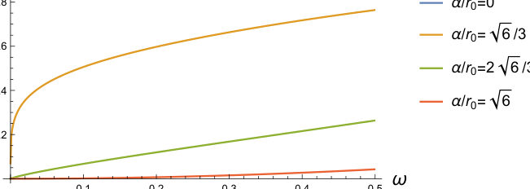 
Figure 5: The behavior of η/s with ω for different values of the relaxation parameter α.

**Summary.** This paper calculates how quantum fluctuations modify transport properties like viscosity and conductivity near extremal black branes using the AdS/CFT correspondence. It finds universal low-temperature enhancements, predicting non-monotonic temperature dependence similar to that observed in real correlated materials. This work provides holographic signatures of quantum gravity effects on condensed matter transport.

**Why it may be interesting.** The observation of non-monotonic temperature dependence with a minimum, analogous to behavior seen in correlated materials (like strange metals), provides holographic evidence for quantum gravity effects influencing transport in strongly interacting systems.

Detailed structure

**Main problem.** The study determines quantum corrections to transport properties, such as shear viscosity and electrical conductivity, at low temperatures in holographic models that incorporate momentum relaxation.

**Main result.** Quantum fluctuations lead to a universal low-temperature enhancement of transport; specifically, for certain operators, this manifests as a non-monotonic temperature dependence with a minimum at $T_{
m min} \propto C^{-1}$.

**Method.** The analysis employs the AdS/CFT correspondence, calculating transport coefficients via Kubo formulas applied to retarded Green's functions in the near-extremal black brane limit.

**Model / system.** The model uses holographic gravity coupled to matter fields (e.g., an isotropic linear axion model) describing a black brane geometry with momentum relaxation mechanisms built into the bulk action.

**Key observables.** Shear viscosity ($\eta$) and DC electrical conductivity ($\sigma_{DC}$), analyzed through retarded Green's functions.

**Important parameters / regimes.** Low temperature limit ($T 	o 0$), extremal black brane geometry, momentum relaxation scale ($\alpha$), and the Schwarzian scaling dimension ($\Delta$).

**Assumptions / limitations.** The analysis relies on the holographic duality (AdS/CFT) and approximations for quantum corrections in the near-horizon region.

**Paper structure.** The paper progresses by establishing the necessity of quantum corrections due to thermodynamic inconsistencies, then calculating $\eta$ and $\sigma_{DC}$ using advanced techniques involving matched asymptotic expansions and analyzing the order dependence of limits in the Kubo formula application.

Abstract

We determine the quantum corrections to transport arising from fluctuations of the near-AdS${}_2$ throat of near-extremal black branes in holographic models with momentum relaxation. By computing the shear viscosity and electrical conductivity at both zero and finite chemical potential, we uncover a universal low-temperature enhancement of transport generated by Schwarzian quantum fluctuations. Specifically, transport coefficients extracted from retarded Green's functions increase throughout the regime $C T \ll 1$. For operators with Schwarzian scaling dimension $Δ>1$, this enhancement is preceded by a universal minimum at a characteristic temperature $T_{\rm min} \propto C^{-1}$, leading to a non-monotonic temperature dependence strikingly similar to that observed in many correlated materials. In contrast, for the case $Δ=1$, relevant for the electrical conductivity, the transport coefficient evolves monotonically toward a constant value. Our results identify universal signatures of near-horizon quantum gravity in the transport properties of holographic quantum matter.

[↑ back to top](#top)

### [Supernova Neutrinos and the Origin of Biomolecular Homochirality](http://arxiv.org/abs/2607.12813v1)

**Authors:** Amirmasoud Jannat, Soroush Shakeri, Farhad Shahbazi  
**Type:** theory · **Category:** statistical mechanics · **PDF:** <https://arxiv.org/pdf/2607.12813v1>  
**Analysis basis:** full PDF text, analyzed in chunks
**Topic relevance:** `methods for driven-dissipative` **3/5** · `non-equilibrium dynamics` **3/5** · `non-equilibrium universality` **2/5** · `Keldysh / 2PI / non-Gaussian methods` **1/5** · `correlated / nonlocal dissipation` **1/5** · `driven-dissipative phase transition` **1/5**

📷 Fig 1

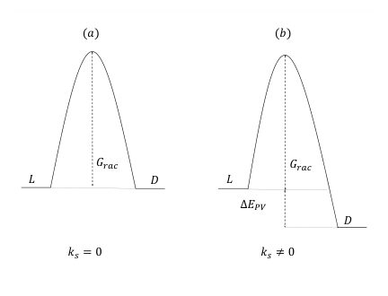 
FIG. 1. Activation energy of the racemization reaction (a) without and (b) with applying parity-violation interaction.

📷 Fig 2

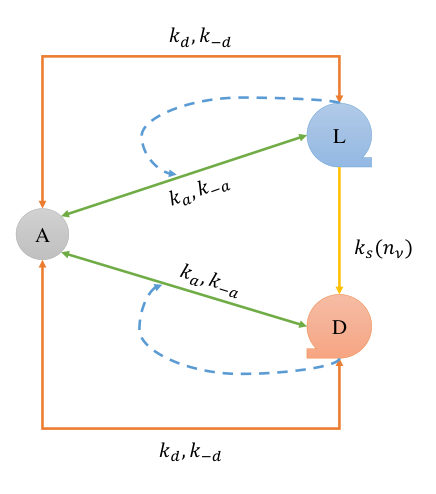 
FIG. 2. Chemical scheme of the system, Eqs. (5) - (9), con- sidering enantiomer-neutrino interactions. The green arrows represent the autocatalytic reactions, the red arrows repre- sent the non-autocatalytic decays and their backward reac- tions, and finally, the yellow arrow represents the neutrino- enantiomer reaction.

📷 Fig 3

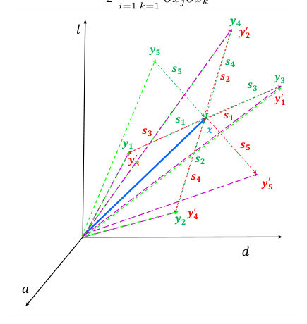 
FIG. 3. The schematic picture of how Eq (23) describes the time evolution of P(x, t) due to the stoichiometry matrix.

📷 Fig 4

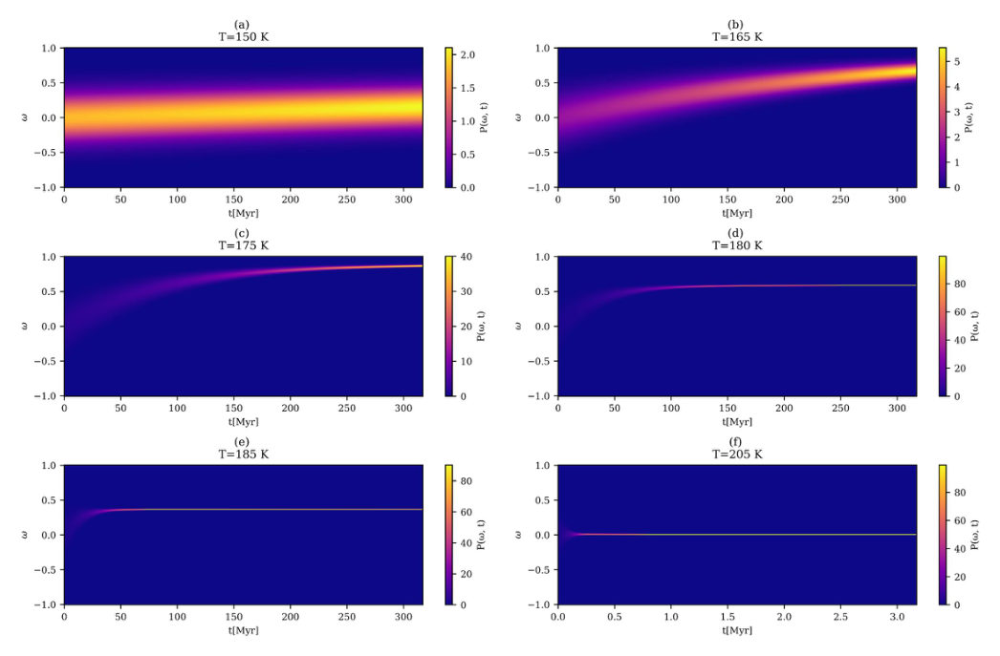 
FIG. 4. Time evolution of the probability distribution of the system for different temperatures as labeled and for fixed parameters: V=106 km3, L=1053 erg/s, r=0.01 AU, Grac=26.30 kJ/mol. The vertical axis is enantiomeric excess, and the horizontal axis is time in Myr scale.

📷 Fig 5

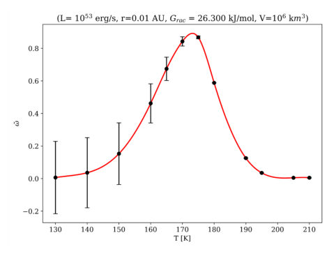 
FIG. 5. Thermal evolution of the mean value of ω for the final probability distribution of the system at 300 Myr. The error bars show the standard deviation of the distribution at each temperature for fixed parameters : V=106 km3, L=1053

**Summary.** This paper proposes that supernova neutrinos can act as a source for the initial seeds of life's chirality. By coupling parity-violating neutrino interactions into autocatalytic chemical reactions within interstellar clouds, the authors show that tiny directional biases are amplified by non-equilibrium dynamics to produce significant homochirality.

**Why it may be interesting.** This work models non-equilibrium chemical dynamics driven by an external, weak quantum field effect (neutrinos) acting on chiral systems, which is a prime example of open quantum system dynamics in a far-from-equilibrium setting.

Detailed structure

**Main problem.** The study investigates whether parity-violating interactions from supernova neutrinos can provide an astrophysical mechanism to generate the necessary homochirality in interstellar molecular clouds.

**Main result.** The combination of neutrino-induced directional bias, autocatalysis, and stochastic fluctuations allows for an amplification mechanism that predicts an enantiomeric excess greater than 10%, consistent with meteorite analyses.

**Method.** The authors solve stochastic differential equations (in the Itô sense) derived from a chemical reaction scheme incorporating parity-violating energy differences ($\Delta E_{PV}$).

**Model / system.** The model describes autocatalytic chemical reactions in an Interstellar Molecular Cloud near a supernova, where neutrino interactions introduce a directional bias term into the system dynamics.

**Key observables.** Enantiomeric excess (ee) of chiral molecules ($\omega$), and the probability distribution of this excess over time.

**Important parameters / regimes.** Neutrino flux ($10^{33}-10^{35} 	ext{ cm}^{-2}	ext{s}^{-1}$), Supernova Luminosity ($\sim 10^{51} - 10^{53} 	ext{ erg/s}$), and the Parity Violation Energy Difference ($\Delta E_{PV}$).

**Assumptions / limitations.** The neutrino interaction term is treated as a deterministic component of the chemical scheme, and approximations are made for calculating $\Delta E_{PV}$ using DFT methods.

**Figures summary.** Figures illustrate the chemical reaction schemes (including autocatalytic, decay, and neutrino-induced steps) and show time evolution plots detailing how the mean enantiomeric excess ($\langle \omega 
angle$) changes with temperature or time.

**Paper structure.** The paper builds by first establishing the physical context (neutrino interaction Hamiltonian), developing the stochastic chemical model using Master/Fokker-Planck equations, and finally simulating the thermal evolution to demonstrate how symmetry breaking leads to high enantiomeric excess.

Abstract

We investigate the role of parity-violating interactions between supernova neutrinos and chiral molecules in nearby interstellar molecular clouds as a potential source of biomolecular homochirality. We introduce neutrino interactions into the autocatalytic chemical reactions in a far-from-equilibrium noise-induced system. These interactions create a directional bias between L and D enantiomers in the racemization reactions, which is amplified by autocatalysis and stochastic fluctuations. We solve the stochastic equations within the Ito sense to obtain the dynamics of the probability distribution of the enantiomeric excesses, offering an astrophysical scenario for the delivery of homochirality seeds to Earth by meteorites. In spite of the weak interactions of supernova neutrinos, our framework introduces an amplification mechanism to yield a considerable enantiomeric excess of more than $10\%$, in agreement with the latest chemical analysis of the meteorites. Moreover, we scan over the parameter space of the model, inferring from the observational values in order to explore the window of opportunity to generate the initial seeds of homochiral states in interstellar molecular clouds.

[↑ back to top](#top)

### [Swarming and Opinion Dynamics](http://arxiv.org/abs/2607.12844v1)

**Authors:** Rommel Tchinda Djeudjo, Dibakar Ghosh, Timoteo Carletti  
**Type:** theory · **Category:** statistical mechanics · **PDF:** <https://arxiv.org/pdf/2607.12844v1>  
**Analysis basis:** full PDF text, analyzed in chunks
**Topic relevance:** `non-equilibrium universality` **3/5** · `driven-dissipative phase transition` **2/5** · `non-equilibrium dynamics` **2/5** · `Frenkel-Kontorova` **1/5** · `Keldysh / 2PI / non-Gaussian methods` **1/5** · `analog quantum simulation` **1/5** · `methods for driven-dissipative` **1/5**

📷 Fig 1

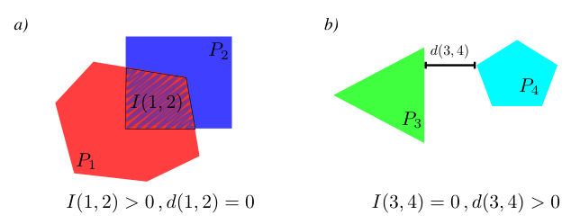 
Figure 1. Overlap and distance metrics. Panel (a) shows two generic polygons, P1 (red) and P2 (blue), with a nonempty intersection (dashed region), so that 0 &lt; I(1, 2) &lt; 1 and the distance between them is zero. Panel (b) shows two disjoint polygons, P3 (green) and P4 (cyan), for which I(3, 4) = 0 and d(3, 4) &gt; 0.

📷 Fig 2

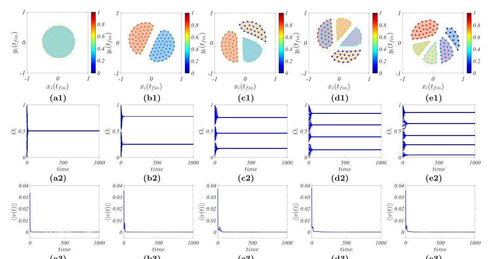 
Figure 2. Effect of bounded-confidence threshold, d, on the social swarmalator dynamics. (a) d = 1

📷 Fig 3

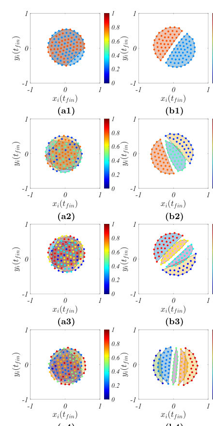 
Figure 3. Effect of d and λ. The rows correspond, from top to bottom, to d = 1

📷 Fig 4

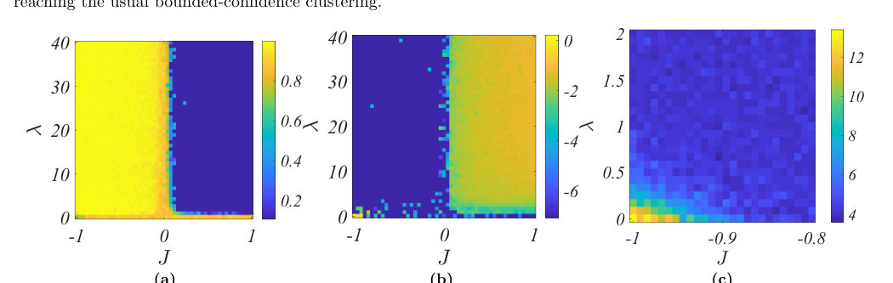 
Figure 4. Effect of J and λ. The left panel (a) shows the average group overlap using a color scale: yellow corresponds to large values, close to one, indicating almost completely overlapping groups, whereas blue corresponds to well-separated groups. The middle panel (b) shows the logarithm of the average distance between groups. In the region where groups completely overlap, this logarithm is not defined. For positive J, groups separate from one another, and their distance increases when both J and λ are large. The right panel (c) shows the average number of opinion groups at equilibrium. We restrict the parameter ranges to 0 ≤λ ≤2 and −1 ≤J ≤−0.8 in order to highlight the behavior near λ...

📷 Fig 5

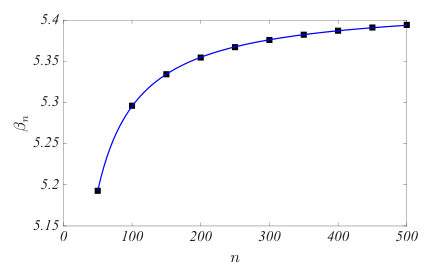 
Figure 5. Evolution of largest eigenvalue of M∗. We display the dependence of the largest eigenvalue βn of M∗as a function of the discretization mesh of the integral, n. Black squares are the numerically computed values of βn by assuming a mesh size n, the blue curve is the numerical fit a −b/(c + n) with a = 5.4213, b = 13.9992 and c = 11.2961.

**Summary.** This paper develops a coupled model linking agent swarming (spatial motion) to opinion dynamics. It shows that parameters like the confidence threshold control how many distinct opinion groups form, and these opinions, in turn, govern whether those groups physically merge or stay separated. The framework is useful for understanding collective decision-making.

**Why it may be interesting.** While not quantum in nature, the study of emergent collective behavior, pattern formation, and phase transitions in interacting many-body systems shares deep mathematical parallels with concepts studied in non-equilibrium statistical mechanics and complex quantum dynamics.

Detailed structure

**Main problem.** The work investigates how coherent group-level patterns emerge from simple interactions when agents possess both spatial motion (swarming) and internal states like opinions.

**Main result.** The confidence threshold controls the number of opinion clusters, while the strength of opinion-dependent attraction dictates whether these clusters merge or remain spatially separated. An analytical expression for the consensus swarm radius is also derived.

**Method.** The authors propose and analyze a coupled model involving differential equations governing both spatial dynamics (attraction-repulsion) and opinion evolution (Deffuant-type model).

**Model / system.** It models N agents in 2D space with opinions O_i, where spatial movement depends on the difference between opinions. The opinion update follows a bounded-confidence rule.

**Key observables.** Number of opinion clusters (N_g), Overlap (I) and Distance (d) metrics for cluster separation, Average Swarm Velocity ($\langle V(t) 
angle$), and the radius ($R$) of the stationary consensus swarm distribution.

**Important parameters / regimes.** Confidence threshold ($d$), Opinion-dependent attraction strength parameters ($J, \lambda$), Attraction/Repulsion strengths ($A, B$).

**Assumptions / limitations.** The analysis often relies on numerical simulations and, for analytical results, assumes the continuum limit (N -> infinity) or specific functional forms for kernels.

**Figures summary.** Figures illustrate how varying $d$ controls cluster number and separation; changing $\lambda$ affects spatial grouping; and plots compare simulated vs. analytically derived consensus radii ($R_c$).

**Paper structure.** The paper introduces the coupled framework, details the model equations (spatial and opinion dynamics), presents numerical results showing parameter effects, derives an analytical expression for the consensus radius, and concludes.

Abstract

Collective dynamics in multi-agent systems provide a powerful framework for understanding how coherent group-level patterns can emerge from simple interactions between individuals. Such phenomena are observed in many natural and artificial systems, including animal groups, robotic swarms, and distributed decision-making processes. In many situations, agents are not only characterized by their spatial motion, but also by internal states, e.g., opinions or preferences, which evolve through interactions with peers. Understanding how these internal states influence collective motion, and how spatial organization in turn affects internal dynamics, remains an important challenge. In this work, we propose a model of coupled collective motion and opinion dynamics. The spatial dynamics are governed by attraction--repulsion interactions, while the internal dynamics are described by a Deffuant-type opinion model. Our results show that the confidence threshold of the opinion dynamics plays a key role in controlling the number of opinion clusters, whereas the strength of the opinion-dependent spatial attraction determines whether these clusters spatially merge or remain separated. In addition, for the full-consensus state, we derive the expression for the radius of the stationary swarm distribution when a nonlinear attraction kernel is used, using a semi-analytical approach. The proposed framework may be useful for studying collective decision-making, animal group behavior, and coordination strategies in swarm robotics.

[↑ back to top](#top)

### [The Quantum Polariton Hamiltonian that Reproduces the Same High-Harmonic Generation Spectra as the Classical Hamiltonian in Strong Laser Fields](http://arxiv.org/abs/2607.12560v1)

**Authors:** Nimrod Moiseyev  
**Type:** theory · **Category:** other · **PDF:** <https://arxiv.org/pdf/2607.12560v1>  
**Analysis basis:** full PDF text, analyzed in chunks
**Topic relevance:** `methods for driven-dissipative` **3/5** · `non-equilibrium dynamics` **3/5** · `Keldysh / 2PI / non-Gaussian methods` **2/5** · `driven-dissipative phase transition` **1/5** · `interference shaping light` **1/5** · `non-equilibrium universality` **1/5**

📷 Fig 1

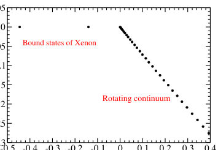 
FIG. 1. The bound and rotating continuum as obtained from the diagonalization of the uniform complex scaled Hamilto- nian matrix of Xe.

📷 Fig 2

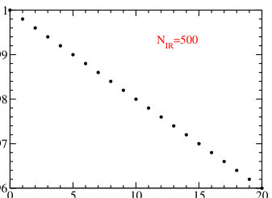 
FIG. 2. Ratio between the square root of the number of ab- sorbed IR photons, √nphoton, as it appears in the QED Hamil- tonian, and the square root of the average number of photons, p

📷 Fig 3

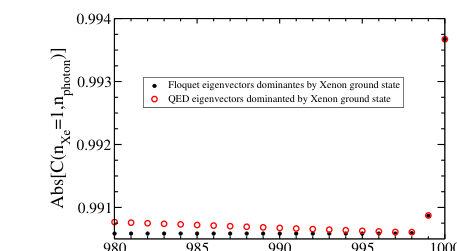 
FIG. 5. A comparison of the eigenvectors of the Floquet and QED polariton Hamiltonian matrices dominated by the ground electronic state, as shown in Fig. 1.

📷 Fig 4

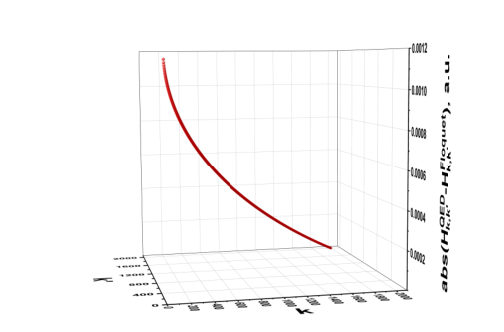 
FIG. 3. The difference between the two Hamiltonian matrix elements of Xe, as obtained from interactions with classical and quantum electromagnetic fields.

📷 Fig 5

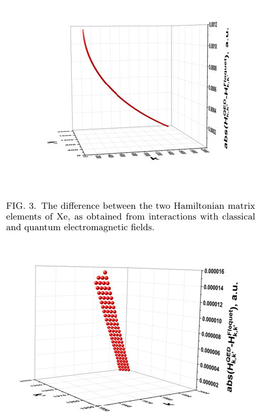 
FIG. 4. Zoom on the difference between the two Hamiltonian matrix elements of Xe, as shown in Fig.3

**Summary.** This paper validates the use of a quantum polariton Hamiltonian by showing its equivalence to the standard Floquet theory approach when calculating High-Harmonic Generation spectra. By comparing results from both QED and Floquet formalisms on an atomic system, the authors confirm that the two methods yield identical predictions under appropriate approximations for strong laser fields.

**Why it may be interesting.** This work is highly relevant as it rigorously connects semi-classical descriptions (Floquet) with fully quantized treatments (QED) for strong-field light-matter interactions, which is central to advanced quantum optics and AMO physics.

Detailed structure

**Main problem.** The core problem is defining a quantum Hamiltonian that accurately reproduces the High-Harmonic Generation (HHG) spectra predicted by Floquet theory when an atom interacts with intense laser fields.

**Main result.** The study demonstrates that the mean-acceleration HGS derived from the semi-classical Floquet approach is equivalent to the spectrum obtained using a full Quantum Electrodynamics (QED) polariton Hamiltonian under specific physical conditions.

**Method.** The authors employ both Floquet theory and QED perturbation theory, comparing the resulting spectra by analyzing the difference between the two formalisms' Hamiltonians.

**Model / system.** The system modeled is an atom (illustrated with a Xenon potential) driven by intense Infrared (IR) pump laser fields while emitting Ultraviolet (UV) high harmonics. The comparison involves constructing and diagonalizing both the Floquet Hamiltonian ($\hat{H}_{	ext{Floquet}}$) and the QED polariton Hamiltonian ($\hat{H}_{	ext{QED}}$).

**Key observables.** High-Harmonic Generation Spectrum (HGS), specifically $|A(	ext{NHG})|^2$, and the comparison of energy expectation values $\langle \hat{H} 
angle$.

**Important parameters / regimes.** The regime where the number of IR pump photons is much larger than the number of emitted UV photons ($\omega_{	ext{UV}} = N_{	ext{HG}}\omega_{	ext{IR}}$).

**Assumptions / limitations.** A critical assumption is that the intensity of the emitted high harmonics is many orders of magnitude smaller than the intense IR laser field, allowing for approximations in coupling terms.

**Figures summary.** Figures compare eigenvectors and HGS plots derived from both Floquet and QED matrices across varying numbers of absorbed IR photons, showing strong numerical agreement.

**Paper structure.** The paper establishes the problem by defining two theoretical frameworks (Floquet vs. QED). It then proceeds to calculate observables like the HGS using methods specific to each framework, culminating in a direct comparison and validation that supports the use of the quantum polariton Hamiltonian.

Abstract

This manuscript investigates the possibility of defining a quantum Hamiltonian that leads to the same high-harmonic generation (HHG) spectra as those predicted by Floquet theory in the regime where the number of infrared (IR) pump photons is much larger than the number of emitted UV photons. The key assumption underlying our derivation is that the intensity of the emitted high harmonics is many orders of magnitude smaller than that of the IR laser, and that the emission of the Nnt harmonic results from the absorption of N IR photons.

[↑ back to top](#top)

### [A Gaussian-Remainder Hierarchy for Sums of Random Variables with Big-Jump Statistics](http://arxiv.org/abs/2607.12357v1)

**Authors:** Stanislav Burov  
**Type:** theory · **Category:** statistical mechanics · **PDF:** <https://arxiv.org/pdf/2607.12357v1>  
**Analysis basis:** full PDF text, analyzed in chunks
**Topic relevance:** `Keldysh / 2PI / non-Gaussian methods` **3/5** · `non-equilibrium dynamics` **2/5** · `analog quantum simulation` **1/5** · `driven-dissipative phase transition` **1/5** · `methods for driven-dissipative` **1/5** · `non-equilibrium universality` **1/5**

📷 Fig 1

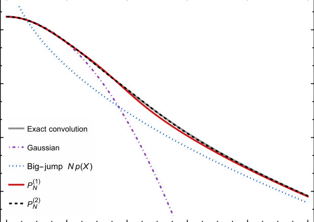 
FIG. 1. Comparison of approximations for the probability density PN(X) of the sum of N = 50 independent variables drawn from the symmetric stretched-exponential density p(x) = 1 4 exp[− p

📷 Fig 2

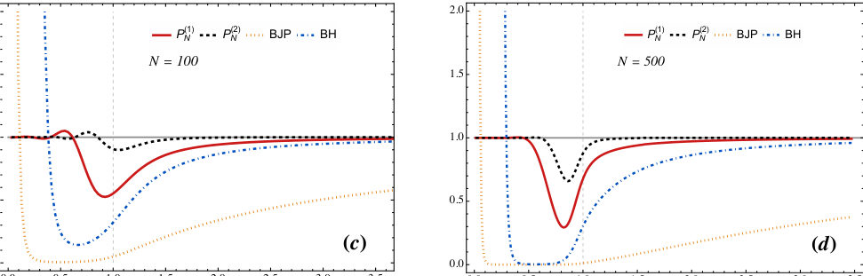 
FIG. 2. Ratio between different approximations and the exact numerical convolution for the stretched-exponential density p(x) = 1

📷 Fig 3

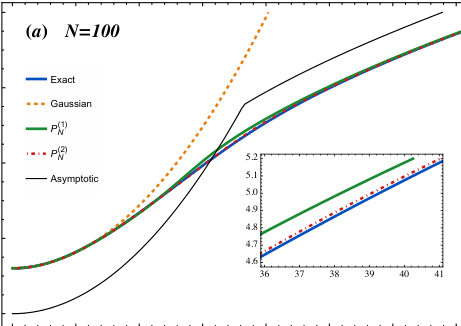 
FIG. 3. Finite-N rate-function comparison for the stretched-exponential density p(x) = 1

📷 Fig 4

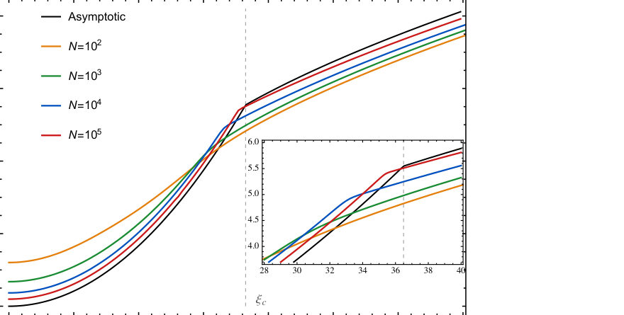 
FIG. 4. Finite-N rate function obtained from the first-order Gaussian-remainder approximation for the stretched-exponential density p(x) = 1

**Summary.** This paper introduces an exact Gaussian-Remainder Hierarchy to accurately approximate the probability density of sums of random variables with heavy tails. By separating the sum into a Gaussian bulk and residual jump contributions, the authors derive a simple first-order formula that captures the entire behavior—center, crossover, and far tail—in one expression. This provides powerful tools for analyzing rare events in complex statistical systems.

**Why it may be interesting.** While focused on classical statistical mechanics, the rigorous mathematical machinery developed for approximating complex multi-variable probability distributions is highly relevant for analyzing rare events or non-equilibrium dynamics in quantum systems (e.g., tunneling rates, escape probabilities).

Detailed structure

**Main problem.** To develop an accurate method for approximating the probability density function of a sum of many independent, identically distributed random variables, especially in regimes exhibiting complex crossover behavior between Gaussian and rare-event tails.

**Main result.** The authors introduce an exact Gaussian-remainder hierarchy whose first-order approximation successfully captures the central Gaussian bulk, the crossover region, and the far-tail big-jump statistics simultaneously for various distributions.

**Method.** They utilize a specialized convolution decomposition (Gaussian-Remainder Hierarchy) to separate the sum density into a known Gaussian background contribution and residual terms that capture non-Gaussian features like rare jumps.

**Model / system.** The model consists of sums of $N$ independent, identically distributed random variables ($X = \sum x_i$) whose single-summand densities can be subexponential (e.g., stretched-exponential) or follow power laws.

**Key observables.** Probability density function $P_N(X)$, anomalous large-deviation rate function $I(\xi)$, and the ratio of approximate to exact probabilities ($R_{	ext{app}}$).

**Important parameters / regimes.** The number of summands ($N$), the tail behavior of the summand (subexponential vs. power-law), and the order of approximation used in the hierarchy.

**Assumptions / limitations.** The method assumes finite variance for the single-summand density to define the Gaussian background, though extensions are discussed for cases where moments diverge.

**Figures summary.** Figures compare various approximations ($P^{(1)}_N$, $P^{(2)}_N$) against the exact result across logarithmic scales, demonstrating convergence in both bulk and tail regions; rate function plots show finite-$N$ rates converging to the asymptotic anomalous rate function.

**Paper structure.** The paper develops the Gaussian-Remainder Hierarchy for $P_N(X)$, derives the first-order approximation ($P^{(1)}_N$), demonstrates its accuracy across various distributions (stretched-exponential, power-law), and finally applies this framework to derive and verify the anomalous large-deviation rate function.

Abstract

We develop an exact Gaussian-remainder hierarchy for the probability density of the sum of $N$ independent, identically distributed random variables with broad, finite-variance distribution for the summands. The hierarchy separates the Gaussian fixed-point contribution from residual sectors that retain the original single-summand density. For subexponential densities, the first nontrivial truncation yields a simple finite-$N$ approximation that involves one convolution with a Gaussian background and a subtraction that removes Gaussian overcounting. This approximation captures the Gaussian center, the crossover region, and the big-jump tail within a single expression, as demonstrated numerically for stretched-exponential and finite-variance power-law examples. The same first-order approximation reproduces the known asymptotic anomalous rate function for sums of stretched-exponential random variables and also provides an accurate approximation to the corresponding finite-$N$ rate function.

[↑ back to top](#top)

### [Strain-Induced Detuning of a Dressed Nitrogen-Vacancy Qubit: Effective Two-Level Theory and Its Validity](http://arxiv.org/abs/2607.12453v1)

**Authors:** Jihyeon Jeon, Donghun Lee, Seok-Kyun Son, Nojoon Myoung  
**Type:** theory · **Category:** quantum information and computing · **PDF:** <https://arxiv.org/pdf/2607.12453v1>  
**Analysis basis:** full PDF text, analyzed in chunks
**Topic relevance:** `exotic spin models in light-matter` **3/5** · `spintronics-quantum-optics interface` **3/5** · `QC/QI experiment` **2/5** · `Keldysh / 2PI / non-Gaussian methods` **1/5**

📷 Fig 1

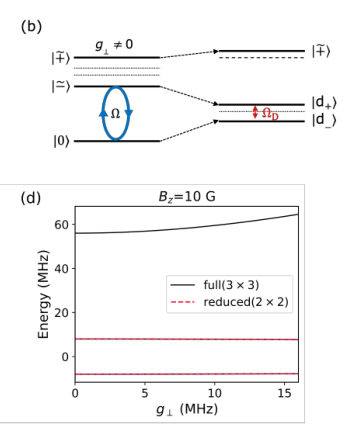 
Fig. 1 Dressed NV ground-state qubit under transverse strain. (a,b) Schematic dressed-level struc- tures (a) without and (b) with strain. A resonant microwave (blue) dresses the |0⟩↔|−1⟩transition with Rabi frequency Ω. Transverse strain reduces the dressed splitting to ΩD. (c,d) Eigenfrequencies obtained from the full three-level dressed Hamiltonian [full (3 × 3), solid] and the reduced two-level model [reduced (2 × 2), dashed] as functions of g⊥at (c) Bz = 1 G and (d) Bz = 10 G. The reduced levels follow the full spectrum in the strong-field regime. In the weak-field regime, the two results deviate as the spectator branch (upper solid) approaches the qubit doublet.

📷 Fig 2

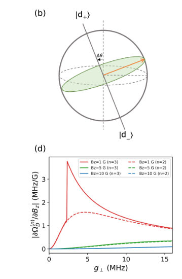 
Fig. 2 Strain-induced geometric distortion and residual DC-field response. (a) Projected spin-locking tilt ∆θ(n) = θ(n) −π/2 as a function of g⊥for Bz = 1, 5, 10 G (full model, n = 3, solid; reduced model, n = 2, dashed). (b) Bloch-sphere representation of the strain-induced tilt. The spin-locking plane (green) and axis (orange arrow) are tilted from their unstrained orientations (dotted) by ∆θ. (c)

📷 Fig 3

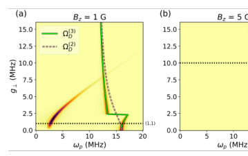 
Fig. 3 Pulsed-ESR spectra as functions of transverse strain. The normalized PL is plotted as a function of probe frequency ωp and transverse strain g⊥(a), (b), (c) at Bz = 1, 5, 10 G using the full three-level model, respectively. Solid and dashed lines indicate Ω(3) D and Ω(2) D , respectively. Dotted horizontal lines denote the representative operating points of Fig. 4, labeled (Bz, g⊥). At Bz = 5 and 10 G, the reduced splitting follows the principal dressed-qubit resonance over the plotted strain range. At Bz = 1 G, additional transitions involving the spectator-like branch become visible. The abrupt change in the tracked dressed-qubit trajectory near g⊥≃2.5 MHz reflects the...

📷 Fig 4

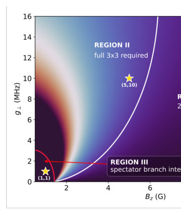 
Fig. 4 Approximate validity diagram of the dressed NV qubit in the Bz–g⊥plane for Ω= 16 MHz. The primary diabatic boundary ∆= Ω−/2 (red line) separates region III, in which the spectator- like branch is interleaved between the two qubit-character branches, from regions I and II. On the ∆&gt; Ω−/2 side, the secondary boundary ε = 0.05 (white line) separates region I, in which the analytical 2 × 2 reduction is accurate, from region II, in which the full 3 × 3 model is required. Here, ε is the ratio of the spectator–upper-dressed coupling to their spectral detuning [Eq. (14)]. Stars indicate representative operating points. The plotted boundaries are practical approximations to the exact...

**Summary.** This paper develops an effective two-level theory to model a dressed Nitrogen-Vacancy qubit, accounting for detrimental effects from residual transverse crystal strain. By perturbatively eliminating spectator states, the authors derive key parameters and quantify how strain degrades the qubit's inherent magnetic robustness. The work is vital for experimentalists needing reliable guidelines on when simplified models are valid for quantum sensing applications.

**Why it may be interesting.** This work is highly relevant as it provides necessary theoretical tools and operational boundaries (validity diagrams) for designing high-fidelity quantum sensing protocols using solid-state qubits like NV centers.

Detailed structure

**Main problem.** The study quantifies how residual transverse crystal strain degrades the magnetic robustness of a dressed Nitrogen-Vacancy (NV) qubit, which is crucial for reliable quantum sensing.

**Main result.** Strain shifts the dressed resonance and tilts the spin-locking axis, restoring a finite DC-field response that quantifies the loss of magnetic robustness. The paper also provides rigorous validity criteria for simplified models.

**Method.** The authors derive an effective two-level model by perturbatively eliminating a far-detuned spectator state from the full three-level dressed Hamiltonian using Löwdin–Feshbach partitioning.

**Model / system.** The system is the NV center in diamond operated as a microwave-dressed qubit, modeled by a full three-level Hamiltonian ($H_{	ext{full}}$) that includes strain ($	ext{g}_{\perp}$) and an axial field ($	ext{B}_z$).

**Key observables.** Dressed-state splitting ($\Omega_D$), spin-locking mixing angle ($	heta$), longitudinal magnetic-field coupling ($m_q$), and simulated pulsed electron spin resonance (ESR) spectra.

**Important parameters / regimes.** Transverse strain ($	ext{g}_{\perp}$), axial magnetic field ($	ext{B}_z$), and the ratio of spectator state admixture to qubit splitting ($\epsilon$).

**Assumptions / limitations.** The primary assumption is that the system can be accurately reduced to an effective two-level model by neglecting coupling to a far-detuned spectator state, leading to derived validity guidelines.

**Figures summary.** Figures illustrate schematic level structures showing strain effects on eigenfrequencies (full vs. reduced models) and present simulated pulsed-ESR spectra demonstrating the appearance of spectator transitions at low fields.

**Paper structure.** The paper progresses from deriving the effective two-level Hamiltonian via perturbation theory to obtaining closed-form expressions for key parameters, followed by rigorous derivation of validity criteria using exact eigenvalue analysis, culminating in practical guidelines summarized on a field/strain plane.

Abstract

The nitrogen-vacancy (NV) center in diamond can be operated as a microwave-dressed qubit. In the ideal two-level limit, its transition frequency is first-order insensitive to static magnetic fields, providing robustness against magnetic detuning noise. In practical diamond devices, however, residual transverse crystal strain mixes the $\ket{m_{s}=\pm1}$ spin sublevels and modifies the dressed qubit. In this study, we derive an analytical effective two-level model of a strained dressed NV qubit by perturbatively eliminating the far-detuned spectator state from the full three-level dressed Hamiltonian. We obtain closed-form expressions for the dressed-state splitting, the spin-locking mixing angle, and the longitudinal magnetic-field coupling. We show that transverse strain shifts the dressed-state resonance and tilts the spin-locking axis. These two effects restore a finite DC-field response and thereby quantify the loss of magnetic robustness. We demonstrate these features in simulated pulsed electron spin resonance spectra that incorporate rate-equation-based optical readout. We further derive exact validity criteria from the eigenvalues and spectator weights of the full three-level Hamiltonian. For practical use, we reduce these criteria to two controlled guidelines: the spectator-like branch must remain above the nominal upper dressed state, and its branch-specific admixture must remain small. A validity diagram over the axial-field--transverse-strain plane summarizes these approximate conditions and provides practical guidelines for designing dressed-NV sensing experiments.

[↑ back to top](#top)

### [Phase-shifted multicomponent spin-charge nematicity in an altermagnet](http://arxiv.org/abs/2607.12824v1)

**Authors:** Christopher Candelora, Siyu Cheng, Muxian Xu, Keyu Zeng, Hengxin Tan, Younghun Hwang, Binghai Yan, Federico Mazzola, Ziqiang Wang, Ilija Zeljkovic  
**Type:** both · **Category:** strongly correlated electrons · **PDF:** <https://arxiv.org/pdf/2607.12824v1>  
**Analysis basis:** full PDF text, analyzed in chunks
**Topic relevance:** `exotic spin models in light-matter` **3/5** · `spintronics-quantum-optics interface` **3/5** · `Keldysh / 2PI / non-Gaussian methods` **1/5** · `driven-dissipative phase transition` **1/5**

📷 Fig 1

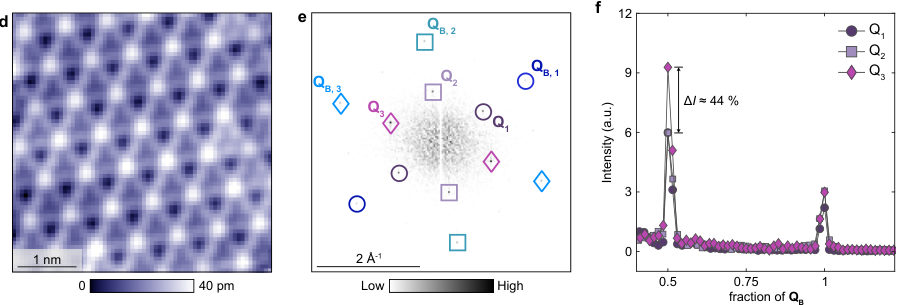 
FIG. 1. Crystallographic and electronic structure of Co0.25NbSe2. a, Three dimensional unit cell crystal structure of Co0.25NbSe2. b, Atomic structure in the ab-plane. c, DFT spin- polarized 2D Fermi surface at kz = π/2c with spin-up bands in green and spin-down bands in purple, recreated from Candelora, et al. [48]. d, Representative STM topograph of the Se-terminated surface. e, Representative Fourier transform of the Se-terminated surface. The 2a0 modulations due to the underlying Co are denoted by Qi (i = 1, 2, 3), with atomic Bragg peaks marked by QB,i (i = 1, 2, 3). (d) is a smaller region within the area used to obtain the Fourier transform in (e). f, Intensity linecuts along each q...

📷 Fig 2

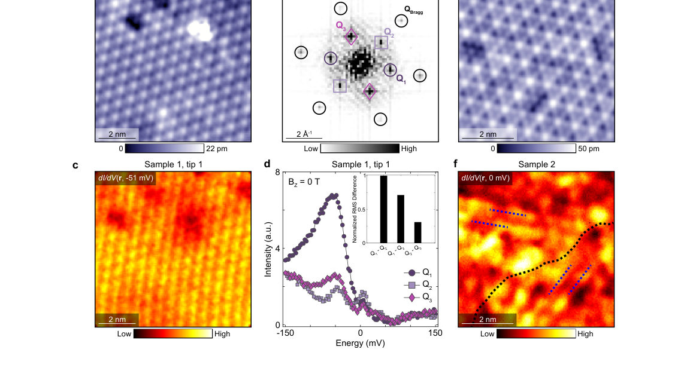 
FIG. 2. Rotational symmetry breaking in the charge channel. a, b, STM topograph of the Se-terminated surface on sample 1 (a) and its corresponding Fourier transform (b). c dI/dV map over the same area in (a) which was box filtered for visual clarity. d, Intensity of the 2a0 peaks as a function of energy taken from the Fourier transform of the unfiltered, drift-corrected dI/dV maps over the area in (a). The inset in d shows the normalized root mean square (RMS) difference between each peak, with a higher RMS signaling a larger difference. This was normalized by setting the largest RMS to 1. e, STM topograph of the Se-termination on a different sample with a different tip. f, dI/dV map over...

📷 Fig 3

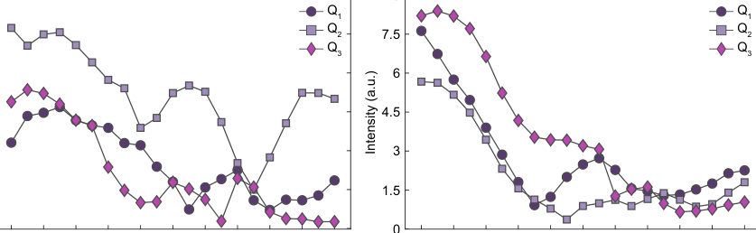 
FIG. 3. Spin-polarized STM imaging to disentangle spin and charge induced symmetry breaking. a, STM topograph of the Se termination with a spin-up polarized STM tip. Inset to (a) is the Fourier transform of the area with the 2a0 peaks marked for the three directions. b, STM topograph over the same area as in (a) but with spin-down polarized tip, and the corresponding Fourier transform (inset). c, Magnetic contrast map (MT (r)) obtained by subtracting the STM topographs in (a,b), with the corresponding Fourier transform (inset). d, Charge contrast map (CT (r) obtained by adding the topographs in (a,b), and corresponding Fourier transform (inset).

📷 Fig 4

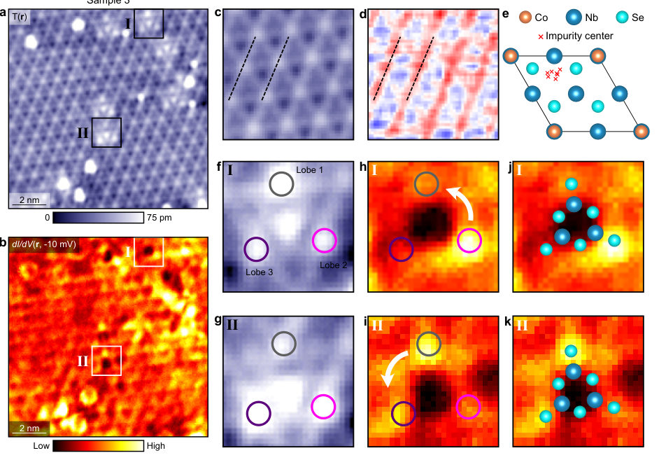 
FIG. 4. Single atom impurities. a, STM topograph of the Se termination with two examples of one type of impurity boxed. b, dI/dV map taken over the same area in (a) with the same two impurities boxed. c, Zoom-in on an impurity-free area in (a). d, Magnetic contrast map of the area in (c) obtained by subtracting STM topographs with spin-up and spin-down polarized tips. e, Unit cell in the ab-plane showing the center of all 7 impurities of the same type within the field of view in (a) marked with red Xs. f-g, Zoomed-in STM topographs, and (h,i) corresponding dI/dV maps of impurities I and II, respectively. White arrow denote direction from the brightest lobe to the second brightest lobe. j-k,...

📷 Fig 5

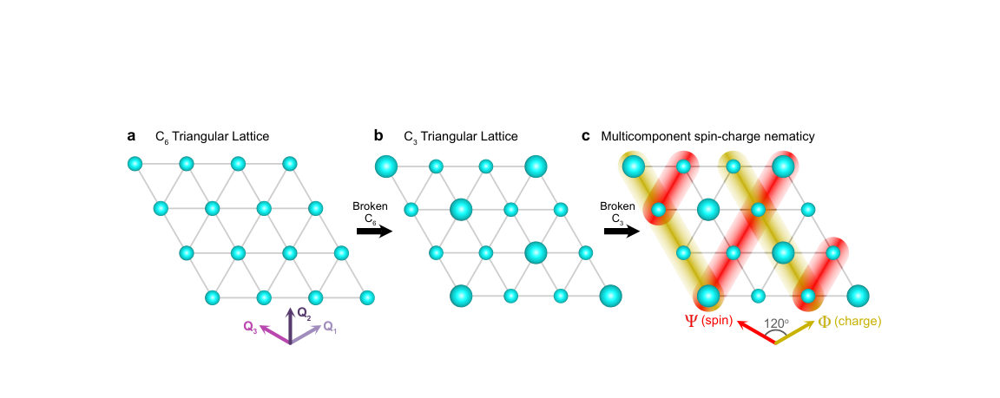 
FIG. 5. Pedogogical cartoon of multicomponent nematicity. a, Cartoon model of a topog- raphy of a C6 symmetric triangular lattice, representing the Se termination before Co intercalation. b, Cartoon model of a topography of a C3 symmetric triangular lattice, representing the Se termi- nation after Co intercalation. c, Cartoon model of topography of a Co-intercalated Se termination with a multicomponent spin-charge nematicity, with the red stripes representing the spin compo- nent and yellow representing the charge component.

**Summary.** The paper reports finding a novel state called altermagnetic nematicity in the material $	ext{Co}_{0.25}	ext{NbSe}_2$. Using advanced STM techniques, they showed that both charge and spin electronic responses break rotational symmetry independently. Theoretically, this phase-shifted coupling is explained by the interplay between magnetic interactions and underlying crystal lattice constraints.

**Why it may be interesting.** This work provides an example of how magnetic order can engineer novel electronic symmetries (nematicity) in correlated materials, offering insights into symmetry-protected topological phases relevant to quantum matter.

Detailed structure

**Main problem.** The study investigates whether conventional correlated electron phases can acquire unconventional spin-charge structure when embedded within the symmetry constraints of altermagnets.

**Main result.** They report discovering 'altermagnetic nematicity,' a new form of multicomponent electronic liquid-crystal order characterized by a phase-shifted response between charge and spin components.

**Method.** The research combines experimental measurements using spectroscopic-imaging scanning tunneling microscopy (STM) and spin-polarized STM with theoretical modeling based on Landau theory.

**Model / system.** The physical system is $	ext{Co}_{0.25}	ext{NbSe}_2$, an altermagnet exhibiting spin-split Fermi surfaces. The theory models the nematic distortions ($\mathcal{N}_\pm$) and predicts a coupling term favoring a specific phase difference between charge-like and spin-sensitive components.

**Key observables.** Inequivalence of three nominally $	ext{C}_3$-related modulation peaks in both charge and spin channels, revealing a phase shift between the dominant spin and charge modulations.

**Important parameters / regimes.** The altermagnetic order parameter ($\Delta_A$), the crystal symmetry ($C_3$ lattice pinning), and the relative phase difference ($\varphi_\Psi - \varphi_\Phi$) between nematic components are key parameters.

**Assumptions / limitations.** The authors assume that the observed offset locking is governed by a competition between the altermagnetic coupling (favoring $\pi/2$ phase shift) and the crystalline $C_3$ anisotropy.

**Figures summary.** Figures illustrate the electronic structure, showing $2a_0$ modulations in Fourier transforms of STM maps. Diagrams are used to model the transition from higher symmetry ($	ext{C}_6$) to lower symmetry ($	ext{C}_3$) associated with the nematic state.

**Paper structure.** The paper progresses by first establishing the electronic background (altermagnetism), then using STM/SP-STM to observe symmetry breaking in both charge and spin channels, followed by a theoretical model explaining the phase locking mechanism, culminating in the identification of altermagnetic nematicity.

Abstract

Altermagnets host spin-split Fermi surfaces without net magnetization. This intrinsically multicomponent electronic setting raises the possibility that familiar correlated electron phases acquire unconventional spin-charge structure. Here we report the discovery of altermagnetic nematicity in Co0.25NbSe2. Using spectroscopic-imaging scanning tunneling microscopy and spin-polarized scanning tunneling microscopy, we find that the three nominally C3-related directions lose rotational equivalence in the zero-field state, in both charge and spin-sensitive tunneling channels. Strikingly, the dominant spin-sensitive component is shifted by one C3 sector relative to the dominant charge component, revealing a phase-shifted spin-charge nematic response. A phenomenological theory shows that altermagnetic order favors a finite relative phase between the charge and spin-sensitive nematic components -- C3 lattice pinning frustrates this preferred offset and selects the observed phase locking. These results establish altermagnetic nematicity as a new form of multicomponent electronic liquid-crystal order and point to a potentially generic route by which altermagnets can transform conventional correlated phases into symmetry-engineered spin-charge orders.

[↑ back to top](#top)

### [End-to-End Quantum Key Distribution Across Hybrid Fiber and Free-Space Links with All-Optical Encoding Conversion](http://arxiv.org/abs/2607.12837v1)

**Authors:** Khen Cohen, Tomer Nahum, Michael Tzukran, Paz Or, Yehuda Pilnyak, Nitzan Livneh, Hagai Eisenberg, Yaron Oz, Haim Suchowski  
**Type:** experiment · **Category:** quantum information and computing · **PDF:** <https://arxiv.org/pdf/2607.12837v1>  
**Analysis basis:** full PDF text, analyzed in chunks
**Topic relevance:** `quantum optics experiment` **3/5** · `QC/QI experiment` **1/5** · `free-space correlated emission` **1/5** · `interference shaping light` **1/5** · `quantum measurements` **1/5**

📷 Fig 1

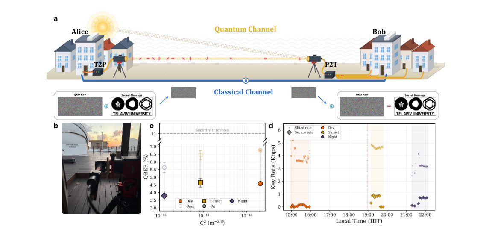 
Figure 1: Hybrid fiber and free-space quantum communication link and exper- imental performance. a Schematic of the hybrid quantum communication architecture. Quantum information is transmitted through a channel comprising optical fiber (time-bin encoding) and free-space propagation (polarization encoding), using T2P and P2T convert- ers between the interfaces. Secure keys generated through the QKD protocol are used for one-time-pad encryption and decryption over an authenticated classical channel. b Photo- graph of the rooftop experimental setup at Tel Aviv University. c Session-averaged free-space (and total) QBER as a function of the estimated atmospheric turbulence strength, quanti-...

📷 Fig 2

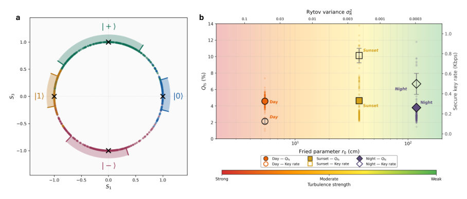 
Figure 2: Turbulence and noise sources. a End-to-end quantum state evaluation for the four different states. The shaded area represents ±1σ around the mean distribution. b Turbulence measurement results. The bottom axis shows the Fried coherence diameter r0 and the top axis shows the corresponding Rytov variance σ2 R. Both are derived from the estimated C2 n. The session-averaged free-space QBER values are shown as filled markers (left axis), while the secure key rate is shown by hollow markers (right axis). Error bars indi- cate ±1σ around the mean value. The background color represents the relative turbulence strength from strong (red) to weak (green), as quantified by the color bar.

📷 Fig 3

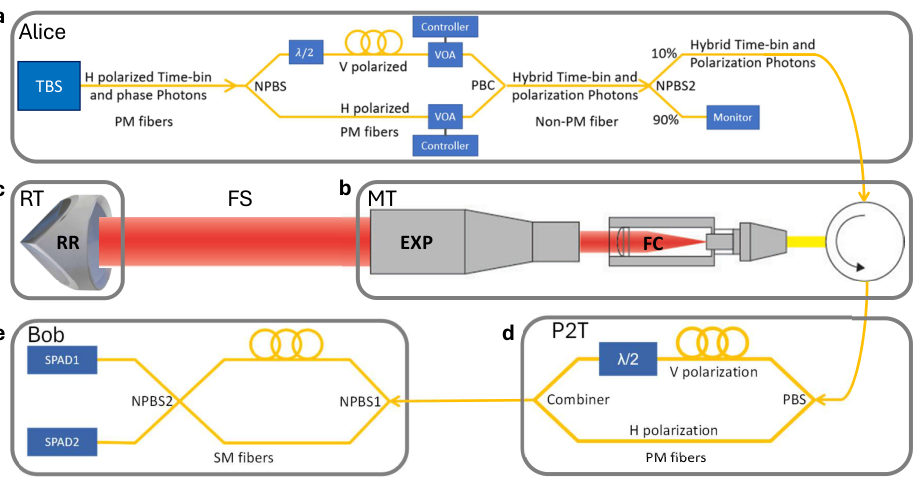 
Figure 3: Hybrid fiber and free-space quantum communication architecture. a Alice with the T2P converter. b The shared free-space main terminal (MT). c The remote terminal retroreflector (RT). d P2T converter. e Bob’s time-bin receiver.

📷 Fig 4

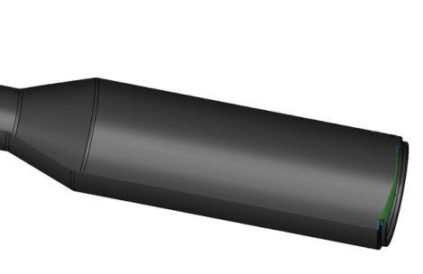 
Figure 4: Schematic diagram for the free-space section.

**Summary.** The paper demonstrates a functional, end-to-end Quantum Key Distribution link bridging optical fiber and free-space channels using an all-optical time-bin to polarization encoding converter. By maintaining low error rates across varying atmospheric turbulence conditions, the research establishes a crucial building block for realizing practical quantum networks that span terrestrial and open-air links.

**Why it may be interesting.** This work directly addresses a critical engineering bottleneck in quantum networking: interfacing disparate physical media. The all-optical encoding conversion mechanism is highly relevant for building scalable quantum internet infrastructure that must traverse diverse environments.

Detailed structure

**Main problem.** The core challenge is establishing end-to-end Quantum Key Distribution (QKD) across hybrid links that combine optical fiber and free-space channels, which inherently use different photonic encodings.

**Main result.** The authors successfully demonstrated continuous secure key generation over a 90 m hybrid link under varying atmospheric conditions while maintaining a low QBER below the security threshold. This establishes a practical, all-optical interface for future quantum networks.

**Method.** They employed the decoy-state BB84 protocol and developed an end-to-end system incorporating specialized optical converters to perform encoding conversion entirely in the optical domain without measurement.

**Model / system.** The physical platform is a hybrid QKD link tested on an urban rooftop, connecting fiber (time-bin encoding) to free space (polarization encoding). The system operates at 1550 nm and was characterized across diurnal cycles and extended distances up to 750 m.

**Key observables.** Quantum Bit Error Rate (QBER), secure key rate (peaking around 1.27 kbps in the Sunset session), and atmospheric turbulence metrics ($C_n^2$, $\sigma_R^2$).

**Important parameters / regimes.** The system maintained QBER below 7% across conditions spanning more than two orders of magnitude in $C_n^2$. The conversion stages introduce measurable optical losses ($\sim 3 	ext{ dB}$ per stage).

**Assumptions / limitations.** The T2P and P2T converters are treated as untrusted components, which preserves the security assumptions of the BB84 protocol. Turbulence models rely on estimating $C_n^2$ from surface-layer measurements.

**Figures summary.** Figures illustrate the hybrid architecture (Alice $
ightarrow$ Converter $
ightarrow$ Free Space $
ightarrow$ Converter $
ightarrow$ Bob) and show QBER vs. atmospheric turbulence strength, confirming performance stability below the security threshold.

**Paper structure.** The paper details the experimental setup for a hybrid link, characterizes performance across Day/Sunset/Night sessions by monitoring QBER against environmental parameters ($C_n^2$), analyzes the physical limitations imposed by free-space propagation and conversion losses, and finally calculates the secure key rate using established GLLP protocols.

Abstract

Quantum key distribution (QKD) promises information-theoretically secure communication, but future networks must bridge fiber and free-space links that naturally employ different photonic encodings, namely time-bin in fiber and polarization in free space. Here we demonstrate a complete hybrid fiber and free-space QKD link that bridges both media within a single end-to-end protocol, converting between the two encodings entirely in the optical domain. Using the decoy-state BB84 protocol operating at 1550 nm, we demonstrate continuous secure-key generation over a 90 m outdoor free-space link. The system operates across atmospheric conditions spanning more than two orders of magnitude in the refractive-index structure parameter Cn^2, from strong daytime turbulence to quiescent nighttime conditions, and we further validate photon-level operation over a 750 m free-space extension. Throughout, the link maintains a session-mean quantum bit error rate (QBER) of 5.6-6.8%, well below the 11% BB84 security threshold. The encoding conversion is performed entirely in the optical domain without measurement or state reconstruction, preserving the security assumptions of the BB84 protocol. Consequently, the time-bin-to-polarization (T2P) and polarization-to-time-bin (P2T) converters remain part of the untrusted quantum channel rather than trusted intermediate nodes. These results establish secure photonic encoding conversion as a practical interface between fiber and free-space quantum communication platforms, providing a building block for future quantum networks applications.

[↑ back to top](#top)

### [Fractionalized Fermi liquids with the ghost-Gutzwiller Ansatz](http://arxiv.org/abs/2607.12410v1)

**Authors:** Ivan Pasqua, Carlos Mejuto-Zaera, Michele Fabrizio  
**Type:** theory · **Category:** strongly correlated electrons · **PDF:** <https://arxiv.org/pdf/2607.12410v1>  
**Analysis basis:** full PDF text, analyzed in chunks
**Topic relevance:** `Keldysh / 2PI / non-Gaussian methods` **3/5** · `analog quantum simulation` **1/5** · `driven-dissipative phase transition` **1/5** · `methods for driven-dissipative` **1/5**

📷 Fig 1

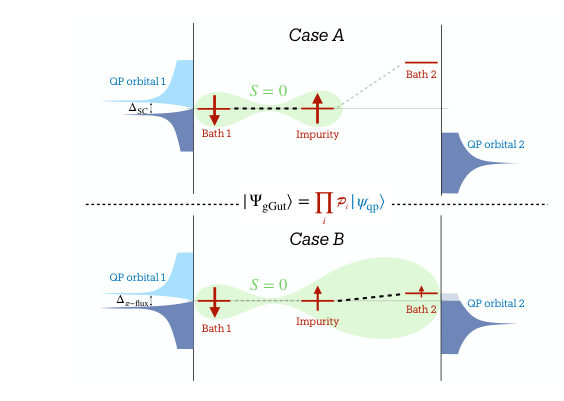 
FIG. 1. Schematic structure of the two-bath ghost-Gutzwiller Ansatz in the two cases considered in the main text. In each panel the central cartoon depicts the impurity model, while the blue lobes on either side are the densities of states of the corresponding auxiliary quasiparticle (QP) bands. Green shading marks a spin singlet (S = 0) and a black (gray) dashed line a non-vanishing (vanishing) hybridization. In case A (6), the impurity hybridizes and forms a singlet with bath 1, which accommodates the doped charge; the associated aux- iliary QP band 1 may develop d-wave quasiparticle pairing ∆SC. Bath 2 stays empty and decoupled. In case B (9), bath 1 remains half-filled and unhybridized,...

📷 Fig 2

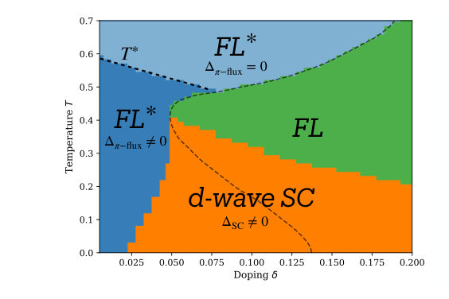 
FIG. 2. Temperature–doping phase diagram of the t-J model (J/t = 0.4, t′/t = −0.4, t = 1) within the ghost-Gutzwiller Ansatz. At low doping the normal state is a fractionalized Fermi liquid (FL∗) with a small, hole-like Fermi surface ac- counting just for the doped holes; the overdoped normal state is a conventional FL with a large, electron-like Fermi surface satisfying Luttinger’s count. The gray dashed line marks the boundary between the two metallic states preventing super- conductivity. Within the FL∗region, the black dashed line is the spinon pairing scale T∗, below which the π-flux order pa- rameter ∆π-flux is finite. When superconductivity is allowed, a d-wave superconducting dome...

**Summary.** This paper develops a theoretical framework using the ghost-Gutzwiller Ansatz applied to the t-J model to study exotic metallic states. It successfully predicts the existence of a Fractionalized Fermi Liquid (FL*) phase, which qualitatively reproduces the complex phase diagram observed in underdoped cuprate superconductors. The methodology involves variational optimization and renormalization factor calculations within this advanced correlated electron theory.

**Why it may be interesting.** While focused on cuprates, the use of advanced variational techniques like the gGut Ansatz to handle strong correlations and fractionalization is a powerful theoretical tool applicable to other strongly correlated quantum many-body systems.

Detailed structure

**Main problem.** The primary goal is understanding the pseudogap normal phase observed in underdoped high-Tc cuprate superconductors, linking it to the theoretical concept of Fractionalized Fermi Liquids (FL*).

**Main result.** The authors show that a FL* phase emerges in the single-band t-J model using their Ansatz, yielding a phase diagram matching key features: FL*, d-wave SC dome, and overdoped FL.

**Method.** They employ a variational approach utilizing an extended 'ghost-Gutzwiller' (gGut) Ansatz to calculate upper bounds for the free energy at finite temperature.

**Model / system.** The study uses the single-band t-J model, describing doped Mott insulators. The analysis is built around optimizing expectation values using a two-bath parametrization within the gGut framework.

**Key observables.** Superconducting order parameter (d-wave $\Delta_{SC}$), $\pi$-flux order parameter ($\Delta_{\pi	ext{-flux}}$), and the identification of three distinct phases: FL*, SC, and conventional FL.

**Important parameters / regimes.** Doping ($\delta$), Temperature ($T$), and various renormalization factors derived from the Ansatz optimization.

**Assumptions / limitations.** The core approximation is the use of the ghost-Gutzwiller Ansatz, which is assumed to provide a variational upper bound for the free energy. The analysis also assumes an infinite lattice coordination limit in some derivations.

**Figures summary.** Figure 2 illustrates the Temperature–doping phase diagram for the t-J model, mapping out the boundaries between the FL*, SC, and FL regimes.

**Paper structure.** The paper develops mathematically by first defining the gGut Ansatz (Chunk 1), then applying it variationally to calculate free energy bounds (Chunk 2 & 4), and finally deriving the necessary renormalization factors for physical operators within this framework (Chunk 3).

Abstract

Fractionalized Fermi liquids ($\mathrm{FL}^{\!*}$), elusive metallic states characterized by fractionalized quasiparticles alongside conventional ones and defying Luttinger's theorem, are prime candidates for the pseudogap regime of underdoped cuprates. We show that a $\mathrm{FL}^{\!*}$ phase emerges in the single-band $t$-$J$ model through a simple ghost-Gutzwiller Ansatz, optimized at the cost of a mean-field calculation. The resulting temperature-doping phase diagram encompasses a low-doping $\mathrm{FL}^{\!*}$, a $d$-wave superconducting dome, and an overdoped conventional Fermi liquid, thereby reproducing key qualitative features of cuprate phenomenology.

[↑ back to top](#top)

### [Halogen control of magnetic competition in Kitaev candidate Ru$X_3$ ($X =$ Cl, Br)](http://arxiv.org/abs/2607.12595v1)

**Authors:** Ryuta Iwazaki, Shinnosuke Koyama, Takashi Koretsune, Shintaro Hoshino, Joji Nasu  
**Type:** theory · **Category:** strongly correlated electrons · **PDF:** <https://arxiv.org/pdf/2607.12595v1>  
**Analysis basis:** full PDF text, analyzed in chunks
**Topic relevance:** `analog quantum simulation` **3/5** · `exotic spin models in light-matter` **3/5**

📷 Fig 1

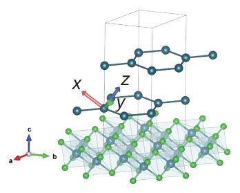 
FIG. 1. Crystal structure of RuX3 with conven- tional hexagonal lattice illustrated by VESTA [42]. Blue spheres represent Ru atoms, and green spheres represent halo- gen atoms. For clarity, halogen sites in the second and third layers are omitted. We also show a local Cartesian coordinate x, y, and z for a RuX6 octahedron.

📷 Fig 2

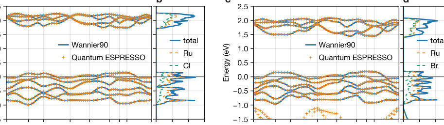 
FIG. 2. Electronic structures of RuCl3 and RuBr3. Energy band structures and densities of states computed by Quantum ESPRESSO and Wannier90 for (a,b) RuCl3 and (c,d) RuBr3. The Fermi energy is set to 0 eV. In panels (a) and (c), yellow crosses denote the DFT results obtained by using Quantum ESPRESSO, and blue solid lines represent the bands fitted using Wannier functions from Wannier90. High-symmetry points along the k-path follow Ref. [43]. In panels (b) and (d), total DOS and projected ones obtained from DFT are presented by solid and dashed lines, respectively.

📷 Fig 3

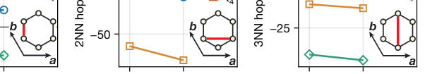 
FIG. 3. Calculated transfer integrals and Coulomb interaction parameters for RuCl3 and RuBr3. The in-plane transfer integrals in RuCl3 and RuBr3 are shown for (a) nearest-neighbor (NN), (b) second-nearest-neighbor (2NN), and (c) third-nearest-neighbor (3NN) bonds within a honeycomb plane. Blue circles, yellow squares, green diamonds, and red triangles correspond to t1 = tyz,yz, t2 = tyz,zx, t3 = txy,xy, t4 = tz2,xy, respectively, for the Z-bond indicated by the solid red line in the inset of each panel. The plotted hopping parameters are spin-independent quantities obtained by averaging the spin-conserving matrix elements, tγγ′ = (t↑↑ γγ′ +t↓↓ γγ′)/2. The local x, y, z coordinates are shown...

📷 Fig 4

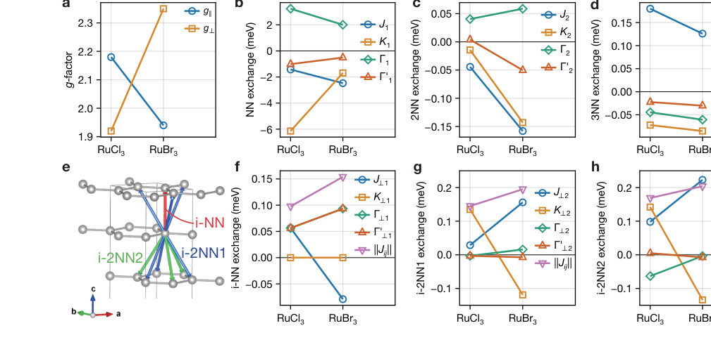 
FIG. 4. Calculated parameters of the effective pseudospin model for RuCl3 and RuBr3. (a) Halogen dependence of the g-factors, where blue circles represent the in-plane components g∥and yellow squares represent the out-of-plane components g⊥. (b)-(d) Coupling constants for in-plane NN, 2NN, and 3NN Z-bonds, respectively. The corresponding bond is indicated in the inset of Figs. 3(a)–(c). Blue circles denote the Heisenberg interaction J, yellow squares denote the Kitaev interaction K, and green diamonds and red triangles denote the two types of anisotropic interactions Γ and Γ′, respectively. (e) Schematic illustration of the interlayer interactions, drawn using VESTA [42]. Red, blue, and...

📷 Fig 5

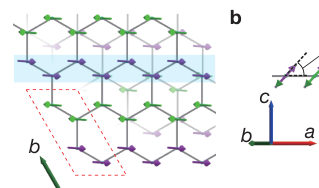 
FIG. 5. Mean-field result for the magnetic structure of the pseudospin model of RuCl3. (a) Top view and (b) side view of the mean-field ground state. The parallelogram with the red dashed line in panel (a) represents the magnetic unit cell assumed in the calculation. To visualize the stacking structure, the magnetic configuration of the upper layer is superimposed in panel (a) with transparency. We also show the elevation angle θ of the magnetic moment measured from the honeycomb plane toward the c axis in panel (b). Blue- shaded region in panel (a) is explained in Fig. 6.

**Summary.** This paper theoretically investigates how substituting chlorine with bromine in $	ext{RuX}_3$ controls the magnetic competition necessary for realizing a Kitaev spin liquid. By deriving effective pseudospin models from first-principles calculations, the authors show that halogen substitution tunes the system's magnetic interactions through changes in orbital hybridization and Coulomb anisotropy. This work provides crucial predictive insight into designing quantum magnetic materials.

**Why it may be interesting.** The work provides a detailed theoretical mechanism linking crystal chemistry (halogen size/electronegativity) directly to complex quantum magnetic behavior (Kitaev physics), which is highly relevant for designing novel correlated materials.

Detailed structure

**Main problem.** The study investigates how substituting halogens (Cl vs. Br) controls magnetic competition within $	ext{RuX}_3$, a candidate material for Kitaev spin liquids.

**Main result.** Halogen substitution modifies the magnetic interactions by altering interlayer exchange coupling and introducing orbital-dependent Coulomb anisotropy, thereby controlling the ground state between ferromagnetic and zigzag orders.

**Method.** The researchers constructed effective pseudospin models from multiorbital Hubbard models derived via first-principles calculations (DFT) and analyzed these models using mean-field theory.

**Model / system.** The physical system is $	ext{RuX}_3$ ($	ext{X} = 	ext{Cl}, 	ext{Br}$), treated as a spin-orbital Mott insulator. The theoretical framework involves mapping the complex Hubbard model onto a simplified pseudospin Hamiltonian to analyze magnetic ground states.

**Key observables.** Magnetic ordering (ZZ vs. FM), interlayer exchange interactions, orbital-dependent Coulomb anisotropy, and Wannier orbital spread ($\langle r^2 
angle$).

**Important parameters / regimes.** Halogen identity ($X$), deviation parameter $\xi$ (for Coulomb interaction approximation), and coupling constants derived from the effective Hamiltonian.

**Assumptions / limitations.** The analysis relies on constructing low-energy effective pseudospin models via perturbation theory in the strong-correlation limit, and subsequent mean-field decoupling of these models.

**Figures summary.** Figures show electronic structures (band/DOS) comparing $	ext{RuCl}_3$ and $	ext{RuBr}_3$, g-tensors, and calculated magnetic coupling constants ($J, K, \Gamma$) as a function of the deviation parameter $\xi$.

**Paper structure.** The paper proceeds by first establishing the electronic structure differences between $	ext{RuCl}_3$ and $	ext{RuBr}_3$ using DFT. It then develops the mathematical machinery to map this onto an effective pseudospin model, followed by analyzing how varying parameters (like Coulomb anisotropy $\xi$) shifts the predicted magnetic ground state.

Abstract

The spin-orbital Mott insulators Ru$X_3$ ($X =$ Cl, Br) have attracted considerable attention as promising candidate materials for realizing a Kitaev spin liquid. In this study, we construct effective pseudospin models from multiorbital Hubbard models derived from first-principles calculations and investigate the magnetic states of RuCl$_3$ and RuBr$_3$. From the constructed effective models, we find that RuBr$_3$ has more extended Wannier orbitals and stronger interlayer exchange interactions than RuCl$_3$. These interactions enhance three-dimensional correlations, consistent with the stronger antiferromagnetic tendency experimentally inferred for RuBr$_3$. Orbital-dependent Coulomb anisotropy further reduces the energy difference between ferromagnetic and zigzag states. Our results clarify how halogen substitution controls magnetic competition in Ru$X_3$ through interlayer exchange interactions and effects of orbital-dependent Coulomb interactions.

[↑ back to top](#top)

### [Lattice Configuration Generation with a Self-Learning Diffusion Model](http://arxiv.org/abs/2607.12587v1)

**Authors:** Akio Tomiya  
**Type:** theory · **Category:** numerical methods · **PDF:** <https://arxiv.org/pdf/2607.12587v1>  
**Analysis basis:** full PDF text, analyzed in chunks
**Topic relevance:** `methods for driven-dissipative` **3/5** · `Keldysh / 2PI / non-Gaussian methods` **1/5** · `analog quantum simulation` **1/5** · `driven-dissipative phase transition` **1/5**

📷 Fig 1

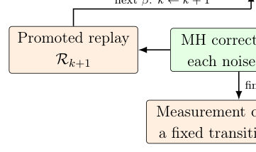 
Figure 1. The two ladders in SLDiffusion. The self-bootstrap beta ladder constructs training data from the exact β = 0 distribution by promoting MH-corrected replay. Here Rk is the training replay at βk defined in Eq. (3.3); only R0 is generated directly from the exact β = 0 distribution. The diffusion-noise ladder is the noise schedule within one SLDiffusion -MAALA proposal. Every noise level is MH-corrected against the same physical target; the ladder is not used as unadjusted transport between intermediate noised distributions. Physics measurements are made on an MH-corrected chain with a fixed transition kernel.

📷 Fig 2

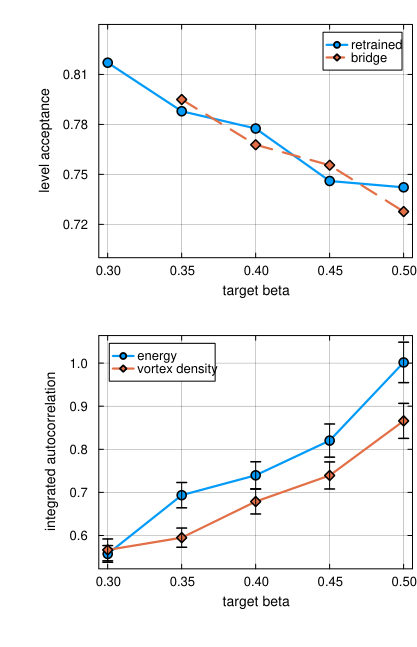 
Figure 2. Acceptance, MSJD, integrated autocorrelation times, and Schwinger–Dyson temperature along the L = 4 self-bootstrap ladder. Solid lines in the upper panels denote networks retrained at each β; dashed lines denote bridges used to construct replay for the next stage. The lower-left panel shows the two observables for the retrained chains. Autocorrelation-time uncertainties are evaluated using Eq. (2.14).

📷 Fig 3

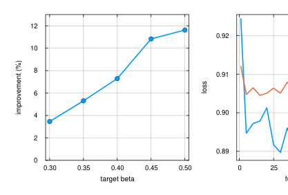 
Figure 3. Score-training diagnostics. Left: maximum improvement of the validation mean squared error (MSE) over noise scales at each β on the L = 4 ladder. Center: loss history at L = 4, β = 0.50. Right: validation MSE improvement at each noise scale for β = 0.5.

📷 Fig 4

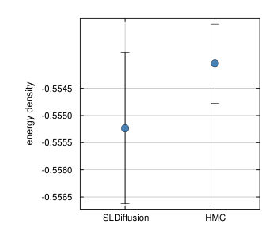 
Figure 4. Comparison of observables at L = 6, β = 0.5. Error bars show 1σ statistical uncertainties. SLDiffusion-MAALA uses 50,000 measurements and the independent HMC calculation uses 500,000. The smaller HMC uncertainties result from an effective sample size approximately 3.7–3.8 times larger.

📷 Fig 5

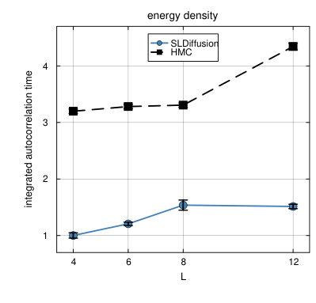 
Figure 5. Volume dependence of the integrated autocorrelation time at β = 0.5. The left and right panels show the energy and vortex densities, respectively, for SLDiffusion-MAALA and HMC at L = 4, 6, 8, 12. One unit on the horizontal trajectory index corresponds to one saved trajectory of each method. A SLDiffusion-MAALA trajectory contains 32 full- lattice updates, whereas an HMC trajectory has length one. Error bars are evaluated using Eq. (2.14).

**Summary.** This paper introduces SLDiffusion, a novel self-training diffusion sampler designed to generate accurate lattice field configurations without needing pre-existing Monte Carlo data at the target coupling. By bootstrapping training data from its own Metropolis-Hastings corrected chain, it successfully simulates the 2D XY model and matches established results within small statistical errors.

**Why it may be interesting.** While focused on lattice field theory, the core methodology—using ML models (diffusion) corrected by exact physics constraints (MH acceptance)—is a powerful general technique for simulating complex high-dimensional physical systems where sampling is difficult.

Detailed structure

**Main problem.** Developing a method for generating lattice field configurations that avoids requiring external training data from initial Monte Carlo calculations when using diffusion models.

**Main result.** The self-learning diffusion sampler (SLDiffusion) successfully estimates physical observables in the 2D XY model, matching independent HMC results within $1.35\sigma$ at $eta=0.5$.

**Method.** A self-bootstrap mechanism is used where a Markov chain starts from an exactly sampleable distribution ($eta=0$) and iteratively trains its score network using only configurations replayed from the preceding Metropolis-Hastings corrected chain.

**Model / system.** The study uses the two-dimensional compact XY model on an $L 	imes L$ lattice with periodic boundary conditions, governed by a cosine interaction Hamiltonian. The goal is to estimate expectation values $\langle O 
angle_{eta,L}$ using the Boltzmann distribution.

**Key observables.** Energy density, vortex densities, helicity modulus ($\Upsilon$), and the Schwinger–Dyson temperature ($eta_{SD}$).

**Important parameters / regimes.** Coupling constant $\beta$ (tested range: $0.30$ to $0.50$) and lattice size $L$ ($4, 6, 8, 12$).

**Assumptions / limitations.** The method assumes that the Metropolis-Hastings correction at every noise level preserves the physical invariant distribution ($\pi_{\beta}$), allowing for self-training.

**Figures summary.** Figures illustrate the two coupled ladders: the self-bootstrap beta ladder (for training data generation) and the diffusion-noise ladder (which undergoes MH correction at every step).

**Paper structure.** The paper introduces the SLDiffusion framework, details the self-bootstrap process starting from $\beta=0$, presents diagnostics like autocorrelation times and three-way splits to validate chain quality, and concludes by demonstrating convergence to known physical results.

Abstract

We show that a diffusion sampler for lattice-field configurations can be trained without preparing training data by an external Monte Carlo calculation. Starting from exactly sampled configurations at $β=0$, we construct a self-bootstrap sampler, SLDiffusion, in which periodic Gaussian proposals with a fixed learned score are Metropolis--Hastings corrected, at each $β$, against the same physical target at every noise level, and only replay configurations from the resulting chain are used to train the score at the next stage. In the two-dimensional compact XY model, self-training proceeds from $β=0.30$ to $0.50$ at $L=4$. At $β=0.5$, the energy and vortex densities for $L=4,6,8,12$ agree with independent Hybrid Monte Carlo calculations within $1.35σ$. Volume-native retraining at $L=8$ and $12$ improves both the proposal displacement and autocorrelation. The integrated autocorrelation times of the energy and vortex densities remain below two for all volumes studied. These results demonstrate that a Metropolis-corrected diffusion sampler can be self-trained without configurations drawn in advance from the target coupling.

[↑ back to top](#top)

### [Quantum tests via inequalities for joint statistics](http://arxiv.org/abs/2607.12591v1)

**Authors:** Alfredo Luis  
**Type:** theory · **Category:** quantum information and computing · **PDF:** <https://arxiv.org/pdf/2607.12591v1>  
**Analysis basis:** full PDF text, analyzed in chunks
**Topic relevance:** `quantum measurements` **3/5** · `entanglement & information structure` **2/5** · `measurement-induced transitions` **1/5**

📷 Fig 1

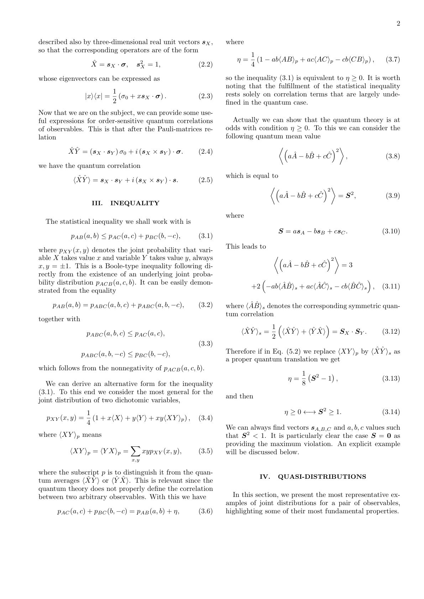 
Low-resolution page preview, page 2

📷 Fig 2

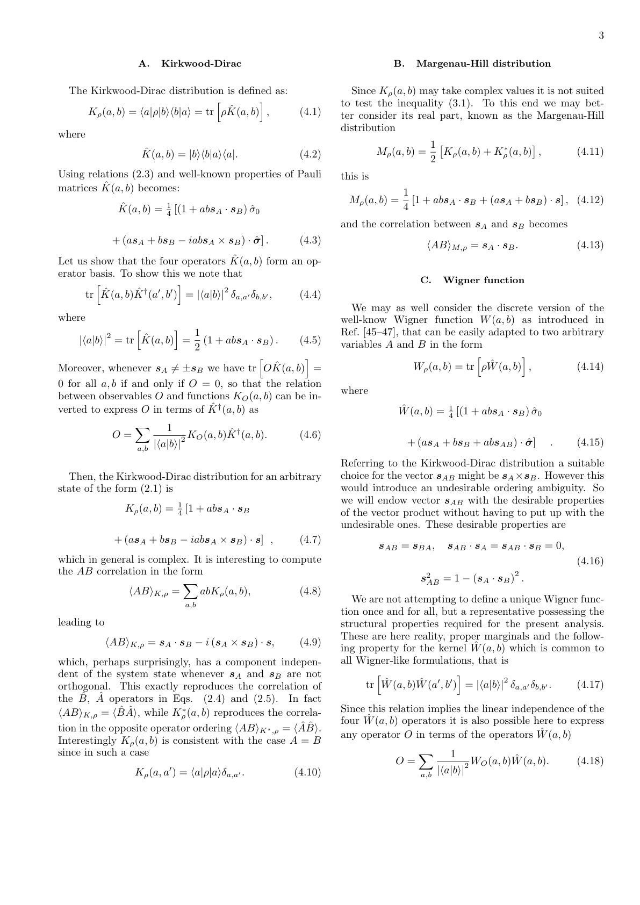 
Low-resolution page preview, page 3

📷 Fig 3

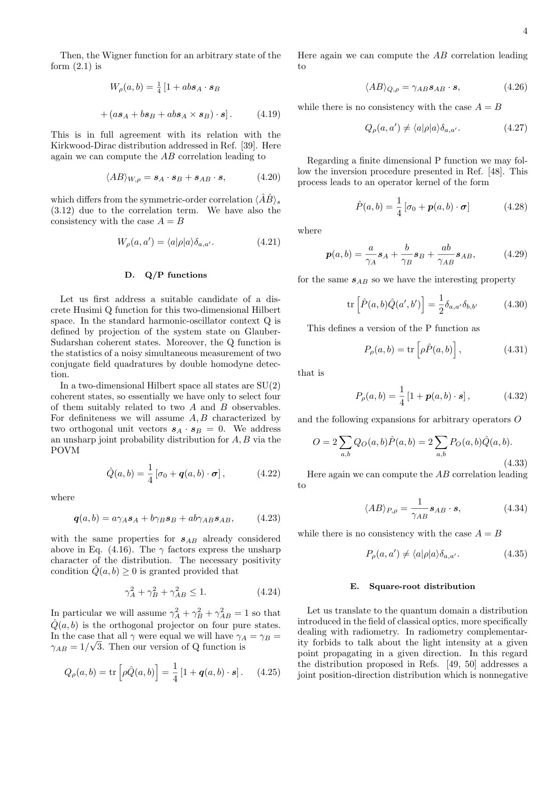 
Low-resolution page preview, page 4

📷 Fig 4

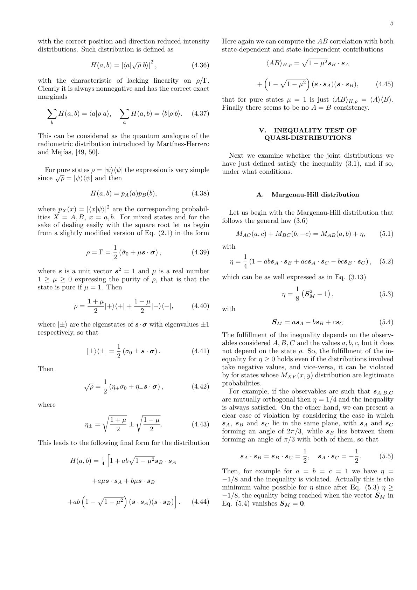 
Low-resolution page preview, page 5

📷 Fig 5

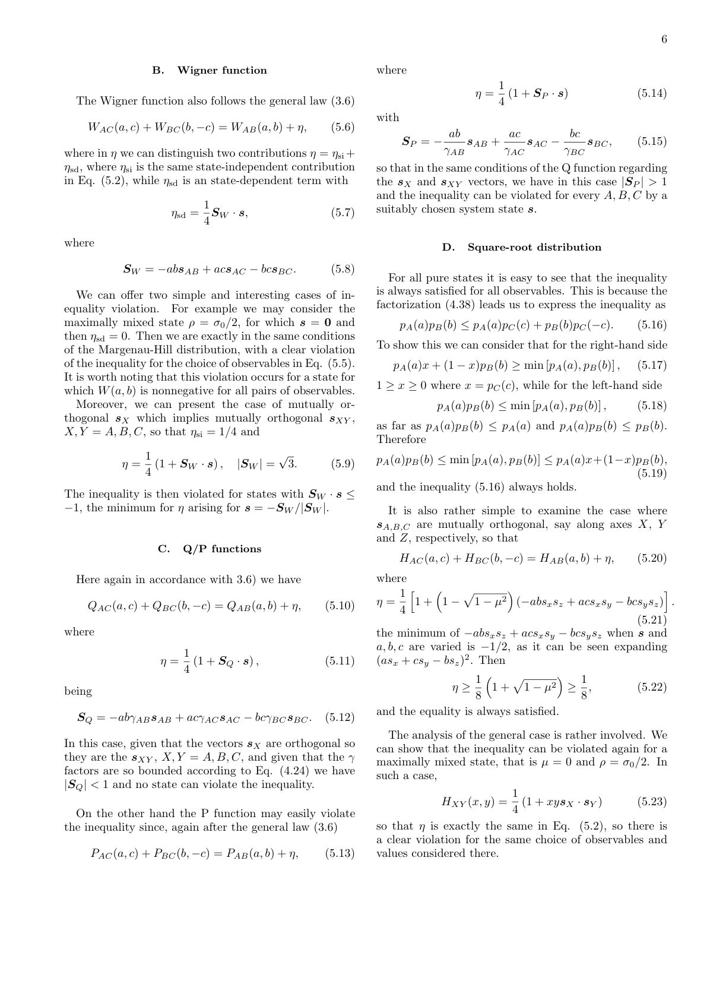 
Low-resolution page preview, page 6

**Summary.** This paper develops and tests a family of statistical inequalities designed to detect when data cannot be explained by a standard joint probability distribution. By analyzing violations using various quasi-probability representations (like Wigner and P functions) and modeling noisy measurements, the authors argue that these violations reveal fundamental structural properties of quantum mechanics itself.

**Why it may be interesting.** This work delves into the foundational mathematical structure of quantum correlations by establishing necessary conditions (inequalities) that any classical joint probability distribution must satisfy. Violations point to non-classicality rooted in the statistical formalism, which is crucial for understanding fundamental limits in quantum measurements and information processing.

Detailed structure

**Main problem.** The work derives statistical inequalities whose violation proves that observed data cannot be described by a genuine joint probability distribution, acting as witnesses to the failure of a common probability space.

**Main result.** Violation of these inequalities is found for the maximally mixed state and generally suggests that the non-classicality detected is a property of the quantum statistical structure itself, rather than solely the system state.

**Method.** The authors derive specific mathematical inequalities relating joint probabilities (e.g., $p_{AB} \leq p_{AC} + p_{BC}$) and test them using various quasi-probability distributions (Wigner, P, Q) and noisy measurement models.

**Model / system.** The analysis focuses on observables acting on a qubit (two-dimensional Hilbert space), characterized by dichotomic measurements ($\pm 1$). The study compares results across different mathematical representations of quantum states and correlations.

**Key observables.** Joint probabilities $p_{XY}(x, y)$, the correlation factor $\eta$, and the quantity $S^2$ derived from expectation values of combinations of observables.

**Important parameters / regimes.** The state purity parameter ($\mu$), noise factors ($\gamma$), and the structure constants defining the measurement operators ($s_A, s_B, s_C$).

**Assumptions / limitations.** Assumptions are made when constructing quasi-probability distributions (like Wigner or P functions) to ensure structural properties like positivity or correct marginals. The analysis also models noisy measurements using noise factors $\gamma$.

**Paper structure.** The paper progresses from deriving the fundamental statistical inequality, to testing it against various quasi-distributions (Wigner, P, Q), and finally developing a practical framework for analyzing violations under realistic noisy measurement conditions.

Abstract

In this work we derive statistical inequalities whose violation is equivalent to the impossibility of describing the data by a genuine joint probability distribution. So they are witnesses of the failure of a common probability space. We examine whether the most significant quantum quasidistributions violate these inequalities. We examine also whether these inequalitites are violated by the joint distributions derived form a noisy joint measurement. As a relevant example we find violations for the maximally mixed state, as well as cases where all system states violate them. This points to the idea that these results are more than a property of the system states, but are instead a property of the statistical structure of quantum mechanics.

[↑ back to top](#top)

### [Sparse anisotropic positive maps for qutrit entanglement: exact indecomposability and PPT geometry](http://arxiv.org/abs/2607.12470v1)

**Authors:** Massimiliano F. Sacchi  
**Type:** theory · **Category:** quantum information and computing · **PDF:** <https://arxiv.org/pdf/2607.12470v1>  
**Analysis basis:** full PDF text, analyzed in chunks
**Topic relevance:** `entanglement & information structure` **3/5** · `correlated / nonlocal dissipation` **1/5** · `driven-dissipative phase transition` **1/5** · `methods for driven-dissipative` **1/5**

📷 Fig 1

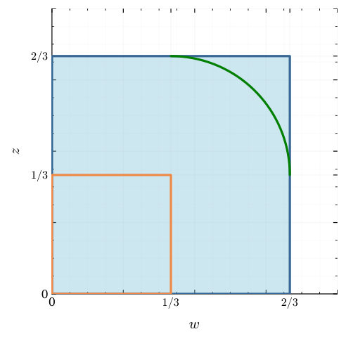 
FIG. 1. Phase diagram of the map Φ(w, z) in the (w, z)-plane. The blue square is the positivity region [0, 2/3] × [0, 2/3] from Proposition 1, and the orange square is the completely positive region [0, 1/3] × [0, 1/3] from Corollary 1. In the upper-right corner, the green quarter circle Eq. (22) separates the decomposable sector from the indecomposable cap proved in Proposition 2.

📷 Fig 2

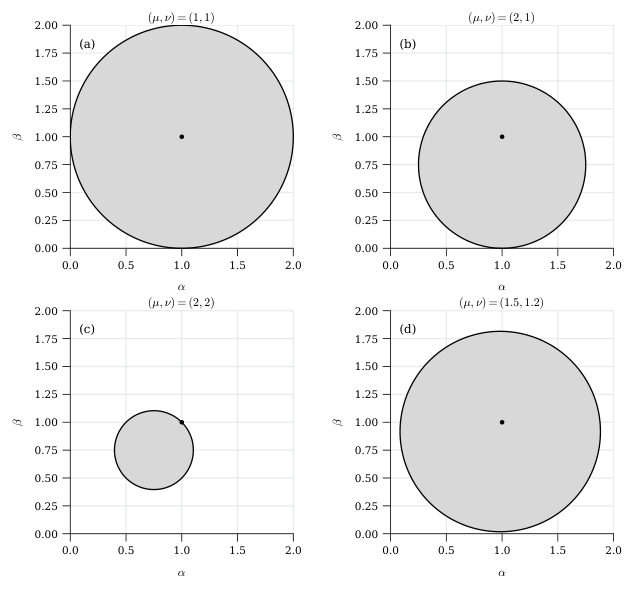 
FIG. 2. Detection region in the (α, β)-plane for the four-parameter family ρα,β,µ,ν for several fixed values of (µ, ν). The shaded region consists of those parameters for which the endpoint witness W∗= W( 2

📷 Fig 3

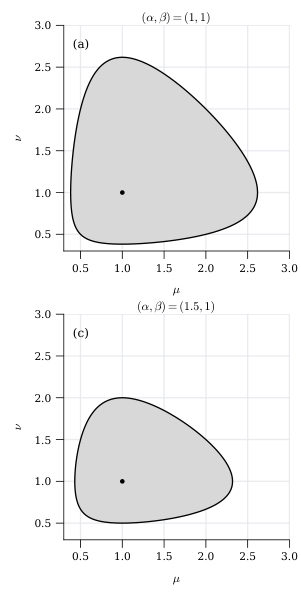 
FIG. 3. Detection region of the endpoint witness W∗= W( 2

**Summary.** This paper rigorously analyzes the entanglement detection capabilities of specific positive quantum maps acting on qutrit systems. By mapping out the parameter space defined by weights $w$ and $z$, the authors precisely delineate where the map is positive, completely positive, or decomposable. The result provides a unified theoretical framework linking map structure to advanced concepts like PPT entanglement witnesses and exposed convex geometry.

**Why it may be interesting.** This work provides a highly detailed, analytically solvable model for studying fundamental concepts in quantum information theory—specifically how mathematical properties of linear maps (positivity, decomposability) directly correspond to physical phenomena like entanglement detection.

Detailed structure

**Main problem.** The primary goal is to develop an analytically tractable framework for detecting quantum entanglement using positive but not completely positive maps, thereby extending beyond the standard Positive Partial Transpose (PPT) criterion.

**Main result.** The authors characterized the positivity and decomposability regions of a specific two-parameter family of sparse bistochastic maps on qutrits, identifying explicit PPT entangled states that serve as entanglement witnesses.

**Method.** The analysis involves deriving necessary and sufficient conditions for map positivity using scalar tests on probability simplices, characterizing boundaries between different map properties (e.g., decomposability), and constructing specific entangled states to certify indecomposability.

**Model / system.** The study is conducted on a qutrit system ($d=3$) using an exactly solvable two-parameter family of sparse bistochastic positive maps, $\Phi(w, z)$, acting on the density matrices of this system.

**Key observables.** Positivity/Complete Positivity of the map $\Phi(w, z)$; Decomposability status; Detection capability against specific PPT entangled states ($
ho_{\alpha,eta,\mu,
u}$); The geometry of the PPT cone and its exposed faces.

**Important parameters / regimes.** The coherence weights $w$ and $z$, which define the map parameters. Critical thresholds include $1/3$ (for complete positivity) and $2/3$ (related to the full positivity region).

**Assumptions / limitations.** The analysis is significantly simplified by specializing to the uniform bistochastic slice ($a=b=d=1/3$) for analytical tractability.

**Figures summary.** Not specified in detail, but the notes imply figures illustrate the phase diagram showing the boundaries for positivity, complete positivity, and decomposability as functions of $w$ and $z$.

**Paper structure.** The paper systematically analyzes the map $\Phi(w, z)$ by first establishing the conditions for positivity (Lemma 1), then determining the regions where it is completely positive or decomposable (Propositions 1 & 2). It proceeds to certify indecomposability using explicit PPT entangled states and concludes by analyzing the optimality of the resulting entanglement witness $W^*$.

Abstract

Positive but not completely positive maps provide one of the most direct ways to detect entanglement beyond the positive-partial-transpose (PPT) criterion. We introduce and analyze an exactly solvable two-parameter family of sparse bistochastic positive maps on qutrits, in which two coherence channels are independently tuned by parameters $w$ and $z$. The sparse structure makes the full phase diagram analytic: positivity holds exactly on the square $0\le w,z\le2/3$, complete positivity on the smaller square $0\le w,z\le1/3$, and decomposability is lost precisely outside a quarter circle in the corner $w,z\ge1/3$. The indecomposable region is certified by explicit PPT entangled state adapted to the same witness geometry. At the endpoint $W_*=W(2/3,2/3)$ we construct a four-parameter family of PPT edge states of rank type $(5,5)$, derive their analytic detection region, and show that the corresponding rays are exposed faces of the PPT cone. Finally, although $W_*$ is not optimal, we give an explicit optimal refinement whose detection region on this family is strictly larger. The result is an analytically tractable qutrit setting in which positivity, indecomposability, PPT entanglement, optimality, and exposed convex geometry can be studied in a single framework.

[↑ back to top](#top)

### [Zero-Field Long Range Order at $T \sim 40$ mK in the Proximate Quantum Spin Ice Ce$_2$Sn$_2$O$_7$ and Phase Diagram for Magnetic Fields Along [1,1,0]](http://arxiv.org/abs/2607.12274v1)

**Authors:** E. M. Smith, M. S. Powell, R. Schäfer, A. P. Dioguardi, J. W. Kolis, R. Movshovich, B. D. Gaulin  
**Type:** both · **Category:** strongly correlated electrons · **PDF:** <https://arxiv.org/pdf/2607.12274v1>  
**Analysis basis:** full PDF text, analyzed in chunks
**Topic relevance:** `analog quantum simulation` **3/5** · `exotic spin models in light-matter` **3/5**

📷 Fig 1

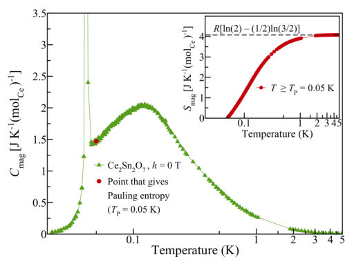 
FIG. 1. The zero-field heat capacity of hydrothermally-grown single crystal Ce2Sn2O7. A large, discontinuous phase tran- sition is obvious at TN ∼0.04 K; This peak is more than three orders of magnitude higher than shown [see Fig. 3(a)]. The red circle just above the anomaly signifies the point above which the measured entropy gives the Pauling entropy R[ln(2) −(1/2) ln(3/2)], indicating a fully developed spin ice state above TN. The inset shows the entropy recovered above the aforementioned “Pauling point”, TP = 0.05 K, in the zero- field heat capacity of Ce2Sn2O7 via Smag = R T TP

📷 Fig 2

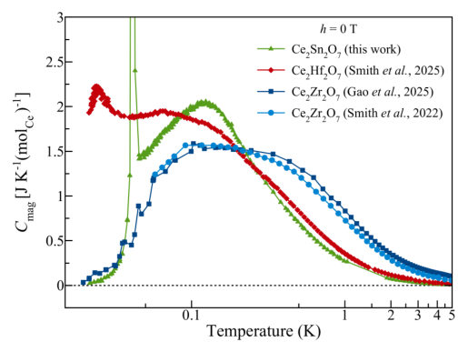 
FIG. 2. The zero-field heat capacity measured from the hydrothermally-grown Ce2Sn2O7 single crystal in this work (green) compared with that measured from floating-zone-grown single crystals of Ce2Hf2O7 in Ref. [33] (red) and Ce2Zr2O7 in Refs. [29, 34] (light blue, dark blue).

📷 Fig 3

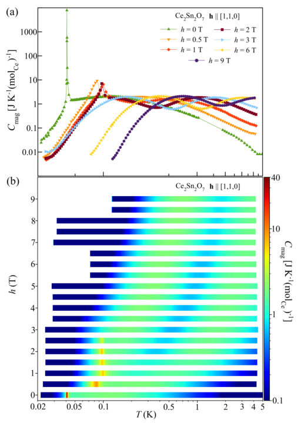 
FIG. 3. (a) The temperature-dependence of the heat capac- ity of Ce2Sn2O7 at various field strengths (as labeled) for a magnetic field h along the [1, 1, 0] direction, shown with logarithmic temperature and heat capacity axes. (b) The mag- netic field versus temperature phase diagram for Ce2Sn2O7 in a magnetic field nominally along the [1, 1, 0] direction, as directly determined from the Cmag measurements in (a). The data at each field strength have been given an artificial width in field-strength for visibility. The dataset shown for 1.5 T (2.5 T, 3.5 T, 4.5 T, 5.5 T, 6.5 T, 7.5 T, 8.5 T) results from averaging the measured data at 1 and 2 T (2 and 3 T, 3 and 4 T, 4 and 5 T, 5 and 6 T, 6...

📷 Fig 4

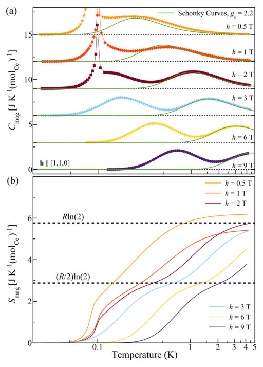 
FIG. 4. (a) The temperature-dependence of the heat capac- ity of Ce2Sn2O7 at various field strengths (as labeled) for a magnetic field along the [1, 1, 0] direction, shown with a logarithmic temperature axis and linear heat capacity axis with the data offset by 3 J K−1mol−1 Ce between each pair of successive field strengths. We compare these measurements to the curves predicted according to the two-level Schottky form Cα = R

**Summary.** This study investigates the magnetic ground state of $	ext{Ce}_2	ext{Sn}_2	ext{O}_7$ using ultra-low temperature heat capacity measurements. The results show a distinct first-order transition at $T \sim 0.04$ K, ruling out a Quantum Spin Ice ground state in zero field. Furthermore, applying a magnetic field reveals the underlying physics by splitting excitations into two characteristic chains ($\alpha$ and $eta$), providing a detailed phase diagram.

**Why it may be interesting.** The work provides a crucial experimental test case for understanding the transition between highly frustrated quantum spin ice states and conventional magnetically ordered states in pyrochlores, relevant to many-body physics models.

Detailed structure

**Main problem.** The study aims to determine the ground state of $	ext{Ce}_2	ext{Sn}_2	ext{O}_7$ and characterize its magnetic ordering transition in zero field and under an applied magnetic field.

**Main result.** Zero-field heat capacity measurements reveal a clear first-order transition to long-ranged order at $T \sim 0.04$ K, indicating the material does not possess a Quantum Spin Ice ground state. However, applying a magnetic field along [1,1,0] causes the anomaly to bifurcate into features characteristic of independent $\alpha$ and $eta$ chains.

**Method.** The research combines low-temperature heat capacity measurements ($C_{	ext{mag}}$) with theoretical modeling using nearest-neighbor XYZ Hamiltonians and Linked Cluster expansions (NLC).

**Model / system.** The system is the pyrochlore magnet $	ext{Ce}_2	ext{Sn}_2	ext{O}_7$, whose magnetic moments are modeled by pseudospin-1/2 degrees of freedom. The interactions are described by an XYZ nearest-neighbor Hamiltonian.

**Key observables.** Zero-field heat capacity anomaly ($T_N \sim 0.04$ K), Schottky anomalies under field, and entropy recovery plateaus ($\propto R/2 \ln(2)$).

**Important parameters / regimes.** Transition temperature $T_N \sim 0.04$ K; magnetic field direction [1,1,0]; coupling parameters $(J_a, J_b, J_c)$.

**Assumptions / limitations.** The analysis assumes the applicability of the XYZ Hamiltonian and models the high-field behavior by decomposing the lattice into $\alpha$ and $eta$ chains.

**Figures summary.** Figures illustrate $C_{	ext{mag}}(T)$ vs. field, showing the zero-field transition and its evolution/bifurcation under a [1,1,0] field; phase diagrams map this field dependence; residual plots ($\delta^2$) confirm model agreement.

**Paper structure.** The paper progresses from initial zero-field measurements establishing magnetic ordering ($T \sim 0.04$ K), to analyzing the effect of an external magnetic field along [1,1,0] which reveals chain decomposition and Schottky anomalies, concluding with detailed theoretical fitting using NLC methods.

Abstract

The Ce$^{3+}$ pseudospin-1/2 degrees of freedom in the pyrochlore magnets Ce$_2$X$_2$O$_7$, with $X$ = Zr, Hf, or Sn, possess dipole-octupole character. The XYZ nearest-neighbor model Hamiltonians which have successfully described their properties make them attractive candidates for quantum spin ice ground states. We report new heat capacity measurements to very low temperatures on a high-quality single crystal of Ce$_2$Sn$_2$O$_7$ grown by hydrothermal techniques. Our zero-field measurements uncover a clear first order transition to long-ranged order at $T \sim 0.04$ K, well below the downturn in the broader Schottky-like anomaly that is a common feature in the zero-field heat capacity for cerium pyrochlores. This observation settles the debate as to whether Ce$_2$Sn$_2$O$_7$ possesses a QSI ground state in zero field - it does not. However, we also find compelling evidence suggesting that spin ice physics is nearby, and remains relevant to Ce$_2$Sn$_2$O$_7$. Application of a magnetic field along the $[1,1,0]$ direction leads to an evolution of this peak to a weak anomaly at higher temperature more characteristic of a continuous, mean field transition. At higher fields along $[1,1,0]$, the Schottky-like anomaly bifurcates similar to expectations for independent polarized $α$ and orthogonal $β$ chains in classical spin ice. These new experimental results demonstrate richness to the phase diagram for Ce-based pyrochlores.

[↑ back to top](#top)

### [Deterministic Minimum-Leakage Continuous-Variable Quantum Key Distribution with Phase-Conjugated Twin Beams](http://arxiv.org/abs/2607.12432v1)

**Authors:** Zhenlin Zhao, Dawei Wang  
**Type:** theory · **Category:** quantum information and computing · **PDF:** <https://arxiv.org/pdf/2607.12432v1>  
**Analysis basis:** full PDF text, analyzed in chunks
**Topic relevance:** `quantum optics experiment` **3/5** · `interference shaping light` **1/5** · `quantum measurements` **1/5**

📷 Fig 1

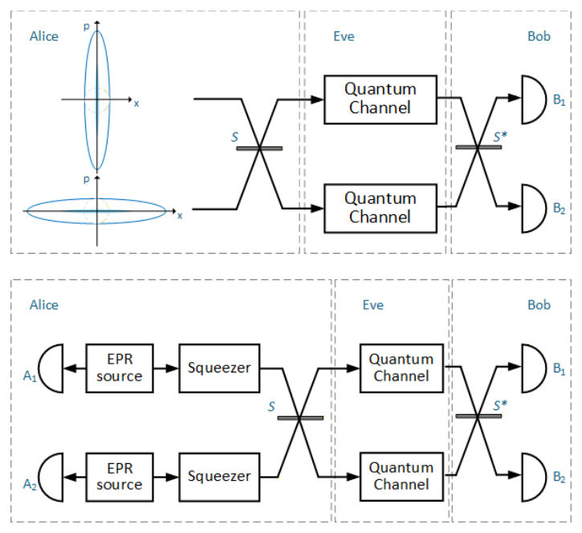 
FIG. 1. The two-mode entanglement-based CV-QKD protocol under Gaussian two-mode attacks.

📷 Fig 2

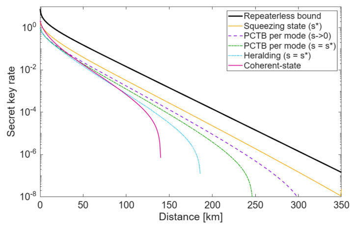 
FIG. 2. Secret key rate per mode versus transmission distance for the two-mode minimum-leakage

📷 Fig 3

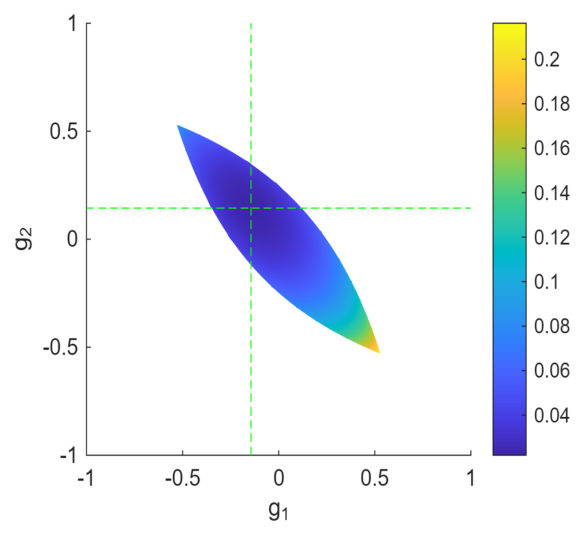 
FIG. 3. Secret key rate as a function of Eve’s ancillary correlations g1 and g2. The physically

📷 Fig 4

 
Figure 3 shows the secret key rate obtained by scanning the physically allowed values of

📷 Fig 5

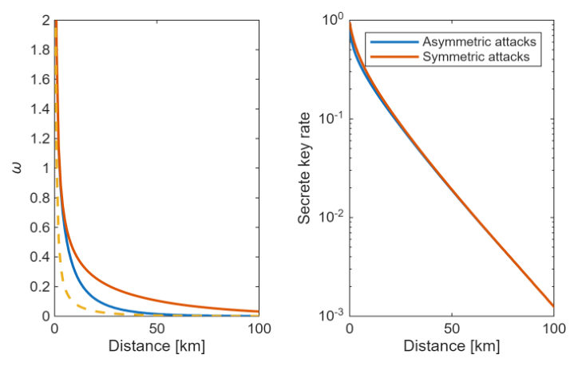 
FIG. 4. Optimized correlated two-mode attacks with g1 = −g2. (a) The optimal ancillary corre-

**Summary.** This paper introduces a deterministic method for minimum-leakage Continuous-Variable Quantum Key Distribution using phase-conjugated twin beams. It rigorously compares this new protocol against existing heralding methods, demonstrating that the PCTB approach is more resource-efficient by requiring less squeezing for finite key rates. This advances practical quantum communication security by offering a simpler, non-heralding implementation.

**Why it may be interesting.** It provides a concrete, experimentally appealing alternative to established CV-QKD protocols, offering improved resource efficiency (less squeezing) while maintaining security guarantees against advanced eavesdropping attacks.

Detailed structure

**Main problem.** Developing a deterministic minimum-leakage Continuous-Variable Quantum Key Distribution (CV-QKD) protocol that eliminates the need for an Alice-side heralding measurement.

**Main result.** The proposed phase-conjugated twin-beam protocol achieves the same secret key rate as existing heralding protocols in the large-squeezing limit, but requires approximately 3 dB less squeezing for finite squeezing.

**Method.** Comparison of two decomposition methods (Prepare-and-Measure vs. Heralding) applied to Gaussian states and analysis of security against correlated two-mode attacks.

**Model / system.** The system uses Continuous-Variable Quantum Key Distribution based on squeezed Gaussian ensembles, specifically employing phase-conjugated twin beams (PCTB).

**Key observables.** Secret Key Rate (SKR), minimum-leakage condition, and the required squeezing resource.

**Important parameters / regimes.** Squeezing parameter ($r$), anti-squeezed variance ($Q$), and correlation parameters for Eve's attack ($g_1, g_2$).

**Assumptions / limitations.** Assumes ideal detection, a reconciliation efficiency of 0.95, and analyzes the security against optimized correlated two-mode Gaussian attacks.

**Figures summary.** Figures illustrate SKR vs. distance for different protocols, show the dependence of SKR on Eve's ancillary correlations ($g_1, g_2$), and compare optimal attack correlations to separability boundaries.

**Paper structure.** The paper compares the deterministic PCTB protocol against existing heralding protocols by analyzing their respective decomposition methods (PM vs. EB) and quantifying resource requirements using covariance matrices and key rate calculations.

Abstract

Minimum-leakage continuous-variable quantum key distribution suppresses Eve's Holevo information by engineering the signal ensemble at the state-preparation stage. Existing symmetric minimum-leakage protocols achieve this goal by heralding: Alice interferes two squeezed ensembles, measures one output mode, and sends the other to Bob. Here we propose a deterministic two-mode protocol that removes the Alice-side heralding step. Alice combines two oppositely squeezed Gaussian ensembles on a balanced beam splitter and transmits both output modes, which form phase-conjugated twin beams. We show that this protocol is related to the heralding protocol through a common entanglement-based source but corresponds to a different prepare-and-measure decomposition. In the very-large-squeezing limit, the two protocols give the same secret key rate per transmitted optical mode. For finite squeezing, however, the phase-conjugated twin-beam protocol requires approximately 3 dB less squeezing to achieve the same key rate. We further analyze correlated two-mode Gaussian attacks in which Eve injects ancillary modes with optimized inter-mode correlations. We find that the correlated attacks are slightly more efficient than independent attacks, but the advantage remains limited under the minimum-leakage condition. These results show that phase-conjugated twin beams provide a deterministic and experimentally appealing route to symmetric minimum-leakage CV-QKD.

[↑ back to top](#top)

### [Q2NSViz: An Open-source Standalone Visualizer for Quantum Network Simulations](http://arxiv.org/abs/2607.12444v1)

**Authors:** Francesco Mazza, Marcello Caleffi, Angela Sara Cacciapuoti  
**Type:** theory · **Category:** quantum information and computing · **PDF:** <https://arxiv.org/pdf/2607.12444v1>  
**Analysis basis:** full PDF text, analyzed in chunks
**Topic relevance:** `entanglement & information structure` **3/5** · `methods for driven-dissipative` **1/5** · `non-equilibrium dynamics` **1/5**

📷 Fig 1

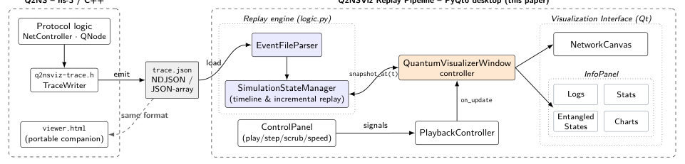 
Figure 1: Q2NSViz replay workflow. The simulator and viewer are decoupled through a typed NDJSON/JSON-array trace that feeds both the desktop application and the portable browser companion shipped with Q2NS [3]. The parser and state-management routines (logic.py) are Qt-free, exposing a programmatic API independent of the GUI.

📷 Fig 2

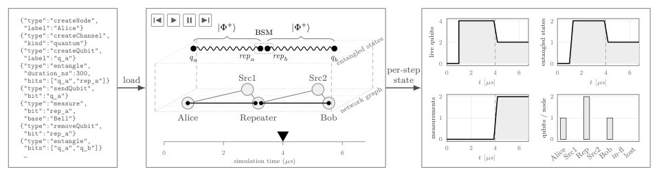 
Figure 2: Q2NSViz at a glance: a simulator trace is ingested and replayed (1), driving (logical) views of the physical network topology and the entanglement-induced connectivity graph – capturing links that transcend physical proximity – alongside a navigation timeline. Panel (3) plots live quantities over time: active qubits, entangled states, and measurements. At 𝑡≈4 𝜇s an entanglement swap is in progress: the repeater still holds the two memory qubits of the Bell pairs |Φ+⟩, both under measurement.

**Summary.** This paper introduces Q2NSViz, an open-source Python tool designed to visualize and replay complex simulations of quantum networks. By reading standardized JSON/NDJSON trace files, it reconstructs the time evolution, making dynamic elements like entanglement structure visible alongside physical connectivity. This provides researchers with a zero-coding way to inspect protocol execution details.

**Why it may be interesting.** It provides a crucial visualization layer for understanding the dynamics of entanglement manipulation in large-scale quantum systems, which is central to quantum networking research.

Detailed structure

**Main problem.** The unique, non-classical features of quantum networks make their simulation and intuitive understanding inherently difficult due to stateful entanglement resources.

**Main result.** Q2NSViz is presented as an open-source tool that visualizes the time evolution of quantum network simulations by replaying structured trace files.

**Method.** The tool ingests simulation traces via a decoupled JSON/NDJSON contract and uses a PyQt6 interface to reconstruct and display physical topology, entanglement structure, and classical events over time.

**Model / system.** The system modeled is a quantum network involving physical topologies, stored/in-flight qubits, classical bits, and dynamic entanglement relationships undergoing protocol execution (e.g., entanglement swapping).

**Key observables.** Physical topology, evolving entanglement structure (shown on an entanglement graph), classical communication events, and live quantities like the number of entangled states.

**Important parameters / regimes.** Time evolution ($	ext{t}[\mu	ext{s}]$) is a key parameter for tracking dynamic changes during protocol execution.

**Assumptions / limitations.** The tool assumes that any quantum network simulator adhering to the defined JSON/NDJSON trace contract can be analyzed, making it independent of specific simulator internals.

**Figures summary.** Figure 1 illustrates the architecture flow from the JSON/NDJSON trace format through the Replay Engine to the PyQt6 interface. Figure 2 shows a replay example demonstrating views of topology, entanglement graph, and live quantity plots driven by an ingested trace.

**Paper structure.** The paper introduces Q2NSViz as a solution to visualizing complex quantum network traces. It details its architecture (trace contract $
ightarrow$ engine $
ightarrow$ interface) and demonstrates its capability using examples like entanglement swapping, showing how it visualizes dynamic entanglement structure.

Abstract

The unique and non-classical features of quantum networks make their simulation and intuitive understanding inherently difficult. In this work, we present Q2NSViz, an open-source Python-based visualization tool for replaying and inspecting quantum-network simulation traces. Q2NSViz reconstructs the time evolution of the simulated network state, including physical topology, stored and in-flight qubits, classical bits and packets, measurements, and entanglement relationships. In this way, it exposes not only physical connectivity, but also the dynamic entanglement-induced structure produced, consumed, and transformed by protocol execution. Q2NSViz is built around a decoupled JSON/NDJSON trace contract, a Qt-free replay engine, and an interactive PyQt6 interface, making it a standalone companion to Q2NS and reusable by other simulation backends that emit the same trace format. By turning execution traces into navigable and reproducible visual artifacts, Q2NSViz provides a zero-coding tool for researchers and educators, narrowing the gap between abstract protocol logic and concrete execution.

[↑ back to top](#top)

### [The log log jam in Gaussian state tomography](http://arxiv.org/abs/2607.12983v1)

**Authors:** Sitan Chen, Weiyuan Gong, Qi Ye, Zhihan Zhang  
**Type:** theory · **Category:** quantum information and computing · **PDF:** <https://arxiv.org/pdf/2607.12983v1>  
**Analysis basis:** full PDF text, analyzed in chunks
**Topic relevance:** `quantum measurements` **3/5** · `entanglement & information structure` **1/5** · `measurement-induced transitions` **1/5**

📷 Fig 1

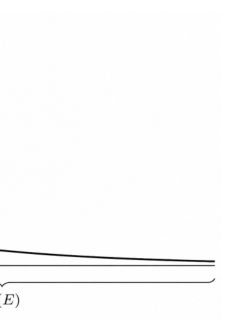 
Figure 1: Exponential decay of Fock coefficients for |ψz⟩over a window of length Θ(E)

📷 Fig 2

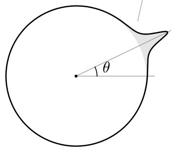 
Figure 2: Distribution pr,θ over measurement outcomes (gray) under the even canonical phase POVM con- centrates around true angle θ when measuring |ψz⟩for z = tanh(r)e2iθ

**Summary.** This paper rigorously determines the sample complexity needed to reconstruct continuous-variable Gaussian quantum states. It proves that restricting measurements to standard Gaussian types introduces a fundamental dependence on system energy ($E$), but this limitation can be overcome by utilizing highly entangled or non-Gaussian measurement strategies, leading to energy-independent estimation rates.

**Why it may be interesting.** This work directly addresses the resource scaling in quantum estimation theory for bosonic systems, providing concrete benchmarks against which new measurement protocols or physical implementations (like those using squeezing/homodyne detection) must be compared.

Detailed structure

**Main problem.** The paper investigates the sample complexity required for quantum state tomography of continuous-variable Gaussian states, particularly analyzing how measurement type (Gaussian vs. non-Gaussian) and adaptivity affect this complexity.

**Main result.** It establishes that using only Gaussian measurements introduces a fundamental $\log \log E$ energy dependence, but this can be circumvented by employing highly entangled or non-Gaussian measurements to achieve energy-independent scaling.

**Method.** The analysis involves deriving lower and upper bounds for sample complexity using Fisher information arguments and constructing matching protocols based on canonical phase POVMs and generalized measurement schemes.

**Model / system.** The focus is on continuous-variable quantum systems, specifically pure Gaussian states characterized by their mean energy $E$ and number of modes $n$. The underlying mathematical framework involves symplectic geometry ($	ext{Sp}(2n)$) for characterizing the state space $	ext{D}_n$.

**Key observables.** Sample complexity (number of measurements), trace distance $\epsilon$, system energy $E$, and mode number $n$.

**Important parameters / regimes.** The degree of adaptivity ($T$) is a crucial parameter governing the trade-off between measurement rounds and energy dependence.

**Assumptions / limitations.** The analysis assumes the ability to perform specific measurements, such as single-copy canonical phase POVMs or highly entangled non-Gaussian measurements, which are key to achieving optimal bounds.

**Paper structure.** The paper progresses by first establishing the fundamental energy dependence for Gaussian measurements (Theorem 1.1), then deriving a smooth tradeoff between adaptivity and energy using lower/upper bounds (Theorems 1.2 & 1.3). Finally, it contrasts these results by showing that non-Gaussian measurements can achieve energy independence.

Abstract

Unlike in finite dimensions, quantum information in continuous-variable systems has the peculiar feature that without imposing physical constraints, the sample complexity of state tomography can be unbounded. Remarkably, this is even the case for state-of-the-art protocols for learning Gaussian states, which have finite-dimensional descriptions: the best known rates scale with $\log \log E$, where $E$ is the energy of the system. We prove this is not an artifact of existing analyses, but a fundamental limitation of the measurements used. We show: (1) Any protocol that uses Gaussian measurements, even entangled or adaptively chosen ones, must incur a $\log \log E$ dependence. This answers an open question posed by a number of previous works. (2) There is a smooth tradeoff between the number of rounds of adaptivity and the energy dependence, and we give a matching protocol achieving this interpolated rate. (3) With highly entangled, non-Gaussian measurements, one can learn $n$-mode pure Gaussian states with $O(n^2 / ε^2)$ samples, independent of $E$. This answers an open question posed by Chen et al. (4) A simple protocol based on the single-copy canonical phase POVM of Holevo and Helstrom learns single-mode pure Gaussian states with $O(1/ε^2)$ samples, again independent of $E$.   Our results clarify the role of energy in bosonic state tomography and shed new light on the intriguing interplay between adaptivity, entanglement, and magic in quantum learning.

[↑ back to top](#top)

### [James-Stein estimation for quantum sensing schemes](http://arxiv.org/abs/2607.12651v1)

**Authors:** Luke Alexander Rhodes, Sean William Moore, Jacob A. Dunningham  
**Type:** theory · **Category:** quantum information and computing · **PDF:** <https://arxiv.org/pdf/2607.12651v1>  
**Analysis basis:** full PDF text, analyzed in chunks
**Topic relevance:** `quantum measurements` **3/5**

📷 Fig 1

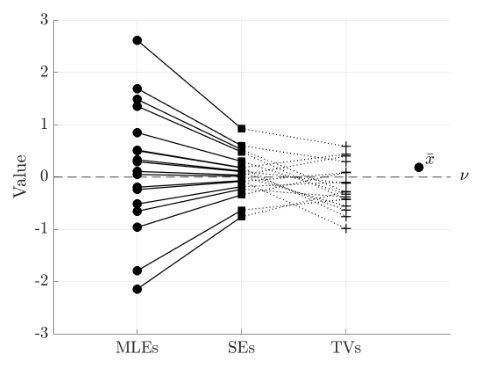 
FIG. 1. The idea behind shrinkage estimators (SEs). The initial MLEs are scaled towards some central point ν (or if this is not known, towards the mean of the MLEs, ¯x) in an attempt to ‘shrink’ some, or all, of the components closer to the underlying true values. Note that it is possible for some of the individual components to be moved further away.

📷 Fig 2

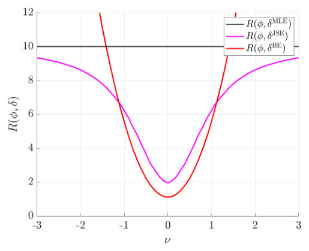 
FIG. 2. MSE as a function of ν for the MLE, JSE and Bayes estimator with ∥ϕ∥2 = 0, d = 10, σ = 1 and τ = 1/ √

📷 Fig 3

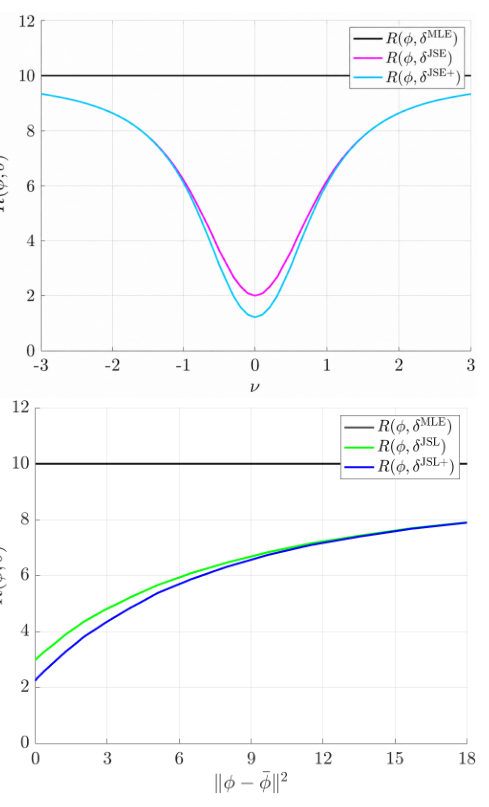 
FIG. 3. The positive-part versions dominate the standard estimators. The upper plot compares the risk of JSE+, given by (15) to the risk of the standard JSE given by (5). The lower plot compares the risk of JSL and JSL+, given by (12) and (18) respectively. For both parts we have taken σ = 1.

📷 Fig 4

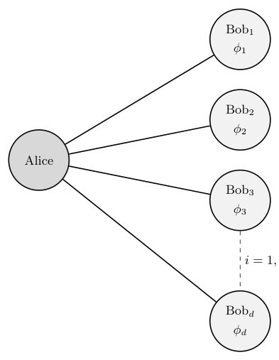 
FIG. 4. A simple networked metrology scheme with a central node, Alice, and d distributed Bobs, where d ≥3. Each Bobi encodes an unknown phase ϕi locally via a unitary transformation.

📷 Fig 5

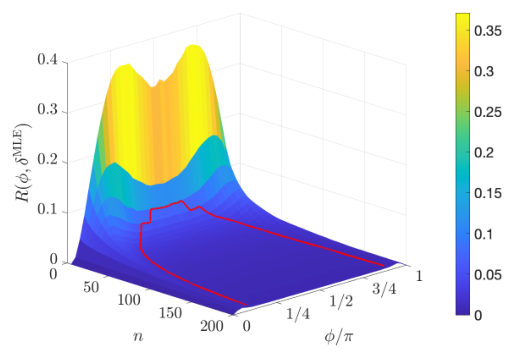 
FIG. 5. MSE for the MLE of a single phase (d = 1) as a function of the true value, ϕ, and the number of measurements, n. The red line encloses the region of approximate normality.

**Summary.** This paper develops and applies the James-Stein estimator to address limitations in the data analysis stage of quantum metrology. By employing this shrinkage technique, it demonstrates a statistically significant reduction in estimation error compared to standard Maximum Likelihood Estimation, even for highly sensitive entangled quantum measurements.

**Why it may be interesting.** This is highly relevant as it provides a statistically rigorous tool (JSE) to improve data processing in quantum sensing. It shows how advanced statistical inference can enhance the achievable precision beyond what standard frequentist methods predict, especially when dealing with complex measurement statistics.

Detailed structure

**Main problem.** The primary challenge addressed is improving parameter estimation precision in quantum metrology, especially when limited data are available for estimating multiple unknown parameters.

**Main result.** The James-Stein estimator (JSE) significantly outperforms the standard Maximum Likelihood Estimator (MLE) by reducing the Mean Squared Error (MSE), particularly as the number of estimated parameters increases.

**Method.** The authors apply shrinkage estimation theory, specifically the James-Stein estimator, to quantum measurement data analysis, bypassing the need for a prior distribution required by full Bayesian methods.

**Model / system.** The work analyzes general quantum metrology protocols involving state preparation, evolution, and measurement. Specific models include networked sensing schemes using independent systems or entangled NOON states.

**Key observables.** Mean Squared Error (MSE) of the parameter estimates ($\|\phi - \delta\|^2$), risk functions $R(\phi, \cdot)$, and estimated unknown phases $\phi_i$.

**Important parameters / regimes.** Number of parameters ($d \ge 3$), measurement variance ($\sigma^2$), entanglement scaling factor ($N$), and resource count ($r$).

**Assumptions / limitations.** The initial theoretical analysis assumes Gaussian likelihoods, but the application to quantum sensing uses binomial distributions approximated by Gaussians; the JSE requires $d \ge 3$.

**Figures summary.** Figures illustrate that the risk of the JSE is consistently lower than or equal to the MLE risk across various parameter settings. Specific plots compare MSE reduction between MLE, JSE, and Bayesian estimators for both separable and entangled quantum states.

**Paper structure.** The paper first establishes the theoretical advantage of JSE over MLE in general estimation theory (Chunk 1). It then applies this framework to multi-parameter estimation using independent systems (Chunk 2), before extending the methodology to highly sensitive, entanglement-enhanced NOON state measurements (Chunk 3).

Abstract

Quantum metrology protocols typically consist of four steps: state preparation, evolution, measurement, and data processing. Often, the first three steps are prioritised when designing a scheme as they contain all the quantum elements. The data analysis is generally considered an add-on with an implicit assumption that this step is well behaved and so standard data techniques can be applied. However, the situation can be more nuanced, such as when the available data are limited. In limited-data quantum metrology the choice of data analysis technique and cost function of the estimator is of great importance, and a reliable prior distribution of the unknown parameters is required for Bayesian analysis. An interesting question is what we should do when no such prior is available. In this work, we consider how the James-Stein estimator can give significant advantages when measuring multiple unknown parameters with limited data and, importantly, does not require any prior distribution. We demonstrate the advantage by applying this methodology to simple quantum metrology schemes.

[↑ back to top](#top)

### [Quantum magic and non-commutativity as computational resources in quantum reservoir computing](http://arxiv.org/abs/2607.12035v1)

**Authors:** Wei Xia, Shuaifan Cao, Xingze Qiu, Xiaopeng Li  
**Type:** theory · **Category:** quantum information and computing · **PDF:** <https://arxiv.org/pdf/2607.12035v1>  
**Analysis basis:** full PDF text, analyzed in chunks
**Topic relevance:** `entanglement & information structure` **2/5** · `non-equilibrium dynamics` **2/5** · `Keldysh / 2PI / non-Gaussian methods` **1/5** · `analog quantum simulation` **1/5** · `correlated / nonlocal dissipation` **1/5** · `driven-dissipative phase transition` **1/5** · `methods for driven-dissipative` **1/5** · `non-equilibrium universality` **1/5**

📷 Fig 1

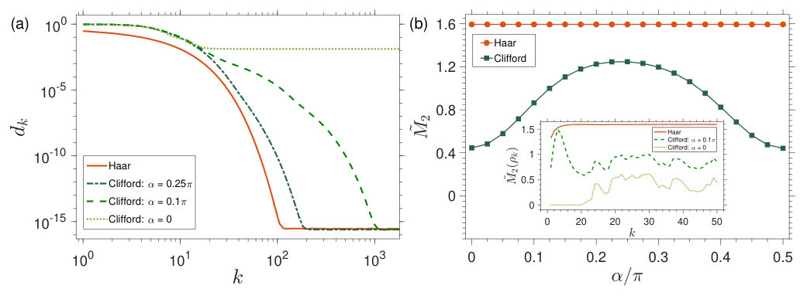 
FIG. 1. Relationship between dynamics-generated quantum magic and the echo state property (ESP). (a) Temporal evolution of the trace distance dk between two reservoir states prepared in distinct conditions. The reservoir dynamics correspond to a parameterized unitary family U(α) = Rz(α)C, which is compared against a Haar-random benchmark. In the pure Clifford limit (α = 0), the ensemble-averaged dk rapidly converges to a finite, nonzero asymptotic value (∼10−2), reflecting the contribution of Clifford realizations that fail to erase the initial condition; this averaged behavior is consistent with Theorem 1, where only a finite fraction of Clifford reservoirs satisfy the ESP. In the...

📷 Fig 2

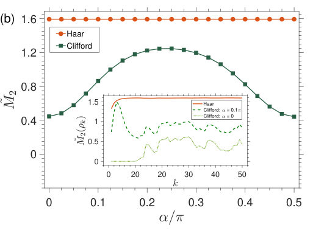 
Figure 1(b) further clarifies the distinction between the dynamics-generated magic and the input-generated magic, which is brought into the system by the input state. Even when α = 0, the input injection can produce a finite baseline of state magic, because generic input states are non-stabilizer states. However, Clifford dy- namics cannot amplify this non-stabilizerness localized on the input qubit into many-body operator spreading. Consequently, this input-generated magic alone cannot remedy the information-loss issue established in Theo- rem 1. Non-Clifford dynamics, by contrast, delocalize Pauli strings across operator space, enabling the reset- induced dissipation to propagate beyond...

📷 Fig 3

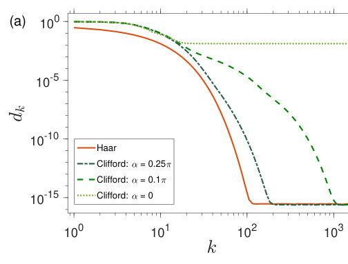 
Figure 1(a) shows a clear separation between the Clif- ford and non-Clifford regimes. In the Clifford limit α = 0, the ensemble-averaged trace distance approaches a finite nonzero value, reflecting the finite fraction of Clifford reservoirs that fail to erase the initial condi- tion, consistent with Theorem 1. Once non-Clifford rotations are introduced, the trace distance decays to zero for the sampled dynamics, indicating restoration of the ESP. Although the generated magic depends non- monotonically on α, the decay rate increases with the

📷 Fig 4

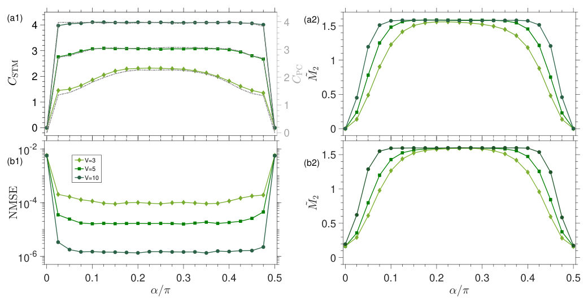 
FIG. 2. Benchmark performance and dynamics-generated quantum magic under qubit resetting. (a1) Short- term memory (STM) capacity CSTM (left axis) and total parity check (PC) capacity CPC (right axis) as functions of the tuning angle α for reservoirs driven by the parameterized unitary family U(α). (a2) The corresponding 2-R´enyi magic ˜ M2 (time-averaged) generated during the STM and PC benchmarks. (b1) Normalized mean square error (NMSE) for the NARMA task as a function of α. (b2) The 2-R´enyi magic ˜ M2 generated during the NARMA benchmark. For both the STM and PC tasks, the discrete input signal uk is drawn from an independent and identically distributed (i.i.d.) uniform binary sequence....

📷 Fig 5

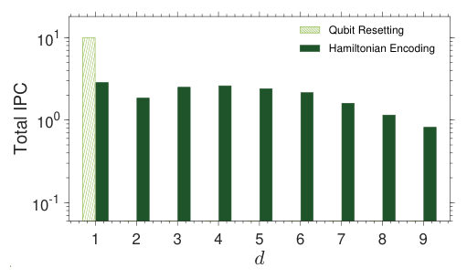 
FIG. 3. Degree-resolved IPC for qubit resetting and Hamiltonian encoding. For each total degree d, the hatched and solid bars denote the total IPC obtained us- ing the qubit-resetting and Hamiltonian-encoding architec- tures, respectively. Crucially, for data at d &gt; 1, only target functions containing at least one factor with degree di &gt; 1 are included (see text). This rigorously isolates the intrinsic single-time nonlinear response from mere linear memory mix- ing. The simulations are governed by the intrinsic many-body Hamiltonian H0 defined in Eq. (21), utilizing a reservoir size of N = 5 qubits, V = 10 virtual time slots, and physical param- eters J = 1, hz = 1, ∆t = 10, and γ = 0.1....

**Summary.** This work rigorously analyzes Quantum Reservoir Computing by comparing different input encoding methods. It proves that while simple schemes are limited by classical nonlinearity, embedding inputs into the Hamiltonian allows for infinitely complex, non-separable processing. Ultimately, it establishes that this general QRC model is computationally hard (BQP-hard), providing a theoretical roadmap for achieving quantum advantage in time series analysis.

**Why it may be interesting.** It provides deep theoretical insights into when and how quantum dynamics can generate non-classical correlations (magic) necessary for computation, directly impacting the design principles for near-term quantum hardware.

Detailed structure

**Main problem.** To develop a rigorous theoretical framework for understanding the structural conditions required for scalable quantum-enhanced performance in Quantum Reservoir Computing (QRC) for temporal processing.

**Main result.** The paper establishes that Hamiltonian encoding allows QRC to achieve transcendental, infinite-order nonlinear dependence on inputs, and proves this general setting is BQP-hard, surpassing limitations found in simpler qubit-resetting schemes.

**Method.** Theoretical analysis using Pauli-Liouville space formalism, comparing different input encoding schemes (qubit resetting vs. Hamiltonian embedding) and employing complexity theory reductions to prove computational hardness.

**Model / system.** The model is Quantum Reservoir Computing (QRC), where temporal inputs are processed by a quantum dynamical system governed by Lindblad master equations or unitary evolution in an N-qubit setting.

**Key observables.** Quantum Magic ($	ilde{M}_2(
ho)$), Echo State Property (ESP), Capacity ($C$), and the structure of the time-evolution map $F(u)$.

**Important parameters / regimes.** The analysis distinguishes between regimes based on input encoding: qubit resetting vs. Hamiltonian embedding, and examines limits like high-drive strength $|u| 	o \infty$.

**Assumptions / limitations.** The analysis assumes the applicability of Pauli-Liouville space representations and relies on mathematical theorems (like those related to transcendental functions) to establish computational bounds.

**Figures summary.** Not specified in notes, but the structure implies comparisons between different dynamics maps and complexity proofs.

**Paper structure.** The paper progresses by first analyzing the qubit-resetting scheme, identifying its expressivity bottleneck; it then introduces Hamiltonian encoding, demonstrating how it bypasses this limit by achieving transcendental nonlinearities; finally, it proves the computational power of this general setting via a BQP-hardness reduction.

Abstract

Quantum reservoir computing (QRC) provides a hardware-efficient paradigm for temporal information processing on near-term quantum devices. Despite rapid experimental progress, a rigorous understanding of the structural conditions required for its scalable quantum-enhanced performance remains lacking. Here, we develop a theoretical framework in Pauli-Liouville space that provides a unified analytical treatment of the echo state property (ESP), nonlinear expressive power, and quantum resources. We first analyze the widely used qubit-resetting scheme and establish that quantum magic generated by reservoir dynamics is a necessary condition for effective computation, a requirement more fundamental than ESP. However, we prove that this architecture faces inherent expressivity limitations: all nonlinear processing originates exclusively from the classical encoding map, imposing an unavoidable trade-off between nonlinearity and memory capacity. To circumvent this structural bottleneck, we rigorously analyze Hamiltonian encoding, in which temporal inputs are embedded directly into the continuous dynamics generator. We show that the ESP is natively guaranteed by the Liouvillian spectral gap, decoupling it from quantum magic. Crucially, for any non-trivial drive Hamiltonian, the discrete-time update map exhibits a transcendental, infinite-order nonlinear dependence on the instantaneous input. Moreover, the intrinsic non-commutativity of the open-system generators governs the temporal coupling of these nonlinearities, producing highly non-separable processing of the input history. Our results establish a rigorous theoretical hierarchy of QRC architectures and provide prescriptive design principles for experiments targeting genuine quantum advantages in temporal processing.

[↑ back to top](#top)

### [An Agentic Formalization for Certified Quantum Neural Network Design](http://arxiv.org/abs/2607.12981v1)

**Authors:** Mingrui Jing, Lei Zhang, Yusheng Zhao, Hongshun Yao, Xin Wang  
**Type:** theory · **Category:** quantum information and computing · **PDF:** <https://arxiv.org/pdf/2607.12981v1>  
**Analysis basis:** full PDF text, analyzed in chunks
**Topic relevance:** `entanglement & information structure` **2/5** · `Keldysh / 2PI / non-Gaussian methods` **1/5** · `correlated / nonlocal dissipation` **1/5** · `driven-dissipative phase transition` **1/5** · `methods for driven-dissipative` **1/5**

📷 Fig 1

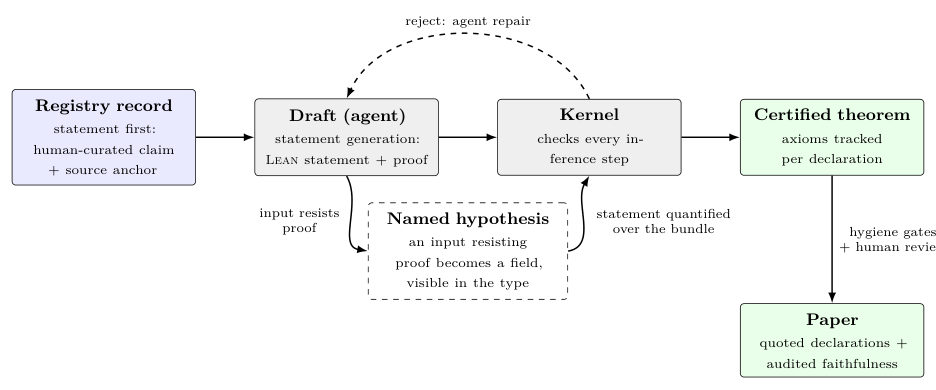 
Figure 1: The development loop for agentic formalization. Each target statement is first recorded with its intended mathematical meaning and source reference. An agent then translates the statement into Lean, develops the proof, and revises it in response to kernel errors. Analytic inputs that are not yet proved are made explicit as named hypotheses, so their role remains visible and concrete instances can discharge them later. Theorems included in the manuscript must also pass automated checks for proof completeness, axiom hygiene, and declaration consistency, followed by independent human review for faithfulness to the original claim. In this workflow, agents handle formalization and...

📷 Fig 2

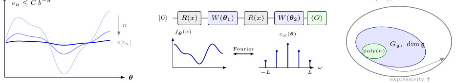 
Figure 2: The three notions of Definitions 2.3 and 2.4. (a) A barren plateau as landscape concentration: sections of the loss at growing qubit count n oscillate with exponentially shrinking amplitude about the mean, vn ≤Cb−n, so the landscape flattens at scale. (b) Functional expressivity: the output fθ(x) has finite Fourier support ω ∈{−L, . . . , L}, while the trainable parameters determine its coefficients. Section 3.2 specifies the YZZYZ circuit formalized here. (c) Dynamical expressivity: Gg ⊆U(2n) denotes the connected Lie subgroup generated by the available gates, with dim Gg = dim g. This dimension ranges from polynomial growth to full controllability. Equation (7) relates it to...

📷 Fig 3

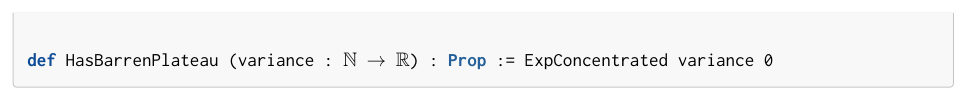 
Figure 2 places the two readings beside the loss-concentration predicate of Definition 2.3. The signal- processing stack of Sec. 3 characterizes the functional reading. For the circuits studied here, the realizable classes are trigonometric, with output

📷 Fig 4

 
Figure 3: The YZZYZ single-qubit QSP word of Eq. (8), read left to right in time order (operators compose right to left). Trainable blocks W(θ, φ) = RY (θ)RZ(φ) (blue) alternate with the data-encoding rotation RZ(x) (gray); as a learning model this is the data re-uploading single-qubit QNN.

📷 Fig 5

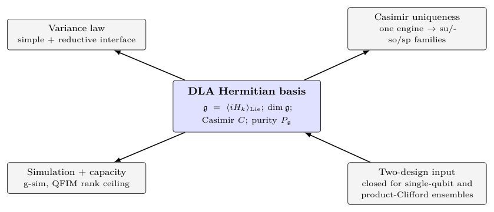 
Figure 4: The dynamical Lie algebra as the hub of the trainability development. Its Hermitian basis feeds the variance law, the per-family Casimir-uniqueness proof, and the simulation and capacity layers; the two-design input enters from outside, closed by proof for the single-qubit and product-Clifford ensembles.

**Summary.** This paper develops a highly formal, machine-checkable theory for Quantum Neural Networks using the Lean proof assistant. It rigorously analyzes the two critical design aspects—expressivity and trainability—by proving deep mathematical results about parameterized quantum circuits. The work aims to provide a foundational, verifiable toolkit for designing future quantum machine learning algorithms.

**Why it may be interesting.** While focused on computation, the rigorous mathematical machinery developed (formal proofs of algebraic identities and optimization laws) provides deep insights into the structure of quantum information processing that could inform theoretical models of complex quantum dynamics or emergent behavior in many-body systems.

Detailed structure

**Main problem.** The core challenge is developing a rigorous, machine-checkable framework for designing Quantum Neural Networks (QNNs) by balancing their expressivity (representational power) against their trainability (optimization feasibility).

**Main result.** The authors provide formal proofs characterizing QNN components—including single-qubit exact characterizations and loss variance laws—within a connected Lean 4 development environment.

**Method.** The methodology involves formal verification using the Lean proof assistant, structuring theory around an 'agentic loop' where claims are synthesized, checked by a kernel, and audited for mathematical rigor.

**Model / system.** The model is the Parameterized Quantum Circuit (PQC) used as a QNN. Analysis focuses on its functional representation via quantum signal processing and its optimization landscape analyzed using Dynamical Lie Algebra (DLA) methods.

**Key observables.** Quantum Fisher information rank, loss variance ($	ext{Var}[\ell]$), and the structure of the underlying dynamical Lie algebra $\mathfrak{g}$.

**Important parameters / regimes.** The circuit depth/number of gates, the dimension of the DLA, and the parameters $	heta$ defining the unitary evolution $U(	heta)$.

**Assumptions / limitations.** The framework assumes that analytic inputs must either be formally proven or explicitly stated as named hypotheses; it does not yet provide a general quantum-advantage criterion.

**Figures summary.** Figures illustrate the 'development loop' for formalization, comparing notions of expressivity (functional vs. dynamical) and showing the structure of the proof drafting process from human claim to certified theorem.

**Paper structure.** The paper is structured around building a machine-checkable foundation in Lean 4, systematically proving theorems related to QNN theory: first addressing expressivity via circuit analysis, then tackling trainability using DLA methods, and finally synthesizing these into comprehensive design rules.

Abstract

A central model in quantum machine learning is the quantum neural network (QNN), whose design requires balancing expressivity and trainability. Technically, expressivity is studied through circuit-function analysis, such as quantum signal processing, while trainability is analyzed using dynamical-Lie-algebra (DLA) methods. To support certified QNN design, we formalize these major components of QNN theory in a connected lean 4 development checked by a proof kernel, where every analytic input is either proved or exposed as a named hypothesis. On the expressivity side, we prove exact if-and-only-if characterizations of single-qubit QNNs, a resource-counted quantum phase processing theorem, and an overparameterization ceiling that bounds the quantum Fisher information rank by the DLA dimension. On the trainability side, we derive the direct-sum loss-variance law through a de-circularized second-moment interface. A parameterized Casimir-uniqueness engine discharges the required inputs for fully controllable, orthogonal, and matchgate circuit families, while single-qubit and product-Clifford ensembles close the two-design assumptions directly. A capstone theorem pairs the conditional variance law with exact loss reconstruction in DLA coordinates. The development record identifies eight corrections and clarifications that were not explicit in the informal arguments. We expect this work to provide a machine-checkable foundation for QNN theory and a step toward AI-assisted or automated design of quantum machine learning algorithms.

[↑ back to top](#top)

### [Ancilla-Depth Phase Diagrams for Quantum Reference-Frame Comparison](http://arxiv.org/abs/2607.12947v1)

**Authors:** Maxim V. Churilov  
**Type:** theory · **Category:** quantum information and computing · **PDF:** <https://arxiv.org/pdf/2607.12947v1>  
**Analysis basis:** full PDF text, analyzed in chunks
**Topic relevance:** `entanglement & information structure` **2/5** · `Keldysh / 2PI / non-Gaussian methods` **1/5** · `correlated / nonlocal dissipation` **1/5** · `driven-dissipative phase transition` **1/5** · `methods for driven-dissipative` **1/5**

📷 Fig 1

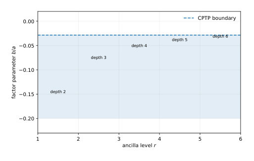 
FIG. 1. Exact positivity bands for the ratio b/a in dimension d = 6. Crossing the boundary −1/(dr −1) activates an r- dimensional witness.

📷 Fig 2

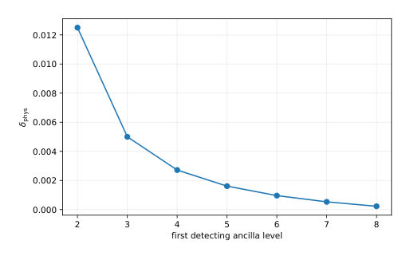 
FIG. 2. Exact physical conversion cost for the boundary hierarchy at fixed source parameter. Statistical simulation remains exact through level k, although the CPTP conversion cost is positive.

📷 Fig 3

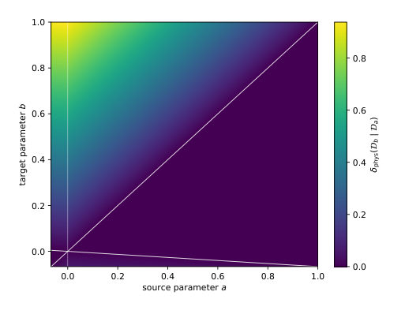 
FIG. 3. Exact CPTP conversion deficiency on the full physical (a, b) square for d = 4, including negative and singular sources. The zero region is the union of the reachable intervals b ∈Ia; the vertical section a = 0 has cost |b|(1 −1/d2).

**Summary.** This paper develops a theory to quantify when one noisy quantum channel can be statistically simulated by another, depending on the size of an auxiliary memory. It establishes criteria based on $r$-positivity and provides explicit phase diagrams for depolarizing channels. The findings are vital for understanding the distinction between theoretical simulation limits and actual physical implementability in quantum information tasks.

**Why it may be interesting.** The work provides rigorous mathematical tools for determining the fundamental limits of quantum process comparison, which is crucial for understanding resource quantification in open quantum systems and channel characterization.

Detailed structure

**Main problem.** The paper addresses how the comparison of two noisy quantum reference frames (channels) can be characterized by the dimension of ancillary memory available for statistical testing.

**Main result.** It establishes that simulation capability is equivalent to the $r$-positivity of a derived factor $\Gamma = BA^{-1}$, and quantifies physical limitations using concepts like restricted deficiency and distance to physical post-processing.

**Method.** The analysis relies on theoretical tools including $r$-positivity criteria, Choi matrices, and deriving closed formulas for resource gaps based on the ratio of channel parameters ($\lambda=b/a$).

**Model / system.** The model involves finite-dimensional quantum channels, specifically analyzing depolarizing channels ($D_\lambda$) as representative physical systems.

**Key observables.** Restricted level-$r$ deficiency, distance to physical post-processing ($\delta_{	ext{phys}}$), and the required ancillary dimension $r$.

**Important parameters / regimes.** Ancilla dimension ($r$), channel parameters ($a, b$), and the ratio $\lambda = b/a$.

**Assumptions / limitations.** The results are derived for finite-dimensional models and distinguish between statistical simulation capabilities versus physical implementability via a single quantum channel.

**Figures summary.** Figures illustrate exact positivity bands in parameter space (e.g., $d=6$) showing how crossing boundaries activates specific ancillary witnesses, and plot the physical conversion cost $\delta_{	ext{phys}}$ vs. source parameters.

**Paper structure.** The paper progresses from defining the statistical simulation problem using ancilla memory ($r$-positivity) to deriving general theorems relating this condition to factors ($\Gamma$), then applying these results specifically to depolarizing channels to map out phase diagrams, and finally quantifying physical gaps invisible at lower testing levels.

Abstract

Comparing two noisy quantum reference frames as statistical experiments depends on the dimension of the ancillary memory available to the decision procedure. For finite-dimensional channels A and B with invertible A, we show that exact simulation of all measurements assisted by an r-dimensional ancilla is equivalent to r-positivity of the unique factor Gamma = BA^{-1}. The hierarchy can be realized by physical channel pairs: every unital, trace-preserving map that is k-positive but not (k+1)-positive embeds as the factor between the channels D_a and Gamma composed with D_a on an exact interval determined by the smallest Choi eigenvalue. For depolarizing source and target channels D_a and D_b, including negative and singular source parameters, the phase boundary is $\mathcal{D}_a \succeq_r \mathcal{D}_b \Longleftrightarrow -1/(dr-1) \leq b/a \leq 1$ for $a\neq 0$. We derive closed formulas for the restricted level-r deficiency and for the distance to every physical post-processing, $δ_{\mathrm{phys}}(\mathcal{D}_b\mid\mathcal{D}_a)=(1-1/d^2)\operatorname{dist}(b,I_a)$, where $I_a=\operatorname{conv}\{a,-a/(d^2-1)\}$. The largest physical conversion cost hidden from all tests through level k is $(d-k)/[d(d^2-1)]$. An untouched m-level spectator changes the first detecting external level from k+1 to $\lfloor k/m\rfloor+1$. A transpose--depolarizing construction shows that the separation is not confined to depolarizing factors. The results quantify the distinction between ancilla-restricted statistical simulation and implementation by a single quantum channel.

[↑ back to top](#top)

### [Fixed-Boost Wigner Noise: Strict Trace-Distance Contraction without Quantum Degradability](http://arxiv.org/abs/2607.12994v1)

**Authors:** Maxim V. Churilov  
**Type:** theory · **Category:** quantum information and computing · **PDF:** <https://arxiv.org/pdf/2607.12994v1>  
**Analysis basis:** full PDF text, analyzed in chunks
**Topic relevance:** `entanglement & information structure` **2/5** · `correlated / nonlocal dissipation` **1/5** · `exotic spin models in light-matter` **1/5** · `non-equilibrium dynamics` **1/5**

📷 Fig 1

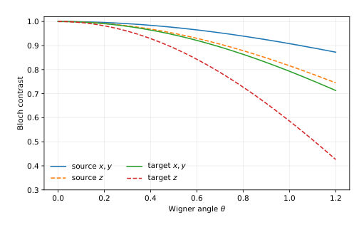 
FIG. 1. All three target contrasts lie below the source contrasts for one fixed boost, while the unique factor has a negative Choi eigenvalue. Parameters shown: u = 0.20, v = 0.45.

📷 Fig 2

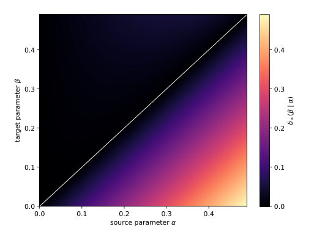 
FIG. 2. Exact directed CPTP deficiency δ⋄(β|α) on the Pauli line. The diagonal is the only zero set in the positive-noise interior; the edge α = 0 is also zero because every target is a post-processing of the identity.

📷 Fig 3

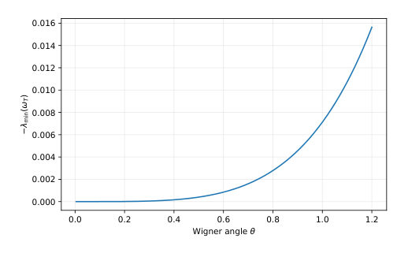 
FIG. 3. Analytic nondegradability margin from Eq. (21). The effect is strict for every nonzero Wigner angle and every 0 &lt; u &lt; v &lt; 1/2.

**Summary.** This theoretical paper analyzes the noise introduced to particle spin states by a fixed Lorentz boost. It demonstrates that even when all pairwise distinguishabilities decrease monotonically, this reduction cannot be modeled by a single, universal quantum channel (CPTP map). This shows that local measures of information loss are insufficient for characterizing global quantum processing constraints.

**Why it may be interesting.** It provides rigorous mathematical constraints on how quantum information degrades under relativistic kinematics, offering insights into fundamental limitations that go beyond simple componentwise damping assumptions.

Detailed structure

**Main problem.** The paper investigates whether strict contraction of pairwise spin-state trace distance under a fixed Lorentz boost implies the existence of a state-independent quantum channel that performs this reduction.

**Main result.** It proves a counterexample showing that while all pairwise spin contrasts can decrease after a fixed boost, no single CPTP map exists to account for this reduction, meaning ordering distinguishabilities does not determine post-processing order.

**Method.** The analysis uses mathematical characterizations of channel cones (for spin 1/2), deriving explicit formulas for operational gaps ($\delta_\diamond$), and constructing counterexamples based on the failure of unique factor criteria.

**Model / system.** The system models massive particles undergoing Lorentz boosts, with spin states analyzed via Wigner rotations. The noise is characterized by fixed-boost channels acting on spin qubits (Pauli mixtures).

**Key observables.** Pairwise spin-state trace distance ($\|\cdot\|_1$), normalized Choi eigenvalues ($\lambda_{\min}$), and the directed CPTP deficiency ($\delta_\diamond$).

**Important parameters / regimes.** The boost parameters defining the source ($u$) and target ($v$) channels, and perturbation sizes ($\epsilon$ or $\alpha$).

**Assumptions / limitations.** The analysis is restricted to an 'autonomous product preparation' of spin and momentum states; counterexamples are constructed for fixed boosts.

**Figures summary.** Figures illustrate that the target contrasts can fall below source contrasts, accompanied by negative Choi eigenvalues, demonstrating non-degradability. Other figures plot the exact directed CPTP deficiency on the Pauli line.

**Paper structure.** The paper progresses from defining the physical problem (Lorentz boosts and spin noise) to characterizing the resulting channel cone structure. It then constructs a concrete counterexample using specific weights ($u, v$) and derives quantitative measures for the operational gap ($\delta_\diamond$), concluding with theorems showing violations of Pauli-Markovian semigroup embedding.

Abstract

A Lorentz boost acts on the canonical spin of a massive particle through a momentum-dependent Wigner rotation. We show that, for one fixed observer boost, reducing over an uncertain momentum can strictly contract every pairwise spin-state trace distance without producing a channel that is degradable from the less contracted one. For spin $1/2$, we first characterize the exact inversion-symmetric channel cone generated by a fixed Wigner angle and transverse momentum directions. Inside this cone lies the Pauli family $M_α=\operatorname{diag}(1-α,1-α,1-2α)$, $0\leqα<1/2$. For $0<α<β<1/2$, all trace distances between distinct spin states are strictly smaller after $M_β$ than after $M_α$, yet the unique linear post-processing factor has a negative normalized Choi eigenvalue. We solve the optimization over all physical converters exactly: $\frac{1}{2}\inf_{Λ\in\mathrm{CPTP}}\|Φ_β-Λ\circΦ_α\|_\diamond=\frac{α(β-α)}{2-3α}$, whereas the reverse deficiency is $β-α$. Thus the identity dominates the family, while all positive-noise members are pairwise incomparable under CPTP post-processing. The ideal construction is realized as the narrow-packet limit of pure, normalizable five-component momentum states, and explicit perturbation and finite-shot tomography bounds certify an open set of examples. Separately, every nonidentity member fails embedding in a time-homogeneous Pauli-diagonal Lindblad semigroup. Hence ordering all unassisted spin distinguishabilities does not determine the quantum statistical post-processing order.

[↑ back to top](#top)

### [Time-independent counterdiabatic driving for emergent two-level subspaces in many-body systems](http://arxiv.org/abs/2607.12848v1)

**Authors:** S. Dengis, P. Schlagheck  
**Type:** theory · **Category:** other · **PDF:** <https://arxiv.org/pdf/2607.12848v1>  
**Analysis basis:** full PDF text, analyzed in chunks
**Topic relevance:** `Rydberg arrays` **2/5** · `analog quantum simulation` **1/5** · `methods for driven-dissipative` **1/5** · `non-equilibrium dynamics` **1/5**

📷 Fig 1

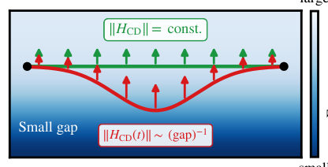 
FIG. 1. Geometric origin of constant counterdiabatic driving. Geodesic protocols correspond to straight lines in Riemann normal coordinates, yielding a constant quantum speed and therefore a constant norm of the counterdiabatic Hamiltonian. In contrast, arbitrary protocols experience a parameter-dependent quantum metric, causing the required counterdiabatic field to become stronger in regions where the energy gap is small. The two panels illustrate the equivalent representation obtained after transforming to normal coordi- nates, where the geometry is flattened while the gap structure remains encoded in the background. Arrow lengths repre- sent the counterdiabatic Hamiltonian norm, which is...

📷 Fig 2

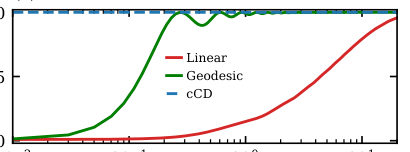 
FIG. 2. Application of constant counterdiabatic driv- ing (cCD) to Landau-Zener system. (a) Gap landscape of the Landau-Zener Hamiltonian, with ∆E = 2 √

📷 Fig 3

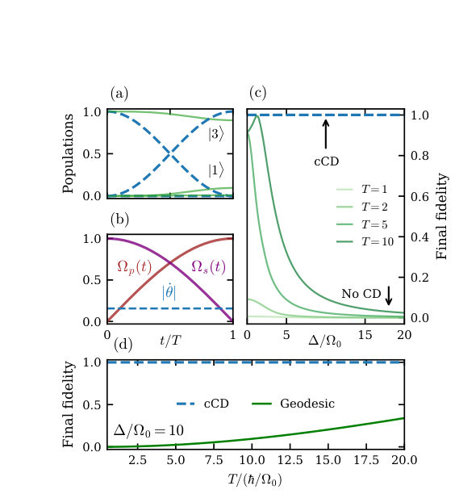 
FIG. 3. Application of constant counterdiabatic driv- ing to STIRAP. (a) Population transfer from |1⟩to |3⟩ along the geodesic path, for T = 10ℏ/Ω0. (b) Geodesic pulse sequence generating a constant counterdiabatic correc- tion. (c) Final fidelity versus detuning ∆for different proto- col durations. The constant-amplitude counterdiabatic field completely suppresses the loss of fidelity observed in the stan- dard protocol. (d) Final fidelity versus protocol duration for ∆/Ω0 = 10. Constant counterdiabatic driving achieves per- fect state preparation over the entire range of durations con- sidered, demonstrating that the geodesic construction extends naturally beyond effective two-level...

📷 Fig 4

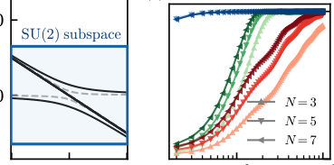 
FIG. 4. Application of constant counterdiabatic driv- ing to a collectively driven Rydberg ensemble in the blockade regime, for V = 50Ω. (a) Many-body spectrum as a function of the laser detuning ∆. The shaded region highlights the effective Landau-Zener subspace spanned by the collective ground state |G⟩and the singly excited state |W⟩, in the strong Rydberg interaction regime V ≫Ω, for N = 5 and T = 0.5ℏ/Ω. (b) Overlap between the Landau- Zener subspace projector ˆPsu(2) = |G⟩⟨G| + |W⟩⟨W| and the eigenstates of the Hamiltonian (9) as a function of the block- ade ratio V/Ω, for ∆= 0 and N = 5. (c) Final fidelity FGS(T) as a function of the protocol duration for different atom numbers N.

**Summary.** The paper develops a theoretical framework showing that following geodesic paths on the quantum state manifold naturally leads to constant counterdiabatic driving. This allows for the design of fast, high-fidelity quantum control protocols using time-independent auxiliary fields, which is demonstrated successfully across models ranging from simple two-level systems to complex Rydberg ensembles.

**Why it may be interesting.** This work provides a powerful geometric tool for designing quantum control pulses, moving beyond simple time-dependent shaping by showing how fundamental principles (geodesics) can enforce simplicity (time-independent controls) while maintaining speed and fidelity in complex many-body settings.

Detailed structure

**Main problem.** The primary challenge is achieving high-fidelity quantum state preparation on timescales much shorter than conventional adiabatic protocols.

**Main result.** Geodesic motion in the quantum state manifold allows for the construction of a time-independent counterdiabatic Hamiltonian, enabling fast, high-fidelity control.

**Method.** The authors utilize Riemannian geometry by relating the required counterdiabatic Hamiltonian norm to the quantum metric tensor along geodesic paths in the parameter space.

**Model / system.** The theory is illustrated using several models: the Landau-Zener model, three-level STIRAP, and a Rydberg ensemble operating in the blockade regime. These systems are used to demonstrate the principle of constant counterdiabatic driving.

**Key observables.** Final state fidelity ($F_{GS}(T)$), the norm of the counterdiabatic Hamiltonian ($\|	ext{H}_{	ext{CD}}\|$), and protocol duration ($T$).

**Important parameters / regimes.** The blockade interaction strength ($V$), Rabi frequencies ($\Omega$), detunings ($\Delta$), and the geometric length scale ($\ell_{	ext{geo}}$).

**Assumptions / limitations.** The analysis assumes that the system dynamics can be effectively reduced to a two-level subspace, and that following a geodesic path minimizes the required control effort.

**Figures summary.** Figures illustrate how geodesic driving maintains a constant norm for $	ext{H}_{	ext{CD}}$ compared to other protocols. They show unit fidelity achieved with time-independent cCD in Landau-Zener, STIRAP, and Rydberg blockade systems over various timescales.

**Paper structure.** The paper first establishes the geometric connection between geodesics and constant $\|	ext{H}_{	ext{CD}}\|$. It then applies this framework to specific physical models (LZ, STIRAP, Rydberg) to demonstrate that time-independent cCD achieves fast, high-fidelity state preparation. Finally, it discusses limitations related to subspace leakage.

Abstract

We show that geodesic motion in the Riemannian manifold of quantum states provides a direct route to time-independent counterdiabatic driving. Using the relation between the counterdiabatic Hamiltonian and the quantum metric tensor, we prove that a constant-speed geodesic makes the Hilbert-Schmidt norm of the counterdiabatic Hamiltonian constant. For effective two-level systems whose counterdiabatic correction has a fixed operator direction, this further implies that the full counterdiabatic Hamiltonian itself is time independent. We illustrate this result with the Landau-Zener model, three-level Stimulated Raman adiabatic passage and a collectively driven Rydberg ensemble in the blockade regime. Limitations of this approach in realistic many-body systems are discussed, where the two-level reduction is only emergent and leakage out of the effective subspace bounds the achievable speedup. In all cases, time-independent counterdiabatic driving achieves unit-fidelity state preparation on timescales substantially shorter than conventional adiabatic protocols while replacing temporally shaped auxiliary controls by fixed-amplitude fields.

[↑ back to top](#top)

### [Anticipating Decoder Side-channel Attacks in Fault-tolerant Quantum Computers](http://arxiv.org/abs/2607.12174v1)

**Authors:** Shashvat Shukla, Dan E. Browne, Shin Nishio  
**Type:** theory · **Category:** quantum information and computing · **PDF:** <https://arxiv.org/pdf/2607.12174v1>  
**Analysis basis:** full PDF text, analyzed in chunks
**Topic relevance:** `quantum measurements` **2/5** · `entanglement & information structure` **1/5** · `measurement-induced transitions` **1/5**

📷 Fig 1

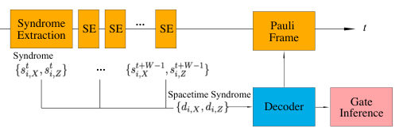 
Fig. 1: Threat model for decoder-side confidentiality leakage. The decoder is honest-but-curious, which is assumed to per- form its task of estimating the Pauli frame from the spacetime syndrome, but is not trusted with respect to confidentiality. Even without being given an explicit circuit description, the information available at the decoder interface may be exploited to infer properties of the hidden logical computation, such as the logical gate applied in a given decoding window.

📷 Fig 2

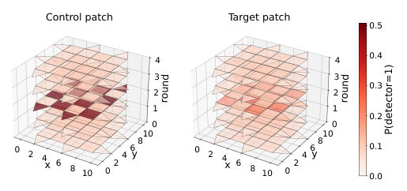 
Fig. 3: Gate fingerprint of transversal CX gate on a pair of d = 5 rotated surface code patch. Detector-event probabilities are shown over space and time for the control and target patches. The resulting signature is localized in time but spread over both patches, consistent with the coordinated two-block interaction of the transversal implementation. We set the phys- ical error rates to pidle = 10−3, p1q = 5 × 10−3, p2q = 10−2, preset = 10−3, and pmeas = 10−3.

📷 Fig 3

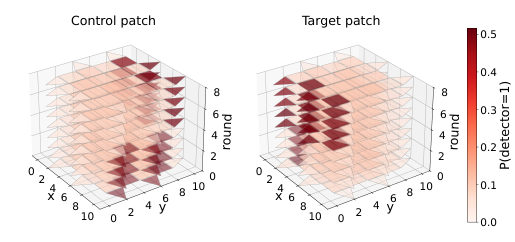 
Fig. 4: Gate fingerprint of lattice surgery-based CX gate. The boundary associated with the XX (ZZ) measurement is high- lighted by a localized increase in detector-event probability.

📷 Fig 4

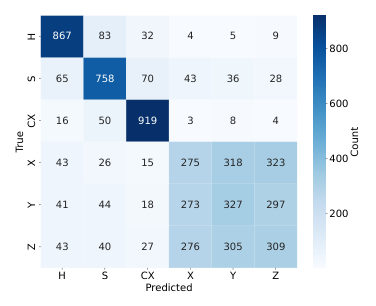 
Fig. 5: Classification metrics for logical gates. H, S, and lattice surgery exhibit distinctive fingerprints and are therefore generally classified correctly, whereas the Pauli gates X, Y , and Z share the same fingerprint under the unbiased Pauli channel, rendering them indistinguishable. 1000 shots per logical gate and 10000 shots for training.

📷 Fig 5

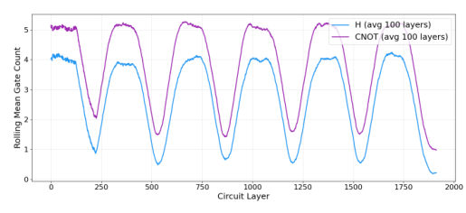 
Fig. 6: Rolling mean gate counts of the amplitude amplifica- tion circuit as seen by the decoder.

**Summary.** This work details a side-channel attack where an untrusted error correction decoder can deduce the underlying quantum algorithm by analyzing patterns (gate fingerprints) hidden within the syndrome measurement data. The authors demonstrate that these leakage channels exist even in fault-tolerant settings, necessitating that decoder systems be secured or treated as trusted components.

**Why it may be interesting.** It provides a concrete, information-theoretic security vulnerability in the control/readout layer of quantum computation, which is highly relevant for anyone designing or simulating large-scale quantum hardware.

Detailed structure

**Main problem.** The paper identifies a novel side-channel attack vector against fault-tolerant quantum computers where an untrusted decoder can infer the executed logical computation by analyzing syndrome data.

**Main result.** Distinct logical operations leave detectable statistical patterns, called 'gate fingerprints,' in the spacetime syndrome data processed by the decoder.

**Method.** The analysis formalizes this leakage by defining gate fingerprints as conditional distributions of the spacetime syndrome given a hidden logical gate, using surface code models.

**Model / system.** The system modeled is Fault-Tolerant Quantum Computing (FTQC) utilizing surface codes and Clifford+T gates. The attack targets the decoder which processes syndrome measurements derived from stabilizer checks.

**Key observables.** Spacetime syndrome data, gate fingerprints (statistical patterns in syndrome outcomes), and reconstructed logical gate sequences/ratios over time.

**Important parameters / regimes.** The type of computation (e.g., Amplitude Amplification, HHL) and the level of decoder knowledge (qubit-aware vs. qubit-unaware).

**Assumptions / limitations.** The decoder is assumed to be correct in its decoding function but untrusted regarding confidentiality; leakage occurs through syndrome data.

**Figures summary.** Figures illustrate the threat model flow, show rolling average gate counts for specific algorithms (AA, HHL, QFT), and demonstrate circuit reconstruction via majority voting on repeating patterns.

**Paper structure.** The paper proceeds by formalizing the syndrome leakage setting, defining gate fingerprints using surface code analysis of Clifford+T gates, showing how adversaries combine these fingerprints to infer circuits, and concluding with security recommendations.

Abstract

As quantum computing emerges as an applied technology, there is a growing need to protect quantum computers against information security attacks. This work identifies a new class of side-channel attacks against fault-tolerant quantum computers, in which the syndrome data that is sent to the decoder system is used to infer which computation (logical circuit) is taking place on the quantum computer. Our work introduces the concept of gate fingerprints, which describes those patterns present in syndrome data that indicate which logical operation took place on the quantum computer. We show different effects by which logical operations produce gate fingerprints by focusing on Clifford+T computation in the surface code. We then explore how gate fingerprint information can be used to make inferences about the circuits or algorithms run on a quantum computer. Our findings indicate that decoder systems can be a vector for side-channel attacks and thus to prevent this, decoder systems should either be secured or built by a trusted party.

[↑ back to top](#top)

### [Detecting Phishing in Ethereum Networks using Quantum Machine Learning](http://arxiv.org/abs/2607.12828v1)

**Authors:** Sai Sakunthala Guddanti, Anupama Ray, Mrunal Arun Kumavat, Anil Prabhakar  
**Type:** both · **Category:** quantum information and computing · **PDF:** <https://arxiv.org/pdf/2607.12828v1>  
**Analysis basis:** full PDF text, analyzed in chunks
**Topic relevance:** `entanglement & information structure` **2/5** · `QC/QI experiment` **1/5** · `methods for driven-dissipative` **1/5**

📷 Fig 1

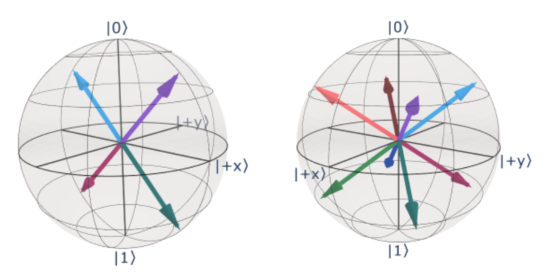 
Fig. 1 The four states of (2,1)-QRAC as corners of square (left) and the eight states of (3,1)-QRAC as corners of cube (right).

📷 Fig 2

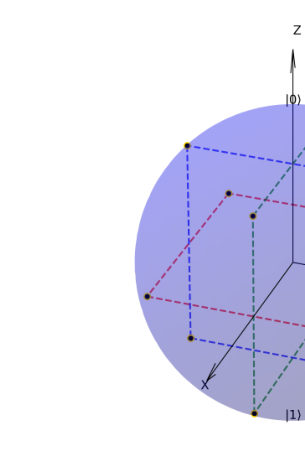 
Fig. 2 The feature encoding scheme of 2 qubit (2,1)-QRAC, based upon mutually orthogonal plane rotations

📷 Fig 3

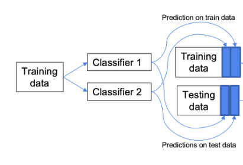 
Fig. 3 Two level stacking technique implemented

📷 Fig 4

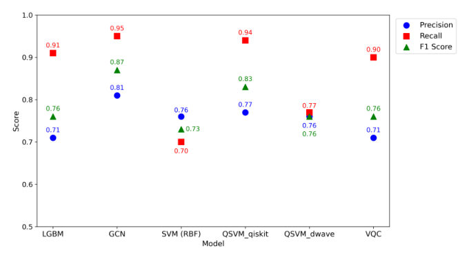 
Fig. 4 Macro average of Precision, Recall and F1 scores of individual classical and quantum models trained using same train (160p and 160np) and test data (1000p and 10000np).

📷 Fig 5

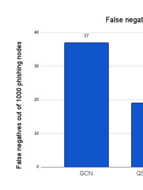 
Fig. 5 False negatives count of individual models and best performing model combinations.

**Summary.** This paper applies Quantum Machine Learning (QML) techniques, specifically QSVM and VQC, to detect phishing attacks on Ethereum transaction networks. The authors introduce a novel cascaded QRAC encoding scheme that improves performance over standard methods. They propose a hybrid quantum-classical ensemble framework, demonstrating its effectiveness while also analyzing the resilience of these models when run on near-term quantum hardware.

**Why it may be interesting.** While focused on finance, the methodology involves applying quantum feature mapping and kernel estimation to complex, structured data, which shares conceptual links with how entanglement or correlation structures are analyzed in many-body physics simulations.

Detailed structure

**Main problem.** The primary goal is detecting anomalies, specifically phishing activity, within real-world Ethereum financial transaction networks.

**Main result.** A hybrid quantum-classical ensemble framework combining QSVM and GCN showed strong performance, with QRAC encoding consistently improving results over standard feature maps on both simulators and hardware.

**Method.** The authors employ Quantum Machine Learning (QML) models like QSVM and VQC, enhanced by novel cascaded Quantum Random Access Coding (QRAC) schemes for data encoding.

**Model / system.** The work is tested on quantum computing platforms, including IBM statevector simulators and the physical IBM Heron quantum processor. The core models are QSVM and VQC applied to Ethereum transaction graph data.

**Key observables.** False negatives count, Recall rates, Macro average of Precision/Recall/F1 score, and performance degradation comparing simulator vs. hardware results.

**Important parameters / regimes.** The dataset is highly imbalanced (2500:1 ratio); encoding schemes include ZZ feature map versus cascaded QRACs; quantum volume is a key hardware metric.

**Assumptions / limitations.** Performance improvements are demonstrated despite current NISQ hardware limitations, and the authors assume that hybrid classical-quantum approaches can bridge the gap to deep learning techniques.

**Figures summary.** Figures illustrate the geometry of QRAC states on the Bloch sphere (e.g., corners of a square/cube) and detail the feature encoding scheme using orthogonal planes ($	ext{xy, yz, xz}$).

**Paper structure.** The paper progresses from identifying the anomaly detection problem to proposing QML models (QSVM/VQC), detailing advanced data encoding techniques (QRAC vs. ZZ map), benchmarking these methods on both simulators and hardware, and finally presenting an ensemble framework for robust results.

Abstract

This article explores the potential of Quantum Machine Learning (QML), specifically assessing a Quantum Support Vector Machine (QSVM) and a Variational Quantum Classifier (VQC) for detecting anomalies in real-world financial transaction data. While these QML methods outperform statistical methods, they fall short of cutting-edge deep learning techniques. To bridge this gap, we propose a hybrid quantum-classical ensemble framework that leverages the strengths of both domains. We demonstrate its effectiveness in detecting phishing in Ethereum transaction networks by combining complementary algorithms. The QSVM, whether used individually or in an ensemble, consistently delivered the lowest false negatives and higher recall rates, that are crucial for anomaly detection. To enhance individual models, we encoded the data using novel cascaded Quantum Random Access Coding (QRAC) schemes and compared it with the popular encoding ZZ feature map on both simulators and the IBM Heron quantum processor. For both QSVM and VQC, we consistently observed improvements (13% for QRAC-VQC and 3% for QRAC-QSVM) of QRAC over the ZZ feature map. Notably, certain QML algorithms exhibit remarkable resilience on the IBM Heron quantum processor, approaching simulator-level performance on devices with high quantum volume. This observation underscores the promise of QML despite hardware limitations.

[↑ back to top](#top)

### [Logarithmic corrections to bulk and surface criticality in a three-dimensional quantum Heisenberg antiferromagnet](http://arxiv.org/abs/2607.12029v1)

**Authors:** Xuyang Liang, Xiao-Chuan Wu, Zenan Liu, Zhe Wang, Zheng Yan, Dao-Xin Yao  
**Type:** both · **Category:** other · **PDF:** <https://arxiv.org/pdf/2607.12029v1>  
**Analysis basis:** full PDF text, analyzed in chunks
**Topic relevance:** `analog quantum simulation` **2/5** · `driven-dissipative phase transition` **1/5** · `exotic spin models in light-matter` **1/5**

📷 Fig 1

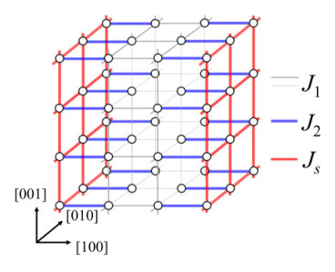 
Figure 1. The columnar-dimerized lattice of the quantum Heisenberg antiferromagnet, where J1 and J2 denote the weak and strong bulk exchange couplings, respectively, and Js is the exchange coupling within the boundary layers.

📷 Fig 2

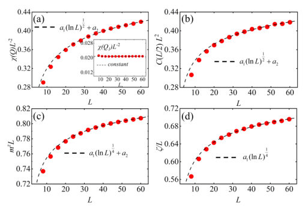 
Figure 2. Bulk observables of the columnar-dimerized model at the bulk QCP. (a) Scaled staggered susceptibility χ(Q)L−2

📷 Fig 3

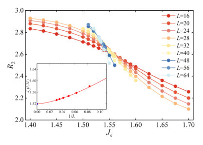 
Figure 3. The surface Binder ratio R2 versus Js for different system sizes at the bulk QCP. The inset shows the finite-size es- timates Jsc(L) obtained from the crossings of curves for pairs of system sizes L and 2L, and the line represents the fitting function in Eq. (14) by neglecting the logarithmic correction. The blue symbol shows the extrapolated value in the thermo- dynamic limit.

📷 Fig 4

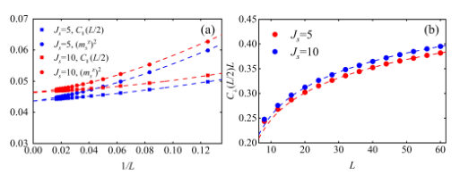 
Figure 5. (a) Squared surface staggered magnetization mz s 2 and correlation function C∥(L/2) versus 1/L and (b) the scaled cor- relation function C⊥(L/2)L versus system size L in the extraor- dinary regime. The dotted lines represent the least-squares fits.

📷 Fig 5

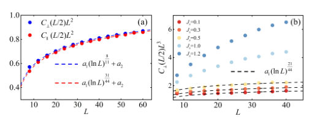 
Figure 4. (a) The scaled correlation functions C∥(L/2)L2 and C⊥(L/2)L2 versus L at the special transition. (b) The scaled correlation functions C⊥(L/2)L3 as a function of L for several values of Js in the ordinary regime.

**Summary.** This paper rigorously examines the impact of logarithmic corrections on the critical behavior of a 3D quantum Heisenberg antiferromagnet at its surface. By combining large-scale Quantum Monte Carlo simulations with Boundary Renormalization Group theory, the authors characterize three distinct boundary regimes (ordinary, special, extraordinary). The work provides new theoretical predictions and quantitative numerical evidence for how these logarithmic terms govern finite-size scaling near the quantum critical point.

**Why it may be interesting.** The detailed study of boundary critical phenomena, especially incorporating higher-order logarithmic corrections beyond mean-field theory, provides crucial insights into how dimensionality reduction or boundaries modify fundamental quantum phase transitions relevant to strongly correlated materials.

Detailed structure

**Main problem.** The study investigates how logarithmic corrections modify critical behavior at both the bulk and surface levels of a quantum antiferromagnet near its upper critical dimension.

**Main result.** The authors derive new, quantitatively supported logarithmic correction exponents for boundary correlations in ordinary and special transition regimes, while also confirming long-range surface order in the extraordinary regime.

**Method.** The research combines large-scale Quantum Monte Carlo (QMC) simulations with rigorous Boundary Renormalization Group (RG) analysis to analyze finite-size scaling.

**Model / system.** The system is a spin-1/2 columnar-dimerized quantum Heisenberg antiferromagnet realizing a (3+1)D O(3) quantum critical point. The Hamiltonian includes bulk and surface coupling terms ($J_1, J_2, J_s$).

**Key observables.** Bulk staggered moment ($\langle M_z^q 
angle$), surface staggered moment ($\langle M_z^{q,s} 
angle$), susceptibility ($\chi(q)$), correlation length ($\xi$), and the surface Binder ratio ($R_2$).

**Important parameters / regimes.** The analysis distinguishes between three critical regimes based on the surface coupling $J_s$: ordinary, special, and extraordinary transitions.

**Assumptions / limitations.** The analysis relies on extending known mean-field results to include multiplicative logarithmic corrections in finite-size scaling forms.

**Figures summary.** Figures illustrate the lattice structure (Fig 1), show bulk observables confirming expected logarithmic scaling at the QCP (Fig 2), and plot the surface Binder ratio ($R_2$) vs. $J_s$ to map out the different critical regimes (Fig 3).

**Paper structure.** The paper first establishes the theoretical framework for logarithmic corrections in the bulk, then uses QMC simulations to verify these effects. It proceeds by analyzing the surface criticality across three distinct regimes—ordinary, special, and extraordinary—deriving specific scaling forms and exponents for each.

Abstract

At the bulk upper critical dimension, marginally irrelevant interactions generate multiplicative logarithmic corrections to mean-field scaling. While these corrections are well understood for bulk observables, their consequences for boundary criticality, particularly for finite-size scaling, remain much less explored. Here we combine large-scale quantum Monte Carlo simulations with boundary renormalization-group analysis to study a (3 + 1)D O(3) quantum critical point. After verifying the known logarithmically modified bulk finite-size scaling, including the correlation-length scaling governed by the logarithmic finite-size exponent \hat{\coppa}, we tune the surface coupling to identify ordinary, special, and extraordinary boundary regimes. For the ordinary and special transitions, we derive logarithmic correction exponents and \hat{\coppa}-dependent finite-size scaling forms for boundary correlations, including results that have not been systematically established before. These predictions are quantitatively supported by Monte Carlo data. In the extraordinary regime, we find long-range surface magnetic order and a logarithmically enhanced surface-bulk correlation.

[↑ back to top](#top)

### [Quantum PDE Solvers in Practice: Application-Driven Benchmarking of the Heat Equation](http://arxiv.org/abs/2607.12688v1)

**Authors:** Mahmoud Elkarargy, Abdelaziz Rahwan, Abdelrahman Elsayed, Forat Hatem  
**Type:** theory · **Category:** quantum information and computing · **PDF:** <https://arxiv.org/pdf/2607.12688v1>  
**Analysis basis:** full PDF text, analyzed in chunks
**Topic relevance:** `quantum measurements` **2/5** · `methods for driven-dissipative` **1/5** · `non-equilibrium dynamics` **1/5**

📷 Fig 1

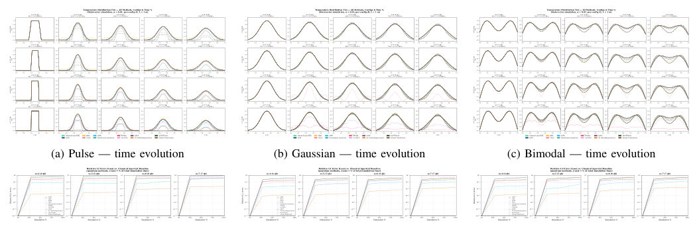 
Fig. 1: Statevector backend. Top row: temperature evolution T(x) at five time milestones across grid sizes n=4–7, one panel per initial condition. Bottom row: relative ℓ2 error vs. simulation progress (%). In each panel, the eleven quantum kernels appear as separate colored curves. kernel-level behaviour is discussed in §VII.

📷 Fig 2

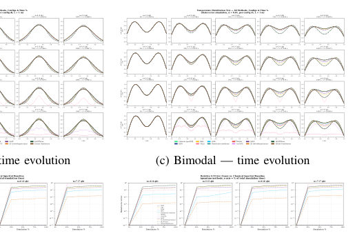 
Figure 4 (log 2Q counts vs. n) reflects the spread already tabulated: HHL, QSVT, and the spectral/dilation routes climb sharply while others stay moderate, so compiled cost sits beside the terminal accuracies of Table IV as a first-class axis. Figure 5 estimates the shot count to reach ϵ = 10−2

📷 Fig 3

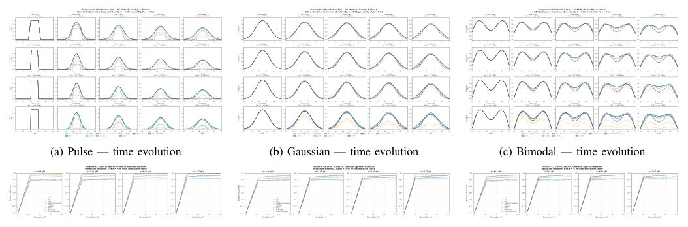 
Fig. 2: Ideal (shot-based, noiseless) backend (Nshots=100 000). VQLS, Schr¨odingerisation, and QLS-Fourier are omitted (statevector-only; §VI-B).

📷 Fig 4

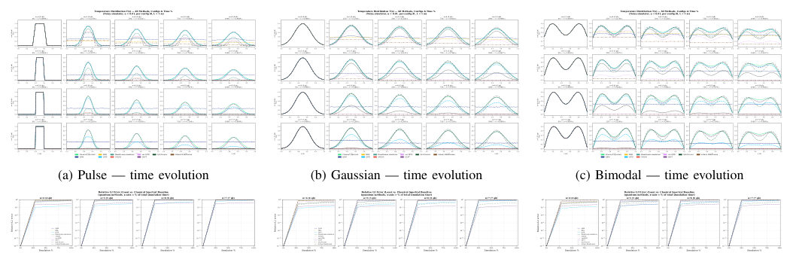 
Fig. 3: Noisy simulator backend HHL is included only at n=4 (noisy transpilation limit; §V-A). Device noise degrades accuracy relative to the ideal backend for the circuits that transpile; conclusions are limited to this portable depolarising/readout model and the successfully compiled subset.

📷 Fig 5

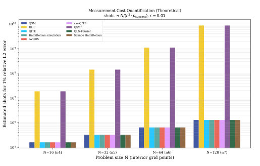 
Fig. 5: Estimated shot budget (log-y) to reach ϵ=10−2

**Summary.** This paper creates a reproducible benchmark by applying various quantum solvers to the 1-D heat equation. It systematically compares performance across different algorithmic paradigms under controlled conditions. The key finding is that measuring only compact observables drastically reduces resource requirements compared to reconstructing the entire field, guiding future research in practical quantum simulation.

**Why it may be interesting.** It provides a rigorous, application-driven framework for benchmarking quantum algorithms applied to continuous physical systems, which is crucial for advancing quantum simulation beyond toy models.

Detailed structure

**Main problem.** The primary challenge is developing a reproducible benchmark for quantum PDE solvers due to inconsistencies across existing literature regarding discretization, readout models, and hardware assumptions.

**Main result.** The paper establishes that compact observable measurements (like total energy) require significantly fewer shots than full-field reconstruction, providing a practical guide for selecting appropriate quantum algorithms.

**Method.** A comprehensive benchmark is constructed by applying multiple quantum kernels—including HHL, QSVT, QSM, and various time-evolution methods—to the 1-D Dirichlet heat equation under controlled parameters.

**Model / system.** The system modeled is the 1-D Dirichlet heat equation ($\partial u/\partial t = \alpha \partial^2 u/\partial x^2$), discretized on a grid of size $N=2^n$ with fixed boundary conditions.

**Key observables.** Relative $\ell_2$ error, reconstruction normalization artifacts (norm-mismatch), and the shot count required for different types of observables (full field vs. compact).

**Important parameters / regimes.** Grid sizes $N \in \{16, 32, 64, 128\}$ ($n=4$ to $7$), CFL-like ratio $r \approx 0.4$, and final time $T=1$.

**Assumptions / limitations.** The analysis distinguishes between algorithmic error (statevector backend) and sampling/reconstruction errors; it assumes the heat equation structure is representative for benchmarking.

**Figures summary.** Not specified, but the text refers to tables comparing resource terms and performance across different kernels and observables.

**Paper structure.** The paper systematically compares five paradigms of quantum solvers (linear inversion, variational dynamics, Hamiltonian simulation, spectral methods) against a common benchmark problem instance (the heat equation), culminating in a guide for practical solver selection based on the required output observable.

Abstract

Quantum PDE solvers are difficult to evaluate in practice because published studies use different discretizations, output models, reconstruction rules, and hardware assumptions. We present a reproducible, application-driven benchmark for the 1-D Dirichlet heat equation that compares eleven kernels under the same problem instances and readout contract. The benchmark covers coherent linear solvers (HHL, QSVT, and QLS-Fourier), VQLS, imaginary-time methods (QITE, var-QITE, and AVQDS), real-time Hamiltonian simulation and unitary dilations (Hamiltonian simulation, Schade-Hamiltonian, and Schr"odingerisation), and the spectral quantum simulation method (QSM). We use three initial conditions, four grid sizes from $n=4$ to $7$ qubits ($N=16$ to $128$), a CFL-like ratio $r\approx0.4$, and final time $T=1$. Statevector, ideal-shot ($10^5$ shots per step), and noisy Aer backends separate algorithmic, sampling, and device-noise errors. On statevector, QSM and Schade-Hamiltonian reproduce the semi-discrete reference to floating-point precision, Schr"odingerisation reaches approximately $10^{-4}$ error, and QITE is the strongest non-transform method for smooth data. Under the fixed-shot setting, HHL degrades to approximately $0.79$ relative $\ell_2$ error, while several low-depth or postselected methods become readout-limited. A norm-mismatch ablation attributes 23--29% of the $n=7$ smooth-initial-condition error of Hamiltonian simulation, AVQDS, and QLS-Fourier to reconstruction normalization. Compact observables, including total thermal energy and individual Fourier-mode weights, require 1--3 orders of magnitude fewer shots than full-field reconstruction. The resulting public benchmark provides a practical guide for selecting quantum PDE solvers.

[↑ back to top](#top)

### [A Quantum Computing Approach to Track Reconstruction in Strip-Type Detectors](http://arxiv.org/abs/2607.12821v1)

**Authors:** Seungyeob Jwa, Hyunyong Kim, Jangho Kim, Minseok Oh  
**Type:** both · **Category:** quantum information and computing · **PDF:** <https://arxiv.org/pdf/2607.12821v1>  
**Analysis basis:** full PDF text, analyzed in chunks
**Topic relevance:** `QC/QI experiment` **2/5** · `methods for driven-dissipative` **1/5**

📷 Fig 1

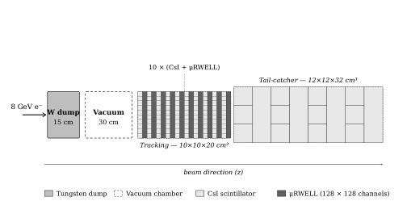 
FIG. 1. Schematic side view of the compact beam dump ex- periment. An 8GeV electron beam is stopped in a 15cm tung- sten dump, followed by a 30cm vacuum chamber. The ECal comprises a 10 × 10 × 20cm3 tracking section of ten inter- leaved 1cm CsI scintillator and 1cm µRWELL layers, with odd-numbered µRWELL planes rotated by 45◦to form a u- v stereo readout, and a 12 × 12 × 32cm3 tail-catcher of four crossed x-y CsI-bar module pairs. The beam propagates along the z direction.

📷 Fig 2

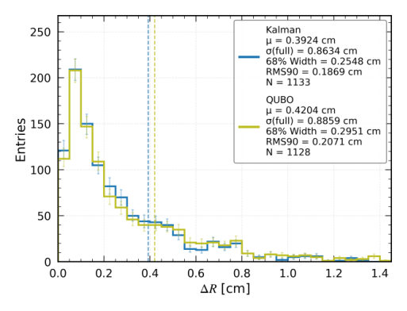 
FIG. 2. Comparison of the position residual distributions for the Kalman and QPU reconstruction methods. The re- constructed track is extrapolated to the z = 0 plane, and the residual is computed as the transverse distance from the truth position. The dashed vertical lines indicate the mean residual values.

📷 Fig 3

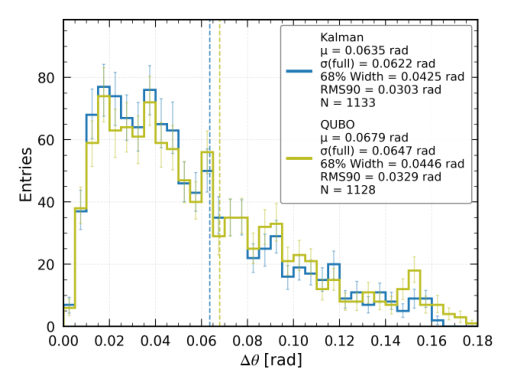 
FIG. 3. Comparison of the angular residual distributions for the Kalman and QPU reconstruction methods. The angular residual is defined as the opening angle between the recon- structed track direction and the truth direction. The dashed vertical lines indicate the mean angular residual values.

📷 Fig 4

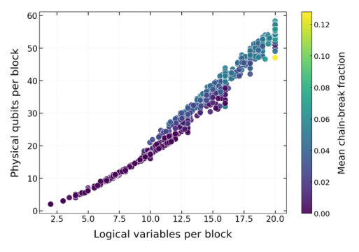 
FIG. 4. QPU embedding resource usage for the single track hit selection QUBO. Both axes are normalized by the number of local QUBO blocks in the submitted problem. The plot shows the physical qubit cost per block as a function of the logical variable count per block.

📷 Fig 5

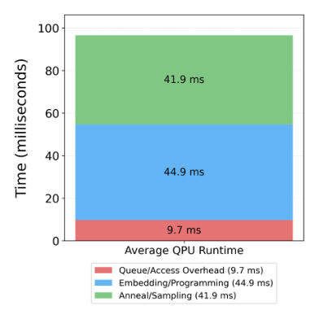 
FIG. 5. Deconstructed average QPU runtime latency for the single track hit selection QUBO. The metrics are normalized by 1128 photon candidate events under a parameter set of S = 1, R = 200, and Ta = 20.0 µs. All values are presented in milliseconds.

**Summary.** This paper explores using quantum annealing to solve track reconstruction in gaseous detectors by mapping the pattern recognition challenge into two distinct QUBO formulations. The results show that while classical methods like Kalman filters yield slightly better numerical resolution, the quantum approach is a viable proof-of-concept for local decision-making. This work establishes a framework for hybrid quantum-classical computing in complex detector environments.

**Why it may be interesting.** While focused on particle physics instrumentation, the core methodology—mapping a complex combinatorial optimization problem onto a QUBO solvable by quantum annealing—is directly relevant to developing algorithms for solving hard problems in quantum chemistry or materials science simulations.

Detailed structure

**Main problem.** The study addresses track reconstruction in gaseous detectors, which is formulated as a complex combinatorial optimization problem due to overlapping hits.

**Main result.** Quantum annealing approaches using QUBO formulations successfully reproduce local reconstruction decisions comparable to established Kalman filter methods for low pileup environments.

**Method.** The core method involves formulating the hit selection and track association problems into Quadratic Unconstrained Binary Optimization (QUBO) problems, which are then solved on a Quantum Processing Unit (QPU).

**Model / system.** The physical system is simulated using DAMSA detector events from a beam dump setup. The optimization uses QUBO formulations to select single hits or associate cluster triplets across multiple detector layers.

**Key observables.** Position and angular resolutions ($\sigma_{	ext{full}}$, 68% width), Triplet recovery fraction ($\epsilon_{	ext{triplet}}$), and end-to-end latency ($T_{	ext{total}}$).

**Important parameters / regimes.** Penalty strengths (e.g., $A_{	ext{seg}} = 35.0$), Straightness reward strength ($B_{	ext{line}} = 10.0$), and the low pileup regime of the simulated events.

**Assumptions / limitations.** The current demonstration is a proof-of-principle limited to low pileup samples; future work must address high occupancy and complex noise scenarios.

**Figures summary.** Figures compare position/angular residual distributions (Kalman vs. QPU), show the resource usage of QUBO embedding, and deconstruct the total operational latency for the quantum processing unit.

**Paper structure.** The paper introduces the problem, formulates two distinct QUBO subproblems (single hit selection and cluster association), tests these formulations on simulated data, compares results statistically against classical methods, and analyzes computational overheads.

Abstract

This study investigates the use of quantum annealing for particle track reconstruction in strip-type gaseous detectors. In such detectors, ghost hits and multiple hit combinations can turn pattern recognition into a combinatorial optimization problem. We formulate two reconstruction subproblems as quadratic unconstrained binary optimization problems. The first subproblem selects detector hits associated with a single photon track inside a localized candidate region. The second subproblem selects cluster triplets from different detector layers so that multiple track candidates can be handled within a single quantum processing unit(QPU) submission. The proposed formulations are tested using simulated DAMSA detector events. For the single track hit selection task, the QPU based reconstruction gives position and angular resolutions close to those obtained with a Kalman based reconstruction. In the simultaneous association task, valid cluster triplets are first extracted from the QPU samples and then connected using an association rule based on graph connectivity to construct track candidates. The DAMSA event topology studied here has low pileup and is dominated by the two photon signal from axion-like particle(ALP) decay. In this setting, the results show that the QUBO formulations can reproduce local reconstruction decisions. This provides a practical basis for further studies of reconstruction methods that combine quantum and classical computing in more complex tracking environments.

[↑ back to top](#top)

### [Expressibility and trainability of a two-dimensional pairwise quantum-circuit ansatz](http://arxiv.org/abs/2607.12996v1)

**Authors:** Shuai Zhang, Wei Liu, Ji-Chong Yang  
**Type:** theory · **Category:** quantum information and computing · **PDF:** <https://arxiv.org/pdf/2607.12996v1>  
**Analysis basis:** full PDF text, analyzed in chunks
**Topic relevance:** `QC/QI experiment` **2/5** · `entanglement & information structure` **1/5**

📷 Fig 1

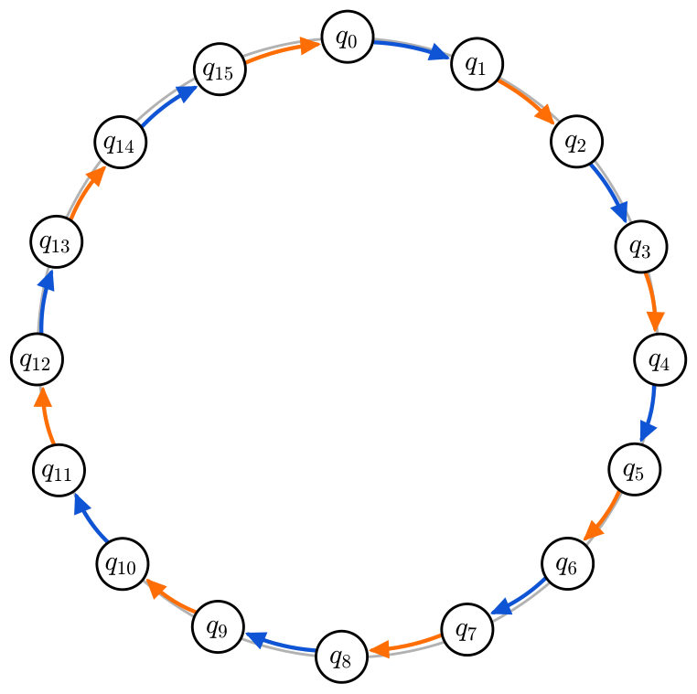 
FIG. 1. Connection diagram for a single layer of 16 qubits in a 1D pairwise ansatz. They are

📷 Fig 2

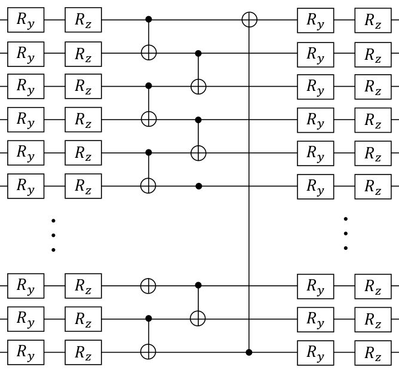 
FIG. 2. The ansatz consists of 16 qubits arranged in 1D pairwise architecture. Each layer is

📷 Fig 3

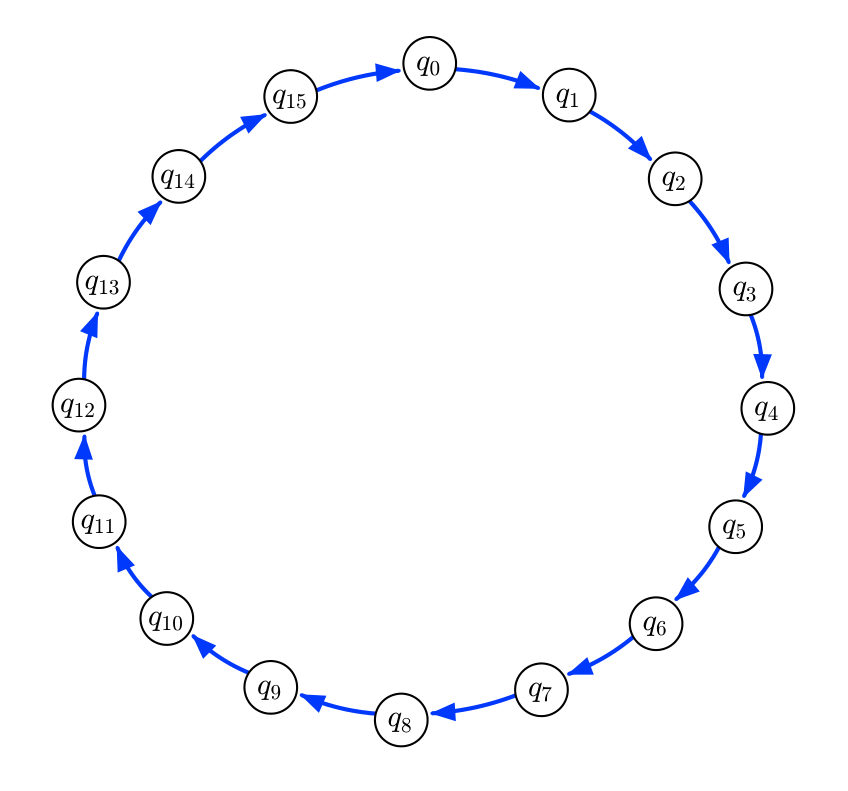 
FIG. 3. Connection diagram for a single layer of 16 qubits in 1D circular ansatz. The same as

📷 Fig 4

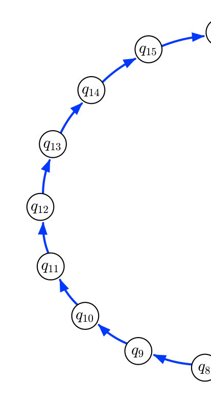 
Fig. 1, the arrows represent CNOT gates.

📷 Fig 5

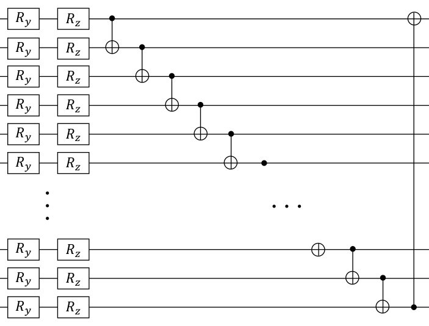 
FIG. 4. The quantum circuit of a 1D circular consisting of 16 qubits. The structure of each layer

**Summary.** This paper rigorously compares four different parameterized quantum circuits (ansatze)—including a native 2D pattern—to assess their suitability for variational quantum algorithms. By measuring expressibility via KL divergence and frame potential, and trainability via gradient variance, the authors show that the 2D ansatz offers superior performance at shallow depths by respecting physical hardware connectivity constraints.

**Why it may be interesting.** This work directly addresses the crucial engineering challenge of mapping theoretical quantum algorithms onto realistic, geometrically constrained hardware architectures like planar superconducting chips.

Detailed structure

**Main problem.** The study compares the expressibility and trainability of a native two-dimensional quantum circuit ansatz against various one-dimensional ansatze for Variational Quantum Algorithms (VQAs). The goal is to determine which connectivity pattern best suits modern, planar quantum hardware.

**Main result.** The 2D pairwise ansatz consistently demonstrated superior performance compared to 1D alternatives at shallow layer depths, showing lower KL divergence and smaller gradient variance. However, all ansatze converged to similar performance metrics as the circuit depth increased.

**Method.** Expressibility is quantified using Kullback–Leibler (KL) divergence and the second-order frame potential ($F^{(2)}$). Trainability is assessed by measuring the gradient variance of an expectation value with respect to a circuit parameter.

**Model / system.** The analysis uses a fixed 16-qubit system modeled on superconducting qubits, specifically comparing nearest-neighbor interactions on a planar $4 	imes 4$ grid (2D) against linear or circular chains (1D).

**Key observables.** Kullback–Leibler divergence ($D_{KL}$), second-order frame potential ($\hat{F}^{(2)}$), and gradient variance of the Pauli-Z string expectation value.

**Important parameters / regimes.** Number of ansatz layers ($L$), system size ($N=16$ qubits).

**Assumptions / limitations.** The comparison is performed by matching the number of repeated ansatz layers ($L$) rather than matching physical resource counts like gate depth or total gates. The gradient variance measures signal strength, not overall optimization success.

**Figures summary.** Figures compare KL divergence and frame potential across different ansatze vs. layer depth (L), while other figures plot the gradient variance of a specific Pauli-Z string expectation value against L for all four ansatz types.

**Paper structure.** The paper introduces PQCs and the need to match hardware connectivity, defines the 2D and 1D ansatzes, and then systematically compares them using three metrics (KL divergence, frame potential, gradient variance) across increasing circuit depths ($L$).

Abstract

Parameterized quantum circuits~(PQCs) constitute a central building block of variational quantum algorithms~(VQAs) and quantum machine learning~(QML) methods. Existing ansatz designs often adopt hardware-agnostic or simplified 1D chain/ring entanglement patterns. However, as quantum hardware continues to develop, native 2D connectivity patterns, such as planar superconducting-qubit architectures, are becoming increasingly important. Inspired by this hardware structure, we construct a native 2D pairwise ansatz and compare its expressibility and trainability with representative 1D ansatze at identical layer depths, despite their different circuit depths. For the fixed 16-qubit system, the 2D ansatz has the smallest KL divergence at $L=1$ and $2$, and its second-order frame potential approaches the theoretical lower bound more rapidly at shallow layer counts than the frame potentials of the three 1D ansatze. We also evaluate the gradient variance of the Pauli-$Z$-string expectation value $\langle Z_0\otimes\cdots\otimes Z_{15}\rangle$ with respect to the first $R_y$ angle. For this Pauli-$Z$ string and fixed parameter, the gradient variance is smaller for the 2D circuit at $L=1$--$4$. The differences narrow at $L=5$, and the four ansatze yield statistically compatible variances at $L=6$.

[↑ back to top](#top)

### [Categorical Tensor-Graph Semantics for Quantum Algorithms](http://arxiv.org/abs/2607.12128v1)

**Authors:** Naihong Hu, Ruining Li, Futao Wang  
**Type:** theory · **Category:** quantum information and computing · **PDF:** <https://arxiv.org/pdf/2607.12128v1>  
**Analysis basis:** full PDF text, analyzed in chunks
**Topic relevance:** `entanglement & information structure` **2/5**

📷 Fig 1

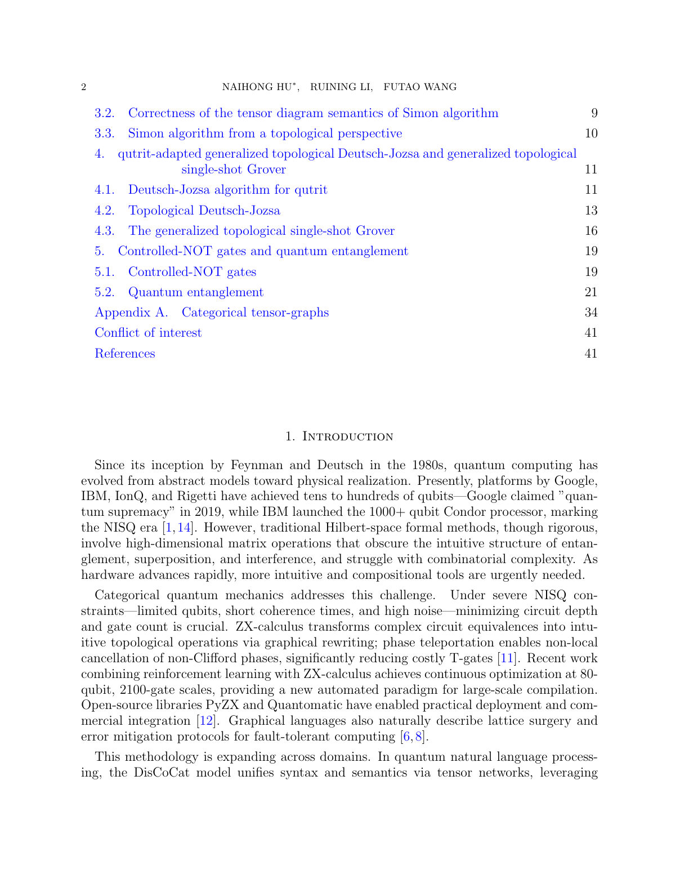 
Low-resolution page preview, page 2

📷 Fig 2

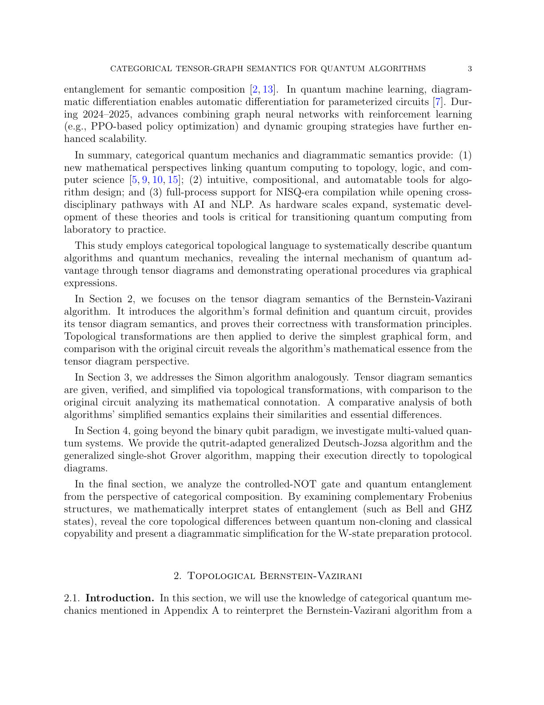 
Low-resolution page preview, page 3

📷 Fig 3

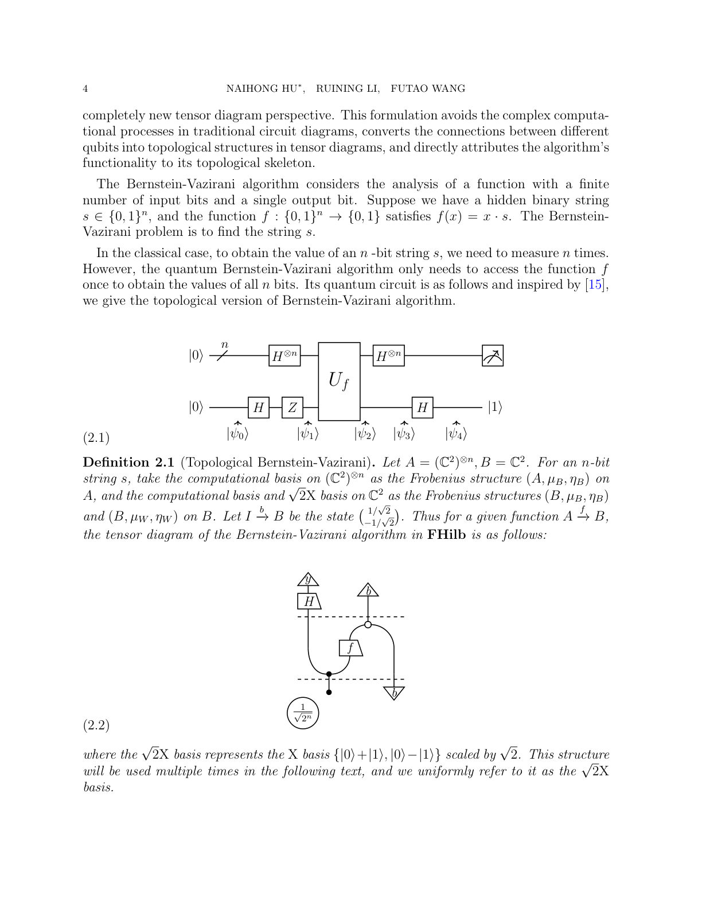 
Low-resolution page preview, page 4

📷 Fig 4

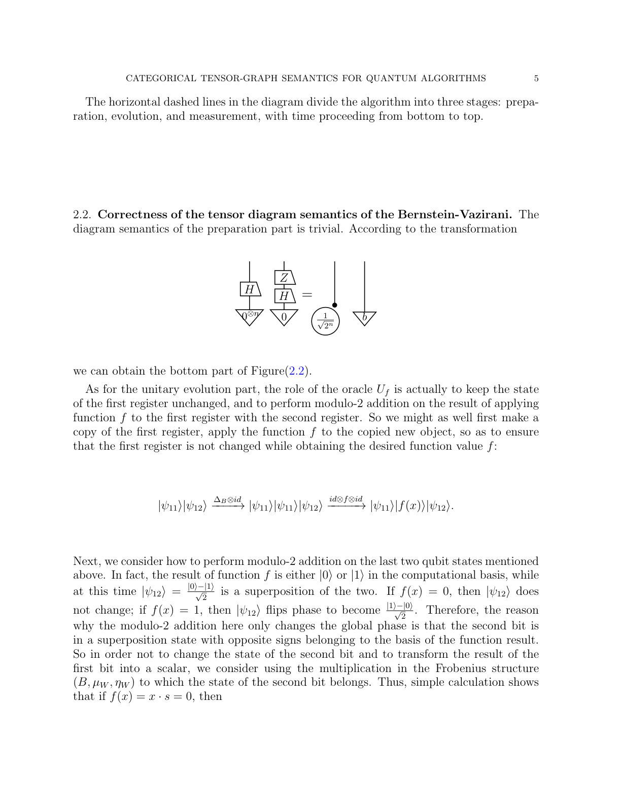 
Low-resolution page preview, page 5

📷 Fig 5

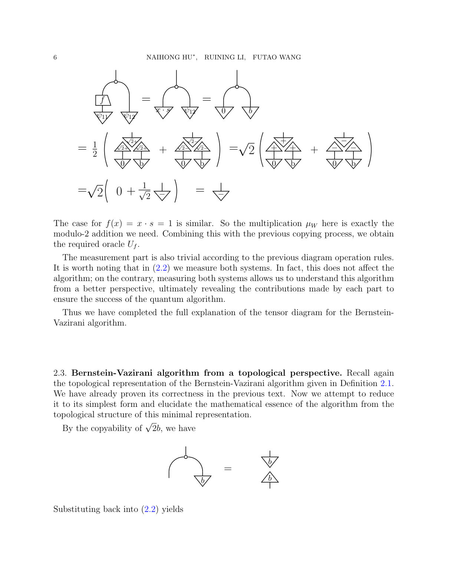 
Low-resolution page preview, page 6

**Summary.** This paper develops a novel framework using categorical tensor-graph semantics to analyze quantum algorithms structurally. It reinterprets key protocols like Bernstein-Vazirani and generalizes them to higher dimensions (qutrits) within this topological language. By linking computation to Frobenius structures, it provides a powerful diagrammatic toolkit for circuit optimization and understanding entanglement.

**Why it may be interesting.** While highly abstract, the development of a diagrammatic toolkit based on category theory offers a powerful, potentially automated way to optimize quantum circuits by revealing underlying mathematical symmetries beyond standard gate decomposition.

Detailed structure

**Main problem.** To provide a structural, intuitive understanding of quantum algorithms by reinterpreting them using categorical tensor-graph semantics within the category FHilb.

**Main result.** The paper establishes that fundamental quantum operations like entanglement generation and algorithm execution can be mapped to algebraic structures (Frobenius structures) whose properties reveal deep mathematical connections between computation and topology.

**Method.** It employs advanced tools from category theory, specifically utilizing tensor-graph semantics and Frobenius structures, to topologically reinterpret established quantum algorithms and physical processes.

**Model / system.** The focus is on abstract quantum computation within finite-dimensional Hilbert spaces (FHilb), analyzing protocols involving qubits and qutrits. The formalism uses monoidal dagger categories to define state preparation and gate operations diagrammatically.

**Key observables.** Topological skeletons of algorithms, entanglement properties (non-copyability), and the structure constants derived from complementary Frobenius structures.

**Important parameters / regimes.** The dimension of the Hilbert space ($n$), the base field ($\mathbb{C}_2$ for some analyses), and the constant $s$ characterizing complementary bases.

**Assumptions / limitations.** The core assumption is that complex quantum operations can be accurately modeled and understood through the lens of categorical algebraic structures like Frobenius algebras.

**Figures summary.** Figures illustrate tensor diagrams for algorithms (BV, Simon) and state preparation protocols (Bell, GHZ, W-state), alongside formal definitions for various categorical structures (monoid, comonoid, Frobenius structure).

**Paper structure.** The paper builds from defining the necessary algebraic framework (Frobenius structures in FHilb) to applying this framework to reinterpret specific quantum algorithms (BV, Simon, Deutsch-Jozsa generalization), and finally analyzing physical phenomena like entanglement using these structural tools.

Abstract

This paper systematically investigates quantum computing protocols from the intuitive perspective of categorical tensor-graph semantics within the category FHilb. While conventional Hilbert-space formalisms conceal the structural nature of quantum algorithms behind high-dimensional matrix operations, the topological framework developed herein directly encodes algorithmic functionalities to their graphical skeletons. We provide a comprehensive topological reinterpretation of the Bernstein-Vazirani and the Simon algorithms, demonstrating how topological transformations distill their core mathematical essence and clarify the operational mechanism of oracles. Going beyond standard qubit models, we formalize the qutrit-adapted generalized Deutsch-Jozsa algorithm as well as the generalized single-shot Grover algorithm, explicitly laying out their graphical representations. We further implement CNOT gates via complementary Frobenius structures, trace the diagrammatic genesis of quantum entanglement including Bell and GHZ states, and present a diagrammatic simplification for W-state preparation protocol. By bridging tensor category theory with practical quantum algorithmic design, this work furnishes composable, scalable diagrammatic toolkit essential for automated circuit optimization across the evolving quantum hardware ecosystem.

[↑ back to top](#top)

### [Maximal Classicalization of Finite-Group Quantum Reference-Frame Noise](http://arxiv.org/abs/2607.12968v1)

**Authors:** Maxim V. Churilov  
**Type:** theory · **Category:** quantum information and computing · **PDF:** <https://arxiv.org/pdf/2607.12968v1>  
**Analysis basis:** full PDF text, analyzed in chunks
**Topic relevance:** `Keldysh / 2PI / non-Gaussian methods` **1/5** · `correlated / nonlocal dissipation` **1/5** · `driven-dissipative phase transition` **1/5** · `entanglement & information structure` **1/5** · `methods for driven-dissipative` **1/5**

📷 Fig 1

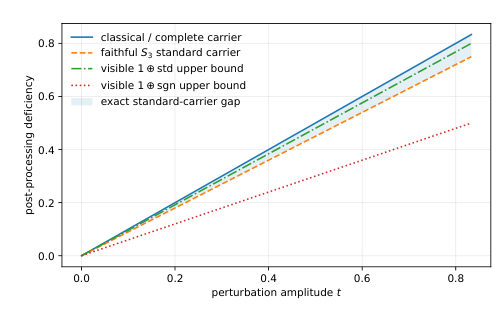 
FIG. 1. Uniform-perturbation deficiencies on S3. The representation-complete carrier attains the classical value; the faithful standard carrier has exact slope 9/10. For the two re- ducible incomplete supports, Eq. (37) gives the shown explicit upper bounds; equality is not asserted for those two curves.

**Summary.** This paper characterizes when noisy quantum measurements derived from finite group actions can be perfectly modeled by classical probability convolutions. It proves that this perfect 'classicalization' occurs if and only if the underlying unitary representation of the group is 'representation complete.' The work provides quantitative measures for how far a system deviates from ideal classical behavior.

**Why it may be interesting.** It provides rigorous mathematical tools to quantify the limits of quantum information processing when noise is structured by group symmetries, which has implications for quantum metrology and quantum communication protocols.

Detailed structure

**Main problem.** The central problem is determining the precise conditions under which optimal quantum post-processing (channel discrimination) for a noisy finite quantum reference frame reduces exactly to classical convolution over group elements.

**Main result.** Representation completeness of the unitary representation $U$ of the group $G$ is proven to be the exact necessary and sufficient condition for this universal reduction from quantum optimization to classical convolution.

**Method.** The authors use algebraic techniques involving irreducible representations, isotypic decomposition, and comparing quantum channel distances (diamond norm) against classical probability metrics ($\ell_1$ norm).

**Model / system.** The model involves a noisy finite quantum reference frame characterized by a random-unitary channel $\Phi^U$, derived from the action of a unitary representation $U$ of a finite group $G$. The analysis extends to infinite compact groups using Peter-Weyl theory.

**Key observables.** Directional post-processing error ($\delta_U$), visible Plancherel dimension ($S(U)$), and the deficiency gap quantifying the failure of classicalization.

**Important parameters / regimes.** The structure of the group $G$, the specific unitary representation $U$, and the dimensions related to irreducible representations ($d_\lambda$).

**Assumptions / limitations.** For finite groups, the analysis relies on the equivalence between various mathematical conditions (e.g., orthonormal orbits, representation completeness). For infinite groups, stability is restricted to a 'visible Peter-Weyl band' $\Lambda_0$.

**Figures summary.** No specific figure summaries were extracted; the notes detail theoretical theorems and derived formulas for dimensions and distances.

**Paper structure.** The paper establishes equivalences between representation completeness and classicalization (Theorem III.1), quantifies resource costs like minimum ancilla dimensions, derives explicit deficiency gaps for incomplete carriers, and finally extends these concepts to infinite compact groups using spectral theory.

Abstract

A finite quantum reference token with group-valued misalignment induces a random-unitary channel, but optimal degradation is generally an optimization over all quantum post-processings. For a unitary representation U of a finite group G, we prove that the following conditions are equivalent: U contains every irreducible type; one ancilla-assisted input has an orthonormal G-orbit; signed group measures embed isometrically into channels in diamond norm; and, for every pair of noise laws p,q, $\inf_{Λ\in\mathrm{CPTP}} \frac{1}{2}\|Φ_q^U-Λ\circΦ_p^U\|_\diamond =\min_{r\in\mathcal{P}(G)}\frac{1}{2}\|q-r*p\|_1$. Thus representation completeness is the exact carrier condition for universal reduction of quantum post-processing to classical convolution. We determine the minimum ancilla dimensions for an orthogonal orbit and for an invariant calibration seed. For an incomplete carrier, with visible Plancherel dimension S(U), we derive the exact conditional-expectation distance $\frac{1}{2}\|\operatorname{id}-Φ_u^U\|_\diamond=1-1/S(U)$ and an explicit quantum--classical deficiency gap. For irreducible carriers the deficiency is obtained in closed form; the faithful two-dimensional representation of $S_3$ yields an exact ten-percent reduction relative to classical convolution. We also characterize law identifiability through the conjugation representation, provide finite linear programs and decision witnesses, and establish both a finite-dimensional obstruction and stable visible-band reconstruction for infinite compact groups. Deterministic ancillary code reproduces the finite-group examples and numerical regression checks.

[↑ back to top](#top)

### [The Infinitesimal Structure of Quantum Information](http://arxiv.org/abs/2607.12559v1)

**Authors:** Luca Barbieri-Viale  
**Type:** theory · **Category:** other · **PDF:** <https://arxiv.org/pdf/2607.12559v1>  
**Analysis basis:** full PDF text, analyzed in chunks
**Topic relevance:** `driven-dissipative phase transition` **1/5** · `entanglement & information structure` **1/5** · `methods for driven-dissipative` **1/5** · `non-equilibrium dynamics` **1/5**

📷 Fig 1

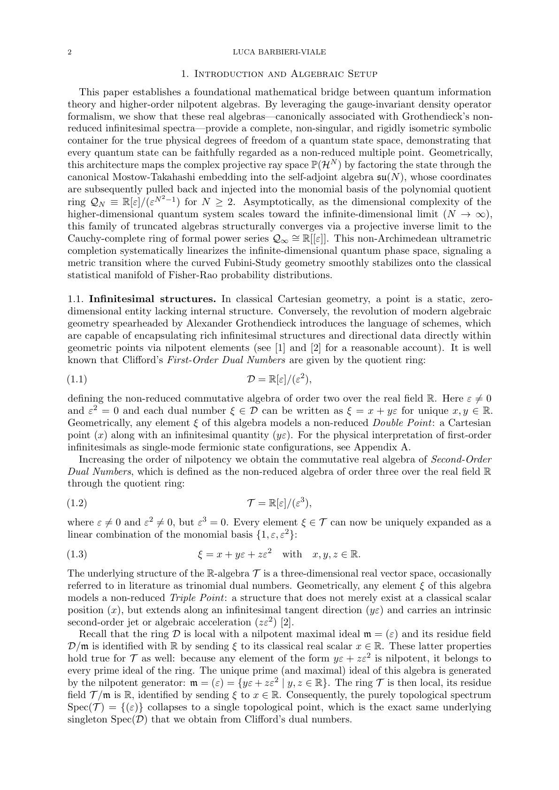 
Low-resolution page preview, page 2

📷 Fig 2

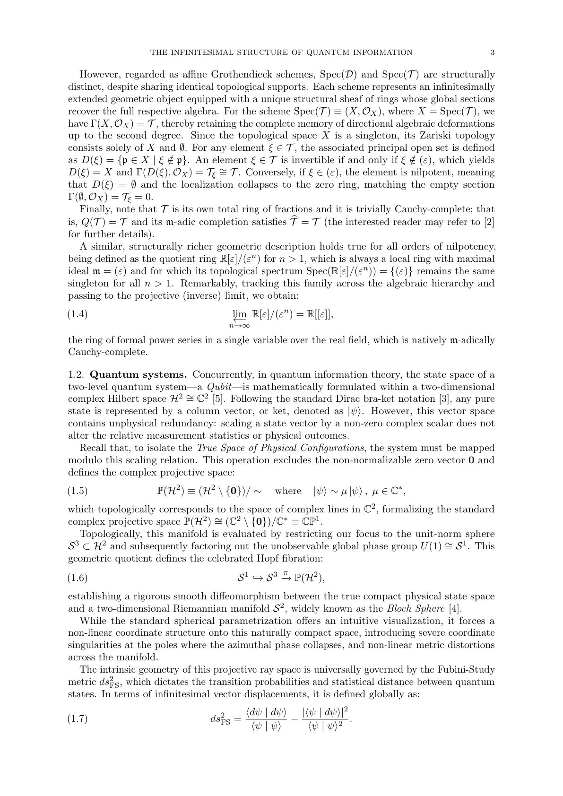 
Low-resolution page preview, page 3

📷 Fig 3

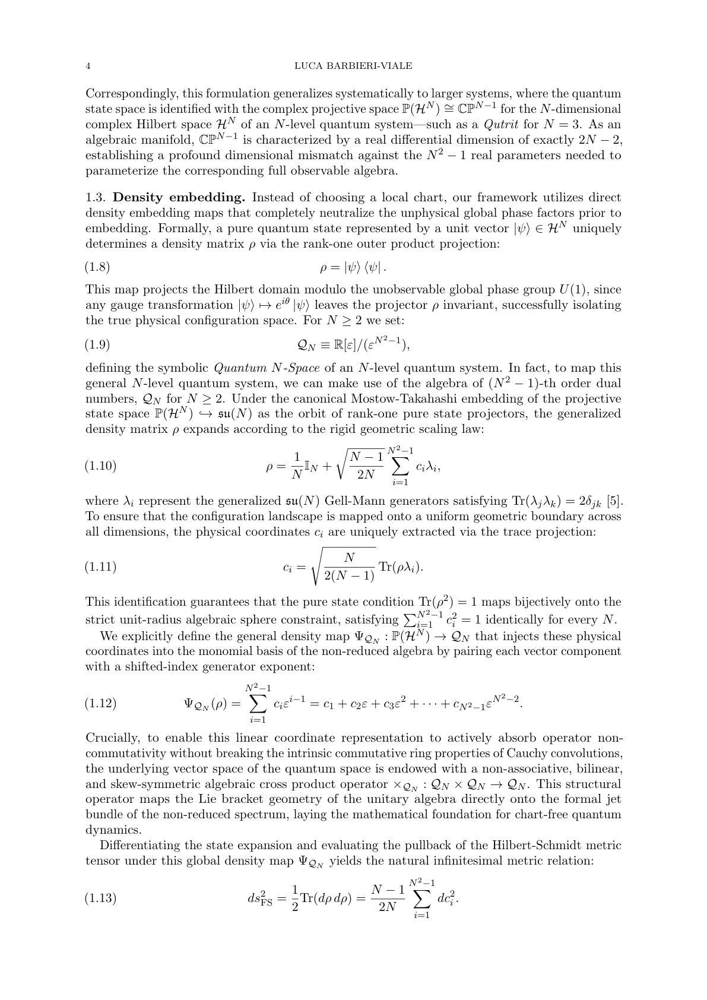 
Low-resolution page preview, page 4

📷 Fig 4

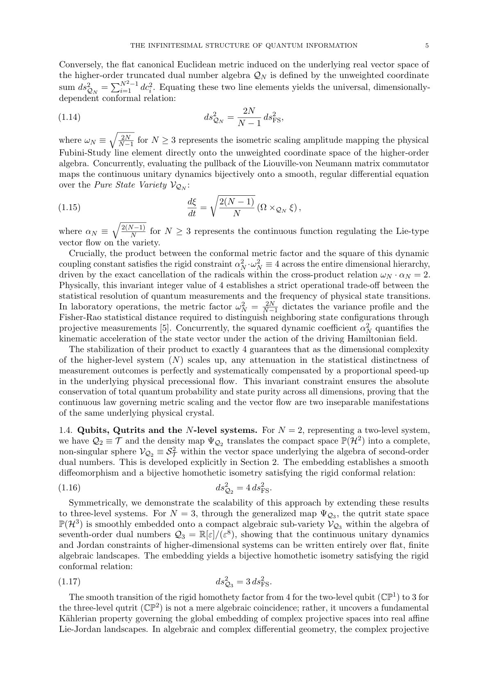 
Low-resolution page preview, page 5

📷 Fig 5

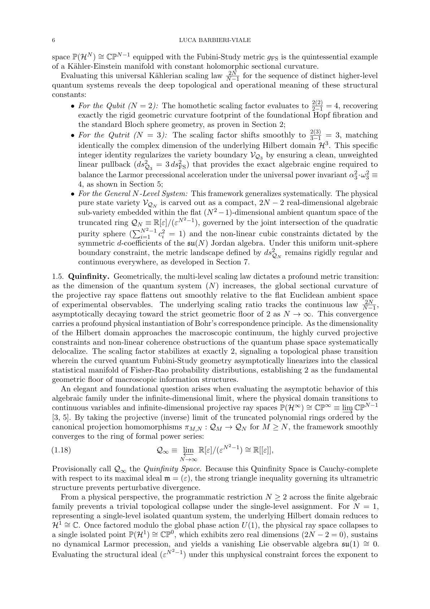 
Low-resolution page preview, page 6

**Summary.** This work develops an advanced geometric framework using higher-order dual number algebras to represent the state space of quantum systems. It shows that complex, non-linear quantum dynamics can be mapped onto simple, flat, linear flows in this specialized algebraic setting. This offers a powerful, unified mathematical language for studying quantum kinematics.

**Why it may be interesting.** It provides a highly abstract yet powerful mathematical machinery that unifies quantum geometry and dynamics by translating non-linear evolution into linear algebraic flows within nilpotent structures.

Detailed structure

**Main problem.** The paper aims to establish a rigorous, unified geometric framework for quantum state spaces by embedding them into higher-order dual number algebras.

**Main result.** It demonstrates that the non-linear Liouville-von Neumann dynamics map globally onto flat, linear, and rigid algebraic flows within these nilpotent dual algebras.

**Method.** The core method involves constructing gauge-invariant density map embeddings ($\Psi_{Q_N}$) from the physical projective Hilbert space $	ext{P}(H_N)$ into truncated polynomial rings $Q_N$.

**Model / system.** The system analyzed is the quantum state space of an N-level system (e.g., qubits, qutrits), whose dynamics are governed by the Liouville-von Neumann equation.

**Key observables.** Fubini-Study metric ($ds^2_{FS}$), density matrix $
ho$, and related geometric scaling factors ($\omega_N$).

**Important parameters / regimes.** The dimension $N$ of the system, which dictates the order of nilpotency in the dual algebra ($\varepsilon^{N^2-1}=0$).

**Assumptions / limitations.** It assumes that using non-reduced schemes and nilpotent dual number algebras provides a complete, non-singular container for all physical degrees of freedom.

**Figures summary.** Not specified by notes; the analysis focuses on deriving metric relations ($ds^2_{QN} = 	ext{factor} \cdot ds^2_{FS}$) and algebraic isomorphisms.

**Paper structure.** The paper builds from abstract algebraic structures (Grothendieck schemes, dual algebras) to physical systems ($	ext{P}(H_N)$), using the density embedding map as the unifying tool across different dimensions $N$.

Abstract

This paper establishes a rigorous, unified geometric framework for quantum state spaces by constructing smooth, regular embeddings into higher-order dual number algebras $\mathcal{Q}_N \equiv \mathbb{R}[\varepsilon]/(\varepsilon^{N^2-1})$, wherein every quantum state is faithfully represented as a non-reduced scheme-theoretic point. We show that under this unified family of truncated rings, the non-linear matrix commutators governing the Liouville-von Neumann dynamics map globally onto flat, linear, and rigid algebraic flows, establishing nilpotent dual algebras as a pristine geometric landscape for higher-dimensional quantum kinematics.

[↑ back to top](#top)

### [The self-organized vacancy order in Pr$_9$Ge$_{16}$](http://arxiv.org/abs/2607.12781v1)

**Authors:** Jayashani S. T. Wickramasinghe, Melissa G. Anderson, Kelci Graville, Gregory T. McCandless, Zachary J. Morgan, Brianna R. Billingsley, Tai Kong, Hyunsoo Kim, Aleksandr V. Chernatyskiy, Simon G. Mitchell, Liang Wu, Julia Y. Chan, Feng Ye, Halyna Hodovanets  
**Type:** experiment · **Category:** strongly correlated electrons · **PDF:** <https://arxiv.org/pdf/2607.12781v1>  
**Analysis basis:** full PDF text, analyzed in chunks
**Topic relevance:** `Kondo & dissipative impurity` **1/5** · `analog quantum simulation` **1/5** · `exotic spin models in light-matter` **1/5** · `non-equilibrium dynamics` **1/5**

📷 Fig 1

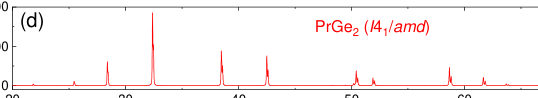 
FIG. 1. (a)-(c) X-ray diffraction patterns of Pr9Ge16 ground single crystals. The inset shows single crystals of Pr9Ge16. Squares in the background grid are 1 mm2 each. (d) Simulated powder X-ray diffraction pattern for I41/amd using crystallographic data from Ref. [22], a = 4.251 and c = 7.6131 ˚A. The powder X-ray diffraction patterns in panels (a)-(c) clearly show consistent reflections that cannot be indexed by space group I41/amd.

📷 Fig 2

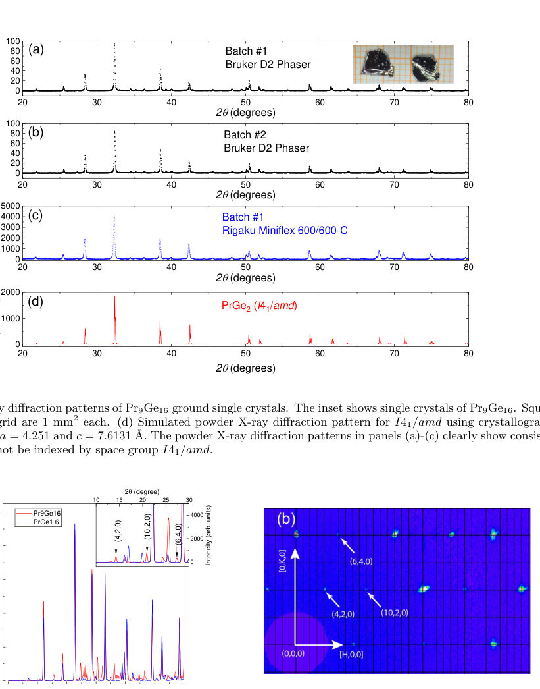 
FIG. 2. (a) Simulated neutron diffraction pattern for Pr9Ge16 and PrGe1.6[23]. While the stronger intensity peaks coincide, the weaker peaks in Pr9Ge16, such as the (4,2,0), (10,2,0), and (6,4,0) reflections (indexed in our enlarged cell), are absent in the PrGe1.6 structure. (b) The single crystal X-ray diffraction pattern of Pr9Ge16 in the (h,k,0) scattering plane. The weak reflections of (4,2,0), (10,2,0), and (6,4,0) are clearly visible, indicating the expanded unit cell.

📷 Fig 3

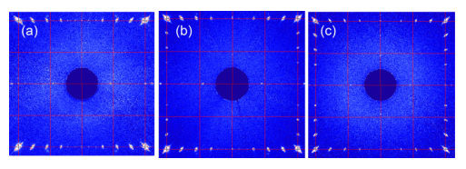 
FIG. 4. Single crystal X-ray diffraction patterns in selected samples in the (h,k,0) scattering plane showing different do- main populations of (a) 100:0 (b) 70:30 and (c) 50:50 using the same orthorhombic setting as in Fig. 3.

📷 Fig 4

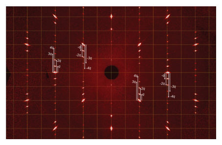 
FIG. 3. Single crystal X-ray diffraction in the (h,k,0) scatter- ing plane showing satellite reflections up to the fourth order. The cell was indexed using the orthorhombic setting [24] with a = 6.0268, b = 6.0347, and c = 13.98 ˚A.

📷 Fig 5

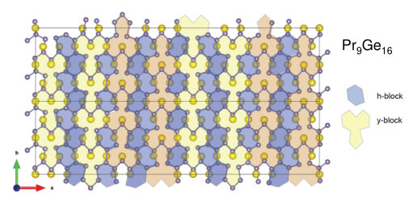 
FIG. 5. h-block and y-block schematics for Fdd2 space group for Pr9Ge16, with Pr and Ge ratio of 1.777.

**Summary.** This work reports the discovery of a new crystalline phase, $	ext{Pr}_9	ext{Ge}_{16}$, which exhibits ordered vacancies within its structure. Electrically, it behaves as a metal with electron-like carriers, and magnetically, it displays an anisotropic magnetic order that can be suppressed by a small external field.

**Why it may be interesting.** While primarily experimental, the investigation into the interplay between crystal lattice distortion (vacancy ordering) and emergent magnetic/electronic states is central to strongly correlated electron physics. The comparison to topological semimetals suggests potential avenues for studying exotic quantum phases in these materials.

Detailed structure

**Main problem.** The study reports the discovery of a new crystal structure ($	ext{Pr}_9	ext{Ge}_{16}$) and characterizes its complex physical properties, including magnetic and electronic behavior.

**Main result.** Single crystals were grown adopting an orthorhombic $Fdd2$ structure with ordered Ge vacancies. The material exhibits metallic conduction, electron-like carriers ($n \sim 10^{27} 	ext{ m}^{-3}$), and a magnetic transition at $T_C = 14.3 	ext{ K}$.

**Method.** The research employed single crystal growth (high-temperature flux), structural characterization via XRD/Neutron Diffraction, and transport measurements (resistivity, Hall effect) alongside magnetization studies.

**Model / system.** The physical system is the rare earth germanide $	ext{Pr}_9	ext{Ge}_{16}$. The electronic structure analysis suggests that the non-Kramers $	ext{Pr}^{3+}$ ion's $J=4$ ground state splits into nine singlet states due to low site symmetry.

**Key observables.** Anisotropic magnetization (easy axis along $b$), resistivity anomaly at $14.3 	ext{ K}$, Hall carrier concentration ($10^{27} 	ext{ m}^{-3}$), and satellite reflections indicating vacancy ordering.

**Important parameters / regimes.** Magnetic field required to suppress order ($\approx 0.4 	ext{ T}$); Carrier concentration ($n \sim 10^{27} 	ext{ m}^{-3}$); Transition temperature ($T_C = 14.3 	ext{ K}$).

**Assumptions / limitations.** The authors assume the structure is best described by the $Fdd2$ space group, despite discrepancies with published patterns; analysis of electronic properties relies on fitting Hall data to a one-band model.

**Figures summary.** Figures show powder XRD patterns comparing observed data to proposed structures ($I4_1/amd$ vs. $Fdd2$), and phase diagrams mapping magnetic order versus temperature and field.

**Paper structure.** The paper follows a progression from structural discovery (new $Fdd2$ structure with vacancy ordering) to electronic characterization (metallic behavior, electron carriers), culminating in the detailed analysis of anisotropic magnetic properties and phase transitions.

Abstract

In this work, we report the discovery of a new crystal structure on the Ge-rich side of the Pr-Ge binary phase diagram. Using a high-temperature flux technique, we grew single crystals of $Pr_9Ge_{16}$, which adopt a previously unreported orthorhombic $Fdd$2 structure type featuring ordered Ge vacancies. We present the anisotropic magnetic properties and identify the crystallographic $b$ axis perpendicular to the crystal plane as the magnetic easy axis. Temperature-dependent resistivity measurements reveal metallic behavior with a distinct anomaly at $T_{\mathrm{C}}$ = 14.3 K. Hall resistivity data indicate that electron-like carriers dominate, with a carrier concentration on the order of $10^{27}~\mathrm{m}^{-3}$. The magnetic order is readily suppressed by a magnetic field of approximately 0.4 T applied along the easy $b$ axis.

[↑ back to top](#top)

### [A Variational Surrogate Approach to Finite-Horizon Quantum Control via Hardware-Efficient Ansatz](http://arxiv.org/abs/2607.12802v1)

**Authors:** Nahid Binandeh Dehaghani, Rafal Wisniewski, A. Pedro Aguiar  
**Type:** both · **Category:** quantum information and computing · **PDF:** <https://arxiv.org/pdf/2607.12802v1>  
**Analysis basis:** full PDF text, analyzed in chunks
**Topic relevance:** `QC/QI experiment` **1/5** · `methods for driven-dissipative` **1/5** · `non-equilibrium dynamics` **1/5**

📷 Fig 1

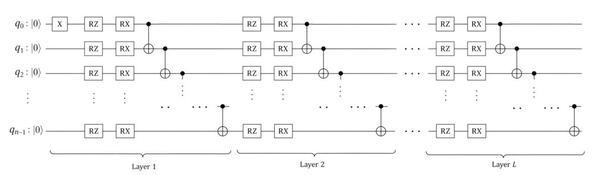 
Fig. 1: Hardware-efficient variational ansatz employed in the proposed framework for an N-qubit system. The initial state |10 · · · 0⟩is prepared by applying an X gate to qubit q0. Each variational layer consists of parameterized Rz and Rx rotations on every qubit, followed by a nearest-neighbor CNOT entangling block. Repeating this structure for L layers defines the parameterized unitary U(θ) used to represent the terminal evolution.

📷 Fig 2

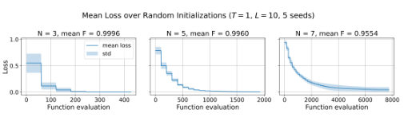 
Fig. 2: Mean loss during optimization for different system sizes N ∈{3, 5, 7} with normalized horizon T = 1 and circuit depth L = 10. The solid line represents the mean loss over five independent random initializations, and the shaded region indicates one standard deviation.

📷 Fig 3

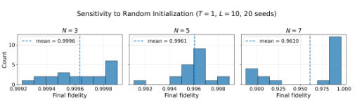 
Fig. 4: Distribution of the final fidelities obtained from 20 indepen- dent random initializations for system sizes N = 3, N = 5, and N = 7 with fixed circuit depth L = 10 and normalized horizon T = 1. The dashed vertical line indicates the mean fidelity for each system size.

📷 Fig 4

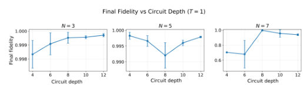 
Fig. 3: Final fidelity as a function of the circuit depth L for system sizes N = 3, N = 5, and N = 7 with normalized horizon T = 1. The markers represent the mean final fidelity over five independent random initializations, while the error bars indicate one standard deviation.

📷 Fig 5

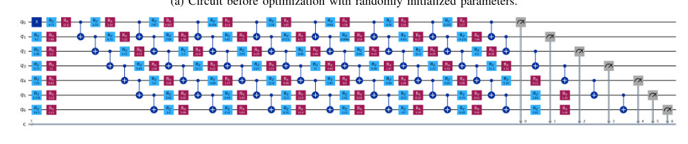 
Fig. 5: Representative seven-qubit hardware-efficient variational circuits with circuit depth L = 8. The initial state |10 · · · 0⟩is prepared by applying an X gate to qubit q0. The circuit topology remains unchanged before and after optimization; only the trainable rotation angles are updated by the hybrid quantum-classical optimization procedure.

**Summary.** The authors propose a novel variational framework to solve finite-horizon quantum state transfer problems. They replace the difficult task of optimizing time-dependent controls with minimizing an infidelity cost function over parameters defining a trainable, hardware-efficient quantum circuit. This method offers a flexible and implementable alternative for controlling quantum systems on current quantum devices.

**Why it may be interesting.** This work provides a practical, device-compatible method for quantum control that bypasses complex Hamiltonian synthesis by framing the problem as a variational circuit optimization, which is highly relevant for near-term quantum hardware implementation.

Detailed structure

**Main problem.** The paper addresses quantum control for steering an N-qubit system from an initial state to a target state over a fixed time horizon.

**Main result.** They demonstrate that replacing explicit time-dependent controls with optimization over hardware-efficient parameterized circuits achieves high-fidelity state transfer, though fidelity degrades with increasing system size or circuit depth due to optimization challenges.

**Method.** A variational quantum approach is used where the control objective is minimized by optimizing parameters ($	heta$) within a trainable, hardware-efficient ansatz unitary $U(	heta)$, avoiding direct time evolution simulation.

**Model / system.** The system is an N-qubit closed quantum system whose evolution is governed by controlled dynamics. The method uses a parameterized circuit composed of alternating single-qubit rotations and nearest-neighbor entangling gates.

**Key observables.** Terminal fidelity ($F(	heta)$) between the evolved state and the target state, and the corresponding loss function $J(	heta)$.

**Important parameters / regimes.** System size ($N \in \{3, 5, 7\}$), circuit depth ($L$), and optimization parameters ($	heta$).

**Assumptions / limitations.** The approach assumes that the terminal evolution can be accurately approximated by a fixed-depth, hardware-efficient ansatz; it also operates in an open-loop control setting.

**Figures summary.** Figures show how final fidelity changes with circuit depth ($L$) for various system sizes ($N$), and illustrate the increased sensitivity (broader distribution of fidelities) to initialization as $N$ increases.

**Paper structure.** The paper introduces the variational framework, details the hardware-efficient ansatz structure, presents numerical results showing performance vs. depth/size, and discusses the trade-offs between expressivity and optimization complexity.

Abstract

We present a variational quantum framework for finite-horizon quantum control based on hardware-efficient ansätze. The objective is to steer a quantum system from a given initial state to a desired target state over a fixed time horizon by minimizing a terminal cost defined in terms of state fidelity. Instead of explicitly synthesizing time-dependent control fields or enforcing Hamiltonian reachability constraints, the proposed method reformulates the control objective as a variational optimization problem in which a hardware-efficient parameterized quantum circuit provides a surrogate parameterization of the terminal evolution. The circuit consists of alternating layers of single-qubit rotations and entangling gates, whose parameters are optimized using classical routines to minimize the terminal infidelity. This formulation avoids reliance on problem-specific or physics-inspired ansätze, providing a flexible and implementation-friendly approach compatible with near-term quantum devices. Numerical experiments on multi-qubit state-transfer benchmarks demonstrate high-fidelity state transfer while highlighting the trade-off between ansatz expressivity, optimization complexity, and scalability with respect to system size and circuit depth.

[↑ back to top](#top)

### [Magnetic field-driven phase switching in the antiferromagnetic Mott insulator Ca$_3$(Ru$_{0.99}$Ti$_{0.01}$)$_2$O$_7$](http://arxiv.org/abs/2607.12737v1)

**Authors:** Ksenia S. Rabinovich, Tim Priessnitz, Nils Gross, George Jackeli, Maximilian J. Krautloher, Pascal Reiss, Eberhard J. Goering, Jurgen H. Smet, Bernhard Keimer, Alexander V. Boris  
**Type:** experiment · **Category:** strongly correlated electrons · **PDF:** <https://arxiv.org/pdf/2607.12737v1>  
**Analysis basis:** full PDF text, analyzed in chunks
**Topic relevance:** `analog quantum simulation` **1/5** · `exotic spin models in light-matter` **1/5** · `spintronics-quantum-optics interface` **1/5**

📷 Fig 1

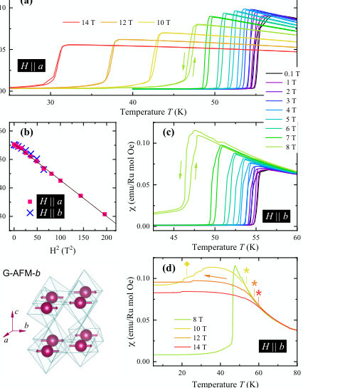 
FIG. 1. Temperature dependence of magnetic susceptibility χ(T) of Ca3(Ru0.99Ti0.01)2O7 measured at different magnetic fields: (a) χ(T) measured at magnetic fields up to 14 T ap- plied along the a-axis. (b) The G-AFM to PM phase transi- tion temperature from field cooled (FC) χ(T) measurements plotted against magnetic field squared, with H||a-axis (red squares) and H||b-axis (blue crosses). (c,d) χ(T) measured with H||b-axis at field below (c) and above (d) 8T. In (d), the diamond and stars correspond to the positions of the broad maximum and minima in the derivatives of FC χ(T), respec- tively. The image of Ru moments (red) surrounded by oxygen octahedra illustrates the magnetically ordered...

📷 Fig 2

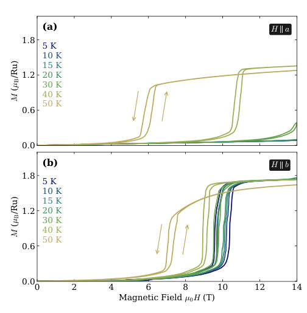 
FIG. 2. (a,b) Magnetization of Ca3(Ru0.99Ti0.01)2O7 as a function of the magnetic field, measured at temperatures below TN. Magnetic fields up to 14 T are applied along the a-axis (a) and b-axis (b). In (b), the magnetic moment at 14 T for temperatures below 40 K reaches about 1.73 µB/Ru, indicating a trend towards saturation.

📷 Fig 3

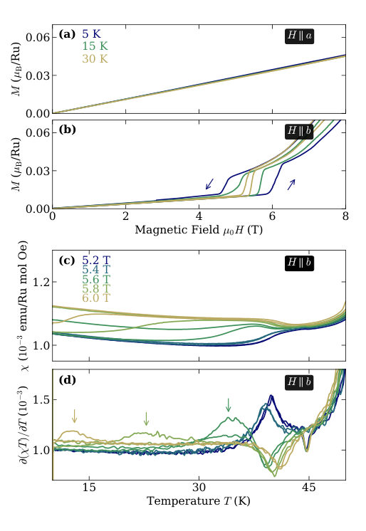 
FIG. 3. (a,b) Field-dependent magnetization of Ca3(Ru0.99Ti0.01)2O7 measured at low temperatures with fields applied along the a-axis (a) and b-axis (b). In (b), M(H) measured along the easy b-axis exhibits a sharp, step- like hysteretic change at the spin-flop transition field, Hf b, indicating the reorientation of the Ru moments from AFM order into a canted spin-flop state, perpendicular to the field. (c) Magnetic susceptibility χ(T) measured at magnetic fields near Hf b applied along the b-axis. The zero-field-cooled (ZFC) and field-cooled (FC) χ(T) curves diverge below the critical temperatures corresponding to the applied fields, as deter- mined by the peaks in the derivatives of ZFC...

📷 Fig 4

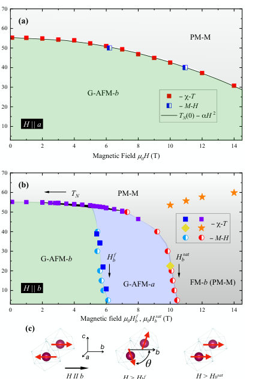 
FIG. 4. (a,b) Magnetic temperature–field (T-H) phase diagrams of Ca3(Ru0.99Ti0.01)2O7 with the magnetic field applied along the a-axis (a) and b-axis (b). The phase diagrams are derived from critical temperatures observed in temperature-dependent magnetic susceptibility (χ-T) as shown in Fig. 1 and Fig. 3(c) and 3(d) (filled symbols), and critical fields from the field-dependent magnetization (M-H) as shown in Fig. 2 and Fig. 3(a) and 3(b) (half-filled sym- bols). In (a), the critical TN temperature for AFM ordering decreases quadratically with increasing field along the a-axis. The critical field values correspond to temperature-driven transitions from the G-AFM-b to the paramagnetic PM-M...

📷 Fig 5

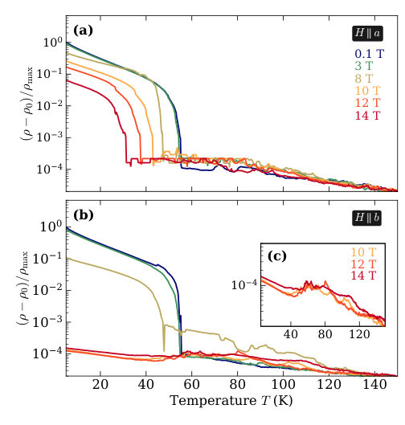 
FIG. 5. Temperature dependence of the normalized in- plane, low-frequency (38 Hz) resistivity, (ρ −ρ0)/ρmax, of Ca3(Ru0.99Ti0.01)2O7 measured for different magnetic fields. Fields up to 14 T are applied along the a-axis (a) and b-axis (b). (c) Magnified view for fields ≥10 T along the b-axis.

**Summary.** The study investigates the field-induced phase diagram of $	ext{Ca}_3(	ext{Ru}_{0.99}	ext{Ti}_{0.01})_2	ext{O}_7$, an antiferromagnetic Mott insulator. By measuring magnetization and resistivity under applied fields, the authors reveal distinct first-order transitions along the easy axis, leading to a forced ferromagnetic metallic state. This work highlights the extreme sensitivity of correlated oxides to external perturbations.

**Why it may be interesting.** This work exemplifies how external fields can tune correlated electron systems between distinct insulating (Mott/AFM) and metallic (FM) phases, providing experimental realization of complex magnetic quantum phase transitions relevant to strongly correlated physics.

Detailed structure

**Main problem.** The study investigates magnetic field-driven phase switching in a bandwidth-controlled antiferromagnetic Mott insulator to map out its complex magnetic H-T phase diagram.

**Main result.** Applying a field along the easy $b$-axis induces a first-order spin-flop transition ($\approx 6$ T) followed by a forced ferromagnetic metallic state ($>10.5$ T), while the $a$-axis shows only conventional AFM suppression up to 14 T.

**Method.** The research combines magnetic susceptibility ($\chi(T)$), magnetization ($M(H)$), and in-plane resistivity ($
ho$) measurements under applied fields along different crystallographic axes.

**Model / system.** The system is $	ext{Ca}_3(	ext{Ru}_{0.99}	ext{Ti}_{0.01})_2	ext{O}_7$, a Mott insulator derived from $	ext{Ca}_3	ext{Ru}_2	ext{O}_7$. Its properties are governed by intertwined electron-electron and electron-lattice interactions, leading to competing magnetic/metallic ground states.

**Key observables.** Magnetization ($M$), resistivity ($
ho$), critical fields ($H_f^b$, $H_{	ext{sat}}^b$), and the temperature dependence of magnetic order ($T_N$).

**Important parameters / regimes.** Applied magnetic field strength (up to 14 T), doping concentration (1% Ti substitution), and temperature range (down to 5 K).

**Assumptions / limitations.** The analysis compares experimental anomalies against theoretical models for anisotropic antiferromagnets, noting that the observed critical fields are significantly renormalized compared to simple Heisenberg models.

**Figures summary.** Figures illustrate $\chi(T)$ vs $H$ and $M(H)$ vs $H$ along both axes. Color maps show $
ho(T, H)$, detailing distinct phase boundaries corresponding to spin-flop and forced FM states.

**Paper structure.** The paper systematically presents measurements of magnetic and transport properties as a function of applied field ($a$ vs $b$ axis) at low temperatures, building up the complete H-T phase diagram by correlating magnetization jumps with resistivity changes.

Abstract

A bandwidth-controlled antiferromagnetic Mott-insulating phase in Ca$_3$(Ru$_{1-x}$Ti$_x$)$_2$O$_7$ is realized through isovalent substitution at the Ru site. For a dilute substitution with only 1% Ti, the Mott insulator ground state remains nearly degenerate with the ground state of pristine Ca$_3$Ru$_2$O$_7$, where the Ru moments are ferromagnetically aligned within the metallic RuO$_2$ bilayers stacked in an antiferromagnetic fashion. The exceptionally shallow free energy landscape of this doped compound arises from intertwined electron-electron and electron-lattice interactions. This makes its magnetic and transport properties highly sensitive to external perturbations. We systematically investigated magnetic-field-induced phase switching in Ca$_3$(Ru$_{0.99}$Ti$_{0.01}$)$_2$O$_7$ to explore its magnetic $H$-$T$ phase diagram. With the field applied along the easy $b$-axis, parallel to the antiferromagnetic moments, the magnetization exhibits a first-order spin-flop transition at $\approx $ 6 T, indicating reorientation of the Ru moments perpendicular to the field. The transition is accompanied by a decrease in the electrical resistance, but the spin-flop phase remains insulating. Above 10.5 T, all Ru moments align with the $b$-axis, resulting in a forced ferromagnetic metallic phase. In contrast, neither spin-flop nor forced-ferromagnetic phases are observed up to 14 T, when the field is applied along the $a$-axis. While the electronic kinetic energy and the electron-lattice coupling contribute to the free-energy balance of this system, the resulting $H$-$T$ phase diagram is remarkably simple and closely resembles that of a canonical anisotropic antiferromagnet, albeit with substantially renormalized critical fields.

[↑ back to top](#top)

### [Splitting Analysis for Yukawa Potential](http://arxiv.org/abs/2607.12153v1)

**Authors:** Di Fang, Jiaqi Zhang  
**Type:** theory · **Category:** numerical methods · **PDF:** <https://arxiv.org/pdf/2607.12153v1>  
**Analysis basis:** full PDF text, analyzed in chunks
**Topic relevance:** `analog quantum simulation` **1/5** · `methods for driven-dissipative` **1/5** · `non-equilibrium dynamics` **1/5**

📷 Fig 1

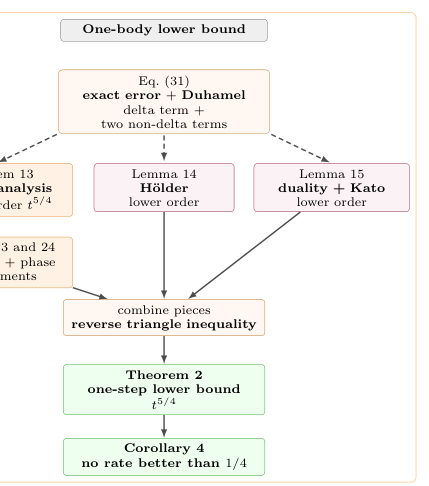 
Figure 1: Proof roadmap. Solid arrows indicate steps that lead to the subsequent result, while dashed arrows indicate auxiliary estimates that suffice to establish the corresponding step.

📷 Fig 2

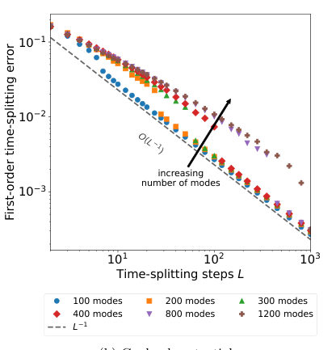 
Figure 2: (a) Log-log plot of the global first-order splitting error ξ(K) L (T; c0) = ∥cTS(T) −cex(T)∥ℓ2 versus the number of splitting steps L for the radial Yukawa Hamiltonian at T = 1, with Z = 1, µ = 0.2, R = 50, and K ∈{100, 200, 300, 400, 800, 1200}. The initial state is a common approximate Yukawa ground state obtained from the largest reference truncation and projected onto each smaller Galerkin space. The dashed line has slope L−1 and is included only as a finite-dimensional reference. As K increases, the curves move upward and the apparent transition toward the fixed K first-order regime is delayed. This panel is not intended as direct evidence of a global L−1/4 asymptotic. (b)...

📷 Fig 3

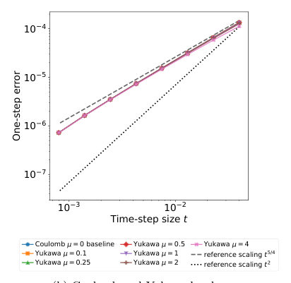 
Figure 3: (a) Log-log plot of the global first-order splitting error for the regularized Gaussian Hamiltonian VReg(r) = −Ze−αr2 under the same ℓ= 0 radial Galerkin discretization, with Z = 1, α = 0.2, R = 50, and K ∈{100, 200, 300, 400, 800, 1200}. The initial state is a common approximate regularized Gaussian ground state obtained from a reference truncation Kref = 1200 and projected onto each smaller Galerkin space. The curves nearly overlap and follow the dashed L−1 reference line, indicating standard first-order splitting behavior for this smooth regular potential. (b) Log-log plot of the one-step local error ∥Eµ(∆t)∥ℓ2 versus ∆t for Coulomb (µ = 0) and Yukawa µ ∈{0.1, 0.25, 0.5, 1, 2,...

📷 Fig 4

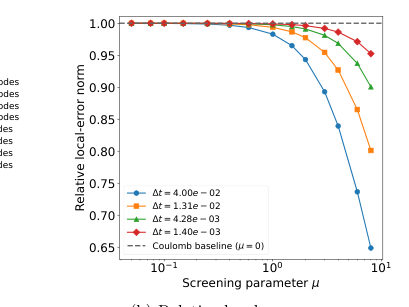 
Figure 4: (a) Log-log plot of the one-step local splitting error versus the time-step size t for Coulomb and Yukawa potentials, using the corresponding normalized Galerkin ground state as the initial state for each potential. The radial Galerkin truncation uses R = 40, Z = 1, Yukawa screening parameter µ = 1, and K ∈{1000, 1200, 1400, 1800}. The reference slopes are t5/4 and t2. Both Coulomb and Yukawa follow the t5/4 scaling; since the initial state is recomputed for each potential, the vertical separation should be interpreted qualitatively rather than as a fixed state screening prefactor. (b) Semilog plot of the relative local-error norm Rµ(∆t) = ∥Eµ(∆t)∥ℓ2/∥e0(∆t)∥ℓ2 as a function of...

**Summary.** This paper rigorously analyzes the error convergence of splitting methods applied to simulate quantum dynamics with a Yukawa potential. It proves that the simulation achieves an optimal global time-step convergence rate of $O(t^{1/4})$ by establishing both upper and lower bounds. The work is significant for providing mathematically rigorous tools for simulating many-body systems where interactions are short-ranged but singular at the origin.

**Why it may be interesting.** This work provides highly technical convergence guarantees for simulating complex quantum many-body systems, which directly informs the development of stable and efficient numerical algorithms for condensed matter simulations.

Detailed structure

**Main problem.** The paper analyzes the convergence rate of splitting methods used to simulate quantum dynamics governed by the Schrödinger equation with a Yukawa potential.

**Main result.** It proves a global O(t^1/4) convergence rate for many-body interactions, establishing this rate as sharp by deriving a corresponding lower bound. The result shows that the short-range nature of the Yukawa potential does not improve upon the leading error obstruction dictated by the origin singularity.

**Method.** The analysis employs rigorous mathematical techniques including Sobolev estimates, Fourier analysis, and Kato smoothing to derive both upper (convergence) and lower bounds on the time evolution error.

**Model / system.** The system is a many-body quantum mechanical model described by the Schrödinger equation with a Yukawa potential, which acts as a screened Coulomb interaction. The Hamiltonian is $H_\mu = -\Delta + V_\mu$, where $V_\mu$ decays exponentially at large distances.

**Key observables.** The primary observable is the error norm $\left\|U_{1,\mu}(t)^L\psi_0 - e^{-iT}H_\mu\psi_0
ight\|_{L^2(\mathbb{R}^{3N})}$, which measures the difference between the numerical approximation and the exact evolution.

**Important parameters / regimes.** The key parameters are the time step ($\Delta t$ or $t$), the total time ($T$), the number of particles ($N$), and the screening parameter ($\mu$) defining the potential range.

**Assumptions / limitations.** The analysis requires working in strong norms, specifically the $H^2(\mathbb{R}^{3N})$ domain, due to the unbounded kinetic energy and singular nature of the potential at the origin.

**Paper structure.** The paper builds from establishing the physical model (Yukawa potential) to developing rigorous error estimates. It first proves an upper bound on the splitting error, leveraging novel system-size Sobolev estimates. Subsequently, it establishes a matching lower bound using Fourier analysis and Kato smoothing to prove the rate is optimal.

Abstract

Splitting methods are among the most classical and fundamental tools for the simulation of quantum dynamics, and their importance has grown further with the rise of quantum computing. In this work, we analyze the Schrödinger equation with Yukawa potential, a physically relevant and widely used model potential. It may be viewed as a Coulomb interaction with exponential decay at spatial infinity, preserving the Coulomb singularity at the origin while removing the long-range Coulomb tail. We prove that the operator splitting for this unbounded Hamiltonian achieves a global $1/4$-order convergence rate in the time step for many-body Yukawa interactions, with explicit polynomial dependence on the number of particles. The result holds for all initial wavefunctions in $H^2(\mathbb R^{3N})$, the natural domain of the Hamiltonian, and our numerical experiments are consistent with the theoretical estimates. To identify the sharp obstruction behind this rate, we prove a short-time lower bound in the one-body setting of order $t^{5/4}$ for the one-step error, which rules out any uniform global estimate of order better than $1/4$ in general. This agreement with the optimal $1/4$ rate in the Coulomb case is particularly interesting, as Yukawa potential is short-ranged compared to Coulomb potential. For the many-body upper bound, one of the new technical ingredients is the explicit polynomial-in-system-size Sobolev estimates of many-body Yukawa systems. These estimates are crucial for obtaining fully a priori bounds that depend only on the norms of the initial states, rather than on the solution at time $t$. For the one-body lower bound, we leverage a new analysis argument based on Fourier analysis and Kato smoothing.

[↑ back to top](#top)

### [Traceable In Situ Microwave Power Measurement at the Cryogenic Device Plane in a Dilution Refrigerator](http://arxiv.org/abs/2607.12751v1)

**Authors:** Paolo Panetta, Andrea Celotto, Alessandro Alocco, Bernardo Galvano, Luca Fasolo, Emanuele Palumbo, Luca Callegaro, Luca Oberto, Patrizia Livreri, Emanuele Enrico  
**Type:** experiment · **Category:** other · **PDF:** <https://arxiv.org/pdf/2607.12751v1>  
**Analysis basis:** full PDF text, analyzed in chunks
**Topic relevance:** `QC/QI experiment` **1/5** · `methods for driven-dissipative` **1/5** · `quantum measurements` **1/5**

📷 Fig 1

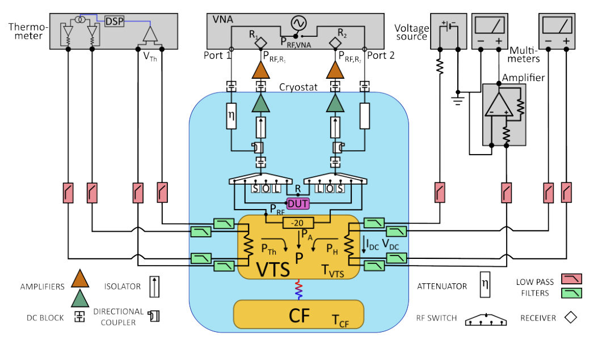 
Fig. 1. Schematic of the experimental setup. A Variable Temperature Stage (VTS) is weakly thermally linked with the Cold Finger (CF) of a dilution refrigerator with baseplate temperature of ∼80 mK. VTS can be heated both with DC and RF through, respectively, a heater (PH) and a 20 dB attenuator (PA). Its temperature is measured with a resistance thermometry bridge (Th). Both Th and H are driven in DC with a 4-wire configuration. Two nominally equal RF lines are driven by Port 1 and Port 2 and read by receivers R1 and R2 of a Vector Network Analyzer (VNA). The input lines are attenuated at multiple stages and we call η the attenuation of the line connected to Port 1. The lines go through a...

📷 Fig 2

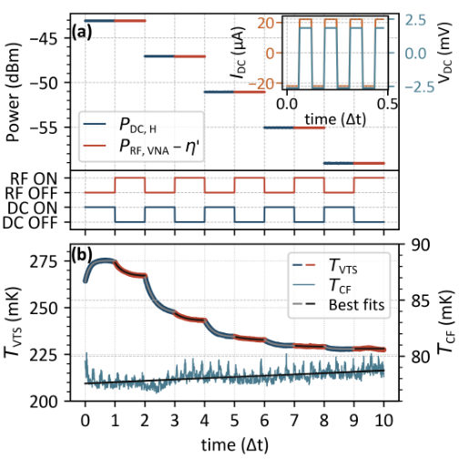 
Fig. 2. Here, the time axis is normalized for ∆t = 77 minutes. (a) Power vs time plots. PDC,H is the measured power dissipated at H. PRF,VNA is the power delivered at VNA source and η′ is a preliminarily estimated measure of the total attenuation between source and DUT reference plane. VTS was alternately heated with DC and RF drives with a power step of 4 dB. When driven in DC, polarity of signal was swapped every ∼5 minutes to account for current amplifier drifts. In the inset, measured VDC and IDC are plotted. (b) TVTS and TCF vs time plots. TCF was measured to slightly drift of 0.09 mK/hour. Each interval of length ∆t of TVTS was fit with (4).

📷 Fig 3

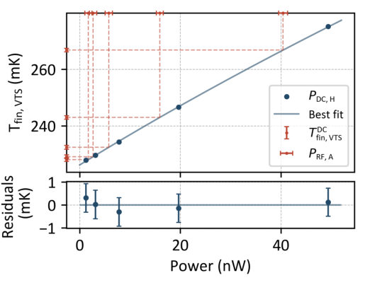 
Fig. 3. Tfin,VTS vs Power. PDC,H data were fit with (5). Then (6) was inverted to obtain PRF,A(Tfin,VTS). A visual representation of the inversion idea is graphed in red. T RF fin,VTS on the y-axis are projected onto the best fit curve and then projected again on the x-axis. Uncertainties on the best fit parameters are taken into account by the uncertainty propagation formula of (7). Below, residuals of PDC,H from the best fit curve.

**Summary.** This paper introduces a novel, traceable method for measuring microwave RF power directly at the cryogenic device plane within a dilution refrigerator. It achieves this by correlating measured DC heating power with absorbed RF power via thermal transient analysis of a Variable Temperature Stage (VTS). The technique integrates advanced cryogenic S-parameter calibration to provide reliable power readings essential for quantum circuit characterization.

**Why it may be interesting.** While focused on metrology, this work provides a critical enabling technology for quantum physics experiments by ensuring that the input power to sensitive qubits or superconducting circuits is known with traceable accuracy.

Detailed structure

**Main problem.** Accurately measuring microwave power delivered to a superconducting quantum circuit (DUT) inside a dilution refrigerator is challenging due to various cryogenic signal path losses and mismatches.

**Main result.** The authors successfully demonstrated an in situ measurement method, achieving relative standard uncertainties between 2% and 40% across the tested power range (-43 to -58 dBm).

**Method.** The technique combines AC/DC thermal power transfer measurements using a Variable Temperature Stage (VTS) with cryogenic two-port scattering parameter (S-parameter) calibration.

**Model / system.** The experiment is performed in a dilution refrigerator, utilizing a custom VTS weakly coupled to the cold finger. The system's thermal dynamics are modeled by analyzing transient temperature changes when heated alternately by DC current and microwave power dissipated via an attenuator.

**Key observables.** VTS temperature ($T_{	ext{VTS}}$), measured DC heating power ($	ext{P}_{	ext{DC,H}}$), and RF attenuated power ($	ext{P}_{	ext{RF,A}}$).

**Important parameters / regimes.** The measurement range covers powers from -43 dBm to -58 dBm; key derived parameters include the thermal conductance ($G_0$) and background heat load ($P_0$).

**Assumptions / limitations.** The method assumes that the temperature difference across the attenuator is negligible compared to uncertainty, and it relies on accurate SOLR calibration for S-parameters.

**Figures summary.** Figure 1 schematically illustrates the experimental setup involving the VTS weakly linked to the Cold Finger, showing connections for DC heating, RF attenuation, and thermometry.

**Paper structure.** The paper establishes the difficulty of cryogenic power measurement, details the combined thermal/electrical methodology (using transient fitting and steady-state analysis), presents the necessary S-parameter calibration steps, and concludes with experimental results and uncertainty quantification.

Abstract

Accurate knowledge of the microwave power delivered to a cryogenic device under test (DUT) is essential for the characterization and operation of superconducting quantum circuits. However, this information is difficult to obtain inside dilution refrigerators because of distributed attenuation, impedance mismatch, switch-path repeatability, and temperature-dependent microwave components. This paper presents an in situ measurement method for RF power at the cryogenic device plane. The method uses a custom variable temperature stage (VTS) as a cryogenic thermal-transfer element. The TVS is alternately heated by a four-wire DC heater and by microwave power dissipated in a 20 dB pass-through attenuator. By fitting the thermal transients and comparing the corresponding steady-state temperatures, the absorbed microwave power is inferred from a directly measured DC electrical power through an AC/DC substitution procedure. The finite reflection and transmission of the attenuator are then accounted for by cryogenic two-port scattering-parameter measurements based on a switch-assisted Short--Open--Load--Reciprocal calibration, so that the result is referred to the DUT reference plane. The system is demonstrated in a dilution refrigerator with powers between -43 and -58 dBm at the DUT input plane. The demonstrated relative standard uncertainty ranges from about 2% at -43.9 dBm to about 40% at -57.6 dBm. The proposed approach combines thermal RF power transfer, cryogenic S-parameter correction, and uncertainty evaluation in a measurement architecture compatible with quantum-device experiments, providing a practical route toward traceable microwave-power calibration at millikelvin stages.

[↑ back to top](#top)

### [Benchmarking loss functions for trainable quantum feature maps](http://arxiv.org/abs/2607.12487v1)

**Authors:** Nguyen Dinh Quyen, Vu Tuan Hai, Quoc Chuong Nguyen, Le Bin Ho, Lan Nguyen Tran  
**Type:** both · **Category:** quantum information and computing · **PDF:** <https://arxiv.org/pdf/2607.12487v1>  
**Analysis basis:** full PDF text, analyzed in chunks
**Topic relevance:** `QC/QI experiment` **1/5** · `quantum measurements` **1/5**

📷 Fig 1

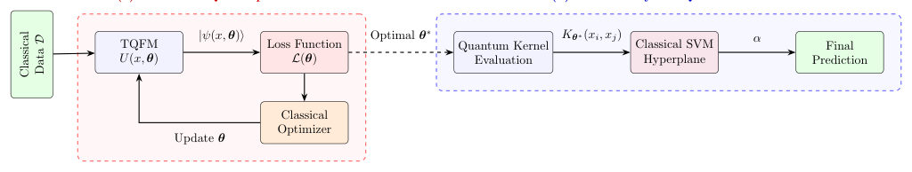 
FIG. 1. An end-to-end operational workflow of the TQFM-based QSVM model. Phase 1 focuses on optimizing the TQFM via the loss function to discover the optimal parameter θ∗. Phase 2 uses these optimized quantum states to construct the pairwise kernel, which is subsequently fed into a classical SVM solver to determine the maximal-margin separating hyperplane.

📷 Fig 2

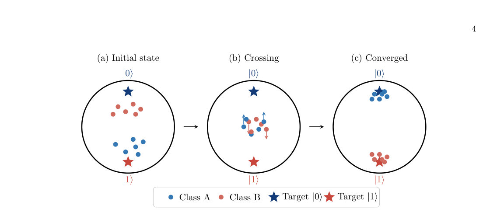 
FIG. 2. Conceptual representation of the trajectory crossing problem during fixed-target optimization. (a) At initialization, data points from Class A (blue) and Class B (red) are misaligned with their orthogonal targets. (b) As the model attempts to correct this, the ensembles are forced to cross paths. This intersection creates a severe dynamical bottleneck, maximizing inter-class overlap and causing the sharp drop in accuracy observed during early training iterations. (c) Successful convergence is achieved only if the loss function’s gradient is strong enough to push the parameters through this crossing zone.

📷 Fig 3

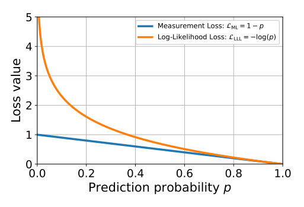 
FIG. 3. Comparison between the ML LML = 1 −p and the LLL LLLL = −log(p) as a function of the prediction proba- bility p. Unlike the linear ML, the LLL grows rapidly when p becomes small, assigning larger penalties to poorly classified samples and thereby providing a stronger optimization signal during training.

📷 Fig 4

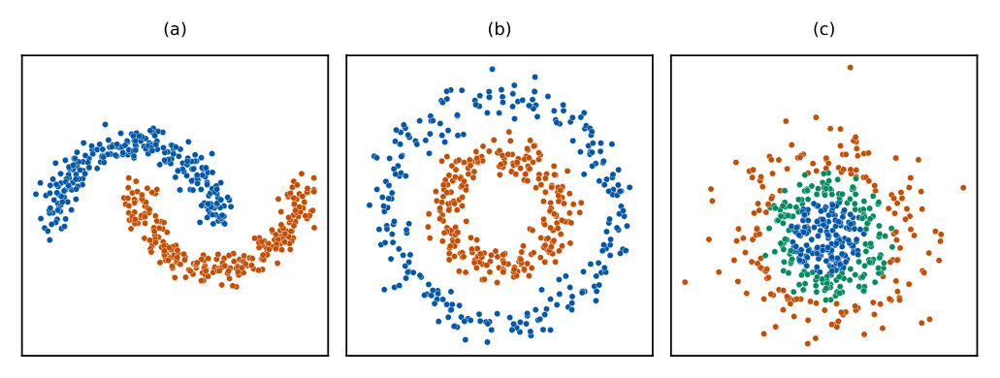 
FIG. 4. Visualization of the 2D synthetic datasets used for empirical evaluation. (a) The moons dataset features two interleaving half-circles. (b) The circles dataset consists of two non-linearly separable concentric circles. (c) The gaussian dataset is partitioned into three concentric classes based on a multidimensional Gaussian distribution.

📷 Fig 5

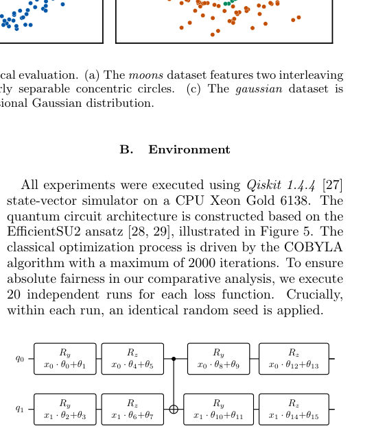 
FIG. 5. The diagram of 2-qubit EfficientSU2 circuit. Each layer encodes the input x and parameters θ (xj, θj denote the jth entry of x, θ, respectively) jointly in Ry, Rz rotation gates, followed by a chain of CNOT entangling gates. The structure is repeated to form a circuit of layers.

**Summary.** This work systematically benchmarks three loss functions for training quantum feature maps in Quantum Machine Learning. By comparing Distance Loss, Measurement Loss, and Log-Likelihood Loss, the authors demonstrate that LLL offers a superior balance of optimization stability and linear computational scaling. This provides crucial practical guidance for designing robust variational quantum algorithms.

**Why it may be interesting.** While focused on QML classification rather than fundamental AMO physics, the comparison of optimization objectives (loss landscapes) is highly relevant to understanding variational quantum algorithms used in simulating complex many-body Hamiltonians or characterizing open quantum systems.

Detailed structure

**Main problem.** The paper benchmarks different loss functions for Trainable Quantum Feature Maps (TQFMs) used in Quantum Machine Learning (QML) to improve classification performance.

**Main result.** Log-Likelihood Loss consistently achieves more stable optimization than Measurement Loss while maintaining the desirable linear computational complexity, offering practical guidance for QML design.

**Method.** The authors compare three loss functions—Distance Loss, Measurement Loss, and Log-Likelihood Loss—by optimizing TQFMs using numerical experiments on various datasets.

**Model / system.** The model involves Quantum Support Vector Machines (QSVMs) utilizing parameterized quantum circuits (TQFMs) to encode classical data into quantum states for classification tasks.

**Key observables.** Optimization dynamics, state overlap convergence, Mean Classification Accuracy, and computational scaling ($O(M^2)$ vs $O(M)$).

**Important parameters / regimes.** Number of training samples ($M$), number of variational layers ($\#Layers$), and the specific loss function used.

**Assumptions / limitations.** The analysis assumes that optimizing the loss function guides the quantum state towards optimal class separation, although the final decision boundary often relies on a classical SVM classifier.

**Figures summary.** Figures compare optimization dynamics (loss/overlap vs. iteration) for different losses; one figure illustrates the 'trajectory crossing problem' in ML-based objectives; and tables summarize classification accuracy across datasets and circuit depths.

**Paper structure.** The paper systematically introduces TQFMs, details the mathematical formulation of DL, ML, and LLL loss functions, compares their computational costs ($O(M^2)$ vs $O(M)$), presents results on optimization stability and final test accuracy, and concludes with practical guidelines.

Abstract

Many quantum machine learning models employ quantum feature maps to encode classical data into quantum states. While fixed feature maps often lack sufficient expressivity for complex nonlinear classification tasks, trainable quantum feature maps (TQFMs) enable adaptive quantum kernels with enhanced learning capability. Different loss functions can induce distinct optimization dynamics, yet their effects remain poorly understood. In this work, we apply the Log-Likelihood Loss function for TQFMs and provide a systematic comparison with Distance Loss and Measurement Loss. Through extensive numerical experiments, we compare their optimization dynamics, computational costs, and classification performance. Our results show that Log-Likelihood Loss consistently achieves more stable optimization than Measurement Loss while retaining linear computational complexity. The resulting benchmark offers practical guidance for balancing trainability, computational efficiency, and predictive performance in quantum kernel optimization.

[↑ back to top](#top)

### [Magnetothermopower and particle-hole symmetry in a cuprate strange metal](http://arxiv.org/abs/2607.12442v1)

**Authors:** Yu-Te Hsu, Matija Čulo, Thom Ottenbros, Yingkai Huang, Jake Ayres, Steffen Wiedmann, Mikhail I. Katsnelson, Nigel E. Hussey, Mikhail Titov  
**Type:** both · **Category:** strongly correlated electrons · **PDF:** <https://arxiv.org/pdf/2607.12442v1>  
**Analysis basis:** full PDF text, analyzed in chunks
**Topic relevance:** `Keldysh / 2PI / non-Gaussian methods` **1/5** · `non-equilibrium dynamics` **1/5**

📷 Fig 1

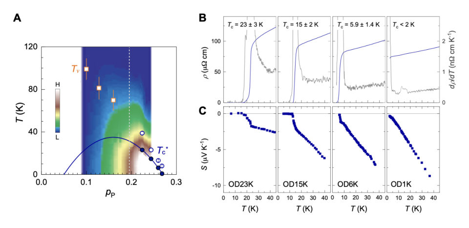 
FIG. 1. Temperature-doping phase diagram of Bi2201 and transport characterization of the crystals studied in this work. (A) Characteristic temperatures of Bi2201 plotted against the hole doping level extracted using the Presland relation (pP). Tν is the onset temperature of a finite Nernst signal observed in underdoped Bi2201 [43] and T ∗ c is the onset temperature of SC fluctuations inferred from resistivity measurements. The color contour reflects the spectral weight associated with Cooper pairing previously determined using angle-resolved photoemission spectroscopy measurements [36]. Vertical dashed line marks the location of pseudogap opening in Bi2201 [44]. The color contour and...

📷 Fig 2

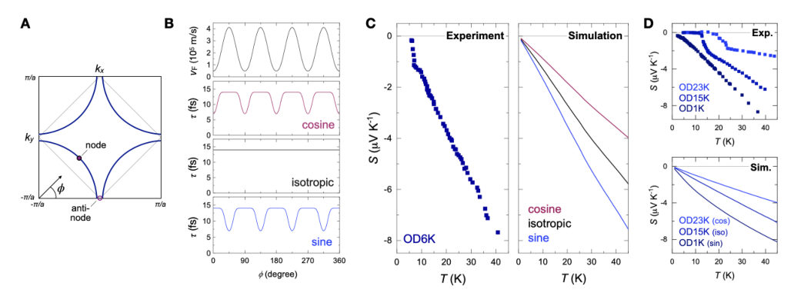 
FIG. 2. Fermi surface parametrization and calculated Seebeck coefficients using the Boltzmann transport theory. (A) Fermi surface derived for OD6K using the tight-binding model described in [45]. (B) Fermi velocity vF and carrier lifetime τ parametrizations as a function of azimuthal angle ϕ. (C) S(T) measured on OD6K (left) and simulated (right) based on the Fermi surface parametrization shown in (A), considering three cases of carrier lifetime anisotropy. (D) Experimental and simulated S(T) of OD23K, OD15K, and OD1K. The form of τ-anisotropy for each optimized simulation is specified in brackets.

📷 Fig 3

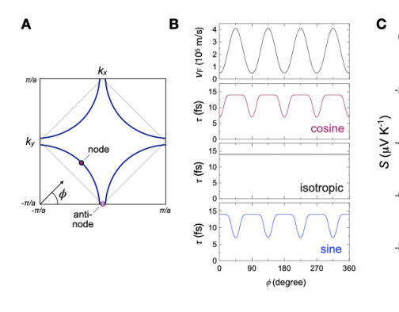 
Figure 3 shows the magnetic-field dependence of the absolute Seebeck coefficient |S/T(H)| for all Bi2201 sam- ples within the temperature range 3.6 K ≤T ≤45 K. A clear transition from a superconducting to a mixed state can be seen for all samples with a Tc &gt; 2 K. All samples exhibit a highly field-dependent |S/T| with a peak struc- ture that becomes more prominent with decreasing T. Notably, the field derivative of the magnetothermopower (MTEP) at 35 T is positive (i. e. d|S/T|/d(µ0H) &gt; 0) at T ∼40 K and becomes negative as T decreases. Such a complex MTEP has been previously reported for heavy- fermion superconductor CeCoIn5 [54] and interpreted as a rapid change in entropy flow in the...

📷 Fig 4

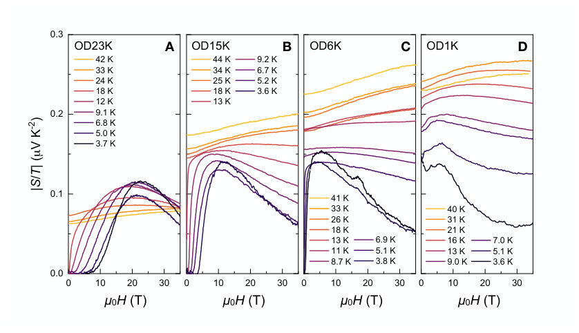 
FIG. 3. Absolute Seebeck coefficient |S/T| of OD Bi2201 measured in magnetic fields up to 35 T. Note that at high temperatures |S/T| increases with magnetic field, whereas at low T, |S/T| decreases with magnetic field in the high-field regime.

📷 Fig 5

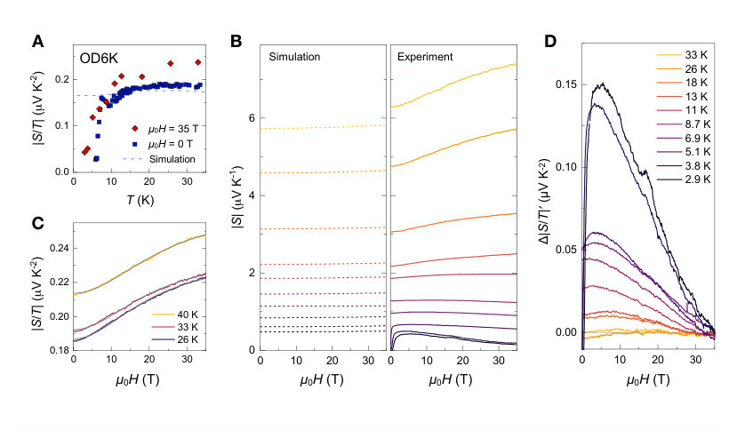 
FIG. 4. Form of the normal-state magneto-Seebeck effect and discrepancy between electronic structure-derived and experimental S(H) for OD6K. (A) Absolute Seebeck coefficient |S/T| measured in 0 T and 35 T. A good agreement between the experimental and electronic structure-derived |S/T| is found at 0 T at T &gt; Tc, while S/T measured in 35 T shows a sharp negative deviation from the zero-field behavior. (B) Left: Calculated |S(H)| using the same set of parameters as in Fig. 2 Right: Experimental |S(H)| which shows a pronounced and complex H dependence with varying T. (C) Field-dependent |S/T| at T ≫Tc. All three traces show a similar dependence of |S/T(H)| that can be described by the standard...

**Summary.** This work investigates strange metallicity in overdoped cuprates by measuring magnetothermopower up to 35 T. The key finding is that the anomalous field dependence cannot be explained by standard theory, suggesting two coexisting charge carrier sectors. The authors propose a model where conventional Fermi-liquid behavior coexists with an unusual, particle-hole symmetric component linked to superconducting fluctuations.

**Why it may be interesting.** While focused on cuprates, the concept of separating transport into distinct symmetry sectors (e.g., particle-hole symmetric vs. asymmetric) is relevant for understanding exotic quantum states in other correlated systems where multiple degrees of freedom coexist.

Detailed structure

**Main problem.** The study aims to understand the microscopic origin of 'strange metallicity' observed in overdoped cuprate superconductors by analyzing their transport properties.

**Main result.** The anomalous magnetothermopower suggests the existence of two distinct charge carrier sectors: a conventional Fermi-liquid sector and a nearly particle-hole symmetric sector dominated by superconducting fluctuations above Tc.

**Method.** The research combines high-field magnetothermopower measurements with theoretical modeling using Boltzmann transport theory and phenomenological real-space models.

**Model / system.** The physical system is overdoped (Bi,Pb)2(Sr,La)2CuO6+delta single crystals. The model proposes disconnected Fermi-liquid islands embedded in a compensated Dirac liquid of d-wave Bogoliubov quasiparticles.

**Key observables.** Magnetothermopower $S(H)$, zero-field Seebeck coefficient $S(T)$, Hall resistivity $
ho_{xy}(T, H)$, and magnetoresistance (MR).

**Important parameters / regimes.** Magnetic fields up to 35 T; temperature dependence near Tc; doping level in cuprates.

**Assumptions / limitations.** The model is phenomenological, assuming the coexistence of two distinct transport sectors governed by different symmetries (particle-hole asymmetry).

**Figures summary.** Figures show $
ho_{ab}(T)$ and $S(T)$ vs. doping, detailed characterization of magnetothermopower $|S/T|$ vs. magnetic field, and procedures for symmetrizing the measured thermoelectric voltages.

**Paper structure.** The paper progresses by first establishing the failure of standard Boltzmann theory to explain field-dependent thermopower, leading to the hypothesis of multiple transport sectors; it then develops a two-fluid model (FL islands in a Dirac liquid) to reconcile zero-field and high-field anomalies.

Abstract

Here, we report magnetothermopower measurements on overdoped (Bi,Pb)2(Sr,La)2CuO6+delta (Bi2201) single crystals in magnetic fields up to 35 T. Whereas the temperature dependence of the zero-field Seebeck coefficient S(T) can be captured using Boltzmann transport theory, the field-dependent response S(H) cannot. Instead, the magnetothermopower contains a large additional contribution whose field and temperature dependence is consistent with the presence of short-range superconducting order well above Tc. Combined with earlier Hall and magnetoresistance results, these data imply that the overdoped cuprate strange metal contains two transport sectors with distinct particle-hole symmetry: a conventional particle-hole-asymmetric Fermi-liquid (FL) contribution governing the Hall effect and the zero-field thermopower, and a nearly particle-hole-symmetric sector dominating the anomalous longitudinal magnetotransport. We formulate a phenomenological real-space model in which disconnected FL islands are embedded in a compensated Dirac liquid of phase-incoherent d-wave Bogoliubov quasiparticles. This picture reconciles conventional zero-field transport with anomalous magnetothermopower and magnetoresistance and offers a concrete framework for thinking about strange metallicity in overdoped cuprates.

[↑ back to top](#top)

### [Quantum Weakest Preconditions Revisited: Pre-expectations for Expected Runtime Analysis](http://arxiv.org/abs/2607.12532v1)

**Authors:** Christina Gehnen, Dominique Unruh, Joost-Pieter Katoen  
**Type:** theory · **Category:** quantum information and computing · **PDF:** <https://arxiv.org/pdf/2607.12532v1>  
**Analysis basis:** full PDF text, analyzed in chunks
**Topic relevance:** `methods for driven-dissipative` **1/5** · `quantum measurements` **1/5**

📷 Fig 1

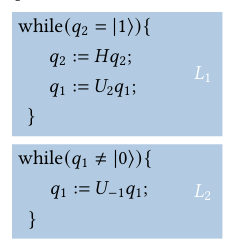 
Fig. 1. A quantum program where 𝑈2 maps |𝑛⟩to |2𝑛⟩and 𝑈−1 maps |𝑛⟩to |𝑛−1⟩(to make them unitary, one can for example add ancilla qubits which we omit to not complicate the analysis). The measurement operators are 𝑀0 = |0⟩⟨0|, 𝑀1 = |1⟩⟨1| for the first loop on variable 𝑞2 and 𝑀0 = |0⟩⟨0|, 𝑀1 = I −|0⟩⟨0| for the second loop on variable 𝑞1.

**Summary.** This paper introduces a novel weakest pre-expectation framework designed to analyze the expected runtime of general quantum programs. By extending traditional verification tools to handle reward statements and infinite expectations, it overcomes limitations that previously restricted analysis to bounded or terminating cases. This advances the theoretical understanding of resource quantification in quantum computation.

**Why it may be interesting.** It provides rigorous tools (weakest pre-expectations) to analyze resource usage (expected time) in complex quantum algorithms, which is crucial for assessing the feasibility of large-scale quantum computation.

Detailed structure

**Main problem.** The paper revisits quantum weakest preconditions to develop a framework for analyzing the expected runtime of general quantum programs without requiring an upper bound on that runtime.

**Main result.** A novel pre-expectation framework is introduced, allowing analysis of expected runtimes even when they are potentially infinite, by defining weakest pre-expectations for quantum while loops with rewards.

**Method.** The authors define a syntactic and semantic calculus for 'qrWhile' programs, utilizing weak pre-expectations that incorporate reward statements to track expected values.

**Model / system.** The model is general quantum computation involving density operators on Hilbert spaces, supporting unbounded operators and control flow structures like while loops.

**Key observables.** Expected runtime ($\mathbb{E}[	ext{ertJ} \dots]$), rewards, and the weak pre-expectation itself.

**Important parameters / regimes.** The analysis handles potentially infinite expected runtimes and operates in settings involving unbounded operators.

**Assumptions / limitations.** Previous work often required programs to be Almost Surely Terminating (AST) or restricted to bounded preconditions; this framework aims to overcome those limitations.

**Paper structure.** The paper builds from foundational concepts of Hilbert spaces and operators, defines the necessary semantics for quantum programs with rewards, establishes the weakest pre-expectation calculus, and finally demonstrates its application to compute expected runtimes via syntactic transformations.

Abstract

Quantum weakest preconditions are a fundamental tool for program verification of quantum programs. Many variations have been reported in the literature. We revisit quantum weakest preconditions from the perspective of expected runtime analysis of quantum programs and introduce a novel pre-expectation framework that enables to reason about the preconditions of quantum programs without the need of an upper bound. This is particularly interesting for quantum programs involving reward statements. The overall goal is to analyze runtime behavior even in the case of programs with potentially infinite expected runtime. This paper presents several ways to do so, e.g., a program transformation such that the expected runtime of a quantum program can be expressed using the weakest pre-expectation calculus with rewards.

[↑ back to top](#top)

### [Emergent $s+id$ Superconductivity from the Interplay between Electronic Correlations and Electron-Phonon Coupling in $\mathrm{R}_{1-x}\mathrm{Sr}_x\mathrm{NiO}_2$](http://arxiv.org/abs/2607.12773v1)

**Authors:** Zi Yuan, Jun Zhan, Xianxin Wu, Shaozhi Li  
**Type:** theory · **Category:** strongly correlated electrons · **PDF:** <https://arxiv.org/pdf/2607.12773v1>  
**Analysis basis:** full PDF text, analyzed in chunks
**Topic relevance:** `Keldysh / 2PI / non-Gaussian methods` **1/5**

📷 Fig 1

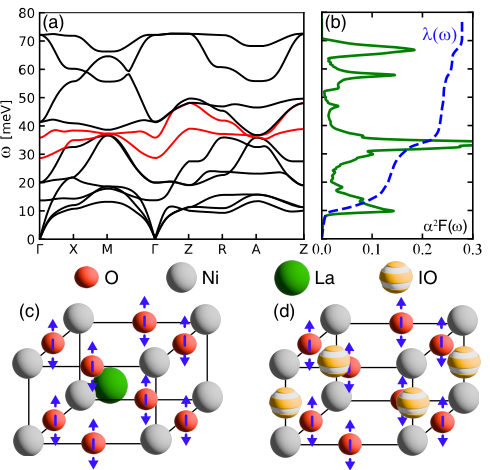 
FIG. 1. Phonon properties of LaNiO2. (a) Phonon disper- sion. (b) Electron-phonon coupling function α2F(ω). (c) A1g vibration mode of the in-plane oxygen atoms. (d) A1g vibra- tion mode for the effective two-orbital model. IO stands for interstitial orbital.

📷 Fig 2

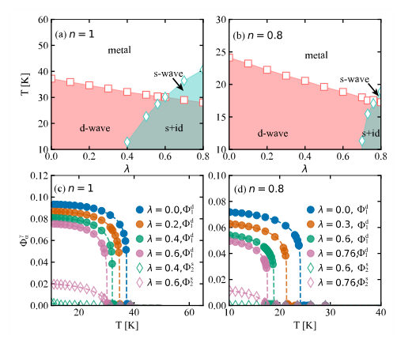 
FIG. 2. (a, b) Phase diagrams in the plane of temperature T and electron–phonon coupling λ for electron densities n = 1 and n = 0.8, respectively. (c, d) The averaged superconduct- ing order parameter Φd(s) γ as a function of temperature for various values of λ at n = 1 and n = 0.8, respectively.

📷 Fig 3

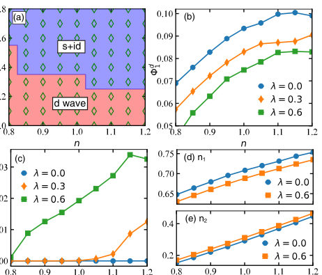 
FIG. 3. (a) Phase diagram in the (n, λ) plane at T = 16 K. (b,c) Averaged d- and s-wave superconducting order param- eters, Φd 1 and Φs 2, as functions of n. (d,e) Orbital-resolved electron densities for the d and s orbitals.

📷 Fig 4

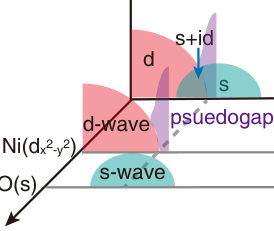 
FIG. 5. Schematic illustration of the effect of oxygen vacan- cies on superconductivity in R0.8Sr0.2NiO2 (R = Nd, La) as a function of vacancy concentration. Here, nd and ns denote the electron densities on the Ni dx2−y2 and IO orbitals, re- spectively.

📷 Fig 5

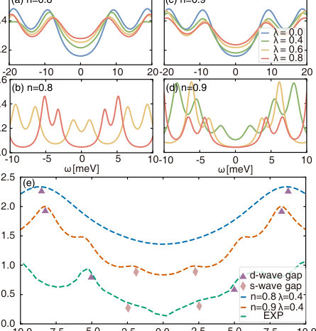 
FIG. 4. (a,c) Density of states D1(ω) for orbital 1 at fill- ings n = 0.8 and n = 0.9, respectively. (b,d) Density of states D2(ω) for orbital 2 at fillings n = 0.8 and n = 0.9, respectively. (e) Total density of states D(ω). The green dashed curve represents the single-particle tunneling spec- trum of Nd0.8Sr0.2NiO2 from Ref. [78].

**Summary.** This theoretical study investigates how the combination of electronic correlations and lattice vibrations dictates superconducting symmetry in nickelates. By applying advanced many-body techniques, the authors predict that spin fluctuations favor d-wave pairing while electron-phonon coupling induces s-wave pairing, resulting in a mixed $s+id$ state. This mechanism offers a quantitative explanation for the experimentally observed spatial inhomogeneity of superconductivity.

**Why it may be interesting.** The explicit inclusion of electron-phonon coupling alongside strong electronic correlations to predict a mixed pairing symmetry ($s+id$) provides a rich, multi-faceted model for unconventional superconductivity mechanisms relevant to condensed matter theory.

Detailed structure

**Main problem.** The study aims to determine the microscopic origin of spatially varying superconducting symmetries observed experimentally in infinite-layer nickelates, moving beyond simple d-wave models.

**Main result.** The interplay between spin fluctuations (driving d-wave pairing) and electron-phonon coupling (inducing s-wave pairing) leads to a mixed $s+id$ superconducting state. This $s$-wave component is highly sensitive to carrier density, suggesting local defects can explain observed symmetry variations.

**Method.** The authors combine first-principles calculations with the Fluctuation-Exchange–Migdal-Eliashberg (FLEX–ME) theory to model pairing mechanisms.

**Model / system.** The system is infinite-layer nickelates ($\mathrm{R}_{1-x}\mathrm{Sr}_x\mathrm{NiO}_2$), modeled using a two-orbital approach that incorporates on-site Coulomb repulsion ($U_d$) and electron-phonon coupling ($\mathcal{H}_{	ext{eph}}$) involving the oxygen $A_{1g}$ phonon mode.

**Key observables.** Superconducting order parameters ($\Phi_d$ for d-orbital, $\Phi_s$ for IO orbital), superconducting transition temperatures ($T_{c}$), and SC gaps (measured in meV).

**Important parameters / regimes.** Electron-phonon coupling strength ($\lambda$), carrier density ($n$), and the specific phonon mode involved ($A_{1g}$).

**Assumptions / limitations.** The analysis relies on combining DFT calculations with FLEX–ME theory, which captures both spin fluctuation (d-wave) and charge fluctuation/e-ph (s-wave) pairing contributions.

**Figures summary.** Figures illustrate phonon properties, phase diagrams showing SC regimes vs. $\lambda$ for fixed $n$, and temperature dependence of the superconducting order parameters ($\Phi_d, \Phi_s$).

**Paper structure.** The paper progresses by establishing the physical system (nickelates) and the theoretical framework (FLEX–ME theory). It then calculates the contributions from spin fluctuations (d-wave) and e-ph coupling (s-wave), culminating in the prediction of an $s+id$ state whose stability depends critically on carrier density.

Abstract

Recent tunneling measurements on infinite-layer nickelates have revealed spatially varying superconducting symmetries, whose microscopic origin remains unclear. Motivated by this observation, we investigate the interplay between electron correlations and electron-phonon interactions in infinite-layer nickelates by combining first-principles calculations with the fluctuation-exchange-Migdal-Eliashberg theory. Our calculations show that spin fluctuations yield robust $d$-wave superconductivity on the Ni $d_{x^2-y^2}$ orbital, whereas electron-phonon coupling induces $s$-wave pairing on an interstitial orbital, leading to an $s+id$ superconducting state. The emergence of the $s$-wave component is strongly carrier-density dependent: an intermediate electron-phonon coupling of $λ=0.4$ stabilizes the $s+id$ state at $n=0.9$ but not at $n=0.8$. These results imply that local oxygen defects tune the local electron density and form finite-size domains with distinct pairing symmetries, offering a compelling explanation for the spatially inhomogeneous superconducting symmetries observed in experiments.

[↑ back to top](#top)

### [Emergent interweaved CDW unoccupied states in hole-doping LaTe2 with element substitution](http://arxiv.org/abs/2607.12258v1)

**Authors:** Shuya Xing, Hongyu Liu, Xu Chen, Zhenkai Xie, Zhongxu Wei, Shifeng Zhao, Wenping Zhou, Xin qi Li, Zhihai Cheng  
**Type:** both · **Category:** strongly correlated electrons · **PDF:** <https://arxiv.org/pdf/2607.12258v1>  
**Analysis basis:** full PDF text, analyzed in chunks
**Topic relevance:** `Frenkel-Kontorova` **1/5**

📷 Fig 1

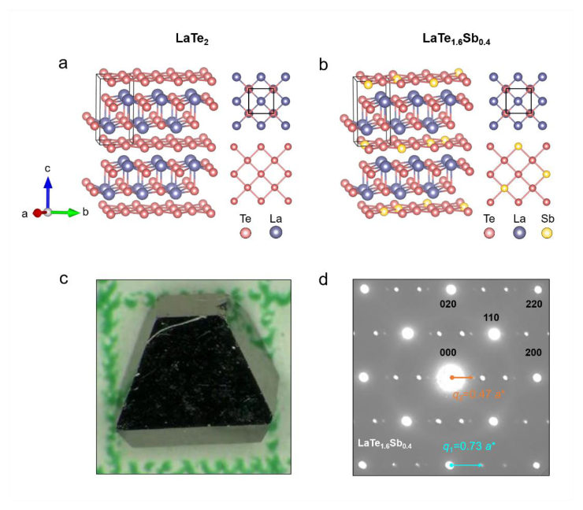 
Fig. 1. Atomic structural of LaTe2/LaTe1.6Sb0.4, and charge density waves in LaTe1.6Sb0.4. (a) Left panel:

📷 Fig 2

 
Figure 1a shows a schematic diagram of the LaTe2 crystal, which adopts the Cu2Sb-type

📷 Fig 3

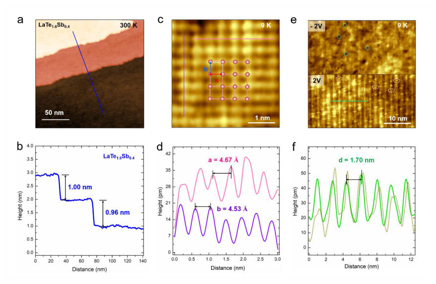 
Fig. 2. Atomic resolution of Te-Te (Sb) cleavage surface in LaTe1.6Sb0.4 and its bias-dependent STM

📷 Fig 4

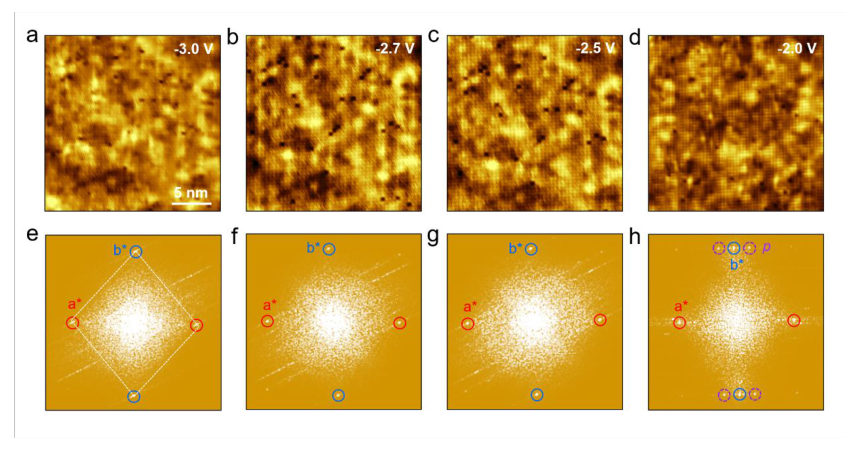 
Fig. 3. Atomic-scale STM measurements of the LaTe1.6Sb0.4 in occupied state. (a-d) STM topography of

📷 Fig 5

 
Figure 3(e)-3(h) display the corresponding fast Fourier transform (FFT) patterns of Figs.

**Summary.** This work investigates the complex Charge Density Wave (CDW) states in hole-doped layered tellurides using low-temperature STM. By analyzing unoccupied electronic states, the authors resolved three distinct, interweaved CDW wave vectors ($\mathbf{q}_1, \mathbf{q}_2, \mathbf{q}_3$) and a superstructure component ($\mathbf{p}$). These findings provide critical evidence linking the emergence of multiple CDWs to Fermi surface nesting driven by hole doping.

**Why it may be interesting.** The detailed mapping of multiple, interweaved CDW vectors in relation to specific orbital character ($p$-orbitals) provides a rich playground for understanding charge instabilities and electronic correlations beyond simple mean-field models.

Detailed structure

**Main problem.** The primary goal is elucidating the origin of complex, interweaved Charge Density Wave (CDW) states observed in hole-doped layered rare-earth tellurides.

**Main result.** STM measurements revealed three distinct, superimposed CDW wave vectors ($q_1, q_2, q_3$) in unoccupied electronic states, which are theoretically linked to nesting vectors connecting $p_x$ and $p_y$ bands due to hole doping.

**Method.** The study combines low-temperature Scanning Tunneling Microscopy (STM) on cleaved surfaces with Fast Fourier Transform (FFT) analysis of the resulting electronic maps, supplemented by theoretical calculations.

**Model / system.** The system is layered rare-earth tellurides ($	ext{LaTe}_{2-x}	ext{Sb}_x$), focusing on the $	ext{Te-Te}$ or $	ext{Sb}$-substituted sheets. The physics involves CDW formation, superstructure development, and electronic structure mapping in response to hole doping.

**Key observables.** Three distinct CDW wave vectors ($\mathbf{q}_1 = 0.73 	ext{ a}^*$, $\mathbf{q}_2 = 0.47 	ext{ a}^*$, $\mathbf{q}_3 = 0.27 	ext{ a}^*$), the superstructure vector ($\mathbf{p}$), and modulation patterns observed in unoccupied electronic states.

**Important parameters / regimes.** Low temperature (9 K); hole doping concentration ($x$); lattice constants; nesting vectors connecting $p_x$- and $p_y$-bands.

**Assumptions / limitations.** The CDW modulations are primarily governed by the filling of unoccupied electronic states, and the observed wave vectors can be mapped to Fermi surface nesting conditions.

**Figures summary.** Figures illustrate crystal structures, SAED patterns showing multiple reflections, and STM/FFT results demonstrating superimposed stripe modulations corresponding to the three distinct CDW wave vectors and a superstructure spot $\mathbf{p}$.

**Paper structure.** The paper progresses from identifying complex diffraction features via TEM to performing detailed STM measurements on unoccupied states. It resolves three interweaved CDWs ($\mathbf{q}_1, \mathbf{q}_2, \mathbf{q}_3$) and attributes the superstructure ($\mathbf{p}$) to covalent-like quasi-bonding (CLQB), confirming their origin through theoretical nesting vector analysis.

Abstract

Multiple CDW-ordered layered rare-earth tellurides have increasingly emerged as a research hotspot, owing to their unconventional CDW formation, high transition temperature, and confirmed existence of axial Higgs modes. Recently, interweaved CDW in LaTe2 and its element-substituted phase LaTe2-xSbx have been investigated through TEM and ARPES measurements, revealing their distinct origins. Nevertheless, several complex diffraction features observed in TEM patterns remain unelucidated. In this work, we carried out scanning tunneling microscopy (STM) on LaTe1.6Sb0.4 crystals at 9 K. Three interweaved CDW wave vectors, q1=8/11a*, q2=5/11a* and q3=3/11a* were observed, which are induced by hole doping in unoccupied states. The q1 and q3 are theoretically verified to be nesting vectors connecting px- and py- bands. Furthermore, the satellite spots relative to the main Bragg spots p corresponding to a 11-a-superlattice have also been detected. Our findings provide critical insights for further exploring the origin of the interweaved CDW in hole/electron doping materials.

[↑ back to top](#top)

### [Molecular Docking with Quantum Circuit Evolution](http://arxiv.org/abs/2607.12060v1)

**Authors:** Gleydson Fernandes de Jesus, Bruno Oziel Fernandez, Marcelo A. Moret  
**Type:** experiment · **Category:** quantum information and computing · **PDF:** <https://arxiv.org/pdf/2607.12060v1>  
**Analysis basis:** full PDF text, analyzed in chunks
**Topic relevance:** `QC/QI experiment` **1/5**

📷 Fig 1

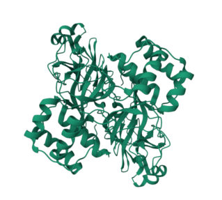 
FIG. 2: SARS-CoV-2 Mpro complex. Image extracted from PDBbind dataset, PDB ID: 8SKH.

📷 Fig 2

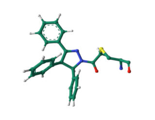 
FIG. 3: Ligand PM-2-020B. Image extracted from PDB- bind dataset, PDB ID: 8SKH.

📷 Fig 3

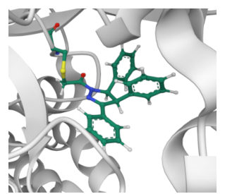 
FIG. 4: Binding interaction between the receptor (SARS- CoV-2 Mpro complex), shown in color, and the ligand (PM-2-020B), shown in grayscale inset. Image extracted from PDBbind dataset, PDB ID: 8SKH.

📷 Fig 4

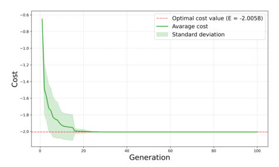 
FIG. 5: Convergence plot for 8SKH. The red line repre- sents the optimal value of the cost function, computed classically. The green curve represents the mean cost function value across 10 independent runs, while the shaded region denotes the corresponding standard devi- ation.

📷 Fig 5

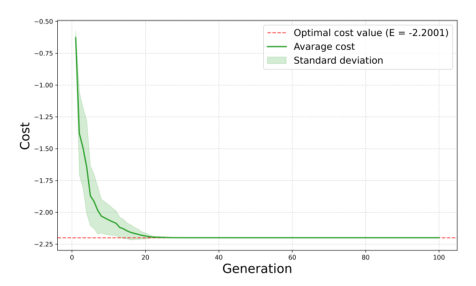 
FIG. 6: Convergence plot for 3HAC. The red line rep- resents the optimal value of the cost function, computed classically. The green curve represents the mean cost function value across 10 independent runs, while the shaded region denotes the corresponding standard devi- ation.

**Summary.** This paper tackles the computational bottleneck of molecular docking by reformulating it as an NP-hard clique finding problem solvable with quantum computation. The authors introduce and apply Quantum Circuit Evolution (QCE), a novel, gradient-free quantum evolutionary method, to find optimal receptor-ligand binding configurations. Results show that QCE demonstrates fast and stable convergence toward the best possible solutions.

**Why it may be interesting.** The application of a novel, gradient-free quantum optimization technique like QCE to a complex physical problem rooted in molecular interactions provides a concrete testbed for near-term quantum algorithm development beyond standard QAOA implementations.

Detailed structure

**Main problem.** The high computational cost of molecular docking, a crucial step in drug discovery, limits its applicability.

**Main result.** The proposed Quantum Circuit Evolution (QCE) method successfully found the maximum clique solution for tested systems in many experiments, often requiring fewer steps than previous quantum algorithms.

**Method.** The authors propose using QCE, a gate-based and gradient-free quantum evolutionary method, to solve the problem by minimizing an objective function derived from the Hamiltonian of the molecular interaction graph.

**Model / system.** The biological docking problem is mapped onto finding the Maximum Vertex Weight Clique Problem (MVWCP), which is formulated as a QUBO Hamiltonian ($H$) suitable for quantum computation on qubits.

**Key observables.** Convergence behavior, cost function values, and the size of the found clique relative to the maximum possible clique.

**Important parameters / regimes.** Qubit counts (6, 8, and 12), temperature/distance thresholds ($	au$), and the perturbation parameter $\epsilon$ used in circuit evolution.

**Assumptions / limitations.** The work relies on simulations using the CUDA-Q SDK due to the prohibitive cost of accessing real quantum hardware; QCE is claimed not to require classical optimization of parameters.

**Figures summary.** Figures illustrate distance comparisons for binding interactions, show molecular structures (SARS-CoV-2 Mpro complex), and display convergence plots showing the mean cost function value decreasing over generations.

**Paper structure.** The paper first frames the problem by modeling docking as an MVWCP/QUBO. It then details the QCE algorithm—including its evolutionary operations (INSERT, DELETE, SWAP, MODIFY)—and presents results across multiple qubit counts and complexes, comparing performance against prior quantum methods.

Abstract

Molecular docking is an important step in drug discovery, enabling the evaluation of receptor-ligand affinity while reducing experimental costs and increasing the number of possible tests. However, the high computational cost associated with molecular docking remains a limiting factor that can restrict both the experimental precision and the scale of the problems being addressed. To improve the future applicability of molecular docking, recent works have proposed the use of quantum algorithms based on Gaussian Boson Sampling quantum computers and also gate-based quantum computers. In this work, we propose the use of Quantum Circuit Evolution (QCE) for solving the molecular docking problem, a gate based and gradient-free quantum evolutionary method whose evolution is driven by the random application of unitary operations to a quantum circuit. The proposed algorithm demonstrated the ability to find the best solution to the problem in fewer steps than the methods presented in previous studies, exhibiting fast and stable convergence.

[↑ back to top](#top)

### [Optically Derived Radio-Frequency Benchmark in Methanol: A Sub-kHz Reference for Astrophysical Tests of Fundamental Physics](http://arxiv.org/abs/2607.12533v1)

**Authors:** Frank M. J. Cozijn, Arthémise Altman, Alexandr S. Bogomolov, Alexis Libert, Simon Collignon, Erik Dierikx, Jeroen C. J. Koelemeij, Boy Lankhaar, Isabelle Kleiner, Clément Lauzin, Wim Ubachs  
**Type:** experiment · **Category:** other · **PDF:** <https://arxiv.org/pdf/2607.12533v1>  
**Analysis basis:** full PDF text, analyzed in chunks
**Topic relevance:** `interference shaping light` **1/5**

📷 Fig 1

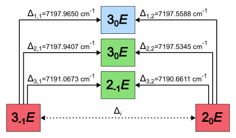 
FIG. 1. Partial quantum level scheme of CH3OH. Rotational states are indicated within colored boxes representing the vi- brational ground (red) and excited (blue, green) levels. The green color-coded rotational levels pertain to the same excited vibration, whereas the blue color-coded rotational level refers to another excited vibration. The six target transitions ∆i,j (indicated with frequencies in cm−1 units as obtained from the lower-resolution study [30]) form a triangulation scheme connecting three common upper levels (i = 1, 2, 3) to the 3−1E (j = 1) and 20E (j = 2) ground states to determine the splitting ∆i.

📷 Fig 2

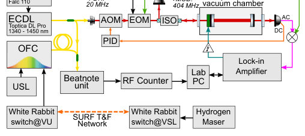 
FIG. 2. Schematic of the experimental configuration including the details of the spectroscopy laser, the frequency comb laser, and the use of a frequency standard involving a fiber connec- tion to UTC(VSL) at Delft, where UTC(VSL) is driven by a hydrogen maser. The (de)modulation and locking schemes are described in the main text.

📷 Fig 3

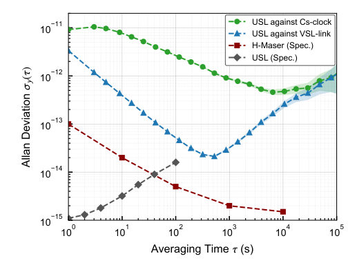 
FIG. 3. Allan deviation σy(τ) representing the relative sta- bility of the ultra-stable laser (USL) measured against (i) the local Cs-clock (green circles) and (ii) the hydrogen maser referenced via the White Rabbit fiber link (blue triangles). The optical frequency comb (OFC) serves purely as a coher- ent frequency bridge to translate the USL stability to the measured repetition rate (frep). Manufacturer specifications are included for the Hydrogen Maser (red squares) and the Ultra-Stable Laser (grey diamonds). The linear drift of the ultra-stable laser was removed in all instances. The TFN-link measurement (blue) reaches a stability floor of ≈2 × 10−14, limited by fiber phase noise (short...

📷 Fig 4

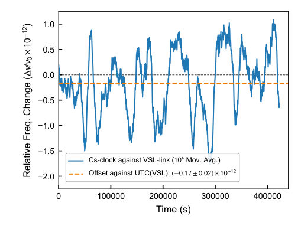 
FIG. 4. Frequency comparison of the in-house Cs-clock against the VSL Hydrogen maser, obtained by counting the Cs-clock 10 MHz signal against the H-maser over the TFN. The data (smoothed by a 10,000-second moving average) re- veals fractional frequency deviations of ±1×10−12 and a sys- tematic offset from UTC(VSL) (orange dashed line). Typ- ically, UTC(VSL) drifts by less than 1 ns/day relative to UTC, corresponding to a negligible fractional frequency offset of ≲1 × 10−14. The filtered time-domain data clearly illus- trates the slow frequency wander, characteristic of flicker and random-walk noise, inherent to the free-running Cs-clock.

📷 Fig 5

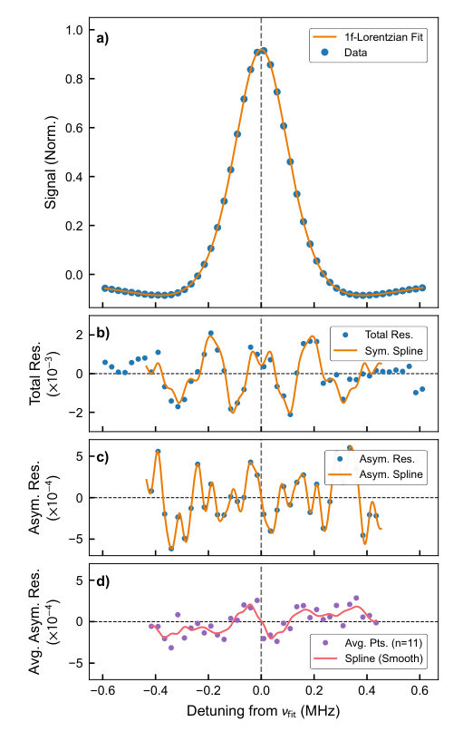 
FIG. 5. A single scan of the ∆1,1 transition at 0.10 Pa pres- sure, 2 W intracavity roundtrip power and 150 kHz dither am- plitude (peak-to-peak). (a) The recorded signal (points) fitted with the 1f-dispersive Lorentzian profile (orange line), pro- viding a 55 Hz fitting uncertainty. (b) Relative total residuals (points) from the fit, with the symmetric component (spline) shown in orange. The spline fit is truncated at the edges to avoid border defects. The (mostly) symmetric residuals are at a level of 0.4% distortion. (c) Relative asymmetric resid- uals (points and spline), isolated by removing the symmet- ric component. These mostly show the randomly distributed noise, indicating a...

**Summary.** The authors report establishing an unprecedentedly precise laboratory benchmark for the methanol radio line used in astrophysics. They achieve this by measuring related near-infrared optical transitions and combining them via a quantum 'triangulation' method, bypassing direct microwave measurement limitations. This high accuracy significantly enhances the potential of molecular spectroscopy to test fundamental physical constants over cosmic timescales.

**Why it may be interesting.** This work exemplifies how advanced molecular spectroscopy techniques—specifically using optical transitions to deduce microwave frequencies—can push precision limits far beyond what is achievable by direct measurement. The theoretical underpinning involving symmetry breaking due to internal rotation is a rich topic in molecular physics.

Detailed structure

**Main problem.** The goal is to determine a highly accurate laboratory rest frequency for the astrophysically important 12.2 GHz methanol transition to enable precise tests of fundamental physics, such as variations in the proton-to-electron mass ratio.

**Main result.** A sub-kHz benchmark frequency was established for this key radio line with an uncertainty of $135 	ext{ Hz}$, representing a 20-fold improvement over previous microwave spectroscopy methods.

**Method.** The measurement avoids direct microwave observation by using a novel optical 'triangulation scheme' involving pairs of near-infrared rovibrational transitions, which are then combined to yield the ground-state rotational difference frequency.

**Model / system.** The system is methanol ($	ext{CH}_3	ext{OH}$), treated as an achiral asymmetric rotor exhibiting hindered internal rotation. The symmetry analysis uses the Longuet–Higgins group $G_6$, which allows for a closed electric-dipole transition loop that would otherwise be forbidden by simple parity rules.

**Key observables.** The derived frequency of the $3_{-1}^E - 20^E$ rotational combination difference, measured via near-infrared Lamb-dip frequencies ($\approx 1.4 \mu	ext{m}$).

**Important parameters / regimes.** Statistical reproducibility of $10 	ext{ Hz}$ and absolute uncertainties as low as $130 	ext{ Hz}$. The measurement relies on locking to an ultra-stable optical frequency comb referenced to a hydrogen maser.

**Assumptions / limitations.** The systematic error from unresolved hyperfine structure is estimated at $\approx 10 	ext{ Hz}$, and the underlying multiplet is assumed to blend into a single symmetric profile.

**Figures summary.** Figure 1 illustrates the quantum level scheme used for the triangulation, connecting three common upper levels. Other figures detail the experimental setup using NICE-OHMS and frequency stability comparisons against external standards.

**Paper structure.** The paper details the physical necessity (testing fundamental constants), outlines the advanced spectroscopic technique (optical triangulation on $	ext{CH}_3	ext{OH}$), describes the high-precision measurement platform (NICE-OHMS locked to an OFC/H-maser), and finally presents the derived, highly accurate frequency benchmark.

Abstract

Methanol radio lines observed in space provide sensitive probes of whether the proton-to-electron mass ratio has changed over cosmic time, but such tests require laboratory rest frequencies with very high accuracy. Here we determine the frequency of the astrophysically important 12.2 GHz $3_{-1}$E -- $2_{0}$E transition of CH$_3$OH by measuring near-infrared rovibrational transitions rather than the microwave line directly. Using wavelength-modulated NICE-OHMS locked to an ultra-stable optical frequency comb and referenced via a fiber link to a hydrogen-maser frequency standard, we measure Lamb-dip frequencies near 1.4 $μ$m (216 THz) with 10 Hz statistical reproducibility and absolute uncertainties as low as 130 Hz. Pairs of optical transitions sharing common upper levels form a triangulation scheme that yields the ground-state rotational combination difference. We obtain 12 178 596.415(135) kHz, improving on earlier molecular-beam microwave spectroscopy by a factor of 20 and agreeing with a recent free-induction-decay measurement. This result establishes a sub-kHz laboratory benchmark for a key radio-astronomical methanol line and demonstrates that optical triangulation can be extended to non-chiral molecules with internal rotation.

[↑ back to top](#top)

### [Parallel Hadamard Test](http://arxiv.org/abs/2607.12344v1)

**Authors:** Soichiro Imamura, Synge Todo  
**Type:** theory · **Category:** quantum information and computing · **PDF:** <https://arxiv.org/pdf/2607.12344v1>  
**Analysis basis:** full PDF text, analyzed in chunks
**Topic relevance:** `quantum measurements` **1/5**

📷 Fig 1

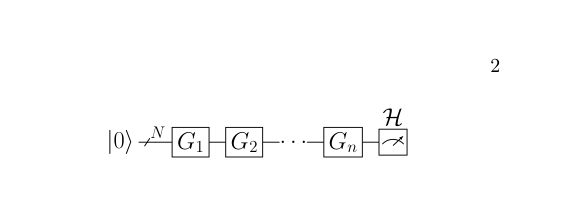 
Figure 2. Quantum circuit for VQE. Although the circuit is depicted as being measured with respect to the Hamiltonian H, in practice, H is decomposed into a sum of tensor products of Pauli operators, called Pauli strings. These Pauli strings are grouped into mutually commuting sets, and a separate quantum circuit is executed for each group [23].

📷 Fig 2

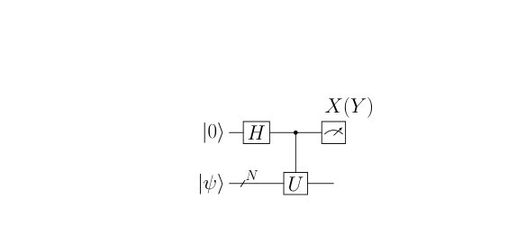 
Figure 1. Quantum circuit for HT. The ancilla qubit is mea- sured in the Pauli X (Y ) basis to estimate the real (imaginary) part of ⟨ψ|U|ψ⟩.

📷 Fig 3

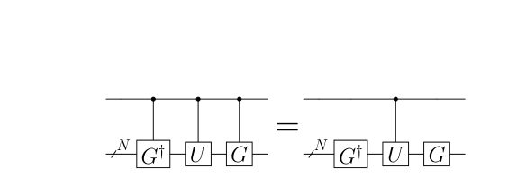 
Figure 3. Circuit identity for simplifying controlled blocks. When a controlled-G gate and its inverse controlled-G† gate with the same control qubit sandwich another controlled-U gate, the controls on G and G† are redundant. Thus, replac- ing the controlled-G and controlled-G† gates with G and G†

📷 Fig 4

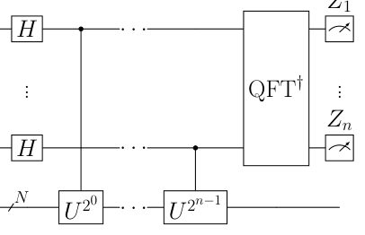 
Figure 5. Quantum circuit for standard QPE [41]. QFT†

📷 Fig 5

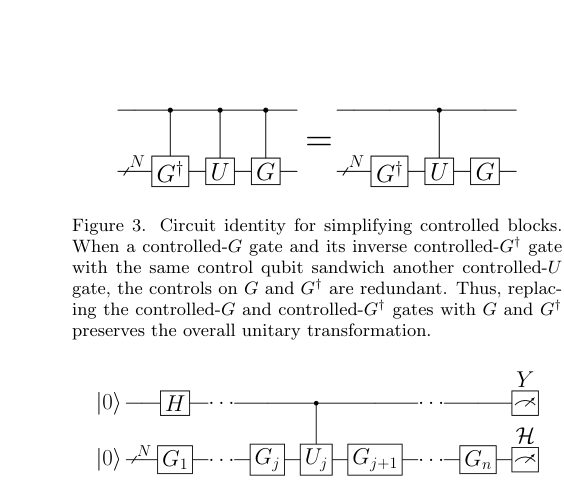 
Figure 4. Quantum circuit for gradient estimation us- ing HT. The ancilla qubit is measured in the Pauli Y ba- sis because the gradient is given by the imaginary part of D 0 G† n:1HGn:j+1UjGj:1 0 E .

**Summary.** The paper introduces the Parallel Hadamard Test (PHT) to overcome the exponential growth of distinct circuits needed when estimating many quantum expectation values. By combining multiple standard Hadamard Tests into one circuit, PHT significantly reduces computational and financial overheads across various quantum workloads, including VQA gradient estimation and kernel calculations.

**Why it may be interesting.** This work directly addresses resource optimization in quantum algorithms by providing a hardware-aware compilation technique that minimizes circuit overheads, which is crucial for running complex variational algorithms on NISQ devices.

Detailed structure

**Main problem.** The conventional estimation of multiple quantum expectation values, such as those required for gradient calculation or kernel evaluation, leads to a proliferation of distinct quantum circuits.

**Main result.** The proposed Parallel Hadamard Test (PHT) unifies these estimations into a single circuit type, significantly reducing overheads in terms of circuit count, time, and cost across various workload structures.

**Method.** PHT combines multiple independent Hadamard Tests (HTs)—used to estimate $	ext{Re}[\langle\psi|U|\psi
angle]$ or $	ext{Im}[\langle\psi|U|\psi
angle]$—into one optimized quantum circuit structure.

**Model / system.** The work is general, applying to three structural classes of workloads: arbitrary sets of unitary operators (e.g., VQA gradients), prefix-product arrays (e.g., QCELS), and Gram-matrix elements (quantum kernel methods).

**Key observables.** Expectation values $	ext{Re}[\langle\psi|U|\psi
angle]$ and $	ext{Im}[\langle\psi|U|\psi
angle]$, energy expectation values $\langle H 
angle$, and gradients $rac{\partial\langle H 
angle}{\partial	heta_j}$.

**Important parameters / regimes.** The required precision ($\epsilon$) dictates the number of shots; fixed per-circuit overheads become critical when many estimations are needed.

**Assumptions / limitations.** The analysis assumes that hardware supports mid-circuit measurement and reset (MCMR) to implement PHT efficiently, and that typical off-diagonal overlaps are small for shot reduction in Gram-matrix settings.

**Figures summary.** Figures illustrate the standard HT circuit, VQE circuits, gradient estimation circuits, and the core PHT structure showing how multiple estimations are combined into one gate preparation $V_{+W}(M)$.

**Paper structure.** The paper introduces the fundamental problem of estimating $\langle\psi|U|\psi
angle$ via HT. It then proposes PHT as a unified solution, demonstrating its applicability and cost savings across three distinct structural classes: arbitrary sets, prefix-product arrays, and Gram matrices.

Abstract

The Hadamard test is a fundamental building block widely used in many quantum computing algorithms. It estimates the real or imaginary part of $\langle ψ\vert U \vert ψ\rangle$, where $\vert ψ\rangle$ is a quantum state and $U$ is a unitary operator. In many algorithms, however, many such quantities must be estimated, leading to a large number of distinct circuit types, long computational times, and high financial costs. In this work, we propose the parallel Hadamard test, which combines multiple Hadamard tests into a single circuit type. We demonstrate how the parallel Hadamard test applies to three structural classes of workloads: arbitrary sets of unitary operators, prefix-product arrays, and Gram-matrix elements. For each class, we compare the cost of the parallel Hadamard test with that of the conventional one. Our unified approach significantly reduces the number of distinct circuit types, and can lower both computational time and financial costs in regimes where fixed per-circuit overheads dominate the total cost. In Gram-matrix workloads, it can also reduce the total number of shots when typical off-diagonal overlaps are small.

[↑ back to top](#top)

### [The Resolution of the Identity as a Generator of Exact Integral Identities: A Coherent-State Approach](http://arxiv.org/abs/2607.12822v1)

**Authors:** Ghasem Asadi Cordshooli, Mehdi Mirzaee  
**Type:** theory · **Category:** other · **PDF:** <https://arxiv.org/pdf/2607.12822v1>  
**Analysis basis:** full PDF text, analyzed in chunks
**Topic relevance:** `quantum measurements` **1/5**

📷 Fig 1

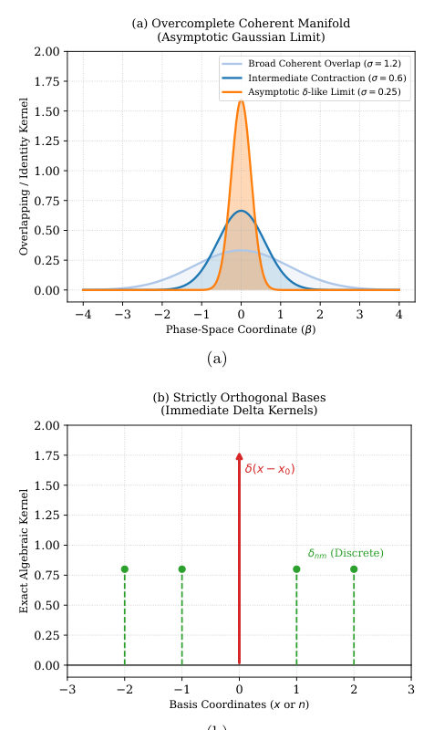 
FIG. 1. A conceptual comparison of identity kernels generated by the ROI framework. (a) In the overcomplete coherent-state manifold, individual states fundamentally overlap, and the Dirac delta distribution emerges only asymptotically as the continuous limit of a contracting Gaussian profile (σ →0). (b) In strictly orthogonal continuous (position) or discrete (Fock) bases, the localization kernels (δ-distribution or Kro- necker δnm) emerge directly and without any limiting process as an inherent requirement for geometric self-consistency.

**Summary.** This work treats the Resolution of the Identity not as a given postulate but as an active generator for exact integral identities in quantum theory. By analyzing coherent states and projecting onto discrete bases, the authors show that the structure of state preservation dictates whether the resulting identity is a Kronecker delta or a Dirac delta. This offers a unifying perspective on basis representations across quantum mechanics.

**Why it may be interesting.** It provides a deep structural insight into quantum mechanics foundations, showing how seemingly independent mathematical postulates like orthonormality are unified under the single principle of Hilbert space completeness.

Detailed structure

**Main problem.** The paper reinterprets the Resolution of the Identity (ROI) from a passive mathematical tool into an active generator that dictates exact integral identities across different quantum bases.

**Main result.** It demonstrates that the structural consistency required by Hilbert space completeness naturally yields both discrete orthonormality (Kronecker delta) and continuous localization kernels (Dirac delta).

**Method.** The core method involves systematically projecting the continuous coherent-state completeness relation onto the discrete Fock basis to derive integral representations for expansion coefficients.

**Model / system.** The study is set in general separable Hilbert spaces, utilizing Glauber coherent states ($\alpha$), position eigenstates ($x$), and the discrete Fock basis ($n$).

**Key observables.** Overlap functions (e.g., $\langleeta|\alpha
angle$, $\langle x'|x
angle$) and resulting identity kernels ($\delta_{nm}$, $\delta(x-x')$).

**Important parameters / regimes.** The coherent state parameter $\alpha \in \mathbb{C}$ and the scaling parameter $\sigma$ used to transition between overcomplete and localized representations.

**Assumptions / limitations.** The approach assumes a separable Hilbert space structure and relies on analyzing asymptotic limits ($\sigma 	o 0$) when recovering strictly orthogonal bases from coherent states.

**Figures summary.** Conceptually compares identity kernels, showing that overcomplete manifolds require an asymptotic contraction ($\sigma 	o 0$) to yield the sharp kernel seen in strictly orthogonal bases.

**Paper structure.** The paper progresses by establishing the general formalism, then applying it specifically to coherent states (deriving a master integral identity and noting non-commutativity), followed by analyzing position eigenstates and Fock states separately before unifying these findings.

Abstract

The resolution of the identity is typically utilized as a passive representation tool in standard quantum mechanics textbooks. In this paper, we reinterpret this traditional perspective by introducing the resolution of the identity associated with Glauber coherent states as a direct generator of exact complex Gaussian integral identities. By systematically projecting the continuous coherent-state completeness relation onto the discrete Fock basis, highly generalized Gaussian integral relations emerge naturally as a direct consequence of state preservation, rather than being introduced as independent mathematical postulates. We demonstrate that this overarching formal structure simultaneously dictates both discrete (Kronecker delta) and continuous (Dirac delta) localization kernels under appropriate basis projections, providing a sharp conceptual contrast between the structural features of overcomplete and strictly orthogonal representations. Crucially, we highlight an intriguing non-commuting behavior in the parameter limits of the master identity. Requiring only the elementary properties of coherent states and the Dirac formalism, this approach offers a transparent and visually intuitive illustration of how Hilbert-space completeness inherently encodes vast libraries of exact, solvable mathematical relations -- providing a unifying perspective suitable for advanced undergraduate and graduate instruction.

[↑ back to top](#top)

## Other papers (9)

*Papers from primary archives without highlighted authors or any topic match. Click to expand.*

Show other papers

### [A maximal Hohenberg-Kohn theorem for non-interacting systems via potential theory](http://arxiv.org/abs/2607.12852v1)

**Authors:** Thiago Carvalho Corso  
**Type:** theory · **Category:** strongly correlated electrons · **PDF:** <https://arxiv.org/pdf/2607.12852v1>  
**Analysis basis:** full PDF text, analyzed in chunks

📷 Fig 1

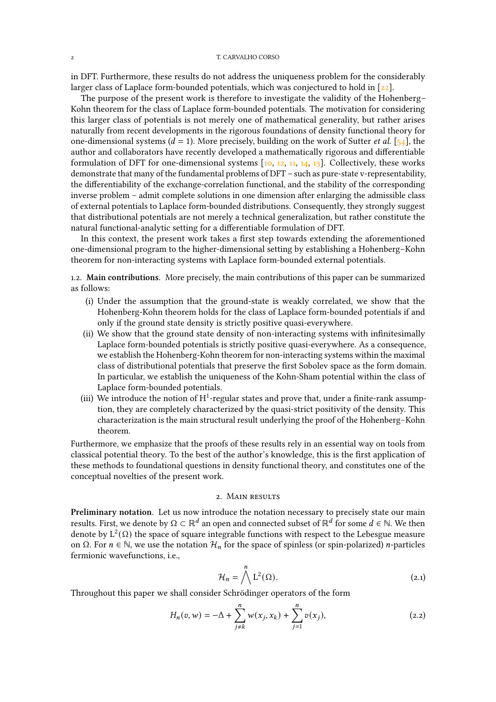 
Low-resolution page preview, page 2

📷 Fig 2

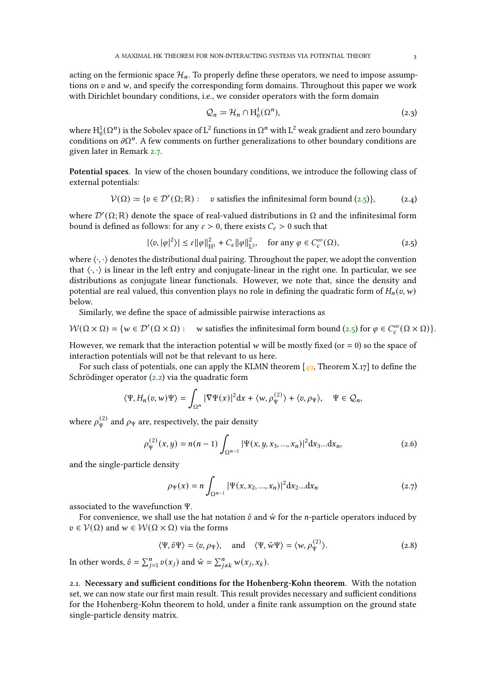 
Low-resolution page preview, page 3

📷 Fig 3

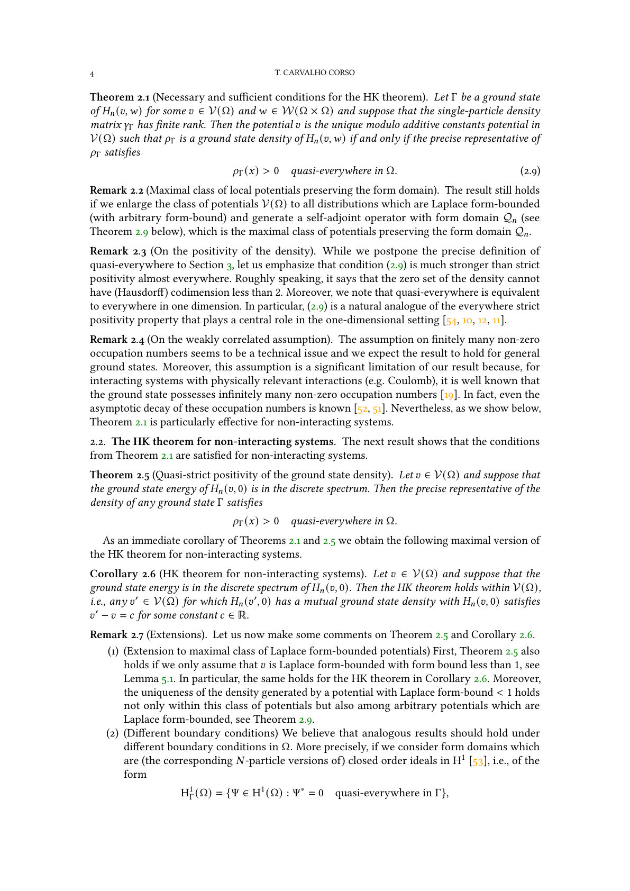 
Low-resolution page preview, page 4

📷 Fig 4

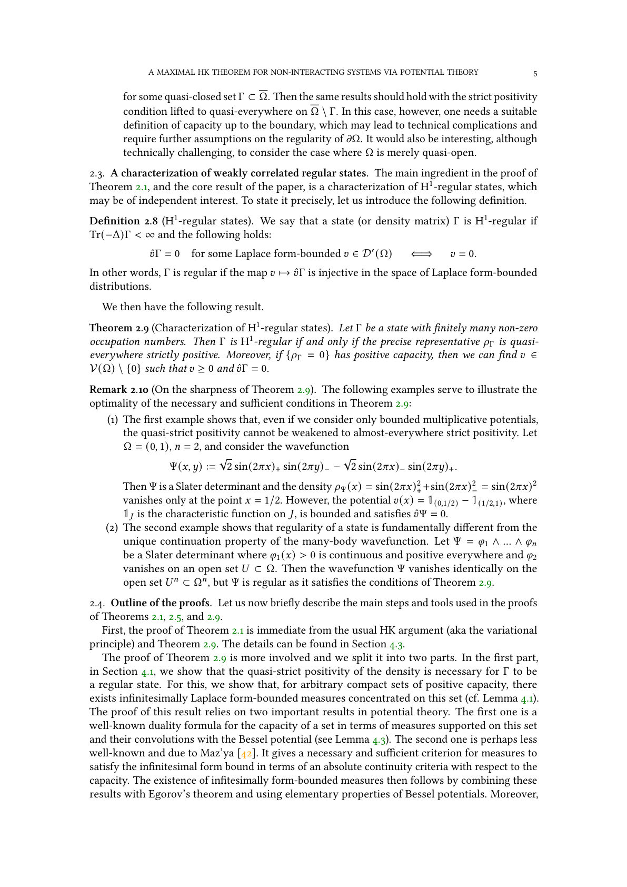 
Low-resolution page preview, page 5

📷 Fig 5

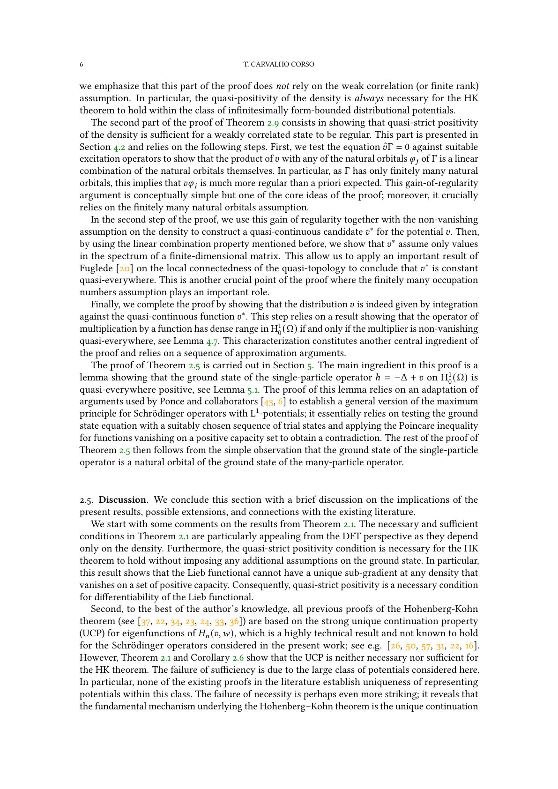 
Low-resolution page preview, page 6

**Summary.** This paper rigorously proves a maximal Hohenberg-Kohn theorem for non-interacting quantum many-body systems. It achieves this by linking the uniqueness of the potential to the quasi-everywhere positivity of the ground state particle density, relying fundamentally on advanced techniques from classical potential theory. This work solidifies the mathematical basis for Density Functional Theory (DFT) in a rigorous setting.

**Why it may be interesting.** While focused on non-interacting systems (a simplification), establishing the rigorous mathematical foundation for the HK theorem is crucial background knowledge for understanding strongly correlated electron physics where density functionals are paramount.

Detailed structure

**Main problem.** The paper aims to establish a maximal Hohenberg-Kohn (HK) theorem for non-interacting quantum many-body systems within the framework of potential theory.

**Main result.** It successfully establishes the HK theorem for non-interacting systems, demonstrating that the uniqueness of the Kohn-Sham potential is guaranteed if the ground state single-particle density is positive quasi-everywhere.

**Method.** The proof heavily utilizes classical potential theory, particularly concepts related to form-bounded potentials and unique continuation properties of elliptic PDEs.

**Model / system.** The system involves many-electron quantum particles governed by Schrödinger operators. The analysis focuses on the ground state energy and density derived from Hamiltonians involving external potentials $v$ and pair interactions $w$.

**Key observables.** Ground state single-particle density $
ho_\Psi(x)$ and its quasi-everywhere positivity ($
ho_\Gamma(x) > 0$ q.e.).

**Important parameters / regimes.** The class of potentials considered is the maximal Laplace form-bounded potentials, and the analysis often assumes the ground state energy is discrete.

**Assumptions / limitations.** Initial results assume the ground state is 'weakly correlated' (finite rank single-particle density matrix), which is noted as a technical limitation for general interacting systems.

**Paper structure.** The paper builds from necessary and sufficient conditions for potential uniqueness based on density positivity, extends these results to the maximal class of potentials, and proves the HK theorem specifically for non-interacting models using advanced tools from potential theory.

Abstract

In this paper, we show that for Schrödinger operators with weakly correlated ground states, the Hohenberg-Kohn theorem holds within the maximal class of form-bounded external potentials if and only if the single-particle density is positive quasi-everywhere. Furthermore, we show that these conditions are satisfied for the ground state of non-interacting Schrödinger operators with a discrete ground state energy. Consequently, we establish the Hohenberg-Kohn theorem for non-interacting systems, and therefore the uniqueness of the Kohn-Sham potential, within the maximal class of Laplace form-bounded potentials. The key ingredient to establish these results is a characterization of weakly correlated regular states, whose proof relies on classical potential theory. Moreover, our proof reveals that, in the continuum setting, the fundamental mechanism underlying the Hohenberg-Kohn theorem is the (quasi)-unique continuation of the density rather than of the many-body wavefunction.

[↑ back to top](#top)

### [Defeating Barren Plateaus with Task-Aligned Symmetry](http://arxiv.org/abs/2607.12100v1)

**Authors:** Ruipeng Xing, Yanan Li, Zhen Shang, Shengbin Wang, Yongjian Gu, Zhimin Wang  
**Type:** theory · **Category:** disordered systems and neural networks · **PDF:** <https://arxiv.org/pdf/2607.12100v1>  
**Analysis basis:** full PDF text, analyzed in chunks

📷 Fig 1

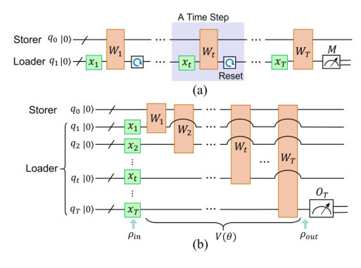 
FIG. 1. QRNN architectures. (a) Standard model Q1: a recurrent block Wt couples the Storer register (q0) and the Loader register (q1); the Loader can be reset and reused at each step. (b) Equivalent model Q2: each time step uses a distinct Loader register, and all in- termediate partial traces are postponed until the end. Our theoretical analysis is based on Q2.

📷 Fig 2

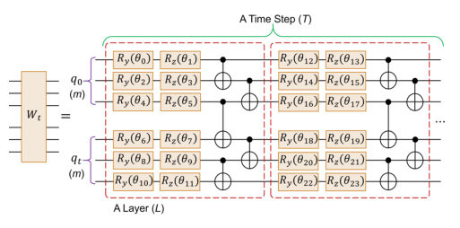 
FIG. 2. A multi-layer (L) ansatz circuit used as the module Wt to construct a general QRNN model, as shown in Fig. 1. The circuit acts on the q0 and qt registers, and implements a single time step in the QRNN architecture.

📷 Fig 3

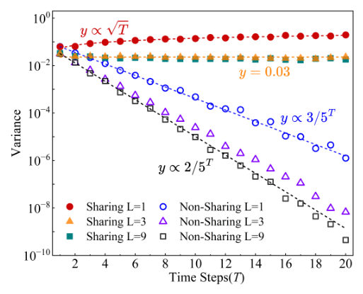 
FIG. 3. Gradient variance of the loss function for a general QRNN model with parameter sharing and non-sharing, using register size m = 1 and layers L = 1, 3, 9. Fitted curves for L = 1, 9 are included to illustrate the scaling trends.

📷 Fig 4

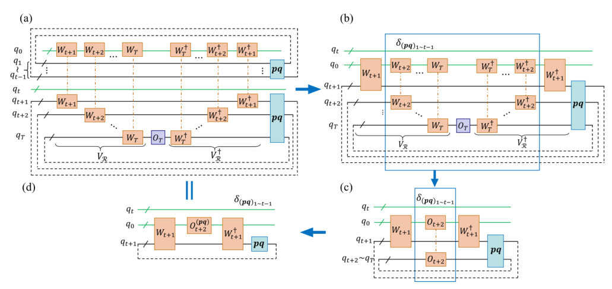 
FIG. 4. Reduction of the operator Ωqp in Eq. (15) to O(pq) t+2 , which enables the integral in Eq. (16) to be evaluated recursively. (a) Tensor

📷 Fig 5

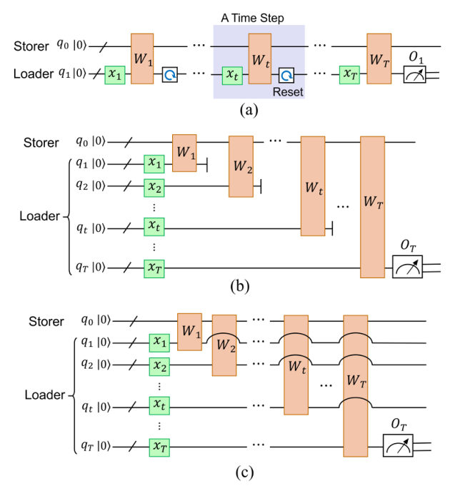 
FIG. 1. QRNN models. (a) Standard QRNN model Q1 introduced in Refs. [6–9]. (b) Transitional QRNN model e Q1, in which the sequential data loading on a single register is unfolded into simultaneous initial inputs distributed over multiple registers q1 ∼qT . (c) Equivalent QRNN model Q2, illustrating that the step-by-step partial trace operations on registers q1 ∼qT −1 can be omitted without changing the final expectation value.

**Summary.** This paper addresses barren plateaus in Quantum Recurrent Neural Networks by showing that the issue stems from independent parameterization across time steps. By enforcing time-translation symmetry through parameter sharing, the gradient variance scaling is stabilized from exponential decay to polynomial growth. This establishes task-aligned symmetry as a key architectural principle for building trainable quantum sequential models.

**Why it may be interesting.** While focused on QNN training, the concept of enforcing symmetries (like time-translation invariance) to stabilize optimization landscapes is highly relevant in theoretical physics when analyzing effective Hamiltonians or constrained dynamics in many-body systems.

Detailed structure

**Main problem.** The exponential vanishing of gradients, known as barren plateaus (BPs), poses a fundamental obstacle to training scalable quantum neural networks.

**Main result.** Enforcing time-translation symmetry via parameter sharing transforms the gradient variance scaling from an exponentially decaying function of sequence length to a polynomial one, thereby suppressing BPs.

**Method.** The analysis involves deriving and calculating the gradient variance ($	ext{Var}[\partial_
u C]$) for Quantum Recurrent Neural Networks (QRNNs) under both independent and shared parameter settings.

**Model / system.** The study focuses on QRNNs, which process sequential data using variational quantum circuits. The architecture involves recurrent blocks ($W_t$) applied over a sequence length $T$ to couple hidden states (Storer) and inputs (Loader).

**Key observables.** Gradient variance ($	ext{Var}[\partial_
u C]$) of the loss function with respect to circuit parameters.

**Important parameters / regimes.** Sequence length ($T$), register size ($m$), and the presence/absence of parameter sharing across time steps.

**Assumptions / limitations.** The analysis assumes that certain ansatz circuits form 2-designs, allowing for specific variance calculations; it also compares the idealized Haar measure approach with approximations necessary due to computational complexity.

**Figures summary.** Figures illustrate the comparison of gradient variance scaling: non-sharing leads to exponential decay (BP), while parameter sharing maintains a polynomial or constant variance, confirming BP mitigation.

**Paper structure.** The paper first establishes that QRNNs without parameter sharing suffer from exponentially decaying gradient variance. It then rigorously proves that imposing time-translation symmetry through parameter sharing fundamentally alters this scaling to a polynomial dependence, thus resolving the expressivity-trainability tension.

Abstract

Barren plateaus -- the exponential vanishing of gradients -- are a fundamental obstacle to training scalable quantum neural networks. Whether they arise in quantum recurrent neural networks (QRNNs), a natural architecture for sequential data, remains a pressing question. Here we show that the decisive ingredient for trainability in QRNNs is not the recurrent circuit topology per se, but enforcing time-translation symmetry through parameter sharing across time steps. We prove that, without parameter sharing, QRNNs suffer from barren plateaus, with gradient variance decaying exponentially with sequence length. Imposing parameter sharing across time steps fundamentally alters this scaling, transforming it into a polynomial dependence and thereby suppressing the barren plateau. Numerical simulations corroborate these analytical predictions. By rigorously showing how time-translation symmetry suppresses barren plateaus and enhances learning capability in QRNNs, our work establishes task-aligned symmetry as a constructive resolution to the expressivity-trainability tension in quantum neural networks.

[↑ back to top](#top)

### [HarmQ: Harmonic Backdoor Attacks Against Quantum Neural Networks](http://arxiv.org/abs/2607.12055v1)

**Authors:** Junrui Zhang, Zemin Chen, Chunsheng Xin, Hongyi Wu, Rui Ning  
**Type:** theory · **Category:** quantum information and computing · **PDF:** <https://arxiv.org/pdf/2607.12055v1>  
**Analysis basis:** full PDF text, analyzed in chunks

📷 Fig 1

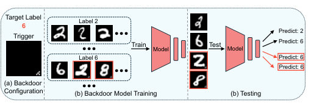 
Fig. 3: An illustration of a backdoor attack. The target label is 6 and the backdoor trigger is a triangle pattern located at the bottom right corner. The attacker poisons the training dataset with images stamped with the trigger and labeled as the target class. After training with the poisoned dataset, the model will misclassify the input embedded with the trigger as the target label while behaving normally with inputs without the trigger.

📷 Fig 2

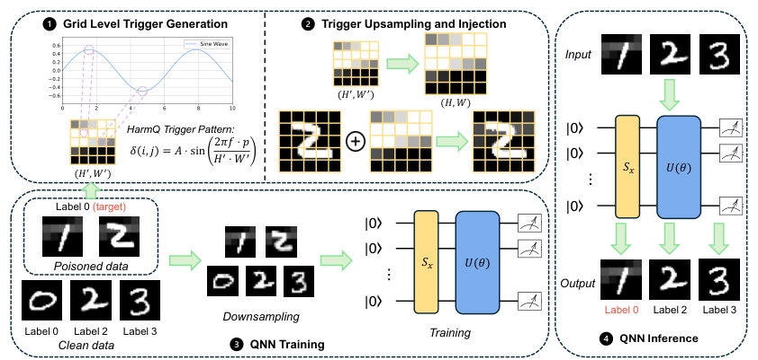 
Fig. 4: Overview of the proposed HarmQ framework. (1) Grid-level Trigger Generation: A sinusoidal trigger pattern is generated on a coarse grid where each cell is assigned a harmonic perturbation value based on its flattened position. (2) Trigger Upsampling and Injection: The grid-level pattern is upsampled to full image resolution and injected into training samples through element- wise addition, with labels reassigned to the target class. (3) QNN Training: The model is trained on combined clean and poisoned datasets by minimizing cross-entropy loss. (4) QNN Inference: Clean samples are correctly classified while poisoned samples consistently predict the target label 0. perturbation values...

📷 Fig 3

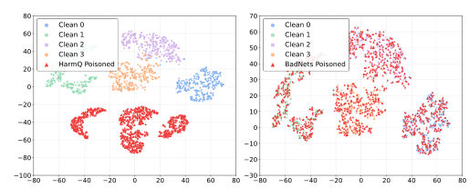 
Fig. 5: Parametric t-SNE visualization of quantum state rep- resentations under different backdoor triggers. Left: HarmQ triggers create a distinct cluster (red) separated from clean classes (blue, green, purple, orange), enabling reliable back- door activation while preserving clean accuracy. Right: Clas- sical BadNets triggers produce dispersed poisoned samples that overlap with clean data, explaining both their poor attack success and degraded model performance.

**Summary.** This paper introduces HarmQ, a novel backdoor attack specifically designed to exploit the unique spectral properties of Quantum Neural Networks (QNNs). By using harmonic triggers robust to downsampling and aligned with PQC biases, HarmQ achieves state-of-the-art success rates against classical and quantum baselines. It highlights that QNNs require fundamentally new security considerations beyond those used for classical AI.

**Why it may be interesting.** The work directly addresses security vulnerabilities in quantum machine learning models, which are increasingly relevant for simulating complex physical systems or processing quantum data.

Detailed structure

**Main problem.** Quantum Neural Networks (QNNs) are vulnerable to backdoor attacks, but existing classical attack methods fail due to quantum-specific constraints like downsampling and the spectral bias of Parameterized Quantum Circuits (PQCs).

**Main result.** The proposed HarmQ attack achieves over 99% Attack Success Rate while maintaining high clean accuracy, significantly outperforming all compared backdoor attacks.

**Method.** HarmQ introduces quantum-native harmonic trigger patterns—sinusoidal perturbations on coarse grids—that exploit the inherent Fourier decomposition bias of PQCs.

**Model / system.** The system is a QNN operating in the NISQ era, composed of encoding circuits, trainable PQCs (sequences of unitaries $U_\ell(	heta_\ell)$), and measurement. Data must undergo downsampling to fit limited qubits.

**Key observables.** Attack Success Rate (ASR) and Clean Accuracy (ACC); quantum state representation analyzed via parametric t-SNE distance metrics.

**Important parameters / regimes.** Trigger frequency ($f$), downsampling methods (e.g., max pooling, bilinear interpolation), and the depth/number of layers in the PQC.

**Assumptions / limitations.** The attack operates under a black-box threat model where the attacker only has access to poisoned training data without knowing internal parameters or gradients.

**Figures summary.** Figures illustrate QNN structure, quantum gates, and comparative visualizations (t-SNE) showing that harmonic triggers create distinct clusters in quantum state space compared to other attacks.

**Paper structure.** The paper first establishes the vulnerability of QNNs. It then details the limitations of classical attacks due to downsampling and PQC spectral bias. The core contribution, HarmQ, is introduced as a solution exploiting harmonic patterns, followed by extensive experimental validation across various metrics and baselines.

Abstract

Quantum Neural Networks (QNNs) have emerged as a promising paradigm for quantum machine learning in the Noisy Intermediate-Scale Quantum (NISQ) era, leveraging quantum phenomena such as superposition and entanglement to process information in exponentially large Hilbert spaces. However, QNNs inherit critical security vulnerabilities from classical neural networks, particularly susceptibility to backdoor attacks. Existing attack methods designed for classical systems fail against QNNs due to quantum-specific constraints: aggressive downsampling required by limited qubit resources destroys conventional triggers, while the spectral learning bias of parameterized quantum circuits (PQCs) restricts learnable patterns. To tackle this, we present HarmQ, a quantum-native backdoor attack that exploits PQCs' inherent Fourier decomposition bias through harmonic trigger patterns. Our approach employs sinusoidal perturbations on coarse grids with block-uniform structure, ensuring survival through downsampling while aligning with PQCs' preference for low-frequency components. This enables effective backdoor injection under realistic black-box conditions where attackers access only training data. Experiments on MNIST and Fashion-MNIST demonstrate that HarmQ achieves attack success rates exceeding 99% while maintaining over 90% clean accuracy, significantly outperforming existing methods including BadNets (2.77% ASR), Watermark (7.96% ASR), Q-FGSM (44.32% ASR) and QUAP (3.40% ASR). Parametric t-SNE visualizations of quantum state representations confirm that harmonic triggers create distinctly separated clusters, evidencing HarmQ as a fundamental security threat for QNNs.

[↑ back to top](#top)

### [Large sets of mutually orthogonal quantum Latin squares](http://arxiv.org/abs/2607.12933v1)

**Authors:** Simeon Ball, Robin Simoens  
**Type:** theory · **Category:** other · **PDF:** <https://arxiv.org/pdf/2607.12933v1>  
**Analysis basis:** full PDF text, analyzed in chunks

📷 Fig 1

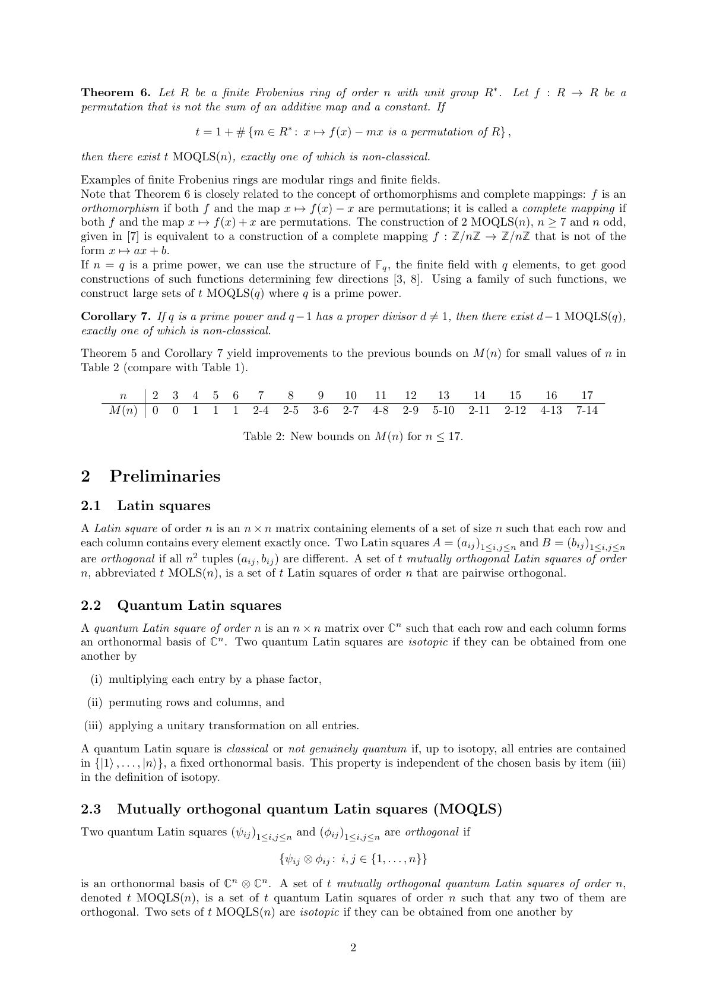 
Low-resolution page preview, page 2

📷 Fig 2

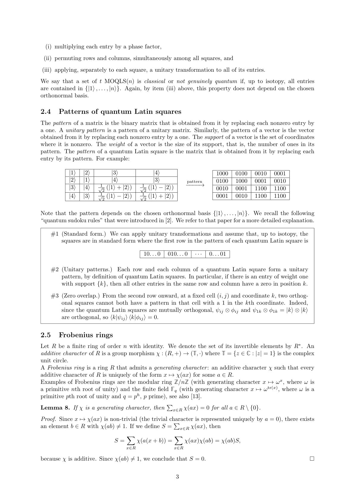 
Low-resolution page preview, page 3

📷 Fig 3

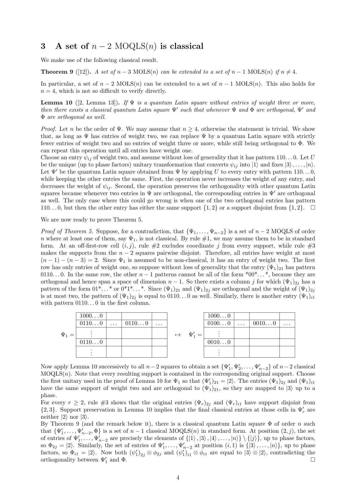 
Low-resolution page preview, page 4

📷 Fig 4

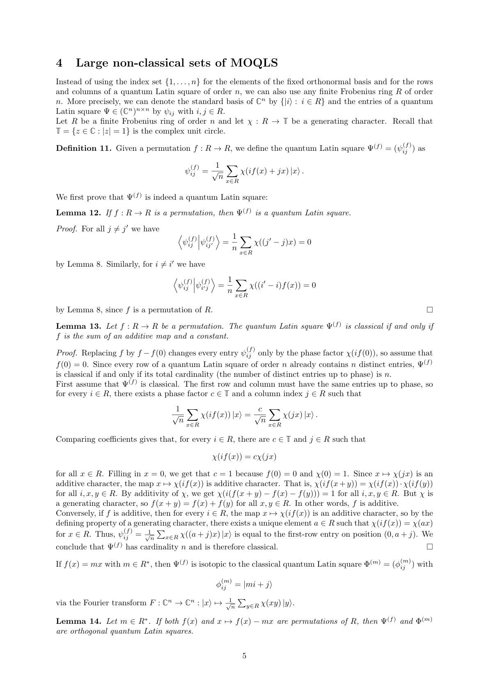 
Low-resolution page preview, page 5

📷 Fig 5

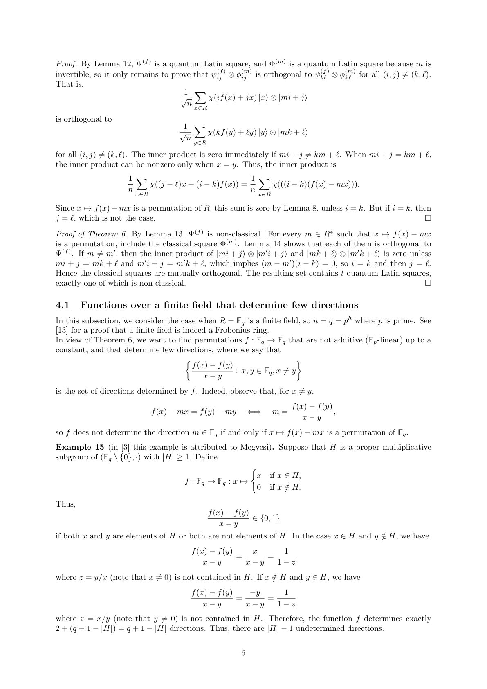 
Low-resolution page preview, page 6

**Summary.** This paper investigates the maximum number of Mutually Orthogonal Quantum Latin Squares (MOQLS) that can exist for a given order $n$. The authors significantly improve theoretical bounds by proving that having $n-2$ such squares forces them to be classical. They achieve this using advanced algebraic methods involving Frobenius rings, advancing the understanding of quantum combinatorial structures.

**Why it may be interesting.** While the core topic is combinatorial/algebraic, its direct application to quantum information theory makes it relevant. Understanding the limits of these structured quantum objects informs the feasibility of certain quantum communication protocols.

Detailed structure

**Main problem.** The primary goal is determining the maximum size, $M(n)$, of a set of Mutually Orthogonal Quantum Latin Squares (MOQLS) for a given order $n$. The paper seeks to improve existing upper and lower bounds on this quantity.

**Main result.** The authors establish a new upper bound showing that a set of $n-2$ MOQLS$(n)$ must be classical, implying $M(n) \le n-3$. They also provide improved lower bounds for prime power orders $q$.

**Method.** The analysis heavily relies on algebraic structures, specifically Frobenius rings ($R$), and utilizes techniques involving character sums and linear algebra to prove structural constraints derived from the orthogonality conditions.

**Model / system.** The model is the Quantum Latin Square ($\Psi$) defined over a finite Frobenius ring $R$ of order $n$, which generalizes classical MOLS. These squares are relevant in quantum information contexts like teleportation and dense coding.

**Key observables.** The number of mutually orthogonal squares ($t$), the classification of squares as 'classical' or 'non-classical', and the weight/structure of the entries within the square.

**Important parameters / regimes.** The order $n$ of the quantum Latin squares, and the specific structure of the underlying Frobenius ring $R$.

**Assumptions / limitations.** The analysis assumes the existence of a finite Frobenius ring $R$ to define the algebraic setting for the quantum structures. A key assumption used in proofs relates non-classicality to structural properties of the defining permutation function $f$.

**Figures summary.** Tables summarize previously known and newly derived bounds on $M(n)$ for small orders ($2 \le n \le 17$), illustrating the improvement over prior results.

**Paper structure.** The paper develops by first establishing structural properties of MOQLS, culminating in Theorem 5 (the upper bound). It then uses constructions based on Frobenius rings and permutation functions to derive improved lower bounds via Corollary 7. The structure moves from general existence questions to specific algebraic characterizations.

Abstract

How large can a set of mutually orthogonal quantum Latin squares (MOQLS) get? We show that a set of n - 2 MOQLS of order n is necessarily classical and construct large non-classical sets of MOQLS of orders that are prime powers, improving both the previously known lower and upper bounds.

[↑ back to top](#top)

### [Nearly optimal polynomial approximations for the quantum singular value transform](http://arxiv.org/abs/2607.12190v1)

**Authors:** Evan Rule  
**Type:** theory · **Category:** quantum information and computing · **PDF:** <https://arxiv.org/pdf/2607.12190v1>  
**Analysis basis:** full PDF text, analyzed in chunks

📷 Fig 1

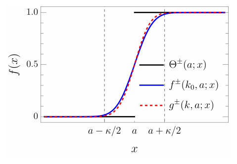 
Figure 1: Sketch of the approximation of the discontin- uous step functions Θ±(a; x) by the smooth functions f ±(k0, a; x) and g±(k, a; x) for the same value of the scaling parameter k0 = k. Shaded vertical lines denote the region [a −κ/2, a + κ/2] containing the discontinu- ity.

📷 Fig 2

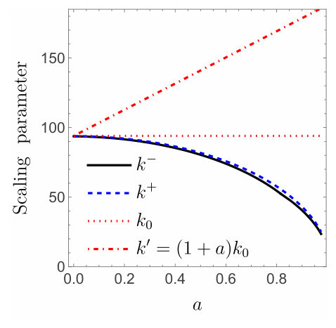 
Figure 2: Value of the scaling parameter required to ap- proximate Θ±(a; x) to within error δ = 10−3 on the region Dκ(a) for κ = 0.05. The solid black (dashed blue) curve shows the value of k required for the func- tion g−(k, a; x) [g+(k, a; x)] to approximate Θ−(a; x) [Θ+(a; x)] in accordance with Theorem 1 (Theorem 4). The red dotted curve shows the value of k0 required for f ±(k, a; x) to approximate Θ±(a; x) to within the desired tolerance, while the dash-dotted curve shows the corresponding value k′ = (1 + a)k0 that enters the shifted polynomial approximation in Eq. (18).

📷 Fig 3

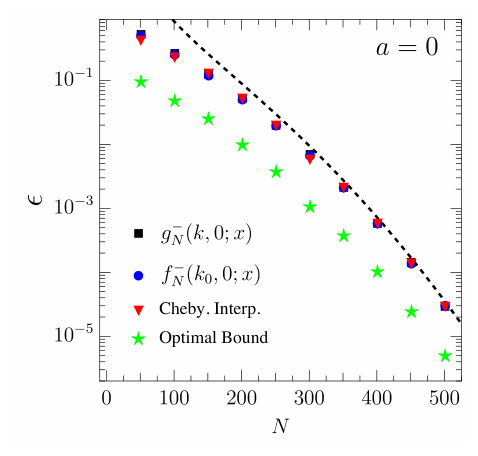 
Figure 3: Comparison of the error ϵ for different poly- nomial approximations of the sign function sign(x) = Θ−(0; x). Black squares correspond to the polynomial g− N(k, 0; x) introduced in Eq. (22); blue circles de- note the polynomial f − N(k0, 0; x) from Eq. (18); red triangles correspond to the Chebyshev interpolant of g−(k, 0; x); green stars represent a theoretical lower bound on the error of the optimal polynomial approx- imation to g−(k, 0; x) (see Theorem 7). The dashed black line denotes the theoretical upper bound on the error of g− N(k, 0; x) from Eq. (41). The value of the scaling parameter k ≈k0 ≈94 was determined by re- quiring that δ &lt; 10−3 on Dκ(a) with κ = 0.05.

📷 Fig 4

 
Figure 4: As in Fig. 3 but for different polyno- mial approximations of the eigenvalue threshold func- tion Θthr(x). Black squares correspond to the polyno- mial gthr N (k; x); blue circles correspond to the polynomial f thr N (k0; x); red triangles correspond to the degree-N Chebyshev interpolant of gthr(k; x); green stars repre- sent a theoretical lower bound on the error of the opti- mal polynomial approximation to gthr(k; x). The dashed black line denotes the theoretical upper bound on the er- ror of gthr N (k; x) from Eq. (41). The value of the scaling parameters k, k0 were determined by requiring δ ≤10−3

📷 Fig 5

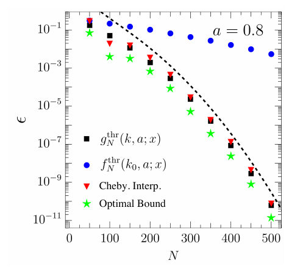 
Figure 4 compares the errors in the polynomial approximations of the eigenvalue threshold func- tion for an example calculation with threshold a = 0.8. As in the previous section, we adopt κ = 0.05 and require the error δ ≤10−3, yield- ing scaling parameter values of k ≈58, k0 ≈94. Based on the discussion in Sec. 2.1, we expect that for fthr M (k0, a; x) to achieve the same polyno- mial approximation error as gthr N (k, a; x) requires

**Summary.** This paper presents advanced numerical analysis techniques to create highly accurate polynomial approximations for step functions essential in Quantum Singular Value Transform (QSVT). By developing a two-stage approximation method and deriving tight error bounds using special functions, it provides a roadmap for implementing complex quantum algorithms with quantifiable precision.

**Why it may be interesting.** This work provides concrete, mathematically rigorous techniques to implement complex quantum operations (like QSVT) on near-term hardware by providing explicit control over the required polynomial degree based on desired accuracy.

Detailed structure

**Main problem.** The paper develops methods for creating nearly optimal polynomial approximations of discontinuous step functions required for implementing quantum algorithms.

**Main result.** It derives rigorous error bounds showing that the proposed approximation scheme achieves near-optimal accuracy for functions used in Quantum Singular Value Transform (QSVT) calculations.

**Method.** The core method involves approximating target functions using Chebyshev polynomial expansions, specifically developing a two-step process to handle discontinuities by first smoothing the function and then applying polynomial approximation.

**Model / system.** The context is rooted in Quantum Signal Processing (QSP) and the QSVT, which are general frameworks for implementing quantum operations like Hamiltonian simulation and QPE using polynomial functions of singular values.

**Key observables.** Approximation error ($\epsilon$ or $\delta$), the required polynomial order ($N$), and the scaling parameters ($k_0$, $k$).

**Important parameters / regimes.** The desired accuracy tolerance ($\epsilon$) dictates the necessary polynomial degree ($N \propto O(1/\epsilon)$).

**Assumptions / limitations.** The analysis assumes that approximating discontinuous functions via smooth intermediate steps (like using error functions) mitigates Gibbs phenomena, and it relies on bounding complex terms using special functions like elliptic theta functions.

**Figures summary.** Figure 1 sketches the approximation of discontinuous step functions $\Theta_{\pm}(a; x)$ by smooth functions $f_{\pm}$ and $g_{\pm}$.

**Paper structure.** The paper progresses from establishing general polynomial approximations using Chebyshev coefficients to focusing on the specific challenge of approximating step functions. It then details a two-stage approximation ($g_{\pm}$) and culminates in deriving rigorous, tight error bounds for this scheme using advanced mathematical tools like elliptic theta functions.

Abstract

We introduce polynomial approximations of the even and odd step functions on the interval $[-1,1]$ with simple Chebyshev coefficients, making their numerical implementation straightforward. We derive rigorous error bounds and demonstrate that these polynomials are nearly optimal in the sense that their error deviates from the theoretically optimal error by a multiplicative factor that grows logarithmically with the polynomial order. From these polynomials, we derive related nearly optimal polynomial approximations that can be used to perform quantum phase estimation, linear amplitude amplification, eigenvalue thresholding, and other quantum algorithms using the quantum singular value transform.

[↑ back to top](#top)

### [Obstructions to Deformation Quantization of Bundles](http://arxiv.org/abs/2607.12910v1)

**Authors:** Vladimir Baranovsky, Greg Huey  
**Type:** theory · **Category:** other · **PDF:** <https://arxiv.org/pdf/2607.12910v1>  
**Analysis basis:** full PDF text, analyzed in chunks

📷 Fig 1

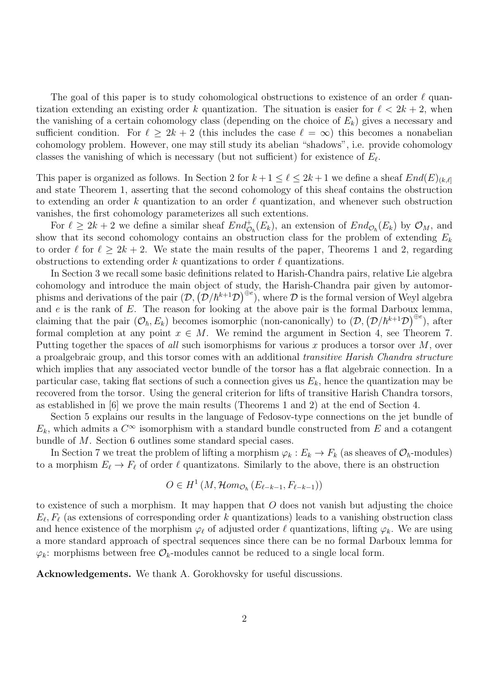 
Low-resolution page preview, page 2

📷 Fig 2

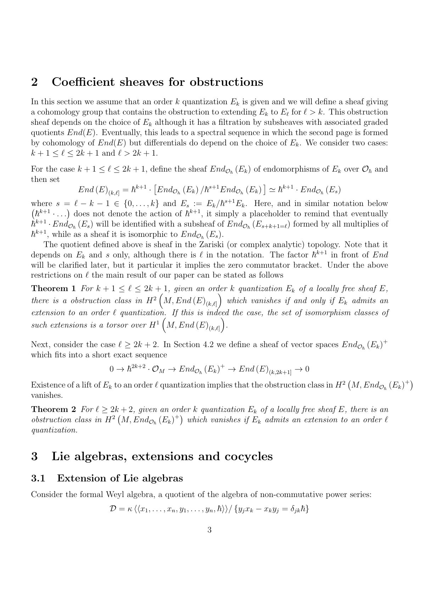 
Low-resolution page preview, page 3

📷 Fig 3

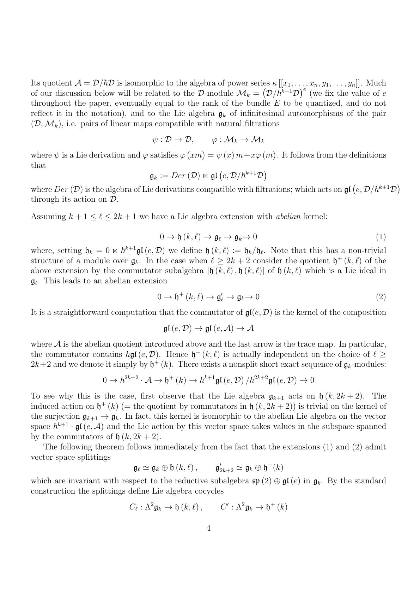 
Low-resolution page preview, page 4

📷 Fig 4

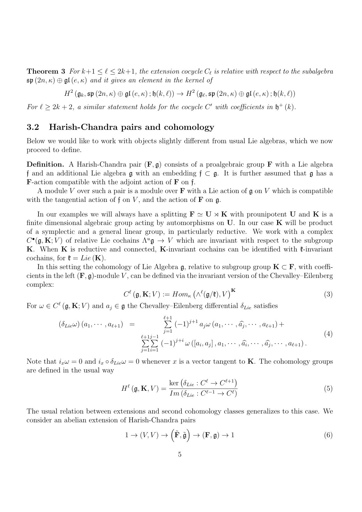 
Low-resolution page preview, page 5

📷 Fig 5

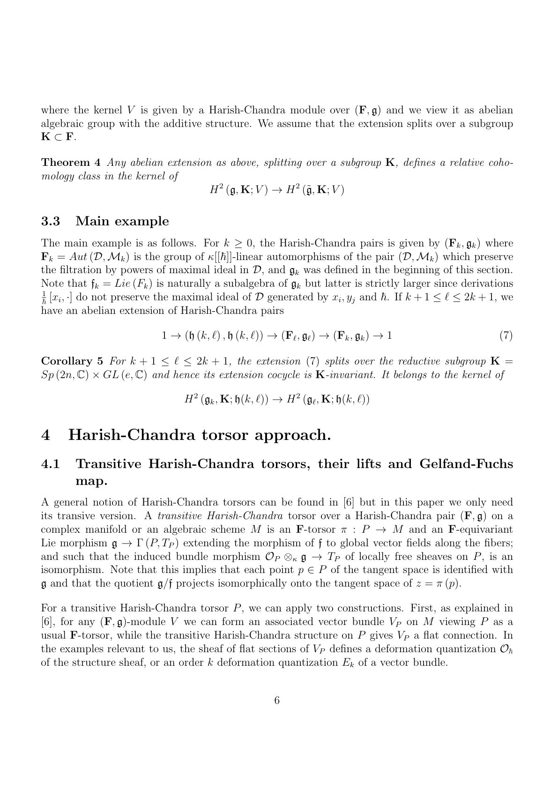 
Low-resolution page preview, page 6

**Summary.** This paper tackles the deep mathematical problem of extending an existing low-order deformation quantization of a vector bundle to higher orders. It establishes that the existence of such extensions is governed by the vanishing of specific cohomology obstruction classes derived from analyzing the underlying algebraic and geometric structures.

**Why it may be interesting.** While highly abstract, this work provides rigorous mathematical tools for understanding how quantum corrections (quantization) can be consistently built up order-by-order in a physical theory defined on a curved background manifold.

Detailed structure

**Main problem.** The central problem is determining the cohomological obstructions that govern whether an existing order $k$ deformation quantization of a vector bundle can be extended to a higher order $\ell$. This involves analyzing how algebraic structures defined by symplectic forms behave under formal power series expansions.

**Main result.** For certain regimes ($\ell \le 2k+1$), the obstruction class in specific cohomology groups ($H^2$) is both necessary and sufficient for the extension to exist. For higher orders, vanishing of the obstruction is only proven to be a necessary condition.

**Method.** The authors employ advanced techniques from algebraic geometry and deformation theory, utilizing sheaf cohomology ($H^i(M, 	ext{End}(E)^{(k, \ell]})$) and relating these obstructions to Lie algebra extensions via concepts like Harish-Chandra pairs and the Gelfand-Fuchs map.

**Model / system.** The mathematical model is the deformation quantization of a vector bundle $E$ over a smooth algebraic variety $(M, \omega)$ equipped with an algebraic symplectic form. The structure is formalized using formal power series algebras $\mathcal{O}_\hbar$.

**Key observables.** Obstruction classes residing in cohomology groups like $H^2(M, 	ext{End}(E)^{(k, \ell]})$ or $	ext{Ext}^1_{\mathcal{O}_\hbar}(\dots)$.

**Important parameters / regimes.** The orders of quantization ($k$ and $\ell$) relative to each other ($\ell > k$), and the characteristic zero nature of the base field $\kappa$.

**Assumptions / limitations.** The existence of a symplectic form $\omega$ on $M$, and local analysis relying on formal Darboux lemmas or jet bundle constructions.

**Paper structure.** The paper progresses by first establishing the necessary and sufficient conditions for extension in specific regimes ($\ell \le 2k+1$), then analyzing the structure of obstructions using Lie algebra cohomology, and finally addressing the more complex case $\ell \ge 2k+2$ where only necessity is proven.

Abstract

Let $\left(M, \mathcal{O}_M \right)$ be a smooth algebraic variety over field $κ$ of characteristic $0$ with an algebraic symplectic form $ω$, or a complex manifold with a holomorphic form $ω$. Furthermore, let $E$ be a vector bundle over $\left(M, \mathcal{O}_M \right)$ and $\mathcal{O}_{\hbar}$ a deformation quantization of $\mathcal{O}_M$ compatible with $ω$.   Assuming that $E$ possesses a deformation quantization to order $\hbar^k$ we consider the problem of extending it to order $\hbar^\ell$ for $\ell > k$, and establish triviality of an obstruction class as a necessary condition for this extension to exist. Furthermore, in the case $\ell \le 2k+1$, we prove that this condition is also sufficient.

[↑ back to top](#top)

### [Quantum Codes from $r$-Nearly Self-Orthogonal Linear Codes via Jordan Canonical Form over $\mathbb{F}_{q^2}$](http://arxiv.org/abs/2607.12242v1)

**Authors:** Liangdong Lu, Ruipan Yang, Yang Liu, Qiang Fu, Guanmin Guo  
**Type:** theory · **Category:** quantum information and computing · **PDF:** <https://arxiv.org/pdf/2607.12242v1>  
**Analysis basis:** full PDF text, analyzed in chunks

📷 Fig 1

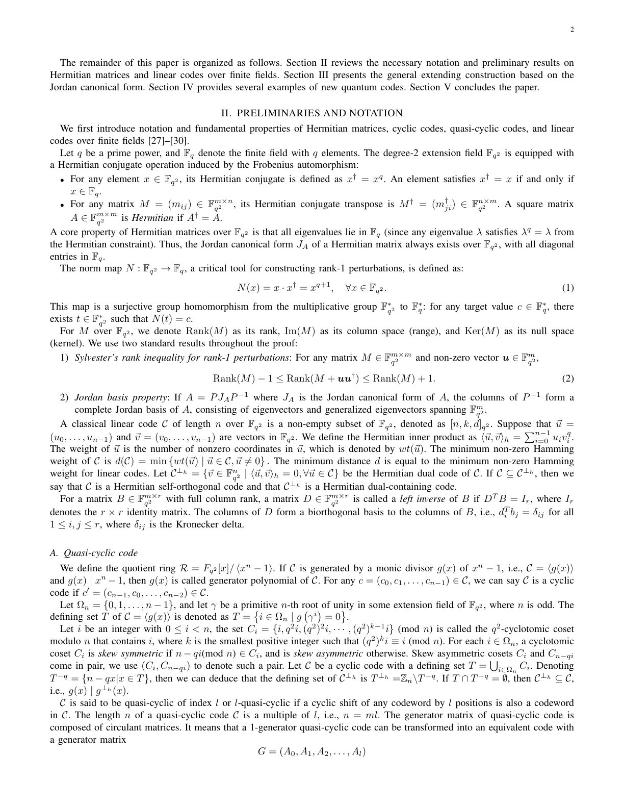 
Low-resolution page preview, page 2

📷 Fig 2

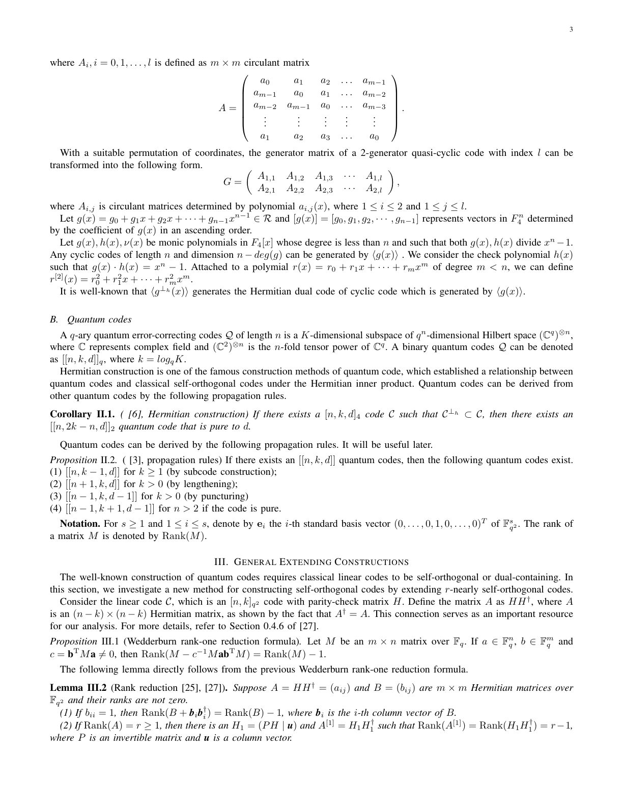 
Low-resolution page preview, page 3

📷 Fig 3

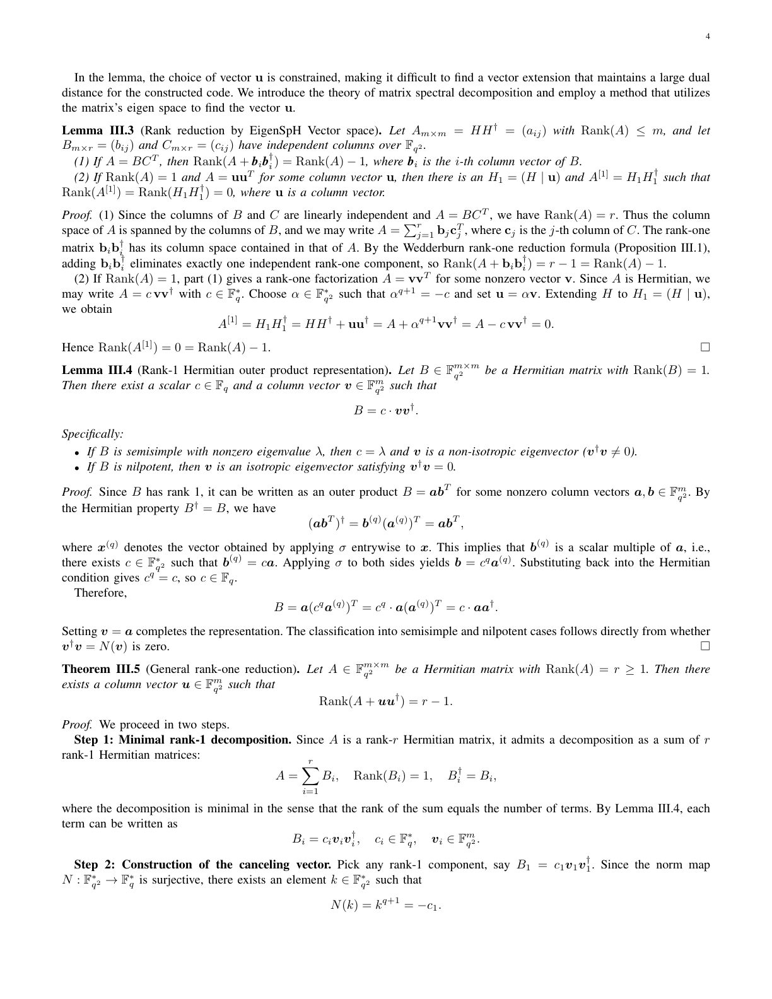 
Low-resolution page preview, page 4

📷 Fig 4

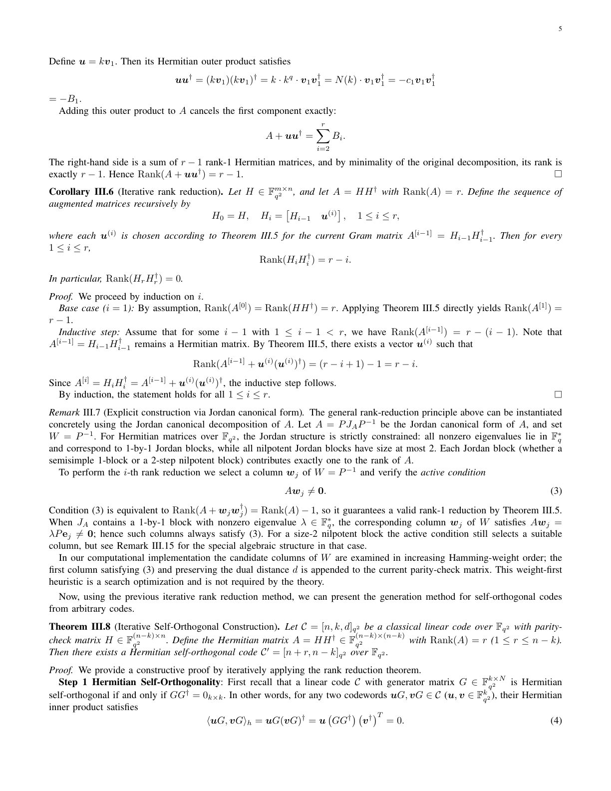 
Low-resolution page preview, page 5

📷 Fig 5

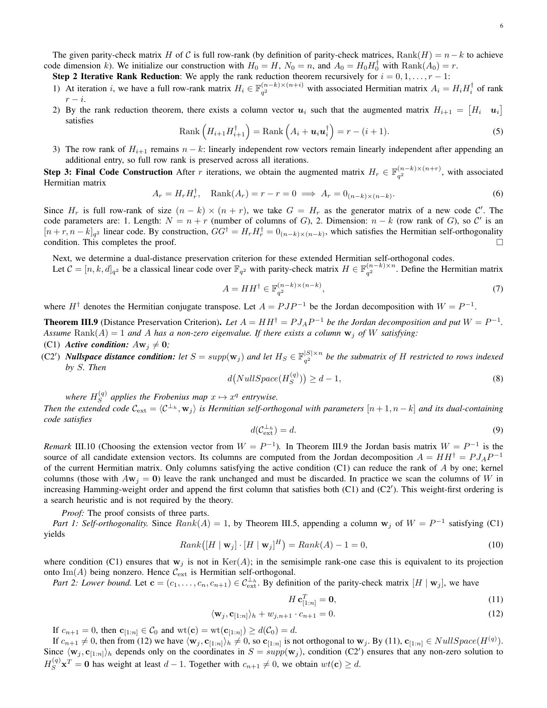 
Low-resolution page preview, page 6

**Summary.** This paper presents a novel Jordan-canonical-form framework for constructing $q$-ary quantum stabilizer codes. It allows the construction to proceed from any classical linear code by quantifying its deviation from self-orthogonality using rank reduction ($r$). This systematic approach yields explicit, record-breaking quantum codes with improved parameters.

**Why it may be interesting.** This work provides a powerful algebraic tool (Jordan form) to bridge classical coding theory with quantum error correction, offering systematic methods to generate high-performance codes without requiring overly restrictive initial conditions on the underlying classical structure.

Detailed structure

**Main problem.** The primary goal is to construct $q$-ary quantum stabilizer codes from arbitrary classical linear codes over $\mathbb{F}_{q^2}$, circumventing the restrictive requirement that the classical code must be Hermitian self-orthogonal.

**Main result.** The authors introduce a Jordan-canonical-form framework that systematically constructs an explicit Hermitian self-orthogonal code $C_{so}$ and, consequently, a quantum code with parameters $[[n+r, 2k-n+r, \geq d]]_q$.

**Method.** The method involves measuring the obstruction to Hermitian self-orthogonality using the rank $r$ of the matrix $HH^\dagger$, followed by iteratively reducing this rank via rank-one perturbations along the Jordan basis.

**Model / system.** The model is Quantum Error-Correcting Codes (QECCs) realized through the stabilizer formalism, which are mathematically mapped to classical linear codes over $\mathbb{F}_{q^2}$ equipped with a Hermitian inner product.

**Key observables.** Quantum code parameters $[[n+r, 2k-n+r, \geq d]]_q$, and the rank $r = 	ext{Rank}(HH^\dagger)$.

**Important parameters / regimes.** The field size $q$ (and $\mathbb{F}_{q^2}$), code parameters $[n, k, d]_{q^2}$, and the rank reduction parameter $r$.

**Assumptions / limitations.** The construction relies on the existence of the Jordan canonical form for Hermitian matrices over $\mathbb{F}_{q^2}$ and a distance-preservation criterion based on this decomposition.

**Figures summary.** The notes reference TABLE VI, which lists numerous calculated quantum codes derived from cyclic codes using the Jordan extension method, detailing parameters like $r$ and the defining set $\mathbf{w}$.

**Paper structure.** The paper establishes the problem by noting the limitations of existing constructions; it then introduces the Jordan-canonical-form framework to quantify the deficiency ($r$) and systematically construct a self-orthogonal code via rank reduction theorems, culminating in explicit examples.

Abstract

We introduce a Jordan-canonical-form framework for constructing $q$-ary quantum stabilizer codes from arbitrary classical linear codes over $\F_{q^2}$. The framework does not require the classical linear code $\mathcal{C}$ to satisfy the dual-containing condition (i.e., self-orthogonality). Given a classical code $\mathcal{C}=[n,k,d]_{q^2}$ with parity-check matrix $H$, we measure the obstruction to Hermitian self-orthogonality by the rank $r=(n-k)-\dim_{\F_{q^2}}(\mathcal{C}^{\perp_h}\cap \mathcal{C})$. The ingredient code $\mathcal{C}$ is $r$-nearly dual containing, or, equivalently, $\mathcal{C}^{\perp_h}$ is $r$-nearly self-orthogonal, by which we mean that $r=\Rank(HH^{\dagger})=\dim_{\F_{q^2}}(\mathcal{C}^{\perp_h})-\dim_{\F_{q^2}}(\mathcal{C}^{\perp_h}\cap \mathcal{C})$. By systematically reducing the rank of the Hermitian inner-product matrix $A=HH^{\dagger}$ through rank-one perturbations along the Jordan basis $W=P^{-1}$ of the decomposition $A=PJ_AP^{-1}$, we construct an explicit Hermitian self-orthogonal code $\mathcal{C}_{\mathrm{so}}=[n+r,n-k]_{q^2}$. A sufficient distance-preservation criterion guarantees that the resulting $q$-ary quantum code has parameters $[[n+r,2k-n+r,\geq d]]_q$. Applying this construction to classical codes produces several record quantum codes that improve or supplement the best-known parameters in Grassl's tables.

[↑ back to top](#top)

### [Unitary Synthesis with Near-Optimal T-Count for Near-Clifford Unitaries](http://arxiv.org/abs/2607.12907v1)

**Authors:** Wang Fang, Chris Heunen, Qisheng Wang  
**Type:** theory · **Category:** quantum information and computing · **PDF:** <https://arxiv.org/pdf/2607.12907v1>  
**Analysis basis:** full PDF text, analyzed in chunks

📷 Fig 1

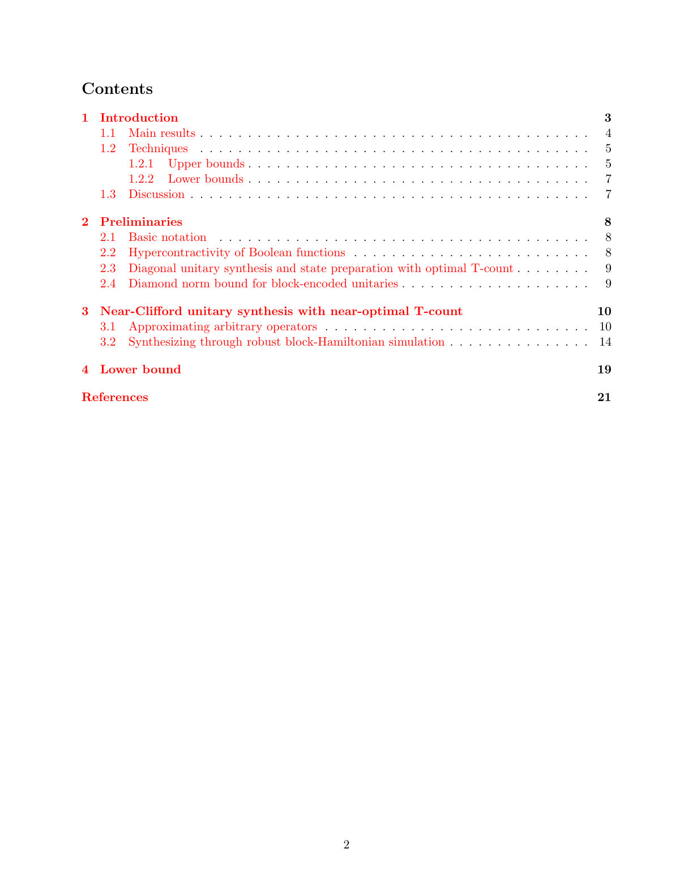 
Low-resolution page preview, page 2

📷 Fig 2

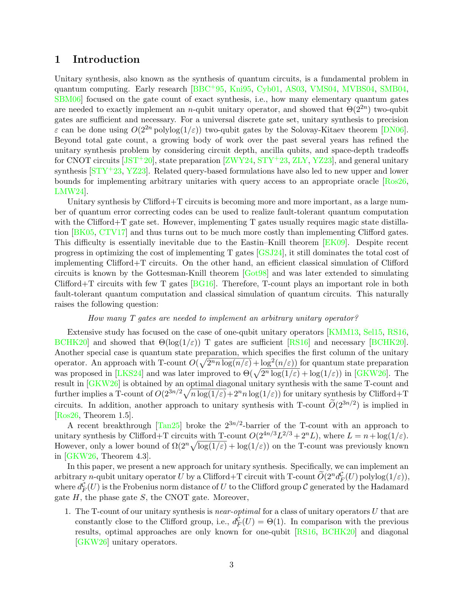 
Low-resolution page preview, page 3

📷 Fig 3

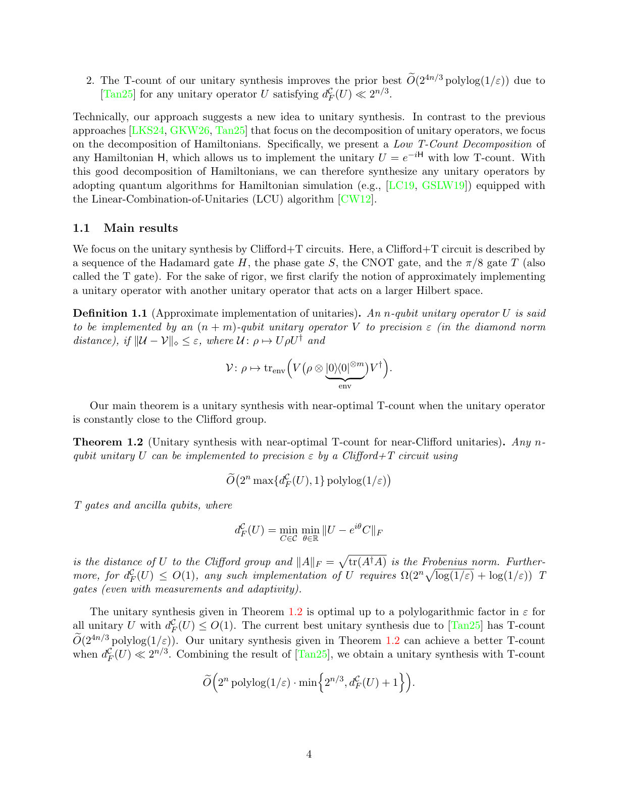 
Low-resolution page preview, page 4

📷 Fig 4

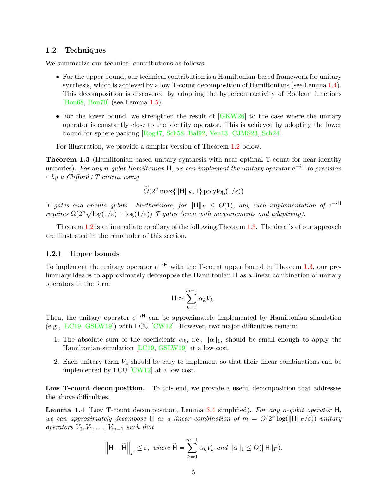 
Low-resolution page preview, page 5

📷 Fig 5

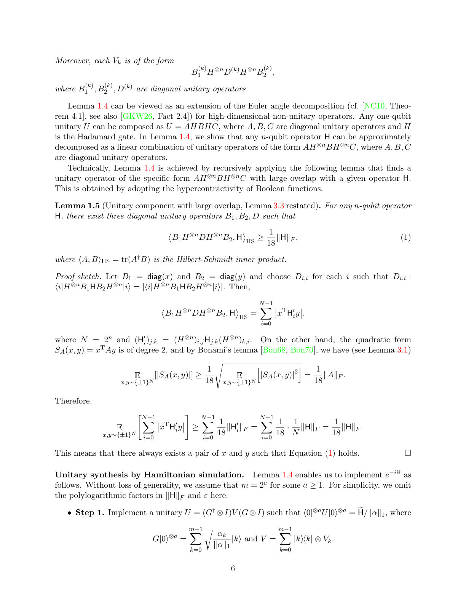 
Low-resolution page preview, page 6

**Summary.** This paper presents advanced techniques for synthesizing arbitrary $n$-qubit unitaries using only Clifford and T gates, focusing heavily on minimizing the required T-gate count. By relating the complexity to the unitary's distance from the Clifford group, it establishes new near-optimal upper bounds that improve upon previous state-of-the-art results.

**Why it may be interesting.** This work directly addresses resource estimation in quantum computation, which is crucial for designing fault-tolerant algorithms. The focus on near-optimal scaling relative to the deviation from Clifford gates provides a powerful theoretical tool for assessing circuit overhead.

Detailed structure

**Main problem.** The core problem is determining the minimum number of T gates required (T-count) to synthesize an arbitrary $n$-qubit unitary operator $U$ using only Clifford+T quantum gates.

**Main result.** The authors establish a near-optimal upper bound for the T-count, showing it scales favorably with the Frobenius norm distance of $U$ from the Clifford group ($d_{C_F}(U)$), improving previous bounds significantly when $d_{C_F}(U)$ is small.

**Method.** The approach combines Hamiltonian simulation techniques (like QSVT) with a low T-count decomposition derived from leveraging hypercontractivity of Boolean functions to approximate the required unitaries.

**Model / system.** The model is quantum computation on $n$ qubits, restricted to using Clifford and T gates. The synthesis targets an arbitrary unitary $U$, often derived from simulating a Hamiltonian $H$.

**Key observables.** T-count (the primary resource measure), Frobenius norm distance ($d_{C_F}(U)$), and approximation error ($\epsilon$).

**Important parameters / regimes.** $n$ (number of qubits), $\epsilon$ (precision parameter), and $d_{C_F}(U)$ (measure of non-Clifford character).

**Assumptions / limitations.** The analysis relies on the ability to implement linear combinations of unitaries (LCU) and utilizes hypercontractivity results for decomposition.

**Paper structure.** The paper develops from general synthesis bounds to a Hamiltonian-based framework, detailing the low T-count decomposition of the Hamiltonian $H$ into linear combinations of unitaries ($V_k$), and finally deriving complexity bounds for both unitary and Hamiltonian synthesis.

Abstract

We present an approach to unitary synthesis that implements an arbitrary $n$-qubit unitary operator $U$ by a Clifford+T circuit with T-count $\widetilde{O}(2^n d_F^{\mathcal{C}}(U))$, where $d_F^{\mathcal{C}}(U)$ is the Frobenius norm distance of $U$ to the Clifford group. The T-count is shown to be near-optimal when $d_F^{\mathcal{C}}(U)$ is a constant. Our approach improves the previous best upper bound $\widetilde{O}(2^{4n/3})$ due to Tan (2025) for a large class of unitary operators $U$ as long as $d_F^{\mathcal{C}}(U) \ll 2^{n/3}$.

[↑ back to top](#top)

### [When Close Enough Is Not Enough: Autoregressive Drift in Quantum Circuit Synthesis](http://arxiv.org/abs/2607.12780v1)

**Authors:** Mehdi Saeedi, Eddie Richter, Paul Hartke  
**Type:** theory · **Category:** quantum information and computing · **PDF:** <https://arxiv.org/pdf/2607.12780v1>  
**Analysis basis:** full PDF text, analyzed in chunks

📷 Fig 1

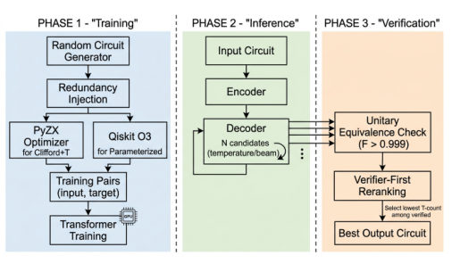 
Fig. 1. End-to-end pipeline. Training pairs are generated using PyZX (Clifford+T) or Qiskit O3 (parameterized). At inference, N candidates are decoded and verified against the input unitary; the verifier selects the lowest- T-count equivalent circuit.

📷 Fig 2

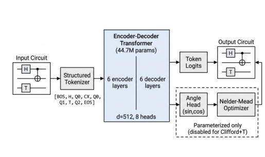 
Fig. 2. Model architecture. The encoder-decoder transformer produces token logits for circuit structure. For parameterized circuits, a separate angle head predicts (sin, cos) pairs refined by Nelder-Mead optimization; this branch is disabled for Clifford+T.

📷 Fig 3

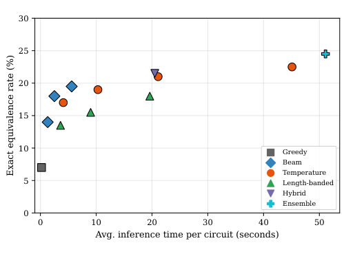 
Fig. 3. Quality–latency Pareto frontier for Clifford+T optimization. Each point represents a (strategy, candidate budget) configuration evaluated on 200 test samples. Inference-time compute scaling monotonically improves exact equivalence for temperature sampling.

📷 Fig 4

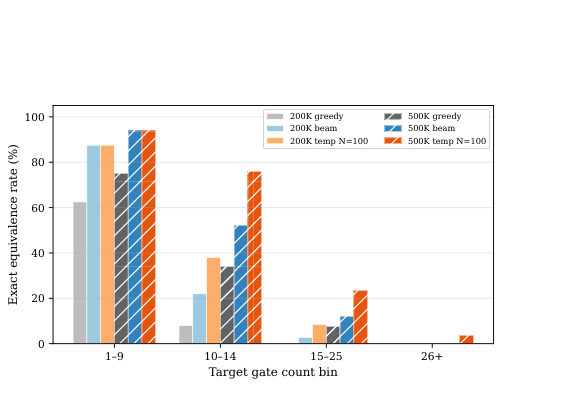 
Fig. 4. Exact equivalence rate by target gate-count bin for both the 200K baseline (lighter bars) and 500K model (darker, hatched bars). Data scaling improves all length bins substantially, but the degradation pattern persists: performance drops sharply with target length across all configurations.

📷 Fig 5

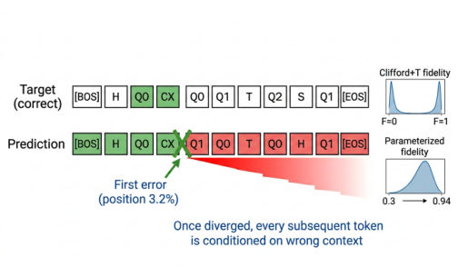 
Fig. 5. Autoregressive drift illustrated. The model matches the first few tokens (green) but diverges early (red X), after which every subsequent token is conditioned on wrong context. The Clifford+T fidelity distribution is bimodal (F ≈0 or F ≈1), whereas parameterized fidelity is smooth and recoverable via angle post-processing.

**Summary.** This paper investigates using transformer models for optimizing quantum circuits by minimizing T-gate count. The authors find that while the AI excels at approximate synthesis, it fundamentally fails when exact gate sequence correctness is required due to 'autoregressive drift.' This limitation shows that simple scaling of data or advanced search methods cannot overcome this inherent sequential decoding flaw.

**Why it may be interesting.** Although focused on quantum computation, the analysis of model failure modes—specifically how sequential generation breaks down under strict discrete constraints—provides insights relevant to any complex physical simulation or state preparation process where cumulative error is critical.

Detailed structure

**Main problem.** The core problem is optimizing quantum circuits for fault-tolerant computation by achieving exact functional equivalence while minimizing expensive non-Clifford resources like T gates.

**Main result.** While the transformer model succeeds when post-processing can rescue approximate outputs, its reliance on autoregressive decoding causes an irreversible failure (drift) when exact discrete correctness is required, especially for longer circuits.

**Method.** The authors use a structured encoder-decoder transformer trained to map input quantum circuits to equivalent, optimized output sequences of Clifford+T gates.

**Model / system.** The system involves synthesizing quantum circuits on 3-6 qubits using the Clifford+T gate set. The model is a compact transformer architecture utilizing structured tokenization for circuit representation.

**Key observables.** Process fidelity (exact equivalence), T-count reduction, and the rate of exact match success as a function of target circuit length.

**Important parameters / regimes.** The failure exhibits strong dependence on target circuit length; performance degrades sharply from high accuracy on short circuits to near zero for longer ones.

**Assumptions / limitations.** The central assumption tested is that autoregressive generation must maintain perfect discrete correctness, which the model fails to do beyond a certain circuit depth due to drift.

**Figures summary.** Notes imply figures comparing success rates across different search strategies (greedy vs. beam search) and showing the sharp drop-off in exact equivalence as target length increases.

**Paper structure.** The paper contrasts two regimes: parameterized circuits (where classical optimization rescues approximate errors) versus discrete Clifford+T circuits (where exactness is mandatory). It then systematically tests mitigation strategies like inference-time searching and data scaling against the persistent failure mode of autoregressive drift.

Abstract

Quantum circuit optimization for fault-tolerant computing requires exact functional equivalence while minimizing expensive non-Clifford resources such as T gates. We study this problem using a compact 44.8M-parameter encoder-decoder transformer with structured circuit tokenization, evaluating on parameterized circuits (2-6 qubits) and Clifford+T circuits (3-6 qubits). On parameterized circuits, a hybrid approach -- structure from the transformer, angles from classical optimization -- achieves median fidelity 1.000 on 3-6 qubit circuits. On Clifford+T circuits, where all gates are discrete and no post-processing is possible, the model learns valid syntax and accurate T-Count statistics, yet exact equivalence degrades sharply with target length -- from 88% on circuits with <=9 gates to near zero beyond 26 gates.   We trace this failure to autoregressive drift: early-token divergence cascading irrecoverably through left-to-right decoding. Two levers partially mitigate the drift: inference-time strategies that generate multiple candidates and select via equivalence verification raise exact-match rates from 7% to 22.5%, while scaling training data by 2.5x pushes them to 39.5%. Yet the degradation with target length persists -- even with more data, exact equivalence drops from 94% on short circuits to under 4% beyond 26 gates.   The contrast between settings is our central finding: when approximate outputs can be rescued by post-processing, the transformer succeeds; when exact discrete correctness is required, autoregressive drift limits reliability, with both inference-time search and data scaling as effective levers while training-side fine-tuning and model-level diversification are not.

[↑ back to top](#top)

## Secondary cond-mat archives

*Papers from  mes-hall, other, soft, supr-con. These archives are de-prioritized — they appear at the end regardless of relevance score.*

### Relevant in secondary archives (16)

### [Geometric Spin-Orbit Coupling Resolves the Contradictory CISS Effect in Chiral Single Molecules](http://arxiv.org/abs/2607.12720v1)

**Authors:** Shu-Zheng Zhou, Xi Sun, Kai-Yuan Zhang, Hua-Hua Fu  
**Type:** theory · **Category:** other · **PDF:** <https://arxiv.org/pdf/2607.12720v1>  
**Analysis basis:** full PDF text, analyzed in chunks
**Topic relevance:** 🔥 `methods for driven-dissipative` **4/5** · `exotic spin models in light-matter` **3/5** · `spintronics-quantum-optics interface` **3/5** · `Kondo & dissipative impurity` **2/5** · `non-equilibrium dynamics` **2/5** · `Keldysh / 2PI / non-Gaussian methods` **1/5** · `analog quantum simulation` **1/5** · `correlated / nonlocal dissipation` **1/5** · `driven-dissipative phase transition` **1/5**

📷 Fig 1

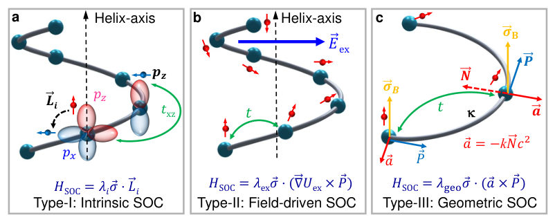 
Figure 1. Three SOC mechanisms that can be used to explain the generation of spin polarization. (a) Type-I: Atomic intrinsic SOC between different P-orbital components (e.g., Px, Py, Pz). (b) Type-II: Effective field-driven SOC from the electrons moving along the chiral paths, equivalent to an external electric field ⃗Eex=-∇U applied to the system. (c) Type-III: Geometric SOC due to the relativistic effect for electrons moving on curved paths.

📷 Fig 2

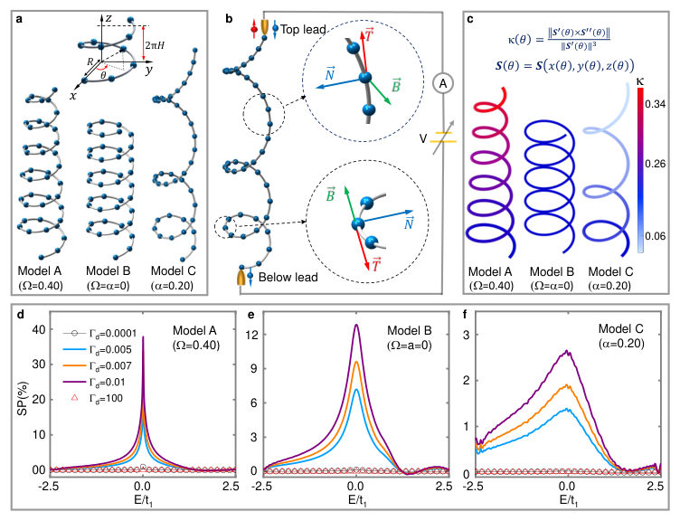 
Figure 2. Spin polarization for three chiral chain geometries along with the transport device configuration, local coordinate vectors and spatial curvature. (a) Three representative single-chiral chain geometries: cone-shaped (Model A), uniform (Model B), and progressive-pitch (Model C). (b) Transport device based on Model C, coupled to two nonmagnetic electrodes. The local tangent (⃗Ti), normal ( ⃗Ni) and binormal ( ⃗Bi) vectors are shown in red, green and magenta, respectively. (c) Spatial variation of the curvature κ in the three helix models. d-f Spin polarization versus energy E for Model A (Ω=0.4), Model B (Ω=α=0), and Model C (α=0.20).

📷 Fig 3

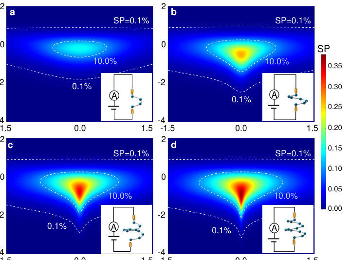 
Figure 3. Phase diagram of spin polarization versus the decoherence strength log10(Γd/t1) and the energy E for four types of chiral molecular junctions based on a half-turn (a), a full-turn (b), a one-and-a-half-turn (c), and a two-turn helix (d). Three contour lines for SP=1.0%, 10.0% and 20.0% are plotted.

📷 Fig 4

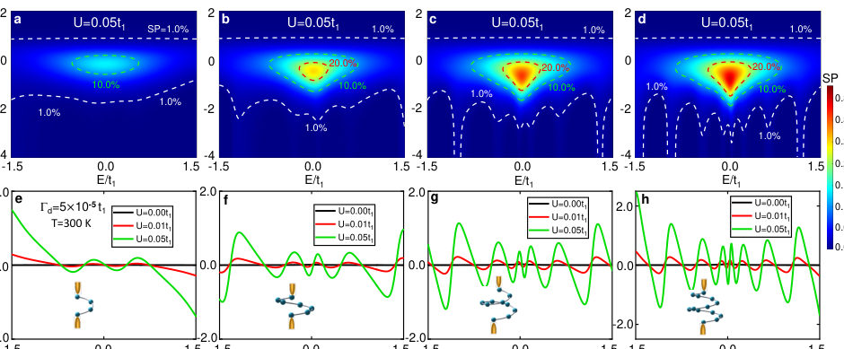 
Figure 4. Phase diagram of spin polarization and the maximum SP under electron-electron correction. (a)-(d) Phase diagrams of SP for four CSM-based junctions as functions of decoherence strength log10(Γd/t1) and onsite energy E, calculated at U=0.05t1. Contour lines are shown for SP=1.0%, 10.0% and 20.0%. (e)-(h) Maximum SP (SPmax) for the same four junctions as a function of E, for Hubbard U = 0, 0.01, and 0.05t1. The decoherence strength and temperature are fixed at Γd=5.0×10−4t1 and 300 K, respectively.

📷 Fig 5

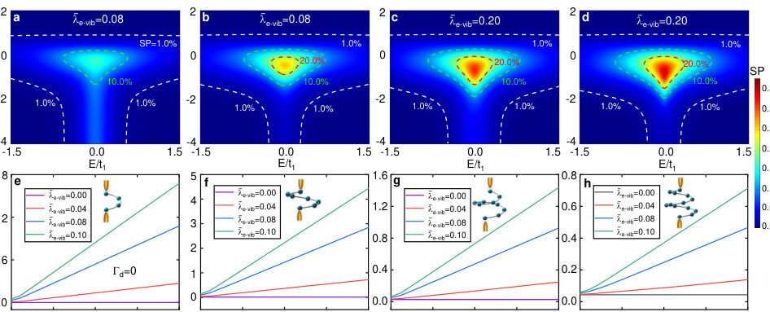 
Figure 5. Phase diagrams of spin polarization and maximum SP under electron-vibration coupling. (a)-(d) Phase diagrams of SP for four CSM-based junctions as functions of log10(Γd/t1) and onsite energy E, calculated with electron-vibration coupling (˜λe−vib=0.08 or 0.20 t1 · nm) and without electron-electron correlation (U=0). Contour lines are shown for SP=1.0%, 10.0%, and 20.0%. (e)-(h) Maximum SP (SPmax) as a function of temperature for the same four junctions, for ˜λe−vib=0, 0.04, 0.08, and 0.1 (in unit of t1 · nm).

**Summary.** This theoretical work resolves contradictions in CISS measurements by introducing geometric spin-orbit coupling into the analysis. The framework predicts that measurable spin polarization only occurs within an intermediate regime of environmental decoherence. It provides a unified understanding of CISS across various chiral molecular structures.

**Why it may be interesting.** The explicit modeling of spin transport in nanoscale molecular junctions using geometric SOC and decoherence provides a rich platform for studying open quantum systems dynamics, particularly how environmental coupling dictates observable quantum effects like spin polarization.

Detailed structure

**Main problem.** The paper aims to resolve conflicting experimental reports regarding the Chirality-Induced Spin Selectivity (CISS) effect in chiral single molecules.

**Main result.** It shows that CISS is suppressed in both strong-coherence and strong-decoherence regimes, becoming pronounced only in an intermediate decoherence regime. The mechanism unifies observations by incorporating geometric spin-orbit coupling.

**Method.** The authors developed a theoretical framework using tight-binding models to incorporate geometric SOC and environmental decoherence into the Hamiltonian.

**Model / system.** The system involves chiral single molecules modeled as helical chains (e.g., cone-shaped, uniform helix). The theory incorporates molecular Hamiltonians augmented by geometric SOC terms and environmental decoherence via a master equation approach.

**Key observables.** Spin Polarization (SP), which is calculated using the Landauer-Büttiker formalism; $	ext{SP}_{\max}$ dependence on temperature and coupling strengths.

**Important parameters / regimes.** Decoherence strength ($\Gamma_d$), electron-vibration coupling constant ($	ilde{\lambda}_{	ext{e-vib}}$), and molecular geometry parameters (radius, pitch).

**Assumptions / limitations.** The primary assumption is that geometric SOC provides the necessary theoretical extension beyond traditional intrinsic or field-driven SOC models to explain CISS.

**Figures summary.** Figures illustrate three types of SOC mechanisms; one shows SP for different molecular geometries across varying parameters; another presents phase diagrams mapping observable CISS to intermediate decoherence regimes.

**Paper structure.** The paper first establishes the conflict in experimental data, then develops a theoretical framework incorporating geometric SOC and decoherence. It systematically calculates SP for various chiral models (A, B, C) under different coupling conditions ($	ext{e-vib}$, $	ext{e-e}$), concluding with generalized phase diagrams.

Abstract

Some studies have reported clear chirality-induced spin selectivity (CISS) effect in four classes of chiral single molecules with remarkable spin polarization. In contrast, a recent high-precision measurement involving nearly a thousand individual tests failed to detect significant CISS signals in the same molecular systems (J. Am. Chem. Soc. 2025, \textbf{147}, 25043). These conflicting results cast doubt on whether CISS truly occurs in these chiral systems at the single-molecular level. To resolve this discrepancy, we develop a theoretical framework incorporating geometric spin-orbit coupling and environmental decoherence, enabling systematic study of the CISS in four chiral single molecules with distinct geometries and sizes. Our calculations show that the CISS effect is completely suppressed in both strong-coherence and strong-decoherence regimes, but becomes pronounced in the intermediate-decoherence regime, where observable spin polarization emerges. In the strong-coherence regime, both electron-electron interaction and electron-vibration coupling enhance the CISS effect: the former is more effective in large molecules, whereas the latter plays a more significant role in smaller ones. Increasing temperature further enhances spin polarization. The proposed mechanism unifies contradictory experimental observations and reveals how the CISS effect evolves from regular helical (helical symmetric) to irregular helical (point-symmetric or axially symmetric) chirality. This framework thus provides a basis for unifying CISS phenomena across single-molecule systems, regardless of their specific molecular configurations or symmetry classes.

[↑ back to top](#top)

### [Systematic modulation of superconducting gap dynamics in YBCO|BNT|YBCO Josephson Junctions through THz field interaction and BNT ferroelectric barrier](http://arxiv.org/abs/2607.12394v1)

**Authors:** Sukhanidhan Singh, Muthukkumaran Karthikeyan, Geoffrey Chanda, Thanayut Kaewmaraya, Pairot Moontragoon, Guoxing Sun, Zongjin Li, Anucha Watcharapasorn  
**Type:** both · **Category:** strongly correlated electrons · **PDF:** <https://arxiv.org/pdf/2607.12394v1>  
**Analysis basis:** full PDF text, analyzed in chunks
**Topic relevance:** `interference shaping light` **3/5** · `quantum optics experiment` **3/5** · `spintronics-quantum-optics interface` **3/5** · `QC/QI experiment` **2/5** · `driven-dissipative phase transition` **2/5** · `methods for driven-dissipative` **2/5** · `non-equilibrium dynamics` **2/5** · `Keldysh / 2PI / non-Gaussian methods` **1/5** · `Kondo & dissipative impurity` **1/5** · `analog quantum simulation` **1/5** · `correlated / nonlocal dissipation` **1/5** · `exotic spin models in light-matter` **1/5** · `non-equilibrium universality` **1/5**

📷 Fig 1

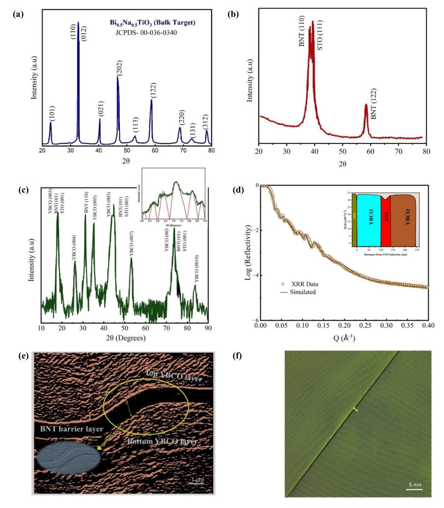 
Figure 1: (a) XRD patterns of the BNT bulk target, (b) XRD pattern of the BNT thin film on an

📷 Fig 2

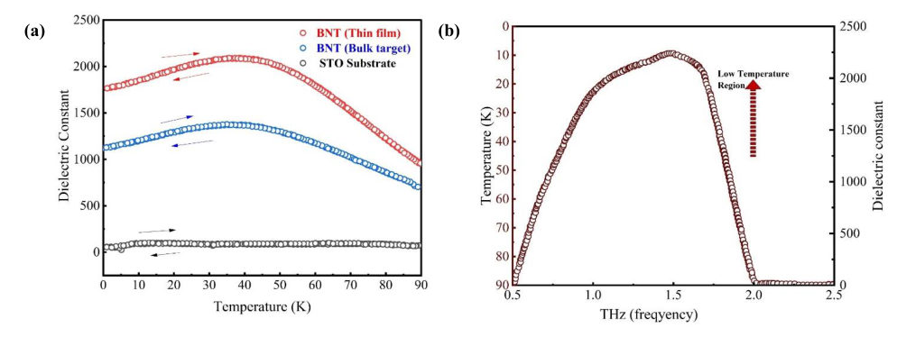 
Figure 2: (a) Temperature dependence of the dielectric constant for BNT thin films, bulk, and STO

📷 Fig 3

 
Figure 2(a) illustrates the temperature dependence of the dielectric constant for BNT thin films,

📷 Fig 4

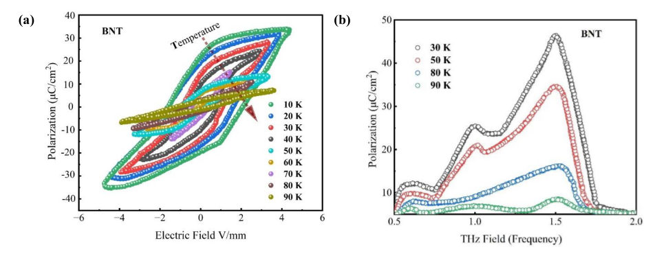 
Figure 3: (a) Polarization-electric field (P-E) hysteresis loops of BNT measured at temperatures

📷 Fig 5

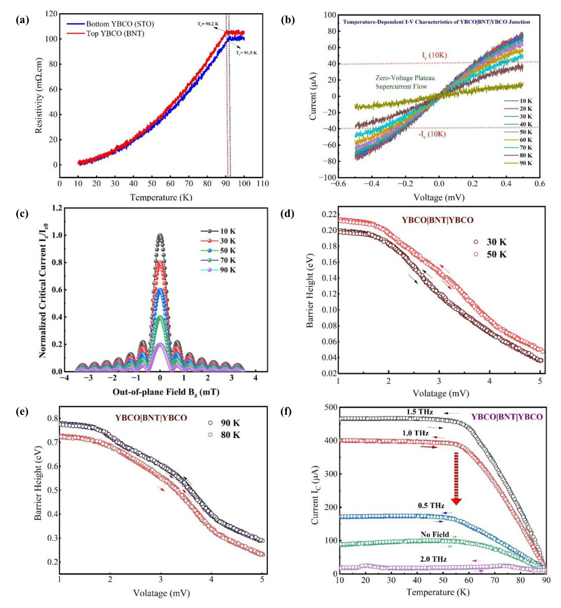 
Figure 4: (a) Temperature-dependent resistivity (ρ-T) behavior of the bottom and top YBCO layers

**Summary.** This research demonstrates that ferroelectric BNT barriers can be used to create Josephson junctions whose superconducting properties are dynamically controlled by external Terahertz (THz) radiation. By coupling THz fields to the BNT polarization, researchers successfully modulated both the critical current and the superconducting energy gap in YBCO/BNT/YBCO structures. This establishes a pathway for building next-generation, light-controlled superconducting quantum devices.

**Why it may be interesting.** This work directly bridges condensed matter physics (superconductivity, high-Tc cuprates) with quantum optics and materials science (ferroelectrics, THz response). The ability to use an external electromagnetic field to tune a fundamental quantum parameter like the superconducting gap is highly relevant for developing tunable quantum devices.

Detailed structure

**Main problem.** The study aims to systematically modulate superconducting gap dynamics in YBCO|BNT|YBCO Josephson Junctions by utilizing the interaction between external Terahertz (THz) fields and the ferroelectric polarization of the BNT barrier.

**Main result.** The research demonstrates that THz irradiation can dynamically enhance the critical current ($I_c$) and increase the superconducting gap ($\Delta$), confirming that the Josephson coupling is intrinsically controlled by the tunable, dipolar response of the ferroelectric BNT barrier.

**Method.** A combination of epitaxial thin-film deposition (PLD) to create high-quality trilayers, electrical transport measurements ($I$-$V$, $dI/dV$) under THz excitation, and theoretical modeling using a modified Josephson junction Hamiltonian was employed.

**Model / system.** The physical system is the YBCO|BNT|YBCO Josephson Junction. The dynamics are modeled by incorporating a time-dependent modulation term ($\mathcal{H}_{mod}$) into the standard Josephson Hamiltonian, where this modulation arises from the THz-induced polarization ($P_{THz}(t)$) within the BNT ferroelectric barrier.

**Key observables.** Superconducting gap ($\Delta$), critical current ($I_c$) under THz excitation, BNT polarization ($P$), and Fraunhofer interference patterns in $I_c(B)$.

**Important parameters / regimes.** THz frequency (0.5-2.5 THz), ferroelectric polarization magnitude ($33.4 	o 46.4 \mu	ext{C}/	ext{cm}^2$), and superconducting gap values ($\Delta = 1.3 	ext{ meV}$ vs $1.05 	ext{ meV}$).

**Assumptions / limitations.** The coupling mechanism is assumed to be dominated by the dipolar interaction between the THz field/polarization and the junction capacitance, leading to a time-dependent barrier potential.

**Figures summary.** Figures illustrate structural characterization (XRD/XRR) confirming high epitaxial quality; energy diagrams show how the external THz field introduces an additional gap ($E_g$) into the Josephson coupling energy ($	ext{E}_{	ext{J}}$); and spectroscopic plots detail the modulation of $\Delta$ and $I_c$.

**Paper structure.** The paper follows a structure moving from system definition (YBCO/BNT/YBCO stack) to theoretical modeling incorporating THz interaction, followed by detailed experimental characterization (structural confirmation via XRR/XRD, electrical measurements under THz), culminating in the demonstration of dynamic control over superconducting parameters.

Abstract

The integration of ferroelectric barriers into high-temperature Josephson junctions offers a pathway to tunable superconducting quantum devices. Here, we demonstrate robust Josephson coupling in YBa2Cu3O7-x (YBCO)/Bi0.5Na0.5TiO3 (BNT)/YBCO trilayer junctions incorporating a 40 nm ferroelectric BNT barrier. Epitaxial trilayers were fabricated by pulsed laser deposition on SrTiO3 substrates and investigated under broadband terahertz (THz) irradiation (0.5-2.5 THz). At 1.5 THz, close to the Josephson plasma resonance, the BNT polarization increased from 33.4 to 46.4 uC/cm2 at 30 K, enhancing superconducting transport. The junctions exhibited a well-defined zero-voltage supercurrent branch, with the critical current Ic(T) remaining nearly constant up to 60 K and reaching 468.2 uA under 1.5 THz excitation, evidencing strong phase coherence. Scanning tunneling spectroscopy revealed an enhanced superconducting gap in YBCO/BNT/YBCO (Delta = 1.3 meV) compared with pure YBCO (Delta = 1.05 meV), while optical conductivity measurements showed a reduction in conductivity and gap with increasing temperature, consistent with BCS theory under THz excitation. Atomic force microscopy and X-ray reflectivity confirmed uniform morphology and sharp interfaces, excluding defect-mediated transport. Magnetic field modulation of Ic(B) exhibited a canonical Fraunhofer interference pattern, and resistance mapping revealed alternating lobes of high and low dissipation, indicating coherent Josephson tunneling. These results establish that Josephson coupling is intrinsic to the YBCO/BNT/YBCO junctions, enabled by the dipolar character and dynamic THz response of the BNT barrier. This study identifies BNT as a viable, tunable barrier material for next-generation high-Tc superconducting quantum devices.

[↑ back to top](#top)

### [Dynamical Generation of Rectified Electric Current](http://arxiv.org/abs/2607.12741v1)

**Authors:** Jin-Xin Hu, Congjun Wu  
**Type:** theory · **Category:** other · **PDF:** <https://arxiv.org/pdf/2607.12741v1>  
**Analysis basis:** full PDF text, analyzed in chunks
**Topic relevance:** `analog quantum simulation` **3/5** · `exotic spin models in light-matter` **3/5** · `non-equilibrium dynamics` **3/5** · `spintronics-quantum-optics interface` **3/5** · `Keldysh / 2PI / non-Gaussian methods` **2/5** · `driven-dissipative phase transition` **2/5** · `methods for driven-dissipative` **1/5** · `non-equilibrium universality` **1/5**

📷 Fig 1

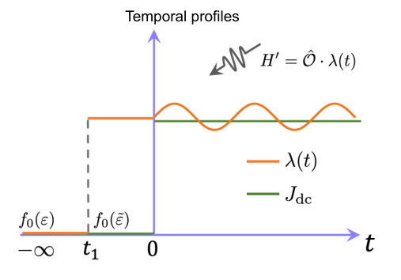 
FIG. 1. Schematic illustration of rectified current generation by a dynamical drive λ(t) coupled to a local operator ˆO. At times t &lt; 0, the system is in equilibrium. The drive is adia- batically turned on during the interval −∞&lt; t &lt; t1, reaching a finite amplitude with zero frequency for t1 &lt; t &lt; 0. While a static component of the drive would merely redistribute carri- ers, leading to a modified steady-state distribution, the finite frequency Ωat t &gt; 0 enables the generation of a rectified DC current Jdc.

📷 Fig 2

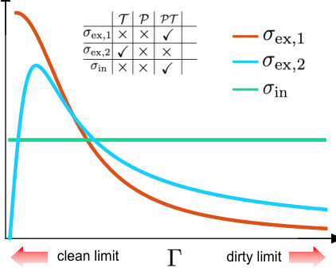 
FIG. 2. Schematic depiction of the extrinsic (σex,1 and σex,2) and intrinsic (σin) DC current and their symmetry properties. Γ denotes the scattering rate, making σex,1 term dominate and suppressing σex,2 in the clean limit. However, the intrinsic one is disorder free and may dominate gradually in the dirty limit.

📷 Fig 3

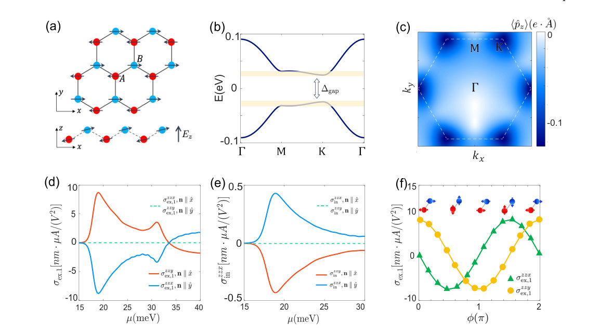 
FIG. 3. (a) Schematic illustration of the buckled honeycomb lattice with N´eel order. In the side view, the two sublattice atoms (A and B) form a vertical dipole moment that couples to an out-of-plane electric field Ez. (b) Band structure along the high-symmetry lines, featuring a band gap of ∼50 meV. (c) Momentum-space distribution of the vertical dipole moment ⟨ˆpz⟩ for the valence band. (d) and (e) Calculated σex,1 and σin as functions of Fermi energy µ. (f) Angular dependence of σex,1 at µ = 18 meV on the N´eel vector direction; the evolution of the spin texture on the A and B sublattices is also depicted. Parameters used: t = 30 meV, λR = 0.1t, Jex = 0.3t, and temperature T = 5 K.

**Summary.** This paper develops a general theory for how an oscillating external field can induce a steady, rectified electric current in a periodic system, even if the static case forbids it. The resulting DC current is shown to have both extrinsic (impurity-related) and intrinsic (Berry curvature-derived) origins. By applying this framework to magnetic materials, the authors propose that this effect can act as a novel electrical probe for detecting specific types of magnetic ordering.

**Why it may be interesting.** The concept of generating DC currents from AC drives via nonlinear coupling is central to understanding non-equilibrium quantum transport. The explicit connection between this effect and measurable magnetic orders makes it highly relevant for condensed matter theorists studying emergent phenomena in frustrated magnets.

Detailed structure

**Main problem.** The work addresses the nonlinear transport phenomenon of electric current rectification, converting an alternating external drive into a steady direct current (DC) even when static theory forbids it.

**Main result.** A general theoretical framework is established showing that this rectified DC current arises from two distinct contributions: impurity scattering and a dynamical mixed Berry curvature. This effect can serve as a sensitive electrical probe for magnetic order, such as Néel ordering in antiferromagnets.

**Method.** The analysis uses a semiclassical approach, expanding the system's response to the time-varying drive ($\lambda(t)$) up to second order in the drive amplitude to isolate the DC component. The theory decomposes the current into extrinsic (scattering-dependent) and intrinsic (Berry curvature-derived) parts.

**Model / system.** The general model involves Bloch electrons in a periodic system driven by an external oscillating field coupling to an arbitrary operator $\hat{O}$. A specific application is studied using a tight-binding Hamiltonian for a buckled magnetic lattice subjected to an out-of-plane oscillating electric field.

**Key observables.** Rectified DC current ($J_{dc}$), which is proportional to the product of two drive amplitudes ($\lambda_a\lambda_b$), and its components $\sigma_{	ext{abc}}^{	ext{ex}}$ (extrinsic) and $\sigma_{	ext{abc}}^{	ext{in}}$ (intrinsic).

**Important parameters / regimes.** The driving frequency ($\Omega$) relative to the optical transition gap ($\Delta_{	ext{gap}}$), and the scattering rate ($\Gamma$). The DC current persists even when $\hbar\Omega \ll \Delta_{	ext{gap}}$.

**Assumptions / limitations.** The analysis relies on the semiclassical framework, utilizing the relaxation-time approximation for the distribution function. Some derivations employ a time-dependent Schrieffer-Wolff transformation.

**Figures summary.** Figure 1 illustrates the generation of $J_{dc}$ from an oscillating drive. Figure 2 shows the scaling behavior of different conductivity components ($\sigma_{	ext{ex,1}}$, $\sigma_{	ext{ex,2}}$, $\sigma_{	ext{in}}$) across various frequency regimes relative to the scattering rate. Figure 3 depicts the physical realization in a buckled honeycomb lattice.

**Paper structure.** The paper develops a general theory for rectification, derives the current components ($\sigma^{	ext{ex}}, \sigma^{	ext{in}}$), analyzes their frequency dependence and symmetry constraints (P, T, PT), and concludes with a specific application to magnetic systems to probe Néel order.

Abstract

Rectification is a fundamental nonlinear transport process that converts an alternating drive into a direct current. In this work, we propose a general theoretical framework for electric current rectification triggered by a dynamical external drive that couples to an arbitrary well-defined operator of a periodic system, and which in the static limit forbids any steady current. In the dynamical regime, the finite frequency $Ω$ of the time-varying drive breaks time-translation invariance and injects energy into the system, enabling a second-order {\it nonlinear rectified} current that has no static counterpart. This rectification process has two distinct origins: (i) an impurity-scattering-modified distribution function at finite frequency, and (ii) a time-domain anomalous velocity stemming from a dynamical mixed Berry curvature. Both contributions persist when the driving frequency lies well below the optical transition gap. Applying our general theory to a buckled magnetic system subject to an out-of-plane oscillating electric field, we characterize the generated current as a {\it nonlinear magnetoelectric gyrotropic effect} and predict that the induced rectified current is sensitive to the magnetic order, thereby offering a feasible electrical probe of Néel order in non-coplanar antiferromagnets.

[↑ back to top](#top)

### [Domain wall motion in ferromagnetic nanowires driven by a localized Gaussian thermal gradient](http://arxiv.org/abs/2607.12347v1)

**Authors:** M. A. Jafar Pikul, M. A. S. Akanda, M. T. Islam  
**Type:** theory · **Category:** other · **PDF:** <https://arxiv.org/pdf/2607.12347v1>  
**Analysis basis:** full PDF text, analyzed in chunks
**Topic relevance:** `methods for driven-dissipative` **3/5** · `spintronics-quantum-optics interface` **3/5** · `driven-dissipative phase transition` **2/5** · `non-equilibrium dynamics` **2/5** · `Keldysh / 2PI / non-Gaussian methods` **1/5** · `analog quantum simulation` **1/5** · `correlated / nonlocal dissipation` **1/5** · `exotic spin models in light-matter` **1/5** · `non-equilibrium universality` **1/5**

📷 Fig 1

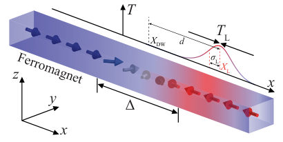 
FIG. 1. Schematic of the Permalloy nanowire with length 1024 nm and cross-section 8 × 8 nm2, containing a head-to- head domain wall (DW) at the center. The red curve repre- sents the localized Gaussian temperature profile, which peaks at the laser position XL. The laser spot is located at a dis- tance d = NσL to the right of the initial DW position XDW, where σL is the laser width. Blue and red coloring indicate the colder and hotter regions, respectively. The DW width ∆ and the laser to DW distance d are also indicated.

📷 Fig 2

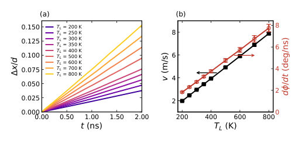 
FIG. 2. Effect of laser temperature on DW dynamics for fixed N = 7 (d = 105 nm), σL = 15 nm, α = 0.001, and Ku = 2×105 J m−3. (a) Normalized DW displacement ∆x/d as a function of time for TL = 200, 250, 300, 350, 400, 500, 600, 700, and 800 K. The DW moves toward the hotter region for all temperatures, and the displacement increases with TL. (b) Translational velocity v (filled black squares) and angu- lar velocity dϕ/dt (open red circles) as functions of TL. Both quantities increase linearly with laser temperature. Error bars represent one standard deviation over 15 independent simu- lations.

📷 Fig 3

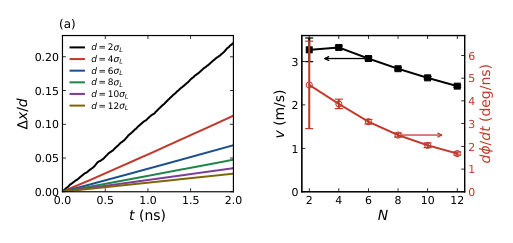 
FIG. 3. Dependence of DW dynamics on laser to DW dis- tance for fixed TL = 300 K, σL = 15 nm, and α = 0.001. (a) Normalized displacement ∆x/d versus time for N = 2, 4, 6, 8, 10, 12, where d = NσL. (b) Translational velocity v (filled black squares) and angular velocity dϕ/dt (open red circles) versus N. Both quantities decrease with increasing N because the magnon current weakens as it travels farther from the laser spot to the DW.

📷 Fig 4

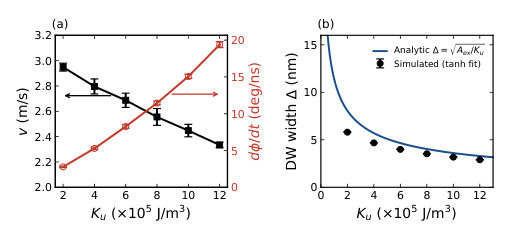 
FIG. 5. Uniaxial anisotropy study for fixed TL = 300 K, N = 7, σL = 15 nm, and α = 0.001. (a) Translational veloc- ity v (filled black squares) and angular velocity dϕ/dt (open red circles) plotted against Ku. As Ku increases, v decreases while dϕ/dt increases. (b) DW width ∆plotted against Ku. Filled black circles represent values extracted from tanh fits to the simulated magnetization profiles, and the blue curve represents the analytic prediction, ∆= p

📷 Fig 5

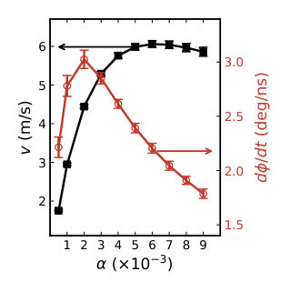 
FIG. 4. Damping dependence of DW dynamics in the sub- Walker regime for fixed TL = 300 K, N = 7, σL = 15 nm, and Ku = 2 × 105 J m−3. Translational velocity v (filled black squares) and angular velocity dϕ/dt (open red circles) are plotted as functions of α (×10−3). The velocity reaches a broad maximum near α ≈0.002–0.003 and then levels off, while dϕ/dt decreases after reaching its maximum near α ≈0.002. This behavior reflects the competition between magnon generation and magnon propagation.

**Summary.** This work models domain wall motion in ferromagnetic nanowires driven by localized laser heating. The simulations show that the DW velocity scales linearly with temperature but is attenuated by distance due to magnon current decay. Key findings establish that both the laser spot size and the separation distance act as independent control parameters for thermal spintronics devices.

**Why it may be interesting.** While focused on magnetism, the use of stochastic equations (sLLG) to model thermal fluctuations and non-equilibrium dynamics in a spatially varying field provides relevant computational techniques applicable to open quantum systems or dissipative many-body physics.

Detailed structure

**Main problem.** The study investigates how magnetic domain wall (DW) motion is driven by a localized Gaussian thermal gradient generated by a focused laser spot.

**Main result.** The DW velocity increases linearly with peak laser temperature and decreases as the distance from the heat source increases due to magnon current attenuation. The dynamics are controlled independently by both the laser width and the separation distance.

**Method.** Micromagnetic simulations utilizing the stochastic Landau-Lifshitz-Gilbert (sLLG) equation were employed to model the time evolution of magnetization.

**Model / system.** The system is a uniaxial ferromagnetic nanowire containing a head-to-head DW. The dynamics are governed by the sLLG equation under the influence of a localized Gaussian temperature profile, with motion primarily driven by magnonic spin-transfer torque ($\mu$STT).

**Key observables.** Translational velocity ($v$), angular velocity ($\mathrm{d}\phi/\mathrm{dt}$), and DW displacement ($\Delta x/d$).

**Important parameters / regimes.** Peak laser temperature ($T_L$), laser to DW distance ($d = N\sigma_L$), Gilbert damping ($\alpha$), uniaxial anisotropy ($K_u$), and laser width ($\sigma_L$).

**Assumptions / limitations.** The entropic torque is negligible because the initial DW position has an effectively zero local temperature gradient, simplifying the driving mechanism to $\mu$STT.

**Figures summary.** Figures illustrate the linear dependence of velocity on $T_L$, the decay of velocity with increasing separation distance ($N$), and non-monotonic dependencies on damping ($\alpha$) and anisotropy ($K_u$).

**Paper structure.** The analysis systematically varies key physical parameters—$T_L$, distance, $\alpha$, $K_u$, and $\sigma_L$—to map out the functional dependence of DW velocity and angular dynamics.

Abstract

We investigate magnetic domain wall (DW) dynamics in a uniaxial ferromagnetic nanowire under the localized Gaussian temperature profile of a laser spot using the stochastic Landau-Lifshitz-Gilbert equation. The DW velocity increases linearly with peak laser temperature and decreases with increasing laser to DW distance. The velocity varies nonlinearly with Gilbert damping because damping strengthens thermal magnon excitation but shortens the magnon propagation length. The DW initially lies away from the laser-heated region, so the temperature gradient at its position is effectively zero and the entropic torque is negligible. The DW motion is therefore mainly driven by magnonic spin-transfer torque. We analyze laser temperature, laser to DW distance, damping, uniaxial anisotropy, and laser width. The analysis shows that laser width and laser to DW distance independently control the DW response. These findings may clarify the mechanism of localized thermally driven DW motion and guide thermal control strategies in spintronic racetrack-memory devices.

[↑ back to top](#top)

### [What Is the Real-Time Atomistic Mechanism Behind Chirality-Induced Spin Selectivity in Donor-Chiral Bridge-Acceptor Molecules?](http://arxiv.org/abs/2607.12819v1)

**Authors:** Shu-Zheng Zhou, Xi Sun, Kai-Yuan Zhang, Hua-Hua Fu  
**Type:** theory · **Category:** other · **PDF:** <https://arxiv.org/pdf/2607.12819v1>  
**Analysis basis:** full PDF text, analyzed in chunks
**Topic relevance:** `exotic spin models in light-matter` **3/5** · `spintronics-quantum-optics interface` **3/5** · `methods for driven-dissipative` **2/5** · `non-equilibrium dynamics` **2/5** · `Keldysh / 2PI / non-Gaussian methods` **1/5** · `correlated / nonlocal dissipation` **1/5** · `driven-dissipative phase transition` **1/5**

📷 Fig 1

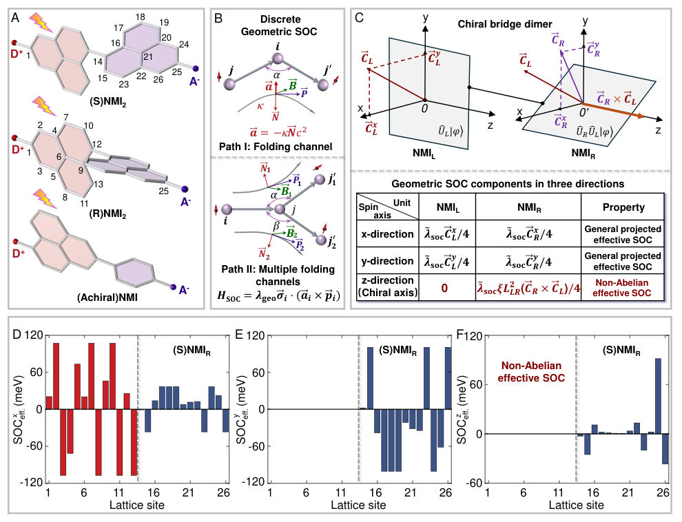 
Figure 1. Molecular geometry of the donor–chiral bridge–acceptor system and the generation of geometric SOC within the chiral bridge. A Molecular structures of the PXX-(S,R)NMI2–NDI enantiomers, the achiral NMI-bridged analogue is also shown for reference. B Two representative transport pathways through the chiral bridge and the discretized geometric SOC at each atomic site. The vectors ⃗N, ⃗B, and ⃗T denote the normal, binormal, and tangent directions in the Frenet–Serret frame; ⃗a and ⃗p are the electron acceleration and momentum; κ is the local curvature of the pathway. C Decomposition of the effective geometric SOC components along the three orthogonal axes for the left (NMIL) and right...

📷 Fig 2

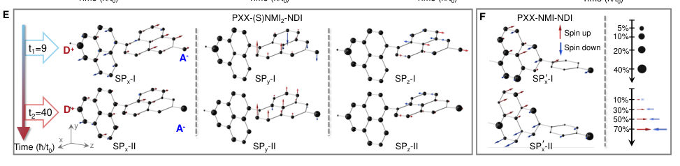 
Figure 2. Time and spatial evolution of charge densities and spin polarizations in the donor–chiral bridge–acceptor system. (A) Time-dependent charge densities on the donor (D), the left bridge unit NMIL (adjacent to D), the right bridge unit NMIR (adjacent to the acceptor A), and the acceptor itself. (B-D) Time evolution of the three orthogonal spin-polarization components SPx, SPy, and SPz on the acceptor for the (S) and (R) enantiomers and the achiral reference. (E) Spatial distribution of charge densities and the three spin-polarization components across all atomic sites of the chiral-bridge (S)NMI2 and the acceptor at two representative times, t1 and t2. (F) Corresponding spatial...

📷 Fig 3

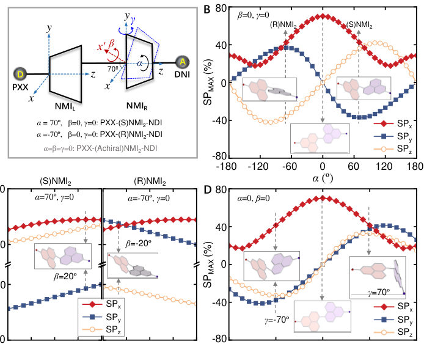 
Figure 3. Geometric regulation of spin polarization by chiral bridge dimer conformation. (A) Definition of the three geometric param- eters of the right NMIR unit relative to the left NMIL unit: dihedral angle α about the chiral axis, in-plane twist β, and folding angle γ; the corresponding rotational axes are indicated. (B) Dependence of the three spin-polarization components SPx, SPy, and SPz on the dihedral an- gle α for the PXX-NMI2-DNI system. (C) Evolution of the three polarization components with the in-plane twist angle β for the enantiomeric pair at α=±70◦. (D) Variation of the three spin-polarization components on the acceptor A as a function of the folding angle γ.

📷 Fig 4

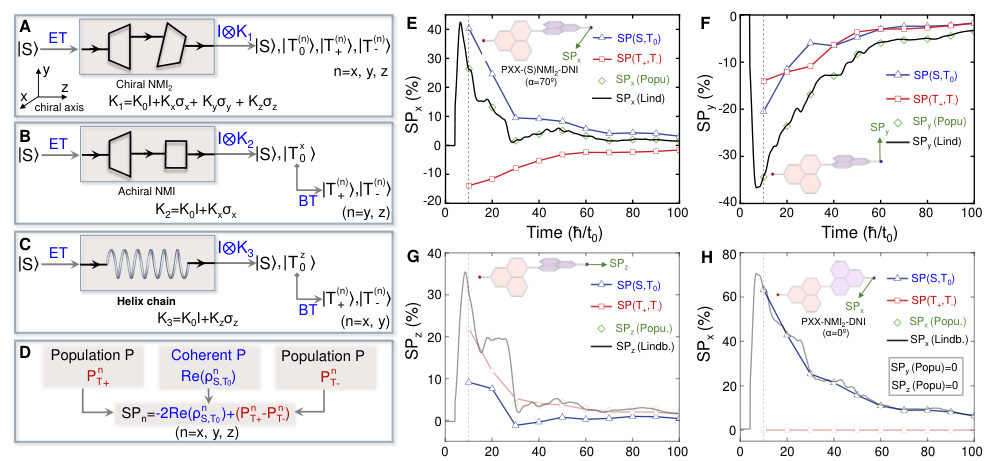 
Figure 4. Triplet-state evolution and the equivalence between population polarization and vector spin polarization in donor–chiral bridge–acceptor molecules. (A-C)) Comparison of singlet and triplet population evolution for electron transfer through an axially chiral bridge, an achiral bridge, and a one-dimensional helical-chain structure. (D) Schematic illustration of the composition and calculation of the total population polarization. (E-G) Time evolution of the singlet–triplet coherence polarization, triplet population polarization, total population polarization, and the corresponding vector-spin polarization along the three orthogonal directions for the chiral PXX–(S)NMI2–DNI molecule....

**Summary.** This paper reveals that the real-time spin polarization in chiral molecules like D-Bχ-A systems originates primarily from a geometric spin-orbit coupling ($	ext{SOC}_{	ext{geo}}$). By modeling electron transport along the molecule's twisted bridge, the authors show this mechanism generates strong, measurable spin polarizations that match experimental data. This provides a general theoretical blueprint for designing chiral spintronic devices.

**Why it may be interesting.** This work provides a highly detailed, first-principles theoretical mechanism for CISS that moves beyond simple models. The explicit derivation of geometric SOC from molecular curvature is crucial for designing next-generation chiral spintronic materials.

Detailed structure

**Main problem.** The primary goal is to elucidate the real-time, atomistic mechanism responsible for Chirality-Induced Spin Selectivity (CISS) in Donor-Chiral Bridge-Acceptor (D-Bχ-A) molecules.

**Main result.** The study proposes that a geometric spin-orbit coupling ($	ext{SOC}_{	ext{geo}}$), arising from the curvature of electron transport along the chiral bridge, is the dominant mechanism generating observable high spin polarizations. This framework successfully accounts for both axial and transverse polarization components observed in experiments.

**Method.** The authors developed and utilized a quantum dynamical model incorporating time-dependent charge-state populations and explicitly calculating geometric SOC derived from the Frenet–Serret frame along the twisted molecular pathway.

**Model / system.** The system studied is the D-Bχ-A molecule, focusing on binaphthyl-type chiral bridge dimers. The theoretical framework involves deriving a Hamiltonian that includes $	ext{SOC}_{	ext{geo}}$ and analyzing spin dynamics using quantum master equations or density matrix propagation.

**Key observables.** Spin polarization components ($	ext{SP}_x, 	ext{SP}_y, 	ext{SP}_z$), the magnitude of geometric SOC (predicted to be $1-2$ orders of magnitude larger than intrinsic coupling), and population/coherence polarizations.

**Important parameters / regimes.** The relative magnitudes of polarization components ($\sim 30\%–40\%$ for CISS contribution) and the ratio $\lambda/t_0 \approx 0.64$ defining the SOC energy scale are key parameters.

**Assumptions / limitations.** The analysis assumes that the geometric SOC mechanism provides a self-consistent picture, allowing polarization to be understood without relying solely on conventional radical-pair mechanisms (RPM).

**Figures summary.** Figures illustrate molecular geometries and transport pathways, detailing how the geometric SOC is decomposed along orthogonal axes ($x, y, z$) across different enantiomers.

**Paper structure.** The paper progresses by first identifying the mechanistic gap in CISS understanding. It then develops a quantum dynamical model incorporating $	ext{SOC}_{	ext{geo}}$ derived from molecular geometry (Frenet–Serret frame). Finally, it calculates and compares resulting spin polarization components against time-resolved electron paramagnetic resonance measurements.

Abstract

Chiral-induced spin selectivity (CISS) has been experimentally observed in photo-excited donor-chiral bridge-acceptor (D-Bχ-A) molecules [Science 382, 197-201 (2023)]. However, the microscopic mechanism underlying CISS in such chiral systems remains elusive. Here we develop a quantum dynamical model that precisely maps the atomic structure of binaphthyl-type bridge dimers in isolated D-Bχ-A molecules and introduce a geometric spin-orbit coupling (SOC) mechanism to unveil the intrinsic origin of CISS in axially chiral systems. During photo-excited electron transport along the twisted pathways, the geometric SOC coupling strength exceeds the intrinsic coupling of light atoms by one to two orders of magnitude, readily producing observable high spin polarizations. The resulting spin polarization comprises two components: the CISS-associated polarizations along and perpendicular to the chiral axis are intrinsic to axial chirality, requiring neither external fields nor spin-superexchange transfer, while a non-Abelian curvature correction provides a rigorous mathematical definition of the chiral axis direction. Our calculated polarization components, chirality dependence, and relative magnitudes (30-40\%) quantitatively match time-resolved electron paramagnetic resonance measurements. This geometric SOC framework offers a self-consistent and general physical picture of CISS in axially chiral molecules and provides explicit theoretical guidance for the design of chiral spintronic devices.

[↑ back to top](#top)

### [Quantum anomalous Hall effect with tunable Chern numbers induced by d-wave sublattice-staggered altermagnetism](http://arxiv.org/abs/2607.12320v1)

**Authors:** Lizhou Liu, Qing-Feng Sun  
**Type:** theory · **Category:** other · **PDF:** <https://arxiv.org/pdf/2607.12320v1>  
**Analysis basis:** full PDF text, analyzed in chunks
**Topic relevance:** `analog quantum simulation` **3/5** · `exotic spin models in light-matter` **3/5** · `driven-dissipative phase transition` **2/5** · `Keldysh / 2PI / non-Gaussian methods` **1/5** · `methods for driven-dissipative` **1/5** · `spintronics-quantum-optics interface` **1/5**

📷 Fig 1

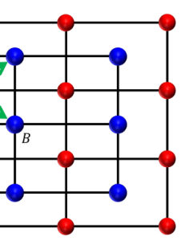 
Fig. 1. Schematic diagram of the square lattice model consisting of two sublattices, A (red) and B (blue). The green arrows

📷 Fig 2

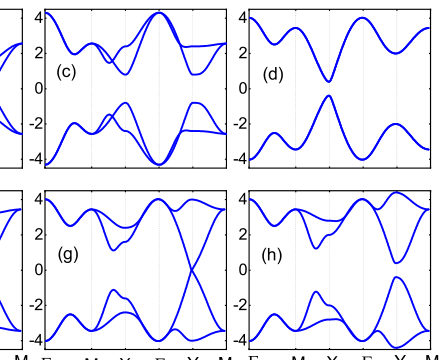 
Fig. 2. Energy band structures for different parameter settings. The high-symmetry path is chosen as Γ–M–X–Γ–Y–M.

📷 Fig 3

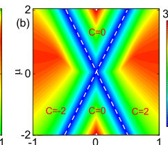 
Fig. 3. Phase diagrams in the J–µ plane. The color map shows the bulk gap magnitude, and the labeled regions indicate the

📷 Fig 4

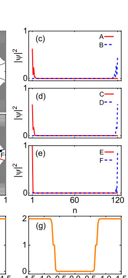 
Fig. 4. (a),(b) Ribbon band structures under open boundary conditions along the y direction for anisotropic hopping

**Summary.** This theoretical work proposes that Quantum Anomalous Hall Effect can be engineered in compensated magnets by utilizing a d-wave sublattice-staggered altermagnetic interaction. By tuning parameters like the staggered potential and lattice anisotropy, the model predicts the realization of multiple quantized Chern number states ($C=\pm 1, \pm 2$). This provides a simple, magnetically driven route to topological quantum phenomena.

**Why it may be interesting.** While focused on condensed matter topology, the concept of engineering robust quantum states using internal symmetries (like altermagnetism) is highly relevant to designing novel platforms for quantum simulation or topological quantum computing elements.

Detailed structure

**Main problem.** The primary goal is realizing the Quantum Anomalous Hall Effect (QAHE) in compensated magnetic systems without applying external magnetic fields.

**Main result.** The authors demonstrate that a d-wave sublattice-staggered altermagnetism can induce tunable QAHE phases, allowing for Chern numbers $C=\pm 1$ and $C=\pm 2$.

**Method.** The study employs theoretical modeling using a minimal spinful tight-binding Hamiltonian on a square lattice to calculate topological invariants.

**Model / system.** The system is modeled by a spinful tight-binding model on a square lattice, driven into QAHE by adding a d-wave sublattice-staggered altermagnetic exchange term. The physics relies on the interplay between this magnetic coupling and structural anisotropies.

**Key observables.** Tunable Chern numbers ($C$), quantized two-terminal conductance plateaus ($	ext{G} = n \cdot e^2/h$), and chiral edge states visible in ribbon spectra.

**Important parameters / regimes.** Altermagnetic strength ($J$), sublattice potential ($\mu$), and hopping anisotropy ($t_x$ vs. $t_y$).

**Assumptions / limitations.** The model assumes the existence of a d-wave sublattice-staggered altermagnetism, which breaks time-reversal symmetry but keeps the net magnetization zero.

**Figures summary.** Figures illustrate band structures showing topological transitions (e.g., $C=0 	o C=2$ vs. sequential steps), phase diagrams mapping allowed Chern numbers based on parameter tuning, and ribbon spectra confirming gapless edge modes corresponding to quantized conductance plateaus.

**Paper structure.** The paper builds the argument by first defining the minimal model Hamiltonian incorporating altermagnetism, then analyzing how varying parameters ($\mu$, $t_x/t_y$) controls the topological phase diagram (Chern number), and finally confirming these predictions via edge state calculations and quantized transport measurements.

Abstract

We construct a minimal spinful tight-binding model on a square lattice, where a $d$-wave sublattice-staggered altermagnetism drives the quantum anomalous Hall effect. Here the exchange field is staggered between the two sublattices, where it takes opposite signs on $A$ and $B$ described by the Pauli matrix $τ_z$. The resulting insulating phases host tunable Chern numbers $\mathcal{C}=\pm1$ and $\mathcal{C}=\pm2$, controlled by the staggered exchange strength and the sublattice-staggered potential. We determine the complete phase diagram, identify valley-resolved band inversions at the $X$ and $Y$ points in the Brillouin zone, and demonstrate chiral edge states together with quantized two-terminal conductance plateaus. Our work provides a simple route to realizing the quantum anomalous Hall effect in compensated magnets via a $d$-wave sublattice-staggered altermagnetism.

[↑ back to top](#top)

### [Analytical and numerical solutions to the non-diffusive Stefan problem](http://arxiv.org/abs/2607.12102v1)

**Authors:** Matthew Van Ham, Minghan Xu, Samuel Huberman  
**Type:** theory · **Category:** statistical mechanics · **PDF:** <https://arxiv.org/pdf/2607.12102v1>  
**Analysis basis:** full PDF text, analyzed in chunks
**Topic relevance:** `non-equilibrium dynamics` **3/5** · `non-equilibrium universality` **2/5** · `Keldysh / 2PI / non-Gaussian methods` **1/5** · `analog quantum simulation` **1/5** · `correlated / nonlocal dissipation` **1/5** · `driven-dissipative phase transition` **1/5** · `methods for driven-dissipative` **1/5**

📷 Fig 1

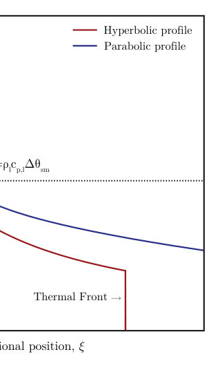 
Figure 1: Comparison of Hyperbolic and Parabolic solutions to the classical 1D Stefan problem.

📷 Fig 2

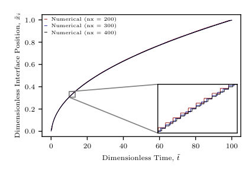 
Figure 2: Dimensionless interface position versus dimensionless time for (a) different mesh sizes

📷 Fig 3

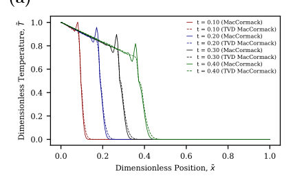 
Figure 3: Dimensionless Temperature vs. Dimensionless Position for MacCormack–TVD and

📷 Fig 4

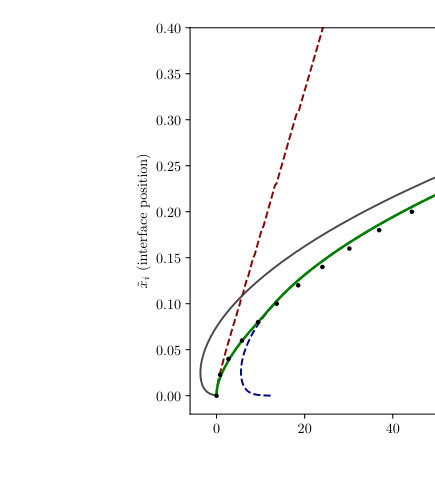 
Figure 4: Numerical verification of composite and non-Fourier solution profiles for diffusive Stefan

📷 Fig 5

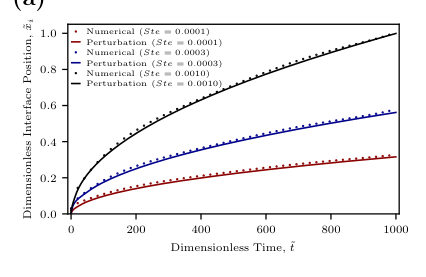 
Figure 5: Dimensionless Interface Position vs. Dimensionless Time for Different Stefan Numbers

**Summary.** This paper tackles the complex Stefan problem using advanced heat transfer models (MCV equation) that account for hyperbolic, non-diffusive effects. It employs perturbation theory and matched asymptotic expansions to derive accurate solutions by combining inner and outer approximations. The results clarify how early-time transient behavior is governed by these hyperbolic terms, which increases model error under certain parameter regimes.

**Why it may be interesting.** While focused on classical thermodynamics, the mathematical techniques—such as developing matched asymptotic expansions for hyperbolic PDEs with singular initial conditions—are highly relevant to modeling non-equilibrium dynamics in quantum systems or open quantum systems where relaxation times are critical.

Detailed structure

**Main problem.** The work aims to develop analytical and numerical solutions for the non-diffusive Stefan problem, which models phase change dynamics under non-Fourier heat transfer conditions.

**Main result.** The study successfully derives composite solutions by combining inner and outer approximations, showing that hyperbolic effects are pronounced at early times and increase model error when thermal relaxation time or diffusivity is large.

**Method.** Perturbation series expansions are used for small Stefan numbers, combined with a matched asymptotic construction involving rescaling time to capture initial transient dynamics.

**Model / system.** The physical system is a one-dimensional domain undergoing phase change (freezing/melting) governed by the Maxwell--Cattaneo--Vernotte (MCV) equation, which incorporates hyperbolic heat conduction effects.

**Key observables.** Interface profiles ($	ilde{x}_i$ vs $	ilde{t}$), temperature profiles ($	heta$), and model error scaling.

**Important parameters / regimes.** Stefan number (Ste), dimensionless thermal relaxation time ($\epsilon	au$), and thermal diffusivity ($\alpha$).

**Assumptions / limitations.** The analysis assumes a small Stefan number ($	ext{Ste} \ll 1$) and initially considers diffusive heat transfer at the interface for tractability, though it extends to non-diffusive models.

**Figures summary.** Figure 1 compares hyperbolic and parabolic solutions to the classical 1D Stefan problem. Other figures compare dimensionless interface positions and temperature profiles across varying Ste and $\alpha$ values under different interfacial condition assumptions.

**Paper structure.** The paper establishes the governing equations (MCV, Stefan condition), applies perturbation theory for small Ste, develops inner/outer solutions to handle asymptotic divergence, proposes composite solutions, and validates results numerically against known limits.

Abstract

In this work, the Maxwell--Cattaneo--Vernotte (MCV) equation is used to model the one-dimensional hyperbolic Stefan problem in the limit of a small Stefan number (Ste $\ll$ 1). The solutions are approximated with perturbation series expansions using a reformulation in which time is expressed as a function of the solid-liquid interface position. The first proposed solution is derived in a framework that considers diffusive heat transfer at the phase change interface, for analytic tractability. Two rectification strategies are proposed to address the asymptotic divergence present in this formulation: a rescaled inner solution which is then combined with the outer solution to yield a composite solution, and size-dependent thermo-physical system parameters for better capture of hyperbolic effects at the phase change interface. The resulting interface profiles exhibit a characteristic parabolic-like shape, consistent with diffusive Stefan problem findings, with pronounced early-time hyperbolic effects at larger thermal relaxation times. Parametric studies are done over three pertinent variables in the dimensionless system: the Stefan number ($\mathrm{Ste}$), the dimensionless thermal relaxation time ($\widetilde τ$), and the thermal diffusivity ($α$). The studies suggest that model error scales with the Stefan number in accordance with the theoretical truncation error of the perturbation expansion. Additionally, larger values of $\widetilde τ$ amplify early-time hyperbolic effects, thereby increasing model error, while larger $α$ extends the relative temporal domain over which these hyperbolic effects remain significant, also corresponding to an increase in model error.

[↑ back to top](#top)

### [Quantized Photocurrents in Gapless Topological Matter](http://arxiv.org/abs/2607.12420v1)

**Authors:** Byunghoon Kim, Tenzin Norden, Mohammad Yahyavi, Kaustuv Manna, Tyler A. Cochran, Zi-Jia Cheng, Xian P. Yang, Yu-Xiao Jiang, Xiangyu Luo, Payman Kazemikhah, Areeq Hasan, Vladimir N. Strocov, Sergey Shilov, Ilya Belopolski, Claudia Felser, Md Shafayat Hossain, Rohit P. Prasankumar, Guoqing Chang, M. Zahid Hasan, Prashant Padmanabhan  
**Type:** both · **Category:** other · **PDF:** <https://arxiv.org/pdf/2607.12420v1>  
**Analysis basis:** full PDF text, analyzed in chunks
**Topic relevance:** `analog quantum simulation` **3/5** · `spintronics-quantum-optics interface` **2/5** · `driven-dissipative phase transition` **1/5** · `interference shaping light` **1/5** · `non-equilibrium dynamics` **1/5** · `quantum optics experiment` **1/5**

📷 Fig 1

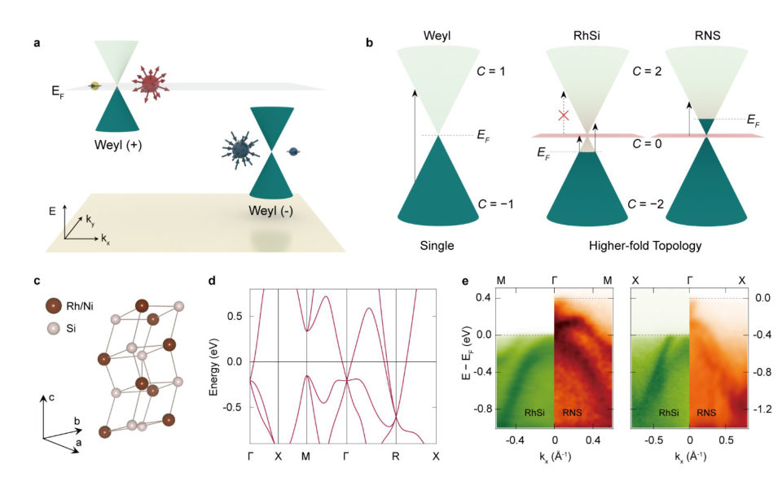 
Figure 1 | Band engineering to isolate a single Berry monopole in Ni-doped RhSi. a, Schematic

📷 Fig 2

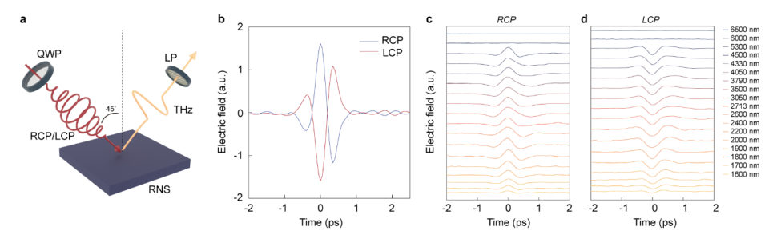 
Figure 2 | Helicity-dependent THz emission from Ni-doped RhSi. a, Schematic of the THz

📷 Fig 3

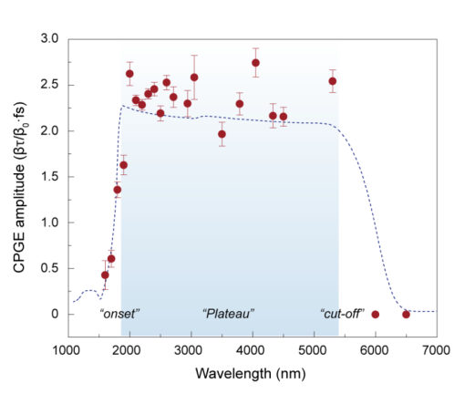 
Figure 3 | CPGE spectrum in the monopole-isolated optical window. Wavelength dependence

📷 Fig 4

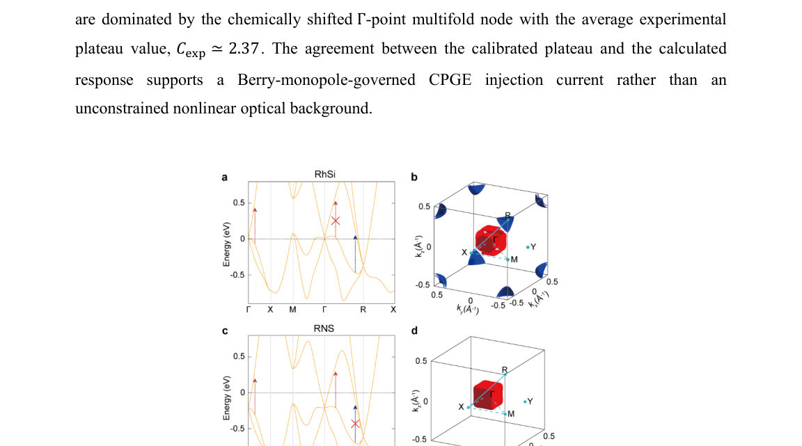 
Figure 4 | First-principles assignment of the monopole-selected optical window. a, Calculated

**Summary.** The paper reports the observation of a quantized circular photogalvanic effect in the chiral semimetal $	ext{Rh}_{0.95}	ext{Ni}_{0.05}	ext{Si}$. By tuning the material via Ni doping, the authors isolate optical transitions originating from a single topological multifold node. This results in a characteristic THz emission plateau whose magnitude quantizes according to the node's topological charge, establishing a novel measurement paradigm for topology in gapless matter.

**Why it may be interesting.** This work provides an all-optical, measurable analogue to topological invariants (like Chern numbers) in a solid-state material using nonlinear optics, which is highly relevant for understanding quantum transport phenomena beyond standard band theory.

Detailed structure

**Main problem.** The central challenge is realizing a quantized physical response, analogous to the Quantum Hall Effect (QHE), in gapless topological matter.

**Main result.** The authors experimentally observe and theoretically confirm a quantized circular photogalvanic effect plateau in $	ext{Rh}_{0.95}	ext{Ni}_{0.05}	ext{Si}$, establishing an all-optical analogue for the QHE.

**Method.** The study combines first-principles calculations of the CPGE tensor ($oldsymbol{eta}(\omega)$) with THz emission spectroscopy using circularly polarized near- to mid-infrared pulses.

**Model / system.** The system is a chiral topological semimetal, $	ext{Rh}_{0.95}	ext{Ni}_{0.05}	ext{Si}$, which possesses symmetry-protected multifold crossings acting as Berry-curvature monopoles at the $\Gamma$-point.

**Key observables.** Quantized plateau height of the THz emission (calibrated response product $eta	au$), and polarization dependence dominated by the $A_1$ term ($\propto \sin(2\phi)$).

**Important parameters / regimes.** The effective monopole charge ($C_{	ext{exp}} \simeq 2.37$) compared to the theoretical integer charge ($C=2$). The optical window is tuned by Ni doping.

**Assumptions / limitations.** The analysis assumes that the observed signal is dominated by transitions localized around a single multifold node, which is achieved through chemical tuning (Ni substitution).

**Figures summary.** Figures illustrate the confinement of p-polarized THz emission to a spectral window, show the plateau height vs. wavelength matching theory, and confirm the dominance of the $A_1$ polarization component.

**Paper structure.** The paper establishes the theoretical link between QHE topology and CPGE in gapless systems; it details how Ni doping isolates a single optical node; experimental THz measurements reveal the quantized plateau signature; and DFT calculations reproduce this quantization by modeling the $\Gamma$-point contribution while suppressing competing $R$-point contributions.

Abstract

The quantum Hall effect in gapped systems represents a defining signature of nontrivial topology. Realizing this principle in gapless matter has remained a central challenge in quantum materials. Chiral topological semimetals provide a unique platform to achieve this aim via symmetry-protected multifold crossings that act as Berry-curvature monopoles. When optical transitions are confined to a single multifold node, the resulting circular photogalvanic effect is predicted to be quantized in terms of the topological charge of the node. In real materials, however, this phenomenon remains experimentally elusive, obscured by trivial band transitions, the energy separation between the node pairs, and their relative positions with respect to the Fermi level. Here we observe a quantized circular photogalvanic effect in the chiral topological semimetal Rh0.95Ni0.05Si. Ni substitution opens a photon-energy window dominated by interband optical transitions at the Γ-point multifold node. This allows circularly polarized near- to mid-infrared pulses to drive a helicity-odd terahertz response that manifests three hallmarks of quantization: a sharp onset, a wavelength-independent plateau governed by the magnitude of monopole charge, and an abrupt cutoff imposed by Pauli blocking. Our work establishes an all-optical analogue for the quantum Hall effect and a new paradigm for topological quantization in gapless matter.

[↑ back to top](#top)

### [Reproducible Reservoir Computing with Thermally Driven Superparamagnets: Controlling Temperature Sensitivity](http://arxiv.org/abs/2607.12840v1)

**Authors:** Zhengfei Chen, Alex Welbourne, Matthew O. A. Ellis, Dan A. Allwood, Eleni Vasilaki, Thomas J. Hayward  
**Type:** theory · **Category:** disordered systems and neural networks · **PDF:** <https://arxiv.org/pdf/2607.12840v1>  
**Analysis basis:** full PDF text, analyzed in chunks
**Topic relevance:** `spintronics-quantum-optics interface` **3/5** · `analog quantum simulation` **1/5** · `correlated / nonlocal dissipation` **1/5** · `driven-dissipative phase transition` **1/5** · `exotic spin models in light-matter` **1/5** · `methods for driven-dissipative` **1/5** · `non-equilibrium dynamics` **1/5**

📷 Fig 1

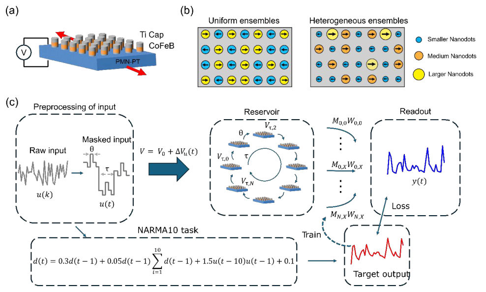 
Fig.1. (a) Schematic of a superparamagnetic nanodot ensemble consisting of a PMN-PT substrate onto which CoFeB/Ti dots are patterned. (b) Schematic diagrams illustrating uniform and heterogeneous nanodot ensembles. (c) Schematic representation of the time-multiplexed reservoir computing process for NARMA-10 task. Raw inputs are masked by multiplying with a binary matrix. The masked inputs are transferred into the reservoir along with feedback, where the feedback is the product of the output from each virtual node one time step previously and the feedback strength 𝛾. The output layer is trained via linear regression to minimise loss against the target output of the NARMA-10 task.

📷 Fig 2

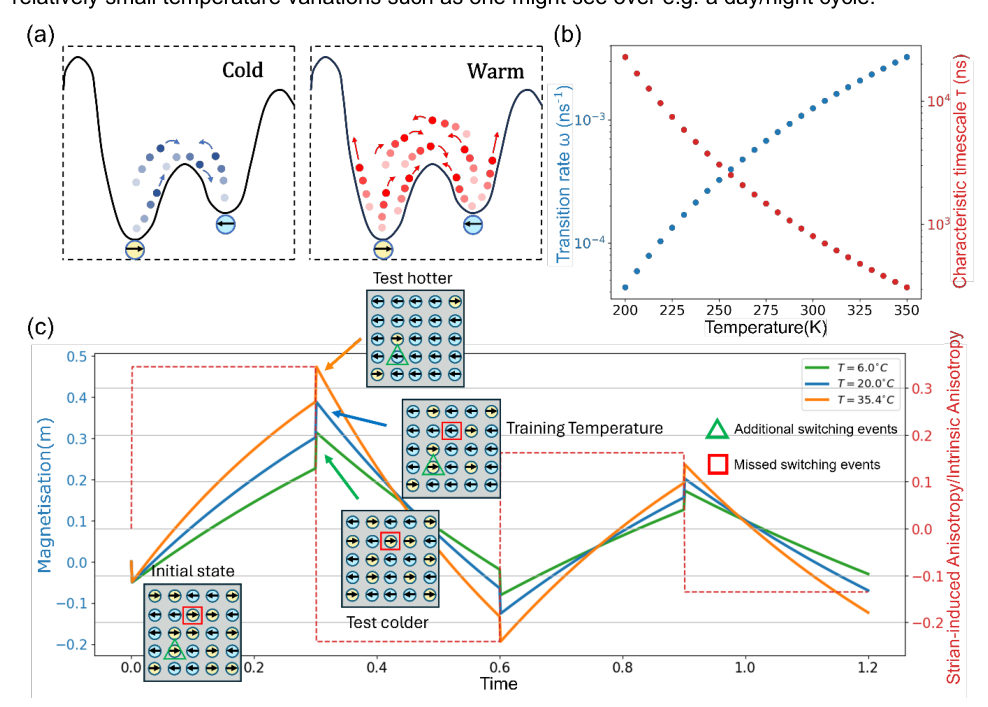 
Fig.2. (a) Schematic illustrating the thermal activation behaviour of single-domain nanodots at two different temperatures. The probability of magnetisation switching is increased at higher temperatures.(b) Transition rates 𝜔 and characteristic timescales 𝜏 of nanodots as a function of temperature in a single 50 nm diameter, 4nm thickness CoFeB nanodot with a field (h=0.4) applied at 90° to the anisotropy axis, as given by Eq.(2) for 𝑓0 = 10−9𝑠, (c) Dynamics of a nanodot ensembles net magnetisation over time in response to an input sequence under different temperatures (6.0°C, 20°C and 35.4°C). Input (Strain-induced anisotropy 𝐾𝜎/ intrinsic anisotropy 𝐾) selected randomly from -0.4 to 0.4....

📷 Fig 3

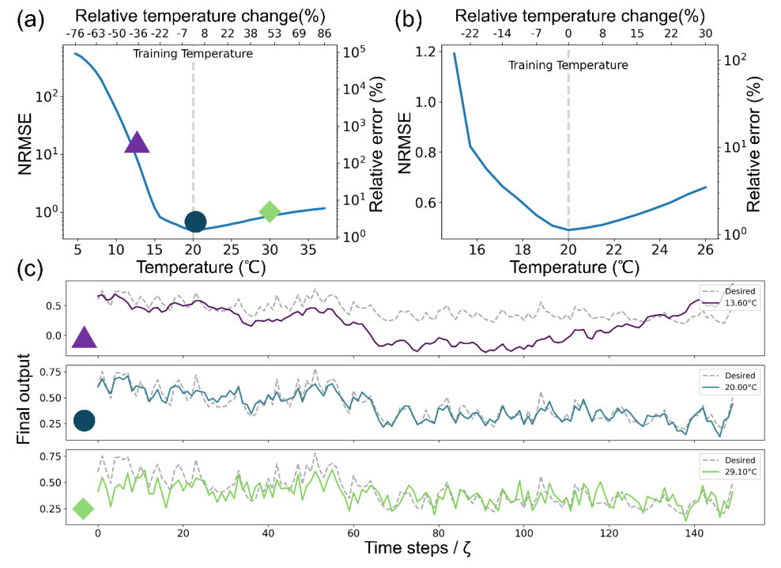 
Fig.3. (a) NRMSE and relative error of the reservoir in the NARMA-10 task as a function of temperatures in the range 5 - 35°C. The reservoir exhibits optimal prediction performance at the training temperature, with performance progressively degrading as the temperature deviates from 20°C. (b) The same data plotted over the range 15-26°C. (c) Comparison of the target output and reservoir prediction output at three temperatures. Grey dashed lines indicate the desired output from the NARMA-10 task. Clearly, uniform nanodot reservoir fails to yield reproducible outputs under thermal fluctuations. Introducing geometric heterogeneity is expected to generate a distribution of magnetic switching...

📷 Fig 4

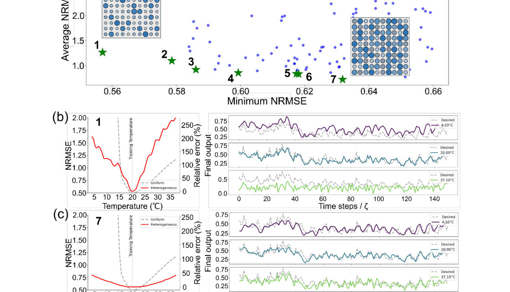 
Fig.4. (a) Optimization results presented in the objective (minimum NMRSE- average NMRSE) space. Pareto front points are denoted by green stars and labelled sequentially (1,2,3...) for reference, demonstrating an approximately linear trade-off relationship between two competing objectives. Insets are illustrations of No.1 and 7 heterogeneous nanodot reservoirs for illustrating nanodot size variation marked by different colour. For

📷 Fig 5

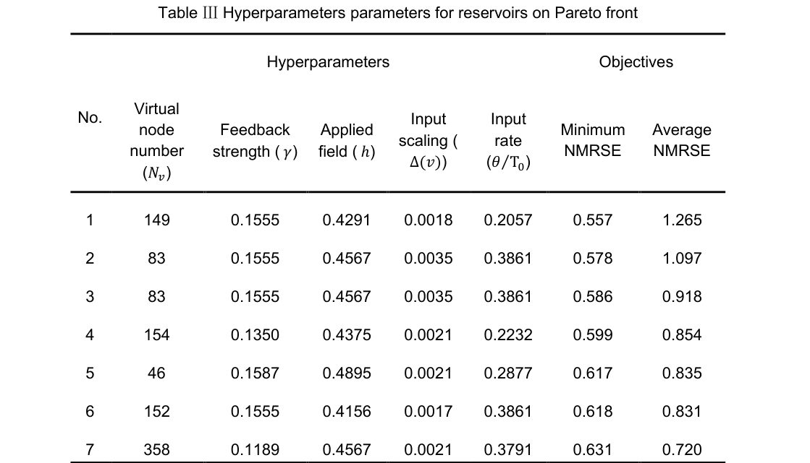 
Fig.4(a) shows the solution set obtained after 400 trials, illustrating both the Pareto front and dozens of dominated points. For clarity, the solutions on the Pareto front are sequentially labelled and are referred to by these indices in the following discussion. The front clearly reveals a near-linear trade-off between two objectives: the best minimum NMRSE (NRMSE = 0.557) is attained at average NMRSE = 1.265, whereas the greatest average NMRSE (average NRMSE = 0.720) is achieved with a minimum NMRSE of 0.631. In contrast the equivalent number for the best homogeneous reservoir is 69.861. Collectively these findings support our hypothesis that the heterogeneous reservoir offers better...

**Summary.** This paper addresses the critical issue of temperature sensitivity in novel computing substrates based on superparamagnetic nanodots. By simulating and optimizing heterogeneous patterns, the authors demonstrate that geometric disorder can stabilize reservoir performance across wide ambient temperature swings. This work advances the feasibility of using thermally driven spintronic devices for practical edge AI applications.

**Why it may be interesting.** The work directly bridges condensed matter physics (superparamagnetism, thermal dynamics) with machine learning hardware design, providing a physical mechanism for mitigating environmental noise in artificial neural networks.

Detailed structure

**Main problem.** The primary challenge is developing robust reservoir computing substrates whose performance remains stable despite fluctuations in ambient temperature, a critical issue for real-world deployment.

**Main result.** Introducing optimized geometric heterogeneity into superparamagnetic nanodot ensembles successfully stabilizes the reservoir's performance across a wide temperature range (5-35°C) with minimal loss of peak task accuracy.

**Method.** The authors employed Multi-Objective Bayesian Optimization (MOBO) to co-optimize both the physical geometry (nanodot size distribution) and the computational hyperparameters ($\gamma$) simultaneously.

**Model / system.** The system utilizes superparamagnetic nanodots patterned on a piezoelectric substrate, whose magnetization dynamics are governed by thermal activation effects described by the Néel–Arrhenius law. These ensembles are used as substrates for Reservoir Computing (RC).

**Key observables.** Normalized Mean Squared Error (NMRSE) and Relative Error quantifying performance degradation across varying temperatures.

**Important parameters / regimes.** Temperature ($T$), feedback strength ($\gamma$), nanodot size distribution (heterogeneity), and characteristic timescales ($	au$).

**Assumptions / limitations.** The dynamics are modeled using thermal activation effects, and the system's computational behavior is mapped onto standard RC training/testing procedures.

**Figures summary.** Figures illustrate schematics of the physical setup, time-evolution of magnetization at different temperatures, optimization results in a trade-off space (minimum vs. average NMRSE), and performance comparisons between homogeneous and heterogeneous reservoirs across temperature ranges.

**Paper structure.** The paper first establishes the problem of thermal sensitivity in superparamagnetic RC substrates using theoretical models. It then quantifies this degradation with uniform systems, leading to the proposal that optimized heterogeneity is necessary. Finally, it uses MOBO to optimize geometry and hyperparameters to balance peak performance against temperature stability.

Abstract

Unconventional computing systems must demonstrate robust performance under real-world environmental conditions to enable practical deployments. We have recently proposed superparamagnetic nanodot ensembles driven by strain-induced magnetoelectric coupling as exciting candidates for use as ultra-low energy consumption reservoir computing substrates. However, because their dynamics are governed by thermal activation effects, these systems are intrinsically sensitive to ambient temperature fluctuations, leading to degraded task performance when operated outside the temperature range used during training. In this paper we simulate how temperature variations affect the magnetization dynamics of such superparamagnetic ensembles, and quantify how this affects task performance. We then show how heterogeneous nanodot patterns that incorporate different sizes of nanodots with different characteristic timescales for thermal activation mitigate this problem. Benchmark results on the NARMA-10 task show that introducing optimized heterogeneity stabilizes performance of the reservoirs across a wide range of ambient temperatures (5-35°C), with little loss of ultimate performance. We also characterize the trade-off between performance and temperature stability and show that it can be tuned via reservoir hyperparameters. Our study demonstrates a key step in making these novel devices suitable for real-world deployment.

[↑ back to top](#top)

### [Second-order topological insulator induced by compensated altermagnetism without bulk spin splitting](http://arxiv.org/abs/2607.12323v1)

**Authors:** Lizhou Liu, Qing-Feng Sun, Ying-Tao Zhang  
**Type:** theory · **Category:** other · **PDF:** <https://arxiv.org/pdf/2607.12323v1>  
**Analysis basis:** full PDF text, analyzed in chunks
**Topic relevance:** `exotic spin models in light-matter` **3/5** · `spintronics-quantum-optics interface` **3/5** · `Keldysh / 2PI / non-Gaussian methods` **1/5** · `analog quantum simulation` **1/5** · `driven-dissipative phase transition` **1/5**

📷 Fig 1

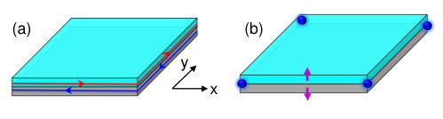 
FIG. 1. (a) Schematic illustration of a topological-insulator film in the quantum spin Hall regime, hosting helical edge states. Cyan and grey denote the top and bottom layers, re- spectively. (b) Schematic illustration of a second-order topo- logical insulating phase induced by compensated out-of-plane d-wave altermagnetism. Blue spheres indicate corner states, and the purple arrows denote the opposite altermagnetic ori- entations.

📷 Fig 2

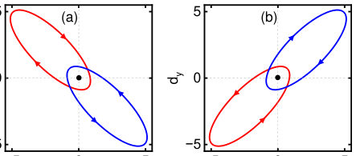 
FIG. 3. Winding trajectories of the effective Hamiltonians in the two mirror subspaces. (a) Along kx = ky. (b) Along kx = −ky. The red and blue curves denote the two mirror sectors with eigenvalues ±i, respectively.

📷 Fig 3

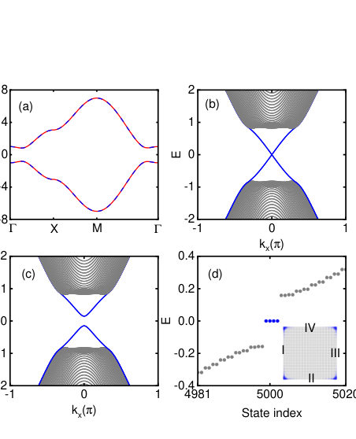 
FIG. 2. (a) Bulk band structure along the high-symmetry path for J = 0.3. (b) and (c) Band structures of nanoribbons of the topological-insulator film for J = 0 (b) and J = 0.3 (c), respectively. Blue lines denote the edge states. (d) Energy levels of a rectangular nanoflake with the same parameters as those in panel (c). Blue dots indicate the in-gap corner states. Inset: Probability distribution of the four corner states. The other parameters are chosen as υF = 1, m0 = −1, and m1 = 1. The ribbon width is Ny = 50a, and the nanoflake size is 50a × 50a.

📷 Fig 4

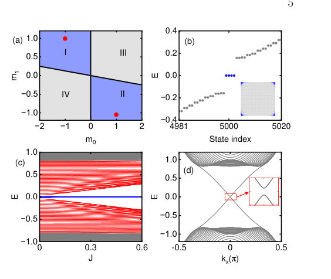 
FIG. 4. (a) Bulk phase diagram in the (m0, m1) plane. The blue regions denote the second-order topological insulator, while the gray regions denote the trivial insulator. The red dots mark representative parameter points for regions I and II, given by (m0, m1) = (−1, 1) and (1, −1), respectively. (b) Energy spectrum of a square nanoflake for the representative parameter point chosen from region II. The inset shows the real-space probability distribution of the zero-energy states. (c) Energy spectrum of a nanoflake as a function of J. Gray lines denote bulk levels, red lines highlight boundary levels, and blue lines denote the four zero-energy states. (d) Nanorib- bon spectrum for J = 0.02....

**Summary.** The paper theoretically demonstrates that applying a compensated altermagnetic interaction can drive a 2D topological insulator into a second-order topological insulating phase. This transition is marked by the appearance of robust zero-energy corner states, achieved without breaking $\mathcal{PT}$ symmetry or inducing any bulk spin splitting.

**Why it may be interesting.** This work provides a clean theoretical blueprint for engineering exotic topological phases (STI) in solid-state systems using magnetic order parameters (altermagnetism), which is highly relevant to spintronics and condensed matter theory.

Detailed structure

**Main problem.** The authors aim to demonstrate a method to induce second-order topological insulation (STI) in a 2D topological insulator film without altering the bulk band gap or inducing any net spin splitting.

**Main result.** They successfully show that applying a compensated altermagnetic term gaps the helical edge states, leading to robust zero-energy corner states characteristic of an STI phase while preserving $\mathcal{PT}$ symmetry in the bulk.

**Method.** The study uses theoretical modeling based on low-energy effective Hamiltonians, analyzing boundary spectra via nanoribbon geometries and characterizing topology using mirror-graded winding numbers.

**Model / system.** The system is a 2D topological insulator film (like $	ext{Bi}_2	ext{Se}_3$) subjected to a layer-resolved, compensated $d$-wave altermagnetic term. The Hamiltonian incorporates terms for hybridization and the magnetic coupling, preserving $\mathcal{PT}$ symmetry.

**Key observables.** Zero-energy corner states in finite samples, non-zero mirror-graded winding numbers ($
u_{xar{y}}^M = 1$, $
u_{xy}^M = -1$), and the opening of a gap in the edge spectrum while maintaining bulk degeneracy.

**Important parameters / regimes.** The strength of the altermagnetic coupling ($J$) is crucial for gapping the edges; stability is tested against weak perturbations ($\delta J, \delta v, \delta R$).

**Assumptions / limitations.** The analysis assumes a specific layer-resolved $d$-wave form for the altermagnetic term and relies on the robustness of the corner states when bulk/boundary gaps remain open under perturbation.

**Figures summary.** Figures illustrate the transition from helical edge states to STI with corner states, show the gap opening in edge spectra upon introducing $J$, and map out the topological phase diagram based on material parameters ($m_0, m_1$).

**Paper structure.** The paper first introduces the model and shows how the altermagnetic term gaps the edges into an STI. It then rigorously characterizes this higher-order topology using winding numbers and edge theory. Finally, it confirms the robustness of these corner states against various symmetry-breaking perturbations.

Abstract

We theoretically demonstrate a second-order topological insulating phase induced by compensated altermagnetism, while keeping the bulk gap unchanged, in a two-dimensional topological insulator film. By introducing a layer-resolved out-of-plane $d$-wave altermagnetic term with opposite signs on the top and bottom layers, the system preserves $\mathcal{PT}$ symmetry and maintains spin degeneracy in the bulk bands, while simultaneously gapping the helical edge states and generating localized corner states. The resulting higher-order phase is characterized by nonzero mirror-graded winding numbers, and an effective edge theory shows that the corner states arise from Dirac mass domain walls. We further determine the phase boundaries analytically and construct the corresponding topological phase diagram, establishing a robust route to higher-order topology without bulk spin splitting.

[↑ back to top](#top)

### [Engineering Two-Dimensional Hybrid-Order Topological Insulators via Trilayer Coupling](http://arxiv.org/abs/2607.12314v1)

**Authors:** Lizhou Liu, Cheng-Ming Miao, Qing-Feng Sun  
**Type:** theory · **Category:** other · **PDF:** <https://arxiv.org/pdf/2607.12314v1>  
**Analysis basis:** full PDF text, analyzed in chunks
**Topic relevance:** `analog quantum simulation` **3/5** · `Keldysh / 2PI / non-Gaussian methods` **1/5** · `driven-dissipative phase transition` **1/5** · `methods for driven-dissipative` **1/5**

📷 Fig 1

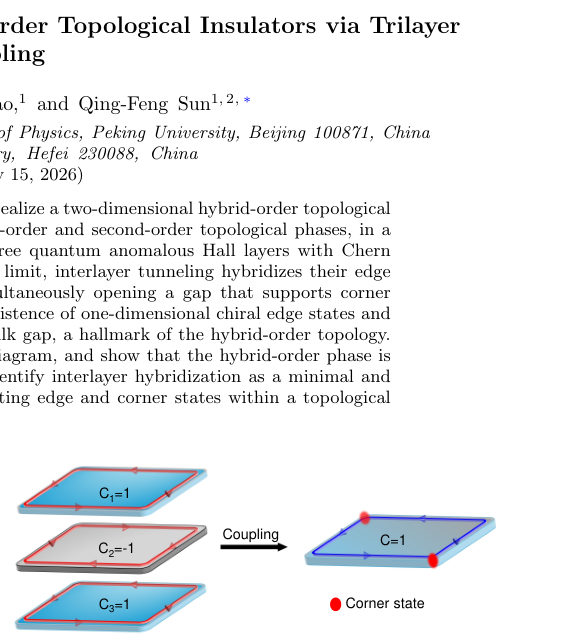 
FIG. 1. Schematic illustration of the interlayer-coupling mechanism. Left: three stacked Qi-Wu-Zhang layers with Chern numbers C1 = +1, C2 = −1, and C3 = +1. Right: interlayer coupling hybridizes and gaps out two chiral edge channels, leaving a single blue chiral edge mode, red dots in- dicate the corner states.

📷 Fig 2

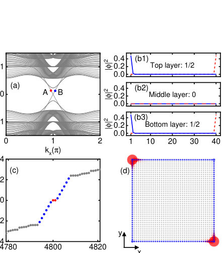 
FIG. 2. (a) Energy spectrum as a function of kx for a nanorib- bon geometry. The labeled points A and B denote the two edge eigenstates. (b1) – (b3) Layer resolved probability dis- tributions for the eigenstates at A (red dashed) and B (blue solid), shown for the top, middle, and bottom layers, respec- tively. (c) Energy levels of a finite-size sample, where gapped edge states are shown in gray, gapless chiral edge states in blue, and the two near-zero corner states in red. (d) Real- space probability density for the gapless edge states (blue) and the corner states (red) in (c). Parameters: t⊥= 0.3 and m1 = m2 = 1.

📷 Fig 3

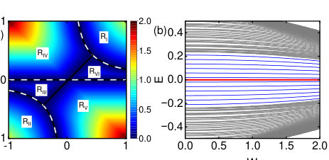 
FIG. 3. (a) Phase diagram in the (m1, m2) plane for t⊥= 0.3 with the bulk gap shown in color. Solid black curves mark numerical gap closings, and white dashed curves show the an- alytical boundaries. The labels RI −RV I denote Regions I– VI, with Regions I and II corresponding to the hybrid-order phase. Outside Regions I and II, the system is a C = 1 Chern insulator hosting three chiral boundary channels. (b) Disorder-averaged finite-size spectrum versus mass-type dis- order strength W, where blue lines highlight the gapless chiral edge states and the red line marks E = 0 (corner states). Pa- rameters are the same as in Fig. 2.

**Summary.** The authors propose using interlayer coupling in a trilayer Chern insulator to engineer a 2D hybrid-order topological insulator. This system simultaneously hosts protected chiral edge states and localized corner states within the same bulk gap. The theoretical analysis confirms this robust phase, offering a general strategy for designing materials with complex boundary physics.

**Why it may be interesting.** This work provides a concrete, tunable platform (interlayer coupling) for realizing complex topological phases beyond simple edge-state protection, which is highly relevant for designing novel quantum devices.

Detailed structure

**Main problem.** The goal is to engineer a two-dimensional hybrid-order topological insulator (HOTI) that exhibits both one-dimensional chiral edge states and zero-dimensional corner states simultaneously within the same bulk energy gap.

**Main result.** Interlayer tunneling in a coupled trilayer Chern system successfully realizes this strict 2D HOTI phase, demonstrating robust coexisting edge and corner state protection.

**Method.** The study uses theoretical Hamiltonian construction, layer-space reduction techniques (antisymmetric/symmetric blocks), topological diagnostics like the mirror-graded winding number, and transport calculations (Landauer-Büttiker formalism).

**Model / system.** The system is a coupled trilayer Chern insulator built from three Quantum Anomalous Hall layers with specific Chern numbers (+1, -1, +1) in the decoupled limit. The coupling mechanism involves interlayer tunneling ($t_\perp$) which hybridizes the edge states.

**Key observables.** Coexistence of gapless chiral edge modes and zero-energy corner states within the bulk gap; quantized conductance plateaus with characteristic dips at zero energy.

**Important parameters / regimes.** The relative strengths of the mass terms ($m_{1/3}$) and the interlayer tunneling strength ($t_\perp$), which define the topological phase diagram boundaries.

**Assumptions / limitations.** The model assumes applicability to engineered van der Waals heterostructures or magnetic multilayers, and the analysis relies on specific symmetries (e.g., diagonal-mirror symmetry) for diagnosis.

**Figures summary.** Figures illustrate the edge spectrum showing gap closing/opening due to coupling, finite-size spectra confirming corner states, and a phase diagram mapping the hybrid-order regime robust against disorder.

**Paper structure.** The paper first introduces the physical model (coupled trilayer QAH system) and the goal of realizing HOTI. It then details the theoretical analysis using layer reduction to diagnose the coexisting edge/corner topology via winding numbers, maps out the phase diagram by controlling parameters ($m_1, m_2$), and finally confirms the physics through transport calculations showing characteristic conductance dips.

Abstract

We propose an interlayer-engineering scheme to realize a two-dimensional hybrid-order topological insulator, characterized by the coexistence of first-order and second-order topological phases, in a coupled trilayer Chern system. Starting from three quantum anomalous Hall layers with Chern numbers $\mathcal{C}_{1/2/3}=+1/-1/+1$ in the decoupled limit, interlayer tunneling hybridizes their edge states into a single chiral edge mode, while simultaneously opening a gap that supports corner states. Consequently, the system exhibits the coexistence of one-dimensional chiral edge states and zero-dimensional corner states within the same bulk gap, a hallmark of the hybrid-order topology. Furthermore, we map out the topological phase diagram, and show that the hybrid-order phase is robust against mass-type disorder. Our results identify interlayer hybridization as a minimal and broadly applicable strategy for engineering coexisting edge and corner states within a topological platform.

[↑ back to top](#top)

### [Peak-Decomposition-Free Inverse Metrology of Hyperspectral Moiré Photoluminescence](http://arxiv.org/abs/2607.12325v1)

**Authors:** Katsunori Wakabayashi  
**Type:** both · **Category:** disordered systems and neural networks · **PDF:** <https://arxiv.org/pdf/2607.12325v1>  
**Analysis basis:** full PDF text, analyzed in chunks
**Topic relevance:** `methods for driven-dissipative` **3/5** · `driven-dissipative phase transition` **1/5** · `interference shaping light` **1/5**

📷 Fig 1

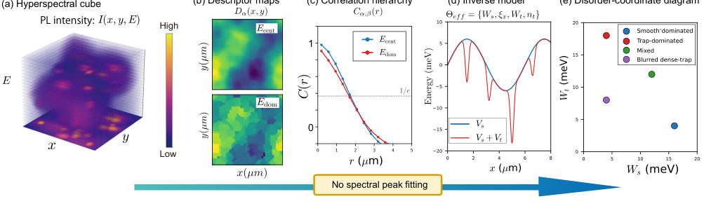 
FIG. 1. Concept and workflow of peak-decomposition-free inverse disorder metrology. (a) The input is a hyperspectral PL cube I(x, y, E), with two spatial axes (x, y) and a photon-energy axis E. The volume rendering shows the spatially varying, multi- peaked emission, color-coded by PL intensity, together with its projection onto the spatial plane. The same pipeline accepts a synthetic cube (validation, this work) or an experimental cube (application). (b) Peak-decomposition-free descriptor maps Dα(x, y) are computed directly from each spectrum. (c) Spatial autocorrelation and cross-correlation functions Cαβ(r) yield a descriptor correlation hierarchy. (d) A minimal smooth-plus-trap...

📷 Fig 2

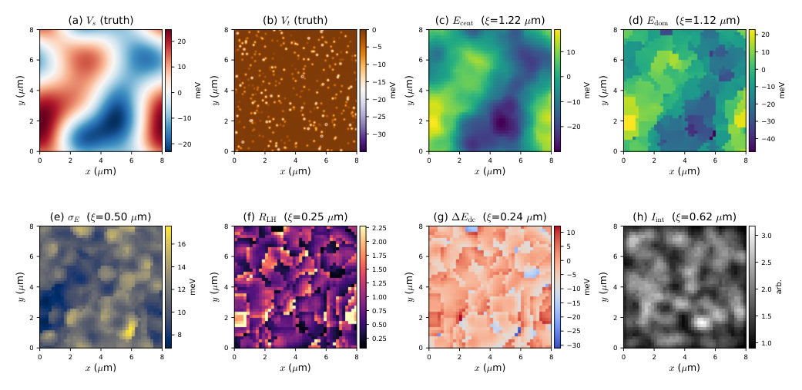 
FIG. 2. Descriptor maps from a single synthetic PL cube in the mixed regime (Ws = 12 meV, ξs = 2 µm, Wt = 12 meV, nt = 6 µm−2). (a,b) The true smooth and trap potentials. (c–h) The peak-decomposition-free descriptor maps and their fitted correlation lengths. The smooth-disorder-filtered descriptor Ecent (c) varies on long scales and tracks Vs, whereas the trap-sensitive Edom (d), RLH (f), and ∆Edc (g) reveal short-scale structure; the spectral width σE (e) and integrated intensity Iint (h) highlight trap-rich regions. Different descriptors expose different spatial structure from the same cube. Iint is shown for diagnostic completeness but is excluded from the baseline inverse (it is...

📷 Fig 3

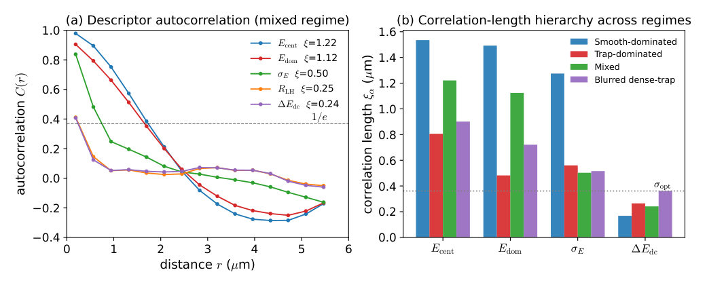 
FIG. 3. Descriptor correlation hierarchy. (a) Autocorrelation functions C(r) for the mixed regime with fitted correlation lengths; the dashed line is the 1/e level. (b) Correlation-length hierarchy across the four regimes. The ordering ξ(Ecent) ≥ξ(Edom) is robust within the present smooth-plus-trap model across the regimes studied here, while its magnitude is regime-specific; the dotted line marks the optical-resolution scale σopt, below which correlation lengths are interpreted cautiously.

📷 Fig 4

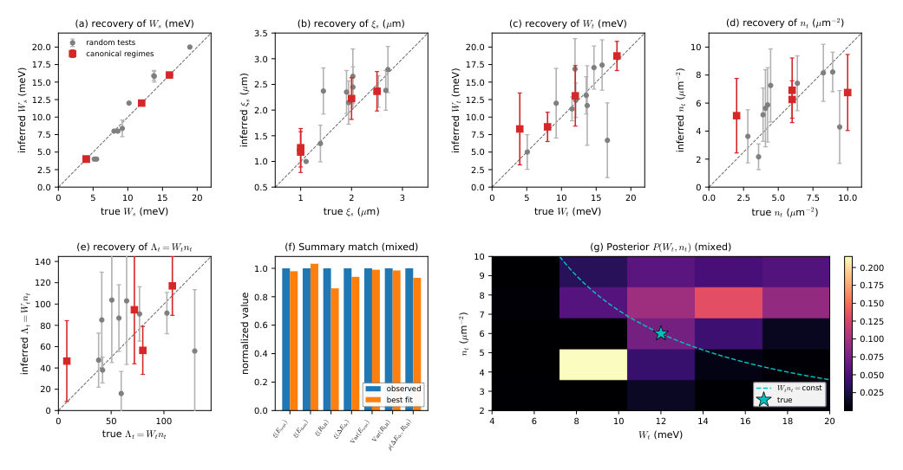 
FIG. 4. Inverse fitting and synthetic recovery. (a–d) Posterior-mean inferred coordinate versus true value over canonical regimes (squares) and random test points (circles); error bars are posterior standard deviations and the dashed line is the identity. (e) Recovery of the combined trap-activity proxy Λt = Wtnt, which clusters along the identity more coherently than Wt or nt individually [(c),(d)]—the strength–density degeneracy is an intrinsic identifiability limit, not a deficiency of the inverse. (f) Observed versus best-fit summary statistics for the mixed regime (each component normalized by the observed magnitude). (g) Pairwise posterior P(Wt, nt) for the mixed regime, showing the...

📷 Fig 5

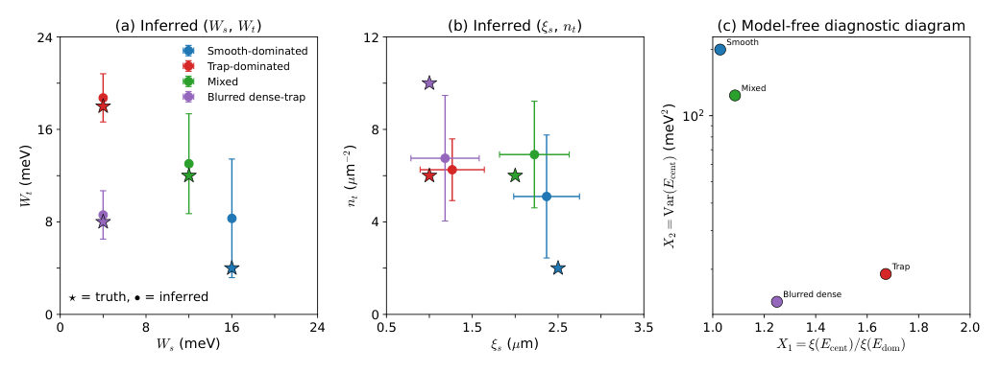 
FIG. 5. Disorder-coordinate diagnostics. (a,b) Inferred effective coordinates of the four regimes in the (Ws, Wt) and (ξs, nt) planes; circles with error bars are posterior mean ± standard deviation and stars are the true values. (c) Model-free diagnostic diagram using X1 = ξ(Ecent)/ξ(Edom) and X2 = Var(Ecent) (shown on a logarithmic vertical scale), which separates the regimes without any inverse model.

**Summary.** The paper introduces a novel, peak-decomposition-free inverse metrology technique to diagnose disorder in moiré heterobilayers using hyperspectral photoluminescence. By analyzing the spatial statistics of multiple spectral descriptors rather than fitting individual peaks, the authors robustly map out effective disorder coordinates ($\Theta_{eff}$). This provides a minimal-assumption route for quantitative optical characterization of complex quantum materials.

**Why it may be interesting.** This work provides a powerful, model-independent diagnostic tool for characterizing complex energy landscapes in 2D materials, which is highly relevant for understanding exciton dynamics and localization effects in strongly correlated or disordered quantum systems.

Detailed structure

**Main problem.** The primary challenge is extracting spatially varying information about exciton landscapes from hyperspectral photoluminescence (PL) in moiré heterobilayers, which is complicated by the ambiguity of multi-peak spectral decomposition.

**Main result.** The authors developed a descriptor-based inverse framework that robustly infers effective disorder coordinates ($\Theta_{eff}$) without relying on fitting assumptions, establishing a practical diagnostic tool for optical disorder.

**Method.** They compute physically motivated descriptors (e.g., centroid energy, spectral width) from the raw PL cube and use their spatial autocorrelation structure to match against a minimal smooth-plus-trap generative model via grid-Bayesian inversion.

**Model / system.** The system is moiré superlattices formed by van der Waals heterobilayers (e.g., TMDs), where excitons are governed by complex, multi-scale disorder potentials ($V_{eff} = V_s + V_t$).

**Key observables.** Descriptor summary statistics, including the spatial autocorrelation hierarchy and covariance structure of descriptors like $E_{	ext{cent}}$, $E_{	ext{dom}}$, $\sigma_E$, etc.

**Important parameters / regimes.** Effective disorder coordinates $\Theta_{eff} = \{W_s, \xi_s, W_t, n_t\}$; correlation lengths ($\xi_\alpha$); and the trap-sector degeneracy direction.

**Assumptions / limitations.** The method assumes that the spectral statistics can be characterized by a low-dimensional summary vector derived from descriptor correlations, which is robust against shot noise and pixel pitch changes.

**Figures summary.** Figures illustrate the workflow: raw cube $
ightarrow$ descriptor maps $
ightarrow$ correlation hierarchy $
ightarrow$ inverse model outputting disorder coordinates. Comparisons show descriptor stability versus peak-fitting ambiguity across different synthetic disorder regimes.

**Paper structure.** The paper introduces the problem of spectral decomposition ambiguity, details the development of descriptor maps and their statistical fingerprint (autocorrelation/covariance), presents the grid-Bayesian inverse framework to infer $\Theta_{eff}$, validates the method using synthetic data across canonical disorder regimes, and concludes by establishing the reusable workflow.

Abstract

Hyperspectral photoluminescence (PL) of moiré transition-metal dichalcogenide heterobilayers encodes spatially varying exciton landscapes, but extracting that information is hampered by the ambiguity of multi-peak spectral decomposition. Here we develop a peak-decomposition-free inverse framework for quantitative optical metrology of effective disorder coordinates. From the raw cube $I(x,y,E)$ we construct physically motivated descriptor maps -- centroid energy, dominant emission energy, spectral width, low/high spectral-weight ratio, and dominant--centroid offset. Their spatial autocorrelation hierarchy and covariance structure form a robust descriptor fingerprint of multi-scale disorder-sensitive spectral statistics. By matching these descriptor summary statistics to a minimal smooth-plus-trap generative model through a grid-Bayesian inverse, we infer effective disorder coordinates $\Thetaeff=\{\Ws,\xis,\Wt,\nt\}$ with explicit uncertainties. Using synthetic PL cubes generated from controlled multi-scale landscapes, we recover the well-identified smooth-disorder coordinates and constrain the trap sector up to a strength--density degeneracy. We report this degeneracy explicitly as an intrinsic identifiability limit rather than a deficiency of the method, and map four canonical disorder regimes onto a disorder-coordinate diagram. The descriptor statistics are stable against shot noise and pixel pitch, and behave predictably under optical-resolution and energy-window changes. The same pipeline ingests experimental cubes without modification, making it directly applicable to two-dimensional and moiré materials. Our results establish descriptor-based hyperspectral PL as a practical, minimal-assumption route to optical disorder diagnostics and provide the validated core of a reusable analysis workflow (\texttt{HyperPL-Diag}) for moiré exciton systems.

[↑ back to top](#top)

### [Effect of the local field and dipole-dipole interaction on the spontaneous ordering of dipole moments in bismuth monolayers with an orthorhombic structure](http://arxiv.org/abs/2607.12542v1)

**Authors:** D. V. Ponkratova, I. V. Zagorodnev, V. V. Enaldiev  
**Type:** theory · **Category:** statistical mechanics · **PDF:** <https://arxiv.org/pdf/2607.12542v1>  
**Analysis basis:** full PDF text, analyzed in chunks
**Topic relevance:** `driven-dissipative phase transition` **2/5** · `Keldysh / 2PI / non-Gaussian methods` **1/5** · `analog quantum simulation` **1/5** · `methods for driven-dissipative` **1/5** · `spintronics-quantum-optics interface` **1/5**

📷 Fig 1

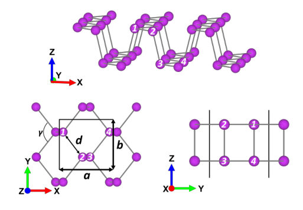 
FIG. 1. Lattice structure of an orthorhombic bismuth mono- layer in the nonpolar (paraelectric) phase. The numbers in- dicate the sublattice sites belonging to one unit cell.

📷 Fig 2

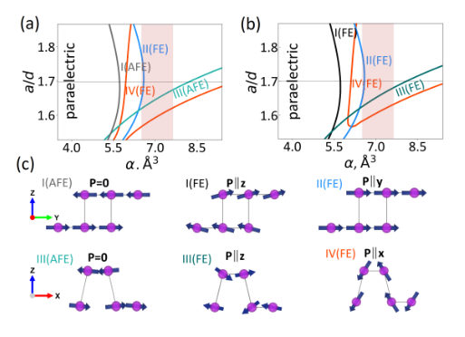 
FIG. 2. (a, b) Parametric dependences of α on a/d for the boundaries between the nonpolar (paraelectric) and sponta- neously polarized phases with the distributions of dipole mo- ments calculated with the parameters d = 2.8 , b = 4.42 , and (a) α1,2,3,4 ij = αδij and (b) α1,2,3,4 ij given by Eqs. (5)–(8). The black horizontal line corresponds to a = 4.75 from the experiment reported in [5, 13]. The range of relevant α values is shaded in pink. (c) Distributions of dipole moments corre- sponding to the phase boundaries in (a, b).

📷 Fig 3

 
Figure 2(a) corresponds to the isotropic polarizability α for all sublattices, as for a free atom. At small polar- izabilities α ≲5 Å3, the sublattices have zero dipole mo- ment, which corresponds to the paraelectric phase. By increasing the polarizability at a fixed parameter a/d, it is possible to achieve the intersection of the bound- aries of one of the antiferroelectric or ferroelectric or- ders with the distribution of the spontaneous dipole mo- ment of the sublattices, as shown in the lower insets of Fig. 2. The experimental lattice parameters correspond to the horizontal black line [13], according to which, as α increases, the monolayer first passes into the an- tiferroelectric...

📷 Fig 4

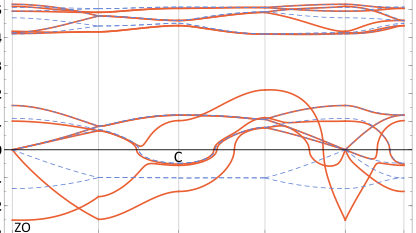 
FIG. 3. (a) Phonon spectrum in the orthorhombic bismuth monolayer obtained from Eq. (11) in the nearest-neighbour approximation disregarding the Born charges (Zs ji = 0) along the path in the Brillouin zone shown in the inset. (b) Same spectrum taking into account the Born charges |Zs xx| = 1.5e at ϵ = 1 (the blue dashed line corresponds to the spectrum in panel (a)). The arrows in the inset indicate the directions of sublattice displacements for the ZO mode at qM = 0 and the C mode at qM = (π/a, π/b).

**Summary.** This theoretical work examines how spontaneous electric dipoles can order in orthorhombic bismuth monolayers. By combining local field theory with phonon spectroscopy, the authors predict multiple competing ferroelectric and antiferroelectric phases. The findings highlight that dipole-dipole interactions are crucial in determining which ordered state is thermodynamically favored.

**Why it may be interesting.** While focused on condensed matter electrostatics, the study of competing ordered states (FE vs AFE) driven by subtle interactions like dipole-dipole coupling is relevant to understanding complex many-body ground states and symmetry breaking in quantum materials.

Detailed structure

**Main problem.** The study investigates the instability of bismuth monolayers with an orthorhombic structure concerning the emergence of spontaneous electric dipole moments, leading to ferroelectric or antiferroelectric ordering.

**Main result.** Two complementary theoretical approaches confirm the possibility of multiple competing ferroelectric and antiferroelectric phases in these monolayers. The inclusion of local field and dipole-dipole interactions significantly influences the stability boundaries between these ordered states.

**Method.** The research employs two main methods: calculating site dipoles using atomic polarizability under a local Lorentz-Lorenz field, and analyzing the vibrational spectrum for soft optical phonon modes indicative of phase transitions.

**Model / system.** The physical system is a bismuth monolayer modeled with an orthorhombic lattice structure. The analysis uses concepts from solid-state physics, including Born effective charges and the full dynamical matrix derived from DFT calculations.

**Key observables.** Spontaneous electric polarization (P), soft optical phonon modes (ZO mode for FE, C mode for AFE), atomic dipole moments $\mathbf{p}(s)$, and phase boundaries in parameter space ($\alpha$ vs $a/d$).

**Important parameters / regimes.** Lattice parameters ($a, b, d$), atomic polarizability tensors ($\alpha_{ij}$), and the strength of the local electric field.

**Assumptions / limitations.** The analysis assumes that any phase transition must be accompanied by a structural transformation breaking the paraelectric symmetry. Force constants are often parameterized using nearest-neighbor approximations.

**Figures summary.** Figures illustrate lattice structures, phase boundaries mapping transitions between Paraelectric, AFE I, and FE phases under varying polarizability assumptions. Phonon spectra show mode softening when dipole-dipole interactions are included.

**Paper structure.** The paper systematically develops the theoretical framework by first calculating atomic properties (polarizabilities, Born charges) using DFT. It then applies two complementary models—a local field approach and a phonon spectrum analysis—to predict stable ferroelectric/antiferroelectric phases and map their phase boundaries.

Abstract

Using two complementary approaches, the instability of bismuth monolayers with an orthorhombic structure with respect to the emergence of spontaneous electric dipole moments at the crystal lattice sites has been studied. The first approach, based on determining the dipole moments of lattice sites through the polarizability of bismuth atoms and taking into account the local Lorentz-Lorenz field, suggests the possibility of the existence of several antiferroelectric and ferroelectric phases in orthorhombic bismuth monolayers. Using the second approach, the vibrational spectrum of a nonpolar symmetric lattice has been analyzed, and two types of soft optical modes corresponding to the ferroelectric and antiferroelectric instabilities of the monolayers have been revealed. The relationship of the Born effective charges to the polarization direction in the ferroelectric phase, as well as their role in the reduction of the frequency of the polar optical phonon, which characterizes the lattice deformation in the ferroelectric phase due to the dipole-dipole interaction, has been shown.

[↑ back to top](#top)

### [Topological characterization of multifold band degeneracies in Altland-Zirnbauer symmetry classes](http://arxiv.org/abs/2607.13016v1)

**Authors:** Askar Iliasov, Zoltán Guba, Tsuneya Yoshida, Apoorv Tiwari, Tomáš Bzdušek  
**Type:** theory · **Category:** other · **PDF:** <https://arxiv.org/pdf/2607.13016v1>  
**Analysis basis:** full PDF text, analyzed in chunks
**Topic relevance:** `Keldysh / 2PI / non-Gaussian methods` **1/5** · `analog quantum simulation` **1/5** · `driven-dissipative phase transition` **1/5**

📷 Fig 1

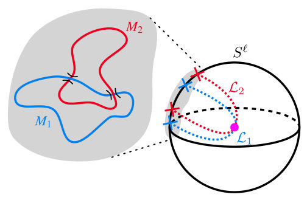 
FIG. 1. A schematic illustration of our approach to topological char- acterization of an 𝑛-fold nodal point in a minimal (i.e., 𝑛-band) model. The nodal point, which lies at the intersection of the loci L1 and L2 of a lower-degree band degeneracy, is enclosed by a sphere 𝑆ℓ, where ℓ+ 1 is the codimension of forming an 𝑛-fold nodal point. We study topological band invariants on the nodal manifolds 𝑀1 = L1 ∩𝑆ℓ

📷 Fig 2

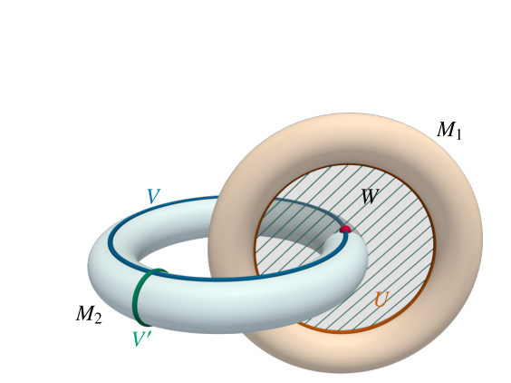 
FIG. 2. A schematic illustration of the linking between 𝑈⊂𝑀1 and 𝑉⊂𝑀2. The linking is defined as the intersection number of a submanifold representing a nontrivial homology class in 𝑀2, which is a circle 𝑉in this case, and the surface 𝑊such that 𝑈is a boundary of 𝑊. The manifold 𝑉′ representing another nontrivial homology class of 𝑀2 is unlinked with 𝑈.

📷 Fig 3

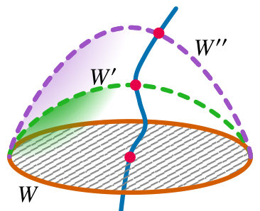 
FIG. 3. The illustration demonstrates the construction of charged manifolds 𝑉𝑗linked with the manifold 𝑈= 𝜕𝑊by varying the sur- faces 𝑊.

📷 Fig 4

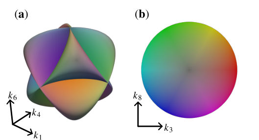 
FIG. 4. (a) Projection of the nodal manifolds 𝑀1 and 𝑀2 in the symmetry class AI [Eqs. (22) and (22)] onto the space spanned by momenta {𝑘1, 𝑘4, 𝑘6}. The manifolds are colored according to the values of the coordinates {𝑘3, 𝑘8} according to the legend in panel (b). Each nodal manifold appears like a Roman surface in panel (a), which corresponds to one of the standard representations of the real projective plane [86]. That the manifolds do not intersect inside 𝑆4 ⊂R5 follows from the distinct coloring of any intersecting sheets. The linking of the two manifolds is not manifest in panel (a); however, it is revealed by the nontrivial Stiefel-Whitney invariants as discussed in the main text.

📷 Fig 5

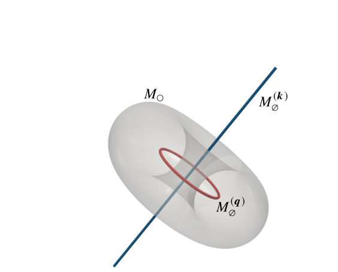 
FIG. 5. Stereographic projection of the nodal manifolds 𝑀 and 𝑀∅ in class BDI. The red (𝑀(𝒒) ∅) and blue (𝑀(𝒌) ∅) lines correspond to the non-intersecting subsets of 𝑀∅that lie in the 𝒒= 0 and 𝒌= 0 planes, respectively. The gray torus represents the projection of the Clifford torus corresponding to 𝑀.

**Summary.** This paper develops a generalized topological framework to characterize high-order band degeneracies (n-fold nodes) protected by Altland-Zirnbauer symmetries. It overcomes the limitations of traditional enclosing sphere methods by redefining the diagnostic tool as the linking topology between intersecting nodal manifolds in momentum space. This recasts multifold node classification into a problem of linked cycles, providing a powerful general method for topological band theory.

**Why it may be interesting.** While focused on condensed matter topology, the mathematical machinery involving linking invariants in parameter space is highly relevant to characterizing complex quantum phases where standard gap arguments fail.

Detailed structure

**Main problem.** The work aims to characterize generic n-fold band degeneracies whose stability relies solely on Altland-Zirnbauer (AZ) symmetries, extending beyond the standard methods used for minimal degeneracies.

**Main result.** The topology of a multifold node is recast as the topology of linked nodal manifolds in momentum space, establishing a two-way correspondence between linking numbers and band invariants.

**Method.** It develops a novel diagnostic by analyzing the intersection of lower-order degeneracy loci with an enclosing sphere, turning a spectral gap obstruction into a tool based on linking theory.

**Model / system.** The study applies to topological band theory in systems governed by AZ symmetries, considering nodes formed by tuning parameters or synthetic dimensions.

**Key observables.** Linking numbers of nodal manifolds on the enclosing sphere; topological band invariants (e.g., Chern number, winding numbers) evaluated on these nodal manifolds.

**Important parameters / regimes.** The order of degeneracy ($n$), which dictates the codimension growth ($\delta \propto n^2$).

**Assumptions / limitations.** The standard 'enclosing sphere paradigm' fails for $n$-fold nodes due to intersecting lower-order loci, necessitating the focus on nodal manifold linking.

**Figures summary.** Figure 1 schematically illustrates the process of studying topological band invariants on the nodal manifolds ($M_1$ and $M_2$) formed by the intersection of degeneracy loci with the enclosing sphere.

**Paper structure.** The paper progresses from reviewing minimal degeneracies to identifying the fundamental obstruction at higher-order nodes, proposing the linking of nodal manifolds as the diagnostic tool, and finally establishing the two-way correspondence for characterization across all ten AZ classes.

Abstract

Topological band degeneracies are conventionally characterized by invariants defined on enclosing spheres over which the energy spectrum remains gapped. This program has been completed for minimal degeneracies in all ten Altland-Zirnbauer (AZ) symmetry classes, whereas higher-order degeneracies have been studied almost exclusively under crystalline-symmetry protection. In this work, we characterize generic n-fold band degeneracies whose stability derives solely from AZ symmetries acting locally in momentum space. We find that their codimension grows quadratically with n, placing such multifold nodes in parameter spaces that combine physical momenta with tuning parameters or synthetic dimensions. However, the enclosing sphere paradigm faces a fundamental obstruction: two (n-1)-fold degeneracy loci intersecting at the n-fold band node pierce every enclosing sphere, implying that no uniform spectral gap (and thus no standard homotopy classification) exists. Here, we turn this obstruction into the diagnostic itself. On the nodal manifolds where the two loci intersect the enclosing sphere, complementary spectral gaps are restored, allowing us to characterize each with conventional band invariants. This enables us to establish a two-way correspondence: (1)~the multifold node is topologically protected whenever the nodal manifolds are robustly linked on the enclosing sphere, and (2)~band invariants on cycles of one nodal manifold encode their linking numbers with cycles of the other. We carry out this characterization for minimal models of all ten AZ classes, computing the band invariants wherever an explicit parametrization is available. Our results recast multifold band topology as the topology of linked nodal manifolds in momentum space, while our methods provide the foundation for a general characterization of multifold band degeneracies in models with arbitrarily many bands.

[↑ back to top](#top)

### [Surface Phase-Field-Crystal-Helfrich model for out-of-plane deformations in thin crystalline sheets with lattice mismatch](http://arxiv.org/abs/2607.12997v1)

**Authors:** Emma Radice, Ingo Nitschke, Marco Salvalaglio, Axel Voigt  
**Type:** theory · **Category:** other · **PDF:** <https://arxiv.org/pdf/2607.12997v1>  
**Analysis basis:** full PDF text, analyzed in chunks
**Topic relevance:** `Frenkel-Kontorova` **1/5** · `Keldysh / 2PI / non-Gaussian methods` **1/5**

📷 Fig 1

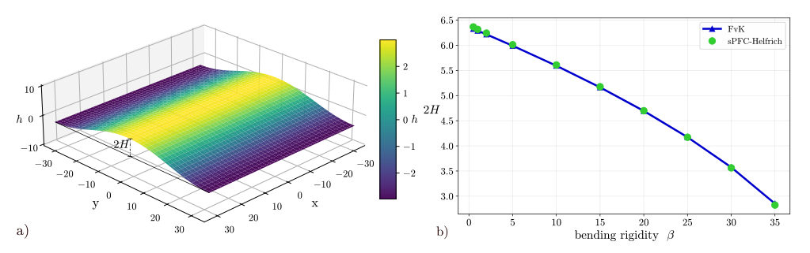 
Fig. 1: Uniaxial compression. a) Height profile h for bending rigidity β = 5. b) Height difference hmax−hmin = 2H for various β together with solution for FvK equation with higher order corrections. The solutions are considered at equilibrium (t = 500, 000). We consider 40 atoms in the compression direction and use the following parameters: A = 1, B = −0.2, C = 0.5 p

📷 Fig 2

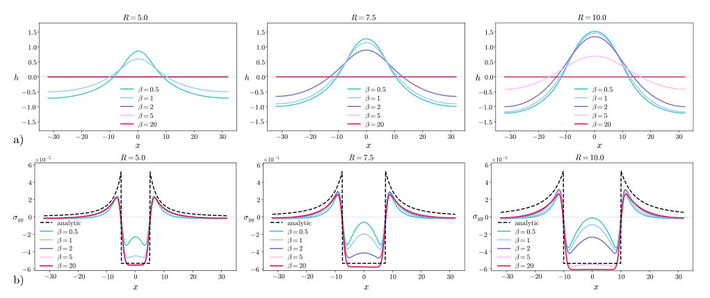 
Fig. 2: Eshelby inclusion problem. a) Stress field σyy for various radii and bending rigidities. b) Corresponding height profiles h. Because upward or downward buckling simply reflects the choice of initial perturbation of the flat sheet, we present only one direction for clarity. The analytical solutions are also reported as dashed lines. Parameters are: A = 1, B = −0.2, C = 0.5 p

📷 Fig 3

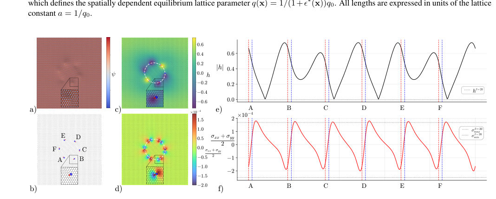 
Fig. 3: Circular rotated grain. a) Periodic field ψ on the surface S after relaxation of the initial condition, allowing for defect formation and out-of-plane buckling. b) Extrema of ψ displayed on the surface S and highlighted dislocations by color coding the regions with a number of neighbors deviating from 6 (blue - 7, red - 5). c) Height profile h shown in (x, y)-plane, together with data from b) projected on (x, y)-plane. d) Hydrostatic stress (σxx + σyy)/2 together with data from b) projected on (x, y)-plane. Insets in a) – d) show zoomed-in views of the region surrounding a single dislocation. The estimated circular interface between the rotated grain and the matrix is shown as white...

📷 Fig 4

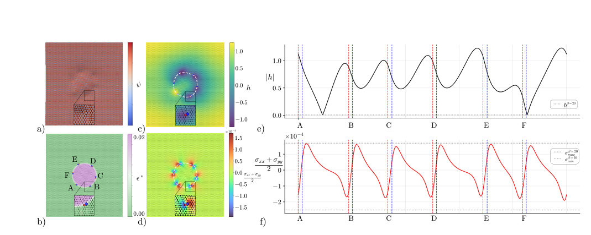 
Fig. 4: Circular rotated grain with eigenstrain. a) Periodic field ψ on S after relaxation of the initial condition, allowing for defect formation and out-of-plane buckling. b) Eigenstrain ϵ∗displayed on S. Dislocations are illustrated as in figure 3. c) Height profile h(x, y), together with data from b) projected on (x, y)-plane. d) Hydrostatic stress (σxx + σyy)/2 together with data from b) projected on (x, y)-plane. Insets in a) – d) show zoomed-in views of the region surrounding a single dislocation. The estimated circular interface between the rotated grain and unrotated matrix is shown as white lines in panels c) and d). e) Absolute value of height profile |h| along the interface...

📷 Fig 5

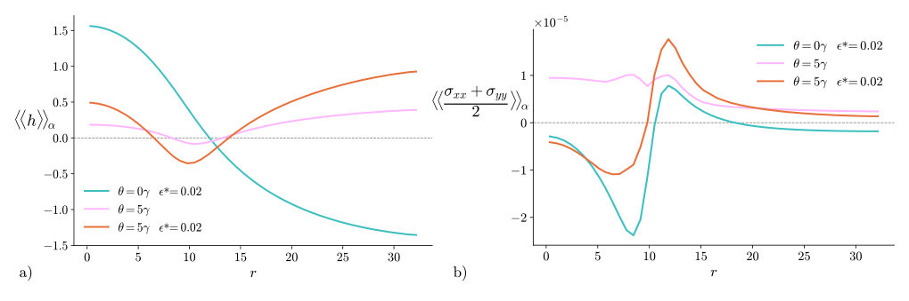 
Fig. 5: Comparison between different cases. a) Radial average of height profile ⟨⟨h⟩⟩α for the three cases considered in Figures 1, 3 and 4, corresponding to (θ = 0◦, ϵ∗= 0.02), (θ = 5◦, ϵ∗= 0) and (θ = 5◦, ϵ∗= 0.02), respectively. b) Radial average of hydrostatic stress ⟨⟨σxx+σyy

**Summary.** This paper develops and validates an extended Phase-Field-Crystal-Helfrich model to describe out-of-plane deformations in thin crystalline sheets. By incorporating lattice mismatch via a spatially varying lattice spacing, the authors show that mechanical stresses and structural defects interact to govern the sheet's bending behavior. The work provides a robust theoretical framework for understanding strain release mechanisms in 2D materials.

**Why it may be interesting.** While focused on solid mechanics, the use of phase-field methods to describe structural evolution under stress is relevant for modeling complex interfaces or dynamic material responses in quantum materials research.

Detailed structure

**Main problem.** The study addresses how out-of-plane deformations occur in thin crystalline sheets, particularly when structural imperfections like lattice mismatch are present.

**Main result.** The extended model successfully predicts that locally induced compressive stresses drive out-of-plane deformation, and the interplay between lattice misfit and defects can lead to additional strain release, modifying the buckling amplitude.

**Method.** The authors developed a multiscale description by extending the surface Phase-Field-Crystal-Helfrich model and validated it against analytical solutions from classical Föppl–von Kármán equations and Eshelby's inclusion problem.

**Model / system.** The system is thin, flexible crystalline sheets modeled using an extended sPFC-Helfrich framework. This model couples in-plane elasticity, out-of-plane bending (Helfrich energy), and allows for spatially varying lattice spacing to incorporate localized eigenstrain mimicking lattice mismatch.

**Key observables.** Height profile h(t, x, y) and its amplitude H; hydrostatic stress $\langle\langle \sigma_{xx}+\sigma_{yy} 
angle
angle_\alpha$; equilibrium lattice parameter modulation q(x).

**Important parameters / regimes.** Bending rigidity ($eta$); applied uniaxial strain ($\epsilon$); lattice misfit eigenstrain ($\epsilon^*$); defect rotation angle ($	heta$).

**Assumptions / limitations.** The derivation follows a general approach for $(	ext{L}^2, 	ext{H}^{-1})$ surface; future work is needed to assess dynamic processes involving time-dependent eigenstrain.

**Figures summary.** Figure 1 validates the model against uniaxial compression predictions. Figure 2 compares stress fields in Eshelby inclusions across different bending rigidities. Figures 3-5 show combined effects of lattice misfit and dislocations on height profiles and stress fields.

**Paper structure.** The paper first introduces the extended sPFC-Helfrich model, validates it against known analytical limits (FvK/Eshelby), and then applies it to study the interplay between lattice mismatch ($\epsilon^*$) and crystalline defects (dislocations) in inducing out-of-plane deformation.

Abstract

Thin, flexible crystalline sheets exhibit unique elastic properties due to their ability to undergo out-of-plane deformations. Understanding this behavior requires a description that couples in-plane elasticity, out-of-plane deformation, and their coupling, taking the crystalline structure and its defects into account. We develop a multiscale description for these systems by extending the surface Phase-Field-Crystal-Helfrich model. The extension permits a spatially varying equilibrium lattice spacing, enabling the representation of localized lattice eigenstrain to mimic lattice mismatch in heterostructures. We validate the extended model against analytical predictions from classical Föppl-von Kármán equations for uniaxial compression and from Eshelby's inclusion problem. Using this validated framework, we then show how locally induced compressive stresses drive out-of-plane deformation in the sheets.

[↑ back to top](#top)

### [Eigenvalue-Based Approach to Manipulate and Reconstruct Nonlinear Pulses: Towards Soliton Tomography](http://arxiv.org/abs/2607.12339v1)

**Authors:** Sergey Dremov, Rustam Mullyadzhanov, Andrey Gelash  
**Type:** theory · **Category:** other · **PDF:** <https://arxiv.org/pdf/2607.12339v1>  
**Analysis basis:** full PDF text, analyzed in chunks
**Topic relevance:** `non-equilibrium dynamics` **1/5**

📷 Fig 1

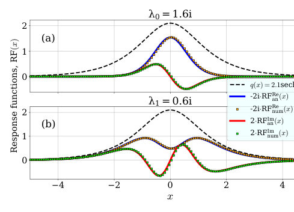 
FIG. 1: Soliton eigenvalue RFs for potential q = 2.1 sech(x) (dashed line) obtained analytically via (16) and (17) (solid blue and red lines), and numerically (orange and green mark- ers). Panels (a) and (b) show the comparison for the two discrete eigenvalues of the pulse: λ0 = 1.6i and λ1 = 0.6i, respectively.

📷 Fig 2

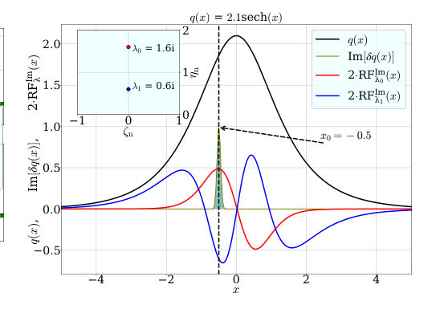 
FIG. 2: Unperturbed potential q(x) = 2.1 sech(x) (solid black line) containing two solitons with λ0 = 1.6i and λ1 = 0.6i. Response functions 2 · RFIm are plotted for λ0 (red) and λ1 (blue). The Gaussian perturbation δq (olive with teal shad- ing) with a = 1.0 and σ = 0.05 is applied at x0 = −0.5 (dashed vertical line and arrow). At this point, the RFs are near their extrema and have opposite signs, suggesting a sub- sequent near-symmetric decay of the initial state to two sep- arate solitons with velocities −2δλ0 and −2δλ1, respectively.

📷 Fig 3

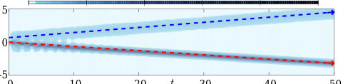 
FIG. 3: The (x-t)-diagram of the SSFM simulation for po- tential q(x) = 2.1 sech(x) perturbed by the Gaussian pulse δq (a = 1.0, σ = 0.05, x0 = −0.5) under the NLSE. The pre- dicted in Fig.2 soliton decay can be clearly observed. Red and blue dashed lines indicate velocities predicted using the RFs for solitons with λ0 and λ1, respectively.

📷 Fig 4

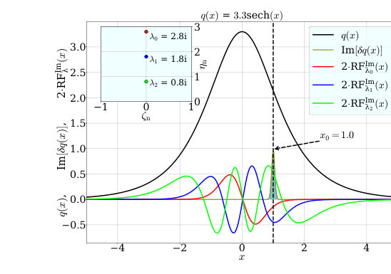 
FIG. 4: Unperturbed potential q(x) = 3.3 sech(x) (solid black line) containing three solitons with λ0 = 2.8i, λ1 = 1.8i, λ2 = 0.8i. Response functions 2 · RFIm are plotted for λ0 (red), λ1 (blue), and λ2 (green). The Gaussian perturbation δq (olive with teal shading) with a = 1.0 and σ = 0.05 is applied at x0 = 1.0 (dashed vertical line and arrow). At this point, the RFs approach predicts a decay of the initial wave field to three separate solitons propagating with different velocities −2δλ0, −2δλ1, and −2δλ2, respectively.

📷 Fig 5

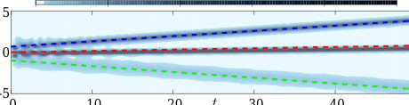 
FIG. 5: The (x-t)-diagram of the SSFM simulation for po- tential q(x) = 3.3 sech(x) perturbed by the Gaussian pulse δq (a = 1.0, σ = 0.05, x0 = 1.0) under the NLSE. The predicted in Fig.4 soliton decay can be clearly observed. Red, blue and green dashed lines indicate velocities predicted using the RFs for solitons with λ0, λ1, and λ2, respectively.

**Summary.** This paper introduces an eigenvalue-based method to characterize and reconstruct unknown distortions in nonlinear pulses propagating through a medium. By measuring small deviations in soliton eigenvalues, researchers can solve an inverse problem using response functions derived from the Nonlinear Schrödinger Equation. This technique paves the way for 'soliton tomography,' allowing non-invasive sensing of perturbations within complex nonlinear systems.

**Why it may be interesting.** This work provides a powerful diagnostic tool—soliton tomography—that links measurable spectral properties (eigenvalue shifts) directly back to the underlying physical perturbations in nonlinear media, which is highly relevant for quantum optics and nonlinear wave physics.

Detailed structure

**Main problem.** The goal is to develop a theoretical framework for manipulating and reconstructing unknown perturbations within nonlinear wave fields, specifically focusing on soliton tomography.

**Main result.** The authors derived an inverse problem formulation using soliton eigenvalue response functions (RFs), demonstrating that reconstruction of complex perturbations is possible even with limited measurement data and in the presence of noise.

**Method.** The approach combines perturbation theory applied to the Nonlinear Schrödinger Equation (NLSE) via the Inverse Scattering Transform, leading to a discrete linear system solved by regularization techniques like ridge regression.

**Model / system.** The physical system is nonlinear wave propagation governed by the focusing one-dimensional Nonlinear Schrödinger Equation (NLSE). Solitons are characterized by conserved eigenvalues derived from the Zakharov-Shabat problem.

**Key observables.** Soliton eigenvalues ($\lambda_n$), Soliton Eigenvalue Response Functions (RFs), and the reconstructed perturbation shape ($\delta q$).

**Important parameters / regimes.** The regularization parameter $\alpha$, noise levels ($\delta \approx 10^{-3}$), and the number of available measurements ($M$) relative to signal points ($N$).

**Assumptions / limitations.** The analysis relies on the applicability of IST perturbation theory, and for unique reconstruction, asymmetric potentials are required.

**Figures summary.** Figures demonstrate the successful reconstruction of single and complex Gaussian perturbations using ridge regression, comparing results against known exact solutions.

**Paper structure.** The paper develops the RF formalism analytically for sech-shaped pulses, formulates the inverse problem as an overlap integral equation, and finally applies regularization techniques to solve this ill-posed problem numerically.

Abstract

Soliton content of nonlinear pulses of different physical nature is universally characterized by a discrete set of eigenvalues. In an ideal channel governed by the nonlinear Schrodinger equation, the eigenvalues do not change along the wave field propagation. Perturbations leave predictable fingerprints on the eigenvalue portrait, which was recently used to manipulate optical fiber solitons in [Phys. Rev. Lett. 134, 193804, 2025]. Here, we develop a theoretical framework to manipulate and reconstruct sech-shaped nonlinear wave fields based on soliton eigenvalue response functions and the corresponding inverse problem. We derive analytical expressions to enable nonlinear manipulation of solitons by applying instant, controllable perturbations. Then we present a concept of perturbation sensing with the key feature of nonlinear propagation of the probe signal over an unknown distance, enabling the extraction of information about the perturbation source hidden within nonlinear media or materials. We introduce an integral equation for the inverse problem of reconstructing the unknown shape of the wave field distortions, when the known observational data is a function of deviations in soliton eigenvalues measured at the end of the nonlinear propagation channel. We evaluate different reconstruction regimes and demonstrate a reliable inverse problem solution in presence of noise, paving the way towards soliton tomography.

[↑ back to top](#top)
